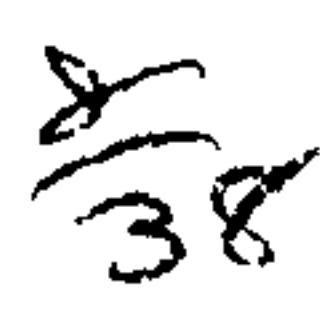

C ##

## A TREATISE

ON THE LAW OF

# BILLS OF EXCHANGE,

PROMISSORY NOTES,

# BANK NOTES AND CHECKS.

BY

JOHN BARNARD BYLES.

EIGHTH EDITION.

BY

H. G. WOOD.

VIGILANTIBUS NON DORMIENTIBUS JURA SUBVENIUNT.

T. & J. W. JOHNSON & CO.
1891.

Silver Si

0

1303A 1308

Entered according to Act of Congress, in the year 1891, by

T. & J. W. JOHNSON & CO.,

In the Office of the Librarian of Congress at Washington, D. C.

JUL 17 1007

## PREFACE.

It is wholly unnecessary for me to say anything in commendation of Mr. Byles' work on Bills of Exchange and Promissory Notes, or of the value of the late Mr. Justice Sharswood's notes thereto, as it has been for years the standard work in this country upon that subject, and has been more extensively cited by our courts of last resort than any other work, either English or American. A crystallization of the law relating to the vexed topics treated in this work into such a small compass has excited both the wonder and the admiration of the profession and the courts in this country, and it is to-day, as it deserves to be, the most authoritative work upon the subject extant.

But few changes have been made in Mr. Sharswood's most excellent notes, and those only for the purpose of keeping the work within proper limits and giving the latest and freshest decisions upon the topics covered thereby. Many new notes have been added, bringing the work down to date, and the editor has aimed to make the book as practical and useful as possible, both to the student and the practicing lawyer.

H. G. WOOD.

New York, January, 1891.

#### NOTE TO THE

## SEVENTH AMERICAN EDITION.

THIS Edition, from the Thirteenth and last English Edition, is now presented to the American Profession. This treatise has won its way so entirely to public confidence, as an accurate and practical compendium of the law of Bills of Exchange and Promissory Notes, as evidenced by the demand constantly recurring for new editions, both in England and this country, that nothing further need be said in its favor. Much care has been bestowed upon the Editorial Department. The cases on the subject are so numerous in the American courts that the difficulty has been to avoid incumbering the work with crowded references. The Editor's effort has been to select and arrange the more important decisions, illustrative of the principles of the text, avoiding,—except in a few instances, in which it seemed important, for the sake of the Student, -any discussion of the grounds of the cases. In this respect, the character of the Notes has been made, as far as the ability of the Editor permitted, to conform to that of the text, which is remarkable for its succinctness and for its judicious selection of leading points and cases. It is evident that an attempt to do more—to make a library of the book—would have destroyed its symmetry and usefulness.

G. S.

DECEMBER, 1882.

## CONTENTS.

### CHAPTER I.

## GENERAL OBSERVATIONS ON A BILL OF EXCHANGE.

| TO A                                   | AGE  |                                             | <b>~</b>  |
|----------------------------------------|------|---------------------------------------------|-----------|
| Explanation of Terms,                  |      | May be taken in execution,                  | PAGE 4 |
| Peculiar Qualities of Contracts on     |      |                                             |           |
| Bills or Notes,                        | 2    | Where a Bill or Note might have             | •         |
| Effect of drawing or indorsing a Bill, | 3    | operated as a will or Testamentary          |           |
| How far Bills and Notes are consid-    |      | Instrument,                                 | . 4       |
| ered as Chattels,                      | 3    | As a Declaration of Trust,                  | , 4       |
| •—•                                    |      |                                             |           |
| CHA                                    | PI.  | ER II.                                      |           |
| OF A PRO                               | OMI  | SSORY NOTE.                                 | •         |
|                                        |      |                                             |           |
| What it is.                            | 5    | Bank Notes,                                 | . 9       |
| How considered at Common law, and      | _    | Bank of England Notes,                      | . 9       |
| what by Statute,                       | Э    | When Bank of England Notes are a            |           |
| Promissory Notes made out of Eng-      |      | legal tender,                               | 10        |
| land,                                  | l l  | Country Bank Notes,.                        | . 10      |
| Form of a Note,                        | 6    | When Country Bank Notes are a legal tender, |           |
| Note by a man to himself and an-       | ł    | When Money had and received would           | 10        |
|                                        | 7    | _                                           |           |
| Notes payable by Instalments, .        | · i  | Of the contracting words in a Promis-       |           |
| Joint and several Notes,               | 7    | sory Note                                   | 10        |
| Where there is Principal and Surety,   | ٠,   | Other matters contained in a Note,          | 12        |
| Contribution between Joint Makers,     | 9    | delle la lieut,                             | 4,60      |
|                                        | •    |                                             |           |
|                                        |      | ·                                           |           |
| ATT A T                                | D/Tr | אדד כוכו                                    |           |
| UHAI                                   | L T  | ER III.                                     |           |
|                                        |      |                                             |           |

#### OF A CHECK ON A BANKER.

| What instruments are checks,          | 13 | Effect and penalty of omitting a      | •  |
|---------------------------------------|----|---------------------------------------|----|
| Requisites to bring checks within the |    | Stamp on check, where necessary,      | 16 |
| exemption of the General Stamp        |    |                                       |    |
| Act,                                  | 14 | Alteration of the law by recent Acts, | 16 |
|                                       |    | ( v )                                 |    |

| 3                                     | PAGE    | PAGE                                       |
|---------------------------------------|---------|--------------------------------------------|
| Existing Stamp Duty,                  | 17      | When it may be taken in payment, 29        |
| Amount for which a check may be       |         | Whether Holder or Assignee of a            |
| drawn,                                | 17      | chose in action,                           |
| ,                                     | 18]     | Effect of Drawer's death, . 23             |
|                                       |         | Of fraud in filling up checks, . 23        |
| Time of presentment,                  |         |                                            |
|                                       |         | When several must join in drawing          |
| As between the Holder and his own     |         | check                                      |
| Banker,                               | 20      | From what period Customers debited, 24     |
| Where the parties do not live in the  |         | Mhaalan mat maataatabla                    |
| same place,                           |         | Dialette and a shook                       |
| As between the Holder and a Trans-    | 1       | O                                          |
|                                       | 1       |                                            |
| ferror who is not the Drawer, .       | 1       |                                            |
| What amounts to an engagement to      | 01      | May be taken in execution,                 |
|                                       | 21      | Checks payable to order,                   |
| What a check is evidence of,          |         |                                            |
| When it amounts to Payment,           | 22      | Į                                          |
| •                                     |         |                                            |
| •                                     |         |                                            |
| $\mathbf{CH}A$                        | PT      | ER IV.                                     |
|                                       | _       |                                            |
| OF                                    | AN      | IOU.                                       |
| TWhat it is                           | 20      | Need not be addressed to the Creditor, 30  |
|                                       |         | Bill in Equity to discover Considera-      |
| <u>-</u>                              |         | \ •                                        |
| Unless it amounts to a Note or Agree- |         | To restrain an Action                      |
| ment,                                 | , 29    | To restrain an Action, 30                  |
|                                       |         |                                            |
| ~~*                                   | ·       | 101111 T                                   |
| Cr                                    | 1.A.L   | PTER V.                                    |
| OR WEEL CADACIES OF CONTR             | A (71'1 | ING PARTIES TO A BILL OR NOTE.             |
|                                       |         |                                            |
| AGENTS,                               | . 32    | Personal Liability of an Agent to          |
| Who may be an agent,                  | . 32    | third Persons,                             |
| Special Agent and General Agent,      |         | Parol Evidence inadmissible to dis-        |
| Actual and ostensible authority,      | . 32    | charge the Agent,                          |
| <b>*</b> *                            | . 32    | No one liable on a Bill unless his         |
|                                       | . 34    | name appears,                              |
| , , , ,                               |         | Signature without Authority, 39            |
|                                       |         | Liability. how avoided, 39                 |
| •                                     |         | Liability of Agent for fraud, 39           |
| Consequences of an agent exceeding    |         | Rights of an Agent against third per-      |
| -                                     | . 35    |                                            |
|                                       |         |                                            |
| ·                                     |         | Liability of an Agent to his Principal, 41 |
|                                       |         | Rights of Principal against third Per-     |
| Pledging,                             | . 35    | •                                          |
| Bill Brokers,                         |         |                                            |
| When the production of Agent's Au-    |         | PARTNERSHIP, BOTH ACTUAL AND               |
|                                       | . 36    | 1                                          |
|                                       |         | Agreement, inter se, not to draw           |
| When it may be delegated,             | . 37    | Bills,                                     |

#### CONTENTS.

| PA                                                                                                                                                                                                                                                                                                                                                                                                                                                                                                                                                                                                                                                                                                                                                                                                                                                                                                                                                                                                                                                                                                                                                                                                                                                                                                                                                                                                                                                                                                                                                                                                                                                                                                                                                                                                                                                                                                                                                                                                                                                                                                                             | /GE         |                                       | PAGE         |
|--------------------------------------------------------------------------------------------------------------------------------------------------------------------------------------------------------------------------------------------------------------------------------------------------------------------------------------------------------------------------------------------------------------------------------------------------------------------------------------------------------------------------------------------------------------------------------------------------------------------------------------------------------------------------------------------------------------------------------------------------------------------------------------------------------------------------------------------------------------------------------------------------------------------------------------------------------------------------------------------------------------------------------------------------------------------------------------------------------------------------------------------------------------------------------------------------------------------------------------------------------------------------------------------------------------------------------------------------------------------------------------------------------------------------------------------------------------------------------------------------------------------------------------------------------------------------------------------------------------------------------------------------------------------------------------------------------------------------------------------------------------------------------------------------------------------------------------------------------------------------------------------------------------------------------------------------------------------------------------------------------------------------------------------------------------------------------------------------------------------------------|-------------|---------------------------------------|--------------|
| Cases in which Partners are both en-                                                                                                                                                                                                                                                                                                                                                                                                                                                                                                                                                                                                                                                                                                                                                                                                                                                                                                                                                                                                                                                                                                                                                                                                                                                                                                                                                                                                                                                                                                                                                                                                                                                                                                                                                                                                                                                                                                                                                                                                                                                                                           |             | When Executors may sue as such,       | . 57         |
| titled and liable in respect of a                                                                                                                                                                                                                                                                                                                                                                                                                                                                                                                                                                                                                                                                                                                                                                                                                                                                                                                                                                                                                                                                                                                                                                                                                                                                                                                                                                                                                                                                                                                                                                                                                                                                                                                                                                                                                                                                                                                                                                                                                                                                                              | _           |                                       | . 58         |
|                                                                                                                                                                                                                                                                                                                                                                                                                                                                                                                                                                                                                                                                                                                                                                                                                                                                                                                                                                                                                                                                                                                                                                                                                                                                                                                                                                                                                                                                                                                                                                                                                                                                                                                                                                                                                                                                                                                                                                                                                                                                                                                                | 42          | Indorsement by one Executor of        | f            |
| Rightsand Liabilities as between the                                                                                                                                                                                                                                                                                                                                                                                                                                                                                                                                                                                                                                                                                                                                                                                                                                                                                                                                                                                                                                                                                                                                                                                                                                                                                                                                                                                                                                                                                                                                                                                                                                                                                                                                                                                                                                                                                                                                                                                                                                                                                           |             |                                       | . 58         |
|                                                                                                                                                                                                                                                                                                                                                                                                                                                                                                                                                                                                                                                                                                                                                                                                                                                                                                                                                                                                                                                                                                                                                                                                                                                                                                                                                                                                                                                                                                                                                                                                                                                                                                                                                                                                                                                                                                                                                                                                                                                                                                                                |             | Personal Liability on a Bill, .       |              |
| One partner binding the others by                                                                                                                                                                                                                                                                                                                                                                                                                                                                                                                                                                                                                                                                                                                                                                                                                                                                                                                                                                                                                                                                                                                                                                                                                                                                                                                                                                                                                                                                                                                                                                                                                                                                                                                                                                                                                                                                                                                                                                                                                                                                                              | į           | Joinder of Causes of Action against,  | . 59         |
| Bills,                                                                                                                                                                                                                                                                                                                                                                                                                                                                                                                                                                                                                                                                                                                                                                                                                                                                                                                                                                                                                                                                                                                                                                                                                                                                                                                                                                                                                                                                                                                                                                                                                                                                                                                                                                                                                                                                                                                                                                                                                                                                                                                         | 44          | Infants,                              | . 59         |
| By Promissory Notes,                                                                                                                                                                                                                                                                                                                                                                                                                                                                                                                                                                                                                                                                                                                                                                                                                                                                                                                                                                                                                                                                                                                                                                                                                                                                                                                                                                                                                                                                                                                                                                                                                                                                                                                                                                                                                                                                                                                                                                                                                                                                                                           | 45          | Infants' Relief Act,                  | . 61         |
| Must observe style of firm,                                                                                                                                                                                                                                                                                                                                                                                                                                                                                                                                                                                                                                                                                                                                                                                                                                                                                                                                                                                                                                                                                                                                                                                                                                                                                                                                                                                                                                                                                                                                                                                                                                                                                                                                                                                                                                                                                                                                                                                                                                                                                                    | 45          | PERSONS UNDER UNDUE INFLUENCE         | , 63         |
| Farming and Mining Partnerships, .                                                                                                                                                                                                                                                                                                                                                                                                                                                                                                                                                                                                                                                                                                                                                                                                                                                                                                                                                                                                                                                                                                                                                                                                                                                                                                                                                                                                                                                                                                                                                                                                                                                                                                                                                                                                                                                                                                                                                                                                                                                                                             |             | ·                                     | 63           |
| Partnerships not in Trade,                                                                                                                                                                                                                                                                                                                                                                                                                                                                                                                                                                                                                                                                                                                                                                                                                                                                                                                                                                                                                                                                                                                                                                                                                                                                                                                                                                                                                                                                                                                                                                                                                                                                                                                                                                                                                                                                                                                                                                                                                                                                                                     |             |                                       | . 64         |
| Creditors carrying on a Trade,                                                                                                                                                                                                                                                                                                                                                                                                                                                                                                                                                                                                                                                                                                                                                                                                                                                                                                                                                                                                                                                                                                                                                                                                                                                                                                                                                                                                                                                                                                                                                                                                                                                                                                                                                                                                                                                                                                                                                                                                                                                                                                 | 1           |                                       | <b>, 6</b> 5 |
| Consequences of Partner exceeding                                                                                                                                                                                                                                                                                                                                                                                                                                                                                                                                                                                                                                                                                                                                                                                                                                                                                                                                                                                                                                                                                                                                                                                                                                                                                                                                                                                                                                                                                                                                                                                                                                                                                                                                                                                                                                                                                                                                                                                                                                                                                              |             |                                       |              |
|                                                                                                                                                                                                                                                                                                                                                                                                                                                                                                                                                                                                                                                                                                                                                                                                                                                                                                                                                                                                                                                                                                                                                                                                                                                                                                                                                                                                                                                                                                                                                                                                                                                                                                                                                                                                                                                                                                                                                                                                                                                                                                                                |             | Amendment Act,                        |              |
| Where there is Notice,                                                                                                                                                                                                                                                                                                                                                                                                                                                                                                                                                                                                                                                                                                                                                                                                                                                                                                                                                                                                                                                                                                                                                                                                                                                                                                                                                                                                                                                                                                                                                                                                                                                                                                                                                                                                                                                                                                                                                                                                                                                                                                         |             | •                                     |              |
| Common Partner in two Firms of                                                                                                                                                                                                                                                                                                                                                                                                                                                                                                                                                                                                                                                                                                                                                                                                                                                                                                                                                                                                                                                                                                                                                                                                                                                                                                                                                                                                                                                                                                                                                                                                                                                                                                                                                                                                                                                                                                                                                                                                                                                                                                 |             |                                       |              |
| <del>-</del>                                                                                                                                                                                                                                                                                                                                                                                                                                                                                                                                                                                                                                                                                                                                                                                                                                                                                                                                                                                                                                                                                                                                                                                                                                                                                                                                                                                                                                                                                                                                                                                                                                                                                                                                                                                                                                                                                                                                                                                                                                                                                                                   |             | CORPORATIONS AND BANKING COM-         |              |
| New Partner,                                                                                                                                                                                                                                                                                                                                                                                                                                                                                                                                                                                                                                                                                                                                                                                                                                                                                                                                                                                                                                                                                                                                                                                                                                                                                                                                                                                                                                                                                                                                                                                                                                                                                                                                                                                                                                                                                                                                                                                                                                                                                                                   | ì           |                                       |              |
| Fresh Security,                                                                                                                                                                                                                                                                                                                                                                                                                                                                                                                                                                                                                                                                                                                                                                                                                                                                                                                                                                                                                                                                                                                                                                                                                                                                                                                                                                                                                                                                                                                                                                                                                                                                                                                                                                                                                                                                                                                                                                                                                                                                                                                | •           | •                                     |              |
| DORMANT OR SECRET PARTNER,                                                                                                                                                                                                                                                                                                                                                                                                                                                                                                                                                                                                                                                                                                                                                                                                                                                                                                                                                                                                                                                                                                                                                                                                                                                                                                                                                                                                                                                                                                                                                                                                                                                                                                                                                                                                                                                                                                                                                                                                                                                                                                     |             | •                                     |              |
| His Liability,                                                                                                                                                                                                                                                                                                                                                                                                                                                                                                                                                                                                                                                                                                                                                                                                                                                                                                                                                                                                                                                                                                                                                                                                                                                                                                                                                                                                                                                                                                                                                                                                                                                                                                                                                                                                                                                                                                                                                                                                                                                                                                                 |             | •                                     |              |
| NOMINAL PARTNER,                                                                                                                                                                                                                                                                                                                                                                                                                                                                                                                                                                                                                                                                                                                                                                                                                                                                                                                                                                                                                                                                                                                                                                                                                                                                                                                                                                                                                                                                                                                                                                                                                                                                                                                                                                                                                                                                                                                                                                                                                                                                                                               |             |                                       |              |
| Dissolution,                                                                                                                                                                                                                                                                                                                                                                                                                                                                                                                                                                                                                                                                                                                                                                                                                                                                                                                                                                                                                                                                                                                                                                                                                                                                                                                                                                                                                                                                                                                                                                                                                                                                                                                                                                                                                                                                                                                                                                                                                                                                                                                   | •           |                                       |              |
|                                                                                                                                                                                                                                                                                                                                                                                                                                                                                                                                                                                                                                                                                                                                                                                                                                                                                                                                                                                                                                                                                                                                                                                                                                                                                                                                                                                                                                                                                                                                                                                                                                                                                                                                                                                                                                                                                                                                                                                                                                                                                                                                | I           | Joint Stock Companies under 7 & 8     |              |
| <u> </u>                                                                                                                                                                                                                                                                                                                                                                                                                                                                                                                                                                                                                                                                                                                                                                                                                                                                                                                                                                                                                                                                                                                                                                                                                                                                                                                                                                                                                                                                                                                                                                                                                                                                                                                                                                                                                                                                                                                                                                                                                                                                                                                       | 54          | _                                     |              |
|                                                                                                                                                                                                                                                                                                                                                                                                                                                                                                                                                                                                                                                                                                                                                                                                                                                                                                                                                                                                                                                                                                                                                                                                                                                                                                                                                                                                                                                                                                                                                                                                                                                                                                                                                                                                                                                                                                                                                                                                                                                                                                                                | _ }         | Vict. c. 110,                         | 75           |
|                                                                                                                                                                                                                                                                                                                                                                                                                                                                                                                                                                                                                                                                                                                                                                                                                                                                                                                                                                                                                                                                                                                                                                                                                                                                                                                                                                                                                                                                                                                                                                                                                                                                                                                                                                                                                                                                                                                                                                                                                                                                                                                                |             | Joint Stock Companies under subse-    |              |
|                                                                                                                                                                                                                                                                                                                                                                                                                                                                                                                                                                                                                                                                                                                                                                                                                                                                                                                                                                                                                                                                                                                                                                                                                                                                                                                                                                                                                                                                                                                                                                                                                                                                                                                                                                                                                                                                                                                                                                                                                                                                                                                                |             | quent Acts,                           | 75           |
| to the contract of the contract of the contract of the contract of the contract of the contract of the contract of the contract of the contract of the contract of the contract of the contract of the contract of the contract of the contract of the contract of the contract of the contract of the contract of the contract of the contract of the contract of the contract of the contract of the contract of the contract of the contract of the contract of the contract of the contract of the contract of the contract of the contract of the contract of the contract of the contract of the contract of the contract of the contract of the contract of the contract of the contract of the contract of the contract of the contract of the contract of the contract of the contract of the contract of the contract of the contract of the contract of the contract of the contract of the contract of the contract of the contract of the contract of the contract of the contract of the contract of the contract of the contract of the contract of the contract of the contract of the contract of the contract of the contract of the contract of the contract of the contract of the contract of the contract of the contract of the contract of the contract of the contract of the contract of the contract of the contract of the contract of the contract of the contract of the contract of the contract of the contract of the contract of the contract of the contract of the contract of the contract of the contract of the contract of the contract of the contract of the contract of the contract of the contract of the contract of the contract of the contract of the contract of the contract of the contract of the contract of the contract of the contract of the contract of the contract of the contract of the contract of the contract of the contract of the contract of the contract of the contract of the contract of the contract of the contract of the contract of the contract of the contract of the contract of the contract of the contract of the contract of the contrac |             | PERSONS ACTING IN AN OFFICIAL         |              |
| Specialty and Simple Contract Debts,                                                                                                                                                                                                                                                                                                                                                                                                                                                                                                                                                                                                                                                                                                                                                                                                                                                                                                                                                                                                                                                                                                                                                                                                                                                                                                                                                                                                                                                                                                                                                                                                                                                                                                                                                                                                                                                                                                                                                                                                                                                                                           | - 1         | •                                     | . 76 ~~   |
| Debter hecoming Administrator                                                                                                                                                                                                                                                                                                                                                                                                                                                                                                                                                                                                                                                                                                                                                                                                                                                                                                                                                                                                                                                                                                                                                                                                                                                                                                                                                                                                                                                                                                                                                                                                                                                                                                                                                                                                                                                                                                                                                                                                                                                                                                  | ſ           | LOAN SOCIETIES,                       | . 77         |
| Debtor becoming Administrator,                                                                                                                                                                                                                                                                                                                                                                                                                                                                                                                                                                                                                                                                                                                                                                                                                                                                                                                                                                                                                                                                                                                                                                                                                                                                                                                                                                                                                                                                                                                                                                                                                                                                                                                                                                                                                                                                                                                                                                                                                                                                                                 | 57          |                                       |              |
|                                                                                                                                                                                                                                                                                                                                                                                                                                                                                                                                                                                                                                                                                                                                                                                                                                                                                                                                                                                                                                                                                                                                                                                                                                                                                                                                                                                                                                                                                                                                                                                                                                                                                                                                                                                                                                                                                                                                                                                                                                                                                                                                | <b></b>     |                                       |              |
|                                                                                                                                                                                                                                                                                                                                                                                                                                                                                                                                                                                                                                                                                                                                                                                                                                                                                                                                                                                                                                                                                                                                                                                                                                                                                                                                                                                                                                                                                                                                                                                                                                                                                                                                                                                                                                                                                                                                                                                                                                                                                                                                |             |                                       |              |
| CITA                                                                                                                                                                                                                                                                                                                                                                                                                                                                                                                                                                                                                                                                                                                                                                                                                                                                                                                                                                                                                                                                                                                                                                                                                                                                                                                                                                                                                                                                                                                                                                                                                                                                                                                                                                                                                                                                                                                                                                                                                                                                                                                           | T)F         | red vi                                |              |
| ULLA                                                                                                                                                                                                                                                                                                                                                                                                                                                                                                                                                                                                                                                                                                                                                                                                                                                                                                                                                                                                                                                                                                                                                                                                                                                                                                                                                                                                                                                                                                                                                                                                                                                                                                                                                                                                                                                                                                                                                                                                                                                                                                                           | LP.         | rer vi.                               |              |
| ስድ ምክድ ድረውህ ብድ ውጠብ ላው ድፕ                                                                                                                                                                                                                                                                                                                                                                                                                                                                                                                                                                                                                                                                                                                                                                                                                                                                                                                                                                                                                                                                                                                                                                                                                                                                                                                                                                                                                                                                                                                                                                                                                                                                                                                                                                                                                                                                                                                                                                                                                                                                                                       | <b>ፖ</b> ስጥ | IANGE AND PROMISSORY NOTE             | : C          |
| OF THE POPUL OF DIMENS OF 177                                                                                                                                                                                                                                                                                                                                                                                                                                                                                                                                                                                                                                                                                                                                                                                                                                                                                                                                                                                                                                                                                                                                                                                                                                                                                                                                                                                                                                                                                                                                                                                                                                                                                                                                                                                                                                                                                                                                                                                                                                                                                                  | XVI)        | TUNG THOUTIOSORY NOIF                 | ,            |
| On what Substance they may be                                                                                                                                                                                                                                                                                                                                                                                                                                                                                                                                                                                                                                                                                                                                                                                                                                                                                                                                                                                                                                                                                                                                                                                                                                                                                                                                                                                                                                                                                                                                                                                                                                                                                                                                                                                                                                                                                                                                                                                                                                                                                                  | }           | Of the Words "Order" or "Bearer."     | . 85         |
| ·                                                                                                                                                                                                                                                                                                                                                                                                                                                                                                                                                                                                                                                                                                                                                                                                                                                                                                                                                                                                                                                                                                                                                                                                                                                                                                                                                                                                                                                                                                                                                                                                                                                                                                                                                                                                                                                                                                                                                                                                                                                                                                                              |             | Of the Sum payable,                   |              |
| In what Language,                                                                                                                                                                                                                                                                                                                                                                                                                                                                                                                                                                                                                                                                                                                                                                                                                                                                                                                                                                                                                                                                                                                                                                                                                                                                                                                                                                                                                                                                                                                                                                                                                                                                                                                                                                                                                                                                                                                                                                                                                                                                                                              |             |                                       |              |
| In Pencil or in Ink,                                                                                                                                                                                                                                                                                                                                                                                                                                                                                                                                                                                                                                                                                                                                                                                                                                                                                                                                                                                                                                                                                                                                                                                                                                                                                                                                                                                                                                                                                                                                                                                                                                                                                                                                                                                                                                                                                                                                                                                                                                                                                                           |             |                                       |              |
| Signature by a Mark,                                                                                                                                                                                                                                                                                                                                                                                                                                                                                                                                                                                                                                                                                                                                                                                                                                                                                                                                                                                                                                                                                                                                                                                                                                                                                                                                                                                                                                                                                                                                                                                                                                                                                                                                                                                                                                                                                                                                                                                                                                                                                                           |             | -                                     |              |
| Of the Superscription of the Place                                                                                                                                                                                                                                                                                                                                                                                                                                                                                                                                                                                                                                                                                                                                                                                                                                                                                                                                                                                                                                                                                                                                                                                                                                                                                                                                                                                                                                                                                                                                                                                                                                                                                                                                                                                                                                                                                                                                                                                                                                                                                             |             | •                                     |              |
| where made,                                                                                                                                                                                                                                                                                                                                                                                                                                                                                                                                                                                                                                                                                                                                                                                                                                                                                                                                                                                                                                                                                                                                                                                                                                                                                                                                                                                                                                                                                                                                                                                                                                                                                                                                                                                                                                                                                                                                                                                                                                                                                                                    |             |                                       | . 88         |
| Of the Date,                                                                                                                                                                                                                                                                                                                                                                                                                                                                                                                                                                                                                                                                                                                                                                                                                                                                                                                                                                                                                                                                                                                                                                                                                                                                                                                                                                                                                                                                                                                                                                                                                                                                                                                                                                                                                                                                                                                                                                                                                                                                                                                   |             |                                       |              |
| Of the Superscription of the Sum pay-                                                                                                                                                                                                                                                                                                                                                                                                                                                                                                                                                                                                                                                                                                                                                                                                                                                                                                                                                                                                                                                                                                                                                                                                                                                                                                                                                                                                                                                                                                                                                                                                                                                                                                                                                                                                                                                                                                                                                                                                                                                                                          |             |                                       |              |
| • -                                                                                                                                                                                                                                                                                                                                                                                                                                                                                                                                                                                                                                                                                                                                                                                                                                                                                                                                                                                                                                                                                                                                                                                                                                                                                                                                                                                                                                                                                                                                                                                                                                                                                                                                                                                                                                                                                                                                                                                                                                                                                                                            |             |                                       |              |
| Of the time when payable,                                                                                                                                                                                                                                                                                                                                                                                                                                                                                                                                                                                                                                                                                                                                                                                                                                                                                                                                                                                                                                                                                                                                                                                                                                                                                                                                                                                                                                                                                                                                                                                                                                                                                                                                                                                                                                                                                                                                                                                                                                                                                                      |             | Of the Place where made payable by    |              |
| A                                                                                                                                                                                                                                                                                                                                                                                                                                                                                                                                                                                                                                                                                                                                                                                                                                                                                                                                                                                                                                                                                                                                                                                                                                                                                                                                                                                                                                                                                                                                                                                                                                                                                                                                                                                                                                                                                                                                                                                                                                                                                                                              | į           | the Drawer,                           | . 90         |
|                                                                                                                                                                                                                                                                                                                                                                                                                                                                                                                                                                                                                                                                                                                                                                                                                                                                                                                                                                                                                                                                                                                                                                                                                                                                                                                                                                                                                                                                                                                                                                                                                                                                                                                                                                                                                                                                                                                                                                                                                                                                                                                                |             | Of the Direction to place to Account, |              |
|                                                                                                                                                                                                                                                                                                                                                                                                                                                                                                                                                                                                                                                                                                                                                                                                                                                                                                                                                                                                                                                                                                                                                                                                                                                                                                                                                                                                                                                                                                                                                                                                                                                                                                                                                                                                                                                                                                                                                                                                                                                                                                                                |             | Of the Words "As per Advice,".        | . 91         |
| Of the name of the Payee,                                                                                                                                                                                                                                                                                                                                                                                                                                                                                                                                                                                                                                                                                                                                                                                                                                                                                                                                                                                                                                                                                                                                                                                                                                                                                                                                                                                                                                                                                                                                                                                                                                                                                                                                                                                                                                                                                                                                                                                                                                                                                                      | 83 (        |                                       |              |

## CHAPTER VII.

| OF AMBIGUOUS, CONDITIONAL, | AND | OTHERWISE | IRREGULAT | : N- |  |
|----------------------------|-----|-----------|-----------|------|--|
| STRUMENTS.                 |     |           |           |      |  |

| SINU»                                                                                                                                                                                                                    | TIM TO                                                                                                                                                                               |
|--------------------------------------------------------------------------------------------------------------------------------------------------------------------------------------------------------------------------|--------------------------------------------------------------------------------------------------------------------------------------------------------------------------------------|
| Equivocal Instruments, 92 Bills and Notes must be for Payment of a Sum of Money and for that only, 94 And for Money in Specie, 94 And for a Sum certain, 95 And for Payment of it, 95 Must not Suspend Payment on a Con- | Period of Payment may be uncertain if inevitable,  Where several Makers or several Payees are respectively liable or entitled in the alternative,  Must not be made payable out of a |
| •                                                                                                                                                                                                                        | ER VIII.  CONTROL THE OPERATION OF                                                                                                                                                   |
| BILLS O                                                                                                                                                                                                                  | R NOTES.                                                                                                                                                                             |
| Effect of an Agreement subsequent- ly written on the Instrument, . 101 Effect of an Agreement written on                                                                                                           | Mortgage, 102 Effect of an oral Agreement, 102 Delivery in the nature of an Escrow, 102 Agreement to renew, 103 Agreement on Bill must be read, 103 Pleading on Agreement, 103       |
| CHAPT                                                                                                                                                                                                                    | ER IX.                                                                                                                                                                               |

#### OF THE STAMP.

| When Stamps were first imposed on |          | Instrument not duly stamped inad-   |     |
|-----------------------------------|----------|-------------------------------------|-----|
| Bills and Notes,                  | 104      | missible except in Criminal Pro-    |     |
| The present Stamp Act,            | 101      | ceedings,                           | 106 |
| How Instruments are to be written | <b>.</b> | Stamps to be impressed only, unless |     |
| and stamped,                      | 104      | there be a special Provision to the |     |
| Separate Duties in certain Cases, |          |                                     | 107 |
| Stamps appropriated to particular | •        | Adhesive Stamps, how cancelled, .   | 107 |
|                                   |          | Interpretations of Terms,           | 108 |
| Foreign Currencies,               | 105      | Bank Note,                          | 109 |
| ~                                 |          | Bills of Exchange.                  |     |

| P.A                                 | PAG                             | R |
|-------------------------------------|---------------------------------|---|
| Promissory Notos,                   | 109 Notarial Acts,              |   |
| Fixed Duty on Bill of Exchange      | Recoipts,                       |   |
| payable on Demand, 10               |                                 | 3 |
| Foreign Bills and Notes, 10         | 09 Bills and Notes exempt,      | 7 |
| When Bills or Notes may be Stumped  | What Instruments may be reis-   |   |
| after Execution,                    | 10 sued,                        | 7 |
| Issuing unstamped Lastruments, . 11 | 10 Reservation of Interest,     | 7 |
| gtimps on Sets of Bills, 11         | 11 Effect of want of Stamp,     | 8 |
| Foreign Securities,                 | 11 Presumption as to Stamp, 119 | 9 |
| •                                   |                                 |   |

# CHAPTER X.

## OF THE CONSIDERATION.

| ·                                   |       |                                                                                                                                                                                                                                                                                                                                                                                                                                                                                                                                                                                                                                                                                                                                                                                                                                                                                                                                                                                                                                                                                                                                                                                                                                                                                                                                                                                                                                                                                                                                                                                                                                                                                                                                                                                                                                                                                                                                                                                                                                                                                                                                |          |
|-------------------------------------|-------|--------------------------------------------------------------------------------------------------------------------------------------------------------------------------------------------------------------------------------------------------------------------------------------------------------------------------------------------------------------------------------------------------------------------------------------------------------------------------------------------------------------------------------------------------------------------------------------------------------------------------------------------------------------------------------------------------------------------------------------------------------------------------------------------------------------------------------------------------------------------------------------------------------------------------------------------------------------------------------------------------------------------------------------------------------------------------------------------------------------------------------------------------------------------------------------------------------------------------------------------------------------------------------------------------------------------------------------------------------------------------------------------------------------------------------------------------------------------------------------------------------------------------------------------------------------------------------------------------------------------------------------------------------------------------------------------------------------------------------------------------------------------------------------------------------------------------------------------------------------------------------------------------------------------------------------------------------------------------------------------------------------------------------------------------------------------------------------------------------------------------------|----------|
| Presumption as to Consideration on  |       | Failure of Consideration                                                                                                                                                                                                                                                                                                                                                                                                                                                                                                                                                                                                                                                                                                                                                                                                                                                                                                                                                                                                                                                                                                                                                                                                                                                                                                                                                                                                                                                                                                                                                                                                                                                                                                                                                                                                                                                                                                                                                                                                                                                                                                       | 131      |
| Bills and Notes,                    | -120  | Notice of Absence of Consideration.                                                                                                                                                                                                                                                                                                                                                                                                                                                                                                                                                                                                                                                                                                                                                                                                                                                                                                                                                                                                                                                                                                                                                                                                                                                                                                                                                                                                                                                                                                                                                                                                                                                                                                                                                                                                                                                                                                                                                                                                                                                                                            | 131      |
| When it must be proved,             | . 121 | Accommodation Bill,                                                                                                                                                                                                                                                                                                                                                                                                                                                                                                                                                                                                                                                                                                                                                                                                                                                                                                                                                                                                                                                                                                                                                                                                                                                                                                                                                                                                                                                                                                                                                                                                                                                                                                                                                                                                                                                                                                                                                                                                                                                                                                            | 131      |
| In the Case of an Accommodation     | Ļ     | Partial Absence or Failure of Con-                                                                                                                                                                                                                                                                                                                                                                                                                                                                                                                                                                                                                                                                                                                                                                                                                                                                                                                                                                                                                                                                                                                                                                                                                                                                                                                                                                                                                                                                                                                                                                                                                                                                                                                                                                                                                                                                                                                                                                                                                                                                                             | _UX      |
| Bill,                               | 121   | gideration.                                                                                                                                                                                                                                                                                                                                                                                                                                                                                                                                                                                                                                                                                                                                                                                                                                                                                                                                                                                                                                                                                                                                                                                                                                                                                                                                                                                                                                                                                                                                                                                                                                                                                                                                                                                                                                                                                                                                                                                                                                                                                                                    | 120      |
| Rules of Plending,                  | 123   | FRAUD.                                                                                                                                                                                                                                                                                                                                                                                                                                                                                                                                                                                                                                                                                                                                                                                                                                                                                                                                                                                                                                                                                                                                                                                                                                                                                                                                                                                                                                                                                                                                                                                                                                                                                                                                                                                                                                                                                                                                                                                                                                                                                                                         | 133      |
| Ambiguity of the Expression "cona   |       | Bills and Notes in Fraud of Third                                                                                                                                                                                                                                                                                                                                                                                                                                                                                                                                                                                                                                                                                                                                                                                                                                                                                                                                                                                                                                                                                                                                                                                                                                                                                                                                                                                                                                                                                                                                                                                                                                                                                                                                                                                                                                                                                                                                                                                                                                                                                              | ~~~      |
| flde Holder for Value,"             |       | Person, .                                                                                                                                                                                                                                                                                                                                                                                                                                                                                                                                                                                                                                                                                                                                                                                                                                                                                                                                                                                                                                                                                                                                                                                                                                                                                                                                                                                                                                                                                                                                                                                                                                                                                                                                                                                                                                                                                                                                                                                                                                                                                                                      |          |
| Distinction between Holder without  |       | Where a Party who has been de-                                                                                                                                                                                                                                                                                                                                                                                                                                                                                                                                                                                                                                                                                                                                                                                                                                                                                                                                                                                                                                                                                                                                                                                                                                                                                                                                                                                                                                                                                                                                                                                                                                                                                                                                                                                                                                                                                                                                                                                                                                                                                                 | 4172     |
| Value and Holder with Notice, .     |       | frauded must pay a Bill or Note.                                                                                                                                                                                                                                                                                                                                                                                                                                                                                                                                                                                                                                                                                                                                                                                                                                                                                                                                                                                                                                                                                                                                                                                                                                                                                                                                                                                                                                                                                                                                                                                                                                                                                                                                                                                                                                                                                                                                                                                                                                                                                               |          |
| Burden of Proof in the case of al-  |       | signed by him, without Con-                                                                                                                                                                                                                                                                                                                                                                                                                                                                                                                                                                                                                                                                                                                                                                                                                                                                                                                                                                                                                                                                                                                                                                                                                                                                                                                                                                                                                                                                                                                                                                                                                                                                                                                                                                                                                                                                                                                                                                                                                                                                                                    |          |
| leged Holder without Value,         |       | A company of the company of the company of the company of the company of the company of the company of the company of the company of the company of the company of the company of the company of the company of the company of the company of the company of the company of the company of the company of the company of the company of the company of the company of the company of the company of the company of the company of the company of the company of the company of the company of the company of the company of the company of the company of the company of the company of the company of the company of the company of the company of the company of the company of the company of the company of the company of the company of the company of the company of the company of the company of the company of the company of the company of the company of the company of the company of the company of the company of the company of the company of the company of the company of the company of the company of the company of the company of the company of the company of the company of the company of the company of the company of the company of the company of the company of the company of the company of the company of the company of the company of the company of the company of the company of the company of the company of the company of the company of the company of the company of the company of the company of the company of the company of the company of the company of the company of the company of the company of the company of the company of the company of the company of the company of the company of the company of the company of the company of the company of the company of the company of the company of the company of the company of the company of the company of the company of the company of the company of the company of the company of the company of the company of the company of the company of the company of the company of the company of the company of the company of the company of the company of the company of the company of the company of the comp | 136      |
| In Case of alleged Holder with      |       | ILLEGAL CONSIDERATION AT COM-                                                                                                                                                                                                                                                                                                                                                                                                                                                                                                                                                                                                                                                                                                                                                                                                                                                                                                                                                                                                                                                                                                                                                                                                                                                                                                                                                                                                                                                                                                                                                                                                                                                                                                                                                                                                                                                                                                                                                                                                                                                                                                  | #-10     |
| Notice,                             | 124   | I MON TAW                                                                                                                                                                                                                                                                                                                                                                                                                                                                                                                                                                                                                                                                                                                                                                                                                                                                                                                                                                                                                                                                                                                                                                                                                                                                                                                                                                                                                                                                                                                                                                                                                                                                                                                                                                                                                                                                                                                                                                                                                                                                                                                      | 137      |
| Proof of Notice,                    | 125   | Tmmoral                                                                                                                                                                                                                                                                                                                                                                                                                                                                                                                                                                                                                                                                                                                                                                                                                                                                                                                                                                                                                                                                                                                                                                                                                                                                                                                                                                                                                                                                                                                                                                                                                                                                                                                                                                                                                                                                                                                                                                                                                                                                                                                        | 107      |
| Plaintly standing ou prior Title, . | 125   | In Contragantion of Public Dollar                                                                                                                                                                                                                                                                                                                                                                                                                                                                                                                                                                                                                                                                                                                                                                                                                                                                                                                                                                                                                                                                                                                                                                                                                                                                                                                                                                                                                                                                                                                                                                                                                                                                                                                                                                                                                                                                                                                                                                                                                                                                                              | 102      |
| What amounts to Notice.,            | 125   | T                                                                                                                                                                                                                                                                                                                                                                                                                                                                                                                                                                                                                                                                                                                                                                                                                                                                                                                                                                                                                                                                                                                                                                                                                                                                                                                                                                                                                                                                                                                                                                                                                                                                                                                                                                                                                                                                                                                                                                                                                                                                                                                              | 140      |
| Explicit Notice,                    | 125   |                                                                                                                                                                                                                                                                                                                                                                                                                                                                                                                                                                                                                                                                                                                                                                                                                                                                                                                                                                                                                                                                                                                                                                                                                                                                                                                                                                                                                                                                                                                                                                                                                                                                                                                                                                                                                                                                                                                                                                                                                                                                                                                                |          |
|                                     |       |                                                                                                                                                                                                                                                                                                                                                                                                                                                                                                                                                                                                                                                                                                                                                                                                                                                                                                                                                                                                                                                                                                                                                                                                                                                                                                                                                                                                                                                                                                                                                                                                                                                                                                                                                                                                                                                                                                                                                                                                                                                                                                                                | 140      |
|                                     | 125   | · • • • • • • • • • • • • • • • • • • •                                                                                                                                                                                                                                                                                                                                                                                                                                                                                                                                                                                                                                                                                                                                                                                                                                                                                                                                                                                                                                                                                                                                                                                                                                                                                                                                                                                                                                                                                                                                                                                                                                                                                                                                                                                                                                                                                                                                                                                                                                                                                        | 140      |
| Gross Negligence not equivalent to  |       | I leave a second Total and                                                                                                                                                                                                                                                                                                                                                                                                                                                                                                                                                                                                                                                                                                                                                                                                                                                                                                                                                                                                                                                                                                                                                                                                                                                                                                                                                                                                                                                                                                                                                                                                                                                                                                                                                                                                                                                                                                                                                                                                                                                                                                     | 141      |
| Notice,                             | 126   | Now Security                                                                                                                                                                                                                                                                                                                                                                                                                                                                                                                                                                                                                                                                                                                                                                                                                                                                                                                                                                                                                                                                                                                                                                                                                                                                                                                                                                                                                                                                                                                                                                                                                                                                                                                                                                                                                                                                                                                                                                                                                                                                                                                   | 141      |
|                                     |       | 1~                                                                                                                                                                                                                                                                                                                                                                                                                                                                                                                                                                                                                                                                                                                                                                                                                                                                                                                                                                                                                                                                                                                                                                                                                                                                                                                                                                                                                                                                                                                                                                                                                                                                                                                                                                                                                                                                                                                                                                                                                                                                                                                             | 142      |
| Gift of a Bill or Note,             | 126   | Other Considerations illegal by                                                                                                                                                                                                                                                                                                                                                                                                                                                                                                                                                                                                                                                                                                                                                                                                                                                                                                                                                                                                                                                                                                                                                                                                                                                                                                                                                                                                                                                                                                                                                                                                                                                                                                                                                                                                                                                                                                                                                                                                                                                                                                | 142      |
| AT. L                               | 127   | Statute Considerations integri by                                                                                                                                                                                                                                                                                                                                                                                                                                                                                                                                                                                                                                                                                                                                                                                                                                                                                                                                                                                                                                                                                                                                                                                                                                                                                                                                                                                                                                                                                                                                                                                                                                                                                                                                                                                                                                                                                                                                                                                                                                                                                              | <b>4</b> |
| Pro-existing Debt,                  | 127   | Notable Co.                                                                                                                                                                                                                                                                                                                                                                                                                                                                                                                                                                                                                                                                                                                                                                                                                                                                                                                                                                                                                                                                                                                                                                                                                                                                                                                                                                                                                                                                                                                                                                                                                                                                                                                                                                                                                                                                                                                                                                                                                                                                                                                    | 144      |
| Fluctuating Balance,                | 128   | Countil and the contract of the self                                                                                                                                                                                                                                                                                                                                                                                                                                                                                                                                                                                                                                                                                                                                                                                                                                                                                                                                                                                                                                                                                                                                                                                                                                                                                                                                                                                                                                                                                                                                                                                                                                                                                                                                                                                                                                                                                                                                                                                                                                                                                           | <b>.</b> |
| Debt of a Third Person, .           |       |                                                                                                                                                                                                                                                                                                                                                                                                                                                                                                                                                                                                                                                                                                                                                                                                                                                                                                                                                                                                                                                                                                                                                                                                                                                                                                                                                                                                                                                                                                                                                                                                                                                                                                                                                                                                                                                                                                                                                                                                                                                                                                                                | 146      |
| t Taratanana da tra da              | 129   | THORGINGS OF COMMISSIONS WINDING                                                                                                                                                                                                                                                                                                                                                                                                                                                                                                                                                                                                                                                                                                                                                                                                                                                                                                                                                                                                                                                                                                                                                                                                                                                                                                                                                                                                                                                                                                                                                                                                                                                                                                                                                                                                                                                                                                                                                                                                                                                                                               |          |
| Y 6 A                               |       | •                                                                                                                                                                                                                                                                                                                                                                                                                                                                                                                                                                                                                                                                                                                                                                                                                                                                                                                                                                                                                                                                                                                                                                                                                                                                                                                                                                                                                                                                                                                                                                                                                                                                                                                                                                                                                                                                                                                                                                                                                                                                                                                              | 148      |
| F1 0111 41                          | 4.30  | - are Comstactation,                                                                                                                                                                                                                                                                                                                                                                                                                                                                                                                                                                                                                                                                                                                                                                                                                                                                                                                                                                                                                                                                                                                                                                                                                                                                                                                                                                                                                                                                                                                                                                                                                                                                                                                                                                                                                                                                                                                                                                                                                                                                                                           | 146      |
| ases where more than one Consid-    |       | MOROMAN OF THE REACT OF THERM                                                                                                                                                                                                                                                                                                                                                                                                                                                                                                                                                                                                                                                                                                                                                                                                                                                                                                                                                                                                                                                                                                                                                                                                                                                                                                                                                                                                                                                                                                                                                                                                                                                                                                                                                                                                                                                                                                                                                                                                                                                                                                  | •        |
| <b></b>                             | 130   | Consideration,                                                                                                                                                                                                                                                                                                                                                                                                                                                                                                                                                                                                                                                                                                                                                                                                                                                                                                                                                                                                                                                                                                                                                                                                                                                                                                                                                                                                                                                                                                                                                                                                                                                                                                                                                                                                                                                                                                                                                                                                                                                                                                                 | 146      |

## CHAPTER XI.

#### OF THE TRANSFER OF BILLS AND NOTES.

|                                       | LVOE         |                                                                                                                                                                                                                                                                                                                                                                                                                                                                                                                                                                                                                                                                                                                                                                                                                                                                                                                                                                                                                                                                                                                                                                                                                                                                                                                                                                                                                                                                                                                                                                                                                                                                                                                                                                                                                                                                                                                                                                                                                                                                                                                                | PAGE  |
|---------------------------------------|--------------|--------------------------------------------------------------------------------------------------------------------------------------------------------------------------------------------------------------------------------------------------------------------------------------------------------------------------------------------------------------------------------------------------------------------------------------------------------------------------------------------------------------------------------------------------------------------------------------------------------------------------------------------------------------------------------------------------------------------------------------------------------------------------------------------------------------------------------------------------------------------------------------------------------------------------------------------------------------------------------------------------------------------------------------------------------------------------------------------------------------------------------------------------------------------------------------------------------------------------------------------------------------------------------------------------------------------------------------------------------------------------------------------------------------------------------------------------------------------------------------------------------------------------------------------------------------------------------------------------------------------------------------------------------------------------------------------------------------------------------------------------------------------------------------------------------------------------------------------------------------------------------------------------------------------------------------------------------------------------------------------------------------------------------------------------------------------------------------------------------------------------------|-------|
| Division of the Subject,              | 149          | RIGHTS OF TRANSFERREE BY DE.                                                                                                                                                                                                                                                                                                                                                                                                                                                                                                                                                                                                                                                                                                                                                                                                                                                                                                                                                                                                                                                                                                                                                                                                                                                                                                                                                                                                                                                                                                                                                                                                                                                                                                                                                                                                                                                                                                                                                                                                                                                                                                   |       |
| WHAT BILLS TRANSFERABLE,              | 149          | •                                                                                                                                                                                                                                                                                                                                                                                                                                                                                                                                                                                                                                                                                                                                                                                                                                                                                                                                                                                                                                                                                                                                                                                                                                                                                                                                                                                                                                                                                                                                                                                                                                                                                                                                                                                                                                                                                                                                                                                                                                                                                                                              | 165   |
| Effect of Indorsement of a Bill not   |              | Former Effect of Negligence in the                                                                                                                                                                                                                                                                                                                                                                                                                                                                                                                                                                                                                                                                                                                                                                                                                                                                                                                                                                                                                                                                                                                                                                                                                                                                                                                                                                                                                                                                                                                                                                                                                                                                                                                                                                                                                                                                                                                                                                                                                                                                                             |       |
| negotiable,                           | 149          | Transferree,                                                                                                                                                                                                                                                                                                                                                                                                                                                                                                                                                                                                                                                                                                                                                                                                                                                                                                                                                                                                                                                                                                                                                                                                                                                                                                                                                                                                                                                                                                                                                                                                                                                                                                                                                                                                                                                                                                                                                                                                                                                                                                                   | 165   |
| Of a Note not negotiable,             | 150          | Present Effect of Negligence or                                                                                                                                                                                                                                                                                                                                                                                                                                                                                                                                                                                                                                                                                                                                                                                                                                                                                                                                                                                                                                                                                                                                                                                                                                                                                                                                                                                                                                                                                                                                                                                                                                                                                                                                                                                                                                                                                                                                                                                                                                                                                                |       |
| Subsequent insertion of Words         |              | Frand,                                                                                                                                                                                                                                                                                                                                                                                                                                                                                                                                                                                                                                                                                                                                                                                                                                                                                                                                                                                                                                                                                                                                                                                                                                                                                                                                                                                                                                                                                                                                                                                                                                                                                                                                                                                                                                                                                                                                                                                                                                                                                                                         | 169   |
| · · · · · · · · · · · · · · · · · · · | 150          | 757:47 - A C A A                                                                                                                                                                                                                                                                                                                                                                                                                                                                                                                                                                                                                                                                                                                                                                                                                                                                                                                                                                                                                                                                                                                                                                                                                                                                                                                                                                                                                                                                                                                                                                                                                                                                                                                                                                                                                                                                                                                                                                                                                                                                                                               | 166   |
|                                       |              | Pledging Bills payable to Bearer,                                                                                                                                                                                                                                                                                                                                                                                                                                                                                                                                                                                                                                                                                                                                                                                                                                                                                                                                                                                                                                                                                                                                                                                                                                                                                                                                                                                                                                                                                                                                                                                                                                                                                                                                                                                                                                                                                                                                                                                                                                                                                              |       |
|                                       |              | Other Instruments payable to                                                                                                                                                                                                                                                                                                                                                                                                                                                                                                                                                                                                                                                                                                                                                                                                                                                                                                                                                                                                                                                                                                                                                                                                                                                                                                                                                                                                                                                                                                                                                                                                                                                                                                                                                                                                                                                                                                                                                                                                                                                                                                   |       |
| Special Indorsement,                  | 353          |                                                                                                                                                                                                                                                                                                                                                                                                                                                                                                                                                                                                                                                                                                                                                                                                                                                                                                                                                                                                                                                                                                                                                                                                                                                                                                                                                                                                                                                                                                                                                                                                                                                                                                                                                                                                                                                                                                                                                                                                                                                                                                                                | 166   |
| On the face of a Bill,                | 1            | Metallie Tokens,                                                                                                                                                                                                                                                                                                                                                                                                                                                                                                                                                                                                                                                                                                                                                                                                                                                                                                                                                                                                                                                                                                                                                                                                                                                                                                                                                                                                                                                                                                                                                                                                                                                                                                                                                                                                                                                                                                                                                                                                                                                                                                               | 167   |
| •                                     | •            | TRANSFEB UNDER PECULIAR CYR.                                                                                                                                                                                                                                                                                                                                                                                                                                                                                                                                                                                                                                                                                                                                                                                                                                                                                                                                                                                                                                                                                                                                                                                                                                                                                                                                                                                                                                                                                                                                                                                                                                                                                                                                                                                                                                                                                                                                                                                                                                                                                                   |       |
| Misspelt Indorsement,                 |              |                                                                                                                                                                                                                                                                                                                                                                                                                                                                                                                                                                                                                                                                                                                                                                                                                                                                                                                                                                                                                                                                                                                                                                                                                                                                                                                                                                                                                                                                                                                                                                                                                                                                                                                                                                                                                                                                                                                                                                                                                                                                                                                                | 167   |
| By a Plurality of Holders,            |              |                                                                                                                                                                                                                                                                                                                                                                                                                                                                                                                                                                                                                                                                                                                                                                                                                                                                                                                                                                                                                                                                                                                                                                                                                                                                                                                                                                                                                                                                                                                                                                                                                                                                                                                                                                                                                                                                                                                                                                                                                                                                                                                                | •     |
| Conversion of blank into special      | 1            | After Refusal to accept where the                                                                                                                                                                                                                                                                                                                                                                                                                                                                                                                                                                                                                                                                                                                                                                                                                                                                                                                                                                                                                                                                                                                                                                                                                                                                                                                                                                                                                                                                                                                                                                                                                                                                                                                                                                                                                                                                                                                                                                                                                                                                                              |       |
|                                       |              | Transferree has Notice of the                                                                                                                                                                                                                                                                                                                                                                                                                                                                                                                                                                                                                                                                                                                                                                                                                                                                                                                                                                                                                                                                                                                                                                                                                                                                                                                                                                                                                                                                                                                                                                                                                                                                                                                                                                                                                                                                                                                                                                                                                                                                                                  |       |
|                                       | l l          | Dishonor,                                                                                                                                                                                                                                                                                                                                                                                                                                                                                                                                                                                                                                                                                                                                                                                                                                                                                                                                                                                                                                                                                                                                                                                                                                                                                                                                                                                                                                                                                                                                                                                                                                                                                                                                                                                                                                                                                                                                                                                                                                                                                                                      |       |
| Delivery necessary,                   |              |                                                                                                                                                                                                                                                                                                                                                                                                                                                                                                                                                                                                                                                                                                                                                                                                                                                                                                                                                                                                                                                                                                                                                                                                                                                                                                                                                                                                                                                                                                                                                                                                                                                                                                                                                                                                                                                                                                                                                                                                                                                                                                                                | •     |
| How declined,                         | 3            |                                                                                                                                                                                                                                                                                                                                                                                                                                                                                                                                                                                                                                                                                                                                                                                                                                                                                                                                                                                                                                                                                                                                                                                                                                                                                                                                                                                                                                                                                                                                                                                                                                                                                                                                                                                                                                                                                                                                                                                                                                                                                                                                |       |
| By Indorsement sans recours,          |              |                                                                                                                                                                                                                                                                                                                                                                                                                                                                                                                                                                                                                                                                                                                                                                                                                                                                                                                                                                                                                                                                                                                                                                                                                                                                                                                                                                                                                                                                                                                                                                                                                                                                                                                                                                                                                                                                                                                                                                                                                                                                                                                                | 168   |
| -                                     | ,            |                                                                                                                                                                                                                                                                                                                                                                                                                                                                                                                                                                                                                                                                                                                                                                                                                                                                                                                                                                                                                                                                                                                                                                                                                                                                                                                                                                                                                                                                                                                                                                                                                                                                                                                                                                                                                                                                                                                                                                                                                                                                                                                                | 169 ' |
| - <b>3</b>                            | 1            |                                                                                                                                                                                                                                                                                                                                                                                                                                                                                                                                                                                                                                                                                                                                                                                                                                                                                                                                                                                                                                                                                                                                                                                                                                                                                                                                                                                                                                                                                                                                                                                                                                                                                                                                                                                                                                                                                                                                                                                                                                                                                                                                | 171   |
| By converting blank into special      | ,            |                                                                                                                                                                                                                                                                                                                                                                                                                                                                                                                                                                                                                                                                                                                                                                                                                                                                                                                                                                                                                                                                                                                                                                                                                                                                                                                                                                                                                                                                                                                                                                                                                                                                                                                                                                                                                                                                                                                                                                                                                                                                                                                                | 171   |
| Indorsement,                          |              |                                                                                                                                                                                                                                                                                                                                                                                                                                                                                                                                                                                                                                                                                                                                                                                                                                                                                                                                                                                                                                                                                                                                                                                                                                                                                                                                                                                                                                                                                                                                                                                                                                                                                                                                                                                                                                                                                                                                                                                                                                                                                                                                | 172   |
| May be suspended on a Condition, .    |              | <del>-</del>                                                                                                                                                                                                                                                                                                                                                                                                                                                                                                                                                                                                                                                                                                                                                                                                                                                                                                                                                                                                                                                                                                                                                                                                                                                                                                                                                                                                                                                                                                                                                                                                                                                                                                                                                                                                                                                                                                                                                                                                                                                                                                                   |       |
| What Indorsement admits,              |              | <del>-</del>                                                                                                                                                                                                                                                                                                                                                                                                                                                                                                                                                                                                                                                                                                                                                                                                                                                                                                                                                                                                                                                                                                                                                                                                                                                                                                                                                                                                                                                                                                                                                                                                                                                                                                                                                                                                                                                                                                                                                                                                                                                                                                                   | 172   |
| Striking out Indorsements,            |              | · · · · · · · · · · · · · · · · · · ·                                                                                                                                                                                                                                                                                                                                                                                                                                                                                                                                                                                                                                                                                                                                                                                                                                                                                                                                                                                                                                                                                                                                                                                                                                                                                                                                                                                                                                                                                                                                                                                                                                                                                                                                                                                                                                                                                                                                                                                                                                                                                          | 172   |
| RIGHTS OF INDORSEE,                   |              | •                                                                                                                                                                                                                                                                                                                                                                                                                                                                                                                                                                                                                                                                                                                                                                                                                                                                                                                                                                                                                                                                                                                                                                                                                                                                                                                                                                                                                                                                                                                                                                                                                                                                                                                                                                                                                                                                                                                                                                                                                                                                                                                              |       |
| Of Transferree to compel Indorse-     | · ·          | · · · · · · · · · · · · · · · · · · ·                                                                                                                                                                                                                                                                                                                                                                                                                                                                                                                                                                                                                                                                                                                                                                                                                                                                                                                                                                                                                                                                                                                                                                                                                                                                                                                                                                                                                                                                                                                                                                                                                                                                                                                                                                                                                                                                                                                                                                                                                                                                                          | 172   |
| -                                     |              | After Payment,                                                                                                                                                                                                                                                                                                                                                                                                                                                                                                                                                                                                                                                                                                                                                                                                                                                                                                                                                                                                                                                                                                                                                                                                                                                                                                                                                                                                                                                                                                                                                                                                                                                                                                                                                                                                                                                                                                                                                                                                                                                                                                                 |       |
| Where a Bill is reindorsed to a prior | 1            | •                                                                                                                                                                                                                                                                                                                                                                                                                                                                                                                                                                                                                                                                                                                                                                                                                                                                                                                                                                                                                                                                                                                                                                                                                                                                                                                                                                                                                                                                                                                                                                                                                                                                                                                                                                                                                                                                                                                                                                                                                                                                                                                              |       |
| •                                     | 1            | After premature Payment,                                                                                                                                                                                                                                                                                                                                                                                                                                                                                                                                                                                                                                                                                                                                                                                                                                                                                                                                                                                                                                                                                                                                                                                                                                                                                                                                                                                                                                                                                                                                                                                                                                                                                                                                                                                                                                                                                                                                                                                                                                                                                                       |       |
| Where the Indorser is a Trustee, .    |              | /                                                                                                                                                                                                                                                                                                                                                                                                                                                                                                                                                                                                                                                                                                                                                                                                                                                                                                                                                                                                                                                                                                                                                                                                                                                                                                                                                                                                                                                                                                                                                                                                                                                                                                                                                                                                                                                                                                                                                                                                                                                                                                                              |       |
| Restrictive Indorsements,             |              |                                                                                                                                                                                                                                                                                                                                                                                                                                                                                                                                                                                                                                                                                                                                                                                                                                                                                                                                                                                                                                                                                                                                                                                                                                                                                                                                                                                                                                                                                                                                                                                                                                                                                                                                                                                                                                                                                                                                                                                                                                                                                                                                |       |
| LIABILITY OF PERSONS TRANSFER-        | ;            | the Bill was paid or transferred,                                                                                                                                                                                                                                                                                                                                                                                                                                                                                                                                                                                                                                                                                                                                                                                                                                                                                                                                                                                                                                                                                                                                                                                                                                                                                                                                                                                                                                                                                                                                                                                                                                                                                                                                                                                                                                                                                                                                                                                                                                                                                              | 174   |
| RING BY DELIVERY,                     | 161          | Transfer to Acceptor,                                                                                                                                                                                                                                                                                                                                                                                                                                                                                                                                                                                                                                                                                                                                                                                                                                                                                                                                                                                                                                                                                                                                                                                                                                                                                                                                                                                                                                                                                                                                                                                                                                                                                                                                                                                                                                                                                                                                                                                                                                                                                                          | 171   |
| No Liability on the Instrument, .     | 161          | Transfer for Part of the sum due,                                                                                                                                                                                                                                                                                                                                                                                                                                                                                                                                                                                                                                                                                                                                                                                                                                                                                                                                                                                                                                                                                                                                                                                                                                                                                                                                                                                                                                                                                                                                                                                                                                                                                                                                                                                                                                                                                                                                                                                                                                                                                              | 174   |
| Nor in general on the Consideration,  | 161          | For Residue unpaid,                                                                                                                                                                                                                                                                                                                                                                                                                                                                                                                                                                                                                                                                                                                                                                                                                                                                                                                                                                                                                                                                                                                                                                                                                                                                                                                                                                                                                                                                                                                                                                                                                                                                                                                                                                                                                                                                                                                                                                                                                                                                                                            | 175   |
| Where the Bill is considered as sold, | 161          | After Release,                                                                                                                                                                                                                                                                                                                                                                                                                                                                                                                                                                                                                                                                                                                                                                                                                                                                                                                                                                                                                                                                                                                                                                                                                                                                                                                                                                                                                                                                                                                                                                                                                                                                                                                                                                                                                                                                                                                                                                                                                                                                                                                 | 175   |
| Unless Bill or Note given for pre-    |              | After Action brought,                                                                                                                                                                                                                                                                                                                                                                                                                                                                                                                                                                                                                                                                                                                                                                                                                                                                                                                                                                                                                                                                                                                                                                                                                                                                                                                                                                                                                                                                                                                                                                                                                                                                                                                                                                                                                                                                                                                                                                                                                                                                                                          | 175   |
| <del>-</del>                          |              | )                                                                                                                                                                                                                                                                                                                                                                                                                                                                                                                                                                                                                                                                                                                                                                                                                                                                                                                                                                                                                                                                                                                                                                                                                                                                                                                                                                                                                                                                                                                                                                                                                                                                                                                                                                                                                                                                                                                                                                                                                                                                                                                              | 175   |
| Other Exceptions to the general       |              | 1                                                                                                                                                                                                                                                                                                                                                                                                                                                                                                                                                                                                                                                                                                                                                                                                                                                                                                                                                                                                                                                                                                                                                                                                                                                                                                                                                                                                                                                                                                                                                                                                                                                                                                                                                                                                                                                                                                                                                                                                                                                                                                                              | 176   |
| Rule,                                 |              | )                                                                                                                                                                                                                                                                                                                                                                                                                                                                                                                                                                                                                                                                                                                                                                                                                                                                                                                                                                                                                                                                                                                                                                                                                                                                                                                                                                                                                                                                                                                                                                                                                                                                                                                                                                                                                                                                                                                                                                                                                                                                                                                              | 176   |
| Sale to an Agent of a foreign Prin-   |              | ·                                                                                                                                                                                                                                                                                                                                                                                                                                                                                                                                                                                                                                                                                                                                                                                                                                                                                                                                                                                                                                                                                                                                                                                                                                                                                                                                                                                                                                                                                                                                                                                                                                                                                                                                                                                                                                                                                                                                                                                                                                                                                                                              | 176   |
| •                                     |              | , , , , , , , , , , , , , , , , , , , ,                                                                                                                                                                                                                                                                                                                                                                                                                                                                                                                                                                                                                                                                                                                                                                                                                                                                                                                                                                                                                                                                                                                                                                                                                                                                                                                                                                                                                                                                                                                                                                                                                                                                                                                                                                                                                                                                                                                                                                                                                                                                                        | 176   |
| Warranty of Genuineness,              |              |                                                                                                                                                                                                                                                                                                                                                                                                                                                                                                                                                                                                                                                                                                                                                                                                                                                                                                                                                                                                                                                                                                                                                                                                                                                                                                                                                                                                                                                                                                                                                                                                                                                                                                                                                                                                                                                                                                                                                                                                                                                                                                                                | 177   |
| No Liability to subsequent Trans-     |              |                                                                                                                                                                                                                                                                                                                                                                                                                                                                                                                                                                                                                                                                                                                                                                                                                                                                                                                                                                                                                                                                                                                                                                                                                                                                                                                                                                                                                                                                                                                                                                                                                                                                                                                                                                                                                                                                                                                                                                                                                                                                                                                                | . 177 |
| •                                     |              | Donatio Mortis Causa,                                                                                                                                                                                                                                                                                                                                                                                                                                                                                                                                                                                                                                                                                                                                                                                                                                                                                                                                                                                                                                                                                                                                                                                                                                                                                                                                                                                                                                                                                                                                                                                                                                                                                                                                                                                                                                                                                                                                                                                                                                                                                                          |       |
| Effect of Fraud,                      |              | How it resembles a Legacy,                                                                                                                                                                                                                                                                                                                                                                                                                                                                                                                                                                                                                                                                                                                                                                                                                                                                                                                                                                                                                                                                                                                                                                                                                                                                                                                                                                                                                                                                                                                                                                                                                                                                                                                                                                                                                                                                                                                                                                                                                                                                                                     | 179   |
|                                       | <b>A U U</b> | I was a war and the property of the contract of the contract of the contract of the contract of the contract of the contract of the contract of the contract of the contract of the contract of the contract of the contract of the contract of the contract of the contract of the contract of the contract of the contract of the contract of the contract of the contract of the contract of the contract of the contract of the contract of the contract of the contract of the contract of the contract of the contract of the contract of the contract of the contract of the contract of the contract of the contract of the contract of the contract of the contract of the contract of the contract of the contract of the contract of the contract of the contract of the contract of the contract of the contract of the contract of the contract of the contract of the contract of the contract of the contract of the contract of the contract of the contract of the contract of the contract of the contract of the contract of the contract of the contract of the contract of the contract of the contract of the contract of the contract of the contract of the contract of the contract of the contract of the contract of the contract of the contract of the contract of the contract of the contract of the contract of the contract of the contract of the contract of the contract of the contract of the contract of the contract of the contract of the contract of the contract of the contract of the contract of the contract of the contract of the contract of the contract of the contract of the contract of the contract of the contract of the contract of the contract of the contract of the contract of the contract of the contract of the contract of the contract of the contract of the contract of the contract of the contract of the contract of the contract of the contract of the contract of the contract of the contract of the contract of the contract of the contract of the contract of the contract of the contract of the contract of the contract of the contract o | , —·• |

#### CONTENTS.

| . 41 M P                                                              | PAGE       | 17.0°1 -0 - 70 - 0                                            | LYGE       |
|-----------------------------------------------------------------------|------------|---------------------------------------------------------------|------------|
| HOW A                                                                 |            | Effect of a Transfer in removing                              |            |
| LT(curion)                                                            | 179 180 | Technical Difficulties is suing, WHEN A COURT OF EQUITY WOULD |            |
| A A A A A A A A A A A A A A A A A A A                                 |            | PESTRAIN NEGOTIATIONS,                                        |            |
| Embezziement,                                                         | 100        | , were that it southfilling,                                  | 701        |
|                                                                       |            | <del></del>                                                   |            |
| CH                                                                    | PT         | ER XII.                                                       |            |
|                                                                       | _          |                                                               |            |
| OF THE PRESEN                                                         | TME        | NT FOR ACCEPTANCE.                                            |            |
| Advisable in all Cases,                                               | 182        | To whom it should be made,                                    | 185        |
| Necessary where Bill is drawn (at                                     |            | What Time may be given to the                                 |            |
| or) after Sight,                                                      | 182        |                                                               | 185        |
|                                                                       |            | Consequence of Negligence in                                  | •          |
| Pauk Holidays,                                                        |            | , — — — — — — — — — — — — — — — — — — —                       | 185        |
|                                                                       | 184        | Proper Course for Holder when                                 |            |
| Excused by putting Bill into Cir-                                     |            | Drawee cannot be found or is                                  |            |
| # <del>**</del> * * * * * * * * * * * * * * * * *                     | 184        | ,,                                                            | 185        |
| Or by other reasonable Cause,                                         | 185        | PLEADING,                                                     | 186        |
|                                                                       |            |                                                               |            |
|                                                                       |            |                                                               |            |
| CHA                                                                   | PT         | ER XIII.                                                      |            |
|                                                                       | A COM      | TOTA MATER                                                    |            |
|                                                                       |            | EPTANCE.                                                      |            |
| _                                                                     |            | What engagement Holder may re-                                |            |
| Liability of Drawee before Accept-                                    |            | quire of Acceptor,                                            | 195        |
| ance,                                                                 | _ •        | )                                                             | - محس      |
| A Draft dispensing with Accept-                                       |            | of qualified Acceptance,                                      | 195        |
| Liebilitz of a Rankez at whose Rank                                   | 188        |                                                               | 196        |
| Liability of a Banker at whose Bank a Bill is made payable by the Ac- |            |                                                               | 196        |
| _ +                                                                   | 100        |                                                               | 197 197 |
| ceptor,                                                               | 188 188 |                                                               | 198        |
| Liability to the Customer, Liability of the Banker to a Holder,       |            | Effect of two Acceptances on the                              | 100        |
| By whom it may be accepted,                                           | 189        |                                                               | 198        |
|                                                                       | 189        | Delivery or Notice necessary to                               |            |
| WHEN,                                                                 | 190        | complete Acceptance,                                          | 198        |
|                                                                       | 190        |                                                               | ,,         |
| Not before Bill in existence,                                         | 191        | Drawee, .                                                     | 198        |
| After due, or after prior refusal to                                  | •          |                                                               | 199        |
| accept,                                                               | 192        | By other Parties,                                             | 199        |
| Presumption as to Time of Accept-                                     |            |                                                               | 199        |
| ance,                                                                 | 192        | <b>O</b> /                                                    | 199        |
| Acceptance of Inland Bills must be                                    |            | ·                                                             | 199        |
| in writing on the Bill,                                               | 192        | ·                                                             | 201        |
| •                                                                     | 193        |                                                               | 201        |
| What might have amounted to an                                        |            | Pleading,                                                     | 202        |
| acceptance of Foreign Bill, .                                         | -          | What Acceptance admits,                                       | 202        |
| A Promise to pay,                                                     | · .        | Where Drawee precluded from dis-                              | r       |
| •                                                                     | į          | puting Acceptance,                                            | 203        |
| s irrevocable,                                                        | 194        | Forgery,                                                      | 203        |
| What else amounted to an Accept-                                      | ·          | Obligation to accept,                                         | 203        |
| ance of a Foreign Bill,                                               | 194        |                                                               |            |

### CHAPTER XIV.

#### OF PRESENTMENT FOR PAYMENT.

| PAGE                                     | PAGR                                   |
|------------------------------------------|----------------------------------------|
| How made,                                | Of a Check,                            |
| In case of Bankruptcy or Insolvency, 206 | Of a common Promissory Note pay -      |
| Unnecessary to charge a Guarantor, 207   | able on Demand,                        |
| Where Drawee absconds,                   | Of a Bank-Note,                        |
| In case of Drawee's Death, 207           | Of other Banker's Paper, 214           |
| Of Holder's Death, 207                   | When no Time of Payment is speci-      |
| When to be made,                         | fied,                                  |
| Time, how computed,                      | At what Hour,                          |
| <b>-</b>                                 | Where, when a Bill is made payable     |
| Days,                                    | ·                                      |
|                                          | In an Action against Indorser, 216     |
| Usance,                                  |                                        |
|                                          | When a Note is made so payable, . 218  |
| Days of Grace                            | Supplementary Memorandum, . 219        |
| What in different Countries, . 209       | )                                      |
| How reckoned, 210                        | 1 <u> </u>                             |
| Sundays and Holidays, how reckoned 210   | Acceptor,                              |
|                                          | WHEN NEGLECT TO PRESENT EX-            |
| Presentment before expiration of         | CUSED,                                 |
| <del>-</del>                             | Of Bill seized under Extent. 219       |
| On what Instruments Days of Grace        | By circulating,                        |
| allowed, 211                             |                                        |
| Of a Bill payable after Sight, 211       | <u> </u>                               |
| Of a Bill of Exchange payable on         | Hands,                                 |
| <u> </u>                                 | Not by Declaration of Acceptor that    |
| •                                        | he will not pay,                       |
| Different Sorts of Instruments pay-      |                                        |
| <del>-</del> -                           | Advantage from Neglect, how waived 221 |
| Of a common Bill of Exchange pay-        | Pleading,                              |
| able on Demand,                          | •                                      |
|                                          |                                        |

## CHAPTER XV.

#### OF PAYMENT.

| TO WHOM IT SHOULD BE MADE, .     | 222 | At what Time of Day !         | • | 32.16 |
|----------------------------------|-----|-------------------------------|---|-------|
| To a wrongful Holder of Instru-  |     |                               |   | 227   |
| ments payable to Bearer,         | 223 | Premature Payment,            |   | 227   |
| Of Instruments not payable to    |     | After Action brought,         | • | 228   |
| Bearer,                          | 224 | Payment by Bankers' Notes of  | r |       |
| Effect of Payment by Acceptor, . | 224 | Checks,                       |   | 228   |
| By Drawer,                       |     |                               | • | 228   |
| Meaning of the Word "RETIRE," .  |     |                               | • | 229   |
| _                                | 226 | ł                             | • | 229   |
| By one who is both Agent for the |     | Ratable Appropriation,        | • | 231   |
| <del>-</del>                     | 226 | Part Payment,                 | • | 232   |
|                                  | 227 | When Payment will be presumed |   | 232   |

| CONT                                                                      | TENTS. xiii                                                                                                                                                                                                                            |  |  |  |
|---------------------------------------------------------------------------|----------------------------------------------------------------------------------------------------------------------------------------------------------------------------------------------------------------------------------------|--|--|--|
| Evidence of Payment,                                                      | Retractation of Payment                                                                                                                                                                                                                |  |  |  |
| CHAPTER XVI.                                                              |                                                                                                                                                                                                                                        |  |  |  |
| OF SATISFACTION, EXTINGUISHMENT AND SUSPENSION.                           |                                                                                                                                                                                                                                        |  |  |  |
| Payment of a smaller Sum by third Party,                                  | Of Execution, 239 Of Discharge from Execution, 239 Of waiving a Fieri Facius, 240 Of taking a Deed, 240 Suspension, 240 Effect of Renewal, 240 Of Debtor becoming Administrator, 241 Of Covenant not to sue within a limited Time, 241 |  |  |  |
|                                                                           | <del></del>                                                                                                                                                                                                                            |  |  |  |
| CHAPT                                                                     | ER XVII.                                                                                                                                                                                                                               |  |  |  |
|                                                                           | LEASE.                                                                                                                                                                                                                                 |  |  |  |
| Premature Release,                                                        | Covenant not to sue,                                                                                                                                                                                                                   |  |  |  |
| СНАРТБ                                                                    | 'P XXIII                                                                                                                                                                                                                               |  |  |  |
| OF THE LAW OF PRINCIPAL AND SURETY IN ITS APPLICATION TO BILLS AND NOTES. |                                                                                                                                                                                                                                        |  |  |  |
| General Principles of the Law,                                            | On a Joint and Several Note,                                                                                                                                                                                                           |  |  |  |

#### CONTENTS.

|                              |                        | PAGE                                    | The con-                                   |
|------------------------------|------------------------|-----------------------------------------|--------------------------------------------|
| Release,                     | _                      | 251                                     | Warrant of Attorney, PAGE                  |
| Covenant not to sue, .       | •                      | 251                                     | Discharge of prior Parties by giv.         |
| Release in Law               |                        | 252                                     |                                            |
| Agreement not to sue, .      | •                      | 252                                     | <b>?</b>                                   |
| Renewing a Bill              | •                      | 252                                     | HOW THE DISCHARGE OF THE                   |
| Misusing Securities          |                        |                                         | SURETY MAY BE PREVENTED, 236               |
| Inability to recover against |                        |                                         | HOW IT IS WAIVED. 257                      |
| cipal,                       |                        | 253                                     | WHAT CONDUCT OF THE CREDITOR               |
| Discharge from Execution,    |                        | 253                                     | TOWARDS THE SUBETY WILL DIS-               |
| Part Paymest,                |                        | 253                                     | CHARGE THE PRINCIPAL, 257                  |
| Offer to give Time           | •                      | . 253                                   | RIGHTS OF SURETIES, 253                    |
| Cognovit. or Warrant of Att  | orney,                 | 254                                     | Surety's Right to Indemnity. 258           |
| Judgment,                    |                        |                                         | Of Contributions between Co.               |
| Bankruptcy,                  |                        | . 254                                   |                                            |
|                              |                        |                                         | Action for Contribution between            |
| Collateral Security,         |                        |                                         | · ·                                        |
| <b>-</b> ,                   |                        |                                         | + GOD                                      |
|                              |                        | *************************************** |                                            |
|                              | <b>UII</b>             | A DT                                    | ER XIX.                                    |
|                              | UII.                   | WL T                                    |                                            |
| OF                           | PROT                   | rest                                    | AND NOTING.                                |
|                              |                        |                                         |                                            |
| Protest necessary on Foreign |                        |                                         | Noting, what                               |
| and why,                     |                        | 261                                     | Notice of Protest,                         |
|                              |                        |                                         | Copy of Protest,                           |
|                              |                        |                                         | When Protest excused, 265                  |
|                              |                        |                                         | Protest of Inland Bills and Notes, , 265   |
| Where to be made,            |                        |                                         | Protest of lost Bill,                      |
| Form of Protest, .           |                        |                                         | Pleading,                                  |
|                              |                        |                                         | Evidence,                                  |
| Protest for better Security, |                        | 263                                     | Effect of a Promise to pay, 266            |
|                              |                        |                                         |                                            |
|                              |                        | <del></del>                             |                                            |
|                              | $\mathbf{C}\mathbf{H}$ | [AP]                                    | TER XX.                                    |
|                              |                        |                                         |                                            |
| OF ACCEPTANCE                | SUP                    | RA F                                    | PROTEST, OR FOR HONOR.                     |
| Mode of such Acceptance.     |                        | 267                                     | Liability of Acceptor supra Protest, 269   |
|                              |                        |                                         | What Acceptance supra Protest ad-          |
|                              |                        | 1                                       | mits,                                      |
|                              | _                      |                                         | Rights of Acceptor supra Protest, . 271    |
| ,                            | •                      | _ ,                                     |                                            |
|                              |                        | ~~~~                                    | <del></del>                                |
|                              | ΛU                     | ተር ነ                                    | ER XXI.                                    |
|                              | UII.                   | MI 1                                    | UN AAI.                                    |
| OF PAYMENT                   | SUPR                   | A PI                                    | ROTEST, OR FOR HONOR.                      |
|                              |                        |                                         | <b>,</b>                                   |
|                              |                        |                                         | Safest Mode of taking up a Bill for Honor, |
| Right of Party paying        | _                      |                                         | Accommodation Bills,                       |
| Protest,                     |                        | 200                                     |                                            |
| Notice of Dishonor by,       |                        | 273                                     | •                                          |
| Cannot revive Liability, .   |                        |                                         | No Payment supra protest of Prom-          |
| Payment without Protest,     | • •                    | 213                                     | issory Notes,                              |

## CHAPTER XXII.

#### OF NOTICE OF DISHONOR.

|                                    | PAGE  |                                    | PAGE  |
|------------------------------------|-------|------------------------------------|-------|
| DIVISION OF THE SUBJECT,           | . 276 | То wном,                           | 292   |
| FORM OF THE NOTICE,                | . 276 | To an Agent or Attorney,           | 294   |
| Description of the Instrument,     | . 231 | To a Bankrupt,                     | 294   |
| Statement of the party on whose    | :     | Where the Party is dead,           | 294   |
| behalf notice is given,            | . 281 | Need not be given to Acceptor,     | 294   |
| Notice of Protest,                 | . 282 | To Parties jointly liable,         | 295   |
| MODE OF TRANSMITTING IT,           | . 282 | To a Transferror not indorsing,    | 295   |
| By Post,                           | . 282 | When to a Guarantor,               | . 296 |
| Direction of the Letter,           | . 282 | To an Indorser giving a Bond, .    | 297   |
| Evidence of Notice by Post,        | . 283 | Consequences of Neglect, .         | 297   |
| Special Messenger,                 |       | WHAT EXCUSES NOTICE,               | 297   |
| How to be sent in case of Foreign  |       | Agreement of the Parties           | 598   |
| Bill.                              | . 284 | Countermand of Payment,            | 298   |
| AT WHAT PLACE,                     | . 284 | No Effects,                        | 298   |
| WHEN TO BE GIVEN,                  | . 285 | Where there is reasonable Expec-   |       |
| If the Parties live in different   |       | tation that the Bill will be hon-  |       |
| Places.                            | . 286 | ,                                  | 300   |
| In the same Place,                 | 287   | Ignorance of Party's Residence, .  | 302   |
| When a Person receiving Notice     | 1     | Accident,                          | 303   |
| should transmit it,                | . 258 | Where a bill is drawn by several   |       |
| May be given on the day of Dis-    | ļ     | on one of themselves,              | 303   |
| honor.                             | . 288 | Death, Bankruptcy or Insolvency    |       |
| When if the Bill is deposited with | }     | will not excuse,                   | 303   |
| Banker, Attorney or Agent, .       | 288   | Insufficient Stamp,                | 304   |
| Notice through Branch Banks, ,     | 289   | Note not negotiable,               | 304   |
| Sundays, Holidays and Bank Holi-   |       | Consequences of Neglect, How       |       |
|                                    |       | WAIVED,                            | 304   |
|                                    |       | Laches not imputable to the Crown, | 306   |
|                                    |       | Pleadings where Notice is excused  |       |
|                                    |       |                                    | 306   |
| 7                                  |       |                                    | 306   |
| 7                                  |       | Evidence of Notice,                |       |

#### CHAPTER XXIII.

#### OF INTEREST.

| The Nature of Interest, 30          | 08   After a Tender,                    |
|-------------------------------------|-----------------------------------------|
| From what Time it runs when pay-    | How Bankers should charge it on         |
| able by the Terms of the Instru-    | Checks,                                 |
| ment,                               |                                         |
| Fon what Time it runs when not      | the Principal, 311                      |
| made payable by the Terms of the    | When Interest is not recoverable, . 311 |
| Instrument,                         | 09 When an engagement to give a Bill    |
| From what Time it runs as against   | will create a Liability to Inter-       |
| an Indorser,                        | 10 est,                                 |
| To what Period it is computed, . 31 | 10 Liability of a Guaranteeing Party to |
| When Money is paid into Court, . 31 | 10 Interest,                            |
| <u> </u>                            | 11 How Interest is recovered            |

|                                     | PAGE        |                                         |
|-------------------------------------|-------------|-----------------------------------------|
| The Rate of Interest,               | . 312       | There must be a corrupt Intention 31    |
| The old Indebitatus count, .        | . 315       | Hazard of the Principal Money, 31       |
| Usury,                              | . 312       | Advance of Goods,                       |
| At Common Law,                      | . 313       | Irish, Colonial or Foreign Interest. 31 |
|                                     |             | Substituted Security,                   |
| Their Construction,                 |             | Separate Instruments,                   |
| Substance of Enactments, .          |             | Innocent Indorsee,                      |
| There must be a Loan,               | . 314       | Statutes exempting certain Bills and    |
| Usury on Discounts                  | , 315       |                                         |
| Usurious Security for Good Debt,    |             | TOTAL REPEAL OF THE USURY               |
| Where the Charge is not for the Loa | ш           | Laws,                                   |
| but for the Labor,                  | . 316       | Pleading,                               |
|                                     |             |                                         |
|                                     |             | ,                                       |
|                                     |             |                                         |
| $\mathbf{CH}_{A}$                   | <b>LPTI</b> | ER XXIV.                                |
|                                     |             |                                         |
| OF THE ALTERA                       | TION        | OF A BILL OR NOTE.                      |
|                                     |             | When the Alteration of the In-          |
|                                     |             | strument extinguishes the Debt, 32      |
|                                     |             | Renewal of altered Bill, 32             |
|                                     |             | When Alteration need not be             |
| Under the Stamp Acts,               | . 325       | pleaded, 32                             |
| Where an Alteration will not        | t           | When it must be pleaded, 33             |
|                                     |             | Requisites of Plea,                     |
| Before Bill issued,                 | . 326       | BURDEN OF PROOF, 32                     |
| In Correction of Mistake,           |             | <b>1</b>                                |
|                                     |             |                                         |
|                                     |             | <del></del>                             |
|                                     |             |                                         |
| $\mathbf{CH}A$                      | 1PTI        | ER XXV.                                 |
| AT                                  |             | C TOUT OF A STATE STORTS                |
|                                     |             | F BILLS AND NOTES.                      |
| Definition of the Crime,            | 331         | Statement of the Instrument in the      |
| Existing Statutes,                  | 331         | Indictment,                             |
| Forgery of Void Bills,              | 332         | Where several make distinct Parts       |
| Of Invalid and Informal Bills, .    | 332         | of the Instrument,                      |
| Forgery by Misapplication of a      | 4           | The Party whose Name is forged a        |
| Genuine Signature,                  | 332         | Competent Witness, 33                   |
| Misapplication of his own Signature | ļ           | Forgery of Foreign Bills, 33            |
| by the Party signing,               |             | Evidence in Criminal Cases, . 33        |
| By Signature of a Fictitious Name,  | •           | CIVIL CONSEQUENCES OF FORGERY, 33       |
| By Fraudulent Signature of a Mau's  | 1           | When the Payment of a Forged Bill       |
| own Name,                           | 334         |                                         |
| ,                                   | <u> </u>    | When Money paid in Discharge of a       |
| -                                   | ,           | Forged Bill may or may not be           |
| Misrepresentation of Authority, .   |             |                                         |
| <b>-</b>                            |             | Inspection of a Bill supposed to be     |
| Uttering,                           |             | · · · · · · · · · · · · · · · · · · ·   |
|                                     | 336         |                                         |
| E AUGUSTING OF GREENS               |             |                                         |

## CHAPTER XXVI.

# OF THE STATUTE OF LIMITATIONS IN ITS APPLICATION TO BILLS AND NOTES.

| PAG                                   | PAG:                              |
|---------------------------------------|-----------------------------------|
| Policy of the Law, 34                 | 2 Successive Disabilities,        |
| When introduced,                      | 3 WHAT ACKNOWLEDGMENTS WILL       |
| The present Statute,                  | 3 TAKE A DEBT OUT OF THE          |
| Divisions of the Subject, 34          | 3 STATUTE, 359                    |
| GENERAL OPERATION OF THE              | Lord Tenterden's Act              |
| STATUTE,                              | 4 Division of the Subject.        |
| Does not Destroy the Debt, 34         | 4 Of what Sort the Acknowledge    |
| Foreign Statute of Limitations, . 34  | 5 ment must be,                   |
| WHAT LEGAL PRO SEDINGS IT             | Evidence of Date, 354             |
| LIMITS                                | 5 Construction.                   |
| Merchants' Accounts,                  | Mutual running Account, 354       |
| Effect of Statute on little of a sub- | Devise, 355                       |
| sequent Transferree, 345              | Acknowledgment by Executors, 355  |
| WHEN IT BEGINS TO RUN, 346            | il Nation in Marson               |
| On Bin payable after Date,            | Part payment, 355                 |
| ravitue on a continuency,             | )   Anneoneighige _P Th           |
| Payame by instannents, 346            | Downson & L. Dill                 |
| Against an Administrator, 346         | Darringne ber Ca. 3-              |
| On a Bill after Sight,                | Stomp on Antonovilla              |
| Bill payable at Sight or on De-       | Qtotom ont of A                   |
| mand                                  | Darrange to Take and              |
| After Demand,                         | When Acknowledgment must be       |
| in case of Fraud, 348                 | made                              |
| n the case of an Accommodation        | Darmant C 35                      |
| Bill                                  | By whom Acknowledgment must       |
| There there has been both Non-        | ha mand                           |
| acceptance and Non-payment, 348       | be made,                          |
| P TO WHAT PERIOD THE TIME OF          | What Evidence is reconized at the |
| LIMITATION IS COMPUTED, . 348         |                                   |
| leath of Parties after Action, 349    | Acknowledgment,                   |
| low the Operation of the              | HOW THE STATUTE IS TO BE TAKEN    |
| STATUTE IS OBVIATED BY ISSU-          | ADVANTAGE OF,                     |
| ING A WRIT,                           |                                   |
| HE SAVING CLAUSE,                     | architerion of the Statute. 363   |
| Sunta and I                           | and the state of the statute. 363 |
| iprisonment,                          | WILEN, INDEPENDENTLY OF THE       |
| aintiff's Absence beyond Seas, 350    | STATUTE, LAPSE OF TIME IS A       |
| esendant's Absence beyond Seas, 351   | BAR,                              |
|                                       |                                   |

## CHAPTER XXVII.

# OF THE LAW OF SET-OFF AND MUTUAL CREDIT IN RELATION TO BILLS AND NOTES.

| Nature of Bet-off,         |   |            | Recognized in Equity,    | • | • |   | 366 |
|----------------------------|---|------------|--------------------------|---|---|---|-----|
| Unknown to the Common Law, |   |            | Introduced by Statute.   | • | • | • |     |
| •                          | • | <b>-</b> - | -attraction by Districts | • |   | _ | 366 |

| F                                        | PAGE        | <b>P</b> .                              | A GE        |  |  |  |
|------------------------------------------|-------------|-----------------------------------------|-------------|--|--|--|
| Division of the Subject,                 | 367         | MUTUAL CREDIT,                          | 372         |  |  |  |
| THE GENERAL STATUTES OF SET-             | <u> </u>    | Need not be of Money.                   | 200         |  |  |  |
| OFF,                                     | 367         | The Debts need not be due,              | 35.5        |  |  |  |
| The Sums to be set-off must be           | 1           | Mutual Credit need not be in-           | 413         |  |  |  |
| Debts,                                   | 367         | tanded                                  | 373         |  |  |  |
| Legal Debts,                             | 367         | Breach of Trust,                        | ·           |  |  |  |
|                                          | 368         | Effect of Notice,                       | _           |  |  |  |
| Actually Due,                            | 368         | Does not extinguish a Lien,             |             |  |  |  |
| •                                        | 368         | <b>+</b>                                | 014         |  |  |  |
| Mutual,                                  | 368         | Advantage of,                           | 374         |  |  |  |
| Statutes Permissive, not Impera-         |             | How under Companies Act,                | 32 <b>5</b> |  |  |  |
| tive,                                    | 369         | Sat-Aff in Fauitm                       | 375         |  |  |  |
| Pleading,                                | 370         | SET-OFF AND COUNTER-CLAIMS UN-          | ~10         |  |  |  |
| SET-OFF IN BANKRUPTCY,                   |             |                                         | 375         |  |  |  |
| When the mutual Credit must              |             | Of Cases where a Stipulation not        | O(D         |  |  |  |
| have existed,                            | 370         | the Subject of a Set-off, is a Bar      |             |  |  |  |
| •                                        | 371         | to the Action,                          | gev.        |  |  |  |
| Attempt to deprive of Set-off,           | 372         |                                         | J(Q         |  |  |  |
|                                          |             |                                         |             |  |  |  |
| CHAPTER XXVIII.  OF A LOST BILL OR NOTE. |             |                                         |             |  |  |  |
| Title to the Finder,                     | 379         | Unless not negotiable                   | 382′        |  |  |  |
| Proper Course for the Loser to           | J. 0        | Pleading,                               | 920 920  |  |  |  |
| •                                        | 378         | Loss after Action brought,              | 200 200  |  |  |  |
|                                          |             | Loss of Half-Note,                      |             |  |  |  |
|                                          |             | Trover for lost Bill,                   |             |  |  |  |
|                                          |             | Remedy for Loser in Equity,             | -           |  |  |  |
| Bill in the hands of an adverse          |             | [                                       | 92 <b>3</b> |  |  |  |
|                                          |             | Courts of Law,                          | なると         |  |  |  |
| Whether an Action at Common              | <b>6</b> 00 | On whom the loss of a Bill trans-       | 030         |  |  |  |
|                                          | 380         | mitted by Post, etc., will full,        | 205         |  |  |  |
| •                                        |             | Presumption as to Stamp on,             |             |  |  |  |
| ## III TION TO OUR TORN DITT!            | OOT         | treenminion as to eathly on,            | 223         |  |  |  |
| ድ ማ ታዊ ል ፕ                    |             |                                         |             |  |  |  |
| UHAI                                     | LIR         | R XXIX.                                 |             |  |  |  |
|                                          |             | S CONSIDERED AS PAYMENT.                |             |  |  |  |
| Suspends the Remedy on a Simple          |             | ) · · · · · · · · · · · · · · · · · · · | خمرد        |  |  |  |
| Contract,                                |             | <b>,</b>                                | 390         |  |  |  |
| Bill given as Collateral Security,       | _           | Where the Transferror knew the          | .as         |  |  |  |
| Form of Pleading.                        | 387         |                                         | 390         |  |  |  |
| But not on a Contract under Seal, .      |             | A lost or destroyed Bill, when pay-     |             |  |  |  |
| Does not suspend Distress,               | 383         | )                                       | 390         |  |  |  |
|                                          |             | Payment by Bank-notes or Bills or       |             |  |  |  |
| Consequence of a Creditor taking         |             |                                         | 391         |  |  |  |
| . Bills of a Third Person,               | <b>3</b> 83 | 1                                       | 391         |  |  |  |
| Of the Creditor's Agent taking the       |             | <b>B</b>                                | 391         |  |  |  |
| Debtor's Bill,                           | <b>3</b> 89 | 1                                       | 392         |  |  |  |
|                                          |             | Is earnest,                             | 392         |  |  |  |

#### CHAPTER XXX.

#### OF SEIS, PARTS AND COPIES OF BILLS.

| P.                                | AGE         |                        |       |    |     | PAGE |
|-----------------------------------|-------------|------------------------|-------|----|-----|------|
| What a Bill drawn in parts is,    | <b>3</b> 93 | Effect of omitting to  | refer | to | the |      |
| The whole set but one Bill,       | 394         | other parts,           | •     | •  |     | 394  |
| To whom the Bill belongs when     |             | Liability of Drawee,   | •     | •  | •   | 395  |
| the parts are in different hands, | 394         | Liability of Indorser, | •     | •  | •   | 395  |
| How many parts required,          | 394         | Copies of Bills, .     |       | •  | •   | 395  |
| 110 44 *                          | }           | Substitutions,         | •     | •  | •   | 396  |

## CHAPTER XXXI.

#### OF FOREIGN BILLS AND NOTES.

| What are Foreign and what Inland |     | Stamp on an Inland Bill purporting |     |
|----------------------------------|-----|------------------------------------|-----|
| Bills, · · · ·                   | 397 | to be a Foreign one,               | 398 |
| Statute 19 & 20 Vict., c. 97,    | 397 | ,                                  | 398 |
| Presumption of being an Inland   |     | Presentment of Foreign Bills,      | 399 |
| Bill, · · · ·                    | 398 | Acceptance of Foreign Bills,       | 399 |
| ·                                |     | PROTEST,                           | 399 |

#### CHAPTER XXXII.

# OF THE EFFECT OF FOREIGN LAW RELATING TO BILLS OF EXCHANGE AND PROMISSORY NOTES.

| 105      |
|----------|
| 105      |
|          |
| 06       |
| .06      |
| 06       |
|          |
| 06       |
|          |
| 07       |
| 07       |
| 07       |
| 07       |
| 08       |
| 08       |
| 08       |
| 08       |
| <b>-</b> |
|          |

### CHAPTER XXXIII.

#### OF THE REMEDY BY ACTION ON A BILL.

| 3                                   | PAGE |                                    | PAGE |
|-------------------------------------|------|------------------------------------|------|
| · · · · · · · · · · · · · · · · · · |      | County Courts,                     | 415  |
| Who may sue on a Bill,              | 410  | I Injudge of Concor of Asting      | 416  |
| In another's Name,                  | 410  | District Profession                | 416  |
| Against what Parties Actions may    |      | ! Wanna                            | 416  |
| be brought,                         | 410  | l Ingraphian of Alia Yill          | 416  |
| Judgment against two Parties, .     | 411  | Pandas                             | 417  |
| Where Defendant is liable in two    |      | Claracidatina Astina               | 417  |
| Capacities on the same Bill,        | 411  | Storing Decoodings                 | 417  |
| -                                   | 411  | In an Action against the Acceptor, | 415  |
| Costs of Actions that have been     |      | Summary Interposition of the       | -30  |
| brought against the Party suing,    | 411  | Court,                             | 418  |
| Trover or Detinue for a Bill,       | 412  | Re-exchange,                       | 418  |
| Who may sue,                        | 412  | Other Damages,                     | 420  |
| Amount of the Verdict,              | 412  | Advantages of suing on the Bill    |      |
| Effect of Judgment in changing      | ]    | rather than on the Consideration,  | 420  |
| Property,                           | 412  | Interposition of Equity,           | 421  |
| Relief in Equity,                   | 413  | Bills of Exchange convey no Lieu.  | 421  |
| Rectification or Cancellation,      | 413  | When Equity would restrain an      | ~~*  |
| Act for the Abolition of Imprison-  |      | Action,                            |      |
| ment for Debt,                      | 413  | Discovery in aid of Action or De-  |      |
| Statute 18 & 19 Vict., c. 67,       | 1    |                                    | 421  |

## CHAPTER XXXIV.

#### PLEADING AND EVIDENCE.

| Statement of Claim,                                                                                                                                                                                                                                                                                                                                                                                                                                                                                                                                                                                                                                                                                                                                                                                                                                                                                                                                                                                                                                                                                                                                                                                                                                                                                                                                                                                                                                                                                                                                                                                                                                                                                                                                                                                                                                                                                                                                                                                                                                                                                                            | 423 | EVIDENCE,                         | 433 |
|--------------------------------------------------------------------------------------------------------------------------------------------------------------------------------------------------------------------------------------------------------------------------------------------------------------------------------------------------------------------------------------------------------------------------------------------------------------------------------------------------------------------------------------------------------------------------------------------------------------------------------------------------------------------------------------------------------------------------------------------------------------------------------------------------------------------------------------------------------------------------------------------------------------------------------------------------------------------------------------------------------------------------------------------------------------------------------------------------------------------------------------------------------------------------------------------------------------------------------------------------------------------------------------------------------------------------------------------------------------------------------------------------------------------------------------------------------------------------------------------------------------------------------------------------------------------------------------------------------------------------------------------------------------------------------------------------------------------------------------------------------------------------------------------------------------------------------------------------------------------------------------------------------------------------------------------------------------------------------------------------------------------------------------------------------------------------------------------------------------------------------|-----|-----------------------------------|-----|
| Description of the Instrument, .                                                                                                                                                                                                                                                                                                                                                                                                                                                                                                                                                                                                                                                                                                                                                                                                                                                                                                                                                                                                                                                                                                                                                                                                                                                                                                                                                                                                                                                                                                                                                                                                                                                                                                                                                                                                                                                                                                                                                                                                                                                                                               | 424 | Right to Begin,                   | 433 |
| <b>.</b>                                                                                                                                                                                                                                                                                                                                                                                                                                                                                                                                                                                                                                                                                                                                                                                                                                                                                                                                                                                                                                                                                                                                                                                                                                                                                                                                                                                                                                                                                                                                                                                                                                                                                                                                                                                                                                                                                                                                                                                                                                                                                                                       |     | l                                 | 433 |
| Maturity of the Instrument,                                                                                                                                                                                                                                                                                                                                                                                                                                                                                                                                                                                                                                                                                                                                                                                                                                                                                                                                                                                                                                                                                                                                                                                                                                                                                                                                                                                                                                                                                                                                                                                                                                                                                                                                                                                                                                                                                                                                                                                                                                                                                                    | 426 | Parties' Declarations,            | 404 |
|                                                                                                                                                                                                                                                                                                                                                                                                                                                                                                                                                                                                                                                                                                                                                                                                                                                                                                                                                                                                                                                                                                                                                                                                                                                                                                                                                                                                                                                                                                                                                                                                                                                                                                                                                                                                                                                                                                                                                                                                                                                                                                                                |     | } <b></b>                         | 435 |
|                                                                                                                                                                                                                                                                                                                                                                                                                                                                                                                                                                                                                                                                                                                                                                                                                                                                                                                                                                                                                                                                                                                                                                                                                                                                                                                                                                                                                                                                                                                                                                                                                                                                                                                                                                                                                                                                                                                                                                                                                                                                                                                                |     | Production of Bill,               | 436 |
|                                                                                                                                                                                                                                                                                                                                                                                                                                                                                                                                                                                                                                                                                                                                                                                                                                                                                                                                                                                                                                                                                                                                                                                                                                                                                                                                                                                                                                                                                                                                                                                                                                                                                                                                                                                                                                                                                                                                                                                                                                                                                                                                |     | Bills and Notes, how far Evidence |     |
| - · ·                                                                                                                                                                                                                                                                                                                                                                                                                                                                                                                                                                                                                                                                                                                                                                                                                                                                                                                                                                                                                                                                                                                                                                                                                                                                                                                                                                                                                                                                                                                                                                                                                                                                                                                                                                                                                                                                                                                                                                                                                                                                                                                          | 428 | \                                 | 436 |
| Traverses of Acceptance and In-                                                                                                                                                                                                                                                                                                                                                                                                                                                                                                                                                                                                                                                                                                                                                                                                                                                                                                                                                                                                                                                                                                                                                                                                                                                                                                                                                                                                                                                                                                                                                                                                                                                                                                                                                                                                                                                                                                                                                                                                                                                                                                |     | )                                 | 437 |
| dorsement,                                                                                                                                                                                                                                                                                                                                                                                                                                                                                                                                                                                                                                                                                                                                                                                                                                                                                                                                                                                                                                                                                                                                                                                                                                                                                                                                                                                                                                                                                                                                                                                                                                                                                                                                                                                                                                                                                                                                                                                                                                                                                                                     | 428 | ,                                 | 439 |
| A No. of the contract of the contract of the contract of the contract of the contract of the contract of the contract of the contract of the contract of the contract of the contract of the contract of the contract of the contract of the contract of the contract of the contract of the contract of the contract of the contract of the contract of the contract of the contract of the contract of the contract of the contract of the contract of the contract of the contract of the contract of the contract of the contract of the contract of the contract of the contract of the contract of the contract of the contract of the contract of the contract of the contract of the contract of the contract of the contract of the contract of the contract of the contract of the contract of the contract of the contract of the contract of the contract of the contract of the contract of the contract of the contract of the contract of the contract of the contract of the contract of the contract of the contract of the contract of the contract of the contract of the contract of the contract of the contract of the contract of the contract of the contract of the contract of the contract of the contract of the contract of the contract of the contract of the contract of the contract of the contract of the contract of the contract of the contract of the contract of the contract of the contract of the contract of the contract of the contract of the contract of the contract of the contract of the contract of the contract of the contract of the contract of the contract of the contract of the contract of the contract of the contract of the contract of the contract of the contract of the contract of the contract of the contract of the contract of the contract of the contract of the contract of the contract of the contract of the contract of the contract of the contract of the contract of the contract of the contract of the contract of the contract of the contract of the contract of the contract of the contract of the contract of the contract of the c | 429 | i ·                               | 439 |
|                                                                                                                                                                                                                                                                                                                                                                                                                                                                                                                                                                                                                                                                                                                                                                                                                                                                                                                                                                                                                                                                                                                                                                                                                                                                                                                                                                                                                                                                                                                                                                                                                                                                                                                                                                                                                                                                                                                                                                                                                                                                                                                                |     | Statements by Deceased Persons, . | 439 |
| Frand,                                                                                                                                                                                                                                                                                                                                                                                                                                                                                                                                                                                                                                                                                                                                                                                                                                                                                                                                                                                                                                                                                                                                                                                                                                                                                                                                                                                                                                                                                                                                                                                                                                                                                                                                                                                                                                                                                                                                                                                                                                                                                                                         |     | Amendment,                        | 439 |
| <b>-</b>                                                                                                                                                                                                                                                                                                                                                                                                                                                                                                                                                                                                                                                                                                                                                                                                                                                                                                                                                                                                                                                                                                                                                                                                                                                                                                                                                                                                                                                                                                                                                                                                                                                                                                                                                                                                                                                                                                                                                                                                                                                                                                                       |     | Evidence at Trial,                | 440 |
| 200 · · · · · · · · · · · · · · · · · ·                                                                                                                                                                                                                                                                                                                                                                                                                                                                                                                                                                                                                                                                                                                                                                                                                                                                                                                                                                                                                                                                                                                                                                                                                                                                                                                                                                                                                                                                                                                                                                                                                                                                                                                                                                                                                                                                                                                                                                                                                                                                                        | 432 |                                   |     |

## CHAPTER XXXV.

## OF THE BANKRUPTCY OF PARTIES TO A BILL OR NOTE.

|                                     | PAGE        | · •                                     | PAGE         |
|-------------------------------------|-------------|-----------------------------------------|--------------|
| Vesting of Bankrupt's Property in   | 4.40        | Where Bankruptcy in more than           | _            |
| the Trustee,                        | 442         | one Country,                            | 457          |
| Relation of Adjudication in Bank-   | 4.40        | Proof against Joint and Separate        | <del>-</del> |
| ruptcy,                             | 442         | Estate,                                 | 457          |
| Protected Transactions,             | 443         | Where a Creditor holds a Bill as a      |              |
| What smounts to Notice of Act of    | 444         | Security,                               | 458          |
| Bankruptcy, .                       |             | Proof where Transfer after Ac-          |              |
| Bills to Petitioning Creditor,      | 445         | ceptor's Bankruptcy,                    | 458          |
| In what Cases the holder may prove, | 445         | Acts of Bankruptcy in respect of        |              |
| Bills and Notes not yet due,        | 445         | Bills,                                  | 458          |
| Proof of a Bill or Note payable on  |             | When a Bill may be a good Petition-     |              |
|                                     |             | ing Creditor's Debt,                    |              |
|                                     |             | Evidence of the Date of a Bill,         | 460          |
| Irregular Bill or Note,             | 446         | Distinction between Traders and         |              |
| Bill cannot be proved against a Man |             | Non-traders,                            | 461          |
| not a Party to it,                  | <b>44</b> 6 | What Transactions, in respect of        |              |
|                                     | 446         | Bills, will constitute a Trading        |              |
| Proof by a Surety or Person liable  |             |                                         | 461          |
|                                     | 446         |                                         | 461          |
| Debts and Liabilities now provable, |             |                                         | 46:2         |
| Holder may and must elect between   |             | <u> </u>                                | 462          |
|                                     |             | law                                     | 462          |
|                                     |             | \                                       | 463          |
|                                     |             | Bills in the hands of a Banker, etc.,   | •••          |
| change of Securities,               |             | becoming Bankrupt, do not pass          |              |
| What amounts to Specific Exchange,  |             | · _ · _ •                               | ል የ       |
| Party to Mutual Specific Exchange   |             | DEPOSITED SECURITIES,                   |              |
| of Paper must pay his own Paper     |             | Holder's Right to the Benefit of Se-    | x U U        |
| before he can prove,                | 450         |                                         | 485          |
| Sutual Accommodation without        |             | To Securities deposited with Ac-        | まいひ          |
| Specific Exchange,                  | 450         |                                         | ACT          |
| Ifter Holder has proved, no further |             |                                         |              |
| Proof,                              | 451         | With Third Persons, 4                   | TOQ.         |
| Cases of Mutual Accommodation       | 201         | In cases of Guarantee given to Ac-      | 100          |
| without Specific Exchange, Mu-      | Í           | Transfer in Case of Rankrupter of       | OU           |
| 7                                   |             | Transfer in Case of Bankruptcy of       | 100          |
| tual Bankruptcy, and Cash           | 451         | •                                       | 166          |
|                                     |             | Where the Bankrupt is a Trustee, 4      | 107          |
| accommodation Bills in the hands    |             | When the Transfer of a Bill by a        |              |
| •                                   | 456         | - ,                                     | 167          |
| roof of Interest,                   |             | • • • • • • • • • • • • • • • • • • • • |              |
| f Expenses, Re-exchange, etc.,      | - 1         | - •                                     | 67           |
| There there are several Adjudica-   |             | Bill or Note for Debt barred by Cer-    |              |
| tions of Bankruptcy, under which,   | ļ           |                                         | 168          |
| and for how much, the Holder        | 1           | FRAUDULENT PREFERENCE, 4                |              |
| may prove,                          | 456         | VOLUNTARY TRANSFER, 4                   | 69           |

## BILLS OF EXCHANGE.

#### CHAPTER I.

#### GENERAL CBSERVATIONS ON A BILL OF EXCHANGE.

|                                     | 1 | May be taken in execution,         | 4 |
|-------------------------------------|---|------------------------------------|---|
| Peculiar Qualities of Contracts on  |   | ]                                  |   |
| Bills or Notes,                     | 2 | Where a Bill or Note might have    |   |
|                                     | 3 | operated as a will or Testamentary |   |
| How far Bills and Notes are consid- |   | Instrument,                        | 4 |
| ered as Chattels,                   | 3 | As a Declaration of Trust,         | 4 |

A BILL OF EXCHANGE is an unconditional written order 1 from A. to B., directing B. to pay C. a sum certain of money therein named.

I It is said that it was formerly essential to the validity of a bill of exchange that it should be drawn in one place and payable in another; no such requisite now exists by the English law, although it is in general otherwise, according to the definitions in the codes prevailing on the continent of Europe; see the note of Mr. Serjeant Manning to Miller v. Thompson, 4 M. & G., 260 (43 E. C. L. R.). This definition is remarkable for its conciseness and accuracy. The learned author uses the word "direct" instead of the word "request," which is the more usual. The former word implies a command, and that the drawer has a right to require the payment. The case of Little v. Slackford 1 M. & M., 171; 22 Eng. Com. Law, 280, is supposed to support the position that a bill of exchange must purport to be a demand made by a party having a right to call on the other to pay. That was a case, however, in which the paper was offered under a count for money paid, and was objected to for want of a stamp. In Ruff v. Webb, 1 Esp., 129, the paper was; "Mr. Nelson will much oblige Mr. Webb by paying J. Ruff, or order, twenty guineas on his account." Lord Kenyon held it to be a bill of exchange. Judge Story has remarked that language of mere civility cannot, of itself, change the nature of the instrument; and in order to displace the construction that the instrument is a bill, it would seem to require that the language necessarily imported to ask a favor and not to be words of civility: Story on Bills, § 33, note. It must be admitted that this is attempting a very refined distinction, and frequently of very difficult application in the construction of such instruments. It is well settled that it is not necessary, to constitute a bill of exchange, that the drawer should have funds in the hands of the drawee: Luff v. Pope, 5 Hill (N. Y.), 413; s. c. 7 Hill, 577; and even where he has, it is not in all cases that he has a right to draw. To give such right there must be an agreement to A. is called the drawer, B. the drawee, and C. the payee. Sometimes A. the drawer is himself the payee.

And usually the bill is made payable, not to the payee alone, but also to his order, or to the bearer.

accept, or a usage of trade or course of dealing between the parties equivalent thereto. Where the draft is for a part only of the debt due the drawer, the creditor has no right to divide his cause of action without the consent of the debter. Where the whole of a particular fund or debt by name is drawn for, so as to give the payer or holder a right to sue the drawee without acceptance in the name of the drawer, this is an assignment in equity, but not a bill of exchange: Harrison v. Williamson, 2 Edw. Ch. (N. Y.), 430: Quin v. Hanford, 1 Hill (N. Y.), 82; Mandeville v. Welch, 5 Wheat. (U. S.), 286.

It seems, therefore, that Bayley's definition, which has been adopted by Chancellor Kent, is preferable to that in the text. "A bill of exchange is a written order or request by one person to another for the payment of money absolutely and at all events." Judge Story objects to this, as well as other definitions, on the ground that it does not include the idea of negotiability, which, he thinks, although not by our law essential to the instrument, yet undoubtedly is that peculiar distinguishable quality which, practically speaking, among merchants constitutes its true character: Story on Bills, 222, 3, 4. He accordingly expresses a preference for Mr. Kyd's definition, Kyd on Bills, p. 3: "An open letter of request, addressed by one person to a second, desiring him to pay a sum of money to a third or any other to whom that third person shall order it to be paid; or it may be payable to bearer." It is to be observed, however, that this definition expresses merely the idea of assignability, not of negotiability, which is that peculiar commercial quality by which not only the instrument is assignable at hiw, but the assignee for value bona fide and without notice cannot be affected by any equities as between the original or prior parties. It has been expressly held that a bill not payable to order or bearer is still a bill of exchange: Wills v. Brigham, 6 Cush. (Mass.), 6. It is not essential to the validity of a bill of exchange that it be in form negotiable, nor that it should contain the words " or value received:" Coursia v. Tedlie's Adm'rs, 33 Penn. St., 506; Arnold v. Sprague, 34 Vt., 402. As to promissory notes, the point is well settled that though not made payable to order or bearer, yet if the payee puts his name upon it and transfers it, he is liable as an endorser, and the instrument may be declared on as a promissory note: Bates v. Butler, 46 Me., 387. It would be inaccurate therefore to include the idea even of assignability. It is evident that all the qualities of an instrument need not enter into the definition, but only such as distinguish it on its face from other instruments.

The essential qualities of a bill are that it must be payable at all events, not dependent on any contingency, nor payable out of a particular fund; and that it be for the payment of money only, and not for the performance of any other act, or in the alternative: Gillilan v. Myers, 31 Ill., 525. An order for money, payable when certain work is completed, as specified in a certain contract, is not a bill of exchange: Duffield v. Johnston, 96 N. Y., 369, because it is not absolutely payable: Prindle v. Carruthers, 15 N. Y., 426; Seacord v. Burling, 5 Den. (N. Y.), 444; Van Wagner v. Terrett, 27 Barb. (N. Y.), 181. Such instruments may operate as an assignment of the interest of the drawer in the fund upon which the order was drawn, but it is not invested with any of the attributes of a bill of exchange: Duffield v. Johnston, ante.

When B., the drawee, has undertaken to pay the bill, he is called

the acceptor.

If the bill is made payable to C., or bearer, C. may transfer the bill to D. by merely delivering it into his hands, and then D. stands in the same situation with regard to B., the acceptor, as C. the original payee did.

If the bill be payable to C., or order, then C. cannot transfer, except by a written order, usually on the back of the bill, called an indorsement, after which C. is called the \*indorser, and D., [\*2] to whom it may be so transferred, the indorsee.

transfer to pass a legal title to the holder, so as to enable him to sue in his own name. There may be an assignment in equity for a valuable consideration of a bill or note, just as there may be of any other chose in action: Jones v. Witter, 13 Mass., 304; Dunn r. Snell, 15 Id., 485; Titcomb v. Thomas, 5 Me., 282. A deed of assignment of bills of exchange and negotiable notes does not pass the legal but only the equitable title to them; Grand Gulf Bank v. Wood, 12 S. & M. (Miss.), 482. It is notessential to the validity of a bill or note that it should be negotiable; Arnold v. Sprague, 34 Vt., 402.

The rule of the common law forbade the assignment of choses in action as tending to maintenance. But courts of equity, recognizing the injustice of this rule in certain cases, enforced them, upon the theory that the assignor was a trustee for the assignee, and held that payment to the original creditor, after notice of the assignment, did not discharge the debtor, but enforced the claim subject to all the equities which attached to it in the hands of the assignor at the time of the assignment: 2 Vern., 428, 540, 595, 692.

In courts of law the interest of the equitable assignee soon came to be recognized; but it always was, and unless when modified by express statute still is, necessary that the suit should be carried on in the name of the assignor. Subject to this technical rule in regard to the form of the action, the equitable assignee is regarded as the real owner and his rights are protected, and his remedies preserved, even against the acts and deeds of the legal plaintiff on the record. Thus the bankruptcy of the assignor was decided to be no impediment to an action in his name where the debt had been assigned before the bankruptcy: Winch r. Keeley, 1 T. R., 619; Carpenter r. Morrell, 3 B. & P., 40. So in other respects. See the learned opinion of Buller, J., in Master r. Miller, 4 T. R., 340.

The American courts have followed these decisions with even greater liberality. In Welch r. Mandeville, 1 Wheat (U.S.), 233, it was determined that a nominal plaintiff, suing for the benefit of his assignee, cannot, by a dismissal of the suit under a collusive agreement with the defendant, create a valid bar against any subsequent suit for the same cause of action. Judge Story said: "Courts of law, following in this respect the rules of equity, now take notice of assignments of choses in action, and exert then close to afford them every support and protection not inconsistent with the established principles and modes of proceeding which govern tribunals acting according to the course of the common law." Thus payment or release, afternotice of the assignment, is no defence: Littlefield v. Story, 3 Johns. (N. Y.), 426; Raymond v. Squier, 11 Johns. (N. Y.), 47; Dix v. Cobb, 4 Mass., 511; Wheeler v. Wheeler, 9 Cowen (N. Y.), 31; Eastman v. Wright, 6 Pick, Mass., 316; Laughlin v. Fairbanks,

3

33

Holder is a general word, applied to any one in actual or con.

8 Mo., 367; Parker r. Kelley, 10 S. & M. (Miss.), 184; The State r. Jennings, 5 English. 428. The nominal plaintiff will not be allowed to discontinue the action: McCullan v. Coxe, 1 Dall (U. S.), 139. Nor can the debtor set off an demands egainst the assignor which accrued after notice of the assignment: Goodwin r. Cunningham 12 Mass., 193; Jenkins v. Brewster, 14 Id., 291; Samson v. Fletcher, 1 Vt., 165; (and mings v. Fullum, 13 Vt., 434; Bartlett v. Pearson, 29 Me., 9. So the assignee is protected against the declarations and acts of the assignor, subsequent to the assign. ment; they are inadmissible in evidence against him: Kimball r. Hantington, 19 Wend (N. Y.), 675; Lister v. Baker, 6 Blackf. (Ind.), 439. An assignment of a particular claim passes to the assignce all securities and remedies which the assignor had to secure and recover it, though they are not specifically mentioned in the assignment: Miller v. Ord, 2 Binn. (Penn.), 382; Mehaffy r. Share, 2 P. & W., 361; Waller r. Tate, 4 B. Mon. (Ky.), 529; Farmers' and Drovers' Bank r. Fordyce, 1 Penn. St., 445; Fox r. Foster, 4 Id. 119; Cathcart's Appeal, 13 Id., 182. When the assignor is insolvent, and a suit is pending in his name for the assignee's benefit, the court will allow the defendant, after verdict, to suggest on the docket for whose use the suit is brought and will rule the assignee to pay the costs: Canby v. Ridgway, 1 Binn. (Penn.), 498, The person for whose use an action has been brought is liable in assumpsit, upon an express promise to pay the defendant in such action the amount of costs incurred: Brewer v. Hays, 2 Watts (Penn.), 12. Where a chose in action is assigned before suit brought, the nominal plaintiff is not liable for costs; but when the assignment is not made until after suit brought, he is liable not only for the costs accrued at the time of the assignment, but for all which may subsequently accrue: Wistar r. Walker 2 P. A. Browne (Penn.), 171; Martin r. Stille, 3 Whart. (Penn.), 337; McLughan r. Boyard, 4 Watts (Penn.), 308. The death of the assignor does not defeat the assignment, but the assignee may use the name of the executor or administrator of the assignor to recover the money: Dawes r. Boylston, 9 Mass., 337; Cutts r. Perkins, 12 Mass., 206; Grover v. Grover, 24 Pick (Mass.), 261. The assignce will be protected against attachments by creditors of the assignor In Connecticut, it has been held that, to render an assignment complete as to third persons, notice to the original debtor is necessary: Woodbridge v. Perkins, 3 Day (Conn.), 361; Judah v. Judd, 5 ld., 534; Warren r. Copelin, 4 Met. (Mass.), 594; Vanbuskirk r. Ins. Co., 14 Conn., 141. But in that State, an assignment of a chose in action, without notice to the debtor, is valid as between the parties; and a person who has knowledge of the assignment cannot be regarded as a bona fide creditor for the purpose of defeating it: Bishop r. Holcowb, 10 Coun., 444. But in most of the States, it is sufficient if notice is given to the debtor in time to enable him to protect himself by taking defence against the attackment: Dix v. Cobb, 4 Mass., 512; Stevens v. Stevens, 1 Ashm. (Penn.), 190; Stockton v. Hall, Hardin (Ky.), 160; Nesmith v. Drum, 8 W. & S. (Penn.), 9; Littlesield v. Smith, 17 Mc., 327.

An order, draft or bill, drawn for the whole of a particular fund, is an equitable assignment of such fund to the payee, and binds it after notice to the drawee: Mandeville v. Welch, 5 Wheat. (U. S.), 285; Robbins v. Bacon, 3 Me., 346; Corser v. Craig, 1 Wash. (U. S. C. C.), 424. But although notice is necessary in order to make it available against payment or other discharge of the debtor, it has been held not necessary to render it valid as to third parties. A draft upon a particular fund in the hands of an attorney, for collection, is an equitable assignment of it, and, although not accepted by the attorney, yet it is not afterwards subject to be attached for the debt of the drawer: Nesmith v. Drum, 8 W. & S. (Penn.), 9. However, since it is not in the power of a creditor to split his cause of action without the debtor's

consent, an order or draft for a part only of the debt due from the drawee to the drawer does not, against the consent of the drawee, amount to an assignment of such part: Gibson v. Cook, 20 Pick (Mass.), 15. "An equitable assignment is an agreement in the nature of a declaration of trust which a chancellor, though deaf to the prayer of a volunteer, never hesitates to execute when it has been made on valuable or even good consideration: "Nesmith v. Drum, 8 W. & S. (Penn.), 10. But see Kennedy v. Ware, 1 Penna. St. 445, in which it is held that such an assignment, in consideration of natural love and affection, is void. See Anon., 2 Hayw., 352; Ellis v. Amison, 2 Dev. Ch. (N. C.), 273; Braham v. Ragland, 3 Stew. (Ala.), 247; Blin v. Pierce, 20 Vt., 25; Langley v. Berry, 14 N. H., 82; Brown v. Foster, 4 Cush. (Mass), 214.

Even when funds have been placed in the drawees' hands to meet their payment, checks and bills as a rule whether accepted or not, do not operate as an equitable assignment of the funds in the hands of the drawee, unless drawn upon a specific fund: Kahnweiler v. Anderson, 78 N. C. 32, unless notice has been given or the check or bill has been presented for payment: Harwood v. Tucker, 18, Ill., 544; Lynch v. First National Bank, 107 N. Y., 179; Mandeville v. Welch, 5 Whest. (U. S.), 277; Harris v. Clark, 3 N. Y., 93; Lowrie v. Stuart, 35 N. Y., 239; Kimball v. Donald, 20 Mo., 577; Engler v. Rice. 20 Id., 583; Hopkins v. Beebe, 26 Penn. St., 85; Jones v. Pacific Wood L. & F. Co, 13 Nev., 359; Sands v. Matthews 27 Ala., 399; First National Bank v. Dubuque S. W. R. R. Co., 52 Iowa, 378; Florence Min. Co., v. Brown, 124 U. S. 385.

The rule in reference to obligations of this character was well expressed by Field. J., in the case last cited. He says "An order to pay a particular sum out of a special fund cannot be treated as an equitable assignment pro tanto unless accompanied with such a relinquishment of the control over the sum designated that the fund-holder can safely pay it, and be compelled to do so, although forbidden by the drawer. A general deposit in a bank is so much money to the depositor's credit; it is a debt to him by the bank payable on demand to his order, not property capable of identification and specific appropriation. A check upon a bank in the usual form not accepted or certified by its cashier to be good does not constitute a transfer of any money to the credit of the holder. It is simply an order which may be countermanded and payment forbidden by the drawer at any time before it is actually cashed. It creates no lien on the money which the holder can enforce against the bank. It does not of itself operate as an equitable assignment." Laclede Bank v. Schuler, 120 U.S., 511. Until presented for payment or until payment is demanded, it is not treated as overdue: Bull r. First National Bank, 123 U.S., 105, and its payment may be revoked at any time before presentment: Kahr. r. Walton, 46 Ohio St., 195. The certification of a check by a bank is treated as equivalent to acceptance: Merchants' National Bank r. State National Bank, 10 Wall. U.S., 604. But where a certified check is payable to the order of the drawer, the bank has no authority to pay it until it has been endorsed by him, and the holder thereof, and without endersement it is no lien upon the funds of the drawer in the bank. The bank by its certificate simply guarantees that the drawer has funds in his hands sufficient to meet the check, and that it will pay the same when presented, and all the terms and conditions which were imposed by the drawer have been complied with: Æins National Bank r. Fourth National Bank, 46 N. Y., 82; Crawford v. West Side Bank, 100 N.Y., 50. A check payable to the order of the drawer and certified by the bank, simply imposes upon the bank an obligation to pay the amount thereof to such person as the drawer may order it to be paid by his endorsement thereon: Lynch v. First National Bank, ante: Farmers', etc., Bank r. Drovers', etc., Bank, 14 N. Y., 623; Clewes v. Bank of New York, 89 N. Y., 418; Security Bank v. National Bank,

structive possession of the bill, and entitled at law to recover or receive its contents from the parties to it. No one but the holder can maintain an action on a bill of exchange.

67 N. Y., 458. Unless the check has been certified by the bank upon presentation by the holder without endorsement, in which case according to the doctrine laid down in Lynch v. First National Bank, ante, it is treated as having entered into a contract with the holder by which it accepts the check and promises to pay it to the holder, notwithstanding it lacks the endorsement of the drawer: See also Freund z. Importers', etc., Bank, 76 N. Y., 362.

A person holding a draft, check or bill who obtains title therete without enderse. ment by the payee holds it subject to all equities and defences existing between the original parties even though he has paid full consideration without notice of the existence of such equities and defences: Osgood v. Artt, 17 Fed. Rep. (U. S.), 575; Savage v. King, 17 Me., 301; Central Trust Co. v. First National Bank, 101 U.S., 68; Haskell v. Mitchell, 53 Me., 468; Calder v. Billington, 15 Me., 398; Clark v. Whittaker, 50 N. H., 474; Clark v. Callison, 7 Ill. App., 263; Raynor v. Hoagland, 7 J. & S. (N. Y.), 11; Muller v. Pondir, 55 N. Y., 325; Freund v. Importers', etc., Bank, 76 N. Y., 352. The reason for this rule is that no one can transfer a better title than he possesses, but an exception is made by the law merchant as to negotiable instruments, which is founded on the commercial policy of sustaining the credit of commercial paper. And it seems that the presentation must be made, or the notice given, in due course of business at the bank, and a mere verbal assent or acceptance by the cashier when away from the bank does not bind the bank: Carr r. National Security Bank, 107 Mass., 45; Bullard v. Randall, 1 Gray (Mass.), 605; Bink of Republic v. Millard, 10 Wall. (U.S.), 152.

In California it has been held that a bill, though not accepted, may amount to au assignment of the whole fund in the hands of the drawee, if the bill is for exactly the amount of it: Wheatley v. Strobe, 12 Cal., 92.

negotiated for a good consideration. It, however, is evidence to show such assignment, and with other circumstances to show that such was the intention of the drawer will vest in the holder an exclusive claim to the indectedness: Eank of Commerce v. Bogy, 44 Mo., 13. A bill is presumed to be drawn on funds, with the understanding between drawer and drawee that it is an appropriation; Gillilan v. Myers, 31 Ill., 525. A check drawn upon a bank by a person in extremis, in favor of a person who is to pay his funeral expenses with the proceeds, the balance to be paid to his heirs, is not an assignment of the fund, and does not render the bank liable to the payee after the drawer's death: Bank v. Williams, 13 Mich., 282. Drawing a bill on consignees, which is not accepted because it exceeds the balance in their hands, is not such an appropriation of the fund as will defeat a subsequent attaching creditor of the consignor; Fabers v. Welsh, 1 Clark (Iowa), 363.

1 A man who has no interest in the bill, nor possession of it, but only lends his name for the purpose of suing on it, is not the holder: Emmett v. Tottenham, 8 Exch., 884; Gill v. Lord Chesterfield, Id.; Sainsbury v. Parkinson, Id. But if before action it be indorsed and delivered to an agent without his principal's knowledge, and the principal after action brought ratifies the delivery, that ratification will relate back and make the agent holder from the time of delivery: Ancona v. Marks, 31 L. J., 163, Exch.; 7 H. & N., 686, s. c.

2 This latter branch of the definition is equally essential. For if a man find or steal a bill, though his mere possession will give him a title to retain the instru-

By the common law of England no contract or debt is assignable, our ancestors appearing, in the time of simplicity, to have apprehended from such transfers much oppression and litigation.¹ But mercantile experience has proved the assignment of debts to be indispensable, and bills of exchange to be the most contrainent instruments for facilitating, securing and authenticating the transfer. They have, therefore, come into universal use among all civilized nations, and the common law has recognized them as part of the law merchant.²

The common law again distinguishes contracts into two kinds: contracts under seal or by deed; and contracts not under seal or simple contracts. Contracts under seal are valid without consideration; simple contracts are void unless consideration be averred in pleading and established in evidence.

All the contracts arising on a bill of exchange are simple \*contracts, but they differ from other simple contracts in these two particulars: first, that the benefit of the contract is assignable at law, and its obligation communicable; secondly, that consideration will be presumed till the contrary appear.

ment as against strangers, yet he cannot sue on the bill, for under a traverse of the indersement or delivery to himself, which he must allege in his statement of claim, the circumstances attending his acquisition of the bill may be shown: Marston  $\tau$ . Allen, 8 M. & W., 494.

Debts and other legal choses in action are now assignable by writing if express notice be given in writing to the debtor: 36 & 37 Vict. c. 66, s. 25.

2 Usages which are part of the law merchant need not be pleaded. Such are the assignable qualities of bills of exchange and bills of lading. Such also the general lien of bankers on the securities of their customers. "When," says Lord Campbell, "a general usage has been judicially ascertained and recognized, it becomes part of the law merchant, which courts of justice are bound to know and recognize: "Brandao r. Barnett, 3 C. B., 530 (54 E. C. L. R.), Dom. Proc.; Barnett v. Brandao, 6 M. & G., 665 (46 E. C. L. R.).

In one sense a bill of lading is at common law assignable, that is to say, its indersement assigns the property, but does not transfer the contract: Thompson v. Dominy, 14 M. & W., 403. Now, however, by a recent statute, rights of action pass to the indersee of a bill of lading (18 & 19 Vict., c. 111). Bills and notes, unlike other parel contracts, are prima facie evidence of valuable consideration, not only as between the original parties, but as against third persons. In all cases where the bill can be used as evidence, either against the parties or against third persons, the same legal presumption arises of its having been given for value received as exists in relation to a deed expressed to be given for a valuable consideration. A bill of exchange, therefore, although according to the general principles of the common law it is to be considered in the light of a simple contract, is nevertheless in this respect entitled to the privilege of a specialty which, carrying with it internal evi-

The legal effect of drawing a bill, payable to a third person, is a conditional contract by the drawer to pay the payee, his order, or

dence of a valuable consideration, supersedes the necessity of averring and proving one. This privilege always belonged to foreign bills, and has at length, though not without some struggles, as it is said, been conceded to inland or domestic bills and promissory notes: Mandeville v. Welch, 5 Wheat. (U. S.), 577; Murry v. Claybura, 2 Bibb (Ky.), 300; Lines v. Smith, 4 Fla., 47. Value is implied in every acceptance or indorsement of a bill or note, and the burden of proof is on the other party to rebut this presumption: Clark v. Schneider, 17 Mo., 295. The principle is confined, how. ever, to paper strictly negotiable, and does not apply to notes or bills which do not fall within that category. Thus, an accepted order payable in merchandise does not import consideration: Jeffries v. Hager, 13 Mo., 272; see Nickerson v. Sheldor, 33 Ill., 372; Labadie's Exr. v. Choteau, 37 Mo., 413; Bourne v. Ward, 51 Me., 191; Sidle v. Anderson, 45 Penn. St., 464; Gamwell v. Mosely, 11 Gray (Mass.), 173; Richardson v. Constock, 21 Ark., 69; Arnold v. Sprague, 34 Vt., 402; Nevins v. Chapman, 15 La. An., 353; Kirchner v. Lewis, 27 Ind., 22; Ware v. Kelly, 22 Ark., 440; Richardson v. Carpenter, 2 Sweeny, 360.

As between the original parties, however, the bill is only prima facie evidence of consideration, and it may be inquired into and rebutted; The People v. Howell, 4 John. (N. Y.), 296, 303; Pearson v. Pearson, 7 John. (N. Y.), 26, 28; Schoonmaker a Koosa et al., 17 John. (N. Y.), 301; Ryberg et al. v. Snell, 2 Wash. (U. S. C. C.), 291 And on the same principle, where the consideration is less than the amount of the bill or note, no recovery can be had beyond the sum actually paid: Bramin r. Heal 13 John. (N. Y.), 52; Brown v. Mott, 7 John. (N. Y.), 361; Mann v. Commission Company, 15 John. (N.Y.), 44. So if the holder claims by indorsement after the note or bill has become due, or has taken it with a knowledge of fraud or other equitable circumstances entitling the maker to avail himself of the defence, this is equally provable as a want or failure of consideration between the original parties; but the burden of establishing such knowledge, except where the circumstances are such as to impose upon the indersee the duty of explaining his action in the matter, is upon the person who seeks to defeat the note thereby. It is to be carefully noted as a very important and well-settled distinction, that the mere knowledge of the holder, when he took the note, that it was without consideration as between the original parties. or, in other words, an accommodation note or bill, is not available as a defence, and will not be sufficient to throw upon the holder the burden of proving that he gave value, though if it be shown that the note or bill has been put into circulation fraudulently or feloniously, that will shift the onus: Jarden v. Davis, 5 Whart. (Penn.), 338; Albrecht v. Strimpler, 7 Penn. St., 476. But want or failure of consideration may be set up against a holder who takes the instrument after it becomes due: Barnet v. Offerman, 7 Watts (Penn.), 130. If, however, an action is brought by the indorsee of a bill or note, who has given value for it, before it arrives at maturity, when it is not void in its creation, the consideration in general cannot be the subject of inquiry. The diversity is founded in this: that to strengthen and facilitate commercial intercourse, which is carried on through the medium of this species of security, it is necessary that the fair holder of a bill for value paid should not be affected by a want of consideration between the prior parties. If, however, the holder of a bill received it without consideration, then, as was justly said by Eyre, C. J., in Collins v. Martin et al., 1 B. & P., 651, "He is in privity with the first holder, and will be affected by everything which would affect him:" Lawrence v. Stonington Bank, 6 Conn., 521.

the bearer, as the case may be, if the acceptor do not. The effect of accepting a bill, or making a note, is an absolute contract, on the part of the acceptor of the one or maker of the other, to pay the payee, or order, or bearer, as the instrument may require. The effect of indorsing is a conditional contract, on the part of the indorser, to pay the immediate or any succeeding indorsee or bearer, in case of the acceptor's or maker's default.1

Bonds, bills, notes and other securities are not the subjects of larceny at common law. For the words bona et catalla, used in indictments, "don't of their proper nature," says Lord Coke, "extend to charters and evidences concerning freehold, or inheritance, or obligations, or other deeds or specialties, being things in action." And these observations as to obligations and deeds are nt common law applicable also to bills of exchange and promissory notes.

In an indictment bills or notes ought not in strict propriety to be described as chattels.4

But, for almost all purposes, they are comprehended under the general words goods and chattels, or either of them. Thus, as chattels, they are forfeitable to the crown, and may be the subject of reputed ownership or fraudulent transfer.5

\*At common law, neither money nor securities for money [\*4] could be taken in execution at the suit of a subject. But, by the 1 & 2 Vict., c. 110, s. 12, money, bank notes, checks, bills, promissory notes and other securities for money may be taken in

1 Provided proper and prompt measures are taken to fix the indorser by making demand of the acceptor or maker, and giving notice of his default to the indorser. This is the distinguishing badge between a mercantile indorsement and an ordinary contract of guarantee for the debt or default of another.

&lt;sup>2 Calye's case, 8 Co. Rep., 33 (1 Sm. L. Ca., 131); 4 Bla. Com., 234; 2 East, P. C. 597. But see now 24 & 25 Vict., c. 96, ss. 1 and 27, by which, for the purposes of that act relating to larceny, they are comprehended within the words "valuable security" and the word "property."

&lt;sup>8 4 Bla. Com., 234; 2 East, P. C. 16, s. 37.

Sadi and Morris's case, 2 East, P. C. 16, s. 37.

Slade's case, 4 Co. Rep., 93; Bullock v. Dodds, 2 B. & Ald., 258; Ryal v. Rolle, 1 Aik., 165; 1 Ves. sen., 363; Hornblower v. Proud, 2 B. & Ald., 327; Cumming v. Bailey, 6 Bing., 363 (19 E. C. L. R.); 4 Moo. & P., 36, s. c.; Edwards v. Cooper, 11 Q. B., 33 (63 E. C. L. R.). See chap. xxxv. on Bankruptcy. At common law a chose in action is not the subject of larceny: United States v. Davis, 5 Mass. (U. S. C. C.), 356; Culp v. The State, 1 Port. (Ala.), 33; The State v. Calvin, 2 N. J., 207. In most of the States express statutes have been passed making the stealing of bank notes, promissory notes and other securities indictable and punishable as larceny

execution. The money and bank notes are to be handed over by the sheriff to the execution creditor, and the sheriff, on receiving a sufficient indemnity, is to sue in his own name.1

Bills and notes may be taken under an extent.

A bill, check or note, or an indorsement thereon, made before the late act, 1 Vict., c. 26, might have been a testamentary instrument. A testator gave three checks at different times to a lady, and on the corresponding parts of the check-book were found entries by him to the effect that they were given by him to make provision for her in case of his death. The checks were held to be testamentary instruments, giving cumulative legacies. But parol evidence is inadmissible to show that an instrument was only to be payable in case of the testator's death. An indorsement on a note, as "I give this note to C. D.," might have been testamentary.

A bill or promissory note may in some cases be a declaration of trust.5

1 See chap, xi, on TRANSFER.

&lt;sup>2 Bartholomew v. Henley, 3 Phill., 317.

3 Woodbridge v. Spooner, 3 B. and Ald., 233 (5 E. C. L. R.); 1 Chit. R., 661, s. c.

\* Chaworth v. Beech, 4 Ves., 565. For the circumstances under which bills and notes will pass under a will, or as a donatio mortis causa. see chap. xi. on Transfer, The payce of a note wrote upon the back of it as follows: "If I am not living at the time this is paid I order the contents to be paid to A. B." He died before the note was paid. The indersement was held to be entitled to probate as a will: Hunt v. Hunt, 4 N. H., 434. When a promissory note was made in this form: "On demand after my decease, I promise to pay to B., or order," which was delivered to the payer as evidence of the maker's indebtedness to him, it was held that this instrument was not of a testamentary character to be proved as a will, but was a promissory note, negotiable and irrevocable: Bristol v. Warner, 19 Conn., 7. A note executed, delivered and accepted in the lifetime of the maker, but made payable at or after his death, is not in any sense a testamentary disposition of the property described in it. The instrument is absolute, and passes the right to the money: Worth v. Case, 42 N. Y., 362.

&lt;sup>5 Murray v. Glasse, 23 L. J., Ch. 126.

#### \* CHAPTER II.

#### OF A PROMISSORY NOTE.

| What it is.                          | 5 | Bank Notes,                           | 9  |
|--------------------------------------|---|---------------------------------------|----|
| How considered at Common law, and    |   | Bank of England Notes,                | 9  |
| what by Statute,                     | 5 | When Bank of England Notes are a      |    |
| Promissory Notes made out of Eng-    |   | legal tender,                         | 10 |
| land,                                | 6 | Country Bank Notes,                   | 10 |
| Form of a Note,                      | 6 | When Country Bank Notes are a         |    |
| Note by a man to himself,            | 6 | legal tender,                         | 10 |
| Note by a man to himself and an-     |   | When Money had and received would     |    |
| other, · · · ·                       | 7 | lie for them,                         | 10 |
| Notes payable by Instalments,        | 7 | Of the contracting words in a Promis- |    |
| Joint and several Notes,             | 7 | sory Note,                            | 10 |
| Where there is Principal and Surety, | 8 | Other matters contained in a Note,    | 12 |
| Contribution between Joint Makers,   | 9 |                                       |    |

A PROMISSORY note, or as it is frequently called, a note of hand, is an absolute promise in writing, signed but not sealed, to pay a specified sum at a time therein limited, or on demand, or at sight, to a person therein named or designated, or to his order or to the bearer.

1 As to notes in an irregular form, see post, chap. vii.

As to conditional instruments, see post, chap. vii.

\* See Storm v. Stirling, 3 E. & B. 842 (77 E. C. L. B.); Cowie v. Stirling, 6 E. & B. 333 (88 E. C. L. R.), and chapters vi. and vii.

4 2 Bla. Com. 467. The essentials of a negotiable promissory note are that it must be payable at all events, not dependent on any contingency, nor payable out of a particular fund; and that it must be for the payment of money only, and not for the performance of any other thing or in the alternative: Arnold v. Rock River Co., 5 Duer, 207; Gordon v. Rundlett, 29 N. H., 435; Salinas v. Wright, 11 Tex., 572. The rule generally prevailing in our courts seems to be that, if the time for payment must certainly come, the note is negotiable, although the precise time of payment is not fixed: Tradesmen's Nat'l Bank v. Green, 57 Md. 603; White v. Smith, 77 Ill., 351; First Nat'l Bank v. Bynum, 84 N. C. 24. Thus a note payable on a certain day, or before, at the option of either party, is held negotiable: Walker v. Woolen, 54 Ind., 164; Curtis v. Horn, 58 N. H., 504; Ernst v. Steckman, 74 Penn. St., 13; Mattison v. Marks, 31 Mich. 421; Jordan v. Tate, 19 Ohio St., 586; or, one day after date, or at my death: Conn v. Thornton, 46 Ala., 587; or one day after my death; Price v. Jones, 105 Ind., 543; but contrasce; Choteau v. Allen, 70 Mo., 290; Stultz v. Silver, 119 Mass., 137; Hubbard v. Mosley, 11 Gray (Mass.), 170. It may be said that, when an instrument is not certain, or is not capable of being made certain, as to the time of payment, it is not negotiable: Woodbury v. Roberts, 59 Ia., 349; Miller v. Page, 56 Ia., 96; Smith v. Van Blarcom, 45 Mich., 371.

An agreement to pay money ninety days after the happening of two events, one of which may never happen, is not a promissory note: Sachett v. Palmer, 25 Barb, 179. An instrument promising to pay money on a contingency is not a negotiable promissory note: Loftus v. Clark, 1 Hilton, 310; Downer v. Tucker, 31 Vt., 204; Dilley v. Van Wie 6 Wis., 209. A promissory note, in part for a sum certain and in part for a contingent sum, is not negotiable: Palmer v. Ward, 6 Gray (Mass.), 340. A premium note for a sum cartain, "and such additional premium as may become due," on a policy named and at a time therein specified, is not negotiable: Marrett v. Equitable Ins. Co., 54 Me., 537. A conditional note must be doclared on as a special agreement, and the plaintiff must prove performance of the conditions: Kennedy v. Murdock, 5 Harr (Del.), 263. So a note promising to pay a sum of money for the hire of a negro. "said negro to be fur" "ad with the usual quantity of clothing:" Barnes r. Gorman, 9 Rich, S. C. L., 297. In the case of Ogden v. Bacon, 8 John. (N. Y.), 685, A. gave B. a promissory note payable to B. or order, and at the same time made an indorsement on the note that it was to be delivered to B, in consideration of a judgment against C., to be assigned to A. by B.; it was held by the court that this was a promissory note, and might be declared on as such notwithstanding the indorsement.

These words in a promissory note, "which when paid will be in full of" a certain judgment, do not change the nature of the undertaking: Ellet v. Britton, 6 Tex., 229. The character of a negotiable note is not taken away by the fact that it is secured by a mortgage, but the latter will pass with it as security, as an incident of its transfer: Croft v. Bunster, 9 Wis., 503. A note payable to order, on a day certain without a contingency, and purporting to be according to the condition of a mortgage, the terms of the mortgage corresponding with those of the note, is negotiable: Littlefield v. Hodge, 6 Mich., 326. A note absolute in form, but having in the margin the words, "this note is secured by real estate for its exclusive payment," may be sued on as a promissory note, and the words are not to be construed as meaning that it should be paid in real estate only: Branning v. Markham, 12 Allen (Mass.), 454. The recital of the consideration in negotiable paper does not affect it: Ryland v. Brown, 2 Head (Tenn.), 270. So also provisions in a note as to collaterals do not defeat its negotiability: Knipper v. Chase, 7 Clark (Iowa, 145,

In general, a note payable otherwise than in money is not a good note within the statute. Thus when made payable in "current funds:" McCartney v. Smalley. 11 Iowa, 85; Rindskoff v. Barrett, Id., 172; Wright v. Hart, 45 Penn. St., 454; Conwel v., Humphrey, 9 Ind., 135; Phonix Ins. Co. v. Allen, 11 Mich., 501; Marine Bank r, Rushmore, 28 III., 463. A note made payable in current bank notes is not negotiable: Butler, v. Paine 8 Minn., 324; Burton v. Brooks, 25 Ark., 215; Simpson v. Moulden, 3 Cold. (Tenn.), 429; McDowell v. Keller, 4 Id., 258; Warren v. Brown, 61 N.C., 381; Wright v. Hart, 45 Penn. St., 454; Shamokin Bank v. Street, 16 Ohio St., 1; but contra see Laird v. State, 61 Md., 309. A note which provides that the title to the property for which it was given, shall not pass until the note is paid: Howard v. Simpkins, 70 Ga., 322; S. P. Dobbins v. Opperman, 17 Neb., 163; or which waives certain statutory rights, Lyon v. Martin, 31 Kan., 411: Hughitt v. Johnson, 28 Fed. Rep., 865, or demand and notice; Carran v. Little, 40 Ohio St., 397, is negotiable. Notes payable in merchandise or articles other than money are very common, but the current of decisions is against their negotiability or having the other qualities of mercantile paper; Tibbits v. Gerrish, 25 N. H., 41; Gaulden v. Sheeker, 24 Ga., 438; Horton v. Arnold, 17 Wis., 139; Gusker v. Eddy, 11 Gray (Mass.), 502; Corbitt v. Stonemetz, 15 Wis., 170; Baker v. Stoughton, 1 Or., 227; Smith r. Greyrick, 36 Mo., 369; Archer r. Claffin, 31 III., 306; Farnum r. Virgin, 52 Me, 576. But see Rogers v. Maxwell, 4 Ind., 243. A promissory note payable to bearer may be transferred by delivery, so that the holder may maintain an action thereon in The person who signs the note is called the maker. The instrument is not complete and available until delivery by the maker.

his own name, though it be not payable in money: Hopkins v. Seymour, 10 Tex., 202. A promise to pay a certain sum at four months, "or in goods on demand," was held a promissory note: Hostater v. Wilson, 36 Barb. (N. Y.), 307. The note of a railroad company with interest coupons, redeemable at maturity in money, or at a certain time before maturity in stock, at the holder's election, is a negotiable note: Holges v. Shuler, 22 N. Y., 114. An undertaking by a railroad to pay a certain sum to A, or order, at a certain time, with a proviso that upon surrender of the note before that time the company should issue shares of stock for it, held to be a promissory note and the inderser liable: Hodges v. Shuler, 24 Barbour, 68.

The current rate of exchange must be proved by extrinsic evidence; therefore a promise to pay a sum certain, with the current rate of exchange added, is not a negotiable note, but a special promise, and requires proof of consideration; Lowe v. Bliss, 24 Ill., 168; contra, Leggett v. Jones, 11 Wis., 124. See Smith v. Kendall, 9 Mich., 211; Johnson v. Frisbie, 15 Mich., 286; Hill v. Todd, 29 Ill., 101; Clauser v. Stone, Id. 114. A promise in writing to pay a certain sum to A. or order at a certain time and place, "with exchange on New York," is not within the statute of Anne: Read r. McNulty, 12 Rich. S. C., 445. A note expressed to be payable, with current rate of exchange, at the place where it is drawn and is to be discharged, is payable in coin, and there is no rate of exchange connected with it; these words are without significance: Hill v. Todd, 29 Ill., 101; Clauser v. Stone, Id. 114. A note cannot be made payable to one of two persons in the alternative: Musselman v. Oakes, 19 Ill., 81: Osgood v. Pearson, 4 Gray, Mass., 455; Childs v. Davidson, 38 Ill., 437. An instrument payable to the estate of A. B., deceased, is not valid as a promissory note: Tittle r. Thomas, 30 Miss., 122. A promised in writing to B or bearer to pay a certain sum per acre for as many acres as a specified tract contained. He afterwards indorsed the number of acres—held that it was a promissory note from the time of the indorsement: Smith r. Clopton, 4 Texas, 109. A note promising to pay when the maker can make it convocient, with interest till paid, is a valid promise to pay in a reasonable time: Lewis v. Tipton, 10 (Ohio), 88.

A written promise to pay a sum certain, absolutely and unconditionally, at a time specified on its face, is a good promissory note, although a memorandum at the foot of it states a different mode in which it may be discharged: Pool v. McCrary, 1 Kelly (Ga.), 319. A certificate of deposit of a certain sum of money, payable at a future day, with interest till due, for the use of the person named, and to his order, is a negotiable promissory note: Miller v. Austin, 13 How. (U.S.). 215; Carey v. McDougald, 7 Ga., 84; Lowe v. Murphy, 9 Id., 338; Renfro v. Bank, 83 Ala., 425; Curran r. Witter, 68 Wis., 16. There are conflicting cases as to whether certificates of deposit are or are not promissory notes: Patterson v. Poindexter, 6 W. & S. (Penn.), 227; Lebanon Bank v. Mangan, 28 Penn. St., 452; Wilton v. Adams, 4 Cal., 37; Fells Point Co. v. Weedon, 18 Md., 320; Bean v. Briggs, 1 Clarke (Iowa), 488; Austin v. Miller, 5 McLean (U.S.), 153; Laughlin v. Marshall, 19 Ill., 390; Howe v. Hartness, 11 Ohio, 449; Smilie r. Stevens, 39 Vt., 315; Hunt v. Divine, 37 Ill., 137; Phelps v. Town, 14 Mich., 374; Bellows Falls Bank v. Rutland County Bank, 40 Vt., 377; Poorman v. Mills, 35 Cal., 118; Easton v. Hyde, 13 Minn., 90; Blood v. Northup, 1 Kan., 28; Drake v. Markle, 1 Kan., 28; Ford v. Mitchell, 15 Wis., 304; Platt v. Sauk Co. Bank, 17 Id., 222; Lindsay v. McClelland, 18 Id., 481. Coupons and coupon bonds are negotiable: Walnut v. Wade, 103 U.S., 683; People r. Cromwell, 102 N. Y., 477; Bainbridge v. Louisville, 83 Ky., 285; Kenosha v. Lamson, 9 Wall (U.S.), 477; Myers v. York River R. R. Co., 43 Me., 232.

1 Chapman v. Cotterell, 34 L. J., 186, Exch. It is important to remember this re-

At common law, no note of hand was transferable; and before the Stat. of 3 & 4 Anne, c. 9, it was the opinion of Lord Holt and the majority of the judges that no action could be maintained, even by the payee, on a promissory note as an instrument, but that it was only evidence of a \*debt.¹ That statute, however, makes promissory notes assignable and indorsable, like bills of exchange, and enables the holder to bring his action on the note itself.

Under the statute of Anne, foreign notes may be declared upon and indorsed. "They are," observes the Court of K. B., "within the words and the spirit of the Act; the words are 'all notes.' The Act was made for the advancement of trade, and ought, therefore, to receive a liberal construction. It is for the advantage of commerce that foreign as well as inland bills should be negotiable." It has been suggested to be a doubtful point whether this statute makes English notes assignable abroad, but it is now decided that it does.4

No precise form of words is essential to the validity either of a bill of exchange or of a promissory note.5

mark. The maker of a note is sometimes called the drawer, but inaccurately. It has a tendency to confound the case of the maker of a note with that of the drawer of a bill. The maker of a note stands in the same position as the acceptor of a bill, liable primarily and at all events, while the drawer of a bill is only liable upon non-acceptance or non-pryment and due notice. The indorser of a note is said to be a drawer of a bill upon the maker accepted in advance, in favor of the indorsee, if the indorsement be special, or in favor of the bearer, if the indorsement is in blank. The position of the drawer of a check on a bank or banker is somewhat peculiar, as he is held to be primarily liable as principal debtor, unless by the failure to present he has been injured.

Delivery is necessary to the complete execution of a note; if the payee obtain possession by fraud, he cannot maintain an action thereon; Carter v. McClintock, 29 Mo., 464.

One who signs without authority the name of another or a petitioner's name for the use of the firm, in which he had no interest, is not himself liable as maker: Bartlett v. Tucker, 104 Mass., 336.

- 1 Buller v. Cripps, 6 Mod., 29; Clerke v. Martin, 2 Ld. Raym., 757; Story v. Atkins, 2 Ld. Raym., 1427; 2 Stra., 719, s. c.; Brown v. Harraden, 4 T. R., 148; Trier v. Bridgman, 2 East, 359.
- 2 Milne v. Graham, 1 B. & C., 192 (8 E. C. L. R.); 2 D. & R., 294, s. c.; Houriet v. Morris, 3 Camp., 303; Bentley r. Northouse, 1 M. & M. 66. But it was at one time thought that the act did not extend to notes made abroad; Carr v. Shaw, H. T., 39 Geo., 3; Bay. on Bills, 23.
  - 3 De la Chaumette v. The Bank of England, 9 B. & C., 208 (17 E. C. L. R).
- 4 s. c., 2 B. & Ad., 385 (22 E. C. L. R.) As to the transfer abroad of notes made abroad and English notes, see the chapter on Foreign Bills and Foreign Law.
  - 6 Chadwick v. Allan, Stra., 706; Peto v. Reynolds, 9 Exch., 410; Reynolds v. Peto,