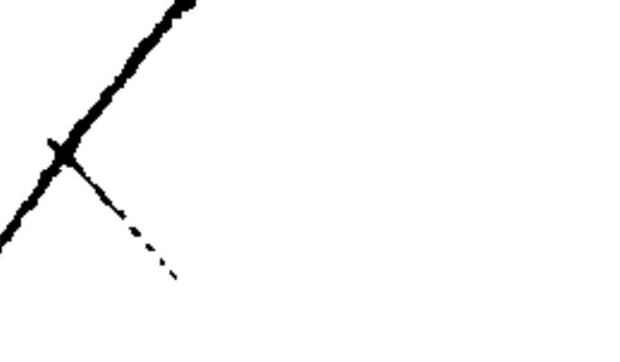

## \*CHAPTER IX.

[\*104]

#### OF THE STAMP.

| When Stamps were first imposed on    | Bills of Exchange, 10                   | 18 |
|--------------------------------------|-----------------------------------------|----|
| Bills and Notes 19                   | 104 Promissory Notes,                   | 9  |
|                                      | 104 Fixed Duty on Bill of Exchange      |    |
| How Instruments are to be written    | payable on Demand, 10                   | 9  |
|                                      | 104 Foreign Bills and Notes, 10         |    |
|                                      | 105 When Bills or Notes may be Stamped  |    |
| · · · · · · · · · · · · · · · · · ·  | after Execution,                        |    |
| <del>-</del>                         | 105 Issuing unstamped Instruments, . 11 |    |
| Foreign Currencies, 10               | 105 Stamps on Sets of Bills, 11         | 1  |
| Stamping after Execution, 10         | 106 Foreign Securities,                 | .1 |
| \$1104- —                            | Notarial Acts, 11                       | 2  |
| missible except in Criminal Pro-     | Receipts,                               | 2  |
| ceedings, 10                         | 106 Schedule to the above Act, 11       | 3  |
| Stamps to be impressed only, unless  | Bills and Notes exempt, 11              | 7  |
| there be a special Provision to the  | What Instruments may be reis-           |    |
| contrary,                            | 107 sued,                               | _  |
| Adhesive Stamps, how cancelled, . 10 | 107 Reservation of Interest,            | 7  |
| Interpretations of Torms, 10         | 108 Effect of want of Stamp, 119        | 8  |
| Bank Note,                           | 108 Presumption as to Stamp,            |    |

Bills and notes were exempt from stamp duty till 22 Geo. 3, c. 33. This act was repealed and followed by several others containing some regulations still in force, though the duties were in many cases altered by the last general Stamp Act, 55 Geo. 3, c. 148. The duties imposed by this act were for the most part again altered by the 16 & 17 Vict., c. 59 and the 17 & 18 Vict., c. 83, which first introduced the use of adhesive stamps.

The Stamp Act of 1870, 33 & 34 Vict., c. 97, came into operation on the first day of January, 1871, and is the act now in force.1

The following are the provisions contained in the act and schedule thereto which relate to bills of exchange and promissory notes:

By sec. 7 (1) Every instrument written upon stamped material

&lt;sup>1 Followed by the Stamp Duties Management Act, 33 & 34 Vict. c., 98, and the Inland Revenue Repeal Act, 33 & 34 Vict., c., 99, in the schedule to which will be found such sections of former statutes as are still in force.

[\*105] is to be written in such manner, and every instrument \*partly or wholly written before being stamped is to be so stamped, that the stamp may appear on the face of the instrument, and cannot be used for or applied to any other instrument written upon the same piece of material.

(2) If more than one instrument be written upon the same piece of material every one of such instruments is to be separately and distinctly stamped with the duty with which it is chargeable.

By sec. 8, Except where express provision to the contrary is made by this or any other act—

- (1) An instrument containing or relating to several distinct matters is to be separately and distinctly charged as if it were a separate instrument, with duty in respect of each such matters.
- (2) An instrument made for any consideration or considerations in respect whereof it is chargeable with ad valorem duty, and also for any further or other valuable consideration or considerations, is to be charged with duty in respect of such last-mentioned consideration or considerations as if it were a separate instrument made for such consideration or considerations only.

By sec. 9 (1) A stamp which by any word or words on the face of it is appropriated to any particular description of instrument is not to be used, or if used, not to be available for an instrument of any other description.

(2) An instrument falling under the particular description to which any stamp is so appropriated as aforesaid is not to be deemed duly stamped unless it is stamped with the stamp so appropriated.

By sec. 11, Where an instrument is chargeable with ad valorem duty in respect of any money in any foreign or colonial currency, such duty shall be calculated on the value of such money in British currency according to the current rate of exchange on the day of the date of the instrument.

By sec. 12, Where an instrument is chargeable with ad valorem duty in respect of any stock or of any marketable security, such duty shall be calculated on the value of such stock or security according to the average price thereof on the day of the date of the instrument.

By sec. 13, Where an instrument contains a statement of current 186

rate of exchange or average price, as the case \*may require, and is stamped in accordance with such statement, it is, so far as regards the subject-matter of such statement, to be deemed duly stamped, unless or until it is shown that such statement is untrue and that the instrument is in fact insufficiently stamped.

By sec. 15, (1) Except where express provision to the contrary is made by this or any other act, any unstamped or insufficiently-stamped instrument may be stamped after the execution thereof on payment of the unpaid duty and a penalty of ten pounds, and also by way of further penalty, where the unpaid duty exceeds ten pounds, of interest on such duty at the rate of five pounds per centum per annum from the day upon which the instrument was first executed up to the time when such interest is equal in amount to the unpaid duty.1

And the payment of any penalty or penalties is to be denoted on the instrument by a particular stamp.

- (2) Provided as follows:
  - (a) Any unstamped or insufficiently-stamped instrument which has been first executed at any place out of the United Kingdom may be stamped at any time within two months after it has been first received in the United Kingdom on payment of the unpaid duty only;
  - (b) The commissioners may, if they think fit, at any time within twelve months after the first execution of any instrument, remit the penalty or penalties or any part thereof.

By sec. 17, Save and except as aforesaid, no instrument executed in any part of the United Kingdom, or relating, wheresoever executed, to any property situate, or to any matter or thing done or to be done, in any part of the United Kingdom, shall, except in criminal proceedings, be pleaded or given in evidence or admitted to be good, useful or available in law or equity, unless it is duly stamped

&lt;sup>1 There are apparently three cases in which a bill or note may be stamped after execution:

1. Where the bill or note is drawn or made abroad. See post, s. 51.

2. When a bill or note bears an impressed stamp of sufficient value but wrong denomination. See post, s. 53.

3. In the case of a bill of exchange payable on demand (which by s. 48 includes checks, etc.), and liable to a fixed duty of 1d., denotable by an adhesive stamp, it is competent for the drawee to affix the stamp. See post, s. 54.

in accordance with the law in force at the time when it was first executed.

[\* 107] \*By sec. 23, Except where express provision is made to the contrary, all duties are to be denoted by impressed stamps only.1

By sec. 24 (1) An instrument, the duty upon which is required or permitted by law to be denoted by an adhesive stamp, is not to be deemed duly stamped with an adhesive stamp unless the person required by law to cancel such adhesive stamp cancels the same by writing on or across the stamp his name or initials, or the name or initials of his firm, together with the true date of his so writing, so that the stamp may be effectually cancelled and rendered incapable of being used for any other instrument, or unless it is otherwise proved that the stamp appearing on the instrument was affixed thereto at the proper time.2

(2) Every person who, being required by law to cancel an adhesive stamp, wilfully neglects or refuses duly and effectually to do so in manner aforesaid, shall forfeit the sum of ten pounds.

By sec. 36, The duty of sixpence upon an agreement may be denoted by an adhesive stamp, which is to be cancelled by the person by whom the agreement is first executed.

By sec. 45, The term "banker" means and includes any corporation, society, partnership and persons, and every individual person carrying on the business of banking in the United Kingdom.

The term "bank-note" means and includes—

- (1) Any bill of exchange or promissory note issued by any banker, other than the Government or Company of the Bank of England, for the payment of money not exceeding one hundred pounds to the bearer on demand:
- (2) Any bill of exchange or promissory note so issued which entitles or is intended to entitle the bearer or holder thereof, without indorsement, or without any further or other indorsement than may be thereon at the time of the issuing thereof, to the payment of money not exceeding

The use of adhesive stamps is permissible in the case of bills of exchange, payable on demand (which include checks, etc., s. 48), and is obligatory in the case of bills or notes drawn or made out of the United Kingdom. See post, 88, 50, 51.

&lt;sup>2 See Pooley v. Brown, 31 L. J., C. P., 134, for the consequence of not cancelling. 188

one hundred \* pounds on demand, whether the same be so expressed or not, and in whatever form and by whomso-ever such bill or note is drawn or made.

By sec. 46, A bank-note issued duly stamped, or issued unstamped by a banker duly licensed or otherwise authorized to issue unstamped bank-notes, may be from time to time reissued without being liable to any stamp duty by reason of such reissuing.

By sec. 47 (1), If any banker, not being duly licensed or otherwise authorized to issue unstamped bank-notes, issues, or causes or permits to be issued, any bank-note not being duly stamped, he shall forfeit the sum of fifty pounds.

(2) If any person receives or takes any such bank-note in payment or as a security, knowing the same to have been issued unstamped contrary to law, he shall forfeit the sum of twenty pounds.

By sec. 48 (1), The term "bill of exchange" for the purposes of this act includes also draft, order, check and letter of credit, and any document or writing (except a bank-note) entitling or purporting to entitle any person, whether named therein or not, to payment by any other person of, or to draw upon any other person for sum of money therein mentioned.

(2) An order for the payment of any sum of money by a bill of exchange or promissory note, or for the delivery of any bill of exchange or promissory note in satisfaction of any sum of money, or for the payment of any sum of money out of any particular fund which may or may not be available, or upon any condition or contingency which may or may not be performed or happen, is to be deemed for the purposes of this act a bill of exchange for the payment of money on demand.1

1 See Firbank v. Bell, 1 B. & Ald., 39, where such an order bearing an agreement stamp was held inadmissible under the old law for want of a bill stamp: Butts v. Swan. 2 B. & B., 78 (6 E. C. L. R.); 4 Moore, 481. But unless a definite sum were specified, a bill stamp was not required: Jones v. Simpson, 2 B. & C., 318 (9 E. C. L. R.); 3 D. & R., 545; Barlow v. Broadhurst, 4 Moore, 471; Crowfoot v. Gurney, 9 Bing., 372 (23 E. C. L. R.); Hutchinson v. Heyworth, 1 Per. & D., 266; 9 A. & E., 375 (35 E. C. L. R.); Norris v. Selomon, 2 M. & R., 266; Diplock v. Hammond, 23 L. J., Chan., 550; 5 De Gex, M. & G., 320. A letter from one company to another in these terms: "We shall be obliged by your paying Mr. J. Shellard the sum of 2001. c..t of moneys payable to us," etc., given to Shellard to present, was held inadmissible for want of a stamp; Ex parte Shellard, L. R., 17 Eq., 109; but this case was unfavorably reviewed in Buck v. Robson, L. R., 3 Q. B. D., 686, where a letter written to the debtor in these terms by the creditor: "I hereby assign the

\*(3) An order for the payment of any sum of money weekly, monthly, or at any other stated periods, and also any order for the payment by any person at any time after the date thereof of any sum of money and sent or delivered by the person making the same to the person by whom the payment is to be made, and not to the person to whom the payment is to be made, or to any person on his behalf, is to be deemed for the purposes of this act a bill of exchange for the payment of money on demand.

By sec. 49 (1), The term "promissory note" means and includes any document or writing (except a bank-note) containing a promise to pay any sum of money.

(2) A note promising the payment of any sum of money out of any particular fund which may or may not be available, or upon any condition or conting — which may or may not be performed or happen, is to be deemed for the purposes of this act a promissory note for the said sum of money.

By sec. 50, The fixed duty of one penny on a bill of exchange for the payment of money on demand may be denoted by an adhesive stamp, which is to be cancelled by the person by whom the bill is signed before he delivers it out of his hands, custody or power.

By sec. 51 (1), The ad valorem duties upon bills of exchange and promissory notes drawn or made out of the United Kingdom are to be denoted by adhesive stamps.

- (2) Every person into whose hands any such bill or note comes in the United Kingdom before it is stamped shall, before he presents for payment, or indorses, transfers, or in any manner negotiates or pays such bill or note, affix thereto a proper adhesive stamp or proper adhesive stamps of sufficient amount, and cancel every stamp so affixed thereto.1
  - (3) Provided as follows:
- [\*110] If at the time when any such bill or note comes into the hands of any bona fide holder thereof \*there is affixed thereto an adhesive stamp effectually obliterated, and

sum of 40l., now due or to be due in respect," etc., was held not to be an order for the payment of money within s. 45, but an assignment of a debt.

1 It is not necessary that the instrument should be stamped before it is presented for acceptance: Sharples v. Rickards, 2 H. & N., 57; Griffin v. Weathersby, L. R., 3 Q. B., 753.

proporting and appearing to be duly cancelled, such stamp shall, so far as relates to such holder, be deemed to be duly cancelled, although it may not appear to have been so affixed or cancelled by the proper person.

- (b) If at the time when any such bill or note comes into the hands of any bona fide holder thereof there is affixed thereto an adhesive stamp not duly cancelled, it shall be competent for such holder to cancel such stamp as if he were the person by whom it was affixed, and upon his so doing such bill or note shall be deemed duly stamped, and as valid and available as if the stamp had been duly cancelled by the person by whom it was affixed.
- (4) But neither of the foregoing provisos is to relieve any person from any penalty incurred by him for not cancelling any adhesive stamp.

By sec. 52, A bill of exchange or promissory note purporting to be drawn or made out of the United Kingdom is, for the purposes of this act, to be deemed to have been so drawn or made, although it may in fact have been drawn or made within the United Kingdom.

By sec. 53 (1), Where a bill of exchange or promissory note has been written or material bearing an impressed stamp of sufficient amount but of improper denomination, it may be stamped with the proper stamp on payment of the duty, and a penalty of forty shillings if the bill or note be not then payable according to its tenor, and of ten pounds if the same be so payable.

(2) Except as aforesaid, no bill of exchange or promissory note shall be stamped with an impressed stamp after the execution thereof.

By sec. 54 (1), Every person who issues, indorsers, transfers, negotiates, presents for payment, or pays any bill of exchange or promissory note liable to duty and not being duly stamped shall forfeit the sum of ten pounds, and the person who takes or receives from any other person any such bill or note not being duly stamped, either in payment or as a security, or by purchase or otherwise shall not be entitled to recover thereon, or to make the same available for any purpose whatever.

(2) Provided that if any bill of exchange for the \*pay- [\*111] ment of money on demand, liable only to the duty of one

penny, is presented for payment unstamped, the person to whom it is so presented may affix thereto a proper adhesive stamp, and cancel the same, as if he had been the drawer of the bill, and may, upon so doing, pay the sum in the said bill mentioned, and charge the duty in account against the person by whom the bill was drawn, or deduct such duty from the said sum, and such bill is, so far as respects the duty, to be deemed good and valid.

(3) But the foregoing proviso is not to relieve any person from any penalty he may have incurred in relation to such bill.

By sec. 55, When a bill of exchange is drawn in a set according to the custom of merchants, and one of the set is duly stamped, the other or others of the set shall, unless issued or in some manner negotiated apart from such duly stamped bill, be exempt from duty; and upon proof of the loss or destruction of a duly stamped bill forming one of a set, any other bill of a set which has not been issued or in any manner negotiated apart from such loss or destroyed bill may, although unstamped, be admitted in evidence to prove the contents of such lost or destroyed bill.

By sec. 69 (1), The duty on a contract note may be denoted by an adhesive stamp, which is to be cancelled by the person by whom the note is first executed.

- (2) Every person who makes or executes any contract note chargeable to duty, and not being duly stamped, shall forfeit the sum of twenty pounds.
- (3) No broker, agent or other person shall have any legal claim to any charge for brokerage, commission, or agency, with reference to the sale or purchase of any stock or marketable security of the value of five pounds or upwards mentioned or referred to in any contract note, unless such note is duly stamped.

By sec. 2 of 34 Vict., c. 4, The term "foreign security" means and includes every security for money by or on behalf of any foreign or colonial state, government, municipal body, corporation or company, bearing date or signed after the third day of June, one [\*112] thousand eight \*hundred and sixty-two (except an instrument chargeable with duty as a bill of exchange or promissory note)—

Repealing secs. 113 and 114 of the principal act. See Grenfell v. Commissioners of Inland Revenue, L. R., 1 Ex. D., 242, as to what constitutes a making or issuing.

(1) Which is made or issued in the United Kingdom.

(2) Which, the interest thereon being payable in the United Kingdom, is assigned, transfered, or in any manner negotiated in the United Kingdom.

By sec. 3 of the same act, Every person who in the United Kingdom makes, issues, assigns, transfers, or negotiates, or pays any interest upon any foreign security not being duly stamped, shall forfeit the sum of twenty pounds.

By sec. 115, The commissioners may at any time, without reference to the date thereof, allow any foreign security to be stamped without the payment of any penalty, upon being satisfied, in any manner that they may think proper, that it was not made or issued, and has not been transferred, assigned or negotiated within the United Kingdom, and that no interest has been paid thereon within the United Kingdom.

By sec. 116, The duty upon a notarial act, and upon the protest by a notary public of a bill of exchange or promissory note, may be denoted by an adhesive stamp, which is to be cancelled by the notary.

By sec. 120, The term "receipt" means and includes any note, memorandum or writing whatsoever whereby any money amounting to two pounds or upwards, or any bill of exchange or promissory note for money amounting to two pounds or upwards, is acknowledged or expressed to have been received or deposited or paid, or whereby any debt or demand, or any part of a debt or demand, of the amount of two pounds or upward, is acknowledged to have been settled, satisfied or discharged, or which signifies or imports any such acknowledgment, and whether the same is or is not signed with the name of any person.

By sec. 121, The duty upon a receipt may be denoted by an adhesive stamp, which is to be cancelled by the person by whom the receipt is given before he delivers it out of his hands.

By sec. 122, A receipt given without being stamped may be stamped with an impressed stamp upon the terms following; that is to say—

- (1) Within fourteen days after it has been given, on payment of the duty and a penalty of five pounds;
- \*(2) After fourteen days, but within one month after it has been given, on payment of the duty and a penalty of ten pounds;

and shall not in any other case be stamped with an impressed stamp.

By sec. 123, If any person—

- (1) Gives any receipt liable to duty and not duly stamped;
- (2) In any case where a receipt would be liable to duty refuses to give a receipt duly stamped;
- 3) Upon a payment to the amount of two pounds or upwards gives a receipt for a sum not amounting to two pounds, or separates or divides the amount paid with intent to evade the duty;

he shall forfeit the sum of ten pounds.

### SCHEDULE TO THE ABOVE ACT.

AGREEMENT or any Memorandum of an Agreement made in England or Ireland under hand only, or made in Scotland without any clause of registration, and not otherwise specifically charged with any duty, whether the same be only evidence of a contract or obligatory upon the parties from its being a written instrument, . . . . . . . . . . . . . . . . . . .

### Exemptions.

- (1) Agreement or memorandum, the matter whereof is not of the value of 51.
- (2) Agreement or memorandum for the hire of any laborer, artificer, manufacturer or menial servant.
- (3) Agreement, letter or memorandum made for relating to the sale of any goods, wares or merchandise.
- (4) Agreement or memorandum made between the master and mariners of any ship or vessel for wages on any voyage coastwise from port to port in the United Kingdom.

And see sections 36.

|           | -            | ceeding 1  |               | • | • | • | • | • | • | • | .005     |
|-----------|--------------|------------|---------------|---|---|---|---|---|---|---|----------|
| Exceeding | ig 1t. and   | l not exce | eding 21.     | • | • | • | • | • | • | • | . 0 0 10 |
| "         | 27.          | 4.         | 5l.           | • | • | • | • | • | • | • | . 0 1 3  |
| 44        | 5 <i>l</i> . | "          | 107.          |   | • | • | • | • | • | • | . 0 1 9  |
| 4.6       | 10%.         | 44         | 201.          | • | • | • | • | • | • | • | .020     |
| 46        | 20l.         | **         | 30%.          |   |   | • | • | • | • | • | .030     |
| 41        | 307.         | 14         | 50 <i>l</i> . | • | • | • | • | • | • | • | .050     |
| 44        | 50%          | 41         | 100l.         |   | • | • | • | • | • | • | .086     |
| And see   | section 4    | 5, 46 an   | 47.           |   |   |   |   |   |   |   |          |

1 Though post-date, a penny stamp is enough. The test is, does instrument on face of it comply with the act: Gatty v. Fry, L. R., 2 Ex. Div., 265; Currie v. Misa, 194

£ s. d.

| Bill of Exchange of any other kind whatsoever (except a bank-note) and |
|------------------------------------------------------------------------|
| Trovissory Note of any kind whatsoever (except a bank-note) drawn or   |
| armessed to be payable, or actually paid or indorsed, or in any manner |
| negotiated in the United Kingdom:                                      |
|                                                                        |

Where the amount or value of the money for which the bill or note is

| W HUTCH | tile ginsa  | •          |                       | • |   |   |   |     |     |     |     |     |   |
|---------|-------------|------------|-----------------------|---|---|---|---|-----|-----|-----|-----|-----|---|
| draw    | n or made   | •          | •                     | • | • | • | • | • 1 | 0 0 | )   | 1   |     |   |
| Exceed  | is 5% and d | loes not e | xceed 10l.            | • | • | • | • | •   | •   | . ( | 0 0 | ) ` | 2 |
| 11,2000 | 101.        | 44         | <b>25</b> <i>l</i> .  | • | • | • |   | •   | •   | . ( | 0 0 | )   | 3 |
| 44      | 251.        | "          | 50l.                  | • |   | • | • | •   | •   | . ( | 0 0 | )   | 6 |
| 41      | 50l.        | 44         | <b>7</b> 5 <i>l</i> . | • | • | • | • | •   | •   | . 1 | 0 0 | )   | 9 |
| 44      | 757.        | 44         | 1007.                 | • | • | • |   | •   | •   | . ( | 0 1 |     | 0 |
| "       | 1007.—      |            |                       |   |   |   |   |     |     |     |     |     |   |

for every 100%, and also for any fractional part of 100% of such amount or vaine,

### Exemptions.

- (1) Bill or note issued by the Governor and Company of the Bank of England or Bank of Ireland,
- (2) Draft or order drawn by any banker in the United Kingdom, upon any other banker in the United Kingdom, not payable to bearer or to order and used solely for the purpose of settling or clearing any account between such bankers.
- (3) Letter written by a banker in the United Kingdom to any other banker in the United Kingdom directing the payment of any sum of money, the same not being payable to bearer or to order, and such letter not being sent or delivered to the person to whom payment is to be made, or to any person on his behalf.
- (4) Letter of credit granted in the United Kingdom authorizing drafts to be drawn out of the United Kingdom payable in the United Kingdom.
- (5) Draft or order drawn by the Accountant General of the Court of Chancery in England or Ireland.
- (6) Warrant or order for the payment of any annuity granted by the Commissioners for the Reduction of the National Debt, or for the payment of any dividend or interest on any share in the government or parliamentary stocks or funds.
- (7) Bill drawn by the Lords Commissioners of the Admiralty, or by any person under their authority, under the authority of any act of Parliament, upon and payable by the Accountant General of the Navy.1
- \*(5) Bill drawn (according to a form prescribed by her majesty's orders by any person duly authorized to draw the same) upon and payable out of any public account for any pay or allowance of the army or other expenditure connected therewith.
- (9.) Coupon or warrant for interest attached to and issued with any security.

And see sections 48, 49, 50, 51, 52, 53, 54 and 55.

L.R., 1 Ap., 555; where by custom the draft was not to be available till the next foreign post day.

Repealed 35 & 36 Vict. c., 20, s. 7, so far as the "authority of an act of Parliament is concerned."

| Mor | RTGAGE, Bon onfess and en | ID, I teru | )EBEN n juda  | TURE          | ., Co t and   | VEN.               | ANT,          | WAR Seco    | BAN             | T OF          | · 1           | TOR            | NEY                 | £ to     | 8.                     | đ,                             |
|-----|------------------------------|---------------|------------------|---------------|------------------|--------------------|---------------|----------------|-----------------|---------------|---------------|----------------|---------------------|-------------|------------------------|--------------------------------|
|     | (1) Being th                 | 18 on         | ly or p          | princ         | ipal (           | or pr              | imar          | y sect         | irity           | for-          | <b></b>       |                |                     |             |                        |                                |
|     | The                          | pay           | ment (           | or re         | payr             | nent               | of n          | aoney          | aot             | exc           | eedii         | ng 2           | 51.                 | •           | <u>.</u> "             | 8 (                            |
|     | Exc                          | eedir         | ng 25l.          | and           | not c            | excee              | ding          | 50%.           |                 |               | •             |                | -                   |             |                        | -                              |
|     |                              | 44            | 50 <i>l</i> .    |               | **               |                    |               | 100 <i>l</i> . |                 |               | •             | _              | •                   |             |                        | 3                              |
|     |                              | 44            | 100l.            |               | "                |                    | •             | 150 <i>l</i> . |                 |               | •             | •              | •                   |             |                        | 6                              |
|     |                              | "             | 1501.            |               | 44               | 1                  |               | 2001.          | •               |               | •             | •              | •                   |             |                        | 3 9                            |
|     |                              | 46            | 2001.            |               | u                |                    |               | 2501.          | •               |               | •             | •              | •                   |             |                        | 0                              |
|     |                              | 44            | 250 <i>l</i> .   |               | 66               |                    |               | 3001.          | •               |               | •             | •              | •                   | . (         | ) 6                    | 3                              |
|     |                              | 66            | 300 <i>l</i> .   |               |                  |                    | ũ             | our.           | •               |               | •             | •              | •                   | . (         | 7                      | 6                              |
|     | T'on                         | 02702         |                  | 6 T A         | alaa             | . <b></b> .        | <i>1</i>      |                |                 |               | •             |                | _                   |             |                        |                                |
|     |                              | agun          | y 100!. it.   | , anu         | . B180           |                    |               | raculo.        |                 |               |               | 90 <i>l.</i> , | of su               |             | ` O                    | ١. ٨                           |
|     | (2) Being co                 | ollate        | eral, or         | Rux           | iliar            |                    |               |                |                 |               |               | . od ac        | ,                | , (      | ) 2                    | 6                              |
|     | or by                        | Wav.          | of furt          | hers          | legnt            | .,, o., .,,,,,, | for t         | he ah          | ነጋዊው~ ነ ህዝ ነ | JU UŞ DIAN | tion:         | യെ 86 പെ    | zurii               | ĮV,         |                        |                                |
|     | Zeliozo                      | the           | princip          | nal A         | -~ul p tiri   | mart               | 401 ( 2000 | wite :         | a A             | ins of        | NTOTI         | en bi          | rtbos               | Ю           |                        |                                |
|     |                              |               |                  |               |                  |                    |               |                |                 |               |               |                | •                   |             |                        |                                |
|     |                              |               | y 100l.          |               |                  |                    |               |                |                 |               |               | 100ľ.          | , of t              | _           | _                      |                                |
|     |                              |               | t secui          | •             |                  |                    |               | • .            |                 |               |               | •              | •                   | . (         | ) (                    | 6                              |
|     | (3) Transfer,                | , Ass         | ignme            | nt, I         | Jispo            | sitio:             | n or .        | Assign         | natio           | n of          | an            | y mo           | rtga                | ge,         |                        |                                |
|     |                              |               | nture,           |               |                  |                    |               |                |                 |               |               |                |                     |             |                        |                                |
|     | or stoc                      | k se          | cured            | by a          | ny si            | nch i              | instri        | ımeni          | t, or           | bу            | any           | war            | rant                | of          |                        |                                |
|     | attorn                       |               |                  |               |                  |                    |               |                |                 |               | _             |                |                     |             |                        |                                |
|     |                              |               | y 100 <i>l</i> . |               |                  |                    |               | •              | <b>—</b>        |               |               | 1007.          | . of t              | ha          |                        |                                |
|     |                              |               | t trans          |               |                  |                    |               |                |                 | _             |               |                | , ,,, ,             | _           |                        | ) 6                            |
|     |                              |               | <b>V</b>         |               | ,,               | O                  | Cu. O.        | arop.          |                 |               | •             | •              | •                   |             | he s                   | •                              |
|     | And also alread;          |               |                  |               |                  |                    |               | r is a         |                 |               |               |                |                     | ا ا         | print neco for t | olpei ority such ther |
|     | (4) Pasanyay                 | rona.         | o Polo           | 000           | Diac'            | hama               | . 0           | d.             | - D             |               | 3             | 11             | 7                   |             | mo                     | ney,                           |
|     | (4) Reconvey                 |               |                  |               |                  |                    |               |                | -               |               |               | •              | -                   |             |                        |                                |
|     | to vaca                      |               |                  |               |                  |                    | _             |                |                 | -             |               | resai          | d, or               | of          |                        |                                |
|     |                              |               | therea           |               |                  |                    | -             |                | 4.              |               |               |                |                     |             |                        |                                |
|     | For                          | ever          | y 1007.,         | , and         | also             | for                | any í         | iractio        | onal            | part          | of 1          | l <b>001.,</b> | of t                | he          |                        |                                |
|     | to                           | tal a         | mount            | or v          | alue             | of th              | e mo          | ney s          | it an           | y tir         | ne se         | ecur           | $\operatorname{ed}$ | . (         | ) (                    | 6                              |
|     | And see secti                |               |                  |               |                  |                    |               | _              |                 | _             |               |                |                     |             | _                      | -                              |
|     | 16] *Рвот                    |               |                  |               |                  |                    |               |                |                 |               |               |                |                     | r           |                        |                                |
| F T | rol - mor                    | <b>\</b>      | <del>14</del> J  |               | , _ <b>~</b> ~ ~ | e.4                | O T WA        | E-041          | - =-~· V        |               | ~ <b>~~</b> . |                |                     | , -         | I <b>S</b>             |                                |
|     | Where the de                 | nter.         | n tha            | hill a        | \ <b>30</b>      | ታለ ብ።              | .o.a -> -     | 1+ A=-         | 003 1           | 1 7           |               |                | •                   | dut bill | ne s y as           | the                            |
|     | Where the di                 |               |                  |               |                  |                    |               |                |                 |               | и             | •              |                     |             |                        |                                |
|     | In any other                 |               |                  | •             | •                | •                  | •             | •              | •               | •             | •             | •              | •                   | . 0         | 1                      | 0                              |
| Aı  | nd see section               | 1116          | •                |               |                  |                    |               |                |                 |               |               |                |                     |             |                        |                                |
| REC | EIPT given i                 | for o         | יממנו או         | n the         | יפור פ           | րյութո             | t of          | man            | 6Æ ህነ           | ກູດກາ         | ntin          | g fo           | 21 A1               | •           |                        |                                |
|     |                              | •             | -                |               |                  | _                  |               |                | -               |               | •             | _              |                     |             | Λ                      | . 1                            |
| ար  | wards, .                     | •             | •                | •             | •                | •                  | ,             | •              | •               | •             | •             | •              | •                   | ·           | U                      | 1                              |
|     |                              |               |                  |               | ,                | Exem               | ption         | В.             |                 |               |               |                |                     |             |                        |                                |
| (1) | Donoint                      | an f-         |                  | . ال جون - |                  | •                  |               |                | ما              | :41           |               | w ha-          | n <b>1</b> = ^ -    |             |                        |                                |
| (1) | Receipt give to be acce   |               |                  | _             | _                |                    | _             |                | •               |               |               | -              |                     |             |                        |                                |
|     | whom th                      |               |                  |               | -                |                    |               |                | - '             |               | •             | -              |                     |             |                        |                                |
| (2) | Acknowledg                   | g <b>m</b> er | it by            | any l         | oauk             | er of              | the           | rece           | ipt c           | of an         | dy b          | ill o          | f ex                |             |                        |                                |
|     | change o                     | -             |                  | _             | te fo            | r the              | pur           | pose o         | f bei           | ing j         | prese         | ented          | l for               | I           |                        |                                |
|     | acceptane                    |               |                  |               | _                |                    |               | _              |                 |               |               |                |                     |             |                        |                                |
| (3) | Receipt give or duties       |               |                  |               |                  | -                  |               |                | •               |               |               | ary t          | es es               | <b>;</b>    |                        |                                |
|     | 196                          | ,             |                  | · • •         | - <b>-</b> -     |                    |               | <b>~</b>       |                 | V             | <b>~</b> -    |                |                     |             |                        |                                |
|     | 100                          |               |                  |               |                  |                    |               |                |                 |               |               |                |                     |             |                        |                                |

- (4) Beceipt given by the Accountant General of the Navy for any money received by him for the service of the navy.
- (5) Receipt given by any agent for money imprested to him on account of the pay of the army.
- (6) Receipt given by any officer, seaman, marine or soldier, or his representatives, for or on account of any wages, pay or pension due from the Admiralty or Army Pay Office.
- (7) Receipt given for the consideration money for the purchase of any share in any of the government or parliamentary stocks or funds, or in stock of the East Iudia Company, or in the stocks and funds of the Secretary of State in Council of India, or of the Governor and Company of the Bank of England, or of the Bank of Ireland, or for any dividend paid on any share of the said stocks or funds respectively.
- (8) Receipt given for any principal money or interest due on an exchequer bill.
- (9) Receipt whitten upon a bill of exchange or promissory note duly stamped.
- (10) Receipt given upon any bill or note of the Governor and Company of the Bank of England or the Bank of Ireland.
- (11) Receipt indorsed or otherwise written upon or contained in any instrument liable to stamp duty, and duly stamped acknowledging the receipt of the consideration money therein expressed, or the receipt of any principal money, interest or annuity, thereby secured or therein mentioned.
- (12) \*Receipt given for drawback or bounty upon the exportation of any [\*117] goods or merchandise from the United Kingdom.
- (13.) Receipt given for the return of any duties of customs upon certificates of over entry.
- (14.) Receipts indorsed upon any bill drawn by the Lords Commissioners of the Admiralty, or by any person under their authority, or under the authority of any act of Parliament, upon and payable by the Accountant General of the Navy.

And see sections 120, 121, 122 and 123.

It appears that the following instruments are free from duty under this and previous statutes:

Bills and notes of the Bank of England and Bank of Ireland;1

Notes for one pound, one guines, two pounds or two guiness, payable to bearer on demand, issued by the Bank of Scotland, Royal Bank of Scotland and British Linen Company;2

Bills or notes issued by bankers paying a composition in lieu of the stamps;2

&lt;sup>1 55 Geo. 3, c. 184, s. 21; 7 & 8 Vict., c. 32, s. 7; Exemp. Tit., 1.

&lt;sup>2 55 Geo. 3, c. 184, s. 23.

&lt;sup>1 9 Geo. 4, c. 23; 7 Geo. 4, c. 46, s. 16; 7 & 8 Vict., c. 32, s. 22; 17 & 18 Vict., c. 83, s. 11; 33 & 34 Vict., c. 97, s. 46.

Bills drawn for the expenses of the navy and army;1 Notes of loan,2 friendly,3 and building societies.4

An instrument that has been paid at maturity by the party primarily liable cannot be reissued.5

Bank notes issued duly stamped, or issued unstamped by a banker duly licensed or otherwise authorized to issue unstamped bank notes, may be from time to time reissued without further duty.6

The reservation of interest on a bill or note does not in any case render a larger stamp necessary; for the object of the legislature was to impose a pro rata stamp duty on the sum actually due at the time of taking the security, and not \*upon what might become due in future for the use of the money; 7 although interest be reserved from a day prior to the date of the instrument.8

A bill or note not duly stamped is not available nor evidence in law or equity for any purpose in furtherance of its original design, and not even as an admission. But an instrument not duly stamped might always be looked at for a collateral purpose. In an action for money lent, the plaintiff's witnesses proved that plaintiff had lent defendant 401, and that defendant had given him a prom-

1 Exemp. Tits., 7 & 8.

&lt;sup>2 See 5 & 6 Will, c. 23; 3 & 4 Vict., c. 110; 21 Vict., c. 19. Although the form of the note given by the statute be joint only, yet a joint and several note is within the exception; Bradburn r. Whitbred, 5 M. & G., 439 (44 E. C. L. R.); see ante page 7.

&lt;sup>8 38 & 39 Vict., c. 60, s. 15, repealing 18 & 19 Vict., c. 63. But they must be strictly for the purposes of the society, and not generally negotiable: Attorney-General v. Gilpin, 40 L. J., Ex. 134.

4 37 &amp; 38 Vict., c. 42, s. 41.

&lt;sup>5 Morley v. Culverwell, 7 M. & W., 174; Bartram v. Caddy, 9 A. & E., 275 (36 E. C. L. R.); 1 P. & D., 207; Woodward v. Pell, 37 L. J., Q. B., 41; L. R., 4 Q. B., 55. See post, p. 173.

33 &amp; 34 Vict., c. 97, s. 46. For penalty both on issuer and receiver of a note unduly issued unstamped, see sec. 47 (1) and (2), and 55 Geo. 3, c. 184, s. 27.

7 Pruessing v. Ing, 4 B. and Ald., 204 (6 E. C. L. R.)

8 Wills r. Noot, 4 Tyrw., 726.

9 8. 17; Wilson v. Vysar, 4 Taunton, 283; Jardine v. Payne, 1 B. & Ad., 663 (20 E. C. L. R.); Cundy v. Marriott, 1 B. & Ad., 696. But an unstamped instrument was admissible to prove an agreement illegal; Coppock v. Bower, 4 M. & W., 361; or to prove usury: Nash v. Duncomb, 1 M. & Rob., 181; or to corroborate a witness: Dover v. Maestaer, 5 Esp., 92; or to refresh his memory: Maughan v. Hubbard, 8 B. & C, 11 (15 E. C. L. R.). In Smart v. Nokes, 6 M. & G., 911 (41 E. C. L. R.), the Court of C. P. allowed an unstamped bill to be given in evidence to negative by anticipation a plea of payment. Sed query, and see s. 17.

issory note on unstamped paper: the defendant's case was that plaintiff had inveigled him to drink, and that the transaction was fraudulent. The note was produced. Lord Ellenborough: "The note certainly cannot be received in evidence as a security, or to prove the loan of the money; but I think it may be looked at by the jury as a contemporary writing, to prove or disprove the fraud imputed to the plaintiff." The note was put in, and had very much the appearance of having been written by a drunken man. Verdict for the defendant. The statute 17 & 18 Vict., c. 83, s. 27, contained an express provision that an unstamped instrument might be admitted in any criminal proceeding. But long before that statute it had been held no defence in a prosecution for forgery that the instrument was not duly stamped.2 So it has been held that if A. and B. enter into a written agreement, duly stamped, and afterwards enter into another written agreement on the same subject-matter, but inconsistent with the first, and not stamped, though the plaintiff cannot give the second agreement in evidence, it may be looked at by the court to prove that the first agreement was rescinded.3 But when the \*acceptor of a bill required the drawer, who [\*119] was an illiterate person, to take his second acceptance at six months, in lieu of payment, and the drawer having assented, the acceptor's son wrote the second bill on the back of the first, and the drawer and acceptor signed the second bill, and then the acceptor's son drew a line through the acceptance on the first bill; it was held, in an action on the first bill by the drawer against the acceptor, that the second bill could not be submitted to the jury for the purpose of enabling them to judge whether the cancelling of the original acceptance were with the assent of the plaintiff.4

A note, reciting that deeds had been deposited as a security, does

&lt;sup>1 Gregory v. Fraser, 3 Camp., 454; and see Holmes v. Sixsmith, 7 Ex., 802; Wat80n v. Poulson, 15 Jur., 1111; Keeble v. Payne, 8 A. & E., 555 (35 E. C. L. R.); Reg.
v. Gompertz, 9 Q. B., 824 (58 E. C. L. R.).

&lt;sup>2 Rex v. Hawkswood, Bayley, 6th ed., 91; 3 East, P. C., 955; Rex v. Teague, Bayley, 6th ed., 574; 2 East, P. C., 79.

\* Recd v. Deere, 1 B. & C., 261 (8 E. C. L. R.); see Swears v. Wills, 1 Esp., 317.

Sheeting v. Halse, 9 B. & C., 365 (17 E. C. L. R.); 4 M. & R., 287. It was held in Jones v. Ryder, 4 M. & W., 32, that a promissory note, improperly stamped, could not be received in evidence to take a case out of the Statute of Limitations; and see Holmes v. Mackrell, 3 C. B. N. S., 789 (91 E. C. L. R.).

not, as a note, require a mortgage stamp.\(^1\) A promissory note which amounted to a mortgage might formerly have been impressed with the mortgage stamp after it was made.\(^2\)

The objection to the want of a stamp should in general be taken before the instrument is read. But where the defect requires extrinsic evidence to show it, the instrument is to be shown to the judge, and the ground of objection afterwards proved. If a judge at Nisi Prius rule against a stamp objection, his decision cannot be reviewed, and he ought not to reserve the point. The absence of a stamp on a bill or note cannot be pleaded unless the plea show that the instrument cannot be made good by being stamped before the trial.

If a bill be either lost, or detained by the opposite side after notice to produce, the presumption of law is that it was duly stamped, unless the contrary be shown.

- 1 Fancourt v. Thorno, 9 Q. B., 312 (58 E. C. L. R.).
- Wise v. Charlton, 4 A. & E., 786 (31 E. C. L. R.); 6 N. & M., 362; 2 H. & W., 49. See, however, s. 23 (2). As to the necessity of the higher stamp, see s. 8, Part II.
  - 3 Field v. Woods, 7 Ad. & El., 114 (34 E. C. L. R.); 2 Nev. & P., 117,
- 5 17 & 18 Vict. c., 125, s., 31; Siordet v. Kuczinski, 17 C. B., 251 (84 E. C. L. R); Heiser v. Grout, 5 H. & N., 35. But see Eames v. Smith, 2 Jur., N. S., 1025.
- 4 Bradley v. Bardsley, 15 L. J., Ex., 115; 3 D. & L., 476; 14 M. & W., 873. See, however, Lazarus v. Cowie, 3 Q. B., 465 (43 E. C. L. R.), Taitersall v. Fearnley, 17 C. B., 368 (84 E. C. L. R.).
  - 6 Marine Insurance Co. v. Haviside, L. R., 5 H. L., 625.

#### OF THE CONSIDERATION.

| Presumption as to Consideration on | _            | ranure of Consideration,                |           |
|------------------------------------|--------------|-----------------------------------------|-----------|
| Bills and Notes,                   | 120          | Notice of Absence of Consideration,     | 131       |
| When it must be proved,            | 121          | Accommodation Bill,                     | 131       |
| In the Case of an Accommodation    |              | Partial Absence or Failure of Con-      |           |
| Bill, · · · ·                      | 121          | sideration,                             | 132       |
| Rules of Pleading,                 | 123          | FRAUD,                                  | 133       |
| Ambiguity of the Expression "bona  |              | Bills and Notes in Fraud of Third       |           |
| fide Holder for Value,"            | 123          | Person,                                 | 134       |
| Distinction between Holder without |              | Where a Party who has been de-          |           |
| Value and Holder with Notice, .    | 123          | frauded must pay a Bill or Note,        |           |
| Burden of Proof in the case of al- |              | signed by him, without Con-             |           |
| leged Holder without Value, .      | 124          | sideration,                             | 136       |
| In Case of alleged Holder with     | · !       | ILLEGAL CONSIDERATION AT COM-           |           |
|                                    |              |                                         | 137       |
|                                    |              | • • • • • • • • • • • • • • • • • • • • | 137       |
|                                    | 125          | In Contravention of Public Policy,      | 138       |
|                                    |              | ILLEGAL OR VOID BY STATUTE, .           | 140       |
| Explicit Notice,                   | 125          |                                         | 140       |
| Implicit Notice,                   | 125          |                                         | 140       |
| Abstinence from Inquiry,           | 125          | Horse-racing,                           | 141       |
| Gross Negligence not equivalent to |              | Innocent Indorsee,                      | 141       |
|                                    |              |                                         | 142       |
| Notice to an Agent,                | 126          | Stock-jobbing,                          | 142       |
|                                    |              | Other Considerations illegal by         |           |
|                                    | 127          |                                         | 144       |
| Pre-existing Debt,                 | 127          |                                         |           |
| Fluctuating Balance,               | 128          |                                         | 146       |
| Debt of a Third Person,            | 128          | Illegality of Consideration, when       |           |
| A Judgment Debt,                   | 129          | Judgment recovered,                     | 146       |
| Compromise of a Claim,             | 129          |                                         | 146       |
|                                    | <b>129</b> j |                                         | -         |
| Cases where more than one Consid-  |              | Consideration,                          | 146       |
| eration comes in Question, .       | 130          |                                         | <i> -</i> |
|                                    | 1            | ,                                       |           |

If a man seek to enforce a simple contract, he must, in pleading, aver that it was made on good consideration, and must substantiate that allegation by proof. But to this rule bills and notes are an exception. It is never necessary to \*aver consideration [\*121] for any engagement on a bill or note, or to prove the exist-

Where an order is not a draft or any description of negotiable mercantile paper, a valuable consideration for its acceptance must be alleged and proved: A

ence of such consideration, unless a presumption against it be raised by the evidence of the adverse party, or unless it appear that injustice will be done to the defendant, or that the law will be violated if the plaintiff recover. In the case of other simple contracts, the law presumes that there was no consideration till a consideration

valuable consideration is sufficient to support a promissory note, and it may be said that any consideration is valuable, within the meaning of this term, where the payee has parted with some property, or right, or performed some act which he was under no obligation to perform, or has omitted to do some act which he had a right to do. It is not essential in the absence of fraud, that the consideration should be adequate; it is sufficient if it has a foundation which the law regards as valuable. There is a distinction between a valuable consideration other than money and a money consideration; in the former case the slightest consideration will support a promise to pay the largest amount; in the latter the consideration will surport a promise only to the extent of the money forming the consideration: Sawyer v. Mc-Louth, 46 Barb. (N. Y.), 350. Where two sign a note, consideration moving to one will sustain the action against both: Crawford v. Shaw, 18 Ind., 495; Myers r. Sunderland, 4 Greene, Iowa 567; Hoxie v. Hodges, 1 Or., 251. A note given in consideration of a wholly unfounded claim, but before suit upon such claim, cannot be recovered upon by the payee: Sullivan v. Collins, 18 Iowa, 228. The withdrawal of a suit upon a note for \$1500, alleged by the defendants to be forged, is a sufficient consideration for a note of \$1000: Grant v. Chambers, 1 Vroom (N. J.), 323. As to compromise of doubtful calim as a consideration: Carus v. Hunter, 28 N. Y., 389; Richardson v. Comstock, 21 Ark., 69. When a patented invention is practically useless, the assignment of a right to construct and use the same under the patent does not constitute a consideration for a promissory note: Rowe v. Blanchard, 18 Wis., 441; Bierce v. Stocking, 11 Gray (Mass.), 174: Clough v. Patrick, 37 Vt., 421. A note given to the mother of a bastard child by the reputed father, to relieve himself of the statutory liability for the support of such child and to avoid public exposure, is valid: Hays v. McFarlan, 32 Ga., 699; Jackson v. Finney, 33 Id., 512; Eaton v. Burns, 31 Ind., 390. One promissory note is a good consideration for another given in exchange: Savage v. Ball, 2 Green, 142; Bassett v. Bassett, 55 Barb. (N. Y., 505.

As to what constitutes a sufficient consideration, see Winsted Bank v. Webb, 46 Barb. (N. Y.), 177; Hynds v. Hays, 25 Ind., 31; Brenner v. Gundershiemer, 14 Iowa 82; Green v. Shepherd, 5 Allen (Mass.), 589; Parkman v. Brewster, 15 Gray (Mass.), 271; Hudson v. Busby, 48 Mo., 35; Weaver v. Lapsley, 41 Ala., 601; Henderson R. R. Co. v. Mass, 2 Davall (S. C.), 242; Courtney v. Doyle, 10 Allen (Mass.), 122; Prescett v. Ward, Id., 203; Rutledge's Adm'rs v. Townsend, 38 Ala., 706; Repplier v. Bloodgood, 1 Sweeny (N. Y.), 31; Hockenbury v. Meyers, 34 N. J. L., 347; Hildeburn v. Curran, 64 Penn. St., 59; Van Astyne v. Sorley, 32 Tex., 518; Calvert v. Williams, 64 N. Car., 168; Campbell v. Waters, 21 La. Au., 325; Kenigsberger r. Wingate, 31 Tex., 42; Battle v. Weems, 44 Ala., 105; Stafford v. Fargo, 35 Ill., 481; Bourne v. Ward, 51 Me., 191; Sullivan v. Collins, 18 Iowa, 228; Harrod v. Black, 1 Duvall (8. C.), 180; Linton v. Porter, 31 Ill., 107; Black River Bank v. Edwards, 10 Gray (Mass.), 387; Williams v. Nichols, 10 Gray (Mass.), 83; Peterboro R. R. Co. v. Chamberlin, 44 N. R., 494; Rock v. Nicholls, 3 Allen (Mass.), 342; Henry v. Ritenour, 31 Ind., 136; Jones v. Horner, 60 Penn. St., 214; Wren v. Hoffman, 41 Minn., 616; Baldwin v. Van Deusen, 37 N. Y., 487; Thrall v. Mead, 40 Vt., 540.

202

appear; in the case of contracts on bills or notes, a consideration is presumed till the contrary appear, or at least appear probable.1

1 To obtain the usual degree in a creditor's suit it is not sufficient for the plaintiff to put in an acceptance of the testator proved as an exhibit. Query, whether any evidence should be given of the consideration: Keaton v. Lynch, 1 Y. & Col., N. S., 437. And where an account is directed by a court of equity to be taken of dealings between an attorney and his client, it is not sufficient that the attorney produce bills and notes given by the client to him, he must prove the consideration: Jones r. Thomas, 2 Y. & Col., 498. A promissory note imports a consideration, and none need be proved unless it be impeached: Middlebury v. Case, 6 Vt., 165; Shoonmaker n Roosa, 17 Johns (N. Y.), 301; Jeromo v. Whitney, 7 Id., 321; Mims v. Whiddon, 2 Baily (S. C.), 451; Horn v. Fully, 6 N. Hamp., 511; Goshon Turnpike v. Hurtin. 9 Johns. (N. Y.), 217; Camp v. Tompkins, 9 Conn., 545; McMahon v. Crochett, Minor. 362; Mandville v. Welch, 5 Wheat. (U. S.), 277; Hunley v. Lang, 5 Port. (Ala.). 151; Thompson v. Armstrong, 5 Ala., 383; Coburn v. Odell, 35 N. II., 540; Mitchell v. Romo R. R. Co., 17 Ga., 574; Smith v. Poor, 37 Mo., 462; Labadie's Ex. v. Chouteau. 37 Mo., 413; Gamwell v. Mosely, 11 Gray (Mass.), 173; Richardson v. Comst.ck, 21 Ark., 69; Arnold v. Sprague, 34 Vt., 402; Nevins v. Chapman, 15 La. Ann., 353; Ware r. Kelly, 22 Ark., 441; Richardson v. Carpenter, 2 Sweeny (N. Y.), 360. The consideration of a promissory note is inquirable into between the original parties: Slade v. Halsted, 7 Cow. (N. Y.), 322; Pearson v. Pearson, 7 Johns. (N. Y.), 26; Parish v. . Stone, 14 Pick. (Mass), 198: Barnet v. Offerman, 7 Watts, 130; Geiger v. Cook, 3 W. & S. (Penn.), 266; Haynes v. Thom, 23 N. H., 386; Small v. Clewly, 62 Me., 155. A promissory note given for a void patent right is without consideration, notwithstanding the vendor believed at the time of the sale that the patent was valid: Dickinson r. Hall, 14 Pick. (Mass.), 217; Higgins v. Strong, 4 Blackf. (Md.), 182: Jollip v. Collins, 21 Mo., 338; Lester v. Palmer, 4 Allen (Mass.), 105; First Nat. Bank v. Sturgis, 8 Kan., 660. So to pay a forged note: Workman v. Wright, 33 Ohio St., 405. By heir for debt of ancestor barred by limitation: Didlake v. Robb, 1 Woods (U.S. C.C.), 680. In a suit by the payee against the acceptor, the consideration as between the drawer and acceptor cannot be inquired into: Powder Co., v. Sinelieimer, 48 Md., 411. The maker of a note is not precluded from showing want of consideration by the fact that the note was made to defraud creditors, the payee being conusant of that intent: Weaver v. Pierce, 24 Pick. (Mass.), 141. This last case it will be difficult to reconcile with the dictates of sound policy if it accords with the principle settled by the cases. That principle is that in pari delicto potior est conditio defendentis. If a party can make out his case or his defence without showing the fraud, it cannot be objected to him by the other party who is also a particeps. Here the case of the plaintiff is made out by the production of the note. It is prima facie evidence of consideration. The defendant shows want of consideration, and in so doing certainly the actual reason why the note was given must appear. Suppose he succeeds in making out that there was no consideration without disclosing the fraud, the plaintiff may contradict that evidence by showing that there was a consideration, to wit, an engagement to hold against creditors for the use of the maker, though that consideration was an intended fraud. It is a mistake to put such a case on the same footing as an honest accommodation note. It has a consideration sufficient to sustain it as between the parties, though it is void as to third parties: see · Murphy v. Hubert, 10 Penn. St., 58; which was indeed the case of an executed grant but the difference does not seem to be material. "Courts of justice do not sit to extricate a rogue from his toils. To enable a party to show a secret trust in the face

The defendant is not permitted to put the plaintiff on proof on the consideration which the plaintiff gave for the bill unless the defendant can make out a prima facie case against him, by showing that the bill was obtained from the defendant or from some intermediate party by undue means, as by fraud or force, or that it was lost, or that it was originally infected with illegality.

It was formerly held that the defendant could call on the plaintiff to prove consideration by showing the bill to be an accommodation bill, or that the defendant received no value. But it is now

of an absolute deed the purpose must have been an honest one, else, by secret fraudulent device, a dishonest man would be sure never to lose, and he has the chance of gaining. He may accomplish his fraudulent design and then he is sure to get back his property, or what is the same thing, keep it for his family. This would be affording encouragement to such frauds. On the contrary, it is the policy of common sense and common law to environ a person with all possible perils, and to make it appear that honesty is the best policy." In an action on a note it is a good defence that it was given to plaintiff for goods conveyed for the purpose of defrauding his creditors: Hamilton v. Scull. 25 Mo., 165. Statement of consideration in note does not affect holder with netice of equities; Dougherty v. Perry, 35 Ind., 15; Henneberry v. Morse, 56 Ill., 394; Newton Co. v. Diers, 10 Neb., 284; Collins v. Bradbury, 64 Me., 37; Union Ins. Co. v. Greenleaf, 64 Me., 123. Nor recital of security: Duncan v. Louisville, 13 Bush (Ky.), 378; Towns v. Rice, 122 Mass., 67; Howry v. Eppinger, 34 Mich., 29; Kelley v. Whitney, 45 Wis., 110; Taylor v. Curry, 109 Mass., 36.

1 As to a note obtained by duress of goods, see Kearns v. Durell, 6 C. B., 596 (60 E. C. L. R.). The distinction seems to be between a payment, or a transaction in the nature of payment, which is void for duress of goods, and a contract, which cannot be so avoided. As to compulsion in the nature of duress of land, see Close v. Phipps, 7 M. & G., 586 (49 E. C. L. R.). See also Atkinson v. Denby, 30 L. J., Exch., 361; 7 N. & M., 934. But the rule that a note or bill imports a consideration, does not apply to them, when they are shorn of their character as such by being made payable in specific articles, or out of a particular fund, or are otherwise reduced to the character of a mere contract: Bilderback v. Burlidgam, 27 III., 338; Forest v. Fray, 6 Cow. (N. Y.), 151, and unless upon its face it is stated to have been given for value received, a consideration must be alleged and proved: Frank v. Irges., 27 Minn., 43; Averili's Admr. v. Boaker, 15 Gratt. (Va.), 169.

2 Harvey v. Towers, 6 Exch., 656; Mather v. Lord Maidstone, 26 L. J., C. P., 53; 1 C. B., N. S., 273 (87 E. C. L. R.). But a wager which is not prohibited, but only void under 8 & 9 Vict., c. 109, has been held not to be such an illegality of consideration as will change the burden of proof: Fitch v. Jones, 5 E. & B., 238 (85 E. C. L. R.).

3 See Heath v. Sansom, 2 B. & Ad., 291 (22 E. C. L. R.); Duncan v. Scott, 1 Camp., 100; Grant v. Vaughan. Burr, 1516; King v. Milsom, 2 Camp., 5; Paterson v. Hardscre, 4 Taunt., 114; Thomas v. Newton, 2 C. & P., 606 (12 E. C. L. R.); De la Chaumette v. Bank of England, 9 B. & C., 208 (17 E. C. L. R.); Basset v. Dodgin, 10 Bing., 40 (25 E. C. L. R.); 3 M. & Scott, 417; Simpson v. Clarke, 2 C., M. & R., 342; 1 Gale, 237, 8. C. It was formerly necessary, in order to enable the defendant to put the plaintiff on proof of consideration, that the defendant should have given the plaintiff notice to prove consideration: Paterson v. Hardacre, 4 Taunt., 114; Bayley, 6th

definitely settled, after consideration \*by all the judges, [\*122] that mere absence of consideration received by the defendant will not entitle him to call on the plaintiff to prove the consideration which the plaintiff gave. "There is," says Lord Abinger, delivering the judgment of the Court of Exchequer, "a substantial distinction between bills given for accommodation only and cases of fraud, inasmuch as in the former case it is to be presumed that money has been obtained upon the bill. If a man comes into court without any suspicion of fraud, but only as a holder of an accommodation bill, it may fairly be presumed that he is a holder for value. The proof of its being an accommodation bill is no evidence of the want of consideration in the holder. If the defendant says, 'I lent my name to the drawer for the purpose of his raising money upon the bill, the probability is that money was obtained upon the bill.' Unless, therefore, the bill be connected with some fraud, and a suspicion of fraud be raised from its being shown that something has been done with it of an illegal nature, so that it has been clandestinely taken away, or has been lost or stolen (in which case the holder must show that he gave value for it the onus probandi is cast upon the defendant."

ed, 474, 500. It is now, however, settled that notice to prove consideration is not necessary: Mann v. Lent, 1 M. & M., 240; 10 B. & C., 877 (22 E. C. L. R.): Heath r. Sansom, 2 B. & Ad., 291 (22 E. C. L. R.); Bailey v. Bidwell, 13 M. & W., 75; and it is now seldom given. It was, however, before the new rules, often prudent to give notice; "For it is," says Lord Tenterden, "matter of comment if no notice were given, or if it were not given at a reasonable time:" Mann r. Lent, 1 M. & M., 240; 10 B. & C., 877 (21 E. C. L. R.). It was formerly held that where the consideration given by the plaintiff was disputed, and a notice to that effect had been given, the plaintiff must go into his whole case in the first instant, and could not reserve the proof of consideration as an answer to the defendant's case: Delauney r. Mitchell, 1 Stark, 439 (2 E. C. L. R.); Humbert v. Ruding, Chitty, 9th ed., 651; Spooner v. Gardiner, R. & M., N. P. C., 86; Best, C. J., in C. P. But now in all the courts the plaintiff is allowed to prove the handwriting and make out a prima facie case, and afterwards, in answer to the defendant's case, to prove consideration: R. & M., 255, n. If, however, he call witnesses to prove the consideration in the first instance, he will not be allowed, after the defendant's case has closed, to call other witnesses for the same purpose. See Browne v. Murray, R. & M., 254.

1 Mills v. Barber, 1 M. & W., 425; 5 Dowl, 77; 2 Gale, 5; Percival v. Frampton, 2 C., M. & R., 180; 3 Dowl., 748; Whittaker v. Edmunds, 1 M. & R., 366; 1 Ad. & E., 638 (28 E. C. L. R.), s. c.; Jacob v. Hungate, 1 M. & R., 445; Clarke v. Holmes, 2 F. & F., 75. It has been held by the Court of Exchequer that a mere admission on record is not sufficient to put the plaintiff on proof that he is a holder for value, but that the presumption against his title must be raised by evidence before the jury: Edmonds v. Groves, 2 M. & W., 642; 5 Dowl., 775; and see Smith v. Martin,

[\*123] \*We shall hereafter see that to an action against the accommodating party, it is no defence that the plaintiff, a

9 M. & W., 304; Fearn v. Filica, 7 M. & G., 513 (49 E. C. L. R.). The Court of Queen's Bench, however, have held otherwise: Bingham r. Stanley, 1 G. & D., 23: 2 Q. B., 117 (42 E. C. L. R.); Robins v. Maidstone, 4 Q. B., 815 (45 E. C. L. R.). If the inderser of a promissory note proves that it was issued fraudulently by the maker, the holder may be called on to show what consideration he gave for it: Holme r. Karsper, 5 Binn. (Pens.), 469; Thompson v. Armstrong, 7 Ala., 256; Woodhull r. Holmes, 10 Johns. (N.Y.), 231; Knight v. Pugh, 4 W. & S. (Pehn.), 445; Jarden v. Davis, 5 Whart. (Penn.), 338; McClintock v. Cummins, 2 McLean (U.S. C. C.), 98; Bertrand c. Barkman, 8 Eng. (Ark.), 150; Catlin v. Hansen, 1 Duer (N. Y.), 309; The Exchange Bank v. Monteith, 17 Barbour, S. C. Rep., 171; Wilson v. Lasier, 11 Gratt. (Va.), 477 Perrin v. Noyes, 39 Me., 384; McKesson v. Stanbury, 3 Ohio St., 156; Ross v. Bedell. 5 Duer (N. Y.), 462; Bank v. Gibson, Id. (Ark.), 574; Bissell v. Morgan, 11 Cush. (Mass.), 198; Gray v. The Bank of Kentucky, 5 Casey (Penn.), 365; Hutchinson v. Boggs, 4 Id., 294; Kelley v. Ford, 4 Iowa, 140; Whithed v. McAdams, 18 Tex., 551; Hillebrant v. Ashworth, Id., 307; Tucker v. Morrell, I Allen (Mass.), 528; Clark v. Pease, 41 N. H., 414: Merriam v. Granite Bank, 8 Gray (Mass.), 254; Porter v. Gunnison, 2 Grant's Cases (Penn.), 547; Albietz v. Mellon, 1 Wright (Penn.), 367; Devlin v. Clark, 31 Mo., 22; Sistermans v. Field, 9 Gray (Penn.), 331; Hoffman v. Foster. 7 Wright (Penn.), 137; Maples v. Browne, 11 Id., 458; Union Bank v. Ryan, 21 La. Ann., 551; Holden v. Cosgrove, 12 Gray (Mass.), 216; Graham v. Maguire, 39 Ga., 531; Harbison v. Bank of Indiana, 28 Ind., 133; Perkins v. Prout, 47 N. H., 387; Latham v. Smith, 45 Ill., 25; Shipley v. Carroll, Id., 285; Gage v. Sharp, 24 Iowa, 15; Loomis v. Metcalf, 30 Iowa, 382; Woodward v. Rogers, 31 Id., 342; Sloan v. Union Banking Co., 17 P. F. Smith (Penn.), 470; Sistermans r. Field, 9 Gray (Mass.), 331; Hoffman v. Foster, 7 Wright (Penn.), 137; Maples v. Browne, 12 Id., 458; Fairthorne v. Garden, 1 Houst. (Del.), 197; Kinney v. Knox, 27 Wis., 183; Atlas Bank v. Doyle, 9 R. I., 76; Cummings v. Thompson, 18 Minn., 246; Maller v. Ponder, 6 Lans. (N. Y.), 473. The rule may be said to be, as established by the better class of cases, that where a negotiable note is obtained by fraud, the holder must show that he obtained it for value, before maturity and without notice of the fraud in order to be entitled to recover on it: Monroe v. Cooper. 5 Pick. (Mass.), 412; Smith v. Building Association, 93 Penn. St., 19; New v. Walker, 108 Ind., 365; Scotten v. Randolph, 96 Ind., 167; First National Bank v. Green, 43 N. Y., 298; Sullivan v. Langley, 120 Mass., 437; Smith v. Livingston, 111 Mass., 342; Stewart v. Lansing, 104 U.S., 506; Seymour v. McKintry, 106 N. Y., 240; Grocers' Bank v. Penfield, 69 N. Y., 502; Ocean National Bank v. Carll, 55 N. Y., 440; Wilson v. Rorke, 58 N. Y., 642. While a holder of a negotiable note, is presumed, in the first instance, to be a bona fide holder for value, yet, if the maker shows that it was obtained from him by force or fraud, the holder must show under what circumstances and for what value he took the note: RAPALLO, J., in First National Bank v. Green, ante; Vallett r. Parker, 6 Wend. N. Y.), 615; McClintock v. Cummins, 2 McLean (U.S.), 93; Holmes v. Karper, 5 Binn. (Penn.), 469; Smith r. Sac County, 11 Wall. (U.S.), 139, and the burden is upon him to show that he took it before maturity, for value, and in good faith: Smith v. Livingston, ante. The holder of a bank-note proved to have been stolen is not bound to show how he came by the bill: Wyer v. Dorchester Bank, 11 Cush., 51. Duress is a ground to call on holder to prove value: Clark v. Peace, 41 N. H., 414. Want of consideration as between the original parties will not cast upon the indorsee the onus of proving that he is a holder for value: Ellicott v. Martin, 6 Md., 509; Ross r. Ledell, 5 Duer (N. Y.), 462. The accommodation acceptor cannot object that the transferee for value, had notice that the bill was an accommodation bill, and even took it after it was due.

If the defendant plead that the note was made on an illegal consideration, and that the plaintiff gave no value, and the plaintiff put the whole plea in issue, it will be sufficient for the defendant to prove the illegality, which will cast on the plaintiff the burden of proving consideration.2 And in a case of fraud the defendant will

bill was put in circulation in fraud of an agreement between the payee and the drawer to which he was not a party: Winn v. Wilkins, 35 Miss., 186. When there is full consideration for the acceptance of a bill it is not material whether the bill is applied according to the original undertaking of the parties or to another purpose: Moore r. Ward, 1 Hilt. (N. Y.), 337. The innocent holder of a negotiable note, the consideration of which has wholly failed, is not bound to prove that he paid value for it: Wilson v. Lazier, 11 Gratt. (Va.), 477. Proof of fraud or want or failure of consideration obliges the holder to prove value: Ross v. Drinkard, 35 Ala., 434. The party who secks to defend against the holder by reason of some payment, set-off or equity against the payce or an intermediate holder must show that the holder did not give value for it, or raise a presumption of that fact sufficient to call upon him to explain how he came by it: Minell v. Reed, 26 Ala., 730. The burden of proof that a note was obtained bona fide in the usual course of business is thrown on the plaintiff by very slight circumstances: Porter v. Gunnison, 2 Grant's Cas. (Penn.), 297. There is in all cases a presumption of bona fieles in the holder; Gray v. The Bank of Kentucky, 29 Penn. St., 365; Palmer v. Goodwin, 5 California, 458; Cook v. Helms, 5 Wis, 107; Hill v. Croft, 5 Casey, 186. Fraud or want of consideration is no defence for either the maker or accommodation indorser of a promissory note as against a bona fide holder for value, to whose possession it came before maturity in the due course of trade, without notice; but where a note was purchased under such circumstances at a discount, it will be held to have been negotiated in the way of trade only to the amount advanced by the purchaser: Holeman v. Hobson, 8 Humph. (Tenn.), 127. Where a promissory note, indorsed by the payee for the accommodation of the maker, is negotiated by the latter in violation of an agreement between them, the holder cannot recover against such payee unless he received the note in good faith for a valuable consideration and without notice of the arrangement; Small v. Smith, 1 Denio (N. Y.), 583. An indorser of a note for the accommodation of the maker and without consideration, and that fact being known to the indorsee when he took the bill, is, notwithstanding, liable to the indorsee; and even if the indorsee takes the note after it is due: Brown v. Mott, 7 Johns. (N. Y.), 361; Pierson v. Boyd, 2 Duer (N. Y.), 33. Contra, Tucker v. Jenckes, 5 Allen (Mass.), 330. An accommodation acceptor is bound to pay it though he was known to be such by the holder when he received the bill: Cronin v. Kellogg, 20 Ill., 11. 1 See post and chapter xi.

Bailey v. Bidwell, 13 M. & W., 73. And see Harvey v. Towers, 6 Exch., 656. When a mortgage given at the same time with the execution of a negotiable note and to secure payment of it is subsequently, but before the maturity of the note, transferred bona fide for value, with the note, the holder of the note when obliged to resort to the mortgage is unaffected by any equities arising between the mortgager and mortgage subsequently to the transfer, and of which he the assignee had no notice at the time it was made. He takes the mortgage as he did the note: Carpenter v. Longan, 16 Wall. (U. S.), 271

equally cast the burden of proving consideration on the plaintiff by proving so much of the plea as alleges that he, the defendant, was defrauded of the bill.1

1 Ibid.: but see Brown v. Philpot, 2 M. & Rob., 285, overruled, however, by Smith r. Braine, 20 L. J., Q. B., 204; 16 Q. B., 244 (71 E. C. L. R.); Berry v. Alderman, 23 L. J., C. P., 35; 14 C. B., 95 (78 E. C. L. R.); Hall v. Featherstone, 27 L. J., Exch., 309: 3 H. & N., 234. A bona fide holder for value is one who purchases commercial paper for full value before maturity without notice of any equities between the original parties. A person taking a note under those circumstances is not bound to be on the alert for circumstances which might excite suspicion nor is he bound to exercise the duty of making active inquiry to ascertain whether or not there are equities existing which might defeat the note in an action between the maker and the payee. It was well said in a New York case Magee v. Badger, 34 N. Y., 249, that "the rights of a holder were to be determined by a simple test of honesty and good faith and not by a speculative issue as to his diligence or negligence: " Murray v. Lardner, 2 Wall. (U. S.), 110; Swift v. Tyson, 16 Pet. (U. S.), 1; Goodman v. Simmons, 20 How. /U. S.), 343. In this country the rule seems to be well established that in order to defeat a recovery by a person who has paid full value for a note or bill something more than gross negligence even, must be established, that is, bud faith (mala fides) on his part must be shown. Presumptively good faith on the part of such a holder exists and the burden of showing bad faith is upon the person who assails the right claimed by the party in possession: Murray v. Lardner, ante; Bank of Pittsburgh v. Neil, 22 How. (U.S.', 96; Steinhart v. Baker, 34 Bart. (N.Y.), 436. In order to be a bona fide holder, however, he must have possession of the paper properly indorsed. The possession and title are regarded as one and inseparable: Muller v. Pondir, 55 N. Y., 325. A person who puts negotiable paper into circulation fraudulently is liable to a bona fide purchaser for the damages which he sustains which is presumptively the face value of the paper: N. E. R. Co. r. Kneeland, 120 N. Y., 134; and he is also liable to the maker whether the latter has paid the note or not. It is sufficient that the maker is liable to pay it: Farnham r. Benedict, 107 N. Y., 159; Comstock v. Hier, 73 N. Y., 269; Ontario v. Hill, 33 Hun. (N. Y.), 250; Betz v, Daily, 3 N. Y. S. B., 309; Thayer v. Manly, 73 N. Y., 305. In New York the rule may be summarized as follows: A person taking a note as collateral security for an antecedent debt: Nixon v. Palmer, 8 N. Y., 393; Bank of New York v. Vanderhorst, 32 N. Y., 553; Taft v. Chapman, 50 N. Y., 445; Continental Nat. Bank v. Townsend, 87 N. Y., 8, or who receives a note in satisfaction and discharge of an antecedent. Young v. Lee, 12 N. Y., 551; Brown v. Leavitt, 31 N. Y., 113; Bank of New York v. Vanderhorst, 32 N. Y., 553; Chrysler v. Renois, 43 N. Y., 209; Ward v. Howard, 88 N. Y., 74, or in exchange for other notes or securities, Nickers m v. Ruger, 84 N. Y., 675 is a bona fide holder for value.

between the original parties, see Chrysler v. Renois, 43 N. Y., 209; Arnold v. Sprague, 34 Vt., 402; Henderson v. Bondurant, 39 Mo., 369; Lane v. Krekle, 29 Iowa, 299; Lathrop v. Donaldson, 22 Iowa, 234: Wightman v. Hart, 37 Iil., 123: Worthington v. Curd, 22 Ark., 277; Cook v. Larkin, 19 La. Ann., 507; Woodworth v. Huntoon, 40 Ill., 131; Fletcher v. Schaumberg, 41 Mo., 501; Bradford v. Beyer, 17 Ohio St., 388; Blackwell v. Denie, 23 Iowa, 63; Pratt v. Coman, 37 N. Y., 440; Bromley v. Walker, 51 Barb. (N. Y.), 293; Holden v. Kirby, 21 Wis., 149; Ward v. Wick, 17 Ohio St., 159; Holden v. Kirby, 21 Wis., 149; Benior v. Paquin, 40 Vt., 199; Tobey v. Chipman, 13 Allen (Mass.), 123; Haskell v. Mitchell, 53 Me., 468; Bacon v.

But the defendant is in all cases at liberty to show affirmatively, by his own witnesses, absence or failure of consideration, where, on the issues raised, that would be a defence.

The common phrase, "bona fide holder for value," is a very loose

Burnham, 37 N. Y., 614; Wheeler v. Maillot, 20 Ls. Ann., 75; Brown v. Penfield, 36 X. Y., 473; Depuy v. Schuyler, 45 Ill., 306; Gage v. Sharp, 24 Iowa, 15; De Witt v. Perkins, 22 Wis., 473; Colton v. Sterling, 20 La. Ann., 282; Jones v. Berryhill, 25 Iowa, 289; Kellogg v. French, 15 Gray (Mass.), 354; Graham v. Wilson, 6 Kan., 489; Boyce v. Geyer, 2 Mich., 71; Clark v. Thayer, 105 Mass., 216; Elliott v. Levings, 54 Ill., 213; Pease v. McClelland, 2 Bond (U. S. C. C.), 42; Hapgood v. Needham, 59 Me., 442; Calhoun v. Albin, 48 Mo., 304; Gibbs v. Linaburg, 22 Mich., 479; Fetters g. Muncie. National Bank, 34 Ind., 251; Lee v. Chillicothe Branch Bank, 1 Bond (U. 8.C.C.), 387; Michigan Bank v. Eldred, 9 Wall. (U. S. C. C.), 544; Hamill v. Mason. 51 Ill., 438; Douglass v. Matting, 29 Iowa, 498; Davis v. West Saratoga Union, 32 Md., 285; Hamilton v. Vought, 34 N. J. (Law), 187; Park Bank v. Watson, 42 N. Y., 490; Whitney v. Snyder, 2 Lan. (N. Y.), 477; Fearing v. Clark, 82 Mass., 74: Gilbert v. Sharp, 2 Lans (N. Y.), 412; Ryan v. Chew, 13 Iowa, 589; Classin v. Farmers' Bank, 25 N. Y., 293: Struthers v. Kendall, 5 Wright (Penn.), 214; Tufts v. Shepherd, 49 Me., 312; State Bank v. Fox, 3 Blatchf. (U. S. C. C.), 431; Eckert v. Cameron, 7 Wright (Penn.), 120; Bailey v. Smith, 14 Ohio St., 396; Harp. ham v. Haynes, 30 Ill., 401; Pierce v. Ricker, 16 N. H., 322; Kelly v. Pember, 35 vt., 183; Conn. River Bank v. French, 6 Allen (Mass.), 313; Essex Co. Bank v. Russell, 29 N. Y., 673; Aurora v. West, 22 Ind., 83; Manny v. Glendinning, 15 Wis., 50; Holmes v. Paul, 3 Grant's Cass. (Penn.), 299; Barker v. Valentine, 10 Gray, 311: Marford r. Davis, 23 N. Y., 481; Kitchel v. Schenck, 29 Id., 515; Wilson v. Mechanics' Bank, 9 Wright (Penn.), 488; Miller v. Consolidation Bank, 12 Wright (Penn.), 511; Marine Bank v. Clements, 31 N. Y., 33; Russell v. Scudder, 45 Barb., 31; Van-Buskirk v. Day, 32 Ill., 260; Vinton v. Peck, 14 Mich., 287; Winstead v. Davis, 40 Miss., 785; Younker v. Martin, 18 Iowa, 143; Franklin v. Twogood, Id., 515; McQuade v. Irwin, 49 N. Y. (S. C), 396; Losee v. Bissell, 76 Penn. St., 459; Partridge r. Smith, 2 Biss. (U. S. C. C.), 183; Georgia National Bank v. Henderson, 46 Ga., 487; Buckley v. Second National Bank, 35 N. J. L., 400; Benedict v. De Groot, 1 Abb. (N. Y.), 125; Day v. Saunders, Id., 495; Harger v. Wilson, 63 Barb. (N. Y.), 237; First National Bank v. Crawford, 2 Cin. (Ohio), 125.

If the first indorsee acquired a right of action by being a bona fide purchaser without notice, before maturity, he could transfer a perfect title as well after as before the note fell due: Woodman v. Churchill, 51 Me., 58; Bassett v. Avery, 25 Ohio St., 29; Peabody v. Rees, 18 Iowa, 571. The question whether negotiable paper was taken in the regular course of business resolves itself into the inquiry whether mercantile paper is ordinarily used in the manner in which the paper was used, and whether a business man would ordinarily have received the paper in the circumstances in which it was offered: Roberts v. Hall, 37 Conn., 205. The mere fact that a negotiable promissory note was acquired under suspicious circumstances will not invalidate it in the hands of the holder, unless the circumstances were such that had faith on his part can be reasonably inferred therefrom: Hamilton v. Vought, 34 N. J. L., 187. See Sturges v. Metropolitan Nat. Bank, 49 Ill., 220; Phelan v. Moss, 17 P. F. Smith (Penn.), 59; Taylor v. Atkinson, 54 Ill., 196; City Bank v. Perkins, 20 N. Y., 554

Nothing but clear evidence of knowledge or notice, fraud or mala fides, can impeaca the prima facie title of the holder of negotiable paper taken before maturity: and ambiguous expression. It may either mean a holder for real value in contradistinction to a holder for apparent or pretended value, or it may mean a holder not only for real value, but also without notice of any fraud, illegality or other vice affecting the title to the bill. The former, that is to say, a holder for real value. with or without notice, is the correct sense of the expression.1 For a man may really give part or the whole value for a bill, though he have full notice of the fraud or illegality of the original consideration.2 He may think that the vice in the original concection of the bill cannot be proved, or will not be set up as a defence, or he may rely on the solvency of other parties to the instrument.

The ambiguity will be avoided if we divide the subsequent

Morehead v. Gilmore, 77 Penn. St., 118; Farrel v. Lovett, 68 Me., 326. Gross negligence, although evidence of mala fides, is not alone sufficient to defeat the bill of a holder: Bank v. Hooper, 47 Md., 88. Holder for value only affected by bad faith: Hotchkiss v. National Bank, 21 Wall. (U. S.), 354; Cooke v. U. S., 12 Blatchf. (U. S. C. C.), 43; Smith v. Livingston, 111 Mass., 342; Comstock v. Hannah, 76 Ill., 530; Bank v. Stoneware Co., 4 Mo. App., 276; Johnson v. Way, 27 Ohio St., 374; Shreeves v. Allen, 79 Ill., 553; Hamilton v. Marks, 63 Mo., 167. Equities admitted as against holders not bona side or for value: Stricklin v. Cunningham, 55 Ill., 293. Estoppel by declaration of maker that he has no defence: Rose v Harvey, 30 Ind., 77; Sackett v. Keller, 22 Ohio St., 554. Boua fide holder is protected against defences only to the extent of what he or some prior holder has paid: Huff v. Wagner, 63 Barb. (N Y.), 217; Holcomb v. Wycoff, 35 N. J. L., 35; Dresser v. Missouri R. R. Co., 93 U.S., 92. Pledgee of an accommodation note can only recover the amount of the debt secured by the pledge: Blydenburg v. Thayer, 1. Abb. (N. Y.), 156; Atlas Bank v. Doyle, 9 R. I., 76. The fict that a bona fide holder of a note originally affected by fraud purchased it for less than its face will not affect his right to recover the whole: Lay v. Wissman, 36 Iowa, 305. An accommodation inderser upon a negotiable security without restriction is liable to a bona fide holder thereof, who took it before maturity, although such holder merely takes it as collateral security for an antecedent debt and without any other consideration: Pitts v. Foglesong, 37 Ohio St., 676; Jackson v. Bank, 42 N. J. L., 177; First Nat'l. Bk. v. Fowler, 36 Ohio St., 524; Kingland v. Pryor, 33 Ohio St., 19; Grocers' Bank v. Penfield, 69 N. Y., 502; Freund v. Bank, 76 N. Y., 352; Schepp v. Carpenter, 51 N. Y., 602; Lord v. Ocean Bank, 20 Penn. St., 331; Maitland v. Citizens' Bank, 40 Md., 567. But see, holding that there must be some other or new consideration, such as a stipulation for delay, or credit given, or right parted with by the creditor: Rexborough v. Massick, 6 Ohio St., 448; Capeland v. Manton, 22 Id., 393; Gebhard v. Sorrels, 9 Id., 461; Reznor v. Hatch, 7 Ohio St., 248; Duncomb v. R. R. Co., 81 N. Y., 190; Cummings v. Boyd, 83 Penn. St., 213; Petrie v. Clark, 11 S. & R. (Penn.), 377. See also questioning this doctrine Railroad Company v. National Bank, 102 U.S., 11; Currie v. Misa, L. R., 10 Ex., 153; Poirier v. Morris, 2 E. & B., 89; Bramhall v. Beckett, 31 Me., 205. That such a note is subject to all equilies between the maker and payce. See Richardson v. Rice, 9 Baxt. (Tenn.), 290; Craighead v. Wells, 8 Id, 38.

1 See Ulher v. Rich, 10 Ad. & E., 781 (37 E. C. L. R.).

See the observations of Alderson, B., in Smith v. Martin, 9 M. & W., 307.

holders of negotiable instruments visited by illegality, [\*124] \*statutable invalidity1 or fraud, into two classes: first, transferrees without value; and, secondly, transferrees with notice.

The distinction is important, because the burden of proof in the

two cases is different.

As soon as it appears to the jury by the defendant's evidence that the bill was originally infected with fraud, invalidity or illegality, then it is plain that, the original holder's title being destroyed, the title of every subsequent holder, which reposes on that foundation and no other, falls with it. Hence it appears that the plaintiff, the transferree, can then have no title till he shows that he, or some other holder under whom he claims, has given value for the bill.2 Therefore, where the question is thus raised, whether the transferree be a holder for value, it is not for the defendant to prove the absence of value, but for the plaintiff, the transferree, to prove value given either by himself or by some one under whom he claims.3

But it is otherwise when the question is raised whether the plaintiff, the transferree, had notice of the original illegality or fraud. For he having shown, or it being admitted or undisputed, that he or his predecessor in title gave value, he has a new and independent title. And though possible, it is not likely, that notice of the original fraud or illegality would be communicated to subsequent holders. If, therefore, the defendant seek to impeach this new title by alleging notice of the fraud or illegality, it is for him to prove it.4 The averment that the plaintiff had notice of the fraud or the illegality is not only in form but in substance an affirmative allegation, and the maxim applies, "Ei incumbit probatio qui dicit." Be-

&lt;sup>1 E.g., a gaming contract.

&lt;sup>2 Smith r. Martin, 9 M. & W., 304; Bailey v. Bidwell, 13 M. & W., 73; Harvey v. Towers, 6 Exch., 656.

&lt;sup>1 Hogg r. Skene, 34 L. J., C. P., 155.

Goodman v. Harvey, 4 Ad. & E., 870 (31 E. C. L. R.). See the observations of Parke, B., in Bailey v. Bidwell, 13 M. & W., 75; Oakeley v. Ooddeen, 11 C. B., N. E, 805 (103 E. C. L. R.). So held at the second trial of this last case, in conformity with the opinion of the majority of the Court of Common Pleas, who had previously granted a new trial on other grounds, 2 F. & F., 656.

5 So where the defendant alleges that the plaintiff took the bill after it was due, it lies on the defendant to prove it. See the chapter on Transfer. The assignment of a negotiable note before its maturity raises the presumption of a want of notice of any defence to it; and this presumption stands until it is overcome by sufficient proof: Carpenter v. Longan, 16 Wallace (U.S.), 271. The holder of nego-

sides, until the recent alteration in the law, allowing the plaintiff to be examined as a witness on his own behalf, it might have been impossible for the plaintiff to prove the negative. Lastly, fraud, or [\*125] which is the same thing participation in \*a fraud, is never to be presumed without proof, but, nevertheless, the proof need not be direct; it may be indirect and circumstantial. But absence of consideration moving from the plaintiff, proved by the defendant, or otherwise affirmatively established, may in some cases be prima facie evidence of notice to the plaintiff of fraud or illegality. Although notice to the plaintiff himself be established. that alone will not destroy his right to recover, if he can make a further independent title under any intermediate holder who gave value, and had not notice. Notice of illegality or fraud is either particular or general. Particular or explicit notice is where the holder had notice of the particular facts avoiding the bill. But notice of the facts more or less in detail is not necessary in order to invalidate his title. It is sufficient if he had general notice.

General or implicit notice is where the holder had notice that there was some illegality or some fraud vitiating the bill, though he may not have been apprised of its precise nature. Thus, if when he took the bill he were told in express terms that there was something wrong about it, without being told what the vice was, or if it can be collected by a jury from circumstances fairly warranting such an inference, that he knew, or believed, or thought, that the bill was tainted with illegality or fraud, such a general or implicit notice will equally destroy his title.1

A wilful and fraudulent abstinence from inquiry into the circumstances, where they are known to be such as to invite inquiry, will (if a jury think that the abstinence from inquiry arose from a belief or suspicion that inquiry would disclose a vice in the bill) amount to general or implicit notice.

tiable paper indorsed is presumed to be bona fide: Harrison v. Pipe, 48 Miss., 46; Horten v. Bayne, 52 Mo., 531. Indorsee with notice stands in the shoes of previous indorsee without notice: Simon v. Merritt, 33 Iowa, 537; Commissioners v. Clark, 4 Otto (U. S.), 278; Thornes v. Roddle, 66 Ind., 326; Morny v. Cooper, 35 Iowa, 257; Hogan v. Moore, 48 Ga., 156: Riley v. Schawacker, 50 Ind., 592.

&lt;sup>1 Oakeley v. Ooddeen, 2 F. & F., 656.

And it has even been said by the Court of Queen's Bench that gross negligence may be evidence of fraud: Goodman v. Harvey, 4 Ad. & E., 870 (31 E. C. L. R.).

Solve v. Ooddeen, supra; and see Jones v. Smith, 1 Hara, 55; Ware v. Lord Egmont, 4 De G., M. & G., 473; Attorney-General v. Stevens, 6 De G., M. & G., 111

\*But mere negligence, however gross, not amounting to wilful and fraudulent blindness and abstinence from inquiry, will not of itself amount to notice though it may be evidence of it.1

Where the holder in taking the bill employs an agent, though the principal be unaffected with notice to himself personally, yet notice to the agent so employed, whether explicit or implicit, is notice to his principal, the holder. Perhaps, however, the rule may be subject to this qualification, that the knowledge of the agent, in order to affect his principal, must either have been acquired by the agent in the same transaction, or at least so recently as that it may be presumed to remain in his memory; and it must be knowledge of a fact material to the transaction, and which it would be the duty of the agent to communicate to his principal. The effect of notice to an agent, commonly called constructive notice, is not to be extended.

But wherever the agent's conduct amounts to fraud, it is conceived that the innocent principal who takes the benefit of the agent's fraudulent act is civilly responsible for the agent's fraud. It would seem, on general principles, that the payment of no bill

If there are circumstances which ought to put a holder on inquiry, and if he does not make inquiry tona fide and with due diligence, he will be protected: Belmont lank r. Hoge, 7 Bos. (N. Y.), 543. Where a partner in two firms drew and indorsed in the name of one of them a note payable to its own order, and then added the indorsement of the other firm, the fact that the note and indorsements are all in the handwriting of that partner is not an indication of such a want of good faith as to make it the duty of the bank discounting it to inquire into his authority for this act: Miller r. Consolidation Bank, 48 Penn. St., 514. A note by a partner in favor of his firm, and indorsed by him in the firm name, indicates nothing that affects a subsequent holder with notice of any fraud: Parker v. Burgess, 5 R. I., 277. If the circumstances are such as would excite the suspicion of a prudent and careful man, the holder will be affected with notice: Roth v. Calvin, 32 V., 125; Steinhart r. Boker, 36 Barb. (N. Y.), 284. A party taking a bank note in good faith may recover upon it, although he be guilty of gross negligence in not ascertaining that it had been fraudulently put in circulation: Worcester Bank v. Dorchester Bank, 10 Cush. (Miss.), 488; Robinson r. Bauk, 18 Ga., 65.

1 Goodman r. Harvey, supra.

&lt;sup>2 Oakeley v. Ooddeen, supra.

&lt;sup>3 Wyllie r. Pollen, 32 L. J., Ch., 782.

Wyllie r. Pollen, 32 L. J., Ch. 782.

The rule of the civil law is conceived to be equally the rule of the English law, "Procuratoris scientiam et dolum nocere débere domino, neque Pomponius dubitat neque nos dubitamus:" Díg. 14, 4, 5. See Cornfoot v. Fowke, 6 M. & W., 373, and Udell v. Atherton, 30 L. J., Exch., 337, where the court was equally divided: 7 H. & N., 172; Eyn v. M'Dowell, 14 Ir., C. C. Rep., 814.

of exchange, promissory note or check, given by the maker or acceptor to the payee, as a gift, inter vivos, can be enforced by action at the suit of the donee against the donor.1 Thus, where a bill of exchange was accepted by the defendant, as a present to the payee, who indorsed it to the plaintiff for a small sum advanced to him, Lord Ellenborough held that the plaintiff was only entitled to recover so much as he had advanced on the bill.2 The effect of a gift of a negotiable instrument, payable to bearer, or indorsed by [\*127] the donor in blank, should seem on principle \*to be this.

As between the donor and the donee, the donor cannot recover the bill back or receive the amount from prior parties,3 but the donee himself cannot sue the donor upon it. As between the donee and the other prior parties to the bill, they are liable to him. If the bill be not transferable, or be payable to order and not indorsed, it is conceived that the effect of a gift of it is to vest the legal property in the paper and the beneficial interest in the money in the donee;4 who, however, must recover from prior parties in the donor's name.

The same general rules as apply to the nature of the consideration for other simple contracts are also applicable to the various contracts on a bill or note. It may suffice to observe here, for the sake of the unprofessional reader, that a consideration is, in general, either some detriment to the plaintiff, sustained for the sake or at the instance of the defendant, or some benefit to the defendant, moving from plaintiff. Natural affection is not a sufficient consideration to support a simple contract.

1 Milnes v. Dawson, 5 Exch., 948. A promissory note given by a parent to his children during his lifetime without consideration cannot be enforced after his death against his estate: Phelps v. Phelps, 28 Barb. (N. Y.), 121.

Nash v. Brown, Chitty, 10th ed., 54; and see Holiday v. Atkinson, 5 B. & C., 501 (11 E. C. L. R.); 8 D. & R., 163, s. c.; Easton v. Prachett, 4 Trywh., 472; 1 C., M. & R., 798; 3 Dowl., 472; 1 Gale, 33; s. c., in error, 2 C., M. & R., 542; 1 Gale, 250; but see Milnes v. Dawson, 4 Exch., 948.

\*\*Milnes v. Dawson, 5 Exch., 948.

4 See Barton v. Gainer, 27 L. J., Exch., 390; 3 H. & N., 387, as to the effect of a gift of a specialty.

5 It is not necessary that the consideration should move to the defendant personally; if it moves to a third person, by his desire or acquiescence, that is sufficient. Therefore, the debt of a third person is a good consideration to support a contract on a bill payable at a future day: Sowerby v. Butcher, 2 C. & M., 363; 5 Tyr., 320; vide post. Past gratuitous services and future services, which the payee was under no contract to render, do not form a sufficient consideration for a note: Hulse v. Hulse, 17 C. B., 711 (84 E. C. L. R.).

6 Holiday v. Atkinson, 5 B. & C., 501 (11 E. C. L. B.).

If a man give his acceptance to another, that will be a good consideration for a promise, or for another bill or acceptance, though such first acceptance is, after all, unpaid. And, therefore, cross acceptances for mutual accommodation are respectively considerations for each other.2

A pre-existing debt due to the holder of a negotiable instrument is a good consideration, and it should seem is equivalent to a fresh advance.3 At all events, where the bill or note is payable at a future time, it places the holder in the same situation as if he had made fresh advances on \*the instrument; for the remedy [\*128] for the previous debt is suspended till maturity of the bill or note.5

1 Rose r. Sims, 1 B. & Ad., 521 (20 E. C. L. R.).

2 Crowley v. Dunlop, 7 T. R., 565; Buckler r. Buttivant, 3 East, 72; Rose v. Sims, 1B. & Ad., 521 (20 E. C. L. R.). Where cross notes are made and specifically exchanged by the makers, each note is the proper debt of the maker thereof and its holder is a purchaser for value: Dowe v. Schutt, 2 Den. (N. Y.), 621; Whittier v. Eager, 1 Allen (Mass.), 399; Cobb v. Titus, 10 N. Y., 198; Williams v. Banks, 11 Maryland, 193; Dockway v. Dunn, 37 Me., 442. A promise to forbear, for six months, to sue a third person on a just cause of action, is a valid and sufficient consideration for a promissory note: Jennison v. Stafford, 1 Cush. (Mass.), 168. Forbearance to prosecute a legal claim and the compromise of a doubtful right are both sufficient considerations to support a promissory note: Austell v. Rice, 6 Ga., 472. It is no defence to a suit on the note that such claim could not have been maintained at law, if no fraud or concealment was practiced in obtaining the note: but if the note was given in consequence of a fraudulent concealment of material facts, the payee cannot recover: Stewart v. Ahrenfeldt, 4 Den. (N. Y.), 189: Bullock r. Agburn, 13 Ala., 346. In a suit upon a promissory note made by the defendant, in consideration of the plaintiff's forbearance to seize certain property on attachment against his debtor, the onus of proving that the debtor had at the time no interest in the property, and that therefore the note was without consideration, is upon defendant: Rood v. Jones, I Dougl. (Mich.), 188. A release from alegal arrest is a good consideration for a note: Waterman v. Barratt, 4 Harr. (Del.), 311. A note given by a person lawfully imprisoned, in order to procure his discharge, is not invalid as being given under duress: Bates v. Butler, 46 Me., 337. See also Fisher v. Sharpe, 5 Daly (N. Y.), 214; Russell v. Splater, 47 Vt., 273; Knox r. Clifford, 38 Wis., 651; Heath v. Silverthorn, 39 Id., 147.

3 Story on Bills of Exchange, 8, 192; Currie v. Misa, L. R., 10 Ex. 153.

&lt;sup>4 See Percival r. Frampton, 2 C., M & R., 180; 3 Dowl., 748; Foster v. Pearson, 1 C. M. & R., 849; 5 Tyr., 255; but see De la Chaumette v. Bank of England, 9 B. & C., 208 (17 E. C. L. R.); Vallance r. Siddel, 6 Ad. & E., 932 (33 E. C. L. R.); 2 N. & P., 78; Poircer v. Morris, 1 E. & B., 103 (72 E. C. L. R.); see *In re* Carew, 31 Beav., 39.

In America the judicial decisions on this important point vary in different states. But the Supreme Court of the United States has gone the full length of holding that the taker of a note for a pre-existing debt has all the rights of a bolder for a new consideration: Swift v. Tysou, 16 Peters, 1. In New York

# A fluctuating balance may form a consideration for a bill!

it has been held that an endorsee taking an accommodation note without restriction, a collateral security for an antecedent debt of the indorser without other consideration but in good faith, and before dishonor occupies the position of a holder for value and is protected as such: Grocers' Bank v. Pennfield, 69 N. Y., 502; Continental Bank v. Townsend, 87 N. Y., 8; but it is held in that State that if the note has been diverted from the purpose for which it was entrusted to the payee it is necessary that the holder should have parted with value on the faith of the note in order to cut off the equity which exists in favor of the maker: Ward r. Howard, 88 N. Y., 71. See Swift v. Tyson, 16 Pet. (U. S.), 1, where it is held that an antecedent debt is sufficient even in the case of a note fraudulently diverted. A holder of note taken for a precedent debt who surrenders some security or right therefor, is treated as a holder for value: Coddington v. Bay, 5 Johns. Ch. (N. Y.), 54; Lawrence r. Clark, 36 N. Y., 128; Brown v. Leavitt, 31 N. Y., 113; Ayrault v. McQueen, 32 Barb. (N. Y.), 305; but if no security or right is relinquished he is not treated as a bona fide holder so as to shut out the equities which might exist on against the prior owner: Webster v. Van Steinburg, 46 Barb. (N. Y).. 212; Chesborough v. Wright, 41 Barb. (N. Y.), 28; Nickerson v. Ruger, 84 N. Y., 675. t Pease v. Hirst, 10 B. & C., 122 (21 E. C. L. R.); 5 M. & Ry., 99; Collenridge v.

1 Pease v. Hirst, 10 B. & C., 122 (21 E. C. L. R.); 5 M. & Ry., 99; Collenridge v. Farquharson, 1 Stark., 259 (2 E. C. L. R.); Richards v. Macey, 14 M. & W., 481; and for a bond, Henniker v. Wigg, 4 Q. B., 792 (45 E. C. L. R.); and see Cholmley v. Darley, 14 M. & W., 344. Prima facie the consideration for a note is the advance made or balance due at the time; and if the payee assert that it was given to secure a fluctuating balance, the burden of proof lies on him: In re Boys, L. R., Eq., 467.

See also Wardell v. Howell, 9 Wend. (N. Y.), 170; Rosa v. Brotherton, 10 Wend. (N. Y.), 85; Briggs v. Rockwell, 11 Wend. (N. Y.), 504; Hart v. Palmer, 12 Wend. (N. Y.), 523; Root v. French, 13 Wend. (N. Y.), 570; Payne v. Cutler, Id., 605; Morton v. Rogers, 14 Wend. (N. Y.)., 575; Dickerson v. Tillinghast, 4 Paige, (N. Y.), 205; Fulton Bank v. Phænix Bank, 1 Hall (N. Y.), 562; Manhattan Co. v. Reynolds, 2 Hill (N. Y.), 140. It is confined, however, to the case where the note is taken as collateral security only, and not in payment or satisfaction of the preexisting debt: Bank of St. Alban's v. Gilliland, 23 Wend. (N. Y.), 31; Bank of Sandusky v. Scoville, 24 Wend. (N. Y.), 115; Mohawk Bank v. Corey, 1 Hill (N. Y.), 513; Norton v. Waite, 2 Appleton (Me.), 175; Riley v. Anderson, 2 McClean, 589; Bertrand v. Barkman, 8 Eng. (Ark.), 150; Young v. Lee, 18 Barb. (N. Y.), 187; Thompson v. Poston, 1 Duv. (S. C.), 389; Outhwite v. Porter, 13 Mich., 533; Cobb v. Doyle, 7 R. I., 550; Bank of N. Y. v. Vanderhost, 32 N. Y., 553; Brookman v. Metcalf, Id., 591; Statts v. Byers, 17 Iowa, 303; Fletcher v. Chase, 16 N. H., 38; Rice v. Raitty, 17 Id., 116; Brown v. Leavitt, 31 N. Y., 113; Lyon v. Ewings, 17 Wis., 61; Curtis v. Mohr, 18 Id., 615; Washington Bank v. Krum, 15 Iowa, 53; Fetters v. Muncie, National Bank, 34 Ind., 251; Robinson v. Lair, 31 Iowa, 9; May v. Quimby, 3 Bush. (Ky.), 96; Bauk of N. Y. v. Vanderhost, 1 Robt. (N. Y.), 211; Fisher v. Fisher, 98 Mass., 303; Manning v. McClure, 36 Ill., 490; Stevenson v. Heyland, 11 Minn., 198; Citizens' Bank v. Payne, 18 La. Ann., 222; Boatman's Institution v. Holland, 38 Mo., 49; Bright r. Judson, 47 Barb. (N. Y.), 29; Rhea r. Allison, 3 Head. (Tenn.), 176; Smith v. Isaacs, 23 La. Ann., 454; Lindsay v. Chase, 105 Mass., 253; Bouand v. Genesi, 42 Ga., 639; Succession of Dulhonde, 21 La. Ann., 3; Conkling v. Vail, 31 Ill., 166; Foy v. Blackstone, Id., 533; Ruddick v. Lloyd, 15 Iowa, 441; Chesbrough v. Wright, 41 Barb. (N. Y.), 28; Duncan v. Gosche, 8 Bos. (N. Y.), 243. In Pennsylvania, recognizing the general principle that one to whom a negotiable instrument has been indorsed as collateral security for a pre-existing debt,

Where a banker's acceptance for his customer exceeded the cash balance in his hands, and accommodation acceptances were deposited

who has given no other consideration for it, is not a holder for value: Petrie v. Clarke, 11 3. & C. (Penn.), 377; Walker v. Geisse, 4 Whar., 252; Depeau v. Waddington, 6 Id., 220; and the maker, it is said, may aver any ground of defence gainst the indersee of such a note which would have been competent against the original payce: Kirkpatrick v. Muirhead, 16 Penn. St., 117; yet the maker of an accommodation note cannot set up the want of consideration as a defence against it in the hands of a third person, though it be there as a collateral security merely.  $_{\rm H3\ who\ chooses}$  to put himself in the front of a negotiable instrument for the benefit of his friend must abide the consequence: Walker v. The Bank of Montgomery Co., 12 S. & R. Penn., 352; and has no more right to complain, if his friend accommodates himself by pledging it for an old debt, than if he had used it in any other way: Appleton v. Donaldson, 3 Penn. St., 381. Accommodation paper is the loan of the maker's credit without restriction as to the manner of its use: Lord v. Ocean Bank. 20 Penn. St., 384: per Black, C. J. Where a note is taken in payment of a debt due and secured by indorsement of a third person, which last note is given up and discharged, it is taken "in a due course of trade:" Nichol v. Bate, 10 Yerg. (Tenn.). 429. One to whom a promissory note has been transferred before due, as collateral security for indorsements to be made by him, which are afterwards made, and who takes it without notice of a defence existing against it in the hands of the person from whom he received it, is entitled to be treated as a bona fide holder in the commercial sense. Such holder, however, cannot recover upon the note when it is not available as between the original parties, beyond what is due on the indorsements against which it was designed to secure him: Williams' Ex. v. Smith, 2 Hill (N. Y.), 301.

In Brush v. Williams, 11 Conn., 388, C. J. Williams, after a learned and elaborate review of all the authorities, maintains that such a transfer, as security for a preexisting debt, ought to invest the transferree with all the rights of a bona fide holder for value in the regular course of trade. In Pennsylvania it has been held, as siready stated, that, although the taking of the note of a third person as collateral security for a pre-existing debt, without more, will not place the taker in the situation of a holder for value, so as to protect himself against the equities subsisting between the original parties to the note, yet it is otherwise if there is a new and distinct consideration, as if time was given in consideration of obtaining the note as security for the debt: Depeau v. Waddington, 6 Whar. (Penn.), 220. In the subsequent case of Appleton r. Donaldson, 3 Barr (Penn.), 381, the same court decided that where a note is given by the maker to the payee for his accommodation, he may sell, discount or pledge it for an antecedent debt; the rule governing pledges of the property of others not being applied to commercial paper of this character: Rogers, J.: "The case of Petrie v. Clark, 11 S. & R. (Tenn.), 238, as to the general principle, is affirmed in Depeau v. Waddington, with the expression of regret that the negotiability of commercial paper should have been restrained, so as to prevent it from being pledged as a security for a debt. That it shall be still further extended is now the question. Petrie v. Clark was the case of a misapplication of funds which the executor held as trustee for the benefit of creditors and legatees; and for this reason the latter were permitted to interpose a defence as against a person who in legal parlance had not paid value for it. The same equities were supposed to exist between them as the original parties. But that case differs from this in this essential particular, that in Petrie v. Clark the executor was not the owner of the note pledged; here the payee is the legal and equitable owner:

by the customer with the banker as a collateral security, it was held that, whenever the acceptances exceeded the cash balance, the

the note is put into the hands of the payer by the maker for the express purpose of using it in any manner which will best promete his interests." The Supreme Court of the United States, however, have gone the full length of holding that receiving a note in payment or as security for a pre-existing debt is according to the known usual course of business, and entitles the taker to all the rights and benefits of a holder bona fide and for valuable consideration: Swift r. Tyson, 16 Pet. (U. S.), 1 Story, J.

When a note is transferred as collateral security, if forbearance is not actually stipulated for, it is most commonly implied, or at least there follows a remission of that vigilance and activity which might otherwise have secured satisfaction of the debt; 1 Leigh's Nizi Prius 477, American edition, note (1). See also Washington Bank r. Lewis, 22 Pick. (Mass.), 24. The plaintiffs had advanced some money and taken the note for that and as security for a prior debt; it was held to be available in their hands for both amounts, as the money was advanced for the purpose of securing the prior debt.

Since the foregoing note (to the Fourth Edition) was written, the subject has been much agitated in the American courts, and the cases are numerous and conflicting. The decision of the Supreme Court of the United States in Swift v. Tyson has been followed in Bridgeport City Bank v. Welch, 29 Conn., 475; Bank of the Republic v. Carrington, 5 R. I., 515; Davis v. Miller, 14 Gratt. (Va.), 1; Bank v. Chambers, 11 Rich, (S. C.), Law 657; Payne v. Beasley, & Cal., 260; Gardner v. Gager, 1 Allen (Mass.), 502; Robinson v. Smith, 14 California, 94; Naglee v. Lyman, Ibid., 450; Atkinson v. Brooks, 26 Vermont, 569; Brooklyn v. Republic Bank, 12 Otto (U. S.:, 14; Sachett v. Johnson, 54 Cal., 107. On the other side are Fenouille v. Hamilton, 35 Ala., 319: King v. Doolittle, 1 Head (Tenu.), 77; Lee v. Smead, 1 Met. (Ky.), 628; Alexander v. Springfield Bank, 2 Id., 531; Farrington v. Frankfort Bank, 31 Barb. (N. Y.), 183; New York Co. v. DeWolf, 3 Bos. (N. Y.), 86; Scott v. Ocean Bank, 23 N. Y., 289; Hunter r. Stower, 48 Me., 163; Ryan r. Chew, 13 Iowa, 589; Jenkins r. Schaub, 14 Wisconsin, 1. It seems, however, to be agreed all round that even where the creditor is held to be a holder for value, he is so only to the extent necessary to protect his debt: Grant r. Kidwell, 30 Mo., 455; Roche v. Ladd, 1 Allen (Mass.), 436; Williams v. Cheney, 3 Gray (Mass.), 215; Mayo v. Moore, 28 Ill., 428; Gillen v. Huber, 4 Green (N. Y.), 155. And it is held in courts which adhere to the rule that the indorsee as collateral is not a holder for value—that the payee of an accommodation note may pledge it for a pre-existing debt. Such a note is a loan of the credit of the maker to the payce to be used for any legitimate purpose: De Long v. Fyfe, 1 Bos. (N. Y.), 335; Robbins v. Richardson, 2 Id., 248; Appelton v. Donaldson, 3 Barr (Penn.), 386; Lord v. The Ocean Bank, 8 Harris (Penn.), 384; Perry v. Armstrong, 39 N. H., 583; Work v. Kase, 10 Casey (Penn.), 138; Agawam Bank v. Strever, 18 N. Y., 502. That where the note is taken in payment of an antecedent debt, the holder takes it discharged of equities, is satisfied in McUskey r. Sherman, 24 Conn., 605; N. Y. Works v. Smith, 4 Duer (N. Y.), 362; Gould v. Seger, 5 Id., 260; Scott v. Betts, Hill & Denio (N. Y.), 363; Dixon r. Dixon, 31 Vt. 450; N. Y. Co. r. De Wolf, 3 Bos. (N. Y.), 86; Purchase r. Mattison, Id., 310; Emanuel " White, 34 Miss., 56; Stephens v. Campbell, 13 Wis., 375; Struthers v. Kendall, 5 Wright, 214; Youngs v. Lee, 18 Barb. (N. Y.), 187; Youngs v. Lee, 13 N. Y., 551. One who receives a note as security for an old debt, and thereupon surrenders securities previously held, holds the note free from all equities: Ayrault v. M'Queen, 32 Barb. (N. Y.), 305; Stettheirner v. Meyer, 33 Id., 215. When holder gives time on an antecedent debt in bankers held the collateral bills for value. Where bills or notes are deposited as a security for the balance of an account current, the successive balances form a shifting consideration for the bill. Thus, where A. and Co., bankers in the country, being pressed by the plaintiffs B. and Co., bankers in town, to whom they are indebted, to send up any bills that they can procure, transmit for account an accommodation bill accepted by the defendant; when the bill becomes due the balance is in favor of A. and Co., but the bill is not withdrawn, and afterwards the balance between the houses turns considerably in favor of B. and Co., the plaintiffs, and is so when A. and Co. become bankrupts, B. and Co. are entitled to recover against the defendant, the accommodation acceptor.

A subsisting debt due from a third person is a good consideration for a bill or note 3 payable at a future day; \*and so is a [\*129] debt due from the defendant and a third person. If the

consideration of the transfer to him, he is a holder for value: Boyd v. Cummings, 17 N. Y., 101. A forbearance to sue and a surrender of other collaterals is a good consideration for a new transfer of collaterals: Goodman v. Simonds, 20 How. (U. S.), 343. When there is an exchange of notes between the indorser and payee, the holder is for value: Bacon v. Holloway, 2 E. D. S. (N. Y. C. P.), 159. Where one receives a note as collateral security for money advanced at the time of the indorsement, or for any consideration then arising, he is a holder for value: Tarbell v. Sturtevant, 26 Vt., 513; Griswold v. Davis, 31 Id., 390; Housum v. Rogers, 4 Wright (Penn.), 190; Logan v. Smith, 62 Mo., 455; State Ass'n. v. Hunt, 17 Kau., 532. See also Bardsley v. Delp, 88 Penn. St., 420; Oates v. Montgomery Bank, 10 Otto, 239; Armour v. McMichael, 36 N. J. L., 92; Rogers v. Bank, 83 Penn. St., 248; Costele v. Crowell, 127 Mass., 293.

Indorsement for collection: McWilliams v. Bridges, 7 Neb., 419; Lock v. Leonard Co., 37 Mich., 479.

&lt;sup>1 Bosanquet v. Dudman, 1 Stark., 1 (2 E. C. L. R.); and see Bolland v. Bygrave, 1 R. & M., 271.

&lt;sup>2 Atwood r. Crowdie, 1 Stark., 483; see Woodroffe v. Hayne, 1 Car. & Payne, 600 (12 E. C. L. R.).

Popplewell v. Wilson, 1 Stra., 264; Coombs v. Ingram, 4 D. & R., 211; Sowerby v. Butcher, 2 C. & M., 372; 4 Tyr., 320; Garnet v. Clarke, 11 Mod., 226; Ridout v. Bristow, 1 C. & J., 231; 1 Tyr., 84; Wilders v. Stevens, 15 L. J., Exch., 108; 15 M. & W., 203; and see Lechmere v. Fletcher, 1 C. & M., 623; Baker v. Walker, 14 M. & W., 465; Walton v. Mascall, 14 L. J., Exch., 54; 13 M. & W., 453; Cook v. Long, Car. & M., 510. At least, if the note be payable at a future day, for then the note amounts to an agreement to give time to the original debtor, and that indulgence to him is a consideration to the maker: Balfour v. Sea Fire and Life Insurance Company, 3 C. B., N. S., 300 (91 E. C. L. R.). Secus, if the original debtor is dead and has no representative: Nelson v. Serle, 4 M. & W., 795; reversing Serle v. Waterworth, 4 M. & W., 9; 6 Dowl., 648. But if the note be payable immediately, it is conceived that the pre-existing debt of a stranger could not be a consideration unless it were taken in satisfaction, or unless credit had been given to the original debtor at the maker's request; Crofts v. Beale, 11 C. B., 172 (73 E. C. L. R.), acc.

4 Heywood v. Watson, 4 Bing., 496; 1 M. & P., 268.