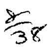

c#

### A TREATISE

ON THE LAW OF

# BILLS OF EXCHANGE,

PROMISSORY NOTES,

## BANK NOTES AND CHECKS.

BY

JOHN BARNARD BYLES.

EIGHTH EDITION.

BY

H. G. WOOD.

VIGILANTIBUS NON DORMIENTIBUS JURA SUBVENIUNT.

PHILADELPHIA:

T. & J. W. JOHNSON & CO. 1891.

S: UK 9.31

0

1×9934

Entered according to Act of Congress, in the year 1891, by

T. & J. W. JOHNSON & CO.,

In the Office of the Librarian of Congress at Washington, D. C.

JUL 17 1007

### PREFACE.

It is wholly unnecessary for me to say anything in commendation of Mr. Byles' work on Bills of Exchange and Promissory Notes, or of the value of the late Mr. Justice Sharswood's notes thereto, as it has been for years the standard work in this country upon that subject, and has been more extensively cited by our courts of last resort than any other work, either English or American. A crystallization of the law relating to the vexed topics treated in this work into such a small compass has excited both the wonder and the admiration of the profession and the courts in this country, and it is to-day, as it deserves to be, the most authoritative work upon the subject extant.

But few changes have been made in Mr. Sharswood's most excellent notes, and those only for the purpose of keeping the work within proper limits and giving the latest and freshest decisions upon the topics covered thereby. Many new notes have been added, bringing the work down to date, and the editor has aimed to make the book as practical and useful as possible, both to the student and the practicing lawyer.

H. G. WOOD.

New York, January, 1891.

#### NOTE TO THE

## SEVENTH AMERICAN EDITION.

THIS Edition, from the Thirteenth and last English Edition, is now presented to the American Profession. This treatise has won its way so entirely to public confidence, as an accurate and practical compendium of the law of Bills of Exchange and Promissory Notes, as evidenced by the demand constantly recurring for new editions, both in England and this country, that nothing further need be said in its favor. Much care has been bestowed upon the Editorial Department. The cases on the subject are so numerous in the American courts that the difficulty has been to avoid incumbering the work with crowded references. The Editor's effort has been to select and arrange the more important decisions, illustrative of the principles of the text, avoiding,—except in a few instances, in which it seemed important, for the sake of the Student, -any discussion of the grounds of the cases. In this respect, the character of the Notes has been made, as far as the ability of the Editor permitted, to conform to that of the text, which is remarkable for its succinctness and for its judicious selection of leading points and cases. It is evident that an attempt to do more-to make a library of the book—would have destroyed its symmetry and usefulness.

G. S.

## CONTENTS.

### CHAPTER I.

#### GENERAL OBSERVATIONS ON A BILL OF EXCHANGE.

|                                                                                                       | VI                                                                                                     |
|-------------------------------------------------------------------------------------------------------|--------------------------------------------------------------------------------------------------------|
| Effect of drawing or indorsing a Bill, 3 How far Bills and Notes are consid-                       | Where a Bill or Note might have                                                                        |
| CHAPT OF A PROMI                                                                                   |                                                                                                        |
| What it is                                                                                            | Bank Notes,                                                                                            |
| Promissory Notes made out of Eng-                                                                     | When Bank of England Notes are a legal tender, 10 Country Bank Notes, 10 When Country Bank Notes are a |
| Note by a man to himself,                                                                             | legal tender, 10 When Money had and received would                                                     |
| ·                                                                                                     | Of the contracting words in a Promissory Note,                                                         |
|                                                                                                       | ER III.                                                                                                |
| OF A CHECK O                                                                                          |                                                                                                        |
| What instruments are checks, 13 Requisites to bring checks within the\nexemption of the General Stamp | Effect and penalty of omitting a Stamp on check, where necessary, 16                                   |
| . <del>-</del> 1                                                                                      | Alteration of the law by recent Acts, 16 (v)                                                           |

| PAGE                                    | PAGE                                      |
|-----------------------------------------|-------------------------------------------|
| Existing Stamp Duty, 17                 | When it may be taken in payment. 20       |
| Amount for which a check may be         | Whether Holder or Assignee of a           |
| drawn,                                  | chose in action,                          |
| How transferred, 18                     | Effect of Drawer's death, 23              |
| Banker's obligation to pay, 18          | Of fraud in filling up checks, 23         |
| Time of presentment, 19                 | Branch Banks,                             |
| As between Holder and Drawer, . 20      | When several must join in drawing         |
| As between the Holder and his own       | check,                                    |
| Banker, 20                              | From what period Customers debited, 24    |
| Where the parties do not live in the    | Checks not protestable, 24                |
| same place, 20                          | Right to cash a check                     |
| As between the Holder and a Trans-      | Overdue check,                            |
| ferror who is not the Drawer, . 21      | Is within Bills of Exchange Acts, 25      |
| What amounts to an engagement to        | May be taken in execution,                |
|                                         |                                           |
| I                                       |                                           |
|                                         |                                           |
| When it amounts to Payment, 22          | `                                         |
|                                         |                                           |
| •                                       |                                           |
| CHAPT                                   | ER IV.                                    |
|                                         |                                           |
| OF AN                                   | 10 U.                                     |
| 7771 - 4 14 1 00                        | Need not be addressed to the Creditor, 30 |
| ,                                       | Bill in Equity to discover Considera-     |
| * · · · · · · · · · · · · · · · · · · · |                                           |
| Unless it amounts to a Note or Agree-   | tion,                                     |
| ment,                                   | To restrain an Action, 30                 |
|                                         |                                           |
| · •                                     |                                           |
| CHAI                                    | PTER V.                                   |
|                                         |                                           |
| OF THE CAPACITY OF CONTRACT             | ING PARTIES TO A BILL OR NOTE.            |
| AGENTS                                  | Personal Liability of an Agent to         |
|                                         | <u> </u>                                  |
| , J                                     | Parol Evidence inadmissible to dis-       |
| *                                       |                                           |
| Actual and ostensible authority, . 32   |                                           |
| How Agent appointed, 32                 | 1                                         |
| Procuration,                            | name appears,                             |
| When authority inferred, 34             | , -                                       |
| To indorse,                             |                                           |
| When admitted, 34                       | •                                         |
| Consequences of an agent exceeding      | Rights of an Agent against third per-     |
| his Authority, 35                       |                                           |
| Unauthorized indorsement, 35            |                                           |
| Delivery,                               |                                           |
| Pledging,                               |                                           |
| Bill Brokers,                           |                                           |
| When the production of Agent's Au-      | PARTNERSHIP, BOTH ACTUAL AND              |
| thority may be required, 36             | 1                                         |
| How determined,                         | 3                                         |
| When it may be delegated, 37            |                                           |
| transmit as many Data                   | , , ,                                     |

#### CONTENTS.

| PAGE                                    | n.o.                                                                     |
|-----------------------------------------|--------------------------------------------------------------------------|
| Cases in which Partners are both en-    | When Executors may sue as such, . 57                                     |
| titled and liable in respect of a       | Delivery after Indorser's Death, 58                                      |
| Bill, 42                                |                                                                          |
| Rightsand Liabilities as between the    | several,                                                                 |
| Firm and the World, 44                  | Personal Liability on a Bill, 58                                         |
| One partner binding the others by       | Joinder of Causes of Action against, . 59                                |
| Bills,                                  | 1_                                                                       |
| By Promissory Notes, 45                 | Infants' Relief Act, 61                                                  |
|                                         | PERSONS UNDER UNDUE INFLUENCE, 63                                        |
|                                         | LUNATIOS, 63                                                             |
|                                         | PERSONS DRUNK, 64                                                        |
|                                         | MARRIED WOMEN, 65                                                        |
| Consequences of Partner exceeding       | Married Women's Property Act and                                         |
| his Authority, 47                       | Amendment Act, 69                                                        |
| Where there is Notice, 47               | · ·                                                                      |
| Common Partner in two Firms of          | ALIENS,                                                                  |
| <del>-</del> ·                          | CORPORATIONS AND BANKING COM-                                            |
|                                         | PANIES,                                                                  |
| 21011 2 4 2 2 2                         | Bank of England,                                                         |
|                                         | Barks of not more than ten Partners, 73                                  |
|                                         | Banks of more than ten Partners, . 73                                    |
| NOMINAL PARTNER, 51                     | , ·                                                                      |
| Dissolution, 51                         | •                                                                        |
| Betirement of Secret Partner, 53        | 7                                                                        |
| OCCASIONAL PARTNERSHIPS, 54             | <u> </u>                                                                 |
| EXECUTORS AND ADMINISTRATORS, 54        | Joint Stock Companies under subse-                                       |
| Their Rights and Duties, 55             | quent Acts,                                                              |
| Effect of Probate, 56                   | PERSONS ACTING IN AN OFFICIAL                                            |
| Specialty and Simple Contract Debts, 56 |                                                                          |
| Debter made Executor, 56                | LOAN SOCIETIES,                                                          |
| Debtor becoming Administrator, . 57     | •                                                                        |
| -                                       | •                                                                        |
|                                         |                                                                          |
|                                         |                                                                          |
| CHAP                                    | TER VI.                                                                  |
| AR MATE DANIE AR BOTTO AT THE           | **************************************                                   |
| OF THE FORM OF BILLS OF EXC             | HANGE AND PROMISSORY NOTES.                                              |
| On what Substance they may be           | Of the Words "Order" or "Bearer," . 85                                   |
| written,                                | Of the Sum payable,                                                      |
| In what Language,                       |                                                                          |
| In Pencil or in Ink,                    | Bills and Notes under 51.,                                               |
| Signature by a Mark,                    | Of the Words "Value Received," . 87                                      |
| Of the Superscription of the Place      | Other Statements of the Considera-                                       |
| where made,                             | 1                                                                        |
| Of the Date,                            | l                                                                        |
| Of the Superscription of the Sum pay-   | l _ <b>a . e</b>                                                         |
| able,                                   | Of the Direction to the Drawee, 89 Of the Place where made payable by |
| Of the time when payable,               |                                                                          |
| Of Usance,                              | Of the Direction to place to Account, 91                                 |
| Of the Request to pay,                  | 0.047 *** 0.774                                                          |
| Of the name of the Payee, 82            |                                                                          |
|                                         | •                                                                        |

### CHAPTER VII.

| OF AMBIGUOUS, | CONDITIONAL, | AND | OTHERWISE | IRREGULAT | : N- |  |  |
|---------------|--------------|-----|-----------|-----------|------|--|--|
| CODINGRAPS    |              |     |           |           |      |  |  |

| 97 97 98 97 98 98 98 99 |
|----------------------------------------------|
|                                              |
|                                              |
|                                              |
| F                                            |
|                                              |
| 102 102 102 103 103 103       |
|                                              |
|                                              |
| 106                                          |
|                                              |

|                     |        |      |       |     | PAGE | 1 .                        |   |   | PAGE |
|---------------------|--------|------|-------|-----|------|----------------------------|---|---|------|
| Promissory Notes,   |        |      | •     |     | 109  | Notarial Acts              |   |   | 113  |
| Fixed Duty on B     | ill to | ſ.   | Excha | ugo |      | Recoipts,                  |   | _ | 112  |
| payable on Dema     | nd,    |      |       |     | 109  | Schedule to the above Act  |   | • | 113  |
| Foreign Bills and N | lotes, |      |       |     |      | Bills and Notes exempt, .  | • |   | 117  |
| When Bills or Notes | s maz  | r þe | Stum  | ped |      | What Instruments may       |   |   |      |
| after Execution,    | •      | •    | •     | ٠   | 444  |                            |   |   | 117  |
| Isming unstammed    | Lastr  | um   | onta, |     | 110  | Reservation of Interest, . |   |   | 117  |
| Stamps on Sets of B | ille,  | ٠    | •     |     | 111  | Effect of want of Stamp, . |   | · | 118  |
| Foreign Securities, | •      | •    | •     | •   | 111, | Presumption as to Stamp,   | • | · | 119  |
|                     | •      |      |       |     |      | <del></del>                |   |   |      |
| `                   | 4      |      |       |     |      |                            |   |   |      |
|                     |        |      |       |     |      | •                          |   |   |      |
| •                   |        |      | (     | 711 | ſΛD  | TED V                      |   |   |      |

### OF THE CONSIDERATION.

| m                                                                                                                                                                                                                                                                                                                                                                                                                                                                                                                                                                                                                                                                                                                                                                                                                                                                                                                                                                                                                                                                                                                                                                                                                                                                                                                                                                                                                                                                                                                                                                                                                                                                                                                                                                                                                                                                                                                                                                                                                                                                                                                              |       | 179.11                                                                                                                                                                                                                                                                                                                                                                                                                                                                                                                                                                                                                                                                                                                                                                                                                                                                                                                                                                                                                                                                                                                                                                                                                                                                                                                                                                                                                                                                                                                                                                                                                                                                                                                                                                                                                                                                                                                                                                                                                                                                                                                         |      |
|--------------------------------------------------------------------------------------------------------------------------------------------------------------------------------------------------------------------------------------------------------------------------------------------------------------------------------------------------------------------------------------------------------------------------------------------------------------------------------------------------------------------------------------------------------------------------------------------------------------------------------------------------------------------------------------------------------------------------------------------------------------------------------------------------------------------------------------------------------------------------------------------------------------------------------------------------------------------------------------------------------------------------------------------------------------------------------------------------------------------------------------------------------------------------------------------------------------------------------------------------------------------------------------------------------------------------------------------------------------------------------------------------------------------------------------------------------------------------------------------------------------------------------------------------------------------------------------------------------------------------------------------------------------------------------------------------------------------------------------------------------------------------------------------------------------------------------------------------------------------------------------------------------------------------------------------------------------------------------------------------------------------------------------------------------------------------------------------------------------------------------|-------|--------------------------------------------------------------------------------------------------------------------------------------------------------------------------------------------------------------------------------------------------------------------------------------------------------------------------------------------------------------------------------------------------------------------------------------------------------------------------------------------------------------------------------------------------------------------------------------------------------------------------------------------------------------------------------------------------------------------------------------------------------------------------------------------------------------------------------------------------------------------------------------------------------------------------------------------------------------------------------------------------------------------------------------------------------------------------------------------------------------------------------------------------------------------------------------------------------------------------------------------------------------------------------------------------------------------------------------------------------------------------------------------------------------------------------------------------------------------------------------------------------------------------------------------------------------------------------------------------------------------------------------------------------------------------------------------------------------------------------------------------------------------------------------------------------------------------------------------------------------------------------------------------------------------------------------------------------------------------------------------------------------------------------------------------------------------------------------------------------------------------------|------|
| Presumption as to Consideration on                                                                                                                                                                                                                                                                                                                                                                                                                                                                                                                                                                                                                                                                                                                                                                                                                                                                                                                                                                                                                                                                                                                                                                                                                                                                                                                                                                                                                                                                                                                                                                                                                                                                                                                                                                                                                                                                                                                                                                                                                                                                                             |       | Failure of Consideration,                                                                                                                                                                                                                                                                                                                                                                                                                                                                                                                                                                                                                                                                                                                                                                                                                                                                                                                                                                                                                                                                                                                                                                                                                                                                                                                                                                                                                                                                                                                                                                                                                                                                                                                                                                                                                                                                                                                                                                                                                                                                                                      | 131  |
| Bills and Notes,                                                                                                                                                                                                                                                                                                                                                                                                                                                                                                                                                                                                                                                                                                                                                                                                                                                                                                                                                                                                                                                                                                                                                                                                                                                                                                                                                                                                                                                                                                                                                                                                                                                                                                                                                                                                                                                                                                                                                                                                                                                                                                               |       | - Torroo of Tractites of Collanger Chillian                                                                                                                                                                                                                                                                                                                                                                                                                                                                                                                                                                                                                                                                                                                                                                                                                                                                                                                                                                                                                                                                                                                                                                                                                                                                                                                                                                                                                                                                                                                                                                                                                                                                                                                                                                                                                                                                                                                                                                                                                                                                                    | 131  |
| When it must be proved,                                                                                                                                                                                                                                                                                                                                                                                                                                                                                                                                                                                                                                                                                                                                                                                                                                                                                                                                                                                                                                                                                                                                                                                                                                                                                                                                                                                                                                                                                                                                                                                                                                                                                                                                                                                                                                                                                                                                                                                                                                                                                                        |       | The state of the state of the state of the state of the state of the state of the state of the state of the state of the state of the state of the state of the state of the state of the state of the state of the state of the state of the state of the state of the state of the state of the state of the state of the state of the state of the state of the state of the state of the state of the state of the state of the state of the state of the state of the state of the state of the state of the state of the state of the state of the state of the state of the state of the state of the state of the state of the state of the state of the state of the state of the state of the state of the state of the state of the state of the state of the state of the state of the state of the state of the state of the state of the state of the state of the state of the state of the state of the state of the state of the state of the state of the state of the state of the state of the state of the state of the state of the state of the state of the state of the state of the state of the state of the state of the state of the state of the state of the state of the state of the state of the state of the state of the state of the state of the state of the state of the state of the state of the state of the state of the state of the state of the state of the state of the state of the state of the state of the state of the state of the state of the state of the state of the state of the state of the state of the state of the state of the state of the state of the state of the state of the state of the state of the state of the state of the state of the state of the state of the state of the state of the state of the state of the state of the state of the state of the state of the state of the state of the state of the state of the state of the state of the state of the state of the state of the state of the state of the state of the state of the state of the state of the state of the state of the state of the state of the state of the s | 131  |
| In the Case of an Accommodation                                                                                                                                                                                                                                                                                                                                                                                                                                                                                                                                                                                                                                                                                                                                                                                                                                                                                                                                                                                                                                                                                                                                                                                                                                                                                                                                                                                                                                                                                                                                                                                                                                                                                                                                                                                                                                                                                                                                                                                                                                                                                                |       | Partial Absence or Failure of Con-                                                                                                                                                                                                                                                                                                                                                                                                                                                                                                                                                                                                                                                                                                                                                                                                                                                                                                                                                                                                                                                                                                                                                                                                                                                                                                                                                                                                                                                                                                                                                                                                                                                                                                                                                                                                                                                                                                                                                                                                                                                                                             |      |
| Bill,                                                                                                                                                                                                                                                                                                                                                                                                                                                                                                                                                                                                                                                                                                                                                                                                                                                                                                                                                                                                                                                                                                                                                                                                                                                                                                                                                                                                                                                                                                                                                                                                                                                                                                                                                                                                                                                                                                                                                                                                                                                                                                                          | 121   | , , , , , , , , , , , , , , , , , , , ,                                                                                                                                                                                                                                                                                                                                                                                                                                                                                                                                                                                                                                                                                                                                                                                                                                                                                                                                                                                                                                                                                                                                                                                                                                                                                                                                                                                                                                                                                                                                                                                                                                                                                                                                                                                                                                                                                                                                                                                                                                                                                        | 132  |
| Rules of Plending,                                                                                                                                                                                                                                                                                                                                                                                                                                                                                                                                                                                                                                                                                                                                                                                                                                                                                                                                                                                                                                                                                                                                                                                                                                                                                                                                                                                                                                                                                                                                                                                                                                                                                                                                                                                                                                                                                                                                                                                                                                                                                                             | 123   | FRAUD,                                                                                                                                                                                                                                                                                                                                                                                                                                                                                                                                                                                                                                                                                                                                                                                                                                                                                                                                                                                                                                                                                                                                                                                                                                                                                                                                                                                                                                                                                                                                                                                                                                                                                                                                                                                                                                                                                                                                                                                                                                                                                                                         | 133  |
| Ambiguity of the Expression "bona"                                                                                                                                                                                                                                                                                                                                                                                                                                                                                                                                                                                                                                                                                                                                                                                                                                                                                                                                                                                                                                                                                                                                                                                                                                                                                                                                                                                                                                                                                                                                                                                                                                                                                                                                                                                                                                                                                                                                                                                                                                                                                             |       | Bills and Notes in Fraud of Third                                                                                                                                                                                                                                                                                                                                                                                                                                                                                                                                                                                                                                                                                                                                                                                                                                                                                                                                                                                                                                                                                                                                                                                                                                                                                                                                                                                                                                                                                                                                                                                                                                                                                                                                                                                                                                                                                                                                                                                                                                                                                              |      |
| file Holder for Value,"                                                                                                                                                                                                                                                                                                                                                                                                                                                                                                                                                                                                                                                                                                                                                                                                                                                                                                                                                                                                                                                                                                                                                                                                                                                                                                                                                                                                                                                                                                                                                                                                                                                                                                                                                                                                                                                                                                                                                                                                                                                                                                        | 123   | Person,                                                                                                                                                                                                                                                                                                                                                                                                                                                                                                                                                                                                                                                                                                                                                                                                                                                                                                                                                                                                                                                                                                                                                                                                                                                                                                                                                                                                                                                                                                                                                                                                                                                                                                                                                                                                                                                                                                                                                                                                                                                                                                                        | 134  |
| Distinction between Holder without                                                                                                                                                                                                                                                                                                                                                                                                                                                                                                                                                                                                                                                                                                                                                                                                                                                                                                                                                                                                                                                                                                                                                                                                                                                                                                                                                                                                                                                                                                                                                                                                                                                                                                                                                                                                                                                                                                                                                                                                                                                                                             |       | Where a Party who has been de-                                                                                                                                                                                                                                                                                                                                                                                                                                                                                                                                                                                                                                                                                                                                                                                                                                                                                                                                                                                                                                                                                                                                                                                                                                                                                                                                                                                                                                                                                                                                                                                                                                                                                                                                                                                                                                                                                                                                                                                                                                                                                                 |      |
| Value and Holder with Notice, .                                                                                                                                                                                                                                                                                                                                                                                                                                                                                                                                                                                                                                                                                                                                                                                                                                                                                                                                                                                                                                                                                                                                                                                                                                                                                                                                                                                                                                                                                                                                                                                                                                                                                                                                                                                                                                                                                                                                                                                                                                                                                                | 123   | frauded must pay a Bill or Note,                                                                                                                                                                                                                                                                                                                                                                                                                                                                                                                                                                                                                                                                                                                                                                                                                                                                                                                                                                                                                                                                                                                                                                                                                                                                                                                                                                                                                                                                                                                                                                                                                                                                                                                                                                                                                                                                                                                                                                                                                                                                                               |      |
| Burden of Proof in the case of al-                                                                                                                                                                                                                                                                                                                                                                                                                                                                                                                                                                                                                                                                                                                                                                                                                                                                                                                                                                                                                                                                                                                                                                                                                                                                                                                                                                                                                                                                                                                                                                                                                                                                                                                                                                                                                                                                                                                                                                                                                                                                                             |       | signed by him, without Con-                                                                                                                                                                                                                                                                                                                                                                                                                                                                                                                                                                                                                                                                                                                                                                                                                                                                                                                                                                                                                                                                                                                                                                                                                                                                                                                                                                                                                                                                                                                                                                                                                                                                                                                                                                                                                                                                                                                                                                                                                                                                                                    |      |
| leged Holder without Value,                                                                                                                                                                                                                                                                                                                                                                                                                                                                                                                                                                                                                                                                                                                                                                                                                                                                                                                                                                                                                                                                                                                                                                                                                                                                                                                                                                                                                                                                                                                                                                                                                                                                                                                                                                                                                                                                                                                                                                                                                                                                                                    | 124   | sidoration,                                                                                                                                                                                                                                                                                                                                                                                                                                                                                                                                                                                                                                                                                                                                                                                                                                                                                                                                                                                                                                                                                                                                                                                                                                                                                                                                                                                                                                                                                                                                                                                                                                                                                                                                                                                                                                                                                                                                                                                                                                                                                                                    | 108  |
| In Case of alleged Holder with                                                                                                                                                                                                                                                                                                                                                                                                                                                                                                                                                                                                                                                                                                                                                                                                                                                                                                                                                                                                                                                                                                                                                                                                                                                                                                                                                                                                                                                                                                                                                                                                                                                                                                                                                                                                                                                                                                                                                                                                                                                                                                 |       | ILLEGAL CONSIDERATION AT COM-                                                                                                                                                                                                                                                                                                                                                                                                                                                                                                                                                                                                                                                                                                                                                                                                                                                                                                                                                                                                                                                                                                                                                                                                                                                                                                                                                                                                                                                                                                                                                                                                                                                                                                                                                                                                                                                                                                                                                                                                                                                                                                  | #-10 |
| Notice,                                                                                                                                                                                                                                                                                                                                                                                                                                                                                                                                                                                                                                                                                                                                                                                                                                                                                                                                                                                                                                                                                                                                                                                                                                                                                                                                                                                                                                                                                                                                                                                                                                                                                                                                                                                                                                                                                                                                                                                                                                                                                                                        | 124   | MON LAW,                                                                                                                                                                                                                                                                                                                                                                                                                                                                                                                                                                                                                                                                                                                                                                                                                                                                                                                                                                                                                                                                                                                                                                                                                                                                                                                                                                                                                                                                                                                                                                                                                                                                                                                                                                                                                                                                                                                                                                                                                                                                                                                       | 137  |
| Proof of Notice,                                                                                                                                                                                                                                                                                                                                                                                                                                                                                                                                                                                                                                                                                                                                                                                                                                                                                                                                                                                                                                                                                                                                                                                                                                                                                                                                                                                                                                                                                                                                                                                                                                                                                                                                                                                                                                                                                                                                                                                                                                                                                                               | 125   | Immoral.                                                                                                                                                                                                                                                                                                                                                                                                                                                                                                                                                                                                                                                                                                                                                                                                                                                                                                                                                                                                                                                                                                                                                                                                                                                                                                                                                                                                                                                                                                                                                                                                                                                                                                                                                                                                                                                                                                                                                                                                                                                                                                                       | 137  |
| Plaintiff standing on prior Title, .                                                                                                                                                                                                                                                                                                                                                                                                                                                                                                                                                                                                                                                                                                                                                                                                                                                                                                                                                                                                                                                                                                                                                                                                                                                                                                                                                                                                                                                                                                                                                                                                                                                                                                                                                                                                                                                                                                                                                                                                                                                                                           | 125   | In Contravention of Public Policy,                                                                                                                                                                                                                                                                                                                                                                                                                                                                                                                                                                                                                                                                                                                                                                                                                                                                                                                                                                                                                                                                                                                                                                                                                                                                                                                                                                                                                                                                                                                                                                                                                                                                                                                                                                                                                                                                                                                                                                                                                                                                                             | 138  |
|                                                                                                                                                                                                                                                                                                                                                                                                                                                                                                                                                                                                                                                                                                                                                                                                                                                                                                                                                                                                                                                                                                                                                                                                                                                                                                                                                                                                                                                                                                                                                                                                                                                                                                                                                                                                                                                                                                                                                                                                                                                                                                                                | 125   | ILLEGAL OB VOID BY STATUTE,                                                                                                                                                                                                                                                                                                                                                                                                                                                                                                                                                                                                                                                                                                                                                                                                                                                                                                                                                                                                                                                                                                                                                                                                                                                                                                                                                                                                                                                                                                                                                                                                                                                                                                                                                                                                                                                                                                                                                                                                                                                                                                    | 140  |
| Explicit Notice,                                                                                                                                                                                                                                                                                                                                                                                                                                                                                                                                                                                                                                                                                                                                                                                                                                                                                                                                                                                                                                                                                                                                                                                                                                                                                                                                                                                                                                                                                                                                                                                                                                                                                                                                                                                                                                                                                                                                                                                                                                                                                                               | 125   |                                                                                                                                                                                                                                                                                                                                                                                                                                                                                                                                                                                                                                                                                                                                                                                                                                                                                                                                                                                                                                                                                                                                                                                                                                                                                                                                                                                                                                                                                                                                                                                                                                                                                                                                                                                                                                                                                                                                                                                                                                                                                                                                |      |
| Implicit Notice,                                                                                                                                                                                                                                                                                                                                                                                                                                                                                                                                                                                                                                                                                                                                                                                                                                                                                                                                                                                                                                                                                                                                                                                                                                                                                                                                                                                                                                                                                                                                                                                                                                                                                                                                                                                                                                                                                                                                                                                                                                                                                                               |       | Usury,                                                                                                                                                                                                                                                                                                                                                                                                                                                                                                                                                                                                                                                                                                                                                                                                                                                                                                                                                                                                                                                                                                                                                                                                                                                                                                                                                                                                                                                                                                                                                                                                                                                                                                                                                                                                                                                                                                                                                                                                                                                                                                                         | 140  |
| Abstinence from Inquiry,                                                                                                                                                                                                                                                                                                                                                                                                                                                                                                                                                                                                                                                                                                                                                                                                                                                                                                                                                                                                                                                                                                                                                                                                                                                                                                                                                                                                                                                                                                                                                                                                                                                                                                                                                                                                                                                                                                                                                                                                                                                                                                       | 1     | Gaming,                                                                                                                                                                                                                                                                                                                                                                                                                                                                                                                                                                                                                                                                                                                                                                                                                                                                                                                                                                                                                                                                                                                                                                                                                                                                                                                                                                                                                                                                                                                                                                                                                                                                                                                                                                                                                                                                                                                                                                                                                                                                                                                        | 140  |
| Gross Negligence not equivalent to                                                                                                                                                                                                                                                                                                                                                                                                                                                                                                                                                                                                                                                                                                                                                                                                                                                                                                                                                                                                                                                                                                                                                                                                                                                                                                                                                                                                                                                                                                                                                                                                                                                                                                                                                                                                                                                                                                                                                                                                                                                                                             |       |                                                                                                                                                                                                                                                                                                                                                                                                                                                                                                                                                                                                                                                                                                                                                                                                                                                                                                                                                                                                                                                                                                                                                                                                                                                                                                                                                                                                                                                                                                                                                                                                                                                                                                                                                                                                                                                                                                                                                                                                                                                                                                                                | 141  |
| Notice,                                                                                                                                                                                                                                                                                                                                                                                                                                                                                                                                                                                                                                                                                                                                                                                                                                                                                                                                                                                                                                                                                                                                                                                                                                                                                                                                                                                                                                                                                                                                                                                                                                                                                                                                                                                                                                                                                                                                                                                                                                                                                                                        | 126   |                                                                                                                                                                                                                                                                                                                                                                                                                                                                                                                                                                                                                                                                                                                                                                                                                                                                                                                                                                                                                                                                                                                                                                                                                                                                                                                                                                                                                                                                                                                                                                                                                                                                                                                                                                                                                                                                                                                                                                                                                                                                                                                                | 141  |
| Notice to an Agent,                                                                                                                                                                                                                                                                                                                                                                                                                                                                                                                                                                                                                                                                                                                                                                                                                                                                                                                                                                                                                                                                                                                                                                                                                                                                                                                                                                                                                                                                                                                                                                                                                                                                                                                                                                                                                                                                                                                                                                                                                                                                                                            | 126   |                                                                                                                                                                                                                                                                                                                                                                                                                                                                                                                                                                                                                                                                                                                                                                                                                                                                                                                                                                                                                                                                                                                                                                                                                                                                                                                                                                                                                                                                                                                                                                                                                                                                                                                                                                                                                                                                                                                                                                                                                                                                                                                                | 142  |
| Gift of a Bill or Note,                                                                                                                                                                                                                                                                                                                                                                                                                                                                                                                                                                                                                                                                                                                                                                                                                                                                                                                                                                                                                                                                                                                                                                                                                                                                                                                                                                                                                                                                                                                                                                                                                                                                                                                                                                                                                                                                                                                                                                                                                                                                                                        | - j   |                                                                                                                                                                                                                                                                                                                                                                                                                                                                                                                                                                                                                                                                                                                                                                                                                                                                                                                                                                                                                                                                                                                                                                                                                                                                                                                                                                                                                                                                                                                                                                                                                                                                                                                                                                                                                                                                                                                                                                                                                                                                                                                                | 142  |
| Nature of the Consideration,                                                                                                                                                                                                                                                                                                                                                                                                                                                                                                                                                                                                                                                                                                                                                                                                                                                                                                                                                                                                                                                                                                                                                                                                                                                                                                                                                                                                                                                                                                                                                                                                                                                                                                                                                                                                                                                                                                                                                                                                                                                                                                   | 127   | Other Considerations illegal by                                                                                                                                                                                                                                                                                                                                                                                                                                                                                                                                                                                                                                                                                                                                                                                                                                                                                                                                                                                                                                                                                                                                                                                                                                                                                                                                                                                                                                                                                                                                                                                                                                                                                                                                                                                                                                                                                                                                                                                                                                                                                                |      |
| Dec aminting Dahi                                                                                                                                                                                                                                                                                                                                                                                                                                                                                                                                                                                                                                                                                                                                                                                                                                                                                                                                                                                                                                                                                                                                                                                                                                                                                                                                                                                                                                                                                                                                                                                                                                                                                                                                                                                                                                                                                                                                                                                                                                                                                                              |       |                                                                                                                                                                                                                                                                                                                                                                                                                                                                                                                                                                                                                                                                                                                                                                                                                                                                                                                                                                                                                                                                                                                                                                                                                                                                                                                                                                                                                                                                                                                                                                                                                                                                                                                                                                                                                                                                                                                                                                                                                                                                                                                                | 144  |
| Finetnating Dalamas                                                                                                                                                                                                                                                                                                                                                                                                                                                                                                                                                                                                                                                                                                                                                                                                                                                                                                                                                                                                                                                                                                                                                                                                                                                                                                                                                                                                                                                                                                                                                                                                                                                                                                                                                                                                                                                                                                                                                                                                                                                                                                            | 128   | Notice of Fraudulent or Illegal                                                                                                                                                                                                                                                                                                                                                                                                                                                                                                                                                                                                                                                                                                                                                                                                                                                                                                                                                                                                                                                                                                                                                                                                                                                                                                                                                                                                                                                                                                                                                                                                                                                                                                                                                                                                                                                                                                                                                                                                                                                                                                |      |
| Dobt of a Milital Down                                                                                                                                                                                                                                                                                                                                                                                                                                                                                                                                                                                                                                                                                                                                                                                                                                                                                                                                                                                                                                                                                                                                                                                                                                                                                                                                                                                                                                                                                                                                                                                                                                                                                                                                                                                                                                                                                                                                                                                                                                                                                                         | 1     |                                                                                                                                                                                                                                                                                                                                                                                                                                                                                                                                                                                                                                                                                                                                                                                                                                                                                                                                                                                                                                                                                                                                                                                                                                                                                                                                                                                                                                                                                                                                                                                                                                                                                                                                                                                                                                                                                                                                                                                                                                                                                                                                | 146  |
| A T 1 / 3% 1 /                                                                                                                                                                                                                                                                                                                                                                                                                                                                                                                                                                                                                                                                                                                                                                                                                                                                                                                                                                                                                                                                                                                                                                                                                                                                                                                                                                                                                                                                                                                                                                                                                                                                                                                                                                                                                                                                                                                                                                                                                                                                                                                 | 128   | Illegality of Consideration, when                                                                                                                                                                                                                                                                                                                                                                                                                                                                                                                                                                                                                                                                                                                                                                                                                                                                                                                                                                                                                                                                                                                                                                                                                                                                                                                                                                                                                                                                                                                                                                                                                                                                                                                                                                                                                                                                                                                                                                                                                                                                                              |      |
| Commence of the contract of the contract of the contract of the contract of the contract of the contract of the contract of the contract of the contract of the contract of the contract of the contract of the contract of the contract of the contract of the contract of the contract of the contract of the contract of the contract of the contract of the contract of the contract of the contract of the contract of the contract of the contract of the contract of the contract of the contract of the contract of the contract of the contract of the contract of the contract of the contract of the contract of the contract of the contract of the contract of the contract of the contract of the contract of the contract of the contract of the contract of the contract of the contract of the contract of the contract of the contract of the contract of the contract of the contract of the contract of the contract of the contract of the contract of the contract of the contract of the contract of the contract of the contract of the contract of the contract of the contract of the contract of the contract of the contract of the contract of the contract of the contract of the contract of the contract of the contract of the contract of the contract of the contract of the contract of the contract of the contract of the contract of the contract of the contract of the contract of the contract of the contract of the contract of the contract of the contract of the contract of the contract of the contract of the contract of the contract of the contract of the contract of the contract of the contract of the contract of the contract of the contract of the contract of the contract of the contract of the contract of the contract of the contract of the contract of the contract of the contract of the contract of the contract of the contract of the contract of the contract of the contract of the contract of the contract of the contract of the contract of the contract of the contract of the contract of the contract of the contract of the contract of th |       |                                                                                                                                                                                                                                                                                                                                                                                                                                                                                                                                                                                                                                                                                                                                                                                                                                                                                                                                                                                                                                                                                                                                                                                                                                                                                                                                                                                                                                                                                                                                                                                                                                                                                                                                                                                                                                                                                                                                                                                                                                                                                                                                | 148  |
| Compromise of a Claim,                                                                                                                                                                                                                                                                                                                                                                                                                                                                                                                                                                                                                                                                                                                                                                                                                                                                                                                                                                                                                                                                                                                                                                                                                                                                                                                                                                                                                                                                                                                                                                                                                                                                                                                                                                                                                                                                                                                                                                                                                                                                                                         |       |                                                                                                                                                                                                                                                                                                                                                                                                                                                                                                                                                                                                                                                                                                                                                                                                                                                                                                                                                                                                                                                                                                                                                                                                                                                                                                                                                                                                                                                                                                                                                                                                                                                                                                                                                                                                                                                                                                                                                                                                                                                                                                                                | 146  |
| Moral Obligation,                                                                                                                                                                                                                                                                                                                                                                                                                                                                                                                                                                                                                                                                                                                                                                                                                                                                                                                                                                                                                                                                                                                                                                                                                                                                                                                                                                                                                                                                                                                                                                                                                                                                                                                                                                                                                                                                                                                                                                                                                                                                                                              | 129   | Renewal of Bill given on Illegal                                                                                                                                                                                                                                                                                                                                                                                                                                                                                                                                                                                                                                                                                                                                                                                                                                                                                                                                                                                                                                                                                                                                                                                                                                                                                                                                                                                                                                                                                                                                                                                                                                                                                                                                                                                                                                                                                                                                                                                                                                                                                               |      |
| Cases where more than one Consideration comes in Operation                                                                                                                                                                                                                                                                                                                                                                                                                                                                                                                                                                                                                                                                                                                                                                                                                                                                                                                                                                                                                                                                                                                                                                                                                                                                                                                                                                                                                                                                                                                                                                                                                                                                                                                                                                                                                                                                                                                                                                                                                                                                     | 1     | ~                                                                                                                                                                                                                                                                                                                                                                                                                                                                                                                                                                                                                                                                                                                                                                                                                                                                                                                                                                                                                                                                                                                                                                                                                                                                                                                                                                                                                                                                                                                                                                                                                                                                                                                                                                                                                                                                                                                                                                                                                                                                                                                              | 146  |
| eration comes in Question, .                                                                                                                                                                                                                                                                                                                                                                                                                                                                                                                                                                                                                                                                                                                                                                                                                                                                                                                                                                                                                                                                                                                                                                                                                                                                                                                                                                                                                                                                                                                                                                                                                                                                                                                                                                                                                                                                                                                                                                                                                                                                                                   | 130 1 |                                                                                                                                                                                                                                                                                                                                                                                                                                                                                                                                                                                                                                                                                                                                                                                                                                                                                                                                                                                                                                                                                                                                                                                                                                                                                                                                                                                                                                                                                                                                                                                                                                                                                                                                                                                                                                                                                                                                                                                                                                                                                                                                |      |
|                                                                                                                                                                                                                                                                                                                                                                                                                                                                                                                                                                                                                                                                                                                                                                                                                                                                                                                                                                                                                                                                                                                                                                                                                                                                                                                                                                                                                                                                                                                                                                                                                                                                                                                                                                                                                                                                                                                                                                                                                                                                                                                                |       |                                                                                                                                                                                                                                                                                                                                                                                                                                                                                                                                                                                                                                                                                                                                                                                                                                                                                                                                                                                                                                                                                                                                                                                                                                                                                                                                                                                                                                                                                                                                                                                                                                                                                                                                                                                                                                                                                                                                                                                                                                                                                                                                |      |

### CHAPTER XI.

### OF THE TRANSFER OF BILLS AND NOTES.

| 1                                     | PAGE |                                                                                                                                                                                                                                                                                                                                                                                                                                                                                                                                                                                                                                                                                                                                                                                                                                                                                                                                                                                                                                                                                                                                                                                                                                                                                                                                                                                                                                                                                                                                                                                                                                                                                                                                                                                                                                                                                                                                                                                                                                                                                                                                | PAGE  |
|---------------------------------------|------|--------------------------------------------------------------------------------------------------------------------------------------------------------------------------------------------------------------------------------------------------------------------------------------------------------------------------------------------------------------------------------------------------------------------------------------------------------------------------------------------------------------------------------------------------------------------------------------------------------------------------------------------------------------------------------------------------------------------------------------------------------------------------------------------------------------------------------------------------------------------------------------------------------------------------------------------------------------------------------------------------------------------------------------------------------------------------------------------------------------------------------------------------------------------------------------------------------------------------------------------------------------------------------------------------------------------------------------------------------------------------------------------------------------------------------------------------------------------------------------------------------------------------------------------------------------------------------------------------------------------------------------------------------------------------------------------------------------------------------------------------------------------------------------------------------------------------------------------------------------------------------------------------------------------------------------------------------------------------------------------------------------------------------------------------------------------------------------------------------------------------------|-------|
| Division of the Subject,              | 149  | RIGHTS OF TRANSFERREE BY Dg.                                                                                                                                                                                                                                                                                                                                                                                                                                                                                                                                                                                                                                                                                                                                                                                                                                                                                                                                                                                                                                                                                                                                                                                                                                                                                                                                                                                                                                                                                                                                                                                                                                                                                                                                                                                                                                                                                                                                                                                                                                                                                                   |       |
| WHAT BILLS TRANSFERABLE,              | 149  | LIVERY,                                                                                                                                                                                                                                                                                                                                                                                                                                                                                                                                                                                                                                                                                                                                                                                                                                                                                                                                                                                                                                                                                                                                                                                                                                                                                                                                                                                                                                                                                                                                                                                                                                                                                                                                                                                                                                                                                                                                                                                                                                                                                                                        | 165   |
| Effect of Indorsement of a Bill not   | 1    | Former Effect of Negligence in the                                                                                                                                                                                                                                                                                                                                                                                                                                                                                                                                                                                                                                                                                                                                                                                                                                                                                                                                                                                                                                                                                                                                                                                                                                                                                                                                                                                                                                                                                                                                                                                                                                                                                                                                                                                                                                                                                                                                                                                                                                                                                             |       |
| negotiable,                           | 149  | Transferree,                                                                                                                                                                                                                                                                                                                                                                                                                                                                                                                                                                                                                                                                                                                                                                                                                                                                                                                                                                                                                                                                                                                                                                                                                                                                                                                                                                                                                                                                                                                                                                                                                                                                                                                                                                                                                                                                                                                                                                                                                                                                                                                   | 165   |
| Of a Note not negotiable,             | 150  | Present Effect of Negligence or                                                                                                                                                                                                                                                                                                                                                                                                                                                                                                                                                                                                                                                                                                                                                                                                                                                                                                                                                                                                                                                                                                                                                                                                                                                                                                                                                                                                                                                                                                                                                                                                                                                                                                                                                                                                                                                                                                                                                                                                                                                                                                |       |
| Subsequent insertion of Words         | Ì    | Fraud,                                                                                                                                                                                                                                                                                                                                                                                                                                                                                                                                                                                                                                                                                                                                                                                                                                                                                                                                                                                                                                                                                                                                                                                                                                                                                                                                                                                                                                                                                                                                                                                                                                                                                                                                                                                                                                                                                                                                                                                                                                                                                                                         | 160   |
| creating Negotiability,               | 150  | Title of an Agent,                                                                                                                                                                                                                                                                                                                                                                                                                                                                                                                                                                                                                                                                                                                                                                                                                                                                                                                                                                                                                                                                                                                                                                                                                                                                                                                                                                                                                                                                                                                                                                                                                                                                                                                                                                                                                                                                                                                                                                                                                                                                                                             | 168   |
| Modes of Transfer,                    | 150  | Pledging Bills payable to Bearer,                                                                                                                                                                                                                                                                                                                                                                                                                                                                                                                                                                                                                                                                                                                                                                                                                                                                                                                                                                                                                                                                                                                                                                                                                                                                                                                                                                                                                                                                                                                                                                                                                                                                                                                                                                                                                                                                                                                                                                                                                                                                                              | 166   |
| Blank Indorsement,                    | 151  | Other Instruments payable to                                                                                                                                                                                                                                                                                                                                                                                                                                                                                                                                                                                                                                                                                                                                                                                                                                                                                                                                                                                                                                                                                                                                                                                                                                                                                                                                                                                                                                                                                                                                                                                                                                                                                                                                                                                                                                                                                                                                                                                                                                                                                                   |       |
| Special Indorsement,                  | 151  | Bearer,                                                                                                                                                                                                                                                                                                                                                                                                                                                                                                                                                                                                                                                                                                                                                                                                                                                                                                                                                                                                                                                                                                                                                                                                                                                                                                                                                                                                                                                                                                                                                                                                                                                                                                                                                                                                                                                                                                                                                                                                                                                                                                                        | 166   |
| On the face of a Bill,                | 152  | Metallie Tokens,                                                                                                                                                                                                                                                                                                                                                                                                                                                                                                                                                                                                                                                                                                                                                                                                                                                                                                                                                                                                                                                                                                                                                                                                                                                                                                                                                                                                                                                                                                                                                                                                                                                                                                                                                                                                                                                                                                                                                                                                                                                                                                               | 167   |
| An Allonge                            | 152  | TRANSFER UNDER PECULIAR CIR-                                                                                                                                                                                                                                                                                                                                                                                                                                                                                                                                                                                                                                                                                                                                                                                                                                                                                                                                                                                                                                                                                                                                                                                                                                                                                                                                                                                                                                                                                                                                                                                                                                                                                                                                                                                                                                                                                                                                                                                                                                                                                                   | •     |
| Misspelt Indorsement,                 | 152  | CUMSTANCES,                                                                                                                                                                                                                                                                                                                                                                                                                                                                                                                                                                                                                                                                                                                                                                                                                                                                                                                                                                                                                                                                                                                                                                                                                                                                                                                                                                                                                                                                                                                                                                                                                                                                                                                                                                                                                                                                                                                                                                                                                                                                                                                    | 167   |
| By a Plurality of Holders,            | 152  | Before Bill filled up,                                                                                                                                                                                                                                                                                                                                                                                                                                                                                                                                                                                                                                                                                                                                                                                                                                                                                                                                                                                                                                                                                                                                                                                                                                                                                                                                                                                                                                                                                                                                                                                                                                                                                                                                                                                                                                                                                                                                                                                                                                                                                                         |       |
| Conversion of blank into special      | į    | After Refusal to accept where the                                                                                                                                                                                                                                                                                                                                                                                                                                                                                                                                                                                                                                                                                                                                                                                                                                                                                                                                                                                                                                                                                                                                                                                                                                                                                                                                                                                                                                                                                                                                                                                                                                                                                                                                                                                                                                                                                                                                                                                                                                                                                              |       |
| indorsement,                          | 152  | Transferree has Notice of the                                                                                                                                                                                                                                                                                                                                                                                                                                                                                                                                                                                                                                                                                                                                                                                                                                                                                                                                                                                                                                                                                                                                                                                                                                                                                                                                                                                                                                                                                                                                                                                                                                                                                                                                                                                                                                                                                                                                                                                                                                                                                                  |       |
| Delivery necessary,                   | 153  | Dishonor,                                                                                                                                                                                                                                                                                                                                                                                                                                                                                                                                                                                                                                                                                                                                                                                                                                                                                                                                                                                                                                                                                                                                                                                                                                                                                                                                                                                                                                                                                                                                                                                                                                                                                                                                                                                                                                                                                                                                                                                                                                                                                                                      | 168   |
| LIABILITY OF INDORSER,                | 153  | Where the Transferree has no no-                                                                                                                                                                                                                                                                                                                                                                                                                                                                                                                                                                                                                                                                                                                                                                                                                                                                                                                                                                                                                                                                                                                                                                                                                                                                                                                                                                                                                                                                                                                                                                                                                                                                                                                                                                                                                                                                                                                                                                                                                                                                                               |       |
| How declined,                         | 154  | tice,                                                                                                                                                                                                                                                                                                                                                                                                                                                                                                                                                                                                                                                                                                                                                                                                                                                                                                                                                                                                                                                                                                                                                                                                                                                                                                                                                                                                                                                                                                                                                                                                                                                                                                                                                                                                                                                                                                                                                                                                                                                                                                                          | 168   |
| By Indorsement sans recours,          | 154  | After due,                                                                                                                                                                                                                                                                                                                                                                                                                                                                                                                                                                                                                                                                                                                                                                                                                                                                                                                                                                                                                                                                                                                                                                                                                                                                                                                                                                                                                                                                                                                                                                                                                                                                                                                                                                                                                                                                                                                                                                                                                                                                                                                     | 169 ' |
| By Agreement,                         | 154  | Transfer of Overdue Check,                                                                                                                                                                                                                                                                                                                                                                                                                                                                                                                                                                                                                                                                                                                                                                                                                                                                                                                                                                                                                                                                                                                                                                                                                                                                                                                                                                                                                                                                                                                                                                                                                                                                                                                                                                                                                                                                                                                                                                                                                                                                                                     | 171   |
| By converting blank into special      | }    | Of Note payable on Demand,                                                                                                                                                                                                                                                                                                                                                                                                                                                                                                                                                                                                                                                                                                                                                                                                                                                                                                                                                                                                                                                                                                                                                                                                                                                                                                                                                                                                                                                                                                                                                                                                                                                                                                                                                                                                                                                                                                                                                                                                                                                                                                     |       |
| Indorsement,                          | 155  | Pleading,                                                                                                                                                                                                                                                                                                                                                                                                                                                                                                                                                                                                                                                                                                                                                                                                                                                                                                                                                                                                                                                                                                                                                                                                                                                                                                                                                                                                                                                                                                                                                                                                                                                                                                                                                                                                                                                                                                                                                                                                                                                                                                                      | 172   |
| May be suspended on a Condition, .    | 155  | Equitable Relief in case of out-                                                                                                                                                                                                                                                                                                                                                                                                                                                                                                                                                                                                                                                                                                                                                                                                                                                                                                                                                                                                                                                                                                                                                                                                                                                                                                                                                                                                                                                                                                                                                                                                                                                                                                                                                                                                                                                                                                                                                                                                                                                                                               |       |
| What Indorsement admits,              | 155  | standing overdue Bill,                                                                                                                                                                                                                                                                                                                                                                                                                                                                                                                                                                                                                                                                                                                                                                                                                                                                                                                                                                                                                                                                                                                                                                                                                                                                                                                                                                                                                                                                                                                                                                                                                                                                                                                                                                                                                                                                                                                                                                                                                                                                                                         | 172   |
| Striking out Indorsements,            | 156  | Burden of Proof,                                                                                                                                                                                                                                                                                                                                                                                                                                                                                                                                                                                                                                                                                                                                                                                                                                                                                                                                                                                                                                                                                                                                                                                                                                                                                                                                                                                                                                                                                                                                                                                                                                                                                                                                                                                                                                                                                                                                                                                                                                                                                                               | 172   |
| RIGHTS OF INDORSEE,                   | 157  | Check drawn on Bearer's Banker,                                                                                                                                                                                                                                                                                                                                                                                                                                                                                                                                                                                                                                                                                                                                                                                                                                                                                                                                                                                                                                                                                                                                                                                                                                                                                                                                                                                                                                                                                                                                                                                                                                                                                                                                                                                                                                                                                                                                                                                                                                                                                                |       |
| Of Transferree to compel Indorse-     | - 1  | After Abandonment of Right,                                                                                                                                                                                                                                                                                                                                                                                                                                                                                                                                                                                                                                                                                                                                                                                                                                                                                                                                                                                                                                                                                                                                                                                                                                                                                                                                                                                                                                                                                                                                                                                                                                                                                                                                                                                                                                                                                                                                                                                                                                                                                                    | 172   |
| ment,                                 | 157  | After Payment,                                                                                                                                                                                                                                                                                                                                                                                                                                                                                                                                                                                                                                                                                                                                                                                                                                                                                                                                                                                                                                                                                                                                                                                                                                                                                                                                                                                                                                                                                                                                                                                                                                                                                                                                                                                                                                                                                                                                                                                                                                                                                                                 | 172   |
| Where a Bill is reindorsed to a prior | i    |                                                                                                                                                                                                                                                                                                                                                                                                                                                                                                                                                                                                                                                                                                                                                                                                                                                                                                                                                                                                                                                                                                                                                                                                                                                                                                                                                                                                                                                                                                                                                                                                                                                                                                                                                                                                                                                                                                                                                                                                                                                                                                                                | 173   |
| Indorser,                             | 157  | After premature Payment,                                                                                                                                                                                                                                                                                                                                                                                                                                                                                                                                                                                                                                                                                                                                                                                                                                                                                                                                                                                                                                                                                                                                                                                                                                                                                                                                                                                                                                                                                                                                                                                                                                                                                                                                                                                                                                                                                                                                                                                                                                                                                                       |       |
| Where the Indorser is a Trustee, .    | 158  |                                                                                                                                                                                                                                                                                                                                                                                                                                                                                                                                                                                                                                                                                                                                                                                                                                                                                                                                                                                                                                                                                                                                                                                                                                                                                                                                                                                                                                                                                                                                                                                                                                                                                                                                                                                                                                                                                                                                                                                                                                                                                                                                |       |
| Restrictive Indersements,             | 159  | Where there is a Question whether                                                                                                                                                                                                                                                                                                                                                                                                                                                                                                                                                                                                                                                                                                                                                                                                                                                                                                                                                                                                                                                                                                                                                                                                                                                                                                                                                                                                                                                                                                                                                                                                                                                                                                                                                                                                                                                                                                                                                                                                                                                                                              |       |
| LIABILITY OF PERSONS TRANSFER-        |      | the Bill was paid or transferred,                                                                                                                                                                                                                                                                                                                                                                                                                                                                                                                                                                                                                                                                                                                                                                                                                                                                                                                                                                                                                                                                                                                                                                                                                                                                                                                                                                                                                                                                                                                                                                                                                                                                                                                                                                                                                                                                                                                                                                                                                                                                                              |       |
| RING BY DELIVERY,                     | 161  | Transfer to Acceptor,                                                                                                                                                                                                                                                                                                                                                                                                                                                                                                                                                                                                                                                                                                                                                                                                                                                                                                                                                                                                                                                                                                                                                                                                                                                                                                                                                                                                                                                                                                                                                                                                                                                                                                                                                                                                                                                                                                                                                                                                                                                                                                          | 171   |
| No Liability on the Instrument, .     |      | Transfer for Part of the sum due,                                                                                                                                                                                                                                                                                                                                                                                                                                                                                                                                                                                                                                                                                                                                                                                                                                                                                                                                                                                                                                                                                                                                                                                                                                                                                                                                                                                                                                                                                                                                                                                                                                                                                                                                                                                                                                                                                                                                                                                                                                                                                              |       |
| Nor in general on the Consideration,  |      | For Residue unpaid,                                                                                                                                                                                                                                                                                                                                                                                                                                                                                                                                                                                                                                                                                                                                                                                                                                                                                                                                                                                                                                                                                                                                                                                                                                                                                                                                                                                                                                                                                                                                                                                                                                                                                                                                                                                                                                                                                                                                                                                                                                                                                                            | 175   |
| Where the Bill is considered as sold, |      | ) The state of the state of the state of the state of the state of the state of the state of the state of the state of the state of the state of the state of the state of the state of the state of the state of the state of the state of the state of the state of the state of the state of the state of the state of the state of the state of the state of the state of the state of the state of the state of the state of the state of the state of the state of the state of the state of the state of the state of the state of the state of the state of the state of the state of the state of the state of the state of the state of the state of the state of the state of the state of the state of the state of the state of the state of the state of the state of the state of the state of the state of the state of the state of the state of the state of the state of the state of the state of the state of the state of the state of the state of the state of the state of the state of the state of the state of the state of the state of the state of the state of the state of the state of the state of the state of the state of the state of the state of the state of the state of the state of the state of the state of the state of the state of the state of the state of the state of the state of the state of the state of the state of the state of the state of the state of the state of the state of the state of the state of the state of the state of the state of the state of the state of the state of the state of the state of the state of the state of the state of the state of the state of the state of the state of the state of the state of the state of the state of the state of the state of the state of the state of the state of the state of the state of the state of the state of the state of the state of the state of the state of the state of the state of the state of the state of the state of the state of the state of the state of the state of the state of the state of the state of the state of the state of the state of the state of the | 175   |
| Unless Bill or Note given for pre-    | 2.72 | After Release,                                                                                                                                                                                                                                                                                                                                                                                                                                                                                                                                                                                                                                                                                                                                                                                                                                                                                                                                                                                                                                                                                                                                                                                                                                                                                                                                                                                                                                                                                                                                                                                                                                                                                                                                                                                                                                                                                                                                                                                                                                                                                                                 | 175   |
| existing Debt,                        | 163  |                                                                                                                                                                                                                                                                                                                                                                                                                                                                                                                                                                                                                                                                                                                                                                                                                                                                                                                                                                                                                                                                                                                                                                                                                                                                                                                                                                                                                                                                                                                                                                                                                                                                                                                                                                                                                                                                                                                                                                                                                                                                                                                                | 175   |
| Other Exceptions to the general       | 200  | After Holder's Death,                                                                                                                                                                                                                                                                                                                                                                                                                                                                                                                                                                                                                                                                                                                                                                                                                                                                                                                                                                                                                                                                                                                                                                                                                                                                                                                                                                                                                                                                                                                                                                                                                                                                                                                                                                                                                                                                                                                                                                                                                                                                                                          | 176   |
| Rule,                                 | 163  | After Bankruptcy,                                                                                                                                                                                                                                                                                                                                                                                                                                                                                                                                                                                                                                                                                                                                                                                                                                                                                                                                                                                                                                                                                                                                                                                                                                                                                                                                                                                                                                                                                                                                                                                                                                                                                                                                                                                                                                                                                                                                                                                                                                                                                                              | 176   |
| Sale to an Agent of a foreign Prin-   | 200  | After Marriage,                                                                                                                                                                                                                                                                                                                                                                                                                                                                                                                                                                                                                                                                                                                                                                                                                                                                                                                                                                                                                                                                                                                                                                                                                                                                                                                                                                                                                                                                                                                                                                                                                                                                                                                                                                                                                                                                                                                                                                                                                                                                                                                | 176   |
| cipal,                                | 16.1 | By Deposit with a Banker,                                                                                                                                                                                                                                                                                                                                                                                                                                                                                                                                                                                                                                                                                                                                                                                                                                                                                                                                                                                                                                                                                                                                                                                                                                                                                                                                                                                                                                                                                                                                                                                                                                                                                                                                                                                                                                                                                                                                                                                                                                                                                                      | 176   |
| Warranty of Genuineness,              |      | By way of Pledge,                                                                                                                                                                                                                                                                                                                                                                                                                                                                                                                                                                                                                                                                                                                                                                                                                                                                                                                                                                                                                                                                                                                                                                                                                                                                                                                                                                                                                                                                                                                                                                                                                                                                                                                                                                                                                                                                                                                                                                                                                                                                                                              | . 177 |
| No Liability to subsequent Trans-     | AU'Z | By Will,                                                                                                                                                                                                                                                                                                                                                                                                                                                                                                                                                                                                                                                                                                                                                                                                                                                                                                                                                                                                                                                                                                                                                                                                                                                                                                                                                                                                                                                                                                                                                                                                                                                                                                                                                                                                                                                                                                                                                                                                                                                                                                                       | . 177 |
| · -                                   | 164  | Donatio Mortis Causa,                                                                                                                                                                                                                                                                                                                                                                                                                                                                                                                                                                                                                                                                                                                                                                                                                                                                                                                                                                                                                                                                                                                                                                                                                                                                                                                                                                                                                                                                                                                                                                                                                                                                                                                                                                                                                                                                                                                                                                                                                                                                                                          | . 177 |
| ferree                                |      | How it resembles a Legacy,                                                                                                                                                                                                                                                                                                                                                                                                                                                                                                                                                                                                                                                                                                                                                                                                                                                                                                                                                                                                                                                                                                                                                                                                                                                                                                                                                                                                                                                                                                                                                                                                                                                                                                                                                                                                                                                                                                                                                                                                                                                                                                     | . 179 |
| EMECO DI FIRMA,                       | 700  | Troughtone a regard)                                                                                                                                                                                                                                                                                                                                                                                                                                                                                                                                                                                                                                                                                                                                                                                                                                                                                                                                                                                                                                                                                                                                                                                                                                                                                                                                                                                                                                                                                                                                                                                                                                                                                                                                                                                                                                                                                                                                                                                                                                                                                                           |       |

|                                      | PAGE       |                                         | PAGE        |
|--------------------------------------|------------|-----------------------------------------|-------------|
| How it differs from a Legacy, .      |            | Effect of a Transfer in removing        |             |
| L'accurre,                           | 179        | .,,                                     | 181         |
|                                      |            | WHEN A COURT OF EQUITY WOULD            | 104         |
| Embezzlement,                        | 100        | DESTRAIN NEGOTIATIONS,                  | 181         |
|                                      |            | <del></del>                             |             |
| CHA                                  | PT         | ER XII.                                 |             |
| OF THE PRESENT                       | TME        | NT FOR ACCEPTANCE.                      |             |
| Advisable in all Cases,              |            | To whom it should be made, .            | 185         |
| Necessary where Bill is drawn (at    |            | What Time may be given to the           |             |
| or) after Sight,                     | 182        | Drawee,                                 | 185         |
| When to be made,                     |            | Consequence of Negligence in            |             |
| Bank Holidays,                       | 184        | , , , , , , , , , , , , , , , , , , , , | 185         |
| At what Hour,                        | 184        | Proper Course for Holder when           |             |
| Excused by putting Bill into Cir-    |            | Drawee cannot be found or is            |             |
| culation,                            |            |                                         | 185         |
| Or by other reasonable Cause,        | 185        | PLEADING,                               | 186         |
| -                                    |            |                                         |             |
| CITT A                               | יייסן      | PD VIII                                 |             |
| CHA                                  | 1 1        | ER XIII.                                |             |
| OF .                                 | ACCI       | EPTANCE.                                |             |
| Meaning of the Word,                 | 187        | What engagement Holder may re-          |             |
| Liability of Drawee before Accept-   | -          | quire of Acceptor,                      | 193         |
| ance,                                | 187        |                                         |             |
| A Draft dispensing with Accept-      |            | of qualified Acceptance,                | 195         |
| ance,                                | 188        | Qualified Acceptance,                   | 196         |
| Liability of a Banker at whose Bank  |            | Conditional Acceptance,                 | 196         |
| a Bill is made payable by the Ac-    |            | Partial or varying Acceptance, .        | 197         |
| ceptor,                              | 188        |                                         | 197         |
| Liability to the Customer,           | 188        | Presentment for Payment there,          | 198         |
| Liability of the Banker to a Holder, | 188        | 70173                                   | 100         |
| By whom it may be accepted,          | 189        | Delivery or Notice necessary to         | 198         |
| Not by a Series of Acceptors,        | 189 190 | complete Acceptance                     | 198         |
| 5 4 TO 11 A11 To                     | 190        | Cancellation of Acceptance by           | <b>1</b> 30 |
| Not before Bill in existence,        | 191        | Draweo,                                 | 198         |
| After due, or after prior refusal to | 101        | By Banker,                              | 199         |
| accept,                              | 192        |                                         | 199.        |
| Presumption as to Time of Accept-    |            | Liability of Acceptor,                  | 199         |
| ance,                                | 192        | How discharged,                         | 199         |
| Acceptance of Inland Bills must be   |            | By Waiver,                              | 199         |
| in writing on the Bill,              | 192        | -                                       | 201         |
| Signature sufficient,                | 193        |                                         | 201         |
| What might have amounted to an       |            | Pleading,                               | 202         |
| acceptance of Foreign Bill, .        |            | What Acceptance admits,                 | 202         |
| A Promise to pay,                    | 193        |                                         |             |
| To whom it may be made,              | 194        | puting Acceptance,                      | 203         |
| Is irrevocable,                      | 194        | Forgery,                                | 203 203  |
| What else amounted to an Accept-     | 104        | oversion of acceptal                    | AUG         |
| MINORAL SE TITPIUM PAIL              | - N. I     |                                         |             |

### CHAPTER XIV.

#### OF PRESENTMENT FOR PAYMENT.

| PAC                                  | GE 1   | bi                                      | GB. |
|--------------------------------------|--------|-----------------------------------------|-----|
| _                                    | 1      | 04.01                                   | 13  |
| ·                                    |        | Of a common Promissory Note pay -       |     |
| • •                                  | 207    | . h.T                                   | 213 |
| <del>-</del>                         | 207    | Of a Bank-Note,                         | 214 |
| In case of Drawee's Death, 2         | 207    | Of other Banker's Paper,                | 114 |
| Of Holder's Death,                   | 207    | When no Time of Payment is speci-       |     |
| When to be made, 20                  | 207    | fied,                                   | 15  |
| Time, how computed,                  |        |                                         | 215 |
| Months,                              | 908    | Where, when a Bill is made payable      |     |
| Days,                                | 208    | •                                       | 215 |
|                                      |        | Į,                                      | 216 |
|                                      |        |                                         | 217 |
|                                      |        | 2 0 7                                   | 218 |
| • '                                  | ٠,     | • • • • • • • • • • • • • • • • • • • • | 219 |
|                                      | ,      | · · · · · · · · · · · · · · · · · ·     | 219 |
|                                      |        | Presentment not necessary to charge     |     |
| Sundays and Holidays, how reckoned 2 |        | • /                                     | 219 |
|                                      | 510    | WHEN NEGLECT TO PRESENT EX-             |     |
| Presentment before expiration of     |        | · · · · · · · · · · · · · · · · · · ·   | 219 |
|                                      |        | •                                       | 219 |
| On what Instruments Days of Grace    |        | 277                                     | 220 |
|                                      |        | •                                       | 220 |
|                                      | 211    | By Absence of Effects in the Drawec's   |     |
| Of a Bill of Exchange payable on     |        | Hands,                                  | 30  |
|                                      |        | Not by Declaration of Acceptor that     | 000 |
|                                      | 212    |                                         | 220 |
| Different Sorts of Instruments pay-  | •      | •                                       | 221 |
| ,                                    |        | Advantage from Neglect, how waived      |     |
| Of a common Bill of Exchange pay-    |        |                                         | 201 |
| able on Demand, 2                    | 313 J  | Evidence of Presentment,                | 221 |
|                                      |        |                                         |     |
| •                                    |        | <del></del>                             |     |
| CHIAT                                | ויזיכז | ER XV.                                  |     |
| CHAI                                 | r. T.  | ER AV.                                  |     |
| OF P                                 | PAY    | MENT.                                   |     |
| To whom it should be made, . 2       | 222 1  | At what Time of Day, . ! .              | 246 |
| To a wrongful Holder of Instru-      |        |                                         | 227 |
|                                      | 223    |                                         | 227 |
| Of Instruments not payable to        |        | - · · · · · · · · · · · · · · · · · · · | 228 |
|                                      | 224    | Payment by Bankers' Notes or            |     |
|                                      | 224    | •                                       | 228 |
|                                      | 224    | · · · · · · · · · · · · · · · · · · ·   | 228 |
| 25, 25, 41, 42,                      | 226    | -                                       | 229 |
|                                      | 226    | -                                       | 229 |
| By one who is both Agent for the     |        | • • •                                   | 231 |
| •                                    | 226    | /                                       | 232 |
|                                      | 227    |                                         | 232 |

| CONT                                                                                                                                                                 | ENTS. xiii                                                                                                                                                                                                           |  |  |  |  |
|----------------------------------------------------------------------------------------------------------------------------------------------------------------------|----------------------------------------------------------------------------------------------------------------------------------------------------------------------------------------------------------------------|--|--|--|--|
| Evidence of Payment                                                                                                                                                  | Retractation of Payment                                                                                                                                                                                              |  |  |  |  |
| CHAPTER XVI.                                                                                                                                                         |                                                                                                                                                                                                                      |  |  |  |  |
|                                                                                                                                                                      | • •                                                                                                                                                                                                                  |  |  |  |  |
| SATISFACTION,                                                                                                                                                        | Of Discharge from Execution, 239 Of waiving a Fieri Facius, 240 Of taking a Deed, 240 Suspension, 240 Effect of Renewal, 240 Of Debtor becoming Administrator, 241 Of Covenant not to sue within a limited Time, 241 |  |  |  |  |
| OF RE                                                                                                                                                                | LEASE.                                                                                                                                                                                                               |  |  |  |  |
| Release at Maturity, 242 Premature Release,                                                                                                                          | Restrained by a Recital,                                                                                                                                                                                             |  |  |  |  |
| OTT   DOTTED STEETS                                                                                                                                                  |                                                                                                                                                                                                                      |  |  |  |  |
| OF THE LAW OF PRINCIPAL AND SURETY IN ITS APPLICATION TO BILLS AND NOTES.                                                                                            |                                                                                                                                                                                                                      |  |  |  |  |
| General Principles of the Law, 245 Division of the Subject, 246 WHAT PARTIES TO A BILL ARE PRINCIPALS AND WHAT PARTIES THE SURETIES, 247 On Accommodation Bills, 248 | On a Joint and Several Note,                                                                                                                                                                                         |  |  |  |  |

#### CONTENTS.

|                              |          | P    | AGE     |                                                                                                                                                                                                                                                                                                                                                                                                                                                                                                                                                                                                                                                                                                                                                                                                                                                                                                                                                                                                                                                                                                                                                                                                                                                                                                                                                                                                                                                                                                                                                                                                                                                                                                                                                                                                                                                                                                                                                                                                                                                                                                                                |
|------------------------------|----------|------|---------|--------------------------------------------------------------------------------------------------------------------------------------------------------------------------------------------------------------------------------------------------------------------------------------------------------------------------------------------------------------------------------------------------------------------------------------------------------------------------------------------------------------------------------------------------------------------------------------------------------------------------------------------------------------------------------------------------------------------------------------------------------------------------------------------------------------------------------------------------------------------------------------------------------------------------------------------------------------------------------------------------------------------------------------------------------------------------------------------------------------------------------------------------------------------------------------------------------------------------------------------------------------------------------------------------------------------------------------------------------------------------------------------------------------------------------------------------------------------------------------------------------------------------------------------------------------------------------------------------------------------------------------------------------------------------------------------------------------------------------------------------------------------------------------------------------------------------------------------------------------------------------------------------------------------------------------------------------------------------------------------------------------------------------------------------------------------------------------------------------------------------------|
| Release,                     |          |      | 251     | Warrant of Attorney, PAGE 255                                                                                                                                                                                                                                                                                                                                                                                                                                                                                                                                                                                                                                                                                                                                                                                                                                                                                                                                                                                                                                                                                                                                                                                                                                                                                                                                                                                                                                                                                                                                                                                                                                                                                                                                                                                                                                                                                                                                                                                                                                                                                                  |
| Covenant not to sue, .       |          |      | 251     | Discharge of prior Parties by giv.                                                                                                                                                                                                                                                                                                                                                                                                                                                                                                                                                                                                                                                                                                                                                                                                                                                                                                                                                                                                                                                                                                                                                                                                                                                                                                                                                                                                                                                                                                                                                                                                                                                                                                                                                                                                                                                                                                                                                                                                                                                                                             |
| Release in Law               |          |      | 252     | ing Time to Drawee who has not                                                                                                                                                                                                                                                                                                                                                                                                                                                                                                                                                                                                                                                                                                                                                                                                                                                                                                                                                                                                                                                                                                                                                                                                                                                                                                                                                                                                                                                                                                                                                                                                                                                                                                                                                                                                                                                                                                                                                                                                                                                                                                 |
| Agreement not to sue, .      | •        |      | 252     | grented                                                                                                                                                                                                                                                                                                                                                                                                                                                                                                                                                                                                                                                                                                                                                                                                                                                                                                                                                                                                                                                                                                                                                                                                                                                                                                                                                                                                                                                                                                                                                                                                                                                                                                                                                                                                                                                                                                                                                                                                                                                                                                                        |
| Renewing a Bill              |          |      | 252     | Warr man Danier                                                                                                                                                                                                                                                                                                                                                                                                                                                                                                                                                                                                                                                                                                                                                                                                                                                                                                                                                                                                                                                                                                                                                                                                                                                                                                                                                                                                                                                                                                                                                                                                                                                                                                                                                                                                                                                                                                                                                                                                                                                                                                                |
| Misusing Securities,         | •        |      | 252     | Commence of the commence of the commence of the commence of the commence of the commence of the commence of the commence of the commence of the commence of the commence of the commence of the commence of the commence of the commence of the commence of the commence of the commence of the commence of the commence of the commence of the commence of the commence of the commence of the commence of the commence of the commence of the commence of the commence of the commence of the commence of the commence of the commence of the commence of the commence of the commence of the commence of the commence of the commence of the commence of the commence of the commence of the commence of the commence of the commence of the commence of the commence of the commence of the commence of the commence of the commence of the commence of the commence of the commence of the commence of the commence of the commence of the commence of the commence of the commence of the commence of the commence of the commence of the commence of the commence of the commence of the commence of the commence of the commence of the commence of the commence of the commence of the commence of the commence of the commence of the commence of the commence of the commence of the commence of the commence of the commence of the commence of the commence of the commence of the commence of the commence of the commence of the commence of the commence of the commence of the commence of the commence of the commence of the commence of the commence of the commence of the commence of the commence of the commence of the commence of the commence of the commence of the commence of the commence of the commence of the commence of the commence of the commence of the commence of the commence of the commence of the commence of the commence of the commence of the commence of the commence of the commence of the commence of the commence of the commence of the commence of the commence of the commence of the commence of the commence of the commence of the commence of the commence of th |
| Inability to recover against | Prit     | 3•   |         | How to to watern                                                                                                                                                                                                                                                                                                                                                                                                                                                                                                                                                                                                                                                                                                                                                                                                                                                                                                                                                                                                                                                                                                                                                                                                                                                                                                                                                                                                                                                                                                                                                                                                                                                                                                                                                                                                                                                                                                                                                                                                                                                                                                               |
| cipal,                       |          |      | 253     | WHAT CONDUCT OF THE CREDITOR                                                                                                                                                                                                                                                                                                                                                                                                                                                                                                                                                                                                                                                                                                                                                                                                                                                                                                                                                                                                                                                                                                                                                                                                                                                                                                                                                                                                                                                                                                                                                                                                                                                                                                                                                                                                                                                                                                                                                                                                                                                                                                   |
| Discharge from Execution,    | ,        |      | 253     | TOWARDS THE SURETY WILL DIS-                                                                                                                                                                                                                                                                                                                                                                                                                                                                                                                                                                                                                                                                                                                                                                                                                                                                                                                                                                                                                                                                                                                                                                                                                                                                                                                                                                                                                                                                                                                                                                                                                                                                                                                                                                                                                                                                                                                                                                                                                                                                                                   |
| Part Payment,                |          |      | 253     | OIL DOES WITH DRIVERS                                                                                                                                                                                                                                                                                                                                                                                                                                                                                                                                                                                                                                                                                                                                                                                                                                                                                                                                                                                                                                                                                                                                                                                                                                                                                                                                                                                                                                                                                                                                                                                                                                                                                                                                                                                                                                                                                                                                                                                                                                                                                                          |
| Offer to give Time,          |          |      | 253     | Decizing on Cirpmonena                                                                                                                                                                                                                                                                                                                                                                                                                                                                                                                                                                                                                                                                                                                                                                                                                                                                                                                                                                                                                                                                                                                                                                                                                                                                                                                                                                                                                                                                                                                                                                                                                                                                                                                                                                                                                                                                                                                                                                                                                                                                                                         |
| Cognovit. or Warrant of Att  | orne     | ۲.   | 254     | Supertria Dialet to Indonesia                                                                                                                                                                                                                                                                                                                                                                                                                                                                                                                                                                                                                                                                                                                                                                                                                                                                                                                                                                                                                                                                                                                                                                                                                                                                                                                                                                                                                                                                                                                                                                                                                                                                                                                                                                                                                                                                                                                                                                                                                                                                                                  |
| Judgment,                    | •        | •    |         | OR Combathing 1                                                                                                                                                                                                                                                                                                                                                                                                                                                                                                                                                                                                                                                                                                                                                                                                                                                                                                                                                                                                                                                                                                                                                                                                                                                                                                                                                                                                                                                                                                                                                                                                                                                                                                                                                                                                                                                                                                                                                                                                                                                                                                                |
| Bankruptcy,                  |          |      | 254     | Oumstine                                                                                                                                                                                                                                                                                                                                                                                                                                                                                                                                                                                                                                                                                                                                                                                                                                                                                                                                                                                                                                                                                                                                                                                                                                                                                                                                                                                                                                                                                                                                                                                                                                                                                                                                                                                                                                                                                                                                                                                                                                                                                                                       |
| Liquidation and Compoundi    |          | •    |         | Action for Contribution between                                                                                                                                                                                                                                                                                                                                                                                                                                                                                                                                                                                                                                                                                                                                                                                                                                                                                                                                                                                                                                                                                                                                                                                                                                                                                                                                                                                                                                                                                                                                                                                                                                                                                                                                                                                                                                                                                                                                                                                                                                                                                                |
| Collateral Security,         |          | •    | 255     | 0 0 0                                                                                                                                                                                                                                                                                                                                                                                                                                                                                                                                                                                                                                                                                                                                                                                                                                                                                                                                                                                                                                                                                                                                                                                                                                                                                                                                                                                                                                                                                                                                                                                                                                                                                                                                                                                                                                                                                                                                                                                                                                                                                                                          |
| Contactor Decurry, .         | •        | •    | an      | Co-Sureties, 259                                                                                                                                                                                                                                                                                                                                                                                                                                                                                                                                                                                                                                                                                                                                                                                                                                                                                                                                                                                                                                                                                                                                                                                                                                                                                                                                                                                                                                                                                                                                                                                                                                                                                                                                                                                                                                                                                                                                                                                                                                                                                                               |
|                              |          |      |         |                                                                                                                                                                                                                                                                                                                                                                                                                                                                                                                                                                                                                                                                                                                                                                                                                                                                                                                                                                                                                                                                                                                                                                                                                                                                                                                                                                                                                                                                                                                                                                                                                                                                                                                                                                                                                                                                                                                                                                                                                                                                                                                                |
|                              | ~~       |      | ****    |                                                                                                                                                                                                                                                                                                                                                                                                                                                                                                                                                                                                                                                                                                                                                                                                                                                                                                                                                                                                                                                                                                                                                                                                                                                                                                                                                                                                                                                                                                                                                                                                                                                                                                                                                                                                                                                                                                                                                                                                                                                                                                                                |
|                              | CH       | A    | PT      | ER XIX.                                                                                                                                                                                                                                                                                                                                                                                                                                                                                                                                                                                                                                                                                                                                                                                                                                                                                                                                                                                                                                                                                                                                                                                                                                                                                                                                                                                                                                                                                                                                                                                                                                                                                                                                                                                                                                                                                                                                                                                                                                                                                                                        |
| 0.77                         | 7770     |      | raceres | A STD STOMESTO                                                                                                                                                                                                                                                                                                                                                                                                                                                                                                                                                                                                                                                                                                                                                                                                                                                                                                                                                                                                                                                                                                                                                                                                                                                                                                                                                                                                                                                                                                                                                                                                                                                                                                                                                                                                                                                                                                                                                                                                                                                                                                                 |
| Of.                          | PRO      | 11.3 | EST.    | AND NOTING.                                                                                                                                                                                                                                                                                                                                                                                                                                                                                                                                                                                                                                                                                                                                                                                                                                                                                                                                                                                                                                                                                                                                                                                                                                                                                                                                                                                                                                                                                                                                                                                                                                                                                                                                                                                                                                                                                                                                                                                                                                                                                                                    |
| Protest necessary on Foreign | Bill     | в,   | ,       | Noting, what                                                                                                                                                                                                                                                                                                                                                                                                                                                                                                                                                                                                                                                                                                                                                                                                                                                                                                                                                                                                                                                                                                                                                                                                                                                                                                                                                                                                                                                                                                                                                                                                                                                                                                                                                                                                                                                                                                                                                                                                                                                                                                                   |
| and why,                     |          |      | 261     | Notice of Protest,                                                                                                                                                                                                                                                                                                                                                                                                                                                                                                                                                                                                                                                                                                                                                                                                                                                                                                                                                                                                                                                                                                                                                                                                                                                                                                                                                                                                                                                                                                                                                                                                                                                                                                                                                                                                                                                                                                                                                                                                                                                                                                             |
| By whom to be made,          |          |      |         | Copy of Protest,                                                                                                                                                                                                                                                                                                                                                                                                                                                                                                                                                                                                                                                                                                                                                                                                                                                                                                                                                                                                                                                                                                                                                                                                                                                                                                                                                                                                                                                                                                                                                                                                                                                                                                                                                                                                                                                                                                                                                                                                                                                                                                               |
| Office of a notary,          |          |      |         | When Protest excused,                                                                                                                                                                                                                                                                                                                                                                                                                                                                                                                                                                                                                                                                                                                                                                                                                                                                                                                                                                                                                                                                                                                                                                                                                                                                                                                                                                                                                                                                                                                                                                                                                                                                                                                                                                                                                                                                                                                                                                                                                                                                                                          |
| When to be made,             | <u>.</u> |      |         | Protest of Inland Bills and Notes, 265                                                                                                                                                                                                                                                                                                                                                                                                                                                                                                                                                                                                                                                                                                                                                                                                                                                                                                                                                                                                                                                                                                                                                                                                                                                                                                                                                                                                                                                                                                                                                                                                                                                                                                                                                                                                                                                                                                                                                                                                                                                                                         |
| Where to be made,            |          | -    |         | Destant of last Dill                                                                                                                                                                                                                                                                                                                                                                                                                                                                                                                                                                                                                                                                                                                                                                                                                                                                                                                                                                                                                                                                                                                                                                                                                                                                                                                                                                                                                                                                                                                                                                                                                                                                                                                                                                                                                                                                                                                                                                                                                                                                                                           |
| Form of Protest, .           | •        | •    |         | Titan Atma                                                                                                                                                                                                                                                                                                                                                                                                                                                                                                                                                                                                                                                                                                                                                                                                                                                                                                                                                                                                                                                                                                                                                                                                                                                                                                                                                                                                                                                                                                                                                                                                                                                                                                                                                                                                                                                                                                                                                                                                                                                                                                                     |
| Stamp on Protest,            | •        |      |         | en 13                                                                                                                                                                                                                                                                                                                                                                                                                                                                                                                                                                                                                                                                                                                                                                                                                                                                                                                                                                                                                                                                                                                                                                                                                                                                                                                                                                                                                                                                                                                                                                                                                                                                                                                                                                                                                                                                                                                                                                                                                                                                                                                          |
| Protest for better Security, | •        |      |         | Effect of a Promise to pay,                                                                                                                                                                                                                                                                                                                                                                                                                                                                                                                                                                                                                                                                                                                                                                                                                                                                                                                                                                                                                                                                                                                                                                                                                                                                                                                                                                                                                                                                                                                                                                                                                                                                                                                                                                                                                                                                                                                                                                                                                                                                                                    |
| 1 totes for better becurity, | •        | •    | 200     | Linear of a riomiso to pay, 200                                                                                                                                                                                                                                                                                                                                                                                                                                                                                                                                                                                                                                                                                                                                                                                                                                                                                                                                                                                                                                                                                                                                                                                                                                                                                                                                                                                                                                                                                                                                                                                                                                                                                                                                                                                                                                                                                                                                                                                                                                                                                                |
|                              |          | -    |         |                                                                                                                                                                                                                                                                                                                                                                                                                                                                                                                                                                                                                                                                                                                                                                                                                                                                                                                                                                                                                                                                                                                                                                                                                                                                                                                                                                                                                                                                                                                                                                                                                                                                                                                                                                                                                                                                                                                                                                                                                                                                                                                                |
|                              | C)       | H I  | rgr     | ER XX.                                                                                                                                                                                                                                                                                                                                                                                                                                                                                                                                                                                                                                                                                                                                                                                                                                                                                                                                                                                                                                                                                                                                                                                                                                                                                                                                                                                                                                                                                                                                                                                                                                                                                                                                                                                                                                                                                                                                                                                                                                                                                                                         |
|                              |          |      |         |                                                                                                                                                                                                                                                                                                                                                                                                                                                                                                                                                                                                                                                                                                                                                                                                                                                                                                                                                                                                                                                                                                                                                                                                                                                                                                                                                                                                                                                                                                                                                                                                                                                                                                                                                                                                                                                                                                                                                                                                                                                                                                                                |
| OF ACCEPTANCE                | su.      | PR   | A P     | ROTEST, OR FOR HONOR.                                                                                                                                                                                                                                                                                                                                                                                                                                                                                                                                                                                                                                                                                                                                                                                                                                                                                                                                                                                                                                                                                                                                                                                                                                                                                                                                                                                                                                                                                                                                                                                                                                                                                                                                                                                                                                                                                                                                                                                                                                                                                                          |
| Mode of such Acceptance,     | •        |      | 267     | Tiability of Acceptor supra Protest, 269                                                                                                                                                                                                                                                                                                                                                                                                                                                                                                                                                                                                                                                                                                                                                                                                                                                                                                                                                                                                                                                                                                                                                                                                                                                                                                                                                                                                                                                                                                                                                                                                                                                                                                                                                                                                                                                                                                                                                                                                                                                                                       |
| Who may so accept, .         |          |      | 268     | What Acceptance supra Protest ad-                                                                                                                                                                                                                                                                                                                                                                                                                                                                                                                                                                                                                                                                                                                                                                                                                                                                                                                                                                                                                                                                                                                                                                                                                                                                                                                                                                                                                                                                                                                                                                                                                                                                                                                                                                                                                                                                                                                                                                                                                                                                                              |
| Conduct which Holder shou    | ld pr    | ır-  |         | mits,                                                                                                                                                                                                                                                                                                                                                                                                                                                                                                                                                                                                                                                                                                                                                                                                                                                                                                                                                                                                                                                                                                                                                                                                                                                                                                                                                                                                                                                                                                                                                                                                                                                                                                                                                                                                                                                                                                                                                                                                                                                                                                                          |
| sue,                         |          |      |         | Rights of Acceptor supra Protest, . 271                                                                                                                                                                                                                                                                                                                                                                                                                                                                                                                                                                                                                                                                                                                                                                                                                                                                                                                                                                                                                                                                                                                                                                                                                                                                                                                                                                                                                                                                                                                                                                                                                                                                                                                                                                                                                                                                                                                                                                                                                                                                                        |
|                              |          |      |         | <u> </u>                                                                                                                                                                                                                                                                                                                                                                                                                                                                                                                                                                                                                                                                                                                                                                                                                                                                                                                                                                                                                                                                                                                                                                                                                                                                                                                                                                                                                                                                                                                                                                                                                                                                                                                                                                                                                                                                                                                                                                                                                                                                                                                       |
|                              |          | -    |         | <del></del>                                                                                                                                                                                                                                                                                                                                                                                                                                                                                                                                                                                                                                                                                                                                                                                                                                                                                                                                                                                                                                                                                                                                                                                                                                                                                                                                                                                                                                                                                                                                                                                                                                                                                                                                                                                                                                                                                                                                                                                                                                                                                                                    |
|                              | CE       | [A   | PT      | ER XXI.                                                                                                                                                                                                                                                                                                                                                                                                                                                                                                                                                                                                                                                                                                                                                                                                                                                                                                                                                                                                                                                                                                                                                                                                                                                                                                                                                                                                                                                                                                                                                                                                                                                                                                                                                                                                                                                                                                                                                                                                                                                                                                                        |
| Wild are t and the com-      |          |      |         | · <del></del>                                                                                                                                                                                                                                                                                                                                                                                                                                                                                                                                                                                                                                                                                                                                                                                                                                                                                                                                                                                                                                                                                                                                                                                                                                                                                                                                                                                                                                                                                                                                                                                                                                                                                                                                                                                                                                                                                                                                                                                                                                                                                                                  |
|                              |          |      |         | ROTEST, OR FOR HONOR.                                                                                                                                                                                                                                                                                                                                                                                                                                                                                                                                                                                                                                                                                                                                                                                                                                                                                                                                                                                                                                                                                                                                                                                                                                                                                                                                                                                                                                                                                                                                                                                                                                                                                                                                                                                                                                                                                                                                                                                                                                                                                                          |
| What, and how made, .        |          |      | 272     | Safest Mode of taking up a Bill                                                                                                                                                                                                                                                                                                                                                                                                                                                                                                                                                                                                                                                                                                                                                                                                                                                                                                                                                                                                                                                                                                                                                                                                                                                                                                                                                                                                                                                                                                                                                                                                                                                                                                                                                                                                                                                                                                                                                                                                                                                                                                |
| Right of Party paying        | supr     |      | ,       | for Honor, 273                                                                                                                                                                                                                                                                                                                                                                                                                                                                                                                                                                                                                                                                                                                                                                                                                                                                                                                                                                                                                                                                                                                                                                                                                                                                                                                                                                                                                                                                                                                                                                                                                                                                                                                                                                                                                                                                                                                                                                                                                                                                                                                 |
| protest,                     |          |      |         | Accommodation Bills, 273                                                                                                                                                                                                                                                                                                                                                                                                                                                                                                                                                                                                                                                                                                                                                                                                                                                                                                                                                                                                                                                                                                                                                                                                                                                                                                                                                                                                                                                                                                                                                                                                                                                                                                                                                                                                                                                                                                                                                                                                                                                                                                       |
| Notice of Dishonor by, .     |          |      |         | When the Protest should be made, 274                                                                                                                                                                                                                                                                                                                                                                                                                                                                                                                                                                                                                                                                                                                                                                                                                                                                                                                                                                                                                                                                                                                                                                                                                                                                                                                                                                                                                                                                                                                                                                                                                                                                                                                                                                                                                                                                                                                                                                                                                                                                                           |
| Cannot revive Liability, .   | •        |      | 273     | No Payment supra protest of Prom-                                                                                                                                                                                                                                                                                                                                                                                                                                                                                                                                                                                                                                                                                                                                                                                                                                                                                                                                                                                                                                                                                                                                                                                                                                                                                                                                                                                                                                                                                                                                                                                                                                                                                                                                                                                                                                                                                                                                                                                                                                                                                              |
| Payment without Protest,     |          |      |         | issory Notes,                                                                                                                                                                                                                                                                                                                                                                                                                                                                                                                                                                                                                                                                                                                                                                                                                                                                                                                                                                                                                                                                                                                                                                                                                                                                                                                                                                                                                                                                                                                                                                                                                                                                                                                                                                                                                                                                                                                                                                                                                                                                                                                  |
|                              |          |      | - 1     | •                                                                                                                                                                                                                                                                                                                                                                                                                                                                                                                                                                                                                                                                                                                                                                                                                                                                                                                                                                                                                                                                                                                                                                                                                                                                                                                                                                                                                                                                                                                                                                                                                                                                                                                                                                                                                                                                                                                                                                                                                                                                                                                              |

### CHAPTER XXII.

#### OF NOTICE OF DISHONOR.

| PAG                                  | E   PAGE                                |
|--------------------------------------|-----------------------------------------|
| DIVISION OF THE SUBJECT, 27          | 5 То wном, 292                          |
| FORM OF THE NOTICE,                  | 1                                       |
| Description of the Instrument, 23    |                                         |
| Statement of the party on whose      | Where the Party is dead, 291            |
| behalf notice is given, 28           |                                         |
| Notice of Protest, 28                | ,                                       |
| Mode of Transmitting it, 28          | •                                       |
| By Post, 28                          | 7                                       |
| Direction of the Letter, 28          |                                         |
| Evidence of Notice by Post, 28       |                                         |
| Special Messenger, 28                |                                         |
| How to be sent in case of Foreign    | Agreement of the Parties, 598           |
| Bill, 28                             | • •                                     |
| AT WHAT PLACE, 28-                   |                                         |
| WHEN TO BE GIVEN, 28                 | -                                       |
| If the Parties live in different     | tation that the Bill will be hon-       |
| Places,                              | 1                                       |
| In the same Place,                   | ,                                       |
| When a Person receiving Notice       | Accident,                               |
| should transmit it,                  | -                                       |
| May be given on the day of Dis-      | on one of themselves, 303               |
| honor,                               |                                         |
| When if the Bill is deposited with   | will not excuse, 303                    |
| Banker, Attorney or Agent, 288       |                                         |
| Notice through Branch Banks, , 289   | ,                                       |
| Sundays, Holidays and Bank Holi-     | Consequences of Neglect, how waived     |
| days, how reckoned,                  | 1                                       |
| Burden of Proof,                     | -                                       |
| By WHOM NOTICE SHOULD BE GIVEN, 290  |                                         |
| By an Agent,                         |                                         |
| By a Pledge,                         | Evidence of Notice, 306                 |
|                                      | •                                       |
|                                      |                                         |
| CHAPT                                | ER XXIII.                               |
| OF IN                                | TEREST.                                 |
| The Nature of Interest, 308          | After a Tender, 311                     |
| From what Time it runs when pay-     | How Bankers should charge it on         |
| able by the Terms of the Instru-     | Checks,                                 |
| ment, 309                            | 1                                       |
| F m what Time it runs when not       | the Principal, 311                      |
| made payable by the Terms of the     | When Interest is not recoverable, . 311 |
| Instrument, 309                      |                                         |
| From what Time it runs as against    | will create a Liability to Inter-       |
| an Indorser, 310                     | est, 311                                |
|                                      | Liability of a Guaranteeing Party to    |
| When Money is paid into Court, . 310 | Interest, 311                           |
|                                      | How Interest is recovered, 312          |

|                                                                                                                                                                                                                                                                                                                                                                                                                                                                                                                                                                                                                                                                                                                                                                                                                                                                                                                                                                                                                                                                                                                                                                                                                                                                                                                                                                                                                                                                                                                                                                                                                                                                                                                                                                                                                                                                                                                                                                                                                                                                                                                                | PAGE    | 1                                     | D1 ~= |
|--------------------------------------------------------------------------------------------------------------------------------------------------------------------------------------------------------------------------------------------------------------------------------------------------------------------------------------------------------------------------------------------------------------------------------------------------------------------------------------------------------------------------------------------------------------------------------------------------------------------------------------------------------------------------------------------------------------------------------------------------------------------------------------------------------------------------------------------------------------------------------------------------------------------------------------------------------------------------------------------------------------------------------------------------------------------------------------------------------------------------------------------------------------------------------------------------------------------------------------------------------------------------------------------------------------------------------------------------------------------------------------------------------------------------------------------------------------------------------------------------------------------------------------------------------------------------------------------------------------------------------------------------------------------------------------------------------------------------------------------------------------------------------------------------------------------------------------------------------------------------------------------------------------------------------------------------------------------------------------------------------------------------------------------------------------------------------------------------------------------------------|---------|---------------------------------------|-------|
| The Rate of Interest,                                                                                                                                                                                                                                                                                                                                                                                                                                                                                                                                                                                                                                                                                                                                                                                                                                                                                                                                                                                                                                                                                                                                                                                                                                                                                                                                                                                                                                                                                                                                                                                                                                                                                                                                                                                                                                                                                                                                                                                                                                                                                                          | 312     | I nere must be a corrupt intention    | PAGE  |
| The old Indebitatus count,                                                                                                                                                                                                                                                                                                                                                                                                                                                                                                                                                                                                                                                                                                                                                                                                                                                                                                                                                                                                                                                                                                                                                                                                                                                                                                                                                                                                                                                                                                                                                                                                                                                                                                                                                                                                                                                                                                                                                                                                                                                                                                     | 313     | Bazard of the Principal Money.        | 313   |
| Usury,                                                                                                                                                                                                                                                                                                                                                                                                                                                                                                                                                                                                                                                                                                                                                                                                                                                                                                                                                                                                                                                                                                                                                                                                                                                                                                                                                                                                                                                                                                                                                                                                                                                                                                                                                                                                                                                                                                                                                                                                                                                                                                                         | 312     | Advance of Goods,                     | 710   |
| • •                                                                                                                                                                                                                                                                                                                                                                                                                                                                                                                                                                                                                                                                                                                                                                                                                                                                                                                                                                                                                                                                                                                                                                                                                                                                                                                                                                                                                                                                                                                                                                                                                                                                                                                                                                                                                                                                                                                                                                                                                                                                                                                            | 313     | Irish, Colonial or Foreign Interest   | 210   |
| Statutes against it,                                                                                                                                                                                                                                                                                                                                                                                                                                                                                                                                                                                                                                                                                                                                                                                                                                                                                                                                                                                                                                                                                                                                                                                                                                                                                                                                                                                                                                                                                                                                                                                                                                                                                                                                                                                                                                                                                                                                                                                                                                                                                                           | 313     | Substituted Security,                 | 320   |
| Their Construction,                                                                                                                                                                                                                                                                                                                                                                                                                                                                                                                                                                                                                                                                                                                                                                                                                                                                                                                                                                                                                                                                                                                                                                                                                                                                                                                                                                                                                                                                                                                                                                                                                                                                                                                                                                                                                                                                                                                                                                                                                                                                                                            | 314     | Separate Instruments,                 |       |
| Substance of Enactments,                                                                                                                                                                                                                                                                                                                                                                                                                                                                                                                                                                                                                                                                                                                                                                                                                                                                                                                                                                                                                                                                                                                                                                                                                                                                                                                                                                                                                                                                                                                                                                                                                                                                                                                                                                                                                                                                                                                                                                                                                                                                                                       |         | Innocent Indorsee,                    | 399   |
| There must be a Loan,                                                                                                                                                                                                                                                                                                                                                                                                                                                                                                                                                                                                                                                                                                                                                                                                                                                                                                                                                                                                                                                                                                                                                                                                                                                                                                                                                                                                                                                                                                                                                                                                                                                                                                                                                                                                                                                                                                                                                                                                                                                                                                          |         | Statutes exempting certain Bills and  |       |
|                                                                                                                                                                                                                                                                                                                                                                                                                                                                                                                                                                                                                                                                                                                                                                                                                                                                                                                                                                                                                                                                                                                                                                                                                                                                                                                                                                                                                                                                                                                                                                                                                                                                                                                                                                                                                                                                                                                                                                                                                                                                                                                                | 315     | - 3                                   | 320   |
|                                                                                                                                                                                                                                                                                                                                                                                                                                                                                                                                                                                                                                                                                                                                                                                                                                                                                                                                                                                                                                                                                                                                                                                                                                                                                                                                                                                                                                                                                                                                                                                                                                                                                                                                                                                                                                                                                                                                                                                                                                                                                                                                |         | TOTAL REPEAL OF THE USURY             |       |
| Where the Charge is not for the Loan                                                                                                                                                                                                                                                                                                                                                                                                                                                                                                                                                                                                                                                                                                                                                                                                                                                                                                                                                                                                                                                                                                                                                                                                                                                                                                                                                                                                                                                                                                                                                                                                                                                                                                                                                                                                                                                                                                                                                                                                                                                                                           |         | Laws,                                 | 322   |
| but for the Labor,                                                                                                                                                                                                                                                                                                                                                                                                                                                                                                                                                                                                                                                                                                                                                                                                                                                                                                                                                                                                                                                                                                                                                                                                                                                                                                                                                                                                                                                                                                                                                                                                                                                                                                                                                                                                                                                                                                                                                                                                                                                                                                             | 316     | Pleading,                             | 322   |
|                                                                                                                                                                                                                                                                                                                                                                                                                                                                                                                                                                                                                                                                                                                                                                                                                                                                                                                                                                                                                                                                                                                                                                                                                                                                                                                                                                                                                                                                                                                                                                                                                                                                                                                                                                                                                                                                                                                                                                                                                                                                                                                                |         |                                       |       |
|                                                                                                                                                                                                                                                                                                                                                                                                                                                                                                                                                                                                                                                                                                                                                                                                                                                                                                                                                                                                                                                                                                                                                                                                                                                                                                                                                                                                                                                                                                                                                                                                                                                                                                                                                                                                                                                                                                                                                                                                                                                                                                                                |         | angling, remarks                      |       |
| ~~~.                                                                                                                                                                                                                                                                                                                                                                                                                                                                                                                                                                                                                                                                                                                                                                                                                                                                                                                                                                                                                                                                                                                                                                                                                                                                                                                                                                                                                                                                                                                                                                                                                                                                                                                                                                                                                                                                                                                                                                                                                                                                                                                           | 42120 P | 3.D. XF'8FF8F                         |       |
| CHA                                                                                                                                                                                                                                                                                                                                                                                                                                                                                                                                                                                                                                                                                                                                                                                                                                                                                                                                                                                                                                                                                                                                                                                                                                                                                                                                                                                                                                                                                                                                                                                                                                                                                                                                                                                                                                                                                                                                                                                                                                                                                                                            | PTE     | ER XXIV.                              |       |
| OF THE ALTERAT                                                                                                                                                                                                                                                                                                                                                                                                                                                                                                                                                                                                                                                                                                                                                                                                                                                                                                                                                                                                                                                                                                                                                                                                                                                                                                                                                                                                                                                                                                                                                                                                                                                                                                                                                                                                                                                                                                                                                                                                                                                                                                                 | MOI     | OF A BILL OR NOTE.                    |       |
| Effect of Alteration at Common                                                                                                                                                                                                                                                                                                                                                                                                                                                                                                                                                                                                                                                                                                                                                                                                                                                                                                                                                                                                                                                                                                                                                                                                                                                                                                                                                                                                                                                                                                                                                                                                                                                                                                                                                                                                                                                                                                                                                                                                                                                                                                 | 1       | When the Alteration of the In-        |       |
| · ·                                                                                                                                                                                                                                                                                                                                                                                                                                                                                                                                                                                                                                                                                                                                                                                                                                                                                                                                                                                                                                                                                                                                                                                                                                                                                                                                                                                                                                                                                                                                                                                                                                                                                                                                                                                                                                                                                                                                                                                                                                                                                                                            | 323     | 1 4                                   | 94-   |
|                                                                                                                                                                                                                                                                                                                                                                                                                                                                                                                                                                                                                                                                                                                                                                                                                                                                                                                                                                                                                                                                                                                                                                                                                                                                                                                                                                                                                                                                                                                                                                                                                                                                                                                                                                                                                                                                                                                                                                                                                                                                                                                                | 323     |                                       | 328   |
|                                                                                                                                                                                                                                                                                                                                                                                                                                                                                                                                                                                                                                                                                                                                                                                                                                                                                                                                                                                                                                                                                                                                                                                                                                                                                                                                                                                                                                                                                                                                                                                                                                                                                                                                                                                                                                                                                                                                                                                                                                                                                                                                | 324     |                                       | 328   |
| Of Bills and Notes,                                                                                                                                                                                                                                                                                                                                                                                                                                                                                                                                                                                                                                                                                                                                                                                                                                                                                                                                                                                                                                                                                                                                                                                                                                                                                                                                                                                                                                                                                                                                                                                                                                                                                                                                                                                                                                                                                                                                                                                                                                                                                                            | 325     |                                       | 930   |
| Where an Alteration will not                                                                                                                                                                                                                                                                                                                                                                                                                                                                                                                                                                                                                                                                                                                                                                                                                                                                                                                                                                                                                                                                                                                                                                                                                                                                                                                                                                                                                                                                                                                                                                                                                                                                                                                                                                                                                                                                                                                                                                                                                                                                                                   | 1       | TTT. 14 . 1 . 1 . 1 . 1               | 329   |
| vitiate,                                                                                                                                                                                                                                                                                                                                                                                                                                                                                                                                                                                                                                                                                                                                                                                                                                                                                                                                                                                                                                                                                                                                                                                                                                                                                                                                                                                                                                                                                                                                                                                                                                                                                                                                                                                                                                                                                                                                                                                                                                                                                                                       | 1       | · · · · · · · · · · · · · · · · · · · | 329   |
|                                                                                                                                                                                                                                                                                                                                                                                                                                                                                                                                                                                                                                                                                                                                                                                                                                                                                                                                                                                                                                                                                                                                                                                                                                                                                                                                                                                                                                                                                                                                                                                                                                                                                                                                                                                                                                                                                                                                                                                                                                                                                                                                | 326     |                                       | 329   |
| In Correction of Mistake.                                                                                                                                                                                                                                                                                                                                                                                                                                                                                                                                                                                                                                                                                                                                                                                                                                                                                                                                                                                                                                                                                                                                                                                                                                                                                                                                                                                                                                                                                                                                                                                                                                                                                                                                                                                                                                                                                                                                                                                                                                                                                                      | 327     | BURDEN OF PROOF,                      | 329   |
| In Correction of Mistake,                                                                                                                                                                                                                                                                                                                                                                                                                                                                                                                                                                                                                                                                                                                                                                                                                                                                                                                                                                                                                                                                                                                                                                                                                                                                                                                                                                                                                                                                                                                                                                                                                                                                                                                                                                                                                                                                                                                                                                                                                                                                                                      | 321     |                                       |       |
|                                                                                                                                                                                                                                                                                                                                                                                                                                                                                                                                                                                                                                                                                                                                                                                                                                                                                                                                                                                                                                                                                                                                                                                                                                                                                                                                                                                                                                                                                                                                                                                                                                                                                                                                                                                                                                                                                                                                                                                                                                                                                                                                |         |                                       |       |
|                                                                                                                                                                                                                                                                                                                                                                                                                                                                                                                                                                                                                                                                                                                                                                                                                                                                                                                                                                                                                                                                                                                                                                                                                                                                                                                                                                                                                                                                                                                                                                                                                                                                                                                                                                                                                                                                                                                                                                                                                                                                                                                                |         | <del></del>                           |       |
| CHA                                                                                                                                                                                                                                                                                                                                                                                                                                                                                                                                                                                                                                                                                                                                                                                                                                                                                                                                                                                                                                                                                                                                                                                                                                                                                                                                                                                                                                                                                                                                                                                                                                                                                                                                                                                                                                                                                                                                                                                                                                                                                                                            | PTF     | ER XXV.                               |       |
|                                                                                                                                                                                                                                                                                                                                                                                                                                                                                                                                                                                                                                                                                                                                                                                                                                                                                                                                                                                                                                                                                                                                                                                                                                                                                                                                                                                                                                                                                                                                                                                                                                                                                                                                                                                                                                                                                                                                                                                                                                                                                                                                |         |                                       |       |
| OF THE FORGER                                                                                                                                                                                                                                                                                                                                                                                                                                                                                                                                                                                                                                                                                                                                                                                                                                                                                                                                                                                                                                                                                                                                                                                                                                                                                                                                                                                                                                                                                                                                                                                                                                                                                                                                                                                                                                                                                                                                                                                                                                                                                                                  | X OF    | F BILLS AND NOTES.                    | •     |
| Definition of the Crime,                                                                                                                                                                                                                                                                                                                                                                                                                                                                                                                                                                                                                                                                                                                                                                                                                                                                                                                                                                                                                                                                                                                                                                                                                                                                                                                                                                                                                                                                                                                                                                                                                                                                                                                                                                                                                                                                                                                                                                                                                                                                                                       | 331     | Statement of the Instrument in the    |       |
|                                                                                                                                                                                                                                                                                                                                                                                                                                                                                                                                                                                                                                                                                                                                                                                                                                                                                                                                                                                                                                                                                                                                                                                                                                                                                                                                                                                                                                                                                                                                                                                                                                                                                                                                                                                                                                                                                                                                                                                                                                                                                                                                | 331     | Indictment,                           | 336   |
| Forgery of Void Bills,                                                                                                                                                                                                                                                                                                                                                                                                                                                                                                                                                                                                                                                                                                                                                                                                                                                                                                                                                                                                                                                                                                                                                                                                                                                                                                                                                                                                                                                                                                                                                                                                                                                                                                                                                                                                                                                                                                                                                                                                                                                                                                         |         | Where several make distinct Parts     |       |
| Of Invalid and Informal Bills, .                                                                                                                                                                                                                                                                                                                                                                                                                                                                                                                                                                                                                                                                                                                                                                                                                                                                                                                                                                                                                                                                                                                                                                                                                                                                                                                                                                                                                                                                                                                                                                                                                                                                                                                                                                                                                                                                                                                                                                                                                                                                                               | 332     | of the Instrument,                    | 336   |
| Forgery by Misapplication of a                                                                                                                                                                                                                                                                                                                                                                                                                                                                                                                                                                                                                                                                                                                                                                                                                                                                                                                                                                                                                                                                                                                                                                                                                                                                                                                                                                                                                                                                                                                                                                                                                                                                                                                                                                                                                                                                                                                                                                                                                                                                                                 |         | The Party whose Name is forged a      |       |
| Genuine Signature,                                                                                                                                                                                                                                                                                                                                                                                                                                                                                                                                                                                                                                                                                                                                                                                                                                                                                                                                                                                                                                                                                                                                                                                                                                                                                                                                                                                                                                                                                                                                                                                                                                                                                                                                                                                                                                                                                                                                                                                                                                                                                                             | 332     | Competent Witness,                    | 336   |
| Misapplication of his own Signature                                                                                                                                                                                                                                                                                                                                                                                                                                                                                                                                                                                                                                                                                                                                                                                                                                                                                                                                                                                                                                                                                                                                                                                                                                                                                                                                                                                                                                                                                                                                                                                                                                                                                                                                                                                                                                                                                                                                                                                                                                                                                            | - }     | Forgery of Foreign Bills,             | 307   |
| by the Party signing,                                                                                                                                                                                                                                                                                                                                                                                                                                                                                                                                                                                                                                                                                                                                                                                                                                                                                                                                                                                                                                                                                                                                                                                                                                                                                                                                                                                                                                                                                                                                                                                                                                                                                                                                                                                                                                                                                                                                                                                                                                                                                                          | 333     | Evidence in Criminal Cases,           | 337   |
| By Signature of a Fictitious Name,                                                                                                                                                                                                                                                                                                                                                                                                                                                                                                                                                                                                                                                                                                                                                                                                                                                                                                                                                                                                                                                                                                                                                                                                                                                                                                                                                                                                                                                                                                                                                                                                                                                                                                                                                                                                                                                                                                                                                                                                                                                                                             |         | CIVIL CONSEQUENCES OF FORGERY.        | 337   |
| By Fraudulent Signature of a Man's                                                                                                                                                                                                                                                                                                                                                                                                                                                                                                                                                                                                                                                                                                                                                                                                                                                                                                                                                                                                                                                                                                                                                                                                                                                                                                                                                                                                                                                                                                                                                                                                                                                                                                                                                                                                                                                                                                                                                                                                                                                                                             |         | When the Payment of a Forged Bill     |       |
| own Name,                                                                                                                                                                                                                                                                                                                                                                                                                                                                                                                                                                                                                                                                                                                                                                                                                                                                                                                                                                                                                                                                                                                                                                                                                                                                                                                                                                                                                                                                                                                                                                                                                                                                                                                                                                                                                                                                                                                                                                                                                                                                                                                      | 334     | is Good,                              | 338   |
| Uttering a Genuine Signature, and                                                                                                                                                                                                                                                                                                                                                                                                                                                                                                                                                                                                                                                                                                                                                                                                                                                                                                                                                                                                                                                                                                                                                                                                                                                                                                                                                                                                                                                                                                                                                                                                                                                                                                                                                                                                                                                                                                                                                                                                                                                                                              |         | When Money paid in Discharge of a     |       |
| personating the Pacty signing, .                                                                                                                                                                                                                                                                                                                                                                                                                                                                                                                                                                                                                                                                                                                                                                                                                                                                                                                                                                                                                                                                                                                                                                                                                                                                                                                                                                                                                                                                                                                                                                                                                                                                                                                                                                                                                                                                                                                                                                                                                                                                                               | 331     | Forged Bill may or may not be         |       |
| Misrepresentation of Authority,                                                                                                                                                                                                                                                                                                                                                                                                                                                                                                                                                                                                                                                                                                                                                                                                                                                                                                                                                                                                                                                                                                                                                                                                                                                                                                                                                                                                                                                                                                                                                                                                                                                                                                                                                                                                                                                                                                                                                                                                                                                                                                | 335     | recovered back,                       | 339   |
| -                                                                                                                                                                                                                                                                                                                                                                                                                                                                                                                                                                                                                                                                                                                                                                                                                                                                                                                                                                                                                                                                                                                                                                                                                                                                                                                                                                                                                                                                                                                                                                                                                                                                                                                                                                                                                                                                                                                                                                                                                                                                                                                              | 335     | Inspection of a Bill supposed to be   |       |
| Alteration,                                                                                                                                                                                                                                                                                                                                                                                                                                                                                                                                                                                                                                                                                                                                                                                                                                                                                                                                                                                                                                                                                                                                                                                                                                                                                                                                                                                                                                                                                                                                                                                                                                                                                                                                                                                                                                                                                                                                                                                                                                                                                                                    | 335     | forged,                               | 341   |
| Procuring to utter,                                                                                                                                                                                                                                                                                                                                                                                                                                                                                                                                                                                                                                                                                                                                                                                                                                                                                                                                                                                                                                                                                                                                                                                                                                                                                                                                                                                                                                                                                                                                                                                                                                                                                                                                                                                                                                                                                                                                                                                                                                                                                                            | 336     |                                       |       |
| EXCOUNTED CONTROL CONTROL CONTROL CONTROL CONTROL CONTROL CONTROL CONTROL CONTROL CONTROL CONTROL CONTROL CONTROL CONTROL CONTROL CONTROL CONTROL CONTROL CONTROL CONTROL CONTROL CONTROL CONTROL CONTROL CONTROL CONTROL CONTROL CONTROL CONTROL CONTROL CONTROL CONTROL CONTROL CONTROL CONTROL CONTROL CONTROL CONTROL CONTROL CONTROL CONTROL CONTROL CONTROL CONTROL CONTROL CONTROL CONTROL CONTROL CONTROL CONTROL CONTROL CONTROL CONTROL CONTROL CONTROL CONTROL CONTROL CONTROL CONTROL CONTROL CONTROL CONTROL CONTROL CONTROL CONTROL CONTROL CONTROL CONTROL CONTROL CONTROL CONTROL CONTROL CONTROL CONTROL CONTROL CONTROL CONTROL CONTROL CONTROL CONTROL CONTROL CONTROL CONTROL CONTROL CONTROL CONTROL CONTROL CONTROL CONTROL CONTROL CONTROL CONTROL CONTROL CONTROL CONTROL CONTROL CONTROL CONTROL CONTROL CONTROL CONTROL CONTROL CONTROL CONTROL CONTROL CONTROL CONTROL CONTROL CONTROL CONTROL CONTROL CONTROL CONTROL CONTROL CONTROL CONTROL CONTROL CONTROL CONTROL CONTROL CONTROL CONTROL CONTROL CONTROL CONTROL CONTROL CONTROL CONTROL CONTROL CONTROL CONTROL CONTROL CONTROL CONTROL CONTROL CONTROL CONTROL CONTROL CONTROL CONTROL CONTROL CONTROL CONTROL CONTROL CONTROL CONTROL CONTROL CONTROL CONTROL CONTROL CONTROL CONTROL CONTROL CONTROL CONTROL CONTROL CONTROL CONTROL CONTROL CONTROL CONTROL CONTROL CONTROL CONTROL CONTROL CONTROL CONTROL CONTROL CONTROL CONTROL CONTROL CONTROL CONTROL CONTROL CONTROL CONTROL CONTROL CONTROL CONTROL CONTROL CONTROL CONTROL CONTROL CONTROL CONTROL CONTROL CONTROL CONTROL CONTROL CONTROL CONTROL CONTROL CONTROL CONTROL CONTROL CONTROL CONTROL CONTROL CONTROL CONTROL CONTROL CONTROL CONTROL CONTROL CONTROL CONTROL CONTROL CONTROL CONTROL CONTROL CONTROL CONTROL CONTROL CONTROL CONTROL CONTROL CONTROL CONTROL CONTROL CONTROL CONTROL CONTROL CONTROL CONTROL CONTROL CONTROL CONTROL CONTROL CONTROL CONTROL CONTROL CONTROL CONTROL CONTROL CONTROL CONTROL CONTROL CONTROL CONTROL CONTROL CONTROL CONTROL CONTROL CONTROL CONTROL CONTROL CONTROL CONTROL CONTROL CONTROL CONTROL CONTROL CONTROL CONTROL CONT |         |                                       |       |

### CHAPTER XXVI.

## OF THE STATUTE OF LIMITATIONS IN ITS APPLICATION TO BILLS AND NOTES.

|                                       | PAGF  | 1                                     | PAG   |
|---------------------------------------|-------|---------------------------------------|-------|
| Policy of the Law,                    | . 342 | Successive Disabilities,              | . 352 |
| When introduced,                      | . 343 | WHAT ACKNOWLEDGMENTS WILL             |       |
| The present Statute,                  | . 343 |                                       |       |
| Divisions of the Subject,             | . 343 |                                       | 352   |
| GENERAL OPERATION OF THE              | E     | Lord Tenterden's Act,                 | 352   |
| STATUTE,                              | . 344 | Division of the Subject.              | 352   |
| Does not Destroy the Debt, .          | . 344 | Of what Sort the Acknowledg-          | UUL   |
| Foreign Statute of Limitations,       | . 345 |                                       | 353   |
| WHAT LEGAL PRO SEDINGS IT             |       | Evidence of Date,                     | 354   |
| LIMITS                                | . 345 | Construction,                         | 354   |
| Merchants' Accounts,                  | . 345 | Mutual running Account,               | 354   |
| Effect of Statute on Title of a sub-  | •     | Devise,                               | 355   |
|                                       | . 345 | Acknowledgment by Executors,          | 355   |
| () 11.02-1                            | . 346 | Notice in Newspapers,                 |       |
| , , , , , , , , , , , , , , , , , , , | . 346 | Part payment,                         | 355   |
| Payable on a Contingency, .           | . 346 | Appropriation of Payments,            |       |
| Payable by Instalments,               | . 346 | Payment by Bill,                      |       |
| Against an Administrator,             | . 346 | Payment by Goods                      | 356   |
| On a Bill after Sight,                | . 346 | Stamp on Admorphadement               | 356   |
| Bill payable at Sight or on De-       |       | Statement of Against                  |       |
| mand                                  | 347   | Payment of Interest                   |       |
| After Demand,                         | 347   | When Acknowledgment must be           | 357   |
| In case of Fraud,                     | 348   | made,                                 |       |
| In the case of an Accommodation       | 1     | Payment of Money into Court,          | 357   |
| Bill                                  | 348   | By whom Acknowledgment must           | 357   |
| Where there has been both Non-        | !     | be made,                              | ^     |
| acceptance and Non-payment, .         | 348   | To mhom                               | 357   |
| UP TO WHAT PERIOD THE TIME OF         | 1     | What Fridance is married and          | 360   |
| LIMITATION IS COMPUTED, .             | 348   | What Evidence is required of the      |       |
| Death of Parties after Action,        | 040   | Acknowledgment,                       | 360   |
| How the Operation of the              |       | HOW THE STATUTE IS TO BE TAKEN        |       |
| STATUTE IS OBVIATED BY ISSU-          | l,    | D                                     | 362   |
| ING A WRIT,                           | 349   | Form of the Plea,                     | 363   |
| THE SAVING CLAUSE.                    | 1 2   | Replication of the Statute,           | 363   |
| Infants,                              | 1     | Replication to a Plea of the Statute, | 363   |
| Imprisonment,                         | 350   | WHEN, INDEPENDENTLY OF THE            |       |
| Plaintiff's Absence beyond Seas.      | 350   | STATUTE, LAPSE of TIME IS A           |       |
| Defendant's Absence beyond Seas, .    | 351   | BAR,                                  | 364   |

### CHAPTER XXVII.

OF THE LAW OF SET-OFF AND MUTUAL CREDIT IN RELATION TO BILLS AND NOTES.

| Nature of Ect-off, Unknown to the Common Law, |   |     | Recognized in Equity,  |   |   | 366 |
|--------------------------------------------------|---|-----|------------------------|---|---|-----|
| to the continue man,                             | • | 300 | Introduced by Statute, | • | ٠ | 366 |

| <del>-</del>                            | AGE              | Pagi                                                                                                                                                                                                                                                                                                                                                                                                                                                                                                                                                                                                                                                                                                                                                                                                                                                                                                                                                                                                                                                                                                                                                                                                                                                                                                                                                                                                                                                                                                                                                                                                                                                                                                                                                                                                                                                                                                                                                                                                                                                                                                                           | _   |
|-----------------------------------------|------------------|--------------------------------------------------------------------------------------------------------------------------------------------------------------------------------------------------------------------------------------------------------------------------------------------------------------------------------------------------------------------------------------------------------------------------------------------------------------------------------------------------------------------------------------------------------------------------------------------------------------------------------------------------------------------------------------------------------------------------------------------------------------------------------------------------------------------------------------------------------------------------------------------------------------------------------------------------------------------------------------------------------------------------------------------------------------------------------------------------------------------------------------------------------------------------------------------------------------------------------------------------------------------------------------------------------------------------------------------------------------------------------------------------------------------------------------------------------------------------------------------------------------------------------------------------------------------------------------------------------------------------------------------------------------------------------------------------------------------------------------------------------------------------------------------------------------------------------------------------------------------------------------------------------------------------------------------------------------------------------------------------------------------------------------------------------------------------------------------------------------------------------|-----|
| Division of the Subject,                | 367              | MUTUAL CREDIT,                                                                                                                                                                                                                                                                                                                                                                                                                                                                                                                                                                                                                                                                                                                                                                                                                                                                                                                                                                                                                                                                                                                                                                                                                                                                                                                                                                                                                                                                                                                                                                                                                                                                                                                                                                                                                                                                                                                                                                                                                                                                                                                 |     |
| THE GENERAL STATUTES OF SET-            | Ì                | Need not be of Money,                                                                                                                                                                                                                                                                                                                                                                                                                                                                                                                                                                                                                                                                                                                                                                                                                                                                                                                                                                                                                                                                                                                                                                                                                                                                                                                                                                                                                                                                                                                                                                                                                                                                                                                                                                                                                                                                                                                                                                                                                                                                                                          | -   |
| OFF,                                    | 367              | The Debts need not be due.                                                                                                                                                                                                                                                                                                                                                                                                                                                                                                                                                                                                                                                                                                                                                                                                                                                                                                                                                                                                                                                                                                                                                                                                                                                                                                                                                                                                                                                                                                                                                                                                                                                                                                                                                                                                                                                                                                                                                                                                                                                                                                     | -   |
| The Sums to be set-off must be          | Į                | Mutual Credit need not be in-                                                                                                                                                                                                                                                                                                                                                                                                                                                                                                                                                                                                                                                                                                                                                                                                                                                                                                                                                                                                                                                                                                                                                                                                                                                                                                                                                                                                                                                                                                                                                                                                                                                                                                                                                                                                                                                                                                                                                                                                                                                                                                  | J   |
| Debts                                   | 367              | tended,                                                                                                                                                                                                                                                                                                                                                                                                                                                                                                                                                                                                                                                                                                                                                                                                                                                                                                                                                                                                                                                                                                                                                                                                                                                                                                                                                                                                                                                                                                                                                                                                                                                                                                                                                                                                                                                                                                                                                                                                                                                                                                                        | 2   |
| Legal Debts,                            | 1                | Reason of Truct                                                                                                                                                                                                                                                                                                                                                                                                                                                                                                                                                                                                                                                                                                                                                                                                                                                                                                                                                                                                                                                                                                                                                                                                                                                                                                                                                                                                                                                                                                                                                                                                                                                                                                                                                                                                                                                                                                                                                                                                                                                                                                                |     |
| Subsisting Debts,                       | -00              | Effect of Notice                                                                                                                                                                                                                                                                                                                                                                                                                                                                                                                                                                                                                                                                                                                                                                                                                                                                                                                                                                                                                                                                                                                                                                                                                                                                                                                                                                                                                                                                                                                                                                                                                                                                                                                                                                                                                                                                                                                                                                                                                                                                                                               | -   |
| Actually Due,                           | 200              | The second of the second of the second of the second of the second of the second of the second of the second of the second of the second of the second of the second of the second of the second of the second of the second of the second of the second of the second of the second of the second of the second of the second of the second of the second of the second of the second of the second of the second of the second of the second of the second of the second of the second of the second of the second of the second of the second of the second of the second of the second of the second of the second of the second of the second of the second of the second of the second of the second of the second of the second of the second of the second of the second of the second of the second of the second of the second of the second of the second of the second of the second of the second of the second of the second of the second of the second of the second of the second of the second of the second of the second of the second of the second of the second of the second of the second of the second of the second of the second of the second of the second of the second of the second of the second of the second of the second of the second of the second of the second of the second of the second of the second of the second of the second of the second of the second of the second of the second of the second of the second of the second of the second of the second of the second of the second of the second of the second of the second of the second of the second of the second of the second of the second of the second of the second of the second of the second of the second of the second of the second of the second of the second of the second of the second of the second of the second of the second of the second of the second of the second of the second of the second of the second of the second of the second of the second of the second of the second of the second of the second of the second of the second of the second of the second of the second of th | -   |
|                                         | 368              | How mutual Credit is to be taken                                                                                                                                                                                                                                                                                                                                                                                                                                                                                                                                                                                                                                                                                                                                                                                                                                                                                                                                                                                                                                                                                                                                                                                                                                                                                                                                                                                                                                                                                                                                                                                                                                                                                                                                                                                                                                                                                                                                                                                                                                                                                               | 4   |
| •                                       | 368              |                                                                                                                                                                                                                                                                                                                                                                                                                                                                                                                                                                                                                                                                                                                                                                                                                                                                                                                                                                                                                                                                                                                                                                                                                                                                                                                                                                                                                                                                                                                                                                                                                                                                                                                                                                                                                                                                                                                                                                                                                                                                                                                                |     |
| Mutual,                                 | 300              |                                                                                                                                                                                                                                                                                                                                                                                                                                                                                                                                                                                                                                                                                                                                                                                                                                                                                                                                                                                                                                                                                                                                                                                                                                                                                                                                                                                                                                                                                                                                                                                                                                                                                                                                                                                                                                                                                                                                                                                                                                                                                                                                | 4   |
| Statutes Permissive, not Impera-        | 200              | How under Companies Act, 378                                                                                                                                                                                                                                                                                                                                                                                                                                                                                                                                                                                                                                                                                                                                                                                                                                                                                                                                                                                                                                                                                                                                                                                                                                                                                                                                                                                                                                                                                                                                                                                                                                                                                                                                                                                                                                                                                                                                                                                                                                                                                                   | 5   |
| - ·                                     | 369              |                                                                                                                                                                                                                                                                                                                                                                                                                                                                                                                                                                                                                                                                                                                                                                                                                                                                                                                                                                                                                                                                                                                                                                                                                                                                                                                                                                                                                                                                                                                                                                                                                                                                                                                                                                                                                                                                                                                                                                                                                                                                                                                                | 5   |
| Pleading,                               |                  | 7                                                                                                                                                                                                                                                                                                                                                                                                                                                                                                                                                                                                                                                                                                                                                                                                                                                                                                                                                                                                                                                                                                                                                                                                                                                                                                                                                                                                                                                                                                                                                                                                                                                                                                                                                                                                                                                                                                                                                                                                                                                                                                                              |     |
| SET-OFF IN BANKRUPTCY,                  | 370              | DER THE JUDICATURE ACTS, . 37                                                                                                                                                                                                                                                                                                                                                                                                                                                                                                                                                                                                                                                                                                                                                                                                                                                                                                                                                                                                                                                                                                                                                                                                                                                                                                                                                                                                                                                                                                                                                                                                                                                                                                                                                                                                                                                                                                                                                                                                                                                                                                  | 5   |
| When the mutual Credit must             |                  | Of Cases where a Stipulation not                                                                                                                                                                                                                                                                                                                                                                                                                                                                                                                                                                                                                                                                                                                                                                                                                                                                                                                                                                                                                                                                                                                                                                                                                                                                                                                                                                                                                                                                                                                                                                                                                                                                                                                                                                                                                                                                                                                                                                                                                                                                                               |     |
| ,                                       | 370              | the Subject of a Set-off, is a Bar                                                                                                                                                                                                                                                                                                                                                                                                                                                                                                                                                                                                                                                                                                                                                                                                                                                                                                                                                                                                                                                                                                                                                                                                                                                                                                                                                                                                                                                                                                                                                                                                                                                                                                                                                                                                                                                                                                                                                                                                                                                                                             |     |
| Fraudulent Set-off,                     | 371              | to the Action,                                                                                                                                                                                                                                                                                                                                                                                                                                                                                                                                                                                                                                                                                                                                                                                                                                                                                                                                                                                                                                                                                                                                                                                                                                                                                                                                                                                                                                                                                                                                                                                                                                                                                                                                                                                                                                                                                                                                                                                                                                                                                                                 | ě   |
| Attempt to deprive of Set-off, .        | 372              |                                                                                                                                                                                                                                                                                                                                                                                                                                                                                                                                                                                                                                                                                                                                                                                                                                                                                                                                                                                                                                                                                                                                                                                                                                                                                                                                                                                                                                                                                                                                                                                                                                                                                                                                                                                                                                                                                                                                                                                                                                                                                                                                | •   |
|                                         |                  |                                                                                                                                                                                                                                                                                                                                                                                                                                                                                                                                                                                                                                                                                                                                                                                                                                                                                                                                                                                                                                                                                                                                                                                                                                                                                                                                                                                                                                                                                                                                                                                                                                                                                                                                                                                                                                                                                                                                                                                                                                                                                                                                |     |
| •                                       |                  | <del></del>                                                                                                                                                                                                                                                                                                                                                                                                                                                                                                                                                                                                                                                                                                                                                                                                                                                                                                                                                                                                                                                                                                                                                                                                                                                                                                                                                                                                                                                                                                                                                                                                                                                                                                                                                                                                                                                                                                                                                                                                                                                                                                                    |     |
| CIT A DO                                | רדינדי           | *********                                                                                                                                                                                                                                                                                                                                                                                                                                                                                                                                                                                                                                                                                                                                                                                                                                                                                                                                                                                                                                                                                                                                                                                                                                                                                                                                                                                                                                                                                                                                                                                                                                                                                                                                                                                                                                                                                                                                                                                                                                                                                                                      |     |
| UHAPI                                   | LK               | XXVIII.                                                                                                                                                                                                                                                                                                                                                                                                                                                                                                                                                                                                                                                                                                                                                                                                                                                                                                                                                                                                                                                                                                                                                                                                                                                                                                                                                                                                                                                                                                                                                                                                                                                                                                                                                                                                                                                                                                                                                                                                                                                                                                                        |     |
| OF A LOS                                | Ț BI             | LL OR NOTE.                                                                                                                                                                                                                                                                                                                                                                                                                                                                                                                                                                                                                                                                                                                                                                                                                                                                                                                                                                                                                                                                                                                                                                                                                                                                                                                                                                                                                                                                                                                                                                                                                                                                                                                                                                                                                                                                                                                                                                                                                                                                                                                    |     |
| Title to the Finder,                    | 378              | Unless not negotiable, 39                                                                                                                                                                                                                                                                                                                                                                                                                                                                                                                                                                                                                                                                                                                                                                                                                                                                                                                                                                                                                                                                                                                                                                                                                                                                                                                                                                                                                                                                                                                                                                                                                                                                                                                                                                                                                                                                                                                                                                                                                                                                                                      | 22′ |
| Proper Course for the Loser to          |                  | Pleading,                                                                                                                                                                                                                                                                                                                                                                                                                                                                                                                                                                                                                                                                                                                                                                                                                                                                                                                                                                                                                                                                                                                                                                                                                                                                                                                                                                                                                                                                                                                                                                                                                                                                                                                                                                                                                                                                                                                                                                                                                                                                                                                      |     |
| take,                                   | 378              | 1                                                                                                                                                                                                                                                                                                                                                                                                                                                                                                                                                                                                                                                                                                                                                                                                                                                                                                                                                                                                                                                                                                                                                                                                                                                                                                                                                                                                                                                                                                                                                                                                                                                                                                                                                                                                                                                                                                                                                                                                                                                                                                                              |     |
| Notice of Loss,                         | 379              | Lors of Walf Note                                                                                                                                                                                                                                                                                                                                                                                                                                                                                                                                                                                                                                                                                                                                                                                                                                                                                                                                                                                                                                                                                                                                                                                                                                                                                                                                                                                                                                                                                                                                                                                                                                                                                                                                                                                                                                                                                                                                                                                                                                                                                                              | -   |
| Presentment and Notice of Dis-          | 010              | len a                                                                                                                                                                                                                                                                                                                                                                                                                                                                                                                                                                                                                                                                                                                                                                                                                                                                                                                                                                                                                                                                                                                                                                                                                                                                                                                                                                                                                                                                                                                                                                                                                                                                                                                                                                                                                                                                                                                                                                                                                                                                                                                          |     |
|                                         | 200              |                                                                                                                                                                                                                                                                                                                                                                                                                                                                                                                                                                                                                                                                                                                                                                                                                                                                                                                                                                                                                                                                                                                                                                                                                                                                                                                                                                                                                                                                                                                                                                                                                                                                                                                                                                                                                                                                                                                                                                                                                                                                                                                                |     |
| honor of a lost Bill,                   | 380              | Remedy for Loser in Equity, 38                                                                                                                                                                                                                                                                                                                                                                                                                                                                                                                                                                                                                                                                                                                                                                                                                                                                                                                                                                                                                                                                                                                                                                                                                                                                                                                                                                                                                                                                                                                                                                                                                                                                                                                                                                                                                                                                                                                                                                                                                                                                                                 | 33  |
| Bill in the hands of an adverse         | 000              | New Statutable Jurisdiction of                                                                                                                                                                                                                                                                                                                                                                                                                                                                                                                                                                                                                                                                                                                                                                                                                                                                                                                                                                                                                                                                                                                                                                                                                                                                                                                                                                                                                                                                                                                                                                                                                                                                                                                                                                                                                                                                                                                                                                                                                                                                                                 |     |
| Party,                                  | 380              | 1                                                                                                                                                                                                                                                                                                                                                                                                                                                                                                                                                                                                                                                                                                                                                                                                                                                                                                                                                                                                                                                                                                                                                                                                                                                                                                                                                                                                                                                                                                                                                                                                                                                                                                                                                                                                                                                                                                                                                                                                                                                                                                                              | 35  |
| Whether an Action at Common             |                  | On whom the loss of a Bill trans-                                                                                                                                                                                                                                                                                                                                                                                                                                                                                                                                                                                                                                                                                                                                                                                                                                                                                                                                                                                                                                                                                                                                                                                                                                                                                                                                                                                                                                                                                                                                                                                                                                                                                                                                                                                                                                                                                                                                                                                                                                                                                              |     |
| Law lies on a destroyed Bill, .         | 380              |                                                                                                                                                                                                                                                                                                                                                                                                                                                                                                                                                                                                                                                                                                                                                                                                                                                                                                                                                                                                                                                                                                                                                                                                                                                                                                                                                                                                                                                                                                                                                                                                                                                                                                                                                                                                                                                                                                                                                                                                                                                                                                                                | Sõ  |
| Will not lie on a lost Bill,            | 381              | Presumption as to Stamp on, 38                                                                                                                                                                                                                                                                                                                                                                                                                                                                                                                                                                                                                                                                                                                                                                                                                                                                                                                                                                                                                                                                                                                                                                                                                                                                                                                                                                                                                                                                                                                                                                                                                                                                                                                                                                                                                                                                                                                                                                                                                                                                                                 | 85  |
|                                         |                  |                                                                                                                                                                                                                                                                                                                                                                                                                                                                                                                                                                                                                                                                                                                                                                                                                                                                                                                                                                                                                                                                                                                                                                                                                                                                                                                                                                                                                                                                                                                                                                                                                                                                                                                                                                                                                                                                                                                                                                                                                                                                                                                                |     |
| •                                       |                  | <del></del>                                                                                                                                                                                                                                                                                                                                                                                                                                                                                                                                                                                                                                                                                                                                                                                                                                                                                                                                                                                                                                                                                                                                                                                                                                                                                                                                                                                                                                                                                                                                                                                                                                                                                                                                                                                                                                                                                                                                                                                                                                                                                                                    |     |
| CHAI                                    | בויו <i>ו</i> יכ | ER XXIX.                                                                                                                                                                                                                                                                                                                                                                                                                                                                                                                                                                                                                                                                                                                                                                                                                                                                                                                                                                                                                                                                                                                                                                                                                                                                                                                                                                                                                                                                                                                                                                                                                                                                                                                                                                                                                                                                                                                                                                                                                                                                                                                       |     |
| CHAI                                    | TE               | /10 ALALIA.                                                                                                                                                                                                                                                                                                                                                                                                                                                                                                                                                                                                                                                                                                                                                                                                                                                                                                                                                                                                                                                                                                                                                                                                                                                                                                                                                                                                                                                                                                                                                                                                                                                                                                                                                                                                                                                                                                                                                                                                                                                                                                                    |     |
|                                         | re i             | S CONSIDERED AS PAYMENT.                                                                                                                                                                                                                                                                                                                                                                                                                                                                                                                                                                                                                                                                                                                                                                                                                                                                                                                                                                                                                                                                                                                                                                                                                                                                                                                                                                                                                                                                                                                                                                                                                                                                                                                                                                                                                                                                                                                                                                                                                                                                                                       |     |
| Suspends the Remedy on a Simple         | •                | What a Creditor who has paid by a                                                                                                                                                                                                                                                                                                                                                                                                                                                                                                                                                                                                                                                                                                                                                                                                                                                                                                                                                                                                                                                                                                                                                                                                                                                                                                                                                                                                                                                                                                                                                                                                                                                                                                                                                                                                                                                                                                                                                                                                                                                                                              |     |
| Contract,                               | 386              | dishonored Bill must prove, . 3                                                                                                                                                                                                                                                                                                                                                                                                                                                                                                                                                                                                                                                                                                                                                                                                                                                                                                                                                                                                                                                                                                                                                                                                                                                                                                                                                                                                                                                                                                                                                                                                                                                                                                                                                                                                                                                                                                                                                                                                                                                                                                | 90  |
| Bill given as Collateral Security, .    | 387              | Where the Transferror knew the                                                                                                                                                                                                                                                                                                                                                                                                                                                                                                                                                                                                                                                                                                                                                                                                                                                                                                                                                                                                                                                                                                                                                                                                                                                                                                                                                                                                                                                                                                                                                                                                                                                                                                                                                                                                                                                                                                                                                                                                                                                                                                 |     |
| Form of Pleading,                       | 387              |                                                                                                                                                                                                                                                                                                                                                                                                                                                                                                                                                                                                                                                                                                                                                                                                                                                                                                                                                                                                                                                                                                                                                                                                                                                                                                                                                                                                                                                                                                                                                                                                                                                                                                                                                                                                                                                                                                                                                                                                                                                                                                                                | 90  |
| But not on a Contract under Seal, .     | 388              | A lost or destroyed Bill, when pay-                                                                                                                                                                                                                                                                                                                                                                                                                                                                                                                                                                                                                                                                                                                                                                                                                                                                                                                                                                                                                                                                                                                                                                                                                                                                                                                                                                                                                                                                                                                                                                                                                                                                                                                                                                                                                                                                                                                                                                                                                                                                                            |     |
| Does not suspend Distress,              | <b>3</b> 83      |                                                                                                                                                                                                                                                                                                                                                                                                                                                                                                                                                                                                                                                                                                                                                                                                                                                                                                                                                                                                                                                                                                                                                                                                                                                                                                                                                                                                                                                                                                                                                                                                                                                                                                                                                                                                                                                                                                                                                                                                                                                                                                                                | 90  |
| Payment of Attorney,                    | 388              | Payment by Bank-notes or Bills or                                                                                                                                                                                                                                                                                                                                                                                                                                                                                                                                                                                                                                                                                                                                                                                                                                                                                                                                                                                                                                                                                                                                                                                                                                                                                                                                                                                                                                                                                                                                                                                                                                                                                                                                                                                                                                                                                                                                                                                                                                                                                              | 50  |
| Consequence of a Creditor taking        | <b>5</b> 00      | 1                                                                                                                                                                                                                                                                                                                                                                                                                                                                                                                                                                                                                                                                                                                                                                                                                                                                                                                                                                                                                                                                                                                                                                                                                                                                                                                                                                                                                                                                                                                                                                                                                                                                                                                                                                                                                                                                                                                                                                                                                                                                                                                              | 91  |
| - · · · · · · · · · · · · · · · · · · · | 200              | •                                                                                                                                                                                                                                                                                                                                                                                                                                                                                                                                                                                                                                                                                                                                                                                                                                                                                                                                                                                                                                                                                                                                                                                                                                                                                                                                                                                                                                                                                                                                                                                                                                                                                                                                                                                                                                                                                                                                                                                                                                                                                                                              |     |
| Bills of a Third Person,                | <b>ು</b> ರತ      | 1                                                                                                                                                                                                                                                                                                                                                                                                                                                                                                                                                                                                                                                                                                                                                                                                                                                                                                                                                                                                                                                                                                                                                                                                                                                                                                                                                                                                                                                                                                                                                                                                                                                                                                                                                                                                                                                                                                                                                                                                                                                                                                                              | 91  |
| Of the Creditor's Agent taking the      |                  | ,                                                                                                                                                                                                                                                                                                                                                                                                                                                                                                                                                                                                                                                                                                                                                                                                                                                                                                                                                                                                                                                                                                                                                                                                                                                                                                                                                                                                                                                                                                                                                                                                                                                                                                                                                                                                                                                                                                                                                                                                                                                                                                                              | 91  |
| Debtor's Bill,                          | 359              | ,                                                                                                                                                                                                                                                                                                                                                                                                                                                                                                                                                                                                                                                                                                                                                                                                                                                                                                                                                                                                                                                                                                                                                                                                                                                                                                                                                                                                                                                                                                                                                                                                                                                                                                                                                                                                                                                                                                                                                                                                                                                                                                                              | 192 |
|                                         |                  | Is earnest, 3                                                                                                                                                                                                                                                                                                                                                                                                                                                                                                                                                                                                                                                                                                                                                                                                                                                                                                                                                                                                                                                                                                                                                                                                                                                                                                                                                                                                                                                                                                                                                                                                                                                                                                                                                                                                                                                                                                                                                                                                                                                                                                                  | 92  |

#### CONTENTS.

### CHAPTER XXX.

#### OF SEIS, PARTS AND COPIES OF BILLS.

|                                   | PAGE | 7700-4 . 0 . 244       |   |   |   | PAGE |
|-----------------------------------|------|------------------------|---|---|---|------|
| What a Bill drawn in parts is, .  |      | Effect of omitting to  |   |   |   |      |
| The whole set but one Bill,       | 394  | - '                    |   | • |   | 394  |
| To whom the Bill belongs when     |      | Liability of Drawee,   | • |   |   | 395  |
| the parts are in different hands, | 394  | Liability of Indorser, |   |   |   | 395  |
| How many parts required,          | 394  | Copies of Bills, .     |   |   |   | 395  |
| 17011                             |      | Substitutions,         | • | • | • | 396  |

#### CHAPTER XXXI.

#### OF FOREIGN BILLS AND NOTES.

| What ar   | e For  | reig | n and v   | what | Inla | ind |     | Stamp on an Inland Bill purporting |     |
|-----------|--------|------|-----------|------|------|-----|-----|------------------------------------|-----|
| Bills,    |        |      |           | •    | •    | •   | 397 | to be a Foreign one,               | 398 |
| Statute 1 | 19 & : | 20 V | 'ict., c. | 97,  |      | •   | 397 | Sets of Bills,                     | 398 |
| Presum    | tion   | of   | being     | an   | Inle | ınd |     | Presentment of Foreign Bills,      | 399 |
| _         |        |      | •         |      |      |     | 398 | Acceptance of Foreign Bills,       | 399 |
| •         |        |      |           |      |      |     |     | PROTEST,                           | 399 |

#### CHAPTER XXXII.

## OF THE EFFECT OF FOREIGN LAW RELATING TO BILLS OF EXCHANGE AND PROMISSORY NOTES.

| Or the Conflict of the Laws of    | 1   | Rate of Interest,                   | 405 |
|-----------------------------------|-----|-------------------------------------|-----|
| DIFFERENT COUNTRIES RELAT-        |     | Immoral, Illegal and Injurious      |     |
| ING TO BILLS,                     | 400 | CONTRACTS,                          | 105 |
| General Principles of the English |     | REVENUE LAWS OF OTHER COUN-         |     |
| Law,                              | 401 | TRIES DISREGARDED, 4                | 106 |
| Five Principal Rules,             | 402 | Stamps on Foreign Bills, 4          | 106 |
| CASES WHERE THE LEX LOCI CON-     |     | On Colonial Bills, 4                | 106 |
| TRACTUS GOVERNS,                  | 403 | Bills purporting to be drawn out of |     |
| Foreign Acceptance,               | 403 | the United Kingdom, 4               | 106 |
| Foreign Indorsement of Foreign    |     | Application of the Lex Fori to      |     |
| •                                 | 403 | Foreign Bills, 4                    | 107 |
| Foreign Discharge,                | 403 | Statutes of Limitation, 4           | 107 |
| CASES IN WHICH LEX LOCI SOLU-     | - ( | Set-off, 4                          | 107 |
| TIONIS GOVERNS,                   | 404 | Power of Arrest, 4                  | 107 |
| Foreign Indorsement of English    | Ì   | Statute of Fraud, 4                 | 108 |
| Note,                             |     | Protest and Notice of Dishonor, . 4 | 08  |
| Time of Payment,                  | 404 | Pleading,                           | 08  |
| Protest and Notice of Dishonor,   | 404 | Burden of Proof, 4                  | 108 |
|                                   | 405 |                                     |     |
|                                   |     |                                     |     |

#### CHAPTER XXXIII.

#### OF THE REMEDY BY ACTION ON A BILL.

| PAG                                 | PART                                  |
|-------------------------------------|---------------------------------------|
| The Judicature Acts, 40             | County Courts,                        |
| Who may sue on a Bill, 41           | Joinder of Causes of Action, 416      |
| In another's Name, 41               | District Registries, 416              |
| Against what Parties Actions may    | Venue,                                |
| be brought, 410                     | . 1                                   |
| Judgment against two Parties, . 41  |                                       |
| Where Defendant is liable in two    | Consolidating Actions, 417            |
| Capacities on the same Bill, . 41   | ,                                     |
| Proceedings for Costs 41            |                                       |
| Costs of Actions that have been     | Summary Interposition of the          |
| brought against the Party suing, 41 |                                       |
| Trover or Detinue for a Bill, 41:   |                                       |
| Who may sue,                        |                                       |
| Amount of the Verdict, 415          | Advantages of suing on the Bill       |
| Effect of Judgment in changing      | rather than on the Consideration, 420 |
|                                     | Interposition of Equity, 421          |
| Relief in Equity, 413               | Bills of Exchange convey no Lien, 421 |
|                                     | When Equity would restrain an         |
| Act for the Abolition of Imprison-  |                                       |
|                                     | Discovery in aid of Action or De-     |
| Statute 18 & 19 Vict., c. 67, 413   | 1                                     |

#### CHAPTER XXXIV.

#### PLEADING AND EVIDENCE.

| Statement of Claim, .        |    |     | 423 | EVIDENCE,                         | 433 |
|------------------------------|----|-----|-----|-----------------------------------|-----|
| Description of the Instrumen | t, |     | 424 | Right to Begin,                   | 433 |
| Of Notice of Dishonor, etc., |    |     | 425 | 1 - '                             | 433 |
| Maturity of the Instrument,  |    |     | 426 | l <u></u>                         | 404 |
| Breach and Damages, .        |    |     | 427 | Proof of Signature,               | 435 |
| PLEAS,                       |    |     | 427 | Production of Bill                | 436 |
| Rules of Court,              |    |     | 427 | Bills and Notes, how far Evidence | 1   |
| PLEADING UNDER NEW ACT,      |    |     | 428 |                                   | 436 |
| Traverses of Acceptance an   | ıd | In- |     | •                                 | 437 |
| dorsement,                   |    |     | 428 |                                   | 439 |
| Absence of Consideration,    |    |     | 429 | Receipt                           | 439 |
| Plaintiff not Holder, .      |    |     | 430 | Statements by Deceased Persons, . | 439 |
| Fraud,                       |    |     | 436 | Amendment,                        | 439 |
| Payment and Satisfaction,    |    |     | 431 | -                                 | 440 |
| Statutable Jurisdiction, .   |    | •   | 432 |                                   |     |

### CHAPTER XXXV.

### OF THE BANKRUPTCY OF PARTIES TO A BILL OR NOTE.

|                                     | PAGE        | P.                                    | LG E       |
|-------------------------------------|-------------|---------------------------------------|------------|
| Vesting of Bankrupt's Property in   |             | Where Bankruptcy in more than         | .04        |
| the Trustee.                        | 442         | one Country,                          | 157        |
| Relation of Adjudication in Bank-   |             | Proof against Joint and Separate      |            |
| ruptcy,                             | 442         | Estate,                               | 157        |
| protected Transactions,             |             |                                       |            |
| What smounts to Notice of Act of    | 444         | Security,                             | 158        |
| Bankruptcy,                         |             | Proof where Transfer after Ac-        |            |
| Bills to Petitioning Creditor,      | 445         | ceptor's Bankruptcy,                  | 158        |
| In what Cases the holder may prove, | 445         | Acts of Bankruptcy in respect of      |            |
| Rills and Notes not yet due,        | 445         | Bills,                                | 158        |
| Proof of a Bill or Note payable on  |             | When a Bill may be a good Petition-   |            |
| Demand,                             | 445         | ·                                     | 159        |
| Bill payable after Notice,          | 446         | l —                                   | 160        |
| Irregular Bill or Note,             | 446         | Distinction between Traders and       |            |
| Bill cannot be proved against a Man |             | !                                     | 161        |
| not a Party to it,                  | <b>44</b> 6 | What Transactions, in respect of      |            |
| Proof of Lost Bill,                 | 446         | Bills, will constitute a Trading      |            |
| Proof by a Surety or Person liable  |             |                                       | 61         |
| for the Debt of a Bankrupt,         | 446         | 1                                     | 61         |
| Debts and Liabilities now provable, | 448         | l <b></b>                             | 6:3        |
| Holder may and must elect between   |             | 1                                     | 62         |
| Proof and Action,                   | 448         | l                                     | 62         |
| MUTUAL ACCOMMODATION BILLS, .       | 449         | 1                                     | 63         |
| Where there has been Specific Ex-   |             | Bills in the hands of a Banker, etc., |            |
| change of Securities,               | 449         | becoming Bankrupt, do not pass        |            |
| Whatamounts to Specific Exchange,   | 450         |                                       | 6 <b>3</b> |
| Party to Mutual Specific Exchange   |             |                                       | 65         |
| of Paper must pay his own Paper     |             | Holder's Right to the Benefit of Se-  | 00         |
| before he can prove,                | 450         |                                       | 65         |
| Mutual Accommodation without        | 1           | To Securities deposited with Ac-      | <i>.,,</i> |
| Specific Exchange,                  | 450         | _                                     | 65         |
| After Holder has proved, no further |             |                                       | 66 66   |
| Proof,                              | 451         | In cases of Guarantee given to Ac-    | <i>,</i>   |
| Cases of Mutual Accommodation       |             |                                       | 36         |
| without Specific Exchange, Mu-      |             | Transfer in Case of Bankruptcy of     | JU         |
| tual Bankruptcy, and Cash           |             | Holder,                               | re.        |
| Balance,                            | 451         |                                       | ю 37    |
| Accommodation Bills in the hands    |             | When the Transfer of a Bill by a      | "          |
| of an Indorsee for Value,           | 456         |                                       | <b>,,</b>  |
| Proof of Interest,                  | 456         | - ,                                   |            |
| of Expenses, Re-exchange, etc.,     | 456         | Transfer to a Bankrupt,               |            |
| Where there are several Adjudica-   | 400         | When his Capacity admitted, . 46      | ) (        |
|                                     | i           | Bill or Note for Debt barred by Cer-  | 10         |
| tions of Bankruptey, under which,   |             | tificate or Order of Discharge, . 46  |            |
| and for how much, the Holder        | 450         | FRAUDULENT PREFERENCE,                |            |
| may prove,                          | 456         | VOLUNTARY TRANSFER, 46                | i9         |

### BILLS OF EXCHANGE.

#### CHAPTER I.

#### GENERAL OBSERVATIONS ON A BILL OF EXCHANGE.

| Explanation of Terms,                  | 1 | May be taken in execution,         | 4 |
|----------------------------------------|---|------------------------------------|---|
| Peculiar Qualities of Contracts on     |   |                                    |   |
| Bills or Notes,                        | 2 | Where a Bill or Note might have    |   |
| Effect of drawing or indorsing a Bill, | 3 | operated as a will or Testamentary |   |
| How far Bills and Notes are consid-    |   | Instrument,                        | 4 |
| ered as Chattels,                      | 3 | As a Declaration of Trust,         | 4 |

A BILL OF EXCHANGE is an unconditional written order 1 from A. to B., directing B. to pay C. a sum certain of money therein named.

1 It is said that it was formerly essential to the validity of a bill of exchange that it should be drawn in one place and payable in another; no such requisite now exists by the English law, although it is in general otherwise, according to the definitions in the codes prevailing on the continent of Europe; see the note of Mr. Serjeant Manning to Miller v. Thompson, 4 M. & G., 260 (43 E. C. L. R.). This definition is remarkable for its conciseness and accuracy. The learned author uses the word "direct" instead of the word "request," which is the more usual. The former word implies a command, and that the drawer has a right to require the payment. The case of Little v. Slackford 1 M. & M., 171; 22 Eng. Com. Law, 280, is supposed to support the position that a bill of exchange must purport to be a demand made by a party having a right to call on the other to pay. That was a case, however, in which the paper was offered under a count for money paid, and was objected to for want of a stamp. In Ruff v. Webb, 1 Esp., 129, the paper was; "Mr. Nelson will much oblige Mr. Webb by paying J. Ruff, or order, twenty guineas on his account." Lord Kenyon held it to be a bill of exchange. Judge Story has remarked that language of mere civility cannot, of itself, change the nature of the instrument; and in order to displace the construction that the instrument is a bill, it would seem to require that the language necessarily imported to ask a favor and not to be words of civility: Story on Bills, § 33, note. It must be admitted that this is attempting a very refined distinction, and frequently of very difficult application in the construction of such instruments. It is well settled that it is not necessary, to constitute a bill of exchange, that the drawer should have funds in the hands of the drawee: Luff v. Pope, 5 Hill (N. Y.), 413; s. c. 7 Hill, 577; and even where he has, it is not in all cases that he has a right to draw. To give such right there must be an agreement to

A. is called the drawer, B. the drawee, and C. the payee. Sometimes A. the drawer is himself the payee.

And usually the bill is made payable, not to the payee alone, but also to his order, or to the bearer.

accept, or a usage of trade or course of dealing between the parties equivalent thereto. Where the draft is for a part only of the debt due the drawer, the creditor has no right to divide his cause of action without the consent of the debter. Where the whole of a particular fund or debt by name is drawn for, so as to give the payes or holder a right to sue the drawee without acceptance in the name of the drawer, this is an assignment in equity, but not a bill of exchange: Harrison v. Williamson, 2 Edw. Ch. (N. Y.), 430: Quin v. Hanford, 1 Hill (N. Y.), 82; Mandeville v. Welch, 5 Wheat. (U. S.), 286.

It seems, therefore, that Bayley's definition, which has been adopted by Chancellor Kent, is preferable to that in the text. "A bill of exchange is a written order or request by one person to another for the payment of money absolutely and at all events," Judge Story objects to this, as well as other definitions, on the ground that it does not include the idea of negotiability, which, he thinks, although not by our law essential to the instrument, yet undoubtedly is that peculiar distinguishable quality which, practically speaking, among merchants constitutes its true character: Story on Bills, 222, 3, 4. He accordingly expresses a preference for Mr. Kyd's definition. Kyd on Bills, p. 3: "An open letter of request, addressed by one person to a second. desiring him to pay a sum of money to a third or any other to whom that third person shall order it to be paid; or it may be payable to bearer." It is to be observed. however, that this definition expresses merely the idea of assignability, not of negotiability, which is that peculiar commercial quality by which not only the instrument is assignable at law, but the assignee for value bona fide and without notice cannot be affected by any equities as between the original or prior parties. It has been expressly held that a bill not payable to order or bearer is still a bill of exchange: Wills v. Brigham, 6 Cush. (Mass.), 6. It is not essential to the validity of a bill of exchange that it be in form negotiable, nor that it should contain the words " .or value received:" Coursia v. Tedlie's Adm'rs, 33 Penn. St., 506; Arnold v. Sprague, 34 Vt., 402. As to promissory notes, the point is well settled that though not made payable to order or bearer, yet if the payee puts his name upon it and transfers it. he is liable as an endorser, and the instrument may be declared on as a promissory note: Bates v. Butler, 46 Me., 387. It would be inaccurate therefore to include the idea even of assignability. It is evident that all the qualities of an instrument need not enter into the definition, but only such as distinguish it on its face from other iustruments.

The essential qualities of a bill are that it must be payable at all events, not dependent on any contingency, nor payable out of a particular fund; and that it be for the payment of money only, and not for the performance of any other act, or in the alternative: Gillilan v. Myers, 31 Ill., 525. An order for money, payable when certain work is completed, as specified in a certain contract, is not a bill of exchange: Duffield v. Johnston, 96 N. Y., 369, because it is not absolutely payable: Prindle v. Carruthers, 15 N. Y., 426; Seacord v. Burling, 5 Den. (N. Y.), 444; Van Wagner v. Terrett, 27 Barb. (N. Y.), 181. Such instruments may operate as an assignment of the interest of the drawer in the fund upon which the order was drawn, but it is not invested with any of the attributes of a bill of exchange: Duffield v. Johnston, ante.

When B., the drawee, has undertaken to pay the bill, he is called the acceptor.

If the bill is made payable to C., or bearer, C. may transfer the bill to D. by merely delivering it into his hands, and then D. stands in the same situation with regard to B., the acceptor, as C. the original payee did.

If the bill be payable to C., or order, then C. cannot transfer, except by a written order, usually on the back of the bill, called an indorsement, after which C. is called the \*indorser, and D., [\*2] to whom it may be so transferred, the indorsee.

1 See chap. xi. on Transfer. By transfer in this passage, the author means a transfer to pass a legal title to the holder, so as to enable him to sue in his own name. There may be an assignment in equity for a valuable consideration of a bill or note, just as there may be of any other chose in action: Jones v. Witter, 13 Mass., 304: Dunn v. Snell, 15 Id., 485; Titcomb v. Thomas, 5 Me., 282. A deed of assignment of bills of exchange and negotiable notes does not pass the legal but only the equitable title to them; Grand Gulf Bank v. Wood, 12 S. & M. (Miss.), 482. It is notessential to the validity of a bill or note that it should be negotiable; Arnold v. Sprague, 34 Vt., 402.

The rule of the common law forbade the assignment of choses in action as tending to maintenance. But courts of equity, recognizing the injustice of this rule in certain cases, enforced them, upon the theory that the assignor was a trustee for the assignee, and held that payment to the original creditor, after notice of the assignment, did not discharge the debtor, but enforced the claim subject to all the equities which attached to it in the hands of the assignor at the time of the assignment: 2 Vern., 428, 540, 595, 692.

In courts of law the interest of the equitable assignce soon came to be recognized; but it always was, and unless when modified by express statute still is, necessary that the suit should be carried on in the name of the assignor. Subject to this technical rule in regard to the form of the action, the equitable assignee is regarded as the real owner and his rights are protected, and his remedies preserved, even against the acts and deeds of the legal plaintiff on the record. Thus the bankruptcy of the assignor was decided to be no impediment to an action in his name where the debt had been assigned before the bankruptcy: Winch r. Keeley, 1 T. R., 619; Carpenter r. Morrell, 3 B. & P., 40. So in other respects. See the learned opinion of Buller, J., in Master r. Miller, 4 T. R., 340.

The American courts have followed these decisions with even greater liberality. In Welch r. Mandeville, 1 Wheat (U.S.), 233, it was determined that a nominal plaintiff, suing for the benefit of his assignee, cannot, by a dismissal of the suit under a collusive agreement with the defendant, create a valid bar against any subsequent suit for the same cause of action. Judge Story said: "Courts of law, following in this respect the rules of equity, now take notice of assignments of choses in action, and exert then elves to afford them every support and protection not inconsistent with the established principles and modes of proceeding which govern tribunals acting according to the course of the common law." Thus payment or release, afternotice of the assignment, is no defence: Littlefield v. Story, 3 Johns. (N.Y.), 426; Raymond c. Squier, 11 Johns. (N.Y.), 47; Dix r. Cobb, 4 Mass., 511; Wheeler v. Wheeler, 9 Cowen (N.Y.), 31; Eastman v. Wright, 6 Pick, Mass., 316; Laughlin v. Fairbanks,

Holder is a general word, applied to any one in actual or con-

8 Mo., 367; Parker v. Kelley. 10 S. & M. (Miss.), 184; The State v. Jennings, 5 English 428. The nominal plaintiff will not be allowed to discontinue the action: McCullan v. Coxe, 1 Dall (U. S.), 139. Nor can the debtor set off an demands egainst the assignor which accrued after notice of the assignment: Goodwin r. Cunningham 12 Mass., 193; Jenkins v. Brewster, 14 Id., 291; Samson v. Fletcher, 1 Vt., 165; ( app. mings r. Fullum, 13 Vt., 434; Bartlett r. Pearson, 29 Me., 9. So the assigned is protected against the declarations and acts of the assignor, subsequent to the assign ment; they are inadmissible in evidence against him: Kimball r. Hantington, 19 Wend (N. Y.), 675; Lister v. Baker, 6 Blackf. (Ind.), 439. An assignment of a particular claim passes to the assignce all securities and remedies which the assignor had to secure and recover it, though they are not specifically mentioned in the assignment: Miller v. Ord, 2 Binn. (Penn.), 382; Mehaffy v. Share, 2 P. & W., 361; Waller v. Tate, 4 B. Mon. (Ky.), 529; Farmers' and Drovers' Bank r. Fordyce, 1 Penn. St., 445; Fox r. Foster, 4 Id. 119; Cathcart's Appeal, 13 Id., 182. When the assignor is insolvent, and a suit is pending in his name for the assignce's benefit, the court will allow the defendant, after verdict, to suggest on the docket for whose use the suit is brought and will rule the assignee to pay the costs: Canby v. Ridgway, 1 Binn. (Penn.), 496. The person for whose use an action has been brought is liable in assumpsit, upon an express promise to pay the defendant in such action the amount of costs incurred: Brewer v. Hays, 2 Watts (Penn.), 12. Where a chose in action is assigned before suit brought, the nominal plaintiff is not liable for costs; but when the assignments not made until after suit brought, he is liable not only for the costs accrued at the time of the assignment, but for all which may subsequently accrue: Wistar r. Walker. 2 P. A. Browne (Penn.), 171; Martin r. Stille, 3 Whart. (Penn.), 337; McLughan r. Boyard, 4 Watts (Penn.), 308. The death of the assignor does not defeat the assignment, but the assignee may use the name of the executor or administrator of the assignor to recover the money: Dawes v. Boylston, 9 Mass., 337; Cutts v. Perkins, 12 Mass., 206; Grover v. Grover, 24 Pick (Mass.), 261. The assignce will be protected against attachments by creditors of the assignor In Connecticut, it has been held that, to render an assignment complete as to third persons, notice to the original debtor is necessary: Woodbridge v. Perkins, 3 Day (Conn.), 361; Judah v. Judd, 51d., 534; Warren r. Copelin, 4 Met. (Mass.), 594; Vanbuskirk r. Ins. Co., 14 Conn., 141. But in that State, an assignment of a chose in action, without notice to the debtor, is valid as between the parties; and a person who has knowledge of the assignment cannot be regarded as a bona fide creditor for the purpose of defeating it: Bishop r. Holcomb, 10 Coun., 444. But in most of the States, it is sufficient if notice is given to the debtor in time to enable him to protect himself by taking defence against the attackment: Dix r. Cobb, 4 Mass., 512; Stevens r. Stevens, 1 Ashm. (Penn.), 190; Stockton v. Hall, Hardin (Ky.), 160; Nesmith v. Drum, 8 W. & S. (Penn.), 9; Littlefield v. Smith, 17 Mc., 327.

An order, draft or bill, drawn for the whole of a particular fund, is an equitable assignment of such fund to the payee, and binds it after notice to the drawee: Mandeville v. Welch, 5 Wheat. (U. S.), 285; Robbins v. Bacon, 3 Me., 346; Corser v. Craig, 1 Wash. (U. S. C. C.), 424. But although notice is necessary in order to make it available against payment or other discharge of the debtor, it has been held not necessary to render it valid as to third parties. A draft upon a particular fund in the hands of an attorney, for collection, is an equitable assignment of it, and, although not accepted by the attorney, yet it is not afterwards subject to be attacked for the debt of the drawer: Nesmith v. Drum, 8 W. & S. (Penn.', 9. However, since it is not in the power of a creditor to split his cause of action without the debtor's

consent, an order or draft for a part only of the debt due from the drawee to the drawer does not, against the consent of the drawee, amount to an assignment of such part: Gibson v. Cook, 20 Pick (Mass.), 15. "An equitable assignment is an agreement in the nature of a declaration of trust which a chancellor, though deaf to the prayer of a volunteer, never hesitates to execute when it has been made on valuable or even good consideration: "Nesmith v. Drum, 8 W. & S. (Penn.), 10. But see Kennedy v. Ware, 1 Penna. St. 445, in which it is held that such an assignment, in consideration of natural love and affection, is void. See Anon., 2 Hayw., 352; Ellis v. Amison, 2 Dev. Ch. (N. C.), 273; Braham v. Ragland, 3 Stew. (Ala.), 217; Blin v. Pierce, 20 Vt., 25; Langley v. Berry, 14 N. H., 82; Brown v. Foster, 4 Cush. (Mass), 214.

Even when funds have been placed in the drawees' hands to meet their payment, checks and bills as a rule whether accepted or not, do not operate as an equitable assignment of the funds in the hands of the drawee, unless drawn upon a specific fund: Kahnweiler v. Anderson, 78 N. C. 32, unless notice has been given or the check or bill has been presented for payment: Harwood v. Tucker, 18, Ill., 544; Lyuch v. First National Bank, 107 N. Y., 179; Mandeville v. Welch, 5 Wheat. (U. S.), 277; Harris v. Clark, 3 N. Y., 93; Lowrie v. Stuart, 35 N. Y., 239; Kimball v. Donald, 29 Mo., 577; Engler v. Rice. 20 Id., 583; Hopkins v. Beebe, 26 Penn. St., 85; Jones v. Pacific Wood L. & F. Co, 13 Nev., 359; Sands v. Matthews 27 Ala., 399; First National Bank v. Dubuque S. W. R. R. Co., 52 Iowa, 378; Florence Min. Co., v. Brown, 124 U. S. 385.

The rule in reference to obligations of this character was well expressed by Field. J., in the case last cited. He says "An order to pay a particular sum out of a special fund cannot be treated as an equitable assignment pro tanto unless accompanied with such a relinquishment of the control over the sum designated that the fund-holder can safely pay it, and be compelled to do so, although forbidden by the drawer. A general deposit in a bank is so much money to the depositor's credit; it is a debt to him by the bank payable on demand to his order, not property capable of identification and specific appropriation. A check upon a bank in the usual form not accepted or certified by its cashier to be good does not constitute a transfer of any money to the credit of the holder. It is simply an order which may be countermanded and payment forbidden by the drawer at any time before it is actually cashed. It creates no lien on the money which the holder can enforce against the bank. It does not of itself operate as an equitable assignment." Laclede Bank v. Schuler, 120 U.S., 511. Until presented for payment or until payment is demanded. it is not treated as overdue: Bull r. First National Bank, 123 U.S., 105, and its payment may be revoked at any time before presentment: Kahr r. Walton, 46 Ohio St., 195. The certification of a check by a bank is treated as equivalent to acceptance: Merchants' National Bank v. State National Bank, 10 Wall. U. S., 604. But where a certified check is payable to the order of the drawer, the bank has no authority to pay it until it has been endorsed by him, and the holder thereof, and without endersement it is no lien upon the funds of the drawer in the bank. The bank by its certificate simply guarantees that the drawer has funds in his hands sufficient to meet the check, and that it will pay the same when presented, and all the terms and conditions which were imposed by the drawer have been complied with: Æina National Bank r. Fourth National Bank, 46 N. Y., 82; Crawford v. West Side Bank, 100 N.Y., 50. A check payable to the order of the drawer and certified by the bank, simply imposes upon the bank an obligation to pay the amount thereof to such person as the drawer may order it to be paid by his endorsement thereon: Lynch v. First National Bank, ante: Farmers', etc., Bank r. Drovers', etc., Bank, 14 N. Y., 623; Clewes r. Bank of New York, 89 N. Y., 418; Security Bank v. National Bank,

structive possession of the bill, and entitled at law to recover or receive its contents from the parties to it. No one but the holder can maintain an action on a bill of exchange.

67 N. Y., 458. Unless the check has been certified by the bank upon presentation by the holder without endorsement, in which case according to the doctrine laid down in Lynch v. First National Bank, ante, it is treated as having entered into a contract with the holder by which it accepts the check and promises to pay it to the holder, notwithstanding it lacks the endorsement of the drawer: See also Freund v. Importers', etc., Bank, 76 N. Y., 362.

A person holding a draft, check or bill who obtains title thereto without endorse. ment by the payed holds it subject to all equities and defences existing between the original parties even though he has paid full consideration without notice of the existence of such equities and defences: Osgood v. Artt, 17 Fed. Rep. (U.S.), 573: Savage v. King, 17 Mc., 301; Central Trust Co. v. First National Bank, 101 U.S., 63: Haskell v. Mitchell, 53 Me., 468; Calder v. Billington, 15 Me., 398; Clark v. Whittaker, 50 N. H., 474; Clark v. Callison, 7 Ill. App., 263; Raynor v. Hoagland, 7 J. & S. (N. Y.), 11; Muller v. Pondir, 55 N. Y., 325; Freund v. Importers', etc., Bank, 76 N. Y., 352. The reason for this rule is that no one can transfer a better title than he possesses, but an exception is made by the law merchant as to negotiable instruments, which is founded on the commercial policy of sustaining the credit of commercial paper. And it seems that the presentation must be made, or the notice given, in due course of business at the bank, and a mere verbal assent or acceptance by the cashier when away from the bank does not bind the bank : Carr v. National Security Bank, 107 Mass., 45; Bullard v. Randall, 1 Gray (Mass.), 605; Bank of Republic v. Millard, 10 Wall. (U.S.), 152.

In California it has been held that a bill, though not accepted, may amount to an assignment of the whole fund in the hands of the drawee, if the bill is for exactly the amount of it: Wheatley v. Strobe, 12 Cal., 92.

Ext thin does not of itself operate as an assignment in equity of the debt, even if negotiated for a good consideration. It, however, is evidence to show such assignment, and with other circumstances to show that such was the intention of the drawer will vest in the holder an exclusive claim to the indektedness: Eank of Commerce v. Bogy, 44 Mo., 13. A bill is presumed to be drawn on funds, with the understanding between drawer and drawee that it is an appropriation; Gillilan v. Myers, 31 Ill., 525. A check drawn upon a bank by a person in extremis, in favor of a person who is to pay his funeral expenses with the proceeds, the balance to be paid to his heirs, is not an assignment of the fund, and does not render the bank liable to the payee after the drawer's death; Bank v. Williams, 13 Mich., 282. Drawing a bill on consignees, which is not accepted because it exceeds the balance in their hands, is not such an appropriation of the fund as will defeat a subsequent attaching creditor of the consignor; Fabers v. Welsh, 1 Clark (Iowa), 363.

1 A man who has no interest in the bill, nor possession of it, but only lends his name for the purpose of suing on it, is not the holder: Emmett v. Tottenham, 8 Exch., 884; Gill v. Lord Chesterfield, Id.; Sainsbury v. Parkinson, Id. But if before action it be indorsed and delivered to an agent without his principal's knowledge, and the principal after action brought ratifies the delivery, that ratification will relate back and make the agent holder from the time of delivery: Ancona v. Marks, 31 L. J., 163, Exch.; 7 H. & N., 686, s. c.

2 This latter branch of the definition is equally essential. For if a man find or steal a bill, though his mere possession will give him a title to retain the instru-

By the common law of England no contract or debt is assignable, our ancestors appearing, in the time of simplicity, to have apprehended from such transfers much oppression and litigation.¹ But mercantile experience has proved the assignment of debts to be indispensable, and bills of exchange to be the most convenient instruments for facilitating, securing and authenticating the transfer. They have, therefore, come into universal use among all civilized nations, and the common law has recognized them as part of the law merchant.²

The common law again distinguishes contracts into two kinds: contracts under seal or by deed; and contracts not under seal or simple contracts. Contracts under seal are valid without consideration; simple contracts are void unless consideration be averred in pleading and established in evidence.

All the contracts arising on a bill of exchange are simple \*contracts, but they differ from other simple contracts in these two particulars: first, that the benefit of the contract is assignable at law, and its obligation communicable; secondly, that consideration will be presumed till the contrary appear.

ment as against strangers, yet he cannot sue on the bill, for under a traverse of the indersement or delivery to himself, which he must allege in his statement of claim, the circumstances attending his acquisition of the bill may be shown: Marston  $\tau$ . Allen, 8 M. & W., 494.

- Debts and other legal choses in action are now assignable by writing if express notice be given in writing to the debtor: 36 & 37 Vict. c. 66, s. 25.
- 2 Usages which are part of the law merchant need not be pleaded. Such are the assignable qualities of bills of exchange and bills of lading. Such also the general lien of bankers on the securities of their customers. "When," says Lord Campbell, "a general usage has been judicially ascertained and recognized, it becomes part of the law merchant, which courts of justice are bound to know and recognize:" Brandao r. Barnett, 3 C. B., 530 (54 E. C. L. R.), Dom. Proc.; Barnett v. Brandao, 6 M. & G., 665 (46 E. C. L. R.).
- In one sense a bill of lading is at common law assignable, that is to say, its indersement assigns the property, but does not transfer the contract: Thompson v. Dominy, 14 M. & W., 403. Now, however, by a recent statute, rights of action pass to the inderse of a bill of lading (18 & 19 Vict., c. 111). Bills and notes, unlike other parel contracts, are prima facie evidence of valuable consideration, not only as between the original parties, but as against third persons. In all cases where the bill can be used as evidence, either against the parties or against third persons, the same legal presumption arises of its having been given for value received as exists in relation to a deed expressed to be given for a valuable consideration. A bill of exchange, therefore, although according to the general principles of the common law it is to be considered in the light of a simple contract, is nevertheless in this respect entitled to the privilege of a specialty which, carrying with it internal evi-

٠,

The legal effect of drawing a bill, payable to a third person, is a conditional contract by the drawer to pay the payee, his order, or

dence of a valuable consideration, supersedes the necessity of averring and proving one. This privilege always belonged to foreign bills, and has at length, though not without some struggles, as it is said, been conceded to inland or domestic bills and promissory notes: Mandeville v. Welch, 5 Wheat. (U. S.), 577; Murry v. Claybura, 2 Bibb (Ky.), 300; Lines v. Smith, 4 Fla., 47. Value is implied in every acceptance or indorsement of a bill or note, and the burden of proof is on the other party to rebut this presumption: Clark v. Schneider, 17 Mo., 295. The principle is confined, however, to paper strictly negotiable, and does not apply to notes or bills which do not fall within that category. Thus, an accepted order payable in merchandise does not import consideration: Jeffries v. Hager, 18 Mo., 272; see Nickerson v. Sheldon, 33 Ili., 372; Labadie's Exr. v. Choteau, 37 Mo., 413; Bourne v. Ward, 51 Me., 191; Sidle v. Anderson, 45 Penn. St., 464; Gamwell v. Mosely, 11 Gray (Mass.), 173; Richardson v. Comstock, 21 Ark., 69; Arnold v. Sprague, 34 Vt., 402; Nevins v. Chapman, 15 La. An., 353; Kirchner v. Lewis, 27 Ind., 22; Ware v. Kelly, 22 Ark., 440; Richardson v. Carpenter, 2 Sweeny, 360.

As between the original parties, however, the bill is only prima facie evidence of consideration, and it may be inquired into and rebutted; The People v. Howell, 4 John. (N. Y.), 296, 303; Pearson v. Pearson, 7 John. (N. Y.), 26, 28; Schoonmaker v. Roosa et al., 17 John. (N. Y.), 301; Ryberg et al. v. Snell, 2 Wash. (U. S. C. C.), 291 And on the same principle, where the consideration is less than the amount of the bill or note, no recovery can be had beyond the sum actually paid: Bramin r. Hest 13 John. (N. Y.), 52; Brown v. Mott, 7 John. (N. Y.), 361; Mann v. Commission Company, 15 John. (N.Y.), 44. So if the holder claims by indorsement after the note or bill has become due, or has taken it with a knowledge of fraud or other equitable circumstances entitling the maker to avail himself of the defence, this is equally provable as a want or failure of consideration between the original parties; but the burden of establishing such knowledge, except where the circumstances are such as to impose upon the indorsee the duty of explaining his action in the matter, is upon the person who seeks to defeat the note thereby. It is to be carefully noted as a very important and well-settled distinction, that the mcre knowledge of the holder, when he took the note, that it was without consideration as between the original parties, or, in other words, an accommodation note or bill, is not available as a defence, and will not be sufficient to throw upon the holder the burden of proving that he gave value, though if it be shown that the note or bill has been put into circulation fraudulently or feloniously, that will shift the onus: Jarden v. Davis, 5 Whart. (Penn.), 338; Albrecht v. Strimpler, 7 Penn. St., 476. But want or failure of consideration may be set up against a holder who takes the instrument after it becomes due: Barnet v. Offerman, 7 Watts (Penn.), 130. If, however, an action is brought by the indorsee of a bill or note, who has given value for it, before it arrives at maturity, when it is not void in its creation, the consideration in general cannot be the subject of inquiry. The diversity is founded in this: that to strengthen and facilitate commercial intercourse, which is carried on through the medium of this species of security, it is necessary that the fair holder of a bill for value paid should not be affected by a want of consideration between the prior parties. If, however, the holder of a bill received it without consideration, then, as was justly said by Eyre, C. J., in Collins v. Martin et al., 1 B. & P., 651, "He is in privity with the first holder, and will be affected by everything which would affect him:" Lawrence v. Stonington Bank, 6 Conn., 521.

the bearer, as the case may be, if the acceptor do not. The effect of accepting a bill, or making a note, is an absolute contract, on the part of the acceptor of the one or maker of the other, to pay the payee, or order, or bearer, as the instrument may require. The effect of indorsing is a conditional contract, on the part of the indorser, to pay the immediate or any succeeding indorsee or bearer, in case of the acceptor's or maker's default.

Bonds, bills, notes and other securities are not the subjects of larceny at common law. For the words bona et catalla, used in indictments, "don't of their proper nature," says Lord Coke, "extend to charters and evidences concerning freehold, or inheritance, or obligations, or other deeds or specialties, being things in action." And these observations as to obligations and deeds are at common law applicable also to bills of exchange and promissory notes.

In an indictment bills or notes ought not in strict propriety to be described as chattels.4

But, for almost all purposes, they are comprehended under the general words goods and chattels, or either of them. Thus, as chattels, they are forfeitable to the crown, and may be the subject of reputed ownership or fraudulent transfer.5

\*At common law, neither money nor securities for money could be taken in execution at the suit of a subject. But, by the 1 & 2 Vict., c. 110, s. 12, money, bank notes, checks, bills, promissory notes and other securities for money may be taken in

1 Provided proper and prompt measures are taken to fix the indorser by making demand of the acceptor or maker, and giving notice of his default to the indorser. This is the distinguishing badge between a mercantile indorsement and an ordinary contract of guarantee for the debt or default of another.

&lt;sup>3 Calye's case, 8 Co. Rep., 33 (1 Sm. L. Ca., 131); 4 Bla. Com., 234; 2 East, P. C. 597. But see now 24 & 25 Vict., c. 96, ss. 1 and 27, by which, for the purposes of that act relating to larceny, they are comprehended within the words "valuable security" and the word "property."

&lt;sup>3 4 Bla. Com., 234; 2 East, P. C. 16, s. 37.

4 Sadi and Morris's case, 2 East, P. C. 16, s. 37.

&lt;sup>5 Slade's case, 4 Co. Rep., 93; Bullock v. Dodds, 2 B. & Ald., 258; Ryal v. Rolle, 1 Aik., 165; 1 Ves. sen., 363; Hornblower v. Proud, 2 B. & Ald., 327; Cumming v. Bailey, 6 Ring., 363 (19 E. C. L. R.); 4 Moo. & P., 36, s. c.; Edwards v. Cooper, 11 Q. B., 33 (63 E. C. L. R.). See chap. xxxv. on Bankruptcy. At common law a chose in action is not the subject of larceny: United States v. Davis, 5 Mass. (U. S. C. C.), 356; Culp v. The State, 1 Port. (Ala.), 33; The State v. Calvin, 2 N. J., 207. In most of the States express statutes have been passed making the stealing of bank notes, promissory notes and other securities indictable and punishable as larceny

execution. The money and bank notes are to be handed over by the sheriff to the execution creditor, and the sheriff, on receiving a sufficient indemnity, is to sue in his own name.

Bills and notes may be taken under an extent.

A bill, check or note, or an indorsement thereon, made before the late act, 1 Vict., c. 26, might have been a testamentary instrument. A testator gave three checks at different times to a lady, and on the corresponding parts of the check-book were found entries by him to the effect that they were given by him to make provision for her in case of his death. The checks were held to be testamentary instruments, giving cumulative legacies. But parol evidence is inadmissible to show that an instrument was only to be payable in case of the testator's death. An indorsement on a note, as "I give this note to C. D.," might have been testamentary.

A bill or promissory note may in some cases be a declaration of trust.

1 See chap, xi, on TRANSFER.

&lt;sup>2 Bartholomew v. Henley, 3 Phill., 317.

s Woodbridge v. Spooner, 3 B. and Ald., 233 (5 E. C. L. R.); 1 Chit. R., 661, s. c.

4 Chaworth v. Beech, 4 Ves., 565. For the circumstances under which bills and notes will pass under a will, or as a donatio mortis causa. see chap. xi. on Transfer. The payce of a note wrote upon the back of it as follows: "If I am not living at the time this is paid I order the contents to be paid to A. B." He died before the note was paid. The indorsement was held to be entitled to probate as a will: Hunt v. Hunt, 4 N. H., 434. When a promissory note was made in this form: "On demand after my decease, I promise to pay to B., or order," which was delivered to the payce as evidence of the maker's indebtedness to him, it was held that this instrument was not of a testamentary character to be proved as a will, but was a promissory note, negotiable and irrevocable: Bristol v. Warner, 19 Coun., 7. A note executed, delivered and accepted in the lifetime of the maker, but made payable at or after his death, is not in any sense a testamentary disposition of the property described in it. The instrument is absolute, and passes the right to the money: Worth v. Case, 42 N. Y., 362.

&lt;sup>5 Murray v. Glasse, 23 L. J., Ch. 126.

#### \*CHAPTER II.

#### OF A PROMISSORY NOTE.

| What it is.                          | 5 | Bank Notes,                           | 9  |
|--------------------------------------|---|---------------------------------------|----|
| How considered at Common law, and    |   | Bank of England Notes,                | 9  |
| what by Statute,                     | 5 | When Bank of England Notes are a      |    |
| Promissory Notes made out of Eng-    |   | legal tender,                         | 10 |
| land, · · · ·                        | 6 | Country Bank Notes,                   | 10 |
| Form of a Note,                      | 6 | When Country Bank Notes are a         |    |
| Note by a man to himself,            | 6 | legal tender,                         | 10 |
| Note by a man to himself and an-     |   | When Money had and received would     |    |
| other, · · · · ·                     | 7 | lie for them,                         | 10 |
| Notes payable by Instalments,        | 7 | Of the contracting words in a Promis- |    |
| Joint and several Notes,             | 7 | Bory Note,                            | 10 |
| Where there is Principal and Surety, | 8 | Other matters contained in a Note,    | 12 |
| Contribution between Joint Makers,   | 9 |                                       |    |

A PROMISSORY note, or as it is frequently called, a note of hand, is an absolute promise in writing, signed but not sealed, to pay a specified sum at a time therein limited, or on demand, or at sight, to a person therein named or designated, or to his order or to the bearer.

- 1 As to notes in an irregular form, see post, chap. vii.
- As to conditional instruments, see post, chap. vii.
- \* See Storm v. Stirling, 3 E. & B. 842 (77 E. C. L. R.); Cowie v. Stirling, 6 E. & B. 333 (88 E. C. L. R.), and chapters vi. and vii.
- 4 2 Bla. Com. 467. The essentials of a negotiable promissory note are that it must be payable at all events, not dependent on any contingency, nor payable out of a particular fund; and that it must be for the payment of money only, and not for the performance of any other thing or in the alternative: Arnold v. Rock River Co., 5 Duer, 207; Gordon v. Rundlett, 29 N. H., 435; Salinas v. Wright, 11 Tex., 572. The rule generally prevailing in our courts seems to be that, if the time for payment must certainly come, the note is negotiable, although the precise time of payment is not fixed: Tradesmen's Nat'l Bank v. Green, 57 Md. 603; White v. Smith, 77 Ill., 351; First Nat'l Bank v. Bynum, 84 N. C. 24. Thus a note payable on a certain day, or before, at the option of either party, is held negotiable: Walker v. Woolen, 54 Ind., 164; Curtis v. Horn, 58 N. H., 504; Ernst v. Steckman, 74 Penn. St., 13; Mattison v. Marks, 31 Mich. 421; Jordan v. Tate, 19 Ohio St., 586; or, one day after date, or at my death: Conn v. Thornton, 46 Ala., 587; or one day after my death; Price v. Jones, 105 Ind., 543; but contra see: Choteau v. Allen, 70 Mo., 290; Stultz v. Silver, 119 Mass., 137; Hubbard v. Mosley, 11 Gray (Mass.), 170. It may be said that, when an instrument is not certain, or is not capable of being made certain, as to the time of payment, it is not negotiable: Woodbury v. Roberts, 59 Ia., 318; Miller v. Page, 56 Ia., 96; Smith v. Van Blarcom, 45 Mich.. 371.

An agreement to pay money ninety days after the happening of two events, one of which may never happen, is not a promissory note: Sachett v. Palmer, 25 Barb, 179. An instrument promising to pay money on a contingency is not a negotiable promissory note: Loftus v. Clark, 1 Hilton, 310; Downer v. Tucker, 31 Vt., 204; Dilley v. Van Wie 6 Wis., 209. A promissory note, in part for a sum certain and in part for a contingent sum, is not negotiable: Palmer v. Ward, 6 Gray (Mass.), 340. A premium note for a sum certain, "and such additional premium as may become due," on a policy named and at a time therein specified, is not negotiable: Marrett v. Equitable Ins. Co., 54 Me., 537. A conditional note must be doclared on as a special agreement, and the plaintiff must prove performance of the conditions: Kennedy v. Murdock, 5 Harr-(Del.), 263. So a note promising to pay a sum of money for the hire of a negro. "said negro to be fur. "ed with the usual quantity of clothing:" Barnes r. Gorman. 9 Rich, S. C. L., 297. In the case of Ogden v. Bacon, 8 John. (N. Y.), 685, A. gave B. a promissory note payable to B. or order, and at the same time made an indorsement on the note that it was to be delivered to B, in consideration of a judgment against C., to be assigned to A. by B.; it was held by the court that this was a promissory note, and might be declared on as such notwithstanding the indorsement.

These words in a promissory note, "which when paid will be in full of" a certain judgment, do not change the nature of the undertaking; Ellet v. Britton, 6 Tex., 229. The character of a negotiable note is not taken away by the fact that it is secured by a mortgage, but the latter will pass with it as security, as an incident of its transfer; Croft v. Bunster, 9 Wis., 503. A note payable to order, on a day certain without a contingency, and purporting to be according to the condition of a mortgage, the terms of the mortgage corresponding with those of the note, is negotiable; Littlefield v. Hodge, 6 Mich., 326. A note absolute in form, but having in the margin the words, "this note is secured by real estate for its exclusive payment," may be sued on as a promissory note, and the words are not to be construed as meaning that it should be paid in real estate only; Branning v. Markham, 12 Allen (Mass.), 454. The recital of the consideration in negotiable paper does not affect it; Ryland v. Brown, 2 Head (Tenn.), 270. So also provisions in a note as to collaterals do not defeat its negotiability; Knipper v. Chase, 7 Clark (Iowa, 145,

In general, a note payable otherwise than in money is not a good note within the statute. Thus when made payable in "current funds:" McCartney v. Smalley, 11 Iowa, 85; Rindskoff v. Barrett, Id., 172; Wright v. Hart, 45 Penn. St., 451; Conwel v., Humphrey, 9 Ind., 135; Phonix Ins. Co. v. Allen, 11 Mich., 501; Marine Bank r. Rushmore, 28 III., 463. A note made payable in current bank notes is not negotiable: Butler, v. Paine 8 Minn., 324; Burton v. Brooks, 25 Ark., 215; Simpson v. Moulden, 3 Cold. (Tenn.), 429; McDowell v. Keller, 4 Id., 258; Warren v. Brown, 61 N.C., 351; Wright v. Hart, 45 Penn. St., 454; Shamokin Bank v. Street, 16 Ohio St., 1; but contra see Laird v. State, 61 Md., 309. A note which provides that the title to the property for which it was given, shall not pass until the note is paid: Howard v. Simpkins, 70 Ga., 322; S. P. Dobbins v. Opperman, 17 Neb., 163; or which waives certain statutory rights, Lyon v. Martin, 31 Kan., 411: Hughitt v. Johnson, 28 Fed. Rep., 865, or demand and notice; Carran v. Little, 40 Ohio St., 397, is negotiable. Notes payable in merchandise or articles other than money are very common, but the current of decisions is against their negotiability or having the other qualities of mercantile paper; Tibbits v. Gerrish, 25 N. H., 41; Gaulden v. Sheeker, 24 Ga., 438; Horton v. Arnold, 17 Wis., 139; Gusker v. Eddy, 11 Gray (Mass.), 502; Corbitt v. Stonemetz, 15 Wis., 170; Baker v. Stoughton, 1 Or., 227; Smith v. Greyrick, 36 Mo., 369; Archer v. Claffin, 31 Ill., 306; Farmun v. Virgin, 52 Me , 576. But see Rogers v. Maxwell, 4 Ind., 243. A promissory note payable to hearer may be transferred by delivery, so that the holder may maintain an action thereon in The person who signs the note is called the maker. The instrument is not complete and available until delivery by the maker.

his own name, though it be not payable in money: Hopkins v. Seymour, 10 Tex., 202. A promise to pay a certain sum at four months, "or in goods on demand," was held a promissory note: Hostater v. Wilson, 36 Barb. (N. Y.), 307. The note of a railroad company with interest coupons, redeemable at maturity in money, or at a certain time before maturity in stock, at the holder's election, is a negotiable note: Holges v. Shuler, 22 N. Y., 114. An undertaking by a railroad to pay a certain sum to A, or order, at a certain time, with a proviso that upon surrender of the note before that time the company should issue shares of stock for it, held to be a promissory note and the indorser liable: Hodges v. Shuler, 24 Barbour, 68.

The current rate of exchange must be proved by extrinsic evidence; therefore a promise to pay a sum certain, with the current rate of exchange added, is not a negotiable note, but a special promise, and requires proof of consideration; Lowe v. Bliss, 24 Ill., 168; contra, Leggett v. Jones, 11 Wis., 124. See Smith v. Kendall, 9 Mich., 241; Johnson v. Frisbie, 15 Mich., 286; Hill v. Todd, 29 Ill., 101; Clauser v. Stone, Id. 114. A promise in writing to pay a certain sum to A. or order at a certain time and place, "with exchange on New York," is not within the statute of Anne: Read r. McNulty, 12 Rich. S. C., 445. A note expressed to be payable, with current rate of exchange, at the place where it is drawn and is to be discharged, is payable in coin, and there is no rate of exchange connected with it; these words are without significance: Hill v. Todd, 29 Ill., 101; Clauser v. Stone, Id. 114. A note cannot be made payable to one of two persons in the alternative: Musselman v. Oakes, 19 Ill., 81; Osgood v. Pearson, 4 Gray, Mass., 455; Childs v. Davidson, 38 Ill., 437. An instrument payable to the estate of A. B., deceased, is not valid as a promissory note: Tittle r. Thomas, 30 Miss., 122. A promised in writing to B or bearer to pay a certain sum per acre for as many acres as a specified tract contained. He afterwards indersed the number of acres-held that it was a promissory note from the time of the indorsement: Smith r. Clopton, 4 Texas, 109. A note promising to pay when the maker can make it convocient, with interest till paid, is a valid promise to pay in a reasonable time: Lewis v. Tipton, 16 (Ohio), 88.

A written promise to pay a sum certain, absolutely and unconditionally, at a time specified on its face, is a good promissory note, although a memorandum at the foot of it states a different mode in which it may be discharged: Pool v. McCrary, 1 Kelly (Ga.), 319. A certificate of deposit of a certain sum of money, payable at a future day, with interest till due, for the use of the person named, and to his order, is a negotiable promissory note: Miller v. Austin, 13 How. (U. S.). 215; Carey v. McDougald, 7 Ga., 84; Lowe v. Murphy, 9 Id., 338; Renfro v. Bank, 83 Ala., 425; Curran v. Witter, 68 Wis., 16. There are conflicting cases as to whether certificates of deposit are or are not promissory notes: Patterson v. Poindexter, 6 W. & S. (Penn.), 227; Lebanon Bank v. Mangan, 28 Penn. St., 452; Wilton v. Adams, 4 Cal., 37; Fells Point Co. v. Weedon, 18 Md., 320; Bean v. Briggs, 1 Clarke (Iowa), 488; Austin v. Miller, 5 McLean (U.S.), 153; Laughlin v. Marshall, 19 Ill., 390; Howe v. Hartness, 11 Ohio, 449; Smilie r. Stevens, 39 Vt., 315; Hunt v. Divine, 37 Ill., 137; Phelps v. Town, 14 Mich., 374; Bellows Falls Bank v. Rutland County Bank, 40 Vt., 377; Poorman v. Mills, 35 Cal., 118; Easton v. Hyde, 13 Minn., 90; Blood v. Northup, 1 Kan., 28; Drake v. Markle, 1 Kan., 28; Ford v. Mitchell, 15 Wis., 304; Platt v. Sauk Co. Bank, 17 Id, 222; Lindsay v. McClelland, 18 Id., 481. Coupons and coupon bonds are negotiable: Walnut v. Wade, 103 U. S., 683; People r. Cromwell, 102 N. Y., 477; Bainbridge v. Louisville, 83 Ky., 285; Kenosha v. Lamson, 9 Wall (U. S.), 477; Myers v. York River R. R. Co., 43 Me., 232.

&lt;sup>1 Chapman v. Cotterell, 34 L. J., 186, Exch. It is important to remember this re-

At common law, no note of hand was transferable; and before the Stat. of 3 & 4 Anne, c. 9, it was the opinion of Lord Holt and the majority of the judges that no action could be maintained, even by the payee, on a promissory note as an instrument, but that it was only evidence of a \*debt.¹ That statute, however, makes promissory notes assignable and indorsable, like bills of exchange, and enables the holder to bring his action on the note itself.

Under the statute of Anne, foreign notes may be declared upon and indorsed. "They are," observes the Court of K. B., "within the words and the spirit of the Act; the words are 'all notes.' The Act was made for the advancement of trade, and ought, therefore, to receive a liberal construction. It is for the advantage of commerce that foreign as well as inland bills should be negotiable." It has been suggested to be a doubtful point whether this statute makes English notes assignable abroad, but it is now decided that it does.

No precise form of words is essential to the validity either of a bill of exchange or of a promissory note.5

mark. The maker of a note is sometimes called the drawer, but inaccurately. It has a tendency to confound the case of the maker of a note with that of the drawer of a bill. The maker of a note stands in the same position as the acceptor of a bill, liable primarily and at all events, while the drawer of a bill is only liable upon non-acceptance or non-pryment and due notice. The indorser of a note is said to be a drawer of a bill upon the maker accepted in advance, in favor of the indorsee, if the indossement be special, or in favor of the bearer, if the indossement is in blank. The position of the drawer of a check on a bank or banker is somewhat peculiar, as he is held to be primarily liable as principal debtor, unless by the failure to present he has been injured.

Delivery is necessary to the complete execution of a note; if the payee obtain possession by fraud, he cannot maintain an action thereon: Carter v. McClintock, 29 Mo., 464.

One who signs without authority the name of another or a petitioner's name for the use of the firm, in which he had no interest, is not himself liable as maker: Bartlett r. Tucker, 104 Mass., 336.

- 1 Buller v. Cripps, 6 Mod., 29; Clerke v. Martin, 2 Ld. Raym., 757; Story v. Atkins, 2 Ld. Raym., 1427; 2 Stra., 719, s. c.; Brown v. Harraden, 4 T. R., 148; Tricr v. Bridgman, 2 East, 359.
- 2 Milne v. Graham, 1 B. & C., 192 (8 E. C. L. R.); 2 D. & R., 294, s. c.; Houriet v. Morris, 3 Camp., 303; Bentley v. Northouse, 1 M. & M., 66. But it was at one time thought that the act did not extend to notes made abroad; Carr v. Shaw, H. T., 39 Geo., 3; Bay. on Bills, 23.
  - 3 De la Chaumette v. The Bank of England, 9 B. & C., 208 (17 E. C. L. R).
- 4 s. c., 2 B. & Ad., 385 (22 E. C. L. R.) As to the transfer abroad of notes made abroad and English notes, see the chapter on Foreign Bills and Foreign Law.
  - 6 Chadwick v. Allan, Stra., 706; Peto v. Reynolds, 9 Exch., 410; Reynolds v. Peto,

A note cannot be made by a man to himself without more. But if made to himself or order, and indorsed in blank, it becomes a note payable to bearer; and if specially indorsed it becomes a note payable to the indorser or order.

11 Exch., 418. An instrument in form of a bond, but without seal, is a note: Woodward v. Genet, 2 Hill (N. Y.), 526. Where, by mistake and ignorance, a seal had been attached to the firm name, signed to a note given for value—held, that equity would allow the plaintiff to recover as if there had been no seal: Lyn .m v. Califer. 64 N. C., 572. A note in pencil is valid while legible: Reed v. Rourk, 14 Tex., 329. The words "Cartage Ticket, fifty, cents," and signed, is not a promissory note; Hibbard r. Halloway, 13 Ill. App., 101; neither is a national bank certificate of deposit; Shute r. Pacific Bank, 136 Mass., 487; but in Renfro v. Merchants' Bank, 83 Ala., 425, under the statute it was held otherwise; nor a laborer's ticket, bearing simply the name of a plantation, a sum of money, and signed by a clerk: Delacour v. Me-Can. 37 La. An., 7. In order to amount to a promissory note, there must, at least, be words from which a promise to pay can be implied: Price v. Jones, 105 Md., 543; Strickland r. Holbrook, 75 Cal., 268. An IO U, which does not contain any promise to pay is generally held, in this country, not to constitute a promissory note: Biskup v. Oberle, 6 Mo., App., 583; Brenzer v. Nightmare, 7 W. & S. (Pa.), 264; Currier v. Lockwood, 40 Conn., 349; Gray v. Bowden, 23 Pick. (Mass.), 282; Conn. Ins. Co. v. Whitney, 1 Met. (Mass.), 21; Almey v. Winslow, 126 Mass., 342; Daggett v. Daggett, 124 Mass., 149; Carson v. Lucas, 13 B. Mon. (Ky.), 213. In some of the States, as in Illinois, Mississippi, Indiana, and Iowa, such instruments, by statute, are made promissory notes, they being acknowledgments that a certain sum is due. There would seem to be no good reason why such an instrument should not be so treated, as a promise to pay the amount acknowledged to be due is clearly implied.

1 Browne v. De Winton, 17 L. J., C. P., 281; 6 C. B., 336 (60 E. C. L. R.), s. c.

1 Gay v. Lauder, 17 L. J., C. P., 286; 6 C. B., 336 (60 E. C. L. R.). See also Wood r. Mytton, 10 Q. B., 805 (59 E. C. L. B.), and Flight v. Maclean, 16 M. & W., 51. So, in America, it has been held that an instrument payable to the maker, and indorsed by him, is a promissory note: Muldrow v. Caldwell, 7 Mo., 563. And see 55 Geo. 3, c. 184, Sched., pt. 1. A note made payable to the maker or order, Miller v. Weeks, 22 Penn. St., 89, and indorsed by him, is a promissory note, and may be declared on as such by the helder, without averring a consideration: Muldrow v. Caldwell, 7 Mo., 563. A promissory note made payable to the maker's own order, and by him indorsed and delivered, is in legal effect only au ordinary promissory note. The first indorsee does not take a derivative but a primitive title: Scull v. Edwards, 8 Eug. (Ark.), 24. When there is any ambiguity or uncertainty in the terms of the instrument, it may, especially against the party negotiating or making it, be so construed as to give effect to it according to the presumed intention of the parties; and therefore, where a note was drawn in these terms: "Borrowed of J.S., fifty dollars, which I promise never to pay," it was held the word never might be rejected. So, where an instrument was in the form of a note, drawn in favor of the maker, and indersed by him, but addressed to a third person, and the name of that third person written across the face of it, it was held by the Court of King's Bench to be good as a promissory note. "It is an instrument," said Lord Tenterden, "of an ambiguous nature, and I think that where a party issues an instrument of an ambignous nature the law ought to allow the holder, at his option, to treat it either as a promissory note or a bill of exchange:" Edis v. Bury, 6 B. & C., 433; 13 Eng. Com. Law Rep.. A promissory note, signed by several persons, and payable to one of their

A note by which the defendant, and four other persons, promised to pay 750l. "to our and each of our order," and indorsed by defendant alone was held good.

A note payable to the maker's order, and afterwards indorsed, should be declared on according to the legal effect of the indorsement.2

\*Nor can there be a note by the maker to himself and another other man. Nor a joint note by the maker and others to himself. But such a note, if joint and several, may be valued at the suit of the payee, as to the several contracts of his co-makers.

A note may be made payable by instalments, and yet be within the statute of 3 & 4 Anne, c. 9.6 Days of grace are allowed on each instalment.6

It is conceived that presentment and notice of dishonor is required when each instalment falls due; but that laches as to one instalment in ordinary cases only discharges an endorser as to that one. And that a note made payable by instalments cannot be indersed over for less than the entire sum due upon it.

A note payable by instalments is within the statutes, although it contain a provision that on failure of payment of one instalment the whole debt is to become payable.7

number or his order, cannot, in the name of the payee, be enforced at law as a joint promise against all the signers. But when such a note is indorsed to a third person, it immediately becomes operative as a valid contract from the date of the transfer, and may be enforced by a joint action against all the makers in the name of the indorsee: Heywood v. Wright, 14 N. H., 73; Rambo v. Metz, 5 Strobh. (S. C.), 108. And see Muldrow v. Caldwell, 7 Mo., 563. A promise in writing by one firm to pay a sum certain, on a specified day, to another firm, both having a common partner, is not a promissory note until assigned; when assigned by the latter firm, the assignee must be regarded, as between himself and the makers, as the real payee, and may maintain an action in his own name against the makers: Murdock v. Caruthers, 21 Ala., 785.

- 2 Hooper v. Williams, 2 Exch., 13: Flight v. Macleau, 16 M. & W., 51.
- 3 Ibid., Coffin v. Loring, 5 Allen (Mass.), 153. A premium note given to an insurance company, promising to pay, in such portions and at such times as the directors may require, is a promissory note: Washington Ins. Co. r. Miller, 26 Vt., 77; Van Buskirk v. Day, 32 Ill., 260; Protection Ins. Co. v. Bell, 31 Conn., 534; Wright v. Irwin, 33 Mich., 32; White v. Smith, 77 Ill., 351.
- 1 See Moffatt v. Van Millingen, 2 B. & P., 124, n.; Mainwaring v. Newman, Ibid. 120. See Teague v. Hubbard, 8 B. & C., 345 (15 E. C. L. R.). But indersement may remove the difficulty. Query, as to the effect of survivorship.
  - 5 Beecham v. Smith, 27 L. J., Q. B., 257; E. B. & E., 442, S. C. (96 E. C. L. R.).
  - 6 Orridge v. Sherborn, 11 M. & W., 374; 12 L. J., Exch., 313, s. c.
  - 7 Carlton v. Kenealy, 12 M. & W., 139.

A note by two or more makers may be either joint only or joint and several. A note signed by more than one person, and beginning, "We promise," etc., is a joint note only. A joint and several note usually expresses that the makers jointly and severally promise. But a note signed by more than one person, and beginning, "I promise, etc., is several as well as joint." So, a note beginning in the singular, "I promise," and signed by one partner for his copartners, is the joint note of all, and has been held to be also the several note of the signing party.

\*A joint and several note, though on one piece of paper, [\*8] comprises in reality and in legal effect several notes. Thus, if A., B. and C. join in making a joint and several promissory note, there are, in effect, four notes. There is the joint note of the three

1 March v. Ward, Peak's Rep. 130; Clerk v. Blackstock, Holt, N. P. C., 474 (3 E. C. L. R.). So it has been held in America; Hemmenway v. Stone, 7 Mass., 58; Barnett v. Skinner, 2 Baily, 88. So a bond in the singular number, executed by several, is several as well as joint; Sayer v. Chaytor, 1 Lutw, 695; Galway v. Matthew, 1 Camp., 403; 10 East, 264, s. c. As to a joint, or joint and several warrant of attorney see Dalrymple v. Frazer, 15 L. J., C. P., 193; 2 C. B., 698, s. c. (52 E. C. L. R.).

2 Doty v. Smith, 11 Johns. (N. Y.), 543.

3 Hall v. Smith, 1 B& C., 407 (8. E. C. L. R.); 2 D. & R., 584; Lord Galway v. Mathew, 1 Camp., 403. But Hall v. Smith seems to be overruled in ex parte Buckley, 14 M. & W., 475; 15 L. J., Bkey., 3 s. c. See also Maclae v. Sutherland, 3 E. & B., 1 (77 E. C. L. R.). A note in the form, "I promise," etc., subscribed by two persons, is a joint and several note; Hemmenway r. Stone, 7 Mass., 58; Barnett v. Skinner, 2 Railey (S.C.), 88; Partridge v. Calby, 19 Barb. (N.Y.), 248; Ladd v. Baker, 31 N. H., 76: Laue v. Saiter, 4 Robt. (N. Y.), 239: Maiden v. Webster, 30 Ind., 317; Monson v. Drakeley, 40 Conn., 583; Hopkins v. Lane, 4 Thomp. (N. Y.), 311; Ely r. Clat, 19 Hun, (N. Y.), 35; Keller v. McHuffman, 15 W. Va., 64. Persons who sign their names to a note will be presumed to be joint makers in the absence of anything to the contrary on the face of the note; Johnson v. King, 20 Ala., 270; Chandler v. Ruddick, 1 Carter (Ind.), 391. If one of two joint debtors, not co-partners, give a note for their debt, signed in their joint names, a ratification by the other renders the note valid against both; and a subsequent promise by such other debtor to pay the note, made with a full knowledge of the facts, is a sufficient ratification: Waite v. Foster, 33 Me., 424. When a note is made by two persons, which in terms is joint only, on the death of one of the makers the surviving maker is only liable on it, unless it appears by direct proof, or the facts of the case warrant the inference that it should be joint and several. Then the representatives of the deceased maker are liable: Yorks v. Peck, 14 Barb. (N. Y.), 644. We, or either of us, is a joint or several note: Pogue v. Clark, 25 Ill., 333; Harvey v. Irvine, 11 Iowa, 82. A note apparently intended to bejoint and several, binds one promisor who puts it in circulation with only his own signature; Dickerson v. Burke, 25 Ga., 225. Though a note be made in the singular number, one who signs after the maker, adding the word "surety" after his name, is thereby bound as a joint and several maker: Dart v. Sherwood, 7 Wis., 235. 4 Fletcher v. Dyte, 2 T. R., 6, Ashurst, J.; Owen v. Wilkinson, 28 L. J., C. P., 3; 5 C. B., N. S. 526, s. c. (94 E. C. L. R).

makers and there are also the several notes of each of the three' The joint note may be valid, although the several notes are void. Yet, for some purposes, it is still one contract. Thus, an alteration which effects the liability of one maker vitiates the entire instrument.3

1 See the observations of Parke, B., in King v. Hoare, 13 M. & W., 505, followed in Brinsmead v. Harrison, L. R., 6 C. P., 581; Bulbeck v. Jones, 5 Jur., N. S., 1317 Beecham v. Smith, E. B. & E., 412 (96 E. C. L. R.) In such a case the payee might sue the three or each singly; he could not do both: Streatfield v. Halliday, 2 T. R. 702. But see now Ord. xvi., s. 5, enabling the plaintiff to join any or all persons severally, or jointly and severally, liable on any one contract including parties to bills and notes; and Davies r. Jenkins, L. R., 1 Chan. D., 696. What is thus stated broadly certainly requires to be received with some modification. A joint and sev. eral note by A., B. and C. is not the separate note of each to all intents and purposes. The payce could not endorse A.'s note to one, B.'s note to another, and C's note to a third person; nor could he even make a separate transfer of the proportionate liability of each maker without the consent of all three. Their consent might make a new special contract on the part of each to pay the assignce of each his proportion. In regard to the remedy there is also an important distinction to be horne in mind. The holder may sue all the makers jointly or each severally, but he cannot do both. As to remedy, then, there are not four notes, but either one or three, at the election of the holder. A suit against the three jointly would preclude an action against each-severally-and econtra: Buller, J., in Streatfield r. Halliday, 3 T. R., 782. The case of King and another v. Hoare, 13 M. & W., 494, which is relied on as the authority for the doctrine of the text, decides merely that a judgment (without satisfaction) recovered against one of two joint debtors is a bar to an action against the other. Seens when the debt is joint and several. "The distinction," says Baron Parke, "between the case of a joint and several contract is very clear. It is argued that each party to a joint contract is severally liable; and so he is in one sense, that if sued separately and he does not plead in abatement, he is liable to pay the entire debt; but he is not severally liable in the same sense as he is on a joint and several bond, which instrument, though on one piece of parchment or paper, in effect comprises the joint bond of all, and the several bonds of each of the obligors, and gives different remedies to the obligeo." This is very true, but can hardly be said to support the position that such a bond is in legal effect four distinct bonds.

It has been decided in Ohio that in cases of a joint and several note the promisors are to be deemed, quoad hoc, as partners, and a demand upon one is a demand upon all: Harris v. Clark, 10 Ohio, 5. Judge Story, indeed, seems inclined to the opinion that, even in the case of a joint note by several persons not partners, there must be a separate demand or due diligence shown in regard to each maker: Story on Notes. § 239, 255. However this may be, it is plain that it would not be true, as stated in the text, that a joint and several note by three is in effect four notes. If a demand upon one is sufficient it is because the holder has a right to elect to consider it a joint note; or if demand on all three is necessary it is still in legal effect but one note; otherwise a different result would follow.

&lt;sup>2 Maclae v. Sutherland, 3 E. & B., 1 (77 E. C. L. R.); or the joint note be discharged in bankruptcy, leaving the separate notes intact. See Simpson v. Henning L. R., 10 Q. B., 406.

3 Gardner v. Walsh, 5 E. & B., 91 (85 E. C. L. R.)

Where a note is on its face joint, or joint and several, it is conceived that evidence to show that one maker is surety for the other is inadmissible at law if the question arise between the creditor and the surety; but evidence to that effect has been received. Where, however, the question arises between the principal debtor and the sureties in an action for indemnity or contribution, such evidence is admissible.

\*Joint debtors equally liable, as between themselves (not being general partners), are severally entitled at law to contribution, even against the executor of a contributory. Therefore, one of several joint or joint and several makers of a note who pays the whole may maintain an action against another for contribution; and he may also, on giving a proper indemnity, sue his companion on the instrument in the creditor's name, and his own payment shall not be pleadable in bar. He may now cause him to be introduced as a co-defendant into the action.

1 Price v. Edmands, 10 B. & C., 578 (21 E. C. L. R.); Strong v. Foster, 17 C. B., 201 (St E. C. L. R.); but see Manley v. Boycott, 2 E. & B., 46 (75 E. C. L. R).

Garrett r. Jull, S. N. P. 377; and see the observations of Williams, J., in Reynolds r. Wheeler, 30 L. J., C. P. 351; 10 C. B., N. S. 561 (100 E. C. L. R.), s. c.; Hall 5. Wilcox, 1 M. & Rob., 58. The admission of such ovidence seems to contravene the general rule of law that parol evidence is inadmissible to vary or explain a written contract. Where the indorsee sucs another objection interposes, that the indorsee would be affected by a contract of which he had no notice. Besides, from the case of Fentum v. Pococke, 5 Taunt., 192 (1 E. C. L. R.); 1 Marsh, 14, s. c., which has been recognized as law ever since it was decided, this general principle seems to result that parties to a negotiable security shall be held to the consequences of the characters which they severally assume on the face of the instrument. Indeed, in Strong v. Foster, 17 C. B. 201 (84 E. C. L. R.), the Court of C. P., relying on some expressions of Lord Cottenham in Holtier r. Eyre, 9 Cl. & F., 45, seemed to think the rule the same in equity as at law. But the case of Strong v. Foster may be considered as overruled; see post, chap. xviii. And see Perfect v. Musgrave, 6 Price, 111, and chap, xviii, on PRINCIPAL AND SURETY. Parol evidence is admissible as between the original parties thereto to show the intention of the parties to a note, at the time the contract was entered into, with regard to their several liabilities among themselves and the relations which they were to bear to the note: Branch Bank r. Coleman, 20 Ala., 140; Robison r Lyle, 10 Barb. (N. Y.), 512; Smith v. Doak, 3 Tex., 215. It would clearly be inadmissible as against a bona fide holder without notice. 5 Sadler v. Nixon, 5 B. & Ad., 936 (27 E. C. L. R.).

&lt;sup>4 Burnell v. Minot, 4 Moore, 340; Hutton v. Eyre, 6 Taunt., 289 (1 E. C. L. R.); Holmes v. Williamson, 6 M. & S., 158; Edgar v. Knapp, 6 Scott's N. R., 707; 5 M. & G., 753, s. c. (44 E. C. L. R.).

&lt;sup>5 Prior v. Henbrow, 8 M. & W., 882.

6 19 &amp; 20 Viet., c. 97, s. 5; Batchelor v. Lawrence, 30 L. J., C. P. 89; 9 C. B., N. S. 543 (99 E. C. L. R.), s. c.

Order xvi., rr. 17 et seq. See, too, chap. xviii. as to Contribution.

A bank note is a promissory note made by a banker payable to bearer on demand and intended to circulate as money.1

The term bank note is sometimes used indiscriminately for the note of a country bank or the note of the Governor and Company of the Bank of England; but in law books a bank note is commonly taken to mean a Bank of England note. "Bank notes," says Lord Mansfield, "are not goods, not securities nor documents for debts, nor are they so esteemed, but are treated as money, as cash in the ordinary course and transactions of business, by the general consent of mankind, which gives them the credit and currency of money to all intents and purposes. They are as much money as guineas themselves are or any other current coin that is used in common payments as money or cash. They pass by a will which bequeaths all the testator's money or cash, and are never considered as securities for money, but as money itself. On payment of them, whenever a receipt is required, the receipts are always given as for money, not as for securities or notes. So, on bankruptcies, they cannot be followed as identical and distinguishable from money, but are always considered as money or cash." Like money, they cannot at common law be taken in execution,3 [\*10] \*but may be taken by virtue of the stat. 1 & 2 Vict., c. 110, s. 12.

Gold coin was formerly the only legal tender above a certain

1 As to the power of the Bank of England and other banks to issue promissory notes see the chapter on the Capacity of Parties to a Bill or Note.

Miller v. Race, 1 Burr., 452; Fleming v. Brooke, 1 Sch. & Lefr., 318; 11 Ves., 662;
 Drury v. Smith, 1 P. Wms., 404; Miller v. Miller, 3 P. Wms., 356; Ambler, 68.

3 Francis v. Nash, Rep. temp. Hardwicke, 53; Knight v. Criddle, 9 East, 48; Arm. istead v. Philpot, 1 Dougl., 219; Fieldhouse v. Croft, 4 East, 510. For every purpose, in the ordinary transaction of business, except that of a legal tender, bank notes are considered as money: Edwards v. Morris, 1 Ham. (Ohio), 524; Bradley v. Hunt, 5 G. & J. (Md.), 58; Morrill v. Brown, 15 Pick. (Mass.), 177; Pierson v. Wallace, 2 Eng. (Ark.), 282. Bank post notes being intended to circulate after they are due, like other bank notes, are not subject to the rules applicable to ordinary promissory notes, but are assimilated to ordinary bank notes: Fulton Bank v. Phœnix Bank, 1 Hall (N. Y.), 577. It seems that a judgment on a negotiable note, passing from hand to hand as a bank note, prevents any further use of it as such by the holder: Lockhart v. United States Bank, 2 Ashm. (Penn.), 405. A note issued by a bank in violation of its charter or in contravention of the provisions of a public law in force at the time of the adoption of its charter is void ab initio, and no action can be maintained on such note by the indorsee against the indorser; Root v. Wallace, 4 McLean (U. S.), 8; Davis v. Bank, Id., 387. The notes issued by a bank organized under an unconstitutional law are void and constitute no consideration for a promissory note:

amount; bank notes, were, nevertheless, a good tender, unless objected to on that account; but it is enacted, by 3 & 4 Will. 4, c. 98, s. 6, that bank of England notes shall be a legal tender for all sums above 5l., except at the Bank of England or its branches.

Formerly money was kept with goldsmiths, who, about the year 1670, introduced as receipts for deposits promissory notes payable to bearer, called Goldsmiths' Notes; the assignable quality of these notes was strenuously denied by Lord Chief Justice Holt in the reign of Queen Anne. At length the stat. 3 & 4 Anne, c. 9, made them assignable, like bills. Checks on bankers have now superseded goldsmiths' notes in London; but bankers' cash notes, or, as they were formerly called, shop notes, and country bank notes, are now what goldsmiths' notes were formerly.

Country bank notes are also a legal tender, unless objected to, and are considered as cash.3

Skinner v. Dearing, 2 Carter (Ind.), 558. Judgment for the specified number of dollars on a note payable in gold or silver, executed prior to the act of Congress of February 25, 1862, making treasury notes a legal tender, is all that the holder is entitled to: Smith v. Dilland, 2 Duv. (Ky.), 152; Legal Tender Cases, 12 Wall. (U.S. S. C.), 457. A note for a certain sum for value received in gold is payable in United States legal tenders: Hall v. Kohlsaat, 36 Ill., 130. Note payable on demand in specie, plaintiff can only recover the face of the note and interest, and not the premium on specie when the payment was demanded: Wood v. Bullens, 6 Allen (Mass.), 516; Gist v. Alexander, 15 Rich. L. (S. C.), 50. The words "to be paid in currency that is at par," in a note held to mean currency equal to gold : Crim v. Sellars, 37 Ga., 324. See further, Buchegger v. Schultz, 13 Mich., 420; Hord v. Miller, 2 Duv. (Ky.). 103; Ledford v. Smith, 6 Bush. (Ky.), 129; Riley's Executors v. Sharp, 1 Bush. (Ky.), 348: Turner v. Young, 27 Ind., 373; Cox v. Smith, 1 Nev., 161; Hastings v. Johnson, 2 Id., 190. A draft payable in "current funds" cannot be paid in depreciated bank currency: Mare v. Kupper, 34 Ill., 286. A note payable in current funds is payable in such funds only as are current by law: Phoenix Ins. Co. v. Allen, 11 Mich., 501. 1 56 Geo. 3, c. 68, s. 11.

\* Wright v. Reed, 3 T. R., 554; Grigby v. Oakes, 2 B. & P., 526; Brown v. Saul, 4 Esp., 267. "Goldsmiths' or bankers' notes, to which checks have been likened, are seldom now used, but have been superseded by the introduction of checks, which on account of their being payable on demand, are considered as cash, and, like bankers' checks, are transferable by delivery and are governed by the same laws and rules as bills of exchange. So long ago as the time of Lord Holt (Ld. Raym., 741, 1 Salk., 133), goldsmiths' bills were held to be governed by the rules of bills of exchange, and if the money be demanded in a reasonable time and not paid it will charge him who gave the bill:" per Kent, J., in Crugar v. Armstrong, 3 Johns. Cas. (N. Y.), 5.

8 Chitty, 521; Owenson v. Morse, 7 T. R., 64; Ward v. Evans, 2 Ld. Raym., 928; Tiley v. Coursier, K. B. 1817; overruling Mills v. Stafford, Peake, N. P. 240, n.; Lockyer v. Jones, Peake, N. P. 240, n.; Poglass v. Oliver, 2 C. & J., 15; 2 Tyr., 89, s. c.

Assumpsit for money had and received would lie for country bank notes and checks which have been treated as money, but not otherwise; for it has been held that an action for money had and received would not lie against the finder of lost notes unless they have been turned into money or treated by the defendant as money.

No precise words of contract are essential in a promissory note, provided they amount in legal effect to an unconditional promise to pay. Thus, "I promise to account with A. B. or order for 50%, value received by me," has been held a good note within the statute. So, "I do acknowledge \*myself to be indebted to A. [\*11] in 100%, to be paid on demand for value received," was, after solemn argument, held to be a good note within the statute, the words "to be paid" amounting to a promise to pay; the court observing that the same words in a lease would amount to a covenant to pay rent. And where for an executed consideration a note

1 Pickard v. Bankes, 13 East, 20; Spratt v. Hobhouse, 4 Bing., 173 (13 E. C. L. R.); 12 Moo., 395, s. c. Bank notes and any other property received as money will support the action the same as if money itself had been received: Mason v. Waite, 17 Mass., 560; Ainslie v. Wilson, 7 Cow. (N. Y.), 662; Arms v. Ashley, 4 Pick. (Mass.), 74; Murray v. Pate, 6 Dana (Ky.), 335; Kellogg v. Bulding, 7 How. (Miss.), 310; Houx v. Rufull, 10 Mo., 246; Muir v. Rand, 2 Carter (Ind.), 291. Negotiable nets received by defendant are often regarded as money: Floyd v. Day, 3 Mass., 405; Hemmenway v. Bradford, 14 Mass., 122; Willie v. Green, 2 N. H., 333; contra, Mercer v. Tolen, Anth. (N. Y.), 119. Positive evidence is not in all cases necessary that the defendant has received money belonging to the plaintiff; but when, from the facts proved, it is a fair presumption that he has received it, the action is maintainable: Tuttle v. Mayo, 7 Johns. (N. Y.), 132; Hatten v. Robinson, 4 Blackf. (Ind.), 479; Haskins v. Dunham, Anth. (N. Y.), 81; Hutchinson v. Phillips, 6 Eng. (Ark.), 270; Mair v. Rand, 2 Carter (Ind.), 291.

2 Noves v. Price, Chitty, 354.

&lt;sup>8 Morris v. Lee, 2 Ld. Raym., 1396; 1 Stra., 629; 8 Mod., 362, s. c.

4 Casborne v. Dutton, Selwyn's N. P., 401; Brooks v. Elkins, 2 M. & W., 74. Butin Horne v. Redfearn (4 Bing, N. C. 433 (33 E. C. L. R.); 6 Scott, 200, s. c.), the following instrument was held not to be a promissory note: "I have received the 20l. which I borrowed of you, and I have to be accountable for the same sum with interest." In Jarvis v. Wilkins, 7 M. & W., 410, the following instrument was held to be a guaranty, and not a note: "Sept. 11, 1839. I undertake to pay to Mr. Robert Jarvis the sum of 6l. 4s. for a suit of clothes ordered by Daniel Page." The court observed that the expression "ordered" showed that the consideration was executory. "I, R. J. M., owe Mrs. E. the sum of 6l., which is to be paid by instalments for rent. Signed, R. J. M." Held not to be a promissory note, as no time was stipulated for the payment of the instalments: Moffatt v. Edwards, 1 Car. & M., 16 (41 E. C. L. R.). "Memo. Mr. Sibree has this day deposited with me 500l. on the sale of 10,300l. 3l. per cent. Spanish, to be returned on demand." Held not to be a promissory note:

was given, expressed to be "for 201. borrowed and received," but at the end were the words, "which I promise never to pay," Lord Macelesfield rejected the word never. For a contract ought to be expounded in that sense in which the party making it apprehended that the other party understood it.

If there be no words amounting to a promise, the instru-\*ment is merely evidence of a debt, and may be received as such between the original parties.2 Such is the common memorandum I O U.3

A promissory note is not the less a note because it contains a recital that the maker has deposited title deeds with the payee as a collateral security, or because it refers to an agreement where it

Sibree r. Tripp, 15 M. & W., 23. "Borrowed of Mr. J. White the sum of 2001. to account for on behalf of the Alliance Club at two months' notice if required," was held not to be a note: White v. North, 3 Exch. Rep., 689. "Received 150% of Messrs. B. to account for on demand," held not to be a "security for money: Hopkins v. Abbott, L. R., xix., Eq. 222. "Borrowed this day, of Mr. John Hyne, Stonehouse. the sum of 1001, for one or two months; check 1001, on the Naval Bank," was held to be a simple acknowledgment, and not a note or agreement: Hyne v. Dewdney, 21 L. J., Q. B. 278. The following instrument was held to be a promissory note: "John Mason, 14th Feb., 1836, borrowed of Mary Ann Mason, his sister, the sum of 14l. in cash, a foan, in promise of payment of which I am truly thankful for:" Ellis v. Mason, 7 Dowl., P. C. 593. A letter in this form is a promissory note: "Gentlemen, I have received the imperfect books, which, together with the costs overpaid on the settlement of your accounts, amounts to 801. 7s., which sum I will pay you within two years from this date. I am, gentlemen, your obedieut servant, Thos. Williams;" Wheatley r. Williams, 1 M. & W., 533. A promise to pay or cause to be paid is a good note: Dixon v. Nuttal, 6 C. & P., 320 (25 E. C. L. R.); 1 C. M. & P., 307.

- 1 2 Atkyns, 32; Allen v. Mawson, 4 Camp., 115; Bayley, 5 Ed. 5.
- 2 Wayman v. Bend, 1 Camp, 175.
- 3 Israel v. Israel, 1 Camp., 499; Fisher v. Leslie, 1 Esp., 426; Childers v. Boulnois, D. & R. N. P., 8. But see Guy v. Harris, Chit., 526, where Lord Eldon held such an instrument to be a promissory note. But it clearly is not such at this day. See Tomkins v. Ashby, 6 B. & C., 541 (13 E. C. L. R.); 9 D. & R., 343; 1 M. & M., 32 s. c. See further on this subject chap. iv. on an I O U.
- \*Wise v. Charlton, 4 A. & E., 786 (31 E. C. L. R.); 6 N. & M., 364 (36 E. C. L. R.); 2 H. & W., 49, s. c.; Fancourt v. Thorne, 9 Q. B., 312 (58 E. C. L. R.) See, however, Storm v. Stirling, 3 E. & B., 841 (77 E. C. L. R.) [But such a note will generally require a mortgage stamp (as well. See 33 & 34 Vict., c. 97, s. 8, pt. 2), which might, however, be impressed on the note after it was made.] See further chap. xxiii. on Interest. Knipper v. Chase, 7 Clarke (Iowa), 145. A note payable to order "with interest, waiving the right of appeal and all valuation, appraisement, stay and exemption laws," is negotiable: Zimmerman v. Anderson, 17 P. F., Smith 81. A clause that in addition to the sum, the maker, if not paid when due, shall pay atterney's and collection fees, does not impair the negotiability of a note: Sperry v. Horr. 32 Iowa, 184; Dietrich v. Baylie, 23 La. Ann., 767; Nickerson v. Sheldon, 33 Ill., 372; contra, Woods v. North, 3 Norris, 407. The fact that a promissory note

does not appear that the agreement qualifies the note. But an agreement to give further security in the future would invalidate the instrument as a promissory note.

contains a statement that it is given "for a patent right" does not take away from the instrument its negotiable character, according to the law merchant; neither does such statement open up to the maker every defence which he might have had if the note had remained in the hands of the payee: Hereth v. Meyer, 33 Ind., 511.

A memorandum in writing signed by the second indorser is admissible to show that the agreement on which the indorsement was made was a guaranty: Eibbert v. Finkbeiner, 18 P. F., Smith, 243.

- 1 Jury v. Baker, 28 L. J., Q. B., 255; E. B. & E., 459 (96 E. C. L. B.), s. c.
- 2 See chap. vii. on IRREGULAR INSTRUMENTS.

#### OF A CHECK ON A BANKER.

| What instruments are checks,          | 13  | Effect and penalty of omitting a      |    |
|---------------------------------------|-----|---------------------------------------|----|
| Requisites to bring checks within the |     | Stamp on check, where necessary,      | 16 |
| exemption of the General Stamp        |     |                                       |    |
| Act. · · · ·                          | 14  | Alteration of the law by recent Acts, | 16 |
| Existing Stamp Duty,                  | 17  | When it may be taken in payment, .    | 22 |
| Amount for which a check may be       |     | Whether Holder or Assignee of a       |    |
| drawn, · · · · · ·                    | 17  | chose in action,                      | 23 |
| How transferred,                      | 18  | Effect of Drawer's death,             | 23 |
| Banker's obligation to pay,           | 18  | Of fraud in filling up checks,        | 23 |
| Time of presentment                   | 19  | Branch Banks,                         | 24 |
| As between Holder and Drawer,         | 20  | When several must join in drawing     |    |
| As between the Holder and his own     |     | check,                                | 24 |
| Banker,                               | 20  | From what period Customers debited,   | 24 |
| Where the parties do not live in the  |     | Checks not protestable,               | 24 |
| same place,                           | 20  | TX 144                                | 25 |
| As between the Holder and a Trans-    | - 1 | Overdue check,                        | 25 |
| ferror who is not the Drawer, .       | 21  | Is within Bills of Exchange Acts, .   |    |
| What amounts to an engagement to      | 1   | May be taken in execution,            |    |
| pay a check,                          |     | Checks payable to order,              |    |
| What a check is evidence of,          | 22  | Crossed checks,                       |    |
| When it amounts to Payment,           | 1   | , , , , , ,                           |    |
|                                       | ı   |                                       |    |

A CHECK on a banker is, in legal effect, an inland bill of exchange, drawn on a banker, payable to bearer (or order) on demand. A check is consequently subject, in general, to the rules which regulate the rights and liabilities of parties to bills of exchange. Checks on bankers, however, have of late years come into use so frequently, as commonly to supersede in payment of any considerable amount not only gold and silver coin, but \*bank notes themselves. With their universal use have grown up [\*14]

&lt;sup>1 Keene v. Beard, 8 C. B. N. S., 372 (98 E. C. L. R.). The 16 & 17 Vict., c. 59, introduced drafts on a banker, payable to order on demand, exempting the banker from liability if the original or any subsequent indorsement be forged: sect. 19. See post, p. 27. A check drawn upon a banker is not of itself an appropriation, unless it plainly appears that the fund claimed was the one designated, out of which payment was to be made: Loyd v. McCaffrey, 10 Wright (Penn.), 410. See Stewart v. Smith, 17 Ohio St., 82; Anderton v. Shoup, Id., 125. The practical effect of certifying a check "good," is the same whether the drawer is actually charged on the books or not; as in either case that amount of his funds is withdrawn from his control until the payment of the check is refused: Brown v. Leckie, 43 Ill., 497.

certain usages peculiar to checks, which usages are now engrafted on the commercial law of the country. Moreover, the legislature

1 A bank check is substantially the same as an inland bill of exchange; it passes by delivery, when payable to bearer, and the rules, as to presentment, diligence of the holder, etc., which are applicable to the one, are generally applicable to the other; Woods v. Schrader, 4 H. & J. (Md.), 276; Cruger v. Armstrong, 3 Johns. Cas (N. Y.), 5; Couroy v. Warren, Id., 259; Merchants' Bank v. Spicer, 6 Wend., 445; Murray v. Judah, 6 Cow., 484; Glenn v. Noble, 1 Blackf. (Ind.), 104; Smith v. James, 20 Wend. (N. Y.), 192; Bowen v. Newell, 8 N. Y., 190; Barnet v. Smith, 35 N. H., 256.

It is said by Judge Cowen, in Hooker v. Anderson, 21 Wend. (N. Y.), 372, that a check is a bill of exchange payable on demand; and he refers to Brown v. Lush, 4 Yerg. (Tenn.), 216, in which a draft payable at a certain day after date was held not to be a check. Although checks are not presentable for acceptance before they are payable, yet they are sometimes presented for acceptance, or what amounts to accept. ance. They are marked "good" by the bank officer, and charged to the account of the drawer as paid. The drawer of a check is not a surety, but the principal debtor. as much as the maker of a promissory note. It is an absolute appropriation of so much money in the hands of the banker to the holder of the check, and there it ought to remain until called for, and the drawer has no reason to complain of delay unless upon the intermediate failure of his banker. By unreasonable delay in such a case, the holder takes the risk of the failure of the person or bank on which the check is drawn. This is quite distinct from the strict rule of diligence applicable to a surety, in which light stands the indorser. It is well established that neither checks nor bills of exchange necessarily operate as an equitable assignment, even where the funds to meet the same have been placed in the bank or in the hands of the drawee; Lynch r. First Nat. Bank, 107 N. Y., 179; Mandeville r. Welsh, 5 Wheat. (U.S.), 277; Hopkins v. Beebe, 26 Pa. St., 85; Kimball v. Douald, 20 Mo., 577; Bank v. Dubuque, etc., R. R. Co., 52 Ia., 378; Sands v. Matthews, 27 Ala., 399; Florence Min. Co. v. Brown, 124 U. S., 385; Jones v. Pacific Wood L. & F. Co., 13 Nev. 359; unless drawn upon a specific fund: Kahnweiler v. Anderson, 78 N. C., 133; Brennan v. Merchants', etc., Bank, 62 Mich., 343; Kahn v. Walton, 21 Ohio L. J., 146; or it has been accepted, or notice is given to the bank, by presentation for payment or otherwise: Laclade v. Schuler, 120 U. S., 511; and until its presentation it may be revoked by the drawee: Bull v. First National Bank, 123 U. S., 105; Kahn r. Walton, 46 Ohio St., 195; or it has been certified by the bank.

A mere statement by a bank that a check is good does not amount to a promise to pay the same, at all events, whenever presented, but is a mere representation of a present fact: Bank of Springfield v. First National Bank, 30 Mo. App., 275.

But a promise to pay a check is equivalent to a promise to accept a bill of exchange, and is obligatory upon the bank, and the indorsee may sue topon such an agreement, even though the promise was made before the check was "" wn: Freund v. Imp. & T. Nat. Bank, 76 N. Y., 352; Boston M. & Nat. Bank v. Boston State Nat. Bank, 10 Wall. (U. S.), 647; Central Savings Bank v. Richards, 109 Mass., 413; Molson's Bank v. Howard, 8 J. & S. (N. Y.), 15; Whidden v. Merchants' and P. Nat. Bank, 64 Ala., 1.

By certifying a check to be good a bank becomes liable to pay the amount thereof to the holder on demand, and can only be discharged by payment, release or the statute of limitations: Mead v. Albany Merchants' Bank, 25 N. Y., 143; Willetts v. Phonix Bank, 2 Duer. (N. Y.), 123; Garrettson v. North Atchison Bank, 39 Fed. Rep., 163; Jarvis v. Wilson, 46 Conn., 90.

having at one time exempted them from stamp duty, questions have arisen as to what instruments were or were not within the exemption, and as to the consequences of attempts to violate the provisions of the Stamp Acts. In this chapter it is intended to point out some of these qualities and incidents which distinguish checks from other bills of exchange. The learned reader will perhaps think that such observations are at present premature, but it has been thought conducive to perspicuity that the rest of the book should be disembarrassed of distinctions solely applicable to checks, and that a summary of the law peculiarly relating to them should be attempted in the same part of the work where observations relating peculiarly to bills or notes are respectively to be found. It is hoped that any obscurity, caused by anticipating what is to follow, will be removed by turning to subsequent chapters.

Checks on bankers have been for many years, and are now more than ever, the most powerful instruments for economizing the currency, both metallic and paper. They were, therefore, until recently exempted from all stamp duty, and are now subject to a duty of one penny only.

The late general Stamp Act, while it subjected bills in general to stamps, exempted from all stamp duties:

All drafts or orders for the payment of any sum of money to the

In Garrettson v. North Atchison Bank, 39 Fed. Rep., 163, a telegram stating, "Tate is good. Send in your paper," sent by a bank in reply to an inquiry as to whether or not it would pay Tate's check for a certain amount was held to constitute the written acceptance of such check, which made the bank liable to a holder thereof who was shown the telegram, and took the check for value upon the faith thereof: Daniels v. Kyle, 1 Kelly (Ga.), 304. A check postdated is payable on the day of its date without any days of grace: Mohawk Bank v. Broderick, 10 Wend. (N. Y.), 405; Salter v. Burt, 20 Wend. (N. Y.), 205. The payment of a postdated check by a bank before the day on which it is dated leaves the money so paid, notwithstanding the payment, to the credit of the drawer: Godin v. The Bank of the Commonwealth, 6 Duer (N. Y.), 76. It has since been held in New York, in conformity to the views of Story and Kent, that a written order on a bank to pay a sum of money on a future day named is a check, and is not entitled to grace: Bowen v. Newell, 5 Sand. (N. Y.), 326; s. c., 2 Duer, 584; 8 N. Y., 190. To the same effect is Westminster Bank v. Wheaton, 4 R. I., 30; Champion v. Gordon, 20 P. F. Smith, 474. Contra, Bradley v. Hamilton, 5 Harr. (Del.), 305; Morrison v. Bailey, 5 Ohio St., 13; Andrew v. Blackly, 11 Id., 80; Ivory v. Bank of Mo., 36 Mo., 475; Henderson v. Pope, 34 Ga., 361.

An order on a bank for the payment of money is a check and not a bill of exchange: McDonald v. Stohey, 1 Mon., 388.

&lt;sup>1 55 Geo. 3, c. 184, Sched., finally repealed 1870.

bearer on demand, and drawn upon any banker or bankers, or any person or persons acting as a banker, who should reside or transact the business of a banker within ten miles (afterwards fifteen miles, 9 Geo. 4, c. 49, s. 15)1 of the place where such drafts or orders should have been issued, provided such places were specified in such drafts or orders, and provided the same should bear date on or before the day on which the same were issued, and provided the same did not direct the payment to be made by bills or promissory notes.

\*And the 16 & 17 Vict. c. 59 (Schedule), which subjected drafts or orders for the payment of any sum of money to the hearer on demand to a duty of one penny, contained the same exemption.

But, by the 17 & 18 Vict. c. 83, s. 7, it was enacted that no draft or order so exempted should, unless the same were duly stamped as a draft or order, be remitted or sent to any place beyond the distance of fifteen miles, in a direct line from the bank or place at which the same was made payable, or be received in payment or as a security, or be otherwise negotiated or circulated at any place beyond the said distance; and if any person should remit or send any draft or order not duly stamped as aforesaid, to any place beyond the distance aforesaid, or should receive the same in payment or as a security, or in any manner negotiate or circulate the same at any such last-mentioned place, he should forfeit the sum of fifty pounds.

Section 8 enabled any person who should receive any such draft or order at any place within the distance of fifteen miles from the bank or place at which the same was made payable, which draft or order should have been lawfully issued unstamped, to affix thereto a proper adhesive stamp, and to cancel such stamp by writing thereon his name or the initial letters of his name, and thereupon such draft or order might lawfully be received and negotiated at any place beyond the distance of fifteen miles.

Adhesive stamps denoting the duty of one penny might have

1 If a defendant wished to amself of this defence, he should have pleaded that he did not make the check declared on: McDowall v. Lyster, 2 M. & W., 52; Field v. Woods, 7 Ad. & E. 114 (34 E. C. L. R.); 2 N. & P. 117; 6 Dowl., 23, s. c.

&lt;sup>2 What not an issning: Ex parte Bignold, 2 Mont. & Ayr., 863; 1 Deac., 712, s. c.; Chitty, 118.

been used for receipts or drafts, without regard to the special appropriation thereof.1

In order to bring checks within the exemption, they must have been drawn on a banker, must have specified truly the place where actually drawn, and that place \*must have been within fifteen miles in a direct line from the banker's place of business; they must have been payable to bearer on demand, must not have been postdated, nor have directed the payment to be made by bills or notes.

The penaltics attached to checks made under color of this exemption, but not falling strictly within it, were extremely severe. For the 55 Geo. 3, c. 184, s. 13, enacted that if any person should make or issue any check? or draft on a banker, payable to bearer on demand, not duly stamped, and not falling in every respect within the exemption, the drawer should forfeit 100l., any person knowingly taking it 20l., the banker knowingly paying it 100l; and the banker should not be allowed it in account against the persons by whom or for whom it was drawn, or against any person

1 Sec. 10. See also 16 & 17 Vict. c. 59, ss. 3 and 4.

&lt;sup>2 Castleman v. Ray, 2 Bos. & P., 383.

Walters v. Brogden, 1 Y. & J., 457; Bopart v. Hicks, 3 Exch., 1; 8 Q. B. 674 (55 E. C. L. R.), s. c. Where a person residing in a country house four miles from Llanelly actually dated it as if drawn at Llanelly, it was held that the check was void for want of a stamp: Walters v. Brogden, 1 Y. & J., 457; Field v. Woods, 7 Ad. & Ell., 114 (34 E. C. L. R.); 2 N. & P., 117; 6 Dowl., 23, s. c.; and see Rex v. Pooley, 3 B. & P., 311; see also Strickland v. Mausfield, 8 Q. B., 675 (55 E. C. L. R.), where it was held that the superscription "Dorchester old Bank, established in 1786," printed on a check was a sufficient designation of the place where drawn, in the absence of proof that it was not drawn there. But a check addressed to Messrs. C. & Co., Bankers, Lutterworth, was held not to designate the place where the check was drawn: Bond v. Warden, 1 Collyer, 583; and a check headed "Oxford, Worcester and Wolverhampton Railway," but not superscribed as drawn at any place, was held void: Lord Ward v. Oxford Railway Company, 2 D. G., Mac. & G., 750.

\*Rex r. Yates, Moo. C. C. 170; Carrington's Criminal Law, 3d ed., 273, s. c. The twelve judges there decided that a check payable to D. F. J., and not to bearer, was not within the exception in the Stamp Act in favor of checks, and ought to have been stamped as a bill, and not being so, was not a "valuable security" within the 7 & 8 Geo. 4, c. 29, s. 5, and that an indictment for larceny was not sustainable. But a man who steals a void check may be convicted of larceny of a piece of paper: Reg. t. Perry, 1 Car. & K., 725 (47 E. C. L. R.).

&lt;sup>5 Allen v. Keeves, 1 East, 435; 3 Esp. 281, s. c.; Whitwell v. Bennett, 3 B. & P., 559.

6 55 Geo. 3, c. 184, Sched. part 1, and 9 Geo. 3, c. 49, s. 15.

7 Ex parte Bignold, supra.