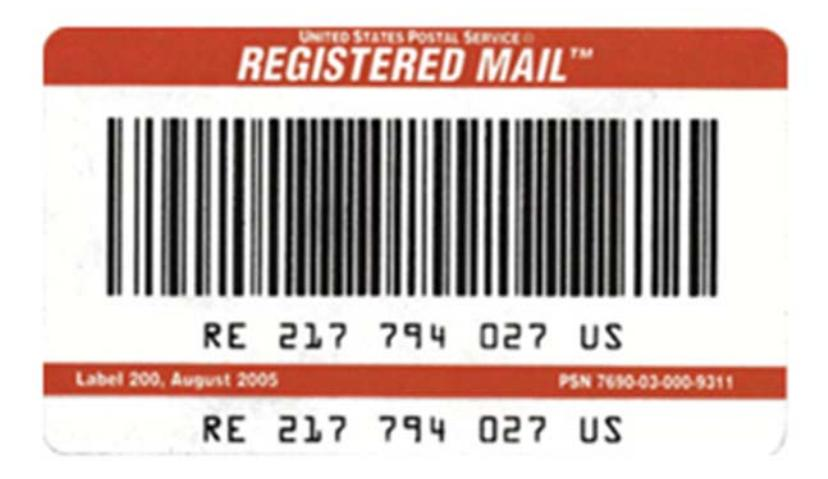
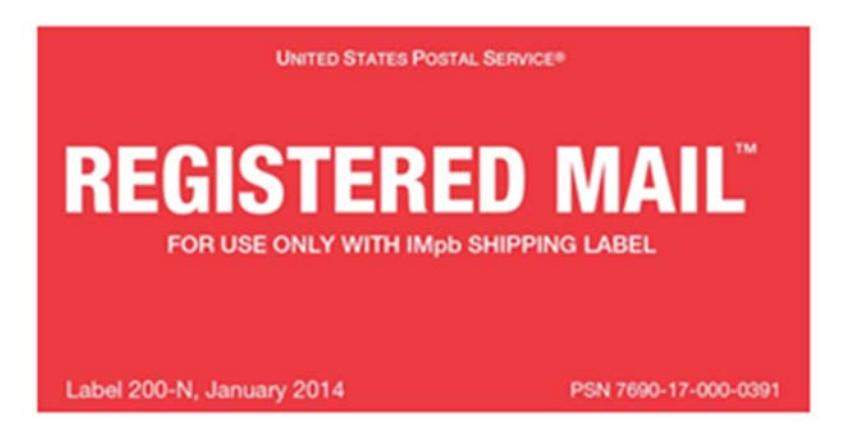
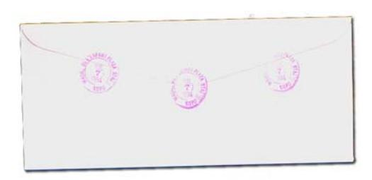
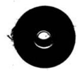
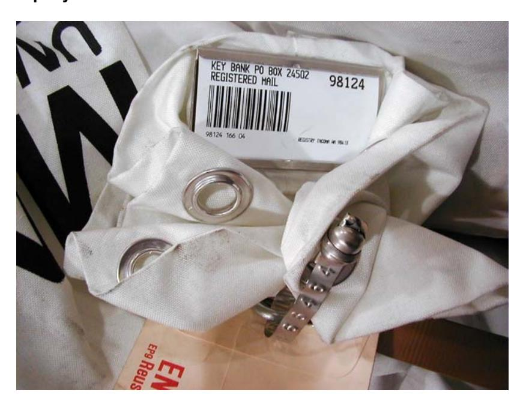
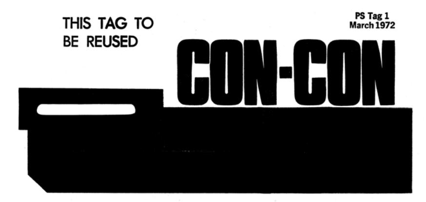
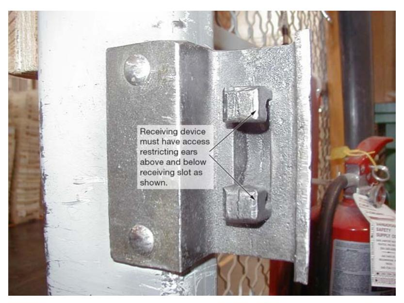

#### Registered Mail Transmittal Letter

Handbook DM-901 January 2016 Transmittal Letter

A. Introduction. Handbook DM-901, Registered Mail, has been revised in accordance with the United States Postal Inspection Service's® national security review of the Postal Service's Registered Mail System. This Next Generation Registered Mail™ System is in alignment with the strategic goals outlined in the Postal Service™ Strategic Transformation Plan for improving security processes, streamlining operations, generating revenue, reducing cost, and achieving results with a customer-focused performance-based culture.

The governing regulations for the domestic Registered Mail system are contained in the Mailing Standards of the United State Postal Service, Domestic Mail Manual, 503.0. The governing regulations and individual country requirements for the international Registered Mail system are contained in the International Mail Manual. Additional instructions for the air transportation of Registered Mail are contained in the CON-CON section.

- B. Availability. Handbook DM-901 is available via the Postal Service PolicyNet Web site:
  - Go to <http://blue.usps.gov>.
  - In the left-hand column, under "Essential Links," click on PolicyNet.
  - Click HBKs.

(The direct URL for the Postal Service PolicyNet Web site is <http://blue.usps.gov/cpim>.)

#### C. Comments

1. Content. Refer all questions and suggestions about the content of this document to:

PROCESSING OPERATIONS US POSTAL SERVICE 475 L'ENFANT PLAZA SW WASHINGTON, DC 20260-6808

2. Clarity. Refer all questions about the organization of this document and any editorial suggestions to:

BRAND AND POLICY CORPORATE COMMUNICATIONS US POSTAL SERVICE 475 L'ENFANT PLAZA SW WASHINGTON, DC 20260-3100

Linda Malone Vice President Network Operations

# Contents

| 1 | General Requirements                                          | 1  |
|---|------------------------------------------------------------------|----|
|   | 1-1 Purpose                                                   | 1  |
|   | 1-1.1 Official Instructions                                      | 1  |
|   | 1-1.2 Description                                                | 2  |
|   | 1-2 Size of Registered Article                                | 3  |
|   | 1-2.1 Minimum Size of Registered Article                         | 3  |
|   | 1-2.2 Maximum Size of Registered Article                         | 3  |
|   | 1-3 Acceptance                                                | 3  |
|   | 1-3.1 Retail Units, Rural Carriers, and Nonpersonnel Rural Units | 3  |
|   | 1-4 Postage                                                   | 5  |
|   | 1-4.1 Rate Classification                                        | 5  |
|   | 1-4.2 Payment Method                                             | 5  |
|   | 1-4.3 Ordinary Mail                                              | 5  |
|   | 1-4.4 Official Government Mail                                   | 5  |
|   | 1-5 Declaration of Value                                      | 5  |
|   | 1-5.1 Ordinary Mail                                              | 5  |
|   | 1-5.2 Official Government Mail                                   | 6  |
|   |                                                                  |    |
|   | 1-6 Fee                                                       | 6  |
|   | 1-6.1 Current Schedules                                          | 6  |
|   | 1-6.2 With Postal Insurance                                      | 6  |
|   | 1-6.3 Without Postal Insurance                                   | 7  |
|   | 1-7 Additional Services                                       | 7  |
|   | 1-7.1 Registered Mail Collect on Delivery                        | 7  |
|   | 1-7.2 Return Receipt                                             | 7  |
|   | 1-7.3 Restricted Delivery                                        | 7  |
|   | 1-7.4 Registered Merchandise Return Service                      | 8  |
|   | 1-8 Refunds                                                   | 8  |
|   | 1-8.1 Registration Fee                                           | 8  |
|   | 1-8.2 Return Receipt or Registered Mail Restricted Delivery Fee  | 8  |
|   | 1-9 Additional Information Resources                          | 8  |
| 2 | Preparation of Registered Articles                            | 11 |
|   | 2-1 Conditions                                                | 11 |
|   | 2-1.1 General Requirements                                       | 11 |
|   | 2-1.2 Addressing                                                 | 11 |
|   | 2-1.3 Packaging                                                  | 11 |

|   | 2-2 Sealing                                                                                        | 12 |
|---|-------------------------------------------------------------------------------------------------------|----|
|   | 2-2.1 Letter-Size Envelopes                                                                           | 12 |
|   | 2-2.2 Flats and Parcels                                                                               | 12 |
|   | 2-3 Window Envelopes                                                                               | 13 |
|   | 2-4 Registered Mail Receipts (PS Form 3877, Firm Mailing Book for Accountable Mail)             | 13 |
|   | 2-5 Mailing Receipts for Single Registered Articles (PS Form 3806, Receipt for Registered Mail) | 13 |
|   |                                                                                                       |    |
|   | 2-5.1 PS Form 3806                                                                                    | 13 |
|   | 2-5.2 PS Form 3811, Domestic Return Receipt                                                           | 13 |
| 3 | Acceptance                                                                                         | 15 |
|   | 3-1 PS Label 200 and PS Label 200-N Registered Mail                                                | 15 |
|   | 3-1.1 General                                                                                         | 15 |
|   | 3-1.2 Requisition of PS Label 200 and PS Label 200-N                                                  | 16 |
|   | 3-1.3 Accountability                                                                                  | 16 |
|   | 3-1.4 Placement and Endorsements                                                                      | 16 |
|   | 3-2 Receipts                                                                                       | 17 |
|   | 3-3 Determining Acceptability of Registered Mail                                                   | 20 |
|   | 3-3.1 Packaging                                                                                       | 20 |
|   | 3-3.2 Completing Forms                                                                                | 20 |
|   | 3-3.3 Safeguarding Registered Articles                                                                | 21 |
|   | 3-4 Firm Mailings                                                                                  | 21 |
|   | 3-4.1 Packaging                                                                                       | 21 |
|   | 3-4.2 Completing PS Form 3877, Firm Mailing Book for Accountable Mail                                 | 21 |
|   | 3-5 Rural Carriers and Contract Delivery Service                                                   | 27 |
|   | 3-5.1 Determine Proper Packaging                                                                      | 27 |
|   | 3-5.2 Completion of PS Form 3896                                                                      | 27 |
|   | 3-6 Round-Dating and Canceling Stamps                                                              | 28 |
|   | 3-6.1 Round-Dating Envelopes                                                                          | 28 |
|   |                                                                                                       |    |
|   | 3-6.2 Round-Dating Parcels and Flats                                                                  | 29 |
|   | 3-6.3 Canceling Stamps                                                                                | 29 |
|   | 3-7 Package Intercept, Refunds, or Remailing                                                       | 29 |
|   | 3-7.1 Procedures                                                                                      | 29 |
|   | 3-7.2 Refunds                                                                                         | 30 |
|   | 3-7.3 Remailing                                                                                       | 30 |
| 4 | Transfer of Accountability                                                                         | 31 |
|   | 4-1 Description                                                                                    | 31 |
|   | 4-1.1 Hand-to-Hand Exchanges                                                                          | 31 |
|   | 4-1.2 Employee Responsibilities                                                                       | 31 |
|   | 4-2 Exceptions to Hand-to-Hand Transfers                                                           | 34 |
|   | 4-2.1 Vestibule Exchange                                                                              | 34 |

#### Contents

|   | 4-2.2 Transfer of Accountability at Retail Offices Not Operating 24 Hours and 7 Days Per Week and Having Different Closing and Opening Clerks    | 35 |
|---|-----------------------------------------------------------------------------------------------------------------------------------------------------|----|
|   |                                                                                                                                                     |    |
|   | 4-2.3 Area Responsibility                                                                                                                           | 36 |
|   | 4-2.4 Inbound International Registered Mail                                                                                                         | 36 |
|   | 4-3 Procedures for Hand-to-Hand Exchange Between Highway Contract Route or Postal Service Vehicle Services and Other Postal Service Employees | 36 |
|   | 4-3.1 Exchange Activity at Retail Offices, Sectional Center Facilities, Processing and Distribution Centers/Facilities, and Logistics and        |    |
|   | Distribution Centers                                                                                                                                | 36 |
|   | 4-3.2 Exchange Activity Between Processing and Distribution Centers/                                                                                |    |
|   | Facilities and Surface Transfer Centers                                                                                                             | 37 |
| 5 | Dispatch                                                                                                                                         | 39 |
|   | 5-1 Registry Operations                                                                                                                          | 39 |
|   | 5-2 Equipment (Containers)                                                                                                                       | 39 |
|   | 5-2.1 Restriction                                                                                                                                   | 39 |
|   | 5-2.2 Pouching                                                                                                                                      | 40 |
|   | 5-2.3 Numbered Tin Band Sealed Pouches (Item 0817-C)                                                                                                | 41 |
|   | 5-2.4 Preparation of Firm Bills for Delivery Outside the Registry Section                                                                           | 43 |
|   | 5-2.5 Registry Jacket Envelopes (EP-388 and EP-390)                                                                                                 | 43 |
|   | 5-2.6 Use of Envelope Container (EP-399)                                                                                                            | 46 |
|   | 5-2.7 CON-CON and Special Airline Containers                                                                                                        | 46 |
|   | 5-2.8 Distribution Labeling Requirements                                                                                                            | 47 |
|   | 5-2.9 Dispatch Requirements                                                                                                                         | 47 |
|   | 5-2.10Special Surface Security Containers                                                                                                           | 47 |
|   | 5-3 Outside Articles                                                                                                                             |    |
|   |                                                                                                                                                     | 48 |
|   | 5-3.1 Description                                                                                                                                   | 48 |
|   | 5-3.2 Pallets                                                                                                                                       | 49 |
|   | 5-3.3 Procedures for Preparing a Dispatch Bill                                                                                                      | 49 |
|   | 5-4 Dispatch of Registered Articles                                                                                                              | 50 |
|   | 5-5 Coded Shipments                                                                                                                              | 51 |
|   | 5-6 Transportation and Routing                                                                                                                   | 51 |
|   | 5-6.1 Dispatch                                                                                                                                      | 51 |
|   | 5-6.2 Special Routing                                                                                                                               | 51 |
|   | 5-7 International Registered Mail                                                                                                                | 51 |
|   | 5-7.1 Authorized Offices                                                                                                                            | 51 |
|   | 5-7.2 Procedures                                                                                                                                    | 52 |
| 6 | Processing and Delivering                                                                                                                           | 53 |
|   | 6-1 Receipt and Transfer                                                                                                                         | 53 |
|   | 6-1.1 Platform/Receiving Operations                                                                                                                 | 53 |
|   | 6-1.2 Security of Containers                                                                                                                        | 53 |
|   | 6-1.3 Transfer and Verification                                                                                                                     | 54 |

|   | 6-2 Registry Section                                                     |
|---|-----------------------------------------------------------------------------|
|   | 6-2.1 Opening Unit                                                          |
|   | 6-2.2 Outside Articles                                                      |
|   | 6-2.3 High-Value Articles                                                   |
|   | 6-3 Receipt and Transfer at a Surface Transfer Center                    |
|   | 6-3.1 Pouches, Containers, and Outside Articles                             |
|   | 6-3.2 Movement of Registered Articles From the Platform to the Holding Cage |
|   | 6-4 Irregularities and Discrepancies                                     |
|   | 6-4.1 Definitions                                                           |
|   | 6-4.2 Damaged Wrapper or Envelope                                           |
|   | 6-4.3 Missing Containers or Articles                                        |
|   | 6-4.4 Discrepancy in Articles Listed                                        |
|   | 6-4.5 Missing or Improperly Completed Dispatch Bill (PS Form 3854)          |
|   | 6-4.6 Missent Articles                                                      |
|   | 6-4.7 Unaddressed and Misdirected Articles and Containers                   |
|   | 6-4.8 Loose Articles                                                        |
|   | 6-5 Delivery                                                             |
|   | 6-5.1 Postal Service Responsibility                                         |
|   | 6-5.2 Retention of Undelivered Mail                                         |
|   | 6-6 Mail Not in Proper Mail Stream                                       |
|   | 6-6.1 Registered Articles in Ordinary Mail                                  |
|   | 6-6.2 Ordinary Mail Found in Registered Mail System                         |
| 7 | Special Instructions                                                     |
|   | 7-1 Units With a Registry Section                                        |
|   | 7-1.1 Personal Items                                                        |
|   | 7-1.2 Key, Round Date, and Valuable Unit Control                            |
|   | 7-1.3 Records of Employees                                                  |
|   | 7-2 Internal Protection of Valuable Mail                                 |
|   | 7-2.1 Security                                                              |
|   | 7-3 Protection                                                           |
|   |                                                                             |
|   | 7-3.1 All Registered Mail                                                   |
|   | 7-3.2 Responsibility for Registered Mail                                    |
|   | 7-4 Record Keeping                                                       |
|   | 7-4.1 Forms and Filing                                                      |
|   | 7-4.2 Statistics                                                            |
|   | 7-4.3 Registry Section Operation Numbers                                    |
|   | 7-5 Claims and Inquiries                                                 |
|   | 7-5.1 Domestic Claims                                                       |
|   | 7-5.2 International Claims                                                  |

# Exhibits

| Exhibit 1-3.1 Postal Inspection Service Firearms Permission Letter       | 4  |
|-----------------------------------------------------------------------------|----|
| Exhibit 1-5.1 Declared Value for Registerd Mail                          | 6  |
| Exhibit 3-1.1 PS Label 200and PS Label 200-N Registered Mail             | 15 |
| PS Label 200-N, Registered Mail                                             | 16 |
| Exhibit 3-2c PS Form 3824, Temporary Bulk Receipt                        | 18 |
| Exhibit 3-2d PS Form 3876, Notice to Firm Mailer of Incorrect Fees       | 19 |
| Exhibit 3-4.2.2 PS Form 3877, Firm Mailing Book for Accountable Mail     | 23 |
| Exhibit 3-5.2 U.S. Postal Service Receipt for Registered Article         | 28 |
| Exhibit 3-6.1 Postmarking Registered Mail                                | 28 |
| Exhibit 4-1.2.1a PS Form 3854, Manifold Registry Dispatch Book           | 32 |
| Exhibit 4-1.2.1b Automated PS Form 3854-A, Registered Mail Dispatch Bill | 33 |
| Exhibit 5-2.3.2a EP-9 Envelope, Registry Jacket                          | 42 |
| Exhibit 5-2.3.2b Properly Sealed Pouch                                   | 42 |
| Exhibit 5-2.5.1a Registry Jacket Envelope (EP-388)                       | 44 |
| Exhibit 5-2.5.1b Registry Jacket Envelope (EP- 390)                      | 45 |
| Exhibit 5-2.6 Envelope Container (EP-399)                                | 46 |
| Exhibit 5-3 Tag 1, CON-CON                                               | 48 |
| Exhibit 5-3.1 Combination Registry Bill Envelope (EP-11)                 | 49 |
| Exhibit 6-4.1.1 PS Form 3826, Registry Irregularity Report               | 58 |

| Exhibit 6-4.2.3 PS Form 3899, Registered Matter - Damaged, Unsealed, or Without Cover               | 60 |
|--------------------------------------------------------------------------------------------------------|----|
| Exhibit 7-2.1.3 PS Form 3810, Reminder Record                                                       | 70 |
| Exhibit 7-2.1.4 PS Form 3875, Daily Balance - Registry Section                                      | 71 |
| Exhibit 7-3.1.4 Example of Receiving Device With Access-Restricting Ears Required for Sliding Doors | 73 |

# 1 General Requirements

# 1-1 Purpose

#### 1-1.1 Official Instructions

#### 1-1.1.1 Governing Regulations

The procedures in this handbook and the Mailing Standards of the United States Postal Service, Domestic Mail Manual (DMM®) constitute the official procedures and requirements for processing Registered Mail. If there is a difference between regulations in this handbook and the DMM, those in the DMM take precedence. Additional requirements for international mail are provided in the Mailing Standards of the United States Postal Service, International Mail Manual (IMM®).

#### 1-1.1.2 Exceptions

Additional local procedures must not be instituted to control the acceptance, dispatch, transfer, or delivery of Registered Mail unless approved by Headquarters. Requests for exceptions or variances from the procedures in this handbook must be submitted to and approved by the Headquarters' offices of Processing Operations, Business Mail Acceptance, and the Assistant Chief Inspector of Investigations and Security of the Inspection Service.

#### 1-1.1.3 Registry Responsibility

#### 1-1.1.3.1 District Manager and Senior Plant Manager

The district manager and senior plant manager are responsible for the implementation of all Registered Mail programs, policies, and procedures within their respective performance cluster.

#### 1-1.1.3.2 Performance Cluster Registry Coordinator

The district manager and senior plant manager assigns a performance cluster registry coordinator and a plant registry coordinator. The primary plant Registered Mail coordinator may also take on the duties of the performance cluster coordinator if the district or senior plant manager feels it is more practical. The performance cluster registry coordinator is responsible for maintaining a Registered Mail program for the performance cluster and coordinating all registry activities with each plant registry coordinator. The individuals assigned to both coordinator positions should be a supervisor or manager who is knowledgeable in registry procedures and regulations.

1-1.2 Registered Mail

The performance cluster registry coordinator is responsible for the following:

- a. Coordinate all registry activities.
- b. Prepare standard operating procedures.
- c. Coordinate security matters with the security control officer.
- d. Arrange for training for employees who handle Registered Mail functions [e.g., mail acceptance, prices and classification, processing and distribution, Collect on Delivery (COD), transfer of Registered Mail].
- e. Ensure that yearly audits are conducted at the processing and distribution center/facility and logistic and distribution center (L&DC) registry operations within each performance cluster.
- f. Ensure that all registry procedures comply with current official guidelines.

#### 1-1.2 Description

#### 1-1.2.1 Purpose

Registered Mail provides added protection for valuable and important customer and internal mail with evidence of mailing and delivery. Postal insurance is provided against loss, damage, or rifling up to \$50,000. Postal insurance for international mail is limited (see IMM 934.2).

#### 1-1.2.2 Eligibility

All mailable matter may be registered if postage is prepaid at the First-Class Mail®, First-Class Package Service, or Priority Mail® prices or International Letter post rates and it meets the requirement stated in Chapters [1](#page-8-0) and [2](#page-18-5) of this handbook.

#### 1-1.2.3 Prohibitions

Mail may not be registered if it is:

- a. Placed in any street letterbox or a mail drop, or through USPS carrier pickup (DMM 507.7.0).
- b. Addressed to a Post Office to which it cannot be transported safely.
- c. Prepared improperly or packaged inadequately to withstand normal handling.
- d. Tied or fastened to another article, unless enclosed in the same envelope or wrapper.
- e. Contained in an envelope or package that appears to have been opened or resealed.
- f. Presented in a padded bag or self-sealing envelope. (Exception: Padded bags are permitted for international registered articles.)
- g. Placed in an envelope or mailer manufactured of plastic, glossy paper, spun-bonded olefin, (e.g.,Tyvek), or substances that will not absorb an ink seal (see DMM 503.2). (Exception: Tamper-evident plastic bags purchased through the Postal Service contract are approved for Postal Service use.)
- h. Sent as business reply mail or enclosed in a business reply mail envelope.

General Requirements 1-3.1

# 1-2 Size of Registered Article

#### 1-2.1 Minimum Size of Registered Article

The face of any registered article must be at least 5 inches long and 3.5 inches high, regardless of thickness. The minimum thickness is 0.007 inch.

#### 1-2.2 Maximum Size of Registered Article

The maximum size for any registered article is 108 inches, length and girth combined. The maximum weight is 70 pounds.

# 1-3 Acceptance

The acceptance value limitation for Registered Mail is determined by security considerations. A postmaster may require that an article of unusually high value be presented only at the main office or at designated stations and branches.

Due to security concerns, a plant manager may authorize local banks, armored car services, or jewelry companies that mail large volumes or high values of Registered Mail to be presented directly to the registry cage.

### 1-3.1 Retail Units, Rural Carriers, and Nonpersonnel Rural Units

Registration may be obtained by presenting mail to the following:

- a. A retail associate at a Post Office, station, or branch (including approved contractor-operated units).
- b. A rural carrier on a rural route and/or a contract delivery service (CDS) route with delivery features. — The article and sufficient payment for postage and required fees may be left in a rural mailbox. The carrier must hand any change to the sender or place it in an envelope and leave the envelope in the box on the carrier's next trip. Postal Service responsibility is not assumed for the article or cash until a receipt is issued. No responsibility is assumed for the change left in the box by the carrier.
- c. Nonpersonnel rural units Customers must register mail by taking the articles to nonpersonnel rural units during the time a rural carrier is servicing the unit.
- d. Registry cages Permission to enter registry cages must be approved in writing by the local Postal Inspector in Charge and facility manager. If weapons are worn by armored car personnel, authorization must also be given in writing (see [Exhibit 1-3.1](#page-11-0), Postal Inspection Service Firearms Permission Letter). Contract drivers authorized to deliver and pickup Registered Mail must present their official photo identification (ID) card.

Armored couriers must also provide a current photo ID/signature list of employees authorized to deliver or receive Registered Mail. In addition,

1-3.1 Registered Mail

armored car personnel must be escorted in and out of the facility by Postal Police, a supervisor, if available, or a registry employee. If the armored couriers are not on the photo ID/signature list, they must not be allowed in the building or the registry cage.

Registry clerks who will be accepting these shipments must complete the retail training course that applies to the acceptance of Registered Mail.

#### Exhibit 1-3.1 Postal Inspection Service Firearms Permission Letter

United States Postal Inspection Service Division

[Manager, Postal Facility]

SUBJECT: Armed Couriers at the [name of postal facility]

We understand that [bank or company] is entering your Postal Service facility with armed guards who transport currency shipments from and to the facility.

This division has evaluated the particulars of this situation and the need for armed guards in connection with this activity, pursuant to federal laws and Postal Service regulations. Title 18, United States Code, Section 930(d), allows the carriage of firearms on federal property for lawful purposes. Postal Service regulations at Title 39, Code of Federal Regulations, Section 232.1(l), limits their carriage to official purposes. The Postal Service Administrative Support Manual, at section 276.21, further defines official purposes to include carriage by law enforcement officers and others specifically authorized in writing by the Inspector in Charge.

Pursuant to this authority and our review of the utility of having armed guards in this instance to protect large sums of cash being brought to and from Postal Service property, I hereby [approve or disapprove] the entry onto Postal Service property of armed guards for this purpose.

Sincerely,

[signature]

Inspector in Charge

cc: [Bank or Guard Company}

United States Postal Inspection Service Division

General Requirements 1-5.1

# 1-4 Postage

#### 1-4.1 Rate Classification

Registered Mail is charged the applicable First-Class Mail, First-Class Package Service, or Priority Mail prices plus additional fees for registry and other services. No other classes of mail can be used in conjunction with Registered Mail.

#### 1-4.2 Payment Method

#### 1-4.3 Ordinary Mail

Postage and fees may be paid by postage stamps, meter stamps, permit imprint indicia, information based indicia, or other approved forms of electronic postage. If a permit imprint is used, the exact amount of postage and fees paid must be shown within the permit imprint. For pieces that are part of a manifest mailing, only the registry fee must be shown within the permit imprint. The fee and postage on official mail of authorized federal agencies may also be paid with penalty stamps, penalty meter stamps, or penalty permit imprints. The fees and postage on items registered with merchandise return service are paid through a postage due account as described in DMM 505.

#### 1-4.4 Official Government Mail

Official mail of authorized government agencies prepared under applicable standards stated in DMM 703.7.0 (also see Handbook DM-103, Official Mail) for transmission of mail without prepayment of postage may be sent by Registered Mail without prepayment of a registration fee.

# 1-5 Declaration of Value

#### 1-5.1 Ordinary Mail

The mailer must always declare the full value of the article when presenting it to the Postal Service for registration and mailing (see [Exhibit 1-5.1\)](#page-13-4). The mailer must tell the Postal Service clerk (enter on the firm mailing document if a firm mailer) the full value of mail matter presented for registration. Private insurance carried on Registered Mail does not modify the requirements for declaring the full value. The accepting Postal Service employee may ask the mailer to show that the full value of the matter presented is declared and may refuse to accept the matter as Registered Mail if a satisfactory declaration of value is not provided.

1-5.2 Registered Mail

Exhibit 1-5.1 Declared Value for Registered Mail

| Mail Matter                                                                                                                                                                                                                                                        | Value to Be Declared                                                                     |
|--------------------------------------------------------------------------------------------------------------------------------------------------------------------------------------------------------------------------------------------------------------------|------------------------------------------------------------------------------------------|
| Negotiable Instrument Instruments payable to bearer, including stock certificates endorsed in blank                                                                                                                                                             | Market value (value based on value at time of mailing)                                |
| Non-negotiable Instrument Registered bonds, warehouse receipts, checks, drafts, deeds, wills, abstracts, and similar documents; (certificates of stock considered non negotiable so far as declaration of value is concerned unless endorsed in blank) | No value or replacement cost if postal insurance coverage desired*(see note below) |
| Money                                                                                                                                                                                                                                                              | Full value                                                                               |
| Jewelry, Gems, and Precious Metals                                                                                                                                                                                                                                 | Market value or cost                                                                     |
| Merchandise                                                                                                                                                                                                                                                        | Market value or cost                                                                     |
| Nonvaluable Items Matter without intrinsic value (e.g., letters, files, and records)                                                                                                                                                                            | No value or replacement cost if postal insurance coverage desired                  |

\*Note: Mailers who do not know the replacement costs should contact a person or a firm familiar with such articles and determine replacement costs before mailing their articles.

#### 1-5.2 Official Government Mail

Government agencies or officials entitled to use official mail, penalty, or indicia must declare the full value of matter presented for registration to ensure proper handling. If postal insurance is desired, the agency or official must pay both the postage and the appropriate fee by stamps or meter indicia (see DMM 703.7.0 and Handbook DM-103, Official Mail).

# 1-6 Fee

#### 1-6.1 Current Schedules

Use the fee schedules provided in Notice 123, Price List, for Registered Mail. These fees are in addition to postage and other services requested. For mailings valued at more than \$15,000,000, Business Mail Acceptance sets the fees based on weight, space, and value. For international Registered Mail fees, see IMM 333.

#### 1-6.2 With Postal Insurance

#### 1-6.2.1 Fees and Charges Schedule

The registration fee provides insurance for articles with a value of at least \$0.01 up to a maximum insured value of \$50,000. See DMM 503.2 for fees and a schedule of charges for Registered Mail with insurance.

#### 1-6.2.2 Maximum Postal Liability

The maximum postal insurance liability is \$50,000 (see DMM 503.2).

General Requirements 1-7.3

#### 1-6.2.3 Handling Charge

Articles valued at more than \$50,000 have an additional handling charge. This charge covers the added costs of processing and providing security for Registered Mail of higher value but does not provide additional insurance coverage.

#### 1-6.2.4 Commercial Insurance

A sender mailing an article valued at more than \$50,000 may obtain commercial insurance.

#### 1-6.3 Without Postal Insurance

Postal insurance is provided for articles with a value of at least \$0.01 up to a maximum insured value of \$50,000. Insurance is included in the fee.

# 1-7 Additional Services

The following additional services may be combined with Registered Mail if the applicable standards for the services are met, and the additional service fees are paid:

- a. Collect on Delivery (COD).
- b. Delivery Confirmation™.
- c. Signature Confirmation™.
- d. Restricted Delivery.

For additional services on Registered Mail, customers are required to complete the applicable forms.

### 1-7.1 Registered Mail Collect on Delivery

The sender may obtain COD service for registered domestic mail by paying the regular Registered Mail fees plus the Registered Mail COD collection charge specified in Notice 123, Price List. The mail must meet the requirements for both Registered Mail (see DMM 503.2.0) and COD mailings (see DMM 503.9.0).

#### 1-7.2 Return Receipt

The sender may obtain Return Receipt service for Registered Mail using barcoded PS Form 3811, Domestic Return Receipt, and paying the appropriate fee in addition to the registration fee and postage (see Notice 123, Price List). Refer to IMM 340 for information on PS Form 2865, Return Receipt for International Mail.

## 1-7.3 Restricted Delivery

The sender may obtain Registered Mail Restricted Delivery service for Registered Mail as described in DMM 503.2. For circumstances under which restricted delivery may be made to a person other than the addressee (see DMM 503.1.9).

1-7.4 Registered Mail

#### 1-7.4 Registered Merchandise Return Service

Merchandise Return Service (MRS) may be obtained by permit holders on articles returned at the First-Class Mail, First-Class Package Service or Priority Mail prices. Customers returning MRS items may pay for Registered Mail service at their own expense under DMM 505.3.0.

# 1-8 Refunds

### 1-8.1 Registration Fee

Registration fees cannot be refunded after mail is accepted.

### 1-8.2 Return Receipt or Registered Mail Restricted Delivery Fee

Return Receipt or Restricted Delivery fees can be refunded only if the Postal Service fails to furnish a return receipt or to provide Restricted Delivery service (see DMM 503.2.0). The mailer requesting the refund (when refund request is made by the mailer less than 10 days, or not more than 60 days, from the date the service was purchased) must submit a postmarked receipt showing payment for the service.

# 1-9 Additional Information Resources

- a. Future updates to Handbook DM-901, Registered Mail, published in the Postal Bulletin.
- b. CON-CON instructions (restricted information).
- c. Coded shipments instructions (restricted information).
- d. Handbook RE-5, Building and Site Security Requirements.
- e. Handbook AS-503, Standard Design Criteria
- f. Handbook F-101, Field Accounting Procedures.
- g. Handbook M-22, Dispatch and Routing Policies.
- h. Administrative Support Manual (ASM).
- i. Postal Operations Manual (POM).
- j. Handbook E-31, Registry Operations Systems Guidelines.
- k. Registry mail training guides.
- l. Handbook T-7, Distributing, Dispatching, and Transporting Military Mail by Air.
- m. Handbook PO-206, Stamp Shipment Security and Routing Guidelines.
- n. Handbook DM-902, Procedures for Handling Registered Postal Bank Remittance Mail.
- o. Postal Inspection Service hold-up instructions (HBK DM-902, Appendix A).
- p. Handbook F-3, Treasury Management.

General Requirements 1-9

- q. Handbook T-5, International Mail Operations.
- r. Logistics Order Standard Operating Procedures #LO SOP200901, (Updated National Dispatch Instructions).

s. Standard Operating Procedure for Registered Mail Dispatched on Surface Network Transportation.

This page intentionally left blank

# 2 Preparation of Registered Articles

# 2-1 Conditions

#### 2-1.1 General Requirements

Refer to section [1-1.2.2](#page-9-1) for eligibility of packaging. Articles to be registered must be prepared under the guidelines and regulations stated in this handbook and in the Mailing Standards of the United States Postal Service, Domestic Mail Manual (DMM) 601 and 503. Postal Service employees are not permitted to assist mailers in preparing or sealing mail to be registered.

#### 2-1.2 Addressing

Registered Mail must bear the complete name and address of both the sender and the addressee (see DMM 503.2).

#### 2-1.3 Packaging

#### 2-1.3.1 Open and Resealed

Envelopes or packages that appear to have been opened and resealed or that have been improperly prepared may not be registered (see DMM 503.2.3.2).

#### 2-1.3.2 Padded Envelopes or Bags

Padded mailing envelopes or bags may not be used for domestic Registered Mail, but they may be used for international Registered Mail (see DMM 503.2.1).

#### 2-1.3.3 Fragile Items

The sender must tell the Postal Service employee whether the item to be registered is fragile and, if so, describe the interior packing (see DMM 503.2.3) . Packages must be refused if they are not packaged to withstand normal handling in the mailstream (see DMM 601). Indemnity may be denied if fragile articles are not properly packaged (see DMM 609).

2-2 Registered Mail

# 2-2 Sealing

#### 2-2.1 Letter-Size Envelopes

#### 2-2.1.1 Construction

The sender must securely seal letter-size envelopes. Senders should use good quality, well-constructed envelopes with heavy deposits of mucilage or glue (requiring water activation) all the way to the edge of the flap, ensuring no portion of the flap is left unsealed. If the adhesive does not extend to the edge of the flap, water-activated paper tape should be applied to fully seal the flap. Self-sealing envelopes and self-adhesive tape are not acceptable.

#### 2-2.1.2 Intersection of Flaps

Paper strips, cellulose strips, wax seals, or paper seals must not be placed over the intersections of flaps where the postmark impressions are to be made. Masking, nylon filament, self-adhesive, and transparent tapes are not permitted anywhere on the outside of the registered article. These types of tapes must be removed, not covered over, before sealing with authorized tape.

#### 2-2.2 Flats and Parcels

#### 2-2.2.1 Sealing Materials

The sender must seal flats and parcels with mucilage, glue, plain craft paper, cloth tape, or gummed water-activated craft paper tape. Parcels containing currency or securities may not be sealed exclusively by paper tape, but must first be sealed securely with mucilage or glue. Masking, nylon filament, selfadhesive, and transparent tapes are not permitted anywhere on the outside of the envelope, and these types of tape must never be covered with paper tape.

#### 2-2.2.2 Flat-Size Envelopes

Completely sealed large envelopes (flats) that have craft paper tape across the intersections of flaps must meet the sealing requirements stated in section [2-2.2.1.](#page-19-3)

#### 2-2.2.3 Tape

Only paper tape that can absorb a round-date ink impression and show tampering if removed may be used on Registered Mail. Masking, nylon filament, self-adhesive, and transparent tapes are not permitted and must be removed by the sender or sender's designee if presented for mailing.

#### 2-2.2.4 Tamper-Proof Boxes

Tamper-proof boxes (e.g., jewelry boxes) may be accepted if all seams are sealed in accordance with section [2-2.2.1](#page-19-3).

# 2-3 Window Envelopes

Open-window envelopes are not acceptable under any conditions. A window envelope is acceptable if a transparent panel covers the window's opening. The envelope may contain only matter without intrinsic value if the transparent panel is glued to the envelope. If the transparent panel is part of the envelope, the envelope may be used for all Registered Mail (see DMM 503.2.3.5).

# 2-4 Registered Mail Receipts (PS Form 3877, Firm Mailing Book for Accountable Mail)

If the sender presents an average of three or more articles for registration at a time, the sender must use PS Form 3877 available at no charge from Post Offices, or the sender may use approved privately printed facsimile firm mailing bills.

When three or more registered articles are presented for mailing at one time, the mailer or mailer's designated agent must use PS Form 3877 (firm sheet) or privately printed firm sheets. Privately printed or computer-generated firm sheets that contain the same information as PS Form 3877 may be approved by the local postmaster or Manager Business Mail Entry. The mailer may omit columns from PS Form 3877 that are not applicable to Registered Mail. The mailer submits the forms in duplicate and receives the original copy as a mailing receipt after the entries are verified by the Postal Service employee accepting the mailing. All entries made on the firm sheets must be made in nonerasable ink by typewriter, computer printer, or ballpoint pen. Alterations must be initialed by the mailer or mailer's designated agent and the accepting employee. All unused portions of the addressee column must be obliterated with a diagonal line(s). (Also see DMM 503.1.)

# 2-5 Mailing Receipts for Single Registered Articles (PS Form 3806, Receipt for Registered Mail)

When accepting Registered Mail, the acceptance employee must issue a receipt. Mail is not registered until it is properly accepted, and a receipt is issued (see subchapter [3-2](#page-24-1)).

#### 2-5.1 PS Form 3806

For individual Registered Mail transactions, issue a receipt on PS Form 3806 at the time of the transaction.

#### 2-5.2 PS Form 3811, Domestic Return Receipt

A sender requesting Return Receipt service must complete all appropriate portions of barcoded PS Form 3811, and present PS Form 3811 with the article to the acceptance employee. If the sender wants additional services,

2-5.2 Registered Mail

the sender must tell the Postal Service employee at the time of the transaction. The Postal Service employee must write the registry number on the receipt side of barcoded PS Form 3811, and mark the box for Restricted Delivery, if that service is requested.

# 3 Acceptance

# 3-1 PS Label 200 and PS Label 200-N Registered Mail

#### 3-1.1 General

At the time of mailing, all Registered Mail must bear a red barcoded PS Label 200, a self-adhesive label printed by the Postal Service. PS Label 200 measures 3.25 inches by 1.75 inches and is printed with the capital letters "RR" followed by nine digits in OCR-A font, followed by the two-digit alpha country code (see [Exhibit 3-1.1](#page-22-3) for a sample of PS Label 200). The letters RR followed by the nine-digit number and country code identify the registered article for all records and inquiries.

Privately printed labels must bear a red barcoded label nearly identical in design and color to the PS Label 200 as specified in Publication 199, Intelligent Mail Package Barcode (Impb) Implementation Guide. Alpha ranges at the beginning of the registered label include RA-RZ. The barcode must be represented in 20 human-readable numbers arranged in groups of four, starting with Service Code 77. See DMM 503.2.1.2 for more information.

PS Label 200-N is a non-barcoded red Label 200-N required when a mailergenerated shipping label bearing an IMpb is also affixed on the same mailpiece.

Exhibit 3-1.1

PS Label 200 and PS Label 200-N Registered Mail

3-1.2 Registered Mail

#### PS Label 200-N, Registered Mail

#### 3-1.2 Requisition of PS Label 200 and PS Label 200-N

PS Label 200 is requisitioned and issued as follows:

- a. Post Offices with Stations or Branches Post Offices with stations or branches requisition and issue to each station or branch a quantity of labels approximating half of the annual number of window registrations for that station or branch.
- b. Other Offices All other offices requisition and issue a quantity of labels approximating a 6-month supply.
- c. Rural Carriers and Contract Delivery Service (CDS) In areas where rural carriers and CDS are required to accept mail for registration, Post Offices provide a sufficient supply of labels to meet the needs of the carriers' routes.
- d. Firm Mailers Post Offices provide firm mailers a quantity of labels approximating a 6-month supply.

PS Label 200-N is requisitioned as follows:

- a. Postal Store: <https://store.usps.com/store/> (customers).
- b. eBuy2 using PSN #7690-17-000-0391.

### 3-1.3 Accountability

PS Label 200 and PS Label 200-N are not accountable items. No records are kept of the assignment of labels to employees or customers.

#### 3-1.4 Placement and Endorsements

Proper placement of PS Label 200 and PS Label 200-N is directly to the right of the return address and above the delivery address on letters and flats (see DMM 601.5.1 and 503.2.1.2) and to the left of the delivery address on parcels. Endorse articles with any additional extra service requested by the sender (see DMM 601.5.1).

Acceptance 3-2

# 3-2 Receipts

After accepting Registered Mail from the customer, issue a receipt using one of the following forms:

- a. Individual articles PS Form 3806, Receipt for Registered Mail. Prepare in duplicate PS Form 3806 for each registered article. Give the original to the sender, and file the copy in numerical sequence (see section [3-3.2.1\)](#page-27-3).
- b. Multiple articles PS Form 3877, Firm Mailing Book for Accountable Mail. When a sender uses PS Form 3877, ensure that all applicable fields have been properly completed, check the articles against entries on the form, and ensure that the proper declaration of value has been entered (see part [3-4.2](#page-28-3) and DMM 503.1.0).
- c. Temporary receipt PS Form 3824, Temporary Bulk Receipt. If senders using Form 3877 do not want to wait for a descriptive receipt, issue a bulk receipt on PS Form 3824, check mailing, and issue a regular receipt later (see [Exhibit 3-2c](#page-25-0) and section [3-4.2.2](#page-29-0)).
- d. Notification of errors PS Form 3876, Notice to Firm Mailer of Incorrect Fees. Use PS Form 3876 to notify firm mailers of surcharges or incorrect payment of fees (see [Exhibit 3-2d](#page-26-0) and section [3-4.2.3](#page-29-1)).
- e. Rural route registration PS Form 3896, Receipt for Registered Article. Rural carriers issue PS Form 3896 to senders of Registered Mail. Rural carriers must not assist senders in preparing or sealing mail to be registered (see section [3-5.1.2](#page-34-3) and DMM 503.2.1.3).

3-2 Registered Mail

#### Exhibit 3-2c PS Form 3824, Temporary Bulk Receipt

| Article                                                                                                                                                | Number of Pieces |
|--------------------------------------------------------------------------------------------------------------------------------------------------------|------------------|
| Registered Mail®                                                                                                                                       |                  |
| Certified Mail ®                                                                                                                            |                  |
| Insured Mail                                                                                                                                           |                  |
| COD Mail                                                                                                                                               |                  |
| Adult Signature                                                                                                                                        |                  |
| Signature Confirmation™                                                                                                                                |                  |
| TOTAL                                                                                                                                                  |                  |
| SENDER:                                                                                                                                                | Postmark         |
| Present this temporary receipt tomorrow (or within a few days), and we will give you a permanent receipt describing each individual article by number. |                  |

Acceptance 3-2

#### Exhibit 3-2d

#### PS Form 3876, Notice to Firm Mailer of Incorrect Fees

|                    | OST∆L SERVICE ®             | No                | otice to Fi       | irm Maile              | r of Inco               | rect Fee                   |
|--------------------|-----------------------------|-------------------|-------------------|------------------------|-------------------------|----------------------------|
| From:              | Post Office, State, and Zlf | 2+4® Code         |                   |                        |                         |                            |
| Check ap           | pplicable box) Insured      | l Mail            | C.O.D             | . Mail                 | Certifie                | ed Mail®                   |
| Regis              | tered Mail™ Return          | Receipt for Merch | nandise Recei     | pt for Recorded Dle    | eivery Adult S          | Signature                  |
|                    |                             |                   |                   |                        | Signat                  | ure Confirmation           |
|                    | TO: ■                       |                   |                   | •                      |                         |                            |
| our atte           | ntion is called to incorrec | t fees entered on | your firm mailing |                        |                         |                            |
| Date               | e Article Number            | Fee Listed        | Correct Fee       | Handling Fee Listed | Correct Handling Fee | Amount Due Post Office™ |
|                    |                             |                   |                   |                        |                         |                            |
|                    |                             |                   |                   |                        |                         |                            |
|                    |                             |                   |                   |                        |                         |                            |
|                    |                             |                   |                   |                        |                         |                            |
|                    |                             |                   |                   |                        |                         |                            |
|                    |                             |                   |                   |                        |                         |                            |
|                    |                             |                   |                   |                        |                         |                            |
|                    |                             |                   |                   |                        |                         |                            |
|                    |                             |                   |                   |                        |                         | ,                          |
|                    |                             |                   |                   |                        |                         |                            |
|                    |                             |                   |                   |                        |                         |                            |
|                    |                             |                   |                   |                        |                         |                            |
|                    |                             |                   |                   |                        |                         |                            |
|                    |                             |                   |                   |                        |                         |                            |
|                    |                             |                   |                   |                        |                         |                            |
|                    |                             |                   |                   |                        |                         |                            |
| Office and Section |                             |                   |                   | Please remit amo       |                         | TOTAL \$                   |
| ignature           | 1                           |                   |                   |                        | Date                    | 1                          |

3-3 Registered Mail

# 3-3 Determining Acceptability of Registered Mail

#### 3-3.1 Packaging

#### 3-3.1.1 Proper Packaging

Determine whether the article is adequately prepared for mailing as follows:

- a. Examine the article for mailability and proper packaging (see Chapters [1](#page-8-3) and [2](#page-18-5) and DMM 601).
- b. Ask the sender about the contents and internal packing (see DMM 601).

#### 3-3.1.2 Improper Packaging

Give the article back to the customer if the article is improperly prepared. Explain how the article should be prepared. Do not assist the sender in preparing or sealing mail to be registered.

#### 3-3.2 Completing Forms

#### 3-3.2.1 Individual Article - PS Form 3806

Senders of individual articles to be registered must prepare PS Form 3806 for each article and present the form with the article to the acceptance employee. The sender must check either the block that reads "With Postal Insurance" or the block that reads "Without Postal Insurance" when completing PS Form 3806 (see Chapter [1,](#page-8-3) subchapters [1-5](#page-12-7) and [1-6](#page-13-6) for requirements on declaring value with and without insurance). Rate the article for postage, fees and other requested services, and enter the amounts on the form. If requested to do so by the sender, show the time the article was accepted for mailing on PS Form 3806 and on the Post Office copy.

#### 3-3.2.2 Determination of Article Number - PS Label 200 and PS Label 200-N

Obtain and determine the registry number from the entire 13-digit alphanumeric string or 20-digit numeric string appearing on the PS Label 200 affixed to the article at the time of mailing. The number placed on the receipt must be the same as the number on the article being mailed. If mailer is using an (unnumbered) non-barcoded PS Label 200-N in conjunction with a mailergenerated shipping label bearing an IMpb, determine the registry number from the numbers above the barcode on the shipping label.

#### 3-3.2.3 Return Receipt Service — PS Form 3811, Domestic Return Receipt

A sender requesting Return Receipt service must complete all appropriate portions of barcoded PS Form 3811, and present it with the article to the acceptance employee. If additional services are requested, the sender must tell the Postal Service employee at the time of the transaction. On the receipt side of the form, the Postal Service employee must write the registry number, and mark the box for restricted delivery, if that service is requested.

Acceptance 3-4.2.1

#### 3-3.2.4 International Registered Mail - PS Form 2865, Return Receipt for International Insured or Registered Mail

Use the procedures outlined in section [3-3.2.3](#page-27-4) for completing PS Form 2865.

#### 3-3.3 Safeguarding Registered Articles

#### 3-3.3.1 Employee Accountability

Individual employee accountability of Registered Mail must be maintained at all times. Acceptance employees must keep Registered Mail in a secure place until accountability is transferred hand-to-hand (billed) to the designated dispatch employee. Access to the item must be limited to a single individual. Shared access is strictly prohibited.

#### 3-3.3.2 Secure Place

Registered Mail must be kept in a locked drawer, cabinet, safe, or registry section until dispatch time.

# 3-4 Firm Mailings

#### 3-4.1 Packaging

#### 3-4.1.1 Proper Packaging

Determine whether the article is adequately prepared for mailing as follows:

- a. Examine the article for mailability and proper packaging (see Chapters [1](#page-8-3) and [2](#page-18-5) and DMM 601).
- b. Ask the sender about the contents and internal packing (see DMM 601).

#### 3-4.1.2 Improper Packaging

Give the article back to the customer if the article is improperly prepared. Explain how the article should be prepared. Do not assist the sender in preparing or sealing mail to be registered.

### 3-4.2 Completing PS Form 3877, Firm Mailing Book for Accountable Mail

#### 3-4.2.1 Use and Preparation

Senders may use PS Form 3877, if they present an average of three or more registered articles at a time. Senders must prepare PS Form 3877 in duplicate or triplicate as directed by the postmaster.

Post Office procedure:

- a. Verify that the mailer's address is correctly entered on PS Form 3877.
- b. Verify article number (PS Label 200 or the barcoded shipping label), mailing address, postage, and fees on the articles against entries on PS Form 3877.

3-4.2.2 Registered Mail

- c. If all information is correct:
  - (1) Enter the total.
  - (2) Run a diagonal line through all blank spaces.
  - (3) Sign the original, ensuring that the signature is legible on all copies.
  - (4) Postmark original and all copies of PS Form 3877. Any alterations must be initialed by the mailer or their designated agent and the accepting employee.
  - (5) Return the original to the sender.

#### 3-4.2.2 Temporary Receipt

If the quantity of articles to be registered prohibits complete verification at the time of acceptance, count the number of articles, and give the sender a temporary receipt (PS Form 3824) indicating the total number of articles received. Return the original signed and postmarked PS Form 3877 to the sender as soon as possible after verification (see [Exhibit 3-4.2.2\)](#page-30-0).

#### 3-4.2.3 Discrepancies

#### 3-4.2.3.1 Discrepancy During Acceptance

If a discrepancy is found at the time of acceptance, take the following actions:

- a. Attempt to correct the discrepancy with the customer's assistance.
- b. Have the customer correct and initial all corrections on PS Form 3877. The accepting clerk will initial all corrections and sign at the bottom of PS Form 3877. Ensure that these corrections and signatures appear on all copies of PS Form 3877.
- c. If a discrepancy cannot be resolved on an individual article, void the article on PS Form 3877 and return the article to the customer. Adjust the total number of articles accepted on PS Form 3877. The customer and the accepting clerk will initial all changes.
- d. Notify the supervisor of the discrepancy and the action taken.

Acceptance 3-4.2.3.1

#### Exhibit 3-4.2.2

#### PS Form 3877, Firm Mailing Book for Accountable Mail (pg. 1 of 4)

## Firm Mailing Book For Accountable Mail Guide To Firm Mailers

The following instructions are for the preparation and use of the firm mailing book for Adult Signature Required, Adult Signature Restricted Delivery, Certified Mail\*, Collect on Delivery (COD), Insured Mail, Priority Mail Express\*, Priority Mail\* (bearing an IMpb), Registered Mail\*, Signature Confirmation\*\*, and Signature Confirmation Restricted Delivery:

- 1. Complete or print all forms in ink.
- 2. The name and address of the sender must appear at the top of each form.
- 3. A complete return address must appear on each article.
- 4. Make sure the articles are properly packaged.
- Enter the postage, fees, and all other services in the appropriate columns on the forms
- These additional extra services may also be added when available by standards [see Mailing Standards of the U.S. Postal Service, Domestic Mail Manual (DMMo) 503.0] and under the following conditions:
  - a. Return Receipt service The "Return Receipt Requested" endorsement must be placed above the delivery address and to the right of the return address on the article. For a hardcopy signature, you must fill in the return address and article number on the PS Form 3811 (green return receipt card) before attaching it to the article.
  - Restricted Delivery or Special Handling service The applicable endorsement must be placed above the delivery address and to the right of the return address on the article.
- 7. When the mailer describes and lists three or more individual pieces on PS Form 3877, but does not present the pieces in the order shown on the sheets, the mailer must consecutively number each entry line on the sheet and lightly number each piece to show both the corresponding sheet and line number.
- The total number of articles listed must be entered in the proper space at the bottom of the form.
- Complete a duplicate form for COD, Priority Mall Express, and Registered Mail, articles. One copy serves as the mailer's receipt, the other as the acceptance Post Office™ copy. See DMM 215.3.0.c.
- All unused portions of the "Addressee" column must be obliterated by drawing a diagonal line through the unused portion on each form.
- 11. Insured Articles:
  - a. Coverage Postal insurance covers (1) the value to the contents at the time of mailing, if lost or damaged, or (2) the cost of repairs. It does not cover spoilage of perishable items. Coverage may not exceed the limit fixed for the insurance fee paid or the indemnity coverage if insurance is included in the product at no additional charge. The maximum indemnity payable for the reconstruction of nonnegotiable documents under Priority Mail Express

document reconstruction insurance is \$100 per piece subject to additional limitations for multiple pieces lost or damaged in a single catastrophic occurrence. The maximum indemnity payable on Priority Mail Express merchandise is \$100 for domestic mail and \$200 for international mail, but optional insurance is available for up to \$5,000 domestically and to some, but not all countries. Consult either the DMM or the International Mail Manual (IMM) for details of insurance limits and coverage online at <a href="https://pe.usps.com/">https://pe.usps.com/</a>.

- Domestic Domestic insurance covers the actual (depreciated) value
  of the contents or the cost of repairs. The limitations on coverage\ninclude, but are not limited to the following: No coverage is provided for
  consequential losses, delay, concealed damage, spoilage of perishable\nitems, articles improperty packaged, or articles too fragile to withstand
  normal handling in the mail. (See DMM 609.4.3 for a complete list of nonpayable claims.)
- International International insurance coverage is subject to both U.S. Postal Service® regulations and the domestic regulations of the destination country. Insurance coverage varies by country and is not available to some countries. The addressee must report damage of an insured article's contents to the delivering Post Office immediately. No coverage is provided for delay, prohibited articles, concealed damage, or consequential losses.
- b. Filing Claims Domestic indemnity claims must be filed within 60 days from the date the article was mailed. Visit www.usps.com/domestic-claims. International indemnity claims for Registered Mail and Insured Mail may be filed after an inquiry has been completed. Visit www.usps.com/international-claims. (Inquiry must be made within six (6) months from the date the article was mailed). APO/FPO: Indemnity claims for Priority Mail Express Military Service must be filed within 180 days from the date of mailing. Indemnity claims for all other classes of APO/FPO/DPO mail must be filed within one (1) year from the date of mailing. Retain the original mailing receipt as proof of insurance until the claim is resolved. File a claim for damage or for complete or partial loss of contents immediately but no later than 60 days from the mailing date. Retain the mailing container, including wrapping, packaging, and any contents received, and you must make them available to the Post Office for inspection, retention, and disposition until the claim is resolved. Submit sales slips, receipts, bills, or repair estimates to substantiate your claim.

Appeals — Appeals of Postal Service™ decisions on claims must be made within 30 days of the date of the original decision to Domestic Claims Appeals. Submit appeals to the Accounting Service Center (see DMM 608.8.0).

 Only customers filing online may appeal a decision online through www.usps.com/insuranceclaims/online.htm.

PS Form **3877**, April 2015 (Instructions page 1 of 2) PSN 7530-02-000-9098

3-4.2.3.1 Registered Mail

#### Exhibit 3-4.2.2

#### PS Form 3877, Firm Mailing Book for Accountable Mail (pg. 2 of 4)

#### Additional Instructions and Declaration of Value of Registered Mail

Senders of all domestic and international Registered Mail are required to declare the full value of articles presented for registration. Neither the Postal Service nor its postal employees are authorized to waive this requirement or to permit or condone any violation or evasion of it.

#### Registered Mail Articles:

- a. Avoid listing Registered Mail articles on the same form with any other non-registered articles.
- Affix red Label 200, Registered Mail, above the address and to the right of the return address. Commercial mailers generating IMpb shipping labels must use Label 200-N or USPS-approved facsimile in lieu of Label 200.
- Avoid using tapes that will not absorb postmarking ink to seal Registered Mail articles, See DMM 503.2.3.3.

Postal insurance is included in the fee for articles with a value of at least \$0.01 up to a maximum insured value of \$50,000. Postal insurance is not available for articles with no value (\$0.00). The fees for articles valued over \$50,000 include insurance up to \$50,000, and increasingly higher fees for handling costs. The full value of the article must be declared at the time of mailing, as shown in DMM 503.2.2.1, and the corresponding fee must be paid.

Indemnity for international Registered Mail (except to Canada) is extremely limited, and is set by the Universal Postal Union. See IMM 333.

The maximum indemnity is \$50,000 for domestic Registered Mail

Domestically the fees for articles valued over \$50,000 include insurance up to \$50,000, and charges for handling costs. These charges do not increase the liability of the Postal Service.

Additional fees will be collected on domestic Registered COD Mail under the same conditions as outlined for regular Registered Mail, except that the additional fee shall be based on the amount by which the declared value of the article exceeds the limit of indemnity payable for the Registered COD Mail fee paid.

See Notice 123, Price List, for fee schedules

The following standards are furnished as guides in declaring the value of representative types of matter commonly sent as Registered Mail:

| Kind of Mail Matter                                                                                                                                                                                                                                                    | Value to Be Declared                                                                            |  |  |  |  |  |  |
|------------------------------------------------------------------------------------------------------------------------------------------------------------------------------------------------------------------------------------------------------------------------|-------------------------------------------------------------------------------------------------|--|--|--|--|--|--|
| Negotiable Instruments Instruments payable to bearer, including stock certificates endorsed in blank.                                                                                                                                                         | Market value. (All values are based on the value at the time of mailing.)                       |  |  |  |  |  |  |
| Nonnegotiable Instruments All registered bonds, warehouse receipts, checks, drafts, deeds, wills, abstracts, and similar documents. Certificates of stock are considered nonnegotiable so far as declaration of value is concerned unless they are\nendorsed in blank. | No value, or replacement cost if postal insurance coverage is desired. (See <i>Note</i> below.) |  |  |  |  |  |  |
| Money                                                                                                                                                                                                                                                                  | Full value.                                                                                     |  |  |  |  |  |  |
| Jewelry, Gems, Precious Metals                                                                                                                                                                                                                                      | Market value or cost.                                                                           |  |  |  |  |  |  |
| Merchandise                                                                                                                                                                                                                                                            | Market value or cost.                                                                           |  |  |  |  |  |  |
| Nonvaluables Matter not having intrinsic value such as letters, files, records, etc.                                                                                                                                                                                   | No value, or replacement cost if postal insurance coverage is desired. (See note below.)        |  |  |  |  |  |  |

Note: Mailers who do not know replacement costs should contact a person or firm familiar with such documents and determine replacement costs before the articles are mailed.

PS Form **3877**, April 2015 (Instructions page 2 of 2) PSN 7530-02-000-9098

Acceptance 3-4.2.3.1

#### Exhibit 3-4.2.2 PS Form 3877, Firm Mailing Book for Accountable Mail (pg. 3 of 4)

| POSTAL SERVICE ®                                                                                                               |                                                                                                                                                                                                                                                                                                                      |                                    |                                                                                                                                                  |                           |                    |                               | - 1              | Firm Ma                 | ailing     | Воо         | k Fo      | r Ac      | cour      | ıtable      | е Ма      |
|--------------------------------------------------------------------------------------------------------------------------------|----------------------------------------------------------------------------------------------------------------------------------------------------------------------------------------------------------------------------------------------------------------------------------------------------------------------|------------------------------------|--------------------------------------------------------------------------------------------------------------------------------------------------|---------------------------|--------------------|-------------------------------|------------------|-------------------------|------------|-------------|-----------|-----------|-----------|-------------|-----------|
| Name and Address of Sender                                                                                                     | Check type of mail or service  Adult Signature Required   Priority Mail Ey  Adult Signature Restricted Delivery   Registered Mai  Certified Mail   Return Receipt Merchandise   Collect on Delivery (COD)   Signature Con   Insured Mail   Restricted Delivery   Signature Con   Priority Mail   Restricted Delivery | ail ot for infirmation infirmation | Affix Stamp Here (if issued as an international certificate of mailing or for additional copies of this receipt). Postmark with Date of Receipt. |                           |                    |                               |                  |                         |            |             |           |           |           |             |           |
| USPS Tracking/Article Number                                                                                                   | Addressee (Name, Street, City, State, & ZIP Code                                                                                                                                                                                                                                                                     | ™ ) P                   | Postage                                                                                                                                          | (Extra Service) Fee | Handling Charge | Actual Value if Registered | Insured Value | Due Sender if COD | ASR Fee | ASRD Fee | RD Fee | RR Fee | SC Fee | SCRD Fee | SH Fee |
| 1.                                                                                                                             |                                                                                                                                                                                                                                                                                                                      |                                    |                                                                                                                                                  |                           | an                 |                               |                  |                         |            |             |           |           |           |             |           |
| 2.                                                                                                                             |                                                                                                                                                                                                                                                                                                                      |                                    |                                                                                                                                                  |                           | 000 in val         |                               |                  |                         |            |             |           |           |           | very        |           |
| 3.                                                                                                                             |                                                                                                                                                                                                                                                                                                                      |                                    |                                                                                                                                                  |                           | ver \$50,0         |                               |                  |                         | iired      | Delivery    |           |           | ion       | cted Deli   |           |
| 4.                                                                                                                             |                                                                                                                                                                                                                                                                                                                      |                                    |                                                                                                                                                  |                           | ed and o           |                               |                  |                         | ure Requ   | estricted   | Delivery  | Receipt   | onfirmat  | n Restri    | Handling  |
| 5.                                                                                                                             |                                                                                                                                                                                                                                                                                                                      |                                    |                                                                                                                                                  |                           | Register           |                               |                  |                         | t Signat   | nature R    | estricted | Return    | nature G  | nfirmatio   | Special H |
| 6.                                                                                                                             |                                                                                                                                                                                                                                                                                                                      |                                    |                                                                                                                                                  |                           | rge - if           |                               |                  |                         | Aduli      | Adult Sign  | - E       |           | Sig       | ature Co    |           |
| 7.                                                                                                                             |                                                                                                                                                                                                                                                                                                                      |                                    |                                                                                                                                                  |                           | dling Cha          |                               |                  |                         |            |             |           |           |           | Sign        |           |
| 8.                                                                                                                             |                                                                                                                                                                                                                                                                                                                      |                                    |                                                                                                                                                  |                           | Hand               |                               |                  |                         |            |             |           |           |           |             |           |
| Total Number of Pieces Instead by Sender Total Number of Pieces Received at Post Office PS Form 3877, April 2015 (Page 1 of 2) | Postmaster, Per (Name of receiving employee)  Complete in Ink                                                                                                                                                                                                                                                        |                                    |                                                                                                                                                  |                           |                    | formation                     |                  |                         |            |             |           |           |           |             |           |

3-4.2.3.2 Registered Mail

#### Exhibit 3-4.2.2

#### PS Form 3877, Firm Mailing Book for Accountable Mail (pg. 4 of 4)

#### 3-4.2.3.2 Discrepancy After Issuing Temporary Receipt

If a discrepancy is found after issuing a temporary receipt (PS Form 3824), take the following applicable action:

- a. If any part of the address listed on PS Form 3877 does not agree with the address on the article, contact the customer. If the address listed on the PS Form 3877 is incorrect, make the necessary corrections on PS Form 3877 before dispatching the mail. If the address on the article is incorrect, void the article on PS Form 3877, and return the article to the customer.
- b. If the article number listed on PS Form 3877 does not agree with the article number on the mail piece, contact the customer. If the article number listed on the PS Form 3877 is an obvious transposition error, make the necessary corrections on PS Form 3877 with the customer's approval, before dispatching the mail. Otherwise, void the article on PS Form 3877, and return the article to the customer.
- c. If there is a discrepancy in a fee or fees, properly complete PS Form 3876 in duplicate. Endorse the article "Form 3876 completed," and dispatch the mail. Send the original PS Form 3876 to the customer for collection of

Acceptance 3-5.2

fees. Place a copy of PS Form 3876 in the office pending file. Make the necessary corrections on PS Form 3877.

In any circumstance, when contact with the customer is made, the contact name and time must be noted on PS Form 3877. Ensure all corrections to PS Form 3877 are witnessed by a supervisor. Both the employee noting the discrepancy and the witnessing supervisor must sign their names near the corrections.

# 3-5 Rural Carriers and Contract Delivery Service

#### 3-5.1 Determine Proper Packaging

Determine whether the article is adequately prepared for mailing as follows:

- a. Examine the article for mailability and proper packaging (see Chapters [1](#page-8-3) and [2\)](#page-18-5).
- b. Ask the sender about the contents and internal packing (see DMM 601 and 503.2.0).

#### 3-5.1.1 Improper Packaging

Give the article back to the customer if it is improperly prepared. Explain how the article should be prepared. Do not assist the sender in preparing or sealing mail to be registered.

#### 3-5.1.2 Payment for Postage and Registered Fees

Before taking the article to the Post Office, check that the sender has left sufficient funds to cover the cost of registering the article.

#### 3-5.2 Completion of PS Form 3896

Use PS Form 3896 (see [Exhibit 3-5.2\)](#page-35-2) as a receipt for the sender and for the assignment of a registered number to the article If a rural carrier loses a registration book or is unable to account satisfactorily for a missing receipt, the postmaster must report the facts immediately to the local Postal Inspector in Charge.

3-6 Registered Mail

#### Exhibit 3-5.2 U.S. Postal Service Receipt for Registered Article

| U. S. POSTAL SERVICE RECEIPT FOR REGISTERED ART                                                                                                                                                                                                                                                                                                                                                                                      | ICLE                                                                                                                          |
|-----------------------------------------------------------------------------------------------------------------------------------------------------------------------------------------------------------------------------------------------------------------------------------------------------------------------------------------------------------------------------------------------------------------------------------------|-------------------------------------------------------------------------------------------------------------------------------|
| Name of Carrier                                                                                                                                                                                                                                                                                                                                                                                                                         | Route No. or Letter                                                                                                           |
|                                                                                                                                                                                                                                                                                                                                                                                                                                         |                                                                                                                               |
|                                                                                                                                                                                                                                                                                                                                                                                                                                         |                                                                                                                               |
| Post Office                                                                                                                                                                                                                                                                                                                                                                                                                             |                                                                                                                               |
|                                                                                                                                                                                                                                                                                                                                                                                                                                         |                                                                                                                               |
|                                                                                                                                                                                                                                                                                                                                                                                                                                         |                                                                                                                               |
|                                                                                                                                                                                                                                                                                                                                                                                                                                         |                                                                                                                               |
| PS Form <b>3896</b> , May 1985                                                                                                                                                                                                                                                                                                                                                                                                          |                                                                                                                               |
| INSTRUCTIONS                                                                                                                                                                                                                                                                                                                                                                                                                            |                                                                                                                               |
| NOTE: No carbon required.                                                                                                                                                                                                                                                                                                                                                                                                               |                                                                                                                               |
| RECEIPTS: Prepare original and one copy. Place stop ca the amount of registry fee, amount of postage, the full value sender, the register number from the registry label you hav handling charge, if any, paid. If return receipt, restricted services are requested, enter the fees in the appropria completed, detach second copy and give to the sender. Be box to indicate if Postal Insurance is desired or not. | e of the article as declared be e applied to the mail, and the delivery, or special deliver te box(es). When receipt |
| AT THE POST OFFICE: Promptly upon return, deliver the r collected for postage and fees to the postmaster or author stub receipt, detach and retain the original copy of the recei together with any money due the sender. The postmaster w the article.                                                                                                                                                                     | ized clerk, who will complet pt, and return the book to yo                                                                 |
| When book is completed, return it to the postmaster, w receipt therefor and issue you another book.                                                                                                                                                                                                                                                                                                                                     | rho will issue a memorandu                                                                                                    |

# 3-6 Round-Dating and Canceling Stamps

#### 3-6.1 Round-Dating Envelopes

Round-date letter-size envelopes, twice on the back of the envelope, at the crossing of the upper and lower flaps. If a return receipt is used, round-date partially on the receipt and partially on the envelope flaps. If the return receipt covers the entire back of the envelope, round-date the perforation on both ends of the return receipt. Round-date using red ink only in the registry functions. If a customer-applied address label is used, round-date on the overlapping edge of the label (see [Exhibit 3-6.1](#page-35-4)).

Exhibit 3-6.1 Postmarking Registered Mail

Acceptance 3-7.1

#### 3-6.2 Round-Dating Parcels and Flats

Round-date packages and flats sealed with paper tape across opposite edges of the strips of the tape. Use additional round-dates if it will make it easier to detect rifling. Round-date all seams on the wrapping if paper tape is not used. If a customer-applied address label is used, round-date on the overlapping edge of the label.

#### 3-6.3 Canceling Stamps

Cancel stamps using the obliterator (Item 570) (see Postal Operations Manual, sections 231.5 and 443.31).

# 3-7 Package Intercept, Refunds, or Remailing

#### 3-7.1 Procedures

The sender may request Package Intercept service (DMM 507.5.0) for Registered Mail before delivery under the following conditions:

- a. Mailpiece must bear a Registered Mail extra service barcode.
- b. Only the sender or authorized representative can request the Package Intercept.
- c. If the item is found and redirected to the sender, the Package Intercept fee is collected. Registered Mail (e.g. Priority Mail, First-Class Mail or First-Class Package Service) is not subject to additional postage.
- d. Package Intercept requests are active for 7 business days from the date of the request. Interception of eligible mailpieces is not guaranteed.
- e. The Registered Mail pieces must bear an appropriate extra tracking barcode, be addressed to, from, or between domestic destinations (see DMM 608.2.0) that do not require a customs declarations label, and measuring not more than 108 inches in length and girth combined.
- f. Package Intercept, redirect to sender option only, is available for eligible matter mailed using Registered Mail service.
- g. Redirecting matter mailed using Registered Mail service to a new delivery address, or to a Post Office as Hold For Pickup is not permitted.
- h. Customers must pay a nonrefundable per-piece fee once the USPS successfully intercepts the mailpiece.
- i. Postage and fee payments are as follows:
  - For retail customers, the Package Intercept fee may be paid by credit or debit card at <http://www.usps.com>. Payment of any applicable postage and fees for the new mailpiece will be charged at the time of the intercept when possible, or otherwise will be collected from the recipient as postage due upon delivery.
  - For commercial customers, payment of the Package Intercept fee and any applicable postage and fees for the new mailpiece

3-7.2 Registered Mail

must be processed through the mailer's Centralized Account Processing System (CAPS) account.

- j. Extra services may not be added to items being redirected to the sender.
- k. Registered Mail is not relabeled or repackaged if intercepted. It will retain the original registry number and extra service barcode.
- l. Packages designated for redirection to a new address provided by the mailer that are undeliverable as addressed will be returned to sender as provided in DMM 507.2.0.

#### 3-7.2 Refunds

If a registered article is intercepted (see [3-7.1\)](#page-36-3), do not refund postage and fees (see DMM 604.9.0 and 507.6.1.4).

#### 3-7.3 Remailing

If a registered article is intercepted (see [3-7.1\)](#page-36-3) and redirected to the sender, the article must be remailed by the sender under new cover and a new PS Label 200, or Label 200-N in conjunction with a barcoded shipping label, and bear new postage and fees.

# 4 Transfer of Accountability

# 4-1 Description

Transfer of accountability is the acceptance of accountability and responsibility of the registered article upon receipt. All transfers must be documented using the appropriate Postal Service form. Hand-to-hand exchange is required for all transfer of Registered Mail except for the following:

- a. Vestibule exchanges (see part [4-2.1\)](#page-41-1).
- b. Transfer of accountability at retail offices not operating 24 hours, 7 days a week, where the opening and closing clerks are different (see parts [4-2.1](#page-41-1) and [4-2.2\)](#page-42-0).
- c. Area responsibility (see part [4-2.3\)](#page-43-0).
- d. Inbound International Registered Mail being submitted to the First-Class Mail Stream (see part [4-2.4\)](#page-43-1).

## 4-1.1 Hand-to-Hand Exchanges

A hand-to-hand exchange is the transfer of registered articles, numbered seal pouches, rotary lock pouches, CON-CON® containers, special containers, and valuable items between two individuals.

Registered Mail is transferred from one individual to another on the appropriate form and must be signed for by the receiving individual at the time of transfer.

In completing hand-to-hand exchanges, the receiving individual must verify all of the registered information against the entries on the transfer form and legibly sign all copies. Both parties must remain present until the transfer is completed.

Do not confuse the term "hand-to-hand exchange" with coded shipments. A hand-to-hand exchange can occur without involving high-value shipments. Under no circumstances are coded shipments to be transferred without a hand-to-hand exchange.

## 4-1.2 Employee Responsibilities

#### 4-1.2.1 Sales and Service Associate

Each Sales and Service Associate (SSA) must use PS Form 3854, Manifold Registry Dispatch Book, (see [Exhibit 4-1.2.1a](#page-39-0) and [Exhibit 4-1.2.1b](#page-40-0)) to transfer registered articles to the dispatch employee. The original goes to the dispatch employee, and the copy is retained by the SSA.

4-1.2.1 Registered Mail

#### Exhibit 4-1.2.1a PS Form 3854, Manifold Registry Dispatch Book

| PS Form <b>385</b> 4                                                                                                                 | otary No Jacket No                                                                                                                   |                                                             | TERS                                                    | Postmark of                                            | Postmark of                                                                                                                                                                |
|--------------------------------------------------------------------------------------------------------------------------------------|--------------------------------------------------------------------------------------------------------------------------------------|-------------------------------------------------------------|---------------------------------------------------------|--------------------------------------------------------|----------------------------------------------------------------------------------------------------------------------------------------------------------------------------|
| l No Pa                                                                                                                              | age No Airmail                                                                                                                       | Seal No.                                                    | <del>ថ</del>                                            |                                                        |                                                                                                                                                                            |
|                                                                                                                                      |                                                                                                                                      |                                                             | ш                                                       |                                                        | L                                                                                                                                                                          |
| (F                                                                                                                                   | P.O. or R.P.O. and Tr. No.)                                                                                                          | Per No today                                                |                                                         | Dispatching Office                                     | Dispatching Office                                                                                                                                                         |
| (F Reg. No., Jacket, Lock or Seal Nos.                                                                                         | O. or R.P.O. and Tr. No.)  Office or ZiP of Origin. Use only for Jacket Lock, or Seal Numbers. Not required for individual Reg. Nos. | Reg. No., Jacket, Lock or Seal Nos.                      | Office or ZIP of Origin. Us or Seal Numbers. Not requin |                                                        | Bill No.                                                                                                                                                                   |
| (F Reg. No., Jacket, Lock or Seal Nos.                                                                                         |                                                                                                                                      | 16.                                                         |                                                         |                                                        |                                                                                                                                                                            |
| (F Reg. No., Jacket, Lock or Seal Nos.                                                                                         |                                                                                                                                      | 16. 17.                                                  |                                                         |                                                        | Bill No.                                                                                                                                                                   |
| Reg. No., Jacket, Lock or Seal Nos.                                                                                               |                                                                                                                                      | 16. 17. 18.                                           |                                                         |                                                        | Bill No  A.M. Rite. & Fit. No  Jacket No                                                                                                                                   |
| Reg. No., Jacket, Lock or Seal Nos.                                                                                               |                                                                                                                                      | 16. 17. 18. 19.                                    |                                                         |                                                        | Bill No.  A.M. Rte. & Fit. No.  Jacket No.  Lock No.                                                                                                                       |
| Reg. No., Jacket, Lock or Seal Nos.                                                                                                  |                                                                                                                                      | 16. 17. 18. 19. 20.                             |                                                         |                                                        | Bill No.  A.M. Rte. & Fit. No.  Jacket No.  Lock No.                                                                                                                       |
| Reg. No., Jacket, Lock or Seal Nos.                                                                                                  |                                                                                                                                      | 16. 17. 18. 19. 20. 21.                      |                                                         |                                                        | Bill No.  A.M. Rte. & Fit. No.  Jacket No.  Lock No.  Rotary No.  Seal No.  Received agreeded on above                                                                     |
| Reg. No., Jacket, Lock or Seal Nos.                                                                                                  |                                                                                                                                      | 16. 17. 18. 19. 20. 21. 22.               |                                                         |                                                        | Bill No.  A.M. Rte. & Fit. No.  Jacket No.  Lock No.  Rotary No.  Seal No.  Received agreeded on above                                                                     |
| (F Reg. No., Jacket, Lock or Seal Nos.                                                                                               |                                                                                                                                      | 16. 17. 18. 19. 20. 21. 22. 23.        |                                                         |                                                        | Bill No.  A.M. Rite. 6 Fit. No.  Jacket No.  Lock No.  Rotary No.  Seal No.  Received assorbed on above specified bill from dispatching                                    |
| Reg. No., Jacket, Lock or Seal Nos.                                                                                                  |                                                                                                                                      | 16. 17. 18. 19. 20. 21. 22. 23. 24. |                                                         |                                                        | Bill No.  A.M. Rte. & Fit. No.  Jacket No.  Lock No.  Rotary No.  Seal No.  Received articles described on above specified bill from dispatching office named in postmark. |
| Reg. No., Jacket, Lock or Seal Nos                                                                                                   |                                                                                                                                      | 16. 17. 18. 19. 20. 21. 22. 23. 24. |                                                         |                                                        | Bill No.  A.M. Rite. 6 Fit. No.  Jacket No.  Lock No.  Rotary No.  Seal No.  Received assorbed on above specified bill from dispatching                                    |
| (F Reg. No., Jacket, Lock or Seal Nos. ).  2. 3. 5. 5. 7. 8.                                                                         |                                                                                                                                      | 16. 17. 18. 19. 20. 21. 22. 23. 24. 25.                     |                                                         |                                                        | Bill No.  A.M. Rte. & Fit. No.  Jacket No.  Lock No.  Rotary No.  Seal No.  Received articles described on above specified bill from dispatching office named in postmark. |
| (F Reg. No., Jacket, Lock or Seal Nos. ).  2. 3. 5. 6. 7. 9.                                                                         |                                                                                                                                      | 16. 17. 18. 19. 20. 21. 22. 23. 24. 25. 26.                 |                                                         |                                                        | Bill No.  A.M. Rte. & Fit. No.  Jacket No.  Lock No.  Rotary No.  Seal No.  Received articles described on above specified bill from dispatching office named in postmark. |
| (F Reg. No., Jacket, Lock or Seal Nos.  1. 2. 3. 5. 6. 7. 9. 1. 1. 2. 2. 3. 4. 5. 6. 6. 7. 8. 9. 9. 9. 9. 9. 9. 9. 9. 9. 9. 9. 9. 9. |                                                                                                                                      | 16. 17. 18. 19. 20. 21. 22. 23. 24. 25. 26. 27. 28.         |                                                         |                                                        | Bill No.  A.M. Rte. & Fit. No.  Jacket No.  Lock No.  Rotary No.  Seal No.  Received articles described on above specified bill from dispatching office named in postmark. |
| (F Reg. No., Jacket, Lock or Seal Nos                                                                                                |                                                                                                                                      | 16. 17. 18. 19. 20. 21. 22. 23. 24. 25. 26. 27. 28.         |                                                         |                                                        | Bill No.  A.M. Rte. & Fit. No.  Jacket No.  Lock No.  Rotary No.  Seal No.  Received articles described on above specified bill from dispatching office named in postmark. |
| )(F                                                                                                                                  | Office or ZIP of Origin. Use only for Jacket, Lock, or Seal Numbers. Not required for individual Reg. Nos.                           | 16. 17. 18. 19. 20. 21. 22. 23. 24. 25. 26. 27. 28.         |                                                         |                                                        | Bill No.  A.M. Rte. & Fit. No.  Jacket No.  Lock No.  Rotary No.  Seal No.  Received articles described on above specified bill from dispatching office named in postmark. |
| (F Reg. No., Jacket, Lock or Seal Nos                                                                                                | Office or ZIP of Origin. Use only for Jacket, Lock, or Seal Numbers. Not required for individual Reg. Nos.                           | 16. 17. 18. 19. 20. 21. 22. 23. 24. 25. 26. 27. 28.         |                                                         |                                                        | Bill No.  A.M. Rte. & Fit. No.  Jacket No.  Lock No.  Rotary No.  Seal No.  Received articles described on above specified bill from dispatching office named in postmark. |
| (F Reg. No., Jacket, Lock or Seal Nos. ).  3. 5. 6. 6. 7. 8. 9. 9. 1. 1. 1. 1. 1. 1. 1. 1. 1. 1. 1. 1. 1.                            | Office or ZP of Origin. Use only for Jacket Lock or Seal Mambers. Not required for individual Reg. Nos.  POSTMASTER,                 | 16. 17. 18. 19. 20. 21. 22. 23. 24. 25. 26. 27. 28.         | Office or ZIP of Origin, Us or Seal Numbers, Not requin | e only for Jacket Lock, do for individual Reg. Nos. | Bill No.  A.M. Rite. & Fit. No.  Jacket No.  Lock No.  Rotary No.  Seal No.  Received described on above specified bill from dispatching office named in postmark.         |

Exhibit 4-1.2.1b Automated PS Form 3854-A, Registered Mail Dispatch Bill

| Rotary Lock/Seal No:                                                                                                                                                                                                                                                                                                                                                                                                                                                                                                                                                                                                                                                                                                                                                                                                                                                                                                                                                                                                                                                                                                                                                                                                                                                                                                                                                                                                                                                                                                                                                                                                                                                                                                                                                                                                                                                                                                                                                                                                                                                                                                          |                          | <u>SERVICE</u> ⊗ Regis    | N                 |                    |                                                   |
|-------------------------------------------------------------------------------------------------------------------------------------------------------------------------------------------------------------------------------------------------------------------------------------------------------------------------------------------------------------------------------------------------------------------------------------------------------------------------------------------------------------------------------------------------------------------------------------------------------------------------------------------------------------------------------------------------------------------------------------------------------------------------------------------------------------------------------------------------------------------------------------------------------------------------------------------------------------------------------------------------------------------------------------------------------------------------------------------------------------------------------------------------------------------------------------------------------------------------------------------------------------------------------------------------------------------------------------------------------------------------------------------------------------------------------------------------------------------------------------------------------------------------------------------------------------------------------------------------------------------------------------------------------------------------------------------------------------------------------------------------------------------------------------------------------------------------------------------------------------------------------------------------------------------------------------------------------------------------------------------------------------------------------------------------------------------------------------------------------------------------------|--------------------------|---------------------------|-------------------|--------------------|---------------------------------------------------|
| Article Number Origin/Destination Article Number Origin/Destination  Bill No.  AM Re. & Fit No.  All Received articles described on above specified bit from despectiving office number in consense.  A total of articles secribed on articles secribed on articles (Privated by D. Chandler) Dispatching Clerk  Postmark of Receiving Office  Receiving Office  Receiving Office  Receiving Office  Receiving Office  Receiving Office  Receiving Office                                                                                                                                                                                                                                                                                                                                                                                                                                                                                                                                                                                                                                                                                                                                                                                                                                                                                                                                                                                                                                                                                                                                                                                                                                                                                                                                                                                                                                                                                                                                                                                                                                                                     | Rotary Lock/Seal No:     | Jacket No:                | - i               | Postmark of        | 10-00-000-000-000-000-000-000-000-000-0           |
| Article Number Origin/Destination Article Number Origin/Destination  Bill No.  AM Re. & Fit No.  All Reaved articles described on above specified bit from despectiving office number in committee.  Receiving Clark  Postmark of articles secrebed on articles secrebed by this dispatch of articles are secrebed by this dispatch Receiving Clark  Postmark of Receiving Office  Receiving Clark  Receiving Office  Receiving Office  Receiving Office  Receiving Office                                                                                                                                                                                                                                                                                                                                                                                                                                                                                                                                                                                                                                                                                                                                                                                                                                                                                                                                                                                                                                                                                                                                                                                                                                                                                                                                                                                                                                                                                                                                                                                                                                                    | Bill No;                 |                           | <del> </del>      |                    |                                                   |
| Article Number Origin/Destination Article Number Origin/Destination  Bill No.  AM Re. & Fit No.  All Reaved articles described on above specified bit from despectiving office number in committee.  Receiving Clark  Postmark of articles secrebed on articles secrebed by this dispatch of articles are secrebed by this dispatch Receiving Clark  Postmark of Receiving Office  Receiving Clark  Receiving Office  Receiving Office  Receiving Office  Receiving Office                                                                                                                                                                                                                                                                                                                                                                                                                                                                                                                                                                                                                                                                                                                                                                                                                                                                                                                                                                                                                                                                                                                                                                                                                                                                                                                                                                                                                                                                                                                                                                                                                                                    | Control No:              |                           | <u>ë</u>          | 41                 |                                                   |
| Article Number Origin/Destination Article Number Origin/Destination  All Rie & Fit. No.  All Rie & Fit. No.  Received Received in it from diseasething office amend in postmark.  Received Clerk  Received Clerk  Postmark of Postmark of Receiving Office  (Pronted by: D. Chandler) Dispatching Clerk  Receiving Office Receiving Office Receiving Office Receiving Office Receiving Office Receiving Office                                                                                                                                                                                                                                                                                                                                                                                                                                                                                                                                                                                                                                                                                                                                                                                                                                                                                                                                                                                                                                                                                                                                                                                                                                                                                                                                                                                                                                                                                                                                                                                                                                                                                                                | îo:                      |                           | <u>#</u>          | Dispatching Office | Dispatching Office                                |
| A total ofarticles sent by this dispatch                                                                                                                                                                                                                                                                                                                                                                                                                                                                                                                                                                                                                                                                                                                                                                                                                                                                                                                                                                                                                                                                                                                                                                                                                                                                                                                                                                                                                                                                                                                                                                                                                                                                                                                                                                                                                                                                                                                                                                                                                                                                                      | Article Number           |                           | cle Number        | Origin/Destination |                                                   |
| A total ofarticles sent by this dispatch                                                                                                                                                                                                                                                                                                                                                                                                                                                                                                                                                                                                                                                                                                                                                                                                                                                                                                                                                                                                                                                                                                                                                                                                                                                                                                                                                                                                                                                                                                                                                                                                                                                                                                                                                                                                                                                                                                                                                                                                                                                                                      |                          |                           |                   |                    |                                                   |
| A total ofarticles sent by this dispatch                                                                                                                                                                                                                                                                                                                                                                                                                                                                                                                                                                                                                                                                                                                                                                                                                                                                                                                                                                                                                                                                                                                                                                                                                                                                                                                                                                                                                                                                                                                                                                                                                                                                                                                                                                                                                                                                                                                                                                                                                                                                                      |                          |                           |                   |                    | Bill No.                                          |
| Jacket No.  Rotary Lodu/Seal No  Received articles described on above seeffed bill from dispatching office named in postmax.  Received Clerk  Received Clerk  Postmark of Postmark of Receiving Clerk  Postmark of Receiving Office  Receiving Office  Receiving Office  Receiving Office                                                                                                                                                                                                                                                                                                                                                                                                                                                                                                                                                                                                                                                                                                                                                                                                                                                                                                                                                                                                                                                                                                                                                                                                                                                                                                                                                                                                                                                                                                                                                                                                                                                                                                                                                                                                                                     |                          |                           |                   |                    |                                                   |
| Jacket No.  Rotary Lodu/Seal No  Received articles described on above seeffed bill from dispatching office named in postmax.  Received Clerk  Received Clerk  Postmark of Postmark of Receiving Clerk  Postmark of Receiving Office  Receiving Office  Receiving Office  Receiving Office                                                                                                                                                                                                                                                                                                                                                                                                                                                                                                                                                                                                                                                                                                                                                                                                                                                                                                                                                                                                                                                                                                                                                                                                                                                                                                                                                                                                                                                                                                                                                                                                                                                                                                                                                                                                                                     |                          |                           |                   |                    | AM Dis # SW No                                    |
| Rotary Lock/Beal No.  Receiving Clerk  Receiving Clerk  POSTMASTER  Postmark of Postmark of Postmark of Postmark of Postmark of Postmark of Receiving Office Postmark of Receiving Office Postmark of Receiving Office Postmark of Receiving Office Receiving Office Receiving Office Receiving Office Receiving Office Receiving Office Receiving Office Receiving Office Receiving Office Receiving Office Receiving Office Receiving Office Receiving Office Receiving Office Receiving Office Receiving Office Receiving Office Receiving Office Receiving Office Receiving Office Receiving Office Receiving Office Receiving Office Receiving Office Receiving Office Receiving Office Receiving Office Receiving Office Receiving Office Receiving Office Receiving Office Receiving Office Receiving Office Receiving Office Receiving Office Receiving Office Receiving Office Receiving Office Receiving Office Receiving Office Receiving Office Receiving Office Receiving Office Receiving Office Receiving Office Receiving Office Receiving Office Receiving Office Receiving Office Receiving Office Receiving Office Receiving Office Receiving Office Receiving Office Receiving Office Receiving Office Receiving Office Receiving Office Receiving Office Receiving Office Receiving Office Receiving Office Receiving Office Receiving Office Receiving Office Receiving Office Receiving Office Receiving Office Receiving Office Receiving Office Receiving Office Receiving Office Receiving Office Receiving Office Receiving Office Receiving Office Receiving Office Receiving Office Receiving Office Receiving Office Receiving Office Receiving Office Receiving Office Receiving Office Receiving Office Receiving Office Receiving Office Receiving Office Receiving Office Receiving Office Receiving Office Receiving Office Receiving Office Receiving Office Receiving Office Receiving Office Receiving Office Receiving Office Receiving Office Receiving Office Receiving Office Receiving Office Receiving Office Receiving Office Receiving Office Receiving Office Receiving Office |                          |                           |                   |                    | A.M. KIB. & PIL NO.                               |
| Rotary Lock/Beal No.  Receiving Clerk  Receiving Clerk  POSTMASTER  Postmark of Postmark of Postmark of Postmark of Postmark of Postmark of Receiving Office Postmark of Receiving Office Postmark of Receiving Office Postmark of Receiving Office Receiving Office Receiving Office Receiving Office Receiving Office Receiving Office Receiving Office Receiving Office Receiving Office Receiving Office Receiving Office Receiving Office Receiving Office Receiving Office Receiving Office Receiving Office Receiving Office Receiving Office Receiving Office Receiving Office Receiving Office Receiving Office Receiving Office Receiving Office Receiving Office Receiving Office Receiving Office Receiving Office Receiving Office Receiving Office Receiving Office Receiving Office Receiving Office Receiving Office Receiving Office Receiving Office Receiving Office Receiving Office Receiving Office Receiving Office Receiving Office Receiving Office Receiving Office Receiving Office Receiving Office Receiving Office Receiving Office Receiving Office Receiving Office Receiving Office Receiving Office Receiving Office Receiving Office Receiving Office Receiving Office Receiving Office Receiving Office Receiving Office Receiving Office Receiving Office Receiving Office Receiving Office Receiving Office Receiving Office Receiving Office Receiving Office Receiving Office Receiving Office Receiving Office Receiving Office Receiving Office Receiving Office Receiving Office Receiving Office Receiving Office Receiving Office Receiving Office Receiving Office Receiving Office Receiving Office Receiving Office Receiving Office Receiving Office Receiving Office Receiving Office Receiving Office Receiving Office Receiving Office Receiving Office Receiving Office Receiving Office Receiving Office Receiving Office Receiving Office Receiving Office Receiving Office Receiving Office Receiving Office Receiving Office Receiving Office Receiving Office Receiving Office Receiving Office Receiving Office Receiving Office Receiving Office Receiving Office |                          |                           |                   |                    |                                                   |
| Rotary Lock/Beal No.  Receiving Clerk  Receiving Clerk  POSTMASTER  Postmark of Postmark of Postmark of Postmark of Postmark of Postmark of Receiving Office Postmark of Receiving Office Postmark of Receiving Office Postmark of Receiving Office Receiving Office Receiving Office Receiving Office Receiving Office Receiving Office Receiving Office Receiving Office Receiving Office Receiving Office Receiving Office Receiving Office Receiving Office Receiving Office Receiving Office Receiving Office Receiving Office Receiving Office Receiving Office Receiving Office Receiving Office Receiving Office Receiving Office Receiving Office Receiving Office Receiving Office Receiving Office Receiving Office Receiving Office Receiving Office Receiving Office Receiving Office Receiving Office Receiving Office Receiving Office Receiving Office Receiving Office Receiving Office Receiving Office Receiving Office Receiving Office Receiving Office Receiving Office Receiving Office Receiving Office Receiving Office Receiving Office Receiving Office Receiving Office Receiving Office Receiving Office Receiving Office Receiving Office Receiving Office Receiving Office Receiving Office Receiving Office Receiving Office Receiving Office Receiving Office Receiving Office Receiving Office Receiving Office Receiving Office Receiving Office Receiving Office Receiving Office Receiving Office Receiving Office Receiving Office Receiving Office Receiving Office Receiving Office Receiving Office Receiving Office Receiving Office Receiving Office Receiving Office Receiving Office Receiving Office Receiving Office Receiving Office Receiving Office Receiving Office Receiving Office Receiving Office Receiving Office Receiving Office Receiving Office Receiving Office Receiving Office Receiving Office Receiving Office Receiving Office Receiving Office Receiving Office Receiving Office Receiving Office Receiving Office Receiving Office Receiving Office Receiving Office Receiving Office Receiving Office Receiving Office Receiving Office Receiving Office |                          |                           |                   |                    |                                                   |
| Received articles described on above specified bill from dispatching office named in postmark.  Receiving Clerk  A total of articles sent by this dispatch  A total of articles eceived by this dispatch  Receiving Clerk  Postmark of Receiving Office  Receiving Office  Receiving Office                                                                                                                                                                                                                                                                                                                                                                                                                                                                                                                                                                                                                                                                                                                                                                                                                                                                                                                                                                                                                                                                                                                                                                                                                                                                                                                                                                                                                                                                                                                                                                                                                                                                                                                                                                                                                                   |                          |                           |                   |                    | Jacket No.                                        |
| Received articles described on above specified bill from dispatching office named in postmark.  Receiving Clerk  POSTMASTER  Postmark of Postmark of Postmark of Postmark of Postmark of Receiving Clerk  A total of articles ent by this dispatch  A total of articles Receiving Clerk  Receiving Clerk  Receiving Office Receiving Office                                                                                                                                                                                                                                                                                                                                                                                                                                                                                                                                                                                                                                                                                                                                                                                                                                                                                                                                                                                                                                                                                                                                                                                                                                                                                                                                                                                                                                                                                                                                                                                                                                                                                                                                                                                   |                          |                           |                   |                    |                                                   |
| Received articles described on above specified bill from dispatching office named in postmark.  Receiving Clerk  POSTMASTER  Postmark of Postmark of Postmark of Postmark of Postmark of Receiving Clerk  A total of articles ent by this dispatch  A total of articles Receiving Clerk  Receiving Clerk  Receiving Office Receiving Office                                                                                                                                                                                                                                                                                                                                                                                                                                                                                                                                                                                                                                                                                                                                                                                                                                                                                                                                                                                                                                                                                                                                                                                                                                                                                                                                                                                                                                                                                                                                                                                                                                                                                                                                                                                   |                          |                           |                   |                    | Rotary Lock/Seal No                               |
| A total ofarticles serving Clerk                                                                                                                                                                                                                                                                                                                                                                                                                                                                                                                                                                                                                                                                                                                                                                                                                                                                                                                                                                                                                                                                                                                                                                                                                                                                                                                                                                                                                                                                                                                                                                                                                                                                                                                                                                                                                                                                                                                                                                                                                                                                                              |                          |                           |                   |                    | , caracert is and non-market in 1999              |
| A total ofarticles serving Clerk                                                                                                                                                                                                                                                                                                                                                                                                                                                                                                                                                                                                                                                                                                                                                                                                                                                                                                                                                                                                                                                                                                                                                                                                                                                                                                                                                                                                                                                                                                                                                                                                                                                                                                                                                                                                                                                                                                                                                                                                                                                                                              |                          |                           |                   |                    |                                                   |
| A total ofarticles serving Clerk                                                                                                                                                                                                                                                                                                                                                                                                                                                                                                                                                                                                                                                                                                                                                                                                                                                                                                                                                                                                                                                                                                                                                                                                                                                                                                                                                                                                                                                                                                                                                                                                                                                                                                                                                                                                                                                                                                                                                                                                                                                                                              |                          |                           |                   |                    |                                                   |
| A total of articles sent by this dispatch  POSTMASTER  Postmark of Postmark of Postmark of Postmark of Receiving Clerk  A total of articles eceived by this dispatch  Receiving Clerk  Receiving Clerk                                                                                                                                                                                                                                                                                                                                                                                                                                                                                                                                                                                                                                                                                                                                                                                                                                                                                                                                                                                                                                                                                                                                                                                                                                                                                                                                                                                                                                                                                                                                                                                                                                                                                                                                                                                                                                                                                                                        |                          |                           |                   |                    | articles described on above                       |
| A total ofarticles Sent by this dispatch                                                                                                                                                                                                                                                                                                                                                                                                                                                                                                                                                                                                                                                                                                                                                                                                                                                                                                                                                                                                                                                                                                                                                                                                                                                                                                                                                                                                                                                                                                                                                                                                                                                                                                                                                                                                                                                                                                                                                                                                                                                                                      |                          |                           |                   |                    |                                                   |
| A total ofarticles Sent by this dispatch                                                                                                                                                                                                                                                                                                                                                                                                                                                                                                                                                                                                                                                                                                                                                                                                                                                                                                                                                                                                                                                                                                                                                                                                                                                                                                                                                                                                                                                                                                                                                                                                                                                                                                                                                                                                                                                                                                                                                                                                                                                                                      |                          |                           |                   |                    |                                                   |
| A total ofarticles sent by this dispatch                                                                                                                                                                                                                                                                                                                                                                                                                                                                                                                                                                                                                                                                                                                                                                                                                                                                                                                                                                                                                                                                                                                                                                                                                                                                                                                                                                                                                                                                                                                                                                                                                                                                                                                                                                                                                                                                                                                                                                                                                                                                                      |                          |                           |                   |                    | Receiving Clerk                                   |
| A total ofarticles sent by this dispatch                                                                                                                                                                                                                                                                                                                                                                                                                                                                                                                                                                                                                                                                                                                                                                                                                                                                                                                                                                                                                                                                                                                                                                                                                                                                                                                                                                                                                                                                                                                                                                                                                                                                                                                                                                                                                                                                                                                                                                                                                                                                                      |                          |                           |                   |                    |                                                   |
| A total ofarticles sent by this dispatch                                                                                                                                                                                                                                                                                                                                                                                                                                                                                                                                                                                                                                                                                                                                                                                                                                                                                                                                                                                                                                                                                                                                                                                                                                                                                                                                                                                                                                                                                                                                                                                                                                                                                                                                                                                                                                                                                                                                                                                                                                                                                      |                          |                           |                   |                    |                                                   |
| A total ofarticles sent by this dispatch                                                                                                                                                                                                                                                                                                                                                                                                                                                                                                                                                                                                                                                                                                                                                                                                                                                                                                                                                                                                                                                                                                                                                                                                                                                                                                                                                                                                                                                                                                                                                                                                                                                                                                                                                                                                                                                                                                                                                                                                                                                                                      |                          |                           |                   |                    |                                                   |
| A total ofarticles sent by this dispatch                                                                                                                                                                                                                                                                                                                                                                                                                                                                                                                                                                                                                                                                                                                                                                                                                                                                                                                                                                                                                                                                                                                                                                                                                                                                                                                                                                                                                                                                                                                                                                                                                                                                                                                                                                                                                                                                                                                                                                                                                                                                                      |                          |                           |                   |                    |                                                   |
| A total ofarticles sent by this dispatch                                                                                                                                                                                                                                                                                                                                                                                                                                                                                                                                                                                                                                                                                                                                                                                                                                                                                                                                                                                                                                                                                                                                                                                                                                                                                                                                                                                                                                                                                                                                                                                                                                                                                                                                                                                                                                                                                                                                                                                                                                                                                      |                          |                           |                   |                    |                                                   |
| A total ofarticles sent by this dispatch                                                                                                                                                                                                                                                                                                                                                                                                                                                                                                                                                                                                                                                                                                                                                                                                                                                                                                                                                                                                                                                                                                                                                                                                                                                                                                                                                                                                                                                                                                                                                                                                                                                                                                                                                                                                                                                                                                                                                                                                                                                                                      |                          |                           |                   |                    |                                                   |
| A total ofarticles sent by this dispatch                                                                                                                                                                                                                                                                                                                                                                                                                                                                                                                                                                                                                                                                                                                                                                                                                                                                                                                                                                                                                                                                                                                                                                                                                                                                                                                                                                                                                                                                                                                                                                                                                                                                                                                                                                                                                                                                                                                                                                                                                                                                                      |                          |                           |                   |                    |                                                   |
| A total of articles sent by this dispatch (Printed by: D. Chandler) Dispatching Clerk  A total of articles eceived by this dispatch POSTMASTER  Receiving Office Receiving Office Receiving Clerk                                                                                                                                                                                                                                                                                                                                                                                                                                                                                                                                                                                                                                                                                                                                                                                                                                                                                                                                                                                                                                                                                                                                                                                                                                                                                                                                                                                                                                                                                                                                                                                                                                                                                                                                                                                                                                                                                                                             |                          | POSTMASTER                |                   | Danking            | Destar 1                                          |
| A total of articles eceived by this dispatch POSTMASTER Receiving Office Receiving Office Receiving Office                                                                                                                                                                                                                                                                                                                                                                                                                                                                                                                                                                                                                                                                                                                                                                                                                                                                                                                                                                                                                                                                                                                                                                                                                                                                                                                                                                                                                                                                                                                                                                                                                                                                                                                                                                                                                                                                                                                                                                                                                    | total of articles        |                           |                   | Postmark of        | Postmark of                                       |
| A total of articles\neceived by this dispatch Receiving Clerk                                                                                                                                                                                                                                                                                                                                                                                                                                                                                                                                                                                                                                                                                                                                                                                                                                                                                                                                                                                                                                                                                                                                                                                                                                                                                                                                                                                                                                                                                                                                                                                                                                                                                                                                                                                                                                                                                                                                                                                                                                                                 | sent by this dispatch    | (Printed by: D. Chandler) | Dispatching Clerk |                    |                                                   |
| A total of articles\neceived by this dispatch Receiving Clerk                                                                                                                                                                                                                                                                                                                                                                                                                                                                                                                                                                                                                                                                                                                                                                                                                                                                                                                                                                                                                                                                                                                                                                                                                                                                                                                                                                                                                                                                                                                                                                                                                                                                                                                                                                                                                                                                                                                                                                                                                                                                 |                          | POSTMASTER                |                   | Receiving Office   | Receiving Office                                  |
| Receiving Clerk                                                                                                                                                                                                                                                                                                                                                                                                                                                                                                                                                                                                                                                                                                                                                                                                                                                                                                                                                                                                                                                                                                                                                                                                                                                                                                                                                                                                                                                                                                                                                                                                                                                                                                                                                                                                                                                                                                                                                                                                                                                                                                               |                          |                           |                   |                    |                                                   |
|                                                                                                                                                                                                                                                                                                                                                                                                                                                                                                                                                                                                                                                                                                                                                                                                                                                                                                                                                                                                                                                                                                                                                                                                                                                                                                                                                                                                                                                                                                                                                                                                                                                                                                                                                                                                                                                                                                                                                                                                                                                                                                                               | eceived by this dispatch |                           | Receiving Clerk   |                    |                                                   |
| PS Form 3854-A, November 1993                                                                                                                                                                                                                                                                                                                                                                                                                                                                                                                                                                                                                                                                                                                                                                                                                                                                                                                                                                                                                                                                                                                                                                                                                                                                                                                                                                                                                                                                                                                                                                                                                                                                                                                                                                                                                                                                                                                                                                                                                                                                                                 | PS Form 3854 A November  | 1993                      |                   | 200                |                                                   |
| Printed 05/26/2010 12:14 pm Farm ID: 38380, 000180                                                                                                                                                                                                                                                                                                                                                                                                                                                                                                                                                                                                                                                                                                                                                                                                                                                                                                                                                                                                                                                                                                                                                                                                                                                                                                                                                                                                                                                                                                                                                                                                                                                                                                                                                                                                                                                                                                                                                                                                                                                                            | Dispatch Site:           |                           |                   |                    | Form ID: 38390.000180 Printed 05/26/2010 12:14 |

4-1.2.2 Registered Mail

#### 4-1.2.2 Dispatch Employee

All Post Offices must prepare and dispatch a Registered Mail pouch on every day they are scheduled for retail operations. The designated dispatch employee must prepare in triplicate a descriptive list of registered pouch(s) or outside registered articles using PS Form 3854 only.

Note: Additional PS Forms 3854 or 3854(A) may be required to accommodate additional transfers (see Chapter [5\)](#page-46-4).

#### 4-1.2.3 Receiving Employee

The receiving employee is presented with the appropriate completed form used to transfer registered articles. The receiving employee must examine all registered articles to ensure they are in good condition and verify all entries on the transfer form. Any discrepancy or irregularity must be documented and timely notification must be made.

The receiving employee must indicate total pieces received and legibly sign and enter the time of receipt on all copies of the appropriate form. The receiving employee is provided with the original form and third copy .The second copy is retained by the dispatching office.

# 4-2 Exceptions to Hand-to-Hand Transfers

#### 4-2.1 Vestibule Exchange

#### 4-2.1.1 Description

A vestibule exchange occurs when the transportation employee arrives to receive or deliver Registered Mail at a Post Office with no Postal Service employee on duty.

#### 4-2.1.2 Picking Up and Signing For Registered Mail Involving a Vestibule Exchange (PM Dispatch)

The transportation employee locates the registered pouch, the PS Form 3854, and any outside Registered Mail pieces. This employee must examine all registered pouches and outside pieces to ensure they are in good condition and verify all entries on PS Form 3854. Indicate total pieces received, and legibly sign, date, and enter the time of receipt on all copies of PS Form 3854. This employee leaves the second copy of PS Form 3854 and takes the original and remaining copies with the Registered Mail.

Document any discrepancies or irregularities on all copies of PS Form 3854. Transportation of the mail must continue. Discrepancies, irregularities, or damage must be reported to a Postal Service supervisor as soon as possible, but no later than upon arrival at the destination office. If the PS Form 3854 is missing, the transportation employee is required to transport the registered pouches and outsides to the destination office where a duplicate PS Form 3854 will be completed and provided to the driver. Issue a PS Form 3826 as appropriate. If the registered pouch cannot be found in the vestibule, the transportation employee is required to notify a Postal Service supervisor as soon as possible but no later than their arrival at the

destination office. In either case, the destination office must contact the office of origin to verify and resolve any discrepancies and to confirm articles left for dispatch. PS Form 3854 is normally completed in triplicate by the dispatching employee. If any transportation exchange occurs between drivers prior to arrival at the final destination office, additional copies must be prepared and provided by the dispatching employee to accommodate the exchange.

Any transfer of Registered Mail made after the vestibule collection must be conducted as a hand-to-hand exchange (see part [4-1.1\)](#page-38-2).

Note: Under no circumstances is a highway contract route (HCR) or postal vehicle service (PVS) driver permitted to transport Registered Mail pouches or outsides in the cab of the truck.

#### 4-2.1.3 Delivering Registered Mail Involving a Vestibule Exchange (AM Dispatch)

For any dispatch that entails delivery to a Post Office where no Postal Service employee is present, the transportation employee will obtain Registered Mail from the originating office using the hand-to-hand exchange procedures (see part [4-1.1\)](#page-38-2).

When the transportation employee arrives at a Post Office where no Postal Service employee is present, the transportation employee opens the vestibule and deposits the registered pouches, any outsides, and PS Form 3854 in the designated location, preferably in a locked container. The transportation employee secures the vestibule and continues on his or her route. The first Postal Service employee having Registered Mail responsibility arriving at the office must examine all registered pouches and outsides to ensure they are in good condition and must verify all entries on PS Form 3854. Document any discrepancy, irregularity, or damage on PS Form 3854, and in a timely manner, notify the facility's supervisor/manager or postmaster.

The employee taking custody must indicate total pieces received, and legibly sign, date, enter the time of receipt, and round-date all copies of PS Form 3854. The original copy of PS Form 3854 will be filed in a secure area for 2 years. The transportation employee's copy will be placed in a designated location for pickup by the transportation employee on his or her next trip to that Post Office.

## 4-2.2 Transfer of Accountability at Retail Offices Not Operating 24 Hours and 7 Days Per Week and Having Different Closing and Opening Clerks

The closing employee must descriptively list all registered articles on PS Form 3854 and secure the articles in an approved locked container in a location designated for Registered Mail. The opening employee must examine all registered articles to ensure they are in good condition and verify all entries on PS Form 3854. Document any discrepancies, irregularities, or damage on PS Form 3854. Notify the facility's supervisor/manager or postmaster about the irregularity in a timely manner.

4-2.3 Registered Mail

The opening employee must indicate total pieces received and legibly sign, date, enter the time of receipt, and round-date all copies of PS Form 3854. The opening employee must maintain individual accountability of the mail until it is signed off by another authorized employee.

#### 4-2.3 Area Responsibility

Area responsibility occurs in a registry section when a group of employees, rather than an individual employee, are responsible for the Registered Mail. The district manager/senior plant manager of the performance cluster or his or her designee may authorize area responsibility at an office when the cost of individual responsibility is prohibitive. Such authorization must be in writing. A copy of this authorization should be provided to the area manager, operations support, and prominently posted within the designated registry section. Area responsibility will not be authorized if other classes of accountable mail are processed within the secure area.

#### 4-2.4 Inbound International Registered Mail

Once inbound International Registered mail has been checked in and documented at the International Service Centers or exchange offices, it will be entered into the First-Class Mail Stream.

# 4-3 Procedures for Hand-to-Hand Exchange Between Highway Contract Route or Postal Service Vehicle Services and Other Postal Service Employees

## 4-3.1 Exchange Activity at Retail Offices, Sectional Center Facilities, Processing and Distribution Centers/Facilities, and Logistics and Distribution Centers

All offices (other than vestibule exchange offices and noted below) are to abide by exchange instructions noted herein for PS Form 3854/3854-A. All security liner, security steel containers or pallets are required to have Surface Visibility (FCM) placards listing the destination P&DC or Concentration Point of the mail. All exchanges must be conducted in a secure and accountable manner.

#### 4-3.1.1 Transporting Pouches/Outsides/Containers

PS Form 3854 used for hand-to-hand transfer of accountability should be completed in triplicate (unless additional copies are needed) and annotated with the dispatch seal, rotary lock, or outside registered number(s).

The receiving individual who accepts the registered article must do the following:

a. Indicate total pieces received

b. Legibly sign, date, and enter the time of receipt of the Registered Mail dispatch on all copies of PS Form 3854.

At the destinating office or next mail transfer point, the individual designated to receive Registered Mail on the platform or registry section assumes responsibility for the dispatch by signing all copies of PS Form 3854. The transportation employee keeps one copy, and the original is filed by the destinating office.

The receiving individual must examine all registered articles to ensure they are in good condition and must verify all entries on the transfer form. Any discrepancies, irregularities, or damage must be documented on all copies of PS Form 3854 and timely notification must be made to the supervisor/ manager or postmaster.

#### 4-3.1.2 Verification and Signature

The receiving individual must examine the Registered Mail pouch(s), container(s), or outsides for the following deficiencies:

- a. Open or improperly sealed pouch or container.
- b. Defective pouch or container.
- c. Missing or incorrect slide label (the label identifies the postal destination).
- d. Missing tin band seal or rotary lock.
- e. Tin band seal or rotary lock number not matching the number on PS Form 3854.
- f. Damage to the pouch or outside piece allowing contents to spill out or to be visible.
- g. Any other damage.

Any of items a through g should be brought to the attention of the dispatching Postal Service employee immediately. If the pouch is not replaced, the damage to the pouch, container, or outside should be noted on PS Form 3854 (on all three copies). If damage is not noted on PS Form 3854, the pouch or outside is assumed to be in good condition. Any unrecorded damage will be assumed to have incurred while in the possession of the individual having accountability and could be held liable.

## 4-3.2 Exchange Activity Between Processing and Distribution Centers/Facilities and Surface Transfer Centers

Exchange dispatch procedures for RG dispatches on long-haul surface transport, or to or from STCs are documented on PS Form 3854 or 3854-A (see [Exhibit 4-1.2.1a](#page-39-0) and [Exhibit 4-1.2.1b](#page-40-0)). All security liner, security steel containers or pallets are required to have Surface Visibility (FCM) placards listing the destination P&DC or Concentration Point of the mail. All exchanges must be conducted in a secure and accountable manner.

Registered Mail transported on long-haul surface transportation or through an STC requires exceptional notation of the PSIN 0817-A on the bottom line of PS Form 3854 or 3854-A. The special notation notes the hand-to-hand

4-3.2 Registered Mail

transfer of accountability of complete or partial postal cargo container loads bearing Registered Mail. The form is completed by the origin office in triplicate (unless additional copies are needed), annotated with the dispatch seal(s) (PSIN 0817-C), rotary lock number(s), or outside registered number(s) or Registered Mail in the cargo load and bears the number of the cargo tin band seal (PSIN0817-A).

The receiving individual who accepts the Registered Mail/Cargo load must:

- a. Indicate the number of cargo containers received.
- b. Inspect the condition of the cargo containers to ensure they are in good condition.
- c. Verify all entries on transfer form PS 3854.
- d. Legibly sign, date, and enter the time of receipt of the Registered Mail/ Cargo dispatch on all copies of PS Form 3854-A.

Discrepancies, irregularities, or damage must be documented on all copies of PS Form 3854 or 3854-A, and notification must be made to the supervisor/ manager or postmaster in a timely manner.

At the destinating office or next mail transfer point, the individual designated to receive Registered Mail on the platform, registry, or holding cage, verifies the condition of, and assumes responsibility for the Registered Mail/Cargo dispatch by signing all copies of PS Form 3854 or 3854-A and applying the offices' round-date impression. The transportation employee is issued the third copy, and the original is filed by the destinating office.

# 5 Dispatch

# 5-1 Registry Operations

The principal operations for preparing and making registry dispatches are the following:

- a. Selecting the proper equipment.
- b. Preparing the contents bill, or nil-bill (applies to postal bank remittances only), and dispatch bill.
- c. Building the registered pouch and closing and securing the equipment.
- d. Dispatching, transporting, and delivering the mail.

# 5-2 Equipment (Containers)

#### 5-2.1 Restriction

Use only the following authorized equipment for Registered Mail. Equipment is listed by preference.

- a. Number 2 canvas pouch in good condition with no patches.
- b. Number 1 green nylon pouch in good condition with no patches. Use only when a Number 2 canvas pouch is not available. Scissor adapters (item D-1191) are available for use with rotary locks on these pouches.
- c. CON-CON containers and orange Priority Mail pouch (for use in CON-CON containers).
- d. Airline cargo container.
- e. Surface security containers [security liners (item EIRS-18G)].
- f. Registry jacket envelopes (EP-388 and EP-390) that must be reenclosed and listed inside a pouch.
- g. Envelope container (EP-399) that may only be used to hold mail together and can not be used as a dispatch container by itself.
- h. Envelopes (EP-9 and EP-11) that are used only to hold driver's copies of dispatch bill.

Note: String-tied sacks should never be used for Registered Mail.

5-2.2 Registered Mail

#### 5-2.2 Pouching

#### 5-2.2.1 Use

Rotary locks are the prescribed method of locking the required Number 2 canvas pouch. If a numbered tin band seal must be used, follow instructions given in section [5-2.3.1](#page-48-1).

#### 5-2.2.2 Procedures for Preparing the Pouch Contents Bill

Plants processing Registered mail must use an approved automated system [Delivery Confirmation Receipt System (DCRS), Enhanced Delivery Confirmation Receipt System (EDCRS), or Intelligent Mail Data Acquisition Systems (IMDAS)]. Post Offices, stations, branches, and contract units must prepare PS Forms 3854 or 3854-A, Manifold Registry Dispatch Book bill, in duplicate. The dispatching employee must complete the following:

- a. Round-date all the copies of PS Form 3854 (top-right postmark of dispatching office block including the coupon portion of the bill) as the official postmark. It is not required to round-date PS Form 3854A.
- b. Address the "To" line to the destination office.
- c. Enter the rotary lock number and rotary number or the numbered tin band seal for the pouch in the top heading part of PS Form 3854 or PS Form 3854-A.
- d. List each Registered Mail article number (except for outsides), beginning on line Number 1 on PS Form 3854 or scan the numbers on PS Form 3854-A used on available systems, such as DCRS, EDCRS, or IMDAS. Ensure accuracy of all hand-written numbers.
- e. Bundle articles in quantities of not more than 30 pieces per bundle, placing the articles in the same sequence as they are listed on PS Forms 3854 or 3854-A.
- f. Before placing the mail in the dispatch pouch, count the total number of articles being dispatched and compare that number with the total number listed on PS Forms 3854 or 3854-A. If the totals do not agree, verify each piece against the corresponding entry on the bill.
- g. Draw diagonal lines through any unused spaces.
- h. The dispatching employee enters or verifies on the appropriate system (e.g., DCRS, EDCRS, and IMDAS) the total number of registered articles listed on PS Forms 3854 or 3854-A. The employee legibly signs his or her name in the top postmaster block area on all copies of PS Forms 3854 or 3854-A and enters the time the transaction was completed.
- i. Place the original PS Form 3854 or PS Form 3854-A (contents bill) either under the first article of the bundle or in an EP-399 envelope and place into the Registered Mail pouch.
- j. Attach an EP-9 envelope to the hasp before engaging the rotary lock or numbered tin band seal. Lock the pouch with the rotary number or the numbered tin band seal facing up.

Note: Do not double-pouch (except for restricted internal processes). An example of double-pouching would be to place a Number 2 canvas

Dispatch 5-2.3.2

pouch used specifically for Registered Mail inside an Express Mail sack, Priority Mail sack, or any other pouch or sack not intended for that class of mail. Double-pouching could result in the mishandling, loss, or theft of registered articles. All registry records must be filed in a secure area for 2 years, preferably inside the registry section.

#### 5-2.3 Numbered Tin Band Sealed Pouches (Item 0817-C)

#### 5-2.3.1 Use

An Item 0817-C (six-inch, silver-colored) numbered tin band seal must be used to dispatch Registered Mail to and from CAG K and L offices or when rotary locks are not available. Prepare numbered, tin band sealed pouches in the same manner as rotary lock pouches. Prepare numbered tin band sealed pouches when dispatching CON-CON shipments in the same manner as rotary lock pouches. Prepare numbered tin band sealed pouches when dispatching CON-CON shipments, except when dispatching coded CON-CON shipments (see coded shipments instructions).

Note: Orange-colored seals (Item 0817-A) are not acceptable for sealing Registered Mail containers. The seals are intended for sealing trucks.

#### 5-2.3.2 Preparation

Prepare numbered tin band sealed pouches in the same manner as described in pouching (see part [5-2.2](#page-47-0)). Attach an EP-9 (see [Exhibit 5-2.3.2a\)](#page-49-0) envelope to the hasp before engaging the numbered tin band seal. Lock the pouch with the rotary number or the numbered tin band seal facing up. To properly secure a numbered tin band seal, slip the seal with the number facing down, through the hasp and a grommet of the pouch before sealing. This method ensures that the number appears on the outside of the seal. Test the seal to be sure it is securely fastened (see [Exhibit 5-2.3.2b](#page-49-2)).

5-2.3.2 Registered Mail

Exhibit 5-2.3.2a EP-9 Envelope, Registry Jacket

Exhibit 5-2.3.2b Properly Sealed Pouch

Dispatch 5-2.5.1

## 5-2.4 Preparation of Firm Bills for Delivery Outside the Registry Section

The registry cage may prepare large volumes of Registered Mail addressed for delivery to customers not accepting delivery at the registry section as follows:

- a. Prepare PS Form 3883-A, Firm Delivery Receipt for Accountable Mail and Bulk Delivery Mail, in triplicate either by using a print work station (PWS) or by completing manually a paper copy of PS Form 3883.
- b. Prepare PS Form 3854 heading as directed in part [5-2.2](#page-47-0). Annotate on line 1 of the form the number of articles and the firm name (for example, "100 registered for ABC Company").
- c. Scan the barcode on the firm bill as in transit.
- d. Attach a copy of PS Form 3883 or PS Form 3883-A to the registry cage copy of PS Form 3854.
- e. Count the number of articles being dispatched and compare with the number listed on PS Form 3854 or PS Form 3854-A. If the count does not agree, verify each piece against the corresponding entry on the bill.
- f. Place the Registered Mail and PS Forms 3854 and 3883 in the pouch with a rotary lock or a numbered tin band seal.
- g. Draw diagonal lines through any unused spaces.
- h. Total the number of pieces, and legibly sign and enter the time of dispatch.
- i. Put scanner into the cradle to download information to the national database.

## 5-2.5 Registry Jacket Envelopes (EP-388 and EP-390)

#### 5-2.5.1 Use

Use a registry jacket envelope (see [Exhibit 5-2.5.1a](#page-51-0) and [Exhibit 5-2.5.1b\)](#page-52-0) if five or more articles are to be dispatched to a same destination and at least one handling and recording can be saved.

5-2.5.1 Registered Mail

Exhibit 5-2.5.1a Registry Jacket Envelope (EP-388)

|   | ٦ | V | , | 7 |
|---|---|---|---|---|
|   | 2 |   | Ĺ |   |
| 4 |   | ۸ | ŧ | ۱ |

Dispatch 5-2.5.1

Exhibit 5-2.5.1b

Registry Jacket Envelope (EP- 390)

| 7 | 7 | _ |
|---|---|---|
|   | Ā | • |
| _ | 3 | L |

| Condition         | Signature                 |  |
|-------------------|---------------------------|--|
| State if not good | By Whom Received and Date |  |
| ,                 |                           |  |
|                   | ·                         |  |
|                   |                           |  |
|                   |                           |  |
|                   |                           |  |
|                   |                           |  |
|                   |                           |  |
|                   |                           |  |
|                   |                           |  |
|                   |                           |  |
|                   |                           |  |
|                   |                           |  |
|                   |                           |  |
|                   |                           |  |
|                   |                           |  |
|                   |                           |  |
|                   |                           |  |
|                   |                           |  |
|                   |                           |  |
| EP-390 April 1973 |                           |  |

5-2.5.2 Registered Mail

#### 5-2.5.2 Billing a Jacket

Bill articles enclosed in an EP-388 or EP-390 registry jacket envelope used as a "direct" inner article, and only with a PS Form 3854 that lists the contents. Number the jacket with a three-digit ascending number preceded by the capital letter "J" (e.g., J-899). Bill and pouch the jackets as follows:

- a. Number from the jacket series. Dispatches need not be made in jacket number series.
- b. Address the jacket.
- c. Check the appropriate blocks on the jacket if it contains special delivery article.
- d. Enclose jackets within a registry pouch.

#### 5-2.6 Use of Envelope Container (EP-399)

An EP-399 (see [Exhibit 5-2.6](#page-53-2)) envelope container may be used as a protective container and cover for letters, flats, and NIL-BILL. Place items inside the EP-399 envelope and secure them with a rubber band. Place the EP-399 envelope inside the rotary locked, numbered seal dispatch pouch and dispatch as required.

Note: PS Label 89 is no longer required to seal EP-399 envelope containers. Discontinue use of PS Label 89.

Exhibit 5-2.6

Envelope Container (EP-399)

#### 5-2.7 CON-CON and Special Airline Containers

#### 5-2.7.1 Use

CON-CON and airline cargo containers (e.g., LD 3 and LD 7) are only used between designated CON-CON facilities authorized by Postal Service Headquarters. Use these containers to dispatch rotary lock, numbered seal, and outside registered articles to the maximum extent possible. CON-CON containers may not be used for the surface transportation of Registered Mail unless previously prepared for air dispatch and diverted to surface transportation.

Dispatch 5-2.10

#### 5-2.7.2 Preparation

See CON-CON instructions (This is restricted information available on a need-to-know basis only).

All CON-CON shipments must be updated in the Concentration and Convoy Tracking System (CCTS) to ensure proper tracking. Instructions for CCTS are available at [https://concon.usps.gov/conconweb/splash.html.](https://concon.usps.gov/conconweb/splash.html)

#### 5-2.8 Distribution Labeling Requirements

Prepare and label all pouches and containers based on the Registered Mail distribution labeling list as directed by the area distribution network office.

#### 5-2.9 Dispatch Requirements

Dispatch all pouches and containers based on the Registered Mail dispatch report as directed by the area distribution network office.

#### 5-2.10 Special Surface Security Containers

Security containers are used for transporting pouches and outside registered articles. Shipments to a Surface Transfer Center require use of a security container. Special surface security containers include:

- a. Hamper/security liners The hamper/security liner must be closed in the same manner as a rotary lock pouch. Hamper/security liners may not be placed over the top of rolling equipment.
- b. Other security containers Other security containers available from commercial sources must meet the minimum wire fabric specifications prescribed in Handbook RE-5, Building and Site Security Requirements, section 3-1.6.

Descriptively list the articles enclosed in each container on a separate PS Form 3854 or PS Form 3854-A. Enclose the bill in an EP-399 envelope affixed to the inside of the container door or inside the security liner. An EP-9 or EP-11 envelope must be affixed to the outer door to hold the signed dispatch bill. Item 0817-C, numbered tin band seal may be used ONLY if no rotary lock is available. The container must be properly placarded.

5-3 Registered Mail

# 5-3 Outside Articles

If applicable, attach Tag 1, CON-CON (see [Exhibit 5-3](#page-55-2)). Exhibit 5-3

Tag 1, CON-CON

#### 5-3.1 Description

Outside articles refer to registered articles too large or too heavy to be enclosed within a pouch or CON-CON container. For outside articles, do the following:

- a. Descriptively list all outside registered articles on PS Form 3854 or PS Form 3854-A used for transfer of accountability.
- b. When dispatching an outside registered article, in conjunction with a pouch, after completing transfer of accountability, insert a PS Form 3854 or PS Form 3854-A into an EP-9 envelope.
- c. When dispatching outside registered articles only (without accompanying pouch), after completing transfer of accountability, insert PS Form 3854 or PS Form 3854-A into an EP-11 envelope affixed to one of the outside articles (see [Exhibit 5-3.1](#page-56-2)).
- d. When dispatching registered outside articles in a special security container, descriptively list all contents on PS Form 3854 or PS Form 3854-A contents bill. Dispatch and delivery exchange activity is documented on a PS Form 3854 or PS Form 3854-A.

Dispatch 5-3.3

Exhibit 5-3.1 Combination Registry Bill Envelope (EP-11)

| REGISTERED OUTSIDE MAIL                                                                                                                                  |  |  |  |
|-------------------------------------------------------------------------------------------------------------------------------------------------------------|--|--|--|
| FROM                                                                                                                                                        |  |  |  |
| U.S. MAIL-ROUTING                                                                                                                                           |  |  |  |
|                                                                                                                                                             |  |  |  |
|                                                                                                                                                             |  |  |  |
|                                                                                                                                                             |  |  |  |
| INSTRUCTIONS Enter under "ROUTING" the name of the next postal unit to which the package is to be dispatched. Cross out the previous routing shown, if any. |  |  |  |
| BILL ENCLOSED EP-11                                                                                                                                         |  |  |  |

#### 5-3.2 Pallets

Each article on a pallet should be handled in the same manner as an outside.

## 5-3.3 Procedures for Preparing a Dispatch Bill

Enter the following information on PS Form 3854 or PS Form 3854-A in triplicate (unless additional copies are needed) at the time of dispatch:

- a. Complete the headings properly showing the postmark of dispatching office (round-date all copies), and complete the "To" line with the name of the destination office.
- b. Enter the rotary lock number and rotary number or numbered tin band seal for Registered Mail pouch(s) and outside articles (see part [5-3.1](#page-55-1)) beginning on Line 1. Also, include (1) the name of the office or ZIP Code of origin (as identified by the originating round-date on the registered article) and (2) the final destination (ZIP CodeTM of delivery address).
- c. Code all outsides articles by placing the symbol "ø" before the registered article number.

5-4 Registered Mail

- d. Code all tin-band seal pouches by placing the symbol "\$" before the seal number.
- e. Count the total number of articles being dispatched and compare the count with the total number listed on PS Form 3854 or PS Form 3854- A. If the totals do not agree, verify each piece against the corresponding entry on the bill.
- f. Draw diagonal lines through any unused spaces.
- g. Do not sign and note the time of dispatch until the hand-to-hand exchange takes place except for a dispatch operating under a vestibule exchange.

# 5-4 Dispatch of Registered Articles

Prior to dispatch, the dispatching individual must verify that the receiving individual has the appropriate Postal Service identification.

- a. At the time of the hand-to-hand exchange with the receiving individual, the dispatching clerk signs his or her name on the top postmaster line signature block on all copies and completes the actual time of dispatch.
- b. The receiving individual verifies rotary lock number and rotary number or numbered tin band seal pouches and outsides listed to PS Form 3854 or PS 3854-A.
- c. The receiving individual examines each Registered Mail pouch and outside for any visual damage. Any discrepancies must be resolved and irregularities noted on the PS Form 3854 or PS Form 3854-A, and timely notification must be made to the facility's supervisor/manager/ postmaster.
- d. The receiving individual legibly signs and completes the actual time of receiving the Registered Article(s) on all copies on the postmaster block line.
- e. Provide the receiving individual with the original and all other copies of PS Form 3854 or PS Form 3854-A to be placed in an EP-9 envelope.
- f. The office of dispatch retains the second copy of PS Form 3854 (any version).
- g. The original PS Form 3854 or PS Form 3854-A is transported and transferred to the destination office along with the registered article. A copy is retained by the receiving individual after the hand-to-hand exchange is completed. All forms must be retained for 2 years.

The principal operations for preparing and making Concentration Point registry dispatches are as follows:

- a. Ensuring the security liner or security container is in good order.
- b. Preparing the contents bill (PS Form 3854 or 3854-A listing all pouches and outside articles and placing in an EP-399 envelope within the pouch, liner, or container). (See [Exhibit 4-1.2.1a](#page-39-2) and [Exhibit 4-1.2.1b](#page-40-2) for a sample of a completed PS Form 3854.)

Dispatch 5-7.1

c. Preparing the dispatch/delivery bill (PS Form 3854 or 3854-A placed within the EP-9 or EP-11 envelope located on the exterior of the pouch, liner, or container).

- d. Building the registered container and properly closing, securing, and sealing the equipment.
- e. Dispatching, transporting, and delivering the mail.

See the Standard Operating Procedure for Registered Mail Dispatched on Surface Network Transportation.

# 5-5 Coded Shipments

Refer to the coded shipments instructions to determine if the value of a dispatch meets requirements set forth in special instructions issued by National Network Operations at Headquarters

A Post Office originating a shipment that meets the criteria for a coded, highvalue shipment for which routing has not been established must request routing instructions from the area distribution network office.

# 5-6 Transportation and Routing

#### 5-6.1 Dispatch

Dispatch Registered Mail via commercial air transportation, Highway Contract Service, or Postal Service vehicles. Alternate modes of transportation may be authorized by the local Distribution Networks Operations with the approval of Headquarters, Transportation Field Support, and the Inspection Service. For coded shipments, refer to the coded shipments instructions.

#### 5-6.2 Special Routing

Operational and security procedures for the dispatch of Registered Mail by commercial air transportation are outlined in the "Restricted CON-CON Instructions" issued by National Network Operations. If under emergency conditions and the CON-CONs must be diverted to surface transportation, then the route must provide equal or better service and security.

# 5-7 International Registered Mail

#### 5-7.1 Authorized Offices

Only International Service Centers (ISCs) and/or exchange offices (IEO) are authorized to dispatch and receive international mail to and from foreign countries.

5-7.2 Registered Mail

#### 5-7.2 Procedures

#### 5-7.2.1 Documentation

For exchange office procedures, see Handbook T-5, International Mail Operations.

#### 5-7.2.2 Outgoing

Foreign outbound registers originating in the United States must be descriptively listed in accordance with domestic mail processing regulations.

# 6 Processing and Delivering

# 6-1 Receipt and Transfer

#### 6-1.1 Platform/Receiving Operations

#### 6-1.1.1 Authorized Employees

One or more designated employees of the platform area or receiving area should be responsible for the immediate recovery, custody, and protection of all rotary lock and numbered sealed pouches, security containers, and outside registered articles at the platform.

#### 6-1.1.2 Unauthorized Platform Activities

Employees of units other than the registry section are not authorized to open Registered Mail pouches or security containers. Never open rotary lock pouches, numbered sealed pouches, or security containers on the platform/ receiving area.

#### 6-1.1.3 Checklist

When accepting Registered Mail pouches or outsides on the close-out dispatch, the designated receiving employee must use a facility check-off sheet to ensure that a Registered Mail pouch has been received from all facilities listed on the check-off sheet. As the registry pouches and outsides arrive, the receiver records receipt by initialing his/her name beside the name of the dispatching office. Each office is required to send a Registered Mail pouch nightly. Note any deficiencies as identified in part [4-3.2](#page-44-1) on the checkoff sheet for follow-up action.

If any Registered Mail pouch or outside is missing, the manager of distribution operations (MDO) is notified. The MDO or his or her representative must contact the postmaster or supervisor at the dispatching office to resolve the discrepancy. A physical search of the office is required. The driver must remain at the facility until the discrepancy is resolved to the satisfaction of the MDO or representative. If the Registered Mail pouch or outside is located at the dispatching office, submit an irregularity report. If the Registered Mail pouch was not found, the MDO must notify the Postal Inspection Service immediately.

## 6-1.2 Security of Containers

Place rotary lock and numbered sealed pouches and outside registered articles collected at the platform in a secured locked container. These

6-1.3 Registered Mail

containers and articles must be kept under the immediate control of the designated employee until transfer is made to the registry section. When more than one employee is assigned to receive Registered Mail on the platform, each employee must have his or her own locked container.

For facilities that use alternate security containers (e.g., black box and chute) the container must provide a safe and secure mechanism for receipt of Registered Mail (see [7-2.1\)](#page-75-3).

#### 6-1.3 Transfer and Verification

#### 6-1.3.1 Nonregistry Unit Employees

Employees not assigned to the registry unit who are designated to receive or are receiving Registered Mail on the platform must prepare, in duplicate, a PS Form 3854, Manifold Registry Dispatch Book, to transfer the Registered Mail to the registered section. The manifold dispatch bill must list the following:

- a. In the heading portion, the "To" line information.
- b. Particulars of all rotary lock pouches and numbered sealed pouches.
- c. Outside registered articles by registry numbers preceded by the symbol "ø" (a capital letter O with a diagonal line through its center) and offices of origin and destination.

#### 6-1.3.2 Registry Unit Employees

Registry unit employees assigned to receive Registered Mail outside of the registry unit may transfer received items to the registry unit without preparing a new PS Form 3854 provided that the same employee physically delivers the locked container to the registry section. If custody of the locked container or pouches is transferred to another registry unit employee outside of the registry unit for transport to the registry unit, a PS Form 3854 must be prepared in duplicate as outlined in section [6-1.3.1](#page-61-1) for nonregistry unit employees to maintain individual accountability outside of the registry unit. All pouches and outsides within the locked container must be listed and verified individually.

#### 6-1.3.3 Movement of Registered Articles From the Platform to the Registry Section

Transport registered articles to the registry section immediately after each major receipt of incoming mail. Do not hold these articles at the platform/ receiving unit more than 30 minutes.

# 6-2 Registry Section

#### 6-2.1 Opening Unit

#### 6-2.1.1 Opening Pouches

For verification of the contents of a rotary lock or numbered sealed pouch, do the following:

- a. Ensure that the EP-9 envelope is empty. If not, remove the envelope's contents.
- b. Check the condition of the pouch for rips, tears, and holes.
- c. Remove slide label and set the label aside.
- d. Open and remove the lock or seal and set the lock or seal aside.
- e. Remove the contents of the pouch.
- f. Elbow the pouch and turn it inside out to be sure that all contents are removed and set aside.
- g. Verify the rotary lock or seal number entered at the top of the bill for accuracy and place a check mark beside the number verified. Set the lock or seal aside.
- h. Verify and initial the articles against the entries on the enclosed PS Form 3854 or 3854-A.

Endorse the appropriate symbol on the bill adjacent to the article as follows:

| Separation              | Symbol |
|-------------------------|--------|
| City                    | -      |
| DIS (pouches or pieces) | v      |
| Valuables               | VP     |
| Openers                 | X      |
| Postal Remittances      | R      |

- a. Examine the condition of the articles received.
- b. Total, legibly sign, enter the time of receipt, and postmark the bill.
- c. Document and report any irregularities and discrepancies immediately. If there are no discrepancies, discard disposable items (see subchapter [6-3](#page-64-0)).

#### 6-2.1.2 Registry Jackets (EP-388 and EP-390 envelopes)

#### 6-2.1.2.1 Contents Removal

Open the jacket and remove all contents.

#### 6-2.1.2.2 Contents Verification

Verify the articles received against the entries on the enclosed contents bill. Follow the opening procedures. If there is a discrepancy or irregularity, hold out the jacket until it is resolved.

6-2.1.2.3 Registered Mail

#### 6-2.1.2.3 Jacket Disposal

Once the discrepancy or irregularity is resolved, treat the jacket as waste. Open the jacket on two sides and tear it in half to show that it is empty before disposal.

#### 6-2.1.3 Pouch Cutting

If the Post Office or other unit to which the pouch is addressed has no rotary lock key, a defective key, or if a rotary lock is damaged and cannot be opened, do not cut the leather strap. Cut the stitches on the side seam of the pouch beginning about 6 inches from the bottom and extend upward as far as necessary to remove the Registered Mail but not closer than 6 inches from the top hem.

#### 6-2.1.4 Removing Unserviceable Pouches

If the pouch seam is cut, the leather strap is accidentally broken or otherwise damaged in opening, immediately remove the pouch from service. For every pouch removed from service under the conditions described in section [6-2.1.3](#page-63-2), endorse the coupon of the bill to show the action taken and return the coupon to the dispatching office. Return the pouch to the dispatching registry section with a note explaining the circumstances. The registry unit will ship the pouch to the serving Mail Transport Equipment Service Center (MTESC), with a note containing the lock number and the reason for opening. Send a copy of the note to the local Postal Inspector in Charge.

#### 6-2.1.5 Defective Rotary Locks

If a defective rotary lock is identified, the registry unit will ship the rotary lock to the Mail Equipment Shop at 2135 FIFTH ST NE, WASHINGTON DC, 20260-6224 to be refurbished, with a note containing the lock number and the reason for returning the lock. Send a copy of the note to the local Postal Inspector in Charge.

#### 6-2.2 Outside Articles

If an EP-11 envelope is attached, ensure that it is empty. If the EP-11 envelope is not empty, remove its contents and handle appropriately.

#### 6-2.3 High-Value Articles

#### 6-2.3.1 Designation

Local management determines the minimum value for articles to be transferred to a safe, vault, or valuable unit. This value may not be set at less than \$1,000. All identifiable cash and precious metals must be treated as valuable articles.

#### 6-2.3.2 Identification of Value

To identify the high-value article, determine the registry fee for the minimum established value by subtracting the required postage and fees from the postage shown on the article. If the remaining figure is equal to or greater than the registry fee for the minimum established value, the article is a highvalue article.

#### 6-2.3.3 Safekeeping

Once an article is identified as a high-value article, transfer the article via a hand-to-hand exchange to the employee responsible for the safe, vault, or valuable unit. These registers are held in a vault, safe, or valuable unit until dispatch time. All items must be kept under the immediate control, at all times, by the employee signing for them.

# 6-3 Receipt and Transfer at a Surface Transfer Center

#### 6-3.1 Pouches, Containers, and Outside Articles

For verification of a rotary lock or numbered seal pouch, container, or an outside article, do the following:

- a. Locate the PS Form 3854 or 3854-A from the EP-9 or EP-11 envelope.
- b. Verify the number of the rotary lock or tin band seal on pouch(s), security liner(s), container(s), or outside article to the item numbers listed on the PS Form 3854 or 3854-A.
- c. Check the condition of the pouch, container, or outside article for rips, tears, holes, or tampering.
- d. Identify the placard destination to the destination listed on the PS Form 3854 or 3854-A.

### 6-3.2 Movement of Registered Articles From the Platform to the Holding Cage

Under no circumstances will Registered Mail be held at the platform/ receiving unit more than 30 minutes when unloaded from inbound transportation and awaiting outbound transportation. If the Registered mail scheduled outbound departure time exceeds 30 minutes from when it is unloaded from inbound transportation, it must be staged and secured in the STC security cage to await outbound transportation.

# 6-4 Irregularities and Discrepancies

#### 6-4.1 Definitions

#### 6-4.1.1 Irregularity

An irregularity is any deficiency in preparing, accepting, paying, or dispatching a registered article. If there is a difference in preparing, accepting, or billing a registered article, including incorrect postage and fees, report the matter to the mailing Post Office or exchange office on PS Form 3826, Registry Irregularity Report (see [Exhibit 6-4.1.1](#page-65-0)).

6-4.1.1 Registered Mail

#### Exhibit 6-4.1.1 PS Form 3826, Registry Irregularity Report

REPORTING OFFICE

2. Name and Address of Sender

#### **Registry Irregularity Report**

3. Registration Number

1. TO:

Instructions to Reporting Post Office

Enter in the address space the name of the Post Office at fault. Complete description of article and indicate irregularities below. Use Item 23 for describing an irregularity not printed on this form and cite governing instructions. Mail report directly to the postmaster. (Use window

#### Instructions to Postmaster of Office at Fault

Please instruct employee at fault. If firm mailer is involved, request cooperation to prevent recurrence. If the article was short paid and the required stamps were affixed at the time of mailing, file this form. If there is reason to believe stamps were not affixed, attach to this form serviceable postage stamps or meter stamp in the amount of the deficiency, cancel them, and file this form.

4. Date of Mailing

#### 5. Name and Address of Addressee 6. Station at Fault (If mailed at station) IRREGULARITIES (Check applicable items) V Preparation v **Short Paid** 19. Total amount required on article at time \$ 7. Improperly wrapped or enveloped of mailing 20. Amount of postage attached when received \$ 8. Improperly sealed (Show details in Item 23) 9. Sealing device affixed in such manner as to interfere with \$ 21. Short paid (See breakdown) proper postmarking 22. Breakdown of Short Payment 10. Two or more articles registered as one Amount Short Paid Paid Required 11. Return address lacking or incomplete (Indicate which) \$ \$ Postage Registry Fee \$ \$ \$ Acceptance 12. Package Services or Standard Post™ matter not prepaid at First-Class Mail®, First-Class Package Service®, or Priority Mail® rate erroneously registered Return Receipt \$ \$ \$ \$ \$ \$ Delivery 13. Not marked "Registered" Handling Charge \$ \$ 14. Not numbered (See Item 3 for registration number \$ Registered 15. Illegible endorsing or numbering 23. Other Irregularity 16. Not postmarked on back or not postmarked at and over intersection of sealing flaps 17. Not legibly postmarked 18. Not accompanied by return receipt

DESCRIPTION OF ARTICLE

PS Form 3826, January 2016

#### 6-4.1.2 Discrepancy

A discrepancy is any difference in the number or type of entries on the dispatch bill written at the dispatching office and the registered articles received by the destinating office.

If there is an irregularity or discrepancy, record it on PS Form 3854 bill and coupon portion. The clerk will sign the coupon and return the coupon to the dispatching office. For serious irregularities, (e.g., missing or damaged mail), notify a supervisor immediately. If appropriate, notify the local postal inspector (see part [6-4.3](#page-67-0)).

#### 6-4.2 Damaged Wrapper or Envelope

#### 6-4.2.1 Repairing

Show any Registered Mail with a damaged wrapper to a supervisor then repair the wrapper with official tape and seals (PS Label 21). Both parties must initial this label. Endorse the mail "Received in Damaged Condition," round-date crossing over PS Label 21 and the wrapper, and sign it. Scan/ enter the label ID and enter the visible damage code into a handheld scanner as appropriate. Complete PS Form 3826.

The registry unit employee discovering the questionable envelope should write a brief narration of the incident, sign the narration, and have the supervisor sign the narration as a confirmation of the transaction. The employee and supervisor must also initial all documents and notes that came with the shipment or new containers made for forwarding.

Refer to Handbook DM-902, Procedures for Handling Registered Postal Bank Remittance Mail, for instructions on what to do when a registered bank deposit remittance arrives at a registry unit in a manner not consistent with Registered Mail items or breaks open in a registry cage.

#### 6-4.2.2 Rewrapping

Rewrap or reclose Registered Mail that is:

- a. Received in such bad condition that the contents are or could easily become exposed.
- b. With a wrapper that cannot be repaired by minimum use of official tape and seals (PS Label 21). Both the employee and the supervisor must initial PS Label 21. Verify the contents with a supervisor. Endorse the original envelope or wrapper with the words: "Received in Damaged Condition at," round-date crossing over the PS Label 21 and the wrapper, and sign. Complete PS Form 3826.

#### 6-4.2.3 Annotation of PS Form 3899 and Dispatch Records

Complete PS Form 3899, Registered Matter—Damaged, Unsealed, or Without Cover, and attach to the rewrapped article (see [Exhibit 6-4.2.3](#page-67-2)). Note the type of irregularity on the dispatch card or coupon of the registry dispatch bill and send to the dispatching office. Endorse the transit record or incoming dispatch bill to show irregularity and action taken. Complete PS Form 3826.

6-4.3 Registered Mail

Exhibit 6-4.2.3 PS Form 3899, Registered Matter - Damaged, Unsealed, or Without Cover

| U.S. Postal Service                                                                                                                            |                          |                                                       | nsealed, or Without Cover Contents Examined on Delivery                                                                                                      | First-Class Mail Postage & Fees F       | Doid  |
|------------------------------------------------------------------------------------------------------------------------------------------------|--------------------------|-------------------------------------------------------|-----------------------------------------------------------------------------------------------------------------------------------------------------------------|--------------------------------------------|-------|
| RETURN TO SENDER IF NOT DELIVERED IN                                                                                                           | DAYS                     | This package or envelope when once sealed must not be |                                                                                                                                                                 | USPS                                       |       |
| Office of Origin                                                                                                                               |                          | opened until it is                                    | delivered to the addressee or sender.                                                                                                                           | Permit No. G-10                            |       |
| Date                                                                                                                                           |                          | Exact                                                 | Register No.                                                                                                                                                    | POSTMARK OF                                | F     |
| Sender                                                                                                                                         |                          | Address                                               |                                                                                                                                                                 | OFFICE WHICH                               | н     |
| Sender's Address                                                                                                                               |                          | and                                                   | Name of Person To Whom Contents Are Addressed                                                                                                                   |                                            |       |
| Sender's Address                                                                                                                               |                          | Original                                              |                                                                                                                                                                 | l                                          |       |
| Original envelope or wrapper must be marked to show its condition who be stated below. Money or articles found loose must be described on this |                          | Registration                                          | Street, Apt./Suite No. or Post Office Box                                                                                                                       |                                            |       |
| be stated below. Money or articles found loose must be described on this                                                                       | ) form in all cases.     | No. on                                                | Street, Apt./State No. of Post Office Box                                                                                                                       | l                                          |       |
|                                                                                                                                                |                          | Original                                              |                                                                                                                                                                 |                                            |       |
|                                                                                                                                                |                          | Envelope or                                           | City, State, and ZIP Code                                                                                                                                       | RE-ENVELOPED O                             | OR    |
| Witnesses                                                                                                                                      |                          | Package                                               |                                                                                                                                                                 | REWRAPPED CONTE                            | ENTS  |
| To Above Statement                                                                                                                          |                          | missing, obtain ori                                   | postmaster, clerk, or carrier will request examinati- ginal envelope or other container, and the wrappe contents endorsed thereon. Send it with this env- | er, if any, with statement of addressee as | as to |
| Contents Found on Delivery                                                                                                                     |                          | charge with report                                    | of the facts. In case of damage to contents, the                                                                                                                | container, wrapper, if any, and the pack   | cking |
| Rec By (Sig of person to whom delivery is made) Del By (Del clerk's o                                                                          | r carrier's sig and No.) | on delivery, retain                                   | Id be obtained from the addressee and submitted this form on file for 60 days before destroying. Or endorsed and witnessed on this form.                  |                                            |       |

#### 6-4.3 Missing Containers or Articles

#### 6-4.3.1 Listed Pouch or Outside Article Not Received

If a listed pouch, jacket, container, or outside article is not received, immediately telephone the dispatching office and the Postal Inspection Service.

#### 6-4.3.2 Listed Pouch or Outside Article Found Later

If a pouch or outside article previously reported as lost arrives later or is found, immediately notify the dispatching office either by telephone or by written notification, and telephone the Postal Inspection Service.

#### 6-4.3.3 Missing Pouch or Article

If an HCR operator arrives at the vestibule exchange and discovers a missing pouch or article, the HCR operator must notify the designated Postal Service official as soon as possible and no later than upon arrival at the delivery point.

#### 6-4.4 Discrepancy in Articles Listed

#### 6-4.4.1 Listed But Not Received

If a listed article is not received, write "Not Received" opposite its entry on the dispatch bill (PS Form 3854). Check the bill to ascertain whether the entry is duplicated on another line. If there is no duplication, telephone the dispatching office. Write the article number on PS Form 3854 and the back of the coupon portion; complete the coupon portion; and sign, detach, and mail it to the dispatching office. Retain the pouch, container, jacket, label, lock, or seal until the discrepancy is resolved or until instructions are received from the Postal Inspection Service. If there is evidence of rifling or theft, report the matter by telephone to the Postal Inspector in Charge. Follow the telephone call with a detailed written notification. Complete PS Form 3826.

#### 6-4.4.2 Received But Not Listed

If a received article is not listed, write the article number and "Received Not Listed" on the bill (PS Form 3854) and the back of the coupon portion. Complete the coupon portion and sign, detach, and mail it to the dispatching office. Notify the dispatching office by telephone.

### 6-4.5 Missing or Improperly Completed Dispatch Bill (PS Form 3854)

#### 6-4.5.1 Missing Dispatch Bill

If the dispatch bill is missing, prepare a new one. Write "Duplicate" across the top of the bill and list articles received. Write the dispatching office name in the designated area on all copies. Total, legibly sign, enter the time, and round-date the bill as the receiving office. Complete PS Form 3826. Send a copy of PS Form 3826 to the dispatching office and keep the original for 2 years.

#### 6-4.5.2 Improperly Completed Dispatch Bill

If a bill is improperly completed, correct it if possible, or prepare a new one and follow the procedures described in section [6-4.6.1](#page-68-3). Complete PS Form 3826 and send to the dispatching office.

#### 6-4.6 Missent Articles

#### 6-4.6.1 Individual Articles

Endorse individual articles and the dispatch bill, "Missent," and round-date. Scan as appropriate using a handheld scanner and dispatch the mail to the destination office. Telephone the dispatching and destination offices, and return the coupon portion of the PS Form 3854 to the dispatching unit showing the article number, office of origin, and destination office.

#### 6-4.6.2 Pouches, Containers, and Jackets

Sign PS Form 3854 as the accepting office. Immediately report missent pouches, containers, and jackets to the dispatching and destination offices by telephone. Prepare a new PS Form 3854 to document dispatch to the correct destination office. Complete PS Form 3826 and send it to the dispatching office.

### 6-4.7 Unaddressed and Misdirected Articles and Containers

#### 6-4.7.1 Individual Article

If an individual registered article is received as ordinary mail, as unpaid, or as short-paid mail, immediately notify the dispatching office and the Postal Inspection Service (see part [6-5.1](#page-70-1)).

6-4.7.2 Registered Mail

#### 6-4.7.2 Containers

#### 6-4.7.2.1 Jackets (EP-388 and EP 390)

Open the jacket and verify the contents. Dispatch any articles in the jacket that can be expedited and file the empty jacket. Sign and endorse the coupon of the PS Form 3854 with the reason for opening and send it to the dispatching office. If none of the contents can be expedited, re-enclose the entire contents in the jacket with the bill. Endorse the jacket and bill to show the reason the jacket was opened and whether the contents were correct. Sign the endorsement. Place the opened jacket and contents in another jacket. Properly address and endorse the jacket with the names of the original dispatching office and the rejacketing unit. Dispatch under the original number of the opened jacket.

#### 6-4.7.2.2 Rotary Lock Pouches

Open the rotary lock pouch and verify the contents. Endorse the bill across the top to show the reason the lock was opened. If the contents are correct and none of the articles can be expedited, show the change in rotary number, unit opening the lock, and signature of person opening the pouch. Dispatch the pouch with the original lock and bill on the next available transportation.

#### 6-4.7.2.3 Numbered Sealed Pouches

Handle a numbered sealed pouch like a rotary lock pouch and record the new seal number. If dispatching the contents as originally billed, send written notification to the dispatching office, showing the original seal number and the seal number replacing it.

#### 6-4.8 Loose Articles

#### 6-4.8.1 Identifiable

If only one damaged article is in a Registered Mail container, loose matter in the container may be presumed to relate to the damaged article. Follow the procedures given in part [6-3.2.](#page-64-2)

#### 6-4.8.2 Not Identifiable

If loose matter is found in a jacket or rotary lock pouch without an envelope or other container, note all particulars on the PS Form 3854 and coupon portion. Round-date and sign the statement and have the statement signed by a witness, preferably a supervisor. Return the coupon to the dispatching office. If the sender or addressee of a registered article found loose can not be determined, telephone the local Postal Inspector in Charge and hold the article for further instruction.

# 6-5 Delivery

#### 6-5.1 Postal Service Responsibility

#### 6-5.1.1 Firm Delivery

The responsibility of the Postal Service for Registered Mail ends with its proper delivery. Registered Mail for delivery by a clerk or a carrier to a firm or an individual having three or more articles may be accommodated by use of PS Form 3883 or 3883-A, Firm Delivery Book for Accountable Mail. Delivery by the carrier is accommodated on the first trip after its receipt in the delivery unit, unless the addressee has requested otherwise. Postmasters may require customers to call for Registered Mail at the Post Office if delivery by carrier is unsafe.

#### 6-5.1.2 Carrier Delivery (City, Rural, and Contract Delivery Service

Registered articles transferred to carriers and retail associates must be listed on PS Form 3867, Accountable Mail Matter Received for Delivery. Each carrier or retail associate accepting custody of a registered article for delivery to the customer must sign PS Form 3867 opposite the article number. Individual accountability is assumed upon receipt.

Carriers are relieved of their personal accountability using the clearing clerk's signature block for mail that is not delivered but returned to the Post Office as notified, or PS Form 3849, Delivery Notice/Reminder/Receipt, if the article is delivered. Carriers will return undelivered registered articles to the accountable clerk. The carrier will complete PS Form 3821 showing the number of receipts and undeliverable articles returned to the accountable clerk. The accountable clerk will sign and return PS Form 3821 to the carrier. The carrier must initial PS Form 3867. This will serve as a receipt for the hand-to-hand exchange of the article. Postmasters may require customers to call for Registered Mail at the Post Office if delivery by carrier is unsafe.

Since Inbound International Registered Mail will now be processed in the First-Class Mail stream. Where possible International Registered Mail should be separated from ordinary mail and sent from the plant to the delivery post office with certified mail. Carriers will need to identify those foreign origin Registered mail pieces in their DPS and FSS mail as mail is delivered on the street, using the same procedures for identifying, delivering, and turning in certified mail in DPS and FSS mail. The delivery record signed by the customer for delivered pieces, or the Left Notice article, should be turned in to the Accountable Clerk as the carrier is cleared at the end of the day. The Accountable Clerk will add these pieces to the documents used to assign and clear accountable items for the carrier.

Note: Inbound International Registered Mail pieces will be listed on the PS Form 3867 as total number of pieces and not listed on the PS Form 3867 by individual Registered Mail numbers.

#### 6-5.1.3 Customer Acceptance

The addressee or addressee's representative may identify the name and address of the sender and may look at the mailpiece while it is held by the

6-5.1.4 Registered Mail

Postal Service employee prior to accepting delivery and signing PS Form 3849. Identification is required if the person accepting the Registered Mail is unknown to the Postal Service employee. The signature and printed name of the person receiving the article must appear in the appropriate block on PS Form 3849. Delivery for customers with three or more articles may be accommodated on PS Form 3883, or 3883-A. Ensure that the delivery address is recorded on the bar-coded side of PS Form 3849. Scan as appropriate using a handheld scanner. Note: There have been observed uses of an old version of PS Form 3883 that does not have a barcode. This version of PS Form 3883 that does not have a barcode must be destroyed.

#### 6-5.1.4 Attempted Delivery

If the carrier is unable to deliver the Registered Mail, the carrier must leave a notice of arrival on PS Form 3849. Scan as appropriate using a handheld scanner. If the addressee does not call for the article or request delivery within 5 days, the carrier delivers a second notice, provided that the maximum period for which the mail may be held permits. The carrier does not make a second attempt to deliver unless the Post Office is requested to do so. The accountable clerks are responsible for controlling and managing the left notice articles for proper disposition.

#### 6-5.2 Retention of Undelivered Mail

#### 6-5.2.1 Maximum Holding Period

An undeliverable Registered Mail article may be held a maximum of 15 days before returning it to the sender, unless the sender specifies fewer days by endorsing the article. If returned, scan as appropriate using a handheld scanner. Refer to section [7-3.2.5](#page-81-2) for proper safeguarding of Registered Mail.

#### 6-5.2.2 Minimum Holding Period

Senders of Registered Mail may not request the Postal Service to hold the mail for fewer than 3 days.

# 6-6 Mail Not in Proper Mail Stream

### 6-6.1 Registered Articles in Ordinary Mail

#### 6-6.1.1 General

Handle mail endorsed as Registered Mail, official and otherwise, found in ordinary mail in accordance with section [6-4.8.1.](#page-69-1) Maintain a "Loose in the Mail" log for recording information on Registered Mail found loose in ordinary mail. Document the origin and destination offices, the point of recovery (it is important to note the precise location, i.e., operation), date, time, and name of the person who recovered the mail.

Note: Since inbound international Registered Mail is no longer handled within the domestic Registered Mail system, it will not have to be handled as a Loose in the Mail item when found in transit, as stated above.

#### 6-6.1.2 Without Postage

If no postage is paid, endorse the piece "Not in the Registered Mail" and "Returned for Postage." Return the endorsed piece to the sender for postage and fees. Scan as appropriate using a handheld scanner.

#### 6-6.1.3 Without Registry Fee

If only the First-Class Mail postage rate is paid, endorse the piece, "Not in the Registered Mail" and deliver to the addressee as ordinary First-Class Mail. Obliterate the PS Label 200.

#### 6-6.1.4 With Sufficient Postage and Fees

#### 6-6.1.4.1 Found in Ordinary Mail Without Backstamp (Round-Date)

If the amount of postage and fees affixed is sufficient to indicate that the article is intended to be registered, endorse it, "Found in Ordinary Mail." Complete and send to the sender a registration receipt and PS Form 3892. Forward it to the addressee as Registered Mail.

#### 6-6.1.4.2 Found in Ordinary Mail with Backstamp (Round-Date)

If the amount of postage and fees affixed is sufficient to indicate that the article was properly accepted and it is round-dated, endorse it, "Found in Ordinary Mail." Forward it to the addressee as Registered Mail. This type of discovery requires that a PS Form 3826 be completed and issued to the office of origin.

#### 6-6.2 Ordinary Mail Found in Registered Mail System

#### 6-6.2.1 General

Handle any article with no postage or insufficient postage as Registered Mail if found in the Registered Mail system and do not collect postage due.

#### 6-6.2.2 Procedure

The unit noting the irregularity completes PS Form 3826, endorses the article, "PS Form 3826 Completed," and dispatches the article in the Registered Mail. Return PS Form 3826 to the accepting Post Office for collection of postage.

This page intentionally left blank

# 7 Special Instructions

# 7-1 Units With a Registry Section

#### 7-1.1 Personal Items

Personal items are prohibited in the registry section. These items include, but are not limited to, backpacks, fanny packs, briefcases, lunch pails, purses, excess clothing, personal reading materials, food and beverages. Lunches and breaks must not be taken inside the registry section.

#### 7-1.2 Key, Round Date, and Valuable Unit Control

All facilities with separate registry unit, room, or cage must maintain the security and accountability that Registered Mail regulations require. Security for the registry cage mandates that a strict key-access policy is followed.

Key access should be limited to the lead employee or supervisor, preferably a level 6 clerk if one exists within the section. At the end of each shift or tour, a hand-to-hand transfer of all registry keys, round-daters, and valuable mail must be documented and signed for by the oncoming tour's lead employee or supervisor. Both the transferring and receiving employees must be present during the transfer. The registry key(s) must not leave the facility under any circumstances.

The safekeeping and daily issue of all keys and round-daters for this unit and all activity for the specific transactions need to be profiled in a facility or registry room standard operating procedure, and separate instructions for the transfer of the valuable unit need to be documented.

The accountability and security of the registry unit must be maintained 24 hours a day, 365 days a year. Someone must always check and sign for each piece of Registered Mail in the valuable unit, all the key(s) for the registry cage, the round-daters, and the key to the valuable cage. All managers and supervisors must be aware of the importance of turnover from one shift to the next.

A backup key-access method involves the use of E-3977, Duplicate Key Inventory, envelopes and backup key log book and safekeeping by the manager of distribution operations (MDO) or plant manager.

The backup key must only be accessed in an emergency. Any use of the backup key requires a descriptive entry into a key logbook. The person using the backup key must note the reason for use, date, and duration of use, and provide a signature. When returning the backup key, a new E-3977 envelope must be prepared and witnessed. The return date and time must be noted on

7-1.3 Registered Mail

the envelope and in the key logbook. The E- 3977 envelope is sealed, rounddated (with round-date impression crossing over the envelope flap and onto the envelope), and signed by the user and witness (both signatures must cross over the envelope flap and envelope). Semi-annual key and envelope checks must be conducted per instructions given in subchapter 3-8 of Handbook F-101, Field Accounting Procedures.

#### 7-1.3 Records of Employees

#### 7-1.3.1 Daily Record

Registry bid employees and those regularly assigned to registry section must sign in and out of the registry section using PS Form 1625, Record of Entry - Registry Section, to provide accurate records of employees working with Registered Mail. These instances include:

- a. Beginning registry-related duties or tour.
- b. Leaving for and returning from lunch and breaks.
- c. Ending registry-related duties or tour.

Use of a card access system does not relieve employees from the sign-in requirement.

Based on local conditions, local management may require employees to sign in and out when they leave the registry section to perform registry-related duties.

All other employees and visitors must sign in and out each time they enter or leave the registry section. There are no exceptions. This activity will be recorded on a separate PS Form 1625. Only individuals on official business should be allowed access to the registry section.

#### 7-1.3.2 Valuable Cage or Vault

Employees in charge of or working in the valuable cage or vault must sign and note their times of entering and leaving the valuable cage or vault each time. Use a PS Form 1625 to record the times.

# 7-2 Internal Protection of Valuable Mail

## 7-2.1 Security

Provide a safe, vault, separate cage, or locked container for valuable Registered Mail. At any given time, assign only one employee the responsibility for valuable Registered Mail to ensure individual accountability.

#### 7-2.1.1 Determination of Valuable Articles

Determine by local conditions the value of articles to be placed in the valuable unit. This determination is the responsibility of the postmaster or plant manager depending upon the type of facility. This value may not be less than \$1,000; however, all identifiable cash and precious metals must be treated as valuable articles.

Special Instructions 7-2.1.4

#### 7-2.1.2 Transfer of Valuable Mail

Transfer valuable mail to and from the valuable unit by using hand-to-hand exchange/receipts and ensure that the number for individual pieces and rotary lock pouches are descriptively listed. Record on PS Form 3854, Manifold Registry Dispatch Book, or other approved manifest the valuable articles and pouches being held in the unit. This manifest must be verified and signed by the clerk who is taking responsibility for the valuable unit on the next shift. Reminder: This verification must be done in the presence of both the outgoing and incoming employees.

#### 7-2.1.3 Valuable Article Reminder

While Registered Mail is in the valuable unit, use PS Form 3810, Reminder Record, (see [Exhibit 7-2.1.3](#page-77-0)) in the dispatch or delivery sections as a reminder and receipt for the hand-to-hand exchange. List each registered article on a separate PS Form 3810, except when multiple articles are going to the same destination. Note the article number and address or office of destination for each article (or place brackets around multiple articles going to the same destination). Upon dispatch, the dispatching employee retrieves the article from the valuable unit after initialing and dating opposite the article listing. After handing off the item to the dispatching clerk, the valuable unit clerk crosses off the items that have been signed for by the dispatch clerk and reuses PS Form 3810 for future listings. Once PS Form 3810 is full, keep the form for 2 years as determined by the newest date on the form.

#### 7-2.1.4 Documenting Transfer of Accountability

At offices operating on a tour basis with a separate valuable cage, make a balance at the end of each tour and at every change of accountability. The balance covers only the registered articles in the valuable cage. Use PS Form 3875, Daily Balance - Registry Section, for this purpose (see [Exhibit 7-2.1.4\)](#page-78-0). PS Form 3875 only represents the total registers handled during that tour. The actual list of the pieces will be recorded on PS Form 3854. The employee in charge of the valuable cage must be present to obtain PS Form 3854 for the valuable articles from the responsible employee in the succeeding tour. Tour receipts must be reviewed, approved, signed, and filed by the supervisor.

7-2.1.4 Registered Mail

#### Exhibit 7-2.1.3 PS Form 3810, Reminder Record

| rticles in safe or vault to be dispatched or delivered)  ISTRUCTIONS: Employee receiving article from vault clerk will initial opposite the entry. Vau |                                                     |  |  |  |  |  |
|--------------------------------------------------------------------------------------------------------------------------------------------------------|-----------------------------------------------------|--|--|--|--|--|
| Register No.                                                                                                                                           | Addressee or Office of Destination  Date and Initia |  |  |  |  |  |
|                                                                                                                                                        |                                                     |  |  |  |  |  |
|                                                                                                                                                        |                                                     |  |  |  |  |  |
|                                                                                                                                                        |                                                     |  |  |  |  |  |
|                                                                                                                                                        |                                                     |  |  |  |  |  |
|                                                                                                                                                        |                                                     |  |  |  |  |  |
|                                                                                                                                                        |                                                     |  |  |  |  |  |
|                                                                                                                                                        |                                                     |  |  |  |  |  |
|                                                                                                                                                        |                                                     |  |  |  |  |  |
|                                                                                                                                                        |                                                     |  |  |  |  |  |
|                                                                                                                                                        |                                                     |  |  |  |  |  |
|                                                                                                                                                        |                                                     |  |  |  |  |  |
|                                                                                                                                                        |                                                     |  |  |  |  |  |
|                                                                                                                                                        |                                                     |  |  |  |  |  |
|                                                                                                                                                        | •                                                   |  |  |  |  |  |
|                                                                                                                                                        |                                                     |  |  |  |  |  |
|                                                                                                                                                        |                                                     |  |  |  |  |  |
|                                                                                                                                                        |                                                     |  |  |  |  |  |
|                                                                                                                                                        |                                                     |  |  |  |  |  |
|                                                                                                                                                        |                                                     |  |  |  |  |  |
|                                                                                                                                                        |                                                     |  |  |  |  |  |

Special Instructions 7-2.1.4

#### Exhibit 7-2.1.4 PS Form 3875, Daily Balance - Registry Section

| U.S. Postal Service  Daily Balance - Registry Section                                              |             |                                                                     | TOUR                         | DATE  |          |  |
|----------------------------------------------------------------------------------------------------|-------------|---------------------------------------------------------------------|------------------------------|-------|----------|--|
|                                                                                                    |             | RTICLES HANDLED                                                     |                              | 1     |          |  |
| Held from previous day or tour                                                                     | (Number)    | Dispatched in rotary lock pouche pouches, jackets, or as hand piece | nes, sacks, iron-lock (Numbe |       |          |  |
| Received in rotary lock pouches, sacks, iron-lock pouches, jackets, or as hand pieces direct from: |             | OUTSIDE OF                                                          |                              |       |          |  |
|                                                                                                    |             |                                                                     |                              |       |          |  |
| OUTSIDE OFFICE*                                                                                    |             |                                                                     |                              |       |          |  |
|                                                                                                    |             |                                                                     |                              |       |          |  |
|                                                                                                    |             |                                                                     |                              |       |          |  |
|                                                                                                    |             |                                                                     |                              |       |          |  |
|                                                                                                    |             |                                                                     |                              |       |          |  |
|                                                                                                    |             |                                                                     |                              |       |          |  |
|                                                                                                    |             | Delivered from window                                               |                              |       |          |  |
| Registered at main office                                                                          |             | Delivered by carriers                                               |                              |       |          |  |
| Registered by carriers                                                                             |             | Dispatched to stations                                              |                              |       |          |  |
| Received from stations                                                                             |             | Delivered to postmaster                                             |                              |       |          |  |
| Received from other sources:                                                                       |             | Otherwise disposed of:                                              |                              |       |          |  |
|                                                                                                    |             |                                                                     |                              |       |          |  |
|                                                                                                    |             |                                                                     |                              |       |          |  |
|                                                                                                    |             |                                                                     |                              |       |          |  |
|                                                                                                    |             |                                                                     |                              |       |          |  |
|                                                                                                    |             |                                                                     |                              |       |          |  |
|                                                                                                    |             | On hand for next day or tour                                        |                              |       |          |  |
| TOTAL                                                                                              |             | on hand for float day of tour                                       |                              | TOTAL |          |  |
|                                                                                                    | POUCHES, SA | LCKS, AND JACKETS HANDLED                                           |                              |       |          |  |
|                                                                                                    | (Number)    |                                                                     |                              |       | (Number) |  |
| Held from previous day or tour Received direct from:                                            |             | Opened and worked Dispatched intact direct to:                      |                              |       |          |  |
| OUTSIDE OFFICE*                                                                                    |             | OUTSIDE OF                                                          | FICE*                        |       |          |  |
| 33.3.2 31.132                                                                                      |             | 3313132 01                                                          |                              |       |          |  |
|                                                                                                    |             |                                                                     |                              |       |          |  |
|                                                                                                    |             |                                                                     |                              |       |          |  |
|                                                                                                    |             |                                                                     |                              |       |          |  |
|                                                                                                    |             |                                                                     |                              |       |          |  |
|                                                                                                    |             |                                                                     |                              |       |          |  |
|                                                                                                    |             |                                                                     |                              |       |          |  |
| Made up                                                                                            |             | On hand for next day or tour                                        |                              |       |          |  |
| TOTAL                                                                                              |             |                                                                     |                              | TOTAL |          |  |
| We hereby certify that the above is a correct statemer                                             | ıt.         | 1                                                                   |                              |       |          |  |
|                                                                                                    |             |                                                                     | (0)                          |       |          |  |
|                                                                                                    |             |                                                                     | (Clerk)                      |       |          |  |
|                                                                                                    |             |                                                                     |                              |       |          |  |
| (In charge of Registry Section) To be filled out when statement of the totals alone is not         |             |                                                                     | (Clerk)                      |       |          |  |

7-3 Registered Mail

# 7-3 Protection

#### 7-3.1 All Registered Mail

#### 7-3.1.1 Separation From Ordinary Mail

Keep Registered Mail separate from ordinary mail.

#### 7-3.1.2 Physical Separation of Registry Activities

When practicable, keep registry activities apart from the workroom floor and other service areas where employees are not charged with Registered Mail.

Note: Inbound international Registered Mail may be commingled in with the First-Class Mail. Inbound international Registered Mail Notice Left mail pieces are not treated as Domestic Registered Mail pieces. Notice Left mail pieces are treated similar to notice left Certified Mail pieces and packages held for pick up, which are currently maintained in a secure location behind the retail screen line.

#### 7-3.1.3 Facilities With Minor Registry Business (Post Offices, Stations/Branches, Community Post Offices, Contract Postal Unit)

In Postal Service facilities where registry activities are minimal, wire screen partitions are not necessary to separate the registry activities from the workroom floor and other service areas. Use standard furniture or counterhigh partitions to separate the activities. Individual accountability must be maintained at all times, and all registered articles must be locked (secured) at all times. When individual accountability is being maintained, use of PS Form 1625 is not required.

#### 7-3.1.4 Facilities With Major Registry Business (Sectional Center/ Facility, Processing and Distribution Center/Facility, Logistics and Distribution Centers (L&DCs), Consolidation Facilities)

Facilities that open or process a significant Registered Mail volume require a separate registry section on the workroom floor. The section must be a fully enclosed area with self-closing, self-locking exit doors and a separate window area for transacting business. The locking devices on the windows must be shielded to restrict opening from the outside. The locking mechanisms on the doors must be tamper-proof. See [Exhibit 7-3.1.4](#page-80-1) for an example of a receiving device with access-restricting ears required for sliding doors.

Special Instructions 7-3.2.3

For other current security specifications, refer to Handbook RE-5, Building and Site Security Requirements, section 4-1.4.6.2.

#### 7-3.1.5 Facilities Using Alternate Security Containers

The use of alternate or temporary security containers that hold and store Registered Mail until transfer to the Registry Cage is permitted. Authorization to use these alternate containers must be submitted by the Performance Cluster Registry Coordinator to the District Manager and Senior Plant Manager.

#### 7-3.2 Responsibility for Registered Mail

#### 7-3.2.1 Career Employees

In retail and carrier operations, use only career employees in the Registered Mail function whenever possible.

#### 7-3.2.2 Individual

Handle all Registered Mail so that individual responsibility can be assigned at all times consistent with instructions provided in this handbook except as noted in section [7-3.2.3.](#page-80-3)

#### 7-3.2.3 Registry Section Area Responsibility

Use only career employees in the registry section. Area responsibility occurs in a registry section when a group of employees, rather than an individual employee, are responsible for the Registered Mail. Keep the group size to a minimum and use PS Form 1625 to record all employees working in the registry section.

7-3.2.4 Registered Mail

#### 7-3.2.4 Authority for Area Responsibility

The senior plant manager of the performance cluster may permit area responsibility at an office when the cost of individual responsibility is prohibitive. Such permission must be in writing. A copy of this authorization should be provided to the area manager of Operations Support and prominently posted within the designated registry section. Area responsibility will not be authorized if other classes of accountable mail are processed within the secure area.

#### 7-3.2.5 Notified Mail

Treat all Registered Mail not assigned to carriers or delivered to customers on the day it arrives as notified mail, and keep the Registered Mail in locked containers. As appropriate, scan the Registered Mail using a handheld scanner. Employees must sign daily for the keys to locked containers and must account for the notified mail using PS Form 3854, Manifold Registry Dispatch Book, at the end of each business day.

#### 7-3.2.6 Unaccounted Registered Mail

When a piece of Registered Mail is unaccounted for, timely notification, by telephone and in writing, to the Postal Inspection Service is required.

#### 7-3.2.7 Responsibility of Postal Service Employees

Postmasters, managers, supervisors, and Postal Service employees are personally responsible for the wrong delivery, depredation, and loss of any Registered Mail because of negligence or disregard of instructions.

# 7-4 Record Keeping

#### 7-4.1 Forms and Filing

#### 7-4.1.1 Authorized Forms

Use only Postal Service forms for all record keeping. Locally designed and produced forms are permitted only when all required Registered Mail elements of Postal Service forms are included, and the modified form has been approved by local management and the Assistant Chief Inspector of Investigations and Security at Postal Service Headquarters.

#### 7-4.1.2 Filing: Dispatch and Delivery Receipts

Manual Record Management Sites — File daily all records pertaining to the dispatch and receipt of registered articles. Identify files and separately maintain incoming and outgoing bills. Keep these records in a secure area for 2 years.

Electronic Record Management Sites — Send all signed delivery receipts (PS Form 3849, Delivery Notice/Reminder/Receipt) to the designated Computerized Forwarding System (CFS) site for optical scanning. Delivery records will be stored in a central database as specified in the Administrative Support Manual, part 3-5.1. When PS Forms 3849s for Registered Mail

Special Instructions 7-4.3

delivery are sent to the CFS unit for optical scanning, the Registered Mail PS Form 3849's receipts must be kept separate. After optical scanning at the CFS unit has been performed, the Registered Mail receipts must be returned to the original delivery Post Office. Retention of the PS Form 3849s will coincide with the 2-year requirement.

Other Records — File daily other records (e.g., window receipts, firm mailing bills, valuable cage records, PS Form 1625 sign-in receipts, and records of registers) kept overnight in a safe and any document that pertains either to the handling of Registered Mail or to the employee handling the Registered Mail. Identify and keep these records in a secured area for 2 years.

#### 7-4.2 Statistics

Keep the following essential statistics of registry activities daily:

- a. Number of registers accepted at the window.
- b. Number of registers accepted on a firm mailing bill.
- c. Number of incoming registers received.
- d. Number of outgoing registers dispatched.
- e. Number of registers transferred into the valuable cage or safe.
- f. Number of registers delivered to customers.
- g. Deficiencies and irregularities identified on PS Form 3826, Registry Irregularity Report, and areas of critical concern identified by the Inspection Service.

Review periodically statistical records kept at offices.

#### 7-4.3 Registry Section Operation Numbers

As appropriate, registry workhours should be isolated into the following operational work definitions and workhours monitored as described in the Handbook E-31, Registry Operations Systems Guidelines.

- a. Operation 585 For all labor involved in the direct processing from opening verification through processing, transporting to dock and dispatching.
- b. Operation 586 For nondirect processing work performed for an extended time period, such as receiving registered collection mail at the dock during the late afternoon collection period.
- c. Operation 587 For work performed in transporting or escorting Registered Mail to or from another facility.
- d. Operation 588 For all clerical work performed.

Properly recorded workhours allows management to correlate volume data into an operation further providing operation evaluation and improvement. The compiling of statistics is based on proper completion and daily recordkeeping on all registry mail forms.

7-5 Registered Mail

# 7-5 Claims and Inquiries

#### 7-5.1 Domestic Claims

#### 7-5.1.1 Overview

A customer may file a domestic claim For Registered Mail with postal insurance online at [www.usps.com/domestic-claims.](http://www.usps.com/domestic-claims) Customers without internet access, may file a claim by completing a Form 1000 (obtained by calling 800-332-0317, option 9) and mailing it to the address indicated on the form, accompanied by proof of value. Post Offices must not adjudicate any claims locally, regardless of the amount. If a customer submits a PS Form 1000 to the Post Office, accept it and mail immediately to: Domestic Claims, Accounting Services, PO Box 80143, St. Louis, MO 63180-0143. If the customer presents a damaged item at your office, follow the instructions on PS Form 2856, Damage Report of Insured Parcel and Contents. Do not turn the customer away. If a claim is filed because some or all of the contents are missing or damage, the addressee must retain the mailing container, including any damaged articles, all packaging, and any contents received. Upon written request by the USPS, the address must take this proof available to the local Post Office for inspection, retention, and disposition in accordance with the claims decision.

DMM 609.1.0 and PS Form 1000 contain a table with time limits for filing both domestic and international claims.

#### 7-5.1.2 Inquiries on Registered Mail

An inquiry for a Registered Mail article with no declared value must be filed byenterting the article number at [www.usps.com](http://www.usps.comor)or by calling 1-800-222- 1811. See Publication 122 for additional information.

Only the mailer, or a merchandise return service permit holder, may file an inquiry on a Registered Mail article with no declared value. The mailer may not file an inquiry until 15 days after the date of mailing of the article. Any customer filing an inquiry for alleged loss must provide proof that a loss actually occurred before a Post Office may accept the inquiry (see DMM 503.2.5).

#### 7-5.1.3 Additional Resources

The following resources and links provide more information on domestic claims:

- Accounting Web site Domestic Claims [http://blue.usps.gov/wps/](http://blue.usps.gov/wps/portal/accounting/processes/claims/domestic) [portal/accounting/processes/claims/domestic](http://blue.usps.gov/wps/portal/accounting/processes/claims/domestic).
- How to File Insurance Claims (usps.com) [https://www.usps.com/help/](https://www.usps.com/help/claims.htm) [claims.htm](https://www.usps.com/help/claims.htm).
- Consumer Programs and Policies [http://blue.usps.gov/caweb/privacy/](http://blue.usps.gov/caweb/privacy/consumer/welcome.htm) [consumer/welcome.htm](http://blue.usps.gov/caweb/privacy/consumer/welcome.htm).
- Frequently Asked Questions (usps.com) <http://faq.usps.com/>.

Special Instructions 7-5.2.2

 Publication 122, Customer Guide to Filing Domestic Insurance Claims or Registered Mail Inquiries [http://www.usps.com/cpim/ftp/pubs/](http://www.usps.com/cpim/ftp/pubs/pub122.pdf) [pub122.pdf](http://www.usps.com/cpim/ftp/pubs/pub122.pdf).

#### 7-5.2 International Claims

#### 7-5.2.1 Overview

Customers must call the International Inquiry Center (IIC) at 1-800-222-1811 to initiate an inquiry about a Registered Mail article. After the customer provides the IIC with the relevant information, the IIC will correspond with the appropriate foreign post and advise the customer of the results of the inquiry. When there is a determination that an item has been lost, the IIC will mail a claim packet to the customer. The claim packet will include a letter of instruction on how to complete and submit the claim.

PS Form 1000 contains a table with time limits for filing both domestic and international claims.

See Mailing Standards of the United States Postal Service, International Mail Manual (IMM) 920, Inquiries and Claims, for detailed instructions.

#### 7-5.2.2 Additional Resources

The following resources and links provide more information on international claims:

- Accounting Web site International Claims [http://blue.usps.gov/wps/](http://blue.usps.gov/wps/portal/accounting/processes/claims/international) [portal/accounting/processes/claims/international](http://blue.usps.gov/wps/portal/accounting/processes/claims/international).
- How to File Insurance Claims: USPS.com [https://www.usps.com/help/](https://www.usps.com/help/claims.htm) [claims.htm](https://www.usps.com/help/claims.htm).
- International Inquiries and Claims [https://www.usps.com/help/](https://www.usps.com/help/claims.htm) [claims.htm](https://www.usps.com/help/claims.htm).
- Consumer Programs and Policies [http://blue.usps.gov/caweb/privacy/](http://blue.usps.gov/caweb/privacy/consumer/welcome.htm) [consumer/welcome.htm](http://blue.usps.gov/caweb/privacy/consumer/welcome.htm).
- Frequently Asked Questions [http://faq.usps.com/.](http://faq.usps.com/)

This page intentionally left blank