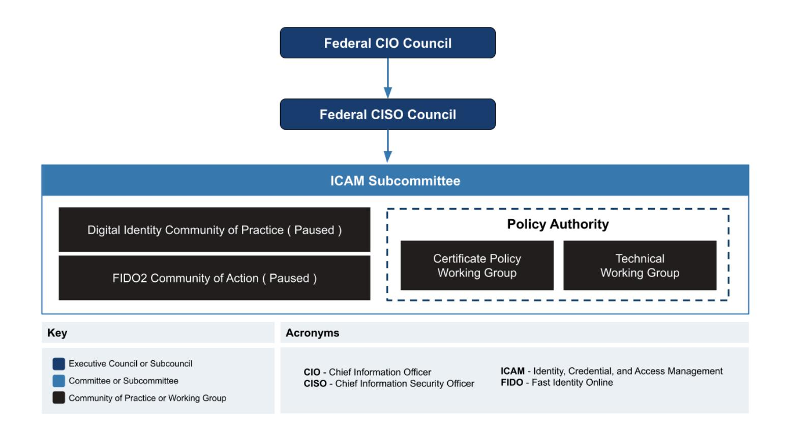

# **FICAM Program**

## **Introduction**

The GSA Federal ICAM (FICAM) program helps federal agencies plan and manage enterprise identity, credentialing, and access management (ICAM) through collaboration opportunities and guidance on IT policy, standards, implementation, and architecture. Most of the guidance and best practices found on this website are developed through interagency working groups. The FICAM Program is a Federal CIO Council initiative managed by the GSA Office of Governmentwide Policy.

The main difference between the GSA OGP FICAM program and an agency ICAM program (including GSA's own enterprise ICAM program) is the GSA OGP FICAM program focuses on government-wide initiatives that support interoperability between organizations.

## **Federal Workforce Identity Framework**

The FICAM Program governs through a four-part framework for identity federations.

**Governance** - Sets policies, sign legal agreements, approves members and applicants, and oversees compliance activities.

**Technical and Security Requirements** - Outline technical and security requirements for all members.

**Recognition** - List of members and compliant services.

**Compliance** - Members and services complete 2nd party (OIG) or 3rd party compliance activity to increase trust.

Through this four-part framework, the GSA FICAM Program leads or coordinates the following governmentwide functions.

#### 1. Governance

ICAM Governance - Maintain and update idmanagement.gov which includes the FICAM Architecture and accompanying playbooks and configuration guidance as well as

secretary/co-chair the Federal CISO Council ICAM Subcommittee. Lead governmentwide ICAM initiatives like the FIDO2 Community of Action and Digital Identity Community of Practice.

- Federal PKI [Governance](https://www.idmanagement.gov/fpki/) Review Federal PKI 3rd party PKI audits and secretary/co-chair the Federal PKI Policy Authority
- 2. Technical and Security Requirements
  - FIPS 201 and accompanying Special Publications
  - NIST Special Publication 800-63
  - GSA FIPS 201 Functional Requirements and Test Cases

#### 3. Recognition

- [Workforce](https://www.idmanagement.gov/trust-services) identity trust services The current service providers that have an identity federation agreement with the U.S. government.
- FIPS 201 [Approved](https://www.idmanagement.gov/fips201/) Product List List of tested and certified products from the FIPS 201 Evaluation Program.
- GSA PKI Shared Service Provider [Program](https://www.idmanagement.gov/gsapkissp/) Manage commercial PKI service providers that issue Federallycompliant digital certificates.

#### 4. Compliance

- FIPS 201 [Evaluation](https://www.idmanagement.gov/fips201ep/) Program Tests and certify services and commercial products used in PIV credentialing systems and physical access control systems.
- Federal PKI Annual Review [Process](https://www.idmanagement.gov/fpki/#annual-review-requirements-for-all-certification-authorities) Independent compliance audit requirement and schedule of Federal PKI Certification Authorities.

## **ICAM Governance Bodies**

The GSA FICAM Program coordinates and oversees governmentwide ICAM initiatives as directed by the Federal CISO Council and the Office of Management and Budget. It accomplishes this mission through various governance bodies outlined below.

## **Identity, Credential, and Access Management Subcommittee**

The Identity, Credential, and Access Management [Subcommittee](https://community.max.gov/pages/viewpage.action?pageId=234815732) (ICAMSC) is the principal interagency forum for identity management, secure access, authentication, authorization, credentials, privileges, and access lifecycle management. It's a sub-committee of the Federal CIO Council's Chief Information Security Officer (CISO) Council.

The ICAMSC is co-chaired by the GSA Office of [Government-wide](https://www.gsa.gov/about-us/organization/office-of-governmentwide-policy) Policy, Department of Justice and Department of Homeland Security, Cybersecurity and Infrastructure Security Agency. The ICAMSC aligns the identity management activities of the federal government and supports collaborative government-wide efforts to increase agency flexibility in addressing ICAM challenges, coordinate interagency efforts to meet agency mission needs, identify gaps in policies, procedures, standards, guidance, and services and align ICAM policies and compliance with other cybersecurity initiatives.

## **Activities**

**Address Agency Challenges** - provides opportunities for agencies to troubleshoot issues and challenges associated with the planning,

implementation, and operations of ICAM programs and solutions.

- **Develop Policy Recommendations** recommends new ICAM policies and updates existing ones.
- **Provide Flexible Tools for ICAM Programs** develops specific tools to assist agencies' abilities to meet ICAM policy objectives and overcome ICAM implementation challenges.
- **Facilitate Communications and Information Sharing** acts as a vehicle for cross-government collaboration by sharing information, lessons learned, and best practices related to ICAM.

## **Membership and Meetings**

Membership is open to federal agency employees with a .gov or .mil email address. Contractors are permitted to join on a case-by-case basis. See the [ICAMSC Meeting](https://community.connect.gov/display/Egov/ICAMSC+Meeting+Materials) Page on [Connect.gov](https://community.connect.gov/display/Egov/ICAMSC+Meeting+Materials) for more information. Access to the page requires a multifactor authentication using a PIV/CAC. See the [ICAMSC Charter](https://www.idmanagement.gov/docs/202309-charter-icamsc.pdf) (PDF, September 2023) for information on membership requirements, voting rights, etc.

## **ICAMSC Working Groups**

**Digital Identity CoP** - The Digital Identity CoP fosters a government-wide community for federal digital identity practitioners and serves as a platform to cross-train, educate and forum to exchange identity and access management technology trends, solutions, and architecture. This CoP allows practitioners to share lessons learned, opportunities and discuss innovative tailored identity processes for customer experience across both mission delivery (public identity) and mission support (workforce identity).

**FIDO CoA** - The Office of Management and Budget's Office of the Federal CIO, in partnership with the Identity, Credential, and Access Management Subcommittee and Cybersecurity and Infrastructure Security Agency, have launched a Phishing-Resistant Authentication (FIDO2) Community of Action through March 2025. This group works with Agencies that plan to rapidly deploy a pilot of FIDO2-based phishing-resistant authenticators within their enterprise, Provide agencies with access to expertise and guidance in achieving this goal, and Documents results to help accelerate the modernization of phishing-resistant MFA throughout the Federal Government.

**Certificate Policy (CPWG)** - The Federal Bridge and Common policies advisory group facilitates proposed Certificate Policy changes, facilitate the FPKI cross-certification process, and address and resolve issues through policy analysis and modification. Members must be a Federal employees, designated contractors, and PKI providers involved in the FPKI.

**Technical (TWG)** - Investigate and resolve complex FPKI technical issues, identify and scope technical FPKI issues, address security concerns and vulnerabilities, and identify technical improvements to enhance the security and operational capabilities. Members must be a Federal employees, designated contractors, and PKI vendors.

**Federal Mobility Group** - The Federal Mobility Group purpose is to share information and identify cross-agency needs in the areas of mobile policy, guidance, and best practices; acquisition of mobile devices and services; and operational requirements for federal mobility programs.

#### **Identity Focused WG** - formerly Derived-PIV.

The ICAMSC charters working groups based on a defined-purpose and timeline. See the complete list of active and inactive working groups at the [ICAMSC Max.gov](https://community.max.gov/pages/viewpage.action?pageId=234815732) page. Send an email to [icam@gsa.gov](mailto:icam@gsa.gov) for more information and join a working group.

## **Other ICAM Working Groups**

Other ICAM working groups may be charted under other committees or subcommittees of the Federal CIO Council.

## **ICAM Community Listserv**

The Federal ICAM Community Technical Listserv (ICAM-COMMUNITY-TECH List) aims to provide a communications platform to share and discuss technical issues impacting the Federal ICAM Community. We hope to leverage the knowledge of ICAM Subject Matter Experts to identify, share, and hopefully resolve technical issues that exist in Agencies and Departments. This list is open to anyone with a .gov email.

Subscribe by contacting the list owner: [icam-community-tech-request@listserv.gsa.gov](mailto:icam-community-tech-request@listserv.gsa.gov) with subscribe in the subject line.

# **Federal Public Key Infrastructure Policy Authority**

The Federal Public Key Infrastructure Policy Authority (FPKIPA) serves the interest of U.S. federal government organizations as relying parties and promotes interoperability between federal and non-federal entities by setting policy governing the Federal Public Key Infrastructure (FPKI) Trust Infrastructure, approving applicants for cross certification with the Federal Bridge Certification Authority (FBCA), and providing oversight to the Certified PKI Shared Service Provider (SSP) Program.

It is co-chaired by the GSA Office of Government-wide Policy. The GSA Office of the Chief Information Officer (OCIO) is responsible for security authorizations and continuous monitoring for commercially-operated PKI shared service providers.

## **Activities**

- **Approve Policies and Practices** Approve Federal Bridge Certification Authority (FBCA) and Federal Common Policy Certification Authority Certificate Policies (CPs), including revisions; approve FPKI Trust Infrastructure Certification Practice Statements.
- **Approve Entity Cross-Certification** Establish and administer criteria and methodology for cross-certification with the FBCA; approve crosscertifications and execute Memoranda of Agreement (MOAs); maintain the FPKI Certification Applicant Requirements and the Common Policy CPS Evaluation Matrix.
- **Maintain [Compliance](https://www.idmanagement.gov/fpki/#audit-information-for-the-fpki-management-authority)** Ensure cross-certified entities are compatible with the FBCA Certificate Policy (CP) (or the Federal Common Policy Certification Authority (FCPCA) CP for Federal Legacy CAs).
- **Agreement with FPKI Management Authority** Oversee the FPKI Management Authority (FPKIMA) to issue and revoke cross-certificates, ensure adherence to the FPKI CPs, and provide documentation to be archived.
- **Interoperability Practices** Coordinate legal, policy, technical, and business practices and issues related to FPKI Trust Infrastructure.

## **Membership and Meetings**

Members are appointed by each federal agency's CIO, and the group operates under the authority of the Federal CIO Council through the Information Security and Identity Management Committee (ISIMC) and the Identity, Credential, and Access Management Subcommittee

(ICAMSC). See the [FPKIPA](https://www.idmanagement.gov/docs/fpkipa-charter.pdf) Charter (PDF, August 2021) for information on membership requirements, voting rights, etc.

The FPKIPA meets in the morning on the second Tuesday of each month. Contact [fpki@gsa.gov](mailto:fpki@gsa.gov) to participate in the FPKIPA or its working groups.

# **Federal Public Key Infrastructure Management Authority**

The Federal Public Key [Infrastructure](https://www.idmanagement.gov/docs/fpki-fpkima-wp.pdf) Management Authority (FPKIMA) enables government[wide](https://www.idmanagement.gov/docs/fpki-fpkima-wp.pdf) trust by providing trust infrastructure services to federal agencies. The FPKIMA is governed under the FPKI Policy Authority (FPKIPA) and managed by the GSA Federal Acquisition Service.

## **Activities**

- **Manage digital certificate policies and standards** to ensure secure physical and logical access, document sharing, and communications across federal agencies and between external business partners.
- **Operate the FPKI Trust Infrastructure**, which consists of two main certification authorities (CA):
  - **Federal Common Policy CA (FCPCA)** is the trust anchor for the federal government. Authorized CAs issue certificates for exclusive use by the federal government for federal employees and contractors, to include the PKI certificates on the Personal Identity Verification (PIV) credential.
  - **Federal Bridge CA (FBCA)** is the PKI Bridge that enables interoperability between and among federally operated and business partner PKIs.

## **FPKIMA Newsletter**

Previous versions of the FPKIMA Newsletters are archived and can be found in the IDManagement.gov repo under the docs [folder.](https://github.com/GSA/idmanagement.gov/tree/staging/docs)

If your agency is experiencing issues related to the FBCA or FCPCA, contact [fpki-help@gsa.gov](mailto:fpki-help@gsa.gov)

## **Federal Public Key Infrastructure Working Groups**

The FPKIPA charters two ongoing working groups and potentially other short-term working groups and tiger teams.

If you meet the membership criteria and wish to join a working group, email [fpki@gsa.gov](mailto:fpki@gsa.gov) and include the text "Request to Join xx," where "xx" is the name of the working group.

**Certificate Policy (CPWG)** - The Federal Bridge and Common policies advisory group facilitates proposed Certificate Policy changes, facilitate the FPKI cross-certification process, and address and resolve issues through policy analysis and modification. Members must be a Federal employees, designated contractors, and PKI providers involved in the FPKI.

**Technical (TWG)** - Investigate and resolve complex FPKI technical issues, identify and scope technical FPKI issues, address security concerns and vulnerabilities, and identify technical improvements to enhance the security and operational capabilities. Members must be a Federal employees, designated contractors, and PKI vendors.