# **INSPECTOR GENERAL DESKBOOK**

**VOLUME 4** 

*Office of Inspector General Department of The Treasury*

# **Inspector General Deskbook Volume 4**

### *TABLE OF CONTENTS*

#### *Section 7 -References and Standards*

### **Goverment Accountability Office (GAO):**

 Government Auditing Standard (Yellow Book) *available at* http://www.gao.gov/govaud/d07162g.pdf

Standards for Internal Control in the Federal Government, GAO/AIMD-00-21.3.1 (1999)

*Inspectors General: Comparison of Ways Law Enforcement Authority is Granted*, Report to the Chairman, Committee on Government Reform, House of Representatives*,* GAO-02-437 (May, 2002)

*Inspectors General: Enhancing Federal Accountability, Statement of David M. Walker Comptroller General of the United States,* Testimony Before the Subcommittees on Government Efficiency and Financial Management, Committee on Government Reform, House of Representatives,GAO-04- 117T (October, 2003)

*Office Consolidation and Related Issue*, Report to the Chairman, Committee on Government Reform, House of Representatives, GAO-02-575 (Aug., 2002)

 *Statutory Authorities to Prohibit Inspector General Activities*, Letter to the Chairwoman, Subcommittee on Government Management, Organization, and Procurement, House of Representatives, GAO-09-660R (2009)

Additional GAO Documents Guide

### **[Council of the Inspectors General on Integrity and Efficiency \(CIGIE\)](http://www.ignet.gov/cigie1.html):**

Quality Standards for Federal Offices of Inspector General (Silver Book) (2003)

Quality Standards for Investigations, PCIE/ECIE (2003)

Quality Standards for Inspection and Evaluation, CIGIE (2011)

### *Section 8 -Additional Materials Relating to OIG*

CRS Report for Congress, *Statutory Offices of Inspector General: A 20" Anniversary Review* (1998)

Power Point Presentation on IG Act

# Section 7 References and Standards

# **United States General Accounting Office** GAO Internal Control

# **November 1999** Standards for Internal Control in the Federal Government

# Foreword

Federal policymakers and program managers are continually seeking ways to better achieve agencies' missions and program results, in other words, they are seeking ways to improve accountability. A key factor in helping achieve such outcomes and minimize operational problems is to implement appropriate internal control. Effective internal control also helps in managing change to cope with shifting environments and evolving demands and priorities. As programs change and as agencies strive to improve operational processes and implement new technological developments, management must continually assess and evaluate its internal control to assure that the control activities being used are effective and updated when necessary.

The Federal Managers' Financial Integrity Act of 1982 (FMFIA) requires the General Accounting Office (GAO) to issue standards for internal control in government. The standards provide the overall framework for establishing and maintaining internal control and for identifying and addressing major performance and management challenges and areas at greatest risk of fraud, waste, abuse, and mismanagement. Office of Management and Budget (OMB) Circular A-123, Management Accountability and Control, revised June 21, 1995, provides the specific requirements for assessing and reporting on controls. The term internal control in this document is synonymous with the term management control (as used in OMB Circular A-123) that covers all aspects of an agency's operations (programmatic, financial, and compliance).

Recently, other laws have prompted renewed focus on internal control. The Government Performance and Results Act of 1993 requires agencies to clarify their missions, set strategic and annual performance goals, and measure and report on performance

#### **Foreword**

toward those goals. Internal control plays a significant role in helping managers achieve those goals. Also, the Chief Financial Officers Act of 1990 calls for financial management systems to comply with internal control standards, and the Federal Financial Management Improvement Act of 1996 identifies internal control as an integral part of improving financial management systems.

Rapid advances in information technology have highlighted the need for updated internal control guidance related to modern computer systems. The management of human capital has gained recognition as a significant part of internal control. Furthermore, the private sector has updated its internal control guidance with the issuance of Internal Control — Integrated Framework, published by the Committee of Sponsoring Organizations of the Treadway Commission (COSO). Consequently, we have developed this standards update which supersedes our previously issued "Standards for Internal Controls in the Federal Government."

This update gives greater recognition to the increasing use of information technology to carry out critical government operations, recognizes the importance of human capital, and incorporates, as appropriate, the relevant updated internal control guidance developed in the private sector. The standards are effective beginning with fiscal year 2000 and the Federal Managers Financial Integrity Act reports covering that year.

#### **Foreword**

We appreciate the efforts of government officials, public accounting professionals, and other members of the financial community and academia who provided valuable assistance in developing these standards.

David M. Walker Comptroller General of the United States

# Introduction

The following definition, objectives, and fundamental concepts provide the foundation for the internal control standards.

# Definition and Objectives **Internal Control**

An integral component of an organization's management that provides reasonable assurance that the following objectives are being achieved:

- effectiveness and efficiency of operations,
- reliability of financial reporting, and
- compliance with applicable laws and regulations.

Internal control is a major part of managing an organization. It comprises the plans, methods, and procedures used to meet missions, goals, and objectives and, in doing so, supports performance-based management. Internal control also serves as the first line of defense in safeguarding assets and preventing and detecting errors and fraud. In short, internal control, which is synonymous with management control, helps government program managers achieve desired results through effective stewardship of public resources.

Internal control should provide reasonable assurance that the objectives of the agency are being achieved in the following categories:

#### **Introduction**

- Effectiveness and efficiency of operations including the use of the entity's resources.
- Reliability of financial reporting, including reports on budget execution, financial statements, and other reports for internal and external use.
- Compliance with applicable laws and regulations.

A subset of these objectives is the safeguarding of assets. Internal control should be designed to provide reasonable assurance regarding prevention of or prompt detection of unauthorized acquisition, use, or disposition of an agency's assets.

# Fundamental Concepts **Internal Control**

- A continuous built-in component of operations.
- Effected by people.
- Provides reasonable assurance, not absolute assurance.

The fundamental concepts provide the underlying framework for designing and applying the standards.

### Internal Control Is a Continuous Built-in Component of Operations

Internal control is not one event, but a series of actions and activities that occur throughout an entity's operations and on an ongoing basis. Internal control should be recognized as an integral part of each system that management uses to regulate and guide its operations rather than as a separate system within an agency. In this sense, internal control is management control that is built into the entity as a

#### **Introduction**

part of its infrastructure to help managers run the entity and achieve their aims on an ongoing basis.

### Internal Control Is Effected by People

People are what make internal control work. The responsibility for good internal control rests with all managers. Management sets the objectives, puts the control mechanisms and activities in place, and monitors and evaluates the control. However, all personnel in the organization play important roles in making it happen.

Internal Control Provides Reasonable Assurance, Not Absolute Assurance

Management should design and implement internal control based on the related cost and benefits. No matter how well designed and operated, internal control cannot provide absolute assurance that all agency objectives will be met. Factors outside the control or influence of management can affect the entity's ability to achieve all of its goals. For example, human mistakes, judgment errors, and acts of collusion to circumvent control can affect meeting agency objectives. Therefore, once in place, internal control provides reasonable, not absolute, assurance of meeting agency objectives.

## Presentation of the Standards

#### **The Five Standards for Internal Control**

- Control Environment
- Risk Assessment
- Control Activities
- Information and Communications
- Monitoring

These standards define the minimum level of quality acceptable for internal control in government and provide the basis against which internal control is to be evaluated. These standards apply to all aspects of an agency's operations: programmatic, financial, and compliance. However, they are not intended to limit or interfere with duly granted authority related to developing legislation, rule-making, or other discretionary policy-making in an agency. These standards provide a general framework. In implementing these standards, management is responsible for developing the detailed policies, procedures, and practices to fit their agency's operations and to ensure that they are built into and an integral part of operations.

In the following material, each of these standards is presented in a short, concise statement. Additional information is provided to help managers incorporate the standards into their daily operations.

## Control Environment

Management and employees should establish and maintain an environment throughout the organization that sets a positive and supportive attitude toward internal control and conscientious management.

A positive control environment is the foundation for all other standards. It provides discipline and structure as well as the climate which influences the quality of internal control. Several key factors affect the control environment.

One factor is the integrity and ethical values maintained and demonstrated by management and staff. Agency management plays a key role in providing leadership in this area, especially in setting and maintaining the organization's ethical tone, providing guidance for proper behavior, removing temptations for unethical behavior, and providing discipline when appropriate.

Another factor is management's commitment to competence. All personnel need to possess and maintain a level of competence that allows them to accomplish their assigned duties, as well as understand the importance of developing and implementing good internal control. Management needs to identify appropriate knowledge and skills needed for various jobs and provide needed training, as well as candid and constructive counseling, and performance appraisals.

Management's philosophy and operating style also affect the environment. This factor determines the degree of risk the agency is willing to take and management's philosophy towards performance-based management. Further, the attitude and philosophy of management toward information systems, accounting, personnel functions, monitoring, and audits and evaluations can have a profound effect on internal control.

Another factor affecting the environment is the agency's organizational structure. It provides management's framework for planning, directing, and controlling operations to achieve agency objectives. A good internal control environment requires that the agency's organizational structure clearly define key areas of authority and responsibility and establish appropriate lines of reporting.

The environment is also affected by the manner in which the agency delegates authority and responsibility throughout the organization. This delegation covers authority and responsibility for operating activities, reporting relationships, and authorization protocols.

Good human capital policies and practices are another critical environmental factor. This includes establishing appropriate practices for hiring, orienting, training, evaluating, counseling, promoting, compensating, and disciplining personnel. It also includes providing a proper amount of supervision.

A final factor affecting the environment is the agency's relationship with the Congress and central oversight agencies such as OMB. Congress mandates the programs that agencies undertake and monitors their progress and central agencies provide policy and guidance on many different matters. In addition,

Inspectors General and internal senior management councils can contribute to a good overall control environment.

### Risk Assessment

Internal control should provide for an assessment of the risks the agency faces from both external and internal sources.

A precondition to risk assessment is the establishment of clear, consistent agency objectives. Risk assessment is the identification and analysis of relevant risks associated with achieving the objectives, such as those defined in strategic and annual performance plans developed under the Government Performance and Results Act, and forming a basis for determining how risks should be managed.

Management needs to comprehensively identify risks and should consider all significant interactions between the entity and other parties as well as internal factors at both the entitywide and activity level. Risk identification methods may include qualitative and quantitative ranking activities, management conferences, forecasting and strategic planning, and consideration of findings from audits and other assessments.

Once risks have been identified, they should be analyzed for their possible effect. Risk analysis generally includes estimating the risk's significance, assessing the likelihood of its occurrence, and

deciding how to manage the risk and what actions should be taken. The specific risk analysis methodology used can vary by agency because of differences in agencies' missions and the difficulty in qualitatively and quantitatively assigning risk levels.

Because governmental, economic, industry, regulatory, and operating conditions continually change, mechanisms should be provided to identify and deal with any special risks prompted by such changes.

### Control Activities

Internal control activities help ensure that management's directives are carried out. The control activities should be effective and efficient in accomplishing the agency's control objectives.

Control activities are the policies, procedures, techniques, and mechanisms that enforce management's directives, such as the process of adhering to requirements for budget development and execution. They help ensure that actions are taken to address risks. Control activities are an integral part of an entity's planning, implementing, reviewing, and accountability for stewardship of government resources and achieving effective results.

Control activities occur at all levels and functions of the entity. They include a wide range of diverse activities such as approvals, authorizations, verifications, reconciliations, performance reviews,

maintenance of security, and the creation and maintenance of related records which provide evidence of execution of these activities as well as appropriate documentation. Control activities may be applied in a computerized information system environment or through manual processes.

Activities may be classified by specific control objectives, such as ensuring completeness and accuracy of information processing.

### Examples of Control Activities

- Top level reviews of actual performance,
- Reviews by management at the functional or activity level,
- Management of human capital,
- Controls over information processing,
- Physical control over vulnerable assets,
- Establishment and review of performance measures and indicators,
- Segregation of duties,
- Proper execution of transactions and events,
- Accurate and timely recording of transactions and events,
- Access restrictions to and accountability for resources and records, and
- Appropriate documentation of transactions and internal control.

There are certain categories of control activities that are common to all agencies. Examples include the following:

### Top Level Reviews of Actual Performance

Management should track major agency achievements and compare these to the plans, goals, and objectives established under the Government Performance and Results Act.

Reviews by Management at the Functional or Activity Level

Managers also need to compare actual performance to planned or expected results throughout the organization and analyze significant differences.

Management of Human Capital

Effective management of an organization's workforce—its human capital—is essential to achieving results and an important part of internal control. Management should view human capital as an asset rather than a cost. Only when the right personnel for the job are on board and are provided the right training, tools, structure, incentives, and responsibilities is operational success possible. Management should ensure that skill needs are continually assessed and that the organization is able to obtain a workforce that has the required skills that match those necessary to achieve organizational goals. Training should be aimed at developing and retaining employee skill levels to meet changing organizational needs. Qualified and continuous supervision should be provided to ensure that internal control objectives are achieved. Performance evaluation and feedback, supplemented by an effective reward system, should be designed to help employees understand the connection between their performance and the organization's success. As a part of its human capital planning, management should also consider how best to retain valuable employees, plan for their eventual succession, and ensure continuity of needed skills and abilities.

Controls Over Information Processing

A variety of control activities are used in information processing. Examples include edit checks of data entered, accounting for transactions in numerical sequences, comparing file totals with control

accounts, and controlling access to data, files, and programs. Further guidance on control activities for information processing is provided below under "Control Activities Specific for Information Systems."

#### Physical Control Over Vulnerable Assets

An agency must establish physical control to secure and safeguard vulnerable assets. Examples include security for and limited access to assets such as cash, securities, inventories, and equipment which might be vulnerable to risk of loss or unauthorized use. Such assets should be periodically counted and compared to control records.

#### Establishment and Review of Performance Measures and Indicators

Activities need to be established to monitor performance measures and indicators. These controls could call for comparisons and assessments relating different sets of data to one another so that analyses of the relationships can be made and appropriate actions taken. Controls should also be aimed at validating the propriety and integrity of both organizational and individual performance measures and indicators.

Segregation of Duties Key duties and responsibilities need to be divided or segregated among different people to reduce the risk of error or fraud. This should include separating the responsibilities for authorizing transactions, processing and recording them, reviewing the transactions, and handling any related assets. No one individual should control all key aspects of a transaction or event.

#### Proper Execution of Transactions and Events

Transactions and other significant events should be authorized and executed only by persons acting within the scope of their authority. This is the principal means of assuring that only valid transactions to exchange, transfer, use, or commit resources and other events are initiated or entered

into. Authorizations should be clearly communicated to managers and employees.

Accurate and Timely Recording of Transactions and Events Transactions should be promptly recorded to maintain their relevance and value to management in controlling operations and making decisions. This applies to the entire process or life cycle of a transaction or event from the initiation and authorization through its final classification in summary records. In addition, control activities help to ensure that all transactions are completely and accurately recorded.

Access Restrictions to and Accountability for Resources and Records Access to resources and records should be limited to authorized individuals, and accountability for their custody and use should be assigned and maintained. Periodic comparison of resources with the recorded accountability should be made to help reduce the risk of errors, fraud, misuse, or unauthorized alteration.

Appropriate Documentation of Transactions and Internal Control

Internal control and all transactions and other significant events need to be clearly documented, and the documentation should be readily available for examination. The documentation should appear in management directives, administrative policies, or operating manuals and may be in paper or electronic form. All documentation and records should be properly managed and maintained.

These examples are meant only to illustrate the range and variety of control activities that may be useful to agency managers. They are not all-inclusive and may not include particular control activities that an agency may need.

Furthermore, an agency's internal control should be flexible to allow agencies to tailor control activities to fit their special needs. The specific control activities used by a given agency may be different from those

used by others due to a number of factors. These could include specific threats they face and risks they incur; differences in objectives; managerial judgment; size and complexity of the organization; operational environment; sensitivity and value of data; and requirements for system reliability, availability, and performance.

### Control Activities Specific for Information Systems

- General Control
- Application Control

There are two broad groupings of information systems control - general control and application control. General control applies to all information systems—mainframe, minicomputer, network, and end-user environments. Application control is designed to cover the processing of data within the application software.

#### General Control

This category includes entitywide security program planning, management, control over data center operations, system software acquisition and maintenance, access security, and application system development and maintenance. More specifically:

 Data center and client-server operations controls include backup and recovery procedures, and contingency and disaster planning. In addition, data center operations controls also include job set-up and scheduling procedures and controls over operator activities.

- System software control includes control over the acquisition, implementation, and maintenance of all system software including the operating system, data-based management systems, telecommunications, security software, and utility programs.
- Access security control protects the systems and network from inappropriate access and unauthorized use by hackers and other trespassers or inappropriate use by agency personnel. Specific control activities include frequent changes of dial-up numbers; use of dial-back access; restrictions on users to allow access only to system functions that they need; software and hardware "firewalls" to restrict access to assets, computers, and networks by external persons; and frequent changes of passwords and deactivation of former employees' passwords.
- Application system development and maintenance control provides the structure for safely developing new systems and modifying existing systems. Included are documentation requirements; authorizations for undertaking projects; and reviews, testing, and approvals of development and modification activities before placing systems into operation. An alternative to in-house development is the procurement of commercial software, but control is necessary to ensure that selected software meets the user's needs, and that it is properly placed into operation.

Application Control This category of control is designed to help ensure completeness, accuracy, authorization, and validity of all transactions during application processing. Control should be installed at an application's interfaces with other systems to ensure that all inputs are received and are valid and outputs are correct and properly distributed. An example is computerized edit checks built into the system to review the format, existence, and reasonableness of data.

General and application control over computer systems are interrelated. General control supports the functioning of application control, and both are needed to ensure complete and accurate information processing. If the general control is inadequate, the application control is unlikely to function properly and could be overridden.

Because information technology changes rapidly, controls must evolve to remain effective. Changes in technology and its application to electronic commerce and expanding Internet applications will change the specific control activities that may be employed and how they are implemented, but the basic requirements of control will not have changed. As more powerful computers place more responsibility for data processing in the hands of the end users, the needed controls should be identified and implemented.

# Information and Communications

Information should be recorded and communicated to management and others within the entity who need it and in a form and within a time frame that enables them to carry out their internal control and other responsibilities.

For an entity to run and control its operations, it must have relevant, reliable, and timely communications relating to internal as well as external events. Information is needed throughout the agency to achieve all of its objectives.

Program managers need both operational and financial data to determine whether they are meeting their agencies' strategic and annual performance plans and meeting their goals for accountability for effective and efficient use of resources. For example, operating information is required for development of financial reports. This covers a broad range of data from purchases, subsidies, and other transactions to data on fixed assets, inventories, and receivables. Operating information is also needed to determine whether the agency is achieving its compliance requirements under various laws and regulations. Financial information is needed for both external and internal uses. It is required to develop financial statements for periodic external reporting, and, on a day-to-day basis, to make operating decisions, montinor performance, and allocate resources. Pertinent information should be identified, captured, and distributed in a form and time frame that permits people to perform their duties efficiently.

Effective communications should occur in a broad sense with information flowing down, across, and up the organization. In additional to internal communications, management should ensure there are adequate means of communicating with, and obtaining information from, external stakeholders that may have a significant impact on the agency achieving its goals. Moreover, effective information technology management is critical to achieving useful, reliable, and continuous recording and communication of information.

## Monitoring

Internal control monitoring should assess the quality of performance over time and ensure that the findings of audits and other reviews are promptly resolved.

Internal control should generally be designed to assure that ongoing monitoring occurs in the course of normal operations. It is performed continually and is ingrained in the agency's operations. It includes regular management and supervisory activities, comparisons, reconciliations, and other actions people take in performing their duties.

Separate evaluations of control can also be useful by focusing directly on the controls' effectiveness at a specific time. The scope and frequency of separate evaluations should depend primarily on the assessment of risks and the effectiveness of ongoing monitoring procedures. Separate evaluations may take the form of self-assessments as well as review of control design and direct testing of internal control. Separate evaluations also may be performed by the agency Inspector General or an external auditor. Deficiencies found during ongoing monitoring or through separate evaluations should be communicated to the individual responsible for the function and also to at least one level of management above that individual. Serious matters should be reported to top management.

Monitoring of internal control should include policies and procedures for ensuring that the findings of audits and other reviews are promptly resolved. Managers are to (1) promptly evaluate findings from

audits and other reviews, including those showing deficiencies and recommendations reported by auditors and others who evaluate agencies' operations, (2) determine proper actions in response to findings and recommendations from audits and reviews, and (3) complete, within established time frames, all actions that correct or otherwise resolve the matters brought to management's attention. The resolution process begins when audit or other review results are reported to management, and is completed only after action has been taken that (1) corrects identified deficiencies, (2) produces improvements, or (3) demonstrates the findings and recommendations do not warrant management action.

**United States General Accounting Office**

GAO

Report to the Chairman, Committee on Government Reform, House of Representatives

**May 2002** INSPECTORS GENERAL

> Comparison of Ways Law Enforcement Authority Is Granted

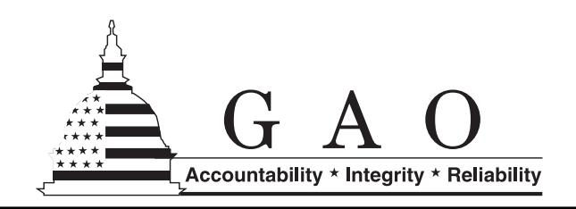

# Contents

| Letter       |                                                                                           | 1  |
|--------------|-------------------------------------------------------------------------------------------|----|
|              | Results in Brief                                                                          | 2  |
|              | Background                                                                                | 4  |
|              | Scope and Methodology                                                                     | 6  |
|              | Statutory and Deputized IGs' Law Enforcement Authority is                                 |    |
|              | Similar, but Differences Exist in Oversight Requirements                                  | 7  |
|              | Views of Deputized IGs and Other Federal Officials on Both                                |    |
|              | Methods                                                                                   | 9  |
|              | No Significant Cost or Savings Would Result from Switching                                |    |
|              | Deputized IGs to Statutory Authority                                                      | 10 |
|              | Conclusions                                                                               | 11 |
|              | Agency Comments                                                                           | 11 |
| Appendix I   | IG Offices That Have Made Annual Deputation                                               |    |
|              | Requests and Received Law Enforcement Authority                                           | 15 |
|              | Departments                                                                               | 15 |
|              | Agencies                                                                                  | 15 |
| Appendix II  | Data Collection Instrument of Presidentially                                              |    |
|              | Appointed Deputized IG Offices                                                            | 16 |
| Appendix III | Comments from the President's Council on Integrity                                        |    |
|              | and Efficiency                                                                            | 23 |
| Appendix IV  | Comments from the Department of Justice                                                   | 26 |
|              |                                                                                           |    |
| Table        |                                                                                           |    |
|              | Table 1: Deputized IGs' Law Enforcement Results Reported to DOJ from 1998 through 2000 | 8  |

#### **Abbreviations**

| CBO   | Congressional Budget Office                       |
|-------|---------------------------------------------------|
| DOD   | Department of Defense                             |
| DOJ   | Department of Justice                             |
| FBI   | Federal Bureau of Investigation                   |
| GSA   | General Services Administration                   |
| HHS   | Department of Health and Human Services           |
| IG    | Inspectors General                                |
| MOU   | memorandum of understanding                       |
| OMB   | Office of Management and Budget                   |
| OPM   | Office of Personnel Management                    |
| PCIE  | President's Council on Integrity and Efficiency   |
| TIGTA | Treasury Inspector General for Tax Administration |
| USDA  | U.S. Department of Agriculture                    |
| USMS  | U.S. Marshals Service                             |
|       |                                                   |

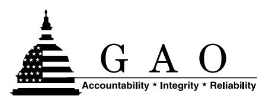

#### **United States General Accounting Office Washington, DC 20548**

May 22, 2002

The Honorable Dan Burton Chairman, Committee on Government Reform House of Representatives

Dear Mr. Chairman:

As a part of their responsibilities federal inspectors general (IGs) offices conduct criminal investigations of fraud, waste, and abuse in federal departments and programs. IG criminal investigators exercise law enforcement authority to make warrantless arrests, obtain and execute warrants, and carry firearms. Because IGs generally do not possess permanent statutory law enforcement authority, most presidentially appointed IGs have to request temporary deputation from the Department of Justice (DOJ).1 However, three presidentially appointed IGs2 —U.S. Department of Agriculture (USDA), Department of Defense (DOD), and Treasury Inspector General for Tax Administration (TIGTA)—possess permanent statutory law enforcement authority and do not need to obtain DOJ's approval.

This report responds to your request that we identify the similarities and differences between providing statutory authority and deputation to presidentially appointed IGs. Specifically, you asked us to

• compare the statutory authority and deputation in terms of the scope of law enforcement authority granted to the IG criminal investigators, amount of supervision and training of criminal investigators, and the extent of oversight required;

 Deputation is the process through which some criminal investigators derive their law enforcement authority. DOJ's U.S. Marshals Service is authorized to deputize selected persons to perform the functions of a deputy U.S. Marshal whenever considered appropriate.

These three presidentially appointed IGs have what has been referred to as full statutory law enforcement authority, giving their investigators the ability to, in general, make certain arrests, carry firearms, and execute search warrants. For this report, references to "statutory authority" are used to refer to certain common characteristics of these three presidentially appointed IGs identified to us as having statutory law enforcement authority comparable to the law enforcement authority granted to the deputized IGs.

- obtain the views of (1) IGs using deputation (deputized IGs) regarding whether statutory authority would improve their investigative practices or impact their current jurisdictions; and (2) other federal officials, including DOJ and the Office of Management and Budget (OMB), regarding statutory authority and deputation;
- estimate the cost implications if legislation were enacted to grant statutory authority to those IGs who do not possess such law enforcement authority.

To address these areas, we interviewed officials from various federal departments and agencies, including USDA, DOD, and DOJ, the FBI, and the U.S. Marshals Service (USMS), TIGTA, and Department of Health and Human Services (HHS); Congressional Budget Office (CBO), General Services Administration (GSA), OMB, and Office of Personnel Management (OPM). We compared and analyzed information to determine similarities and differences associated with statutory authority and deputation. To obtain the views about specific aspects of law enforcement authority, we surveyed and received responses from all 23 deputized IGs. We reviewed CBO's cost analysis to determine the costs involved in switching from deputation to statutory authority.

Results in Brief We found that IG criminal investigators who are deputized do not significantly differ in terms of their scope of law enforcement authority, supervision, and training from their counterparts who have statutory law enforcement authority. We also found that deputized IGs receive additional oversight over their law enforcement authority. For example, deputized IGs must renew their law enforcement authority every 3 years and involve the FBI when initiating certain criminal investigations and other sensitive investigations.3

> In responding to our questionnaire, 15 of the 23 deputized IGs reported that having statutory authority would improve their criminal investigative practices to at least some extent and 9 of these reported that statutory authority would improve their investigative practices to a great or very great extent. Three deputized IGs said it would enhance their recognition as fully authorized officers in the law enforcement community. DOJ said it is currently considering its position on ways to provide law enforcement

 3 As of January 2001, deputized IGs renewed their law enforcement authority for a 3-year period, rather than annually.

authority to deputized IGs. OMB deferred the matter for DOJ's consideration.

Deputized IGs and other federal agencies including the CBO stated that granting statutory law enforcement authority to IGs who are currently deputized would have no significant effect on federal costs since it would involve replacing one system of review and oversight with another.

We requested comments on a draft of this report from the President's Council on Integrity & Efficiency4 (PCIE) and DOJ. The PCIE disagreed with our report message. The PCIE generally disagreed with the methodology we used for our work and with some of the conclusions they believe the report was making in regard to the impacts of using one form of law enforcement authority over another.

The PCIE questioned our methodology, which compared temporary deputation with permanent statutory law enforcement authority. They stated that we should have compared deputized IGs to the provisions in the legislation (S. 3144) proposed in the last Congress rather than provisions that authorize the three IGs who have statutory law enforcement authority—-DOD, USDA, and TIGTA. The PCIE stated that the bill (S. 3144) was the only bona fide standard to compare against because it reflected the actual statutory authority that the deputized IGs were seeking. We compared deputation with the provisions of statutes that grant law enforcement authority to IGs in DOD, USDA, and TIGTA because these are the ways that IGs currently receive law enforcement authority. Importantly, the bill that the IGs referred to did not pass, and because provisions in any future legislation are subject to change, we did not believe it was appropriate to use provisions of S. 3144 in the comparison.

The PCIE stated that they disagree with the draft report's conclusion that unless significant cost savings can be associated with permanent statutory law enforcement authority, the current temporary deputation system should be retained. Our report does not state or imply such a conclusion. It accurately summarizes the information the IGs and other federal agencies, such as CBO, told us would be the cost impact of switching from

 4 The council is an interagency council comprised principally of presidentially appointed and Senate-confirmed IGs, which currently operates under Executive Order No. 12805 to coordinate and enhance the work of the IGs.

deputation to statutory law enforcement authority. The PCIE also stated that the report incorrectly concluded that the deputation process offers greater oversight and better professional standards than permanent statutory law enforcement authority. The report reaches no such conclusion. The report states that the current deputation process involved increased oversight, such as requiring deputized IGs to renew their law enforcement authority every 3 years with DOJ. The report does not conclude that one process is better than the other. The PCIE also stated that the deputation renewal process caused an administrative burden for USMS. Our work did not support such a conclusion. The USMS told us that the deputation process has improved and that renewing deputized IG's law enforcement authority was the easiest task of their deputation workload.

DOJ neither agreed nor disagreed with our draft report. DOJ requested that our report state that DOJ has not yet taken a position on providing law enforcement authority through either statute or deputation and that the issue is under review within the Administration. Officials from PCIE and DOJ also provided technical comments that we incorporated into the report as appropriate.

Background The Inspector General Act of 1978, as amended, among other things, identified specific federal departments and agencies that are required to have IGs appointed by the president, by and with the advice and consent of the Senate.5 The act also requires each such IG to appoint an assistant inspector general for investigations to supervise the performance of investigative activities, including criminal investigations, relating to their agencies' programs and operations.

> Although presidentially appointed IGs have the authority to conduct criminal investigations, the IGs have not been granted across-the-board statutory law enforcement authority.6 However, as the role of the presidentially appointed IGs in active investigations of criminal activity expanded, so too did their requests for deputation seeking the authority to make warrantless arrests, obtain and execute warrants, and carry firearms

 Inspector General Act of 1978 (Public Law 95-452), as amended, (codified at 5 U.S.C. App. 3 ).

6 IGs do, however, have the across-the-board power to, for example, issue subpoenas for the production of information and documents, among other things, in the performance of their investigations.

to reduce requests for assistance from other law enforcement personnel in dangerous situations. Subsequently, 23 presidentially appointed IGs' criminal investigators received law enforcement authority through caseby-case deputation granted by the USMS. Under this process, the presidentially appointed IGs applied for deputation for each criminal investigator in each case where the need was anticipated. Upon completion of the case, the deputation and its accompanying law enforcement authority expired, and the process would start over again.

In 1995, in an effort to reduce paperwork and excessive delays, certain presidentially appointed IGs began receiving 1-year deputation law enforcement authority for criminal investigators.7 Appendix I provides a list of the 23 deputized IGs who requested and received annual deputation. As of January 2001, these deputized IGs renew their law enforcement authority for a 3-year period, rather than annually. This process includes (1) requesting temporary law enforcement authority and obtaining approval from DOJ, (2) submitting a formal deputation application to DOJ, and (3) taking an oath. Deputized IGs' criminal investigators must also adhere to the terms and conditions disclosed in a DOJ memorandum of understanding (MOU). The MOU is designed to provide DOJ guidance and oversight of IG criminal investigator training and conduct of criminal investigations.

Although not passed, proposed legislation (S. 3144) was introduced during the 106th Congress, which would have, among other things, provided criminal investigators in specified IG offices (see appendix I) with certain statutory law enforcement authorities. Under this bill, deputized IGs would (1) no longer be required to renew their law enforcement authority through the USMS; and (2) obtain a statutory basis for carrying firearms, making certain types of warrantless arrests, and executing warrants.

In addition, the bill contained provisions for oversight over the IGs. The bill, for example, provided for "peer reviews" of IGs by other IGs.8 (The results of such reviews would have been forwarded to the applicable IG

The departments of Labor, Housing and Urban Development, State, and Transportation; Veterans Affairs, Social Security Administration, and the Small Business Administration were originally selected for the deputation pilot program.

8 Although the bill was not enacted into law, the PCIE Investigations Committee prepared a draft *Guide for Conducting Qualitative Assessment Reviews for the Investigative Operations of the IGs* and is conducting a nine-month pilot field-test to finalize the guide. The pilot test is scheduled to end on April 30, 2002.

and the Attorney General) and required DOJ's continued oversight of IGs' activities, such as involving the FBI when initiating certain criminal investigations. In addition, the Attorney General would have the authority, under certain conditions, to rescind or suspend such law enforcement authority of these IGs.

# Scope and Methodology

To compare the similarities and differences between providing statutory authority and deputation, we examined MOUs, federal statutes, operating manuals, and other pertinent documents between the two groups of IGs. We also interviewed officials involved with the deputation program and/or related efforts to obtain statutory authority for the deputized IGs. This included officials in Washington, D.C., from the USMS, FBI, DOJ's Criminal Division, OMB, and selected presidentially appointed IGs with deputation—HHS, GSA, DOJ IG, OPM, and the PCIE. In addition, we identified and interviewed three presidentially appointed IGs—USDA, DOD, TIGTA9 —having statutory authority comparable to the law enforcement authority granted to deputized IGs. We obtained perspectives and relevant documents related to their use of law enforcement authority. We compared the scope of law enforcement authority, supervision, and training of IG criminal investigators for both methods.

To obtain views of deputized IGs on whether statutory authority would improve their investigative practices or impact their current jurisdictions, we surveyed and received responses from all 23 deputized IGs (see app. II for the questionnaire).10

To identify the cost and any savings that might result by switching from deputation to statutory authority, we reviewed congressional hearing documents and the CBO cost analysis associated with a recent legislative proposal. In addition, we interviewed officials from DOJ, OMB, CBO, and selected IGs to obtain applicable cost and savings information.

 9 Statutory law enforcement authority is exercised by these IGs either through specific statutory grants to the IGs or delegations by the agency head. To illustrate, USDA IG was granted statutory law enforcement authority in 1981 (P.L. 97-98) and TIGTA IG was granted statutory law enforcement authority in 1998 (P.L. 105-206). DOD IG was granted certain statutory law enforcement authorities in 1997 (P.L. 105-85) but has the authority to carry firearms under delegation from the Secretary of Defense (10 U.S.C. 1585).

10Prior to distributing the survey questionnaire, we pretested it with the deputized IGs from HHS and GSA and made revisions accordingly.

We performed our work from May 2001 through May 2002 in accordance with generally accepted government auditing standards.

# Statutory and Deputized IGs' Law Enforcement Authority is Similar, but Differences Exist in Oversight Requirements

Regardless of the origin of law enforcement authority—either through statutory authority or deputation, IGs' scope of law enforcement authority, supervision, and training are similar. However, differences exist in the level of DOJ's oversight given to the deputized IGs by DOJ.

Similarities Whether under statute or deputation, IGs' law enforcement authority is similar. Our comparative analysis revealed that IGs have comparable duties, practices, and standards regarding their (1) scope of law enforcement authority to make warrantless arrests, obtain and execute warrants, and carry firearms; (2) supervision of criminal investigators, which generally provides for day-to-day oversight by an agency official such as a special agent-in-charge; and (3) training standards. For example, IG criminal investigators with statutory authority and IG criminal investigators with deputation train together at the Federal Law Enforcement Training Center located in Glynco, Georgia. The facility provides both groups the same basic training curriculum in matters such as firearms, search and seizure, and arrest procedures as well as criminal investigator-specialized training.

Differences We found differences in the level of DOJ oversight for IGs who are deputized by DOJ. Deputized IGs must renew their law enforcement authority every 3 years, while IGs with statutory authority do not have this requirement. DOJ established a process for granting and renewing deputation that allows its deputy attorney general, Criminal Division, FBI, and the USMS to review certain aspects of deputized IGs activities. The purpose of this process is to determine whether deputized IGs continue to meet standards for (1) keeping firearms skills current, (2) providing adequate training, and (3) coordinating with federal prosecutors and other federal law enforcement agencies.

As part of DOJ's deputation process, deputized IGs are required to report to DOJ annually on the results they achieved, as a condition for renewing their deputation. Table 1 summarizes the results achieved with deputation from 1998 through 2000 that we identified from deputized IG responses to our survey.11

**Table 1: Deputized IGs' Law Enforcement Results Reported to DOJ from 1998 through 2000**

| Types of activitya                                                         | Total  |
|----------------------------------------------------------------------------|--------|
| Arrests                                                                    | 4,762  |
| Searches                                                                   | 1,298  |
| Protection of witness                                                      | 576    |
| Dangerous surveillance of investigative subjects                           | 11,445 |
| Temporary custody of federal prisoners (outside controlled environment) | 1,086  |
| Dangerous interviews                                                       | 16,389 |
| Support for undercover operations                                          | 4,561  |
| Restraining orders                                                         | 73     |
| Dangerous subpoena service                                                 | 3,791  |
| Assisting in electronic surveillance                                       | 8,502  |

The results exclude two deputized IGs, because the data were not provided by types of activity.

Both DOJ and FBI officials told us that the reporting requirement is being re-evaluated, and DOJ said that it is outdated and no longer used as a condition for renewing deputized IGs' law enforcement authority. Furthermore, DOJ said that no deputized IG has been denied its deputation renewal request.

In addition, deputized IGs are required to notify the FBI when initiating certain criminal investigations as well as work jointly with the FBI on certain other sensitive investigations.12 The three presidentially appointed IGs with statutory authority do not have a specific statutory requirement to coordinate their investigations with the FBI. DOJ requires deputized IGs

 11The 3-year period (1998 through 2000) for which we requested information might not have been applicable to each deputized IG based on the MOU date they entered USMS's deputation program. Also, DOJ's IG did not provide us with reporting results, citing that it submits the agency's annual reports directly to the deputy attorney general rather than to the Criminal Division.

12Deputized IGs must further consult with federal prosecutors before proceeding with an investigation to ensure that an allegation, if proven, would be prosecuted.

and the FBI to provide each other written notification involving areas of concurrent jurisdiction. The FBI has jurisdiction in all matters involving fraud against the federal government and jointly shares this jurisdiction with the deputized IGs in matters of fraud against each IG's agency. DOJ also requires the FBI or another federal law enforcement agency to assist the deputized IGs when conducting specific types of sensitive investigations, such as court-ordered electronic surveillance.13

According to the FBI, the purpose of these requirements is to provide oversight in order to (1) place limits on the authority of the deputized IGs' criminal investigators, and (2) help ensure compliance with applicable DOJ guidelines, and (3) address law enforcement coordination procedures for deputized IGs when conducting their criminal investigations.

# Views of Deputized IGs and Other Federal Officials on Both Methods

As requested, we obtained views of deputized IGs and other federal officials on certain matters related to statutory authority and deputation. We found that deputized IGs prefer statutory authority to deputation and most believed statutory authority would improve their investigative practices at least to some extent. Most deputized IGs also reported that statutory authority would have little impact on their current statutory jurisdictions. Other federal officials generally believed that the current deputation process has improved. DOJ has not yet settled on its position on providing law enforcement authority to deputized IGs under either method. OMB deferred the matter for DOJ's consideration.

## Deputized IGs' Views on Certain Matters Related to Statutory Authority

Fifteen of the 23 deputized IGs reported that having statutory authority would improve their criminal investigative practices to at least some extent and 9 of these reported that statutory authority would improve their investigative practices to a great or very great extent. Three of these believed that practices would be improved because statutory authority would enhance their investigators status as fully authorized officers in the law enforcement community. Further, 20 of the 23 deputized IGs reported that granting statutory authority would change their current jurisdiction of authority to little or no extent.

13DOJ defines this category of cases to be any case involving the interception of communications pursuant to 18 U.S.C. Section 2510 et seq., electronic surveillance using closed circuit television in situations where a warrant is required, or any other courtordered electronic surveillance.

Other Federal Officials' Views on Statutory and Deputation Law Enforcement Authority

In July 2000, DOJ and OMB testified at congressional hearings in favor of a legislative proposal that would have granted statutory authority to specified IG offices. However, the issue is currently under review within the Administration, and DOJ has not yet settled on its position as of May 2002. FBI officials we interviewed said that the deputation process is a much better system of conferring law enforcement authority to the IGs because it provides greater flexibility for DOJ and appropriately places oversight responsibilities at the Attorney General level. The Attorney General has the authority to delegate these responsibilities to Justice entities including DOJ's Criminal Division, FBI and USMS. The Attorney General has delegated this authority to USMS. Although the FBI reported no significant problems of abuse or misconduct from the deputized IGs, they continue to believe that deputation enables DOJ to ensure coordination in matters of concurrent jurisdiction. In responding to our questionnaire, OMB indicated that the issue of whether deputized IGs should be switched from deputation to statutory authority was a matter that DOJ would have to consider.

Officials with DOJ's Criminal Division, FBI, and USMS generally agree that recent improvements, including extending the deputation renewal cycle from 1 to 3 years, will ease the processing burden.

No Significant Cost or Savings Would Result from Switching Deputized IGs to Statutory Authority

Most deputized IGs believed no significant cost or savings would derive from conferring statutory authority to them. Eighteen of the 23 deputized IGs reported that no significant cost would be associated with switching them from deputation to statutory authority. The remaining 5 deputized IGs reported that some savings would be likely by eliminating administrative responsibilities associated with preparing, processing, and reviewing deputation requests and annual reports. USMS officials told us that about 2,000 of the approximately 7,500 deputations they authorize each year are for IG criminal investigators. This number will be cut by onethird in 2004 when renewals will be done every 3 years. However, USMS currently invests less than 4 staff years in its deputation responsibilities, so the overall impact on USMS's deputation process would be minimal. USMS would be able to reduce its workload (reviewing deputation requests) by about 27 percent annually. However, beginning in January 2004, USMS will begin renewing IGs' deputation on a 3-year cycle.

Officials at DOJ concurred that the cost and any savings associated with switching from deputation to statutory authority would be minimal.

In addition, the CBO provided a cost estimate for a proposed bill (S. 3144) during the 106th Congress that would have granted statutory authority to specified IG offices. Because the bill would have codified powers already exercised by deputized IGs, and replaced one system of review and oversight with another, CBO estimated that implementing it would have no significant effect on federal costs. CBO told us that any costs would be less than \$500,000. However, CBO told us they did not consider the potential cost related to peer review. The vice chair of the President's Council on Integrity and Efficiency14 said at hearings that a legislative proposal to grant permanent statutory law enforcement authority to deputized IGs would have carried with it no additional costs, in part because the deputized IGs' criminal investigators already (1) exercised law enforcement authority through deputation, (2) trained as criminal investigators, and (3) participated in the federal law enforcement retirement system. Officials at OMB and CBO agreed with this cost assessment.

Conclusions With the exception of DOJ's imposed oversight requirements, we could not identify any other significant differences relating to law enforcement authority between the three IGs with statutory authority and the 23 deputized IGs. To some extent, DOJ has eased its requirements by extending the deputation renewal cycle from 1 to 3 years. In addition, DOJ concedes that its requirement for annual reports from deputized IGs has become outdated, and DOJ is reassessing the need for the requirement. Some deputized IGs believe that their status would be enhanced if they were statutorily authorized.

Agency Comments We received comments on a draft of this report from the PCIE (which presents the views of the IG community), and DOJ. The PCIE's March 18, 2002, comments and DOJ's March 25, 2002, comments are in appendixes III and IV, respectively. The PCIE disagreed with our report message. DOJ neither agreed nor disagreed with our report. Officials from these organizations also provided technical comments, which were incorporated into the report as appropriate.

 14The vice-chair of the council, accompanied by the chairpersons of the council's Legislation Committee and the Investigation Committee, testified regarding legislative proposals and issues relevant to the operations of the inspectors general, before the Senate Committee on Governmental Affairs, 106th Congress, (2000).

PCIE The PCIE felt that GAO should have focused on determining which means of providing law enforcement authority to IGs would foster the most effective investigative process. We were not requested to address this issue and therefore it was not within the scope of our work. We did however survey all 23 IGs and obtained their views on providing law enforcement authority (see our survey results on p. 8).

> The PCIE disagreed with our methodology comparing presidentially appointed IGs' deputation with statutory law enforcement authority. They stated that we should have compared deputized IGs' law enforcement authority to S. 3144 rather than the statutes that granted law enforcement authority to IGs at DOD, USDA, and TIGTA. The PCIE stated that S. 3144's provisions included, among other things, the statutory law enforcement authority that they are seeking. Because legislative proposals, including proposals from a previous session of Congress, are subject to change, we do not believe it is appropriate to use S. 3144 as the basis of comparison. Moreover, based on our analysis, law enforcement authority—the authority to carry firearms, make certain arrests, and execute warrants proposed under S. 3144 is essentially the same as granted by statute to IGs at DOD, USDA, and TIGTA. In addition, the PCIE claimed that the deputation renewal process caused an administrative burden on USMS. Our work did not support such a conclusion. The USMS told us that the deputation process has improved and that renewing deputized IGs' law enforcement authority was the easiest task of their deputation workload.

> The PCIE stated that the draft report seems to assume that, unless significant cost savings can be associated with permanent statutory law enforcement authority, temporary deputation should be retained. The PCIE said that it is a misperception that a decision on permanent statutory law enforcement authority for all IGs should be driven by cost considerations. We did not conclude or imply that significant cost savings should be a determining factor in deciding whether to switch deputized IGs to permanent statutory law enforcement authority. Rather, deputized IGs and other federal agencies including the CBO said that minimal costs or savings would result from switching from deputation to statutory authority. We were specifically asked by Congress to answer this question.

> The PCIE also said that as part of its oversight mechanisms, the proposed bill (S. 3144) would have established a peer review process among deputized IGs. The PCIE said there are no known administrative burdens associated with this approach and its implementation would not increase federal expenditures. While the operational procedures of the peer review are not known, undoubtedly any review system would have some level of

administrative burden and costs. For example, the PCIE's draft peer review guidelines—"*Guide for Conducting Qualitative Assessment Reviews of the Investigative Operations of Offices of Inspector General*," among other things, recommends reviewing samples of IG criminal investigators' training and basic qualification records as well as closed investigative files to ensure adherence to professional law enforcement standards. According to the PCIE, depending on the size of the IG agency or level of detail of the review, a peer review cycle could take up to 120 days. The staff resources and activities related to scheduling, conducting, and reporting results of 23 IGs' "peer reviews" would incur time and costs.

On May 3, 2002 the PCIE provided further comments on our draft report. The PCIE continued to disagree with our draft report for the basic reasons stated in their earlier comments. Also, the PCIE requested that we defer issuance of the final report until we obtain and incorporate DOJ's current views. The PCIE said it had become aware that DOJ was close to making a decision and was optimistic that this decision will support a grant of statutory law enforcement authority to the deputized IGs. On May 7, 2002, DOJ told us that the matter is still under review within the administration with no estimated date of completion. As a result, we do not feel that it is appropriate to delay the report issuance. The PCIE also provided technical comments, which were incorporated into the report as appropriate.

DOJ DOJ neither agreed nor disagreed with our draft report. DOJ requested that our report state that DOJ has not settled on a position on providing law enforcement authority through either statute or deputation and that the issue is under review within the Administration. We incorporated DOJ's suggestion into the report.

> As agreed with your office, unless you publicly announce its contents earlier, we plan no further distribution of this report until 30 days from its issue date. At that time, we will send copies of this report to the acting assistant attorney general for administration; director, Office of Management and Budget; director, Congressional Budget Office; and the vice chairman, President's Council on Integrity and Efficiency. We will also make copies available to others upon request. This report will also be available on GAO's home page at http://www.gao.gov.

> If you or your staff have any questions about this report, please call me or Weldon McPhail at (202) 512-8777. Other key contributors to this report

were Clarence Tull, Veronica Mayhand, Lou V.B. Smith, David Alexander, and Geoffrey Hamilton.

Sincerely yours,

Paul L. Jones

Director, Justice Issues

# **Appendix I: IG Offices That Have Made** Appendix I: IG Offices That Have Made **Annual Deputation Requests and Received Law Enforcement Authority** Annual Deputation Requests and Received Law Enforcement Authority

This appendix lists the 23 presidentially appointed inspectors general (IGs) who have been granted deputation through calendar year 2000 for their respective criminal investigators by the Department of Justice.

# Departments Department of Commerce

Department of Education

Department of Energy

Department of Health and Human Services

Department of Housing and Urban Development

Department of Interior

Department of Justice

Department of Labor

Department of State

Department of Transportation

Department of the Treasury

Department of Veterans Affairs

Agencies Agency for International Development

Environmental Protection Agency

Federal Deposit Insurance Corporation

Federal Emergency Management Agency

General Services Administration

National Aeronautics and Space Administration

Nuclear Regulatory Commission

Office of Personnel Management

Railroad Retirement Board

Small Business Administration

Social Security Administration

# Appendix II: Date and Appendix III and the continuous forms of the continuous forms of the continuous forms of the continuous forms of the continuous forms of the continuous forms of the continuous forms of the continuous forms of the continuous forms of the continuous forms of the continuous forms of the continuous forms of the continuous forms of the continuous forms of the continuous forms of the continuous forms of the continuous forms of the continuous forms of the continuous forms of the continuous forms of the continuous forms of the continuous forms of the continuous forms of the continuous forms of the continuous forms of the continuous forms of the continuous forms of the continuous forms of the continuous forms of the continuous forms of the continuous forms of the continuous forms of the continuous forms of the continuous forms of the continuous forms of the continuous forms of the continuous forms of the continuous forms of the continuous forms of the continuous forms of the continuous forms of the continuous forms of the continuous forms of the continuous forms of the continuous forms of the continuous forms of the continuous forms of the continuous forms of the continuous forms of the continuous forms of the continuous forms of the continuous forms of the continuous forms of the continuous forms of the continuous forms of the continuous forms of the continuous forms of the continuous forms of the continuous forms of the continuous forms of the continuous forms of the continuous forms of the continuous forms of the continuous forms of the continuous forms of the continuous forms of the continuous forms of the continuous forms of the continuous forms of the continuous forms of the continuous forms of the continuous forms of the continuous forms of the continuous forms of the continuous forms of the continuous forms of the continuous forms of the continuous forms of the continuous forms of the continuous forms of the continuous forms of the continuous forms of the continuous forms of the continuous Presidentially Appointed Deputized IG Offices

#### **Data Collection Instrument of Presidentially Appointed Deputized IG Offices**

United States General Accounting Office

Survey of Inspectors General Law **Enforcement Authority** 

#### Introduction

The Chairman of the House Committee on Government Reform has asked the U.S. General Accounting Office (GAO) to examine the differences between providing law enforcement authority to the Presidentially-appointed Inspectors General (IGs) through statute or blanket deputation. As part of this engagement, we are surveying each of the 23 presidentially appointed IG Offices about related issues, including the annual reports submitted by the IGs that are required by the Memorandum of Understanding (MOU) with the Department of DOJ (DOJ), the numbers of deputation applications, oversight of IG criminal investigators, and views about granting statutory law enforcement authority to IGs.

The person in your office who is most knowledgeable about these issues should complete this questionnaire. Answers to these questions will provide GAO with important information for our assessment of the differences between conferring law enforcement through statute or blanket deputation.

We urge you to complete this questionnaire and return it by August 17, 2001. Your office's participation is important! If you have any questions, please contact Ms. Veronica Mayhand at (404) 679-1869. Send the completed questionnaire to the following address:

U.S. General Accounting Office Ms. Veronica Mayhand 2635 Century Parkway - Suite 700 Atlanta, Ga. 30345

Thank you very much for your assistance.

Please provide the following information for someone we can contact if follow-up inquiries are needed. Name: Title: Agency: Telephone: E-mail:

Note: This DCI was modified to capture the views of DOJ and OMB officials on providing law enforcement authority to the deputized IGs.

|                                                                                                                                               | nual Reports                                                                                                                                                           |                                                        |  |
|-----------------------------------------------------------------------------------------------------------------------------------------------|------------------------------------------------------------------------------------------------------------------------------------------------------------------------|--------------------------------------------------------|--|
| 1.                                                                                                                                            | On what date did your office obtain its blan                                                                                                                           | ket law enforcement authority?                         |  |
|                                                                                                                                               | (Month) / (Year)                                                                                                                                                       | January 1990 to September 1999                         |  |
| 2.                                                                                                                                            | Since your office first received its law enforcement authority, has your office submitted an annual report <u>each year</u> on your law enforcement activities to DOJ? |                                                        |  |
|                                                                                                                                               | 1 ☐ Yes → (Skip to Question 6.) 2 ☐ No                                                                                                                              | 18 3 1 – Unknown 1 – Not applicable           |  |
| 3.                                                                                                                                            | If no, for how many years did your office not submit an annual report to DOJ? (Mark one.)                                                                              |                                                        |  |
|                                                                                                                                               | 1                                                                                                                                                                      | 3 0 0 0                                       |  |
| 4. For <u>each</u> of the years in which your office did <u>not submit</u> an annual report, was you granted a waiver or an extension by DOJ? |                                                                                                                                                                        |                                                        |  |
|                                                                                                                                               | 1 □ Yes                                                                                                                                                                | 2                                                      |  |
|                                                                                                                                               | 2 □ No → (Skip to Question 6.)                                                                                                                                         | 1                                                      |  |
| 5.                                                                                                                                            | 2 □ No → (Skip to Question 6.)                                                                                                                                         | 1 and briefly explain the circumstances under          |  |
|                                                                                                                                               | 2 □ No ⇒ (Skip to Question 6.)  If yes, please identify the applicable year(s) which your office was granted a waiver or e                                             | and briefly explain the circumstances under extension. |  |

|      |                                                                                                                                                                          | Which reporting elements have been exempted from any of your office's annual reports?           |  |
|------|--------------------------------------------------------------------------------------------------------------------------------------------------------------------------|-------------------------------------------------------------------------------------------------|--|
|      | (Mark all that apply.)                                                                                                                                                   |                                                                                                 |  |
|      | I LJ Investigative activities                                                                                                                                            | 1                                                                                               |  |
|      | 2 LJ Prosecutorial activities 3 LJ Other reporting elements, (Please specify)                                                                                         | 1 1                                                                                          |  |
|      |                                                                                                                                                                          |                                                                                                 |  |
|      | Please briefly explain why reporting elements have been exempted from annual reports.                                                                                    |                                                                                                 |  |
|      |                                                                                                                                                                          |                                                                                                 |  |
|      |                                                                                                                                                                          |                                                                                                 |  |
|      | Given the current information requirements for annual reports, do you think that the types of information reported annually to DOJ should be changed?                 |                                                                                                 |  |
| I LJ | Yes                                                                                                                                                                      | 9                                                                                               |  |
| 2 LJ | No'" (Skip to Question 11.)                                                                                                                                              | 13 1 - Not applicable                                                                        |  |
|      | 10. What different or additional types of information should be reported annually to DOl? (Please provide examples.)                                                  |                                                                                                 |  |
|      |                                                                                                                                                                          |                                                                                                 |  |
|      |                                                                                                                                                                          | 1I. Please send copies of any annual reports submitted for calendar years 1998, 1999, and 2000. |  |
|      | U.S. Marshal Service Investigator Applications                                                                                                                           |                                                                                                 |  |
|      | 12. For the 3-year renewal extension of the MOU that began January 31, 2001, how many individuals did your office submit for deputation to the U.S. Marshals Service? |                                                                                                 |  |
|      | number)                                                                                                                                                                  |                                                                                                 |  |
|      | (Total                                                                                                                                                                   | 9 to 243                                                                                        |  |
|      |                                                                                                                                                                          |                                                                                                 |  |
|      |                                                                                                                                                                          |                                                                                                 |  |
|      |                                                                                                                                                                          |                                                                                                 |  |
|      |                                                                                                                                                                          |                                                                                                 |  |
|      |                                                                                                                                                                          |                                                                                                 |  |

| Oversight of Criminal Investigators                                                                                                                  |                                                                                                                                                                 |  |  |
|------------------------------------------------------------------------------------------------------------------------------------------------------|-----------------------------------------------------------------------------------------------------------------------------------------------------------------|--|--|
| 13. Under blanket deputation, does the U.S. Marshals Service provide any type of oversight over your office's criminal investigators' activities? |                                                                                                                                                                 |  |  |
| 10 Yes No. 20 (Skip to Question 15.)                                                                                                     | 3 19 1 - Not applicable                                                                                                                                   |  |  |
|                                                                                                                                                      | 14. If yes, please briefly describe the oversight provided by the U.S. Marshal's Service.                                                                       |  |  |
|                                                                                                                                                      |                                                                                                                                                                 |  |  |
|                                                                                                                                                      | 15. Under blanket deputation, do any other entities outside your office provide any type of oversight over your office's criminal investigators' activities? |  |  |
| 10 Yes No. 20 (Skip to Question 18.)                                                                                                     | 10 12 1 - Not applicable                                                                                                                                  |  |  |
| 16. What other entity (ies) provide(s) this oversight?                                                                                               |                                                                                                                                                                 |  |  |
|                                                                                                                                                      |                                                                                                                                                                 |  |  |
| 17. Please briefly describe the oversight provided by the olherentity (ies) as defined in question 16.                                            |                                                                                                                                                                 |  |  |
|                                                                                                                                                      |                                                                                                                                                                 |  |  |
|                                                                                                                                                      |                                                                                                                                                                 |  |  |
| 18. Who in your office is responsible for overseeing criminal investigators' activities?                                                             |                                                                                                                                                                 |  |  |

| 19. What specific measures are taken in your office to oversee criminal investigators' activities?                                                                                                                                                                            |  |  |  |
|-------------------------------------------------------------------------------------------------------------------------------------------------------------------------------------------------------------------------------------------------------------------------------|--|--|--|
| 20. In terms of each of the following areas, please briefly indicate how, if at all, you believe the granting statutory law enforcement authority to your office's criminal investigators would affect their ability to exercise law enforcement authority? Clarity: |  |  |  |
| Certainty:                                                                                                                                                                                                                                                                    |  |  |  |
| Consistency between IG offices:                                                                                                                                                                                                                                               |  |  |  |
| Oversight and accountability:                                                                                                                                                                                                                                                 |  |  |  |
| Continuity:                                                                                                                                                                                                                                                                   |  |  |  |
| Other areas:                                                                                                                                                                                                                                                                  |  |  |  |
|                                                                                                                                                                                                                                                                               |  |  |  |

| <u>Vie</u>                                                                                                                                                                                            | ws                                                                                                                                                                                                        |                                                                                                                               |  |  |
|-------------------------------------------------------------------------------------------------------------------------------------------------------------------------------------------------------|-----------------------------------------------------------------------------------------------------------------------------------------------------------------------------------------------------------|-------------------------------------------------------------------------------------------------------------------------------|--|--|
|                                                                                                                                                                                                       | In your opinion, to what extent, if at all, would granting statutory law enforcement authority to your office's criminal investigators improve their investigative practices? (Mark one answer.)          |                                                                                                                               |  |  |
|                                                                                                                                                                                                       | 1 ☐ To a very great extent 2 ☐ To a great extent 3 ☐ To a moderate extent 4 ☐ To some extent 5 ☐ To little or no extent                                                                                   | 8 1 2 4 8                                                                                                         |  |  |
| 22. Please explain your response to question 21 concerning the extent to which statutory law enforcement authority would improve your office's criminal investigators' investigative practices. |                                                                                                                                                                                                           |                                                                                                                               |  |  |
|                                                                                                                                                                                                       |                                                                                                                                                                                                           |                                                                                                                               |  |  |
|                                                                                                                                                                                                       |                                                                                                                                                                                                           |                                                                                                                               |  |  |
|                                                                                                                                                                                                       |                                                                                                                                                                                                           |                                                                                                                               |  |  |
|                                                                                                                                                                                                       | In your opinion, to what extent, if at all, would granting statutory law enforcement authority to your office's criminal investigators change their current jurisdiction of authority? (Mark one answer.) |                                                                                                                               |  |  |
|                                                                                                                                                                                                       | 1  To a very great extent                                                                                                                                                                                 | 2                                                                                                                             |  |  |
|                                                                                                                                                                                                       | 2 ☐ To a great extent                                                                                                                                                                                     | 0                                                                                                                             |  |  |
|                                                                                                                                                                                                       | 3 ☐ To a moderate extent 4 ☐ To some extent                                                                                                                                                               | 1 0                                                                                                                        |  |  |
|                                                                                                                                                                                                       | 5 To little or no extent                                                                                                                                                                                  | 20                                                                                                                            |  |  |
| 9                                                                                                                                                                                                     | Please explain your response enforcement authority would of authority.                                                                                                                                    | to question 23 concerning the extent to which statutory law change your office's criminal investigators' current jurisdiction |  |  |
|                                                                                                                                                                                                       |                                                                                                                                                                                                           |                                                                                                                               |  |  |
|                                                                                                                                                                                                       |                                                                                                                                                                                                           |                                                                                                                               |  |  |
|                                                                                                                                                                                                       |                                                                                                                                                                                                           |                                                                                                                               |  |  |
|                                                                                                                                                                                                       |                                                                                                                                                                                                           |                                                                                                                               |  |  |
|                                                                                                                                                                                                       |                                                                                                                                                                                                           |                                                                                                                               |  |  |

|                | 25. What costs, if any, would be associated with granting statutory law enforcement authority to your office's criminal investigators?                             |                                |  |
|----------------|-----------------------------------------------------------------------------------------------------------------------------------------------------------------------|--------------------------------|--|
|                |                                                                                                                                                                       |                                |  |
| Other Comments |                                                                                                                                                                       |                                |  |
|                | 26. Please provide any additional comments about the provision of law enforcement through statute or blanket deputation your office might have in the space below. |                                |  |
|                |                                                                                                                                                                       |                                |  |
|                |                                                                                                                                                                       |                                |  |
|                |                                                                                                                                                                       |                                |  |
|                |                                                                                                                                                                       |                                |  |
|                |                                                                                                                                                                       |                                |  |
|                |                                                                                                                                                                       |                                |  |
|                |                                                                                                                                                                       |                                |  |
|                |                                                                                                                                                                       |                                |  |
|                |                                                                                                                                                                       |                                |  |
|                |                                                                                                                                                                       |                                |  |
|                |                                                                                                                                                                       |                                |  |
|                |                                                                                                                                                                       |                                |  |
|                |                                                                                                                                                                       | Thank you for your assistance! |  |
|                |                                                                                                                                                                       |                                |  |
|                |                                                                                                                                                                       |                                |  |

# Appendix III: Comments from the President' **Appendix III: Comments from the President's Council on Integrity and Efficiency** s Council on Integrity and Efficiency

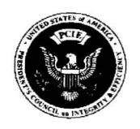

### PRESIDENT'S COUNCIL on INTEGRITY & EFFICIENCY

Marc.h 18, 2002

The Honorable David M. Walker Comptroller General ofthe United States 441 G Street, l'W Room 7100 Washington, DC 205411

Dear Mr. Walker:

This letter provides the Inspector General (TG) community's response to General Accounting OHicc's (GAO) study of issues related to permanent statutory Jaw enforcement authority and the current temporary blanket deputation authority for the Offices of Inspector General (OIGs). In developing this reply, we relied upon an undated draft "Statement of Facts" that was furnished to the PCIE Chair on approximately March 8,2002. The actual draft report (GAO-02-437, "Inspectors General: Comparison of Ways Law Enforcement Authority Is Granted") was reviewed in our office this morning. However, we are committed to meeting the originally-stated response date of March 18, 2002, and have concluded that the second draft report reflects only minimal differences that do not alter our vicws on the underlying issues.

As you may readily appreciate, these matters are of paramount importance to the OIGs, and our entire membership has reacted strongly to the study. Our detailed commentsrepresenting input from throughout the TG community-are in the document enclosed with this lE~ller. It is structured to parallel the draft "statement offacts," but its comments are fully and equally applicable to the draft report.

While the enclosurc disputes nearly every aspect ofthe draft, the OIGs' concerns appear to center on a relatively few conceptual issues affecting the conduct ofthe study and the development of its conclusions. I an1 highlighting these issues briefly, in the hope that we can bring these crucial issues more clearly into focus.

First, we believe it is a misperceplion that a decision on permanent law enforcement authority for all OIGs should be driven by cost considerations. Deputation is an inherently time-and labor-intensive ongoing process for both the Department ofJustice (DOJ) and the OIOs. It is possible ro conclude that replacing il with statutory authority could save some small amount of funds. The GAO draft seems to assume thaI, unless significant cost savings can be associated with permanent statutory law enforcement authority, the currentlemporary blanket deputation system should be retained. However, the financial outcomes-whatever they may be--will simply not have a budgetary impact

MM 18 'lOU

The Honorable David M. Walker 2

great enough to decide the issue either way. In our estimation, GAO should focus on determining which means of providing law entorcement authority to OTGs would foster the most effective investigative programs. If approaclu::d in this light, it is clear that statutory Jaw ent,)rcement authority is far more effective--for many reasons--and can be achieved at no cost, while perhaps generating savings through operating cfficiencies.

Second, the methodology that GAO's analysts employed to compare the OIGs law enforcement authority under the temporary blanket deputation system with a pennanent statutory system was Hawed. The study uses the provisions ofthe current law enforcement authorities for OIGs in three specific agencies (Departments of Agriculture and Defense, and Treasury tG for Tax Administration) as its standard of comparison on the statutory side. In ract, the IG community is not seeking to obtain law enforcement authority under these provisions. The bill, S. 3144, I06th Congress (2000), which the draft mentions only in passing, reflects Ihe actual statutory authority that we are seeking. We believe its provisions are the only bona fide standard to compare against the deputation system.

Every analytical conclusion in the draft was marred 10 some extent by this erroneous methodology. Howevcr, its worst effect was to generate the conclusion that the temporary blanket deputation system offers greater oversight and better professional standards than permanent statutory Jaw enforcement authority. In fact, S. 3144 contained provisions for substantially more oversight by DOJ than the deputation system provides. As part of its oversight mechanisms, it would have established a peer review process among 010 investigative offices, a feature unique in federal law enforcement. DIGs have operated audit peer reviews under the 10 Act for many years, and we believe they would serve an equally valuable oversight role in the investigative setting.

Among the other corollaries ofthe draft's methodological deficiencies is the implication that OIOs may favor statutory law enforcement authority as a means to free themselves from onerous oversight burdens. This is simply not the case. The bill, S. 3144, in which the covered IGs concurred, would retain, at a minimum, the current operational and training provisions ofthe MOUs. To these would be added peer review (discussed above) and any additional guidelines the Attorney Oeneral, in consultation with the FBI, opts to promulgatc.

The inaccurate standards of comparison also tended to mask the inherent shmteomings of the deputation process. DIGs are keenly aware of them because of our reliance on deputation as the source of vital investigative authorities. In this context, situations such as thc ncar loss of deputation by almost 2800 010 special agents govemmentwide in January 2001 because ofthe U.S. Marshals Service's administrative burdens represent serious, uncontrollable problems. Funhcr, the vagaries of deputation as a means of receiving law enforcement authority are not limited to processes ofthe Marshals Service. For example, the 1995 deputation request oftbe Railroad Retirement Board (RRB)/OIG, was effectively denied by the refusal oftwo onhe RRH's Board members to endorse it. The 010 was forced to continuc obtaining deputation authority from DOJ under the very inefficient case hy case basis. Despite the needs of its active and productive

The Honorable David M. Walker 3

inve~tigations program, the RRB/OIG did not receive blanket deputation authority until 1999, when the new RRB Chair gave the endorsement required by 001.

Finally, the draft indicates that the Office of Management and Budget deferred an official determination ofthis issue to *DOl.* However, the draft does not present DOl's position, instead describing the observations of unnamed FBI, Marshals Service, and Criminal Division officials who cannot speak for their agencies. Given that *DOl's* views would be afforded great, if not dispositive weight, and that *DOl* testified in favor of S. 3144 in luly 2000, we believe tbat GAO should not forward its reporl to Congress until it can obtain an authoritative indication of*DOl's* views.

Thank you for soliciting our concerns about this issue. We urge GAO to conduct further analysis using the appropriate statutory provisions and to reexamine its conclusions before finalizing this draft. If there arc any questions, or iffurther information is needed, please do not hesitate to contact me.

Sincerely,

Patrick E. McFarland

Chair, Investigations Committee

;:;?~~~~

Enclosures

cc: Paul L. Jones

Director, Justice Issues

# Appendix IV**Appendix IV: Comme** : Comments from the **nts from the Department of Justice** Department of Justice

u.s. Department of Justice

*UiJ.:;hington. V.C 205JO*

MAR 2:j 2002

Mr. Paul Jones Director Justice Issues U.S. General Accounting Office 441 G Street, NW Washington, DC 20548

Dear *My.* Jones:

This responds to your letter, dated March 15, 2002, which transmitted the General Accounting Office (GAO) draft report entitlcd, "INSPECTORS GENERAL: Comparison ofWays Law Enforcement Authority is Granted," to me with a request for comments by March 25, 2001. We appreciate your request for our views on the draft. We note that the draft indicates that we declined to render an official opinion during the review on the issue oflaw enforcement authority for Inspectors General. In fact, the issue is currently under review and the Administration has not yet settled on a position. Accordingly, we request that, in lieu of reporting that we have declined to provide a position, your report indicate that the issue is under review within the Administration at this time.

If you have any questions regarding these comments, please do not hesitate to contact Vickie L. Sloan, Director, Audit Liaison Office, Justice Management Division.

Sincerely,

j

Robert F. Diegelman

Acting Assistant Attorney General

for Administration

**United States General Accounting Office** 

Before the Subcommittee on Government Efficiency and Financial Management, Committee on Government Reform, House of Representatives

For Release on Delivery Expected at 2:00 p.m. EDT Wednesday, October 8, 2003

# INSPECTORS GENERAL

# Enhancing Federal Accountability

Statement of David M. Walker Comptroller General of the United States

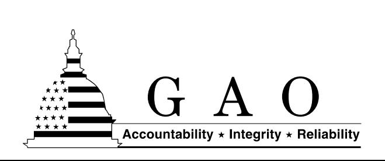

Highlights of GAO-04-117T, a testimony before the Subcommittee on Government Efficiency and Financial Management, Committee on Government Reform, House of Representatives

### Why GAO Did This Study

On the 25th anniversary of passage of the Inspector General (IG) Act, the Subcommittee sought GAO's views on the role of the IGs in providing independent oversight within federal agencies and to discuss the new and continuing challenges faced by government performance and accountability professionals.

### What GAO Recommends

In order to enhance the effectiveness of federal accountability professionals, Congress may wish to consider establishing, through statute, a small group of designated federal accountability officials, such as representatives from GAO and IG councils, to develop and implement a periodic strategic planning and ongoing coordination process for the manner in which GAO and IG work will be focused to provide oversight to high-risk areas and significant management challenges across government, while leveraging each other's work and minimizing duplication.

Congress may also want to consider enacting legislation making agencies responsible for paying the cost of their financial statement audits.

Congress may also wish to consider restructuring the IGs, which would include elevating certain IGs to presidential appointment and consolidating specific IG offices where benefits can be shown.

www.gao.gov/cgi-bin/getrpt?GAO-04-117T. To view the full product, click on the link above. For more information, contact Jeanette Franzel at (202) 512-9406 or franzelj@gao.gov.

## **INSPECTORS GENERAL**

# **Enhancing Federal Accountability**

#### What GAO Found

The IGs have made a significant difference in federal performance and accountability during the past 25 years as indicated by their reports of billions of dollars in savings to the public and numerous civil and criminal referrals. They have earned a solid reputation for preventing and detecting fraud and abuse; promoting improvements in government operations; and providing helpful analyses on a host of governmentwide initiatives.

Notwithstanding the accomplishments of the past, our nation now faces new challenges that demand even more from government performance and accountability professionals. For example, we are fighting international terrorism while facing a large and growing structural deficit. In addition, recent corporate failures have shaken public confidence in financial reporting and accountability in the private sector. Federal auditors can learn important lessons from the accountability breakdowns in the private sector and the resulting legislation passed by Congress.

Closer strategic planning and ongoing coordination of audit efforts between GAO and the IGs would help to enhance the effectiveness and impact of work performed by federal auditors. Working together and in our respective areas of expertise in long-term challenges and agency-specific issues, GAO and the IGs can provide useful insights and constructive recommendations on a broad range of high-risk programs and significant management challenges across government.

A practical issue that has arisen is who pays the cost of agency financial statement audits. Many IGs have told us that the cost of agency financial audits has taken resources away from their traditional work. In the private sector, the cost of financial audits is a routine business expense borne by the entity being audited and represents a small percentage of total expenditures for the audited entity.

In a prior study, we considered the benefits of consolidating the smallest IG offices with those of presidentially appointed IGs and converting agency-appointed IGs to presidential appointment where their budgets were comparable. We believe that, if properly implemented, conversion or consolidation of IG offices could increase the overall independence, economy, efficiency, and effectiveness of IGs.

Mr. Chairman and Members of the Committee:

I appreciate the opportunity to share my thoughts with you on the important role of the Inspectors General (IG), established in statute 25 years ago this month to provide independent oversight within federal agencies. More significant for this discussion than the anniversary of landmark legislation, however, are the new and continuing challenges we face in assuring open, honest, effective, and accountable government and the critical role of the IGs, in partnership with GAO and other performance and accountability organizations, in addressing these challenges.

A quarter of a century ago, Congress established statutory IGs in response to serious and widespread internal control breakdowns in major government departments and agencies, questions about integrity and accountability in government as a whole, and failures of oversight in the federal government. The IGs established by the Inspector General Act of 1978 (IG Act) were charged with preventing and detecting fraud and abuse in their agencies' programs and operations; conducting audits and investigations; and recommending policies to promote economy, efficiency, and effectiveness. The IG Act fortified the position of IG with provisions protecting independence, provided powers of investigation, and mandated reporting not just to the agency head but to Congress as well. (See app. I for a more detailed history of the IG Act.)

In the years since passage of the IG Act, Congress has also enacted a series of laws to establish a foundation for efficient, effective, and accountable government. This body of legislation has given IGs new responsibilities and greater opportunities to play an increasing role in government oversight. Clearly, the IGs have made a significant difference in federal performance and accountability during the past 25 years as indicated by their reports of billions of dollars in savings to the public and thousands of recommendations and civil and criminal referrals. They have earned a solid reputation for preventing and detecting fraud, waste, and abuse; promoting improvements in government operations; and providing helpful analyses on a host of governmentwide initiatives. It is safe to say that the federal government is a lot better off today because of the IGs' efforts.

Notwithstanding the accomplishments of the past, we now face continuing challenges that demand even more from government performance and accountability professionals. For example, our nation is fighting international terrorism while much of the critical government infrastructure that we are trying to protect dates back to the 1950s. At the

**Page 1 GAO-04-117T** 

same time, this nation is facing a large and growing structural deficit due primarily to known demographic trends and rising health care costs. Recent corporate failures have shaken public confidence in financial reporting and accountability in the private sector. In response, Congress passed the Sarbanes-Oxley Act of 2002, which has significant new requirements for publicly traded companies and their auditors. Federal auditors can learn important lessons from the accountability breakdowns in the private sector and the resulting legislation passed by Congress.

We have achieved many important successes in working across organizational lines with the IGs and state and local government auditors. An important recent effort in building closer ties in the government accountability community has been the domestic working group, which I established in 2001 to bring together key staff from GAO, the IGs, and state and local audit organizations to explore issues of mutual interest and concern. The annual roundtable discussions and interim activities of the domestic working group help to focus attention on key issues and shared challenges facing the government audit community and allow participants to compare notes on methods, tools, benchmarking results, and best practices. In the early 1970s, GAO organized the intergovernmental audit forums in cooperation with federal, state, and local audit organizations. These forums provided the means through which new intergovernmental audit relationships were developed and improved the usefulness of auditing at each level of government. Some IGs have become active participants with GAO at the forums to provide a means for exchanging views, solving common problems, and promoting the acceptance and implementation of government auditing standards. Other IGs, however, have not been very involved in these forums and, in my view, this needs to change.

In addition, we have had the active participation of many IGs and state and local government auditors on the Comptroller General's Advisory Council on Government Auditing Standards. The Council provides advice and guidance on revisions to the Comptroller General's *Government Auditing Standards*, commonly known as the "Yellow Book," which is used by government auditors at the federal, state, and local levels, as well as contracted independent public accountants (IPA), in the audits of government programs and activities. It is time, however, for IGs and other members of the federal accountability community to build on past successes by putting additional focus and efforts on reaching across institutional lines and forming new alliances to address the complex challenges facing our government and our nation.

**Page 2 GAO-04-117T** 

My statement today will focus on five main points:

- • opportunities for increasing the effectiveness of the federal performance and accountability community through an enhanced strategic partnership between the IGs and GAO,
- • coordination of the IG and GAO roles in agency financial statement audits and the audit of the U.S. government's consolidated financial statements,
- the IG role in federal financial management advisory committees,
- • structural streamlining within the IG community to increase resource efficiencies, and
- • matters for congressional consideration to enhance federal performance and accountability.

# The Need for an Enhanced Strategic Partnership between the IGs and GAO

One of the challenges facing the federal performance and accountability community today is the need to meet increasing demands and challenges with our current resources. Key to this challenge is determining how GAO and the IGs can best complement each other and coordinate their efforts. The IG Act requires that the IGs coordinate with GAO to avoid duplicating efforts. In practice, GAO has largely devoted its efforts to program evaluations and policy analyses that look at programs and functions across government, and with a longer-term perspective; at the same time, the IGs have been on the front line of combating fraud, waste, and abuse within each agency, and their work has generally concentrated on issues of immediate concern with more of their resources going into uncovering inappropriate activities and expenditures through an emphasis on investigations. GAO and the IGs are, in many respects, natural partners. We both report our findings, conclusions, and recommendations to Congress. As I mentioned earlier, we share common professional audit standards through the Yellow Book, and I am proud to say that several current IGs and many of their staff are GAO alumni, including the Honorable Gaston Gianni, the IG of the Federal Deposit Insurance Corporation and Vice-Chair of the President's Council on Integrity and Efficiency, and Barry Snyder, the IG of the Federal Reserve Board and Vice-Chair of the Executive Council on Integrity and Efficiency, who are on the panel following me today.

**Page 3 GAO-04-117T** 

While GAO and the IGs make up the federal performance and accountability community, the division of responsibilities between them has not generally included, nor does the IG Act include, strategic planning and allocation of work across government programs based on risk and the relative competitive advantages of each organization. Traditionally, GAO and IG coordination has been applied on an ad-hoc, job-by-job or issue-byissue basis. We now have both the need and the opportunity to enhance the effectiveness of federal oversight through more strategic and ongoing coordination of efforts between GAO and the IGs in the following areas:

- addressing major management challenges and program risks,
- • monitoring the top challenges the government faces, such as implementation of the President's Management Agenda, and
- • conducting the audit of the government's consolidated financial statements.

Later in this testimony, I am suggesting that Congress consider establishing, through statute, assignment of responsibility to a select group of designated federal accountability and performance professionals to engage in a formal, periodic strategic planning and ongoing engagement coordination process to focus federal audit efforts across the federal government. This process would be in addition to, and would not replace, the current coordination of information sharing and technical cooperation being implemented by the domestic working group, the audit forums, and the President's Council on Integrity and Efficiency (PCIE) and the Executive Council on Integrity and Efficiency (ECIE).1

# Major Management Challenges and Program Risks

GAO's latest high-risk report,2 released in January 2003, highlights areas across government that are at risk either due to their high vulnerability to waste, fraud, abuse, and mismanagement, or as major challenges associated with the economy, efficiency, and effectiveness of federal programs, policies, processes, functions, or activities. Many of the high-risk

**Page 4 GAO-04-117T** 

1 These councils were established by Executive Order and are described later in this testimony.

2 U.S. General Accounting Office, *High Risk Series: An Update*, [GAO-03-119](http://www.gao.gov/cgi-bin/getrpt?GAO-03-119) (Washington, D.C.: January 2003).

areas we identified involve essential government services, such as Medicare and mail delivery, that directly affect the well-being of the American people. Although some agencies have made strong efforts to address the deficiencies cited in the high-risk reports—and some of the programs included on GAO's initial high-risk list in 1990 have improved enough to warrant removal—we continue to identify many other areas of high risk. Greater strategic coordination between GAO and the IGs on a plan for monitoring and evaluating high-risk issues and keeping the pressure high to reduce the risk of these programs is not only desirable, it is essential if we are to reduce the risk of key government programs.

At the request of Congress, the IGs annually report issues similar to those in GAO's high-risk report identifying the "Top Management Challenges" facing their agencies. In fiscal year 2002, the IGs ranked information technology, financial management, and human capital management among the most important challenges confronting their agencies governmentwide; other priorities included performance management, public health and safety, and grants management. Each of these areas closely corresponds to an area on GAO's high-risk list.

Although both GAO and the IGs have efforts in place to identify major risks and challenges within government, there is no mechanism in place to carry out an integrated, strategic planning process as a means through which these issues will be monitored and evaluated in the future through combined and coordinated GAO and IG oversight.

## President's Management Agenda

The administration has signaled its commitment to government transformation with the President's Management Agenda (PMA), which targets 14 of the most glaring problem areas in government for immediate action. Five areas—strategic human capital, budget and performance integration, improved financial performance, expanded electronic government, and competitive sourcing—are governmentwide in scope, while 9 are agency specific. Each area has the potential for dramatic improvement and concrete results. The areas also reflect many of the concerns raised by both GAO's high-risk report and the IGs' top management challenge lists. So far, however, progress on PMA has been uneven. To achieve consistent progress, sustained attention from Congress, the administration, and the agencies is needed. I believe that GAO and the IGs can make important contributions, using our combined experience, to help monitor the implementation of this important initiative.

**Page 5 GAO-04-117T** 

Key policymakers increasingly need to think beyond quick fixes and carefully consider what the proper role of the federal government should be in the 21st century. Members of Congress and agency heads can start by undertaking a top-to-bottom review of federal programs and policies to determine which should remain priorities, which should be overhauled, and which have outlived their usefulness or are just no longer affordable given more pressing demands. Everything that forms the government's base must be on the table, including tax, spending, and regulatory policies. Policymakers will need to distinguish "wants," which are optional, from "needs," which can be urgent. They need to make hard choices that take into account what the American people will support and what the federal government can afford and sustain over time. To make informed decisions, Congress and agency heads will require hard facts and professional analyses that are objective, fact based, timely, accurate, nonpartisan, fair, and balanced. GAO and the IGs are important sources of such objective information and analyses.

With our respective areas of expertise in long-term challenges and agencyspecific issues, GAO and the IGs can provide useful insights and constructive recommendations on programs that may warrant additional resources, consolidation, revision, or even elimination. Closer periodic strategic planning and ongoing engagement coordination between GAO and the IGs would help to ensure continued effective oversight of these key issues facing government.

## Audit of the U.S. Government's Consolidated Financial Statements

GAO and the IGs are already partners in one of the most far-reaching financial management initiatives in government—the yearly audits of the federal government's consolidated financial statements. Under the Chief Financial Officers (CFO) Act of 1990 as expanded by the Government Management Reform Act of 1994, the IGs at the 24 agencies3 named in the CFO Act are responsible for the audits of their agencies' financial statements. In meeting these responsibilities, most IGs have contracted with IPAs to conduct the audits either entirely or in part. GAO is responsible for the U.S. government's consolidated financial statements

**Page 6 GAO-04-117T** 

3 The Federal Emergency Management Agency (FEMA), one of 24 agencies named in the CFO Act, was transferred to the new Department of Homeland Security (DHS), effective March 1, 2003. With the transfer, FEMA will no longer be required to prepare audited standalone financial statements under the CFO Act. Consideration is now being given to making DHS a CFO Act agency, which would bring the number of CFO Act agencies back up to 24.

audit, which by necessity is based largely on the results of the IGs' agencylevel audits.

Since 1997, GAO has been unable to give an opinion on the consolidated financial statements, in large part because of continuing financial management problems at several agencies that also have resulted in disclaimers of opinion by some IGs on their agency financial statements most notably the Department of Defense (DOD). In recent years, we have seen progress in the results of the audits of the CFO Act agency financial statements with more and more IGs and their contracted IPAs moving from issuing a disclaimer of opinion to issuing an unqualified ("clean") opinion on their respective agency financial statements. In fact, 21 of the 24 CFO Act agencies received an unqualified opinion on their fiscal year 2002 financial statements, up from only 6 agencies for fiscal year 1996. We anticipate that if sufficient progress continues to be made, there is a chance that we may be able to render a qualified opinion on the consolidated balance sheet in a few years as a first step toward rendering an opinion on the full set of financial statements.

Our reviews of the work done by other IGs and IPAs on agency-level financial statement audits during the last 2 years identified opportunities for improvement in sampling, audit documentation, audit testing, analytical procedures, and auditing liabilities. The varying quality of the audit work has been of concern to us because of our need to use the work of the agency auditors to support expressing an opinion on the U.S. government's consolidated financial statements—an opinion for which, in the final analysis, GAO is solely responsible and accountable.

Earlier involvement and access by GAO in the agency-level financial statement audits would help to strengthen the IG and IPA audit process and bolster our ability to use their work in rendering an opinion. At a minimum, GAO needs to (1) be involved up front in the planning phase of each agency-level audit, (2) have unrestricted access to IG and IPA audit documentation and personnel throughout the performance of the audit, (3) receive assurances that each agency-level audit is planned, performed, and reported in conformity with the Financial Audit Manual (FAM) developed jointly and adopted by GAO and the PCIE, and (4) be notified in advance of any planned deviation from the FAM's requirements that could affect GAO's ability to use the agency auditors' work.

At one agency (Department of Energy), for the selected areas we reviewed, we found that the audit work was performed in conformity with the FAM

**Page 7 GAO-04-117T** 

and that we would have been able to use the work without having to perform additional audit procedures. The IG has an oversight team composed of senior-level staff who perform moderate-level quality control reviews of the contracted IPA's work throughout the audit process. The oversight team evaluates its IPA in areas such as audit planning and execution, audit documentation, and staff qualifications. These types of practices could be shared and expanded upon across the IG community. As an initial step to make the IG and IPA audit process stronger and enhance GAO's ability to use their work in rendering an opinion, we are considering holding a forum with the IGs and the IPAs to share information—based on GAO's review of the IG and IPA work—regarding best practices and areas to focus on that need additional audit work, and to establish a framework for enhanced coordination of the financial statement audit work.

Changes to enhance the agency financial statement audit process are especially important given the planned acceleration of reporting deadlines for agency audits. Although some agencies accelerated their reports for fiscal year 2002, starting with fiscal year 2004, the Office of Management and Budget (OMB) has required that agencies issue their audited financial statements no later than 45 days after the end of the fiscal year, with the consolidated financial statements to be issued 30 days later. In past years, when the reporting deadlines were 4 and 5 months after the end of the fiscal year, agencies made extraordinary efforts in which they spent considerable resources on extensive ad hoc procedures and made adjustments of billions of dollars to produce financial statements months after the fiscal year had ended. Given the accelerated reporting dates, such extraordinary approaches will no longer be an option. Over the next few years, as the government addresses the impediments to receiving an opinion on its consolidated financial statements, and we move closer to being able to render an opinion on the consolidated financial statements, GAO will need to invest more resources in assuring that the work of the IGs and IPAs on the agency-level financial statement audits can be used by GAO to support the audit of the consolidated financial statements. This resource investment is necessary if GAO is to be able to render an opinion on the consolidated financial statements.

Another matter of concern regarding the audit of the U.S. government's consolidated financial statements involves the approaches used by the IGs and IPAs for reporting on internal control at the agency level. Our position is that an opinion on internal control is important in the government environment and that the public should be able to expect audit assurance on the adequacy of internal control over financial reporting. We believe that

**Page 8 GAO-04-117T** 

auditor opinions on internal control are a critical component of monitoring the effectiveness of an entity's risk management and accountability systems. We also believe that auditor opinions on internal control are appropriate and necessary for major public entities such as the CFO Act agencies currently included in the U.S. government's consolidated financial statements.

As does GAO in connection with our own audits, several agency auditors are voluntarily providing opinions on the agencies' internal control; but most do not. When an auditor renders an opinion on internal control, the auditor is providing reasonable assurance that the entity has maintained effective internal control over financial reporting (including safeguarding of assets) and compliance such that material misstatements, losses, or noncompliance that are material to the financial statements would be detected in a timely fashion. For fiscal year 2002, however, only 3 of the 24 CFO Act agencies received opinions on internal control from their auditors.4 The remaining 21 reported on internal control, but provided no opinion on the effectiveness of the agency's internal control. As we move closer to being able to issue an opinion on the consolidated financial statements, a disparity in reporting on internal control would hinder our ability to provide an opinion on internal control for the consolidated audit. Current agency-level reporting on internal control would fall short of what the public should be able to expect from an audit and, moreover, what is now legally required from the auditors of publicly traded companies.

Congress has prescribed auditor opinions on internal controls for publicly traded corporations under the Sarbanes-Oxley Act of 2002.5 A final rule issued by the Securities and Exchange Commission in June 2003 and effective August 2003 provides guidance for implementation of section 404 of the act, which contains requirements for management and auditor reporting on internal controls. The final rule requires companies to obtain a report in which a registered public accounting firm expresses an opinion, or states that an opinion cannot be expressed, concerning management's assessment of the effectiveness of internal controls over financial reporting.

**Page 9 GAO-04-117T** 

4 The three agencies receiving opinions on internal control for fiscal year 2002 are the Social Security Administration, General Services Administration, and Nuclear Regulatory Commission.

5 Pub. L. No. 107-204, 116 Stat. 745 (2002).

As you know, Mr. Chairman, we provided testimony before this Subcommittee several weeks ago on the challenges of establishing sound financial management within DHS.6 In that testimony, we supported provisions of H.R. 2886 that would require DHS to obtain an audit opinion on its internal controls. During the testimony, we also supported provisions of H.R. 2886 that would require the Chief Financial Officers Council and the PCIE to jointly study the potential costs and benefits of requiring CFO Act agencies to obtain audit opinions of their internal controls over financial reporting. In addition, the current version of H.R. 2886 would require GAO to perform an analysis of the information provided in the report and report the findings to the House Committee on Government Reform and the Senate Committee on Governmental Affairs. We believe that the study and related analysis are important first steps in resolving the issues associated with the current reporting on internal control.

Ultimately, we are hopeful that federal performance and accountability professionals will not settle for anything less than opinion-level work on internal control at the CFO Act agency level and on the governmentwide audit. Increased planning and coordination will be needed among GAO, IGs, and IPAs to determine the appropriate timing for requiring an opinion on controls at the agency level. The specific timing will depend on the current state of the agency's control efforts so that an audit opinion on internal control would add value and mitigate risk in a cost beneficial manner.

A practical issue that should also be dealt with is the adequacy of resources to provide for the agency financial statement audits. Over the years, a number of IGs have told us that the cost of agency financial audits has taken resources away from their traditional work. In the private sector, the cost of an annual financial audit is a routine business expense borne by the entity being audited, and the cost of the audit represents a very small percentage of total expenditures for the audited entity. We support enacting legislation that would make agencies responsible for paying the cost of their financial statement audits. We also believe that an arrangement in which the agencies pay for their own audits provides them with positive incentives for taking actions—such as streamlining systems and cleaning up their financial records prior to the audit—in order to reduce the costs of

**Page 10 GAO-04-117T** 

6 U.S. General Accounting Office, *Department of Homeland Security: Challenges and Steps in Establishing Sound Financial Management,* [GAO-03-1134T](http://www.gao.gov/cgi-bin/getrpt?GAO-03-1134T) (Washington, D.C.: Sept. 10, 2003).

the audit and avoid the "heroic" audit efforts that we have seen in the past at some agencies.

Under the arrangement in which agencies pay the cost of their own audits, we believe the IG should continue in the current role of selecting and overseeing audits in those cases in which the IG does not perform the audit but hires an IPA to conduct the audit. This would leverage the IGs' expertise to help assure the quality of the audits. We also advocate an approach whereby the IGs would be required to consult with the Comptroller General during the IPA selection process to obtain input from the results of GAO's reviews of the IPAs' previous work and the potential impact on the consolidated audit.

# The IG Role in Federal Financial Management Advisory Committees

We envision an important role for the IGs in audit or financial management advisory committees established at the federal agency level for the purpose of overseeing an agency's financial management, audits, and performance.

In the government arena, some state and local governments and federal government corporations, as well as several federal agencies, have adopted an audit committee, or "financial management advisory committee," approach to governance. In the federal government, such audit committees or advisory committees are intended to protect the public interest by promoting and facilitating effective accountability and financial management by providing independent, objective, and experienced advice and counsel, including oversight of audit and internal control issues. Responsibilities of the committees would likely include communicating with the auditors about the audit and any related issues. The work of the IGs logically provides much of the basis for financial management advisory committees in overseeing agencies' financial management, audits, and internal control. The work of the IGs would also be critical for the financial management advisory committees in their general governance roles. Specific roles and responsibilities of the committees will most likely vary by agency. A recently published guide, *Financial Management Advisory Committees for Federal Agencies*, 7 provides a helpful road map of suggested practices for federal agency financial management advisory committees.

**Page 11 GAO-04-117T** 

7 *Financial Management Advisory Committees for Federal Agencies: Suggested Practices*, March 2003, prepared by KPMG, LLP.

The concept of financial management advisory committees is very similar to the audit committee structure being used in the private sector. To help facilitate the audit process and promote disclosure and transparency, the governing boards of publicly traded companies use audit committees. Audit committees generally oversee the independent audit of the organization's financial statements and address financial management, reporting, and internal control issues. The Sarbanes-Oxley Act has requirements for the audit committees of publicly traded companies and their auditors regarding communications and resolution of significant audit matters.

We strongly support the implementation of financial management advisory committees for selected federal agencies, based on risk and value added. Some agencies,8 including GAO, which has had such a committee in place since 1995, have already implemented such an approach, even though the committees have not been mandated or established by statute. As these committees are implemented or required in government, we would advocate amending the IG Act to emphasize the IGs' unique role in reporting the results of their work to the advisory committees while maintaining their independence and dual reporting authority to Congress.

# Structural Streamlining to Increase Resource Efficiencies

One of the issues facing the IG community as well as others in the performance and accountability community is how to use limited resources to the best effect. In fiscal year 2002, the 57 IG offices operated with total fiscal year budgets of about \$1.6 billion and about 11,000 staff. (See app. II for more detail on IG budgets and staffs.) Most IGs for cabinet departments and major agencies are appointed by the President and confirmed by the Senate; however, IGs for some agencies are appointed by the agency head, and these IGs generally have smaller budgets and fewer staff than IGs appointed by the President. While agency-appointed IGs make up about half of all IG offices, the total of their fiscal year 2002 budgets was \$162.2 million, a little more than 10 percent of all IG budgets. Of these IGs, the offices at the U.S. Postal Service (USPS), Amtrak, National Science Foundation (NSF), and Federal Reserve Board (FRB) are exceptions and have budgets that are comparable in size to those of presidentially appointed IGs. The remaining 24 agency-appointed IGs have a total of 191

**Page 12 GAO-04-117T** 

8 Agencies that currently have audit committees or financial management advisory committees include the National Science Foundation, Federal Deposit Insurance Corporation, and the Architect of the Capitol.

staff and have budgets that make up about 2 percent of all IG budgets. Importantly, 16 of the 28 agency-appointed IGs have fewer than 10 staff.

## Potential IG Office Consolidations

Last year we reported the views of the IGs, as well as our own, on the possible benefits of consolidating the smallest IG offices with the offices of IGs appointed by the President.9 We also considered the conversion of agency-appointed IGs to presidential appointment where their budgets were comparable to the presidentially appointed IG offices. The August 2002 report contains several matters for congressional consideration to address issues of IG conversion and consolidation. We are reaffirming these views, which are included at the end of my statement.

We believe that if properly structured and implemented, the conversion or consolidation of IG offices could increase the overall independence, efficiency, and effectiveness of the IG community. Consolidation could provide for a more effective and efficient allocation of IG resources across government to address high-risk and priority areas. It would not only achieve potential economies of scale but also provide a critical mass of skills, particularly given advancing technology and the ever-increasing need for technical staff with specialized skills. This point is especially appropriate to the 12 IG offices with five or fewer staff. IG staff now in smaller offices would, in a large, consolidated IG office, have immediate access to a broader range of resources to use in dealing with issues requiring technical expertise or areas of critical need.

Consolidation would also strengthen the ability of IGs to improve the allocation of human capital and scarce financial resources within their offices and to attract and retain a workforce with talents, multidisciplinary knowledge, and up-to-date skills to ensure that each IG office is equipped to achieve its mission. Consolidation would also increase the ability of larger IG offices to provide methods and systems of quality control in the smaller agencies.

We also recognize that there are potential risks resulting from consolidation that would have to be mitigated through proactive and targeted actions in order for the benefits of consolidation to be realized without adversely affecting the audit coverage of small agencies. For

**Page 13 GAO-04-117T** 

9 U.S. General Accounting Office, *Inspectors General: Office Consolidation and Related Issues,* [GAO-02-575](http://www.gao.gov/cgi-bin/getrpt?GAO-02-575) (Washington, D.C.: August 2002).

example, the potential lack of day-to-day contact between the IG and officials at smaller agencies as a result of consolidation could be mitigated by posting IG staff at the agency to keep both the IG and the agency head informed and to coordinate necessary meetings. In preparation for consolidation, staff in the smaller IG offices could be consulted in planning oversight procedures and audit coverage for their agencies. There may be fewer audits or even less coverage of those issues currently audited by the IGs at smaller agencies, but coverage by a consolidated IG could address areas of higher risk, value, and priority, resulting in potentially more efficient and effective use of IG resources across the government.

Results of the survey conducted for our August 2002 report indicate a clear delineation between the responses of the presidentially appointed IGs and the responses of the agency-appointed IGs. The presidentially appointed IGs generally indicated that agency-appointed IG independence, quality, and use of resources could be strengthened by conversion and consolidation. The agency-appointed IGs indicated that there would either be no impact or that these elements could be weakened. The difference in views is not surprising given the difference in the potential impact of consolidation on the interests of the two groups of IGs. We believe that this difference in perspective, more than any other factor, helps to explain the significant divergence in the responses to the survey.

There are already some examples where consolidation of IG offices and oversight is working. The Department of State IG provides, through statute, oversight of the Broadcasting Board of Governors and the International Broadcasting Bureau. The IG at the Agency for International Development is authorized by specific statutes to provide oversight of the Overseas Private Investment Corporation, the Inter-American Foundation, and the African Development Foundation.

In terms of budget size, the agency-appointed IGs at USPS, Amtrak, NSF, and FRB are comparable to the offices of IGs appointed by the President. Moreover, in the case of the Postal IG, the office is the fourth largest of all the IGs. (See app. II.) On that basis, these IGs could be considered for conversion to appointment by the President with Senate confirmation. While the Amtrak IG could be converted because of comparable budget size, oversight of Amtrak is closely related to the work of the Department of Transportation IG. Moreover, the Transportation IG currently provides some oversight of Amtrak programs. Therefore, the consolidation of the Amtrak IG with the Transportation IG could be considered, rather than conversion.

**Page 14 GAO-04-117T** 

Consideration has been given in the *Fiscal Year 2004 Budget of the U.S. Government* to the consolidation of the two IG offices at the Department of the Treasury, unique in the federal government. The original statutory IG for the Department of the Treasury was established by the IG Act amendments of 1988. The Treasury IG for Tax Administration was established in 1998 as part of an Internal Revenue Service (IRS) reorganization because the former IRS Inspection Service was not perceived as being sufficiently independent from management. Consequently, the IRS Office of the Chief Inspector, along with most of the Inspection Service staff, was transferred to the new IG office to ensure independent reviews.

The separate office of Treasury IG for Tax Administration was created because IRS officials were concerned that if the resources of the IRS Inspection Service were transferred to the original Treasury IG office, they would be used to investigate or audit other Treasury bureaus to the detriment of critical IRS oversight. With the passage of the Homeland Security Act of 2002, and the transfer of Treasury's United States Customs Service and United States Secret Service to the new Department of Homeland Security, the original concerns about competition for resources within the department should no longer be as compelling.

IG Councils The PCIE is an interagency council comprising principally the presidentially appointed and Senate-confirmed IGs. It was established by Executive Order No.12301 in 1981 to coordinate and enhance the work of the IGs. In 1992, Executive Order No.12805 created the ECIE, which comprises primarily statutory IGs appointed by the heads of designated federal entities as defined in the IG Act. The Deputy Director for Management in OMB serves as the chair of both organizations. These IG councils have been effective in coordinating the activities of the IGs in their efforts to prevent and detect fraud, waste, and abuse throughout the federal government and in reporting these results to both the President and Congress.

> The IG councils have provided a valuable forum for auditor coordination. However, we believe that the current environment demands a more formal, action-oriented, and strategic approach for coordination among federal audit organizations and that the IG councils could be strengthened in a number of ways. First, by providing a statutory basis for their roles and responsibilities, the permanence of the councils could be established and their ability to take on more sensitive issues strengthened. In addition, the

> **Page 15 GAO-04-117T**

strategic focus of the councils could be clearly established. As such, the councils would also be key in the overall strategic planning process for federal audit oversight that I described earlier in this statement.

# Matters for Congressional Consideration

As I stated at the beginning of my testimony, IGs have made a significant difference in federal performance and accountability during the last quarter century. The 25th anniversary of the landmark legislation establishing the IGs is an opportune time to reflect on the IGs' success while also considering ways to enhance coordination and utilization of resources across the federal performance and accountability community.

In order to enhance the effectiveness and impact of the federal accountability community, Congress may want to consider establishing, through statute, assignment of responsibility to a selected group of designated federal accountability officials, such as representatives from GAO, the PCIE, and the ECIE, to develop and implement a periodic, formal strategic planning and ongoing engagement coordination process for focusing GAO and IG work to provide oversight to high-risk areas and significant management challenges across government, while leveraging each other's work and minimizing duplication.

In order to resolve resource issues and provide positive incentives to agencies to take prudent actions to reduce overall audit costs, Congress may want to consider enacting legislation that makes agencies responsible for paying the cost of their financial statement audits.

In order to achieve potential efficiencies and increased effectiveness across the federal IG community, Congress may also want to consider whether to proceed with a restructuring of the IG community, which could include the following:

- • amending the IG Act to elevate the IGs at USPS, NSF, and FRB to presidential status,
- • amending the IG Act to consolidate agency-appointed IGs with presidentially appointed IGs based on related agency missions or where potential benefits to IG effectiveness can be shown, and
- • establishing an IG council by statute that includes stated roles and responsibilities and designated funding sources.

**Page 16 GAO-04-117T** 

Mr. Chairman, that concludes my prepared statement. I would be happy to respond to any questions you or Members of the Subcommittee might have.

**Page 17 GAO-04-117T** 

# The Inspector General Act

The Inspector General Act of 1978 was enacted following a series of events that emphasized the need for more-independent and coordinated audits and investigations in federal departments and agencies. First, in 1974, the Secretary of Agriculture abolished the department's administratively established IG office, demonstrating the impermanent nature of a nonstatutory IG. Later, in 1974 and 1975, a study by the Intergovernmental Relations and Human Resources Subcommittee of the House Government Operations Committee disclosed inadequacies in the internal audit and investigative procedures in the Department of Health, Education, and Welfare, now the Department of Health and Human Services. The need to deal more effectively with the danger of loss from fraud and abuse in the department's programs led to the establishment of the first statutory IG in 1976. The Congress also established an IG in the Department of Energy when that department was created in 1977.

In 1977, the House Intergovernmental Relations and Human Resources Subcommittee began a comprehensive inquiry to determine whether other federal departments and agencies had a similar need for statutory IGs. The Subcommittee's study revealed serious deficiencies in a number of department and agency audit and investigative efforts, including the following:

- No central leadership of auditors and investigators existed.
- • Auditors and investigators exhibited a lack of independence by reporting to officials who had responsibility for programs that were being audited.
- • No procedures had been established to ensure that the Congress was informed of serious problems.
- No program existed to look for possible fraud or abuse.

As an initial effort to correct these deficiencies, the IG Act of 1978 established 12 additional statutory OIGs to be patterned after the one at the Department of Health, Education, and Welfare. The act consolidated the audit and investigative responsibilities of each department and agency under the direction of one senior official—the Inspector General—who reports to the head of the agency or, if delegated, the official next in rank below the agency head. The President appoints the IGs, by and with the consent of the Senate, without regard to political affiliation and solely on the basis of integrity and demonstrated ability in accounting, financial

**Page 18 GAO-04-117T** 

**Appendix I The Inspector General Act** 

analysis, law, management analysis, public administration, or investigations.

The IGs are responsible for (1) conducting and supervising audits and investigations, (2) providing leadership and coordination and recommending policies to promote economy, efficiency, and effectiveness, and (3) detecting fraud and abuse in their agencies' programs and operations. In addition, the IG Act requires IGs to prepare semiannual reports which summarize the activities of the IG during the preceding 6 month period. The reports are forwarded to the department or agency head, who is responsible for transmitting them to the appropriate congressional committees.

The act states that neither the agency head nor the official next in rank shall prevent or prohibit the IG from initiating, carrying out, or completing any audit or investigation, or from issuing any subpoena during the course of any audit or investigation. This enhances the independence of auditors and investigators by ensuring that they are free to carry out their work unobstructed by agency officials. The act further enhances independence by requiring IGs to comply with the Comptroller General's *Government Auditing Standards*. One of these standards requires auditors and audit organizations to be personally and organizationally independent and to maintain the appearance of independence so that opinions, conclusions, judgments, and recommendations will be impartial and will be viewed as such by knowledgeable third parties.

Between the enactment of the IG Act in 1978 and 1988, the Congress passed legislation to establish statutory IGs, who are appointed by the President with Senate confirmation, in 8 additional departments and agencies. In 1988, the Congress enacted the Inspector General Act Amendments of 1988 and the Government Printing Office (GPO) Inspector General Act of 1988 (Titles I and II, Public Law 100-504) to establish additional presidentially appointed IGs in 5 departments and agencies and 34 IGs appointed by their agency heads (33 in designated federal entities and 1 in GPO) in order to strengthen the capability of the existing internal audit offices and improve audit oversight. Both GAO and the President's Council on Integrity and Efficiency (PCIE) had previously reported that the existing internal audit offices lacked independence, adequate coverage of important programs, and permanent investigative staff.

**Page 19 GAO-04-117T** 

# **Inspector General Budgets and Staffing**

Table 1: Inspectors General Appointed by the President, Fiscal Year 2002 Budgets and Full-Time Equivalents (FTEs)

| Fed  | eral departments/agencies                            | Budgets         | FTEs   |
|------|------------------------------------------------------|-----------------|--------|
| 1    | Department of Health and Human Services a | \$227,000,000   | 1,569  |
| 2    | Department of Defense                                | 151,000,000     | 1,215  |
| 3    | Treasury IG for Tax Administration                   | 130,000,000     | 943    |
| 4    | Department of Housing and Urban Development          | 95,000,000      | 648    |
| 5    | Social Security Administration                       | 75,000,000      | 564    |
| 6    | Department of Agriculture                            | 75,000,000      | 642    |
| 7    | Department of Labor                                  | 67,000,000      | 426    |
| 8    | Department of Justice                                | 65,000,000      | 329    |
| 9    | Department of Veterans Affairs                       | 57,000,000      | 393    |
| 10   | Department of Transportation                         | 50,000,000      | 454    |
| 11   | Department of Homeland Security                      | 47,000,000      | 336    |
| 12   | Environmental Protection Agency                      | 46,000,000      | 444    |
| 13   | Department of Education                              | 39,000,000      | 276    |
| 14   | Department of the Interior                           | 37,000,000      | 251    |
| 15   | General Services Administration                      | 36,000,000      | 273    |
| 16   | Department of Energy                                 | 32,000,000      | 250    |
| 17   | Agency for International Development                 | 32,000,000      | 166    |
| 18   | Federal Deposit Insurance Corporation                | 32,000,000      | 201    |
| 19   | Department of State                                  | 29,000,000      | 234    |
| 20   | National Aeronautics and Space Administration        | 24,000,000      | 200    |
| 21   | Department of Commerce                               | 21,000,000      | 136    |
| 22   | Small Business Administration                        | 12,000,000      | 108    |
| 23   | Department of the Treasury                           | 12,000,000      | 87     |
| 24   | Office of Personnel Management                       | 11,000,000      | 89     |
| 25   | Tennessee Valley Authority                           | 7,000,000       | 87     |
| 26   | Nuclear Regulatory Commission                        | 6,000,000       | 41     |
| 27   | Railroad Retirement Board                            | 6,000,000       | 51     |
| 28   | Corporation for National and Community Service       | 5,000,000       | 16     |
| 29   | Central Intelligence Agency b             | na              | na     |
| Tota | I                                                    | \$1,426,000,000 | 10,429 |

Source: Budget authority and FTEs from Fiscal Year 2004 Budget of the U.S. Government.

Page 20 GAO-04-117T

&lt;sup>aIncludes budget authority to combat health care fraud.

&lt;sup>bBudget and FTE information not available.

**Table 2: Inspectors General Appointed by Agency Heads, Fiscal Year 2002 Budgets and Full-Time Equivalents (FTEs)** 

|       | Federal agencies                             | Budgets       | FTEs  |
|-------|----------------------------------------------|---------------|-------|
| 1     | U.S. Postal Service                          | \$117,324,000 | 713   |
| 2     | Amtrak                                       | 8,706,539     | 64    |
| 3     | National Science Foundation                  | 6,760,000     | 50    |
| 4     | Federal Reserve Board                        | 3,878,000     | 29    |
| 5     | Government Printing Office                   | 3,400,000     | 24    |
| 6     | Legal Services Corporation                   | 2,500,000     | 15    |
| 7     | Peace Corps                                  | 2,006,000     | 16    |
| 8     | Smithsonian Institution                      | 1,800,000     | 17    |
| 9     | Federal Communications Commission            | 1,569,000     | 10    |
| 10    | National Archives and Records Administration | 1,375,000     | 13    |
| 11    | Securities and Exchange Commission           | 1,372,559     | 8     |
| 12    | National Credit Union Administration         | 1,338,135     | 7     |
| 13    | Pension Benefit Guaranty Corporation         | 1,300,000     | 11    |
| 14    | Equal Employment Opportunity Commission      | 1,106,119     | 10    |
| 15    | Federal Housing Finance Board                | 858,237       | 3     |
| 16    | Farm Credit Administration                   | 829,621       | 5     |
| 17    | Commodity Futures Trading Commission         | 735,800       | 4     |
| 18    | Corporation for Public Broadcasting          | 735,000       | 9     |
| 19    | National Labor Relations Board               | 711,900       | 6     |
| 20    | Federal Trade Commission                     | 710,000       | 5     |
| 21    | National Endowment for the Humanities        | 497,000       | 5     |
| 22    | Appalachian Regional Commission              | 466,000       | 3     |
| 23    | Federal Maritime Commission                  | 441,034       | 3     |
| 24    | Consumer Product Safety Commission           | 407,000       | 3     |
| 25    | Federal Election Commission                  | 392,600       | 4     |
| 26    | National Endowment for the Arts              | 392,577       | 4     |
| 27    | International Trade Commission               | 389,500       | 4     |
| 28    | Federal Labor Relations Authority            | 222,500       | 2     |
| Total |                                              | \$162,224,121 | 1,047 |

Source: As reported by the ECIE.

**Page 21 GAO-04-117T** 

**Table 3: Inspectors General Appointed by the President with Four Comparable Agency-Appointed IGs Fiscal Year 2002 Budgets** 

|       | Department/agency IG                              | Fiscal year 2002 budgets |
|-------|---------------------------------------------------|-----------------------------|
| 1     | Department of Health and Human Servicesa          | \$227,000,000               |
| 2     | Department of Defense                             | 151,000,000                 |
| 3     | Treasury's IG for Tax Administration              | 130,000,000                 |
| 4     | U.S. Postal Serviceb                              | 117,324,000                 |
| 5     | Department of Housing and Urban Development       | 95,000,000                  |
| 6     | Department of Agriculture                         | 75,000,000                  |
| 7     | Social Security Administration                    | 75,000,000                  |
| 8     | Department of Labor                               | 67,000,000                  |
| 9     | Department of Justice                             | 65,000,000                  |
|       | 10 Department of Veterans Affairs                 | 57,000,000                  |
|       | 11 Department of Transportation                   | 50,000,000                  |
|       | 12 Department of Homeland Security                | 47,000,000                  |
|       | 13 Environmental Protection Agency                | 46,000,000                  |
|       | 14 Department of Education                        | 39,000,000                  |
|       | 15 Department of the Interior                     | 37,000,000                  |
|       | 16 General Services Administration                | 36,000,000                  |
|       | 17 Department of Energy                           | 32,000,000                  |
|       | 18 Agency for International Development           | 32,000,000                  |
|       | 19 Federal Deposit Insurance Corporation          | 32,000,000                  |
|       | 20 Department of State                            | 29,000,000                  |
|       | 21 National Aeronautics and Space Administration  | 24,000,000                  |
|       | 22 Department of Commerce                         | 21,000,000                  |
|       | 23 Department of the Treasury                     | 12,000,000                  |
|       | 24 Small Business Administration                  | 12,000,000                  |
|       | 25 Office of Personnel Management                 | 11,000,000                  |
|       | 26 Amtrakb                                        | 8,706,539                   |
|       | 27 Tennessee Valley Authority                     | 7,000,000                   |
| 28    | b National Science Foundation                  | 6,760,000                   |
|       | 29 Nuclear Regulatory Commission                  | 6,000,000                   |
|       | 30 Railroad Retirement Board                      | 6,000,000                   |
|       | 31 Corporation for National and Community Service | 5,000,000                   |
|       | 32 Federal Reserve Board b                        | 3,878,000                   |
|       | 33 Central Intelligence Agency c                  | na                          |
| Total |                                                   | \$1,562,668,539             |

Source: Budget authority from Fiscal Year 2004 Budget of the U.S. Government.

**Page 22 GAO-04-117T** 

### Appendix II Inspector General Budgets and Staffing

Note: The four comparable agency appointed IGs are in bold.

aIncludes budget authority to combat health care fraud.

bInformation supplied by the ECIE.

cBudget information not available.

(194355) Page 23 GAO-04-117T

**United States General Accounting Office**

GAO

Report to the Chairman, Committee on Government Reform, House of Representatives

**August 2002** INSPECTORS GENERAL

> Office Consolidation and Related Issues

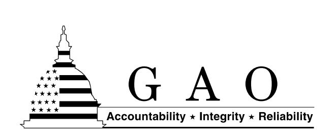

# Contents

| Letter        |                |                                                                                                             | 1        |
|---------------|----------------|-------------------------------------------------------------------------------------------------------------|----------|
|               |                | Results in Brief                                                                                            | 3        |
|               |                | Background                                                                                                  | 5        |
|               |                | Objectives, Scope, and Methodology                                                                          | 9        |
|               |                | Independence                                                                                                | 12       |
|               |                | Consolidation and IG Quality of Work                                                                        | 16       |
|               |                | Consolidation and the Potential Impact on IG Resources                                                      | 32       |
|               |                | Strengthening the PCIE and ECIE                                                                             | 44       |
|               |                | Agency Budgets are Not the Sole Criteria for Establishing IGs                                               | 48       |
|               |                | Survey Conclusions and GAO Views Regarding Conversion and                                                   |          |
|               |                | Consolidation Approaches to IG Conversion and Consolidation                                              | 50 55 |
|               |                | Matters for Congressional Consideration                                                                     | 56       |
|               |                | Agency Comments and Our Response                                                                            | 57       |
|               |                |                                                                                                             |          |
| Appendixes    |                |                                                                                                             |          |
|               | Appendix I:    | Summary of IG Survey Responses Regarding Conversion and                                                     |          |
|               |                | Consolidation                                                                                               | 63       |
|               | Appendix II:   | Potential IG Consolidations and Related Agency Missions                                                     | 64       |
| Appendix III: |                | Designated Federal Entity Inspectors General: Fiscal Year 2000 Budgets and Full-time Equivalents (FTEs)  |          |
|               | Appendix IV:   | Inspectors General Appointed by the President: Fiscal Year 2000 Budgets and Full-time Equivalents (FTEs) | 67       |
|               | Appendix V:    | Presidential IGs with Five Comparable DFE IGs: Fiscal Year 2000 Budgets                                  | 68       |
|               | Appendix VI:   | Designated Federal Entities: Fiscal Year 2000 Budgets with \$134 Million Threshold                       | 70       |
|               | Appendix VII:  | Comments from the President's Council on Integrity and Efficiency                                        | 72       |
|               | Appendix VIII: | Comments from the Executive Council on Integrity and Efficiency                                          | 74       |
| Tables        |                | Table 1: Twenty-eight Key Elements Related to IG Independence, Quality of Work, and Use of Resources  | 2        |
| Figures       |                | Figure 1: Distribution of Fiscal Year 2000 IG Budgets and Offices                                        | 6        |

| Figure 2: | Distribution of IGs with Comparable Fiscal Year 2000                 |    |
|-----------|----------------------------------------------------------------------|----|
|           | Budgets and Offices                                                  | 7  |
| Figure 3: | Potential Effect of Conversion on IG Independence                    | 13 |
| Figure 4: | Potential Effect of Consolidation on Actual IG                       |    |
|           | Independence                                                         | 15 |
| Figure 5: | Potential Effect of Consolidation on the Appearance of IG            |    |
|           | Independence                                                         | 16 |
| Figure 6: | Potential Effect of Consolidation on the Ability of IGs to           |    |
|           | Issue Hard-hitting Reports                                           | 18 |
| Figure 7: | Potential Effect of Consolidation on the IGs' Ability to             |    |
|           | Use Audit Resources to Review Issues That Cross All                  |    |
|           | DFE Agencies                                                         | 19 |
| Figure 8: | Potential Effect of Consolidation on the Attention That              |    |
|           | DFE Agencies and the Congress Give to IG                             |    |
|           | Recommendations                                                      | 20 |
| Figure 9: | Potential Effect of Consolidation on the Ability of DFE              |    |
|           | IGs to Address Issues of Higher Risk and Priority                    | 21 |
|           | Figure 10: Potential Effect of Consolidation on the Ability to       |    |
|           | Uniformly Measure DFE Agency Performance                             | 22 |
|           | Figure 11: Potential Effect of Consolidation on Day-to-Day Contact   |    |
|           | with Senior DFE Officials                                            | 24 |
|           | Figure 12: Potential Effect of Consolidation on Communication        |    |
|           | between the IGs and DFE Agency Heads                                 | 25 |
|           | Figure 13: Potential Effect of Consolidation on the Ability of DFE   |    |
|           | Agency Head to Get the IG's Attention                                | 26 |
|           | Figure 14: Potential Effect of Consolidation on IG Presence as a     |    |
|           |                                                                      |    |
|           | Preventative Measure for the DFE Agencies                            | 27 |
|           | Figure 15: Potential Effect of Consolidation on IG Knowledge of      |    |
|           | DFE Agency Missions, Operations, and Resource                        |    |
|           | Limitations                                                          | 28 |
|           | Figure 16: Potential Effect of Consolidation on IG Knowledge of      |    |
|           | Priorities and Issues within Each of the DFE Agencies                | 29 |
|           | Figure 17: Potential Effect of Consolidation on Oversight            |    |
|           | Planning                                                             | 30 |
|           | Figure 18: Potential Effect of Consolidation on the Timeliness of IG |    |
|           | Reports                                                              | 31 |
|           | Figure 19: Potential Effect of Consolidation on DFE Agency Audit     |    |
|           | Coverage                                                             | 32 |
|           | Figure 20: Potential Effect of Consolidation on IG Control over      |    |
|           | Spending for Travel, Training, and Personnel Related to              |    |
|           | Oversight of DFE Agencies                                            | 34 |

| Figure 21: Potential Effect of Consolidation on IG Control over        |    |
|------------------------------------------------------------------------|----|
| Their Own Budget Requests for Oversight Activity                       | 35 |
| Figure 22: Potential Effect of Consolidation on the IGs' Ability to    |    |
| Absorb Resource Reductions                                             | 36 |
| Figure 23: Potential Effect of Consolidation on the Availability of IG |    |
| Resources for Investigative Coverage                                   | 37 |
| Figure 24: Potential Effect of Consolidation on the IGs' Ability to    |    |
| Minimize Duplication of Audit Efforts across the Federal               |    |
| Government                                                             | 38 |
| Figure 25: Potential Effect of Consolidation on the Quality of         |    |
| Training for IG Audit Work                                             | 39 |
| Figure 26: Potential Effect of Consolidation on the IGs' Ability to    |    |
| Share Methods and Programs for Audits and                              |    |
| Investigations across the Federal Government                           | 40 |
| Figure 27: Potential Effect of Consolidation on the IGs' Ability to    |    |
| Share Technology Specialists and Expertise                             | 41 |
| Figure 28: Potential Effect of Consolidation on the IGs' Efficient Use |    |
| of Human Capital Skills and Resources across the Federal               |    |
| Government                                                             | 42 |
| Figure 29: Potential Effect of Consolidation on the Availability of    |    |
| Adequate IG Resources                                                  | 43 |
| Figure 30: Potential Effect of Consolidation on the Availability of    |    |
| Resources to Cover DFE Agency Issues                                   | 44 |
|                                                                        |    |
| Figure 31: How Important Is It to Establish a Statutory PCIE/ECIE      |    |
| Organization for Improving Their Operations?                           | 45 |
| Figure 32: How Important Is It to Provide Designated Funding           |    |
| Sources to the PCIE/ECIE Organization for Improving                    |    |
| Their Operations?                                                      | 46 |
| Figure 33: How Important Is It to Establish Stated Roles and           |    |
| Responsibilities of an Alternative PCIE/ECIE                           |    |
| Organization in Order to Improve Operations?                           | 47 |
| Figure 34: Should Dollar Thresholds of Agency Budgets Be the           |    |
| Primary Factor in Determining Which Agencies Have an                   |    |
| IG?                                                                    | 49 |
| Figure 35: Are Statutory IGs Needed for Agencies with Budgets          |    |
| Below \$134 Million?                                                   | 50 |

**United States General Accounting Office Washington, D.C. 20548**

August 15, 2002 **Leter**

The Honorable Dan Burton Chairman Committee on Government Reform House of Representatives

Dear Mr. Chairman:

This report responds to your request that we provide information about how certain changes might affect the federal offices of inspectors general (IG). There are currently 57 IGs subject to the IG Act of 1978, as amended, or similar statutory provisions, with 29 IGs who are appointed by the President and confirmed by the Senate, and 28 IGs who are appointed by their agency heads in designated federal entities (DFE IGs). Among other duties, the IGs are responsible for (1) conducting and supervising audits and investigations; (2) promoting economy, efficiency, and effectiveness; and (3) preventing and detecting fraud and abuse in their agencies' programs and operations.

Specifically, our objectives were to survey the IGs to obtain their views on how independence, quality of work, and use of resources might be affected by (1) converting DFE IGs from appointment by their agency heads to appointment by the President with Senate confirmation (conversion) and (2) consolidating IG offices by moving smaller DFE IG offices into larger Presidential IG offices (consolidation). We also obtained the IGs' views on (1) creating a statutory alternative to the President's Council on Integrity and Efficiency (PCIE) and the Executive Council on Integrity and Efficiency (ECIE)1 and (2) applying a budget-level threshold to determine which agencies should have IGs as opposed to receiving oversight on a collateral basis from a larger agency's IG. We are also presenting our views on the impact that conversion, consolidation, and potential legislated changes to the PCIE and ECIE could have on IG effectiveness, and a discussion of options to illustrate possible examples of IG conversion and consolidation for consideration by the Congress.

1 The PCIE is an interagency council comprised principally of the presidentially appointed and Senate-confirmed IGs, which was established by Executive Order No. 12301 in 1981, to coordinate and enhance the work of the IGs. In 1992, Executive Order No. 12805 created the ECIE, which is comprised primarily of statutory IGs appointed by the heads of designated federal entities. The Deputy Director for Management in the Office of Management and Budget serves as the chair of both organizations.

As part of our review, we developed a survey instrument which included 28 key elements related to IG independence, quality of work, and use of resources. (See table 1.)

**Table 1: Twenty-eight Key Elements Related to IG Independence, Quality of Work, and Use of Resources**

| Independence                                          |                                                      |
|-------------------------------------------------------|------------------------------------------------------|
| 1. Independence resulting from conversion             | 3. Appearance of independence                        |
| 2. Actual independence                                |                                                      |
| Quality of work                                       |                                                      |
| 4. Ability to issue hard hitting reports              | 11. Ability of DFE head to get the IG's attention |
| 5. Ability to review issues crossing DFEs             | 12. Presence of the IG as a prevention measure    |
| 6. Attention to IG recommendations                    | 13. Knowledge of DFE agency missions                 |
| 7. Ability to audit issues of high risk               | 14. Knowledge of DFE agency priorities               |
| 8. Ability to uniformly measure performance        | 15. Planning for IG oversight                        |
| 9. Day-to-day contact between IGs and officials | 16. Timeliness of reports                            |
| 10. Communication between IGs and DFE heads     | 17. Oversight coverage of DFE agencies               |
| Use of IG resources                                   |                                                      |
| 18. Control over spending                             | 24. Ability to share methods                         |
| 19. Control over budget requests                      | 25. Ability to share technology specialists          |
| 20. Ability to absorb resource reductions             | 26. Efficient use of human capital skills            |
| 21. Resources available for investigations            | 27. Availability of adequate resources               |
| 22. Ability to minimize audit duplication             | 28. Resources available to cover DFE agency    |
| 23. Quality of audit training                         |                                                      |

We obtained the views of the IGs on the potential impact of conversion and consolidation on each of these elements. The survey also asked the IGs about the potential impact of a permanent statutory alternative to the PCIE and the ECIE and the usefulness of a budget threshold to determine where IG offices should be established.

Finally, as discussed with your staff, we are including our views on the impact that conversion, consolidation, and legislated changes to the PCIE and ECIE could have on IG effectiveness and a discussion of options to illustrate possible examples of IG conversion and consolidation for consideration by the Congress.

Results in Brief Our survey results indicate a clear delineation between the responses of the Presidential IGs and the DFE IGs regarding the potential impact of conversion and consolidation. Overall, the Presidential IGs generally indicated that DFE IG independence, quality, and use of resources could be strengthened by conversion and consolidation. At the same time, the DFE IGs' responses to these same survey questions indicated that there would be either no impact or that these elements could be weakened. (See appendix I). The difference in views between the Presidential and DFE IGs regarding the impact of conversion and consolidation is not surprising given the nature of the questions and issues involved, their various related interests, and the potential impact on the affected offices, especially the DFE IGs.

> Specifically, the Presidential IGs indicated that conversion could strengthen DFE IG independence while the DFE IGs in general indicated that there would be no effect on independence. Regarding the impact of consolidation, the Presidential IGs indicated that both the DFE IGs' actual independence and appearance of independence could be strengthened while the DFE IGs generally indicated that there would be no impact.

> The Presidential IGs also indicated that several elements affecting the DFE IGs' quality of work could be strengthened through consolidation, including the ability to issue hard-hitting reports when necessary, to audit issues of high risk, to review issues across agencies, to get attention to recommendations made by the IGs, and to plan work. In addition, the Presidential IGs indicated that consolidation could strengthen the DFE IGs use of resources by increasing control over spending and budget requests, the availability of investigative resources, the ability to minimize duplication of audit efforts, the ability to share methods and technology specialists and to use human capital skills efficiently. At the same time, the DFE IGs generally indicated that there would be either no effect or that these elements would be weakened through consolidation. '

> The Presidential IGs and DFE IGs generally agreed in their responses that consolidation could result in weaknesses affecting the day-to-day contact

of IGs and DFE agency officials, knowledge of the DFE agency missions and priorities, and the availability of resources to cover DFE agency issues. For other elements in our survey, the Presidential IGs' responses were inconclusive while the DFE IGs indicated potential weaknesses could occur.

The IGs overwhelmingly responded that establishing the PCIE and ECIE through legislation could make these organizations more effective, especially if provided a permanent-funding source along with stated roles and responsibilities. These changes were viewed as increasing the ability of both the PCIE and ECIE to provide coordinating mechanisms for effective governmentwide oversight.

In our survey, most IGs responded that agency budgets should not be the primary factor for determining whether an IG office should be established in a specific agency and that other factors, such as mission and risk, may indicate the need for an IG regardless of the size of an agency's budget. Comments provided by the IGs to our survey suggested that in addition to agency budgets, other factors, such as the amount of federal funds at risk, should be considered when determining how to provide IG oversight.

We believe that certain elements of DFE IG independence and effectiveness could be strengthened through conversion or consolidation. Also, if IG offices were to be consolidated, the potential weaknesses indicated by the DFE IGs' responses, if implemented properly, could be mitigated through targeted and proactive attention to the various areas of risk. For example, the lack of day-to-day contact between IGs and DFE agency officials could be mitigated by having IG staff at the agency, where appropriate, to keep both the IG and the agency head informed and to coordinate necessary meetings between them. We also agree with the combined DFE and Presidential IGs' responses that legislative changes to the PCIE and ECIE could strengthen IG effectiveness. In addition, we believe that legislation could strengthen the planning and coordination of the IGs' efforts with other oversight organizations, such as GAO.

Any specific conversions or consolidations of IG offices should be a process of continuing dialogue among the PCIE, ECIE, affected agencies, and the Congress. Nevertheless, should the Congress choose to pursue the conversion or consolidation of the DFE IGs, there are some options that are illustrative of how this could be accomplished. For example, the relative size of the IG budgets shows that several DFE IGs are comparable to Presidential IGs and on that basis could be considered

for conversion, while other IGs with relatively small budgets could be considered for consolidation with Presidential IGs. Specifically, due to the relative size of their budgets, the U.S. Postal Service (USPS), National Science Foundation (NSF), and Federal Reserve Board (FRB) IGs could be considered as candidates for possible conversion and most of the remaining DFE IGs could be considered for consolidation with Presidential IGs based on some similarity of their agencies' missions. This consolidation would include the Amtrak IG, which has a budget comparable to Presidential IGs but an oversight mission closely related to the work of the Department of Transportation (DOT) IG. The Government Printing Office (GPO) IG also has a budget comparable to Presidential IGs but GPO is a legislative branch agency and the IG would not be considered for conversion or consolidation with a Presidential IG in the executive branch.

In our view, the conversion and consolidation of selected DFE IG offices would serve to further enhance the overall independence, efficiency, and effectiveness of the IG community. Therefore, we are including matters for consideration by the Congress related to amending the IG Act to include specific conversion and consolidation of DFE IGs, as well as establishing an IG council by statute.

Similar to the survey results, the PCIE and ECIE IGs provided a clear divergence of views in making comments on a draft of our report. The PCIE response did not take exception to the information and conclusions presented in our draft report. In contrast, the ECIE IGs raised broad concerns with our report conclusions and methodology. A summary of the PCIE and ECIE IGs' comments with our response are presented on page 57 and their comments are reprinted in their entirety in appendixes VII and VIII.

Background Over two decades ago, the Congress created IGs throughout the federal government as a result of growing reports of serious and widespread internal control breakdowns resulting in dollar losses and reduced effectiveness or efficiency in federal activities. In the intervening years, IGs have reported success in carrying out this mission through billions of dollars in reported savings and cost recoveries and thousands of prosecutions of criminal cases resulting from their work. For example, for fiscal year 2000, IGs reported potential savings to the government of \$9.5 billion; actions to recover \$5.5 billion in fines and restitutions, suspensions or debarments of 7,000 individuals or businesses; and more

than 2,600 civil or personnel actions resulting from their audit and investigative work in that year alone. In total, for fiscal year 2000, the IGs reported a potential return of taxpayer money of approximately \$12 for every \$1 spent.

In fiscal year 2000, the 57 IG offices had total fiscal year budgets of about \$1.3 billion and about 11,000 staff. While all IGs have the same basic mission and responsibilities, the IGs in the DFEs, with three exceptions, have smaller budgets and fewer staff than do the IGs who are appointed by the President. (See appendixes III and IV). Total fiscal year 2000 budgets for the DFE IGs was \$111.1 million, or about 8 percent of the total budgets for all IGs for that year. The Presidential IGs for fiscal year 2000 had \$1.26 billion, or about 92 percent of total IG budgets for that year. (See figure 1.)

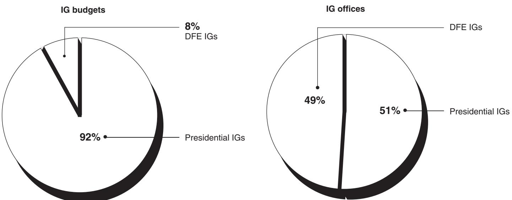

The IGs at the U.S. Postal Service (USPS), Amtrak, and the National Science Foundation (NSF), had budgets larger than some IGs appointed by the President. In addition, the Federal Reserve Board (FRB) and the Government Printing Office (GPO) IGs are each comparable in size with budgets that were equal to about 80 percent of the smallest Presidential IG budget. (See appendix V.) For example, the USPS IG had a fiscal year 2000 budget of about \$72 million, the fifth largest of all IG budgets. Likewise, the fiscal year 2000 budget for Amtrak was about \$6.3 million, and for the NSF IG, it was about \$5.4 million. Both the Amtrak and NSF IGs' budgets are larger than the budgets of two IGs appointed by the President. The FRB and GPO IGs each had fiscal year 2000 budgets over \$3 million compared to the Presidential IG at the Corporation for National Service which had a \$4 million budget. The total fiscal year 2000 budgets of these five largest DFE IGs make up about 81 percent of all DFE IG budgets, or about 7 percent of all IG budgets. The remaining 23 DFE IGs had budgets that total about \$21 million, roughly 1 percent of all IG budgets. (See figure 2.) Fourteen of these 23 DFE IGs had budgets under \$1 million and 17 had less than 10 staff.

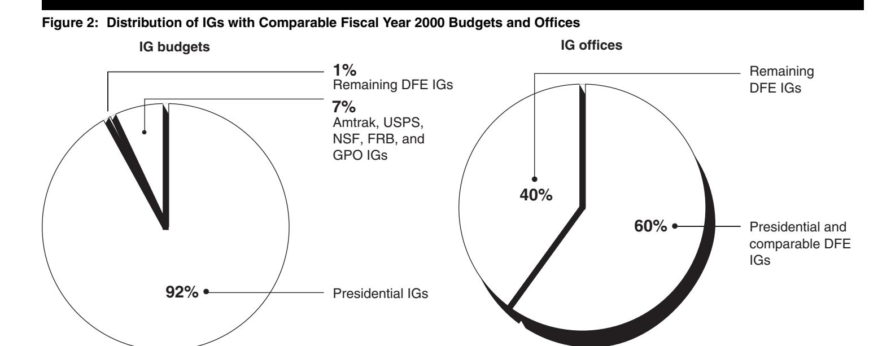

Consolidation of IG offices would likely result in IG oversight being provided across several federal agencies and their respective missions. This type of consolidated oversight is already being applied in various departments and agencies across the government through both statutes and other arrangements. For example, the oversight for the Broadcasting Board of Governors and the International Broadcasting Bureau is consolidated under the Department of State IG through the Foreign Affairs Reform and Restructuring Act of 1998 (Public Law 105-277). This statute

authorizes the Department of State IG to exercise the same authorities with respect to these two agencies as the IG exercises under the IG Act of 1978 and section 209 of the Foreign Service Act of 1980 with respect to the Department of State. In another example, the Agency for International Development (AID) IG may conduct reviews, investigations, and inspections of all phases of the Overseas Private Investment Corporation (OPIC) and is required to report these findings to OPIC's Board under the authority of the Foreign Assistance Act of 1961, as amended. As a result of the OPIC Amendments Act of 1981, Public Law 87-65, the AID IG performs audits, investigations, and inspections at the request of OPIC management and is authorized to be reimbursed for expenses incurred on behalf of OPIC. In addition, 1999 amendments to the IG Act of 1978 direct the AID IG to supervise, direct, and control audit and investigative activities relating to programs and operations within the Inter-American Foundation and the African Development Foundation.

In another example of consolidated IG oversight, the Amtrak Reform and Accountability Act of 1997 (Public Law 105-134) authorizes the Department of Transportation (DOT) IG to approve and oversee the contract for the assessment of financial requirements of Amtrak through fiscal year 2002. Also, the National Transportation Safety Board (NTSB) Amendments Act of 2000 (Public Law 106-424) provides the DOT IG the authority to review the financial management, property management, and business operations of the NTSB, including internal accounting and administrative control systems, to determine compliance with applicable laws, rules, and regulations. In another example, the Appalachian Regional Commission's IG provides audit and investigative services to the Denali Commission through a memorandum of agreement between the IG and the commission.

In 1998 the PCIE surveyed both the Presidential IGs and the DFE IGs to obtain their views on S. 2167, the Inspector General Act Amendments of 1998, then under consideration.2 Among other considerations, the amendments contemplated consolidations of certain specific DFE IG offices with specific IGs appointed by the President. For example, these amendments proposed that the functions of the IGs for the Corporation for Public Broadcasting, the National Endowment for the Arts, the National Endowment for the Humanities, and the Smithsonian Institution be

President's Council on Integrity and Efficiency, *State of the Inspector General Community, PCIE Survey on S. 2167, for the Senate Committee on Governmental Affairs* (Washington, D.C.: Sept. 9, 1998).

transferred to the IG at the Department of Education. The bill did not become public law, but the 1998 PCIE survey of the IGs did elicit valuable and relevant information concerning advantages and disadvantages associated with the consolidation of IG offices.

In particular, the 1998 PCIE survey concluded that those IGs who agreed with the proposed IG Act amendments felt that the independence of IG oversight would be enhanced in the entities to be consolidated. However, the IGs who opposed such a transfer felt that the benefits associated with the presence of an IG in the smaller agencies outweighed the administrative inefficiencies that may have existed. Also, the IGs responded that the size of an IG organization does not adequately measure the effectiveness and contributions of the IG in preventing and detecting fraud, waste, and abuse in the DFE agencies' operations. Other IG comments reported by the 1998 PCIE survey results include recognition that by their proximity to the areas served, the DFE IGs are more attuned to the agency employees, functions, operations, and goals which they review. Finally, the PCIE reported that the IGs felt the issue of transferring IG functions from DFE IGs to Presidential IGs needs further study to determine whether such transfers would contribute to increased efficiencies and more effective oversight.

# Objectives, Scope, and Methodology

In order to provide information on the potential impact of the consolidation or conversion of DFE IGs, we developed and sent a structured survey to all existing IGs. As agreed with your staff, we identified and analyzed 28 elements of IG effectiveness in the areas of (1) IG independence, (2) the quality of IG work, and (3) the effective use of IG resources. The elements were obtained from IG Act requirements, the IGs' vision statement,3 audit and investigative standards, past GAO reports, and statements from the IGs and members of the Congress. We also obtained comments from a panel of DFE IGs regarding the use of the criteria for IG effectiveness.

We developed a survey instrument that was sent to the IGs to obtain their views on the potential impact of conversion and consolidation on the elements of effectiveness for the DFE IG offices, the potential impact of a permanent statutory alternative to the PCIE and the ECIE, and the

3 President's Council on Integrity and Efficiency and the Executive Council on Integrity and Efficiency, *Inspectors General Vision and Strategies to Apply Our Reinvention Principles* (Washington, D.C.: January 1994).

usefulness of using a budget threshold to determine at which agencies IG offices should be established. Survey responses were received from an equal number of Presidential and DFE IGs - 28 of the IGs appointed by the President and 28 of the IGs appointed by their agency heads. The Central Intelligence Agency IG declined to respond. We did not independently verify the information the IGs provided.

Our survey addressed the potential impact that both conversion and consolidation could have on the independence of the DFE IGs and the resulting Presidential IG offices. However, because consolidation would to a large extent result in making DFE IG offices a part of Presidential IG offices, we did not duplicate the entire survey for both conversion and consolidation but rather relied on the IG responses to consolidation.

Any number of scenarios exist for implementing a conversion or consolidation strategy. Two options for conversion and consolidation of IG offices not specifically addressed by our survey include (1) combining the DFE IGs to create one large DFE IG office to cover all DFE agencies and (2) combining all the DFE IGs under a new IG appointed by the President and confirmed by the Senate. These options for conversion and consolidation were previously studied through a survey of the IGs and were met with limited support. The results of our prior study, which were provided in a 1999 report,4 showed that the first option was supported by 27 percent of the Presidential IGs and 7 percent of the DFE IGs. The second option was supported by 15 percent of the Presidential IGs and 10 percent of the DFE IGs.

4 U.S. General Accounting Office, *Inspectors General: Information on Operational and Staffing Issues,* GAO/AIMD-99-29 (Washington, D.C.: Jan. 4, 1999).

Our current survey was completed prior to recent changes to *Government Auditing Standards*5 regarding auditor independence and therefore addresses the requirements of the older independence standards. Nevertheless, as a basic premise under the revised standards, the IGs appointed by the President and confirmed by the Senate and IGs appointed by and reporting to a statutorily created governing body, as well as the DFE IGs appointed by their agency heads, are considered organizationally independent to report externally.6 Therefore, we do not believe that our survey results would have changed in any material way as a result of the changes in the auditor independence standards.

We obtained comments on a draft of this report from the Presidential IGs and the DFE IGs through the PCIE and the ECIE. These included technical changes that have been incorporated in the report. A summary of their written comments and our response are presented on page 57. The PCIE and ECIE comments are reprinted in their entirety in appendixes VII and VIII. We performed our review from March 2001 through March 2002 in accordance with generally accepted government auditing standards.

5 U.S. General Accounting Office, *Government Auditing Standards*, *Amendment No. 3, Independence,* GAO-02-388G (Washington, D.C.: January 2002).

6 The IG Act provides the DFE IGs appointed by their agency heads with all the statutory safeguards listed in the revised standards for organizational independence. However, these IGs must document that the specific statutory safeguards are applicable and have them reviewed by an independent quality control review at least once every 3 years.

Independence The independence of an audit entity is one of the most important elements of the overall effectiveness of the audit function. Auditors need to be as independent from external influences as possible both in fact and appearance, in order to ensure that their audit work is credible and respected. Therefore, the effect on IG independence is critical when considering the conversion of the DFE IGs to appointment by the President or consolidation of their offices with IGs appointed by the President. The IGs derive independence through numerous provisions in the IG Act. These include the authority of IGs to report violations of law directly to the Department of Justice, the requirement for IGs to prepare semiannual reports of their activities for the Congress without alteration by their agencies, the authority of IGs to perform any audit or investigation without interference from the agency head and others except under certain conditions specified by the act, and the requirement for the President or the agency head to communicate to the Congress the reasons for removing an IG. In addition, the IGs are required to follow *Government Auditing Standards,*7 which require IGs and individual auditors to be free from personal, organizational, and external impairments to independence, and to be independent in appearance.

## Conversion and Independence

The survey responses from the Presidential IGs and the DFE IGs differed as to whether DFE IG independence could be increased by having IGs appointed by the President with Senate confirmation instead of the present practice of IG appointment by the heads of agencies in which they would lead the IG staff. Specifically, as shown in figure 3, 29 IGs (24 Presidential and 5 DFE) responded that independence could be increased in this way and 22 IGs (19 DFE and 3 Presidential), responded that conversion would have no impact on DFE IG independence. One DFE IG responded that independence could be decreased. Two DFE IGs and one Presidential IG had no opinions and an additional IG did not respond.

7 *Government Auditing Standards*, 1994 revision, as amended, was issued by the Comptroller General of the United States. IGs are required to follow these standards in their audit work.

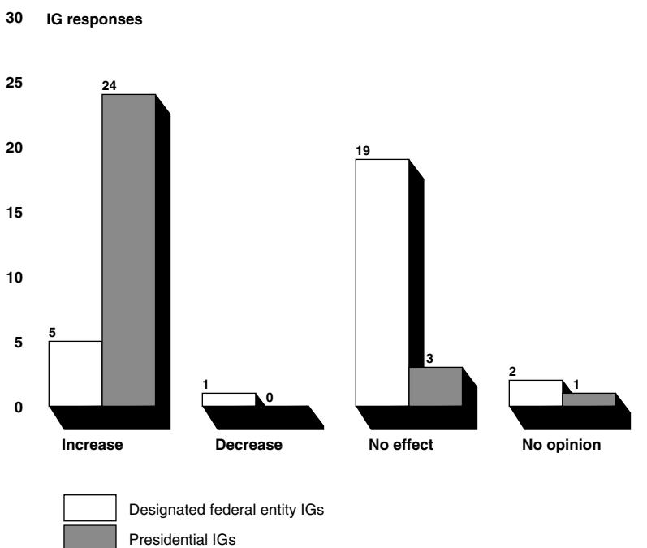

**Figure 3: Potential Effect of Conversion on IG Independence**

Five of the 19 DFE IGs who responded that conversion would have no impact on their independence also stated that appointment by the President could actually increase political influence on the IGs. This contrasts rather sharply with 24 of the Presidential IGs' survey responses that conversion could increase the independence of DFE IGs. Typically, the further removed the appointment source is from the entity to be audited, the greater the level of independence. To illustrate, conversion of IGs from appointment by their agency heads to appointment by the President with Senate confirmation has been recognized previously by the Congress as a way to obtain increased IG independence. Specifically, the perceived limitation of the Federal Deposit Insurance Corporation IG's independence as a DFE IG under the IG Act was recognized as a reason to convert the IG to appointment by the President with Senate confirmation when Public Law 103-204 was passed on December 17, 1993. More recently, Public Law 106-422, November 1, 2000, converted the Tennessee Valley Authority (TVA) IG to appointment by the President with Senate confirmation because of concerns about interference by TVA management and recognized that the IG's independence would be enhanced under appointment by the President. Consequently, the change from agency

appointment to appointment by the President has been recognized by the Congress since the advent of the IG concept as a strengthening of this critical element of IG effectiveness.

## Consolidation and Independence

Similar to the survey results regarding conversion, the Presidential and DFE IGs' responses were different regarding the impact that consolidation could have on DFE IG independence. In responding to our survey, 26 IGs (24 Presidential and 2 DFE) indicated that independence could be increased and 2 DFE IGs believe it could be decreased. Of the remaining IGs, 25 (22 DFE and 3 Presidential) responded that consolidation would have no effect on independence and 2 (1 Presidential and 1 DFE) had no opinion. An additional IG did not respond. (See figure 4).

Three DFE IGs provided explanations of how independence would be decreased. Specifically, one DFE IG explained that the independence of the agency (rather than IG independence) would decrease due to agency concerns about undue political influence from the President. Another DFE IG stated a preference for increasing independence through added provisions in the IG Act rather than through consolidation, and the remaining DFE IG stated that IGs appointed by the President are more affected by politics and are more likely to be forced to resign.

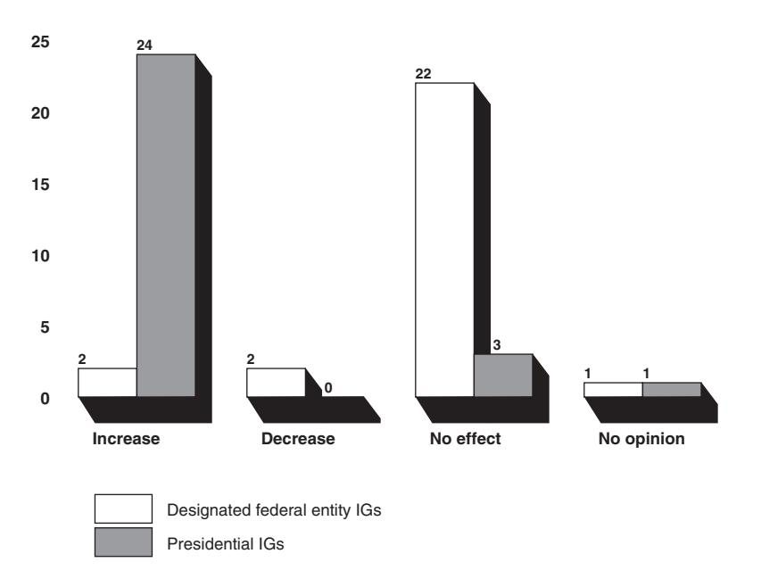

With respect to the appearance of independence there was some consensus. As shown in figure 5, 39 IGs (27 Presidential and 12 DFE) indicated that the appearance of independence could be strengthened by consolidating DFE IGs with Presidential IGs. Fifteen IGs (14 DFE and 1 Presidential) responded that there would be no effect, and 2 DFE IGs indicated that the appearance of independence would be weakened through consolidation. Of the two DFE IGs who indicated that the appearance of independence would be decreased, one provided additional comments, reiterating that the decrease in appearance of independence would be the result of an appearance of political influence by an IG appointed by the President.

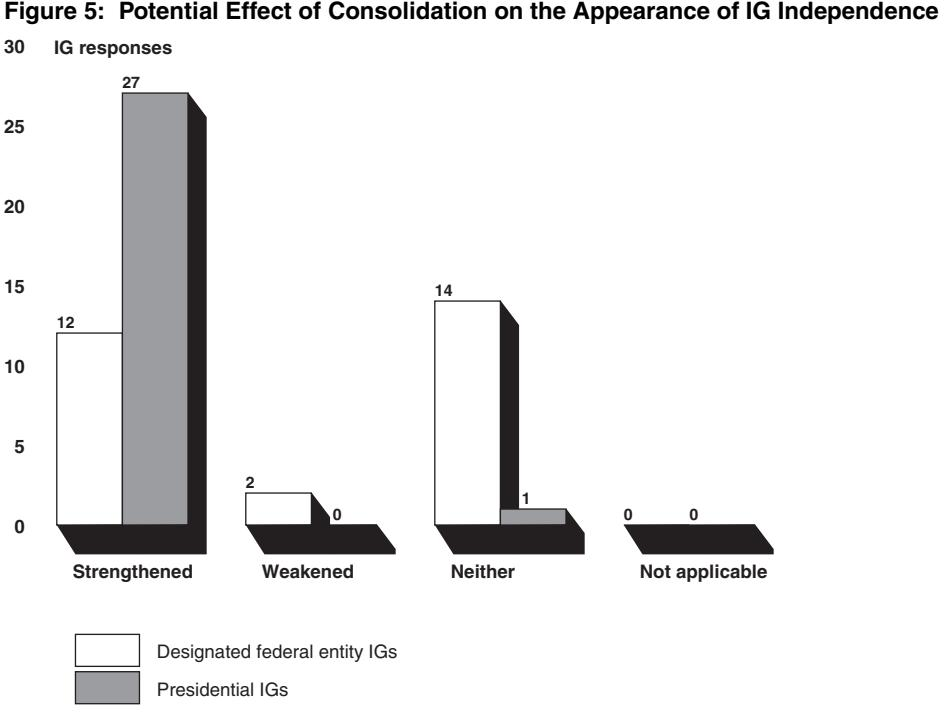

# Consolidation and IG Quality of Work

The quality of audits and investigations is also a critical element of IG effectiveness. To determine the possible impact of consolidation on the quality of IG work, we obtained information for use in our survey from IG testimony before the Congress, IG reports, concerns of the Congress, and professional standards. These sources indicate that the quality of work is largely determined by the ability to issue hard-hitting reports when necessary, to review issues across agencies, to get attention to recommendations made by the IGs, to audit issues of high risk, and to measure agency performance. Also, within each agency the quality of work is affected by the relationship the IG has with the agency and includes dayto-day contact with agency management, communication between the IG and the agency head including the ability of the agency head to get the attention of the IG, the presence of an IG as a prevention measure, the knowledge of agency missions and priorities, the IG's ability to plan work, the timeliness of IG reports, and the audit coverage of the agency.

As with the other survey questions, the views of Presidential IGs and DFE IGs are markedly different regarding the potential effect of consolidation

on the quality of future IG work. The Presidential IGs' responses indicate that consolidation could increase some of the elements of IG quality. For these same elements, the DFE IGs' responses indicate that consolidation would either have no impact or that work quality could be weakened. In addition, responses from both the Presidential IGs and the DFE IGs indicate that there are elements of quality that could be weakened. These types of risks to quality would need to be addressed by the management of the merged IG operations to avoid or abate any undesired consequences by a consolidated IG. In our view, consolidation of DFE IG offices with Presidential IGs would not necessarily result in a reduction of audit quality, especially if proper steps are taken to mitigate areas that could be weakened.

## Ability to Issue Hard-hitting Reports When Necessary

The DFE IGs and the Presidential IGs again responded differently in assessing the impact of consolidation on their ability to present hard-hitting reports when necessary. Generally, the Presidential IGs responded that the DFE IGs' ability to issue hard-hitting reports could be strengthened through consolidation. However, the DFE IGs generally responded that consolidation would either have no impact on this ability or that the quality of work could be weakened. Specifically, 26 IGs (24 Presidential and 2 DFE) indicated that the ability of DFE IGs to issue hard-hitting reports would be strengthened. However, 21 IGs (19 DFE and 2 Presidential) responded that there would be no impact, and 7 IGs (5 DFE and 2 Presidential) indicated this ability could be weakened. (See figure 4.) The IGs provided no comments to explain their responses.

**Figure 6: Potential Effect of Consolidation on the Ability of IGs to Issue Hard-hitting Reports**

**IG responses 30**

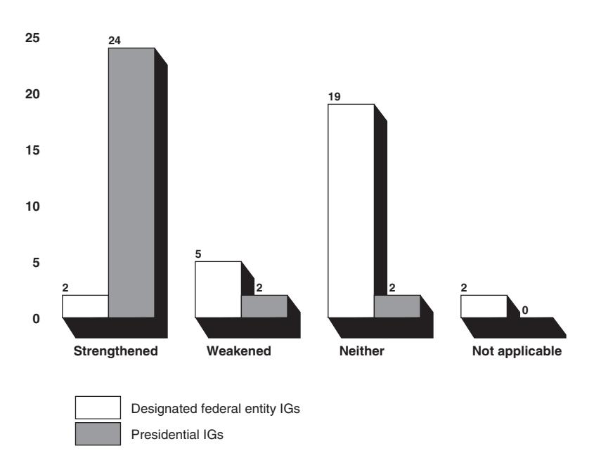

# Oversight of Cross-Cutting Issues

The ability of IGs to issue reports that address not only issues that are particular to their specific agencies but which address issues of broad interest across several agencies is another function of the PCIE and ECIE. This ability provides reports of cross-cutting issues for the Congress and for the benefit of the IGs' collective agencies. As a result, the IGs have issued reports on such cross-cutting issues as computer security, debt collection, the use of government credit cards, and financial management. Twenty-two IGs (16 Presidential and 6 DFE) responded that consolidation could strengthen their ability to review issues that cut across other agencies while 16 IGs (12 DFE and 4 Presidential) indicated that there would be no effect on the ability of the DFE IGs to issue cross-cutting reports. In addition, six IGs (five DFE and one Presidential) responded that this ability would be weakened by consolidation. (See figure 7).

**Figure 7: Potential Effect of Consolidation on the IGs' Ability to Use Audit Resources to Review Issues That Cross All DFE Agencies**

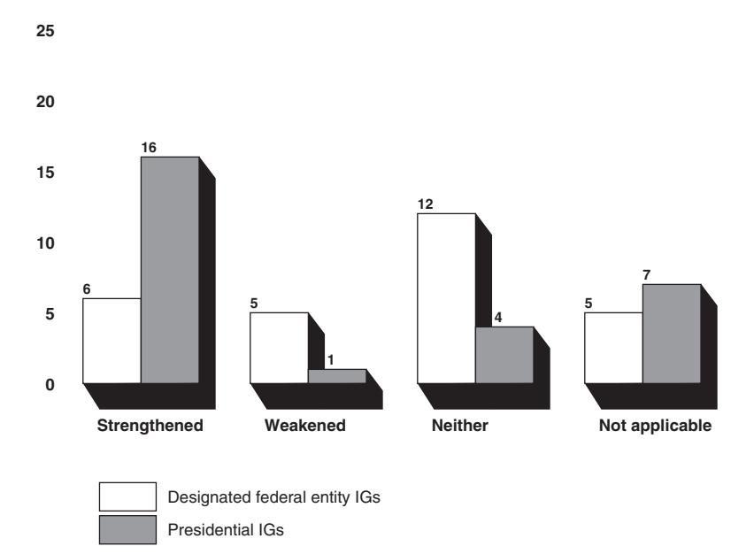

## Attention to IG Recommendations

The ability of the IGs to achieve results through their recommendations is another key element of effectiveness. Some important objectives of the IGs' audit work include improving accountability, saving tax dollars, improving programs and operations, and providing better service to the public. Auditors' recommendations are vehicles for fulfilling these objectives but only the effective implementation of recommendations, not the recommendations themselves, will enable the government to work better at lower cost. Nineteen IGs (18 Presidential and 1 DFE) responded that greater attention would be given DFE IG recommendations as a result of consolidation. Eighteen IGs (14 DFE and 4 Presidential) indicated that there would be no effect on the level of attention given to their recommendations as a result of consolidation. Also, 11 IGs (all were DFE) responded that there would be less attention to IG recommendations. (See figure 8.) In comments regarding the potential weaknesses of consolidation, one IG stated that consolidation would result in less credibility of the IG in the DFE, and another IG stated that DFE IG recommendations already receive attention.

**Figure 8: Potential Effect of Consolidation on the Attention That DFE Agencies and the Congress Give to IG Recommendations** 

**IG responses 30**

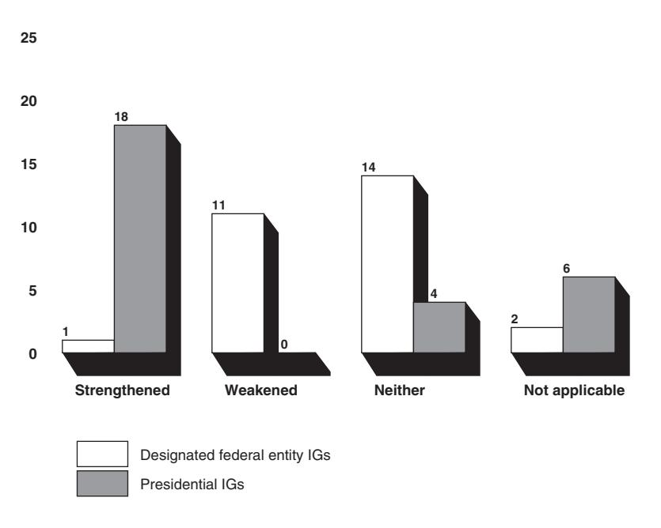

Ability to Address High-Risk and Priority Issues

Assessing risk and establishing priorities for audits are important elements of the planning process for audit organizations. The ability to address those areas designated as high risk and of highest priority is fundamental to any audit organization's work. The Presidential IGs and the DFE IGs again had widely different responses to this element of IG effectiveness. Twentyone IGs (18 Presidential and 3 DFE) indicated that consolidation could strengthen the ability of the DFE IGs to address issues of higher risk and priority. However, 27 IGs (20 DFE and 7 Presidential) indicated that consolidation would have no impact. In addition, two IGs (both were DFE) indicated that their ability in this area could be weakened. (See figure 9.) There were no additional comments provided by the IGs regarding their responses.

**Figure 9: Potential Effect of Consolidation on the Ability of DFE IGs to Address Issues of Higher Risk and Priority**

**IG responses 30**

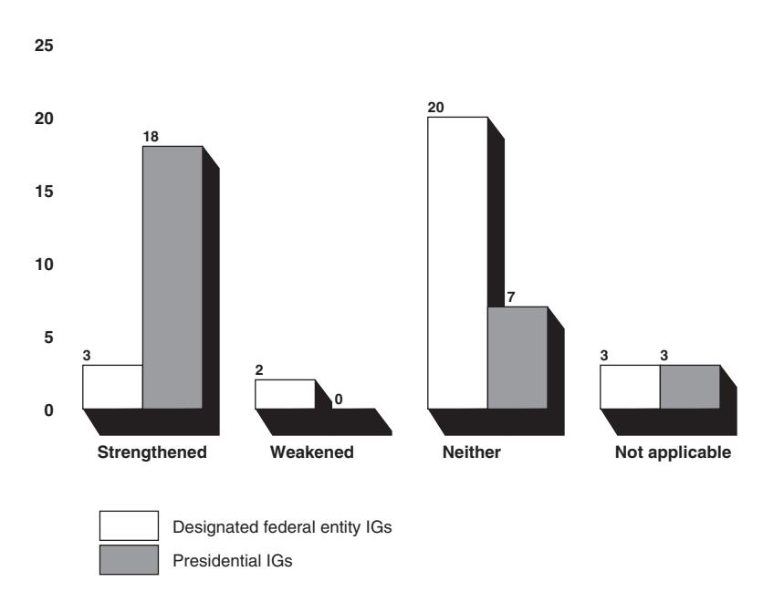

## Ability to Uniformly Measure Performance

The Government Performance and Results Act of 1993 (GPRA) includes requirements for federal agencies to engage in strategic planning, establish performance measures, and report on their ability to meet these measures. The validity of the measures and the verification of agency reports of meeting the established measures is an important part of the success in implementing GPRA. At the request of members of the Congress, the IGs perform activities in the validation and verification of performance measures developed by their agencies in compliance with GPRA requirements. While there is no specific requirement in the act for the IGs to audit GPRA results, the extent of the IGs' ability to assist their agencies continues to be of interest to the Congress. To the extent IGs can uniformly measure the performance of their agencies through use of the GPRA measures and their own audit efforts, the IGs will be increasingly effective in reporting on their agencies' ability to successfully achieve their missions, goals, and specific performance measures.

Twenty-five IGs (15 DFE and 10 Presidential) indicated that consolidation ency performance. t this ability could at their ability uestion was not d by the IGs on this would have no impact on the ability to measure DFE ag Fourteen IGs (12 Presidential and 2 DFE) indicated tha be strengthened. Four IGs (all were DFE) responded th would be weakened. Thirteen IGs responded that the q applicable. (See figure 10.) No comments were provide issue.

**Figure 10: Potential Effect of Consolidation on the Ability to Uniformly Measure DFE Agency Performance**

**IG responses 30**

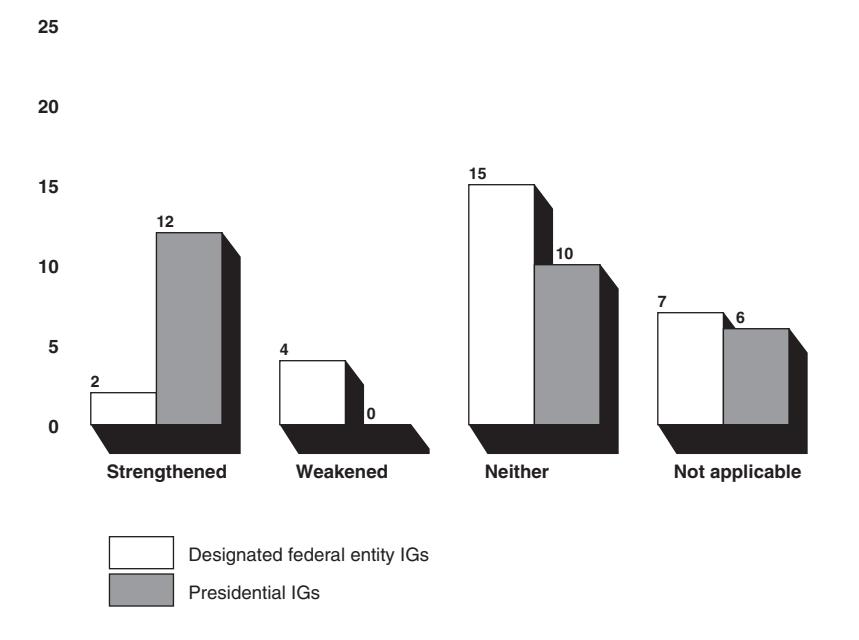

## IG Contact with DFE Officials

The legislative history of the IG Act of 1978 includes guidance on IG effectiveness by indicating that the IGs must have a close relationship with their agency heads and be responsive to their concerns. Moreover, the guidance illustrates that if the agency head is committed to managing the agency effectively the IG can be the agency head's strong right arm while maintaining the IG independence needed to honor reporting responsibilities to the Congress.8 The survey responses indicate that both Presidential and DFE IGs believe this working relationship between the IGs and their DFE heads could be weakened through consolidation of the IG offices.

Responses from 36 IGs (26 DFE and 10 Presidential) indicate that consolidation could weaken the ability of the IGs to have day-to-day contact with senior DFE agency officials. Nine IGs (eight Presidential and one DFE) indicated that there would be no impact on their day-to-day contact with agency officials and five IGs (all were Presidential) responded that day-to-day contact could be strengthened. (See figure 11.)

8 U.S. Government Printing Office, *Establishment of Offices of Inspector and Auditor General in Certain Executive Departments and Agencies, Report of the Committee on Governmental Affairs United States Senate*, Report No. 95-1071 (Washington, D.C.: Aug. 8, 1978).

**Officials IG responses 0 5 10 15 20 25 30 Strengthened Weakened Neither Not applicable 0 5 26 10 1 8 1 5** Designated federal entity IGs Presidential IGs

**Figure 11: Potential Effect of Consolidation on Day-to-Day Contact with Senior DFE** 

# Communication between IGs and DFE Agency Heads

Attention to communication among IGs, agency heads, and program management staff is included as part of the IGs' vision statement. The IGs have stated their intent to work with agency heads and the Congress to improve program management. Therefore, IG communication with DFE agency heads is another indicator of the quality of IG work. Thirty-three IGs (26 DFE and 7 Presidential) responded that this communication could be weakened by consolidation. The Presidential IGs' responses were almost evenly divided among the strengthen, weaken, and no impact choices with eight responses indicating that consolidation could actually strengthen communication and eight responses indicating that there would be no impact on communication. (See figure 12.) One DFE IG stated that close working relations with the agency head are currently enjoyed by the IG. No specific comments were made to indicate specifically how communication between the IG and DFE head would be weakened.

**Figure 12: Potential Effect of Consolidation on Communication between the IGs and DFE Agency Heads**

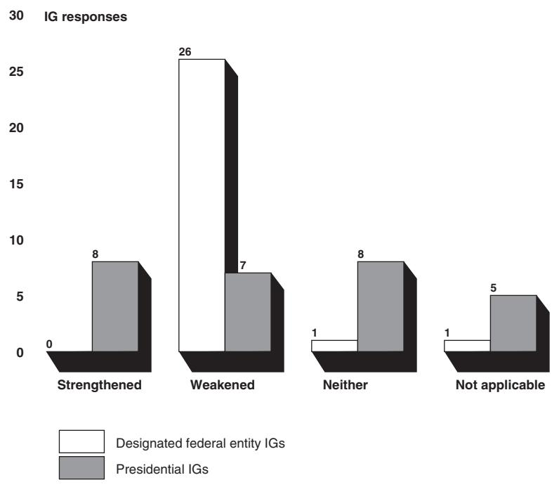

## Ability of DFE Head to Get the Attention of the IG

While there are statutory protections to IG independence provided by the IG Act, each IG is required by the act to be under the general supervision of their respective agency head. In addition, the IG vision statement recognizes the need for the agency head and the IG to work together. Thirty-one IGs (24 DFE and 7 Presidential) responded that this ability could be weakened by consolidation. The remaining responses of the Presidential IGs include seven who took an opposing view indicating that this ability could be strengthened by consolidation, and nine who indicated that there would be no impact. (See figure 13.)

**Figure 13: Potential Effect of Consolidation on the Ability of DFE Agency Head to Get the IG's Attention**

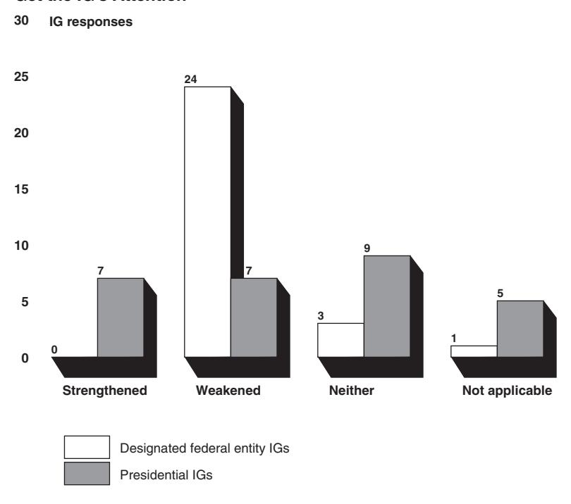

## IG Presence as a Preventative Measure

Comments from the DFE IGs raised concerns that through consolidation with large IG offices the DFE agencies would possibly lose the effect of having a "cop on the beat" which can act as a deterrent to fraud, waste, abuse, and mismanagement. While the survey results indicate a concern about weakening this IG presence, the concern is largely from the DFE IGs and not the Presidential IGs. Twenty-nine IGs (25 DFE and 4 Presidential) indicated that the IGs' presence as a preventative measure would be weakened in the DFE through consolidation. However, 13 Presidential IGs responded that the IG presence in the DFE agencies would be strengthened by consolidation. The remaining IG responses indicated either no impact or that the question was not applicable. (See figure 14.)

**Figure 14: Potential Effect of Consolidation on IG Presence as a Preventative Measure for the DFE Agencies**

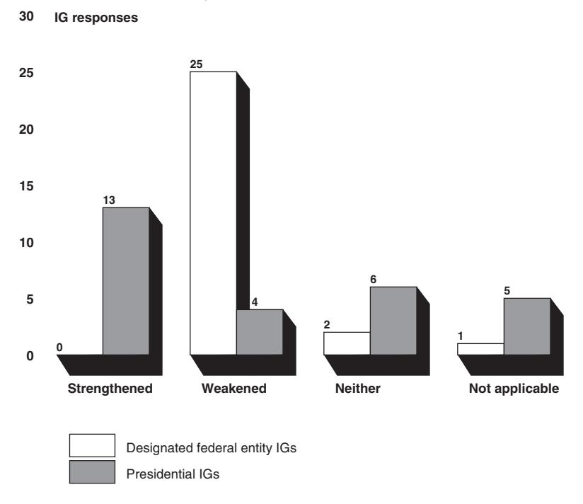

# IG Knowledge of DFE Missions

Thirty-six IGs (26 DFE and 10 Presidential) indicated that the IG's knowledge of each DFE agency's mission, operations, and activities would be weakened through consolidation. This response appears to assume that current DFE IG staff and their knowledge would no longer exist to provide DFE agency oversight. However, eight Presidential IGs indicated that consolidation could strengthen the IG's knowledge of each DFE agency and eight indicated that there would be no impact. (See figure 15.) One IG's comments indicated there would be a large learning curve for the IGs not familiar with the DFEs; however another IG stated that the IG's knowledge could be strengthened depending on staffing and the availability of resources.

**Figure 15: Potential Effect of Consolidation on IG Knowledge of DFE Agency Missions, Operations, and Resource Limitations**

## IG Knowledge of DFE Priorities

In responses identical to the previous survey question, 36 IGs (26 DFE and 10 Presidential) indicated that IG knowledge of the DFE agencies' priorities and issues could be weakened through consolidation. Likewise, eight Presidential IGs indicated that this knowledge could be strengthened and eight indicated that consolidation would have no impact. (See figure 16.) One IG provided comments and stated that after consolidation, the IGs would lose their perspective about the DFE agencies' goals and direction. This response appears to assume that current DFE IG staff would no longer be available to provide such a perspective.

**Figure 16: Potential Effect of Consolidation on IG Knowledge of Priorities and Issues within Each of the DFE Agencies**

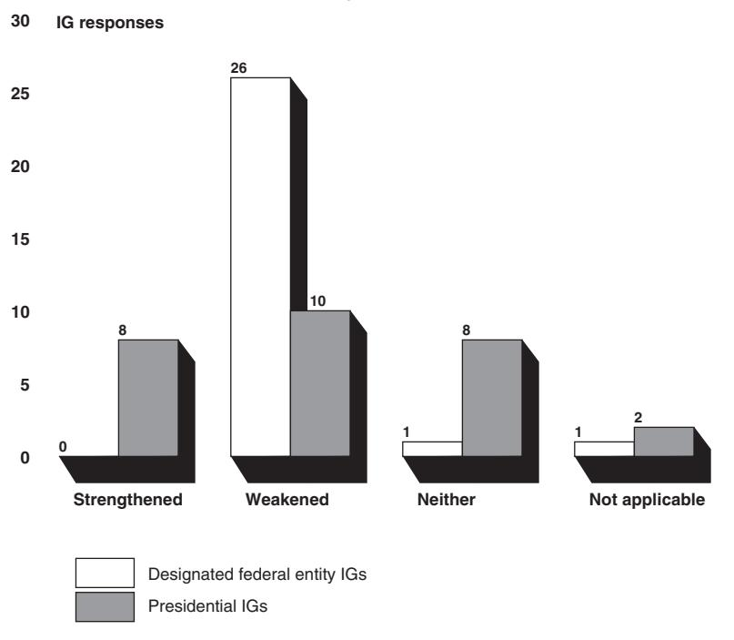

IG Ability to Plan Work In the area of planning work, 21 IGs (17 DFE and 4 Presidential) responded that the ability to plan their work at the DFEs could be weakened. This contrasts with the responses of 13 IGs (12 Presidential and 1 DFE) who indicated that planning could be strengthened. Fourteen IGs (eight Presidential and six DFE) indicated that consolidation would have no impact. (See figure 17.) No IGs commented on how this ability would be strengthened; however, one DFE IG stated that planning for coverage of the DFE agencies would be diluted by the other work requirements of the consolidated IG office.

**Figure 17: Potential Effect of Consolidation on Oversight Planning IG responses 0 5 10 15 20 25 30 Strengthened Weakened Neither Not applicable 1 12 17 4 6 8 4 4** Designated federal entity IGs Presidential IGs

Timeliness of IG Reporting Twenty-five IGs (23 DFE and 2 Presidential) indicated that the timeliness of reports would be weakened by consolidation. Fifteen IGs (11 Presidential and 4 DFE) indicated that consolidation would have no impact. Also, six Presidential IGs indicated that timeliness could be strengthened. Ten IGs (nine Presidential and one DFE) responded that the question was not applicable. (See figure 18.) In comments provided, one IG observed that the reports in large audit organizations generally have longer report review cycles. Likewise, comments from two DFE IGs stated they believe reports by the DFE IGs are probably more timely than they would be under consolidation. No comments were provided by the six IGs who indicated that timeliness could be strengthened.

**Figure 18: Potential Effect of Consolidation on the Timeliness of IG Reports IG responses 0 5 10 15 20 25 30 Strengthened Weakened Neither Not applicable 0 6 23 2 4 11 1 9** Designated federal entity IGs Presidential IGs

# Oversight Coverage of DFE Agencies

The IGs are required by the IG Act to coordinate, conduct, and provide policy direction for audits and investigations in their agencies. Therefore, IG oversight coverage of agency programs, offices, and activities is another element of IG quality. Thirty-three IGs (25 DFE and 8 Presidential) indicated that IG coverage at the DFE agencies would be decreased. Nine Presidential IGs took the opposite view, responding that coverage could be increased. The 14 remaining IG responses (11 Presidential and 3 DFE) indicated either no impact or that they did not have an opinion on this matter. (See figure 19.) Most of the IGs' comments explained that the decrease would be the result of low priorities for coverage in the DFEs by IGs who are appointed by the President. Specifically, one DFE IG stated that larger agencies have requirements that differ from those of smaller agencies, making it much more likely that the priorities of large agencies would supercede those of smaller agencies. In contrast, one Presidential IG commented that audit coverage of the DFE would increase after consolidation because the IG resulting from consolidation would first test the control environment of the DFE agencies to determine the necessary level of coverage, which would result, at least initially, in more coverage.

Also, another DFE IG who indicated that consolidation would have no effect on coverage stated that coverage depends on the IG resources available as well as the priorities established.

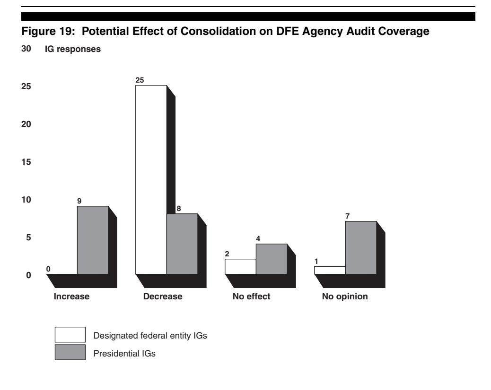

Consolidation and the Potential Impact on IG Resources

The efficient and effective use of IG resources and human capital can significantly affect the overall effectiveness of IG offices in helping their agencies address problems. For example, many IGs have determined that protecting agency information technology resources is a priority and often assist their agencies through independent advice and guidance on appropriate levels of IT security. However, these efforts require the use of knowledgeable IT specialists and a wise use of overall budgetary resources by the IGs. Also, the better IGs can control their own spending, budget requests, and absorb any budget decreases the more effective they can be in addressing the oversight of their agencies. In addition, information from IG testimony before the Congress, IG reports, concerns of the Congress, and professional standards indicate that IGs are affected by the ability to obtain resources for investigations, the ability to minimize duplication of

efforts, the quality of training, the ability to share methods and technology specialists, the efficient use of human capital skills, and the availability of adequate resources to provide oversight of the agency.

The IG Act Amendments of 1988 require separate appropriations accounts for the IGs appointed by the President, which provides greater control for these IGs over their budgets. The IG Act does not require such accounts for the DFE IGs. We reported in a prior review of 16 DFE IGs' budgets that 14 of the DFE IGs had entity officials making decisions affecting the IGs' fiscal year budgets who also competed with the IGs for resources and whose programs and operations were subject to IG audits and investigations.9 The results of our survey indicate that eight DFE IGs continue to obtain approval from agency officials to make spending decisions in one or all of the areas of travel, training, and personnel.

IG Control over Spending The survey results were again clearly delineated between the responses from the Presidential IGs and the DFE IGs. In response to our survey question on IG control over spending on travel, training, and personnel for oversight of the DFE agencies, 27 IGs (18 DFE and 9 Presidential) indicated that consolidation would have no impact. However, 18 IGs (16 Presidential and 2 DFE) believe this control could be strengthened by consolidation. In addition, seven IGs (6 DFE and 1 Presidential) indicated that IG control over this spending could be weakened. (See figure 20.)

9 U.S. General Accounting Office, *Inspectors General: Action Needed to Strengthen OIGs at Designated Federal Entities*, GAO/AIMD-94-39 (Washington, D.C.: Nov. 30, 1993).

**Figure 20: Potential Effect of Consolidation on IG Control over Spending for Travel, Training, and Personnel Related to Oversight of DFE Agencies**

**30 IG responses**

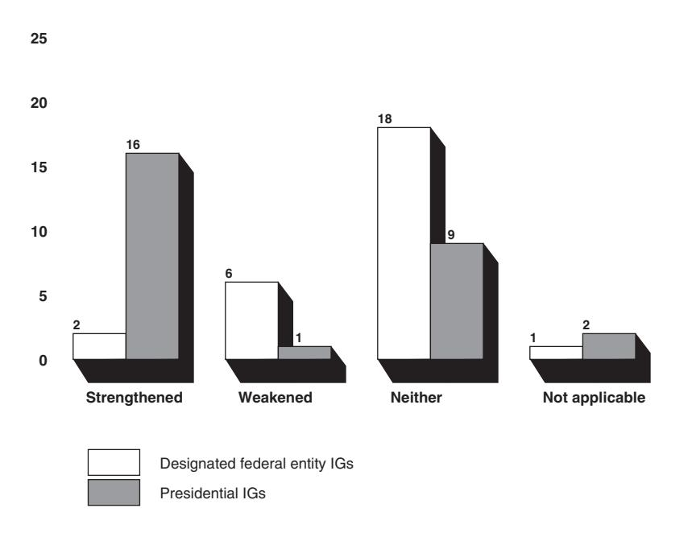

## IG Control over Budget Requests

The responses to the survey question on IG control over budget requests for their own offices were clearly divided between Presidential IG and DFE IG responses. Eighteen IGs (17 Presidential and 4 DFE) indicated that control could be strengthened by consolidation, while 20 IGs (14 DFE and 6 Presidential) indicated that there would be no impact on IG control of budget requests. Eight IGs (6 DFE and 2 Presidential) indicated that consolidation could weaken IG control over budget requests, and the remaining six IGs indicated that the question was not applicable. One IG did not respond to the survey question. (See figure 21.) One DFE IG expressed doubt that resources of the consolidated IGs would be devoted to oversight of the DFE agencies; however, another DFE IG stated that consolidation could result in fewer IG budget cuts.

**Figure 21: Potential Effect of Consolidation on IG Control over Their Own Budget Requests for Oversight Activity**

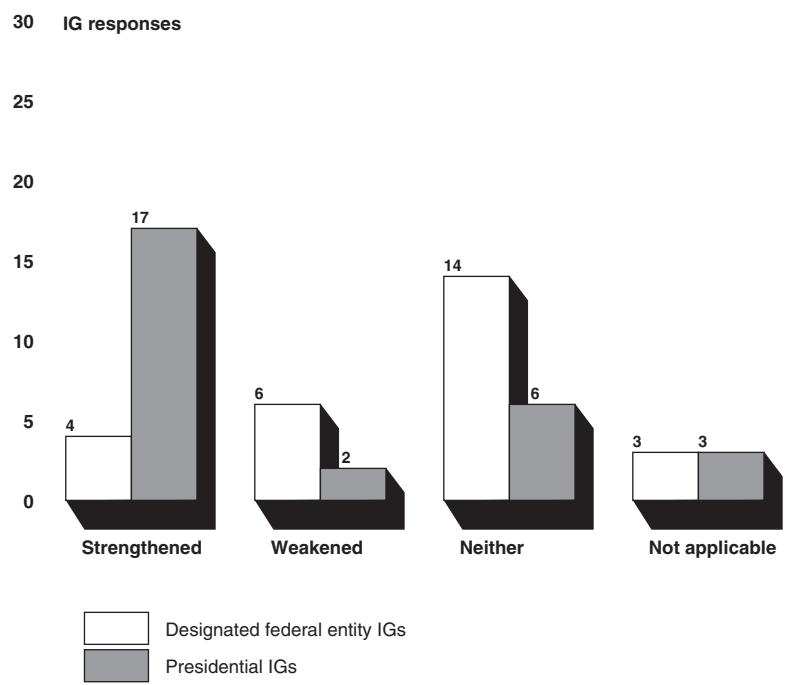

## IG Ability to Absorb Budget Reductions

Twenty IGs (13 Presidential and 7 DFE) responded that consolidation could strengthen the IGs' ability to absorb resource reductions. Sixteen IGs (8 Presidential and 8 DFE) indicated that consolidation would have no impact, and 12 IGs (9 DFE and 3 Presidential) indicated that this ability would be weakened. (See figure 22.) One DFE IG commented that the ability to absorb resource reductions is irrelevant because the DFE agencies would be a low priority for the IGs after consolidation. Along the same lines, another DFE IG expressed doubt that resources would be devoted to DFE agency oversight.

**Figure 22: Potential Effect of Consolidation on the IGs' Ability to Absorb Resource Reductions**

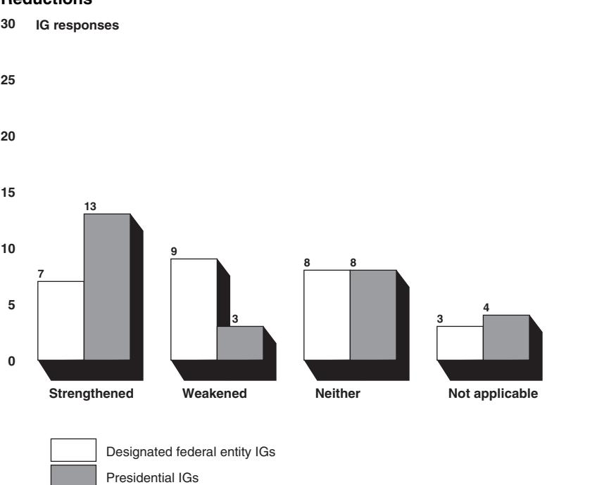

## Availability of Investigative Resources

In other areas of IG resources, 28 IGs (18 Presidential and 10 DFE) indicated that consolidation could strengthen the availability of investigative resources for coverage of the DFE agencies and 17 IGs (13 DFE and 4 Presidential) indicated that it would be weakened. Seven IGs (four Presidential and three DFE) indicated that consolidation would have no impact. One DFE IG commented that while more resources would be available they would not be used for coverage of the DFEs. (See figure 23.)

**Figure 23: Potential Effect of Consolidation on the Availability of IG Resources for Investigative Coverage**

**IG responses 30**

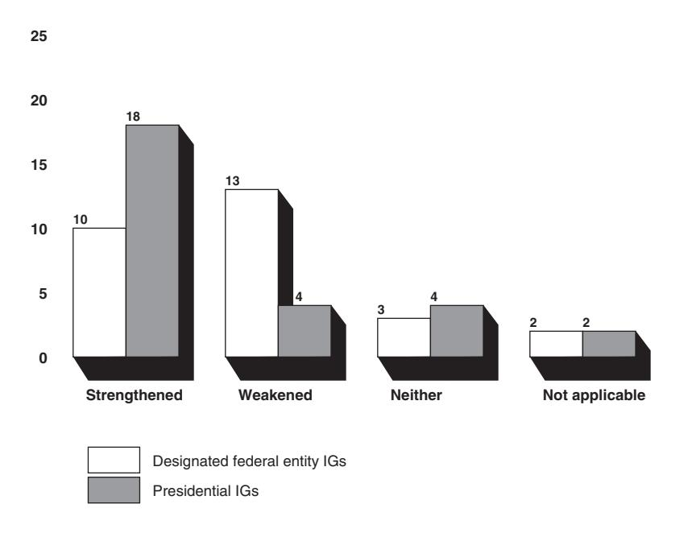

## Minimization of Duplication across IGs

Thirty-three IGs (21 DFE and 12 Presidential) responded that consolidation would have no impact on the duplication of audit efforts by the IGs. However, 17 IGs (14 Presidential and 3 DFE) indicated that the ability to minimize duplication could be strengthened by consolidation. Two DFE IGs indicated that this ability could be weakened. (See figure 24.) There were no specific comments regarding the issue of audit duplication.

**Figure 24: Potential Effect of Consolidation on the IGs' Ability to Minimize Duplication of Audit Efforts across the Federal Government**

**IG response 30**

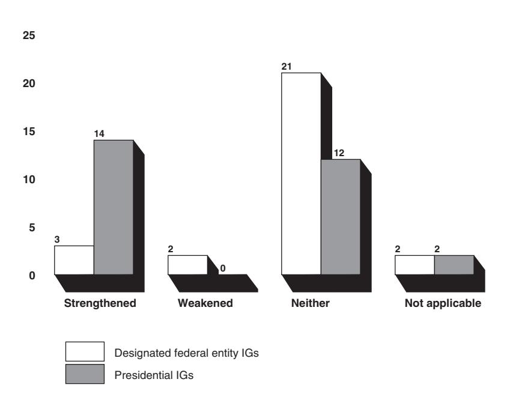

Quality of Audit Training Continuing education and training for auditors improves their knowledge and refines their skills, allowing them to better meet the challenges of the audit environment. Such education and training, since it enhances auditor proficiency, helps ensure the quality of audits. In addition, auditors working on audits in accordance with *Government Auditing Standards* must comply with specific continuing educational requirements specified by these standards.

> A majority of the IGs (21 DFE and 15 Presidential) indicated through our survey that consolidation would have no impact on the quality of auditor training. Thirteen IGs (11 Presidential and 2 DFE) responded that the quality of training could be strengthened and 4 DFE IGs indicated that training could be weakened. (See figure 25.) One DFE IG commented that Presidential IGs and DFE IGs use the same training sources, and another DFE IG stated concern that consolidation would reduce the quality of training because DFE agency-related subjects may decline depending on the work priorities of the consolidated IG.

**Figure 25: Potential Effect of Consolidation on the Quality of Training for IG Audit Work**

**IG responses 30**

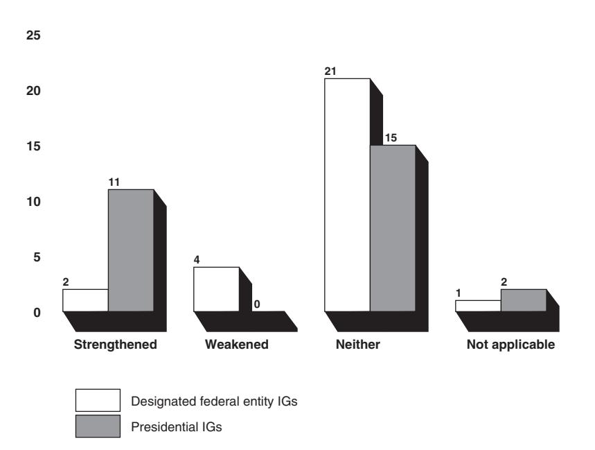

Ability to Share Methods The ability of IGs to share methods and programs for audits and investigations can enhance their use of government resources. Thirty IGs solidation would have no idential and 5 DFE) hrough consolidation. (See (20 DFE and 10 Presidential) indicated that con impact on this ability. However, 22 IGs (17 Pres indicated that this area could be strengthened t figure 26.)

**Figure 26: Potential Effect of Consolidation on the IGs' Ability to Share Methods and Programs for Audits and Investigations across the Federal Government**

**30 IG responses**

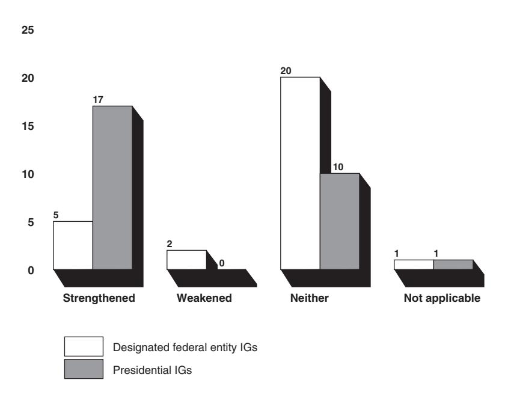

Ability to Share Technology Specialists and Expertise

Twenty-six IGs (19 Presidential and 7 DFE) indicated that the IGs' ability to share technology specialists and expertise could be strengthened by consolidation while 1 DFE IG indicated that it would be weakened. Twenty-seven IGs (19 DFE and 8 Presidential) indicated that consolidation would have no impact on this ability. (See figure 27.) One DFE IG commented that there is currently no difficulty obtaining needed specialists and expertise. Another DFE IG stated that the IGs already share such skills.

**Figure 27: Potential Effect of Consolidation on the IGs' Ability to Share Technology Specialists and Expertise**

**IG response 30**

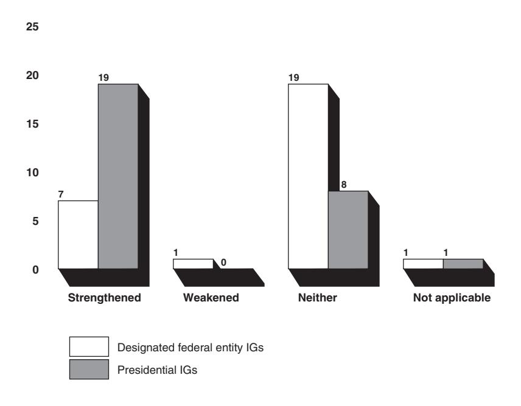

## Efficient Use of Human Capital Skills

The survey results were also characteristically widespread between the responses of the Presidential IGs and the DFE IGs regarding consolidation and the efficient use of human capital skills. Twenty-four IGs (17 DFE and 7 Presidential) indicated that consolidation would have no impact. However, 22 IGs (18 Presidential and 4 DFE) indicated that consolidation could strengthen the efficient use of human capital skills. In addition, 3 DFE IGs indicated that this could be weakened. (See figure 28.)

**Figure 28: Potential Effect of Consolidation on the IGs' Efficient Use of Human Capital Skills and Resources across the Federal Government**

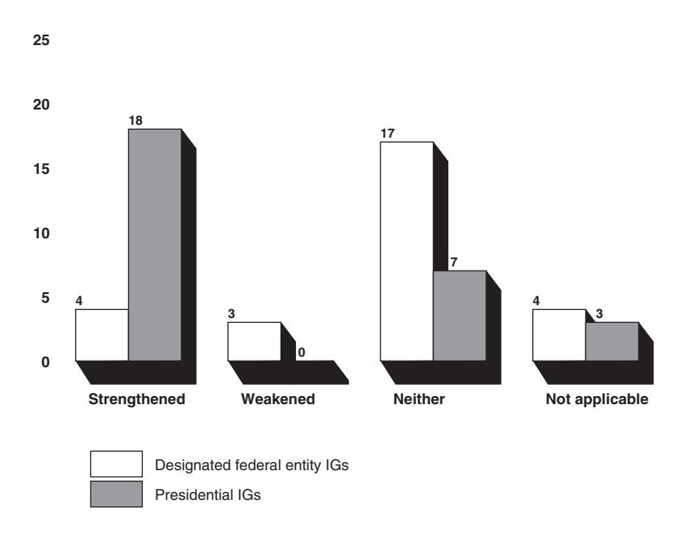

## Availability of Adequate IG Resources

The availability of adequate IG resources could be weakened by consolidation according to the responses of 20 DFE IGs and 7 Presidential IGs. At the same time, 12 IGs (9 Presidential and 3 DFE) indicated that the availability of resources could be strengthened. Nine IGs (seven Presidential and two DFE) responded that consolidation would have no impact. (See figure 29.)

**Figure 29: Potential Effect of Consolidation on the Availability of Adequate IG Resources**

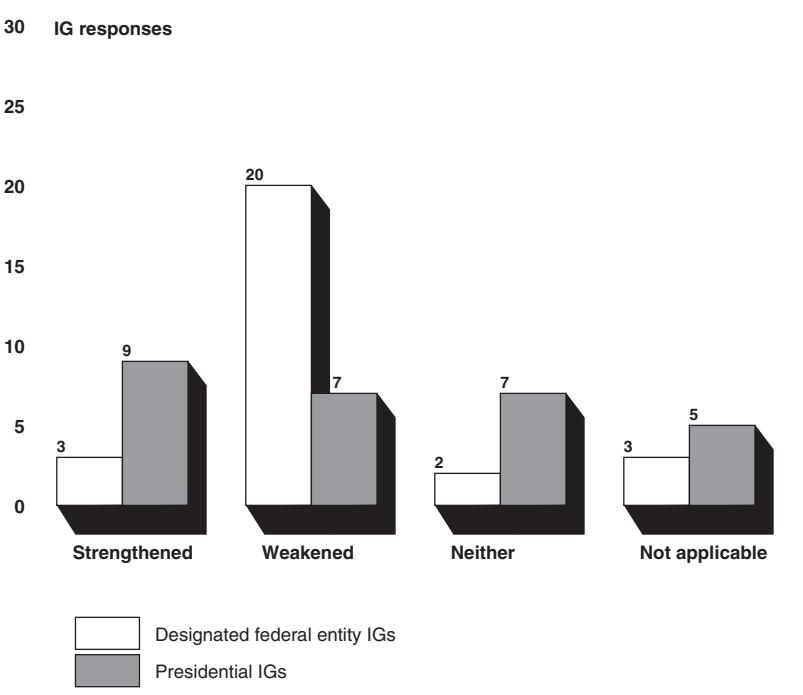

Availability of IG Resources to Cover DFE Issues

Similar to their concerns about the potential for the lack of audit coverage of DFE agency issues if the DFE IGs were consolidated, 38 IGs (26 DFE and 12 Presidential) responded that resources available to cover DFE issues would be weakened by consolidation. Nevertheless, 7 Presidential IGs indicated that consolidation could strengthen the coverage of DFE agencies. Six IGs (five Presidential and one DFE) indicated that consolidation would have no effect. (See figure 30.)

**Cover DFE Agency Issues IG responses 0 5 10 15 20 25 30 Strengthened Weakened Neither Not applicable 0 7 26 12 1 5 1 4** Designated federal entity IGs

**Figure 30: Potential Effect of Consolidation on the Availability of Resources to** 

# Strengthening the PCIE and ECIE

Our survey addressed issues that would affect the PCIE and ECIE. The survey responses indicated that the PCIE and ECIE could be strengthened by establishing an alternative council under statute with specified funding sources and defined roles and responsibilities. It was generally viewed that statutory authority with stated roles, responsibilities, and funding sources would provide an alternative to the PCIE and ECIE with a permanent, institutional footing that would allow the IGs to reach their full potential and better serve the needs of the administration and the Congress.

Presidential IGs

We asked the IGs how establishing the PCIE and ECIE by statute rather than executive order would affect the effectiveness of these councils. Thirty-four IGs (18 DFE and 16 Presidential) indicated that it was important for the PCIE and ECIE to be established under statute. Nineteen IGs (12 Presidential and 7 DFE) believe such statutory councils would be of little or no importance. (See figure 31.)

**Figure 31: How Important Is It to Establish a Statutory PCIE/ECIE Organization for Improving Their Operations?**

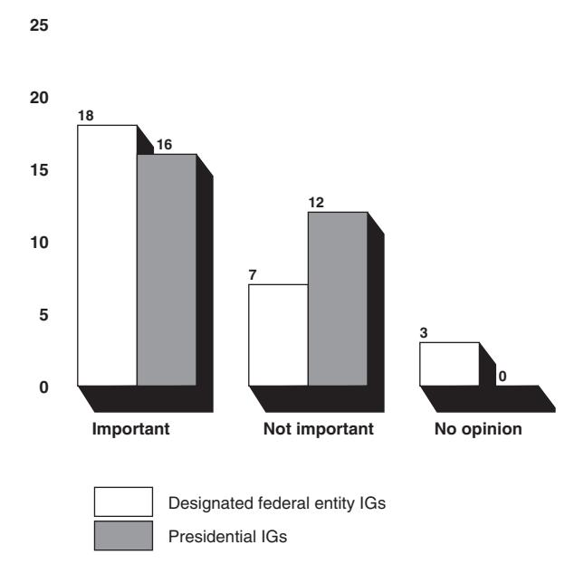

We also asked the IGs whether having designated funding sources for the PCIE and ECIE would be of importance. Forty-six IGs (24 DFE and 22 Presidential) believe that a designated funding source for the operation of these councils would be of importance, and seven IGs (five Presidential and two DFE) believe such funding is of little or no importance. (See figure 32.) In addition, we asked the IGs whether stated roles and responsibilities of the PCIE and ECIE in statute would be of importance. Thirty-seven IGs (21 DFE and 16 Presidential) responded that such statutory roles and responsibilities would be of importance, and 16 (11 Presidential and 5 DFE) indicated that they would be of little or no importance. (See figure 33.)

**Figure 32: How Important Is It to Provide Designated Funding Sources to the PCIE/ECIE Organization for Improving Their Operations?**

**IG responses**

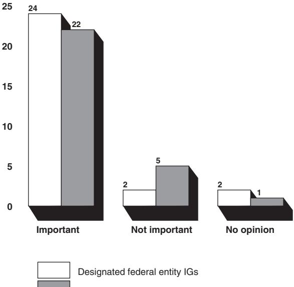

**Figure 33: How Important Is It to Establish Stated Roles and Responsibilities of an Alternative PCIE/ECIE Organization in Order to Improve Operations?**

**IG response 30**

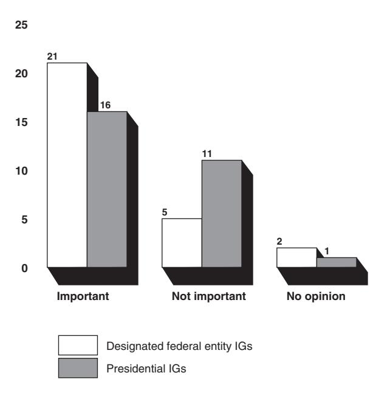

Comments from individual IGs indicate that appropriate statutory powers could provide some improvements to the PCIE and ECIE. One IG stated that such a statute would give shape, direction, and a mission to the PCIE. Another IG commented that, once under statute, there would be a wider base of support for the PCIE and ECIE by those sponsoring the legislation. In other comments, some IGs stated that this would facilitate getting the IG message to the Congress and the administration, would provide visibility and clout to the councils, eliminate the appearance of conflict between IGs and the chair of the councils, and provide the appearance that the PCIE stands independently rather than as a subgroup of the Office of Management and Budget. Perhaps most significantly, one IG stated that having these councils established through legislation would provide permanent and institutional footing.

# Agency Budgets are Not the Sole Criteria for Establishing IGs

The Inspector General Act Amendments of 1988 and the Government Printing Office (GPO) Inspector General Act of 1988 (Titles I and II, Public Law 100-504) established offices of inspectors general in 33 designated federal entities and GPO. One of the criteria used by the Congress to determine where to establish these new IGs offices was a budget threshold of \$100 million for the designated federal entities. Specifically, those agencies with an annual budget of \$100 million or greater were considered for inclusion in the IG Act Amendments of 1988. Other agencies below this budget threshold were also included for specific reasons.

In preparation for our survey, we calculated that the \$100 million threshold from 1988 would have been about \$134 million in fiscal year 2000, if adjusted for inflation.10 If this budget threshold were applied to the current agencies that have statutory IGs, 12 agencies would no longer meet this budget criteria to justify an IG office. (See appendix VI.) In response to our survey, 46 IGs (26 DFE and 20 Presidential) indicated that dollar thresholds of agency budgets should not be the primary factor determining which agencies should have IGs. However, nine IGs (eight Presidential and one DFE) indicated that budget dollar thresholds should be the primary factor. (See figure 34.) One IG stated that the primary factor for determining which agencies should have IGs should be the level of oversight that the Congress desires. Additional IGs responded that other factors, such as the importance of the agency's mission and the associated risks, should be considered. Also, eight IGs (17 DFE and 11 Presidential) responded that agencies with budgets below the \$134 million threshold should have IGs. However, 14 IGs (13 Presidential and 1 DFE) indicated that an IG is not necessary for those agencies. (See figure 35.) In their comments, the IGs stated that dollar thresholds are not meaningful by themselves and that the budgets may be just one factor in making such a determination. Another IG stated that the impact on public services should be considered, including vulnerable groups and overseas missions.

10 From the U.S. Department of Commerce, Bureau of Economic Analysis's Gross Domestic Product (GDP) Price Index.

**Figure 34: Should Dollar Thresholds of Agency Budgets Be the Primary Factor in Determining Which Agencies Have an IG?**

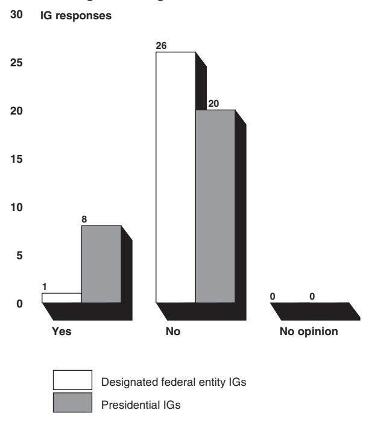

**Figure 35: Are Statutory IGs Needed for Agencies with Budgets Below \$134 Million? IG responses 30**

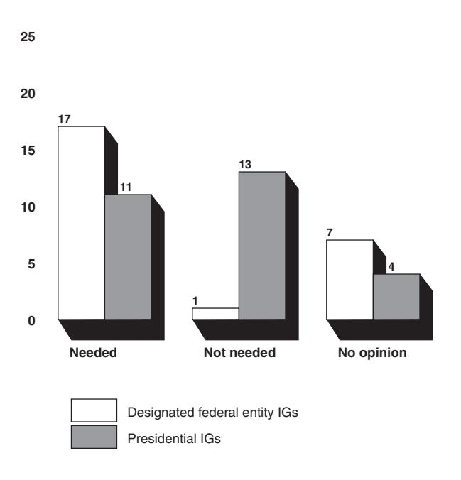

Survey Conclusions and GAO Views Regarding Conversion and Consolidation

We believe that if properly structured and implemented, the conversion consolidation of selected DFE IG offices could serve to enhance the independence, economy, efficiency, and effectiveness of the IG nity. We recognize that there are potential weaknesses resulting nsolidation, as indicated by the DFE IGs' responses, that would be mitigated through proactive and targeted actions in order for the s of consolidation to be realized without adversely affecting DFE audit coverage. One of the most important of these targeted areas be communication between the IG and the agency head as well as management officials where the IG is responsible for oversight. k of an IG at the DFE agency should be mitigated by the physical e of at least one of the consolidated IG's staff. and/or overall commu from co have to benefit agency would agency The lac presenc

e agree with the IGs' responses that indicate a legislative inning for the PCIE and ECIE could strengthen the effectiveness of r alternative councils of IGs. In addition, we believe that any ive underpinning should include a requirement for coordinating the of these organizations with other oversight organizations, such as Also, w underp these o legislat efforts

GAO. Regarding the use of agency budgets as the criteria for establishing IG offices in federal agencies, we agree with the IG responses that indicate other factors, such as the risk and mission of the agency, must be considered in addition to their budgets.

Independence The Presidential IGs mostly indicated that conversion could strengthen DFE IG independence while the DFE IGs' generally indicated that there would be no effect on their independence. Likewise, in their responses regarding the impact of consolidation on independence, the IGs were predictably different in their responses with Presidential IGs indicating a strengthening of independence and the DFE IGs indicating either a weakness or no impact.

> DFE IGs are established in legislation in a manner that makes them independent external auditors under *Government Auditing Standards.*  The IG Act provides the DFE IGs with statutory protections, that among others, prevent the audited entity from interfering with the initiation, scope, timing, and completion of any audit and provide the IGs access to records and documents that relate to the agency, program, or function being audited. On the other hand, having IGs appointed by the President with Senate confirmation provides a higher level of appearance of independence. At the same time, given the number and relatively small size of all but a few of the DFE IG offices and the organizations they are responsible for auditing, it is not practical for all of them to be converted to Presidential appointment and we do not favor the wholesale conversion of DFE IGs to Presidential IGs. Therefore, the consolidation of some DFE IG offices with Presidential IG offices would also serve to increase the perceived independence of the IGs where conversion is not practical.

IG Quality of Work The Presidential IGs also generally indicated that consolidation could strengthen the IGs' quality of work, while the DFE IGs indicated that consolidation would either have no impact or would weaken quality as related to (1) the ability to issue hard-hitting reports when necessary, (2) the ability to review issues that cross agencies, (3) the ability to get attention to IG audit recommendations, (4) the ability to audit issues of high risk and priority, (5) the presence of the IG as a preventative measure, and (6) the ability to plan work.

> We believe that consolidation could serve to strengthen the IGs' ability to issue hard-hitting reports, to issue reports on cross-agency issues, to get

attention to their audit recommendations, and to address high-risk and priority areas because IGs of consolidated offices could use their broader range of resources in the context of a governmentwide perspective rather than in the context of a single, relatively small agency. In addition, consolidation per se does not have to result in any material reduction on the IGs' day-to-day contact and communication with the agency head and ability to report on DFE agency performance as long as IGs maintain some physical presence at the DFE agencies or take other proactive steps to mitigate any potential reduction in communication and audit coverage. Finally, in our view, consolidation could enable IG offices to better target overall resources in planning their work to areas of greatest value and risk.

Use of IG Resources The Presidential and DFE IGs also had differences in their responses regarding the impact that consolidation could have on the use of IG resources. The DFE IGs responded that consolidation would weaken or have no impact, while the Presidential IG responses indicated that consolidation could strengthen (1) the ability to control spending, (2) the ability to control budget requests, (3) the ability to absorb budget reductions, (4) the availability of investigative resources, (5) the ability to minimize duplication of audit efforts across IGs, (6) the ability to share methods, (7) the ability to share technology specialists, (8) the efficient use of human capital skills, and (9) the availability of adequate resources.

> We believe that consolidation would serve to strengthen the ability of IGs to improve the allocation of human and financial resources within their offices and to attract and retain a workforce with the talents, multidisciplinary knowledge, and up-to-date skills to ensure the IG office is equipped to achieve its mission. For the majority of DFE IG offices, we view consolidation not only as a means to achieve economies of scale but more importantly as providing an enhanced critical mass of skills, particularly given the emergence of technology and the ever increasing need for technical staff with specialized skills. This is especially appropriate given the limited resources in most DFE IG offices where 12 DFE IGs had five or fewer full time equivalent staff and another five had less than 10 staff. In addition, consolidation should serve to increase the availability of investigative resources through economies of scale and other efficiencies and reduce the potential for duplication of work across IGs through enhancement of a value and risk approach to the investment and allocation of IG resources. Likewise, consolidation would serve to increase the ability of IGs to share methods and to leverage overall IG resources to

increase the ability of IGs to properly use IG personnel in technical areas, including information systems and forensic audits.

## Potential Weaknesses and Mitigation of Risks

The survey responses from both the Presidential and DFE IGs did indicate agreement that certain elements of effectiveness could be weakened through consolidation. These include potential weaknesses in (1) the dayto-day contact of IGs and DFE agency officials, (2) knowledge of the DFE agency missions, (3) knowledge of DFE agency priorities, and (4) the availability of resources to cover DFE agency issues. Additional potential weaknesses were identified by the DFE IGs while the Presidential IGs' answers to the same questions were inconclusive due to their relatively even distribution across the possible responses. The potential weaknesses cited by the DFE IGs were in (1) communication between the DFE agency head and the IG, (2) the ability of the DFE agency head to get the attention of the IG, (3) the timeliness of IG reporting, and (4) oversight coverage of the DFE agencies.

We agree that if appropriate actions were not taken to mitigate potential weaknesses, consolidation could weaken (1) the ability of the DFE IGs to have day-to-day contact with senior DFE agency officials, (2) communication between the DFE head and the IG, (3) the ability of the DFE agency head to get the attention of the IG, (4) the knowledge of DFE agency missions, (5) the knowledge of DFE agency priorities, and (6) the resources to cover DFE issues. However, we believe that for the areas of potential weaknesses indicated by the IGs, proactive steps could be taken to reduce the related risks and mitigate their impact on IG effectiveness to an acceptable level. For example, where appropriate a consolidated IG could maintain onsite facilities at DFE agencies with one or more dedicated staff to foster day-to-day communication with agency officials and communication with the DFE head. To facilitate oversight planning and to provide adequate oversight coverage, the IGs could leverage the detailed knowledge of the DFE agencies' missions and priorities by obtaining information from existing DFE IG personnel. In addition, the current DFE IG staff would be available to provide the necessary information for the proper planning and oversight of the DFE agencies. An additional concern by the DFE IGs, the timeliness of reports, could be addressed by having the IG establish priorities for reports on selected DFE agency issues based on risk. Finally, if congressional attention were given to mitigating the potential weaknesses identified by the IG responses to our survey, consolidation would not necessarily result in a loss of IG effectiveness in these areas.

For about 90 percent of the DFE IGs, many of their additional comments indicated concern about the potential loss of adequate audit coverage of the DFE agencies that could result from consolidation. About 28 percent of the Presidential IGs also had the view that audit coverage of the DFEs would be weakened. While there may be a fewer number of audits or even less coverage of those issues currently audited at the DFE agencies, the survey responses of the Presidential IGs indicate that coverage by a consolidated IG could address areas of higher risk, value, and priority, resulting in potentially a more efficient and effective use of overall IG resources.

## Strengthening the PCIE and ECIE

The survey results indicate a general agreement among both the Presidential and DFE IGs that a statutory alternative to the PCIE and ECIE along with a specified funding source and stated roles and responsibilities would be beneficial. In our view, providing a statutory basis for the roles and responsibilities of IG councils would help ensure permanence of the councils and further enhance the appearance of the councils' independence. Further, if adequately funded the councils' capability to be more effective and proactive by taking on a broader scope and more sensitive issues would also be enhanced. In addition, the PCIE and ECIE or any alternative statutory council should have a mechanism in place that would ensure the coordination and sharing of information among these councils and other federal oversight organizations, including our office. This should include developing strategic and annual plans and addressing ongoing areas of mutual interest, such as methodologies, tools, and training. Through this increased coordination, the efficient and effective use of all federal oversight resources, as well as the overall effectiveness of the IGs, can be greatly enhanced.

## Agency Budgets as Criteria for Establishing IG Offices

The Presidential and DFE IGs were in general agreement that the use of an agency budget threshold as sole criteria for establishing IG offices would not be appropriate. In our view, the determination of whether an agency should have its own IG should be based on a range of issues to include (1) the nature of the agency, (2) the risk and value of the agency's operations and activities, (3) the significance of the financial amounts involved, and (4) critical mass and economies of scale considerations.

# Approaches to IG Conversion and Consolidation

As you requested, we are providing a discussion on conversion and consolidation options. Specific conversions, consolidations, and changes to the structure of the IG community should be a process of continuing dialogue among the PCIE, ECIE, affected agencies, and the Congress. We do not believe the wholesale conversion of all DFE IGs to Presidential appointment with Senate confirmation would be beneficial, nor do we believe that all DFE IGs should be consolidated with Presidential IGs. For example, we do not include the Government Printing Office (GPO) IG as an option for consolidation because it is a legislative branch office and therefore not a candidate for either conversion or consolidation with an executive branch office. Various approaches exist to reorganize the IGs based on the resulting effectiveness of conversion and consolidation. The following options are intended to foster discussion among interested parties should the Congress decide to pursue such changes, and are not specifically recommended for implementation without consideration of input from the affected agencies, the IGs, congressional committees, and other interested parties.

Options for Conversion In terms of budget size, the DFE IGs at the U.S. Postal Service (USPS), National Science Foundation (NSF), Amtrak, Federal Reserve Board (FRB), and GPO have staff and budgets comparable to Presidential IGs, and, in the case of USPS, much larger than most Presidential IGs. On that basis, these IGs could be considered for conversion to appointment by the President with Senate confirmation with the exception of the GPO IG, which is a legislative branch office and therefore not a candidate for conversion or consolidation. Specifically, the USPS IG was the fifth largest IG office in terms of all fiscal year 2000 IG budget resources. The NSF IG had fiscal year 2000 budget resources that were larger than two Presidential IGs. Also, while the Amtrak IG has budget resources comparable to some Presidential IGs, the oversight of Amtrak is closely related to the work of the Department of Transportation (DOT) IG. Moreover, the DOT IG currently provides some oversight of various Amtrak programs. Therefore, the consolidation of the Amtrak IG with the DOT IG could be considered, rather than conversion to Presidential appointment with Senate confirmation.

> Assuming that USPS, NSF, and FRB IGs were converted to Presidential appointment, the Amtrak IG were consolidated with the DOT IG, and the GPO IG had no changes, the remaining 23 DFE IGs had total fiscal year 2000 budgets of about \$21 million, or about 1 percent of all IG budgets, and

total staff of about 172. Staff sizes at these remaining 23 DFE IGs ranged from a low of one at the Federal Labor Relations Authority IG to a high of 20 at the Smithsonian Institution IG. Therefore, we do not view these remaining 23 IGs, 17 of which had less than 10 full time equivalent staff, as candidates for conversion.

## Illustrative Potential Option for Consolidation

Presented in appendix II is one option for consolidating the Amtrak and DOT IGs and many of the remaining 23 IGs with other Presidential IG offices if the USPS, NSF, and FRB IGs were converted to Presidential appointment and the GPO IG remained the same. This option indicates how agency missions may suggest consolidation of DFE IGs with Presidential IGs to provide oversight of DFE agencies. For example, the consolidation of the IGs at the Legal Services Corporation, Equal Employment Opportunity Commission, and the Federal Trade Commission with the Department of Justice IG would bring together those DFE IGs with a Presidential IG to address law enforcement and legal issues. In another example, the consolidation of IGs at Amtrak and the Federal Maritime Commission with the Department of Transportation IG would combine those IG offices that focus on transportation-related issues.

# Matters for Congressional Consideration

Our survey results did not provide a clear cut agreement from the combined IGs' responses regarding the impact of conversion and consolidation on the effectiveness of DFE IG offices. However, the Presidential IGs did indicate that elements of effectiveness could be strengthened and we generally agree. In our view, the conversion and consolidation of selected DFE IG offices would, if implemented properly, serve to enhance the overall independence, economy, efficiency, and effectiveness of the IG community. Therefore, based on these IG responses and our views, we are providing the following matters for congressional consideration intended as a starting point for a dialogue among the PCIE, the ECIE, the affected agencies, and the Congress. These matters are that the Congress consider

- (1) amending the IG Act to elevate the IGs at USPS, NSF, and FRB to Presidential status,
- (2) amending the IG Act to consolidate DFE IGs with Presidential IGs based on related agency missions or where potential benefits to IG effectiveness can be shown, and

(3) establishing an IG council by statute that includes stated roles and responsibilities, designated funding sources, and provisions for the coordination of annual, strategic, and ongoing plans with other federal oversight organizations, such as our office.

# Agency Comments and Our Response

We received comments on a draft of this report from the PCIE and ECIE, both of which had consolidated comments from the responding IGs within their respective councils. Similar to the survey results discussed in the body of this report, there was a clear divergence in views between the comments received from the Presidential IGs in the PCIE's response and the DFE IGs in the ECIE's response. The difference is not surprising given the potential impact of consolidating the DFE IGs with the Presidentially appointed IGs compared to the related interests of the two groups of IGs. We believe that this difference in perspective between the two groups of IGs, more than any other factor, helps to explain the significant divergence in the responses to the survey as well as in the comments on our draft report. The PCIE and ECIE IGs' comments also included technical changes that have been incorporated in our report.

The consolidated PCIE response did not take exception to the information or conclusions presented in our draft report. The response specifically stated that none of the PCIE IGs objected to our conclusion that establishing an IG council by statute with defined roles and designated funding sources could strengthen the effectiveness of these councils and points out that in July 2000 the Vice Chair of the PCIE testified in support of legislation to codify the PCIE and ECIE.

According to the PCIE comment letter, of the 25 IGs responding to the request for input to the PCIE response, 16 had no comments. The remaining nine Presidential IGs discussed issues of concern or technical corrections, with eight IGs commenting on the depth with which our report discusses certain implementation issues surrounding consolidation or conversion. Among the implementation issues discussed by the Presidential IGs are funding, staff resources, areas of expertise, and criteria for consolidation. One particular implementation issue involved an IG office being subject to supervision by more than one agency head, assuming that a consolidation initiative would be approached from a functional perspective, such as having one IG provide audit services for all grant-making agencies.

We understand and appreciate the desire for additional detail on how any such changes or realignments might be accomplished. Likewise, we fully agree that the implementation issues raised by the Presidential IGs would be key to the success and effectiveness of such an endeavor. In this regard, it was not our objective to identify or recommend a specific strategy or approach for accomplishing this. As stated in our report, any specific conversions, consolidations, and changes to the structure of the IG community should be a process of continuing dialogue among the PCIE, ECIE, affected agencies, and the Congress.

Clearly, various approaches exist to reorganize the IGs based on the resulting effectiveness of conversion or consolidation. The scenarios we offer are intended to foster discussion among interested parties should the Congress decide to purse such changes, and are not specifically recommended for implementation without consideration of input from the affected agencies, the IGs, congressional committees, and other interested parties.

In contrast with the PCIE's general agreement with our report, the ECIE raised broad concerns with our report conclusions and methodology. Specifically, the ECIE stated its belief that (1) our report draws conclusions that are inconsistent with the preponderance of the survey responses and lacks supporting evidence, (2) the consolidation of IG offices presents certain implementation problems, and (3) the effect of recent revisions to auditor independence standards after our survey was conducted could have changed the survey results. In addition, the ECIE cited a prior GAO survey of IGs where the IGs indicated that they had the resources and expertise necessary to carry out their responsibilities.

Specifically, in commenting on our survey results, the ECIE stated that, "The DFE IGs do not believe the report shows that the IG structure created by the IG Act and 1988 amendments is broken and in need of a 'fix' as complex and substantive as consolidation." Our report does not include, nor was it the objective of our survey, to identify problems that must be corrected in order for DFE IGs to be effective. As clearly stated in our report, the objective of our survey was to obtain the views of the IGs on how independence, quality of work, and use of resources might be affected by conversion or consolidation of DFE IGs with Presidentially appointed IGs.

The ECIE also commented that, "GAO draws conclusions that are inconsistent with the preponderance of the survey responses." As a basis for this comment, the ECIE recast the results of our survey without distinguishing between the Presidential IGs and the DFE IGs, and also combined the "no impact" responses with the "weakened" responses. The ECIE's recasting of the survey results by combining all the IG responses is inappropriate given the widely differing perspectives and interests between the Presidential IGs and the DFE IGs, which are clearly demonstrated by the survey results. It is misleading to disregard these differences by relying on a simple majority of responses when analyzing the survey results. To do so would have resulted in a report that lacks contextual sophistication and that would have been of little value to the Congress and other readers. Instead, we provided a more detailed analysis of survey responses by Presidential IG and DFE IG categories that clearly showed where differences and a lack of consensus exist. In addition, to provide a balanced, objective analysis, we showed the IGs' "no impact" responses as a separate category. By their separate definitions, it is inappropriate to combine the "no impact" responses with either the "strengthened" or "weakened" responses for purposes of analyzing or presenting the survey results. Finally, due to the widely divergent views of the ECIE and PCIE IGs, we chose to add our own views on the potential impact of conversion and consolidation, which represent our independent, objective and professional opinion on these matters.

In comments about the implementation of IG consolidation, the ECIE states that "GAO's proposed consolidation scenarios are overly simplistic given the diverse missions of the agencies involved; the various types of funding, administrative, and personnel authorities and practices; the differences in congressional oversight and appropriations processes; and the separate governance and oversight structures of the regulatory entities, state and/or federal commissions, independent corporations and boards, and unique agencies that comprise the DFE IG agencies." The options presented in our report are intended to illustrate several possible ways of conversion and consolidation of specific IG offices. As mentioned previously, our report clearly states that any specific conversions or consolidations of IG offices should be a process of continuing dialogue among the PCIE, ECIE, affected agencies, and Congress. For instance, the examples of possible IG consolidations provided by our report are intended as a starting point for discussions on where the most appropriate consolidations might occur and are based on similarities in the basic missions of the agencies. We fully agree that other options for conversions and consolidations may be appropriate in that the missions of all the IGs as defined by the IG Act are the same regardless of their agencies' missions.

Regarding the implementation of IG consolidations, the ECIE's comments state that: "The DFE IGs also emphasized that consolidation sacrifices providing a local preventive presence, oversight, and focus at individual agencies or entities in favor of potentially fragmenting the attention of a larger IG office across a broad and diverse spectrum of programs and operations." The ECIE further points out that ". . . legitimate questions could be raised regarding whether priorities at the DFE agencies would be considered "areas of greatest value and risk . . ." and " . . . consolidation would probably result in fewer resources to cover DFE agencies."

These examples of possible negative impact resulting from consolidation provided by the ECIE's comments are clearly identified in our draft report, which concludes that these weaknesses would need to be mitigated for the benefits of consolidation to be fully realized. Our report also states that these weaknesses can be mitigated by providing an IG presence at each DFE agency, using the expertise of current IG staff for planning required oversight, and by providing adequate audit coverage. Our report concludes that consolidation could strengthen the ability of IGs to improve the allocation of human and financial resources within their offices and to attract and retain a workforce with the talents, multidisciplinary knowledge, and up-to-date skills to ensure that the IG office is equipped to achieve its mission. DFE IG offices are generally very small - 11 have 5 or fewer staff - compared to the Presidential IG offices where 23 have over 100 staff. Basically, for the vast majority of DFE IG offices, consolidation is not only a means to achieve economies of scale and greater independence but, more importantly, a way to provide an enhanced critical mass and range of skills, particularly given the rapidly evolving emergence of technology and the ever-increasing need for technical staff with specialized skills.

Regarding the potential impact of recent changes in standards11 for auditor independence on our survey results, the ECIE states that "The DFE IGs strongly believe that, contrary to GAO's assertion in the report, the survey results may have been materially affected by this amendment. The revised standards, for the first time, recognize specifically that Presidential appointment with Senate confirmation is but one way of achieving organizational independence and that other organizational structures can provide independence if a detailed list of safeguards are met." We disagree with the implication of the DFE IGs' comments that the revised auditor independence standard12 may have materially affected our survey results. Under Government Auditing Standards, which are issued by the Comptroller General, the DFE IGs were previously recognized as being independent. What the new standard does is to more fully articulate the rationale for this recognition by explicitly stating the criteria that is used in the independence provisions of the IG Act. The DFE IGs have been considered independent under Government Auditing Standards since they were established by the 1988 IG Act amendments. Therefore, the independence of the DFE IGs both before and after the revised standards is the same. Moreover, the survey questions focused on the relative impact of conversion and consolidation on IG independence, which are valid questions regardless of the revised standards.

Finally, the ECIE's comments cited a prior GAO report13 which concluded that ". . . the IGs' work covers a broad spectrum of agency programs and operations and, in general, the IGs indicated that they have the expertise and resources necessary to assemble the teams of staff needed to perform the major types of work for which they are responsible." The ECIE also noted that this previous report also indicated that "IGs have the capability to obtain contractors or consultants, as needed, to provide supplementary expertise in certain areas." In this regard, our prior report and our current report need to be considered within the context of their different purposes, scope, and objectives, the major difference being that the objectives of our prior report did not extend to obtaining and analyzing the IGs' views as to

11 U.S. General Accounting Office, *Government Auditing Standards*, 1994 revision, as amended.

12 U.S. General Accounting Office, *Government Auditing Standards, Answers to Independence Standard Questions*, GAO-02-870G (Washington, D.C.: July 2002).

13 U.S. General Accounting Office, *Inspectors General: Information on Operational and Staffing Issues,* GAO/AIMD-99-29, (Washington, D.C.: Jan. 4, 1999).

whether the ability to obtain necessary resources could be strengthened or weakened by the conversion or consolidation of DFE IGs and Presidential IGs. The survey responses of the Presidential IGs point to a significant difference in the inherent ability of a large audit organization versus a very small organization to address the need for specialized expertise and skills, which is our view as well.

As agreed with your office, unless you announce its contents earlier, we plan no further distribution of this report until 30 days after its issuance date. At that time, we will send copies to the Ranking Minority Member of the House Committee on Government Reform, the Chairman and Ranking Member of the Senate Committee on Governmental Affairs, the Deputy Director for Management of the Office of Management and Budget, and the federal offices of inspectors general. After our final distribution this report will be available at no charge on the GAO Web site at http://www.gao.gov. If you have any questions or would like to discuss this report, please contact Jeanette M. Franzel, Director, at (202) 512 9471, or by e-mail at franzelj@gao.gov; or Jackson Hufnagle, Assistant Director, at (202) 512 9470, or by e-mail at hufnaglej@gao.gov.

Sincerely yours,

David M. Walker Comptroller General

of the United States

# Summary of IG Survey Responses Regarding **Appendxies** Conversion and Consolidation **AppendxIi**

|     |                              | Summary of survey responses with GAO views  |                  |               |              |
|-----|------------------------------|---------------------------------------------|------------------|---------------|--------------|
|     | IG effectiveness category | Elements of IG effectiveness                | Presidential IGs | DFE IGs       | GAO          |
|     |                              | Conversion                                  |                  |               |              |
| 1.  | IG independence              | Independence resulting from conversion      | Strengthened     | No impact     | Strengthened |
|     |                              | Consolidation                               |                  |               |              |
| 2.  |                              | Actual independence                         | Strengthened     | No impact     | Strengthened |
| 3.  |                              | Appearance of independence                  | Strengthened     | No impact     | Strengthened |
| 4.  | IG quality of work           | Ability to issue hard-hitting reports       | Strengthened     | No impact     | Strengthened |
| 5.  |                              | Ability to review issues crossing DFEs      | Strengthened     | No impact     | Strengthened |
| 6.  |                              | Attention to IG recommendations             | Strengthened     | No impact     | Strengthened |
| 7.  |                              | Ability to audit issues of high risk        | Strengthened     | No impact     | Strengthened |
| 8.  |                              | Ability to uniformly measure performance    | No impact        | No impact     | No impact    |
| 9.  |                              | Day-to-day contact with DFE officials       | Weakened         | Weakened      | Weakened     |
| 10. |                              | Communication - DFE head and the IG         | Inconclusivea    | Weakened      | Weakened     |
| 11. |                              | Ability of DFE head get attention of the IG | Inconclusivea    | Weakened      | Weakened     |
| 12. |                              | Presence of IG as a prevention measure      | Strengthened     | Weakened      | No impact    |
| 13. |                              | Knowledge of DFE missions                   | Weakened         | Weakened      | Weakened     |
| 14. |                              | Knowledge of DFE priorities and issues      | Weakened         | Weakened      | Weakened     |
| 15. |                              | Planning for IG oversight                   | Strengthened     | Weakened      | Strengthened |
| 16. |                              | Timeliness of reports                       | Inconclusivea    | Weakened      | No impact    |
| 17. |                              | Oversight coverage of the DFEs              | Inconclusivea    | Weakened      | No impact    |
| 18. | IG resources                 | Control over spending                       | Strengthened     | No impact     | Strengthened |
| 19. |                              | Control over budget requests                | Strengthened     | No impact     | Strengthened |
| 20. |                              | Ability to absorb resource reductions       | Strengthened     | Inconclusivea | Strengthened |
| 21. |                              | Resources for investigative coverage        | Strengthened     | Weakened      | Strengthened |
| 22. |                              | Ability to minimize audit duplication       | Strengthened     | No impact     | Strengthened |
| 23. |                              | Quality of audit training                   | No impact        | No impact     | No impact    |
| 24. |                              | Ability share methods                       | Strengthened     | No impact     | Strengthened |
| 25. |                              | Ability to share technology specialists     | Strengthened     | No impact     | Strengthened |
| 26. |                              | Efficient use of human capital skills       | Strengthened     | No impact     | Strengthened |
| 27. |                              | Availability of adequate resources          | Strengthened     | Weakened      | Strengthened |
| 28. |                              | Resources to cover DFE issues               | Weakened         | Weakened      | Weakened     |

a The IG responses were generally evenly divided among possible answers.

# Potential IG Consolidations and Related Agency Missions **Appendix I**

| Illustrative examples of agencies              |                                                                                                                                                                                                                             |
|------------------------------------------------|-----------------------------------------------------------------------------------------------------------------------------------------------------------------------------------------------------------------------------|
| that could consolidate IG oversight         | Primary agency missions                                                                                                                                                                                                     |
| Department of Agriculture                      | Enhance the quality of life by supporting the production of agriculture.                                                                                                                                                 |
| Farm Credit Administration                     | Promote a safe and sound competitive Farm Credit System.                                                                                                                                                                 |
| Department of Commerce                         | Promote job creation, economic growth, and sustain development and improved living standards.                                                                                                                            |
| Federal Communications Commission           | Regulation of communications by radio, television, mire satellite, and cable.                                                                                                                                            |
|                                                | Corporation for Public Broadcasting Provide grants to qualified public television and radio stations to be used primarily for program production or acquisition.                                                      |
| Appalachian Regional Commission                | Support economic and social development in the Appalachian region.                                                                                                                                                       |
| U.S. International Trade Commission         | Administer U.S. trade laws and provide information on trade matters.                                                                                                                                                     |
| Consumer Product Safety Commission          | Reduce the risk of injuries and deaths from consumer products.                                                                                                                                                           |
| Department of Housing and Urban Development | Promote a decent, safe, and sanitary home and living environment for all.                                                                                                                                                |
| Federal Housing Finance Board                  | Regulate banks that help finance community development needs.                                                                                                                                                            |
| Department of Justice                          | Enforcement of laws in the public interest.                                                                                                                                                                                 |
| Legal Services Corporation                     | Ensure equal access to justice under the law.                                                                                                                                                                               |
| Equal Employment Opportunity Commission     | Enforce federal statutes prohibiting discrimination.                                                                                                                                                                        |
| Federal Trade Commission                       | Prevent monopolies, restraints, and unfair and deceptive practices that affect free enterprise.                                                                                                                          |
| Department of the Treasury                     | Responsible for financial, economic, and tax policy, as well as financial law enforcement and the manufacturing of coins and currency.                                                                                |
| Securities and Exchange Commission          | Administer federal securities laws that seek to provide protection for investors, to ensure that securities markets are fair and honest, and to provide the means to enforce securities laws through sanctions. |
| Commodity Futures Trading Commission        | Protect market participants against manipulation, abusive trade practices, and fraud.                                                                                                                                    |
| Federal Deposit Insurance Corporation       | Contribute to the stability of and confidence in the nation's financial system.                                                                                                                                          |

| Illustrative examples of agencies that could consolidate IG |                                                                                                                                                    |
|----------------------------------------------------------------|----------------------------------------------------------------------------------------------------------------------------------------------------|
|                                                                |                                                                                                                                                    |
| oversight                                                      | Primary agency missions                                                                                                                            |
| National Credit Union Administration                        | Regulate and insure federal credit unions and insure state-chartered credit unions.                                                             |
| General Services Administration                                | Provide quality services, space, and products at competitive cost to enable federal employees to accomplish their missions.                  |
| Smithsonian Institution                                        | Hold artifacts and specimens for the increase and diffusion of knowledge.                                                                       |
| National Archives and Records Administration                | Preserve the nation's history by overseeing and managing federal records.                                                                       |
| National Endowment for the Arts                                | Nurture human creativity and foster appreciation of artistic accomplishments.                                                                   |
| National Endowment for the Humanities the humanities.    | Support research, education, and public programs in                                                                                                |
| Federal Election Commission                                    | Disclose campaign finance information, enforce provisions of the Federal Campaign Act, and oversee public funding of Presidential Elections. |
| Department of Labor wage earners.                           | Foster, promote, and develop the welfare of U.S.                                                                                                   |
| Federal Labor Relations Authority                              | Provide leadership and resolve disputes relating to federal labor-management.                                                                   |
| National Labor Relations Board                                 | Enforce the laws governing relations between unions and employees.                                                                              |
| Pension Benefit Guaranty Corporation                        | Encourage the growth and operations of defined benefit pension plans.                                                                           |
| Department of State world.                                  | Promote U.S. interests and the President's foreign policy in shaping a free, secure, and prosperous                                             |
| Peace Corps                                                    | Promote world peace and friendship.                                                                                                                |
| Department of Transportation                                   | Develop policies for the national transportation system with regard for need, the environment, and national defense.                         |
| Amtrak                                                         | Develop modern rail service in meeting inter-city passenger transportation needs.                                                               |
| Federal Maritime Commission                                    | Regulate shipping in foreign U.S. trade.                                                                                                           |
| DFE IG offices for possible conversion                      |                                                                                                                                                    |
| United States Postal Service                                   | Appointment by the President.                                                                                                                      |
| National Science Foundation                                    | Appointment by the President.                                                                                                                      |
| Federal Reserve Board                                          | Appointment by the President                                                                                                                       |
| IG office not a candidate for conversion or consolidation      |                                                                                                                                                    |
| Government Printing Office                                     | Legislative branch agency                                                                                                                          |

# Designated Federal Entity Inspectors General: Fiscal Year 2000 Budgets and Full-time Equivalents (FTEs) **AppendxIi**

| DFE IGs Budgets United States Postal Servicea 1 \$72,000,000 2 Amtrak 6,300,000 3 National Science Foundation 5,450,000 4 Federal Reserve Board 3,312,661 5 Government Printing Office 3,198,555 6 Pension Benefit Guaranty Corporation 2,512,000 b 7 Legal Services Corporation 2,300,000 Smithsonian Institutionc 8 1,844,000 9 Peace Corps 1,678,400 10 Securities and Exchange Commission 1,416,200 11 National Archives and Records Administration 1,170,000 12 Federal Communications Commission 1,128,000 13 Equal Employment Opportunity Commission 1,086,662 14 National Credit Union Administration 1,050,883 15 Farm Credit Administration 802,852 16 National Labor Relations Board 775,800 17 Corporation for Public Broadcasting 715,000 18 Federal Trade Commission 607,500 19 Commodity Futures Trading Commission 474,000 20 Federal Housing Finance Board 473,475 21 Appalachian Regional Commission 468,000 22 National Endowment for the Humanities 449,000 United States International Trade Commissiona 23 383,000 24 National Endowment for the Arts 365,000 25 Federal Election Commission 348,773 26 Federal Maritime Commission 345,000 27 Federal Labor Relations Authority 214,000 28 Consumer Product Safety Commission 187,000 |                  |               |            |
|--------------------------------------------------------------------------------------------------------------------------------------------------------------------------------------------------------------------------------------------------------------------------------------------------------------------------------------------------------------------------------------------------------------------------------------------------------------------------------------------------------------------------------------------------------------------------------------------------------------------------------------------------------------------------------------------------------------------------------------------------------------------------------------------------------------------------------------------------------------------------------------------------------------------------------------------------------------------------------------------------------------------------------------------------------------------------------------------------------------------------------------------------------------------------------------------------------------------------------------------------------------------------------------------------------------------------------------------------------------------------------------------------------------------------------------------------------------------------------------------------------------------------------|------------------|---------------|------------|
|                                                                                                                                                                                                                                                                                                                                                                                                                                                                                                                                                                                                                                                                                                                                                                                                                                                                                                                                                                                                                                                                                                                                                                                                                                                                                                                                                                                                                                                                                                                                |                  |               | Total FTEs |
|                                                                                                                                                                                                                                                                                                                                                                                                                                                                                                                                                                                                                                                                                                                                                                                                                                                                                                                                                                                                                                                                                                                                                                                                                                                                                                                                                                                                                                                                                                                                |                  |               | 629        |
|                                                                                                                                                                                                                                                                                                                                                                                                                                                                                                                                                                                                                                                                                                                                                                                                                                                                                                                                                                                                                                                                                                                                                                                                                                                                                                                                                                                                                                                                                                                                |                  |               | 64         |
|                                                                                                                                                                                                                                                                                                                                                                                                                                                                                                                                                                                                                                                                                                                                                                                                                                                                                                                                                                                                                                                                                                                                                                                                                                                                                                                                                                                                                                                                                                                                |                  |               | 50         |
|                                                                                                                                                                                                                                                                                                                                                                                                                                                                                                                                                                                                                                                                                                                                                                                                                                                                                                                                                                                                                                                                                                                                                                                                                                                                                                                                                                                                                                                                                                                                |                  |               | 29         |
|                                                                                                                                                                                                                                                                                                                                                                                                                                                                                                                                                                                                                                                                                                                                                                                                                                                                                                                                                                                                                                                                                                                                                                                                                                                                                                                                                                                                                                                                                                                                |                  |               | 27         |
|                                                                                                                                                                                                                                                                                                                                                                                                                                                                                                                                                                                                                                                                                                                                                                                                                                                                                                                                                                                                                                                                                                                                                                                                                                                                                                                                                                                                                                                                                                                                |                  |               | 13         |
|                                                                                                                                                                                                                                                                                                                                                                                                                                                                                                                                                                                                                                                                                                                                                                                                                                                                                                                                                                                                                                                                                                                                                                                                                                                                                                                                                                                                                                                                                                                                |                  |               | 17         |
|                                                                                                                                                                                                                                                                                                                                                                                                                                                                                                                                                                                                                                                                                                                                                                                                                                                                                                                                                                                                                                                                                                                                                                                                                                                                                                                                                                                                                                                                                                                                |                  |               | 20         |
|                                                                                                                                                                                                                                                                                                                                                                                                                                                                                                                                                                                                                                                                                                                                                                                                                                                                                                                                                                                                                                                                                                                                                                                                                                                                                                                                                                                                                                                                                                                                |                  |               | 15         |
|                                                                                                                                                                                                                                                                                                                                                                                                                                                                                                                                                                                                                                                                                                                                                                                                                                                                                                                                                                                                                                                                                                                                                                                                                                                                                                                                                                                                                                                                                                                                |                  |               | 9          |
|                                                                                                                                                                                                                                                                                                                                                                                                                                                                                                                                                                                                                                                                                                                                                                                                                                                                                                                                                                                                                                                                                                                                                                                                                                                                                                                                                                                                                                                                                                                                |                  |               | 12.5       |
|                                                                                                                                                                                                                                                                                                                                                                                                                                                                                                                                                                                                                                                                                                                                                                                                                                                                                                                                                                                                                                                                                                                                                                                                                                                                                                                                                                                                                                                                                                                                |                  |               | 8          |
|                                                                                                                                                                                                                                                                                                                                                                                                                                                                                                                                                                                                                                                                                                                                                                                                                                                                                                                                                                                                                                                                                                                                                                                                                                                                                                                                                                                                                                                                                                                                |                  |               | 11         |
|                                                                                                                                                                                                                                                                                                                                                                                                                                                                                                                                                                                                                                                                                                                                                                                                                                                                                                                                                                                                                                                                                                                                                                                                                                                                                                                                                                                                                                                                                                                                |                  |               | 7          |
|                                                                                                                                                                                                                                                                                                                                                                                                                                                                                                                                                                                                                                                                                                                                                                                                                                                                                                                                                                                                                                                                                                                                                                                                                                                                                                                                                                                                                                                                                                                                |                  |               | 4.8        |
|                                                                                                                                                                                                                                                                                                                                                                                                                                                                                                                                                                                                                                                                                                                                                                                                                                                                                                                                                                                                                                                                                                                                                                                                                                                                                                                                                                                                                                                                                                                                |                  |               | 7          |
|                                                                                                                                                                                                                                                                                                                                                                                                                                                                                                                                                                                                                                                                                                                                                                                                                                                                                                                                                                                                                                                                                                                                                                                                                                                                                                                                                                                                                                                                                                                                |                  |               | 8.5        |
|                                                                                                                                                                                                                                                                                                                                                                                                                                                                                                                                                                                                                                                                                                                                                                                                                                                                                                                                                                                                                                                                                                                                                                                                                                                                                                                                                                                                                                                                                                                                |                  |               | 5          |
|                                                                                                                                                                                                                                                                                                                                                                                                                                                                                                                                                                                                                                                                                                                                                                                                                                                                                                                                                                                                                                                                                                                                                                                                                                                                                                                                                                                                                                                                                                                                |                  |               | 4          |
|                                                                                                                                                                                                                                                                                                                                                                                                                                                                                                                                                                                                                                                                                                                                                                                                                                                                                                                                                                                                                                                                                                                                                                                                                                                                                                                                                                                                                                                                                                                                |                  |               | 5          |
|                                                                                                                                                                                                                                                                                                                                                                                                                                                                                                                                                                                                                                                                                                                                                                                                                                                                                                                                                                                                                                                                                                                                                                                                                                                                                                                                                                                                                                                                                                                                |                  |               | 3          |
|                                                                                                                                                                                                                                                                                                                                                                                                                                                                                                                                                                                                                                                                                                                                                                                                                                                                                                                                                                                                                                                                                                                                                                                                                                                                                                                                                                                                                                                                                                                                |                  |               | 5          |
|                                                                                                                                                                                                                                                                                                                                                                                                                                                                                                                                                                                                                                                                                                                                                                                                                                                                                                                                                                                                                                                                                                                                                                                                                                                                                                                                                                                                                                                                                                                                |                  |               | 3.5        |
|                                                                                                                                                                                                                                                                                                                                                                                                                                                                                                                                                                                                                                                                                                                                                                                                                                                                                                                                                                                                                                                                                                                                                                                                                                                                                                                                                                                                                                                                                                                                |                  |               | 4          |
|                                                                                                                                                                                                                                                                                                                                                                                                                                                                                                                                                                                                                                                                                                                                                                                                                                                                                                                                                                                                                                                                                                                                                                                                                                                                                                                                                                                                                                                                                                                                |                  |               | 4          |
|                                                                                                                                                                                                                                                                                                                                                                                                                                                                                                                                                                                                                                                                                                                                                                                                                                                                                                                                                                                                                                                                                                                                                                                                                                                                                                                                                                                                                                                                                                                                |                  |               | 3          |
|                                                                                                                                                                                                                                                                                                                                                                                                                                                                                                                                                                                                                                                                                                                                                                                                                                                                                                                                                                                                                                                                                                                                                                                                                                                                                                                                                                                                                                                                                                                                |                  |               | 1          |
|                                                                                                                                                                                                                                                                                                                                                                                                                                                                                                                                                                                                                                                                                                                                                                                                                                                                                                                                                                                                                                                                                                                                                                                                                                                                                                                                                                                                                                                                                                                                |                  |               | 2          |
|                                                                                                                                                                                                                                                                                                                                                                                                                                                                                                                                                                                                                                                                                                                                                                                                                                                                                                                                                                                                                                                                                                                                                                                                                                                                                                                                                                                                                                                                                                                                | DFE IG totals | \$111,055,761 | 971.3      |

a Estimates provided by the ECIE.

Source: As reported by the DFE IGs.

b Staff on board.

Includes \$419,000 in nonappropriated funds.

# Inspectors General Appointed by the President: Fiscal Year 2000 Budgets and Fulltime Equivalents (FTEs) **AppendxIVi**

|    |                                               |                 | Fiscal year 2000a |  |  |
|----|-----------------------------------------------|-----------------|-------------------|--|--|
|    | Departments/agencies IGs                      | Budgets         | FTEs              |  |  |
| 1  | b Department of Health and Human Services  | \$208,000,000   | 1,432             |  |  |
| 2  | Department of Defense                         | 137,000,000     | 1,212             |  |  |
| 3  | Treasury's IG for Tax Administration          | 114,000,000     | 1,020             |  |  |
| 4  | Department of Housing and Urban Development   | 83,000,000      | 705               |  |  |
| 5  | Department of Agriculture                     | 68,000,000      | 753               |  |  |
| 6  | Social Security Administration                | 66,000,000      | 536               |  |  |
| 7  | Department of Labor                           | 52,000,000      | 428               |  |  |
| 8  | Department of Justice                         | 51,000,000      | 380               |  |  |
| 9  | Department of Transportation                  | 48,000,000      | 455               |  |  |
| 10 | Department of Veterans Affairs                | 46,000,000      | 384               |  |  |
| 11 | Environmental Protection Agency               | 43,000,000      | 374               |  |  |
| 12 | Department of Education                       | 34,000,000      | 285               |  |  |
| 13 | Federal Deposit Insurance Corporation         | 34,000,000      | 231               |  |  |
| 14 | General Services Administration               | 33,000,000      | 297               |  |  |
| 15 | Department of the Treasury                    | 31,000,000      | 282               |  |  |
| 16 | Department of Energy                          | 30,000,000      | 265               |  |  |
| 17 | Department of the Interior                    | 29,000,000      | 265               |  |  |
| 18 | Department of State                           | 27,000,000      | 277               |  |  |
| 19 | Agency for International Development          | 25,000,000      | 165               |  |  |
| 20 | Department of Commerce                        | 20,000,000      | 200               |  |  |
| 21 | National Aeronautics and Space Administration | 20,000,000      | 210               |  |  |
| 22 | Office of Personnel Management                | 11,000,000      | 107               |  |  |
| 23 | Small Business Administration                 | 11,000,000      | 117               |  |  |
| 24 | Federal Emergency Management Agency           | 8,000,000       | 80                |  |  |
| 25 | Tennessee Valley Authorityc                   | 7,154,000       | 74                |  |  |
| 26 | Nuclear Regulatory Commission                 | 6,000,000       | 44                |  |  |
| 27 | Railroad Retirement Board                     | 5,000,000       | 58                |  |  |
| 28 | Corporation for National Service              | 4,000,000       | 18                |  |  |
| 29 | Central Intelligence Agency                   | d na            | d na              |  |  |
|    | Totals                                        | \$1,251,154,000 | 10,654            |  |  |

a Budget authority and FTE estimates from the *Fiscal Year 2001 President's Budget*.

b Includes budget authority of \$155 million to combat Medicare fraud.

c Tennessee Valley Authority IG to be appointed by the President under Public Law 106-422.

Budget and FTE information not available.

# Presidential IGs with Five Comparable DFE IGs: Fiscal Year 2000 Budgets **AppendxiV**

|    | Department/agency IGs                         | Fiscal year 2000a budgets |
|----|-----------------------------------------------|---------------------------|
| 1  | b Department of Health and Human Services  | \$208,000,000             |
| 2  | Department of Defense                         | 137,000,000               |
| 3  | Treasury's IG for Tax Administration          | 114,000,000               |
| 4  | Department of Housing and Urban Development   | 83,000,000                |
| 5  | United States Postal Servicec                 | 72,000,000                |
| 6  | Department of Agriculture                     | 68,000,000                |
| 7  | Social Security Administration                | 66,000,000                |
| 8  | Department of Labor                           | 52,000,000                |
| 9  | Department of Justice                         | 51,000,000                |
| 10 | Department of Transportation                  | 48,000,000                |
| 11 | Department of Veterans Affairs                | 46,000,000                |
| 12 | Environmental Protection Agency               | 43,000,000                |
| 13 | Department of Education                       | 34,000,000                |
| 14 | Federal Deposit Insurance Corporation         | 34,000,000                |
| 15 | General Services Administration               | 33,000,000                |
| 16 | Department of the Treasury                    | 31,000,000                |
| 17 | Department of Energy                          | 30,000,000                |
| 18 | Department of the Interior                    | 29,000,000                |
| 19 | Department of State                           | 27,000,000                |
| 20 | Agency for International Development          | 25,000,000                |
| 21 | Department of Commerce                        | 20,000,000                |
| 22 | National Aeronautics and Space Administration | 20,000,000                |
| 23 | Office of Personnel Management                | 11,000,000                |
| 24 | Small Business Administration                 | 11,000,000                |
| 25 | Federal Emergency Management Agency           | 8,000,000                 |
| 26 | d Authority Tennessee Valley               | 7,154,000                 |
| 27 | Amtrake                                       | 6,300,000                 |
| 28 | Nuclear Regulatory Commission                 | 6,000,000                 |
| 29 | National Science Foundatione                  | 5,450,000                 |
| 30 | Railroad Retirement Board                     | 5,000,000                 |
| 31 | Corporation for National Service              | 4,000,000                 |
| 32 | Central Intelligence Agency                   | f na                      |
| 33 | Federal Reserve Boarde                        | 3,312,661                 |
| 34 | Government Printing Officee                   | 3,198,555                 |
|    | Totals                                        | \$1,341,415,216           |

**Appendix V Presidential IGs with Five Comparable DFE IGs: Fiscal Year 2000 Budgets**

a Budget authority estimates from the *Fiscal Year 2001 President's Budget*.

b Includes budget authority of \$155 million to combat Medicare fraud.

c Information supplied by the ECIE.

Tennessee Valley Authority IG to be appointed by the President under Public Law 106-422.

e Information provided by the IG.

f Budget information not available.

# Designated Federal Entities: Fiscal Year 2000 Budgets with \$134 Million Threshold **AppendxVi I**

|    | Dollars in millions                          |                              |                     |
|----|----------------------------------------------|------------------------------|---------------------|
|    | Designated federal entities                  | Fiscal year 2000 budgetsa | Budget threshold |
| 1  | United States Postal Service                 | \$68,393                     |                     |
| 2  | Federal Communications Commission            | 6,795                        |                     |
| 3  | Tennessee Valley Authorityb                  | 6,562                        |                     |
| 4  | National Science Foundation                  | 4,085                        |                     |
| 5  | Amtrakc                                      | 2,771                        |                     |
| 6  | Pension Benefit Guaranty Corporation         | 2,510                        |                     |
| 7  | Government Printing Office                   | 892                          |                     |
| 8  | National Credit Union Administration         | 823                          |                     |
| 9  | Smithsonian Institution                      | 546                          |                     |
| 10 | Securities and Exchange Commission           | 378                          |                     |
| 11 | National Archives and Records Administration | 341                          |                     |
| 12 | Corporation for Public Broadcasting          | 316                          |                     |
| 13 | Legal Services Corporation                   | 305                          |                     |
| 14 | Equal Employment Opportunity Commission      | 284                          |                     |
| 15 | Peace Corps                                  | 249                          |                     |
| 16 | National Labor Relations Board               | 205                          |                     |
| 17 | Federal Reserve Board (operations)           | 200                          | 134                 |
| 18 | Federal Trade Commission                     | 126                          |                     |
| 19 | National Endowment for the Humanities        | 118                          |                     |
| 20 | National Endowment for the Arts              | 102                          |                     |
| 21 | Appalachian Regional Commission              | 72                           |                     |
| 22 | Commodity Futures Trading Commission         | 63                           |                     |
| 23 | Consumer Product Safety Commission           | 52                           |                     |
| 24 | United States International Trade Commission | 44                           |                     |
| 25 | Federal Election Commission                  | 38                           |                     |
| 26 | Farm Credit Administration                   | 36                           |                     |
| 27 | Federal Labor Relations Authority            | 24                           |                     |
| 28 | Federal Housing Finance Board                | 19                           |                     |
| 29 | Federal Maritime Commission                  | 15                           |                     |
|    | Totals                                       | \$96,364                     |                     |

Note: \$134 million is the present value of the \$100 million threshold used by the Congress to establish IG offices in 1988. The present value is adjusted for inflation using the U.S. Department of Commerce, Bureau of Economic Analysis's Gross Domestic Product (GDP) Price Index.

a Budget amounts are from the *Fiscal Year 2002 President's Budget*.

**Appendix VI Designated Federal Entities: Fiscal Year 2000 Budgets with \$134 Million Threshold**

Tennessee Valley Authority IG to be appointed by the President under Public Law 106-422.

c Amount provided by the IG.

# Comments from the President's Council on Integrity and Efficiency **AppendxViI**

#### PRESIDENTS COUNCIL on INTEGRITY & EFFICIENCY

June 20, 2002

Ms. Jeanette M. Franzel Acting Director Financial Management and Assurance U.S. General Accounting Office Washington, D.C. 20548

Dear Ms. Franzel:

Thank you for the opportunity to comment on GAO's draft report, *Inspectors General: Issues Related to the Consolidation ofIG Offices,* regarding your survey on the potential impact of consolidation and other changes to the offices of inspectors general (OIGs). In your letter of May 23, 2002, you requested that the President's Council on Integrity and Efficiency (PCIE) consolidate its comments into a single response. As the PCIE Vice Chair, I have collected the report comments from my colleagues and consolidated them below.

Overall, 25 ofthe 29 PCIE OIGs responded to the request for comments. Ofthe 25 responding, 16 OIGs did not have any comments on the report. The comments detailed below represent the issues, concerns, or technical corrections raised by the 9 OIGs responding with written comments. For your convenience, we have organized our comments along the three main issues ofthe report~onsolidation/conversion of designated federal entity (DFE) OIGs, statutory alternative to the pcm, and application of a budget level threshold.

#### Consolidation/Conversion of DFE OIGs

The PCIE is primarily composed ofthe 29 Inspectors General (IGs) who are appointed by the President and confirmed by the Senate. These IGs are referred to as PAS IGs. The other 28 federal IGs are appointed by their agency head and are referred to as DFE IGs. As discussed in the draft report, the PAS IGs generally responded that independence, quality, and use of resources could be strengthened by conversion or consolidation. We did not receive any additional comments on this matter during the comment period ofthis draft report. However, eight ofthe IGs offering written comments expressed concern that significant issues surrounding consolidation were not more thoroughly explored and addressed in the report.

These issues included funding and staffing resources, organizational supervision, independence, areas of expertise, and criteria for consolidation. Several ofthe OIGs noted that any benefits that consolidation could potentially provide would be lost ifthese issues were not appropriately addressed.

Nearly all the OIGs providing written comments expressed concern about how the funding and staffing issues would be resolved. One OIG pointed out the inherent complications of being under the general supervision of more than one agency head. Another OIG commented that

**Appendix VII Comments from the President's Council on Integrity and Efficiency**

while the report notes differences between the PAS and DFE IGs over the issue ofindependence, it does not provide any analysis or follow-up interviews to determine why the divergence of opinions exist.

Several ofthe OIGs offering their comments suggested that the report should note other consolidation options and consolidation criteria to broaden the discussion and highlight the issues needing attention. For example, the General Services Administration OIG pointed out that the benefits of consolidation might best be achieved by consolidating OIGs from agencies with *similar* responsibilities and expertise (i.e., grant-making agencies with other grant-making agencies). The U.S. Agency for International Development (AID) OIG noted that because the Peace Corps has a similar mission and field operations structure and comes under the jurisdiction ofthe same congressional committees as AID, such criteria should be considered when evaluating consolidation decisions.

#### Statutory Alternative to the PCIE

Two OIGs specifically concurred with the GAO's conclusion that establishing an IG council by statute with defined roles and designated funding sources could strengthen the effectiveness of these councils. None ofthe PCIE OIGs expressed concern about this conclusion or GAO's offering this issue as a matter of consideration by the Congress. In July 2000, I testified, in my capacity as the PCIE Vice Chair, in support of codifying the two councils.

#### Application of a Budget-Level Threshold

None ofthe PCIE members specifically commented on this issue.

#### Technical Comments

One OIG raised a concern about the report presentation and suggested a reordering ofthe report. Specifically, the OIG advised presenting a more detailed examination ofthe issues and legislative proposals first and then use the survey as an appendix to show the divergence of views in the OIG community. Additional technical comments are enclosed.

\* \* \* \* \*

On behalfofthe PCIE, I appreciate the opportunity to share our comments on this report. Please contact me at (202) 416-2026, if you have any questions or need additional information.

/~1.L ianni, Jr.

Enclosure

cc: PCIE Members

Mr. Barry Snyder, ECIE Vice Chair

# Comments from the Executive Council on Integrity and Efficiency **Appendix VI**

### Executive Council on Integrity and Efficiency

rune 26, 2002

Ms. Jeanette M. Franzel Acting Director Financial Management and Assurance U.S. General Accounting Office 441 G Street, NW Washington, DC 20548

Dear Ms. Franzel:

Thank you for the opportunity to comment on the draft report, *Inspectors General: Issues Related to the Consolidation ofIG Offices.* Your May 23, 2002, transmittal letter requests that the Vice Chair of the Executive Council on Integrity and Efficiency (ECIE) incorporate comments from the council's Inspectors General (IGs) into a single ECIE response. While each IG has a unique perspective on the draft report, this letter incorporates the general comments and feedback from twenty-six of the twenty-eight ECIE IGs regarding the conclusions and matters for consideration presented in GAO's draft report.

The draft report essentially summarizes the responses to an opinion survey, conducted more than a year ago, regarding the potential impact of consolidation and other changes to federallGs. Survey opinions were obtained from twenty-eight IGs who are appointed by the President and confirmed by the Senate (PAS las) and twenty-eight IGs who are appointed by the agency heads in designated federal entities (DFE IGs). The draft report also includes GAO's opinion regarding the issues surveyed.

Overall, the DFE IGs commented that GAO's analysis and resulting conclusions and opinions are not fully supported by the data gathered, are contradictory in places, and are insufficient given the importance of effective oversight of federal agencies' programs and operations. As such, the DFE IGs disagree with GAO that conversion of a few DFE IGs to PAS IGs and, more importantly, consolidation of the majority of DFE IGs with PAS IGs, would serve to further enhance the overall independence, efficiency, and effectiveness of the IG community.

The DFE IGs expressed concern that GAO proposes significant and far-reaching changes to the IG Act and to IG organizations based largely on subjective responses to an opinion survey, without providing credible supporting evidence that indicates changes to the current IG structure are truly warranted. Views of DFE agency management, customers, and stakeholders are missing, as is any supporting analysis of the results of DFE IG operations over the past fifteen years. While a survey instrument can be a useful tool to gauge opinions and flag items for

**Appendix VIII Comments from the Executive Council on Integrity and Efficiency**

Ms. Jeanette M. Franzel 2 June 26, 2002

further analyses, the DFE IGs commented that the design and validity of the survey instrument used on this review and the overall study construct was inappropriate to support the type of cause and effect relationships and conclusions presented. In addition, DFE IGs expressed concern that GAO did not independently verify the survey results or assess specific reasons for differences between the PAS and DFE IGs on key issues. Instead, GAO appears to give more credence to the responses of PAS IGs than to those of DFE IGs, even though DFE IGs have the most direct experience with the issues that were surveyed. Absent factual or evaluative information regarding the existence and magnitude of problems with the current structure, the DFE IGs question whether conversion or consolidation would bring more cost-effective, value-added IG operations and results.

The majority of the DFE IGs commented that GAO draws conclusions that are inconsistent with the preponderance of the survey responses. For example, GAO's conclusion that, "... the conversion and consolidation of selected DFE IG offices would serve to further enhance the overall independence, efficiency, and effectiveness of the IG community," is not supported by the majority of IG survey responses, regardless of type of IG appointment. As shown in the following tables, the majority of IGs (50 percent or more), when viewed in total, responded that consolidation would weaken or have no impact on IG effectiveness in twenty-two of the twentyeight (over 75 percent) of GAO's survey elements, particularly those elements in the categories of IG quality of work and IG use of resources. The majority of IGs expressed their opinion that consolidation would strengthen IG effectiveness in only three of the twenty-eight survey elements: independence resulting from conversion to PAS IGs (53 percent), the appearance (emphasis added) of IG independence at the DFEs (70 percent), and resources for investigative coverage (50 percent).

The DFE IGs do not believe that the report shows that the IG structure created by the IG Act and 1988 amendments is broken and in need of a "fix" as complex and substantive as consolidation. Almost all of the DFE IGs commented that GAO's proposed consolidation scenarios are overly simplistic given the diverse missions of the agencies involved; the various types of funding, administrative, and personnel authorities and practices; the differences in congressional oversight and appropriations processes; and the separate governance and oversight structures of the regulatory entities, state and/or federal commissions, independent corporations and boards, and unique agencies that comprise the DFE IG agencies. The DFE IGs also emphasized that consolidation sacrifices providing a local preventi ve presence, oversight, and focus at individual agencies or entities in favor of potentially fragmenting the attention of a larger IG office across a broad and di verse spectrum of programs and operations. Furthermore, the proposed mitigation strategies to overcome the deficiencies created by consolidation would, in the opinion of the DFE IGs that commented, make the resulting IG operations less efficient and economical (maintaining a few staff at separate, multiple locations) and would likely prove to be ineffective over time (DFE staff would lose their detailed knowledge base if they do not perform ongoing work in the DFE).

More specific comments are provided below in alignment with the report's context of independence, quality of work, and use of IG resources. Where applicable, viable alternatives to conversion or consolidation that warrant future consideration are presented. The DFE IGs do agree with GAO that, "Any specific conversions or consolidations of IG offices should be a

Ms. Jeanette M. Franzel 3 June 26, 2002

process of continuing dialogue among the PCIE, ECIE, affected agencies, and the Congress." They also agree with GAO on providing a statutory basis for the IG councils and on not using budget information as the sole criteria for establishing lGs in federal agencies.

#### **Independence**

In January 2002, subsequent to the survey period for this draft report, GAO issued *Government Auditing Standards, Amendment No.3, Independence.* Under the revised standard, both PAS and DFE lGs are considered organizationally independent to report externally. This amendment to the standards clarified this issue, which heretofore had a degree of ambiguity given that the DFE lGs were established after GAO's last update of the independence provision in the standards. The DFE lGs strongly believe that, contrary to GAO's assertion in the report, the survey results may have been materially affected by this amendment. The revised standards, for the first time, recognize specifically that Presidential appointment with Senate confirmation is but one way of achieving organizational independence and that other organizational structures can provide independence if a detailed list of safeguards are met. These safeguards match the provisions in the IG Act that cover all IGs, thus all can be considered to be organizationally independent.

As shown in table 1 below, 53 percent of the IGs responded that converting DFE IGs to PAS lGs would strengthen independence, and 70 percent lGs responded that consolidating DFE lGs with PAS IGs would strengthen *the appearance* of independence at the DFE lG. These results could be considerably different now that the organizational independence definition has been clarified by the audit standards revision. It should be noted, however, that less than half (47 percent) of those lGs that responded to the survey believed that consolidation would strengthen the IGs actual independence.

Table 1: ECIE Analysis of **IG** Responses to GAO's Survey Regarding Independence

|    |                                 |                                        | SURVEY RESPONSES           |                                         |                                                            |
|----|---------------------------------|----------------------------------------|----------------------------|-----------------------------------------|------------------------------------------------------------|
|    | IG EFFECTIVENESS CATEGORY | ELEMENTS OF IG EFFECTIVENESS        | Strengthen No.1 Percent | Weaken or No Impact No. I Percent | Not Applicable Or No Basis To Judge No. I Percent |
|    |                                 | Conversion                             |                            |                                         |                                                            |
|    | l. IG Independence              | Independence resulting from conversion | 291 ~3.%                   | 23/42%                                  | 315%                                                       |
|    |                                 | Consolidation                          |                            |                                         |                                                            |
| 2. |                                 | Actual independence                    | 26/47%                     | 27/49%                                  | 2/4%                                                       |
| 3. |                                 | Appearance of independence             | 39/1~                      | 17/30%                                  | 0/0%                                                       |

The DFE lGs commented that strengthening the appearance of DFE IG independence is desirable, but other alternatives should first be considered before moving forward with conversion or consolidation. For example, additional statutory protections could be enacted, where applicable, to require DFE lGs to submit their budget requests as either a separate line

**Appendix VIII Comments from the Executive Council on Integrity and Efficiency**

Ms. Jeanette M. Franzel 4 June 26, 2002

item in their agencies' budget submissions or to submit their requests directly to OMB and/or the Congress rather than going through the agency review process. Additional controls could also be implemented to further strengthen overall 10 independence, regardless of the type of appointment. These additional controls could include providing a statutory provision that removal of an 10 is only for cause; clarifying the general supervision clause of the 10 Act, particularly with respect to the salary administration of lOs; and establishing term limits for 10 positions.

### **Quality of Work**

In this category, the DFE lOs commented that OAO draws conclusions that are largely contradicted by the survey response data when taken as a whole and reflect a bias toward consolidation. As discussed below, the DFE 10's analysis of the OAO survey data shows that in all but one of the fourteen elements in the 10 Quality of Work category, the majority of survey responses indicated that consolidation would weaken or have no impact on 10 effectiveness. However, OAO concludes that, " ... consolidation could serve to strengthen the 10's ability to issue hard-hitting reports, to issue reports on cross-agency issues, to get attention to their audit recommendations, and to address high risk and priority areas because lOs of consolidated offices could use their broader range of resources in the context of a government-wide perspective rather than in the context of a single relatively small agency."

DFE lOs emphasized that OAO draws these conclusions without providing evidence that DFE lOs have not issued so called hard-hitting reports, have not addressed high-risk areas of their agencies, or have provided recommendations to DFE agencies that are going unheeded. Additionally, in recent years, DFE and PAS lOs have worked together through the President's Council on Integrity and Efficiency (PCIE) and the ECIE to effectively and efficiently address cross-cutting or government-wide challenges in a variety of areas, including information technology, debt collection, compliance and accountability, and financial management. The annual report, *A Progress Report to the President,* issued jointly by the PCIE and ECIE, not only highlights the accomplishments of the individual DFE and PAS lOs, but also focuses attention on cross-cutting initiatives that the 10 community has addressed as a whole.

DFE lOs' analysis shows that, in each of the areas cited in OAO's conclusions, the majority of lOs surveyed (50 percent or more) viewed the proposed consolidation as having no impact upon the DFE lOs' quality of work or having a negative impact (see table 2). Furthermore, over 70 percent of lOs responded that consolidation would weaken or have no impact on the working relationship between the lOs and DFE agency heads. Both the PAS and the DFE lOs agreed that day-to-day contact with DFE officials will be diminished; knowledge of agency missions, priorities and issues will be weaker; and most importantly, consolidation would probably result in fewer resources to cover DFE agencies. According to the DFE lOs, legitimate questions could be raised regarding whether priorities at the DFE agencies would be considered "areas of greatest value and risk" to PAS lOs who are often stretching already scarce resources to cover high-dollar programs in cabinet level departments.

Ms. Jeanette M. Franzel 5 June 26, 2002

Table 2: ECIE Analysis of IG Responses to GAO's Survey Regarding IG Quality of Work

|     | IG EFFECTIVENESS CATEGORY | ELEMENTS OF IG EFFECTIVENESS                             | SURVEY RESPONSES            |                                         |                                                            |
|-----|---------------------------------|-------------------------------------------------------------|-----------------------------|-----------------------------------------|------------------------------------------------------------|
|     |                                 |                                                             | Strengthen No. / Percent | Weaken or No Impact No. / Percent | Not Applicable Or No Basis To Judge No. / Percent |
|     |                                 | 4. IG Quality of Work Ability to issue hard-hitting reports | 26/46%                      | 28/~0%                                  | 2/4%                                                       |
| 5.  |                                 | Ability to review issues crossing DFEs                      | 22/39%                      | 22/39%                                  | 12/21%                                                     |
| 6.  |                                 | Attention to 10 recommendations                             | 19/34%                      | 29/ s.~ <j< td=""><td>8/14%</td></j<>   | 8/14%                                                      |
| 7.  |                                 | Ability to audit issues of high risk                        | 21/38%                      | 29/ s.~i!                               | 6/11%                                                      |
| 8.  |                                 | Ability to uniformly measure performance                    | 14/25%                      | 29~~.%                                  | 13/23%                                                     |
| 9.  |                                 | Day-to-day contact with DFE officials                       | 5/9%                        | 45/~                                    | 6/11%                                                      |
| 10. |                                 | Communication - DFE head and the IG                         | 8/14%                       | 42/iWN                                  | 6/11%                                                      |
| II. |                                 | Ability of DFE head get attention of the IG                 | 7/13%                       | 43/~                                    | 6/11%                                                      |
| 12. |                                 | Presence of IG as a prevention measure                      | 13/23%                      | 37/66~'Ji                               | 6/11%                                                      |
| 13. |                                 | Knowledge of DFE missions                                   | 8/14%                       | 45/~                                    | 3/5%                                                       |
| 14. |                                 | Knowledge of DFE priorities and issues                      | 8/14%                       | 45/8,QJj                                | 3/5%                                                       |
| 15. |                                 | Planning for 10 oversight                                   | 13/23%                      | 35/~3~                                  | 8/14%                                                      |
| 16. |                                 | Timeliness of reports                                       | 6/11%                       | 40/k(ii                                 | 10/18%                                                     |
| 17. |                                 | Oversight coverage of the DFEs                              | 9/16%                       | 39/1~                                   | 8/14%                                                      |

DFE IGs commented that, in considering the 1988 IG Act amendments, Congress studied issues such as independence, audit and investigative coverage, and the presence of an IG as a prevention measure, and ultimately decided to create the DFE IGs to address the need for independent and objective audits, investigations, and other reviews at certain designated agencies. Prior to the 1988 amendments, these agencies historically had received limited oversight by the Congress, the media, or the public. Congress recognized the value of an on-site lG as a visible deterrent to potential fraud, waste, and abuse and as an objective evaluator of the economy, efficiency, and effectiveness of programs and operations in these agencies.

#### Use of **IG** Resources

GAO concluded that consolidation would serve to strengthen the ability of lGs to improve the allocation of human and financial resources within their offices and to attract and retain a multi-disciplinary workforce, even though the survey results and past GAO work reflect a different conclusion. As shown in table 3 below, the majority of IGs responded that consolidation would strengthen the use of IG resources in just one of the eleven elements in this category - resources for investigative coverage. Furthermore, only 13 percent of IGs (both PAS and DFE) replied that consolidation would strengthen resources to cover DFE issues, and only 21 percent replied that the availability of adequate resources would be strengthened. On this latter issue, however, GAO concluded that consolidation would strengthen the availability of adequate resources even though survey responses from thirty-six IGs (fourteen PAS IGs and twenty-two DFE las) expressed a different opinion.

Ms. Jeanette M. Franzel 6 June 26, 2002

Table 3: ECIE Analysis of IG Responses to GAO's Survey Regarding IG Resources

|     | IG EFFECTIVENESS CATEGORY | ELEMENTS OF IG EFFECTIVENESS         | SURVEY RESPONSES           |                                        |                                                            |
|-----|---------------------------------|-----------------------------------------|----------------------------|----------------------------------------|------------------------------------------------------------|
|     |                                 |                                         | Strengthen No.1 Percent | Weaken or No Impact No.1 Percent | Not Applicable Or No Basis To Judge No. I Percent |
|     | 18. IG Resources                | Control over spending                   | 18/33%                     | 341 fiZ,2!i                            | 3/5%                                                       |
| 19. |                                 | Control over budget requests            | 21138%                     | 281 ~1'H1                              | 6/11%                                                      |
| 20. |                                 | Ability to absorb resource reductions   | 20/36%                     | 28/n~                                  | 7/13%                                                      |
| 21. |                                 | Resources for investigative coverage    | 28/~Q~                     | 24/43%                                 | 4/7%                                                       |
| 22. |                                 | Ability to minimize audit duplication   | 17/30%                     | 35/6~~                                 | 4/7%                                                       |
| 23. |                                 | Quality of audit training               | 13/23%                     | 40/11~                                 | 3/5%                                                       |
| 24. |                                 | Ability share methods                   | 22/39%                     | 32/5,~                                 | 214%                                                       |
| 25. |                                 | Ability to share technology specialists | 26/46%                     | 28/59~                                 | 214%                                                       |
| 26. |                                 | Efficient use of human capital skills   | 22/39%                     | 27/48%                                 | 7/13%                                                      |
| 27. |                                 | Availability of adequate resources      | 12/21%                     | 36/~                                   | 8114%                                                      |
| 28. |                                 | Resources to cover DFE issues           | 7/13%                      | 44 1a'Ji                               | 5/9%                                                       |

DFE IGs referred to a 1999 report, *Inspectors General: Infonnation on Operational and Staffing Issues (GAOIAIMD-99-29),* where GAO reported that the IGs' work covers a broad spectrum of agency programs and operations and, in general, the IGs indicated that they have the expertise and resources necessary to assemble the teams of staff needed to perform the major types of work for which they are responsible. The report also indicated that IGs have the capability to obtain contractors or consultants, as needed, to provide supplementary expertise in certain areas. According to the report, the DFE IGs use contractors andlor consultants primarily for financial statement audits and, to a lesser extent, for computer security, other information technology work, and statistical analyses. DFE IGs commented that alternatives to consolidation - such as use of consultants and memoranda of understanding with other IGs that have developed specialized expertise - have been used successfully in the past to augment scarce resources and may offer a way to further strengthen use of resources across all IGs.

Again, the DFE IGs appreciate the opportunity to comment on this draft report. Please contact me at (202) 973-5003 if you have any questions concerning these comments.

cc: ECIE Members

Mr. Gaston Gianni, PCIE Vice Chair

Ms. Karen Shaffer, OMB PCIElECIE Liaison

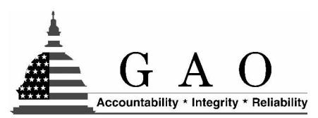

# United States Government Accountability Office Washington, DC 20548

May 8, 2009

The Honorable Diane E. Watson
Chairwoman
Subcommittee on Government Management,
Organization, and Procurement
Committee on Oversight and Government Reform
House of Representatives

Subject: Statutory Authorities to Prohibit Inspector General Activities

Dear Madam Chairwoman:

This letter provides information you requested at the March 25, 2009, hearing entitled *The Roles and Responsibilities of Inspectors General within Financial Regulatory Agencies*. During the hearing, the former Inspector General (IG) of the Department of Homeland Security (DHS) testified that provisions of the Inspector General Act of 1978, as amended (IG Act), allow the Secretary of the Department of the Treasury to prevent the IG from pursuing an investigation or audit, including the issuance of subpoenas, under certain conditions. 1

Due to concerns about the possible inappropriate use of such authorities, you asked us to identify federal agencies that possess the authority under the IG Act to prohibit audits and investigations by their offices of inspectors general (IG offices) and to determine the extent to which such provisions have been used to limit the IGs' activities. We reviewed the IG Act to identify those IG offices subject to such authority and contacted each office identified to obtain information about the extent to which the relevant authorities had been exercised. In addition, we included the IG office at the Central Intelligence Agency (CIA), which was not established under the IG Act, but is subject to provisions in its enabling legislation that are similar to those in the IG Act.2

The IG Act provides specific protections intended to help ensure the independence of IG audits and investigations. For example, the IG Act prohibits an agency head from preventing an IG from initiating, carrying out, or completing any audit or investigation, or from issuing any subpoena during the course of any audit or investigation. However, the IG Act authorizes the heads of six agencies to prohibit their respective IGs from carrying out or completing an audit or investigation, or from issuing any subpoena if the head determines that such prohibition is necessary to prevent either the disclosure of certain sensitive information or significant harm to certain national interests. In addition, the enabling legislation for the CIA IG contains a provision that authorizes the CIA Director to prohibit the audits and investigations by the IG if the Director determines such prohibition is necessary to protect vital national interests of the United States. Table 1 shows a summary of the restrictive statutory provisions applicable to these seven federal agencies.

1Pub. L. No. 95-452, 92 Stat. 1101 (Oct. 12, 1978), codified as amended at 5 U.S.C. App. 250 U.S.C. § 403q.