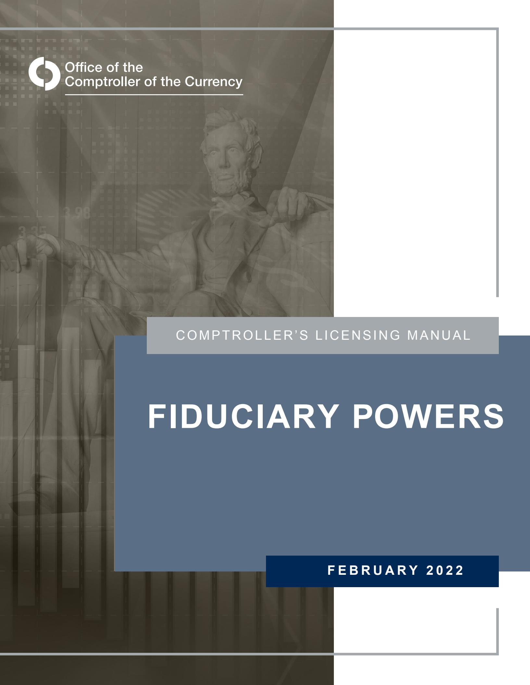

# **Contents**

| Introduction                                | 1  |
|---------------------------------------------|----|
| Key Policies                                | 2  |
| General                                     | 2  |
| Applicability                               | 2  |
| Decision Criteria                           |    |
| Conditions                                  | 5  |
| Application or Notice Process               | 6  |
| Expedited Review                            |    |
| After-the-Fact Notice                       |    |
| Commencement of Activity                    |    |
| Surrender or Revocation of Fiduciary Powers |    |
| Procedures                                  | 9  |
| Application                                 | 9  |
| After-the-Fact Notice                       |    |
| Surrender of Fiduciary Powers               | 10 |
| Glossary                                    | 11 |
| References                                  | 13 |
| Table of Updates Since Publication          | 15 |

## **Introduction**

This booklet of the *Comptroller's Licensing Manual* provides guidance concerning the licensing procedures of the Office of the Comptroller of the Currency (OCC) relating to the exercise of fiduciary powersin national banks or federal savings associations (FSA). [1](#page-2-1) The most common fiduciary power is acting as a trustee, and so fiduciary powers and services are often commonly known as trust powers or services. Fiduciary powers also include other activities, such as acting as executor or guardian.[2](#page-2-2) Generally, in this booklet, the terms "fiduciary" and "trust" are used interchangeably.

A bank that wishes to commence exercising fiduciary powers must submit an application and obtain prior approval from the OCC. Regulation 12 Code of Federal Regulations (CFR) 5.26(e) describes the circumstances under which the OCC requires a bank to obtain approval to exercise fiduciary powers.Certain exceptions apply when banks merge or consolidate.

This booklet addresses the policies and procedures to guide a bank in submitting a request to exercise fiduciary powers or submitting a notice to the OCC that it is exercising fiduciary powers in a new [state.](https://state.It) It also addresses the procedures for a bank to surrender its fiduciary powers and for the OCC to revoke those powers.

The requirements referred to in this guidance document reflect provisions in existing statutes and regulations. The relevant statutes and regulations are listed at the end of this booklet or referenced as applicable throughout the document.[3](#page-2-3)

1 Throughout this booklet, national banks andFSAs are referred to collectively as banks, except when it is necessary to distinguish between the two.

2 Refer to 12 U.S. Code (USC) 92a(a) for national banks or 12 USC 1464(n)(1) for FSAs.

3 This booklet also may include procedures that banks must follow in connection with the filing of applications and notices with the OCC. Such procedures are not substantive rules that establish decision criteria. Rather, they are steps a bank must take in connection with the filing of an application or notice to allow the OCC to assess whether a bank has met the substantive requirements for the application or notice in existing statutes and regulations.Consistent with the Administrative Procedure Act, the OCC may issue guidance concerning licensing that contains binding procedural steps a bank must take to allow the OCC to assess a bank's application or notice. See 5 USC 553(b)(A).

## **Key Policies**

### **General**

Fiduciary or trust powers allow a bank to act in a fiduciary capacity according to applicable laws and regulations. The OCC views the exercise of fiduciary powers primarily as a management decision of the bank, absent supervisory or legal concerns. Normally, the OCC grants full fiduciary powers authorized under 12 USC 92a for national banks and 12 USC 1464(n) for FSAs. The OCC may grant limited powers on request.

If a bank intends to establish a trust office limited solely to exercising fiduciary powers, the OCC does not consider this office to be a branch if it does not engage in other activities that would require a branch application.[4](#page-3-3) Hence, a trust office would not require a branch application.

A bank with existing fiduciary powers may offer services in multiple states through branches, trust offices, or trust representative offices in those states. A national bank may exercise any of the fiduciary powers granted in 12 USC 92a(a) in any state, unlessthe state where it is acting in a fiduciary capacity pursuant to 12 CFR 9.7(d) prohibits national banks and competing institutions in its own state from exercising that power[.5](#page-3-4) An FSA may exercise any of the fiduciary powers granted in 12 USC 1464(n) in any state, unless the state where it conducts fiduciary activities pursuant to 12 CFR 150.135 prohibits FSAs and competing institutions in its own state from exercising that power.

 The trust officers and staff should become thoroughly familiar with "Fiduciary Activities of National Banks" (12 CFR 9) or "Fiduciary Powers of Federal Savings Associations" (12 CFR 150), 12 CFR 5.26, and other applicable laws, such as the Employee Retirement Income Security Act of 1974.

## **Applicability**

When a bank decides to offer fiduciary services, it must receive OCC approval before offering such services to the public.

OCC approval under 12 CFR 5.26 to exercise fiduciary powers is required when

• a national bank or FSA does not have fiduciary powers.

4 Branch application requirements differ between national banks and FSAs, per 12 CFR 5.30 and 5.31. In addition, refer to 12 CFR 5.31(k)(1)(iii) regarding establishing an FSAagency office to conduct fiduciary activities.

5 National banks may potentially engage in activities beyond those authorized in the state where they are acting in a fiduciary capacity when the activities are permissible under other sources of authoritysuch as 12 USC 24(Seventh) or 12 USC 92a.

- a state bank, state savings association, or FSA, with fiduciary powers, converts its charter to a national bank.
- a national bank, state bank, or state savings association, with fiduciary powers, converts its charter to an FSA.
- an FSA, state bank, or state savings association, with fiduciary powers, merges into or consolidates with a national bank that has not previously been authorized to exercise fiduciary powers, and the national bank is the resulting institution.
- a national bank, state bank, or state savings association, with fiduciary powers, merges into or consolidates with an FSA that has not previously been authorized to exercise fiduciary powers, and the FSA is the resulting institution.
- a national bank or FSA that has received approval from the OCC to exercise limited fiduciary powers wishes to exercise full fiduciary powers.

OCC approval under 12 CFR 5.26 to exercise fiduciary powers is not required when

- two or more national banks consolidate or merge and any of them has fiduciary powers, if the resulting national bank will exercise fiduciary powers in the same manner and to the same extent as the national bank to which approval was originally granted.
- two or more FSAs consolidate or merge and any of them has fiduciary powers, if the resulting FSA will exercise fiduciary powers in the same manner and to the same extent as the FSA to which approval was originally granted.
- a national bank with existing fiduciary powers is the resulting bank in a merger or consolidation with a state bank, savings association, or FSA, and the resulting national bank will exercise fiduciary powers in the same manner and to the same extent as the bank to which approval was originally granted.
- an FSA with existing fiduciary powers is the resulting savings association in a merger or consolidation with a state bank, state savings association, or national bank, and the FSA will exercise fiduciary powers in the same manner and to the same extent as the bank to which approval was originally granted.

If a bank was previously authorized to exercise limited fiduciary powers, OCC approval is required for the bank to offer additional fiduciary services or products beyond those already approved.[6](#page-4-0) 

A bank with approved fiduciary powers must file an after-the-fact notice with the OCC when it begins conducting fiduciary activities in a new state. It must provide the OCC with written notice within 10 days after commencing the activities in the new state pursuant to 12 CFR 5.26(e)(6). [7](#page-4-1) 

 6 An example of limited trust powers would be an authorization to act solely as trustee for land trusts in states where legal title to real estate can be held in such trusts. Banks that are authorized for full fiduciary powers may conduct any of the activities referenced in 12 CFR 9.2(e) or 150.30, as applicable.

7 Refer to 12 CFR 5.26(e)(6)(i).

A bank is not required to provide notice to the OCC when it begins activities ancillary to its fiduciary business through a trust representative office.[8](#page-5-1) 

A bank that has not exercised its authorized fiduciary powers for 18 consecutive months must provide the OCC with a notice 60 days before recommencing any fiduciary activity.[9](#page-5-2) At that time the OCC may request additional information to ensure that the bank has qualified trust management and procedures to safely offer the proposed trust services. This review is done through the OCC's normal supervisory process.

A separate application for fiduciary powers is **not** required when

- an applicant applies to organize a special purpose charter for a national bank or FSA limited to fiduciary or trust activities. The OCC reviews the fiduciary powers as part of its review of the charter application.
- the bank has filed an application, such as a conversion or merger filing, in which exercising fiduciary powers is part of the proposal, and the filing includes a request for fiduciary powers and provides applicable information on that request. [10](#page-5-3)
- an operating subsidiary exercises fiduciary powers if its parent bank has been authorized to exercise them.[11](#page-5-4)

If an operating subsidiary plans to exercise fiduciary powers, both the bank and the subsidiary must have fiduciary powers under the law applicable to each entity. If the subsidiary is a registered investment advisor and will not engage in any fiduciary activity other than exercising investment discretion on behalf of customers or providing investment advice for a fee, however, then neither the bank nor the subsidiary is required to have fiduciary powers. [12](#page-5-5) 

## **Decision Criteria**

When deciding whether to approve, conditionally approve, or deny a bank's application for fiduciary or trust services, the OCC considers factors such as:

- The legal permissibility of the proposed activities.
- The bank's financial condition.

8 Refer to 12 CFR 5.26(e)(6)(iv).

9 Refer to 12 CFR 5.26(e)(5).

10 The application to exercise fiduciary powers may be filed as part of the application for the underlying transaction, e.g., conversion to an FSA under 12 CFR 5.23, conversion to a national bank under 12 CFR 5.24, or a merger or consolidation with a national bank or FSA under 12 CFR 5.33.

11 If the operating subsidiary is a national bank, the subsidiary would be required to file a separate application for fiduciary powers with the OCC.

 12 Refer to 12 CFR 5.34(f)(7)(ii) and 5.38(f)(7)(ii)for national banks and FSAs, respectively.

- The adequacy of bank capital and surplus and whether they are sufficient under the circumstances and not less than the capital and surplus required by state law for state banks, trust companies, and other corporations exercising fiduciary powers under state law.
- The character and ability of proposed trust management, including qualifications, experience, and competency. The OCC must approve any change in trust management the bank makes after OCC approval but before commencing trust activities.
- The adequacy of the proposed business plan, if applicable.
- The needs of the customers to be served.
- Any other factors or circumstances that the OCC considers proper.

#### **Conditions**

The OCC may conditionally approve a filing, including one accorded expedited processing, after reviewing the application and considering the relevant factors. The OCC may apply conditions to ensure that approval is consistent with applicable law, to protect the safety and soundness of the bank, to protect customers, to prevent or control conflicts of interest, or to further other supervisory or policy considerations.

The OCC may apply those conditions as "conditions imposed in writing" within the meaning of 12 USC 1818. Such conditions remain in effect after the effective date or consummation date of an approved transaction or activity and continue until the OCC removes them.

## **Application or Notice Process**

When a bank wishes to offer fiduciary services, it submits a[n application](https://occ.gov/publications-and-resources/publications/comptrollers-licensing-manual/files/licensing-filing-forms.html) to the appropriate OCC licensing office, providing specific information for review.

The application must contain the following:[13](#page-7-2)

- A statement that the bank is requesting full or limited trust powers; if limited powers, it should specify which ones are requested.
- A statement that the capital and surplus of the bank are not less than the capital and surplus required by state law of state banks, trust companies, and other corporations exercising comparable fiduciary powers.
- Sufficient biographical information on proposed senior trust management personnel, including, if requested by the OCC, legible fingerprints and th[e Interagency Biographical](https://www.occ.treas.gov/static/licensing/form-ia-bio-financial-v2.pdf)  [and Financial Report](https://www.occ.treas.gov/static/licensing/form-ia-bio-financial-v2.pdf).
- A description of the locations where the bank will conduct fiduciary activities.
- If requested by the OCC, an opinion of counsel that the proposed activities do not violate applicable federal or state law, including citations to state law.[14](#page-7-3)
- Any other information necessary to address the factors the OCC must evaluate as noted in the Decision Criteria section of this booklet.

If the bank is not in satisfactory condition, has a history of poor earnings, or has been open for business less than two years, the OCC may require it to submit a business plan for the trust department that demonstrates the projected financial impact the commencement of trust services may have on the bank. The OCC may request additional information depending upon the bank's condition. The sampl[e Fiduciary Business Plan](https://www.occ.gov/static/licensing/form-instruct-fiduciary-business-plan-v2.pdf) outlines the type of information that the OCC may request.

## **Expedited Review**

To qualify for expedited review, the bank must meet the definition of an eligible bank or savings association (see this booklet's glossary). An application by an eligible bank or savings association to exercise fiduciary powers is deemed approved by the OCC as of the 30th day after the agency receivesthe application, unless the OCC extends the time period for expedited processing or notifies the bank before then that the filing is not eligible for expedited review, according to 12 CFR 5.13(a)(2).

The OCC may extend the expedited review period or remove the filing from expedited review if the filing raises a significant supervisory, legal, compliance, or policy concern that requires additional time for review. The filing may also be removed from expedited review if it does not contain all required information for the OCC to make a decision on the

13 12 CFR 5.26(e)(2)(i)(A) through (F).

14 Although the legal basis for banksto exercise fiduciary powers is well established, banks should consult with OCC staff before filing regarding any unusual legal issues.

application. If the OCC extends the review period or removes the filing from expedited review, the agency informs the bank in writing of the action and the reason for the extension or removal from expedited review.

#### **After-the-Fact Notice**

If a bank has previously obtained OCC approval, or a previous approval from the former Office of Thrift Supervision (OTS), to exercise fiduciary powers in one state and proposes to begin conducting any of the activities specified in 12 CFR 9.7(d) in a new state, it must provide the OCC with written notice within 10 days after commencing the activities in the new state pursuant to 12 CFR 5.26(e)(6). Once a bank provides notice to the OCC regarding commencement of fiduciary activities in a new state, it may expand its fiduciary operations to other locations within the same state(s) without further reporting to the OCC.

No notice to the OCC is required if a bank is conducting activities that are only ancillary to its fiduciary business through a trust representative office or otherwise.

### **Commencement of Activity**

Banks must begin exercising trust activities within 18 months of approval, unless the OCC grants an extension, and they shoul[d notify](https://occ.gov/publications-and-resources/publications/comptrollers-licensing-manual/files/licensing-filing-forms.html) the OCC in writing within 10 days after beginning those activities.

## **Surrender or Revocation of Fiduciary Powers**

### Surrender

 A bank that wishes to discontinue and voluntarily surrender its authority to exercise fiduciary powers must file with the OCC a certified copy of a board of directors' resolution that signifies its desire to do so in accordance with 12 CFR 9.17(a) for national banks or 12 CFR 150.530 for FSAs.

If a bank proposes to surrender its fiduciary powers, the board of directors should arrange for a final audit of the fiduciary accounts. In addition, the OCC may conduct a closing investigation to determine whether the bank has been discharged completely from its fiduciary obligations (that is, all accounts have been properly closed and distributed or transferred to substitute fiduciaries).

After the OCC has confirmed that the bank has been relieved of all fiduciary duties according to applicable law, the agency issues a written notice to the bank that it is no longer authorized to exercise the fiduciary powers previously granted. At that time, the trust permit previously issued to the bank must be returned to the OCC or be destroyed.[15](#page-8-3) 

 15 Previously,the OCC issued a formal permit in the form of a certificate.Recently, the letter granting approval of fiduciary powers becamethe permit, and the OCC considers OTS approval documents granting trust powers as permits. These documents should be returned to the OCC or destroyedupon surrender of fiduciary powers.

A bank may decide to cease offering fiduciary services for various business reasons. If a bank is authorized to offer fiduciary services but has decided not to exercise those powers, it retains authorization to offer those services unless the fiduciary powers are surrendered or revoked. However, a bank that has not exercised its authorized fiduciary powers for 18 consecutive months must provide the OCC with a notice 60 days before recommencing any fiduciary activity.

### Revocation

If the OCC determines that a bank has exercised its fiduciary powers unlawfully or unsoundly, or has failed to exercise fiduciary powers for five consecutive years, the agency may revoke those powers[.16](#page-9-0) In this process, the OCC issues a notice to the bank outlining the reasons why it is considering such action.

16 Refer to 12 USC 92a(k) and 12 CFR 9.17(b) for national banks, or 12 USC 1464(n)(10) and 12 CFR 150.560 and 570for FSAs.

## **Procedures**

### **Application**

1. Submit an application to exercise fiduciary powers to the appropriate OCC licensing office.

The application must contain the following:

- A statement requesting full or limited powers; if limited powers, it should specify which powers are requested.
- A description of the location(s) where the services will be offered.
- A statement that the capital and surplus of the bank are not less than that required by state law for state banks, trust companies, and other corporations chartered by that state that exercise comparable fiduciary powers.
- Sufficient biographical information on the proposed senior trust management personnel, including, if requested by the OCC, legible fingerprints and the [Interagency Biographical and Financial Report.](https://www.occ.treas.gov/static/licensing/form-ia-bio-financial-v2.pdf)

The following additional items may be required:

- If requested by the OCC, an opinion of bank's counsel that the proposed fiduciary activities do not violate applicable law, including citations.
- For banks chartered less than two years, a business plan for the trust department that contains, at a minimum, its projected earnings, size, services, and target market.
- 2. If the application is approved, notify the OCC no later than 10 days after commencement of fiduciary activities.

## **After-the-Fact Notice**

- 1. Submit to the appropriate OCC licensing office [a notice](https://occ.gov/publications-and-resources/publications/comptrollers-licensing-manual/files/licensing-filing-forms.html) that it is exercising fiduciary powers in another state. The notice must contain the following:
  - The identity of the state(s) involved.
  - A description of the activities to be conducted to the extent that they differ materially from those previously authorized.
  - A discussion of any contact with the state authority and any impediment to the exercise of such powers.

### **Surrender of Fiduciary Powers**

- 1. Arrange for a final audit of the fiduciary accounts.
- 2. Submit to the appropriate OCC licensing office a certified copy of a board of directors' resolution that the bank desires to surrender its fiduciary powers with an effective date.
- 3. Return the OCC's original trust authorization permit to the appropriate OCC licensing office or certify that the letter has been destroyed.

## **Glossary**

**Applicable law:** The law of a state or other jurisdiction governing a national bank's or an FSA's fiduciary relationships, any applicable federal law governing those relationships, the terms of instruments governing fiduciary relationships, or court orders pertaining to those relationships.

#### **Eligible bank or savings association:** A national bank or an FSA that

- has a composite capital adequacy, asset quality, management, earnings, and security to market risk (CAMELS) rating of 1 or 2. [17](#page-12-1)
- has a compliance rating of 1 or 2.
- has a "satisfactory" or better Community Reinvestment Act (CRA) rating. (This factor does not apply to banks that are not subject to the CRA. National trust banks that are not insured and insured trust-only banks that are special purpose banks under 12 CFR 25.11(c)(3) are not subject to the CRA.)
- is well capitalized as defined at 12 CFR 6.4(b)(1).
- is not subject to a cease-and-desist order, consent order, formal written agreement, or prompt corrective action directive or, if subject to any such order, agreement, or directive, is informed in writing by the OCC that the bank may be treated as an "eligible bank."

**Fiduciary account:** An account administered by a national bank or an FSA acting in a fiduciary capacity.

**Fiduciary capacity:** Acting in the capacity of a trustee, executor, administrator, registrar of stocks and bonds, transfer agent, guardian, assignee, receiver, or custodian under a uniform gifts to minors act; as an investment adviser if the bank receives a fee for its investment advice; in any capacity in which the bank possesses investment discretion on behalf of another; or in any other similar capacity that the OCC authorizes pursuant to 12 USC 92a for a national bank and 12 USC 1464(n) for an FSA.

**Fiduciary powers:** The authority that the OCC permits a national bank to exercise pursuant to 12 USC 92a and an FSA to exercise under 12 USC 1464(n).

**Trust representative office:** An office of a national bank or an FSA, other than a main office, home office, or branch or trust office, at which the bank performs activities ancillary to its fiduciary business but does not engage in any of the activities specified in 12 CFR 9.7(a) or 150.30. A trust representative office of a national bank is not a "branch" for purposes of 12 USC 36, unless it also is an office at which deposits are received, checks are

17 - A bank's composite rating under the Uniform Financial Institutions Rating System, or CAMELS, integrates ratings from six component areas: capital adequacy, asset quality, management, earnings, liquidity, and sensitivity to market risk. Evaluations of the component areas take into consideration the bank's size and sophistication, the nature and complexity of its activities, and its risk profile.

| pursuant to 12 CFR 5.31(k). |  |  |  |
|-----------------------------|--|--|--|
|                             |  |  |  |
|                             |  |  |  |
|                             |  |  |  |
|                             |  |  |  |
|                             |  |  |  |
|                             |  |  |  |
|                             |  |  |  |
|                             |  |  |  |
|                             |  |  |  |
|                             |  |  |  |
|                             |  |  |  |
|                             |  |  |  |
|                             |  |  |  |
|                             |  |  |  |
|                             |  |  |  |
|                             |  |  |  |
|                             |  |  |  |

## **References**

All references apply to both national banks (NB) and FSAs unless otherwise indicated.

**Charter Limited to Fiduciary Activities** 

Regulation 12 CFR 5.20(l)

**Computation of Time** 

Regulation 12 CFR 5.12

**Daily Fee Rate for Special Examinations** 

Regulation 12 CFR 8.6

**Decisions** 

Regulation 12 CFR 5.13

**Definitions** 

Regulation 12 CFR 5.3 and 9.2 (NB), [150.10–150.60](https://150.10�150.60) (FSA)

**Employee Retirement Income Security Act of 1974** 

Law 29 USC 1001 et seq. Regulation 29 CFR 25

**Fiduciary Powers** 

Law 12 USC 92a (NB), 1464(n) (FSA) Regulation 12 CFR 5.26 and 9 (NB), 150 (FSA)

**Filing Forms** 

Regulation 12 CFR 5.4

**Investigations** 

Regulation 12 CFR 5.7

**Operating Subsidiary With Fiduciary Powers** 

Regulation 12 CFR 5.34(f)(7)(ii) (NB), 5.38(f)(7)(ii) (FSA)

**Other Issuances** 

*[Comptroller's Handbook](http://www.occ.treas.gov/publications/publications-by-type/comptrollers-handbook/index-comptrollers-handbook.html)*, Asset Management series

**Record-keeping and Confirmation Requirements for Securities Transactions** 

Regulation 12 CFR 12 (NB), 151 (FSA)

**Retirement Accounts** 

Law 12 USC 1464(l) (FSA)

#### **Rules of General Applicability**

Regulation 12 CFR 5.2

#### **Surrender or Revocation of Powers**

Law 12 USC 92a(j) and (k) (NB), 1464(n)(9) and (10) (FSA) Regulation 12 CFR 9.17 (NB), 150.530–150.570 (FSA)

#### **Third-Party Arrangements**

OCC Bulletin 2013-29, ["Third-Party Relationships: Risk Management Guidance](https://www.occ.gov/news-issuances/bulletins/2013/bulletin-2013-29.html)" OCC Bulletin 2020-10, ["Third-Party Relationships: Frequently Asked Questions to](https://occ.gov/news-issuances/bulletins/2020/bulletin-2020-10.html)  [Supplement OCC Bulletin 2013-29](https://occ.gov/news-issuances/bulletins/2020/bulletin-2020-10.html)"

#### **Time Limit**

Law 12 USC 4807

## **Table of Updates Since Publication**

| Date of Last Publication: May 2017               |                          |  |  |  |
|--------------------------------------------------|--------------------------|--|--|--|
| Reason                                           | Affected pages           |  |  |  |
| Align booklet with recent changes to 12 CFR 5.26 | 2, 3, 4, 6, 7, 9, and 11 |  |  |  |