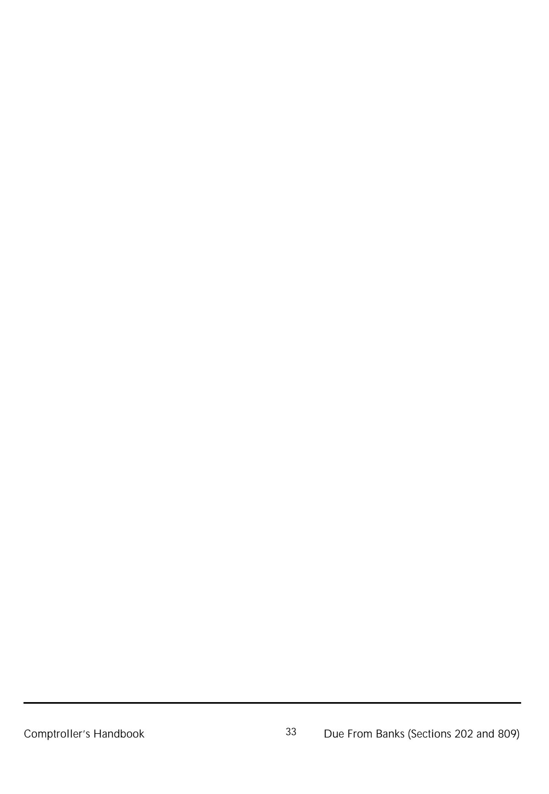

As of November 20, 2013, the guidance in the section on Regulation D applies to federal savings associations in addition to national banks.\*

Comptroller of the Currency Administrator of National Banks

# **Due from Banks**

Comptroller's Handbook (Sections 202 and 809)

Narrative - March 1990, Procedures - March 1998

**References to reputation risk have been removed from this booklet as of March 20, 2025. Removal of reputation risk references is identified by a strikethrough. Refer to OCC Bulletin 2025-4.**

\*If statutes, regulations, or other OCC guidance is referenced herein, please consult those sources to determine applicability to FSAs. If you have questions about how to apply this guidance, please contact your OCC supervisory office.

# **Due from Banks (Sections 202 and 809)** Table of Contents

| Introduction                                    | 1 |
|-------------------------------------------------|---|
| Due from Domestic Banks—Demand                  | 1 |
| Due From Domestic Banks—Time                    | 2 |
| Due From Foreign Banks—Demand (Nostro Accounts) | 2 |
| International Due From Banks—Time               | 3 |
| Examination Procedures                          | 6 |

# **Due from Banks (Section 202 and 809)** Introduction

### **Due from Domestic Banks—Demand**

Banks maintain deposits in other banks to facilitate the transfer of funds. Those bank assets, known as "due from bank deposits" or "correspondent bank balances," are a part of the primary, uninvested funds of every bank. A transfer of funds between banks may result from the collection of cash items and cash letters, the transfer and settlement of securities transactions, the transfer of participating loan funds, the purchase or sale of federal funds, and from many other causes.

Banks also utilize other banks to provide certain services which can be performed more economically or efficiently by the other banks because of their size or geographic location. Such services include processing of cash letters, packaging loan agreements, funding overline loan requests of customers, performing EDP and payroll services, collecting out of area items, exchanging foreign currency, and providing financial advice in specialized loan areas. When the service is one-way, the bank receiving that service usually maintains a minimum balance that acts as a compensating balance in full or partial payment for the services received.

All national banks are required by 12 CFR 204 to keep reserves equal to specified percentages of the deposits on their books. These reserves are maintained in the form of vault cash or deposits with the Federal Reserve bank. The Federal Reserve bank monitors the deposits of each bank to determine that reserves are kept at required levels. The reserves provide the Federal Reserve System with a means of controlling the nation's money supply. Changes in the level of required reserves affects the availability and cost of credit in the economy. The examiner must determine that the information supplied to the Federal Reserve bank for computing reserves is accurate.

In some instances, a nonmember financial institution may borrow funds from a Federal Reserve bank, and the transaction is processed through the reserve account of a national bank with which the nonmember institution has a correspondent relationship. Under the reserve account charge agreements used by most of the Federal Reserve banks, the national bank's reserve account may be charged if default occurs on the nonmember's loan processed through the

national bank's account. Since the national bank may not act as the guarantor of the debts of another, it may only legally enter into revocable reserve account charge agreements. Revocable agreements allow the national bank, at its option, to revoke the charge and thus avoid liability for the debt of the nonmember correspondent. In contrast, irrevocable charge agreements constitute a binding guarantee of the nonmember correspondent's debt and generally cannot be entered into by a national bank. Banks which enter into revocable charge agreements should establish written procedures which will ensure their ability to effect prudent decisions in a timely manner.

### **Due from Domestic Banks—Time**

In addition to demand deposits kept at the Federal Reserve bank and with correspondent banks, a bank may maintain interest-bearing time deposits with other commercial banks. In 1977, the OCC issued an interpretation of 12 USC 24 authorizing national banks to make deposits in mutual savings and loan associations. Previously, national banks were limited to placing deposits with banks and incorporated thrift institutions. Those deposits are a form of investment, and relevant examination considerations are included in the "Investment Securities" section of this handbook. **(Note: Examination procedures for due from domestic banks—time accounts are now included in this section.)**

### **Due from Foreign Banks—Demand (Nostro Accounts)**

Due from foreign banks—demand or "nostro" accounts are handled in the same manner as due from domestic bank accounts, except that the balances due are denominated in foreign currency.

U.S. dollars become foreign currency when, for example, a London branch of a U.S. bank maintains a U.S. dollar demand account with another bank in London, the United States or elsewhere.

A bank must be prepared to make and receive payments in foreign currencies to meet the needs of its international customers. This can be accomplished by maintaining accounts (nostro balances) with banks in foreign countries in whose currencies receipts and payments are made.

Nostro balances may be compared to an inventory of goods and must be

supervised in the same manner. For example, payment for the importation to the United States of goods manufactured in France can be made through a U.S. bank's French franc account with another bank in France. Upon payment in France, the U.S. bank will credit its nostro account with the French bank and charge its U.S. customer's dollar account for the appropriate amount in dollars. Conversely, the exportation of U.S. goods to France results in a debit to the U.S. bank's French correspondent account.

The first transaction results in an outflow of the U.S. bank's "inventory" of French francs, while the second transaction results in an inflow of French francs. The U.S. bank must maintain adequate balances in its nostro accounts to meet unexpected needs and to avoid overdrawing those accounts for which interest must be paid. However, the bank must not lose income by maintaining excessive idle nostro balances that do not earn interest.

The U.S. bank also runs risks by being either long or short in a particular foreign currency or by maintaining undue gaps. Losses could result if that currency appreciates or depreciates significantly or if the bank must purchase or borrow the currency at a higher rate. Excessive nostro overages and shortages should be avoided by entering into spot and forward exchange contracts to buy or sell such nostro "inventories." Those contracts are discussed in the "Foreign Exchange" section. However, it is important to remember that all foreign currency transactions, except over-the-counter cash trades, are settled through nostro accounts. Therefore, the volume of activity in those accounts may be substantial, and the accounts must be properly controlled.

### **International Due from Banks—Time**

Foreign banks maintain interest bearing time deposits, known as "due from banks—time," with other foreign banks and overseas branches of U.S. banks. Those assets may also be referred to as placements, placings, interbank placements (deposits), or redeposits. Unlike "due from banks—demand" (nostro) accounts, due from banks—time deposits are not on demand and may have maturities ranging from overnight to several months or years. Certain examination procedures, internal control considerations, and verification procedures in the domestic "Due From Banks" section are also relevant to international due from banks—time. However, the specialized nature of foreign deposits necessitates additional examination procedures, included later in this section.

Restraints are placed on the amount national banks may deposit with any depository institution not authorized access to Federal Reserve advances under Section 10(b)(12 USC 347b). A national bank must limit its deposits to no more than 10 percent of its paid-up and unimpaired capital and surplus fund. However, under Federal Reserve Interpretation "Deposits in foreign banks" (paragraph 4410), national banks may keep on deposit with foreign banks an amount exceeding that 10 percent limitation.

Due from bank—time deposit activities have become important with the growth of the Eurodollar market. The bulk of due from bank—time deposits now consist of Eurodollars with smaller amounts in other Eurocurrencies. Other foreign currency time deposits are placed in substantially the same manner as Eurodollar deposits, subject to differing exchange control regulations or local customs.

Because Eurodollar interbank deposits are usually linked with foreign exchange transactions and foreign exchange departments are more familiar with the names of banks operating in the market, the bank's foreign exchange trader or a Eurocurrency deposit trader working closely with that trader places due from bank—time deposits. Such deposits are handled between banks by telephone or teleprinter. Whether or not foreign exchange brokers act as intermediaries in those transactions depends on the market conditions, local customs, the size of the bank, etc.

The practice of placing interbank deposits (and takings on the liability side) was accepted originally in London because, under U.K. regulations, banks were entitled to "accept" deposits in foreign currencies, whereas borrowings (loans) in those currencies required authorization by the Bank of England. Therefore, due from banks—time deposits are "accepted" even though the receiving bank may have instructed its foreign exchange trader, directly or through brokers, to find a bank willing to offer it such deposits.

Although treated as deposits in the report of condition, due from bank—time deposits contain the same credit and country risks as any extension of credit to a bank. Consequently, a prudently managed bank should place deposits only with other sound and well-managed banks. The traders should be provided with a list of approved banks with which funds can be deposited up to prescribed limits for each bank. Due from bank—time deposits differ from other types of credit extensions because they often represent deposits of relative short

maturity that normally receive first priority in case of insolvency. Nevertheless, the credit and country exposure exists, and customer limits must be established by credit officers and not by foreign exchange traders. Such limits must be reviewed regularly by credit officers, particularly during periods of money market uncertainty or rapidly changing economic and political conditions.

The examiner also must recognize that credit risks intensify when due from bank—time deposits are placed for longer periods. Furthermore, the credit risks for specialized or smaller banks that have recently entered the interbank deposit market can be far greater than that for larger, long- established banks. Banks that traditionally utilized only regular lines of credit or special facilities also have entered the due from banks—time deposit market to meet their external needs. Those banks could be the first to be caught in a market crunch.

Incoming confirmations from banks must be meticulously checked by the bank to record copies in each instance to protect against fraud and errors. Similarly, a systematic follow-up on non-receipt of incoming confirmations should be carefully monitored by the bank.

### **Due from Banks (Section 202 and 809)** Examination Procedures

### **General Procedures**

Many of the steps in these examination procedures require gathering information from, or reviewing information with, examiners in other areas. Since other areas may include examination procedures that address due from banks, you should discuss your review with them to reduce any burden on the bank and avoid duplication of effort. Sharing examination data also can be an effective cross check of compliance and help examiners assess the integrity of management information systems.

Information from other areas should be appropriately cross-referenced in working papers. Information that is not available from other examiners should be requested directly from the bank.

Objective: Determine the scope of the examination of due from banks.

| 1. | Review the following to identify if previous problems require follow-up. Determine if planned corrective action was affected, and if not, why not.                                                                               |
|----|-------------------------------------------------------------------------------------------------------------------------------------------------------------------------------------------------------------------------------------|
|    | ® Supervisory strategy in the OCC's Electronic Information System. ® EIC's scope memorandum. ® Previous examination reports and working papers. ® Overall summary comments. ® Correspondence memorandum. |
| 2. | From the EIC, obtain the results of his or her analysis of the UBPR, BERT, and other OCC reports. Identify any concerns, trends, or changes involving due from banks.                                                         |
| 3. | Determine if any material changes have occurred since the last examination that would influence the level and direction of due from banks risk.                                                                                  |
| 4. | Determine, during early discussions with management:                                                                                                                                                                                |
|    | • How management supervises due from bank accounts.                                                                                                                                                                              |

- If there have been any significant changes in policies, practices, internal controls, or personnel responsible for supervising due from banks.
- Any internal or external factors that could affect balance limitations, collateral requirements, and reporting requirements.
- 5. From the examiner assigned Internal/External Audit, obtain a copy of any significant deficiencies with due from banks. Determine if appropriate corrections have been made.

| 6. | Obtain and review the most recent month end reports management uses to supervise due from banks. Some examples include:                                                                                                                                                                                                                                        |
|----|-------------------------------------------------------------------------------------------------------------------------------------------------------------------------------------------------------------------------------------------------------------------------------------------------------------------------------------------------------------------|
|    | ® Listing of all due from bank accounts (domestic and foreign), including any matured and unpaid due from bank—time deposits. ® Listing of all due from bank—time accounts. ® The most recent Federal Reserve requirement calculation and working papers. ® Reconcilements for all due from bank accounts. ® Board reports, etc. |
| 7. | Obtain from management or the examiner assigned "International Loan Portfolio Management," all applicable schedules relating to the due from foreign banks—demand (nostro accounts) and time, if applicable. Examples include:                                                                                                                           |
|    | ® Specific guidelines in bank policies relating to due from foreign banks.                                                                                                                                                                                                                                                                                  |
|    | ® Current listing of due from foreign banks—demand and time approved customer lines.                                                                                                                                                                                                                                                                        |
|    | ® Due from foreign banks—time, considered problem assets by management or criticized during the previous examination.                                                                                                                                                                                                                                       |
|    | ® The current interest rate structure. ® Delinquencies.                                                                                                                                                                                                                                                                                                  |
|    | ® Miscellaneous loan debt and credit suspense accounts.                                                                                                                                                                                                                                                                                                        |
|    | ® Criticized shared national credits. ® Interagency Country Exposure Review Committee credits.                                                                                                                                                                                                                                                           |
|    | ® Any useful information resulting from the review of the minutes of the loan and discount committee or any similar committee.                                                                                                                                                                                                                              |
|    | ® A listing of any rebooked charged off due from foreign bank—time                                                                                                                                                                                                                                                                                             |

- deposits. ® Information on directors, officers and their interests, as contained in statements required under 12 CFR 215.
- 8. Based on the performance of these steps, combined with discussions with the bank EIC and other appropriate supervisors, determine the scope of this examination and set objectives.

**Note: Select from among the following examination procedures those steps that are necessary to meet your objectives. All steps are seldom required in all examinations.**

### **Quantity of Risk**

### **Conclusion: The quantity of risk is (low, moderate, high).**

Objective: To assess the types and levels of risk associated with the bank's due from bank accounts.

- 1. Determine the existence of any concentration of due from bank deposit with other banks, as follows:
  - Combine all due from foreign banks—demand (nostro) and time deposits, federal funds sold, and any call money for each entity.
  - For any concentration that exceeds 25 percent of the bank's capital structure, forward information to examiners assigned "Loan Portfolio Management" and "Concentrations of Credits" for possible inclusion in the Report of Examination.
- 2. Review the maximum deposit balance established for each due from bank account and determine if the maximum balance:
  - Is established after consideration of compensating balance requirements resulting from commitments or credit lines made available to the other bank or its holding company. Coordinate this effort with the examiner assigned "Related Organizations."
  - Appears to be related to loans of executive officers or directors, or to loans that have been used to acquire stock control of the bank under examination.
    - If such due from accounts are detected, provide full details of the account to the examiner assigned to "Loan Portfolio Management."
- 3. If verification procedures will not be performed, scan the most recent bank-prepared reconcilements for any unusual items and determine that closing balances listed on reconcilements agree with the general ledger and with the balances shown on the cut-off statement.
- 4. For any significant due from accounts, review the most recent reconcilements and for any outstanding items which are large, unusual, or outstanding for more than two months. Review any related correspondence, and determine if charge-off of outstanding items is

#### appropriate. Consider:

- If the bank's policy for charge-off of old open items provides for exceptions in extenuating circumstances, review exception items and determine if charge-off is appropriate.
- If the bank has no charge-off policy for old open items, review outstanding items and charge off any in accordance with the OCC's policy guidance.
- 5. Review any information (in coordination with the "Loan Portfolio Management" examiner) relating to Miscellaneous loan debit and credit suspense accounts and discuss with management any large or old items.
- 6. Review the bank's calculation of its Federal Reserve requirement and determine that reports are accurate and complete.
- 7. Determine whether the most recent compliance examination uncovered any weaknesses or violations of law or regulations dealing with due from banks or with insider relationships with correspondent banks. If violations were noted:
  - Determine whether corrective action was taken.
  - Test subsequent compliance with any law or regulation so noted.
- 8. Review any information received relating to Interagency Country Exposure Review Committee credits by doing the following:
  - Compare the schedule to the sample selection to determine which due from bank—time deposits are portions of Interagency Country Exposure Review Committee credits.
  - For each due from bank—time deposit identified, transcribe appropriate information from the schedule to individual line sheets.
  - Maintain in working papers for future reference. No further examination procedures are necessary.
- 9. Review any information received relating to loans criticized during the previous examination (due from banks—time portion) and determine:
  - Disposition of due from banks—time criticized by transcribing

- appropriate information from the schedule to individual line sheets.
- Current balance and payment status, or date the deposit was paid and the source of repayment.
- 10. Review information received relating to due from foreign banks—demand and determine the disposition of any accounts previously criticized by transcribing the following relevant information:
  - Current balance and payment status, or
  - Date the deposit was paid and the source of repayment.
- 11. Review any information received relating to rebooked charge-offs of due from bank—time deposits and determine:
  - That any rebooked due from bank—time deposit(s) meets the criteria and terms of the bank's policy for placing new bank time deposits.
  - That such due from bank—time deposit(s) are not subject to classification. If so, list the balance(s) for charge-off.

#### **Testing**

This section is designed to evaluate the credit quality of banks with which time accounts are maintained and the credit quality of foreign banks, if any, with which demand accounts are maintained. Discuss which of the following procedures should be performed with the EIC prior to testing. The determination of which procedures are needed depends on the overall risk profile of the bank's due from bank activities.

- 1. Using an appropriate sampling technique, select deposit customers (due from banks—time and due from foreign banks—demand) for detailed examination.
- 2. Determine if any sample accounts are affiliates of the bank or other banks. If so, notify the examiner assigned "Related Organizations."
- 3. Determine whether any sample accounts are finance companies or commercial borrowers and not banks. If any finance companies or commercial borrowers are identified, forward this information to the "Loan Portfolio Management" examiner.

4. Prepare credit line sheets for each sample loan and transcribe information from source documents as follows:

#### **Due From Foreign Banks—Demand:**

- The customer's aggregate due from foreign banks—demand liability (for nostro accounts, include this amount in foreign currency and the local currency equivalent).
- The amount of a customer's line designated by the bank.
- Frequency of recent overdrawn nostro accounts.
  - (Overdrawn nostro accounts as they relate to foreign exchange activities are discussed in the "Foreign Exchange" section. Also, the examiner assigned "Borrowed Funds" must obtain, or prepare, a listing of overdrawn nostro accounts for inclusion in the borrowing section of the report of examination).
- Past compliance with a customer's line limitation as determined from a review of the liability ledger records.

#### **Due From Banks—Time:**

- A customer's aggregate due from bank—time liability.
- Due from bank—time record copies aggregating customer's total outstanding liability, including:
  - Name of bank.
  - Amount.
  - Currency.
  - Inception date.
  - Value date.
  - Maturity.
  - Interest rate.
- 5. Transcribe or compare information from requested schedules to credit line sheets, where appropriate, and indicate any bank lines that have been canceled.
- 6. Transcribe significant liability and other information on officers, principals, and affiliations of appropriate banks contained in the sample. Cross-reference line sheets to banks (borrowers), where appropriate.

- 7. Obtain liability and other information on common borrowers from examiners assigned to cash items, overdrafts, and loan areas, and, together, decide who will review the borrowing relationship. Pass or retain completed credit line sheets.
- 8. Obtain credit files for all borrowers for whom credit line sheets were prepared and complete credit line sheets, where appropriate.
- 9. For each due from bank—time deposit selected in the sample, check the bank's central liability file and perform the following:
  - Compare the interest rate charged to the interest rate schedule(s), and determine that the terms are within established guidelines.
  - Compare the amount of the time deposits with:
    - The lending officer's authority.
    - The depositor's limit established by the bank.
  - Detail the major owners of the bank and, if a foreign account, whether there is any support by the government.
  - Ascertain compliance with established bank policy.
- 10. Evaluate the credit quality of banks with which time accounts are maintained and the credit quality of foreign banks with which due from bank—demand accounts are maintained by doing the following:
  - Analyze balance sheet and profit and loss items as reflected in current and preceding financial statements, and determine the existence of any favorable or adverse trends.
  - Relate items or groups of items in the current financial statements to other items or groups of items set forth in the statements, and determine the existence of any favorable or adverse ratios.
  - Review components of the balance sheet as reflected in the current financial statements, and determine the reasonableness of each item as it relates to the total financial structure.
  - Review supporting information for the major balance sheet items and the techniques used in consolidation, and determine the primary sources of repayment and evaluate their adequacy.
  - Compare each bank's balance sheet, profit and loss items, and ratios with those of comparable banks in the same country (if evaluating the credit quality of foreign due from banks—demand accounts) to help identify banks which may be overextended.

- Review compliance with provisions of due from bank—time deposit agreements.
- Review digest of officers' memoranda, mercantile reports, credit checks, and correspondence to determine the existence of any problems that might deter the contractual liquidation program.
- 11. After completing the above procedures, evaluate whether you have fully met your original examination objectives. If not, or if significant levels of undue risk, misstated bank records, or other matters justify the need for further investigation, complete the following verification procedures to determine the level of risk associated with due from accounts.

#### **Verification Procedures**

Objective: Verify the bank's due from bank accounts, and test the accuracy of the bank's records and adequacy of the bank's record keeping.

- 1. Determine the number of the last unissued draft of each due from bank and due from foreign bank—demand accounts and record the number for comparison when performing reconcilements.
- 2. Prepare, or request that bank personnel generate a listing of all due from bank accounts together with their balances from the bank's daily statement as of examination date. Listing should include:
  - Separate totals for Federal Reserve bank, due from domestic banks, and due from foreign banks.
  - For due from foreign banks, totals for due from central banks, overdrawn nostro accounts and due from affiliated banks—demand should be separately listed.
- 3. Compare each total to the appropriate subtotal in the general ledger as of examination date to verify balances are properly recorded.
- 4. Select a sample of due from bank accounts to be tested.
- 5. Request the bank to arrange for cut-off statements for each sample account, as of the examination date and a subsequent cut-off statement, not less than 5 days later, for sample account. Instructions to the bank

should include the following:

- The statements should be addressed to the Examiner-In-Charge and be delivered unopened.
- For foreign banks, they should be performed in the name of the bank, on its letterhead, and returned to its auditing department with a code designating that the statements be submitted to the examiners unopened.

(**Note:** The request for subsequent cutoff statements does not apply to foreign banks.)

- 6. Through senior management, arrange to have the Federal Reserve bank statement, and any other cut-off statements, delivered unopened to the examiner daily for several days subsequent to the examination date.
- 7. Send a "Request for Detailed Statement of Account" form requesting verification of balances and information on potential and existing liabilities. (This step does not apply to foreign banks.)
- 8. Prepare or review reconcilements for each sample account, as follows:
  - Review reconciling items carefully to determine that the time period between debit and credit entries by the bank under examination and the offsetting credit or debit by the correspondent bank is comparable for similar types of items. If any differences in timing occur, ascertain the reason.
  - Determine that wire transfers appear on the correspondent statement the same day as entered on the bank's books. Determine the reason for any exceptions.
  - Test all drafts included in the cut-off statement for authorized signature, proper endorsement, dates of drafts, payee, and amounts, and determine that:
    - The date drawn is not subsequent to the date paid by the correspondent bank.
    - Drafts issued to transfer funds from the bank's account to the correspondent's account are not outstanding more than the normal transit time.
    - All drafts are numbered.
    - Drafts are issued sequentially.

9. For the due from bank accounts sampled in number one above, reconcile the account (on a reconcilement form) using the following steps:

(**Note:** Unless controls and audit procedures are extremely lax or suspect, the Examiner-In-Charge should waive the actual reconcilement of the account and direct that such procedures are performed on all due from accounts by bank personnel under the supervision of an examiner. Before turning the cut-off statements over to bank personnel for reconcilement, the examiner should copy them to prevent alteration. The examiner should obtain a copy of the reconcilement when completed and, for the accounts selected in the sample, should determine accuracy and test the reconcilement for correctness.)

- Insert "our balance to their debit" and the date as shown on the general ledger.
  - If balance is overdrawn, record on line "our balance to their credit."
- Insert "their balance to our credit" and the date as shown on the correspondent bank's cut-off statement.
  - If balance is overdrawn, record on line "their balance to our debit."
- Ensure the mathematical accuracy of the prior reconcilement by an adding machine run of the figures.
- Determine that "our balance to their debit" agrees to the general ledger as of the prior reconcilement date.
- Determine that "their balance to our credit" agrees to the correspondent bank's statement as of the prior reconcilement date.
- Determine that the closing balance and date listed on the statement used in the bank's last reconcilement agrees to the opening balance and date listed on the cut-off statement as of the examination date.
  - If any intervening cut-off statements were received, determine that new opening balances and dates always agree with the previous statements' closing balances and dates.
- Check any outstanding "we debit—they do not credit" items from the previous reconcilement to determine if credit has been given on a later cut-off statement from the correspondent bank.
- Do the same for any "we credit—they do not debit" item to determine that the debit has been made on a later cut-off statement from the

- correspondent bank.
- Check any open "they debit—we do not credit" item from the previous reconcilement to determine if a credit as been made to the bank's general ledger.
- Do the same for any "they credit—we do not debit" item to determine if a debit has been made to the bank's general ledger.
- If any item on a previous reconcilement does not clear, list it on the reconcilement form being prepared.
- Determine that each debit and credit entry shown on the bank's general ledger since the date of last reconcilement is offset by a corresponding credit or debit on a correspondent bank's cut-off statement.
  - If a debit or credit is posted in error, the item may "clear" by an offsetting credit or debit on the general ledger, if made by the bank under examination, or on the cut-off statement, if made by the correspondent bank.
- Any items on the general ledger, except outstanding drafts, that are not offset by an appropriate debit or credit on the correspondent bank's cut-off statement are considered "open" and should be transferred to the reconcilement form under the appropriate "we debit" or "we credit" caption along with the date and a brief description.
- Any items on the correspondent bank's cutoff statement that are not offset by an appropriate debit or credit on the bank's general ledger are considered "open" and should be transferred to the reconcilement form under the appropriate "they debit" or "they credit" caption along with the date and a brief description.
- "We credit" items that represent outstanding drafts should not be listed on the "we credit" section of the reconcilement form. Each outstanding draft should be listed by number on the reverse side of the reconcilement form and the total should be carried forward opposite the caption "drafts outstanding." Included in the listing should be any drafts still outstanding from the previous reconcilement.
- Prove the reconcilement by totaling the right-hand and left-hand columns on the reconcilement form. Proof is established when the two balances agree.
- 10. Determine clearance of "we debit" and "we credit" items using later cutoff statements, when available, as follows:

- Carefully determine that all debits on or about the date of the examination are satisfactorily accounted for and are not an attempt to conceal a shortage.
- Enter dates cleared on the reconcilement form under heading "date since credited" or "date since debited."
- Indicate that the entry was proper and that transit time was normal by circling the clearance date on the reconcilement form.
- If an item is cleared by reversing the entry, that is, by a subsequent offsetting debit or credit entry on the ledger of bank under examination, check the entry through to its source.
- If the entry involves excess transit time, confirm to the correspondent bank.
- Investigate all large items to determine that they are legitimate.
- All material "we debit" and "we credit" items that do not clear on later cut-off statements should be confirmed, with a copy of the confirmation tracer retained for comparison with the original after it is returned. If time does not permit the return of the confirmation tracer during the examination, the return envelope should be directed to the local OCC office and the copy of the confirmation tracer should be sent to the office for comparison. For foreign banks, confirmation forms and return envelopes should be prepared:
  - By bank staff under examiner supervision.
  - On bank letterhead and signed by the auditor.
  - By using the bank's return address with a code designed to direct such routing to the examiner.
- A record of "we debit" and "we credit" items that are not considered material should be retained for review at the next examination to determine the propriety of their deposition.
- 11. Using the general ledger or appropriate subsidiary ledger, determine clearance of "they debit" and "they credit" items, such that:
  - All items should clear during the examination either by offsetting credit or debit to the bank's ledger or by the correspondent bank reversing the entry.
  - Enter dates cleared on the reconcilement form under the heading "date since credited" or "date since debited."

- The reason for nonclearance should be determined for all "they debit" and "they credit" items that do not clear in a reasonable amount of time. The validity of the reason for nonclearance should be established and documented on the reconcilement form. Any material items that are not satisfactorily resolved should be brought to the attention of the EIC.
- 12. Indicate, on the master listing of all due from bank accounts, next to each bank balance, that the account has been reconciled and that open items have been cleared or confirmed. When open items have been subsequently verified, indicate that fact.

#### **Due From Foreign Banks—Demand (Nostro Accounts)**

- 1. Using an appropriate sampling technique, select due from foreign bank demand accounts and perform the following:
  - Trace profit or loss entries resulting from the revaluation of net open spot positions that were passed to the respective nostro accounts.
  - Check that at the maturity of a forward exchange contract, proper entries are made to the respective nostro accounts and forward revaluation adjustment accounts.
  - Test to be sure that when "swap" forward contracts are delivered, the correct entries are passed to the applicable nostro accounts and swap adjustment account.
  - Investigate any one-sided entries, that is, an entry only to the foreign currency ledgers but not to the dollar (or local currency) book value ledgers, which might indicate kiting or fraud.
- 2. Test the additions of the trial balances and the reconciliation of the trial balances to the general ledger.

#### **Due From Banks—Time**

- 1. Using an appropriate sampling techniques, select due from bank—time deposits, and perform the following:
  - Prepare and mail confirmations to selected bank customers. (Confirmation forms should be done in the name of the bank, on its letterhead, and returned to its auditing department with a code

- designed to direct such confirmations to the examiners. Confirmation forms should include the name of the bank, amount, currency, inception and value dates, maturity, and interest rate.)
- After a reasonable time, mail second requests.
- Follow-up on any no-replies or exceptions, and resolve differences.
- Examine due from bank—time contracts for completeness and agree dates, amount, and interest rate to the trial balance.
- Check to see that the required authorized signature of an approving officer is on the contract.
- Check to see that the contract appears to be genuine.
- List all documentation discrepancies, and investigate.
- Review customer ledgers and authorizations, and determine if authorizations are signed in accordance with terms of the due from bank—time agreements.

#### **Other**

- 1. Review a sample of accrued interest accounts by:
  - Evaluating and testing procedures for accounting for accrued interest and for handling adjustments.
  - Scanning accrued interest for any unusual entries and following up on any unusual items by tracing them to initial and supporting records.
- 2. Obtain or prepare a schedule showing the accrued interest balances and the deposit balances for selected time periods since last examination, and do the following:
  - Calculate ratios.
  - Investigate significant fluctuations and/or trends.

Objective: To determine compliance with laws, rulings and regulations.

- 1. Test compliance with 12 CFR 7.7370—Interest-Bearing Deposits Between Affiliated Banks by determining:
  - Whether any interest-bearing deposits in an affiliated national bank or an affiliated state bank are secured in conformance with 12 USC

371c.

- Whether there are any exceptions under 12 USC 601-604a— Establishment of Foreign Branches and Investments in Banks Doing Foreign Business and/or 12 USC 611-632—Organization of Corporations to Do Foreign Banking.
- 2. Test compliance with 12 USC 463—Limitation on Amount of Balance with any Depository Institution without access to Federal Reserve Advances as follows:
  - Determine if the bank has any deposits with any depository institution not authorized to have access to Federal Reserve advances under section 347b of this title.
  - If the bank has such deposits, ensure that the deposits do not exceed 10 percent of the bank's paid-up capital and surplus. (**Note**: Federal Reserve System Interpretation paragraph 4410 titled "Deposits in foreign banks" does not prohibit a member bank from keeping on deposit with a foreign bank a sum in excess of 10 percent of the member bank's capital and surplus. Digest of 1919 Bulletin 1054.)
- 3. Test compliance with 12 CFR 20.5—Reporting of Foreign Exchange Activities as follows:
  - Determine that Foreign Currency Forms FC-1, FC-2, FC-1a and FC-2a, as required, are submitted to the Department of the Treasury under the provisions of 31 CFR 128.
  - Check that copies of those forms are forwarded by each national bank to the OCC at each filing time specified in 31 CFR 128.

### **Quality of Risk Management**

**Conclusion: The quality of risk management is (strong, satisfactory, weak).**

### **Policy**

Conclusion: The board (has/has not) established appropriate guidelines for due from bank accounts consistent with business and operational risks.

Objective: To determine if the policies relating to due from bank accounts are adequate.

- 1. Determine whether the board of directors, consistent with its duties and responsibilities, has adopted written policies for due from bank accounts that:
  - Provide for the periodic review and approval of balances maintained in each such account.
  - Indicate person(s) responsible for monitoring balances and the application of approved procedures.
  - Establish levels of check-signing authority.
  - Indicate officers responsible for approval of transfers between correspondent banks and include procedures for documenting such approval.
  - Indicate the supervisor responsible for regulatory review of reconciliations and reconciling items.
  - Indicate that all entries to the accounts are to be approved by an officer or appropriate supervisor and that such approval will be documented.
  - Establish time guidelines for the charge-off of old open items.
  - Establish procedures for entering into revocable reserve account charge agreements.

#### **International Due From Banks—Time**

- Establish maximum limits on the aggregate amount of due from banks—time deposits for each:
  - Bank.

- Currency of deposit.
- Country of deposit.
- Restrict due from banks—time deposits to only those customers for whom lines have been established.
- Establish definite procedures for:
  - Balancing of accounts.
  - Holdover deals.
  - Rendering of reports to management, external auditors, and regulating agencies.
  - Accounting cutoff deadlines.
  - Handling of interest.

### **Processes**

Conclusion: Management and the board (have/have not) established effective processes for managing the risks associated with due from bank accounts.

Objective: To determine if processes regarding due from bank accounts are adequate.

- 1. Determine if the policies, practices, procedures, and internal controls regarding due from banks—time (including interbank placements and call money) are adequate. Consider:
  - Are the policies for due from bank accounts reviewed at least annually by the board to determine their adequacy in light of changing conditions?

#### **Bank Reconcilements**

- Are bank reconcilements prepared promptly at least once a month?
- Are bank statements examined for any sign of alteration and are payments or paid drafts compared (individually or in total) with such statements by the persons who prepare bank reconcilements (if so, skip the next question)?
- If the answer to the prior question is "no," are bank statements and paid drafts or payments handled before reconcilement only by persons who do not also:
  - Issue drafts or official checks singly and prepare, add, or post the

- general or subsidiary ledgers?
- Handle cash and prepare, add, or post the general ledger or subsidiary ledgers?
- Are bank reconcilements prepared by persons who do not also:
  - Issue drafts or official checks singly?
  - Handle cash?
- Concerning bank reconcilements:
  - Are amounts of paid drafts or payments compared or tested to entries on the ledgers?
  - Are entries or paid drafts examined or reviewed for any unusual features?
  - Whenever a delay occurs in the clearance of deposits in transit, outstanding drafts and other reconciling items, are such delays investigated?
  - Is a record maintained after an item has cleared regarding the follow-up and reason for any delay?
  - Are follow-up and necessary adjusting entries directed to the department originating or responsible for the entry for correction with subsequent review of the resulting entries by the person responsible for reconcilement?
  - Is a permanent record of the account reconcilement maintained?
  - Are records of the account reconcilements safeguarded against alteration?
  - Are all reconciling items clearly described and dated?
  - Are details of account reconcilement reviewed and approved by an officer or supervisory employee?
  - Does the person performing reconcilements sign and date them?
  - Are reconcilement duties for foreign demand accounts rotated on a formal basis?

#### **Drafts**

- Are procedures in effect for the handling of drafts so that:
  - All unissued drafts are maintained under dual control?
  - All drafts are prenumbered?
  - A printer's certificate is received with each supply of new prenumbered drafts?
  - A separate series of drafts is used for each bank?
  - Drafts are never issued payable to cash?

- Voided drafts are adequately canceled to prevent possible reuse?
- A record of issued and voided drafts is maintained?
- Drafts outstanding for an unreasonable period of time (perhaps six months or more) are placed under special controls?
- All drafts are signed by an authorized employee?
- Employees authorized to sign drafts are prohibited from doing so before a draft is completely filled out?
- If a check-signing machine is utilized, controls are maintained to prevent its unauthorized use?

#### **Foreign Cash Letters**

- Is the handling of foreign cash letters such that:
  - They are prepared and sent on a daily basis?
  - They are copied or photographed prior to leaving the bank?
  - A copy of proof or hand run tape is properly identified and retained?
  - Records of foreign cash letters sent to correspondent banks are maintained, identifying the subject bank, date and amount?

#### **Foreign Return Items**

- Are there procedures for the handling of return items so that:
  - They are delivered unopened and reviewed by someone who is not responsible for preparation of cash letters?
  - All large unusual items or items on which an employee is listed as maker, payee or endorser are reported to an officer?
  - Items reported missing from cash letters are promptly traced and a copy sent for credit?

### **Foreign Exchange Activities**

- Are persons handling and reconciling due from foreign bank—demand accounts excluded from performing foreign exchange and position clerk functions?
- Is there a daily report of settlements made and other receipts and payments of foreign currency affecting the due from foreign bank demand accounts?
- Is each due from foreign bank—demand foreign currency ledger revalued monthly and are appropriate profit or loss entries passed to

- applicable subsidiary ledgers and the general ledger?
- Does an officer not preparing the calculations review revaluations of due from foreign bank—demand ledgers, including the verification of rates used and the resulting general ledger entries?

#### **Other-Foreign**

- Are separate dual currency general ledger or individual subsidiary accounts maintained for each due from foreign bank—demand account, indicating the foreign currency balance and a U.S. dollar (or local currency) equivalent balance?
- Do the above ledger or individual subsidiary accounts clearly reflect entry and value dates?
- Are the above ledger or individual subsidiary accounts balanced to the general ledger on a daily basis?
- Does international division management receive a daily trial balance of due from foreign bank—demand customer balances by foreign currency and U.S. dollar (or local currency) equivalents?

#### **Certificates of Deposit**

- Are bank issued certificates of deposits safeguarded as other negotiable investment instruments?
- Are safekeeping receipts for certificates of deposits issued but held by others checked to the original purchase order for accuracy?

#### **Other-Demand**

- Is a separate general ledger account or individual subsidiary account maintained for each due from bank account?
- Are overdrafts of domestic and foreign due from bank accounts properly recorded on the bank's records and promptly reported to the responsible officer?
- Are procedures for handling the Federal Reserve account established so that:
  - The account is reconciled on a daily basis?
  - Responsibility is assigned for assuring that the required reserve is maintained?
  - Figures supplied to the Federal Reserve for use in computing the

reserve requirement are reviewed to insure they do not include asset items ineligible for meeting the reserve requirements, and that all liability items are properly classified as required by 12 CFR 210 and its interpretations?

### **Dealing Room Instructions**

Although dealing room and instructions functions must be separate, often foreign exchange and due from bank—time activities relating to those functions are combined. If they are, consider:

- Are dealer slips and contract/confirmation sets relaying to due from banks—time numbered sequentially and checked periodically?
- Is a position clerk present in the dealing room to maintain dealers' memoranda records of due from bank—time deposits?
- Is due from bank—time "instructions" (operations) organizationally and physically separate from the foreign exchange dealers?
- Do good communications appear to exist between the dealing room and instructions to assure:
  - An effective working relationship with operations and management to ensure adequate control and management information?
  - Coordination with operations regarding correct delivery/settlement instructions?
- Does instructions (operations) maintain all official accounting records relating to due from banks—time?
- Does instructions (operations):
  - Balance official records against dealing room memoranda records as scheduled by management?
  - Check confirmations for errors?
  - Receive, review and control dealers' slips?
  - Handle all payments and receipts?
- Are confirmations compared to the general ledger entries for accuracy?

#### **Confirmations**

- Does instructions (operations) monitor follow-up on non-receipt of incoming confirmations?
- Are outgoing and incoming confirmations never handled by dealers

- who initiate due from bank—time transactions?
- Does the bank check that there are no confirmation deals dated:
  - Prior to the bank's own due from bank—time deal dates?
  - After the bank's own due from bank—time deal dates?

#### **Testing Arrangements**

See "Payment Systems and Funds Transfer Activities" section for detailed procedures.

#### **Signature Books**

- Are customer signature books updated with regard to those with whom regular business is transacted?
- Does the bank check signatures on incoming confirmations for authenticity? (Many banks do not check signatures on incoming confirmations.)
- Does the bank check signatures for deals with non-bank customers?
- Are banks that do not sign confirmations asked to confirm such practice in writing over an authorized signature?

#### **Account Records**

- Are subsidiary records reconciled with the general ledger accounts and reconciling items adequately investigated by persons who do not post transactions to such records?
- Is a due from foreign bank—time deposit trial balance prepared on a periodic basis (if so, indicate frequency )?
- Is a daily reconcilement made of due from bank—time deposit controls to the general ledger?
- Are reconciliations reviewed by an officer independent of the reconciliation?

#### **Other-Time**

- Are individual interest computations checked or adequately tested by persons independent of those functions?
- Are accrual balances for due from banks—time verified periodically

- by an authorized official (if so, indicate frequency )?
- Do all internal entries require the approval of appropriate officials?
- 2. Does all the foregoing information constitute an adequate basis for evaluating internal controls in that there are no significant additional internal auditing procedures, accounting controls, administrative controls, or other circumstances that impair any controls, or mitigate any weaknesses indicated above (explain negative answers briefly, and indicate conclusions as to their effect on specific examination or verification procedures)?

### **Personnel**

Conclusion: Given the size and complexity of the bank, management personnel (do/do not) posses the required technical skills and knowledge to manage due from bank accounts.

Objective: To determine the competence of bank managers/personnel performing due from bank activities.

- 1. Assess bank managers' technical knowledge and ability to manage due from bank accounts from the determination of the quantity and quality of risk.
- 2. Determine if management initiates corrective action when policies, practices, procedures, or internal controls are deficient or when violations of law, rulings or regulations have been noted.
- 3. Evaluate if bank officers and employees are operating in conformance with established operating guidelines.

### **Controls**

Conclusion: Given the size and sophistication of banking activities, management (has/has not) implemented effective internal control systems for due from bank accounts.

Objective: To determine that effective control systems and information systems are in place relating to due from bank accounts.

- 1. Evaluate the effectiveness of the audit function in identifying risk in due from bank accounts. Consider the following:
  - Scope and coverage of review(s).
  - Frequency of review(s).
  - Qualifications of audit personnel.
  - Comprehensiveness and accuracy of findings/recommendations.
  - Adequacy and timeliness of follow up.
- 2. Determine the effectiveness of any other control systems used by management and the board in the risk management of bank premises and equipment.
- 3. In conjunction with the examiners assigned "Loan Portfolio Management" and "Funds Management," determine if information systems provide timely and accurate data to management to assist in the measurement of performance and decision-making relating to due from bank accounts.

### **Conclusion**

Objective: Prepare written conclusion comments and communicate findings to management. Review findings with EIC prior to discussion with management.

- 1. Provide the EIC with brief conclusions on the following:
  - Quantity of risk
  - Quality of risk management
  - Any concerns and/or recommendations
- 2. Determine the impact on the aggregate and direction of risk assessments for any applicable risks identified by performing the above procedures. Examiners should refer to guidance provided under the OCC's large and community bank risk assessment programs.

• Risk Categories: Compliance, Credit, Foreign Currency

Translation, Interest Rate, Liquidity, Price,

Reputation, Strategic, Transaction

• Risk Conclusions: High, Moderate, or Low

• Risk Direction: Increasing, Stable, or Decreasing

- 3. Determine in consultation with the EIC, if the risks identified are significant enough to merit bringing them to the board's attention in the report of examination. If so, prepare items for inclusion under the heading Matters Requiring Board Attention (MRBA).
  - MRBA should cover practices that:
    - Deviate from sound fundamental principles and are likely to result in financial deterioration if not addressed.
    - Result in substantive noncompliance with laws.
  - MRBA should discuss:
    - Causative factors contributing to the problem.
    - Consequences of inaction.
    - Management's commitment for corrective action.
    - The time frame and person(s) responsible for corrective action.
- 4. Discuss with appropriate officer(s), and prepare report summaries that address the following:

- Concentrations.
- Violations of laws, regulations, and rulings.
- Canceled due from foreign bank—demand deposit lines that are unpaid.
- Internal control exceptions and deficiencies, or noncompliance with written policies, practices, and procedures.
- Any items to be considered for charge-off.
- Uncorrected audit deficiencies.
- Due from foreign bank—demand deposits:
  - Not supported by current and complete financial information.
  - On which documentation is deficient.
  - Which for any other reason are questionable as to quality and ultimate collection.
  - Which are criticized.
- Other matters regarding the condition of the department.
- 5. Forward a list of due from bank accounts to examiners assigned "Investment Securities" and "Loan Portfolio Management."
- 6. Forward the following data to the examiner assigned "Funds Management":
  - A listing, by maturity and amount, of due from banks—time deposits.
  - The amounts of due from banks—demand that exceed the required reserve balance at the Federal Reserve bank and that exceed the working balances at correspondent banks.
- 7. Prepare a memorandum and update the work programs with any information that will facilitate future examinations.
- 8. Update the OCC's electronic information system and any applicable report of examination schedules or tables.
- 9. Organize and reference working papers in accordance with OCC guidance.

