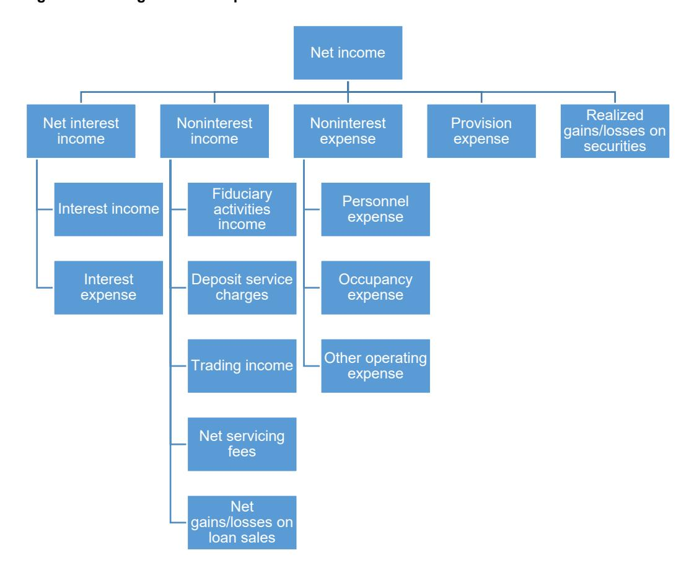

# Comptroller's Handbook

# Safety and Soundness

**Capital Adequacy (C)**

**Asset Quality (A)**

**Management (M)**

**Earnings (E)**

**Liquidity (L)**

**Sensitivity to Market Risk (S)**

**Other Activities (O)**

# **Earnings**

Version 1.0, September 2021

**References to reputation risk have been removed from this booklet as of March 20, 2025. Removal of reputation risk references is identified by a strikethrough. Refer to OCC Bulletin 2025-4.**

# **Contents**

| Introduction                                                               | 1             |
|----------------------------------------------------------------------------|---------------|
| Risks Associated With Earnings                                             | 3             |
| Credit Risk                                                                |               |
| Interest Rate Risk                                                         | 4             |
| Liquidity Risk                                                             | 4             |
| Price Risk                                                                 | 5             |
| Operational Risk                                                           | 5             |
| Compliance Risk                                                            |               |
| Strategic Risk                                                             | 6             |
| Reputation Risk                                                            | <del> 7</del> |
| Risk Management                                                            | 7             |
| Planning and Budgeting                                                     | 8             |
| Management and Board Reports                                               |               |
| Earnings Analysis                                                          |               |
| Ratios and Key Components                                                  |               |
| Net Income to Average Assets Ratio                                         |               |
| Net Interest Income (TE) to Average Earnings Assets Ratio                  |               |
| Noninterest Income to Average Assets Ratio                                 |               |
| Noninterest Expense to Average Assets Ratio                                | 14            |
| Provision Expense to Average Assets Ratio                                  |               |
| Other Earnings Analysis Considerations                                     |               |
| Capital                                                                    |               |
| Dividends                                                                  | 17            |
| Accounting Treatments                                                      | 17            |
| Earnings Component Rating                                                  |               |
| Examination Procedures                                                     | 20            |
| Scope                                                                      |               |
| Earnings Analysis                                                          |               |
| Quality of Risk Management                                                 |               |
| Conclusions                                                                |               |
| Internal Control Questionnaire                                             |               |
| Appendixes                                                                 | 21            |
| Appendix A: Rate, Volume, Mix Analysis                                     | 2 <i>1</i>    |
| Appendix A. Rate, Volume, Mix Analysis                                     |               |
| Appendix C: Earnings Tree Job Aid                                          |               |
| Appendix C. Earnings Tree Job Aid  Appendix D: Considerations by Bank Type |               |
| Appendix E: Abbreviations                                                  |               |
| Appendix E. Addievianons                                                   | 40            |
| Deferences                                                                 | 11            |

# **Introduction**

The Office of the Comptroller of the Currency's (OCC) *Comptroller's Handbook* booklet, "Earnings," is prepared for use by OCC examiners in connection with their examination and supervision of national banks, federal savings associations (FSA), and federal branches and agencies of foreign banking organizations (collectively, banks). Each bank is different and may present specific risk and issues. Accordingly, examiners should apply the information in this booklet consistent with each bank's individual circumstances. When it is necessary to distinguish among them, national banks, FSAs, covered savings associations,[1](#page-2-1) and federal branches and agencies are referred to separately.

The information in this booklet supplements the earnings core assessments in the "Community Bank Supervision," "Federal Branches and Agencies Supervision," and "Large Bank Supervision" booklets of the *Comptroller's Handbook* and the regulatory ratings information in the "Bank Supervision Process" booklet of the *Comptroller's Handbook.* The information in this booklet may be used when reviewing earnings for a specific line of business or the bank as a whole.

 Examiners review a bank's earnings performance on an ongoing basis and complete an earnings core assessment at least once per supervisory cycle. National banks and FSAs receive an earnings rating under the CAMELS rating system at least once per supervisory cycle. Although the ROCA rating system for federal branches and agencies does not include an earnings rating, examiners perform an earnings review. [2](#page-2-2) The review's scope and depth depend on the characteristics of the federal branch or agency. The Uniform Interagency Trust Rating System (UITRS) includes an earnings component rating, which is assigned to banks that have total trust assets of more than \$100 million or are nondeposit trust companies at the time of the examination. [3](#page-2-3) Refer to appendix D of this booklet for earnings analysis considerations by bank type.

A bank requires earnings to support its operations, provide for an adequate allowance for loan and lease losses (ALLL) or allowance for credit losses (ACL), [4](#page-2-4) and augment its capital base. The amount of earnings a bank needs varies depending on the bank's unique

1 Certain FSAs may elect to operate as a covered savings association. For more information, refer to OCC Bulletin 2019-31, "Covered Savings Associations Implementation: Covered Savings Associations" and 12 CFR 101, "Covered Savings Associations."

2 A bank's composite rating under the CAMELS or Uniform Financial Institutions Rating System (UFIRS) integrates ratings from six component areas: capital adequacy, asset quality, management, earnings, liquidity, and sensitivity to market risk. ROCA is the interagency uniform supervisory rating system for federal branches and agencies. ROCA integrates ratings from four component areas: risk management, operational controls, compliance, and asset quality. Refer to the "Bank Supervision Process" booklet of the *Comptroller's Handbook*  for more information about the CAMELS and ROCA rating systems.

3 Trust assets are reported on schedule RC-T of the bank's Consolidated Report of Condition and Income (call report). For more information about the UITRS, refer to the "Bank Supervision Process" booklet of the *Comptroller's Handbook*.

4 This booklet uses the term "credit loss allowances" to refer to the ALLL or ACL, as applicable.

 characteristics and should be commensurate with the bank's risks. Therefore, examiners should understand the bank's business model to determine what constitutes the bank's core earnings. Core earnings are derived from a bank's ongoing business activities and recur over time. Examiners should be alert to nonrecurring sources of earnings that have affected the bank's earnings performance to determine whether the bank is relying on these sources to generate or augment income. Examiners should consider the adequacy of a bank's earnings absent nonrecurring or unsustainable sources. Common examples of noncore earnings include gains on sales of securities or loans, sale of a line of business, or sale of a branch. Whether items are treated as core earnings depends on if the activity is consistent with the bank's business model and income is recurring. For example, gains on sales of loans or securities may be core earnings for some banks.

Examiners typically review the Uniform Bank Performance Report (UBPR), which is generated using information in the Consolidated Reports of Condition and Income (call report), when analyzing earnings, particularly when analyzing the level and trend of earnings.[5](#page-3-0) The earnings review includes sources of information other than the UBPR based on the review's scope and objectives. Examiners also consider relevant findings from other areas under examination and other supervisory activities conducted throughout the bank's supervisory cycle. Examples of other information that examiners typically review are the bank's financial statements (e.g., call reports or the U.S. Securities and Exchange Commission's Form 10-K and Form 10-Q filings), external audit reports, general ledger, budgets, budget assumptions, budget variance reports, and board of directors or board committee packages. Transaction journals or subsidiary ledgers can provide detailed information if examiners need more information or identify unusual trends during the review. Examiners often evaluate the bank's call report filing processes in conjunction with an earnings review.

Examiners regularly incorporate peer group[6](#page-3-1) comparisons into earnings analysis. As explained in the Federal Financial Institutions Examination Council's *Uniform Bank Performance Report User's Guide*, peer group comparisons serve as reference points and should not be used to form direct comparisons (i.e., a strict benchmark). When comparing bank data to peer group data, examiners should consider whether the peer group is similar to the bank. For example, the bank might be of comparable size but have a vastly different composition of earning assets than its peer group.[7](#page-3-2) Examiners should compare mutual FSAs with other mutual FSAs, and stock FSAs with other stock FSAs, to provide a more meaningful review of the financial ratios and to help identify negative trends and outliers.

5 For more information about the different types of call reports, refer to the "Regulatory Reporting" booklet of the *Comptroller's Handbook*.

6 A peer group is a group of banks of similar size and characteristics. Most national banks are assigned to an insured commercial bank peer group based on asset size, number of banking offices, and location (metropolitan or nonmetropolitan area). Most FSAs are assigned to a Federal Deposit Insurance Corporation-insured savings association peer group based on asset size and ownership structure (stock or mutual). Special purpose banks may be assigned to a credit card, banker's bank, or fiduciary peer group. A UBPR can be generated using a custom peer group.

7 For more information and an example, refer to the "Technical Information" section of the *Uniform Bank Performance Report User's Guide*.

Also, compared with stock banks, mutual FSAs tend to have higher capital ratios and lower but more stable earnings.[8](#page-4-1) While peer group comparisons can provide useful information about typical banks of similar size, the comparisons represent only a portion of an examiner's earnings analysis.

Examiners should be familiar with current local, regional, and national economic and banking industry conditions and any secular, cyclical, and seasonal factors that could affect a bank's earnings. Maintaining current knowledge of such conditions and factors provides examiners with important context for analyzing a bank's financial condition and understanding trends in the bank's earnings performance. Examiners maintain knowledge of economic conditions by reviewing appropriate economic and industry information and OCC reports.

## **Risks Associated With Earnings**

From a supervisory perspective, risk is the potential that events will have an adverse effect on a bank's current or projected financial condition[9](#page-4-2) and resilience.[10](#page-4-3) The OCC has defined eight categories of risk for bank supervision purposes: credit, interest rate, liquidity, price, operational, compliance, strategic, and reputation. These categories are not mutually exclusive. Any product or service may expose a bank to multiple risks. Risks also may be interdependent and may be positively or negatively correlated. Examiners should be aware of and assess this interdependence. Examiners also should be alert to concentrations that can significantly elevate risk. Concentrations can accumulate within and across products, business lines, geographic areas, countries, and legal entities. Refer to the "Bank Supervision Process" booklet of the *Comptroller's Handbook* for an expanded discussion of banking risks and their definitions.

All eight categories of risk have the potential to affect earnings. A bank's earnings should be commensurate with and serve to support the risks taken by the bank. A bank's earnings performance can indicate increasing or decreasing risk. Weak earnings performance can also contribute to increased risk. Earnings are intended to support the bank's operations, provide for adequate credit loss allowances, and augment capital. Earnings can be affected by inadequately forecasted or controlled interest margins, sources of funding, or operating expenses; improperly executed or ill-advised business strategies; or poorly managed risk exposures.

8 For more information, refer to OCC Bulletin 2014-35, "Mutual Federal Savings Associations: Characteristics and Supervisory Considerations."

9 Financial condition includes impacts from diminished capital and liquidity. Capital in this context includes potential impacts from losses, reduced earnings, and market value of equity.

10 Resilience recognizes the bank's ability to withstand periods of stress.

#### Credit Risk

Credit risk is the risk to current or projected financial condition and resilience arising from an obligor's failure to meet the terms of any contract with the bank or otherwise perform as agreed. Higher credit risk can lead to increasing credit losses, which can necessitate greater provisions to the credit loss allowances. Heightened volumes of problem loans can affect earnings because of lower interest income when more loans are placed on nonaccrual status. A bank's overhead expenses can increase with higher problem asset levels as the bank's need for workout or collections staff increases. A bank holding a large amount of other real estate owned (OREO) can experience earnings impacts from the expenses associated with holding OREO.

Banks with increasing or heightened credit risk sometimes exhibit unusually favorable earnings measures, such as unusually high loan portfolio or investment yields. Examiners should assess the drivers of the increased yields.

#### Interest Rate Risk

Interest rate risk is the risk to current or projected financial condition and resilience arising from movements in interest rates. Interest rate risk results from differences between the timing of rate changes and the timing of cash flows (repricing risk); from changing rate relationships among different yield curves affecting bank activities (basis risk); from changing rate relationships across the spectrum of maturities (yield curve risk); and from interest-related options embedded in bank products (options risk). Movements in interest rates affect the bank's earnings through changes in net interest income (NII). Earnings can also be affected by noninterest income sources that are sensitive to movements in interest rates (e.g., fee-related mortgage banking income).[11](#page-5-3)

### Liquidity Risk

Liquidity risk is the risk to current or projected financial condition and resilience arising from an inability to meet obligations when they come due. Weak earnings, especially when a bank experiences operating losses, can affect liquidity. As a bank's condition deteriorates, it may need to access secondary or contingent sources of liquidity, which can affect earnings through higher funding costs. Poor earnings performance can affect a bank's access to liquidity, especially if the bank is reliant on rate- and credit-sensitive funding sources.[12](#page-5-4)

A bank's funding profile can affect its earnings. For example, holding a larger amount of onbalance-sheet liquidity, which typically reduces liquidity risk, can reduce the strength of a bank's earnings through a lower net interest margin (NIM), particularly when these liquid assets are lower-yielding. A bank with ample on-balance-sheet liquidity, however, may be able to withstand greater periods of weak earnings as the assets can be either cash equivalents or turned into cash relatively quickly if needed. Additionally, a bank that relies on high-cost,

11 For more information, refer to the "Interest Rate Risk" booklet of the *Comptroller's Handbook*.

12 For more information, refer to the "Liquidity" booklet of the *Comptroller's Handbook*.

volatile sources of funding may experience volatility in earnings or may be more susceptible to changes in earnings as economic conditions change.

## Price Risk

Price risk is the risk to current or projected financial condition and resilience arising from changes in the value of either trading portfolios or other obligations that are entered into as part of distributing risk. These portfolios typically are subject to daily price movements and are accounted for primarily on a mark-to-market basis. This risk occurs most significantly from market-making, dealing, and position-taking in interest rate, foreign exchange, equity, commodities, and credit markets. Price risk also arises from bank activities whose value changes are reflected in the income statement, such as in lending pipelines, OREO, and mortgage servicing rights. [13](#page-6-2) A bank that engages in trading activities experiences fluctuations in earnings because changes to trading positions' fair value flow to earnings. Similarly, changes to the fair value of derivatives, including economic hedges of mortgage banking activities, flow to earnings.

#### Operational Risk

Operational risk is the risk to current or projected financial condition and resilience arising from inadequate or failed internal processes or systems, human errors or misconduct, or adverse external events. Operational losses may result from internal fraud; external fraud; inadequate or inappropriate employment practices and workplace safety; failure to meet professional obligations involving clients, products, and business practices; damage to physical assets; business disruption and systems failures; and failures in execution, delivery, and process management. Operational losses directly affect a bank's earnings. Large amounts of nonrecurring operating expenses, such as legal expenses, may indicate heightened operational risk or weaknesses in operational risk management.

Weak internal controls over accounting and income recognition could result in overstated earnings. Inadequate or failed internal processes or systems can affect a bank's risk management of any risk area, which can affect earnings. For example, weak internal controls around lending can hamper bank management's ability to control credit risk, which can result in credit losses and affect earnings.

Banks with significant risk management or internal control weaknesses sometimes exhibit unusually favorable earnings measures, such as an unusually low efficiency ratio, even when these weaknesses have not yet adversely affected the bank's condition. In many cases this is due to a bank failing to invest appropriately in personnel, risk management processes, technology, management information systems, or other needed expenditures.

13 For more information, refer to the "Mortgage Banking" and "Other Real Estate Owned" booklets of the *Comptroller's Handbook*.

#### Compliance Risk

Compliance risk is the risk to current or projected financial condition and resilience arising from violations of laws or regulations, or from nonconformance with prescribed practices, internal bank policies and procedures, or ethical standards. It also includes the exposure to litigation (known as legal risk) from all aspects of banking, traditional and nontraditional. This risk exposes a bank to potential fines, civil money penalties (CMP), payment of damages, and the voiding of contracts. Compliance risk can result in diminished reputation, harm to bank customers, limited business opportunities, and lessened expansion potential. Such events may affect earnings.

Compliance risk can result from a bank's noncompliance with the "Interagency Guidelines Establishing Standards for Safety and Soundness" related to earnings.[14](#page-7-2) Additionally, materially misstated earnings on a bank's call report may constitute a violation of 12 USC 161 (national banks) or 12 USC 1464(v) (FSAs).[15](#page-7-3) 

Inadequate compliance management systems can affect a bank's earnings by exposing the bank to increased legal and reputation risks, the potential for enforcement actions (including CMPs), and customer reimbursements.

Banks with significant weaknesses in compliance management systems sometimes exhibit unusually favorable noninterest expense measures, such as a low efficiency ratio, due to not investing appropriately in personnel, risk management systems, compliance management systems, or audit programs, for example.

#### Strategic Risk

Strategic risk is the risk to current or projected financial condition and resilience arising from adverse business decisions, poor implementation of business decisions, or lack of responsiveness to changes in the banking industry and operating environment. This risk is a function of a bank's strategic goals, business strategies, resources, and quality of implementation. Earnings can be adversely affected by an inability to forecast or control funding or operating expenses, failure to adopt to changing market conditions, poorly executed business decisions (e.g., mergers and acquisitions, new activities), or improperly managed or uncontrolled exposure to risks.

A bank can face strategic risk when earnings performance does not support the goals, objectives, or activities outlined in the bank's strategic plan. A bank's earnings can be at risk when the strategic plan does not provide for enhancements to the bank's risk management system to appropriately implement new activities or when new activities do not provide an

14 The "Risk Management" section of this booklet lists the earnings standards from 12 CFR 30, appendix A, II.H, "Earnings."

15 For more information, refer to the "Regulatory Reporting" booklet of the *Comptroller's Handbook*.

adequate return on investment.[16](#page-8-2) Strategic risk also results from engaging in new activities without performing adequate due diligence, including up-front expense analysis.

#### Reputation Risk

 Reputation risk is the risk to current or projected financial condition and resilience arising from negative public opinion. This risk can hamper a bank's earnings performance by affecting the bank's ability to establish new relationships or services or continue servicing existing relationships.

 Reputation risks can arise when a bank fails to demonstrate profitability or meet its earnings announcement, as it may signal a potential troubled condition to depositors and poor management to investors and shareholders.

 Reputation risk may affect management's ability to execute the board-approved strategic plan, which may adversely affect earnings. This risk may increase the cost of capital and talent acquisition costs, which can affect earnings.

## **Risk Management**

 Each bank should identify, measure, monitor, and control risk by implementing an effective risk management system appropriate for the bank's size, complexity, and risk profile. When examiners assess the effectiveness of a bank's risk management system, they consider the bank's policies, processes, personnel, and control systems. Refer to the "Corporate and Risk Governance" booklet of the *Comptroller's Handbook* for an expanded discussion of risk management.

The "Interagency Guidelines Establishing Standards for Safety and Soundness" indicate that a bank should establish and maintain a system that is commensurate with the bank's size and the nature and scope of its operations to evaluate and monitor earnings and ensure that earnings are sufficient to maintain adequate capital and reserves. The bank should[17](#page-8-3) 

- compare recent earnings trends relative to equity, assets, or other commonly used benchmarks to the institution's historical results and those of its peers.
- evaluate the adequacy of earnings given the size, complexity, and risk profile of the institution's assets and operations.
- assess the source, volatility, and sustainability of earnings, including the effect of nonrecurring or extraordinary income or expense.
- take steps to ensure that earnings are sufficient to maintain adequate capital and reserves after considering the institution's asset quality and growth rate.

16 The term "new activities" refers collectively to new, modified, or expanded bank products and services. For more information, refer to OCC Bulletin 2017-43, "New, Modified, or Expanded Bank Products and Services: Risk Management Principles."

17 For more information, refer to 12 CFR 30, appendix A, II.H, "Earnings."

• provide periodic earnings reports with adequate information for management and the board of directors to assess earnings performance.

An appropriate risk management system includes satisfactory planning, budgeting, and forecasting processes. Examiners should consider whether the bank has a process to identify current and emerging risks to the bank's earnings. Sound practices typically include the board setting a realistic budget and actively overseeing management's implementation of the budget. Management generally manages the bank's planning, budgeting, and forecasting processes and monitors the impact of implemented strategies on earnings performance. Overall, the board should understand the dependence and interaction between risks and earnings performance.

#### Planning and Budgeting

A strategic plan defines the bank's long-term goals and its strategy for achieving them. [18](#page-9-1) To meet the strategic plan, operational plans (e.g., marketing, staffing, and contingency plans) and budgets are then developed and implemented by the chief executive officer and management. The operational plans cover a shorter period than the strategic plan, are narrower in scope, and are more detailed. They provide the means of monitoring progress toward achieving the strategic goals. The operating budget facilitates planning of anticipated income and expenses for a specified budget period.

The adequacy of the budgeting and forecasting processes and corresponding management and board reporting are key considerations when assessing earnings and determining the earnings component rating. The budget outlines the anticipated income and expenses required to achieve the goals and objectives in the bank's strategic plan. Therefore, the bank's budget should flow logically from the strategic plan by translating the long-term goals into specific, measurable, shorter-term targets. The budget should be sufficiently detailed to guide oversight and ongoing management of the bank. The board should approve the operational plans and budget after concluding that they are realistic and compatible with the bank's risk appetite and strategic objectives.[19](#page-9-2) Examiners should assess the adequacy of budgeting processes and the reasonableness of projections.

Banks may also use profit plans as part of the budgeting and forecasting processes. Profit planning is the set of actions taken to achieve a targeted profit level. A profit plan is an overall forecast of the income statement based on management's decisions, assumptions, and estimation of economic conditions. A profit plan addresses such items as the anticipated level and volatility of interest rates, local economic conditions, funding strategies, asset mix, pricing, staffing, and growth objectives. The accuracy of the plan depends on the attainability of the assumptions. Profit plans are often used by banks that need to improve earnings performance.

18 For more information, refer to the "Corporate and Risk Governance" booklet of the *Comptroller's Handbook.* 

19 Ibid.

The bank's size, complexity, risk profile, and risk appetite are important considerations when reviewing the level of formality and depth of the planning, budgeting, and forecasting processes. Examiners should determine

- whether appropriate personnel are involved in the budgeting process.
- what assumptions were used to establish the budget (e.g., asset growth and interest rate movements) and assess the reasonableness of the assumptions.
- whether the budget aligns with the bank's strategic goals and risk profile.
- whether expenses related to risk management and control functions are reasonable given increases in revenues and new products or services.
- where there are significant variances between actual performance and budgeted amounts and identify the causes of the variances.
- • whether management's monitoring of variances is adequate, including whether material variances are discussed with the board.
- whether management took any actions taken to address significant variances.

#### Management and Board Reports

Management and board reports typically highlight important performance and risk measures, such as metrics, limits, targets, and indicators, and include the trends and variances in such measures, to help directors understand the bank's operations and risks.[20](#page-10-1) Reports should also compare measures against established limits to allow directors to assess whether the bank is operating within the risk appetite. Reports should be accurate, timely, relevant, and complete. Reports should generally enable management and the board to

- understand the drivers of the bank's financial performance.
- assess the adequacy of earnings.
- understand and evaluate the potential effect of business units and their risk to earnings.
- understand how off-balance-sheet assets and liabilities contribute to earnings.
- monitor performance trends and projections.
- monitor performance against budget.
- monitor risk positions in relation to the risk appetite, limits, and parameters.

Reports used by management and the board to oversee earnings performance may include

- balance-sheet and income statements.
- earnings results.
- budget forecasts and underlying assumptions.
- budget variance analyses.
- income and expense projections.
- nonrecurring or cyclical items.
- funds management reports.
- a strategic plan.

20 For more information, refer to the *Director's Reference Guide to Board Reports and Information.* 

- a profit plan.
- a capital plan.

## **Earnings Analysis**

 Generally, the analysis of earnings begins with examiners reviewing each component of earnings in the UBPR and bank reports. This allows for an individual review of each major component of the income statement. Appendix C of this booklet provides a job aid that can help examiners determine what components are affecting the bank's earnings performance. Examiners then analyze key measures to obtain a broad understanding of the component's performance. Common key measures are discussed throughout this booklet. Because no single measure fully indicates a bank's condition and each bank has unique circumstances, examiners should consider the level and trend of individual measures and the interrelationship among measures as well as how the bank compares to peer group averages.

Examiners should identify the main drivers of significant changes in relevant measures and keep in mind that peer group comparisons serve as a reference measure and not a direct comparison. When conducting ratio analysis, it is important to understand how all components of a ratio change from period to period to determine what is causing the changes in the ratio. When identifying drivers of changes, examiners should review the components that make up the measures and should hold discussions with bank management. This booklet provides a detailed discussion of some of the common ratios. Although ratio analysis is often foundational to an examiner's earnings review, a comprehensive review includes other factors as explained in the "Earnings Component Rating" section of this booklet.

Understanding the bank's balance-sheet and off-balance-sheet composition is a key aspect of an earnings review because it can provide insight into a bank's income and expenses as well as risks to current and future earnings. Any material shift in balance-sheet structure causes changes to any ratios using a numerator or denominator from the balance sheet. Therefore, examiners should evaluate the bank's balance-sheet composition and assess any changes given its potential to materially affect earnings performance. Similarly, examiners need to understand whether there are seasonal changes in balance-sheet accounts that could result in earning fluctuations. It is important to maintain proper perspective when analyzing earnings and avoid spending excessive time on immaterial income statement items or balance-sheet categories. For example, examiners should not focus on small increases in income statement or balance-sheet items that do not materially affect earnings performance. Examiners should understand how material off-balance-sheet exposures such as derivatives can affect the bank's earnings performance.

## Ratios and Key Components

This section summarizes some of the UBPR's key earnings ratios and the components that make up those ratios. It is important to remember that certain UBPR ratios, including those related to profitability such as the return on average assets (ROAA) and net interest margin, are annualized ratios. If these ratios are not year-end figures, the numerator is annualized when calculating the ratio. For example, when calculating ROAA for the second quarter,

year-to-date net income is multiplied by two before dividing by that quarter's average assets.[21](#page-12-1) 

#### **Net Income to Average Assets Ratio**

This ratio is also referred to as ROAA and is calculated as net income after securities gains or losses, extraordinary gains or losses, and applicable taxes divided by average assets. ROAA is calculated using the following formula:

$$ROAA = \frac{net\ income}{average\ assets}$$

The ratio reflects bottom line after-tax net income. ROAA is a primary profitability measure because it traditionally indicates how efficiently a bank's assets generate earnings. For banks that have elected subchapter S status,[22](#page-12-2) examiners should use the subchapter S-adjusted ROAA to improve the comparability between banks that pay taxes directly and subchapter S banks that pass tax liability through to shareholders.

ROAA is a common starting point for an earnings analysis because it provides an overall performance measure. Examiners' analyses should include additional measures, which are discussed throughout this booklet. Examiners should understand the reasons for changes in a bank's ROAA. Additionally, examiners should assess the components of a bank's ROAA, even when ROAA is stable, to determine whether there are underlying changes. For example, a bank's ROAA is stable, but on further review, the examiner identifies that the NIM decreased significantly and this change was offset by gains on loan sales.

#### **Return on Equity to Average Total Equity**

This ratio is calculated as annualized net income divided by average total equity. The return on equity (ROE) is calculated using the following formula:

$$ROE = \frac{annualized \ net \ income}{average \ total \ equity}$$

ROE is often closely followed by shareholders and investors, as this ratio is a measure of the profitability of a bank in relation to its equity. A high ROE is typically favorable as this could suggest a bank is increasing its profit generation without needing as much capital. A declining ROE may indicate that the bank is becoming less efficient in creating profits and increasing shareholder value. A bank with an unfavorable ROE may affect its access to capital markets and other sources of capital.

21 For more information, refer to the *Uniform Bank Performance Report User's Guide*.

22 A bank that has elected subchapter S status does not pay any income tax directly. Instead, the bank's income or loss is passed to shareholders for tax purposes. Shareholders then record this income (or loss) on their personal income tax returns. Not all banks are eligible for subchapter S status.

#### Net Interest Income (TE) to Average Earnings Assets Ratio

This ratio is also referred to as the NIM and is calculated as total interest income on a tax equivalent (TE) basis, less total interest expense, divided by average earning assets. The NIM is calculated using the following formula:

$$NIM = \frac{interest\ income\ on\ a\ tax\ equivalent\ basis-interest\ expense}{average\ earning\ assets}$$

The NIM reflects the difference between interest income produced by a bank's earning assets (e.g., loans and investments) and interest paid on liabilities (e.g., interest on deposits or for borrowed funds). The NIM is an indicator of how efficiently a bank can acquire funds and reinvest them profitably. A high NIM is typically favorable, but it can also reflect a higher degree of risk within the asset base. For example, high loan yields can increase the NIM but can reflect a higher-risk loan portfolio. Conversely, if the bank has low funding costs due to a stable core deposit base, the ratio would also be higher but would not reflect a higher degree of risk. It is essential to analyze the components of the NIM to truly understand the bank's performance and risks. The NIM measures the profitability of the bank's primary activities better than the ratio of net interest income to average assets because the NIM's denominator only includes assets that generate income versus the entire asset base.

Interest income has historically been most banks' primary source of earnings. Examiners should be mindful that some banks have a business model in which core earnings include a large amount of noninterest income. These banks may have a lower than typical NIM but higher than typical noninterest income. The NIM does not measure the total profitability of the bank as it does not account for noninterest income or expense.

Examiners analyze the NIM's subcomponent ratios, which comprise the interest income to average earning assets and interest expense to average earnings assets ratios, for any fluctuations. They also review the composition of and any changes in interest income and interest expense to determine the root causes of NIM changes. Examiners should keep in mind that some changes are driven by shifts in the bank's balance-sheet composition. For example, a declining trend in the NIM could indicate balance-sheet shrinkage (e.g., a decline in average earnings assets) or a surge in underutilized deposits. A change in the interest rate environment could also affect the NIM. An analysis of the NIM should generally focus on changes in the following three areas:

- **Rates:** The yields on assets and costs of liabilities.
- Volume: The level of average earning assets and interest-bearing liabilities.
- Mix: The mix of earning assets and interest-bearing liabilities.

Rates, volume, and mix are discussed in more detail in appendix A of this booklet.

#### **Interest Income**

Interest income consists primarily of interest earned on loans, investment securities, and deposits held at other institutions. Interest income is generally the most important component of core income for a bank. The NIM can expand or contract based on increases or decreases in earning assets and interest earned. Higher interest income without an increase in interest expense results in a higher NIM. Common factors affecting interest income include increased yields on loans or investments and an increase in investable assets. Examiners should be alert to high loan or investment yields when reviewing earnings because this can indicate heightened or increasing credit risk. When a bank experiences asset quality deterioration, such as increases in nonperforming assets, interest income can be negatively affected as borrowers may be unable to make contractual loan payments.

When examiners isolate the factors affecting changes in interest income, they should understand the reasons for those changes. For example, a bank might experience NIM compression, which the examiner identifies as resulting from a decline in interest income. The examiner evaluates the change further as being primarily from a reduction in loan yields. The examiner should discuss the change with management to determine the reasons for the change, which may include a bank decreasing loan rates, a bank seeing a reduction in loan originations, or bank customers paying off or refinancing higher-yielding loans.

#### **Interest Expense**

Interest expense represents the cost of funding balance-sheet positions and includes interest on items such as deposits, borrowings, bonds, and other debt instruments. The NIM can expand or contract based on increases or decreases in interest expense. If all other factors remain constant, higher interest expense results in a lower NIM. Common factors affecting interest expense include deposit or borrowed funds costs. Examiners should be alert to high deposit or borrowing costs as this can indicate heightened liquidity risk. When a bank experiences liquidity deterioration, interest expense can be negatively affected because the bank typically has to pay higher rates to obtain funding.

Examiners should understand the reasons for changes in interest expense. For example, a bank might experience NIM compression, which the examiner determines was the result of an increase in interest expense. The examiner analyzes the change further as being primarily from an increase in deposit costs. The examiner should discuss the change with management to determine the reasons for the change, which may include a bank increasing deposit rates, the bank running a deposit special to attract more deposits, or the bank seeing an influx of deposits.

## **Noninterest Income to Average Assets Ratio**

This ratio comprises income derived from bank services and sources other than interestbearing assets divided by average assets. The noninterest income to average assets ratio is calculated using the following formula:

$$noninterest\ income\ to\ average\ assets = \frac{noninterest\ income}{average\ assets}$$

Noninterest income is primarily fee income, such as deposit service charges, fees charged for asset management services, and loan servicing fees. Noninterest income also may include nonrecurring sources of income such as gains and losses on the sale of loans, OREO, securities, and other assets that are generally unpredictable and unstable. Other forms of noninterest income come from activities such as selling investment products, leasing bank premises, selling insurance, and trading operations.

If noninterest income represents a significant portion of the bank's earnings, examiners should identify the sources of this income and determine whether these sources represent core earnings. Examiners should determine whether the sources of noninterest income are stable, recurring, and derived from the bank's activities, or if they are nonrecurring items.

#### **Nonrecurring Items**

Examiners should be alert to nonrecurring sources of income that have affected the bank's earnings to determine whether the bank is relying on these sources. Typically, examiners view nonrecurring sources of earnings as unsustainable. Therefore, when a bank's income has been augmented by nonrecurring items, examiners should adjust earnings ratios and numbers accordingly for analysis purposes. The exclusion of nonrecurring events (e.g., adoption of new accounting standards, extraordinary items, or sales of securities for tax purposes) from the analysis allows the examiner to analyze the profitability of core operations without the distortions caused by nonrecurring items. By adjusting for these distortions, examiners are better able to compare earnings performance against the bank's past performance and performance of peer banks over time.

### Noninterest Expense to Average Assets Ratio

This ratio is also referred to as the overhead ratio and is calculated as the sum of salaries and employee benefits, expenses of premises and fixed assets, and other noninterest expense divided by average assets. Noninterest expense to average assets ratio is calculated using the following formula:

$$noninterest\ expense\ to\ average\ assets = \frac{noninterest\ expense}{average\ assets}$$

Noninterest expense is typically associated with the bank's operations and overhead. Examiners should determine the primary components of a bank's noninterest expense as well as the level and trend of each component. Noninterest expense commonly includes personnel, occupancy, goodwill impairment, other intangible amortization, and other operating expenses. Examiners should determine what makes up noninterest expense, especially if the amount reported is significant.

 Common measures to assess noninterest expense include the efficiency ratio, average personnel expense per employee, and average assets per employee. The efficiency ratio is calculated as total overhead expense as a percentage of NII (TE) plus noninterest income. The efficiency ratio indicates how much a bank spends to earn a dollar of revenue. For example, if the efficiency ratio is 70 percent, this means that a bank spends \$0.70 per dollar of revenue to earn a dollar. The average personnel expense per employee is the average salary, including benefits, divided by the number of employees expressed in thousands of dollars. For example, if the figure is 98.15, this reflects an average salary of \$98,150, including benefits, per employee per year. The average assets per employee is calculated as average assets divided by the number of full-time equivalent employees on the payroll at the end of the period with the result shown in millions of dollars. This figure is a measure of labor productivity efficiency and can be assessed year over year. For example, if one year a bank manages \$3.25 million in assets per employee and the next year this figure grew to \$5.5 million, this reflects an increase of almost 70 percent and means the bank experienced significant efficiency gains. Significant increases in average assets per employee can also be an indicator that a bank's staffing is not keeping pace with its growth.

Examiners should assess the extent to which the bank's core earnings support operations and cover noninterest expense. Some of the common reasons for high noninterest expenses include high salaries or bonuses and high occupancy expense. Examiners should be alert to potentially excessive fees paid to related organizations[23](#page-16-0) and insiders (including their related interests). Such fees should be on market terms or be based on market cost plus a fair profit and may be subject to statutory or regulatory limits or other restrictions.[24](#page-16-1) 

Although controlling noninterest expenses is important, examiners should be alert to extremely low-cost control measures as they can be indicators of potential risk management weaknesses. Examiners should also be alert to imprudent cost-cutting strategies, such as reducing staff below prudent levels, reducing or eliminating control systems (e.g., audit, compliance reviews, or credit risk review), implementing new activities without considering long-term costs or risk management needs,[25](#page-16-2) or forgoing necessary technology upgrades. Cost-cutting strategies can also lead to weaknesses in internal controls (e.g., reduce staff affecting dual controls and segregation of duties). Such strategies may not be sustainable and can expose the bank to heightened risk and impair future earnings.

Banks with satisfactory earnings generally have well-controlled personnel expenses, but these expenses should not be so low that the bank compromises quality staffing levels or expertise. Examiners should assess the reasons for personnel expenses that appear too high or

23 Related organizations are those related to a bank, typically by common ownership or control. Generally, related organizations are affiliates or subsidiaries.

24 Several booklets of the *Comptroller's Handbook* include more information regarding transactions with related organizations and insiders. In particular, refer to "Related Organizations" (national banks), "Insider Activities," "Internal and External Audits," "Bank Premises and Equipment," and "Corporate and Risk Governance." For FSAs, refer also to *Office of Thrift Supervision Handbook*, section 380, "Transactions With Affiliates and Insiders," and section 730, "Related Organizations" (FSAs).

25 For more information, refer to OCC Bulletin 2017-43.

too low. A bank should maintain safeguards to prevent the payment of compensation, fees, and benefits that are excessive or that could lead to material financial loss to the bank. Compensation is generally considered excessive and is therefore prohibited as an unsafe and unsound practice if it is unreasonable or disproportionate to the services actually performed.26

#### **Provision Expense to Average Assets Ratio**

Provision expense reflects the amount added to the bank's credit loss allowances and is generally analyzed as a percent of average assets. The provision expense to average assets ratio is calculated using the following formula:

$$provision \ expense \ to \ average \ assets \ = \ \frac{provision \ expense}{average \ assets}$$

Examiners reviewing earnings typically consult with examiners assigned to asset quality or credit risk to determine whether there are expected significant changes in the provision expense and to understand the reasons for significant changes in provision expense amounts. When the bank reduces the overall level of credit loss allowances, provision expense is negative and therefore is reflected as income. When a bank reports a negative provision, examiners should estimate an adjusted net income and ROAA to account for a negative provision being a noncore or unsustainable source of earnings. Conversely, excessive or inadequately managed credit risk may result in loan losses and require additions to the credit loss allowances, which may affect the quantity of earnings.

#### Other Earnings Analysis Considerations

This section summarizes other items that examiners should consider when reviewing a bank's earnings performance.

#### Capital

Earnings should be sufficient to augment capital or maintain capital at adequate levels commensurate with the bank's risk profile. Adequate capital promotes a bank's stability, its ability to honor its obligations, and its ability to withstand periods of economic stress. Examiners determine a bank's capital adequacy based on the totality of a bank's circumstances.27 The following are some considerations for determining whether earnings adequately contribute to adequate capital augmentation or maintenance:

- The bank's asset growth rate compared to its capital growth rate.
- The quality and sustainability of actual and forecasted earnings.
- The bank's strategic plans and projected growth.

&lt;sup>26 For more information, refer to 12 CFR 30, appendix A, III. "Prohibition on Compensation That Constitutes an Unsafe and Unsound Practice," and the "Insider Activities" booklet of the *Comptroller's Handbook*.

&lt;sup>27 For more information, refer to the "Capital and Dividends" booklet of the *Comptroller's Handbook*.

- The level and trend of classified assets, past due loans, and loans on nonaccrual.
- The bank's capital adequacy.
- The level of dividends[28](#page-18-2) in relation to earnings.

#### **Dividends**

Examiners should consider the reasonableness of dividends relative to the bank's financial position and the bank's flexibility to reduce dividend payments when analyzing the impact of dividends on retained earnings. Paying excessive dividends in light of a bank's earnings can weaken a bank's capital position and represents an unsafe or unsound practice. There may be instances when a dividend does not reduce capital below the minimum required level in the short term but is still imprudent. For example, this could occur if the bank is experiencing high and increasing levels of problem assets or has planned significant growth.[29](#page-18-3)

Examiners should determine whether dividends are needed to support obligations, such as holding company debt. If there are such dividends, examiners should assess the effect on current and prospective earnings retention. Additionally, examiners should be aware of the applicable procedures for notice or application to the OCC for dividends.[30](#page-18-4)

#### **Accounting Treatments**

Consistency within a bank in the application of accounting principles is important. Accounting Standard Codification (ASC) Topic 250, "Accounting Changes and Error Corrections," presumes that, once adopted, an accounting principle (including the method of applying that principle) shall not be changed in a bank's accounting for events or transactions of a similar type.[31](#page-18-5) Accordingly, examiners should be alert to inconsistencies in the application of accounting principles within the bank.

#### **Other**

A bank with an assigned composite rating of 3, 4, or 5 under the UFIRS will incur a surcharge in OCC and Federal Deposit Insurance Corporation assessment fees.[32](#page-18-6) This

28 This includes distributions to members of a mutual FSA.

30 For more information, refer to the "Capital and Dividends" booklet of the *Comptroller's Handbook* and the "Capital and Dividends" booklet of the Comptroller's *Licensing Manual.* 

 31 ASC Topic 250 requires that a bank change its accounting principle only if (1) the change is required by a newly issued accounting standards update (ASU) or (2) the bank can justify the use of an allowable alternative accounting principle on the basis that is preferable. ASC Topic 250 requires the bank to report a change in accounting principle through retrospective application of the new principle to all prior periods, unless impracticable to do so. The Financial Accounting Standards Board normally provides specific transition requirements for adopting new ASUs; thus application of ASC Topic 250 to the adoption of new ASUs is rare.

32 For more information about the assessment fees and how they are calculated, refer to 12 CFR 8, "Assessment of Fees.

surcharge reflects the need for additional supervisory resources and the increased cost of supervision. Higher assessment fees could affect the bank's earnings performance.

## **Earnings Component Rating**

The earnings rating reflects not only the quantity and trend of earnings but also factors that may affect the sustainability or quality of earnings. The quantity as well as the quality of earnings can be affected by (1) excessive or inadequately managed credit risk that may result in loan losses and require additions to credit loss allowances, or (2) high levels of market risk that may unduly expose a bank's earnings to volatility in interest rates. The quality of earnings may be diminished by undue reliance on extraordinary gains, nonrecurring events, or favorable tax effects. Future earnings may be adversely affected by an inability to forecast or control funding and operating expenses, improperly executed or ill-advised business strategies, or poorly managed or uncontrolled exposure to other risks.

The rating of a bank's earnings is based on an assessment of the following evaluation factors:

- Level of earnings, including trends and stability.
- Ability to provide for adequate capital through retained earnings.
- Quality and sources of earnings.
- Level of expenses in relation to operations.
- Adequacy of the budgeting systems, forecasting processes, and management information systems in general.
- Adequacy of provisions to maintain credit loss allowances and other valuation allowance accounts.
- • Exposure of earnings to market risk, such as interest rate, foreign exchange, and price risks.

Based on the evaluation factors, earnings can be less than satisfactory even if the bank is profitable. This is because a bank's core earnings should generally be sufficient to support operations, provide for capital, and maintain adequate credit loss allowances. When examiners identify a bank with less than satisfactory earnings (i.e., an earnings component rating of 3 or worse), they should determine the root causes (financial and nonfinancial) and assess the actual and potential impact on the bank's capital adequacy. Some examples of nonfinancial root causes include poor strategic planning, improperly executed business decisions, or engaging in new activities without sufficient due diligence. If a deficient practice resulted in less than satisfactory earnings, examiners should communicate the OCC's concern with the deficient practice in a matter requiring attention (MRA). Examiners should not use MRAs to communicate an adverse condition (e.g., less than satisfactory earnings); MRAs should focus on the causative deficient practices and the corrective actions to resolve the concern (e.g., strategic planning, budgeting, or profit improvement planning).[33](#page-19-1) Less than satisfactory earnings is an unsafe or unsound practice under 12 USC 1818(b)(8). Typically, when a bank has an earnings component rating of 3 or worse for two or more consecutive

33 For more information regarding MRAs, refer to the "Bank Supervision Process" booklet of the *Comptroller's Handbook.* 

examinations, the report of examination or supervisory letter communicates that the bank is engaging in an unsafe or unsound practice under 12 USC 1818(b)(8).

## **Examination Procedures**

This booklet contains expanded procedures for examining specialized activities or specific products or services that warrant extra attention beyond the core assessment contained in the "Community Bank Supervision," "Federal Branches and Agencies Supervision," and "Large Bank Supervision" booklets of the *Comptroller's Handbook*. Examiners determine which expanded procedures to use, if any, during examination planning or after drawing preliminary conclusions during the core assessment.

## **Scope**

These procedures are designed to help examiners tailor the examination to each bank and determine the scope of the earnings examination. Examiners should consider work performed by internal and external auditors, independent risk management, and other examiners reviewing related areas. Examiners need to perform only those objectives and steps that are relevant to the scope of the examination as determined by the following objectives. Seldom is every objective or step of the expanded procedures necessary.

**Objective:** To determine the scope of the examination of earnings and identify examination objectives and activities necessary to meet the needs of the supervisory strategy for the bank.

- 1. Review the following sources of information to identify issues related to earnings that require follow-up:
  - Supervisory strategy.
  - Scope memorandum.
  - Previous supervisory activity work papers.
  - Previous supervisory letters and reports of examination, and management's responses.
  - Internal and external audit reports, work papers, and management's responses.
  - Customer complaints and litigation. Examiners should review customer complaint data from the OCC's Customer Assistance Group, the bank, and the Consumer Financial Protection Bureau (when applicable). When possible, examiners should review and leverage complaint analysis already performed during the supervisory cycle to avoid duplication of effort.
- 2. Determine the time horizon for the earnings review.
- 3. Assess key information about the bank, such as
  - the corporate structure (e.g., subchapter S).
  - the type of bank (e.g., national bank, stock FSA, mutual FSA, covered savings association, or de novo bank).

- 4. Review the UBPR and applicable OCC reports or analytical tools to identify trends in key measures, such as ROAA and NIM.
- 5. Review policies, procedures, and reports that management uses to supervise earnings, including budgets and budget variance reports. Identify significant changes since the last examination.
- 6. Discuss with bank management actual or planned changes in the bank's budget or budgeting process.
- 7. Based on an analysis of information obtained in the previous steps, as well as input from the examiner-in-charge, determine the scope and objectives of the earnings examination.
- 8. Select from the following examination procedures the necessary steps to meet examination objectives and the supervisory strategy.

## **Earnings Analysis**

**Objective:** To analyze the level, trend, and stability of earnings.

- 1. Determine whether earnings are improving, stable, or decreasing. Focus on the following, and determine the root cause of significant trends:
  - ROAA
  - NIM, including interest income and income expenses
  - Noninterest income
  - Noninterest expense
  - Provisions to credit loss allowances
  - Changes in balance-sheet composition
  - Loan and deposit pricing

Examiners may use information from the following procedures 2 through 6 when completing this procedure.

- 2. Assess the components of the ROAA as well as the level and trend relative to
  - historical performance.
  - peer group.
  - balance-sheet structure and composition.
  - the bank's business model and activities.
  - the bank's risk profile.
  - national economic conditions.
- 3. Evaluate the level, trend, and stability of the NIM. Consider the following:
  - Actions taken by management to maintain or improve the bank's margin.
  - If there have been any material changes in
    - − rates (e.g., yields on and cost of), consider
      - the impact of changes in interest rates on earning assets yields (e.g., loans and investments).
      - the impact of changes in interest rates on the bank's cost of funds (e.g., deposit rates and borrowing costs).
      - the key factors affecting loan and deposit pricing.
      - the impact of interest rate risk on earnings.
    - − volume (e.g., the level of average earning assets and interest-bearing liabilities), consider
      - the impact of changes in earning asset volumes on interest income.
      - the bank's volume of earning assets compared to its peer group.
      - the reasons for either a high or low volume of earning assets.
      - the impact of changes in interest-bearing liability volumes (e.g., deposits and borrowings) on interest expense.

- the bank's volume of interest-bearing liabilities compared to its peer group.
- the extent to which the bank's capital level and volume of non-interestbearing deposits lessen the need to pay for funding (e.g., borrowings).
- − mix (e.g., earning assets and interest-bearing funds) within the balance sheet, consider
  - the impact of changes in the balance-sheet mix on the bank's interest income and interest expense.
  - any change in the loan or investment portfolio mixes or shifts in funding sources.
- Whether competitive pressures have affected pricing on loans or deposits.
- 4. Evaluate the level, trend, and sources of noninterest income. Consider the following:
  - The primary components of the bank's noninterest income (e.g., fee income, gains or losses on the sale of securities).
  - What portion (e.g., significant or insignificant) of the bank's earnings noninterest income represents.
  - If the sources of noninterest income are stable, recurring, and derived from the bank's ongoing activities, or if they are nonrecurring sources that are generally unpredictable and unstable (e.g., gains and losses on the sale of loans, OREO, or securities).
  - If management has any plans to increase noninterest (e.g., fee) income or is projecting any changes in fee structures.
  - The impact of changes in interest rates and market conditions on noninterest revenue sources (e.g., mortgage banking income or securities gains).
- 5. Evaluate the level, trend, and sources of noninterest expense. Consider the following:
  - The primary components of the bank's noninterest expense (e.g., salaries, employee benefits, expenses of premises and fixed assets, amortization of intangibles, and other operating expenses), and determine which represents the largest components.
  - Other significant noninterest expenses in the bank's financial statements.
  - Actions taken by management to contain or manage overhead expenses.
  - Any expansion plans, operating changes, or staffing plans that could significantly increase overhead expense.
  - Costs that may lead to high overhead expenses (e.g., excessive salaries and bonuses, sizable management fees paid to the holding company, potentially excessive fees paid to related organizations or insiders, including their related interests, and high occupancy expenses caused by construction or purchase of a new bank building).
  - Cost control measures (e.g., reducing staff below prudent levels, reducing or eliminating control systems, and forgoing necessary technology upgrades) that could expose the bank to heightened risk and impair future earnings.
  - Any significant losses on assets (e.g., OREO or repossessed vehicles) that have adversely affected earnings.
  - Any pending litigation against the bank and the potential impact to earnings.

6. Evaluate the level and trend of the provision expense to credit loss allowances.

**Note:** Consult with the examiners responsible for asset quality to determine the potential need for additional provision expenses resulting from the examination findings and to understand the reasons for any significant changes in provision expense amounts.

**Objective:** To analyze the quality and sources of earnings.

- 1. Identify the bank's core (recurring), sustainable sources of earnings, which are net of any extraordinary or nonrecurring items.
- 2. Identify and assess the level of reliance on noncore (nonrecurring) or unsustainable sources of earnings. Consider the following:
  - Extraordinary gains or losses (e.g., on the sale of securities or loans, sale of a line of a business, or sale of a branch) and the stability of these amounts.
  - The nature of any extraordinary items.

**Note:** If nonrecurring or unsustainable sources of earnings are significant, consult with the examiner-in-charge and consider estimating a bank's key earnings measures with these items removed.

- 3. Evaluate undue reliance on favorable tax effects.
- 4. Assess the impact on the quality of the bank's earnings based on management's ability to
  - forecast.
  - control funding and operating expenses.
  - properly execute sound business strategies.
  - manage and control exposure to risks.
- 5. If the bank has fiduciary powers, evaluate the quantity and quality of fiduciary earnings. As applicable, coordinate with asset management examiners. Consider the factors in the UITRS, including the following:
  - Level and consistency of profitability in relation to business volume and characteristics.
  - Methods used to allocate direct and indirect expenses.
  - Effects of fiduciary settlements, surcharges, and other losses.

**Objective:** To assess the level of expenses in relation to the bank's operations.

1. Determine the ability of core earnings to support operating expenses. Consider the quality, sources, and sustainability of earnings.

- 2. Evaluate the bank's ability to produce quality and consistent core earnings. Consider the following:
  - Planning, forecasting, and budgeting
  - Risk management practices
  - Pricing decisions
  - Funding sources
  - Expense management
  - Funds management practices

**Objective:** To assess the bank's ability to provide for adequate capital through retained earnings.

- 1. Determine the ability of earnings to augment capital or maintain capital at adequate levels commensurate with the bank's risk profile. Consider the following:
  - The bank's asset growth rate compared to its capital growth rate.
  - The quality and sustainability of capital and forecasted earnings.
  - The bank's strategic plans and projected growth.
  - The level and trend of classified assets, past due loans, and loans on nonaccrual.
  - The bank's capital adequacy.
  - • The level of dividends in relation to earnings.
- 2. Assess the adequacy of earnings in relation to debt service requirements of the bank's parent company, as applicable.

**Objective:** To assess the adequacy of provisions to maintain credit loss allowances and other valuation allowance accounts.

1. Review the level and trend of the provision expense. Compare with credit loss allowance levels and actual loan losses to determine the effect of asset quality on earnings.

**Note:** Consult with the examiners responsible for asset quality to determine the potential need for additional provision expenses resulting from the examination findings, and to understand the reasons for any significant changes in provision expense amounts.

**Objective:** To assess the risk to earnings posed by the bank's risks.

- 1. Assess the impact of the following risks on earnings performance:
  - Credit risk
  - Interest rate risk
  - Liquidity risk
  - Price risk
  - Operational risk
  - Compliance risk

- Strategic risk
- Reputation risk

**Note:** Use findings from the other examination areas and consult with other examiners, as necessary, to determine the effects on earnings.

## **Quality of Risk Management**

## Conclusion: The quality of risk management is (strong, satisfactory, insufficient, or weak).

The conclusion on risk management considers all risks associated with earnings.

**Objective:** To determine management's ability to understand, manage, and supervise earnings in a safe and sound manner.

- 1. Given the scope and complexity of the bank's earnings, assess the management structure and staffing. Consider the following:
  - The expertise, training, and number of staff members.
  - Whether reporting lines encourage open communication and limit the chances of conflicts of interest.
  - The level of staff turnover.
  - The use of outsourcing arrangements.
  - Capability to address identified deficiencies.
  - Responsiveness to regulatory, accounting, industry, and technological changes.
- 2. Assess performance management and compensation programs. Consider whether these programs measure and reward performance that aligns with the bank's strategic objectives and risk appetite.

If the bank offers incentive compensation programs, determine whether they (1) provide employees with incentives that appropriately balance risk and reward; (2) are compatible with effective controls and risk management; and (3) are supported by strong corporate governance, including active and effective oversight by the bank's board of directors.[34](#page-28-1) 

**Note:** Consult with other examiners to determine the adequacy of incentive compensation programs to verify that they do not allow or encourage excessive risk taking in pursuit of earnings objectives.

3. Determine whether appropriate internal controls are in place and functioning as designed. Complete the internal control questionnaire (ICQ), if necessary, to make this determination.

**Objective:** To assess the adequacy of budgeting systems, forecasting processes, and management and board reporting.

34 For more information about incentive compensation, refer to OCC Bulletin 2010-24, "Interagency Guidance on Sound Incentive Compensation Policies."

- 1. Review the bank's budgeting systems and forecasting processes to determine whether the level of formality and depth aligns with the bank's size, complexity, risk profile, and risk appetite.
- 2. Consider whether the budget flows logically from the strategic plan into specific, measurable targets and includes reasonable projections.
- 3. Assess the assumptions used in the budget (e.g., asset growth and interest rate movements) to determine their reasonableness.
- 4. Assess whether expenses related to risk management and control functions are appropriate.
- 5. Compare earnings performance to budgeted forecasts, identify any significant variances, and determine the reasons for the variances.
- 6. Determine whether the board approved the budget after concluding that it was realistic and compatible with the bank's risk appetite and strategic objectives.
- 7. Assess the frequency with which management compares actual earnings performance to budgeted forecasts, monitors variances, and discusses this information with the board. Evaluate any actions taken to address significant variances.
- 8. Assess management's process for modifying projections when circumstances change significantly and how this is reported to the board.
- 9. Determine whether management evaluates budget forecasts under multiple stress scenarios.
- 10. Evaluate the accuracy, timeliness, relevance, and completeness of reports produced for management and the board, which may include
  - balance-sheet and income statements.
  - earnings results.
  - budget forecasts and underlying assumptions.
  - budget variance analyses.
  - income and expense projections.
  - nonrecurring or cyclical items.
  - funds management reports.
  - a strategic plan.
  - a profit plan.
  - a capital plan.
- 11. Determine whether the reports generally enable management and the board to
  - understand the drivers of the bank's financial performance.

- assess the adequacy of earnings.
- understand and evaluate the potential effect of business units and their risk to earnings.
- understand how off-balance-sheet assets and liabilities contribute to the earnings.
- monitor performance trends and projections.
- monitor performance against budget.
- monitor risk positions in relation to the risk appetite, limits, and parameters.

## **Conclusions**

## Conclusion: Earnings are rated (1, 2, 3, 4, or 5)

**Objective:** To determine, document, and communicate overall findings and conclusions regarding the examination of earnings.

- 1. Determine preliminary examination findings and conclusions and discuss with the examiner-in-charge
  - whether the bank's earnings or budgeting practices affect any of the eight risk areas.
  - the quality of risk management over earnings, including budgeting practices.
  - violations or deficient practices.

| Summary of Risks Associated With Earnings |                             |                                                     |                             |                                        |  |
|-------------------------------------------|-----------------------------|-----------------------------------------------------|-----------------------------|----------------------------------------|--|
|                                           | Quantity of risk            | Quality of risk management                       | Aggregate level of risk  | Direction of risk                      |  |
| Risk category                             | (Low, moderate, high) | (Weak, insufficient, satisfactory, strong) | (Low, moderate, high) | (Increasing, stable, decreasing) |  |
| Credit                                    |                             |                                                     |                             |                                        |  |
| Interest rate                             |                             |                                                     |                             |                                        |  |
| Liquidity                                 |                             |                                                     |                             |                                        |  |
| Price                                     |                             |                                                     |                             |                                        |  |
| Operational                               |                             |                                                     |                             |                                        |  |
| Compliance                                |                             |                                                     |                             |                                        |  |
| Strategic                                 |                             |                                                     |                             |                                        |  |
| Reputation                                |                             |                                                     |                             |                                        |  |

- 2. If substantive safety and soundness concerns remain unresolved that may have a material adverse effect on the bank, further expand the scope of the examination by completing verification procedures. **Note:** Verification procedures focusing on the adequacy of a bank's call report data are in the "Regulatory Reporting" booklet of the *Comptroller's Handbook.*
- 3. Determine the earnings component rating. Consider the factors in the UFIRS:
  - The level of earnings, including trends and stability.
  - The ability to provide for adequate capital through retained earnings.
  - The quality and sources of earnings.
  - The level of expenses in relation to operations.

- The adequacy of the budgeting systems, forecasting processes, and management information systems in general.
- The adequacy of provisions to maintain credit loss allowances and other valuation allowance accounts.
- The exposure of earnings to market risk, such as interest rate, foreign exchange, and price risks.
- 4. If the bank has fiduciary powers, determine the quantity and quality of fiduciary earnings. As applicable, coordinate with asset management examiners. Consider the factors in the UITRS:
  - Level and consistency of profitability in relation to business volume and characteristics.
  - Methods used to allocate direct and indirect expenses.
  - Effects of fiduciary settlements, surcharges, and other losses.
- 5. Discuss examination findings with bank management, including violations, deficient practices, and conclusions about risks and risk management practices. If necessary, obtain commitments for corrective action.
- 6. Compose conclusion comments, highlighting any issues that should be included in the report of examination or supervisory letter. If necessary, compose MRAs and violation write-ups.
- 7. Update the OCC's supervisory information systems and any applicable report of examination schedules or tables.
- 8. Document recommendations for the supervisory strategy (e.g., what the OCC should do in the future to effectively supervise earnings in the bank, including time periods, staffing, and workdays required).
- 9. Update, organize, and reference work papers in accordance with OCC policy.
- 10. Appropriately dispose of or secure any paper or electronic media that contain sensitive bank or customer information.

## **Internal Control Questionnaire**

An ICQ helps an examiner assess a bank's internal controls for an area. ICQs typically address standard controls that provide day-to-day protection of bank assets and financial records. The examiner decides the extent to which it is necessary to complete or update ICQs during examination planning, after reviewing the findings and conclusions of the core assessment, or after reviewing the conclusions from expanded procedures. Examiners should refer to the "Regulatory Reporting" booklet of the *Comptroller's Handbook* for questions related to internal controls over the bank's reported earnings on the call report.

#### General

- 1. Does the bank have a budget?
- 2. Is the budget periodically updated for changed conditions?
- 3. Is the budget consistent with the capital and strategic plans?
- 4. Do management and the board monitor budget variances with appropriate frequency?
- 5. Are significant variances from budgeted amounts explained in senior management and board reports?
- 6. Is the bank's accounting system commensurate with the bank's size, complexity, and operations? Does the system have the capability to provide sufficiently detailed breakdowns of accounts to allow for an analysis of fluctuations?
- 7. Does the bank have appropriate dual controls over posting entries to the general ledger?
- 8. Is there support for all entries made to the general ledger?
- 9. What is the process for corrections made to the general ledger?

#### Purchases

- 10. Does the bank handle purchases in a manner to ensure that appropriate independence and controls are in place?
- 11. Does the bank have a separate purchasing department that is independent of the accounting and receiving departments? If not, does the bank have appropriate controls in place to separate duties?
- 12. Are purchases made only on the basis of requisitions signed by authorized personnel?
- 13. Are all invoices received checked against purchase orders and applicable reports?

- 14. Are all invoices tested for accuracy? If not, does the bank select an adequate sample and complete testing at an appropriate frequency?
- 15. Are invoice amounts credited to their respective accounts and tested periodically for accuracy?

#### Disbursements

- 16. Does the payment process for purchases include appropriate sign-off and review?
- 17. Is the person authorizing the payment required to review all pertinent supporting documents?
- 18. Are duties and responsibilities in the following areas appropriately segregated?
  - Authorization to issue disbursements
  - Preparation of disbursements
  - Signing of disbursements
  - Sending of disbursements
  - General ledger posting
  - Subsidiary ledger posting

## **Appendixes**

## Appendix A: Rate, Volume, Mix Analysis

One of the key earnings ratios to review when assessing the earnings component rating is the NIM. The NIM reflects the net difference between interest earned and interest paid and is a measure of profitability for banks.

The NIM is calculated by using the following formula:

$$NIM = \frac{interest\ income\ on\ a\ tax\ equivalent\ basis - interest\ expense}{average\ earning\ assets}$$

Changes in rate, volume, and mix are the three primary factors to consider when evaluating the bank's NIM. Evaluating changes in the NIM provides insight into the root cause of those changes, whether changes in the rate, volume, or mix, or a combination of all three.

#### Rate

The rate refers to the yield on or cost of the bank's earning assets and the cost of funds (i.e., cost of liabilities). The rate environment is an important consideration in a NIM review given that rate changes affect the bank's loan and investment income and deposit and borrowing costs. The following are some questions to consider when assessing the impact of rates on the NIM:

- How have changes in interest rates affected yields on earning assets (e.g., loans and investments)? For example, are rates currently low or high when compared with historical averages?
- How have changes in interest rates affected the bank's cost of funds (e.g., deposit rates, borrowing costs)? For example, if rates increase and there is a large demand for savings accounts compared with loans, the NIM decreases because the bank is required to pay out more interest than it receives.
- What are the key factors affecting loan and deposit pricing?
- How has interest rate risk affected the bank's earnings?

#### Volume

Volume refers to the bank's level of average earning assets and interest-bearing liabilities. Both the volume of earning assets and interest-bearing liabilities and any changes in levels are important considerations in a NIM review given their effect on interest income and interest expense, respectively. The following are some questions to consider when assessing the impact of the volume of average assets on the NIM:

How have changes in earning asset volumes affected interest income? For example, a
decline in interest income during a period of rising interest rates may be caused by the

bank experiencing a decline in loan volumes, so there were fewer assets with earnings capacity.

- How does the bank's volume of earning assets compare with its peer group?
- What are the reasons for either a high or low volume of earning assets?
- How have changes in interest-bearing liability volumes (e.g., deposits and borrowings) affected interest expense? For example, a decline in interest expense during a period of rising interest rates may be caused by the bank experiencing some deposit runoff when customers put their money in either the stock market or higher yielding deposit accounts at other financial institutions.
- How does the bank's volume of interest-bearing liabilities compare with its peer group?
- To what extent does the bank's capital level and volume of non-interest-bearing deposits lessen the need to pay for funding (e.g., borrowings)?

#### Mix

 Mix refers to the types of earning assets and interest-bearing funds (i.e., liabilities) on the bank's balance sheet. The composition of the bank's assets and liabilities, as well as any changes to this composition, are important considerations in a NIM review given their effect on interest income and interest expense levels. The following are some questions to consider when assessing the impact of the mix of earning assets and liabilities on the NIM:

- How have changes in the balance-sheet mix affected the bank's interest income and interest expense?
- Have there been changes in the loan or investment portfolio mixes or shifts in funding sources? For example, loans tend to produce better yields than investments. If loan demand softens and the bank has to shift funds from loans to investments, this change in mix could adversely affect the margin. The same holds true for shifts in loan mix and investment portfolio mix, as well as shifts in funding sources (e.g., a shift from noninterest-bearing demand deposit accounts to high-cost time deposits).

## **Appendix B: Earnings Red Flags**

This appendix includes some common financial performance red flags that examiners might encounter when reviewing a bank's earnings performance or budget. Red flags are characteristics that may signal existing or emerging weaknesses. Red flags should generally give rise to further investigation to determine whether a weakness exists.

- Significant variances from prior periods or as compared with peer banks in
  - − ROAA.
  - − NIM.
  - − efficiency ratio.
  - − noninterest income.
  - − noninterest expense.
  - − personnel expense.
  - − loan yields.
  - − investment yields, particularly securities with yields well above market yields (e.g., potential yield chasing).
- Significant variances from budgeted income statements and balance-sheet amounts or significant changes in these financial statements from prior periods.
- Asset growth significantly outpaces capital growth.
- High dividend payouts.
- Growth that is inconsistent with the bank's strategic plan or budget.
- A budget that is not formal, is inadequately detailed, or does not align with the strategic plan.
- Growth that is unaccompanied by an increasing level or sophistication of risk management systems.
- A budget that is inconsistent with the strategic plan or a strategic plan that does not include earnings expectations and key measurements (e.g., efficiency ratio, ROAA).
- Management does not monitor budget variances or material variances from the budget are not reported to the board or a designated board committee.
- Significant asset quality deterioration.
- Extraordinary or nonrecurring earnings components.
- Changes in the levels and trends of risk exposure from the eight major risk categories.

## **Appendix C: Earnings Tree Job Aid**

The earnings tree is a tool that examiners may use when assessing the components of a bank's earnings. The earnings tree provides a visual representation of the bank's earnings and can help examiners determine what components are affecting the bank's earnings performance. This appendix provides an abbreviated example of an earnings tree in figure 1.

**Figure 1: Earnings Tree Example** 

## **Appendix D: Considerations by Bank Type**

## Federal Branches and Agencies

A foreign banking organization may establish federal branches or agencies to serve as a service center for head office customers, rather than a profit center, and therefore federal branches and agencies are not necessarily expected to be profitable or to contribute significantly to the foreign banking organization's earnings. Federal branch or agency earnings are evaluated in relation to the foreign banking organization's mission and objectives in establishing a U.S. presence and the role of the federal branch or agency within the foreign banking organization.

When its revenue contributions are significant in relation to those of the consolidated foreign banking organization, or the branch or agency is expected to operate as a profit center, its earnings should be evaluated against budgeted projections and the strategic plan of the branch or agency, as well as for the integrity of the reported results. A comparison of periodto-period performance may be conducted to determine trends. Consideration should be given to the following: the quality and composition of earnings, the strength of the NIM, and the vulnerability of earnings to market and interest rate changes. The reliance on unusual or nonrecurring gains or losses, the contribution of extraordinary items, the effect of securities or other trading activities, and plans for enhancing earnings or correcting earnings deficiencies are also considerations.

## Mutual FSAs

Earnings are essential to any bank's viability but are especially important for mutual FSAs, which build capital primarily through the accumulation of earnings. Examiners evaluate a mutual's earnings for stability, trends, quality, and level. The mutual's operations are also evaluated, and additional factors, such as capital levels, credit risk, and interest rate risk, are considered. Mutuals generally have lower earnings, net interest income, noninterest income, NIM, and return on average assets relative to stock FSAs. On the other hand, mutuals have more stable levels of profitability. The OCC expects mutuals, like stock banks (i.e., stock FSAs and national banks), to generate sufficient earnings to meet expenses, pay interest on deposits, and satisfy regulatory capital requirements. The lack of traditional dividend requirements concerning mutuals can promote greater earnings retention when compared with stock banks.[35](#page-39-1)

#### Trust Banks

The earnings and capital of banks with significant reliance on asset management revenues may be adversely affected when financial markets experience a significant and sustained downturn. Asset management revenues are dependent on transaction volumes and market

35 For more information, refer to OCC Bulletin 2014-35.

 values of assets under management and may decline during periods of adverse market movements.[36](#page-40-0) 

## De Novo Banks

For de novo banks, the examiners assess earnings performance in relation to the bank's business plan because de novo banks are generally not profitable for the first few years of operation. Examiners should monitor the trends in the bank's performance and evaluate significant deviations from the bank's business plan.[37](#page-40-1) 

The UBPR includes a de novo peer group. Comparisons to peer group data should consider any unique characteristics of the bank. Examiners may compare the bank's performance to other peer groups depending on the type of charter established or whether the charter has a particular banking niche.

The "Community Bank Supervision" booklet of the *Comptroller's Handbook* includes an examination objective for periodic monitoring of de novo banks. The examination objective segments the considerations for de novo bank earnings assessments into two groups: one for trust banks and one for de novos that are not trust banks.[38](#page-40-2) 

36 For more information, refer to the "Asset Management" booklet of the *Comptroller's Handbook.* 

37 For more information regarding de novo banks, refer to the "Charters" booklet of the *Comptroller's Licensing Manual*.

 38 Refer to the "Community Bank Periodic Monitoring" section of the "Community Bank Supervision" booklet of the *Comptroller's Handbook* for this examination objective.

## **Appendix E: Abbreviations**

ACL allowance for credit losses

ALLL allowance for loan and lease losses ASC Accounting Standards Codification ASU Accounting Standards Update

CAMELS capital adequacy, asset quality, management, earnings, liquidity, and

sensitivity to market risk

CFR Code of Federal Regulations FSA federal savings association ICQ internal control questionnaire MRA matters requiring attention

NII net interest income NIM net interest margin

OCC Office of the Comptroller of the Currency

OREO other real estate owned ROAA return on average assets

ROCA risk management, operational controls, compliance, and asset quality

TE tax equivalent

UBPR Uniform Bank Performance Report

UFIRS Uniform Financial Institutions Rating System UITRS Uniform Interagency Trust Rating System

USC U.S. Code

# **References**

### **Laws**

- 12 USC 161, "Reports to Comptroller of the Currency" (national banks)
- 12 USC 1464(v), "Reports of Condition" (FSAs)
- 12 USC 1818(b)(8), "Unsatisfactory Asset Quality, Management, Earnings, or Liquidity as Unsafe or Unsound Practice"

## **Regulations**

- 12 CFR 8, "Assessment of Fees"
- 12 CFR 30, appendix A, "Interagency Guidelines Establishing Standards for Safety and Soundness"

## **Comptroller's Handbook**

*Examination Process* 

- "Bank Supervision Process"
- "Community Bank Supervision"
- "Federal Branches and Agencies Supervision"
- "Foreword"
- "Large Bank Supervision"
- "Sampling Methodologies"

#### *Safety and Soundness*

- "Capital and Dividends"
- "Corporate and Risk Governance"
- "Insider Activities"
- "Interest Rate Risk"
- "Internal and External Audits"
- "Liquidity"
- "Mortgage Banking"
- "Other Real Estate Owned"
- "Regulatory Reporting"
- "Related Organizations" (national banks)

*Asset Management* 

"Asset Management"

## **Office of Thrift Supervision Examination Handbook (FSAs)**

Section 380, "Transactions With Affiliates and Insiders" Section 730, "Related Organizations"

## **Comptroller's Licensing Manual**

"Capital and Dividends" "Charters"

## **OCC Issuances**

*Director's Reference Guide to Board Reports and Information* 

OCC Bulletin 2010-24, "Interagency Guidance on Sound Incentive Compensation Policies"

OCC Bulletin 2014-35, "Mutual Federal Savings Associations: Characteristics and Supervisory Considerations"

OCC Bulletin 2017-43, "New, Modified, or Expanded Bank Products and Services: Risk Management Principles"

## **Other**

ASC Topic 250, "Accounting Changes and Error Corrections" *Uniform Bank Performance Report User's Guide*