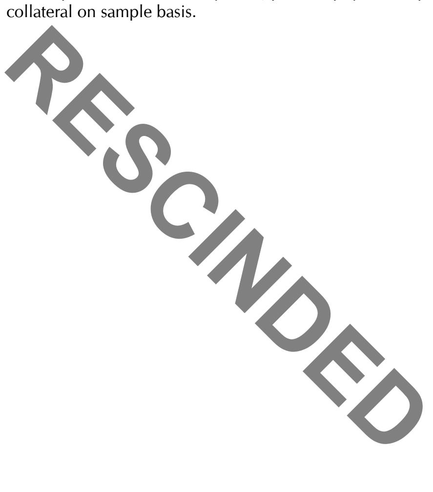
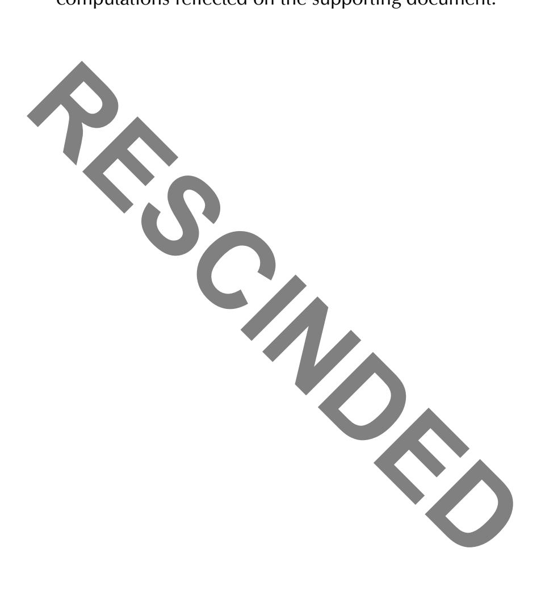

# **ICQs and Verification Procedures**

Comptroller's Handbook

December 2007

**References to reputation risk have been removed from this booklet as of March 20, 2025. Removal of reputation risk references is identified by a strikethrough. Refer to OCC Bulletin 2025-4.**

# Internal Control Questionnaires and Verification Procedures

# **Table of Contents**

| Introduction                                    | 1  |
|-------------------------------------------------|----|
| Pre-Examination Planning                        | 1  |
| During the Examination                          | 2  |
| Accounts Receivable and Inventory Financing     | 6  |
| Internal Control Questionnaire                  | 6  |
| Verification Procedures                         | 8  |
| Agricultural Lending                            | 11 |
| Verification Procedures                         | 11 |
| Allowance for Loan and Lease Losses             | 14 |
| Internal Control Questionnaire                  | 14 |
| Verification Procedures                         | 15 |
| Asset and Liability Management                  | 17 |
| Internal Control Questionnaire                  | 17 |
| Asset Securitization                            | 19 |
| Internal Control Questionnaire                  | 19 |
| Verification Procedures                         |    |
| Bank Dealer Activities                          | 27 |
| Internal Control Questionnaire                  | 27 |
| Bank Dealer Activities                          | 27 |
| Private Placements                              |    |
| Verification Procedures  Bank Dealer Activities |    |
| Private Placements                              |    |
| Bank Premises and Equipment                     | 57 |
| Internal Control Questionnaire                  | 57 |
| Verification Procedures                         | 60 |
| Bankers' Acceptances                            | 62 |
| Internal Control Questionnaire                  |    |
| Verification Procedures                         |    |

| Capital and Dividends                                   | 68         |
|---------------------------------------------------------|------------|
| Internal Control Questionnaire                          | 68         |
| Verification Procedures                                 | 69         |
| Cash Accounts                                           | 72         |
| Internal Control Questionnaire                          | 72         |
| Verification Procedures                                 | 81         |
| Commercial Lending                                      | 85         |
| Internal Control Questionnaire                          | <b>8</b> 5 |
| Verification Procedures                                 | 91         |
| Commercial Real Estate and Construction Lending         | 94         |
| Internal Control Questionnaire                          |            |
| Verification Procedures                                 |            |
| Concentrations of Credit                                | 114        |
| Internal Control Questionnaire                          | 114        |
| Consigned Items                                         | 116        |
| Internal Control Questionnaire                          | 116        |
| Verification Procedures                                 | 123        |
| Credit Card Lending                                     | 127        |
| Internal Control Questionnaire                          |            |
| Verification Procedures                                 |            |
| Due From Banks — Domestic and International             | 131        |
| Internal Control Questionnaire                          |            |
| Demand Deposits                                         | 131        |
| International Time Deposits                             |            |
| Verification Procedures  Demand Deposits                |            |
| International Time Deposits                             | 145        |
| Emerging Market Country Products and Trading Activities |            |
| Internal Control Questionnaire                          | 147        |
| Verification Procedures                                 | 151        |
| Employee Benefits                                       | 153        |
| Internal Control Questionnaire                          | 153        |
| Floor Plan Financing                                    | 155        |
| Internal Control Questionnaire                          |            |

| Verification Procedures                       | 162 |
|-----------------------------------------------|-----|
| Foreign Exchange                              | 164 |
| Internal Control Questionnaire                |     |
| Verification Procedures                       |     |
| Income and Expense                            | 172 |
| Internal Control Questionnaire                | 172 |
| Verification Procedures                       | 175 |
| Interest Rate Risk                            | 177 |
| Internal Control Questionnaire                | 177 |
| Investment Securities                         | 181 |
| Internal Control Questionnaire                | 181 |
| Verification Procedures                       | 184 |
| Lease Financing                               | 189 |
| Internal Control Questionnaire                | 189 |
| Verification Procedures                       | 192 |
| Loan Portfolio Management                     | 195 |
| Internal Control Questionnaire                | 195 |
| Management Information Systems                | 202 |
| Internal Control Questionnaire                | 202 |
| Verification Procedures                       | 205 |
| Mortgage Banking                              | 208 |
| Internal Control Questionnaire                | 208 |
| Other Assets/Other Liabilities                | 219 |
| Internal Control Questionnaire                | 219 |
| Verification Procedures                       | 222 |
| Other Real Estate Owned                       | 224 |
| Internal Control Questionnaire                | 224 |
| Verification Procedures                       | 225 |
| Payment Systems and Funds Transfer Activities | 227 |
| Internal Control Questionnaire                |     |
| Module A Module B                             |     |
| Verification Procedures                       |     |
| Regulatory Reports                            |     |

| Internal Control Questionnaire                                             | 240         |
|----------------------------------------------------------------------------|-------------|
| Retail Nondeposit Investment Sales                                         | <b>24</b> 3 |
| Internal Control Questionnaire                                             | 243         |
| Risk Management and Insurance                                              | 258         |
| Internal Control Questionnaire                                             | 258         |
| Risk Management of Financial Derivatives                                   | 260         |
| Internal Control Questionnaire                                             |             |
| Tier I and Tier II Dealers Active Position-Takers and Limited End-Users |             |
| Verification Procedures                                                    | 285         |
| Trade Finance                                                              | 290         |
| Internal Control Questionnaire                                             | 290         |
| Guarantees Issued                                                          | 290         |
| Letters of Credit                                                          | 292         |
| Verification Procedures                                                    | 296         |
| Guarantees Issued                                                          |             |
| Letters of Credit                                                          | 298         |

# **Introduction**

Evaluating a bank's system of internal controls is a fundamental step in the OCC's supervision process. This booklet contains a compilation of OCC Internal Control Questionnaires (ICQs) and verification procedures from the *Comptroller's Handbook for National Bank Examiners* and booklets of the *Comptroller's Handbook* that were published prior to January 2001. Booklets that were published after that time contain ICQs and verification procedures, either separately identified or incorporated into the examination procedures.

The decision to complete ICQs or perform verification procedures is made either during pre-examination planning or after reviewing the findings and conclusions of core assessments. ICQs are procedures that assist examiners in better understanding the quality of a bank's risk controls and in assessing compliance with bank policy for each area under examination. ICQs typically address standard controls that provide day-to-day protection of bank assets and financial records. Verification procedures are designed to verify the existence of assets or liabilities, or test the reliability of financial records. While verification procedures typically are performed by bank staff, directors, or auditors, examiners themselves must be prepared to perform verification procedures in cases where substantive safety and soundness concerns are unresolved.

The following procedures summarize the general decision-making process used when expanding the scope of examination, including the use of ICQs and verification procedures.

# **Pre-Examination Planning**

- 1. Review bank and OCC-generated reports. These may include: internal/external audit reports, internal control reports, internal risk assessment reports, previous reports of examination, examination analysis comments, periodic monitoring comments, Canary early warning benchmarks, correspondence files, and any other internal or external information deemed pertinent to the bank.
- 2. The EIC should discuss the intended scope of examination with bank management, and identify any significant changes in bank personnel, products, services, internal or external audit schedule or scope, and the local economy.

- 3. Based upon the preplanning analysis to date, determine if the scope of examination should be expanded. The scope should be expanded if substantive supervisory follow-up issues have surfaced. These may include:
  - Indications that the bank does not have a sound audit program or a satisfactory system of internal control.
  - Significant change in the bank's business activities or rapid bank growth without implementation of appropriate risk management controls.
  - The existence of significant or unresolved deficiencies.
  - Risk management weaknesses.
- 4. If the examination is not expanded, finalize the scope of examination.
- 5. If the examination is to be expanded, revise the scope of examination and select appropriate expanded procedures from the booklets of the *Comptroller's Handbook*, including ICQs and verification procedures.
  - Expanded procedures should focus on the specific areas or items of concern noted in the preplanning analysis; be tailored to include a more thorough assessment of the risk management process; and include additional transaction testing, if appropriate.
- 6. Finalize the scope of examination.

# **During the Examination**

- 1. Conduct the review of risk areas.
- 2. If substantive deficiencies are not identified, complete the onsite examination as planned.
- 3. If substantive deficiencies exist, determine if the scope of examination should be expanded. If the scope is not expanded, complete the onsite examination. If the scope is expanded, select appropriate expanded procedures from the booklets of the *Comptroller's Handbook*, including ICQs and verification procedures.

Expanded procedures should focus on the specific substantive deficiencies identified and be tailored to include additional transaction testing or a more thorough assessment of the risk management process. The scope of work performed must be sufficient to determine the extent of the problems and their effect on bank operations.

Examples of deficiencies that would require the use of expanded procedures include indications that:

- Management is trying to control or inhibit communications from internal audit staff to the board of directors.
- Significant new products or activities are being pursued with little or no expertise or with inadequate risk management controls.
- Bank underwriting and risk selection standards have been relaxed.
- High growth is occurring in specific areas of the bank without adequate audit or internal controls.
- Capital levels or ratios are rapidly declining.
- Balances in suspense accounts are high or growing.
- Separation of duties in areas involved with disbursement of funds is inadequate.
- Reliance on short-term or unstable funding sources is increasing.
- Volume of loans granted or renewed with policy exceptions is large or increasing.
- Significant increases or decreases in noninterest income have occurred.
- 4. Conduct the expanded procedures.
- 5. Determine if substantive concerns remain, particularly about the adequacy of audit, internal controls, the existence of assets, or the integrity of the bank's financial management or risk management controls.
- 6. If no substantive concerns remain, complete the examination, developing appropriate conclusions, MRAs, ROE comments, and supervisory followup.
- 7. If substantive safety and soundness concerns remain unresolved that may have a material adverse effect on the bank, further expand the scope by completing additional verification procedures. The scope of work performed must be sufficient to determine the extent of the problems, their root causes, and their effect on bank operations. Examiners should consult

with their supervisory office or the Chief Accountant's office before conducting direct confirmations with customers or third parties.

The existence of a "clean" external audit opinion does not necessarily preclude the use of verification procedures by examiners, if there is a significant concern about the quality, scope or depth of the external audit.

Verification procedures should also be used whenever:

- Account records are significantly out of balance.
- Management is uncooperative or poorly manages the bank and substantive deficiencies remain unresolved from prior OCC examinations or internal audits.
- Management restricts access to bank records.
- Significant accounting, audit, or internal control deficiencies remain uncorrected from previous examinations or from one audit to the next.
- Bank auditors are unaware of, or unable to sufficiently explain, significant deficiencies.
- Management engages in activities that raise questions about their integrity.
- Repeated violations of law affect audit, internal controls, or regulatory reports.
- Other situations exist that examiners believe warrant further investigation.

The extent that examiners perform verification procedures is decided on a case-by-case basis after consultation with the supervisory office. The EIC may direct the bank to contract with a third party to perform the verification necessary to determine the extent and effect of the deficiency on bank operations. If done by a third party, the verification must be done on a timely basis; supervisory follow-up will consist of reviewing the scope and results of the verification work and will be scheduled shortly after the third party completes its work.

8. For less problematic situations than those identified in Step 7, the examiner may require the bank to expand its audit program to include the areas containing weaknesses or deficiencies. However, this alternative will only be used if management has demonstrated a capacity and willingness to address regulatory problems, if there are no concerns about management's integrity, and management has initiated timely corrective action in the past. Use of this alternative must result in timely resolution of

- each identified supervisory problem. If examiners use this alternative, supervisory follow-up will include a review of audit work papers in areas where the bank audit was expanded.
- 9. Develop appropriate conclusions, MRAs, ROE comments, and supervisory follow-up. These conclusions should also be incorporated into regulatory ratings and the risk assessments.
- 10.Provide supervisory strategy recommendations for the next supervisory cycle to the EIC.

# **Accounts Receivable and Inventory Financing**

## **Internal Control Questionnaire**

### **Policies**

- 1. Has the board of directors, consistent with its duties and responsibilities, adopted written accounts receivable financing policies that:
  - a. Establish procedures for reviewing accounts receivable financing applications?
  - b. Establish standards for determining credit lines?
  - c. Establish standards for determining percentage advance to be made against acceptable receivables?
  - d. Define acceptable receivables?
  - e. Establish minimum requirements for verification of borrower's accounts receivable?
  - f. Establish minimum standards for documentation?
- 2. Are accounts receivable financing policies reviewed, at least annually, to determine if they are compatible with changing market conditions?

### **Records**

- 3. Is the preparation and posting of subsidiary accounts receivable financing records performed or reviewed by persons who do not also:
  - a. Issue official checks and drafts singly?
  - b. Handle cash?
- 4. Are the subsidiary accounts receivable financing records reconciled, at least monthly, to the appropriate general ledger accounts, and reconciling items investigated by persons who do not also handle cash?

- 5. Are loan statements, delinquent account collection requests, and past due notices checked to the trial balances that are used in reconciling subsidiary records of accounts receivable financing loans with general ledger accounts, and handled only by persons who do not also handle cash?
- 6. Are inquiries about accounts receivable financing loan balances received and investigated by persons who do not also handle cash?
- 7. Are documents supporting recorded credit adjustments to loan accounts or accrued interest receivable accounts checked or tested subsequently by persons who do not also handle cash (if so, explain briefly)?

### **Ledgering Accounts Receivable**

- 8. Are terms, dates, weights, description of merchandise, etc., shown on invoices, shipping documents, delivery receipts, and bills of lading scrutinized for differences?
- 9. Are procedures in effect to determine if the signatures shown on the above documents are authentic?
- 10. Are payments from customers scrutinized for differences in invoice dates, numbers, terms, etc.?

### **Loan Interest**

- 11. Is the preparation and posting of loan interest records performed or reviewed by persons who do not also:
  - a. Issue official checks and drafts singly?
  - b. Handle cash?
- 12. Are independent interest computations made and compared or tested to initial loan interest record by persons who do not also:
  - a. Issue official checks and drafts singly?
  - b. Handle cash?

### **Collateral**

- 13. Does the bank record, on a timely basis, a first lien on the assigned receivables for each borrower?
- 14. Do all loans granted on the security of the receivables also have an assignment of the inventory?
- 15. Does the bank verify the borrower's accounts receivable or require independent verification on a periodic basis?
- 16. Does the bank require the borrower to provide aged accounts receivable schedules on a periodic basis?
- 17. If applicable, are cash receipts and invoices block proved in the mailroom and subsequently traced to posting on daily transaction records?

### **Conclusion**

- 18. Is the foregoing information an adequate basis for evaluating internal control in that there are no significant additional internal auditing procedures, accounting controls, administrative controls, or other circumstances that impair any controls or mitigate any weaknesses indicated above (explain negative answers briefly, and indicate conclusions as to their effect on specific examination or verification procedures)?
- 19. Based on a composite evaluation (as evidenced by answers to the foregoing questions), internal control is considered (good, medium, or bad).

# **Verification Procedures**

- 1. Test the additions of the trial balances and the reconciliation of the trial balances to the general ledger. Include loan commitments and other contingent liabilities.
- 2. Using an appropriate sampling technique, select loans from the trial balance and:

- a. Prepare and mail confirmation forms to borrowers. (Loans serviced by other institutions, either whole loans or participations, are usually confirmed only with the servicing institution. Loans serviced for other institutions, either whole loans or participations, should be confirmed with the buying institution and the borrower. Confirmation forms should include borrower's name, loan number, the original amount, interest rate, current loan balance, borrowing base, and a brief description of the collateral.)
- b. After a reasonable time, mail second requests.
- c. Follow up on any unanswered requests for verification or exceptions and resolve differences.
- d. Examine notes for completeness and compare agree date, amount, and terms with trial balance.
- e. In the event the holder does not hold notes at the bank, request confirmation.
- f. Check to see that required initials of approving officer are on the note.
- g. Check to see that note is signed, appears to be genuine, and is negotiable.
- h. Compare collateral held in commercial loan files with the description on the collateral register.
- i. Determine that the proper collateral documentation is on file.
- j. Determine that margins are reasonable and in line with bank policy and legal requirements.
- k. List all collateral discrepancies and investigate.
- l. Forward a confirmation request on any collateral held outside the bank (e.g., by bonded warehouses).
- m. Determine that each file contains documentation supporting guarantees and subordination agreements, when appropriate.

- n. Determine that any required insurance coverage is adequate and that the bank is named as loss payee.
- o. Review participation agreements, excerpting when necessary such items as rate of service fee, interest rate, retention of late charges, and remittance requirements, and determine whether participant has complied. Review disbursement ledgers and authorizations, and determine whether authorizations are signed in accordance with terms of the loan agreement.

### 3. Review field audits and:

- a. Determine that on-site inspections are performed in conformance with bank policy.
- b. Consider making a physical inspection of the collateral when the quality or frequency of the bank's inspections is not adequate.
- c. If physical inspections are made, compare the results with the bank's records and investigate differences to the extent necessary.
- 4. Review accounts with accrued interest by:
  - a. Reviewing and testing procedures for accounting for accrued interest and for handling adjustments.
  - b. Scanning accrued interest for any unusual entries and following up on any unusual items by tracing them to initial and supporting records.
- 5. Using a list of nonaccruing loans, check loan accrual records to determine that interest income is not being recorded.
- 6. Obtain or prepare a schedule showing the monthly interest income amounts and the commercial loan balance at each month end since the last examination, and:
  - a. Calculate yield.
  - b. Investigate any significant fluctuations or trends.

# **Agricultural Lending**

### **Verification Procedures**

- 1. Test the additions of the trial balances and the reconciliation of the trial balances to the general ledger. Include loan commitments and other contingent liabilities.
- 2. Using an appropriate sampling technique, select loans from the trial balance and:
  - a. Prepare and mail confirmation forms to borrowers. (Loans serviced by other institutions, either whole loans or participations, should be confirmed only with the servicing institution. Loans serviced for other institutions, either whole loans or participations, should be confirmed with the buying institution and the borrower. Confirmation forms should include borrower's name, loan number, the original amount, interest rate, current loan balance, contingency and escrow account balance, and a brief description of the collateral.)
  - b. After a reasonable time, mail second requests.
  - c. Follow-up on any no-replies or exceptions and resolve differences.
  - d. Examine notes for completeness and agree date, amount, and terms to trial balance.
  - e. In the event notes are not held at the bank, request confirmation by the holder.
  - f. Check to see that required initials of approving officer are on the note.
  - g. Check to see that note is signed, appears to be genuine, and is negotiable.
  - h. Compare collateral held in commercial loan files with the description on the collateral register.

- i. Determine that the proper assignments, stock powers, hypothecation agreements, statements of purpose, etc., are on file.
- j. Test the pricing of the negotiable collateral.
- k. Determine that margins are reasonable and in line with bank policy and legal requirements.
- I. List all collateral discrepancies and investigate.
- m. Determine if any collateral is held by an outside custodian or has been temporarily removed for any reason.
- n. Forward a confirmation request on any collateral held outside the bank.
- o. Determine that each file contains documentation supporting guarantees and subordination agreements, where appropriate.
- p. Determine that any required insurance coverage is adequate and that the bank is named as loss payee.
- q. Review participation agreements, making excerpts where necessary, for such items as rate of service fee, interest rate, retention of late charges, and remittance requirements, and determine whether participant has complied. Review disbursement ledgers and authorizations, and determine if authorizations are signed in accordance with terms of the loan agreement.
- 3. Review inspection reports on agricultural loans and:
  - a. Determine that on-site inspections are performed in conformance with bank policy.
  - b. Consider making a physical inspection of the collateral in those cases where the quality or frequency of the bank's inspection is not considered adequate.
  - c. If physical inspections are made, compare the results with the bank's records, and investigate differences to the extent considered necessary.

- 4. Reviewing and accrued interest accounts by:
  - a. Reviewing and testing procedures for accounting for accrued interest, and for handling adjustments.
  - b. Scanning accrued interest for any unusual entries and following up on any unusual items by tracing them to initial and supporting records.
- 5. Using a list of nonaccruing loans, check loan accrual records to determine that interest income is not being recorded.
- 6. Obtain or prepare a schedule showing the monthly interest income amounts and the commercial loan balance at each month end since the last examination, and:
  - a. Calculate yield.
  - b. Investigate significant fluctuations and/or trends.

# **Allowance for Loan and Lease Losses**

## **Internal Control Questionnaire**

### **Allowance Policies**

- 1. Has the board of directors, consistent with its duties and responsibilities:
  - a. Established a comprehensive and well-documented process for maintaining an adequate allowance?
  - b. Established an effective loan review system that will identify, monitor, and address asset quality problems in an accurate and timely manner?
  - c. Established procedures for the timely charge-off of loans that are confirmed to be uncollectible?
  - d. Defined collection efforts to be undertaken after a loan is charged off?

### **Loan Charge-offs**

- 2. Is the preparation and posting of any subsidiary records of loans charged off performed or reviewed by persons who do not also:
  - a. Issue official checks and drafts singly?
  - b. Handle cash?
- 3. Are all loans charged off reviewed and approved by the board of directors as evidenced by the minutes of board meetings?
- 4. Are notes for loans charged off maintained under dual custody?
- 5. Are collection efforts continued for loans charged off until the potential for recovery is exhausted?
- 6. Are periodic progress reports prepared and reviewed by appropriate

management personnel for all loans charged off for which collection efforts are continuing?

### **Allowance Evaluation Process**

- 7. Does the bank have a written description of the process and methodology used by management to determine the adequacy of the allowance?
- 8. Does management review the adequacy of the allowance and make necessary adjustments at least quarterly and report the findings to the board of directors before preparing the report of condition and income?
- 9. Does management retain documentation of its review of the adequacy of the allowance?

### **Conclusion**

- 10. Is the foregoing information considered an adequate basis for evaluating internal control in that there are no significant additional internal auditing procedures, accounting controls, administrative controls, or other circumstances that impair any controls or mitigate any weaknesses indicated above (explain negative answers briefly, and indicate conclusions as to their effect on specific examination or verification procedures)?
- 11. Based on a composite evaluation, as evidenced by answers to the foregoing questions, internal control is considered (good, medium, or bad).

# **Verification Procedures**

- 1. Agree the total charged-off loans since the last examination date as recorded in the charged-off ledger to the total debit entries in the allowance for loan and lease losses for the same period.
- 2. Select charged-off loans and:
  - a. Examine supporting documentation.

- b. Trace approval by the directors, as evidenced in the minutes of board meetings.
- c. Send positive confirmation requests to the borrower. (There should be no indication to the borrower that the accounts have been charged off.)
- d. Determine whether any charged-off loans are extended to foreign government officials or other persons or organizations covered by the Foreign Corrupt Practices Act or the Federal Election Law.
- 3. Select recovery entries in the charged-off ledger since the last examination and compare to credit entries in the allowance account.

# **Asset and Liability Management**

## **Internal Control Questionnaire**

Discuss with senior management the bank's funds management policies and practices.

- 1. Has the board of directors, consistent with its duties and responsibilities, adopted a funds management policy which includes:
  - a. Lines of authority and responsibility for funds management decisions?
  - b. A formal mechanism to coordinate asset and liability decisions?
  - c. A method to identify liquidity needs and the means to meet those needs?
  - d. Requirements for the level of liquid assets and other sources of funds in relationship to anticipated and potential needs?
  - e. Guidelines for the level of rate sensitive assets and rate sensitive liabilities and the relationship between them?
  - f. Limits on the risk to earnings arising from historic cost accounts and instruments carried on a market valuation basis?
- 2. Does the planning and budgeting function consider liquidity and rate sensitivity?
- 3. Has provision been made for the preparation of internal management reports which are an adequate basis for funds management decisions and for monitoring the results of those decisions? And:
  - a. Are internal management reports concerning liquidity needs and source of funds to meet those needs regularly prepared and reviewed by the board of directors and senior management?
  - b. Are reports prepared on the bank's rate sensitivity?

- c. Is historical information regarding asset yields, cost of funds, and net interest margins readily available?
- d. Are variations in the interest margin, both from the prior reporting period and from the budget, regularly monitored?
- e. Is sufficient information available to permit an analysis of the cause of interest margin variations?
- f. Is corrective action taken when unfavorable interest margin trends are detected?
- 4. Is the foregoing information an adequate basis for evaluating internal control in that there are no significant additional internal auditing procedures, accounting controls, administrative controls, or other circumstances that impair any controls or mitigate any weaknesses indicated above (explain negative answers briefly, and indicate conclusions as to their effect on specific examination procedures)?
- 5. Based on a composite evaluation, as evidenced by answers to the foregoing questions, internal control is considered (good, medium, or bad).

# **Asset Securitization**

## **Internal Control Questionnaire**

### **Policies**

- 1. Determine if board approved securitization policies and procedures are adequate and establish appropriate risk limits. The written policies and procedures should address:
  - a. Permissible securitization activities.
  - b. Authority and responsibility over
    - Transaction approvals and cancellations.
    - Deal negotiation and execution.
    - Counterparty approvals.
    - Transaction monitoring.
    - Pricing approvals.
    - Personnel supervision.
    - Risk management.
    - Reporting and approving policy exceptions.
  - c. Underwriting standards for loans originated or purchased for securitization.
  - d. Servicing standards, including criteria for selecting a third-party servicer.
  - e. Exposure limits for retained interests as a percentage of Tier 1 capital.
  - f. Standards for repurchasing distressed loans from the securitized credit pool that are consistent with contractual recourse obligations.
  - g. Hedging activities.
  - h. Legal counsel review of contracts or agreements.
  - i. Consistently applied accounting methodology.

- j. Regulatory reporting requirements.
- k. Valuation methods for retained interests, including procedures for review and approval of the underlying assumptions.
- l. Management reporting process.
- 2. Determine if sufficient operational separation and rotation of duties exist.
- 3. Determine if proper safeguards are in place regarding access to and use of records.
- 4. Determine if loan servicing statements and trustee reports for each securitization are routinely reconciled.
- 5. Determine if deviations from policy parameters are handled in accordance with board approved policies.
- 6. When the bank retains recourse in a securitization, determine whether internal controls are in place to ensure recourse payments to the trust do not exceed the bank's contractual obligation.
- 7. Determine if internal management reports provide sufficient information for management's decisions and for monitoring the results of those decisions. Reports should address the following:
  - a. Performance of assets in securitized pools. At a minimum, these reports should provide delinquency, defaults, losses, and prepayment performance of assets sold.
  - b. Deal summaries for completed, in process, and prospective securitization transactions. Deal summaries should include collateral type, dollar volume of loans sold, maturity, credit enhancement and subordination features, financial covenants, rights of repurchase, and counterparty exposures.
  - c. Vintage analysis for each pool using monthly data.
  - d. Static pool cash collection analysis.

- e. A monthly statement of covenant compliance. The report should include compliance with both credit enhancement build triggers and servicing removal triggers.
- f. Quarterly or more frequent sensitivity analyses or stress tests.
- g. Exposure by counterparty and function (e.g., loan originator, credit enhancement provider, servicer).
- h. Profitability analysis by securitization and function (e.g., originator, provider of direct credit substitute).
- i. Liquidity usage and expected funding requirements.
- j. Servicing performance reports. If the institution uses a third party servicer, management reporting needs to provide appropriate information to monitor performance.
- 8. Determine if securitization activity information is effectively communicated to the lending, credit review, funds management, servicing, and risk management areas.
- 9. Verify that management reviews financial audits or other documentation to analyze the condition of any third party credit enhancement provider, including a subsidiary or an affiliate, involved in the institution's securitizations.
- 10. If a third party servicer is used, including a subsidiary or an affiliate, determine that management reviews operational audits or other documentation to analyze the operating soundness of this entity.
- 11. Determine that the authority to provide direct credit substitutes (e.g., financial standby letters of credit) is subject to the approval of the credit department.
- 12. Determine that exposures arising from direct credit substitutes are analyzed during the internal credit review process.
- 13. If a third party values the retained interest(s), review management's documentation and evaluate the due diligence performed for

determining the qualifications of the third party's personnel. In addition, determine senior management's understanding of the methodology used by the third party.

## **Verification Procedures**

- 1. Evaluate the methodology used to set loan pricing relative to risk.
- 2. Test a sample of loans to ensure underwriting policies and guidelines are appropriately followed.
- 3. Determine the level of underwriting and policy exceptions. Evaluate the impact these exceptions have on credit quality and risk based pricing.
- 4. Ensure appropriate controls exist over the real estate appraisal process.
- 5. Review the contractual documents, including the loan purchase and sale agreements and offering circulars, to validate that the institution is legally entitled to receive the cash flows from the securitization that have been booked as a retained interest. These cash flows may include excess principal and interest payments from the collateral and release of reserve funds.
- 6. Verify that retained interests are accounted for in compliance with GAAP and the bank's securitization policy.
  - a. For each securitization transaction, verify that there is an appropriate legal opinion that meets FAS 125 sales criteria. Review legal opinion and assess reasonableness.
  - b. Review accounting entries for securitization transactions. Assess reasonableness of "gain on sale". Ensure that residual interests are initially recorded at their relative fair value.
  - c. Ensure retained interests (excluding servicing assets) are accounted for at fair value. Ensure servicing assets are accounted for at the lower of cost or market value.
  - d. Verify that servicing assets are amortized over their useful life and evaluated for impairment on a quarterly basis.

- 7. Perform an in-depth analysis of the valuation modeling process for retained interests.
  - a. Evaluate the reasonableness of model validation procedures performed by bank management. Test model to ensure output is calculated correctly and provides meaningful results.
  - b. Determine the model appropriately reflects the terms and conditions in securitization documentation.
  - c. Evaluate the independence and competency of personnel responsible for valuation.
  - d. Review the methodology and supporting documentation to assess the reasonableness of cash yield, prepayment, default, loss, and discount rate assumptions and verify their calculations.
  - e. Compare the prepayment, default, and loss assumptions used in valuing the retained interests to actual performance of the underlying collateral. If the underlying collateral does not have sufficient performance history, compare assumptions to deals with substantially similar underlying assets. In addition, evaluate whether weaknesses or liberal collection practices identified in servicing reviews are fully considered in these assumptions.
  - f. Calculate the cash yield of the portfolio based on actual cash received from customers. Compare the cash yield calculated to the cash yield assumption used in valuing the retained interests.
  - g. Compare model estimates of monthly cash flow to actual cash flow received by the bank. Significant variances require explanation.
  - h. Compare the discount rate used in valuing the retained interests to the discount rate that other market participants use to value retained interests with substantially similar underlying assets.
  - i. Verify discounted cash flow methodology. Ensure that expected cash flows are discounted based on when received (cash out method) as opposed to when earned by the trust (cash in method).

- j. Determine that the valuation of residual interests properly reflects the following impacts on cash flows:
  - Fees (e.g., trustee, servicer, insurer).
  - Release of or additions to a reserve or overcollateralization account.
  - Payments from delinquent loans that are not in default.
  - Recoveries.
  - Insurance coverage of losses (e.g., FHA guaranteed).
  - Credit losses.
- 8. Review supporting cash flow documentation to determine the following:
  - a. The amount of interest paid to the senior bond classes matches the stated coupon rate for each bond class.
  - b. Cash flows are distributed to bond classes and the retained interest according to the terms of the prospectus, offering circular, or pooling and servicing agreement.
  - c. The deal redemption or cleanup provision is accurately reflected in the cash flows to the retained interest holder.
- 9. Reconcile the dollar volume of loans serviced by a third party, including a subsidiary or an affiliate, that are either on-balance sheet or that have been sold in a securitization.
  - a. Independently verify that the amount of loans being serviced ties to the institution's records and the supporting cash flow documentation for valuing the retained interests.
  - b. For on-balance sheet loans, verify that the dollar volume of loans on the servicing statements ties to the dollar volume of loans on the institution's records.
  - c. For securitized loans, verify that the dollar volume of loans on the servicing statements ties to the dollar volume of loans on the supporting cash flow documentation for valuing the retained interests.

- 10. Review held for sale loan accounting practices:
  - a. Assess management's methodology for assigning loans as "held for sale" versus its permanent portfolio.
  - b. Verify that management applies LOCOM (Lower of Cost or Market) accounting to loans held for sale. Ensure pricing used is reasonable and well supported.
  - c. Ensure loans that are transferred from "held for sale" to the permanent investment portfolio are transferred at LOCOM.
  - d. Determine the timeliness and assess the accuracy of the "held for sale" and permanent portfolio account reconcilements.
- 11. Evaluate the effectiveness of the servicing function. This review should include:
  - a. Evaluate whether MIS reports for servicing operation provide adequate information to monitor servicing activities.
  - b. Assess the accuracy of cost of service information to ensure it includes all costs associated with direct and indirect overhead, capital, and collections. Compare cost of service with industry averages to judge the efficiency of the operation.
  - c. Assess the effectiveness of loan collection practices.
  - d. Evaluate the efficiency of the asset disposal unit.
  - e. Test loss mitigation practices to ensure these activities are conducted in a safe and sound manner.
  - f. Ensure the cash management function has established appropriate segregated custodial accounts. Determine if adequate controls exist over custodial accounts, including daily balancing, monthly reconcilements, assigned authority for disbursement, and appropriate segregation.
  - g. Review servicing advancing practices to ensure the activity is conducted in a safe and sound manner. Verify that servicing

advances are consistent with industry practices and conducted in accordance to the servicing agreement and securitization documentation.

h. Verify that investor accounting and reporting is timely and accurate. Ensure servicing reports used for reporting conform to the requirements of securitization documents.

# **Bank Dealer Activities**

## **Internal Control Questionnaire**

# **Bank Dealer Activities**

### **Securities Underwriting Trading Policies**

- 1. Has the board of directors, consistent with its duties and responsibilities, adopted written securities underwriting/trading policies that:
  - a. Outline objectives?
  - b. Establish limits and/or guidelines for:
    - Price mark-ups?
    - Quality of issues?
    - Maturity of issues?
    - Inventory positions (including WI positions)?
    - Amounts of unrealized loss on inventory positions?
    - Length of time an issue will be carried in inventory?
    - Amounts of individual trades or underwriter interests?
    - Acceptability of brokers and syndicate partners?
  - c. Recognize possible conflicts of interest and establish appropriate procedures regarding:
    - Deposit and service relationships with municipalities whose issues have underwriting links to the trading department?
    - Deposit relationships with securities firms handling significant volumes of agency transactions or syndicate participations?
    - Transfers made between trading account inventory and investment portfolio(s)?
    - The bank's trust department acting as trustee, paying agent, and transfer agent for issues which have an underwriting relationship with the trading department?
  - d. State procedures for periodic or monthly valuation of trading inventories to market value?

- e. State procedures for periodic independent verification of valuations of the trading inventories?
- f. Outline methods of internal review and reporting by department supervisors, compliance managers, and internal auditors to insure compliance with established policy?
- g. Identify permissible types of securities?
- h. Ensure compliance with the rules of fair practice that:
  - Prohibit any deceptive, dishonest, or unfair practice?
  - Adopt formal suitability checklists?
  - Monitor gifts and gratuities?
  - Prohibit materially false or misleading advertisements?
  - Provide for the disclosures and consents necessary to avoid conflicts of interest when the bank assumes the role of both underwriter and financial advisor to the issuer?
  - Adopt a system to determine the existence of possible control relationships?
  - Prohibit the use of confidential, nonpublic information without written approval of the affected parties?
  - Prohibit improper use of funds held on another's behalf?
  - Designate specific principals to supervise personnel and business conduct in general?
  - Adopt written securities price mark-up guidelines?
  - Allocate responsibility for transactions with own employees and employees of other dealers?
  - Require the maintenance of the MSRB manual at each office where there are representatives?
  - Require disclosure on all new issues?
- i. Provide for exceptions to standard policy?
- 2. Does the board review the underwriting/trading policies at least quarterly to determine their adequacy in light of changing conditions?
- 3. Is there a periodic review by the board to assure that the underwriting/trading department complies with its policies?

### **Supervisory Procedures**

- 4. Does the municipal securities dealer provide adequate supervision for its activities by:
  - a. Designating an appropriately qualified individual(s) to:
    - Supervise the activities of the municipal securities dealer and enforce the required written procedures? If so, give name.
    - Maintain and preserve the books and records required by rules G-8 and G-9? If so, give name.
  - b. Establishing written supervisory procedures that:
    - Designate one or more municipal securities principals to supervise the activities of the dealer?
    - Provide for prompt review and written approval by the designated municipal securities principal of:
      - The opening of each customer account carried by the bank?
      - Each transaction in municipal securities?
      - All written customer complaints pertaining to transactions in municipal securities?
      - All correspondence pertinent to the solicitation or execution of transactions in municipal securities?
  - c. Providing for the prompt review and written approval of each transaction in municipal securities effected with or for a discretionary account introduced or carried?
  - d. Providing for the regular and frequent examination by the designated municipal securities principal of customer accounts introduced or carried to detect and prevent irregularities and abuses?
- 5. Does the bank have accounts for anyone employed by, or partner of, another municipal securities dealer or on the behalf of any spouse or minor child of such person? If so:
  - Has written notice of the opening and maintenance of such

- account been given first to the broker or dealer by whom such person is employed?
- Has the bank sent a confirmation notice to the employing dealer simultaneous with the notice sent to the customer at the time of effecting a transaction?
- Has the bank acted according to any written instructions that the employing dealer or broker may have provided?
- 6. Does the bank maintain a complete, updated copy of all MSRB rules in each office in which any municipal security dealer activities are conducted?
- 7. When the bank sold new issue municipal securities to customers, determine if:
  - a. A copy of the official statement furnished on behalf of the issuer was sent to the customer?
  - b. In the instance of a negotiated sale of a new issue, was the following information sent to the customer:
    - The underwriting spread?
    - The amount of any fee received by the municipal securities dealer as agent for the issuer in the distribution of the securities?
    - The initial offering price for each maturity in the issue that is offered or to be offered in whole or in part by the underwriters?

**Note: Those requirements must be met at or prior to the sending of the final confirmation notice.** 

- 8. Has the bank advertised any new issues of securities, or part thereof, showing the initial reoffering prices or yields for the securities, even if the price or yield for a maturity or maturities may have changed? If so:
  - a. Did the advertisements contain the date of sale of the securities by the issuer to the syndicate?
  - b. Did the advertisement show either the initial reoffering prices or yields or the prices or yields that existed at the time the advertisement was placed for publication?

- 9. Has the bank advertised any municipal securities or municipal securities services through public media or other promotional material designed for customers? If so:
  - a. Are advertisements reviewed to determine they are not false or misleading?
  - b. Does a principal approve advertisements prior to "first use?"

### **Offsetting Resale and Repurchase Transactions**

- 10. Has the board of directors, consistent with its duties and responsibilities, adopted written offsetting repurchase transaction policies that:
  - a. Limit the aggregate amount of repurchase transactions?
  - b. Limit the amounts in unmatched or extended (over 30 days) maturity transactions?
  - c. Determine maximum time gaps for unmatched maturity transactions?
  - d. Determine minimally acceptable interest rate spreads for various maturity transactions?
  - e. Determine the maximum amount of funds to be extended to any single or related firms through "reverse repo" transactions, involving unsold (through forward sales) securities?
  - f. Require firms involved in "reverse repo" transactions to submit corporate resolutions stating the names and limits of individuals, who are authorized to commit the firm?
  - g. Require submission of current financial information by firms involved in "reverse repo" transactions?
  - h. Provide for periodic credit reviews and approvals for firms involved in "reverse repo" transactions?
  - i. Specify types of acceptable repurchase transaction collateral (if so,

| 11. |    | Are written collateral control procedures designed so that:                                                                                                                           |  |  |  |
|-----|----|---------------------------------------------------------------------------------------------------------------------------------------------------------------------------------------|--|--|--|
|     | a. | Collateral assignment forms are used?                                                                                                                                                 |  |  |  |
|     |    | b. Collateral assignments of registered securities are accompanied by powers of attorney signed by the registered owner?                                                           |  |  |  |
|     |    | • Registered securities are registered in bank or bank's nominee name when they are assigned as collateral for extended maturity (over 30 days) "reverse repo" transactions. |  |  |  |
|     | c. | Funds are not disbursed until "reverse repo" collateral is delivered into the physical custody of the bank or an independent safekeeping agent?                                 |  |  |  |
|     |    | d. Funds are only advanced against predetermined collateral margins or discounts?                                                                                                  |  |  |  |
|     |    | • If so, indicate margin or discount percentage                                                                                                                                    |  |  |  |
|     | e. | Collateral margins or discounts are predicted upon:                                                                                                                                   |  |  |  |
|     |    | • The type of security pledged as collateral?                                                                                                                                      |  |  |  |
|     |    | • Maturity of collateral? • Historic and anticipated price volatility of the collateral? • Maturity of the "reverse repo" agreements?                                  |  |  |  |
|     | f. | Maintenance agreements are required to support pre- determined collateral margin or discount?                                                                                      |  |  |  |
|     |    | g. Maintenance agreements are structured to allow margin calls in the event of collateral price declines?                                                                          |  |  |  |
|     |    | h. Collateral market value is frequently checked to determine compliance with margin and maintenance requirements (if so, indicate frequency of checks ).                    |  |  |  |
|     |    | Custody and Movement of Securities                                                                                                                                                    |  |  |  |

indicate type ).

- 12. Are the bank's procedures such that persons do not have sole custody of securities in that:
  - a. They do not have sole physical access to securities?
  - b. They do not prepare disposal documents that are not also approved by authorized persons?
  - c. For the security custodian, supporting disposal documents are examined or adequately tested by a second custodian?
  - d. No person authorizes more than one of the following transactions: execution of trades, receipt and delivery of securities, and collection or disbursement of payment?
- 13. Are securities physically safeguarded to prevent loss, unauthorized disposal, or use? And:
  - a. Are negotiable securities kept under dual control?
  - b. Are securities counted frequently, on a surprise basis, reconciled to the securities record, and the results of such counts reported to management?
  - c. Does the bank periodically test for compliance with provisions of its insurance policies regarding custody of securities?
  - d. For securities in the custody of others:
    - Are custody statements agreed periodically to position ledgers, and any differences followed up to a conclusion?
    - Are statements received from brokers and other dealers reconciled promptly, and any differences followed up to a conclusion?
    - Are positions for which no statements are received confirmed periodically, and stale items followed up to a conclusion?
- 14. Are trading account securities segregated from other bank owned securities or securities held in safekeeping for customers?
- 15. Is access to the trading securities vault restricted to authorized

- employees?
- 16. Do withdrawal authorizations require countersignatures to indicate security count verifications?
- 17. Is registered mail used for mailing securities, and are adequate receipt files maintained for such mailings (if registered mail is used for some but not all securities mailed, indicate criteria and reasons)?
- 18. Are pre-numbered forms used to control securities trades, movements, and payments?
- 19. If so, is numerical control of pre-numbered forms accounted for periodically by persons independent of those activities?
- 20. Do alterations to forms governing the trade, movement, and payment of securities require:
  - a. Signature of the authorizing party?
  - b. Use of a change of instruction form?
- 21. With respect to negotiability of registered securities:
  - a. Are securities kept in non-negotiable form whenever possible?
  - b. Are all securities received, and not immediately delivered, transferred to the name of the bank or its nominee and kept in nonnegotiable form whenever possible?
  - c. Are securities received checked for negotiability (endorsements, signature, guarantee, legal opinion, etc.) and for completeness (coupons, warrants, etc.) before they are placed in the vault?

### **Records Maintenance**

### *Recordkeeping and Confirmation Requirements for Customer Securities Transactions (12 CFR 12)*

22. Are chronological records of original entry containing an itemized daily record of all purchases and sales of securities maintained? Also: Do the original entry records reflect:

- a. The account or customer for which each such transaction was effected?
- b. The description of the securities?
- c. The unit and aggregate purchase or sale price (if any)?
- d. The trade date?
- e. The name or other designation of the broker/dealer or other person from whom purchased or to whom sold?

**If the bank has had an average of 200 or more securities transactions per year for customers over the prior three- calendar-year period, exclusive of transactions in U.S. government and federal agency obligations, answer the following.** 

- 23. Does the bank maintain account records for each customer which reflect:
  - a. All purchases and sales of securities?
  - b. All receipts and deliveries of securities?
  - c. All receipts and disbursements of cash for transactions in securities for such account?
  - d. All other debits and credits pertaining to transactions in securities?
- 24. Does the bank maintain a separate memorandum (order ticket) of each order to purchase or sell securities (whether executed or canceled) which includes:
  - a. The account(s) for which the transaction was effected?
  - b. Whether the transaction was a market order, limit order, or subject to special instructions?

- c. The time the order was received by the trader or other bank employee responsible for affecting the transaction?
- d. The time the order was placed with the broker/dealer, or if there was no broker/dealer, the time the order was executed or canceled?
- e. The price at which the order was executed?
- f. The broker/dealer used?
- 25. Does the bank maintain a record of all broker/dealers selected by the bank to effect securities transactions and the amount of commissions paid or allocated to each such broker during the calendar year?
- 26. Does the bank, subsequent to effecting a securities transaction for a customer, mail or otherwise furnish to such customer either a copy of the confirmation of a broker/dealer relating to the securities transaction or a written trade confirmation prepared by the bank?
- 27. If customer notification is provided by furnishing the customer with a copy of the confirmation of a broker/dealer relating to the transaction, and if the bank is to receive remuneration from the customer or any other source in connection with the transaction, and the remuneration is not determined pursuant to a written agreement between the bank and the customer, does the bank also provide a statement of the source and amount of any remuneration to be received?
- 28. If customer notification is provided by furnishing the customer with a trade confirmation prepared by the bank, does the confirmation disclose:
  - a. The name of the bank?
  - b. The name of the customer?
  - c. Whether the bank is acting as agent for such customer, as principal for its own account, or in any other capacity?
  - d. The date of execution and a statement that the time of execution will be furnished within a reasonable time upon written request of such customer?

- e. The identity, price, and number of shares or units (or principal amount in the case of debt securities) of such securities purchased or sold by such customer?
- 29. For transactions which the bank effects in the capacity of agent, does the bank, in addition to the above, disclose:
  - a. The amount of any remuneration received or to be received, directly or indirectly, by any broker/dealer from such customer in connection with the transaction?
  - b. The amount of any remuneration received or to be received by the bank from the customer and the source and amount of any other remuneration to be received by the bank in connection with the transaction, unless remuneration is determined pursuant to a written agreement between the bank and the customer?
  - c. The name of the broker/dealer used; or where there is no broker/dealer, the name of the person from whom the security was purchased or to whom it was sold, or the fact that such information will be furnished within a reasonable time upon written request?
- 30. Does the bank maintain the above records and evidence of proper notification for a period of at least three years?
- 31. Does the bank furnish the written notification described above within five business days from the date of the transaction, or if a broker/dealer is used, within five business days from the receipt by the bank of the broker/dealer's confirmation (12 CFR 12.5)? If not, does the bank use one of the alternative procedures described in 12 CFR 12.5?
- 32. Unless specifically exempted in 12 CFR 12.7, does the bank have established written policies and procedures ensuring (12 CFR 12.6):
  - a. That bank officers and employees who make investment recommendations or decisions for the accounts of customers, who participate in the determination of such recommendations or decisions, or who, in connection with their duties, obtain information concerning which securities are being purchased or sold or recommended for such action, report to the bank, within 10

days after the end of the calendar quarter, all transactions in securities made by them or on their behalf, either at the bank or elsewhere in which they have a beneficial interest (subject to certain exemptions of 12 CFR 12.6(d))?

- b. That in the above required report the bank officers and employees identify the securities purchased or sold and indicate the dates of the transactions and whether the transactions were purchases or sales?
- c. The assignment of responsibility for supervision of all officers or employees who: (1) transmit orders to or place orders with broker/dealers, or (2) execute transactions in securities for customers?
- d. The fair and equitable allocation of securities and prices to accounts when orders for the same security are received at approximately the same time and are placed for execution either individually or in combination?
- e. Where applicable, and where permissible under local law, the crossing of buy and sell orders on a fair and equitable basis to the parties to the transaction?

### *MSRB Records Maintenance*

- 33. Does the bank maintain:
  - a. Customer confirmations, including as applicable (required by MSRB Rule G-15):
    - Bank dealer's name, address, and phone number?
    - Customer's name?
    - Designation of whether transaction was a purchase from or sale to the customer?
    - Par value of securities?
    - Description of securities, including at a minimum:
      - Name of issuer?
      - Interest rate?
      - Maturity rate?

- Designation, if securities are limited tax?
- Subject to redemption prior to maturity (callable)?
- Designation, if revenue bonds and the type of revenue?
- The name of any company or person in addition to the issuer who is obligated, directly or indirectly, to pay debt service on revenue bonds? (In the case of more than one such obligor, the phrase "multiple obligors" will suffice.)
- Dated date, if it affects price or interest calculations?
- First interest payment date, if other than semi-annual?
- Designation, if securities are "fully registered" or "registered as principal"?
- Designation, if securities are "pre-refunded"?
- Designation, if securities have been "called," maturity date fixed by call notice and amount of call price?
- Denominations of bearer bonds, if other than denominations of \$1,000 and \$5,000 par value?
- Denominations of registered bonds, if other than multiples of \$1,000 par value up to \$100,000 par value?
- Denominations of municipal notes?
- CUSIP number, if assigned?
- Trade date and time of execution, or a statement that time of execution will be furnished upon written request of the customer?
- Settlement date?
- Yield and dollar price? Only the dollar price need be shown for securities traded at par.
  - For transactions in callable securities effected on a yield basis, the resulting price calculated to the lowest of price to call premium, par option (callable at par) or to maturity, and if priced to premium call or par option, a statement to that effect and the call or option date and price used in the calculation?
  - For transactions in callable securities effected on the basis of dollar price, the resulting yield calculated to lowest of yield to premium call, par option or maturity?
- Amount of accrued interest?
- Extended principal amount?
- Total dollar amount of transaction?

- The capacity in which the bank dealer effected the transaction:
  - As principal for own account?
  - As agent for customer?
  - As agent for a person other than the customer?
  - As agent for both the customer and another person (dual agent)?
- If a transaction is effected as agent for the customer or as dual agent:
  - Either the name of the contra-party or a statement that the information will be furnished upon request?
  - The source and amount of any commission or other remuneration to the bank dealer?
- Payment and delivery instructions?
- Special instructions, such as:
  - "Ex-legal" (traded without legal opinion)?
  - "Flat" (traded without interest)?
  - "In default" as to principal or interest?
- b. Dealer confirmations, including as applicable (required by MSRB Rule G-12):
  - Bank dealer's name, address, and telephone number?
  - Contra-party identification?
  - Designation of purchase from or sale to?
  - Par value of securities?
  - Description of securities, including at a minimum:
    - Name of issuer?
    - Interest rate?
    - Maturity date?
    - Designation, if securities are limited tax?
    - Subject to redemption prior to maturity (callable)?
    - Designation, if revenue bonds and the type of revenue?
    - The name of any company or person in addition to the issuer who is obligated, directly or indirectly, to pay debt service on revenue bonds? (In the case of more than one such obligor,

- the phrase "multiple obligors" will suffice.)
- Dated date, if it affects price or interest calculations?
- First interest payment date, if other than semi-annual?
- Designation, if securities are "fully registered" or "registered as principal"?
- Designation, if securities are "pre-refunded"?
- Designation, if securities have been "called," maturity date fixed by call notice and amount of call price?
- Denominations of bearer bonds, if other than denominations of \$1,000 and \$5,000 par value?
- Denominations of registered bonds, if other than multiples of \$1,000 par value up to \$100,000 par value?
- Denominations of municipal notes?
- CUSIP number, if assigned?
- Trade date?
- Settlement date?
- Yield to maturity and resulting dollar price? Only the dollar price need be shown for securities traded at par or on a dollar basis.
  - For transactions in callable securities effected on a yield basis, the resulting price calculated to the lowest of price to call premium, par option (callable at par) or to maturity?
  - If applicable, the fact that securities are priced to premium call or par option and the call or option date and price used in the calculation?
- Amount of accrued interest?
- Extended principal amount?
- Total dollar amount of transaction?
- Payment and delivery instructions?
- Special instructions, such as:
  - "Ex-legal" (traded without legal opinion)?
  - "Flat" (traded without interest)?
  - "In default" as to principal or interest?
- c. Purchase and sale journals or blotters which include:
  - Trade date?

- Description of securities?
- Aggregate par value?
- Unit dollar price or yield?
- Aggregate trade price?
- Accrued interest?
- Name of buyer or seller?
- Name of party received from or delivered to?
- Bond or note numbers?
- Indication if securities are in registered form?
- Receipts or disbursements of cash?
- Specific designation of "when issued" transactions?
- Transaction or confirmation numbers recorded in consecutive sequence to insure that transactions are not omitted?
- Other references to documents of original entry?
- d. Short-sale ledgers which include:
  - Sale price?
  - Settlement date?
  - Present market value?
  - Basis point spread?
  - Description of collateral?
  - Cost of collateral or cost to acquire collateral?
  - Carrying charges?
- e. Security position ledgers showing separately for each security positioned for the bank's own account:
  - Description of the security?
  - Posting date (either trade or settlement date, provided posting date is consistent with other records of original entry)?
  - Aggregate par value?
  - Cost?
  - Average cost?
  - Location?
  - Count differences classified by the date on which they were discovered?

**Note:** For questions dealing with position ledgers, multiple maturities of the same issue of municipal securities and multiple coupons of the same maturity may be shown on the same record, provided that adequate secondary records separately identify such maturities and coupons.

- f. Securities transfer or validation ledgers which include:
  - Address where securities were sent?
  - Date sent?
  - Description of security?
  - Aggregate par value?
  - If registered securities:
    - Present name of record?
    - New name to be registered?
  - Old certificate or note numbers?
  - New certificate or note numbers?
  - Date returned?
- g. Securities received and delivered journals or tickets which include:
  - Date of receipt or delivery?
  - Name of sender and receiver?
  - Description of security?
  - Aggregate par value?
  - Trade and settlement dates?
  - Certificate numbers?
- h. Cash or wire transfer receipt and disbursement tickets which include:
  - Draft or check numbers?
  - Customer accounts debited or credited?
  - Notation of the original entry item that initiated the transaction?
- i. Cash or wire transfer journals which additionally include:
  - Draft or check reconcilement?
  - Daily totals of cash debits and credits?
  - Daily proofs?

### j. Fail ledgers which include:

- Description of security?
- Aggregate par value?
- Price?
- Fail date?
- Date included on fail ledger?
- Customer or dealer name?
- Resolution date?
- A distinction between a customer and a dealer fail?
- Follow-up detail regarding efforts to resolve the fail?

### k. Due bill ledgers which include:

- Description of securities sold.
- Aggregate par value.
- Price.
- Date of receipt of customer funds.
- Customer name.
- Description of collateral.
- Market value of collateral.
- Date collateral was assigned or deposit reserve treatment commenced.
- Date securities sold were delivered.

## l. Securities borrowed and loaned ledgers which include:

- Date of transaction?
- Description of securities?
- Aggregate par value?
- Market value of securities?
- Contra-party name?
- Value at which security was loaned?
- Date returned?
- Description of collateral?
- Aggregate par value of collateral?
- Market value of collateral?
- Collateral safekeeping location?
- Dates of periodic valuations?

- m. Records concerning written or oral put options, guarantee and repurchase agreements which include:
  - Description of the securities?
  - Aggregate par value?
  - Terms and conditions of the option, agreement, or guarantee?
- n. Customer account information which includes:
  - Customer's name and residence or principal business address?
  - Whether customer is of legal age?
  - Occupation?
  - Name and address of employer? And:
    - Whether customer is employed by a securities broker or dealer or by another municipal securities dealer?
  - Name and address of beneficial owner or owners of the account if other than customer? And:
    - Whether transactions are confirmed with such owner or owners?
  - Signature of municipal securities representative introducing the account?
  - Signature of municipal securities principal accepting the account?
  - With respect to discretionary accounts:
    - Customer's written authorization to exercise discretionary authority?
    - Written approval of the establishment of such account by the municipal securities principal who supervises the account?
    - Written approval by the supervising municipal securities principal for each transaction in the account, indicating the time and date of approval?
  - Name and address of person(s) authorized to transact business for a corporate, partnership, or trustee account? And:

- Copy of powers of attorney, resolutions, or other evidence of authority to effect transactions for such an account?
- With respect to borrowing or pledging securities held for the accounts of customers:
  - Written authorization from the customer authorizing such activities?
- Customer complaints including:
  - Records of all written customer complaints?
  - Record of actions taken concerning those complaints?
- o. Customer and the bank dealer's own account ledgers which include:
  - All purchases and sales of securities?
  - All receipts and deliveries of securities?
  - All receipts and disbursements of cash?
  - All other charges or credits?
- p. Records of syndicates' joint accounts or similar accounts formed for the purchase of municipal securities which include:
  - Underwriter agreements? And:
    - Description of the security?
    - Aggregate par value of the issue?
  - Syndicate or selling group agreements? And:
    - Participants' names and percentages of interest?
    - Terms and conditions governing the formation and operation of the syndicate?
    - Date of closing of the syndicate account?
    - Reconcilement of syndicate profits and expenses?
  - Additional requirements for syndicate or underwriting managers which include:

- All orders received for the purchase of securities from the syndicate or account, except bids at other than the syndicate price?
- All allotments of securities and the price at which sold?
- Date of settlement with the issuer?
- Date and amount of any good faith deposit made with the issuer?

### q. Files which include:

- Advertising and sales literature?
- Prospectus delivery information?
- r. Internal supervisory records which include:
  - Personnel registration and investigation information?
  - Account reconcilement and follow-up?
  - Profit analysis by trader?
  - Sales production reports?
  - Periodic open position reports computed on a trade date or when issued basis?
  - Reports of own bank credit extensions used to finance the sale of trading account securities?
- 34. Does the bank preserve the following municipal securities records for the periods of time indicated:
  - a. An itemized daily record of all purchases and sales, all receipts and deliveries of securities, all receipts and disbursements of cash, and all other debits and credits pertaining to municipal securities for 6 years?
  - b. Customer and bank dealer's own account ledgers for 6 years?
  - c. Customer complaint records for 6 years?
  - d. Customer account information relating to the opening and maintenance of the account for a period of at least 6 years following the closing of an account?

- e. Securities position ledgers?
- f. Records of syndicate transactions for 6 years? (Such records need not be preserved for an account which was not successful in purchasing an issue of municipal securities.)
- g. Secondary records for 3 years which include:
  - Transfer, validation, borrowed or loaned and fail ledgers or tickets?
  - Put options and repurchase agreements?
  - Records of principal and agency transactions (order tickets and confirmations)?
  - Checkbooks, checking account statements, canceled checks, reconcilement, and wire transfers?
  - Receivables and payables?
  - All written communication received or sent, including interoffice memoranda, on the conduct of activities in municipal security transactions?
  - All other customer account information?
  - All other written agreements entered into with respect to any municipal securities account?
- 35. Are all records required to be preserved in a readily accessible place for at least 2 years, and thereafter, in a reasonably accessible place?
- 36. If records are preserved in any manner other than the original format of the record, does the bank have available facilities for ready retrieval, inspection, and reproduction of legible facsimiles?
- 37. Has the bank officially designated at least one registered municipal securities principal to maintain and preserve records (if so, give name, )?
  - a. Is a record of each such designation maintained showing the name, title, and business address of the person so designated and the date of designation?
  - b. Is such a record retained for 6 years following any change in designation?

### **Purchase and Sales Transactions**

- 38. Are all transactions promptly confirmed in writing to the actual customers or dealers?
- 39. Are confirmations compared or adequately tested to purchase and sales memoranda and reports of execution of orders, and any differences investigated and corrected (including approval by a designated responsible employee)?
  - a. Are confirmations and purchase and sale memoranda checked or adequately tested for computation and terms by a second individual?
- 40. Are comparisons received from other dealers or brokers compared with confirmations, and any differences promptly investigated?

| a. | Are comparisons approved by a designated individual (if so, give |    |  |  |
|----|------------------------------------------------------------------|----|--|--|
|    | name                                                             | )? |  |  |

### **Customer and Dealer Accounts**

- 41. Do account bookkeepers periodically transfer to different account sections or otherwise rotate posting assignments?
- 42. Are letters mailed to customers requesting confirmation of changes of address?
  - a. Are confirmation requests mailed to both the customer's old and new address?
- 43. Are separate customer account ledgers maintained for:
  - a. Employees?
  - b. Affiliates?
  - c. Own bank's trust accounts?
- 44. Do exclusively designated individuals who have no incompatible duties handle customer inquiries and complaints?

- 45. Are written municipal securities customer account broker- to-broker transfers coordinated so that (MSRB rule G-26):
  - a. Upon receipt of a customer transfer instruction, the receiving party immediately submits the instruction to the carrying party?
  - b. The customer account carrying party within five business days validates and returns the instruction or takes exception to and advises the receiving party?
  - c. The customer account carrying party, within five business days of the validation, completes the transfer of the customer account?
  - d. The customer account receiving and carrying parties establish failto-receive and fail-to-deliver contracts on their books and institute the closeout procedures of rule G- 12?

### **Other**

- 46. Are the preparation, additions, and posting of subsidiary records performed and/or adequately reviewed by persons who do not also have sole custody of securities?
- 47. Are subsidiary records reconciled, at least monthly, to the appropriate general ledger accounts and are reconciling items adequately investigated by persons who do not also have sole custody of securities?
- 48. Are fails to receive and deliver under a separate general ledger control?
  - a. Are fail accounts periodically reconciled to the general ledger and any differences followed up to a conclusion?
  - b. Are periodic aging schedules prepared (if so, indicate schedule frequency )?
  - c. Are stale fail items confirmed and followed up to a conclusion?
  - d. Are stale items valued periodically and, if any potential loss is indicated, is a particular effort made to clear such items or to

protect the bank from loss by other means?

| 49. | With respect to securities loaned and borrowed positions:                                                                                                                                                                                                                                                                                                                                                                                               |  |
|-----|---------------------------------------------------------------------------------------------------------------------------------------------------------------------------------------------------------------------------------------------------------------------------------------------------------------------------------------------------------------------------------------------------------------------------------------------------------|--|
|     | a. Are details periodically reconciled to the general ledger, and any differences followed up to a conclusion?                                                                                                                                                                                                                                                                                                                                    |  |
|     | b. Are positions confirmed periodically (if so, indicate frequency on confirmation )?                                                                                                                                                                                                                                                                                                                                                             |  |
| 50. | Is the compensation of all department employees limited to salary and a non-departmentalized bonus or incentive plan?                                                                                                                                                                                                                                                                                                                                |  |
|     | a. Are sales representatives' incentive programs based on sales volume or sales profit, and not department income?                                                                                                                                                                                                                                                                                                                                |  |
|     | Conclusion                                                                                                                                                                                                                                                                                                                                                                                                                                              |  |
| 51. | Is the foregoing information an adequate basis for evaluating internal control in that there are no significant additional internal auditing procedures, accounting controls, administrative controls, or other circumstances that impair any controls or mitigate any weaknesses indicated above (explain negative answers briefly, and indicate conclusions as to their effect on specific examination or verification procedures)? |  |
| 52. | Based on a composite evaluation, as evidenced by answers to the foregoing questions, internal control is considered (good, medium, or bad).                                                                                                                                                                                                                                                                                                    |  |
|     | Private Placements                                                                                                                                                                                                                                                                                                                                                                                                                                      |  |
| 1.  | Does the bank, bank subsidiary(s) or affiliate(s) provide private                                                                                                                                                                                                                                                                                                                                                                                       |  |

### **Policies**

- 2. Has the board of directors adopted written policies for private placement activities that:
  - a. Define objectives?

placement advisory services?

- b. Provide guidelines for fee determinations based on:
  - Size of transaction?
  - Anticipated degree of difficulty or time involved?
  - Payment of negotiated fees at various stages of the transaction?
  - and not solely on:
  - Successful completion of the transaction?
  - Deposit balances or the profitability of the client's other banking relationships?
- c. Require that bank officers act in an advisory rather than agent capacity in all negotiations?

**Note:** An advisor will advise and assist a client, an agent has the authority to commit a client.

- d. Recognize possible conflicts of interest, and establish appropriate procedures regarding:
  - The purchase of bank-advised private placements with funds managed by the bank or an advisory affiliate?
  - Loans to investors to purchase private placements?
  - Use of proceeds of an advised placement to repay the issuer's debts to the bank?
  - Dealings with unsophisticated or non-institutional investors who have other business relationships with the bank?
- e. Require legal review of each placement prior to completion?
- f. Direct officers to obtain certified financial statements from the seller?
- g. Require distribution of certified financial statements to interested investors.
- h. Require officers to request a written statement of investment objectives or requirements from interested investors?
- i. Provide for a supervisory management review to determine if a placement is suitable for the investor?

### **Conclusion**

- 3. Is the foregoing information considered adequate as the basis for evaluating internal control in that there are no significant additional internal auditing procedures, accounting controls, administrative controls, or other circumstances that impair any controls or mitigate any weaknesses indicated above. (Explain negative answers briefly, and indicate conclusions as to their effect on specific examination or verification procedures.)
- 4. Based on a composite evaluation (as evidenced by answers to the foregoing questions), the degree of control by main office management is considered (good, medium, or bad).

## **Verification Procedures**

# **Bank Dealer Activities**

- 1. Test the additions of the inventory schedules and the reconciliation of the schedules to the general ledger.
- 2. Request that safekeeping agents, receiving and delivering parties of items in transit, and holders of loaned securities provide detailed lists of all securities held.
- 3. Using appropriate sampling techniques, select items from inventory schedules and perform the following:
  - a. Prepare count slips indicating the quantity and description of the security.
  - b. Determine which securities are:
    - Held by the bank.
    - Held by others.
    - Held partially by the bank and partially by others.
  - c. Indicate the location of securities held entirely by the bank or by others on the count slips.

- d. For securities held partially by the bank and partially by others:
  - Indicate the quantity held by the bank on the count slip.
  - Prepare additional count slips indicating the quantity held by others.
- e. Sort count slips by location.
- f. Number each set of count slips consecutively, and maintain a control record of the numbers used.
- 4. For those securities selected in step 3 which are held by the bank:
  - a. Physically examine and count the securities.
  - b. If physical count agrees with the count slip amount, initial the count slip.
  - c. If physical count does not agree with the count slip amount:
    - Note the quantity actually counted.
    - Request that bank personnel recount the security.
    - If the discrepancy is resolved, initial the count slip.
    - If the discrepancy is not resolved, initial the count slip, and request that bank personnel sign it.
    - Give unresolved count slip discrepancies to the examiner controlling the count for follow-up and investigation.
- 5. For those securities selected in step 3 which are held by others:
  - a. Agree quantity as shown on safekeeping confirmation to count slip.
  - b. Investigate any discrepancies.
- 6. Account for all count slips, and:
  - a. Determine that all discrepancies have been satisfactorily resolved.
  - b. Discuss with management and prepare report comments on any unresolved discrepancies.

- 7. Using appropriate sampling techniques, select items from fails and due bills schedules, and:
  - a. Prepare and mail confirmation forms to customer(s). Confirmation forms should include a description of the security and the nature of the transaction, price, delivery date, and current balance.
  - b. Follow-up on any no-replies or exceptions and resolve differences.
- 8. Using appropriate sampling techniques, select items from good faith deposits and cash collateral schedules, and:
  - a. Prepare and mail confirmation forms to syndicate participants.
  - b. Follow-up on any no-replies or exceptions and resolve difference.
- 9. Test gains and losses on underwriting and trading account transactions since the last examination by selecting items from sales records, and:
  - a. Determining sales price by examining invoices or broker's advices.
  - b. Checking computation of book value on settlement date.
  - c. Calculating gain or loss.
  - d. Tracing gain or loss to proper recording in general ledger.

**Note: Steps 10 and 11 should be performed only if the examiner-in- charge determines that it is necessary as an extension of similar computations made in NBSS reports.** 

- 10. Obtain or prepare a schedule showing the accrued interest balances and the ending trading account balance for each quarter since the last examination, and:
  - a. Calculate quarterly ratio.
  - b. Investigate significant fluctuations and/or trends.
- 11. Obtain or prepare a schedule showing the monthly income amounts and the average securities balances for each month since the last

examination, and:

- a. Calculate monthly yield.
- b. Investigate significant fluctuations and/or trends.

# **Private Placements**

- 1. Review advisory fees associated with private placements and trace selected fees to appropriate income accounts.
- 2. Trace all participations purchased or sold in any loans which were used to fund private placements advised by the bank.
- 3. Review advised private placements since the previous examination. Scan appropriate investment or dealer accounts to determine if any bank funds were directly involved in purchasing securities that were subsequently placed with private investors.
- 4. Using an appropriate sampling technique, select funds managed by the bank, its trust department, subsidiary(s) or affiliate(s), and determine if those funds have purchased private placements advised by the bank since the last examination.

# **Bank Premises and Equipment**

# **Internal Control Questionnaire**

### **Custody of Property**

- 1. Do the bank's procedures preclude persons who have access to property from having "sole custody of property," in that:
  - a. Its physical character or use would make any unauthorized disposal readily apparent?
  - b. Inventory control methods sufficiently limit accessibility?

### Additions, Sales, and Disposals

- 2. Is the addition, sale, or disposal of property approved by the signature of an officer who does not also control the related disbursement or receipt of funds?
- 3. Is board of directors' approval required for all major additions, sales, or disposals of property (if so, indicate the amount that constitutes a major addition, sale, or disposal \$ \_\_\_\_\_\_)?
- 4. Is the preparation, addition, and posting of property additions, sales, and disposals records, if any, performed and/or adequately reviewed by persons who do not also have sole custody of property?
- 5. Are any property additions, sales, and disposals records, balanced, at least annually, to the appropriate general controls by persons who do not also have sole custody of property?
- 6. Are the bank's procedures such that all additions are reviewed to determine whether they represent replacements and that any replaced items are cleared from the accounts?
- 7. Do the bank's procedures provide for signed receipts for removal of equipment?
- 8. Do the bank's policies cover procedures for selecting a seller, servicer,

- insurer, or purchaser of major assets (through competitive bidding, etc.), to prevent any possibility of conflict of interest or self-dealing?
- 9. Do review procedures provide for appraisal of an asset to determine the propriety of the proposed purchase or sales price?

### **Depreciation**

- 10. Are the preparation, addition, and posting of periodic depreciation records performed and adequately reviewed by persons who do not also have sole custody of property?
- 11. Do the bank's procedures require that depreciation expenses be charged at least quarterly?
- 12. Do persons who do not also have sole custody of property balance the subsidiary depreciation records, at least annually, to the appropriate general ledger controls?

### **Property Records**

- 13. Do persons who do not also have sole custody of property post subsidiary property records?
- 14. Do persons who do not also have sole custody of property balance the subsidiary property records, at least annually, to the appropriate general ledger accounts?

Bank As Lessor (Bank Premises and Bank Related Equipment Only)

- 15. Do policies provide for division of the duties involved in billing and collection of rental payments?
- 16. Are the lease agreements subject to the same direct verification program applied to other bank assets and liabilities?
- 17. Are credit checks performed on potential lessees?
- 18. Do policies provide for a periodic review of lessees for undue concentrations of affiliated or related concerns?

Bank as Lessee (Bank Premises and Bank Related Equipment Only)

- 19. Does the bank have a clearly defined method of determining whether fixed assets should be owned or leased, and does the bank maintain supporting documentation?
- 20. Are procedures in effect to determine whether a lease is a "capital" or an "operating" lease as defined by the generally accepted accounting principles?
- 21. Do the bank's operating procedures provide, on "capital" leases, that the amount capitalized is computed by more than one individual and/or reviewed by an independent party?

### **Other Procedures**

- 22. Is the physical existence of bank equipment periodically checked or tested, such as by a physical inventory, and are any differences from property records investigated by persons who do not also have sole custody of property?
- 23. Do the bank's procedures provide for serial numbering of equipment?
- 24. Are the bank's policies and procedures on property in written form?
- 25. Is the benefit of expert tax advice obtained prior to final decision-making on significant transactions involving fixed assets?
- 26. Does the bank maintain separate property files which include invoices (including settlement sheets and bills of sale, as necessary), titles (on real estate, vehicles, etc.), and other pertinent ownership data as part of the required documentation?

#### Conclusions

27. Is the foregoing information an adequate basis for evaluating internal control in that there are no significant additional internal auditing procedures, accounting controls, administrative controls, or other circumstances that impair any controls or mitigate any weaknesses indicated above (explain negative answers briefly, and indicate conclusions as to their effect on specific examination or verification

| procedures) | ? |
|-------------|---|
| procedures  |   |

28. Based on a composite evaluation, as evidenced by answers to the foregoing questions, internal control is considered \_\_\_\_\_ (good, medium, or bad).

# **Verification Procedures**

- 1. Obtain all subsidiary asset and depreciation ledgers, foot on a test basis, and agree to the general ledger control accounts.
- 2. Inspect tax receipts on real and personal property, where applicable, and confirm paid or accrued amounts by tracing them to appropriate general ledger expense and/or liability accounts.
- 3. Investigate and explain any significant charges to the accumulated depreciation accounts other than for the current year's depreciation expense or for retirement or sale of assets.
- 4. Review maintenance and repair accounts for any significant expenses that should have been capitalized.
- 5. Review transactions in the summary of changes for any items that should have been expensed, rather than capitalized.
- 6. Review the construction in process account to determine that any items fully completed, contained therein, are being depreciated at the proper rate.
- 7. Determine, on a test basis, that when items are acquired as replacements, the applicable entries to remove the original asset value and accumulated depreciation are made.
- 8. Using an appropriate sampling technique, test the summary of changes by reviewing invoices, disbursements, title data (where applicable), and by inspecting the files for evidence of proper approval by an officer of fixed asset acquisitions and sales. Retain, for the permanent file, all working papers concerning major additions or sales of fixed assets, or any significant change that is in process.
- 9. Test the propriety of significant asset acquisitions by comparing their

- cost to that of other similar assets, by reviewing the method used to select a vendor, and by physical inspection of the asset.
- 10. Test the propriety of the sale price of fixed assets by comparing the price to that of other similar assets and by reviewing the method used to establish the selling price.
- 11. Determine if there have been any fixed asset transactions with bank affiliated personnel, and, if so, answer the following questions for:
  - a. Fixed assets acquired:
    - Were independent appraisals obtained prior to consummation of the transaction?
    - Was the board of directors' approval obtained based on full disclosure of all relevant factors?

### b. Fixed assets sold:

- Were any fixed assets sold below their fair market value?
- Was the board of directors' approval obtained based on full disclosure of all relevant factors?
- 12. Check computation of gain or loss on fixed asset sales, and trace proceeds to general ledger.
- 13. Reconcile tax values of fixed assets and accumulated depreciation to book values.
- 14. Test the tax value of assets acquired and tax depreciation since the last examination.
- 15. Inspect the bank's books to determine that any deferred taxes resulting from the use of dual depreciation is accurately reflected.
- 16. Test computation of depreciation, and trace depreciation expense to the subsidiary and general ledgers.

# **Bankers' Acceptances**

## **Internal Control Questionnaire**

### **Policies**

- 1. Has the board of directors, consistent with its duties and responsibilities, adopted written bankers' acceptance policies that:
  - a. Establish procedures for reviewing bankers' acceptance applications?
  - b. Define qualified customers?
  - c. Establish minimum standards for documentation in accordance with the Uniform Commercial Code?
- 2. Are bankers' acceptance policies reviewed at least annually to determine if they are compatible with changing market conditions?

### **Records**

- 3. Is the preparation and posting of subsidiary bankers' acceptance records performed or reviewed by persons who do not also:
  - a. Issue official checks or drafts singly?
  - b. Handle cash?
- 4. Are the subsidiary bankers' acceptance records balanced daily with the appropriate general ledger accounts and reconciling items adequately investigated by persons who do not normally handle acceptances and post records?
- 5. Are acceptance delinquencies prepared for and reviewed by management on a timely basis?
- 6. Are inquiries about acceptance balances received and investigated by persons who do not normally handle settlements or post records?

- 7. Are bookkeeping adjustments checked and approved by an appropriate officer?
- 8. Is a daily record maintained summarizing acceptance transaction details, i.e., bankers' acceptances created, payments received, and fees collected to support applicable general ledger account entries?
- 9. Are acceptances of other banks that have been purchased in the open market segregated on the bank's records from the bank's own acceptances created?
- 10. Are prepayments (anticipations) on outstanding bankers' acceptances netted against the appropriate asset account "Customer Liability for Acceptances" (or loans and discounts, depending upon whether or not the bank has discounted its own acceptance), and do they continue to be shown as a bank liability — "Acceptances Executed"?
- 11. Are bankers' acceptance record copy and liability ledger trial balances prepared and reconciled monthly with control accounts by employees who do not process or record acceptance transactions?

### **Fees**

- 12. Is the preparation and posting of fees and discounts performed or reviewed by persons who do not also:
  - a. Issue official checks or drafts singly?
  - b. Handle cash?
- 13. Are any independent fee and discount computations made and compared or adequately tested to initial fee and discount records by persons who do not also:
  - a. Issue official checks or drafts singly?
  - b. Handle cash?

### **Collateral**

See "Commercial Loans" section.

### **Other**

- 14. Are acceptance record copies, own acceptances discounted (purchased), and acceptances of other banks purchased safeguarded during banking hours and locked in the vault overnight?
- 15. Are blank (pre-signed) customer drafts properly safeguarded?
- 16. Does an officer approve any acceptance fee rebates?
- 17. Does the bank have an internal review system that:
  - a. Re-examines collateral and supporting documentation held for negotiability and proper assignment?
  - b. Test checks values assigned to collateral at frequent intervals?
  - c. Determines that lending officers are periodically advised of maturing bankers' acceptances or acceptance lines.
- 18. Does the bank's acceptance filing system provide for the identification of each acceptance, e.g., by consecutive numbering and applicable letter of credit, to provide a proper audit trail?

### **Conclusion**

- 19. Is the foregoing information an adequate basis for evaluating internal control in that there are no significant additional internal auditing procedures, accounting controls, administrative controls, or other circumstances that impair any controls or mitigate any weaknesses indicated above (explain negative answers briefly, and indicate conclusions as to their effect on specific examination or verification procedures)?
- 20. Based on a composite evaluation, as evidenced by answers to the foregoing questions, internal control is considered (good, medium, or bad).

# **Verification Procedures**

- 1. Test the additions of the trial balances and their reconciliation to the general ledger.
- 2. Using appropriate sampling technique, select bankers' acceptances from the trial balances, and:
  - a. Prepare and mail confirmation forms to:
    - Account parties for Customer Liability on Acceptances.
    - Sellers and purchasers of acceptance and acceptance pool participations.

**Note:** All confirmation forms should be done in the name of the bank, on its letterhead, and returned to its auditing department with a code designed to direct such confirmations to the examiners. Acceptances purchased from other institutions, either whole or in part, should be confirmed only with the selling institution. Acceptances sold to other institutions, whether whole or in part, should be confirmed with the buying institution and the account party.

Account party confirmation forms should include drawer name, date, date of acceptance, maturity date, amount, and related letter of credit number, if applicable. Participations sold or purchased confirmation forms should include: purchaser (or seller) name; date participation was sold (purchased); maturity date of participation; whether purchase (or sale) includes all or a portion of a particular acceptance or group of identified or unidentified acceptances; amount(s); fee charged; and if the purchaser (or seller) has recourse to the bank (or vice versa) in the event of default by the account party through a repurchase agreement or bank acknowledgment of its liability as guarantor or endorser).

- b. After a reasonable time, mail second requests.
- c. Follow-up on any no-replies or exceptions, and resolve differences.
- d. Examine bankers' acceptance record copies and own acceptances purchased for completeness by determining that they:

- Are drawn and signed by the party shown as the beneficiary of the letter of credit.
- Are dated.
- Are drawn under the proper letter of credit number.
- Have tenors in accordance with letter of credit terms.
- Are properly endorsed if an endorsement is required.
- Show amounts in figures and words that agree.
- Are drawn on the drawees indicated in the letter of credit.
- Show amounts not exceeding the balance available under the letter of credit.
- Indicate amounts equal to the total value of the respective invoices unless otherwise stipulated in the terms, e.g., drafts for 70 percent of invoice value.
- Have no restrictive endorsements such as "for deposit only" if the acceptance is to be discounted.
- Do not include the words "without recourse" with regard to either the drawer or endorsers.
- e. Check to see that the required initials of approving officer are on the acceptance.
- f. Check to see that the acceptance is signed, appears to be genuine, and is negotiable.
- g. Compare collateral, e.g., trust receipts and warehouse receipts, with the description on the collateral records.
  - Check to be sure that procedures are in effect to preclude a customer from obtaining additional credit extensions on the same merchandise.
- h. Determine that the proper assignments, hypothecation agreements, security agreements, etc., are on file.
- i. Test the pricing of negotiable collateral, if any.
- j. Determine that collateral margins are reasonable and in line with bank policy and legal requirements.

- k. List all collateral discrepancies and investigate.
- l. Determine if any collateral is held by an outside custodian or has been temporarily removed for any reason.
- m. Forward a confirmation request on any collateral held outside the bank. (Confirmation forms should be prepared in the name of the bank, on its letterhead, and returned to its auditing department with a code designed to direct such confirmations to the examiners.)
- n. Determine that each file contains documentation supporting guarantees and subordination agreements, where appropriate.
- o. Determine that any required insurance coverage is adequate and that the bank is named as loss payee.
- p. Review bankers' acceptance participation agreements making excerpts, where necessary, for such items as rate of service fee, interest rate, remittance requirements, and determine whether customer has complied.
- q. Review ledgers and authorizations, and determine if authorizations are signed in accordance with terms of the acceptance agreements.
- 3. Review acceptance fees, discount charges, and brokerage fees relating to own acceptances rediscounted and acceptances of other banks purchased by:
  - a. Reviewing and testing procedures for accounting for acceptance fees, discount charges, and brokerage fees, and for handling of adjustments.
  - b. Scanning for any unusual entries and following up on any unusual items by tracing them to initial and supporting records.

# **Capital and Dividends**

## **Internal Control Questionnaire**

### **General**

- 1. Does the bank employ the services of an independent stock registrar, stock transfer agent, and dividend paying agent?
- 2. Does the bank prepare periodic analysis of its capital position with respect to both current and future needs?
- 3. Has the board of directors passed a resolution designating those officers who are authorized to:
  - a. Sign stock certificates?
  - b. Maintain custody of unissued stock certificates?
  - c. Sign dividend checks?
  - d. Maintain stock journals and records?
- 4. Are capital transactions independently verified before stock certificates are issued?
- 5. Are persons responsible for the handling of stock certificates and debentures different from those responsible for recording those transactions?
- 6. Does the bank maintain a stock certificate book with certificates serially numbered by the printer?
- 7. Is the stock certificate book maintained under dual control?
- 8. Does the bank's policy prohibit the signing of blank stock certificates?
- 9. Does the bank maintain a shareholders' ledger which reflects the total number of shares owned by each stockholder?

- 10. Does the bank maintain a stock transfer journal disclosing names, dates, and amounts of transactions?
- 11. Are surrendered stock certificates canceled?
- 12. Are unused dividend checks under dual control?
- 13. Does the bank's system require separation of duties regarding custody, authorization, preparation, signing, and distribution of dividend checks?
- 14. Are dividend checks reconciled in detail before mailing?
- 15. Is control maintained over the use of serially numbered dividend checks to insure they are issued sequentially?

### **Conclusion**

- 16. Is the foregoing information an adequate basis for evaluating internal control in that there are no significant additional internal auditing procedures, accounting controls, administrative controls, or other circumstances that impair any controls or mitigate any weaknesses indicated above (explain negative answers briefly, and indicate conclusions as to their effect on specific examination or verification procedures)?
- 17. Based on a composite evaluation, as evidenced by answers to the foregoing questions, internal control is considered (good, medium, or bad).

## **Verification Procedures**

### **Capital Stock**

- 1. If the bank has an outside transfer agent and/or registrar:
  - a. Request confirmation from transfer agent of total shares issued.
  - b. Request confirmation from registrar of the total shares authorized and total shares issued.

- c. Check information confirmed by transfer agent and registrar.
- 2. If the bank acts as its own transfer agent and/or registrar:
  - a. Verify outstanding stock by reference to open stubs in stock certificate book.
  - b. Obtain or prepare a working paper listing transactions since the preceding examination to include new shareholder's name, number of shares, and certificate number offsetting with prior shareholder's name(s), number of shares surrendered, and certificate number(s).
  - c. Account for all unissued stock certificates.
  - d. Ascertain that surrendered, misprinted, and mutilated certificates have been effectively canceled and accounted for.
- 3. Total stockholder ledgers, and reconcile total par value of each class of stock issued and outstanding to the analysis obtained in step 1 and to the appropriate general ledger control accounts.
- 4. For capital changes since the previous examination:
  - a. Reconcile the proceeds of capital stock sold to investment bankers' statements, prospectuses, option agreements, etc., and trace credit to the general ledger.
  - b. Check disbursements (payments to underwriters, etc.) in connection with the stock sale to contracts, official approvals, or invoices.

### **Dividends**

- 5. Check the computation of dividends paid by multiplying the number of shares outstanding at each dividend date by the appropriate per share amounts approved by the board of directors.
- 6. Review and document, by memorandum, the flow of dividends from authorization to payment, and determine that the liability added immediately after declaration of any dividend is equal in amount to the cash dividend declared.

- 7. Obtain a schedule of any cumulative preferred dividends in arrears.
- 8. Review and determine the propriety of handling of unclaimed dividend checks.

# **Cash Accounts**

# **Internal Control Questionnaire**

### **Cash on Hand**

- 1. Do all tellers, including relief tellers, have sole access to their own cash supply, and are all spare keys kept under dual control?
- 2. Do tellers have their own vault cubicle or controlled cash drawer in which to store their cash supply?
- 3. When a teller is leaving for vacation or for any other extended period of time, is that teller's total cash supply counted?
- 4. Is each teller's cash verified periodically on a surprise basis by an officer or other designated official (if so, is a record of such count retained)?
- 5. Are cash drawers or teller cages provided with locking devices to protect the cash during periods of teller's absence?
- 6. Is a specified limit in effect for each teller's cash?
- 7. Is each teller's cash checked daily to an independent control from the proof or accounting control department?
- 8. Are teller differences cleared daily?
- 9. Is an individual cumulative over and short record maintained for all persons handling cash, and does management review the record?
- 10. Does the teller prepare and sign a daily proof sheet detailing currency, coin, and cash items?
- 11. Are large teller differences required to be reported to a responsible official for clearance?
- 12. Is there a policy against allowing teller "kitties"?

- 13. Are teller transactions identified through use of a teller stamp?
- 14. Are teller transfers made by tickets or blotter entries which are verified by both tellers?
- 15. Are maximum amounts established for tellers cashing checks or allowing withdrawal from time deposit accounts without officer approval?
- 16. Does the currency at each location include a supply of bait money?
- 17. Are tellers provided with operational guidelines on check cashing procedures and dollar limits?
- 18. Is a specified limit in effect for reserve cash, and is a record maintained showing its amounts and denominations?
- 19. Is reserve cash under dual custody?
- 20. Are currency shipments:
  - a. Prepared and sent under dual control?
  - b. Received and counted under dual control?
- 21. If the bank utilizes teller machines:
  - a. Does someone independent of the teller function control the master key?
  - b. Does someone perform the daily proof other than the teller?
  - c. Does the teller remove keys during any absence?
- 22. Is dual control maintained over mail deposits?
- 23. Is the night depository box under dual lock system?
- 24. Is the withdrawal of night deposits made under dual control?
- 25. Regarding night depository transactions:

- a. Are written contracts in effect?
- b. Are customers provided with lockable bags?
- c. Are the following procedures completed under dual control:
  - Opening of the bags?
  - Initial recording of bag numbers, envelop numbers, and depositors' names in the register?
  - Counting and verification of the contents?

### 26. Regarding vault control:

- a. Is a register maintained which the individuals opening and closing the vault sign?
- b. Does a second officer check time clock settings?
- c. Is the vault under dual control?
- d. Are combinations changed periodically and every time there is a change in custodianship?
- 27. Are tellers prohibited from processing their own checks?
- 28. Are tellers required to clear all checks from their funds daily?
- 29. Are tellers prevented from having access to accounting department records?
- 30. Are teller duties restricted to teller operations?

## **Cash Dispensing Machines**

- 31. Is daily access to the automated teller machine (ATM) made under dual control?
- 32. When maintenance is being performed on a machine, with or without cash in it, is a representative of the bank required to be in attendance?

- 33. Are combinations and keys to the machines controlled (if so, indicate controls)?
- 34. Do the machines and the related system have built-in controls that:
  - a. Limit the amount of cash and number of times dispensed during a specified period (if so, indicate detail)?
  - b. Capture the card if the wrong PIN (Personal Identification Number) is consecutively used?
- 35. Does the machine automatically shut down after it experiences recurring errors?
- 36. Is lighting around the machine provided?
- 37. Does the machine capture cards of other banks or invalid cards?
- 38. If the machine is operated "off line," does it have negative file capability for present and future needs which includes lists of lost, stolen, or other undesirable cards which should be captured?
- 39. Is usage of an ATM by an individual customer in excess of that customer's past history indicated on a "suspicious activity" report to be checked out by bank management (three uses during the past 3 days as compared with a history of one use per month)?
- 40. Have safeguards been implemented at the ATM to prevent disclosure of a customer's PIN during use by others observing the PIN pad?
- 41. Are "fish-proof" receptacles provided for customers to dispose of printed receipts, rather than insecure trashcans, etc.?
- 42. Does a communication interruption between an ATM and the central processing unit trigger the alarm system?
- 43. Are alarm devices connected to all automated teller machines?
- 44. For on-line operations, are all messages to and from the central processing unit and the ATM protected from tapping, message insertion, modification of message, or surveillance by message

- encryption (scrambling techniques)? (One recognized encryption formula is the National Bureau of Standards Algorithm.)
- 45. Are PINs mailed separately from cards?
- 46. Are bank personnel who have custody of cards prohibited from also having custody of PINs at any stage (issuance, verification, or reissuance)?
- 47. Are magnetic stripe cards encrypted (scrambled) using an adequate algorithm (formula) including a total message control?
- 48. Are encryption keys, i.e., scramble plugs, under dual control of personnel not associated with operations or card issuance?
- 49. Are captured cards under dual control of persons not associated with bank operation card issuance or PIN issuance?
- 50. Are blank plastics and magnetic stripe readers under dual control?
- 51. Are all cards issued with set expiration dates?
- 52. Are transaction journals provided that enable management to determine every transaction or attempted transaction at the ATM?

### **Cash Items**

- 53. Are returned items handled by someone other than the teller who originated the transaction?
- 54. Does an officer review the disposition of all cash items over a specified dollar limit?
- 55. Is a daily report made of all cash items, and is it reviewed and initialed by the bank's operations officer or other designated official?
- 56. Is there a policy requiring that all cash items uncollected for a period of 30 days be charged off?
- 57. Do the bank's present procedures forbid the holding of overdraft checks in the cash item account?

- 58. Does the board of directors or an appropriate designee review all cash items at least monthly?
- 59. Are cash items recommended for charge-off reviewed and approved by the board of directors, a designated committee thereof, or an officer with no operational responsibilities?

### **Proof and Transit**

- 60. Are individuals working in the proof and transit department precluded from working in other departments of the bank?
- 61. Is the handling of cash letters such that:
  - a. They are prepared and sent on a daily basis?
  - b. They are photographed before they leave the bank?
  - c. Copy of proof or hand-run tape is properly identified and returned?
  - d. Records of cash letters sent to correspondent banks are maintained with identification of the subject bank, date, and amount?
  - e. Employees independent of those who send out the cash letters receive remittances for cash letters?
- 62. Are all entries to the general ledger either originated or proved by the proof department?
- 63. Are all entries prepared by the general ledger and/or customer accounts department reviewed by responsible supervisory personnel other than the person preparing the entry?
- 64. Does the proof operator in proving deposits corrected by another employee or designated officer detect errors?
- 65. Are all postings to the general ledger and subsidiary ledgers supported by source documents?
- 66. Are returned items:

| a. | Handled by an independent section of the department or delivered  |
|----|-------------------------------------------------------------------|
|    | unopened to personnel not responsible for preparing cash letters? |

- b. Reviewed periodically by responsible supervisory personnel to determine that items are being handled correctly by this section and are clearing on a timely basis?
- c. Scrutinized for employee items?
- d. Reviewed for large or repeat items?
- 67. Are holdover items:
  - a. Appropriately identified in the general ledger?
  - b. Handled by an independent section of the department?
  - c. Reviewed periodically by responsible supervisory personnel to determine that items are clearing on a timely basis?
- 68. Does the proof and transit department maintain a procedures manual describing the key operating procedures and functions within the department?
- 69. Are items reported missing from cash letter promptly traced and a copy sent for credit?
- 70. Is there a formal system to insure that work distributed to proof machine operators is formally rotated?
- 71. Are proof machine operators prohibited from:
  - a. Filing checks or deposit slips?
  - b. Preparing deposit account statements?
- 72. Are proof machine operators instructed to report unusually large deposits or withdrawals to a responsible officer (if so, over what dollar amount \$ )?

### **12 CFR 21—Compliance Questionnaire**

- 73. Has the board of directors in accordance with 12 CFR 21.2 designated a security officer?
- 74. Has a security program been developed and implemented in accordance with 12 CFR 21.4?
- 75. Do security devices give a general level of protection that is at least equivalent to the standards described in Appendix A of the regulations?
- 76. Has installation, maintenance, and operation of security devices been in accordance with 12 CFR 21.3?
- 77. Do vaults, safes, ATM's, and night depositories meet or exceed the minimum standards described in Appendix A of 12 CFR 21?

### **31 CFR 103, 12 CFR 21.21—Compliance Questionnaire**

- 78. Is form 4789 completed and submitted within 15 days and form 4790 prepared and submitted according to the prescribed timeframes?
- 79. Has the bank established, in writing and approved by the board of directors, formal operating procedures to ensure compliance with the regulation?
- 80. Do operating procedures set forth the reporting requirements of the regulation and establish compliance guidelines for large cash transactions and exemptions granted to customers?
- 81. Does the record retention schedule, at a minimum, include the record retention requirements of the regulation and contain requirements for the maintenance of lists of exempt customers with retail affiliations, and customers from whom taxpayer identification numbers have not been obtained?
- 82. Has the bank established a program of employee education on the requirements of the regulation?
  - a. Are tellers, through an ongoing training program, informed of the reporting requirements for large cash transactions?

- b. Are operations personnel made aware of the current requirements of the regulation and does management periodically reinforce the importance of compliance?
- 83. Has the bank designated an individual(s) to be responsible for coordinating and monitoring daily compliance with 31 CFR 103?

### **International Division**

- 84. Are foreign currency control ledgers and dollar book value equivalents posted accurately?
- 85. Is each foreign currency revalued at least monthly, and are profit and loss entries passed to the appropriate income accounts?
- 86. Does someone review revaluation calculations, including the rates used periodically, for accuracy other than the foreign currency tellers?
- 87. Does the internal auditor periodically review for accuracy revaluation calculations, including the verification of rates used and the resulting general ledger entries?

### **Conclusion**

- 88. Is the foregoing information considered adequate as the basis for our evaluation of internal control in that there are no significant additional internal auditing procedures, accounting controls, administrative controls, or other circumstances that impair any controls or mitigate any weaknesses indicated above (explain negative answers briefly, and indicate conclusions as to their effect on specific examination or verification procedures)?
- 89. Based on a composite evaluation (as evidenced by answers to the foregoing questions), internal control is considered (good, medium, or bad). A separate evaluation should be made for each area, i.e., cash on hand, cash items, etc.

## **Verification Procedures**

### **Cash**

- 1. Immediately upon arrival at the bank, determine the location of all cash, cash items, securities, and non-ledger items to be controlled.
- 2. Establish control over all necessary items and, using appropriate sampling techniques, select funds to be counted and assign personnel to the various funds. There should be no movement of cash or securities into or out of the vault area unless an examiner controls such movement. The examiner-in-charge is to be contacted immediately if there are any movements which are not controlled. Also, all compartments in the vault should be sealed (including lockers reported to contain other than cash) until all items are counted and control is no longer necessary. (Note: Sealing of vaults containing other than cash is to be performed by examiners responsible for those areas.)
- 3. Inquire if the bank has incoming or outgoing cash shipments and consider confirming such amounts. If bagged items are on hand, note contents without counting and control bags to armored car pick-up, etc., and confirm balances with the recipient on a test basis. This step applies to "Payroll Cash," "Change Fund Cash," "Mutilated Money - Fed Shipments," etc. Also, examine, on a test basis, subsequent payments for bagged cash.
- 4. Obtain a copy of the teller's proof sheets as of the close of business the day of the examination and retain them for the working papers.
- 5. Count and agree cash (both U.S. currency and foreign currency) to the proof sheets. Count foreign currency in separate totals for each currency. If after-hours transactions have been conducted, the debit and credit totals must be included in the reconcilement between actual cash counted and the closing cash figure reflected on the teller's proof sheets. The custodian of the cash and the examiner must both remain with the cash until the verification procedure is completed.
- 6. Transcribe cash count information to a blank cash sheet, and retain for the working papers. Upon completion of the count, obtain the teller's initial on the working paper, and release control over the fund. If the examiner discovers a material difference, the teller in the presence of

the examiner should immediately recount the cash. If the difference is not resolved, an officer should be called in to count the cash, and both the officer and the teller should be required to sign the cash sheet reflecting the actual amount of cash counted.

- 7. Review all after-hours items to ensure their validity, and trace the items to their final disposition.
- 8. Detail all items on the cash sheet, other than cash, found in the cash compartments although they may not be required in the reconciliation process.
- 9. Prepare a listing of proof sheets, and agree or reconcile the total to the bank's daily statement and to the general ledger as of the examination date. (Note: The bank's daily cash form may be appropriate for this purpose.)
- 10. Review the teller's proof sheets for the day of the cash count, and ascertain that all fund balances are reasonable in relation to operating requirements. Note any fund balances in excess of reasonable amounts in the working papers for subsequent discussion with an appropriate bank official.
- 11. For each foreign currency held, verify approximate U.S. dollar carrying values by obtaining current bid bank note rates for the foreign currencies on hand. Using those rates, convert each foreign currency into U.S. dollar equivalents. The resulting U.S. dollar values should be verified with the amount shown on the bank's general ledger for reasonableness. The rates at which the bank buys and sells foreign currency will not exactly match the rates used by the examiner because of the different day's rates, shipping charges, insurance, and other costs.
- 12. Check the accuracy of foreign currency revaluations and that resulting profit or losses are properly posted to appropriate income accounts. (Foreign cash may be revalued along with other foreign currency ledger and future exchange contracts by the bank's accounting/auditing department.)

### **Cash Items**

- 13. Prepare (or request bank employees to prepare under our supervision) lists of outstanding items.
- 14. Agree totals to the daily statement controls and to the general ledger.
- 15. Using an appropriate sampling technique, select items for review of supporting documentation, and request confirmation of payor.
- 16. Review all cash items selected to determine if they are legitimate, that they are being processed on a current basis, and that they contain no officer, employee, or director items.
- 17. Scrutinize any additional cash items which are not segregated in a control account to ensure their validity.
- 18. Investigate, through inquiry or other appropriate means, any unusual, stale, or recurring items and satisfy yourself as to their reasonableness or final disposition. All items not in the process of collection should be transferred to an appropriate non-cash suspense account.
- 19. Prepare list of items recommended for charge-off, and ascertain that appropriate entries are made on the bank's books.
- 20. Release control of the cash items.

### **Clearings**

- 21. Have the bank prepare a schedule of all clearings by bank name and cash letter total. Determine that the combined total agrees to the bank's final recap and to the general ledger.
- 22. Select a number of individual clearing amounts for confirmation.
- 23. Prepare and mail a positive confirmation request for each individual item selected. The receiving bank will balance the individual items to the cash letter total and will list any return items or other exceptions. During this process, the examiner should be alert for unusual items such as employee checks that have been deliberately misrouted.

- 24. Place confirmation requests in the related cash letters, and maintain control over the cash letters until they are picked up for delivery.
- 25. Cross-reference the control copies of the confirmations to the schedule noted in step 1.
- 26. Control all returned (answered) confirmations, and investigate any reported differences. Include all confirmations in the working papers and document the disposition of all exceptions.
- 27. Beginning on the examination date and for a period of 3 business days after the examination date, obtain all incoming returned items. Review the items, and investigate any old or unusual items. Also determine if there are any items which relate to officers, employees, or directors.

# **Commercial Lending**

## **Internal Control Questionnaire**

### **Policies**

- 1. Has the board of directors, consistent with its duties and responsibilities, adopted written commercial loan policies that:
  - a. Establish procedures for reviewing commercial loan applications?
  - b. Define qualified borrowers?
  - c. Establish minimum standards for documentation?
- 2. Are commercial loan policies reviewed at least annually to determine if they are compatible with changing market conditions?

### **Records**

- 3. Is the preparation and posting of subsidiary commercial loan records performed or reviewed by persons who do not also:
  - a. Issue official checks or drafts singly?
  - b. Handle cash?
- 4. Are the subsidiary commercial loan records reconciled daily with the appropriate general ledger accounts, and are reconciling items investigated by persons who do not also handle cash?
- 5. Are delinquent account collection requests and past due notices checked to the trial balances that are used in reconciling commercial loan subsidiary records with general ledger accounts, and are they handled only by persons who do not also handle cash?
- 6. Are inquiries about loan balances received and investigated by persons who do not also handle cash?
- 7. Are documents supporting recorded credit adjustments checked or

- tested subsequently by persons who do not also handle cash (if so, explain briefly)?
- 8. Is a daily record maintained summarizing note transaction details, i.e., loans made, payments received, and interest collected, to support applicable general ledger account entries?
- 9. Are frequent note and liability ledger trial balances prepared and reconciled with controlling accounts by employees who do not process or record loan transactions?
- 10. Is an overdue account report generated frequently (if so, how provide frequency )?
- 11. Are subsidiary payment records and files pertaining to serviced loans segregated and identifiable?

### **Loan Interest**

- 12. Is the preparation and posting of interest records performed or reviewed by persons who do not also:
  - a. Issue official checks or drafts singly?
  - b. Handle cash?
- 13. Are any independent interest computations made and compared or tested to initial interest record by persons who do not also:
  - a. Issue official checks or drafts singly?
  - b. Handle cash?

### **Collateral**

- 14. Are multicopy, pre-numbered records maintained that:
  - a. Detail the complete description of collateral pledged?
  - b. Are typed or completed in ink?

- c. Are signed by the customer?
- d. Are designed so that a copy goes to the customer?
- 15. Do different employees perform the functions of receiving and releasing collateral to borrowers and of making entries in the collateral register?
- 16. Is negotiable collateral held under joint custody?
- 17. Are receipts obtained and filed for released collateral?
- 18. Are securities and commodities valued and margin requirements reviewed at least monthly?
- 19. When the support rests on the cash surrender value of insurance policies, is a periodic accounting received from the insurance company and maintained with the policy?
- 20. Is a record maintained of entry to the collateral vault?
- 21. Are stock powers filed separately to bar negotiability and to deter abstraction of both the security and the negotiating instrument?
- 22. Are securities out for transfer, exchange, etc., controlled by prenumbered temporary vault-out tickets?
- 23. Has the bank instituted a system which:
  - a. Insures that security agreements are filed?
  - b. Insures that collateral mortgages are properly recorded?
  - c. Insures that title searches and property appraisals are performed in connection with collateral mortgages?
  - d. Insures that insurance coverage (including loss payee clause) is in effect on property covered by collateral mortgages?
- 24. Are coupon tickler cards set up covering all coupon bonds held as collateral?

- 25. Are written instructions obtained and held on file covering the cutting of coupons?
- 26. Are coupon cards under the control of persons other than those assigned to coupon cutting?
- 27. Are pledged deposit accounts properly coded to negate unauthorized withdrawal of funds?
- 28. Are acknowledgments received for pledged deposits held at other banks?
- 29. Is an officer's approval necessary before collateral can be released or substituted?

### **Other**

- 30. Are notes safeguarded during banking hours and locked in the vault overnight?
- 31. Are all loan rebates approved by an officer and made only by official check?
- 32. Does the bank have an internal review system that:
  - a. Re-examines collateral items for negotiability and proper assignment?
  - b. Test checks values assigned to collateral when the loan is made and at frequent intervals thereafter?
  - c. Determines that items out on temporary vault-out tickets are authorized and have not been outstanding for an unreasonable length of time?
  - d. Determines that loan payments are promptly posted?
  - e. Insures compliance with the requirements of governmental agencies insuring or guaranteeing loans?

- 33. Are all notes recorded on a note register or similar record and assigned consecutive numbers?
- 34. Does someone not connected with loan processing handle collection notices?
- 35. Are payment notices prepared and mailed by someone other than the loan teller?
- 36. Does the bank prohibit the holding of debtor's checks for payment of loans at maturity?
- 37. Concerning livestock loans:
  - a. Are inspections made at the inception of credit?
  - b. Are inspections properly dated and signed?
  - c. Is there a breakdown by sex, breed, and number of animals in each category?
  - d. Is the condition of the animals noted?
  - e. Are inspections required at least annually?
- 38. Concerning crop loans:
  - a. Are inspections of growing crops made as loans are advanced?
  - b. Are disbursements closely monitored to assure that the proceeds are properly channeled into the farmer's operation?
  - c. Is crop insurance encouraged?
- 39. In mortgage warehouse financing, does the bank hold the original mortgage note, trust deed or other critical document, releasing only against payment?
- 40. Concerning commodity lending:
  - a. Is control for the collateral satisfactory, i.e., stored in the bank's

vault, another bank, or a bonded warehouse?

- b. If collateral is not stored within the bank, are procedures in effect to ascertain the authenticity of the collateral?
- c. Does the bank have a documented security interest in the proceeds of the future sale or disposition of the commodity as well as the existing collateral position?
- d. Do credit files document that the financed positions are and remain fully hedged?
- 41. Concerning loans to commodity brokers and dealers:
  - a. Does the bank maintain a list of the major customer accounts on the brokers or dealers to whom it lends? If so, is the list updated on a periodic basis?
  - b. Is the bank aware of the broker/dealer's policy on margin requirements and the basis for valuing contracts for margin purposes (i.e., pricing spot vs. future)?
  - c. Does the bank attempt to ascertain whether the positions of the broker/dealer's clients that are indirectly financed by bank loans remain fully hedged?

### **Conclusion**

- 42. Is the foregoing information an adequate basis for evaluating internal control in that there are no significant additional internal auditing procedures, accounting controls, administrative controls, or other circumstances that impair any controls or mitigate any weaknesses indicated above (explain negative answers briefly, and indicate conclusions as to their effect on specific examination or verification procedures)?
- 43. Based on a composite evaluation, as evidenced by answers to the foregoing questions, internal control is considered (good, medium, or bad).

# **Verification Procedures**

- 1. Test the additions of the trial balances and the reconciliation of the trial balances to the general ledger. Include loan commitments and other contingent liabilities.
- 2. Using an appropriate sampling technique, select loans from the trial balance and:
  - a. Prepare and mail confirmation forms to borrowers. (Loans serviced by other institutions, either whole loans or participations, should be confirmed only with the servicing institution. Loans serviced for other institutions, either whole loans or participations, should be confirmed with the buying institution and the borrower. Confirmation forms should include borrower's name, loan number, the original amount, interest rate, current loan balance, contingency and escrow account balance, and a brief description of the collateral.)
  - b. After a reasonable time, mail second requests.
  - c. Follow-up on any no-replies or exceptions and resolve differences.
  - d. Examine notes for completeness and agree date, amount, and terms to trial balance.
  - e. In the event the holder does not hold notes at the bank, request confirmation.
  - f. Check to see that required initials of approving officer are on the note.
  - g. Check to see that note is signed, appears to be genuine, and is negotiable.
  - h. Compare collateral held in commercial loan files with the description on the collateral register.
  - i. Determine that the proper assignments, stock powers, hypothecation agreements, statements of purpose, etc. are on file.

- j. Test the pricing of the negotiable collateral.
- k. Determine that margins are reasonable and in line with bank policy and legal requirements.
- l. List all collateral discrepancies and investigate.
- m. Determine if any collateral is held by an outside custodian or has been temporarily removed for any reason.
- n. Forward a confirmation request on any collateral held outside the bank.
- o. Determine that each file contains documentation supporting guarantees and subordination agreements, where appropriate.
- p. Determine that any required insurance coverage is adequate and that the bank is named as loss payee.
- q. Review participation agreements, making excerpts where necessary, for such items as rate of service fee, interest rate, retention of late charges, and remittance requirements, and determine whether participant has complied.
- r. Review disbursement ledgers and authorizations, and determine if authorizations are signed in accordance with terms of the loan agreement.
- 3. Review inspection reports on agricultural loans and:
  - a. Determine that on-site inspections are performed in conformance with bank policy.
  - b. Consider making a physical inspection of the collateral in those cases where the quality or frequency of the bank's inspection is not considered adequate.
  - c. If physical inspections are made, compare the results with the bank's records, and investigate differences to the extent considered necessary.

- 4. Reviewing and accrued interest accounts by:
  - a. Reviewing and testing procedures for accounting for accrued interest, and for handling adjustments.
  - b. Scanning accrued interest for any unusual entries and following up on any unusual items by tracing them to initial and supporting records.
- 5. Using a list of nonaccruing loans, check loan accrual records to determine that interest income is not being recorded.
- 6. Obtain or prepare a schedule showing the monthly interest income amounts and the commercial loan balance at each month end since the last examination, and:
  - a. Calculate yield.
  - b. Investigate significant fluctuations and/or trends.

# **Commercial Real Estate and Construction Lending**

# **Internal Control Questionnaire**

#### **Policies**

- 1. Has the board of directors, consistent with its duties and responsibilities, adopted written real estate loan policies that are consistent with safe and sound banking practice and appropriate to the size of the bank and to the nature and scope of its operations? In particular, do the bank's policies:
  - a. Identify the geographic areas in which the bank will consider lending?
  - b. Establish a loan portfolio diversification policy and set limits for real estate loans by type and geographic market (e.g., limits on construction and other types of higher risk loans)?
  - c. Identify appropriate terms and conditions by type of real estate loan?
  - d. Establish loan origination and approval procedures, both generally and by size and type of loan?
  - e. Establish prudent underwriting standards that are clear and measurable, including:
    - The maximum loan amount by type of property?
    - Maximum loan maturities, by type of property?
    - Amortization schedules?
    - Pricing structure for different types of real estate loans?
    - Loan-to-value limits that are no greater than specified in the Interagency Guidelines for Real Estate Lending Policies?
  - f. For development and construction projects, and completed commercial properties, do the bank's underwriting standards also establish:
    - Requirements for feasibility studies and sensitivity and risk

- analyses (e.g., sensitivity of income projections to changes in economic variables such as interest rates, vacancy rates, or operating expenses)?
- Minimum requirements for initial investment and maintenance of hard equity by the borrower (e.g., cash or unencumbered investment in the underlying property)?
- Minimum standards for net worth, cash flow, and debt service coverage of the borrower or underlying property?
- Standards for the acceptability of and limits on non-amortizing loans?
- Standards for the acceptability of and limits on the financing of the borrower's soft costs on a project?
- Standards for the acceptability of and limits on the use of interest reserves?
- Pre-leasing and pre-sale requirements for income-producing property?
- Pre-sale and minimum unit release requirements for non-income-producing property loans?
- Limits on partial recourse or nonrecourse loans and requirements for guarantor support?
- Requirements for building and loan agreements for construction loans? Requirements for take-out commitments?
- Minimum covenants for loan agreements?
- g. Has the bank also established loan administration policies for its real estate portfolio that address:
  - Documentation, including:
    - Type and frequency of financial statements, including requirements for verification of information provided by the borrower?
    - Type and frequency of collateral evaluations (appraisals and other estimates of value)?
  - Loan closing and disbursement procedures, including the supervised disbursement of proceeds on construction loans?
  - Payment processing?
  - Escrow administration?
  - Collateral administration, including inspection procedures for

- construction loans?
- Loan payoffs?
- Collections and foreclosure, including:
  - Delinquency and follow-up procedures?
  - Foreclosure timing?
  - Extensions and other forms of forbearance?
  - Acceptance of deeds in lieu of foreclosure?
- Claims processing (e.g., seeking recovery on a defaulted loan covered by a government guaranty or insurance program)?
- Servicing and participation agreements?
- 2. Are procedures in effect to monitor compliance with the bank's real estate lending policies?
  - a. Are exception loans of a significant size reported individually to the board of directors?
  - b. Are the numbers and types of exceptions monitored so that the loan policy and lending practices can be periodically evaluated?
  - c. Are loans that are in excess of the supervisory loan- to-value limits identified in the bank's records and their aggregate amount reported at least quarterly to the board of directors?
- 3. Does the bank monitor conditions in the real estate market in its lending area to ensure that its real estate lending policies continue to be appropriate to market conditions?
- 4. Are the bank's real estate lending policies reviewed and approved by the board of directors at least annually?

### **Appraisals and Evaluations**

- 5. Has the bank's policy or procedures for appraisals and evaluations been approved by the board of directors?
- 6. Does the bank's policy or procedures provide for the monitoring of real estate collateral values for:

- a. Other real estate owned?
- b. Troubled real estate loans?
- c. Portfolio loans?
- 7. Does the bank's policy or procedures address the real estate lending engaged in by the bank and provide guidance for each category, including, for example, residential, income-producing, and construction projects?
- 8. Does the bank provide written instructions to the appraiser?
- 9. Are appraisals and evaluations required to be in writing, dated, and signed?
- 10. Does the bank have an internal review procedure to determine whether appraisal policies/procedures are being followed consistently and that appraisal documentation supports the appraiser's conclusions?
- 11. If staff appraisers are used, is their independence ensured by precluding them from the lending and collection functions?
- 12. If staff appraisers are used, does the bank occasionally have appraisals prepared by such staff reviewed by fee appraisers?
- 13. If fee appraisers are used, does the bank maintain a list of approved appraisers?
  - a. Does the bank investigate the qualifications and reputations of fee appraisers before placing them on the list of approved appraisers?
  - b. Does the bank periodically test appraisals to ensure that unsatisfactory fee appraisers are not being used and are removed from the list?
- 14. Are appraisal fees:
  - a. Paid directly by the bank?
  - b. The same amount regardless of whether or not the loan is granted?

- 15. Does the bank have procedures in place to ensure that appraisers do not have a financial or other interest in the property being appraised?
- 16. Are procedures in place to determine if there is a relationship between the appraiser and the borrower, or between the appraiser and an insider of the bank?
- 17. Is the appraiser not informed of the amount of the loan being requested?
- 18. Are the appraiser's underlying assumptions, including capitalization rates, future net income streams, recent sales activities, and omission of certain valuation methods required to be documented?
- 19. For comparable sales involving closely held entities, is the appraiser's determination that the sale was an arms-length transaction required to be documented?
- 20. Are procedures in place to review appraisals for reasonableness before funds are advanced?
- 21. For construction loans, if there is to be a take-out commitment, are appraisals also approved in writing by the permanent lender?

**Note:** Questions 22 through 65 focus on real estate construction lending. Additional questions concerning other, generally applicable internal controls for real estate lending resume with question 66.

### **Construction Loan Applications**

- 22. Does the bank require:
  - a. Detailed resumes of the contractor's and major subcontractors' construction experience, as well as other projects currently under construction?
  - b. Current and historical financial statements?
  - c. Trade reputation checks?

- d. Credit checks?
- e. Bonding company checks?
- 23. Do project cost estimates include:
  - a. Land and construction costs?
  - b. Off-site improvement expenses?
  - c. The cost of legal services?
  - d. Loan interest, supervisory fees, and insurance expenses?
- 24. Does the bank require an estimated cost breakdown for each construction stage?
- 25. Does the bank require that cost estimates of more complicated projects be reviewed by qualified personnel, i.e., an architect, construction engineer, or independent estimator?
- 26. Do cost budgets include the amount and source of the builder's and/or owner's equity contribution?
- 27. Are commitment fees required on approved construction loans, and if so, are computations based on interest rate structure and/or risk considerations?
- 28. Does bank policy require personal guarantees of construction loans by the borrowers?

### **Building and Loan Agreements**

- 29. Is a building and loan agreement signed before a formal commitment or actual loan disbursement is made?
- 30. Is the building and loan agreement reviewed by counsel and other experts to determine that improvement specifications conform to:
  - a. Building codes?

- b. Subdivision regulations?
- c. Zoning and ordinances?
- d. Title and/or ground lease restrictions?
- e. Health regulations?
- f. Known or projected environmental protection considerations?
- g. Specifications required under the National Flood Insurance Program?
- h. Provisions in tenant leases?
- i. Specifications approved by the permanent financier?
- Specifications required by the completion bonding company and/or guarantors?
- a **O**IC Does the bank require all change orders to be approved in writing by: 31.
  - a. The bank?
  - b. Counsel?
  - c. Permanent financier?
  - d. Architect or supervising engineer?
  - e. Prime tenants bound by firm leases or letters of intent to lease?
  - f. Completion bonding company?
- Does the building and loan agreement set a date for project 32. completion?
- 33. Does the building and loan agreement require that:
  - a. The contractor not start work until authorized to do so by the bank?

- b. On-site inspections be permitted?
- c. Disbursement of funds be made as work progresses?
- d. The bank be allowed to withhold disbursements if work is not performed in accordance with approved specifications?
- e. A portion of the loan proceeds be retained pending satisfactory completion of the construction?
- f. The lender be allowed to assume prompt and complete control of the project in the event of default?
- g. The contractor carry builder's risk and workmen's compensation insurance?
- h. Builder's risk insurance be on a non-reporting form or a reporting form that requires periodic increases in the project's value to be reported to the insurance company?
- i. The bank authorize individual tract housing starts?
- j. Periodic sales reports be submitted from tract developers?
- k. Periodic reports on tract houses occupied under rental or lease, purchase option agreements be submitted?
- I. Periodic reports on the status of any other projects in which the developer may be involved in.

### Collateral

- 34. Does the bank place primary collateral reliance on first liens on real estate?
- 35. Does the bank temper the collateral reliance placed on:
  - a. Ground leases?
  - b. Conditional sales contracts?

- 36. Are chattel mortgages taken on non-real estate construction improvements?
- 37. Does the bank require that construction loans:
  - a. Made without the benefit of prearranged permanent financing be limited to a percent of the completed cost or market value of the project?
  - b. Subject to the bank's own take-out commitment be limited to a percent of the appraised value of the completed project?
  - c. With a take-out commitment that is predicated upon achievement of rents or lease occupancy, be limited to the floor of such a commitment?
  - d. To finance land acquisition and development without prearranged permanent financing be limited to a percent of the appraised value for unimproved real estate loans?
- 38. Do construction loan policies preclude the issuance of standby commitments to "gap finance" projects with take-out restrictions regarding rentals or occupancy?
- 39. Are unsecured credit lines to contractors or developers who are also being financed by secured construction loans supervised by:
  - a. The construction loan department?
  - b. The officer supervising the construction loan?

### **Inspections**

- 40. Are inspection authorities noted in:
  - a. The construction loan commitment?
  - b. The building and loan agreement?
  - c. Tri-party buy and sell agreement?

- d. Take-out commitment?
- 41. Are inspections conducted on an irregular schedule?
- 42. Are inspection reports sufficiently detailed to support disbursements?
- 43. Are inspectors rotated?
- 44. Are spot checks made of the inspectors' work?
- 45. Do inspectors determine compliance with plans and specifications as well as progress of work?

### Disbursements

- 46. Are disbursements:
  - a. Advanced on a prearranged disbursement plan?
  - b. Made only after reviewing written inspection reports?
  - c. Subject to advance, written authorization by the:
    - Contractor?
    - Borrower?
    - Inspector?
    - Lending officer?
  - d. Reviewed by a bank employee who had no part in granting the loan?
  - e. Compared to original cost estimates?
  - f. Checked against previous disbursements?
  - g. Made directly to subcontractors?
  - h. Supported by receipted bills describing the work performed and the materials furnished?
- 47. Does the bank obtain waivers of subcontractors' and materialmen's

- liens as work is completed and disbursements made?
- 48. Are periodic reviews made of undisbursed loan proceeds to determine their adequacy to complete the projects?
- 49. Does the bank confirm that a certificate of occupancy has been obtained before final disbursement?
- 50. Does the bank obtain sworn and notarized releases of mechanics' liens at the time construction is completed and before final disbursement?
- 51. Are independent proofs made at least monthly of undisbursed loan proceeds and contingency or escrow accounts? Are statements on such accounts regularly mailed to customers?

### **Take-out Commitments**

- 52. Are take-out agreements reviewed for acceptability by counsel?
- 53. Are financial statements obtained and reviewed to determine the financial responsibility of permanent lenders?
- 54. Is a tri-party buy and sell agreement signed before the construction loan is closed?
- 55. Does the bank require take-out agreements to include an act of God clause, which provides for an automatic extension of the completion date in the event that construction delays occur for reasons beyond the builder's control?
- 56. Does the bank accept stand-by commitments for "gap financing" of limited take-out commitments?

### **Completion Bonding Requirements**

- 57. Does the bank require a completion insurance bond for all construction loans?
- 58. Does counsel review completion insurance bonds for acceptability?
- 59. Has the bank established minimum financial standards for borrowers

who are not required to obtain completion bonding? Are the standards observed in all cases?

#### **Documentation**

- 60. Does the bank require and maintain documentary evidence of:
  - a. The contractor's payment of:
    - Employee withholding taxes?
    - Builder's risk insurance?
    - Workmen's compensation insurance?
    - Public liability insurance?
  - b. The property owner's payment of:
    - Real estate taxes?
    - Hazard insurance premiums?
- Does the bank require ...

  a. Loan applications?

  b. Financial statements for the: 61.

  - c. Credit and trade checks on the:
    - Borrower?
    - Builder?
    - Major sub-contractor?
    - Proposed tenants?
  - d. A copy of plans and specifications?

- e. A copy of the building permit?
- f. A survey of the property?
- g. Building and loan agreement?
- h. Appraisal?
- i. Up-to-date preliminary title search?
- j. Mortgage?
- k. Ground leases?
- I. Assigned tenant leases or letters of intent to lease?
  - Copies of any other legally binding agreements between the borrower and tenants?
  - Reports of past due leases, including delinquent expense reimbursements?
- m. Copy of take-out commitment?
- n. Copy of the borrower's application to the take-out lender?
- o. Tri-party buy and sell agreement?
- p. Inspection reports?
- q. Disbursement authorizations?
- r. Undisbursed loan proceeds and contingency or escrow account reconcilements?
- s. Insurance policies?
- 62. Does the bank employ standardized checklists to control documentation for individual files?
- 63. Do documentation files note all of the borrower's other loan and deposit account relationships?

- Does the bank use tickler files that:
  - a. Control stage advance inspections and disbursements?
  - b. Assure prompt administrative follow-up on items sent for:
    - Recording?
    - Attorney's opinion?
    - Expert review?
- 65. Does the bank maintain tickler files that will give at least 30 days advance notice before expiration of:
  - a. Take-out commitment?
  - b. Hazard insurance?
  - c. Workmen's compensation insurance?
  - d. Public liability insurance?

#### Real Estate Loan Records

- 66. Is the preparation and posting of subsidiary real estate loan records performed or adequately supervised by persons who do not also:
  - a. Issue official checks and drafts singly?
  - b. Handle cash?
- 67. Are the subsidiary real estate loan records reconciled daily with the appropriate general ledger accounts and are reconciling items investigated by persons who do not also handle cash?
- 68. Are loan statements, delinquent account collection requests, and pastdue notices checked to the trial balances used in reconciling real estate loan subsidiary records to general ledger amounts and are they handled only by persons who do not also handle cash?
- 69. Are inquiries about loan balances received and investigated by persons

who do not also handle cash?

- 70. Are documents supporting recorded credit adjustments checked or tested subsequently by persons who do not also handle cash (if so, explain briefly)?
- 71. Is a daily record maintained summarizing note transaction details, that is, loans made, payments received, and interest collected to support applicable general ledger account entries?
- 72. Are frequent note and liability ledger trial balances prepared and reconciled to controlling accounts by employees who do not process or record loan transactions?
- 73. Are subsidiary payment records and files pertaining to serviced loans segregated and identifiable?
- 74. Are properties under foreclosure proceedings segregated?
- 75. Is an overdue accounts report generated frequently? (If so, provide frequency \_\_\_\_\_\_?)

### **Loan Interest and Commitment Fees**

- 76. Is the preparation, addition, and posting of interest and fees records performed or adequately reviewed by, and any review performed by, persons who do not also:
  - a. Issue official checks or drafts singly?
  - b. Handle cash?
- 77. Are any independent interest and fee computations made and compared, or adequately tested to initial interest records by persons who do not also:
  - a. Issue official checks or drafts singly?
  - b. Handle cash?
- 78. Are fees and other charges collected in connection with real estate

loans accounted for in accordance with FASB Statement No. 91, "Accounting for Nonrefundable Fees and Costs Associated With Originating or Acquiring Loans and Initial Direct Costs of Leases?"

#### **Other Areas of Interest**

- 79. Does the bank take steps to determine whether there are any environmental hazards associated with the real estate proposed to be mortgaged?
- 80. When there is reason to believe that there may be serious environmental problems associated with property that it holds as collateral, does the bank:
  - a. Take steps to monitor the situation so as to minimize any potential liability on the part of the bank?
  - b. Seek the advice of experts, particularly in situations where the bank may be considering foreclosure on the contaminated property?
- 81. Are all real estate loan commitments issued in written form?
- 82. Are loan officers prohibited from processing loan payments?
- 83. Is the receipt of loan payments by mail recorded upon receipt independently before being sent to and processed by a note teller?
- 84. Regarding mortgage documents:
  - a. Has the responsibility for the document files been established?
  - b. Does the bank utilize a check sheet to assure that required documents are received and on file?
  - c. Are safeguards in effect to protect notes and other documents?
  - d. Does the bank obtain a signed application form for all real estate mortgage loan requests?
  - e. Are separate credit files maintained?

- f. Is there a program of systematic follow-up to determine that all required documents are received?
- g. Does a designated employee conduct a review after loan closing to determine if all documents are properly drawn, executed, and in the bank's files?
- h. Are all notes and other instruments pertaining to paid-off loans returned promptly to the borrower, cancelled and marked paid, where appropriate?

### 85. Regarding insurance coverage:

- a. Does the bank have a mortgage errors and omissions policy?
- b. Is there a procedure for determining that insurance premiums are current on properties securing loans?
- c. Does the bank require that the policies include a loss payable clause to the bank?
- d. Are escrow accounts reviewed at least annually to determine if monthly deposits will cover anticipated disbursements?
- e. Do records showing the nature and purpose of the disbursement support disbursements for taxes and insurance?
- f. If advance deposits for taxes and insurance are not required, does the bank have a system to determine that taxes and insurance are being paid?
- 86. Are properties to which the bank has obtained title immediately transferred to the "other real estate owned" account?
- 87. Does the bank have a written schedule of fees, rates, terms, and types of collateral for all new loans?
- 88. Are approvals of real estate advances reviewed, before disbursement, to determine that such advances do not increase the borrower's total liability to an amount in excess of the bank's legal lending limit?

- 89. Are procedures in effect to ensure compliance with the requirements of government agencies insuring or guaranteeing loans?
- 90. Are detailed statements of account balances and activity mailed to mortgagors at least annually?

#### Conclusion

- 91. Is the foregoing information an adequate basis for evaluating internal control in that there are no significant additional internal auditing procedures, accounting controls, administrative controls, or other circumstances that impair any controls or mitigate any weaknesses indicated above (explain negative answers briefly, and indicate conclusions as to their effect on specific examination or verification procedures)?
- 92. Based on a composite evaluation, as evidenced by the answers to the foregoing questions, internal control is considered \_\_\_\_\_ (good, medium, or bad).

### **Verification Procedures**

- 1. Test the additions of the trial balances and the reconciliation of the trial balances to the general ledger; include loan commitments and other contingent liabilities.
- 2. Using an appropriate sampling technique, select loans from the trial balance and:
  - a. Prepare and mail confirmation forms to borrowers. (Loans serviced by other institutions, either whole loans or participations, should be confirmed only with the servicing institution. Loans serviced for other institutions, either whole loans or participations, should be confirmed with the other institution and the borrower. Confirmation forms should include the borrower's name, loan number, original amount, interest rate, current loan balance, contingency and escrow account balance, and a brief description of the collateral.)
  - b. After a reasonable time period, mail second requests.

- c. Follow up on any no-replies or exceptions and resolve differences.
- d. Examine notes for completeness and agree date, amount, and terms to trial balance.
- e. In the event any notes are not held at the bank, request confirmation with the holder.
- f. See that required initials of approving officer are on the note.
- g. See that the note is signed, appears to be genuine, and is negotiable.
- h. Compare collateral held in files with the description on the collateral register.
- i. List and investigate all collateral discrepancies.
- j. Determine if any collateral is held by an outside custodian or has been temporarily removed for any reason.
- k. Request confirmation for any collateral held outside the bank.
- I. Determine that each file contains documentation supporting guarantees and subordination agreements, where appropriate.
- m. Determine that any required insurance coverage is adequate and that the bank is named as loss payee.
- n. Review participation agreements making excerpts, when deemed necessary, for such items as rate of service fee, interest rate, retention of late charges and remittance requirements and determine whether the customer has complied.
- o. Review loan agreement provisions for hold back or retention, and determine if undisbursed loan funds and/or contingency or escrow accounts are equal to retention or hold back requirements.
- p. If separate reserves are maintained, determine if debit entries to those accounts are authorized in accordance with the terms of the loan agreement and if they are supported by inspection reports,

- certificates of completion, individual bills, or other evidence.
- q. Review disbursement ledgers and authorizations, and determine if authorizations are signed in accordance with the terms of the loan agreement.
- r. Agree debits in the undisbursed loan proceeds accounts to inspection reports, individual bills, or other evidence supporting disbursements.
- 3. Review the accrued interest accounts and:
  - a. Review procedures for accounting for accrued interest and handling of adjustments.
  - b. Scan accrued interest and income accounts for any unusual entries and follow up on any unusual items by tracing to initial and supporting records.
- 4. Obtain or prepare a schedule showing the amount of monthly interest income and the real estate loan balances at the end of each month since the last examination and:
  - a. Calculate or check yield.
  - b. Investigate significant fluctuations or trends.
- 5. Using a list of non-accruing loans, check loan accrual records to determine that interest income is not being taken.

# **Concentrations of Credit**

## **Internal Control Questionnaire**

### **Policies**

- 1. Has a policy been adopted which specifically addresses concentrations of credits?
- 2. Does the policy include deposits and other financial transactions with financial institutions?
- 3. Have controls been instituted to monitor the following types of concentrations:
  - a. Loans and other obligations of one borrower?
  - b. Loans predicated on the collateral support afforded by a debt or equity issue of a corporation?
  - c. Loans to a company dominant in the local economy, its employees, and major suppliers?
  - d. Loans dependent upon one crop or herd?
  - e. Loans dependent upon one industry group?
  - f. Loans considered out of normal territory?
- 4. Are periodic reports of concentrations required to be submitted to the board or its committee for review (if so, state frequency ) ?
- 5. Does someone check the periodic reports for accuracy other than the preparer before being submitted to the board or its committee?
- 6. When concentrations exist predicated upon a particular crop or herd of livestock, does the bank attempt to diversify the inherent potential risk by means of:
  - a. Participations?

- b. Arrangements with governmental agencies, such as:
  - Guarantees?
  - Lending arrangements?
- 7. When concentrations exist predicated upon a particular industry, does the bank make a periodic review of industry trends?

### **Conclusion**

- 8. Is the foregoing information an adequate basis for evaluating internal control in that there are no significant additional internal auditing procedures, accounting controls, administrative controls, or other circumstances that impair any controls or mitigate any weaknesses indicated above (explain negative answers briefly, and indicate conclusions as to their effect on specific examination or verification procedures)?
- 9. Based on a composite evaluation, as evidenced by answers to the foregoing questions, internal control is considered (good, medium, or bad).

# **Consigned Items**

## **Internal Control Questionnaire**

### **Safe Deposit Boxes**

- 1. Has bank counsel reviewed and approved the lease contract which covers the rental, use, and termination of safe deposit boxes?
- 2. Is a signed lease contract on file for each safe deposit box in use?
- 3. Has a standard fee schedule for this service been adopted?
- 4. Are receipts for keys to the safe deposit box obtained?
- 5. Are officers or employees of the bank prohibited from having access to safe deposit boxes except their own or one rented in the name of a member of their family?
- 6. Is the guard key to safe deposit boxes maintained under absolute bank control?
- 7. Does the bank refuse to hold any safe deposit box keys for customers renting such boxes?
- 8. Is each admittance slip signed in the presence of the safe deposit clerk and the time and date of entry noted?
- 9. Are admittance slips filed numerically?
- 10. Are vault records noted for joint tenancies and co-rental contracts requiring the presence of two or more persons at each access?
- 11. Are the safe deposit boxes locked, the renter's key removed and returned to the customer, and the guard key removed while permitting access to the contents?
- 12. Is the safe deposit clerk prohibited from assisting the customer in looking through the contents of a box?

- 13. Does the safe deposit clerk participate in the relocking of the box to make sure the number of the box corresponds to that of the one that was opened?
- 14. Are all coupon booths examined by an attendant after being used but before being assigned to another renter, to be sure the previous person did not leave behind anything of value?
- 15. Are all collections of rental income recorded when received?
- 16. Are all safe deposit boxes in which the lessee is delinquent in rent, flagged or otherwise marked so that access will be withheld until the rent is paid?
- 17. Does the procedure manual or policy address collection activity and appropriate corrective action in the case of default, e.g., when bank management can open the box?
- 18. Is there a file maintained of all attachments, notices of bankruptcy, letters of guardianship, and letters testamentary (court-issued authority empowering a person named an executor in a will to act in that capacity) served on the bank? Are affected safe deposit boxes flagged?
- 19. Is an acknowledgment of receipt of all property and a release of liability signed upon termination of occupancy?
- 20. Are locks changed when boxes are surrendered, whether or not keys are lost?
- 21. Do two individuals witness drilling of boxes?
- 22. Are the contents of drilled boxes inventoried, packaged, and placed under dual control?
- 23. Are all extra locks and keys maintained under dual control?

### *Conclusion*

24. Is the foregoing information an adequate basis for evaluating internal control in that there are no significant additional internal auditing procedures, accounting controls, administrative controls, or other

circumstances that impair any controls or mitigate any weaknesses indicated above? (Explain negative answers briefly, and indicate conclusions as to their effect on specific examination or verification procedures.)

25. Based on the answers to the foregoing questions, internal routines and controls are considered (good, satisfactory, or unsatisfactory).

### **Items in Safekeeping**

- 1. Has bank counsel reviewed and approved the type and content of the contracts being used?
- 2. Does the bank have written contracts on hand for each item that clearly define the functions to be performed by the bank?
- 3. Is there a set charge or schedule of charges for this service?
- 4. Are such items segregated from bank-owned assets and maintained under dual control?
- 5. Are duplicate receipts issued to customers for items deposited in safekeeping?
- 6. Are blank, pre-numbered, multicopy receipts kept under dual control and periodically audited?
- 7. Is a safekeeping register maintained to show details of all items for each customer?
- 8. Is a record maintained of all entries to custodial boxes or vaults?
- 9. Does the bank refuse to accept sealed packages when the contents are unknown?
- 10. When safekeeping items are released, are receipts obtained from the customer?

### *Conclusion*

11. Is the foregoing information an adequate basis for evaluating internal

control in that there are no significant additional internal auditing procedures, accounting controls, administrative controls, or other circumstances that impair any controls or mitigate any weaknesses indicated above? (Explain negative answers briefly, and indicate conclusions as to their effect on specific examination or verification procedures.)

12. Based on the answers to the foregoing questions, internal routines and controls are considered (good, satisfactory, or unsatisfactory).

### **Custody Accounts**

- 1. Has bank counsel reviewed and approved the type and content of the contracts being used?
- 2. Does the bank have written contracts on hand for each account that clearly define the functions to be performed by the bank?
- 3. Has a standard fee schedule for this service been adopted?
- 4. Does the bank give customers duplicate receipts with detailed descriptions, including dates of coupons attached, if applicable, for all items accepted?
- 5. Are blank, pre-numbered, multicopy receipts kept under dual control and periodically audited?
- 6. Are all negotiable items handled in this area maintained under dual control?
- 7. For coupon securities held by the bank:
  - a. Is a tickler file or other similar system used to ensure prompt coupon redemption on accounts for which the bank has been authorized to perform that service?
  - b. Are procedures in effect to prevent clipping of coupons when the bank is not so authorized?
  - c. Have procedures been adopted to ensure prompt customer credit when coupon proceeds or other payments are received?

- 8. Have procedures been established for withdrawal and transmittal of items to customers?
- 9. Does an officer review and approve all withdrawals prior to the transaction?

### *Conclusion*

- 10. Is the foregoing information an adequate basis for evaluating internal control in that there are no significant additional internal auditing procedures, accounting controls, administrative controls, or other circumstances that impair any controls or mitigate any weaknesses indicated above? (Explain negative answers briefly, and indicate conclusions as to their effect on specific examination or verification procedures.)
- 11. Based on the answers to the foregoing questions, internal routines and controls are considered (good, satisfactory, or unsatisfactory).

### **Collection Items**

- 1. Is access to the collection area controlled (if so, indicate how)?
- 2. Has a standard fee schedule for this service been adopted?
- 3. Is the fee schedule always followed?
- 4. Is a permanent record maintained for registered mail?
- 5. Are permanent registers kept for incoming and outgoing collection items?
- 6. Are all collections indexed in the collection register?
- 7. Do such registers furnish a complete history of the origin and final disposition of each collection item?
- 8. Are receipts issued to customers for all items received for collection?
- 9. Are serial numbers or pre-numbered forms assigned to each collection

- item and all related papers?
- 10. Are all incoming tracers and inquiries handled by an officer or employee not connected with the processing of collection items?
- 11. Is a record kept to show the various collection items which have been paid and credited as a part of the day's business?
- 12. Is an itemized daily summary made of all collection fees, showing collection numbers and amounts?
- 13. Are employees handling collection items rotated periodically, without advance notification, to other banking duties?
- 14. Is the bank required to make settlement with the customer on the same business day that payment of the item is received?
- 15. Does the bank have established policies or practices of not allowing the customer credit until final payment is received?
- 16. Have procedures been established, including supervision by an officer, for sending tracers and inquiries on unpaid collection items in the hands of correspondents?
- 17. In case of nonpayment of a collection item, is the customer notified and the item promptly returned?
- 18. Are the files of notes entered for collection clearly and distinctly segregated from bank-owned loans and discounts?
- 19. Are the collection notes described above maintained under memorandum control, and is the control balanced regularly?
- 20. Are collection files locked when the employee handling such items is absent?
- 21. Are vault storage facilities provided for collection items carried over to the next day's business?
- 22. Does the collection teller turn over all cash to the paying teller at the close of business each day, and start each day with a standard change

### fund?

### *Conclusion*

- 23. Is the foregoing information an adequate basis for evaluating internal control in that there are no significant additional internal auditing procedures, accounting controls, administrative controls, or other circumstances that impair any controls or mitigate any weaknesses indicated above? (Explain negative answers briefly, and indicate conclusions as to their effect on specific examination or verification procedures.)
- 24. Based on the answers to the foregoing questions, internal routines and controls are considered (good, satisfactory, or unsatisfactory).

### **Consigned Items**

- 1. Is the reserve stock of consigned items maintained under dual control?
- 2. Are inventory dollar limits assigned? Are they prudent?
- 3. Are working supplies kept to a reasonable minimum, e.g., two or three days' supply, and adequately protected during banking hours?
- 4. Is a memorandum control maintained of consigned items?
- 5. Are separate accounts with the consignor maintained at each issuing location (branch), if applicable?
- 6. Is the working supply put in the vault at night and over weekends or holidays, or is it otherwise protected?
- 7. Are remittances for sales made on a regularly scheduled basis, if not daily?

### *Conclusion*

8. Is the foregoing information an adequate basis for evaluating internal control in that there are no significant additional internal auditing procedures, accounting controls, administrative controls, or other circumstances that impair any controls or mitigate any weaknesses

indicated above? (Explain negative answers briefly, and indicate conclusions as to their effect on specific examination or verification procedures.)

9. Based on the answers to the foregoing questions, internal routines and controls are considered (good, satisfactory, or unsatisfactory).

## **Verification Procedures**

### **Safe Deposit Boxes**

| 1. | Obtain the following:                                 |
|----|-------------------------------------------------------|
|    | Rental contracts.                                     |
|    | Inventory control records.                            |
|    | Records of safe deposit boxes used for bank property. |
|    | Documentation of drilled boxes.                       |

- 2. Compare the number of rental contracts in force to the total number of safe deposit boxes. Reconcile any differences.
- 3. Determine the current status of rental payments on a sample of boxes rented.
- 4. Determine the reasons for any deviation from established fee schedules.
- 5. Using an appropriate sampling method, test check vault entry records for proper signatures of authorized persons.
- 6. In the presence of a bank official, inspect and reconcile the following to inventory control records maintained by the bank:
  - a. Keys for unrented boxes.
  - b. Extra locks and keys kept for replacement purposes.
  - c. Contents of any drilled safe deposit boxes.
- 7. For the safe deposit boxes used by the bank, prepare a working paper detailing all items they contain.

8. Review the reasonableness of documentation associated with any drilled boxes. (Boxes may be drilled for nonpayment of rent; upon written request of lessee; and for a special administrator, with proper legal authority, in search of a will.)

### **Safekeeping and Custody Accounts**

- 1. Obtain control, through use of seals or otherwise, of items held in safekeeping and custody accounts.
- 2. Obtain the safekeeping register, verify that receipt forms are issued in numerical sequence and that all numbers are accounted for, and check unused forms for the next number to be issued. Also, test the completeness of the numerical sequence of unissued forms.
- 3. Using an appropriate sampling technique, select items for testing, and:
  - a. Examine the contract and check for the customer signature for each account selected.
  - b. In the presence of a bank official, examine the items selected, agreeing the vault contents to the receipt copies on hand.
  - c. Review transactions, and determine compliance with written contractual authorizations.
  - d. If any items selected for examination are held in safekeeping elsewhere, confirm their existence by direct communication.
  - e. If any of the items selected for examination appear altered or there appears to be a discrepancy between the receipt and what is held in the vault, confirm the items with customers.
- 4. Using an appropriate sampling technique, select certain closed accounts (released items) for examination, and:
  - a. Examine the register form and the customer's release.
  - b. Compare the customer's signature on release to the other signature copy on file.

- c. If any of the items appear altered or unusual, confirm the correctness of information with owners.
- 5. Review the policies or practices for the collection of fees for these services, and perform appropriate tests to ensure compliance.

### **Collection Items**

- 1. In the event that memorandum control accounts are maintained, prepare or request that the bank prepare, under your supervision, a trial balance of each account controlled.
- 2. In the case of unusual, altered, or longstanding items, prepare and mail confirmation requests to customers.
- 3. Using an appropriate sampling technique, select representative items, and:
  - a. Review all supporting documents.
  - b. Review the authenticity of each item selected, and trace and clear each item through final payment including the posting of the appropriate credit to the customer.
- 4. Test postings of collections on detailed records to determine that disbursement of funds collected is in accordance with customers' instructions.
- 5. Determine that credit is given promptly, on the same day received, for all collections settled.
- 6. Test appropriate records to determine that collection of fees for this service is in accordance with established policies or practices and that bank income accounts are being credited on a daily basis.

### **Consigned Items**

- 1. By seals or otherwise, obtain control of all items held on consignment.
- 2. In the presence of a bank official, inventory unissued and spoiled items

- on hand, and agree totals to memorandum controls maintained at each issuing location.
- 3. Compare and reconcile memorandum records to latest consignor statement.
- 4. Prepare and mail to consignor a confirmation request on items inventoried.
- 5. Follow up and clear satisfactorily any confirmation exceptions.

### **Other Nonledger Control Items**

- 1. If the bank maintains any other items in nonledger, or memorandum accounts, perform the following verification procedures considered appropriate:
  - a. Review nonledger accounts to determine the maximum elapsed time for closing out entries or clearing items. Compare to the department's stated policies, practices, or procedures.
  - b. Determine the status and reasonableness of old memorandum account items.

# **Credit Card Lending**

# **Internal Control Questionnaire**

#### **Policies**

- 1. Has the board of directors, consistent with its duties and responsibilities, adopted written policies that established:
  - a. Procedures for reviewing credit card applications?
  - b. Standards for determining credit lines?
  - c. Minimum standards for documentation?
  - d. Standards for collection procedures?
- 2. Are policies reviewed at least annually to determine that they are compatible with changing market conditions and the bank's strategic plan?

### **Underwriting and Scoring Models**

- 3. Does audit and/or internal loan review test compliance with underwriting standards?
- 4. Are underwriting standards periodically reviewed and revised?
- 5. If credit scoring models are used:
  - a. Are credit limits determined by cutoff scores?
  - b. Are models periodically revalidated?
  - c. Are there internal procedures governing overrides?
- 6. Is data from the application tested for input accuracy to the account processing system? If so, what is the sample size and frequency of the test?

- 7. Are line of credit increases reviewed periodically by an independent person to determine compliance with bank policy and procedures?
- 8. Does an independent person review periodically credit lines for appropriateness of amount?
- 9. Are procedures in effect to review credit lines when the bank becomes aware of a change in financial status or creditworthiness of a cardholder?
- 10. Is an exception report produced and reviewed by management that includes credit card extensions, renewals, or other factors which would result in a change in customer account status?
- 11. Are records of issued cards balanced daily to the report total of new and reissued cards?
- 12. Does the bank have procedures covering the establishment of employee accounts?
- 13. Are employee accounts periodically reviewed?
- 14. Has the bank established a policy on cash advances to employees?
- 15. Is the information on fraud claims reviewed to determine whether:
  - a. A bank employee could have been involved?
  - b. A breakdown in the bank's control of issued cards is indicated?
  - c. The card could have been abstracted before it left the bank?
- 16. Are signatures on sales drafts compared to signatures on notifications by owners of cards disclaiming knowledge of sale or loss of card?
- 17. Is an officer required to sign off on the conclusion of a fraud investigation?
- 18. Does the credit card operation prepare a budget by:
  - a. Function (e.g., collections, application processing)?

- b. Program (e.g., secured card, private label)?
- c. Overall operation?
- 19. Are actual results compared to budget at least monthly?
- 20. Are significant trends and deviations adequately explained in the financial review process?
- 21. Do asset securitizations receive appropriate approval?
- 22. Are collection programs for securitized loans appropriate?
- 23. Does management have a plan to ensure adequate funding for maturing securitizations?

### **Risk Management**

- 24. Does management develop and maintain underwriting and account management guidelines?
- 25. Does management monitor adherence to those guidelines?
- 26. Does management ascertain the quality of the portfolio and assign risk ratings?
- 27. Does management periodically review policies and procedures for adequacy and assess their impact on portfolio quality?
- 28. Does management ensure the integrity of scoring systems and other models in use?

#### Conclusion

29. Is the foregoing information an adequate basis for evaluating internal control in that there are no significant additional internal auditing procedures, accounting controls, administrative controls, or other circumstances that impair any controls or mitigate any weaknesses indicated above? (Explain negative answers briefly, and indicate conclusions as to their effect on specific examination or verification

procedures).

30. Based on a composite evaluation, as evidenced by answers to the foregoing questions, internal control is considered \_\_\_\_\_ (good, medium, or bad).

### **Verification Procedures**

- 1. Test footings to the trial balance
- 2. Using appropriate sampling techniques, select loans from the trial balance, and:
  - a. Prepare and mail confirmation forms to borrowers (confirm balances as of the last billing date).
  - b. After a reasonable time period, mail second requests.
  - c. Follow up on any no-replies or exceptions and resolve differences.
  - d. Check calculations of service and interest charges included in last billing.
- 3. If the bank maintains an inventory of unissued credit cards:
  - a. Using statistical techniques, select batches or areas to be counted.
  - b. Count batches or areas selected and agree to appropriate inventory total.
  - c. Add the totals for each batch or area and agree to inventory control total.
  - d. Investigate discrepancies.
- 4. Obtain or prepare a schedule showing monthly income from service charges and interest charges, and the credit card loan balance at the end of each month since the preceding examination and investigate significant fluctuations and/or trends.

# **Due From Banks — Domestic and International**

## **Internal Control Questionnaire**

# **Demand Deposits**

### **Policies for Domestic and Foreign Due From Bank Demand Deposits**

- 1. Has the board of directors, consistent with its duties and responsibilities, adopted written policies for due from bank accounts that:
  - a. Provide for periodic review and approval of balances maintained in each such account?
  - b. Indicate person(s) responsible for monitoring balances and the application of approved procedures?
  - c. Establish levels of check-signing authority?
  - d. Indicate officers responsible for approval of transfers between correspondent banks and procedure for documenting such approval?
  - e. Indicate the supervisor responsible for regular review of reconciliations and reconciling items?
  - f. Indicate that all entries to the accounts are to be approved by an officer or appropriate supervisor and that such approval will be documented?
  - g. Establish time guidelines for charge-off of old open items?
  - h. Establish procedures for entering into revocable reserve account charge agreements?
- 2. Are the policies for due from bank accounts reviewed at least annually by the board to determine their adequacy in light of changing conditions?

### **Bank Reconcilements**

- 3. Are bank reconcilements prepared promptly at least once a month?
- 4. Are bank statements examined for any sign of alteration, and are payments or paid drafts compared (individually or in total) with such statements by the persons who prepare bank reconcilement (if so, skip question 5)?
- 5. If the answer to question 4 is no, are bank statements and paid drafts or payments handled before reconcilement only by persons who do not also:
  - a. Issue drafts or official checks singly and prepare, add, or post the general or subsidiary ledgers?
  - b. Handle cash and prepare, add, or post the general ledger or subsidiary ledgers?
- 6. Are bank reconcilement prepared by persons who do not also:
  - a. Issue drafts or official checks singly?
  - b. Handle cash?
- 7. Concerning bank reconcilements:
  - a. Are amounts of paid drafts or payments compared or tested to entries on the ledgers?
  - b. Are entries or paid drafts examined or reviewed for any unusual features.
  - c. Whenever a delay occurs in the clearance of deposits in transit, outstanding drafts, and other reconciling items, are such delays investigated?
  - d. Is a record maintained after an item has cleared regarding the follow-up and reason for any delay?
  - e. Are follow-up and necessary adjusting entries directed to the

department originating or responsible for the entry for correction with subsequent review of the resulting entries by the person responsible for reconcilement?

- f. Is a permanent record of the account reconcilement maintained?
- g. Are records of the account reconcilement safeguarded against alteration?
- h. Are all reconciling items clearly described and dated?
- i. Are details of account reconcilement reviewed and approved by an officer or supervisory employee?
- j. Does the person performing reconcilement sign and date them?
- k. Are reconcilement duties for foreign demand accounts rotated on a formal basis?

### **Drafts**

- 8. Are procedures in effect for the handling of drafts so that:
  - a. All unissued drafts are maintained under dual control?
  - b. All drafts are pre-numbered?
  - c. A printer's certificate is received with each supply of new prenumbered drafts?
  - d. A separate series of drafts is used for each bank?
  - e. Drafts are never issued payable to cash?
  - f. Voided drafts are adequately canceled to prevent possible reuse?
  - g. A record of issued and voided drafts is maintained?
  - h. Drafts outstanding for an unreasonable period of time (perhaps 6 months or more) are placed under special controls?

- i. An authorized employee signs all drafts?
- j. The employees authorized to sign drafts are prohibited from doing so before a draft is completely filled out?
- k. If a check-signing machine is utilized, controls are maintained to prevent its unauthorized use?

### **Foreign Cash Letters**

- 9. Is the handling of foreign cash letters such that:
  - a. They are prepared and sent on a daily basis?
  - b. They are copied or photographed prior to leaving the bank?
  - c. A copy of proof or hand-run tape is properly identified and retained?
  - d. Records of foreign cash letters sent to correspondent banks are maintained, identifying the subject bank, date, and amount?

### **Foreign Return Item**

- 10. Are there procedures for the handling of return items so that:
  - a. They are delivered unopened and reviewed by someone who is not responsible for preparation of cash letters?
  - b. All large unusual items or items on which an employee is listed as maker, payee, or endorser are reported to an officer?
  - c. Items reported missing from cash letters are promptly traced and a copy sent for credit?

## **Foreign Exchange Activities**

11. Are persons handling and reconciling due from foreign bank—demand accounts excluded from performing foreign exchange and position clerk functions?

- 12. Is there a daily report of settlements made and other receipts and payments of foreign currency affecting the due from foreign bank demand accounts?
- 13. Is each due from foreign bank—demand foreign currency ledger revalued monthly, and are appropriate profit or loss entries passed to applicable subsidiary ledgers and the general ledger?
- 14. Does an officer not preparing the calculations review revaluations of due from foreign bank—demand ledgers, including the verification oft rates used and the resulting general ledger entries?

### **Other Foreign**

- 15. Are separate dual currency general ledger or individual subsidiary accounts maintained for each due from foreign bank—demand account, indicating the foreign currency balance and a U.S. dollar (or local currency) equivalent balance?
- 16. Do the above ledger or individual subsidiary accounts clearly reflect entry and value dates?
- 17. Are the above ledger or individual subsidiary accounts balanced to the general ledger on a daily basis?
- 18. Does international division management receive a daily trial balance oft due from foreign bank—demand customer balances by foreign currency and U.S. dollar (or local currency) equivalents?

### **Other**

- 19. Is a separate general ledger account or individual subsidiary account maintained for each due from bank account?
- 20. Are overdrafts of domestic and foreign due from bank accounts properly recorded on the bank's records and promptly reported to the responsible officer?
- 21. Are procedures for handling the Federal Reserve account established so that:

- a. The account is reconciled on a daily basis?
- b. Responsibility is assigned for assuring that the required reserve is maintained?
- c. Figures supplied to the Federal Reserve for use in computing the reserve requirement are reviewed to insure they do not include asset items ineligible for meeting the reserve requirement, and that all liability items are properly classified as required by 12 CFR 210 and its interpretations?
- 22. Does all the foregoing information constitute an adequate basis for evaluating internal control in that there are no significant additional internal auditing procedures, accounting controls, administrative controls, or other circumstances that impair any controls or mitigate any weaknesses indicated above (explain negative answers briefly, and indicate conclusions as to their effect on specific examination or verification procedures)?
- 23. Based on a composite evaluation, as evidenced by answers to the foregoing questions, internal control is considered (good, medium, or bad).

# **International Time Deposits**

### **Policies for International Due From Bank Time Deposits**

- 1. Has the board of directors consistent with its duties and responsibilities adopted written policies for international due from banks time deposits that:
  - a. Establish maximum limits of the aggregate amount of due from bank time deposits for each:
    - The bank?
    - The currency of deposit?
    - The country of deposit?
  - b. Restrict due from bank time deposits to only those customers for whom lines have been established?

- c. Establish definite procedures for:
  - Balancing of accounts?
  - Holdover deals?
  - Rendering of reports to management, external auditors, and regulating agencies?
  - Accounting cutoff deadlines?
  - Handling of interest?

### **Certificates of Deposit**

- 2. Are bank issued certificates of deposits safeguarded as other negotiable investment instruments?
- 3. Are safekeeping receipts for certificates of deposits issued but held by others checked to the original purchase order for accuracy?

### **Dealing Room Instructions**

**Note:** Although dealing room and instructions functions must be separate, often foreign exchange and due from bank time deposit activities relating to those functions are combined.

- 4. Are dealer slips and contract/confirmation sets relating to due from banks time deposit numbered sequentially and checked periodically?
- 5. Is a positions clerk present in the dealing room to maintain dealers' memoranda records of due from bank time deposits?
- 6. Is due from banks time deposit "instructions" (operations) organizationally and physically separate from the foreign exchange dealers?
- 7. Do good communications appear to exist between the dealing room and instructions to assure:
  - a. An effective working relationship with operations and management to ensure adequate control and management information?
  - b. Coordination with operations regarding correct delivery/settlement instructions?

- 8. Does instructions (operations) maintain all official accounting records relating to due from banks time deposits?
- 9. Does instructions (operations):
  - a. Balance official records against dealing room memoranda records as scheduled by management?
  - b. Check confirmations for errors?
  - c. Receive, review, and control dealer's slips?
  - d. Handle all payments and receipts?
- 10. Are confirmations compared to the general ledger entries for accuracy?

### **Confirmations**

- 11. Does instructions (operations) monitor follow-up on non- receipt of incoming confirmations?
- 12. Do dealers who initiate due from bank time transactions never handle outgoing and incoming confirmations?
- 13. Does the bank check that there are no confirmation deals dated:
  - a. Prior to the bank's own due from bank time deposit deal dates?
  - b. After the bank's own due from bank time deposit deal dates?

### **Signature Books**

- 14. Are customer signature books updated with regard to those with whom regular business is transacted?
- 15. Does the bank check signatures on incoming confirmations for authenticity? (Many banks do not check signatures on incoming confirmations.)
- 16. Does the bank check signatures for deals with non-bank customers?

17. Are banks that do not sign confirmations asked to confirm such practice in writing over an authorized signature?

### **Account Records**

| 18.   | Are subsidiary records reconciled with the general ledger accounts and reconciling items adequately investigated by persons who do not post transactions to such records? |
|-------|---------------------------------------------------------------------------------------------------------------------------------------------------------------------------------|
| 19.   | Is a due from foreign bank time deposit trial balance prepared on a periodic basis (if so, indicate frequency )?                                                          |
| 20.   | Is a daily reconcilement made of due from bank time deposit controls to the general ledger?                                                                                  |
| 21.   | Does an officer independent of the reconciliation review reconciliations?                                                                                                    |
| Other |                                                                                                                                                                                 |
| 22.   | Are individual interest computations checked or adequately tested by persons independent of those functions?                                                                 |
| 23.   | Are accrual balances for due from banks time deposits verified periodically by an authorized official (if so, indicate verification frequency )?                       |

### **Conclusion**

25. Is the foregoing information an adequate basis for evaluating internal control in that there are no significant additional internal auditing procedures, accounting controls, administrative controls, or other circumstances that impair any controls or mitigate any weaknesses indicated above (explain negative answers briefly, and indicate conclusions as to their effect on specific examination or verification procedures)?

24. Do all internal entries require the approval of appropriate officials?

26. Based on a composite evaluation, as evidenced by answers to the

| foregoing question, internal control is considered | (good, |
|----------------------------------------------------|--------|
| medium, or bad).                                   |        |

## **Verification Procedures**

## **Demand Deposits**

- 1. Determine the number of the last unissued draft of each "due from bank" and "due from foreign bank demand account," and record for comparison when performing reconcilement.
- 2. Prepare, or request that bank personnel prepare, a listing of all due from bank accounts together with their balances from the bank's daily statement as of examination date. Listing should give separate totals for Federal Reserve Bank, due from banks—domestic, and due from banks—foreign. The due from foreign banks should also give separate totals for due from central banks, overdrawn nostro accounts, and due from affiliated banks—demand. Compare each total to the appropriate subtotal in the general ledger as of examination date.
- 3. Request the bank to arrange for a cut-off statement as of the examination date and for a subsequent cut-off statement, not less than 5 days later, for each due from account. The request for subsequent cutoff statements does not apply to foreign banks. Include instructions that the statements be addressed to the examiner-in-charge and be delivered unopened. Instructions for foreign banks should be performed in the name of the bank, on its letterhead, and returned to its auditing department with a code designating that the statements be submitted to the examiners unopened.
- 4. Arrange to have the Federal Reserve Bank statement and any other cutoff statements delivered unopened to the examiner daily for several days subsequent to the examination date.
- 5. Send "Request for Detailed Statement of Account" form requesting verification of balances and information on potential and existing liabilities. (This step does not apply to foreign banks.)
- 6. In preparing or reviewing reconcilement:
  - a. Review reconciling items carefully to determine that the time period

between debit or credit entries by the bank under examination and the offsetting credit or debit by the correspondent bank is comparable for similar types of items. If any differences in timing occur, ascertain the reason.

- b. Determine that wire transfers appear on the correspondent statement the same day as entered on the bank's books. Determine the reason for any exception.
- c. Test all drafts included in cut-off statement for authorized signature, proper endorsement, dates of drafts, payee, and amounts, and determine that:
  - Date drawn is not subsequent to date paid by the correspondent bank.
  - Drafts issued to transfer funds from the bank's account to the correspondent's account are not outstanding more than the normal transit time.
  - All drafts are numbered.
  - Drafts are issued sequentially.
- 7. Using an appropriate sampling technique, select due from bank accounts, and reconcile on a reconcilement form using the following steps:

**Note:** Unless controls and audit procedures are extremely lax or suspect, the examiner-in-charge should waive the actual reconcilement of the account and direct that such procedures be performed on all due from accounts by bank personnel under the supervision of an examiner. Before turning the cut-off statements over to bank personnel for reconcilement, the examiner should photostat them to prevent alteration. The examiner should obtain a copy of the reconcilement when completed and, for the accounts selected in the sample, should determine accuracy, and test the reconcilement for correctness.

- a. Insert "our balance to their debit" and the date as shown on the general ledger.
  - If overdrawn balance, show on line "our balance to their credit."
- b. Insert "their balance to our credit" and the date as shown on the

correspondent bank's cut-off statement.

- If overdrawn balance, show on line "their balance to our debit."
- c. Prove the mathematical accuracy of prior reconcilement by a machine run of the figures.
- d. Determine that "our balance to their debit" agrees to general ledger as of their prior reconcilement date.
- e. Determine that "their balance to our credit" agrees to correspondent bank's statement as of the prior reconcilement date.
- f. Determine that the closing balance and date listed on the statement used in the bank's last reconcilement agrees to the opening balance and date listed on the cut-off statement as of the examination date.
  - If any intervening cut-off statements were received, determine that new opening balances and dates always agree with the previous statements' closing balances and dates.
- g. Check any open "we debit they do not credit" item from the previous reconcilement to determine if credit has been given on a later cut-off statement from correspondent.
- h. Do the same for any "we credit they do not debit" item to determine if debit has been made on later cut-off statement from correspondent.
- i. Check any open "they debit we do not credit" item from the previous reconcilement to determine if a credit has been made to the bank's general ledger.
- j. Do the same for any "they credit we do not debit" item to determine if a debit has been made to the bank's general ledger.
- k. If any items on a previous reconcilement do not clear, list on the reconcilement form being prepared.
- l. Determine that each debit and credit entry shown on bank's general ledger since date of last reconcilement is offset by a corresponding

credit or debit on correspondent bank's cut-off statement.

- If a debit or credit is posted in error, the item may "clear" by an offsetting credit or debit on the general ledger, if made by the bank under examination, or on the cut-off statement, if made by the correspondent bank.
- m. Any items on the general ledger, except outstanding drafts, that are not offset by an appropriate debit or credit on the correspondent bank's cut-off statement are considered "open" and should be transferred to the reconcilement form under the appropriate "we debit" or "we credit" caption along with the date and a brief description.
- n. Any items on the correspondent bank's cutoff statement that are not offset by an appropriate debit or credit on the bank's general ledger are considered "open" and should be transferred to the reconcilement form under the appropriate "they debit" or "they credit" caption along with the date and a brief description.
- o. "We credit" items that represent drafts outstanding should not be listed on the "we credit" section of the reconcilement form. Each outstanding draft should be listed by number on the reverse side of the reconcilement form, and the total should be carried forward opposite the caption "drafts outstanding." Included in the listing should be any drafts still outstanding from the previous reconcilement.
- p. Prove the reconcilement by totaling the right-hand and left- hand columns on the reconcilement form. Proof is established when the two balances agree.
- 8. Determine clearance of "we debit" and "we credit" items using later cut-off statements, when available, and:
  - a. Carefully determine that all debits on or about the date of examination are satisfactorily accounted for and are not an attempt to conceal a shortage.
  - b. Enter dates cleared on the reconcilement form under heading "date since credited" or "date since debited."

- c. Indicate that the entry was proper and that transit time was normal by circling clearance date on reconcilement form.
- d. If item is cleared by reversing the entry, that is, by a subsequent offsetting debit or credit entry on the ledger of bank under examination, check the entry through to its source.
- e. If the entry involves excess transit time, confirm to the correspondent bank.
- f. Investigate all large items to the ledger to determine that they are legitimate.
- g. All material "we debit" and "we credit" items that do not clear on later cut-off statements received should be confirmed, with a copy of the confirmation tracer retained for comparison with the original after it is returned. If time does not permit the return of the confirmation tracer during the examination, the return envelope should be directed to the regional office and the copy of the confirmation tracer should be sent to the regional office for comparison. For foreign banks, confirmation forms and return envelopes should be prepared:
  - By bank staff under examiner supervision.
  - On bank letterhead and signed by the auditor.
  - By using the bank's return address with a code designed to direct such routings to the examiner.
- h. A record of "we debit" and "we credit" items that are not considered material should be retained for review at the next examination to determine the propriety of their disposition.
- 9. Utilizing general ledger or appropriate subsidiary ledger, determine clearance of "they debit" and "they credit" items, such that:
  - a. All items should clear during examination either by offsetting credit or debit to bank's ledger or by the correspondent bank reversing entry.
  - b. Enter dates cleared on the reconcilement form under the heading

"date since credited" or "date since debited."

- c. The reason for nonclearance should be determined for all "they debit" and "they credit" items that do not clear in a reasonable amount of time. The validity of the reason for nonclearance should be established and documented on the reconcilement form. Any material items that are not satisfactorily resolved should be brought to the attention of the examiner-in-charge.
- 10. Indicate, on the master listing of all due from bank accounts, next to each bank balance, that the account has been reconciled and that open items have been cleared or confirmed. When open items have been subsequently verified, indicate that fact.
- 11. Using appropriate sampling techniques, select due from foreign bank demand accounts from the listing obtained in step 2, and:
  - a. Trace profit or loss entries resulting from the revaluation of net open spot positions that were passed to the respective due from foreign bank demand (nostro) accounts.
  - b. Check that at the maturity of a forward exchange contract, proper entries are made to the respective due from foreign bank demand (nostro) accounts and forward revaluation adjustment accounts.
  - c. Test to be sure that when "swap" forward contracts are delivered, the correct entries are passed to the applicable due from foreign bank demand (nostro) accounts and swap adjustment account.
  - d. Investigate any one-sided entries, that is, an entry only to the foreign currency ledgers but not to the dollar (or local currency) book value ledgers which might disclose kiting or fraud.

## **International Time Deposits**

- 1. Test the additions of the trial balances and the reconciliation of the trial balances to the general ledger.
- 2. Using appropriate sampling techniques, select due from bank time deposits, and:

- a. Prepare and mail confirmations to bank customers selected. (Confirmation forms should be done in the name of the bank, on its letterhead, and returned to its auditing department with a code designed to direct such confirmations to the examiners. Confirmation forms should include name of bank, amount, currency, inception and value dates, maturity, and interest rate.)
- b. After a reasonable time, mail second requests.
- c. Follow-up any no-replies or exceptions, and resolve differences.
- d. Examine due from bank time contracts for completeness and agree dates, amount, and interest rate to trial balance.
- e. Check to see that the required authorized signature of an approving officer is on the contract.
- f. Check to see that the contract appears to be genuine.
- g. List all documentation discrepancies, and investigate.
- h. Review customer ledgers and authorizations, and determine if authorizations are signed in accordance with terms of the due from bank — time agreements.
- 3. Review the accrued interest accounts by:
  - a. Reviewing and testing procedures for accounting for accrued interest and for handling adjustments.
  - b. Scanning accrued interest for any unusual entries and following up on any unusual items by tracing them to initial and supporting records.
- 4. Obtain or prepare a schedule showing the accrued interest balances and the deposit balances for selected time periods since last examination:
  - a. Calculate rations.
  - b. Investigate significant fluctuations and/or trends.

# **Emerging Market Country Products and Trading Activities**

## **Internal Control Questionnaire**

- 1. Are EM policies and procedures approved by the board or designated committee?
  - a. Are they updated on a timely basis, particularly when new products are introduced?
- 2. Do policies provide clear guidance to traders, supervisors, and risk managers?
  - a. Do the policies include trader limits, position limits, and stop-loss limits?
- 3. Do policies adequately describe documentation requirements for EM products?
  - a. Do policies address the new product approval process?
- 4. Do policies address after-hours or off-premises trading?
- 5. Is the trading desk functionally independent/separate from back office operations?
- 6. Are traders excluded from:
  - a. Posting transactions to the general ledger?
  - b. Revaluing positions for financial reporting purposes?
  - c. Settling trades and other paying/receiving functions?
  - d. Reconciling trading and correspondent accounts?
- 7. Is there an independent risk oversight unit that monitors trading limits and exposures?

- 8. Do information systems translate technical risk measurements into a format that is easily understood by senior management and the board?
- 9. Is there a comprehensive internal/external audit program that assesses all EM trading activities?
  - a. Is the audit frequency appropriate?
  - b. Are audit findings presented to senior management and the board?
- 10. Are all correspondent/nostro accounts used for settlement reconciled at least monthly?
  - a. Are stale items cleared in a timely fashion?
- 11. Do personnel independent of the trading function establish credit limits?
  - a. Are limits established using a standard credit evaluation process?
  - b. Are credit exposure reports regularly produced, compared to limits, and provided to the trading desk and independent risk oversight unit?
  - c. Are credit limits periodically reviewed for appropriateness?
- 12. Are stress simulations periodically conducted to estimate how EM portfolios will perform in unstable markets (e.g., with currency devaluations, foreign investment outflow, recession, social unrest)?
- 13. Is there a model validation process?
  - a. Has the bank used professionals for model development and independent validation?
  - b. Are algorithms (yield curve construction, interpolation methods, etc.) documented?
  - c. Are system limitations documented?
  - d. Are models and assumptions reevaluated periodically?

- 14. Is risk-management reporting sufficiently independent from the trading desk?
  - a. Do reports cover credit risk, price risk, liquidity risk, transaction volumes, profit/loss?
  - b. Other applicable risks?
  - c. Do reports relate risk to capital and/or earnings?
- 15. Is management knowledgeable of foreign laws governing the trading of a particular country's debt and securities?
  - a. Is there a process to ensure compliance with applicable laws and regulations?
- 16. For securities in the custody of others, are custody statements periodically reconciled to position ledgers?
  - a. Are differences promptly resolved?
- 17. Are there controls to limit settlement risk?
  - a. Are standard settlement instructions used?
- 18. Are EM securities physically safeguarded to prevent loss, unauthorized disposal, or use?
  - a. Are negotiable securities kept under dual control?
  - b. Are securities counted frequently (on a surprise basis) and reconciled to internal records?
- 19. Is registered mail used for mailing physical securities?
  - a. Are receipts maintained for such mailings?
- 20. Is there adequate control over trade tickets?
  - a. Do alterations to trade tickets and other trade documents require

the signature of the authorizing party?

- b. Do tickets contain all the necessary trade details?
- 21. Is the process of trade execution separate from that of confirming, reconciling and revaluing?
  - a. Are personnel responsible for releasing funds excluded from the confirmation responsibilities?
- 22. Does the operations area (not the trading desk) control the confirmation process?
  - a. Are all confirmations handled by operations?
  - b. Are incoming confirms matched/compared to internal documents (e.g., trade tickets, outgoing confirms)?
  - c. Are signatures on confirmations verified?
  - d. Are outgoing confirmations sent within 24 hours of the trade?
  - e. Does the operations unit review discrepancies between confirmations and internal trade documents?
  - f. Are discrepancies reported to front-office traders and supervisors?
- 23. Are officers who participate in LDC debt renegotiations excluded from trading EM products?
- 24. Are there procedures for the resolution of disputed trades?
- 25. Is the frequency of EM product revaluation adequate?
  - a. During revaluation, are traders unable to change market prices obtained from independent sources?
- 26. Do securities sub-ledgers accurately reflect market values obtained from outside sources?
- 27. Does management monitor the entry/exit of major market makers and

institutional investors in EM products?

- a. Are bid-ask spreads watched to assess the relative depth of the market?
- 28. Are there procedures covering failed securities transactions?
  - a. Are fails periodically reconciled to the general ledger?
- 29. Is there a documentation tracking system?
  - a. Are there follow-up procedures to obtain missing documents?
- 30. Are telephone lines at trading desks recorded/taped?
- 31. Do traders maintain blotters or journals that chronologically track trades and keep a running total of positions?
- 32. Do supervisory personnel sign off on accounting reversals to subledgers and trial balances on?
  - a. Is the reasoning properly documented?

# **Verification Procedures**

- 1. Test the additions of the inventory or position schedules and the reconciliation of the schedule to the general ledger.
- 2. Test the reconciliations of the trial balances to the general ledger.
- 3. Using appropriate sampling techniques: select items from the inventory (position) schedule and compare market values quoted by independent sources to values reflected on internal documents; and request confirmation from counterparties on extended settlements.
- 4. Test gains and losses on disposal of EM products since the last examination. Compare prices reflected on confirmations, invoices, broker's advises and trial balances (book value). Calculate gains/loss by tracing the amount to its proper recording in the general ledger.
- 5. Using appropriate sampling techniques, select items from the inventory

(position) schedule and perform the following:

- a. For securities selected that are held by the bank, physically examine and count the securities:
  - If physical count agrees, make a proper notation in the work papers.
  - If physical count does not agree, request that bank personnel recount the item and resolve the discrepancy.
  - If discrepancy can not be resolved in a timely manner, inform the internal audit department of the situation and make appropriate arrangements for follow-up.
- b. For securities selected that are held by others, check that security description and details (e.g., type, quantity, rate, etc.) as shown on safekeeping confirmations agree with inventory (position) schedule:
  - Investigate and resolve any discrepancies.
  - If the discrepancy can not be resolved in a timely manner, inform the internal audit department of the situation and make appropriate arrangements for follow-up.
- 6. Using appropriate sampling techniques, select items from fails and:
  - a. Prepare and mail confirmation forms to customers. Confirmations should include a description of the security and the nature of the transaction, price, delivery date, and current balance.
  - b. Follow up on any no-replies or exceptions and resolve discrepancies.

# **Employee Benefits**

# **Internal Control Questionnaire**

- 1. Are directors annually informed of important matters relating to employee benefits, such as costs and administration problems, which would assist them in formulating any changes or modifications deemed desirable?
- 2. Have employee benefit plans been reviewed and approved by both bank counsel and the Internal Revenue Service, if applicable, prior to implementation?
- 3. Does the bank compare its program of employee benefits with those of other banks in its peer group, and, if so, is an analysis of that comparison included in a report to the board of directors at least annually?
- 4. Have all employee benefit plans presently in effect received proper approval of the board of directors before their inception, with appropriate documentation in the minutes?
- 5. Have procedures been established to assure that all expenses related to employee benefits are correctly identified in accordance with OCC instructions for preparation of the report of income and generally accepted accounting principles?
- 6. Are procedures in effect which call for periodic independent determinations that those individuals receiving benefits from the bank are in fact bona fide employees?
- 7. Are economies sought through the use of "standard benefits packages" which can be more efficiently administered by a bank trust department, an insurance firm, or other specialists in the field?
- 8. Where administration of an employee benefit plan is being handled by a party outside the bank, has the bank retained the managerial or final decision making function about types and amounts of investments?
- 9. If not, are detailed and timely reports received which enable the bank

to accurately monitor the plan?

10. Are officers and employees in sensitive positions, including those persons who have direct or indirect control of bank general ledger accounts, required to be absent for at least two consecutive weeks each year?

### Conclusion

- 11. Is the foregoing information an adequate basis for evaluating internal control in that there are no significant additional internal auditing procedures, accounting controls, administrative controls, or other circumstances that impair any controls or mitigate any weaknesses indicated above (explain negative answers briefly, and indicate conclusions as to their effect on specific examination procedures)?
- 12. Based on a composite evaluation as evidenced by answers to the foregoing questions internal control is considered \_\_\_\_\_\_ (good, medium, or bad).

# Floor Plan Financing

# **Internal Control Questionnaire**

#### **Loan Policies**

- 1. Has the board of directors, consistent with its duties and responsibilities, adopted written floor plan loan policies that:
  - a. Establish procedures for reviewing floor plan applications?
  - b. Define qualified borrowers
  - c. Establish minimum standards for documentation?
- 2. Are floor plan loan policies reviewed at least annually to determine if they are compatible with changing market conditions?

### Floor Plan Loan Records

- 3. Is the preparation and posting of subsidiary floor plan loan records performed or reviewed by persons who do not also:
  - a. Issue official checks or drafts singly?
  - b. Handle cash?
- 4. Are the subsidiary floor plan loan records reconciled daily with the appropriate general ledger accounts, and are reconciling items investigated by persons who do not also handle cash?
- 5. Are delinquent account collection requests and past-due notices checked to the trial balances used in reconciling floor plan subsidiary records with general ledger accounts, and are they handled only by persons who do not also handle cash?
- 6. Are inquiries about loan balances received and investigated by persons who do not also handle cash?
- 7. Are documents supporting recorded credit adjustments checked or

- tested subsequently by persons who do not also handle cash (if so, explain briefly)?
- 8. Is a daily record maintained summarizing note transaction details, i.e., loans made, payments received, and interest collected, to support applicable general ledger account entries?
- 9. Are frequent note and liability ledger trial balances prepared and reconciled with controlling accounts by employees who do not process or record loan transactions?

| 10. | Is an overdue acco | unt report ge | enerated freq | uently (if so, | state |
|-----|--------------------|---------------|---------------|----------------|-------|
|     | frequency          | )?            |               |                |       |

### **Loan Interest**

- 11. Is the preparation and posting of interest records performed or reviewed by persons who do not also:
  - a. Issue official checks or drafts singly?
  - b. Handle cash?
- 12. Are any independent interest computations made and compared or adequately tested to initial interest record by persons who do not also:
  - a. Issue official checks or drafts singly?
  - b. Handle cash?

### Collateral

- 13. Are floor plan checks, physical inventories, conducted at least monthly and on a surprise basis?
- 14. Are more frequent floor plan checks required if the dealer is experiencing financial difficulties?
- 15. Are individuals performing floor plan checks rotated?
- 16. Are floor plan inspector(s) required to determine or verify the following

and indicate their findings on the floor plan check sheet:

- a. Serial number of item?
- b. Odometer reading of vehicles?
- c. Condition of item?
- d. Location of item, if other than normal place of business?
- e. Existence of any fire or theft hazards?
- 17. Does the floor plan inspector include on the check sheet:
  - a. Date inspection was performed?
  - b. Date any item located elsewhere was checked?
  - c. His or her signature?
  - d. Summary of his or her report, if appropriate?
- 18. Are all demonstrators checked?
- 19. Does an officer review floor plan reports?
- 20. Are follow-up inspections made of items not seen during the regular inspection?
- 21. Are items reported by the dealer as being sold, required to be paid off immediately?
- 22. Does the floor plan inspector determine the date that item(s) reported as sold were sold from that on the dealer's copy of the sales agreement?
- 23. Are dealer sales patterns reviewed to determine that the number of units reported sold at the time of floor plan inspection is not excessive and does not indicate a float?
- 24. Are payments in process reported by the dealer during floor plan

- inspection verified by bank personnel?
- 25. When a dealer trade or "swap" occurs, does the bank:
  - a. Obtain the manufacturer's invoice from the selling dealer on the new unit acquired?
  - b. Obtain the invoice from the borrowing dealer for the new unit?
  - c. Have a trust receipt executed on the new unit?
- 26. Does the bank have a procedure to check all indirect paper received from a dealer against the trust receipts of items floored for that dealer to determine that there is no duplication of loans against the same security?
- 27. Does the bank have floor plan property damage insurance or require that the dealer maintain such coverage with the bank named as loss payee?
- 28. Is the insurance coverage periodically reviewed for adequacy?
- 29. Are all trust receipts required to be supported by invoices or other evidence that title to the security is vested in the bank?
- 30. Are trust receipts required to include:
  - a. Description of each item?
  - b. Serial number of each item?
  - c. Loan amount for each item?
  - d. Interest rate?
  - e. Date?
  - f. Authorized signature of dealer or person holding power-of- attorney to execute the trust receipt?

31. If the bank and dealer permit a bank employee to execute trust receipts

using the dealer's power-of-attorney:

- a. Are proper documents on file granting the power-of-attorney?
- b. Does the bank maintain a numbered register for trust receipt notes?
- c. Are trust receipt notes under dual control?

#### Other

- 32. Are all floor plan loans granted under an established line?
- 33. Are line approvals structured to permit the bank to cancel or suspend shipments of unwanted merchandise?
- 34. Are dealer floor plan line limits strictly adhered to?
- 35. Is a trial balance of each dealer's trust receipts/security agreements prepared at least monthly?
- 36. Are dealer trial balances reconciled to department and general ledger controls?
- 37. Are floor plan interest charges systematically computed and regularly billed?
- 38. Are notices of past-due interest payments sent promptly?
- 39. Are all interest, curtailment, and unit pay-off payments from dealers posted promptly?
- 40. Are disbursements for floor plan loans on new units made only against the original copy of the manufacturer's invoices?
- 41. Are the original invoices retained in the bank's files?
- 42. Are loan proceeds on new units paid directly to the manufacturer rather than to the dealer?
- 43. Are accounting records established so that the bank has records of all floored items with adequate individual identification?

- 44. Are limits on loan advance versus invoice price (current wholesale value, if used) clearly established?
- 45. Are wholesale values determined independently of dealer appraisals?
- 46. Does someone independent of the department periodically review the wholesale values that floor plan department personnel assign.
- 47. Is amount of loan advance prohibited from exceeding 100 percent of the invoice price of a new item or of the wholesale value of a used item?
- 48. Has a curtailment policy been established?
- 49. Does the policy provide proper incentives to the dealer to turn over inventory on a timely basis?
- 50. Is the loan written so that the floored items never depreciate faster than the loan balance is reduced?
- 51. If the manufacturers of the floored items have entered into a repurchase agreement, are curtailments structured to keep the loan balance in line with any declining repurchase amount?
- 52. Are records maintained on curtailment billings so that delinquency is easily determinable?
- 53. Are notices of past-due curtailment payments sent promptly?
- 54. If assignment of rebates has been made, have procedures been established to insure that factory rebate checks payable at the end of the model year are promptly forwarded to the bank?
- 55. If demonstrators are floored, are they subject to separate curtailment requirements which keep the loan balance in line with their liquidating value?
- 56. Are floor plan agreements required for all dealers?
- 57. Must agreements be accompanied by borrowing resolutions?

- 58. Is a written agreement between the manufacturer and the bank required on any flooring line which includes drafting arrangements with the manufacturer?
- 59. Do such agreements with the manufacturer stipulate under what conditions the bank will accept items to be floored?
- 60. Are checks made periodically to determine that only those individuals granted power-of-attorney are signing the trust receipts?
- 61. Are dealers required to submit financial and operating statements on a continuing basis?
- 62. Are all dealers who prepare internal financial and operating statements more frequently than annually required to submit copies of those statements to the bank?
- 63. Are all financial statements received from dealers reviewed promptly?
- 64. Do financial statement reviews include a determination that floor plan loans, deposit accounts, and other information agrees to the bank's records?
- 65. Are periodic reviews made of deposit accounts, to detect any possible out of trust sales?
- 66. Are periodic reviews made of the retail paper being generated to determine if the bank is receiving an adequate portion?

#### Conclusion

- 67. Is the foregoing information an adequate basis for evaluating internal control in that there are no significant additional internal auditing procedures, accounting controls, administrative controls, or other circumstances that impair any controls or mitigate any weaknesses indicated above (explain negative answers briefly, and indicate conclusions as to their effect on specific examination or verification procedures)?
- 68. Based on a composite evaluation (as evidenced by answers to the

| foregoing questions), | internal | control | is considered | b | (good, |
|-----------------------|----------|---------|---------------|---|--------|
| medium, or bad).      |          |         |               |   |        |

### **Verification Procedures**

- 1. Test the addition of the trial balance.
- 2. Test reconciling items to the extent considered necessary.
- 3. Using appropriate sampling technique, select floor plan loans, and:
  - a. Prepare and mail confirmation forms to dealers (information confirmed should include the loan balance and the schedule and date of items floored).
  - b. After a reasonable time period, mail second requests.
  - c. Follow-up on any no-replies or exceptions, and resolve differences.
  - d. Compare title documents and/or invoices to trust receipts.
  - e. Obtain a list of the most recent floor plan interest billings, and check calculation of interest report.
  - f. Determine whether interest payments are delinquent, and trace to inclusion in delinquency report.
  - g. Determine that appropriate action has been taken to bring delinquent accounts to a current status.
- 4. Review physical inspections of collateral, and:
  - a. Determine the reason for differences between the bank's collateral records and the actual items held by the dealer.
  - b. Trace those items represented as sold or in process at time of inspection to their subsequent removal from the bank's liability ledger.
  - c. Determine the number of days between the sale date and removal from liability ledger.

### This section is replaced by Comptroller's Handbook booklet "Floor Plan Lending"

- d. Using the above information, review the dealer's deposit account(s) and determine whether the dealer may be withholding funds received from the sale of the pledged collateral.
- e. Investigate other differences to the extent considered necessary.
- 5. If floor plan inspection procedures are considered deficient or if they are not performed on a timely basis, perform physical inspection of collateral on sample basis.

# **Foreign Exchange**

## **Internal Control Questionnaire**

### **Policies**

- 1. Has the board of directors, consistent with its responsibilities, adopted written policies governing:
  - a. Trading limits, including:
    - Overall trading volume?
    - Overnight net position limits per currency and aggregate?
    - Intra-day net position limit per currency and aggregate?
    - Aggregate net position limit for all currencies combined?
    - Maturity gap limits per currency?
    - Individual customer aggregate trading limits, including spot transactions?
    - Written approval of excesses to above limits?
  - b. Segregation of duties among traders, bookkeepers, and confirmation personnel?
  - c. Accounting and revaluation procedures?
  - d. Management reporting requirements?
- 2. Do policies attempt to minimize:
  - a. Undue pressure on traders to meet specific budgeted earnings goals?
  - b. Undue pressure on traders, by account officers, to provide preferred rates to certain customers?
- 3. Are traders prohibited from dealing with customers for whom trading lines have not been established?
- 4. Are all personnel, except perhaps the head trader, prohibited from effecting transactions via off-premises communication facilities?

- 5. Is approval by a non-trading officer required for all compensated transactions?
- 6. Do credit approval procedures exist for settlement (delivery) risk either in the form of settlement limits or other specific management controls?
- 7. Does a policy procedure exist to insure that, in the event of an uncertain or emergency situation, the bank's delivery will not be made prior to receipt of counterpart funds?
- 8. Do the above policies apply to all branch offices as well as majorityowned or controlled subsidiaries of the bank?
- 9. Does the bank have written policies covering:
  - a. Foreign exchange transactions with its own employees?
  - b. Foreign exchange transactions with members of its board of directors?
  - c. Its traders' personal foreign exchange activities?
  - d. Its employees' personal business relationships with foreign exchange and money brokers with whom the bank trades?
- 10. Are the above policies understood and uniformly interpreted by all traders as well as accounting and auditing personnel?

### **Trading Function**

- 11. Is a trader's position sheet maintained for each currency traded?
- 12. Is a trader's position report received by management at the end of each trading day?
- 13. Does the trader's position report reflect the same day's holdover and after-hours transactions?
- 14. If applicable, are trader's dealing tickets pre-numbered?

- a. If so, are records and controls adequate to ascertain their proper sequential and authorized use?
- b. Regardless of whether or not pre-numbered,
  - Are dealing tickets time date stamped, as completed, or
  - Are dealing tickets otherwise identified with the number of the resultant contract to provide a proper audit trail?

### **Accounting and Reporting**

- 15. Is there a definite segregation of duties, responsibility, and authority between the trading room and the accounting and reporting functions within the division and/or branch?
- 16. If applicable, are contract forms pre-numbered (if so, are records and controls adequate to insure their proper sequential and authorized use)?
- 17. Do personnel other than the traders sign contracts?
- 18. Are after-hours or holdover contracts posted as of the dates contracted?
- 19. Do accounting personnel prepare a daily position report, for each applicable currency, from the bank's general ledger, and:
  - a. Do reports include all accounts denominated in foreign currency?
  - b. Are those reports reconciled daily to the trader's position report?
  - c. Are identified or unreconciled differences reported immediately to management and to the head trader?
  - d. Are all counterparty non-deliveries on expected settlements reported immediately to management and to the head trader?
- 20. Are maturity gap reports prepared for liquidity and foreign exchange managers at least bi-weekly to include:
  - a. Loans and deposits reflected in the appropriate forward maturity periods along with foreign exchange contracts?

|    | b. Loans, deposits, and foreign exchange contracts (specify whether reflected in the maturity periods in which they fall due or in which they are scheduled for rollover )? |
|----|--------------------------------------------------------------------------------------------------------------------------------------------------------------------------------------|
| c. | Commitments to accept or place deposits reflected in the appropriate maturity periods by both value and maturity dates?                                                           |
|    | d. All those items (specify whether as of the day on which they mature or bi-weekly or monthly maturity periods )?                                                             |

- e. All those items as of the day on which they mature, if necessary, i.e., in the event of a severe liquidity situation?
- 21. Does the accounting system render excesses of all limits identified at step 1 immediately to appropriate management, and is officer approval required?
- 22. Are local currency equivalent subsidiary records for foreign exchange contracts balanced daily to the appropriate general ledger account(s)?
- 23. Are foreign exchange record copy and customer liability ledger trial balances prepared and reconciled monthly to subsidiary control accounts by employees who do not process or record foreign exchange transactions?
- 24. Do the accounting and filing systems provide for easy identification of "financial swap" related assets, liabilities and future contracts by stamping contracts or maintaining a control register?

### **Confirmations**

- 25. Is there a designated "confirmation clerk" within the accounting section of the division or branch?
  - a. Incoming Confirmations:
    - Are incoming confirmations delivered directly to the confirmation clerk and not to trading personnel?
    - Are signatures on incoming confirmations verified with signature cards for:

- Authenticity?
- Compliance with advised signatory authorizations of the counterparty?
- Are all data on each incoming confirmation verified with file copies of contracts to include:
  - Name?
  - Currency denomination and amount?
  - Rate?
  - Transaction date?
  - Preparation date if different from transaction date?
  - Maturity date?
  - Delivery instructions, if applicable?
- Are discrepancies directed to an officer apart from the trading function for resolution?
- Is a confirmation discrepancy log or other record maintained to reflect the identity and disposition of each discrepancy?
- Are telex tapes retained for at least 90 days as ready reference to rates and delivery instructions?

### b. Outgoing Confirmations:

- Are outgoing confirmations mailed/telexed on the day during which each trade is effected?
- Are outgoing confirmations addressed to the attention of persons other than trading personnel at counterparty locations?
- Does the accounting and/or filing system adequately segregate and/or identify booked contracts for which no incoming confirmations have been received?
- Are follow-up confirmations sent by the confirmation clerk if no corresponding, incoming confirmation is received within a limited number of days after the contract is effected (if so, specify )?
- Is involvement by the auditing department required if no confirmation is received within a limited number of days after the transmittal of the second request referred to above (if so, specify )?
- Are confirmation forms sent in duplicate to customers who do not normally confirm?

• Are return copies required to be signed?

### **Revaluations**

- 26. Are revaluations of foreign currency accounts performed at least monthly?
  - a. Does the revaluation system provide for segregation of and separate accounting for:
    - Realized profits and losses, i.e., those which are determined through the application of spot rates?
    - Unrealized profits and losses, i.e., those which are determined through the application of forward rates?
  - b. Are financial swap related assets, liabilities, and future contracts excluded from the revaluation process so that the results identified in a. above more accurately reflect the trader's outright dealing performance?
  - c. Are financial swap costs and profits:
    - Amortized over the life of the applicable swap?
    - Appropriately accounted for as interest income and expense on loans, securities, etc?
  - d. Are rates provided by, or at least verified with, sources other than the traders?

### **Other**

- 27. Is the bank's system capable of adequately disclosing sudden increases in trading volume by any one trader?
- 28. Do such increases require officer review to insure that the trader is not doubling volume in an attempt to regain losses in his or her positions?
- 29. Does the bank retain information on, and authorizations for, all overdraft charges and brokerage bills within the last 12 months?
- 30. Does an appropriate officer review a comparison of brokerage charges,

monthly, to determine if an inordinate share of the bank's business is directed to or handled by one broker?

### **Conclusion**

- 31. Is the foregoing information an adequate basis for evaluating internal control in that there are no significant additional internal auditing procedures, accounting controls, administrative controls, or other circumstances that impair any controls or mitigate any weaknesses indicated above (explain negative answers briefly, and indicate conclusions as to their effect on specific examination or verification procedures)?
- 32. Based on a composite evaluation, as evidenced by answers to the foregoing questions, internal control is considered (good, medium, or bad).

# **Verification Procedures**

- 1. Obtain control of all outstanding contracts and number them sequentially so that they may be returned to the bank in the order in which they were received, and:
  - a. Arrange them by currency for preparation of position worksheets for proof to or comparison with:
    - Foreign currency subsidiary ledgers.
    - The general ledger.
    - The bank's position report as of the same date.
    - Net position limits.
    - Aggregate trading limits.
  - b. Arrange them by currency and by maturity for preparation of maturity worksheets and for comparison with the bank's maturity gap reports, if available, as of the same date, and check for compliance with gap limits.
  - c. Arrange them by customer and by maturity, and:
    - Provide to customer liability ledgers.
    - Check for compliance with customer trading limits.

- Check for compliance with customer settlement limits.
- d. Test for compliance with other limits, as appropriate.
- 2. Identify those contracts for which incoming confirmations have not yet been received as well as those for which incoming confirmations bear unresolved discrepancies.
  - a. Unless bank personnel have taken follow-up action too recently to expect response, prepare and mail confirmation forms to include:
    - Counterparty name.
    - Currency denominations and amounts.
    - Rate.
    - Transaction date.
    - Maturity date.
    - Settlement instructions, if applicable.
- 3. Using appropriate sampling techniques, select accounts from the trial balance, and perform the following:
  - a. Prepare and mail confirmation forms to include the same information cited in 2a.
  - b. After a reasonable time, mail second requests.
  - c. Follow-up on any no-replies or exceptions, and resolve differences. Confirmation forms and return envelopes should be prepared:
    - By bank staff under examiner supervision.
    - On bank letterhead and signed by the auditor.
    - Using the bank's return address with conspicuous markings to insure their direct routing to the responsible examiner.
- 4. In conjunction with the audit staff, intercept at the bank's mail room all incoming confirmations for a period of several days to determine:
  - a. If any contracts have been made but not booked.
  - b. Extent to which the confirmation clerk, or other personnel, relies upon traders to resolve discrepancies.

# **Income and Expense**

# **Internal Control Questionnaire**

### **General**

- 1. Does the bank have a budget? If so:
  - a. Is it reviewed and approved by managerial personnel and/or the board of directors?
  - b. Is it periodically reviewed and updated for changed conditions?
  - c. Are periodic statements compared to budget, and does management review explanations of variances?
  - d. Does the manager of each department or division prepare a separate budget?
- 2. Does the bank's accounting system provide sufficiently detailed breakdowns of accounts to enable it to analyze fluctuations?
- 3. Does someone who does not have access to cash maintain the general books of the bank?
- 4. Are all general ledger entries processed through the proof department?
- 5. Does a general ledger ticket support all entries to the general ledger?
- 6. Do general ledger tickets, both debit and credit, bear complete approvals, descriptions, and an indication of the offset?
- 7. Does a responsible person other than the general ledger bookkeeper or person associated with its preparation approve all general ledger entries?
- 8. Is the general ledger posted daily?
- 9. Is a daily statement of condition prepared?

- 10. Are corrections to ledgers made by posting a correcting entry and not by erasing (manual system) or deleting (computerized system) the incorrect entry?
- 11. Are supporting work sheets or other records maintained on accrued expenses and taxes?
- 12. Are those supporting records periodically reconciled with the appropriate general ledger controls?
- 13. Are any accounts payable maintained on the accrual basis of accounting?

### **Purchases**

- 14. If the bank has a separate purchasing department, is it independent of the accounting and receiving departments?
- 15. Are purchases made only on the basis of requisitions signed by authorized individuals?
- 16. Are all purchases routed through a purchasing department or personnel functioning in that capacity?
- 17. Are all purchases made by means of pre-numbered purchase orders sent to vendors?
- 18. Are all invoices received checked against purchase orders and receiving reports?
- 19. Are all invoices tested for clerical accuracy?
- 20. Are invoice amounts credited to their respective accounts and tested periodically for accuracy?

### **Disbursements**

- 21. Is the payment for all purchases, except minor items, made by official checks?
- 22. Does the official signing the check review all supporting documents?

- 23. Are supporting vouchers and invoices canceled to prevent re-use?
- 24. Are duties and responsibilities in the following areas segregated?
  - a. Authorization to issue expense checks?
  - b. Preparation of expense checks?
  - c. Signing of expense checks?
  - d. Sending of expense checks?
  - e. Use and storage of facsimile signatures?
  - f. General ledger posting?
  - g. Subsidiary ledger posting?

### **Payroll**

- 25. Is the payroll department separate from the personnel department?
- 26. Are signed authorizations on file for all payroll deductions including W-4's for withholding?
- 27. Does the board of directors or its designated committee authorize salaries?
- 28. Does an authorized officer authorize individual wage rates in writing?
- 29. Are vacation and sick leave payments fixed or authorized?
- 30. Are payrolls paid from a special bank account or directly credited to the employee's demand deposit account?
- 31. Are time records reviewed and signed by the employee's supervisor?
- 32. Are double checks made of hours, rates, deductions, extensions, and footings?

- 33. Are payroll signers independent of the persons approving hours worked and preparation of the payroll?
- 34. If a check signing machine is used, are controls over its use adequate (such as a dual control)?
- 35. Are payrolls subject to final officer approval?
- 36. Are the names of persons leaving employment of the bank reported promptly, in writing, to the payroll department?
- 37. Are payroll expense distributions reconciled with the general payroll payment records?

### **Conclusion**

- 38. Is the foregoing information an adequate basis for evaluating internal control in that there are no significant additional internal auditing procedures, accounting controls, administrative controls, or other circumstances that impair any controls or mitigate any weaknesses indicated above (explain negative answers briefly, and indicate conclusions as to their effect on specific examination or verification procedures)?
- 39. Based on a composite evaluation, as evidence by answers to the foregoing questions, internal control is considered (good, medium, or bad).

# **Verification Procedures**

- 1. For those significant income and expense accounts on which verification procedures have not been performed elsewhere:
  - a. Prepare, or have prepared, an analysis of such accounts for the period since the last examination, preferably by month, and note any unusual fluctuations for which explanations are to be obtained.
  - b. Obtain, by discussion with bank personnel and a review of supporting documents, explanations for those significant fluctuations and unusual items noted.

- 2. For those income accounts for which adequate explanations for fluctuations were not obtained in step 1, use appropriate sampling techniques to test as follows:
  - a. Select income account transactions from the initial records of accountability for testing.
  - b. Test the computation of the amount recorded in the initial record, and trace the transaction to any succeeding summary records and to posting in the general ledger.
  - c. Test additions in the general ledger account to prove its balance.
- 3. For those expense accounts for which adequate explanations for fluctuations were not obtained in step 1, use appropriate sampling techniques to test as follows:
  - a. Select postings from the general ledger, and simultaneously test the addition of the accounts.
  - b. Trace the amounts to any preceding records, and continue sampling until an individual transaction is selected.
  - c. Examine documentation supporting that transaction, and prove any computations reflected on the supporting document.

## **Interest Rate Risk**

### **Internal Control Questionnaire**

### **Management and Board Supervision**

- 1. Has the board of directors communicated to management the level of interest rate risk it is willing to assume?
- 2. Has management taken steps to ensure that the board of directors has an adequate understanding of the current and potential impact that interest rate risk may have on the bank's condition?
- 3. Has management, with board approval, formulated sound fundamental principles and controls and provided monitoring systems to coordinate the bank's interest rate risk decisions? Do these principles and controls:
  - a. Establish lines of authority and responsibility for interest rate decisions?
  - b. Establish a risk measurement system that captures and quantifies risk in a timely and comprehensive manner?
  - c. Define interest rate risk limits under which management is expected to operate?
  - d. Specify risk limits that address the potential loss of earnings from adverse movements in interest rates?
  - e. Identify, monitor, and control the potential adverse exposure to future earnings and capital from significant medium- and long-term positions?
  - f. Use variance reports to monitor the effectiveness and accuracy of interest rate risk management strategies and measurement systems?
- 4. Do the planning, budgeting, and new product areas consider interest rate sensitivity?

- 5. Are interest rate risk principles and controls reviewed at least annually to determine whether they are current?
- 6. Are internal management reports prepared that serve as an adequate basis for interest rate management decisions and for monitoring the results of those decisions?
- 7. Are reports sufficiently detailed to allow the asset/liability committee to:
  - a. Determine the level of interest rate risk in the consolidated institution and the major legal entities?
  - b. Assess the risk of long-term mismatches?
  - c. Determine compliance with principles and controls?
  - d. Evaluate the results of past strategies?
  - e. Assess the potential risks and returns of proposed strategies?
- 8. Do periodic reports identify and describe the major assumptions used in the interest rate risk measurement process and evaluate the impact those assumptions have on measured exposures?
- 9. Do periodic reports describe the causes of excessive exposures, if any?
- 10. Does management identify and document strategies to address excessive exposures, if any?
- 11. Do periodic reports describe the major sources of interest rate risk exposure?
- 12. Does the audit function review the interest rate risk management process, including the bank's interest rate risk management principles and controls?

### **Net Interest Margin**

13. Are variations in the interest margin, both from the previous reporting period and from the budget, monitored frequently and, when

- significant, investigated and explained?
- 14. Is sufficient information available to allow an analysis of the cause of the interest margin variations?
- 15. Are results of net income simulations documented and reported to senior management?

#### **Risk Measurement Models**

- 16. Is balance sheet information upgraded and kept current when it is used in operating interest rate risk models?
- 17. Is the current position data (e.g., balances, maturities, rates) used in the bank's interest rate risk measurement system sufficient and accurate?
- 18. Is there sufficient cross-training of bank staff so that operation of the bank's models is not dependent on one or two employees?
- 19. Are off-balance-sheet activities such as options, futures, swaps, caps, and floors adequately incorporated into the risk measurement system?
- 20. Are all key assumptions and data input used in the measurement system documented with sufficient detail so as to allow verification of their reasonableness and accuracy?
- 21. Is there adequate documentation of the measurement methodology in order to verify the accuracy of its calculations?
- 22. Are the assumptions used for the measurement systems, pricing, and volume relationships consistent with the interest rate scenarios used in the risk measurement process?
- 23. Can management determine the amount of interest rate risk in the current balance sheet based on reports and models available in the bank?
- 24. Are asset and liability totals on reports tied to or consistent with general ledger totals?
- 25. Does the audit function check the accuracy of financial information

needed to measure interest rate risk? Does it verify:

- a. The accuracy and completeness of data input to ensure that all major instruments, portfolios, and contractual terms are correctly identified?
- b. That all major instruments, portfolios, and business units are captured in the interest rate measurement system?
- 26. Does the audit function independently verify the accuracy of interest rate risk measurement systems (including gap reports and earnings and economic value simulation models)?

### Conclusion

27. Is the foregoing information adequate to evaluate internal controls in that there are no significant additional internal auditing procedures, accounting controls administrative controls, or other circumstances that impair any controls or mitigate any weakness indicated above? (Explain negative answers briefly, and estimate the effect on specific examination procedures.)

# **Investment Securities**

## **Internal Control Questionnaire**

### **Policies**

- 1. Has the board of directors, consistent with its duties and responsibilities, adopted written investment securities policies, including WI securities, futures and forward placement contracts, that address:
  - a. Objectives?
  - b. Permissible types of investments?
  - c. Diversification guidelines, to prevent undue concentration?
  - d. Maturity schedules?
  - e. Limitation on quality ratings?
  - f. Policies regarding exceptions to standard policy?
  - g. Valuation procedures and frequency?
- 2. Does the board review investment policies at least annually to determine if they are compatible with changing market conditions?
- 3. Have policies been established for transferring securities from the trading account to the investment securities account?
- 4. Have limitations been imposed on the investment authority of officers?
- 5. Do security transactions require dual authorization?
- 6. If the bank has due from commercial banks or other depository institutions — time, federal funds sold, commercial paper, securities purchased under agreements to resell or any other money market type of investment:

- a. Is purchase or sale authority clearly defined?
- b. Are purchases or sales reported to the board of directors or its investment committee?
- c. Are maximums established for the amount of each type of asset?
- d. Are maximums established for the amount of each type of asset that may be purchased from or sold to any one bank?
- e. Do money market investment policies outline acceptable maturities?
- f. Have credit standards and review procedures been established?
- 7. If the bank holds shares of mutual funds or unit investment trusts, has the board of directors adopted policies and procedures that include:
  - a. Specific provisions for purchases of mutual fund and unit investment trust shares?
  - b. Requirements for prior approval of initial investment in investment companies?
  - c. Procedures, standards, and controls for managing such investments?

### **Custody of Securities**

- 8. Do procedures preclude the custodian of bank securities from:
  - a. Having sole physical access to securities?
  - b. Preparing release documents without the approval of authorized persons?
  - c. Preparing release documents not subsequently examined or tested by a second custodian?
  - d. Performing more than one of the following transactions: (1) execution of trades, (2) receipt or delivery of securities, (3) receipt and disbursement of proceeds?

- 9. Are securities physically safeguarded to prevent loss or unauthorized removal or use?
- 10. Are securities, other than bearer securities, held only in the name of the bank?
- 11. When a negotiable certificate of deposit is acquired, is the certificate safeguarded in the same manner as any other negotiable investment instrument?

### **Investment Securities Records**

- 12. Do subsidiary records of investment securities show all pertinent data describing the security, its location, pledged or unpledged status, premium amortization, discount accretion, and interest earned, collected, and accrued?
- 13. Is the preparation and posting of subsidiary records performed or reviewed by persons who do not also have sole custody of securities?
- 14. Are subsidiary records reconciled, at least monthly, to the appropriate general ledger accounts, and are reconciling items investigated by persons who do not also have sole custody of securities?
- 15. For international division investments, are entries for U.S. dollar carrying values of foreign currency denominated securities rechecked at inception by a second person?

### **Purchases, Sales, and Redemptions**

- 16. Is the preparation and posting of security and open contractual commitments purchase, sale, and redemption records performed or reviewed by persons who do not also have sole custody of securities or authorization to execute trades?
- 17. Are supporting documents, such as brokers' confirmations and account statements for recorded purchases and sales checked or reviewed subsequently by persons who do not also have sole custody of securities or authorization to execute trades?

18. Are purchase confirmations compared to delivered securities or safekeeping receipts to determine if the securities delivered are the securities purchased?

### **Other**

- 19. Does the board of directors receive regular reports on domestic and international division investment securities, which include:
  - a. Valuations.
  - b. Maturity distributions.
  - c. Average yield.
  - d. Reasons for holding and benefits received (international division and overseas holdings only).
- 20. Are purchases, exchanges, and sales of securities and open contractual commitments ratified by action of the board of directors or its investment committee and thereby made a matter of record in the minutes?

### **Conclusion**

- 21. Is the foregoing information an adequate basis for evaluating internal control in that there are no significant additional internal auditing procedures, accounting controls, administrative controls, or other circumstances that impair any controls or mitigate any weaknesses indicated above (explain negative answers briefly, and indicate conclusions as to their effect on specific examination or verification procedures)?
- 22. Based on a composite evaluation, as evidenced by answers to the foregoing questions, internal control is considered (good, medium, or bad).

# **Verification Procedures**

1. Test the addition of the investment and money market holdings trial balances.

- 2. Test the reconciliations of the trial balances to the general ledger.
- 3. If investment or money market holdings are held in safekeeping at locations outside the bank, request the safekeeping agent to provide lists of securities held including name, description, par value, interest rate, due date, pledge status, and payment date of next coupon. (For international division securities, all requests and direct verification should be made in the name of the bank, on its letterhead, and returned to its audit department with a code designed to direct such information to the examiners.)
- 4. Using appropriate sampling techniques, select investment and money market holdings from the trial balances and:
  - a. For investment and money market instruments held at the bank:
    - Examine and count the securities.
    - Compare details of certificates to trial balances.
    - If securities are pledged to secure the bank's liabilities, determine that they are properly segregated from other securities.
    - Determine if coupons are intact.
    - Investigate any discrepancies.
  - b. For investment and money market instruments not held at the bank:
    - Compare trial balance details to safekeeping receipts and the safekeeping agent's confirmation list.
    - Determine that pledge status, if any, is properly noted on the safekeeping agent's confirmation list.
    - Investigate any discrepancies.
  - c. For investment and money market holdings purchased since the last examination:
    - Verify cost by examining invoices, broker's advices, or other independent sources.
    - Determine that the securities were properly recorded in the general ledger.
    - Determine that the board of directors or its designated

- committee approved purchases.
- For investment and money market holdings purchased at a premium or discount, test book value by:
  - Determining the bank's method of calculating and recording amortization of premiums and accretion of discounts.
  - Determining the gross amount of premium or discount at purchase date.
  - Determining the period to maturity or call date.
  - Calculating the amount of premium remaining to be amortized or discount remaining to be accreted.
  - Determining that book value is reflected properly in the general ledger.
  - Investigating any discrepancies.
  - Scanning previously tested amortization or accretion schedules for investment or money market holdings acquired prior to the last examination and investigating any significant departure from these schedules.
- 5. Test gains and losses on disposal of investment securities since the last examination by sampling investment sales records and:
  - a. Determining sales price by examining invoices or brokers' advices.
  - b. Checking computation of book value on settlement date.
  - c. Calculating gain or loss and tracing the amount to its proper recording in the general ledger.
  - d. Determining that the general ledger has been properly relieved of the investment, accrued interest, premium, discount, and other related accounts.
  - e. Determining that the board of directors or its designated committee approved sales.
- 6. Test accrued interest by:
  - a. Determining the bank's method of calculating and recording interest accruals.

- b. Obtaining trial balance(s) of accrued interest, if maintained separately from trial balances of investment and money market holdings.
- c. Testing the addition of the trial balance(s) and the reconciliation of the trial balance(s) to the general ledger.
- d. Determining that interest accruals are not being made on defaulted issues.
- e. Randomly selecting at least one of each type of the various investment and money market holdings selected as sample items in step 4 and:
  - Determining the interest rate and last interest payment date of coupons and money market instruments.
  - Calculating accrued interest and comparing it to the trial balance(s).
- 7. Obtain and prepare, for each kind of investment and money market holding, a schedule showing the accrued interest balance and the investment balance at the end of each quarter since the last examination, and:
  - a. Calculate the ratios of accrued interest to investment balance for each type and time period.
  - b. Investigate significant fluctuations and/or trends.
- 8. Obtain or prepare, for each kind of investment and money market holding, a schedule showing the monthly income amounts and the average monthly balance since the last examination, and:

**Note:** This step should be performed only if the examiner-in-charge determines that it is necessary as an extension of similar computations made in NBSS reports.

- a. Calculate yield.
- b. Investigate significant fluctuations and/or trends.

- 9. If the bank is engaged in financial futures, forward placement, or standby contracts:
  - a. Reconcile outstanding contracts to general ledger memoranda accounts.
  - b. Determine the current market value (gross and net) of outstanding contracts.
  - c. Confirm the existence of contracts with broker(s) doing business with the bank.
  - d. For a sample of transactions currently outstanding and closed out since the last examination:
    - Verify cost and profit and loss by examining broker's preliminary and final confirmations, margin calls, and margin runs.
    - Trace a sample of settlement funds and profit and loss entries to determine if they were properly recorded.
    - Determine if there is a high correlation between the contracts and offset to the contracts.
  - e. Test fee income received by the bank in connection with the sale of a stand-by contract.
  - f. Evaluate the credit risk exposure associated with various customers and dealers.

# **Lease Financing**

# **Internal Control Questionnaire**

### **Policies and Objectives**

- 1. Has the board of directors, consistent with its duties and responsibilities, adopted written direct lease financing policies that:
  - a. Establish procedures for reviewing direct lease financing applications?
  - b. Define qualified property?
  - c. Establish minimum standards for documentation?
- 2. Are direct lease financing policies reviewed at least annually to determine if they are compatible with changing market conditions?

### **Direct Lease Financing Records**

- 3. Is the preparation and posting of subsidiary direct lease financing records performed or reviewed by persons who do not also:
  - a. Issue official checks and drafts singly?
  - b. Handle cash?
- 4. Are the subsidiary direct lease financing records reconciled, at least monthly, with the appropriate general ledger accounts, and do persons who do not also handle cash investigate reconciling items?
- 5. Are delinquent account collection requests and past due notices checked to the trial balances used in reconciling subsidiary records of direct lease receivables to general ledger accounts, and are they handled only by persons who do not also handle cash?
- 6. Are inquiries about lease balances received and investigated by persons who do not also handle cash?

7. Are documents supporting recorded credit adjustments checked or tested subsequently by persons who do not also handle cash (if so, explain briefly)?

#### **Interest and/or Rent**

- 8. Is the preparation and posting of interest and/or rent records performed or reviewed by persons who do not also:
  - a. Issue official checks and drafts singly?
  - b. Handle cash?

### **Depreciation (Operating Leases)**

- 9. Is the preparation and posting of periodic depreciation records performed or reviewed by persons who do not also have sole custody of property?
- 10. Do the bank's procedures require that depreciation expense be charged at least quarterly?
- 11. Do persons who do not also have sole custody of property balance the subsidiary depreciation records, at least quarterly, to the appropriate general ledger controls?

### Other

- 12. Are periodic property inventory reports prepared by the lessee or trustee?
- 13. Do reports clearly indicate the condition and location of the leased property?
- 14. When inspection of the equipment leased is either infrequent or not feasible, has the bank taken measures to protect its equipment and prevent its misuse?
- 15. At lease termination, are outside appraisals made of property before bids are accepted?

- 16. Are review procedures in effect to maintain the necessary insurance coverage on all leased assets, regardless of whether the cost of such insurance is to be borne by the bank or the lessee?
- 17. Does the bank have insurance coverage against its potential public liability risk as owner/lessor of the property?
- 18. Are safeguards in effect to prevent the possibility of conflict of interest or self-dealing in selecting the seller, servicer, insurer, or purchaser for the equipment leased?
- 19. Are separate files maintained for each lease transaction?
- 20. Does each file supporting the acquisition and disposal of assets reflect the review and written approval of an officer other than the person who actually controlled the disbursement and receipt of funds?
- 21. Are all leases required to be supported by current credit information?
- 22. Do modifications of terms require the approval of the board or lease committee that initially approved the lease?
- 23. If commitments are issued contingent upon receipt of certain satisfactory information, has authority to reject or accept such information been vested in someone other than the account officer?
- 24. Is residual value substantiated by periodic appraisals?
- 25. Are reports listing leases past due and/or receiving special attention submitted to the board for review at their regular meetings?

#### Conclusion

26. Is the foregoing information considered an adequate basis for evaluating internal control in that there are no significant additional internal auditing procedures, accounting controls, administrative controls, or other circumstances that impair any controls or mitigate any weaknesses indicated above (explain negative answers briefly, and indicate conclusions as to their effect on specific examination or verification procedures)?

| 27. | Based on a composite evaluation, as evidenced by answer | s to the |
|-----|---------------------------------------------------------|----------|
|     | foregoing questions, internal control is considered     | (good,   |
|     | medium, or bad).                                        |          |

### **Verification Procedures**

- 1. Foot subsidiary records for all leases for which the operating method of accounting is used, and reconcile to the general ledger control.
- 2. Obtain or prepare a listing of unpaid monthly rentals for all leases for which the financing method of accounting is used, and:
  - a. Reconcile to the general ledger.
- 3. Using appropriate sampling techniques, select leases from the listing, and:
  - a. Prepare and mail confirmation forms to lessee. A confirmation form should include a description and location of the property, monthly or annual rentals, terms, and other major provisions and options.
  - b. Prepare and mail confirmation forms to lenders and trustees in leveraged lease transactions. Verify the outstanding balance of lender's note receivable and the terms.
  - c. Determine that an order to purchase was executed before the bank was committed to the purchase and delivery of the property.
  - d. Determine that the files contain bills of sale, invoices, titles, or other evidence of ownership for the property leased.
  - e. Ascertain that a properly executed noncancelable lease is held.
  - f. Determine that the bank has obtained recorded ground leases or waivers from real property owners and/or mortgage holders on which the leased property is located.
  - g. Review insurance coverage, and determine that property damage coverage is adequate relative to book value and that liability insurance is in effect.

- h. Determine that periodic inspection reports are being received.
- i. Where a lease is to a corporation, determine that corporate resolutions to lease have been executed.
- j. Check computation of depreciation.
- k. Check monthly payments being made to loan participants in leveraged leasing transactions for proper recording of interest expense.
- I. Ascertain compliance with Internal Revenue Code on all major taxoriented leases.
- 4. For leases selected above which were contracted since the last examination and for which the operating method of accounting is used:
  - a. Agree the bank's capitalized cost of the property to purchase invoices and payment drafts.
  - b. Check computation of investment tax credit.
- 5. For leases selected above which were contracted since the last examination and for which the financing method of accounting is used:
  - a. Agree the capitalized lease payments to the lease agreements.
  - b. Agree the entries made to the unearned income-leasing account.
  - c. Trace to proper recording in general ledger.
  - d. Check the computation of investment tax credit.
- 6. Obtain a listing of unearned income-leasing account, and agree the total to the general ledger liability account.
- 7. Ascertain the bank's policy for establishing the depreciable life of leased property, and:
  - a. Determine that depreciation schedules for leased property are

- consistent and in accordance with generally accepted accounting principles.
- b. Test the footings of the depreciation schedules.
- c. Trace depreciation expense from depreciation schedules to the subsidiary and general ledgers.
- 8. Review leases terminated since the previous examination:
  - a. Test for reasonableness of sale price.
  - b. Check the computation of gain or loss on the sale, and trace sale proceeds to the general ledger.
- 9. Determine that any deterred tax liability or investment tax credit is accurately reflected.
- 10. Review yields computed by the bank or lease packager, and:
  - a. Determine whether the bank inflates actual yield by netting residual value from equity investment and by applying tax benefits at inception of lease.
  - b. Determine that yields on lease transactions are being accurately reported to the board of directors or its committee.

# **Loan Portfolio Management**

## **Internal Control Questionnaire**

- 1. Has the board of directors, consistent with its duties and responsibilities, adopted written loan portfolio management policies and objectives that:
  - a. Establish suggested guidelines for distribution of loans in commercial, real estate, and installment categories?
  - b. Establish geographic (including country) limits for loans?
  - c. Establish suggested guidelines for aggregate outstanding loans in relation to other balance sheet categories?
  - d. Establish loan authority of committees and individual lending officers?
  - e. Define acceptable types of loans?
  - f. Establish maximum maturities for various types of loans?
  - g. Establish loan pricing?
  - h. Establish appraisal policy?
  - i. Establish minimum financial information required at inception of credit?
  - j. Establish limits and guidelines for purchasing paper?
  - k. Establish guidelines for loans to bank directors, officers, principal shareholders, and their related interests?
  - l. Establish collection procedures?
  - m. Define the duties and responsibilities of loan officers and loan committees?

|  |  |  | n. Outline loan portfolio management objectives that acknowledge: |  |  |  |  |
|--|--|--|-------------------------------------------------------------------|--|--|--|--|
|--|--|--|-------------------------------------------------------------------|--|--|--|--|

- Concentrations of credit within specific industries and pertaining to country credits?
- The need to employ personnel with specialized knowledge and experience?
- Community service obligations?
- Possible conflicts of interests?
- 2. Are loan portfolio management policies and objectives reviewed at least annually to determine if they are compatible with changing market conditions?

| 3. | Are the following reported to the board of directors or its committees (indicate which) at their regular meetings (at least monthly): |                                                                                                                                                              |  |
|----|------------------------------------------------------------------------------------------------------------------------------------------|--------------------------------------------------------------------------------------------------------------------------------------------------------------|--|
|    | a.                                                                                                                                       | Past-due single payment notes (if so. indicate the minimum days past due for them to be included )?                                                    |  |
|    |                                                                                                                                          | b. Notes on which interest only is past-due (if so, indicate the minimum days past due for them to be included )?                                      |  |
|    | c.                                                                                                                                       | Term loans on which one installment is past due (if so, indicate the minimum days past due for them to be included )?                                  |  |
|    |                                                                                                                                          | d. Outstandings under canceled advance (overdraft) facilities that are unpaid (if so, indicate the minimum days past due for them to be included )? |  |
|    | e.                                                                                                                                       | Discounted (purchased) outgoing foreign bills matured and unpaid (or advances collateralled by pledged delinquent foreign bills) (if so,                  |  |

f. Overdrafts resulting from a customer not paying the bank for bankers' acceptances or drafts it paid (if so, indicate minimum days past due for them to be included )?

indicate the minimum days past due for them to be included )?

- g. Total outstanding loan commitments?
- h. Loans requiring special attention?

- i. New loans and loan renewals or restructured loans?
- 4. Are reports submitted to the board or its committees rechecked by a designated individual for possible omissions prior to their submission?
- 5. Are written applications required for all loans?
- 6. Does the bank maintain credit files for all borrowers?
- 7. Does the credit file contain information on:
  - a. The purpose of the loan?
  - b. The planned repayment schedule?
  - c. The disposition of loan proceeds?
- 8. Does the bank require periodic submission of financial statements by all borrowers whose loans are not fully secured by readily marketable collateral?
- 9. Is a tickler file maintained to ensure that current financial information is requested and received?
- 10. Does the bank require submission of audited financial statements based on dollar amount of commitment (if so, state the dollar minimum for requiring \$ )?
- 11. Does the bank perform a credit investigation on proposed and existing borrowers for new loan applications?
- 12. Is it required that all loan commitments be in writing?
- 13. Are lines of credit reviewed and updated at least annually?
- 14. Are borrowers' outstanding liabilities checked to appropriate lines of credit prior to granting additional advances?
- 15. Does the bank employ a procedure for disclosure of a loan or combination of loans that are or will be secured by 25 percent of another insured financial institution's stock?

- 16. Is there an internal review system (it may be a function of the internal audit department) which covers each department and:
  - a. Rechecks interest, discount, and maturity date computations?
  - b. Re-examines notes for proper execution, receipt of all required supporting papers, and proper disclosure forms?
  - c. Determines that loan approvals are within the limits of the bank's lending authorities?
  - d. Determines that notes are being initial-approved by the loan officer?
  - e. Ascertains that new loans are within the limitations set for the borrower by corporate resolution?
  - f. Rechecks liability ledger to determine that new loans have been accurately posted?
  - g. Rechecks the preparation of maturity and interest notices?
  - h. Examines entries to various general ledger loan controls?
  - i. Confirms collateral, loans, and discounts with customers on a test basis?
- 17. Does the bank have a loan review section or the equivalent?
- 18. Is the loan review section independent of the lending function?
- 19. Are the initial results of the loan review process submitted to a person or committee who is also independent of the lending function?
- 20. Are all loans exceeding a certain dollar amount selected for review?
- 21. Do lending officers recommend loans for review?
- 22. Is a method, other than those detailed in steps 20 or 21, used to select loans for review (if so, provide details)?

- 23. Are internal reviews conducted at least annually for all lending areas?
- 24. In an officer identification system, are guidelines in effect which define the consequences of an officer withholding a loan from the review process?
- 25. Is the bank's problem loan list periodically updated by the lending officers?
- 26. Does the bank maintain a list of loans reviewed, indicating the date of the review and the credit rating?
- 27. Does the loan review section prepare summations to substantiate credit ratings, including pass loans?
- 28. Are loan review summations maintained in a central location or in appropriate credit files?
- 29. Evaluation of country risk:
  - a. Are significant changes in country conditions and/or levels of exposure brought to the attention of the board of directors or its designated committee promptly?
  - b. Are country limits revised in response to substantive changes in economic, political, and social conditions within particular countries?
  - c. Are country limits reviewed and updated at least annually?
  - d. Prior to granting additional advances or commitments, are outstandings checked to appropriate country limits?
  - e. Are lending officers cognizant of specific country limitations?
  - f. Are procedures for exceeding country limits clearly defined?
  - g. Does the bank have a periodic lending officer call program for countries?
  - h. Is there an internal review system which determines that risk assets

- outstanding and committed are within the bank's foreign country exposure limits?
- i. Are country risk factors (economic, political, and social) and other factors in a particular country considered in the bank's internal periodic review of its risk assets?
- j. Does the bank's system for maintaining adequate and current country analysis information include:
  - A review of country conditions on a regular basis (state frequency and indicate who performs analyses )?
  - A continuing review of current country data obtained from internal and external sources?
  - An analysis of economic, political, social, and other factors affecting country risk?
- k. Does the bank have a formal reporting system on country risk?
- l. Does the bank's country risk evaluation system accurately recognize exposure from country to country on the basis of legally binding guarantees, collateral, or reallocation by office of responsibility?
- m. Does the reporting system provide complete exposure data quickly and in sufficient detail to assess particular risks?
- 30. Are follow-up procedures in effect for internally classified loans, including an update memorandum to the appropriate credit file?
- 31. Are officers and employees prohibited from holding blank signed notes in anticipation of future borrowings?
- 32. Are paid and renewed notes canceled and promptly returned to customers?
- 33. Do loan proceeds disbursed in cash require a customer receipt?
- 34. Are loan records retained in accordance with record retention policy and legal requirements?

| 35. | Are new notes microfilmed daily?                                                                                                                                                                                                                                                                                                                                                                                                                                   |  |
|-----|--------------------------------------------------------------------------------------------------------------------------------------------------------------------------------------------------------------------------------------------------------------------------------------------------------------------------------------------------------------------------------------------------------------------------------------------------------------------|--|
| 36. | Is a systematic and progressively stronger follow-up notice procedure utilized for delinquent loans?                                                                                                                                                                                                                                                                                                                                                            |  |
| 37. | Does the bank maintain loan interest rate schedules for various types of loans?                                                                                                                                                                                                                                                                                                                                                                                 |  |
| 38. | Does the bank periodically update interest rate schedules (if so, state normal frequency )?                                                                                                                                                                                                                                                                                                                                                                  |  |
| 39. | Does the bank maintain records in sufficient detail to generate the following information by type of advance:                                                                                                                                                                                                                                                                                                                                                   |  |
|     | a. The cost of funds loaned?                                                                                                                                                                                                                                                                                                                                                                                                                                       |  |
|     | b. The cost of servicing loans, including overhead?                                                                                                                                                                                                                                                                                                                                                                                                                |  |
|     | c. The cost factor of probable losses?                                                                                                                                                                                                                                                                                                                                                                                                                             |  |
|     | d. The programmed profit margin?                                                                                                                                                                                                                                                                                                                                                                                                                                   |  |
| 40. | Has the bank conducted industry studies for those industries in which it is a substantial lender?                                                                                                                                                                                                                                                                                                                                                               |  |
|     | Conclusion                                                                                                                                                                                                                                                                                                                                                                                                                                                         |  |
| 41. | Is the foregoing information considered an adequate basis for evaluating internal control in that there are no significant additional internal auditing procedures, accounting controls, administrative controls, or other circumstances that impair any controls or mitigate any weaknesses indicated above (explain negative answers briefly, and indicate conclusions as to their effect on specific examination or verification procedures)? |  |
| 42. | Based on a composite evaluation as evidenced by answers to the foregoing questions, internal control is considered (good, medium, or bad).                                                                                                                                                                                                                                                                                                                |  |

# **Management Information Systems**

# **Internal Control Questionnaire**

#### **Policies or Practices**

- 1. Has management developed and maintained a current MIS policy or practice?
- 2. Does the policy or practice provide guidance in the following areas:
  - a. The definition, purpose, and fundamental components of MIS?
  - b. How to achieve effective two-way communication between management and employees and specific avenues to maintain such communication?
  - c. Processes for initiating, developing, and completing MIS enhancements?
  - d. Guidelines for installing MIS enhancements in a controlled change environment?
  - e. Procedures for acquiring, merging, manipulating, and up-loading data to other systems?
  - f. Guidance for delineating the need for internal/external audit coverage and testing?
- 3. Is the policy or practice reviewed and updated regularly?
- 4. Is the policy or practice distributed to appropriate employees?
- 5. Does the policy or practice incorporate or require:
  - a. User approval for each phase?
  - b. Installation of MIS enhancements in a controlled change environment?

- c. Employees to follow policy or practice and processes as data is acquired, merged, manipulated, and up-loaded to other systems?
- d. Employees to be sufficiently trained for new systems and subsequent enhancements?

### **Development**

- 6. Does the internal planning process consider and incorporate the importance of MIS at both the strategic and tactical level?
  - a. Are longer-term strategic goals (beyond 2 years) supported by the development of appropriate MIS?
  - b. Are shorter-term tactical goals over the immediate one-to-two year period regularly and appropriately reviewed and monitored by management?
- 7. Do project objectives address reported MIS weaknesses and meet business unit requirements?
- 8. Does management have a process for monitoring project schedules?
- 9. Does management use a project management technique to monitor MIS development schedules?
- 10. Does the organization use a consistent and standardized approach or a structured methodology for developing MIS projects?
- 11. Does the methodology encompass the following phases:
  - a. Analysis of the concept, organization of tasks, completions of phases, and approvals?
  - b. Development of the program and contracting for equipment and software?
  - c. Development of user manuals and testing of the system?
  - d. Post-review of the system and future maintenance of it?

### **User Training and Instructions**

- 12. Is the user manual for the MIS system(s) meaningful, easy to understand, and current?
- 13. Do user manual requirements include the following information:
  - a. A brief description of the application or system?
  - b. Input instructions, including collection points and times to send updated information?
  - c. Balancing/reconciliation instructions?
  - d. A full listing of output reports, including samples?

### **Communication**

- 14. Does management encourage communication lines to meet the following objectives:
  - a. To effectively link executives, other appropriate users, and information systems employees?
  - b. To ensure effective two-way communication between management and employees?
  - c. To document the MIS process?

#### Audit

- 15. Has the MIS target area(s) been internally or externally audited in the past two years?
  - a. If it has, review the scope of the audit, the findings, and management's response(s) to that report.
  - b. If it hasn't, interview audit management to determine what their plans regarding an audit review of the MIS system are.

### Conclusion

- 16. Can this information be considered adequate for evaluating internal control of MIS activities? This question presumes that there are no additional significant internal auditing procedures, accounting controls, administrative controls, or other circumstances that impair any controls or mitigate any weaknesses noted above. (Note: Explain negative answers briefly, and indicate conclusions as to their effect on specific examination or verification procedures.)
- 17. Based on a composite evaluation, evidenced by answers to the previous questions, internal control is considered to be \_\_\_\_\_ (good, medium, or bad).

### **Verification Procedures**

- 1. Using an appropriate sampling technique, select an additional MIS project(s) from the organization's development plan.
  - a. Review project objectives and determine if they address reported MIS weaknesses and meet business unit plans.
  - b. Determine whether the MIS projects follow an approved and implemented development methodology that encompass the following phases:
    - Analysis of system alternatives, organization of tasks, and approval of phases by system users/owners.
    - Program development and contracts for equipment and software vendors.
    - Development of user instructions and testing the system changes.
    - Installation and maintenance of the system.
- 2. Using the expanded sample, check copies of relevant user instructions. Verify whether the guidelines are meaningful, easy to understand, and current.
- 3. Test whether user manuals provide adequate guidelines in the following areas:
  - a. Complete description of the system.

- b. Input instructions, including collection points and times to send updated information.
- c. Reconciliation instructions.
- d. Full listing of output reports, including sample formats.
- 4. Obtain workflows from the user manuals or managers showing data from the point-of-entry, through user processes, to final product.
  - a. Test the processes with users to determine if they know where the data is coming from, where it is going, and how it gets there.
  - b. Identify the points in which data adjustments occur.
  - c. Identify the individuals accountable for contributing to data and reports. Compare information with the material acquired in the step immediately preceding this step.
  - d. Test the preparation and reconciliation processes to verify the integrity of information.
  - e. Determine if data adjustments are adequately documented.
- 5. Expand the sample by interviewing additional managers and experienced unit employees to determine their perceptions of MIS.
  - a. Discuss MIS principles of timeliness, accuracy, consistency, completeness, and relevancy.
  - b. Determine if the employees hold any significant perceptions that the MIS is ineffective.
- 6. If available, obtain samples of important recurring executive reports for the targeted MIS area(s). Test the following areas to determine if:
  - a. Information originates from the expected source business area.
  - b. Users of the information are the employees one would expect and the data is being used for correct purposes.

- c. Distribution of the reports ultimately is supplied to all appropriate users.
- 7. Review a sample of audit work papers relating to reports that disclosed material MIS weaknesses.
  - a. Review documents to determine if auditors tested MIS activities against policies or practices and processes.
  - b. Test to determine if documented findings support the audit scope and report comments.

# **Mortgage Banking**

# **Internal Control Questionnaire**

### **Management and Supervision**

- 1. Have management and the board of directors established general operating policies and procedures as well as defined responsibilities for the mortgage banking operation?
- 2. Have management and the board defined permissible business activities?
- 3. Have management and the board communicated performance goals to the mortgage banking unit?
- 4. Have management and the board implemented a risk management program for the mortgage banking unit?
- 5. Is mortgage banking integrated into the bank's overall asset/liability management strategies and risk limits?
- 6. Does each mortgage banking function have adequate independence and segregated reporting lines?
- 7. Are comprehensive management information systems in place?
- 8. Do key officers throughout the mortgage company possess the skills and experience necessary to supervise mortgage banking activities?
- 9. Does management track and evaluate the mortgage banking unit's financial performance as a separate line of business?
- 10. Does management award bonuses to mortgage banking employees based on qualitative factors rather than just production volume?
- 11. Are comprehensive procedures in place that ensure compliance with laws and regulations?

- 12. Are there sufficient internal controls to ensure that assets are safeguarded?
- 13. Are there sufficient procedures to ensure accounting is accurate?
- 14. Has management established a system to ensure the mortgage company maintains adequate capital?
- 15. Has management established procedures to monitor that the bank has met the capital requirements of the different agencies (GSEs) with which it has relationships?

### **Internal and External Audit**

- 16. Has the board established internal and external audit coverage for the mortgage banking unit?
- 17. Has management addressed all outstanding audit findings?

### **Loan Production — Policies and Procedures**

- 18. Has the board or its mortgage banking committee, consistent with its duties and responsibilities, adopted written policies that govern:
  - a. The types of loans that the bank will originate in-house (retail) and/or purchase from outside sources (wholesale)?
  - b. The sources the bank will use to acquire loans?
  - c. The underwriting standards and procedures for approving exceptions to written policies?
- 19. Is the operation and supervision of each facet of the production process sufficiently separated, e.g., underwriting and originations?

### **Loan Production — Control Systems**

20. Are records maintained that detail the number and dollar volume of loans acquired through retail and wholesale sources?

- 21. Does the bank track the number and type of documentation exceptions and unmarketable loans by origination source?
- 22. Is a system in place for tracking loan delinquencies, foreclosures, and losses?
- 23. Does management perform appropriate vintage analysis to monitor the quality of loans produced?
- 24. Does the quality control unit report outside of the production unit?
- 25. Does the bank prepare quality control reports on a monthly basis?
- 26. Does the quality control function meet investor requirements for content, scope, and timeliness?
- 27. Has a unit or an individual(s) been assigned responsibility for fraud detection?
- 28. Are losses on portfolio and warehouse loans recognized in a timely manner and taken against the ALLL?
- 29. Are losses on loans sold with recourse recognized in a timely manner and recorded against the recourse reserve?

### Pipeline, Warehouse, and Hedging — Policies and Procedures

- 30. Has the board of directors or its mortgage banking committee, consistent with its duties and responsibilities, adopted written mortgage banking policies governing pipeline, warehouse, and hedging activities that define:
  - a. Position and earnings-at-risk limits?
  - b. Permissible hedging activities?
  - c. Individuals authorized to engage in hedging activities?
  - d. Acceptable hedge instruments?

### Pipeline, Warehouse, and Hedging — Control Systems

- 31. Are risk limits reasonable and supported by documented analysis?
- 32. Does a formal process exist for granting exceptions to policies and limits?
- 33. Are detailed MIS reports produced on pipeline, warehouse, and hedging activities?
- 34. Do adequate fallout reports exist?
- 35. Are loans awaiting sale segregated from loans held in the permanent mortgage portfolio?
- 36. Are warehouse reconciliation reports produced?
- 37. Are inventory turnover and aging reports generated?
- 38. Are procedures in place that ensure warehouse loans are accurately reflected on the bank's Report of Condition?
- 39. Are pipeline commitments and warehouse loans accounted for at the lower of cost or market (LOCOM)?
- 40. Do the hedge products used minimize the bank's exposure to interest rate risk?
- 41. Are hedging strategies supported by correlation analysis when basis risk exists?
- 42. Is simulation modeling used to quantify risk? If so, are assumptions documented?
- 43. Are profit/loss reports generated for all mortgage banking hedging activities?
- 44. Does management back-test the effectiveness of hedging activities?

### **Secondary Marketing — Policies and Procedures**

- 45. Has the board of directors or its mortgage banking committee, consistent with its duties and responsibilities, adopted written mortgage banking policies governing secondary marketing activities that define:
  - a. The secondary marketing programs used to sell mortgages?
  - b. Permissible credit enhancements?
  - c. The responsibilities of the secondary marketing department for sale and delivery of loans?
  - d. Procedures for tracking and obtaining missing loan documents?
  - e. Procedures for mortgage pricing?

### **Secondary Marketing — Control Systems**

- 46. Are profit and loss records for individual transactions periodically reconciled to general ledger records?
- 47. Are procedures in place that ensure recourse transactions are accurately reported on the bank's Report of Condition and Income?
- 48. Are procedures in place that ensure mortgage pools are certified in a timely manner?
- 49. Are post-closing documentation tracking systems in place?
- 50. Are post-closing documents obtained in a timely manner and in accordance with investor requirements?

# **Servicing — Policies and Procedures**

51. Has the board of directors or its mortgage banking committee, consistent with its duties and responsibilities, adopted written mortgage banking policies governing mortgage servicing activities?

### **Servicing** — Control Systems

- 52. Is a schedule maintained that lists all investors for whom servicing is being performed?
- 53. Is a written master servicing agreement on file for each investor?

### **Servicing** — Cash Management

- 54. Are disbursements from custodial accounts adequately controlled?
- 55. Are custodial accounts reconciled in a timely manner?
- 56. Are the duties associated with the administration of custodial accounts properly segregated?
- 57. Are controls in place that ensure that custodial account funds are deposited only in qualified financial institutions?

# **Servicing — Investor Accounting and Reporting**

- 58. Are procedures and controls in place that ensure that investors receive payments on schedule?
- 59. Has management established controls to prevent delinquent loans from being prematurely removed from mortgage pools?
- 60. Are adjustable-rate mortgage loan interest adjustments properly performed?
- 61. Is a monthly report sent to each applicable investor detailing principal and interest collections from homeowners, delinquency rates, foreclosure actions, property inspections, loan losses, and OREO status?

### Servicing — Document Custodianship

- 62. Are loan documents stored in a secured and protected area?
- 63. Is an inventory log maintained listing documents held in safekeeping?

64. Are copies of critical loan documents maintained in a location separate from the originals?

### **Servicing — Escrow Account Administration**

- 65. Are procedures in place that ensure that the amount of escrow funds collected from each homeowner does not exceed the limit established by 12 U.S.C. 2609 (RESPA)?
- 66. Is every escrow account analyzed annually and an annual recap of escrow account activity sent to each consumer?
- 67. If an escrow account overage or shortage is found, is the homeowner notified in writing of the method that will be used to adjust the account?
- 68. Are controls in place that prevent the bank from using homeowners' escrow account balances to meet other obligations?

### **Servicing — Collections**

- 69. Are procedures in place that ensure collection activities conform to investor requirements?
- 70. If a forbearance arrangement is made with a delinquent mortgagor, is the reason for the forbearance action documented?
- 71. Is a system in place to ensure that, if required, the investor approves the forbearance arrangement?
- 72. Has the bank established a foreclosure reserve?
- 73. Are uncollectible investor advances charged off in a timely manner?
- 74. When title has or will be obtained to an OREO property, does the bank follow applicable law, regulations, and financial reporting rules?

### **Servicing** — Loan Setup and Payoff

75. Do controls exist to ensure loans are set up on the servicing system accurately and in a timely manner?

76. When a borrower pays off a loan, does the bank file the mortgage satisfaction and return the original promissory note to the borrower in a timely manner?

### **Servicing** — Customer Service

77. Does a customer service unit exist to handle customer questions and ensure customer complaints are properly resolved?

### **Servicing** — **Qutside** Vendors

- 78. If applicable, is the quality of work performed by each outside vendor and subservicer reviewed at least annually?
- 79. Does management analyze the financial condition of vendors and subservicers at least annually?

### **Mortgage Servicing Rights**

- 80. Has the bank formulated written policies and procedures governing MSR?
- 81. Is the board required to approve significant sales and purchases of servicing rights?
- 82. Does management conduct a due diligence review before purchasing a bulk servicing portfolio?
- 83. Are due diligence reviews documented and reviewed by the board of directors before the transaction is approved?

### **Mortgage Servicing — Documentation and Recordkeeping**

- 84. Does the bank have an adequate recordkeeping system in place to support and account for MSRs?
- 85. Are records maintained that document original valuation assumptions for each bulk acquisition of servicing rights?

- 86. Are records maintained by product type and month of origination for MSRs acquired through retail production (origination) and production flow (purchase) activities?
- 87. Does the bank have a system in place to track actual prepayment experience on individual pools of mortgages?

### **Mortgage Servicing — Valuation and Amortization**

- 88. Does the bank's valuation techniques provide a reasonable estimate of fair value and do they incorporate market participant assumptions?
- 89. Does the bank use an appropriate market discount rate for valuing MSRs?
- 90. Is an impairment analysis performed at least quarterly?
- 91. Is the impairment analysis performed on a "strata-by-strata" basis?
- 92. Are prepayment assumptions used in discounted cash flow calculations realistic and substantiated by an independent third party?
- 93. Are the assumptions for ancillary income, float, earnings on escrows, servicing costs, foreclosure expenses, and other revenue and expense items realistic?
- 94. Do assumptions correspond to the bank's actual experience?
- 95. Are MSRs amortized over their estimated useful life? And, is the useful life reasonable, given actual prepayments?
- 96. Are accounting practices documented and applied on a consistent basis?

#### **Retained Interests**

(Interest Only Strips, Overcollateralization, and Other Retained Credit Enhancements)

#### **Retained Interests — Policies**

97. Has the board approved adequate policies and procedures and established appropriate risk limits?

### **Retained Interests — Documentation and Recordkeeping**

- 98. Does the bank have an adequate recordkeeping system in place to support and account for its retained interests?
- 99. Are files maintained that document the assumptions used to record retained interest for each sale of mortgages?
- 100. Does the bank have a system in place to track actual prepayment experience on individual pools of mortgages?

### **Retained Interests — Valuation and Amortization**

- 101. Does an appropriate legal opinion exist to support that mortgage securitizations meet FAS 125 criteria?
- 102. Are "gain on sale" accounting entires reasonable and residual interests initially recorded at their relative fair value?
- 103. Are retained interests (excluding servicing assets) marked to market quarterly?
- 104. Does the bank rely on models to provide an estimate of the fair value of its retained interests?
- 105. Do independent and competent personnel conduct valuation modeling?
- 106. Does the valuation model appropriately reflect the terms and conditions in loan sales documentation?
- 107. Can management provide reasonable and verifiable support for the following assumptions used in the valuation model?
  - a. Cash Yield
  - b. Prepayment Curves

|      | c. Loss severity Percentage                                                                                                                                                                                                                            |
|------|--------------------------------------------------------------------------------------------------------------------------------------------------------------------------------------------------------------------------------------------------------|
|      | d. Discount Rate                                                                                                                                                                                                                                       |
| 108. | Does the valuation of residual interests properly reflect the following impacts on cash flows?                                                                                                                                                         |
|      | a. Fees (e.g., trustee, servicer, insurer).                                                                                                                                                                                                            |
|      | b. Release or additions to reserves.                                                                                                                                                                                                                   |
|      | c. Overcollateralization requirements.                                                                                                                                                                                                                 |
|      | d. Payments from delinquent loans that are not in default.                                                                                                                                                                                             |
|      | e. Recoveries.                                                                                                                                                                                                                                         |
|      | f. Insurance coverage of losses (e.g., FHA guaranteed).                                                                                                                                                                                                |
|      | g. Credit losses.                                                                                                                                                                                                                                      |
| 109. | Does management compare model estimates of monthly cash flow to actual cash flow received by the bank and explain significant variances?                                                                                                               |
| Conc | lusion                                                                                                                                                                                                                                                 |
| 110. | Does the foregoing information provide an adequate basis for evaluating the loan production activities of the mortgage banking unit? Explain negative answers briefly, and indicate conclusions as to their effect on specific examination procedures. |
| 111. | Based on a comprehensive evaluation, as evidenced by answers to the foregoing questions, internal control is considered (good,                                                                                                                         |

# **Other Assets/Other Liabilities**

## **Internal Control Questionnaire**

### **Other Assets Policies and Procedures**

1. Has the bank formulated written policies and procedures governing other asset accounts?

### **Other Assets Records**

- 2. Is the preparation of entries and posting of subsidiary other asset records performed or tested by persons who do not also have direct control, either physical or accounting, of the related assets?
- 3. Are the subsidiary other asset records, if any, balanced, at least quarterly, to the appropriate general ledger accounts by persons who do not also have direct control, either physical or accounting, of the related assets?
- 4. Is the posting of other asset accounts to the general ledger approved prior to posting by persons who do not also have direct control, either physical or accounting, of the related assets?
- 5. Are worksheets or other supporting records maintained to support prepaid expense amounts?
- 6. Are supporting documents maintained for all entries to other assets?
- 7. Are the items included in suspense accounts aged and reviewed for propriety regularly by responsible personnel?

### **Receivables**

- 8. Are receivables billed at regular intervals (if so, state frequency )?
- 9. Does someone other than the originator of the entry review receivables for collectability at least quarterly?
- 10. Is approval required to pay credit balances in receivable accounts?

11. Do credit entries to a receivables account, other than payments, require the approval of an officer independent of the entry preparation?

### **Other Procedures**

- 12. Does charge-off of a non-amortizing other asset initiate review of the item by a person not connected with entry authorization or posting?
- 13. Do review procedures, where applicable, provide for an appraisal of the asset to determine the propriety of the purchase or sale price?

### **Other Assets Conclusion**

- 14. Is the foregoing information an adequate basis for evaluating internal control in that there are no significant additional internal auditing procedures, accounting controls, administrative controls, or other circumstances that impair any controls or mitigate any weaknesses indicated above (explain negative answers briefly, and indicate conclusions as to their effect on specific examination or verification procedures)?
- 15. Based on a composite evaluation, as evidenced by answers to the foregoing questions, internal control is considered (good, medium, or bad).

### **Other Liabilities Policies and Procedures**

1. Has the bank formulated written policies and procedures governing the other liability accounts?

### **Other Liabilities Records**

- 2. Does the bank maintain subsidiary records of items comprising other liabilities?
- 3. Is the preparation of entries and posting of subsidiary other liability records performed or tested by persons who do not also originate or control supporting data?
- 4. Do persons who do not also originate or control supporting data

- balance subsidiary records of other liabilities at least monthly to appropriate general ledger accounts?
- 5. Are the items included in suspense accounts aged and reviewed for propriety regularly by responsible personnel?

### **Other**

- 6. Does the bank book obligations immediately on receipt of invoices or bills for services received?
- 7. If the bank uses a Federal Reserve deferred credit account, is the liability for incoming "Fed" cash letters booked immediately upon receipt?
- 8. Does the bank book dividends that have been declared but are not yet payable?
- 9. Are invoices and bills proved for accuracy prior to payment?
- 10. Are invoices and bills verified and approved by designated employees prior to payment?
- 11. Are procedures established to call attention, within the discount period, to invoices not yet paid?
- 12. Does the bank have a system of advising the board of directors of the acquisition and status of major other liability items?
- 13. Are all payroll tax liabilities agreed to appropriate tax returns and reviewed by an officer to ensure accuracy?

### **Other Liabilities Conclusion**

14. Is the foregoing information an adequate basis for evaluating internal control in that there are no significant additional internal auditing procedures, accounting controls, administrative controls, or other circumstances that impair any controls or mitigate any weaknesses indicated above (explain negative answers briefly, and indicate conclusions as to their effect on specific examination or verification procedures)?

15. Based on a composite evaluation, as evidenced by answers to the foregoing questions, internal control is considered (good, medium, or bad).

# **Verification Procedures**

- 1. Obtain or prepare detailed lists of other assets and other liabilities including a breakdown of subsidiary ledgers.
- 2. Within each category of other assets, use an appropriate sampling technique to select specific items, and:
  - a. Where appropriate, verify the original balance of the item from an invoice or other supporting document.
  - b. Examine documentation for additions to any given item since the previous examination.
  - c. Where amortization is applied to a given item, review the bank's computations for the period since the previous examination to determine mathematical accuracy and the reasonableness of estimated life.
  - d. Determine the reasonableness of the current balance by reviewing the remaining estimated life, collectability, etc.
  - e. Prepare any special programs considered necessary to properly analyze and test specific accounts selected.
- 3. Determine that interoffice and intercompany transactions clear in the normal course of business by actually reviewing the entries to the account for several days and examining the debit and credit tickets. Special attention should be given to entry dates, authorizing initials, and validity or reasonableness of the item.
- 4. For accrual records:
  - a. Review bank's system of recording liabilities for interest, taxes, and other expenses.

- b. Review the balance of interest accrued to outstanding interest bearing liabilities for reasonableness.
- c. Review the balance of the reserve for taxes, both current and deferred, for reasonableness by examining the bank's worksheets and computations.
- d. Agree amounts recorded for dividends to excerpts of board minutes.
- e. Review the reasonableness and completeness of the balance reflected for reserves for other expenses.
- 5. Within each general category of other liabilities, use an appropriate sampling technique to select specific items for further review, and, for each item selected, determine that the balance is reasonably stated by examining supporting documentation.
- 6. Review accounts not sampled for items which appear unusual in nature or amount, and examine supporting documentation.
- 7. Using an appropriate sampling technique, select expense checks issued since the supervisory activity date, and:
  - a. Determine whether the expense was incurred before or after the activity date by examining the vendor's invoice or other supporting documentation.
  - b. For expenses incurred prior to the activity, trace the amount to the detail list of other liabilities.
  - c. Discuss with appropriate bank officials any significant items incurred prior to and recorded after the supervisory activity date.

# Other Real Estate Owned

# **Internal Control Questionnaire**

#### Records

- 1. Is the preparation, addition, and posting of subsidiary other real estate owned records performed and/or tested by persons who do not have direct, physical or accounting, control of those assets?
- 2. Are the subsidiary other real estate owned records balanced, at least annually, to the appropriate general ledger accounts by persons who do not have direct, physical or accounting, control of those assets?
- 3. Is the posting to the general ledger other real estate owned accounts approved, prior to posting, by persons who do not have direct, physical or accounting, control of those assets?
- 4. Are supporting documents maintained for all entries to other real estate owned accounts?
- 5. Are acquisitions and disposals of other real estate owned reported to the board of directors or its designated committee?
- 6. Does the bank maintain insurance coverage on other real estate owned including liability coverage where necessary?
- 7. Are all parcels of other real estate owned reviewed at least annually for:
  - a. Current appraisal or certification?
  - b. Documented inquiries and offers?
  - c. Documented sales efforts.
  - d. Evidence of the prudence of additional advances?
  - e. Anticipated methods for disposal of the property?

f. Changes in tax status, zoning restrictions, other liens, etc.?

#### **Other Procedures**

8. Are the bank's policies and procedures relating to other real estate owned in writing?

#### Conclusion

- 9. Is the foregoing information an adequate basis for evaluating internal control in that there are no significant additional internal auditing procedures, accounting controls, administrative controls, or other circumstances that impair any controls or mitigate any weaknesses indicated above (explain negative answers briefly, and indicate conclusions as to their effect on specific examination or verification procedures)?
- 10. Based on a composite evaluation, as evidenced by answers to the foregoing questions, internal control is considered \_\_\_\_\_ (good, medium, or bad).

### **Verification Procedures**

- 1. Test the additions of the subsidiary ledgers, and reconcile total to the general ledger. Include in substance foreclosures and property sold in "covered transactions."
- 2. Using appropriate sampling techniques, select specific properties and determine that:
  - a. Legal title to the property is obtained when the asset is recorded as other real estate owned.
  - b. Legal fees and direct costs of acquiring title, including payment of existing liens, taxes, and recording fees, are expensed when incurred and not capitalized.
  - c. Insurance, including liability coverage, is adequate, and the bank is named as loss payee.
- 3. Using appropriate sampling techniques, select specific properties, and

for expenses incurred in maintaining the properties or capitalized costs of improvement and development:

- a. Trace the transaction to any succeeding summary records and to postings in the general ledger.
- b. Examine documentation supporting the transaction, and prove any computations reflected on the supporting document.

# **Payment Systems and Funds Transfer Activities**

## **Internal Control Questionnaire**

**Note:** This questionnaire is designed in two separate modules. Module A is intended to be used as a review of operations and internal controls and should be applied to each wire transfer operation. Module B is intended to be used by examiners in their evaluations of accounting methods and controls related to overdrafts, advances against uncollected or anticipated deposits, and settlement risk. Although the concepts contained in Module B are universally applicable, it is intended to be used only in institutions which participate in one or more of the true funds transfer systems (i.e., FedWire, and CHIPS).

# **Module A**

### **Organization and Management**

- 1. Has a current organization plan been developed that shows the structure of the funds transfer function?
- 2. Does senior management provide administrative direction for operations of the funds transfer function?
- 3. Does management regularly review staff compliance with credit and personnel procedures, operating instructions, and internal controls?
- 4. Does management receive and review activity and quality control reports?
- 5. Are those reports designed to show unusual activity or disclose system use without proper authorization?
- 6. Is management informed of new systems design and available hardware for the wire transfer system?

### **Personnel**

7. Has the institution taken steps to ensure that screening procedures are applied to personnel hired for sensitive positions in the wire transfer

area?

- 8. Does the institution prohibit new employees from working in sensitive areas of the wire transfer function?
- 9. Does supervisory staff pay special attention to new employees assigned to work in the wire transfer function?
- 10. Are temporary employees excluded from working in sensitive areas? If not, is the number of such employees limited?
- 11. Are statements of indebtedness required of employees in sensitive positions of the wire transfer function?
- 12. Are employees subject to unannounced rotation of responsibilities, regardless of the size of the institution?
- 13. Are relatives of employees in the wire transfer function precluded from working in the same institution's bookkeeping or data processing departments?
- 14. Does the institution's policy require that employees take a minimum number of consecutive days as part of their annual vacation?
- 15. Is the institution's vacation policy being enforced?
- 16. Does management reassign employees who have given notice of resignation or been given termination notices from sensitive areas of the wire transfer function?
- 17. Is a training program used to alert personnel to the current trends in wire transfer activities and to the necessity of adequate internal control?

### **Operating Procedures**

- 18. Do written procedures exist for employees in the incoming, preparation, data entry, balance verification, transmission, accounting, reconciling, and security areas of the wire transfer function?
- 19. Do the procedures cover:

- a. Access to the wire transfer area and user files?
- b. Terminal security and password control?
- c. Control over test words, signature lists, and opening and closing messages?
- d. Origination of wire transfer transactions and the modification and deletion of payment orders or messages?
- e. Review of rejected payment orders or messages?
- f. Verification of sequence numbers?
- g. End-of-day accounting for all transfer requests and message traffic?
- h. Control over messages or payment orders received too late to process the same day?
- i. Control over payment orders with future value dates?
- j. Retention of unbroken monitor roll?
- k. Supervisory review of all adjustments, reversals, reasons for reversals, and open items?
- l. Contingency planning?
- 20. Are those procedures periodically reviewed and updated?

### **Agreements**

- 21. Are agreements concerning wire transfer operations between the financial institution and its hardware and software vendors, maintenance companies, customers, correspondent banks, and the Federal Reserve Bank in effect and current? (Agreements with the Federal Reserve Bank should specifically refer to the operating circular(s) regarding wire transfer of funds pursuant to subpart B of Regulation J.)
- 22. Do the agreements fix responsibilities and accountability between the

parties?

- 23. Do both the hardware and software vendors guarantee continuity of service in the event of a failure? If so, does the guarantee specify recovery time?
- 24. Are there agreements between the financial institution and vendors setting forth the vendors' liability for actions performed by their employees?

### **Contingency Plans**

- 25. Have written contingency plans been developed for partial or complete failure of the systems and/or communication lines between the financial institution and the New York Clearing House, Federal Reserve Bank, data centers, and/or service companies?
- 26. Are those contingency plans reviewed regularly?
- 27. Are those plans tested periodically?
- 28. Has management distributed those plans to all wire transfer personnel?
- 29. Are sensitive information and equipment adequately secured before evacuation in an emergency, and do security personnel deny further access to the affected areas?

### **Operations**

- 30. Are all incoming and outgoing payment orders and message requests received in the wire transfer area, and are payment orders:
  - a. Time stamped or sequentially numbered for control?
  - b. Logged?
  - c. Reviewed for signature authenticity?
  - d. Reviewed for test verification, if applicable?
  - e. Reviewed to determine whether personnel who initiate funds

### transfer requests have the authority to do so?

- 31. Are current lists of authorized signatures maintained in the wire transfer area?
- 32. Do those lists indicate the amount of funds which the individuals are authorized to release?
- 33. Are payment orders and message requests reviewed by someone other than the receipt clerk for:
  - a. Propriety of the transactions?
  - b. Future dates, especially for multiple transaction requests?
- 34. Are the receipt, data entry, and authentication functions in the wire transfer area adequately segregated?
- 35. Does a supervisor check all transactions prior to release of the payments?
- 36. Are all payment orders and message requests accounted for in an endof-day proof to ensure that all requests have been processed?
- 37. Are all pre-numbered forms, including cancellations, accounted for in the end-of-day proof?
- 38. Does the wire transfer department prepare a daily reconcilement of funds sent and received over the system (CHIPS and FedWire) indicating the dollar amount and number of transactions?
- 39. Is the daily reconcilement of funds transfer and message request activity reviewed by supervisory personnel?
- 40. Are customer transfer and message requests that have been rejected by an in-house terminal carefully controlled and assigned a sequence number for accountability?
- 41. Are "as of" adjustments, open items, and reversals reviewed and approved by an officer?

- 42. Do records of funds transfer message requests contain:
  - a. A sequence number?
  - b. An amount, if funds are to be paid?
  - c. The name of the customer making the request?
  - d. A date?
  - e. A test code authentication, if funds are to be paid?
  - f. Paying instructions?
  - g. Authorizing signatures for certain types and dollar amounts of transfers?
- 43. Does the flow of work proceed in a one-way direction to provide an adequate internal control environment?
- 44. Does someone not involved in the receipt, preparation, or transmittal of funds review all rejects and/or exceptions?
- 45. If the institution accepts transfer requests after the close of business or transfer requests with a future value date, are they properly controlled and processed?
- 46. Does the institution maintain adequate records as required by the Currency and Foreign Transactions Reporting Act of 1970 (also known as the Bank Secrecy Act)?

### **Testing**

- 47. Are test codes used for telephonic requests for wire transfer transactions?
- 48. Does someone verify test codes used for transactions other than the person who receives the request?
- 49. Are those codes restricted to authorized personnel?

- 50. Are those test codes maintained in a secure environment when not in use?
- 51. Is the testing area physically separated from the remainder of the operation?

### **Physical Security**

- 52. Is access to the wire transfer area restricted to authorized personnel?
- 53. Are visitors to the wire transfer area required to:
  - a. Be identified?
  - b. Sign in?
  - c. Continuously display identification?
  - d. Be accompanied at all times?
- 54. Are personnel who are permitted entry to the operating area properly identified and required to continuously display identification?
- 55. Is written authorization given to those employees who remain in the wire transfer area after normal working hours? Who gives such authority? Are security guards informed?
- 56. Are the terminals controlled by key lock or password protected to prevent unauthorized access?
- 57. Are terminals in the wire transfer area regulated by:
  - a. Automatic time-out controls?
  - b. Time-of-day controls?
- 58. Are terminals and other hardware in the wire transfer area shut down after normal working hours?
- 59. Is terminal operator training conducted in a manner that will not jeopardize the integrity of live data or memo files?

- 60. Are passwords suppressed when entered in terminals?
- 61. Are operator passwords frequently changed? If so, how often?
- 62. Do correcting and reversing entries, as well as overrides, require supervisory approval?
- 63. Is supervisory approval required for terminal access made at other than authorized times?
- 64. Are passwords restricted to different levels of access, such as data files and transactions, that can be initiated?
- 65. Are employees prohibited from taking keys for sensitive equipment out of the wire transfer area?

# **Module B**

### **Supervision by Directors and Senior Management**

- 1. Are the directors and senior management kept informed about the nature and magnitude of the risks in the funds transfer activity?
- 2. Has the board of directors and/or senior management reviewed and approved any limits relating to the risks in the funds transfer activities? If so, when were the limits last reviewed?
- 3. Is senior management and/or the board of directors advised of customers with:
  - a. Large intraday and overnight overdrafts? If so, are other extensions of credit to the same customers combined to show the total credit exposures?
  - b. Large drawings against uncollected funds?
- 4. Is senior management and/or the board of directors, under established policies and procedures, required to review at predetermined frequencies:

- a. The volume of transactions, the creditworthiness of customers, and the risks involved in the funds transfer activity?
- b. Credit and other exposures related to safe and sound banking practices?
- c. The capabilities of the staff and the adequacy of the equipment relative to current and expected volume?
- 5. Are there periodic credit reviews of funds transfer customers?
- 6. Are the reviews adequately documented?
- 7. Do competent credit personnel independent of account and operations officers conduct the reviews?
- 8. Does the institution make payments in anticipation of the receipt of covering funds? If so, are such payments approved by officers with appropriate credit authority?
- 9. Are intraday exposures limited to amounts expected to be received the same day?
- 10. Have customer limits been established for FedWire and CHIPS exposure which include consideration of intraday and overnight overdrafts?
- 11. Are groups of affiliated customers included in such limits?
- 12. Do the limits appear to be reasonable in view of the institution's capital position and the creditworthiness of the respective customers?
- 13. How often are the limits reviewed and updated?
- 14. Does senior management review the customer limits? How frequently?
- 15. Are intraday overdraft limits established in consideration of other types of credit facilities for the same customer?
- 16. Are payments in excess of established limits approved on the basis of information indicating that covering funds are in transit to the financial

- institution? If so, who is authorized to make such approvals?
- 17. Are payments against uncollected funds and intraday overdrafts in excess of established limits referred to a person with appropriate credit authority for approval before releasing payments?
- 18. If payments exceed the established limits, are steps taken promptly to obtain covering funds?

### **Accounting, Records, and Controls**

- 19. Does the institution receive cables or other advices from its customers indicating amounts to be paid and received and the source of covering funds?
- 20. If the detail of receipts is not received, is the institution advised by its customers of the total amount to be received for the day?
- 21. Is this information maintained and followed for exceptions?
- 22. Is an intraday posting record kept for each customer showing opening collected and uncollected balances, transfers in, transfers out, and the collected balance at time payments are released?
- 23. Are significant CHIPS or FedWire payments and receipts by other departments of the institution on behalf of a customer communicated to a monitoring unit promptly during the day to provide adequate information on each customer's overall exposure?
- 24. Does the demand deposit accounting system give an accurate collected funds position?
- 25. Have limits been established within which a designated person may authorize release of payments after reviewing the activity of the customer? Is a record of approvals of such releases maintained by the institution?
- 26. When an overnight overdraft occurs, is a determination made as to whether a fail caused the overdraft? If so, is this properly documented? Is adequate follow-up made to obtain the covering funds in a timely manner?

- 27. Does the institution have a record of payments it failed to make promptly?
- 28. Is the record reviewed to evaluate the efficiency of the department?
- 29. Is corrective action initiated when appropriate?
- 30. Are investigations and follow-ups for failed payments conducted by personnel independent of the operating unit?
- 31. Do credit advices sent to customers clearly indicate that credits to their accounts received through CHIPS are conditional upon final settlement at the end of the day?
- 32. For the settling institutions on CHIPS, are the net debit positions of the non-settling participants relayed to appropriate personnel as soon as they become known?
- 33. Who is responsible for verifying that respondents' net debit positions are covered the same day?
- 34. Are the follow-up procedures adequate to facilitate the receipt of funds?
- 35. Is senior management required to make decisions to refuse to cover a net debit settlement position of a respondent?
- 36. Has the institution devised and maintained an adequate system of internal accounting controls as required by the Foreign Corrupt Practices Act of 1977?

### **Conclusion**

37. Is the foregoing information an adequate basis for evaluating internal control in that there are no significant additional internal auditing procedures, accounting controls, administrative controls, or other circumstances that impair any controls or mitigate any weaknesses indicated above (explain negative answers briefly, and indicate conclusions as to their effect on specific examination or verification procedures)?

38. Based on a composite evaluation, as evidenced by answers to the foregoing questions, internal control is considered (good, medium, or bad).

# **Verification Procedures**

- 1. Balance incoming transfer requests to completed transaction tickets.
- 2. Using appropriate sampling techniques, select wire transfer messages from bank records, and:
  - a. Determine that messages or transfer requests that require test codes or signature verification are properly authenticated.
  - b. Determine that tickets supporting incoming and outgoing transfer requests agree with entries posted to the Federal Reserve Bank, correspondent banks, and customer's accounts.
  - c. Determine that a proper explanation has been recorded and approved for rejected or unprocessed messages.
  - d. Review funds transfer messages, and determine if those transfers were initiated within individual lines of authority.
  - e. Review, for content, transfer requests forms supporting wire transfer messages. Check to see that the forms contain, at a minimum:
    - The name of person, firm, or bank making the request (also specific transferor).
    - The test code authentication (if applicable).
    - The amount.
    - The date.
    - Paying instructions.
    - The sequence number (or space for).
  - f. Review any income and expense items related to the sampled messages, and trace the offsetting entries to bank or other customer accounts.
- 3. Review signature cards and test key files, and determine if they contain

information on inactive or closed customer accounts.

- 4. Select items from suspense or adjustment accounts, and determine their authenticity.
- 5. Select overdraft items, and determine that appropriate credit approval was obtained and payments were released within authorized intraday and/or overnight lending limits.
- 6. Review any payments released in excess of established limits to ensure that officers with sufficient lending authority made proper approvals.

# **Regulatory Reports**

## **Internal Control Questionnaire**

- 1. Do requests for all regulatory reports come to one individual or department?
- 2. Does that individual or department have the authority to request that the applicable banking department prepare required information?
- 3. To insure that all regulatory reports are submitted on a timely basis and are accurate, determine:
  - a. If completion of the report requires information from several departments:
    - Is a written memorandum sent to the various departments requesting the information?
    - Is the memorandum addressed to a department head?
    - Does the memorandum have a due date?
    - Are procedures in effect to send second requests if the memorandum is not returned by its original due date?
    - Does completion of the memorandum require two signatures: that of the person gathering the information and that of the person's superior who is held responsible for its accuracy?
  - b. If completion of the report requires information from one department, is there separation of duties to insure that the raw data to complete the report is compiled by one person, and verified by another person, prior to submission?
- 4. After the report is prepared, but prior to its submission, is it checked by:
  - a. The supervisor of the department preparing the report, who takes personal responsibility for its accuracy and submission on a timely basis?
  - b. Bank personnel who have no part in the report's preparation?

5. Do report working papers leave a clear audit trail from the raw data to the finished report, and are they readily available for inspection?

### **Compliance with the reporting and inquiry requirements of the lost and stolen securities provisions of 17 CFR 240.17f-1.**

- 6. Has the bank registered with the Securities Information Center, Inc.?
- 7. Are reports submitted within 1 business day of discovery when:
  - a. Theft or loss of a security is believed to have occurred through criminal activity?
  - b. A security has been missing or lost for a period of 2 business days?
  - c. A security is counterfeit?
- 8. Are reports submitted by the bank, as a delivering institution, within 2 business days of notification of non- receipt when:
  - a. Delivery is over the window, and the bank maintains no receipt?
  - b. Delivery of securities is made by mail or via draft, and payment is not received within 10 business days and confirmation of nondelivery has been made by the receiving institution?
  - c. Securities are lost in transit, and the certificate number(s) can be determined?
- 9. Are reports submitted by the bank, as a receiving institution, within 1 business day of discovery and notification of the certificate number(s) when:
  - a. Securities are delivered through a clearing agency, and the delivering institution has supplied the certificate numbers within the required 2 business days after request?
  - b. Securities are delivered over the window, and the delivering institution has a receipt and supplies the certificate number(s) within the required 2 business days after request?

- 10. Are securities that are considered to be lost or missing as a result of counts or verifications, reported no later than 10 business days after discovery or as soon after as the certificate number(s) can be ascertained?
- 11. Does the bank which functions as a transfer agent make the required reports if it receives notification of loss, theft, or counterfeiting from a non-reporting institution, or if it receives notification other than on Form X-17F-1A, or if the certificate was in its possession at the time of loss?
- 12. Are copies of those reports submitted to the registered transfer agent for the issue and, in the case of suspected criminal activity, the Federal Bureau of Investigation?
- 13. Are all recoveries of securities reported to the S.I.C., the transfer agent, or the FBI (as appropriate) within one business day of recovery or finding? (**Note**: Only the institution that initially reported the security as missing can make a recovery report.)
- 14. Are inquiries made when the bank takes in any security which is not:
  - a. Received directly from the issuer or issuing agent at issuance?
  - b. Received from another reporting institution or Federal Reserve Bank in its capacity as fiscal agent?
  - c. Received from a bank customer and registered in the name of the customer or nominee, or previously sold to the customer as verified by internal records?
- 15. Are all reports made on Form X-17F-1A or facsimile?
- 16. Are copies of Form X-17F-1A and subsequent confirmations and other information received maintained for three years in an easily accessible location?

# **Retail Nondeposit Investment Sales**

### **Internal Control Questionnaire**

### **Program Management**

- 1. Has the bank's board of directors adopted a program management statement that addresses:
  - a. The features of the sales program?
  - b. The associated risks?
  - c. The roles of bank employees?
  - d. The roles of third party entities?
- 2. Do the bank's policies address the following issues:
  - a. Program objectives?
  - b. Strategies to be employed to achieve objectives?
  - c. Supervision of personnel involved in nondeposit investment sales programs?
  - d. Supervisory responsibilities of third party vendors who are selling on bank premises?
  - e. Selection of the products the bank will sell?
  - f. Permissible uses of bank customer information?
  - g. Communications with customers?
  - h. The setting and circumstances of nondeposit product sales?
  - i. Disclosures and advertising?

- j. Suitability of recommendations?
- k. Employee qualifications and training?
- I. Employee compensation systems?
- m. A compliance program?
- 3. Do written supervisory procedures assign a manager the responsibility for:
  - a. Reviewing and authorizing each sale?
  - b. Accepting each new account?
  - c. Reviewing and authorizing all sales or account-related correspondence with customers?
  - d. Reviewing and authorizing all advertising and promotional materials prior to use?
- 4. Does the bank use written job descriptions to assign management responsibilities?
- 5. Do policies and procedures for personnel who are not directly involved in nondeposit investment product sales detail what the employees may say and not say about investment products?

#### **Product Selection**

- 6. Does the bank select the products to be offered?
- 7. If so, does the selection process make use of predetermined criteria that consider the customers' needs?
- 8. Does a qualified committee or an analyst who is independent of the sales function make the product selections?
- 9. If the bank uses outside consultants to help select products, does bank management determine if the consultant receives compensation from product issuers or wholesalers?

- 10. If another party, such as a clearing broker or third party vendor, performs the product selection analysis, does bank management understand and agree with the analysis method?
- 11. Does the bank conduct continuing reviews of product offerings to assure that they remain acceptable and are such reviews done at least annually?
- 12. Does bank management consider, as part of the selection process, the product issuer's contingency plans for dealing with unusual surges in redemptions?
- 13. Are these contingency plans based on various market scenarios?
- 14. Do the contingency plans include:
  - a. Emergency staffing?
  - b. Additional communications capabilities?
  - c. Enhanced operational support?
- 15. Does the analysis of fixed and variable rate annuities include a determination of the credit quality of the issuing insurance company?
- 16. Does the analysis of fixed and variable rate annuities include determining whether the issuing insurance company can sell or simply transfer the annuity contract to another insurance company?

### **Use of Customer Information**

- 17. Do written policies concerning the use of information about bank customers address:
  - a. The minimum standards or criteria for identifying a customer for solicitation?
  - b. Acceptable calling times?
  - c. The number of times a customer may be called?

d. The steps to be taken to avoid confusing depositors about the nature of the products being offered?

### **Setting and Circumstances**

- 18. Has a bank officer been assigned responsibility for reviewing all current and planned nondeposit investment sales locations to determine whether appropriate measures are in place to minimize customer confusion?
- 19. Are nondeposit investment products sold only at locations distinct from where deposits are accepted?
- 20. Are sales locations distinguished by use of:
  - a. Separate desks?
  - b. Distinguishing partitions, railings, or planters?
  - c. Signs?
- 21. If personnel both accept deposits and sell nondeposit investment products, do operating procedures address safeguards to prevent possible customer confusion?
- 22. Are the people who sell nondeposit investment products distinguished from people who accept deposits by such means as:
  - a. Name tags or badges?
  - b. Business cards?
- 23. Do operating procedures prohibit tellers from offering investment advice, making sales recommendations, or discussing the merits of any nondeposit investment product with customers?
- 24. Does the bank offer nondeposit investment products with product names that are not:
  - a. Identical to the bank's name?

- b. Similar to a deposit product? (Example: XYZ Money Market Fund vs. XYZ Money Market Account.)
- 25. Does the bank avoid using the words "insured," "bank," or "national" in product names?

### **Disclosures and Advertising**

- 26. Has bank management designated an officer to be responsible for ensuring that bank-prepared investment advertisements and advertisements prepared by any other party are accurate and include all required disclosures?
- 27. Is a signed statement acknowledging disclosures obtained from each customer at the time that a retail nondeposit investment account is opened?
- 28. For accounts established prior to the issuance of the Interagency Statement, are procedures in place to ensure that such a signed statement is obtained prior to, or at the time of, the next transaction?
- 29. Is there a tracking system designed to monitor and obtain missing acknowledgments?
- 30. Are all salespeople provided written disclosure guidelines for oral presentations?
- 31. Do the guidelines for oral presentations clearly direct the speaker to:
  - a. State the required disclosures?
  - b. Clarify the bank's role in the sales process?
- 32. If ratings are used in promoting certain products, does bank policy indicate whether the bank will disclose ratings changes?
- 33. If so, does policy indicate how such disclosures will occur?
- 34. If the bank is selling annuities which can be transferred to another obligor, is this possibility disclosed to prospective customers?

### **Suitability**

- 35. Has a bank officer been assigned responsibility for implementing and monitoring the suitability system?
- 36. Are systems in place to ensure that any salespeople involved in bankrelated sales obtain sufficient information from customers to enable them to make a judgment about the suitability of recommendations for particular customers?
- 37. Do suitability inquiries include information concerning the customer's:
  - a. Financial and tax status?
  - b. Investment objectives?
  - c. Other information such as date of birth, employment, net worth (net of residential real estate), income, current investments, or risk tolerance?
- 38. Are customer responses to suitability inquiries documented on a standard form or any other method that permits ready review?
- 39. Is there a tracking system designed to monitor and obtain missing suitability information?
- 40. Are new accounts reviewed and formally accepted by a manager before the first transfer is finalized?
- 41. Does the new account acceptance process include a review of the suitability inquiry and customer responses?
- 42. Does a designated manager approve each sale in writing?
- 43. Are breakpoints considered in both the initial recommendation and in the review of the suitability of those recommendations?
- 44. Is suitability information for active accounts updated periodically?
- 45. If the bank uses software programs to assist salespersons in making suitability judgments, does the program:

- a. Weight bank proprietary products and bank deposits similarly to other products?
- b. Consider breakpoints?
- 46. If a software program is not used, has management identified which products meet certain investment objectives, or has management generally categorized products as suitable for either unsophisticated, sophisticated, or risk-averse customers?
- 47. Does the bank use suitability guidelines that would limit certain transactions with first time or risk-averse investors, or would require a higher level of approval?
- 48. Is a bank officer who is independent of the sales force assigned responsibility for reviewing complaints and their resolution?

### **Qualifications and Training**

- 49. Does the bank's staffing plan consider its nondeposit investment sales program?
- 50. Does the bank seek to employ dedicated investment specialists and not platform generalists as sales representatives?
- 51. Does management have written qualification requirements for outside hires of salespeople and sales program managers?
- 52. Is a system in place to document background inquiries made about new bank sales employees who have previous securities industry experience to check for a possible disciplinary history?
- 53. Has a bank officer been assigned responsibility for ensuring that adequate training is provided to bank staff?
- 54. Does the bank have a formal training program for individuals who:
  - a. Make customer referrals for nondeposit products?
  - b. Are engaged in retail sales of nondeposit investment products?

- c. Are responsible for supervising people who make referrals and/or who engage in selling?
- 55. Is this training offered as part of:
  - a. Initial training?
  - b. Continuing training?
- 56. Is there a training manual showing the objectives of each initial and subsequent training session?
- 57. Have lesson plans been developed for in-house programs?
- 58. Are tellers trained:
  - a. To not accept orders or sell nondeposit investment products?
  - b. To avoid offering investment advice?
  - c. To not make recommendations?
  - d. To not discuss the merits of any securities with customers?
- 59. Does the bank provide training that addresses suitability issues?
- 60. Does suitability training specifically address customer protection issues associated with the most vulnerable classes of investors who may actually prefer the "no investment risk" aspect of insured bank deposits?
- 61. Is product training provided to:
  - a. Compliance staff?
  - b. Audit staff?
- 62. Does the bank have a formal plan to meet future retail nondeposit investment product sales training needs?

### Compensation

- 63. Are compensation systems set up to avoid paying the same people incentive compensation for the sale of nondeposit investment products when no incentives are paid for renewing certificates of deposit?
- 64. Do supervisory policies control incentive compensation increases associated with sales contests or the introduction of new products?
- 65. Are referral programs designed so that employees, including tellers, may receive a one-time nominal fee of a fixed dollar amount for each customer referred, without regard for whether the sale is made?
- 66. Do policies prohibit tellers from participating in contests or other promotional programs in which prizes are based on successful sales to customers referred?
- 67. Do policies and procedures preclude incentive compensation based on the profitability of individual trades by, or accounts subject to the review of, bank employees who:
  - a. Review and approve individual sales?
  - b. Accept new accounts?
  - c. Review established customer accounts?
- 68. Do policies and procedures preclude payment of incentive compensation to department auditors or compliance personnel?
- 69. Does the management structure preclude control, audit, or compliance personnel from reporting to managers whose compensation is based on profits from nondeposit investment products sales?
- 70. Does the compensation program reduce remuneration to sales program managers whose accounts show:
  - a. Missing documents?
  - b. Unreported customer complaints?

- c. Reversed or "bad" sales?
- d. Compliance problems?

### **Compliance Program**

- 71. Do audit or compliance personnel:
  - a. Determine the scope and frequency of their own nondeposit investment sales program reviews?
  - b. Report their findings directly to the board of directors or an appropriate committee of the board?
  - c. Have their performance evaluated by persons independent of the investment product sales function?
  - d. Receive compensation that in no way is connected to the success of investment product sales?
  - e. Receive training in products and customer protection issues?
  - f. Keep abreast of emerging developments in banking and securities laws and regulations through ongoing training?
- 72. Does the bank's written compliance program call for periodic reviews to determine compliance with policies, procedures, applicable laws and regulations, and the Interagency Statement? Do those reviews cover:
  - a. Customer complaints and their resolution?
  - b. Customer correspondence?
  - c. Transactions with employees and directors or their business interests?
  - d. All advertising and promotional materials?
  - e. Scripts or written guidelines for oral presentations?

- f. Training materials?
- g. Regular and frequent reviews of active customer accounts?
- h. Customer responses to suitability inquiries and a periodic comparison of those responses to the type and volume of account activity, with the goal of determining whether the activity in an account is appropriate?
- 73. Does the compliance program call for compliance personnel to perform continuing reviews of:
  - a. Changes in the system for reporting customer complaints and resolutions?
  - b. Changes in previously approved standard correspondence with customers?
  - c. New advertising and promotional materials prior to use?
  - d. Changes in existing training programs or new training programs?
  - e. Changes in incentive compensation systems?
  - f. New products under development?
- 74. Does the timing, scope, and frequency of compliance reviews consider factors such as:
  - a. Changes or differences in incentive compensation paid on different or new products?
  - b. Sales or referral contests?
  - c. Patterns of sales for specific, especially new, products?
  - d. Patterns of sales to customers who have been identified as risk-averse investors?
  - e. New salespeople?

- f. Customer complaints?
- 75. Does the bank have a system for ensuring that all complaints (written and oral) receive bank management's attention?
- 76. Is that system periodically tested by internal audit to determine whether bank management receives notice of all complaints?
- 77. Does the bank use automated exception reporting systems to flag potential compliance problems?
- 78. Do reports list:
  - a. Sales by product?
  - b. Significant or unusual (for the customer) individual sales?
  - c. Sales of products the bank considers more volatile to customers whose suitability inquiry responses indicate an aversion to risk?
  - d. Customer complaints by product, salesperson, and reason, so that patterns can be discerned?
  - e. Unusual performance by salespersons, e.g., high or low volume or single product sales?
  - f. Significant volumes of annuity or mutual fund redemptions after short holding periods?
- 79. Do reports provide adequate information to conduct specific suitability reviews for customers such as:
  - a. Risk-averse investors?
  - b. First-time investors?
  - c. Customers with other narrow investment objectives?

- 80. Does the bank employ "testers" who pose as prospective customers and test the sales presentations for adherence to customer protection standards?
- 81. Has the bank instituted a follow-up contact program to verify whether customers understand their investment transactions?
- 82. Do inquiries in the follow-up contact program include discussion of the customer's:
  - a. Understanding of what he or she has purchased?
  - b. Understanding of the investment risks and the absence of deposit insurance coverage?
  - c. Initial responses to the salesperson's suitability inquiry?
  - d. Understanding of fees?
  - e. Problems or complaints?
  - f. Understanding of the bank's role in the transaction?
- 83. If the bank operates a follow-up contact program, are records of customers responses maintained?

### **Third Party Vendors**

- 84. Has a bank officer been assigned responsibility for ensuring that the bank adequately monitors the effectiveness of customer protection systems?
- 85. Has the bank developed a written oversight program to monitor the activities of outside vendors operating bank-related sales programs?
- 86. Does the governing agreement with third party vendors include provisions regarding:
  - a. Training for bank employees?

- b. Methods of implementing the customer protection standards contained in the bank's policy?
- c. Permission for the OCC and the bank to have access to appropriate records involved in bank-related sales?
- d. The scope and frequency of reports to be furnished?
- 87. Do reports furnished by third party vendors include:
  - a. A list of all new account openings and initial trades?
  - b. A list of significant or unusual (for the customer) individual sales?
  - c. A list of all written and oral customer complaints and their resolution?
  - d. Sales reports by product, salesperson, and location?
  - e. Internal compliance reviews of accounts originated at the bank?
  - f. Copies of reports furnished to the third party vendor by their regulator?
- 88. Are reports furnished by a third party vendor:
  - a. Prepared by someone independent of the vendor's sales force?
  - b. Timely and sufficiently detailed?
- 89. Does bank management have procedures in place to avoid reliance on third party audit and control systems if the vendor's control personnel receive transaction-base incentive compensation?
- 90. If another party, such as a clearing broker or third party vendor performs the product selection analysis, does bank management understand and agree with the analysis method?
- 91. If customer information is provided to the third party vendor, has a legal opinion concerning the bank's authority to share customer information with third parties been obtained?

92. Has a bank officer been assigned responsibility for ensuring that adequate training is provided to bank staff, and for reviewing the hiring and training practices of any third party vendor?

# **Risk Management and Insurance**

# **Internal Control Questionnaire**

- 1. Does the bank have established insurance guidelines which provide for:
  - a. A reasonably frequent, at least annual, determination of risks the bank should assume or transfer?
  - b. Periodic appraisals of major fixed assets to be insured?
  - c. A credit or financial analysis of the insurance companies who have issued policies to the bank?
- 2. Has management established operating procedures for filing fidelity bonding claims that include:
  - a. Taking prompt action when fraudulent activity is suspected to avoid further losses after what may later be regarded by the insurer as the date of discovery?
  - b. Considering obtaining the advice and assistance of legal counsel, consultants, or accountants in filing claims?
  - c. Ensuring adherence with insurance policy filing and notification requirements?
  - d. Allocating human and monetary resources as warranted by the significance of the claim?
  - e. Ensuring adequate monitoring and follow-up after the claim is filed?
- 3. Does the bank have a risk manager who is responsible for risk control?
- 4. Does the bank use the services of a professionally knowledgeable insurance agent or broker to assist in selecting and providing advice on alternative means of providing insurance coverage?
- 5. Does the bank's security officer coordinate his or her activities with the

- person responsible for handling the risk management function?
- 6. Does the bank maintain a concise, easily referenced schedule of existing insurance coverage?
- 7. Does the bank maintain records, by type of risk, to facilitate an analysis of the bank's experience in costs, claims, losses, and settlements under the various insurance policies in force?
- 8. Is a complete schedule of insurance coverage presented to the board of directors, at least annually, for their review?

### Conclusion

- 9. Is the foregoing information an adequate basis for evaluating internal control in that there are no significant additional internal auditing procedures, accounting controls, administrative controls, or other circumstances that impair any controls or mitigate any weaknesses indicated above (explain negative answers briefly, and indicate conclusions as to their effect on specific examination procedures)?
- 10. Based on a composite evaluation, as evidenced by answers to the foregoing questions, internal control is considered \_\_\_\_\_\_ (good, medium, or bad).

# **Risk Management of Financial Derivatives**

# **Internal Control Questionnaire**

# **Tier I and Tier II Dealers**

### **Senior Management and Board Oversight**

- 1. Has the board of directors, consistent with its duties and responsibilities, adopted a policy and control framework for the use of derivatives that:
  - a. Details the type and nature of activities that are authorized, require specific approval, and are inappropriate?
  - b. Reflects the board's risk appetite?
  - c. Is consistent with underlying strategic and business objectives?
  - d. Establishes a code of conduct for the trading and sales staff?
  - e. Assigns clear responsibility for derivative activities?
  - f. Provides sufficient managerial and operational resources to conduct the activity in a safe and sound manner?
  - g. Requires the development and implementation of sufficiently detailed procedures to guide the bank's daily activities?
  - h. Ensures that the key risk control functions, including internal audit, are structured and staffed appropriately? (Expertise, credibility, and independence are paramount.)
  - i. Establishes a process for the evaluation and approval of new business or product initiatives (the product assessment and approval process)?
  - j. Establishes guidelines for dealing with affiliates?
  - k. Provides for a comprehensive limit structure that:

- Addresses all key risk factors?
- Is commensurate with the volume and complexity of activity?
- Is consistent with bank strategies, historical performance, and the overall level of earnings or capital the board is willing to risk?
- Aggregates the level of risk exposure and expresses it as value-atrisk?
- Is reviewed and approved by the board, or a committee thereof, at least annually?
- Is communicated to all appropriate parties (e.g., traders, risk managers, operations, and audit)?
- l. Provides for a limit exception reporting and approval process?
- m. Requires regular risk position and performance reporting?
- n. Requires periodic stress testing of risk positions?
- o. Requires an independent assessment and validation of risk measurement methodologies?
- 2. Has the board established a new product policy? Does the policy require that all relevant areas such as the business line, systems, risk control, credit, accounting, legal, operations, tax, and regulatory compliance evaluate risks and controls? Does the policy:
  - a. Define a new product or activity?
  - b. Establish a process to identify new product transactions? Is new product documentation required to:
    - Describe the product?
    - Explain the product's consistency with business strategies and objectives?
    - Identify and evaluate risks and describe how they will be managed?
    - Describe the limit and exception approval processes?
    - Describe capital allocations?
    - Describe accounting procedures?

- Summarize operational procedures and controls?
- Detail approval of legal documentation?
- Address other legal and regulatory issues?
- Explain tax implications?
- Describe the ongoing maintenance process?
- 3. Has the board established a code of ethics/conflict of interest policy for trading activities that provides an adequate framework to control risk to the bank's reputation?
  - a. Does the policy:
    - Prohibit any deceptive, dishonest, or unfair practice?
    - Provide for a mechanism to monitor gifts and gratuities?
    - Prohibit false or materially misleading marketing material?
    - Provide for the disclosures and consents necessary to avoid conflicts of interest?
    - Provide for a system to determine the existence of possible control relationships?
    - Prohibit the use of confidential, nonpublic information without the written approval of affected counterparties?
    - Prohibit the improper use of funds held on another's behalf?
    - Designate specific principals to supervise personnel and business conduct in general?
    - Adopt price mark-up guidelines?
    - Allocate responsibility for transactions with the bank's own employees and employees of other dealers?
  - b. Is there a mechanism to promote awareness of its code of ethics/conflict of interest policies?
  - c. Are trading and sales personnel required to confirm in writing their acknowledgment of various codes and to report violations?
  - d. Is there a mechanism to ensure compliance with the code of ethics/conflict of interest policy and report those violations?

### **Price Risk**

4. Have the board and management established price risk policies and

procedures for derivatives that:

- a. Establish price risk limits?
- b. Require periodic review of price risk exposure?
- c. Describe the method used to calculate price risk exposure?
- d. Describe the acceptable process for market valuation?
- e. Require independent validation of price risk models?
- f. Require periodic stress testing?
- g. Require periodic back-testing of price risk models?
- h. Address reporting and control of off-market trades, if permitted?
- i. Require annual board approval?
- 5. Does the price risk limit management policy ensure:
  - a. Preparation and distribution of position reports by an independent party, without intervention by the trader or risk-taking unit?
  - b. Timely notification of actual or probable limit exceptions?
  - c. Prompt consideration of all limit exception requests (generally, approvals should be obtained from the next higher level of management)?
  - d. Monitoring and tracking of limit breaks and exception approvals?

# **Liquidity Risk**

- 6. Have the board and management established funding/liquidity policies and procedures for derivatives that:
  - a. Require the incorporation, if material, of derivatives and corresponding collateral, margining arrangements, and early termination agreements into liquidity-related management

- information systems and contingency plans?
- b. Detail circumstances in which the bank will honor noncontractual early termination requests?
- c. Describe when the bank will provide credit enhancements?
- d. Limit the amount of assets that can be encumbered by collateral and margining arrangements (such limits are generally determined after performing analyses to identify requirements under adverse scenarios)?
- e. Limit the amount of collateral tied to common triggers (e.g., credit rating)?
- f. Require annual board approval?

### **Foreign Exchange Risk**

- 7. Have the board and management established foreign exchange risk policies and procedures for derivatives that:
  - a. Discuss the objectives of the program to manage the level of capital exposed to foreign currency revaluations? Are these objectives clearly articulated, measurable, and reasonable?
  - b. Discuss issues regarding activities in countries possessing illiquid or nondeliverable currencies?
  - c. Define exposure limits within which the bank seeks to operate?
  - d. Discusses both branches and affiliates?
  - e. Clearly identify the persons responsible for managing the level of capital exposed to foreign currency revaluations, and require that they be independent of other trading areas?
  - f. Define whether exposure will be managed on a centralized or decentralized basis?
  - g. Define requirements for limit exceptions and approvals?

- h. List appropriate products to be used to hedge exposure, and identify individuals responsible for monitoring hedge performance?
- i. Provide prudent safeguards against adverse currency fluctuations?
- j. Require annual approval by the board or appropriate committee?

### **Credit Risk**

- 8. Have the board and management established credit risk management policies and procedures for derivative activities that:
  - a. Establish guidelines for derivative portfolio credit quality, concentrations, and tenors?
  - b. Require at least annual counterparty review and assignment of risk ratings?
  - c. Establish and define formal reporting requirements on counterparty credit exposure?
  - d. Require designation of separate counterparty limits for presettlement and settlement credit risk?
  - e. Require independent monitoring and reporting of aggregate credit exposure for each counterparty (including all credit exposure from other business lines) and comparison with limits?
  - f. Describe the mechanism for policy and limit exception approvals and reporting, including situations where a counterparty credit line is exceeded because of a large market move (e.g., collateral calls, up-front payments, termination)?
  - g. Require an evaluation of the appropriateness of customer transactions?
  - h. Address transactions with undisclosed counterparties?
  - i. Address permissibility and reporting of off-market trades (including historical rate rollovers)?

- j. Address administration of nonperforming contracts? (This policy should be consistent with policies adopted in traditional lending divisions.)
- k. Address allowance allocations and require derivatives credit reserves to cover expected losses?
- l. Require annual board approval?
- 9. Do the organizational structure and staffing of the credit risk control function:
  - a. Ensure that the credit risk control function reports independently of traders and marketers?
  - b. Ensure that credit risk control personnel have sufficient authority to question traders' and marketers' decisions (e.g., appropriateness issues)?
  - c. Ensure that the credit risk control function participates in the newproduct approval process?
- 10. Does the process for approving, allocating, and reporting a breach of credit limits ensure that:
  - a. Counterparty limits and transactions that exceed limits are monitored and approved by credit officers independent of trading personnel?
  - b. Traders have access to systems to ensure line availability (within presettlement, settlement, and tenor limits) before executing a transaction?
  - c. Traders are prohibited from trading with customers for whom no limits have been established except under specified conditions?
  - d. Written approvals are obtained for a breach of limits?
  - e. Customer positions are monitored to determine the impact that changing market rates could have on the counterparty's ability or

### willingness to fulfill the contract?

- 11. Do the bank's procedures and written agreements regarding the use of credit enhancements address:
  - a. Evaluating the counterparty's ability to provide and meet collateral or margin requirements at inception and during the term of the agreement?
  - b. Acceptable types of instruments for collateral and margining?
  - c. Ability to substitute assets?
  - d. Time of posting (i.e., at inception, upon change in risk rating, upon change in level of exposure)?
  - e. Valuation methods (i.e., sources of pricing, timing of revaluation)?
  - f. Ability to hypothecate contracts?
  - g. Physical control over assets?
  - h. Dispute resolution?
- 12. Do bank policies covering customer appropriateness:
  - a. Clearly outline specific responsibilities for both credit and marketing officers?
  - b. Clearly define the type of documentation, if any, to be maintained by both credit and marketing personnel?
  - c. Define the types of disclosures or representations, if any, to be made to customers?
  - d. Provide guidance to marketers on avoiding the implication of an advisory relationship?
  - e. Provide a framework for evaluating counterparty sophistication and transaction complexity?

- f. Require an independent party periodically review counterparty exposures to identify new and significant mark-to-market exposures?
- g. Require that significant adverse exposures are brought to senior management's attention?
- 13. Does the scope of the audit or loan review include:
  - a. Sampling credit files to ensure compliance with policies and procedures regarding documentation and appropriateness?
  - b. Sampling marketing files to ensure compliance with policies and procedures regarding documentation and appropriateness?
  - c. Ensuring that sales presentations are clear, balanced, and reasonable?
  - d. Reviewing marketers' trading tapes to ensure propriety of sales discussions?
  - e. Reviewing transactions with undisclosed counterparties?
- 14. Does the credit operations department ensure that:
  - a. The bank has sufficient capacity to run all transactions through the credit exposure model at reasonable intervals?
  - b. Credit exposure calculations are performed or verified by people independent of the trading function?
  - c. Credit lines (including lines for presettlement, settlement, and tenor) and usage are updated and changed on the system in a timely manner?

### **Transaction Risk**

- 15. Have the board and management established transaction risk policies and procedures for derivative activities that address:
  - a. Segregation of duties between trading, processing, and payment functions?

- b. Description of accounts?
- c. Trade entry and transaction documentation?
- d. Confirmations?
- e. Settlement?
- f. Exception reporting?
- g. Documentation tracking and reporting?
- h. Revaluation?
- i. Reconciliations including frequency?
- j. Discrepancies and disputed trades?
- k. Broker accounts?
- l. Accounting treatment?
- m. Management reporting?
- 16. Is the back office functionally independent of the front office? Does the back office (operation/accounting function) report to a senior financial or operations manager and not to the risk-taker?
- 17. Do controls over the trade entry and processing environment:
  - a. Limit access to trading systems using passwords or similar controls?
  - b. Ensure that all trades are captured through the use of:
    - Pre-numbered tickets or sequential numbering systems?
    - Recorded telephone conversations?
    - Chronological records of telex/SWIFT messages?
  - c. Ensure that transaction documentation supports the reporting of limit exceptions? Ensure that records of original entry capture

sufficient details to establish valid contracts, including:

- Time and date executed?
- Name of party executing transactions?
- Name of party entering transaction data?
- Type of instrument, price, and amount?
- Adequate description of the components of complex transactions?
- Settlement or effective date?
- Payment or settlement instructions?
- Brokers' fees or commissions and other expenses?
- d. Reduce the likelihood of errors by reconciling individual traders' positions/blotters to aggregate positions daily:
  - Front office to back office?
  - Aggregate position by instrument?
  - Customer/counterparty records?
- e. Safeguard assets by establishing controls over movement of cash, collateral, or other assets?
- f. Facilitate tracking and correction of errors through use of management information systems that monitor errors introduced by:
  - The party executing the trade?
  - The party entering the trade?
  - The settlement agent?
- 18. Are traders prohibited from changing the terms of a transaction after they have orally committed to it?
- 19. Are the phone lines of traders and salespeople taped? Are the recordings stored long enough to be used for resolving possible disputes?
- 20. Do controls over the confirmation process ensure that:
  - a. The back office initiates, follows up on, and controls the confirmation process?

- b. Outgoing confirmations are initiated no later than one business day after the transaction date?
- c. The method of confirmation used provides a documentation trail that supports the bank's position in the event of disputes (recorded telephone lines, paper confirmation, telex/SWIFT messages, logs of other contacts)?
- d. Outgoing confirmations are sent to the attention of a department at the counterparty that is independent of the trading unit?
- e. Outgoing confirmations contain all relevant contract details?
- f. Persons independent of the employees who execute trades handle incoming confirmations? Information on incoming confirmations is compared with outgoing information?
- g. All discrepancies requiring corrective action are promptly identified and followed up on by an independent party?
- h. All discrepancies (including outstanding confirmations) are tracked, dated, and reported to management? Trends by type are identified and addressed?
- i. The back office compares, for consistency, a deal's particulars (as evidenced in confirmations) with its earlier oral terms?
- 21. Do controls over the settlement process ensure that:
  - a. Standardized settlement instructions have been established where possible?
  - b. Changes to standard settlement instructions are properly controlled?
  - c. Nostro accounts do not contain old or stale dated items?
  - d. Aging schedules are prepared to track outstanding settlement items?
  - e. Aging information is reported to the appropriate level of operations and trading management?

- f. Disbursements/receipts have been recalculated to reflect the net amounts of legally binding netting arrangements?
- 22. Do back office controls over the release of funds (payments, margin, and collateral) ensure that the person responsible for the release of funds is independent of confirmation responsibilities and sensitive operations processing duties?
- 23. Do persons who do not have trading authority make general ledger entries and reconciliations?
- 24. Do controls over the documentation tracking process ensure:
  - a. Timely identification of missing documents?
  - b. An organized follow-up process for obtaining missing documents?
  - c. Timely resolution of documentation exceptions?
  - d. That documentation exception reports are provided to operations and trading management?
- 25. Has a tickler system been established to:
  - a. Ensure timely payments to the counterparty?
  - b. Monitor and follow up on late payments?
- 26. Do controls over the back office revaluation process ensure that:
  - a. Key pricing parameters are obtained from or verified by a source independent of the traders and are representative of the market?
  - b. If rates are reset manually, there is a tickler system to prompt such action?
  - c. Rate resets are verified for accuracy?
  - d. For dealers, revaluations are performed daily?

- e. Profits and losses resulting from revaluations are closed to the general ledger at least once a month?
- f. If models are used to derive or interpolate specific market factors, the models have been independently reviewed or otherwise validated?
- g. If positions in thinly traded or illiquid portfolios are marked to model, the model is controlled by operations and that market factors (volatility, yield curves, etc.) are obtained from an independent source?
- 27. Do controls over the resolution of trade discrepancies ensure that:
  - a. Someone resolves trade disputes other than the person who executed the contract?
  - b. Trade discrepancies are brought to the immediate attention of the operations manager?
  - c. Discrepancy documentation contains the key financial terms of the transaction, indicates the disputed item, and summarizes the resolution?
  - d. The counterparty receives notice of the final disposition of the trade?
  - e. The level and frequency of disputed trades is reasonable?
- 28. Do controls over the payment of broker commissions and fees ensure that:
  - a. The back office reviews broker's statements, reconciles charges to bank estimates, checks commissions, and initiates payment?
  - b. There is a mechanism to report unusual trends or charges to back office management?
  - c. Brokerage activity is spread over a reasonable number of brokers and there is no evidence of favoritism?

- 29. If apple cable, determine whether there is an adequate system to control collateral for derivative transactions. Determine whether:
  - a. Trading personnel are prohibited access to collateral or collateral records?
  - b. Collateral is physically safeguarded and kept under dual control to prevent loss, unauthorized disposal, or use?
  - c. Collateral is verified periodically, reconciled to the collateral record, and the results reported to management?
  - d. Collateral is periodically revalued and compared to mark-to-market exposures?
- 30. Do controls over collateral in the custody of others ensure that:
  - a. Collateral statements from brokers and other dealers are sent to the back office (or other appropriate department independent of the trading area), reconciled promptly, and differences investigated?
  - b. Trading personnel are prevented from authorizing release of collateral?
- 31. Do policies and controls regarding the use of personal computers, including spreadsheet applications, ensure that:
  - a. Traders cannot make changes to key spreadsheets for valuation or risk management purposes?
  - b. Data and applications are protected?
- 32. If multiple databases are used to support subsidiary systems, are there reconciliation controls at each point that multiple data files are brought together?

# **Compliance Risk**

- 33. Do controls for tracking documentation exceptions ensure that:
  - a. A comprehensive record of documentation exceptions is

### maintained?

- b. Efforts to clear documentation exceptions are adequate?
- c. Exceptions are tracked independently of approving officers?

# **Active Position-Takers and Limited End-Users**

Examiners reviewing an active position-taker's or limited end-user's interest rate risk management system should use this internal control questionnaire in conjunction with the internal control questionnaire on interest rate risk in the Comptroller's Handbook.

### **Senior Management and Board Oversight**

- 34. Do the board and management have a policy and control framework on derivatives that:
  - a. Establishes the bank's risk appetite?
  - b. Sets forth the board's strategies and authorizes the bank to engage in derivatives by distinguishing between:
    - Hedging activities, in which derivatives are used to reduce the volatility of earnings or to stabilize the economic value in a particular asset, liability, or macro exposure **and**
    - Risk management activities, in which derivatives are used as investment substitutes or specifically to increase the institution's overall interest rate risk profile through positioning?
  - c. Is consistent with the bank's strategic and business objectives?
  - d. Provides sufficient managerial and operational resources to conduct the activity in a safe and sound manner?
  - e. Provides a listing of suitable products?
  - f. Establishes appropriate limits and methods of reporting and measuring risk?

g. Sets out guidelines for using derivatives in a fiduciary capacity (if applicable)?

### **Interest Rate Risk**

- 35. Do the policy and controls for derivatives used as investment substitutes or risk management tools:
  - a. Authorize the use of derivatives?
  - b. Address overall net income and capital objectives?
  - c. Require analysis that reflects the expected impact of derivatives on the overall interest rate risk profile in terms of earnings-at-risk or economic value?
  - d. Require the periodic testing of interest rate risk positions and the derivatives cash flows under adverse changes in interest rates and other market conditions?
  - e. Describe which derivative instruments are authorized? Does the approval process consider:
    - The liquidity of the instrument?
    - Leverage?
    - The capacity and creditworthiness of approved counterparties?
    - The ability of interest rate risk models to evaluate the derivative instruments?
  - f. Require that derivatives be independently revalued for risk control purposes? Require outside price sources be used where appropriate?
  - g. Establish, in the absence of authoritative accounting guidance, hedge accounting criteria, including ongoing testing of hedging effectiveness?
  - h. Detail appropriate accounting procedures?
  - i. Require annual board approval?

### **Liquidity Risk**

- 36. Have the board and management established funding/liquidity policies and procedures for derivatives that:
  - a. Require that liquidity-related management information systems and contingency plans address derivatives and corresponding collateral, margining arrangements, and early termination agreements when such activities are material?
  - b. Detail circumstances in which the bank will honor noncontractual early termination requests?
  - c. Provide guidance on the use of credit enhancements?
  - d. Limit the amount of assets that can be encumbered by collateral and margining arrangements? (Such limits are generally determined after performing analyses to identify requirements under adverse scenarios.)
  - e. Limit the amount of collateral tied to common triggers (e.g., credit rating)?
  - f. Require annual board approval?

### **Credit Risk**

- 37. Have the board and management established credit risk management policies and procedures for derivative activities that:
  - a. Establish guidelines for derivative portfolio credit quality, concentrations, and tenors?
  - b. Require periodic counterparty review and assignment of risk ratings?
  - c. Prescribe the method of calculating counterparty credit risk exposure?
  - d. Establish and define formal reporting requirements on counterparty credit exposure?

- e. Require designation of separate counterparty limits for presettlement and settlement credit risk?
- f. Require independent monitoring and reporting of aggregate credit exposure for each counterparty (including all credit exposure arising in other business lines) and comparison with limits?
- g. Describe the mechanism for policy and limit exception approvals and reporting?
- h. Outline what to do when a limit on a counterparty credit line is exceeded because of a large market move (e.g., collateral calls, upfront payments, termination)?
- i. Require annual board approval?
- 38. Does the organizational structure and staffing of the credit risk control function:
  - a. Ensure that the credit risk control function reports independently of traders and marketers?
  - b. Ensure that the credit risk control function participates in the newproduct approval process?
- 39. Does the process for approving, allocating, and reporting breaches of credit limits ensure that:
  - a. Counterparty limits and the exceeding of such limits are monitored and approved independently of the trading floor?
  - b. Traders have access to systems to ensure line availability (within presettlement, settlement, and tenor limits) before executing a transaction?
  - c. Traders are prohibited, except under specified conditions, from conducting transactions with counterparties for whom no limits have been established?
  - d. Written approvals are obtained for any breach of limits?

- e. Net positions are monitored to determine the impact that changing market rates could have on the counterparty's ability or willingness to fulfill the contract?
- 40. Do the bank's procedures and written agreements regarding the use of credit enhancements and early termination clauses address:
  - a. Evaluating the counterparty's ability to provide and meet collateral or margin requirements at inception and during the term of the agreement?
  - b. Acceptable types of instruments for collateral and margining?
  - c. Ability to substitute assets?
  - d. Time of posting (i.e., at inception, upon change in risk rating, upon change in level of exposure)?
  - e. Valuation methods (i.e., sources of pricing, timing of revaluation)?
  - f. Ability to hypothecate contracts?
  - g. Physical control over assets?
- 41. Does the scope of the audit or loan review include sampling credit files to ensure compliance with policies and procedures regarding documentation?
- 42. Does the credit operations department or another department ensure that:
  - a. The bank has sufficient capacity to run all transactions through the credit exposure model at reasonable intervals?
  - b. Credit exposure calculations are performed or verified by people independent of the trading function?
  - c. Credit lines (including lines for presettlement, settlement, and tenor) and usage are updated and changed on the system in a timely manner?

### **Transaction Risk**

- 43. Have the board and management established transaction risk policies and procedures for derivative activities that address:
  - a. Segregation of duties between risk-taking, processing, and payment functions?
  - b. Description of accounts?
  - c. Trade entry and transaction documentation?
  - d. Confirmations?
  - e. Settlement?
  - f. Exception reporting?
  - g. Documentation tracking and reporting?
  - h. Revaluation?
  - i. Reconciliations including frequency?
  - j. Discrepancies and disputed trades?
  - k. Broker accounts?
  - l. Accounting treatment?
  - m. Management reporting?
- 44. Is the back office functionally independent of the front office? Does the back office (operation/accounting function) report to senior financial or operations manager and not to the risk-taker?
- 45. Do controls over the confirmation process ensure that:
  - a. The back office initiates, follows up on, and controls the confirmation process?

- b. The method of confirmation provides a documentation trail that supports the bank's position in the event of disputes (recorded telephone lines, paper confirmation, telex/SWIFT messages, logs of other contacts)?
- c. Persons independent of the employees who execute trades handle incoming confirmations?
- d. All discrepancies requiring corrective action are promptly identified and resolved by an independent party?
- e. All discrepancies (including outstanding confirmations) are tracked, aged, and reported to management? Trends by type are identified and addressed?
- f. The back office compares, for consistency, the terms of the written confirmation with those of the earlier oral agreement?
- 46. Do controls over the settlement process ensure that:
  - a. Standardized settlement instructions have been established where possible?
  - b. Changes to standardized settlement instructions are properly controlled?
  - c. Nostro accounts do not contain old or stale dated items?
  - d. Aging schedules are prepared to track outstanding settlement items?
  - e. Aging information is reported to the appropriate level of operations and trading management?
  - f. Disbursements and receipts have been recalculated to reflect the net amounts of legally binding netting arrangements?
- 47. Do back office controls over the release of funds (swap payments, margin, collateral) ensure that the person responsible for the release of funds is independent of confirmation responsibilities and sensitive operational processing duties?

- 48. Do persons who do not have trading authority make general ledger entries and reconciliations?
- 49. Do controls over the documentation tracking process ensure that:
  - a. Missing documents are identified in a timely manner?
  - b. The bank has an organized follow-up process for obtaining these missing documents?
  - c. Documentation exceptions are resolved in a timely manner?
  - d. Documentation exception reports are provided to operations and trading management?
- 50. Has a tickler system been established to:
  - a. Ensure timely payments to the counterparty?
  - b. Monitor and follow up on late payments?
- 51. Do controls over the back office revaluation process ensure that:
  - a. Key pricing parameters are obtained from or verified by a source independent of the traders and are representative of the market?
  - b. If rates are reset manually, there is a tickler system to prompt such action?
  - c. Rate resets are verified for accuracy?
  - d. Active position-takers perform revaluations at least monthly and are able to do so daily? Limited end-users perform valuations at least quarterly and are able to do so monthly?
  - e. Profits and losses resulting from revaluations are closed to the general ledger at least once a month?
  - f. The models have been independently reviewed or otherwise validated if models are used to derive or interpolate specific market factors?

- g. The model is controlled by operations and that market factors (volatility, yield curves, etc.) are obtained from an independent source, if positions in thinly traded or illiquid portfolios are marked to model?
- 52. Do controls over the resolution of trade discrepancies ensure that:
  - a. Someone resolves trade disputes other than the person who executed the contract?
  - b. Trade discrepancies are brought to the immediate attention of the operations manager?
  - c. Discrepancy documentation contains the key financial terms of the transaction, indicates the disputed item, and summarizes the resolution?
  - d. The counterparty is notified of the final disposition of the trade?
  - e. The level and frequency of disputed trades is reasonable?
- 53. Do controls over the payment of broker commissions and fees ensure that:
  - a. The back office reviews broker's statements, reconciles charges to bank estimates, checks commissions, and initiates payment?
  - b. There is a mechanism to report unusual trends or charges to back office management?
  - c. Brokerage activity is spread over a reasonable number of brokers and there is no evidence of favoritism?
- 54. If applicable, determine whether there is an adequate system to control collateral on derivative transactions. Determine whether:
  - a. Trading personnel are prohibited access to collateral or collateral records?
  - b. Collateral is physically safeguarded and kept under dual control to

- prevent loss, unauthorized disposal, or use?
- c. Collateral is counted frequently on an unannounced basis, reconciled to the collateral record, and the results reported to management?
- d. Collateral is periodically revalued and compared with mark-tomarket exposures?
- 55. Do controls over collateral in the custody of others ensure that:
  - a. Collateral statements from brokers and other dealers are sent to the back office (or other appropriate department independent of the trading area), reconciled promptly, and differences resolved?
  - b. Trading personnel are prevented from authorizing release of collateral?
- 56. Do policies and controls regarding the use of personal computers, including spreadsheet applications, ensure:
  - a. Traders cannot make changes to key spreadsheets for valuation or risk management purposes?
  - b. Data and applications are protected?
- 57. If multiple databases are used to support subsidiary systems, are there reconciliation controls at each point that multiple data files are brought together?
- 58. Has the bank addressed the processing, confirmation, and record keeping of derivative transactions in operational policies and procedures?
- 59. Does the bank have the operational capacity to process, confirm, and record derivative transactions in a controlled environment?
  - a. Are transactions processed and confirmed independently of the area that enters the transactions?
  - b. If transactions are maintained on a personal computer spreadsheet,

do adequate controls safeguard the data?

- c. Are revaluations done at least monthly for MIS and risk control purposes?
- d. Are prices for periodic market valuations obtained or verified from a source independent of the area that enters into the transactions?
- e. Do personnel who are independent of the transaction make general ledger entries?
- f. Are the persons who reconcile accounts independent of risk-taking and confirmation duties?

# **Verification Procedures**

Perform appropriate verification procedures to test the integrity of management information and ensure that practices are consistent with approved policies and procedures

**NOTE:** Examiners performing a review of an active position-taker's interest rate risk management system should use these verification procedures in conjunction with the verification procedures for interest rate risk in the Comptroller's Handbook.

- 1. Determine whether there are adequate controls to ensure that all derivative transactions are captured for risk reporting (e.g., population controls).
- 2. Trace and recalculate a selected sample of risk positions on management reports using supporting data and policy formulae. Ensure that model formulae are consistent with those outlined in the Policy.
- 3. Select a sample of transaction-level profit and loss reports and reconcile to management profit and loss reports for the same day to ensure that all profits and losses were reported.
- 4. Select a sample of revaluation reports and trace to supporting data to ensure that independent prices were obtained. Where trader's prices were used, ensure that an appropriate level of management approved

those prices.

- 5. Select a sample of price and credit limit exception reports and trace to supporting documentation to ensure that all exceptions were reported.
- 6. Select a sample of counterparties from the counterparty credit line report. Trace credit lines to credit line approval memoranda in the credit file to ensure that credit line information was input correctly.
- 7. Select a sample of counterparties with collateral or margining agreements. Trace counterparty names and applicable transaction terms to collateral safekeeping records. Send confirmations to the counterparties asking for verification of collateral held by the bank. Follow up on unanswered requests or exceptions and resolve differences.
- 8. Review reconciliation policies and procedures. Select a sample of general ledger and memoranda (e.g., collateral) accounts. Determine whether the accounts are authorized and whether reconciliations were performed according to policy.
- 9. Select a sample of deal tickets on various days originated by various traders and determine whether they contain the proper information, including:
  - a. Time and date executed.
  - b. Name of party executing the transaction.
  - c. Name of party entering transaction data.
  - d. Type of instrument, price, and amount.
  - e. Settlement or effective date.
  - f. Payment or settlement instructions.
  - g. Brokers' fees or commissions and other expenses.

Ensure that deal tickets were input into the system in a timely manner. If any deals were amended, ensure that the proper approvals were

obtained.

- 10. Using the sample of deal tickets used for #9, ensure that the transactions are consistent with that day's:
  - a. Subsidiary ledgers.
  - b. General ledger.
  - c. Profit and loss reports.
  - d. Net position report and comparison with limits.
  - e. Maturity gap report.
  - f. Confirmations.
  - g. Brokers' advice.
- 11. During the review of deal tickets in #9, identify large transactions and ensure that the bank is not conducting unauthorized trading with undisclosed counterparties. Such transactions may be identified by comparing the names of counterparties listed on deal tickets to their business purposes and financial capacity; instances of a clear lack of capacity to pay or inconsistency with the party's business purpose may indicate transactions involving undisclosed counterparties.
- 12. Select a sample of held-over deal tickets and determine whether they were input the next day.
- 13. Select a sample of simple and complex deals. Verify that the confirmations were prepared and sent by individuals other than the trader. Ensure that the return address is the back office and not the trading desk.
- 14. Select an appropriate sample period to review transaction tape recordings. With the assistance of an audit representative, gain access and listen to the tapes. Evaluate the way in which sales people and traders solicit and execute transactions.
- 15. Select a sample of incoming confirmations and check that they were

- sent to the back office and not to the trading desk.
- 16. Identify contracts for which incoming confirmations have not yet been received as well as those that show unresolved discrepancies with incoming confirmations.
  - a. Unless bank personnel have taken follow-up action too recently all to expect response, prepare and mail confirmation forms to include counterparty name, currency denominations and amounts, rate, transaction date, maturity date, and settlement instructions, if applicable.
- 17. Select accounts from the trial balance and:
  - a. Prepare and mail confirmation forms to include information cited in #16.
  - b. After a reasonable time, mail second requests.
  - c. Follow up on any unanswered requests or exceptions and resolve differences. Confirmation forms and return envelopes should be prepared:
    - By bank staff under examiner supervision.
    - On bank letterhead and signed by the auditor.
    - Using the bank's return address with conspicuous markings to insure their direct routing to the responsible examiner.
- 18. In conjunction with audit, intercept at the bank's mailroom all incoming confirmations for several days to determine whether any contracts have been made but not booked.
- 19. Ascertain that all intercompany deals are recorded and adequately controlled.
- 20. If applicable, test a sample of off-premise or after-hour trades and verify that they were transacted by authorized personnel and are otherwise within policy guidelines.
- 21. If applicable, test a sample of off-market deals to ensure that they were transacted by authorized personnel and are transacted within policy

guidelines.

- 22. Review system authorization codes for different applications and determine that access is given only to appropriate personnel (e.g., a trader should not have access to the revaluation system) and that system applications support the segregation of duties. Check to ensure that system authorizations are reviewed regularly and that a terminated employee's access is immediately revoked.
- 23. For collateral held by others, ensure that collateral description and details (e.g., type, quantity, rate, etc.) as shown on safekeeping confirmations agree with inventory schedules:
  - a. Investigate and resolve any discrepancies.
  - b. If the discrepancy cannot be resolved in a timely manner, inform the internal audit department of the situation and make appropriate arrangements for follow-up.

# **Trade Finance**

# **Internal Control Questionnaire**

### **Guarantees Issued**

#### **Policies**

- 1. Has the board of directors, consistent with its duties and responsibilities, adopted written policies pertaining to guarantees issued that:
  - a. Establish procedures for reviewing guarantee applications?
  - b. Define qualified guarantee account parties?
  - c. Establish minimum standards for documentation in accordance with the Uniform Commercial Code?
- 2. Are guarantees issued policies reviewed at least annually to determine if they are compatible with changing market conditions?

#### Records

- 3. Is the preparation and posting of subsidiary guarantee records performed or reviewed by persons who do not also:
  - a. Issue official checks or drafts singly?
  - b. Handle cash?
- 4. Are the subsidiary guarantees issued records balanced daily with the general ledger and are reconciling items and adequately investigated by persons who do not normally handle guarantees?
- 5. Are guarantee delinquencies prepared for and reviewed by management on a timely basis?
- 6. Are inquiries regarding guarantee balances received and investigated by persons who do not normally handle guarantees or post records?

- 7. Are bookkeeping adjustments checked and approved by an appropriate officer?
- 8. Is a daily record maintained summarizing guarantee transaction details, i.e., guarantees issued, guarantees canceled or renewed, payment made under guarantees, and fees collected, which supports general ledger entries?
- 9. Are frequent guarantee instrument and liability ledger trial balances prepared, and are they reconciled monthly with control accounts by persons who do not process or record guarantee transactions?

### **Guarantee Fees**

- 10. Is the preparation and posting of fees collected records performed or reviewed by persons who do not also:
  - a. Issue official checks or drafts singly?
  - b. Handle cash?
- 11. Are independent fee computations made, compared, or adequately tested to initial fee records by persons who do not also:

- a. Issue official checks or drafts singly?
- b. Handle cash?

#### Collateral

See "Commercial Loans" section.

#### Other

- 12. Are guarantees issued instruments safeguarded during banking hours and locked in the vault overnight?
- 13. Are all guarantees issued recorded as liabilities and assigned consecutive numbers?

14. Are all guarantees issued recorded on individual customer (account party) liability ledgers?

#### Conclusion

- 15. Is the foregoing information an adequate basis for evaluating internal control in that there are no significant additional internal auditing procedures, accounting controls, administrative controls, or other circumstances that impair any controls or mitigate any weaknesses indicated above (explain negative answers briefly, and indicate conclusions as to their effect on specific examination or verification procedures)?
- 16. Based on a composite evaluation, as evidenced by answers to the foregoing questions, internal control is considered \_\_\_\_\_ (good, medium, or bad).

### Letters of Credit

### **Policies**

- 1. Has the board of directors, consistent with its duties and responsibilities, adopted written letter of credit policies that:
  - a. Establish procedures for reviewing letter of credit applications?
  - b. Define qualified customers?
  - c. Establish minimum standards for documentation in accordance with the Uniform Commercial Code?
- 2. Are letter of credit policies reviewed at least annually to determine if they are compatible with changing market conditions?

#### Records

- 3. Is the preparation and posting of subsidiary letter of credit records performed or reviewed by persons who do not also:
  - a. Issue official checks or drafts singly?

- b. Handle cash?
- 4. Are the subsidiary letter of credit records (control totals) balanced daily with the appropriate general ledger accounts and reconciling items adequately investigated by persons who do not normally handle letters of credit and post records?
- 5. Are delinquencies arising from the non-payment of instruments relating to letters of credit prepared for and reviewed by management on a timely basis?
- 6. Are inquiries regarding letter of credit balances received and investigated by persons who do not normally process documents, handle settlements, or post records?
- 7. Are bookkeeping adjustments checked and approved by an appropriate officer?
- 8. Is a daily record maintained summarizing letter of credit transaction details, i.e., letters of credit issued, payments received, and commissions and fees collected, to support applicable general ledger account entries?
- 9. Are frequent letter of credit record copy and liability ledger trial balances prepared and reconciled monthly with control accounts by employees who do not process or record letter of credit transactions?

### **Commissions**

- 10. Is the preparation and posting of commission records performed or reviewed by persons who do not also:
  - a. Issue official checks or drafts singly?
  - b. Handle cash?
- 11. Are any independent commission computations made and compared or adequately tested to initial commission records by persons who do not also:
  - a. Issue official checks or drafts singly?

#### b. Handle cash?

#### **Documentation**

- 12. Are terms, dates, weights, description of merchandise, etc., shown on invoices, shipping documents, delivery receipts, and bills of lading scrutinized for differences with those detailed in the letters of credit instruments?
- 13. Are procedures in effect to determine if:
  - a. The above documents are signed when required?
  - b. The officer who signed the original letter of credit initials all copies of letters of credit?
  - c. An officer approves all amendments to letters of credit?

#### Collateral

See "Commercial Loans" section.

### **Deferred Payment Letters of Credit**

- 14. Are deferred payment letters of credit:
  - a. Recorded as direct liabilities of the bank after it acknowledges receipt of the beneficiary's documents?
  - b. Included in "Other Assets" and "Other Liabilities" in the Call Report?

### **Standby Letters of Credit**

15. Are standby letters of credit segregated or readily identifiable from other types of letters of credit and/or guarantees?

#### Other

16. Are outstanding letter of credit record copies and unissued forms

- safeguarded during banking hours and locked in the vault overnight?
- 17. Are advised letters of credit recorded as memoranda accounts separate from letters of credit issued or confirmed by the bank?
- 18. Are letters of credit which have been issued with reliance upon a domestic bank, whether on behalf of, at the request of, or under an agency agreement with, the domestic bank, recorded as contingent liabilities under the name of that domestic bank?
- 19. Does an officer approve any commission rebates?
- 20. Does the bank have an internal review system that:
  - a. Re-examines collateral items for negotiability and proper assignment?
  - b. Test checks values assigned to collateral when the letter of credit is issued or confirmed and at frequent intervals thereafter?
  - c. Determines that customer payments of letters of credit issued are promptly posted?
  - d. Determines all delinquencies arising from the non-payment of instruments relating to letters of credit?
- 21. Are all letters of credit recorded and assigned consecutive numbers?
- 22. Are lending officers frequently informed of maturing letters of credit and letter of credit lines?

#### Conclusion

23. Is the foregoing information an adequate basis for evaluating internal control in that there are no significant additional internal auditing procedures, accounting controls, administrative controls, or other circumstances that impair any controls or mitigate any weaknesses indicated above (explain negative answers briefly, and indicate conclusions as to their effect on specific examination or verification procedures)?

24. Based on a composite evaluation, as evidenced by answers to the foregoing questions, internal control is considered \_\_\_\_\_ (good medium, or bad).

### **Verification Procedures**

### **Guarantees Issued**

- 1. Test the addition of trial balances and their reconciliation to the general ledger.
- 2. Using an appropriate sampling technique, select guarantees issued from the trial balance, and:
  - a. Prepare and mail confirmation forms to account parties. (All confirmation forms should be done in the name of the bank, on its letterhead, and returned to its auditing department with a code designed to direct such confirmations to the examiners. Guarantees serviced by other institutions, either whole guarantees or syndicate participations, should be confirmed only with the servicing institution (or lead bank.) Guarantees serviced for other institutions, either whole guarantees or syndicate participations, should be confirmed with the buying institution and the account party. Confirmation forms should include account party's name, guarantee number, amount, fee charged, and a brief description of any collateral or counter- guarantee held.)
  - b. After a reasonable time, mail second requests.
  - c. Follow-up on any no-replies or exceptions, and resolve differences.
  - d. Examine guarantees issued instruments for completeness, and agree date, amount, and terms to the trial balance.
  - e. In the event any guarantees issued are not held at the bank, request confirmation by the holder.
  - f. Check to see that required initials of the approving officer are on the guarantee instrument.
  - g. Check to see that the signature on the guarantee is authorized.

- h. Compare any collateral held with the description on the collateral register.
- i. Determine that the proper assignments, hypothecation agreements, etc. are on file.
- j. Test the pricing of any negotiable collateral held.
- k. Determine that collateral margins are reasonable and in line with bank policy and legal requirements.
- 1. List all collateral discrepancies, and investigate.
- m. Determine if any collateral is held by an outside custodian or has been temporarily removed for any reason.
- n. Forward a confirmation request on any collateral held outside the bank.
- o. Determine that each-file contains documentation supporting counter-guarantees, if applicable.
- p. Review guarantee participation agreements, making excerpts, where necessary, for such items as fees charged the account party or remittance requirements, and determine whether the account party has complied.
- q. If the bank has to pay a beneficiary under its guarantee, review disbursement ledgers and authorizations to determine whether payment was effected in accordance with the terms of the guarantee agreement.
- 3. Review fees collected accounts by:
  - a. Reviewing and testing procedures for accounting for fees collected and for handling any adjustments.
  - b. Scanning fees collected for any unusual entries and following up on any unusual items by tracing them to initial and supporting records.

### **Letters of Credit**

- 1. Test the addition of the trial balances and the reconciliation of the trial balances to the general ledger.
- 2. Using an appropriate sampling technique, select letters of credit from the trial balance, and:
  - a. Prepare and mail confirmation forms to account parties of letters of credit issued (exclude confirmed letters of credit as they are covered in d. below).

**Note:** Letter of credit participations serviced by other institutions should be confirmed only with the servicing institution. Letter of credit participations serviced for other institutions should be confirmed with the buying (participating) institution and the account party. Confirmation forms should be done in the name of the bank, on its letterhead, and returned to its auditing department with a code designed to direct such confirmations to the examiners. Confirmation forms should include account party, letter of credit number, amount, commission charged, and brief description of collateral, if any.)

- b. After a reasonable time, mail second requests.
- c. Follow-up on any no-replies or exceptions, and resolve differences.
- d. Determine if the bank's confirmation forms agree with incoming tested cable and subsequent written follow-up instructions from the issuing bank.
- e. Examine letters of credit and accompanying documentation for completeness by determining:
  - That they are supported by the required application with officer approval.
  - That all the documents listed in the covering letter have been received, and the letter of credit relates to the draft and documents submitted. Check the letter of credit number of draft.
  - If the letter of credit has expired or been canceled.
  - That the available balance of the letter of credit is sufficient to

- cover the draft amount.
- If the exporter is making partial shipments when the letter of credit allows only one shipment to be made for the full amount.
- If the beneficiary of two letters of credit combines the shipment and presents only one set of documents.
- If the bill of lading is a straight or order instrument.
- That the bill of lading is endorsed to the bank.
- That the bill of lading is not "foul" or "on deck," unless specifically allowed.
- That the commercial invoice does not exceed the amount available under the letter of credit.
- If the weight list detailing each shipping container and its weight certificate stipulating the weight of the merchandise as a whole is signed and agrees with amounts shown on other documents.
- That there is a copy of the packing list for each copy of the merchandise invoice.
- That the insurance policy or certificate is properly endorsed and covers the specific risks enumerated in the letter of credit, that the amounts are correct, and that the description of the goods conforms to that on the letter of credit.
- That the inspection certificate attesting to the quality, quantity, and condition of the merchandise is the same on all other documents.
- That the information on the certificate of origin agrees with the requirements of the letter credit.
- That any required consular invoices are present.
- f. Check to see that the required authorized signature of an approving officer is on each letter of credit form whether issued or confirmed.
- g. Check to see that the letter of credit issued appears to be genuine.
- h. Determine that proper assignments, hypothecation agreements, etc. are on file.
- i. Test the pricing of any negotiable collateral.
- j. Determine that collateral margins are reasonable and in line with bank policy and legal requirements.

- k. List all collateral and documentation discrepancies, and investigate.
- I. Determine if any collateral is held by an outside custodian or has been temporarily removed for any reason.
- m. Forward a confirmation request on any collateral held outside the bank. (Confirmation forms sent should be done in the name of the bank, on its letterhead, and returned to its auditing department with a code designed to direct such confirmations to the examiners.)
- n. Determine that each file contains documentation supporting counter-guarantees or letters of credit, where appropriate.
- o. Review letter of credit participation agreements, making excerpts where necessary for such items as rate of service fee, interest rate, remittance requirements, and determine compliance.
- p. Review customer ledgers to determine compliance with line authorizations and letter of credit agreement terms.
- 3. Review the commission accounts relating to issuing, amending, confirming, and negotiating letters of credit by:
  - a. Reviewing and testing procedures for accounting for commissions and the handling of adjustment.
  - b. Scanning commissions for any unusual entries and following up on any unusual items by tracing them to initial and supporting records.