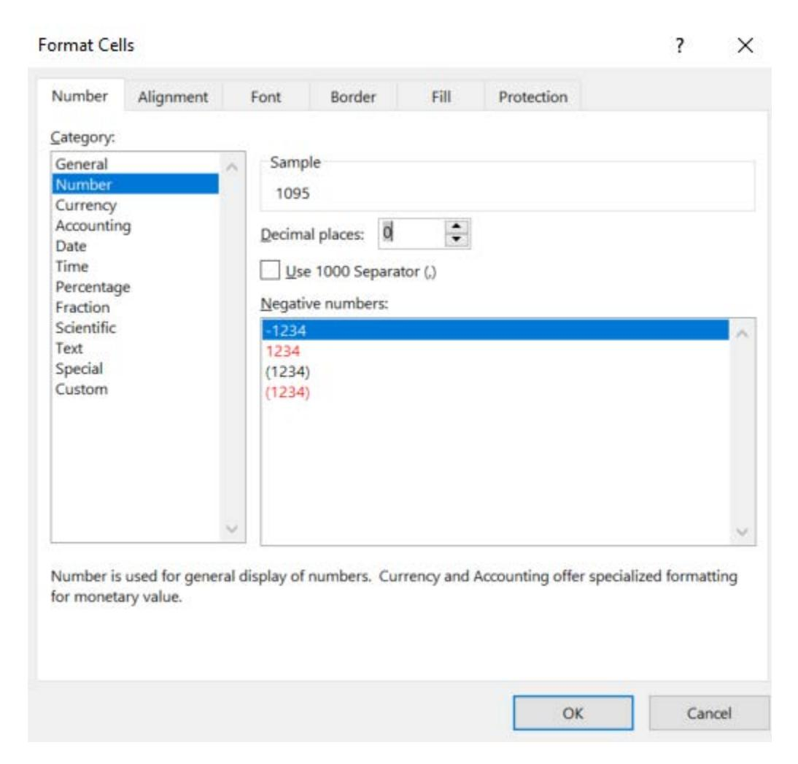
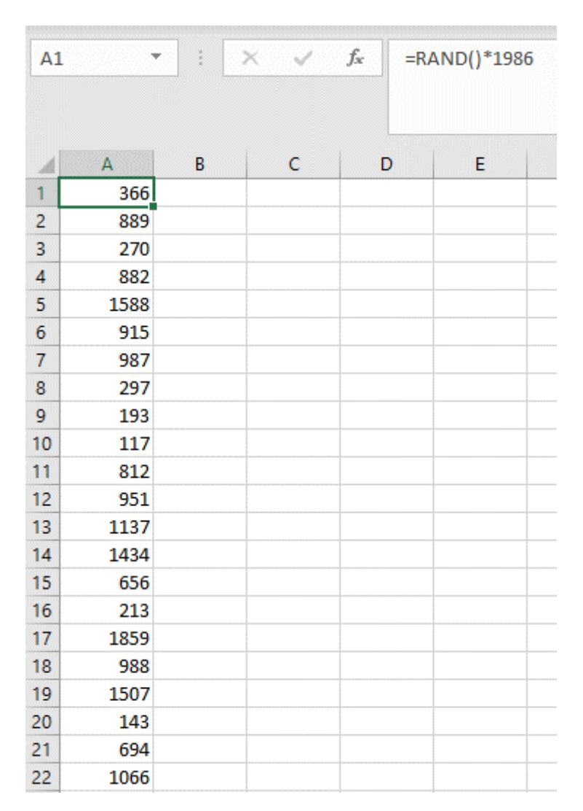

# Comptroller's Handbook

# **Examination Process**

# **Sampling Methodologies**

Version 1.0, May 2020

# **Contents**

| Introduction                                                | 1   |
|-------------------------------------------------------------|-----|
|                                                             |     |
| Judgmental Sampling                                         |     |
| Determine Population, Areas of Focus, and Sample Size       |     |
| Evaluate the Judgmental Sample                              | 5   |
| Stopping a Judgmental Sample Early                          |     |
| Expanding a Judgmental Sample                               | 7   |
| Judgmental Sampling Documentation                           | 7   |
| Statistical Sampling                                        | 8   |
| Define the Population                                       |     |
| Select Numerical or Proportional Sampling                   |     |
| Select Tolerance Rate                                       |     |
| Select Confidence Level                                     | 12  |
| Determine Sample Size                                       |     |
| Randomly Select Items From Population                       |     |
| Random Number Generator Methods                             |     |
| Evaluate the Statistical Sample                             |     |
| Totaling Exceptions                                         |     |
| Using Statistics in Supervisory Activity Conclusions        |     |
| Stopping a Statistical Sample Early                         |     |
| Expanding a Statistical Sample                              |     |
| Statistical Sampling Documentation                          |     |
| Appendixes                                                  | 24  |
| Appendix A: Statistical Sampling Job Aid Worksheet          |     |
| Appendix B: Examples of Statistical Sampling for            | 2 . |
| Examination Areas and Objectives                            | 2.6 |
| Appendix C: Generating Random Numbers Using Microsoft Excel |     |
| Appendix D: Statistical Sampling Confidence Bound Tables    |     |
| Appendix E: Glossary                                        |     |

## **Introduction**

The Office of the Comptroller of the Currency's (OCC) *Comptroller's Handbook* booklet, "Sampling Methodologies," is prepared for use by OCC examiners in connection with their examination and supervision of national banks, federal savings associations, and federal branches and agencies of foreign banking organizations (collectively, banks). Each bank is different and may present specific issues. Accordingly, examiners should apply the information in this booklet consistent with each bank's specific circumstances.

**Sampling**[1](#page-2-1) is the process of selecting a limited number of items from a larger group (i.e., a population) to support a reliable conclusion about a population of accounts, transactions or loans, for example. Examiners may use sampling to analyze a subset of a population to gain insights about the population generally or to identify specific **exceptions**. The term "exceptions" is used in this booklet to broadly include such items as deficiencies, [2](#page-2-2) inaccurate loan risk ratings, exceptions to bank policy, errors, procedural breakdowns, unsafe or unsound practices, or other issues.

Some common examples of using sampling in supervisory activities include the following:

- Assessing the level of reliance that can be placed on the bank's credit risk review, compliance management system, or internal audit.
- Assessing the adequacy of a bank's internal controls.
- Assessing a bank's adherence to its policies.
- Identifying information about the bank's practices that might not be ascertained from a review of bank policies.
- Testing a bank's compliance with laws and regulations.

This booklet describes judgmental (i.e., nonstatistical) and statistical sampling in the context of the OCC's bank supervision. Examiners should use one of the sampling methodologies described in this booklet unless another sampling methodology is otherwise required.[3](#page-2-3) Examiners should contact OCC legal counsel and subject matter experts for guidance as appropriate, including when sampling results are likely to be considered in an enforcementrelated decision.

**Judgmental sampling**, which is not statistically based, includes gathering a selection of items for testing based on examiners' professional judgment, expertise, and knowledge.

1 Items in **boldface** text throughout this booklet are defined in appendix D, "Glossary."

2 "Deficiencies" is a term used to collectively describe deficient practices and violations. Refer to the "Glossary" section of the "Bank Supervision Process" booklet of the *Comptroller's Handbook* for more information.

3 Examples include OCC Bulletin 2017-31, "Home Mortgage Disclosure Act: Updated FFIEC Examiner Transaction Testing Guidelines," and the procedures for conducting fair lending examinations, as described in the "Fair Lending" booklet of the *Comptroller's Handbook*, including appendix D, "Fair Lending Sample Size Tables."

Examiners may use information from judgmental sampling to inform supervisory activity conclusions, but they cannot make an inference about the entire population.

**Statistical sampling** allows examiners to use a sample's results to make inferences about the entire population under review. Items for a statistical sample must be selected randomly from the population. The two statistical sampling methodologies included in this booklet are numerical and proportional, which are discussed with examples in the "Statistical Sampling" section of this booklet.[4](#page-3-0) Examiners may use the statistical sampling methodologies discussed in this booklet to estimate a **population exception rate** of a **binary attribute** (e.g., an outcome such as yes/no, true/false, exception/no exception, or violation/no violation) within a single population of about 100 or more items. [5](#page-3-1)

#### **Examples**

Examples are provided in boxes like this one throughout this booklet. Examples are hypothetical and are designed to illustrate various aspects of statistical and judgmental sampling methodologies. Refer also to appendix B of this booklet, which includes examples of how statistical sampling may be used for specific examination areas or objectives.

4 There are other statistical sampling methodologies, but this booklet only includes numerical and proportional **attribute sampling** methodologies. Technical note: The numerical and proportional sampling methodologies in this booklet are presented within the context of the **binomial sampling model**.

5 The OCC uses a population size of 100 as a rule of thumb for the statistical sampling methodologies discussed in this booklet. Examiners should contact the Economic and Policy Analysis Division of the OCC's Economics Department for assistance in using statistical sampling for populations with fewer than 100 items.

## **Judgmental Sampling**

Judgmental (i.e., nonstatistical) sampling includes gathering a selection of items for testing based on examiners' professional judgment, expertise, and knowledge to target known or probable areas of risk. Judgmental sampling is an appropriate sampling methodology in the context of bank supervision, particularly when examiners do not need to draw inferences about the population under review.

The key limitation with judgmental sampling is that the resulting conclusions cannot be extrapolated statistically to the population. For example, examiners cannot use judgmental sampling to estimate the rate of exceptions in a population. Examiners can, however, identify specific issues, such as violations, loan risk rating downgrades, bank policy exceptions, risk management weaknesses, or other characteristics that are considered in the assessment of the area under review. Examiners can also use judgmental sampling to identify specific risks or areas with elevated risk.

### **Determine Population, Areas of Focus, and Sample Size**

Appropriately defining the population and areas of focus promotes targeted, risk-based, and efficient sampling. Areas of focus are the specific segments or attributes of a population that examiners sample. Since judgmental sampling does not result in an inference about the population, the sample sizes are not derived mathematically. Examiners use their professional judgment, expertise, and knowledge to support the population, areas of focus, specific items sampled, and sample size. Examiners consider the supervisory activity's scope and objectives as well as the characteristics of the bank and population when determining areas of focus and a judgmental sample's size, which often occur simultaneously. Some common considerations include the following:

- Areas of heightened risk to the bank or its customers.
- The types of exceptions that could be identified and the potential impact to the bank or its customers.
- Changes in the population.
- Growth areas.
- Audit, credit risk review, compliance testing, or other independent review or testing that has been conducted for the area under review, including
  - − the adequacy of the scope.
  - − whether an adequate sample was tested.
  - − the nature, extent, and severity of findings for the area.
- Conclusions from previous, related OCC supervisory activities, including whether examiners identified deficiencies.
- Coverage of the population in light of the other factors in this list; there should generally be greater coverage for areas of heightened risk.
- Customer complaints related to the area under review.
- Relevant time period for specific items or actions under review (e.g., since the last examination or after a change in bank processes).

The following are examples of examiners' choices of areas of focus and sample sizes.

#### **Example 1**

An examination objective is testing the adequacy of a bank's process for placing commercial loans on nonaccrual status. Examiners sample classified commercial loans that remain on accrual status and commercial loans over 90 days past due and still accruing. The breakdown of this population is as follows:

| Population characteristics                                       | Number of commercial loans (population) |
|------------------------------------------------------------------|--------------------------------------------|
| Over 90 days past due and on accrual status (but not classified) | 50                                         |
| Substandard and on accrual status                                | 46                                         |
| Doubtful and on accrual status                                   | 2                                          |
| Classified, over 90 days past due, and on accrual status         | 2                                          |
| Total                                                            | 100                                        |

Examiners consider the information in the "Determine Population, Areas of Focus, and Sample Size" section of this booklet and use judgmental sampling to select a sample of 24 loans:

- Two loans that are classified, over 90 days past due, but still on accrual status
- Two loans rated doubtful but still on accrual status
- 10 loans that are substandard and still accruing
- 10 loans that are over 90 days past due and still accruing

Examiners selected all of the loans in the categories with the highest risk of inaccurate accrual status, while still testing a sample of loans from other categories.

#### **Example 2**

An examination objective is to assess the accuracy of commercial loan risk ratings and the adequacy of the bank's credit risk identification practices. Examiners review the characteristics of the bank's portfolio and decide to focus on loans on the bank's watch list and loans rated special mention. They choose more watch list and special mention loans than loans already rated substandard. The selections reflect the objective of determining whether the bank is appropriately classifying loans and identifying credit risk.

#### **Example 3**

The scope of an examination includes testing compliance with the Flood Disaster Protection Act (FDPA). Specifically, the examination is to focus on the bank's compliance with all aspects of the FDPA for residential mortgage loans. Examiners decide to test loans with force-placed insurance. By selecting only one group of loans, loans with force-placed flood insurance, they can test the bank's compliance with most aspects of the regulation (to include origination-related requirements and force-placement requirements). Examiners choose loans with force-placed insurance that originated within a timeframe they consider most appropriate to the examination objectives.

#### **Example 4**

Examiners are conducting a Bank Secrecy Act/anti-money laundering examination and one of the examination objectives is to assess the adequacy of due diligence for customers that pose higher money laundering or terrorist financing risks. Examiners select a sample of accounts that includes new and seasoned accounts having a wide range of characteristics presenting potentially higher money laundering or terrorist financing risks.

During the previous supervisory activity (12 months ago) examiners identified weaknesses in the bank's administrative processes for personal fiduciary accounts. The strategy for the current supervisory activity calls for validating the bank's corrective actions. The weaknesses identified during the previous supervisory activity issues were concentrated in two of the bank's four regions (A and B). This bank's asset management line of business has different regional operating procedures. Examiners select a sample that includes accounts from regions A and B.

### **Evaluate the Judgmental Sample**

Although examiners cannot make inferences regarding the entire population based on the results of a judgmental sample, they can identify specific exceptions, such as violations, loan risk rating downgrades, policy exceptions, risk management weaknesses, or other characteristics that are considered in the assessment of the area under review. In evaluating the sample, examiners should

- consider the nature and severity of exceptions, and the risk to the bank or its customers.
- investigate and identify the root cause, including whether exceptions have a common attribute or result from a deficient practice.[6](#page-6-1)
- consider whether the results of the review warrant stopping the sample early or expanding the sample.[7](#page-6-2)
- develop recommendations for the supervisory strategy (e.g., what the OCC should do in the future to effectively supervise the area under review).

Examiners should consider these factors for individual exceptions and in the context of exceptions in aggregate. Examiners should consider relevant information from other examination areas as appropriate. When viewed individually, certain exceptions could seem immaterial. When considered in aggregate, the exceptions could indicate, for example, risk management or internal control weaknesses. Examiners should investigate and identify the root cause of exceptions[8](#page-6-3) and assess whether exceptions that initially appear to be isolated in nature have common root causes, such as internal control weaknesses.

Examiners must *not* use the confidence bounds table in appendix D of this booklet when engaging in judgmental sampling.

Examples 6 and 7 explain ways in which examiners might evaluate the results of a judgmental sample.

6 In some cases, examiners should direct management to perform a root cause analysis. Refer to the "Bank Supervision Process" booklet of the *Comptroller's Handbook* for more information.

7 Once examiners have identified a deficiency and its potential cause, the bank should use its resources to determine the extent of the deficiency. Examiners should not take on actions or burdens that are the bank's responsibility. In some cases, examiners may perform more in-depth evaluations or investigations of a bank's deficiencies. Refer to the "Bank Supervision Process" booklet of the *Comptroller's Handbook,* and the "Stopping a Judgmental Sample Early" and "Expanding a Judgmental Sample" sections of this booklet.

8 Refer to footnote 6.

Following the same scenario as example 1, examiners identify five loans that should have been placed on nonaccrual status. The following table summarizes the results of the review.

| Characteristics                                               | Total number of commercial loans (population) | Sampled loans | Loans with incorrect accrual status |
|---------------------------------------------------------------|--------------------------------------------------------|------------------|----------------------------------------------|
| Over 90 days past due and still accruing (but not classified) | 50                                                     | 10               | 1                                            |
| Substandard and still accruing                                | 46                                                     | 10               | 0                                            |
| Doubtful and still accruing                                   | 2                                                      | 2                | 2                                            |
| Classified, over 90 days past due, and still accruing         | 2                                                      | 2                | 2                                            |
| Total                                                         | 100                                                    | 24               | 5                                            |

Examiners discuss each item with bank management and investigate the root cause. Depending on the root cause identified, examiners could stop the testing or could consider expanding the sample to test more loans in the "over 90 days past due and still accruing (but not classified)" category. Examiners *must not* use the sample results to draw an inference about the population, such as estimating the percentage of the loan portfolio that could have an incorrect accrual status – statistical sampling must be used to make such an inference. Examiners' conclusions may, however, include a statement such as, "Examiners sampled 24 loans and identified five that should have been placed on nonaccrual status."

#### **Example 7**

Examiners reviewed a sample of new installment loans and identified exceptions to the bank's underwriting policies that were not approved by the appropriate bank officer. Examiners reviewed the bank's audit and independent loan review findings, neither of which identified concerns about unapproved exceptions. Examiners then met with bank management and determined that the bank's pre-funding controls were insufficient to identify unapproved underwriting policy exceptions. Examiners also identified the reasons for independent loan review and internal audit failing to identify the exceptions and pre-funding control weaknesses.

### Stopping a Judgmental Sample Early

Examiners sometimes identify potentially significant weaknesses in bank processes or other indicators of potentially systemic deficiencies in the early stages of evaluating a judgmental sample. When this occurs, examiners may pause sample evaluation and discuss the identified exceptions with bank management. Examiners should give management an opportunity to review the identified exceptions, respond regarding the factual accuracy of the examiners' assessment, and determine the root cause. If management confirms the exceptions and identifies a deficient practice, especially if the exceptions are potentially systemic, examiners may consider stopping statistical sampling and concluding the review based on the specific facts obtained from the sample, discussions with bank management, and information obtained from other sources. Examiners should document decisions and accompanying rationale when stopping a judgmental sampling early. Examiners should consider whether the bank should perform a look back when there is a potential for consumer harm or significant risk to the bank.

### Expanding a Judgmental Sample

Examiners sometimes determine the need to expand a sample and test more items. When examiners determine the need to test more items than were originally in the judgmental sample, examiners should consider whether statistical sampling should be used. If so, examiners should consult with the Economic and Policy Analysis Division of the OCC's Economics Department, and other subject matter experts as appropriate, for assistance.

If examiners expand the sample judgmentally, the expanded judgmental sample could include one or more different populations or areas of focus from the original sample, which may be more targeted than the original population or areas of focus.

### **Judgmental Sampling Documentation**

Examiners should document judgmental sampling in a way that would assist a reviewer in understanding the sampling that took place. Documentation should

- identify the population(s) from which items were chosen for the sample.
- identify the areas of focus and sample size.
- discuss how examiners selected the populations, areas of focus, and sample size.
- identify the items chosen for the sample.
- describe the results of the judgmental sampling.
- explain reasons for stopping a sample early or expanding a sample, as applicable.

## **Statistical Sampling**

Statistical sampling allows examiners to use a sample's results to make inferences about the entire population under review. This section of the booklet includes two statistical sampling methods—numerical and proportional.

This section addresses the steps that examiners should follow when performing statistical sampling to estimate the population exception rate of a binary attribute (e.g., an outcome of yes/no, true/false, violation/no violation, or exception/no exception).[9](#page-9-1) While there are many approaches to sampling, using the statistical sampling methodologies in this booklet[10](#page-9-2) results in the minimum sample size needed to make a particular confidence statement about the population exception rate. If a sample of the appropriate size reveals no exceptions, examiners can conclude, with a chosen confidence level, that the population exception rate is below the chosen tolerance rate. If a sample of the appropriate size reveals one or more exceptions, examiners use the tables in appendix D of this booklet to determine the relevant **upper confidence bound** on the population exception rate.

The sample sizes used in this booklet require three inputs: (1) a **confidence level** (chosen by examiners), (2) a **tolerance rate** (chosen by examiners), and (3) an **expected population exception rate**, which is set to zero percent in this booklet.[11](#page-9-3) An expected population exception rate of zero percent does *not* mean that examiners believe there are absolutely zero exceptions in the population. Rather, this means that examiners may expect to find zero exceptions in the sample. When examiners find zero exceptions in the sample, the population exception rate could be as high as the selected tolerance rate. When examiners find one or more exceptions in the sample, the population exception rate could be above the tolerance rate and as high as the respective upper confidence bound listed in appendix D of this booklet.[12](#page-9-4)

Figure 1 illustrates the statistical sampling steps discussed in this section.

9 Confirming that the population exception rate *exceeds* the chosen tolerance rate is outside the scope of this booklet. Examiners should contact the Economic and Policy Analysis Division of the OCC's Economics Department for assistance in conducting types of sampling that are outside the scope of this booklet.

10 The sampling methodologies in this booklet are developed from an attribute sampling framework using the binomial sampling model.

11 The sample sizes tabulated in this booklet only apply when the expected population exception rate is zero percent. If the expected population exception rate is above zero percent, the sample sizes used in this booklet will be too small to conclude that the population exception rate is below the tolerance rate.

12 Refer to the "Evaluate the Statistical Sample" section for more information and examples regarding the upper confidence bound.

**Figure 1: Statistical Sampling Steps**

### **Define the Population**

The viability of statistical sampling relies on a well-defined population. If the population is not appropriately specified, the resulting inference based on a sample from that population could be flawed. Key considerations when defining populations include the following:

- Scope and objectives of the supervisory activity.[13](#page-10-1)
- Characteristics of the population, and whether the population is homogenous with respect to factors relevant to the supervisory activity and objectives.
- Relevant time period. Sample results only apply to the time period that defines the population, when applicable. Examples 9 and 10 explain how relevant time periods might be used in defining a population.
- The type(s) of exceptions for which examiners are testing.

Examiners may test multiple populations during a supervisory activity, particularly when examiners need separate statistical results about different groups of items. For example, rather than treating the bank's commercial loan portfolio as one population, examiners might identify three separate populations, such as commercial real estate, agricultural, and assetbased loans.

Examples 8 through 10 explain how examiners might define populations to achieve supervisory objectives. Example 9 explains how a relevant time period might be used in defining a population.

#### **Example 8**

The supervisory strategy calls for testing the effectiveness of the bank's credit risk identification practices for commercial loans. The bank uses a centralized process for ongoing reviews of commercial loans. The commercial portfolio is 60 percent commercial real estate, 25 percent asset-based lending, and 15 percent agricultural. Examiners have not identified any recent concerns with the bank's credit risk identification practices, and concluded during the last examination that the bank's internal loan review program was satisfactory. During the current examination, examiners want to form conclusions about the bank's overall commercial loan portfolio rather than each portfolio segment. Therefore, they define the population as the entire commercial loan portfolio. Examiners could consider using proportional sampling so the sample includes appropriate representation of loans from the smaller portfolios (e.g., asset-based lending and agricultural). Refer to examples 11 and 12 regarding proportional sampling.

13 Examiners should confirm that the scope and objectives for activities with sampling have considered information from an OCC operating plan, internal OCC procedures, and directives from OCC senior management, as applicable.

The scope of an examination includes testing a bank's compliance with the Electronic Funds Transfer Act (EFTA). The bank's internal audit tested a sample of EFTA claims from the last 12 months and found two violations. The bank's audit program is satisfactory. Examiners would like to focus on claims that were not included in audit's sample. Examiners identify the sample as EFTA claims from the last 12 months and not tested by internal audit. The inference made will only apply to EFTA claims from the last 12 months that were not tested by internal audit.

#### **Example 10**

The scope of a consumer compliance examination includes testing for compliance with the Truth in Lending Act (TILA) and the Real Estate Settlement Procedures Act (RESPA). The bank engages primarily in residential mortgage lending and originates very few other retail loans. Additionally, examiners previously identified several violations of 12 CFR 34 because the bank failed to obtain appraisals or evaluations before originating loans. The appraisal and evaluation concerns were centered in the residential mortgage portfolio. Examiners need to validate the bank's corrective actions regarding 12 CFR 34 compliance, but there is no concurrent retail lending examination. For efficiencies, examiners would like to use the same sample to test compliance with TILA, RESPA, and 12 CFR 34 and determine that this can be accomplished by testing loans that originated in the last six months. Examiners chose the six-month time period because the bank updated its policies and controls for obtaining appraisals and evaluations six months ago. Examiners define the population as residential mortgage loans that originated in the last six months, and the inference made will only apply to residential mortgage loans that originated in that time period.

### **Select Numerical or Proportional Sampling**

After defining the population, examiners decide whether to use numerical or proportional sampling. In **numerical sampling**, each item in a population is equally likely to be selected for the sample. Examiners should generally use numerical sampling, unless the size of a particular population segment is relevant, in which case **proportional sampling** is appropriate.

Examples 11 through 13 explain how examiners might choose proportional or numerical sampling.

#### **Example 11**

Examiners are testing for underwriting policy exceptions not identified by the bank. Loans originate in one of three origination channels. Channel A has 12,000 loans, channel B has 5,000 loans, and channel C has 3,000 loans. To have a representative sample from each channel, examiners take into account the proportion of loans in each channel.

Examiners will draw the sample proportionally from each of the three origination channels (see example 17). Any inference made will be about the population as a whole rather than each origination channel individually. Alternatively, if examiners want a separate inference about each origination channel, examiners would treat each origination channel as a separate population.

#### **Example 12**

This example follows the fact pattern of example 8. The population (commercial loan portfolio) is 60 percent commercial real estate, 25 percent asset-based lending, and 15 percent agricultural. Examiners decided to use proportional sampling so that each of the types of loans (commercial real estate, asset-based lending, and agricultural lending) is represented. The inference made will be about the commercial loan portfolio as a whole rather than each loan type. Alternatively, if examiners want a separate inference about each portfolio segment, examiners would treat each segment as a separate population.

An examination objective is to assess the bank's pre-purchase analysis for municipal securities. Examiners decide to use numerical sampling based on the homogenous nature of the municipal bond portfolio.

### **Select Tolerance Rate**

The tolerance rate is the rate of exceptions that examiners would like to demonstrate is *not* exceeded in the population.[14](#page-12-1) Examiners should select a tolerance rate at the outset of sampling, after defining the population. Tolerance rates are typically less than 10 percent. This booklet includes tolerance rates of 1 percent, 3 percent, 5 percent, 7 percent, and 10 percent.[15](#page-12-2) For a given confidence level, a lower tolerance rate results in larger sample sizes. Examiners should consider the following when determining the tolerance rate:

- Objectives of the supervisory activity.
- Potential impact of exceptions on the bank's condition, risk profile, or customers. When the potential impact to the bank's condition, risk profile, or customers is heightened, the tolerance rate should be lower. Similarly, an already weak financial condition or high risk profile could indicate the need for a lower tolerance rate.
- Legal standard for tolerances for specific types of exceptions.[16](#page-12-3)
- Tolerance rates for particular types of examinations communicated in an OCC operating plan, internal guidance, or examination procedures.

Examiners should document the rationale for the selected tolerance in supervision work papers. Examiners use the selected tolerance rate when determining the appropriate sample size later in the process. To preserve the mathematical soundness of the statistical sampling process, examiners must not change the tolerance rate after they select the specific items for the sample. Example 14 explains how examiners might select a tolerance rate.

14 The tolerance rate is used for purposes of the statistical sampling exercise and does not reflect the point at which the OCC will take supervisory or enforcement action based on examiners' findings. The OCC considers all relevant facts and circumstances when determining whether a deficient practice exists and when assessing the potential for a supervisory or enforcement action.

15 Examiners who need to use statistical sampling with a tolerance rate not included in this booklet should contact the Economic and Policy Analysis Division of the OCC's Economics Department for assistance.

16 When there is zero tolerance for exceptions in the population, examiners should think of the tolerance rate as the population exception rate they want to confirm is *not* exceeded, not necessarily what can be tolerated. A sufficiently small tolerance rate should be chosen in these cases. Examiners cannot rule out a non-zero population exception rate unless they have tested the whole population.

An examination objective is to determine whether the bank is appropriately identifying, escalating, approving, and reporting exceptions to commercial real estate underwriting policies. Specifically, examiners want to determine the accuracy of the bank's reported exception level, and whether likely exception levels are within the bank's established limit. The bank is in strong financial condition and has an overall low risk profile. The bank established an underwriting policy exception limit of 10 percent of the number of loans in its commercial real estate portfolio, and the bank's actual exception level is 7 percent. Examiners determine that the bank's 10 percent limit is appropriate based on the bank's specific circumstances. Examiners select a tolerance rate of 3 percent based on the bank's strong financial condition, moderate risk profile, and established limit of 10 percent of the commercial real estate portfolio. The 3 percent tolerance represents the difference between the bank's internal limit and the 7 percent already known as exceptions. When examiners test loans, they will only consider loans to be an exception if the bank did not identify, escalate, approve, and report exceptions in accordance with bank policy.

### **Select Confidence Level**

After selecting the tolerance rate, examiners select a confidence level. The **confidence level** is the level of statistical assurance that conclusions about the population based on the sample are accurate. Due to **sampling risk**, a given random sample may not be representative of the population. A higher confidence level reduces sampling risk by increasing the sample size. A larger sample size reduces the chances that a sample contains no exceptions when the tolerance rate is in fact exceeded in the population. For example, choosing a 95 percent confidence level means that there is no more than a 5 percent chance of the sample not being representative of the population. Confidence levels typically range between 90 percent and 99 percent. This booklet includes confidence levels of 90 percent, 95 percent, and 99 percent.[17](#page-13-1) Examiners should consider the following when selecting the confidence level, which should be no less than 90 percent:[18](#page-13-2)

- The bank's financial condition and risk profile. A weak financial condition or a high-risk profile could indicate the need for a higher confidence level.
- The quality of risk management. Weak risk management could indicate the need for a higher confidence level.
- The potential impact of exceptions on the bank's condition, risk profile, or customers. The confidence level should increase as the potential impact increases.

Examiners should document the rationale for the confidence level in supervision work papers. To preserve the mathematical soundness of the statistical sampling process, examiners must not change the confidence level after they select the specific items for the sample.

Examples 15 and 16 explain how examiners might select different confidence levels.

17 Examiners who need to use statistical sampling with a confidence level not included in this booklet should contact the Economic and Policy Analysis Division of the OCC's Economics Department for assistance.

18 90 percent is a value that is conventionally used as a minimum confidence level in statistical analysis.

Examiners are testing a bank's compliance with the FDPA. The bank has a strong compliance program and a good record of compliance with the FDPA, and examiners have not identified any deficiencies over the past three exams. Examiners select a 90 percent confidence level and document their rationale that 90 percent is appropriate based on the bank's strong compliance program, centralized processes and controls for FDPA compliance, and strong record of compliance. In this case, examiners are comfortable with a 10 percent chance that the sample may not represent the population.

#### **Example 16**

A supervisory strategy calls for testing a bank's classification and charge-off practices for auto loans. Examiners decide to test auto loans 90 or more days past due. The bank has a concentration in auto loans (50 percent of capital). The previous examination concluded that the quantity of credit risk in the auto portfolio is high, the quality of risk management is insufficient, and the direction of risk is increasing. Overall credit risk for this bank is moderate and increasing, with satisfactory risk management. In this example, examiners choose a 95 percent confidence because of the potential impact that exceptions could have on the bank given its risk profile. Examiners want a confidence level greater than 90 percent because of the elevated risk characteristics of the auto portfolio and risk management weaknesses. Examiners use a 95 percent confidence rather than 99 percent because of overall credit risk being moderate, overall satisfactory credit risk management, and the moderate concentration in auto loans.

### **Determine Sample Size**

Sample size plays an important role in the inference of sample results to the population. The sample size is based on the confidence level and tolerance rate and is independent of the population size.[19](#page-14-1)

Examiners should use table 1 to determine the sample size.[20](#page-14-2) In table 1, the number of items to be sampled corresponds with the intersection of the confidence level and tolerance rate.

$$n = \frac{\ln(1-C)}{\ln(1-p)}$$

where

- the ln() operator denotes the natural logarithm function.
- *p* is the tolerance rate.
- *c* is the confidence level.
- *n* is the sample size.

Although the technical details of this calculation are not shown, it follows from standard manipulation of the binomial probability mass function.

19 Technical note: Some sampling methodologies also use the population size to determine the necessary sample size. This booklet is based on the binomial model, which does not take the population size into account. Mathematically, this is because the binomial model is used for large populations.

20 Technical note: The sample size is based on the confidence level and tolerance rate using the following formula:

**Table 1: Sample Size Lookup Table**

|                | Confidence level |     |     |  |
|----------------|------------------|-----|-----|--|
| Tolerance rate | 90%              | 95% | 99% |  |
| 1%             | 230              | 299 | 459 |  |
| 3%             | 76               | 99  | 152 |  |
| 5%             | 45               | 59  | 90  |  |
| 7%             | 32               | 42  | 64  |  |
| 10%            | 22               | 29  | 44  |  |

If the population size is less than the sample size reflected in table 1, examiners should review the entire population or consider using judgmental sampling. Examiners may consult with the Economic and Policy Analysis Division of the OCC's Economics Department to discuss other sampling methodologies.

### **Randomly Select Items From Population**

Examiners must select items from the population randomly, in a way that each time an item is selected, all items in the population have an equal opportunity to be chosen. The failure to select items from the population randomly (e.g., selecting them judgmentally) invalidates any inference made from the sample. If examiners use the sample sizes in table 1 but select the items from the population judgmentally rather than randomly, they are using judgmental sampling, not statistical sampling. Examiners must select items randomly using random number generator methods, such as those described in the "Random Number Generator Methods" section of this booklet.

The way examiners select items randomly from the population depends on whether examiners are using numerical or proportional sampling:

- When using numerical sampling, examiners randomly sample items from the entire population.
- When using proportional sampling, examiners randomly sample the appropriate number of items from each segment of the population.

Example 17 explains how to allocate a sample proportionally based on the size of population segments. Examiners should not use proportional sampling in a way that would underrepresent a material segment that should be tested as a standalone population. When proportionally allocating a sample, some of the segments could have very small sample volumes (e.g., fewer than 5). When this occurs, examiners should consider whether the population is appropriately defined.

This example follows the same fact pattern as examples 11. Examiners are testing for commercial loans that originated with exceptions to the standards in the bank's underwriting policies that were not identified, escalated, approved, and reported in accordance with bank policy. The loans originate in one of three origination channels in the bank: Channel A has 12,000 loans, channel B has 5,000 loans, and channel C has 3,000 loans. To have a representative sample based on the population's size in each channel, examiners consider the proportion of loans in each channel.

Examiners select a tolerance of 10 percent and a confidence level of 95 percent based on the considerations described in the "Select Tolerance Rate" and "Select Confidence Level" sections of this booklet. The resulting sample size is 29, from table 1 in this booklet.

The examiner then draws the sample proportionally from each of the three origination channels as follows:

| Origination channel | Number of loans | Percentage of population | Multiply by sample size | Sample size allocation* |
|---------------------|-----------------|--------------------------|-------------------------|-------------------------|
| Α                   | 12,000 60%      |                          |                         | 17.40 (round to 18)     |
| В                   | 5,000           | 25%                      | 20                      | 7.25 (round to 8)       |
| С                   | 3,000           | 15%                      | 29                      | 4.35 (round to 5)       |
| Total               | 20,000          | 100%                     |                         | 31                      |

\* Rounded to the next highest integer.

Any inference made will be about the population as a whole (all 20,000 loans) rather than each individual origination channel. If examiners use numerical sampling instead of proportional sampling, there is the risk that the segment with the biggest volume of loans would be overrepresented in the sample, which could bias any ensuing inference about the population.

### Random Number Generator Methods

There are many ways to use a random number generator in sampling.21 One method involves assigning a number to each item in the population, then using a random number generator to generate as many unique numbers as the sample size within the range of the total number of items in the population. The items that correspond to the numbers selected by the generator form the sample. Example 18 provides an abbreviated example of this method.

&lt;sup>21 For example, in Microsoft Excel, the RAND() function can be used to generate random numbers. Appendix C of this booklet provides detailed instructions for using the RAND() function and includes an example. Using the RAND() function in Excel is provided as an example and does not represent an OCC endorsement of a specific company or software.

The sample and population have the following characteristics:

• Sample size: 64

• Population size: 1,986

Examiners assign each item in the population a number, starting with 1. The list of items in the population is in a spreadsheet, so examiners use the row number on the spreadsheet as the identifying number for each item. An examiner generates the following random numbers:

| 466   | 1,899 | 1,935 | 485   | 397   | 978   | 1,514 | 898   |
|-------|-------|-------|-------|-------|-------|-------|-------|
| 619   | 968   | 1,787 | 248   | 627   | 1,819 | 1,635 | 1,794 |
| 894   | 824   | 955   | 898   | 804   | 1,795 | 1,667 | 297   |
| 1,235 | 345   | 1,726 | 1,092 | 1,570 | 1,118 | 1,640 | 1,274 |
| 262   | 1,119 | 57    | 75    | 1,819 | 967   | 177   | 371   |
| 1670  | 806   | 434   | 647   | 570   | 1,385 | 1,140 | 1,838 |
| 573   | 611   | 943   | 1,220 | 1,044 | 163   | 1,103 | 1,582 |
| 1,111 | 1,569 | 1,481 | 417   | 335   | 1821  | 424   | 1,936 |

The sample includes the items from each of these line items on the spreadsheet.

In another method, an examiner generates a random number to assign to each item in the population, and the examiner sorts the population by the random numbers assigned, from smallest to largest. The examiner then chooses items in order starting with the beginning of the list, until the appropriate number of items has been chosen. Example 19 is an abbreviated example of this method.

### **Example 19**

The population and sample have the following characteristics:

- Population size: 10 (note that this small population size is used for ease of presenting the example)
- Sample size: 5 (note that this small sample size is used for ease of presenting the example)

The following is a truncated example of the list of items in the population. This represents a spreadsheet of loans provided by bank management.

| Loan number | Original amount |  |
|-------------|-----------------|--|
| 9957        | \$500,000       |  |
| 8812        | \$450,000       |  |
| 9817        | \$287,000       |  |
| 206         | \$634,000       |  |
| 7423        | \$330,000       |  |
| 9976        | \$275,000       |  |
| 558         | \$264,000       |  |
| 4992        | \$478,000       |  |
| 3382        | \$542,000       |  |
| 8634        | \$356,000       |  |

An examiner uses a random number generator to assign random numbers to each item on the list.

| Loan number | Original amount | Random number assigned by examiner |  |
|-------------|-----------------|------------------------------------------|--|
| 9957        | \$500,000       | 2                                        |  |
| 8812        | \$450,000       | 16                                       |  |
| 9817        | \$287,000       | 61                                       |  |
| 206         | \$634,000       | 36                                       |  |
| 7423        | \$330,000       | 42                                       |  |
| 9976        | \$275,000       | 97                                       |  |
| 558         | \$264,000       | 85                                       |  |
| 4992        | \$478,000       | 11                                       |  |
| 3382        | \$542,000       | 57                                       |  |
| 8634        | \$356,000       | 3                                        |  |

Then, an examiner sorts the items based on the smallest to largest assigned random number and selects the first five items for the sample.

| Loan number | Original amount | Random number assigned by examiner | Selected for sample? |
|-------------|-----------------|------------------------------------------|-------------------------|
| 9957        | \$500,000       | 2                                        | Yes                     |
| 8634        | \$356,000       | 3                                        | Yes                     |
| 4992        | \$478,000       | 11                                       | Yes                     |
| 8812        | \$450,000       | 16                                       | Yes                     |
| 206         | \$634,000       | 36                                       | Yes                     |
| 7423        | \$330,000       | 42                                       | No                      |
| 3382        | \$542,000       | 57                                       | No                      |
| 9817        | \$287,000       | 61                                       | No                      |
| 558         | \$264,000       | 85                                       | No                      |
| 9976        | \$275,000       | 97                                       | No                      |

Another method is systematic random sampling. To use this method, an examiner must first sort the items in the population randomly. Then, the examiner divides the population by the sample size and rounds down the result to an integer (X). Lastly, the examiner chooses a number between one and X to be the first item in the sample and then picks every Xth item after the chosen item to form the sample. [22](#page-18-0) Example 20 is an abbreviated example of systematic random sampling.

22 This method is sometimes referred to as skip counting.

The population and sample have the following characteristics:

- Population size: 10 (note that this small population size is used for ease of presenting the example)
- Sample size: 5 (note that this small sample size is used for ease of presenting the example)

The following is a truncated example of the list of items in the population. This represents a spreadsheet of loans provided by bank management.

| Loan number | Original amount |  |
|-------------|-----------------|--|
| 9957        | \$500,000       |  |
| 8812        | \$450,000       |  |
| 9817        | \$287,000       |  |
| 206         | \$634,000       |  |
| 7423        | \$330,000       |  |
| 9976        | \$275,000       |  |
| 558         | \$264,000       |  |
| 4992        | \$478,000       |  |
| 3382        | \$542,000       |  |
| 8634        | \$356,000       |  |

An examiner uses a random number generator to assign random numbers to each item on the list.

| Loan number | Original amount | Random number assigned by examiner |  |
|-------------|-----------------|------------------------------------------|--|
| 9957        | \$500,000       | 2                                        |  |
| 8812        | \$450,000       | 16                                       |  |
| 9817        | \$287,000       | 61                                       |  |
| 206         | \$634,000       | 36                                       |  |
| 7423        | \$330,000       | 42                                       |  |
| 9976        | \$275,000       | 97                                       |  |
| 558         | \$264,000       | 85                                       |  |
| 4992        | \$478,000       | 11                                       |  |
| 3382        | \$542,000       | 57                                       |  |
| 8634        | \$356,000       | 3                                        |  |

The examiner then sorts the items based on the smallest to largest assigned random number. They divide the population of 10 by the sample size of 5, which equals 2. Beginning with the second item on the list, he or she selects every second item until five are chosen.

| Loan number | Original amount | Random number assigned by examiner | Selected for sample? |
|-------------|-----------------|------------------------------------------|-------------------------|
| 9957        | \$500,000       | 2                                        | No                      |
| 8634        | \$356,000       | 3                                        | Yes                     |
| 4992        | \$478,000       | 11                                       | No                      |
| 8812        | \$450,000       | 16                                       | Yes                     |
| 206         | \$634,000       | 36                                       | No                      |
| 7423        | \$330,000       | 42                                       | Yes                     |

| 3382 | \$542,000 | 57 | No  |
|------|-----------|----|-----|
| 9817 | \$287,000 | 61 | Yes |
| 558  | \$264,000 | 85 | No  |
| 9976 | \$275,000 | 97 | Yes |
|      |           |    |     |

### **Evaluate the Statistical Sample**

When evaluating a statistical sample, examiners review the sample results and use these results to draw an inference about the population. Examiners also use the sample results to explore the root causes of exceptions.[23](#page-20-2)

Examiners should recognize the difference between the sample exception rate and the upper confidence bound on the population exception rate:

- **Sample exception rate:** The proportion of exceptions in the sample to the total number of items in the sample. A sample exception rate below the tolerance rate is, by itself, not enough to conclude that the tolerance rate is not breached in the population.
- **Upper confidence bound:** The statistical estimate on the highest rate of exceptions that could be present in the population. Examiners use the confidence bounds tables in appendix D of this booklet to determine the upper confidence bound on the exception rate. Examiners can conclude, with the selected confidence level, that the population exception rate does not exceed this upper bound.

When documenting conclusions regarding the population, examiners generally include a **confidence statement** that summarizes the sample results and states the degree of reliability of the sample results. Example 21 provides a scenario and related confidence statement.

### **Example 21**

Examiners tested a sample of commercial real estate loans originated in the past 12 months. The objective was to assess the extent of unidentified exceptions to the bank's underwriting policies. They selected a sample of 29 loans, based on a confidence level of 95 percent and a tolerance rate of 10 percent and identified two policy exceptions that the bank failed to identify. Examiners used table 5 in appendix D of this booklet to find the upper confidence bound. The confidence statement would read as follows: With 95 percent confidence, up to 20.16 percent of commercial real estate loans originated in the past 12 months could have unidentified underwriting policy exceptions.

### Totaling Exceptions

When evaluating the sample, examiners count the number of exceptions identified. When a single sample is tested for multiple types of exceptions, exceptions should be grouped according to similar characteristics. Examiners should use judgment in determining the most

 23 Refer to the "Using Statistics in Supervisory Activity Conclusions" section of this booklet for more information.

meaningful way to use the results. Examples 22 and 23 illustrate how exceptions could be grouped.

#### **Example 22**

Examiners tested a sample of 230 mortgage loans originated in the last 12 months to assess compliance with TILA, RESPA, and the Fair Credit Reporting Act (FCRA). The sample size of 230 was based on a 90 percent confidence level and 1 percent tolerance rate. They determined that deriving an upper confidence bound based on the combined exception rates of TILA, RESPA, and FCRA violations would be inconsistent with examination objectives and would not be useful in supporting conclusions. The examiners counted violations of TILA, RESPA, and the FCRA separately and determined three separate upper confidence bounds (i.e., one for each category of violation).

They identified the following violations:

- Loan 1: Violation of the FCRA
- Loan 2: Violation of RESPA and the FCRA

Examiners totals for calculating upper confidence bounds were as follows:

• FCRA violations: 2 • RESPA violations: 1 • TILA violations: 0

They looked up the confidence bounds using table 4 in appendix D of this booklet and wrote three separate confidence statements as follows:

- With 90 percent confidence, up to 2.30 percent of mortgage loans originated in the last 12 months could have FCRA violations.
- With 90 percent confidence, up to 1.68 percent of mortgage loans originated in the last 12 months could have RESPA violations.
- Examiners did not identify any violations of TILA in the sample of new mortgage loans. The sample was based on a tolerance rate of 1 percent.

#### **Example 23**

Examiners tested for compliance with appraisal and evaluation requirements of 12 CFR 34. The population was new loans secured by residential real estate that were originated in the past 12 months. The sample included 45 loans. The sample size of 45 was based on a 90 percent confidence level and a 5 percent tolerance rate. Examiners identified the following violations:

- Loan 1: Violations of 12 CFR 34.43(a) and 34.45(b)
- Loan 2: Violation of 12 CFR 34.43(b)

They determined the upper confidence bound using two exceptions. They counted each loan as one exception because the overall conclusion drawn is about the number of loans potentially containing 12 CFR 34 violations. Examiners looked up the confidence bounds using table 4 in appendix D of this booklet. The conclusion states, "With 90 percent confidence, up to 11.40 percent of residential real estate secured loans originated in the last 12 months could have one or more violations of 12 CFR 34."

### Using Statistics in Supervisory Activity Conclusions

After determining the upper confidence bound on the population exception rate, examiners apply judgment in using this and other information to support examination conclusions and potential supervisory or enforcement actions.

In evaluating the sample in the context of examination conclusions, examiners should

- consider the nature and severity of exceptions and the risk to the bank or its customers.
- investigate and identify the root cause of exceptions, including whether exceptions have a common attribute or result from a deficient practice.[24](#page-22-1)
- consider whether the results of the review warrant expanding the sample.[25](#page-22-2)
- develop recommendations for the supervisory strategy (e.g., what the OCC should do in the future to effectively supervise the area under review).

Examiners should consider these factors for individual and aggregate exceptions and should consider relevant information from other examination areas as appropriate. When viewed individually, certain exceptions could seem immaterial. When considered in aggregate, the exceptions could be an indicator, for example, of risk management or internal control weaknesses. Examiners should investigate and identify the root cause of exceptions and assess whether exceptions that initially appear to be isolated in nature have common root causes, such as internal control weaknesses.[26](#page-22-3)

### Stopping a Statistical Sample Early

Examiners sometimes identify potentially significant weaknesses in bank processes or other systemic deficiencies in the early stages of evaluating a sample. When this occurs, examiners may pause sample evaluation and discuss the identified exceptions with bank management. Examiners should give management an opportunity to review the identified exceptions, respond regarding the factual accuracy of the examiners' assessment, and, determine the root cause. If management confirms the exceptions and identifies a deficient practice, especially if exceptions are potentially systemic, examiners may consider stopping statistical sampling and concluding on a judgmental basis. Examiners should document decisions and accompanying rationale when stopping statistical sampling early. If examiners stop statistical sampling and conclude judgmentally, the results should not be used to estimate the population exception rate. In this case, examiners would document identified exceptions and, as applicable, cite violations of laws and regulations or communicate the OCC's concern with the deficient practices in a matter requiring attention. Examiners should consider whether the bank should perform a look back when there is a potential for consumer harm or significant risk to the bank.

24 In some cases, examiners should direct management to perform a root cause analysis. Refer to the "Bank Supervision Process" booklet of the *Comptroller's Handbook* for more information.

25 Once examiners have identified a deficiency and its potential cause, the bank should use its resources to determine the extent of the deficiency. Examiners should not take on actions or burdens that are the bank's responsibility. In some cases, examiners may perform more in-depth evaluations or investigations of a bank's deficiencies. Refer to the "Bank Supervision Process" booklet of the *Comptroller's Handbook* and the "Expanding a Statistical Sample" section of this booklet for more information.

26 Refer to footnote 24.

### Expanding a Statistical Sample

Examiners sometimes determine the need to test more items. Example 24 illustrates such a scenario. When examiners determine the need to test more items than were in the original statistical sample, a new sample must be drawn. The new sample may be a judgmental sample or a statistical sample. If it is a statistical sample, examiners should contact the Economic and Policy Analysis Division in the OCC's Economics department for assistance with the new statistical sample.

#### **Example 24**

This example follows the fact pattern of example 17 (continued from example 11). Examiners sampled 31 loans from three different origination channels using proportional sampling. The following is a summary of examiner findings:

| Origination channel | Number of loans sampled | Exceptions identified by examiners | Upper confidence bound on exception rate (from appendix D) |
|---------------------|----------------------------|---------------------------------------|------------------------------------------------------------------|
| A                   | 18                         | 0                                     | Not applicable*                                                  |
| B                   | 8                          | 0                                     | Not applicable*                                                  |
| C                   | 5                          | 2                                     | Not applicable*                                                  |
| Total               | 31                         | 2                                     | 20.16%                                                           |

Examiners are concerned about the level of exceptions in origination channel C when compared with origination channels A and B. After reviewing the results and discussing the exceptions with bank management, they could conclude the review or might select a new sample using origination channel C as the population.

### **Statistical Sampling Documentation**

Examiners should document statistical sampling in a way that would enable a reviewer to understand the steps undertaken, and, if necessary, replicate the sample. Examiners may use the statistical sampling job aid in appendix A of this booklet to assist in documenting statistical sampling. Statistical sampling documentation should

- identify the population, including any segments of the population that were identified for proportional sampling.
- indicate whether numerical or proportional sampling was used.
- identify the tolerance rate and describe the rationale for selecting the tolerance rate.
- identify the confidence level and describe the rationale for selecting the confidence level.
- state the sample size (from table 1 of this booklet).

\* Upper confidence bounds for each origination channel are not applicable because the upper confidence bound is calculated for the entire population.

- describe the examiners' method for randomly selecting items from the population. If the examiners used a random number generator or similar functionality in spreadsheet software, a copy of the output should be included as a work paper.[27](#page-24-0)
- describe the results of the statistical sampling, including
  - − the number and type of exceptions, and describe the method used to total the exceptions, as appropriate.
  - − the rationale for stopping the sample early, if applicable.
  - − the rationale for expanding the sample, if applicable.
  - − the sample exception rate.
  - − the upper confidence bound on the population exception rate (from appendix D of this booklet).
  - − confidence statement(s).

27 If examiners used Microsoft Excel's RAND() function to generate random numbers, the examiner who generated the random numbers should immediately save the spreadsheet as a PDF to preserve the generated numbers. Saving the spreadsheet in Excel format will generate a new set of random numbers each time the file is opened.

# **Appendixes**

### **Appendix A: Statistical Sampling Job Aid Worksheet**

Examiners may use this job aid worksheet to assist with statistical sampling and developing supporting work paper comments.

| Worksheet: Statistical Sampling Job Aid                 |  |
|---------------------------------------------------------|--|
| Bank name and charter number:                           |  |
| Supervisory activity:                                   |  |
| Supervisory activity objectives (relevant to sampling): |  |
|                                                         |  |
|                                                         |  |
|                                                         |  |

| Statistical sampling step                                                                                                                                                           | Examiner response |
|-------------------------------------------------------------------------------------------------------------------------------------------------------------------------------------|-------------------|
| Define the population.                                                                                                                                                              |                   |
| • State the population selected.                                                                                                                                                 |                   |
| • Specify specific population segments and sizes of those segments if using proportional sampling.                                                                         |                   |
| • Briefly explain the rationale for selecting the population and, as applicable, the population segments.                                                                  |                   |
| Select numerical or proportional sampling.                                                                                                                                          |                   |
| • State whether numerical or proportional sampling is being used.                                                                                                             |                   |
| • Briefly state the rationale for using numerical or proportional sampling.                                                                                                   |                   |
| Select tolerance rate.                                                                                                                                                              |                   |
| • State the tolerance rate selected.                                                                                                                                             |                   |
| • Briefly state the rationale for the tolerance rate selected.                                                                                                                |                   |
| Select the confidence level.                                                                                                                                                        |                   |
| • State the confidence level selected.                                                                                                                                           |                   |
| • Briefly state the rationale for the confidence level selected.                                                                                                              |                   |
| Determine the sample size (refer to table 1 in this booklet for sample sizes).                                                                                                   |                   |
| • The response for this item need not include a rationale because the sample size is based on the confidence level and tolerance rate using table 1 of this booklet. |                   |
| Randomly select items.                                                                                                                                                              |                   |
| • Describe the method used to select items randomly. A rationale is not needed; describing the method is a sufficient response.                                         |                   |

| Statistical sampling step                                                                                                                         | Examiner response |
|---------------------------------------------------------------------------------------------------------------------------------------------------|-------------------|
| Evaluate the sample.                                                                                                                              |                   |
| • Total the exceptions.                                                                                                                        |                   |
| • As appropriate, describe the method or rationale for grouping or totaling exceptions.                                                  |                   |
| • If applicable, document the rationale for stopping testing before reviewing all items in the sample.                                   |                   |
| • If applicable, document the rationale for expanding the sample. A new job aid should be completed for the new (expanded) sample(s). |                   |
| • Use the tables in appendix D to determine upper confidence bounds.                                                                        |                   |
| • Write confidence statement(s).                                                                                                               |                   |

### **Appendix B: Examples of Statistical Sampling for Examination Areas and Objectives**

Table 2 provides examples of how statistical sampling can be used for specific examination areas. Table 3 provides examples of how sampling can be used for specific examination objectives. These are only examples. Other sampling methodologies, including judgmental sampling, may be used for those examination areas or objectives, depending on the circumstances.

**Table 2: Examples of Applying Statistical Sampling to Examination Areas**

| Program                 | Examples of statistical sampling                                                                                                                                                                              |  |
|-------------------------|---------------------------------------------------------------------------------------------------------------------------------------------------------------------------------------------------------------|--|
| Call report             | Use numerical sampling to test the accuracy of call report line items or schedules.                                                                                                                           |  |
| Investment securities   | Use proportional sampling to select municipal securities or money market holdings to determine compliance with investment standards.                                                                       |  |
| Asset quality           | Use proportional or numerical sampling to validate internal loan review.                                                                                                                                      |  |
| Commercial loans        | Use proportional or numerical sampling to evaluate                                                                                                                                                            |  |
|                         | • credit quality.                                                                                                                                                                                          |  |
|                         | • adherence to underwriting standards.                                                                                                                                                                     |  |
|                         | • accuracy of internal risk ratings.                                                                                                                                                                       |  |
| Retail loans            | Use numerical or proportional sampling to test                                                                                                                                                                |  |
|                         | • the accuracy of bank-prepared reports, such as past due reports, problem loan list, and insider loan list.                                                                                            |  |
|                         | • renewals, deferrals, and extensions for adherence to policy or accuracy of reporting.                                                                                                                 |  |
|                         | • recently extended loans for compliance with underwriting policy.                                                                                                                                         |  |
|                         | • home equity lines of credit nearing their end-of-draw period to assess the bank's compliance with its own policies or implementation of sound banking practices.                                      |  |
| Other real estate       | Use numerical or proportional sampling to test                                                                                                                                                                |  |
| owned                   | • the appropriateness of accounting for other real estate owned.                                                                                                                                           |  |
|                         | • compliance with the Protecting Tenants at Foreclosure Act                                                                                                                                                   |  |
| Fiduciary accounts      | Use numerical or proportional sampling to test a sample of all accounts or accounts from targeted lines of business to determine whether accounts are managed in accordance with governing instruments. |  |
|                         | Use numerical sampling to test whether                                                                                                                                                                        |  |
|                         | • asset management account acceptance is handled consistent with the bank's policies.                                                                                                                   |  |
|                         | • investment management practices are consistent with governing instruments, bank policy and procedures, and applicable regulatory requirements (e.g., 12 CFR 9 investment review requirements).     |  |
| Consumer compliancea | Use numerical or proportional sampling to select a sample to test compliance with TILA, Truth in Savings Act, RESPA, FCRA, or FDPA requirements.                                                           |  |

a Home Mortgage Disclosure Act and fair lending sampling are outside the scope of this booklet. Refer to OCC Bulletin 2017- 31 and the procedures for conducting fair lending examinations, as described in the "Fair Lending" booklet of the Comptroller's Handbook, including appendix D, "Fair Lending Sample Size Tables."

**Table 3: Examples of Sampling for Specific Objectives**

| Objective                                         | Suggested method                                                                                                                                       |
|---------------------------------------------------|--------------------------------------------------------------------------------------------------------------------------------------------------------|
| Identify unrecognized classified loans in a       | Proportional sampling of all loans that are not internally                                                                                             |
| commercial loan portfolio.                        | classified.                                                                                                                                            |
| Validate the bank's commercial loan risk ratings. | Proportional or numerical sampling of commercial loans.                                                                                                |
| Test credit score overrides for consistency with  | Numerical sample of new loans that scored below a                                                                                                      |
| bank policy.                                      | cutoff but were approved.                                                                                                                              |
| Determine accuracy of bank reports.               | Numerical sample from the entire population and trace items to appropriate listings (e.g., past due, insider loans, and classified investments). |
| Identify risk exposure in the municipal bond      | Proportional sample of municipal bonds and evaluate the                                                                                                |
| portfolio.                                        | sample for asset quality.                                                                                                                              |
| Assess the quality of the bank's pre-purchase     | Numerical or proportional sample of investment                                                                                                         |
| analysis for investment securities.               | purchases since the last examination.                                                                                                                  |
| Assess the bank's adherence to its policies for   | Numerical sample of certificates of deposit redeemed                                                                                                   |
| early certificate of deposit withdrawals.         | early during the last six to 12 months.                                                                                                                |
| Evaluate asset management account acceptance      | Numerical sample of all accounts booked since the last                                                                                                 |
| policy compliance and controls.                   | related supervisory activity.                                                                                                                          |

### **Appendix C: Generating Random Numbers Using Microsoft Excel**

This appendix includes instructions and examples for generating random numbers using the =RAND() function in Microsoft Excel. The RAND() function generates random numbers between 0 and 1. The example in this appendix assumes a population size of 1,986 and a sample size of 22.

To generate whole numbers, change the formatting of the cells to use zero decimal places, as illustrated in figure 2.

To generate random numbers for a sample, enter =RAND() into a cell in Excel and multiply by the number of items in the population. Copy this formula to new rows of the spreadsheet until there are enough random numbers for the sample. An example is shown in figure 3. In this example, cell A1 is =RAND()\*1986 because there are 1,986 items in the population. The examiner copied the formula to 22 rows of the spreadsheet because the sample size is 22.

**Important note:** Once the numbers are generated, examiners should immediately save the spreadsheet as a PDF, to preserve the generated numbers. Saving the spreadsheet in Excel format will generate a new set of random numbers each time the file is opened.

**Figure 3: Excel Spreadsheet With Random Numbers**

### **Appendix D: Statistical Sampling Confidence Bound Tables**

Examiners use the tables in this appendix to determine the upper confidence bound on the population exception rate after testing items in a statistical sample. [28](#page-31-1)

**Table 4: Confidence Bounds for 90 Percent Confidence**

| Confidence level | Tolerance rate | Exceptions | Upper bound |
|------------------|----------------|------------|-------------|
|                  | 10%            | 0          | 10.00%      |
|                  |                | 1          | 16.56%      |
|                  |                | 2          | 22.42%      |
|                  |                | 3          | 27.89%      |
|                  |                | 4          | 33.10%      |
|                  |                | 5          | 38.12%      |
|                  |                | 0          | 7.00%       |
|                  |                | 1          | 11.62%      |
|                  |                | 2          | 15.79%      |
|                  | 7%             | 3          | 19.70%      |
|                  |                | 4          | 23.44%      |
|                  |                | 5          | 27.07%      |
|                  |                | 0          | 5.00%       |
|                  | 5%             | 1          | 8.37%       |
|                  |                | 2          | 11.40%      |
| 90%              |                | 3          | 14.25%      |
|                  |                | 4          | 16.98%      |
|                  |                | 5          | 19.64%      |
|                  | 3%             | 0          | 3.00%       |
|                  |                | 1          | 5.02%       |
|                  |                | 2          | 6.85%       |
|                  |                | 3          | 8.58%       |
|                  |                | 4          | 10.24%      |
|                  |                | 5          | 11.86%      |
|                  | 1%             | 0          | 1.00%       |
|                  |                | 1          | 1.68%       |
|                  |                | 2          | 2.30%       |
|                  |                | 3          | 2.88%       |
|                  |                | 4          | 3.45%       |
|                  |                | 5          | 4.00%       |

28 Examiners who identify more than five exceptions for a given statistical sample should contact the Economic and Policy Analysis Division of the OCC's Economics Department for assistance in determining the upper confidence bound.

**Table 5: Confidence Bounds for 95 Percent Confidence**

| Confidence level | Tolerance rate | Exceptions | Upper bound |
|------------------|----------------|------------|-------------|
|                  | 10%            | 0          | 10.00%      |
|                  |                | 1          | 15.34%      |
|                  |                | 2          | 20.16%      |
|                  |                | 3          | 24.61%      |
|                  |                | 4          | 28.84%      |
|                  |                | 5          | 32.89%      |
|                  | 7%             | 0          | 7.00%       |
|                  |                | 1          | 10.80%      |
|                  |                | 2          | 14.24%      |
|                  |                | 3          | 17.44%      |
|                  |                | 4          | 20.48%      |
|                  |                | 5          | 23.42%      |
|                  |                | 0          | 5.00%       |
| 95%              | 5%             | 1          | 7.79%       |
|                  |                | 2          | 10.29%      |
|                  |                | 3          | 12.62%      |
|                  |                | 4          | 14.85%      |
|                  |                | 5          | 17.00%      |
|                  | 3%             | 0          | 3.00%       |
|                  |                | 1          | 4.70%       |
|                  |                | 2          | 6.22%       |
|                  |                | 3          | 7.65%       |
|                  |                | 4          | 9.01%       |
|                  |                | 5          | 10.33%      |
|                  | 1%             | 0          | 1.00%       |
|                  |                | 1          | 1.58%       |
|                  |                | 2          | 2.09%       |
|                  |                | 3          | 2.57%       |
|                  |                | 4          | 3.04%       |
|                  |                | 5          | 3.48%       |

**Table 6: Confidence Bounds for 99 Percent Confidence**

| Confidence level | Tolerance rate | Exceptions | Upper bound |
|------------------|----------------|------------|-------------|
|                  | 10%            | 0          | 10.00%      |
|                  |                | 1          | 14.16%      |
|                  |                | 2          | 17.77%      |
|                  |                | 3          | 21.07%      |
|                  |                | 4          | 24.18%      |
|                  |                | 5          | 27.14%      |
|                  |                | 0          | 7.00%       |
|                  |                | 1          | 9.93%       |
|                  |                | 2          | 12.49%      |
|                  | 7%             | 3          | 14.85%      |
|                  |                | 4          | 17.08%      |
|                  |                | 5          | 19.22%      |
|                  |                | 0          | 5.00%       |
| 99%              | 5%             | 1          | 7.15%       |
|                  |                | 2          | 9.01%       |
|                  |                | 3          | 10.73%      |
|                  |                | 4          | 12.36%      |
|                  |                | 5          | 13.92%      |
|                  | 3%             | 0          | 3.00%       |
|                  |                | 1          | 4.29%       |
|                  |                | 2          | 5.41%       |
|                  |                | 3          | 6.46%       |
|                  |                | 4          | 7.45%       |
|                  |                | 5          | 8.40%       |
|                  |                | 0          | 1.00%       |
|                  | 1%             | 1          | 1.44%       |
|                  |                | 2          | 1.82%       |
|                  |                | 3          | 2.17%       |
|                  |                | 4          | 2.51%       |
|                  |                | 5          | 2.83%       |

### **Appendix E: Glossary**

**Attribute sampling:** A type of sampling in which items are checked to determine if they possess a certain characteristic, feature, or trait.

**Binary attribute:** An attribute with only two states, such as yes/no, true/false, or compliant/noncompliant.

**Binomial sampling model:** A sampling model in which a sample of a fixed size is assessed for a binary attribute.

**Confidence level:** The level of statistical assurance or the degree of reliability of the sample results.

**Confidence statement:** A declaration of statistical assurance.

**Exception:** For the purpose of this booklet, an exception is used broadly to describe such items as deficiencies, inaccurate loan risk ratings, violations, exceptions to bank policy, errors, unsafe or unsound practices, or other issues.

**Judgmental sampling:** Sampling that is not statistically based and includes gathering a selection of items for testing based on examiners' judgment and expertise.

**Numerical sampling:** Statistical sampling in which each item in a population is equally likely to be selected for the sample.

**Population exception rate:** The true exception rate in the population, which is unknown. See **upper confidence bound.**

**Proportional sampling:** Statistical sampling in which the likelihood of an item being selected for the sample is proportional to the size of a population segment.

**Sample exception rate:** The proportion of exceptions in the sample to the total number of items in the sample. The sample exception rate is not the same as the upper confidence bound.

**Sampling:** The process of selecting a limited number of items from a larger group and obtaining enough information about the characteristics of the sample to support a reliable conclusion.

**Sampling risk:** The risk that the sample results do not represent the population.

**Statistical sampling:** Sampling in which the sample's results are used to make inferences about the entire population under review.

**Tolerance rate:** A percentage, generally 10 percent or lower, that reflects the rate of exceptions that examiners would like to show is *not* exceeded in the population. Examiners should select a tolerance rate at the outset of sampling . [29](#page-35-0)

**Upper confidence bound:** The upper estimate on the level of exceptions that could be present in the population.

29 It is used for purposes of the statistical sampling exercise and does not reflect the point at which the OCC will take supervisory or enforcement action based on findings. The OCC considers all relevant facts and circumstances when determining whether a deficient practice exists and when assessing the potential for an enforcement action.