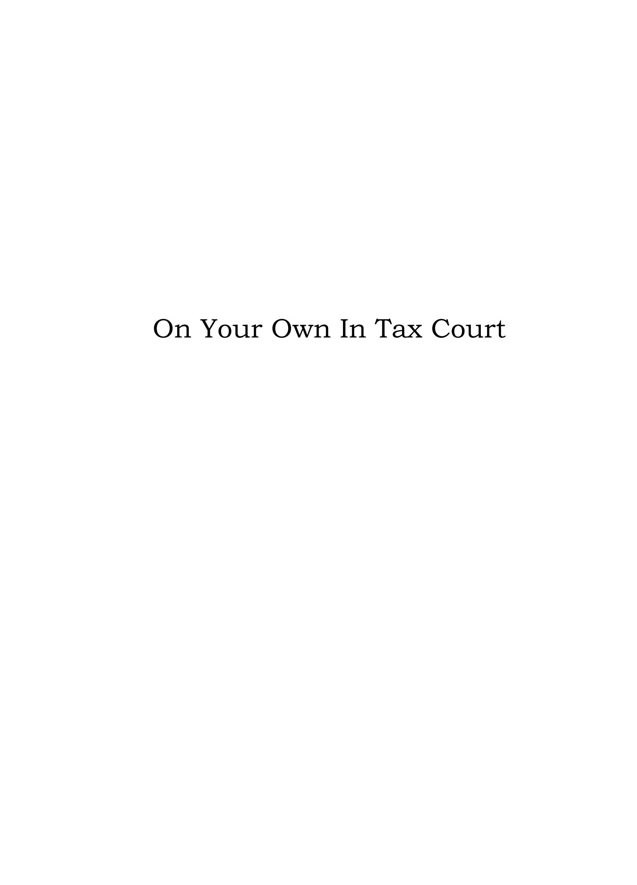
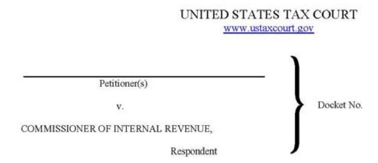
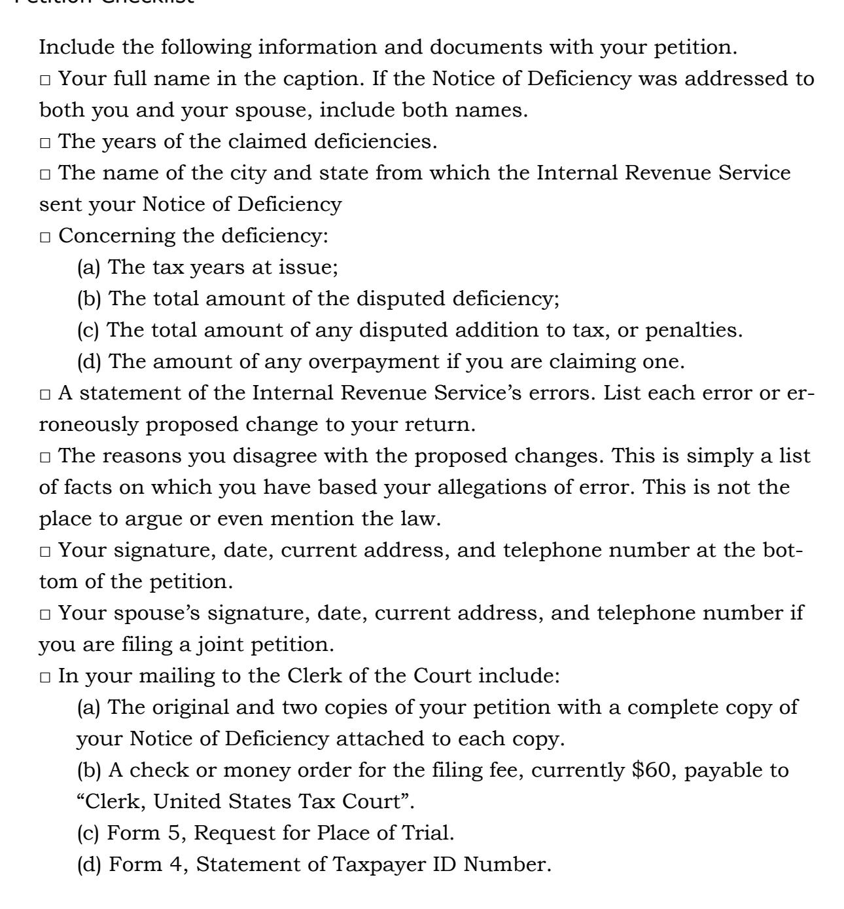
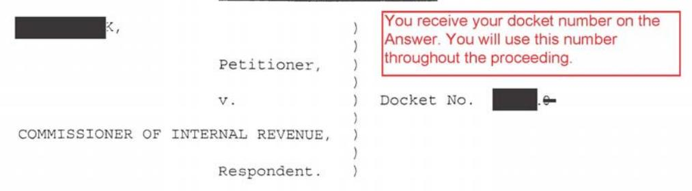
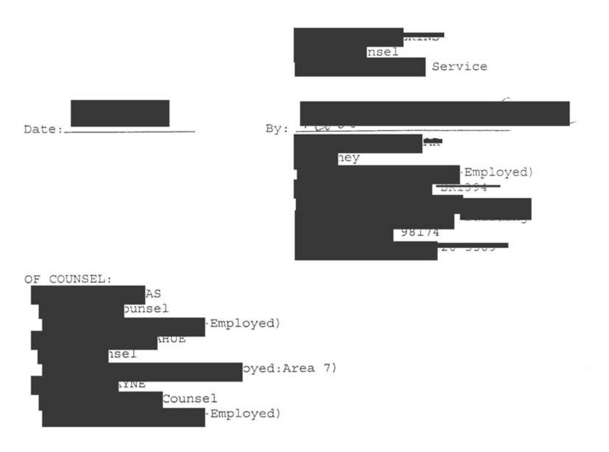

# ON YOUR OWN IN TAX COURT

 $\prec\prec\prec\circ\succ\succ\succ$ 

# U.S. TAX COURT WITHOUT A LAWYER

 $\prec\prec\prec<\circ\succ\succ\succ$ 

BY LYSANDER VENIBLE



# On Your Own In Tax Court

# United States Tax Court Without a Lawyer

Lysander Venible

Mira Vacas Publishing San Jose, Costa Rica

# © 2010 Lysander Venible All rights reserved.

No part of this publication may be reproduced, stored in a retrieval system, or transmitted in any form by any means, electronic,

mechanical, photo copying, recording or otherwise without the prior written permission of the publisher. Permission is granted to copy or reprint portions for noncommercial use, except they may not be posted on the internet without permission.

> Published by Mira Vacas Publishing Apartado 173-6151 Santa Ana 6151 Costa Rica 603-574-4818

[www.TaxCourtHelp.net](http://www.taxcourthelp.net/) Customer Service: service@TaxCourtHelp.net

Skype: LysanderVenible

Cover and Book Design: Lysander Venible

ISBN-13: 9781456466558

ISBN-10: 1456466550

1 2 3 4 5 6 7 8 9

<span id="page-4-0"></span>*Men occasionally stumble over the truth, but most of them pick themselves up and hurry off as if nothing ever happened.*

Winston Churchill

# Acknowledgments

<span id="page-4-1"></span>HERE ARE A FEW of us who, when we've stumbled over the truth, can't manage to just walk on as if nothing ever happened. I'm honored and delighted to have had the help and support of many people like that. I have relied on the work and sometimes just the courage and determination of many such people in compiling the information in this book. Among my most valuable collaborators are Pete Hendrickson, Pablo Rodriquez, Bigdooger, Rodent, Kensie, Gdude, Blissfulee, Silvereye, Manglewurtzle, Johnny Carey, and AKSeeker. The support, assistance, and encouragement of [TRT members](http://taxreturnteam.org/) has been the most valuable help I've had. I want to thank all those who have left the plantation to pursue a righteous cause against long odds. T

We do not undertake this Quixotic mission with the same reckoning of success as we do in other endeavors. We do not fight because we expect to be successful; we fight to remain faithful to our principles. We do it because to do otherwise when you know the truth would be craven and would mean accepting and paying for our own enslavement.

# Disclaimer

<span id="page-6-1"></span><span id="page-6-0"></span>HE AUTHOR OF this book is not an attorney. He does not offer legal advice and cautions the reader not to consider anything in this book legal advice. *On Your Own in Tax Court* provides information about conducting a case in U.S. Tax Court without the help of an attorney. It represents the minimal legal foundation the author wishes he had had going into his first Tax Court case. T

The information is available from public sources, including among others, the website of the United States Tax Court, law libraries, the United States Code, the Code of Federal Regulations, the Federal Rules of Evidence, the Federal Rules of Civil Procedure, the Internal Revenue Manual, and other publicly and privately published sources. The author has also included information he has gained from personal experience conducting and following Tax Court cases.

The publisher and the author do not sell or offer tax, accounting, legal, or other professional services. The information in this book is not legal advice.

The author has tried to make sure the information is accurate and timely. But there may be mistakes, both typographic and in content. You should use this book as a general guide and not as a final authority on any matter it discusses.

Some important pieces of information appear repeatedly in different sections of the book because not all readers will read through from start to finish. Some of the information in beginning chapters is more easily understood once you have a become familiar with basic legal information that appears in later chapters. Many readers will benefit from reading various sections more than once. You will find additional materials for researching the law, procedure, and self-representation in the Resources and Bibliography.

### Disclaimer

Should you have questions about the law or its application to your situation the author and publisher recommend you seek the assistance of competent legal counsel.

Engaging the Internal Revenue Service in Tax Court or any other venue should not be undertaken lightly. Your chances of victory are small. The consequences of your mistakes can be costly.

The author and publisher accept no responsibility or liability for loss or damage of any kind caused by or alleged to be caused by using information in this book. By purchasing it you agree that your decisions and actions in dealing with the IRS or Tax Court are entirely your own and you will take full personal responsibility for them. You agree that you will not hold us liable for any loss or damage of any kind you may suffer in Tax Court or from the IRS generally. You further agree that any damages we may be found responsible for in any forum will be limited to the price you paid for this book.

<span id="page-8-1"></span><span id="page-8-0"></span>

| Acknowledgments                             | 3  |
|---------------------------------------------|----|
| Disclaimer                                  | 5  |
| Table of Contents                           | 7  |
| Introduction                                |    |
| Tax Court History                           | 19 |
| Jurisdiction and Peculiarities of Tax Court | 23 |
| Peculiarities of Tax Court                  | 25 |
| Presumptions and the Rules of Evidence      | 27 |
| The Structure of a Tax Court Case           |    |
| Issues                                      | 30 |
| Facts                                       | 31 |
| Law                                         | 32 |
| A Tax Court Action Step by Step             | 35 |
| Your Ticket to Tax Court                    | 35 |
| Standards of Review                         | 37 |
| The Petition                                | 40 |
| Small Case Procedures                       | 45 |
| The Answer to Your Petition                 | 46 |
| Making Sense of the Answer                  | 47 |
| Reply to the Answer                         | 48 |
| Evasive or Insufficient Answers             | 49 |
| Lack of Knowledge                           | 50 |
| Inconsistent Answers                        | 50 |
| No Material Facts                           | 51 |
| Appeals Conference                          | 51 |
| Discovery                                   | 53 |
| The Tools of Discovery                      | 55 |

| Request for Admissions                    | 55 |
|-------------------------------------------|----|
| Request for Production of Documents       | 60 |
| Interrogatories                           | 62 |
| Depositions                               | 64 |
| Notice Setting Case for Trial             | 65 |
| Branerton Conference                      | 67 |
| Formal Discovery                          | 69 |
| Stipulation of Facts                      | 71 |
| Trial Preparation and Deadlines           | 73 |
| Pretrial Memo                             | 74 |
| Calendar Call                             | 75 |
| Trial Session                             | 76 |
| Opening Statement                         | 79 |
| Witnesses for Petitioner                  | 80 |
| Cross-examination of Petitioner Witnesses | 81 |
| Witnesses for Respondent                  | 82 |
| Closing Argument                          | 83 |
| Post Trial Briefs                         | 84 |
| Format                                    | 85 |
| The Opening                               | 86 |
| Findings of Fact                          | 86 |
| Law and Argument                          | 87 |
| Reply Briefs                              | 89 |
| Post Trial Motions                        | 90 |
| Decision                                  | 91 |
| Appeals                                   | 92 |
| Conclusion                                | 93 |
| Courtroom Players and Etiquette           | 95 |
| Trial Notebook                            |    |
| Pleadings                                 |    |
| Motions                                   |    |
| Discovery                                 |    |
| Legal Elements                            | 98 |

| Opening                                                   | 99  |
|-----------------------------------------------------------|-----|
| Witness Direct Exam                                       | 99  |
| Witness Cross-Exam                                        | 100 |
| Evidence Rules and Objections                             | 100 |
| Objections to the Form of Questions                       | 100 |
| Objections to the Content of Testimony                    | 101 |
| Miscellaneous Documents                                   | 101 |
| Motion Practice                                           | 103 |
| Format of Motion Content                                  | 109 |
| The Caption and Title                                     | 109 |
| The Motion                                                | 110 |
| Statement of Facts                                        | 110 |
| The Memorandum                                            | 111 |
| The Conclusion                                            | 111 |
| Pretrial Motions                                          | 113 |
| Motion to Dismiss for Failure to State a Claim            | 113 |
| Motion to Dismiss for Lack of Subject Matter Jurisdiction | 114 |
| Motion to Consolidate                                     | 114 |
| Motion for Extension of Time                              | 114 |
| Motion to File Amended Petition                           | 115 |
| Motion for Order to Show Cause                            | 115 |
| Motion for Contempt                                       | 116 |
| Motion to Compel                                          | 116 |
| Motion for Protective Order                               | 116 |
| Motion for Summary Judgment                               | 117 |
| Motion for a Continuance                                  | 117 |
| Motion to Determine Sufficiency                           | 118 |
| Motion to Vacate                                          | 118 |
| Motion to Reconsider                                      | 119 |
| Conclusion                                                | 119 |
| Evidence in Tax Court                                     | 121 |
| Relevance                                                 | 122 |
| Privilege                                                 |     |

| Competency                           | 125 |
|--------------------------------------|-----|
| Who May NOT Testify                  | 125 |
| Expert Witnesses                     | 126 |
| Oath or Affirmation                  | 127 |
| Credibility                          | 127 |
| Surprise Evidence                    | 128 |
| Character Evidence                   | 129 |
| Multiple Witnesses                   | 129 |
| Opinions                             | 129 |
| Hearsay                              | 131 |
| Other Notable Hearsay Exemptions     | 137 |
| Party Admissions                     | 137 |
| Public Records                       | 137 |
| Judicial Notice                      | 139 |
| Authentication of Evidence           | 140 |
| Making and Responding to Objections  | 141 |
| Leading question                     | 145 |
| Asked and answered                   | 145 |
| Argumentative question               | 145 |
| Lack of personal knowledge           | 145 |
| Calls for an opinion, or speculation | 145 |
| Hearsay                              | 146 |
| Relevance                            | 146 |
| Improper Foundation                  | 146 |
| Examining Witnesses                  |     |
| Direct Examination                   | 146 |
| Closed Questions                     | 150 |
| Leading Questions                    |     |
| Open Questions                       |     |
| Narrative Questions                  |     |
| Cross-Examination                    |     |
| Bias                                 |     |
| Prejudice                            |     |

| Prior Statements & Documents            | 153 |
|-----------------------------------------|-----|
| Evidence Conclusion                     | 153 |
| Legal Research                          | 155 |
| Researching the Law                     | 155 |
| The Organization of the Law             | 156 |
| Other Resources                         | 159 |
| Legal Encyclopedias                     | 159 |
| Legal Dictionaries                      | 159 |
| Law Reviews & Annotations               | 160 |
| Researching Case Law                    | 160 |
| Tax Court Opinions & Decisions          | 160 |
| Bench Opinions                          | 161 |
| Summary Opinions                        | 161 |
| Memorandum Opinions                     | 161 |
| Regular Tax Court                       | 161 |
| Locating and Citing Tax Court Cases     | 162 |
| Locating and Citing Federal Court Cases | 165 |
| United States Reports (U.S.)            | 165 |
| Supreme Court Reporter (S. Ct.):        | 166 |
| Lawyers Edition (L. Ed., L. Ed. 2d):    | 166 |
| Federal Reporter (F., F.2d, F.3d):      | 166 |
| Federal Supplement (F. Supp.):          | 167 |
| Online Research Resources               | 168 |
| Legal Writing                           | 174 |
| Afterword—Avoiding the "C" Word         | 183 |
| The Other "C" Word                      | 184 |
| The Income Tax Amendment                | 187 |
| The Income Tax Is an Excise             | 188 |
| It's Not a Tax on All That Comes In     | 190 |
| Why Don't Americans Know?               | 191 |
| Appendix                                |     |
| Toy Court Petition Form #1              | 108 |

| Statement of Social Security Number Form199                           |  |
|-----------------------------------------------------------------------|--|
| Request for Place of Trial Form200                                    |  |
| Petition Checklist201                                                 |  |
| Sample Petition for Redetermination of Deficiency202                  |  |
| Sample Petition for Levy Action under Section 6330205                 |  |
| Informal Request for Clarification for Answers to Amended Petition210 |  |
| Appeals Conference by E-Mail216                                       |  |
| Sample Informal Discovery for Penalty Levy Action229                  |  |
| Sample Admissions Statements for NOD Case231                          |  |
| Sample Formal Admissions with Replies in Levy Case232                 |  |
| Sample General Interrogatories237                                     |  |
| Sample Motion Form248                                                 |  |
| Sample Certificate of Service249                                      |  |
| Sample Motion for Enlargement of Time250                              |  |
| Sample Motion to Discontinue Small Case Procedures252                 |  |
| Resources<br>255                                                      |  |
| Basic Law Research256                                                 |  |
| Of Scholarly and Historical Interest257                               |  |
| Case Law Research257                                                  |  |
| Pro Se Resources258                                                   |  |
| Bibliography and Printed Law Resources259                             |  |
| Sources for New and Used Law Books260                                 |  |

# Introduction

<span id="page-14-1"></span><span id="page-14-0"></span>he United States Tax Court has labeled me a "tax protester." It never seriously considered that I am simply looking for some straight answers. For the record, I am not protesting the income tax. I am simply trying to follow the law and get the IRS to do the same. T

I'll start with the bad news. Tax Court is not a fair venue to litigate the limited application or proper enforcement of income tax laws. The court vigorously suppresses any suggestion that there are limits to IRS authority or that the IRS might be misapplying the law. It does so by any means available *except* reasoned and researched legal argument. At the mention of certain difficult issues, the court runs up the "frivolous" flag and, with threats and heavy fines, makes sure everyone salutes.

When the IRS calls you a "tax protester," the court doesn't quibble. This is to be expected. If the IRS and the court are indeed misapplying the law, they have been doing it for a very long time, and are partners in a massive and shameful fraud. No public agency will ever find itself guilty of such a crime.

The good news is that, unlike seeking justice on tax issues in other federal courts, you may challenge the IRS's presumptions in Tax Court without first paying the tax. Tax Court is a civil court, which means you are simply arguing over money, not risking criminal penalties.

In pursuing my four cases and seeing dozens of others, I've learned a great deal I wish I had known at the start. The purpose of this book is to pass that knowledge along. I hope it will help you to both avoid my many mistakes and understand the process well enough to successfully plead your own case. I guarantee you will do better than if you had never read this book, no matter what kind of issues you are bringing to the court.

The main difference between Tax Court and other courts where you might find yourself fighting someone who claims you owe money, is that the "burden of proof" in Tax Court is reversed from creditor to debtor. In every other judicial venue, the creditor is the plaintiff, and the debtor the defendant. Logically enough, a plaintiff-creditor must prove that the defendant-debtor owes the debt. The plaintiff has what is called "the burden of proof." He must present undeniable fact evidence that the debt exists, evidence that the defendant owes it, and additional evidence that defendant has not paid it.

In Tax Court, however, the *taxpayer* is forced to petition the court as *the plaintiff.* The court presumes the IRS' claims are correct. You have to prove that you *don't* owe what they say you owe. Proving a negative is logically impossible, and a heavy burden legally, but it's yours to bear in this forum.

You will also find that the playing field is something less than level. The court will interpret the rules in the government's favor. The government is often not held to them as strictly as you are. The court frequently bends the rules of evidence beyond recognition. Occasionally, though not by any means always, judges are openly hostile to *pro se* litigants. Judges frequently threaten \$25,000 penalties for the mention of "frivolous" arguments, but will never tell you exactly what you are forbidden to say.

Keep in mind that Tax Court judges and IRS attorneys work for the same outfit. They get paid out of the funds they extract from people like you. Although the judge is theoretically a neutral party and generally maintains at least a façade of fairness, giving you some leeway because you don't have a lawyer, he works with your opponent's attorneys regularly and knows them all. You may get the impression they are on the same side and working against you, and you may be right. None of them has any interest in finding that you don't owe what they claim you owe.

More often than not, *pro se* litigants (people pleading their own cases) know little or nothing about the rules of evidence and procedure. They are tricked during the poorly explained "stipulation process" into agreeing to allow what is called "hearsay" into evidence as if it were sworn truth or undisputable fact. Inexperienced petitioners often scuttle their own ships at the dock by agreeing to statements presented as fact that are, in reality, hearsay that no experienced attorney would let pass without objection. Facts and sworn testimony offered by petitioners to controvert IRS hearsay will be excluded or simply ignored as "self-serving," or "a continuation of frivolous argument."

The Supremes have told us many times that laws, and tax laws in particular, are supposed to be clear and understandable. Where they are not, you, the citizen, are supposed to get the benefit of the doubt, not the government. They told us in *[U.S. v. Merriam](http://supreme.justia.com/us/263/179/)*:

*"But in statutes levying taxes the literal meaning of the words employed is most important, for such statutes are not to be extended by implication beyond the clear import of the language used. If the words are doubtful, the doubt must be resolved against the Government and in favor of the taxpayer."* 

If the words are doubtful? Any ambiguity? A nuclear submarine couldn't navigate the deep end of the [Internal Revenue Code](http://uscode.house.gov/search/criteria.shtml) (IRC). The Code contains over three and a half million words. The word "income" is never defined. Whole industries dedicated to compliance, enforcement, and resistance have grown up around the IRC like weeds around a cesspool. Swarms of accountants, lawyers, and tax advisors depend on the law's baffling complexity for their continued prosperity.

Have your tax return completed by ten different expert preparers and you can easily find you owe ten different figures. Consult any number of authors in the [Tax](http://famguardian.org/Subjects/Taxes/CaseStudies/WhosWho/WhosWho.htm#1.__Freedom_Advocate_Index_)  Honesty Movement and you will find you owe no tax at all for a variety of reasons, all of which sound perfectly reasonable.

Many knights errant of the Tax Honesty Movement have paid and are paying a high price for their interpretations of the mind numbing Code. [Pete Hendrickson](http://www.losthorizons.com/) is in prison finally after three failed attempts by the feds to suppress his book, *[Cracking the Code](http://losthorizons.com/CtCforFree.pdf)*. [Irwin Schiff,](http://www.paynoincometax.com/irwinschiff.htm) convicted in his 70s, is doing hard time because he read the law and decided only "profits" are income. [Larken Rose](http://www.larkenrose.com/) went to jail because he read the law and decided the rules under section 861 show only income from international trade to be taxable. [Dick Simkanin](http://www.dicksimkanin.com/) died as a federal prisoner. He didn't think he was required to withhold taxes from his employees. Clearly there's some ambiguity in the Code which is not being resolved in favor of taxpayers.

And it's not like Congress doesn't know how to write a clear law. Dozens of other tax laws leave no doubt about what is taxed and who must pay. There are no Tax Honesty Movements for any of the hundreds of other federal taxes. There are no "tax protesters" fighting the taxes on gasoline, liquor, beer, wine, estates, luxury automobiles, wagers, tires, tobacco, or any other excise taxes (and there are plenty more). Tax laws other than the income tax are written so clearly that there is *never* a question of who pays or how much or when.

But juries of average Americans can't figure out the income tax when exposed to it for days at a time in a courtroom. Former IRS agent [Sherry Jackson](http://www.sherrypeeljackson.com/) was found guilty of not filing tax returns. So was legal scholar [Larken Rose](http://www.larkenrose.com/). But juries found [Lloyd Long,](http://www.freedomsite.net/files/loyd.htm) [Tom Cryer](http://www.truthattack.org/jml/index.php), and [Franklin Sanders](http://the-moneychanger.com/) not guilty of the same thing. And none of them, by the way, had actually filed.

Americans are a law abiding bunch. We obey the law even when we would rather not. If we have to imprison intelligent, honest people for asking the wrong questions about a tax, we should be asking ourselves what it is about that particular tax that requires such drastic punishment? We should start asking the same questions that people like Sherry Jackson are in prison for asking.

One of the safest and most logical places to ask them is in Tax Court. It is a civil, not a criminal court, and one of limited jurisdiction. It operates under the Federal Rules of Civil Procedure, with some minor variations in its own rules. And, although it is an administrative court heavily biased in favor of the government, it is a less risky venue for citizens to present legitimate questions about the applicability of the income tax.

You will have a lot of trouble finding a practicing attorney to represent you in Tax Court with any argument that questions the status quo. The court quickly threatens sanctions of up to \$25,000 for raising "frivolous" arguments without ever specifying what arguments are frivolous. If you have an attorney, the threat is against you *and him*. It makes competent representation hard to find, not to mention that the price of a good attorney wouldn't justify their hire for the small sums of money that are often at issue.

If you believe the law is being misapplied, you will have to represent yourself. If you want any hope of success on this tilted playing field, you must have a solid understanding of how lawsuits work and of the peculiarities of the Tax Court.

An intimate familiarity with the Internal Revenue Code will be of little help in this task. You need to know the [Rules of the Court.](http://www.ustaxcourt.gov/notice.htm) You must also understand the Rules of Evidence and [Civil Procedure](http://www.law.cornell.edu/rules/frcp/). The rules themselves are not long or complex, but court interpretations of them fill volumes. A solid knowledge of the rules will help you greatly. They have the authority of law. Your case can be won or lost based on the rules.

If you are unwilling to study these subjects, you are likely to do more harm than good by creating bad case law that will be used against others.

To that end, I highly recommend the course offered by Dr. Fredrick Graves at [Jurisdictionary®](http://www.jurisdictionary.com/?refercode=OH0001). It was the single most useful piece of reading I did in preparing

### Introduction

my case. And although it deals more broadly with lawsuits in general, it is well worth the price.

I also recommend the assistance of the [Tax Return Team](http://taxreturnteam.org/). The TRT is a paid members-only forum dedicated to helping people who want to stand up for themselves in the wonderland of IRS administrative processes and court proceedings. I didn't find the TRT until after I had already written my second and third petitions, but the moral support alone has been more valuable than any help and advice I've paid for elsewhere.[1](#page-19-0)

The purpose of this book is not to persuade you that there is something fishy about the income tax, or to promote any kind of tax protest. My understanding of the IRC necessarily colors my opinions, but it does not alter the basics of understanding how a Tax Court action works.

This is also not a book of legal advice. I urge you to consult a competent attorney for any legal advice you need. It is simply a guide for anyone facing a trip to Tax Court without an attorney. It is based on my own experiences there and what I've learned working with others on their cases. When you are finished reading *On Your Own In Tax Court* you will know what I wish I'd known going into my first case. The information is useful no matter what type of Tax Court case you are pursuing, and whether you have an attorney or not.

<span id="page-19-0"></span><sup>1</sup> In the interest of full disclosure, I do not own or operate the TRT website, I work with TRT members and in some cases receive payment for my time.

# Tax Court History

<span id="page-20-1"></span><span id="page-20-0"></span>ONGRESS CREATED the "U.S. Board of Tax Appeals" in the [Revenue Act](http://en.wikipedia.org/wiki/Revenue_Act_of_1924)  [of 1924.](http://en.wikipedia.org/wiki/Revenue_Act_of_1924) The Board consisted of "members" whose job it was to make decisions in tax disputes. The members selected one of their own as "chairman" every two years. The Board was an independent agency within the executive branch of the federal government, the same branch as the Department of the Treasury and the IRS. C

The [Revenue Act of 1942](http://en.wikipedia.org/wiki/Revenue_Act_of_1942) renamed the board the "Tax Court of the United States." Members were now called judges and the chairman became the Presiding Judge, but its nature as an administrative agency's court did not change.

The [Tax Reform Act of 1969](http://en.wikipedia.org/wiki/Tax_Reform_Act_of_1969) renamed the court once again to "The Tax Court" and changed it from an administrative court to a full judicial court under Article I of the Constitution.

Article I tribunals differ from full judicial Article III courts in a number of ways. The article numbers refer to the sections of the Constitution from which they derive their authority. Article I of the Constitution grants Congress its general legislative power, while Article III specifically established the judicial branch of government.

Article III courts are the [Supreme Court of the United States](http://www.supremecourt.gov/) and the [inferior](http://en.wiktionary.org/wiki/inferior_court)  [courts](http://en.wiktionary.org/wiki/inferior_court). These courts are established by Congress under constitutional mandate. They make up the judicial branch of the government we learned about in grade school, which along with the legislative and executive branches make up the governing structure of the United States.

Article III courts have jurisdiction to hear cases involving the Constitution or federal law. They may also hear cases involving disputes between citizens of different states or countries.

Article III of the Constitution has provisions designed to insulate the courts from influence by the other branches of government. For example, judges may not have their salaries reduced during their tenure in office, and, except for dismissal for bad behavior or crimes, their appointment is for life.

The Supreme Court has ruled, with a few exceptions, that only Article III courts are able to render final judgments where cases involve life, liberty, and rights to private property.

Article I tribunals consist of certain federal courts and other forms of adjudicative bodies, including Tax Court. These tribunals are also known as legislative courts. They are courts of limited jurisdiction and generally review agency or administrative decisions.

Article I judges do not enjoy Article III protections. They are not appointed for life, for instance, and their salaries may be reduced.

The Tax Court was created by Congress as a part of the executive branch of government, rather than the judicial branch. This seemingly trivial detail is important in that it gives the government a venue wherein constitutional rights do not exist. *[Phillips v. Commissioner,](http://openjurist.org/283/us/589/phillips-v-commissioner-of-internal-revenue)* 283 U.S. 589 (1931)

The primary, though by no means only, manifestation of this suspension of constitutional protections is the lack of a right to trial by jury in Tax Court. Nevertheless, district courts have held that Tax Court is a [constitutional court](http://openjurist.org/467/f2d/474/stix-friedman-co-inc-v-c-coyle). Tax Court is the only forum available to taxpayers without first paying the tax.

Tax Court's jurisdiction is also strictly limited. An excellent summary of the limits of that jurisdiction can be found in the Internal Revenue Manual at [IRM](http://www.irs.gov/irm/part35/irm_35-001-001.html#d0e20)  [35.1.1.2.](http://www.irs.gov/irm/part35/irm_35-001-001.html#d0e20) The two types of cases that primarily concern us in this book are rede-

### Tax Court History

termination of deficiencies under sections 6211-6216, and lien and levy actions under sections 6320 and 6330.

Decisions of the Tax Court may be appealed for final judgment to the Appeals Court of the district in which the decision was made. That is because only an Article III court may render final decisions regarding life, liberty, and property.

Your right to appeal and the idea that a blatantly illegal or unjust decision will be overturned in district court is the main leverage you have to get a lawful decision from Tax Court. Making your record for appeal is the secondary purpose of every motion you write, every objection you make, every bit of evidence you present.

# <span id="page-24-0"></span>Jurisdiction and Peculiarities of Tax Court

<span id="page-24-1"></span>AX COURT HAS what is known as "subject matter jurisdiction" over various types of cases. Chief among them are: deficiencies, overpayments,[1](#page-24-2) interest abatement,[2](#page-24-3) wrongfully collected amounts,[3](#page-24-4) innocent spouse relief,[4](#page-24-5) and worker classification cases.[5](#page-24-6) This book deals primarily with deficiency cases concerning audit related notices of deficiency and determinations of collections due process hearings, although most of the information applies to all types of Tax Court cases. T

To bring an issue before the Tax Court, you must have received either a "statutory Notice of Deficiency"[6](#page-24-7) following an audit, or a "Notice of Determination" following a Collection Due Process (CDP) hearing. Receipt of either of these notices allows you to petition the Tax Court. The court obtains "personal jurisdiction" over you when you file your petition.

Your choices once you have received a Notice of Deficiency are:

- 1. Pay the amount they say you owe and do nothing else.
- 2. Pay the amount they say you owe and sue for a refund in district court.

<sup>1</sup> § 6512(b), the court may decide if you have made an overpayment of tax and are due a refund. 2 § 6404(i), the court may review IRS failure to abate interest to certain taxpayers who are within specified net worth limits if they bring an action within 180 days of final determination, and may order abatement for abuse of

discretion by the IRS. 3 § 6213(a), the court may order wrongfully collected taxes refunded. The IRS may no pursue collection while a case is in Tax Court. They often do anyway. The court may order such collections stopped or refunded under this

<span id="page-24-4"></span><span id="page-24-3"></span><span id="page-24-2"></span>section. 4 § 6015(e), the court may grant an innocent spouse relief from the taxes demanded on a notice of deficiency. 5 § 7436, the court may, in certain cases, determine worker classification under the employment tax laws. 6

<span id="page-24-7"></span><span id="page-24-6"></span><span id="page-24-5"></span>also known as a "90 day letter,"

- 3. Do nothing, let the tax be assessed, wait for the Service to begin collection action and negotiate an offer in compromise (reduced payment) or an installment agreement.
- 4. File a petition with the United States Tax Court.

The Code requires that your Notice of Deficiency be sent to your "last known address" by certified or registered mail. "Last known address" is a term of art, i.e., a term that has its own special legal meaning. The impressive body of case law dealing with it is beyond the scope of this book. But basically, your last known address is the address that appeared on your most recently filed tax return, even if that return was filed ten years ago and more recent correspondence was sent to a different address. If you are corresponding with the IRS it is always a good idea to use a "change of address" form to notify them of where you can be contacted. Without that form or a current address on a return, you might not be aware of receiving a Notice of Deficiency.

This is important because if you receive a Notice of Deficiency or a Notice of Determination that was sent to your "last known address" and miss your deadline for filing a petition with the Tax Court, you have given up your opportunity to challenge the tax liability without first paying it. Any further administrative actions concern *only* the collection of money, not whether you owe it. You still have the right to challenge your liability for the tax in district court, but you will have to pay it in full first.

You generally have 90 days to file a petition for a Notice of Deficiency, and 30 days to file after a Notice of Determination. The filing date is the date your petition is post marked.

To be valid, your Notice of Deficiency must also identify the type of tax, the amount due, interest, additions to tax, and penalties.

### <span id="page-26-0"></span>Peculiarities of Tax Court

There are some important differences in how cases are conducted in Tax Court as opposed to state and federal district courts.

<span id="page-26-1"></span>In disputes over money or property in a state or district court, the creditor must sue the debtor and place evidence of the alleged debt before the court. In Tax Court, when challenging deficiency notices, the Service hasn't actually assessed the tax, so technically you do not owe it yet. As discussed briefly in the Introduction, you, the petitioner, have the burden of proof to show that you do not owe the taxes that the IRS, referred to as the "respondent," proposes to assess against you. The rules of logic say that proving a negative is impossible. But the rules of logic have little place in the wonderland of the United States Tax Court.

The respondent's notices receive what is called a "presumption of correctness." That is to say, you, as the petitioner, must present evidence that controverts the notice you received by a "preponderance of the evidence" in order to prevail.

In my first case, where I understood almost nothing about the process, the judge used the term "burden of proof" like a club to hammer down my requests for a statement of defense from the IRS and later, to include the hearsay the Service presented to make their case.

Nevertheless, the presumption of correctness is not absolute. You have the opportunity to place the burden of proof on the Service under [§7491,](http://uscode.house.gov/uscode-cgi/fastweb.exe?getdoc+uscview+t26t28+2450+0++%28%29%20%20AND%20%28%2826%29%20ADJ%20USC%29%3ACITE%20AND%20%28USC%20w%2F10%20%287491%29%29%3ACITE) and to raise disputes with mistaken information returns, such as [forms 1099](http://www.irs.gov/pub/irs-pdf/i1099gi.pdf), under [§ 6201\(d\).](http://www.law.cornell.edu/uscode/html/uscode26/usc_sec_26_00006201----000-.html)

 If you do so properly and fully cooperate with the Service in their audit efforts, you can by law place the burden of proof on the IRS, although as a practical matter, cases where that occurs are rare indeed.

You also have two choices in filing your petition. If you have less than \$50,000 in dispute you may opt to file under "small case" procedures. The filing is simplified somewhat and there are more locations available for trials, but you give up the right to appeal and the trials are not run under the rules of evidence. Decisions in small cases are final. Neither you nor the IRS can appeal a small case decision to another court. Giving up the right to appeal reduces what little leverage you have over a potentially biased court to zero. And the rules of evidence can work much more to your advantage than to your opponent's, but, of course, you must know them (you will learn more about them below and in the chapter on Evidence in Tax Court). In my estimation, the advantages of opting for small case procedures are not worth what you give up.

The other option is to file a "regular" Tax Court case. These cases are conducted under the Federal Rules of Evidence and are appealable. There are fewer locations where regular cases are conducted, so you may have to travel farther to have your case heard, but I believe the trade-off is worth it. Small cases may also be converted to regular cases any time before the trial. There is a [Sample Motion to](#page-253-0)  [change from a small to a regular case](#page-253-0) in the Appendix.

The [Tax Court website](http://www.ustaxcourt.gov/) has a wealth of useful information. I urge you to become thoroughly familiar with it. They explain the basics in detail. The devil, however, is in what they do *not* explain. Your best hope of success lies in an understanding of the rules of evidence, procedure, and those of the court. You will find almost no discussion of these topics on the Tax Court website.

The helpful videos on the Tax Court website contain a lot of useful information but tend to portray your opponent as a cooperative public agency that will be there to help you whenever you need it. That image is somewhat deceptive. Your opponent is not on your side. IRS attorneys are there to make sure you lose your case no matter how helpful they may seem. A loss to a *pro se* litigant would be an unmitigated, career busting disaster to any IRS attorney. Keep that in mind when they offer to help. Knowing the rules of the game well enough so as not to need their help is the best way to protect your interests.

### <span id="page-28-0"></span>Presumptions and the Rules of Evidence

IRS notices receive a "presumption of correctness" for a very good reason: without it, the IRS would lose every time. Here's why:

<span id="page-28-1"></span>The rules of evidence require that testimony must be from personal, or "firsthand" knowledge. You as the petitioner are the only one involved in this procedure with the required first-hand knowledge. You are *the only one* who has personal knowledge of your financial affairs.

The IRS has *no* first-hand knowledge of their "evidence" and generally relies entirely on hearsay. They also count on your not knowing this rule so that you won't know to object to their evidence in court.

Information the IRS gathers about you generally comes from third parties. Third party information is known as hearsay. It is generally not admissible as evidence. Bank records, credit card receipts, and information returns like 1099s and W-2s, are all hearsay, i.e., statements made out of court to prove the truth of something asserted in court. *Only testimony from personal knowledge is admissible as evidence.* No one at the IRS has personal, first-hand knowledge of your affairs; they only have forms and records provided by third-parties. Hearsay, not evidence. It's why they need that presumption of correctness.

On the other hand, your testimony, tax returns, and records are created from your knowledge of your own affairs. Your own records and testimony will also be subject to cross-examination at trial, as all testimony must be to qualify for admission. Properly sworn and presented to the court, your testimony is admissible fact evidence. A thorough understanding of the rules of evidence, in particular the hearsay rules and their exceptions is critical to any Tax Court case.

No one will explain the rules to you, and your opponent understands them very well. The Tax Court website simply states that trials are conducted under the [Federal Rules of Evidence](http://www.law.cornell.edu/rules/fre/). It doesn't emphasize in any way how important it is to understand them. Generally your opponent and the court will expect that you do *not* understand them. In which case, as is the case with 99% of people they encounter without lawyers, you will be dazzled before and during the trial like the local high school hoops team going against the [Harlem Globetrotters.](http://www.harlemglobetrotters.com/history/globetrotters/) You'll never know what hit you.

If you are there to argue anything other than the most conventional of disputes over valuations or deductions, you will be put at every disadvantage in representing yourself before this court. You will not prevail on constitutional arguments or direct challenges to the misapplication of the law. Any mention of the Constitution, direct taxes, capitations, indirect taxes, or any other terms fundamental to understanding the income tax will be shouted down with the word "frivolous" and threats of large fines.

The court and the IRS have been misapplying the law for a long time. There is a mountain of precedent against you. Not to mention that the Tax Court's jurisdiction to hear such arguments or make decisions concerning IRS misinterpretation of the law is questionable. Tax Court jurisdiction is severely limited.

Nevertheless, I believe that with proper preparation, a good understanding of what is going on, and an ability to keep your head under pressure, you can prevail in Tax Court with an understanding of evidence and procedure, what an attorney friend of mine calls "old fashioned lawyering."

# The Structure of a Tax Court Case

<span id="page-30-1"></span><span id="page-30-0"></span>ILING A PETITION in Tax Court is the only way you can contest an income tax liability without first paying the tax. If you miss your filing deadline, usually 90 days after the date of the Notice of Deficiency,[1](#page-30-2) the tax will be assessed under section § [6213\(a\)](http://www.law.cornell.edu/uscode/html/uscode26/usc_sec_26_00006213----000-.html). After that you will only be allowed to contest the method of collection. You will have forfeited your right to contest the liability without first paying it. Not having to pay the tax first makes Tax Court the most accessible of judicial venues for most people. But being able to play without paying has its price. You give up your right to a jury. And your opponent enjoys a presumption of correctness that would exist in no other court. For that and many other reasons it is important to understand the structure of the proceeding and what is happening in each phase. F

As a side note, the IRS is forbidden from pursuing collection actions while a case is before the Tax Court, and the court has the authority to order such actions stopped. You may move the court to cease any collection action on liens or levies issued after the issuance of a notice and while a case is pending. The motion should ask the court to rescind the lien or refund any moneys levied. Attach an affidavit to your motion describing what the IRS has done. You will have to prove what the IRS has taken if you are looking for a refund. See [Tax Court Rule 55.](http://www.ustaxcourt.gov/rules/Title_V.pdf)

I discuss motions in more detail in a later chapter. The court's rules for motions are in [Tax Court Rules Title V, Motions](http://www.ustaxcourt.gov/rules/Title_V.pdf). You may also want to study what Dr. Graves has to say about motions in his [Jurisdictionary](http://www.jurisdictionary.com/?refercode=OH0001) course.

<span id="page-30-2"></span><sup>1</sup> Note it would be 30 days after a Notice of Determination. In this type of case the tax has already been assessed.

<span id="page-31-0"></span>The court sends petitioners a form along with the announcement of a trial date[2](#page-31-2) that nicely summarizes the structure of a Tax Court case. Unfortunately, this happens long after the case has begun.

This form is for the Pre-trial Memorandum. Two weeks before the trial, you are expected to fill it in with basic case information, (names and phone numbers, the docket number, and status of the stipulations, motions you plan to make and so forth). You send the form to the court in preparation for the trial.

But what interests us here is the way the form breaks out the three basic parts of the process—issues, facts, and law. Those three words summarize the structure of a Tax Court case. Unfortunately, I didn't figure that out until I'd already been through my first case. You don't have to wait that long.

### **Issues**

<span id="page-31-1"></span>You are the plaintiff in a Tax Court case. That is to say, you are suing the IRS. Although we have become accustomed to the idea that American citizens are "innocent until proven guilty" that's not how it works in Tax Court. The IRS is the defendant, or respondent. You are the plaintiff, called the petitioner in Tax Court. You have the burden of proof to show you do not owe the money the IRS claims you owe. See [Tax Court Rule 142\(a\).](http://www.ustaxcourt.gov/rules/Title_XIV.pdf)

Proving you don't owe something is a daunting burden. As the petitioner, however, you determine what the trial will be about. The trial will be held to settle the issues you raise in your petition. You will be able to, and should, object to any attempt by your opponent to bring up issues that are "outside the pleadings." He will have the burden of proof on any increases in the deficiency or "new matters." New matters are issues that did not appear in the notice that got you to Tax

<span id="page-31-2"></span>You will get your announcement of a trial date usually 3 to 6 months after your petition is filed, and after you've had your case considered by the Appeals Office.

<span id="page-32-0"></span>Court. Check the answer you receive to your petition carefully to see if any new issue appears there in the form of an allegation not made in the notice. If one does, the respondent will have the burden of proof on it. Otherwise, you state the issues in your petition, and it is up to you to keep the trial focused on those issues.

### **Facts**

Facts are what the trial is all about. You frame the issues in your petition, and from then on, you will be trying to establish the facts to put into evidence at the trial to prove your case. Your opponent will be doing the same.

<span id="page-32-1"></span>You state in your petition a list of errors the IRS made, and a list of facts on which you rely in determining they made them. The IRS will admit or deny those facts. At the trial you will both offer fact evidence to support your allegations. Between the time you file your petition and the trial, you both will have the opportunity to obtain evidence through what is called discovery. You will also have an opportunity to negotiate your case with the IRS appeals office.

The object of discovery is to find out what the facts are, and on which facts you and the IRS agree and disagree. From that determination you prepare a document called your "Stipulation of Facts" (SOF).

The SOF specifies the facts the parties agree on and the documents they agree will be placed into evidence. For those facts and documents on which you can't agree, the SOF includes them along with the objections that the parties have.

The Stipulation forms the basis for what will happen at the trial. Facts that are stipulated (agreed to) will be placed into evidence immediately at the beginning of the trial. If, after the discovery process, the parties find that there are no real facts in dispute, one or the other of them may move the court for "summary judgment." That is, may ask the court to apply the law to the agreed facts without the need for a trial.

<span id="page-33-0"></span>Remember, trials are simply to establish facts. If there are no facts in dispute, there is no need for a trial.

When there are clear conflicts about the facts, those for which there are objections will be contested at the trial based on the Rules of Evidence and the Court's Rules. Your goal at the trial is to exclude what the IRS wants to place into evidence against you and to get the facts you are relying on into the record. It's as simple as that.

### **Law**

<span id="page-33-1"></span>**The Tax Court courtroom is not a venue for discussion of the contents or application of the Internal Revenue Code**. Discussion and argument about the law occurs *after* the trial. Technically I guess you could consider it part of the trial, but you are not in a courtroom, nor will you be again after all the fact evidence has been presented.

Since there is no jury in a Tax Court case, there is no need for impassioned closing argument, or any closing argument at all for that matter. [Tax Court Rule](http://www.ustaxcourt.gov/rules/Title_XIV.pdf)  [151](http://www.ustaxcourt.gov/rules/Title_XIV.pdf) provides that all legal argument is presented in briefs submitted after the trial. This rule actually works to the advantage of people representing themselves. Making oral argument before a court is a skill that requires years of study and practice to master. Clarence Darrow wasn't a famous orator for nothing.

But in a post trial brief, you will have plenty of time to organize and research your argument. In some very simple cases the judge may forego written briefs and ask for some kind of closing statement. If I were in such a situation I would object and move the court to require written briefs. Any *pro se* litigant will be at a great disadvantage in having to argue his case immediately and orally.

The usual post trial routine is for simultaneous briefs to be submitted to the court 75 days after the trial, and simultaneous replies 45 days after that. By "simultaneous" the court means that, even if you submit your brief before your opponent does, they will not get to see yours until they submit theirs, and vice versa.

The Court may also order "seriatim" briefs. In those cases, the party with the burden of proof writes a brief, his opponent replies, and the first party may reply again after that. Usually 75 days for the first brief, 45 for the reply, and 30 for the final response. The times may be shortened by the presiding judge. I would move the Court for the maximum time allowed under the rules if a shorter time is proposed.

The content, form, style, and timing of legal briefs are specified in the rules. A good word processing program is a great help in properly formatting them. See [Tax](http://www.ustaxcourt.gov/rules/Title_XIV.pdf)  [Court Rule 151](http://www.ustaxcourt.gov/rules/Title_XIV.pdf).

Before or after the final briefs have been submitted, the parties may also make post trial motions. The parties sometimes wait until there has been a decision before taking any further action, sometimes not. Motions for reconsideration or to vacate a decision will necessarily have to be made after a decision. Others, e.g. for sanctions or to have the court reconsider other motions, don't necessarily need to wait until after a decision has been made. There is no time limit on how long the court can take to get a decision. It can take as much time as it likes to rule.

# A Tax Court Action Step by Step

<span id="page-36-1"></span><span id="page-36-0"></span>HE OFFICIAL RULES of the court are titled *[The Tax Court Rules of Prac](http://www.ustaxcourt.gov/notice.htm)[tice and Procedure](http://www.ustaxcourt.gov/notice.htm).* They are based on the *[Federal Rules of Civil Proce](http://www.law.cornell.edu/rules/frcp/)[dure](http://www.law.cornell.edu/rules/frcp/),* differing from them in small but important ways. Anyone conducting a case before the Tax Court is well advised to become thoroughly familiar with both. I will describe in as much detail as I can the sequence of events and what happens in each phase of a Tax Court case below. I will include frequent references to the rules, but I will also try to tell you the details that don't appear in the rules that I've learned by participating in the process. I will concentrate on the procedures for just two types of Tax Court cases: those involving either a Notice of Deficiency or a final Notice of Determination. The procedures for other types of cases the court can hear are discussed in the rules, and frankly, I have no experience with them. Generally the information that follows will be useful in any Tax Court case. T

### **Your Ticket to Tax Court**

<span id="page-36-2"></span>To bring an issue before the Tax Court you must have received a statutory "Notice of Deficiency" following an audit, or a "Notice of Determination" following a Collections Due Process (CDP) hearing. Receipt of either of these notices allows you to petition the court for a decision. The Code defines a deficiency at [§ 6211.](http://www.law.cornell.edu/uscode/html/uscode26/usc_sec_26_00006211----000-.html) Deficiency rules and procedures are located in §§ [6212](http://www.law.cornell.edu/uscode/html/uscode26/usc_sec_26_00006212----000-.html), 6213, [6214](http://www.law.cornell.edu/uscode/html/uscode26/usc_sec_26_00006214----000-.html), and [6215.](http://www.law.cornell.edu/uscode/html/uscode26/usc_sec_26_00006215----000-.html) The IRC sections dealing with lien and levy actions are located at §§ [6320](http://www.law.cornell.edu/uscode/html/uscode26/usc_sec_26_00006320----000-.html) and [6330.](http://www.law.cornell.edu/uscode/html/uscode26/usc_sec_26_00006330----000-.html)

If you receive a Notice of Deficiency or a Notice of Determination and miss your deadline for filing the petition with the Tax Court, you have given up your opportunity to challenge the tax liability without first paying it. Any further administrative actions will deal only with collecting the money, not with whether you owe it. You still have the right to challenge your liability for the tax in district court, but you will have to pay it in full first.

You have 90 days from the date of your Notice of Deficiency[1](#page-37-0) to file your petition. You have 30 days from your receipt of a Notice of Determination for a lien or levy due process hearing. Don't miss your deadline. Count the days carefully and don't rely on the date printed on the notice itself.

The proper way to count the days is to count the date of the notice as 0, the next day is 1 and so forth until you reach the 90th day (or the 30th). If that day falls on a Sunday or one of the holidays listed on the Tax Court website, you have until the next business day to file.

The date you mail your petition is considered the filing date. Your certified mailing receipt from the U.S. Postal Service or the receipt from Fedex or UPS serves as proof of your timely filing. You don't need to send certified mail with a delivery receipt. The delivery is presumed, and the delivery receipt will not be useful as proof of delivery because you can't know if the signer was authorized to sign, or indeed, if a signature will appear on the delivery receipt at all. Don't lose your mailing receipt, however. If you cut your filing close, you will probably have to prove you mailed it on time.

There are other sources of Tax Court jurisdiction as well. You can find them outlined in the Internal Revenue Manual at [IRM 35.1.1.2](http://www.irs.gov/irm/part35/irm_35-001-001.html#d0e20). They include, among others, innocent spouse relief claims, various administrative adjustments, jeopardy assessments, administrative cost awards, and a few others. The focus of this

<span id="page-37-0"></span><sup>1</sup> You have 150 days if you live outside the United States.

<span id="page-38-0"></span>book is on Notices of Deficiency and Determination. But the general principles I discuss are applicable to any Tax Court proceeding.

### **Standards of Review**

<span id="page-38-1"></span>Standards of review refer to how the court looks at various types of cases, what it will be looking for and what evidence it will consider in examining the case. The court applies different standards in examining different types of cases. It considers petitions for deficiency notices "de novo," which means "from the beginning." That means the judge considers the case based on the evidence presented at the trial, without reference to the administrative record.[2](#page-38-2) Naturally, either party may seek to place documents from that record into evidence, but it is not a requirement and either party may oppose the introduction of parts of the administrative record based on the "de novo" principle of a new examination of the facts.

For example, should the IRS attempt to place into evidence a letter you wrote to them during your audit that makes an argument you later learn is flawed or that you will not be making in your case, you may try to exclude that letter because it is not relevant to the issues in your petition.[3](#page-38-3) In cases that are considered on the "abuse of discretion" sta*nda*rd, only evidence in the administrative record is considered.

When petitioning a lien or levy action on a Notice of Determination, the standard of review is for "abuse of discretion" by the IRS appeals office that held the CDP hearing. Generally the court considers *only* the administrative record. In this

The "administrative record" is the collection of all the correspondence, notices, assessments, records of meetings, financial records, phone calls, notes and e-mails that have anything to do with the case. It includes the IRS' computer records and internal documents as well, which you can get through FOIA (Freedom of Information Act) requests. 3 You try to exclude evidence by objecting to it either in the Stipulation of Facts, or if it is offered at trial, right

<span id="page-38-3"></span><span id="page-38-2"></span>on the spot with an objection and statement of your reason. See the Chapter on Evidence for more information.

type of case, if you didn't raise an issue in your hearing, you won't be able to raise it in Tax Court.

If you win on the standard of "abuse of discretion" your victory will mean you go back to the same people who abused their discretion in the first place. This time they will be under instructions from the court to treat you properly.

Notices of Determination come out of Collections Due Process (CDP) hearings. These are administrative hearings to determine how you are going to pay and whether a lien or levy is justified, not whether you owe the money. If you lost a Tax Court case, for example, and are trying to negotiate how you will pay the resulting assessment, you will be granted a CDP hearing for that purpose. But since you already had a chance to dispute the liability and lost, or if you lost by default by missing the petition deadline in Tax Court, you may not dispute it again without paying it.

Your Notice of Deficiency was your opportunity to challenge the liability. If you miss that opportunity but still want to challenge the tax, you must pay it, then sue to get it back in district court. You may not challenge liability at a CDP hearing unless you have not had a previous opportunity to do so.

If you have never had the opportunity to challenge the underlying *liability* for the tax the IRS is trying to collect by lien or levy, the standard of review changes. In such cases, the standard is "de novo" and new evidence may be presented that did not appear in the administrative record.

This situation applies generally to civil penalties for filing frivolous returns. In those cases the IRS assesses penalties and starts collections without a deficiency notice. [See § 6703\(b\).](http://www.law.cornell.edu/uscode/html/uscode26/usc_sec_26_00006703----000-.html) In that situation when you petition the Tax Court from the Notice of Determination that comes out of the CDP hearing, you *can* challenge the liability. Because you never received a Notice of Deficiency, you haven't had an opportunity to contest the penalty.

Frivolous return penalties increased from \$500 to \$5000 in 2007. Since then the Service has been aggressively pursuing them. In these cases an unnamed revenue agent declares a return frivolous without specifying exactly what it is that makes the return frivolous. The Service assesses the penalty and takes the case directly to collections. You receive a series of collections letters, ending in a Final Notice of Lien or Levy. Your receipt of this final notice gives you 30 days to apply for a CDP hearing. When you receive an unfavorable Notice of Determination from your hearing (which almost everyone does) you have 30 days to petition the Tax Court.

Thirty day deadlines pass quickly. Pay attention to them.

If you find yourself facing such a penalty remember to contest the underlying liability at the CDP hearing. The law requires that you be given an opportunity to contest any liability. Since the Service didn't issue a deficiency notice for the penalty, you did not have an opportunity to contest that liability. The CDP hearing is your first chance. You must also be careful in your CDP hearing request not to go on and on about what you think the law is. Just say you challenge the liability and ask for the hearing. The frivolous return statute, [6702\(b\)\(2\)\(B\),](http://www.law.cornell.edu/uscode/html/uscode26/usc_sec_26_00006702----000-.html) gives the Appeals Office the option of even declaring your *request* for a hearing frivolous. But remember, the IRS has the burden of proof for frivolous return penalties under [§6703\(a\).](http://www.law.cornell.edu/uscode/html/uscode26/usc_sec_26_00006703----000-.html) Just ask for your hearing and ask them to show you what makes your return frivolous. You can't and don't have to prove it is not.

From my experience you will not prevail at a CDP hearing against a frivolous return penalty. The hearing officer will not say exactly what is frivolous about your return, but will still expect you to magically produce documentation that it is not. That, of course, is impossible. And when you do not produce the impossible documents, the CDP hearing officer will declare that the IRS has acted properly and the penalty stands. Your real chance to contest the liability will happen in Tax Court.

<span id="page-41-0"></span>The distinguishing feature of such a lien or levy action for a frivolous penalty is that, unlike most Tax Court cases, the respondent has the burden of proof under § [6703\(a\).](http://www.law.cornell.edu/uscode/html/uscode26/usc_sec_26_00006703----000-.html) This is an important difference. The criteria for imposing frivolous penalties are objective and specific. You'll find them in § [6702](http://www.law.cornell.edu/uscode/html/uscode26/usc_sec_26_00006702----000-.html). Since your opponent has the burden you need only deny having filed the frivolous return. He must establish the facts that prove your return is frivolous. You must insist that the IRS come forward with objective proof based on the information on the face of the return only. Speculation about your intent, or subjective conclusions by the Service are not proof. The opinion of the IRS attorney in the case as to why the return was declared frivolous is not admissible as evidence. He must be able to show you the basis of the determination in the record.

# **The Petition**

The procedures and requirements for a petition are in [Rule 34b](http://www.ustaxcourt.gov/rules/Title_IV.pdf) of the Tax Court Rules. The rules for filing a petition in a lien or levy action are found in [Title XXXII](http://www.ustaxcourt.gov/rules/Title_XXXII.pdf) of the Rules.

<span id="page-41-1"></span>You can download the rules from the [Tax Court website](http://www.ustaxcourt.gov/) or order them in printed form from the Clerk of Court, at 400 Second St. NW, Washington, D.C. 20217. You will want to have them handy for reference.

The petition is not a complicated document. There are a couple of forms in the appendix of the Tax Court Rules that show you how to lay out the boiler plate parts of the document. The petition consists of five sections. The first is the 'caption' where you state who the petitioner is and who he is suing. It is the all- caps header you see on all formal court documents. You can find the instructions for creating the caption in [Rule 32.](http://www.ustaxcourt.gov/rules/Title_IV.pdf)

It generally looks like this:

# THE UNITED STATES TAX COURT PETITIONER'S NAME ) PETITIONER, ) v. ) DOCKET NO. COMMISSIONER OF INTERNAL REVENUE, ) RESPONDENT. )

You will use this caption on all formal documents you submit to the court. You receive a docket number from the court when they send you a letter acknowledging your petition. You use the number on all subsequent documents you file. It's also a handy reference when writing to IRS attorneys, who have numerous cases and don't always remember petitioners' names.

The next section is the title and statement of what you are doing. The Tax Court forms will show you the various choices for a title, depending on the type of case you are pursuing. After the title you state, in lettered or numbered separate paragraphs, who you are, where you live, the document you received from the IRS that is at issue, the details about where and when it was mailed, what kind of tax is at issue, and how much is in dispute. You simply fill in the blanks on the form for this part of the petition.

The next section of the form is where you state your case. You tell the court what errors the IRS made in making its determination or calculation of the deficiency. Errors can be anything from miscalculating the tax to exceeding lawful authority.

It's important to limit your statements in this section to a simple description of the errors the IRS made. You state each error as a separate item. You letter them in order. This is not an opportunity to quote the law or the regulations or, heaven forbid, the Constitution. Just state errors and facts. For example, let's say you are questioning the validity of the information returns filed against you. You would state that as an error:

A. The IRS relied on invalid information returns in determining the deficiency at issue.

Other errors might be something like these:

- B. The IRS erred in declaring my tax return frivolous.
- C. The IRS exceeded its lawful authority in creating a substitute for return when I had already filed a return.
- D. The IRS attributed \$xxx.xx of self-employment income to me when I had none.

Simple statements of error are all that is required. These statements determine the issues that are before the court. Be sure to cover everything. Refer to your notice and specify each error separately in a lettered paragraph. Don't leave anything out, including the penalties if you think they are mistaken.

Rule 34(b)(4) says: *"Any issue not raised in the assignment of errors shall be deemed to be conceded."*

Any interest on the amount that appears on a Notice of Deficiency is not properly at issue before the Tax Court. Penalties, however, are and the respondent has the "burden of production"[4](#page-43-0) concerning penalties. *If you don't object to the penalties, the court will presume you agree they are correct*.

The next section of the petition is where you state the facts of the case. Once again, this is not the place to make any kind of legal argument. It is a presentation of the *facts* that relate to the errors in the first section. These statements are also lettered and consist of simple single subject statements of fact that bear on the

<span id="page-43-0"></span><sup>4</sup> The party with the "burden of production" must produce some fact evidence that X exists, otherwise, the finder of fact (judge or jury) *must* determine that X does not exist. See James and Hazard, *Civil Procedure* p. 340 (3rd Ed. 1985)

case. For example, that you filed a return is a fact, as are the details of how and when you filed:

- E. I filed my tax return for 2007 on April 15, 2008.
- F. I filed on the proper form.

- G. I signed the return under penalty of perjury.
- H. The return contained sufficient information on which to calculate a tax.

In this section of the petition you state all the facts that will be important to the case. Your petition is in a very real sense your first discovery[5](#page-44-0) document. It works like a request for admissions.[6](#page-44-1) The IRS is obliged to reply to the stated errors and facts by admitting or denying them. They must to do so truthfully. Keep in mind that the purpose of the trial is to establish the *facts* of the case. You can't get started too soon in determining the facts on which you and the respondent disagree. **The only purpose of the trial is to settle disputed** *facts***.**

There is a powerful tendency for people seeking justice in Tax Court to jump immediately into the law governing the case. Resist it. The petition is not the place to make a legal argument, or to mention the law at all. **Just state the errors and the facts. You argue the law after the trial.**

In the last part of the petition you tell the court what you would like it to do to grant you relief from the IRS' errors. It can be as simple as this:

 "For the reasons stated, I request the Court to dismiss the Notice of Deficiency in this case and grant whatever further relief the Court deems just."

<sup>5</sup> "Discovery" is the process whereby the parties are entitled to 'discover' everything their opponent plans to present at trial to prove his case, and every relevant fact. I discuss discovery in greater detail further on. 6

<span id="page-44-1"></span><span id="page-44-0"></span>A "Request for Admissions" is one of the tools of discovery. I discuss them in more detail in the chapter on discovery.

Or it can be more elaborate if your case warrants it. Keep your statements and your request for relief as simple and clear as you can.

As a side note, the final statement in a petition or motion often begins with the word WHEREFORE, which is a fancy way of saying, "for these reasons." I believe people representing themselves in court do well to avoid indulging in arcane legal terms such as WHEREFORE, HERETOFOR, HEREWITH, THEREIN, AFORESAID, and their many companions. We are, after all, not trained in the law. Why would we try to act as though we were?

In writing legal prose you will do more harm than good trying to coax a few more knots out of the schooner of justice by running before the mighty wind of legal flapdoodle. You will not receive extra credit from the court for saying, "I am herewith returning the stipulation to dismiss in the above entitled matter; the same having been duly executed by me," instead of, "I signed and attached the dismissal agreement." On the contrary, no one will be impressed by your scholarship and erudition, and it gets in the way of clear, logical thinking. Stick with simple English. Subject, verb, object is a good formula. Short sentences are better than long. Small words are better than big ones.

Use adjectives sparingly, if at all. Adjectives in petitions and statements used in admission requests only serve to make the reply indefinite. If your opponent denies a statement like "I filed a valid tax return," you can't be sure if he is denying your return's validity or the fact that you filed. Better to use two statements, "I filed a return," and "The return was valid."

There are a few other details to attend to in filing your petition. You must attach a copy of the notice you are disputing to the petition with your social security number and any bank or sensitive account numbers crossed out, or "redacted" as the rules put it. You send the court your social security number on a separate form that you will find in the [appendix section of the Rules](http://www.ustaxcourt.gov/rules/Appendix_I.pdf). That form doesn't become part of the public record. You also file a form to request where you would <span id="page-46-0"></span>like the trial to take place. There are copies of a [Request for Place of Trial](#page-201-0), and [Statement of Social Security Number](#page-200-0) in the Appendix of this book.

You must file your petition on paper even if you sign up for e-filing. The complete package is: signed petition, redacted[7](#page-46-2) Notice of Determination or Deficiency, statement of social security number, request for place of trial, and a check for the \$60 filing fee made out to the Clerk of Court. You must send the original signed documents and two copies. Send the package certified mail or with a private courier. Your filing date is the day you send it. Don't miss your deadline; keep your receipt.

You will find a [Petition Checklist](#page-202-0) in the Appendix as well as a sample [Tax Court](#page-199-0) [Petition](#page-199-0) form. You will also find a sample petition for a deficiency case, [Petition for](#page-203-0)  [Redetermination of Deficiency](#page-203-0), and one for a levy case, [Petition for Levy Action.](#page-206-0)

I do not offer these to be copied. I've included them solely for use as guides in crafting a petition that addresses your own case. Your petition must state simply and clearly the errors and facts in your case. By the time you read this book, some of the issues in the sample documents may have been declared, if not actually demonstrated, to be "frivolous." Once again, the examples are not documents to be copied. They are simply examples of petitions in the proper format. You must assemble and plead your own case.

### **Small Case Procedures**

<span id="page-46-1"></span>If the amount in dispute is under \$50,000, you may opt to have your case tried under the ["Small Case"](http://www.law.cornell.edu/uscode/html/uscode26a/usc_sec_26a_00000170----000-.html) rules. The advantage is that there are a few more places in the country where they try small cases, so you might not have to travel as far. But

<span id="page-46-2"></span><sup>7</sup> 'Redacted' means with your SSN and address and phone number removed.

<span id="page-47-0"></span>other than a savings on travel costs, I can't think of a good reason why you would choose the small case procedures.

Most importantly, you give up your right to appeal the case if you lose. My impression is that the only leverage you have in Tax Court is the possibility that you will appeal a decision. Judges hate having their decisions overturned on appeal. You are asking to be abused if you give up your right to appeal.

And another important difference is that under small case procedures, the Federal Rules of Evidence (FRE) are not strictly enforced. While that may appear to mean that you have less to learn, from what I've learned, the Rules of Evidence benefit the petitioner (you) more than the respondent when the petitioner takes the time to learn them. I believe relaxed enforcement of the FRE works to the advantage of the IRS. The disadvantages of choosing to use small case procedures appear to me to outweigh the advantages.

### **The Answer to Your Petition**

<span id="page-47-1"></span>The IRS has 45 days from the petition's filing date to make any motions[8](#page-47-2) concerning it and 60 days from that date to file an answer. The most common motion is a motion to dismiss the petition for various reasons. The most common reasons for motions to dismiss are that you filed late, depriving the court of jurisdiction, or that you did not state a claim on which relief could be granted.

The second reason is the hardest to get a handle on. It means usually that you didn't state any specific error that is within the power of the court to correct. For example, if you claimed in your petition that the IRS is unconstitutionally applying the income tax as a direct tax or capitation, the IRS will probably move to dismiss your petition. It is beyond the jurisdiction of the Tax Court to rule on whether the

<span id="page-47-2"></span><sup>8</sup> A Motion is a call by one of the parties for the court to make a determination and issue an order to implement the decision. I discuss them at more length in the chapter on Motion Practice.

<span id="page-48-0"></span>income tax is constitutional or is being applied according to the Constitution. The court can only rule on matters the law places within its jurisdiction. Stick to simple statements of error and fact to avoid this problem. Avoid any urge you may have to talk about the U.S. Constitution or your rights. This is only a forum to discuss IRS errors and the relevant facts, not the law, the Constitution, or your rights.

If you file late, the IRS will almost certainly move to have your petition dismissed for lack of jurisdiction. Section [6213\(a\)](http://www.law.cornell.edu/uscode/html/uscode26/usc_sec_26_00006213----000-.html) gives the court jurisdiction to rule only on timely submitted petitions. There is no grace period. If you are late, the IRS can immediately assess the tax and start trying to collect.

If the IRS doesn't move to dismiss your petition, they have up to sixty days from the date you filed to answer it. The [Tax Court Rule 36\(b\)](http://www.ustaxcourt.gov/rules/Title_IV.pdf) says the respondent must draw his answer to "… advise the petitioner and the Court fully of the nature of the defense." In reality, since deficiency notices receive a "presumption of correctness" and you have the "burden of proof," what you will get in an answer to your petition will fall far short of a full expression of a defense. The answers I've seen consist generally of single word admissions ("Admit") or denials ("Deny"), and very often objections and reasons why an answer can't be given.

There may also be allegations of various kinds in an answer. If there are, we go to the next step in the process. If there are no allegations in the answer and all errors and facts have been admitted or denied, we can skip the next step.

# **Making Sense of the Answer**

<span id="page-48-1"></span>Reading an Answer to a petition without the petition in front of you won't make any sense. The respondent's Answer simply admits, denies, or objects to statements made in the petition by paragraph number without repeating the statements. When you receive the Answer, you will have to refer to your original petition to see which questions they are answering. I've included a [SAMPLE An-](#page-208-0) <span id="page-49-0"></span>swer to Petition in the Appendix so you will know what one looks like. It is not an answer to either sample petition in the Appendix, so don't be confused.

I've seen many petitions and answers. There is a remarkable variety of answers to the same or similar statements of errors and facts. Different IRS attorneys treat the same statements differently. Petitions with their answers are useful learning tools. You can check [TaxCourtHelp.net](http://taxcourthelp.net/) for more examples. I try to make them available as I accumulate them.

# **Reply to the Answer**

<span id="page-49-1"></span>Sometimes the respondent will make allegations against you in his answer that were not made in the notice. If he does, you have 45 days to deny those allegations with a Reply to the Answer. If you don't reply, respondent can move the court to deem any allegations admitted. According to [Rule 37\(c\)](http://www.ustaxcourt.gov/rules/Title_IV.pdf), if you don't respond, the court will *assume* you denied them. And, if the respondent moves the court to deem those allegations admitted, the judge will almost certainly give you an opportunity to respond.

But everything else being equal, it's best not wait for a Tax Court judge to give you that opportunity. If there are any allegations in the Answer you don't think are true, you want to deny them in a formal Reply to the Answer. You submit the reply to the court using a captioned form just like the petition. You will have a docket number by this time, so include that number on your reply and on all future formal submissions to the court. As you did in the petition, list your replies in order referencing the numbers or letters in the Answer to which you are responding. Your reply need only deny new allegations. It's not the place to raise legal arguments, and there's no need to repeat what your petition stated.

# <span id="page-50-0"></span>**Evasive or Insufficient Answers**

You have 30 days from the service date of the Answer to file a motion concerning it. The service date is the date on the Certificate of Service that accompanies all formal documents.

<span id="page-50-1"></span>I've seen and filed a number of motions seeking explanations of vague, contradictory, and even evasive answers to petition items. Every one of those motions has been denied without comment. At this point, I believe if you want to get straight answers to evasive petition answers you will have to do it in discovery, which is another step in the march that I discuss shortly. In my experience, the court just doesn't seem interested in granting motions to compel the IRS to answer petitions candidly.

I haven't had sufficient experience with the court's handling of discovery motions yet to know whether the court will compel answers to certain types of discovery questions. My experience up till now indicates that you should keep your questions short and focused, and submit as few as possible. Discovery questions, however, are the only chance we have to make our record of facts the Service doesn't want to acknowledge. We make the motions to get answers, even though we are certain they will be denied, to be sure our record of issues is complete for an appeal. You may not raise issues on appeal that were not raised in the trial proceedings.

The petition is your first discovery document. If you make fact or error statements the IRS doesn't want to address, they will try to avoid admitting or denying them. The two most common evasions are "denies for lack of knowledge" and "denies on the ground that there are no material facts or errors alleged for which an answer is required under Rule 36(b)." See [Informal Request for Clarification](#page-211-0) in the Appendix.

### <span id="page-51-0"></span>Lack of Knowledge

[Rule 36\(b\)](http://www.ustaxcourt.gov/rules/Title_IV.pdf) says that lack of knowledge is a legitimate reason for not answering, but that the parties should make a reasonable effort to find out what they don't know. Depending on the kind of statement you made in the petition, it's possible the respondent does *not* have enough knowledge about it to answer.

<span id="page-51-1"></span>For example, you state as fact, "I filed my return in good faith." Since the statement speaks to your intent, which the respondent has no way of knowing, he can honestly say he doesn't know.

Or maybe you say, "I signed my return under penalty of perjury." A denial for lack of knowledge would imply that respondent doesn't have a copy of the return handy. In which case, again, the answer would be true. But the rule requires that he make "reasonable inquiry," which he is not always diligent about doing. If you want to establish this fact for the record, you will have to pursue it in discovery and make sure he has a copy of the return.

### Inconsistent Answers

<span id="page-51-2"></span>Watch for inconsistent answers or those that contradict other answers. For example, if he admits you signed the return properly, it means he has seen a copy of it. If he then denies, for lack of knowledge, that there is no legal argument on the face of the return, or that you didn't alter the form, that denial would be inconsistent with his answer concerning the signature. If he's seen a document for one purpose, he's seen it for all purposes.

I've also had error statements such as the following denied for lack of knowledge, "The Commissioner failed to comply with regulations specifying the method of assessing tax." This either means that he claims not to know what the regulation is, or not to know whether he complied with it. Either way, it shows a certain disingenuousness that should be pursued with further inquiry.

<span id="page-52-0"></span>I've also seen "contention" statements, which I used in an effort to avoid "lack of knowledge" answers, denied for lack of knowledge. For example, I said, "The Commissioner does not contend that I failed to file a required return." The Commissioner, like everyone else, is presumed to know what he contends. To answer that he doesn't know what he contends is disingenuous at best, and at worst, down right dishonest.

### No Material Facts

Another common refusal to admit or deny is the "no material facts or errors" statement. [Rule 36\(b\)](http://www.ustaxcourt.gov/rules/Title_IV.pdf) doesn't specify this as a valid reason for failing to answer, though it is not unusual. If you carefully stated only facts and errors, a reply like this is usually a dodge and should be pursued in discovery.

<span id="page-52-1"></span>In my second case I requested informal clarification and filed a motion when my informal request was ignored. I filed a timely Motion to Show Cause Why Certain Answers to the Petition Should Not Be Deemed Admitted, which was denied without comment. Judging by how the court has reacted so far to such motions, they seem to be a waste of time. They are, however, important for establishing your record for appeal.

Since the court didn't comment on its denial of my motion, I can't tell you if it was denied because of some defect in the motion or because respondent has no obligation to answer. At this writing discovery is still underway in that case.

# **Appeals Conference**

<span id="page-52-2"></span>After the Service has answered the petition and you've replied if necessary, the next step is a conference with the IRS Appeals Office. In my cases these meetings have not been productive. Despite telling us that they will discuss the facts and the law that relates to them, they are extremely reluctant to discuss the law at all. I've found them to be evasive at best. At worst, they make up straw man arguments, send you off-point case law, or ignore your questions entirely.

That being said, I would encourage everyone to make a good faith effort to avoid litigation by settling the case with appeals. Appeals officers are more highly trained than the typical revenue agent and have the authority to recommend a settlement or a trial.

You have three options for your appeals meeting: face to face, on the phone, or by correspondence. I've always preferred correspondence. As we are dealing with professionals who do this kind of negotiation every day, we are at a distinct negotiating disadvantage if we don't have time to carefully consider what they say and what we will say in response. Handling the negotiation in writing gives me the time I need to consider everything carefully.

If you are a confident negotiator and feel you would fare better with a phone or personal conference, give it a shot. You might be able to press for answers to questions in person that are easily ignored in correspondence. Whether or not you would get the answers you are looking for, I cannot say. I've participated in both phone and e-mail conferences without much luck. In the end, the Appeals officers simply refused to discuss the issues in the petition.

To set up your Appeals conference, an Appeals officer will contact you by mail sometime after the case has been joined.[9](#page-53-0) My experience has been that first contact occurs usually two to four months after the petition has been filed. The Appeals Office meeting is often skipped in levy actions, since the Notice of Determination came out of the Appeals Office.

<span id="page-53-0"></span><sup>9</sup> A case has been "joined" when an Answer has been served by the respondent.

<span id="page-54-0"></span>My first appeals meetings have been thirty to sixty days after that first contact and have lasted from a single phone conference to several weeks of e-mails, depending on the officer. None so far have allowed me to avoid going to court.

My most recent Appeals meeting was done by e-mail. You will find the full exchange in the Appendix. It's in reverse order; just start at the bottom. [E-Mail](#page-217-0)  [Appeals Conference 03-06 Cases](#page-217-0).

# **Discovery**

<span id="page-54-1"></span>*Black's Law Dictionary* defines trial discovery as: "the pre-trial devices that can be used by one party to obtain facts and information about the case from the other party…" It's hard to exaggerate the importance of discovery for petitioners in a Tax Court case. Because we have the burden of proving a negative, we must rely on getting as many of our facts as possible agreed to by our opponent. An oft forgotten maxim of trial practice is that there is no fact that can be brought out at a trial that cannot be discovered before the trial.

The general rules for discovery start at [Rule 70,](http://www.ustaxcourt.gov/rules/Title_VII.pdf) where they have this to say about informal discovery:

*"…the Court expects the parties to attempt to attain the objectives of discovery through informal consultation or communication before utilizing the discovery procedures provided in these Rules."* 

For that reason we begin with informal discovery between the parties, or "informal communication" as the rules call it. The court is not involved until the formal process begins, and then only if one side or the other chooses to move the court to compel answers.

Generally the IRS already has all or nearly all the evidence it plans to use at the trial. They put their case together in the audit phase of their examination or during the administrative correspondence leading up to a collection hearing. The petitioner, on the other hand, has often been asking the IRS questions for years and receiving no answers. In discovery, however, answering is not optional.

If a Notice of Deficiency has been rushed out to you to avoid the three year statute of limitations[10](#page-55-0) deadline on assessing taxes, your situation may be different. In that case the IRS might not have a great deal of information about your case and will very likely try to get it from you in discovery. You should know that when a Notice of Deficiency has been filed, not only does the IRS have to stop any efforts to collect money you may owe, but they also may not summons any third parties for information while the case is pending. Pay attention to what they do after you receive your notice. You may move the court to stop collections and audit actions.

The parties are allowed and even expected to gather evidence from each other and third parties for presentation at the trial. In order to uncover evidence relevant to the case, the Court gives the parties the power to compel anyone who might have useful information, including opponents and third parties, to give testimony, produce documents, and answer questions before the trial. See [Tax](http://www.ustaxcourt.gov/rules/Title_V.pdf)  [Court Rule 55.](http://www.ustaxcourt.gov/rules/Title_V.pdf)

The rules allow you to seek any information relevant to the pleadings, that is, the errors and facts you stated in the petition, or the issues raised in the notice. You can ask for the identities of people who might have relevant information and how to contact them. You can ask for records, documents, electronic data, and pretty much any kind of physical item, though in Tax Court it is rare to seek anything but documents and records. If someone refuses to produce what you've

<span id="page-55-0"></span><sup>10</sup> Statutes of limitation are laws of the federal government or the states setting maximum time periods during which certain actions can be brought or rights enforced. After the expiration of the time period, no action may be taken regardless of whether it would have been lawful earlier. The assessment of taxes is subject to such statutes.

<span id="page-56-0"></span>requested you can move the court to order them to. But such a motion would be part of the formal discovery process.

Before you get to that, you are commanded by the rules to try to get all the information you will need from your opponent and anyone else voluntarily. As odd as it sounds, this voluntary exchange of information is mandatory. If you try to get something later in the formal process that you have not asked for in the informal process, your opponent can object on that basis, and the court will sustain the objection. This rule came about as a result of the decision in *[Branerton Corp. v.](http://scholar.google.com/scholar_case?case=12556413627166127518&q=Branerton+v+C&hl=en&as_sdt=4000003)  [Commissioner,](http://scholar.google.com/scholar_case?case=12556413627166127518&q=Branerton+v+C&hl=en&as_sdt=4000003)* where the IRS was excused from responding to discovery questions that had not been made informally first.

You can begin informal discovery as soon as you like after you receive an answer to the petition. There's no reason to wait. In fact, the answer should give you an excellent starting point for follow-up questions on the inevitable denials of the facts and errors you stated in your petition.

The tools of discovery are: requests for admissions, requests for production of documents, written interrogatories, and depositions. This is also their approximate order of importance in Tax Court cases.

# **The Tools of Discovery**

### Request for Admissions

<span id="page-56-1"></span>Requests for Admissions (or simply "admissions") are similar to the Facts section of a petition. They are simple statements of fact (or the application of the law to a fact) and are offered to your opponent for him to admit or deny.

<span id="page-56-2"></span>You will find the court's rules about admissions under [Rule 90.](http://www.ustaxcourt.gov/rules/Title_IX.pdf) The rules require no more than a simple response of "admits" or "denies" to each statement. And when your opponent qualifies his admission or denial, you can generally disregard the qualification as testimony from counsel or opinions of law. In the strictest sense, admissions are not designed to discover evidence so much as to identify relevant facts on which you and your opponent agree or disagree. Admissions are also used to authenticate specific documents and papers that may be attached to the request. You may admit to the authenticity of a document without admitting to the factual content of it, but you must say so in your answer or qualify your answers generally in the introduction to that effect.

Requests for Admissions are useful because they isolate and identify those facts that will have to be settled at trial. The more facts the parties can agree on beforehand, the fewer will need to be established at trial. Agreed facts are offered into evidence on a document called the Stipulation of Facts at the beginning of the trial. Disputed facts are what the trial is all about, and settling the Stipulation of Facts is the goal of discovery generally.

Many admission statements are not controversial, for example:

Admit or deny the following statements:

- 1. I filed a tax return for 2005 on April 15, 2006.
- 2. I filed on the proper form.
- 3. I filed the return with the Commissioner's Atlanta, GA office.
- 4. I signed the return under penalty of perjury.
- 5. Exhibit A is a true copy of my 2005 return.

If respondent admits the statements are true, you can offer the admitted facts into evidence and he may not contest them. Uncontested facts will be listed on the Stipulation of Facts document that will be prepared before trial.

There may be additional facts that are not so readily agreed. If respondent denies them, you may pursue the question further with interrogatories (fancy word for questions; more about them in a later section). For example, let's say your opponent is accusing you of filing a frivolous return and denied these statements:

1. There is no argument on the face of my tax return.

2. My return shows no intent to delay or impede the enforcement of internal revenue law.

You might want to follow up with questions like these:

- 1. Concerning your denial of my admission #1, please specify the argument that appears on my return.
  - a. State exactly where it appears on the return.
- 2. Concerning your denial of my admission #2, state where on the return I have indicated a desire to delay or impede the enforcement of internal revenue law.
  - a. Identify any witness who will testify from personal knowledge that I had such a desire.
  - b. Produce any documents you will rely on to establish that I had such a desire.

While you are conducting informal discovery you may mix your questions and statements of fact. You may condition answers to your questions on the denial of the fact statement. For example:

- 1. There is no argument on the face of my tax return.
  - a. If denied, state the argument that appears on the return.
  - b. If denied, state where exactly on the return it appears.

Later, if formal discovery is necessary, you will have to submit your Admissions, Interrogatories, and Requests for Production of Documents in separate documents. I will discuss the requirements of formal discovery below.

When there is no answer given or if the court decides the answer was false or an objection not legitimate, the default answer to an admission, is "Admitted." Therefore, admissions should state the fact you want to put into evidence. In other words, you want the admitted statement to be true, not the denial.

For example, if you want to establish that you filed your return for 2007 you would not say, "The Commissioner contends I failed to file my 2007 return," where you are looking for a denial. Instead you would say "I filed a return for 2007."

If you receive a Request for Admissions from your opponent, be careful to admit or deny the statements truthfully. If you try to play it safe by denying everything and your opponent proves one of the statements true at trial, you are subject to sanctions by the court.

Admissions can be used early or late in the discovery process. If used early, they give you a starting point to ask for explanations or further information about denials. They are often the discovery tool that immediately precedes the presentation of a document called the Stipulation of Facts by one party to the other. Stipulated facts are critical to Tax Court proceedings. In a very real sense, settling the Stipulation of Facts is the goal of discovery.

The inexperienced often offer statements about the law or conclusions of law in requests for admissions. But admissions that do not relate to specific *facts* in dispute, or *the law as it applies to a fact*, do not have to be admitted or denied. Your opponent can refuse to answer based on an objection. There are a number of objections that can be made to support withholding responses. Objections must be explained in detail. The objection of relevance does not excuse the objecting party from responding.

Common objections are that an admission seeks a conclusion of law, or that the admission addresses a broad legal concept, or that respondent has insufficient "knowledge" to admit or deny the statement. In the latter case, they are obliged to look for the information and supplement the response later, if possible, and they must say they have looked for the information without success. The "knowledge" you can expect them to use to answer is the institutional knowledge of the Service, not just that of the IRS attorney.

For example, an admission such as, "Admit or deny that a definition of a word in a statute changes the meaning of that word from its common English meaning," would probably be objected to as requiring a conclusion of law.

Likewise, "Admit or deny that Petitioner to the best of his knowledge and belief owed no tax," would likely be objected to successfully because the respondent has no way to know what the Petitioner's knowledge or beliefs are.

You must keep these points in mind when *responding* to requests for admissions. You must answer truthfully, but if you can neither admit nor deny a statement for lack of certain knowledge, you are allowed to say so. How the judge will respond to your objections depends on his perception of whether you are answering honestly and in good faith.

You must also bear in mind that if you admit to a fact or to the authenticity of a document, you may still object to the admitted fact being placed into evidence at the trial on other evidentiary grounds. For example, you may admit that a letter to you from an IRS agent is a genuine copy, but still object to its admission as evidence because it is [hearsay](http://www.law.cornell.edu/rules/fre/rules.htm#Rule801).

In the Appendix I've included a [Sample Formal Admission with Replies.](#page-233-0) The Service's answers to the same statements in different cases are far from consistent. Identical statements in identical circumstances will not always get the same answer from the IRS attorney. Sometimes the statement may be subtly reworded and that rewording admitted or denied, or an admission will be qualified by a further attached statement. The attorney's explanations, however, are just his opinion. Unless he can offer some facts into evidence, the only thing that counts in admissions is the actual admission or denial of the statement. Your opponent's attorney can't testify to any facts.

The sample discovery questions I've provided may have little to do with facts you need to establish in your case, but I offer them as examples of how this type of document is set up. Your opponent will reply as he does to other documents, <span id="page-61-0"></span>referring by number to the statements or questions. Sometimes the respondent includes the original statements for clarity, sometimes not. As you get into the second and third round of inquiry you must keep track of what's going on and avoid duplication. There's no need send admitted statements twice.

I will put answers and follow-up inquiries to these and other discovery requests on [TaxCourtHelp.net](http://www.taxcourthelp.net/) as I accumulate them.

### Request for Production of Documents

There are several ways you can ask for documents in informal discovery. See [Rules 72 and 73](http://www.ustaxcourt.gov/rules/Title_VII.pdf).

<span id="page-61-1"></span>First, you can make informal requests of both your opponent and any nonhostile third parties, for copies of or the opportunity to copy, documents you need to establish your facts at trial.

Electronically stored information is subject to discovery in the same way hardcopy documents are. This includes things like e-mail messages and computer files. These files are generally produced in the format in which they were created. Neither party has an obligation to reformat information for the other party's convenience, if, for instance, one party does not have the necessary software required to view the documents or files.

You can ask for documents generally without knowing their exact titles or names, but you should avoid requests that are overly broad. For example, a request for "all IRS documents showing Petitioner is liable for the income tax" would probably be objected to as vague, overly broad, or overly burdensome. Whereas, a request for "all documents, reports, notes, returns, forms, or writings created by Agent Ima Geeman concerning petitioner for the year 2004" would probably be specific enough to get you what you are looking for.

You want to ask for all documents in a person's "possession and control" rather than just their possession. This will prevent inadvertently allowing someone to weasel out of providing a document he left with his attorney, or at Mom's house.

When you *receive* a Request for Production of Documents, you can produce them in a variety of ways, depending on how they are kept and how many documents there are. If there aren't that many, you can make copies and mail them off to the requester. You can also bring originals to a meeting and allow them to be copied (don't leave them). The IRS will usually provide copies of documents they plan to use even if there is a large volume of them. It is acceptable, however, if you've got a ton of stuff to be copied, to allow the requester to visit the place where the originals are stored to make copies as best they can. You obviously can't use this as a dodge and neither can the IRS. The court would look with disfavor on you if you shipped your records to a drilling platform in the Indian Ocean for storage and told your opponent he can go there to make copies.

Common objections to the production of documents are that they do not exist, that producing them would be "overly burdensome," that is, too much trouble for the amount of money at issue, or that the request is too broad or vague.

Original documents are generally required in court proceedings. However, Tax Court rules incorporate [Federal Rule of Evidence #1003](http://www.law.cornell.edu/rules/fre/rules.htm#Rule1003) that says copies are acceptable unless there is a genuine issue as to their authenticity or accuracy. This doesn't mean you have to accept copies of documents you have reason to believe are fakes, or that you have supposedly received but don't recognize, or if it would be unfair to admit a copy. But if there is no reason to question that a copy is real, you won't get anywhere objecting that you want to see the original.

Also, the acceptance of a document as a genuine copy doesn't mean you can't object to its admission into evidence on other grounds. A genuine copy may be genuine but irrelevant, or hearsay, or not material to the case. I'll talk more about that in the section on evidence.

### <span id="page-63-0"></span>Interrogatories

'Interrogatories' is a fancy word for questions, more specifically, written questions that must be answered in writing and under oath. [Rule 71.](http://www.ustaxcourt.gov/rules/Title_VII.pdf)

<span id="page-63-1"></span>You may only give interrogatories to your opponent, not to third parties. In the formal discovery process, the rules limit the number of interrogatories to 25. Significant subparts of a question are counted separately. As a general rule you would save your limited number of interrogatories to explore information you have uncovered using the other two discovery tools, Requests for Admissions and Requests for Production of Documents.

Among the advantages of using interrogatories is that it is a lot cheaper than deposing a witness.[11](#page-63-2) If the questions require any research or information gathering, extensions of time over the usual 30 day response period are common.

Using interrogatories you can also ask for information that is somewhat more open ended and does not lend itself to simple statements of fact. Explanations of certain actions taken, for instance, or for the application of a specific code section to a particular fact that has been admitted or denied, can better be investigated with a well focused interrogatory than with admissions.

You are allowed to ask about anything "reasonably calculated to lead to the discovery of admissible evidence." And since the defendant in your case is the Commissioner of Internal Revenue, you may seek facts that exist as organizational knowledge. That is to say, facts within the knowledge of the Commissioner, his agents, his attorneys, or appearing in IRS records.

<span id="page-63-2"></span><sup>11</sup> Deposing a witness means asking questions face to face, with your witness under oath, with a court reporter taking it all down. It's expensive and a lot of time and trouble.

You must be careful, however, that your questions are not so broad that a summary answer will suffice. Judges will not be inclined to force your opponent to answer an overly broad question in detail.

For example, you ask, "How did the Commissioner determine that Petitioner was liable for self-employment tax on funds deposited to Great Big Bank?" You might get an answer like this: "Through a review of Great Big Bank's records and the application of the appropriate Code and regulations."

Interrogatories have certain disadvantages. Chief among them is that the answers will be written by lawyers. If you are exploring territory your opponent would prefer you not see, expect an abundance of slippery non-answers or straight objections to answering. There are legitimate reasons to object to certain questions, but to be deemed answerable, a question need only be "*reasonably* calculated to lead to the discovery of admissible evidence."

It follows that a common objection will be that the question is *not* reasonably calculated to reveal admissible evidence. If your opponent raises that or any of the possible objections to answering your questions, yet you feel the answer is important to your case, you will have to pursue it in formal discovery with a motion to the court to compel an answer.

Among the many objections to questions or admissions you may see are the following:

The question is not calculated to uncover admissible evidence.

The question requires a conclusion of law.

The question is overly broad.

The question is overly burdensome.

The question is one of law; an answer may be found in the statutes.

The documents sought are public records available to all.

Remember, too, if you haven't asked a question in informal discovery and you pose it for the first time in formal discovery, you will likely get an objection based <span id="page-65-0"></span>on *that* fact. You cannot submit anything in formal discovery that you haven't already presented *in*formally.

You may receive interrogatories from your opponent at some point in the process. You are entitled to object to questions for any of the reasons mentioned above. If you think a question is not reasonably calculated to lead to admissible evidence, or that it addresses facts not related to the issues before the court, you can object to answering. If the court rules that you must answer, so be it. But if you do not object, you will lose your basis for an appeal on that issue later.

Keep in mind that you are the plaintiff in a Tax Court proceeding. You determine in your petition what issues will be added to those that appear in the Notice of Deficiency. Questions that don't relate to those issues are "outside the pleadings" and may be objected to on that basis.

For example, if you raised the issue in the petition that the information returns you received from Company X are invalid because Company X is not an employer as defined in the code and the respondent wants to ask you about the money you earned working with Company X, you could object that the money you earned is irrelevant to the issue of the legal status of the Company. You will find a sample of a few very general interrogatories in the Appendix, [Sample General Interrogatories.](#page-238-0)

### Depositions

<span id="page-65-1"></span>A deposition is the face to face questioning of a witness under oath before a court reporter. A deposition can be held anywhere convenient to the parties, usually in the office of one of the attorneys or parties to the case. Discovery by deposition can only take place after a trial date has been set and a judge assigned to the case. That would usually be at least six months after the petition was filed and usually within six months of the trial date. Tax Court [Rule 74](http://www.ustaxcourt.gov/rules/Title_VII.pdf) describes the general rules for depositions, with more detail in [Title X](http://www.ustaxcourt.gov/rules/Title_X.pdf) of the rules. The rules say <span id="page-66-0"></span>that taking involuntary depositions of non-parties is "an extraordinary method of discovery."

As a practical matter, taking depositions is time consuming and expensive. You have to pay for the witnesses' time and travel as well as your own, for the services of a court reporter, the costs of transcripts, and any other costs involved. I have never taken a deposition or been deposed, and have never encountered a Tax Court case where depositions were used. For that reason I leave it to the reader to determine the usefulness of depositions for discovery purposes, recommending that you be thoroughly familiar with the rules should you decide to pursue it.

Deposing the Commissioner of Internal Revenue would be a most interesting bit of work for someone with the resources and fortitude to undertake it.

### **Notice Setting Case for Trial**

<span id="page-66-1"></span>Sometime after the close of your Appeals Office meeting you will receive a notice from the court of the trial date. Tax Court judges travel a circuit of cities throughout the year where they hold trials. When the road show arrives in your area, it usually stays a week or two. The period of time Tax Court is in town is called "the trial session." The first day of the session is the "Calendar Call" when the judge goes through the list of cases and schedules them for trial during the session. You must be there if you want to be scheduled. No-shows lose automatically.

Most cases don't go to trial. Last minute settlements and no-shows take care of that. If the list isn't too long, it's possible they will have a few trials in the afternoon of that first day, but generally trials begin the next day and continue through the week. At the Calendar Call, you will be assigned your day and time in court.

Your Notice Setting Case for Trial also contains forms and instructions concerning what to do as the session approaches. Pay particular attention to the Standing Pre-trial Orders. In these orders the judge outlines the general rules for running the trial and entering evidence into the record.

The first line in the order for my first trial instructed us to immediately start working on the Stipulation of Facts. If you've read this book, however, you know the critical importance of stipulations and have already started informal discovery with the object in mind of settling the Stipulation of Facts.

You can see a [Sample Notice of Trial Date](#page-240-0) and [Standing Pre-trial Order](#page-241-0) in the Appendix.

Your receipt of this notice also starts the countdown clock for a number of important deadlines. The biggest change that occurs when a trial date has been set is that you may not amend your petition so easily as before. You will need to seek permission of the Court and it will not be granted as liberally as it would have been before a trial date was set.

Your notice will tell you which judge will be handling your case, and will include both a Pre-Trial Memorandum form and a Final Status Report form. Get familiar with these documents, again, paying particular attention to the Pre-Trial Memo instructions, which succinctly summarize the structure of the case: issues, facts, law.

Once a trial date has been set, you may begin depositions, if any.

Also, once a trial date has been set, work out the date 45 days before trial and put it on your personal calendar. That is the last date you can file a motion for answers to discovery requests you have not received. You will not be granted an extension on this one. That means that for all practical purposes, because your opponent has 30 days to reply to any formal discovery request, the deadline to submit discovery is 75 days before the trial.

# <span id="page-68-0"></span>**Branerton Conference**

<span id="page-68-1"></span>The Branerton Conference takes its name from a case decided in 1974, in which the IRS was allowed to refuse to answer questions during formal discovery that had not been posed to them informally first. See *[Branerton Corp. v. CIR](http://scholar.google.com/scholar_case?case=12556413627166127518&q=Branerton+v+C&hl=en&as_sdt=4000003)*, 61 TC 691 [\(1974\).](http://scholar.google.com/scholar_case?case=12556413627166127518&q=Branerton+v+C&hl=en&as_sdt=4000003) It is the name given to the entire informal communication process rather than to any specific meeting or event. Your obligations to try to obtain discovery informally could more accurately be termed the Branerton Process.

Though in simple cases it could be a single meeting, phone call, or letter, in more complex cases it is a series of informal communications that are aimed at completing a list of stipulated facts without involving the court with motions and counter motions.

If you've got a good start on your informal discovery, you should have a pretty good idea of what the sticking points are going to be in getting the Stipulation of Facts (SOF) completed.

Remember, the court's first order in the Standing Pre-Trial Orders—which you don't get until trial date has been set, months into the process—is to get going on the SOF. By the time a trial date is set, however, you and your opponent should already be negotiating stipulations based on informal discovery. Your purpose is to object to documents and facts you want to keep out of evidence and to include those facts and documents you want to put into evidence before the court. The SOF is the master list of the relevant facts and documents, including objections, that are at issue. The purpose of the trial is to settle the disputed items on the list.

It is possible that you and the IRS will decide there are no facts in contention. It is also possible the IRS will simply declare there are no facts in dispute and move for what is called Summary Judgment.[12](#page-69-0) See [Rules Title XII](http://www.ustaxcourt.gov/rules/Title_XII.pdf), concerning decisions without a trial.

It is more likely, however, that at some point you will reach an impasse with each other. It's possible your opponent has refused to answer some of your questions, or failed to give you certain documents you believe you need and without which you cannot complete your case. If so, it's time to end informal discovery and move into formal discovery.

You should confer with your opponent to decide when the Branerton Process is complete. Once you both agree that the Branerton requirements for voluntary exchange of information have gone as far as possible, you can start formal discovery.

If you can't get your opponent to agree with you, simply start the formal process by submitting formal discovery documents to him with copies to the court. Be certain to keep copies of *all* your informal communication efforts in case they become an issue later.

I am aware of one case where the petitioner had to do just that. The respondent hadn't sent a single reply to repeated submissions of three different informal requests over the course of four months. He would also not agree that petitioner could start formal discovery. So the petitioner simply started the formal process, submitting the formal requests for admissions to the court and to his opponent, as the rules require. You cannot allow yourself to be intimidated. Follow the rules even if they don't.

<span id="page-69-0"></span><sup>12</sup> Summary Judgment is a procedural device to dispose of a case without a trial when "there is no genuine issue of material fact" and the party moving for judgment is "entitled to prevail as a matter of law." *Pro se* litigants often see such motions from the IRS and lose for lack of an understanding of what is actually happening. I discuss summary judgment later under "motions" but recommend a thorough study of Summary Judgment and a good Hornbook on Civil Procedure like James and Hazard, or Firedenthal, Kane and Miller. See the Bibliography for more information.

<span id="page-70-0"></span>It is important not to let the clock run down too far toward the trial date. You get 30 days to answer any formal requests, and the deadline for filing motions to compel answers is 45 days before trial. Evasive or incomplete answers from your opponent require a second or third round of questions. The minimum time before trial to submit questions with any hope of compelling answers is, therefore, 75 days before trial. Don't let it get that close. Start early. Don't let yourself get run up against discovery motion deadlines.

A good plan is to try to have informal discovery completed before the trial date is set. It's impossible to say when your case will be assigned a trial date. I've seen assignments as much as six and eight months after a petition, and as quickly as 30 days.

# **Formal Discovery**

<span id="page-70-1"></span>If everyone knows what they are doing and is playing by the rules, formal discovery should not be necessary. By the time you have completed the Branerton process of informal discovery, the parties should have a pretty good idea of the fact issues about which they disagree. Alternatively, you may have simply uncovered facts and questions your opponent doesn't want to respond to. Either way, if you believe you will not make any further progress informally, it's time to begin formal discovery.

Formal discovery involves bringing the court into the discovery process with motions to compel or motions for protection from answering various discovery requests. The rules for discovery enforcement are in [Title X.](http://www.ustaxcourt.gov/rules/Title_X.pdf)

In informal discovery you may not have paid close attention to the formatting of the various types of requests. You may have mixed admissions with requests for documents or interrogatories, depending on whether your opponent admitted or denied a statement. For example, you may have had a request for admission like this:

- 1. In the notices of deficiency at issue you use the term "taxable deposits" to describe funds deposited into Petitioners' accounts. (See NODs Explanation of items 1a. 1b. and 1c. attached to petition.)
  - a. If admitted, provide the statute or regulation that defines a "taxable deposit."
  - b. Provide the facts you relied on to determine that deposits made to Petitioners accounts were "taxable deposits."
  - c. Provide the name of your agent(s) who made the determination that Petitioners made "taxable deposits."
  - d. Provide the names of your agents who will testify from personal knowledge that the deposits you refer to were taxable.

This request for an admission also has a request for documents and other questions attached based on whether the statement is admitted or denied.

In formal discovery, your interrogatories and requests for documents must be submitted in separate documents, properly named, with the correct caption, and formatted according to the rules. If you have questions that arise out of denials of fact statements in a request for admissions, you will need to put your questions in a separate document called Interrogatories or Request for Production of Documents. You can still make the answers to the questions a condition of denial or admission, but you have to serve the questions or requests for production separately.

Formal Requests for Admissions are filed with the court and served on your opponent. Both formal Interrogatories and formal Requests for Production of Documents are simply sent to your opponent.

Both sides get 30 days to respond to formal discovery requests. If your opponent does not respond in that time, formal admission statements are automatically admitted.

<span id="page-72-0"></span>If interrogatories or document requests are not answered in 30 days, you must move the court for an order to compel an answer. If you get back objections, no answers, or obviously evasive answers to your requests, you will have to move the court to compel your opponent to answer in good faith or to supplement insufficient answers. The court will see your interrogatories and requests for production for the first time when they are attached to motions to compel.

[TaxCourtHelp.net](http://www.taxcourthelp.net/) has a growing collection of discovery questions and answers I've been accumulating from cases I'm familiar with. I've been impressed by the remarkable lack of consistency in questions and answers and the great lengths to which the Service will go in avoiding certain topics. The discovery process can quickly devolve into a duel fought with carefully worded documents.

See the section on Motion Practice for more about how to get your discovery requests answered. You should also have a copy of or access to *[O'Connor's Federal](http://store.jonesmcclure.com/OConnors-Federal-Rules-Civil-Trials-2010)  [Civil Procedure](http://store.jonesmcclure.com/OConnors-Federal-Rules-Civil-Trials-2010)* and the accompanying forms book. O'Connor's Forms are extremely useful in composing discovery motions and replies.

Case law and authorities are difficult to find concerning discovery and procedure because most case law databases contain only final court opinions. Whatever decisions the court may have made during the pre-trial phase of the case will generally not be available unless you have access to an expensive and sophisticated data service like Westlaw. *O'Connor's* has a wealth of information, including case law, on the application of civil procedure rules to discovery and other evidentiary issues you will come across.

# **Stipulation of Facts**

<span id="page-72-1"></span>In the Branerton case, the court observed that the stipulation process is "the bedrock of Tax Court practice" and acts "as an aid to the more expeditious trial of cases." In other decisions, Tax Court has said of the stipulations of fact that they "eliminate burdensome and unnecessary discovery," that they "narrow controversies to their essential issues of dispute," and that they "materially assist the Court in managing its caseload."

It's hard to overstate the importance of the Stipulation of Facts. Under [Tax](http://www.ustaxcourt.gov/rules/Title_IX.pdf)  [Court Rule 91](http://www.ustaxcourt.gov/rules/Title_IX.pdf), the parties are "required to stipulate, to the fullest extent to which complete or qualified agreement can or fairly should be reached…." to all the relevant facts and documents. Negotiations can begin anytime concerning what will be included in the SOF. Though generally settled beforehand, negotiations on the SOF can continue right up until the trial begins.

It often happens that the parties stipulate to all facts and submit the case to the court for a decision under Tax Court [Rule 122](http://www.ustaxcourt.gov/rules/Title_XII.pdf). In such cases, a trial is not necessary. (Remember, the purpose of the trial is to establish the facts. If all facts are agreed, there's no need for a trial.) Then, the court applies the law to the agreed facts to reach a decision.

 Once both parties have signed the SOF, it is binding and the "record is closed." No new facts can be introduced. Those facts in the Stipulation that are objected to, for whatever reason, will be decided at trial. The parties will present evidence and testimony to support their contentions of fact. It is then up to the court to determine by a preponderance of the evidence which version of the facts will be taken as true.

Stipulated facts can be agreed for all purposes or for limited purposes. For example, documents stipulated without objections can be agreed as to authenticity and factual content. Or limited agreement can be reached, as to authenticity, for example, but not for factual content. The SOF document should specify the exact extent of stipulation concerning each item. Documents entered into evidence because of information contained in one part of the document cannot exclude information contained in other parts. Conclusions of law may be stipulated to the extent that they are an application of the law to relevant fact.

<span id="page-74-0"></span>[Rule 90\(e\)](http://www.ustaxcourt.gov/rules/Title_IX.pdf) allows for relief from a stipulated fact only if holding a party to it would result in "manifest injustice." Everything else being equal, consider your stipulations carefully. It is rare indeed that the court will release you from one. Settling what exactly will be in the Stipulation of Facts is the object of discovery. The trial is where the court will decide the facts that are not agreed to, or that have been objected to in the SOF. At trial, you and your opponent will present evidence and testimony to establish the version of the facts each wants the court to decide is true.

### **Trial Preparation and Deadlines**

<span id="page-74-1"></span>Once you receive your trial date, the deadline clock starts ticking. The first deadline occurs 75 days before trial. Check your calendar and determine that date. Seventy-five days represents the 30 days you have to respond to any formal discovery request plus the 45 day deadline for filing discovery motions. Discovery motions are generally motions to compel your uncooperative opponent to answer your requests, but they may include other types of motions as well.

The rules say you may not submit discovery motions less than 45 days before the trial. If you want time to react to possible stone-walling by your opponent (and you do), your last opportunity to serve discovery on them is 75 days before trial because they have 30 days to reply.

As a practical matter, it's not a good idea to wait that long. You should have at least 120 days between the trial date announcement and trial. If you haven't completed informal discovery by the time you get your trial date, you must get right on it. If you are encountering any resistance to your discovery efforts, you will need all the time you can get for formal discovery.

Once inside 45 days before trial, you have to get the court's permission to make a discovery motion. It is not likely to be granted.

<span id="page-75-0"></span>IRS attorneys are experts at running down the discovery clock. They do not want to answer your questions and will avoid them if they can. No one will remind you of your deadlines.

In the time before trial, you want to organize and plan what you will put into evidence and who you will have testify. You should take this time to become familiar with the [Rules of Evidence](http://www.law.cornell.edu/rules/fre/) and [Civil Procedure.](http://www.law.cornell.edu/rules/frcp/) You will also want to study trial etiquette, and how to make objections and motions. In a later chapter I discuss putting together a Trial Notebook to keep you organized when presenting your case.

At all times, your pre-trial goal is to complete the Stipulation of Facts to your satisfaction, maintaining all your objections to any evidence you do not want presented by your opponent, and defending any evidence you do want in there to which your opponent objects.

Remember at all times: you are negotiating with professionals, much experienced in the art of manipulation and intimidation. And though they have no personal financial stake in the outcome, a loss to a pro se litigant would be a career catastrophe to any IRS attorney. Be polite yet firm.

### **Pretrial Memo**

<span id="page-75-1"></span>You will file a Pre-Trial Memorandum with the Court at least two weeks before the trial date. You can use the form that came with the trial date announcement. As noted before, the Pre-Trial Memorandum form nicely reveals the organization of a Tax Court case. The form has room at the top for the case identifying information, case caption, names of the participants, and their contact information. After that there are three sections: Issues, Facts, and Law.

You stated the issues in the petition and challenged the issues raised in the IRS notices. Hopefully, you've managed to stay focused on the issues throughout discovery and the pre-trial process.

<span id="page-76-0"></span>You've either stipulated to the facts you need to prove your case or you have isolated those that need to be determined at trial. Your job at trial will be to get the facts you rely on into the record and to exclude any hearsay or irrelevant facts the IRS may wish to put into evidence against you.

The pre-trial memo should also include your witness list, if you have any. Likewise, your opponent's memo will include the witnesses he plans to call.

There should also be a summary of what facts those witnesses will be testifying to.

In the third section of the pre-trial memo, you must outline the law you believe the court should apply to your facts to decide the case. You don't have to go into great detail, and this is not the place to make argument, but you should mention Code sections and regulations you believe apply.

This is probably the first place you will see your opponent mention the law at all, unless you forced a discussion of the application of law to fact in discovery. This is the last time you'll discuss the law before you've established all the facts at trial. Once the facts are in the record, you and the IRS will write post trial briefs to argue the law as it applies to the facts.

The pre-trial memo deadline is two weeks before the trial date.

Two days before trial, you will send in the Final Status form that came in the Notice of Trial date package so the court will know if any last minute changes have happened to the case since the pre-trial memorandum was filed. This is the only document the court accepts by fax.

# **Calendar Call**

<span id="page-76-1"></span>At the Calendar Call, you make your first appearance before the judge. It takes place on the first day of the "trial session" listed on your Notice Setting Case for Trial. It is generally a housekeeping session to let the court know where the case stands, and to set a day and time for the trial.

<span id="page-77-0"></span>Your trial could possibly be the same day, if they are moving briskly through the list of cases. Generally, however, you will be given a day and time later in the week. The Court will work with you to accommodate your schedule if you don't have every day in the week free, or if you have a preference for one day or time over another.

The court usually has a long list of cases to get through. The list is printed in alphabetical order on a multi-page docket sheet. Copies will be stacked around the spectator area beforehand for people to take. Be sure to be there when your case is called. They go through the list quickly.

When you've received a day and time for the trial, you are probably done for the day. You are free to pursue further negotiations with the other side if you haven't got everything ready, or just prepare your case for presentation at the trial. You can find an account of my own first Calendar Call and see a transcript on [www.TaxCourtHelp.net](http://www.taxcourthelp.net/).

# **Trial Session**

<span id="page-77-1"></span>The Court will send you another package of information a week or so before the trial. It will be trial instructions from the judge before whom the trial will be held. I'll summarize them briefly here. You can see them for yourself in the [Appendix,](#page-243-0)  [Trial Instructions](#page-243-0).

Because the trial is recorded by a court reporter, you have to speak into microphones. There is a microphone at the lectern between the counsel tables at the front of the room; you will usually speak from there. There are also microphones at your table and at IRS counsel's table. You can speak seated at your table with permission; otherwise, you are expected to stand at the lectern to speak.

You only speak to the judge, not to your opponent, or to the clerk or court reporter. If your opponent has said something you'd like to respond to, you ask the court if you may respond. Don't interrupt, except for objections. The court reporter can't properly record what is being said when two people are speaking at once. Don't make faces or show by gesture or expression any reaction to anything that might be said by anyone. Don't argue with the judge.

When you object, simply state the grounds. Do not make an argument. "Objection, relevance," is all you say to make an objection to irrelevant testimony.

When objecting to testimony, you should object before the witness answers. See the section on Objections.

No grandstanding. Forget about eloquent oratory. There's no jury to impress. Tax Court is only about establishing facts. Any attempt at sparkling oratory or scholarly legal argument is far more likely to annoy than impress.

Ask permission to approach the bench to hand documents or exhibits to the clerk. "Permission to approach," is the usual request. You may not hand anything directly to a witness, only to the clerk. The clerk will pass everything along to the witness.

Stand when the judge enters or leaves the room.

You can't leave your table while court is in session, nor will you be allowed to confer with anyone in the courtroom without permission. You will probably not be given permission.

If there are two or more attorneys opposing you, only one is allowed to conduct examinations, either direct or cross, of any witness. Object if an attorney questioning you is consulting with their boss or anyone not at the counsel table before every statement he makes. *Pro se* litigants often face IRS rookie attorneys. We're usually easy prey and good training exercises for the 'B' team. If you've got a rookie who's turning for instructions from the gallery at every new question, object. It's supposed to be you against him, not you against him and his boss. If there is another attorney at the counsel table with them, however, that's a different issue. They can consult freely with co-counsel.

You're expected to be on time and to have all your witnesses ready to go when you need them. By this time, you will have put together a trial notebook which we'll go over shortly. Basically, your trial notebook is your master script, listing the stipulations and your planned objections, exhibits, witnesses, etc. for each.

You may have discovered an exhibit or document that does not appear on the SOF. The court hates surprises as much as you would and frowns upon them. But, if you have legitimately discovered something you believe critical to your case, you can attempt to have it entered into evidence at trial.

As soon as possible, warn your opponent about this new evidence and ask if they are going to oppose it. Whether or not they will oppose it should not keep you from presenting it. If your opponent objects at trial and the judge sustains that objection, so be it. But you will have this issue for your appeal.

Exhibits are referred to by number. If you have a new document or exhibit, have at least four copies of it, one each for the judge, the witness, the IRS attorney, and yourself. You won't need copies of the Stipulation of Facts, as copies will have been prepared by the respondent and you will get a complete set of the Stipulations and the referenced documents before they are signed and placed in evidence.

The Stipulations package is the complete Stipulation of Facts document with all exhibits attached. It is prepared by the respondent with enough copies for the court.

You'll see letter pre-fixes before each exhibit. "J" is for uncontested exhibits, that is, submitted jointly. "P" exhibits are items petitioner has presented that respondent objects to. An "R" exhibit is offered by respondent over the petitioner's objection.

Know the court's rules. There are some obvious limitations on what you can bring into a courtroom. No weapons, cameras, recorders, tobacco, food, gum, or drinks are allowed other than water on your table. Shut off your cell phone. The <span id="page-80-0"></span>U.S. Marshall in attendance can throw you out or even in jail for violating these rules.

Trial begins with housekeeping. If the Stipulation of Facts have not been signed, that will have to happen before you start. The court may dispose of any motions that are pending. If you have motions still pending, there's a good chance the judge never read it. If it's a motion of any length, the judge almost certainly hasn't read it. Be ready to argue pending motions orally right then with a 30 second, elevator-pitch presentation, just in case.

# **Opening Statement**

<span id="page-80-1"></span>When the stipulations and motions are squared away, the judge will ask for opening statements. For some reason, even though I was the petitioner, my opponent made her opening statement first. You as the petitioner have set the issues before the court. In most civil cases the plaintiff goes first. By having you go second, you will be reacting to what your opponent says, when in fact it is you who has determined the issues before the court.

Opening statements ought to be brief summaries of the issues and facts to be established by the evidence. Once again, it is not the time to talk about law.

Be wary of your opponent testifying during his opening statement. For example, perhaps he opens by saying something like, "Your Honor, this case involves unreported income for this taxpayer for the years 2003, 2004, and 2005." You could object that counsel was testifying and move the court to strike his statement.

What the opposing attorney should have said was, "Your Honor, the evidence will show that this taxpayer has unreported income for the years 2003, 2004, and 2005." Saying it as in the first example, an assertion without evidence, is testimony by the attorney. Attorneys are not allowed to testify. They have no first-hand knowledge of the facts. They have not been sworn in.

<span id="page-81-0"></span>It may seem a bit picky, but get used to watching for testimony from the IRS' attorney. If you don't stop it immediately, there will be plenty more, all of which goes into the record as if it were fact.

You are not required to make an opening statement, and there is probably much to be said for not making one. You may simply let the pleadings speak for themselves and get straight to establishing the facts. If you do make a statement, keep it short and to the point.

### **Witnesses for Petitioner**

<span id="page-81-1"></span>After opening statements, you will be expected to call your first witness, if you have any. Simply tell the Court your witness' name. The clerk will call the witness to the stand to be sworn. You then question your witness from your place at the center lectern. You may not ask your witness "leading questions," but must instead use what is called direct questioning. That is to say, you must question your witness in such a way as to make him state the facts you want to put on the record. You may not state a fact and say, "Isn't that so?" Questioning by making a statement and asking for confirmation is reserved exclusively for crossexamination or for questioning hostile witnesses.

The idea here is that a witness giving direct testimony is testifying from "personal knowledge." Short yes or no answers to statements made by their examiner would not necessarily represent an accurate picture of that knowledge. Direct questioning seeks to get the witness' story without the examiner's influence on what that story might be.

If you are going to testify, there will be no one there to question you. You will have to ask the Court's permission to deliver your testimony "narratively" from the lectern. Your testimony should be FACTS only. The facts you testify to should be from your own personal knowledge and should be true. You should deliver them separately, in short, easily understood sentences, from prepared notes or even a <span id="page-82-0"></span>prepared script. It's OK to read your testimony into the record if you don't feel confident speaking from notes.

After each witness, including you if you are to be a witness, your opponent will have the opportunity to cross examine. You will take the witness stand for crossexamination.

See the chapter on Evidence, Examining Witnesses for more information on questioning and cross-examining witnesses.

### **Cross-examination of Petitioner Witnesses**

<span id="page-82-1"></span>As you finish direct questioning each of your witnesses, or finish your own testimony, your opponent will get a chance to cross-examine each one. Crossexamination differs from direct examination in that the questioner can use leading questions to try to get at the truth. It can be a powerful method, not unlike admissions in discovery, for attacking the truthfulness or credibility of direct testimony.

Cross-examination of a witness is limited to the topic for which the witness was called and to any *topics broached during direct examination.* For example, if a witness was called to testify to having kept the books of a certain company, you cannot ask that witness about hiring practices or how the company determines that payments made to vendors is reportable income. Further, if a topic hasn't been broached in the direct examination of a witness, you can't go there on crossexamination. The same rule applies to witnesses for both sides and for your own testimony. If you didn't testify about having received money from Company X, you can't be cross-examined about it. If your opponent tries to ask you about such a topic, you can object on the grounds that the cross-examination is outside the testimony given.

If, however, your opponent's witness is also on *your* witness list, you can explore any topic you like that is relevant to facts you want to establish, as long as you do so with direct questioning techniques. (And vice versa for your opponent.) <span id="page-83-0"></span>IRS attorneys routinely list you and your witnesses on their witness list so that questions on cross will not be limited to subjects you covered in direct. You can add any of their witnesses to your list should you feel he or she knows facts that would be helpful to your case.

Should the situation warrant, the court will offer you a chance to question your witness again after the first cross-examination, and finally, offer your opponent an opportunity to re-cross. Each successive round of questioning is limited to the subjects covered in the preceding session, thus progressively narrowing the allowable topics. Cross examination is a key feature of admissible testimony or evidence. Testimony not subject to cross-examination is [hearsay](http://www.law.cornell.edu/rules/fre/rules.htm#Rule802) and should be excluded when a proper objection is made. (and only if a proper objection is made)

### **Witnesses for Respondent**

When your witnesses are finished, your opponent's witnesses take the stand. The routine is the same: direct questioning, cross-examination; re-direct and recross if necessary.

<span id="page-83-1"></span>The most common reasons for the IRS to have witnesses testify is to qualify some document or collection of documents for an [exemption to hearsay.](http://www.law.cornell.edu/rules/fre/rules.htm#Rule802) [13](#page-83-2) Notices of Deficiency are themselves hearsay according to the rules of evidence, that is, documents created out of court to prove facts asserted in court. Additionally, they are generally not subject to cross-examination, and were assembled often long after the actual financial activity they propose to summarize. There is also no one you may cross-examine on the very fundamental question of how the funds at issue were determined to be "gross income" or "taxable income."

<span id="page-83-2"></span><sup>13</sup> **(c) Hearsay**. — "Hearsay" is a statement, other than one made by the declarant while testifying at the trial or hearing, offered in evidence to prove the truth of the matter asserted. Fed.R.Evid. 801(c) See the chapter Evidence in Tax Court for more information, and the Federal Rules of Evidence.

<span id="page-84-0"></span>The fact that IRS agents have no personal knowledge of your affairs, did not participate in the creation of the records they use against you, assembled their notices long after the actual business was done, and make conclusions of law in creating them are all issues that are ripe for exploration by petitioners who know the rules of evidence and more specifically those concerning hearsay.

I suggest you study the chapter below on evidence and become thoroughly familiar with the rules and exemptions for hearsay.

When IRS has a witness testify to qualify hearsay documents, the attorney will question the witness, and then immediately move the court to place the subject documents into evidence before you do your cross-examination. **If you want to exclude those documents you must object right then.** Even if your objection is overruled, it must be on the record to preserve your appeal rights.

# **Closing Argument**

<span id="page-84-1"></span>When all the witnesses have testified and been cross-examined, the trial is essentially over. Though the court may, it usually doesn't ask for closing arguments from the parties. If the court does ask for oral closing argument, I would object that I would be at a great disadvantage as a layman if I had to argue the case without a review of the trial transcript, and an opportunity to research and organize my case. The court can decide what it pleases, but generally *pro se* litigants are supposed to be granted latitude in procedural matters. This would be a good place to remind the court of that latitude. See [Haines v. Kerner, 404 US 519 \(1972\)](http://supreme.justia.com/us/404/519/case.html).

If the court orders you to make a closing argument, you have no choice. The possibility is a good reason for going into trial knowing what you want to accomplish and sticking to your plan. If you have been at all successful in introducing the facts that support your case, you should be familiar enough with the law of your case to make a cogent argument right there on the spot. I would, never the less, place my objection on the record in such a situation.

# <span id="page-85-0"></span>**Post Trial Briefs**

<span id="page-85-1"></span>We've finally arrived at the part of the trial where we talk about the law. Briefs are formal legal documents in which each party explains to the court exactly how the law should be applied to the facts that were put into evidence at the trial. Briefs must conform to rules concerning content, organization, and format. The court may reject briefs that do not conform to the rules.

[Tax Court Rule 151](http://www.ustaxcourt.gov/rules/Title_XIV.pdf) deals with briefs. The judge has the option to allow or to require that the parties make oral argument, file memoranda of law, or statements of authorities instead of filing briefs. Generally, however, briefs are how the law is argued.

The court may require that briefs be submitted simultaneously, or "seriatim" (one after the other). Ordinarily, the parties are given a briefing schedule at the end of the trial. Simultaneous briefs are the most common. Each side writes a brief and submits it. Opposing parties may not see each other's brief, no matter who submitted first, until both have been submitted. You see them simultaneously. The Clerk of Court takes care of serving the parties at the same time.

Though I don't doubt the court is honest and wouldn't show your brief to the respondent if it arrived a week or two before the deadline, the court and the IRS do work for the same outfit. I'd try to have my brief delivered to the court on or very near the day it's due. Electronic filing would greatly aid in that task. You can sign up to file your documents electronically at the tax court web site. It's a great time and money saver. You can be a trusting person and still count your change.

The simultaneous briefing schedule is outlined in the rules. The first brief is due 75 days after trial and the reply briefs 45 days after that.

Seriatim briefing is where one party submits a brief, the other party answers, and the first party replies to that. The rules say 75 days for the first, 45 for the answer, and 30 days for the reply. The party with the burden of proof goes first. <span id="page-86-0"></span>The choice of the type of briefs to be filed, or if they are to be filed at all, is at the discretion of the judge.

In either case, if you don't file the first brief, called the "opening brief" you can't file a reply brief without the court's permission.

You can move for an extension of time for filing your brief anytime before the first one is due (the earlier the better.) You have to notify your opponent if you plan to ask for an extension, then tell the court in your motion if your opponent opposes the motion. If an extension is granted, the deadlines for replies are likewise extended. [Rule 25\(c\).](http://www.ustaxcourt.gov/rules/Title_III.pdf)

The Clerk of Court will serve your brief on the other party when it is received, or when both have been received, if simultaneous briefs are called for. If you are late, you have to attach a motion explaining why. You better have a good reason. You have to send a signed original and two copies, plus additional copies for anyone else who needs to be served.

### Format

The general format is the same as for other documents you have to submit to the Court. [Rule 23](http://www.ustaxcourt.gov/rules/Title_III.pdf) lays out the details. Unlike motions, briefs have to have a Table of Contents on the first page, and what is called a Table of Authorities.

<span id="page-86-1"></span>A Table of Authorities is a list of the cases you refer to in the brief, in alphabetical order with the page number on which the reference is found. The Table of Authorities should also include separate tables for Code Sections, Rules and Regulations, and any other authorities, like legal dictionaries, reference works, or other documents you might have used.

I used the built in features of Microsoft Word® to create both the table of contents and the table of authorities in my briefs. I can't imagine the work that must be involved in setting up such a document by hand. I used an excellent primer for <span id="page-87-0"></span>Word® called *Perfect Pages* to learn how to format complex documents in Word. See the Bibliography for details.

The rules also specify the three sections the brief will be divided into: the opening, the findings of facts, and the argument. The argument is where you state the law that applies, then you apply the law to the facts you discussed in the previous section.

### The Opening

<span id="page-87-1"></span>The opening section states the "nature of the controversy, the tax involved, and the issues to be decided." In looking at both my and my opponent's briefs in the first trial, I wondered if we were working on the same case, our statements of the issues were so different. The petition is where the issues to be decided are set forth. Keep the court focused on the issues you raised in the petition. Everything else is 'outside the pleadings.'

### Findings of Fact

<span id="page-87-2"></span>The second section of the brief is for your proposed findings of fact. These are the facts you want the court to find are true based on the evidence presented at the trial via testimony, exhibits, and stipulations. This section is still not the place to argue questions of evidence or law. What you want to do here is state the facts the court should find true, referencing each statement to the page number in the trial transcript where the evidence confirming the fact was introduced. In stating the facts you want the court to find, you must say exactly where in the record the fact is established. Refer to the exhibit number, item number in the Stipulation of Facts, or the page number in the trial transcript that contains the specific testimony that supports your proposed finding of fact. Only facts on the official record are acceptable, and only those that have been admitted into evidence.

### <span id="page-88-0"></span>Law and Argument

<span id="page-88-1"></span>The third section is where you list "points on which the party relies." This is where you are expected to introduce the law into your case. The points on which you rely can be Code sections, Regulations, Internal Revenue Manual citations, Treasury Orders, Memoranda of Opinion, Case Law or authoritative legal references. Whatever it is you are relying on to support your legal position, this is where to get it on the record.

And, finally, you make your argument. That is to say, you apply the legal authorities you have just told the court you are relying on to the facts that were established in discovery and at trial. This is also where you can argue in detail concerning disputed questions of fact.

The most reliable form for a legal argument is what is called the syllogism. Here is a classic syllogism: All men are mortal. Socrates is a man. Therefore Socrates is mortal.

In setting up arguments in your briefs or other documents, start with the most important issues first and, for each issue, create a syllogistic argument. State the premise of your argument and support it by citing the strongest authorities you can find to show the court that your premise is binding law, or precedent, as it is called.

The most compelling authorities for Tax Court are the superior courts that control it. That would be the Appeals Court in the circuit in which you have your trial and the Supreme Court throughout the country. Appeals Courts from other circuits also have greater authority than the Tax Court but those decisions are not binding as are the same-circuit Appeals decisions and Supreme Court decisions. References to Tax Court memos or decisions are less persuasive, but still carry considerable weight. Fact situations from case to case are rarely identical. Tax Court memos are binding precedent only for the parties to that particular case.

The next best authorities are the statutes and regulations, which are, in the case of the IRC, deliberately confusing and subject to interpretation. There are also lesser authorities like Internal Revenue Service publications and the Internal Revenue Manual, congressional reports, legal dictionaries and encyclopedia and legal periodicals that can add credibility to your major premise. Support your premise as strongly as possible. Thus for example:

1. All men are mortal. *Hippocratic Corpus*, On the Nature of Man*,*  Polybius, 459 ( 380 B.C.)

You must then introduce your minor premise, which will always be a fact. The fact will be one that is established in the record of the proceeding in which you are involved. In writing a brief, you want to refer to the stipulations, exhibits, and testimony offered at the trial for your facts. Thus:

- 2. Socrates is a man. Testimony of Socrates, Trial Transcript pg. 45. Then you finish with your argument. Maybe something like this:
  - 3. That all men are mortal was settled by Dr. Polybius, who expanding on the work of the great Hippocrates wrote: "the survival of any man or woman beyond the age of 120 is unknown to medical science and survival beyond 100 years is extremely rare." Socrates by his own undisputed testimony is a man. TT p45. That Socrates will someday die is certain.

Lay out your arguments and issues from most to least important. Refer to the strongest authority you can find for each of your arguments. The court can overlook the most compelling logic if there is no controlling legal authority to which it must defer. Close with a concise summary of the most critical points of your case. You must sign your brief before submitting it to the court.

### <span id="page-90-0"></span>Reply Briefs

When writing a reply to your opponent's closing brief, the layout is basically the same: opening section, finding of facts, and argument.

<span id="page-90-1"></span>Instead of "Findings of Fact" however, you will have your "Objections to Respondent's Proposed Findings of Fact." You don't have to re-list your findings of fact, you just list those proposed by your opponent that you believe are wrong. Refer to each by the number in his opening brief and explain why the court should not find the fact to be so. There are many possible reasons to reject proposed facts. For example, lack of first hand evidence, presumption of facts not in evidence, unsupported by sworn testimony, unsworn statement by respondent's counselor—whatever it is that keeps the selected fact from being true—state the basis of your objection.

In the third section, you apply the law to your opponent's arguments and propose your alternate finding. In refuting an argument you attack the syllogism that your opponent used in formulating it. You can do so by attacking any of its parts but most commonly by denying the main premise and restating it correctly. The simple rebuttal, "That's not so," with logical support showing why it is wrong is the best way to refute his argument.

You then restate the syllogism correctly. Having pointed out his off-point case law, his faulty code reference, or misquoted testimony, you draw a new conclusion using the correct premises.

No matter what you are writing, strive to write simply, in plain English, and present your arguments logically and concisely. You also want to close your reply brief with a concise summary of your strongest points. I discuss legal writing in more detail in a later chapter.

# <span id="page-91-0"></span>**Post Trial Motions**

<span id="page-91-1"></span>The parties can still make motions after the trial is finished. These motions can be made before or after there is a decision. Common motions made after the trial would include Motion to Reconsider some decision or another, Motion to Vacate an order or the final order, and Motion for Sanctions against the petitioner for raising frivolous arguments. The latter is commonly threatened by the respondent in the course of the proceeding. If you face a Motion for Sanctions under section [6673\(a\)](http://www.law.cornell.edu/uscode/html/uscode26/usc_sec_26_00006673----000-.html) keep in mind that the respondent has the burden of production[14](#page-91-2) under [7491\(c\).](http://www.law.cornell.edu/uscode/html/uscode26/usc_sec_26_00007491----000-.html)

If you are planning to appeal, a Motion to Vacate is where you would prepare your appeals arguments and give the Court a chance to correct its errors. Such a motion is not required in order to file an appeal, but is customary.

In our case, our opponent filed a Motion for Sanctions under IRC 6673(a)(1). I will send you a copy of the motion and our reply on request, [follow this link](mailto:lysader@taxcourthelp.net?subject=Copy%20of%20MFS%20and%20Reply) to email me for it. The court granted this motion in the Memo opinion and imposed sanctions of \$15,000 in each of the two cases that we had consolidated. Keep this in mind when considering copying any pleading you find in this book or on the website.

I mention this because in a Motion for Sanctions the respondent has the burden of production. He must cite the law to which the argument was supposedly contrary and produce evidence that your argument is contrary to it. A close reading of the motion and our reply clearly shows no such evidence was forthcoming.

Never the less, the court granted the motion without comment. In doing so the court disposed of a host of inconvenient issues without having to provide the facts

<span id="page-91-2"></span><sup>14 &</sup>quot;Burden of production" means the respondent has to produce evidence of what he is alleging, an unsupported declaration or recitation of the statute you supposedly have violated is not sufficient to carry the motion. He must have fact evidence. "Burden of proof" means that the evidence has to prove the allegation.

<span id="page-92-0"></span>and law required in a final decision, because, under [F.R.Civ. Pro 52\(a\)\(3\)](http://www.law.cornell.edu/rules/frcp/Rule52.htm) no explanation is necessary for motion rulings.

Final decisions, however, must include a discussion of the facts and law used in making the decision. With the most difficult issues mutely disposed of in a motion for sanctions, no statements of fact and law concerning what made them frivolous was necessary. It was very cleverly done. They are all lawyers, after all. The appeal is pending.

### **Decision**

<span id="page-92-1"></span>There is no fixed time or deadline for the Court to come to a decision on a case. My first case was decided after 13 months. When a decision is made, there will possibly be further negotiations to be completed under [Rule 155.](http://www.ustaxcourt.gov/rules/Title_XV.pdf) If the IRS has conceded some of the items on the Notice of Deficiency during the proceeding, which they did in my case, the parties will have to come to an agreement on the final figure for the deficiency. This will be a negotiation strictly on the numbers. You won't get to retry the case under this rule. If you can't agree, the parties are allowed to submit their figures to the court for a decision.

Be careful to distinguish between an 'opinion' and a 'decision.' The former can be rendered as mentioned above without the latter. In my case, which was two cases consolidated, that is what has happened. The court published its 'opinion' in July. The respondent filed a Notice of Calculation for Final Decision under Rule 155 in one of the two cases on December 1. The second case is still awaiting a Rule 155 proposal. The final 'decision' in both cases will be entered when we have settled on the final figures.

 It is the *decision* that you can appeal, not the opinion. So my opportunity to appeal the first case has still not presented itself. It has been over five years since I was first contacted for an audit of the returns at issue in those cases.

<span id="page-93-0"></span>The court is allowed to deliver an oral decision in certain types of cases, see [Rule 152.](http://www.ustaxcourt.gov/rules/Title_XIV.pdf) These generally do not apply to Notices of Deficiency or Determination. You should receive a written decision in which the court must detail its findings of fact and the application of the law to those facts.

# **Appeals**

<span id="page-93-1"></span>If you did not take the "small case" option when you filed your petition, the decision of the Court can be appealed to the United States Court of Appeals in the district where the trial took place. When properly and timely submitted, the Appeals Court will review your appeal for "clear error" in determining the facts. "Clear error" is a tough standard for the facts. Appeals courts are reluctant to overrule Tax Court on its findings of fact.

In matters of law, however, the Appeals Court will review the case "de novo," that is, from the beginning. Raising questions of *law* rather than *fact* on appeal will offer you your best chance of success. Do your research well and avoid bringing settled legal questions to an appeal. At the same time, however, don't let the court restate your real argument to make it sound like a tired old loser.

Before an appeal the party appealing would usually have submitted a Motion to Vacate the Tax Court's decision. You have 30 days from the date of the decision to do so. This motion is where you put together your argument for your appeal. The court will very likely deny your motion and, according to the Rules of Civil Procedure, it doesn't have to explain why. The Tax Court judge should already have laid out in considerable detail his findings of fact and law in his decision. You are not required to make a motion to vacate in order to appeal.

You have 90 days from the date of the decision to file a Notice of Appeal with the Clerk of Tax Court. You will want to review IRC §§ [7482](http://www.law.cornell.edu/uscode/html/uscode26/usc_sec_26_00007482----000-.html) and [7483](http://www.law.cornell.edu/uscode/html/uscode26/usc_sec_26_00007483----000-.html) for details. You should also be familiar with rules [13 and 14](http://www.law.cornell.edu/rules/frap/rules.html#Rule13) of the [Federal Rules of Appellate](http://www.law.cornell.edu/rules/frap/rules.html)  <span id="page-94-0"></span>Procedure, and, of course, as your appeal moves forward, with the rest of the Appellate rules. Be sure to get the rules in your circuit.

If you want to stay the assessment and collection of tax that has been decided in Tax Court, you will have to post a bond before you file your Notice of Appeal. The amount of the bond will be fixed by the Tax Court and will not be greater than double the deficiency at issue, conditioned on payment when an appellate decision is reached. Interest and penalties will also be due. See § [7485.](http://www.law.cornell.edu/uscode/html/uscode26/usc_sec_26_00007485----000-.html)

This doesn't mean you have to pay the tax before you can appeal. What it means is that, if you want to keep the IRS from assessing the tax and starting collection actions, you have to put up a bond. You can appeal without paying, but they are going to try to collect the tax while that appeal is pending, using all the tools they have at their disposal, including levies and liens.

### **Conclusion**

<span id="page-94-1"></span>This is the bulk of the information specific to Tax Court that I wish I'd known going into my first case. It is not likely that the arguments I went to Tax Court with are ever going to win. For those arguments to win, the court will have to admit that it has been helping the IRS perpetrate a shameful fraud on millions of Americans for many, many years. The odds of that ever happening, regardless of how well people represent themselves, are vanishingly small. Never the less, I believe that this information will make it at least more difficult to continue that fraud, and I'm confident that the truth will set us free. That said, I'm also confident the information contained here will be equally helpful to anyone facing Tax Court on more conventional issues.

The next section covers some fundamental legal know-how. It is the very minimum the *pro se* litigant must know about evidence and procedure if he is to have any chance of success. It will in no way make you a trained lawyer but it will introduce you the basics. If you can, I highly recommend you try to make ar-

### A Tax Court Action Step by Step

rangements for the services of a trained legal coach. That would be an attorney to whom you may go for advice but not representation.

# Courtroom Players and Etiquette

<span id="page-96-1"></span><span id="page-96-0"></span>HE CAST OF PLAYERS in Tax Court is somewhat reduced when compared to that of other courts. There is no jury, and the role of a bailiff is proportionally reduced. There is a uniformed, armed U.S. Marshal at the disposal of the court, but he's not always in the court room. T

The courtroom cast of characters consists of the judge, the court reporter, the clerk, the petitioner or petitioners, and the IRS attorneys, one of whom generally runs the respondent's case.

There are usually a number of spectators in the courtroom at any given time.

In the courtroom you speak only to the judge, never to the opposing counsel. You may hear the judge referred to as "the court," "the bench," "the magistrate," or other references. You are always safe when addressing the judge as, "Your Honor" or "Judge."

You can also refer to the judge in the third person as "the court." For example you might say, "I ask the court (meaning the judge) to instruct my opponent's counsel to refrain from testifying." Avoid "Sir" or "Ma'am." You stand when speaking to the court and you stand when he or she enters and leaves.

The area between the counsel tables and the judge's podium is called "the well." The court clerk and the court reporter sit at their own tables or desks in the well. If you have occasion to give any papers or exhibits to the court, you hand them to the clerk, after asking permission to approach. You should have no occasion to speak to the court reporter unless you are not speaking properly into the microphone and are asked to repeat something.

As you will probably be in the courtroom pleading a case for the first time, the best advice is to do as the locals do. Be polite and courteous, even if you are

### Courtroom Players and Etiquette

feeling somewhat abused by the judge or your opponent. Stay calm. Speak slowly and clearly into the microphones. There will be one at a center lectern and at the counsel table where you are sitting. Generally the lectern is the preferred location from which to speak. You should stand to speak even when at your table.

If you have a business suit, wear it. If you don't have a suit, at least wear a necktie and a jacket (or its feminine equivalent) even if you have to buy one just for the occasion. Don't worry about being overdressed. The risk on the other end of the spectrum is much greater.

Be nice to everyone. Smile. As an untrained beginner you might need a little help now and again. Although none of the court personnel can offer you legal advice, they can be very helpful in filling you in on how routine procedures are handled.

You also want to be discreet when talking with witnesses, family, or anyone else about the case. If you are in public, try to be sure your conversation is private. All your opponents work in and around the courthouse every day. People know people and word gets around.

Although you are unlikely to have the opportunity, you are not allowed to talk to the judge about the case unless your opponent's attorney is present (and neither is he allowed to communicate with the judge without you present). If the judge wants to talk to either party off the record he will call you both to "the bench," out of hearing of the reporter, or into his chambers for a private meeting. Both parties will always be in attendance at such off the record meetings. I would be extremely cautious about having any meeting off the record.

<span id="page-98-1"></span><span id="page-98-0"></span>T TRIAL, YOU want to be sure to introduce all your planned evidence and make sure all your planned objections get into the record. A trial notebook gathers and organizes the documents, rules, questions, and statements you want to get on the record for quick reference during the trial. A

I recommend a three ring binder with tabbed sections and pockets for documents. You can label your sections as follows or work out your own system.

### Pleadings

A copy of your petition, or final amended version with the answers in place. You want to work from your pleadings to isolate and determine the facts you need to establish.

### <span id="page-98-2"></span>Motions

Outline of arguments for any undecided motions that may be pending, or motions you plan to make. Remember motions must be written except those made at trial.

<span id="page-98-3"></span>Frequently there will be motions pending before the court that have not been decided. You will very likely be called on to argue the motion right on the spot. The judge will probably not have read your motion. Be ready with an outline and notes of what you are going to say to persuade the judge that the motion should be granted.

### Discovery

<span id="page-98-4"></span>You may want to outline answers to interrogatories you've received and any other discovery materials that have not been incorporated into the Stipulations of

<span id="page-99-0"></span>Facts or that have objections on the SOF. These are the evidence items you will be arguing for admission or exclusion at trial. If all has gone well, the SOF are settled and you will be contesting the objected SOF items at trial.

There are, however, likely to be items on the Stipulation of Facts that you or your opponent have objected to. These are the items that will be at issue in the trial. The evidentiary battle will take place over the admission or exclusion of these facts. Have your arguments ready as to why they should be included or excluded as you prefer. Note the Rule of Evidence or of the court you are relying on for your argument and be familiar with those rules.

Keep particular notes on the key items that came up in discovery. Summarize admissions and interrogatories with references to where the full text can be found. Note the location in the case file where you keep the more voluminous documents that you might need to refer to or show the court. You might also tab discovery items with key facts you will be pursuing with questions or testimony.

### Legal Elements

<span id="page-99-1"></span>There is usually a section in a trial book where you list the elements that must be proved and the facts you are going to introduce to prove them. In our cases, however, I've been unable to find a statement from the court as to just exactly what are the elements we need to prove to overcome respondent's presumptions. As a general goal petitioners in Tax Court must offer evidence sufficient to overcome respondent's presumptions. I recommend a thorough study of Civil Procedure concerning presumption and overcoming or meeting it.

Remember the respondent has the burden of proof concerning penalties, and in particular frivolous penalties, and "new matter" not raised in the Notices of Deficiency.

Ideally we have an outline of each element we need to prove, and a list of facts we need to establish to prove the element.

### <span id="page-100-0"></span>Opening

This should cover the high points of your opening statement, IF YOU CHOOSE TO MAKE ONE. You are not required to make an opening statement. You may want to consider not making one at all. The tendency is to lapse into legal argument, which we must avoid at all costs.

<span id="page-100-1"></span>You will want to be careful to counter any allegations the opposing attorney makes in their opening, or to call them on it *if they are testifying* rather than stating "what the evidence will show." Generally any allegation that you are maintaining a "frivolous" position is a conclusion that needs to be backed up with facts. An objection and motion to strike the statement would be in order. If you do make an opening statement, a quick summary of the issues in the petition and the facts that will be shown to demonstrate your case will be sufficient. The best openings are short, concise openings.

### Witness Direct Exam

<span id="page-100-2"></span>In many cases you will be your only witness. There's nothing wrong with simply reading your testimony into the record. You want to make a complete statement of facts within your personal knowledge that you rely on to support your case. If you have a witness other than yourself, remember you cannot lead them with your questions. Your questions should be designed to solicit the witness' story in his own words. The outline form is probably best for this. Have a bullet point for each fact you want the witness to testify to and make sure you cover all the points.

Remember to have any exhibits that are not included in the SOF ready to present to the court and your opponent. You will need at least four copies of any such exhibit.

### <span id="page-101-0"></span>Witness Cross-Exam

<span id="page-101-1"></span>You will be informed in advance of what the IRS witness will be testifying to. Craft your cross-exam questions as leading questions. Make sure the answers are short and bring out the fact you are looking for. Object if the witness tries to expand on the answer. You are looking for *short, precise answers to establish the facts you need* to deflate or undermine their testimony.

### Evidence Rules and Objections

<span id="page-101-2"></span>You might want to keep a list of common objections handy and copies of evidence rules you know will be central to your case. I would suggest a good summary of the rules on hearsay and business records at the very least. The rules on party admissions, authentication, and the rules about personal knowledge might also be useful.

Here's a list of common objections:

### Objections to the Form of Questions

- a. "Objection; the question is vague (or ambiguous or unintelligible)."
- b. "Objection; the question is compound."
- <span id="page-101-3"></span>c. "Objection; the question calls for a narrative response."
- d. "Objection; the question is repetitive (or was asked and answered)."
- e. "Objection; counsel is misquoting the witness."
- f. "Objection; the question is leading."
- g. "Objection; the question is argumentative."
- h. "Objection; the question assumes facts not in evidence."
- i. "Objection; the question is outside the witness' testimony or the pleadings"

### <span id="page-102-0"></span>Objections to the Content of Testimony

- a. "Objection; lack of personal knowledge."
- b. "Objection; speculation (or improper opinion)."
- <span id="page-102-1"></span>c. "Objection; hearsay."
- d. "Objection; irrelevant."
- e. "Objection: immaterial." (or, "materiality")
- f. "Objection; the value (or probative value) of this evidence is outweighed by the unfair prejudice it will cause."
- g. "Objection; lack of foundation."
- h. "Objection; cumulative."
- i. "Objection; improper character evidence."

### Miscellaneous Documents

<span id="page-102-2"></span>Other documents you might want in your miscellaneous documents section:

Stipulation of Facts

Any exhibits you want to present

Copies of pending motions

 Contact info for your legal coach, witnesses, the court clerk, your opponent, and any others involved in the case

Copies of cases or documents you may need

 Printouts of various Tax Court Rules, Rules of Evidence, or Rules of Civil Procedure that you think might be factors in the trial.

# Motion Practice

<span id="page-104-1"></span><span id="page-104-0"></span>OTIONS ARE REQUESTS for the court to order something to be done. But they are not "requests" in the sense that you are *asking* a favor of the court. By moving the court, you strive to state the facts and the law in such a way that the court will conclude it is obliged to grant your motion. In a motion, you are explaining why the facts, the law, and justice demand the order you are seeking. That the court may not always, or even very often, agree with you is no reason not to make your record. In writing your motion, you should remain aware that you are not begging the court's favor, you are "moving" the court to act in the name of the law and justice. M

There are a lot of different reasons to file motions. The rules often require you to get permission from the court by filing a motion for certain actions to be completed. For example, after the respondent has answered a petition, a petitioner must file a motion with the court if he wants to amend the petition. Logically enough, it is called a Motion for Leave to Amend the Petition.

Certain types of motions are subject to timing requirements set forth in the rules. For example, motions relating to discovery must be filed not less than 45 days before the trial date. After that, permission is needed, though rarely granted.

There are a great many types of motions, but fortunately for our purposes, the number is relatively limited in Tax Court practice.

Motions may be filed before, during, and after the trial. The techniques for making, writing, arguing, supporting, and opposing motions are called "motion practice" by attorneys. The rules for motions in Tax Court are found in [Title V](http://www.ustaxcourt.gov/rules/Title_V.pdf).

Volumes have been written on motion practice, but the basics are not complicated. I will attempt to give you an introduction and the minimum you will need to know to conduct your own tax court case. I urge you to study motion practice further as your case allows. I've included some examples and templates in the Appendix.

Only the parties to a case can file motions with the court. Third parties, such as witnesses, cannot move the court.

Motions can be made in writing or verbally, depending on what it is you want the judge to order and when. In Tax Court, verbal motions are only made at trial. [Tax Court Rule 50](http://www.ustaxcourt.gov/rules/Title_V.pdf) requires that those not made at trial must be in writing. A typical verbal motion would be one to strike testimony that has been successfully objected. The judge will generally, but not always, rule on a verbal motion at the time it is made.

The motion must state the reasons you are seeking the court's order and what you want the court to order. Your motion should indicate that you've notified your opponent of your intent to make the motion, and whether he opposes it. As a practical matter, negotiation is preferable to swapping motions. You will always want to seek your opponent's agreement before you move the court for an order. There are often situations where your motion will not be opposed. If you have to file a motion over a contentious issue that the other side opposes, it means your negotiations haven't worked out. If you do not include this information in your motion, the court will assume it is opposed. I do not know if failure to inquire with your opponent about a motion is a sufficient violation of the rules to warrant a sanction by the court. My opponent frequently made motions without informing me he was planning to do so.

The content and style of written motions is subject to the same rules as pleadings and other documents you submit to the court. See [Rules 23](http://www.ustaxcourt.gov/rules/Title_III.pdf), [32, and 33\(a\).](http://www.ustaxcourt.gov/rules/Title_IV.pdf) I will discuss how you lay out the content of a motion below.

The court has a number of choices about how it will dispose of motions. Frequently the judge will order the opposing party to file a response before he makes a decision. If you are ordered to respond to an IRS motion, the same rules of form and style will apply to your response as to the original motion. The order will include a deadline for the court to receive your response. The court will usually, but not always, grant a *pro se* petitioners' motion for a reasonable enlargement of time to respond.

The court may hold a motion hearing. It can decide to do this on its own or as a result of a written request by the party who submitted the motion. The hearing may be held in Washington, D.C. or where the trial is scheduled to take place as the court sees fit. If you prefer, you may submit a written statement of your position with supporting documents [\(Rule 51\(c\)\)](http://www.ustaxcourt.gov/rules/Title_V.pdf) instead of attending a motion hearing. Motions are most often, but not always, decided without hearings in Tax Court.

The court may also simply rule on the motion at its discretion. The Rules of Civil Procedure, under which Tax Court operates in addition to its own rules, state that no written explanation is necessary on a motion ruling. In my experience, the court does not comment on motion rulings.

Motions for permission to cure a defect in a petition or other pleading should be accompanied by the amended pleading, which will often preclude the necessity for a hearing or response.

Pending motions will not delay a trial. Motions for a continuance, that is, to postpone the trial till a later date, are only rarely granted in Tax Court. See [Rule](http://www.ustaxcourt.gov/rules/Title_XIII.pdf)  [133](http://www.ustaxcourt.gov/rules/Title_XIII.pdf).

Tax Court rules mention several types of motions specifically. The first is a Motion for a More Definite Statement. I've come to realize this is not a motion designed to allow petitioners to clarify the IRS' defense. I've made such motions and seen them made by petitioners in six different cases, some of them repeatedly. The court denied all of them without comment. I now realize this motion is for the IRS to use to dispose of the loopier pleadings they may see from the public, or those they just can't figure out. Filing one will probably not help you get a more detailed answer to your petition.

As the petitioner, you have the burden of proof under [Rule 142.](http://www.ustaxcourt.gov/rules/Title_XIV.pdf) That means the only responses to your petition the IRS has to make are simple denials of your allegations of error and of your facts. In other words, they don't have to prove anything, simple denials of your allegations are sufficient.

[Rule 36\(b\)](http://www.ustaxcourt.gov/rules/Title_IV.pdf) says that the answer the IRS gives you "shall be drawn so that it will advise the petitioner and the court fully of the nature of the defense." But, in my experience, your idea of a full explanation of the defense will probably be considerably more than what you will receive. One word denials are all you are likely to get by way of a statement of defense, and no amount of moving the court for a more definite statement is going to get you anything beyond that.

In more recent cases, my own and others, I've seen evasive answers that don't admit or deny, or that deny for lack of knowledge. In these cases, my motions for Determination of Sufficiency and Motions for Orders to Show Cause Why Unanswered Statements Should Not Be Deemed Admitted have been denied without any explanation.

Rule 36(b) also states that on issues for which the respondent has the burden of proof, a simple admission or denial is not enough. The respondent must also state the facts and grounds for his answer. Keep this in mind in particular for lien or levy petitions concerning frivolous penalties. The Commissioner has the burden of proof in any court proceeding concerning frivolous penalties. See § [6703\(a\).](http://www.law.cornell.edu/uscode/html/uscode26/usc_sec_26_00006703----000-.html)

The respondent also has the burden of proof for any "new matter." New matter is defined as anything that was not mentioned in the notice. This is something you might want to remember if the Service tries to ignore your tax return in a deficiency proceeding. It is rare for the Service to declare a return frivolous in a Notice of Deficiency. They usually proceed as if you had never filed and create a substitute for return for you. If the 'frivolous' issue comes up in the answer, it would be "new matter" and you would have a strong argument that they must prove your return is frivolous if they want to ignore it. A motion for a more definite statement in such an event could be useful, though you will more likely have to pursue any questions you have about answers to your petition in discovery.

The next type of motion mentioned in the rules is the Motion to Strike. Motions to Strike are requests to remove something from the official record. They are often delivered orally at trial to remove testimony that has been successfully objected to. [Rule 52](http://www.ustaxcourt.gov/rules/Title_V.pdf) addresses this type of motion. The court, on its own motion, or an opposing party may move to strike from pleadings, briefs, or any other papers filed with the court "any insufficient claim or defense, or any redundant, immaterial, impertinent, frivolous, or scandalous matter."

Your guess is as good as mine as to what an impertinent or scandalous matter might be. I would avoid name calling, speculation about sinister motives, and accusations of criminal activity if you don't have hard facts in support. You may move to strike from the record any matter that would prejudice the court against you, or that is not related to the facts of the case. The IRS will sometimes try to admit documents that have no relation to the issues in the case, but that are designed to paint you as a low-life, crook, or imbecile. You should make every effort to keep this kind of material out of the record. The Motion to Strike is the tool you will use.

The rules also mention the often seen Motion to Dismiss. If your petition is not crafted so that it states errors and facts clearly, the IRS may move to dismiss your case for "failure to state a claim" on which relief can be granted. Carefully addressing the IRS' errors and the facts supporting them will avoid your seeing this kind of motion filed against you.

If your petition is late, you will almost surely see a Motion to Dismiss for Lack of Subject Matter Jurisdiction. The court is limited by statute to rule on petitions filed within the statutory time limit. Once outside those time limits the court loses jurisdiction.

I'll mention one more specific motion in Tax Court [Rule 55](http://www.ustaxcourt.gov/rules/Title_V.pdf), the Motion to Restrain Assessment or Collection, or to Order a Refund of Amounts Collected. While your case is in Tax Court, the IRS may not assess or collect taxes that are at issue before the court. Often they do anyway. To stop them you may have to file a motion as mentioned in Rule 55. You will title it according to the specific situation you find yourself in. If they have actually taken money from you, you will have to document how much, when, and how they took it. You should get it back.

There are a few other motions addressed in the court's rules, but they apply to special situations that are not all that common. See Rules 56 and 57 for details. Scattered throughout the Rules are instructions on many other types of motions as well. There is a summary of those motions and where to find their specific rules under Rule 58.

The first step in preparing a motion is to tell your opponent you are thinking about filing one. Find out if they oppose it. The rules require that your motion state whether your opponent opposes it or not. The court will generally grant unopposed motions without much fuss or delay. If the issue is one the parties disagree on, it is always better to try to negotiate your differences than to have the court intervene. This is particularly true in the often hotly contested discovery process.

There is no requirement about how you must confer about motions or the case in general. You can have face to face meetings, phone conversations, or written correspondence. I generally prefer written correspondence, even if it's just e-mail. Your opponents in Tax Court are trained professionals who you can presume are experts at legal negotiation. They will have the advantage over any *pro se* litigant in most verbal exchanges. You also will not generally be able to record such sessions. For those reasons, I prefer written correspondence whenever a conference is <span id="page-110-0"></span>needed, including conferences about motions. And with that said, I have also frequently conferred by phone with my opponents for convenience sake, following up with a letter summarizing our conversation. You have to decide what is best for you, but be wary of placing yourself at a negotiating disadvantage.

It's always a good idea to make an effort to work out your differences informally if possible. Judges don't like to be dragged into squabbling between the parties and you as the outsider are more likely to be the target of a judge's frustration than the folks he works with all the time.

In Tax Court you are not required to file a Notice of Motion, as is customary in some other courts. If negotiations don't work on an issue, it's time to put together your motion.

# **Format of Motion Content**

<span id="page-110-1"></span>A motion consists generally of five parts: the Caption and Title, the Motion (what you want the court to do), the Statement of Facts (either in the body of the motion or in an attached affidavit), the Memorandum (the legal argument concerning how the law applies to the facts, this can also be a separate document in large, complex motions) and the Conclusion. A motion can be as simple as one page with no attachments, or it can be many pages with many attachments.

### The Caption and Title

<span id="page-110-2"></span>You file a motion under the standard caption, the all caps header for all formal court documents. Directly below the caption you type your title. Choose a title that describes the motion. For example:

PETITIONER'S MOTION TO COMPEL RESPONSE TO ADMISSIONS

or

PETITIONER'S MOTION FOR CONTINUANCE

### <span id="page-111-0"></span>The Motion

<span id="page-111-1"></span>State plainly what you want the court to do and the rule under which you are requesting the order:

"Petitioner hereby moves the court to order respondent to answer in accordance with Tax Court Rule 71, each question in the attached Exhibit A, Petitioner's First Interrogatories."

Or

"Petitioner moves the court for a continuance in accordance with Tax Court Rule 133."

### Statement of Facts

<span id="page-111-2"></span>The next section begins immediately after the motion. It can be titled "FACTS", or "AFFIDAVIT" or "DECLARATION" and is sometimes begins with the words, "In support I state the following:" You then state the facts on which the motion is based. You can make your statement of facts in the body of the motion or separately as an attachment called an affidavit. A separate affidavit would usually be justified if you have a long list of facts on which your motion depends.

Whichever way you choose to present them, the section consists of a listing of separately lettered or numbered *statements of fact* that are relevant to the situation. List them as clearly and succinctly as possible. These must be facts to which you can testify from personal knowledge in court. The facts, whether via affidavit or in the motion, must be signed under penalty of perjury.

For example:

### FACTS

- 1. On May 1, 2010 petitioner served his First Formal Interrogatories on Respondent by certified mail.
- 2. More than 30 days have passed since service.
- 3. Respondent has failed to respond.

<span id="page-112-0"></span>Include all the facts that have a bearing on the motion, but stay focused on exactly what you want the court to do.

### The Memorandum

<span id="page-112-1"></span>In this section you state the law and authorities you are relying on in making the motion. This is where you reference the law, rules, regulations, or controlling cases that support the granting of your motion. In complex motions, this can be a separate memorandum of law attached to the motion. More often you put your authorities and argument in the body of the motion. This section consists of direct statements of authorities that apply and your application of those authorities to the facts. For example:

### AUTHORITIES AND ARGUMENT

 4. Rule 71 requires that parties respond to interrogatories within 30 days of service.

You then go on to include your application of the laws or rules to the facts you stated above. It is where you make your full argument. Start with the most important points and work your way down to the least important. The argument should take the syllogistic form, for example:

- a. The rules require a reply.
- b. Respondent has not replied.
- c. Respondent has violated the rules and the Court must order him to answer.

### The Conclusion

<span id="page-112-2"></span>Finally, state your conclusion and restate your motion. If you have something specific in mind, a date, a deadline, an amount, or some specific contents for the order you are seeking, state it here. For example:

 "Based on the rules and facts set forth above Petitioner is entitled to an order requiring Respondent to reply to his First Formal Interrogatories. Petitioner moves this Honorable Court to order Respondent to answer before December 12, 2010."

Date and sign everything. Don't forget to include a 'jurat', that is, a statement that your declaration of facts is made under penalty of perjury, either at the end of the motion or on the affidavit. If you have supporting documents, they must be labeled and referred to as Exhibits. Shorter is better. Get to the point. Stay focused. The judge has probably seen similar motions many times.

File the original and copies as required by the rules with the Clerk of Court. Send a copy to your opponent by mail or by whatever means you've worked out for service to each other. Include a certificate of service with the motion, indicating how and when you served it on the court and the IRS. You will find a generic Sample Motion Form and a Certificate of Service, along with some other sample motions in the Appendix.

You can sign up to serve documents electronically with the court. The details are on the Tax Court website. E-filing is a great time and money saver if you are at all computer-savvy.

As it is best to only file motions if you can't negotiate what you are looking for, you might want to fax a copy to your opponent before you file in a last ditch effort to keep from *having* to file. Do not to file anything just to delay or harass your opponent. Always try to reach a negotiated agreement before filing a motion.

You must also pay attention to various deadlines for filing motions. For example, when you have received an answer to your petition, you have 30 days to file a motion concerning the answer, and 45 days to file a reply to the answer.

Another example of a motion deadline is the 45 day before trial deadline for filing discovery motions. These deadlines are generally not extended, and your opponent is aware of all of them.

<span id="page-114-0"></span>There is no time limit for the court to rule on your motion. And under the rules, no explanation of the ruling is necessary. As we approached the trial date of my first trial, there was an accumulation of motions from both sides that the court had not ruled on. When we arrived in front of the judge for the first time, I realized he hadn't even read them. He asked me to argue them right there on the spot. I was unprepared and did poorly.

If you are approaching a trial date and know or suspect that pending motions are not going to be decided before the trial, it would be a good idea to have a short argument for each one prepared in your head, and a few notes in your Trial Notebook to refer to if you have to tell the judge what the motions are about and why they should be granted.

# **Pretrial Motions**

<span id="page-114-1"></span>Most of the heavy lifting in Tax Court motion practice is done in pre-trial motions, particularly those involving discovery. Tax Court rules require parties to stipulate to the facts voluntarily as much as possible between themselves. This involves an exchange of information based on informal communication in writing or in meetings.

The IRS is extremely reluctant to answer certain types of questions, particularly concerning the law as it applies to the facts of certain cases. If you find yourself getting stonewalled in your discovery efforts, you may have to use discovery motions to compel answers. Here's a list and a some information about various kinds of pretrial motions, including those commonly used in discovery. Refer to [Tax](http://www.ustaxcourt.gov/rules/Title_V.pdf)  [Court Rules, Title V](http://www.ustaxcourt.gov/rules/Title_V.pdf), Motions and [Title X](http://www.ustaxcourt.gov/rules/Title_X.pdf), Discovery Enforcement for more detail.

### Motion to Dismiss for Failure to State a Claim

<span id="page-114-2"></span>This motion is sometimes referred to as a demurrer. The IRS will often file this kind of motion if the petitioner hasn't clearly stated any errors the Service made in <span id="page-115-0"></span>issuing their notice. The Court will generally give the petitioner an opportunity to respond or file an amended petition. If you stick to errors and the facts in your petition, you are less likely to see a motion like this.

### Motion to Dismiss for Lack of Subject Matter Jurisdiction

<span id="page-115-1"></span>The IRS will file this motion if your petition is late. If you can't prove you mailed the petition on time, the motion will probably be granted. These first two motions will generally be filed before the IRS answers the petition. They have 45 days to file this kind of motion and 60 to answer the petition. If they don't file some kind of motion and fail to respond, you win by default. That would be pretty rare.

### Motion to Consolidate

<span id="page-115-2"></span>You may have received separate Notices of Deficiency or Determination for different years. If they do not arrive together you might have petitioned the court for the first one before you received the second. If the issues are similar, you might like to combine them for a single trial. You would have to move the court for permission to consolidate them for trial and briefing. The Motion to Consolidate would be what you use. See [Tax Court Rule 141](http://www.ustaxcourt.gov/rules/Title_XIV.pdf).

If you have received a number of notices separately for different years you may combine them under one petition as long as it is filed by the deadline of the earliest notice. A husband and wife with separate NODs can also combine notices in one petition. See [Rule 34\(a\).](http://www.ustaxcourt.gov/rules/Title_IV.pdf) 

### Motion for Extension of Time

<span id="page-115-3"></span>This motion can be most useful for people representing themselves. Most of us have jobs and can't dedicate full-time effort to a case. We are also untrained in the law and legal research, so we have more to do than someone who has already learned the law. This is generally enough reason for the court to grant a motion for <span id="page-116-0"></span>a reasonable extension of time for filing any number of documents, responses, replies, or motions. See [Tax Court Rule 25\(c\)](http://www.ustaxcourt.gov/rules/Title_III.pdf). There is a sample Motion for Extension of Time in the Appendix.

### Motion to File Amended Petition

<span id="page-116-1"></span>You may file an amended petition once, without the court's permission, anytime before an answer has been made to your first petition, or within 30 days of original filing. After that, you will need to seek the court's permission to amend. That permission will generally be liberally granted before a trial date has been set. After a trial date is set, however, that permission may not be as easy to obtain. [Rule](http://www.ustaxcourt.gov/rules/Title_IV.pdf)  [41\(a\).](http://www.ustaxcourt.gov/rules/Title_IV.pdf) 

Keep this in mind if you find yourself facing the 90 day deadline and you're not ready; you can file a minimal petition. Fill in the form on the website, point out a single error the IRS made and state a few facts in support, then file it on time. Any error with supporting facts will do. It will give you at least another 30 days to prepare what you really want to send, because you can amend the minimal petition any time within 30 days of the original filing.

### Motion for Order to Show Cause

This is a motion with a built in request for an answer. It's often found in discovery, as in a Motion to Show Cause Why Stipulation of Facts Should Not Be Deemed Admitted. Rather than asking the court to order the SOF admitted without further discussion, the movant is looking for a reply from his opponent first.

<span id="page-116-2"></span>Remember, you should always try to negotiate before making a motion, but occasionally you get ambushed by the IRS. In my first case, I was on the receiving end of a motion like this after a cordial conversation about ongoing discovery. My opponent showed no indication that she was contemplating a motion to show cause for anything. We were, however, close to the discovery motion deadline. I

### Motion Practice

<span id="page-117-0"></span>believe she surprised me with a Motion to Show Cause concerning stipulations of fact just so she would not miss the deadline for filing a motion. The Clerk was even kind enough to back date her motion a couple of days. You will enjoy no such kindness from the Clerk or the Court.

### Motion for Contempt

<span id="page-117-1"></span>Let's say your motion to show cause was granted. Your opponent sent the court a response in which he tried to show why he didn't have to answer your questions, and the court ordered him to answer anyway. Your work is not necessarily over. If he decides not to obey the order, the court isn't going to go after him. You have to file a Motion for Contempt to bring him in front of the judge to explain his failure to obey the order. If he has not obeyed the first order in good faith, the court should order sanctions sufficient to encourage obedience or punish his contemptuous behavior.

### Motion to Compel

<span id="page-117-2"></span>This motion is another way to move the court to order your opponent to do something he is supposed to do but is refusing to. It usually occurs in discovery, to compel answers to interrogatories or production of documents. But you can use it to ask the court for an order to compel anything the rules, regulations, or statutes call for.

### Motion for Protective Order

<span id="page-117-3"></span>This is the opposite of the Motion to Compel. It's for a party seeking protection from answering or producing something, usually something in discovery. See [Tax](http://www.ustaxcourt.gov/rules/Title_X.pdf)  [Court Rule 103](http://www.ustaxcourt.gov/rules/Title_X.pdf).

### <span id="page-118-0"></span>Motion for Summary Judgment

<span id="page-118-1"></span>A motion for summary judgment is a motion made by one party requesting that the judge rule in its favor because all the facts are settled and the law requires a ruling favorable to the moving party. Remember, a trial is held only to determine the facts. If all the facts are settled, there is no need for a trial. The IRS often makes this motion when inexperienced petitioners unwittingly stipulate to facts such that they leave none for the court to determine at a trial. See [Tax Court Rule](http://www.ustaxcourt.gov/rules/Title_XII.pdf)  [121](http://www.ustaxcourt.gov/rules/Title_XII.pdf).

Either party can move the Court for summary judgment. The moving party, however, must show that there is "no genuine issue as to any material fact" remaining to be settled. And that means absolutely none. It also generally means that the facts that are available are entirely favorable to the moving party. If you are faced with responding to this type of motion, remember to stay focused on the facts that are at issue. You also are entitled to discovery before a summary judgment motion can be properly granted.

Summary judgment motions will fail if there are any facts to be decided. The granting of a motion for summary judgment is appealable. The denial of one is not.

This type of motion is relatively complex and I recommend a thorough study of it if you are faced with one. *O'Connor's Federal Civil Procedure* is a good place to start, as it is for most types of motions.

### Motion for a Continuance

<span id="page-118-2"></span>A "continuance" is what they call rescheduling a trial for a later session. They are relatively rare in Tax Court but by no means unheard of. [Rule 133](http://www.ustaxcourt.gov/rules/Title_IV.pdf) covers them, and goes so far as to say, "Continuances will be granted only in exceptional circumstances."

### <span id="page-119-0"></span>Motion to Determine Sufficiency

This is another discovery motion. You use it in the event your opponent answers your questions evasively or with lawyerly weasel-speak.

<span id="page-119-1"></span>You may encounter problems getting your opponent to simply admit or deny your requests for admissions. You may encounter vaguely worded objections, rephrasing of your statements, or refusals on obviously bogus grounds. None of that is acceptable. Discovery questions and admissions are supposed to be answered honestly and completely. Admission questions are to be either admitted or denied, even if they are objected to. Objections should include detailed explanations. Replies to admissions cannot be withheld based on relevance.

If you think you are not getting proper responses to your discovery, this is one of the motions you may file to get them. If it is granted, your opponent may be ordered to answer, or your admissions may simply be deemed admitted.

This type of motion could also be used to get answers to statements of fact on your petition, though I have had no luck with it myself. You want to be sure that your statement is indeed a statement of fact and not a conclusion of some kind, particularly a conclusion of law.

Be aware that the court may not agree with you as to what constitutes a proper answer, or a detailed explanation of an objection. But you must make your record for your appeal.

### Motion to Vacate

<span id="page-119-2"></span>The stated purpose of the court's rules is to determine and dispense justice. If the court makes any mistakes, or if there were falsehoods or frauds involved in an order, you can make a motion to have the order set aside. The burden of proof of any such mistake or fraud will be entirely on you, but you may have your say about it in a motion to vacate. You can file one for any type of order by the court. A motion to vacate the final order is often filed in cases that one or the other side <span id="page-120-0"></span>is going to appeal. It tells the court what the errors are that will form the basis of the appeal, and gives the court a chance to correct them.

Since the judge has theoretically already carefully considered his decision, motions to vacate are rarely granted.

### Motion to Reconsider

This is a variation on the motion to vacate, usually filed against denied motions. Once again, the same judge who just denied the motion is going to be doing the reconsidering, with generally predictable results. See [Rules 161 and 162](http://www.ustaxcourt.gov/rules/Title_XVI.pdf).

### <span id="page-120-1"></span>Conclusion

This list is by no means exhaustive. You can move the court to do pretty much anything you think will aid your case, but the motions on this list are some of the more common ones. No Tax Court judge will be puzzled to see any of them.

<span id="page-120-2"></span>Before we leave the subject of motions, I want to emphasize again the importance of trying to negotiate your differences before filing a motion. Dr. Graves in his *[Jurisdictionary](http://www.jurisdictionary.com/?refercode=OH0001)* course recommends attaching a "certificate of good faith" to motions indicating that you've tried to resolve the problem with the other side, and in state or other federal courts, that may be an excellent idea. Tax Court rules about motions generally require you to find out whether your opponent opposes the motion or not, but are silent on the subject of certifying whether you did. My opponent frequently made motions without consulting me. Certification is probably overkill in Tax Court, but a good faith effort to negotiate before filing motions is good practice.

You will find some sample motion templates in the [Appendix.](#page-249-0)

# Evidence in Tax Court

<span id="page-122-1"></span><span id="page-122-0"></span>HE FEDERAL RULES of Evidence, (FRE) are the rules the Tax Court uses to determine what can and cannot be admitted into evidence. A copy of the [Federal Rules of Evidence \(FRE\)](http://www.law.cornell.edu/rules/fre/) runs fewer than 40 pages. The interpretation of the rules, however, fills volumes. Fortunately for our purposes, there are great chunks of the rules that rarely come up in Tax Court, so we can concentrate on the situations that we are most likely to encounter. T

The Tax Court uses the FRE, with some minor variations laid out in the Tax Court's own rules, as they apply to non-jury trials in the U.S. District Court for the District of Columbia.

Please note also that the FRE only apply in regular Tax Court proceedings. The 'small tax case' proceedings don't use the FRE, but allow any evidence with 'probative value' into the record. I consider it another reason to avoid the 'small tax case' option. The Rules of Evidence favor the petitioner when properly applied, because the IRS relies heavily, if not entirely, on third party hearsay. See [§ 7463](http://www.law.cornell.edu/uscode/html/uscode26/usc_sec_26_00007463----000-.html) and [Tax Court Rule 174\(b\)](http://www.ustaxcourt.gov/rules/Title_XVII.pdf).

But in order to have the rules work for you, you must know them. I'll take this opportunity to remind you again, that the purpose of a trial is to establish the facts. Stipulated or agreed facts are placed into evidence at the beginning of the trial. Facts in dispute are what the trial is all about.

Both sides try to place the facts they contend are true into evidence and try to exclude the facts their opponent claims are true. They do so by presenting evidence for admission into the record. The FRE are the rules the court applies in admitting or excluding fact evidence. They form the basis for objections by the participants as they try to exclude facts their opponents want on the record.

<span id="page-123-0"></span>The problem here, especially for the untrained, is that the court only enforces the rules of evidence on request. It's like a game where both sides are allowed to cheat unless they get caught by their opponent. The judge will not exclude improper evidence unless you object to its admission. You must object to anything you feel should not be admitted into evidence. The judge generally rules on objections on the spot by either 'sustaining' or 'overruling' them. Occasionally the court may also take an objection 'under advisement' for a later ruling.

If a piece of evidence is obviously inadmissible, the judge may exclude it on his own initiative, but it's nothing to count on. I once saw a district court judge coach an IRS attorney with suggestions for an objection. I've seen a Tax Court judge reopen the record after a trial to protect the IRS from being held to unanswered admission statements. I've never seen or heard of a judge coaching a petitioner.

I'll discuss objections a little further on. Properly objecting is a skill that requires study and practice.

I recommend a thorough and repeated reading of the rules of evidence, but, thankfully, there are many sections which have little application in Tax Court. Character Evidence, Proving Character, Pleas, Liability Insurance, special rules for Sexual Assault and Child Molestation for example, are rarely issues in Tax Court. And while it will serve you well to be familiar with the rules concerning Authentication and Privilege, and I discuss Privilege briefly, these are not areas where most Tax Court evidence battles are fought.

Our primary concerns in Tax Court will have to do with Relevance, Competency, Opinion, and Hearsay.

### **Relevance**

<span id="page-123-1"></span>Section IV of the FRE is titled "Relevancy and Its Limits" [Rule 401](http://www.law.cornell.edu/rules/fre/rules.htm#Rule401) defines "Relevant Evidence" as follows:

*"Relevant evidence means evidence having any tendency to make the existence of any fact that is of consequence to the determination of the action more probable or less probable than it would be without the evidence."* 

### And [Rule 402](http://www.law.cornell.edu/rules/fre/rules.htm#Rule402) states:

*All relevant evidence is admissible, except as otherwise provided by … [a whole bunch of provisions of rules and law]. Evidence which is not relevant is not admissible.* 

Relevance requires a logical connection between an item of evidence and the *fact* to be proven. Evidence doesn't have to be absolute proof of any particular *fact* to be relevant, but is relevant if it makes the *fact* somewhat more probable. If you are trying to disprove a *fact*, relevance only requires that your evidence make it a little less probable. I emphasize the word *fact* here because evidence must speak to the facts, not the law. The Tax Court has excluded apparently relevant affidavits which addressed points of law, and not fact. See *[Armco, Inc. v. Commisioner](http://scholar.google.com/scholar_case?case=8650969220732726392&q=Armco,+Inc.+v.+Commissioner,+87+T.C.+865+%281986%29.&hl=en&as_sdt=2,18&as_vis=1)*, 87 [T.C. 865 \(1986\).](http://scholar.google.com/scholar_case?case=8650969220732726392&q=Armco,+Inc.+v.+Commissioner,+87+T.C.+865+%281986%29.&hl=en&as_sdt=2,18&as_vis=1)

For an example of relevance, let's say we have a man accused of speeding and causing an accident. The man was on his way to work. The man admits that he was late for work. The prosecutor wants to put that fact into evidence. The defendant's attorney objects that it is irrelevant. The judge allows it because while the fact that he was late doesn't prove he was speeding, it makes it more likely.

Courts have a lot of leeway in deciding relevance. Decisions about relevance are highly situational and little can be learned from prior court cases. And just because evidence must be relevant to be admitted, doesn't mean that all relevant evidence will be admitted.

Prejudicial or inflammatory evidence should be excluded even if it is relevant. [Rule 403.](http://www.law.cornell.edu/rules/fre/rules.htm#Rule403) In Tax Court your opponent will not pass up opportunities to introduce evidence to make you look bad. In my first case, I had been doing business under an LLC. I had kept sloppy records and neglected to make annual filings. I agreed <span id="page-125-0"></span>that we could ignore the company for tax purposes, but my opponent kept referring to it as a "sham" organization in our stipulations. I finally had to insist I wasn't going to agree that it was anything but an ordinary business entity and of no consequence in our case. Eventually they dropped their efforts to establish I'd been using a 'sham' organization.

Generally relevant evidence can be excluded if it is only marginally related to the issue, if it is cumulative, or if the probative value of the evidence is outweighed by either the time necessary to present it or the danger of unfair prejudice.

You should note [Rule 408](http://www.law.cornell.edu/rules/fre/rules.htm#Rule408) which deals with Offers in Compromise. If you tried to negotiate your way out of the case with Appeals or if you have reached a partial settlement, your offering or accepting of any valuable consideration to compromise a claim will not be admissible to prove liability or the validity of a claim. Your discussions with Appeals are also not admissible generally to establish liability.

# **Privilege**

<span id="page-125-1"></span>Privileged evidence is that which can be excluded based on the relationship of the parties who were communicating. The Attorney Client privilege is the most famous. The instance of privilege you are most likely to encounter in Tax Court would be that between husband and wife. Any kind of private communications between you and your spouse are presumed to be confidential and are privileged. *[Blau v. United States](http://scholar.google.com/scholar_case?case=12671851737909324629&hl=en&as_sdt=2&as_vis=1&oi=scholarr)*, 340 U.S. 332 (1951). Whichever of you is the witness has the privilege, but a petitioner can stop testimony by a witness spouse by claiming privilege. If a conversation was specifically intended not to be confidential, it would not enjoy privilege. *Trammel*[, 445 U.S. at 53 \(1980\);](http://supreme.justia.com/us/445/40/case.html)

At one time any testimony by one spouse that adversely impacted the other could be excluded by the victim. That is no longer true. It has been my experience that the courts and the IRS actively encourage marital discord. In keeping with <span id="page-126-0"></span>that policy, a spouse appearing as a witness may agree or not to testify against the other, and may not be compelled or prevented from giving adverse testimony.

You have Fifth Amendment rights against self-incrimination in Tax Court but you must be able to show you are in imminent danger of criminal prosecution or actually under criminal investigation. It's a tough standard. If you think you are facing criminal prosecution, you should get the best lawyer you can afford immediately.

You will also enjoy some privilege of confidentiality with your psychiatrist, your lawyer, and your accountant. Be careful, however. The rules are shot through with exceptions and can be intentionally or accidentally waived. A thorough discussion of these privileges is beyond the scope of this book and beyond my experience and competence. If you find yourself facing questions of these types of privilege, you should consult a good attorney.

# **Competency**

<span id="page-126-1"></span>In general to be competent to testify you need to be an adult of sound mind. The FRE say that, in certain actions, state law will apply in determining competency. In Tax Court, however, the competency of a witness is established by federal rather than state law.[1](#page-126-3)

### Who May NOT Testify

<span id="page-126-2"></span>We need to discuss briefly who may testify, and often more importantly, who may not. For instance, the judge in the case may not testify. Kids, crazy people, or those who for any reason cannot effectively communicate with others also may not

<span id="page-126-3"></span><sup>1</sup> *Joan Dell v. Commissioner* 35 T.C.M. (CCH) 1618, 1976 T.C.M. (P-H) ¶ 76,356.

<span id="page-127-0"></span>testify. And most notable of all, and the only real problem with unauthorized witnesses you are likely to face, your opponent's attorney may not testify.

With the exception of the opening argument when your opponent should, but doesn't always, preface any allegations with "the evidence will show" or "the facts will demonstrate" or words to that effect, attorneys may not give fact testimony. When you hear your opponent saying anything that could be construed by the court as fact evidence concerning the issues, you should immediately object. The attorney's remarks will become part of the record if you do not, and will be taken by the court as true if not objected to and stricken. [Rule 602](http://www.law.cornell.edu/rules/fre/rules.htm#Rule602) states,

*"A witness may not testify to a matter unless evidence is introduced sufficient to support a finding that the witness has personal knowledge of the matter."* 

The witness' own testimony can establish personal knowledge.

Your opponent's attorney has no personal knowledge of the facts. And IRS agents, of course, have no personal knowledge of the financial affairs of the people from whom they are trying to collect money. Never the less, the court tends to be generous in its findings of personal knowledge where testifying IRS agents are concerned. And there is case law to support the court's giving some weight to testimony of witnesses who lack personal knowledge. For example, in a 1987 case, a witness lacking personal knowledge of the years at issue was allowed to testify about the performance of similar services in subsequent years.[2](#page-127-2)

### Expert Witnesses

<span id="page-127-1"></span>An exception is specified to this rule for the testimony of expert witnesses. Experts don't necessarily testify to provide personal knowledge of the facts, but to guide the court with their expertise concerning subjects relating to the facts. In

<span id="page-127-2"></span><sup>2</sup> *Concord Consumers Hous. Coop*. v. Commissioner, 89 T.C. 105, 113 n.7 (1987)

<span id="page-128-0"></span>the event an expert witness is testifying to facts within his personal knowledge they must be introduced as such and properly placed in the record or they can be disregarded by the court.

Expert testimony does not include that of legal experts giving their opinions or interpretations of the law. The court interprets the law based on the facts, the law, precedent, and the arguments in briefs submitted by the parties. Expert opinions may be introduced concerning facts only.

### Oath or Affirmation

<span id="page-128-1"></span>[Rule 603](http://www.law.cornell.edu/rules/fre/rules.htm#Rule603) states that testimony must be given under oath or affirmation that it is truthful and offered under penalty of perjury. The rule does not require that the witness swear or take an oath in any religious or legal sense. A simple acknowledgement that the testimony is true and made under penalty of perjury is sufficient. People with religious objections to oath taking are not required to swear an oath. A simple statement affirming that you will speak the truth is sufficient, but without it the testimony may not be taken.

### Credibility

<span id="page-128-2"></span>[Rule 607](http://www.law.cornell.edu/rules/fre/rules.htm#Rule607) states that the credibility of a witness may be attacked by any party, including the party calling the witness. The court has great latitude in deciding whether testimony is credible. The standard is purely subjective and entirely dependent on the judge. There is no jury to convince in Tax Court. The credibility of witnesses is determined solely by the judge.

Credibility speaks only to the weight the court will give to the testimony. It does not affect whether or not the testimony is admissible into evidence.

If you want to present evidence to 'impeach' the testimony of someone testifying against you, you have to wait until after the testimony has been given. At that point you could offer into evidence documents or testimony that would attack the <span id="page-129-0"></span>credibility of the witness. Something like a prior perjury conviction, for instance, would cast great doubt on the believability of any witness' testimony. Impeachment evidence is the only evidence you do not have to tell your opponent about in advance or include in the Stipulation of Facts.

If you have some evidence of a prior statement by a witness that is inconsistent with his testimony, you may use it to impeach their testimony, but it will not be admissible until the witness has had a chance to explain or deny it, see [Rule](http://www.law.cornell.edu/rules/fre/rules.htm#Rule613)  [613\(b\).](http://www.law.cornell.edu/rules/fre/rules.htm#Rule613) If the inconsistent statement qualifies as a 'party admission' however, then the opportunity to deny or explain does not come into play. I'll discuss 'party admissions' under the section on hearsay.

Witnesses can be impeached for a variety of reasons, bias, prejudice, conflict of interest, or questionable motives among them. Evidence of prior misconduct, conviction of a crime, or conflicting statements can also impeach a witness' testimony as can conflicting evidence from other witnesses.

### Surprise Evidence

<span id="page-129-1"></span>The court's standing pretrial order requires the parties to stipulate to documents and written evidence except if that evidence will be used only to impeach the credibility of testimony. Documents intended for impeachment do not have to be included in the exchange of stipulated documents, but they will only be admitted for the purpose of contradicting offered testimony and not for their contents regarding any other matter.[3](#page-129-2) This is the only exemption surprise evidence gets. If your opponent doesn't know in advance you are going to present something, it will be excluded.

<span id="page-129-2"></span><sup>3</sup> *Rendina v. Commissioner*, 72 T.C.M. (CCH) 474, 481 n.15, (1996)

### <span id="page-130-0"></span>Character Evidence

Character is not usually an issue in Tax Court, and I have no experience with the character evidence rules. I suggest studying up on the Rules [608 and 609](http://www.law.cornell.edu/rules/fre/rules.htm#Rule608) if you believe it will be an issue in your case.

<span id="page-130-1"></span>[Rule 610](http://www.law.cornell.edu/rules/fre/rules.htm#Rule610) says that religious beliefs are not admissible as a means of enhancing credibility or reputation for truthfulness.

### Multiple Witnesses

<span id="page-130-2"></span>If there are multiple witnesses in the courtroom, you or your opponent may ask that those whose testimony might be influenced by others be excluded from the courtroom while testimony is given. See [Rule 615](http://www.law.cornell.edu/rules/fre/rules.htm#Rule615). People who may not be excluded are any party to the case, or an officer who is a representative of a corporate party, or any person essential to presentation of a party's evidence.

# **Opinions**

<span id="page-130-3"></span>Witnesses are supposed to testify only to facts of which they have personal knowledge. They are supposed to have gained their knowledge by direct personal experience. It is their knowledge of facts that the court is interested in, not their opinions. Testimony not based on facts relevant to the case is generally not admissible.

However, like relevance, the court has wide latitude in determining what is fact and what is opinion, and, of course, there are limits to what constitutes an opinion. See [Rule 701.](http://www.law.cornell.edu/rules/fre/rules.htm#Rule701)

For example, if a witness says, "I saw a pickup truck," it would seem to be a statement of simple fact. But if we examine it more closely we would see that the witness is expressing an opinion concerning a four wheeled vehicle that had an enclosed portion with windows and doors in front and an open area in the rear.

Had the witness described the vehicle in more factual detail, he could have left it to the court to decide whether it was a pickup truck or not. Witnesses necessarily must make some limited conclusions about their experiences. Every type of opinion cannot be excluded without causing a trial to degenerate to nit-picking nonsense.

What the rule is aimed at are opinions that a witness might make beyond the obvious ones that we make every day in using the language. Judges are aware of this and allow some leeway in the expression of opinion.

Opinions that will generally be allowed would be those based on personal knowledge of facts, those that are of a commonsense, everyday nature, and those that make no legal conclusions.

For example, in my first trial, an IRS employee was put on the stand to verify that the information gathered by the Service through summonses was gathered in the regular course of IRS business. She was asked by the IRS attorney, "Would you say that this information is generally accurate?"

If I'd known what I was doing at the time, I would have objected immediately that the question calls for an opinion. The IRS agent, not having any personal knowledge of the records or how they were compiled, has no way of knowing if they are accurate or not. And whether such records are *generally* accurate does not address whether the records in question actually *were* accurate. Unfortunately, I did not object, and her opinion that the records were accurate became part of the record.

I would also caution you to be aware of IRS witnesses making statements that are really conclusions of law. Conclusory statements are opinions and are subject to objections like other opinions. The judge applies the law to the facts, not the witnesses.

# <span id="page-132-0"></span>**Hearsay**

[Rule 801\(c\)](http://www.law.cornell.edu/rules/fre/rules.htm#Rule801) defines hearsay as follows:

*"Hearsay" is a statement, other than one made by the declarant while testifying at the trial or hearing, offered in evidence to prove the truth of the matter asserted.* 

<span id="page-132-1"></span>A 'declarant' is a person making the statement. A 'statement' can be written or oral, or can consist of nonverbal conduct intended to be an assertion. Basically anything said outside the court room by someone not available for crossexamination is hearsay. The rule excludes from evidence the repetition of "he said/she said" statements, both written and oral, since he or she is not around for questioning about the statement directly.

Hearsay is generally not admissible as evidence. The court has said that the rule is designed to avoid "the introduction of evidence that may have the appearance of trustworthiness," but is not subject to cross-examination.[4](#page-132-2) It is the lack of a witness to cross-examine that supports the whole concept of excluding hearsay. A fundamental requirement of due process of law is that you have a right to crossexamine witnesses who offer testimony against you. Even testimony offered before a grand jury has been excluded from Tax Court proceedings as hearsay because that testimony was not subject to cross-examination.[5](#page-132-3)

The hearsay rule is the primary reason Tax Court must grant the IRS a 'presumption of correctness' concerning its notices. The IRS needs the presumption because the evidence the Service generally relies on to generate its notices consists *entirely* of hearsay. No one at the Service has personal knowledge of what you do or what you receive for doing it. The IRS must rely on documents from a variety of sources to make its case. Unless they are using documents you gave

<sup>4</sup> *Exxon Corp. v. Commissioner*, 63 T.C.M. (CCH) 2067, 2069, 1992 T.C.M. (RIA) ¶ 92,092, at 386. 5 *Paul v. Commissioner,* 63 T.C.M. (CCH) 2317, 1992 T.C.M. (RIA) ¶ 92,139, *aff'd unpublished* (7th Cir. 1993).

<span id="page-132-3"></span><span id="page-132-2"></span>

them yourself, they use information returns like forms W-2 and 1099, bank records, and other types of records gathered from third parties to determine what they assert is your 'taxable income.' All such documents are hearsay in a court room.

All first-hand evidence of a taxpayer's activities and income is in the possession of the taxpayer.

In and of itself, the rule is simple. But it is so shot through with exceptions that interpretations of what constitutes hearsay fill volumes. If you want to explore the full range of what can exempt evidence from hearsay I recommend you go through [Rules 803 and 804](http://www.law.cornell.edu/rules/fre/rules.htm#Rule803) where you will find more than 35 exemptions.

I will touch briefly on a few of the many exceptions to hearsay that most commonly arise in Tax Court.

The most important exemption to hearsay for the IRS is under [FRE 803\(6\),](http://www.law.cornell.edu/rules/fre/rules.htm#Rule803) 'records of regularly conducted activity.' This is the exemption used to qualify such items as bank records and other general business records as evidence. Under this exemption, records kept in the regular course of an activity, kept at the time the transaction was made, and kept by a person with personal knowledge of the accuracy of the records are not hearsay. Thus, for example, a bank's checking account records, although acknowledged to be hearsay when presented in court, can be exempted from exclusion if testimony is offered by a person from the bank that the records were kept at the time the transactions were made, and were kept in the regular course of the bank's business. The person making this testimony doesn't necessarily have to be the person who made the records, but can be a 'person with knowledge' of how the bank's records are kept.

Under [Rule 902\(11\)](http://www.law.cornell.edu/rules/fre/rules.htm#Rule902), it is possible for the IRS to get a business records hearsay exemption by simply presenting an affidavit from the custodian of the records involved. If they want to do this, they must notify you in advance, and they must provide you with copies of the records and the affidavit to see if you want to challenge them. Note, however, that they don't have to give you very much notice. The Court has deemed as little as three days before a trial sufficient for the copies of the records, and two weeks sufficient notice that they 'may' want to use affidavits instead of a witness. See *Spurlock*[, T.C. Memo. 2003-124](http://www.ustaxcourt.gov/InOpHistoric/spurlockinc.TCM.WPD.pdf)

The affidavit must state the following facts concerning the records:

- 1. that they were made at or near the time the transactions occurred and by, or using information from, a person with knowledge of the matter,
- 2. that they were made in the course of a regularly conducted activity; and
- 3. that they were made as a regular practice in the activity.

I would be disinclined to accept this kind of affidavit and insist on being able to cross-examine the witness for reasons I will discuss below.

There is abundant case law confirming that bank and other business records [qualify for admission in this way](http://scholar.google.com/scholar_case?case=2988895768161888910), and that the deposit of funds into a bank account creates a presumption of the receipt of reportable and taxable income. See *DiLeo* [v. Commissioner, 959 F.2d 16 \(2nd Cir. 1992\)](http://scholar.google.com/scholar_case?case=3817128129380685365); *[Price v. United States](http://scholar.google.com/scholar_case?case=13039540080767235807)*, 335 [F.2d 671 \(5th Cir. 1964\);](http://scholar.google.com/scholar_case?case=13039540080767235807) *Taylor v. Commissioner*[, TC Memo 2009-235 Docket](http://www.ustaxcourt.gov/InOpHistoric/Ta3ylor.TCM.WPD.pdf)  [6632-08](http://www.ustaxcourt.gov/InOpHistoric/Ta3ylor.TCM.WPD.pdf).

What I have not been able to find, however, are cases where the petitioner has challenged the legal conclusion that deposits represent income. In other words, there are really two presumptions that the regularly kept records exemption is being used to support. The first is that of the mathematical accuracy of the records and their contemporaneous creation in the course of business. The second has to do with the conclusion of law that the reported transactions represent reportable income. In legal terms, this is the idea of hearsay within hearsay. [FRE](http://www.law.cornell.edu/rules/fre/rules.htm#Rule805)  [rule 805](http://www.law.cornell.edu/rules/fre/rules.htm#Rule805) says that hearsay within hearsay must qualify for an exemption on its own to be admissible.

In my first case I made it clear to the judge that I wanted to cross-examine the person who was stating on a Substitute For Return (SFR) that I had received reportable and taxable income. The judge told me in open court that I should have subpoenaed that person. I believe this was incorrect (the appeal is pending). A substitute for return, or any other document offered to prove something in court, is hearsay unless you have the 'declarant,' that is, the person who signed the return, present for cross-examination. The fact that the document itself qualified for a business records exemption, did not necessarily qualify its contents for an exemption.

The IRS acknowledged that their SFRs were hearsay by producing a witness who was supposed to qualify them under the regularly kept records exemption. Her testimony spoke only to the IRS's habit of gathering records and making SFRs. She was not the person who signed the return and, therefore, I was not allowed to question her about how the determinations of reportable income were made. This was the sticking point we had about the SFR being hearsay, which the judge did not address in his decision.

The IRS was trying to establish the accuracy of the SFR, but I wanted to crossexamine the declarant concerning the legal conclusions she had made in creating it. As they admit by producing their witness, the party offering the document as evidence is responsible for producing a witness to exempt it from hearsay, not the party against whom it is offered. I never got to cross-examine the creator of the returns concerning the hearsay within the hearsay return.

And it's not only substitutes for return that are hearsay within hearsay. All types of information returns and IRS forms qualify as double hearsay. Forms 1099 issued by various payers are a good example. The Service claims they enjoy a business records exemption for hearsay, but never discuss the legal conclusion they presume to be true, that is, that the payment reported is in fact reportable and taxable, or that the entity reporting it is among those required to do so.

Other presumptions may attach to the use of IRS forms as well. For example, people who have used [form 4852](http://www.irs.gov/pub/irs-pdf/f4852.pdf) to correct what they allege are invalid W-2 reports have been accused of making an 'admission' of having received taxable income because the terms on the face of the IRS form label withheld funds 'federal income tax.' The argument goes that, by simply filling in a number or a name in a box labeled "employer" or "federal income tax withheld" you are admitting the payer was an "employer" and that you owe tax. And since you had "federal income tax" withheld and you named your "employer," you must have had "federal income." The legal conclusions created by the terms on the form become, as far as the IRS is concerned, irrefutable proof of the very facts you are using the form to correct.

It is somewhat like discovering charges on your credit card statement for a Rolex you allegedly bought in Prague. You use the form on the back of your statement to challenge the charges. In a box marked "items charged" you fill in "Rolex, Prague." The credit card company then informs you that since you filled in the box labeled "items charged" you admit you charged the Rolex in Prague and the charge will stand.

This is the kind of Alice in Wonderland logic the Service and the court have had to resort to in trying to keep knowledgeable filers in line. But I digress.

An understanding of hearsay and its exemptions is critical to having any chance of success in Tax Court. Pay particular attention to the exemption under [Rule](http://www.law.cornell.edu/rules/fre/rules.htm#Rule803)  [803\(6\)](http://www.law.cornell.edu/rules/fre/rules.htm#Rule803) and the concept of hearsay within hearsay under Rule 805. I plan to insist on being able to cross-examine any and all witnesses who are making legal conclusions against me.

The party offering evidence under the business records exemption must establish, through testimony or an affidavit, each of the following criteria in order to qualify the evidence for admission. That the records:

1. were created at or near the time of the event.

- 2. were made by, or based on, information received from someone with personal knowledge of the event.
- 3. were kept as part of a regular business activity.
- 4. were made as part of that activity.

As you can see, Substitutes for Return (and most other documents) created by the IRS only superficially fulfill a number of these criteria. IRS records are never created at the time of the events they deal with and are often made years afterward. They are not based on personal knowledge or on information received from the personal knowledge of anyone. Generally they are based entirely on information received or coerced from third parties, who themselves are unaware of how funds they are reporting were generated or spent.

And while it's true that the IRS regularly gathers such third party records in the regular course of its business, SFRs are not made *as part of the activity that created the records they rely on*, but rather were made years later as part of the IRS's auditing activity. The business records exemption, according to the criteria, does not apply to records prepared long after the transactions themselves occurred. *Davis v. Commissioner,* [81 T.C. 806, 814 \(1983\), aff'd, 767 F.2d 931 \(9th 1985\).](http://scholar.google.com/scholar_case?case=18263005320424725168)

The business records exemption will also apply to summaries of your own records compiled by IRS agents, if they have had access to your records (usually gained during an audit). Bear in mind that it's easier to exclude third party records than your own.

I'm sure it will come as no surprise that Tax Court has generally applied the business records exemption rule in favor of admitting, rather than excluding, evidence. In other words, hearsay is often admitted even though its qualification for an exemption may be questionable. There is case law supporting the admission of evidence on taxpayers' tax returns, corporate tax returns of a company in which the taxpayer held an interest, bank records, hospital records, records of compa<span id="page-138-0"></span>nies sending out forms 1099, as well as many other types of summaries, journals, ledgers and notes kept by both taxpayers and their associates.

# **Other Notable Hearsay Exemptions**

### Party Admissions

<span id="page-138-1"></span>[Rule 801\(d\)\(1\)](http://www.law.cornell.edu/rules/fre/rules.htm#Rule801) states that a witnesses' inconsistent prior statements, if made under oath and subject to cross examination, are not hearsay. Inconsistent statements not made under oath don't qualify.

<span id="page-138-2"></span>[Rule 801\(d\)\(2\)](http://www.law.cornell.edu/rules/fre/rules.htm#Rule801) says that party admissions, that is, statements of a party inconsistent with that party's current position, and made in either an individual or representative capacity, are not hearsay. So, for example, the IRS claims you didn't file a certain return. But you've got a letter from Agent Thumbscrew that he received that return. A letter like that would normally be hearsay, but in this case, because it is an admission against a current allegation of fact, the letter will not be hearsay and you can offer it into evidence to prove you filed. Admissions only apply to facts, not interpretations of law.

Documents that have been admitted as party admissions in Tax Court include statements on a petitioner's tax return, the characterization of items on a return, admission in an affidavit, admissions by petitioners in letters to the IRS, and admissions made by both the Commissioner and petitioners in pre-trial memoranda.

### Public Records

<span id="page-138-3"></span>[Rule 803\(8\)](http://www.law.cornell.edu/rules/fre/rules.htm#Rule803) gives an exemption to hearsay to public records. They are also selfauthenticating under [Rule 902\(4\)](http://www.law.cornell.edu/rules/fre/rules.htm#Rule902) with a certified copy. The Service uses this exemption to qualify many of its computerized records, among them, certificates of assessment and payments, portions of the administrative file, and various types of account statements. The testimony of individual employees doesn't come under the exemption, but formal, written documents that have gone through some sort of review and approval process, and thus speak for the agency, do qualify.

It is worth noting that, in *[Bresson v. Commissioner](http://www.ustaxcourt.gov/InOpHistoric/BRESSON.TC.WPD.pdf)*, a 'summary record of assessments' (an IRS record), which summarizes assessments made on a particular date and does not show the names of individual taxpayers on it, was excluded for lack of trustworthiness, while a different form, a 'certificate of assessments and payments,' that showed a liability owed by a specific taxpayer, was admitted.

[Rule 803\(10\)](http://www.law.cornell.edu/rules/fre/rules.htm#Rule803) establishes that the *absence* of a public record entry is admissible to establish that something did not happen. All the Service needs to prove that something didn't occur is a certification or testimony that a diligent search failed to find what they were looking for. This rule allows the IRS to establish facts such as a failure to file a tax return by producing an account statement that doesn't show a filed return and then getting someone to declare that they looked for it and couldn't find it. The neglect or refusal to process a tax return would result in a missing record as well, so you would be well advised to keep delivery receipts and other evidence of your communications with the Service in good order.

The specifics that must be established, in case you ever face such a situation, are as follows:

A qualified witness must testify that:

- 1. the item at issue is regularly recorded when it happens
- and that the record
- 2. is in official custody
- 3. is open for public inspection
- 4. was properly prepared

and that the preparer

- 5. was a public official
- 6. had a duty to record the event

- <span id="page-140-0"></span>7. had personal knowledge of the event and
- 8. the entry or lack of an entry is in its nature factual.

Many other exemptions to hearsay exist under the official records rule such as vital statistics, ancient documents, market reports, records of religious organizations, marriage, baptismal and other types of official certificates, property records, family records, learned treatises, court judgments, and even reputation among friends, family and neighbors. See the details of [Rule 803 and 804](http://www.law.cornell.edu/rules/fre/rules.htm#Rule803) for more information.

# **Judicial Notice**

<span id="page-140-1"></span>An often overlooked tool in placing relevant facts on the record is the use of motions for judicial notice. [Rule 201](http://www.law.cornell.edu/rules/fre/rules.htm#Rule201) covers the court's choices and obligations to take "judicial notice" of adjudicative facts, that is, facts that have a bearing on the issues before the court.

The kinds of facts that are subject to judicial notice are those 'not subject to reasonable dispute.' Such facts must be either generally known in the jurisdiction or easily verified by sources whose accuracy is beyond reasonable question.

Examples of the kinds of facts that courts have taken judicial notice of include, among many others, the phase of the moon on a given date, the height of a tide at a particular time and place, the day of the week on a particular date and many other facts easily verifiable by reference to almanacs or other reliable references. You may move the court to take judicial notice of relevant law, including Statutes at Large and controlling Cases. Be careful, however, not to turn your motion into a brief arguing the *application* of the law.

The court may also take notice on its own initiative of facts or relevant law. Under certain circumstances the court is obliged to take judicial notice. Of particular interest for Tax Court is that, when moved by a party, judicial notice of the applicability of law within the jurisdiction of the court is mandatory.

<span id="page-141-0"></span>As with any motion, you must give sufficient notice to your opponent that you are going to move the court. Once properly noticed, motions for judicial notice of relevant laws, regulations, official proceedings of any governmental body, court or agency rules, and facts of any kind that are beyond dispute must be granted by the court. The requirements for the taking of mandatory judicial notice are that the facts must be relevant and beyond dispute.

### **Authentication of Evidence**

<span id="page-141-1"></span>You will authenticate most of the documents to be presented at trial during your negotiations to settle the Stipulation of Facts. You are required by the court to do this. Although the rules of evidence require originals, the Tax Court rules specifically mention that copies of documents are acceptable as long as there is no substantial question of their authenticity. You are probably going to get nowhere insisting that the bank records they are using against you do not include the original checks.

Just because you authenticate a document in the Stipulation of Facts doesn't mean you are agreeing that it can be placed into evidence. For example, they propose to enter one of your letters into evidence. You recognize it and remember writing it. You can agree that it is genuine and still object, based on hearsay or relevance or any other ground, to placing it into evidence.

Certain documents are self-authenticating. Documents under seal of a government official, be it federal, state, or local, a court clerk or other functionary, signed and sealed with the official seal are among them. If the information contained in such documents is relevant, it will be automatically admitted unless you can show evidence of counterfeit or fraud. Other types of self-authenticating documents include books, government publications, newspapers, magazines or periodical publications of various kinds, labels, signs, tags or other indicators of business or personal ownership.

<span id="page-142-0"></span>The great majority of evidence in Tax Court consists of correspondence and documents for which authentication is generally not an issue. If you find yourself faced with anything unusual, however, that you do not want admitted against you, review carefully the FRE rules on authentication and start researching your situation.

# **Making and Responding to Objections**

<span id="page-142-1"></span>Objections are the means by which the parties try to enforce the rules of evidence in their favor. When you make an objection you are asking the judge to decide if your opponent's statement or document is to become part of the record. If the judge rules in your favor, 'sustains' the objection, the improper evidence stays out and the court may not consider it in making its decision.

During a trial you can make an objection at any time. For example, if the attorney for the other side lapses into offering testimony, you may object. You may object during an opposing witnesses' testimony, or to a question during direct or cross-examination. You may object to documents offered into evidence as well.

The most important thing you have to know about making objections is that you must make them when the offending statement, document, or exhibit is introduced to the court. If you fail to object then, you may not object later. This is called "making your record." If your case goes against you and you want to appeal, you will have to make your appeal based on the trial record.

Once again, the purpose of the trial is to establish the *facts* of the case. Statements or exhibits offered into evidence without objection become 'facts' on the court's record. You can't erase them and you can't ignore them later when you argue the law or make an appeal. If you don't object to it and it appears on the Stipulation of Facts, it is an established fact for the purposes of the case, though it may be the most scandalous hearsay.

If you have the idea that the judge is a kindly referee in a courtroom, there to make sure the game is played fair and square, you are going to get trampled. Referees blow the whistle whenever they see a violation of the rules. Judges only do it when you ask them to. If you don't catch the foul, you are going to have to live with it.

The proper way to object is to stand and speak your objection with reference to the evidence rule that applies. "Objection, relevance," is all you have to say. You don't have to explain or argue, and in fact, you shouldn't explain or argue your objection. Normally you can expect a ruling on the spot: sustained or overruled. Occasionally the judge will take the objection 'under advisement' and rule on it later.

If there is an important piece of evidence that you know your opponent is going to try to introduce, you can try to exclude it before the trial by filing a Motion in Limine (rhymes with Bimini). Usually such motions are used in jury trials to attempt to keep the jury from hearing any part of the evidence that is being opposed. There is no jury in Tax Court, but such a motion might help you plan better by finding out before the trial if a key piece of evidence will be admitted or not.

As all pretrial motions in Tax Court must be written, a Motion in Limine may also offer you the advantage of being able to make a thorough and well organized argument against the evidence you want to exclude. I have never used one, and mention it in the interest of thoroughness.

Parties in Tax Court can also make objections on the key document: the Stipulation of Facts (SOF). If you plan to object to the admission of anything your opponent proposes on that document, it is best to object to it in writing on the document itself. Margin notes with your initials applied will do. Your opponent will offer documents from the administrative record for inclusion in the proposed SOF. You may not refuse to stipulate that a document is genuine if it is, but you may object to its placement into evidence. The Service will not tell you why they want you to identify a document. But you can be fairly certain that it will not be to help you.

Tax Court cases are supposed to be held "de novo," that is, without reference to the administrative record. I've become convinced that it is a good idea to try to exclude correspondence and documents that will not clearly help your case. Strictly speaking, you may think you are only authenticating documents for the SOF and that you may object on other grounds at the trial, but, in my first trial, I learned the hard way that the court doesn't expect any surprises along these lines. State your objections early and often to anything the IRS plans to use against you that you want to keep out.

When objecting in the courtroom, there are a few unwritten rules to observe. First, stand up when you object and speak only to the judge. Second, be brief. Object and give the rule under which you are objecting as succinctly as possible. "Objection, relevance," or "Objection, hearsay," are both entirely sufficient. The court doesn't expect you to argue the objection. The judge will ask you to explain if she wants an explanation.

Try to be prompt. If you hear a question designed to get an improper answer, object immediately. Don't wait for the answer. The idea is to keep the judge from even hearing the improper evidence. And besides, if you wait too long, the objection, even if proper, could be overruled as untimely.

When the court has sustained your objection, but you objected after the answer was spoken, move the court to strike the improper testimony, that is, remove it from the official record. You do not want improper testimony on the record when you have successfully objected to it. Sometimes the court will tell the court reporter to strike it without your having to ask, but, in case that doesn't happen, be sure to speak up. "Your Honor, I also move to strike."

Don't thank the judge for sustaining your objections. He's doing it because he thinks that's what the rules require, not as a favor to you.

All things being equal, it is probably best to object as little as possible. If you pick up something your opponent has said that is improper but could easily be fixed with a slight rewording, you should probably let it slide. Stay focused on the key pieces of evidence you want to exclude and those that will be most damaging to your case.

You should also be prepared to reply when the other side objects to evidence or statements you and your witnesses offer. The first thing to remember is to wait for a ruling. Don't jump up arguing when you hear an objection—wait for a ruling. If the objection has been sustained and you want to convince the court otherwise, you have to ask the judge's permission to speak to that point. The formal way to do it is to say "Offer of proof," but simply asking permission to explain will probably do.

Let's say you just offered into evidence a closing notice from the IRS and your letter of explanation that resulted in that notice. Your opponent objects that the documents are hearsay. The judge sustains the objection. You could say, "Your Honor, may I say why I believe these documents qualify as a party admission?" If he says no, that's it. You don't have a right to argue rulings on evidence (though you can argue them on appeal, which is why you have to make your record).

If he says yes, explain why the closing notice is a party admission under Rule 801(d)(2). Sometimes judges change their mind. That would be pretty rare, however, so try to keep your offers of proof to the absolute minimum. Repeated challenges to evidence rulings are more likely to annoy the court than convince it, and your objection is sufficient ground for an appeal.

Here is a short, and by no means complete, list of common courtroom objections:

### <span id="page-146-0"></span>Leading question

<span id="page-146-1"></span>On direct examination you may not ask leading questions. A leading question is one that suggests an answer. For example: "Isn't it true, Mr. Witness, that you were going over 50 miles an hour through that intersection?" You may ask leading questions during cross-examination, and, with the court's permission, of a hostile witness.

### Asked and answered

Some attorneys try to hammer the court with their point by rephrasing their question repeatedly. Questions need be answered only once.

### <span id="page-146-2"></span>Argumentative question

<span id="page-146-3"></span>Cutting a witness off before he's completed an answer or generally examining a witness in a hostile or angry way is not allowed. For example "That couldn't possibly be true, could it?" or "So, you are willing to try to deceive this court?" are not questions that are designed to elicit facts. If you are accused of asking argumentative questions and the judge sustains the objection, reword your question keeping in mind that you are after statements of fact, not opinion.

### Lack of personal knowledge

If adverse witnesses have no personal knowledge of the facts they are trying to establish, they are not qualified to testify to them.

### <span id="page-146-4"></span>Calls for an opinion, or speculation

<span id="page-146-5"></span>Witnesses are called to testify to facts, not to render opinions about the case. Any question beginning with "Would you say…." or "Do you think…." calls for speculation and should be objected to.

### <span id="page-147-0"></span>Hearsay

<span id="page-147-1"></span>See the section above on hearsay. Statements or documents made out of court to establish some fact before the court are not admissible. Testimony of every kind must be subject to cross-examination to be admissible. Testimony about what someone not present told the witness is hearsay.

### Relevance

Testimony must have some logical connection to the issues in the case.

### <span id="page-147-2"></span>Improper Foundation

<span id="page-147-3"></span>This is sort of a catch-all objection. All testimony is supposed to have a proper foundation. A witness' personal knowledge, or that the records were kept at the time of the transactions, are the types of facts that are foundational to other testimony. You may have this objection made against you and not understand it. I'd be inclined to simply ask the court to tell your opponent to say just what it is they think is missing so you can ask the proper questions to establish the foundation. Remember, you are supposed to get latitude. It's best not to lean on that too hard if you don't have to, but if you don't understand something, say so.

Notice that all these objections relate to the [Federal Rules of Evidence](http://www.law.cornell.edu/rules/fre/rules.htm) (FRE). These are the rules you need to know to manage the facts that will be placed on the record. There are many other objections. You will find suggestions for additional reading on trial practice in the Bibliography.

# **Examining Witnesses**

### Direct Examination

<span id="page-147-5"></span><span id="page-147-4"></span>Questioning witnesses is another area of legal practice that is greatly simplified by the circumstances that surround most Tax Court cases. Attorneys in general practice must be prepared to extract stories from witnesses in an almost unlimited variety of situations. The situations in the majority of Tax Court cases are similar in many ways and generally don't require the appearance of a lot of witnesses.

In most *pro se* cases, the petitioner himself is his only witness. The respondent will, when necessary, produce witnesses from companies issuing information returns or his own agents to try to qualify hearsay documents for admission into evidence. These are the most likely type of witnesses you will face. The IRS often tries to avoid producing witnesses at all by using affidavits under [Rule 902\(11\).](http://www.law.cornell.edu/rules/fre/rules.htm#Rule902)

When planning your testimony or that of your witnesses, keep in mind that you are trying to establish the *facts* to which you will apply the law to show the errors you alleged in your petition. You and your witnesses will testify to facts. When planning the facts you want to establish, do so in light of the language of the IRC section you want to apply.

For example, if your petition alleges that the respondent erred by ignoring your tax return, you have to establish that you filed one. When you filed is a fact to establish timeliness. Exactly what form you filed is a fact establishing validity, as are a signature, a date, and sufficient information on the form to calculate a tax due. The office you sent it to is a fact. Any acknowledgements you received indicating it was delivered, or processed or forwarded somewhere else, are all facts you want to establish in the record.

The petitioner calls his witnesses first, starting immediately after opening arguments. You question your witness (direct), then your opponent cross-examines. You then get the opportunity to question your witness again (re-direct), but only to clarify subjects that were addressed in the cross-examination. Finally, the IRS attorney may do a final cross. Once again, that final may only be on whatever came up in your re-direct.

The subject of the testimony is constantly narrowed down through the process. The first cross-examination may only explore issues raised in the direct testimony. The re-direct only address those issues raised after the first cross-examination, and the final cross can only relate to the subject of the re-direct.

It is important that you not let your opponent examine your witnesses outside the scope of their testimony or outside the scope of your pleadings. Crossexamination is to test the truth of the testimony given, *not to elicit testimony on other topics.* So, for example, if your testimony is that you work in the private sector, that your employer is not a public agency of any kind, nor is it controlled by any public entity, you may not be cross-examined about how much money you make or even whether you are paid money at all. Your testimony only spoke to the status of your employer, not whether or how much you were paid.

Do not rely on IRS attorneys to play by the rules here. My experience is that they do not. They will ask all the questions they want any time they want. They expect that you do not know the rules. You must be prepared to object when questions are asked outside of testimony given or outside the scope of the pleading.

If your opponent lists you as a witness, however, you will have to submit to direct examination questions. In that case, you will want to keep the questioning within the issues of the pleadings and object if it appears to you the questions are outside them. Even if your objections are overruled, you must make your record if you are to have anything to appeal.

If you resist giving the answers your opponent wants, you will very likely be treated as a hostile witness. In that case, you may be ordered by the judge to answer "yes or no" to respondent's leading questions.

Your time on the witness stand can be tricky simply because Tax Court is a morass of new definitions and slick lawyerly questions. Do your best to avoid being treated as a hostile witness. Answer questions you are required to answer without giving unnecessary information and without incriminating yourself. The truth– which you must always tell–and the answer to the question asked may be two different animals. "I don't understand the question," might be appropriate for those times when the IRS attorney has asked a question in such a way that the answer will leave you defenseless.

If you are your only witness, you will not have to question yourself like Woody Allen in the movie *Bananas*, jumping back and forth between the witness stand and the counsel table. You will probably be allowed to stand at the attorneys' podium and deliver your testimony 'narratively.' You will take the witness stand for cross-examination by your opponent.

Plan your own testimony with at least notes for your reference. You can even read it verbatim, although you should remember that you are delivering your testimony to the court. Look at him now and then to make sure he hasn't nodded off.

When examining a witness other than yourself, however, an outline with the questions you plan to use to bring out your facts is a good idea. You should probably maintain a little flexibility here as the questioning might not go exactly as you planned. If your witness is someone testifying to help you, a rehearsal is a good idea. You want your witness to know the facts you are trying to get on the record and the questions you will be asking to get those facts out. I'm not suggesting a memorized script or coaching your witness to say anything that isn't true, but make sure your witness knows what you want and how you are going to go about getting it. Your witness should know what facts you want him to testify to.

Remember, you cannot use leading questions when examining your own witness. The idea is that the witness should be allowed to testify about facts known personally to him in his own words without any direction from you.

This is a good time to talk about the types of questions you may use to examine witnesses. There are generally four types: closed, leading, open, and narrative.

### Evidence in Tax Court

### <span id="page-151-0"></span>Closed Questions

<span id="page-151-1"></span>You solicit specific facts with closed questions. They do not leave the witness room to expand on the answer. Here are a few examples:

"What day did that happen?"

"On what date did you mail the return?"

"What form did you use?"

"Did you sign the form as required?"

"Do you live in the District of Columbia?"

Closed questions can usually be answered in single or very few words. You can use them to narrowly limit your witness' testimony to the specifics you are looking for or to expand on details that were left out of more open questions.

### Leading Questions

<span id="page-151-2"></span>These include a suggested answer. They are often statements ending with an opportunity to confirm the statement. Leading questions are generally not allowed in direct examinations. For example, "You mailed the letter on May 25, didn't you?" or "You didn't sign it, did you?" are leading questions. You may ask them on cross examination only or, with the permission of the Court, to question a hostile witness. Otherwise they will be objected to, and you should object to them when your opponent is leading one of his witnesses.

### Open Questions

<span id="page-151-3"></span>Open questions are the most common type used in direct examinations. They offer the witness a chance to answer in his own words while trying to limit the answer to a specific event or situation. Open questions tend to allow witnesses to be themselves and tell their story most convincingly.

Here are a few examples:

"What did you do when you received the notice?"

<span id="page-152-0"></span>"What did you discuss in that phone conversation?"

"What was the condition of the letter when you received it?"

### Narrative Questions

<span id="page-152-1"></span>Narrative questions are the most open ended you can use. They ask a witness to go over a sequence of events in a way that leaves the witness the most possible latitude in telling the tale.

"What happened on March 12?"

"Tell us about the events that lead up to your receiving the notice."

In general, I would avoid completely open ended lines of questioning. They may get the facts you are looking for on the record, but they may well be mixed with opinion, irrelevant events, and generally inappropriate testimony that may not harm you but will not likely do you any good either.

The important things to remember in direct examination are to focus on the facts you want to put on the record, and plan your questions in such a way as to get them there.

### Cross-Examination

You have the right to cross-examine any witness who has testified against you. This is the basis of the hearsay rule and a fundamental principle of due process of law. Testimony and evidence not subject to cross-examination is not allowed on the record.

<span id="page-152-2"></span>The goals of cross-examination are to either impeach the evidence just given by the witness or to solicit facts that actually support your case. You must stay within the scope of the testimony that was given. You may not open up new lines of inquiry that were not raised in the direct exam. The court has broad discretion to determine the scope of questioning, but don't count on being treated liberally by the judge. Placing the names of your opponent's witnesses on your witness list <span id="page-153-0"></span>may be a way around this restriction. That would allow you to examine them directly, and, if you can get the judge to agree they are hostile, you may also use leading questions to solicit the information you need.

If you don't know what you are after, it is not a good idea to go looking for information from a hostile witness. If you don't have reason to think you can get any facts that will help you, just pass. Simply say "No questions," when the judge offers you the opportunity to cross-examine.

What you want to avoid in cross-examination is allowing the witness to retell their story. That's what leading questions are for. They call for yes or no answers and allow you to control, to the greatest extent possible, the content of the witness' answer.

"So, Agent Thumbscrew, you didn't work in the office where these documents were prepared, is that right?"

"And you didn't know the agent who did prepare them, correct?"

"So you have no personal knowledge at all of their contents, isn't that right?"

Don't let the witness launch into any explanations. Politely interrupt and point out to the judge that "I object to testimony beyond the answer, your Honor." Once again the judge has discretion in allowing witnesses to carry on, but should generally not allow it. If he does, you've already objected for the record.

As far as impeaching IRS witnesses goes, you have to keep in mind that two of the most common impeachment grounds—bias and prejudice—are, for all practical purposes, not available to you.

### Bias

<span id="page-153-1"></span>IRS witnesses against you will generally be employees of the IRS. Under ordinary circumstances, you could argue that they are biased in favor of your opponent. Though this is unquestionably true, a judge is not likely to give much weight <span id="page-154-0"></span>to your argument that the IRS agent who is testifying against you is biased because he works for the government. So does the judge, for that matter.

### Prejudice

Nor is prejudice likely to get you much traction, unless the agent testifying against you is your former spouse.

### <span id="page-154-1"></span>Prior Statements & Documents

<span id="page-154-2"></span>A witness' testimony can be impeached if you have prior statements and documents proving that what they are saying now is either untrue or inconsistent with what they said earlier. However, where prior statements and documents are admissible in most courts, only those made under oath—under penalties of perjury—are admissible in Tax Court.

Fair or not, this detail prevents the multitude of potential slip-ups by poorly trained agents, made over the course of your involvement with them, from tripping them up on the witness stand.

### **Evidence Conclusion**

<span id="page-154-3"></span>If I haven't repeated this often enough, I'll say it again: the purpose of a Tax Court trial is to establish the facts. You want to put your facts into evidence and have them accepted by the court while keeping out or overwhelming your opponent's version of the facts. The Rules of Evidence are what you need to know to succeed in this part of the battle.

The facts of the case, to which you will apply the law in your post-trial briefs, are established using these rules. My treatment of them here is by no means exhaustive or even complete, but, if you know this much, you know more than nearly all *pro se* petitioners in Tax Court.

### Evidence in Tax Court

I recommend a thorough study of the FRE and the Tax Court's rules as well. You will find references for further reading in the Bibliography of this book.

# Legal Research

<span id="page-156-1"></span><span id="page-156-0"></span>EGAL RESEARCH FOR Tax Court is greatly simplified compared to what you need to know to be a lawyer in general practice. The law you are dealing with is collected in a single title of the United States Code, albeit a remarkably large and complex title. All the law you will reference in Tax Court is in Subchapters A, C, and F of [Title 26.](http://www.law.cornell.edu/uscode/html/uscode26/usc_sup_01_26.html) You will also need to become familiar with the appropriate regulations in the [Code of Federal Regulations](http://www.law.cornell.edu/cfr/) and, to some extent, the [Internal Revenue Manual](http://www.irs.gov/irm/index.html). L

The Tax Court operates as a common law court of record, which means that the proceedings are recorded and the court is governed by decisions in previous cases. You will, therefore, need to know how to investigate previous cases decided by the Tax Court, the Appeals Courts and the U.S. Supreme Court. Appeals and Supreme Court rulings are binding on the Tax Court and the IRS as if they were law. With your research limited to federal courts and just a single topic, learning what you need to know is much more manageable.

# **Researching the Law**

The law is well indexed and easily researched, both traditionally and on the internet. The best single resource for any legal research is a law library. For those not lucky enough to live close to a law library, there is the internet.

<span id="page-156-2"></span>This chapter will discuss briefly the case citation scheme used in referring to Tax Court and Appeals Court case law. For our purposes, it will necessarily be limited, but sufficient to research the cases you will most often rely on. For a thorough discussion of legal citation, I recommend the LII website ["An Introduc](http://www.law.cornell.edu/citation/)[tion to Basic Legal Citation \(online ed. 2010\)"](http://www.law.cornell.edu/citation/) by Peter Martin.

# <span id="page-157-0"></span>**The Organization of the Law**

<span id="page-157-1"></span>Federal laws are passed by Congress and recorded chronologically in the Statutes at Large. Statutes at Large citations include the volume number, followed by the abbreviation "STAT." and the page number. For example, "114 STAT. 511" means volume 114 of the Statutes at Large, page 511. For most of U.S. history volume numbers referred to the congressional session in which the laws were made. As the pace and complexity of law making has increased, there are now multiple volumes of law for each session and the numbering scheme matching volume and congressional number has broken down.

The law as it appears in the Statutes at Large is not handy to use as a reference. The statutes are written in a style that refers frequently to previous law, specifying modifications, adding words and deleting others. Laws are also listed chronologically and not by topic. For this reason, the law is 'codified' by topic for easier reference.

The [Office of the Law Revision Counsel](http://uscode.house.gov/) of the House of Representatives has the job of compiling public laws into "titles" of the United States Code (USC or simply "the Code"). Of particular interest to us is Title 26, the Internal Revenue Code (IRC). The IRC consists of all internal revenue laws written by Congress going back to the country's founding, grouped by subject and organized into sections. By using what are called 'derivation tables,' you can trace modern code sections back to the statute that Congress passed to make the law. Section 61 of the current Internal Revenue Code, (Title 26), for instance, can be traced back to the original income tax law of 1862.

To refer to a specific section, the title number goes first, then the version of the code you are referring to, then the section number. For example, "26 U.S.C. §7701" means Title 26, of the United States Code, section 7701. In documents you will be writing for Tax Court, it is often useful to simply say in a footnote at the beginning of the document that all section references are to Title 26 of the United States Code (USC). Then you can simply refer to the sections you want by number, as I have done throughout this book.

The searchable USC can be found online at the [U.S. Government Printing Office](http://uscode.house.gov/search/criteria.shtml) website. The [Cornell University Legal Information Institute](http://www.law.cornell.edu/uscode/) also maintains a searchable site for all titles of the code. If you have access to a law library or a pricey legal database, you may also be able to use the private compilations of the Code. These are West Publishing's U.S. Code Annotated (USCA) and Lawyers Cooperative Publishing Co.'s U.S. Code Service (USCS). For those who can afford them or have access to a law library, the private versions have a lot to offer. Extras such as cross-referencing to other laws, cases, law review articles, and a host of other legal resources make the private versions of the Code extremely useful.

The Code is what is known as 'prima facie evidence of the law,' which means that it creates a presumption of what the law says. The real law still appears in the Statutes at Large. *If language in the Code differs from that of the Statute, and sometimes it changes slightly during codification, the language in the underlying Statute rules.*

The [Office of the Law Revision Counsel](http://uscode.house.gov/) has checked many of the Code titles carefully against the underlying statutes and verified their accuracy. Those verified titles of the Code have been enacted into what is called 'positive law.' This means that the wording of the Code can be relied on to accurately reflect the law, and reference to the Statutes at Large is unnecessary.

*Title 26 has not been enacted into positive law.* As people have begun to notice important differences in the wording of the IRC as compared to the Statutes, there has been a considerable effort on behalf of the courts to insist that the IRC is positive law and, essentially, to 'ignore the man behind the curtain,' i.e. the underlying Statutes.

The Office of Law Revision Counsel has done its part to add to the confusion in listing the Code revisions of 1954 and 1986 in a manner that would suggest that they had been 'enacted into law' without going so far as saying so. Observe the helpful ["Table I of Revised Titles](http://uscode.house.gov/tables/usctable1.htm)" on the Law Revision Counsel website. Notice that, of all the titles listed, only Title 26 is still referred to as a "Code." Also notice the wording above the section listing on each former code title stating when the "title was enacted into law." Now, refer to the wording above the listing for Title 26. The Code of 1954 wasn't "enacted into law" as all the others were, it was "enacted by act … superseding the Code of 1939."

In other words, the new code replaced the old code. This is typical of the duplicitous mumbo jumbo currently popular among IRC beneficiaries. They use it to suppress certain embarrassing verities that are revealed in the Statutes at Large. For a concrete example of this deception in action, see the self-contradictory gibberish in the [Order issued in response to my Motion to Quash](http://taxcourthelp.net/wp-content/uploads/2011/03/70613-Order-Denying-PTQ-Annotated.pdf) an IRS summons in 2006.

I don't mention this to make more of it than there is. The fact that the IRC is not positive law doesn't mean it is void or unenforceable in any way. What it means, however, is that where the current broadly expansive wording of certain IRC sections would imply an almost unlimited power to examine and tax anyone in the world, the wording of the underlying statutes is a much more accurate reflection of the limited scope of federal taxing power. But I digress.

You can find the full searchable text of U.S. Statutes at Large at John Roland's [Constitution Society](http://www.constitution.org/uslaw/sal/sal.htm) website.

You must also remember to check the federal regulations when doing your legal research. Often, the regulations simply restate the words of the code, but sometimes they add detail that is lacking. Regulations are binding on both the Service and those subject to the laws to which the regulations apply. You can find them

<span id="page-160-0"></span>online at the GPO website [Code of Federal Regulations](http://www.gpoaccess.gov/cfr/index.html), or at Cornell University's [Legal Information Institute,](http://www.law.cornell.edu/uscode/) to which I have referred heavily in this book.

As in the case of the statutes, the original regulations appear in the Federal Register. They are codified just as the Statutes at Large are, and organized for easier searching and reference. And, as in the case of the Statutes, if there is a difference between the codified and the original regulation, the original is the authority.

### **Other Resources**

Other useful legal resources include legal encyclopedias, legal dictionaries, law reviews and annotations.

### <span id="page-160-1"></span>Legal Encyclopedias

<span id="page-160-2"></span>These are like any other encyclopedia except their focus is on legal matters. Entries are alphabetical by subject and generally maintain a neutral tone. They include case citations and other references relevant to a particular issue. By far the most popular general legal encyclopedias are [American Jurisprudence](http://west.thomson.com/productdetail/2074/13504006/productdetail.aspx), 2d ("Am. Jur.") and [Corpus Juris Secundum](http://west.thomson.com/productdetail/1247/22023000/productdetail.aspx). ("C.J.S.") As far as I've been able to determine, they are not available online and they are not practical for personal ownership. A law library or Westlaw subscription are your only practical choices. You wouldn't usually cite a legal encyclopedia as a source for a legal argument. They are, however, most useful in finding a starting point for research.

### Legal Dictionaries

<span id="page-160-3"></span>Dictionaries are used to define the many special legal terms, including the traditional Latin phrases so often found scattered around the law. [Black's Law Dic](http://www.amazon.com/Blacks-Law-Dictionary-Standard-Ninth/dp/0314199497/ref=pd_sim_b_1)[tionar](http://www.amazon.com/Blacks-Law-Dictionary-Standard-Ninth/dp/0314199497/ref=pd_sim_b_1)y is probably the most famous of the bunch, but there are many. Several <span id="page-161-0"></span>online dictionaries are useful for the beginner. A handy one is offered at the Cornell LII website [Wex Definitions](http://topics.law.cornell.edu/wex/category/wex_definitions).

### Law Reviews & Annotations

<span id="page-161-1"></span>American Law Reports (ALR) is a compilation of annotations and in depth analysis of the law. ALR notes discuss narrowly defined legal points in detail. They focus on facts in quickly changing or controversial issues. If you can find annotations on your issue, it can be of great value in the depth of its analysis and in finding other resources.

# **Researching Case Law**

<span id="page-161-2"></span>Because Tax Court is a common law court, you must be able to understand and reference previous decisions by the Tax Court, the federal Appeals Courts, and the Supreme Court. Tax Court is bound by decisions of those higher courts. Where fact circumstances are the same, they are bound by what is called 'precedent' to make the same decision. The system of common law is designed to achieve consistent rulings regardless of the political or social status of the litigants. You need to know how to find and compare previous decisions and how to determine if they are still 'good law,' in that they have not been overturned or reversed by later courts. Modern online research systems make this kind of work easier than it has ever been. Though it remains a highly demanding and painstaking chore to find case law to properly support sound legal conclusions, it can make or break your case.

# **Tax Court Opinions & Decisions**

<span id="page-161-3"></span>Opinions represent the court's ruling on the facts and law of the case; decisions determine the final figures that are going to be assessed. Opinions and decisions are generally rendered together, but not always. There are circumstances where <span id="page-162-0"></span>the court has reached an opinion on the legal aspects of the case, but for one reason or another the original figures that were at issue have been changed. Perhaps the petitioner has prevailed on certain issues and not on others, for instance. In those cases the decision will follow the opinion and show the final tax amounts that are due. Tax Court makes several types of opinions.

### Bench Opinions

<span id="page-162-1"></span>The court renders this kind of opinion immediately at the end of the trial. The judge simply states his opinion on the record. You get a copy of the transcript from the court within a few weeks. Bench Opinions are binding only on the parties in the trial and form no precedent. They are appealable only if the petitioner did not choose to use 'small case' procedures.

### Summary Opinions

Summary Opinions are rendered in "S" cases. They cannot be appealed or used as precedent. These decisions are, therefore, not generally available to researchers. It is worth noting that, at any time before a final decision, a 'small case' can be transferred to the regular court on request of either party or the court.

### <span id="page-162-2"></span>Memorandum Opinions

<span id="page-162-3"></span>Ordinary cases that do not involve any new legal issues receive Memorandum Opinions. Tax Court Memos address cases where the law is well settled or the facts not unusual. They are appealable and can be cited as legal authority. The do not create precedent, however. They are binding only on the parties who participated. The proper citation format is: *[Petitioner's Name] v. Commissioner of Internal Revenue*, T.C. Memo [year issued - *number*]. Since the defendant is always the Commissioner of Internal Revenue, T.C. Memo cases are often cited with just the last name of the petitioner, or shortened to "Commissioner" or "CIR."

# Regular Tax Court Opinions

<span id="page-162-4"></span>These are opinions the court thinks involve important legal issues that have not been previously decided. They can be both appealed and cited as authority. They

<span id="page-163-0"></span>are cited like this: [*Petitioner's Name] v. Commissioner*, [Tax Court Reports Volume Number] T.C. [page number] (year).

Tax Court opinions going back to September 25, 1995 are available and searchable on the Tax Court's website at [Opinions Search.](http://www.ustaxcourt.gov/UstcInOp/asp/HistoricOptions.asp) Opinions further back are available in law libraries or online through several free and subscription services that I will discuss below.

# **Locating and Citing Tax Court Cases**

<span id="page-163-1"></span>Tax Court citations use the same general format as other U.S. courts: Case name, volume number of the reporter, name of the reporter, and the page on which the case begins. Sometimes the year of the decision or the name of the court is added in parentheses at the end.

Reporters are books of collected court decisions published by the federal government's Government Printing Office (GPO), or by private publishing companies. Reporters provide the full text of court decisions but not the pleadings.

The two most often cited private publishers are the Research Institute of America (RIA, formerly Prentice-Hall) and Commerce Clearing House (CCH).

 The Government Printing Office (GPO) publishes "regular decisions" of the U.S. Tax Court in a reporter called Reports of the United States Tax Court. You cite that reporter as "T.C."

The old Board of Tax Appeals, which predated the Tax Court, had its own reporter, called the United States Board of Tax Appeals, and was cited as "BTA."

The RIA and CCH also publish regular Tax Court decisions in separate reporters called Tax Court Reporter. Common practice is to cite only T.C. decisions, as it is the official GPO reporter, but custom varies. Some researchers cite all three reporters.

Here's an example of a citation to a regular Tax Court Opinion:

*Morris v. Commissioner*, 65 T.C. 324 (1975)

where:

Morris v. Commissioner is the case name

65 is the volume number of the Reports of the United States Tax Court (T.C.)

324 is the Tax Court decision number.

1975 is the year of the opinion.

It is not uncommon to leave out "v. Commissioner" in the citation.

The government does not publish Memorandum decisions of the Tax Court. The private publishers RIA and CCH do, however. The RIA reporter is called RIA Tax Court Memorandum Decisions and is cited as "T.C. Memo."

CCH's reporter is, unfortunately, also known as Tax Court Memorandum Decisions and is cited as "TCM." Usually memorandum decisions include a citation to both reporters. In the example below the older Prentice-Hall publisher is referenced.

Here's an example of a memorandum citation citing the CCH and Prentice-Hall reporters:

*Bruce Goldberg*, 58 T.C.M. (CCH) at 522, 1989 T.C.Memo (P-H) ¶ 89,582. where

Bruce Goldberg v. Commissioner of Internal Revenue is the full name of the case,

58 is the reporter volume number of the Tax Court Memorandum Decisions (TCM) published by CCH,

522 is the page number in the reporter,

1989 is volume year of the Prentice-Hall reporter,

T.C.Memo indicates the reporter (Prentice-Hall),

89,582 is the paragraph number in the 1989 volume.

Tax Court rulings are not always good enough for the IRS when it comes to using them as precedent in other cases. When the Service loses a decision in Tax Court (which is not that often), it notifies the taxpayers as to whether it agrees or disagrees with the decision by issuing what they call an acquiescence or nonacquiescence.

A citation in which the IRS has *acquiesced*, or agreed with the decision (this one fictional), would look like this:

*Morgan v. Commissioner,* 69 T.C. 1229, Tax Ct. Rep. (CCH) 31,451, (P-H) ¶71.99 (1978), acq. 1979-1 C.B. 1, where

Morgan is the name of the case

69 is the volume number of the GPO reporter (T.C.)

1229 is the page number

Tax Ct. Rep. refers to CCH's Tax Court Court Reporter

31,451 is the page number in the CCH reporter

¶71.99 is the paragraph number in the RIA (P-H) reporter

1978 is the year of the decision

acq. means that the IRS acquiesced (agreed with the decision)

1979-1 C.B. 1 refers to the Cumulative Bulletin in which the decision is published.

 If the IRS doesn't acquiesce in its loss of the case, it will honor that decision only with the taxpayer who won that case, not with others in the same situation.

If a Tax Court decision is appealed, the results of the appeal are included in the citation.

*Unvert v. Commissioner*, 72 T.C. 807, (1979), aff'd, 656 F.2d 483 (9th Cir. 1981).

In this citation the Tax Court case was appealed and affirmed (aff'd) in the 9th Circuit in 1981. The citation indicates how to find the appeals court decision at volume 656 of the F.2d reporter, starting on page 483.

# <span id="page-166-0"></span>**Locating and Citing Federal Court Cases**

<span id="page-166-1"></span>Only cases from the Appeals Courts and Supreme Court are cited as precedent for other cases. Decisions of the lower district courts do not make precedent. Your opponent will have years of experience and handy casebooks available to him with case citations for just about any situation. You will have to do much of your research from scratch. Fortunately, computer aided case research has made that task much less daunting.

The general layout of case citation is the same in federal courts as it is for Tax Court.

Case Name, Volume Number, Reporter, Start Page, Specific Page or Pages, (Jurisdiction, Year)

For example:

*United States v. Long*, 618 F.2d 74 (9th Cir. 1980)

This citation means the case name is United States v. Long, it is found in volume 618 of the second series of the Federal Reporter published by West Publishing, starting at page 74, decided in the 9th circuit in 1980.

As a matter of format, if you are using a proportional font such as this one, you italicize the case name as above. If you are using a fixed width font, you underline the case name like this:

```
United States v. Long, 618 F.2d 74 (9th Cir. 1980)
```

There are official and unofficial reporters for the U.S. Supreme Court, and one reporter for the Appeals Courts, as follows:

United States Reports (U.S.)

<span id="page-166-2"></span>This is the official reporter of the U.S. Supreme Court. Before each opinion of the Court there appears a "syllabus." The syllabus is written by a Court employee to provide an overview and summary of the facts of the case. It is not part of the

<span id="page-167-0"></span>opinion. Be sure you don't quote from the syllabus if you are using a case opinion in a brief or motion.

### Supreme Court Reporter (S. Ct.):

<span id="page-167-1"></span>This is a privately published reporter of Supreme Court decisions. Opinions in this reporter include "headnotes" that attempt to summarize and categorize the legal points in the opinion. The headnotes are created by employees of the publisher, West Publishing, and are not part of the opinion. West reporters feature headnotes in all of their publications. Once again, don't quote the headnotes if you are using the case in your writing. And, if the case is an important one for your argument, don't rely on the headnotes alone. Read the case yourself.

### Lawyers Edition (L. Ed., L. Ed. 2d):

<span id="page-167-2"></span>Published by Lawyers Cooperative, this is an alternative and less widely available collection of Supreme Court decisions. It has some features not found in West and official reporters. It is in its second series now. All that means is that the number of volumes in the first series was getting too large. The second series (L. Ed. 2d) starts volume numbers at 1 again.

### Federal Reporter (F., F.2d, F.3d):

<span id="page-167-3"></span>This is the West reporter that covers decisions of the U.S. Circuit Courts of Appeal. In the hard copies, it includes headnotes for each case. There is no official reporter for the Circuit Courts. West's is now in its third series. You will find that the second series (F.2d) contains the bulk of relevant Appeals Court law you will be concerned with.

### <span id="page-168-0"></span>Federal Supplement (F. Supp.):

<span id="page-168-1"></span>This reporter, also published by West, reprints a small portion of decisions from District Courts. The decisions are sent to West by district court judges who consider the decisions worth publishing as either an important issue of law or as guidance for other courts. That's the only way decisions show up in this reporter. These decisions are not precedent for other cases. But if you are dealing with a novel issue for which you can find no other supporting cases, they may have some persuasive value if the fact situation is sufficiently similar.

There are many other reporters as well, but for our purposes in Tax Court these are the most important.

Here is a citation that refers to a Circuit Court case which was appealed to the Supreme Court and denied certiorari (which means the Supremes declined to hear the case). The citation refers to the Appeals Court reporter and both the official and unofficial Supreme Court reporters:

*United States v. Porth*, 426 F.2d 519, 523 (10th Cir.), cert. denied, 400 U.S. 824, 91 S.Ct. 47, 27 L.Ed.2d 53, 1970.

Notice there are four citations,

- (1) volume 426 of the Federal Reporter (F.2d) pages 519 & 523,
- (2) volume 400 of the official United States Reports (U.S.) page 824,
- (3) volume 91 of Supreme Court Reports (S.Ct) page 47, and
- (4) volume 27 of the Lawyers Edition second series reporter (L.Ed.2d) page 53, all from 1970.

You will find these reporters in any law library. You can also find them online in various places, some free, and of limited use, some moderately priced but extremely useful, and still others expensive and proportionately more valuable to anyone researching the law who knows how to use them.

### <span id="page-169-0"></span>Online Research Resources

Here are some of the online resources I'm familiar with. I'll start with the free sites. They all offer Supreme Court searches, most of them include cases all the way back to the founding. Some offer limited Appeals Court searches as well.

<span id="page-169-1"></span>[Google Scholar](http://scholar.google.com/advanced_scholar_search) is the best free tool I've found for searching for federal Appeals, Supreme Court, and Tax Court opinions. Using the Advanced Scholar Search feature you can limit searches to U.S. federal court decisions. I haven't been able to find out exactly what databases are included in searches, but I've never looked for a specific case and failed to find it. I've searched for Tax Court cases as recent as a month old and as far back as the 1950s and found them. If you like, you can include legal journals and scholarly articles in your searches, but access to the articles may require subscriptions or payment.

You can create powerful custom search criteria. The results return entire opinions with internal references hot linked to the cases they reference. There is also a tab in the results screen for cases that have cited the opinion you are looking at, based on the search words you have entered.

I haven't been using it very long as I only discovered it in September of 2010, but it has quickly replaced many of the searches I had been doing in Loislaw and Versus Law. The searches can be a little buggy at times. At this point, Google Scholar is free.

[LexisONE](http://www.lexisone.com/lx1/caselaw/freecaselaw?action=FCLDisplayCaseSearchForm&l1loc=L1E) allows you to search the last 10 years of Appeals Court decisions and Supreme Court decisions back to 1781. It's also free, but you have to register. Parallel citations are offered, but not always available for free. The free stuff is designed to get you to subscribe and get access to much more material.

[Justia](http://www.justia.com/courts/) is a free search engine for all Supreme Court decisions by citation, party name, or keyword. The site has links to every U.S. Appeals Court website and many useful law resources.

[Public Library of the Law](http://www.plol.org/Pages/Search.aspx) free search of all Supreme Court opinions with text and keyword search. Registration required. It includes a database of all state laws.

[OpenJurist](http://openjurist.org/browse-open-jurist) features the Supreme Court cases all the way back to the beginning and the entire Federal Reporter series 1, 2, and 3 from 1880 to 1993. I've used Open Jurist for many of the links in this book. A most useful tool for the economically challenged, it still doesn't replace a paid subscription to do the heavy lifting involved in a complicated brief.

[Findlaw](http://www.findlaw.com/casecode/supreme.html) has a searchable database of Supreme Court decisions from 1893. You can browse by year and U.S. Reports volume number, and search by citation, case title or full text. Also offers limited Appeals Cases.

[Fedworld](http://supcourt.ntis.gov/) is a government site sponsored by the Department of Commerce. It contains the full text of 7,407 U.S. Supreme Court Decisions issued between 1937 and 1975. Decisions are available as ASCII text files that can be read on your browser's screen or saved to your hard drive and accessed using most word processor programs.

The [U.S. Supreme Court](http://www.supremecourt.gov/) website has decisions from 1991 in pdf format. The site is useful for recent slip opinions and up to date information on the most current cases, should a tax case ever get before them.

The [Cornell Legal Information Institute](http://www.law.cornell.edu/citation/) has Supreme Court decisions back to 1991. The institute also offers a wealth of additional legal resources including an online legal dictionary, full text of the United States Code and Regulations, Uniform Commercial Code, the U.S. Constitution and much more. It is such a useful and reliable resource that I donate a portion of the sale price of each copy of this book to the Cornell LII.

Access to Appeals Court decisions is more limited. At this writing in December of 2010 the only free sites I've found going back past the 1990's are OpenJurist to 1855, and Justia to 1950. Findlaw goes back to 1996 and LexisOne has the last five years.

To do a thorough job of researching the Appellate Courts, you will have to subscribe to one of the commercial services. Here are a few choices:

[Westlaw](http://web2.westlaw.com/signon/default.wl?fn=_top&ifm=NotSet&newdoor=true&rs=WLW10.05&vr=2.0) and its biggest competitor [LexisNexis](http://web.lexis.com/xchange/ccsubs/cc_prods.asp) are the two largest online legal research services in the United States. They have access to thousands of databases of case law, news, public records, journals, reviews, treatises, and other informational resources. While pricey, they represent the gold standard of legal database and research options.

Westlaw features a service called KeyCite® that allows users to determine if cases they've found and plan to rely on are still 'good law.' Remember that we are searching for case law because the system of common law depends on earlier decisions to tell the courts how to decide current ones. For that reason, when you find a case that supports your argument, you must check to be sure it hasn't been overturned or in some other way made obsolete since it was made. You have to verify that it is still 'good law.'

This is where Westlaw's KeyCite® service is valuable. It was begun in 1997 as a computerized method of checking citations. It was designed to challenge the printed citation checker known as *Shepard's Citations*. Shepard's has been used for so long to check the validity of previous case law that the process has become known as "Shepardizing" a case.

Since its introduction, KeyCite has become the single most popular legal service purchased by lawyers, according to an American Bar Association survey.

Access to [Westlaw](http://creditcard.westlaw.com/) and [LexisNexis](http://web.lexis.com/xchange/ccsubs/cc_prods.asp) is available by subscription or as you go with a credit card. Using a credit card you can purchase services *a la carte* as you need them. Be warned, however, that each document you access has a separate charge. Each case you access is conveniently linked to related cases, law and documents. Each time you follow a link there's another charge. You can run up an impressive bill very quickly.

The Westlaw credit card site offers the opportunity to use the KeyCite feature on documents you have found elsewhere. This is a link to the instructions for doing that. [KeyCite by Credit Card Instructions.](http://www2.westlaw.com/CustomerSupport/KnowledgeBase/Technical/WestlawCreditCard/WebHelp/Help_for_Westlaw_by_Credit_Card.htm#Checking_a_Document_in_KeyCite.htm)

Your opponent has access to Westlaw. All the case references that were sent to me from the IRS Appeals Office in my second and third cases were taken from Westlaw, as was clearly indicated by the West Key numbers attached to each case. The West Key Numbering System is West's proprietary master classification system for U.S. law. This highly detailed index is the frame on which West's legal research systems are built. I have seen citations using West Key numbers in various official and unofficial legal documents.

If you can afford it, you can't do better than these two services. If you can't afford it and have access to a law library, *Shepard's Citations* will most certainly be in the library's collection. The reference librarian will show you how to use it. It's not a good idea to use case law that you have not "Shepardized."

If you can't afford Westlaw and you don't have access to a law library, there are still alternatives available. My favorite among several lower cost legal research services is Loislaw.

[Loislaw](http://www.loislaw.com/) offers access to the databases we need for Tax Court for an affordable price. You may search the full range of Supreme Court, Appeals Court and Tax Court decisions. Cases are hot linked to the U.S. Code and related cases. You can search on keywords, case names or citations.

It also has a feature called GlobalCite that lists all citing documents carried by Loislaw. It's not exactly the same as KeyCite, but it does give you some idea of how the case has fared as time passed. A pass of key cases through KeyCite or *Shepard's Citator* is still a good idea for your final briefs and important motions. At the time of this writing, Loislaw offers [subscription plans](http://www.loislaw.com/estore/index.htm?cm_re=homepg-_-nav.bar.bottom-_-loislaw%20store) from \$40 to \$250 a month.

Another low cost legal research alternative is [Versus Law.](http://www.versuslaw.com/) Pricing now is between \$13.95 and \$39.95 a month. They offer Supreme Court cases back to 1886 and Circuit Appeals cases generally back to 1930 with a few that don't go back that far. See the [Versus Law Catalog](http://www.versuslaw.com/help/library/LibCatProfessional.aspx) for details. The database is not as extensive as other services, but the price is affordable for most of us. There is also a V.Cite tool that provides a list of citing cases that are in the database. Once again, this is a quick and dirty 'Sheperdizer,' which you would do well to check against a better one for your final work.

[Fastcase](http://www.fastcase.com/) is another relatively low cost research service that currently offers a premium subscription for \$95 a month and an appellate subscription for \$65 a month. Both plans give you access to the appellate case law database linked to the Code and Regulations. The premium plan includes certain trial level options that the basic plan does not. The service also includes a citator called "Authority Check." I have not used this service and cannot tell you much more about it. It offers several searching and sorting features that the others do not, including sorting by relevance or most citations and multiple search fields.

Although your opponent has access to legal resources that you do not, that does not necessarily mean that he is willing to do the work. The IRS has never had much problem defeating people representing themselves in Tax Court. IRS attorneys approach such cases confident of victory.

I've seen some extremely sloppy work on government briefs. A whole section of the government's brief in my Petition to Quash case was lifted from a website about tax protestors. Three entire paragraphs were literally copied and pasted from the site. Every case sited was off point. The judge himself had to finally make an argument for the government.

The point is, if you do careful research and use sound reasoning, you do indeed have a chance at victory.

### Legal Writing

As a final word on research, I want to warn you to check any cases and quotes you find on the internet. Look up the decision in a reliable database. Citations are frequently garbled. Quotes are often made up entirely. Don't trust them. Do your own research and check everyone else's, especially that offered by your opponent, who is not above authoritatively citing cases that have nothing whatsoever to do with yours.

# Legal Writing

<span id="page-175-1"></span><span id="page-175-0"></span>HE TWO ACTIVITIES that will consume most of your time in preparing and arguing your Tax Court case are reading and writing. Much of what you read will be tedious, stuffy, wordy, and pompous. It is understandable for beginners to think that's the way legal writing should be. But that's not true. Writing effective English prose involves hard work and practice, but the basics of good writing don't change with the topic. Constructing your legal battleship with tight, strong prose will float it high and move it swiftly across the sea of pompous, flatulent legal claptrap that surrounds Tax Court. T

The best advice for legal writing is the same as that for writing in general: write the way you speak. Short words are better than long. Short simple sentences are better than long complex ones. Paragraphs are better if they are shorter. They should begin with a topic sentence, expand on the topic in the middle, and highlight the point at the end. Make smooth logical transitions to the next paragraph with connecting phrases where necessary.

Avoid the arcane jargon of the law. You will encounter pompous legalisms everywhere in your legal reading. Terms like *wherefore, heretofore, herewith, therein*, and *aforesaid* add little but tedium to any piece of writing. Plain English is every bit as precise and not nearly as pretentious. Terms like *pursuant to*, *instant case*, *subsequent to*, *in the event of*, or *thereafter* carry no more meaning than *under*, *this case*, *after*, *if*, or *later*. Using words like *such* and *said* as adjectives and *same* as a pronoun can create almost comically complex sentences:

 "The Undersigned hereby extends said lease on said property for such time and under such terms as modified and extended in the attached addendum, and agrees that such modification and extension shall in no manner affect or impair the same, or lessor's access to said property or his obligations to lessee under previously agreed terms of said lease."

Sheesh! Couldn't we just call the Undersigned the Landlord and the lessor the Tenant and put it this way?

 "Landlord extends and modifies the lease with Tenant in the attached addendum. The unmodified terms of the lease remain in effect."

Though you will inevitably encounter babbling, jargon-laced gibberish in your reading, you will benefit by keeping it out of your writing.

I do not have the space or skill to give you a thorough treatment of legal writing. There are, however, a few simple rules that will improve anyone's writing immediately and noticeably by attacking the most common flaws that plague legal prose.

First, avoid the passive voice. That is, instead of saying, "The motion was denied by the court" say, "The court denied the motion." In the active voice the subject completes the action. In the passive voice the action is done to the subject. Simply describing the passive voice shows how much stronger the active voice is. The declarative sentence in the active voice is the simplest and most direct way to write in English. Subject, verb, object. It adds punch and vigor to your writing. It places responsibility where it belongs and removes doubt about the actors and the action.

IRS documents and publications wallow in the passive voice. Phrases like, "it was determined," "a decision has been made," and "a failure was alleged" typify slippery efforts to avoid responsibility and wrap the writer in robes of unquestionable, near imperial authority. Effective writing avoids the passive voice as much as possible.

To reliably identify it, look for forms of the verb to be—*is, was, were, are, am, being, be, been*—followed by a past participle. *Was docketed, is completed, am*  *obliged, were dismissed, is located,* and similar constructions are reliable signs of the passive voice. Turn them around. Make the subject of the sentence take action. You will improve your writing immediately. Here are a few examples:

Passive: At the time when the petitioner's return was filed, his business was located in Houston, Texas.

Active: When the petitioner filed his return he kept an office in Houston, Texas.

Passive: No office of the Internal Revenue Service is maintained in Collier County, Nevada.

Active: There is no IRS office in Collier County, Nevada.

A second and related method for improving your writing is to select expressive verbs over the weak, overused verb "to be." Focus on *is, was, are,* and *were*. For example, *"The petitioner is in agreement with the court"* is better as, *"I agree with the court."*

*"The meaning of the section is entirely dependent upon the definitions of certain terms,"* is more direct as *"The section's meaning depends on certain defined terms."* Seek to reduce wordiness. Convert nouns that end in *ion* to verbs when possible. Saying that something is *in violation of the law* is less effective than saying *it violates the law. Making a decision* is wordier than *deciding.* You can *accommodate* more succinctly than you can *make accommodation for.*

Similarly watch for phrases that use the word *of*. You can usually word them more concisely. The phrases, *an adequate number of,* or *a sufficient number of* say no more than *enough. The majority of* means *most*. *During the course of* or *at the time of* give up nothing to *during* or *when.*

Many phrases that do not contain the word *of* are equally windy. Old standards of wearisome legal bluster such as, *notwithstanding the fact that*, *until such time as*, *at the present time*, and *in the near future* improve measurably as *although*, *until*, *now*, and *soon*. Watch for them and avoid them.

Though changing any of these phrases individually won't make a major impact in a document, the cumulative effect of shortening and tightening your prose adds power, readability, and liveliness to your writing.

Applying these rules will improve anyone's writing quickly and effectively, but command of a concise, hard-hitting writing style takes years of study and practice. The Bibliography lists titles that will help anyone improve their writing. They are well worth the time spent with them.

I also recommend a software package called [Stylewriter by Editor Software, Inc.](http://www.editorsoftware.com/) It is a full featured editing package that I've used for years and continue to use. It has improved my writing more than any of the many other writing books, courses, and references I've used. It installs as a menu item in Microsoft Word, or can run independently on any text editor or word processing file. It has different settings for the type of writing you are doing, including a setting specifically for writing legal documents. It's like having a professional editor look over everything you write. I highly recommend it. You can download a trial copy of the [Stylewriter](http://www.editorsoftware.com/writing-software/stylewriter-writing-software/introduction-to-stylewriter-writers-software.html) [Editing Software and Writing Course](http://www.editorsoftware.com/writing-software/stylewriter-writing-software/introduction-to-stylewriter-writers-software.html) from their website.

There are also three more topics I want to cover about the style and format of legal documents. They have to do with how you will set up what you send to the court more than how you handle the language.

First, I believe you will do well to avoid the stilted feel of referring to yourself in the third person. It's true, you are the petitioner, but it's easy enough to begin your document with "I, Don Keyhotey, petitioner, move the court to…" and from then on refer to yourself in the first person as you would in any conversation. It's just more natural. Whether you're telling your story, giving your testimony, or making a legal argument, referring to yourself in the first person will make your writing smoother and more readable.

Second, your writing is more persuasive and flows better if you do not insert legal citations directly into the body of the document. Use footnotes instead. Good legal writing refers often to legal authorities. If you insert the citations to authority directly into the copy, however, you constantly interrupt the flow of your words on the page.

For example, consider this passage from an IRS motion for sanctions:

"4. All of these arguments are meritless and subject petitioner to sanctions under I .R .C. § 6673(a)(1) . See, e.g., *United States v. Morse,* 532 F .3d 1130, 1132-33 (11th Cir . 2008) (taxpayer's argument that an individual's income is not subject to federal taxation because his income "was derived from employment in the private sector" is "utterly without merit" and "frivolous"); *Madge v . Commissioner,* T .C. Memo. 2000-370 (taxpayer subject to penalty after advancing positions that he was not a taxpayer, that his income was not taxable, and that only foreign income was taxable); *Wetzel v . Commissioner,* T.C. Memo. 2005-211 (taxpayer subject to penalty after advancing positions he was not a taxpayer under the Code and that he could only be taxed on substitutes for returns on forms approved by OMB and signed by the Secretary); *Watson v . Commissioner,* T.C.Memo. 2007-146 (taxpayer subject to penalty after making meritless arguments regarding the propriety of substitutes for returns)."

# And compare it to this in reply:

"24. In Item 4 respondent again declares, referring to his list in Item 3, "All of these arguments are meritless and subject petitioner to sanctions…" And here he finally attempts to cite some authority for his declaration by citing four cases which, by his own summaries of them, are entirely off-point.

### Afterword

The only one with any precedential authority is from the 11th Circuit[1](#page-180-0) in which the taxpayer argued that he was not subject to the income tax because his income "was derived from employment in the private sector." I have not made that argument and respondent has not said I have. The case is irrelevant to the arguments at issue.

Respondent additionally cites three non-binding Tax Court Memoranda, *Madge*, *Wetzel*, and *Watson*. His summaries of the first two show the petitioners did not make any argument I've made. *Madge* maintained that only foreign income was taxable. *Wetzel* thought substitutes for return had to be signed personally by the Secretary of the Treasury. In the third case *Watson* rendered his returns frivolous with an altered jurat, claimed his wages were not income, and objected that the substitutes for return were on the wrong forms.

There is no question that these arguments are frivolous. The Court properly sanctioned the petitioners who made them. But they are not arguments I've made. And the respondent doesn't claim I've made them. Respondent fails to cite a single on-point authority to carry his burden of production. He produced no evidence that arguments I've advanced are contrary to established law."

By using footnotes to list the citations you keep the flow of your prose uninterrupted. If the reader wants to see the citation he can quickly refer to it, but he will

<span id="page-180-1"></span><span id="page-180-0"></span><sup>1</sup> *U.S. v. Morse*, 532 F.3d 1130, 1132-33 (11th Cir. 2008) <sup>2</sup> *Madge*, TC Memo 2000-370; *Wetzel*, TC Memo 2005-211; *Watson*, TC Memo 2007-146

be more likely to follow the argument you are developing until he has read to a point where a logical break occurs.

You may also note that the parenthetical summaries of the citations in my opponent's brief were probably included with the citation from where ever she got them. They are typical headnote summaries you will find in many types of briefs on various legal topics. She almost certainly did not write them herself, and probably never read the cases she was using for her authority.

And finally, I'd recommend that you summarize your documents at the beginning whether the format called for by the rules includes such a summary or not. Preferably your summary will be concise enough to fit on the first page of the document no matter what it is. I aim to make mine under 100 words, and prefer it even shorter. The summary should include the issue, the answer to the issue, and the reason for the answer. Or, syllogistically, the major legal premise, the facts that apply, and the logical conclusion.

I find it helps clarify my thinking about what I want to accomplish in the document, and it focuses the reader on what I want him to know and the conclusions I want him to make.

Here for example is the summary for the reply to the motion I just referred to above:

 "In his motion respondent alleges I've raised numerous frivolous issues. While misstating several of them, he offers no citation to controlling authority to support any specific allegation. Though he has the burden of production, he presents no testimony or evidence that the arguments he attributes to me are 'contrary to established law.' Respondent has failed to meet his burden. The motion fails as a matter of law."

The premise is that the respondent has the burden of proof. The facts are that he raised the issues of fact but did not support them with evidence. The conclu-

### Afterword

sion is that regardless of the facts, without evidence to indicate they are 'contrary to established law' as the definition of frivolous requires, the motion must fail.

The Bibliography contains a list of references for further reading on legal writing and constructing legal documents and arguments. Study of these skills will be well worth your time.

# Afterword—Avoiding the "C" Word

<span id="page-184-1"></span><span id="page-184-0"></span>T THE HEART of my struggle with the IRS and my adventures in Tax Court is a belief in the rule of law and the founding document of our great country, the [Constitution for the Untied States of America.](http://www.house.gov/house/Constitution/Constitution.html) A

Mentioning the Constitution in any discussion with agents of the Internal Revenue Service, however, is the surest and fasted way there is to become an official "tax protester." To IRS agents, the word "constitution" is the pedestal on which most "frivolous" tax arguments stand. They will try to kick it over as soon as you climb up there.

And it matters not whether you are making an argument or simply asking a question. Mention the Constitution at your peril. I recommend that you become familiar with the IRS' [list of frivolous arguments.](http://www.irs.gov/taxpros/article/0,,id=159853,00.html) I agree, the arguments listed there are frivolous. I haven't made any of them. I do not recommend that you do. I promise you will lose if you do.

And let me say right at the start, it is my belief that the: INCOME TAX IS IN COMPLETE HARMONY WITH THE UNITED STATES CONSTITUTION. IF YOU HAVE TAXABLE INCOME, YOU OWE TAX ON IT.[1](#page-184-2)

<span id="page-184-2"></span><sup>1</sup> The information in this chapter depends heavily on the research and writings of Peter E. Hendrickson, currently a political prisoner in federal custody. His book, *Cracking the Code, the Fascinating Truth about Taxation in America,* explains the details of the statutory scheme and history much more thoroughly than I can here. Mr. Hendrickson has revealed the mechanism of a fraud against the American people so massive that the initial reaction must necessarily be disbelief. The Feds tried and failed three times to suppress his book and finally found a judge sufficiently corrupt to railroad Mr. Hendrickson into jail. His appeal is pending. If they have to lock you up to shut you up, whatever you are saying is very likely true. Pete gives the book away free in electronic form. I recommend you buy printed copy from his website www.losthorizons.com and spend some time with it. Do your own research. Make your own decisions.

<span id="page-185-0"></span>The IRS, however, misapplies the law to its own benefit, allowing people who do not have taxable income to mistakenly state that they do. The lies are mostly of omission. The courts let them happen, but the law itself is in no way unconstitutional. You will get nowhere arguing to the contrary, because you will be wrong.

With that in mind, let's look at what the Constitution has to say about the federal government's power to tax. The document mentions two types of taxes and specifies the rules for imposing them. The two great classes of tax are "direct" and "indirect."

The first appears in Article I, Section 9, clause 4 of the Constitution:

*"No capitation, or other direct tax, shall be laid, unless in proportion to the census, or enumeration, therein before directed to be taken."* 

Discussing direct and indirect taxation is another taboo subject in Tax Court. And, unfortunately, there are now several appeals court cases that have declared the income tax is an "unapportioned direct tax." The decisions contradict the same Supreme Court decisions they cite in support, but there they are. I will discuss the question briefly here as it is fundamental. See *[United States v. Collins,](http://scholar.google.com/scholar_case?case=17849744895797426988)* 920 F.2d [619, 629 \(10th Cir. 1990\), cert. denied, 500 U.S. 920 \(1991\);](http://scholar.google.com/scholar_case?case=17849744895797426988) *[Parker v. CIR](http://scholar.google.com/scholar_case?case=6717013651529831790)*, 724 [F.2d 469 \(5th Cir. 1984\),](http://scholar.google.com/scholar_case?case=6717013651529831790) *Lovell v. U.S.,* [755 F.2d 517 \(7th Cir. 1984\) citing Parker](http://scholar.google.com/scholar_case?case=3195251125699343163)

### **The Other "C" Word**

<span id="page-185-1"></span>"Capitation" is the only specific type of direct tax mentioned in the Constitution. When Congress lays such a tax, it must be apportioned among the States according to their populations (one of the two reasons for the census, the other being Representatives in the House).

A capitation tax is defined in law dictionaries as "a tax or imposition on the person," as opposed to a tax on goods or merchandise in commerce, or a tax on privileges, such as licenses or on certain activities like the sale or manufacture of liquor or tobacco. A capitation tax is a tax on *property*, rather than on activity.

A close examination of the nature of direct taxes would take much more space than we have here. For the curious or scholarly, the Supreme Court made an exhaustive survey of the subject in the [Pollock v. Farmer's Loan and Trust](http://openjurist.org/158/us/601) decision in 1895. This was the decision that the 16th Amendment was supposed to address. The 16th Amendment was aimed at a loophole in the income tax that the Pollock decision opened. Despite what we hear in the news, both patriot and mainstream, the 16th Amendment did not authorize an unapportioned direct tax on the American people or grant Congress any new taxing power. We will discuss this further in a few minutes.

For our purposes now, we will slip in the back door to the direct tax argument. We'll say that since there are no federal taxes that are apportioned among the states, and because all direct taxes must be apportioned, and since the 16th Amendment granted no new taxing power, the income tax simply cannot fall under the label of a direct tax. The part of the Constitution governing direct taxes was not repealed. The income tax must therefore, fall into the second great class of taxes, that of "excises, imposts, and duties." The Supreme Court has confirmed as much many times. "…taxation on income was [is] in its nature an excise…" *[Brushaber v. Union Pacific R. Co.](http://scholar.google.com/scholar_case?case=5893140094506516673)*, 240 U.S. 1 (1916) (quoting, and seconding this conclusion of, its earlier ruling in *Pollock v. Farmers Loan and Trust,* 158 U.S. 601 (1895); *Flint v. Stone Tracy Company,* [31 S. Ct. 342, 220 U.S. 107, 55 L. Ed. 389,](http://scholar.google.com/scholar_case?case=17853944152368373401)  [\(1911\);](http://scholar.google.com/scholar_case?case=17853944152368373401) *Eisner v. MaComber,* [252 U.S. 189 \(1920\);](http://scholar.google.com/scholar_case?case=6666969430777270424) *[Stanton v. Baltic Mining Co.,](http://scholar.google.com/scholar_case?case=726253341774342162)* 240 [U.S. 103, 112 et seq.;](http://scholar.google.com/scholar_case?case=726253341774342162) *Peck & Co. v. Lowe,* [247 U.S. 165, 172, 173 S](http://scholar.google.com/scholar_case?case=7683907532884194670).

An easy, if imperfect, way to think of the difference between direct and indirect taxes is this: a direct tax is a tax on a person or his property, while an indirect tax is a tax on an action or a privilege.

The Supreme Court defined direct taxes in *[Knowlton v. Moore](http://openjurist.org/178/us/41/eben-knowlton-v-frank-r-moore)* quoting the longstanding definition in French law to show the two types of tax mentioned in the Constitution:

*"Direct taxes bear immediately upon persons, upon the possession and enjoyments of rights; indirect taxes are levied upon the happening of an event or an exchange."* 

Many other Supreme Court cases support the idea that taxing people directly is the same as taxing their fundamental right to live and work. Keenly aware of the difference between rights and privileges, the framers of the Constitution didn't forbid the new government the power to tax us directly, but they limited it through the mechanism of apportionment.

Apportioned direct taxes have four components: (1) they are laid on specific property (like your earnings or land or sofa); (2) for a specific time period (which must be defined with beginning and end dates); (3) to raise a specific amount of revenue. Then, (4) that revenue figure is divided up by population among the States for collection. It is interesting to note that each State, not each individual, was responsible for sending the money it collected back to Washington. Direct taxes have been authorized repeatedly by Congress, but not in this century.

Another characteristic of direct taxes is that they are unavoidable. If you own the taxed property, you pay the tax. If you are a citizen of the taxing jurisdiction, you pay the tax. Apportioned taxes are taxes on rights: the right to own property or the right to earn a living.

Indirect taxes on the other hand are voluntary to the extent that you can avoid the activity or decline the privilege that is subject to the tax. For example, the federal government taxes gasoline, tobacco, and liquor with indirect taxes. If you don't want to pay them, you ride a bike, drink water, and don't smoke. Excises generally do not fall on essentials like bread and meat because such taxes would infringe our right to survive.

### <span id="page-188-0"></span>**The Income Tax Amendment**

<span id="page-188-1"></span>Lest you think the 16th Amendment, the so-called Income Tax amendment, changed the Constitution to allow an unapportioned direct tax, the Supreme Court decided shortly after its passage that

*"[T]he provisions of the Sixteenth Amendment conferred no new power of taxation…["Stanton v. Baltic Mining Co., 240 U.S. 103, 112,](http://openjurist.org/240/us/103/john-stanton-v-baltic-mining-company)  [36 S.Ct. 278 \(1916\).;](http://openjurist.org/240/us/103/john-stanton-v-baltic-mining-company)*

*"We are of opinion, however, that the confusion is not inherent, but rather arises from the conclusion that the Sixteenth Amendment provides for a hitherto unknown power of taxation, that is, a power to levy an income tax which although direct should not be subject to the regulation of apportionment applicable to all other direct taxes. And the far-reaching effect of this erroneous assumption will be made clear by generalizing the many contentions advanced in argument to support it . . ." [Brushaber v. Union Pacific R. Co., 240 U.S.](http://openjurist.org/240/us/1/frank-brushaber-v-union-pacific-railroad-company)  [1, 11, 36 S.Ct. 236 \(1916\).](http://openjurist.org/240/us/1/frank-brushaber-v-union-pacific-railroad-company)* (Emphasis added.)

Those decisions are still in effect. In a 1979 report by Legislative Attorney, H. Zaritizky, of the American Law Division of the Library of Congress, wrote:

*"The Supreme Court, in a decision written by Chief Justice White, first noted that the Sixteenth Amendment did not authorize any new type of tax, nor did it repeal or revoke the tax clauses of Article I of the Constitution, quoted above. Direct taxes were, notwithstanding the advent of the Sixteenth Amendment, still subject to the rule of apportionment and indirect taxes were still subject to the rule of uniformity."[2](#page-188-2)*

<span id="page-188-2"></span><sup>2</sup> Some Constitutional Questions Regarding The Federal Income Tax Laws, Report No. 80-19A., p. CRS-5.

# <span id="page-189-0"></span>**The Income Tax Is an Excise**

The courts and experts have also agreed for years that the income tax is an excise, or indirect, tax. The limited nature of the income tax as an excise keeps it in harmony with the Constitution.

<span id="page-189-1"></span>It has never been, nor could it ever be, a general tax on "all that comes in." The *property* represented by "money," "revenue," "payment," or "remuneration," whatever you call "income," is not the *subject* of an indirect tax, as it could be for a direct tax.

The *subject* of an indirect tax is the special *taxable activity* that generates the money, revenue, payment, etc. Whatever that taxable activity is—for example, dividends from railroad stock (railroads are federally licensed entities), pay for service in a government job, earnings of a federally-chartered corporation—it is the *privilege or activity that is taxed*.

I'll say that again: an indirect tax—which is what the federal income tax is—is not a tax on property. It is a tax on activity.

The money one earns *doing* the activity or participating in the privilege is merely the measure of the tax.

*"The income tax is, therefore, not a tax on income as such. It is an excise tax with respect to certain activities and privileges which is measured by reference to the income which they produce. The income is not the subject of the tax: it is the basis for determining the amount of tax." — F. Morse Hubbard, Treasury Department legislative draftsman.[3](#page-189-2)*

As recently as 1988 the Supremes noted that:

*"The legislative history merely shows… that the sole purpose of the 16th Amendment was to remove the apportionment requirement for whichever incomes were otherwise taxable." [South Carolina v. Baker,](http://openjurist.org/485/us/505/south-carolina-v-a-baker-iii)* [485 U.S. 405 N. 13 \(1988\)](http://openjurist.org/485/us/505/south-carolina-v-a-baker-iii) (Emphasis added)

<span id="page-189-2"></span><sup>3</sup> House Congressional Record March 27th 1943, page 2580.

The 16th Amendment most definitely did not add new 'incomes' to the list of those that were taxable. So, just what did the 16th Amendment do?

It solved the tax administration problem created by the 1895 Supreme Court decision in *Pollock v. Farmer's Loan and Trust*. In that case, the Court declared the part of the act that taxed the earnings of investments in real estate leases was unconstitutional. They ruled that a tax on the earnings was the same as a tax on the real estate (property) and a tax on the stock (property) that paid them. Taxes on property are direct taxes and must be apportioned using the four rules mentioned earlier.

And, as that part of the law was thoroughly entwined with the whole, the whole was invalid. The question of the taxability of the leases and stock never came up, because the case involved federal entities.

The populist sentiment of the time was that this decision benefited the robber baron class of industrialists and fat cats. They invested heavily in lucrative federally licensed businesses such as railroads, mines, and national banks, and enjoyed numerous insider deals with the federal government. Allowing these guys to slip out of what amounted to a loophole in the income tax while the largest part of federal revenue came from tariffs on goods that were paid by ordinary citizens was politically unacceptable.

With populist and popular support, Congress passed the 16th Amendment to close the loophole. The amendment simply declared that income **which was already taxable**—federally privileged and/or licensed activities—would not be protected from the tax by resorting to the source of the income. Income is not taxable; but the certain activities that produce that income are. The American people by no means took leave of their senses and suddenly allowed Uncle Sam to command every penny they earned or ever would.

<span id="page-191-0"></span>Legislative draftsman F. Morse Hubbard confirmed this in his testimony in 1943,

*"[T]he amendment made it possible to bring investment income within the scope of the general income tax law, but did not change the character of the tax. It is still fundamentally an excise or duty with respect to the privilege of carrying on any activity or owning any property which produces income."[4](#page-191-2)*

He was referring, as the law still does, to that revenue which is the "income otherwise taxable" mentioned by the Supreme Court in the 1988 case *S. Carolina v. Baker*, referred to above.

Since its first enactment in 1862, the income tax has been an excise on a specialized class of revenue from federally privileged activity. Had it been otherwise, it would have been struck down for lack of apportionment long before the Pollack case. The law the Supremes declared unconstitutional in Pollack sought to tax only the "income" already so defined in earlier acts. The Pollack court addressed the law as it applied to that specifically defined "income."

The 16th Amendment served to remove the apportionment requirement from the special forms of defined "income" which the Supremes had decided needed to be taxed by apportionment. All other forms of this defined "income" had always been taxable without apportionment and still are.

# **It's Not a Tax on All That Comes In**

<span id="page-191-1"></span>The income tax remains an excise by confining itself to revenue from participation in voluntary activities involving the federal government. This is the only type of "income" that is taxed. There are many ways to receive such income. You can be a government worker, invest in government licensed businesses, occupy a public

<span id="page-191-2"></span><sup>4</sup> House Congressional Record March 27th 1943, page 2580.

<span id="page-192-0"></span>office, or benefit in some way from a government program. There are undoubtedly many other ways to receive such income of which I am unaware. Not all of them involve "working for the federal government," nor would all "private sector" activity be exempt.

The federal government is vast and almost incomprehensibly complex. But the meaning of the word "income" in the law is not the same as the meaning of the word "income" in common English use:

*"We must reject in this case ... the broad contention submitted in behalf of the government that all receipts – everything that comes in – are income within the proper definition of the term 'gross income,'..."— [So. Pacific v. Lowe, 247 U.S. 330, \(1918\);](http://openjurist.org/247/us/330/southern-pac-co-v-lowe)*

# **Why Don't Americans Know?**

<span id="page-192-1"></span>Time, war, and, ultimately, lawyerly treachery allowed the legal facts I've outlined above to slip from our collective consciousness. If you look to the history of the income tax in this century, you will note that until the Second World War, only an extremely small minority of Americans ever filed tax returns. During the twenties and thirties, it was less than 5%.

During the War, however, that figure rose sharply and suddenly under the influence of the vague and confusing "Victory Tax," the propaganda efforts of [Donald](http://www.youtube.com/watch?v=dfwZNomxsNg&feature=player_embedded)  [Duck](http://www.youtube.com/watch?v=dfwZNomxsNg&feature=player_embedded), and a masterpiece of lawyerly weasel-speak called 'The Current Tax Payment Act of 1943.' The last of these revived the practice of withholding tax payments at the source, a long abandoned feature of the first income tax acts.

Under the influence of these powerful forces, understanding of the nature and scope of the tax faded to the point where Americans today hand over vast sums which they do not owe to a government disinclined to correct their mistakes.

A complex administrative and legal structure now applies the tax beyond its proper limits. The system in place today encourages anyone paying anything to anyone to report the payments to the IRS. Those reports become legal testimony of participation in taxable activity. Mostly, however, the testimony is false. Sadly, few are aware of this, and fewer still understand how to refute the false testimony.

The receipt and taxability of income is established through testimony. Testimony, in this case, appears on information returns (1099s, W-2s, etc.). The IRS and the Tax Court presume that any payment reported on an information return is taxable. If false reports are not corrected by the person who has received payment, that person becomes liable for the tax.

When the IRS receives information returns that say you received "income," they take the reports as true. As with all adverse testimony, you may reply with your own testimony and question or correct the mistaken testimony against you.

As it happens, tax returns are the mechanism through which false reports of "income" can be corrected, though, again, few who file know it. And, again, the Service is loath to make the correction. In fact, I have never heard of it doing so.

The way this mechanism is set up is seamlessly logical from a legal perspective. All legal actions involve an accusation and an answer. Just like your Petition and the IRS' Answer in your Tax Court case, legal allegations left unanswered are presumed to be correct as stated.

If someone sues you, they are making a sworn allegation that you did something harmful to them. If you don't answer the complaint, you lose by default.

The same is true of information returns. If someone sends you and the IRS an information return and you don't correct it, the Service presumes the testimony presented on the information return is correct. Unless you correct it, you will owe the tax.

Congress, packed to the rafters with lawyers as it is, knows this, as it ought to. The law provides that the same returns we use to report income are also the returns we use to correct false reports.

Consider this excerpt from the original Revenue Act of 1862, with emphasis added:

*"And be it further enacted, …that any party, in his or her own behalf,…shall be permitted to declare, under oath or affirmation, the form and manner of which shall be prescribed by the Commissioner of Internal Revenue, … …the amount of his or her annual income… liable to be assessed,… and the same so declared shall be received as the sum upon which duties are to be assessed and collected."* [Section 93 of the Revenue Act of 1862.](http://www.losthorizons.com/appendix.htm#3173)

In other words, if you swear you don't have the minimum amount of "income" as contemplated in the law, that's the final word on the matter. This is the law that is in effect to this day. A trip back through what are called the 'derivation tables' of today's codified law brings you to the 1862 Revenue Act, which is still in effect. This law appears today in [26 USC 6201](http://www.law.cornell.edu/uscode/html/uscode26/usc_sec_26_00006201----000-.html) and the regulations at [26 CFR 301-](http://edocket.access.gpo.gov/cfr_2010/aprqtr/pdf/26cfr301.6203-1.pdf) [6203-1](http://edocket.access.gpo.gov/cfr_2010/aprqtr/pdf/26cfr301.6203-1.pdf) as follows:

*Method of Assessment.* 

*…The amount of the assessment shall, in the case of a tax shown on a return by the taxpayer, be the amount so shown…* 

Or consider this exchange from a hearing on withholding in the 1942 Revenue Act, which instituted tax withholding by employers. This testimony was given before the Subcommittee of the Committee on Finance, U.S. Senate, in August of 1942. The speakers are Senator John Danaher and witnesses Charles O. Hardy of the Brookings Institution, and the now famous economist Milton Friedman, who was then in the U.S. Treasury Department's Division of Tax Research.

Senator Danaher: "Of course, you withhold not only from taxpayers but non-taxpayers."

Mr. Hardy: "Yes."

Senator Danaher: "I have only one other thought on that point. In the event of withholding from the owner of stock and no taxes due ultimately, where does he get his refund?"

Mr. Friedman: "You're thinking of a corporation or an individual?" Senator Danaher: "I'm talking about an individual."

Mr. Friedman: "An individual will file an income tax return, and that income tax return will constitute an automatic claim for a refund."

The idea of withholding tax at the source was revived during the Second World War to help finance the war. Few Americans, in the deeply patriotic wartime atmosphere, opposed such an idea. Nevertheless, Congress was keenly aware that taxes might be withheld that were not due, and thus a method for making "an automatic claim for a refund" was available to taxpayers from the start. It's available to us now as well.

For those interested in exploring this matter further I recommend several of the documents at TaxCourtFiles.net that go into the law in much greater depth than I have here.

I will also warn my readers that I do not recommend or advocate that you take this information to Tax Court. These are issues that will not be allowed to win though I believe everything I've written here is true. No matter how well you present your case, if you are in Tax Court to explore the limited applicability of the income tax, you will not win. Taking up this fight is a Quixotic mission.

In the Appendix that follows, you will find documents, forms, and sample filings that should help you in your own case. I do not offer any filings for their contents nor do I recommend copying anything.

Changes occur all the time. Be sure to check recent case law to see if rulings have been rendered on any issue raised in these documents. The format of the pleadings and motions is generally correct, however, regardless of the arguments or facts stated in the documents. The forms should prove useful in preparing your own case. I wish you the very best and repeat that the information in this book is the minimum you need to know. The practice of law takes years of study and lots of practice. It is a labor that never ends. There is no substitute for the counsel of

### Afterword

a trained and knowledgeable attorney, which I most earnestly recommend you seek with any questions you have about the law and its application.

<span id="page-198-1"></span><span id="page-198-0"></span>SAMPLE DOCUMENTS AND forms you may find useful and educational. Keep in mind that many of these documents are from my first case, which I lost, and in which I was penalized for raising 'frivolous' arguments.

They are not offered for copying but as examples of layout and structure. You must argue your own case based on the unique facts of that case. Never forget the structure of the case, Issues, Facts, and Law. And never forget the purpose of the trial is simply to present the facts to which the law is later applied.

### <span id="page-199-0"></span>Tax Court Petition Form #1

Petitioner or Counsel

<span id="page-199-1"></span>

| PETITION (Sample Format) (See Rules 30 through 34.)<br>www.ustaxcourt.gov                                                                                                                                                                                                                                                                                                                                                                                                                                                                                                                                                        |
|----------------------------------------------------------------------------------------------------------------------------------------------------------------------------------------------------------------------------------------------------------------------------------------------------------------------------------------------------------------------------------------------------------------------------------------------------------------------------------------------------------------------------------------------------------------------------------------------------------------------------------|
| UNITED STATES TAX COURT                                                                                                                                                                                                                                                                                                                                                                                                                                                                                                                                                                                                          |
| Petitioner(s)<br>)<br>)                                                                                                                                                                                                                                                                                                                                                                                                                                                                                                                                                                                                          |
| v.<br>)                                                                                                                                                                                                                                                                                                                                                                                                                                                                                                                                                                                                                          |
| ) Docket No.<br>COMMISSIONER OF INTERNAL REVENUE,<br>)                                                                                                                                                                                                                                                                                                                                                                                                                                                                                                                                                                           |
| Respondent<br>)                                                                                                                                                                                                                                                                                                                                                                                                                                                                                                                                                                                                                  |
|                                                                                                                                                                                                                                                                                                                                                                                                                                                                                                                                                                                                                                  |
| PETITION                                                                                                                                                                                                                                                                                                                                                                                                                                                                                                                                                                                                                         |
| Petitioner hereby petitions for a redetermination of the deficiency (or liability) set forth by the Commissioner of<br>Internal Revenue in the Commissioner's Notice of Deficiency (or liability) dated MONTH XX, YEAR and as the<br>basis for petitioner's case alleges as follows:                                                                                                                                                                                                                                                                                                                                             |
| 1.<br>Petitioner is [set forth whether an individual, corporation, etc., as provided in Rule 60] with mailing address<br>now at Street (or P.O. Box) City State ZIP Code and with the State of legal residence (or principal office)<br>now in (if different from the mailing address)                                                                                                                                                                                                                                                                                                                                           |
| 2.<br>The return for the period here involved was filed with the Office of the Internal Revenue Service at CITY,<br>STATE. The Notice of Deficiency (or liability) was mailed to petitioner on DATE. and was issued by the<br>Office of the Internal Revenue Service at CITY, STATE. A copy of the Notice of Deficiency (or liability),<br>including so much of the statement and schedules accompanying the notice as is material, should be re<br>dacted as provided by Rule 27 and attached to the petition as Exhibit A. Petitioner must submit with the pe<br>tition a Form 4, Statement of Taxpayer Identification Number. |
| 3.<br>The deficiencies (or liabilities) as determined by the Commissioner are in income (estate, gift, or certain<br>excise) taxes for the calendar (or fiscal) year 20XX in the amount of \$xxx.xx, of which \$xxx.xx is in dis<br>pute.                                                                                                                                                                                                                                                                                                                                                                                        |
| 4.<br>The determination of the tax set forth in the said Notice of Deficiency (or liability) is based upon the fol<br>lowing errors: [Here set forth specifically in lettered subparagraphs the assignments of error in a concise<br>manner. Do not plead facts, which properly belong in the succeeding paragraph.]                                                                                                                                                                                                                                                                                                             |
| 5.<br>The facts upon which petitioner relies, as the basis of petitioner's case, are as follows: [Here set forth alle<br>gations of fact, but not the evidence, sufficient to inform the Court and the Commissioner of the positions<br>taken and the bases therefor. Set forth the allegations in orderly and logical sequence, with subparagraphs<br>lettered, so as to enable the Commissioner to admit or deny each allegation. See Rules 31(a) and 34(b)(5).]                                                                                                                                                               |
| WHEREFORE, petitioner prays that [here set forth the relief desired].                                                                                                                                                                                                                                                                                                                                                                                                                                                                                                                                                            |
| (Signed)                                                                                                                                                                                                                                                                                                                                                                                                                                                                                                                                                                                                                         |

### <span id="page-200-1"></span><span id="page-200-0"></span>Statement of Social Security Number Form

|                                                                                             | ATES TAX COURT\nustaxcourt.gov                                                                       |
|---------------------------------------------------------------------------------------------|------------------------------------------------------------------------------------------------------|
| Petitioner(s)  v.  COMMISSIONER OF INTERNAL REVENUE,  Respondent                            | Docket No.                                                                                           |
|                                                                                             | YER IDENTIFICATION NUMBER (s), employer identification number(s))                                    |
|                                                                                             |                                                                                                      |
| 0 10 July 17 10 May 17 10 10 10 10 10 10 10 10 10 10 10 10 10                               |                                                                                                      |
| Additional Petitioner's Taxpayer Identification                                             | on Number                                                                                            |
| pursuant to Section 6015, I.R.C. 1986, and Ro<br>with whom petitioner filed a joint return: | om joint and several liability on a joint return<br>ules 320 through 325, name of the other individu |
| Taxpayer Identification Number of the                                                       |                                                                                                      |
| SIGNATURE OF PETITIONER OR COUNSEL                                                          | DATE                                                                                                 |

### <span id="page-201-1"></span><span id="page-201-0"></span>Request for Place of Trial Form



| ALABAMA         | KANSAS          | OHIO             |  |
|-----------------|-----------------|------------------|--|
| □ Birmingham    | □ Wichita*      | □ Cincinnati     |  |
| □ Mobile        | KENTUCKY        | □ Cleveland      |  |
| ALASKA          | □ Louisville    | □ Columbus       |  |
| □ Anchorage     | LOUISIANA       | OKLAHOMA         |  |
| ARIZONA         | □ New Orleans   | □ Oklahoma City  |  |
| □ Phoenix       | □ Shreveport*   | OREGON           |  |
| ARKANSAS        | MAINE           | □ Portland       |  |
| □ Little Rock   | □ Portland*     | PENNSYLVANIA     |  |
| CALIFORNIA      | MARYLAND        | □ Philadelphia   |  |
| □ Fresno*       | □ Baltimore     | □ Pittsburgh     |  |
| □ Los Angeles   | MASSACHUSETTS   | SOUTH CAROLIN    |  |
| □ San Diego     | □ Boston        | □ Columbia       |  |
| □ San Francisco | MICHIGAN        | SOUTH DAKOTA     |  |
| COLORADO        | □ Detroit       | □ Aberdeen*      |  |
| □ Denver        | MINNESOTA       | TENNESSEE        |  |
| CONNECTICUT     | □ St. Paul      | □ Knoxville      |  |
| □ Hartford      | MISSISSIPPI     | □ Memphis        |  |
| DISTRICT OF     | □ Jackson       | □ Nashville      |  |
| COLUMBIA        | MISSOURI        | TEXAS            |  |
| □ Washington    | □ Kansas City   | □ Dallas         |  |
| FLORIDA         | □ St. Louis     | □ El Paso        |  |
| □ Jacksonville  | MONTANA         | □ Houston        |  |
| □ Miami         | □ Billings*     | □ Lubbock        |  |
| □ Tallahassee*  | □ Helena        | □ San Antonio    |  |
| □ Tampa         | NEBRASKA        | UTAH             |  |
| GEORGIA         | □ Omaha         | □ Salt Lake City |  |
| □ Atlanta       | NEVADA          | VERMONT          |  |
| HAWAII          | □ Las Vegas     | □ Burlington*    |  |
| □ Honolulu      | □ Reno          | VIRGINIA         |  |
| IDAHO           | NEW MEXICO      | □ Richmond       |  |
| □ Boise         | □ Albuquerque   | □ Roanoke*       |  |
| □ Pocatello*    | NEW YORK        | WASHINGTON       |  |
| ILLINOIS        | □ Albany*       | □ Seattle        |  |
| □ Chicago       | □ Buffalo       | □ Spokane        |  |
| □ Peoria*       | □ New York City | WEST VIRGINIA    |  |
| INDIANA         | □ Syracuse*     | □ Charleston     |  |
| □ Indianapolis  | NORTH CAROLINA  | WISCONSIN        |  |
| IOWA            | □ Winston-Salem | □ Milwaukee      |  |
| □ Des Moines    | NORTH DAKOTA    | WYOMING          |  |
| L Des Montes    | □ Bismarck*     | □ Cheyenne*      |  |
|                 | = Distillative  | _ Chayenne       |  |
|                 |                 | DATE             |  |

### <span id="page-202-0"></span>Petition Checklist

<span id="page-202-1"></span>

Send certified or with private courier. Keep your receipts.

### <span id="page-203-0"></span>Sample Petition for Redetermination of Deficiency

### The UNITED STATES TAX COURT

<span id="page-203-1"></span>

| PETITIONER NAME(S)                | )               |
|-----------------------------------|-----------------|
|                                   | )               |
| PETITIONER(S),                    | )               |
|                                   | )               |
| v.                                | )<br>DOCKET NO. |
|                                   | )               |
| COMMISSIONER OF INTERNAL REVENUE, | )               |
|                                   | )               |
| RESPONDENT.                       | )               |

### PETITION FOR REDETERMINATION OF DEFICIENCY

Petitioners hereby petition for a redetermination of the deficiency set forth by the Commissioner of Internal Revenue in the Commissioner's notice of deficiency dated **DATE** and as the basis for petitioners' case allege as follows:

- 1. Petitioners are husband and wife.
- 2. Our mailing address is **ADDRESS, CITY STATE ZI**P.
- 3. Petitioners reside in **CITY STATE** and lived there during **XXXX**.
- 4. Our return for the period **XXXX** was timely and jointly filed as a married couple with the Office of the Internal Revenue Service at **CITY STATE**.
- 5. A purported notice of deficiency (NOD or notice) was mailed to petitioners on **DATE**.
- 6. The notice was issued by the Office of the Internal Revenue Service in **CITY, STATE**.
- 7. A copy of the notice of deficiency, redacted per Rule 27, is attached to the petition as Exhibit A.
- 8. The deficiencies determined by the Commissioner are in income taxes for the calendar year **XXXX**, in the amount of **\$X,XXX**, plus penalties all of which is in dispute.

### Appendix – Sample Petition for Redetermination of Deficiency

### ERRORS

The determination of tax set forth in the notice of deficiency is based upon the following errors, item numbers are references to Form 4549 attached to the notice:

- A. Lines **#.X.** through **#.X.** are incorrect.
- B. Line **##.x.** and **XX.x.** delinquency penalties are incorrect.
- C. The IRS is relying on invalid information returns in determining the figures on the NOD.
- D. The Commissioner's failure to process Petitioners' tax return for the year **XXXX** is contrary to regulation.
- E. The IRS has failed to comply with regulations specifying the method of assessing tax.
- F. The IRS has failed to comply with regulations specifying the method of calculating a tax deficiency.
- G. The IRS exceeded lawful authority in creating a substitute for return for us when we have filed a return.
- H. The IRS exceeded lawful authority in creating a substitute for form 1040.
- I. The IRS has exceeded statutory authority in proposing to alter the income figures our tax return.

### FACTS

If not stated, all references are to the year **XXXX**. Petitioner(s) rely on the following facts in alleging IRS errors:

- a. We filed a joint tax return for **XXXX** on **DATE**.
- b. We signed our return under penalty of perjury.
- c. The return contains sufficient data to calculate the tax due.
- d. The return is on the proper form.
- e. We did not alter the form in any way.
- f. The return on its face shows no intent to delay or impede the administration of tax law.
- g. The return on its face takes no position.
- h. The amount of tax shown on our return is correct for the amount of taxable income shown on the return.
- i. We disputed information returns the IRS is relying on in making their deficiency determination.

### Appendix – Sample Petition for Redetermination of Deficiency

- j. The IRS has not produced additional information beyond that on the disputed information returns.
- k. The Commissioner does not contend that we filed a false return.
- l. The Commissioner does not contend that we filed a fraudulent return.
- m. The Commissioner has no personal knowledge of the information on our tax return.
- n. The Commissioner has no personal knowledge of the information he used to create the notice of deficiency.
- o. The Commissioner has no personal knowledge of information he used to create a substitute for return.
- p. The Commissioner created his notice from information gathered from third parties.
- q. The Commissioner does not contend that we are engaged in the performance of a public office.
- r. The Commissioner does not contend that the issuers of the information returns on which he relies are engaged in the performance of a public office.
- s. The Commissioner does not contend that we failed to file any required return.
- t. The Commissioner proposes to assess taxes based on a document or testimony other than our tax return.
- u. The deficiency at issue has not been calculated in accordance with regulation.
- v. We have cooperated with all reasonable requests for information made by the IRS for the year **XXXX**.

### PRAYER

Petitioners pray this honorable Court to rescind the defective notice of deficiency, to order the IRS to process our return and assess tax in accordance with the Internal Revenue Code and its regulations, and to provide whatever further relief the Court deems just.

Petitioner, pro se

**DATE** 

### <span id="page-206-0"></span>Sample Petition for Levy Action under Section 6330

<span id="page-206-1"></span>

|                                   | UNITED STATES TAX COURT |   |            |  |
|-----------------------------------|-------------------------|---|------------|--|
| PETITIONER'S NAME,                |                         | ) |            |  |
|                                   |                         | ) |            |  |
|                                   | PETITIONER,             | ) |            |  |
| v.                                |                         | ) | DOCKET NO. |  |
|                                   |                         | ) |            |  |
| COMMISSIONER OF INTERNAL REVENUE, |                         | ) |            |  |
|                                   |                         |   |            |  |
|                                   | RESPONDENT.             | ) |            |  |

PETITION FOR LEVY ACTION UNDER CODE SECTION 6330(d)

As the basis for his petition, **PETITIONER**, states the following:

- 1. My mailing address and place of residence are at **ADDRESS, CITY, STATE ZIP.**
- 2. A copy of the **MONTH DAY,** 2010 notice of determination under IRC §6330(d) (hereafter, Notice) which the IRS issued from **CITY STATE** for calendar year **YEAR** is attached.
- 3. In this Notice the Commissioner alleges a civil penalty of **\$XXXX,** under §6702 for **YEAR** all of which is in dispute.

### **This alleged civil penalty and the proposed levy against me are based on the following errors:**

- 4. The Commissioner has improperly declared the tax return I filed for **YEAR** frivolous.
- 5. The Commissioner has failed to respond to my requests for explanation of his determination.
- 6. The Commissioner erred in exceeding his lawful assessment authority.
- 7. The Commissioner erred in failing to provide proof of his determination that my returns are frivolous.

### Appendix – Sample Petition for Lien or Levy Action

8. The Commissioner did not make a procedurally proper assessment.

### **I base my determination of errors on the following facts:**

- 11. I filed my tax return for **YEAR** on **MONTH, DAY YEAR**.
- 12. I filed on the proper form.
- 13. I signed the form under penalty of perjury.
- 14. I did not alter the form.
- 15. The form on its face contains no legal argument.
- 16. The form on its face shows no desire to delay or impede the enforcement of tax law.
- 17. My return contained sufficient information to calculate a tax due.
- 18. My return showed the correct amount of tax due for the amount of taxable income shown on the return.
- 19. I challenge the underlying liability for the penalty.
- 20. The Commissioner did not issue a notice of deficiency for the penalty.
- 21. The Commissioner has provided no fact evidence to me in support of his determination.
- 22. The Commissioner has not provided properly signed assessment documents for the penalty.
- 23. The Commissioner has not provided me with evidence that I am a person subject to a frivolous return penalty.
- 24. I deny that I am such a person.
- 25. I deny that I filed a frivolous return.

### PRAYER

I pray this Honorable Court to rescind the improper civil penalty and halt the proposed levy action in the notice of determination.

Respectfully submitted,

Petitioner's Signature and Date

### <span id="page-208-0"></span>Sample Answer to Petition



### Appendix - Sample Answer to Petition

Docket N - 2

- d. Denies the Commissioner erred as alleged. Admits that respondent prepared a substitute for return for petitioner for 2007.
- e. Denies the Commissioner erred as alleged. Admits that respondent determined that a penalty under I.R.C. section 6662(a) in the amount of \$7,567.00 applies for tax year 2007.
- f. and g. Neither admits nor denies on the ground that there are no material allegations of fact that require an answer pursuant to Tax Court Rule 36(b).
  - 5. a. Denies.
    - b. Denies.
    - b. 1. Admits.
    - b. 2. Denies.
    - c. Denies.
    - c. 1. Admits.
    - c. 2. through b. 4., inclusive. Denies.
    - d. Denies.
    - d. 1. and d. 2. Admits.
- d. 3. through d. 5., inclusive. Neither admits nor denies on the ground that there are no material allegations of fact that require an answer pursuant to Tax Court Rule 36(b).
  - d. 6. Denies.
  - e. Denies.

### Appendix – Sample Answer to Petition



### <span id="page-211-0"></span>Informal Request for Clarification for Answers to Amended Petition

The following are questions about items in the Answers to my Amended Petitions that I consider insufficient or in need of clarification. Before moving the court to make a determination of sufficiency, I'd like to try to work these items out informally. I'd appreciate a reply before June 25 to allow time to prepare a motion if we are unsuccessful.

<span id="page-211-1"></span>If I don't hear from you by then I will presume you prefer I move the court for sufficient replies and that you oppose the motion. I would prefer an answer in writing. If you think a phone conference would be helpful please let me know. I will record any such conference and have a witness on the line.

I will send further informal communications on statements you denied without qualification after we've settled responses to these items. In this letter I will deal only with statements you denied for lack of knowledge or failed to answer for other reasons.

Because it's easier I sometimes use the word "you" to mean "the Commissioner." All my references to "you" mean the respondent, Commissioner of Internal Revenue and his minions in their multitude, acting in their official capacities, and not you personally, Lxxxxx Pxxxxx.

The numbers in black refer to the item numbers in the amended petition for docket #XXXXX:

#35 you denied for lack of knowledge the statement that you failed to comply with regulations that specify the method of assessing tax.

Does that mean you don't know which regulation specifies the method of assessing tax, or that you don't know if you followed the regulation in our case? Don't you think you should know the answers to both of those questions? I would appreciate an admission or denial as required by the rules or a detailed explanation of what knowledge you lack that would keep you from supplying a proper answer.

Second #36, you denied for lack of knowledge a failure to comply with regulations for calculating a tax deficiency.

Once again, does that mean you don't know what regulation applies here or you don't know if you complied with it? I am looking for a proper admission or denial of the statement, or a detailed explanation of why you can't answer.

#37 I'd like to clarify what you mean by your statement "Denies that respondent created substitutes for returns under IRC 6020(b) regarding petitioner's 2005, 2006, and 2007 (sic) forms 1040."

First, let's assume that where you reference the years 2005, 2006, and 2007, you meant the years at issue, 2003, 2004, and 2005. To save you rewriting so much of your Answer, I will consider your repeated references to 2005, 2006, and 2007 in case #XXXXX to be typographic errors. I consider all such references as if they were to the correct years.

Does your answer mean that you haven't created and don't plan to create 6020(b) returns at all, or that you are simply not going to create them "regarding" forms 1040, but that you will be making some species of return?

#39 and 41 you denied for lack of knowledge having exceeded lawful authority in conducting an examination and proposing an assessment outside an internal revenue district. What is it exactly that you don't know?

Do you mean you are unaware of the Code's requirements concerning internal revenue districts or that you don't know whether your examination and proposed assessments have taken place within the required districts? Or is it something else you don't know that keeps you from responding? Please clarify. And admit or deny as required.

#51 You admit that SOBPA filed forms 1120S, but you restated it in such a way that you didn't admit or deny the statement of fact which was "The returns are on the proper forms." Could you confirm that you are admitting the returns were on the proper forms?

#50 and 51 you allege the 1120S returns are invalid. Your allegation is insufficient under Rule 36(b). On issues where you have the burden of proof, such as determining the validity of returns, you must support your allegation with "facts and grounds" on which you made your determination. Please provide those facts and grounds.

#54, 55, regarding the 1120S returns and our **2006 returns** respectively, "They contain no legal arguments," and "On their face they indicate no desire to delay or impede the administration of tax law."

You have the forms in your possession, or else you wouldn't have been able to admit they are properly signed, you can hardly claim lack of knowledge about what is on the face of them. If there is a legal argument or anything on the face of the returns that shows a desire for delay, you may deny these facts. Failing that you will have to admit them.

If you deny either or both, please point out respectively the legal argument or the information on the face of the returns that shows we are trying to delay or impede anything. We'll also expect you to name anyone who will testify from personal knowledge to our intent and provide contact info where we can serve them.

#56 is an allegation of fact about the instructions on the face of form 1120S. The form is material to the case as we filed one, at your request, for each year in question. The rules require you to admit or deny material facts. Please admit or deny this one.

#57 you deny for lack of knowledge that our 1120S returns refute your presumptions concerning "Schedule E" income and that our **2006 returns** dispute information returns. What is it that you don't know? Is it the meaning of the word 'refute' or the presumption we are referring to, or something else?

Our returns are sworn statements of fact within our personal knowledge. Whether you consider them accurate or not, they contradict, dispute, and refute, your unsworn presumption concerning income. This is all the statement alleges. Please clarify what it is you don't know here that keeps you from admitting or denying that our statements of fact dispute yours.

#58 the amount of income shown on our 1120S returns and **2006 returns** was \$0. The amount of tax shown on the returns was \$0. The statement was that "the amount of tax on the return was correct for the amount of income shown on the return." You denied the statement.

If the correct amount of tax for \$0 income is not \$0, please tell me what the correct amount is. If it is correct, I will allow you to change your answers to admissions. I will consider such changes simple misunderstandings and not deliberate false answers.

#59 – 64 You denied for lack of knowledge these statements of fact about the nature or our returns, whether you have provided

us with certain information, and what you contend. Once again, please tell us in each case what it is you do not know.

You've admitted our returns for all years are properly signed, and thus "sworn." That they are statements of fact to the best of our knowledge and belief is exactly what we've sworn to. That they concern 'gross income' and 'taxable income' is also beyond question. That they state facts contrary to your assertions concerning the same issues of income cannot reasonably be disputed. If you can't tell us what else you need to know to respond, please admit or deny according to the rules.

#62 is a statement of what you contend. How can you not know what you contend? The only two possibilities are that you do or do not contend the statement. Please admit or deny.

#64 is a statement about what you have provided us. Once again you are presumed to know what information you have given us concerning this case or you should be able to find out. Admit or deny as required.

#66 How can the Commissioner not know what he does and doesn't have personal knowledge of? Please make the proper inquires and admit or deny. Of course, we consider the personal knowledge of the Commissioner to be his own or that of any of his agents working in an official capacity.

If you deny, please tell us the names, Civil Service ratings, official title, and contact information where process may be served on any IRS agent who can testify from personal knowledge to any fact on our tax returns.

- #68 The Commissioner must know what he does or does not contend. Please admit or deny as required.
- #70 71 replies include allegations that our 2006 returns are invalid. The allegations are insufficient under Rule 36(b). On issues where you have the burden of proof, such as the determination whether returns are frivolous, you must support your allegations with "facts and grounds" on which you made your determination. Please provide those facts and grounds.

#70 is a statement of fact about burden of proof for allegations of false or fraudulent returns. The statements are directly relevant to the denials you made in #68. Each is material to the facts to be established in this trial if you continue to

deny #68. An admission of #68 would make this fact irrelevant, and a non-response acceptable. I will accept admissions to #68 as harmless error and not as evidence of your having answered falsely. Otherwise we will have to establish which of us has the burden of proof concerning your allegation of our having filed false returns. Your proper admission or denial here will keep us from wasting the court's resources.

#72 is a denial for lack of knowledge of whether we disputed by affidavit certain information returns. Such a denial conflicts with documents you sent me with a proposed Stipulations of Fact. That package included our returns and the affidavits in question. Since you've seen them you must know that they dispute the information returns. Please admit or deny as required.

#73 Once again, you may not claim a lack of knowledge about what you contend.

#74 You admit that we filed forms 1040 and 1040X, but you restated it in such a way that you didn't admit or deny the statement of fact which was "The returns are on the proper forms." Could you confirm that you meant to admit the returns were on the proper forms?

#76 – 79 These are statements of fact concerning the calculation of penalties you have proposed and the effect of tax returns in establishing facts used in the calculations. Please admit or deny as required by the rules.

#80 refers to documents attached to our returns which are in your possession. Your claim of lack of knowledge conflicts with copies of those documents in your stipulation package. Please correct this and admit or deny.

#82-91 are statements of fact about material contentions by the Commissioner. It is impossible that he does not know what he contends. Please consult whomever you must and find out the answers to these facts of contention. All of them are material to the issues and will have to be established on the record.

#92 and #93, are typos, they were supposed to refer to the years 03-05. Please admit or deny these facts of contention for the years at issue.

- #95 and #96 are likewise facts of contention. Please admit or deny. If denied, please send the fact evidence you relied on to begin your examinations of third parties.
- #98 102 are also facts of contention concerning material application of the Code to the facts in this case. You cannot deny for lack of knowledge what you contend. Please admit or deny.
- #103 108 are statements of fact material to your authority and standing in this case. The IRC establishes the role of internal revenue districts and district directors in applying internal revenue law. The existence of districts and directors are facts that must be established on the record. Please admit or deny as required by the rules.
- 155 124, 126 & 127 & Second group of numbers 125 128 are statements of fact about material contentions by the Commissioner. It is impossible that he does not know what he contends. Please consult whomever you must and determine the answers to these facts of contention. All of them are material to the issues and will have to be established on the record.

Second #129 and 130 – 134 each of these is a statement of fact addressing the Commissioner's statutory authority and standing in this case. These facts are material to the issues and must be established in the record. You may not avoid them by declaring they are not statements of fact. Please admit or deny as required by the rules.

Once again I expect your responses to this informal inquiry by June 25. That gives you slightly more time than I've taken since receiving your Answers on June 10. Please call if you have any questions.

**THE RESPONDENT NEVER REPLIED TO THIS INQUIRY. A MOTION TO COM-PEL AN ANSWER WAS DENIED WITHOUT COMMENT. WE HAVE INCORPORATED SOME OF OUR QUESTIONS INTO OUR FURTHER DISCOVERY EFFORTS, BUT AS OF THIS WRITING, WE HAVE NOT BEEN ABLE TO GET A RESPONSE. I WILL POST FURTHER REQUESTS AND RESPONSES ON** 

**TAXCOURTHELP.NET WHEN I HAVE THEM**

### <span id="page-217-0"></span>Appeals Conference by E-Mail

<span id="page-217-1"></span>I've taken out the header and other repetitive email information and left the messages themselves. This conference took place between January 15, 2010 and April 28, 2010.

From: IRS

To: Lysander Venible

Sent: Friday, January 15, 2010

Did you ever get my generic e-mail "Hello"?

I'm usually scheduled out 30-45 days so I'll plan to review your material on February 26 and get back to you then.

Joseph L. Xxxxxxxx, Appeals Officer

Tampa Appeals Office

\*\*\*\*\*\*\*\*\*\*\*\*\*\*\*\*\*\*\*\*\*\*\*\*\*\*\*\*\*\*\*\*\*\*\*\*\*\*\*\*\*\*\*\*\*\*\*\*\*\*\*\*\*\*\*\*\*\*\*\*\*\*\*\*\*\*\*\*\*\*\*\*\*

From: Lysander Venible

Sent: Friday, January 15, 2010

Thank you, Mr. Xxxxxxxx,

I did receive the 'hello' email. We appear to have no problems connecting. I'll look to hearing from you around the end of February. Please let me know if I can provide any other documents or information.

### Lysander Venible

\*\*\*\*\*\*\*\*\*\*\*\*\*\*\*\*\*\*\*\*\*\*\*\*\*\*\*\*\*\*\*\*\*\*\*\*\*\*\*\*\*\*\*\*\*\*\*\*\*\*\*\*\*\*\*\*\*\*\*\*\*\*\*\*\*\*\*\*\*\*\*\*\*\*\*

From: IRS

To: Lysander Venible

Sent: Friday, February 26, 2010

Mr. Venible: Good afternoon. Hope all is well in XXXXX XXXXX.

- 1. As discussed on January 13, 2010 I reviewed some of material included with your file, and I'm responding in writing as you have requested.
- 2. You mentioned that your prior involvement with Appeals through Miami Appeals Officer Jorge XXXXX was less than satisfactory because he did not address your concerns, and you provided me with a copy of the affidavit you had prepared for Mr. XXXXX to set the "general agenda" for the Appeals conference.

I have reviewed that document and generally find that almost all of the arguments contained in that document could be considered "constitutional" arguments of the type generally prohibited from Appeals consideration under Appeals IRM 8.1.1.3.1, reprinted below: 8.1.1.3.1 (10-23-2007)

No Appeals Conference or Concession on Certain Arguments

- 1.As provided in 26 CFR 601.106(b), Statement of Procedural Rules, the administrative appeal procedures do not extend to cases solely involving the failure or refusal to comply with the tax laws because of moral, religious, political, constitutional, conscientious, or similar grounds. Such arguments are given no weight in settlement.
- 2. That being said, many of the issues raised in the SNOD's appear to center on the taxation of income and the reconstruction of income via the bank deposits method of income reconstruction. Several common paragraphs from recent cases are extracted below.

A taxpayer is required to maintain sufficient records to allow for the determination of his or her correct tax liability. If a taxpayer fails to maintain or does not produce adequate books and records, the Commissioner is authorized to reconstruct the taxpayer's income, and the reconstruction need only be reasonable in view of all the surrounding facts and circumstances. Indirect methods, such as the bank deposits method, may be used for such purposes. See IRC § 6001 and § 446, Holland v. United States, 348 U.S. 121 (1954).

The bank deposits method of determining income assumes that all money deposited into a taxpayer's bank accounts during a specific period constitutes gross income. While bank deposits constitute prima facie evidence of income, the Commissioner must take into account any nontaxable source or deductible expense of which he has knowledge. Under the bank deposits method: (1) Bank deposits are totaled; (2) non income deposits, re-deposits, or transfers are eliminated; (3) an excess of deposits, as adjusted, over reported income is considered unreported income; (4) cash expenditures that did not come from deposited funds or nontaxable sources are added to unreported income; and (5) deductible expenses not accounted for in the taxpayer's return are allowed.

3. The file notes that you have been involved with a Dr. Joseph Sxxxx. I did a quick search for his name and found a very recent case, Simmons, T.C. Memo 2009-283. See attached case for your reference. I've also attached a very recent case involving similar validity of "naked assessment" issues, Green, 2009-1 USTC 50,355. I've also attached a very recent case involving

the taxation of wages and similar arguments. See attached case of Rodriquez, T.C. Memo 2009-92.

- 4. I hope this responds to your concerns. If you want to be more specific with respect to any specific issue, please let me know. The SNOD's appear to have adequate explanations of adjustments that summarize the basic position of the service.
- 5. I'll await your reply, but please reply within two weeks, on or before March 12, 2010.

Thanks. Joe.

Joseph L. Xxxxxxxx, Appeals Officer

Tampa Appeals Office

\*\*\*\*\*\*\*\*\*\*\*\*\*\*\*\*\*\*\*\*\*\*\*\*\*\*\*\*\*\*\*\*\*\*\*\*\*\*\*\*\*\*\*\*\*\*\*\*\*\*\*\*\*\*\*\*\*\*\*\*\*\*\*\*\*\*\*\*\*\*\*\*\*\*\*\*\*\*

From: Lysander Venible [mailto:xxx@xxxxxxxx.com]

Sent: Tuesday, March 09, 2010

### Dear Mr. Xxxxxxxx,

I forgot to mention to you that the affidavit I sent to you was fully stipulated and placed into evidence by the Respondent without objection by us in our first case, on which a decision is still pending. He tried to weasel out of it later, but my understanding is that stipulations, once made, cannot be retracted. Aren't you obliged by facts the Commissioner has stipulated?

- 1. I've had a chance to do a quick review of the cases you sent. In every one of them the petitioner failed to file tax returns, and therefore, presented no evidence or testimony on his own behalf. Instead they argued a lot of loopy legal theories, the most amusing among them the Potawatomi Indian exemption. The court decided against the petitioners, as it was obliged to in the face of the only facts in evidence. We are not making any whacky legal arguments. Our petition, affidavits, and returns are firmly grounded in the IRC and controlling case law.
- 2. And more importantly, we have filed tax returns, which your service has already admitted are in no way defective. We will place those returns and our affidavits disputing the incorrect information returns on which you rely into evidence. As far as I can see your service has no first hand evidence to place on the record to counter that testimony. If I'm mistaken, perhaps you could tell me what is the first hand information you are relying on to make the determinations in the NODs.

There are still a couple key points that I hope you can help us with. I'll refer to the law, but only as it pertains these undisputed facts in our case.

- 3. First fact, your service is proposing to submit substitutes for return that will supersede our own returns. Section 6020(b) clearly authorizes the Secretary to complete returns only with permission or where someone has failed to file. Where is your authority to make up returns when we have filed?
- 4. Second fact, the IRM Section 5.1.11.6.7, IRC 6020(b) Authority specifies the returns you can make. Form 1040 isn't on that list. Where are you authorized to complete forms 1040? Or under what authority other than 6020(b), since the title, "IRC 6020(b) Authority", indicates that the forms listed in the IRM there are exhaustive for that section.
- 5. Third fact, your service is proposing to alter the income figures on our returns. The definition of 'deficiency' in section 6211 addresses deficiencies of "tax" but doesn't say anything about changing income on sworn returns.
- (1) Where is your statutory authority to alter the income figures on a return?
- (2) And how could you do that without suborning us to change our sworn statements?

Just answers to 3, 4, and 5, would help me understand the issues in our petition a lot better.

And lastly, I've been receiving puzzling correspondence from your service about the tax year 2006. My wife is receiving collection notices from your Philadelphia office. The latest is a CP 501 letter dated November 30, 2009 showing a balance due of \$xx,xxx.

I thought there could be no tax assessed until our cases are resolved in tax court. If there has been a tax assessed, what return did you use to assess it, and when and by whom was it assessed?

I also have a letter from the same Philadelphia office dated November 10, 2009, from a Marjorie xxxxxxxx, Operations Mrg. Accounts Mgt. 1, that says our 2006 tax audit was closed with no changes. This would appear to be at odds with the notice of deficiency and the collections letter.

My phone calls to your employer got me to Ms. xxxxxx, #02xxxxx, Ms. xxxxx, #02xxxxx, and finally Ms. xxxxx, #020xxxx who completed the circle referring me back to the number on the CP501 at which I had reached Ms. Gxxxxx. None of those ladies was able to help me.

And finally, can you give me the contact information for the attorney(s) who will be handling our cases in Tampa? I haven't heard from them yet and I have some questions for them.

Cordially, Lysander Venible 305-xxx-xxxx

\*\*\*\*\*\*\*\*\*\*\*\*\*\*\*\*\*\*\*\*\*\*\*\*\*\*\*\*\*\*\*\*\*\*\*\*\*\*\*\*\*\*\*\*\*\*\*\*\*\*\*\*\*\*\*\*\*\*\*\*\*\*\*\*\*\*\*\*\*\*\*\*\*\*\*\*\*\*\*

From: IRS

To: Lysander Venible

Sent: Wednesday, March 10, 2010

Xxx: Good morning. I've rec'd your e-mail from late yesterday and I'll try and answer your concerns as best I can.

First, the IRS Office of Chief Counsel Attorney assigned to the 2003, 2004, 2005 and 2006 periods is William xxxxxxxx in Washington, DC, telephone # 202-xxx-xxxx.

Second, the prior IRS Office of Chief Counsel Attorney assigned to the earlier periods for which you refer several comments and questions regarding stipulations is Vivian xxxxxxx, Miami, Telephone # 305-xxxxxxxx. Under the exparte rules of Rev. Proc. 2000-43 I cannot discuss any substantive issues about your current cases with her. However, if you want to conduct a three way conversation or communication regarding your questions, I'd suggest you send her (and/or Mr. xxxxxx) a fax or e-mail copy of this e-mail and request her/his involvement with your legal question(s).

Third, I do not understand the IRS collection notices for 2006 to (only) your wife. Please fax or e-mail me copies of those notices and communications and I'll do my best to track that down and figure it out. In general you are 100% correct that an assessment cannot be made if there is a timely petition to the SNOD to the US Tax Court. Maybe a SNAFU as there were separate SNOD's issued to each of you and a joint petition, as only your wife is getting the notices.

Fourth, in answer to the IRC section 6020(b) questions, the service has taken the position that the 2006 tax return filed does not constitute a valid return under IRC 6011(a) and the prevailing case law, for example see Beard, 82 TC 766, aff'd 793 F. 2nd 139 (CA-6), and Coulton TC Memo 2005-199. I'm not sure what tax returns you are referring to but the 2006 tax return I see, for example, essentially contains all zeros. Before Appeals can decide I need to know all the correct facts. Please advise.

Fifth, the answers to your comments regarding the SNOD adjustments are clearly defined in the explanations provided. Your comments continue to be vague. You have to be more specific. In general, IRC section 6212 provides the authority for the service to issue a SNOD. I've attached several references for your information.

Please let me hear from you before March 26. Thanks. Joe.

Appeals Officer Tampa Appeals Office

\*\*\*\*\*\*\*\*\*\*\*\*\*\*\*\*\*\*\*\*\*\*\*\*\*\*\*\*\*\*\*\*\*\*\*\*\*\*\*\*\*\*\*\*\*\*\*\*\*\*\*\*\*\*\*\*\*\*\*\*\*\*\*\*\*\*\*\*\*\*\*\*\*\*\*\*\*\*

From: Lysander Venible

Sent: Wednesday, March 10, 2010

Hello Joe,

I've spoken with Mr. Gregg and he gave me the contact number for the Tampa attorney. Thanks for the info.

Item two, I surely don't want to retry the first case with Ms. Rodriquez on the phone. Let's just leave the lid on that can of worms and wait for the court's decision. That should clear up the matter of the disputed affidavit, even if only to give us a solid basis for an appeal.

Third item, I've attached a scan of the CP501 for my wife. I'd appreciate your looking into it. If a tax has been assessed, I'd like to see written confirmation of the assessment's being reversed.

Item four: This is the first I've heard of the Service's position that our 2006 returns are somehow invalid. We also filed a 1040X on February 8, 2008 to dispute the 1099S regarding the sale of a property in Key West. I presume they attempting to ignore that as well.

I'm familiar with the Beard case. I think the only finding in that case that relates to me would be:

"2. Held, further, the tampered form was not a return within the meaning of secs. 6011, 6012, 6072, and 6651 (a)(1), I.R.C.1954, and an addition to tax is due under sec. 6651 (a)(1), I.R.C. 1954."

Beard altered the form 1040 that he filed, which disqualified it as a return. We made no alterations to our returns in any of the years at issue, and we signed them all under penalty of perjury. Ours are valid. His wasn't.

The court also found, as I pointed out concerning the other cases you mentioned earlier, that Beard "...did not file any affidavits or exhibits. The undisputed documents supplied by respondent and the undisputed facts in the pleadings constitute the facts used for the purposes of this motion."

So once again we have a case where a petitioner didn't present any evidence. That's exactly what the Service wants. In our case they are trying to exclude our evidence by simply ignoring it or declaring it 'frivolous.'

The Service is declaring the 2006 returns invalid because we had no income to report. (I'm guessing as to the reason here, but that seems to be the gist of it.) Accurately reporting zero income does not invalidate our sworn testimony. The only requirement for numbers on a return are that they provide sufficient information from which to calculate a tax due. We filed only to dispute the mistaken reports of income from information return filers. We didn't know how else to do it except with affidavits attached to a 1040 and later the 1040X when we learned a1099 had been sent to the wrong address.

We accurately reported all or our reportable and taxable income as required. The Service is relying on unsworn information returns, and hearsay records from third parties. There is no reason outside the Service's self-interested claim to our property to justify a preference for hearsay over our sworn statements. There's no reason at all a court of law should prefer them.

We have raised disputes with all of the third party information with our sworn returns and affidavits. Of course, the Service finds those disputes inconvenient, but that doesn't relieve it of the duty under 6201(d) to come forward with information confirming the disputed info returns. Trying to exclude our testimony by declaring our returns 'frivolous' is a dodge to avoid a difficult, if not impossible, legal obligation.

If R is labeling our 2006 returns 'frivolous' then he has the burden of proof on that issue under sec. 6703(a). We deny our returns are in any way frivolous, or that we filed them with any intent to delay or thwart the administration of tax law. If you have any evidence to the contrary, I expect you will produce it promptly, or that you will drop the allegation that our returns are invalid.

Any other similarity between ours and the Beard case is wholly imaginary.

Item five, as to the questions numbered 3, 4, and 5, - in declaring those very simple questions "vague" you continue to be evasive. The questions were clearly stated and are squarely within the scope of our petition.

I will repeat them as simply as I can:

- 3. Where is your statutory authority to complete a tax return for someone who has already filed a return?
- 4. The list in the IRM of returns you may complete under 6020(b) does not include form 1040. Where can you show us that you have authority to complete that form?
- 5. You are not merely proposing that there is a deficiency of "tax" with your notice of deficiency, you are proposing there is a deficiency of reported income. Where in the IRC are you authorized to alter the income figures on a properly sworn return?

I thank you once again for your prompt replies and the information you attached. The Potawatomi Indian exemption case has nothing in common with ours. I cannot find the least similarity. I did, however, find the case references in the Deficiency publication most helpful. I appreciate your including them. I only wish I could afford a Westlaw subscription.

Best, Lysander Venible

\*\*\*\*\*\*\*\*\*\*\*\*\*\*\*\*\*\*\*\*\*\*\*\*\*\*\*\*\*\*\*\*\*\*\*\*\*\*\*\*\*\*\*\*\*\*\*\*\*\*\*\*\*\*\*\*\*\*\*\*\*\*\*\*\*\*\*\*\*\*\*\*\*\*\*\*\*\*\*

From: IRS

To: Lysander Venible Cc: Xxxx Lxxxx A >

Sent: Thursday, March 25, 2010

XXX: Good morning. Hope all is well. Several administrative items.

- 1. Regarding the IRS assessment and collection notices for your wife for 2006, I have reviewed the 2006 account transcript and determined that the IRS erroneously assessed the 2006 SNOD tax, various penalties and interest against her because you did in fact file a joint, timely petition to the Tax Court on xxxx, xx, xxxx. I have asked our Appeals support staff to abate these erroneous assessments.
- 2. I had asked for whatever additional information you wanted me to consider be submitted on or before March 26. It is March 25 and I have not rec'd any substantive information from you to reduce or compromise the SNOD Adjustments and Explanations.
- 3. I have updated your account to reflect the IRS Counsel of Record as XXXXXXX IRS Attorney Lxxxx Pxxxxxxx.

Appeals Officer Tampa Appeals Office

\*\*\*\*\*\*\*\*\*\*\*\*\*\*\*\*\*\*\*\*\*\*\*\*\*\*\*\*\*\*\*\*\*\*\*\*\*\*\*\*\*\*\*\*\*\*\*\*\*\*\*\*\*\*\*\*\*\*\*\*\*\*\*\*\*\*\*\*\*\*\*\*\*\*\*\*\*\*\*

From: Lysander Venible

Sent: Saturday, March 27, 2010

### Hello Joe:

1. Thanks for taking care of the 2006 assessment. Is there any documentation you can send me to verify that the assessment has been rescinded? Account transcript perhaps? Some sort of official notice that the assessment has been reversed? I have had assurances from your employer before that have turned out not to be true.

- 2. The only information the Service needs to properly assess our taxes is on our tax returns. The changes you are proposing to our returns on your SNOD are based on no statute, rely entirely on hearsay, and are beyond your authority to make.
- 3. You have also not addressed your employer's unsupported allegation that our 2006 return is frivolous. As you well know, the burden is on the service to prove it. We emphatically deny that it is in any way frivolous, that is it is not properly executed, that on its face it makes any argument, takes any position, or is intended to delay or hinder your job.
- 4. You continue to ignore the three simple questions I sent in my last two emails. They are questions that relate to facts stated in the petition concerning your employer's having overreached his authority in trying to alter our returns.

I'm not going to repeat them yet again. Your refusal to address them is a clear admission that you have no authority to change sworn tax returns, that without a taxpayer's consent you may not lawfully complete a form 1040, and that what you have proposed as a "tax deficiency" bears no resemblance to the "deficiency" that is defined in the Code and Regulations.

If you do not intend to address the issues in the petition, we might as well stop wasting our time. I expect discovery to be much more productive.

Lysander Venible

\*\*\*\*\*\*\*\*\*\*\*\*\*\*\*\*\*\*\*\*\*\*\*\*\*\*\*\*\*\*\*\*\*\*\*\*\*\*\*\*\*\*\*\*\*\*\*\*\*\*\*\*\*\*\*\*\*\*\*\*\*\*\*\*\*\*\*\*\*\*\*\*\*\*\*\*\*\*

From: IRS

To: Lysander Venible > Cc: Xxxxxx Laura A

Sent: Monday, March 29, 2010

XXX: Good morning. Message rec'd, thanks.

I will forward you the appropriate paperwork as soon as I receive official notice the abatements were processed correctly.

Since you are already familiar with the role of IRS Counsel and the Tax Court, I will honor your request and forward your cases to IRS Counsel Attorney Laura xxxxxx for trial preparation. You should receive an official letter from my manager, Appeals Team Manager Denise xxxxxxxx, after she reviews my recommendation. I would estimate, at this point in time, about 2-3 weeks.

Appeals Officer

Tampa Appeals Office

\*\*\*\*\*\*\*\*\*\*\*\*\*\*\*\*\*\*\*\*\*\*\*\*

From: Lysander Venible

Sent: Tuesday, March 30, 2010

Thanks Joe: I'll watch for that notice of the abatement and the letter from

Ms. DeXXXX.

Lysander Venible

\*\*\*\*\*\*\*\*\*\*\*\*\*\*\*\*\*\*\*\*\*\*\*\*\*\*\*\*\*\*\*\*\*\*\*\*\*

From: IRS

To: Lysander Venible

Sent: Tuesday, March 30, 2010

XXX: Message rec'd. OK, thanks.

As we've done in the past, please follow-up with me periodically just to make sure we communicate on a timely basis.

Appeals Officer

Tampa Appeals Office

\*\*\*\*\*\*\*\*\*\*\*\*\*\*\*\*\*\*\*\*\*

From: Lysander Venible

Sent: Tuesday, March 30, 2010

Ok, I'll get back to you when I hear from your boss if I haven't heard about the abatement before then. Will she be emailing me or should I look for a letter. Letters can take 2 to 3 weeks in the mail to get here.

\*\*\*\*\*\*\*\*\*\*\*\*\*\*\*\*\*\*\*\*\*\*\*\*\*

From: IRS

To: Lysander Venible

Sent: Tuesday, March 30, 2010

XXX: It will be a normal mail delivery letter.

Appeals Officer

Tampa Appeals Office

\*\*\*\*\*\*\*\*\*\*\*\*\*\*\*\*\*\*\*\*\*\*\*\*\*\*\*\*\*\*\*\*\*\*\*\*\*\*\*\*\*\*\*\*\*\*\*\*\*\*\*\*\*\*\*\*\*\*\*\*\*\*\*\*\*\*\*\*\*\*\*\*\*\*\*\*\*\*\*

From: Lysander Venible

Sent: Thursday, April 15, 2010

Joe,

I haven't heard from your boss but I did receive a CP504 today from your Philadelphia office for my wife for 2006. (Scan attached)

I'd appreciate definitive evidence of this assessment having been abated before I have to move the court to take care of it. Please advise.

I have until May 5 to apply for a CDP hearing. I will make a motion to the Court under rule 55 before that if I must. I'd rather not have to drag the Court into this since you are aware of it and have promised to take care of it.

Lysander Venible 305-xxx-xxxx

\*\*\*\*\*\*\*\*\*\*\*\*\*\*\*\*\*\*\*\*\*\*\*\*\*\*\*\*\*\*\*\*\*\*\*\*\*\*\*\*\*\*\*\*\*\*\*\*\*\*\*\*\*\*\*\*\*\*\*\*\*\*\*\*\*\*\*\*\*\*\*\*\*\*\*\*\*\*

From: IRS

To: Lysander Venible

Sent: Monday, April 19, 2010

XXX: Good afternoon. I do not have any concrete information for you today.

I just pulled a current transcript dated today, and I do not see any abatement action taking place.

I contacted the Appeals Processing Section (APS) manager for a status report on my request for abatement, and was informed that she is out of the office this week and to get in touch with her Acting Manager. I did that, but have not yet heard back from her.

I will keep monitoring this and will let you know as soon as I know something concrete.

I hope to be finishing my report later today so I can put your cases in for my Manager's review and approval for sending the cases to Attorney Laura Xxxxxx for trial preparation.

Appeals Officer

Tampa Appeals Office

\*\*\*\*\*\*\*\*\*\*\*\*\*\*\*\*\*\*\*\*\*\*\*\*

From: Lysander Venible

Sent: Monday, April 19, 2010

Thanks Joe, but that seems a bit vague as to if or when an abatement will take place.

I'll still figure on the beginning of next week to file a motion for the abatement if I haven't heard from you. I don't want to miss any deadlines and have to start worrying about getting out from under a levy. I will let you and Ms. Xxxxx know in advance of my filing any motion with the court.

\*\*\*\*\*\*\*\*\*\*\*\*\*\*\*\*\*\*\*\*\*\*\*

From: IRS

To: Lysander Venible

Sent: Thursday, April 22, 2010

Xxxxx: Good morning. Two things.

First, my Manager approved my report and sent the case to our processing section for closing to Counsel.

Second, the Appeals Processing Section (APS) tells me they processed my request for the 2006 abatement of the erroneous default and assessment for your wife for 2006. APS tells me the processing should "post" to your account on April 28. With luck I'll be able to show you that action at that time.

Appeals Officer

Tampa Appeals Office

\*\*\*\*\*\*\*\*\*\*\*\*\*\*\*\*\*\*\*\*\*

From: Lysander Venible

Sent: Thursday, April 22, 2010

Thanks Joe, I'll hold off till the 30th of April on the motion, which I hope will not be necessary. I look forward to confirmation of the abatement.

Lysander Venible

\*\*\*\*\*\*\*\*\*\*\*\*\*\*\*\*\*\*\*\*\*\*\*\*\*\*\*\*

From: IRS

To: Lysander Venible Cc: Xxxx Laura A

Date: Wednesday, April 28, 2010

XXX: Good afternoon.

As promised I have checked the account and have transcript confirmation of the abatement for the erroneous assessment for the default of the 2006 SNOD for your wife. If you have a fax number I'll send it to you via fax, otherwise, just make sure I have your complete correct mailing address and I'll mail it.

Appeals Officer Tampa Appeals Office

### <span id="page-230-0"></span>Sample Informal Discovery for Penalty Levy Action

Petitioner Address City, State Zip

<span id="page-230-1"></span>IRS Attorney Address City, State Zip

Date

Re: Docket #xxxx-10L

### Dear Attorney,

This letter is an informal request to obtain the objectives of discovery under Tax Court Rule 70. I am able to make this request since more than 30 days have passed following your answer to my petition.

Please send your responses within 30 days. Refer to the item number in this document in your answers to the questions and requests. Item numbers in the questions refer to the item numbers in my petition and your answer. Thank you.

### First Informal Communication

- 1. You made repeated allegations, which I deny, that my form 1040 tax return for 2006 was "unprocessable." (Petition answers #11, 12, and 13) Please specify exactly what was missing or what was included that made the return unprocessable.
- 2. You alleged in #14 that I filed a false form 4852. Please provide the facts or documents, other than and in addition to the disputed W-2 information return, which you will offer into evidence to prove your allegation.
- 3. Provide all documents or facts you intend to place in evidence to prove my 2006 tax return is frivolous.
- 4. Provide the documents, or facts you intend to place into evidence to establish my intent in filing my 2006 tax return.
- 5. Please provide the names and contact information where process may be served for Commissioner's agents, if any, who will testify from personal knowledge to my intent in filing my tax returns.

- 6. State exactly and completely the specified frivolous position you allege appears on the face of my tax returns, and tell me where the argument appears. I caution you not to waste my time referring me to IRS publications for me to guess by reviewing lists of frivolous arguments which I have made. You have the burden of proof and the criteria for carrying your burden are specific. They require more than a recitation of the code or an unspecified reference to a pamphlet.
- 7. Provide copies of the signed assessment documents that indicate the penalties that have been assessed against me. By the assessment documents I mean IRS form 23-C or its equivalent that bears the signature of a properly installed "assessment officer."
- 8. Please provide the document bearing the signature of the supervisor who approved the penalty, along with the name and contact information for that supervisor.
- 9. Provide the name and contact information for the 'assessment officer' who signed the assessment certificates or their equivalent for the penalty at issue.

Thank you for your cooperation.

Sincerely, Petitioner

### <span id="page-232-0"></span>Sample Admissions Statements for NOD Case

Please Admit or Deny the following statements, or explain in detail why you do not believe you must.

- 1. I live at ADDRESS.
- <span id="page-232-1"></span>2. I filed a tax return for YEAR with the Commissioner.
- 3. I signed my return under penalty of perjury.
- 4. The return contains sufficient information on its face to calculate a tax due.
- 5. I filed on the proper form.
- 6. I did not alter the form in any way.
- 7. The return on its face shows no intent to delay or impede the administration of tax law.
- 8. The return on its face makes no legal argument.
- 9. The return on its face takes no position.
- 10.I have not failed to file any required return.
- 11.I have cooperated with all reasonable requests for information by the Commissioner.
- 12.I did not file a false return.
- 13.I did not file a fraudulent return.
- 14.I did not file a frivolous return.
- 15.The Commissioner has the burden of proof in determining if I have filed a false, fraudulent, or frivolous return.
- 16.The tax shown on the return is correctly calculated for the taxable income shown on the return.
- 17.The company [Company, Inc.] filed a form purporting to be a W-2 for me for the year YEAR.
- 18.I have disputed the validity of that return sent by [Company Inc.]
- 19.The Commissioner has relied on information on that disputed return in making his deficiency determination.
- 20.The Commissioner has provided no information in addition to that on the information return to support his determination of deficiency.
- 21.The Commissioner has processed my tax return for YEAR.
- 22.The Commissioner assessed no tax based on my YEAR return.
- 23.The Commissioner refunded deposits made by me against possible tax liability for YEAR.
- 24.The Commissioner has not previously assessed any tax against me for YEAR.
- 25.The Commissioner has not collected any tax from me without assessment for YEAR.
- 26.The Commissioner has not made any rebate to me for YEAR.
- 27.The Commissioner has no first hand knowledge on which to base a substitute for return.

### <span id="page-233-0"></span>Sample Formal Admissions with Replies in Levy Case

Replies in RED, my comments in BLUE. This is for a frivolous penalty levy case. R has the burden of proof in this type of case.

### UNITED STATES TAX COURT

<span id="page-233-1"></span> ) ) Petitioner, ) ) v. ) Docket No. xxxx-xxL ) COMMISSIONER OF INTERNAL REVENUE ) ) Respondent. )

### Petitioner's First Request for Admissions

I, XXXXXXXXXXX, Petitioner in this case, hereby submit my First Request for Admissions under Tax Court Rule 90. In accordance with that rule I request that the Commissioner within 30 days of service of this document admit or deny the facts set forth in each of the following statements. If the Commissioner can admit only a part of a statement, he should specify so much as is true and deny only the remainder. Further, if the Commissioner cannot truthfully admit or deny a statement, the he should state in detail the reasons why this is so. Any relevance objection may be made with respect to all or any part of this request for admissions at or before the time of trial, but all other evidentiary objections are waived unless specifically

expressed in the answer to these requests. Objections based on relevance are insufficient reason to fail to admit or deny.

Under Tax Court Rule 90, a written answer to these requests must be filed with the Tax Court and a copy served on me within 30 days after service of these requests for admission. Under Tax Court Rules 90(c) and 90(f), each matter in these requests will be deemed admitted, and conclusively established for purposes of this case, unless the Commissioner serves a written answer or an objection to these requests within 30 days of the service date of these requests. Lack of knowledge is not a sufficient objection to statements concerning what you contend.

All references are to the year 20XX unless otherwise stated. When I say "you" or "your" I am referring to the Commissioner of Internal Revenue or any of his agents in their institutional knowledge.

1. The Commissioner has the burden of proof in this case under IRC 6703(a). DENIES

**Ignorance is indistinguishable from mendacity, so we can't explain this reply, but it is incorrect. In other frivolous penalty levy cases I've seen the IRS freely admit to having the burden. I don't know what happened here, but the judge agreed. Decision pending at this writing. Appeal is certain on this point alone.** 

2. The Commissioner does not contend that I am a person subject to penalty for the purposes of Subchapter B, Chapter 68, Subtitle F of the Internal Revenue Code. DENIES

**This will be one of the elements he needs to prove. See §6671(b). The key case on this point is SLODOV v. UNITED STATES,**

**436 U.S. 238, 249,250 (1978), which explains in detail who the 'person' is who is liable for the penalties in Chapter 68.** 

3. The Commissioner does not contend that I live in an internal revenue district. ADMITS

**I would drop the issue of internal revenue districts. Though it is probably sound, it's going nowhere. If he thought it was going to be a problem, he would never have admitted it.** 

- 4. I signed the tax return at issue under penalty of perjury. ADMITS
- 5. I did not alter that tax return form in any way. ADMITS TO THE EXTENT THAT THE STATEMENT REFERS TO THE PREPRINTED POR-TIONS OF FORM 1040X.

**Incredibly, R's attorney has asserted that because the numbers differ from those on the original return, this one represents an "altered" return.** 

6. The return on its face contains no legal argument. ADMITS TO THE EXTENT THAT PETITIONER DID NOT INCLUED ON THE FORM ANY TEXT THAT COULD BE CONSTRUED AS A LEGAL ARGUMENT. DE-NIES, HOWEVER, THAT THAT THE FORM CONTAINS NO INFORMATION DEMONSTRATING THAT PETITIONER IS ENGAGING IN A LEGAL STRAT-EGY, AS THE NUMBERS INCLUDED ON FORM 1040X ARE CONSISTENT WITH FRIVOLOUS ARGUMENTS PRESCRIBED BY RESPONDENT IN ACCOR-DANCE WITH I.R.C. SEC 6702(C).

**The admission is all that matters. His denial relies on info from another document that wasn't part of the return, and is thus irrelevant to whether the return is frivolous. The statute says you must show, on the return, a specified position. The penalty does not attach to being "consistent with frivolous** 

**arguments." The rest of the statement is counsel's opinion and is meaningless if it does not appear somewhere in the administrative record or if there is no one to testify to it.** 

7. The return on its face shows no desire to delay or impede the administration of internal revenue law. DENIES

**A logical follow-up to an answer like this is an interrogatory "Identify the information on the face of the return that shows a desire etc." And "Identify any witness who will testify from personal knowledge.. etc."** 

8. The return on its face contains no information that indicates that the self-assessment is substantially incorrect. DENIES

**Same deal here. Identify the info on the face of the return, etc.** 

9. My return contained sufficient information to calculate a tax due. (Please admit or deny the statement as it is written. The statement is not that the return contained information that agreed with what the Commissioner claims is the correct amount. Without confirming or disputing the numbers, the statement is only that *a tax* may be accurately calculated based on the numbers on the return.)ADMITS TO THE EXTENT THAT THE RETURN INCLUDES NUMBERICAL ENTRIES IN EACH BOX, BUT DENIES THAT THE NUMBERS INCLUDED ON THE RE-TURN REPRESENT A BONA FIDE ATTEMPT BY PETITIONER TO CALCU-LATE HER TAX FOR TAX YEAR 2004.

**Explanations from R's counsel in admissions can be disregarded as his opinions. He's not allowed to re-determine the penalty now. He has to have testimony from a witness with personal**

**knowledge or facts in the record to prove his case, his opinions mean nothing.** 

10. My return showed the correct amount of tax due for the amount of income shown on the return. (Note once again, the statement is not whether the return shows the amount of tax you would prefer that it showed or that you consider correct. It is merely a statement relating to the internal consistency and correctness of the return.)ADMITS TO THE EXTENT THAT, FOR TAX YEAR 2004, FOR TAXABLE INCOME OF \$0.00, THE CORRECT AMOUNT OF TAX IS \$0.00, BUT DENIES THAT EITHER OF THESE AMOUNTS REPRESENTS A BONA FIDE ATTEMPT BY PETITIONER TO CALCULATE HER TAX FOR TAX YEAR 2004.

**The admission up to the word "but" is all we need. His opinion of what constitutes a 'bona fide attempt' doesn't mean anything.** 

11. The Commissioner does not contend that I am engaged in the performance of the functions of a public office. ADMITS

| Respectfully submitted: |  |       |
|-------------------------|--|-------|
|                         |  | Date: |
| PETITIONER'S NAME       |  |       |

### <span id="page-238-0"></span>Sample General Interrogatories

<span id="page-238-1"></span>Formal interrogatories go on a header but they are submitted only to your opponent. Unlike admissions, you do not file them with the court unless you need to file a Motion to Compel answers to them. Your opponent gets 30 days to reply, after which you will have to move the court to compel him to answer if he hasn't. Remember, you should have tried first to get these answers informally first. Formal discovery means generally that the parties are not communicating well. You may make your questions contingent on answers to admissions, or some other fact, as shown in #1 below.

Formal Interrogatories

- 1. For each denial of a statement in the formal Request for Admissions, served simultaneously with this document, and numbered 1 through xxx, provide the following information:
  - a. Concerning each statement denied either in whole or in part, explain in detail the true facts in regard to the denied statement.
  - b. Concerning each statement denied either in whole or in part, identify any documentary evidence on which you will rely to show that a particular statement is untrue and the name, address, and phone number of the person or persons in possession of such documentary evidence.
  - c. Concerning each statement denied either in whole or in part, provide the name, address, and telephone number of anyone having personal knowledge of the facts which you contend are true.
  - d. Concerning each statement denied identify witnesses or documents you will present to meet your burden of proof in this proceeding.

- 2. Identify any contract, grant of privilege or license, or agreement, expressed or implied, between me and the government you represent that is in any way relevant to this proceeding. In identifying any such agreement include the terms, date and method of execution, parties, and consideration involved. If there is no such agreement or contract, state that fact plainly.
- 3. Identify any and all words of art, legal terms, defined terms or phrases, or any use of vernacular English words in any sense other than that of their common English meaning, which appear in the Notice of Determination or on any IRS form relevant to this proceeding.
  - a. Specify each such term.
    - i. State where in the statutes, code, or regulations each is defined.
    - ii. Explain the difference between the defined and vernacular meanings.
    - iii. If there are no such legal terms, phrases, or words of art in use in this proceeding, state that fact plainly in your answer.
- 4. Identify any words of art or defined legal term(s) appearing anywhere in on documents I've filed with the Commissioner for the year at issue that you are interpreting as an admission by me of facts contrary to my statements in the pleadings or evidentiary documents of this case.
  - a. If there are no such terms being used against me, state that fact plainly in your answer.

### <span id="page-240-0"></span>Sample Notice of Trial

STATES TAX COURT hington, D.C. 20217

August 6, 2008

Petitioner,

v.

Docket No.:

COMMISSIONER OF INTERNAL REVENUE,

Respondent.

Trial At: Courtroom 1524
Federal Building
51 S.W. 1st Avenue
Miami, FL 33130

### NOTICE SETTING CASE FOR TRIAL

The parties are hereby notified that the above-entitled case is set for trial at the Trial Session beginning on January 12, 2009 .

The calendar for that Session will be called at  $\underline{10:00~A.M.}$  on that date and both parties are expected to be present at that time and be prepared to try the case. YOUR FAILURE TO APPEAR MAY RESULT IN DISMISSAL OF THE CASE AND ENTRY OF DECISION AGAINST YOU.

Your attention is called to the Court's requirement that, if the case cannot be settled on a mutually satisfactory basis, the parties, before trial, must agree in writing to all facts and all documents about which there should be no disagreement. Therefore, the parties should contact each other promptly and cooperate fully so that the necessary steps can be taken to comply with this requirement. YOUR FAILURE TO COOPERATE MAY ALSO RESULT IN DISMISSAL OF THE CASE AND ENTRY OF DECISION AGAINST YOU.

If there are a number of cases to be tried, the Court will fix the time of each trial at the end of the calendar call. The Court makes every effort to suit the convenience of the petitioners in fixing trial times, but because of conflicting requests received from petitioners, the final determination of trial times must rest in the Court's discretion.

Robert R. Clerk of the Court

0

### <span id="page-241-0"></span>Sample Pretrial Order

- 2 -

ORDERED that unless a basis of settlement has been reached, each party shall prepare a pretrial memorandum substantially in the form attached hereto, which shall indicate the current status of the case. Each party shall submit the Pretrial Memorandum directly to the undersigned and to the opposing party not less than 14 days before the first day of the trial session. It is further

ORDERED that, if the status of the case changes from that reported in a party's pretrial memorandum, the party shall submit to the undersigned and to the opposing party a Final Status Report substantially in the form attached hereto. It is further

ORDERED that witnesses shall be identified in the Pretrial Memorandum with a brief summary of the anticipated testimony of such witnesses. Witnesses who are not identified will not be permitted to testify at the trial without leave of the Court upon sufficient showing of cause. Unless otherwise permitted by the Court upon timely request, expert witnesses shall prepare a written report which shall be submitted directly to the undersigned and served upon each other party at least 30 days before the first day of the trial session. An expert witness's testimony may be excluded for failure to comply with this Order and the provisions of Rule 143(f). It is further

ORDERED that where a basis of settlement has been reached, a stipulated decision shall be submitted to the Court prior to or at the call of the calendar on the first day of the trial session. Additional time for submitting a stipulated decision will be granted only where it is clear that settlement has been approved by all parties, and the parties shall be prepared to state for the record the basis of settlement and the reasons for delay. The Court will specify the date by which the stipulated decision and any related settlement documents will be due. It is further

ORDERED that all parties shall be prepared for trial at any time during the term of the trial session unless a specific date has been previously set by the Court. It is further

ORDERED that every pleading, motion, letter or other document (with the exception of posttrial briefs, see Rule 151(c)) submitted to the Court by any party subsequent to the date of the Notice Setting Case For Trial shall be served by the party upon every other party or counsel for a party and shall contain a certificate of service as specified in Rule 21(b).


Dated: August 6, 2008

### <span id="page-243-0"></span>Sample Trial Instructions


### UNITED STATES TAX COURT

# INSTRUCTIONS TO THE PARTIES REGARDING TRIALS BEFORE JUDGE THOMAS B. WELLS

Anticipating that some of you, whether counsel or a pro se party, have not been before this Court, or at least before Judge Wells (and possibly that some may have previously never been in any Court), the following instructions are given to guide you in your actions before the Court:

### I. OPENING STATEMENTS AND EXAMINING WITNESSES

- 1. Opening statements and examination of witnesses will generally be from the lectern. If you desire to remain seated at counsel table for examination of witnesses, permission should be requested from the Court (and will generally be granted.)
- 2. The proceedings are reported by tape recording using microphones. Accordingly, you must remain in front of the microphone on the lectern or on counsel's table while talking. Do not strike the lectern for emphasis.
- Opening statements should be brief, i.e.,
   minutes or less.

### II. OBJECTIONS TO QUESTIONS

- 1. Do not use objections for the purpose of making a speech, recapitulating testimony, or attempting to lead the witness.
- 2. When objecting, state only that you are objecting and the legal ground of objection. If you wish to argue an objection further, ask for permission to do so.
- 3. Make objections in a timely manner, i.e., before the witness answers the question.

### III. GENERAL DECORUM

 Keep the trial low-key. It is not a circus, a contest of dramatic ability, or an oratorical contest. It should at all times be a quiet, dignified proceeding to ascertain the proper tax liability of the petitioner.

- 2. Do not approach the trial clerk or the witness box without specific permission. When permission is given, return to the lectern or counsel table when the purpose of the permission is finished.
- 3. Rise when addressing the Court and when the Judge enters or leaves the courtroom.
- 4. Address all remarks to the Court. Do not address the trial clerk, the reporter, or opposing counsel. If you want to discuss something with opposing counsel, ask permission to go off the record. All requests to have an exhibit placed in front of a witness shall be addressed to the Court.
- 5. Do not address or refer to a witness or counsel by his or her first name.
- 6. While Court is in session, do not leave counsel table to confer with other lawyers, agents, secretaries, or witnesses behind the bar unless permission is granted in advance.
- 7. You should not by facial expression, nodding, or other conduct exhibit any opinion, adverse or favorable, concerning any testimony that is being given by a witness or any ruling of the Court. Counsel should admonish his or her own client and witnesses similarly to avoid such conduct.
- 8. Where a party has more than one lawyer, only one may conduct the direct or cross-examination of a given witness.

### IV. PROMPTNESS OF COUNSEL AND WITNESSES

1. The Court makes every effort to commence proceedings at the time set. Promptness is expected from counsel and witnesses. You must request permission from the Court, in advance, to delay arrival for any reason.

- 2. If a witness was on the stand at a recess or adjournment, you should have the witness back on the stand ready to proceed when Court resumes.
- 3. Do not run out of witnesses. If you are out of witnesses and there is more than a brief delay, the Court may deem that you have rested.
- 4. The Court attempts to cooperate with non-party witnesses and will, except in extraordinary circumstances, accommodate them by permitting them to be put on out of sequence. Anticipate any such possibility and discuss it with opposing counsel. If there is objection, confer with the Court in advance.

### V. EXHIBITS

- You should keep your own list of exhibits and should keep track of when each exhibit has been admitted in evidence.
- 2. You are responsible for any exhibits that you obtain from the trial clerk and must return all such exhibits to the trial clerk.
- 3. Exhibits not previously marked should, at the time of their first mention, be accompanied by a request that the trial clerk mark them for identification. You must show exhibits to opposing counsel before they are mentioned in Court.
- 4. When referring to an exhibit, you should refer to its exhibit number. Witnesses should be asked to do the same.
- 5. Be sure that you have sufficient copies of exhibits to use at trial. If it will be used during examination of a witness, there must at least be a copy for the Court, a copy for the witness, a copy for opposing counsel, and a copy for counsel conducting the examination, i.e., four copies.
- 6. Any charts, graphs, maps, diagrams, etc., used at trial, without objection, shall be reduced, in advance, to 8-1/2 x 11 size paper (see Rule 23(d), Tax Court Rules of Practice and Procedure) and offered as an exhibit.

- 4 -

### VI. ADVANCE NOTICE OF DIFFICULT QUESTIONS

If you have reason to anticipate difficult questions of law or evidence that have not already been addressed in your trial memorandum, you must give the Court advance notice.

### VII. BRIEFING SCHEDULE

After the parties have rested, the Court will decide whether briefs will be required, whether they will be simultaneous or seriatim, and whether page limits will be imposed. See Rule 151(b). The Court may request that the parties make known any preference regarding the briefing schedule.

### VIII. OTHER RULES

Additionally, you should observe the rules set forth in the attached copy of "Rules Governing Conduct During Proceedings of the U.S. Tax Court." You should also be familiar with the Rules of Practice and Procedure of the United States Tax Court, which are available from the Clerk of the Court in Washington, D. C.

### Appendix - Sample Motion for Enlargement of Time

# COURTROOM RULES GOVERNING CONDUCT DURING PROCEEDINGS OF THE U.S. TAX COURT

The following courtroom rules implement Canon  $3\lambda(2)$  of the Code of Conduct for United States Judges which states, a Judge should maintain order and decorum in all Judicial Proceedings.

### COURTROOM DECORUM

Persons attending the session of the U.S. Tax Court shall:

- (a) Conduct themselves at all times in an orderly fashion.
- (b) Refrain from smoking or other use of tobacco, eating, drinking (except water provided to counsel and witnesses), gum chewing, newspaper or magazine reading, loud talking or other obtrusive behavior.
- (c) Be seated while court is in session.
- (d) Rise when instructed to do so, for example, upon opening, closing or declaring recesses of court and remain standing until the presiding Judge or Special Trial Judge invites everyone to be seated.
- (e) All mobile telephones, audible pagers or other electronic devices shall be turned off in the courtroom. No computers shall be used in the courtroom, except as authorized by the presiding Judge or Special Trial Judge.

### SECURITY

No person - except duly authorized law enforcement officers - shall have in his or her possession or cause to be brought into the courtroom any weapon, destructive device, or component thereof.

Courtroom security officers or U.S. Marshals are authorized to open and inspect any item carried into a courtroom.

### BROADCASTING AND PHOTOGRAPHS

All persons are prohibited from broadcasting, televising, recording, or taking photographs in the courtroom and areas immediately adjacent thereto during sessions of court or recesses between sessions, except when the presiding Judge or Special Trial Judge authorizes:

- (a) the use of electronic or photographic means for the presentation of evidence, or for the perpetuation of a record, and
- (b) the broadcasting, televising, recording, or photographing of investitive or ceremonial proceedings.

### SANCTIONS

Any person violating these courtroom rules may be subject to punishment for contempt of court or removal from the courtroom or both, as determined by the Court.

### ADDITIONAL ORDERS

Nothing in these courtroom rules precludes an individual Judge or Special Trial Judge from making and enforcing such additional orders as are necessary to maintain security, order and decorum in proceedings before the U.S. Tax Court.

As approved by the Chief Judge of the U.S. Tax Court,

Dated: February 11, 2003

### <span id="page-249-0"></span>Sample Motion Form

# THE CAPTION GOES ON TOP W DOCKET NUMBER PETITIONER'S MOTION TO XXXXX xx xxxxx

<span id="page-249-1"></span>I, FULLNAME, petitioner in this case, move the court to order XXXXX XX XXXXXX.

### FACTS

- 1. I filed the above captioned petition on MMMMM DD, YYYY.
- 2. On MMMMM DD, YYYY such and such occurred.
- 3. Further statements of facts relevant to the motion.
- 4. List as many facts as are relevant and necessary to establish the basis for the motion

Under penalty of perjury I declare that the facts stated above are within my personal knowledge and are true and correct to the best of my knowledge and belief.

### LAW AND ARGUMENT

- 5. State the court's rules or the statute or other authority you rely on in making your motion.
- 6. List as many rules or authorities as are relevant individually by number.
  - (A) Apply the law to the facts as they relate to the motion.
  - (B) Make your arguments from most to least important.
  - (C) Keep them in the syllogistic form:
  - (D) The law says my opponent must do this. (Authority)
  - (E) He has not done this. (Facts in the record)
  - (F) The court must order him to obey the law and do this.

### CONCLUSION

Summarize your motion here. Because Respondent has not adequately done what he's supposed to do, the court should order him to do it.

Respectfully submitted: MMMMM DD, YYYY

Signature of Petitioner

### <span id="page-250-0"></span>Sample Certificate of Service

### CERTIFICATE OF SERVICE

<span id="page-250-1"></span>[ATTACH ONE OF THESE AS THE LAST PAGE OF ALL FILINGS. YOU CAN LEAVE OUT THE FIRST PART TO US TAX COURT IF IT'S A DOCUMENT YOU DON'T HAVE TO FILE WITH THE COURT.]

 This is to certify that a copy of this [NAME THE DOCUMENT, MOTION, RESPONSE, WHAT EVER] and exhibits was sent via [NAME THE WAY YOU SENT IT, CERTIFIED MAIL, E-MAIL, COURIER ETC] to The Clerk of U.S. Tax Court on [THE DATE YOU SENT IT] as follows:

[THE PERSON YOU SENT IT TO] [THEIR ADDRESS] [CITY, STATE, ZIP] [E-MAIL IF THAT'S A FACTOR]

A copy of this [NAME THE DOCUMENT, MOTION, RESPONSE, WHAT EVER] and exhibits was sent via [NAME THE WAY YOU SENT IT, CER-TIFIED MAIL, E-MAIL, COURIER ETC] to Respondent's counsel on [THE DATE YOU SENT IT] as follows:

[THE PERSON YOU SENT IT TO] [THEIR ADDRESS] [CITY, STATE, ZIP] [E-MAIL IF THAT'S A FACTOR]

[DATE OF THE CERTIFICATE]

YOUR SIGNATURE GOES HERE

[YOUR NAME TYPED], pro se

### <span id="page-251-0"></span>Sample Motion for Enlargement of Time

### UNITED STATES TAX COURT

<span id="page-251-1"></span>

| PETITIONER'S NAME                | )                     |
|----------------------------------|-----------------------|
|                                  | )                     |
| Petitioner                       | )                     |
| v.                               | )                     |
| Commissioner of Internal Revenue | ) Docket No.:XXXXX-XX |
|                                  | )                     |
|                                  | )                     |
| Respondent                       | )                     |

MOTION FOR ENLARGEMENT OF TIME TO [RESPOND, REPLY, ANSWER ETC.] Petitioner moves the Court, pursuant to Rule 25(c) of the Tax Court Rules of Practice and Procedure, for an order to enlarge the time to respond to [DO WHATEVER YOU HAVE TO DO].

### DECLARATION

- 1. On [MMMM DD, YYYY] Respondent [DID WHATEVER HE DID] under [WHATEVER RULE HE DID IT]. (Exhibit A, A COPY OF THE DOCU-MENT)
- 2. On [MMMM DD, YYYY] the Court ordered [WHATEVER ANSWER THEY ORDERED] to the [DOCUMENT] on or before [MMMM DD, YYYY]. (Exhibit B [COPY OF THE ORDER])
- 3. I am unschooled and untrained in the law.
- 4. I am proceeding without the benefit of counsel.
- 5. The names of [HOWEVER MANY] full time attorneys appear on Respondent's [DOCUMENT].(Exhibit A)
- 6. In comparison to mine, Respondent's legal resources are overwhelming and essentially unlimited.
- 7. My personal obligations, legal and financial resources are such that I am unable to do the research and writing nec-

### Appendix – Sample Motion for Enlargement of Time

- essary to comply with the Court's order in the short time allowed.
- 8. I notified Respondent of this motion by telephone on [MMMM DD, YYYY].
- 9. Respondent [OPPOSES OR DOES NOT OPPOSE] this motion.

### LAW AND ARGUMENT

- 10. Under Tax Court Rule 25(c) the Court may alter time periods not determined by statute.
- 11. The Tax Court rules are intended to assure fairness and justice.
- 12. In light of Respondent's overwhelming advantage in legal resources fairness and justice require that I be allowed sufficient time to respond to his [DOCUMENT].

### CONCLUSION

I, therefore, move the Court for an order enlarging the time to respond to [DATE SPECIFIC], or in the alternative until [SOME AMOUNT OF TIME AFTER SOME SPECIFIC OCCURRENCE] or such other time as the Court deems reasonable and just. [MAKE YOUR OWN DECISION ON HOW MUCH TIME YOU NEED. YOU WILL OFTEN RECEIVE LESS, SO ASK FOR ENOUGH.]

Under penalty of perjury I state that the facts in this motion are true and correct to the best of my knowledge and belief.

Respectfully submitted:

[YOUR SIGNATURE GOES HERE]

[Type Your Name Here]

Petitioner [DATE] [INCLUDE CERTIFICATE OF SERVICE]

### <span id="page-253-0"></span>Sample Motion to Discontinue Small Case Procedures

<span id="page-253-1"></span>

|                                  |    |             | UNITED STATES TAX COURT |   |                    |  |
|----------------------------------|----|-------------|-------------------------|---|--------------------|--|
| [PETITIONER'S NAME]              |    |             |                         | ) |                    |  |
| Petitioner,                      |    |             | )                       |   |                    |  |
|                                  |    |             |                         | ) |                    |  |
|                                  | v. |             |                         | ) | Docket No. XXXX-XX |  |
|                                  |    |             |                         | ) |                    |  |
| COMMISSIONER OF INTERNAL REVENUE |    |             |                         | ) |                    |  |
|                                  |    | Respondent. |                         | ) |                    |  |

### **PETITIONER'S MOTION TO DISCONTINUE §7463 PROCEDURES**

I, [PETITIONER'S FULLNAME], petitioner in this case, in accordance with IRC § 7463(d), move this Honorable Court to order that further proceedings in this case under §7463 be discontinued.

### FACTS

- 1. I filed the above captioned petition on [MM DD, YYYY.]
- 2. In that petition I chose to have this case conducted under § 7463 Small Case Procedures.
- 3. Respondent Answered the petition on [MM DD, YYYY].
- 4. This case [has/has not] been scheduled for trial.
- 5. Respondent [opposes/does not oppose] this motion.

Under penalty of perjury, I declare the above stated facts are within my personal knowledge, and true and correct to the best of my knowledge and belief.

### Appendix – Sample Motion to Discontinue Small Case Procedures

### LAW AND ARGUMENT

- 6. The election to conduct Tax Court cases under §7463 is *"…at the option of the taxpayer concurred in by the Tax Court…"[1](#page-254-0)*
- 7. IRC § 7463(d) states:

*"At any time before a decision entered in a case in which the proceedings are conducted under this section becomes final, the taxpayer or the Secretary may request that further proceedings under this section in such case be discontinued."*

- 8. I did not fully understand the differences between Small Case and regular procedures when I filed my petition. I have only recently learned that conducting a case under §7463 precludes an appeal and relaxes the rules under which evidence may be entered into the record.
- 9. I believe the rules attached to these procedures increase the considerable disadvantages born by pro se petitioners.
- 10. Justice requires that I be allowed to revoke my choice to conduct my case under §7463 and to proceed under the regular rules.

### CONCLUSION

Therefore, I move this Honorable Court to order that further proceedings in this case under §7463 be discontinued.

Respectfully submitted: MMMMM DD, YYYY

Signature of Petitioner [Include Certificate of Service]

<span id="page-254-0"></span> <sup>§7463(</sup>a)

# Resources

<span id="page-256-1"></span><span id="page-256-0"></span>N ONE WAY or another I relied on each of the following online and printed resources in assembling this book. I recommend them to anyone planning to conduct their own case in Tax Court. Many of the books would be found on the reading list of any first year law student. In practice as well as in school, lawyers use hornbooks, casebooks, indexes, and forms books throughout their careers. I've also included some links to works of purely historical and scholarly interest. This is the stuff I found and ended up reading in whole or in part while looking for other stuff. Reading them is by no means necessary to conducting your case in Tax Court. I

Your job as a student of Tax Court procedure and law is simplified by the fact that you need not concern yourself with many of the subjects that a fully trained lawyer needs to study.

For instance, torts, contracts, criminal procedure, and property law, all of which law students must study, are not important to us in Tax Court. The emphasis of your study will be on learning Evidence and Civil Procedure. Legal textbooks are expensive, as are the best of the research services. Most books, however, can be found at any good law library. Used law texts are also available online. I've listed some sources for used law books at the end. And if you live in or near a town that has a law school, you may be able to find valuable books on the used book market. Free or low cost online legal research is getting better all the time.

### Online Resources

### <span id="page-257-0"></span>Basic Law Research

### [The United States Tax Court](http://www.ustaxcourt.gov/)

[Tax Court Opinions Search](http://www.ustaxcourt.gov/UstcInOp/asp/HistoricOptions.asp) 

[Tax Court Rules](http://www.ustaxcourt.gov/notice.htm)

### <span id="page-257-1"></span>[Cornell University Legal Information Institute](http://www.law.cornell.edu/)

### [Federal Law](http://www.law.cornell.edu/federal/)

[Title 26 of the United States Code](http://www.law.cornell.edu/uscode/html/uscode26/usc_sup_01_26.html) - Only subtitles A, B, C, and F are important to us here.

[Code of Federal Regulations](http://www.law.cornell.edu/cfr/) - Regulations for Title 26 are often mysteriously mixed in with those of Title 27, Excise Taxes on Alcohol, Tobacco, and Firearms.

[Federal Rules of Civil Procedure](http://www.law.cornell.edu/rules/frcp/)

[Federal Rules of Evidence](http://www.law.cornell.edu/rules/fre/)

[Federal Rules of Appellate Procedure](http://www.law.cornell.edu/rules/frap/)

[Introduction to Basic Legal Citation](http://www.law.cornell.edu/citation/)

[CRS Annotated U.S. Constitution](http://www.law.cornell.edu/anncon/)

[Wex Legal Dictionary](http://topics.law.cornell.edu/wex)

### [The Office of Law Revision Counsel](http://uscode.house.gov/)

### [U.S. Government Code Search](http://uscode.house.gov/search/criteria.shtml)

### [The Website of the Internal Revenue Service](http://www.irs.gov/)

[The Internal Revenue Manual](http://www.irs.gov/irm/index.html) - All the internal rules to which the IRS and its employees refer for guidance on doing their jobs.

[CCDM Section](http://www.irs.gov/irm/part35/index.html) – This is part 35 of the Internal Revenue Manual. It deals specifically with litigation in Tax Court. It is the IRS Chief Counsel's rules of procedure for the legion of his minions who conduct IRS

### Online Resources

cases in Tax Court. A ton of most useful information. Know the enemy.

### <span id="page-258-0"></span>[Collection of the United States Statutes at Large](http://www.constitution.org/uslaw/sal/sal.htm)

[Second Collection of United States Statutes at Large](http://www.whatistaxed.com/statutes_at_large.htm) with other useful historical taxation documents.

[American Law Sources On-Line](http://www.lawsource.com/also/usa.cgi?us1) – and extensive collection of searchable law databases.

Of Scholarly and Historical Interest

[Bouvier's Law Dictionary of 1856](http://www.constitution.org/bouv/bouvier.htm) – for the scholarly among you interested in legal definitions untainted by 20th Century political pressure.

<span id="page-258-1"></span>[Blackstone's Commentaries](http://www.constitution.org/tb/tb-0000.htm), 1803 – a link from the Constitution Society to this classic treatise on the common law.

[Liberty Library of Constitutional Classics](http://www.constitution.org/liberlib.htm) – an extensive collection of classic books and writings on constitutional government.

[The Constitution Society](http://www.constitution.org/) – a non-profit organization dedicated to research and public education on the principles of constitutional republican government.

### Case Law Research

[Google Scholar](http://scholar.google.com/) - Go to Advanced Search for best results, free.

[Tax Court opinion search,](http://www.ustaxcourt.gov/UstcInOp/asp/HistoricOptions.asp) back to 9/95, free.

<span id="page-258-2"></span>[LexisONE](http://www.lexisone.com/lx1/caselaw/freecaselaw?action=FCLDisplayCaseSearchForm&l1loc=L1E) – limited free searches with registration,

[Justia](http://www.justia.com/courts/) – free searchable databases of U.S. case law

[Public Library of the Law](http://www.plol.org/Pages/Search.aspx) – free Supreme Court opinion search

[OpenJurist](http://openjurist.org/browse-open-jurist) – US Reports, and all three Federal Reporters, free

[FindLaw](http://www.findlaw.com/casecode/supreme.html) – Free U.S. Supreme Court search and many other features

[Fedworld](http://supcourt.ntis.gov/) – a US Dept. of Commerce website with useful legal data

### Online Resources

### <span id="page-259-0"></span>[U.S. Supreme Court](http://www.supremecourt.gov/) website

[Westlaw](http://www.westlaw.com/) – The gold standard of legal databases, expensive.

[LexisNexis](http://lexisnexis.com/) – Westlaw's biggest competitor. Equally valuable and expensive.

[LoisLaw](http://www.loislaw.com/) – more affordable but less full-featured legal research.

[VersusLaw](http://www.versuslaw.com/) – very affordable legal research starts under \$15/mo.

[Fastcase](http://www.fastcase.com/) – mid priced with powerful sorting capabilities

### Pro Se Resources

- [The Tax Return Team](http://www.taxreturnteam.org/)  mutual support and education membership site concentrating on *pro se* Tax Court and IRS administrative cases.
- <span id="page-259-1"></span>[Pro Se Way](http://caught.net/prose/prose.htm) – site run by non-lawyers interested in helping people represent themselves in court.
- [Sovereignty Education and Defense Ministry](http://sedm.org/index.htm) (SEDM) extensive material on the law and it's application. Check citations and history thoroughly on your own before relying on anything here for a real life case. Nevertheless, there is a mountain of information about the IRS, taxation, and the law to be found here.
- [Pine Tree Legal Assistance](http://www.ptla.org/pro-se.htm) Listing of sites dedicated to helping people represent themselves in court. Many are focused on criminal law, but possibly useful resources for the Tax Court litigant.
- [Jurisdictionary](http://www.jurisdictionary.com/?refercode=OH0001)  A thorough treatment of how to conduct a lawsuit as either plaintiff or defendant. Written for the layman, it is an easily accessible treatment of the basics of the law. I own it and highly recommend it.

# <span id="page-260-0"></span>Bibliography and Printed Law Resources

- <span id="page-260-1"></span>*Black's Law Dictionary*, 6th Edition, by Black, Henry Campbell, M.A., edited by the publisher's editorial staff, St. Paul, Minn., West Publishing, 1991
- Brantley, Gerald L., *An Introduction to Litigation in United States Tax Court*, Austin, Texas, published electronically, Leighton & Brantley, PLLC
- Clary, Bradley G., *Primer on the Analysis and Presentation of Legal Argument*, 2nd Edition, St. Paul, Minn., West Publishing, 1989
- Daily, Fredrick W., *Fight the IRS in Tax Court*, electronically published, Nolo Press, 2000
- Dessem, Lawrence R., *Pretrial Litigation in a Nutshell,* St. Paul, Minn., West Publishing, 1992
- Emanuel, Steven A., *Civil Procedure*, 23rd Edition, New York: Wolters Kluwer, 2008.
- Freidenthal, Kane and Miller, *Civil Procedure*, 2nd Edition, St. Paul, Minn., West Publishing, 1993
- Gardner, James A., *Legal Argument: The Structure and Language of Effective Advocacy*, Charlottesville, Virginia, The Michie Company, 1993
- Garner, Bryan A., *The Elements of Legal Style*, 2nd Edition, New York, Oxford University Press, 2002
- Garner, Bryan A., *The Winning Brief*, 2nd Edition, New York, Oxford University Press, 2004
- Graves, Frederick D., *[Jurisdictionary](http://www.jurisdictionary.com/?refercode=OH0001)*, Stuart, Florida, Frederick D. Graves, JD, 2010
- Hendrickson, Peter E., *Cracking the Code, the Fascinating Truth about Taxation in America*, Commerce Township, Mich., LostHorizons.com, 2003

### Bibliography

- <span id="page-261-0"></span>Jeans, James W., *Trial Advocacy*, St. Paul, Minn., West Publishing, 1975
- Kane, Mary Kay, *Civil Procedure in a Nutshell*, 3rd Edition, St. Paul, Minn., West Publishing, 1991
- Larson, Joni, *Tax Evidence: A Primer on the Federal Rules of Evidence as Applied by the Tax Court,* article, published in *The Tax Lawyer*, 57 Tax Law, 371 (2004)
- Mueller, Christopher B., and Kirkpatrick, Laird C., *Federal Rules of Evidence*, Aspen Law and Business, 2000
- O'Connor, Michol, *O'Connor's Federal Rules: Civil Trials 2010,* Houston, Texas, Jones McClure Publishing, 2010
- O'Connor, Michol, *O'Connor's Federal Civil Forms 2010*, Houston, Texas, Jones McClure Publishing, 2010
- Pilla, Daniel J., *The IRS Problem Solver*, New York, HarperCollins, 2004
- Pilla, Daniel J., *How to Get Tax Amnesty*, St. Paul, Minn., Winning Publications, 1998
- Pilla, Daniel J., *Taxpayers Ultimate Defense Manual*, White Bear Lake, Minn., Winning Publications, 2006
- Strunk, William, Jr., and White, E.B., *The Elements of Style*, Mineola, N.Y., Dover Publications, 2006
- Shepard, Aaron, *Perfect Pages,* Shepard Publications, Olympia, Washington, 2007
- Sources for New and Used Law Books
- Barrister Books [http://www.barristerbooks.com](http://www.barristerbooks.com/)
- <span id="page-261-1"></span>West Publications [http://www.westlaw.com](http://www.westlaw.com/)
- Law Books for Less [http://www.lawbooksforless.com](http://www.lawbooksforless.com/)