# **Update Notice**

# **Postal Operations Manual, POM Issue 9 July 2002**

*Postal Operations Manual,* **POM Issue 9,** was last printed in July 2002. To inform you of changes since that time, we periodically update this online edition of the POM. We use vertical bars (i.e., revision bars) in the margin to indicate text changed since July 2002.

This online version of the POM has been updated with changes through April 30, 2022, as follows:

| This chapter,<br>subchapter,<br>part, or<br>section | titled                                                                                          | was                                                                                                                                                                                                                           | in Postal<br>Bulletin<br>issue<br>number | with an issue<br>date/<br>effective<br>date of |
|-----------------------------------------------------|-------------------------------------------------------------------------------------------------|-------------------------------------------------------------------------------------------------------------------------------------------------------------------------------------------------------------------------------|------------------------------------------|------------------------------------------------|
| Entire<br>handbook                                  | Postal Operations Manual                                                                        |  updated to provide current<br>references to the Domestic Mail<br>Manual.<br> updated to change Express<br>Mail® to Priority Mail Express®.<br> updated to change Bulk Mail<br>Centers to Network Distribution<br>Centers. | N/A                                      | 8-30-19                                        |
| Entire<br>handbook                                  | Postal Operations Manual                                                                        | updated to replace Standard Mail<br>with USPS Marketing Mail™.                                                                                                                                                                | N/A                                      | 10-30-17                                       |
| Chapter 1, Retail Management                        |                                                                                                 |                                                                                                                                                                                                                               |                                          |                                                |
| 123.11                                              | Post Offices                                                                                    | revised to include provisions on<br>Remotely Managed Post Offices<br>and Part-Time Post Offices.                                                                                                                              | 22344                                    | 8-23-12                                        |
| 123.12                                              | Other Retail Units                                                                              | updated with a new heading title.                                                                                                                                                                                             |                                          |                                                |
| 123.122                                             | Post Offices                                                                                    | updated to clarify definition of Post<br>Offices.                                                                                                                                                                             |                                          |                                                |
| 123.124                                             | Stations                                                                                        | updated to clarify definition of<br>station.                                                                                                                                                                                  |                                          |                                                |
| 123.125                                             | Branches                                                                                        | updated to clarify definition of<br>branches.                                                                                                                                                                                 |                                          |                                                |
| 123.128                                             | Nonpersonnel Units                                                                              | updated to define nonpersonnel<br>units.                                                                                                                                                                                      |                                          |                                                |
| 123.129                                             | Village Post Office                                                                             | added to provide definition of<br>Village Post Office.                                                                                                                                                                        |                                          |                                                |
| 123.242                                             | Requirements                                                                                    | updated to change "the contract" to<br>"any contracts."                                                                                                                                                                       |                                          |                                                |
| 123.41                                              | Postal Service-Operated<br>Retail Facility Names                                                | updated to change the heading title.                                                                                                                                                                                          |                                          |                                                |
| 123.413                                             | Designations of Stations,<br>Branches, Community<br>Post Offices, and Other<br>Named Facilities | updated with revised items b and e.                                                                                                                                                                                           |                                          |                                                |
| 123.42                                              | Contractor-Operated<br>Retail Facilities                                                        | revised to change title of heading.                                                                                                                                                                                           |                                          |                                                |

| This chapter,<br>subchapter,<br>part, or<br>section | titled                                                                                            | was                                                                                                                                                | in Postal<br>Bulletin<br>issue<br>number | with an issue<br>date/<br>effective<br>date of |
|-----------------------------------------------------|---------------------------------------------------------------------------------------------------|----------------------------------------------------------------------------------------------------------------------------------------------------|------------------------------------------|------------------------------------------------|
| 123.5 through<br>123.8                              | Reporting Requirements<br>for Change in Post Office,<br>Station, or Branch and<br>ZIP Code Status | revised to remove the<br>discontinuance procedures, to<br>delete 123.6 through 123.8, and to<br>renumber 123.9 as 123.6.                           | 22314                                    | 6-30-11                                        |
| 123.6 and<br>123.7                                  | Discontinuation of Post<br>Offices, and Emergency<br>Suspension of Service                        | revised to include recent policy<br>changes to the approval/<br>disapproval authority for Post Office<br>closing final determinations.             | 22124                                    | 3-18-04                                        |
| 123.622                                             | ZIP Code Assignment                                                                               | revised to include recent policy<br>changes related to ZIP Code<br>retention at discontinued facilities.                                           | 22124                                    | 3-18-04                                        |
| 123.72                                              | Suspension Review Team                                                                            | added to revise emergency<br>suspension procedures.                                                                                                | 22124                                    | 3-18-04                                        |
| 123.81                                              | Notice to Postal Officials                                                                        | revised to correct the approval<br>authority for the discontinuance of<br>Post Offices.                                                            | 22130                                    | 6-10-04                                        |
| 124.532                                             | Smoking                                                                                           | revised to clarify the definition of<br>smoking.                                                                                                   | 22388                                    | 05-01-14                                       |
| 124.6                                               | Nondiscrimination                                                                                 | revised to update policy on<br>nondiscrimination.                                                                                                  | NA                                       | 1-31-21                                        |
| 125.22                                              | National Holidays                                                                                 | revised to update USPS level of<br>service on holidays.                                                                                            | 22313                                    | 6-16-11                                        |
| Exhibit 125.22a                                     | Holiday Service Levels                                                                            | revised to update USPS level of<br>service on holidays.                                                                                            | 22313                                    | 6-16-11                                        |
| Exhibit 125.22b                                     | Holidays Not Widely<br>Observed                                                                   | revised to update USPS level of<br>service on holidays.                                                                                            | 22313                                    | 6-16-11                                        |
| 125.341                                             | General                                                                                           | revised to replace the reference to<br>Poster 76 with Poster 37.                                                                                   | 22348                                    | 10-18-12                                       |
| Exhibit 125.342                                     | Mandatory Lobby<br>Displays                                                                       | revised to replace the reference to<br>Poster 76 with Poster 37.                                                                                   | 22348                                    | 10-18-12                                       |
| Exhibit 125.343                                     | Mandatory Public<br>Information to be                                                             | revised to reflect signage language<br>in Post Offices.                                                                                            | 22187                                    | 8-17-06                                        |
|                                                     | Available                                                                                         | revised to update mandatory<br>information to be made available to<br>the public.                                                                  | 22289                                    | 7-15-10                                        |
| 126.41 through<br>126.46                            | Nonholiday Weekdays                                                                               | revised to update guidance for retail<br>hours.                                                                                                    | 22289                                    | 7-15-10                                        |
| 126.41                                              | General                                                                                           | updated to reflect changes in hours<br>of service and staffing for retail units<br>previously classified as EAS Level<br>16 or below Post Offices. | 22344                                    | 8-23-12                                        |
| 126.412                                             | Saturdays                                                                                         | updated to clarify service hours on<br>Saturdays.                                                                                                  | 22344                                    | 8-23-12                                        |
| 126.413                                             | Sundays                                                                                           | updated to clarify approval for<br>service hours on Sunday.                                                                                        | 22344                                    | 8-23-12                                        |
| 126.46                                              | Consolidation of Retail<br>Counter Service                                                        | updated to replace Customer<br>Service and Sales with area office.                                                                                 | 22344                                    | 8-23-12                                        |

| This chapter,<br>subchapter,<br>part, or<br>section | titled                                                                                                                                                                         | was                                                                                                                                                    | in Postal<br>Bulletin<br>issue<br>number | with an issue<br>date/<br>effective<br>date of |
|-----------------------------------------------------|--------------------------------------------------------------------------------------------------------------------------------------------------------------------------------|--------------------------------------------------------------------------------------------------------------------------------------------------------|------------------------------------------|------------------------------------------------|
| 131.3                                               | Forms of Identification                                                                                                                                                        | added to specify the acceptable<br>forms of identification when<br>applying for certain products and<br>services.                                      | N/A                                      | 8-30-19                                        |
| 132.14                                              | Purchase Receipts                                                                                                                                                              | revised to update the form used for<br>purchase receipts.                                                                                              | 22266                                    | 8-27-09                                        |
| 136.3                                               | Business Reply Mail and<br>Merchandise Return<br>Service                                                                                                                       | revised to update information on<br>merchandise return service.                                                                                        | N/A                                      | N/A                                            |
| 136.6                                               | Information-based Indicia<br>postage Paid Labels                                                                                                                               | added to include information on IBI<br>postage paid labels.                                                                                            | 22269                                    | 10-8-09                                        |
| 137.426                                             | Package Services                                                                                                                                                               | revised to provide reference to<br>Publication 52.                                                                                                     | N/A                                      | 8-30-19                                        |
| 137.5                                               | Priority Mail Express<br>Acceptance                                                                                                                                            | revised to describe Priority Mail<br>Express and give DMM references.                                                                                  | N/A                                      | 8-30-19                                        |
| 138.225                                             | Customer Inquiry of<br>Name on Postal Service<br>List                                                                                                                          | updated to provide new address for<br>the Prohibitory Order Processing<br>Center.                                                                      | 22361                                    | 4-18-13                                        |
| 139.116                                             | Authorized Mailability<br>Decisions                                                                                                                                            | revised to clarify that certain duties<br>assigned to postmasters may be<br>performed by subordinate<br>personnel under a postmaster's<br>supervision. | 22325                                    | 12-1-11                                        |
| 139.118                                             | Return to Sender with<br>Report to PCSC                                                                                                                                        | revised to update procedures on<br>undeliverable mail                                                                                                  | 22584                                    | 11-4-21                                        |
| 141.421<br>through<br>141.425                       | General                                                                                                                                                                        | revised to update standards of Post<br>Office Box service.                                                                                             | 22289                                    | 7-15-10                                        |
| 143                                                 | INTELPOST Service                                                                                                                                                              | deleted to reflect the fact that<br>INTELPOST (international electronic<br>post) service is no longer available.                                       | 22124                                    | 3-18-04                                        |
| 144 through<br>147                                  | Photocopy Service                                                                                                                                                              | renumbered as 143 through 146.                                                                                                                         | 22124                                    | 3-18-04                                        |
| 145.11                                              | Authorizing Refunds                                                                                                                                                            | revised to add item k.                                                                                                                                 | 22321                                    | 10-6-11                                        |
| 146.1                                               | Processing Refunds for<br>Postage Stamps on<br>Business Reply Mail,<br>Postage Meter Stamps,<br>Meter Impressions,<br>Permit Imprints or<br>Rejected Personalized<br>Envelopes | revised to allow all Post Offices to<br>process refunds for postage<br>requested.                                                                      | 22088                                    | 10-31-02                                       |
| 146.11                                              | Customer Action                                                                                                                                                                | revised to add new DMM<br>references.                                                                                                                  | 22193                                    | 11-9-06                                        |
|                                                     |                                                                                                                                                                                | revised to clarify existing policies<br>and procedures for filing indemnity<br>claims.                                                                 | 22127                                    | 4-29-04                                        |
| Exhibit 146.11                                      | General Instructions for<br>Filing Claims                                                                                                                                      | updated to provide instructions for<br>filing indemnity claims.                                                                                        | 22127                                    | 4-29-04                                        |

| This chapter,<br>subchapter,<br>part, or<br>section | titled                                                                        | was                                                                                                                                                                      | in Postal<br>Bulletin<br>issue<br>number | with an issue<br>date/<br>effective<br>date of |
|-----------------------------------------------------|-------------------------------------------------------------------------------|--------------------------------------------------------------------------------------------------------------------------------------------------------------------------|------------------------------------------|------------------------------------------------|
| 146.111                                             | Customer Action                                                               | revised to add new DMM<br>references.                                                                                                                                    | 22193                                    | 11-09-06                                       |
|                                                     |                                                                               | revised to specify the material to be<br>sent directly to Claims Appeals at<br>the St. Louis Accounting Service<br>Center.                                               | 22127                                    | 4-29-04                                        |
| 146.112                                             | Accepting Post Office                                                         | revised to include a reference to the<br>new PS Form 2856, Damage Report<br>of Insured Parcel and Contents.                                                              | 22188                                    | 8-31-06                                        |
| 146.113                                             | Claims and Inquiry<br>Employee                                                | updated to specify copy 3 of PS<br>Form 1000.                                                                                                                            | 22127                                    | 4-29-04                                        |
| Exhibit 146.12                                      | Processing Claims for<br>Damage or Partial Loss of<br>Contents                | deleted.                                                                                                                                                                 | 22127                                    | 4-29-04                                        |
| 146.121                                             | Tendered                                                                      | updated to change section title to<br>"Loss of Numbered Insured or<br>Registered With Postal Insurance<br>Article" and to reflect the steps for<br>processing claims.    | 22127                                    | 4-29-04                                        |
|                                                     | Loss of Numbered<br>Insured or Registered<br>With Postal Insurance<br>Article | revised to add DMM reference.                                                                                                                                            | 22193                                    | 11-9-06                                        |
| 146.122                                             | Loss of Unnumbered<br>Insured Articles                                        | revised to reflect that locally<br>adjudicated claim forms will be<br>forwarded to St. Louis after<br>processing to ensure all claim data<br>are captured by the system. | 22127                                    | 4-29-04                                        |
| 146.123                                             | Loss of COD Articles (or<br>Nonremittance)                                    | deleted.                                                                                                                                                                 | 22127                                    | 4-29-04                                        |
|                                                     | Loss of Priority Mail<br>Express Articles                                     | deleted. Renumber current 146.126<br>"Damage claim Filed by Addressee"<br>as new 146.124                                                                                 | 22127                                    | 4-29-04                                        |
| 146.124                                             | Damage Claim Filed by<br>Addressee                                            | updated to reflect revised PS Form<br>1000.                                                                                                                              | 22193                                    | 11-9-06                                        |
|                                                     |                                                                               | revised to include a reference to the<br>new PS Form 2856, Damage Report<br>of Insured Parcel and Contents.                                                              | 22188                                    | 8-31-06                                        |
| Exhibit 146.124                                     | Processing Claims for<br>Damage or Partial Loss of<br>Contents                | revised to include a reference to the<br>new PS Form 2856, Damage Report<br>of Insured Parcel and Contents.                                                              | 22188                                    | 8-31-06                                        |
| 146.125                                             | Damage Claim Filed by<br>Sender                                               | renumbered as section 146.123 and<br>updated to reflect new procedures.                                                                                                  | 22127                                    | 4-29-04                                        |
| 146.126                                             | Damage Claim Filed by<br>Addressee                                            | renumbered as section 146.124,<br>revised, and updated to add new<br>Exhibit 146.124.                                                                                    | 22127                                    | 4-29-04                                        |
| 146.127                                             | Damage Claims<br>Exceptions                                                   | deleted.                                                                                                                                                                 | 22127                                    | 4-29-04                                        |
| 146.128                                             | Replacement Shipments                                                         | deleted.                                                                                                                                                                 | 22127                                    | 4-29-04                                        |
| 146.129                                             | Estimates and Appraisals                                                      | renumbered as section 146.25.                                                                                                                                            | 22127                                    | 4-29-04                                        |

| This chapter,<br>subchapter,<br>part, or<br>section | titled                                               | was                                                                                         | in Postal<br>Bulletin<br>issue<br>number | with an issue<br>date/<br>effective<br>date of |
|-----------------------------------------------------|------------------------------------------------------|---------------------------------------------------------------------------------------------|------------------------------------------|------------------------------------------------|
| 146.13                                              | Processing Claims<br>Received From Another<br>Office | deleted.                                                                                    | 22127                                    | 4-29-04                                        |
| 146.131                                             | Time Limits                                          | revised to add new DMM reference.                                                           | 22193                                    | 11-9-06                                        |
| 146.14 through<br>146.144                           | Inquiries and Duplicate<br>Claims                    | renumbered as new sections<br>146.13 through 146.134 and revised<br>to show new procedures. | 22127                                    | 4-29-04                                        |
| 146.145                                             | Registered Mail and<br>Priority Mail Express         | deleted.                                                                                    | 22127                                    | 4-29-04                                        |
| 146.2                                               | Reimbursements                                       | deleted. Renumbered 146.3 and<br>146.4 as new 146.2 and 146.3.                              | 22266                                    | 8-27-09                                        |
| 146.22                                              | Unused Meter Stamps                                  | updated to show change in<br>procedures.                                                    | 22127                                    | 4-29-04                                        |
|                                                     |                                                      | deleted.                                                                                    | 22088                                    | 10-31-02                                       |
| 146.31                                              | Damaged Article                                      | revised how an accepting employee<br>documents damage to support<br>indemnity claims.       | 22188                                    | 8-31-06                                        |
| 146.4 through<br>146.425                            | Sample Claims                                        | deleted.                                                                                    | 22127                                    | 4-29-04                                        |
| 146.5 through<br>146.52                             | Quarterly Review                                     | renumbered as sections 146.4<br>through 146.42.                                             | 22127                                    | 4-29-04                                        |
| 151.11                                              | Stamps by Mail PS Forms<br>3227-A and 3227-B         | revised to reflect updated policy for<br>Stamps by Mail service.                            | 22194                                    | 11-23-06                                       |
| 151.12                                              | Rural Delivery Areas —<br>PS Form 3227-R             | revised to reflect updated policy for<br>Stamps by Mail service.                            | 22194                                    | 11-23-06                                       |
| 151.13                                              | Written and Telephone<br>Requests                    | added to reflect updated policy for<br>Stamps by Mail service.                              | 22194                                    | 11-23-06                                       |
| 151.22                                              | Postmasters of City/Rural<br>Delivery Offices        | revised to clarify certain duties<br>assigned to postmasters.                               | 22325                                    | 12-1-11                                        |
|                                                     |                                                      | revised to reflect updated policy for<br>Stamps by Mail service.                            | 22194                                    | 11-23-06                                       |
| 151.31                                              | PS Form 3227                                         | revised to reflect new title "General"<br>and updated policy for Stamps by<br>Mail service. | 22194                                    | 11-23-06                                       |
| 151.32                                              | Clerical Downtime                                    | revised to reflect new title and<br>updated policy for Stamps by Mail<br>service.           | 22194                                    | 11-23-06                                       |
| 151.321<br>through<br>151.326                       | General                                              | deleted.                                                                                    | 22194                                    | 11-23-06                                       |
| 151.33                                              | Centralized Fulfillment<br>Locations                 | added.                                                                                      | 22194                                    | 11-23-06                                       |
| 151.34                                              | Order Filling Clerks                                 | added.                                                                                      | 22194                                    | 11-23-06                                       |
| 151.35                                              | Registry Unit                                        | added.                                                                                      | 22194                                    | 11-23-06                                       |
| 151.36                                              | Receiving Delivery Unit                              | added.                                                                                      | 22194                                    | 11-23-06                                       |
| 151.37                                              | Undeliverable as<br>Addressed Orders                 | added.                                                                                      | 22194                                    | 11-23-06                                       |
| 151.38                                              | Lost Orders                                          | added.                                                                                      | 22194                                    | 11-23-06                                       |
|                                                     |                                                      | revised to update procedures for<br>lost orders.                                            | 22266                                    | 8-27-09                                        |
| 153                                                 | Stamps on Consignment                                | deleted                                                                                     |                                          | 8-2-12                                         |

| This chapter,<br>subchapter,<br>part, or<br>section | titled                                                                         | was                                                                                                                                                                                                                                                                  | in Postal<br>Bulletin<br>issue<br>number | with an issue<br>date/<br>effective<br>date of |
|-----------------------------------------------------|--------------------------------------------------------------------------------|----------------------------------------------------------------------------------------------------------------------------------------------------------------------------------------------------------------------------------------------------------------------|------------------------------------------|------------------------------------------------|
| 154                                                 | Stamps by Automated<br>Teller Machine                                          | deleted                                                                                                                                                                                                                                                              |                                          | 8-2-12                                         |
| 16                                                  | Consumer Services                                                              | updated to replace Customer<br>Experience Measurement with<br>Customer Insights; to replace<br>Consumer and Industry Affairs with<br>Office of Consumer Advocate; and<br>add email as option for customer<br>complaint contact and remove<br>postcards as an option. | N/A                                      | 11-20-18                                       |
| 16                                                  | Consumer Services                                                              | updated to align with the<br>standardized process for handling<br>complaints from receipt to<br>resolution, current business<br>requirements, and the PMG's core<br>strategy to improve the customer<br>experience.                                                  | N/A                                      | N/A                                            |
| 164                                                 | Responsibility                                                                 | updated to replace eCC case with<br>C360 service request.                                                                                                                                                                                                            | N/A                                      | 6-30-20                                        |
| 164.1                                               | Headquarters<br>Management                                                     | updated to change management<br>instruction number referenced in<br>section.                                                                                                                                                                                         | N/A                                      | 4-30-2022                                      |
| 165                                                 | Procedure                                                                      | updated to replace eCC case with<br>C360 service request.                                                                                                                                                                                                            | N/A                                      | 6-30-20                                        |
| 166                                                 | Complaint Escalation<br>Process                                                | updated to replace eCC case with<br>C360 service request.                                                                                                                                                                                                            | N/A                                      | 6-30-20                                        |
| 167                                                 | Customer Contact<br>Guidelines                                                 | updated to replace eCC case with<br>C360 service request.                                                                                                                                                                                                            | N/AV                                     | 6-30-20                                        |
| Chapter 2, Philately                                |                                                                                |                                                                                                                                                                                                                                                                      |                                          |                                                |
| 2                                                   | Philately                                                                      | revised to reflect updated policy<br>governing the release, sale, and<br>discontinuance of postage stamps<br>and postal stationery.                                                                                                                                  | 22155                                    | 5-26-05                                        |
| 212 through<br>212.4                                | Stamp and Stationery<br>Subjects                                               | revised to add new criteria for the<br>selection of stamp subjects                                                                                                                                                                                                   | n/a                                      | 10-20-11                                       |
| 212.2                                               | Criteria for Eligibility                                                       | revised to update the criteria to<br>determine the eligibility of subjects<br>for commemoration on U.S. stamps<br>and stationary.                                                                                                                                    | n/a                                      | 10-15-20                                       |
| 212.2                                               | Criteria for Eligibility                                                       | revised to update the criteria to<br>determine the eligibility of subjects<br>for commemoration on U.S. stamps<br>and stationary.                                                                                                                                    | 22224                                    | 1-17-08                                        |
| 222.223                                             | Minimum Purchase<br>Requirements and Sales<br>Limitations                      | revised to change dollar amount<br>charged for the minimum purchase<br>requirements for plate number<br>blocks and marginal markings.                                                                                                                                | N/A                                      | 8-31-21                                        |
| 227                                                 | Guidelines for the<br>Purchase and Sale of<br>Local Commemorative<br>Envelopes | added to provide guidelines for the<br>local purchase and sale of<br>commemorative envelopes.                                                                                                                                                                        | 22235                                    | 6-19-08                                        |

| This chapter,<br>subchapter,<br>part, or<br>section | titled                                                                               | was                                                                                                                                                       | in Postal<br>Bulletin<br>issue<br>number | with an issue<br>date/<br>effective<br>date of |
|-----------------------------------------------------|--------------------------------------------------------------------------------------|-----------------------------------------------------------------------------------------------------------------------------------------------------------|------------------------------------------|------------------------------------------------|
| 23                                                  | Philatelic Postmarks                                                                 | revised to remove policy about<br>obliterators and add new policy<br>about first day of sale postmarks,<br>thematic postmarks, and philatelic<br>centers. | 22237                                    | 7-17-08                                        |
| 231.1                                               | Definition                                                                           | revised to delete "for collection<br>purposes."                                                                                                           | 22237                                    | 7-17-08                                        |
| 231.21                                              | Publicity                                                                            | updated to add information about<br>the Postal Bulletin.                                                                                                  | 22237                                    | 7-17-08                                        |
| 231.23                                              | Staffing Availability and<br>Training                                                | updated to give policy on staffing.                                                                                                                       | 22237                                    | 7-17-08                                        |
| 231.31                                              | Postmarks                                                                            | revised to change "canceled" to<br>"postmarked."                                                                                                          | 22237                                    | 7-17-08                                        |
| 231.32                                              | Special Attention                                                                    | updated to add new procedure.                                                                                                                             | 22237                                    | 7-17-08                                        |
| 231.34                                              | Hand-Stamped<br>Postmarks                                                            | updated to give new name of<br>Handbook PO-230.                                                                                                           | 22237                                    | 7-17-08                                        |
| 231.35                                              | Philatelic Covers                                                                    | updated to add new procedure to<br>avoid philatelic covers being<br>postmarked in the mailstream.                                                         | 22237                                    | 7-17-08                                        |
| 231.36                                              | Defacing Philatelic<br>Covers                                                        | revised to change terminology from<br>"canceled" to "postmarked."                                                                                         | 22237                                    | 7-17-08                                        |
| 231.4                                               | Hand-Back and Mail<br>Back Service                                                   | revised to update procedures.                                                                                                                             | 22237                                    | 7-17-08                                        |
| 231.5                                               | Permissible Postmarking<br>Devises and Hand<br>Stamped Postmarking for<br>Collectors | updated to add new policy and to<br>replace exhibit 231.5 with new<br>exhibit.                                                                            | 22237                                    | 7-17-08                                        |
| Exhibit 231.5                                       | Hand-Stamped                                                                         | revised to change to philatelic                                                                                                                           | 22285                                    | 5-20-10                                        |
|                                                     | Postmarks                                                                            | service postmark and seasonal<br>postmark.                                                                                                                | 22287                                    | 6-17-10                                        |
|                                                     |                                                                                      | updated to replace item g.                                                                                                                                | 22312                                    | 6-2-11                                         |
| 231.61                                              | Date and Place of<br>Postmarking                                                     | updated to add policy on philatelic<br>postmarking services.                                                                                              | 22237                                    | 7-17-08                                        |
| 231.62                                              | Preparation<br>Requirements                                                          | updated to remove "postal cards."                                                                                                                         | 22237                                    | 7-17-08                                        |
| 231.63                                              | Special Materials on<br>Which Postmarks May Be<br>Requested                          | updated to revise items d and g.                                                                                                                          | 22237                                    | 7-17-08                                        |
| 231.7 through<br>231.9                              | Holding the Mail                                                                     | updated to add new policy.                                                                                                                                | 22237                                    | 7-17-08                                        |
| 232 through<br>232.9                                | First Day of Issue                                                                   | revised to provide new policy on<br>first day of issue.                                                                                                   | 22237                                    | 7-17-08                                        |
| 233 through<br>236.4                                | First Day of Sale<br>Postmark                                                        | updated to add new policy.                                                                                                                                | 22237                                    | 7-17-08                                        |
| 236.1                                               | Philatelic Service<br>Postmarks                                                      | revised to remove the term<br>"philatelic center postmark."                                                                                               | 22285                                    | 5-20-10                                        |

| This chapter,<br>subchapter,<br>part, or<br>section | titled                                                                          | was                                                                                                                                                                    | in Postal<br>Bulletin<br>issue<br>number | with an issue<br>date/<br>effective<br>date of |
|-----------------------------------------------------|---------------------------------------------------------------------------------|------------------------------------------------------------------------------------------------------------------------------------------------------------------------|------------------------------------------|------------------------------------------------|
| 236.1 through<br>236.24                             | Seasonal Postmarks                                                              | revised to update information about<br>procedures for seasonal postmarks<br>and to replace the term "philatelic<br>center postmark" with Postmark<br>America service." | 22312                                    | 6-2-11                                         |
| 236.52                                              | National Events                                                                 | revised to change the address for<br>requests for national events.                                                                                                     | 22099                                    | 4-03-03                                        |
| 236.92                                              | Special Requests                                                                | revised to change the approving<br>authority for requests to retain<br>special die-hub cancellations.                                                                  | 22099                                    | 4-03-03                                        |
|                                                     | Chapter 3, Collection Services — National Service Standards                     |                                                                                                                                                                        |                                          |                                                |
| Chapter 3                                           | Collection Service,<br>National Service<br>Standards                            | revised to simplify regulations by<br>rearranging them in logical order<br>and to add updates to operational<br>changes.                                               | 22313                                    | 6-16-11                                        |
| 311                                                 | Applicability                                                                   | revised to update the national<br>service standards for the collection<br>of mail.                                                                                     | 22429                                    | 11-26-15                                       |
| 313.11                                              | General                                                                         | updated to add new section.                                                                                                                                            |                                          |                                                |
| 313.12                                              | Collection Location<br>Standards                                                |                                                                                                                                                                        |                                          |                                                |
| 313.13                                              | Collection Schedule<br>Standards                                                |                                                                                                                                                                        |                                          |                                                |
| 313.21                                              | At Postal Facilities                                                            |                                                                                                                                                                        |                                          |                                                |
| 313.22                                              | Residential Collection<br>Boxes                                                 |                                                                                                                                                                        |                                          |                                                |
| 313.23                                              | Business Area Collection<br>Boxes                                               |                                                                                                                                                                        |                                          |                                                |
| 313.24                                              | Business Area 5:00 P.M.<br>or Later Boxes                                       |                                                                                                                                                                        |                                          |                                                |
| 313.3                                               | Exceptions to Mandated<br>Service                                               |                                                                                                                                                                        |                                          |                                                |
| 313.31                                              | General                                                                         |                                                                                                                                                                        |                                          |                                                |
| 313.32                                              | Exception Documentation                                                         |                                                                                                                                                                        |                                          |                                                |
| 313.33                                              | Exception for Removal                                                           |                                                                                                                                                                        |                                          |                                                |
| 313.4 through<br>313.52                             | Establishment of and<br>Changes in Collection<br>Box Schedules and<br>Locations | deleted.                                                                                                                                                               | 22431                                    | 12-24-15                                       |

| This chapter,<br>subchapter,<br>part, or<br>section | titled                                                      | was                                                                                                      | in Postal<br>Bulletin<br>issue<br>number | with an issue<br>date/<br>effective<br>date of |
|-----------------------------------------------------|-------------------------------------------------------------|----------------------------------------------------------------------------------------------------------|------------------------------------------|------------------------------------------------|
| 314.1                                               | General                                                     | revised to update procedures.                                                                            | 22429                                    | 11-26-15                                       |
| 314.2                                               | Manual Collection Tests                                     |                                                                                                          |                                          |                                                |
| 314.3                                               | Volume Density Tests                                        |                                                                                                          |                                          |                                                |
| 315.2                                               | Appearance                                                  |                                                                                                          |                                          |                                                |
| 315.3                                               | Relocation Before<br>Removal                                |                                                                                                          |                                          |                                                |
| 315.4                                               | Immediate Removal                                           |                                                                                                          |                                          |                                                |
| 316                                                 | Collection Schedule<br>Decals                               |                                                                                                          |                                          |                                                |
| 317.1                                               | General                                                     | updated to add four new sections.                                                                        |                                          |                                                |
| 317.2                                               | Standard                                                    | updated to add new section.                                                                              |                                          |                                                |
| 317.3                                               | Large                                                       |                                                                                                          |                                          |                                                |
| 317.4                                               | Jumbo                                                       |                                                                                                          |                                          |                                                |
| 317.5                                               | Motorist Mailchute<br>(Snorkel) Boxes                       |                                                                                                          |                                          |                                                |
| 318                                                 | Priority Mail Express<br>Collection Box                     |                                                                                                          |                                          |                                                |
| 318.1                                               | Priority Mail Express<br>Collection Boxes                   |                                                                                                          |                                          |                                                |
| 318.2                                               | Rural and Contract<br>delivery Service Boxes                |                                                                                                          |                                          |                                                |
| 318.3                                               | Number of Boxes                                             |                                                                                                          |                                          |                                                |
| 312.2                                               | Local Postmark Requests                                     | revised to change the obsolete<br>requirement for a lobby drop for<br>local postmarks to an option.      | 22238                                    | 7-31-08                                        |
| 315.34                                              | Business Area Collection<br>Boxes                           | revised to clarify policy about not<br>collecting business collection boxes<br>with low Saturday volume. | 22322                                    | 10-20-11                                       |
| 321                                                 | Ordinary Deposit of Mail                                    | updated to revise title.                                                                                 |                                          |                                                |
| 321.1                                               | Post Office Lobby                                           | updated to add new section.                                                                              |                                          |                                                |
| 321.2                                               | Rural and Contract<br>Delivery Service Boxes                |                                                                                                          |                                          |                                                |
| 321.3                                               | Vertical Improved Mail<br>and Firm Mailrooms                |                                                                                                          |                                          |                                                |
| 322.23 through<br>322.233                           | Collection Schedules                                        | deleted.                                                                                                 | 22431                                    | 12-24-15                                       |
| 322.344                                             | Widely Observed<br>Holidays                                 | updated to clarify procedures for<br>advancing collections during the<br>holidays.                       | 22350                                    | 11-15-12                                       |
| 322.344                                             | Widely Observed<br>Holidays                                 | added with text moved from old<br>323.43 that was deleted.                                               | 22322                                    | 10-20-11                                       |
| 323 through<br>323.42                               | Residential Collection<br>Boxes                             | deleted.                                                                                                 | 22431                                    | 12-24-15                                       |
| 324 through<br>324.4                                | Business Area Collection<br>Boxes                           | deleted                                                                                                  | 22431                                    | 12-24-15                                       |
| 325 through<br>325.4                                | Arterial Boxes Loacted on<br>Major Traffic<br>Thoroughfares | deleted.                                                                                                 | 22431                                    | 12-24-15                                       |

| This chapter,<br>subchapter,<br>part, or<br>section | titled                                    | was                                                                                                                                                | in Postal<br>Bulletin<br>issue<br>number | with an issue<br>date/<br>effective<br>date of |
|-----------------------------------------------------|-------------------------------------------|----------------------------------------------------------------------------------------------------------------------------------------------------|------------------------------------------|------------------------------------------------|
| 325.4                                               | Collection Schedules                      | revised to clarify that an Priority<br>Mail Express shipment dropped in<br>an Priority Mail Express collection<br>box is a guaranteed product.     | 22237                                    | 7-17-08                                        |
| 326 through<br>326.3                                | Motorist Mailchute<br>(Snorkel) Boxes     | deleted.                                                                                                                                           | 22431                                    | 12-24-15                                       |
| 327 through<br>327.5                                | Priority Mail Express<br>Collection Boxes | deleted.                                                                                                                                           | 22431                                    | 12-24-15                                       |
| 33                                                  | Mail Deposit and<br>Collection            | deleted.                                                                                                                                           | 22431                                    | 12-24-15                                       |
| 331 through<br>333.5                                | Collection Times                          | deleted.                                                                                                                                           | 22431                                    | 12-24-15                                       |
|                                                     | Chapter 4, Mail Processing Procedures     |                                                                                                                                                    |                                          |                                                |
| 439.1 (item d)                                      | Definitions                               | revised to update the definition of<br>Post Office discontinuances.                                                                                | 22325                                    | 12-1-11                                        |
| 439.45                                              | Postal Facility Status<br>Change          | revised to add language used in<br>Handbook PO-101, Postal-Service<br>Operated Retail Facility<br>Discontinuance Guide.                            | 22325                                    | 12-1-11                                        |
| 439.51                                              | General                                   | revised to provide new mailing<br>address for proposals sent to the<br>Office of Address Management.                                               | 22361                                    | 4-18-13                                        |
| 443.32                                              | Local Postmarking                         | revised to remove the obsolete<br>requirement for a lobby drop for<br>local postmarks.                                                             | 22238                                    | 7-31-08                                        |
| 459                                                 | Dispatch and Routing<br>Concepts          | revised to simplify regulations by<br>rearranging them in logical order<br>and to add updates to operational<br>changes.                           | 22313                                    | 6-16-11                                        |
| 46                                                  | Plant Load Operations                     | added with text from 327 and<br>numbered accordingly.                                                                                              | 22313                                    | 6-16-11                                        |
| 491.523                                             | Detention of Mail                         | revised to clarify the chain of<br>reference for suspected abuse of<br>franked mail privileges.                                                    | 22273                                    | 12-3-09                                        |
| 492                                                 | Political Campaign Mail                   | updated references to PS Forms<br>3602, Publication 417, and Mailing<br>Standards of the United States<br>Postal Service, Domestic Mail<br>Manual. | 22186                                    | 8-03-06                                        |
| 492.74                                              | Identification                            | revised to delete the 02<br>Congressional Primary and Runoff<br>Dates table.                                                                       | N/A                                      | N/A                                            |
|                                                     | Chapter 5, Mail Transportation            |                                                                                                                                                    |                                          |                                                |
| 511                                                 | Objectives                                | updated to add two conditions<br>related to policy.                                                                                                | N/A                                      | 11-30-18                                       |
| 511                                                 | Objectives                                | updated to delete the conditions<br>previously specified.                                                                                          | N/A                                      | 3-1-15                                         |
| 512.11                                              | Network Operations                        | updated to change to Network<br>Operations.                                                                                                        | N/A                                      | 3-1-15                                         |
|                                                     |                                           |                                                                                                                                                    |                                          |                                                |

| This chapter,<br>subchapter,<br>part, or<br>section | titled                                                 | was                                                                                                                                                       | in Postal<br>Bulletin<br>issue<br>number | with an issue<br>date/<br>effective<br>date of |
|-----------------------------------------------------|--------------------------------------------------------|-----------------------------------------------------------------------------------------------------------------------------------------------------------|------------------------------------------|------------------------------------------------|
| 512.122                                             | Manager of Distribution<br>Networks                    | updated to add item d, information<br>about contracting officer's role.                                                                                   | N/A                                      | 11-30-18                                       |
| 512.122                                             | Managers of Distribution<br>Networks                   | revised to define the responsibilities<br>of the distribution networks.                                                                                   | N/A                                      | 3-1-15                                         |
| 512.2                                               | Network Distribution<br>Centers                        | added to include information about<br>NDCs providing the master route<br>file report.                                                                     | N/A                                      | 11-30-18                                       |
| 531                                                 | Authorization                                          | updated to add references to<br>regulations for procuring<br>transportation contracts.                                                                    | N/A                                      | 11-30-18                                       |
| 531                                                 | Authorization                                          | revised to include reference to the<br>Supplying Principles and Practices.                                                                                | N/A                                      | 3-1-15                                         |
| 531.11 through<br>531.14                            | Types of Service                                       | added to include sections on types<br>of highway transportation contracts.                                                                                | N/A                                      | 11-30-18                                       |
| 532                                                 | Basic Service Records/<br>Regular Service<br>Exception | added to include information about<br>PS Forms 5398 and 5399 as<br>documentation for transportation<br>service.                                           | N/A                                      | 11-30-18                                       |
| 532.1                                               | General                                                | updated to define transportation<br>services contracts.                                                                                                   | N/A                                      | 3-1-15                                         |
| 533.1                                               | Contracting Officer                                    | revised to change contracting<br>officer to CO.                                                                                                           | N/A                                      | 3-1-15                                         |
| 533.2                                               | Administrative Official                                | updated to specify the role and<br>duties of the administrative official.                                                                                 | N/A                                      | 3-1-15                                         |
| 534.3                                               | Exceptional Service<br>Types/Extra Trips               | added to include policy for<br>additional trips performed by a<br>contractor.                                                                             | N/A                                      | 11-30-18                                       |
| 535.1                                               | PS Form 5500                                           | updated to delete "SCF" before<br>postmasters.                                                                                                            | N/A                                      | 3-1-15                                         |
| 52                                                  | Air Transportation Service                             | revised to replace the terms<br>contractor and contractors with the<br>terms supplier and suppliers,<br>respectively.                                     | 22117                                    | 12-11-03                                       |
| 53                                                  | Highway Contract Service                               | revised to replace the terms<br>contractor and contractors with the<br>terms supplier and suppliers,<br>respectively.                                     | 22117                                    | 12-11-03                                       |
| 531                                                 | Authorization                                          | revised to change the last sentence<br>by replacing the first word<br>("Policies") and the verb "are" with<br>"Procedural guidance" and the verb<br>"is". | 22110                                    | 9-04-03                                        |
| 532.1                                               | General                                                | revised to change the last sentence<br>by deleting the last four words ("in<br>sparsely populated areas").                                                | 22110                                    | 9-04-03                                        |
| 532.2                                               | Regular                                                | revised to reflect current practices<br>in the administration of mail<br>transportation contracts.                                                        | 22117                                    | 12-11-03                                       |
| 536.2                                               | Omitted Service<br>Deductions                          | revised to reflect current practices<br>in the administration of mail<br>transportation contracts.                                                        | 22117                                    | 12-11-03                                       |

| This chapter,<br>subchapter,<br>part, or<br>section | titled                                                        | was                                                                                                                                              | in Postal<br>Bulletin<br>issue<br>number | with an issue<br>date/<br>effective<br>date of |
|-----------------------------------------------------|---------------------------------------------------------------|--------------------------------------------------------------------------------------------------------------------------------------------------|------------------------------------------|------------------------------------------------|
| 55                                                  | Water Route Service                                           | revised to replace the terms<br>contractor and contractors with the<br>terms supplier and suppliers,<br>respectively.                            | 22117                                    | 12-11-03                                       |
| 556.2                                               | Omitted Service<br>Deductions                                 | revised to reflect current practices<br>in the administration of mail<br>transportation contracts.                                               | 22117                                    | 12-11-03                                       |
| 574.32                                              | General Uses                                                  | updated to change bulk mail<br>centers to network distribution<br>centers.                                                                       | N/A                                      | 11-30-18                                       |
| 581.3                                               | Private Mailer Usage                                          | updated to change bulk mail<br>centers to network distribution<br>centers.                                                                       | N/A                                      | 11-30-18                                       |
| 584.11                                              | Primary Procedure                                             | updated to change BMC to NDC.                                                                                                                    | N/A                                      | 11-30-18                                       |
| 584.75                                              | Network Distribution<br>Centers (NDCs)                        | updated to change bulk mail<br>centers to network distribution<br>centers.                                                                       | N/A                                      | 11-30-18                                       |
| 585.1 through<br>588.6                              | Processing and<br>Distribution Center and<br>NDC Supply Plans | updated to change bulk mail<br>centers to network distribution<br>centers.                                                                       | N/A                                      | 11-30-18                                       |
| Chapter 6, Delivery Services                        |                                                               |                                                                                                                                                  |                                          |                                                |
| 612.12                                              | Commercial Mail<br>Receiving Agency                           | updated to add a reference to<br>131.3.                                                                                                          | N/A                                      | 8-30-19                                        |
| 612.13                                              | Procedures for Delivery to<br>CMRA                            | updated to add a reference to<br>131.3.                                                                                                          | N/A                                      | 8-30-19                                        |
| 612.13                                              | Procedures for Delivery to<br>CMRA                            | updated to reflect that the age<br>requirement for minors is eliminated<br>from PS Form 1583, Application for<br>Delivery of Mail Through Agent. | 22127                                    | 4-29-04                                        |
| 612.41                                              | Delivery                                                      | revised to specify procedure and<br>extend hold time for mail that is<br>addressed to a deceased person<br>and is not being picked up.           | 22105                                    | 6-26-03                                        |
| 617.1                                               | Delivery in Multiple-Floor<br>Buildings                       | revised to update the process of<br>actual delivery in multiple-floor or<br>multiple-unit buildings.                                             | 22445                                    | 7-7-16                                         |
| 617.22                                              | Delivery to Other Than the<br>Addressee or Mail<br>Receptacle | revised to standardize the language<br>and procedures for the Carrier<br>Release Program.                                                        | 22305                                    | 2-24-11                                        |
| 617.31                                              | Someone Normally<br>Available to Receive<br>Parcel            | revised to standardize the language<br>and procedures for the Carrier<br>Release Program.                                                        | 22305                                    | 2-24-11                                        |
|                                                     |                                                               | revised to define ordinary parcels<br>and to remove language about<br>unnumbered Insured Mail parcels.                                           | 22211                                    | 7-19-07                                        |
| 617.32                                              | No One Usually Available<br>to Receive Parcels                | revised to standardize the<br>language and procedures for<br>the Carrier Release Program.                                                        | 22305                                    | 2-24-11                                        |

| This chapter,<br>subchapter,<br>part, or<br>section | titled                                                  | was                                                                                                                                                                                                                                                                    | in Postal<br>Bulletin<br>issue<br>number | with an issue<br>date/<br>effective<br>date of |
|-----------------------------------------------------|---------------------------------------------------------|------------------------------------------------------------------------------------------------------------------------------------------------------------------------------------------------------------------------------------------------------------------------|------------------------------------------|------------------------------------------------|
| 617.33                                              | Parcel Not Called For                                   | revised to standardize the Notice<br>Left operations for ordinary parcels,<br>accountable mail, and other extra<br>services mailpieces.                                                                                                                                | 22189                                    | 9-14-06                                        |
| 617.34                                              | Perishable Parcel                                       | revised to standardize the Notice<br>Left operations for ordinary parcels,<br>accountable mail, and other extra<br>services mailpieces.                                                                                                                                | 22189                                    | 9-14-06                                        |
| 619.231                                             | Customer Action                                         | updated to add a reference to<br>131.3.                                                                                                                                                                                                                                | N/A                                      | 8-30-19                                        |
| 619.251                                             | Procedure                                               | revised to standardize the Notice<br>Left operations for ordinary parcels,<br>accountable mail, and other extra<br>services mailpieces.                                                                                                                                | 22189                                    | 9-14-06                                        |
| 619.252                                             | Parcels and Accountable<br>Mail                         | revised to standardize the Notice<br>Left operations for ordinary parcels,<br>accountable mail, and other extra<br>services mailpieces.                                                                                                                                | 22189                                    | 9-14-06                                        |
| 623.1                                               | Suitable Receptacles                                    | revised to update mail receptacle<br>policy.                                                                                                                                                                                                                           | 22426                                    | 10-15-15                                       |
| 623.22                                              | Delivery to Mailbox Inside<br>of a Screen or Storm Door | revised to update mail receptacle<br>when storm door is entrance to<br>house.                                                                                                                                                                                          | 22426                                    | 10-15-15                                       |
| 623.5                                               | Vacant Delivery Points                                  | added new section about vacant<br>delivery points.                                                                                                                                                                                                                     | 22426                                    | 10-15-15                                       |
| 631                                                 | Modes of Delivery                                       | revised policy related to modes of<br>delivery.                                                                                                                                                                                                                        | 22492                                    | 4-26-18                                        |
| 631.1                                               | General                                                 | revised to make reference to<br>631.24                                                                                                                                                                                                                                 | 22426                                    | 10-15-15                                       |
|                                                     |                                                         | revised to permit USPS to direct the<br>mode of delivery deemed necessary<br>by the USPS to provide adequate<br>and necessary service.                                                                                                                                 | 22334                                    | 4-5-12                                         |
| 631.2                                               | Business Areas                                          | revised to establish modes of<br>delivery in preference for USPS in<br>providing adequate and necessary<br>services for business areas.<br>Updated language to remove out<br>of-date references to equipment<br>(Neighborhood Delivery Collection<br>Box Units-NDCBU). | 22334                                    | 4-5-12                                         |
| 631.2 through<br>631.23                             | Centralized Delivery                                    | updated to re-order the sections<br>that cover modes of delivery.                                                                                                                                                                                                      | 22456                                    | 12-8-16                                        |
| 631.2 through<br>631.244                            | Door Delivery                                           | new sections added to provide<br>policy on door delivery services.                                                                                                                                                                                                     | 22426                                    | 10-15-15                                       |
| 631.3                                               | Business Areas                                          | updated to state options for door<br>delivery.                                                                                                                                                                                                                         | 22426                                    | 10-15-15                                       |
| 631.31                                              | General                                                 | revised to establish modes of<br>delivery in preference for USPS in<br>providing adequate and necessary<br>services for residential areas.                                                                                                                             | 22334                                    | 4-5-12                                         |

| This chapter,<br>subchapter,<br>part, or<br>section | titled                                                                                      | was                                                                                                                                                                                                                                                                                                                                                            | in Postal<br>Bulletin<br>issue<br>number | with an issue<br>date/<br>effective<br>date of |
|-----------------------------------------------------|---------------------------------------------------------------------------------------------|----------------------------------------------------------------------------------------------------------------------------------------------------------------------------------------------------------------------------------------------------------------------------------------------------------------------------------------------------------------|------------------------------------------|------------------------------------------------|
| 631.32                                              | Curbside Delivery                                                                           | revised to permit curbside delivery<br>where prior approval is authorized<br>by USPS as opposed to previous<br>practices of builder-directed<br>curbside delivery.                                                                                                                                                                                             | 22334                                    | 4-5-12                                         |
| 631.33                                              | Sidewalk Delivery                                                                           | revised to permit sidewalk delivery<br>where prior approval is authorized<br>by USPS as opposed to previous<br>practices of builder-directed<br>curbside delivery.                                                                                                                                                                                             | 22334                                    | 4-5-12                                         |
| 631.4                                               | Residential Housing<br>(except Apartment<br>Houses and Transient<br>Mobile or Trailer Homes | revised to make reference to policy<br>provided in part 615.                                                                                                                                                                                                                                                                                                   | 22426                                    | 10-15-15                                       |
| 631.41                                              | Extension of Service<br>Within an Existing Block                                            | revised to allow for postmaster<br>approval of exceptions after<br>considering operational needs.                                                                                                                                                                                                                                                              | 22334                                    | 4-5-12                                         |
| 631.43                                              | Local Ordinances                                                                            | revised to add broader language of<br>where service may be available.                                                                                                                                                                                                                                                                                          | 22334                                    | 4-5-12                                         |
| 631.441                                             | Delivery Requirements                                                                       | revised to change references to<br>equipment and to clarify language<br>about access to mailboxes for<br>carriers and customers.                                                                                                                                                                                                                               | 22334                                    | 4-5-12                                         |
| 631.442                                             | Central Delivery<br>Addresses                                                               | revised for clarity.                                                                                                                                                                                                                                                                                                                                           | 22334                                    | 4-5-12                                         |
| 631.451                                             | General                                                                                     | revised to more narrowly define<br>apartment houses and to remove<br>ambiguous descriptions and to<br>clarify USPS broad scope in<br>defining its infrastructure.                                                                                                                                                                                              | 22334                                    | 4-5-12                                         |
| 631.452                                             | Exceptions                                                                                  | revised to more clearly define USPS<br>ability to define infrastructure and<br>direct services types it deems<br>necessary to provide adequate and<br>necessary service. More clearly<br>defines USPS responsibility to<br>coordinate with builders of<br>apartment houses on changes.                                                                         | 22334                                    | 4-5-12                                         |
| 631.461                                             | Options                                                                                     | revised to clarify USPS<br>determination of permanency.                                                                                                                                                                                                                                                                                                        | 22334                                    | 4-5-12                                         |
| 631.462 and<br>631.463                              | Permanent Developments                                                                      | revised to clarify re-ordering modes<br>of delivery without removing any<br>from use; to clarify that curbside<br>mailboxes may be grouped two to a<br>property line; to add terminology<br>"short-term" with seasonal; and to<br>add language to reinforce current<br>obligation of property management<br>for final distribution of mail where<br>necessary. | 22334                                    | 4-5-12                                         |
| 631.51                                              | Administration Buildings                                                                    | revised to more clearly define<br>administration buildings.                                                                                                                                                                                                                                                                                                    | 22334                                    | 4-5-12                                         |

| This chapter,<br>subchapter,<br>part, or<br>section | titled                                           | was                                                                                                                                                                                                                                                                                                                                              | in Postal<br>Bulletin<br>issue<br>number | with an issue<br>date/<br>effective<br>date of |
|-----------------------------------------------------|--------------------------------------------------|--------------------------------------------------------------------------------------------------------------------------------------------------------------------------------------------------------------------------------------------------------------------------------------------------------------------------------------------------|------------------------------------------|------------------------------------------------|
| 631.51                                              | Extension of Service<br>Within an Existing Block | updated to include new policy<br>about extension of service.                                                                                                                                                                                                                                                                                     | 22426                                    | 10-15-15                                       |
| 631.52                                              | Dormitories or Residence<br>Halls                | revised to clarify and further<br>describe student housing reflected<br>in today's environments and<br>building of student housing and to<br>more clearly articulate USPS and<br>property management and school<br>administrators responsibility once<br>the USPS has determined what is<br>needed to provide adequate and<br>necessary service. | 22334                                    | 4-5-12                                         |
| 631.52                                              | Hardship Cases                                   | revised with the addition of item e.                                                                                                                                                                                                                                                                                                             | 22426                                    | 10-15-15                                       |
| 631.53                                              | Local Ordinances                                 | updated to change reference to<br>631.23.                                                                                                                                                                                                                                                                                                        | 22426                                    | 10-15-15                                       |
| 631.53                                              | Married Student Housing                          | revised to more fully describe<br>physical surrounding in student<br>housing.                                                                                                                                                                                                                                                                    | 22334                                    | 4-5-12                                         |
| 631.542                                             | Exceptions                                       | updated to change reference to<br>631.941.                                                                                                                                                                                                                                                                                                       | 22426                                    | 10-15-15                                       |
| 631.552                                             | Permanent Developments                           | updated to add reference to part<br>631.                                                                                                                                                                                                                                                                                                         | 22426                                    | 10-15-15                                       |
| 631.56                                              | Forwarding of Mail                               | revised for clarity.                                                                                                                                                                                                                                                                                                                             | 22334                                    | 4-5-12                                         |
| 631.57                                              | Noncity Delivery Offices                         | revised to remove rent from phrase<br>and replace with obtain as it applies<br>to PO Box service.                                                                                                                                                                                                                                                | 22334                                    | 4-5-12                                         |
| 631.6                                               | Conversion of Delivery<br>Mode                   | revised to provide clarity where<br>agreements are sought prior to<br>converting modes of delivery.                                                                                                                                                                                                                                              | 22334                                    | 4-5-12                                         |
| 631.62                                              | Dormitories or Residence<br>Halls                | updated policies for mail delivered<br>to dormitories and residence halls.                                                                                                                                                                                                                                                                       | N/A                                      | 4-30-2022                                      |
| 631.63                                              | Married Student Housing                          | updated to add reference to 631.54                                                                                                                                                                                                                                                                                                               | 22426                                    | 10-15-15                                       |
| 631.7                                               | Conversion of Mode of<br>Delivery                | updated policy about delivery to<br>mixed use delivery area.                                                                                                                                                                                                                                                                                     | 22426                                    | 10-15-15                                       |
| 631.81                                              | General                                          | updated to change number of days<br>for advance notice.                                                                                                                                                                                                                                                                                          | 22426                                    | 10-15-15                                       |
|                                                     |                                                  | updated to include information on<br>improper delivery times.                                                                                                                                                                                                                                                                                    | N/A                                      | 4-30-2022                                      |
| 631.82                                              | Refusal by Customer                              | updated with new section.                                                                                                                                                                                                                                                                                                                        | 22426                                    | 10-15-15                                       |
| 632.11                                              | Responsibilities                                 | revised to include updated<br>language and citing USPS<br>standards describing USPS<br>approved equipment and its use<br>and to clarify USPS limits on<br>approval authority for nonapproved<br>equipment to enhance customer/<br>employee safety.                                                                                               | 22334                                    | 4-5-12                                         |
|                                                     |                                                  | updated items a, b, and c.                                                                                                                                                                                                                                                                                                                       | 22426                                    | 10-15-15                                       |
|                                                     |                                                  | updated the references in items b<br>and c.                                                                                                                                                                                                                                                                                                      | 22445                                    | 7-7-16                                         |

| This chapter,<br>subchapter,<br>part, or<br>section | titled                      | was                                                                                                                                                                                                                                                                                                                                                                                                                      | in Postal<br>Bulletin<br>issue<br>number | with an issue<br>date/<br>effective<br>date of |
|-----------------------------------------------------|-----------------------------|--------------------------------------------------------------------------------------------------------------------------------------------------------------------------------------------------------------------------------------------------------------------------------------------------------------------------------------------------------------------------------------------------------------------------|------------------------------------------|------------------------------------------------|
| 632.12                                              | Exception                   | revised for clarity.                                                                                                                                                                                                                                                                                                                                                                                                     | 22334                                    | 4-5-12                                         |
| 632.13                                              | Receptacles Not<br>Required | revised to provide for exceptions of<br>door slot delivery vs. the default of<br>single point delivery.                                                                                                                                                                                                                                                                                                                  | 22334                                    | 4-5-12                                         |
|                                                     |                             | updated policy on when mail<br>receptacles are required.                                                                                                                                                                                                                                                                                                                                                                 | 22426                                    | 10-15-15                                       |
| 632.21                                              | General                     | updated to add a new heading.                                                                                                                                                                                                                                                                                                                                                                                            | 22426                                    | 10-15-15                                       |
| 632.22                                              | Locks and Keys              | updated to add new section about<br>keys and locks.                                                                                                                                                                                                                                                                                                                                                                      | 22426                                    | 10-15-15                                       |
| 632.61                                              | General                     | revised to include updated<br>language and to give USPS<br>standards describing USPS<br>approved equipment and its use.                                                                                                                                                                                                                                                                                                  | 22334                                    | 4-5-12                                         |
| 632.62 through<br>632.63                            | Installation                | revised to include the term multi<br>unit dwelling; to more clearly<br>illustrate what buildings may use<br>USPS-approved equipment and the<br>need for equipment maintenance;<br>and to clarify locations of<br>equipment and need for USPS<br>approval and cooperation with<br>buildings management on locations<br>and equipment type to sustain<br>necessary and adequate service,<br>security, and customer access. | 22334                                    | 4-5-12                                         |
| 632.622                                             | Location and<br>Arrangement | revised to update the process of<br>actual delivery in multiple-floor or<br>multiple-unit buildings.                                                                                                                                                                                                                                                                                                                     | 22445                                    | 7-7-16                                         |
|                                                     |                             | revised to change number of parcel<br>locker to one for every five<br>customer mail compartments.                                                                                                                                                                                                                                                                                                                        | N/A                                      | 7-31-20                                        |
| 641.2                                               | Requirements                | updated to reduce the percentage<br>of building lots improved with<br>houses or places of business<br>necessary to establish city delivery<br>from 50 percent to 10 percent                                                                                                                                                                                                                                              | 22306                                    | 3-10-11                                        |
|                                                     |                             | revised to clarify USPS approval of<br>locations for door slots or mail<br>receptacles.                                                                                                                                                                                                                                                                                                                                  | 22334                                    | 4-5-12                                         |
| 642.2                                               | Requirements                | revised to include updated<br>language and citing USPS<br>standards for CBU's.                                                                                                                                                                                                                                                                                                                                           | 22334                                    | 4-5-12                                         |
| 642.3                                               | Out-of-bounds<br>Customers  | revised to clarify USPS approval of<br>locations of mail receptacles along<br>the carrier line of travel.                                                                                                                                                                                                                                                                                                                | 22334                                    | 4-5-12                                         |
| 644 through<br>644.2                                | Conversions                 | deleted                                                                                                                                                                                                                                                                                                                                                                                                                  | 22204                                    | 4-12-07                                        |
| 646                                                 | Management                  | revised to incorporate pivoting<br>language.                                                                                                                                                                                                                                                                                                                                                                             | 22124                                    | 3-18-04                                        |
| 652.421                                             | Review and Approval         | revised for clarity.                                                                                                                                                                                                                                                                                                                                                                                                     | 22334                                    | 4-5-12                                         |

| This chapter,<br>subchapter,<br>part, or<br>section | titled                                                                                                                                                             | was                                                                                                                                                                  | in Postal<br>Bulletin<br>issue<br>number | with an issue<br>date/<br>effective<br>date of |
|-----------------------------------------------------|--------------------------------------------------------------------------------------------------------------------------------------------------------------------|----------------------------------------------------------------------------------------------------------------------------------------------------------------------|------------------------------------------|------------------------------------------------|
| 653.1                                               | Definition                                                                                                                                                         | revised the note to include updated<br>language and to give USPS<br>standards for CBU's.                                                                             | 22334                                    | 4-5-12                                         |
| 665                                                 | Postmaster Duties                                                                                                                                                  | revised to clarify certain duties of<br>postmasters.                                                                                                                 | 22305                                    | 12-1-11                                        |
| 674                                                 | Priority Mail Express Next<br>Day Service                                                                                                                          | revised to update the policy and<br>procedures for Priority Mail Express<br>Next Day Service.                                                                        | 22234                                    | 6-5-08                                         |
| 674.2                                               | Post Office to Addressee<br>Service                                                                                                                                | revised to update the standards for<br>Priority Mail Express and return<br>receipt requested items with Waiver<br>of Signature requested.                            | 22239                                    | 8-14-08                                        |
| 681.53                                              | Nonmailable and<br>Nonstandard Pieces                                                                                                                              | revised to state that nonmailable<br>and nonstandard pieces are<br>forwarded, returned, or referred to<br>the Inspection Service as applicable<br>under 138 and 139. | 22584                                    | 11-4-21                                        |
| 681.81                                              | General Provisions                                                                                                                                                 | revised to add a reference to138<br>and 139 for nonmailable matter.                                                                                                  | 22584                                    | 11-4-21                                        |
| 682.3                                               | Additional Postage for<br>Forwarding                                                                                                                               | revised to change Delivery<br>Confirmation to Confirmation<br>Services.                                                                                              | 22100                                    | 4-17-03                                        |
| 682.4                                               | Directory Service                                                                                                                                                  | revised to change Delivery<br>Confirmation to Confirmation<br>Services.                                                                                              | 22100                                    | 4-17-03                                        |
| 683.23                                              | Registered, Certified,<br>Insured, COD, Return<br>Receipt for Merchandise,<br>and Confirmation<br>Services Mail                                                    | revised to change Delivery<br>Confirmation to Confirmation<br>Services.                                                                                              | 22100                                    | 4-17-03                                        |
| 683.24                                              | Priority Mail Express<br>Items                                                                                                                                     | revised to add Items to the title.                                                                                                                                   | 22100                                    | 4-17-03                                        |
| 683.25                                              | Return of Priority Mail<br>Express and Registered,<br>Numbered Insured, COD,<br>Certified, Return Receipt<br>for Merchandise, and<br>Confirmation Services<br>Mail | revised to change Delivery<br>Confirmation to Confirmation<br>Services.                                                                                              | 22100                                    | 4-17-03                                        |
| 683.26                                              | Other Mail                                                                                                                                                         | revised to include Confirmation<br>Services mail among the kinds of<br>mail being discussed.                                                                         | 22100                                    | 4-17-03                                        |
| 691.1                                               | Definition                                                                                                                                                         | revised to state that matter is<br>nonmailable and subject to<br>139.117.                                                                                            | 22584                                    | 11-4-21                                        |
| 691.2                                               | Opening and Examination                                                                                                                                            | revised to update information on<br>mail processed at the Mail<br>Recovery Center.                                                                                   | N/A                                      | 8-31-21                                        |
|                                                     |                                                                                                                                                                    | revised to add reference to the<br>ASM.                                                                                                                              | 22428                                    | 11-12-15                                       |
|                                                     |                                                                                                                                                                    | revised to update standards for<br>treatment of unidentified items.                                                                                                  | 22277                                    | 1-28-10                                        |

| This chapter,<br>subchapter,<br>part, or<br>section | titled                                                               | was                                                                                                                        | in Postal<br>Bulletin<br>issue<br>number | with an issue<br>date/<br>effective<br>date of |
|-----------------------------------------------------|----------------------------------------------------------------------|----------------------------------------------------------------------------------------------------------------------------|------------------------------------------|------------------------------------------------|
| 691.31                                              | Holding Period                                                       | revised to update standards for<br>treatment of unidentified items.                                                        | 22277                                    | 1-28-10                                        |
| 691.45                                              | Unidentified Items                                                   | revised to allow the Postal Service<br>to be a better environmental<br>neighbor and reduce waste costs.                    | 22088                                    | 10-31-02                                       |
|                                                     |                                                                      | revised to update standards for<br>treatment of unidentified items.                                                        | 22277                                    | 1-28-10                                        |
| 691.522                                             | Noninjurous Items                                                    | revised to update item b.                                                                                                  | 22428                                    | 11-12-15                                       |
|                                                     |                                                                      | revised to allow the Postal Service<br>to be a better environmental<br>neighbor and reduce waste costs.                    | 22088                                    | 10-31-02                                       |
| 691.53                                              | Institutions                                                         | revised to allow the Postal Service<br>to be a better environmental<br>neighbor and reduce waste costs.                    | 22088                                    | 10-31-02                                       |
| 691.531                                             | Food                                                                 | revised to include a reference to PS<br>Form 6011.                                                                         | 22182                                    | 6-8-06                                         |
| 691.582                                             | Priority Mail Express                                                | revised to reflect a change in<br>procedure related to the disposition<br>of undeliverable Priority Mail<br>Express items. | 22245                                    | 11-6-08                                        |
| 691.584                                             | Abandoned or Unclaimed<br>Nonmailable Matter –<br>Inspection Service | added to provide procedures about<br>abandoned or unclaimed<br>nonmailable mail.                                           | 22428                                    | 11-12-15                                       |
| 691.592                                             | Makeup                                                               | revised to clarify processes and<br>procedures at the Mail Recover<br>Center.                                              | 22352                                    | 12-13-12                                       |
| 691.593                                             | Labeling and Addressing<br>for Dispatch                              | revised to clarify processes and<br>procedures at the Mail Recover<br>Center.                                              | 22352                                    | 12-13-12                                       |
| 691.595                                             | MRC Search                                                           | revised to clarify processes and<br>procedures at the Mail Recover<br>Center.                                              | 22352                                    | 12-13-12                                       |
| 692                                                 | Mail Recovery Centers                                                | revised to update MRCs and to<br>restructure sections.                                                                     | 22248                                    | 12-18-08                                       |
| 692.11                                              | Addresses                                                            | revised to update the addresses for<br>administrative and undeliverable<br>mail processing.                                | 22082                                    | 8-8-02                                         |
|                                                     |                                                                      | revised to update the list of MRC<br>service areas.                                                                        | 22082                                    | 8-8-02                                         |
|                                                     |                                                                      | revised to update standards for<br>treatment of unidentified items.                                                        | 22277                                    | 1-28-10                                        |

| This chapter,<br>subchapter,<br>part, or<br>section | titled                                                     | was                                                                                                                                                            | in Postal<br>Bulletin<br>issue<br>number | with an issue<br>date/<br>effective<br>date of |
|-----------------------------------------------------|------------------------------------------------------------|----------------------------------------------------------------------------------------------------------------------------------------------------------------|------------------------------------------|------------------------------------------------|
| 692.12                                              | Opening Letters                                            | revised to clarify procedures at the<br>Mail Recovery Center.                                                                                                  | N/A                                      | 08-31-21                                       |
|                                                     | MRC Service Areas                                          | deleted                                                                                                                                                        | 22277                                    | 1-28-10                                        |
|                                                     |                                                            | revised to clarify processes and<br>procedures at the Mail Recover<br>Center.                                                                                  | 22352                                    | 12-13-12                                       |
|                                                     |                                                            | revised to reflect a change in Mail<br>Recovery Center service areas.                                                                                          | 22215                                    | 9-13-07                                        |
|                                                     |                                                            | revised to correct three of the ZIP<br>Codes in the list of MRC service<br>areas.                                                                              | 22083                                    | 8-22-02                                        |
| 692.14                                              | Opening Parcels                                            | revised to clarify processes and<br>procedures at the Mail Recover<br>Center.                                                                                  | 22352                                    | 12-13-12                                       |
| 692.16                                              | Books and Sound<br>Recordings                              | deleted                                                                                                                                                        | 22277                                    | 1-28-10                                        |
| 692.17                                              | Postal Service Employee<br>Ineligibility                   | revised to clarify that Postal Service<br>employees may not directly or<br>indirectly buy any dead mail<br>material.                                           | 22343                                    | 8-9-12                                         |
| 692.2                                               | Postal Inspection or<br>Office of Inspector<br>General Use | revised to clarify processes and<br>procedures at the Mail Recover<br>Center.                                                                                  | 22352                                    | 12-13-12                                       |
| 692.22                                              | Addresses                                                  | revised to update the addresses for<br>parcel mail.                                                                                                            | 22088                                    | 10-31-02                                       |
| 692.23                                              | Service Areas                                              | revised to reflect a change in Mail<br>Recovery Center service areas.                                                                                          | 22215                                    | 9-13-07                                        |
|                                                     |                                                            | revised to update the service areas<br>for parcel mail.                                                                                                        | 22088                                    | 10-31-02                                       |
| 692.25                                              | Books and Sound<br>Recording                               | updated to reflect new DMM<br>references and change Business<br>Mail Acceptance manager to<br>Business Mail entry manager.                                     | 22195                                    | 12-7-06                                        |
| 692.3                                               | Postal Service Systems<br>and Training Use                 | revised to clarify processes and<br>procedures at the Mail Recover<br>Center.                                                                                  | 22352                                    | 12-13-12                                       |
|                                                     | Chapter 7, Postal Vehicle Service                          |                                                                                                                                                                |                                          |                                                |
| 711.1 through<br>711.3                              | Scope of Material                                          | added to describe what the chapter<br>and fleet operations encompasses.                                                                                        | N/A                                      | 11-30-18                                       |
| 712.2                                               | Fleet Maintenance                                          | added to describe fleet<br>maintenance.                                                                                                                        | N/A                                      | 11-30-18                                       |
| 713 through<br>716.4                                | Vehicles Used by USPS                                      | added to describe types of vehicles<br>used by USPS                                                                                                            | N/A                                      | 11-30-18                                       |
| 72 through 726                                      | Responsibilities                                           | updated with new sections that<br>address responsibilities, drivers<br>and driving requirements, driver<br>licensing, driving rules, and driver's<br>training. | N/A                                      | 11-30-18                                       |

| This chapter,<br>subchapter,<br>part, or<br>section | titled                                                       | was                                                                                                                                                                                                                                                | in Postal<br>Bulletin<br>issue<br>number | with an issue<br>date/<br>effective<br>date of |
|-----------------------------------------------------|--------------------------------------------------------------|----------------------------------------------------------------------------------------------------------------------------------------------------------------------------------------------------------------------------------------------------|------------------------------------------|------------------------------------------------|
| 731 through<br>731.13                               | Vehicle Operations/<br>Requests for Vehicles                 | updated with new sections added<br>that address types of vehicles in<br>service.                                                                                                                                                                   | N/A                                      | 11-30-18                                       |
| 732.1                                               | Postal Vehicle Service<br>Versus Highway Contract<br>Service | added to state postal vehicle<br>service and contract service.                                                                                                                                                                                     | N/A                                      | 11-30-18                                       |
| 735                                                 | Vehicle Reassignment<br>and Disposal                         | revised to reflect updated policy<br>and procedures for vehicle<br>disposal.                                                                                                                                                                       | 22106                                    | 7-10-03                                        |
| 734 through<br>743.2                                | Inspections and Reports                                      | updated to add new sections about<br>vehicle dispatching; inspections<br>and reports; accident investigation;<br>equipment, supplies, and fuel;<br>vehicle maintenance; vehicles<br>serviced; types of maintenance; and<br>policies and practices. | N/A                                      | 11-30-18                                       |
| Chapter 8, Special Services                         |                                                              |                                                                                                                                                                                                                                                    |                                          |                                                |
| 811.1                                               | General                                                      | updated with the term Priority Mail<br>Express.                                                                                                                                                                                                    | N/A                                      | 2-1-16                                         |
|                                                     |                                                              | revised to reflect changes in the R<br>06 rate case.                                                                                                                                                                                               | 22217                                    | 10-11-07                                       |
| 811.4                                               | Retrieval of Delivery<br>Records                             | updated with information on<br>retention of delivery records.                                                                                                                                                                                      | N/A                                      | 2-1-16                                         |
|                                                     |                                                              | revised to reflect changes in the R<br>06 rate case.                                                                                                                                                                                               | 22217                                    | 10-11-07                                       |
| 811.5                                               | Forms of Identification                                      | added to include a reference to<br>131.3.                                                                                                                                                                                                          | N/A                                      | 8-30-18                                        |
| 812.1                                               | Fees and Liability                                           | updated with reference to Notice<br>123.                                                                                                                                                                                                           | N/A                                      | 2-1-16                                         |
|                                                     |                                                              | revised to update the DMM<br>reference.                                                                                                                                                                                                            | 22217                                    | 10-11-07                                       |
|                                                     |                                                              | updated to add new DMM<br>reference.                                                                                                                                                                                                               | 22193                                    | 11-9-06                                        |
| 812.21                                              | Value                                                        | revised to reflect changes in the R<br>06 rate case.                                                                                                                                                                                               | 22217                                    | 10-11-07                                       |
|                                                     |                                                              | revised to reflect changes in the R<br>06 rate case.                                                                                                                                                                                               | 22217                                    | 10-11-07                                       |
| 812.264                                             | Indemnity                                                    | updated with new DMM reference.                                                                                                                                                                                                                    | N/A                                      | 2-1-16                                         |
|                                                     |                                                              | updated to add new DMM<br>reference.                                                                                                                                                                                                               | 22193                                    | 11-9-06                                        |
| 812.42                                              | Notice of Arrival                                            | revised to standardize the Notice<br>Left operations for ordinary parcels,<br>accountable mail, and other extra<br>services mailpieces.                                                                                                            | 22189                                    | 9-14-06                                        |
| 812.43                                              | Registered Mail                                              | updated with addition of Registered<br>Mail.                                                                                                                                                                                                       | N/A                                      | 2-1-16                                         |
| 812.51                                              | Who May File                                                 | updated with procedures for<br>claims.                                                                                                                                                                                                             | N/A                                      | 2-1-16                                         |
|                                                     |                                                              | updated to add new DMM<br>reference.                                                                                                                                                                                                               | 22193                                    | 11-9-06                                        |

| This chapter,<br>subchapter,<br>part, or<br>section | titled                                | was                                                                                                                                       | in Postal<br>Bulletin<br>issue<br>number | with an issue<br>date/<br>effective<br>date of |
|-----------------------------------------------------|---------------------------------------|-------------------------------------------------------------------------------------------------------------------------------------------|------------------------------------------|------------------------------------------------|
| 812.521                                             | Original Inquiry                      | updated with inquiry information.                                                                                                         | N/A                                      | 2-1-16                                         |
| 812.522                                             | Duplicate Inquiry                     | updated with removal of use of PS<br>Form 1000.                                                                                           | N/A                                      | 2-1-16                                         |
| 813.1                                               | How to Mail                           | updated with revised items b, c,<br>and f.                                                                                                | N/A                                      | 2-1-16                                         |
| 813.21                                              | Procedure                             | updated with addition of Notice<br>123.                                                                                                   | N/A                                      | 2-1-16                                         |
| 813.33                                              | Delivery to Military<br>Installations | revised to reflect changes in the R<br>06 rate case.                                                                                      | 22217                                    | 10-11-07                                       |
| 813.41                                              | Individual Mailings                   | updated with revised item b.                                                                                                              | N/A                                      | 2-1-16                                         |
| 814.21                                              | General Provisions                    | updated with insured dollar amount.                                                                                                       | N/A                                      | 2-1-16                                         |
|                                                     |                                       | revised to reflect changes in the R<br>06 rate case.                                                                                      | 22217                                    | 10-11-07                                       |
| 815.217                                             | Handling Collection of<br>Charges     | updated to include electronic funds<br>transfer.                                                                                          | N/A                                      | 2-1-16                                         |
| 815.22                                              | Collection of Charges                 | updated to add a reference to 131.3                                                                                                       | N/A                                      | 8-30-19                                        |
| 815.22                                              | Collection of Charges                 | updated with addition of electronic<br>funds transfer.                                                                                    | N/A                                      | 2-1-16                                         |
| 815.5                                               | Priority Mail Express                 | updated to Priority Mail Express.                                                                                                         | N/A                                      | 2-1-16                                         |
| 816.1                                               | How to Mail                           | updated with revised options for<br>deliver confirmation service.                                                                         | N/A                                      | 2-1-16                                         |
| 816.21                                              | Procedure                             | revised with addition of USPS                                                                                                             | N/A                                      | 2-1-16                                         |
| 816.22                                              | Rural Delivery                        | Tracking.                                                                                                                                 | N/A                                      | 2-1-16                                         |
| 816.23                                              | Highway Contract Route<br>Delivery    |                                                                                                                                           | N/A                                      | 2-1-16                                         |
| 816.24                                              | Delivery Status                       | revised to 45 days for delivery<br>status information.                                                                                    | N/A                                      | 2-1-16                                         |
| 816.25                                              | Notice of Arrival                     | revised with addition of USPS                                                                                                             | N/A                                      | 2-1-16                                         |
| 816.26                                              | Delivery at Post Office               | Tracking.                                                                                                                                 | N/A                                      | 2-1-16                                         |
| 816.31                                              | Assignment                            |                                                                                                                                           | N/A                                      | 2-1-16                                         |
| 816.32                                              | Delivery to Military<br>Installations |                                                                                                                                           | N/A                                      | 2-1-16                                         |
| 816.33                                              | Undeliverable                         |                                                                                                                                           | N/A                                      | 2-1-16                                         |
| 816.41                                              | Retail Customers                      |                                                                                                                                           | N/A                                      | 2-1-16                                         |
| 816.42                                              | Large-Volume Mailings                 |                                                                                                                                           | N/A                                      | 2-1-16                                         |
| 817.11                                              | Service Options                       | updated to add Signature<br>Confirmation Restricted Delivery.                                                                             | N/A                                      | 2-1-16                                         |
| 817.12                                              | Signature Waiver Option               | deleted.                                                                                                                                  | 22217                                    | 10-11-07                                       |
| 817.21                                              | Procedure                             | revised to update the standards for<br>Priority Mail Express and return<br>receipt requested items with Waiver<br>of Signature requested. | 22239                                    | 8-14-08                                        |
| 817.25                                              | Notice of Arrival                     | updated to add new DMM<br>reference.                                                                                                      | N/A                                      | 2-1-16                                         |
| 821.111                                             | Mailer Preparation                    | revised to include POS acceptance<br>process.                                                                                             | N/A                                      | 2-1-16                                         |

| This chapter,<br>subchapter,<br>part, or<br>section | titled                                             | was                                                                                                                                                                                                                                      | in Postal<br>Bulletin<br>issue<br>number | with an issue<br>date/<br>effective<br>date of |
|-----------------------------------------------------|----------------------------------------------------|------------------------------------------------------------------------------------------------------------------------------------------------------------------------------------------------------------------------------------------|------------------------------------------|------------------------------------------------|
| 821.12                                              | After Mailing                                      | updated to add reference to PS<br>Form 3817.                                                                                                                                                                                             | N/A                                      | 2-1-206                                        |
| 822.111                                             | Delivering Employee                                | revised to add the word<br>"barcoded".                                                                                                                                                                                                   | N/A                                      | 2-1-16                                         |
| 823.42                                              | Identification                                     | updated to add a reference to<br>131.3.                                                                                                                                                                                                  | N/A                                      | 8-30-19                                        |
| 824.73                                              | Delivery to Military<br>Installations              | revised to add insured dollar<br>amount.                                                                                                                                                                                                 | N/A                                      | 2-1-16                                         |
| 824.81                                              | Individual Mailings                                | updated to add PS Form 3804.                                                                                                                                                                                                             | N/A                                      | 2-1-16                                         |
| 825.4                                               | Reference                                          | updated to add new DMM<br>reference.                                                                                                                                                                                                     | N/A                                      | 2-1-16                                         |
| 826                                                 | Change-of-Address<br>Orders                        | updated with deletion of telephone<br>change of address.                                                                                                                                                                                 | N/A                                      | 2-1-16                                         |
|                                                     |                                                    | revised to add information on<br>options for filing a change of<br>address order.                                                                                                                                                        | 22234                                    | 6-5-08                                         |
| 826.2                                               | Split Forwarding Policy                            | deleted.                                                                                                                                                                                                                                 | 22234                                    | 6-5-08                                         |
| 831.15                                              | Inoperable Imprinter<br>Procedures                 | updated to change to Priority Mail<br>Express.                                                                                                                                                                                           | N/A                                      | 2-1-16                                         |
| 831.25                                              | Issuance to Highway<br>Contract Route<br>Customers | revised to update form used for<br>receipt of funds.                                                                                                                                                                                     | 22266                                    | 8-27-09                                        |
| 831.32                                              | Procedures                                         | revised to allow the box customer or<br>other persons listed on PS Form<br>1093, Application for Post Office Box<br>or Caller Service, for a Residential<br>Group E Post Office box to file an<br>individual change-of-address order.    | 22212                                    | 8-2-07                                         |
|                                                     | Surrendered Boxes                                  | revised to update the procedures<br>for spoiled or incorrectly prepared<br>money orders.                                                                                                                                                 | 22081                                    | 7-25-02                                        |
| 832.2                                               | Identification of Payee                            | updated to add a reference to<br>131.3.                                                                                                                                                                                                  | N/A                                      | 8-30-19                                        |
| 841.122                                             | Verification                                       | updated to reflect that the age<br>requirement for minors is eliminated<br>from PS Form 1093, Application for<br>Delivery of Mail Through Agent.                                                                                         | 22127                                    | 4-29-04                                        |
| 841.22                                              | Verification                                       | updated to add a reference to<br>131.3.                                                                                                                                                                                                  | N/A                                      | 8-30-19                                        |
| 841.31                                              | Calculation of Amount                              | revised to reflect change in<br>procedures for refunding an unused<br>portion of fee for Post Office box<br>service.                                                                                                                     | 22151                                    | 3-31-05                                        |
| 841.33                                              | Boxes Not Surrendered                              | revised to allow the box customer<br>or other persons listed on PS Form<br>1093, Application for Post Office<br>Box or Caller Service, for a<br>Residential Group E Post Office box<br>to file an individual change-of<br>address order. | 22212                                    | 8-2-07                                         |

| This chapter,<br>subchapter,<br>part, or<br>section | titled                                                                   | was                                                                                                                                                                                                                                      | in Postal<br>Bulletin<br>issue<br>number | with an issue<br>date/<br>effective<br>date of |
|-----------------------------------------------------|--------------------------------------------------------------------------|------------------------------------------------------------------------------------------------------------------------------------------------------------------------------------------------------------------------------------------|------------------------------------------|------------------------------------------------|
| 841.41                                              | Fee                                                                      | revised to update information about<br>fees for Post Office boxes.                                                                                                                                                                       | N/A                                      | 4-30-19                                        |
| 841.46                                              | Refund of Key Fee                                                        | revised to eliminate the limit of two<br>keys for which a customer can<br>receive a deposit refund.                                                                                                                                      | 22118                                    | 12-25-03                                       |
| 841.63                                              | Verification                                                             | updated to add reference to Notice<br>123.                                                                                                                                                                                               | N/A                                      | 2-1-16                                         |
| 841.71 through<br>841.751                           | Standards — PO Box<br>Service                                            | revised to update standards and<br>conditions of PO Box service.                                                                                                                                                                         | 22289                                    | 7-15-10                                        |
| 841.751                                             | Standard Procedure for<br>Facilities Without a<br>Central Mark-Up System | renumbered as 841.752.                                                                                                                                                                                                                   | 22212                                    | 8-2-07                                         |
|                                                     | Who May File                                                             | revised to allow the box customer<br>or other persons listed on PS Form<br>1093, Application for Post Office<br>Box or Caller Service, for a<br>Residential Group E Post Office box<br>to file an individual change-of<br>address order. | 22212                                    | 8-2-07                                         |
| 841.752                                             | Flag Boxes                                                               | renumbered as 841.753.                                                                                                                                                                                                                   | 22212                                    | 8-2-07                                         |
| 841.753                                             | Who May File                                                             | renumber as 841.751.                                                                                                                                                                                                                     | 22212                                    | 8-2-07                                         |
| 841.76                                              | Vacant Boxes                                                             | revised to change wording of<br>"rates" to "prices" and update DMM<br>reference.                                                                                                                                                         | N/A                                      | 2-1-16                                         |
| 841.82                                              | Termination of Service                                                   | revised to update criteria for closing<br>a PO Box.                                                                                                                                                                                      | 22289                                    | 7-15-10                                        |
| 841.832                                             | Content                                                                  | revised to reflect new procedures<br>for handling appeals from denial of<br>Post Office box service or<br>termination of Post Office box<br>service.                                                                                     | 22189                                    | 9-14-06                                        |
| 841.841                                             | Procedure                                                                | revised to reflect new procedures<br>for handling appeals from denial of<br>Post Office box service or<br>termination of Post Office box<br>service.                                                                                     | 22189                                    | 9-14-06                                        |
| 841.842                                             | Effective Date                                                           | revised to reflect new procedures<br>for handling appeals from denial of<br>Post Office box service or<br>termination of Post Office box<br>service.                                                                                     | 22189                                    | 9-14-06                                        |
| 841.85                                              | Surrender of Service                                                     | deleted.                                                                                                                                                                                                                                 | 22212                                    | 8-2-07                                         |
| 841.86                                              | Mail Addressed to Closed<br>Box                                          | renumbered as 841.85.                                                                                                                                                                                                                    | 22212                                    | 8-2-07                                         |
| 842.112                                             | Group 2 Noncity Delivery                                                 | revised to update DMM references.                                                                                                                                                                                                        | N/A                                      | 2-1-16                                         |
| 842.116                                             | Permitted Uses                                                           | revised to update DMM references.                                                                                                                                                                                                        | N/A                                      | 2-1-16                                         |
| 842.122                                             | Verification of Application<br>for Destination Caller<br>Service         | updated to add a reference to<br>131.3.                                                                                                                                                                                                  | N/A                                      | 8-30-19                                        |
| 842.241                                             | Discontinued Number                                                      | revised to update DMM references.                                                                                                                                                                                                        | N/A                                      |                                                |

| This chapter,<br>subchapter,<br>part, or<br>section | titled                        | was                                                                                                                                                  | in Postal<br>Bulletin<br>issue<br>number | with an issue<br>date/<br>effective<br>date of |
|-----------------------------------------------------|-------------------------------|------------------------------------------------------------------------------------------------------------------------------------------------------|------------------------------------------|------------------------------------------------|
| 842.41                                              | Refusal to Provide<br>Service | revised to update DMM references.                                                                                                                    | N/A                                      | 2-1-16                                         |
| 842.432                                             | Content                       | revised to reflect new procedures<br>for handling appeals from denial of<br>Post Office box service or<br>termination of Post Office box<br>service. | 22189                                    | 9-14-06                                        |
| 842.441                                             | Procedure                     | revised to reflect new procedures<br>for handling appeals from denial of<br>Post Office box service or<br>termination of Post Office box<br>service. | 22189                                    | 9-14-06                                        |
| 842.442                                             | Effective Date                | revised to delete Chief Counsel<br>reference.                                                                                                        | N/A                                      | 2-1-16                                         |
|                                                     |                               | revised to reflect new procedures<br>for handling appeals from denial of<br>Post Office box service or<br>termination of Post Office box<br>service. | 22189                                    | 9-14-06                                        |
| 843.1                                               | Delivery                      | revised to update policy about<br>general delivery for persons with no<br>fixed address.                                                             | 22375                                    | 10-31-13                                       |
| 843.2                                               | Retention                     | revised to add reference to the<br>Domestic Mail Manual.                                                                                             | 22375                                    | 10-31-13                                       |
|                                                     |                               | revised to standardize the Notice<br>Left operations for ordinary parcels,<br>accountable mail, and other extra<br>services mailpieces.              | 22189                                    | 9-14-06                                        |
| 845                                                 | Firm Holdout                  | revised to update DMM reference.                                                                                                                     | N/A                                      | 2-1-16                                         |
| Forms Index                                         |                               |                                                                                                                                                      |                                          |                                                |
| 1096                                                | Receipt                       | revised to delete sections that<br>reference this form.                                                                                              | 22266                                    | 8-27-09                                        |


# **Postal Operations Manual Transmittal Letter**

Issue 9 July 2002

The Postal Service's Transformation Plan serves as a blueprint to the activities we are pursuing to enable us to carry out our long-standing mission of providing affordable, universal service to the people of America. Many of the subjects covered in the Postal Operations Manual are also the subject of strategies discussed in the Transformation Plan. It is more important than ever that each of us be aware of the latest policies, regulations, and procedures that affect postal operations so that we can effectively implement the elements of the Transformation Plan. This latest revision of the Postal Operations Manual will help you do that.

- **A. Purpose.** The Postal Operations Manual (POM) sets forth the policies, regulations, and procedures of the Postal Service governing retail, philatelic, collection, mail processing, transportation, delivery, and vehicle operations.
- **B. Explanation.** Issue 9 is a complete revision. It replaces Issue 8 and contains all of the revisions to the manual published in the Postal Bulletin from July 30, 1998, through July 11, 02. In addition, new language has been added where appropriate. Recycle Issue 8.
- **C. Summary of Changes and Change Bars.** The Summary of Changes contains a description of the changes made to the manual since Issue 8. A change bar (a vertical line in the margin) signals that the adjacent text has been revised.
- **D. Forms Index.** In the Forms Index, each form mentioned in the manual is cross-referenced to each section that contains a reference to that form. By using the Forms Index, if you know the title or number of a form, you will be able to find each section of the manual that contains a reference to that form.
- **E. Distribution.** This revision is being distributed to all Postal Service facilities. If you need additional copies, please use the following procedures:
  - **Touch Tone Order Entry (TTOE):** Call 800-332-0317, choose option 1, then option 2.
  - You must be registered to use TTOE. To register, call 800-332-0317, choose option 8, extension 2925, and follow the prompts to leave a message (wait 48 hours after registering before you place your first order).
  - **E-mail:** Complete PS Form 7380, MDC Supply Requisition (manually or by F3Fill), and send it as an attachment to the e-mail address MDC Customer Service or to mcustome@email.usps.gov.
  - **Mail:** Mail a completed PS Form 7380 to the MDC at the following address:

SUPPLY REQUISITIONS MATERIAL DISTRIBUTION CENTER 500 SW GARY ORMSBY DR TOPEKA KS 66624-9702

**F. Sale to the Public.** Nonpostal users should write or call:

PUBLIC ORDERS MATERIAL DISTRIBUTION CENTER 500 SW GARY ORMSBY DR TOPEKA KS 66624-9702

TELEPHONE: 800-332-0317

**G. Comments and Questions.** If you cannot find or do not understand certain material or discover that topics were omitted, send a memorandum outlining the problem through management channels to:

> ATTN POSTAL OPERATIONS MANUAL POLICIES AND PROCEDURES INFORMATION US POSTAL SERVICE 475 L'ENFANT PLAZA SW RM 5540 WASHINGTON DC 20260-5540

**H. Effective Date.** This manual is effective July 02.

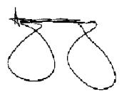

Azeezaly S. Jaffer Vice President Public Affairs and Communications

| Exhibits<br>                                                                           | lv |
|----------------------------------------------------------------------------------------|----|
| 1<br>Retail Management<br>                                                             | 1  |
| 11<br>Introduction                                                                     | 1  |
| 12<br>Retail Facility Management                                                       | 1  |
| 121<br>Retail Analysis Program (RAP)                                                   | 1  |
| 121.1<br>Purpose and Scope                                                             | 1  |
|                                                                                        |    |
| 121.2<br>Responsibilities                                                              | 1  |
| 121.21<br>Headquarters                                                                 | 1  |
| 121.22<br>Areas                                                                        | 1  |
| 121.23<br>Districts                                                                    | 2  |
| 121.231<br>District Manager, Customer Service and Sales                                | 2  |
| 121.232<br>District Coordinator                                                        | 2  |
| 121.3<br>RAP Surveys                                                                   | 2  |
| 121.31<br>General                                                                      | 2  |
| 121.32<br>Survey Steps                                                                 | 3  |
| 121.321<br>General                                                                     | 3  |
| 121.322<br>Determine Survey Plan                                                       | 3  |
| 121.323<br>Collect Data                                                                | 4  |
| 121.324<br>Prepare and Process Data                                                    | 4  |
| 121.325<br>Analyze Data                                                                | 4  |
| 121.326<br>Make Recommendations                                                        | 4  |
| 122<br>Types of Retail Facilities                                                      | 4  |
| 123<br>Post Offices, Stations, Branches, Contract Postal Units, and Nonpersonnel Units | 5  |
| 123.1<br>Definitions and Classification                                                | 5  |
| 123.11<br>Post Offices                                                                 | 5  |
| 123.12<br>Other Retail Units                                                           | 5  |
| 123.121<br>General                                                                     | 5  |
| 123.122<br>Post Offices                                                                | 5  |
| 123.123<br>Classified Units                                                            | 5  |
| 123.124<br>Stations                                                                    | 5  |
| 123.125<br>Branches                                                                    | 5  |
| 123.126<br>Contract Postal Units                                                       | 5  |
| 123.127<br>Community Post Offices                                                      | 6  |
| 123.128<br>Nonpersonnel Units                                                          | 6  |
| 123.129<br>Village Post Offices                                                        | 6  |
| 123.13<br>Military Post Offices                                                        | 6  |
| 123.131<br>Description                                                                 | 6  |
| 123.132<br>Establishment and Discontinuance                                            | 6  |

|                                                                                                             | 6  |
|-------------------------------------------------------------------------------------------------------------|----|
| 123.21<br>General                                                                                           | 6  |
| 123.22<br>Post Offices                                                                                      | 6  |
| 123.23<br>Classified Units                                                                                  | 7  |
| 123.24<br>Contract Units                                                                                    | 7  |
| 123.241<br>Authority                                                                                        | 7  |
| 123.242<br>Requirements                                                                                     | 7  |
| 123.243<br>Purchasing                                                                                       | 7  |
| 123.244<br>Bonds                                                                                            | 7  |
| 123.245<br>Payment                                                                                          | 7  |
| 123.3<br>Location of Postal Units                                                                           | 9  |
| 123.31<br>General                                                                                           | 9  |
| 123.32<br>Prohibited Locations                                                                              | 9  |
| 123.4<br>Names and ZIP Code Assignments and Changes                                                         | 9  |
| 123.41<br>Postal Service–Operated Retail Facility Names                                                     | 9  |
| 123.411<br>General                                                                                          | 9  |
| 123.412<br>Changes in Names of Post Offices                                                                 | 9  |
| 123.413<br>Designations of Stations, Branches, Community Post Offices,<br>and Other Named Postal Facilities | 9  |
|                                                                                                             |    |
| 123.42<br>Contractor-Operated Retail Facilities                                                             | 10 |
| 123.5<br>Reporting Requirements for Change in Post Office, Station, or Branch and<br>ZIP Code Status        | 10 |
| 123.6<br>Reporting Requirements for Community Post Office or Contract Postal Unit                           |    |
| Discontinuance                                                                                              | 11 |
| 124<br>Conduct on Postal Property                                                                           | 11 |
| 124.1<br>General                                                                                            | 11 |
| 124.2<br>Admission to Postal Property                                                                       | 11 |
| 124.21<br>Inspection                                                                                        | 11 |
|                                                                                                             |    |
| 124.22<br>Identification                                                                                    | 11 |
| 124.3<br>Preservation of Postal Property                                                                    | 11 |
| 124.4<br>Conformity With Signs and Directions                                                               | 12 |
| 124.41<br>Pedestrian Traffic                                                                                | 12 |
| 124.42<br>Vehicular Traffic                                                                                 | 12 |
| 124.5<br>Specific Restrictions                                                                              | 12 |
| 124.51<br>Disturbances                                                                                      | 12 |
| 124.52<br>Gambling                                                                                          | 12 |
| 124.53<br>Alcoholic Beverages and Drugs                                                                     | 13 |
| 124.531<br>Restrictions                                                                                     | 13 |
| 124.532<br>Smoking                                                                                          | 13 |
| 124.54<br>Soliciting, Electioneering, Collecting Debts, Vending, and Advertising                            | 13 |
| 124.55<br>Prohibited Postings                                                                               | 14 |
| 124.56<br>Authorized Actions                                                                                | 14 |
| 124.57<br>Seasonal Displays                                                                                 | 14 |
| 124.58<br>Photographs for News, Advertising, or Commercial Purposes                                         | 15 |
| 124.59<br>Dogs, Other Animals, and Weapons and Explosives                                                   | 15 |

| 124.6             | Nondiscrimination                            | 15       |
|-------------------|----------------------------------------------|----------|
| 124.7             | Enforcement and Violations                   | 16       |
| 124.71            | Enforcement                                  | 16       |
| 124.711           | Postal Police Officers                       | 16       |
| 124.712           | Agreements                                   | 16       |
| 124.72            | Violations                                   | 16       |
| 124.721           | Court                                        | 16       |
| 124.722           | Fines and Imprisonment                       | 16       |
| 125               | Lobby Management                             | 16       |
| 125.1             | Image                                        | 16       |
| 125.11            | General                                      | 16       |
| 125.12            | Responsibility                               | 16       |
| 125.2             | Service Levels                               | 17       |
| 125.21            | General                                      | 17       |
| 125.22            | National Holidays                            | 17       |
| 125.3             | Space Utilization                            | 19       |
| 125.31            | General                                      | 19       |
|                   |                                              |          |
| 125.32<br>125.321 | Furnishings and Fixtures<br>General          | 20<br>20 |
| 125.322           | Writing Tables and Customer Forms            | 20       |
| 125.323           | Checking Retail Scales for Accuracy          | 20       |
| 125.33            | Queuing Systems Criteria                     | 20       |
| 125.34            | Lobby Displays and Promotions                | 21       |
| 125.341           | General                                      | 21       |
| 125.342           | Lobby Displays                               | 21       |
| 125.343           | Mandatory Public Information to be Available | 22       |
| 125.35            | Scheduled Use                                | 22       |
| 125.351           | General                                      | 22       |
| 125.352           | Terms and Conditions                         | 23       |
| 125.36            | Unscheduled Use                              | 23       |
| 125.361           | Bulletin Boards                              | 23       |
| 125.362           | Voting Information                           | 24       |
| 125.37            | Blind Vendor Facilities                      | 24       |
| 125.4             | Lobby Director Program                       | 25       |
| 125.41            | Description                                  | 25       |
| 125.42            | Purpose and Scope                            | 25       |
| 125.43            | Implementation                               | 25       |
| 125.431           | Notify Employees                             | 25       |
| 125.432           | Encourage Volunteers                         | 25       |
| 125.433           | Provide Training                             | 25       |
| 125.434           | Uniforms                                     | 25       |
| 125.435           | Obtain Supplies and Equipment                | 26       |
| 125.5             | Articles Found in Lobbies or Public Areas    | 26       |
| 126               | Retail Services Management                   | 26       |
| 126.1             | Purpose and Scope                            | 26       |
| 126.2             | Stamps and Accountable Stock Activities      | 26       |
|                   |                                              |          |

| 126.21  | General                                                            | 26 |
|---------|--------------------------------------------------------------------|----|
| 126.22  | Requisitioning Stamps and Accountable Stock                        | 27 |
| 126.23  | Counting Stamps and Accountable Stock                              | 27 |
| 126.24  | Protecting Stamps and Accountable Stock                            | 27 |
| 126.25  | Destroying Stamps and Accountable Stock                            | 27 |
| 126.3   | Financial Activities                                               | 27 |
| 126.31  | Purpose and Scope                                                  | 27 |
| 126.32  | Security                                                           | 28 |
| 126.321 | Cash                                                               | 28 |
| 126.322 | Money Orders                                                       | 28 |
| 126.323 | Advance Deposits                                                   | 28 |
| 126.33  | Daily Financial Report                                             | 28 |
| 126.4   | Retail Hours                                                       | 29 |
| 126.41  | General                                                            | 29 |
| 126.411 | Main Post Office and Units in Business Areas                       | 29 |
| 126.412 | Saturdays                                                          | 29 |
| 126.413 | Sundays                                                            | 29 |
| 126.414 | Signs                                                              | 29 |
| 126.42  | Change in Retail Hours                                             | 29 |
| 126.43  | Lobby Hours                                                        | 30 |
| 126.44  | Local or State Holidays                                            | 30 |
| 126.45  | Self-Service Units                                                 | 30 |
| 126.46  | Consolidation of Retail Counter Service                            | 30 |
| 126.47  | Specified Postal Business                                          | 31 |
| 13      | Retail Services at Counters                                        | 31 |
| 131     | Overview                                                           | 31 |
| 131.1   | Counter Transactions                                               | 31 |
| 131.2   | High-Volume Retail Units                                           | 31 |
| 131.3   | Forms of Identification                                            | 31 |
| 131.31  | Description                                                        | 31 |
| 131.32  | Products and Services Requiring Forms of Acceptable Identification | 31 |
| 131.33  | Acceptable Primary Forms of Photo Identification                   | 32 |
| 131.34  | Acceptable Secondary Forms of Identification                       | 33 |
|         |                                                                    |    |
| 131.35  | Unacceptable Forms of Identification                               | 33 |
| 132     | Stamp and Postal Stationery Sales                                  | 34 |
| 132.1   | Stamps                                                             | 34 |
| 132.11  | General                                                            | 34 |
| 132.12  | Types of Stamps                                                    | 34 |
| 132.13  | Types of Stamp Sales                                               | 34 |
| 132.131 | Loose Stamps                                                       | 34 |
| 132.132 | Panes or Partial Panes                                             | 34 |
| 132.14  | Purchase Receipts                                                  | 35 |
| 132.2   | Postal Stationery                                                  | 35 |
| 132.21  | General                                                            | 35 |

| 132.22  | Rejection of Personalized Envelopes                | 35 |
|---------|----------------------------------------------------|----|
| 132.221 | General                                            | 35 |
| 132.222 | Purchase Error                                     | 35 |
| 132.223 | Postal Service Error                               | 35 |
| 132.224 | Replacement                                        | 35 |
| 132.225 | Returning Envelopes                                | 35 |
| 132.3   | Bulk Quantities                                    | 36 |
| 132.31  | General                                            | 36 |
| 132.32  | Stamps                                             | 36 |
| 132.33  | Bulk Sales to Customers                            | 36 |
| 132.4   | Unlawful Use of Stamps                             | 36 |
| 132.41  | By Postal Employees                                | 36 |
| 132.42  | Counterfeit Stamps                                 | 36 |
| 133     | Postal Money Order Sales                           | 36 |
| 133.1   | General                                            | 36 |
| 133.2   | Domestic Money Orders                              | 37 |
| 133.3   | International Money Orders                         | 37 |
| 134     | Packaging Products Sales                           | 37 |
| 135     | Postal-Related Merchandise Sales                   | 37 |
|         |                                                    |    |
| 135.1   | General                                            | 37 |
| 135.11  | Restrictions                                       | 37 |
| 135.12  | Licensees                                          | 38 |
| 135.13  | Unit Pricing                                       | 38 |
| 135.14  | Local Markets                                      | 38 |
| 135.2   | Accounting                                         | 38 |
| 135.3   | Postal-Related Merchandise Revenue Reports         | 38 |
| 136     | Methods of Payment                                 | 38 |
| 136.1   | General                                            | 38 |
| 136.2   | Prepaid Mail                                       | 39 |
| 136.3   | Business Reply Mail and Merchandise Return Service | 39 |
| 136.4   | Official Mail                                      | 39 |
| 136.5   | Rates                                              | 39 |
| 136.6   | Information-based Indicia Postage Paid Labels      | 39 |
|         |                                                    |    |
| 137     | Mail Acceptance and Handling                       | 40 |
| 137.1   | Policy                                             | 40 |
| 137.11  | Overview                                           | 40 |
| 137.12  | Retail Employees                                   | 40 |
| 137.13  | Mail Categories                                    | 40 |
| 137.14  | Commercial Mail                                    | 40 |
| 137.15  | Endorsements                                       | 40 |
| 137.2   | Size and Packaging Standards                       | 41 |
| 137.21  | Size Standards                                     | 41 |
| 137.22  | Packaging Standards                                | 41 |
| 137.3   | Addressing                                         | 41 |

|       | 137.31  | General                                                         |
|-------|---------|-----------------------------------------------------------------|
|       | 137.32  | Simplified Addressing                                           |
| 137.4 |         | Domestic Mail Acceptance                                        |
|       | 137.41  | General                                                         |
|       | 137.411 | Jurisdiction and Service Levels                                 |
|       | 137.412 | Nonmailable Matter and Hazardous Materials                      |
|       | 137.42  | Classes of Mail                                                 |
|       | 137.421 | Priority Mail Express                                           |
|       |         |                                                                 |
|       | 137.422 | Priority Mail                                                   |
|       | 137.423 | First-Class Mail                                                |
|       | 137.424 | Periodicals                                                     |
|       | 137.425 | USPS Marketing Mail                                             |
|       | 137.426 | Package Services                                                |
|       | 137.427 | Mixed Classes                                                   |
|       | 137.43  | Other Categories of Mail                                        |
|       | 137.431 | Mail for the Blind or Other Handicapped Persons                 |
|       | 137.432 | Official Mail                                                   |
|       | 137.44  | Accountable Mail                                                |
|       | 137.441 | General                                                         |
|       | 137.442 | Certified Mail                                                  |
|       | 137.443 | Registered Mail                                                 |
|       | 137.444 | Collect on Delivery (COD) Mail                                  |
|       | 137.445 | Insured Mail                                                    |
|       | 137.45  | Special Services Mail                                           |
|       | 137.451 | Certificate of Mailing                                          |
|       | 137.452 | Special Handling                                                |
|       | 137.453 | Delivery Confirmation                                           |
|       | 137.454 | Signature Confirmation                                          |
|       | 137.46  | Mailable Matter Not Bearing Postage Found in or on Private Mail |
|       |         | Receptacles                                                     |
|       |         |                                                                 |
|       | 137.47  | Additional Information                                          |
| 137.5 |         | Priority Mail Express Acceptance                                |
|       | 137.51  | Description                                                     |
|       | 137.52  | Priority Mail Express Next Day Service®                         |
|       | 137.521 | Acceptance                                                      |
|       | 137.522 | Verification                                                    |
|       |         |                                                                 |
|       | 137.53  | Priority Mail Express Second Day Service                        |
|       | 137.531 | Acceptance                                                      |
|       | 137.532 | Verification                                                    |
|       | 137.54  | Priority Mail Express Military Service                          |
|       | 137.541 | Acceptance                                                      |
|       | 137.542 | Verification                                                    |
| 137.6 |         | International Mail Acceptance                                   |
|       | 137.61  | General                                                         |
|       |         |                                                                 |
|       | 137.62  | Classes of Mail                                                 |
|       | 137.63  | Suspension of International Service                             |
| 137.7 |         | Mailhandling                                                    |

| 137.71 | Access to Mail and Mailhandling Areas                                                | 48       |
|--------|--------------------------------------------------------------------------------------|----------|
| 137.72 | Recall of Mail                                                                       | 48       |
| 137.73 | Requests for Surrender of Mail                                                       | 48       |
| 138    | Nonmailable Matter — Written, Printed, and Graphic                                   | 48       |
| 138.1  | Advice to Mailers — Mailability Decisions                                            | 48       |
| 138.11 | General Advice                                                                       | 48       |
| 138.12 | Mailer's Responsibility                                                              | 48       |
| 138.13 | Certain Mailability Decisions Not Authorized                                         | 49       |
| 138.14 | Referral to Inspection Service                                                       | 49       |
| 138.15 | Opening or Inspecting Mail                                                           | 49       |
| 138.16 | Applicability to Military Postal System                                              | 49       |
|        |                                                                                      |          |
| 138.2  | Sexually Oriented Advertisements                                                     | 49       |
| 138.21 | Application for Listing<br>138.211<br>Completion of Postal Service Form              | 49<br>49 |
|        | 138.212<br>Authorized Filers                                                         | 49       |
|        | 138.213<br>Weekly Transmission of Applications                                       | 49       |
|        | 138.214<br>Entry on Postal Service List                                              | 49       |
|        | 138.215<br>Five-Year Retention on List                                               | 50       |
|        | 138.216<br>Separate Applications for Different Addresses                             | 50       |
| 138.22 | Violations                                                                           | 50       |
|        | 138.221<br>Partial Listing                                                           | 50       |
|        | 138.222<br>Compliance With Law                                                       | 50       |
|        | 138.223<br>Customer Reporting of Unsolicited Advertisements                          | 50       |
|        | 138.224<br>Postal Service Employee Reporting of Unsolicited Advertisement            | 51       |
|        | 138.225<br>Customer Inquiry of Name on Postal Service List                           | 51       |
| 139    | Nonmailable Matter — Articles and Substances: Special Mailing Rules                  | 51       |
| 139.1  | General Provisions                                                                   | 51       |
| 139.11 | Rules and Procedures                                                                 | 51       |
|        | 139.111<br>Mailer's Responsibility                                                   | 51       |
|        | 139.112<br>Dangerous Materials Notices                                               | 51       |
|        | 139.113<br>Procedure for Acceptance Clerks                                           | 51       |
|        | 139.114<br>General Advice to Mailers                                                 | 52       |
|        | 139.115<br>Other Laws and Regulations<br>139.116<br>Authorized Mailability Decisions | 52<br>53 |
|        | 139.117<br>Referral to Inspection Service                                            | 53       |
|        | 139.118<br>Referral to PCSC                                                          | 53       |
|        | 139.119<br>Administrative Appeals                                                    | 53       |
| 139.2  | Firearms, Knives, and Sharp Instruments (18 U.S.C. 1715, 1716)                       | 53       |
| 14     | Other Retail Services Management                                                     | 54       |
| 141    | Delivery Services                                                                    | 54       |
| 141.1  | General                                                                              | 54       |
| 141.2  | General Delivery Service                                                             | 54       |
|        |                                                                                      |          |
| 141.3  | Firm Holdout Service                                                                 | 54       |
| 141.4  | Post Office Box and Caller Services                                                  | 54       |
| 141.41 | General                                                                              | 54       |
| 141.42 | PO Box Service                                                                       | 55       |

|        | 141.421 | General                                                                                                                                             | 55 |
|--------|---------|-----------------------------------------------------------------------------------------------------------------------------------------------------|----|
|        | 141.422 | Standards for PO Box Service                                                                                                                        | 55 |
|        | 141.423 | PO Box Service Up-Time                                                                                                                              | 55 |
|        | 141.424 | Configurations                                                                                                                                      | 55 |
|        | 141.425 | Requirements                                                                                                                                        | 56 |
| 141.43 |         | Caller Service                                                                                                                                      | 57 |
| 142    |         | Metered Postage Services                                                                                                                            | 57 |
| 142.1  |         | General                                                                                                                                             | 57 |
| 142.11 |         | Description                                                                                                                                         | 57 |
| 142.12 |         | Security of Equipment                                                                                                                               | 57 |
| 142.13 |         | Exceptions                                                                                                                                          | 57 |
| 142.2  |         | Customer-Operated Metered Postage                                                                                                                   | 57 |
| 142.3  |         | Postal Service-Operated Metered Postage                                                                                                             | 58 |
| 142.4  |         | On-Site Meter-Setting Service                                                                                                                       | 58 |
|        |         |                                                                                                                                                     |    |
| 143    |         | Photocopy Service                                                                                                                                   | 58 |
| 143.1  |         | Policy                                                                                                                                              | 58 |
| 143.2  |         | Noncompetitive Requirement                                                                                                                          | 58 |
| 144    |         | Self-Service Vending                                                                                                                                | 58 |
| 144.1  |         | General                                                                                                                                             | 58 |
| 144.11 |         | Description                                                                                                                                         | 58 |
| 144.12 |         | Responsibilities                                                                                                                                    | 59 |
| 144.13 |         | Value                                                                                                                                               | 59 |
| 144.14 |         | References                                                                                                                                          | 59 |
| 144.2  |         | Stamp Vending Machines                                                                                                                              | 59 |
| 144.3  |         | Booklet Vending Machines                                                                                                                            | 59 |
| 144.4  |         | Booklet/Stamp Combination Machines                                                                                                                  | 59 |
| 144.5  |         | Postal Commodity Machines                                                                                                                           | 60 |
| 144.6  |         | Self-Service Postal Centers                                                                                                                         | 60 |
|        |         |                                                                                                                                                     |    |
| 144.61 |         | Criteria                                                                                                                                            | 60 |
| 144.62 |         | Equipment Configuration                                                                                                                             | 60 |
| 145    |         | Exchanges and Refunds for Payment of Excess Postage                                                                                                 | 61 |
| 145.1  |         | Processing Refunds for Postage Stamps on Business Reply Mail, Postage<br>Meter Stamps, Meter Impressions, Permit Imprints, or Rejected Personalized |    |
|        |         | Envelopes                                                                                                                                           | 61 |
| 145.11 |         | Authorizing Refunds                                                                                                                                 | 61 |
| 145.12 | 145.121 | Disbursements<br>Standard Field Accounting Procedures (SFAP) and Statement of                                                                       | 61 |
|        |         | Account (SOA) Offices                                                                                                                               | 61 |
|        | 145.122 | Standard Accounting for Retail (SAFR) Offices                                                                                                       | 62 |
| 145.2  |         | Processing Refunds for Metered Postage                                                                                                              | 62 |
| 145.21 |         | Meters Checked Out of Service                                                                                                                       | 62 |
| 145.22 |         | Evidence of Unused Meter Stamps at Office of Meter Setting                                                                                          | 62 |
| 145.23 |         | Computing Fraction of Cent                                                                                                                          | 62 |
| 145.3  |         | Refund Application for Retail Services                                                                                                              | 62 |
| 146    |         | Indemnity Claims                                                                                                                                    | 63 |

| 146.1              | General Instructions for Filing Claims                             | 63       |
|--------------------|--------------------------------------------------------------------|----------|
| 146.11             | How to File                                                        | 63       |
| 146.111            | Customer Action                                                    | 63       |
| 146.112            | Accepting Post Office                                              | 65       |
| 146.113            | Claims and Inquiry Employee                                        | 66       |
| 146.12             | Processing Claims at the Post Office                               | 66       |
| 146.121            | Loss of Numbered Insured Mail, Registered Mail With Postal Service |          |
|                    | Insurance, COD, or Priority Mail Express Items                     | 66       |
| 146.122            | Loss of Unnumbered Insured Articles                                | 66       |
| 146.123            | Damage Claim Filed by Mailer                                       | 66       |
| 146.124<br>146.125 | Damage Claim Filed by Addressee<br>Estimates and Appraisals        | 67<br>67 |
|                    |                                                                    |          |
| 146.13<br>146.131  | Inquiries and Duplicate Claims<br>Time Limits                      | 68<br>68 |
| 146.132            | Customer Filing                                                    | 68       |
| 146.133            | Claim Form Copy Not on File                                        | 68       |
| 146.134            | Completing Duplicate Claims                                        | 68       |
| 146.2              | Disposition                                                        | 68       |
| 146.21             | Damaged Article                                                    | 68       |
| 146.22             | Disposition of Recovered Articles                                  | 69       |
|                    |                                                                    |          |
| 146.3              | Quarterly Review                                                   | 69       |
| 146.31             | Responsibility                                                     | 69       |
| 146.32             | Survey Form                                                        | 70       |
| 15                 | Easy Stamp Services                                                | 72       |
| 151                | Stamps by Mail                                                     | 72       |
| 151.1              | Description                                                        | 72       |
| 151.11             | Stamps by Mail PS Forms 3227-A and 3227-B                          | 72       |
| 151.12             | Rural Delivery Areas — PS Form 3227-R                              | 72       |
| 151.13             | Written and Telephone Requests                                     | 73       |
| 151.2              | Responsibilities                                                   | 73       |
| 151.21             | Managers, Customer Service Support                                 | 73       |
| 151.22             | Postmasters of City Delivery Offices                               | 73       |
| 151.23             | Postmasters of Rural Delivery Offices                              | 73       |
|                    |                                                                    |          |
| 151.24             | Order Filling Clerks                                               | 73       |
| 151.25             | Registry Unit                                                      | 74       |
| 151.26             | Receiving Delivery Unit                                            | 74       |
| 151.3              | Filling Orders                                                     | 75       |
| 151.31             | General                                                            | 75       |
| 151.32             | Clerical Downtime                                                  | 75       |
| 151.33             | Centralized Fulfillment Locations                                  | 75       |
| 151.34             | Order Filling Clerks                                               | 75       |
| 151.35             | Registry Unit                                                      | 76       |
| 151.36             | Receiving Delivery Unit                                            | 77       |
| 151.37             | Undeliverable as Addressed Orders                                  | 77       |
| 151.38             | Lost Orders                                                        | 77       |
|                    |                                                                    |          |

|    | 152    |        | Stamps by Phone                                                         | 77 |
|----|--------|--------|-------------------------------------------------------------------------|----|
| 16 |        |        | Consumer Services                                                       | 78 |
|    | 161    |        | Overview                                                                | 78 |
|    | 162    |        | Scope                                                                   | 78 |
|    | 163    |        | Source of Complaints                                                    | 78 |
|    | 164    |        | Responsibility                                                          | 79 |
|    | 164.1  |        | Headquarters Management                                                 | 79 |
|    | 164.2  |        | Field Management                                                        | 79 |
|    | 164.3  |        | Consumer and Industry Contact Managers                                  | 79 |
|    | 164.4  |        | Postmasters and Station or Branch Managers                              | 79 |
|    | 165    |        | Procedures                                                              | 80 |
|    | 165.1  |        | Required Time for Action                                                | 80 |
|    | 165.2  |        | Exception to Final Response Requirement                                 | 80 |
|    | 165.3  |        | Maintaining Customer Complaint Control Log                              | 81 |
|    | 165.4  |        | Complaint Resolution                                                    | 83 |
|    |        | 165.41 | Complaints Resolved Immediately                                         | 83 |
|    |        | 165.42 | Further Investigation Required                                          | 83 |
|    | 165.5  |        | Processing Complaints                                                   | 83 |
|    |        | 165.51 | Complaints Made in Person                                               | 83 |
|    |        |        |                                                                         |    |
|    | 165.52 |        | Processing a Written Complaint                                          | 83 |
|    | 165.53 |        | Processing a Complaint Made by Telephone                                | 84 |
|    |        | 165.54 | Processing USPS.com and 800-ASK-USPS Complaints via C360                | 85 |
|    | 165.6  |        | Headquarters to Field Referrals                                         | 86 |
|    | 165.7  |        | Government Inquiries                                                    | 86 |
|    | 166    |        | Complaint Escalation Process                                            | 86 |
|    | 167    |        | Customer Contact Guidelines                                             | 87 |
|    | 167.1  |        | General                                                                 | 87 |
|    | 167.2  |        | Receiving Complaints                                                    | 88 |
|    |        | 167.21 | In Person                                                               | 88 |
|    |        | 167.22 | By Telephone                                                            | 88 |
|    |        | 167.23 | By Letter                                                               | 89 |
|    | 167.3  |        | Resolving Customer Complaints                                           | 89 |
|    |        | 167.31 | General                                                                 | 89 |
|    |        | 167.32 | In Person                                                               | 89 |
|    |        | 167.33 | By Telephone                                                            | 89 |
|    |        | 167.34 | By Letter or Email                                                      | 90 |
|    | 168    |        | Measurement of Effectiveness and Benefits                               | 90 |
|    | 168.1  |        | Effectiveness                                                           | 90 |
|    | 168.2  |        | Benefits                                                                | 90 |
|    | 169    |        | Other Consumer Services                                                 | 90 |
|    | 169.1  |        | General                                                                 | 90 |
|    | 169.2  |        | Reporting Postal Offenses                                               | 91 |
|    | 169.3  |        | Requests for Information Regarding the Mistreatment of Mail, Claims and |    |
|    |        |        | International Inquiries                                                 | 91 |

|   |    | 169.4  | Other Requests for Information (Inquiries and Claims) | 92  |
|---|----|--------|-------------------------------------------------------|-----|
|   | 17 |        | Public Services                                       | 93  |
|   |    | 171    | Voter Registration, Polling, and Absentee Balloting   | 93  |
|   |    | 171.1  | Voter Registration                                    | 93  |
|   |    | 171.2  | Polling                                               | 93  |
|   |    | 171.21 | Approval and Criteria                                 | 93  |
|   |    | 171.22 | Requests                                              | 94  |
|   |    | 171.3  | Absentee Balloting Materials Not to Be Detained       | 94  |
|   |    | 172    | Selective Service Registration                        | 94  |
|   |    | 172.1  | Purpose                                               | 94  |
|   |    | 172.2  | Scope                                                 | 94  |
|   |    | 172.3  | Request for Materials                                 | 94  |
|   |    | 172.4  | Registration Procedures                               | 95  |
|   |    | 173    | Assistance to Government Agencies                     | 95  |
|   |    | 173.1  | Criteria                                              | 95  |
|   |    | 173.2  | Types of Services                                     | 95  |
|   | 18 |        | Postage Meters                                        | 96  |
|   |    | 181    | Licensing and Mailings                                | 96  |
|   |    | 181.1  | Description                                           | 96  |
|   |    | 181.2  | Approved Meters                                       | 96  |
|   |    | 181.3  | Licensing                                             | 96  |
|   |    | 181.4  | Meter Stamps                                          | 96  |
|   |    | 181.5  | Mailings                                              | 96  |
|   |    | 182    | Setting                                               | 96  |
|   |    | 182.1  | General Standards                                     | 96  |
|   |    | 182.2  | Procedures                                            | 97  |
|   |    |        |                                                       |     |
| 2 |    |        | Philately                                             | 99  |
|   |    |        |                                                       |     |
|   | 21 |        | Philatelic Policies and Procedures                    | 99  |
|   |    | 211    | Policy                                                | 99  |
|   |    | 212    | Stamp and Stationery Subjects                         | 99  |
|   |    | 212.1  | Selection                                             | 99  |
|   |    | 212.2  | Criteria for Eligibility                              | 100 |
|   |    | 212.3  | Submission                                            | 101 |
|   |    | 212.4  | Approval and Design                                   | 101 |
|   |    | 213    | Distribution and Requisition of Accountable Paper     | 101 |
|   |    | 213.1  | Stamp Distribution Offices                            | 101 |
|   |    | 213.2  | Accountable Paper Custodians                          | 101 |
|   | 22 |        | Retail Sales Policy                                   | 102 |
|   |    | 221    | General                                               | 102 |
|   |    | 221.1  | Sales Channels                                        | 102 |
|   |    | 221.2  | First Day of Issue Sales                              | 102 |
|   |    | 221.3  | Withdrawal From Sale                                  | 102 |

|     | 221.4            |         | Stamps for Philatelic Products                         | 102 |
|-----|------------------|---------|--------------------------------------------------------|-----|
|     | 221.5            |         | Exceptions to Sales Policies                           | 102 |
| 222 |                  |         | Regular Stamp Windows                                  | 102 |
|     | 222.1            |         | Definition                                             | 102 |
|     | 222.2            |         | Sales Policy                                           | 103 |
|     | 222.21           |         | Commemorative Stamps                                   | 103 |
|     | 222.22           |         | Plate Number Blocks and Marginal Markings (All Stamps) | 103 |
|     |                  | 222.221 | Description                                            | 103 |
|     |                  | 222.222 | Setting Aside Plate Number Blocks                      | 103 |
|     |                  | 222.223 | Minimum Purchase Requirements and Sales Limitations    | 103 |
|     | 222.23           |         | Coil Stamps                                            | 104 |
|     | 222.24           |         | Precanceled Stamps                                     | 104 |
|     | 222.25           |         | Meter Postage                                          | 104 |
| 223 |                  |         | Dedicated Philatelic Windows                           | 104 |
|     | 223.1            |         | Definition                                             | 104 |
| 224 |                  |         | Philatelic Centers                                     | 105 |
|     | 224.1            |         | Definition                                             | 105 |
|     | 224.2            |         | Sales Policy                                           | 105 |
|     | 224.21           |         | Plate Number Blocks/Marginal Markings (All Stamps)     | 105 |
|     | 224.22           |         | Coil Stamps                                            | 105 |
|     | 224.23           |         | Precanceled Stamps                                     | 105 |
|     | 224.24           |         | Meter Postage                                          | 105 |
|     | 224.25           |         | Stamp Credit (Accountability)                          | 106 |
|     |                  | 224.251 | Stock Levels                                           | 106 |
|     |                  | 224.252 | Special Authorization                                  | 106 |
|     |                  | 224.253 | Stamp Credit                                           | 106 |
| 225 |                  |         | Temporary Philatelic Stations                          | 106 |
|     | 225.1            |         | Definition                                             | 106 |
|     | 225.2            |         | Requests for Temporary Stations                        | 106 |
|     | 225.21           |         | First Day of Issue Events                              | 106 |
|     | 225.3            |         | Authorization                                          | 107 |
|     | 225.4            |         | Ceremonies                                             | 107 |
|     | 225.5            |         | Announcement and Publicity                             | 107 |
|     | 225.51           |         | Posters                                                | 107 |
|     | 225.52           |         | Press Releases                                         | 107 |
|     | 225.6            |         | Participation in Events                                | 107 |
|     | 225.61           |         | Planning                                               | 107 |
|     | 225.62           |         | Stamp Stock                                            | 108 |
|     |                  |         |                                                        |     |
|     | 225.63<br>225.64 |         | Philatelic Products                                    | 108 |
|     |                  |         | Sales Restrictions                                     | 108 |
|     | 225.65           |         | Security and Facilities                                | 108 |
|     | 225.66           |         | Appearance                                             | 108 |
|     | 225.67           |         | Prompt Service                                         | 108 |
|     | 225.68           |         | Sales Report                                           | 108 |

| 226 |                  |         | Mail Order                                                            | 108 |
|-----|------------------|---------|-----------------------------------------------------------------------|-----|
| 227 |                  |         | Guidelines for the Purchase and Sale of Local Commemorative Envelopes | 109 |
|     | 227.1            |         | Event Criteria for Producing Commemorative Envelopes                  | 109 |
|     | 227.2            |         | Responsibilities for Producing Commemorative Envelopes                | 109 |
|     | 227.21           |         | Postmaster Responsibilities                                           | 109 |
|     |                  | 227.211 | Request to Produce Commemorative Envelopes                            | 109 |
|     |                  | 227.212 | Items to Include With Requests                                        | 109 |
|     |                  | 227.213 | Administrative Responsibilities                                       | 113 |
|     | 227.22           |         | Supplier Responsibilities                                             | 114 |
|     | 227.23           |         | District Responsibilities                                             | 116 |
|     | 227.24           |         | Headquarters (Stamp Services) Responsibilities                        | 116 |
|     | 227.3            |         | Legal Issues and Concerns                                             | 116 |
|     | 227.31           |         | Use of Third-Party Images and Artwork on Philatelic Item              | 116 |
|     | 227.32           |         | Refuse Purchase Orders Requiring the Postal Service to Obtain Rights  | 116 |
|     | 227.4            |         | Financial Procedures                                                  | 117 |
|     | 227.41           |         | Postmaster's Accounting Responsibilities                              | 117 |
|     | 227.42           |         | Post Office Accounting Responsibility                                 | 120 |
|     | 227.5            |         | POS Instructions for Local Commemorative Envelopes                    | 120 |
|     | 227.51           |         | Renaming AIC 083                                                      | 120 |
|     | 227.52           |         | Receipt of Item Into the Unit                                         | 120 |
|     | 227.53<br>227.54 |         | Retail Product Inventory Report                                       | 120 |
|     |                  |         | Default List of Items that Can Be Edited for Local Use                | 121 |
| 23  |                  |         | Philatelic Postmarks                                                  | 122 |
| 231 |                  |         | General                                                               | 122 |
|     | 231.1            |         | Definition                                                            | 122 |
|     | 231.2            |         | Policy                                                                | 122 |
|     | 231.21           |         | Publicity                                                             | 122 |
|     | 231.22           |         | Backdating and Predating                                              | 122 |
|     | 231.23           |         | Retail Associate Availability and Training                            | 122 |
|     | 231.3            |         | Cooperation With Collectors                                           | 122 |
|     | 231.31           |         | Postmarks                                                             | 122 |
|     | 231.32           |         | Special Attention                                                     | 123 |
|     | 231.33           |         | Postmarking Devices                                                   | 123 |
|     | 231.34           |         | Hand-Stamped Postmarks                                                | 123 |
|     | 231.35           |         | Philatelic Covers                                                     | 123 |
|     | 231.36           |         | Defacing Philatelic Covers                                            | 123 |
|     | 231.4            |         | Hand-Back and Mail-Back Service                                       | 123 |
|     | 231.5            |         | Permissible Postmarking Devices and Hand-Stamped Postmarking for      |     |
|     |                  |         | Collectors                                                            | 124 |
|     | 231.6            |         | Philatelic Postmark Policy                                            | 125 |
|     | 231.61           |         | Date and Place of Postmarking                                         | 125 |
|     | 231.62           |         | Preparation Requirements                                              | 125 |
|     | 231.63           |         | Special Materials on Which Postmarks May Be Requested                 | 126 |
|     | 231.7            |         | Holding the Mail                                                      | 127 |
|     |                  |         |                                                                       |     |

|                       | 231.8  | Machine Postmarks                                     |            |  |  |  |  |
|-----------------------|--------|-------------------------------------------------------|------------|--|--|--|--|
|                       | 231.9  | Hand-Stamped Postmarks                                | 127        |  |  |  |  |
| 232                   |        | First Day of Issue<br>127                             |            |  |  |  |  |
|                       | 232.1  | First Day of Issue Sales Policy                       | 127        |  |  |  |  |
| 232.2<br>Notification |        |                                                       |            |  |  |  |  |
|                       | 232.3  | First Day of Issue Postmarks                          | 127        |  |  |  |  |
|                       | 232.4  | Ordering Procedures                                   | 128        |  |  |  |  |
|                       | 232.5  | Bulk Orders                                           | 128        |  |  |  |  |
|                       | 232.6  | Hand-Stamped Postmarks                                | 128        |  |  |  |  |
|                       | 232.7  | Hand-Back Service                                     | 128        |  |  |  |  |
|                       | 232.8  | Unacceptable Covers                                   | 128        |  |  |  |  |
|                       | 232.9  | Postmarking Deadlines and Unofficial First Day Covers | 129        |  |  |  |  |
| 233                   |        | First Day of Sale Postmark                            | 129        |  |  |  |  |
|                       | 233.1  | First Day of Sale Postmark Policy                     | 129        |  |  |  |  |
|                       | 233.2  | Notification                                          | 129        |  |  |  |  |
|                       | 233.3  | First Day of Sale Postmarks                           | 129        |  |  |  |  |
|                       | 233.4  | Ordering Procedures                                   | 130        |  |  |  |  |
|                       | 233.41 | Hand-Back Service                                     | 130        |  |  |  |  |
|                       | 233.42 | Mail-Back Service                                     | 130        |  |  |  |  |
|                       | 233.5  | Servicing Fees                                        | 131        |  |  |  |  |
| 234                   |        | Pictorial Postmarks                                   | 131        |  |  |  |  |
|                       | 234.1  | Sponsors                                              | 131        |  |  |  |  |
|                       | 234.2  | Postmarking Methods                                   | 131        |  |  |  |  |
|                       | 234.3  | Criteria                                              | 131        |  |  |  |  |
|                       | 234.4  | Authorization                                         | 131        |  |  |  |  |
|                       | 234.5  | Requirements                                          |            |  |  |  |  |
|                       | 234.51 | Required Information and Dimensions                   | 132<br>132 |  |  |  |  |
|                       | 234.52 | Approved Subject Matter                               | 132        |  |  |  |  |
|                       | 234.53 | Publicity                                             | 132        |  |  |  |  |
|                       | 234.54 | Equipment                                             | 132        |  |  |  |  |
|                       | 234.55 | Service Limitations                                   | 133        |  |  |  |  |
|                       | 234.56 | Use and Disposition of Hand Stamps                    | 133        |  |  |  |  |
|                       | 234.57 | Special Requests to Retain Hand Stamps                | 133        |  |  |  |  |
| 235                   |        | Special Mail Processing Postmarks                     | 133        |  |  |  |  |
| 236                   |        | Other Special Philatelic Postmarks                    | 133        |  |  |  |  |
|                       | 236.1  | Seasonal Postmarks                                    | 133        |  |  |  |  |
|                       | 236.2  | Postmark America Service                              | 133        |  |  |  |  |
| 236.21                |        | Postmark Design                                       | 134        |  |  |  |  |
|                       | 236.22 | Approval Process                                      | 134        |  |  |  |  |
| 236.23                |        | Ordering Rubber Hand Stamps                           | 134        |  |  |  |  |
|                       | 236.24 | Postmark Servicing Support and Procedures             | 135        |  |  |  |  |
| 236.3                 |        | Military Post Offices                                 | 135        |  |  |  |  |
|                       |        |                                                       |            |  |  |  |  |
|                       | 236.4  | Special Requests                                      | 135        |  |  |  |  |

|    | 24 |                                              |        | Autographs                                          | 136 |  |  |  |
|----|----|----------------------------------------------|--------|-----------------------------------------------------|-----|--|--|--|
|    |    | 241                                          |        | General                                             | 136 |  |  |  |
| 25 |    | Philatelic Cover Servicers and Cachet Makers |        |                                                     |     |  |  |  |
|    |    | 251                                          |        | Authorization                                       | 136 |  |  |  |
|    |    | 252                                          |        | First Day Cover Service                             | 136 |  |  |  |
|    |    | 253                                          |        | Mail-Back Service                                   | 136 |  |  |  |
|    |    | 253.1                                        |        | Service Charges                                     | 136 |  |  |  |
|    |    | 253.2                                        |        | Payment Requirements                                | 136 |  |  |  |
|    |    | 253.3                                        |        | Acceptable Items                                    | 136 |  |  |  |
|    |    | 254                                          |        | Damaged or Missing Covers                           | 137 |  |  |  |
|    |    | 254.1                                        |        | Requests for Replacements                           | 137 |  |  |  |
|    |    | 254.2                                        |        | Criteria                                            | 137 |  |  |  |
|    |    | 254.3                                        |        | Procedures                                          | 137 |  |  |  |
|    |    | 254.4                                        |        | Exceptions                                          | 137 |  |  |  |
|    |    | 254.5                                        |        | Damaged or Loss of Cachet Covers                    | 137 |  |  |  |
|    | 26 |                                              |        | Philatelic Products                                 | 137 |  |  |  |
|    |    | 261                                          |        | Special Philatelic Products                         | 137 |  |  |  |
|    | 27 |                                              |        | Promotions or Presentations                         | 138 |  |  |  |
|    |    | 271                                          |        | General                                             | 138 |  |  |  |
|    |    | 272                                          |        | Obtaining Stock Locally                             | 138 |  |  |  |
|    |    | 273                                          |        | Obtaining Stock Through Stamp Fulfillment Services  | 138 |  |  |  |
|    | 28 | Copyright of Stamp Designs                   |        |                                                     |     |  |  |  |
|    |    | 281                                          |        | Policy                                              | 139 |  |  |  |
|    |    | 282                                          |        | Permission for Use                                  | 139 |  |  |  |
|    |    | 283                                          |        | Reproduction of Designs                             | 140 |  |  |  |
|    |    | 284                                          |        | Requests for Licenses                               | 140 |  |  |  |
|    |    |                                              |        |                                                     |     |  |  |  |
| 3  |    |                                              |        | Collection Service — National Service Standards<br> | 141 |  |  |  |
|    | 31 |                                              |        | Applicability and General Requirements              | 141 |  |  |  |
|    |    | 311                                          |        | Applicability                                       | 141 |  |  |  |
|    |    | 312                                          |        | Local Postmark                                      | 141 |  |  |  |
|    |    | 312.1                                        |        | Local Postmark Requirement                          | 141 |  |  |  |
|    |    | 312.2                                        |        | Local Postmark Requests                             | 141 |  |  |  |
|    |    | 313                                          |        | Collection Requirements                             | 142 |  |  |  |
|    |    | 313.1                                        |        | Collection Schedules and Locations                  | 142 |  |  |  |
|    |    |                                              | 313.11 | General                                             | 142 |  |  |  |
|    |    |                                              | 313.12 | Collection Location Standards                       | 142 |  |  |  |
|    |    |                                              | 313.13 | Collection Schedule Standards                       | 142 |  |  |  |
|    |    | 313.2                                        |        | Specific Schedule and Location Standards            | 143 |  |  |  |
|    |    |                                              | 313.21 | At Postal Facilities                                | 143 |  |  |  |
|    |    |                                              | 313.22 | Residential Collection Boxes                        | 144 |  |  |  |
|    |    |                                              | 313.23 | Business Area Collection Boxes                      | 144 |  |  |  |
|    |    |                                              | 313.24 | Business Area 5:00 p.m. or Later Boxes              | 145 |  |  |  |

|   | 313.3  | Exceptions to Mandated Service                                                              | 146 |
|---|--------|---------------------------------------------------------------------------------------------|-----|
|   | 313.31 | General                                                                                     | 146 |
|   | 313.32 | Exception Documentation                                                                     | 146 |
|   | 313.33 | Exception for Removal                                                                       | 146 |
|   | 314    | Collection Point Management System, Collection Tests, and Density Tests<br>(Volume Reviews) | 147 |
|   | 314.1  | General                                                                                     | 147 |
|   | 314.2  | Manual Collection Tests                                                                     | 147 |
|   | 314.3  | Volume Density Tests                                                                        | 147 |
|   | 315    | Collection Boxes                                                                            | 148 |
|   | 315.1  | Appearance                                                                                  | 148 |
|   | 315.2  | Number, Location Type, and Box Type                                                         | 148 |
|   | 315.3  | Relocation Before Removal                                                                   | 148 |
|   | 315.4  | Immediate Removal                                                                           | 148 |
|   | 316    | Collection Schedule Decals                                                                  | 148 |
|   | 317    | Collection Box Types                                                                        | 149 |
|   | 317.1  | General                                                                                     | 149 |
|   | 317.2  | Standard                                                                                    | 149 |
|   | 317.3  | Large                                                                                       | 149 |
|   | 317.4  | Jumbo                                                                                       | 149 |
|   | 317.5  | Motorist Mailchute (Snorkel) Boxes                                                          | 149 |
|   | 318    | Priority Mail Express Collection Boxes                                                      | 150 |
|   | 318.1  | Identification                                                                              | 150 |
|   | 318.2  | Location                                                                                    | 150 |
|   | 318.3  | Number of Boxes                                                                             | 150 |
|   | 32     | Mail Deposit and Collection                                                                 | 150 |
|   | 321    | Ordinary Deposit of Mail                                                                    | 150 |
|   | 321.1  | Post Office Lobby                                                                           | 150 |
|   | 321.2  | Rural and Contract Delivery Service Boxes                                                   | 150 |
|   | 321.3  | Vertical Improved Mail and Firm Mailrooms                                                   | 150 |
|   | 322    | Mailchutes and Receiving Boxes                                                              | 150 |
|   | 322.1  | General                                                                                     | 150 |
|   | 322.2  | Use                                                                                         | 151 |
|   | 322.21 | Determination of Installation                                                               | 151 |
|   | 322.22 | Purpose                                                                                     | 151 |
|   | 322.3  | Installation, Specification, and Maintenance                                                | 151 |
|   | 322.4  | Schedules                                                                                   | 151 |
|   | 322.5  | Bulk Mailings                                                                               | 151 |
|   |        |                                                                                             |     |
| 4 |        | Mail Processing Procedures<br>                                                              | 153 |
|   | 41     | Introduction                                                                                | 153 |
|   | 42     | Responsibilities                                                                            | 153 |
|   | 421    | Headquarters                                                                                | 153 |

|    | 422                                          |                               |                    | Area Offices                                           | 153        |  |  |
|----|----------------------------------------------|-------------------------------|--------------------|--------------------------------------------------------|------------|--|--|
|    | 423                                          |                               |                    | Area Distribution Networks                             | 154        |  |  |
|    |                                              | 423.1                         |                    | General                                                | 154        |  |  |
|    |                                              | 423.2                         |                    | Feedback Requirements                                  | 155        |  |  |
|    | 424                                          |                               |                    | Processing and Distribution Center/Facility            | 155        |  |  |
|    |                                              | 424.1                         |                    | Definition                                             | 155        |  |  |
|    |                                              | 424.2                         |                    | Operating Plan Review                                  | 155        |  |  |
|    |                                              | 424.3                         |                    | Area Distribution Centers                              | 156        |  |  |
|    |                                              | 424.4                         |                    | Automated Area Distribution Centers                    | 156        |  |  |
|    |                                              | 424.5                         |                    | Associate Office Distribution Responsibilities         | 156        |  |  |
|    | 425                                          |                               |                    | Air Mail Center/Facility                               | 156        |  |  |
|    | 426                                          |                               |                    | Network Distribution Centers                           | 157        |  |  |
|    |                                              |                               |                    |                                                        |            |  |  |
| 43 |                                              |                               |                    | ZIP Codes and the ZIP+4® System                        | 157        |  |  |
|    | 431                                          |                               |                    | ZIP Codes                                              | 157        |  |  |
|    | 432                                          |                               |                    | ZIP+4®Code                                             | 157        |  |  |
|    | 433                                          |                               |                    | Placement                                              | 158        |  |  |
|    | 434                                          |                               |                    | Employee Training                                      | 158        |  |  |
|    | 435                                          |                               |                    | Boundaries                                             | 158        |  |  |
|    | 436                                          |                               |                    | Unique                                                 | 158        |  |  |
|    | 437                                          |                               |                    | Planning                                               | 158        |  |  |
|    | 438                                          | Delivery Point Sequence (DPS) |                    |                                                        |            |  |  |
|    | 439<br>ZIP Code Authorization and Assignment |                               |                    |                                                        |            |  |  |
|    |                                              | 439.1                         |                    | Definitions                                            | 158        |  |  |
|    |                                              | 439.2                         |                    | Assignment Criteria for New ZIP Codes                  | 159        |  |  |
|    |                                              | 439.21                        |                    | Delivery ZIP Code                                      | 159        |  |  |
|    |                                              |                               | 439.211            | Establish Delivery ZIP Code                            | 159        |  |  |
|    |                                              |                               | 439.212            | Split Delivery ZIP Code                                | 165        |  |  |
|    |                                              | 439.22                        |                    | Post Office Box ZIP Code                               | 165        |  |  |
|    |                                              | 439.23                        |                    | Shared ZIP Code                                        | 170        |  |  |
|    |                                              |                               | 439.231            | Review and Analysis                                    | 170        |  |  |
|    |                                              |                               | 439.232            | Address and Mail Type Requirements                     | 174        |  |  |
|    |                                              |                               | 439.233            | Revenue Assurance                                      | 174        |  |  |
|    |                                              | 439.24                        |                    | Unique ZIP Code                                        | 174        |  |  |
|    |                                              |                               | 439.241            | Review and Analysis                                    | 174        |  |  |
|    |                                              | 439.242                       |                    | Elimination of One Piece Handling                      | 180        |  |  |
|    |                                              | 439.243                       |                    | Addressing Requirements                                | 180        |  |  |
|    |                                              |                               | 439.244            | Revenue Assurance                                      | 180        |  |  |
|    |                                              |                               | 439.245            | Mail Acceptance by Firm                                | 180        |  |  |
|    |                                              | 439.3                         |                    | Postal Facility Status Change and Boundary Realignment | 180        |  |  |
|    |                                              | 439.31                        |                    | Postal Facility Status Change                          | 180        |  |  |
|    |                                              |                               | 439.311            | General                                                | 180        |  |  |
|    |                                              |                               | 439.312<br>439.313 | Establishment<br>Post Office Discontinuance            | 180<br>180 |  |  |
|    |                                              |                               |                    |                                                        |            |  |  |
|    |                                              | 439.32                        | 439.321            | Boundary Realignments<br>General                       | 181<br>181 |  |  |
|    |                                              |                               |                    |                                                        |            |  |  |

|    | 439.322 |        |         | Minor Realignments                     | 181 |
|----|---------|--------|---------|----------------------------------------|-----|
|    |         |        | 439.323 | Reporting                              | 181 |
|    | 439.4   |        |         | Required Documentation                 | 183 |
|    | 439.41  |        |         | Delivery ZIP Code                      | 183 |
|    | 439.42  |        |         | Post Office Box ZIP Code               | 183 |
|    |         | 439.43 |         | Shared ZIP Code                        | 183 |
|    | 439.44  |        |         | Unique ZIP Code                        | 183 |
|    | 439.45  |        |         | Postal Facility Status Change          | 184 |
|    |         | 439.46 |         | Boundary Realignment                   | 184 |
|    | 439.5   |        |         | Authorization and Approval             | 184 |
|    |         | 439.51 |         | General                                | 184 |
|    |         | 439.52 |         | District                               | 184 |
|    |         | 439.53 |         | Network Distribution Center (NDC)      | 185 |
|    |         | 439.54 |         | Priority Mail Processing Center (PMPC) | 185 |
|    | 439.55  |        |         | Areas                                  | 185 |
|    |         | 439.56 |         | Headquarters                           | 185 |
|    | 439.6   |        |         | Implementation                         | 185 |
|    |         | 439.61 |         | General                                | 185 |
|    |         |        | 439.611 | District Level                         | 185 |
|    |         |        | 439.612 | Local Mail Processing Managers         | 186 |
|    |         |        | 439.613 | ZIP Code System Stability              | 186 |
|    |         |        | 439.614 | File Maintenance                       | 186 |
|    |         |        | 439.615 | Effective Date                         | 186 |
|    |         | 439.62 |         | Three-Digit Realignment                | 186 |
| 44 |         |        |         | Mail Preparation                       | 186 |
|    | 441     |        |         | Mail Preparation Operations            | 186 |
|    | 442     |        |         | Mail Preparation Units                 | 187 |
|    | 443     |        |         | Endorsing, Canceling, and Postmarking  | 187 |
|    | 443.1   |        |         | Endorsing                              | 187 |
|    | 443.2   |        |         | Canceling                              | 187 |
|    | 443.3   |        |         | Postmarking                            | 188 |
|    |         | 443.31 |         | General                                | 188 |
|    |         | 443.32 |         | Local Postmarking                      | 188 |
|    |         | 443.33 |         | Backstamping                           | 188 |
|    |         | 443.34 |         | Backdating                             | 188 |
|    | 444     |        |         | Equipment and Supplies                 | 189 |
|    | 444.1   |        |         | General                                | 189 |
|    | 444.2   |        |         | Canceling Equipment                    | 189 |
|    | 444.3   |        |         | Altering or Substituting Equipment     | 189 |
|    | 444.4   |        |         | Black Ink                              | 189 |
|    | 445     |        |         | Requisitioning Procedures              | 189 |
| 45 |         |        |         | Distribution                           | 189 |
|    | 451     |        |         | Outgoing and Incoming Distribution     | 189 |
|    | 452     |        |         | Authorized Distribution                | 190 |
|    |         |        |         |                                        |     |

|    |     | 452.1  |         | General                                                              | 190 |
|----|-----|--------|---------|----------------------------------------------------------------------|-----|
|    |     | 452.2  |         | Outgoing Distribution                                                | 190 |
|    | 453 |        |         | Distribution Priorities                                              | 190 |
|    | 454 |        |         | Centralized and Decentralized Distribution                           | 190 |
|    | 455 |        |         | Types of Distribution                                                | 191 |
|    |     | 455.1  |         | Manual Distribution                                                  | 191 |
|    |     | 455.2  |         | Mechanized Distribution                                              | 191 |
|    |     | 455.3  |         | Automated Distribution                                               | 191 |
|    | 456 |        |         | Managed Mail Processing                                              | 191 |
|    | 457 |        |         | Scheme Distribution                                                  | 192 |
|    |     | 457.1  |         | General                                                              | 192 |
|    |     | 457.2  |         | City Schemes                                                         | 192 |
|    | 458 |        |         | National Color Code Policy for USPS Marketing Mail                   | 192 |
|    |     | 458.1  |         | Purpose of this Policy                                               | 192 |
|    |     | 458.2  |         | General Policies                                                     | 192 |
|    |     | 458.3  |         | Color-Coding Procedures                                              | 193 |
|    |     | 458.31 |         | Network Distribution Centers                                         | 193 |
|    |     |        | 458.311 | Application of Color Codes                                           | 193 |
|    |     |        | 458.312 | Outgoing USPS Marketing Mail                                         | 193 |
|    |     |        | 458.313 | Area Distribution Center or Sectional Center Facility Function       | 193 |
|    |     | 458.32 |         | Processing and Distribution Centers, Processing and Distribution     |     |
|    |     |        |         | Facilities, Mail Processing Facilities/Centers, and Customer Service |     |
|    |     |        |         | Mail Processing Facilities                                           | 194 |
|    |     | 458.33 |         | Delivery Distribution Centers/Units                                  | 196 |
|    |     | 458.34 |         | Delivery Units, including Post Offices, Stations, and Branches       | 197 |
|    | 459 |        |         | Dispatch and Routing Concepts                                        | 199 |
| 46 |     |        |         | Plant Load Operations                                                | 199 |
|    | 461 |        |         | Definitions                                                          | 199 |
|    |     | 461.1  |         | Plant Loading                                                        | 199 |
|    |     | 461.2  |         | Expedited Plant-Load Shipment                                        | 200 |
|    |     | 461.3  |         | Collection                                                           | 200 |
|    |     | 461.4  |         | Mailer's Plant and Mailings                                          | 200 |
|    |     | 461.41 |         | Mailer's Plant                                                       | 200 |
|    |     | 461.42 |         | Detached Mail Unit                                                   | 200 |
|    |     | 461.43 |         | Plant-Loaded Mailings                                                | 200 |
|    |     | 461.44 |         | Mixed Classes of Mail                                                | 200 |
|    |     | 461.5  |         | Transportation Service Area                                          | 201 |
|    |     | 461.51 |         | First-Class Mail                                                     | 201 |
|    |     | 461.52 |         | Periodicals                                                          | 201 |
|    |     | 461.53 |         | USPS Marketing Mail and/or Package Services                          | 201 |
|    |     | 461.54 |         | Intra-District Area Plant Loads                                      | 201 |
|    |     | 461.55 |         | Inter-District Area Plant Loads                                      | 201 |
|    |     | 461.6  |         | Transportation Equipment                                             | 201 |
|    |     | 461.61 |         | Highway Transportation Vehicle                                       | 201 |
|    |     |        |         |                                                                      |     |

|                            | 461.62           |  | Rail Transportation Vehicle                                 | 201 |
|----------------------------|------------------|--|-------------------------------------------------------------|-----|
|                            | 461.7            |  | Transportation Definitions                                  | 201 |
|                            | 461.71           |  | Bobtailing                                                  | 201 |
|                            | 461.72           |  | Deadheading                                                 | 201 |
|                            | 461.73           |  | Waiting/Holding                                             | 201 |
|                            | 461.74           |  | Spotting                                                    | 202 |
| 462                        |                  |  | Procedures for Authorization of Plant Loads                 | 202 |
|                            | 462.1            |  | Filing Application                                          | 202 |
|                            | 462.2            |  | Action by District                                          | 202 |
|                            | 462.21           |  | General                                                     | 202 |
|                            | 462.22           |  | Intra-District Area                                         | 202 |
|                            | 462.23           |  | Inter-District Area                                         | 202 |
|                            | 462.3            |  | Action by Area Manager, Distribution Networks               | 202 |
|                            |                  |  | Intra-District Area                                         | 202 |
|                            | 462.31<br>462.32 |  | Inter-District Area                                         | 203 |
|                            | 462.4            |  | Notification of Action to Mailer                            | 203 |
|                            | 462.41           |  | General                                                     | 203 |
|                            |                  |  |                                                             |     |
|                            | 462.42           |  | Appeal Rights                                               | 203 |
|                            | 462.43           |  | Appeal to Higher Authority                                  | 203 |
|                            | 462.5            |  | Commencement of Operations                                  | 203 |
|                            | 462.6            |  | Failure to Meet Requirements                                | 204 |
| 463                        |                  |  | Requirements for Approval of Plant-Load Applications        | 204 |
|                            | 463.1            |  | Intra-District Area                                         | 204 |
|                            | 463.11           |  | General                                                     | 204 |
|                            | 463.12           |  | Transportation Availability                                 | 204 |
|                            | 463.13           |  | Net Cost-Savings                                            | 204 |
|                            | 463.14           |  | Periodic Review                                             | 205 |
|                            | 463.2            |  | Inter-District Area                                         | 205 |
|                            | 463.21           |  | General                                                     | 205 |
|                            | 463.22           |  | Transportation Availability                                 | 205 |
|                            | 463.23           |  | Net Cost-Savings                                            | 205 |
|                            | 463.24           |  | Periodic Review                                             | 206 |
| 464                        |                  |  | Verification and Collection of Postage                      | 206 |
|                            | 464.1            |  | General                                                     | 206 |
|                            | 464.2            |  | Verification of Intra-District Area Plant Loads             | 206 |
|                            | 464.21           |  | General                                                     | 206 |
|                            | 464.22           |  | Verification at the Mailer's Plant                          | 206 |
| 464.23<br>464.24<br>464.25 |                  |  | Verification at Postal Facility                             | 206 |
|                            |                  |  | Placarding Requirements for Verification at Postal Facility | 207 |
|                            |                  |  | Corrective Action                                           | 208 |
|                            | 464.3            |  | Verification of Inter-District Area Plant Loads             | 208 |
|                            | 464.31           |  | Detached Mail Unit Requirements                             | 208 |
|                            |                  |  |                                                             |     |
|                            | 464.4            |  | Payment of Postage and Fees                                 | 209 |

|       | 465    |  | Preparation Requirements for Plant-Loaded Vehicles   | 209 |
|-------|--------|--|------------------------------------------------------|-----|
|       | 465.1  |  | Intra-District Area Plant Loads                      | 209 |
|       | 465.2  |  | Inter-District Area Plant Loads                      | 209 |
|       | 465.21 |  | Vehicles Containing One Mailing                      | 209 |
|       | 465.22 |  | Vehicles Containing Two or More Mailings             | 210 |
|       | 465.3  |  | Determination of Vehicle Makeup Requirements         | 210 |
|       | 465.4  |  | Corrective Action                                    | 210 |
|       | 466    |  | Reimbursement for Non-Postal Services                | 211 |
|       | 466.1  |  | General                                              | 211 |
|       | 466.2  |  | Detention of Trailers                                | 211 |
|       | 466.21 |  | General                                              | 211 |
|       | 466.22 |  | Request to Detain Trailers                           | 211 |
|       | 466.23 |  | Nonreimbursable Detention Period                     | 211 |
|       | 466.24 |  | Determination of Reimbursable Detention Period       | 212 |
|       | 466.25 |  | Calculation of Reimbursement                         | 212 |
|       | 466.3  |  | Bobtailing, Deadheading, and Waiting/Holding Charges | 212 |
|       | 466.4  |  | Damage Charges                                       | 212 |
|       | 466.5  |  | Spotting Charges                                     | 212 |
|       | 466.6  |  | Nonreimbursable Charges                              | 213 |
|       | 466.61 |  | Detention                                            | 213 |
|       | 466.62 |  | Other Operations                                     | 213 |
|       | 467    |  | Mailer Expedited Plant-load Shipment                 | 213 |
|       | 467.1  |  | Definition                                           | 213 |
|       | 467.2  |  | Authorization                                        | 213 |
|       | 467.3  |  | Mailer Responsibilities                              | 214 |
|       | 467.4  |  | Verification and Collection of Postage               | 215 |
|       | 467.41 |  | Detached Mail Unit Responsibilities                  | 215 |
|       | 467.42 |  | Destination Postal Facility Responsibilities         | 215 |
|       | 467.5  |  | Liability                                            | 215 |
|       | 467.6  |  | Refunds                                              | 216 |
|       | 468    |  | Transportation                                       | 216 |
|       | 468.1  |  | Selection of Mode of Transportation                  | 216 |
|       | 468.2  |  | Mailer Transportation                                | 216 |
|       | 468.3  |  | Holding, Storing, or Delaying Dispatch               | 216 |
|       | 468.4  |  | Relocation of Trailers                               | 216 |
|       | 468.5  |  | Service Objectives                                   | 216 |
| 47    |        |  | Platform Operations                                  | 217 |
|       | 471    |  | General                                              | 217 |
|       | 472    |  | Contract Mail Handling Facilities                    | 217 |
|       | 473    |  | Transportation Schedules                             | 217 |
|       | 473.1  |  | Overall Responsibility                               | 217 |
|       | 473.2  |  | Postal Vehicle Service (PVS)                         | 217 |
| 473.3 |        |  | Highway Contract Transportation                      | 218 |

| 473.4  | Rail and Intermodal Contract Transportation | 218 |
|--------|---------------------------------------------|-----|
| 473.5  | Posting Schedules                           | 218 |
| 473.6  | Maintaining Files                           | 218 |
| 473.7  | Schedule Changes                            | 218 |
| 473.8  | Schedule Errors                             | 219 |
| 473.9  | Extra Trips                                 | 219 |
| 474    | Loading                                     | 219 |
| 474.1  | Instructions                                | 219 |
| 474.2  | Diagrams                                    | 219 |
| 474.3  | Managing the Vehicle Load                   | 219 |
| 474.4  | Cost for Overweight Vehicles                | 221 |
| 474.5  | Attaching Seals                             | 221 |
| 475    | Visual Aids on the Platform (Dock)          | 221 |
| 475.1  | General                                     | 221 |
| 475.2  | Inbound Trips                               | 221 |
| 475.21 | Arrival Schedules                           | 221 |
| 475.22 | Special Instructions                        | 222 |
| 475.3  | Outbound Trips                              | 222 |
| 475.31 | Loading Diagrams                            | 222 |
|        |                                             |     |
| 475.32 | Dispatch Schedule                           | 222 |
| 476    | Sealing Program and Procedures              | 222 |
| 476.1  | General Requirement                         | 222 |
| 476.2  | Exemptions and Exceptions                   | 222 |
| 476.3  | Disseminating Instructions                  | 223 |
| 476.4  | Necessary Supplies                          | 223 |
| 476.5  | Security                                    | 223 |
| 476.51 | Numbered Seals                              | 223 |
| 476.52 | Sealing Discrepancies                       | 224 |
|        | 476.521<br>General Rule                     | 224 |
|        | 476.522<br>Special Cases                    | 224 |
| 476.6  | Multidoor Vehicles                          | 224 |
| 476.7  | Twisted Wire Seals                          | 224 |
| 476.71 | Applying Wire Seals                         | 224 |
| 476.72 | Removing Wire Seals                         | 225 |
| 476.8  | PS Form 5398-A                              | 225 |
| 476.81 | Applicability                               | 225 |
| 476.82 | Automatic Imprinting                        | 225 |
| 476.83 | Dispatching Entries                         | 225 |
| 476.84 | Defective Seals                             | 225 |
| 476.85 | Distribution                                | 226 |
| 476.86 | Receiving Entries                           | 226 |
| 476.87 | Retention                                   | 226 |
| 476.9  | Registered Mail                             | 226 |
| 477    | Mail and Empty Mail Vehicle Arrivals        | 226 |

|    | 477.1  |         | Recording Arrivals                                         | 226 |
|----|--------|---------|------------------------------------------------------------|-----|
|    | 477.2  |         | PS Forms 4460 and 5398                                     | 228 |
|    | 477.3  |         | PS Form 5201, Mail Van Inspection                          | 228 |
|    | 477.4  |         | Unloading                                                  | 228 |
|    | 477.41 |         | Instructions                                               | 228 |
|    | 477.42 |         | Removing Seals                                             | 228 |
|    | 477.43 |         | From Air Facilities                                        | 229 |
|    |        | 477.431 | Responsible Employees                                      | 229 |
|    |        | 477.432 | Air Taxis                                                  | 229 |
|    | 477.5  |         | Platform Transfers                                         | 229 |
|    | 477.51 |         | Registered Mail                                            | 229 |
|    | 477.52 |         | Preferential Mail                                          | 229 |
|    | 477.53 |         | Transfer Failures                                          | 229 |
|    | 477.54 |         | Missent Mail                                               | 229 |
|    | 478    |         | Mail and Empty Mail Vehicle Departures                     | 230 |
|    | 478.1  |         | Recording                                                  | 230 |
|    | 478.2  |         | PS Form 5201, Mail Van Inspection                          | 231 |
|    | 478.3  |         | Scheduling Extra Trips                                     | 231 |
|    | 478.31 |         | Postal Vehicle Service (PVS) Trips                         | 231 |
|    | 478.32 |         | Highway Contract Route Trips                               | 231 |
|    | 478.4  |         | To Air Facilities                                          | 232 |
|    | 479    |         | Special Mailer Preparation                                 | 232 |
|    | 479.1  |         | General Explanation                                        | 232 |
|    | 479.2  |         | Cross Dock Pallets                                         | 232 |
|    | 479.3  |         | Specialized Cartons and Containers                         | 232 |
|    | 479.4  |         | Trayed Mail                                                | 233 |
|    | 479.5  |         | ZIP Code Sequence (Riffle) Mail                            | 233 |
|    | 479.6  |         | Destination Entry Mail (PVDS-Plant Verified Drop Shipment) | 233 |
|    | 479.61 |         | General                                                    | 233 |
|    | 479.62 |         | Prior Authorization                                        | 234 |
|    | 479.63 |         | Plant-Verified Drop Shipment Seal                          | 234 |
|    | 479.7  |         | Staging for Scheduled Delivery                             | 234 |
| 48 |        |         | Safety                                                     | 234 |
|    | 481    |         | General                                                    | 234 |
|    | 482    |         | Work Areas                                                 | 234 |
|    |        |         |                                                            |     |
|    | 483    |         | Fire Hazards                                               | 234 |
|    | 484    |         | Training                                                   | 235 |
| 49 |        |         | Congressional and Political Campaign Mail                  | 235 |
|    | 491    |         | Congressional Mail                                         | 235 |
|    | 491.1  |         | General                                                    | 235 |
|    | 491.11 |         | Basic Information                                          | 235 |
|    | 491.12 |         | Identification                                             | 235 |
|    | 491.13 |         | Postage Payment                                            | 235 |

| 491.14                                                            | General Types of Mailings                                                     | 235        |  |
|-------------------------------------------------------------------|-------------------------------------------------------------------------------|------------|--|
| 491.15                                                            | USPS Marketing Mail Mailings                                                  | 235        |  |
| 491.16                                                            | Simplified Address                                                            | 236        |  |
| 491.161                                                           | General                                                                       | 236        |  |
| 491.162                                                           | Definition                                                                    | 236        |  |
| 491.163                                                           | Distribution                                                                  | 236        |  |
| 491.164                                                           | Simplified Address Format                                                     | 236        |  |
| 491.2                                                             | Handling of Mass Congressional Mailings                                       | 236        |  |
| 491.21                                                            | Preparation and Deposit                                                       | 236        |  |
| 491.211                                                           | Packaging                                                                     | 236        |  |
| 491.212                                                           | Pouches                                                                       | 237        |  |
| 491.213                                                           | Deposit                                                                       | 237        |  |
| 491.22                                                            | Processing and Delivery                                                       | 237        |  |
| 491.221                                                           | Responsibilities                                                              | 237        |  |
| 491.222                                                           | Opening at Delivery Unit                                                      | 238        |  |
| 491.223                                                           | Selective Delivery                                                            | 238        |  |
| 491.224                                                           | Delays                                                                        | 238        |  |
| 491.225                                                           | Bulk Drop Delivery                                                            | 238        |  |
| 491.226                                                           | Excess and Insufficient Quantity                                              | 238        |  |
| 491.3                                                             | Recordkeeping                                                                 | 239        |  |
| 491.31                                                            | Postmasters or Subordinate Unit Managers                                      | 239        |  |
| 491.32                                                            | Congressional Mailings Coordinator                                            | 240        |  |
| 491.4                                                             | Congressional District Deliveries Report                                      | 240        |  |
| 491.41                                                            | Delivery Statistics                                                           | 240        |  |
| 491.42                                                            | Database Responsibility                                                       | 240        |  |
| 491.43                                                            | Congressional District Maps                                                   | 240        |  |
| 491.44                                                            | Delivery Statistics Accuracy                                                  | 240        |  |
| 491.441                                                           | Up-to-Date Information                                                        | 240        |  |
| 491.442                                                           | Database Changes                                                              | 241        |  |
| 491.5                                                             | Accounting for Franked Mail Entered at Post Offices Outside<br>Washington, DC | 241        |  |
|                                                                   |                                                                               |            |  |
| 491.51                                                            | Mass Mailings                                                                 | 241        |  |
| 491.52                                                            | Individual Piece Mailings                                                     | 241        |  |
| 491.521<br>491.522                                                | General<br>Notification of Problems                                           | 241<br>241 |  |
| 491.523                                                           | Detention of Mail                                                             | 241        |  |
|                                                                   |                                                                               | 242        |  |
| 491.6                                                             | Handling Mail With Ancillary Service Endorsements                             |            |  |
| 491.61                                                            | General                                                                       | 242        |  |
| 491.62                                                            | Proper Address Correction Placement                                           | 242        |  |
| 491.63                                                            | Return of Address Correction Requested/Return Postage Guaranteed<br>Mail      | 242        |  |
| 491.7<br>Orange Bag Service — Expedited Congressional Mail<br>242 |                                                                               |            |  |
| 491.71                                                            | General                                                                       | 242        |  |
| 491.72                                                            | Types of Pouches                                                              | 243        |  |
| 491.73                                                            | Material Used for Expedited Dispatch                                          | 243        |  |
| 491.74                                                            | Procedures                                                                    | 244        |  |
|                                                                   |                                                                               |            |  |

| 491.741            | Congressional Offices                                       | 244        |
|--------------------|-------------------------------------------------------------|------------|
| 491.742            | Postal Service                                              | 244        |
| 492                | Political Campaign Mail                                     | 244        |
| 492.1              | Introduction                                                | 244        |
| 492.11             | General                                                     | 244        |
| 492.12             | Postal Service Responsibility                               | 244        |
| 492.13             | Nonprofit USPS Marketing Mail Rates                         | 245        |
| 492.2              | Definitions                                                 | 245        |
| 492.21             | Political Campaign Mailings                                 | 245        |
| 492.22             | Registered Political Candidate or Party                     | 245        |
| 492.23             | Qualified Political Committee                               | 245        |
| 492.3              | Premailing Assistance                                       | 246        |
| 492.31             | General                                                     | 246        |
| 492.32             | Responsibilities                                            | 246        |
| 492.33             | Identification of Candidates                                | 246        |
| 492.34             | Political Campaign Information Sources                      | 246        |
| 492.35             | Equal Assistance                                            | 246        |
| 492.36             | Premailing Contact Requirements                             | 246        |
| 492.37             | Mail Preparation and Handling Information                   | 247        |
| 492.4              | Processing and Delivery                                     | 248        |
| 492.41             | General                                                     | 248        |
| 492.42             | Area Political Campaign Mail Coordinators                   | 248        |
| 492.43             | Late Deposit                                                | 248        |
| 492.44             | Reports of Delays                                           | 248        |
| 492.45             | Handling of Undeliverable as Addressed Mail                 | 248        |
| 492.5              | Recordkeeping                                               | 248        |
| 492.51             | General                                                     | 248        |
| 492.52             | Premailing Assistance Records                               | 248        |
| 492.53             | Processing and Delivery Records                             | 248        |
| 492.6              | Answering Requests for Information                          | 249        |
| 492.61             | General                                                     | 249        |
| 492.62             | Field Managing Counsel Assistance                           | 249        |
|                    |                                                             |            |
| 492.63             | Questionable Requests                                       | 249        |
| 492.7              | Revenue Protection                                          | 249        |
| 492.71             | Nonprofit USPS Marketing Mail Rates                         | 249        |
| 492.72             | Mailings Ineligible for Nonprofit USPS Marketing Mail Rates | 249        |
| 492.73             | Application of the Cooperative Mail Rules                   | 250        |
| 492.731<br>492.732 | General<br>Maintaining Committee Control                    | 250<br>250 |
| 492.733            | Endorsements on Mail                                        | 251        |
| 492.74             | Identification                                              | 251        |
|                    |                                                             |            |

| 5 |    | Mail Transportation                                     | 253 |
|---|----|---------------------------------------------------------|-----|
|   | 51 | Introduction                                            | 253 |
|   |    | 511<br>Objectives                                       | 253 |
|   |    | 512<br>Responsibilities                                 | 253 |
|   |    | 512.1<br>Headquarters                                   | 253 |
|   |    | 512.11<br>Network Operations                            | 253 |
|   |    | 512.12<br>Logistics                                     | 253 |
|   |    | 512.121<br>Manager                                      | 253 |
|   |    | 512.122<br>Managers of Distribution Networks            | 253 |
|   |    | 512.2<br>Network Distribution Centers                   | 254 |
|   | 52 | Air Transportation Service                              | 254 |
|   |    | 521<br>Authorization                                    | 254 |
|   |    | 522<br>Types of Service                                 | 254 |
|   |    | 522.1<br>System                                         | 254 |
|   |    | 522.2<br>Segment                                        | 254 |
|   |    | 522.3<br>Network                                        | 254 |
|   |    | 522.4<br>Air Taxi                                       | 255 |
|   |    | 523<br>Contract Administration                          | 255 |
|   |    | 524<br>Performance Monitoring                           | 255 |
|   |    | 525<br>Irregularities Reporting                         | 255 |
|   |    | 526<br>Certification and Payment                        | 255 |
|   | 53 | Highway Contract Service                                | 255 |
|   |    | 531<br>Authorization                                    | 255 |
|   |    | 531.1<br>Types of Service                               | 256 |
|   |    | 531.11<br>General                                       | 256 |
|   |    | 531.12<br>Regular                                       | 256 |
|   |    | 531.13<br>Temporary                                     | 256 |
|   |    | 531.14<br>Emergency                                     | 256 |
|   |    | 532<br>Basic Service Records/Regular Service Exceptions | 256 |
|   |    | 533<br>Contract Administration                          | 257 |
|   |    | 533.1<br>Contracting Officer                            | 257 |
|   |    | 533.2<br>Administrative Official                        | 257 |
|   |    | 533.3<br>Performance Monitoring                         | 257 |
|   |    | 534<br>Irregularities Reporting                         | 258 |
|   |    | 534.1<br>PS Form 5500                                   | 258 |
|   |    | 534.2<br>Administrative Officials' Actions              | 258 |
|   |    | 534.21<br>Review                                        | 258 |
|   |    | 534.22<br>Conference                                    | 258 |
|   |    | 534.221<br>Persistent Irregularities                    | 258 |
|   |    | 534.222<br>Memorandum for the File                      | 258 |
|   |    | 534.23<br>Written Warning                               | 258 |
|   |    | 534.24<br>Recommendation                                | 258 |
|   |    | 534.3<br>Exceptional Service Types/Extra Trips          | 258 |

|    | 535   |        | Certification and Payment                                                   | 259        |
|----|-------|--------|-----------------------------------------------------------------------------|------------|
|    | 535.1 |        | General                                                                     | 259        |
|    | 535.2 |        | Omitted Service Deductions                                                  | 259        |
| 54 |       |        | Rail Transportation Service                                                 | 259        |
|    | 541   |        | Authorization                                                               | 259        |
|    | 542   |        | Types of Service                                                            | 259        |
|    | 542.1 |        | Trailer and Container-on-Flatcar Service                                    | 259        |
|    |       | 542.11 | Railroad Responsibilities                                                   | 259        |
|    |       | 542.12 | Trailer Dispatch                                                            | 260        |
|    | 542.2 |        | Passenger Train Service                                                     | 260        |
|    | 543   |        | Contract Administration                                                     | 260        |
|    | 543.1 |        | Contracting Office                                                          | 260        |
|    | 543.2 |        | Administrative Official                                                     | 260        |
|    | 544   |        | Performance Monitoring                                                      | 260        |
|    | 545   |        | Irregularities Reporting                                                    | 260        |
|    | 545.1 |        | Rail Management Information System                                          | 260        |
|    | 545.2 |        | Contracting Office's Actions                                                | 261        |
|    | 545.3 |        | PS Form 5179, Notification/Record of Mail Irregularity, Amtrak              | 261        |
|    | 546   |        | Certification and Payment                                                   | 261        |
|    | 546.1 |        | General                                                                     | 261        |
|    | 546.2 |        | Noncontract Service                                                         | 261        |
|    |       |        |                                                                             |            |
|    | 546.3 |        | Electronic Data Interchange                                                 | 261        |
|    | 546.4 |        | PS Form 5186, Mail Movement Routing Instructions                            | 262        |
|    | 546.5 |        | Misroutings                                                                 | 262        |
|    |       | 546.51 | Misroutings Caused by Rail Carrier<br>546.511<br>Rail Payment Certification | 262<br>262 |
|    |       |        | 546.512<br>Receipt of Claim                                                 | 262        |
|    |       |        | 546.513<br>Contract Segment Rate                                            | 262        |
|    |       |        | 546.514<br>Carrier Misrouted Mail                                           | 262        |
|    |       | 546.52 | Exceptional Misroutings                                                     | 262        |
|    | 546.6 |        | Noncompliance Deductions                                                    | 263        |
|    |       | 546.61 | Penalty Actions                                                             | 263        |
|    |       | 546.62 | Procedures                                                                  | 263        |
| 55 |       |        | Water Route Service                                                         | 263        |
|    | 551   |        | Authorization                                                               | 263        |
|    | 552   |        | Types of Service                                                            | 263        |
|    | 552.1 |        | Domestic Inland Water Contract                                              | 263        |
|    | 552.2 |        | Domestic Offshore Water Contract                                            | 264        |
|    | 552.3 |        | International Ocean Contract                                                | 264        |
|    | 552.4 |        | International Ocean Per Pound Service                                       | 264        |
|    | 553   |        | Contract Administration                                                     | 264        |
|    |       |        |                                                                             |            |
|    | 553.1 |        | Domestic Inland Water Contracts                                             | 264        |
|    | 553.2 |        | Domestic Offshore Water Contracts                                           | 264        |
|    | 553.3 |        | International Ocean Contract                                                | 264        |

|    | 553.4  | International Ocean Per Pound Service                  | 265 |
|----|--------|--------------------------------------------------------|-----|
|    | 554    | Performance Monitoring                                 | 265 |
|    | 555    | Irregularities Reporting                               | 265 |
|    | 555.1  | PS Form 5500, Contract Route Irregularity Report       | 265 |
|    | 555.2  | Administrative Officials' Actions                      | 265 |
|    | 555.21 | Review                                                 | 265 |
|    | 555.22 | Conference                                             | 265 |
|    |        | 555.221<br>Irregularities                              | 265 |
|    |        | 555.222<br>Memorandum for File                         | 265 |
|    | 555.23 | Written Warning                                        | 266 |
|    | 555.24 | Recommendation                                         | 266 |
|    | 556    | Certification and Payment                              | 266 |
|    | 556.1  | General                                                | 266 |
|    | 556.2  | Omitted Service Deductions                             | 266 |
| 56 |        | International and Military Mail Transportation Service | 266 |
|    | 561    | International Mail                                     | 266 |
|    | 561.1  | Authorization                                          | 266 |
|    | 561.2  | Types of Service                                       | 267 |
|    | 561.21 | Airmail                                                | 267 |
|    | 561.22 | Surface Mail                                           | 267 |
|    | 561.23 | International Surface Air Lift™                        | 267 |
|    | 561.24 | International Priority Airmail                         | 267 |
|    | 561.3  | Transportation Selection                               | 267 |
|    | 561.31 | Airmail                                                | 267 |
|    | 561.32 | Surface Mail                                           | 267 |
|    | 562    | Military Mail                                          | 267 |
| 57 |        | Mail Transport Equipment                               | 268 |
|    | 571    | Policy Overview                                        | 268 |
|    | 572    | Organizational Goals                                   | 268 |
|    | 572.1  | General                                                | 268 |
|    | 572.2  | Safety                                                 | 268 |
|    | 573    | Principles of Containerization                         | 268 |
|    | 573.1  | Policy                                                 | 268 |
|    | 573.2  | Planning                                               | 268 |
|    | 573.21 | General                                                | 268 |
|    | 573.22 | Operations                                             | 268 |
|    | 574    | Mail Transport Equipment Types                         | 269 |
|    | 574.1  | Multipurpose Containers                                | 269 |
|    | 574.2  | Tray Containers                                        | 269 |
|    | 574.21 | Description                                            | 269 |
|    | 574.22 | General Uses                                           | 269 |
|    | 574.3  | Bulk Mail Containers                                   | 269 |
|    | 574.31 | Description                                            | 269 |

| 574.32 | General Uses                                  | 270 |
|--------|-----------------------------------------------|-----|
| 574.4  | Platform Trucks/Trailers                      | 270 |
| 574.41 | Description                                   | 270 |
| 574.42 | General Uses                                  | 270 |
| 574.5  | Hampers                                       | 270 |
| 574.51 | Description                                   | 270 |
| 574.52 | Authorized Uses                               | 270 |
| 574.6  | Special Purpose Containers                    | 271 |
| 574.7  | In-Plant and Surface Trays                    | 272 |
| 574.71 | Description                                   | 272 |
| 574.72 | General Uses                                  | 273 |
| 574.8  | Pallets                                       | 273 |
| 574.81 | Description                                   | 273 |
| 574.82 | General Uses                                  | 273 |
| 574.9  | Sacks and Pouches                             | 274 |
| 574.91 | Sacks                                         | 274 |
| 574.92 | Pouches                                       | 274 |
| 575    | Locks and Closures                            | 274 |
| 575.1  | Locks                                         | 274 |
| 575.11 | General Uses                                  | 274 |
| 575.12 | Description                                   | 274 |
| 575.13 | Specific Uses                                 | 274 |
| 575.2  | Closures                                      | 274 |
| 575.21 | Purpose                                       | 274 |
| 575.22 | Description                                   | 274 |
| 58     | Mail Transport Equipment Handling Policy      | 275 |
| 581    | Loan of Mail Transport Equipment              | 275 |
| 581.1  | Policy                                        | 275 |
| 581.2  | Uses and Abuses                               | 275 |
| 581.3  | Private Mailer Usage                          | 275 |
| 581.4  | Responsibilities                              | 275 |
| 581.41 | Authorized Lenders                            | 275 |
| 581.42 | Authorized Borrowers                          | 275 |
| 582    | Mail Found in Supposedly Empty Equipment      | 276 |
| 582.1  | Finder's Responsibility                       | 276 |
| 582.2  | Written Reports                               | 276 |
| 583    | Defective or Damaged Mail Transport Equipment | 276 |
| 583.1  | Damaged Wheeled Containers                    | 276 |
| 583.11 | Policy                                        | 276 |
| 583.12 | Common Defects                                | 276 |
| 583.13 | Condemning and Scrapping Wheeled Containers   | 277 |
| 583.2  | Defective Sacks                               | 277 |
| 583.21 | Policy                                        | 277 |

| 583.22<br>Defective Criteria                                             | 277 |
|--------------------------------------------------------------------------|-----|
| 583.221<br>Canvas Sacks                                                  | 277 |
| 583.222<br>Nylon Sacks                                                   | 277 |
| 583.223<br>Plastic Sacks                                                 | 277 |
| 583.23<br>Condemning Sacks                                               | 278 |
| 583.3<br>Defective Fiberboard or Plastic Trays, Lids, and Sleeves        | 278 |
| 583.31<br>Common Defects                                                 | 278 |
| 583.32<br>Condemning Fiberboard or Plastic Trays and Lids                | 278 |
| 584<br>Sack/Pouch Processing                                             | 278 |
| 584.1<br>Procedure                                                       | 278 |
| 584.11<br>Primary Procedure                                              | 278 |
| 584.12<br>Alternate Procedure                                            | 280 |
| 584.2<br>Examination                                                     | 280 |
| 584.3<br>Bundling                                                        | 280 |
| 584.4<br>Labeling Empty Bundles of Serviceable Sacks/Pouches             | 280 |
| 584.5<br>Packing Empty Bundles of Defective Sacks/Pouches                | 280 |
| 584.6<br>Labeling Empty Bundles of Defective Sacks/Pouches               | 280 |
|                                                                          |     |
| 584.7<br>Empty Foreign-Owned Equipment                                   | 280 |
| 584.71<br>General                                                        | 280 |
| 584.72<br>Receiving Offices                                              | 281 |
| 584.73<br>Delivery Offices                                               | 281 |
| 584.74<br>Processing and Distribution Centers                            | 281 |
| 584.75<br>Network Distribution Centers (NDCs)                            | 281 |
| 584.76<br>Airport Mail Centers (AMCs) and Airport Mail Facilities (AMFs) | 281 |
| 584.8<br>Returned Empty U.S. International Mail Sacks                    | 281 |
| 584.81<br>Receipt at Nonexchange Offices                                 | 281 |
| 584.82<br>Processing of Empty Equipment                                  | 282 |
| 584.83<br>Disposition of Empty Equipment                                 | 282 |
| 584.84<br>Returned Plastic Sacks                                         | 282 |
| 585<br>Inventory Control                                                 | 282 |
| 585.1<br>Processing and Distribution Center and NDC Supply Plans         | 282 |
| 585.11<br>Purpose                                                        | 282 |
| 585.12<br>Implementation                                                 | 282 |
| 585.13<br>Review                                                         | 282 |
| 585.14<br>Definitions                                                    | 283 |
|                                                                          |     |
| 585.2<br>Inventory Levels                                                | 283 |
| 586<br>Functional Responsibilities and Relationships                     | 283 |
| 587<br>U.S. Postal Service Headquarters                                  | 283 |
| 587.1<br>Responsibilities                                                | 283 |
| 587.2<br>Distribution                                                    | 283 |
| 587.21<br>EIRS                                                           | 283 |
| 587.22<br>Empty MTE Dispatch                                             | 284 |
| 587.3<br>Inventory                                                       | 284 |

| 587.31 | Adequate Supply                                         | 284        |
|--------|---------------------------------------------------------|------------|
| 587.32 | Review of Storage and Repair                            | 284        |
| 587.4  | Storage                                                 | 284        |
| 587.5  | Reporting                                               | 284        |
| 587.6  | Audits                                                  | 284        |
| 587.7  | Supply and Operating Plans                              | 284        |
| 588    | Distribution Networks Offices                           | 285        |
| 588.1  | Responsibilities                                        | 285        |
| 588.2  | Transportation                                          | 285        |
| 588.3  | Distribution                                            | 285        |
| 588.4  | Inventory                                               | 285        |
| 588.5  | Reporting                                               | 285        |
| 588.6  | Audit                                                   | 285        |
| 588.7  | Operating and Supply Plans                              | 285        |
| 588.71 | DN Responsibilities                                     | 285        |
| 588.72 | Shortages or Surplus                                    | 285        |
| 588.73 | Plan Review                                             | 286        |
| 588.8  | Plant Management Responsibilities                       | 286        |
|        |                                                         |            |
| 588.81 | MTE Coordinator                                         | 286        |
| 588.82 | Correcting Deficiencies                                 | 286        |
| 588.83 | Management Oversight                                    | 286        |
| 588.84 | Transportation                                          | 286        |
| 588.85 | Distribution                                            | 286        |
|        | 588.851<br>Use of EIRS<br>588.852<br>Within the DN Area | 286<br>286 |
|        | 588.853<br>AMTES                                        | 286        |
|        | 588.854<br>Disputes                                     | 286        |
| 588.86 | Reporting                                               | 287        |
| 588.87 | Audits                                                  | 287        |
| 588.88 | Operating and Supply Plans                              | 287        |
|        | 588.881<br>Purpose                                      | 287        |
|        | 588.882<br>Central Plan                                 | 287        |
|        | 588.883<br>Training                                     | 287        |
|        | 588.884<br>Hoarding                                     | 287        |
|        | 588.885<br>Customer Services Equipment Coordinator      | 287        |
|        | 588.886<br>Reporting                                    | 287        |
|        | 588.887<br>Audits                                       | 288        |
|        | 588.888<br>Other                                        | 288        |
| 589    | Operational Managers                                    | 288        |
| 59     | Equipment Inventory Reporting System                    | 288        |
| 591    | Purpose                                                 | 288        |
| 592    | Description                                             | 288        |
| 593    | Report Descriptions                                     | 288        |
| 593.1  | Move Orders Report                                      | 288        |
| 593.2  | Inventory Alert Report                                  | 288        |

|   | 593.3             |        | Failed/Late Report                           | 289 |
|---|-------------------|--------|----------------------------------------------|-----|
|   | 593.4             |        | Audit Change Report                          | 289 |
|   | 593.5             |        | "As Needed" Reports                          | 289 |
|   |                   | 593.51 | Inventory Standards Report                   | 289 |
|   |                   | 593.52 | Current Status Report                        | 289 |
|   |                   | 593.53 | Totals by Equipment Type Report              | 289 |
|   |                   | 593.54 | Transaction History Report                   | 289 |
|   |                   | 593.55 | Forecast Summary Report                      | 289 |
|   |                   | 593.56 | Equipment Value Report                       | 289 |
|   | 594               |        | Responsibility                               | 290 |
|   | 594.1             |        | Headquarters                                 | 290 |
|   | 594.2             |        | Area Mail Transport Equipment Specialists    | 290 |
|   | 594.3             |        | Distribution Networks (Area Offices)         | 290 |
|   |                   |        |                                              |     |
| 6 | Delivery Services |        |                                              | 291 |
|   | 61                |        | Conditions of Delivery                       | 291 |
|   | 611               |        | Delivery, Refusal, and Return                | 291 |
|   | 611.1             |        | Conditions                                   | 291 |
|   | 611.2             |        | Delivery to Persons With Similar Names       | 292 |
|   | 611.3             |        | Mail Delivered to Wrong Person               | 292 |
|   | 611.4             |        | Checks Issued by Federal Government          | 292 |
|   |                   | 611.41 | Recipient                                    | 292 |
|   |                   | 611.42 | Delivery Alert                               | 292 |
|   |                   | 611.43 | Immediate Return of Check                    | 292 |
|   |                   | 611.44 | Treasury Checks Without Delivery Dates       | 292 |
|   |                   | 611.45 | Treasury Checks With Delivery Dates          | 293 |
|   | 611.5             |        | Checks Issued by State and Local Governments | 293 |
|   | 611.6             |        | Mail Marked "In Care Of" Another             | 293 |
|   | 611.7             |        | Restricted Delivery                          | 293 |
|   | 611.8             |        | Mail Marked "Personal"                       | 293 |
|   | 611.9             |        | Holding Mail at Addressee's Request          | 293 |
|   |                   | 611.91 | Ordinary Mail                                | 293 |
|   |                   | 611.92 | Priority Mail Express                        | 293 |
|   | 612               |        | Delivery of Addressee's Mail to Another      | 293 |
|   | 612.1             |        | Delivery to Addressee's Agent                | 293 |
|   |                   | 612.11 | Designation of Agent                         | 293 |
|   |                   | 612.12 | Commercial Mail Receiving Agency             | 294 |
|   |                   | 612.13 | Procedures for Delivery to CMRA              | 297 |
|   |                   | 612.14 | OBC Acting as a CMRA                         | 303 |
|   |                   | 612.15 | Procedures for an Abandoned CMRA             | 304 |
|   |                   | 612.16 | Compliance With Proper Procedures            | 304 |
|   | 612.2             |        | Mail Addressed to Minors                     | 305 |
|   | 612.3             |        | Mail Addressed to Incompetents               | 305 |
|   |                   |        |                                              |     |

| 612.4<br>Mail Addressed to Deceased Persons                                  | 306 |
|------------------------------------------------------------------------------|-----|
| 612.41<br>Delivery                                                           | 306 |
| 612.42<br>Mail That Can Be Forwarded                                         | 306 |
| 612.43<br>Mail That Must Be Returned                                         | 306 |
| 613<br>Jointly Addressed Mail                                                | 306 |
| 613.1<br>Delivery of Jointly Addressed Mail                                  | 306 |
| 613.2<br>Delivery of Mail Addressed to Husbands or Wives                     | 306 |
| 614<br>Delivery to Individuals at Organizations                              | 307 |
| 614.1<br>At Organization Address                                             | 307 |
| 614.2<br>Not at Organization Address                                         | 307 |
| 615<br>Delivery to Persons at Hotels, Institutions, and Schools              | 307 |
| 615.1<br>Mail Addressed to Patients or Inmates                               | 307 |
| 615.2<br>Mail Addressed to Persons at Hotels, Schools, and Similar Places    | 307 |
| 615.3<br>Registered Mail Addressed to Persons at Hotels and Apartment Houses | 307 |
| 616<br>Conflicting Orders by Two or More Parties for Delivery of Same Mail   | 308 |
| 616.1<br>Delivery to Receiver                                                | 308 |
|                                                                              |     |
| 616.2<br>Receiver in Dispute                                                 | 308 |
| 616.21<br>Steps for Resolution                                               | 308 |
| 616.22<br>Holding of Disputed Mail                                           | 308 |
| 616.23<br>Returned Mail                                                      | 308 |
| 616.3<br>Delivery of Mail According to Court Order                           | 308 |
| 617<br>Other Delivery Procedures                                             | 309 |
| 617.1<br>Delivery in Multiple-Floor Buildings                                | 309 |
| 617.2<br>Delivery of Parcels                                                 | 309 |
| 617.21<br>Heavy or Bulky Items                                               | 309 |
| 617.22<br>Delivery to Other Than the Addressee or Mail Receptacle            | 309 |
| 617.3<br>Additional Attempts to Deliver                                      | 309 |
| 617.31<br>Someone Normally Available to Receive Parcel                       | 309 |
| 617.32<br>No One Usually Available to Receive Parcels                        | 309 |
| 617.33<br>Parcel Not Called For                                              | 310 |
| 617.34<br>Perishable Parcel                                                  | 310 |
| 618<br>Delivery to Military Organizations and Naval Vessels                  | 310 |
| 618.1<br>Units Not Operating Military Post Offices                           | 310 |
| 618.2<br>Units Operating Military Post Offices                               | 310 |
| 618.3<br>Identification                                                      | 311 |
| 618.4<br>Return Receipts                                                     | 311 |
| 619<br>Mail Claim Check System                                               | 311 |
| 619.1<br>General                                                             | 311 |
| 619.11<br>Purpose                                                            | 311 |
| 619.12<br>Scope                                                              | 311 |
| 619.121<br>Notice of Arrival and Claim                                       | 311 |
| 619.122<br>Definition of Carrier                                             | 311 |
| 619.123<br>Use                                                               | 311 |
| 619.124<br>Post Office Box or General Delivery                               | 311 |

|    | 619.125 | Delivery Receipts                                                                |
|----|---------|----------------------------------------------------------------------------------|
|    | 619.2   | Use                                                                              |
|    | 619.21  | Forms                                                                            |
|    | 619.211 | PS Form 3849, Delivery Notice/Reminder/Receipt                                   |
|    | 619.212 | Privately Printed Forms                                                          |
|    | 619.22  | Delivery                                                                         |
|    | 619.221 | Receipt for Registered, Numbered Insured, Certified, and Other<br>Signature Mail |
|    | 619.222 | Notification of Mail That Cannot Be Delivered                                    |
|    | 619.223 | Reminder or Notice of Second Attempted Delivery                                  |
|    | 619.224 | Notice of Arrival of COD Mail                                                    |
|    | 619.23  | Claiming Mail                                                                    |
|    | 619.231 | Customer Action                                                                  |
|    | 619.232 | Without Claim Check                                                              |
|    | 619.233 | Postal Service Action                                                            |
|    | 619.24  | Disposition of Forms 3849                                                        |
|    | 619.25  | Storage of Mail Awaiting Customer Pickup                                         |
|    | 619.251 | Procedure                                                                        |
|    | 619.252 | Parcels and Accountable Mail                                                     |
|    | 619.3   | Overprinting                                                                     |
| 62 |         | Delivery Schedules and Trip Frequencies                                          |
|    | 621     | Schedules                                                                        |
|    | 621.1   | Priority Mail Express, First-Class Mail, and Priority Mail                       |
|    | 621.2   | Periodicals                                                                      |
|    | 621.3   | USPS Marketing Mail                                                              |
|    | 621.4   | Package Services                                                                 |
|    |         |                                                                                  |
|    | 622     | Trip Frequencies                                                                 |
|    | 623     | Withdrawal of Delivery Service                                                   |
|    | 623.1   | Suitable Receptacles                                                             |
|    | 623.2   | Blocked Mail Receptacles                                                         |
|    | 623.21  | General                                                                          |
|    | 623.22  | Delivery to Mailbox Inside of a Screen or Storm Door                             |
|    | 623.3   | Safety or Security                                                               |
|    | 623.4   | Travel Obstructions                                                              |
|    | 623.5   | Vacant Delivery Points                                                           |
| 63 |         | Modes of Delivery, Mail Receptacles, and Keys                                    |
|    |         |                                                                                  |
|    | 631     | Modes of Delivery                                                                |
|    | 631.1   | General                                                                          |
|    | 631.2   | Centralized Delivery (Preferred Mode)                                            |
|    | 631.21  | Curbside Delivery                                                                |
|    | 631.22  | Sidewalk Delivery                                                                |
|    | 631.23  | Door Delivery                                                                    |
|    | 631.24  | Newly Established or Extended Delivery Points                                    |
|    | 631.241 | General                                                                          |
|    |         |                                                                                  |

| 631.242 | Newly Established or Extended Centralized Delivery Points                              |
|---------|----------------------------------------------------------------------------------------|
| 631.243 | (Preferred Mode)<br>Newly Established or Extended Sidewalk or Curbside Delivery        |
|         | Points                                                                                 |
| 631.244 | Newly Established or Extended Door Delivery Points                                     |
| 631.3   | Business Areas                                                                         |
| 631.4   | Residential Housing (Except Apartment Houses and Transient Mobile or<br>Trailer Homes) |
| 631.5   | Exceptions                                                                             |
| 631.51  | Extension of Service Within an Existing Block                                          |
| 631.52  | Hardship Cases                                                                         |
| 631.53  | Local Ordinances                                                                       |
| 631.54  | Apartment Houses                                                                       |
| 631.541 | General                                                                                |
| 631.542 | Exceptions                                                                             |
| 631.55  | Mobile or Trailer Homes                                                                |
| 631.551 | Options                                                                                |
| 631.552 | Permanent Developments                                                                 |
| 631.553 | Transient Developments                                                                 |
| 631.6   | Colleges and Universities                                                              |
| 631.61  | Administration Buildings                                                               |
| 631.62  | Dormitories or Residence Halls                                                         |
| 631.63  | Married Student Housing                                                                |
| 631.64  | Fraternity and Sorority Buildings                                                      |
| 631.65  | Parcels                                                                                |
| 631.66  | Forwarding of Mail                                                                     |
| 631.67  | Noncity Delivery Offices                                                               |
| 631.7   | Conversion of Mode of Delivery                                                         |
| 631.8   | Correction of Improper Mode of Delivery                                                |
| 631.81  | General                                                                                |
| 631.82  | Refusal by Customer                                                                    |
| 631.9   | Military Installations                                                                 |
| 631.91  | Family Housing                                                                         |
| 631.92  | Other Services -Agreement With the Military                                            |
| 631.93  | Reference                                                                              |
| 632     | Mail Receptacles                                                                       |
| 632.1   | Customer Obligation                                                                    |
| 632.11  | Responsibilities                                                                       |
|         |                                                                                        |
| 632.12  | Exception                                                                              |
| 632.13  | Receptacles Not Required                                                               |
| 632.14  | Approach to Mailbox                                                                    |
| 632.2   | Keys to Customer's Private Mail Receptacle                                             |
| 632.21  | General                                                                                |
| 632.22  | Locks and Keys                                                                         |
| 632.3   | Door Slot Specifications                                                               |

| 632.4<br>Receptacles Purchased by Postal Service                 | 337 |
|------------------------------------------------------------------|-----|
| 632.5<br>Curbside Mailboxes                                      | 337 |
| 632.51<br>Specifications for Manufacturers                       | 337 |
| 632.511<br>Policy                                                | 337 |
| 632.512<br>Approved Manufacturers and Models                     | 337 |
| 632.52<br>Installation and Use                                   | 337 |
| 632.521<br>Custom-built Curbside Mailboxes                       | 337 |
| 632.522<br>Identification                                        | 337 |
| 632.523<br>Posts and Supports                                    | 338 |
| 632.524<br>Location                                              | 338 |
| 632.525<br>Grouping                                              | 338 |
| 632.526<br>More Than One Family                                  | 338 |
| 632.527<br>Locks                                                 | 339 |
| 632.528<br>Unstamped Newspapers                                  | 339 |
| 632.529<br>Newspaper Receptacles                                 | 339 |
| 632.53<br>Nonconforming Mailboxes                                | 340 |
| 632.54<br>State and Local Regulations                            | 340 |
| 632.6<br>Apartment House Receptacles                             | 340 |
|                                                                  |     |
| 632.61<br>General                                                | 340 |
| 632.62<br>Installation                                           | 340 |
| 632.621<br>General                                               | 340 |
| 632.622<br>Location and Arrangement                              | 340 |
| 632.623<br>Access to Rear-Loading of Horizontal-Type Receptacles | 341 |
| 632.624<br>Installation With Telephone Units                     | 341 |
| 632.625<br>Key and Record Controls                               | 341 |
| 632.626<br>Directories                                           | 342 |
| 632.627<br>Maintenance and Repair                                | 342 |
| 632.628<br>Approved Manufacturers and Models                     | 343 |
| 632.63<br>New or Remodeled Apartment Buildings                   | 343 |
| 633<br>Mail Keys                                                 | 343 |
| 633.1<br>Types                                                   | 343 |
| 633.2<br>Personnel to Whom Keys Are Issued                       | 344 |
| 633.21<br>LA Keys                                                | 344 |
| 633.22<br>Rotary Lock Keys                                       | 344 |
| 633.23<br>Other Keys                                             | 344 |
| 633.3<br>Obtaining Keys                                          | 344 |
|                                                                  |     |
| 633.31<br>General                                                | 344 |
| 633.32<br>LA and Rotary Lock Keys                                | 344 |
| 633.4<br>Safekeeping Keys                                        | 344 |
| 633.41<br>In Installations                                       | 344 |
| 633.411<br>LA Keys                                               | 344 |
| 633.412<br>Rotary Lock Keys                                      | 344 |
| 633.42<br>Arrow Lock Keys                                        | 344 |
| 633.5<br>Record of Keys                                          | 345 |
| 633.51<br>Where to Record                                        | 345 |
| 633.52<br>Keys Assigned to Carriers                              | 345 |
|                                                                  |     |

|    |        | 633.53            | Keys Assigned to Other Employees                 | 345        |
|----|--------|-------------------|--------------------------------------------------|------------|
|    | 633.6  |                   | Keys Lost, Stolen, Missing, or Found             | 345        |
|    | 633.7  |                   | Keys From Discontinued Offices                   | 345        |
|    | 633.8  |                   | Unserviceable Keys                               | 345        |
|    | 633.9  |                   | Receipt and Control                              | 346        |
| 64 |        |                   | City Delivery Service                            | 346        |
|    | 641    |                   | Establishment of City Delivery Service           | 346        |
|    | 641.1  |                   | Definition                                       | 346        |
|    | 641.2  |                   | Requirements                                     | 346        |
|    | 642    |                   | Extensions                                       | 347        |
|    | 642.1  |                   | Definition                                       | 347        |
|    | 642.2  |                   | Requirements                                     | 347        |
|    | 642.3  |                   | Out-of-bounds Customers                          | 347        |
|    | 643    |                   | Requests for Delivery Service                    | 347        |
|    | 643.1  |                   | General                                          | 347        |
|    |        |                   |                                                  |            |
|    | 643.2  |                   | Labor Strikes                                    | 347        |
|    | 644    |                   | Carrier Duties, Responsibilities, and Conduct    | 348        |
|    | 645    |                   | Management                                       | 348        |
|    | 645.1  |                   | Pivoting Definition                              | 348        |
|    | 645.2  |                   | Pivoting Usage                                   | 348        |
|    | 646    |                   | Reporting Local Ordinances and State Laws        | 348        |
| 65 |        |                   | Rural Delivery Service                           | 348        |
|    | 651    |                   | Types of Service                                 | 348        |
|    | 651.1  |                   | Regular and Auxiliary Routes                     | 348        |
|    | 651.2  |                   | Intermediate Offices                             | 349        |
|    | 651.3  |                   | Seasonal Routes                                  | 349        |
|    | 651.4  |                   | Triweekly Routes                                 | 349        |
|    | 651.5  |                   | Nonpersonnel Rural Units                         | 349        |
|    |        | 651.51            | Description                                      | 349        |
|    |        | 651.52            | Delivery                                         | 349        |
|    | 652    |                   | Establishment of Rural Delivery Service          | 349        |
|    | 652.1  |                   | Definition                                       | 349        |
|    | 652.2  |                   | Requests                                         | 349        |
|    | 652.3  |                   | Requirements                                     | 350        |
|    |        | 652.31            | Customer Density                                 | 350        |
|    | 652.32 |                   | Minimum Workloads                                | 350        |
|    | 652.33 |                   |                                                  |            |
|    |        | 652.331           | Roads<br>General                                 | 350<br>350 |
|    |        | 652.332           | Road Maintenance                                 | 350        |
|    | 652.4  |                   | Submission and Approval                          | 350        |
|    |        | 652.41            | Postmasters                                      | 350        |
|    |        |                   |                                                  |            |
|    |        | 652.42<br>652.421 | District Responsibilities<br>Review and Approval | 350<br>350 |
|    |        | 652.422           | Delivery Boundaries                              | 350        |
|    |        |                   |                                                  |            |

|    |       |        | 652.423 | Support                                                        | 351 |
|----|-------|--------|---------|----------------------------------------------------------------|-----|
|    |       |        | 652.424 | Customer Notification                                          | 351 |
|    | 653   |        |         | Extensions                                                     | 351 |
|    | 653.1 |        |         | Definition                                                     | 351 |
|    | 653.2 |        |         | Eligibility                                                    | 351 |
|    | 653.3 |        |         | Requests                                                       | 351 |
|    | 653.4 |        |         | Customer Density                                               | 351 |
|    | 653.5 |        |         | Roads                                                          | 351 |
|    | 653.6 |        |         | Multiple Routes                                                | 351 |
|    | 653.7 |        |         | Submission and Approval                                        | 351 |
|    | 654   |        |         | Conversions                                                    | 352 |
|    | 654.1 |        |         | Definition                                                     | 352 |
|    | 654.2 |        |         | Conversions From Rural Delivery to Other Delivery Services     | 352 |
|    |       | 654.21 |         | Full Development Not Adequate Justification for Conversion     | 352 |
|    |       | 654.22 |         | Requirements                                                   | 352 |
|    |       | 654.23 |         | Other Considerations                                           | 352 |
|    | 655   |        |         | Duties, Responsibilities, and Conduct                          | 353 |
|    | 655.1 |        |         | Rural Carriers                                                 | 353 |
|    | 655.2 |        |         | Management                                                     | 353 |
|    |       | 655.21 |         | General                                                        | 353 |
|    |       | 655.22 |         | Suspension of Service                                          | 353 |
|    | 655.3 |        |         | Reporting Local Ordinances and State Laws                      | 353 |
|    | 656   |        |         | Rural Addresses                                                | 353 |
|    | 656.1 |        |         | Street Names and House Numbers                                 | 353 |
|    | 656.2 |        |         | Box Numbers                                                    | 353 |
|    |       | 656.21 |         | Existing Delivery Area                                         | 353 |
|    |       | 656.22 |         | Newly Established Delivery Area                                | 353 |
|    | 656.3 |        |         | Correction of Address Errors Due to Postal Service Adjustments | 353 |
| 66 |       |        |         | Highway Contract Service                                       | 354 |
|    | 661   |        |         | Description                                                    | 354 |
|    | 662   |        |         | Establishment                                                  | 354 |
|    | 662.1 |        |         | New Service                                                    | 354 |
|    | 662.2 |        |         | Changes                                                        | 354 |
|    | 663   |        |         | Box Delivery and Collection                                    | 354 |
|    | 663.1 |        |         | Service Required                                               | 354 |
|    | 663.2 |        |         | Availability                                                   | 354 |
|    | 663.3 |        |         | Mail Delivery                                                  | 355 |
|    | 663.4 |        |         | Mail Collection                                                | 355 |
|    | 664   |        |         | Mailbox Location                                               | 355 |
|    | 665   |        |         | Postmaster Duties                                              | 356 |
|    | 666   |        |         | Carrier Duties                                                 | 356 |
|    | 666.1 |        |         | Contract Requirements                                          | 356 |
|    | 666.2 |        |         | Sale of Stamps and Stamp Supplies                              | 356 |

| 67 |                                                |         | Priority Mail Express                                                                    | 356        |
|----|------------------------------------------------|---------|------------------------------------------------------------------------------------------|------------|
|    | 671                                            |         | General Standards                                                                        | 356        |
|    | Priority Mail Express Next Day Service®<br>672 |         |                                                                                          |            |
|    | 672.1                                          |         | Hold For Pickup Service                                                                  | 357<br>357 |
|    |                                                | 672.11  | Acceptance Facility (Retail Location)                                                    | 357        |
|    |                                                | 672.111 | POS Terminal User Steps                                                                  | 357        |
|    |                                                | 672.112 | IRT User Steps                                                                           | 357        |
|    |                                                | 672.113 | Manual Sites User Steps                                                                  | 357        |
|    |                                                | 672.12  | Priority Mail Express Hold For Pickup, Mailing Label 11-HFPU,<br>Customer Responsibility | 358        |
|    |                                                | 672.13  | Priority Mail Express Hold For Pickup Label 11-HFPU, Postal                              |            |
|    |                                                |         | Responsibility                                                                           | 358        |
|    |                                                | 672.14  | Destination Facility Scanning Requirements                                               | 358        |
|    |                                                | 672.15  | Destination Facility Customer Pickup Verification                                        | 358        |
|    | 672.2                                          |         | Post Office to Addressee Service                                                         | 359        |
|    | 673                                            |         | Priority Mail Express Second Day Service®                                                | 360        |
|    | 673.1                                          |         | Post Office to Addressee Service                                                         | 360        |
|    | 674                                            |         | Priority Mail Express Military Service                                                   | 360        |
|    | 674.1                                          |         | To APO/FPO                                                                               | 360        |
|    | 674.2                                          |         | From APO/FPO                                                                             | 360        |
| 68 |                                                |         | Undeliverable Mail                                                                       | 360        |
|    | 681                                            |         | Mail Undeliverable as Addressed                                                          | 360        |
|    | 681.1                                          |         | General Provisions                                                                       | 360        |
|    | 681.2                                          |         | Specific Provisions                                                                      | 361        |
|    | 681.3                                          |         | Undeliverable Due to Postal Service Adjustments                                          | 361        |
|    |                                                | 681.31  | Types of Changes                                                                         | 361        |
|    |                                                | 681.32  | Change Notice                                                                            | 361        |
|    |                                                | 681.33  | Mail Disposition                                                                         | 361        |
|    |                                                | 681.34  | Time Limit for Retention of Records                                                      | 362        |
|    | 681.4                                          |         | Endorsements                                                                             | 362        |
|    | 681.5                                          |         | Treatment of Undeliverable-as-Addressed Mail                                             | 362        |
|    |                                                | 681.51  | General                                                                                  | 362        |
|    | 681.52                                         |         | Official Mail                                                                            | 362        |
|    |                                                | 681.53  | Nonmailable and Nonstandard Pieces                                                       | 362        |
|    | 681.6                                          |         | Processing                                                                               | 362        |
|    | 681.7                                          |         | Removal From Postal Service Facilities                                                   | 362        |
|    | 682                                            |         | Forwarding                                                                               | 362        |
|    | 682.1                                          |         | Change-of-Address Order                                                                  | 362        |
|    |                                                | 682.11  | Forwarding Instructions                                                                  | 362        |
|    |                                                | 682.12  | Guarantee to Pay Forwarding Postage                                                      | 363        |
|    |                                                | 682.13  | Time Limit of Change-of-Address Order                                                    | 363        |
|    | 682.2                                          |         | Forwardable Mail                                                                         | 364        |
|    |                                                | 682.21  | Classes                                                                                  | 364        |

| 682.22  | Change in Post Office Services                                                                                                                                                              | 364 |
|---------|---------------------------------------------------------------------------------------------------------------------------------------------------------------------------------------------|-----|
| 682.23  | Persons in U.S. Service                                                                                                                                                                     | 364 |
| 682.24  | Reforwarding                                                                                                                                                                                | 365 |
| 682.3   | Additional Postage for Forwarding                                                                                                                                                           | 365 |
| 682.4   | Directory Service                                                                                                                                                                           | 365 |
| 683     | Address Correction Service, Address Change Service, and Return                                                                                                                              | 366 |
| 683.1   | Address Correction Service                                                                                                                                                                  | 366 |
| 683.11  | Availability                                                                                                                                                                                | 366 |
| 683.12  | Address Change Service                                                                                                                                                                      | 367 |
| 683.13  | Endorsement                                                                                                                                                                                 | 367 |
| 683.14  | Fee                                                                                                                                                                                         | 367 |
| 683.2   | Sender Instruction                                                                                                                                                                          | 367 |
| 683.21  | Return Service                                                                                                                                                                              | 367 |
| 683.22  | Endorsements Not to Forward                                                                                                                                                                 | 367 |
| 683.23  | Registered Mail, Certified Mail, Insured Mail, COD Mail, Return Receipt<br>for Merchandise Mail, and Confirmation Services Mail Items                                                       | 367 |
| 683.24  | Priority Mail Express Items                                                                                                                                                                 | 368 |
| 683.25  | Return of Priority Mail Express Items and Registered Mail, Numbered<br>Insured Mail, COD Mail, Certified Mail, Return Receipt for Merchandise<br>Mail, and Confirmation Services Mail Items | 369 |
| 683.26  | Other Mail                                                                                                                                                                                  | 369 |
| 683.27  | Return of USPS Marketing Mail and Package Services Mail                                                                                                                                     | 370 |
| 684     | Commercial Mail Receiving Agencies (CMRAs)                                                                                                                                                  | 370 |
| 69      | Dead Mail                                                                                                                                                                                   | 371 |
| 691     | General                                                                                                                                                                                     | 371 |
| 691.1   | Definition                                                                                                                                                                                  | 371 |
| 691.2   | Opening and Examination                                                                                                                                                                     | 371 |
| 691.3   | Insured and COD Matter                                                                                                                                                                      | 372 |
| 691.31  | Holding Period                                                                                                                                                                              | 372 |
| 691.32  | Articles Endorsed "Destroy" or "Abandon"                                                                                                                                                    | 372 |
| 691.33  | Refusal of Article by Sender                                                                                                                                                                | 372 |
| 691.4   | Items Loose in the Mail                                                                                                                                                                     | 372 |
| 691.41  | Money                                                                                                                                                                                       | 372 |
| 691.42  | Uncanceled Stamps                                                                                                                                                                           | 373 |
| 691.421 | Uncanceled Stamps Fallen Off Mail                                                                                                                                                           | 373 |
| 691.422 | Uncanceled Stamps Not Lost From Mail                                                                                                                                                        | 373 |
| 691.43  | Other Items                                                                                                                                                                                 | 373 |
| 691.44  | Articles Separated From Envelopes                                                                                                                                                           | 373 |
| 691.45  | Unidentified Items                                                                                                                                                                          | 373 |
| 691.5   | Disposal                                                                                                                                                                                    | 374 |
| 691.51  | Undeliverable Merchandise to Manufacturer or Distributor                                                                                                                                    | 374 |
| 691.52  | Perishable Items, Drugs, and Cosmetics                                                                                                                                                      | 374 |
| 691.521 | Injurious Items                                                                                                                                                                             | 374 |
| 691.522 | Noninjurious Items                                                                                                                                                                          | 374 |

| 691.53  | Institutions                                                   | 375        |
|---------|----------------------------------------------------------------|------------|
| 691.531 | Food                                                           | 375        |
| 691.532 | Periodicals and Publications                                   | 375        |
| 691.533 | Merchandise and Product Samples                                | 375        |
| 691.54  | Government Property                                            | 375        |
| 691.55  | Foreign Mail                                                   | 376        |
| 691.551 | Canadian                                                       | 376        |
| 691.552 | Other                                                          | 376        |
| 691.56  | Matter Mailed in Violation of Law or Treaty                    | 376        |
| 691.57  | Firearms                                                       | 376        |
| 691.58  | Disposition of Undeliverable Mail                              | 376        |
| 691.581 | First-Class Mail, USPS Marketing Mail, and Package Services    | 376        |
| 691.582 | Priority Mail Express                                          | 376        |
| 691.583 | Postcards and Postal Cards                                     | 376        |
| 691.584 | Abandoned or Unclaimed Nonmailable Matter — Inspection Service | 376        |
| 691.59  | Makeup and Dispatch                                            | 377        |
| 691.591 | Marking                                                        | 377        |
| 691.592 | Makeup                                                         | 377        |
| 691.593 | Labeling and Addressing for Dispatch                           | 377        |
| 691.594 | Listing and Recording                                          | 377        |
| 691.595 | MRC Search                                                     | 378        |
| 692     | Mail Recovery Centers                                          | 378        |
| 692.1   | Dead Letter and Parcel Mail                                    | 378        |
| 692.11  | Addresses                                                      | 378        |
| 692.12  | Opening Letters                                                | 378        |
| 692.13  | Letters With Nonmailable Matter                                | 378        |
| 692.131 | Nonmailable Lottery Matter Except Nonmailable Unsealed Foreign |            |
| 692.132 | Lottery Matter<br>Unsealed Foreign Nonmailable Lottery Matter  | 378<br>378 |
| 692.133 | Other Nonmailable Matter                                       | 379        |
|         |                                                                |            |
| 692.14  | Opening Parcels                                                | 379        |
| 692.15  | Disposal of Parcels Containing Firearms and Ammunition         | 379        |
| 692.16  | Disposal of Other Dead Parcels                                 | 380        |
| 692.17  | Postal Service Employee Ineligibility                          | 380        |
| 692.2   | Postal Inspection or Office of Inspector General Use           | 380        |
| 692.3   | Postal Service Systems and Training Use                        | 380        |
| 692.4   | Treatment of Mail Forwarded From MRCs                          | 381        |
| 692.41  | General Standards                                              | 381        |
| 692.42  | Registered Mail                                                | 381        |
|         |                                                                |            |
| 7       | Postal Vehicle Service                                         | 383        |
| 71      | Introduction                                                   | 383        |
| 711     | General                                                        | 383        |
| 711.1   | Scope of Material                                              | 383        |
|         |                                                                |            |
| 711.2   | Purpose and Scope                                              | 383        |

|    | 711.3  | Scope of Fleet Management/Fleet Operations | 383 |
|----|--------|--------------------------------------------|-----|
|    | 712    | Policies and Practices                     | 383 |
|    | 712.1  | General                                    | 383 |
|    | 712.2  | Fleet Maintenance                          | 383 |
|    | 712.3  | Warranties and Modifications               | 384 |
|    | 712.4  | Vehicle Emissions and Fuel Consumption     | 384 |
|    | 712.5  | Vehicle Appearance                         | 384 |
|    | 712.6  | New Product Testing                        | 384 |
|    | 713    | Vehicles Used By USPS                      | 385 |
|    | 713.1  | Postal Vehicle Service                     | 385 |
|    | 713.2  | Highway Contract Service                   | 385 |
|    | 714    | Motor Vehicle Service                      | 385 |
|    | 715    | Vehicle Personnel/Perimeter Offices        | 385 |
|    | 716    | Vehicle Responsibilities                   | 385 |
|    | 716.1  | Headquarters                               | 385 |
|    | 716.2  | Areas                                      | 385 |
|    | 716.3  | Manager, Fleet Operations                  | 386 |
|    | 716.4  | Drivers                                    | 386 |
| 72 |        | Responsibilities                           | 386 |
|    | 721    | Headquarters and Areas                     | 386 |
|    | 721.1  | Headquarters                               | 386 |
|    | 721.2  | Areas                                      | 386 |
|    | 722    | Drivers and Driving Requirements           | 386 |
|    | 722.1  | Driver Categories                          | 386 |
|    | 722.11 | Vehicle Drivers                            | 386 |
|    | 722.12 | Equipment Drivers                          | 387 |
|    | 723    | Driver Licensing                           | 387 |
|    | 723.1  | Applicability                              | 387 |
|    | 723.2  | Minimum Requirements                       | 387 |
|    | 723.3  | Driving Privileges/General Regulations     | 387 |
|    | 724    | Driving Rules                              | 387 |
|    | 724.1  | Vehicle Post Offices                       | 387 |
|    | 724.2  | Passengers                                 | 387 |
|    | 724.3  | Repair Tag                                 | 388 |
|    | 724.4  | Emergency Kits/Fire Extinguishers          | 388 |
|    | 724.5  | Accident Reports                           | 388 |
|    | 725    | Driver's Training                          | 388 |
|    | 725.1  | Responsibility                             | 388 |
|    | 725.2  | Types of Training                          | 388 |
|    | 725.3  | Driver Instruction                         | 388 |
|    | 725.4  | Motor Vehicle Service                      | 388 |
|    | 725.5  | Fuel Conservation                          | 389 |
|    | 725.6  | Reference                                  | 389 |
|    | 726    | Driver Contest and Awards                  | 389 |
|    |        |                                            |     |

| 73 |        | Vehicle Types, Safety, and Maintenance                 | 389 |
|----|--------|--------------------------------------------------------|-----|
|    | 731    | Vehicle Operations/Requests for Vehicles               | 389 |
|    | 731.1  | Types of Vehicles in Service                           | 389 |
|    | 731.11 | Cargo Vans, Tractors, Spotters, and Trailers           | 389 |
|    | 731.12 | Hired Vehicles                                         | 389 |
|    | 731.13 | New Vehicles                                           | 389 |
|    | 732    | Driving and Safety Requirements                        | 389 |
|    | 732.1  | Postal Vehicle Service versus Highway Contract Service | 389 |
|    | 732.11 | Types of Service                                       | 389 |
|    | 732.12 | Vehicle Care and Operation                             | 390 |
|    | 732.13 | National Agreement Provisions                          | 390 |
|    | 732.2  | Traffic Laws                                           | 390 |
|    | 732.3  | Safe Driving                                           | 390 |
|    | 732.4  | Vehicle Schedules                                      | 390 |
|    | 732.5  | PVS Accident Investigations                            | 390 |
|    | 733    | Vehicle Dispatching                                    | 390 |
|    | 733.1  | Vehicle Accounting                                     | 390 |
|    | 733.2  | Two-Way Radio Control                                  | 391 |
|    | 734    | Inspections and Reports                                | 391 |
|    | 734.1  | Vehicle Reassignment and Disposal                      | 391 |
|    | 734.11 | Inspection of Hired Vehicles                           | 391 |
|    |        | 734.111<br>Policy                                      | 391 |
|    |        | 734.112<br>Procedure                                   | 391 |
|    | 734.2  | Reassigning Excess Vehicles                            | 391 |
|    | 734.21 | Utilization Reports                                    | 392 |
|    | 734.22 | Disposing of Excess Vehicles                           | 392 |
|    | 735    | Accident Investigation                                 | 392 |
|    | 735.1  | General                                                | 392 |
|    | 735.11 | Policy                                                 | 392 |
|    | 735.12 | Responsibility                                         | 392 |
|    | 735.13 | Counsel                                                | 392 |
|    | 736    | Equipment, Supplies, and Fuel                          | 393 |
|    | 736.1  | General                                                | 393 |
|    | 736.2  | Equipment                                              | 393 |
|    | 736.3  | Fuel                                                   | 393 |
|    | 737    | Fleet Maintenance                                      | 393 |
|    | 738    | Vehicle Maintenance Objective                          | 393 |
|    | 739    | Maintenance Organization                               | 393 |
|    | 739.1  | Definitions                                            | 393 |
|    | 739.2  | Establishment                                          | 393 |
|    | 739.3  | Staffing                                               | 394 |
| 74 |        | Vehicles Serviced (or Vehicle Service Policy)          | 394 |
|    | 741    | USPS-Owned Vehicles-Full Service                       | 394 |

|    | 741.1            | Contract Vehicles-Emergency Service Only               | 394        |
|----|------------------|--------------------------------------------------------|------------|
|    | 741.2            | Private Vehicles-No Service                            | 394        |
|    | 742              | Types of Maintenance                                   | 394        |
|    | 742.1            | Scheduled Maintenance                                  | 394        |
|    | 742.2            | Repair Maintenance                                     | 395        |
|    | 742.3            | Commercial Maintenance                                 | 395        |
|    |                  | 742.31<br>Criteria                                     | 395        |
|    |                  | 742.32<br>Restriction                                  | 395        |
|    | 743              | Policies and Practices                                 | 395        |
|    | 743.1            | Modification Restriction                               | 395        |
|    | 743.2            | Vehicle Appearance                                     | 395        |
|    |                  |                                                        |            |
| 8  | Special Services |                                                        | 397        |
| 81 |                  | Special Mail Services                                  | 397        |
|    | 811              | Delivery Records for All Signature Mail                | 397        |
|    | 811.1            | General                                                | 397        |
|    | 811.2            | Filing of Delivery Records                             | 397        |
|    | 811.3            | Retention of Delivery Records                          | 398        |
|    | 811.4            | Retrieval of Delivery Records                          | 398        |
|    | 811.5            | Forms of Identification                                | 398        |
|    | 812              | Registered Mail                                        | 400        |
|    | 812.1            | Fees and Liability                                     | 400        |
|    | 812.2            | Sender's Declaration                                   | 400        |
|    |                  | 812.21<br>Value                                        | 400        |
|    |                  | 812.22<br>Examples                                     | 400        |
|    |                  | 812.23<br>Official Mail                                | 400        |
|    |                  | 812.24<br>Underdeclaration of Value                    | 400        |
|    |                  | 812.25<br>Merchandise Return                           | 401        |
|    |                  | 812.26<br>Mail Registered Without Prepayment           | 401        |
|    |                  | 812.261<br>Official Mail                               | 401        |
|    |                  | 812.262<br>Merchandise Return<br>812.263<br>Other Mail | 401<br>401 |
|    |                  | 812.264<br>Indemnity                                   | 401        |
|    | 812.3            | Mailing Receipts                                       | 401        |
|    | 812.4            | Delivery                                               | 402        |
|    |                  | 812.41<br>Procedure                                    | 402        |
|    |                  | 812.42<br>Notice of Arrival                            | 402        |
|    |                  | 812.43<br>Registered Mail Restricted Delivery          | 402        |
|    |                  | 812.44<br>When Not Delivered                           | 402        |
|    |                  | 812.45<br>Rural Delivery                               | 402        |
|    |                  | 812.46<br>Highway Contract Route Delivery              | 402        |
|    |                  | 812.47<br>Bad Condition                                | 402        |
|    | 812.5            | Inquiries on Uninsured Articles                        | 403        |
|    |                  | 812.51<br>Who May File                                 | 403        |

| 812.52  | How to File                                 | 403 |
|---------|---------------------------------------------|-----|
| 812.521 | Original Inquiry                            | 403 |
| 812.522 | Duplicate Inquiry                           | 403 |
| 813     | Certified Mail                              | 403 |
| 813.1   | How to Mail                                 | 403 |
| 813.2   | Delivery                                    | 404 |
| 813.21  | Procedure                                   | 404 |
| 813.22  | Rural Delivery                              | 404 |
| 813.23  | Highway Contract Route Delivery             | 404 |
| 813.24  | Delivery Records                            | 404 |
| 813.25  | Notice of Arrival                           | 405 |
| 813.26  | Delivery at Post Office                     | 405 |
| 813.3   | Carrier Controls                            | 405 |
| 813.31  | Assignment                                  | 405 |
| 813.32  | Clearance                                   | 405 |
| 813.33  | Delivery to Military Installations          | 406 |
| 813.34  | Filing Delivery Receipts                    | 406 |
|         |                                             |     |
| 813.35  | Undeliverable                               | 406 |
| 813.4   | Verified Mailing Receipts                   | 406 |
| 813.41  | Individual Mailings                         | 406 |
| 813.42  | Large-Volume Mailings                       | 407 |
| 814     | Insured Mail                                | 408 |
| 814.1   | Inquiry About Contents and Preparation      | 408 |
| 814.2   | Delivery                                    | 408 |
| 814.21  | General Provisions                          | 408 |
| 814.22  | At Letter Carrier Offices                   | 408 |
| 814.221 | Holding Period                              | 408 |
| 814.222 | Notices                                     | 408 |
| 814.23  | At Offices Without Carrier Delivery Service | 408 |
| 814.24  | Rural Delivery                              | 409 |
| 814.25  | On Highway Contract Routes                  | 409 |
| 814.26  | Damaged Packages                            | 409 |
| 814.27  | Spoiled Contents                            | 409 |
| 814.28  | Examination of Mail                         | 409 |
| 814.3   | Delivery Receipts                           | 409 |
| 814.31  | Unnumbered Packages                         | 409 |
| 814.32  | Numbered Packages                           | 410 |
| 814.4   | Internal Controls                           | 410 |
| 814.41  | Large-Volume Mailings                       | 410 |
| 814.42  | Filing of Delivery Records                  | 411 |
| 814.5   | Check of Records                            | 411 |
| 814.6   | Dispatch From Post Offices                  | 411 |
|         |                                             |     |
| 815     | Collect on Delivery (COD) Mail              | 411 |
| 815.1   | Acceptance                                  | 411 |

| 815.11            | Individual Receipts for Mailing                              | 411        |
|-------------------|--------------------------------------------------------------|------------|
| 815.12            | Temporary Receipts                                           | 412        |
| 815.13            | For Three or Fewer Parcels                                   | 412        |
| 815.14            | Large-Volume Mailings                                        | 412        |
| 815.15            | Postmarking                                                  | 413        |
| 815.16            | Registered COD Articles                                      | 413        |
| 815.17            | Protection                                                   | 413        |
| 815.2             | Delivery and Payment Procedures                              | 413        |
|                   |                                                              |            |
| 815.21<br>815.211 | Procedure<br>Observing Rules                                 | 413<br>413 |
| 815.212           | Restricting Delivery                                         | 413        |
| 815.213           | Obtaining Signatures                                         | 414        |
| 815.214           | Returning Articles                                           | 414        |
| 815.215           | Holding Articles                                             | 414        |
| 815.216           | Attempting Second Deliveries                                 | 414        |
| 815.217           | Handling Collection of Charges                               | 415        |
| 815.218           | Allowing Reading of Return Address                           | 415        |
| 815.219           | Obtaining Receipt From Sender                                | 415        |
| 815.22            | Collection of Charges                                        | 415        |
| 815.23            | Issuance of Payment                                          | 416        |
| 815.231           | Preparing Money Orders                                       | 416        |
| 815.232           | Remitting to Sender                                          | 416        |
| 815.233           | Missing or Illegible Name of Sender                          | 417        |
| 815.24            | Payment by Check                                             | 417        |
| 815.241           | Accepting and Processing                                     | 417        |
| 815.242           | Remitting to Sender                                          | 417        |
| 815.243           | Missing or Illegible Name of Sender                          | 417        |
| 815.25            | Returned Money Orders and Checks                             | 417        |
| 815.26            | Claims and Inquiries on Nonreceipt of Checks or Money Orders | 418        |
| 815.261           | PS Form 1000, Domestic Claim or Registered Mail Inquiry      | 418        |
| 815.262           | Payment Method                                               | 418        |
| 815.263           | Disputes                                                     | 418        |
| 815.3             | Special Instructions                                         | 418        |
| 815.31            | Mail Opening Units                                           | 418        |
| 815.32            | Assignment and Reporting                                     | 418        |
| 815.321           | Window Delivery                                              | 418        |
| 815.322           | Other Delivery                                               | 418        |
| 815.323           | Firm Mail                                                    | 418        |
| 815.324           | Undelivered Articles                                         | 418        |
| 815.325           | Reports                                                      | 419        |
| 815.326           | Disposal                                                     | 419        |
| 815.33            | Clearance                                                    | 419        |
| 815.34            | Remitting Units                                              | 419        |
| 815.341           | Completion of PS Form 3822 in Duplicate                      | 419        |
| 815.342           | Carrier and Window Deliveries at Same Unit                   | 419        |
| 815.343           | Systems A and B                                              | 419        |
| 815.35            | Main Office Retail Window Unit                               | 421        |

|    | 815.36 | Separation of Duties               | 421 |
|----|--------|------------------------------------|-----|
|    | 815.37 | Examination of COD Business        | 421 |
|    | 815.4  | Registered COD Mail                | 422 |
|    | 815.41 | Acceptance                         | 422 |
|    | 815.42 | Receipts and Office Records        | 422 |
|    | 815.43 | Dispatch From Post Offices         | 422 |
|    | 815.44 | Handling and Delivery              | 423 |
|    | 815.5  | Priority Mail Express COD          | 423 |
|    | 816    | USPS Tracking                      | 423 |
|    | 816.1  | How to Mail                        | 423 |
|    | 816.2  | Delivery                           | 423 |
|    | 816.21 | Procedure                          | 423 |
|    | 816.22 | Rural Delivery                     | 424 |
|    | 816.23 | Highway Contract Route Delivery    | 424 |
|    | 816.24 | Delivery Status                    | 424 |
|    | 816.25 | Notice of Arrival                  | 424 |
|    | 816.26 | Delivery at Post Office            | 424 |
|    | 816.3  | Carrier Controls                   | 425 |
|    | 816.31 | Assignment                         | 425 |
|    | 816.32 | Delivery to Military Installations | 425 |
|    | 816.33 | Undeliverable                      | 425 |
|    | 816.4  | Verified Mailing Receipts          | 425 |
|    | 816.41 | Retail Customers                   | 425 |
|    | 816.42 | Large-Volume Mailings              | 425 |
|    | 817    | Signature Confirmation Service     | 426 |
|    | 817.1  | How to Mail                        | 426 |
|    | 817.11 | Service Options                    | 426 |
|    | 817.2  | Delivery                           | 427 |
|    | 817.21 | Procedure                          | 427 |
|    | 817.22 | Rural Delivery                     | 427 |
|    | 817.23 | Highway Contract Route Delivery    | 427 |
|    | 817.24 | Delivery Records                   | 428 |
|    | 817.25 | Notice of Arrival                  | 428 |
|    | 817.26 | Delivery at Post Office            | 428 |
|    | 817.3  | Carrier Controls                   | 428 |
|    | 817.31 | Assignment                         | 428 |
|    | 817.32 | Delivery to Military Installations | 429 |
|    | 817.33 | Undeliverable                      | 429 |
|    | 817.4  | Verified Mailing Receipts          | 429 |
|    | 817.41 | Retail Customers                   | 429 |
|    | 817.42 | Large-Volume Mailings              | 429 |
| 82 |        | Supplemental Mail Services         | 430 |
|    | 821    | Certificates of Mailing            | 430 |

| 821.1<br>Procedures                          | 430 |
|----------------------------------------------|-----|
| 821.11<br>At Time of Mailing                 | 430 |
| 821.111<br>Mailer Preparation                | 430 |
| 821.112<br>Rural Carriers                    | 434 |
| 821.12<br>After Mailing                      | 434 |
| 821.13<br>Certificate of Bulk Mailing        | 434 |
| 821.131<br>Retail RSS and POS Offices        | 435 |
| 821.132<br>Manual Post Offices               | 435 |
| 821.133<br>BMEU/DMU Sites                    | 436 |
| 822<br>Return Receipts                       | 436 |
| 822.1<br>Delivery                            | 436 |
| 822.11<br>Procedures                         | 436 |
| 822.111<br>Delivering Employee               | 436 |
| 822.112<br>Clearing Employee                 | 437 |
| 822.2<br>Signature Stamps                    | 437 |
| 822.21<br>Federal or State Officials         | 437 |
| 822.22<br>Large Companies or Organizations   | 437 |
| 823<br>Restricted Delivery                   | 437 |
| 823.1<br>General                             | 437 |
| 823.2<br>Special Circumstances               | 437 |
| 823.3<br>Agent Authorization                 | 438 |
| 823.31<br>Standing Authorization             | 438 |
| 823.32<br>PS Form 3849 Authorization         | 438 |
|                                              |     |
| 823.4<br>Addresses                           | 438 |
| 823.41<br>Addressed to Two or More Persons   | 438 |
| 823.42<br>Identification                     | 439 |
| 824<br>Return Receipt for Merchandise        | 439 |
| 824.1<br>Procedures                          | 439 |
| 824.2<br>Rural Delivery                      | 439 |
| 824.3<br>Highway Contract Route Delivery     | 439 |
| 824.4<br>Delivery Records                    | 439 |
| 824.5<br>Notice of Arrival                   | 439 |
| 824.6<br>Delivery at Post Office             | 440 |
| 824.7<br>Carrier Controls                    | 440 |
| 824.71<br>Assignment                         | 440 |
| 824.72<br>Clearance                          | 440 |
| 824.73<br>Delivery to Military Installations | 441 |
| 824.74<br>Filing Delivery Receipts           | 441 |
|                                              |     |
| 824.75<br>Undeliverable                      | 441 |
| 824.8<br>Acceptance Procedures               | 441 |
| 824.81<br>Individual Mailings                | 441 |
| 824.82<br>Large-Volume Mailings              | 441 |
| 824.83<br>Filing an Inquiry                  | 442 |
| 824.84<br>Delivery Verification              | 442 |

| 825 |        | Mailing List Services                                                         |
|-----|--------|-------------------------------------------------------------------------------|
|     | 825.1  | Correction of Mailing Lists                                                   |
|     | 825.2  | Furnishing Address Changes to Election Boards and Registration<br>Commissions |
|     | 825.3  | Address Card Arrangement                                                      |
|     | 825.4  | Reference                                                                     |
| 826 |        | Change-of-Address Orders                                                      |
| 83  |        | Money Orders                                                                  |
| 831 |        | Issuance                                                                      |
|     | 831.1  | Issuance Procedures                                                           |
|     | 831.11 | General                                                                       |
|     | 831.12 | Imprinter Preparation                                                         |
|     | 831.13 | Imprinting Money Order                                                        |
|     | 831.14 | Completing Transaction                                                        |
|     | 831.15 | Inoperable Imprinter Procedures                                               |
|     | 831.16 | Owner Responsibilities                                                        |
|     | 831.2  | Issuance to Rural Customers                                                   |
|     | 831.21 | Procedures                                                                    |
|     | 831.22 | Mailing                                                                       |
|     | 831.23 | PS Form 6387 for Rural Carriers                                               |
|     | 831.24 | Nonpersonnel Rural Units                                                      |
|     | 831.25 | Issuance to Highway Contract Route Customers                                  |
|     | 831.3  | Spoiled or Incorrectly Prepared Money Orders                                  |
|     | 831.31 | Issuance of New Money Order                                                   |
|     | 831.32 | Procedures                                                                    |
|     | 831.33 | Fee                                                                           |
| 832 |        | Cashing                                                                       |
|     | 832.1  | Examination of Order by Postal Employee                                       |
|     | 832.11 | Procedure                                                                     |
|     | 832.12 | ASC Verification                                                              |
|     | 832.2  | Identification of Payee                                                       |
|     | 832.3  | Disposition of Paid Orders                                                    |
|     | 832.4  | Foreign Money Orders                                                          |
| 833 |        | Photocopy or Replacement of Paid Money Orders                                 |
| 834 |        | Wrong Payment                                                                 |
|     | 834.1  | Through Error Only                                                            |
|     | 834.2  | Through Alleged Forgery                                                       |
| 835 |        | Nonpostal Money Orders                                                        |
|     | 835.1  | By Postal Employees                                                           |
|     | 835.2  | By Contract Units                                                             |
| 836 |        | Payments to Banks Through Federal Reserve System                              |
|     | 836.1  | General                                                                       |
|     | 836.2  | Presentation for Payment                                                      |
|     | 836.3  | Definitions                                                                   |
|     |        |                                                                               |

| 836.31 | Money Order                                          | 450 |
|--------|------------------------------------------------------|-----|
| 836.32 | Federal Reserve Bank                                 | 450 |
| 836.33 | Presenting Bank                                      | 450 |
| 836.34 | Reclamation                                          | 450 |
| 836.35 | Examination                                          | 450 |
| 836.36 | Stolen Money Order                                   | 450 |
| 836.4  | Payment                                              | 450 |
| 836.5  | Endorsements                                         | 450 |
| 836.6  | Reclamation                                          | 451 |
| 84     | Other Delivery Services                              | 451 |
| 841    | Post Office Box Service                              | 451 |
| 841.1  | Purpose and Definition                               | 451 |
| 841.11 | General                                              | 451 |
| 841.12 | Obtaining Service                                    | 451 |
|        | 841.121<br>Application                               | 451 |
|        | 841.122<br>Verification                              | 452 |
|        | 841.123<br>Changing Locations                        | 453 |
|        | 841.124<br>Minors                                    | 453 |
| 841.13 | Restrictions on Use                                  | 453 |
|        | 841.131<br>Permissible Matter                        | 453 |
|        | 841.132<br>Mail Accumulation                         | 453 |
|        | 841.133<br>Unlawful Activity                         | 455 |
|        | 841.134<br>Forwarding                                | 455 |
|        | 841.135<br>Holding Period                            | 455 |
| 841.2  | Fees                                                 | 455 |
| 841.21 | Notices                                              | 455 |
|        | 841.211<br>Date of Placement in Boxes                | 455 |
|        | 841.212<br>Release to Government Agencies            | 455 |
| 841.22 | Past-Due Box Fee Procedures                          | 455 |
| 841.3  | Refund of Box Fee                                    | 456 |
| 841.31 | Calculation of Amount                                | 456 |
| 841.32 | Surrendered Boxes                                    | 456 |
| 841.33 | Boxes Not Surrendered                                | 457 |
| 841.34 | Boxes in Discontinued or Relocated Postal Facilities | 457 |
| 841.35 | Reassignment of Closed or Surrendered Box            | 457 |
| 841.4  | Keys                                                 | 457 |
| 841.41 | Fee                                                  | 457 |
| 841.42 | Number                                               | 457 |
| 841.43 | Restrictions                                         | 457 |
| 841.44 | New Keys                                             | 458 |
|        |                                                      |     |
| 841.45 | Worn or Broken Keys                                  | 458 |
| 841.46 | Refund of Key Fee                                    | 458 |
| 841.47 | Acceptance of Orders for Additional or New Keys      | 458 |
| 841.48 | Key Inventory Maintenance                            | 458 |
| 841.49 | Notice to Return Keys                                | 458 |

| 841.5              | Locks                                                                        | 458        |
|--------------------|------------------------------------------------------------------------------|------------|
| 841.51             | Broken Locks                                                                 | 458        |
| 841.52             | Changing Locks                                                               | 458        |
| 841.53             | Changing Combinations                                                        | 458        |
| 841.6              | Record of Box Customers                                                      | 458        |
| 841.61             | Files                                                                        | 458        |
| 841.62             | Inventory                                                                    | 459        |
|                    |                                                                              |            |
| 841.63             | Verification                                                                 | 459        |
| 841.7              | Operations                                                                   | 459        |
| 841.71             | Standards — PO Box Service                                                   | 459        |
| 841.72             | PO Box Service Up-Time                                                       | 459        |
| 841.73             | PO Box Mail Distribution                                                     | 460        |
| 841.74             | Withdrawal of Mail from PO Boxes                                             | 460        |
| 841.75             | Change-of-Address Orders                                                     | 460        |
| 841.751            | Who May File                                                                 | 460        |
| 841.752            | Standard Procedure for Handling Change-of-Address Orders                     | 460        |
| 841.753            | Flagging PO Boxes                                                            | 461        |
| 841.76             | Vacant Boxes                                                                 | 461        |
| 841.8              | Refusal to Provide Service, Termination of Service, and Surrender of Service | 461        |
| 841.81             | Refusal to Provide Service                                                   | 461        |
| 841.82             | Termination of Service                                                       | 462        |
| 841.83             | Postmaster's Determination                                                   | 462        |
| 841.831            | Basis for Issuance                                                           | 462        |
| 841.832            | Content                                                                      | 462        |
| 841.833            | Delivery                                                                     | 462        |
| 841.84             | Petition by Applicant or Box Customer                                        | 462        |
| 841.841            | Procedure                                                                    | 462        |
| 841.842            | Effective Date                                                               | 463        |
| 841.85             | Mail Addressed to Closed Box                                                 | 463        |
| 842                | Caller Service                                                               | 463        |
| 842.1              | Purpose and Definitions                                                      | 463        |
|                    |                                                                              |            |
| 842.11             | General                                                                      | 463        |
| 842.111            | Assignment of Number                                                         | 463        |
| 842.112<br>842.113 | Group 2 Noncity Delivery<br>Client Mail                                      | 464<br>464 |
| 842.114            | No Physical Box                                                              | 464        |
| 842.115            | Local Restrictions                                                           | 464        |
| 842.116            | Permitted Uses                                                               | 464        |
| 842.117            | When Provided to Customers                                                   | 465        |
| 842.118            | Accelerated Reply Mail                                                       | 465        |
| 842.12             | Obtaining Service                                                            | 466        |
| 842.121            | Application                                                                  | 466        |
| 842.122            | Verification of Application for Destination Caller Service                   | 467        |
| 842.123            | Verification of Application for ARM (Origin Caller Service)                  | 467        |
|                    |                                                                              |            |
| 842.2              | Fees                                                                         | 468        |
| 842.21             | Payment                                                                      | 468        |

| 842.211            | Payment Period                                                               |
|--------------------|------------------------------------------------------------------------------|
| 842.212            | Fees Paid in Advance                                                         |
| 842.213            | Receipt                                                                      |
| 842.214            | Change of Payment Period Date                                                |
| 842.215            | Renewal of Service                                                           |
| 842.216            | Adjustment for Midmonth Payment                                              |
| 842.217            | Record of Callers                                                            |
| 842.22             | Notice of Payment Due                                                        |
| 842.23             | Past-Due Caller Fee Procedures                                               |
| 842.231            | Holding Mail                                                                 |
| 842.232            | Delivery to Street Address                                                   |
| 842.233            | Accelerated Reply Mail                                                       |
| 842.24             | Refund of Caller Service Fee                                                 |
| 842.241            | Discontinued Number                                                          |
| 842.242            | Caller Numbers in Discontinued or Relocated Postal Facilities                |
| 842.243            | Accelerated Reply Mail                                                       |
| 842.3              | Mail Pickup Hours                                                            |
| 842.4              | Refusal to Provide Service, Termination of Service, and Surrender of Service |
| 842.41             | Refusal to Provide Service                                                   |
| 842.42             | Termination of Service                                                       |
|                    |                                                                              |
| 842.43             | Postmaster's Determination                                                   |
| 842.431            | Basis for Issuance                                                           |
| 842.432<br>842.433 | Content<br>Delivery                                                          |
|                    |                                                                              |
| 842.44             | Petition by Applicant or Caller                                              |
| 842.441            | Procedure                                                                    |
| 842.442            | Effective Date                                                               |
| 842.45             | Surrender of Service                                                         |
| 842.46             | Disposition of Mail                                                          |
| 842.461            | Destination Caller Service                                                   |
| 842.462            | Accelerated Reply Mail (Origin Caller Service)                               |
| 843                | General Delivery for Transients and Customers Not Permanently Located        |
| 843.1              | Delivery                                                                     |
| 843.2              | Retention                                                                    |
| 844                | Other Deliveries                                                             |
| 845                | Firm Holdout                                                                 |
|                    |                                                                              |
|                    |                                                                              |
| Forms Index        |                                                                              |
|                    |                                                                              |
|                    | Index                                                                        |
|                    |                                                                              |

# <span id="page-78-0"></span>**Exhibits**

| Exhibit 121.31<br>RAP Surveys and Reports                                                    | 3   |
|----------------------------------------------------------------------------------------------|-----|
| Exhibit 123.245<br>Payment Authorization                                                     | 8   |
| Exhibit 125.22a<br>Holiday Service Levels                                                    | 18  |
| Exhibit 125.22b<br>Holidays Not Widely Observed                                              | 19  |
| Exhibit 125.342<br>Mandatory Lobby Displays                                                  | 22  |
| Exhibit 125.343<br>Mandatory Public Information to be Available                              | 22  |
| Exhibit 131.32<br>Products and Services Requiring Forms of Acceptable Identification         | 31  |
| Exhibit 131.33<br>Acceptable Primary Forms of Photo Identification for Products and Services | 33  |
| Exhibit 146.11<br>General Instructions for Filing Claims                                     | 64  |
| Exhibit 146.11 (p. 2)<br>General Instructions for Filing Claims                              | 65  |
| Exhibit 146.124<br>Processing Claims for Damage or Partial Loss of Contents                  | 67  |
| Exhibit 146.3<br>Quarterly Review                                                            | 71  |
| Exhibit 165.3<br>Customer Complaint Control Log                                              | 82  |
| Exhibit 169.3<br>Mistreated Mail Reference Table                                             | 92  |
| Exhibit 227<br>Local Purchasing and Sale of Commemorative Envelopes Check-Off Sheet          | 111 |
| Exhibit 227.212<br>Cost Benefit Analysis                                                     | 112 |
| Exhibit 227.22<br>Sample Commemorative Envelope Supplier Agreement                           | 115 |
| Exhibit 227.41<br>Sample Unit Sales Activity Report                                          | 119 |
| Exhibit 231.5<br>Hand-Stamped Postmarks                                                      | 125 |
| POM Issue 9, July 2002                                                                       | lv  |

Updated With Revisions Through April 30, 2022

| Exhibit 439.211<br>PS Form 5401, Documentation to Establish a Delivery ZIP Code              | 160 |
|----------------------------------------------------------------------------------------------|-----|
| Exhibit 439.211 (p. 2)<br>PS Form 5401, Documentation to Establish a Delivery ZIP Code       | 161 |
| Exhibit 439.211 (p. 3)<br>PS Form 5401, Documentation to Establish a Delivery ZIP Code       | 162 |
| Exhibit 439.211 (p. 4)<br>PS Form 5401, Documentation to Establish a Delivery ZIP Code       | 163 |
| Exhibit 439.211 (p. 5)<br>PS Form 5401, Documentation to Establish a Delivery ZIP Code       | 164 |
| Exhibit 439.22<br>PS Form 5402, Documentation to Establish a Post Office Box ZIP Code        | 166 |
| Exhibit 439.22 (p. 2)<br>PS Form 5402, Documentation to Establish a Post Office Box ZIP Code | 167 |
| Exhibit 439.22 (p. 3)<br>PS Form 5402, Documentation to Establish a Post Office Box ZIP Code | 168 |
| Exhibit 439.22 (p. 4)<br>PS Form 5402, Documentation to Establish a Post Office Box ZIP Code | 169 |
| Exhibit 439.231<br>PS Form 5403, Documentation to Establish a Shared ZIP Code                | 171 |
| Exhibit 439.231 (p. 2)<br>PS Form 5403, Documentation to Establish a Shared ZIP Code         | 172 |
| Exhibit 439.231 (p. 3)<br>PS Form 5403, Documentation to Establish a Shared ZIP Code         | 173 |
| Exhibit 439.241<br>PS Form 5404, Documentation to Establish a Unique ZIP Code                | 175 |
| Exhibit 439.241 (p. 2)<br>PS Form 5404, Documentation to Establish a Unique ZIP Code         | 176 |
| Exhibit 439.241 (p. 3)<br>PS Form 5404, Documentation to Establish a Unique ZIP Code         | 177 |
| Exhibit 439.241 (p. 4)<br>PS Form 5404, Documentation to Establish a Unique ZIP Code         | 178 |
| Exhibit 439.241 (p. 5)<br>PS Form 5404, Documentation to Establish a Unique ZIP Code         | 179 |
| Exhibit 439.323<br>PS Form 1362, Status Change Request/Report                                | 182 |
| Exhibit 458.313<br>One-Day Clearance Matrix                                                  | 194 |
| Exhibit 458.320b<br>One-Day Clearance Matrix                                                 | 195 |
| Exhibit 458.320e<br>Two-Day Delivery Matrix                                                  | 195 |
| Exhibit 458.33b<br>One-Day Clearance Matrix                                                  | 196 |

### Exhibits

| Exhibit 458.33c<br>Two-Day Delivery Matrix                                                                | 197 |
|-----------------------------------------------------------------------------------------------------------|-----|
| Exhibit 458.34a<br>One-Day Clearance Matrix                                                               | 197 |
| Exhibit 458.34d<br>Two-Day Delivery Matrix                                                                | 198 |
| Exhibit 464.24<br>Sample Verification Required Placard                                                    | 208 |
| Exhibit 474.3<br>Safely Loading Pallets into Trailers                                                     | 220 |
| Exhibit 584.11<br>Mailbag Responsibilities of Installations                                               | 279 |
| Exhibit 612.12<br>PS Form 1583-A, Application to Act as a Commercial Mail Receiving Agency                | 295 |
| Exhibit 612.12 (p. 2)<br>PS Form 1583-A, Application to Act as a Commercial Mail Receiving Agency         | 296 |
| Exhibit 612.13<br>PS Form 1583, Application for Delivery of Mail Through Agent                            | 301 |
| Exhibit 612.13 (p. 2)<br>PS Form 1583, Application for Delivery of Mail Through Agent                     | 302 |
| Exhibit 619.125<br>Listing of Electronic Record Management (ERM) and Manual Record Management (MRM) Sites | 312 |
| Exhibit 811.5<br>Electronic Delivery Record Response                                                      | 399 |
| Exhibit 822.111<br>Postmarking Corrections Log                                                            | 433 |
| Exhibit 841.22b<br>Plugging Post Office Box Lock                                                          | 456 |

Postal Operations Manual

# <span id="page-82-13"></span><span id="page-82-0"></span>**1 Retail Management**

# <span id="page-82-1"></span>11 Introduction

The mission of the United States Postal Service is to provide quality products and services at a reasonable cost. Most retail products and services are purchased at postal facilities. In the past, that has meant local Post Offices. Today, however, there are a variety of innovative channels for selling Postal Service products and services. This chapter outlines the basic types of retail Postal Service outlets and purchasing methods. It also provides an overview of services, from accepting mail at retail service counters to providing temporary philatelic stations at first-day-of-issue stamp ceremonies.

# <span id="page-82-14"></span><span id="page-82-4"></span><span id="page-82-3"></span><span id="page-82-2"></span>12 Retail Facility Management

# <span id="page-82-10"></span><sup>121</sup> **Retail Analysis Program (RAP)**

### 121.1 **Purpose and Scope**

<span id="page-82-11"></span>The Retail Analysis Program (RAP) is the primary method for determining the staffing of postal retail facilities. It is an operations research and marketing tool that helps local managers make better decisions regarding staffing of postal retail outlets to meet customer needs. Requests to Area Operations management for approval of retail facility establishments, relocations, expansions, consolidations, or discontinuances must be based on data developed from RAP surveys.

### <span id="page-82-12"></span>121.2 **Responsibilities**

### <span id="page-82-6"></span><span id="page-82-5"></span>121.21 **Headquarters**

<span id="page-82-9"></span>Retail Operations, Marketing and Operations Systems Support, Operations Support, Headquarters, develops and refines the retail analysis methods and supports implementation in the field by providing technical support.

### <span id="page-82-7"></span>121.22 **Areas**

<span id="page-82-8"></span>Area RAP managers develop area programs, approve and coordinate implementation, and monitor results.

### <span id="page-83-5"></span>121.23 **Districts**

### <span id="page-83-1"></span><span id="page-83-0"></span>121.231 **District Manager, Customer Service and Sales**

Each district manager, Customer Service and Sales, has the following responsibilities:

- a. Designates and supports a knowledgeable member of the supervisory staff as the district coordinator. Larger Post Offices within the district may require their own coordinator.
- b. Reviews the progress and results of local surveys and is responsible for their success.

#### <span id="page-83-2"></span>121.232 **District Coordinator**

District coordinators manage the RAP surveys for their areas. Coordinators ensure that data are gathered, processed, analyzed, and presented to management. Coordinators supervise the development of local implementation plans and may also help to implement them.

## <span id="page-83-6"></span>121.3 **RAP Surveys**

### <span id="page-83-4"></span><span id="page-83-3"></span>121.31 **General**

All district surveys are conducted on a full district basis; that is, all Post Offices within the district are included in the survey. Each district must perform the following tasks:

- a. Conduct a full RAP survey at least once every 5 years. A full RAP survey covers all areas of postal service as listed in [Exhibit 121.31.](#page-84-3)
- b. Conduct scheduling and staffing surveys (that is, survey of retail transactions) in all Management Operating Data System (MODS) I and II offices at least once every 2 years.
- c. Conduct RAP surveys more frequently on an as-needed basis where there has been a significant change that affects revenues, workload, and/or customers (such as establishment of a contract postal unit in the service area).

*Note:* Some regions of the country may require more frequent surveys because of growth or decline in population.

Retail Management 121.322

<span id="page-84-4"></span><span id="page-84-3"></span>Exhibit 121.31 **RAP Surveys and Reports**

| Survey                                 | Purpose                                                                                                              | Reports                                                                                                         |
|----------------------------------------|----------------------------------------------------------------------------------------------------------------------|-----------------------------------------------------------------------------------------------------------------|
| Retail Service Counter<br>Transactions | To relate staff utilization<br>to workload, adequacy<br>of service, and feasibility<br>of self-service<br>equipment. | 1. Queuing analysis.<br>2. Service evaluation.<br>3. Product mix.                                               |
| Customer Origin and<br>Destination     | To determine the proper<br>location of retail outlets.                                                               | Maps showing shopping<br>patterns of postal<br>customers.                                                       |
| Post Office Boxes                      | To determine the need<br>and locations for Post<br>Office boxes.                                                     | Maps showing where<br>customers open and<br>process their mail.                                                 |
| Meter Customers                        | To determine meter<br>demand in high density<br>areas.                                                               | Maps showing meter<br>holder locations and<br>meter setting<br>frequencies.                                     |
| Vending Equipment                      | To determine if vending<br>equipment is in the best<br>location for the benefit of<br>customers.                     | Maps showing areas<br>customers travel from to<br>use vending equipment.                                        |
| Customer Attitude                      | To find out what<br>customers think of the<br>service they receive.                                                  | Tabulations of clerk<br>courtesy, housekeeping<br>efficiency, and aspects<br>of service viewed by<br>customers. |
| Projections of 5-Year<br>Growth        | To help plan for future<br>growth.                                                                                   | Maps of projected<br>demand.                                                                                    |

### 121.32 **Survey Steps**

### <span id="page-84-1"></span><span id="page-84-0"></span>121.321 **General**

The steps involved in conducting a RAP survey are as follows:

- a. Determine survey plan (timetable).
- b. Collect data.
- c. Prepare and process data.
- d. Analyze data.
- e. Recommend where retail facilities should be located.
- f. Determine projected savings.
- g. Determine projected revenue.

#### <span id="page-84-2"></span>121.322 **Determine Survey Plan**

District management determines survey priorities that depend on immediate needs, and the district coordinator develops a timetable based on these priority decisions. The timetable, when approved, serves as the district survey plan.

When the district survey plan (timetable) has been developed and approved, local postmasters describe the intended surveys and their purposes to the press and other media in accordance with applicable regulations governing such announcements (see Administrative Support Manual (ASM) 33).

#### <span id="page-85-0"></span>121.323 **Collect Data**

A profile of each Post Office, station, and branch is determined from the existing Post Office and community records. This information includes population served, revenue (meter, bulk mailings, and walk-in), the number of Post Office boxes assigned, and other pertinent data. Data on population growth trends, building and construction permits, and so forth are obtained from local municipal and governmental authorities. Official maps for locating customer demand and postal facilities are obtained from the U.S. Geological Survey. This information is used to identify facility sites.

### <span id="page-85-1"></span>121.324 **Prepare and Process Data**

See [Exhibit 121.31](#page-84-3), which identifies the various RAP surveys, their purposes, and the reports resulting from each.

### <span id="page-85-2"></span>121.325 **Analyze Data**

Two major analyses are conducted in a RAP survey:

- a. One analysis uses data on customer shopping patterns and future growth both to support planning for the retail outlets that will meet future customer needs and to adjust the current retail network to improve its effectiveness.
- b. The other model uses data on the transactions conducted at each retail facility to assess retail service counter scheduling and staffing requirements.

### <span id="page-85-3"></span>121.326 **Make Recommendations**

Generally, the recommendations are made to district and Post Office management in two major presentations — one on facility deployment and the other on scheduling and staffing.

- a. Deployment. RAP surveys show where facilities are needed to meet customer demand. RAP lets local managers begin actions to establish, close, consolidate, relocate, or enlarge postal retail facilities.
- b. Staffing. RAP surveys may indicate the need for additional personnel, or the need for a reduction in workhours in certain facilities. Local managers should take appropriate action in accordance with Handbook EL-901, Agreement Between United States Postal Service and American Postal Workers Union, AFL-CIO, and National Association of Letter Carriers, AFL-CIO (1994–1998).

# <span id="page-85-4"></span><sup>122</sup> **Types of Retail Facilities**

The Postal Service operates numerous types of retail facilities. Part [123](#page-86-0) contains the definitions of each type of facility and the procedures for their establishment, naming, and discontinuance.

<span id="page-86-2"></span><span id="page-86-1"></span><span id="page-86-0"></span>Retail Management 123.126

# <sup>123</sup> **Post Offices, Stations, Branches, Contract Postal Units, and Nonpersonnel Units**

### <span id="page-86-15"></span>123.1 **Definitions and Classification**

### 123.11 **Post Offices**

<span id="page-86-14"></span>Post Offices are established and maintained at locations deemed necessary to ensure that regular and effective postal services are available to all customers served by named geographic places. As of October 1 of each year, Post Offices are categorized through a cost ascertainment grouping (CAG) process based on allowable postal revenue units for the second proceeding fiscal year as follows:

- a. CAG A–G, Post Offices having 950 or more revenue units.
- b. CAG H–J, Post Offices having at least 190 but fewer than 950 revenue units.
- c. CAG K, Post Offices having at least 36 but fewer than 190 revenue units.
- d. CAG L, Post Offices having fewer than 36 revenue units.

A Remotely Managed Post Office (RMPO) is a Post Office that offers parttime window service hours, is staffed by a Postal Service employee under the direction of a postmaster, and reports to an Administrative Post Office. A Part-Time Post Office (PTPO) is a Post Office that offers part-time window service hours, is staffed by a Postal Service employee, and reports to a district office. Unless otherwise specified, all references to "Post Office" include RMPOs and PTPOs.

### 123.12 **Other Retail Units**

### <span id="page-86-4"></span><span id="page-86-3"></span>123.121 **General**

<span id="page-86-10"></span>Stations, branches, contract postal units (CPUs), and nonpersonnel units are subordinate units located within main Post Offices' service areas to provide one or more services at sites more convenient to customers.

### <span id="page-86-5"></span>123.122 **Post Offices**

<span id="page-86-12"></span>Post Offices are offices operated by postal employees.

### <span id="page-86-6"></span>123.123 **Classified Units**

<span id="page-86-16"></span>Classified units are stations and branches operated by postal employees in quarters owned or leased by the Postal Service.

#### <span id="page-86-7"></span>123.124 **Stations**

<span id="page-86-11"></span>Stations are located within the corporate limits or city carrier delivery area of the city or town in which the Administrative Post Office is located.

#### <span id="page-86-8"></span>123.125 **Branches**

<span id="page-86-13"></span>Branches are located outside the corporate limits or city carrier delivery area of the city or town in which the Administrative Post Office is located.

### <span id="page-86-9"></span>123.126 **Contract Postal Units**

Contract postal units (CPUs) are stations, branches, and community Post Offices (CPOs) operated under contract by persons who are not postal employees. The quarters are provided by the contractor. Contracts to

<span id="page-87-9"></span>operate contract units provide that the contractor will transact specified postal business.

#### <span id="page-87-0"></span>123.127 **Community Post Offices**

Community Post Offices (CPOs) are contract units that provide service in small communities where an independent Post Office has been discontinued. A CPO bears its community's name and ZIP Code™ as part of a recognized mailing address.

#### <span id="page-87-1"></span>123.128 **Nonpersonnel Units**

<span id="page-87-15"></span>Nonpersonnel units are small nonstaffed stations and branches that are serviced by a noncity delivery carrier. The contractor also furnishes custodial and security support. A nonpersonnel unit provides essential mail services such as the collection and delivery of mail and may provide self-service sale of stamps. Noncity delivery carriers, who are required to remain at nonpersonnel units for a minimum of 15 minutes each day their routes operate, provide other services such as the sale of Money Orders and the acceptance and delivery of Certified Mail®, Insured Mail, Registered Mail™, Delivery Confirmation™, and COD Mail, and all other special services.

#### <span id="page-87-2"></span>123.129 **Village Post Offices**

Village Post Offices are operated by local businesses, and offer stamp booklets and Priority Mail® Flat Rate packages and envelopes.

### 123.13 **Military Post Offices**

#### <span id="page-87-4"></span><span id="page-87-3"></span>123.131 **Description**

<span id="page-87-14"></span>A military Post Office (MPO) is a branch of a United States civil Post Office, operated by the Army, Navy, Air Force, or Marine Corps to serve military personnel aboard ships or overseas. The term includes Army and Air Force Post Offices (APOs) and Navy and Marine Corps Post Offices (FPOs). MPOs provide postal service for military personnel where the United States civil Postal Service does not operate and in other places where the military situation requires.

#### <span id="page-87-5"></span>123.132 **Establishment and Discontinuance**

<span id="page-87-11"></span>A military Post Office is established or discontinued only upon request of the military department by which it is operated. These units are authorized and discontinued by the Postal Service, and changes are published in the Postal Bulletin.

### <span id="page-87-12"></span>123.2 **Establishment**

### <span id="page-87-7"></span><span id="page-87-6"></span>123.21 **General**

<span id="page-87-10"></span>Post Offices, stations, branches, and contract postal units are established and maintained for the convenience of postal customers and are operational as needed.

### <span id="page-87-8"></span>123.22 **Post Offices**

<span id="page-87-13"></span>Although there is no fixed minimum population requirement for establishing a Post Office, new Post Offices are established only when the Postal Service cannot provide adequate service through the Post Offices, stations, branches, or CPUs currently serving the area; through a new station, branch, <span id="page-88-0"></span>Retail Management 123.245

or CPU; or by an extension of city, rural, or highway contract delivery. Post Offices are not established solely for community identity. New offices must be recommended by the vice president, Area Operations, for final approval by the chief marketing/sales officer.

### 123.23 **Classified Units**

<span id="page-88-9"></span><span id="page-88-8"></span>Vice presidents, Area Operations, or their designees have the authority to approve the establishment of classified stations and branches where needed within the service areas of Post Offices.

### 123.24 **Contract Units**

#### <span id="page-88-2"></span><span id="page-88-1"></span>123.241 **Authority**

Vice presidents, Area Operations, or their designees have the authority to establish contract units; however, approval authority may not be delegated below the district manager level.

#### <span id="page-88-3"></span>123.242 **Requirements**

Postmasters or installation managers identify the need and request approval to solicit contracts, evaluate business proposals submitted by offices, and supervise performance under any contracts.

#### <span id="page-88-4"></span>123.243 **Purchasing**

Purchasing and material service centers (P&MSCs) solicit offers and award contracts for contract postal units. All contracts are awarded through negotiation and are for an indefinite period.

#### <span id="page-88-5"></span>123.244 **Bonds**

<span id="page-88-7"></span>Generally, contract postal unit bonds are required before a postal unit contract may be awarded, but in certain circumstances the contracting officer may waive this requirement.

#### <span id="page-88-6"></span>123.245 **Payment**

Upon contract award of the contract postal unit, the contracting officer must send a completed Contract Unit Payment Authorization (see [Exhibit 123.245\)](#page-89-0) to the St. Louis Accounting Service Center, which will issue payments to the contractor.

#### <span id="page-89-0"></span>Exhibit 123.245

#### <span id="page-89-1"></span>**Payment Authorization**

| U.S. Postal Service Contract Unit Payment Authorization                                                                                                                                                                                                                                                                                                                                                             |                                                          |                         |
|---------------------------------------------------------------------------------------------------------------------------------------------------------------------------------------------------------------------------------------------------------------------------------------------------------------------------------------------------------------------------------------------------------------------|----------------------------------------------------------|-------------------------|
| 1.                                                                                                                                                                                                                                                                                                                                                                                                                  | Contract Number:                                         |                         |
|                                                                                                                                                                                                                                                                                                                                                                                                                     |                                                          |                         |
| 2.                                                                                                                                                                                                                                                                                                                                                                                                                  | a.Issued by:                                             |                         |
|                                                                                                                                                                                                                                                                                                                                                                                                                     |                                                          |                         |
|                                                                                                                                                                                                                                                                                                                                                                                                                     | U.S. Postal Service                                      | b.ACO Code:             |
|                                                                                                                                                                                                                                                                                                                                                                                                                     |                                                          | c.For Information Call: |
| 3.                                                                                                                                                                                                                                                                                                                                                                                                                  | Performance Requirements:                                |                         |
|                                                                                                                                                                                                                                                                                                                                                                                                                     |                                                          |                         |
|                                                                                                                                                                                                                                                                                                                                                                                                                     | a.<br>Administrative Post Office:                        | b.<br>COR Name:         |
|                                                                                                                                                                                                                                                                                                                                                                                                                     |                                                          | c.<br>Telephone:        |
| 4.                                                                                                                                                                                                                                                                                                                                                                                                                  | a.Payee/Owner:                                           |                         |
|                                                                                                                                                                                                                                                                                                                                                                                                                     |                                                          |                         |
|                                                                                                                                                                                                                                                                                                                                                                                                                     |                                                          | b.Contract Name:        |
|                                                                                                                                                                                                                                                                                                                                                                                                                     |                                                          | c.Telephone:            |
|                                                                                                                                                                                                                                                                                                                                                                                                                     |                                                          | d.TIN:                  |
|                                                                                                                                                                                                                                                                                                                                                                                                                     |                                                          | e.Parent TIN:           |
| 5.                                                                                                                                                                                                                                                                                                                                                                                                                  | Accounts Payable Data: (Completed by Contracting Office) |                         |
|                                                                                                                                                                                                                                                                                                                                                                                                                     | Type of Action:                                          | Unit Designation:       |
|                                                                                                                                                                                                                                                                                                                                                                                                                     | Budgetary Finance No:                                    | Begin Date:             |
|                                                                                                                                                                                                                                                                                                                                                                                                                     | Account No: 52301                                        | End Date:               |
|                                                                                                                                                                                                                                                                                                                                                                                                                     | Total Hours of Operation per Week:                       | (Not) Minimum Wage      |
|                                                                                                                                                                                                                                                                                                                                                                                                                     | Annual Rate:                                             |                         |
|                                                                                                                                                                                                                                                                                                                                                                                                                     | Days of Operation per Week:                              |                         |
|                                                                                                                                                                                                                                                                                                                                                                                                                     | Hours of Operation each Day:                             |                         |
|                                                                                                                                                                                                                                                                                                                                                                                                                     | Contract Unit Name:                                      | Location:               |
|                                                                                                                                                                                                                                                                                                                                                                                                                     | Remarks:                                                 |                         |
| Completed by Accounting Service Center                                                                                                                                                                                                                                                                                                                                                                              |                                                          |                         |
|                                                                                                                                                                                                                                                                                                                                                                                                                     |                                                          |                         |
|                                                                                                                                                                                                                                                                                                                                                                                                                     | FAC S Loc                                                | VDF Code                |
| 6.                                                                                                                                                                                                                                                                                                                                                                                                                  | Signature of U.S. Postal Service Contracting Officer:    |                         |
| Signature                                                                                                                                                                                                                                                                                                                                                                                                           | <br><br>Name                                             | <br>Date Submitted      |
| This document may be issued at the time of award or later with a modification, if necessary, to inform the<br>Accounting Service Center that operations have begun. The original document should be mailed to the<br>Accounting Service Center, U.S. Postal Service, Attn: Rent and Lease Section, P.O. Box 80103, St. Louis, MO<br>63180-0103. Copies should be placed in the Contract File and mailed to the COR. |                                                          |                         |

<span id="page-90-1"></span><span id="page-90-0"></span>Retail Management 123.413

### <span id="page-90-11"></span>123.3 **Location of Postal Units**

### 123.31 **General**

The specific site for a new or relocated facility providing retail services to the public is determined, to the extent possible, through community current and projected needs and the RAP Facilities Deployment and Staffing Survey. The Customer Service Support manager at the district level should recommend location based on customer accessibility and convenience.

### <span id="page-90-2"></span>123.32 **Prohibited Locations**

<span id="page-90-12"></span><span id="page-90-10"></span>Postal units may not be located in, or directly connected to, a room in which intoxicating beverages are sold for consumption on the premises.

### <span id="page-90-14"></span>123.4 **Names and ZIP Code Assignments and Changes**

### <span id="page-90-3"></span>123.41 **Postal Service–Operated Retail Facility Names**

#### <span id="page-90-5"></span><span id="page-90-4"></span>123.411 **General**

A Post Office normally should bear the official name of the incorporated city, town, or borough in which it is located, as shown in its charter. A Post Office located in an unincorporated place should generally bear the approved name of the principal community served (normally the community in which located) or the approved name of the town or township, if it serves a number of communities within a town or township.

### <span id="page-90-6"></span>123.412 **Changes in Names of Post Offices**

<span id="page-90-13"></span>Requests for a change to a Post Office name should be initiated by the local postmaster. This request should be submitted through the district manager, Customer Service and Sales, to the vice president, Area Operations, for transmittal with a recommendation to the manager, Address Management, at Headquarters.

### <span id="page-90-7"></span>123.413 **Designations of Stations, Branches, Community Post Offices, and Other Named Postal Facilities**

<span id="page-90-9"></span>Community Post Offices, stations, branches, and other named postal facilities generally are given names recognized by the public that indicate their locations, using the following policies:

- <span id="page-90-8"></span>a. Station Designations. A station's name should describe its location (neighborhood or section of city, for example) to the general public. There must be no duplication of station names within a single city, county, or 3-digit ZIP Code area.
- b. Community Post Office (CPO) and Branch Designations. CPO and classified branch names are valid mailing addresses. Therefore, each CPO or classified branch must bear the name of the principal community it serves. There must be no duplication among CPO, classified branch, and Post Office names within a state. Each contract branch also must bear the name of the principal community it serves. Exceptions are historic sites, etc. (e.g., Grand Canyon Branch), which must be approved by the vice president, Area Operations.
- c. Permanent Numbers and Letters. The use of permanent number and letter designations for branches or classified stations is prohibited, unless the number or letter signifies a location, as in M Street Station,

- 3rd Avenue Station, or Fourth of July Plaza Station. Number and letter designations in use at the time of the establishment of this regulation may continue to be used permanently.
- d. Temporary Numbers and Letters. Number and letter designations for branches and classified stations that do not signify locations, such as Station A or Branch #4, may be used for a period not to exceed 1 year. These designations may be used beyond 1 year only by written approval of the vice president, Area Operations.
- e. Facilities Named for Individuals. A postal facility may be named for an individual only with the approval of the Postmaster General and only if the individual has been deceased for at least 10 years, with the exception of former Postmasters General, former members of the Board of Governors, or deceased U.S. Presidents. Official commitments announced prior to the establishment of this regulation will be fulfilled. Occasionally, Congress honors an individual by passing a law naming a postal facility after that individual. For the procedures to be followed in such cases, see ASM 519.2.
- f. Changes in Designations of Stations, Branches, or Other Named Postal Facilities. A local request for a change in the name of a station, branch, or other named postal facility must be submitted to the vice president, Area Operations. A request that results from an official change in the community's name is handled as a change in the name of a Post Office (see [123.412](#page-90-6)). The vice president, Area Operations, has authority, subject to the policies established in this section, to approve all other changes in designations of facilities, except for those discussed in [123.413](#page-90-7)[a.](#page-90-8)

### <span id="page-91-0"></span>123.42 **Contractor-Operated Retail Facilities**

<span id="page-91-3"></span>Vice presidents, Area Operations, are responsible for the review of all ZIP Code assignments and changes within their respective areas. See [439](#page-239-8) for procedural guidelines for the assignment of ZIP Codes. Postmasters and other field officials will not authorize or change ZIP Code numbers or boundaries without prior area and Headquarters approval.

# <span id="page-91-2"></span><span id="page-91-1"></span>123.5 **Reporting Requirements for Change in Post Office, Station, or Branch and ZIP Code Status**

Immediately upon approval of a change in status or a detection that a previous reporting was erroneous, areas will ensure that a PS Form 1362, Status Change Request/Report, is completed and submitted to Address Management, Operations Support, at Headquarters. Instructions for completion are on the reverse of the form. The actions to be reported are as follows:

- a. Conversion of a postal unit from one type to another.
- b. A change in the name of a postal unit or the ZIP Code for a delivery area.
- c. Establishment of city delivery service.
- d. Relocation of a postal unit to a building with a different owner status (e.g., from a privately owned- to a Postal Service-owned building).

<span id="page-92-0"></span>Retail Management 124.3

<span id="page-92-7"></span>e. Detection that information reported from the National ZIP Code Information System files is in error.

# 123.6 **Reporting Requirements for Community Post Office or Contract Postal Unit Discontinuance**

Upon the discontinuance of a community Post Office or contract postal unit, a report of change in status must be made on PS Form 1362, Status Change Request/Report, as required by [123.5.](#page-91-1) Additionally, when a contract unit is discontinued, a contract modification must be completed to show the contract termination date and submitted to the following address:

ACCOUNTING SERVICE CENTER US POSTAL SERVICE PO BOX 14678 ST LOUIS MO 63180-9400

# <span id="page-92-8"></span><sup>124</sup> **Conduct on Postal Property**

### <span id="page-92-2"></span><span id="page-92-1"></span>124.1 **General**

<span id="page-92-13"></span>The rules and regulations outlined in [124.2](#page-92-3) through [124.6](#page-96-2) apply to all real property under the charge and control of the Postal Service, to all tenant agencies, and to all persons entering in or on such property, except as may be provided in the lease. Space leased to private tenants will be covered only to the extent that requirements are incorporated in the lease agreement. Poster 7, Rules and Regulations Governing Conduct on Postal Property, sets forth these rules and regulations and must be kept posted at a conspicuous place on all such property.

### <span id="page-92-9"></span>124.2 **Admission to Postal Property**

### <span id="page-92-4"></span><span id="page-92-3"></span>124.21 **Inspection**

<span id="page-92-12"></span>Purses, briefcases, and other containers brought into, while on, or being removed from the property are subject to inspection. However, items that are brought directly to the customer mailing acceptance area of a facility and that are properly mailed are not subject to inspection, except as provided by ASM 274. A person arrested for violation of this section may be searched incident to that arrest.

### <span id="page-92-5"></span>124.22 **Identification**

<span id="page-92-11"></span>Except as otherwise ordered, properties must be closed to the public after normal business hours. Properties also may be closed to the public in emergency situations and at such other times as may be necessary for the orderly conduct of business. Admission to properties during periods when such properties are closed to the public may be limited to authorized individuals who may be required to sign the register and to display identification documents when requested by security force personnel or other authorized individuals.

### <span id="page-92-6"></span>124.3 **Preservation of Postal Property**

<span id="page-92-10"></span>Improperly disposing of rubbish, spitting, creating any hazard to persons or things, throwing articles of any kind from a building, climbing upon the roof

<span id="page-93-6"></span>or any part of a building, or willfully destroying, damaging, or removing any property or any part thereof is prohibited.

### 124.4 **Conformity With Signs and Directions**

### <span id="page-93-1"></span><span id="page-93-0"></span>124.41 **Pedestrian Traffic**

<span id="page-93-10"></span>All persons in and on postal property must comply with official signs of a prohibitory or directory nature and with the directions of postal police officers or other authorized individuals.

### <span id="page-93-2"></span>124.42 **Vehicular Traffic**

<span id="page-93-9"></span>Regulations for driving on postal property are as follows:

- a. Drivers of all vehicles in or on property shall be in possession of a current and valid state or territory issued driver's license and vehicle registration, and the vehicle shall display all current and valid tags and licenses required by the jurisdiction in which it is registered.
- b. Drivers who have had their privilege or license to drive suspended or revoked by any state or territory shall not drive any vehicle in or on property during such period of suspension or revocation.
- c. Drivers of all vehicles in or on property shall drive in a careful and safe manner at all times and shall comply with the signals and directions of security force personnel, other authorized individuals, and all posted traffic signs.
- d. The blocking of entrances, driveways, walks, loading platforms, or fire hydrants in or on property is prohibited.
- e. Parking without authority, parking in unauthorized locations or in locations reserved for other persons, or continuously in excess of 18 hours without permission, or contrary to the direction of posted signs is prohibited. This section may be supplemented by the postmaster or installation head from time to time by the issuance and posting of specific traffic directives as may be required. When so issued and posted such directives shall have the same force and effect as if made a part hereof.

### 124.5 **Specific Restrictions**

### <span id="page-93-4"></span><span id="page-93-3"></span>124.51 **Disturbances**

<span id="page-93-7"></span>Disorderly conduct; loud and unusually noisy conduct; conduct that obstructs the usual use of entrances, foyers, corridors, offices, elevators, stairways, and parking lots; or conduct that otherwise tends to impede or disturb public employees while working or that impedes or disturbs the general public in transacting business on postal property is prohibited.

### <span id="page-93-5"></span>124.52 **Gambling**

<span id="page-93-8"></span>Participating in games for money or other personal property, operating gambling devices, conducting a lottery or pool, and selling or purchasing lottery tickets are prohibited on postal premises. This prohibition does not apply to the vending or exchange of state lottery tickets at vending facilities operated by licensed blind persons where such lotteries are authorized by state law.

<span id="page-94-1"></span><span id="page-94-0"></span>Retail Management 124.54

### <span id="page-94-7"></span>124.53 **Alcoholic Beverages and Drugs**

### 124.531 **Restrictions**

<span id="page-94-6"></span>A person under the influence of an alcoholic beverage or any drug that has been defined as a controlled substance may not enter postal property or operate a motor vehicle on postal property. The possession, sale, or use of any controlled substance (except when permitted by law), or the sale of or use of any alcoholic beverage on postal premises is prohibited (except as authorized by the Postmaster General or designee). The term controlled substance is defined in 21 U.S.C. 802.

#### <span id="page-94-2"></span>124.532 **Smoking**

<span id="page-94-8"></span><span id="page-94-5"></span>Smoking (having a lighted or activated electronic cigar, cigarette, pipe, or other smoking material) is strictly prohibited in all buildings or office space (including service lobbies).

### <span id="page-94-3"></span>124.54 **Soliciting, Electioneering, Collecting Debts, Vending, and Advertising**

These regulations apply to the following activities:

- <span id="page-94-4"></span>a. Soliciting alms and contributions, campaigning for election to any public office, collecting private debts, commercial and nonprofit soliciting and vending (including, but not limited to, the vending of newspapers and other publications), the display or distribution of commercial advertising and soliciting of signatures on petitions, polls, or surveys on postal premises (except as authorized by 39 CFR part 259) or impeding the access to or egress from Post Offices are prohibited. This prohibition does not apply to the following:
  - (1) Commercial or nonprofit activities performed under contract with the Postal Service or pursuant to the provisions of the Randolph-Sheppard Act.
  - (2) Posting notices on bulletin boards as authorized by 39 CFR 243.2(a).
  - (3) The solicitation of Postal Service and other federal military and civilian personnel for contributions by recognized agencies as authorized by the Manual on Fund Raising Within the Federal Service, issued by the Chairman of the United States Civil Service Commission under Executive Order 10927, March 13, 1961.
- b. Leafletting, picketing, demonstrating, and other similar conduct by members of the public is prohibited in lobbies and other interior areas of postal premises otherwise open to the public. Public assembly and public address, except when conducted or sponsored by the Postal Service, are also prohibited in lobbies and other interior areas open to the public.
- c. Solicitations and other actions that are prohibited by [124.54](#page-94-3)[a](#page-94-4) when conducted on Postal Service property should not be directed by mail or telephone to postal employees on Postal Service property. The Postal Service will not accept or distribute mail or accept telephone

- calls directed to its employees when such contacts are believed to be contrary to [124.54](#page-94-3)[a](#page-94-4).
- d. Except as part of postal activities or as permitted under [17](#page-174-0), Public Services, no tables, chairs, freestanding signs or posters, structures, or furniture of any type may be placed in postal lobbies or on postal walkways, steps, plazas, lawns or landscaped areas, driveways, parking lots, or other exterior spaces.

### <span id="page-95-0"></span>124.55 **Prohibited Postings**

<span id="page-95-3"></span>Except for official postal and other governmental notices and announcements, no handbills, flyers, pamphlets, signs, posters, placards, or other literature may be deposited on the grounds, walks, driveways, parking and maneuvering areas; exteriors of buildings and other structures; or on the floors, walks, stairs, racks, counters, desks, writing tables, window ledges, or furnishings in interior public areas on postal premises. This prohibition does not apply to posting notices on bulletin boards as authorized by 39 CFR 243.2 or to interior space assigned to tenants for their exclusive use. Bulletin boards and other posting space in Post Office lobbies and other public access areas may not be used for posting or display of the following:

- a. Private business or nonprofit organization advertisements.
- b. Photographs of an incumbent or former U.S. President or Postmaster General.
- c. Photographs or likenesses of any elected officials.
- d. Political cartoons or other matter designed to influence an election.
- e. Religious symbols or matter including but not limited to nativity scenes and the Star of David. This section applies to seasonal displays by the Postal Services, its employees and agents, and nothing in this section prohibits the display of stamps and stamp art or use of secular holiday decorations such as evergreen trees (provided that only nonreligious ornaments are used), menorahs (when displayed in conjunction with other seasonal matter), wreaths, holly, candy canes, Santa Claus, dreidels, and Kwanzaa symbols such as mkeka (a straw mat), kikombe cha umoja (unity cup), or mishumaa saba (a seven-place candle holder with three red, three green, and one black candle). Printed expressions "Season's Greetings," and "Happy Holidays" must be used in lieu of "Merry Christmas" or "Happy Hanukkah."

### <span id="page-95-1"></span>124.56 **Authorized Actions**

<span id="page-95-4"></span>Postal Service employees are welcome to share the spirit of the season with customers, and may do so by extending appropriate greetings such as "Merry Christmas," "Happy Hanukkah," "Happy Kwanzaa," "Happy New Year," etc.

### <span id="page-95-2"></span>124.57 **Seasonal Displays**

<span id="page-95-5"></span>Seasonal displays on postal property concern events or seasons that have a substantive impact upon mailing patterns. The following guidelines apply to seasonal displays by the Postal Service, its employees, or agents:

Retail Management 124.6

a. Displays should relate to the business of the Postal Service, such as promoting the use of postal products and services and encouraging customers to send greetings and gifts.

- b. The Postal Service must avoid the appearance of favoring any particular religion or religion itself.
- c. Symbols identified with a particular religion, including but not limited to nativity scenes, crosses, or the Star of David, shall not be displayed on postal property. Examples of permissible displays include: stamps and stamp art, evergreen trees bearing nonreligious ornaments, menorahs (when displayed in conjunction with other seasonal matter), wreaths, holly, candy canes, Santa Claus, reindeer, dreidels, snowmen, stockings, candles, carolers, hearts, colored lights, and Kwanzaa symbols such as mkeka (a straw mat), kikombe cha umoja (unity cup), or mishumaa saba (a seven place candle holder with three red, three green, and one black candle).
- <span id="page-96-5"></span>d. Printed expressions "Season's Greetings" and "Happy Holidays" should be used in lieu of "Merry Christmas" or "Happy Hanukkah."

### <span id="page-96-0"></span>124.58 **Photographs for News, Advertising, or Commercial Purposes**

Photographs for news purposes may be taken in entrances, lobbies, foyers, corridors, or auditoriums when used for public meetings, except as prohibited by official signs, the directions of postal police officers, other authorized personnel, or a federal court order or rule. Other photographs may be taken only with the permission of the local postmaster or installation head.

### <span id="page-96-1"></span>124.59 **Dogs, Other Animals, and Weapons and Explosives**

- <span id="page-96-3"></span>a. Dogs and other animals: Dogs and other animals, except those used to assist persons with disabilities (service animals), may not be brought on postal property for other than official reasons. A "service animal" may be any species, breed, or size and may or may not be licensed, certified, or marked as a service animal. Service animals can assist persons with a wide range of disabilities, whether a disability is visible or not, including physical and mental disorders.
- b. Weapons and explosives: No one on postal property may carry or store firearms, other dangerous or deadly weapons, or explosives, whether openly or concealed, for other than official reasons.

*Note:* All classified postal units must display in lobbies Poster 7, Rules and Regulations Governing Conduct on Postal Property. No other signage referring to dogs or service animals should be posted in lobbies or on entry doors. See [125.342](#page-102-2).

### <span id="page-96-2"></span>124.6 **Nondiscrimination**

<span id="page-96-4"></span>There must be no discrimination by segregation or otherwise against any person or persons because of 1) race, color, sex (including pregnancy, sexual orientation, and gender identity including transgender status), national origin, religion, age (40 or over), genetic information, disability, or retaliation for engaging in an EEO-protected activity as provided by law, or 2) other non-meritorious factors such as political affiliation, marital status; status as a parent; and past, present or future military service in furnishing or by refusing to furnish to such person or persons the use of any facility of a public nature, including all services, privileges, accommodations, and activities provided thereby on postal property.

### <span id="page-97-12"></span>124.7 **Enforcement and Violations**

### <span id="page-97-0"></span>124.71 **Enforcement**

#### <span id="page-97-2"></span><span id="page-97-1"></span>124.711 **Postal Police Officers**

<span id="page-97-14"></span>Office of Inspector General Special Agents, and other persons designated by the Chief Postal Inspector are responsible for enforcing the regulations in this part in a manner that will protect Postal Service property.

#### <span id="page-97-3"></span>124.712 **Agreements**

Pursuant to 40 U.S.C. 318b and with the approval of the Chief Postal Inspector or designee, local postmasters, installation heads, and postal inspectors may enter into agreements with state and local enforcement agencies to ensure that these rules and regulations are enforced in a manner that will protect Postal Service property.

### 124.72 **Violations**

#### <span id="page-97-5"></span><span id="page-97-4"></span>124.721 **Court**

Alleged violations of these rules and regulations are heard and the penalties prescribed in [124.722](#page-97-6) are imposed either in a federal district court or by a federal magistrate in accordance with applicable court rules. Questions regarding such rules should be directed to the Managing Counsel for the area involved.

### <span id="page-97-6"></span>124.722 **Fines and Imprisonment**

Anyone found guilty of violating the rules and regulations in this part while on property under the charge and control of the Postal Service is subject to a fine of not more than \$50, or imprisonment of not more than 30 days, or both. Nothing contained in these rules and regulations is to be construed to abrogate any other federal laws or regulations or any state or local laws or regulations applicable to any area in which the property is situated.

# <span id="page-97-13"></span><span id="page-97-11"></span><sup>125</sup> **Lobby Management**

### <span id="page-97-7"></span>125.1 **Image**

### <span id="page-97-9"></span><span id="page-97-8"></span>125.11 **General**

The Post Office lobby is the principal business office of the Postal Service. For many customers, the lobby is their only close-up view of postal operations; therefore, its appearance, convenience, and efficiency directly affect the Postal Service's public image. Consequently, to enhance corporate identity and continue the standardization process, lobbies must be maintained according to established postal guidelines (e.g., painting, redecorating, etc.).

### <span id="page-97-10"></span>125.12 **Responsibility**

To effectively manage lobbies, postal managers must allocate and use available resources as necessary to ensure that postal retail services are available and accessible to customers in a timely, efficient manner and in an orderly, clean, and attractive environment.

Retail Management 125.22

Lobby and retail services must be scheduled during hours most appropriate to the needs of the majority of customers in the local area. Postal units located in a business area normally will be open during hours maintained by that business community. Stations and branches are not required to maintain the same hours as main offices when the needs of their respective local customers are different.

### <span id="page-98-4"></span><span id="page-98-0"></span>125.2 **Service Levels**

### <span id="page-98-1"></span>125.21 **General**

<span id="page-98-5"></span>It is not economically possible for the Postal Service to provide instantaneous service for each customer entering the lobby. Instead, the Postal Service goal is to provide a level of service that produces a waiting time of less than 5 minutes for those customers who cannot be served immediately. Postmasters achieve this goal through the following:

- a. Proper training and staff scheduling.
- b. Using procedures and equipment that expedite customer transactions, such as making maximum use of integrated retail terminals (IRTs), staff scheduling, the Lobby Director Program (see [125.4\)](#page-106-0), vending equipment maintained in working order, and other line management techniques (see [125.43](#page-106-3)).
- c. Using the retail analysis staffing and scheduling model to determine how many employees should be on duty during all periods to maintain service levels within these guidelines.

### <span id="page-98-2"></span>125.22 **National Holidays**

<span id="page-98-3"></span>Post Offices are generally closed on holidays, except for specific facilities that include holiday service in their normal schedules (e.g., 24-hour retail offices and air mail facilities). Incoming mail may be distributed to Post Office boxes at some postal facilities. The Priority Mail Express network is also adjusted for limited holiday operations. Collections are generally not performed on holidays, but Post Offices may empty collection boxes to avoid overflow conditions, to secure mail deposited in the box, or to advance collections for the next processing day. The Postal Service observes the following holidays:

- a. New Year's Day.
- b. Martin Luther King, Jr.'s Birthday.
- c. George Washington's Birthday.
- d. Memorial Day.
- e. Independence Day.
- f. Labor Day.
- g. Columbus Day.
- h. Veterans Day.
- i. Thanksgiving Day.
- j. Christmas Day.

#### <span id="page-99-1"></span><span id="page-99-0"></span>Exhibit 125.22a **Holiday Service Levels**

#### **Widely Observed Holidays (New Year's Day, Memorial Day, Independence Day, Labor Day, Thanksgiving Day, and Christmas Day)**

| Holiday Day of the Week<br>Service Level |                                    |  |
|------------------------------------------|------------------------------------|--|
|                                          |                                    |  |
| Friday Holiday                           |                                    |  |
| Friday                                   | Collection Schedule Decal          |  |
| Saturday                                 | Normal                             |  |
| Sunday                                   | Collection Schedule Decal          |  |
| Saturday Holiday                         |                                    |  |
| Friday                                   | Normal                             |  |
| Saturday                                 | Collection Schedule Decal          |  |
| Sunday                                   | Collection Schedule Decal          |  |
| Sunday or Monday Holiday                 |                                    |  |
| Saturday                                 | Normal                             |  |
| Sunday                                   | Collection Schedule Decal          |  |
| Monday                                   | Collection Schedule Decal if       |  |
|                                          | Holiday; If No Holiday then Normal |  |
| Tuesday, Wednesday, or Thursday Holiday  |                                    |  |
| Preceding Day                            | Normal                             |  |
| Holiday                                  | Collection Schedule Decal          |  |

Retail Management 125.31

#### <span id="page-100-2"></span>Exhibit 125.22b

#### <span id="page-100-3"></span>**Holidays Not Widely Observed**

#### **Holidays Not Widely Observed**

Martin Luther King, Jr.'s Birthday, George Washington's Birthday, and Columbus Day are all Monday holidays. Veterans Day is observed on November 11. Use service levels for a Monday holiday on Veterans Day.

| Day of Week of Holiday | Service Level                                                                                 |
|------------------------|-----------------------------------------------------------------------------------------------|
| Saturday               | Normal (if not Veterans Day holiday;<br>Collection Schedule decal if<br>Veterans Day holiday) |
| Sunday                 | Collection Schedule decal                                                                     |
| Monday                 | Collection Schedule decal                                                                     |

*Note:* Exceptions to these service levels must be approved by the appropriate functional manager at Postal Service Headquarters. Collections are made as shown on the collection schedule decal on each collection box, except as outlined below:

Local managers must assure that collections are made from all boxes as shown on the collection schedule decal. If necessary, Post Offices can make other collections to avoid overflow conditions, to secure mail deposited in the box, or to advance processing for the next day.

For territories with additional holidays, area and district managers will determine service levels for Post Offices within their jurisdiction.

Limited exceptions for modified collections on days adjacent to holidays when mail volume is expected to decline significantly (such as on Christmas Eve and New Year's Eve) are allowed under the following conditions:

- a. Postal Service Headquarters issues national advice for field offices about changes to collection schedules.
- b. A prominent notice is placed in postal lobbies approximately 2 weeks prior to the day that collection operations will be modified, showing the last scheduled collection for that day, and the location of the closest collection point or Post Office with a 5:00 P.M. or later last collection on that date.

Local print and broadcast media have been advised of the changes and are asked to provide information to the public about the changes to collection operations.

### **Definition of Terms**

**Normal:** Service normally provided on that particular day of the week.

**Time Decal:** Collections from boxes with last pickup-time decals identifying the boxes.

<span id="page-100-4"></span>**Limited:** Service adjusted to meet the limited needs of a community on that particular day.

### 125.3 **Space Utilization**

### <span id="page-100-1"></span><span id="page-100-0"></span>125.31 **General**

The first priority for use of space in lobbies is to make postal services and products available to the public in an orderly, efficient, attractive, and convenient manner. It is also important to display postal services and products in a manner that effectively markets those services to customers, following standard established postal guidelines. Any space that is not needed for that purpose may be made available for purposes prescribed by law or for use by other government agencies under the conditions explained in this subchapter.

### <span id="page-101-5"></span>125.32 **Furnishings and Fixtures**

### <span id="page-101-1"></span><span id="page-101-0"></span>125.321 **General**

Lobby furniture and fixtures aid customers in the conduct of their business, expedite their movements while in the lobby, and provide them with materials and information. Postmasters should ensure that the selection, placement, and daily maintenance of lobby furnishings conform to the lobby standards and enhance the overall appearance of the lobby. All lobby furniture and equipment must be properly secured to the floor to prevent them from tipping over.

#### <span id="page-101-2"></span>125.322 **Writing Tables and Customer Forms**

<span id="page-101-7"></span>Tables, ledges, and shelves are provided for customers to use while addressing mail and completing forms related to postal transactions. Postmasters are responsible for obtaining the proper number and type of these items to serve customer needs at each unit. These items should be placed carefully within the lobby so that they do not impede the movement of customers to the queuing line, and they should be kept adequately lighted. Tables, ledges, shelves, etc., must be securely anchored to the wall and/or floor. Publication 65, National Five-Digit ZIP Code and Post Office Directory, should be available for customer use in the lobby. Unit supervisors should ensure that pens are available and all required customer forms are available on the tables or in appropriate "Take One" racks. Such forms must be kept neatly arranged at all times and resupplied as necessary on a daily basis.

### <span id="page-101-3"></span>125.323 **Checking Retail Scales for Accuracy**

#### Retail Lobby Scales

Retail scales used to rate single piece mail: Verify scale accuracy each day and field calibrate using certified test weights if scale is not accurate. Follow current procedures for verifying and calibrating.

Repaired scales and new scales: Use certified test weights to field calibrate scales before placing into service.

Ascom Hasler/Triner electronic scales: Refer to the user's operation manual for these units for verification and calibration procedures. The manufacturer or existing maintenance contract handles calibration for these units.

Mechanical scales: Refer to current maintenance management orders or visit http://www.mtsc.usps.gov for information on verification and calibration.

### Retail Counter Scales

POS ONE: Refer to POS ONE web site at http://retail.usps.gov/posone or contact your Area/District POS ONE coordinator for verification and calibration procedures. Retail unit managers or their designees handle calibration for POS ONE units.

IRT, MOS, UNISYS: Refer to current maintenance management orders or visit [ht](http://www.mtsc.usps.gov)tp://www.mtsc.usps.gov for information on verification and calibration. Your local field maintenance office handles calibration for these units.

### <span id="page-101-4"></span>125.33 **Queuing Systems Criteria**

<span id="page-101-6"></span>Wherever possible, queuing systems should be used to ensure that an orderly flow of lobby traffic is maintained and that customers are served on a first-come, first-served basis. Queuing systems should be installed when two Retail Management 125.342

full-time and one or more part-time (4 hours per day) retail service counters are in operation. There are many variations in equipment design and quality. District managers, Customer Service and Sales, should plan procurement of queuing systems to take advantage of price discounts for quantity purchases. A proper plan includes the following:

- a. A parcel slide, if space permits.
- b. An adequate number of stanchions and rope footage.
- c. The proper number of correctly worded signs.
- d. Sufficient queuing area for the number of peak-period customers.
- e. Installation of the system during nonbusiness hours.
- f. Placement of queuing systems to ensure free and unobstructed access to the principal entrance and exit doors used by the public. Also, ensure that all retail service counters have an unobstructed view of the head of the queue.

### <span id="page-102-3"></span>125.34 **Lobby Displays and Promotions**

### <span id="page-102-1"></span><span id="page-102-0"></span>125.341 **General**

The amount of lobby space suitable for posters and signs varies, and the total amount of space needed for all postings approved at any one time may exceed the amount of space available in some offices. Local managers should display postings according to the following priorities:

- a. Mandatory Postal Service postings are Notice 107, Poster 7, Poster 37, Poster 158, Poster 296, and other forms on a space-available basis.
- b. Postal Service mailing forms to facilitate conduct of retail operations, including rate charts.
- c. Specialized Postal Service displays, such as promotional material for revenue-generating products and services, packaging, and stamp collecting product displays.
- d. Postal Service announcements and consumer information.
- e. Notices by members of Congress.
- <span id="page-102-4"></span>f. Postings for other government agencies.

### <span id="page-102-2"></span>125.342 **Lobby Displays**

Certain mandatory notices, posters, and signs must be posted clearly and continuously in the lobbies of all classified postal units. Some mandatory postings may be for temporary periods. Many optional posters and displays are also provided. A list of lobby displays is contained in [Exhibit 125.342.](#page-103-3)

Offices must display the following decals, labels, notices, posters, publications, and signs. Except for those indicated with an asterisk, these items are available from the Material Distribution Centers (MDCs).

#### <span id="page-103-3"></span>Exhibit 125.342

### <span id="page-103-4"></span>**Mandatory Lobby Displays**

| Poster 7   | Rules and Regulations Governing Conduct on Postal Property                                    |
|------------|-----------------------------------------------------------------------------------------------|
| Poster 37  | Is Your Package Safe to Mail?                                                                 |
| Notice 107 | Let's Keep The Mail Safe                                                                      |
| Poster 158 | Possession of Firearms and Other Dangerous Weapons on<br>Postal Property Is Prohibited by Law |
| Poster 296 | Notice of Reward                                                                              |

#### <span id="page-103-0"></span>125.343 **Mandatory Public Information to be Available**

Mandatory posters, notices, and signs must be available in Post Offices for customer access. These items may be placed in a binder or posted behind the counter. A list of information that must be made available is contained in [Exhibit 125.343](#page-103-5).

#### <span id="page-103-5"></span>Exhibit 125.343

#### <span id="page-103-6"></span>**Mandatory Public Information to be Available**

| FBI Most Wanted Poster | Kept in binder behind counter                                                                                                         |
|------------------------|---------------------------------------------------------------------------------------------------------------------------------------|
| Notice 123             | Ratefold                                                                                                                              |
| Notice 4314-C          | We Want to Know                                                                                                                       |
| Poster SSS46           | Selective Service Poster                                                                                                              |
| PUB 201                | Consumer's Guide to Postal Services and Products                                                                                      |
| Sign 145               | Payment Policies                                                                                                                      |
| Signs1                 |  Hours of operation<br> Time when all committed PO Box mail is normally<br>distributed<br> Letter drops and collection point times |

<span id="page-103-8"></span><span id="page-103-7"></span><sup>1</sup> Available through the direct vendor signage contract.

### 125.35 **Scheduled Use**

#### <span id="page-103-2"></span><span id="page-103-1"></span>125.351 **General**

Retail Operations at Headquarters is responsible for policy guidance over the use of lobby floor and poster space for nonpostal purposes. Advertising and Promotion is responsible for scheduling and controls point of purchase advertising for the Postal Service as well as that of other agencies. All requests from government agencies for scheduled use of lobby space on a multiregional, statewide, or larger basis must be forwarded to the area manager, Sales and Account Management, for approval. Requests for scheduled use of space on a less-than-statewide basis must be forwarded to area Sales and Account Management for evaluation and final approval. Scheduled use of lobby space by government agencies is provided in the following order:

- a. Federal agencies.
- b. State agencies.
- c. County and municipal agencies.

<span id="page-104-0"></span>Retail Management 125.361

#### 125.352 **Terms and Conditions**

The scheduled use of available space in Post Office lobbies by other government agencies is subject to the following terms and conditions:

- a. Each user must pay a fee, to be established by the Postal Service based on the cost and value of the space involved, plus any direct costs incurred by the Postal Service. The amount of the fee to be charged at each type of facility is published periodically in the Postal Bulletin.
- b. The user agency must arrange for the distribution of any literature or display material to the facility with available space and must pay all costs involved.
- c. Floor space is allotted in increments of eight square feet and for predetermined periods, normally one calendar month. Use of floor space is restricted to kiosks or other semipermanent display stands of stable construction, located where they will not impede normal customer traffic or pose a security problem and must meet safety requirements.
- d. Examples of counter cards, posters, and other display material must be available for Headquarters, Advertising and Promotion review, as appropriate, at least 3 weeks before the distribution date. Headquarters, Advertising and Promotion or Sales and Account Management will determine the suitability of the material for display in postal lobbies and will provide the user with specific distribution instructions on the available sites.
- e. Counter cards must measure no more than 11 by 14 inches.
- f. Posters must be of standard dimension (24 by 36 inches,14 by 21 inches, or 11 by 14 inches), must be approved by Advertising and Promotion prior to printing, and must bear a printed expiration date, usually one month from the date of posting, unless specific exceptions have been granted by the approving office.
- g. Displays or other dispensers for "Take One" brochures or forms must be accompanied by a life-cycle supply of those items. The facility manager ensures that the dispensers are replenished as needed from the supply of items.

### 125.36 **Unscheduled Use**

#### <span id="page-104-2"></span><span id="page-104-1"></span>125.361 **Bulletin Boards**

<span id="page-104-3"></span>The following guidelines apply to the use of bulletin boards:

- a. Postmasters may install bulletin boards in public areas of Post Offices or set apart a convenient place to display official government notices, notices of public assemblies, judicial sales, official election notices issued by state or local government, and similar announcements. These display privileges must be afforded without discrimination.
- b. Bulletin boards may not display private business advertisements; placards, cards, or notices; photographs or likenesses of any member of state legislature or Congress; or political pictures, cartoons, or other material designed to influence an election.

- c. Notices by members of Congress are limited to public announcements of pending competitive civil service examinations and pertinent information about application for appointment to the U.S. service academies. These notices are displayed only if current and within the district of the sponsoring representative or the state of the sponsoring senator. Such displays must conform to the specifications in this section. If a postmaster believes that a notice does not conform to these specifications, the postmaster may display the poster pending the decision of the area manager, Customer Service and Sales. Notices that include the member's picture must be returned to the member with an explanation of why they cannot be displayed. Such displays must:
  - (1) Be no larger than 9 by 12 inches.
  - (2) Contain no photograph, picture, or likeness of the member of Congress.
  - (3) Contain no signature and/or printed name of the member of Congress larger than 1/2-inch (48-point) type.
  - (4) Contain the closing date for submission of applications.
- d. If space is available, one recruiting notice (no larger than 8-1/2 by 11 inches) of each branch of the armed services may be placed on bulletin boards.

### <span id="page-105-0"></span>125.362 **Voting Information**

<span id="page-105-3"></span>The following guidelines apply to voting information:

- a. Any notices posted regarding voting may not contain any partisan political messages or symbols designed to influence the outcome of an election, including, but not limited to, photographs or other likenesses of incumbents or candidates for any public office. The notices must be no larger than 8-1/2 by 11 inches. Names and addresses of federal legislators may not appear in larger than 1/4-inch (18-point) type.
- b. Such notices must be displayed in lobbies that have public bulletin boards. Each notice must remain posted only as long as it contains current information applying to customers served by the displaying postal facility and must be removed not more than 2 years from the date of receipt for posting. At locations where there is no public bulletin board or there is not enough space on the board for individual display, the notices should be assembled for public inspection in a binder or on a clipboard. Nothing in this section precludes postmasters from displaying additional material on public bulletin boards as space permits, as provided in [125.361](#page-104-2).

### <span id="page-105-1"></span>125.37 **Blind Vendor Facilities**

<span id="page-105-2"></span>The Randolph-Sheppard Act (20 U.S.C. 107-107f) requires that preference be given to certified blind persons for installing and operating vending facilities on postal property. A state licensing agency designated by the Department of Health and Human Services must apply on behalf of a blind vendor to the officer in charge of the postal facility where the space is desired. The Postal Service determines if a permit for the vending facility should be granted. Handbook EL-602, Food Service Operations, provides guidance for Postal Service compliance with the Randolph-Sheppard Act.

<span id="page-106-1"></span><span id="page-106-0"></span>Retail Management 125.434

### <span id="page-106-8"></span>125.4 **Lobby Director Program**

### 125.41 **Description**

<span id="page-106-9"></span>The lobby director is a friendly, knowledgeable clerk in the lobby who greets customers, determines what they need, and assists them in selecting services and preparing paperwork before they reach the service counter. Lobby directors perform the same duties as the clerks behind the counter, except that they do not handle money.

### <span id="page-106-2"></span>125.42 **Purpose and Scope**

<span id="page-106-11"></span>The program's objective is to reduce the average customer waiting time by assisting many customers before they reach the retail service counter. In addition, it aims to reduce customers' perceived waiting time by demonstrating that the Postal Service intends to provide prompt, efficient, and courteous service. The lobby director should be used during peak traffic periods during the day.

The lobby director program is appropriate for high-traffic offices that:

- a. Might otherwise have long lines at several periods of the day, month, or year.
- b. Receive customer complaints about long lines, waiting time, or employee discourtesy.
- c. Have two full-time and at least one part-time retail service counters in operation.

<span id="page-106-10"></span>*Note:* To implement the lobby director program, there must be enough lobby space for an extra person to work the line.

### 125.43 **Implementation**

#### <span id="page-106-4"></span><span id="page-106-3"></span>125.431 **Notify Employees**

Managers should provide all clerks with a program overview that describes the program and its objectives as well as benefits for customers, retail clerks, and employees acting as the lobby director.

#### <span id="page-106-5"></span>125.432 **Encourage Volunteers**

All employees with retail responsibilities in a unit may volunteer for the lobby director program. Each volunteer will be given the opportunity to serve as a lobby director.

### <span id="page-106-6"></span>125.433 **Provide Training**

Each lobby director receives 8 hours of training that focuses on communications and human relations skills, salesmanship, and knowledge of Postal Service products and services.

#### <span id="page-106-7"></span>125.434 **Uniforms**

Lobby directors must wear a standard retail clerk uniform blouse, slacks, skirt, or jumper, and black or navy blue shoes.

#### <span id="page-107-0"></span>125.435 **Obtain Supplies and Equipment**

Lobby directors may work from a mobile cart or a table. The following supplies should be available:

- a. Letter scale.
- b. Mailing forms and labels.
- c. Tape.
- d. Packaging products for sale to customers.
- e. Bad check list.
- f. Zone chart.
- g. Rate charts (giveaways).
- h. Publication 201, Consumer's Guide to Postal Services and Products.
- <span id="page-107-7"></span>i. Other brochures (giveaways).

## <span id="page-107-1"></span>125.5 **Articles Found in Lobbies or Public Areas**

When articles found in lobbies or in public areas around a Post Office are turned in to employees, the employees follow these procedures:

- a. Ask the finder to write down on a Postal Service routing slip (Item 0-13) name, address, telephone number, and a description of the article. Unless the article is Postal Service or government property or a money order, it can be returned to the finder if the loser does not claim it within 30 days.
- b. If the finder does not leave a name, want the article, or claim the article within 30 days after being notified that it is available, dispose of it in the same manner as unidentified material found loose in the mail. Do not return government property or money orders to the finder. Dispose of government property as prescribed by [691.45.](#page-454-6) Money orders should be mailed to the St. Louis Accounting Service Center.
- c. Note on the routing slip the date and disposition of the article. Also note the name of the employee handling the disposition. File the routing slip for 3 months, then destroy it. The postmaster should make sure that the article is not lost or damaged.

# <span id="page-107-8"></span><sup>126</sup> **Retail Services Management**

# <span id="page-107-3"></span><span id="page-107-2"></span>126.1 **Purpose and Scope**

In addition to operations involving direct contact with customers, retail clerks must report cash, sales of items, and stock on hand. They must also maintain records, complete data collection forms, and perform other related tasks as required. This section explains administrative responsibilities and applicable regulations.

### <span id="page-107-6"></span>126.2 **Stamps and Accountable Stock Activities**

### <span id="page-107-5"></span><span id="page-107-4"></span>126.21 **General**

The majority of all retail unit transactions involve the sale of stamps or postal stationery items. Therefore, all employees who provide or supervise retail service must have a thorough working knowledge of the accounting

<span id="page-108-0"></span>Retail Management 126.31

instructions for these materials. Further, it is essential for these employees to understand the requirements for ordering accountable stock (see Handbook F-1, Post Office Accounting Procedures).

### 126.22 **Requisitioning Stamps and Accountable Stock**

<span id="page-108-9"></span>Retail units requisition stamp and accountable stock on schedules established by stamp distribution offices. Adjust requisitions whenever possible to permit ordering stamps in full sheets or packaged lots and postal cards or envelopes in full boxes or packaged lots. Detailed instructions are contained in Handbook F-1.

### <span id="page-108-1"></span>126.23 **Counting Stamps and Accountable Stock**

<span id="page-108-6"></span>Retail employees count and verify stamp stock as it is received from the supply source and during audits. Recommended systematic methods for performing these tasks are described in Handbook F-1.

### <span id="page-108-2"></span>126.24 **Protecting Stamps and Accountable Stock**

<span id="page-108-8"></span>Vaults, security containers of various types, and security cages are installed in postal facilities as needed for protective storage of accountable items. The Postal Inspection Service determines the amount and type of security equipment that is required. Details on the use and care of this equipment may be found in Handbook F-1.

Stamps, postal stationery, blank money orders, and other accountable items must be protected at all times. They may be stored in a locked cash drawer or cabinet for short periods during the duty day. At other times they must be stored in the main vault or security container that affords the best available protection. Detailed instructions for safeguarding accountable items are contained in Handbook F-1.

### <span id="page-108-3"></span>126.25 **Destroying Stamps and Accountable Stock**

<span id="page-108-7"></span>During handling, postage stock items frequently become damaged or soiled to the extent that they are no longer salable. Retail employees turn in such items to the person who fills their stamp requisitions in return for full credit. Periodically, all nonsalable postage items are sent to a designated committee at the stamp distribution office (SDO) or accountable paper depository for verification and destruction. Complete details on the destruction of postage stock are contained in Handbook F-1.

### <span id="page-108-10"></span>126.3 **Financial Activities**

### <span id="page-108-5"></span><span id="page-108-4"></span>126.31 **Purpose and Scope**

Window clerks must account on a daily basis for all funds received for the sale of stamps and other postal products and services.

This section highlights selected elements of cash management and bookkeeping activities for quick reference. Detailed instructions on required accounting procedures are contained in the Financial Management Manual (FMM) and in Handbook F-1.

### 126.32 **Security**

#### <span id="page-109-1"></span><span id="page-109-0"></span>126.321 **Cash**

<span id="page-109-7"></span>The following procedures safeguard the security of Postal Service employees and the cash they handle:

- a. Window employees' cash drawers have compartments that separate the different denominations of coins and bills, blank money orders, and the postage stock items of highest demand. The drawers are designed to keep these items beyond the sight and reach of customers. They must be locked for security during temporary clerk absences from the retail service counter and must be removed from their cabinets for overnight storage in a vault or security container. Retail employees must never have access to one another's cash drawers.
- b. Postal Service policy on the deposit of retail cash receipts is based on requirements for employees' safety, security of funds, availability of revenue, and retention of adequate change.
- c. Retail clerks turn in cash periodically during the day to a designated employee to avoid keeping unnecessary amounts at the retail service counter, where the risk of loss is high.
- d. Generally, funds retained overnight by clerks for use on the next business day must not exceed \$100, or 10 percent of a clerk's credit, whichever is the lesser amount.
- <span id="page-109-8"></span>e. Detailed instructions for disposition of postal funds are contained in Handbook F-1.

#### <span id="page-109-2"></span>126.322 **Money Orders**

Retail personnel who issue money orders must have on hand a sufficient number of blank money orders to accommodate the expected daily volume of business. Further details concerning the maintenance of blank money orders may be found in Handbook F-1.

#### <span id="page-109-3"></span>126.323 **Advance Deposits**

<span id="page-109-6"></span>Guidelines for handling advance deposits are as follows:

- a. The advance deposit system encompasses the acceptance, accounting, and file maintenance procedures applying to the operation of Trust Fund Accounts. A large percentage of all postal revenue is deposited in such accounts.
- b. Each person involved in the maintenance and management of this complex system must be thoroughly familiar with the established procedures. In general, funds received for use in customers' advance deposit accounts are handled as any other postal funds, subject to the same limitations, procedures, and accountability requirements.
- <span id="page-109-5"></span>c. Details concerning the handling of advance deposits are contained in Handbook F-1.

### <span id="page-109-4"></span>126.33 **Daily Financial Report**

Individual retail clerks and all stations, branches, and main office retail units must report all financial transactions at the end of each business day on the appropriate version of PS Form 1412-A, Daily Financial Form, or PS Form

Retail Management 126.42

1412-B, Daily Financial Report. The report shows the total amount received for each type of transaction conducted during the day and provides a running record of stamp accountability for each clerk and unit.

Each report is checked and verified by a designated employee other |than the person who prepared it. Information from the forms is used by the designated accounting unit in preparing the Statement of Account.

<span id="page-110-8"></span>All retail employees must keep fully informed on current reporting procedures. The details are explained in Handbook F-1.

### 126.4 **Retail Hours**

### <span id="page-110-1"></span><span id="page-110-0"></span>126.41 **General**

<span id="page-110-7"></span>The availability of retail services and lobby hours should reflect time periods that most appropriately meet the needs of the majority of customers in the local area. Stations and branches are not required to be open at the same scheduled hours as the main office. Stations and branches can adjust retail service hours to meet the needs of the local community. Units in suburban communities and/or large shopping centers may provide late evening service for customer convenience if approved by the district manager and area office.

#### <span id="page-110-2"></span>126.411 **Main Post Office and Units in Business Areas**

<span id="page-110-9"></span>Units located in a business area should typically maintain the operational hours of the business community.

### <span id="page-110-3"></span>126.412 **Saturdays**

Window service is provided on Saturdays if there is a demonstrated need; however, retail units offering Saturday delivery must continue to do so unless otherwise approved by Headquarters Retail Operations. At financial units serving business areas or facilities serving communities where residents leave on weekends, retail service may be closed if service is available at other postal units, at contract stations, or by self-service equipment. Postmasters must post signage informing customers of locations and hours of such services.

#### <span id="page-110-4"></span>126.413 **Sundays**

<span id="page-110-10"></span>Window service is typically not provided on Sundays unless approved by the district manager and area vice president.

#### <span id="page-110-5"></span>126.414 **Signs**

Postmasters must use available standard signage to publicize the services and hours at each postal unit.

### <span id="page-110-6"></span>126.42 **Change in Retail Hours**

Except as provided below, permanent changes in the hours of operation must be approved by the district and area offices. Once approved, the area retail office must notify Headquarters Retail Operations of the change in hours of operation at a minimum of 30 days in advance of the change. The notification is performed via e-mail, using the "Notification of Proposed Change in Office Hours" located at [http://blue.usps.gov/wps/portal/](http://blue.usps.gov/wps/portal/officehours) [officehours.](http://blue.usps.gov/wps/portal/officehours)

Total daily hours of service for RMPOs and PTPOs on weekdays are determined by Headquarters Retail Operations. The actual hours of service each weekday and weekend are determined by district officials. Offices offering Saturday delivery must continue to do so unless otherwise approved by Headquarters Retail Operations.

The postmaster is responsible for informing customers 30 days in advance of any change in hours of operation by posting temporary signs on the entrance doors. These temporary signs should identify the nearest Post Office that can provide retail service outside of the new hours of operation. Offices must check with their district retail office for further information about appropriate temporary signage.

The postmaster must order a replacement for the mandatory "hours of operation" decal from the Direct Vendor Signage Catalog with sufficient time to receive the new decal prior to the change in hours. Apply the new decal to all entrance doors per the retail standardization guidelines.

The postmaster is also responsible for making changes to all databases containing unit hours of operation such as the facilities database. Review and update the lobby hours, window service hours, Priority Mail Express acceptance times, and passport acceptance times as necessary.

### <span id="page-111-0"></span>126.43 **Lobby Hours**

<span id="page-111-6"></span>At a minimum, customers must have access to their PO Boxes during all retail service hours of operation. Separate PO Box lobbies should remain open when someone is on duty in the postal unit. At the postmaster's discretion, lobbies may remain open 24 hours a day to allow customers access to PO Boxes and self-service equipment, provided that customer safety and security provisions are deemed adequate by the Inspection Service.

### <span id="page-111-1"></span>126.44 **Local or State Holidays**

<span id="page-111-5"></span>Post Offices may not be closed solely for a local or state holiday. Window or other services may be reduced if warranted by lessened demand. Otherwise, customers must receive normal levels and types of service.

### <span id="page-111-2"></span>126.45 **Self-Service Units**

<span id="page-111-7"></span>Where criteria and approval for placement are met, Automated Postal Centers® may be placed in lobbies to reduce retail transactions and for postal customers' convenience when retail service is not available. Postmasters must encourage their customers to use the self-service equipment by informing them of the availability, locations, advantages, and products available from equipment. All self-service equipment must be operable and available for customers when the lobby is open.

### <span id="page-111-3"></span>126.46 **Consolidation of Retail Counter Service**

<span id="page-111-4"></span>Consolidate retail windows and services so that the use of each retail service counter is maximized. Windows offering specialized services are opened only if conditions warrant and if approved by the district manager and area office. All approved specialized retail service counters must also offer stamps and postal stationery.

<span id="page-112-0"></span>Retail Management 131.32

### 126.47 **Specified Postal Business**

Contract stations and branches offer specified postal business during normal business hours or hours designated by the postmaster. Contractors on their own initiative may conduct postal business beyond those designated by the postmaster.

# <span id="page-112-13"></span><span id="page-112-3"></span><span id="page-112-2"></span><span id="page-112-1"></span>13 Retail Services at Counters

# <sup>131</sup> **Overview**

### 131.1 **Counter Transactions**

<span id="page-112-11"></span>Counter transactions consist of the sale of postage stamps, postal stationery items, mail services, postal-related products, and other services.

All products and services should be offered at every retail service counter position. This permits full utilization of clerks during their duty tour and is a prerequisite for the successful use of queuing systems as described in [125.33](#page-101-4).

### <span id="page-112-4"></span>131.2 **High-Volume Retail Units**

<span id="page-112-12"></span>Postmasters of high-volume retail units are authorized to activate a stampsonly retail service counter during peak mailing periods such as noon (lunch time), late afternoon, late December, and after general rate changes. Additional staffing is neither authorized nor warranted for this procedure.

<span id="page-112-10"></span>Windows offering other specialized services may be opened where local needs dictate.

### 131.3 **Forms of Identification**

### <span id="page-112-6"></span><span id="page-112-5"></span>131.31 **Description**

Certain products and services may require forms of acceptable identification in the application process, and/or receipt of an item. When identification is required, the identification presented must be current (See DMM 608.10).

### <span id="page-112-7"></span>131.32 **Products and Services Requiring Forms of Acceptable Identification**

Exhibit [131.32](#page-112-8) provides a list of the products and services requiring forms of identification and the number of required forms of acceptable identification (primary and secondary).

<span id="page-112-8"></span>Exhibit 131.32

### <span id="page-112-9"></span>**Products and Services Requiring Forms of Acceptable Identification**

| Products/Services                | Primary ID | Secondary ID |
|----------------------------------|------------|--------------|
| Caller Service                   |           |             |
| Certified Mail Services          |           |              |
| Change-of-Address (COA)          |           |              |
| Collect on Delivery (COD)        |           |              |
| Commercial Mail Receiving Agency |           |             |
| Firm Holdout                     |           |              |
| Hold For Pickup                  |           |              |
|                                  |            |              |

| Products/Services          | Primary ID | Secondary ID |
|----------------------------|------------|--------------|
| Hold Mail                  |           |              |
| Insurance Services         |           |              |
| Money Order                |           |              |
| Parcel Return Service      |           |              |
| PO Box                     |           |             |
| Premium Forwarding Service |           |             |
| Priority Mail Express      |           |              |
| Registered Mail Services   |           |              |
| Sure Money (DineroSeguro)  |           |              |
| USPS Signature Services    |           |              |

### <span id="page-113-0"></span>131.33 **Acceptable Primary Forms of Photo Identification**

This section provides a description of the acceptable primary forms of photo identification which must include a clear photograph of the individual bearer. Exhibit [131.33](#page-114-2) provides a table of the products and services that require a valid primary form of identification and which forms are acceptable for that product or service.

- d. *U.S. Government I.D.* U.S. Government I.D. may be federal-, state-, or tribal-issued. A customer may use a state-issued driver's license or non-driver's identification card, U.S. Armed Forces card or Uniformed Service ID card, U.S. permanent resident or other identification card issued by U.S. Citizenship and Immigration Services, U.S. certificate of citizenship or naturalization, or an identification card issued by a federally- or state-recognized tribal nation (tribal identification card), as forms of acceptable photo identification.
- e. *Passport* A customer may use a U.S. passport, U.S. passport card, or foreign passport as forms of acceptable photo identification.
- f. *Matricula Consular (Mexico)* A customer may use a Matricula Consular card as a form of acceptable photo identification. A Matricula Consular card is an identification card issued by the Government of Mexico through its consulate offices to Mexican nationals residing outside of Mexico.
- g. *NEXUS (Canada*) A customer may use a NEXUS card as a form of acceptable photo identification. A NEXUS card used as a form of identification for money orders must contain an identification number. NEXUS is a joint Canada Border Services Agency and U.S. Customs and Border Protection operated trusted traveler and expedited border control program.
- h. *Corporate Identification* A customer may use a corporate identification card of a corporation located and organized in good standing in the United States as a form of acceptable photo identification for certain services, as specified in Exhibit [131.33](#page-114-2).
- i. *U.S. University Identification* A customer may use a public or private U.S. university identification card as a form of acceptable photo identification for certain retail products and services as specified in Exhibit [131.33.](#page-114-2)

Retail Management 131.35

<span id="page-114-3"></span><span id="page-114-2"></span>Exhibit 131.33 **Acceptable Primary Forms of Photo Identification for Products and Services**

| Products/Services                | Gov't<br>U.S. | U.S/Foreign<br>Passport | Matricula<br>Consular | Canada<br>NEXUS | University<br>U.S. | Corp.<br>U.S. |
|----------------------------------|---------------|-------------------------|-----------------------|-----------------|--------------------|---------------|
| Caller Service                   |              |                        |                      |                |                   |              |
| Certified Mail Services          |              |                        |                      |                |                   |               |
| Change-of-Address (COA)          |              |                        |                      |                |                   |               |
| Collect on Delivery (COD)        |              |                        |                      |                |                   |               |
| Commercial Mail Receiving Agency |              |                        |                      |                |                   |               |
| Firm Holdout                     |              |                        |                      |                |                    |              |
| Hold For Pickup                  |              |                        |                      |                |                   |               |
| Hold Mail                        |              |                        |                      |                |                   |               |
| Insured Mail Services            |              |                        |                      |                |                   |               |
| Money Order                      |              |                        |                      |                |                    |               |
| Parcel Return Service            |              |                        |                      |                |                    |              |
| PO Box                           |              |                        |                      |                |                   |              |
| Premium Forwarding Service       |              |                        |                      |                |                    |               |
| Priority Mail Express            |              |                        |                      |                |                   |               |
| Registered Mail Services         |              |                        |                      |                |                   |               |
| Sure Money (DineroSeguro)        |              |                        |                      |                |                    |               |
| USPS Signature Services          |              |                        |                      |                |                   |               |

### <span id="page-114-0"></span>131.34 **Acceptable Secondary Forms of Identification**

As provided under [131.32](#page-112-7), certain products and services require a secondary form of acceptable identification that is traceable to the bearer, in order to verify the validity of the address provided by the customer when applying or requesting those products and services. A customer may use an additional acceptable primary form of identification to meet the secondary form of identification requirement. A customer may also use an acceptable nonphoto form of identification such as a current version of: a lease, mortgage, or deed of trust; voter or vehicle registration card; home or vehicle insurance policy; utility bill; or Form I-94, Arrival and Departure Record.

### <span id="page-114-1"></span>131.35 **Unacceptable Forms of Identification**

As specified under DMM 608.10.0, acceptable forms of identification provide sufficient proof of identity and validation of an address. Therefore, the Postal Service does not accept Social Security cards, birth certificates, credit cards, and other similar items as primary or secondary forms of identification.

# <span id="page-115-9"></span><sup>132</sup> **Stamp and Postal Stationery Sales**

### <span id="page-115-0"></span>132.1 **Stamps**

### <span id="page-115-2"></span><span id="page-115-1"></span>132.11 **General**

<span id="page-115-10"></span>Stamp collecting is a source of pleasure for millions of people and sales of postage exclusively for retention are very beneficial to the Postal Service. That is why, to the extent possible, the Postal Service must ensure that stamps, stationery, and other stamp collecting products and services are available at or through all Post Offices. All retail employees must be able to transact philatelic sales, advise customers on mail order procedures, or direct them to the nearest philatelic sales unit. Details on the types of philatelic products available and the procedures for handling them are contained in chapter [2.](#page-180-5)

### <span id="page-115-3"></span>132.12 **Types of Stamps**

<span id="page-115-8"></span>The Postal Service currently offers three types of adhesive-backed stamps that are used for postage and collecting. Each office and, to a lesser degree, each retail clerk should have available sufficient quantities of each type of stamp normally needed to conduct each day's business and should maintain postage stock neatly to facilitate rapid counting, auditing, and replenishment.

The three basic types of stamps are described below:

- a. Regular (Definitive) Stamps, issued in denominations ranging from 1¢ to \$14, are generally kept in constant supply for ordinary postal needs. They are issued when the postage rates change or a new series is introduced. Included in this category are Priority Mail Express stamps.
- b. Commemorative Stamps are issued in observance of historical events, in honor of noted persons, and on topics of national importance. Each commemorative issue is printed in limited quantities and sold for a limited time.
- <span id="page-115-11"></span>c. Special Stamps supplement each year's regular issues. They include the Love and Holiday stamps.

### 132.13 **Types of Stamp Sales**

#### <span id="page-115-5"></span><span id="page-115-4"></span>132.131 **Loose Stamps**

Loose stamps should be presented to the customer with the glue side up for cleanliness and convenience in moistening and application. Customers are expected to verify the denomination and affix their own stamps.

### <span id="page-115-6"></span>132.132 **Panes or Partial Panes**

<span id="page-115-7"></span>Panes of stamps may be broken into strips or blocks for sale to customers. Glassine or a similar material may be required between layers of full panes of stamps when sold. A customer's request to have stamps placed in a nonofficial (glassine) envelope should be honored, although many collectors provide their own stamp storage envelopes. The Postal Service stocks three sizes of glassine envelopes in MDCs for regular requisitioning. These envelopes are to be provided as a customer convenience and service to protect their purchases of loose stamps and sheets of stamps.

<span id="page-116-0"></span>Retail Management 132.225

### 132.14 **Purchase Receipts**

<span id="page-116-9"></span>PS Form 3544, Receipt for Money or Services, is used for postage and other services for which a record of payment is not already provided. The Postal Service employee fills in the total amount of the purchase and then rounddate stamps the form once payment is received.

### <span id="page-116-16"></span>132.2 **Postal Stationery**

### <span id="page-116-2"></span><span id="page-116-1"></span>132.21 **General**

<span id="page-116-17"></span><span id="page-116-13"></span>The term postal stationery includes items such as stamped envelopes, postal cards, and aerogrammes.

### 132.22 **Rejection of Personalized Envelopes**

#### <span id="page-116-4"></span><span id="page-116-3"></span>132.221 **General**

<span id="page-116-10"></span>Customers may reject personalized envelope orders for defective manufacture, mistakes in printing, denomination, size, or other defects. Postage value only is refunded if it is the buyer's mistake; full invoice value is refunded if the Postal Service is at fault.

#### <span id="page-116-5"></span>132.222 **Purchase Error**

<span id="page-116-11"></span>Postage value only may be refunded. Such a refund may be made at a Post Office or by returning the envelopes to the Philatelic Fulfillment Service Center (PFSC). Refunds at Post Offices are processed under [145.1](#page-142-1) and DMM 604.9. Rejected envelopes are disposed of in the same manner as unused meter stamps under [145.22](#page-143-3) (see [132.224](#page-116-7)).

### <span id="page-116-6"></span>132.223 **Postal Service Error**

<span id="page-116-12"></span>The PFSC refunds the total cost of the envelopes. The envelopes must be returned to the PFSC with an explanation of the error. Only customers whose names appear in the return address, or their representatives, may submit rejected personalized envelopes for a refund (see [132.224](#page-116-7)).

### <span id="page-116-7"></span>132.224 **Replacement**

<span id="page-116-14"></span>The procedure for replacing personalized envelopes is as follows:

- a. When the error is the fault of the Postal Service, the customer may request that the envelopes be replaced. Customers return the envelopes to the PFSC with an explanation of the errors and information needed for a corrected replacement order.
- b. When erroneous information on the original order caused the mistake, the customer must remit the manufacturing fee for the replacement order. That fee is the difference between the full selling price of the envelopes and the postage value.
- <span id="page-116-15"></span>c. When returning an order, the customer must include an explanation for rejecting the envelopes and a request for replacement or refund.

#### <span id="page-116-8"></span>132.225 **Returning Envelopes**

Post Offices should help customers return rejected envelopes to the PFSC; this includes providing customers with postage-paid labels for returning the envelopes.

### <span id="page-117-10"></span>132.3 **Bulk Quantities**

### <span id="page-117-1"></span><span id="page-117-0"></span>132.31 **General**

Some offices designate a specific individual to handle bulk sales of stamps and postal stationery. When bulk transactions are handled by retail clerks, customers may be requested to give advance notice of their requirements to ensure that the desired type and quantity of items are available. Detailed instructions are contained in DMM 604.1, 604.2, and 604.3.

### <span id="page-117-2"></span>132.32 **Stamps**

<span id="page-117-12"></span>Each retail postal facility must provide postage stamps (except precanceled stamps at USPS Marketing Mail rates) in quantities, denominations, and configurations desired by customers. There are no discounts for bulk purchases of postage stamps.

### <span id="page-117-3"></span>132.33 **Bulk Sales to Customers**

<span id="page-117-11"></span>Postal cards, aerogrammes, stamped envelopes, precanceled envelopes, window envelopes, and other items are available for bulk sale to customers. In most instances, the customer places advance orders for bulk purchases.

The unit price established for regular stamped envelopes is slightly lower when sold in multiples of 500 than when sold in broken lots. This reflects only a reduction in handling costs and is not a discount on postage.

### <span id="page-117-16"></span>132.4 **Unlawful Use of Stamps**

### <span id="page-117-5"></span><span id="page-117-4"></span>132.41 **By Postal Employees**

<span id="page-117-14"></span>It is unlawful for Postal Service employees entrusted with the sale or custody of postage stamps to do any of the following:

- a. Use stamps in payment of debts or purchase of salable items.
- b. Sell stamps except for cash.
- c. Sell stamps for more or less than face value.
- <span id="page-117-13"></span>d. Give stamps away.

### <span id="page-117-6"></span>132.42 **Counterfeit Stamps**

Counterfeit stamps must be confiscated and sent to the postal inspector in charge of the district where the Post Office is located. A receipt identifying the stamps must be given to persons from whom counterfeit stamps are confiscated.

# <span id="page-117-15"></span><sup>133</sup> **Postal Money Order Sales**

### <span id="page-117-8"></span><span id="page-117-7"></span>133.1 **General**

<span id="page-117-9"></span>Postal money orders provide a safe and convenient method for customers to make payments or to transfer cash. Postal money orders are sold for a fee. Official money order imprinting machines are provided by the Postal Service for the sale of money orders. Money order imprinting machines, together with blank money order forms, are accountable items that must be safeguarded at all times to prevent unauthorized use and to protect the integrity of the money order system. Money order equipment is provided to Post Offices on the basis of local need. PS Form 7381, Requisition for

Retail Management 135.11

Supplies, Services, or Equipment, is used for requisitioning additional equipment from the Material Distribution Centers. Procedures for obtaining replacement equipment in case of breakage or defects are contained in the Model 8100 Paymaster's Imprinter Operator's Manual. There are two types of postal money orders:

- a. Domestic money orders.
- b. International money orders.

*Note:* Detailed instructions concerning the management and operations of the postal money order system are contained in DMM S020 and International Mail Manual (IMM) 371.

### <span id="page-118-0"></span>133.2 **Domestic Money Orders**

<span id="page-118-7"></span><span id="page-118-6"></span>All Post Offices sell and cash domestic money orders.

### <span id="page-118-1"></span>133.3 **International Money Orders**

International money orders are issued to addressees in those countries whose postal administrations have agreements with the U.S. Postal Service to conduct such business.

# <span id="page-118-8"></span><span id="page-118-2"></span><sup>134</sup> **Packaging Products Sales**

The Postal Service provides certain packaging products for sale to customers to facilitate safe processing and transportation of the mail and as a convenience to customers. These products are mail preparation items such as padded mailing bags, flat-size envelopes, corrugated boxes, tape, and cushioning materials that provide added protection for contents in transit. In addition, unit prices must be established at or slightly above prevailing prices for similar items sold by private retailers in the local community. Applicable sales taxes are included in any price comparison. Postmasters with questions about whether requirements for the procurement and sale of packaging products are being met at their offices should contact the manager, Customer Service and Sales, at the district. This procedure is in addition to the daily reporting of sales revenue (see [135.3\)](#page-119-4). Detailed instructions are contained in Handbook F-1, Post Office Accounting Procedures.

# <span id="page-118-9"></span><sup>135</sup> **Postal-Related Merchandise Sales**

### <span id="page-118-3"></span>135.1 **General**

### <span id="page-118-5"></span><span id="page-118-4"></span>135.11 **Restrictions**

<span id="page-118-10"></span>Postal-related merchandise must not be sold in lobbies, except in conjunction with first-day-of-issue ceremonies or special events or opportunities of limited duration. Post Offices may sell merchandise containing actual U.S. postage stamps and metallic stamp lapel pins, but the emphasis must be on stamp collecting products. Managers, Customer Service Support, are responsible for approving the sale of postal-related merchandise.

### <span id="page-119-0"></span>135.12 **Licensees**

<span id="page-119-11"></span>Postal-related merchandise should be purchased from authorized licensees of the Postal Service. However, prospective offerers who do not yet hold a license may be solicited with the understanding that, should they be awarded a contract, they must be licensed before they may begin performance.

### <span id="page-119-1"></span>135.13 **Unit Pricing**

<span id="page-119-13"></span>Just as for retail packaging products, unit prices must be established at or above prices prevailing, including sales taxes, for similar items sold by private retailers in the local community.

### <span id="page-119-2"></span>135.14 **Local Markets**

<span id="page-119-12"></span><span id="page-119-10"></span>Postal-related merchandise is developed for sale in local markets. It should not be sold outside the district where it is developed.

### <span id="page-119-3"></span>135.2 **Accounting**

<span id="page-119-7"></span>Districts purchase all postal-related merchandise. Costs are recorded in AIC 494, Postal-Related Merchandise Costs.

### <span id="page-119-4"></span>135.3 **Postal-Related Merchandise Revenue Reports**

Offices must record revenues from all postal-related merchandise sales in AIC 098, Postal-Related Merchandise Sales, on PS Form 1412-A, Daily Financial Form. In addition, sales of postal-related merchandise must be recorded on PS Form 8133, Postal-Related Merchandise Inventory Report. At the end of each quarter, the selling unit must total each PS Form 8133 and record it on PS Form 8134, Postal-Related Merchandise Quarterly Report. Credit and debit (ATM) cards may be accepted in payment for postal products and services at most Post Offices. Exceptions: Credit cards may not be used to pay for money orders, collect on delivery (COD) articles, or passport application fees; debit cards may not be used to pay for passport application fees. See Handbook F-1, 317.

# <span id="page-119-9"></span><sup>136</sup> **Methods of Payment**

### <span id="page-119-6"></span><span id="page-119-5"></span>136.1 **General**

<span id="page-119-8"></span>Payment for postage items may be made in cash or by postal money order at the time of purchase or by advance deposit to a postage meter or advance deposit account. Checks may be accepted in payment for postal products and services, except for money orders and collect on delivery (COD) items, in accordance with Handbook F-1. Checks must be made payable to U.S. Postal Service or to Postmaster (title only) for the exact amount of the transaction. Credit and debit (ATM) cards may be accepted in payment for postal products and services at most postal offices. Exceptions: Credit cards may not be used to pay for money orders, collect on delivery articles, or passport application fees; debit cards may not be used to pay for passport application fees. All payments for postage are made for the full face value. There are no discounts for the purchase of postage in any amount.

<span id="page-120-0"></span>Retail Management 136.6

### 136.2 **Prepaid Mail**

<span id="page-120-7"></span>Postage must be prepaid on all mailings, except business reply mail, merchandise return service mail, official (including franked) mail, and items authorized for mailing as free matter for the blind and other handicapped persons under DMM E040. The requirement for prepayment means that postage must be paid before mail is accepted, transported, or processed.

### <span id="page-120-1"></span>136.3 **Business Reply Mail and Merchandise Return Service**

<span id="page-120-5"></span>At the time of delivery, the delivering office collects business reply mail postage plus a per-piece handling charge and merchandise return service postage. There is no per-piece handling charge for merchandise return service.

### <span id="page-120-2"></span>136.4 **Official Mail**

<span id="page-120-8"></span><span id="page-120-6"></span>For official mail, federal agencies generally pay postage directly to Postal Service Headquarters.

### <span id="page-120-3"></span>136.5 **Rates**

Consolidated tables of rates, in forms ranging from wall posters to brochures and scale charts, are distributed for use by postal personnel and the public and for display in service lobbies and at self-service postal centers. In general, appropriate rates for classes of mail and other services appear in the DMM module R in chapters related to the specific class or service in question. Changes in rates and their respective implementation dates are announced in the Postal Bulletin. Personnel who provide retail services must familiarize themselves with all such rates and rate changes.

### <span id="page-120-4"></span>136.6 **Information-based Indicia Postage Paid Labels**

Information-based indicia (IBI) and other online customer postage payment options have unique revenue assurance issues that all acceptance and collection employees should be familiar with. One example is a label that appears to have been photocopied or manipulated. All IBI mailing labels are designed to be used in their entirety without the need for any modification. Labels that appear modified are candidates for fraud. Modifications include handwritten changes, obvious deliberate damage to the IBI, and any other change to the original print. All label barcode num-bers are unique; no two are identical. The same barcode number appearing on more than one label indicates a pho-tocopied label and is considered a counterfeit label. Any item identified as bearing a photocopied or duplicated label should be refused at the retail window or during carrier pickup at a residence or business. Local management should be advised when a photocopied or duplicate label has been identified. Local management may contact the Postal Inspection Service if additional guidance is needed. Another revenue assurance issue to watch for with mail-pieces bearing IBI postage is an obvious weight discrepancy. The label information may indicate the weight and amount of postage paid. If the weight listed on the label is obviously incorrect, the employee handling the mailpiece should make every effort to weigh that item on a scale if one is available. If the weight on the IBI label is incorrect, proper postage was not paid. That mailpiece is considered shortpaid and should be handled

according to the appro-priate shortpaid procedure for that class of mail. Some IBI mailpieces do not show the actual postage amount paid. This is sometimes referred to as "stealth postage" or "nondenominated" IBI. In these cases the postage may not be visible, but the weight, mail class, and origin ZIP code is in text format on the label, which allows identification of a weight discrepancy. If a mailpiece is found with no postage paid, the mailpiece should be marked "returned for postage" and returned to the sender.

# <span id="page-121-7"></span><sup>137</sup> **Mail Acceptance and Handling**

### <span id="page-121-0"></span>137.1 **Policy**

### <span id="page-121-2"></span><span id="page-121-1"></span>137.11 **Overview**

<span id="page-121-11"></span>This section contains general information concerning acceptance and handling of domestic and international mail and is provided as a convenient guide for use by postal employees involved in retail and retail-related services. In no instance should these general guidelines be construed to supersede the rules and regulations contained in the DMM and IMM.

### <span id="page-121-3"></span>137.12 **Retail Employees**

<span id="page-121-9"></span>It is Postal Service policy for retail employees to accurately advise customers on the rules of mail acceptance and to assist them in selecting the type of service best suited to their needs. Generally, retail employees must refuse prohibited mail matter, except as provided by the DMM, and items that are not properly packed, packaged, addressed, and labeled for safe handling to destinations. Regulations governing mailability are contained in DMM 600 and Publication 2, Packaging for Mailing.

### <span id="page-121-4"></span>137.13 **Mail Categories**

<span id="page-121-8"></span>All categories of mail are accepted at retail service counters. Employees at retail service counters must be prepared to classify the mail and rate it for postage according to type, class, and special services desired by customers. Single pieces of mail are normally accepted at retail service counters or through collection boxes.

### <span id="page-121-5"></span>137.14 **Commercial Mail**

Mailings having postage paid through advance deposit accounts are generally accepted at business mail entry units. Postmasters must designate the times and places of business mail acceptance and ensure that it is properly accepted. Refer to Handbook DM-109, Business Mail Acceptance.

# <span id="page-121-6"></span>137.15 **Endorsements**

<span id="page-121-10"></span>Postal employees at receiving retail service counters must ensure that the mail they accept is properly endorsed. Details on the requirements for canceling and postmarking each class of mail and endorsing mail for each type of service are found in appropriate chapters of the DMM. Requirements for philatelic purposes are explained in chapter [2.](#page-180-5)

<span id="page-122-1"></span><span id="page-122-0"></span>Retail Management 137.412

### <span id="page-122-12"></span>137.2 **Size and Packaging Standards**

### 137.21 **Size Standards**

<span id="page-122-17"></span><span id="page-122-14"></span>DMM 101 and 201 contains the established standards for minimum size limitations on all mailable matter.

### <span id="page-122-2"></span>137.22 **Packaging Standards**

Publication 2 contains the established standards for packing, packaging, and marking mail. Acceptability of packaging is a principal criterion of mailability. Items should be packaged so that contents do not harm mailhandling personnel, other mail, or equipment. Fragile items must be packaged to withstand mail processing and transportation. Heavy items must be braced and cushioned to prevent damage to other mail.

### <span id="page-122-10"></span>137.3 **Addressing**

### <span id="page-122-4"></span><span id="page-122-3"></span>137.31 **General**

<span id="page-122-13"></span>Mail should be properly addressed before acceptance. Addresses should normally contain the following information on three separate lines:

- a. Line 1: Name of intended recipient.
- b. Line 2: House or building number with street name, plus apartment number if appropriate; or a Post Office box number; or a rural route designation with a box number; or general delivery.
- c. Line 3: City name, state or state abbreviation, and ZIP Code or ZIP+4. Detailed rules and standards of addressing are contained in DMM 102, 202, and 602. See also Publication 28, Postal Addressing Standards.

### <span id="page-122-5"></span>137.32 **Simplified Addressing**

<span id="page-122-16"></span>A simplified address is a delivery instruction for general distribution without individual names and addresses. Simplified addressing is authorized under certain conditions for certain classes of mail, as described in DMM 602.3.

### <span id="page-122-11"></span>137.4 **Domestic Mail Acceptance**

### <span id="page-122-6"></span>137.41 **General**

#### <span id="page-122-8"></span><span id="page-122-7"></span>137.411 **Jurisdiction and Service Levels**

Postal laws and regulations on domestic mail apply to mailings in the United States, its territories, commonwealths, and possessions, and to the mailings of overseas agencies of the United States government.

There are several classes, subclasses, and special services for domestic mail. They sometimes overlap, because it is intended that customers have a choice of service levels. Rating mail for postage requires careful study and application to the prescribed rules and regulations in the DMM. Rulings and detailed mail classification information must be provided only by qualified personnel (see DMM 607).

### <span id="page-122-9"></span>137.412 **Nonmailable Matter and Hazardous Materials**

<span id="page-122-15"></span>The conditions for preparation and packaging under which such materials are accepted are stated in [138](#page-129-4), [139](#page-132-2), DMM 601, and Publication 52, Hazardous, Restricted, and Perishable Mail. Particular conditions applicable to mailings of hazardous materials to foreign addresses are stated in the IMM. The Postal

<span id="page-123-8"></span>Service will accept for mailing, in limited quantities and with proper packaging, many potentially hazardous materials that are not outwardly or of their own force dangerous or injurious to life, health, or property.

### 137.42 **Classes of Mail**

#### <span id="page-123-1"></span><span id="page-123-0"></span>137.421 **Priority Mail Express**

Priority Mail Express is a premium expedited service with a postage refund guarantee if delivery is not made within a specified time. All mailable matter presented to the Postal Service properly prepared may be entered as Priority Mail Express. Priority Mail Express includes a variety of services for domestic, military, and foreign addresses, as specified in the DMM and IMM.

#### <span id="page-123-2"></span>137.422 **Priority Mail**

<span id="page-123-12"></span>First-Class Mail® weighing more than 13 ounces and not more than 70 pounds is called Priority Mail; however, customers may opt to mail matter less than 13 ounces as Priority Mail. It may not measure more than 108 inches in combined length and girth. Detailed instructions governing Priority Mail and applicable rates are found in DMM chapters 120 and 220.

#### <span id="page-123-3"></span>137.423 **First-Class Mail**

<span id="page-123-9"></span>All mailable matter presented to the Postal Service and properly prepaid may be entered as First-Class Mail. Instructions and regulations governing First-Class Mail are found in the DMM. Regulations require that handwritten or typed mail, bills and statements of account, actual and personal correspondence, and all matter sealed or otherwise closed against inspection be sent as First-Class Mail.

### <span id="page-123-4"></span>137.424 **Periodicals**

<span id="page-123-11"></span>Periodicals include newspapers, magazines, and other periodical publications meeting certain eligibility requirements. Eligibility requirements, application procedures, verification procedures, and preparation requirements are contained in DMM 207, Handbook DM-202, and Handbook DM-701, Chapter 2. Periodicals rates are restricted to authorized publishers and news agents. Members of the general public may mail individual copies of Periodicals publications only at the Priority Mail Express , First-Class Mail, or USPS Marketing Mail rates.

### <span id="page-123-5"></span>137.425 **USPS Marketing Mail**

<span id="page-123-13"></span>Printed matter, including circulars, catalogs, merchandise, and books, weighing less than 16 ounces may be mailed as USPS Marketing Mail. Qualifications and requirements are found in the DMM 240.

#### <span id="page-123-6"></span>137.426 **Package Services**

<span id="page-123-14"></span>There are specific Package Services (e.g., Media Mail, Library Mail, Bound Printed Matter) rates for books, sound recordings, manuscripts, bound printed matter, and other items described in the DMM. See Publication 52 for additional instructions about mailing live animals and other perishables.

#### <span id="page-123-7"></span>137.427 **Mixed Classes**

<span id="page-123-10"></span>First-Class Mail and USPS Marketing Mail matter may be enclosed in or attached to Periodicals, USPS Marketing Mail, or Package Services by a customer. The general requirement is that the appropriate rate of postage be <span id="page-124-0"></span>Retail Management 137.442

paid for each piece. Instructions for rating and payment of postage for mixed-class situations are contained under the Applicable Product section in the DMM.

### 137.43 **Other Categories of Mail**

#### <span id="page-124-1"></span>137.431 **Mail for the Blind or Other Handicapped Persons**

<span id="page-124-7"></span>Mail for blind and certain other handicapped persons is mailable under certain conditions without payment of domestic postage. Such mail is marked "Free Matter for the Blind or Handicapped" in the upper right corner, address side. Detailed instructions are contained in DMM 703.

#### <span id="page-124-2"></span>137.432 **Official Mail**

<span id="page-124-9"></span>Official mail is material that is authorized by law to be transmitted in the mail without prepayment of postage. Official mail weighing 13 ounces or less is considered First-Class Mail unless otherwise endorsed by the sender. Unendorsed official mail that weighs more than 13 ounces but less than 16 ounces is considered USPS Marketing Mail; if it weighs 16 ounces or more it is considered Package Services.

There are two types of official mail:

- a. Franked mail consists of material relating to the business of Congress that is sent by members of Congress or other congressional officials specified by law. Limited other officials including former Presidents and surviving spouses of former Presidents are also entitled to send franked mail. Instead of postage, these items bear a written or facsimile signature of the authorized sender and other required indicia as appropriate.
- b. Penalty mail consists of material relating exclusively to the business of the government of the United States that is sent by agencies of the United States government. All material sent under this privilege must bear a complete agency return address, the preprinted phrases "Official Business" and "Penalty for Private Use, \$300," and one of the required penalty indicia formats described in DMM 703.

### <span id="page-124-6"></span>137.44 **Accountable Mail**

#### <span id="page-124-4"></span><span id="page-124-3"></span>137.441 **General**

Special services are available that provide proof of mailing, proof of delivery, or indemnification for loss or damage. These services include Certified Mail, Registered Mail, Collect on Delivery (COD), Insured Mail, Return Receipt, and Merchandise Return Service. Because records are kept concerning each item of mail receiving these special services, such mail is called accountable mail.

#### <span id="page-124-5"></span>137.442 **Certified Mail**

<span id="page-124-8"></span>Certified Mail provides a record of delivery maintained by the U.S. Postal Service. When the mailpiece is accepted at the Post Office counter, a postmarked sender's receipt of mailing must be provided. No record is kept at the office of origin. Return receipts and restricted delivery are provided for additional fees in accordance with DMM 503.

### <span id="page-125-0"></span>137.443 **Registered Mail**

<span id="page-125-11"></span>Registered Mail provides added protection for valuable or important mail. All mailable matter prepaid with postage at First-Class Mail or Priority Mail rates may be registered in accordance with DMM 503. Registered Mail provides a receipt to the sender, special security between shipment points, a record of acceptance and delivery maintained by the U.S. Postal Service, and, at the option of the mailer and for an additional fee, indemnity in case of loss or damage. Postal employees are not permitted to assist customers in the preparation or sealing of mail to be registered. Return receipts and restricted delivery are provided for additional fees in accordance with [822](#page-517-5) and [823](#page-518-7).

### <span id="page-125-1"></span>137.444 **Collect on Delivery (COD) Mail**

<span id="page-125-9"></span>Collect on Delivery (COD) provides a method whereby the Postal Service delivers the mail only upon receipt of the funds to be collected. The recipient pays by check payable to the sender or by cash transmitted via a U.S. Postal Service money order. First-Class Mail and USPS Marketing Mail and Package Services may be sent as COD mail. Checks may be accepted for payment of COD mail in accordance with [815](#page-492-6) and DMM 503.

#### <span id="page-125-2"></span>137.445 **Insured Mail**

<span id="page-125-13"></span>Insurance is available upon payment of an additional fee. Insurance covers loss, rifling, or damage to mailed items. Priority Mail and items sent at the First-Class Mail rate that contain Package Services matter, and official mail (U.S. government) bearing the "Postage and fees paid" endorsement also may be insured. A Return Receipt may be provided for an additional fee in accordance with [822](#page-517-5) and [823.](#page-518-7) See DMM 503 for detailed information.

### <span id="page-125-14"></span>137.45 **Special Services Mail**

### <span id="page-125-4"></span><span id="page-125-3"></span>137.451 **Certificate of Mailing**

<span id="page-125-8"></span>A certificate of mailing provides proof that an item was mailed. A fee is charged for this service. No duplicate record of acceptance is maintained by the Post Office, and the certificate provides no insurance for damage or loss. See [821](#page-511-5) for detailed information.

### <span id="page-125-5"></span>137.452 **Special Handling**

<span id="page-125-12"></span><span id="page-125-10"></span>Special handling provides preferential handling to the extent practicable in dispatch and transportation. See DMM 503 for detailed information.

#### <span id="page-125-6"></span>137.453 **Delivery Confirmation**

Delivery Confirmation provides the customer with information about the date and time an article was delivered or, if delivery was attempted but not successful, the date and time of the delivery attempt. Delivery information can be obtained from an electronic file, via the Postal Service Internet at <http://www.usps.com/ship/ship-a-package.htm>, or by calling the toll-free number noted in [816.24.](#page-505-5) No acceptance record is kept at the office of mailing. See [816](#page-504-6) and DMM 503 for detailed information.

### <span id="page-125-7"></span>137.454 **Signature Confirmation**

Signature Confirmation provides the customer with information about the date and time an article was delivered or, if delivery was attempted but not successful, the date and time of the delivery attempt. The delivery record, including the recipient's signature, is available via fax or mail, upon request. <span id="page-126-0"></span>Retail Management 137.522

Delivery information can be obtained from an electronic file, via the Postal Service Internet at [ht](http://www.usps.com/ship/sip-a-package.htm)tp://www.usps.com/ship/sip-a-package.htm, or by calling the toll-free number noted in [817.24](#page-509-5). No acceptance record is kept at the office of mailing. See [817](#page-507-3) and DMM 503 for detailed information.

### <span id="page-126-9"></span>137.46 **Mailable Matter Not Bearing Postage Found in or on Private Mail Receptacles**

If the person, firm, or distributor responsible for the impermissible use of the private mail receptacles is within an area served by another Post Office, a sample piece is sent with a report of the facts to the postmaster at that location with a request for action under DMM 508.

### <span id="page-126-1"></span>137.47 **Additional Information**

<span id="page-126-8"></span>For information on mailing to offshore/noncontiguous domestic destinations, to overseas military Post Offices, and through the Department of State to U.S. Foreign Service personnel abroad and for a list of the areas affected, see DMM 608 and 703.

### 137.5 **Priority Mail Express Acceptance**

### <span id="page-126-3"></span><span id="page-126-2"></span>137.51 **Description**

Priority Mail Express is available for sending any mailable matter meeting the eligibility, size and weight, preparation standards, and the postage payment standards in DMM 110 and 210. The International Mail Manual contains the mailing standards for Priority Mail Express International Service and the available destination countries.

# 137.52 **Priority Mail Express Next Day Service®**

### <span id="page-126-5"></span><span id="page-126-4"></span>137.521 **Acceptance**

<span id="page-126-7"></span>Priority Mail Express Next Day Service items are accepted at designated postal facilities, at designated Priority Mail Express collection boxes, and by pickup service, for overnight service to designated destination 3-digit ZIP Code delivery areas, facilities, or locations. Next Day Service items must be presented by the times authorized by the postmaster.

Each designated acceptance facility must keep an Priority Mail Express Next Day Service directory showing, for the 3-digit ZIP Code area in which the facility is located, the following information:

- a. The 5-digit ZIP Code areas to which next-day delivery service by noon is offered.
- b. The 5-digit ZIP Code areas to which next-day delivery service by 3 p.m. is offered.
- c. A list of facilities at which Next Day Service mail can be claimed.

#### <span id="page-126-6"></span>137.522 **Verification**

Any Next Day Service item must be verified at the time of mailing to ensure that the appropriate label is completed, the correct postage is paid, and the item is destined to a 3-digit or 5-digit ZIP Code area to which next-day delivery is offered from that point of origin. Any such item deposited in a collection box or handed to a carrier must be verified only at an Priority Mail Express unit designated by the postmaster.

If a Next Day Service item that is brought to an acceptance unit is found not to have the appropriate label completed or the sufficient postage affixed, the mailer must be notified so that the label can be corrected or the insufficient postage paid. For an insufficiently paid item that is undeliverable for any reason, the item is returned to the mailer on payment of the deficient postage. An undeliverable Priority Mail Express item not bearing a return address must be disposed of under the procedures in [68](#page-441-8) and [69](#page-452-4).

### 137.53 **Priority Mail Express Second Day Service**

#### <span id="page-127-1"></span><span id="page-127-0"></span>137.531 **Acceptance**

<span id="page-127-5"></span>Priority Mail Express Second Day Service items are accepted at designated postal facilities, at designated Priority Mail Express collection boxes, and by pickup service. Second Day Service items must be presented by 5 p.m. or such later time as authorized by the postmaster. Second Day Service is available to and from 3-digit and 5-digit ZIP Code destinations not listed in the Priority Mail Express Next Day Service directory.

#### <span id="page-127-2"></span>137.532 **Verification**

Any Second Day Service item must be verified at the time of mailing to ensure that the appropriate label is completed, the correct postage is paid, and the item is destined to a 3-digit or 5-digit ZIP Code area to which second-day delivery is offered from that point of origin. Any such item deposited in a collection box or handed to a carrier must be verified only at an Priority Mail Express unit designated by the postmaster.

If a Second Day Service item that is brought to an acceptance unit is found not to have the appropriate label completed or the sufficient postage affixed, the mailer must be notified so that the label can be corrected or the insufficient postage paid. For an insufficiently paid item that is undeliverable for any reason, the item is returned to the mailer on payment of the deficient postage. An undeliverable Priority Mail Express item not bearing a return address must be disposed of under the procedures in [68](#page-441-8) and [69](#page-452-4).

### 137.54 **Priority Mail Express Military Service**

#### <span id="page-127-4"></span><span id="page-127-3"></span>137.541 **Acceptance**

<span id="page-127-6"></span>Priority Mail Express Military Service (PMEMS) items are accepted at designated retail postal facilities for 2-day or 3-day service to designated Army Post Office/ Fleet Post Office (APO/FPO) 5-digit ZIP Codes and at designated APO/FPO facilities for 2-day or 3-day service to designated 3-digit destination ZIP Code areas, facilities, or locations in the United States. Any 2-day PMEMS acceptance office may accept PMEMS items for 3-day service after the local cutoff time for normal 2-day service. Designated APO/FPO facilities overseas may accept 3-day service PMEMS items for 3-digit destination ZIP Code areas in the United States not included on their 2-day service network. Service to or from an APO/FPO not designated as an PMEMS area, location, or facility is prohibited. PMEMS Custom Designed Service and drop sh ipment are available to authorized APO/FPO destinations. PMEMS must be presented by the time authorized by the local postmaster.

Retail Management 137.63

Each designated facility must keep an PMEMS directory showing both 2-day and 3-day service areas for the 3-digit or 5-digit ZIP Code area in which the facility is located. The directory must include the following information:

- a. For U.S. Post Offices, the 5-digit APO/FPO ZIP Codes to which PMEMS is offered.
- b. For overseas APOs and FPOs, the 3-digit U.S. Post Office ZIP Code areas to which PMEMS is offered.

### <span id="page-128-0"></span>137.542 **Verification**

Any PMEMS item must be verified at the time of mailing to ensure that the appropriate label is completed, the correct postage is paid, and the item is destined to a 5-digit ZIP Code area to which PMEMS is offered from that point of origin. Any such item deposited in a collection box or handed to a carrier must be verified only at an Priority Mail Express unit designated by the postmaster.

If an PMEMS item that is brought to an acceptance unit is found not to have the appropriate label completed or the sufficient postage affixed, the mailer must be notified so that the label can be corrected or the insufficient postage paid. For an insufficiently paid item that is undeliverable for any reason, the item is returned to the mailer on payment of the deficient postage. An undeliverable Priority Mail Express item not bearing a return address must be disposed of under the procedures in [68](#page-441-8) and [69.](#page-452-4)

### <span id="page-128-5"></span><span id="page-128-1"></span>137.6 **International Mail Acceptance**

### <span id="page-128-2"></span>137.61 **General**

The United States Postal Service exchanges mail with other countries in accordance with U.S. domestic laws and regulations and with international postal treaties and conventions.

<span id="page-128-6"></span>Mailing conditions and operational procedures adopted to implement the provisions of these laws, treaties, and conventions are set forth in the IMM.

### <span id="page-128-3"></span>137.62 **Classes of Mail**

Classes and types of international mail resemble those of domestic mail, but with country-by-country variations on rates, mailability, special services, sizes, and sealing limitations (see IMM 141).

Persons engaged in retail operations must know how to use the IMM efficiently to look up the special destination country requirements and rates applicable to any particular mailing.

### <span id="page-128-4"></span>137.63 **Suspension of International Service**

<span id="page-128-7"></span>It is Postal Service policy to accept mail for foreign destinations in accordance with all applicable laws, regulations, and treaty or convention provisions.

From time to time, because of war, disaster, civil disturbance, or other cause, it may be necessary to suspend (embargo) mail service to certain foreign destinations. When this is done, public announcements are made in the Postal Bulletin, and it is the responsibility of persons engaged in retail operations not to accept such mail, citing the public announcement as the reason.

Signs announcing suspensions of service must be placed prominently in the retail service lobby and on or near mail acceptance units.

### 137.7 **Mailhandling**

### <span id="page-129-1"></span><span id="page-129-0"></span>137.71 **Access to Mail and Mailhandling Areas**

<span id="page-129-9"></span>Authority for access to mail and mailhandling areas in postal facilities is restricted to duly sworn postal employees and postal contractors on official business. Nonpostal maintenance personnel are permitted access to mailhandling areas only when postal employees are on duty there. All other persons (including former employees and off-duty employees) must be specifically authorized access by the postal supervisor of the area involved.

### <span id="page-129-2"></span>137.72 **Recall of Mail**

<span id="page-129-11"></span>Mail matter may be recalled after acceptance only by the addressee, the sender, or the lawful designee of either. Regulations governing recall of mail are contained in DMM D030.

### <span id="page-129-3"></span>137.73 **Requests for Surrender of Mail**

<span id="page-129-12"></span>Postal employees served with legal process (for example, a state court order, search warrant, or other legal notice) purporting to require the surrender of mail should respectfully refuse to surrender the mail and should explain that the mail came into their custody by reason of their official employment, and direct the matter to the Inspection Service.

*Exception:* A search warrant duly issued (by a federal court or served by a federal officer) under Rule 41 of the Federal Rules of Criminal Procedures (see ASM 274.6).

# <span id="page-129-8"></span><span id="page-129-4"></span><sup>138</sup> **Nonmailable Matter — Written, Printed, and Graphic**

### <span id="page-129-13"></span>138.1 **Advice to Mailers — Mailability Decisions**

# <span id="page-129-6"></span><span id="page-129-5"></span>138.11 **General Advice**

<span id="page-129-10"></span>When a postal customer seeks advice on whether, or under which conditions, particular matter described in DMM C010 and DMM C030 may be mailed, the customer's attention should be called to any relevant provisions of those standards, and the customer may be assisted in using and understanding those provisions.

### <span id="page-129-7"></span>138.12 **Mailer's Responsibility**

The mailer is responsible for complying with applicable postal laws and regulations governing mailability and preparation for mailing, as well as nonpostal laws and regulations on the possession, treatment, transmission, or transfer of particular matter. The general requirements applicable to preparation, packaging, and packing of mailable matter are in DMM C010. Special requirements applicable to preparing, packaging, and packing of potentially dangerous matter are explained in DMM C020.

<span id="page-130-0"></span>Retail Management 138.214

### 138.13 **Certain Mailability Decisions Not Authorized**

Postmasters are not authorized to decide whether written, printed, or graphic matter is, because of its content, nonmailable. Postmasters are not permitted to deny entry to such matter or exclude it from the mail. As stated in [138.11](#page-129-6), postmasters should call the attention of prospective mailers of such matter to all apparently relevant provisions of DMM C030. After being so informed, if the mailer requires that matter described in DMM C030 be accepted, it must be treated under [138.14.](#page-130-1) Written, printed, or graphic matter not properly prepared for mailing can be refused.

### <span id="page-130-1"></span>138.14 **Referral to Inspection Service**

<span id="page-130-14"></span>A report about written, printed, or graphic matter found in the mail that appears nonmailable must be sent to the Inspection Service. Such matter may not be withheld from dispatch or delivery unless the Inspection Service, acting under ASM 274, instructs such withholding.

### <span id="page-130-2"></span>138.15 **Opening or Inspecting Mail**

<span id="page-130-15"></span><span id="page-130-13"></span>Mail may not be opened, detained, delayed, or inspected, except under ASM 274.

### <span id="page-130-3"></span>138.16 **Applicability to Military Postal System**

DMM 703 apply to the military postal system, its employees, and undelivered mail that is or has been in the official custody of the system and its employees. References in [138](#page-129-4) to the Inspection Service refer to the Postal Inspection Service and its authorized personnel, not to military investigative services.

### <span id="page-130-16"></span><span id="page-130-12"></span>138.2 **Sexually Oriented Advertisements**

### <span id="page-130-4"></span>138.21 **Application for Listing**

### <span id="page-130-6"></span><span id="page-130-5"></span>138.211 **Completion of Postal Service Form**

<span id="page-130-10"></span>A person may invoke the protection of 39 U.S.C. 3010 by completing and filing, with any postmaster or other designated Postal Service representative, PS Form 1500, Application for Listing and/or Prohibitory Order. This form may be obtained at any Post Office.

### <span id="page-130-7"></span>138.212 **Authorized Filers**

A person may file in his or her own behalf and in behalf of any of his or her children under the age of 19 years who reside with that person or are under that person's care, custody, or supervision. An authorized officer, agent, fiduciary, surviving spouse, or other representative may file in behalf of a corporation, firm, association, estate, or deceased or incompetent addressee.

#### <span id="page-130-8"></span>138.213 **Weekly Transmission of Applications**

<span id="page-130-11"></span>Postmasters must send all completed applications weekly to the Prohibitory Order Processing Center (POPC).

#### <span id="page-130-9"></span>138.214 **Entry on Postal Service List**

After receiving a PS Form 1500, the POPC enters the customer's name and address (and the names and addresses of minor children) on the application into the Postal Service's computerized list of persons who do not want to receive sexually oriented advertisements. This information is processed and

the list updated monthly. The 30-day period under section 3010(b) starts on the effective date of the list on which the person's name first appears.

#### <span id="page-131-0"></span>138.215 **Five-Year Retention on List**

A person's name and address are kept on the list for 5 years, unless a request for revocation is filed sooner by that person. A person must file a new application at the end of the 5-year period to remain on the list. The names and addresses of minor children are removed automatically from the list when they reach 19 years of age. A minor must file an original application in his or her own behalf if that person wants to continue his or her name on the list after reaching 19 years of age.

#### <span id="page-131-1"></span>138.216 **Separate Applications for Different Addresses**

<span id="page-131-6"></span>The filing of a single application results in the listing of a single address for the person filing. A person who receives mail at more than one address and who wants the protection of 39 U.S.C. 3010 at more than one address should file a separate application for each. A person who moves must file a new application to receive the protection of 39 U.S.C. 3010 at the new address. The submission of PS Form 3575, Change of Address Order, is not effective for this purpose. It is not a violation of 39 U.S.C. 3010 to mail a sexually oriented advertisement to a person at an address other than that which is shown for him or her on the list. It is a violation, however, to mail such an advertisement to that person at the address shown for him or her even though that person has moved from that address.

### <span id="page-131-8"></span>138.22 **Violations**

#### <span id="page-131-3"></span><span id="page-131-2"></span>138.221 **Partial Listing**

The following is a partial list of conduct that can violate 39 U.S.C. 3010 or 18 U.S.C. 1735:

- a. The mailing of a sexually oriented advertisement in an envelope or other wrapper that does not bear the name and address of the sender and the legend "Sexually Oriented Ad," under DMM 601.
- b. The mailing directly or indirectly of a sexually oriented advertisement to a person whose name and address have been on the list for more than 30 days.
- c. The sale, loan, lease, or licensing of the use of the list or a copy thereof in whole or in part.
- d. The use of the list or a copy of it in whole or in part for any other purpose than to ensure that no mailings of sexually oriented advertisements are made to persons on the list.

#### <span id="page-131-4"></span>138.222 **Compliance With Law**

No person who mails sexually oriented advertisements only to persons who have requested to receive the same is deemed to have violated the statute or regulations, if that person is otherwise in compliance with the law, whether or not that person purchased and used the Postal Service list.

#### <span id="page-131-5"></span>138.223 **Customer Reporting of Unsolicited Advertisements**

<span id="page-131-7"></span>A person who wants to report receipt of unsolicited sexually oriented advertisements after his or her name and address are on the list for more than 30 days should submit the entire mailpiece, including the envelope or Retail Management 139.113

other wrapper, to any postmaster. The mailpiece must have been opened by the addressee. When submitting the mailpiece, the addressee must endorse the envelope or other wrapper and the contents thereof in substance as follows: "I received this mailpiece on (date)," and sign the statement. He or she should also state the identifying number appearing on his or her application if it is known (see [138.211\)](#page-130-6). The postmaster of the installation to which the mailpiece is submitted must send it without delay to the inspector in charge of the Inspection Service division with geographical jurisdiction over the address of the mailer.

### <span id="page-132-0"></span>138.224 **Postal Service Employee Reporting of Unsolicited Advertisement**

If a violation of DMM 601 comes to the attention of any Postal Service officer or employee, that person must, through his or her postmaster, report such violation to the postal inspector whose territory includes that postal installation. Mail of a mailer in violation or apparent violation of 39 U.S.C. 3010 may not be refused for dispatch or delivery without a proper court order. Instructions to postmasters must be issued if a court order is obtained.

#### <span id="page-132-1"></span>138.225 **Customer Inquiry of Name on Postal Service List**

A customer who wants to know whether his or her name is on the list should write to the Prohibitory Order Processing Center at the following address:

PRICING AND CLASSIFICATION SERVICE CENTER PO BOX 1500 NEW YORK, NY 10008-1500

# <span id="page-132-8"></span><span id="page-132-2"></span><sup>139</sup> **Nonmailable Matter — Articles and Substances: Special Mailing Rules**

### <span id="page-132-10"></span>139.1 **General Provisions**

### <span id="page-132-3"></span>139.11 **Rules and Procedures**

#### <span id="page-132-5"></span><span id="page-132-4"></span>139.111 **Mailer's Responsibility**

The mailer must comply with applicable postal laws and regulations on mailability and mail preparation, as well as nonpostal laws and regulations on the shipment of particular matters. General requirements for preparation, packaging, and packing of mailable matter are in DMM 601.

### <span id="page-132-6"></span>139.112 **Dangerous Materials Notices**

Postmasters and other managers of postal facilities must prominently display in Post Office lobbies, acceptance areas, and at self-service postal centers a notice containing the following language: "Mailing extremely dangerous materials, and potentially dangerous materials that are prepared improperly, is prohibited by law. You must ensure that your mailings comply with the law. Ask about postal requirements before you deposit any questionable materials into the mail."

### <span id="page-132-7"></span>139.113 **Procedure for Acceptance Clerks**

<span id="page-132-9"></span>Acceptance clerks must follow these procedures:

a. If the content of an article presented for mailing is described by the mailer or otherwise revealed to be nonmailable, the acceptance clerk must refuse to accept the article and must explain the reasons to the

- mailer (see Publication 52, Hazardous, Restricted, and Perishable Mail, and the IMM).
- b. Acceptance clerks must watch for substances that are nonmailable as packaged and, where such substances are identified, must advise the customer of the preparation and packaging requirements that must be satisfied before such substances are acceptable for mailing (see Publication 52 and the IMM). If the customer fails to show that the matter is mailable as packaged, the employee must refuse to accept the article and must explain the reasons to the mailer.

### <span id="page-133-0"></span>139.114 **General Advice to Mailers**

<span id="page-133-2"></span>When a customer seeks advice about whether or how to mail particular matter, or where it appears likely that a customer is to mail dangerous matter (as described in DMM C020), the customer's attention must be called to the relevant provisions of those standards and any official Postal Service guides to mailing such as Publication 52. Technical questions about the proper preparation or packaging of matter may be referred to the RCSC. The scope of a postmaster's authority to decide whether particular matter is nonmailable under DMM 601 and to exclude such matter from the mail under that decision is determined by [139.116.](#page-134-0) Mail may not be opened, detained, delayed, or inspected except under ASM 274.

### <span id="page-133-1"></span>139.115 **Other Laws and Regulations**

<span id="page-133-3"></span>Other laws and regulations can apply to the mailings:

- a. Particular matter may be mailable under postal statutes and regulations, but customers may have responsibilities under nonpostal statutes and regulations concerned with possession, treatment, transmission, or transfer of such matter. See, for example, 49 CFR, parts 100 through 177 (Department of Transportation Regulations); the Comprehensive Drug Abuse Prevention and Control Act of 1970 (Public Law 91-513), 21 U.S.C. 801, et seq.; and the Gun Control Act of 1968 (Public Law 90-618), 18 U.S.C. 921, et seq. Postmasters must not give opinions about whether mailing particular articles and substances (see DMM 601) would violate or comply with nonpostal laws and regulations administered by agencies other than the Postal Service. Postmasters who know the existence of such laws or regulations should refer the customer to the appropriate government agency. For example, postal customers with questions about the interstate shipment of rifles or shotguns should be referred to the nearest regional administrator of the Bureau of Alcohol, Tobacco and Firearms or to the Director, Bureau of Alcohol, Tobacco and Firearms.
- b. Title 18 U.S.C., chapter 119, constitutes a statutory system of regulating interception of wire, oral, or electronic communications. Any person contemplating the mailing of a device primarily useful for surreptitiously effecting such interception should consider the provisions of chapter 119, particularly section 2512. This statute makes it a crime, unless otherwise provided in chapter 119, for a person intentionally to send through the mail any device whose design that person knows, or has reason to know, renders the device primarily useful for surreptitious interception of wire, oral, or electronic

Retail Management 139.2

communications. The statute does not declare that such a device in itself is nonmailable matter but, as shown, provides criminal penalties for the act of intentionally mailing it. Customers who need advice on the applicability of this prohibition to contemplated mailing activities should consult private legal counsel.

#### <span id="page-134-0"></span>139.116 **Authorized Mailability Decisions**

Postmasters or other designated personnel under a postmaster's supervision may decide whether articles and substances other than written, printed, or graphic matter are nonmailable and must, where appropriate, refuse to accept for mailing such matter determined to be nonmailable. Where necessary, the Pricing & Classification Service Center (PCSC) should be consulted in determining mailability. If the mailer wants to review the initial decision, the postmaster or designated subordinate personnel must, with the mailer's consent, refer a sample and send a complete statement of the facts to the PCSC manager. After the manager's decision is made, further appeal may be made by the mailer under 39 CFR 953, Rules of Practice in Proceedings Relative to Mailability. Postmasters and designated subordinate personnel are authorized to take any steps reasonable and necessary to protect Postal Service employees and equipment from the effects of potentially dangerous, injurious materials or substances found in the mail (see ASM 223.4).

#### <span id="page-134-1"></span>139.117 **Referral to Inspection Service**

<span id="page-134-5"></span>Matter within the following categories, when found in the mail, should be held temporarily, and the Inspection Service should be advised immediately. Such matters should thereafter be disposed of under instructions promptly furnished by the Inspection Service. These categories of matter are nonmailable firearms and switchblade knives; controlled substances); motor vehicle master keys and locksmithing devices; alcohol; and explosive, incendiary, or hazardous materials or devices that may present an immediate threat to persons or property (see Publication 52). This provision does not authorize the opening or inspection of any mail.

### <span id="page-134-2"></span>139.118 **Referral to PCSC**

Except for matter described in [139.117](#page-134-1) and overweight/oversized items subject to DMM 601.1.2, all matter found in the mail and believed to be nonmailable must be returned to sender, and a report fully describing such mailing must be referred to the PCSC director.

#### <span id="page-134-3"></span>139.119 **Administrative Appeals**

<span id="page-134-6"></span>A mailer aggrieved by any mailability decision by the PCSC manager may file a written notice of appeal with the Postal Service Recorder, Judicial Officer Department, with a copy or description of the determination or ruling in question. See 39 CFR 953, Rules of Practice in Proceedings Relative to Mailability.

# <span id="page-134-7"></span><span id="page-134-4"></span>139.2 **Firearms, Knives, and Sharp Instruments (18 U.S.C. 1715, 1716)**

Postmasters are not authorized to give legal opinions about the shipment of rifles or shotguns, knives, or sharp instruments (see [139.115\)](#page-133-1).

# <span id="page-135-9"></span><span id="page-135-2"></span><span id="page-135-1"></span><span id="page-135-0"></span>14 Other Retail Services Management

# <sup>141</sup> **Delivery Services**

### 141.1 **General**

This section concerns mail delivered by clerks at postal facilities. These types of delivery services involve significant volume and include general delivery, Post Office box and caller service, and, in some instances, firm holdout service. Additionally, clerks often deliver mail to customers who present notices of attempted delivery.

For detailed regulations concerning the availability of these services, customer and Postal Service obligations, and the appropriate rates, see DMM D900, Handbook M-39, Management of Delivery Services, and [142](#page-138-1) and [84](#page-532-7) of this book.

# <span id="page-135-3"></span>141.2 **General Delivery Service**

<span id="page-135-8"></span>General delivery is intended primarily for use at offices without carrier delivery and for residents not eligible for carrier delivery service, to serve transients, and for other customers who are not permanently located. Mail endorsed "Transient, to be called for, general delivery" or with other suitable words will be placed in the general delivery case to be delivered to the addressee upon request at a retail service counter and with proper identification. Persons living permanently in cities having carrier delivery service and who have good and sufficient reasons satisfactory to the postmaster may receive their mail at general delivery retail service counters. (See DMM 508.)

### <span id="page-135-4"></span>141.3 **Firm Holdout Service**

<span id="page-135-7"></span>Customers who normally receive 50 or more letters on the first delivery trip and who request to pick up mail may be provided firm holdout service. Firm mail may be a direct holdout or may be withdrawn from the carrier's case. For each customer, employees complete a PS Form 3801, Standing Delivery Order. Indicate on the form the type of mail (i.e., letter, Parcel Post, or all mail the firm will pick up) and obtain the signature of each firm employee or the designated agent authorized to pick up the mail. Carriers cannot make a first delivery to customers receiving holdout service, but may make subsequent delivery of mail where such service is provided by multiple trip routes. This service does not withdraw established service.

No charge is made for firm holdout service under these provisions.

In all other cases, customers requesting to call for their mail will be afforded service in accordance with [841](#page-532-8), [842,](#page-544-6) or [843.](#page-553-7)

### 141.4 **Post Office Box and Caller Services**

# <span id="page-135-6"></span><span id="page-135-5"></span>141.41 **General**

Post Office box and caller services are premium services provided for the convenience of customers for a fee.

<span id="page-136-1"></span><span id="page-136-0"></span>Retail Management 141.424

### <span id="page-136-5"></span>141.42 **PO Box Service**

### 141.421 **General**

<span id="page-136-8"></span>PO Box service consists of delivery to PO Boxes assigned to customers. These boxes are located at Postal Service facilities, subject to customer demand and the Postal Service's ability to provide them. The boxes are arranged in different configurations and must follow certain equipment and numbering requirements (see [141.424](#page-136-4)).

#### <span id="page-136-2"></span>141.422 **Standards for PO Box Service**

<span id="page-136-6"></span>At a minimum, customers must have access to their PO Boxes during all retail service hours of operation. Separate PO Box lobbies should remain open when someone is on duty in the postal unit. At the postmaster's discretion, lobbies may remain open 24 hours a day to allow customers access to PO Boxes and self-service equipment, provided that customer safety and security provisions are deemed adequate by the Inspection Service.

#### <span id="page-136-3"></span>141.423 **PO Box Service Up-Time**

Each unit must have a scheduled PO Box up-time for committed box mail to be finalized and available to the customers. This up-time varies from unit to unit and is established based upon variables, such as mail arrival time, average mail volume per trip, and staffing availability.

Schedule PO Box services during hours that meet the needs of a majority of customers in the local area. Time PO Box up-times to match carrier leave times, because this is the time of day when all mail is available for distribution to PO Boxes. The local postmaster is responsible for establishing the local PO Box up-time with district approval. This PO Box up-time is required to be posted in the retail lobby to inform customers and in the box distribution area for the employees working the mail. Postmasters should strive to have all mail in PO Boxes as early as operationally possible to attract and retain customers to this premium mail service.

#### <span id="page-136-4"></span>141.424 **Configurations**

<span id="page-136-7"></span>PO Box service is provided through the following configurations:

- a. A PO Box unit is any number of PO Box sections that comprise the total PO Boxes in a facility that is under one 5-digit ZIP Code.
- b. A PO Box module is any configuration of standard-size boxes having the same overall dimensions as an assembly of the smallest size configured two high and six wide.
- c. A PO Box module unit is a unit composed of five PO Box modules arranged vertically. (In some cases, the module will exceed 72 inches in height.)
- d. A section is two PO Box module units side by side (with a maximum width of approximately 48 inches). For series 700, 1300, and others, a maximum width of 48 inches applies.

A PO Box section should not exceed 120 boxes or be wider than 48 inches. In cases where the physical layout of a PO Box section unit involves inside corners or outside corners (from the viewpoint of the box clerk) that separate two box module units that would normally make up a box section, consider the following:

- (1) In the case of an inside corner, if one of the walls contains an odd number of module units, include the odd module unit with the adjacent two units to form the box section. If both walls contain an odd number of module units, the units adjacent to the corner, if within arms' reach of each other, may be combined to form a box section. If an odd module unit is not within arms' length of an adjacent unit, the module unit should be designated as a box section by itself.
- (2) In the case of an outside corner, when there is an odd number of PO Box module units, one PO Box module unit will constitute a PO Box section when necessary.

*Note:* All new PO Box sections must conform to the guidelines in [141.425](#page-137-0). Existing box sections should be made to conform to these standards, when practicable.

#### <span id="page-137-0"></span>141.425 **Requirements**

<span id="page-137-1"></span>Equipment and numbering requirements are as follows:

#### a. Equipment:

- (1) Key-locking models of PO Boxes are the only types available for installation in new facilities or for expansion or replacement of existing PO Box sections. Surplus key-locking equipment may be used to match styles upon expansion of currently existing PO Box sections.
- (2) The 1800 series of PO Box equipment should not be used in the same PO Box section as 1500 series or earlier equipment models.
- (3) Antique call box equipment may no longer be used for the provision of PO Box service; however, the equipment may be used as an adjunct to general delivery.
- (4) Damaged PO Boxes must never be rented to customers. PO Boxes that have already been rented but are damaged must be repaired as soon as possible.

#### b. Numbering:

- (1) Number all PO Boxes sequentially.
- (2) Number all PO Boxes vertically from top to bottom. The top box of each column of boxes should end in the number 1 (for example, 1, 11, 21, 31, 41, 51, and 61). Do not use alphabetical designations.
- (3) The district Address Management System (AMS) office must approve, in advance of the installation and customer notification, numbering deviations where columns contain more than 10 boxes.
- (4) PO Box numbers must all be numeric and must not be repeated within a finance number.

<span id="page-138-0"></span>Retail Management 142.2

### 141.43 **Caller Service**

<span id="page-138-7"></span>Caller service is a premium service available for a fee to any customer under the following conditions:

- a. The customer plans to receive an incoming volume of mail that cannot fit into the largest available PO Box.
- b. The customer wants a PO Box but a box is unavailable.
- c. The postmaster determines that such service does not adversely affect postal operations.
- d. The customer is not receiving firm holdout service.

To establish caller service, postmasters must do the following:

- a. Obtain a series of box numbers from AMS for caller service that is completely separate and apart from the numbers assigned to the physical PO Boxes.
- b. Determine the scheduled times and locations for the provision of caller service. The designated location for the customer to retrieve his or her mail must not compromise the Postal Service's security guidelines.

# <span id="page-138-8"></span><sup>142</sup> **Metered Postage Services**

### <span id="page-138-1"></span>142.1 **General**

### <span id="page-138-3"></span><span id="page-138-2"></span>142.11 **Description**

<span id="page-138-10"></span>There are two primary categories of metered postage:

- a. Metered postage imprinted by machines that are privately rented by mailers.
- <span id="page-138-12"></span>b. Metered postage imprinted by Postal Service-owned machines.

### <span id="page-138-4"></span>142.12 **Security of Equipment**

Postal-owned postage meters are restricted items that must be handled securely in accordance with Handbook AS-701, Material Management. This meter equipment must not be assigned to contract stations, branches, or community Post Offices. Contractors may rent a postage meter at their own expense, however, subject to the same rules and regulations that apply to private mailers.

### <span id="page-138-5"></span>142.13 **Exceptions**

<span id="page-138-11"></span>Postage may be paid by meter stamps on any class of mail other than Periodicals. Metered mail is entitled to all the privileges and subject to all the conditions applying to the various classes of mail.

### <span id="page-138-6"></span>142.2 **Customer-Operated Metered Postage**

<span id="page-138-9"></span>Mailers usually find it more efficient to imprint metered postage directly on large-volume mailings or on metered tapes that are affixed to each piece, rather than to use adhesive stamps for this purpose. Mailers rent postage meter machines from manufacturers authorized to distribute meters by the Postal Service. Applications for licenses for their use are accepted at the Post Office where the metered mail will be deposited. After approval of an application, the postmaster issues a license, for which there is no fee.

### <span id="page-139-0"></span>142.3 **Postal Service-Operated Metered Postage**

<span id="page-139-10"></span>The Postal Service provides postage meters for use at retail service counters where the volume and type of mail being accepted justifies their use, such as to dispense postage for parcels and other purposes.

### <span id="page-139-1"></span>142.4 **On-Site Meter-Setting Service**

<span id="page-139-9"></span>Postage meter-setting service may be provided by retail employees at business locations of customers who may find it inconvenient to bring their meters into the Post Office for setting. Fees are charged for this service. Postmasters decide when and where to offer the on-site service based upon customer demand and location, plus the cost and revenue considerations of providing the service. Postmasters may obtain assistance in making such decisions from Retail Systems and Equipment, Headquarters.

# <span id="page-139-11"></span><sup>143</sup> **Photocopy Service**

### <span id="page-139-3"></span><span id="page-139-2"></span>143.1 **Policy**

<span id="page-139-8"></span>The Postal Service permits the installation of coin-operated photocopying machines in the lobbies of offices for customer use in many areas. The machines are owned and maintained by commercial firms, which are selected on a competitive basis. A portion of the proceeds from these machines is paid to the Postal Service. Details on how and where to provide photocopying service may be obtained from the district manager, Customer Service Support, or Handbook PO-208, Part 263.

### <span id="page-139-4"></span>143.2 **Noncompetitive Requirement**

The Postal Service does not compete unfairly with private coin-operated photocopy services. The distance between the Post Office premises in which a photocopy machine installation is proposed and a private coin-operated photocopy service must be at least one block or 500 feet. For these purposes, a block is defined as the entire unit where the Post Office structure is located and the opposite sides of the streets around that structure. In small communities (10,000 or less population), the distance should be extended to two or three blocks. When applying this rule, do not consider machines located in libraries, schools, or other public buildings. If the Post Office machine was installed before a private concern put in a machine, the Post Office machine may remain in service.

# <span id="page-139-12"></span><sup>144</sup> **Self-Service Vending**

### <span id="page-139-5"></span>144.1 **General**

### <span id="page-139-7"></span><span id="page-139-6"></span>144.11 **Description**

<span id="page-139-13"></span>Many customer needs are met faster and more efficiently by self-service vending equipment that offers basic postal products and services in areas convenient to the public. Such equipment may be installed in postal facilities or at nonpostal locations. The configurations range from a single small stamp vending machine to large self-service postal centers. See Handbook PO-102, Self Service Vending Operational and Marketing Program, for specific details regarding self-service vending.

<span id="page-140-0"></span>Retail Management 144.4

### 144.12 **Responsibilities**

<span id="page-140-10"></span>Self-service vending equipment, when installed in postal facilities, must be kept operable and available to customers during all business and box lobby hours. Each manager in whose postal facility a self-service unit is located is responsible for ensuring the operability of the equipment. Postmasters are also responsible for informing customers of the advantages, locations, and products available from self-service and vending equipment. In nonpostal locations, self-service vending equipment must also be kept operable and available to customers during all times the mall or other operating location is open for business.

### <span id="page-140-1"></span>144.13 **Value**

<span id="page-140-9"></span><span id="page-140-8"></span>All stamps and products vended by self-service equipment owned by the Postal Service are sold at face value.

### <span id="page-140-2"></span>144.14 **References**

The following are sources of information on self-service vending equipment:

- a. Sections [144.2](#page-140-3) through [144.5](#page-141-0) describe the various configurations of self-service vending equipment in use and the policies underlying their installation and operation.
- b. Handbook PO-102, Self Service Vending Operational and Marketing Program.
- c. Numerous technical manuals are available concerning the operation and maintenance of particular pieces of equipment. The principal handbook that addresses the management of self-service retailing operations is Handbook PO-102.

### <span id="page-140-3"></span>144.2 **Stamp Vending Machines**

<span id="page-140-11"></span>Stamp vending machines vend stamps off large coils and are normally installed in smaller Post Offices, stations, and branches where there is a need for service after closing hours or to alleviate the wait in line for single stamp sales. A single stamp vendor may be used in conjunction with a booklet vendor if the traffic warrants. This type of machine is to be used where there is not enough business to justify a postal commodity machine. In larger locations, a small stamp vendor may be placed near a postal commodity machine. Criteria for placement are found in Handbook PO-102.

### <span id="page-140-4"></span>144.3 **Booklet Vending Machines**

<span id="page-140-6"></span>Booklet vending machines can hold approximately a box of booklets in a crisscrossed stack and are normally installed in smaller Post Offices, stations, and branches where there is a need for service after closing hours or to alleviate the wait in line for stamp booklet sales. This type of machine is to be used when sales exceed the revenue required for a single small stamp vendor but where there is not enough business to justify a postal commodity machine. Criteria for placement are found in Handbook PO-102.

### <span id="page-140-5"></span>144.4 **Booklet/Stamp Combination Machines**

<span id="page-140-7"></span>Combination machines selling four selections of booklets and two single stamp selections may be used in both postal and nonpostal locations. This type of machine is used when sales exceed single stamp and single booklet vendors but where there is not enough business to justify a postal commodity machine.

### <span id="page-141-0"></span>144.5 **Postal Commodity Machines**

<span id="page-141-7"></span>Postal commodity machines provide stamp booklets, commemorative and definitive vending packets, aerogrammes, long and short stamped envelopes, stamp coils of 100, Priority Mail Express packets, and Priority Mail packets. The types of products to be sold in these machines are outlined in the specific maintenance series handbook designated for the postal commodity machine. These machines are installed in postal facilities where there is a need for more service than is provided by small stamp vendors and/or booklet vendors but where a full self-service postal center (SSPC) is not warranted. They may also be installed at nonpostal locations where adequate protection exists. Criteria for placement are found in Handbook PO-102.

### <span id="page-141-5"></span>144.6 **Self-Service Postal Centers**

### <span id="page-141-2"></span><span id="page-141-1"></span>144.61 **Criteria**

<span id="page-141-6"></span>Self-service postal centers (SSPCs) are installed in postal facilities where there is a need for more service than is provided by a single postal commodity machine, booklet/stamp combination machine, small stamp vendor, or booklet vendor. SSPCs may be installed at nonpostal locations where adequate protection exists. See Handbook PO-102 for deployment criteria.

### <span id="page-141-3"></span>144.62 **Equipment Configuration**

<span id="page-141-4"></span>Self-service postal centers generally contain the following items:

- a. A stamp vending machine providing one or more stamps of the most commonly used denominations.
- b. A postal commodity machine providing the designated vending items for that type of machine.
- c. A booklet/stamp combination machine can be used in lieu of stamp vendor or commodity machine.
- d. A currency changer that changes \$1 bills into quarters, dimes, and nickels for use in vending machines. Currency changers are to be used only if the vending equipment does not already take bills.
- e. A parcel depository, when available.
- f. An automatic computing parcel scale and/or letter scale.
- g. Publication 65, National Five-Digit ZIP Code and Post Office Directory.
- h. Customer information signs providing information on postage rates and mailing procedures only if this information is not available on the scale.
- i. A letter collection receptacle.
- j. Telephone for customer use in case equipment is out of order.
- k. Claims for refunds.

All claims for refund of money lost through self-service retail vending equipment must be handled expeditiously. All retail service and other employees who handle such claims or complaints must acquire a thorough working knowledge of the refund procedures contained in Handbook PO-102. <span id="page-142-1"></span><span id="page-142-0"></span>Retail Management 145.121

# <span id="page-142-8"></span><sup>145</sup> **Exchanges and Refunds for Payment of Excess Postage**

# <span id="page-142-7"></span>145.1 **Processing Refunds for Postage Stamps on Business Reply Mail, Postage Meter Stamps, Meter Impressions, Permit Imprints, or Rejected Personalized Envelopes**

### <span id="page-142-2"></span>145.11 **Authorizing Refunds**

- <span id="page-142-5"></span>a. The requester submits a completed PS Form 3533, Application and Voucher for Refund of Postage, Fees, and Services, with postage stamps on business reply envelopes, postage meter stamps, envelopes, or other evidence requested for refund to the Post Office.
- b. A Post Office employee reviews the application and supporting papers.
- c. A Post Office employee and a witness destroy the postage stamps on business reply envelopes, postage meter stamps, envelopes, or other evidence submitted.
- d. The Post Office employee calculates the amount to be refunded on Part 3, Postage or Meter Stamps, of PS Form 3533 (for postage meter stamps, follow instructions outlined in Part 3, of PS Form 3533).
- e. A Post Office supervisor and a witness must certify the destruction and sign on PS Form 3533, Part 3.
- f. If no witness is available (CAG H—L offices only), the postmaster follows steps 2, 3, and 4 and signs PS Form 3533, Part 3.
- g. The postmaster or a supervisor authorizes the amount to be refunded, ensures that the approved amount is entered in PS Form 3533, Part 2, Verification of Refund, and signs.
- h. If the refund amount exceeds the authorized limit for local payments, the Post Office employee check marks PS Form 3533, Part 6, Refund not Processed at Local Post Office, and forwards it to the designated location (see Disbursements).
- i. For local payments, if paid in cash (limited to \$10), the payee signs PS Form 3533, Part 5, Receipt for Refund; if paid with a no-fee money order, enter the serial number and the date issued.
- j. The Post Office checks off the type of refund in PS Form 3533, Part 1, Refund Requested For, and ensures the amount of refund is reported into the appropriate AIC account number in the unit's PS Form 1412.
- k. Spoiled and unused postage meter stamp refunds for \$500 and under must be processed within 30 days. Spoiled and unused postage meter stamp refunds for more than \$500 must be processed within 60 days.

### 145.12 **Disbursements**

### <span id="page-142-4"></span><span id="page-142-3"></span>145.121 **Standard Field Accounting Procedures (SFAP) and Statement of Account (SOA) Offices**

<span id="page-142-6"></span>Refunds up to \$1,000 may be issued locally. If the refund amount is more than \$1,000, the Post Office enters the amount into the corresponding disbursement AIC account number and enters the offset amount into AIC 075, Advance Deposit Refunds Awaiting Payment. The Post Office submits the original PS Form 3533 to the district finance office for payment.

### <span id="page-143-0"></span>145.122 **Standard Accounting for Retail (SAFR) Offices**

<span id="page-143-9"></span>Refunds up to \$500 may be issued locally. If the refund amount is more than \$500, the Post Office enters the amount into the corresponding disbursement AIC account number and enters the offset amount to AIC 280, Disbursements Sent to SS/A. The Post Office submits the original PS Form 3533 to Shared Services/Accounting (SS/A) for payment to the following address:

USPS SCANNING AND IMAGING CENTER PO BOX 9000 SIOUX FALLS SD 57117-9000

# <span id="page-143-13"></span>145.2 **Processing Refunds for Metered Postage**

### <span id="page-143-2"></span><span id="page-143-1"></span>145.21 **Meters Checked Out of Service**

<span id="page-143-10"></span>The procedure for issuing refunds for meters checked out of service is as follows:

- a. Verification at All Offices. The accepting employee does the following:
  - (1) Verifies the amount by examining meter registers.
  - (2) Fills out Part 5, PS Form 3533, if a refund is due.
  - (3) If the manufacturer's meter checkout form has all the required documentation, uses it instead of PS Form 3533.
  - (4) Refunds the full value of the unused postage under [145.21](#page-143-2)[b](#page-143-6)([1](#page-143-7)) or [145.21](#page-143-2)[b](#page-143-6)[\(2\)](#page-143-8).
- <span id="page-143-8"></span><span id="page-143-7"></span><span id="page-143-6"></span>b. Refund.
  - (1) At offices with 950 or more revenue units, the employee handles the refund of metered postage under [145.11.](#page-142-2)
  - (2) At other offices, the employee handles a refund of metered postage following [145.11](#page-142-2).

### <span id="page-143-3"></span>145.22 **Evidence of Unused Meter Stamps at Office of Meter Setting**

<span id="page-143-11"></span>Instead of submitting bulky evidence of unused meter stamps, postmasters at the office of meter setting may certify the amount and destruction of these stamps in Part 4 of PS Form 3533 and forward the application to the Post Office where the meter is licensed.

### <span id="page-143-4"></span>145.23 **Computing Fraction of Cent**

In computing the amount to be refunded for unused meter stamps, resolve a fraction of a cent in favor of the Postal Service. For example, if 90 percent of the postage value of impression is \$4.187, the amount refunded is \$4.18.

### <span id="page-143-5"></span>145.3 **Refund Application for Retail Services**

<span id="page-143-12"></span>Application for refund of fees collected for retail services must be initiated by the customer on PS Form 3533. Applications are processed as follows:

a. The application and any supporting papers are reviewed by an authorized Postal Service employee. If the mailer is due a refund for services not rendered (as stated in DMM 608), the Postal Service employee completes and witnesses the approval part of PS Form 3533. PS Form 3533 is then returned to the mailer for submission to the retail services section for payment.

Retail Management 146.111

- b. The refund is issued under the provisions of Handbook F-1, 730.
- c. If the application is not approved, it is returned to the applicant with the supporting papers and an explanatory statement.

d. When the amount due the Postal Service because of faulty postage meter mechanical operation is less than \$1, it is not collected. When the amount due the customer is less than \$1, it is refunded only on request.

# <span id="page-144-4"></span><sup>146</sup> **Indemnity Claims**

### <span id="page-144-6"></span><span id="page-144-0"></span>146.1 **General Instructions for Filing Claims**

### <span id="page-144-1"></span>146.11 **How to File**

### <span id="page-144-3"></span><span id="page-144-2"></span>146.111 **Customer Action**

<span id="page-144-5"></span>The following actions apply to customers who file indemnity claims for Insured Mail, Registered Mail™, COD, or Priority Mail Express® articles. (See [Exhibit](#page-145-0)  [146.11](#page-145-0) and the IMM for international Insured Mail and Registered Mail claims.)

a. Claims for Loss. Only the mailer may file an indemnity claim for the complete loss of an unnumbered Insured Mail article. Either the mailer or addressee, who is in possession of the original mailing receipt, may file an indemnity claim for the complete loss of a numbered Insured Mail, Registered Mail, COD, or Priority Mail Express article by presenting evidence of insurance and evidence of value. (Proof of loss is not required for numbered Insured Mail, Registered Mail, COD, or Priority Mail Express claims.)

*Note:* If the article was mailed with Priority Mail Express COD or Registered Mail COD service, the claimant must provide the original COD receipt with either the Priority Mail Express or the Registered Mail receipt.

- b. Claims for Damage. Either the mailer or addressee may file a claim for damage or for missing contents by presenting evidence of insurance and evidence of value. The addressee must present the article and mailing container, including any wrapping, packaging, and any other contents that were received, to the Postal Service™ for inspection. If the mailer filed the claim, the St. Louis ASC will notify the addressee by letter to present the article and mailing container, including any wrapping, packaging, and any other content that were received to the Postal Service for inspection.
- c. Time Limits. Claims for complete loss must be filed within the time frames prescribed in DMM 609.1.4 and POM [Exhibit 146.11.](#page-145-0) Claims for damage or missing contents should be filed immediately, but no later than 60 days from the date of mailing.
- d. PS Form 1000. The customer must complete the applicable spaces on PS Form 1000 April 04, Domestic Claim or Registered Mail Inquiry, for all domestic indemnity claims.

#### <span id="page-145-0"></span>Exhibit 146.11

### <span id="page-145-1"></span>**General Instructions for Filing Claims**

#### **ELIGIBLE TYPES OF MAIL SERVICES**

Insured Mail (unnumbered/numbered), Registered Mail, COD, Priority Mail Express, Priority Mail Express COD, and Registered Mail COD service.

#### **WHO MAY FILE**

For complete loss: Only mailer for unnumbered Insured Mail/mailer or addressee, whoever is in possession of the mailing receipt for numbered Insured Mail, Registered Mail, COD, or Priority Mail Express service.

For damage or loss of contents: Mailer or addressee.

#### **WHEN TO FILE**

A customer should file a claim immediately, but no later than 60 days from the date of mailing, when the contents of an article are damaged or missing from the mailing container.

For a lost article, a customer must file a claim within the time limits in the chart below.

#### **Filing Time Periods for PS Form 1000**

|                                                           | When to File (From Mailing Date) |               |  |
|-----------------------------------------------------------|----------------------------------|---------------|--|
| Mail Type or Service                                      | No Sooner Than                   | No Later Than |  |
| Insured Mail                                              | 21 days                          | 180 days      |  |
| COD                                                       | 45 days                          | 180 days      |  |
| Registered Mail                                           | 15 days                          | 180 days      |  |
| Registered COD                                            | 45 days                          | 180 days      |  |
| Priority Mail Express                                     | 7 days                           | 90 days       |  |
| Priority Mail Express COD                                 | 45 days                          | 90 days       |  |
| APO/FPO Insured Mail (First-Class Mail, SAM, PAL, or COD) | 45 days                          | 180 days      |  |
| APO/FPO Insured (Surface Only)                            | 75 days                          | 180 days      |  |

### **DOCUMENTATION REQUIRED FROM CUSTOMER**

### **A.Evidence of Insurance (at least one):**

For a claim involving Insured Mail, Registered Mail, COD, or Priority Mail Express service, the customer must present any one of the following evidence showing that the particular service was purchased:

- 1. The original mailing receipt issued at the time of mailing (Insured Mail, Registered Mail, and COD receipts must contain a Postal Service postmark). Reproduced copies are not acceptable.
- 2. The wrapper showing the names and addresses of the mailer and the addressee and the proper mail endorsement, tag, or label showing that the article was sent Insured Mail, Registered Mail, COD, or Priority Mail Express service. If only the wrapper is submitted, indemnity can be limited to \$100 for Insured Mail, \$50 for COD, \$100 for Registered Mail, and \$100 for Priority Mail Express items.
- 3. For Priority Mail Express items accepted for mailing under an Priority Mail Express Manifesting agreement in P910, a copy of the manifest page showing the Priority Mail Express label number for the item in question; the manifest summary page for the date the piece was mailed; a copy of PS Form 3152-E, Priority Mail Express Manifesting Certification, round-dated by the accepting Post Office; and a copy of the EMCA monthly statement that lists the label number and postage for the mailpiece. If the customer purchased additional insurance, a copy of the round-stamped PS Form 3877, Firm Mailing Book for Accountable Mail, must also be submitted.
- 4. The original sales receipt from the Postal Service listing the mailing receipt number and insurance amount, only if the original mailing receipt is not available. Reproduced copies of the Postal Service sales receipt are not acceptable.

Retail Management 146.112

#### <span id="page-146-1"></span>Exhibit 146.11 (p. 2)

### <span id="page-146-2"></span>**General Instructions for Filing Claims**

#### **B.Evidence of Value (at least one):**

1. Sales receipt, invoice or bill of sale, or statement of value from a reputable dealer.

- 2. For items valued up to \$100, the customer's own statement describing the lost or damaged article and including the date and place of purchase, the amount paid, and whether new or used (only if a sales receipt or invoice is not available). If the article mailed is a hobby, craft, or similar handmade item, the statement must include the cost of the materials used in making the item. The statement must describe the article in sufficient detail to determine whether the value claimed is accurate.
- 3. Picture from a catalog showing the value of a similar article (only if a sales receipt, invoice, or statement of value from a reputable dealer is not available). The date and place of purchase must be included.
- 4. Paid repair bills; if the claim is for partial damage, estimates of repair costs or appraisals from a reputable dealer. Repair costs may not exceed the original purchase price.
- 5. Receipt or invoice for the costs incurred to buy a surety bond required to reissue a lost item.
- 6. Receipt or invoice of costs incurred for the reconstruction of nonnegotiable documents.
- 7. copy of a canceled check, money order receipt, credit card statement, or other documentation including the amount paid. For Internet purchases, a copy of the front and back of the canceled check, money order, or a copy of the credit card billing statement is required.
- 8. or Internet transactions conducted through a Web-based payment network that offers payment services through a stored value account, a computer printout of an online transaction identifying the purchaser and seller, price paid, date of transaction, description of item purchased, and assurance that the transaction status is completed. The printout must clearly identify the Web-based payment network provider through which the Internet transaction was conducted.

#### **C.Proof of Loss (required for unnumbered Insured Mail only):**

The mailer must provide proof of loss for unnumbered Insured Mail items only. Proof of loss is not required for numbered Insured Mail, Registered Mail, COD, or Priority Mail Express claims. The mailer must present written and signed documentation from the addressee (such as a letter), dated at least 21 days after the date of mailing, stating that the addressee did not receive the article.

<span id="page-146-0"></span>*Note:* The documentation or a copy of it must be attached to the claim. On the back of the mailing receipt, write "claim filed," round date stamp, photocopy for the file, and return to customer, except unnumbered Insured Mail and Priority Mail Express receipts. Instruct the customer to keep the original receipts until the claim is settled.

### 146.112 **Accepting Post Office**

<span id="page-146-3"></span>When accepting a customer's claim, handle it as follows:

- a. If necessary, assist the customer in completing the applicable spaces on PS Form 1000.
- b. Date-stamp immediately on receipt and sign in the appropriate spaces.
- c. Ensure that the customer presents evidence of insurance.
- d. For damage claims, indicate the location of the damaged article on PS Form 1000; complete PS Form 2856, Damage Report of Insured Parcel and Contents; and handle under [146.2](#page-149-5). Provide any other information that may help in the adjudication of the claim.
- e. Detach copy 2 of PS Form 1000 and give it to the customer to retain until the claim is settled. Forward copy 1 of the claim form and supporting documentation to the St. Louis Accounting Service Center for processing. (For unnumbered Insured Mail, do not mail copy 1 of PS Form 1000 to the St. Louis Accounting Service Center until **after** processing locally as described in [146.122.](#page-147-3))
- f. Endorse the original insurance receipt and/or wrapper "Claim Filed [date]", date-stamp, and initial it. Return the receipt or wrapper to the

customer (except unnumbered Insured Mail and Priority Mail Express Receipts). Instruct the customer to keep the receipts until the claim is settled.

#### <span id="page-147-0"></span>146.113 **Claims and Inquiry Employee**

<span id="page-147-8"></span><span id="page-147-6"></span><span id="page-147-5"></span>Detach copy 3 of PS Form 1000 and file it alphabetically by mailer's name. Process the claim as explained in [146.12.](#page-147-1)

### 146.12 **Processing Claims at the Post Office**

### <span id="page-147-2"></span><span id="page-147-1"></span>146.121 **Loss of Numbered Insured Mail, Registered Mail With Postal Service Insurance, COD, or Priority Mail Express Items**

Process the claims as follows:

- a. When PS Form 1000 is presented at a Post Office for the purpose of filing a claim, check for completeness, mailer and addressee address, customer signature, complete article receipt number, and supporting documentation.
- b. Mail PS Form 1000 and supporting documentation, evidence of insurance and evidence of value (as defined in DMM 609.3.1) to the St. Louis Accounting Service Center at the following address:

CLAIMS SERVICING SECTION ACCOUNTING SERVICE CENTER PO BOX 80143 ST LOUIS MO 63180-0143

<span id="page-147-7"></span>Claims forms submitted with an APO/FPO mailing address must include the unit or ship designation.

### <span id="page-147-3"></span>146.122 **Loss of Unnumbered Insured Articles**

When PS Form 1000 is presented at a Post Office for the purpose of filing a claim, check for completeness, customer signature, and supporting documentation. Complete section B of the claim form and indicate claim was paid or denied. After processing locally, mail the original copy 1 of the form to the St. Louis Accounting Service Center at the following address:

CLAIMS SERVICING SECTION ACCOUNTING SERVICE CENTER PO BOX 80143 ST LOUIS MO 63180-0143

#### <span id="page-147-4"></span>146.123 **Damage Claim Filed by Mailer**

If the mailer files a damage claim for an article still in the possession of the addressee, the St. Louis ASC will notify the addressee by letter to present the damaged article and mailing container, including any wrapping, packaging, and any other contents that were received, to the Postal Service for inspection. Failure to do so will result in denial of the claim.

*Note:* When the mailer receives notification from the addressee of receipt of a damaged article, the mailer must advise the addressee to await notification from the Postal Service to present the damaged article and mailing container, including any wrapping, packaging, and any other contents they received to the Postal Service for inspection if the mailer elects to file the claim.

<span id="page-148-0"></span>Retail Management 146.125

### 146.124 **Damage Claim Filed by Addressee**

<span id="page-148-4"></span>If the addressee files a damage claim, section A of PS Form 1000 must be completed to show that the damaged article and mailing container, including any wrapping, packaging, and any other contents they received, were presented for inspection when the claim was filed. Complete PS Form 2856, Damage Report of Insured Parcel and Contents, and handle under [146.2](#page-149-5). Provide any other information that may help in the adjudication of the claim. The St. Louis ASC will make payment to the person designated in section A 3a of PS Form 1000 provided the original proof of insurance is submitted with claim. If a dual claim is filed, the claim with the original mailing receipt will be honored.

#### <span id="page-148-2"></span>Exhibit 146.124

#### <span id="page-148-3"></span>**Processing Claims for Damage or Partial Loss of Contents**

#### **All Claims for Damaged/Missing Contents**

- Complete PS Form 1000, part B, to show that the damaged article and mailing container, including wrapping, packaging, and any other contents that were received, were presented for inspection when the claim was filed.
- If necessary, return the article to the customer so that an appraisal or estimate can be obtained.
- Use PS Form 3831, Receipt for Article(s) Damaged in Mails, to provide a receipt for damaged articles. Note the condition on the form.
- Payment is made to the customer presenting the mailing receipt or to the addressee when designated by the sender as payee.

Exemption: (For numbered Insured Mail articles only) If the addressee paid for repair to a partially damaged article and the endorsement on the wrapper shows that enough insurance was bought to cover the cost of repairs, payment will be made to the addressee unless a claim payment has already been made on the numbered Insured Mail article.

- If the article has no salvage value (below \$10.00), allow the customer to keep it if the customer wants it; otherwise, destroy it.
- If the completely damaged Insured Mail, COD, or Priority Mail Express article has salvage value, retain it until the claim and all appeals are settled, and then forward it to the appropriate mail recovery center.
- For Registered Mail claims, retain the article and the packaging until released by notification from the St. Louis ASC.
- Detach copy 2 of PS Form 1000 and give it to the customer to retain until the claim is settled.
- Complete PS Form 2856, Damage Report of Insured Parcel and Contents. Provide any other information that may help in the adjudication of the claim.
- Forward copy 1 of the claim form PS Form 1000; a copy of PS Form 2856, Damage Report of Insured Parcel and Contents; and supporting documentation to the St. Louis Accounting Service Center for processing. (For unnumbered Insured Mail, do not mail copy 1 of PS Form 1000 to the St. Louis Accounting Service Center until after processing locally as described in [146.112](#page-146-0).)
- <span id="page-148-1"></span>Retain copies of all forms and documentation locally.

#### 146.125 **Estimates and Appraisals**

If necessary, return the article to the customer so that the customer may obtain an appraisal or estimate. Use PS Form 3831, Receipt for Article(s) Damaged in Mails, to give and take receipts for damaged articles. Note the condition of the article on the form.

### <span id="page-149-9"></span>146.13 **Inquiries and Duplicate Claims**

### <span id="page-149-1"></span><span id="page-149-0"></span>146.131 **Time Limits**

<span id="page-149-10"></span>Customers file duplicate claims within the time limits shown in DMM 609.1.7. If a customer asks about the status of a claim and the required time has elapsed, process a duplicate claim under [146.132](#page-149-2).

#### <span id="page-149-2"></span>146.132 **Customer Filing**

Customers may file claims as follows:

- a. In Person. To file a duplicate claim, the customer must either (1) submit a photocopy of the customer's completed part of the claim form or (2) request the Post Office where the claim was filed to process a photocopy of the Post Office's receipt copy of the claim form.
- b. By Telephone. Obtain information about the mailing from the customer and check the file for a record of the original claim. If a copy of the claim is found, photocopy it, mark "Duplicate" on the top left corner immediately above the title (do not write in the barcode area), and process the form as in [146.12.](#page-147-1)

#### <span id="page-149-3"></span>146.133 **Claim Form Copy Not on File**

If a copy of PS Form 1000 is not on file, advise the customer that no record exists. If the customer kept a copy of the claim form, ask the customer to bring or send a copy to the Post Office. If neither the customer nor the Post Office has a copy of the claim form, the customer must file an original claim on PS Form 1000. Ask the customer to present the original mailing receipt to the Post Office. When the customer presents the mailing receipt and the receipt is annotated to show that a claim was filed, follow original claim procedures and attach a note to the claim indicating that a previous claim was filed.

### <span id="page-149-4"></span>146.134 **Completing Duplicate Claims**

Complete these duplicate claims as follows:

- a. Do not use a new PS Form 1000 when filing a duplicate claim.
- b. Use either a photocopy of the customer's original copy or the Post Office's original copy and mark "Duplicate" on the top left corner of the form immediately above the title.
- <span id="page-149-8"></span>c. Process the form as described in [146.11.](#page-144-2)

### 146.2 **Disposition**

### <span id="page-149-6"></span><span id="page-149-5"></span>146.21 **Damaged Article**

<span id="page-149-7"></span>For a completely damaged article with little or no salvage value (under \$10.00), allow the customer to keep the article if the customer wants it; items that may be of a hazardous nature to employees must be destroyed. If the completely damaged Insured Mail, COD, or Priority Mail Express article has salvage value, retain it until the claim and all appeals are settled, then forward it to the appropriate mail recovery center. For Registered Mail damage claims, retain the article and packaging at the Post Office until released by notification from the St. Louis ASC. Provide the customer with PS Form 3831, Receipt for Article(s) Damaged in Mails.

Retail Management 146.31

St. Louis ASC will notify the customer in writing that the claimant has 30 days from the date of denial action to recover the article and that he/she has no recourse if, subsequently, the item is disposed of after the 30 days. Articles on which claims are paid, on which the customer has not filed an appeal, or on which the customer fails to recover, should be forwarded to the appropriate mail recovery center on the next weekly dispatch. The status of a claim can be obtained by calling the St. Louis ASC Help Desk at 866-974-2733. Articles being sent to the mail recovery center should not be stripped of the insured labels and must include a copy of the paid claim letter or notice that the item is ready for auction. Always document disposition of damaged articles. Make sure the disposition of the damaged article is clearly annotated on PS Form 1000.

### <span id="page-150-0"></span>146.22 **Disposition of Recovered Articles**

<span id="page-150-5"></span>When a lost Registered Mail, Insured Mail, COD, or Priority Mail Express article is recovered undamaged after payment of a claim, the payee may reimburse the Postal Service for the full amount paid in exchange for the article. If the article is damaged, has depreciated in value, or is missing contents, the payee may accept it and reimburse the Postal Service an amount set by the St. Louis ASC.

### <span id="page-150-3"></span>146.3 **Quarterly Review**

### <span id="page-150-2"></span><span id="page-150-1"></span>146.31 **Responsibility**

<span id="page-150-4"></span>The consumer affairs and claims manager (district) coordinates the review of claims and inquiry functions at the main Post Offices, stations, and branches. The review must be conducted quarterly or when the St. Louis ASC reports or other evidence indicates that delinquent or delayed forms exist at any location accepting claims. Conduct the reviews as follows:

- a. Count the claims forms; duplicate claims, PS Form 1510, Mail Loss/ Rifling Report; and PS Form 3811-A, Request for Delivery Information/ Return Receipt After Mailing. Note the dates when the forms were received in the unit. Delivery information must be provided within 5 days of receipt of the request. Requests not processed within 5 days are delinquent. Determine the percentage of delinquent requests.
- b. Check the COD file, comparing dates of money orders with dates of delivery, and note any delays.
- c. Check the files of PS Forms 3849 for proper completion. Compare date of receipt and date of return of each COD article to determine whether held beyond the maximum 30-day retention period. Note any irregularities.
- d. Determine the accessibility of delivery records to all employees who conduct searches.
- e. Select a representative sample of delivery units each quarter. Check on-hand COD articles, noting the dates when received in the unit. Articles held more than 30 days must be recorded as irregularities.
- f. Discuss the findings with the postmaster, station/branch manager, or other supervisor who manages the claims and inquiry function. Jointly develop a plan of action to correct any irregularities.

- g. Provide a summary report for each site to the district manager, Customer Service and Sales, as well as the employee in charge of the unit reviewed. The report must list all noted irregularities and delinquent forms. Determine the cause of noted irregularities and delinquent forms and include a summary of the jointly developed plan of corrective action to be taken within a specified time. The manager, Customer Service and Sales, is responsible for ensuring that the plan is immediately implemented. When an accumulation of delinquent forms exists, it must be corrected immediately.
- h. Conduct a follow-up review after 15 days to determine the effectiveness of the action taken. If no irregularities are detected, schedule the next review semiannually.

### <span id="page-151-0"></span>146.32 **Survey Form**

<span id="page-151-1"></span>Photocopy [Exhibit 146.3](#page-152-0) and use it to help complete the quarterly review. After the review is done and the survey form completed, file it at the consumer affairs and claims office.

Retail Management 146.32

#### <span id="page-152-1"></span><span id="page-152-0"></span>Exhibit 146.3 **Quarterly Review**

| Total Number of Claim Forms<br>Number of Claim Forms over 5 days old<br>Total Number of Duplicate Claims<br>Number of Duplicate Claims over 5 days old<br>Total Number of PS Forms 1510<br>Number of PS Forms 1510 over 5 days old<br>Total Number of PS Forms 3811-A<br>Number of PS Forms 3811-A over 5 days old<br>Delivery Records (Count any "No" responses as irregularities.)<br>Are delivery records accessible to all employees who conduct searches?<br>Check the files of delivery records. Are PS Forms 3849 properly completed?<br>On PS Forms 3849, compare the date of receipt with the date of return to determine whether COD articles<br>are held beyond the maximum 30-day retention period. Are COD articles returned promptly?<br>Check the COD file, comparing dates of money orders with dates of delivery. Are money orders sent to the<br>COD mailer by the next business day after the date of delivery?<br>At the Delivery Unit (Count all articles held past the retention period as irregularities.)<br>Select a representative sample of delivery units each quarter. Check on-hand accountable mail articles,<br>noting the dates when received in the unit.<br>Number of COD articles held past the 30-day retention period<br>Number of Insured Mail articles held past the 15-day retention period<br>Number of Registered Mail articles held past the 15-day retention period<br>Number of Certified Mail articles held past the 15-day retention period | 5 days old and not processed. | Delivery information must be provided within 5 days after the request is received. Requests not processed<br>within 5 days are delinquent. Determine the number of forms in the claims & inquiry unit that are more than |
|---------------------------------------------------------------------------------------------------------------------------------------------------------------------------------------------------------------------------------------------------------------------------------------------------------------------------------------------------------------------------------------------------------------------------------------------------------------------------------------------------------------------------------------------------------------------------------------------------------------------------------------------------------------------------------------------------------------------------------------------------------------------------------------------------------------------------------------------------------------------------------------------------------------------------------------------------------------------------------------------------------------------------------------------------------------------------------------------------------------------------------------------------------------------------------------------------------------------------------------------------------------------------------------------------------------------------------------------------------------------------------------------------------------------------------------------------------------------------------------------|-------------------------------|--------------------------------------------------------------------------------------------------------------------------------------------------------------------------------------------------------------------------|
|                                                                                                                                                                                                                                                                                                                                                                                                                                                                                                                                                                                                                                                                                                                                                                                                                                                                                                                                                                                                                                                                                                                                                                                                                                                                                                                                                                                                                                                                                             |                               |                                                                                                                                                                                                                          |
|                                                                                                                                                                                                                                                                                                                                                                                                                                                                                                                                                                                                                                                                                                                                                                                                                                                                                                                                                                                                                                                                                                                                                                                                                                                                                                                                                                                                                                                                                             |                               |                                                                                                                                                                                                                          |
|                                                                                                                                                                                                                                                                                                                                                                                                                                                                                                                                                                                                                                                                                                                                                                                                                                                                                                                                                                                                                                                                                                                                                                                                                                                                                                                                                                                                                                                                                             |                               |                                                                                                                                                                                                                          |
|                                                                                                                                                                                                                                                                                                                                                                                                                                                                                                                                                                                                                                                                                                                                                                                                                                                                                                                                                                                                                                                                                                                                                                                                                                                                                                                                                                                                                                                                                             |                               |                                                                                                                                                                                                                          |
|                                                                                                                                                                                                                                                                                                                                                                                                                                                                                                                                                                                                                                                                                                                                                                                                                                                                                                                                                                                                                                                                                                                                                                                                                                                                                                                                                                                                                                                                                             |                               |                                                                                                                                                                                                                          |
|                                                                                                                                                                                                                                                                                                                                                                                                                                                                                                                                                                                                                                                                                                                                                                                                                                                                                                                                                                                                                                                                                                                                                                                                                                                                                                                                                                                                                                                                                             |                               |                                                                                                                                                                                                                          |
|                                                                                                                                                                                                                                                                                                                                                                                                                                                                                                                                                                                                                                                                                                                                                                                                                                                                                                                                                                                                                                                                                                                                                                                                                                                                                                                                                                                                                                                                                             |                               |                                                                                                                                                                                                                          |
|                                                                                                                                                                                                                                                                                                                                                                                                                                                                                                                                                                                                                                                                                                                                                                                                                                                                                                                                                                                                                                                                                                                                                                                                                                                                                                                                                                                                                                                                                             |                               |                                                                                                                                                                                                                          |
|                                                                                                                                                                                                                                                                                                                                                                                                                                                                                                                                                                                                                                                                                                                                                                                                                                                                                                                                                                                                                                                                                                                                                                                                                                                                                                                                                                                                                                                                                             |                               |                                                                                                                                                                                                                          |
|                                                                                                                                                                                                                                                                                                                                                                                                                                                                                                                                                                                                                                                                                                                                                                                                                                                                                                                                                                                                                                                                                                                                                                                                                                                                                                                                                                                                                                                                                             |                               |                                                                                                                                                                                                                          |
|                                                                                                                                                                                                                                                                                                                                                                                                                                                                                                                                                                                                                                                                                                                                                                                                                                                                                                                                                                                                                                                                                                                                                                                                                                                                                                                                                                                                                                                                                             |                               |                                                                                                                                                                                                                          |
|                                                                                                                                                                                                                                                                                                                                                                                                                                                                                                                                                                                                                                                                                                                                                                                                                                                                                                                                                                                                                                                                                                                                                                                                                                                                                                                                                                                                                                                                                             |                               |                                                                                                                                                                                                                          |
|                                                                                                                                                                                                                                                                                                                                                                                                                                                                                                                                                                                                                                                                                                                                                                                                                                                                                                                                                                                                                                                                                                                                                                                                                                                                                                                                                                                                                                                                                             |                               |                                                                                                                                                                                                                          |
|                                                                                                                                                                                                                                                                                                                                                                                                                                                                                                                                                                                                                                                                                                                                                                                                                                                                                                                                                                                                                                                                                                                                                                                                                                                                                                                                                                                                                                                                                             |                               |                                                                                                                                                                                                                          |
|                                                                                                                                                                                                                                                                                                                                                                                                                                                                                                                                                                                                                                                                                                                                                                                                                                                                                                                                                                                                                                                                                                                                                                                                                                                                                                                                                                                                                                                                                             |                               |                                                                                                                                                                                                                          |
|                                                                                                                                                                                                                                                                                                                                                                                                                                                                                                                                                                                                                                                                                                                                                                                                                                                                                                                                                                                                                                                                                                                                                                                                                                                                                                                                                                                                                                                                                             |                               |                                                                                                                                                                                                                          |
|                                                                                                                                                                                                                                                                                                                                                                                                                                                                                                                                                                                                                                                                                                                                                                                                                                                                                                                                                                                                                                                                                                                                                                                                                                                                                                                                                                                                                                                                                             |                               |                                                                                                                                                                                                                          |
|                                                                                                                                                                                                                                                                                                                                                                                                                                                                                                                                                                                                                                                                                                                                                                                                                                                                                                                                                                                                                                                                                                                                                                                                                                                                                                                                                                                                                                                                                             |                               |                                                                                                                                                                                                                          |
|                                                                                                                                                                                                                                                                                                                                                                                                                                                                                                                                                                                                                                                                                                                                                                                                                                                                                                                                                                                                                                                                                                                                                                                                                                                                                                                                                                                                                                                                                             |                               |                                                                                                                                                                                                                          |
|                                                                                                                                                                                                                                                                                                                                                                                                                                                                                                                                                                                                                                                                                                                                                                                                                                                                                                                                                                                                                                                                                                                                                                                                                                                                                                                                                                                                                                                                                             |                               |                                                                                                                                                                                                                          |

# <span id="page-153-6"></span><span id="page-153-3"></span><span id="page-153-2"></span><span id="page-153-1"></span><span id="page-153-0"></span>15 Easy Stamp Services

# <span id="page-153-8"></span><span id="page-153-7"></span><sup>151</sup> **Stamps by Mail**

### 151.1 **Description**

### 151.11 **Stamps by Mail PS Forms 3227-A and 3227-B**

The Stamps by Mail (SBM) service allows Postal Service customers on all carrier routes and Post Office boxes to purchase Postal Service products, such as booklets, sheets, and coils of stamps, postal cards, and stamped envelopes by ordering through the mail. The Postal Service order forms are incorporated in self-addressed, postage-paid envelopes. Customers may obtain order envelopes (PS Forms 3227-A and 3227-B, Stamps Delivered to Your Door) from city, rural, or contract delivery service carriers, in Post Office lobbies, or by telephoning the local delivery unit to request its delivery.

PS Form 3227-A is for noncredit card Stamps SBM fulfillment sites and PS Form 3227-B is for credit card only SBM fulfillment sites. After completing the PS Form 3227-A order form and enclosing a check or money order, or after completing a PS Form 3227-B for credit card-only sites, the customer drops the sealed envelope in a collection box or in his or her mailbox. Mail orders are filled and delivered to the customer within 2 business days after the customer mails the order. Postmasters must requisition PS Forms 3227-A and 3227-B from the printer and maintain a supply for use in filling customers' telephone requests for the form, for customer use in the Post Office lobby, and for all letter carriers and Post Office box clerks to use as required.

Postmasters must requisition PS Forms 3227-A or 3227-B from the printer. To order forms, submit PS Form 3227-O, Stamps At Your Door Supply Order, to the printer. PS Form 3227-O is available at http://blue.usps.gov; click Forms, then select the form by number.

### <span id="page-153-4"></span>151.12 **Rural Delivery Areas — PS Form 3227-R**

<span id="page-153-5"></span>Stamp purchase orders allow Postal Service customers, on rural and contract delivery service routes only, to purchase all Postal Service products (such as booklets, sheets, and coils of stamps, postal cards, and money orders) directly from the rural or contract delivery service carrier or by using PS Form 3227-R, Stamp Purchase Order. Customers obtain PS Form 3227-R from the rural or contract delivery service carrier or by telephoning the local delivery unit to request the form's delivery. After completing PS From 3227-R and enclosing cash, check, or money order, the customer places the sealed envelope in his or her mailbox with the flag up. Stamp orders are generally filled and returned to the customer either at the time of mail delivery by the rural carrier or within 1 business day. Postmasters must maintain a supply of PS Form 3227-R for use in filling customers' telephone requests for the form or for rural delivery carriers to use as required.

Postmasters must requisition PS Form 3227-R from the Material Distribution Center (MDC). The MDC applies limits to order quantities depending on the CAG level of the requisitioning office. Since actual need may not be determined by such limits, districts must order "buffer" supplies of forms in order to serve those units receiving too few.

<span id="page-154-0"></span>Retail Management 151.24

### 151.13 **Written and Telephone Requests**

Handle written and telephone requests as follows:

a. Unit managers and clerical employees answering customers' telephone inquiries must be aware that customers may order SBM without using PS Form 3227-A or 3227-B for credit card-only sites by writing to the local postmaster. The customer should indicate the kind and quantity of stamps desired and must enclose a check or money order payable to "Postmaster" for the amount of the stamps. For credit card-only sites, the customer must include the required credit card information.

- b. Postage affixed to such an order is not refundable.
- <span id="page-154-7"></span>c. After filling orders, employees should always enclose a preaddressed PS Form 3227-A or 3227-B for placing the next order.

### 151.2 **Responsibilities**

### <span id="page-154-2"></span><span id="page-154-1"></span>151.21 **Managers, Customer Service Support**

District managers, Customer Service Support, have primary responsibility for ensuring compliance with these guidelines.

### <span id="page-154-3"></span>151.22 **Postmasters of City Delivery Offices**

Postmasters are responsible for ensuring supervision of SBM operations to achieve service standards and to deal effectively with variances.

Postmasters are also responsible for ensuring that rural carriers maintain a supply of stamp stock and PS Form 3227-R order forms sufficient to meet the needs of the customers on the route.

### <span id="page-154-4"></span>151.23 **Postmasters of Rural Delivery Offices**

Postmasters with rural delivery are responsible for ensuring that rural carriers maintain a supply of stamp stock sufficient to meet the needs of the customers on the route. Postmasters must ensure that service standards are achieved, and deal effectively with variances.

### <span id="page-154-5"></span>151.24 **Order Filling Clerks**

<span id="page-154-6"></span>The order filling clerks receive all orders and may fill them intermittently throughout the business day. For this reason, early availability is necessary to forecast volume and to plan a day's work. Orders received by 2:00 p.m. should be filled before the end of the workday. All orders must be filled within 8 hours (and turned around within 24 hours) of the clerk's receipt.

As each order is opened, the clerk must do the following:

- a. Check for the customer's name and address on both the order form and, especially, on the return address label.
- b. Ensure that the order form is properly filled in and includes the quantities and costs of the ordered items. Check the customer's addition to ensure that the total is correct.
- c. Verify that the customer's check is signed and made payable to "Postmaster" or "United States Postal Service" in the amount shown on the order. Accept the customer's check in accordance with procedures outlined in Handbook F-1, Post Office Accounting Procedures. Annotate the back of the check with the initials "SBM."

POM Issue 9, July 2002 **73**

- d. If an error is found, take the following steps before returning the order or order form to the customer:
  - (1) If the value of the order exceeds the amount of the check, fill as much of the order as permitted, deducting postage equal to the value of the shortage.
  - (2) If the check lacks a signature or an amount, or if no check or order was enclosed, return the materials to the customer. Enclose a short descriptive note to the customer, explaining the error. Always include a new order form.
  - (3) If the check's value exceeds the value of stock ordered, fill the order and have a no-fee money order prepared for the balance. Enclose the money order with the filled stamp order.
- e. When filling an order, use a G-10 Permit envelope of the appropriate size to contain it. Enclose another preaddressed PS Form 3227 with the stock. Detach the return address label from the order form and apply it to the G-10 Permit envelope. Seal the envelope.
- f. Place filled order forms aside for filing at the end of the day's order filling. Each form must be round dated, initialed by the person who filled it, and filed according to the customer's last name. These records must be retained in the unit until the next examination of the clerk's accountability or 30 days, whichever is greater.
- g. Take the orders to the registry unit.
- h. Record the number of orders in each dispatch to a delivery unit on an all-purpose ruled form.

### <span id="page-155-0"></span>151.25 **Registry Unit**

The registry clerk must do the following:

- a. Validate the count of orders by delivery unit and return a copy of the ruled form to the clerk, keeping a copy for registry records.
- b. Place all orders for one delivery unit in a large envelope addressed to the unit manager, marked, "Open and Distribute." Record the number of enclosed orders on the envelope's face.
- c. Backstamp each large envelope as though it were a regular registered piece, without a registered article number and without listing it on a registry control sheet.
- d. Dispatch the large envelopes by pouch to the appropriate delivery units.

# <span id="page-155-1"></span>151.26 **Receiving Delivery Unit**

At a receiving delivery unit, the manager must do the following:

- a. Remove and open the unit envelope, checking the number of orders against the count appearing on the envelope.
- b. Notify the registry section immediately of any discrepancies.
- c. Distribute the individual orders to the appropriate carriers. Carriers deliver the orders as regular mail, or Certified Mail, as marked. Managers must leave all orders, except Certified Mail articles, in the delivery receptacle, unless an obvious security risk exists.

<span id="page-156-1"></span><span id="page-156-0"></span>Retail Management 151.34

### <span id="page-156-5"></span>151.3 **Filling Orders**

### 151.31 **General**

The intent is to maximize quality and productivity within the required 24-hour target for order filling. District managers are expected to implement an appropriate mix of SBM operations among city delivery units. With higher volumes, SBM orders may be preaddressed to (and filled at) central locations, such as the main office. Placing the barcode on the envelope and assigning a unique ZIP Code to SBM allows automated sites to save work hours, speed the mail's availability, and sort directly to the order fulfillment operation. Normally, orders are delivered by regular mail. Certify those valued at \$200 or more. Second attempts must be made the next day if the initial delivery attempt is unsuccessful.

### <span id="page-156-2"></span>151.32 **Clerical Downtime**

If transaction volumes permit, one method of filling SBM orders is to use clerical downtime. Between customers, retail service counter clerks can fill orders at the customers' own delivery units.

### <span id="page-156-3"></span>151.33 **Centralized Fulfillment Locations**

In centralized fulfillment locations, assign at least one clerk and a designated backup clerk to handle sustained order processing. Avoid service failures by training a third clerk to assist in handling the heavy volumes expected before Christmas and following planned promotions or publicity.

In centralized operations, separate filled orders by delivery unit or route, as appropriate. Certify any envelope containing stock worth \$200 or more.

### <span id="page-156-4"></span>151.34 **Order Filling Clerks**

The order filling clerks receive all SBM orders and may fill them intermittently throughout the business day. For this reason, early availability is necessary to forecast volume and to plan a day's work. All orders must be filled within 24 hours of the clerk's receipt.

As each order is opened, the clerk must do the following:

- a. Check for the customer's name and address on both the order form and, especially, on the return address label.
- b. Ensure that the order form is properly filled in and includes the quantities and costs of the ordered items. Check the customer's addition to ensure that the total is correct.
- c. Verify that the customer's check is signed and made payable to "Postmaster" or "United States Postal Service" in the amount shown on the order. Accept the customer's check in accordance with procedures outlined in Handbook F-1, Post Office Accounting Procedures. Annotate the back of the check with the initials "SBM."
- d. If an error is found, take the following steps before returning the order or order form to the customer:
  - (1) If the value of the order exceeds the amount of the check, fill as much of the order as permitted, deducting postage equal to the value of the shortage.

- (2) If the check lacks a signature or an amount, or if no check or order was enclosed, return the materials to the customer. Enclose a brief descriptive note to the customer, explaining the error. Always include a new order form.
- (3) If the check's value exceeds the value of stock ordered, fill the order to the amount of the check or money order.
- e. When filling an order, it is preferred that fulfillment sites use standard Tyvek envelopes available from the Material Distribution Center. For more information, see Postal Bulletin 22165 (10-13-05, page 63). Tyvek envelopes should be mailed using a G-10 label. Detach the return address label from the order form and then apply it to the envelope with the G-10 label. Enclose another preaddressed PS Forms 3227-A or 3227-B as appropriate with the stock. Seal the envelope.
- f. Reporting SBM Revenue:
  - Report SBM revenue on PS Form 1412-A, Daily Financial Form, in AIC 094, Stamps by Mail Sales. If orders cannot be filled on the same day as opened, deposit the funds and enter the amount to Trust Funds Received. Make a withdrawal from Trust Funds and entry to AIC 094 on the next business day when the orders are filled. PS Forms 3227 are not submitted as support for PS Forms 1412-A. Keep the files of these forms available for supervisors' review.
- g. Place filled order forms aside for filing at the end of the day's order filling. Each form must be round dated, initialed by the person who filled it, and filed according to the customer's last name. These records must be retained in the unit until the next examination of the clerk's accountability or 30 days, whichever is greater.
- h. Take the orders to the registry unit.
- i. Record the number of orders in each dispatch to a delivery unit on an all-purpose ruled form.

### <span id="page-157-0"></span>151.35 **Registry Unit**

The registry clerk must do the following:

- a. Validate the count of orders by delivery unit, return a copy of the ruled form to the clerk, and keep a copy for registry records.
- b. Place all orders for one delivery unit in a large envelope addressed to the unit manager and marked "Open and Distribute." Record the number of enclosed orders on the envelope's face.
- c. Backstamp each large envelope as though it were a regular registered piece, without a registered article number and without listing it on a registry control sheet.
- d. Dispatch the large envelopes by pouch to the appropriate delivery units.

<span id="page-158-0"></span>Retail Management 152

### 151.36 **Receiving Delivery Unit**

At a receiving delivery unit, the manager must do the following:

- a. Remove and open the unit envelope, checking the number of orders against the count appearing on the envelope.
- b. Notify the registry section immediately of any discrepancies.
- c. Distribute the individual orders to the appropriate carriers. Carriers deliver the orders as regular mail, or Certified Mail, as marked. Managers must leave all orders, except Certified Mail articles, in the delivery receptacle, unless an obvious security risk exists.

### <span id="page-158-1"></span>151.37 **Undeliverable as Addressed Orders**

If an order has been misaddressed or is undeliverable as addressed, return it through the registry unit to the SBM section supervisor or SBM clerk. The supervisor or SBM clerk determines from the PS Form 3227 which clerk filled it and if the correct address is on the envelope. The supervisor or SBM clerk notifies the customer to verify the address and explain the delay of the order. If the order is undeliverable and the customer cannot be contacted, the supervisor or SBM clerk returns the order to the stamp credit within a week.

*Note:* Customer addresses with incorrect or missing ZIP Codes are deliverable.

### <span id="page-158-2"></span>151.38 **Lost Orders**

SBM orders are rarely lost in the mail. If a customer reports a lost or missing order to the postal unit from which his or her mail is delivered, replace it immediately as follows:

- a. Mail all replacement orders by Certified Mail service, regardless of value (requires customer signature at time of delivery).
- b. Record the amount of the replacement order in the appropriate AIC as follows:
  - AIC 011, Forever Stamp Sales by Internet, Mail, and Phone.
  - AIC 094, Stamps by Mail, Internet, and Phone.
- c. Offset the amount to AIC 647, Financial Differences Shortage, and use Reason Code 06, Stamps by Mail.
- d. Attach the original order (PS Form 3227-O) and the Certified Mail Receipt to PS Form 3533 and file locally.

<span id="page-158-4"></span>*Note:* The postmaster, manager, or supervisor must monitor these claims for recurrences.

# <span id="page-158-3"></span><sup>152</sup> **Stamps by Phone**

By calling 800-STAMP-24 (800-782-6724), customers may order stamps and make purchases with Visa, MasterCard, or Discover credit cards. This toll-free number is available 24 hours a day, 7 days a week. There is a service charge, and stamps are delivered by mail within 3 to 5 business days.

# <span id="page-159-5"></span><span id="page-159-1"></span><span id="page-159-0"></span>16 Consumer Services

# <span id="page-159-6"></span><sup>161</sup> **Overview**

A key to effective retail management and delivery services in the Postal Service is a responsive, working relationship with the public. The public expects timely and consistent service at affordable rates.

Customer Experience Insights data indicates that a prompt response to and resolution of customer complaints will increase customer satisfaction with the complaint handling process.

Postal Service employees are to provide a timely, customer-friendly, and professional resolution to customer complaints. A prompt response and resolution of customer complaints will increase customer satisfaction and loyalty.

# <span id="page-159-7"></span><span id="page-159-2"></span><sup>162</sup> **Scope**

The following, or their designees, are responsible for implementing these requirements and for informing assigned personnel about local procedures for responding to or forwarding complaints received from customers:

- a. Headquarters office of Consumer Advocate.
- b. Vice presidents, Area Operations.
- c. Customer Service and Sales district managers.
- d. Plant managers.
- e. Consumer and Industry Contact (C&IC) managers.
- f. Postmasters and station or branch managers.
- <span id="page-159-4"></span>g. Postal Service employees delegated responsibility for handling complaints.

# <span id="page-159-3"></span><sup>163</sup> **Source of Complaints**

The Postal Service receives complaints from business and residential customers through the following sources:

- a. Walk-in (person-to-person).
- b. Telephone contact.
- c. U.S. Postal Service Web site, <http://www.usps.com>.
- d. Calls to the U.S. Postal Service toll-free number 800-ASK-USPS (800- 275-8777).
- e. Written correspondence.
- f. Congressional inquiries.
- g. Headquarters referrals.
- h. Postal Regulatory Commission (PRC).
- i. Postmaster General (PMG) inquiries.
- j. Office Inspector General (OIG) inquiries.

<span id="page-160-1"></span><span id="page-160-0"></span>Retail Management 164.4

# <span id="page-160-6"></span><sup>164</sup> **Responsibility**

### 164.1 **Headquarters Management**

Headquarters Office of Consumer Advocate is responsible for establishing requirements and measuring compliance with complaint handling and resolution procedures in Management Instruction PO-160-2002-1, Complaint Resolution and Proper Use of Notice 4314-C, We Want to Know.

### <span id="page-160-2"></span>164.2 **Field Management**

The following managers must ensure compliance with complaint resolution procedures and resolve complaints within their areas of responsibility:

- a. Vice presidents, Area Operations.
- b. Customer Service and Sales district managers.
- c. Plant managers.
- d. Consumer and Industry Contact managers.
- e. Postmasters and station or branch managers.
- f. Postal Service employees delegated responsibility for handling complaints.

### <span id="page-160-3"></span>164.3 **Consumer and Industry Contact Managers**

As the initial point of escalation, Consumer and Industry Contact managers must do the following:

- a. Research and resolve service requests, including service request referrals from Headquarters.
- b. Help with escalated service requests from the local Post Office and Customer Care Center.
- c. Provide guidance or instruction to the local Post Office to help ensure that customer issues are handled timely and service requests are properly closed.
- d. Report the complaint, initial contact and on-time resolution trends to district leadership.
- e. Monitor and review closed service requests to ensure quality closure and timely handling of customer service requests.
- f. Oversee District compliance with the complaint handling process including the PRC, PMG, OIG, Congressional, and political mail campaign complaints processes.
- <span id="page-160-5"></span>g. Work with the manager, Business Mail Entry, to research and resolve political mail campaign complaints.

### <span id="page-160-4"></span>164.4 **Postmasters and Station or Branch Managers**

Postmasters and station or branch managers must also do the following:

- a. Ensure that their offices comply with complaint resolution procedures.
- b. Ensure that all employees who come in contact with the public on a regular basis (e.g., sales and service associates, city and rural carriers, supervisors, installation managers) have at their workstations enough of Notice 4314-C, We Want to Know, for customers.

POM Issue 9, July 2002 **79**

- c. Prominently display Notice 4314-C in lobbies and box sections, business mail entry units, and other customer service areas at all times.
- d. Maintain one or more Customer Complaint Control Logs (see [Exhibit](#page-163-0)  [165.3](#page-163-0)).
- e. Investigate and take corrective action to resolve complaints by contacting and working with other functional areas of the Postal Service, if necessary.
- f. Establish and maintain a complaint file.

*Note:* Other Postal Service employees, especially retail clerks, are to provide the customer with a Notice 4314-C or refer the customer to the appropriate functional area.

Postmasters and station or branch managers must follow the Consumer Advocate Complaint Guidelines outlined below:

- a. Assign responsibility for checking Customer 360 (C360) three times a day.
- b. Contact the customer within 24 hours and acknowledge the issue.
- c. Research the details of the service request.
- d. Contact the customer and inform them of the resolution to their service request.
- e. Ensure that someone is accountable for resolving the service request.
- <span id="page-161-4"></span>f. Monitor and provide follow-up on closed service requests to ensure quality closure and timely handling of customer issues.

# <sup>165</sup> **Procedures**

### <span id="page-161-1"></span><span id="page-161-0"></span>165.1 **Required Time for Action**

<span id="page-161-3"></span>Follow the procedures in the chart below to ensure that the necessary actions are performed within the indicated time frames:

|                                                             | Required Time                                                                                   | Action                                                                                                                                                                                                                                    |  |
|-------------------------------------------------------------|-------------------------------------------------------------------------------------------------|-------------------------------------------------------------------------------------------------------------------------------------------------------------------------------------------------------------------------------------------|--|
| Initial<br>Contact                                          | Within one business<br>day of receiving the<br>complaint.                                       | Acknowledge complaint via customer's<br>preferred communication method (e.g.,<br>telephone call, email, letter or personal<br>contact with the customer).                                                                                 |  |
| Final<br>Resolution                                         | Whenever possible,<br>customer concerns<br>should be resolved<br>within three business<br>days. | Send a final response to the customer via<br>their preferred communication method<br>(e.g., telephone, email, letter, or personal<br>contact). The final response must be<br>comprehensive and describe how the<br>problem was corrected. |  |
| **C360 Service Level Agreements are assigned by the system. |                                                                                                 |                                                                                                                                                                                                                                           |  |

### <span id="page-161-2"></span>165.2 **Exception to Final Response Requirement**

<span id="page-161-5"></span>The final response time in section [165.1](#page-161-1) does not apply to complex customer complaints that will take longer than 3 business days. The service request progress and associated resolution activities must be documented in the Feed View of the service request. Notify the Consumer and Industry Contact manager via email as required.

<span id="page-162-0"></span>Retail Management 165.3

### 165.3 **Maintaining Customer Complaint Control Log**

<span id="page-162-1"></span>Maintain one or more Customer Complaint Control Logs (see [Exhibit 165.3](#page-163-0)) at every office to ensure a timely response to customer complaints and to facilitate routine analysis of complaint activity. Include the following information in the Customer Complaint Control Log:

- a. Office name and ZIP Code.
- b. Customer name.
- c. Company name, if applicable.
- d. Customer address.
- e. Customer telephone number.
- f. C360 service request number or tracking number, if applicable.
- g. Subject of complaint.
- h. Type of initial contact (e.g., telephone, letter, email, personal).
- i. Type of final response/resolution (e.g., telephone, letter, email, personal).
- j. Date received.
- k. Suspense date.
- l. Assignment of responsibility for suspense and resolution of the complaint.
- m. Date closed.

*Note:* See [Exhibit 165.3](#page-163-0).

# Exhibit 165.3 Customer Complaint Control Log

<span id="page-163-2"></span><span id="page-163-1"></span><span id="page-163-0"></span>

| Customer Complaint Control Log |                     | Office Name:                 |                                 |         |                                                     | ZIP Code:     |               |             |             |
|--------------------------------|---------------------|------------------------------|---------------------------------|---------|-----------------------------------------------------|---------------|---------------|-------------|-------------|
| Customer                       | Address<br>or Email | y Information  Telephone No. | eCC Case No. or<br>Tracking No. | Subject | Type of Initial Contact C=Postcard T=TelephoneL=Let | Date Received | Suspense Date | Assigned To | Date Closed |
|                                |                     |                              |                                 |         |                                                     |               |               |             |             |
|                                |                     |                              |                                 |         |                                                     |               |               |             |             |
|                                |                     |                              |                                 |         |                                                     |               |               |             |             |
|                                |                     |                              |                                 |         |                                                     |               |               |             |             |
|                                |                     |                              |                                 |         |                                                     |               |               |             |             |
|                                |                     |                              |                                 |         |                                                     |               |               |             |             |
|                                |                     |                              |                                 |         |                                                     |               |               |             |             |
|                                |                     |                              |                                 |         |                                                     |               |               |             |             |
|                                |                     |                              |                                 |         |                                                     |               |               |             |             |
|                                |                     |                              |                                 |         |                                                     |               |               |             |             |
|                                |                     |                              |                                 |         |                                                     |               |               |             |             |

<span id="page-164-1"></span><span id="page-164-0"></span>Retail Management 165.52

### <span id="page-164-6"></span>165.4 **Complaint Resolution**

### 165.41 **Complaints Resolved Immediately**

If a complaint received over the telephone or in person is resolved immediately, document the contact in the Customer Complaint Control Log.

### <span id="page-164-2"></span>165.42 **Further Investigation Required**

When local postal management cannot resolve a complaint immediately, they are required to provide the customer with a point of contact and a time when the customer will be contacted with the investigation results.

### 165.5 **Processing Complaints**

### <span id="page-164-4"></span><span id="page-164-3"></span>165.51 **Complaints Made in Person**

When a customer walks in to a local Post Office with a concern, the Postal Service employee should do the following:

- a. Listen and apologize on behalf of the United States Postal Service.
- b. Thank the customer for taking the time to report their concern.
- c. Record the customer's complaint(s) on [Exhibit 165.3](#page-163-0), Customer Complaint Control Log, or in the appropriate system to ensure a timely response and the routine analysis of complaints. When recording the complaint, the following information must be included:
  - (1) Customer name.
  - (2) Company name, if applicable.
  - (3) Customer address.
  - (4) Customer telephone number.
  - (5) Source of complaint.
  - (6) C360 service request number or package tracking number, if applicable.
  - (7) Type of contact.
  - (8) Type of final response (e.g., personal, telephone, email, and letter).
  - (9) Date received.
  - (10) Suspense date.
  - (11) Assignment of responsibility for suspense and resolution of the complaint.
  - (12) Specific actions taken to resolve the service request.
- d. Within 3 business days, research a resolution and communicate it to the customer. If unable to successfully resolve within 3 business days, document case progress and associated activities in C360 service request.
- e. If the customer is not satisfied with the resolution, follow the escalation process for resolution.

### 165.52 **Processing a Written Complaint**

When a Postal Service employee is processing a written complaint, the employee must transfer all vital information from the customer's letter to the

<span id="page-164-5"></span>POM Issue 9, July 2002 **83**

Customer Complaint Control Log (see [Exhibit 165.3](#page-163-0)). The employee must do the following:

- a. Contact the customer to acknowledge receipt of the complaint using the customer's preferred communication method identified in the correspondence (e.g., telephone, email, or letter).
- b. Review the written correspondence from the customer.
- c. Investigate and prepare a written response within the Service Level Agreement.
- d. Responses should:
  - (1) Be in a professional format;
  - (2) Address all the customer's issues; and
  - (3) Include the responder's name, title and contact information.
- e. Whenever possible, resolve the complaint within three business days.
- f. Document the complaint on Exhibit 165.3 or enter it in the appropriate system to ensure a timely response and the routine analysis of complaints. When recording the complaint, the following must be included:
  - (1) Customer name.
  - (2) Company name, if applicable.
  - (3) Customer address.
  - (4) Customer telephone number.
  - (5) Source of complaint.
  - (6) C360 service request number or package tracking number, if applicable.
  - (7) Type of contact.
  - (8) Type of acknowledgement (e.g., personal, telephone, email, and letter).
  - (9) Type of final response (e.g., personal, telephone, email, and letter).
  - (10) Date received.
  - (11) Suspense date.
  - (12) Assignment of responsibility for suspense and resolution of the complaint.
  - (13) Specific actions taken to resolve the service request.
  - (14) If a service request is created in C360, scan the customer's correspondence and attach it to the C360 service request.
  - (15) If documenting on the Customer Complaint Control Log, complete the log and file the customer's correspondence for one year in accordance with record retention policy.

### <span id="page-165-0"></span>165.53 **Processing a Complaint Made by Telephone**

When processing a customer's complaint made by telephone, the Postal Service employee must document all vital information of the customer's

Retail Management 165.54

complaint in the Customer Complaint Control Log. The Postal Service employee should do the following:

- a. Answer promptly, within three rings and with courtesy.
- b. Thank the customer for calling the United States Postal Service.
- c. Identify your office name and your name.
- d. Listen and apologize on behalf of the United States Postal Service.
- e. If you're unable to resolve the complaint during initial contact, document the complaint on [Exhibit 165.3](#page-163-0) or enter it in the appropriate system to ensure a timely response and routine analysis of complaints. When recording the complaint, the following must be included:
  - (1) Customer name.
  - (2) Company name, if applicable.
  - (3) Customer address.
  - (4) Customer telephone number.
  - (5) Source of complaint.
  - (6) C360 service request number or package tracking number, if applicable.
  - (7) Type of contact.
  - (8) Type of final response (e.g., personal, telephone, email, and letter).
  - (9) Date received.
  - (10) Suspense date.
  - (11) Assignment of responsibility for suspense and resolution of the complaint.
  - (12) Specific actions taken to resolve the service request.
- f. Establish a time you will contact them again and follow-up with the accurate information. Assume ownership of YOUR customer — do NOT transfer calls, if possible.
- g. Whenever possible, resolve the complaint within three business days.
- h. Thank the customer for using the United States Postal Service.

### <span id="page-166-0"></span>165.54 **Processing USPS.com and 800-ASK-USPS Complaints via C360**

When responding to customer complaints assigned from USPS.com or 800- ASK-USPS, Postal Service employees must follow these instructions when processing the complaint:

- a. Contact the customer within 24 hours of receipt of the complaint, acknowledge the issue, and resolve it, if possible.
- b. If unable to resolve the complaint during initial contact, document the follow-up with the customer and resolve by the Service Level Agreement. If unable to successfully resolve within 3 business days, document service request progress and associated activities in C360.
- c. Adhere to the customer's preferred communication method indicated in the service request, as customer contact is vital to customer satisfaction.

- (1) Email responses should:
  - (a) Address the customer's complaint;
  - (b) Be in a professional letter format (use the email templates in C360); and
  - (c) Include the responder's name, title, and office name.
- (2) Telephone contact should be entered via the Log a Call feature in the Feed View - the service request, including the:
  - (a) Name of the person you spoke with, and
  - (b) Actions taken for resolution.
- (3) If contact is not made after three telephone attempts, document all contact attempts in the Post Section of the Feed View of the service request.
- d. Send the customer a customer contact letter or email, attach a copy to the service request and complete steps to the resolve the service request.
- e. Provide adequate and accurate comments about the actions taken to resolve the customer complaint in the Post Section of the Feed View of the service request.

### <span id="page-167-0"></span>165.6 **Headquarters to Field Referrals**

<span id="page-167-4"></span>The following procedures and duties apply to administrative handling of complaints:

- a. The Consumer and Industry Contact manager is responsible for headquarters referrals. They should follow the Consumer Advocate Complaint Handling Guidelines.
- b. Field offices must respond within the assigned suspense date established by the Consumer and Industry Contact manager.
- c. Customer will be contacted by the Consumer and Industry Contact office to acknowledge receipt of the complaint from Headquarters for investigation and resolution within one business day.

### <span id="page-167-1"></span>165.7 **Government Inquiries**

<span id="page-167-5"></span>Postal Service employees should process inquiries from legislative and executive branch officials as follows:

- a. Follow the procedures in the Administrative Support Manual, 338.
- b. Process inquiries regarding service to a postal customer in the area served as written correspondence. These inquiries must receive prompt and conscientious attention.

# <span id="page-167-3"></span><span id="page-167-2"></span><sup>166</sup> **Complaint Escalation Process**

The escalation of a service request should only occur if the initial point of contact cannot achieve resolution to the customer's satisfaction. The following outlines the escalation process for a customer complaint:

a. Consumer and Industry Contact.

Retail Management 167.1

- (1) The Consumer and Industry Contact (C&IC) office receives and handles customer complaints that have not been resolved by the local Post Office:
  - (a) After two complaints are reported on the same issue;
  - (b) When the customer doesn't receive a callback, as requested; or
  - (c) Anytime the customer feels the local Post Office cannot handle their problem.
- (2) If the C&IC office receives customer complaints which they cannot resolve, the C&IC office escalates the complaints to the next level within the district.
- b. District Marketing Manager.
- c. District Manager.
- <span id="page-168-2"></span>d. Area Management.

# <sup>167</sup> **Customer Contact Guidelines**

### <span id="page-168-1"></span><span id="page-168-0"></span>167.1 **General**

This section provides guidance on how to handle complaints effectively. It does not provide final answers. Absolute rules cannot be established for handling complaints. In each service request, judgments must be based on the specific circumstances of how the problem can best be resolved. Each complaint should be given individual treatment. Every individual complaint is important to the customer and to our organization. Not only can a complaint to the Postal Service identify operational problems, it also provides an opportunity to turn a customer who is dissatisfied into an understanding, informed, and satisfied consumer. Conveying a concerned attitude is an underlying factor in successfully resolving complaints. The recommended approach is to follow these guidelines:

- a. If the problem was the fault of the Postal Service, an apology should be automatic.
  - (1) To the customer, the person answering the complaint represents the entire Postal Service.
  - (2) The customer should be advised that the Postal Service regrets any inconvenience.
- b. The customer is entitled to know why there was a problem.
  - (1) The customer has, after all, paid for a service that apparently was not received.
  - (2) Most people are responsive to a reasonable explanation.
- c. It is the responsibility of the Postal Service to inform customers of the proper application and use of postal rules and regulations.
  - (1) A customer may have misunderstood the rules and regulations and should not be criticized for any lack of knowledge in this respect. An apology for the misunderstanding should be automatic.
  - (2) If possible, explain why the rule or regulation is in effect.

POM Issue 9, July 2002 **87** Updated With Revisions Through April 30, 2022

- d. Impress upon the customer that the Postal Service is taking steps to ensure the problem does not occur again.
- e. The customer is helping the Postal Service by complaining. A complaint does the following:
  - (1) It suggests where improvements can be made, and
  - (2) It helps to spotlight little problems before they become big ones.
- f. Let the customer know that the Postal Service wants to be of help and that we encourage further contact if there are any problems in the future. Emphasize to the customer our concern about the quality of mail service.

*Note:* If a particularly difficult problem is encountered, consult higher level management about the best way to handle the complaint.

### 167.2 **Receiving Complaints**

### <span id="page-169-1"></span><span id="page-169-0"></span>167.21 **In Person**

<span id="page-169-3"></span>Employees should always greet customers courteously, introducing themselves by name and title. Personal visits (walk-in customers) usually involve critical, time-sensitive issues that require immediate action. General guidelines for handling walk-in customers include the following:

- a. Discuss the customer's mail problem in a private, uncluttered area, away from the public.
- b. Alert the Postmaster or supervisor they have a customer that needs their assistance.
  - (1) Make the customer comfortable.
  - (2) Let the customer explain the problem without unnecessary interruptions.
  - (3) Accept whatever evidence the customer offers to substantiate the complaint.
- c. Tell the customer how long you think it will take to get back with an answer if the problem cannot be resolved immediately.
  - (1) Describe the actions you plan to take.
  - (2) Do not make promises or guarantees that you may not be able to keep.

### <span id="page-169-2"></span>167.22 **By Telephone**

<span id="page-169-4"></span>Employees should always answer telephone calls promptly, courteously, and clearly. The standard guidelines for handling all incoming telephone calls include the following:

- a. Assign the responsibility for answering the telephone every day to at least two employees (clerk and/or supervisor).
- b. Ensure all calls are answered within three rings.
- c. Thank the customer for calling and greet him or her with a "Good morning" or "Good afternoon," as appropriate.
- d. Identify your office, department, and provide your name.

Retail Management 167.33

e. Offer assistance by using the phrase "How may I help you?" Then go through the following steps:

- (1) Identify the issue;
- (2) Answer the question if you can. If you cannot, document the inquiry on [Exhibit 165.3,](#page-163-0) Customer Complaint Control Log.
- (3) Establish a time you will contact them again.
- (4) Follow-up with accurate information.
- <span id="page-170-5"></span>f. Before ending the conversation, thank the customer for calling and offer to be of assistance in the future.

### <span id="page-170-0"></span>167.23 **By Letter**

Postal Service employees responsible for handling written customer complaints must contact the customer within one business day (24 hours) by email, letter, telephone call, or personal contact.

### <span id="page-170-6"></span>167.3 **Resolving Customer Complaints**

### <span id="page-170-2"></span><span id="page-170-1"></span>167.31 **General**

A delay in responding to customer complaints will result in a poor customer experience. A quick response lets the customer know that the Postal Service cares, which results in a positive customer experience. Customer complaints can be addressed in person, by telephone, via email, or by letter.

### <span id="page-170-3"></span>167.32 **In Person**

<span id="page-170-7"></span>Postal Service employees who are responsible for responding in person to customer complaints should do the following:

- a. Upon completion of the investigation, you may arrange an appointment with the customer to discuss the results of the investigation.
- <span id="page-170-8"></span>b. Thank the customer for bringing the matter to our attention and provide contact information for any future issues.

### <span id="page-170-4"></span>167.33 **By Telephone**

Postal Service employees who are responsible for responding by telephone to customer complaints should proceed as follows:

- a. Upon completion of the investigation, telephone customers to inform them of the findings.
  - (1) Some customer problems can be answered best by letter, but in many service requests a telephone call will suffice.
  - (2) Be friendly and informative.
  - (3) Discuss the findings with the customer.
- b. End the conversation by:
  - (1) Thanking the customer for bringing the matter to our attention, and
  - (2) Providing the customer with contact information for any future issues.

POM Issue 9, July 2002 **89** Updated With Revisions Through April 30, 2022

### <span id="page-171-0"></span>167.34 **By Letter or Email**

<span id="page-171-6"></span>Postal Service employees who are responsible for responding in writing to customer complaints should proceed as follows:

- a. Upon completion of the investigation, write to customers to inform them of the findings.
  - (1) Responses should be concise, grammatically correct, and address the customer's concerns.
  - (2) Assistance may be obtained from the district Consumer and Industry Contact manager.
- b. The written response must be comprehensive and either:
  - (1) Correct the problem, or
  - (2) Explain to the customer why the problem cannot be corrected.
- c. Written responses should end with a paragraph that:
  - (1) Thanks the customer for bringing the matter to our attention.
  - (2) Provides contact information for any future issues.
- d. All responses should be professionally typed and without error. Letter responses must be prepared on official Postal Service stationery.
- e. If the complaint was referred by another office, provide the originating office with a copy of your letter or report so that the service request can be closed at that level.

# <span id="page-171-7"></span><sup>168</sup> **Measurement of Effectiveness and Benefits**

### <span id="page-171-2"></span><span id="page-171-1"></span>168.1 **Effectiveness**

Management monitors the quality and timeliness of complaint resolution by conducting reviews of the following:

- a. Customer Insights performance.
- b. Consumer Affairs field audits.

## <span id="page-171-3"></span>168.2 **Benefits**

The Postal Service expects these benefits from reviewing the complaint resolution process:

- a. To improve customer satisfaction with the complaint handling process.
- b. To establish accountability for effective resolution of customer complaints.
- c. To identify and correct service deficiencies that cause complaints.

*Note:* Postal Service managers are never to be criticized or disciplined based solely on the number of complaints reported.

# <sup>169</sup> **Other Consumer Services**

### <span id="page-171-5"></span><span id="page-171-4"></span>169.1 **General**

Reports of postal offenses and requests for information regarding the mistreatment of mail are handled as outlined in the following sections. <span id="page-172-0"></span>Retail Management 169.3

### 169.2 **Reporting Postal Offenses**

<span id="page-172-3"></span>Follow the instructions in the Administrative Support Manual, 22, for employee reporting. When criminal or serious postal offenses are indicated or suspected, discuss allegations with the Inspection Service. Report immediately any of the following unlawful acts to the Postal Inspection Service:

- a. Theft of mail from any authorized mail receptacle.
- b. Obstruction, interception, tampering, or rifling of mail.
- c. Possible theft, raising the amount (alteration), or counterfeiting of money orders.
- d. Assaults on customers by employees or information concerning assaults on employees.
- e. Attempts to manipulate or defeat postal currency changers or postal vending machine equipment.
- f. Receipt of obscene correspondence or advertising material from foreign or domestic sources.
- g. Presence of narcotics and dangerous drugs in the mail.
- h. Libelous, threatening, or extortionate correspondence.
- i. Presence of concealable firearms, switchblade knives, motor vehicle master keys, intoxicants, poisons, chemicals, inflammable materials, abortifacients, and contraceptives in the mail.
- j. Complaints pertaining to customers' failure to receive merchandise or services ordered by mail.
- <span id="page-172-2"></span>k. Complaints pertaining to customers alleged to have been defrauded by schemes through use of the mail.

# <span id="page-172-1"></span>169.3 **Requests for Information Regarding the Mistreatment of Mail, Claims and International Inquiries**

Mistreatment of mail is a general term that encompasses loss, rifling, and damage to mail. Encourage customers to report instances of mistreatment of mail, even for cases with no provision for payment of indemnity. The particular form and procedure for reporting mistreated mail depends on such factors as:

- a. The type and content of the mail, and
- b. The origin of the complaint or discovery.

[Exhibit 169.3](#page-173-1) summarizes these distinctions and provides references to more detailed explanations. The forms needed to process customer complaints and to make reports regarding mistreated mail include the following:

- a. Label 97, Rifled Parcel.
- b. PS Form 673, Report of Rifled Parcel.
- c. PS Form 1000, Domestic Claims.
- d. PS Form 3760, Parcel Search Request.

<span id="page-173-3"></span><span id="page-173-2"></span><span id="page-173-1"></span>Exhibit 169.3 **Mistreated Mail Reference Table**

| Mail Description                            | Form Used    | Instruction/Reference                                                                              |
|---------------------------------------------|--------------|----------------------------------------------------------------------------------------------------|
| Inquiries/Complaints Initiated by Customers |              |                                                                                                    |
| 1.<br>Government Checks                     | None         | Advise customers to contact the issuing agency.                                                    |
| 2.<br>Serious Losses                        | None         | Report to inspector-in-charge. See 169.2.                                                          |
| 3.<br>Federal Income Tax Related Mail:      |              |                                                                                                    |
| a.<br>Ordinary and Registered               | None         | Advise customers to contact the field office of the<br>Internal Revenue Service for their area.    |
| b.<br>Certified Mail                        | None         | Check PTS                                                                                          |
| Mail Exchanged within the United States:    |              |                                                                                                    |
| 1.<br>Ordinary                              | None         |                                                                                                    |
| 2.<br>Registered                            | PS Form 1000 | See DMM.                                                                                           |
| 3.<br>Insured                               | PS Form 1000 | See DMM.                                                                                           |
| 4.<br>Certified Mail                        | None         |                                                                                                    |
| 5.<br>COD                                   | PS Form 1000 | See DMM.                                                                                           |
| International Mail:                         |              | See IMM, Chapter 9.                                                                                |
| 1.<br>Ordinary                              | None         |                                                                                                    |
| 2.<br>Registered:                           |              |                                                                                                    |
| a.<br>Loss                                  | None         | Advise customer to contact International Research<br>Group at 800-222-1811 to initiate an inquiry. |
| b.<br>Damage/Rifling                        | None         | Advise customer to contact International Research<br>Group at 800-222-1811 to initiate an inquiry. |
| 3.<br>Insured                               | None         | Advise customer to contact International Research<br>Group at 800-222-1811 to initiate an inquiry. |
| 4.<br>Certified Mail                        | None         |                                                                                                    |
| 5.<br>COD *                                 | None         |                                                                                                    |
| Damages Discovered by Postal Service        |              |                                                                                                    |
| 1.<br>Parcels separated from wrapper        | PS Form 3760 | See 169.3.                                                                                         |
| 2.<br>Parcels, rifled                       | PS Form 673  | See 169.3.                                                                                         |
|                                             | Label 97     | See 169.3.                                                                                         |
| *This service is not available.             |              |                                                                                                    |

### <span id="page-173-0"></span>169.4 **Other Requests for Information (Inquiries and Claims)**

<span id="page-173-4"></span>Formal inquiries concerning claims, tracers, refunds, or postal offenses must be reported in accordance with instructions contained in DMM P014 and S010 for customer reporting, and ASM 22 for employee reporting. For requests concerning Registered Mail articles, insurance, money orders, and nondelivery of mail, the appropriate forms follow:

- a. PS Form 1000, Domestic Claim or Registered Mail Inquiry.
- b. PS Form 2855, Claim for Indemnity International Registered, Insured, and Priority Mail Express.
- c. PS Form 6401, Money Order Inquiry.

Retail Management 171.21

# <span id="page-174-5"></span><span id="page-174-2"></span><span id="page-174-1"></span><span id="page-174-0"></span>17 Public Services

# <sup>171</sup> **Voter Registration, Polling, and Absentee Balloting**

### 171.1 **Voter Registration**

<span id="page-174-7"></span>Voter registration may be conducted on postal premises only with the approval of the postmaster. A postmaster may approve voter registration requests provided that all of the following conditions are met:

- a. The registration must be conducted by government agencies or nonprofit civic leagues or organizations that operate for the promotion of social welfare but do not participate or intervene in any political campaign on behalf of any candidate for any public office.
- b. Absolutely no partisan or political literature is available, displayed, or handed out. This includes photographs, cartoons, and other likenesses of elected officials and candidates for public office.
- c. Voter registration is permitted only in those areas of the postal premises regularly open to the public.
- d. The registration must not interfere with the conduct of usual postal business, postal customers, or postal operations.
- e. The organization will provide and be responsible for any equipment and supplies.
- f. No contributions are solicited.
- g. Access to the workroom floor is prohibited.
- <span id="page-174-6"></span>h. Voter registration activities do not become permanent but are limited to an appropriate period before an election.

### 171.2 **Polling**

### <span id="page-174-4"></span><span id="page-174-3"></span>171.21 **Approval and Criteria**

Approval to use postal premises as a polling place is given by the Postmaster General or designee. A request to use a postal facility will be considered only if the facility is the only reasonable available place for voting in the area and the following conditions are met:

- a. The facility must be used as is and must not be materially altered to accommodate machines, voters, or workers.
- b. The Postal Service will not provide any assistance in the installation or removal of items needed for voting or in the polling process itself.
- c. Voting must not interfere with normal postal business.
- d. Voter entrances and exits must be arranged to ensure the security of the mail.
- e. Workroom floor space may not be used for voting.
- f. Local law enforcement officials must agree in advance to enforce Postal Service regulations governing conduct on postal premises and all applicable state and local laws during the voting.

- g. The state or local government must agree in advance to reimburse any costs incurred by the Postal Service for additional security, utilities, or building operations necessary to allow the use of the facility for voting.
- h. There must be an absolute prohibition against the display or distribution of any political literature, badges, insignia, or posters on Postal Service premises, including parking areas. This provision does not deprive employees of their rights as stated in Employee and Labor Relations Manual (ELM) 663.1.

### <span id="page-175-0"></span>171.22 **Requests**

Submit polling requests to Retail Operations, Headquarters, through the area manager, Customer Service Support, no fewer than 60 days before the election. A request must include complete details addressing each of the above conditions and a statement that there are no suitable nonpostal facilities available. These procedures are intended to provide for the use of postal premises where they are truly needed for voting and, at the same time, to ensure that there is no disruption of postal services.

### <span id="page-175-1"></span>171.3 **Absentee Balloting Materials Not to Be Detained**

<span id="page-175-7"></span>Except as provided in ASM 274, absentee balloting materials must not be detained or treated as unpaid mail. The materials must be promptly dispatched and delivered to the addressees. Questions about possible abuse or impropriety must be referred to the RCSCs.

# <span id="page-175-9"></span><sup>172</sup> **Selective Service Registration**

### <span id="page-175-3"></span><span id="page-175-2"></span>172.1 **Purpose**

To assist the Selective Service System (SSS) with its registration effort by providing space in lobbies of classified Post Offices, stations, and branches for registration materials. Contract postal units are not involved.

### <span id="page-175-4"></span>172.2 **Scope**

<span id="page-175-8"></span>With only limited exceptions, the requirement to register with the SSS applies to all male U.S. citizens and male aliens aged 18 through 25 residing in the United States. That includes undocumented workers, recent parolees, and applicants for asylum. Handicapped men must also register.

### <span id="page-175-5"></span>172.3 **Request for Materials**

<span id="page-175-6"></span>In the Interagency Agreement with SSS, the Postal Service agrees to stock, provide, and display Selective Service Registration forms and materials. The following is a list of the required registration materials that can be obtained through the Material Distribution Center at Topeka, KS, and should always be available in the lobby.

- a. SSS 1M, Registration Form.
- b. SSS Form 2, Change Of Information.
- c. SSS Lobby Poster 46, Read It. Fill It. Mail It.
- d. SSS Display Box 45, Plastic Display Box.

Retail Management 173.2

Check stock several times a week to make sure adequate supplies of the SSS 1M, Registration Form, are on display at the service table areas or behind the counter.

*Note:* Order SSS/Postal Service Registration Handbook as needed by writing to:

SELECTIVE SERVICE SYSTEM (OPR) 1515 WILSON BLVD ARLINGTON VA 22209-2425

SSS Brochure No. 10., Selective Service, will not be maintained in our lobbies and will no longer be available through the Material Distribution Centers. Registrants may only request Brochure No. 10 by writing to:

CONSUMER INFORMATION CENTER PUEBLO CO 81009-0001

### <span id="page-176-0"></span>172.4 **Registration Procedures**

<span id="page-176-4"></span>There are just a few simple steps in the registration process:

- a. Direct the prospective registrant to the counter display or the Display Box 45 at the service table area where he may retrieve an SSS 1M, Registration Form, which he uses to register. Or if forms are kept behind the counter, give him an SSS 1M, Registration Form, which he uses to register.
- b. If asked by the prospective registrant, instruct him to complete the form according to the directions on the form and mail the form (with the proper postage) himself directly to Selective Service's address shown on the SSS 1M.
- c. If a prospective registrant has specific questions about registration, he should be directed to call Selective Service's Information Office at 1-888-655-1825. All other inquirers may be directed to 1-847-688-6888.

# <span id="page-176-5"></span><sup>173</sup> **Assistance to Government Agencies**

### <span id="page-176-2"></span><span id="page-176-1"></span>173.1 **Criteria**

The Postal Service may assist federal agencies in making their services available to the public in areas where there is an unfulfilled need for such services and where they can be provided without detriment to postal operations. Such assistance is provided under terms and conditions, including reimbursability, as the Postal Service and the head of the agency concerned deem appropriate. The services may be provided by retail employees and through the use of postal lobbies.

### <span id="page-176-3"></span>173.2 **Types of Services**

A table of services provided by the public service assistance programs of the Postal Service may be found in the ASM, chapter 4. Some of these programs include the following:

- a. Sale of migratory bird hunting and conservation stamps.
- b. Acceptance of passport applications.
- c. Distribution of food coupons.

# <span id="page-177-2"></span><span id="page-177-1"></span><span id="page-177-0"></span>18 Postage Meters

# <sup>181</sup> **Licensing and Mailings**

### 181.1 **Description**

Postage meters are devices that can print one or more denominations of postage and display the amount of postage used and the amount remaining. A meter locks when no postage or minimal postage remains. A meter generally must be taken to the licensing Post Office to be reset by payment of additional postage. Avoiding the payment of postage by misusing a meter is punishable by law. DMM 604.4 contains the general rules governing the use of meters.

### <span id="page-177-3"></span>181.2 **Approved Meters**

Postage meters are available only by lease from authorized manufacturers as listed in DMM 604.4. The Postal Service holds manufacturers responsible for the control, operation, maintenance, and replacement of their meters.

### <span id="page-177-4"></span>181.3 **Licensing**

An applicant wanting to be licensed to lease and use a meter must provide an original signed PS Form 3601-A, Application or Update for a License to Lease and Use Postage Meters, to the Post Office where the applicant plans to deposit mail, to a meter manufacturer's representative, or to the National Customer Support Center under the Centralized Meter Licensing System (CMLS). The procedures in DMM 604.4 must be followed for licensing meter customers, including the procedures for transferring and relocating meters.

### <span id="page-177-5"></span>181.4 **Meter Stamps**

Only the meter stamp designs authorized in DMM 604.4 may be used. Meter stamps must be legible and not overlap. Those that are illegible or overlapping do not count when determining postage paid. Fluorescent ink is mandatory for meter imprints on letter size mail. When meter strips are to be printed on tape, Postal Service-approved tape must be used. DMM 604.4 contains standards for the content of the meter indicia (such as date of mailing and Post Office of mailing).

### <span id="page-177-6"></span>181.5 **Mailings**

Mailers must follow the appropriate standards for the class and rate of mail and those in DMM 604.4 when preparing metered mail for mailing, whether single-piece rate mailings or presorted or automation rate mailings.

# <span id="page-177-9"></span><sup>182</sup> **Setting**

### <span id="page-177-8"></span><span id="page-177-7"></span>182.1 **General Standards**

Before delivering a meter to the licensee, the meter manufacturer must take the meter to be set, sealed (if applicable), and checked into service by the Post Office where the meter is to be regularly set or examined, unless the

<span id="page-178-0"></span>Retail Management 182.2

meter is serviced through the on-site meter-setting program. DMM 604.4 contains the rules for setting meters.

### 182.2 **Procedures**

For updated instructions on meter setting, installation, withdrawal, and examination, Post Offices should refer to the Postal Bulletin or contact Metering Technology Management at Postal Service Headquarters at the following address:

METERING TECHNOLOGY MANAGEMENT US POSTAL SERVICE 475 L'ENFANT PLZ SW WASHINGTON DC 20260-6801

# <span id="page-180-5"></span><span id="page-180-0"></span>**2 Philately**

# <span id="page-180-2"></span><span id="page-180-1"></span>21 Philatelic Policies and Procedures

# <span id="page-180-6"></span><sup>211</sup> **Policy**

Employees should familiarize themselves with the national policies governing the release, sale, and discontinuance of postage stamps and postal stationery. These policies are established by Stamp Services at Headquarters. The policies governing philatelic products are also administered by Stamp Services. Uniform application of these policies provides a high degree of integrity to the entire program. All Postal Service employees and contractors must comply with the policies and procedures in this chapter. The guidelines are as follows:

- a. Postage stamps and postal stationery items depict the cultural and historical heritage of the United States. They describe the nation's achievements; portray the country's natural wonders; instill pride in America; and focus attention on causes, issues, and interests of national concern. The Postal Service encourages the widespread use of these stamps and stationery items to promote national ideals, progress, and heritage.
- b. Stamp products are designed and promoted to expand interest in both the use of the mail and the hobby of philately (stamp collecting) by demonstrating the fun of stamp collecting and historic value of stamps.
- <span id="page-180-8"></span>c. Postal Service employees should refrain from intentionally creating philatelic rarities.

# <sup>212</sup> **Stamp and Stationery Subjects**

# <span id="page-180-4"></span><span id="page-180-3"></span>212.1 **Selection**

<span id="page-180-7"></span>Subjects for postage stamps and postal stationery items may be proposed by the public through written correspondence to the Citizens' Stamp Advisory Committee (CSAC). The committee is responsible for evaluating the merits of all stamp proposals. CSAC is composed of individuals from outside the Postal Service whose backgrounds reflect a wide range of educational, artistic, historical, and professional expertise. CSAC members are appointed by the postmaster general. After reviewing suggestions submitted by the public, CSAC recommends both subjects and designs for stamps and postal stationery items to the postmaster general, who makes the final selections.

### <span id="page-181-0"></span>212.2 **Criteria for Eligibility**

<span id="page-181-1"></span>The U.S. Postal Service and the members of the Citizens' Stamp Advisory Committee (CSAC) have set the following basic criteria to determine the eligibility of subjects for commemoration on all U.S. stamps and stationery:

- 1. U.S. postage stamps and stationery will primarily feature American or American-related subjects. Other subjects may be considered if the subject had significant impact on American history, culture or environment.
- 2. The Postal Service will honor extraordinary and enduring contributions to American society, history, culture or environment.
- 3. U.S. stamp programs are planned and developed two to three years in advance. In order to be considered, subject matter suggestions should be submitted three or more years in advance of the proposed stamp.
- 4. Living people will not be considered at the present time. As of 2018, proposals for a deceased individual will be considered three years following the individual's death.
- 5. A memorial stamp will be issued honoring U.S. presidents after they are deceased.
- 6. Events of historical significance will be considered for commemoration on anniversaries in multiples of 50 years.
- 7. A balance of stamp subjects that includes themes of widespread national appeal and isgnificance will be considered for commemoration. Official postal cancellations, which may be arranged through the local postmaster, may be requested for significant local events or commemorations.
- 8. Commemorative postage stamps will be issued at intervals of 50 years from the date of the state's first entry into the Union.
- 9. The stamp program commemorates positive contributions to American life, history, culture, and environment; therefore, negative occurrences and disasters will not be commemorated on U.S. postage stamps or stationery.
- 10. Due to the limitations placed on annual postal programs and the vast number of locales, organizations, and institutions in existence, it would be difficult to single out any one of the following for commemoration: government agencies, localities, non-profit organizations, associations, and similar entities. Stamps or stationery items will not be issued to honor religious institutions or individuals whose principal achievements are associated with religious undertakings or beliefs. However, these subjects may be recognized with commemorative postmarks.
- 11. Stamps may be issued for the five active-duty branches Air Force, Army, Navy, Marines, and Coast Guard. This includes Reserve/Guard components of the current organizational structure. Stamps for the major service academies will be considered on a case-by-case basis for 50-year anniversaries (or multiples thereof).

<span id="page-182-0"></span>Philately 213.2

### 212.3 **Submission**

<span id="page-182-6"></span>Ideas for stamp and stationery subjects should be submitted at least 3 years in advance of the proposed date of issue. This allows the committee enough time to consider the idea and to design and produce the stamps, if the subject is approved. Send ideas for stamp subjects that meet the criteria to the following address:

CITIZENS STAMP ADVISORY COMMITTEE C/O STAMP DEVELOPMENT US POSTAL SERVICE 475 L'ENFANT PLAZA SW, ROOM 3300 WASHINGTON, DC 20260-3501

### <span id="page-182-1"></span>212.4 **Approval and Design**

Once a subject is approved, the Postal Service relies on design coordinators to help select artists who will then execute the designs. The Postal Service does not review or accept unsolicited artwork from the public.

# <span id="page-182-7"></span><sup>213</sup> **Distribution and Requisition of Accountable Paper**

### <span id="page-182-3"></span><span id="page-182-2"></span>213.1 **Stamp Distribution Offices**

<span id="page-182-8"></span>All Post Offices generally receive initial supplies of new stamp issues without having to requisition them. Stamp products, such as the annual commemorative stamp yearbooks and the Postal Service Guide to U.S. Stamps, are generally distributed automatically to stamp distribution offices (SDOs). These distribution destinations must:

- a. Establish a program for distributing new stamp products to associate Post Offices and replenishing existing stamp products.
- b. Ensure that less-than-bulk quantities of stamps are supplied to all Post Offices so the stamps can be placed on sale in accordance with instructions issued in the Postal Bulletin. SDOs requiring additional stamp products should requisition them from their accountable paper depository. All other Post Offices should requisition stamp products from their SDO or their usual source of supply for less-than-bulk orders.

### <span id="page-182-4"></span>213.2 **Accountable Paper Custodians**

<span id="page-182-5"></span>The accountable paper custodian or other individual in charge of the stamp stock at each Post Office is responsible for requisitioning and maintaining an adequate inventory of stamps, postal stationery items, and other stamp products required for efficient and effective operation. This individual should periodically evaluate demand and, when necessary, forward a requisition for additional stock to the designated supply source. All requisitioning must be in accordance with the procedures given in Handbook F-1, Post Office Accounting Procedures, section 420. When necessary, accountable paper custodians may reduce the quantity of stamps received automatically to reduce costly overstocking and subsequent destruction. To request a change for quantities of stamps, send a memorandum to the designated SDO.

# <span id="page-183-2"></span><span id="page-183-1"></span><span id="page-183-0"></span>22 Retail Sales Policy

# <sup>221</sup> **General**

### 221.1 **Sales Channels**

<span id="page-183-10"></span>Stamps, postal stationery items, and stamp products are sold at Post Offices and various postal retail facilities described in this section. Most of these facilities have regular stamp windows, and some are designated as philatelic centers. Philatelic centers sell current stamps and philatelic products. Some Post Offices provide specialized philatelic services and sell the full range of stamps and philatelic products offered by the Postal Service. These facilities, as well as Stamp Fulfillment Services (SFS), are referred to collectively as philatelic centers. SFS in Kansas City, Missouri, is a central facility that services mail, telephone, and Internet orders for postage stamps, including philatelic quality stamps and other philatelic products.

### <span id="page-183-3"></span>221.2 **First Day of Issue Sales**

<span id="page-183-9"></span>Only the Post Office or offices designated as official first day of issue offices or as first day of sale offices may sell new stamps and stationery items on the first day of sale. New issues will be placed on sale nationwide on the next business day following the first day of sale; although, there are special cases where new issues are placed on sale nationwide on the first day of issue.

### <span id="page-183-4"></span>221.3 **Withdrawal From Sale**

<span id="page-183-13"></span>Notices about the withdrawal of stamp, stationery items, and philatelic products are published in the Postal Bulletin. The notices give effective dates for removing the items from sale.

### <span id="page-183-5"></span>221.4 **Stamps for Philatelic Products**

<span id="page-183-11"></span>Stamps that are withdrawn from sale but are incorporated into philatelic products, such as mint sets or stamp collecting kits, may be sold at philatelic windows, Postal Service stores, philatelic centers, and SFS.

### <span id="page-183-6"></span>221.5 **Exceptions to Sales Policies**

Stamp Services may, at its discretion, establish exceptions to the sales policies. Exceptions applicable to Postal Service outlets are announced in the Postal Bulletin.

# <span id="page-183-12"></span><sup>222</sup> **Regular Stamp Windows**

### <span id="page-183-8"></span><span id="page-183-7"></span>222.1 **Definition**

Regular stamp windows are retail stations in Post Offices that accept mail and sell stamps, stamped stationery, and stamp-related products. They also may offer other services, such as money order sales, meter setting, and parcel shipments.

<span id="page-184-1"></span><span id="page-184-0"></span>Philately 222.223

### 222.2 **Sales Policy**

### 222.21 **Commemorative Stamps**

<span id="page-184-6"></span>Commemorative stamps are printed in limited quantities, and Postal Service outlets should strive to sell all commemorative stamp stock. Commemorative stamps may not remain on sale after the official date of withdrawal from sale. Stamp Services announces withdrawal dates in the Postal Bulletin.

### <span id="page-184-7"></span>222.22 **Plate Number Blocks and Marginal Markings (All Stamps)**

#### <span id="page-184-3"></span><span id="page-184-2"></span>222.221 **Description**

Plate number blocks are generally located on each corner of a pane of stamps with a plate number or numbers printed in the margin (selvage). Plate number blocks may include as few as four stamps where a single number appears, or as many as 20 where interest extends to other marginal markings. Various kinds of markings may appear on the selvage of stamps printed in sheets in addition to the plate number, such as the Postal Service copyright notice, or other subject-related informational inscriptions or other Postal Service slogans.

### <span id="page-184-4"></span>222.222 **Setting Aside Plate Number Blocks**

Retail associates must break panes of stamps for regular sale purposes as follows:

- a. Tear stamps from the edge of the pane farthest from the plate number or marginal markings in order to preserve the plate block for collectors. Whenever possible, tear stamps from sheets of a single stamp design on an as-needed basis, one at a time.
- b. Set aside quantities of plate blocks or marginal markings as the panes are broken during regular sales transactions, but do not set them aside in advance.

#### <span id="page-184-5"></span>222.223 **Minimum Purchase Requirements and Sales Limitations**

The following is a list of the minimum purchase requirements and sales limitations for plate number blocks and marginal markings:

a. When the retail associate has a broken pane of stamps from which the plate block or other marginal marking has been sold and when no plate block or other marginal marking has been set aside, the following minimum purchases must be made by customers wanting the plate block or other marginal marking:

| Denomination                                       | Minimum Purchase                                                                 |
|----------------------------------------------------|----------------------------------------------------------------------------------|
| 1 cent to current First Class,<br>first ounce rate | Full marginal strip of stamps (two<br>rows deep having all marginal<br>markings) |
| Above First Class, first ounce rate<br>to \$1.99   | Half marginal strip                                                              |
| \$2.00 and above                                   | Block of four stamps                                                             |

*Note:* There are no minimum purchase requirements when a retail associate has only full panes of the requested stamp in stock or a broken pane that contains the plate block or other marginal marking. First Class rate sheets of se-tenant stamps are sold in full format only.

- b. Limitations to sales are as follows: Each customer for whom a pane is broken is limited to one marginal strip (\$.01 to \$0.58), a half marginal strip (\$0.59 to \$1.30), or a block of 4 stamps (\$1.31 and above) for each stamp subject, per day. It is necessary to place a limit on individual sales of plate blocks and other marginal markings so that the philatelic stock available at Post Office windows may accommodate as many collectors as possible each day.
- c. Customers requesting more than the maximum permissible purchase in denominations of the single-ounce, First Class Mail rate should be asked to inquire on another day or to contact SFS (844-737-7826).

### <span id="page-185-0"></span>222.23 **Coil Stamps**

<span id="page-185-8"></span>Regular retail windows should not open and break coils of stamps, except for newly issued stamp coils, which may be opened and sold in less-than-full coil quantities, subject to the following limitations:

- a. Sales of newly issued coil stamps in less-than-full coils are restricted to a 1-month period beginning with the authorized first day of sale for each particular stamp issue.
- b. These sales are further restricted to a single stamp window at each location designated by the postmaster to conduct such sales.
- c. Coil stamps bearing fractional denominations must be sold in multiples that reach full cent amounts.
- <span id="page-185-6"></span>d. Stamps remaining in partial coils after the sales period expires are sold at regular windows for postage.

### <span id="page-185-1"></span>222.24 **Precanceled Stamps**

Stamp collectors may buy precanceled postage for philatelic purposes. There is no limitation on the sale to collectors of full coils of each of the precanceled denominations available. Purchases may be made in person or by mail by nonpermit holders for philatelic purposes only. Collectors may not mail matter bearing precanceled postage if they do not have a permit to use precanceled postage at the Post Office where the mail is presented.

### <span id="page-185-2"></span>222.25 **Meter Postage**

<span id="page-185-7"></span>Customers may buy meter postage and postage-due meter postage for philatelic purposes from Post Offices that have been assigned postage meters. Meter postage and postage-due meter postage may not be issued for any amount less than the First-Class Mail, single-piece rate. Postage and mailing center (PMC) strips may be sold for philatelic purposes at the current, First-Class Mail rate only. Postage validate imprinter (PVI) strips are not meter stamps and may not be sold for philatelic purposes.

# <span id="page-185-5"></span><sup>223</sup> **Dedicated Philatelic Windows**

### <span id="page-185-4"></span><span id="page-185-3"></span>223.1 **Definition**

A dedicated philatelic window is a lobby window designated to sell stamps, stationery, and other related philatelic products. Other postal services are ordinarily not available at these dedicated philatelic windows, which are to be identified as such, so that customers desiring other services are directed to

<span id="page-186-0"></span>Philately 224.24

the appropriate windows. Many of the same items sold at designated philatelic centers are also sold at dedicated philatelic windows. For philatelic centers, see part [224](#page-186-0).

# <span id="page-186-7"></span><sup>224</sup> **Philatelic Centers**

### <span id="page-186-1"></span>224.1 **Definition**

<span id="page-186-10"></span>Philatelic centers are retail areas or self-contained facilities separate from the lobby window positions. These centers display and sell, with a few exceptions, all current postage stamps, stamped stationery, and related philatelic products, including commemorative stamps, definitives, regular-issue stamps, coils, international rate stamps, booklets and booklet panes, packets of stamped embossed envelopes, postal cards, message reply cards, and aerogrammes. The SFS is also a philatelic center.

### <span id="page-186-11"></span>224.2 **Sales Policy**

### <span id="page-186-3"></span><span id="page-186-2"></span>224.21 **Plate Number Blocks/Marginal Markings (All Stamps)**

The sales and disposition policies described in [222.22](#page-184-2) apply except as follows:

- a. Retail associates may sell to each customer one matched set of four marginal strips for any stamp in stock. There are no limitations on the sale of plate blocks of stamps having denominations greater than 1 dollar.
- <span id="page-186-9"></span>b. SFS may, however, sell at face value any quantity of marginal strips of stamp issues.

### <span id="page-186-4"></span>224.22 **Coil Stamps**

Philatelic centers may open coils of stamps as requested. To guarantee receipt of a plate number on coils, the following minimum purchases are required:

- a. Precanceled stamps: 25 stamps.
- b. \$1 denominations or greater: 5 stamps.

<span id="page-186-8"></span>SFS may offer plate numbers on coil strips that vary from the minimums noted above.

### <span id="page-186-5"></span>224.23 **Precanceled Stamps**

The sales policy described in [222.24](#page-185-1) applies except that coils of precanceled stamps may be opened for the sale of individual stamps to collectors.

### <span id="page-186-6"></span>224.24 **Meter Postage**

Customers may buy meter postage and postage-due meter postage for philatelic purposes from Post Offices that are assigned meters. Meter postage and postage-due meter postage may not be issued for any amount less than the First-Class Mail, single-piece rate of postage. PMC strips may be sold for philatelic purposes at the current First-Class Mail rate only. PVI strips are not meter stamps and may not be sold for philatelic purposes.

### <span id="page-187-9"></span>224.25 **Stamp Credit (Accountability)**

#### <span id="page-187-1"></span><span id="page-187-0"></span>224.251 **Stock Levels**

<span id="page-187-12"></span>Philatelic centers should maintain a good working level of stamp stock, stationery, and stamp products to meet the needs of collectors and to encourage interest in philately. Therefore, postmasters may maintain a postage stock of up to \$125,000 for each philatelic outlet at their office. This stock may be in excess of normal authorized stock limits. This inventory level does not apply to SFS.

#### <span id="page-187-2"></span>224.252 **Special Authorization**

Special authorization for postage stock exceeding \$125,000 requires these steps:

- a. If operating requirements require postage stock in excess of \$125,000, written notification must be submitted to the appropriate area marketing or retail manager, requesting special authorization.
- b. The area marketing or retail manager, with concurrence of the local Inspector in Charge, may authorize postage stock up to \$250,000. The total amount of annual sales at the philatelic outlet must be included with any request for authorization to maintain a postage stock in excess of \$125,000 for that outlet. Such requests are approved only when the total sales justify the increase in stock level. If approved at the area office level, the request should be forwarded to Headquarters for concurrence by the manager, Stamp Distribution.

#### <span id="page-187-3"></span>224.253 **Stamp Credit**

Responsibility for stamp credit is as follows:

- a. All retail associates working in philatelic centers are fully accountable for their own stamp credit.
- <span id="page-187-8"></span>b. Postmasters are responsible for providing adequate security equipment for secure storage of these credits at all times.

# <sup>225</sup> **Temporary Philatelic Stations**

# <span id="page-187-5"></span><span id="page-187-4"></span>225.1 **Definition**

<span id="page-187-11"></span>Post Offices may establish temporary stations to provide philatelic services and to sell stamps and stamp products. These stations may include specially constructed counters or mobile retail units. Temporary stations are most frequently located at stamp shows or exhibitions, stamp dedications, state fairs, conventions, parades, or other activity sites of significant public or philatelic interest.

### <span id="page-187-6"></span>225.2 **Requests for Temporary Stations**

<span id="page-187-13"></span><span id="page-187-10"></span>Requests for temporary Postal Service stations should be made by the sponsors or organizers to the local postmaster.

### <span id="page-187-7"></span>225.21 **First Day of Issue Events**

All first day of issue ceremonies are conducted under the direction of Events and Promotions, Public Affairs and Communications, Headquarters. Requests for first day of issue or other special support that must come from the national level should be directed to Events and Promotions. Once a postmaster has

<span id="page-188-0"></span>Philately 225.61

agreed to participate in an event, a unilateral withdrawal from such a commitment may not be made without the approval of Events and Promotions. Any such withdrawal must be based upon a showing of good cause.

### 225.3 **Authorization**

<span id="page-188-9"></span>Temporary philatelic stations may be authorized by postmasters. Postmasters may participate at events where admission fees are charged by the sponsor if the same pictorial postmark used at the event is available on request to those not attending the event.

### <span id="page-188-1"></span>225.4 **Ceremonies**

Postmasters and other local officials are encouraged to participate in opening ceremonies for stamp exhibitions or other stamp ceremonies arranged by philatelic groups, whether or not a temporary philatelic station is authorized.

### <span id="page-188-8"></span>225.5 **Announcement and Publicity**

### <span id="page-188-3"></span><span id="page-188-2"></span>225.51 **Posters**

An announcement of the temporary philatelic station and any event postmark may be posted on the main Post Office lobby bulletin board and may be posted in other Post Offices within a 10-mile radius of the event so that collectors will be advised of the Postal Service's participation. For larger events, the posting may occur throughout the district or as requested by Headquarters. Posters should be placed on display at least 15 days before the event but in no case more than 30 days before the event. All announcements must emphasize the temporary philatelic station. The announcements should mention the name of the event, pictorial or standard postmark (if any), dates and hours open to the public, and the location. Promotional material for the event itself must not be incorporated.

### <span id="page-188-4"></span>225.52 **Press Releases**

The postmaster should also announce through press releases to local newspapers, the planned establishment of the temporary philatelic station. The Post Office, however, must not distribute free flyers to homes, sell or distribute tickets, exchange ticket coupons, or authorize the use of Post Office facilities for direct event promotion.

### <span id="page-188-7"></span>225.6 **Participation in Events**

### <span id="page-188-6"></span><span id="page-188-5"></span>225.61 **Planning**

Postmasters should ensure that detailed planning begins well in advance of the event so that participation brings credit to the Postal Service and provides a wide range of stamps and stamp products to collectors and other customers. Particular attention should be taken in selecting sales personnel who are knowledgeable about philately and who have retail experience. All retail associates should be fully trained in stamp sales and pictorial postmark policies.

### <span id="page-189-0"></span>225.62 **Stamp Stock**

<span id="page-189-8"></span>The postmaster should secure a wide range of stamp products and current postage, using the USA Philatelic catalog as a guide. No stamps, stationery, or products that have been withdrawn from sale may be sold. Sales withdrawals are noted in the Postal Bulletin. Postmasters should requisition philatelic stock not already available in their Post Office from their SDO or usual source of supply on PS Form 17, Stamp Requisition/Stamp Return, indicating the quantity required to sell at the stamp show, exhibition, or other purpose as described in [225.1.](#page-187-5) For these events, stamps with denominations greater than \$1 may be requisitioned in plate blocks of four, as noted in [222.21.](#page-184-1) At the conclusion of the event, excess philatelic stock, including remainders from commemorative sheets, should be sold at the regular stamp windows for postage purposes.

### <span id="page-189-1"></span>225.63 **Philatelic Products**

<span id="page-189-9"></span>Postmasters should display, promote, and sell philatelic products such as the commemorative stamp yearbooks, the Postal Service Guide to U.S. Stamps, stamp collecting keepsakes or kits, and topical stamp sets.

### <span id="page-189-2"></span>225.64 **Sales Restrictions**

<span id="page-189-10"></span>The sales policies about plate blocks and marginal markings are described in [222.22.](#page-184-2)

### <span id="page-189-3"></span>225.65 **Security and Facilities**

Postmasters should ensure that sufficient security for the stamp stock is provided at the event site and that all other facilities are adequate.

### <span id="page-189-4"></span>225.66 **Appearance**

Postmasters should ensure that the appearance of the temporary philatelic station brings credit to the Postal Service by using attractive signs and by having enough space for satisfactory service. The hours that the station is open must be posted.

### <span id="page-189-5"></span>225.67 **Prompt Service**

At exhibitions where a large number of collectors are expected, postmasters should consider using a speedy line, distributing customer numbers that can be announced, or employing another method that would provide quick service to customers and reduce waiting.

### <span id="page-189-6"></span>225.68 **Sales Report**

An event sales report showing both gross and net revenue must be submitted to the district manager or designee within 1 week of the close of every temporary philatelic station.

# <span id="page-189-7"></span><sup>226</sup> **Mail Order**

SFS handles mail, telephone, and Internet orders for postage stamps, philatelic quality stamps, and other philatelic products. Customers may request a catalog listing items available by calling 1-800-STAMP-24, or by writing to:

INFORMATION FULFILLMENT DEPT 6270

Philately 227.212

PO BOX 219014 KANSAS CITY MO 64121-9014

*Note:* Post Offices may not fill mail orders for stamps and other philatelic items other than mail orders under the Stamps by Mail program and orders for local philatelic postmarks. Customers must furnish a selfaddressed, stamped envelope for return of precanceled stamps. Postmasters may not order precanceled postmarking devices solely to satisfy collector demands.

# <span id="page-190-0"></span><sup>227</sup> **Guidelines for the Purchase and Sale of Local Commemorative Envelopes**

This part provides guidelines for postmasters and district managers for the local purchase and sale of commemorative envelopes (covers/cachets). See [Exhibit 227](#page-192-0) for a Local Purchasing and Sale of Commemorative Envelopes Check-Off Sheet.

### <span id="page-190-1"></span>227.1 **Event Criteria for Producing Commemorative Envelopes**

Commemorative envelopes should only be considered for large-scale local events or historical events that have either a broad local appeal or importance. Use the guidelines presented in this part when creating commemorative envelopes in support of local events. Only requests to create commemorative envelopes in support of local events will be accepted.

### 227.2 **Responsibilities for Producing Commemorative Envelopes**

### <span id="page-190-2"></span>227.21 **Postmaster Responsibilities**

#### <span id="page-190-4"></span><span id="page-190-3"></span>227.211 **Request to Produce Commemorative Envelopes**

At least 90 days prior to a local event or the required product sales date, postmasters must submit their request to produce commemorative envelopes to their district manager or designee. Postmasters should direct any exceptions to the 90-day advance notice policy to their district manager or designee.

#### <span id="page-190-5"></span>227.212 **Items to Include With Requests**

Postmasters must justify to their district manager or designee through a cost benefit analysis the expected Return on Investment (ROI). With the exception of work hours, all associated expenses are charged as a negative to revenue; therefore, projected revenue must exceed expense. When submitting a request to the district manager, postmasters should include the following items:

- a. A brief description of the local event including the dates, location, and expected number of attendees.
- b. A cost benefit analysis with a breakdown of actual costs (including work hours) and revenue projections. The analysis should include costs associated with the event and product development including the following:
  - (1) Cost of the stamps: the face value of postage stamps included on the product.

- (2) Stamp bursting and affixing costs.
- (3) Design costs: costs associated with the design of the commemorative envelope.
- (4) Licensing costs: costs associated with using design or images on a cachet.
- (5) Envelope costs: costs of the actual envelope.
- (6) Printing costs: costs associated with printing the cachet.
- (7) Price breaks: savings associated with ordering specific quantities of cachets.
- (8) Cancellation costs: costs associated with canceling the product, including work hours, postmark device, ink, or any other supplies.
- (9) Packaging costs: supplier's cost to package for shipping.
- (10) Shipping costs: costs associated with shipping for cancellation and final destination.
- (11) Distribution costs: costs associated with distributing product to the retail counter.
- (12) Mail order costs: costs associated with filling mail orders including work hours, office space, supplies, etc.
- (13) Special event costs: costs associated with setting up and staffing a temporary retail unit at the local event (including work hours).
- (14) Accounting costs: costs associated with tracking the product quantities during development and sales.
- (15) Promotional costs: costs associated with any advertising or promotional effort.
- (16) Destruction costs: costs associated with product spoilage and excess product.
- c. Net revenue projections including the following:
  - (1) Revenue projections: gross and net revenue projections based on expected unit sales.
  - (2) Breakeven point: minimum product sales to cover all costs associated with the event and product development.
  - (3) ROI.

*Note:* See Exhibit 227.212 for a sample Cost Benefit Analysis.

Philately 227.212

#### <span id="page-192-0"></span>Exhibit 227

### <span id="page-192-1"></span>**Local Purchasing and Sale of Commemorative Envelopes Check-Off Sheet**

| Postmaster Responsibilities |                                                                                                                                                                                                                                                                                                                                                                                                                                                                                                                                                                                                                                                                                                           |  |  |  |
|-----------------------------|-----------------------------------------------------------------------------------------------------------------------------------------------------------------------------------------------------------------------------------------------------------------------------------------------------------------------------------------------------------------------------------------------------------------------------------------------------------------------------------------------------------------------------------------------------------------------------------------------------------------------------------------------------------------------------------------------------------|--|--|--|
|                             | Submit requests to produce/purchase commemorative envelopes to the district manager and/or designee.<br>Include cost benefit analysis and revenue projections.                                                                                                                                                                                                                                                                                                                                                                                                                                                                                                                                            |  |  |  |
|                             | Complete an eBuy and obtain all necessary funding approval. Expenses should be reported in Account<br>Indentifier Code (AIC) 524. Purchases made under local purchase authority are subject to the policies and<br>procedures in the Administrative Support Manual (ASM) and Handbook AS-709, Credit Card Policies and<br>Procedures for Local Buying. Purchases valued at more than \$10,000 must be submitted to Supply<br>Management for handling, so allow time for solicitation and award of the contract; in addition, if the purchase<br>is valued at more than \$10,000 and a specific supplier will be used due to existing licensing agreements, a<br>noncompetitive justification is required. |  |  |  |
|                             | Purchase stamps for the commemorative envelopes (at face value) using an eBuy request, or have the<br>supplier include the stamp (face value) cost in its product production cost.                                                                                                                                                                                                                                                                                                                                                                                                                                                                                                                        |  |  |  |
|                             | Coordinate the design of the commemorative envelope with the supplier. A commemorative envelope<br>designed and produced by the supplier must be an exclusive Postal Service product. The supplier cannot sell<br>the same cachet or product design to others outside of the Postal Service.                                                                                                                                                                                                                                                                                                                                                                                                              |  |  |  |
|                             | Coordinate the pictorial postmark design with the supplier. Refer to Handbook PO-230, Pictorial Postmarks, for<br>guidelines on proper format and use of pictorial postmarks. Handbook PO-230 is available through the Material<br>Distribution Center and online on the Postal Service PolicyNet Web site at http://blue.usps.gov/cpim.                                                                                                                                                                                                                                                                                                                                                                  |  |  |  |
|                             | Ensure that the supplier clears all rights associated with any design or image incorporated on the<br>commemorative envelope and/or in the pictorial postmark design. The postmaster must request a letter from<br>the supplier stating that all third-party rights have been approved. Postmasters must forward a copy of the<br>supplier letter with the final commemorative cachet design to their district manager or designee.                                                                                                                                                                                                                                                                       |  |  |  |
| <br>                        | Coordinate the printing, stamp affixing, and canceling of the commemorative envelope with the approved<br>pictorial postmark. Suppliers may not cancel commemorative envelopes. For large cancellation orders,<br>postmasters may contact the manager, Stamp Fulfillment Services, at 816- 545-1100 for assistance.<br>Coordinate and manage advertising and promotional efforts. Obtain funding and area advertising specialist                                                                                                                                                                                                                                                                          |  |  |  |
|                             | approval for any advertising.<br>Coordinate and manage the temporary station (retail unit) associated with the event. (Temporary stations must<br>have a pictorial postmark available for collectors' requests. The pictorial postmark used on the<br>commemorative envelope product must be the same postmark that is used and/or made available at the                                                                                                                                                                                                                                                                                                                                                  |  |  |  |
|                             | temporary station.)<br>Sales of commemorative covers must be tracked in AIC 083, Local Commemorative Envelopes Sales. Non<br>point-of-sale (POS) offices should track sales manually. POS offices should scan barcodes to properly track                                                                                                                                                                                                                                                                                                                                                                                                                                                                  |  |  |  |
|                             | sales. (See 227.4, Financial Procedures, for POS instructions.)<br>Every week, complete and maintain Commemorative Envelopes (Covers/Cachets) Unit Sales Activity Reports.                                                                                                                                                                                                                                                                                                                                                                                                                                                                                                                                |  |  |  |
|                             | Following the sales period, destroy remaining quantities. Destruction must be witnessed, and both parties who<br>verified the destruction must sign off on the quantities.                                                                                                                                                                                                                                                                                                                                                                                                                                                                                                                                |  |  |  |
|                             | Maintain a summary of the Commemorative Envelopes (Covers/Cachets) Unit Sales Activity Reports as<br>documentation of the destroyed quantities for a period of 4 years.                                                                                                                                                                                                                                                                                                                                                                                                                                                                                                                                   |  |  |  |
|                             | Supplier Responsibilities                                                                                                                                                                                                                                                                                                                                                                                                                                                                                                                                                                                                                                                                                 |  |  |  |
|                             | Clear all rights associated with any design or image incorporated on the commemorative envelope cachet and<br>in the pictorial postmark design. The supplier must provide the postmaster with a letter stating that all third<br>party rights have been approved. The supplier assumes all risk associated with rights; there must be no<br>risk to the Postal Service.                                                                                                                                                                                                                                                                                                                                   |  |  |  |
|                             | Bid the cost associated with the face value of the stamps as well as stamp-affixing costs. Factor in shipping<br>costs associated with transporting the product.                                                                                                                                                                                                                                                                                                                                                                                                                                                                                                                                          |  |  |  |
|                             | Do not cancel/postmark the commemorative envelope.                                                                                                                                                                                                                                                                                                                                                                                                                                                                                                                                                                                                                                                        |  |  |  |
|                             | Ensure that all commemorative envelopes designed and produced by suppliers are exclusive Postal Service<br>products. Suppliers cannot sell the same cachet or product design to others outside of the Postal Service.                                                                                                                                                                                                                                                                                                                                                                                                                                                                                     |  |  |  |
|                             |                                                                                                                                                                                                                                                                                                                                                                                                                                                                                                                                                                                                                                                                                                           |  |  |  |

#### <span id="page-193-0"></span>Exhibit 227.212

#### <span id="page-193-1"></span>**Cost Benefit Analysis**

| Example                                                                                                                                   |
|-------------------------------------------------------------------------------------------------------------------------------------------|
| Description of<br>Event:                                                                                                                  |
| Date(s):                                                                                                                                  |
|                                                                                                                                           |
| Location:<br>                                                                                                                             |
| Expected Attendance:                                                                                                                      |
| Costs Associated With Product Development:                                                                                                |
| Cost of Stamps (face value of postage stamps:                                                                                             |
| Stamp bursting and affixing costs:                                                                                                        |
| Design Costs (design of the commemorative envelope:                                                                                       |
| Licensing Costs (use of design/images on a cachet:                                                                                        |
| Envelope Costs (purchase of envelope:                                                                                                     |
| Printing Costs (printing the cachet:                                                                                                      |
| Cancellation Costs (work hours, postmark device, ink, or other supplies:                                                                  |
| Packaging Costs (vendor's cost to package for shipping:                                                                                   |
| Shipping Costs (shipping for cancellation and final destination:                                                                          |
| Distribution Costs (distributing product to the retail counter:                                                                           |
| Mail Order Costs (work hours, office space, supplies, etc.:                                                                               |
| Special Event Costs (setup and staffing of temporary retail unit:                                                                         |
| Accounting Costs (tracking the product during development and sales:                                                                      |
| Promotional Costs (advertising and/or promotion:                                                                                          |
| Destruction Costs (product spoilage and excess product:                                                                                   |
| Other Costs (specify):                                                                                                                    |
|                                                                                                                                           |
| <br>Total Costs:                                                                                                                          |
| Net Revenue Projection:                                                                                                                   |
| Revenue Potential (gross revenue based on expected unit sales):                                                                           |
| Less Total Costs (minus) —                                                                                                                |
| Net Revenue Projection (gross revenue minus costs):                                                                                       |
| Breakeven Sales Point                                                                                                                     |
| (Total number of individual units needed to be sold to cover all costs associated with event and product<br>development)                  |
| Total Costs \$ ÷ Unit Sales Price \$ = Number of Units<br>Example: \$14,300 ÷ \$5.95 = 2,403 units need to be sold to break even on costs |

<span id="page-194-0"></span>Philately 227.213

#### 227.213 **Administrative Responsibilities**

If the district manager approves the request to produce a commemorative envelope, postmasters are responsible for ensuring that the following steps are completed:

- a. Step 1: Complete an eBuy and obtain all necessary funding approval.
- b. Step 2: Submit all purchases of \$10,000 or greater to Supply Management for handling. Allow time for solicitation and award of the contract. In addition, if the purchase is valued at more than \$10,000 and a specific supplier will be used due to existing licensing agreements, a noncompetitive justification is required.
- c. Step 3: Purchase stamps for the commemorative envelopes (at face value) using an eBuy request, or have the supplier include the stamp's (face value) cost in its product production cost.
- d. Step 4: Coordinate the design of the commemorative envelope with the supplier.
- e. Step 5: Coordinate the pictorial postmark design with the supplier. Refer to the Handbook PO-230, Pictorial Postmarks, for guidelines on proper format and use of pictorial postmarks. The handbook is available through the Material Distribution Center and online on the Postal Service PolicyNet Web site at [http://blue.usps.gov/cpim.](http://blue.usps.gov/cpim)
- f. Step 6: Ensure that the supplier clears all rights associated with any design or image incorporated on the commemorative envelope and/or in the pictorial postmark design. The postmaster must request a letter from the supplier stating that all third-party rights have been approved. Postmasters must forward a copy of the supplier letter with the final commemorative cachet design to their district manager or designee.
- g. Step 7: Coordinate the printing, the stamp affixing, and the canceling of the commemorative envelope with the approved pictorial postmark. Suppliers may not cancel commemorative envelopes. Postmasters should arrange for the canceling of commemorative envelopes through local Postal Service staff. For large cancellation orders, postmasters should contact the manager, Stamp Fulfillment Services, at 816-545- 1100. Stamp Fulfillment Services may be able to cancel the commemorative envelopes depending on their current workload.
- h. Step 8: Track all sales of commemorative covers in AIC 083, Local Commemorative Envelopes Sales. Integrated retail terminal (IRT) and manual offices should track sales manually. POS offices should scan barcodes to properly track sales (see [227.4](#page-198-0), Financial Procedures, for POS instructions.)
- i. Step 9: Coordinate and manage the temporary station (retail unit) associated with the specific event. Temporary stations must have the pictorial postmark available for collectors' requests. The pictorial postmark used on the commemorative envelope product must be the same postmark that is used and/or made available at the temporary station.
- j. Step 10: Do not sell the envelope for the event sponsor if an sponsor creates a commemorative envelope for fund-raising purposes.

- k. Step 11: Fund all costs associated with any advertising and promotion. Additionally, postmasters and/or district managers are responsible for obtaining approval from the area advertising specialist for any advertisements that are created.
- l. Step 12: Include insert cards as an advertising/promotional piece with the commemorative envelope product, if desired. The supplier is responsible for the clearance of rights issues. The postmaster/district manager or a designee must forward the advertising/promotional piece to his or her area advertising specialist for approval.
- m. Step 13: Make sure the commemorative envelope that is designed and produced by the supplier is an exclusive Postal Service product. The supplier cannot sell the same product or product design to others outside of the Postal Service.

### <span id="page-195-0"></span>227.22 **Supplier Responsibilities**

The supplier's responsibilities are as follows:

- a. Clear all rights associated with any design or image incorporated on the commemorative envelope cachet and in the pictorial postmark design. The supplier must provide the postmaster with a letter stating that all third-party rights have been approved. The supplier assumes all risk associated with rights; there must be no risk to the Postal Service.
- b. Bid the cost associated with the face value of the stamps as well as stamp-affixing costs. Shipping costs associated with transporting the product should also be factored in.
- c. Do not cancel/postmark the commemorative envelope.
- d. Ensure that all commemorative envelopes designed and produced by suppliers are exclusive Postal Service products. Suppliers cannot sell the same cachet or product design to others outside of the Postal Service.

*Note:* See [Exhibit 227.22](#page-196-0) for a sample Commemorative Envelopes Supplier Agreement.

Philately 227.22

#### <span id="page-196-0"></span>Exhibit 227.22

### <span id="page-196-1"></span>**Sample Commemorative Envelope Supplier Agreement**

The supplier agrees to the following when developing and selling commemorative envelopes to the United States Postal Service:

- Obtain any necessary rights to use any images, designs, names, signatures, and any other intellectual property rights associated with any design or image incorporated on the commemorative envelope cachet, in the pictorial postmark design, and in any other work created under this agreement.
- Indemnify the Postal Service, its officers, agents, and employees acting for the Postal Service against any and all loss, cost, damage, liability, and expenses arising out of or from any claim whatsoever (1) for violation of proprietary rights, copyrights, trademarks, and any other intellectual property rights or rights of privacy or publicity arising out of the creation, delivery, or use of any commemorative envelopes, pictorial postmark designs, or any other works furnished under this agreement, or (2) based upon any libelous or other unlawful matter contained in such envelopes or works.
- Provide the postmaster with a letter stating that all third-party rights have been approved.
- Assume all risk associated with rights. There must be no risk to the Postal Service.
- Do not cancel/postmark the commemorative envelopes for Post Offices.
- Ensure that all commemorative envelopes designed and produced by suppliers are exclusive Postal Service products.
- Do not sell the same cachet or product design to others outside of the Postal Service.
- Bid the cost associated with the face value of the stamps as well as stamp-affixing costs. Shipping costs associated with transporting the product should also be factored in.

| Signature of Supplier Representative          |
|-----------------------------------------------|
| <br>Print Full Name (Supplier Representative) |
|                                               |
| Company Name                                  |
| <br>Address                                   |
|                                               |
| Address (continued)                           |
|                                               |
| Telephone Number                              |
|                                               |
|                                               |
|                                               |
|                                               |
|                                               |
|                                               |
|                                               |

### <span id="page-197-0"></span>227.23 **District Responsibilities**

The district's responsibilities are as follows:

- a. Approve or deny postmaster requests based on the justification provided.
- b. Maintain a finalized copy of the commemorative envelope design, a copy of the supplier letter stating that all third-party rights have been approved, and a copy of the pictorial postmark. These files should be maintained for a period of 4 years from the date of the event.

*Note:* Refer to Handbook PO-230 for pictorial postmark guidelines and a copy of the pictorial postmark announcement report. Handbook PO-230 is available through the Material Distribution Center and online via the Postal Service PolicyNet Web site at <http://blue.usps.gov/cpim>.

### <span id="page-197-1"></span>227.24 **Headquarters (Stamp Services) Responsibilities**

Stamp Services' responsibilities are as follows:

- a. Review pictorial postmark designs and inform postmasters of any concerns associated with the image/design.
- b. Place pictorial postmark information in the Postal Bulletin.

### 227.3 **Legal Issues and Concerns**

### <span id="page-197-3"></span><span id="page-197-2"></span>227.31 **Use of Third-Party Images and Artwork on Philatelic Item**

In many cases, a stamp image contains elements that are co-owned by the U.S. Postal Service and by one or more other entities. The same third-party ownership may also exist in artwork reproduced on philatelic items that includes commemorative and/or first-day-of-issue covers/cachets. An example of a stamp series that contains images owned by other entities is The Art of Disney stamp series. Suppliers wishing to reproduce the actual stamp art or other Disney artwork on commemorative covers and/or philatelic products must obtain permission from Disney.

### <span id="page-197-4"></span>227.32 **Refuse Purchase Orders Requiring the Postal Service to Obtain Rights**

Postmasters cannot accept Purchase Orders that require them to obtain the rights in images, designs, and other intellectual property that are to appear on commemorative covers and other philatelic products. In some instances, suppliers selling philatelic products and commemorative covers to the U.S. Postal Service have not obtained permission from third-party owners for the use of the artwork, and have put a section in their purchase order and/or invoice requiring that the U.S. Postal Service obtain the rights to those drawings, pictures, text, or other elements displayed on the product. Postmasters must read all purchase orders and/or invoices carefully! It is critical that Postal Service staff ascertain whether invoices for commemorative and first-day-of-issue covers from suppliers contain such language. If an invoice for the purchase of commemorative or first-day-ofissue covers/cachets and similar items requires the Postal Service to obtain rights relating to the artwork displayed on them, the postmaster must refuse to sign/accept the purchase order and/or invoice and should decline the purchase.

<span id="page-198-1"></span><span id="page-198-0"></span>Philately 227.41

### 227.4 **Financial Procedures**

### 227.41 **Postmaster's Accounting Responsibilities**

The postmaster's responsibilities are as follows:

- a. Coordinate the approval process with the district office.
- b. Coordinate all commemorative envelope and pictorial postmark initiatives.
- c. Verify that the total number of saleable and unusable (spoiled) items equals the number of stamps purchased. Both saleable and unusable items must be tracked on a Commemorative Envelopes (Covers/ Cachets) Unit Sales Activity Report and be included in the final destruction.
- d. Provide a Unit Sales Activity Report to each participating retail sales unit. The report lists the quantity, sales price, and total value of commemorative envelopes being shipped to the participating Post Office. The total of all Unit Sales Activity Reports must equal the number of stamps purchased. See [Exhibit 227.41](#page-200-0) for a sample Unit Sales Activity Report.
- e. Maintain final Unit Sales Activity Reports and destruction records to determine the overall success of each product for a period of 4 years.
- f. Assist unit managers in determining the final disposition for excess commemorative envelopes.
- g. Process the purchase of postage stamps for affixing on commemorative envelopes through a retail associate. Retail associates will offset the stamp sale with an entry to AIC 524, Local Commemorative Envelopes Refunds/Expense. A copy of the approved eBuy is the support documentation for the entry into AIC 524.
- h. Update the Unit Sales Activity Report for his or her unit on a weekly basis and resolve any differences.
- i. Complete a consolidated Unit Sales Activity Report on a monthly basis after the beginning of the commemorative envelope promotion. The participating units will inventory the remaining quantity of envelopes and enter the value of this amount on the Unit Sales Activity Report as ending value. When the ending value is subtracted from the beginning value, the sales amount must match the AIC 083 total for the same time period. The unit must resolve any difference. A copy of the consolidated report must be sent to the district manager or designee.
- j. Ensure that the district manager or a designee decides after 90 days about the disposition of the remaining envelopes based on the remaining quantity. The following are three acceptable dispositions:
  - (1) Continue availability for an additional 90 days at the unit. Verification must be performed weekly, and a Unit Sales Activity Report must be completed to ensure AIC 083 sales equal the value of envelope inventory reductions. The weekly record must be maintained at the unit for support documentation to the final destruction records.
  - (2) Immediately destroy remaining quantities.

(3) Transfer the existing quantity of envelopes to a philatelic unit within the district. The philatelic unit may continue sales of the envelope. The philatelic unit must maintain a sales record to be included with the final destruction records.

*Note:* A summary of the Unit Sales Activity Reports is the support documentation for the destruction quantities. Destruction of commemorative envelopes must be witnessed, with both parties verifying and signing off on the quantity destroyed, and at least one person must be an Executive and Administrative Schedule (EAS) employee.

Unit Sales Activity Reports and all other related invoices and/or retail unit forms should be retained for a period of 4 years, filed together with the unit's PS Form 1412, Daily Financial Report.

Philately 227.41

### <span id="page-200-1"></span><span id="page-200-0"></span>Exhibit 227.41 **Sample Unit Sales Activity Report**

|                  |                   |               |                                        | Commemorative Envelopes (Covers/Cachets) |                               |          |                     |         |
|------------------|-------------------|---------------|----------------------------------------|------------------------------------------|-------------------------------|----------|---------------------|---------|
| Unit<br>Name:    |                   |               |                                        |                                          | Unit Finance<br>Number:       |          |                     |         |
| Unit<br>Address: |                   |               |                                        |                                          | Date                          |          |                     |         |
|                  |                   |               |                                        |                                          |                               |          |                     |         |
| Item #           |                   |               | Description:                           |                                          |                               |          |                     |         |
|                  |                   |               |                                        |                                          |                               |          |                     |         |
| Month            | Items             | Item          | Total Received                         | AIC 083 Sales                            | Units Sold                    | Returned | Destroyed           | ON-HAND |
|                  | Received          | Price         | (Items Rcvd x Price)                   | (Weekly Unit 1412)                       | (Sales / Price)               |          |                     |         |
| Week # 1         |                   |               |                                        |                                          |                               |          |                     |         |
| Week # 2         |                   |               |                                        |                                          |                               |          |                     |         |
| Week # 3         |                   |               |                                        |                                          |                               |          |                     |         |
| Week # 4         |                   |               |                                        |                                          |                               |          |                     |         |
| Week # 5         |                   |               |                                        |                                          |                               |          |                     |         |
|                  |                   |               |                                        |                                          |                               |          | Quantity<br>On Hand |         |
|                  |                   |               |                                        |                                          |                               |          |                     |         |
| Month            | Items             | Item          | Total Received                         | AIC 083 Sales                            | Units Sold                    |          |                     |         |
|                  | Received          | Price         | (Items Rcvd x Price)                   | (Weekly Unit 1412)                       | (Sales / Price)               | Returned | Destroyed           | ON-HAND |
| Week # 1         |                   |               |                                        |                                          |                               |          |                     |         |
| Week # 2         |                   |               |                                        |                                          |                               |          |                     |         |
| Week # 3         |                   |               |                                        |                                          |                               |          |                     |         |
| Week # 4         |                   |               |                                        |                                          |                               |          |                     |         |
| Week # 5         |                   |               |                                        |                                          |                               |          |                     |         |
|                  |                   |               |                                        |                                          |                               |          | Quantity            |         |
|                  |                   |               |                                        |                                          |                               |          | On Hand             |         |
| Month            |                   |               |                                        |                                          |                               |          |                     |         |
|                  | Items<br>Received | Item<br>Price | Total Received<br>(Items Rcvd x Price) | AIC 083 Sales<br>(Weekly Unit 1412)      | Units Sold<br>(Sales / Price) | Returned | Destroyed           | ON-HAND |
| Week # 1         |                   |               |                                        |                                          |                               |          |                     |         |
| Week # 2         |                   |               |                                        |                                          |                               |          |                     |         |
| Week # 3         |                   |               |                                        |                                          |                               |          |                     |         |
| Week # 4         |                   |               |                                        |                                          |                               |          |                     |         |
| Week # 5         |                   |               |                                        |                                          |                               |          |                     |         |
|                  |                   |               |                                        |                                          |                               |          | Quantity            |         |
|                  |                   |               |                                        |                                          |                               |          | On Hand             |         |
|                  |                   |               |                                        |                                          |                               |          |                     |         |
| Signature        |                   | Date          |                                        | Signature (Witness)                      |                               |          | Date                |         |

### <span id="page-201-0"></span>227.42 **Post Office Accounting Responsibility**

All nonworkhour expenses related to commemorative envelopes authorized by the district manager or designee through an eBuy should be charged to the unit's finance number using General Ledger Account 44041.524 as a local purchase.

Locally paid items associated with commemorative envelopes should be charged to AIC 524, and supporting documentation must be maintained.

### 227.5 **POS Instructions for Local Commemorative Envelopes**

### <span id="page-201-2"></span><span id="page-201-1"></span>227.51 **Renaming AIC 083**

The following steps should be taken for renaming AIC 083, using item numbers 9445 through 9475 and setting the price at the unit level in the back office:

a. Step 1: Log in to the POS system with the role of stock custodian or supervisor.

*Note:* Both of these roles allow the user to edit non-accountable items, but only the stock custodian can receive the items into the unit.

- b. Step 2: Select <Non-Retail Roles>.
- c. Step 3: Select <Back Office>.
- d. Step 4: Select <Inventory Options>.
- e. Step 5: Select <Edit Item Parameters>.
- f. Step 6: Enter or scan the desired item number (9445 through 9475).
- g. Step 7: Select <Description and Status>.
- h. Step 8: Key in the new item description and then press [Enter].
- i. Step 9: Toggle "Yes/No" for returns allowed and for exchange allowed.
- j. Step 10: Select <Accept and Go To Pricing and Tender>.
- k. Step 11: Key in the new selling price and then press [Enter].
- l. Step 12: Key in the new regular price and then press [Enter].
- m. Step 13: Select <Accept and Return to Options>.
- n. Step 14: Select <Return to Inventory Options>.

### <span id="page-201-3"></span>227.52 **Receipt of Item Into the Unit**

After the steps described in [227.51](#page-201-2) are completed, the stock custodian can receive the items into the unit with the description and value they entered in the <Edit Item Parameters> workflow. It is important to edit the item number prior to receiving it into the unit. Otherwise, the retail unit will be receiving the designated product as "Local Product" for \$0.00.

Use the <Receive Stock> workflow as usual, and the items will be entered into the retail product inventory category.

### <span id="page-201-4"></span>227.53 **Retail Product Inventory Report**

When viewing the Retail Product Inventory Report, the item is still listed as "local product" and not the name the user gave the item before bringing it into the unit; but, the item number and the value are correct. The report is returning the description directly from the proditem file. When the retail

Philately 227.54

associate tries to sell the item, either by scanning the item or using the <Sell by Item Number> function, the item shows up with the new description and price. If the item description and value have not been edited as described in [227.52,](#page-201-3) when the retail associate tries to sell the item, either by scanning the item or using the <Sell by Item Number> function, the item still shows up as "local product" with a price of \$0.00. At the time of the sale, retail associates can access <Edit Mode> using the up arrow; and because the item is nonaccountable, the retail associates can change the price to the new selling price.

### <span id="page-202-0"></span>227.54 **Default List of Items that Can Be Edited for Local Use**

The following list is the default list of items that can be edited for local use:

| Item | UPC          | Description                  |
|------|--------------|------------------------------|
| 9445 | 400000094458 | Local Commemorative Envelope |
| 9446 | 400000094465 | Local Commemorative Envelope |
| 9447 | 400000094472 | Local Commemorative Envelope |
| 9448 | 400000094489 | Local Commemorative Envelope |
| 9449 | 400000094496 | Local Commemorative Envelope |
| 9450 | 400000094502 | Local Commemorative Envelope |
| 9451 | 400000094519 | Local Commemorative Envelope |
| 9452 | 400000094526 | Local Commemorative Envelope |
| 9453 | 400000094533 | Local Commemorative Envelope |
| 9454 | 400000094540 | Local Commemorative Envelope |
| 9455 | 400000094557 | Local Commemorative Envelope |
| 9456 | 400000094564 | Local Commemorative Envelope |
| 9457 | 400000094571 | Local Commemorative Envelope |
| 9458 | 400000094588 | Local Commemorative Envelope |
| 9459 | 400000094595 | Local Commemorative Envelope |
| 9460 | 400000094601 | Local Commemorative Envelope |
| 9461 | 400000094618 | Local Commemorative Envelope |
| 9462 | 400000094625 | Local Commemorative Envelope |
| 9463 | 400000094632 | Local Commemorative Envelope |
| 9464 | 400000094649 | Local Commemorative Envelope |
| 9465 | 400000094656 | Local Commemorative Envelope |
| 9466 | 400000094663 | Local Commemorative Envelope |
| 9467 | 400000094670 | Local Commemorative Envelope |
| 9468 | 400000094687 | Local Commemorative Envelope |
| 9469 | 400000094694 | Local Commemorative Envelope |
| 9470 | 400000094700 | Local Commemorative Envelope |
| 9471 | 400000094717 | Local Commemorative Envelope |
| 9472 | 400000094724 | Local Commemorative Envelope |
| 9473 | 400000094731 | Local Commemorative Envelope |
| 9474 | 400000094748 | Local Commemorative Envelope |
| 9475 | 400000094755 | Local Commemorative Envelope |

# <span id="page-203-12"></span><span id="page-203-2"></span><span id="page-203-1"></span><span id="page-203-0"></span>23 Philatelic Postmarks

# <sup>231</sup> **General**

### 231.1 **Definition**

<span id="page-203-11"></span>A philatelic postmark is an official postal postmark that contains the Post Office name, city, state, ZIP Code, and date (month, day, and year) of the canceling Post Office that accepted custody of the mailpiece(s), except as provided in sections [231.61](#page-206-1) and [231.7.](#page-208-0) Other postal markings are made by validators, obliterators, or special-purpose cancellers. Postmarking for philatelic purposes is provided at the request of collectors or philatelic cover servicers for postmarking outside ordinary mail processing. This service requires special procedures and arrangements so that other Postal Service operations and services are not disrupted. This service may entail hand-stamping requests, either on a hand-back or mail-back basis, and the holding of mail for postmarking.

### <span id="page-203-14"></span>231.2 **Policy**

### <span id="page-203-4"></span><span id="page-203-3"></span>231.21 **Publicity**

<span id="page-203-15"></span><span id="page-203-9"></span>The Postal Service makes philatelic postmarking services widely known to customers and collectors by publicizing them in the Postal Bulletin.

### <span id="page-203-5"></span>231.22 **Backdating and Predating**

It is Postal Service policy to prohibit backdating of mail except:

- a. When Postal Service operating requirements and public demand necessitate that postmarking operations commence before or continue after the date contained in the postmark.
- b. When replacements are made for damaged, defective, or missing postmarks.
- c. When all requirements for postmarking are met by customers, and postmarks are not applied because of errors of Postal Service personnel.
- d. As noted in references to first day of issue, first day of sale, and pictorial postmarks provided in parts [232](#page-208-3), [233,](#page-210-1) and [234](#page-212-1).

### <span id="page-203-6"></span>231.23 **Retail Associate Availability and Training**

A sufficient number of Postal Service employees should be available to provide speedy service. To provide hand-stamped postmarks of philatelic quality, Postal Service employees should be trained in advance. Refer to section [231.3](#page-203-7) for philatelic postmarking procedures.

### <span id="page-203-10"></span>231.3 **Cooperation With Collectors**

### <span id="page-203-8"></span><span id="page-203-7"></span>231.31 **Postmarks**

<span id="page-203-13"></span>Employees should strive to furnish clear and legible postmarks to stamp collectors by ensuring that postmarking machines and hand-stamp devices are properly inked. Postal Service employees must give special attention to mail bearing an endorsement that is of philatelic value or to requests for light <span id="page-204-0"></span>Philately 231.4

postmarks, and they should avoid canceling stamps by pen or illegible smudging. However, stamps must be postmarked sufficiently to protect Postal Service revenue.

### 231.32 **Special Attention**

<span id="page-204-9"></span>The Postal Service cannot provide special attention to a philatelic cover if it has been routinely entered into the mailstream by the sender. To avoid being postmarked in the mailstream, items should be trayed or bagged separately and flagged "nonmachineable" before sending to mail processing.

### <span id="page-204-1"></span>231.33 **Postmarking Devices**

<span id="page-204-8"></span><span id="page-204-7"></span>Postmarking devices may be used only under the supervision of authorized Postal Service personnel.

### <span id="page-204-2"></span>231.34 **Hand-Stamped Postmarks**

All hand-stamped postmarks are made with black ink unless authorized by Stamp Services. For more information, refer to Handbook PO-230, Pictorial Postmarks.

### <span id="page-204-3"></span>231.35 **Philatelic Covers**

Employees should exercise care in handling all philatelic covers to ensure that they are not damaged in mail handling. These covers are generally identifiable by a design (cachet) on the left side of the envelope. To avoid being postmarked in the mailstream, items should be trayed or bagged separately and flagged "nonmachineable" before sending to mail processing.

### <span id="page-204-4"></span>231.36 **Defacing Philatelic Covers**

Postal Service employees should ensure that philatelic covers are not overpostmarked; back-stamped, marked "received this date," or otherwise defaced on front or back; used as a top piece in a bundle for destinationpackage labeling purposes; or bent, folded, mutilated, or damaged by rubber bands.

### <span id="page-204-5"></span>231.4 **Hand-Back and Mail-Back Service**

<span id="page-204-6"></span>Postmarks should be used to provide the following philatelic services whenever they are available:

- a. Hand-back Service
  - (1) When a customer personally presents an addressed or unaddressed envelope, postal card, or other item described in section [231.63](#page-207-0) to a Postal Service employee for postmarking, the Postal Service employee must examine the item to ensure that it is clearly intended for philatelic purposes. Bill payments, tax returns, applications, and/or other date-sensitive mail cannot be handed back. Only after careful examination should a philatelic item be postmarked and handed back to the customer/collector.
  - (2) The envelope, card, or other item does not enter the mailstream. All such materials requesting postmarking must bear uncanceled postage at the applicable First-Class Mail® rate. If the customer wants to mail the postmarked item, it must be trayed or bagged

- separately, and flagged "nonmachinable" to avoid being overpostmarked in processing.
- (3) This service may be provided by special die hub or flyer machines only when that particular postmarking machine is readily accessible to the Postal Service employee and only when providing such service does not interfere with other sales or mail processing operations and/or does not inconvenience other customers.

### <span id="page-205-1"></span>b. Mail-back Service

Mail-back service refers to the pictorial postmarking service for stamp dealers and collectors and it allows envelopes, cards, or other items submitted for servicing to be returned in bulk through the mail. To avoid over-postmarking or getting marred in the mail, stamp dealers and collectors must provide either a self-addressed stamped envelope or box for returning the serviced items. For customers submitting fewer than 50 covers who have not enclosed a self-addressed stamped envelope, the postmaster may choose to furnish a protective cover using a G-10 label. See subchapter [25](#page-217-2) for more information pertaining to Philatelic Cover Servicers and Cachet Makers.

# <span id="page-205-2"></span><span id="page-205-0"></span>231.5 **Permissible Postmarking Devices and Hand-Stamped Postmarking for Collectors**

The postmark devices shown in [Exhibit 231.5](#page-206-3) may be used to provide handstamped postmarks for collectors.

Philately 231.62

### <span id="page-206-3"></span>Exhibit 231.5

### <span id="page-206-4"></span>**Hand-Stamped Postmarks**

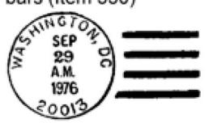

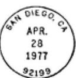

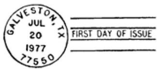

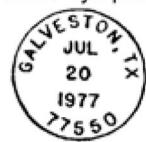


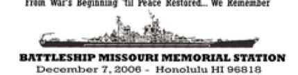


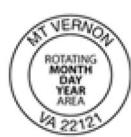

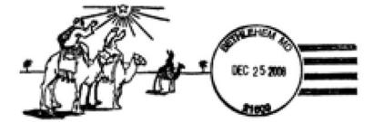

### <span id="page-206-7"></span>231.6 **Philatelic Postmark Policy**

### <span id="page-206-1"></span><span id="page-206-0"></span>231.61 **Date and Place of Postmarking**

<span id="page-206-5"></span>Post Offices may provide postmarking for philatelic purposes before the actual date of the postmark and may continue after that date when demand, processing capability, or other requirements of the Postal Service dictate. However, under no circumstances may any postmarked materials be released before the date of the postmark. The postmaster or designee may determine that local processing capability requires philatelic postmarking services be performed at an office other than the Post Office of the official postmark. In this case, all materials to be postmarked must be received at or deposited in the Post Office where the postmark is being used or at the office designated by the postmaster or designee.

### <span id="page-206-2"></span>231.62 **Preparation Requirements**

<span id="page-206-6"></span>Postcards and envelopes submitted through the mail must bear postage at the applicable First-Class Mail first-ounce rate and have complete

<span id="page-207-1"></span>addresses, except as provided in section [231.4](#page-204-5). Materials submitted for hand-back service need not be addressed.

### <span id="page-207-0"></span>231.63 **Special Materials on Which Postmarks May Be Requested**

Photographs, postcards, or other materials having a glossy-coated or hard-calendered surface, or any material that does not readily accept ink, are submitted for pictorial postmarks at the customer's risk. The Postal Service is not responsible for smudged postmarks or offsetting where the impression appears on the preceding item. The following materials may be canceled as indicated:

- a. Plain Cards, Slips of Paper, and Blank Envelopes. Postal Service employees may not place postmarks for customers on plain slips of paper, plain cards, or blank envelopes without unused postage equaling or exceeding the First-Class Mail first-ounce rate.
- b. Picture Postcards (Maximum Cards). Picture postcards with the stamp placed on the face of the card rather than on the address side are known as maximum cards. Minimum First-Class Mail postage must be placed on the address side. Postmasters may cancel these cards and hand them back to the person presenting them. For mail-back service, refer to [231.4](#page-204-5)[b.](#page-205-1)
- c. Posters, Portfolios, and Other Memorabilia. These items with the stamps placed thereon may be canceled when presented in person for hand-back service. Submittal and return through the mail is not permitted, except as provided in [231.4](#page-204-5)[b](#page-205-1).
- d. Previously Canceled Stamps and Multiple Pictorial Postmarks. Items bearing previously canceled stamps and postmarks are acceptable for additional postmarks when uncanceled postage equaling or exceeding the First-Class Mail first-ounce rate is affixed. Any covers submitted for servicing and return through the mailstream will not be entered into the mailstream until the date appearing on the postmark.
- e. Currency. Currency bearing unused postage stamps of First-Class value or items bearing currency with stamps affixed or adjacent thereto may be canceled when presented in person for hand-back service. Submittal and return through the mail is not permitted. The Postal Service does not accept responsibility for currency in its possession in conjunction with philatelic services.
- f. Backs of Envelopes. Post Offices may cancel unused stamps when they are affixed to the reverse side of envelopes bearing already canceled stamps. This service is available only for envelopes presented for hand-back service. They may not be returned through the mail even when outer envelopes are provided. Such a pictorial postmark denotes only that the item was presented to the Post Office for postmarking on that date; it does not denote that the envelope was carried by the Postal Service.
- g. Foreign Postage Stamps. Unused foreign postage stamps may be postmarked with a U.S. Postal Service postmark only when unused First-Class Mail first-ounce U.S. postage is postmarked with the same stroke.

<span id="page-208-0"></span>Philately 232.3

# 231.7 **Holding the Mail**

<span id="page-208-10"></span>Postmasters may hold collectors' philatelic items for postmarking on a later or specified date. Postmasters should not hold mail for an event where the date of occurrence is not certain; for an event that the date is subject to change; or for postmarking on a day that the Post Office is closed.

### <span id="page-208-1"></span>231.8 **Machine Postmarks**

<span id="page-208-11"></span>Post Offices may machine-cancel (using a flyer machine), philatelic items with a regular postmark when the envelopes are unaddressed or when the customer requests hand-back service, as provided in section [231.4](#page-204-5). Collectors requesting postmarking of bulk items must provide either a selfaddressed stamped envelope or box for returning the serviced items. For customers submitting fewer than 50 covers who have not provided a selfaddressed stamped envelope, the postmaster may choose to furnish a protective cover using a G-10 label. See subchapter [25](#page-217-2) for more information pertaining to Philatelic Cover Servicers and Cachet Makers.

### <span id="page-208-2"></span>231.9 **Hand-Stamped Postmarks**

<span id="page-208-9"></span>Circular hand-stamped postmarks with or without killer bars may be provided upon request at Post Offices and/or station or branch offices. These postmarks are available each day that the office is open for business. Postmarking requests must be at the Post Office offering the service on the date of the postmark to qualify for this service.

# <span id="page-208-7"></span><sup>232</sup> **First Day of Issue**

### <span id="page-208-4"></span><span id="page-208-3"></span>232.1 **First Day of Issue Sales Policy**

For each new stamp or stationery item being issued, a designated Post Office is assigned as the official first day of issue city. For purposes of this section, the word "issue" means postage stamp, stamp booklet, booklet pane, postal card, postal stationery, or stamped envelope.

### <span id="page-208-5"></span>232.2 **Notification**

Individual stamp issues are announced through news releases distributed to the press, to the philatelic media, and by print to radio and television. Stamp and postal stationery announcements are periodically updated in the Postal Bulletin and on the Web at [www.usps.com](http://www.usps.com).

### <span id="page-208-6"></span>232.3 **First Day of Issue Postmarks**

<span id="page-208-8"></span>First day of issue postmarks are provided by designated Post Offices for each new stamp or stationery item being issued. The postmark reflects the official issuance date and location. First day of issue postmarks may be either metal die, rubber composition, or digitally produced in color. In each postmark, the words "First Day of Issue" appear in the design. Requests for first day of issue postmarks must be postmarked no later than 60 days from the issuance date to qualify for servicing. When the conventional first day of issue postmark cannot cancel all the unused stamps on an item presented for postmarking, a Bull's-eye (1-inch) postmark is used.

### <span id="page-209-0"></span>232.4 **Ordering Procedures**

All covers must bear addresses to the right side of the envelope and at least 5/8 inch up from the bottom of the envelope. Requests must be postmarked no later than the date specified in the media announcement (see section [232.2](#page-208-5)) to qualify for postmark service. As a free service, this is limited to 50 postmarks. Postmasters should charge 5 cents per postmark for more than 50 items. Customers who want first day of issue postmarks of new stamps have two ordering options:

- a. Collectors may buy stamps from their local Post Office, affix the stamps to their own envelopes, and mail them under separate cover to the postmaster at the city of issuance for postmarking. Envelopes submitted by collectors must be of ordinary letter size and must be properly addressed. Collectors should place a filler (of postal card thickness) in each envelope and turn in or seal the flap of the envelope.
- b. Collectors may order first day covers without cachets by mail, telephone, or through the Internet, from Stamp Fulfillment Services. Each first day of issue cover will have an individual item number and is offered through the USA Philatelic catalog produced by Stamp Services. Item numbers and ordering instructions are also provided in news releases announcing the new stamps. The price of the Postal Service's first day covers will vary depending upon the denomination and number of stamps affixed. Remittance for mail orders can be made by money order, cashier's check, certified check, or personal check made payable to the U.S. Postal Service or by credit card as indicated in the USA Philatelic catalog. Cash must not be sent. Neither postage stamps nor foreign coins and currency are accepted. Any orders containing such remittance will be returned unserviced. First day of issue covers remain on sale for at least 1 year after a stamp is issued.

### <span id="page-209-1"></span>232.5 **Bulk Orders**

<span id="page-209-7"></span>The Post Office that services first day covers will accept only stamp-affixed envelopes. For bulk affixing and postmarking requests, customers should contact Stamp Fulfillment Services.

### <span id="page-209-2"></span>232.6 **Hand-Stamped Postmarks**

<span id="page-209-6"></span>Hand-stamped postmarks are applied on covers at the location of the first day ceremony, at the designated first day of issue Post Office, and on covers that cannot be fully postmarked by Postal Service postmarking machines.

### <span id="page-209-3"></span>232.7 **Hand-Back Service**

<span id="page-209-8"></span><span id="page-209-5"></span>Philatelic materials to be canceled must be presented to the designated first day Post Office or ceremony location.

### <span id="page-209-4"></span>232.8 **Unacceptable Covers**

The issuing Post Office must not provide postmarking service on covers submitted through the mail that are unaddressed, bear stamps issued after the requested postmark date, or bear only previously postmarked stamps.

<span id="page-210-0"></span>Philately 233.3

### 232.9 **Postmarking Deadlines and Unofficial First Day Covers**

<span id="page-210-6"></span>The deadline for submitting covers for first day of issue postmarks is 60 days from the first day of issuance date. Any exceptions must be authorized by Stamp Services.

Stamps acquired at the first day Post Office may be canceled at any Post Office. Envelopes containing new stamps canceled on the first day of sale at a Post Office other than the issuing office are known as unofficial first day covers or first day of sale covers. See part [233](#page-210-1) for further information on first day of sale postmarks.

# <span id="page-210-5"></span><sup>233</sup> **First Day of Sale Postmark**

### <span id="page-210-2"></span><span id="page-210-1"></span>233.1 **First Day of Sale Postmark Policy**

This official postmark offers customers a collectible postmark to commemorate the first day of sale for all new stamps and stationery items. Participation by postmasters/Post Offices in this postmarking service is voluntary; however, postmasters/Post Offices are encouraged to participate. The first day of sale postmark provides postmasters the opportunity to promote the sales of new stamps and stationery products in their communities and it supports the hobby of stamp collecting.

### <span id="page-210-3"></span>233.2 **Notification**

All new stamps and stationery items are announced in the Postal Bulletin and through news releases distributed to the press and to the philatelic media. No national listing of Post Offices participating in first day of sale postmarking will be maintained.

Customers/collectors will have to contact individual postmasters/Post Offices to find out if they are participating in the postmarking service. Postmasters wishing to promote this program locally will need to contact their local Public Affairs and Communications office for assistance.

### <span id="page-210-4"></span>233.3 **First Day of Sale Postmarks**

This postmark is provided by Post Offices nationwide on the first day that new stamps and stationery items are placed on sale. The postmarking device reflects the official first day of sale date and the city, state, and ZIP Code of the postmarking office.

The first day of sale postmark comes in two formats:

- a. Size A: Self-inking postmark for Post Offices with 13 or fewer characters in their Post Office name (characters include the comma and spacing between the Post Office name and its state abbreviation).
- b. Size B: Rubber composition hand changeable date stamp for Post Offices having over 13 characters in their Post Office name (characters include the comma and spacing between the Post Office name and its state abbreviation).

Customers may request a first day of sale postmark in person or by mail to the postmaster. Requests for first day of sale postmarks must be presented <span id="page-211-3"></span>to the Post Office or postmarked no later than 90 days from the first day of sale date to qualify for service.

### <span id="page-211-0"></span>233.4 **Ordering Procedures**

<span id="page-211-4"></span>Customers requesting first day of sale postmarks have two ordering options: hand-back service and mail-back service.

### <span id="page-211-1"></span>233.41 **Hand-Back Service**

When a customer personally presents a stamped addressed or unaddressed envelope, postcard, or other item described in section [231.63,](#page-207-0) to a Postal Service employee for postmarking, the item can be postmarked and handed back to the customer.

All such materials must bear uncanceled postage, which includes the new first day of sale stamp, at the applicable First-Class Mail rate. The postage to be postmarked may not include any newly released stamps that may have been issued after the requested official first day of sale postmark date.

This postmark is provided only for philatelic purposes and should not be used to postmark bill payments, tax returns, applications, and/or other datesensitive mail. Only after careful examination should a philatelic item be postmarked and handed back to the customer/collector.

In most cases, the philatelic envelope, card, or other item does not enter the mail. However, on occasion, a customer may request that their properly addressed and postmarked item be placed into the mailstream. In such cases, this can only be done on the official first day of sale date. Retail associates should ensure that items with first day of sale postmarks are trayed separately and flagged "nonmachinable" when sending to mail processing.

Hand-back service may be provided only when such service does not interfere with other retail sales, mail processing operations, and/or does not inconvenience other customers. Postmasters, at their discretion, may offer hand-back service or make arrangements with a customer for drop-off and pick-up service for items.

### <span id="page-211-2"></span>233.42 **Mail-Back Service**

Customers may buy first day of sale stamps at their local Post Office; affix the stamps to their own envelopes, postcards, or other items described in section [231.63;](#page-207-0) and mail the items under separate cover to a participating postmaster/Post Office for first day of sale postmarking. All requests must include a self-addressed postage-paid envelope to return the first day of sale postmarked items.

All such materials must bear uncanceled postage, which includes the new first day of sale stamp, at the applicable First-Class Mail rate. The item to be postmarked may not include any newly released stamps that may have been issued after the requested official first day of sale postmark date.

This postmark is provided only for philatelic purposes and should not be used to postmark bill payments, tax returns, applications, and/or other datesensitive mail.

The items with first day of sale postmarks applied must be returned under protective cover. For customers submitting less than 50 covers who have not Philately 234.4

enclosed a self-addressed stamped envelope, the postmaster may choose to furnish a protective cover using a G-10 label. See subchapter [25](#page-217-2) for more information pertaining to Philatelic Cover Servicers and Cachet Makers.

Mail-back service should not interfere with other retail sales or mail processing operations and should not inconvenience other customers.

### <span id="page-212-0"></span>233.5 **Servicing Fees**

As a free service, postmarking is limited to 50 items. For those postmarking requests of more than 50 items, postmasters should charge 5 cents for each postmark.

# <span id="page-212-1"></span><sup>234</sup> **Pictorial Postmarks**

Pictorial postmarks may be offered by the Postal Service to commemorate local events celebrated in communities throughout the nation. These postmarks contain the name of a temporary philatelic station, city, state, ZIP Code, and the month, day, and year of the postmark. These postmarks may feature wording and/or graphics relating to fairs, conventions, or other various types of local celebrations. See Handbook PO 230, Pictorial Postmarks, for more information.

### <span id="page-212-2"></span>234.1 **Sponsors**

Pictorial postmarks are requested by sponsors or organizers of local events and are authorized to be used only at temporary retail stations and at other philatelic outlets.

### <span id="page-212-3"></span>234.2 **Postmarking Methods**

<span id="page-212-6"></span>Devices used for pictorial celebrations are generally hand stamps, except when volume requires the use of machine postmarking. There is no charge to the sponsor for the production of the hand stamp or for the Postal Service's staffing of the temporary station. For assistance in bulk machine postmarking, postmasters should contact the manager, Stamp Fulfillment Services.

# <span id="page-212-4"></span>234.3 **Criteria**

Collectors may obtain pictorial postmarks at a temporary retail station established at an event or at a philatelic outlet, on the actual date of the requested postmark. Additionally, such postmarks may be requested by mail. Mail-in requests must be postmarked no later than 30 days following the requested postmark date to qualify for this service. Any exceptions beyond the 30 days must be approved by Stamp Services.

### <span id="page-212-5"></span>234.4 **Authorization**

Postmasters may request authority from the district manager or designee to provide postmarking service at temporary retail stations. Only the standard circular postmark will be provided unless the sponsors or organizers request and receive approval for a pictorial postmark. Organizers must apply to the postmaster for use of a pictorial postmark at least 10 weeks before the event. The sponsors or organizers must also provide a design and finished artwork for the requested postmark.

All temporary retail stations and pictorial postmark designs require the approval of the postmaster and the district manager or designee. Postmasters and district managers and or designees reviewing requests for temporary retail stations and pictorial postmark designs must ensure that all applicable Postal Service requirements are met.

Different postmarks for each day of an event are permitted only for international philatelic exhibitions. Any exceptions must be authorized by Stamp Services.

### 234.5 **Requirements**

### <span id="page-213-1"></span><span id="page-213-0"></span>234.51 **Required Information and Dimensions**

All postmarks must carry the name of the temporary station (the name of the exhibition or event, followed by the word "Station" or "Sta."), month, day, year, and city, state, and ZIP Code of the actual location of the temporary philatelic station. Overall dimensions must not exceed 4 inches horizontally and 2 inches vertically.

### <span id="page-213-2"></span>234.52 **Approved Subject Matter**

Illustrations, wording, and designs featured on pictorial postmarks must directly reflect the event being commemorated. Postmarks that promote the sale or use of private, nonpostal products or that endorse or involve the ideals, policies, programs, products, campaigns, or candidates of religious, antireligious, commercial, political, fraternal, trade, labor, public interest, or special interest organizations may not be approved.

Postmarks may be approved to recognize events such as meetings, exhibitions, or conventions sponsored by or involving such organizations, provided that their designs do not include words, symbols, or illustrations referring to ideals, policies, programs, products, campaigns, or candidates. If there is doubt about whether a proposed postmark meets these requirements, Stamp Services should be consulted prior to granting approval.

### <span id="page-213-3"></span>234.53 **Publicity**

The district manager or designee must submit a PS Form 413, Pictorial Postmark Announcement/Report, which includes a reproducible copy of the approved pictorial postmark (actual size), to Stamp Services for publication in the Postal Bulletin. All reports should include the date(s) that the temporary retail station is to be open, the sponsor's name, name of the temporary retail station, the complete mailing address for customers requesting the pictorial postmark by mail, and a reproducible copy of the pictorial postmark. PS Form 413, along with copies of pictorial postmarks, must be submitted to Stamp Services at least 2 months prior to the postmarking date. Any exceptions to the 2-month notice must be approved by Stamp Services. See Handbook PO-230 for more information.

### <span id="page-213-4"></span>234.54 **Equipment**

Pictorial and standard postmarks should be applied by rubber hand stamps purchased by the host Post Office or district office.

<span id="page-214-0"></span>Philately 236.2

### 234.55 **Service Limitations**

Hand stamping as a free service is limited to 50 postmarks for any individual or group. For those postmarking requests of more than 50 items, postmasters should charge 5 cents for each postmark.

### <span id="page-214-1"></span>234.56 **Use and Disposition of Hand Stamps**

Pictorial postmark hand stamps, like other canceling devices, may be used only under the supervision of authorized Postal Service personnel and must be returned by the postmaster to the district manager or designee 6 months after close of the event allowing Post Offices enough time to handle replacement requests. The district manager or designee must destroy the postmarking device upon receipt.

### <span id="page-214-2"></span>234.57 **Special Requests to Retain Hand Stamps**

Requests from sponsors to retain pictorial postmark hand stamps for purposes of placement in a museum, historical site, or for any other appropriate use, must be approved by the district manager. Before release to the sponsor, the hand stamp must be defaced in such a way that it can be recognized if used improperly. Copies of the original and defaced postmark designs must be kept on file in the local or district office.

# <span id="page-214-3"></span><sup>235</sup> **Special Mail Processing Postmarks**

Special postmarks are cancellations in which a slogan or message publicizes an event. These postmarks are applied by machine to live mail by a mail processing plant. Bulk requests for mail-back service cannot be provided, but postmarks can be provided on addressed envelopes or postal cards that are delivered to addressees through mail delivery. Postmarks of philatelic quality are often not possible. All envelopes must be addressed. Any quantity of envelopes may be submitted, but they are not returned in bulk. See chapter [4](#page-234-5) for more information regarding the criteria and use of these mail processing postmarks.

# <sup>236</sup> **Other Special Philatelic Postmarks**

### <span id="page-214-5"></span><span id="page-214-4"></span>236.1 **Seasonal Postmarks**

Seasonal postmarks are temporary, pictorial rubber hand stamps available during the holiday season and during other special occasions throughout the year. Postmarking service is usually available at retail windows for handback, mail-back, or re-mailing back into the mailstream. Postmarks can be a fixed date or rotating dates during the holiday season. Back-dating is prohibited for rotating-date postmarks. Customers wanting a specific date must have their items presented on or before the date of service. Seasonal postmarks can also be used at temporary retail stations during the holiday season.

# <span id="page-214-6"></span>236.2 **Postmark America Service**

Postmark America service is a permanent, rubber hand stamp with rotating date plugs that is permitted for participating Post Offices to feature a symbolic image representing a town or region. Postmarking service is

available only at windows when it does not interfere with normal retail operations. Postmasters can offer hand-back, will-call, or mail-back service. Postmark America service can be used for mail entering the mailstream or philatelic purposes.

Postmark America service affords tourists, customers, and collectors an opportunity to use and collect postmarks at any time. It also affords postmasters a way to generate revenue without having to staff or wait for events. Postmark America service is date sensitive, and back-dating is prohibited. Customers or collectors wanting a specific date must have their items presented at the Post Office on or before the date of service.

### <span id="page-215-0"></span>236.21 **Postmark Design**

Postmasters and station and branch managers are responsible for purchasing both the artwork and hand-stamp devices for their local postmark. They should work with local artists/designers to develop a design that fits within the following guidelines:

- a. The rubber composition hand-stamp postmark should feature a graphic design.
- b. The overall size of the device cannot exceed 2" in height by 4" in width.
- c. The postmark should consist of a changeable round-dater with month, day, and year insert plugs, and should include the city, state, and ZIP Code.
- d. Postmarks with proprietary designs need written permission from property owners for the use of the design.

### <span id="page-215-1"></span>236.22 **Approval Process**

Postmasters desiring to participate in the Postmark America service must submit the finalized postmark art to their district manager/designee for approval. After the district manager's approval, the postmaster/district office forwards the postmark artwork to Stamp Fulfillment Services (SFS) for final approval and sign-off. Submit the proposed artwork to:

POSTMARKING SERVICES ATTN: POSTMARK AMERICA SERVICE PO BOX 449992 KANSAS CITY, MO 64144-9998

Fax: 816-545-1206

e-mail: PictorialPostmarks@usps.gov ATTN: POSTMARK AMERICA SERVICE

FOR MORE INFORMATION, CALL 816-545-1349

### <span id="page-215-2"></span>236.23 **Ordering Rubber Hand Stamps**

Postmasters participating in the Postmark America service can order their off-catalog postmarking device using PS Form 1567, Requisition for Rubber and Steel Hand Canceling Stamps, or by calling the Topeka Materials Distribution Center at 800-332-0317 (press option 4, then press option 4 again at the next menu to reach a live operator).

Postmasters may also directly order the off-catalog postmark by contacting the Baumgarten Company of Washington, DC, at 301-317-3933 or 888-852- 3852. Postmasters must complete an off-catalog eBuy requisition for all

<span id="page-216-0"></span>Philately 236.4

items ordered. Postmasters should allow 30 days for the vendor to provide the postmarking device.

### 236.24 **Postmark Servicing Support and Procedures**

Postmarking service may be provided when such service does not interfere with other retail sales or mail processing operations and does not inconvenience other customers. Postmasters may, at their discretion, offer collectors hand-back or mail-back service or arrange for a date and time with the collector for drop-off and pick-up service.

Customers must present their items for postmarking on or before the official postmark date. Backdating is prohibited. Prior to submitting materials for postmarking, collectors should contact the Post Office from which they are requesting a postmark to verify that the specific Post Office participates in the Postmark America service. Collectors may request postmarking service in person or by mail on or before the date of the postmark. There is no charge for servicing up to 50 covers. Mail-back service customers must supply a self-addressed envelope with sufficient return postage applied to return the serviced covers. Handling charges cannot apply for Postmark America service when the items presented are for mailing purposes.

Postmasters may apply for postmarking assistance from the manager of Stamp Fulfillment Service if customers are requesting postmarking on large volumes of materials. For information, contact:

MANAGER, STAMP FULFILLMENT SERVICES 8300 UNDERGROUND DRIVE, PILLAR 210 KANSAS CITY, MO 64144-9998

Telephone: 816-545-1349

<span id="page-216-3"></span>Postmasters desiring to promote the program locally should contact their local Corporate Communications office for assistance.

### <span id="page-216-1"></span>236.3 **Military Post Offices**

Military Post Offices, including Army Post Offices (APOs) and Fleet Post Offices (FPOs), may hand stamp covers both on a hand-back basis and by mail-order request in conformance with all policies and in accordance with all conditions and procedures stated in this section. The officer in charge at each military Post Office may establish the maximum number of covers individual collectors or dealers may submit. Military Post Offices may also provide pictorial postmarks (see part [234\)](#page-212-1) upon request.

### <span id="page-216-2"></span>236.4 **Special Requests**

Requests for postmarks at Postal Service facilities that normally do not postmark mail must be made in writing to the appropriate district manager at least 60 days in advance for area manager authorization and to provide for national publicity. These requirements also apply for requests to postmark at offices that are inaccessible to the public or for requests to postmark at any office on dates when mail is not normally postmarked (for example, Sundays and holidays). Cover servicers, as described in subchapter [25](#page-217-2), must submit their requests for pictorial postmarking to the manager, Stamp Fulfillment Services.

# <span id="page-217-9"></span><span id="page-217-1"></span><span id="page-217-0"></span>24 Autographs

# <sup>241</sup> **General**

Postal Service employees may, at their discretion, accept or refuse requests for autographs. Employees should exercise fairness in handling such requests. Nothing of value may be accepted or requested in exchange for autographs.

# <span id="page-217-11"></span><span id="page-217-3"></span><span id="page-217-2"></span>25 Philatelic Cover Servicers and Cachet Makers

# <span id="page-217-12"></span><sup>251</sup> **Authorization**

Philatelic cover servicers and cachet makers that regularly submit 50 or more envelopes or other items for identical postmarking may contact SFS and request information on how to become a registered dealer.

# <span id="page-217-13"></span><span id="page-217-4"></span><sup>252</sup> **First Day Cover Service**

Philatelic cover servicers may purchase mint stamps by mail from the first day of issue Post Office or from SFS on the date of issuance. Postmarks are provided only when stamp-affixed envelopes are submitted.

# <span id="page-217-10"></span><sup>253</sup> **Mail-Back Service**

### <span id="page-217-6"></span><span id="page-217-5"></span>253.1 **Service Charges**

Mail-back postmarking service for philatelic cover servicers and cachet makers is subject to a service charge established by SFS, which must be paid by check, credit card, or money order before the mail is processed.

### <span id="page-217-7"></span>253.2 **Payment Requirements**

Mail-back service or return under cover in bulk are available to registered dealers only when return postage and all other applicable fees are paid to the postmaster at the place of postmarking. Requests that do not include such payment are held until the proper amount is received.

### <span id="page-217-8"></span>253.3 **Acceptable Items**

Mail-back service is generally permitted on first day of issue, pictorial, or standard philatelic postmarks on the following materials: envelopes, postal cards or maximum cards, postal stationery, posters, portfolios, or other memorabilia. The Postal Service will not accept for first day of issue postmarking covers that bear stamp(s) issued after the requested date of the postmark.

<span id="page-218-1"></span><span id="page-218-0"></span>Philately 261

# <span id="page-218-9"></span><sup>254</sup> **Damaged or Missing Covers**

### 254.1 **Requests for Replacements**

Requests for replacement of first day postmarks, pictorial postmarks, and standard philatelic postmarks may be accepted at the appropriate Post Office up to 60 days from the actual postmark date. All claims for nonreceipt of covers submitted for servicing by the Postal Service must be sent to the appropriate Post Office no later than 60 days from the date of postmark or from the date postmarks were last applied. Claims for replacement postmarks filed after that time will not be honored and are returned to the customer with a short explanation on why the request cannot be honored.

### <span id="page-218-2"></span>254.2 **Criteria**

Replacements are made for poor quality postmarks, damage to the envelope, or other similar defects. Replacements are not made, however, in cases where envelopes were marked on the back by letter-sorting machine code numbers as they moved through the mail system.

### <span id="page-218-3"></span>254.3 **Procedures**

The customer must return the unsatisfactory cover or covers to the appropriate Post Office for replacement. Replacement covers must be returned to the customer in a Postal Service postage-paid envelope so that a stale postmark does not appear in the mailstream. Damaged covers must be disposed of in accordance with Handbook F-1, Post Office Accounting Procedures, 450.

### <span id="page-218-4"></span>254.4 **Exceptions**

The Postal Service does not replace missing or unsatisfactory die-hub machine postmarks or special die-hub postmarks because these postmarks are made in the course of live mail processing.

### 254.5 **Damaged or Loss of Cachet Covers**

The Postal Service is not responsible for damage or loss of cachet covers or of other items of value.

# <span id="page-218-7"></span><span id="page-218-6"></span><span id="page-218-5"></span>26 Philatelic Products

# <span id="page-218-8"></span><sup>261</sup> **Special Philatelic Products**

Special philatelic products produced by the Postal Service for first day Postal Service ceremonies are permitted for major postal events only, such as the opening of a new philatelic center, postal store, or a dedicated philatelic window. All such products must be approved at least 3 months before the event by the appropriate area and Headquarters organizations.

# <span id="page-219-1"></span><span id="page-219-0"></span>27 Promotions or Presentations

# <span id="page-219-5"></span><sup>271</sup> **General**

To obtain canceled or uncanceled stamps, postal stationery items, or philatelic products for information, official Postal Service business, or Postal Service presentations, district managers or postmasters must submit a funded PS Form 7381, Requisition for Supplies, Services, or Equipment, or an eBuy request to the appropriate stock source as defined below. The form must identify the delivery address, contact name and telephone number, item number, quantity, description, amount, and the purpose or justification for the promotion or presentation. The postmaster or district manager must also enter account number 52325, Advertising and Sales Promotion, the finance number, and the account identifier code (AIC) 596, Miscellaneous Advertising Expense, on PS Form 7381 or the eBuy request. Account number 52325 shows as a transaction to line 34, Services, on the requesting office's Financial Performance Report (FPR). The postmaster or district manager has the option of obtaining stock locally or through SFS. Stock requested from SFS must be a minimum of \$1,000 face value. Either request requires PS Form 7381 or the eBuy request.

# <span id="page-219-6"></span><span id="page-219-2"></span><sup>272</sup> **Obtaining Stock Locally**

To obtain stock locally, the postmaster or district manager authorizes and signs the completed PS Form 7381 or eBuy request. The form is submitted to the retail associate servicing the same finance number shown on the PS Form 7381 or eBuy request. The retail associate fulfills items as requested and retains the PS Form 7381 or eBuy request for submission with PS Form 1412-A, Daily Financial Report, as support for AIC 596. The retail associate records the transaction on PS Form 1412-A and enters the amount in AIC 596, with an offsetting entry to AIC 090, Postage Stock Sales, or AIC 092, Philatelic Product Sales. The PS Form 7381 or eBuy request supports the entry to AIC 596. Offices that use standard field accounting procedures should submit the PS Form 7381 or eBuy request to the appropriate district accounting offices. Statement of account offices should retain this form locally. The accounting office verifies the submitted PS Form 7381 or eBuy request for completeness and retains it as support for AIC 596 on the Statement of Account.

# <span id="page-219-4"></span><span id="page-219-3"></span><sup>273</sup> **Obtaining Stock Through Stamp Fulfillment Services**

Stock that is not available locally may be available through SFS. To obtain stock through SFS, a minimum \$1,000 face value is required. A completed and signed PS Form 7381 or eBuy request for the face value amount of stock requested and appropriate postage and handling fees must be sent to:

MANAGER STAMP FULFILLMENT SERVICES 8300 NE UNDERGROUND DRIVE PILLAR 210 KANSAS CITY MO 64144-0001

Philately 282

The postmaster makes no entries to the cash book. SFS fulfills and mails the stock to the delivery address on the PS Form 7381 or eBuy request. SFS enters the amount shown on the order form to AIC 596, with offsetting entries to AIC 090 or AIC 092, and AIC 114, Postage Due Invoices, for the postage and handling charges. SFS accesses the Journal Voucher Transfer System through the Financial Accounting Control Tracking System (FACTS) and enters the account number 52325 and the finance number indicated on the PS Form 7381 or eBuy request. The account number shows as a transaction to line 34, Services, on the postmaster's Postal System Financial Report (PSFR). The postmaster or district manager then sees an adjustment to either the prior period or the current period.

# <span id="page-220-5"></span><span id="page-220-1"></span><span id="page-220-0"></span>28 Copyright of Stamp Designs

# <span id="page-220-4"></span><sup>281</sup> **Policy**

The designs of postage stamps, stamped envelopes, stamped stationery, stamped cards, aerogrammes, souvenir cards, and other philatelic items are copyrighted by the U.S. Postal Service in accordance with Title 17 of the United States Code.

# <span id="page-220-3"></span><span id="page-220-2"></span><sup>282</sup> **Permission for Use**

No written permission is required to reproduce the copyrighted stamp images in hard copy printed matter for the following purposes:

- a. In editorial matter in newspapers, magazines, and journals for news reporting purposes.
- b. In advertising matter, circulars, or price lists for the sale of the postage stamps or philatelic items illustrated.
- c. In advertising matter, circulars, or price lists for the sale of philatelic magazines, journals, books, philatelic catalogs, philatelic albums containing illustrations of philatelic designs of the stamp images for sale of the postage stamps or philatelic items illustrated.
- d. For incidental, background, nonfeatured use in motion picture films. No print or other reproduction from such films, slides, or tapes may be made except for the uses permitted above.
- e. Noncommercial, educational uses limited to classroom instruction.

*Note:* For uses covered above, users must cite the source of the stamp image, the United States Postal Service, and include language such as: "United States Postal Service." All permitted uses covered above must consist of the unaltered, original stamp image as issued by the U.S. Postal Service. Any modification or alteration to the stamp image constitutes an unauthorized use.

For uses not covered above, a license from the Postal Service is required. Further digital or electronic reproduction of stamp images for posting on the Internet or in any other electronic forum is not allowed without a license from the U.S. Postal Service.

# <span id="page-221-2"></span><span id="page-221-0"></span><sup>283</sup> **Reproduction of Designs**

Illustrations permitted by [282](#page-220-2) may be in color or in black and white and may depict items as uncanceled or canceled. When depicting uncanceled items in color, illustrations must be less than 75 percent or more than 150 percent (in linear dimension) of the size of the design of the philatelic items as issued. Color illustrations of canceled items and black and white illustrations of uncanceled or canceled philatelic items may be any size.

# <span id="page-221-1"></span><sup>284</sup> **Requests for Licenses**

<span id="page-221-3"></span>The U.S. Postal Service may grant licenses for the use of illustrations of its copyright designs outside the scope of the above permission. Requests for such licenses should be addressed to:

LICENSING US POSTAL SERVICE 475 L'ENFANT PLAZA SW RM 10-523 WASHINGTON DC 20260-3100

# <span id="page-222-6"></span><span id="page-222-0"></span>**3 Collection Service — National Service Standards**

# <span id="page-222-2"></span><span id="page-222-1"></span>31 Applicability and General Requirements

# <span id="page-222-7"></span><sup>311</sup> **Applicability**

These standards found in Chapter [3](#page-222-0) apply to all collection boxes. A collection box is a metal container that is dedicated to the collection of deposited mail by customers. Collection boxes come in three separate sizes: standard, large, and jumbo. Some collection boxes are dedicated to the collection of Priority Mail Express, while other boxes are dedicated to the collection of First-Class letter mail and flats. Collection boxes are under the direct control of the Postal Service. For exceptions to the applicability of these requirements, see [313.3](#page-227-0).

The location types of collection boxes are the following:

- a. Residential collection boxes: Boxes located in primarily residential areas. Mail from these boxes is generally collected when mail is delivered. A 25 piece daily average is needed to justify its location.
- b. Business area collection boxes: Boxes located in primarily business areas, such as downtown commercial areas, office parks, or industrial parks. Mail from these boxes should be collected when mail is delivered to ensure no overflow but when its average daily collected volume exceeds the 100 piece threshold, it may also be collected at or after 5:00 P.M..

# <span id="page-222-8"></span><sup>312</sup> **Local Postmark**

### <span id="page-222-4"></span><span id="page-222-3"></span>312.1 **Local Postmark Requirement**

The local postmark must be made available in every community with a Post Office. While no exceptions are made to this policy, customers may need to contact postal officials in advance as provided in [312.2.](#page-222-5)

### <span id="page-222-5"></span>312.2 **Local Postmark Requests**

Customers may request a local postmark at the retail counter of any Post Office, classified station, or branch. Customers who want significant mail volumes (50 or more pieces) postmarked should contact the postmaster or other manager in advance to ensure that adequate resources are available to provide a local postmark.

# <span id="page-223-7"></span><span id="page-223-6"></span><sup>313</sup> **Collection Requirements**

### <span id="page-223-0"></span>313.1 **Collection Schedules and Locations**

### <span id="page-223-2"></span><span id="page-223-1"></span>313.11 **General**

The Postal Service is generally charged with providing prompt, economical, and efficient services that are responsive to the needs of the communities served. District officials and Postmasters should determine adequate locations and schedules for collection points, including collection boxes in each community. Use all criteria outlined in this manual in determining appropriate locations and collection schedules. Balance collection locations and schedules according to the specific nature of customer and community needs (e.g., commercial centers, shopping centers, senior citizen housing, and public facilities), preparation of collection mail, and dispatches for timely processing of mail at the processing plant.

Mail is collected in residential and business areas at times scheduled to connect with mail dispatches.

To meet these objectives, collection schedules and locations should be established or modified by the local Postmaster in accordance with the following standards:

### <span id="page-223-3"></span>313.12 **Collection Location Standards**

Collection location standards are as follows:

- a. Continually review collection operations. Make adjustments as justified by changing conditions such as the safety and security of employees, customers, and the public, as well as opportunities to implement more efficient and economical operations.
- b. For operational and security reasons, do not locate collection boxes at airports, ports, and public facilities inside of secure areas.
- c. Boxes should be sited in high-traffic locations where they are highly visible to the public to minimize vandalism and theft, in lighted areas, with minimal screening by shrubbery and exposed to appropriate lighting and security cameras at night and off-peak times. Grocery stores, banks, and shopping centers are examples of optimal locations for collection boxes.

### <span id="page-223-4"></span>313.13 **Collection Schedule Standards**

<span id="page-223-5"></span>Collection schedule standards are as follows:

a. Arrange schedules based on efficient route planning and dispatches to the processing plant. Arrange collection schedules so that collections are made no later than approximately 20 minutes after the posted time, taking local conditions and traffic into consideration. Mail should never be collected before the posted collection time. Collections on a dedicated collection route should not be scheduled to start earlier than noon. All collection points must have a collection box schedule decal (see [316\)](#page-229-5), whether collected by city carrier, rural carrier, contract delivery service carrier, collector, clerk, postal vehicle service (PVS), or HCR driver.

- b. Where collection boxes are grouped in multiple units at one street location, collections must be scheduled at the same time within the group.
- c. All collection boxes assigned to delivery routes should be collected by the carrier during the time the carrier passes the box in the act of delivery except on foot routes. If the carrier passes the box on his or her return to the office in the afternoon, it may be more efficient for the carrier to collect the box on the return.
- d. The criterion for a box to qualify for a potential 5:00 P.M. collection or later are:
  - The box must generate an average of 100 pieces or more daily and should be a Business area collection box; or,
  - It is a box outside of a Postal unit that has a 5:00 P.M. or later dispatch to the Area processing plant.
- e. Collection boxes that generate 25 or more pieces a day should normally be picked up by the carrier delivering mail provided it is not a foot route. For more information on collection routes, consult Handbook M-39, Management of Delivery Services, section 234.3, for potential action. Collection boxes averaging less than 25 pieces a day can be relocated within the neighborhood or community to a potentially higher volume location or removed. Boxes should be provided adjacent to senior citizen housing, municipal and judicial buildings, and other public facilities. These are examples of the types of boxes that may be left in place even if fewer than 25 pieces per day are generated.

### <span id="page-224-2"></span>313.2 **Specific Schedule and Location Standards**

### <span id="page-224-1"></span><span id="page-224-0"></span>313.21 **At Postal Facilities**

Every CAG A–K Postal Service-operated retail facility and Village Post Office (VPO) should provide an external collection box for customer use. The minimum size acceptable is a Standard size box. If accessible by a vehicle, this box should be snorkel-equipped for maximum customer convenience. At CAG L offices where a letter box is not supplied, a slot in the outer Post Office door or other mail receptacle may be provided. Collection boxes or other alternatives for customers to deposit mail should also be provided at Postal stores and all contract retail facilities.

The standards are as follows:

- a. For Non-city Delivery Postal Facilities: The District manager may utilize highway contract route (HCR) carriers, rural carriers, clerks, and/or other carriers for collections from the box in front of non-city delivery Post Offices. Pick up times should be as late as possible to enhance customer service, no earlier than 15 minutes before the retail counter closes. If the facility is on a transportation route, consideration should be given to HCR collection.
- b. For City Delivery Postal Facilities: Collection boxes located outside of city delivery Postal-operated retail facilities should be collected at or after 5:00 P.M., Monday–Friday. Postal-operated retail facilities may provide justification for an earlier than 5:00 P.M. pick-up time by

exception as outlined in section [313.3](#page-227-0) (e.g., AMP has affected transportation times). Collection boxes located outside of processing plants must be collected at or after 6:30 P.M., Monday–Friday, in conjunction with the operating plan of the subject plant's 010 operation. Collection boxes located at city delivery Post Offices should be collected by the personnel assigned to provide service at that facility rather than through dedicated collection runs, except at times when the personnel at that facility are not working. The final collection at a retail-only facility covered by these policies must occur either within one hour of the final dispatch of value or within 15 minutes of the time the window closes. City delivery offices with associated city carriers located within the facility must perform their final collection within one hour of the final dispatch of value. When an office has extended retail hours beyond the dispatch of value, a collection must be conducted no later than the dispatch of value to ensure all mails are processed daily in a timely manner.

### <span id="page-225-0"></span>313.22 **Residential Collection Boxes**

<span id="page-225-2"></span>In residential areas (see [311](#page-222-2)a), collections from residential collection boxes must not be made before the scheduled time and should be made approximately no later than 20 minutes after the posted time, if possible. Locally available data, such as Customer Insight Measurement (CIM) data, should be used to determine customer preferences for box location. Actual customer demand should also be considered when determining box location; density studies are a good source for this information.

The residential collection schedules are as follows:

- a. Residential Collection Schedules Monday Through Saturday Carriers should collect mail from residential boxes during their normal delivery of mail to the residential neighborhood. Residential area collection boxes should have a posted pickup time approximately 20 minutes prior to the expected arrival time of the carrier serving the route. If the foot or motorized carrier normally passes these boxes on return to the delivery unit, the pickup should be scheduled at the later time so as to allow the latest possible collection. Collection times should be scheduled as late in the day as possible consistent with efficiency; however, there are no specific collection time requirements for residential area collection boxes.
- b. Sunday and National Holidays Scheduled collection service from residential collection boxes is generally not provided on Sundays or national holidays. If needed to avoid overflow conditions, to secure the mail, or to advance collections for the next processing day, mail may be picked up without an entry on the collection schedule decal.

### <span id="page-225-1"></span>313.23 **Business Area Collection Boxes**

In business areas (see [311b](#page-222-2)), install boxes where the greatest mail volume is generated and where boxes are convenient to the greatest number of businesses. Business area boxes generating lower volumes should be reviewed periodically for relocation within the business area to a higher volume location. Locally available data, such as Customer Insight Measurement (CIM), should be used to determine customer preferences for

business box location. Actual customer demand should also be considered when determining box location; density studies are a good source for this. A Saturday collection is optional for business area collection boxes provided they are not collected after 5:00 P.M., Monday through Friday, and mail is not delivered in the area. If mail is delivered in the area on Saturday, the carrier should collect the box as he or she passes while performing delivery duties.

### <span id="page-226-0"></span>313.24 **Business Area 5:00 P.M. or Later Boxes**

<span id="page-226-1"></span>A business area box that generates a daily average of 100 or more pieces Monday through Friday may be scheduled for a 5:00 P.M. or later collection. Collection times are as follows:

- a. Last Pickup Between 5:00 P.M. and 6:29 P.M. (Monday–Friday) These boxes should display 5:00 P.M., 5:30 P.M., or 6:00 P.M. schedule decals, as appropriate. Locate these boxes as follows:
  - Where needed in business areas; or,
  - In front of Post Offices' main offices, classified stations, and branches, except for locations where the Area manager, Delivery Program Support (DPS) has determined that a 5:00 P.M. or later collection is not viable, due to unusual operational, logistics, or other community service reasons.
- b. Last Pickup Between 6:30 P.M. and 8:00 P.M. (Monday–Friday) These boxes should display 6:30 P.M., 7:00 P.M., 7:30 P.M., or 8:00 P.M. schedule decals, as appropriate. These boxes will be located at offices where processing of outgoing is performed.
- c. Saturday

For boxes that average 100 pieces or more Monday-Friday but average fewer than 100 pieces in a Saturday density analysis (see [314.3\)](#page-228-3), a Saturday collection is not mandatory if mail is not delivered. If mail is delivered in the area on Saturday, the carrier should collect the box as he or she passes while performing delivery duties. Boxes that average 100 pieces or more in a Saturday-density analysis require Saturday collection no earlier than 1:00 P.M. unless an exception has been granted in accordance with [313.3](#page-227-0) for these boxes. In the case where a Saturday Area Mail Processing Plan has been established, the last daily collection time should be established in conjunction with the last dispatch of value in order to meet the operating plan of the subject plant's 010 operation.

d. Sunday and National Holidays

Except at larger postal facilities, most collection boxes will not have scheduled collections on Sundays or national holidays. Local management determines if collections are necessary from specific collection boxes to avoid potential overflow conditions, to secure the mail, or as needed to prepare mail for later processing. Collection schedule decals should indicate holiday collections when scheduled collections are made from the box on holidays. Where conducted, these collections should be as late in the day as possible to ensure that the mail will connect with dispatches of value to meet established standards.

Some national holidays are widely observed, and customer demand diminishes significantly on the day before the holiday. In such instances, usually on the eves before Christmas and New Year's Day, where senior management determines that expected customer flows will be minimal, senior management may authorize early retail closings and/or early collections. Authorization for such operational changes will be communicated from Headquarters to the Areas and from the Areas to the Districts . When such operational changes are authorized, Postmasters, with the concurrence of the appropriate District, will review collection operations to determine where advancing early collections are warranted. Postmasters will then implement any such early collections. Information advising the public of any early retail closings and/or early collections must be communicated to the public via press release. Additionally, each District and Post Office must take reasonable steps to ensure that such information is timely published through local news releases, radio and television notices, and postings in affected Post Offices, stations, and branches. Additionally, local Postmasters are authorized, but are not required, to inform customers that a collection box will receive an early collection via a posting on the affected collection box. The Postmaster must use his or her judgment to determine whether such posting is practical or warranted based on local conditions, installation location, past customer requests, and past experience.

### <span id="page-227-4"></span>313.3 **Exceptions to Mandated Service**

### <span id="page-227-1"></span><span id="page-227-0"></span>313.31 **General**

Only the Area manager, Delivery Programs Support (DPS) may authorize exceptions to collection standards. Any exceptions must be based on factors such as staffing, logistics, safety, security, volume declines or increases, operational limitations, or other circumstances that justify an exception.

### <span id="page-227-2"></span>313.32 **Exception Documentation**

All exceptions requested and granted must be documented in writing by the Postmaster and/or District personnel involved and are valid for 365 days or until completion of the next density test. Copies of all written exception requests and approvals must be maintained at the office of the Area manager, DPS. Documentation for all exceptions granted must be provided to the manager, City Delivery, at Headquarters upon request.

### <span id="page-227-3"></span>313.33 **Exception for Removal**

The Area manager, Delivery Programs Support, must authorize all collection box removals.

# <span id="page-228-5"></span><span id="page-228-0"></span><sup>314</sup> **Collection Point Management System, Collection Tests, and Density Tests (Volume Reviews)**

### <span id="page-228-1"></span>314.1 **General**

All collection points are required to be entered in the Collection Point Management System (CPMS) by the responsible District where Internet access is available. No scheduled collection may be excluded from CPMS.

The information recorded in CPMS must be accurate and complete and must be reviewed at least annually by the District for accuracy. All exceptions must be in accordance with [313.3](#page-227-0). CPMS is utilized to electronically verify collections. Any collection points recorded in these systems and receiving electronic scan data do not require the manual test as specified in [314.2](#page-228-2).

Collection points are defined locations where a customer drops off mail for collection by the Postal Service. These can include mailchutes, receiving boxes, firm pickups, Self-Service Kiosk (SSKs) drops, lobby drops, and mail collection racks. Collection boxes are a subset of collection points.

### <span id="page-228-2"></span>314.2 **Manual Collection Tests**

<span id="page-228-4"></span>In any delivery office lacking Internet access and any such office not using electronic collection management tools, the collection points process must be tested quarterly. This test is completed using plastic collection test card D-1148 and PS Form 3702, Test Mailing Record (Collection and Special Test Mailings), in accordance with Handbook M-39, Management of Delivery Services, part 133.

### <span id="page-228-3"></span>314.3 **Volume Density Tests**

Estimates of collection box volumes should only be used for preliminary information, where no changes are considered, or to determine which boxes will have a density test performed. All determinations made under POM [315.3](#page-229-3) (relocation/removal of boxes) should use the following density-test process:

- a. Use an actual count for letters or record a linear measurement of letters contained in the box.
- b. Convert the linear measurement to pieces at 227 pieces per foot (or current conversion figure).
- c. Add actual piece counts for flats and small parcels.

Density tests should be for a continuous 2-week period. At a minimum, density tests must be performed annually.

If the potential action under consideration involves Saturday collection alone, only collect data from four consecutive Saturdays.

Where multiple boxes are collected, mail volume from all boxes must be totaled. Collectors are required to record all density test mail volumes in the scanner. Collections density volume will be stored in Postal systems for use as needed.

For offices without Internet access, use locally available tools (e.g., Excel) to generate density-test worksheets. Retain data locally until a subsequent density test is conducted. Provide feedback to the District collections coordinator as needed.

# <span id="page-229-10"></span><sup>315</sup> **Collection Boxes**

### <span id="page-229-1"></span><span id="page-229-0"></span>315.1 **Appearance**

<span id="page-229-6"></span>All collection boxes must have a uniform appearance and indicia so that customers can readily identify the type of service provided at each box. All boxes must be maintained in good condition with a clean and legible collection schedule decal. Boxes must be painted in accordance with and have only the decals prescribed by Brand and Policy at Headquarters. Collection boxes are to be maintained in good condition.

### <span id="page-229-2"></span>315.2 **Number, Location Type, and Box Type**

<span id="page-229-7"></span>Install a sufficient number and type of collection boxes (see parts [313.1,](#page-223-1) and [322.22\)](#page-232-2) within the delivery area to handle mail volume.

### <span id="page-229-3"></span>315.3 **Relocation Before Removal**

Collection boxes averaging less than 25 pieces a day should be relocated within the neighborhood or community to a potentially higher volume location. A two-week density test and analysis must occur at least annually.

Boxes adjacent to senior citizen housing, municipal and judicial buildings, and other public facilities are examples of the types of boxes that may be left in place even if fewer than 25 pieces per day are generated. Before removing a collection point, it must be considered for relocation within the neighborhood.

If after exhausting/reviewing potential relocation options, it is ultimately decided that the collection point should be removed, approval must be granted by the exception authority listed in [313.3](#page-227-0). Before a collection box can be removed or relocated, a notice to that effect for customers must be placed on the box 30 days prior to the removal or relocation showing the location(s) and collection schedule(s) for other collection points in the vicinity.

# <span id="page-229-4"></span>315.4 **Immediate Removal**

<span id="page-229-8"></span>If, after a collection box has been vandalized or tampered with, the location is determined to be unsecure by the Area manager, Delivery Programs Support, the box may be removed immediately without notice.

# <span id="page-229-9"></span><span id="page-229-5"></span><sup>316</sup> **Collection Schedule Decals**

A correct and legible collection schedule decal, Decal 55B, displaying all scheduled collections, must be affixed at each collection point. This decal must also indicate the location of the nearest collection point with a 5:00 P.M. (or later) scheduled collection.

For collection schedule changes that eliminate a 5:00 P.M. or later collection on weekdays or that eliminate a Saturday collection, post a notice on the box at least 30 days before any changes to inform affected customers, showing the location of the nearest collection point with a 5:00 P.M. or later collection and a Saturday collection. Retain a copy of the posted notice in the local files. Before any such action is taken on a collection box with a scheduled pick-up of 5:00 P.M. or later, be sure a two-week density test was completed and it justifies the change.

# <span id="page-230-6"></span><sup>317</sup> **Collection Box Types**

### <span id="page-230-1"></span><span id="page-230-0"></span>317.1 **General**

These types of collection boxes are currently in service with the U.S. Postal Service and are owned and maintained only by the Postal Service. As previously stated, all box types are required to have a collection schedule as well as the current DDD-1 label. Other required decals may be found in Maintenance bulletins issued by the Maintenance Technical Support Center. The boxes must be without rust, use the proper paint color and be graffiti-free. An anti-graffiti coating is now applied to all boxes when refurbishment is done.

### <span id="page-230-2"></span>317.2 **Standard**

The most common blue collection box found on the street is a standard box. Collection is made by the collector opening a door in the lower front of the box and using a special Arrow key. Key series are assigned by the Material Distribution Center (for help call 800-2332-0317, option 4, option 4) and will vary in neighboring Post Office areas. Generally, a white flat tub is kept in the box, and is simply exchanged by the collector after scanning the interior barcode applied there.

### <span id="page-230-3"></span>317.3 **Large**

These boxes were designed to be installed in front of medium to large Post Offices. They contain a larger mail container than a standard box, and thus hold over twice as much mail. These boxes are generally installed with a snorkel attachment to allow for drive-up service directly from the customer's vehicle. Guidelines for snorkel boxes may be found in Maintenance bulletins issued by the Maintenance Technical Support Center.

### <span id="page-230-4"></span>317.4 **Jumbo**

These boxes are designed to be used in locations of high outgoing mail generation. They are the largest box in service by the Postal Service. These boxes use a special high-security lock. The collector must have an empty Item 1046, Hamper, and he or she simply swaps the empty hamper for the full 1046 hamper located within the jumbo collection box. If necessary, the boxes may be equipped with up to two snorkel attachments.

### <span id="page-230-5"></span>317.5 **Motorist Mailchute (Snorkel) Boxes**

<span id="page-230-7"></span>A motorist mailchute snorkel box is a collection box that is affixed with a snorkel attachment that permits motorists to deposit mail in a collection box without exiting their vehicles. Adhere to any state or local traffic regulations concerning placement of these boxes. Snorkel boxes are available in the following sizes:

- a. Snorkel Standard blue box with a snorkel attachment for driver's deposit of mail.
- b. Large Snorkel Larger capacity blue box with a snorkel for driver's deposit of mail. The box holds two tall bins for deposit of mail.
- c. Jumbo Snorkel Extremely large capacity blue container with a snorkel for driver's deposit of mail. The box holds Item 1046, a large hamper, for easy mail removal.

# <span id="page-231-14"></span><sup>318</sup> **Priority Mail Express Collection Boxes**

### <span id="page-231-1"></span><span id="page-231-0"></span>318.1 **Identification**

Appropriately label these boxes as Priority Mail Express.

### <span id="page-231-2"></span>318.2 **Location**

Separate, designated boxes may be provided at all offices that accept Priority Mail Express. The requirements for the location of individual Priority Mail Express boxes will be determined by the District manager or his/her designee.

### 318.3 **Number of Boxes**

The District manager or designee must decide where there is a need for Priority Mail Express (locations inside buildings and external street locations) in addition to determining the need for local or area-wide collection service.

# <span id="page-231-11"></span><span id="page-231-6"></span><span id="page-231-5"></span><span id="page-231-4"></span><span id="page-231-3"></span>32 Mail Deposit and Collection

# <span id="page-231-13"></span><sup>321</sup> **Ordinary Deposit of Mail**

### 321.1 **Post Office Lobby**

<span id="page-231-17"></span>Letter drops are provided in lobbies of all Post Offices for the deposit of ordinary mail (see exception in [313.3\)](#page-227-0). If the facility is provided with a Self-Service Kiosk (SSK), the lobby will also be provided with an SSK drop for the acceptance of small packages. This may be a wall drum or a free-standing receptacle.

### <span id="page-231-7"></span>321.2 **Rural and Contract Delivery Service Boxes**

<span id="page-231-15"></span>Mail on which postage is paid may be deposited for collection in mailboxes located on rural and Contract Delivery Service (CDS) routes in rural style, Postmaster General-approved mailboxes. The customer should raise the flag to indicate that outgoing mail has been deposited.

### <span id="page-231-8"></span>321.3 **Vertical Improved Mail and Firm Mailrooms**

<span id="page-231-16"></span>At vertical improved mail (VIM) and firm mailrooms, mail may be deposited in bundle mail drops where provided. Otherwise, mail may be left with the carrier on duty when the VIM call window is open.

# <span id="page-231-12"></span><sup>322</sup> **Mailchutes and Receiving Boxes**

# <span id="page-231-10"></span><span id="page-231-9"></span>322.1 **General**

Mailchutes and receiving boxes are not collection boxes and are not subject to the policies spelled out in other sections of this chapter. Mailchutes and receiving boxes are nonetheless viable collection points that may be utilized by the public in the deposit of mail, which carriers are then obligated to collect.

### <span id="page-232-9"></span>322.2 **Use**

### <span id="page-232-1"></span><span id="page-232-0"></span>322.21 **Determination of Installation**

Mailchutes and receiving boxes may be placed, at the expense of the owner, in public buildings, railroad stations, hotels, and business or office buildings of not less than four stories and apartment houses of not less than 40 residential apartments. Buildings with receiving boxes must be open to the general public, without restrictions, during the hours specified by local postal management for mail collections. Building management must be prepared to allow for access during extended periods when weather is inclement, or collection times may be restricted to normal business hours. Keytainers must be installed when lobby hours are inadequate to provide required access.

### <span id="page-232-2"></span>322.22 **Purpose**

<span id="page-232-7"></span>Mailchutes and receiving boxes are intended for the deposit of First-Class Mail. USPS Marketing Mail may not be deposited in mailchutes and receiving boxes.

### <span id="page-232-3"></span>322.3 **Installation, Specification, and Maintenance**

<span id="page-232-8"></span>Requests for the installation of mailchutes and receiving boxes must be approved by the Postmaster, and he or she must be furnished the contract and specifications for any proposed chute and box. The specifications for mailchutes and maintenance procedures are covered in Publication 16, Mail Chutes, Receiving Boxes, and Auxiliary Collection Boxes: Regulations and Specifications. All maintenance is done by and at the expense of the owner.

Cooperative mailing racks may be installed by building managers in the lobbies of office buildings. All mail rack locations and equipment must be approved by the local Postmaster. The Postal Service does not provide nor maintain such equipment.

### <span id="page-232-4"></span>322.4 **Schedules**

All mailchutes, receiving boxes, and mailing racks are collection points and therefore must be included in the national electronic collection point management database. Schedules must be included for each of these collection points and should be posted on or near the collection point. It is expected that all mailchutes, receiving boxes, and mailing racks will be picked up by the regular carrier during the delivery of mail to the building. Any collection of these collection points on collection runs is at the discretion of local postal management and is based on consistent collection volume and building accessibility. Twenty-four hour accessibility or the use of keytainers is recommended.

### <span id="page-232-5"></span>322.5 **Bulk Mailings**

<span id="page-232-6"></span>Mailings under permit indicia or in bulk must be deposited at times and places designated by the Postmaster. These mailings are prohibited from deposit in collection boxes, mailchutes, receiving boxes, or other mail collection receptacles or points because permit or bulk mailings must be verified to ensure proper acceptance.

# <span id="page-234-5"></span><span id="page-234-0"></span>**4 Mail Processing Procedures**

# <span id="page-234-8"></span><span id="page-234-1"></span>41 Introduction

Once mail is collected and brought to the processing facility, it must be distributed, transported, and delivered to its final destination. This process begins with mail preparation, which entails dumping, culling, facing, traying, and canceling the collected mail. Once this is accomplished, the mail is ready for distribution or sorting. After mail preparation and distribution, the mail is routed and dispatched to a destinating processing facility where it is finalized and sent to the carrier unit for delivery.

# <span id="page-234-9"></span><span id="page-234-3"></span><span id="page-234-2"></span>42 Responsibilities

# <span id="page-234-7"></span><sup>421</sup> **Headquarters**

Network Operations Management has the following responsibilities:

- a. Coordinate mail processing for interarea receipt and distribution to ensure optimal service and efficiencies.
- b. Prepare and issue instructions, procedures, policies, guidelines, and directives pertaining to manual, mechanized, and automated mail processing and equipment.
- c. Review and approve proposed changes in the makeup and labeling of mail processed at area distribution centers (ADCs), automated area distribution centers (AADCs), Air Mail® centers/facilities (AMC/Fs), and bulk mail centers (BMCs) concurrent with area input.
- d. Approve with Address Management all ZIP™ Code assignments and requests for ZIP Code changes and realignments.
- e. Prepare and issue instructions, procedures, policies, guidelines, and directives pertaining to inter-intra transportation using all modes.
- f. Maintain list of all network processing facilities as shown in the national labeling lists (see DMM® L).

*Note:* ZIP Code assignments to facilities change depending on class or shape of mail.

# <span id="page-234-6"></span><span id="page-234-4"></span><sup>422</sup> **Area Offices**

Operations Support in the area offices will review all plans submitted by the customer service processing facilities, air mail centers/facilities (AMC/Fs),

and bulk mail centers (BMCs) for completeness and compatibility with long-range mail processing and delivery needs of the area. In-Plant Support reviews and approves all operating plans, deployment plans, metro plans, equipment plans, sort plans, long-range Remote Barcoding System (RBCS) plans, and review of staffing and scheduling (Site Meta) plans developed and submitted by the P&DC/Fs. Distribution Networks (DNs) in the area office will review all the plans mentioned in the preceding sentence that are submitted by the AMC/Fs, PDC/Fs, customer service facilities and BMCs. In addition, Areas have these responsibilities:

- a. Monitor, evaluate, and direct, when necessary, mail processing in the area to ensure complete and continuing compliance with Headquarters guidelines and policies.
- b. Distribution Networks determines and implements managed mail processing (MMP) distribution requirements for facilities in the area's service area and resolve field differences pertaining to transportation needs for the intraarea and interarea movement of mail.
- c. Develop and issue guidelines to facilitate the development of schemes, schedules, and unit operating plans.
- d. Provide an effective reporting system for communicating ongoing, workable mail processing programs to Headquarters, other areas, and local managers.
- e. Keep a copy of all approved plans on file. Submit plans that require ZIP Code assignments or changes to Address Management, Customer Service Support.
- f. Determine requirements for installations in the area regarding the type and extent of mail distribution and the schemes and methods used. Submit plans that require changes to the Distribution Network for any class of mail to Logistics, Network Operations Management, Headquarters.

# <span id="page-235-2"></span><sup>423</sup> **Area Distribution Networks**

### <span id="page-235-1"></span><span id="page-235-0"></span>423.1 **General**

<span id="page-235-3"></span>The area DN manager administratively reports to area manager, Operations Support. It is responsible for preparing all authorized National Air and Surface System (NASS) dispatch and routing instructions. Distribution Networks perform the following functions when designing dispatch and routing guidelines:

- a. Develops logistical plans for movement of mail from an originating customer service facility to the destinating processing facility as noted in the area's internal labeling instructions and as specified by Headquarters' Distribution Networks. Internal labeling instructions specify what appears on placards and labels. A master file of this list is kept in the area office.
- b. Selects transportation for routing mail between and within area boundaries.

- c. Provides a minimum of two dispatches for tie-out purposes. Processing facilities must execute the respective dispatch, labeling, and transfer operations as described in the operating plan.
- d. Provides extra trips and emergency transportation as required.
- e. Determines the authorized distribution and routing of all classes of mail originating in the area, and issues appropriate instructions.
- f. Authorizes or approves the authorization of any intraarea distribution changes.
- g. Establishes and implements service improvement programs. Reviews ODIS and EXFC scores to target service problems. Evaluates the relationships of sort programs to the existing transportation network. Ensures that transportation is giving our customers the best possible service. Ensures that all processing facilities are in compliance with the established and approved transportation network.
- h. Develops PVS requirements for inter-plant, AMC/AMF, and BMC Rail Yard Transportation.

### <span id="page-236-0"></span>423.2 **Feedback Requirements**

For any system to be effective, an open exchange of information must take place. This exchange of information will help develop plans for the movement of mail from an originating mail processing facility to the destinating mail processing facility that is noted in the labeling instructions and specified by the Postal Service™ distribution network. Distribution Networks (DN) is responsible for thoroughly explaining all NASS dispatch reports to personnel at mail processing facilities. Mail processing facilities are responsible for notifying DN of operational changes, errors in NASS reports, and suggestions to improve service and/or cost performance.

# <span id="page-236-4"></span><sup>424</sup> **Processing and Distribution Center/Facility**

### <span id="page-236-2"></span><span id="page-236-1"></span>424.1 **Definition**

<span id="page-236-5"></span>Designated associate offices, stations, and branches will send outgoing mail to the processing and distribution center/facility (P&DC/F) or customer service facility for processing and dispatch. Processing and distribution facilities report directly to the area office on mail processing matters. Processing and distribution center/facilities will provide instructions on preparation of collection mail, dispatch schedules, and sort plan requirements to associate offices and mailers. Labeling instructions for all classes and categories of mail are issued by Network Operations Management, Headquarters.

### <span id="page-236-3"></span>424.2 **Operating Plan Review**

<span id="page-236-6"></span>P&DCs review all standard operating plans submitted by their P&DFs for completeness and compatibility with the long-range mail processing and delivery needs of the center's area of responsibility. The P&DC submits appropriate plans in a complete package to the area office. ADCs and AADCs for all classes of mail are proposed by the Vice President, Area Operations, for approval by Network Operations Management,

Headquarters. Generally, P&DC/Fs are selected to function as ADCs or AADCs. They must have sufficient work space and automated and mechanized processing capability to handle the managed mail processing volume destinating in their area. Separations of mail by specific ZIP Code areas for these ADCs/AADCs are mandatory at each originating processing facility. Incoming and outgoing mail distribution is performed following area guidelines and must be completed by the cutoff times listed in the operating plan for each processing facility. ADCs and AADCs are ultimately determined by the vice president, Network Operations Management, Headquarters, Area Distribution Networks has a major role in determining what the ZIP Code range shall be for each ADC and AADC. These ZIP Codes are based on optimum transportation capabilities and established service commitments. Area manager, Network Operations Management, should submit recommendations to the Vice President, Network Operations Management, Headquarters.

### <span id="page-237-0"></span>424.3 **Area Distribution Centers**

<span id="page-237-5"></span>Area distribution centers (ADCs) for all classes of mail are shown in the national labeling lists (see DMM L). Generally, facilities selected to function as ADCs must have sufficient work space and mechanized processing capability to handle all First-Class Mail, Periodicals, and USPS Marketing Mail that is addressed to destinations in the ADC service area. Separations of mail by specific ZIP Code areas for these ADCs are mandatory at point of origin.

### <span id="page-237-1"></span>424.4 **Automated Area Distribution Centers**

Automated area distribution centers (AADCs) for all classes of mail are shown in the national labeling lists. Generally, facilities selected to function as AADCs must have sufficient work space and automated processing capability to handle all First-Class Mail, Periodicals, and USPS Marketing Mail that is addressed to destinations in the AADC service area. Separations of mail by specific ZIP Code areas for these AADCs are mandatory at point of origin.

### <span id="page-237-2"></span>424.5 **Associate Office Distribution Responsibilities**

<span id="page-237-6"></span>An associate office (AO) reports directly to and receives instructions from the district office, in cooperation with the P&DCs, on mail processing matters. The postmaster of an AO is responsible, along with Customer Service and Sales, for keeping mailers advised of the correct makeup and labeling of all classes of mail.

# <span id="page-237-4"></span><span id="page-237-3"></span><sup>425</sup> **Air Mail Center/Facility**

An air mail center/facility (AMC/AMF) is a postal facility located at or adjacent to an airport. The AMC/AMF core operations are: assignment of mail to flights; receipt and dispatch of mail to/from air carriers; acceptance and sortation of mail to/from plants; performance measurement/quality control of air carrier operations; and management of functions specific to airport operations (customs, con-con, etc.). The AMC/AMF operation includes billing of mail tendered to air carriers, transit handling of mail between air and highway transportation routes, and supervising the transfer of mail between air carrier flights. Some AMC/AMFs act as international and military exchange and concentration centers, Priority Mail® outgoing concentration centers, and destinating ADCs. Some larger AMC/AMFs have fixed mechanization, which is used for both incoming and outgoing SCF distribution to air carriers. Some facilities may perform distribution normally associated with P&DC/AMFs.

# <span id="page-238-4"></span><span id="page-238-0"></span><sup>426</sup> **Network Distribution Centers**

The Network Distribution Centers (NDCs) network consists of 21 strategically located, highly mechanized, and automated facilities that serve as centralized processing and transfer points for designated geographic areas. NDCs receive and process originating and destinating mail volumes of Periodicals, USPS Marketing Mail, Package Services, and in some cases Priority Mail destinating within their own service area.

# <span id="page-238-7"></span><span id="page-238-2"></span><span id="page-238-1"></span>43 ZIP Codes and the ZIP+4® System

# <span id="page-238-6"></span><sup>431</sup> **ZIP Codes**

ZIP Codes are 5-digit geographic codes that identify postal delivery areas within the United States and its possessions and territories to simplify distribution and delivery of mail by the U.S. Postal Service (see [439](#page-239-6)). The following definitions apply:

- a. A postal area ZIP Code is a 5-digit ZIP Code assigned to postal facilities, box sections, caller service, vertical improved mail (VIM) units (buildings), military installations, and delivery areas.
- b. A Post Office™ box ZIP Code is a 5-digit ZIP Code assigned exclusively to Post Office boxes.
- c. A unique ZIP Code is any 5-digit ZIP Code assigned exclusively to a single firm, government agency, etc.
- d. A firm ZIP Code is a 5-digit ZIP Code shared by customers who use prebarcoded FIM A (courtesy reply) or FIM C (business reply) mail, which facilitates automated distribution.

# <span id="page-238-5"></span><span id="page-238-3"></span><sup>432</sup> **ZIP+4®Code**

ZIP+4 codes are 5-digit ZIP Codes followed by a hyphen and 4 additional digits. The 5-digit ZIP Code identifies postal delivery areas. The first 2 digits after the hyphen denote a delivery sector, which may be several blocks, a group of streets, several office buildings, or a small geographic area. The last two numbers denote a delivery segment, which may be one floor of an office building, one side of a street, specific departments in a firm, or a group of Post Office boxes. In the case of Business Reply Mail Accounting System (BRMAS), qualifying BRM customers can be assigned ZIP+4 codes that represent a specific BRM mailpiece at a specific postage rate.

# <span id="page-239-9"></span><span id="page-239-0"></span><sup>433</sup> **Placement**

The ZIP Code is an integral part of a mailing address. It should appear on the last line (of both the destination and return addresses) following the name of the city and state. The Postal Service may apply a ZIP Code, ZIP+4 code, and/or finest depth of sort representative barcode to mailpieces with incorrect or nonexistent ZIP Code information to facilitate processing.

# <span id="page-239-10"></span><span id="page-239-1"></span><sup>434</sup> **Employee Training**

All orientation and training of employees involved with mail processing should include full explanation of the ZIP Code, ZIP+4 code, and barcode systems and their use. All mail distribution systems depend on ZIP Codes, ZIP+4 codes, and/or barcodes to process mail correctly and efficiently.

# <span id="page-239-12"></span><span id="page-239-2"></span><sup>435</sup> **Boundaries**

Area ZIP Code boundaries must be as permanent as the present and foreseeable needs of the population permit and should coincide with natural physical boundaries or major highways.

# <span id="page-239-14"></span><span id="page-239-3"></span><sup>436</sup> **Unique**

<span id="page-239-13"></span>Unique ZIP Code assignments must provide service benefits to the customers and service/cost benefits to the Postal Service.

# <span id="page-239-4"></span><sup>437</sup> **Planning**

Long-range ZIP Code planning (at least 10-year, and preferably 20-year, projections) must be completed to determine availability of ZIP Codes for future mail processing and delivery needs.

# <span id="page-239-5"></span><sup>438</sup> **Delivery Point Sequence (DPS)**

<span id="page-239-11"></span>A DPS code is an 11-digit barcode that is applied by the mailer or the U.S. Postal Service. This barcode permits the automation processing system to sort the mail in delivery sequence order.

# <span id="page-239-8"></span><sup>439</sup> **ZIP Code Authorization and Assignment**

### <span id="page-239-7"></span><span id="page-239-6"></span>439.1 **Definitions**

The following definitions are helpful in understanding the ZIP Code system:

- a. Address Management System (AMS). An integrated database located at the San Mateo Integrated Business Solutions Center and maintained by the local AMS office. It is the official source of address information.
- b. Delivery ZIP Code. A ZIP Code assigned to postal geographic delivery areas. It may serve box sections, vertical improved mail (VIM) units, and military installations.
- c. Post Office Box ZIP Code. A ZIP Code assigned exclusively to Post Office boxes and/or general delivery.

### d. Post Office Discontinuances:

- (1) Close. An action in which operations at a Postal Service– operated retail facility are permanently discontinued without providing a replacement facility in the community. Replacement services are provided by a neighboring Postal Service–operated retail facility, contract delivery service, rural delivery service, city delivery service, or alternate access channels.
- (2) Consolidate. An action that replaces a Postal Service–operated retail facility with a contractor-operated retail facility. A resulting contractor-operated retail facility reports to a Postal Service– operated retail facility.
- e. Shared ZIP Code. A ZIP Code that is shared by customers who primarily use prebarcoded FIM A (courtesy reply mail (CRM)) or FIM C (business reply mail (BRM)). Shared ZIP Code mail can be distributed beyond a 5-digit level.
- f. Unique ZIP Code. A ZIP Code that is assigned exclusively to a single firm or government agency. Unique ZIP Code mail will be distributed only to a 5-digit level.

### 439.2 **Assignment Criteria for New ZIP Codes**

### <span id="page-240-1"></span><span id="page-240-0"></span>439.21 **Delivery ZIP Code**

<span id="page-240-3"></span>The Postal Service will not assign ZIP Codes solely to provide community identity.

#### <span id="page-240-2"></span>439.211 **Establish Delivery ZIP Code**

Before any ZIP Code can be authorized or assigned, the manager of the district AMS office must prepare a long-range study of ZIP Codes in his or her district and keep it on file. The AMS manager is responsible for monitoring delivery growth patterns, facilities planning, and any other factors that will alter the existing ZIP Code boundaries. The long-range study requires input from delivery managers for growth patterns to be planned and established. This includes 5-year and 20-year projections in areas that could be affected. This planning approach will stabilize delivery ZIP Code areas and assist in reducing constant changes in schemes. Any plan of action must not compromise the integrity or stability of the 5-digit ZIP Code system (see PS Form 5401, Documentation to Establish a Delivery ZIP Code [\(Exhibit](#page-241-0)  [439.211](#page-241-0))).

Establishment of delivery ZIP Code geographic boundaries should minimize the number of customer addresses affected and should be consistent with current and future mail processing needs. District officials should consider municipal boundaries and customer interests in all zone splits. If a ZIP Code that is being considered for adjustment crosses municipal boundaries, consult municipal offices before submitting the proposal, and consider all reasonable solutions. This consultation must be documented on PS Form 5401 (see [Exhibit 439.211](#page-241-0)).

*Note:* Do not transfer any portion of a delivery area smaller than a ZIP+4 segment from one carrier or delivery unit to another.

#### <span id="page-241-2"></span><span id="page-241-1"></span><span id="page-241-0"></span>Exhibit 439.211

| Please pri                                                                                                                                                                                                                                        | int or type the red                                                                 | quired informatio  | on in the spaces                                             | s indicated.          |                     |
|---------------------------------------------------------------------------------------------------------------------------------------------------------------------------------------------------------------------------------------------------|-------------------------------------------------------------------------------------|--------------------|--------------------------------------------------------------|-----------------------|---------------------|
| General Information                                                                                                                                                                                                                               |                                                                                     |                    |                                                              |                       |                     |
| Post office name:                                                                                                                                                                                                                                 |                                                                                     |                    |                                                              |                       | State:              |
| Name of existing facility:                                                                                                                                                                                                                        |                                                                                     |                    |                                                              |                       |                     |
| 3. Current ZIP Code: 4. AZI:                                                                                                                                                                                                                      | 5. Prop                                                                             | oosed ZIP Code(s): | 6. Was the prop                                              | osed number previou   | sly assigned?       |
|                                                                                                                                                                                                                                                   |                                                                                     |                    |                                                              | Yes                   | No                  |
| 7. Proposed facility name:                                                                                                                                                                                                                        |                                                                                     |                    | If yes, how long h                                           | nas it been unassigne | d?                  |
| 8. Number of inactive 5-digit ZIP Co                                                                                                                                                                                                              | des remaining in the 3                                                              | 3-digit area:      | 1                                                            |                       |                     |
| <b>Note</b> : Pending requests are conside                                                                                                                                                                                                        | red active.                                                                         |                    |                                                              |                       |                     |
| Completed by:                                                                                                                                                                                                                                     |                                                                                     | Title:             |                                                              | Phone:                |                     |
|                                                                                                                                                                                                                                                   |                                                                                     |                    |                                                              |                       |                     |
| Mail Distribution Issues  1. Please mark any equipme  Optical character re  Barcode sorter  Other:                                                                                                                                                | ent for which Ma                                                                    | il Processing wil  | Il provide a sepating machine sorting case                   | aration for the ne    | ew ZIP Code.        |
| Please mark any equipme     Optical character re     Barcode sorter                                                                                                                                                                               | ent for which Ma<br>ader<br>ntly processed (fa                                      | il Processing wil  | ting machine                                                 | aration for the ne    | ew ZIP Code.        |
| Please mark any equipme     Optical character re     Barcode sorter     Other:                                                                                                                                                                    | ent for which Ma<br>ader                                                            | il Processing wil  | ting machine                                                 | . Pa                  | ew ZIP Code. arcels |
| 1. Please mark any equipmed       Optical character re     Barcode sorter     Other: 2. Where is the mail currer                                                                                                                                  | ent for which Ma ader  ntly processed (fa                                           | il Processing wil  | ting machine<br>sorting case<br>Flats                        | . Pa                  | arcels              |
| 1. Please mark any equipmed                                                                                                                                                                                                                       | ent for which Ma ader  ntly processed (fa                                           | il Processing wil  | ting machine<br>sorting case<br>Flats                        | . Pa                  | arcels              |
| 1. Please mark any equipmed                                                                                                                                                                                                                       | ent for which Ma ader  ntly processed (fa                                           | il Processing wil  | ting machine<br>sorting case<br>Flats                        | . Pa                  | arcels              |
| 1. Please mark any equipmed                                                                                                                                                                                                                       | ent for which Ma ader  ntly processed (fa                                           | il Processing wil  | ting machine<br>sorting case<br>Flats                        | . Pa                  | arcels              |
| 1. Please mark any equipmed Optical character re Barcode sorter Other:  2. Where is the mail currer  Primary automation Primary manual Secondary automation Secondary manual                                                                      | ent for which Ma ader  ntly processed (fa                                           | il Processing wil  | ting machine<br>sorting case<br>Flats                        | . Pa                  | arcels              |
| 1. Please mark any equipmed Optical character re Barcode sorter Other:  2. Where is the mail currer  Primary automation Primary manual Secondary automation Secondary manual Other                                                                | ent for which Ma ader  htty processed (for Letters Facility                         | il Processing wil  | ting machine sorting case  Flats Facility                    | Pa<br>Fa              | arcels              |
| 1. Please mark any equipmed Optical character re Barcode sorter Other:  2. Where is the mail currer  Primary automation Primary manual Secondary automation Secondary manual                                                                      | ent for which Ma ader  httly processed (fa Letters Facility  proposed ZIP C         | il Processing wil  | ting machine sorting case  Flats Facility  ssed (facility na | Pa<br>Fa<br>me)?      | arcels<br>cility    |
| 1. Please mark any equipmed Optical character re Barcode sorter Other:  2. Where is the mail currer  Primary automation Primary manual Secondary automation Secondary manual Other                                                                | ent for which Ma ader  htty processed (for Letters Facility                         | il Processing wil  | ting machine sorting case  Flats Facility                    | Pa Fa                 | arcels              |
| 1. Please mark any equipmed Doptical character read Barcode sorter Dother:  2. Where is the mail currer Primary automation Primary manual Secondary automation Secondary manual Other  3. Where is the mail for the                               | ent for which Ma ader  Intly processed (fi Letters Facility  proposed ZIP C Letters | il Processing wil  | ting machine sorting case  Flats Facility  ssed (facility na | Pa Fa                 | arcels<br>cility    |
| 1. Please mark any equipmed  Optical character re  Barcode sorter  Other:  2. Where is the mail currer  Primary automation  Primary manual  Secondary automation  Secondary manual  Other                                                         | ent for which Ma ader  Intly processed (fi Letters Facility  proposed ZIP C Letters | il Processing wil  | ting machine sorting case  Flats Facility  ssed (facility na | Pa Fa                 | arcels<br>cility    |
| 1. Please mark any equipmed Optical character re Barcode sorter Other:  2. Where is the mail currer Primary automation Primary manual Secondary automation Secondary manual Other  3. Where is the mail for the Primary automation Primary manual | ent for which Ma ader  Intly processed (fi Letters Facility  proposed ZIP C Letters | il Processing wil  | ting machine sorting case  Flats Facility  ssed (facility na | Pa Fa                 | arcels<br>cility    |
| 1. Please mark any equipmed                                                                                                                                                                                                                       | ent for which Ma ader  Intly processed (fi Letters Facility  proposed ZIP C Letters | il Processing wil  | ting machine sorting case  Flats Facility  ssed (facility na | Pa Fa                 | arcels<br>cility    |
| 1. Please mark any equipmed Optical character re Barcode sorter Other:  2. Where is the mail currer Primary automation Primary manual Secondary automation Secondary manual Other  3. Where is the mail for the Primary automation Primary manual | ent for which Ma ader  Intly processed (fi Letters Facility  proposed ZIP C Letters | il Processing wil  | ting machine sorting case  Flats Facility  ssed (facility na | Pa Fa                 | arcels<br>cility    |

#### <span id="page-242-1"></span><span id="page-242-0"></span>Exhibit 439.211 (p. 2)

| <ul><li>☐ Newspape</li><li>☐ Dodge Replace</li></ul> |                     |          |               | ojections By | -                              | -           |                |          |
|------------------------------------------------------|---------------------|----------|---------------|--------------|--------------------------------|-------------|----------------|----------|
| ZIP Code:                                            |                     |          |               |              |                                |             | '06            |          |
| ZIP Code:                                            | (If left unchanged) |          | 5-Year Growth |              | rojected Growth Rate           |             | 20-Year Growth |          |
|                                                      | Res.                | Bus.     | Res.          | Bus.         | Res.                           | Bus.        | Res.           | Bus.     |
| Carrier Deliveries                                   |                     |          |               |              |                                |             |                |          |
| Routes                                               |                     |          |               |              |                                |             |                |          |
| Scheme Items                                         |                     |          |               |              |                                |             |                |          |
| PO Boxes                                             |                     |          |               |              |                                |             |                |          |
| ZIP+4 Sectors                                        |                     |          |               |              |                                |             |                |          |
| ZIP+4 Segment                                        |                     |          |               |              |                                |             |                |          |
| Growth Rate                                          |                     | *        |               | *            |                                | *           |                | *        |
|                                                      | * Annual 0          | Growth   | l             |              |                                |             | -              |          |
|                                                      | Dresert             | ZIP Area |               | Proposed A   | roos (Incl                     | udo novi "- | rocont" c==    | <u> </u> |
| ZIP Code: →                                          | 1.                  | ZIP Area | 1.            | roposea A    | roposed Areas (Include new "pi |             |                | a)       |
| En Ooue.                                             | Res.                | Bus.     | Res.          | Bus.         | Res.                           | Bus.        | 3.<br>Res.     | Bus.     |
| Carrier Deliveries                                   |                     |          |               |              |                                |             |                |          |
| Routes                                               |                     |          |               |              |                                |             |                |          |
| Scheme Items                                         |                     |          |               |              |                                |             |                |          |
| PO Boxes                                             |                     |          |               |              |                                |             |                |          |
| ZIP+4 Sectors                                        |                     |          |               |              |                                |             |                |          |
| ZIP+4 Segment                                        |                     |          |               |              |                                |             |                |          |
| Growth Rate                                          |                     | *        |               | *            |                                | *           |                | *        |
|                                                      | * Annual (          | Growth   |               |              |                                |             |                |          |
|                                                      |                     |          |               |              |                                |             |                |          |
|                                                      |                     |          |               |              |                                |             |                |          |
|                                                      |                     |          |               |              |                                |             |                |          |
|                                                      |                     |          |               |              |                                |             |                |          |
|                                                      |                     |          |               |              |                                |             |                |          |

#### <span id="page-243-1"></span><span id="page-243-0"></span>Exhibit 439.211 (p. 3)

| ZIP Code:          | Proposed        | ZIP Area | Projected Growth Rates |      |                |      |                |      |  |
|--------------------|-----------------|----------|------------------------|------|----------------|------|----------------|------|--|
|                    | (New "Present") |          | 5-Year Growth          |      | 10-Year Growth |      | 20-Year Growth |      |  |
|                    | Res.            | Bus.     | Res.                   | Bus. | Res.           | Bus. | Res.           | Bus. |  |
| Carrier Deliveries |                 |          |                        |      |                |      |                |      |  |
| Routes             |                 |          |                        |      |                |      |                |      |  |
| Scheme Items       |                 |          |                        |      |                |      |                |      |  |
| PO Boxes           |                 |          |                        |      |                |      |                |      |  |
| ZIP+4 Sectors      |                 |          |                        |      |                |      |                |      |  |
| ZIP+4 Segment      |                 |          |                        |      |                |      |                |      |  |
| Growth Rate        |                 | *        |                        | *    |                | *    |                | *    |  |

| ZIP Code:          | Proposed | I ZIP Area | 5-Year | Growth | 10-Year | Growth | 20-Year | Growth |
|--------------------|----------|------------|--------|--------|---------|--------|---------|--------|
|                    | Res.     | Bus.       | Res.   | Bus.   | Res.    | Bus.   | Res.    | Bus.   |
| Carrier Deliveries |          |            |        |        |         |        |         |        |
| Routes             |          |            |        |        |         |        |         |        |
| Scheme Items       |          |            |        |        |         |        |         |        |
| PO Boxes           |          |            |        |        |         |        |         |        |
| ZIP+4 Sectors      |          |            |        |        |         |        |         |        |
| ZIP+4 Segment      |          |            |        |        |         |        |         |        |
| Growth Rate        |          | *          |        | *      |         | *      |         | *      |

| ZIP Code:          | Proposed | I ZIP Area | 5-Year | Growth | 10-Year | Growth | 20-Year | Growth |
|--------------------|----------|------------|--------|--------|---------|--------|---------|--------|
|                    | Res.     | Bus.       | Res.   | Bus.   | Res.    | Bus.   | Res.    | Bus.   |
| Carrier Deliveries |          |            |        |        |         |        |         |        |
| Routes             |          |            |        |        |         |        |         |        |
| Scheme Items       |          |            |        |        |         |        |         |        |
| PO Boxes           |          |            |        |        |         |        |         |        |
| ZIP+4 Sectors      |          |            |        |        |         |        |         |        |
| ZIP+4 Segment      |          |            |        |        |         |        |         |        |
| Growth Rate        |          | *          |        | *      |         | *      |         | *      |

<span id="page-244-1"></span><span id="page-244-0"></span>Exhibit 439.211 (p. 4)

| Residential customers:                                                  |                        | Business customer                                             | s:                                |
|-------------------------------------------------------------------------|------------------------|---------------------------------------------------------------|-----------------------------------|
| Number:                                                                 | Percentage:            | Number:                                                       | Percentage:                       |
|                                                                         | %                      |                                                               | %                                 |
| 2. Attach a narrative stat                                              | ement of justification | n explaining why the new Z                                    | IP Code area is necessary.        |
| O If any many facilities an                                             |                        | first inith th                                                |                                   |
| <ol><li>If any new facilities ar<br/>their type, location, ar</li></ol> |                        |                                                               | nt or proposed ZIP Code, state    |
| Туре                                                                    |                        | Location                                                      | Date                              |
|                                                                         |                        |                                                               |                                   |
|                                                                         |                        |                                                               |                                   |
|                                                                         |                        |                                                               |                                   |
|                                                                         |                        |                                                               |                                   |
|                                                                         |                        |                                                               |                                   |
| 4. Indicate explicitly which                                            | ch delivery unit(s) wi | II administer and/or house t                                  | the carriers for the proposed ZIP |
| Code. (Include the ph                                                   |                        |                                                               |                                   |
|                                                                         |                        |                                                               |                                   |
|                                                                         |                        |                                                               |                                   |
|                                                                         |                        |                                                               |                                   |
| F. Doop the assessed 5 -15                                              | nit ZID Codo com:      | nore than one municipality of                                 | □ Voo □ No                        |
|                                                                         |                        | nore than one municipality?<br>I by the current 5-digit ZIP ( |                                   |
| List the names of all I                                                 | la noipandos sol ved   | 1. 25 the during the digit Zill (                             | 5545.                             |
|                                                                         |                        |                                                               |                                   |
|                                                                         |                        |                                                               |                                   |
|                                                                         |                        |                                                               |                                   |
|                                                                         |                        | long municipal boundaries?                                    | ☐ Yes ☐ No                        |
| If no, state the reason                                                 | (s).                   |                                                               |                                   |
|                                                                         |                        |                                                               |                                   |
|                                                                         |                        |                                                               |                                   |
|                                                                         |                        |                                                               |                                   |
|                                                                         |                        |                                                               |                                   |
|                                                                         |                        |                                                               |                                   |
|                                                                         |                        |                                                               |                                   |
|                                                                         | _                      |                                                               |                                   |
| :                                                                       | es continue to share   | e the ZIP Codes after the pr                                  | roposed split is approved?        |
| ☐ Yes ☐ No                                                              |                        | ·                                                             | roposed split is approved?        |
| ☐ Yes ☐ No If yes, list the municip                                     | palities and the ZIP C | Codes serving them.                                           |                                   |
| ☐ Yes ☐ No                                                              |                        | ·                                                             | roposed split is approved?        |
| ☐ Yes ☐ No If yes, list the municip                                     | palities and the ZIP C | Codes serving them.                                           |                                   |

<span id="page-245-1"></span><span id="page-245-0"></span>Exhibit 439.211 (p. 5)

| 8.   | Is this proposal the result of a                                                                                                                                                                                            | request initiated by th                                                                                                         | e municipality?                                                                                        | ☐ Yes                                                         | ☐ No                                                            |                         |
|------|-----------------------------------------------------------------------------------------------------------------------------------------------------------------------------------------------------------------------------|---------------------------------------------------------------------------------------------------------------------------------|--------------------------------------------------------------------------------------------------------|---------------------------------------------------------------|-----------------------------------------------------------------|-------------------------|
| 9.   | Have municipal officials been                                                                                                                                                                                               | asked to comment on                                                                                                             | the proposed bo                                                                                        | undaries? [                                                   | ☐ Yes ☐                                                         | ] No                    |
| 10.  | Please submit the two maps of in the proposal.)                                                                                                                                                                             | escribed below. (Ident                                                                                                          | ify municipal bou                                                                                      | undaries whe                                                  | en they are an                                                  | issue                   |
|      | Maps (outline in color):  Current 5-digit ZIP Code and Proposed 5-digit ZIP Code delivery units). Use natural and future municipal bour Note: Clear-cut and easily                                                          | e area boundaries (ind<br>al and/or constructed l<br>daries and community                                                       | licate the location<br>coundaries when<br>r-identity issues.                                           | of all currer<br>practical. A                                 | nt and/or prop                                                  |                         |
| 11.  | Attach a complete narrative de area. This narrative should acboundary or is included within                                                                                                                                 | dvise whether the cent                                                                                                          |                                                                                                        |                                                               |                                                                 | ivery                   |
| 12.  | Attach another complete narra areas involved if the change is of a street or highway unless the centerline of a street, explexample, describe customer, need more space, use the nar <b>Note</b> : Centerline boundaries in | s approved. Normally,<br>the centerline is the co<br>ain why. Describe how<br>municipal, and congre<br>trative statement of jus | ZIP Code bound<br>bunty or state bound<br>w your district will<br>ssional notification<br>stification. | aries should<br>undary. If the<br>Il manage cu<br>on and medi | include both<br>e boundary lin<br>estomer impac<br>a coverage). | sides<br>e is<br>t (for |
| 13.  | Include a 20-year plan of the 2                                                                                                                                                                                             | ZIP Code.                                                                                                                       |                                                                                                        |                                                               |                                                                 |                         |
| 14.  | Include a current matrix for al                                                                                                                                                                                             | ZIP Codes served from                                                                                                           | om delivery units                                                                                      | involved in t                                                 | his split.                                                      |                         |
|      |                                                                                                                                                                                                                             |                                                                                                                                 |                                                                                                        |                                                               |                                                                 |                         |
| PS F | Form <b>5401</b> <i>November 1999</i>                                                                                                                                                                                       | December To F. (al.)                                                                                                            | A Deliver 715 Oct                                                                                      |                                                               |                                                                 | Page 5                  |
|      |                                                                                                                                                                                                                             | Documentation To Establish                                                                                                      | A Delivery ZIP Code                                                                                    |                                                               |                                                                 |                         |

#### <span id="page-246-0"></span>439.212 **Split Delivery ZIP Code**

The AMS manager should consider splitting the delivery ZIP Code in the following instances:

- a. Sectors: When 70 of the available 100 sectors have been assigned. When high growth is experienced in a delivery ZIP Code, monitor the impact of the growth upon sector and segment assignments. Under no circumstance will delivery ZIP Code boundaries overlap into another delivery ZIP Code (i.e., overlaid delivery ZIP Code).
- b. Scheme Items: When manual scheme items approach 800 items.
- c. Routes: When the number of regular routes exceeds 55. Carrier routes should not cross delivery ZIP Code boundaries due to added mail handing costs. Route adjustments must be made prior to the ZIP Code split to ensure that a carrier route will not cross the new delivery ZIP Code boundary unless absolutely necessary.
- d. Delivery Points: When the number of delivery points exceeds 25,000.

<span id="page-246-2"></span>*Note:* When contemplating a delivery ZIP Code split, all of the criteria listed above must be considered as a whole and projected 20 years.

### <span id="page-246-1"></span>439.22 **Post Office Box ZIP Code**

Each proposed Post Office (PO) box ZIP Code must receive a thorough review and analysis at the district AMS level. Before submitting a request, the district manager must review the criteria in [439.21](#page-240-1) to determine whether the current ZIP Code or another delivery ZIP Code in the facility can absorb the proposed PO boxes. Also, the AMS manager should consider coding a box section with a common ZIP+4 code when there is no duplication of the last 2 digits of the box numbers within the section. Use PS Form 5402, Documentation to Establish a Post Office Box ZIP Code (see [Exhibit 439.22](#page-247-0)), to aid in the district analysis process. When a thorough review and analysis at the district level supports a proposal for a PO box ZIP Code, the AMS manager must fully justify the request by using the required documentation. (PS Form 5401 (see [Exhibit 439.211\)](#page-241-0) will be required to determine if a delivery ZIP Code can absorb the proposed PO boxes.)

#### <span id="page-247-2"></span><span id="page-247-1"></span><span id="page-247-0"></span>Exhibit 439.22

| Pleas                                                                                                                                                                                                                                                                                                                                                                                                                                                                                                                                                                                                                                                                                                                                                                                                                                                                                                                                                                                                                                                                                                                                                                                                                                                                                                                                                                                                                                                                                                                                                                                                                                                                                                                                                                                                                                                                                                                                                                                                                                                                                                                         | se print or type                                                                                                                                                                                                                                                                                                                                                                                                                                                                                                                                                                                                                                                                                                                                                                                                                                                                                                                                                                                                                                                                                                                                                                                                                                                                                                                                                                                                                                                                                                                                                                                                                                                                                                                                                                                                                                                                                                                                                                                                                                                                                                              | the required i                                                                                                                                                                                                                                                                                                                                                                                                                                                                                                                                                                                                                                                                                                                                                                                                                                                                                                                                                                                                                                                                                                                                                                                                                                                                                                                                                                                                                                                                                                                                                                                                                                                                                                                                                                                                                                                                                                                                                                                                                                                                                                                 | nformatio                              | n in the spaces                                          | indicated.       |                          |
|-------------------------------------------------------------------------------------------------------------------------------------------------------------------------------------------------------------------------------------------------------------------------------------------------------------------------------------------------------------------------------------------------------------------------------------------------------------------------------------------------------------------------------------------------------------------------------------------------------------------------------------------------------------------------------------------------------------------------------------------------------------------------------------------------------------------------------------------------------------------------------------------------------------------------------------------------------------------------------------------------------------------------------------------------------------------------------------------------------------------------------------------------------------------------------------------------------------------------------------------------------------------------------------------------------------------------------------------------------------------------------------------------------------------------------------------------------------------------------------------------------------------------------------------------------------------------------------------------------------------------------------------------------------------------------------------------------------------------------------------------------------------------------------------------------------------------------------------------------------------------------------------------------------------------------------------------------------------------------------------------------------------------------------------------------------------------------------------------------------------------------|-------------------------------------------------------------------------------------------------------------------------------------------------------------------------------------------------------------------------------------------------------------------------------------------------------------------------------------------------------------------------------------------------------------------------------------------------------------------------------------------------------------------------------------------------------------------------------------------------------------------------------------------------------------------------------------------------------------------------------------------------------------------------------------------------------------------------------------------------------------------------------------------------------------------------------------------------------------------------------------------------------------------------------------------------------------------------------------------------------------------------------------------------------------------------------------------------------------------------------------------------------------------------------------------------------------------------------------------------------------------------------------------------------------------------------------------------------------------------------------------------------------------------------------------------------------------------------------------------------------------------------------------------------------------------------------------------------------------------------------------------------------------------------------------------------------------------------------------------------------------------------------------------------------------------------------------------------------------------------------------------------------------------------------------------------------------------------------------------------------------------------|--------------------------------------------------------------------------------------------------------------------------------------------------------------------------------------------------------------------------------------------------------------------------------------------------------------------------------------------------------------------------------------------------------------------------------------------------------------------------------------------------------------------------------------------------------------------------------------------------------------------------------------------------------------------------------------------------------------------------------------------------------------------------------------------------------------------------------------------------------------------------------------------------------------------------------------------------------------------------------------------------------------------------------------------------------------------------------------------------------------------------------------------------------------------------------------------------------------------------------------------------------------------------------------------------------------------------------------------------------------------------------------------------------------------------------------------------------------------------------------------------------------------------------------------------------------------------------------------------------------------------------------------------------------------------------------------------------------------------------------------------------------------------------------------------------------------------------------------------------------------------------------------------------------------------------------------------------------------------------------------------------------------------------------------------------------------------------------------------------------------------------|----------------------------------------|----------------------------------------------------------|------------------|--------------------------|
| General Information                                                                                                                                                                                                                                                                                                                                                                                                                                                                                                                                                                                                                                                                                                                                                                                                                                                                                                                                                                                                                                                                                                                                                                                                                                                                                                                                                                                                                                                                                                                                                                                                                                                                                                                                                                                                                                                                                                                                                                                                                                                                                                           |                                                                                                                                                                                                                                                                                                                                                                                                                                                                                                                                                                                                                                                                                                                                                                                                                                                                                                                                                                                                                                                                                                                                                                                                                                                                                                                                                                                                                                                                                                                                                                                                                                                                                                                                                                                                                                                                                                                                                                                                                                                                                                                               |                                                                                                                                                                                                                                                                                                                                                                                                                                                                                                                                                                                                                                                                                                                                                                                                                                                                                                                                                                                                                                                                                                                                                                                                                                                                                                                                                                                                                                                                                                                                                                                                                                                                                                                                                                                                                                                                                                                                                                                                                                                                                                                                |                                        |                                                          |                  |                          |
| Post office name:                                                                                                                                                                                                                                                                                                                                                                                                                                                                                                                                                                                                                                                                                                                                                                                                                                                                                                                                                                                                                                                                                                                                                                                                                                                                                                                                                                                                                                                                                                                                                                                                                                                                                                                                                                                                                                                                                                                                                                                                                                                                                                             |                                                                                                                                                                                                                                                                                                                                                                                                                                                                                                                                                                                                                                                                                                                                                                                                                                                                                                                                                                                                                                                                                                                                                                                                                                                                                                                                                                                                                                                                                                                                                                                                                                                                                                                                                                                                                                                                                                                                                                                                                                                                                                                               |                                                                                                                                                                                                                                                                                                                                                                                                                                                                                                                                                                                                                                                                                                                                                                                                                                                                                                                                                                                                                                                                                                                                                                                                                                                                                                                                                                                                                                                                                                                                                                                                                                                                                                                                                                                                                                                                                                                                                                                                                                                                                                                                |                                        |                                                          |                  | State:                   |
| Name of existing facility:                                                                                                                                                                                                                                                                                                                                                                                                                                                                                                                                                                                                                                                                                                                                                                                                                                                                                                                                                                                                                                                                                                                                                                                                                                                                                                                                                                                                                                                                                                                                                                                                                                                                                                                                                                                                                                                                                                                                                                                                                                                                                                    |                                                                                                                                                                                                                                                                                                                                                                                                                                                                                                                                                                                                                                                                                                                                                                                                                                                                                                                                                                                                                                                                                                                                                                                                                                                                                                                                                                                                                                                                                                                                                                                                                                                                                                                                                                                                                                                                                                                                                                                                                                                                                                                               |                                                                                                                                                                                                                                                                                                                                                                                                                                                                                                                                                                                                                                                                                                                                                                                                                                                                                                                                                                                                                                                                                                                                                                                                                                                                                                                                                                                                                                                                                                                                                                                                                                                                                                                                                                                                                                                                                                                                                                                                                                                                                                                                |                                        |                                                          |                  |                          |
|                                                                                                                                                                                                                                                                                                                                                                                                                                                                                                                                                                                                                                                                                                                                                                                                                                                                                                                                                                                                                                                                                                                                                                                                                                                                                                                                                                                                                                                                                                                                                                                                                                                                                                                                                                                                                                                                                                                                                                                                                                                                                                                               |                                                                                                                                                                                                                                                                                                                                                                                                                                                                                                                                                                                                                                                                                                                                                                                                                                                                                                                                                                                                                                                                                                                                                                                                                                                                                                                                                                                                                                                                                                                                                                                                                                                                                                                                                                                                                                                                                                                                                                                                                                                                                                                               |                                                                                                                                                                                                                                                                                                                                                                                                                                                                                                                                                                                                                                                                                                                                                                                                                                                                                                                                                                                                                                                                                                                                                                                                                                                                                                                                                                                                                                                                                                                                                                                                                                                                                                                                                                                                                                                                                                                                                                                                                                                                                                                                |                                        |                                                          |                  |                          |
| 3. Current ZIP Code: 4. A                                                                                                                                                                                                                                                                                                                                                                                                                                                                                                                                                                                                                                                                                                                                                                                                                                                                                                                                                                                                                                                                                                                                                                                                                                                                                                                                                                                                                                                                                                                                                                                                                                                                                                                                                                                                                                                                                                                                                                                                                                                                                                     | 4ZI                                                                                                                                                                                                                                                                                                                                                                                                                                                                                                                                                                                                                                                                                                                                                                                                                                                                                                                                                                                                                                                                                                                                                                                                                                                                                                                                                                                                                                                                                                                                                                                                                                                                                                                                                                                                                                                                                                                                                                                                                                                                                                                           | 5. Proposed ZIP                                                                                                                                                                                                                                                                                                                                                                                                                                                                                                                                                                                                                                                                                                                                                                                                                                                                                                                                                                                                                                                                                                                                                                                                                                                                                                                                                                                                                                                                                                                                                                                                                                                                                                                                                                                                                                                                                                                                                                                                                                                                                                                | Code(s);                               | 6. Was the propos                                        | _                | _ ' '                    |
| 7. Proposed facility name:                                                                                                                                                                                                                                                                                                                                                                                                                                                                                                                                                                                                                                                                                                                                                                                                                                                                                                                                                                                                                                                                                                                                                                                                                                                                                                                                                                                                                                                                                                                                                                                                                                                                                                                                                                                                                                                                                                                                                                                                                                                                                                    | ed facility name:  If yes, how long has it been unassign                                                                                                                                                                                                                                                                                                                                                                                                                                                                                                                                                                                                                                                                                                                                                                                                                                                                                                                                                                                                                                                                                                                                                                                                                                                                                                                                                                                                                                                                                                                                                                                                                                                                                                                                                                                                                                                                                                                                                                                                                                                                      |                                                                                                                                                                                                                                                                                                                                                                                                                                                                                                                                                                                                                                                                                                                                                                                                                                                                                                                                                                                                                                                                                                                                                                                                                                                                                                                                                                                                                                                                                                                                                                                                                                                                                                                                                                                                                                                                                                                                                                                                                                                                                                                                | No led?                                |                                                          |                  |                          |
|                                                                                                                                                                                                                                                                                                                                                                                                                                                                                                                                                                                                                                                                                                                                                                                                                                                                                                                                                                                                                                                                                                                                                                                                                                                                                                                                                                                                                                                                                                                                                                                                                                                                                                                                                                                                                                                                                                                                                                                                                                                                                                                               |                                                                                                                                                                                                                                                                                                                                                                                                                                                                                                                                                                                                                                                                                                                                                                                                                                                                                                                                                                                                                                                                                                                                                                                                                                                                                                                                                                                                                                                                                                                                                                                                                                                                                                                                                                                                                                                                                                                                                                                                                                                                                                                               |                                                                                                                                                                                                                                                                                                                                                                                                                                                                                                                                                                                                                                                                                                                                                                                                                                                                                                                                                                                                                                                                                                                                                                                                                                                                                                                                                                                                                                                                                                                                                                                                                                                                                                                                                                                                                                                                                                                                                                                                                                                                                                                                |                                        |                                                          |                  |                          |
| 8. Number of inactive 5-digit 2                                                                                                                                                                                                                                                                                                                                                                                                                                                                                                                                                                                                                                                                                                                                                                                                                                                                                                                                                                                                                                                                                                                                                                                                                                                                                                                                                                                                                                                                                                                                                                                                                                                                                                                                                                                                                                                                                                                                                                                                                                                                                               | IP Codes remainir                                                                                                                                                                                                                                                                                                                                                                                                                                                                                                                                                                                                                                                                                                                                                                                                                                                                                                                                                                                                                                                                                                                                                                                                                                                                                                                                                                                                                                                                                                                                                                                                                                                                                                                                                                                                                                                                                                                                                                                                                                                                                                             | ng in the 3-digit are                                                                                                                                                                                                                                                                                                                                                                                                                                                                                                                                                                                                                                                                                                                                                                                                                                                                                                                                                                                                                                                                                                                                                                                                                                                                                                                                                                                                                                                                                                                                                                                                                                                                                                                                                                                                                                                                                                                                                                                                                                                                                                          | ea:                                    |                                                          |                  |                          |
| Note: Pending requests are co                                                                                                                                                                                                                                                                                                                                                                                                                                                                                                                                                                                                                                                                                                                                                                                                                                                                                                                                                                                                                                                                                                                                                                                                                                                                                                                                                                                                                                                                                                                                                                                                                                                                                                                                                                                                                                                                                                                                                                                                                                                                                                 | onsidered active.                                                                                                                                                                                                                                                                                                                                                                                                                                                                                                                                                                                                                                                                                                                                                                                                                                                                                                                                                                                                                                                                                                                                                                                                                                                                                                                                                                                                                                                                                                                                                                                                                                                                                                                                                                                                                                                                                                                                                                                                                                                                                                             |                                                                                                                                                                                                                                                                                                                                                                                                                                                                                                                                                                                                                                                                                                                                                                                                                                                                                                                                                                                                                                                                                                                                                                                                                                                                                                                                                                                                                                                                                                                                                                                                                                                                                                                                                                                                                                                                                                                                                                                                                                                                                                                                |                                        |                                                          |                  |                          |
| Completed by:                                                                                                                                                                                                                                                                                                                                                                                                                                                                                                                                                                                                                                                                                                                                                                                                                                                                                                                                                                                                                                                                                                                                                                                                                                                                                                                                                                                                                                                                                                                                                                                                                                                                                                                                                                                                                                                                                                                                                                                                                                                                                                                 |                                                                                                                                                                                                                                                                                                                                                                                                                                                                                                                                                                                                                                                                                                                                                                                                                                                                                                                                                                                                                                                                                                                                                                                                                                                                                                                                                                                                                                                                                                                                                                                                                                                                                                                                                                                                                                                                                                                                                                                                                                                                                                                               | Title:                                                                                                                                                                                                                                                                                                                                                                                                                                                                                                                                                                                                                                                                                                                                                                                                                                                                                                                                                                                                                                                                                                                                                                                                                                                                                                                                                                                                                                                                                                                                                                                                                                                                                                                                                                                                                                                                                                                                                                                                                                                                                                                         |                                        |                                                          | Phone:           |                          |
|                                                                                                                                                                                                                                                                                                                                                                                                                                                                                                                                                                                                                                                                                                                                                                                                                                                                                                                                                                                                                                                                                                                                                                                                                                                                                                                                                                                                                                                                                                                                                                                                                                                                                                                                                                                                                                                                                                                                                                                                                                                                                                                               |                                                                                                                                                                                                                                                                                                                                                                                                                                                                                                                                                                                                                                                                                                                                                                                                                                                                                                                                                                                                                                                                                                                                                                                                                                                                                                                                                                                                                                                                                                                                                                                                                                                                                                                                                                                                                                                                                                                                                                                                                                                                                                                               |                                                                                                                                                                                                                                                                                                                                                                                                                                                                                                                                                                                                                                                                                                                                                                                                                                                                                                                                                                                                                                                                                                                                                                                                                                                                                                                                                                                                                                                                                                                                                                                                                                                                                                                                                                                                                                                                                                                                                                                                                                                                                                                                |                                        |                                                          |                  |                          |
| <b>Mail Distribution Iss</b>                                                                                                                                                                                                                                                                                                                                                                                                                                                                                                                                                                                                                                                                                                                                                                                                                                                                                                                                                                                                                                                                                                                                                                                                                                                                                                                                                                                                                                                                                                                                                                                                                                                                                                                                                                                                                                                                                                                                                                                                                                                                                                  | <b>ues</b> (Function                                                                                                                                                                                                                                                                                                                                                                                                                                                                                                                                                                                                                                                                                                                                                                                                                                                                                                                                                                                                                                                                                                                                                                                                                                                                                                                                                                                                                                                                                                                                                                                                                                                                                                                                                                                                                                                                                                                                                                                                                                                                                                          | s 1 and 4)                                                                                                                                                                                                                                                                                                                                                                                                                                                                                                                                                                                                                                                                                                                                                                                                                                                                                                                                                                                                                                                                                                                                                                                                                                                                                                                                                                                                                                                                                                                                                                                                                                                                                                                                                                                                                                                                                                                                                                                                                                                                                                                     |                                        |                                                          |                  |                          |
| Please mark any eq     Optical charact     Barcode sorter     Other:                                                                                                                                                                                                                                                                                                                                                                                                                                                                                                                                                                                                                                                                                                                                                                                                                                                                                                                                                                                                                                                                                                                                                                                                                                                                                                                                                                                                                                                                                                                                                                                                                                                                                                                                                                                                                                                                                                                                                                                                                                                          | ter reader                                                                                                                                                                                                                                                                                                                                                                                                                                                                                                                                                                                                                                                                                                                                                                                                                                                                                                                                                                                                                                                                                                                                                                                                                                                                                                                                                                                                                                                                                                                                                                                                                                                                                                                                                                                                                                                                                                                                                                                                                                                                                                                    | ☐ Flat so☐ Manua                                                                                                                                                                                                                                                                                                                                                                                                                                                                                                                                                                                                                                                                                                                                                                                                                                                                                                                                                                                                                                                                                                                                                                                                                                                                                                                                                                                                                                                                                                                                                                                                                                                                                                                                                                                                                                                                                                                                                                                                                                                                                                               | orting mad<br>al sorting               | chine                                                    | ration for the r | new ZIP Code.            |
| Please mark any eq     Optical charact     Barcode sorter                                                                                                                                                                                                                                                                                                                                                                                                                                                                                                                                                                                                                                                                                                                                                                                                                                                                                                                                                                                                                                                                                                                                                                                                                                                                                                                                                                                                                                                                                                                                                                                                                                                                                                                                                                                                                                                                                                                                                                                                                                                                     | er reader \nurrently proces                                                                                                                                                                                                                                                                                                                                                                                                                                                                                                                                                                                                                                                                                                                                                                                                                                                                                                                                                                                                                                                                                                                                                                                                                                                                                                                                                                                                                                                                                                                                                                                                                                                                                                                                                                                                                                                                                                                                                                                                                                                                                                   | ☐ Flat so ☐ Manua — ssed (facility na                                                                                                                                                                                                                                                                                                                                                                                                                                                                                                                                                                                                                                                                                                                                                                                                                                                                                                                                                                                                                                                                                                                                                                                                                                                                                                                                                                                                                                                                                                                                                                                                                                                                                                                                                                                                                                                                                                                                                                                                                                                                                          | orting mad<br>al sorting               | chine<br>case<br>Flats                                   |                  | Parcels                  |
| Please mark any eq     Optical charact     Barcode sorter     Other:                                                                                                                                                                                                                                                                                                                                                                                                                                                                                                                                                                                                                                                                                                                                                                                                                                                                                                                                                                                                                                                                                                                                                                                                                                                                                                                                                                                                                                                                                                                                                                                                                                                                                                                                                                                                                                                                                                                                                                                                                                                          | er reader \nurrently proces                                                                                                                                                                                                                                                                                                                                                                                                                                                                                                                                                                                                                                                                                                                                                                                                                                                                                                                                                                                                                                                                                                                                                                                                                                                                                                                                                                                                                                                                                                                                                                                                                                                                                                                                                                                                                                                                                                                                                                                                                                                                                                   | ☐ Flat so☐ Manua                                                                                                                                                                                                                                                                                                                                                                                                                                                                                                                                                                                                                                                                                                                                                                                                                                                                                                                                                                                                                                                                                                                                                                                                                                                                                                                                                                                                                                                                                                                                                                                                                                                                                                                                                                                                                                                                                                                                                                                                                                                                                                               | orting mad<br>al sorting               | chine<br>case                                            |                  |                          |
| 1. Please mark any equity of the primary automatics.  1. Please mark any equity equity of the primary automation.  2. Where is the mail curve.                                                                                                                                                                                                                                                                                                                                                                                                                                                                                                                                                                                                                                                                                                                                                                                                                                                                                                                                                                                                                                                                                                                                                                                                                                                                                                                                                                                                                                                                                                                                                                                                                                                                                                                                                                                                                                                                                                                                                                                | er reader \nurrently proces                                                                                                                                                                                                                                                                                                                                                                                                                                                                                                                                                                                                                                                                                                                                                                                                                                                                                                                                                                                                                                                                                                                                                                                                                                                                                                                                                                                                                                                                                                                                                                                                                                                                                                                                                                                                                                                                                                                                                                                                                                                                                                   | ☐ Flat so ☐ Manua — ssed (facility na                                                                                                                                                                                                                                                                                                                                                                                                                                                                                                                                                                                                                                                                                                                                                                                                                                                                                                                                                                                                                                                                                                                                                                                                                                                                                                                                                                                                                                                                                                                                                                                                                                                                                                                                                                                                                                                                                                                                                                                                                                                                                          | orting mad<br>al sorting               | chine<br>case<br>Flats                                   |                  | Parcels                  |
| 1. Please mark any equilibrial character   Description   Description   Description   Description   Description   Description   Description   Description   Description   Description   Description   Description   Description   Description   Description   Description   Description   Description   Description   Description   Description   Description   Description   Description   Description   Description   Description   Description   Description   Description   Description   Description   Description   Description   Description   Description   Description   Description   Description   Description   Description   Description   Description   Description   Description   Description   Description   Description   Description   Description   Description   Description   Description   Description   Description   Description   Description   Description   Description   Description   Description   Description   Description   Description   Description   Description   Description   Description   Description   Description   Description   Description   Description   Description   Description   Description   Description   Description   Description   Description   Description   Description   Description   Description   Description   Description   Description   Description   Description   Description   Description   Description   Description   Description   Description   Description   Description   Description   Description   Description   Description   Description   Description   Description   Description   Description   Description   Description   Description   Description   Description   Description   Description   Description   Description   Description   Description   Description   Description   Description   Description   Description   Description   Description   Description   Description   Description   Description   Description   Description   Description   Description   Description   Description   Description   Description   Description   Description   Description   Description   Description   Description   Description    | er reader \nurrently proces                                                                                                                                                                                                                                                                                                                                                                                                                                                                                                                                                                                                                                                                                                                                                                                                                                                                                                                                                                                                                                                                                                                                                                                                                                                                                                                                                                                                                                                                                                                                                                                                                                                                                                                                                                                                                                                                                                                                                                                                                                                                                                   | ☐ Flat so ☐ Manua — ssed (facility na                                                                                                                                                                                                                                                                                                                                                                                                                                                                                                                                                                                                                                                                                                                                                                                                                                                                                                                                                                                                                                                                                                                                                                                                                                                                                                                                                                                                                                                                                                                                                                                                                                                                                                                                                                                                                                                                                                                                                                                                                                                                                          | orting mad<br>al sorting               | chine<br>case<br>Flats                                   |                  | Parcels                  |
| 1. Please mark any equilibrium of the parcode sorter   Description Other: Description Other:  2. Where is the mail current of the parcode of the parcode of the parcode of the parcode of the parcode of the parcode of the parcode of the parcode of the parcode of the parcode of the parcode of the parcode of the parcode of the parcode of the parcode of the parcode of the parcode of the parcode of the parcode of the parcode of the parcode of the parcode of the parcode of the parcode of the parcode of the parcode of the parcode of the parcode of the parcode of the parcode of the parcode of the parcode of the parcode of the parcode of the parcode of the parcode of the parcode of the parcode of the parcode of the parcode of the parcode of the parcode of the parcode of the parcode of the parcode of the parcode of the parcode of the parcode of the parcode of the parcode of the parcode of the parcode of the parcode of the parcode of the parcode of the parcode of the parcode of the parcode of the parcode of the parcode of the parcode of the parcode of the parcode of the parcode of the parcode of the parcode of the parcode of the parcode of the parcode of the parcode of the parcode of the parcode of the parcode of the parcode of the parcode of the parcode of the parcode of the parcode of the parcode of the parcode of the parcode of the parcode of the parcode of the parcode of the parcode of the parcode of the parcode of the parcode of the parcode of the parcode of the parcode of the parcode of the parcode of the parcode of the parcode of the parcode of the parcode of the parcode of the parcode of the parcode of the parcode of the parcode of the parcode of the parcode of the parcode of the parcode of the parcode of the parcode of the parcode of the parcode of the parcode of the parcode of the parcode of the parcode of the parcode of the parcode of the parcode of the parcode of the parcode of the parcode of the parcode of the parcode of the parcode of the parcode of the parcode of the parcode of the parcode of the parcode of | er reader \nurrently proces                                                                                                                                                                                                                                                                                                                                                                                                                                                                                                                                                                                                                                                                                                                                                                                                                                                                                                                                                                                                                                                                                                                                                                                                                                                                                                                                                                                                                                                                                                                                                                                                                                                                                                                                                                                                                                                                                                                                                                                                                                                                                                   | ☐ Flat so ☐ Manua — ssed (facility na                                                                                                                                                                                                                                                                                                                                                                                                                                                                                                                                                                                                                                                                                                                                                                                                                                                                                                                                                                                                                                                                                                                                                                                                                                                                                                                                                                                                                                                                                                                                                                                                                                                                                                                                                                                                                                                                                                                                                                                                                                                                                          | orting mad<br>al sorting               | chine<br>case<br>Flats                                   |                  | Parcels                  |
| 1. Please mark any equilibrial character   Description   Description   Description   Description   Description   Description   Description   Description   Description   Description   Description   Description   Description   Description   Description   Description   Description   Description   Description   Description   Description   Description   Description   Description   Description   Description   Description   Description   Description   Description   Description   Description   Description   Description   Description   Description   Description   Description   Description   Description   Description   Description   Description   Description   Description   Description   Description   Description   Description   Description   Description   Description   Description   Description   Description   Description   Description   Description   Description   Description   Description   Description   Description   Description   Description   Description   Description   Description   Description   Description   Description   Description   Description   Description   Description   Description   Description   Description   Description   Description   Description   Description   Description   Description   Description   Description   Description   Description   Description   Description   Description   Description   Description   Description   Description   Description   Description   Description   Description   Description   Description   Description   Description   Description   Description   Description   Description   Description   Description   Description   Description   Description   Description   Description   Description   Description   Description   Description   Description   Description   Description   Description   Description   Description   Description   Description   Description   Description   Description   Description   Description   Description   Description   Description   Description   Description   Description   Description   Description   Description   Description   Description   Description    | er reader \nurrently proces                                                                                                                                                                                                                                                                                                                                                                                                                                                                                                                                                                                                                                                                                                                                                                                                                                                                                                                                                                                                                                                                                                                                                                                                                                                                                                                                                                                                                                                                                                                                                                                                                                                                                                                                                                                                                                                                                                                                                                                                                                                                                                   | ☐ Flat so ☐ Manua — ssed (facility na                                                                                                                                                                                                                                                                                                                                                                                                                                                                                                                                                                                                                                                                                                                                                                                                                                                                                                                                                                                                                                                                                                                                                                                                                                                                                                                                                                                                                                                                                                                                                                                                                                                                                                                                                                                                                                                                                                                                                                                                                                                                                          | orting mad<br>al sorting               | chine<br>case<br>Flats                                   |                  | Parcels                  |
| 1. Please mark any equilibrium of the parcode sorter of the parcode sorter.  2. Where is the mail curve of the parcode of the parcode sorter of the parcode sorter.  2. Where is the mail curve of the parcode of the parcode of the parcode of the parcode of the parcode of the parcode of the parcode of the parcode of the parcode of the parcode of the parcode of the parcode of the parcode of the parcode of the parcode of the parcode of the parcode of the parcode of the parcode of the parcode of the parcode of the parcode of the parcode of the parcode of the parcode of the parcode of the parcode of the parcode of the parcode of the parcode of the parcode of the parcode of the parcode of the parcode of the parcode of the parcode of the parcode of the parcode of the parcode of the parcode of the parcode of the parcode of the parcode of the parcode of the parcode of the parcode of the parcode of the parcode of the parcode of the parcode of the parcode of the parcode of the parcode of the parcode of the parcode of the parcode of the parcode of the parcode of the parcode of the parcode of the parcode of the parcode of the parcode of the parcode of the parcode of the parcode of the parcode of the parcode of the parcode of the parcode of the parcode of the parcode of the parcode of the parcode of the parcode of the parcode of the parcode of the parcode of the parcode of the parcode of the parcode of the parcode of the parcode of the parcode of the parcode of the parcode of the parcode of the parcode of the parcode of the parcode of the parcode of the parcode of the parcode of the parcode of the parcode of the parcode of the parcode of the parcode of the parcode of the parcode of the parcode of the parcode of the parcode of the parcode of the parcode of the parcode of the parcode of the parcode of the parcode of the parcode of the parcode of the parcode of the parcode of the parcode of the parcode of the parcode of the parcode of the parcode of the parcode of the parcode of the parcode of the parcode of the parcode of the p | urrently proces                                                                                                                                                                                                                                                                                                                                                                                                                                                                                                                                                                                                                                                                                                                                                                                                                                                                                                                                                                                                                                                                                                                                                                                                                                                                                                                                                                                                                                                                                                                                                                                                                                                                                                                                                                                                                                                                                                                                                                                                                                                                                                               | Flat so Manua  Manua  Graph of the second of the second of the second of the second of the second of the second of the second of the second of the second of the second of the second of the second of the second of the second of the second of the second of the second of the second of the second of the second of the second of the second of the second of the second of the second of the second of the second of the second of the second of the second of the second of the second of the second of the second of the second of the second of the second of the second of the second of the second of the second of the second of the second of the second of the second of the second of the second of the second of the second of the second of the second of the second of the second of the second of the second of the second of the second of the second of the second of the second of the second of the second of the second of the second of the second of the second of the second of the second of the second of the second of the second of the second of the second of the second of the second of the second of the second of the second of the second of the second of the second of the second of the second of the second of the second of the second of the second of the second of the second of the second of the second of the second of the second of the second of the second of the second of the second of the second of the second of the second of the second of the second of the second of the second of the second of the second of the second of the second of the second of the second of the second of the second of the second of the second of the second of the second of the second of the second of the second of the second of the second of the second of the second of the second of the second of the second of the second of the second of the second of the second of the second of the second of the second of the second of the second of the second of the second of the second of the second of the second of the second of the second of the second of the second of | orting madal sorting mame)?            | chine case  Flats Facility                               | F                | Parcels                  |
| 1. Please mark any equilibrium of the condary manual  Primary automation  Primary manual  Secondary manual                                                                                                                                                                                                                                                                                                                                                                                                                                                                                                                                                                                                                                                                                                                                                                                                                                                                                                                                                                                                                                                                                                                                                                                                                                                                                                                                                                                                                                                                                                                                                                                                                                                                                                                                                                                                                                                                                                                                                                                                                    | urrently proces Fac                                                                                                                                                                                                                                                                                                                                                                                                                                                                                                                                                                                                                                                                                                                                                                                                                                                                                                                                                                                                                                                                                                                                                                                                                                                                                                                                                                                                                                                                                                                                                                                                                                                                                                                                                                                                                                                                                                                                                                                                                                                                                                           | Flat so Manua  Seed (facility na\netters cility  d ZIP Code to be\netters                                                                                                                                                                                                                                                                                                                                                                                                                                                                                                                                                                                                                                                                                                                                                                                                                                                                                                                                                                                                                                                                                                                                                                                                                                                                                                                                                                                                                                                                                                                                                                                                                                                                                                                                                                                                                                                                                                                                                                                                                                                      | orting madal sorting mame)?            | chine case  Flats Facility  sed (facility name           | ne)?             | Parcels Facility Parcels |
| 1. Please mark any equilibrium of the parcode sorter of the parcode sorter.  2. Where is the mail curve of the parcode of the parcode sorter of the parcode sorter.  2. Where is the mail curve of the parcode of the parcode of the parcode of the parcode of the parcode of the parcode of the parcode of the parcode of the parcode of the parcode of the parcode of the parcode of the parcode of the parcode of the parcode of the parcode of the parcode of the parcode of the parcode of the parcode of the parcode of the parcode of the parcode of the parcode of the parcode of the parcode of the parcode of the parcode of the parcode of the parcode of the parcode of the parcode of the parcode of the parcode of the parcode of the parcode of the parcode of the parcode of the parcode of the parcode of the parcode of the parcode of the parcode of the parcode of the parcode of the parcode of the parcode of the parcode of the parcode of the parcode of the parcode of the parcode of the parcode of the parcode of the parcode of the parcode of the parcode of the parcode of the parcode of the parcode of the parcode of the parcode of the parcode of the parcode of the parcode of the parcode of the parcode of the parcode of the parcode of the parcode of the parcode of the parcode of the parcode of the parcode of the parcode of the parcode of the parcode of the parcode of the parcode of the parcode of the parcode of the parcode of the parcode of the parcode of the parcode of the parcode of the parcode of the parcode of the parcode of the parcode of the parcode of the parcode of the parcode of the parcode of the parcode of the parcode of the parcode of the parcode of the parcode of the parcode of the parcode of the parcode of the parcode of the parcode of the parcode of the parcode of the parcode of the parcode of the parcode of the parcode of the parcode of the parcode of the parcode of the parcode of the parcode of the parcode of the parcode of the parcode of the parcode of the parcode of the parcode of the parcode of the parcode of the p | urrently proces Fac                                                                                                                                                                                                                                                                                                                                                                                                                                                                                                                                                                                                                                                                                                                                                                                                                                                                                                                                                                                                                                                                                                                                                                                                                                                                                                                                                                                                                                                                                                                                                                                                                                                                                                                                                                                                                                                                                                                                                                                                                                                                                                           | Flat so Manua  Grant Seed (facility nate)  Grant Seed (facility nate)  Grant Seed (facility nate)  Grant Seed (facility nate)  Grant Seed (facility nate)  Grant Seed (facility nate)  Grant Seed (facility nate)  Grant Seed (facility nate)                                                                                                                                                                                                                                                                                                                                                                                                                                                                                                                                                                                                                                                                                                                                                                                                                                                                                                                                                                                                                                                                                                                                                                                                                                                                                                                                                                                                                                                                                                                                                                                                                                                                                                                                                                                                                                                                                  | orting madal sorting mame)?            | chine case  Flats Facility  sed (facility name)          | ne)?             | Parcels<br>Facility      |
| 1. Please mark any equilibrium of the parcode sorter of the parcode sorter.  2. Where is the mail curve of the parcode of the parcode sorter of the parcode sorter.  2. Where is the mail curve of the parcode of the parcode of the parcode of the parcode of the parcode of the parcode of the parcode of the parcode of the parcode of the parcode of the parcode of the parcode of the parcode of the parcode of the parcode of the parcode of the parcode of the parcode of the parcode of the parcode of the parcode of the parcode of the parcode of the parcode of the parcode of the parcode of the parcode of the parcode of the parcode of the parcode of the parcode of the parcode of the parcode of the parcode of the parcode of the parcode of the parcode of the parcode of the parcode of the parcode of the parcode of the parcode of the parcode of the parcode of the parcode of the parcode of the parcode of the parcode of the parcode of the parcode of the parcode of the parcode of the parcode of the parcode of the parcode of the parcode of the parcode of the parcode of the parcode of the parcode of the parcode of the parcode of the parcode of the parcode of the parcode of the parcode of the parcode of the parcode of the parcode of the parcode of the parcode of the parcode of the parcode of the parcode of the parcode of the parcode of the parcode of the parcode of the parcode of the parcode of the parcode of the parcode of the parcode of the parcode of the parcode of the parcode of the parcode of the parcode of the parcode of the parcode of the parcode of the parcode of the parcode of the parcode of the parcode of the parcode of the parcode of the parcode of the parcode of the parcode of the parcode of the parcode of the parcode of the parcode of the parcode of the parcode of the parcode of the parcode of the parcode of the parcode of the parcode of the parcode of the parcode of the parcode of the parcode of the parcode of the parcode of the parcode of the parcode of the parcode of the parcode of the parcode of the parcode of the p | urrently proces Fac                                                                                                                                                                                                                                                                                                                                                                                                                                                                                                                                                                                                                                                                                                                                                                                                                                                                                                                                                                                                                                                                                                                                                                                                                                                                                                                                                                                                                                                                                                                                                                                                                                                                                                                                                                                                                                                                                                                                                                                                                                                                                                           | Flat so Manua  Seed (facility na\netters cility  d ZIP Code to be\netters                                                                                                                                                                                                                                                                                                                                                                                                                                                                                                                                                                                                                                                                                                                                                                                                                                                                                                                                                                                                                                                                                                                                                                                                                                                                                                                                                                                                                                                                                                                                                                                                                                                                                                                                                                                                                                                                                                                                                                                                                                                      | orting madal sorting mame)?            | chine case  Flats Facility  sed (facility name           | ne)?             | Parcels Facility Parcels |
| 1. Please mark any equilibrium of the primary automation Primary manual Secondary automation Secondary manual Other  3. Where is the mail for                                                                                                                                                                                                                                                                                                                                                                                                                                                                                                                                                                                                                                                                                                                                                                                                                                                                                                                                                                                                                                                                                                                                                                                                                                                                                                                                                                                                                                                                                                                                                                                                                                                                                                                                                                                                                                                                                                                                                                                 | urrently proces Fac                                                                                                                                                                                                                                                                                                                                                                                                                                                                                                                                                                                                                                                                                                                                                                                                                                                                                                                                                                                                                                                                                                                                                                                                                                                                                                                                                                                                                                                                                                                                                                                                                                                                                                                                                                                                                                                                                                                                                                                                                                                                                                           | Flat so Manua  Seed (facility na\netters cility  d ZIP Code to be\netters                                                                                                                                                                                                                                                                                                                                                                                                                                                                                                                                                                                                                                                                                                                                                                                                                                                                                                                                                                                                                                                                                                                                                                                                                                                                                                                                                                                                                                                                                                                                                                                                                                                                                                                                                                                                                                                                                                                                                                                                                                                      | orting madal sorting mame)?            | chine case  Flats Facility  sed (facility name           | ne)?             | Parcels Facility Parcels |
| 1. Please mark any equilibrium of the primary automation Secondary manual Other  3. Where is the mail for the primary automation Primary manual Other  The primary automation of the primary automation of the primary automation Primary automation Primary manual Secondary automation Primary manual Secondary automation                                                                                                                                                                                                                                                                                                                                                                                                                                                                                                                                                                                                                                                                                                                                                                                                                                                                                                                                                                                                                                                                                                                                                                                                                                                                                                                                                                                                                                                                                                                                                                                                                                                                                                                                                                                                  | urrently proces Fac                                                                                                                                                                                                                                                                                                                                                                                                                                                                                                                                                                                                                                                                                                                                                                                                                                                                                                                                                                                                                                                                                                                                                                                                                                                                                                                                                                                                                                                                                                                                                                                                                                                                                                                                                                                                                                                                                                                                                                                                                                                                                                           | Flat so Manua  Seed (facility na\netters cility  d ZIP Code to be\netters                                                                                                                                                                                                                                                                                                                                                                                                                                                                                                                                                                                                                                                                                                                                                                                                                                                                                                                                                                                                                                                                                                                                                                                                                                                                                                                                                                                                                                                                                                                                                                                                                                                                                                                                                                                                                                                                                                                                                                                                                                                      | orting madal sorting mame)?            | chine case  Flats Facility  sed (facility name           | ne)?             | Parcels Facility Parcels |
| 1. Please mark any equilibrium of the primary automation Secondary automation Primary automation Secondary manual Other  3. Where is the mail for Primary automation Primary automation Secondary manual Secondary automation Primary automation Primary manual Secondary automation Secondary manual Secondary manual                                                                                                                                                                                                                                                                                                                                                                                                                                                                                                                                                                                                                                                                                                                                                                                                                                                                                                                                                                                                                                                                                                                                                                                                                                                                                                                                                                                                                                                                                                                                                                                                                                                                                                                                                                                                        | urrently proces Fac                                                                                                                                                                                                                                                                                                                                                                                                                                                                                                                                                                                                                                                                                                                                                                                                                                                                                                                                                                                                                                                                                                                                                                                                                                                                                                                                                                                                                                                                                                                                                                                                                                                                                                                                                                                                                                                                                                                                                                                                                                                                                                           | Flat so Manua  Seed (facility na\netters cility  d ZIP Code to be\netters                                                                                                                                                                                                                                                                                                                                                                                                                                                                                                                                                                                                                                                                                                                                                                                                                                                                                                                                                                                                                                                                                                                                                                                                                                                                                                                                                                                                                                                                                                                                                                                                                                                                                                                                                                                                                                                                                                                                                                                                                                                      | orting madal sorting mame)?            | chine case  Flats Facility  sed (facility name           | ne)?             | Parcels Facility Parcels |
| 1. Please mark any equilibrium of the primary automation Secondary manual Secondary automation Primary automation Secondary manual other  Primary automation Primary automation Secondary manual other                                                                                                                                                                                                                                                                                                                                                                                                                                                                                                                                                                                                                                                                                                                                                                                                                                                                                                                                                                                                                                                                                                                                                                                                                                                                                                                                                                                                                                                                                                                                                                                                                                                                                                                                                                                                                                                                                                                        | r the proposed                                                                                                                                                                                                                                                                                                                                                                                                                                                                                                                                                                                                                                                                                                                                                                                                                                                                                                                                                                                                                                                                                                                                                                                                                                                                                                                                                                                                                                                                                                                                                                                                                                                                                                                                                                                                                                                                                                                                                                                                                                                                                                                | Flat so Manua  Grant Seed (facility na\netters cility  d ZIP Code to be\netters cility                                                                                                                                                                                                                                                                                                                                                                                                                                                                                                                                                                                                                                                                                                                                                                                                                                                                                                                                                                                                                                                                                                                                                                                                                                                                                                                                                                                                                                                                                                                                                                                                                                                                                                                                                                                                                                                                                                                                                                                                                                         | orting madal sorting mame)?            | chine case  Flats Facility  sed (facility name           | ne)?             | Parcels Facility Parcels |
| 1. Please mark any equilibrium of the primary automation Secondary automation Primary automation Secondary manual Other  3. Where is the mail for Primary automation Primary automation Secondary manual Secondary automation Primary automation Primary manual Secondary automation Secondary manual Secondary manual                                                                                                                                                                                                                                                                                                                                                                                                                                                                                                                                                                                                                                                                                                                                                                                                                                                                                                                                                                                                                                                                                                                                                                                                                                                                                                                                                                                                                                                                                                                                                                                                                                                                                                                                                                                                        | r the proposed  Factor of the proposed of the proposed of the proposed of the proposed of the proposed of the proposed of the proposed of the proposed of the proposed of the proposed of the proposed of the proposed of the proposed of the proposed of the proposed of the proposed of the proposed of the proposed of the proposed of the proposed of the proposed of the proposed of the proposed of the proposed of the proposed of the proposed of the proposed of the proposed of the proposed of the proposed of the proposed of the proposed of the proposed of the proposed of the proposed of the proposed of the proposed of the proposed of the proposed of the proposed of the proposed of the proposed of the proposed of the proposed of the proposed of the proposed of the proposed of the proposed of the proposed of the proposed of the proposed of the proposed of the proposed of the proposed of the proposed of the proposed of the proposed of the proposed of the proposed of the proposed of the proposed of the proposed of the proposed of the proposed of the proposed of the proposed of the proposed of the proposed of the proposed of the proposed of the proposed of the proposed of the proposed of the proposed of the proposed of the proposed of the proposed of the proposed of the proposed of the proposed of the proposed of the proposed of the proposed of the proposed of the proposed of the proposed of the proposed of the proposed of the proposed of the proposed of the proposed of the proposed of the proposed of the proposed of the proposed of the proposed of the proposed of the proposed of the proposed of the proposed of the proposed of the proposed of the proposed of the proposed of the proposed of the proposed of the proposed of the proposed of the proposed of the proposed of the proposed of the proposed of the proposed of the proposed of the proposed of the proposed of the proposed of the proposed of the proposed of the proposed of the proposed of the proposed of the proposed of the proposed of the proposed of the proposed of the | Flat so Manua  Seed (facility na\netters cility  d ZIP Code to be\netters cility                                                                                                                                                                                                                                                                                                                                                                                                                                                                                                                                                                                                                                                                                                                                                                                                                                                                                                                                                                                                                                                                                                                                                                                                                                                                                                                                                                                                                                                                                                                                                                                                                                                                                                                                                                                                                                                                                                                                                                                                                                               | orting madal sorting mame)?  be proces | Flats Facility  sed (facility names Flats) Facility  Yes | ne)?             | Parcels Facility Parcels |

<span id="page-248-1"></span><span id="page-248-0"></span>Exhibit 439.22 (p. 2)

| Demonstrate on the charts be<br>using a more efficient operation<br>dollars. |                          |                       |           |                                     |                                    |
|------------------------------------------------------------------------------|--------------------------|-----------------------|-----------|-------------------------------------|------------------------------------|
| Function 1 (Mail Processing                                                  | Savings)                 |                       |           |                                     |                                    |
| Completed by:                                                                |                          | Title:                |           | PI                                  | none:                              |
| Present Mail Distribution<br>Operation No./Desc.                             |                          | age Daily<br>Expected |           | Pieces Per Hour<br>for Operations   | Daily Work Hours<br>(PPH x Volume) |
|                                                                              |                          |                       |           |                                     |                                    |
| Proposed Operation No.                                                       |                          | ed Average            |           |                                     | A.                                 |
|                                                                              | Daily V                  | Static                |           |                                     |                                    |
|                                                                              |                          |                       |           |                                     | В.                                 |
| Function 4 (Delivery Unit Sa                                                 | vings)                   |                       |           |                                     |                                    |
| Present Mail Distribution<br>Operation No./Desc.                             |                          | age Daily<br>Expected |           | e Pieces Per Hour<br>for Operations | Daily Work Hours<br>(PPH x Volume) |
|                                                                              |                          |                       |           |                                     |                                    |
|                                                                              |                          |                       |           |                                     | Α.                                 |
| Proposed Operation No.                                                       | Expecte<br>Daily V       | ed Average<br>olume   |           |                                     |                                    |
|                                                                              |                          |                       |           |                                     |                                    |
|                                                                              |                          |                       |           |                                     | В.                                 |
| Add the current daily work ho<br>from Box A to get daily work h              | urs in Box<br>nours save | A. Add the pr         | oposed da | ily work hours in Bo                |                                    |
|                                                                              |                          | Function 1            |           | Function 4                          | Total                              |
| Daily Work Hours Saved (A m                                                  | ninus B)                 |                       |           |                                     |                                    |
| OL 1 11 D. 1                                                                 |                          |                       |           |                                     |                                    |
| Clerk Hourly Rate                                                            |                          |                       |           |                                     |                                    |

<span id="page-249-1"></span><span id="page-249-0"></span>Exhibit 439.22 (p. 3)

| а                                                                                            | 21 2.1100 DOXOO probonity                                  | installed that will change                                                                 |                                     |
|----------------------------------------------------------------------------------------------|------------------------------------------------------------|--------------------------------------------------------------------------------------------|-------------------------------------|
| 2. Number of ne                                                                              | w post office boxes to be                                  | installed using the new Z                                                                  | ZIP Code:                           |
| 3. Will new post in this finance                                                             |                                                            | lict with any other post off                                                               | fice box section                    |
|                                                                                              | ZIP Code(s) and the conf                                   |                                                                                            | _                                   |
| Zip Code                                                                                     | Range                                                      | ZIP Code                                                                                   | Range                               |
|                                                                                              |                                                            |                                                                                            |                                     |
|                                                                                              |                                                            |                                                                                            |                                     |
|                                                                                              |                                                            |                                                                                            |                                     |
|                                                                                              | I                                                          | I                                                                                          |                                     |
|                                                                                              |                                                            | f customers who will have                                                                  | to change their 5-digit ZIP Code or |
| delivery addre<br>Residential custo                                                          |                                                            | Business cus                                                                               | stomers:                            |
| Number:                                                                                      | Percentage:                                                | Number:                                                                                    | Percentage:                         |
|                                                                                              |                                                            | %                                                                                          | %                                   |
| 6. How will custo                                                                            | omers be notified of their                                 | new mailing address, incl                                                                  | luding the ZIP+4 code?              |
| 7. Describe how                                                                              |                                                            | ajor mailers and other gro                                                                 | bups (e.g., local congressman, city |
| 7. Describe how officials, medi  8. If any new fac their type, loca                          | your district will notify ma<br>a, etc.) impacted by the o | ajor mailers and other gro<br>change.<br>e near future in either the c<br>e of completion. | oups (e.g., local congressman, city |
| 7. Describe how officials, medi 8. If any new fac                                            | your district will notify ma<br>a, etc.) impacted by the o | ajor mailers and other gro<br>change.<br>e near future in either the c                     | oups (e.g., local congressman, city |
| <ul><li>7. Describe how officials, medi</li><li>8. If any new fac their type, loca</li></ul> | your district will notify ma<br>a, etc.) impacted by the o | ajor mailers and other gro<br>change.<br>e near future in either the c<br>e of completion. | oups (e.g., local congressman, city |
| <ul><li>7. Describe how officials, medi</li><li>8. If any new fac their type, loca</li></ul> | your district will notify ma<br>a, etc.) impacted by the o | ajor mailers and other gro<br>change.<br>e near future in either the c<br>e of completion. | oups (e.g., local congressman, city |
| <ul><li>7. Describe how officials, medi</li><li>8. If any new fac their type, loca</li></ul> | your district will notify ma<br>a, etc.) impacted by the o | ajor mailers and other gro<br>change.<br>e near future in either the c<br>e of completion. | oups (e.g., local congressman, city |
| <ol> <li>Describe how officials, medi</li> <li>If any new fac their type, loca</li> </ol>    | your district will notify ma<br>a, etc.) impacted by the o | ajor mailers and other gro<br>change.<br>e near future in either the c<br>e of completion. | oups (e.g., local congressman, city |
| <ul><li>7. Describe how officials, medi</li><li>8. If any new fac their type, loca</li></ul> | your district will notify ma<br>a, etc.) impacted by the o | ajor mailers and other gro<br>change.<br>e near future in either the c<br>e of completion. | oups (e.g., local congressman, city |
| 7. Describe how officials, medi  8. If any new fac their type, loca                          | your district will notify ma<br>a, etc.) impacted by the o | ajor mailers and other gro<br>change.<br>e near future in either the c<br>e of completion. | oups (e.g., local congressman, city |

#### <span id="page-250-1"></span><span id="page-250-0"></span>Exhibit 439.22 (p. 4)

| Attach a narrative statement of necessary. | of justification explaining why the new post office box ZIP Code is |
|--------------------------------------------|---------------------------------------------------------------------|
| 11. Include a 20-year plan of the          | ZIP Code.                                                           |
| 12. Include a current matrix for al        | II ZIP Codes served from this delivery unit.                        |
| 13. Include a completed PS Form            | n 1362, Status Change Report.                                       |
|                                            |                                                                     |
|                                            |                                                                     |
|                                            |                                                                     |
|                                            |                                                                     |
|                                            |                                                                     |
|                                            |                                                                     |
|                                            |                                                                     |
|                                            |                                                                     |
|                                            |                                                                     |
|                                            |                                                                     |
|                                            |                                                                     |
|                                            |                                                                     |
|                                            |                                                                     |
|                                            |                                                                     |
|                                            |                                                                     |
|                                            |                                                                     |
|                                            |                                                                     |
|                                            |                                                                     |
|                                            |                                                                     |
|                                            |                                                                     |
|                                            |                                                                     |
|                                            |                                                                     |

### 439.23 **Shared ZIP Code**

### <span id="page-251-1"></span><span id="page-251-0"></span>439.231 **Review and Analysis**

<span id="page-251-2"></span>Each proposed shared ZIP Code assignment must be thoroughly reviewed and analyzed at the district level. The district manager must fully justify the shared ZIP Codes to satisfy delivery, distribution, and customer requirements. PS Form 5403, Documentation to Establish a Shared ZIP Code (see [Exhibit 439.231](#page-252-0)), will aid in the district analysis process. District In-Plant Support will review the proposal and determine the impact the assignment of the shared ZIP Code will have on all affected operations. They will also identify any time savings that will be realized by a shared ZIP Code assignment.

#### <span id="page-252-2"></span><span id="page-252-0"></span>Exhibit 439.231

### <span id="page-252-1"></span>**PS Form 5403, Documentation to Establish a Shared ZIP Code**

| Ple                                                                                                                                                                                                                          | ease print or type                                                                                                                                                                                                                                                                                                                                                                                                                                                                                                                                                                                                                                                                                                                                                                                                                                                                                                                                                                                                                                                                                                                                                                                                                                                                                                                                                                                                                                                                                                                                                                                                                                                                                                                                                                                                                                                                                                                                                                                                                                                                                                             | the required inform                                                                                         | nation in the spaces i                                                        | indicated.                  |       |
|------------------------------------------------------------------------------------------------------------------------------------------------------------------------------------------------------------------------------|--------------------------------------------------------------------------------------------------------------------------------------------------------------------------------------------------------------------------------------------------------------------------------------------------------------------------------------------------------------------------------------------------------------------------------------------------------------------------------------------------------------------------------------------------------------------------------------------------------------------------------------------------------------------------------------------------------------------------------------------------------------------------------------------------------------------------------------------------------------------------------------------------------------------------------------------------------------------------------------------------------------------------------------------------------------------------------------------------------------------------------------------------------------------------------------------------------------------------------------------------------------------------------------------------------------------------------------------------------------------------------------------------------------------------------------------------------------------------------------------------------------------------------------------------------------------------------------------------------------------------------------------------------------------------------------------------------------------------------------------------------------------------------------------------------------------------------------------------------------------------------------------------------------------------------------------------------------------------------------------------------------------------------------------------------------------------------------------------------------------------------|-------------------------------------------------------------------------------------------------------------|-------------------------------------------------------------------------------|-----------------------------|-------|
| General Information                                                                                                                                                                                                          | an .                                                                                                                                                                                                                                                                                                                                                                                                                                                                                                                                                                                                                                                                                                                                                                                                                                                                                                                                                                                                                                                                                                                                                                                                                                                                                                                                                                                                                                                                                                                                                                                                                                                                                                                                                                                                                                                                                                                                                                                                                                                                                                                           |                                                                                                             |                                                                               |                             |       |
| Post office name:                                                                                                                                                                                                            | )II                                                                                                                                                                                                                                                                                                                                                                                                                                                                                                                                                                                                                                                                                                                                                                                                                                                                                                                                                                                                                                                                                                                                                                                                                                                                                                                                                                                                                                                                                                                                                                                                                                                                                                                                                                                                                                                                                                                                                                                                                                                                                                                            |                                                                                                             |                                                                               | State:                      |       |
| Name of existing facility:                                                                                                                                                                                                   |                                                                                                                                                                                                                                                                                                                                                                                                                                                                                                                                                                                                                                                                                                                                                                                                                                                                                                                                                                                                                                                                                                                                                                                                                                                                                                                                                                                                                                                                                                                                                                                                                                                                                                                                                                                                                                                                                                                                                                                                                                                                                                                                |                                                                                                             |                                                                               |                             |       |
| 2. Name of existing facility.                                                                                                                                                                                                |                                                                                                                                                                                                                                                                                                                                                                                                                                                                                                                                                                                                                                                                                                                                                                                                                                                                                                                                                                                                                                                                                                                                                                                                                                                                                                                                                                                                                                                                                                                                                                                                                                                                                                                                                                                                                                                                                                                                                                                                                                                                                                                                |                                                                                                             |                                                                               |                             |       |
| 3. Current ZIP Code:                                                                                                                                                                                                         | 4. Propos                                                                                                                                                                                                                                                                                                                                                                                                                                                                                                                                                                                                                                                                                                                                                                                                                                                                                                                                                                                                                                                                                                                                                                                                                                                                                                                                                                                                                                                                                                                                                                                                                                                                                                                                                                                                                                                                                                                                                                                                                                                                                                                      | sed ZIP Code(s);                                                                                            |                                                                               | ed number previously assign | ned?  |
| 6. Proposed firm name:                                                                                                                                                                                                       |                                                                                                                                                                                                                                                                                                                                                                                                                                                                                                                                                                                                                                                                                                                                                                                                                                                                                                                                                                                                                                                                                                                                                                                                                                                                                                                                                                                                                                                                                                                                                                                                                                                                                                                                                                                                                                                                                                                                                                                                                                                                                                                                |                                                                                                             | If yes, what is the c                                                         | es                          | ?     |
|                                                                                                                                                                                                                              |                                                                                                                                                                                                                                                                                                                                                                                                                                                                                                                                                                                                                                                                                                                                                                                                                                                                                                                                                                                                                                                                                                                                                                                                                                                                                                                                                                                                                                                                                                                                                                                                                                                                                                                                                                                                                                                                                                                                                                                                                                                                                                                                |                                                                                                             |                                                                               |                             |       |
| 7. Number of inactive 5-dig                                                                                                                                                                                                  | it ZIP Codes remaining                                                                                                                                                                                                                                                                                                                                                                                                                                                                                                                                                                                                                                                                                                                                                                                                                                                                                                                                                                                                                                                                                                                                                                                                                                                                                                                                                                                                                                                                                                                                                                                                                                                                                                                                                                                                                                                                                                                                                                                                                                                                                                         | g in the 3-digit area:                                                                                      |                                                                               |                             |       |
| <b>Note</b> : Pending requests are Completed by:                                                                                                                                                                             | considered active                                                                                                                                                                                                                                                                                                                                                                                                                                                                                                                                                                                                                                                                                                                                                                                                                                                                                                                                                                                                                                                                                                                                                                                                                                                                                                                                                                                                                                                                                                                                                                                                                                                                                                                                                                                                                                                                                                                                                                                                                                                                                                              | Title:                                                                                                      |                                                                               | Phone:                      |       |
| Completed by.                                                                                                                                                                                                                |                                                                                                                                                                                                                                                                                                                                                                                                                                                                                                                                                                                                                                                                                                                                                                                                                                                                                                                                                                                                                                                                                                                                                                                                                                                                                                                                                                                                                                                                                                                                                                                                                                                                                                                                                                                                                                                                                                                                                                                                                                                                                                                                | Title.                                                                                                      |                                                                               | Phone.                      |       |
|                                                                                                                                                                                                                              |                                                                                                                                                                                                                                                                                                                                                                                                                                                                                                                                                                                                                                                                                                                                                                                                                                                                                                                                                                                                                                                                                                                                                                                                                                                                                                                                                                                                                                                                                                                                                                                                                                                                                                                                                                                                                                                                                                                                                                                                                                                                                                                                |                                                                                                             |                                                                               |                             |       |
|                                                                                                                                                                                                                              | equipment for whi                                                                                                                                                                                                                                                                                                                                                                                                                                                                                                                                                                                                                                                                                                                                                                                                                                                                                                                                                                                                                                                                                                                                                                                                                                                                                                                                                                                                                                                                                                                                                                                                                                                                                                                                                                                                                                                                                                                                                                                                                                                                                                              | ich Mail Processing                                                                                         | g will provide a separ<br>ng machine<br>orting case                           | ration for the new ZIP      | Code. |
| Optical chara                                                                                                                                                                                                                | equipment for whi<br>acter reader<br>er                                                                                                                                                                                                                                                                                                                                                                                                                                                                                                                                                                                                                                                                                                                                                                                                                                                                                                                                                                                                                                                                                                                                                                                                                                                                                                                                                                                                                                                                                                                                                                                                                                                                                                                                                                                                                                                                                                                                                                                                                                                                                        | ich Mail Processing                                                                                         | ng machine<br>orting case                                                     |                             | Code. |
| 1. Please mark any e  Optical chara Barcode sorte Other:  2. Average daily volu                                                                                                                                              | equipment for white acter reader er er er experiment this firm experiment.                                                                                                                                                                                                                                                                                                                                                                                                                                                                                                                                                                                                                                                                                                                                                                                                                                                                                                                                                                                                                                                                                                                                                                                                                                                                                                                                                                                                                                                                                                                                                                                                                                                                                                                                                                                                                                                                                                                                                                                                                                                     | ich Mail Processing                                                                                         | ng machine<br>orting case                                                     |                             | Code. |
| 1. Please mark any e  Optical chara Barcode sorte Other:  2. Average daily volu Barcoded Nonbarcoded                                                                                                                         | equipment for whi<br>acter reader<br>er<br>ume this firm expe<br>First-Class<br>First-Class                                                                                                                                                                                                                                                                                                                                                                                                                                                                                                                                                                                                                                                                                                                                                                                                                                                                                                                                                                                                                                                                                                                                                                                                                                                                                                                                                                                                                                                                                                                                                                                                                                                                                                                                                                                                                                                                                                                                                                                                                                    | ich Mail Processing Flat sortin Manual so\nects to receive in th                                            | ng machine orting case ne Shared ZIP Code.                                    |                             | Code. |
| 1. Please mark any e     Optical chara     Barcode sorte     Other:  2. Average daily volu     Barcoded     Nonbarcoded  3. Total volume this formatters.                                                                    | equipment for which acter reader er er experime this firm experiment for which acter reader er experiment for which acter reader experiment for which acter reader experiment for which acter reader experiment for which acter reader experiment for which acter reader experiment for which acter reader experiment for which acter reader experiment for which acter reader experiment for which acter reader experiment for which acter reader experiment for which acter reader experiment for which acter reader experiment for which acter reader experiment for which acter reader experiment for which acter reader experiment for which acter reader experiment for which acter reader experiment for which acter reader experiment for the acter reader experiment for the acter reader experiment for the acter reader experiment for the acter reader experiment for the acter reader experiment for the acter reader experiment for the acter reader experiment for the acter reader experiment for the acter reader experiment for the acter reader experiment for the acter reader experiment for the acter reader experiment for the acter reader experiment for the acter reader experiment for the acter reader experiment for the acter reader experiment for the acter reader experiment for the acter reader experiment for the acter reader experiment for the acter reader experiment for the acter reader experiment for the acter reader experiment for the acter reader experiment for the acter reader experiment for the acter reader experiment for the acter reader experiment for the acter reader experiment for the acter reader experiment for the acter reader experiment for the acter reader experiment for the acter reader experiment for the acter reader experiment for the acter reader experiment for the acter reader experiment for the acter reader experiment for the acter reader experiment for the acter reader experiment for the acter reader experiment for the acter reader experiment for the acter reader experiment for the acter reader experiment for the acter re | ich Mail Processing Flat sortin Manual so\nects to receive in the                                           | ng machine orting case ne Shared ZIP Code.                                    |                             |       |
| 1. Please mark any e     Optical chara     Barcode sorte     Other:  2. Average daily volu     Barcoded     Nonbarcoded  3. Total volume this to the volume that we have a sorte to the properties.                          | equipment for which acter reader er er experime this firm experiment for which acter reader er experiment this firm experiment for experiment for expects to respect to the expect of the expect of the expect of the expect of the expect of the expect of the expect of the expect of the expect of the expect of the expect of the expect of the expect of the expect of the expect of the expect of the expect of the expect of the expect of the expect of the expect of the expect of the expect of the expect of the expect of the expect of the expect of the expect of the expect of the expect of the expect of the expect of the expect of the expect of the expect of the expect of the expect of the expect of the expect of the expect of the expect of the expect of the expect of the expect of the expect of the expect of the expect of the expect of the expect of the expect of the expect of the expect of the expect of the expect of the expect of the expect of the expect of the expect of the expect of the expect of the expect of the expect of the expect of the expect of the expect of the expect of the expect of the expect of the expect of the expect of the expect of the expect of the expect of the expect of the expect of the expect of the expect of the expect of the expect of the expect of the expect of the expect of the expect of the expect of the expect of the expect of the expect of the expect of the expect of the expect of the expect of the expect of the expect of the expect of the expect of the expect of the expect of the expect of the expect of the expect of the expect of the expect of the expect of the expect of the expect of the expect of the expect of the expect of the expect of the expect of the expect of the expect of the expect of the expect of the expect of the expect of the expect of the expect of the expect of the expect of the expect of the expect of the expect of the expect of the expect of the expect of the expect of the expect of the expect of the expect of the expect of the expect of the expect of the expect of th | ich Mail Processing Flat sortin Manual so\nects to receive in th \neceive in the shared to the proposed ZII | ng machine orting case ne Shared ZIP Code.                                    |                             |       |
| 1. Please mark any e     Optical chara     Barcode sorte     Other:  2. Average daily volue Barcoded Nonbarcoded  3. Total volume this to the volume that we existing ZIP Code                                               | equipment for which acter reader er er experime this firm experiment for which acter reader er experiment this firm experiment for experiment expects to respect to the experiment of the experiment experiment experiment experiment experiment experiment experiment experiment experiment experiment experiment experiment experiment experiment experiment experiment experiment experiment experiment experiment experiment experiment experiment experiment experiment experiment experiment experiment experiment experiment experiment experiment experiment experiment experiment experiment experiment experiment experiment experiment experiment experiment experiment experiment experiment experiment experiment experiment experiment experiment experiment experiment experiment experiment experiment experiment experiment experiment experiment experiment experiment experiment experiment experiment experiment experiment experiment experiment experiment experiment experiment experiment experiment experiment experiment experiment experiment experiment experiment experiment experiment experiment experiment experiment experiment experiment experiment experiment experiment experiment experiment experiment experiment experiment experiment experiment experiment experiment experiment experiment experiment experiment experiment experiment experiment experiment experiment experiment experiment experiment experiment experiment experiment experiment experiment experiment experiment experiment experiment experiment experiment experiment experiment experiment experiment experiment experiment experiment experiment experiment experiment experiment experiment experiment experiment experiment experiment experiment experiment experiment experiment experiment experiment experiment experiment experiment experiment experiment experiment experiment experiment experiment experiment experiment experiment experiment experiment experiment experiment experiment experiment experiment experiment experiment experiment experiment experiment experiment experiment e | eceive in the shared to the provement only?                                                                 | ng machine orting case  ne Shared ZIP Code.  d ZIP Code.  P Code is approxima | ately% of the               |       |
| 1. Please mark any e     Optical chara     Barcode sorte     Other:  2. Average daily volue Barcoded Nonbarcoded  3. Total volume this to the volume that we existing ZIP Code  4. Will this ZIP Code  5. Will this ZIP Code | equipment for which acter reader er er experime this firm experiment for which acter reader er experiment this firm experiment first-Class firm expects to result be transferred volume. The experiment is experiment to the experiment of the experiment for the experiment for which acter is a service imposed to the experiment for which acter is a service imposed to the experiment for which acter reader is a service imposed to the experiment for which acter reader is a service imposed to the experiment for which acter reader is a service imposed to the experiment for which acter reader is a service in the experiment for which acter reader is a service in the experiment for which acter reader is a service in the experiment for the experiment for the experiment for the experiment for the experiment for the experiment for the experiment for the experiment for the experiment for the experiment for the experiment for the experiment for the experiment for the experiment for the experiment for the experiment for the experiment for the experiment for the experiment for the experiment for the experiment for the experiment for the experiment for the experiment for the experiment for the experiment for the experiment for the experiment for the experiment for the experiment for the experiment for the experiment for the experiment for the experiment for the experiment for the experiment for the experiment for the experiment for the experiment for the experiment for the experiment for the experiment for the experiment for the experiment for the experiment for the experiment for the experiment for the experiment for the experiment for the experiment for the experiment for the experiment for the experiment for the experiment for the experiment for the experiment for the experiment for the experiment for the experiment for the experiment for the experiment for the experiment for the experiment for the experiment for the experiment for the experiment for the experiment for the experiment for the experiment for the experiment for the  | ects to receive in the shared to the proposed ZIF                                                           | ng machine orting case  ne Shared ZIP Code.  d ZIP Code.  P Code is approxima | ately% of the t             |       |
| 1. Please mark any e     Optical chara     Barcode sorte     Other:  2. Average daily volue Barcoded Nonbarcoded  3. Total volume this to the volume that we existing ZIP Code  4. Will this ZIP Code                        | equipment for which acter reader er er experime this firm experiment for which acter reader er experiment this firm experiment first-Class firm expects to result be transferred volume. The experiment is experiment to the experiment of the experiment for the experiment for which acter is a service imposed to the experiment for which acter is a service imposed to the experiment for which acter reader is a service imposed to the experiment for which acter reader is a service imposed to the experiment for which acter reader is a service imposed to the experiment for which acter reader is a service in the experiment for which acter reader is a service in the experiment for which acter reader is a service in the experiment for the experiment for the experiment for the experiment for the experiment for the experiment for the experiment for the experiment for the experiment for the experiment for the experiment for the experiment for the experiment for the experiment for the experiment for the experiment for the experiment for the experiment for the experiment for the experiment for the experiment for the experiment for the experiment for the experiment for the experiment for the experiment for the experiment for the experiment for the experiment for the experiment for the experiment for the experiment for the experiment for the experiment for the experiment for the experiment for the experiment for the experiment for the experiment for the experiment for the experiment for the experiment for the experiment for the experiment for the experiment for the experiment for the experiment for the experiment for the experiment for the experiment for the experiment for the experiment for the experiment for the experiment for the experiment for the experiment for the experiment for the experiment for the experiment for the experiment for the experiment for the experiment for the experiment for the experiment for the experiment for the experiment for the experiment for the experiment for the experiment for the experiment for the  | ects to receive in the shared to the proposed ZIF                                                           | ng machine orting case  ne Shared ZIP Code.  d ZIP Code.  P Code is approxima | ately% of the t             |       |
| 1. Please mark any e     Optical chara     Barcode sorte     Other:  2. Average daily volue Barcoded Nonbarcoded  3. Total volume this to the volume that we existing ZIP Code  4. Will this ZIP Code  5. Will this ZIP Code | equipment for which acter reader er er experime this firm experiment for which acter reader er experiment this firm experiment first-Class firm expects to result be transferred volume. The experiment is experiment to the experiment of the experiment for the experiment for which acter is a service imposed to the experiment for which acter is a service imposed to the experiment for which acter reader is a service imposed to the experiment for which acter reader is a service imposed to the experiment for which acter reader is a service imposed to the experiment for which acter reader is a service in the experiment for which acter reader is a service in the experiment for which acter reader is a service in the experiment for the experiment for the experiment for the experiment for the experiment for the experiment for the experiment for the experiment for the experiment for the experiment for the experiment for the experiment for the experiment for the experiment for the experiment for the experiment for the experiment for the experiment for the experiment for the experiment for the experiment for the experiment for the experiment for the experiment for the experiment for the experiment for the experiment for the experiment for the experiment for the experiment for the experiment for the experiment for the experiment for the experiment for the experiment for the experiment for the experiment for the experiment for the experiment for the experiment for the experiment for the experiment for the experiment for the experiment for the experiment for the experiment for the experiment for the experiment for the experiment for the experiment for the experiment for the experiment for the experiment for the experiment for the experiment for the experiment for the experiment for the experiment for the experiment for the experiment for the experiment for the experiment for the experiment for the experiment for the experiment for the experiment for the experiment for the experiment for the experiment for the experiment for the  | ects to receive in the shared to the proposed ZIF                                                           | ng machine orting case  ne Shared ZIP Code.  d ZIP Code.  P Code is approxima | ately% of the t             |       |

<span id="page-253-0"></span>Exhibit 439.231 (p. 2)

### <span id="page-253-1"></span>**PS Form 5403, Documentation to Establish a Shared ZIP Code**

| Function 1 (Mail Processing                      | Savings)                     |          |                |                                       |                                    |
|--------------------------------------------------|------------------------------|----------|----------------|---------------------------------------|------------------------------------|
| Completed by:                                    |                              | Title:   |                | F                                     | Phone:                             |
| Present Mail Distribution<br>Operation No./Desc. | Average Da<br>Volume Expe    |          | Averag<br>(PPH | e Pieces Per Hour<br>) for Operations | Daily Work Hours<br>(PPH x Volume) |
|                                                  |                              |          |                |                                       | Α.                                 |
| Proposed Operation No.                           | Expected Ave<br>Daily Volume | erage    |                |                                       | Α.                                 |
|                                                  |                              |          |                |                                       | В.                                 |
| Function 4 (Delivery Unit Sa                     | vings)                       |          |                |                                       |                                    |
| Present Mail Distribution<br>Operation No./Desc. | Average Da<br>Volume Expe    |          |                | e Pieces Per Hour<br>) for Operations | Daily Work Hours<br>(PPH x Volume) |
|                                                  |                              |          |                |                                       |                                    |
|                                                  |                              |          |                |                                       | Α.                                 |
| Proposed Operation No.                           | Expected Ave<br>Daily Volume |          |                |                                       |                                    |
|                                                  |                              |          |                |                                       |                                    |
|                                                  |                              |          |                |                                       | В.                                 |
| Add the current daily work ho                    |                              | ld the p | roposed da     | ily work hours in B                   |                                    |
|                                                  |                              | ction 1  |                | Function 4                            | Total                              |
| Daily Work Hours Saved (A r                      | ninus B)                     |          |                |                                       |                                    |
| Clerk Hourly Rate                                |                              |          |                |                                       |                                    |

<span id="page-254-0"></span>Exhibit 439.231 (p. 3)

### <span id="page-254-1"></span>**PS Form 5403, Documentation to Establish a Shared ZIP Code**

| 1.     | Where did the firms entering the new sha                                                         | ed ZIP Code come fr                    | om?               |                       |
|--------|--------------------------------------------------------------------------------------------------|----------------------------------------|-------------------|-----------------------|
|        | ☐ One previous ZIP Code                                                                          | More than one previ                    | ous ZIP Code      |                       |
|        |                                                                                                  | ,                                      |                   |                       |
| 2.     | Are the previous ZIP Codes within the sar                                                        | ne finance number?:                    | ☐ Yes             | ☐ No                  |
|        | Describe the mail flow that will be used to                                                      | make this distribution                 | ı <b>.</b>        |                       |
|        |                                                                                                  |                                        |                   |                       |
|        |                                                                                                  |                                        |                   |                       |
|        |                                                                                                  |                                        |                   |                       |
| 3      | Explain what ZIP Codes will be removed                                                           | rom the automated m                    | ailstream to allo | w for the shared 7IP  |
| ٦.     | Code or what new equipment will be utilized                                                      |                                        |                   |                       |
| _      | · ·                                                                                              | <u> </u>                               |                   |                       |
|        |                                                                                                  |                                        |                   |                       |
|        |                                                                                                  |                                        |                   |                       |
| _      |                                                                                                  |                                        |                   |                       |
| 4.     | Print the proposed name(s) and address(                                                          | es) the firm will be us                | ing with the sha  | red ZIP Code. (Attach |
|        | additional sheet if necessary.) <b>Note</b> : An Publication 28, <i>Postal Addressing Standa</i> |                                        | eu anu must be    | Stanuaruized. (See    |
| ۱ar    | me Address                                                                                       | ,                                      |                   |                       |
|        |                                                                                                  |                                        |                   |                       |
| _      |                                                                                                  |                                        |                   |                       |
| _      |                                                                                                  |                                        |                   |                       |
| _      |                                                                                                  |                                        |                   |                       |
|        |                                                                                                  |                                        |                   |                       |
| _      |                                                                                                  |                                        |                   |                       |
| _      |                                                                                                  |                                        |                   |                       |
|        |                                                                                                  |                                        |                   |                       |
| _      |                                                                                                  |                                        |                   |                       |
|        |                                                                                                  |                                        |                   |                       |
|        |                                                                                                  |                                        |                   |                       |
|        |                                                                                                  |                                        |                   |                       |
|        |                                                                                                  |                                        |                   |                       |
|        |                                                                                                  |                                        |                   |                       |
|        |                                                                                                  |                                        |                   |                       |
|        | Explain how and when the firms will imple                                                        |                                        |                   | when new envelopes    |
| 5.     | Explain how and when the firms will imple and letterhead will be printed and when su             |                                        |                   | when new envelopes    |
|        |                                                                                                  |                                        |                   | when new envelopes    |
|        |                                                                                                  |                                        |                   | when new envelopes    |
| 5.     |                                                                                                  |                                        |                   | when new envelopes    |
|        | and letterhead will be printed and when su                                                       | pplies on hand will be                 |                   | when new envelopes    |
| <br>3. | and letterhead will be printed and when su                                                       | pplies on hand will be                 | e exhausted.      |                       |
| 5.     | and letterhead will be printed and when su                                                       | pplies on hand will be                 | e exhausted.      |                       |
| <br>3. | and letterhead will be printed and when su                                                       | s Change Report.  n explaining why the | e exhausted.      |                       |

### <span id="page-255-0"></span>439.232 **Address and Mail Type Requirements**

All shared ZIP Code participant mail should be prebarcoded FIM A (CRM) or FIM C (BRM) letter mail and meet the pre-barcoded mail specifications in DMM C840. A standardized mailing address is required on all mail utilizing a shared ZIP Code (see Publication 28, Postal Addressing Standards).

#### <span id="page-255-1"></span>439.233 **Revenue Assurance**

Postage due mail must be kept separate from other mail. Therefore, a shared ZIP Code may be used on BRM only when it has been specifically approved for BRM.

### 439.24 **Unique ZIP Code**

#### <span id="page-255-3"></span><span id="page-255-2"></span>439.241 **Review and Analysis**

<span id="page-255-4"></span>The district AMS manager must thoroughly review and analyze each proposed unique ZIP Code assignment. The AMS manager must fully justify unique ZIP Codes and should assign them only when ZIP+4 codes will not satisfy delivery, distribution, and customer requirements. Use PS Form 5404, Documentation to Establish a Unique ZIP Code (see [Exhibit 439.241](#page-256-0)), to aid in the district analysis process.

#### <span id="page-256-2"></span><span id="page-256-1"></span><span id="page-256-0"></span>Exhibit 439.241

| Please                                                                                                                                                                                                                                                                                                                                                                                    | e print or type the                                                                                                                                                                                                                                                                                                                                                                                                                                                                                                                                                                                                                                                                                                                                                                                                                                                                                                                                                                                                                                                                                                                                                                                                                                                                                                                                                                                                                                                                                                                                                                                                                                                                                                                                                                                                                                                                                                                                                                                                                                                                                                            | required info                                      | ormation in the                                                                                                                                                                                                                                                                                                                                                                                                                                                                                                                                                                                                                                                                                                                                                                                                                                                                                                                                                                                                                                                                                                                                                                                                                                                                                                                                                                                                                                                                                                                                                                                                                                                                                                                                                                                                                                                                                                                                                                                                                                                                                                                | spaces indica                                                                                | ted                       |
|-------------------------------------------------------------------------------------------------------------------------------------------------------------------------------------------------------------------------------------------------------------------------------------------------------------------------------------------------------------------------------------------|--------------------------------------------------------------------------------------------------------------------------------------------------------------------------------------------------------------------------------------------------------------------------------------------------------------------------------------------------------------------------------------------------------------------------------------------------------------------------------------------------------------------------------------------------------------------------------------------------------------------------------------------------------------------------------------------------------------------------------------------------------------------------------------------------------------------------------------------------------------------------------------------------------------------------------------------------------------------------------------------------------------------------------------------------------------------------------------------------------------------------------------------------------------------------------------------------------------------------------------------------------------------------------------------------------------------------------------------------------------------------------------------------------------------------------------------------------------------------------------------------------------------------------------------------------------------------------------------------------------------------------------------------------------------------------------------------------------------------------------------------------------------------------------------------------------------------------------------------------------------------------------------------------------------------------------------------------------------------------------------------------------------------------------------------------------------------------------------------------------------------------|----------------------------------------------------|--------------------------------------------------------------------------------------------------------------------------------------------------------------------------------------------------------------------------------------------------------------------------------------------------------------------------------------------------------------------------------------------------------------------------------------------------------------------------------------------------------------------------------------------------------------------------------------------------------------------------------------------------------------------------------------------------------------------------------------------------------------------------------------------------------------------------------------------------------------------------------------------------------------------------------------------------------------------------------------------------------------------------------------------------------------------------------------------------------------------------------------------------------------------------------------------------------------------------------------------------------------------------------------------------------------------------------------------------------------------------------------------------------------------------------------------------------------------------------------------------------------------------------------------------------------------------------------------------------------------------------------------------------------------------------------------------------------------------------------------------------------------------------------------------------------------------------------------------------------------------------------------------------------------------------------------------------------------------------------------------------------------------------------------------------------------------------------------------------------------------------|----------------------------------------------------------------------------------------------|---------------------------|
|                                                                                                                                                                                                                                                                                                                                                                                           | o print or typo tho                                                                                                                                                                                                                                                                                                                                                                                                                                                                                                                                                                                                                                                                                                                                                                                                                                                                                                                                                                                                                                                                                                                                                                                                                                                                                                                                                                                                                                                                                                                                                                                                                                                                                                                                                                                                                                                                                                                                                                                                                                                                                                            | roquirou iiii                                      | ormation in the                                                                                                                                                                                                                                                                                                                                                                                                                                                                                                                                                                                                                                                                                                                                                                                                                                                                                                                                                                                                                                                                                                                                                                                                                                                                                                                                                                                                                                                                                                                                                                                                                                                                                                                                                                                                                                                                                                                                                                                                                                                                                                                | opacco maica                                                                                 | iou.                      |
| General Information                                                                                                                                                                                                                                                                                                                                                                       |                                                                                                                                                                                                                                                                                                                                                                                                                                                                                                                                                                                                                                                                                                                                                                                                                                                                                                                                                                                                                                                                                                                                                                                                                                                                                                                                                                                                                                                                                                                                                                                                                                                                                                                                                                                                                                                                                                                                                                                                                                                                                                                                |                                                    |                                                                                                                                                                                                                                                                                                                                                                                                                                                                                                                                                                                                                                                                                                                                                                                                                                                                                                                                                                                                                                                                                                                                                                                                                                                                                                                                                                                                                                                                                                                                                                                                                                                                                                                                                                                                                                                                                                                                                                                                                                                                                                                                |                                                                                              | 01-1                      |
| Post office name:                                                                                                                                                                                                                                                                                                                                                                         |                                                                                                                                                                                                                                                                                                                                                                                                                                                                                                                                                                                                                                                                                                                                                                                                                                                                                                                                                                                                                                                                                                                                                                                                                                                                                                                                                                                                                                                                                                                                                                                                                                                                                                                                                                                                                                                                                                                                                                                                                                                                                                                                |                                                    |                                                                                                                                                                                                                                                                                                                                                                                                                                                                                                                                                                                                                                                                                                                                                                                                                                                                                                                                                                                                                                                                                                                                                                                                                                                                                                                                                                                                                                                                                                                                                                                                                                                                                                                                                                                                                                                                                                                                                                                                                                                                                                                                |                                                                                              | State:                    |
| 2. Name of existing facility:                                                                                                                                                                                                                                                                                                                                                             |                                                                                                                                                                                                                                                                                                                                                                                                                                                                                                                                                                                                                                                                                                                                                                                                                                                                                                                                                                                                                                                                                                                                                                                                                                                                                                                                                                                                                                                                                                                                                                                                                                                                                                                                                                                                                                                                                                                                                                                                                                                                                                                                |                                                    |                                                                                                                                                                                                                                                                                                                                                                                                                                                                                                                                                                                                                                                                                                                                                                                                                                                                                                                                                                                                                                                                                                                                                                                                                                                                                                                                                                                                                                                                                                                                                                                                                                                                                                                                                                                                                                                                                                                                                                                                                                                                                                                                |                                                                                              | <u> </u>                  |
| 3. Current ZIP Code:                                                                                                                                                                                                                                                                                                                                                                      | 4. Proposed Z                                                                                                                                                                                                                                                                                                                                                                                                                                                                                                                                                                                                                                                                                                                                                                                                                                                                                                                                                                                                                                                                                                                                                                                                                                                                                                                                                                                                                                                                                                                                                                                                                                                                                                                                                                                                                                                                                                                                                                                                                                                                                                                  | IP Code(s);                                        | 5. Was                                                                                                                                                                                                                                                                                                                                                                                                                                                                                                                                                                                                                                                                                                                                                                                                                                                                                                                                                                                                                                                                                                                                                                                                                                                                                                                                                                                                                                                                                                                                                                                                                                                                                                                                                                                                                                                                                                                                                                                                                                                                                                                         | the proposed num                                                                             | nber previously assigned? |
|                                                                                                                                                                                                                                                                                                                                                                                           |                                                                                                                                                                                                                                                                                                                                                                                                                                                                                                                                                                                                                                                                                                                                                                                                                                                                                                                                                                                                                                                                                                                                                                                                                                                                                                                                                                                                                                                                                                                                                                                                                                                                                                                                                                                                                                                                                                                                                                                                                                                                                                                                |                                                    |                                                                                                                                                                                                                                                                                                                                                                                                                                                                                                                                                                                                                                                                                                                                                                                                                                                                                                                                                                                                                                                                                                                                                                                                                                                                                                                                                                                                                                                                                                                                                                                                                                                                                                                                                                                                                                                                                                                                                                                                                                                                                                                                | ☐ Yes                                                                                        | ☐ No                      |
| 6. Proposed firm name:                                                                                                                                                                                                                                                                                                                                                                    |                                                                                                                                                                                                                                                                                                                                                                                                                                                                                                                                                                                                                                                                                                                                                                                                                                                                                                                                                                                                                                                                                                                                                                                                                                                                                                                                                                                                                                                                                                                                                                                                                                                                                                                                                                                                                                                                                                                                                                                                                                                                                                                                |                                                    | If yes, w                                                                                                                                                                                                                                                                                                                                                                                                                                                                                                                                                                                                                                                                                                                                                                                                                                                                                                                                                                                                                                                                                                                                                                                                                                                                                                                                                                                                                                                                                                                                                                                                                                                                                                                                                                                                                                                                                                                                                                                                                                                                                                                      | hat is the current of                                                                        | daily volume?             |
| 7. Number of inactive 5-digit ZIF                                                                                                                                                                                                                                                                                                                                                         | P. Codes remaining in th                                                                                                                                                                                                                                                                                                                                                                                                                                                                                                                                                                                                                                                                                                                                                                                                                                                                                                                                                                                                                                                                                                                                                                                                                                                                                                                                                                                                                                                                                                                                                                                                                                                                                                                                                                                                                                                                                                                                                                                                                                                                                                       | he 3-digit area                                    |                                                                                                                                                                                                                                                                                                                                                                                                                                                                                                                                                                                                                                                                                                                                                                                                                                                                                                                                                                                                                                                                                                                                                                                                                                                                                                                                                                                                                                                                                                                                                                                                                                                                                                                                                                                                                                                                                                                                                                                                                                                                                                                                |                                                                                              |                           |
| r. Hamber of mactive 3-digit ZIF                                                                                                                                                                                                                                                                                                                                                          | Toucs remaining in the                                                                                                                                                                                                                                                                                                                                                                                                                                                                                                                                                                                                                                                                                                                                                                                                                                                                                                                                                                                                                                                                                                                                                                                                                                                                                                                                                                                                                                                                                                                                                                                                                                                                                                                                                                                                                                                                                                                                                                                                                                                                                                         | ne o-uigit area.                                   |                                                                                                                                                                                                                                                                                                                                                                                                                                                                                                                                                                                                                                                                                                                                                                                                                                                                                                                                                                                                                                                                                                                                                                                                                                                                                                                                                                                                                                                                                                                                                                                                                                                                                                                                                                                                                                                                                                                                                                                                                                                                                                                                |                                                                                              |                           |
| <b>Note</b> : Pending requests are con                                                                                                                                                                                                                                                                                                                                                    | nsidered active                                                                                                                                                                                                                                                                                                                                                                                                                                                                                                                                                                                                                                                                                                                                                                                                                                                                                                                                                                                                                                                                                                                                                                                                                                                                                                                                                                                                                                                                                                                                                                                                                                                                                                                                                                                                                                                                                                                                                                                                                                                                                                                |                                                    | •                                                                                                                                                                                                                                                                                                                                                                                                                                                                                                                                                                                                                                                                                                                                                                                                                                                                                                                                                                                                                                                                                                                                                                                                                                                                                                                                                                                                                                                                                                                                                                                                                                                                                                                                                                                                                                                                                                                                                                                                                                                                                                                              |                                                                                              |                           |
| Completed by:                                                                                                                                                                                                                                                                                                                                                                             | .o.dorod dolive.                                                                                                                                                                                                                                                                                                                                                                                                                                                                                                                                                                                                                                                                                                                                                                                                                                                                                                                                                                                                                                                                                                                                                                                                                                                                                                                                                                                                                                                                                                                                                                                                                                                                                                                                                                                                                                                                                                                                                                                                                                                                                                               | Title:                                             |                                                                                                                                                                                                                                                                                                                                                                                                                                                                                                                                                                                                                                                                                                                                                                                                                                                                                                                                                                                                                                                                                                                                                                                                                                                                                                                                                                                                                                                                                                                                                                                                                                                                                                                                                                                                                                                                                                                                                                                                                                                                                                                                | Ph                                                                                           | none:                     |
|                                                                                                                                                                                                                                                                                                                                                                                           |                                                                                                                                                                                                                                                                                                                                                                                                                                                                                                                                                                                                                                                                                                                                                                                                                                                                                                                                                                                                                                                                                                                                                                                                                                                                                                                                                                                                                                                                                                                                                                                                                                                                                                                                                                                                                                                                                                                                                                                                                                                                                                                                |                                                    |                                                                                                                                                                                                                                                                                                                                                                                                                                                                                                                                                                                                                                                                                                                                                                                                                                                                                                                                                                                                                                                                                                                                                                                                                                                                                                                                                                                                                                                                                                                                                                                                                                                                                                                                                                                                                                                                                                                                                                                                                                                                                                                                |                                                                                              |                           |
|                                                                                                                                                                                                                                                                                                                                                                                           |                                                                                                                                                                                                                                                                                                                                                                                                                                                                                                                                                                                                                                                                                                                                                                                                                                                                                                                                                                                                                                                                                                                                                                                                                                                                                                                                                                                                                                                                                                                                                                                                                                                                                                                                                                                                                                                                                                                                                                                                                                                                                                                                | <u>'</u>                                           |                                                                                                                                                                                                                                                                                                                                                                                                                                                                                                                                                                                                                                                                                                                                                                                                                                                                                                                                                                                                                                                                                                                                                                                                                                                                                                                                                                                                                                                                                                                                                                                                                                                                                                                                                                                                                                                                                                                                                                                                                                                                                                                                | 1                                                                                            |                           |
| Mail Distribution Issu                                                                                                                                                                                                                                                                                                                                                                    | i <b>es</b> (Functions 1 a                                                                                                                                                                                                                                                                                                                                                                                                                                                                                                                                                                                                                                                                                                                                                                                                                                                                                                                                                                                                                                                                                                                                                                                                                                                                                                                                                                                                                                                                                                                                                                                                                                                                                                                                                                                                                                                                                                                                                                                                                                                                                                     | and 4)                                             |                                                                                                                                                                                                                                                                                                                                                                                                                                                                                                                                                                                                                                                                                                                                                                                                                                                                                                                                                                                                                                                                                                                                                                                                                                                                                                                                                                                                                                                                                                                                                                                                                                                                                                                                                                                                                                                                                                                                                                                                                                                                                                                                |                                                                                              |                           |
| <ul><li>☐ Optical characte</li><li>☐ Barcode sorter</li></ul>                                                                                                                                                                                                                                                                                                                             |                                                                                                                                                                                                                                                                                                                                                                                                                                                                                                                                                                                                                                                                                                                                                                                                                                                                                                                                                                                                                                                                                                                                                                                                                                                                                                                                                                                                                                                                                                                                                                                                                                                                                                                                                                                                                                                                                                                                                                                                                                                                                                                                |                                                    | ☐ Flat so☐ Manua                                                                                                                                                                                                                                                                                                                                                                                                                                                                                                                                                                                                                                                                                                                                                                                                                                                                                                                                                                                                                                                                                                                                                                                                                                                                                                                                                                                                                                                                                                                                                                                                                                                                                                                                                                                                                                                                                                                                                                                                                                                                                                               | rting machine sorting case                                                                   | cel post worksheet)       |
| Barcode sorter BMC (Complete Other:  Average daily volume Barcoded First-Class Barcoded Standard A Barcoded Standard A Nonbarcoded First-Cl Nonbarcoded First-Cl Nonbarcoded First-Cl                                                                                                                                                                                                     | e the firm expects Letters Flats Flats A Flats Lass Letters rd A Letters Lass Flats Lass Flats                                                                                                                                                                                                                                                                                                                                                                                                                                                                                                                                                                                                                                                                                                                                                                                                                                                                                                                                                                                                                                                                                                                                                                                                                                                                                                                                                                                                                                                                                                                                                                                                                                                                                                                                                                                                                                                                                                                                                                                                                                 | sheet)                                             | Flat so Manua SPBS  the Unique ZI Barcoded P                                                                                                                                                                                                                                                                                                                                                                                                                                                                                                                                                                                                                                                                                                                                                                                                                                                                                                                                                                                                                                                                                                                                                                                                                                                                                                                                                                                                                                                                                                                                                                                                                                                                                                                                                                                                                                                                                                                                                                                                                                                                                   | rting machine sorting case (Complete pare P Code. eriodicals d Periodicals                   |                           |
| ☐ Optical characte ☐ Barcode sorter ☐ BMC (Complete ☐ Other: ☐ Other: ☐ Average daily volume Barcoded First-Class Barcoded Standard A Barcoded Standard A Nonbarcoded First-Cl Nonbarcoded First-Cl Nonbarcoded Standa                                                                                                                                                                    | e the firm expects Letters Letters Flats Flats A Letters rd A Letters rd A Letters rd A Flats rd A Flats                                                                                                                                                                                                                                                                                                                                                                                                                                                                                                                                                                                                                                                                                                                                                                                                                                                                                                                                                                                                                                                                                                                                                                                                                                                                                                                                                                                                                                                                                                                                                                                                                                                                                                                                                                                                                                                                                                                                                                                                                       | sheet) to receive ir                               | Flat so Manua SPBS  The Unique ZI Barcoded P Nonbarcode Small Parce Standard B*                                                                                                                                                                                                                                                                                                                                                                                                                                                                                                                                                                                                                                                                                                                                                                                                                                                                                                                                                                                                                                                                                                                                                                                                                                                                                                                                                                                                                                                                                                                                                                                                                                                                                                                                                                                                                                                                                                                                                                                                                                                | rting machine sorting case (Complete pare P Code. eriodicals d Periodicals                   |                           |
| ☐ Optical characte ☐ Barcode sorter ☐ BMC (Complete ☐ Other: ☐ Other: ☐ Average daily volume ☐ Barcoded First-Class ☐ Barcoded Standard A ☐ Barcoded Standard A ☐ Nonbarcoded First-Cl ☐ Nonbarcoded First-Cl ☐ Nonbarcoded First-Cl                                                                                                                                                      | e the firm expects Letters Letters Flats Flats A Letters rd A Letters rd A Letters rd A Flats rd A Flats                                                                                                                                                                                                                                                                                                                                                                                                                                                                                                                                                                                                                                                                                                                                                                                                                                                                                                                                                                                                                                                                                                                                                                                                                                                                                                                                                                                                                                                                                                                                                                                                                                                                                                                                                                                                                                                                                                                                                                                                                       | sheet) to receive ir                               | Flat so Manua SPBS  The Unique ZI Barcoded P Nonbarcode Small Parce Standard B*                                                                                                                                                                                                                                                                                                                                                                                                                                                                                                                                                                                                                                                                                                                                                                                                                                                                                                                                                                                                                                                                                                                                                                                                                                                                                                                                                                                                                                                                                                                                                                                                                                                                                                                                                                                                                                                                                                                                                                                                                                                | rting machine sorting case (Complete pare P Code. eriodicals d Periodicals                   |                           |
| ☐ Optical characte ☐ Barcode sorter ☐ BMC (Complete ☐ Other: ☐ Other: ☐ Average daily volume Barcoded First-Class Barcoded Standard A Barcoded Standard A Nonbarcoded First-Cl Nonbarcoded First-Cl Nonbarcoded Standa                                                                                                                                                                    | e the firm expects Letters Letters Flats Flats lass Letters rd A Letters rd A Letters rd A Flats lass Flats rd A Flats sheet on pages 3 ar                                                                                                                                                                                                                                                                                                                                                                                                                                                                                                                                                                                                                                                                                                                                                                                                                                                                                                                                                                                                                                                                                                                                                                                                                                                                                                                                                                                                                                                                                                                                                                                                                                                                                                                                                                                                                                                                                                                                                                                     | to receive in                                      | Flat so Manua SPBS  The Unique ZI Barcoded Panonbarcode Small Parce Standard B* Priority*                                                                                                                                                                                                                                                                                                                                                                                                                                                                                                                                                                                                                                                                                                                                                                                                                                                                                                                                                                                                                                                                                                                                                                                                                                                                                                                                                                                                                                                                                                                                                                                                                                                                                                                                                                                                                                                                                                                                                                                                                                      | rting machine sorting case (Complete pare P Code. eriodicals d Periodicals                   |                           |
| ☐ Optical characte ☐ Barcode sorter ☐ BMC (Complete ☐ Other: ☐ Other: ☐ Average daily volume Barcoded First-Class Barcoded Standard A Barcoded First-Class Barcoded Standard A Nonbarcoded First-Cl Nonbarcoded First-Cl Nonbarcoded Standa Nonbarcoded Standa * Complete Package Works                                                                                                   | e the firm expects Letters Letters Flats A Letters Idass Letters Idass Flats Idass Flats Idass Flats Idas Flats Idas Flats Idas Flats Idas Flats Idas Flats Idas Flats Idas Flats Idas Flats Idas Flats Idas Flats Idas Flats Idas Flats Idas Flats Idas Flats Idas Flats Idas Flats Idas Flats Idas Flats Idas Flats Idas Flats Idas Flats Idas Flats Idas Flats Idas Flats Idas Flats Idas Flats Idas Flats Idas Flats Idas Flats Idas Flats Idas Flats Idas Flats Idas Flats Idas Flats Idas Flats Idas Flats Idas Flats Idas Flats Idas Flats Idas Flats Idas Flats Idas Flats Idas Flats Idas Flats Idas Flats Idas Flats Idas Flats Idas Flats Idas Flats Idas Flats Idas Flats Idas Flats Idas Flats Idas Flats Idas Flats Idas Flats Idas Flats Idas Flats Idas Flats Idas Flats Idas Flats Idas Flats Idas Flats Idas Flats Idas Flats Idas Flats Idas Flats Idas Flats Idas Flats Idas Flats Idas Flats Idas Flats Idas Flats Idas Flats Idas Flats Idas Flats Idas Flats Idas Flats Idas Flats Idas Flats Idas Flats Idas Flats Idas Flats Idas Flats Idas Flats Idas Flats Idas Flats Idas Flats Idas Flats Idas Flats Idas Flats Idas Flats Idas Flats Idas Flats Idas Flats Idas Flats Idas Flats Idas Flats Idas Flats Idas Flats Idas Flats Idas Flats Idas Flats Idas Flats Idas Flats Idas Flats Idas Flats Idas Flats Idas Flats Idas Flats Idas Flats Idas Flats Idas Flats Idas Flats Idas Flats Idas Flats Idas Flats Idas Flats Idas Flats Idas Flats Idas Flats Idas Flats Idas Flats Idas Flats Idas Flats Idas Flats Idas Flats Idas Flats Idas Flats Idas Flats Idas Flats Idas Flats Idas Flats Idas Flats Idas Flats Idas Flats Idas Flats Idas Flats Idas Flats Idas Flats Idas Flats Idas Flats Idas Flats Idas Flats Idas Flats Idas Flats Idas Flats Idas Flats Idas Flats Idas Flats Idas Flats Idas Flats Idas Flats Idas Flats Idas Flats Idas Flats Idas Flats Idas Flats Idas Flats Idas Flats Idas Flats Idas Flats Idas Flats Idas Flats Idas Flats Idas Flats Idas Flats Idas Flats Idas Flats Idas Flats Idas Flats Idas Flats Idas Flats Idas Flats Idas Flats Idas Flats Idas Flat | to receive in the union                            | Flat so Manua SPBS  In the Unique ZI Barcoded Pononbarcode Small Parce Standard B* Priority*                                                                                                                                                                                                                                                                                                                                                                                                                                                                                                                                                                                                                                                                                                                                                                                                                                                                                                                                                                                                                                                                                                                                                                                                                                                                                                                                                                                                                                                                                                                                                                                                                                                                                                                                                                                                                                                                                                                                                                                                                                   | rting machine sorting case (Complete pare P Code. eriodicals d Periodicals Is                | cel post worksheet)       |
| ☐ Optical characte ☐ Barcode sorter ☐ BMC (Complete ☐ Other: ☐ Other: ☐ Average daily volume Barcoded First-Class Barcoded Standard A Barcoded Standard A Nonbarcoded First-Cl Nonbarcoded First-Cl Nonbarcoded Standa Nonbarcoded Standa * Complete Package Works  3. Total volume the firm The volume that will be                                                                      | e the firm expects Letters Letters Flats Flats A Flats Lass Letters Idass Flats Idass Flats Idass Flats Idass Flats Idass Flats Idass Flats Idass Flats Idass Flats Idass Flats Idass Flats Idass Flats Idass Flats Idass Flats Idass Flats Idass Flats Idass Flats Idass Flats Idass Flats Idass Flats Idass Flats Idass Flats Idass Flats Idass Flats Idass Flats Idass Flats Idass Flats Idass Flats Idass Flats Idass Flats Idass Flats Idass Flats Idass Flats Idass Flats Idass Flats Idass Flats Idass Flats Idass Flats Idass Flats Idass Flats Idass Flats Idass Flats Idass Flats Idass Flats Idass Flats Idass Flats Idass Flats Idass Flats Idass Flats Idass Flats Idass Flats Idass Flats Idass Flats Idass Flats Idass Flats Idass Flats Idass Flats Idass Flats Idass Flats Idass Flats Idass Flats Idass Flats Idass Flats Idass Flats Idass Flats Idass Flats Idass Flats Idass Flats Idass Flats Idass Flats Idass Flats Idass Flats Idass Flats Idas Flats Idas Flats Idas Flats Idas Flats Idas Flats Idas Flats Idas Flats Idas Flats Idas Flats Idas Flats Idas Flats Idas Flats Idas Flats Idas Flats Idas Flats Idas Flats Idas Flats Idas Flats Idas Flats Idas Flats Idas Flats Idas Flats Idas Flats Idas Flats Idas Flats Idas Flats Idas Flats Idas Flats Idas Flats Idas Flats Idas Flats Idas Flats Idas Flats Idas Flats Idas Flats Idas Flats Idas Flats Idas Flats Idas Flats Idas Flats Idas Flats Idas Flats Idas Flats Idas Flats Idas Flats Idas Flats Idas Flats Idas Flats Idas Flats Idas Flats Idas Flats Idas Flats Idas Flats Idas Flats Idas Flats Idas Flats Idas Flats Idas Flats Idas Flats Idas Flats Idas Flats Idas Flats Idas Flats Idas Flats Idas Flats Idas Flats Idas Flats Idas Flats Idas Flats Idas Flats Idas Flats Idas Flats Idas Flats Idas Flats Idas Flats Idas Flats Idas Flats Idas Flats Idas Flats Idas Flats Idas Flats Idas Flats Idas Flats Idas Flats Idas Flats Idas Flats Idas Flats Idas Flats Idas Flats Idas Flats Idas Flats Idas Flats Idas Flats Idas Flats Idas Flats Idas Flats Idas Flats Idas Flats Idas Flats Idas Flats Idas Flats Ida | to receive in the union the proposed               | Flat so Manua SPBS  In the Unique ZI Barcoded Pound Pound Pound Pound Pound Pound Pound Pound Pound Pound Pound Pound Pound Pound Pound Pound Pound Pound Pound Pound Pound Pound Pound Pound Pound Pound Pound Pound Pound Pound Pound Pound Pound Pound Pound Pound Pound Pound Pound Pound Pound Pound Pound Pound Pound Pound Pound Pound Pound Pound Pound Pound Pound Pound Pound Pound Pound Pound Pound Pound Pound Pound Pound Pound Pound Pound Pound Pound Pound Pound Pound Pound Pound Pound Pound Pound Pound Pound Pound Pound Pound Pound Pound Pound Pound Pound Pound Pound Pound Pound Pound Pound Pound Pound Pound Pound Pound Pound Pound Pound Pound Pound Pound Pound Pound Pound Pound Pound Pound Pound Pound Pound Pound Pound Pound Pound Pound Pound Pound Pound Pound Pound Pound Pound Pound Pound Pound Pound Pound Pound Pound Pound Pound Pound Pound Pound Pound Pound Pound Pound Pound Pound Pound Pound Pound Pound Pound Pound Pound Pound Pound Pound Pound Pound Pound Pound Pound Pound Pound Pound Pound Pound Pound Pound Pound Pound Pound Pound Pound Pound Pound Pound Pound Pound Pound Pound Pound Pound Pound Pound Pound Pound Pound Pound Pound Pound Pound Pound Pound Pound Pound Pound Pound Pound Pound Pound Pound Pound Pound Pound Pound Pound Pound Pound Pound Pound Pound Pound Pound Pound Pound Pound Pound Pound Pound Pound Pound Pound Pound Pound Pound Pound Pound Pound Pound Pound Pound Pound Pound Pound Pound Pound Pound Pound Pound Pound Pound Pound Pound Pound Pound Pound Pound Pound Pound Pound Pound Pound Pound Pound Pound Pound Pound Pound Pound Pound Pound Pound Pound Pound Pound Pound Pound Pound Pound Pound Pound Pound Pound Pound Pound Pound Pound Pound Pound Pound Pound Pound Pound Pound Pound Pound Pound Pound Pound Pound Pound Pound Pound Pound Pound Pound Pound Pound Pound Pound Pound Pound Pound Pound Pound Pound Pound Pound Pound Pound Pound Pound Pound Pound Pound Pound Pound Pound Pound Pound Pound Pound Pound Pound Pound Pound Pound Pound Pound Pound Pound Pound Pound Pound Pound Pound Pound Po | rting machine sorting case (Complete pare P Code. eriodicals d Periodicals Is                | cel post worksheet)       |
| □ Optical characte □ Barcode sorter □ BMC (Complete □ Other: □ Other:  2. Average daily volume Barcoded First-Class Barcoded Standard A Barcoded Standard A Nonbarcoded First-Cl Nonbarcoded First-Cl Nonbarcoded Standa * Complete Package Works 3. Total volume the firm The volume that will be existing ZIP Code vol                                                                  | e the firm expects Letters Letters Flats A Letters Idass Letters Idass Flats Idass Flats Idass Flats Idass Flats Idas Flats Idas Flats Idas Flats Idas Flats Idas Flats Idas Flats Idas Flats Idas Flats Idas Flats Idas Flats Idas Flats Idas Flats Idas Flats Idas Flats Idas Flats Idas Flats Idas Flats Idas Flats Idas Flats Idas Flats Idas Flats Idas Flats Idas Flats Idas Flats Idas Flats Idas Flats Idas Flats Idas Flats Idas Flats Idas Flats Idas Flats Idas Flats Idas Flats Idas Flats Idas Flats Idas Flats Idas Flats Idas Flats Idas Flats Idas Flats Idas Flats Idas Flats Idas Flats Idas Flats Idas Flats Idas Flats Idas Flats Idas Flats Idas Flats Idas Flats Idas Flats Idas Flats Idas Flats Idas Flats Idas Flats Idas Flats Idas Flats Idas Flats Idas Flats Idas Flats Idas Flats Idas Flats Idas Flats Idas Flats Idas Flats Idas Flats Idas Flats Idas Flats Idas Flats Idas Flats Idas Flats Idas Flats Idas Flats Idas Flats Idas Flats Idas Flats Idas Flats Idas Flats Idas Flats Idas Flats Idas Flats Idas Flats Idas Flats Idas Flats Idas Flats Idas Flats Idas Flats Idas Flats Idas Flats Idas Flats Idas Flats Idas Flats Idas Flats Idas Flats Idas Flats Idas Flats Idas Flats Idas Flats Idas Flats Idas Flats Idas Flats Idas Flats Idas Flats Idas Flats Idas Flats Idas Flats Idas Flats Idas Flats Idas Flats Idas Flats Idas Flats Idas Flats Idas Flats Idas Flats Idas Flats Idas Flats Idas Flats Idas Flats Idas Flats Idas Flats Idas Flats Idas Flats Idas Flats Idas Flats Idas Flats Idas Flats Idas Flats Idas Flats Idas Flats Idas Flats Idas Flats Idas Flats Idas Flats Idas Flats Idas Flats Idas Flats Idas Flats Idas Flats Idas Flats Idas Flats Idas Flats Idas Flats Idas Flats Idas Flats Idas Flats Idas Flats Idas Flats Idas Flats Idas Flats Idas Flats Idas Flats Idas Flats Idas Flats Idas Flats Idas Flats Idas Flats Idas Flats Idas Flats Idas Flats Idas Flats Idas Flats Idas Flats Idas Flats Idas Flats Idas Flats Idas Flats Idas Flats Idas Flats Idas Flats Idas Flats Idas Flats Idas Flats Idas Flats Idas Flats Idas Flats Idas Fla | to receive in the union the proposed verset only?  | Flat so Manua SPBS  In the Unique ZI Barcoded Pi Nonbarcode Small Parce Standard B* Priority*                                                                                                                                                                                                                                                                                                                                                                                                                                                                                                                                                                                                                                                                                                                                                                                                                                                                                                                                                                                                                                                                                                                                                                                                                                                                                                                                                                                                                                                                                                                                                                                                                                                                                                                                                                                                                                                                                                                                                                                                                                  | rting machine sorting case (Complete pare Complete pare P Code. eriodicals d Periodicals Is  | cel post worksheet)       |
| ☐ Optical character ☐ Barcode sorter ☐ BMC (Complete ☐ Other: ☐ Other: ☐ Average daily volume Barcoded First-Class Barcoded Standard A Barcoded First-Class Barcoded Standard A Nonbarcoded First-Cl Nonbarcoded First-Cl Nonbarcoded Standa Nonbarcoded Standa * Complete Package Works  3. Total volume the firm The volume that will be existing ZIP Code vol 4. Will this ZIP Code be | e the firm expects Letters Letters Letters Flats A Letters Idass Letters Idass Flats Idass Flats Idass Flats Idas Flats Idas Flats Idas Flats Idas Flats Idas Flats Idas Flats Idas Flats Idas Flats Idas Flats Idas Flats Idas Flats Idas Flats Idas Flats Idas Flats Idas Flats Idas Flats Idas Flats Idas Flats Idas Flats Idas Flats Idas Flats Idas Flats Idas Flats Idas Flats Idas Flats Idas Flats Idas Flats Idas Flats Idas Flats Idas Flats Idas Flats Idas Flats Idas Flats Idas Flats Idas Flats Idas Flats Idas Flats Idas Flats Idas Flats Idas Flats Idas Flats Idas Flats Idas Flats Idas Flats Idas Flats Idas Flats Idas Flats Idas Flats Idas Flats Idas Flats Idas Flats Idas Flats Idas Flats Idas Flats Idas Flats Idas Flats Idas Flats Idas Flats Idas Flats Idas Flats Idas Flats Idas Flats Idas Flats Idas Flats Idas Flats Idas Flats Idas Flats Idas Flats Idas Flats Idas Flats Idas Flats Idas Flats Idas Flats Idas Flats Idas Flats Idas Flats Idas Flats Idas Flats Idas Flats Idas Flats Idas Flats Idas Flats Idas Flats Idas Flats Idas Flats Idas Flats Idas Flats Idas Flats Idas Flats Idas Flats Idas Flats Idas Flats Idas Flats Idas Flats Idas Flats Idas Flats Idas Flats Idas Flats Idas Flats Idas Flats Idas Flats Idas Flats Idas Flats Idas Flats Idas Flats Idas Flats Idas Flats Idas Flats Idas Flats Idas Flats Idas Flats Idas Flats Idas Flats Idas Flats Idas Flats Idas Flats Idas Flats Idas Flats Idas Flats Idas Flats Idas Flats Idas Flats Idas Flats Idas Flats Idas Flats Idas Flats Idas Flats Idas Flats Idas Flats Idas Flats Idas Flats Idas Flats Idas Flats Idas Flats Idas Flats Idas Flats Idas Flats Idas Flats Idas Flats Idas Flats Idas Flats Idas Flats Idas Flats Idas Flats Idas Flats Idas Flats Idas Flats Idas Flats Idas Flats Idas Flats Idas Flats Idas Flats Idas Flats Idas Flats Idas Flats Idas Flats Idas Flats Idas Flats Idas Flats Idas Flats Idas Flats Idas Flats Idas Flats Idas Flats Idas Flats Idas Flats Idas Flats Idas Flats Idas Flats Idas Flats Idas Flats Idas Flats Idas Flats Idas Flats Idas Flats Idas Flats I | to receive in the union the proposed verment only? | Flat so Manua SPBS In the Unique ZI Barcoded Po Nonbarcode Small Parce Standard B* Priority*  Que ZIP Code If ZIP Code is a If and ings?                                                                                                                                                                                                                                                                                                                                                                                                                                                                                                                                                                                                                                                                                                                                                                                                                                                                                                                                                                                                                                                                                                                                                                                                                                                                                                                                                                                                                                                                                                                                                                                                                                                                                                                                                                                                                                                                                                                                                                                       | rting machine sorting case (Complete pare Complete pare P Code. Periodicals d Periodicals Is | cel post worksheet)       |

<span id="page-257-1"></span><span id="page-257-0"></span>Exhibit 439.241 (p. 2)

| dollars.<br><b>Function 1</b> (Mail Processing                | Savings)                   |          |           |                                       |                                    |
|---------------------------------------------------------------|----------------------------|----------|-----------|---------------------------------------|------------------------------------|
| Completed by:                                                 | - cavingo/                 | Title:   |           | Ph                                    | one:                               |
| Present Mail Distribution<br>Operation No./Desc.              | Average D<br>Volume Exp    |          |           | e Pieces Per Hour<br>) for Operations | Daily Work Hours<br>(PPH x Volume) |
|                                                               |                            |          |           |                                       | A.                                 |
| Proposed Operation No.                                        | Expected Av<br>Daily Volum |          |           |                                       |                                    |
|                                                               |                            |          |           |                                       | В.                                 |
| Function 4 (Delivery Unit Sa                                  |                            |          |           |                                       |                                    |
| Present Mail Distribution<br>Operation No./Desc.              | Average D<br>Volume Exp    |          |           | e Pieces Per Hour<br>) for Operations | Daily Work Hours<br>(PPH x Volume) |
|                                                               |                            |          |           |                                       |                                    |
| Proposed Operation No.                                        | Expected Av                |          |           |                                       | Α.                                 |
|                                                               | Daily Volum                | G        |           |                                       |                                    |
|                                                               |                            |          |           |                                       |                                    |
|                                                               |                            |          |           |                                       | В.                                 |
| Add the current daily work ho<br>from Box A to get daily work | hours saved.               | ·        | oposed da | ily work hours in Bo                  |                                    |
| Daily Work Hours Saved (A r                                   |                            | nction 1 |           | runction 4                            | Total                              |
| Clerk Hourly Rate                                             | ´                          |          |           |                                       |                                    |

#### <span id="page-258-1"></span><span id="page-258-0"></span>Exhibit 439.241 (p. 3)

|                                                                                                      | Title:                                                                                                             | Phone:                                                   |
|------------------------------------------------------------------------------------------------------|--------------------------------------------------------------------------------------------------------------------|----------------------------------------------------------|
|                                                                                                      |                                                                                                                    |                                                          |
|                                                                                                      | Shape/Type                                                                                                         |                                                          |
| ☐ Standard A ☐ Standard B                                                                            | 3                                                                                                                  |                                                          |
| ☐ Barcoded (As defined in DMM C84                                                                    | 10)?                                                                                                               |                                                          |
| ☐ Nonmachinable (NMO) Can it be                                                                      | e processed on a mechanize                                                                                         | d NMO sorter?                                            |
| Will it be used for more than one produ                                                              | uct type? (e.g., size, weight,                                                                                     |                                                          |
| endorsement) If yes, provide details:                                                                |                                                                                                                    | ☐ Yes ☐ No                                               |
|                                                                                                      |                                                                                                                    |                                                          |
|                                                                                                      |                                                                                                                    |                                                          |
| Ancillary Service Endorsements (Pleas                                                                | no list all that apply)                                                                                            |                                                          |
| Anciliary Service Endorsements (Pleas                                                                | se list all that apply)                                                                                            |                                                          |
|                                                                                                      |                                                                                                                    |                                                          |
|                                                                                                      |                                                                                                                    |                                                          |
| Postage rating will be performed at:<br>Explain procedures (e.g., pieces mixed                       | ☐ BMC ☐ P&D<br>I with postage paid vs. those                                                                       | DDU AO/PO that must be rated)                            |
|                                                                                                      |                                                                                                                    |                                                          |
| Firm is willing to pick up mail at: □                                                                | IBMC □ P&D □ DDU                                                                                                   | J 🗆 AO/PO                                                |
|                                                                                                      | BMC □ P&D □ DDU                                                                                                    | _                                                        |
| Firm is willing to pick up mail at: E  BMC performing distribution:                                  | Bulk Mail Center (BMC) Dat                                                                                         | _                                                        |
| BMC performing distribution:  Is inbound parcel volume entered direct Current ZIP Code is sorted to: | Bulk Mail Center (BMC) Dat  Average                                                                                | daily volume expected in Unique ZIP Code:                |
| BMC performing distribution:  Is inbound parcel volume entered direct Current ZIP Code is sorted to: | Average ctly to secondary? Ye Primary ACL (OTR/ERMC)                                                               | adaily volume expected in Unique ZIP Code:  Ses No  ERMC |
| BMC performing distribution:  Is inbound parcel volume entered direct Current ZIP Code is sorted to: | Average  ctly to secondary? Ye  Primary ACL (OTR/ERMC)  Direct secondary slide/OTR/  Mixed secondary slide (if che | daily volume expected in Unique ZIP Code: \nes           |

#### <span id="page-259-1"></span><span id="page-259-0"></span>Exhibit 439.241 (p. 4)

| PPSM:      | ☐ Primary OTR/ERMC is available                                                                                                              |
|------------|----------------------------------------------------------------------------------------------------------------------------------------------|
|            | Lowest ADV OTR that will be moved to secondary: pieces                                                                                       |
| SPSM:      | ☐ Direct secondary slide/OTR/ERMC is available.                                                                                              |
|            | ☐ Lowest ADV ZIP Code that will be mixed to accommodate: pieces                                                                              |
|            | Transportation                                                                                                                               |
| Current tr | ansportation to DDU/AO/PO can transport OTRs/ERMCs?                                                                                          |
| Is transpo | ortation currently in place going directly to the firm?                                                                                      |
| Can curre  | ent transportation accommodate additional/new volume?                                                                                        |
| Cost to m  | odify or add new contract requirements? \$                                                                                                   |
|            | Delivery Unit (Function 4)                                                                                                                   |
|            | DDU/AO/PO                                                                                                                                    |
|            |                                                                                                                                              |
|            | List LDC 40C daily hours presently used for Parcel Post Distribution hrs.  Will: Reduce these by or Cost avoidance (For new expected volume) |

#### <span id="page-260-1"></span><span id="page-260-0"></span>Exhibit 439.241 (p. 5)

| Completed by:                                                                                                   |                                      |                                                     | Title:                                                                                   |                                       | Р            | hone:     |                  |
|-----------------------------------------------------------------------------------------------------------------|--------------------------------------|-----------------------------------------------------|------------------------------------------------------------------------------------------|---------------------------------------|--------------|-----------|------------------|
| Completed by.                                                                                                   |                                      |                                                     | i iue.                                                                                   |                                       |              | IOHE.     |                  |
| 1. Does the fir                                                                                                 | m currently rer                      | nt post office box                                  | xes in this facili                                                                       | ty?                                   | Yes          |           | No               |
| If yes, how                                                                                                     | many?                                |                                                     |                                                                                          |                                       |              |           |                  |
| -                                                                                                               | -                                    | replace all of the                                  | ese post office b                                                                        | ooxes?                                | Yes          |           | No               |
| If no, expla                                                                                                    | in.                                  |                                                     | •                                                                                        |                                       |              |           |                  |
|                                                                                                                 |                                      |                                                     |                                                                                          |                                       |              |           |                  |
|                                                                                                                 | y not use the un<br>for business rep | ique ZIP Code on                                    | its business repl                                                                        | ly mail unless the                    | ZIP Co       | de has b  | een specifically |
|                                                                                                                 | ·                                    |                                                     | ID 0 1 - ''' '                                                                           |                                       |              |           | _                |
| <ol><li>Explain why</li></ol>                                                                                   | /∠IP+4 codes                         | in the current ZI                                   | P Code will not                                                                          | meet distributi                       | on requ      | irement   | S                |
|                                                                                                                 |                                      |                                                     |                                                                                          |                                       |              |           |                  |
|                                                                                                                 |                                      |                                                     |                                                                                          |                                       |              |           |                  |
|                                                                                                                 |                                      |                                                     |                                                                                          |                                       |              |           |                  |
| 3. Explain why                                                                                                  | a shared ZIP                         | Code will not me                                    | eet distribution                                                                         | requirements.                         |              |           |                  |
|                                                                                                                 |                                      |                                                     |                                                                                          |                                       |              |           |                  |
|                                                                                                                 |                                      |                                                     |                                                                                          |                                       |              |           |                  |
|                                                                                                                 |                                      |                                                     |                                                                                          |                                       |              |           |                  |
|                                                                                                                 |                                      |                                                     |                                                                                          |                                       |              |           |                  |
|                                                                                                                 |                                      |                                                     |                                                                                          |                                       |              |           |                  |
| 4. Will the firn                                                                                                | n print barcode:                     | s on its preprinte                                  | ed envelopes?                                                                            |                                       | ☐ Yes        |           | No               |
|                                                                                                                 |                                      |                                                     |                                                                                          | do Nete An                            |              | _         |                  |
| 5. Print the ad                                                                                                 | dress that will b                    | be used with the                                    | unique ZIP Co                                                                            |                                       | _<br>address | _         |                  |
| 5. Print the ad                                                                                                 | dress that will b                    |                                                     | unique ZIP Co                                                                            |                                       | _<br>address | _         |                  |
| 5. Print the ad                                                                                                 | dress that will b                    | be used with the                                    | unique ZIP Co                                                                            |                                       | _<br>address | _         |                  |
| 5. Print the ad                                                                                                 | dress that will b                    | be used with the                                    | unique ZIP Co                                                                            |                                       | _<br>address | _         |                  |
| 5. Print the ad                                                                                                 | dress that will b                    | be used with the                                    | unique ZIP Co                                                                            |                                       | _<br>address | _         |                  |
| 5. Print the ad must be sta                                                                                     | dress that will t<br>ndardized. (Se  | pe used with the e Publication 28                   | unique ZIP Co<br>3, <i>Postal Addres</i>                                                 |                                       | _<br>address | _         |                  |
| <ul><li>5. Print the ad must be sta</li><li>6. Is the letter</li></ul>                                          | dress that will tendardized. (Se     | pe used with the e Publication 28                   | e unique ZIP Co<br>3, <i>Postal Addres</i><br>ached?                                     | ssing Standards                       | address      | s line is | required and     |
| <ul><li>5. Print the ad must be sta</li><li>6. Is the letter</li><li>7. Explain how</li></ul>                   | dress that will be indardized. (Se   | oe used with the e Publication 28 from the firm att | e unique ZIP Co<br>3, Postal Addres<br>ached?                                            | Ssing Standards  Yes   ZIP Code. Incl | address      | s line is | required and     |
| <ul><li>5. Print the ad must be sta</li><li>6. Is the letter</li><li>7. Explain how</li></ul>                   | dress that will be indardized. (Se   | pe used with the e Publication 28                   | e unique ZIP Co<br>3, Postal Addres<br>ached?                                            | Ssing Standards  Yes   ZIP Code. Incl | address      | s line is | required and     |
| <ul><li>5. Print the ad must be sta</li><li>6. Is the letter</li><li>7. Explain how</li></ul>                   | dress that will be indardized. (Se   | oe used with the e Publication 28 from the firm att | e unique ZIP Co<br>3, Postal Addres<br>ached?                                            | Ssing Standards  Yes   ZIP Code. Incl | address      | s line is | required and     |
| <ul><li>5. Print the ad must be sta</li><li>6. Is the letter</li><li>7. Explain how</li></ul>                   | dress that will be indardized. (Se   | oe used with the e Publication 28 from the firm att | e unique ZIP Co<br>3, Postal Addres<br>ached?                                            | Ssing Standards  Yes   ZIP Code. Incl | address      | s line is | required and     |
| <ul><li>5. Print the ad must be sta</li><li>6. Is the letter</li><li>7. Explain how</li></ul>                   | dress that will be indardized. (Se   | oe used with the e Publication 28 from the firm att | e unique ZIP Co<br>3, Postal Addres<br>ached?                                            | Ssing Standards  Yes   ZIP Code. Incl | address      | s line is | required and     |
| <ul><li>5. Print the ad must be standard</li><li>6. Is the letter</li><li>7. Explain how letterhead v</li></ul> | dress that will tendardized. (Se     | rom the firm att                                    | e unique ZIP Co<br>B, Postal Addres<br>rached? [<br>nent the unique<br>es on hand will I | Yes  ZIP Code. Include exhausted.     | address      | s line is | required and     |
| <ul><li>5. Print the ad must be standard</li><li>6. Is the letter</li><li>7. Explain how letterhead v</li></ul> | dress that will tendardized. (Se     | oe used with the e Publication 28 from the firm att | e unique ZIP Co<br>B, Postal Addres<br>rached? [<br>nent the unique<br>es on hand will I | Yes  ZIP Code. Include exhausted.     | address      | s line is | required and     |
| <ul><li>5. Print the ad must be standard</li><li>6. Is the letter</li><li>7. Explain how letterhead v</li></ul> | dress that will tendardized. (Se     | rom the firm att                                    | e unique ZIP Co<br>B, Postal Addres<br>rached? [<br>nent the unique<br>es on hand will I | Yes  ZIP Code. Include exhausted.     | address      | s line is | required and     |
| <ul><li>5. Print the ad must be standard</li><li>6. Is the letter</li><li>7. Explain how letterhead v</li></ul> | dress that will tendardized. (Se     | rom the firm att                                    | e unique ZIP Co<br>B, Postal Addres<br>rached? [<br>nent the unique<br>es on hand will I | Yes  ZIP Code. Include exhausted.     | address      | s line is | required and     |
| 5. Print the ad must be sta                                                                                     | dress that will be indardized. (Se   | rom the firm att                                    | e unique ZIP Co<br>B, Postal Addres<br>cached? [<br>ment the unique<br>es on hand will I | Yes  ZIP Code. Include exhausted.     | address      | s line is | required and     |
| 5. Print the ad must be sta                                                                                     | dress that will be indardized. (Se   | rom the firm att                                    | e unique ZIP Co<br>B, Postal Addres<br>cached? [<br>ment the unique<br>es on hand will I | Yes  ZIP Code. Include exhausted.     | address      | s line is | required and     |

#### <span id="page-261-0"></span>439.242 **Elimination of One Piece Handling**

All unique ZIP Code assignments must eliminate one piece handling for a majority of a firm's mail. Local In-Plant Support will review the proposal to determine the impact that the assignment of the unique ZIP Code will have on affected operations. They will also identify any time savings that will be realized by assigning the unique ZIP Code.

### <span id="page-261-1"></span>439.243 **Addressing Requirements**

A standardized mailing address is required on all mail that uses a unique ZIP Code (see Publication 28).

#### <span id="page-261-2"></span>439.244 **Revenue Assurance**

Postage due mail must be kept separate. Therefore, a unique ZIP Code may be used for postage due mail or for non-postage due mail but never for both.

#### <span id="page-261-3"></span>439.245 **Mail Acceptance by Firm**

When a firm is assigned a unique ZIP Code, it agrees to accept all mail bearing the unique ZIP Code in bulk without additional separation by the Postal Service. Officials of the firm must agree to this arrangement in writing, and this letter of agreement must be included in the proposal package.

### 439.3 **Postal Facility Status Change and Boundary Realignment**

### <span id="page-261-4"></span>439.31 **Postal Facility Status Change**

#### <span id="page-261-6"></span><span id="page-261-5"></span>439.311 **General**

Establishing, closing, and consolidating independent Post Offices, classified stations, classified branches, and community Post Offices (CPOs) may result in 5-digit ZIP Code changes.

#### <span id="page-261-7"></span>439.312 **Establishment**

Establishment of new, independent Post Offices requires concurrence by the vice president of Area Operations and approval by the chief operating officer. Vice presidents of Area Operations or their designees have the authority to approve the establishment of classified stations and branches where needed within the service areas of Post Offices. However, approval authority may not be delegated below the district manager of Customer Service and Sales.

### <span id="page-261-8"></span>439.313 **Post Office Discontinuance**

<span id="page-261-9"></span>When the manager of Post Office Operations receives approval from the district manager to study an independent Post Office, classified station, classified branch, or CPO for discontinuance, any proposed 5-digit ZIP Code change is reviewed by the Post Office review coordinator.

ZIP Code retention requests must be approved in writing by the Office of Address Management prior to the 60-day posting of a proposal to close or consolidate a Post Office. Retention of a ZIP Code must be based on operational justifications.

Names of discontinued Post Offices are maintained by the Office of Address Management and listed in an appropriate manner in Publication 65, National Five-Digit ZIP Code and Post Office Directory.

### 439.32 **Boundary Realignments**

### <span id="page-262-1"></span><span id="page-262-0"></span>439.321 **General**

Managers should look for reasonable solutions to external municipal requests and implement them when an establishment or realignment of ZIP Codes becomes operationally necessary. Districts will work proactively to resolve areas of concern and/or minimize conflicts between postal and municipal boundaries. Realignments that stem from external requests should be handled as outlined in ZIP Code Boundary Review Process. Do not transfer any portion of a delivery area smaller than a ZIP+4 segment from one carrier or delivery unit to another.

#### <span id="page-262-2"></span>439.322 **Minor Realignments**

District managers may approve and implement requests for minor ZIP Code boundary realignments within their districts as necessary throughout the year. A minor realignment is defined as an area affecting less than 25 percent of the total delivery points of the losing ZIP Code or 500 possible deliveries of the losing ZIP Code (whichever is less). ZIP Code boundaries must not be realigned to cross state boundaries. City delivery carrier routes should be adjusted if boundary changes would result in the carrier serving more than one ZIP Code. When ZIP Code boundaries are adjusted, consider matching municipal boundaries where operationally feasible.

#### <span id="page-262-3"></span>439.323 **Reporting**

<span id="page-262-4"></span>The district AMS office must notify the Office of Address Management of all minor boundary realignments. For minor realignment information to be published in the Postal Bulletin, a PS Form 1362, Status Change Request/ Report (see [Exhibit 439.323](#page-263-0)), containing the minimum number of district signatures indicated on the form must be submitted by the district manager to the Office of Address Management.

#### <span id="page-263-2"></span><span id="page-263-0"></span>Exhibit 439.323

### <span id="page-263-1"></span>**PS Form 1362, Status Change Request/Report**

| UNITED STATES POSTAL SERVICE                       | 1. Name        |                               | <u> </u>                                                  |                     | (Complete for Al        | 2. State             |  |
|----------------------------------------------------|----------------|-------------------------------|-----------------------------------------------------------|---------------------|-------------------------|----------------------|--|
|                                                    | 2 710 0        | - 4 -                         | 4 5:                                                      | Ni. mala au         | E District              |                      |  |
| Status Change                                      |                | 3. ZIP Code 4. Finance Number |                                                           | 5. District         |                         |                      |  |
| Request/Report (Check all that apply)              |                | 6. County/Parish              |                                                           |                     | 7. Area                 |                      |  |
| B. Establish A New ZIP Code                        |                |                               |                                                           |                     |                         |                      |  |
| 1. New ZIP Code                                    |                |                               | 2. ZIP Code T                                             | уре                 |                         |                      |  |
|                                                    |                |                               | ☐ Delivery A                                              | rea Will PO b       | ecome multicoded?       | ☐ Yes ☐ No           |  |
| 3. Facility Name                                   |                |                               | 1                                                         |                     | of mailboxes in new Z   |                      |  |
| 4. Last Line Name for ZIP Code                     |                |                               |                                                           |                     | pe received in bulk?    | ☐ Yes ☐ No           |  |
| East Eine Hame for ZIF Code                        |                |                               | ☐ Shared                                                  | Shared Z            | IP for what mail type   | ? ☐ BRM ☐ CRM        |  |
| 5. Number of unused ZIP Codes in this 3-Digit Area |                |                               | 6. Average Dai                                            | ily Work Hours/Av   | verage Daily Dollar A   | mount?               |  |
|                                                    |                | Effective Date                | ☐ Saved                                                   | ☐ Avoided           |                         |                      |  |
| ☐ Yes ☐ No                                         | <i>i 1</i>     |                               |                                                           |                     | (Hours)                 | (\$ Amount)          |  |
| C. Establish A New Facility                        |                |                               |                                                           |                     |                         |                      |  |
| Facility Name                                      |                |                               | 2. Facility Type                                          |                     |                         | 3. Effective Date    |  |
|                                                    |                |                               | Classified [                                              | ☐ Station ☐ B       | ranch   Other           | 1 1                  |  |
|                                                    |                |                               |                                                           | ☐ Station ☐ B       |                         |                      |  |
| ☐ D. Establish Delivery In A Prev                  | vious Non      | -Delivery Office              | - 2000000                                                 |                     |                         |                      |  |
| 1. ZIP Code                                        |                | ,                             | 2. Effective Da                                           | te                  |                         |                      |  |
|                                                    |                |                               | / /                                                       |                     |                         |                      |  |
| E. Discontinue A Post Office                       |                |                               |                                                           |                     |                         |                      |  |
| -                                                  | 2. Effective D | ate:                          | 3. Retain as Pl                                           |                     | 4. Retain ZIP           |                      |  |
| ☐ Consolidate ☐ Close                              | / /            |                               | ☐ Yes                                                     | □ No                | ☐ Yes                   | □ No                 |  |
| 5. New Administrative Post Office                  |                |                               | 6. Facility Fr                                            | om Which Mail \     | Will be Delivered (c    | heck all that apply) |  |
| a. Name (City, State, and ZIP Code)                |                |                               | a.                                                        |                     | - (                     | 11.27                |  |
|                                                    |                |                               |                                                           |                     | Station                 |                      |  |
| b. County c.                                       | Finance Nu     | nber                          | b. New Last Line for Addresses (City, State and ZIP Code) |                     |                         |                      |  |
|                                                    |                |                               |                                                           |                     |                         |                      |  |
| d. Discontinuance Contact Name                     |                |                               | c. Discontinu                                             | uance Contact Na    | ame                     |                      |  |
|                                                    |                |                               |                                                           |                     |                         |                      |  |
| ☐ F. Discontinue ZIP Code                          |                |                               |                                                           |                     |                         |                      |  |
| 1. ZIP Code                                        |                |                               | 2. Effective Da                                           | te                  |                         |                      |  |
|                                                    |                |                               | / /                                                       |                     |                         |                      |  |
| G. Amend/Rescind <i>Postal Bul</i>                 | lletin         |                               |                                                           |                     |                         |                      |  |
| 1. PB Number 2                                     | . Date         |                               | 3. Explain (Cor                                           | ntinue on reverse,  | )                       |                      |  |
|                                                    | / /            |                               |                                                           |                     |                         |                      |  |
| H. Other Status Changes/Com                        | nments         |                               |                                                           |                     |                         |                      |  |
| (Continue on reverse if necessary)                 |                |                               | From                                                      | ZIP Code            | Translation Table From  | То                   |  |
|                                                    |                |                               | 110111                                                    | - 10                | 110111                  | 10                   |  |
|                                                    |                |                               |                                                           |                     |                         |                      |  |
| ☐ I. Approval And Date (Signatur                   | re and Date    | <del></del>                   |                                                           |                     |                         |                      |  |
| All requests MUST HAVE this Section com            |                | District Mgr., CSS            |                                                           | HQ Mg               | gr., PC Ops.            |                      |  |
| •                                                  |                |                               |                                                           |                     |                         |                      |  |
| District Mgr., AMS                                 |                | BMC Mgr.                      |                                                           | HQ Mg               | gr., Priority Mail Netw | ork/                 |  |
| District Mgr., OPS                                 |                | PMPC Mgr.                     |                                                           | HQ Mgr., N          |                         | NDC Ops.             |  |
|                                                    |                |                               |                                                           |                     |                         |                      |  |
| District Mgr., P&D Area Mgr., DPS                  |                | Area Mgr., DPS                |                                                           | Mgr., Address Mgmt. |                         |                      |  |
|                                                    |                |                               |                                                           |                     |                         |                      |  |
|                                                    |                |                               |                                                           |                     |                         |                      |  |
|                                                    |                |                               |                                                           |                     |                         |                      |  |

### 439.4 **Required Documentation**

### <span id="page-264-1"></span><span id="page-264-0"></span>439.41 **Delivery ZIP Code**

<span id="page-264-5"></span>With each request for a delivery ZIP Code, the district manager must include a completed PS Form 1362 (see [Exhibit 439.323\)](#page-263-0) and PS Form 5401 (see [Exhibit 439.211](#page-241-0)). Proposals for delivery ZIP Code changes or assignments should be processed and submitted throughout the year by the district of the territory in question. The district manager may submit delivery ZIP Code requests for approval on any date throughout the year.

The official implementation date to establish a delivery ZIP Code is July 1 of each year. It is recommended that delivery ZIP Code proposals be received in the area office by November 15 of the preceding year, and they must be received by the Office of Address Management no later than January 15 of the year of the proposed establishment. Proposals received at the Office of Address Management after January 15 will be deferred to the following year. Submission of all required information and materials by the above dates is essential to provide sufficient time for area and Headquarters review, public notification, and AMS file maintenance. All submitted materials must be originals.

### <span id="page-264-2"></span>439.42 **Post Office Box ZIP Code**

<span id="page-264-6"></span>With each request for a PO box ZIP Code, the district manager must include a completed PS Form 1362 (see [Exhibit 439.323\)](#page-263-0) and PS Form 5402 (see [Exhibit 439.211](#page-241-0)). The district manager may submit PO box ZIP Code requests for approval on any date throughout the year.

AMS managers should be familiar with the Metro Plan in order to assess the proper lead time necessary to prepare ZIP Code proposals for new PO box sections. When existing customers will be required to change their ZIP Codes or PO box numbers, allow 30 to 45 days between the announcement of an approved PO box ZIP Code and the implementation date.

### <span id="page-264-3"></span>439.43 **Shared ZIP Code**

<span id="page-264-7"></span>With each request for a shared ZIP Code, the district manager must include a completed PS Form 1362 (see [Exhibit 439.323](#page-263-0)) and PS Form 5403 (see [Exhibit 439.231\)](#page-252-0). The district manager may submit shared ZIP Code requests for approval on any date throughout the year.

### <span id="page-264-4"></span>439.44 **Unique ZIP Code**

<span id="page-264-8"></span>With each request for a unique ZIP Code, the district manager must include a completed PS Form 1362 (see [Exhibit 439.323](#page-263-0)) and PS Form 5404 (see [Exhibit 439.241\)](#page-256-0). The district manager may submit unique ZIP Code requests for approval on any date throughout the year. A letter of agreement from the firm or agency requesting the unique ZIP Code must be included in the proposal package. The letter must do the following:

- a. State that the firm or agency agrees to accept all mail addressed to the unique ZIP Code in bulk.
- b. Provide the address(es) to be used with the unique ZIP Code. All addresses must conform to the standards in Publication 28.
- c. Describe how and when the firm or agency plans to implement the unique ZIP Code.

- d. Describe expected volume, including whether this is new volume or mail currently being received at a different address.
- e. Agree to return all missorts and accountable mail in a timely manner.
- f. Agree that the firm or agency will forward their own mail.
- <span id="page-265-5"></span>g. Agree that the ZIP Code will not be transferred to another firm or agency.

### <span id="page-265-0"></span>439.45 **Postal Facility Status Change**

The AMS manager must report all ZIP Code status changes (including those resulting from Headquarters-approved retail facility closings or consolidations, a change of branch name, etc.) on PS Form 1362 (see Exhibit [439.323](#page-263-0)) and send it to the Office of Address Management. The effective date for postal facility changes is 30 days after the announcement is published in the Postal Bulletin.

### <span id="page-265-1"></span>439.46 **Boundary Realignment**

<span id="page-265-6"></span>With each request for a proposed boundary realignment affecting more than 25 percent of the total possible deliveries of the losing ZIP Code or over 500 possible deliveries of the losing ZIP Code (whichever is less), the district manager must include a completed PS Form 1362 (see [Exhibit 439.323](#page-263-0)) and PS Form 5401 (see [Exhibit 439.211](#page-241-0)). In the justification, the district manager must indicate whether he or she plans to survey customers after receiving approval for a potential realignment.

### 439.5 **Authorization and Approval**

### <span id="page-265-3"></span><span id="page-265-2"></span>439.51 **General**

<span id="page-265-7"></span>All actions requiring PS Form 1362 (see [Exhibit 439.323](#page-263-0)) will require the signature of the district AMS manager; the manager of Operations Programs Support; the manager of Processing and Distribution; and the district manager of Customer Service and Sales. All actions requiring the ZIP Code establishment documents (see [Exhibit 439.211](#page-241-0), [Exhibit 439.22,](#page-247-0) [Exhibit](#page-252-0)  [439.231](#page-252-0), and [Exhibit 439.241\)](#page-256-0) must include all pertinent information on those documents. The proposal (including all letters, forms, and documentation) must be sent to the area manager of Delivery Programs Support for review and concurrence. The area office will forward the proposal to the Office of Address Management for final review and approval. All proposals sent to the Office of Address Management must be addressed as follows:

OFFICE OF ADDRESS MANAGEMENT UNITED STATES POSTAL SERVICE 225 N. HUMPHREYS BLVD, STE 501 MEMPHIS, TN 38188-1001

# <span id="page-265-4"></span>439.52 **District**

The district manager, the plant manager, and district officials must not assign or change ZIP Codes without area and Headquarters review and approval. The district manager may not announce a 5-digit ZIP Code change until he or she has received written approval of the ZIP Code from the Office of Address Management.

*Exception:* See [439.32](#page-262-0) for information on authorization for boundary realignments.

### <span id="page-266-0"></span>439.53 **Network Distribution Center (NDC)**

The NDC manager must review and approve each request for a unique ZIP Code that includes volumes in the machinable USPS Marketing Mail or Package Services categories before the district manager can submit the request to the area.

### <span id="page-266-1"></span>439.54 **Priority Mail Processing Center (PMPC)**

The PMPC manager must review and approve each request for a unique ZIP Code that includes volumes in the Priority Mail category before the district manager can submit the request to the area.

### <span id="page-266-2"></span>439.55 **Areas**

Managers of Delivery Programs Support are administratively responsible for coordination and review of 5-digit ZIP Code proposals within their areas of responsibility. Area officials must not assign or change ZIP Codes without the review and approval of the Office of Address Management.

### <span id="page-266-3"></span>439.56 **Headquarters**

The Office of Address Management is responsible for accurate and timely announcements of ZIP Code changes to internal Postal Service operations employees and customers by submitting articles to the Postal Bulletin entitled "Post Office Changes" and by notifying other Headquarters departments (e.g., notifying Business Mail Acceptance of all 3-digit ZIP Code changes).

*Note:* Shared and unique ZIP Code changes are not announced in the Postal Bulletin; however, the Office of Address Management will notify other Headquarters departments if approval of a shared or unique ZIP Code will have an effect on their operations.

The Office of Address Management will return approved or denied ZIP Code proposals to the appropriate area office for distribution to the district. Proposals that are denied will contain the reason for denial. If the requesting party wishes to appeal the decision, a letter of appeal may be sent through the district and area offices to the Office of Address Management. Address Management will review the appeal information and hold meetings internally and/or with the requesting party (as necessary) to make a final decision. Address Management is the final authority for the resolution of an appeal.

### 439.6 **Implementation**

# <span id="page-266-5"></span><span id="page-266-4"></span>439.61 **General**

Once headquarters approval is received for a ZIP Code assignment or change, the district manager must notify all district officials to proceed with implementation.

*Exception:* See [439.32](#page-262-0) for information on authorization for boundary realignments.

#### <span id="page-266-6"></span>439.611 **District Level**

At the district level, the AMS manager must coordinate implementation with the manager of Marketing, managers of Post Office Operations, postmasters, and In-Plant Support to ensure maximum cooperation of customers and local government officials.

#### <span id="page-267-0"></span>439.612 **Local Mail Processing Managers**

The local mail processing managers must ensure that all distribution operations are prepared to respond to the use of the new ZIP Code.

#### <span id="page-267-1"></span>439.613 **ZIP Code System Stability**

To foster stability in the ZIP Code system and correspond to production of Publication 65, the implementation date for delivery ZIP Code changes is July 1 of each year. The district manager must notify residents and local mailers between May 15 and June 1 that the ZIP Code has changed and will be effective July 1. The Office of Address Management can provide assistance with the notification effort. Residents should be asked to notify their correspondents of the change (including boundary realignments).

#### <span id="page-267-2"></span>439.614 **File Maintenance**

The AMS manager must perform file maintenance in a timely manner between the April and May product cycle. The Office of Address Management will publish specific dates each year. The AMS database must be updated to ensure that duplicate addresses do not exist within a finance number for these new ZIP Codes.

#### <span id="page-267-3"></span>439.615 **Effective Date**

Following Headquarters approval, PO box, shared, and unique ZIP Codes become effective as determined by the district manager.

### <span id="page-267-4"></span>439.62 **Three-Digit Realignment**

When a district is planning a 3-digit realignment, the AMS office must notify the area office and the Office of Address Management in writing by July 1 of the year before the expected implementation date. This requirement ensures that all affected postal operations managers are notified of the proposed 3-digit realignment in a timely manner. The Office of Address Management will advise the district throughout the process to ensure that all deadlines are met.

The actual proposal package must be received at the area office by October 15 and by the Office of Address Management no later than December 15 of the year before the expected implementation date. Proposals received by the Office of Address Management after the deadlines will be deferred to the following year.

*Note:* Except for the aforementioned dates, specific guidelines for 3-digit realignments are the same as the guidelines for delivery ZIP Code realignments found throughout this part.

# <span id="page-267-7"></span><span id="page-267-6"></span><span id="page-267-5"></span>44 Mail Preparation

# <span id="page-267-8"></span><sup>441</sup> **Mail Preparation Operations**

Mail preparation operations are supported and greatly affected by the following factors:

a. The makeup and handling of incoming collection mail from stations and branches, associate offices, collectors, and firms.

- b. The platform handling of such mail upon its arrival at the mail processing facility. The mail preparation operations encompass the following:
  - (1) The staging of mail for subsequent processing based on class of mail, mail type, and postage payment method.
  - (2) The culling, facing, and canceling of different types of mail at the mail preparation unit.
  - (3) The staging of culled, faced, and canceled mail at mail preparation units for transport to applicable distribution and dispatch operations. Since the performance of the tasks described above significantly affects downstream operations, it is essential that each mail processing installation establish and maintain a carefully structured and well-managed mail preparation system. A well-run mail preparation operation is integral to the creation of a cost-efficient, service-effective mail processing system and, therefore, must be considered a high-priority management objective.

# <span id="page-268-7"></span><span id="page-268-0"></span><sup>442</sup> **Mail Preparation Units**

A mail preparation unit is where specific tasks are performed that facilitate the flow of mail to distribution or dispatch operations. Mail preparation operations in medium and large automated/mechanized P&DC/Fs are structured around a series of well-defined units. Each unit has primary responsibility for handling and processing a specific type and/or category of mail. The physical configuration, equipment usage, and staffing levels applicable to a particular type of operation (e.g., flats processing belt) may vary from plant to plant, depending upon differences in facility design, floor layout, volume, and mail mix. Pouches, sacks, hampers, and containers of originating mail from all sources should be separated according to shape (e.g., letters and flats), configuration (e.g., bundles, loose, faced), postage payment method (stamps, permit imprint, and meter), and staged or directed to the next unit or processing operation. (See Handbook PO-415, Mail Preparation, for further instructions.)

# <span id="page-268-6"></span><sup>443</sup> **Endorsing, Canceling, and Postmarking**

# <span id="page-268-2"></span><span id="page-268-1"></span>443.1 **Endorsing**

<span id="page-268-5"></span>Only authorized endorsements (e.g., First-Class Mail®, Insured Mail, Certified Mail™, Military Ordinary Mail (MOM) labels) may be placed on mailpieces by postal employees. Endorsements of any type are never to be placed on philatelic mail.

### <span id="page-268-3"></span>443.2 **Canceling**

<span id="page-268-4"></span>Render all stamps, except precanceled stamps, unusable at the point of origin. This is to be accomplished by cancellation or strike-through with daubers on stamps placed where canceling equipment is unable to reach. On philatelic mailpieces, only authorized cancellations must appear on the <span id="page-269-7"></span>item; no other marking of any type shall be placed on philatelic mail by a postal employee.

### 443.3 **Postmarking**

### <span id="page-269-1"></span><span id="page-269-0"></span>443.31 **General**

Postmark mail on the address side as follows:

- a. Postmark showing full name of Post Office, two-letter state abbreviation, and ZIP Code. For USPS Marketing Mail, omit postmark if name of mailing office is shown in return address.
- b. Postmark the following types of mail showing the full name of Post Office, two-letter state abbreviation, ZIP Code, and date of mailing:
  - (1) Priority Mail Express.
  - (2) Registered Mail™ and COD.
  - (3) USPS (ordinary).
- c. Postmark the following types of mail showing full name of Post Office, two-letter state abbreviation, ZIP Code, date of mailing, and a.m. or p.m.:
  - (1) First-Class Mail (except Registered Mail).
  - (2) Priority Mail.
  - (3) Stamped cards and postcards.
  - (4) Business reply mail and meter reply cards, labels, and envelopes.
  - (5) Special handling.

### <span id="page-269-2"></span>443.32 **Local Postmarking**

<span id="page-269-8"></span><span id="page-269-6"></span>Local postmarking will be available at each Post Office. The rules for local postmarking are the same as the procedures in [443.31](#page-269-1).

### <span id="page-269-3"></span>443.33 **Backstamping**

Backstamping of mail is permitted on missent mail only. Missent mail is defined as mail received at Post Office "A" when it should have been sent to Post Office "B" (e.g., mail originated in Albany, NY, addressed to Tampa, FL, but was received in San Francisco, CA). Backstamping of forwarding mail is no longer required; the date will be applied by the Computerized Forwarding System II (CFS) unit when applying the new address label.

### <span id="page-269-4"></span>443.34 **Backdating**

<span id="page-269-5"></span>Backdating the postmark on mail is expressly forbidden -except where a specific written authorization is granted to provide philatelic treatment on a new stamp issue beyond the issuance date. Such authority is extended only when public demand for a specific first-day issue exceeds daily cancellation capability. Backdating causes several major problems. It jeopardizes the integrity of the postmark as a legal basis for determining individual or contractual compliance with statutory deadlines, and it decreases the value of cancellation dates as the basis for measuring service standard achievement.

# <span id="page-270-8"></span><sup>444</sup> **Equipment and Supplies**

### <span id="page-270-1"></span><span id="page-270-0"></span>444.1 **General**

Network Operations Management has authority to approve the kind and use of canceling and postmarking supplies. All canceling machine dies, die hubs, and hand postmarking and stamp canceling equipment must be Postal Service-furnished or approved before being used at postal installations.

### <span id="page-270-2"></span>444.2 **Canceling Equipment**

Canceling and postmarking equipment is used only for those purposes and functions for which specific authorization has been granted.

### <span id="page-270-3"></span>444.3 **Altering or Substituting Equipment**

Equipment may not be altered or substituted without prior written authorization.

### <span id="page-270-4"></span>444.4 **Black Ink**

<span id="page-270-11"></span>For canceling and postmarking purposes, use only Postal Service-supplied black ink.

# <sup>445</sup> **Requisitioning Procedures**

All requisitions for postmarking and canceling equipment and repair parts must be prepared and submitted in conformance with established procedures and policies as set forth in Handbook AS-701, Material Management, and Publication 247, Supply and Equipment Catalog.

# <span id="page-270-9"></span><span id="page-270-7"></span><span id="page-270-6"></span><span id="page-270-5"></span>45 Distribution

# <span id="page-270-10"></span><sup>451</sup> **Outgoing and Incoming Distribution**

Outgoing mail is mail received in local collections and from associate offices involved in the area mail processing plan. Incoming mail is received from other P&DCs from around the country for delivery in a given service area. Outgoing and incoming mail must be processed according to the established operating plan. This processing must be completed by established clearance times. Committed overnight mails must be distributed to ensure next-day delivery from the office of origin. The P&DC of origin will not dispatch mail without the required ADC ZIP Code distribution or without properly formatted and barcoded labels. After distribution, letter mail must always be dispatched in trays to facilitate automated sortation at the destination processing facility.

# <span id="page-271-6"></span><sup>452</sup> **Authorized Distribution**

### <span id="page-271-1"></span><span id="page-271-0"></span>452.1 **General**

The vice president, Area Operations, has the following responsibilities with regard to authorized distribution:

- a. Determines the authorized distribution and routing of all classes of mail originating in the area, and issues appropriate instructions.
- b. Determines requirements for installations in the area regarding the type and extent of mail distribution and the schemes and methods used.
- c. Authorizes or approves the authorization of any intraarea distribution changes.

# <span id="page-271-2"></span>452.2 **Outgoing Distribution**

Changes in the interarea distribution of managed mail for 2- and 3-day delivery must be coordinated between the areas involved, with concurrence from In-Plant Operations at Headquarters.

# <span id="page-271-5"></span><span id="page-271-3"></span><sup>453</sup> **Distribution Priorities**

Distribute mail by these priorities:

- a. Priority Mail Express.
- b. Priority Mail.
- c. First-Class Mail.
- d. Periodicals.
  - (1) Newspaper treatment Periodicals (marked "NEWS").
  - (2) All other Periodicals (marked "PER").
- e. USPS Marketing Mail.
- <span id="page-271-7"></span>f. Package Services.

# <span id="page-271-4"></span><sup>454</sup> **Centralized and Decentralized Distribution**

Generally, the distribution of mail should be centralized at the main Post Office or central distribution facility. Plant managers and district managers may approve decentralization of distribution to delivery units (stations and branches) under the following conditions:

- a. It provides same-day delivery of preferential mail not attainable through the main Post Office or the central mail facility.
- b. Daily mail receipt of presorted First-Class Mail, Periodicals, and USPS Marketing Mail can be transported directly to the branch or station.
- c. Space is not available at the main Post Office or at the centralized distribution point.
- d. Station and branch clerks can be gainfully utilized during slack periods.
- e. Distribution of mail at delivery units is more economical.

# <span id="page-272-8"></span><sup>455</sup> **Types of Distribution**

### <span id="page-272-1"></span><span id="page-272-0"></span>455.1 **Manual Distribution**

<span id="page-272-9"></span>Manual distribution is hand sorting of mail by ZIP Code or address into manual letter or flat mail cases, trays, containers, sacks, or pouches in order to group mail or packages of mail for a common destinating area.

### <span id="page-272-2"></span>455.2 **Mechanized Distribution**

<span id="page-272-7"></span>Mechanized mail distribution increases operational efficiency through the use of sorting machines and enhances the use of employee skills. Distribution of mail on mechanized equipment such as multiposition letter sorting machines (MPLSMs), single-position letter sorting machines (SPLSMs), parcel sorting machines (PSMs), and sack sorting machines (SSMs) is based on ZIP Code, except for incoming secondary sort schemes.

### <span id="page-272-3"></span>455.3 **Automated Distribution**

<span id="page-272-5"></span>Automated distribution of letter and flat mail is the optimal system and is preferred over both manual and mechanized methods. The finest depth of sort is received using the available automated equipment (e.g., multiline optical character reader (MLOCR), mail processing barcode sorter (MPBCS), delivery barcode sorter (DBCS), carrier sequence barcode sorter (CSBCS), etc.). Letters are processed and sorted on the MLOCRs by scanning the address on the letter, applying a base depth of sort barcode, and directing it to its proper destinating stacker. Letters processed by MPBCSs, DBCSs, and CSBCSs are sorted by reading the barcode printed on the envelope and directing it to its proper stacker. The Remote Barcoding System (RBCS) handles letters that could not be read by the MLOCR. Images of this nonreadable mail are electronically sent to a remote keying site where mail clerks key in the proper information to enable a modified barcode sorter or output subsystem (OSS) to apply the barcode that represents the best depth of sort for the address provided.

# <span id="page-272-6"></span><span id="page-272-4"></span><sup>456</sup> **Managed Mail Processing**

Managed mail processing (MMP) is a distribution system where First-Class Mail, for a specific ZIP Code span, is massed at an automated/mechanized facility for distribution and dispatch. Initially, originating Post Offices identify and distribute First-Class Mail for a state or a specific ZIP Code span that is to be transported to ADCs/AADCs in destination geographic areas beyond the range of overnight delivery. Processing at origin points requires separation of mail to destination distribution centers by automated, mechanized, or manual case distribution. ADCs/AADCs will, to the extent possible, use machines and process destinating managed mail on Tour II. This, however, does not preclude performance of necessary distribution on other tours to achieve service standard commitments. The prime objective and benefit of MMP is the reduction in secondary workload at origin Post Offices, primarily on the evening tour. Leveling of workloads results with the addition of day tours instituted at ADCs/AADCs. Sectional center facility workloads and total piece handlings are reduced because of expanded mechanized mail processing at

<span id="page-273-6"></span>ADCs. Greater use of mail sorting equipment is reflected in improved productivity and makeup of directs.

# <sup>457</sup> **Scheme Distribution**

### <span id="page-273-1"></span><span id="page-273-0"></span>457.1 **General**

Scheme distribution is a systematic plan to move all classes of mail from originating office to destination office. ZIP Code, ZIP+4 code, Delivery Point Sequence (DPS) code, and general schemes are used to distribute mail to proper separations.

### <span id="page-273-2"></span>457.2 **City Schemes**

A city scheme is an official published list of elements of address for the distribution of incoming mail.

# <span id="page-273-3"></span><sup>458</sup> **National Color Code Policy for USPS Marketing Mail**

### <span id="page-273-4"></span>458.1 **Purpose of this Policy**

This policy is to ensure the timely processing, dispatch, and delivery of USPS Marketing Mail within established service standards.

- a. All outgoing, area distribution center (ADC), or sectional center facility (SCF) USPS Marketing Mail, regardless of where received (e.g., associate office, processing and distribution center, or other location) must be coded with the color that represents the day the mail is scheduled to be cleared.
- b. All other destinating USPS Marketing Mail must be coded with a delivery color that represents the scheduled day of delivery. Once you apply the color code, it remains on the mail until it is taken out for delivery. Apply the delivery color code as outlined in the specific facility portions of this policy.

### <span id="page-273-5"></span>458.2 **General Policies**

- a. Distribute all USPS Marketing Mail within the framework of the approved operating plan. The application of color codes to USPS Marketing Mail is based on the arrival of the mail being used in conjunction with the facility critical entry time. "Arrival at the facility" means the day and time the mail arrives on the Postal Service's property.
- b. If USPS Marketing Mail is mixed with a higher class of mail (e.g., First-Class Mail) in such a manner as it loses its identity, the USPS Marketing Mail must be considered upgraded and treated as the higher class of mail.
- c. If a holiday falls on a scheduled delivery day, apply the normal color code to allow for proper sequencing in any downstream operation.
- d. Color coding must not be the sole indicator used in evaluating what mail constitutes a plan failure (as related to mail condition reporting). Compliance with approved operating plan parameters must be the determining factor.

- e. There are no prohibitions against management agreements being made below the national level which accelerates the color coding and/ or delivery expectations for any USPS Marketing Mail versus this policy.
- f. Remove color-code tags used to identify Clearance Day targets in outgoing, ADC, and SCF operations before you dispatch the mail to downstream operations. Keep the Delivery Day color codes with the mail until it is taken out for delivery, unless we note otherwise in this policy.
- g. Anytime USPS Marketing Mail is sent back upstream (backflowed) for delivery point sequence (DPS), automated processing, or other processing, the mail must retain the original color coding and delivery schedule as if it had remained in the downstream unit.
- h. Offices should make every effort to adhere to mailer-requested, in-home delivery dates. Do not deliver such mail earlier than the date the mailer has requested.

### <span id="page-274-0"></span>458.3 **Color-Coding Procedures**

Apply color codes to USPS Marketing Mail as outlined in the following sections, which are arranged by facility type and sortation level.

### 458.31 **Network Distribution Centers**

#### <span id="page-274-2"></span><span id="page-274-1"></span>458.311 **Application of Color Codes**

The application of color codes to USPS Marketing Mail is based on the arrival of the mail being used in conjunction with the facility critical entry time. "Arrival at the facility" means the day and time the mail arrives on Postal Service property. Network Distribution Centers (NDCs) must develop local procedures to ensure that they maintain the correct color code for all mail, based on its arrival on the premises, even when such mail is entered into the various mechanized sorting systems.

#### <span id="page-274-3"></span>458.312 **Outgoing USPS Marketing Mail**

Code all outgoing USPS Marketing Mail with the 1-day color code that represents the day the mail is scheduled to be cleared. After you finish processing the mail, remove the Clearance Day tags used in outgoing operations before you dispatch to downstream operations and facilities.

#### <span id="page-274-4"></span>458.313 **Area Distribution Center or Sectional Center Facility Function**

If an NDC and another processing center share responsibility for performing the functions of an area distribution center (ADC) or sectional center facility (SCF) (i.e., a 115/185 operation) or the NDC is a designated ADC or SCF, code the mail with a 1-day color code indicating the day the operation should be cleared. Such color-code tagging must be consistent with the arrival of the mail on Postal Service premises, and not when it is extracted or identified from a mechanized operation. After processing is completed, the Clearance Day tags used in the ADC/SCF operation are to be removed prior to dispatch to downstream operations. If any further distribution is performed below the ADC/SCF level in the BMC, then the portion of these instructions applicable to a P&DC, Delivery Unit, etc., are to be applied, as appropriate. (See [Exhibit](#page-275-1)  [458.313](#page-275-1).)

### <span id="page-275-1"></span>Exhibit 458.313

### <span id="page-275-2"></span>**One-Day Clearance Matrix**

In accordance with [458.313,](#page-274-4) the following color-coding procedures must apply:

| Receipt Day | Color Code | Clearance Day |
|-------------|------------|---------------|
| Saturday    | White      | Sunday        |
| Sunday      | Blue       | Monday        |
| Monday      | Orange     | Tuesday       |
| Tuesday     | Green      | Wednesday     |
| Wednesday   | Violet     | Thursday      |
| Thursday    | Yellow     | Friday        |
| Friday      | Pink       | Saturday      |

When USPS Marketing Mail is discovered in a facility, after its initial receipt, without color codes or incorrectly identified with multiple color codes, and it cannot be reasonably determined what the color code should be, the following procedures must be followed:

- a. If the mail is identified with multiple color codes, then the oldest color code is assumed to be correct, even if the clearance/delivery date has passed.
- b. If mail is observed without any color code at all, then it is to be color coded with the same clearance/delivery color code as the oldest mail in the unit at the time of its discovery.
- c. If mail is observed without any color code at all, and there is no other mail in the unit at the time of its discovery, then it is to be color coded with today's clearance/delivery color code and treated as if it were delayed.

### <span id="page-275-0"></span>458.32 **Processing and Distribution Centers, Processing and Distribution Facilities, Mail Processing Facilities/Centers, and Customer Service Mail Processing Facilities**

The following color-coding procedures must apply in each of the designated operations:

- a. The application of color codes to USPS Marketing Mail is based on the arrival of the mail being used in conjunction with the facility critical entry time. Arrival at the facility is defined as the day/time the mail arrives on Postal Service property. These facilities must develop local procedures to ensure that they maintain the correct color code for all mail, based on its arrival on the premises, even when such mail is entered into mechanized sack sorting systems.
- b. All outgoing mail, ADC, SCF/Incoming Primary Mail, and carrier route mail must be color coded as shown in [Exhibit 458.320b](#page-276-0) to indicate scheduled clearance 1 day after receipt at the facility.

<span id="page-276-0"></span>Exhibit 458.320b

### <span id="page-276-1"></span>**One-Day Clearance Matrix**

| Receipt Day | Color Code | Clearance Day |
|-------------|------------|---------------|
| Saturday    | White      | Sunday        |
| Sunday      | Blue       | Monday        |
| Monday      | Orange     | Tuesday       |
| Tuesday     | Green      | Wednesday     |
| Wednesday   | Violet     | Thursday      |
| Thursday    | Yellow     | Friday        |
| Friday      | Pink       | Saturday      |

After processing is completed, the Clearance Day tags used in outgoing, ADC, SCF/Incoming Primary, and carrier route operations are to be removed prior to dispatch to downstream operations/facilities.

- c. The SCF/Incoming Primary USPS Marketing Mail addressed in paragraph [b](#page-277-3) must be totally finalized and processed by the identified Clearance Day.
- d. Facilities which process 3-digit (SCF) USPS Marketing Mail only to the 5-digit level must color code that 3-digit USPS Marketing Mail for clearance 1 day after receipt at that facility, as listed in [Exhibit](#page-276-0)  [458.320b](#page-276-0). This mail must then be dispatched without color codes, and the proper delivery color code must be applied upon receipt at the facility that performs the secondary distribution.
- e. All USPS Marketing Mail which must subsequently receive incoming secondary distribution at the facility performing the ADC or SCF operation must receive a 2-day color code based upon its arrival or upon its extraction and identification from its initial distributionoperation (either the ADC or SCF operation) using the 2-day matrix in [Exhibit 458.320e:](#page-276-2)

#### <span id="page-276-2"></span>Exhibit 458.320e

#### <span id="page-276-3"></span>**Two-Day Delivery Matrix**

| Arrival/Extraction Day | Color Code | Delivery Day |
|------------------------|------------|--------------|
| Saturday               | Orange     | Tuesday      |
| Sunday                 | Orange     | Tuesday      |
| Monday                 | Green      | Wednesday    |
| Tuesday                | Violet     | Thursday     |
| Wednesday              | Yellow     | Friday       |
| Thursday               | Pink       | Saturday     |
| Friday                 | Blue       | Monday       |

- f. In situations wherein ADC and SCF mail is, for operational reasons, commingled in the same processing operation, all such mail extracted for the local SCF must be color coded for a scheduled delivery day, also using the 2-day delivery matrix in [Exhibit 458.320e](#page-276-2).
- g. When USPS Marketing Mail with mailer-requested, in-home delivery dates is retained at the facility for DPS processing, a delivery color code reflecting the last requested in-home delivery date may be

- affixed, provided the mail is segregated and the in-home delivery day identification placards accompany the mail.
- h. When USPS Marketing Mail is discovered in a facility, after its initial receipt, without color codes or incorrectly identified with multiple color codes, and it cannot be reasonably determined what the color code should be, the following procedures must be followed:
  - (1) If the mail is identified with multiple color codes, then the oldest color code is assumed to be correct, even if the clearance/ delivery date has passed.
  - (2) If mail is observed without any color code at all, then it is to be color coded with the same clearance/delivery color code as the oldest mail in the unit at the time of its discovery.
  - (3) If mail is observed without any color code at all, and there is no other mail in the unit at the time of its discovery, then it is to be color coded with today's clearance/delivery color code and treated as if it were delayed.

### <span id="page-277-0"></span>458.33 **Delivery Distribution Centers/Units**

- a. The application of color codes to USPS Marketing Mail is based on the arrival of the mail being used in conjunction with the facility critical entry time. Arrival at the facility is defined as the day/time the mail arrives on Postal Service property. These facilities must develop local procedures to ensure that they maintain the correct color code for all mail, based on its arrival on the premises.
- <span id="page-277-3"></span>b. All outgoing mail received from a mailer and destinating carrier route mail must be color coded as shown in [Exhibit 458.33b](#page-277-1) to indicate scheduled clearance 1 day after receipt at the facility.

<span id="page-277-2"></span><span id="page-277-1"></span>Exhibit 458.33b **One-Day Clearance Matrix**

| Receipt Day | Color Code | Clearance Day |
|-------------|------------|---------------|
| Saturday    | White      | Sunday        |
| Sunday      | Blue       | Monday        |
| Monday      | Orange     | Tuesday       |
| Tuesday     | Green      | Wednesday     |
| Wednesday   | Violet     | Thursday      |
| Thursday    | Yellow     | Friday        |
| Friday      | Pink       | Saturday      |

After processing is completed, the Clearance Day tags are to be removed prior to dispatch.

c. All other destinating USPS Marketing Mail received at Delivery Distribution Centers/Units (DDC/DDU), including drop shipment mailings, must be color coded as shown in [Exhibit 458.34](#page-278-3)[c](#page-278-1) for 2-day delivery.

<span id="page-278-1"></span>Exhibit 458.33c

### <span id="page-278-2"></span>**Two-Day Delivery Matrix**

| Receipt Day | Color Code | Delivery Day |
|-------------|------------|--------------|
| Saturday    | Orange     | Tuesday      |
| Sunday      | Orange     | Tuesday      |
| Monday      | Green      | Wednesday    |
| Tuesday     | Violet     | Thursday     |
| Wednesday   | Yellow     | Friday       |
| Thursday    | Pink       | Saturday     |
| Friday      | Blue       | Monday       |

- d. DDCs and DDUs which perform secondary distribution for delivery units must also apply a 2-day delivery color code as shown in [Exhibit](#page-278-1)  [458.33c](#page-278-1) to that mail upon its arrival from upstream facilities.
- e. Whenever a delivery day color code is applied, it must remain on the mail until the mail is taken out by the carrier at the delivery unit.
- f. When USPS Marketing Mail is discovered in a DDC/DDU, after its initial receipt, without color codes or incorrectly identified with multiple color codes, and it cannot be reasonably determined what the color code should be, the following procedures must be followed:
  - (1) If the mail is identified with multiple color codes, then the oldest color code is assumed to be correct, even if the clearance/ delivery date has passed.
  - (2) If mail is observed without any color code at all, then it is to be color coded with the same clearance/delivery color code as the oldest mail in the unit at the time of its discovery.
  - (3) If mail is observed without any color code at all, and there is no other mail in the unit at the time of its discovery, then it is to be color coded with today's clearance/delivery color code and treated as if it were delayed.

### <span id="page-278-0"></span>458.34 **Delivery Units, including Post Offices, Stations, and Branches**

a. All outgoing mail received from a mailer must be color coded as shown in [Exhibit 458.34](#page-278-3)a to indicate scheduled clearance 1 day after receipt at the facility.

#### <span id="page-278-3"></span>Exhibit 458.34a

### <span id="page-278-4"></span>**One-Day Clearance Matrix**

| Receipt Day | Color Code | Clearance Day |
|-------------|------------|---------------|
| Saturday    | White      | Sunday        |
| Sunday      | Blue       | Monday        |
| Monday      | Orange     | Tuesday       |
| Tuesday     | Green      | Wednesday     |
| Wednesday   | Violet     | Thursday      |
| Thursday    | Yellow     | Friday        |
| Friday      | Pink       | Saturday      |

- b. After processing is completed, the Clearance Day tags used in outgoing operations are to be removed prior to dispatch.
- c. Delivery units not performing secondary distribution will receive USPS Marketing Mail from the distribution facility with a color code attached. This color code must remain on the mail until taken out for delivery.
- d. Delivery units doing secondary distribution, receiving USPS Marketing Mail requiring secondary distribution (including drop shipment mailings and mail received directly from mailers) must apply the 2-day delivery color code shown in [Exhibit 458.34d](#page-279-0) upon receipt of the mail. This color code must remain on the mail until taken out for delivery.

### <span id="page-279-0"></span>Exhibit 458.34d

### <span id="page-279-1"></span>**Two-Day Delivery Matrix**

| Receipt Day | Color Code | Delivery Day |
|-------------|------------|--------------|
| Saturday    | Orange     | Tuesday      |
| Sunday      | Orange     | Tuesday      |
| Monday      | Green      | Wednesday    |
| Tuesday     | Violet     | Thursday     |
| Wednesday   | Yellow     | Friday       |
| Thursday    | Pink       | Saturday     |
| Friday      | Blue       | Monday       |

- e. Delivery units receiving mailer-prepared carrier route presort mail from upstream postal facilities or directly from mailers must apply the 2-day delivery color code shown in [Exhibit 458.34d](#page-279-0) upon receipt of the mail. This color code must remain on the mail until taken out for delivery.
- f. If a holiday falls on a scheduled delivery day, the delivery color code must remain unchanged and must be used to properly sequence the mail on the next delivery day. On the day following the holiday, the mail color coded for the holiday is not considered delayed, but is worked prior to the mail with the current day's color.
- g. Delivery units may receive USPS Marketing Mail with a mailer-requested delivery date later than the scheduled color-coded day. This mail is to be color coded or re-color coded at the delivery unit to match the last requested in-home delivery date, to comply with the mailer's request.
- h. Delivery units may receive USPS Marketing Mail with a mailer-requested delivery date earlier than the color-coded delivery day. Although this mail must remain color coded for delivery as outlined in these procedures, all reasonable efforts should be made to deliver this mail within the mailer's requested delivery window.
- i. Delivery units may receive USPS Marketing Mail with a mailer-requested delivery date that has already passed. Although this mail must remain color coded as outlined in these procedures, the decision regarding the delivery or disposition of this mail must be consistent with the current national policy on this subject.
- j. When USPS Marketing Mail is discovered within a delivery unit (function 2, function 4, and individual zones may be considered as

separate units) after its initial receipt, without color codes or incorrectly identified with multiple color codes, and it cannot be reasonably determined what the color code should be, the following procedures must be followed:

- (1) If the mail is identified with multiple color codes, then the oldest color code is assumed to be correct, even if the clearance/ delivery date has passed.
- (2) If mail is observed without any color code at all, then it is to be color coded with the same clearance/delivery color code as the oldest mail in the unit at the time of its discovery.
- (3) If mail is observed without any color code at all, and there is no other mail in the unit at the time of its discovery, then it is to be color coded with today's clearance/delivery color code and treated as if it were delayed.

# <span id="page-280-5"></span><span id="page-280-0"></span><sup>459</sup> **Dispatch and Routing Concepts**

Distribution Networks is required to provide a minimum of two dispatches for each destination made:

- a. An advance dispatch is used to send a volume of mail to the destination office as an accommodation to allow advance distribution and prevent an excessive volume of mail from being received at the critical entry time.
- b. A dispatch of value, or a "last chance" routing, reflects the latest time at which mail can be dispatched from the originating facility and arrive at the destinating facility prior to the appropriate critical entry time.
- c. Additional dispatches will be provided when justified by volume or other operational considerations. National Air and Surface System (NASS) produces a variety of reference and operation reports. NASS products used by a facility depend on type, size, and function. The supervisor, Networks at Distribution Networks, with the manager of In-Plant Support, Operations Support, at the mail processing facility, will determine the type of NASS reports to be used. The manager of Distribution Networks at the area, together with the plant manager of the P&DC, is responsible for resolving all disagreements between transportation, distribution networks, and mail processing facilities.
- d. Further information is available in Postal Service, Handbook M-22, Dispatch and Routing Policies.

# <span id="page-280-4"></span><span id="page-280-3"></span><span id="page-280-2"></span><span id="page-280-1"></span>46 Plant Load Operations

# <span id="page-280-6"></span><sup>461</sup> **Definitions**

### 461.1 **Plant Loading**

Plant loading is an operation in which the Postal Service receives mail at a mailer's plant and transports it to bypass handling that otherwise would be required at one or more Postal Service facilities. Plant loads are authorized when they benefit the Postal Service (see [463](#page-285-1)).

### <span id="page-281-0"></span>461.2 **Expedited Plant-Load Shipment**

An expedited plant-load shipment is an operation in which an authorized plant-load mailer receives additional authorization to transport a plantloaded shipment at the mailer's expense to destination Postal Service facilities where the mail is deposited. Under an expedited plant-load shipment authorization, the Postal Service verifies the mail for presort and postage at the mailer's plant, and postage is calculated from and paid at the Post Office where the mailer is authorized to plant load. DMM 705.15.4 contains mailer instructions for obtaining an expedited plant-load shipment authorization.

### <span id="page-281-1"></span>461.3 **Collection**

Collection of mail is an operation in which the Postal Service transports mail from a mailer's plant or other authorized non–Postal Service location to the local Post Office or other designated local acceptance point. Unlike plantloaded mail, collection of mail generally does not include any mail that bypasses a handling or requires a postage statement, except under [462.](#page-283-1)

# 461.4 **Mailer's Plant and Mailings**

### <span id="page-281-3"></span><span id="page-281-2"></span>461.41 **Mailer's Plant**

The mailer's plant is the non–Postal Service location where the mail is loaded onto transportation provided by the Postal Service.

### <span id="page-281-4"></span>461.42 **Detached Mail Unit**

A detached mail unit is an area in a mailer's facility where Postal Service employees perform mail verification, acceptance, dispatch, and other Postal Service functions.

### <span id="page-281-5"></span>461.43 **Plant-Loaded Mailings**

Plant-loaded mailings consist of mail from one mailer or the combined mailings of two or more mailers loaded into one or more vehicles and accepted by the Postal Service at the mailers' plants when:

- a. A single postage statement is prepared and submitted by the mailers if required for each mailing;
- b. Proper postage is affixed to each item; or
- c. An alternative method of paying postage using a permit imprint (e.g., manifest mailing) is used, and a single postage statement and a manifest covering the mailing are prepared and submitted by the mailer.

### <span id="page-281-6"></span>461.44 **Mixed Classes of Mail**

A mailer may combine Periodicals, USPS Marketing Mail, and Package Services in a single vehicle if the mailings are physically separated, a postage statement is submitted for each mailing, and the service standards are met for each class of mail combined in the vehicle or trailer.

### 461.5 **Transportation Service Area**

### <span id="page-282-1"></span><span id="page-282-0"></span>461.51 **First-Class Mail**

The service area for plant-loaded First-Class Mail is the service area of the sectional center facility (SCF) in which the mailer's plant is located.

### <span id="page-282-2"></span>461.52 **Periodicals**

The service area for plant-loaded Periodicals is the service area of the SCF or area distribution center (ADC) in which the mailer's plant is located.

### <span id="page-282-3"></span>461.53 **USPS Marketing Mail and/or Package Services**

The service area for plant-loaded USPS Marketing Mail and/or Package Services is the service area of the network distribution center (NDC) or auxiliary service facility (ASF) in which the mailer's plant is located.

### <span id="page-282-4"></span>461.54 **Intra-District Area Plant Loads**

Intra-district area plant loads are vehicle movements of mail that originate at the mailer's plant and destinate to a Postal Service facility located within the district serving the mailer's plant. Handling at the local Post Office or other local acceptance facility is bypassed.

### <span id="page-282-5"></span>461.55 **Inter-District Area Plant Loads**

Inter-district area plant loads are vehicle movements of mail that originate at the mailer's plant and destinate to a mail processing facility located outside the service area of the district serving the mailer's plant. Handling at one or more intermediate processing facilities is bypassed.

## 461.6 **Transportation Equipment**

### <span id="page-282-7"></span><span id="page-282-6"></span>461.61 **Highway Transportation Vehicle**

A highway transportation vehicle is a vehicle owned or leased for any term by the Postal Service or provided by a Postal Service highway transportation contractor for the transportation of mail exclusively over highways.

### <span id="page-282-8"></span>461.62 **Rail Transportation Vehicle**

A rail transportation vehicle is a vehicle provided by a Postal Service rail transportation contractor for the transportation of mail in whole or in part by rail.

### 461.7 **Transportation Definitions**

### <span id="page-282-10"></span><span id="page-282-9"></span>461.71 **Bobtailing**

Bobtailing is the movement of a tractor without a trailer to or from a mailer's plant.

### <span id="page-282-11"></span>461.72 **Deadheading**

Deadheading is the movement of a highway or rail transportation vehicle to or from a mailer's plant without transporting any mail.

### <span id="page-282-12"></span>461.73 **Waiting/Holding**

Waiting/holding occurs when a vehicle waits or is held at a mailer's plant for mail to be loaded into the vehicle.

### <span id="page-283-0"></span>461.74 **Spotting**

Spotting is the activity of a driver with a truck-tractor, other than delivery or pickup, to reposition trailers to and from loading docks on the mailer's premises.

# <sup>462</sup> **Procedures for Authorization of Plant Loads**

### <span id="page-283-2"></span><span id="page-283-1"></span>462.1 **Filing Application**

<span id="page-283-9"></span>A mailer requesting plant load must complete PS Form 3815, Plant-Load Authorization Application, Worksheet, and Agreement, and submit it to the postmaster of the Post Office serving the mailer's plant. The local postmaster reviews the application, completes the applicable sections, and forwards it to the district manager, Customer Service and Sales.

### 462.2 **Action by District**

### <span id="page-283-4"></span><span id="page-283-3"></span>462.21 **General**

Each district manager, Customer Service and Sales, must establish a crossfunctional district plant-load committee to review plant-load applications and to address plant-load issues within the district.

### <span id="page-283-5"></span>462.22 **Intra-District Area**

After either approving or disapproving the application, the district manager sends a copy to the area manager, Distribution Networks, as information only. The district manager approves an application for an intra-district area plant load if:

- a. It meets the requirements listed in [462.1](#page-283-2).
- b. The manager, Distribution Networks, confirms that transportation equipment is available in accordance with [463.12](#page-285-4).

## <span id="page-283-6"></span>462.23 **Inter-District Area**

After recommending either approval or disapproval of the application, the district manager forwards the application to the area manager, Distribution Networks, for action. The district manager should recommend approval of an application for an inter-district area plant load if:

- a. It meets the requirements of [462.32](#page-284-0).
- b. The manager, Distribution Networks, confirms that transportation equipment is available in accordance with [463.12](#page-285-4).

### 462.3 **Action by Area Manager, Distribution Networks**

### <span id="page-283-8"></span><span id="page-283-7"></span>462.31 **Intra-District Area**

The area manager, Distribution Networks, reviews information copies of intra-district area plant-load applications authorized by district managers, Customer Service and Sales, to ensure compliance with Postal Service standards and to ensure the most efficient transportation is used. Any noncompliance with Postal Service standards must be brought to the attention of the district manager who approved the application.

### <span id="page-284-0"></span>462.32 **Inter-District Area**

The area manager, Distribution Networks, who serves the area where the mailer's facility is located approves an application for an inter-district area plant load if it meets the requirements in [463.2](#page-286-1). The authorizing manager must notify the destination area manager, Distribution Networks, of the approval in writing. The application is denied if the requirements of [463.2](#page-286-1) are not met.

### 462.4 **Notification of Action to Mailer**

### <span id="page-284-2"></span><span id="page-284-1"></span>462.41 **General**

Each official who acts on an application must do so within 5 business days of receipt. The district manager must promptly notify the mailer in writing of the final action taken. If the application is denied, the manager must notify the mailer, specifying the reasons for the denial and informing the mailer of the right to appeal the denial.

### <span id="page-284-3"></span>462.42 **Appeal Rights**

The applicant has appeal rights. The applicant must be notified in the letter of denial of the right and procedures to appeal the decision. If an application for plant load is denied and it is subsequently determined that the denial is due to errors in the original application, the mailer may appeal to the authorizing official in writing. The authorizing official may require the mailer to complete a new application or submit the corrected information in writing as an addendum to the original. The mailer may also appeal to and work with the authorizing officials to correct any deficiency and thus justify reconsideration and/or approval of the plant-load application within applicable standards and guidelines.

### <span id="page-284-4"></span>462.43 **Appeal to Higher Authority**

If the area manager, Distribution Networks, or district manager, Customer Service and Sales, denies the application, the mailer may appeal in writing through their local postmaster to the vice president, Area Operations, for the area office in which the mailer's plant is located. A mailer may also appeal a decision of a field manager to revoke an existing plant-load agreement. Such an appeal must be filed with the postmaster, within 10 business days of the date of the mailer's receipt of the notice of denial. The mailer must specify in the appeal the reasons why the application should be approved. The postmaster sends the file and all pertinent information relating to the respective appeal to the vice president, Area Operations, for review. The decision of the vice president, Area Operations, must be promptly transmitted in writing to the mailer and copied to the district manager, Customer Service and Sales. The decision of the vice president, Area Operations, is final and binding.

### <span id="page-284-5"></span>462.5 **Commencement of Operations**

The application is approved if it meets all the requirements in [463](#page-285-1) for either intra-district or inter-district area plant loads. If the application is approved and the mailer wants plant-load operations, the mailer must enter into a plant-load agreement with the Postal Service. Plant-load operations may

begin as specified in the agreement once the application is approved and the mailer enters into the agreement.

### <span id="page-285-0"></span>462.6 **Failure to Meet Requirements**

The local postmaster of the Post Office serving the mailer's plant is responsible for monitoring plant-load operations and coordinating with the district plant-load committee. If a mailer fails to meet the terms agreed to in the plant-load agreement, the district plant-load committee must reevaluate the plant-load authorization. See Handbook PO-512, Plant Loading Authorization and Procedures Guidelines.

# <span id="page-285-1"></span><sup>463</sup> **Requirements for Approval of Plant-Load Applications**

### 463.1 **Intra-District Area**

### <span id="page-285-3"></span><span id="page-285-2"></span>463.11 **General**

An application for an intra-district area plant load is approved by the district manager if transportation equipment is available (see [463.12\)](#page-285-4) and a net costsavings to the Postal Service is demonstrated under Alternative 1 (see [463.13](#page-285-5)[a.\)](#page-285-6), Alternative 2 (see [463.13](#page-285-5)[b.\)](#page-285-7), or Alternative 3 (see [463.13](#page-285-5)[c.\)](#page-285-8).

### <span id="page-285-4"></span>463.12 **Transportation Availability**

As determined by the manager, Transportation and Networks, transportation equipment must be available to transport the mail to the NDC, ASF, ADC, or SCF in the service area of the mailer's plant. Authorizations will not be granted unless transportation is available.

### <span id="page-285-5"></span>463.13 **Net Cost-Savings**

<span id="page-285-9"></span>The plant load must result in a net cost-savings to the Postal Service. A net cost-savings can be demonstrated under Alternative 1, Alternative 2, or Alternative 3.

- <span id="page-285-6"></span>a. Alternative 1: Minimum Volume and Maximum Mileage. The volume of mail to be plant loaded must be at least 50 percent of a vehicle's capacity by weight or cube (a minimum of 23,000 pounds or 1,600 cubic feet), and the mileage from the mailer's plant to the destination Postal Service facility must be 150 miles or less in one direction. For mail verified and accepted at a mailer's plant, the Postal Service may allow mailings verified at the plants of two or more mailers located in the same service area to be combined to meet the minimum volume requirement. For mail verified and accepted at the business mail entry unit of the origin office the minimum volume requirement must be met by the mailings of only one mailer. (See [464.23](#page-287-6) for requirements for verification at a Postal Service facility.)
- <span id="page-285-7"></span>b. Alternative 2. If the mailer does not meet the criteria in Alternative 1, a net cost-savings to the Postal Service must be demonstrated using the cost analysis worksheet on PS Form 3815.
- <span id="page-285-8"></span>c. Alternative 3. If the mailer does not satisfy the criteria in either Alternative 1 or Alternative 2, the plant-load criteria may still be met if the local origin Postal Service facility is operating at or near its mail

processing capacity for the type of mail to be plant loaded. The local manager, Transportation and Networks, after consulting with In-Plant Support, determines whether a facility is at or near its mail processing capacity and recommends whether to approve the plant load in such cases.

### <span id="page-286-0"></span>463.14 **Periodic Review**

Intra-district plant-load authorizations must be reviewed every 4 years to determine whether a net cost-savings to the Postal Service is still demonstrated under Alternative 1 (see [463.13](#page-285-5)[a.](#page-285-6)), Alternative 2 (see [463.13](#page-285-5)[b.](#page-285-7)), or Alternative 3 (see [463.13](#page-285-5)[c.\)](#page-285-8). If the plant load is authorized under Alternative 3 and it is subsequently determined that the local origin facility is operating below its mail processing capacity for the class or type of mail to be plant loaded, the district manager must rescind the plant-load authorization.

### 463.2 **Inter-District Area**

### <span id="page-286-2"></span><span id="page-286-1"></span>463.21 **General**

An application for an inter-district area plant load is approved by the area manager, Distribution Networks, if transportation equipment is available (see [463.22\)](#page-286-3) and a net cost-savings to the Postal Service is demonstrated under Alternative 1 (see [463.13](#page-285-5)[a.\)](#page-285-6), Alternative 2 (see [463.13](#page-285-5)[b.](#page-285-7)), or Alternative 3 (see [463.13](#page-285-5)[c.](#page-285-8)).

### <span id="page-286-3"></span>463.22 **Transportation Availability**

Transportation must be available to transport the mail to the NDC, ASF, ADC, or SCF outside the Postal Service facility's service area in which the mailer's plant is located. The application must not be granted until additional transportation is obtained.

### <span id="page-286-4"></span>463.23 **Net Cost-Savings**

The plant load must result in a net cost-savings to the Postal Service. A net cost-savings can be demonstrated under Alternative 1 (see [463.23](#page-286-4)[a.\)](#page-286-5), Alternative 2 (see [463.23](#page-286-4)[b.\)](#page-287-7), or Alternative 3 (see [463.23](#page-286-4)[c.\)](#page-287-8)

- <span id="page-286-5"></span>a. Alternative 1: Minimum Volume and Maximum Mileage.
  - (1) Minimum Volume: The volume of mail to be plant loaded must be at least 60 percent of a vehicle's capacity by weight or cube (a minimum of 28,000 pounds or 2,000 cubic feet). Mailings of two or more mailers located in the same service area may be combined in the same vehicle to make up the minimum volume.
  - (2) Maximum Mileage for Highway
    - (a) If the plant-loaded transportation is by highway and bypasses the origin SCF and at least one NDC, ASF, or ADC, the distance from the mailer's plant to the destination Postal Service facility must be 275 miles or less in one direction.
    - (b) If the plant-loaded transportation is by highway and bypasses only the origin SCF, the distance from the

- mailer's plant to the destination Postal Service facility must be 150 miles or less in one direction.
- (c) There is no mileage criterion for plant-loaded transportation by railroad or water.
- <span id="page-287-7"></span>b. Alternative 2. If the mailer does not meet the criteria in Alternative 1, a net cost-savings to the Postal Service must be demonstrated using the cost analysis worksheet on PS Form 3815.
- <span id="page-287-8"></span>c. Alternative 3. If the mailer does not satisfy the criteria in either Alternative 1 or Alternative 2, the plant-load criteria may still be met if the local origin Postal Service facility is operating at or near its mail processing capacity for the type of mail to be plant loaded. The local manager, Transportation and Networks, after consulting with In-Plant Support, determines whether a facility is at or near its mail processing capacity and recommends whether to approve the plant load in such cases.

### <span id="page-287-0"></span>463.24 **Periodic Review**

Inter-district plant-load authorizations must be reviewed every 4 years to determine whether a net cost-savings to the Postal Service is still demonstrated under Alternative 1 (see [463.23](#page-286-4)[a.](#page-286-5)), Alternative 2 (see [463.23](#page-286-4)[b.](#page-287-7)), or Alternative 3 (see [463.23](#page-286-4)[c.\)](#page-287-8). If the plant load is authorized under Alternative 3 and it is subsequently determined that the local origin facility is operating below its mail processing capacity for the class or type of mail to be plant loaded, the area manager, Distribution Networks, must rescind the plant-load authorization.

# <sup>464</sup> **Verification and Collection of Postage**

### <span id="page-287-2"></span><span id="page-287-1"></span>464.1 **General**

All plant-loaded mail must be verified, and postage and fees must be collected in accordance with DMM and POM standards, Handbook DM-109, Business Mail Acceptance, and Handbook DM-103, Official Mail.

### 464.2 **Verification of Intra-District Area Plant Loads**

### <span id="page-287-4"></span><span id="page-287-3"></span>464.21 **General**

Intra-district area plant-loaded mail must be verified at the mailer's plant or at a Postal Service facility within the origin district as authorized by the district manager.

### <span id="page-287-5"></span>464.22 **Verification at the Mailer's Plant**

Intra-district area plant-loaded mail must be verified at the mailer's plant by a clerk qualified to do verification and acceptance unless authorization to verify mail at a Postal Service facility within the origin district is granted under [464.1](#page-287-2).

### <span id="page-287-6"></span>464.23 **Verification at Postal Facility**

Authorization to verify mail at the origin NDC, ASF, or SCF may be granted only if all the following conditions are met:

a. There is no detached mail unit (DMU) at the mailer's plant.

- b. The mailer is located within the service area of the NDC, ASF, or SCF where verification is to take place.
- c. Each vehicle contains the mail of only one mailer.
- d. Each vehicle contains no more than five mailings, and each mailing is physically separated.
- e. If a postage statement must be completed, the original must accompany the corresponding mailing in the vehicle. Where a single mailing is contained in more than one vehicle, a separate original postage statement must accompany each vehicle for the segment of the mailing contained in each vehicle.
- f. If an alternative method of paying postage using permit imprint (e.g., manifesting) is used, an original of the proper postage statement and a manifest must accompany each vehicle if there is only one mailing in the vehicle or one manifest for each mailing segment in the vehicle. Where a single mailing is contained in more than one vehicle, a separate original postage statement and manifest must accompany each vehicle for each mailing segment.
- g. The mailer must keep a plant-load control log containing the following information:
  - (1) Copy of each postage statement (sequentially numbered) accompanying plant-loaded mail.
  - (2) Number for each vehicle transporting mail.
  - (3) Name of NDC, ASF, or SCF verifying mail.
- h. The mail can be physically verified at the NDC, ASF, or SCF. Therefore, the mailing cannot be shrinkwrapped, stretchwrapped, or otherwise prepared so that a presort verification cannot be done.

### <span id="page-288-0"></span>464.24 **Placarding Requirements for Verification at Postal Facility**

If mail is to be verified at the origin NDC, ASF, or SCF, the following requirements apply:

- a. Before the vehicle leaves the mailer's plant, the mailer must place on the inside wall near the right rear door of the trailer a distinctive placard provided by the Postal Service to indicate that verification is required. The manager, Distribution Networks, or designee must notify the driver not to pick up the trailer unless this placard is in the vehicle. The mailer may place a second placard on the outside of that trailer door.
- b. The requirements of this section and corrective actions must be met to ensure revenue protection and collection of postage and fees prior to the vehicle being transported from the mailer's plant, except as provided for official mail in the DMM. [Exhibit 464.24](#page-289-3) provides an example of a placard that can be used for this purpose. Reproduce the placard locally as required.

<span id="page-289-4"></span><span id="page-289-3"></span>Exhibit 464.24 **Sample Verification Required Placard**

### <span id="page-289-0"></span>464.25 **Corrective Action**

If intra-district area plant-loaded mail fails verification at a Postal Service facility, the mailer has the following two options:

- a. The mailer pays the applicable next-higher rate on that portion of the mailing estimated to be improperly prepared.
- b. Within 24 hours, the mailer either transports the mailing or arranges for the Postal Service to transport the mailing to the mailer's plant, at the mailer's expense (see [466\)](#page-292-0). The mail must be reworked to comply with the applicable mailing standards for its class. If the mailer does not transport the mail or request transportation for it within 24 hours, the mailer must reimburse the Postal Service for detention in accordance with 466.

### <span id="page-289-1"></span>464.3 **Verification of Inter-District Area Plant Loads**

Inter-district plant-loaded mail must be verified, sealed, placarded, and recorded in accordance with Handbook PO-512 at the mailer's plant in a Postal Service–approved DMU by a clerk qualified to do verification procedures.

### <span id="page-289-2"></span>464.31 **Detached Mail Unit Requirements**

The DMU must be separate from the mailer's activities, in an enclosed, secure, and safe work area with a telephone. The Postal Service must approve the DMU work area.

### <span id="page-290-0"></span>464.4 **Payment of Postage and Fees**

The mailer must pay postage and fees for plant-loaded mail to the origin Post Office before the vehicle is transported from the mailer's plant, except under 464 and current DMM policy.

# <span id="page-290-1"></span><sup>465</sup> **Preparation Requirements for Plant-Loaded Vehicles**

### <span id="page-290-2"></span>465.1 **Intra-District Area Plant Loads**

Intra-district area plant-loaded vehicles must fill 50 percent or more of a vehicle's capacity by weight or cube (a minimum of 23,000 pounds and/or 1,600 cubic feet).

### 465.2 **Inter-District Area Plant Loads**

### <span id="page-290-4"></span><span id="page-290-3"></span>465.21 **Vehicles Containing One Mailing**

Mailers must prepare inter-district area plant-loaded vehicles containing one mailing under the following requirements for the proper class or type of mail:

- a. First-Class Mail and Periodicals
  - (1) When there is enough mail to fill 60 percent or more of a vehicle's capacity by weight or by cube (a minimum of 28,000 pounds and/or 2,000 cubic feet) addressed to the same SCF service area, the mailer must prepare a direct vehicle for that SCF.
  - (2) When, after making up all possible SCF vehicles, there is enough mail to fill 60 percent or more of a vehicle's capacity by weight or by cube (a minimum of 28,000 pounds and/or 2,000 cubic feet) addressed to the same area distribution center (ADC) service area, the mailer must prepare a direct vehicle for that ADC.
  - (3) The Postal Service transports all mail remaining, using appropriate transportation to the facility selected by Distribution Networks.
  - (4) The mailer agrees to withhold all mail for local processing and to comply with local instructions for loading and dispatching of mail in accordance with Handbook PO-512.

#### b. USPS Marketing Mail and Package Services

- (1) When there is enough mail to fill 60 percent or more of a vehicle's capacity by weight or by cube (a minimum of 28,000 pounds and/or 2,000 cubic feet) addressed to the same SCF service area, the mailer must prepare a direct vehicle for that SCF.
- (2) When, after making up all possible SCF vehicles, there is enough mail to fill 60 percent or more of a vehicle's capacity by weight or by cube (a minimum of 28,000 pounds and/or 2,000 cubic feet) addressed to the same NDC or ASF service area, the mailer must prepare a direct vehicle for that NDC or ASF.
- (3) All mail remaining after all the above preparation requirements are met is transported by the Postal Service, using appropriate

- transportation, to the Postal Service facility selected by Distribution Networks.
- (4) The mailer agrees to withhold all mail for local processing and to comply with local instructions for loading and dispatch of mail in accordance with Handbook PO-512.

### <span id="page-291-0"></span>465.22 **Vehicles Containing Two or More Mailings**

Mailers must prepare inter-district plant-loaded vehicles containing two or more mailings under the following requirements for the proper class or type of mail:

- a. Two or more mailings, which independently have insufficient volume to require destination vehicles to be prepared, may be combined to make up an origin vehicle without meeting the requirements of 465.22b.
- b. Two or more mailings, which independently have sufficient volume to require destination vehicles to be prepared, must meet the preparation requirements described below when combined.
  - (1) When there is enough mail to fill 60 percent or more of a vehicle's capacity, by weight or by cube (a minimum of 28,000 pounds and/or 2,000 cubic feet), addressed to the same ADC service area, the mailer must prepare a direct vehicle for the ADC.
  - (2) When there is enough mail to fill 60 percent or more of a vehicle's capacity, by weight or by cube (a minimum of 28,000 pounds and/or 2,000 cubic feet), addressed to the same NDC or ASF service area, the mailer must prepare a direct vehicle for that NDC or ASF.
  - (3) The mailer agrees to withhold all mail for local processing and to comply with local instructions for loading and dispatch of mail in accordance with Handbook PO-512.
  - (4) The Postal Service transports the remaining mail, using appropriate transportation, to the facility selected by Distribution Networks.

### <span id="page-291-1"></span>465.3 **Determination of Vehicle Makeup Requirements**

The makeup requirements for plant-loaded vehicles are determined by the destination of the mailings accepted by the Postal Service at the mailer's plant. When possible, mailers should combine mailings in vehicles as a means of preparing the finest destination vehicles possible.

### <span id="page-291-2"></span>465.4 **Corrective Action**

If a plant-loaded mailing does not meet the vehicle preparation requirements for plant-loaded vehicles as required in [465.21](#page-290-4) or [465.22](#page-291-0), the mailer has the following two options:

a. Rework the mailing so that it complies with the applicable make-up requirements for plant-loaded vehicles as required in [465.21](#page-290-4) or [465.22.](#page-291-0) If the mailing is verified for presort, mail makeup, and postage payment purposes and is accepted as mail at the mailer's plant, and then it is determined that the vehicle preparation requirements were not met, the mailer must choose this option and rework the mailing. Vehicles must

- not be dispatched from the plant until the vehicle preparation requirements are met.
- b. Transport the mailing at the mailer's expense to a Postal Service facility within the origin service area designated by the origin postmaster and with the capability to process that class of mail. If this option is chosen, all applicable postage statements must be submitted with the mailings. The origin postmaster must notify the designated Postal Service facility in advance that the mailer has chosen to transport the mail at its own expense and is to enter the mailing at that facility. The mailing must be verified at the designated Postal Service facility for proper presort and mail makeup for the class of mail and for postage payment purposes. The designated Postal Service facility completes the Post Office part of the postage statements after the mailing is verified and accepted and returns the postage statements to the origin Post Office, where postage and fees must be paid.

# <sup>466</sup> **Reimbursement for Non-Postal Services**

### <span id="page-292-1"></span><span id="page-292-0"></span>466.1 **General**

The Postal Service must obtain reimbursement from mailers for non-postal services furnished by the Postal Service in providing plant-load service only as authorized in [466.2](#page-292-2) through [466.5.](#page-293-4)

### 466.2 **Detention of Trailers**

### <span id="page-292-3"></span><span id="page-292-2"></span>466.21 **General**

The Postal Service must obtain reimbursement under [466.22](#page-292-4) through [466.25](#page-293-1) from plant-load mailers when trailers furnished by the Postal Service to provide plant-load service are detained by some action by the mailer.

### <span id="page-292-4"></span>466.22 **Request to Detain Trailers**

The procedure for making a request to detain trailers is as follows:

- a. Plant-load mailers wanting to detain trailers longer than the time necessary to load them must make a request to the Postal Service at least 24 hours in advance of the requested date and time of the trailer's arrival. The mailer must agree to reimburse the Postal Service for the cost of detaining the trailers. The Postal Service must approve the request to detain trailers before the trailers are sent to the mailer's plant.
- b. If the mailer does not submit a timely request to detain trailers but detains them longer than the time necessary to load them, the mailer must reimburse the Postal Service for the cost of detaining the trailers.

### <span id="page-292-5"></span>466.23 **Nonreimbursable Detention Period**

Mailers who submit timely requests to detain trailers may do so for 24 hours without reimbursing the Postal Service for detention. The nonreimbursable period begins when the trailer arrives at the mailer's plant or at the date and time at which the mailer requested the trailer to arrive, whichever is later. The nonreimbursable period ends 24 hours later, excluding Saturdays, Sundays, and holidays. For example, if a trailer arrives at 5:00 P.M. on Friday, the

nonreimbursable period ends 5:00 P.M. on Monday, or 5:00 P.M. on Tuesday if Monday is a holiday.

### <span id="page-293-0"></span>466.24 **Determination of Reimbursable Detention Period**

The guidelines for determining the reimbursable detention period are:

- a. If the plant-load mailer has submitted timely requests to detain trailers, the reimbursable detention period begins at the expiration of the nonreimbursable detention period.
- b. If the mailer did not submit timely requests to detain trailers, the reimbursable detention period begins at the date and time the trailer arrives at the plant, or at the date and time at which the mailer requested the trailer to arrive, whichever is later.
- c. The reimbursable period ends when the trailer is ready for dispatch and the mailer so notifies the Postal Service.

### <span id="page-293-1"></span>466.25 **Calculation of Reimbursement**

Reimbursement is made for each 24 hours, or fraction thereof, of the reimbursable detention period that a trailer is detained. After the nonreimbursable detention period ends, Saturdays, Sundays, and holidays are included in the calculation of detention reimbursement. Calculations for highway and rail transportation reimbursement are made as follows:

- a. Reimbursement for each highway transportation trailer is equal to the actual daily cost to the Postal Service for leasing the trailer, multiplied by the number of detention periods determined per [466.24.](#page-293-0)
- b. Reimbursement for each rail transportation trailer is equal to the demurrage or detention charge payable by the Postal Service under the rail transportation contract under which the trailer is furnished to the Postal Service by the railroad.

### <span id="page-293-2"></span>466.3 **Bobtailing, Deadheading, and Waiting/Holding Charges**

Plant-load mailers must reimburse the Postal Service for bobtailing, deadheading, or waiting/holding when the Postal Service incurs such charges due to some action by the mailer. Reimbursement is equal to the service charge paid by the Postal Service under the transportation contract.

### <span id="page-293-3"></span>466.4 **Damage Charges**

Plant-load mailers are responsible for reimbursement to the Postal Service for charges, including but not limited to, damages to Postal Service– furnished equipment caused by the mailer or the mailer's employees or agents.

### <span id="page-293-4"></span>466.5 **Spotting Charges**

The Postal Service allows free of charge to the mailer one round trip per vehicle to the mailer's plant for loading and from the mailer's plant as a dispatch to a destination Postal Service facility. In cases where a mailer makes an advance request to detain vehicles, the mailer may also accrue a spotting charge for the transportation expenses to position the vehicle for preloading at the mailer's plant.

### 466.6 **Nonreimbursable Charges**

### <span id="page-294-1"></span><span id="page-294-0"></span>466.61 **Detention**

The Postal Service does not obtain reimbursement from plant-load mailers for the detention of trailers that results from an action by the Postal Service.

### <span id="page-294-2"></span>466.62 **Other Operations**

The Postal Service does not obtain reimbursement from plant-load mailers where bobtailing, deadheading, or waiting/holding charges are incurred by an action by the Postal Service.

# <sup>467</sup> **Mailer Expedited Plant-load Shipment**

### <span id="page-294-4"></span><span id="page-294-3"></span>467.1 **Definition**

Under an expedited plant-load shipment authorization, the Postal Service verifies the mail for presort and proper preparation at the mailer's plant. Postage is paid at the Post Office where the mailer is authorized plant-load privileges. The mailer then transports the expedited plant-load shipment at the mailer's expense to destination Postal Service facilities where the shipment is deposited and accepted into the mailstream. Only plant-load mailers authorized to do so may transport expedited plant-load shipments at their own expense under the conditions in [467.2](#page-294-5) through [467.6.](#page-297-0)

### <span id="page-294-5"></span>467.2 **Authorization**

<span id="page-294-6"></span>The procedure for obtaining authorization for expedited plant-load shipments is as follows:

- a. An authorized plant-load mailer may seek authorization to transport expedited plant-load shipments by submitting a written request to the district manager. The mailer's request must describe, for each destination where mail is to be transported, the material to be deposited as an expedited plant-load shipment (e.g., the class, characteristics, and quantity), the frequency of mailing, and whether the request is for one or for a series of mailings. No form is provided for this purpose.
- b. The district manager reviews the mailer's request, ensures the availability of Postal Service resources (e.g., detached mail unit staff), provides the mailer with a written decision, and sends a copy of the written decision to the manager, Distribution Networks. If the request is approved, the authorization is for a mailing or group of mailings and for a time period not to exceed 2 years, after which a new request must be submitted. If the request is denied, a written response explaining the reasons for denial must be provided to the mailer. A denial is a classification decision and may be appealed under current DMM policy.
- c. The mailer's request for expedited plant-load shipment authorization may be approved when it is in the best interest of the Postal Service, and the mailer is in compliance with the requirements for a plant-load operation.

d. If the expedited plant-load shipment request is approved for more than one-time use, the plant-load agreement must be amended by attaching a completed and signed PS Form 8026, Expedited Shipment Agreement for Plant-Load Mailings, and including additional documents detailing the material to be prepared as expedited plantload shipments.

### <span id="page-295-0"></span>467.3 **Mailer Responsibilities**

<span id="page-295-1"></span>Mailers who are authorized to have mail verified in their plant and paid for at the Post Office serving the mailer's plant (plant-load authorization) and to transport that mail at their own expense for deposit at a destination Postal Service facility (or facilities) must adhere to the following requirements before expedited plant-load shipments can be deposited at destination Postal Service facilities:

- a. The Postal Service facility (or facilities) where the mail is to be deposited must be one that processes the class of mail to be deposited.
- b. All the mailpieces in each expedited plant-load shipment must have a destination within the service area of the Postal Service facility where the shipment is deposited and accepted. For example, if an expedited plant-load shipment is deposited at an NDC, all the pieces in the shipment must be for addresses within the service area of that NDC.
- c. The mailer must contact each Postal Service facility where the expedited plant-load shipment is to be deposited to arrange and obtain approval for a time and location to deposit the expedited plant-load shipment.
- d. When a vehicle contains more than one expedited plant-load shipment to be drop-shipped to a single destination Postal Service facility, each shipment must be physically separated. When a vehicle contains mailings or mailing segments for more than one destination facility, the mail must be physically separated by destination, and then within each destination the mail must be physically separated by mailing or mailing segment.
- e. When the vehicle used for expedited plant-load shipment also contains other material carried as freight, the mailer must load all freight in the nose (front) of the vehicle, clearly marked and separated from the expedited plant-load shipment. The mailer must ensure that the separation method prevents the freight and expedited plant-load shipment from becoming mixed in transit.
- f. When the vehicle is loaded to make multiple stops, the mailer must ensure that only the appropriate shipment is removed at each stop, that no other material (mail or freight) is added, and that any remaining shipments are kept separate from any other freight remaining on the vehicle.
- g. The mailer must present the required postage statements and documentation to the DMU for each mailing.

- h. At destination, the mailer must provide the necessary documentation (provided by the Postal Service) to prove the required postage was paid for the expedited plant-load shipment.
- i. The mailer must meet the requirements that apply to any presort or automation-based rates claimed on the mailing being prepared as an expedited plant-load shipment. *Note:* Expedited plant-load shipments are not eligible for destination entry rates.

### <span id="page-296-0"></span>467.4 **Verification and Collection of Postage**

All expedited plant-load shipment mailings must be verified and have postage and fees collected according to the class of mail as required in this manual, Handbook DM-109, and Handbook DM-103 before it is loaded into mailer-supplied transportation and dispatched. The plant-load requirements in [464.21](#page-287-4), [464.22](#page-287-5), [464.3,](#page-289-1) and [464.4](#page-290-0) must be met.

### <span id="page-296-1"></span>467.41 **Detached Mail Unit Responsibilities**

<span id="page-296-4"></span>When mailers are authorized to transport an expedited plant-load shipment at their own expense to a destination Postal Service facility, the DMU employees assigned to the mailer's plant must verify those mailings as they would all other mail to be accepted under the plant-load authorization. Before the dispatch of an expedited plant-load shipment, DMU employees must complete the following additional activities for mail loaded onto mailerprovided transportation:

- a. Complete a PS Form 8017, Expedited Plant Load Shipment Record, for each destination. Place the form on the inside rear sidewall of the vehicle. Completion of more than one PS Form 8017 is required for mail to be deposited at multiple Postal Service facilities.
- b. Ensure that any material carried as freight on the same vehicle as an expedited plant-load shipment is confined to the nose (front) of the vehicle, is separated by a clearly marked separation, and is loaded to avoid becoming mixed with the expedited plant-load shipment in transit.

### <span id="page-296-2"></span>467.42 **Destination Postal Facility Responsibilities**

<span id="page-296-5"></span>Destination Postal Service facilities have the following responsibilities:

- a. Upon receipt of PS Form 8017, verify that the office receiving the shipment is the correct destination office. Check that PS Form 8017 is complete, signed, and round-stamped by the origin Post Office.
- b. After the shipment is unloaded, complete the applicable blocks on PS Form 8017.
- c. Retain PS Form 8017 for 1 year.
- d. Additional mail for downstream Postal Service facilities must not be loaded onto the mailer's vehicle by any Postal Service facility at which the mailer has deposited an expedited plant-load shipment.

### <span id="page-296-3"></span>467.5 **Liability**

The mailer assumes all liability and responsibility for any loss or damage to the expedited plant-load shipment before it is deposited in and accepted at a destination Postal Service facility regardless of whether a third party is used

to transport it. The Postal Service is not liable or responsible for any loss or damage to an expedited plant-load shipment, except after accepted and deposited at a destination Postal Service facility as provided for in the DMM.

### <span id="page-297-0"></span>467.6 **Refunds**

The Postal Service does not refund postage for any failure to provide service caused in whole or in part by any event occurring before the shipment is deposited in and accepted at a destination Postal Service facility, except in accordance with the provisions of the refund standards in current DMM policy.

# <sup>468</sup> **Transportation**

### <span id="page-297-2"></span><span id="page-297-1"></span>468.1 **Selection of Mode of Transportation**

Distribution Networks selects the least-costly mode of transportation that meets the service objectives for the class of mail. The mode of transportation is not changed at the request of the mailer.

### <span id="page-297-3"></span>468.2 **Mailer Transportation**

Mailers may transport their own plant-loaded mail when there is a highway contract between the Postal Service and the mailer or when the mailer is authorized to transport plant-verified mail under 468 and has entered into an expedited plant-load shipment agreement with the Postal Service. The awarding of a highway contract to the mailer or authorization under 468 is not a factor in deciding whether to authorize the plant load. Any net costsavings that result from an expedited plant-load shipment authorization may not be included in the cost-savings analysis for initial plant-load authorization or renewal.

### <span id="page-297-4"></span>468.3 **Holding, Storing, or Delaying Dispatch**

The Postal Service does not hold, store, or otherwise delay the dispatch of plant-loaded mail except as provided for under the plant-load agreement with the mailer.

### <span id="page-297-5"></span>468.4 **Relocation of Trailers**

The Postal Service does not relocate trailers at a mailer's plant.

### <span id="page-297-6"></span>468.5 **Service Objectives**

The service objectives that apply to the class of mail being transported apply to the plant-loaded mail. Plant-loaded mail may have deferred service objectives, if provided for in the plant-load agreement.

# <span id="page-298-7"></span><span id="page-298-1"></span><span id="page-298-0"></span>47 Platform Operations

# <sup>471</sup> **General**

Each postal facility must organize its platform operations to provide unloading, loading, and dock transfer to meet service requirements and eliminate delays caused by careless platform handling. Platform operations should be organized to provide a safe and efficient environment. The mishandling of one pouch, tray, outside mail piece, sack, pallet, or container on the platform (dock) negates the value of sophisticated distribution plans and could cause thousands of individual pieces of mail to be delayed.

# <span id="page-298-6"></span><span id="page-298-2"></span><sup>472</sup> **Contract Mail Handling Facilities**

Contract mail handling facilities, such as those in the hub and spoke program (HASP), that dispatch or receive vehicles with mail, including mail transport equipment, must follow these requirements:

- a. Transportation schedules must be posted as specified by the Postal Service or as appropriate under the contract.
- b. Vehicles must be properly loaded and documented.
- c. Data input to postal computer systems must be performed as directed by the Postal Service (such data entry capabilities must be cleared through the postal contracting officer (CO) and computer application program manager). Contract employees designated to request access to a postal computer system must complete PS Form 1357, Request for Computer Access, as well as any other clearance documents specified by the postal application program manager and postal Inspection Service.
- d. If the facility dispatches or receives vehicles in the postal seal program, the facility manager or contract representative must identify a seal control officer and follow security requirements in [476.](#page-303-4)
- e. Timely sorting, distribution, loading, and dispatch to meet postal schedules.

# <sup>473</sup> **Transportation Schedules**

### <span id="page-298-4"></span><span id="page-298-3"></span>473.1 **Overall Responsibility**

Area Office Distribution Networks (DN) prepares and distributes schedules for all modes of transportation within an assigned area. Transportation schedules are available and provided in a computer based application, where possible.

### <span id="page-298-5"></span>473.2 **Postal Vehicle Service (PVS)**

The local Transportation and Networks office prepares schedules of PVS trips and, when instructed to do so by Area Office Distribution Networks, intra-city contract transportation.

### <span id="page-299-0"></span>473.3 **Highway Contract Transportation**

Area Office Distribution Networks (DN) develops contracts and distributes schedules for all Highway contract routes (HCRs).

### <span id="page-299-1"></span>473.4 **Rail and Intermodal Contract Transportation**

Rail and intermodal contracts are awarded by postal headquarters after development with Area Office Distribution Networks (DN). Area Office Distribution Networks distributes information and training for rail contracts and rail management information systems.

### <span id="page-299-2"></span>473.5 **Posting Schedules**

Each processing and distribution center/facility (and individual Post Offices as designated by Area Office Distribution Networks) must use and maintain a current, correct, and integrated list of arrivals and departures in time sequence. This list must be in electronic or hard copy format and must:

- a. Clearly identify the transportation plans (highway contract route and trip number, PVS and trip number, drop shipment appointment, etc.).
- b. If hard copy, be posted in the platform area. (This includes posting at Post Office stations and branches and intermediate stops on the route of travel.)
- <span id="page-299-5"></span>c. Be updated as necessary to reflect current schedules.

### <span id="page-299-3"></span>473.6 **Maintaining Files**

Each processing and distribution center/facility and Post Office must maintain a current file of the individual schedules of those routes serving the facility. The file must be in electronic or hard copy form. Documents that require retention, such as PS Form 5397, Contract Route Extra Trip Authorization, PS Form 5500, Contract Route Irregularity Report, and PS Form 5398-A, Contract Route Vehicle Record, must be retained as specified in the Administrative Support Manual, and Handbook PO-513, Mail Transportation Procurement Handbook.

### <span id="page-299-4"></span>473.7 **Schedule Changes**

It is the responsibility of the processing and distribution plant manager and Post Office postmaster to request changes in transportation to meet service requirements as follows:

- a. A Post Office that is not a processing and distribution center/facility sends such requests through its local transportation and networks manager, who reviews, coordinates, and forwards requests in writing to the Area Office Distribution Networks.
- b. A processing and distribution center/facility directs requests in writing to its Area Office Distribution Networks and sends a copy to its plant manager.
- c. Box delivery requests are sent through the local District Postal Operations Manager (DPOM), who reviews, coordinates, and forwards requests in writing to the Area Office Distribution Networks. Area Office Distribution Networks reviews schedule change requests, coordinates

with other local, Area, and headquarters offices as necessary, and considers service and budget impacts prior to approval.

### <span id="page-300-0"></span>473.8 **Schedule Errors**

All offices must report any errors in transportation schedules promptly to their Area Office Distribution Networks. This includes errors in any printed report or electronic program, such as the Highway Contract Support System (HCSS), Transportation Information Management and Evaluation System (TIMES), yard control or vehicle information system, National Air and Surface System (NASS), and any change in air and surface schedules. Plants must notify their Area Office Distribution Networks of all changes in or corrections of postal vehicle service (PVS) schedules.

### <span id="page-300-1"></span>473.9 **Extra Trips**

<span id="page-300-6"></span>All offices must record in the appropriate computer system, such as TIMES, extra trips dispatched or received. In addition, offices must complete required postal forms. For example, for highway contract service, complete PS Form 5397, Contract Route Extra Trip Authorization. For rail dispatches, complete PS Form 5186, Mail Movement Routing Instructions, either from the Rail Management Information System or the manual version.

# <sup>474</sup> **Loading**

### <span id="page-300-3"></span><span id="page-300-2"></span>474.1 **Instructions**

Managers responsible for transportation must produce detailed loading instructions for each platform operation. Platform personnel must load trucks and trailers in accordance with prepared instructions, prescribed regulations, and/or special contract provisions.

### <span id="page-300-4"></span>474.2 **Diagrams**

Highway contract route (HCR) trucks and trailers must be loaded according to diagrams on file and special instructions issued by Area Office Distribution Networks. Preferential mail must be placed in the vehicle so that it can be readily identified and unloaded at intermediate stops and at final destination.

### <span id="page-300-5"></span>474.3 **Managing the Vehicle Load**

The purpose of proper loading is to ensure safe and damage-free transport of the load. Drivers who transport overloaded vehicles are susceptible to accidents, and may be ticketed and have substantial points assessed against their license. In some cases the Postal Service may make a court appearance regarding the citation. Other cases may require communication with the state Department of Motor Vehicles. In both instances, the overloaded vehicle causes an unnecessary and unproductive use of resources. Drivers who load their own vehicles to an overloaded condition are responsible and may be liable for any fine. Platform managers, supervisors, and employees must ensure that vehicles are loaded in a safe and legal manner:

a. For trips with special loading plans, loading diagrams should be posted at dock doors.

- b. In each vehicle fitted with side wall ("E") tracks, the load is secured with shoring straps and/or load bars.
- c. Whenever containers with drop-down pins are loaded in a vehicle with floor pin stake pockets, each container's pin is fitted in a floor pocket and container brake applied.
- d. Pallets are arranged in a pinwheel fashion, where pallets are loaded side by side in the vehicle with the long (48-inch) side of one next to the short (40-inch) side of the other, and the next row is loaded in the opposite direction. This interlocks the pallets and helps prevent them from sliding and the load shifting. See [Exhibit 474.3](#page-301-0) for an example of pinwheeling pallets.
- e. Bedloaded sacks are brick-laid stacked in an orderly manner with the string side of the sack facing forward.
- f. Bedloaded trays are stacked with heaviest trays on the bottom and each successive level placed in a crisscross manner.
- g. Bedloaded parcels and nonmachineable outsides are brick-laid stacked in an orderly manner with heaviest parcels and outsides on the bottom.
- h. Mixed loads are arranged with bedloaded trays stacked along the side walls and sacks loaded in the middle across the vehicle.
- i. Vehicles are not to be loaded with more weight than the vehicle's specifications provide or law permits.
- j. Additional cargo restraint methods are used for potentially unstable loads.

<span id="page-301-1"></span><span id="page-301-0"></span>Exhibit 474.3 **Safely Loading Pallets into Trailers**

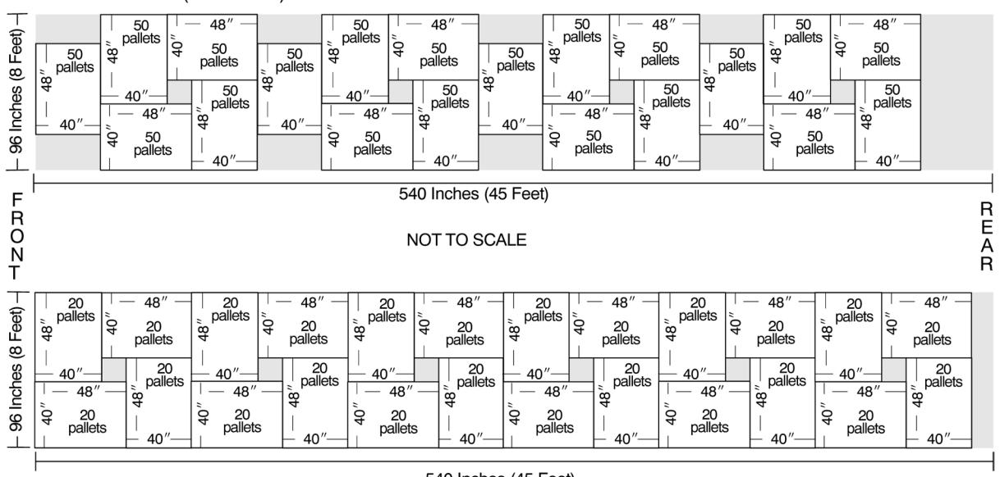

### <span id="page-302-0"></span>474.4 **Cost for Overweight Vehicles**

If a Postal Service facility overloads a Highway Contract Route (HCR) vehicle resulting in a fine to the contractor, the contracting officer for that HCR may use his or her discretion and reimburse the contractor for the cost of the fine and charge that cost to the facility that overloaded the vehicle. If a contractor overloads their own vehicle resulting in a fine to the contractor, the contracting officer for that HCR may hold the contractor responsible for the fine or in special circumstances may use his or her discretion and reimburse the contractor for the cost of the fine. In some cases a law enforcement official requires excess weight be taken off the vehicle before continuing on its journey. This situation delays the mail and adds additional cost for the extra vehicle and driver. If possible, the office that loaded the vehicle provides the means to remove, transfer, and transport the excess load. If not possible, the nearest able plant or Post Office provides the resources and notifies the origin office of the incident.

### <span id="page-302-1"></span>474.5 **Attaching Seals**

<span id="page-302-6"></span>The designated platform employees at a loading point must:

- a. Identify vehicles that must be sealed (see [476.1\)](#page-303-5).
- b. Complete PS Form 5398-A and insert appropriate copy into vehicle (see [476.8](#page-306-1)).
- c. Apply numbered tin band and twisted wire seals (see [476.6](#page-305-3) and [476.7\)](#page-305-4).

# <sup>475</sup> **Visual Aids on the Platform (Dock)**

### <span id="page-302-3"></span><span id="page-302-2"></span>475.1 **General**

Visual aids provide platform employees easy and efficient access to information concerning the proper loading and dispatch of trips, as well as information about arriving trips. Visual aids enhance platform operations by providing ready information so employees can expedite unloading and transfer of mail to inplant operations, and can expedite the proper loading, sequencing, and dispatch of outbound mail. Platform supervisors should ensure accurate visual aids are displayed in an appropriate place on the platform.

### 475.2 **Inbound Trips**

### <span id="page-302-5"></span><span id="page-302-4"></span>475.21 **Arrival Schedules**

For inbound operations, receiving offices must have visual aids showing a profile of trip arrivals, including pertinent information such as route, trip, scheduled arrival time, and transfer information for cross dock items to meet outbound dispatches. When appropriate, post transfer information with separate times depending on mail make-up, such as separate transfer times for both direct and working pallets, for direct and working rolling stock, and for loose sacks. This instruction is not applicable when using electronic arrival profiles (such as the Transportation Information Management and Evaluation System (TIMES) or the Transportation Routing Information Panel System (TRIPS)) or for BMCs and offices with mechanized unloading-to-machine distribution.

### <span id="page-303-0"></span>475.22 **Special Instructions**

For each inbound trip with a distinct load configuration, receiving offices must have visual aids showing the separations (or other unique features) expected on the trip, the content of the separations, and special handling instructions. Hard copy visual aids are not applicable when information is available through electronic devices, such as computer monitors mounted on the platform.

### 475.3 **Outbound Trips**

### <span id="page-303-2"></span><span id="page-303-1"></span>475.31 **Loading Diagrams**

For each outbound trip, dispatching offices must have visual aids showing the individual and/or inclusive ZIP Codes to be dispatched, and other unique features, such as for tailgating mail. Hard copy visual aids are not applicable when information is available through electronic devices, such as computer monitors mounted on the platform.

### <span id="page-303-3"></span>475.32 **Dispatch Schedule**

For each outbound trip, dispatching offices must have visual aids showing a profile for outbound dispatches, including route, trip, scheduled departure time, and other unique features. This instruction is not necessary when sufficient instruction is provided by electronic dispatch tools, such as TIMES and TRIPS.

# <sup>476</sup> **Sealing Program and Procedures**

### <span id="page-303-5"></span><span id="page-303-4"></span>476.1 **General Requirement**

<span id="page-303-7"></span>All dispatching offices under the seal program, including contract mail handling facilities, must seal each outbound highway contract vehicle, rail intermodal vehicle (trailer, container, RoadRailer, or other rail or Postal Service-furnished vehicle), or rail boxcar, with numbered tin band seals, Item 0817A, and twisted wire seals, and complete PS Form 5398-A, Contract Route Vehicle Record. If an electronic transportation system such as TIMES is used, the tin band seal number must be entered in the appropriate place manually, or by scanning the barcode on the seal. Dispatching and receiving offices must have tin band seals, twisted wire seals, seal imprinters, and sealing and cutting tools.

*Note:* Twisted wire seals are never used alone when dispatching mail (excluding Mail Transport Equipment, see [476.2](#page-303-6)[c\)](#page-304-4). They are always used in addition to numbered tin band seals and PS Form 5398-A.

### <span id="page-303-6"></span>476.2 **Exemptions and Exceptions**

<span id="page-303-8"></span>In some cases, the seal system is not used at all or is used with minor deviations:

a. Unstaffed Offices. Do not use the seal system for dispatches of mail to offices where vestibule exchange occurs, or where postal personnel are not normally on duty to accept delivery. Complete PS Form 5398-A and enclose it to verify that the load was in good condition and identify who closed it. Annotate PS Form 5398-A "**SEAL NOT REQUIRED**" to verify a seal was not used.

- b. Empty Vehicles. Do not seal empty trailers, vans, or rail vehicles.
- <span id="page-304-4"></span>c. Mail Transport Equipment. Do not use a numbered tin band seal on dispatches of mail transport equipment. Use a twisted wire seal. If appropriate for additional security, use PS Form 5398-A and annotate it "**SEAL NOT REQUIRED**."
- d. Contract Vehicles. Small highway contract routes utilizing equipment with automobile type locks that are not sealable are exempt from the sealing requirements. Contract vehicles secured with contractor's padlocks are exempt from using twisted wire seals, but must use the numbered tin ban seal.
- e. Foreign Mail. Seal outbound international ocean containers with tin band seals and record serial numbers on the waybill documents. Do not use PS Form 5398-A.
- f. Outbound Military Mail. Seal all outbound military mail containers dispatched overseas via surface transportation with both twisted wire seals and numbered tin ban seals. Do not use PS Form 5398-A.
- g. Inbound Military Mail. Inbound military mail containers are sealed with only the numbered tin band seal. Do not use twisted wire seals.
- h. Postal Vehicle Service (PVS). PVS drivers must use cargo compartment door locks and, where applicable, postal padlocks, in accordance with PVS policy.

### <span id="page-304-0"></span>476.3 **Disseminating Instructions**

Dispatching offices must furnish necessary instructions to offices that receive sealed vans and are not familiar with the seal program. The instructions must include procedures for removing, verifying, and filing numbered seals and forms.

### <span id="page-304-1"></span>476.4 **Necessary Supplies**

<span id="page-304-5"></span>The sealing program uses the following basic supplies:

- a. Item 0817A, Numbered Tin Band Seal.
- b. PS Form 5398-A, Contract Route Vehicle Record.
- c. Security seal imprinter.
- d. Twisted wire seal (12-inch section of 8-gauge steel wire band).
- e. Twisted wire sealing and cutting equipment (see [476.7\)](#page-305-4).

### 476.5 **Security**

### <span id="page-304-3"></span><span id="page-304-2"></span>476.51 **Numbered Seals**

The manager at each postal facility or contract mail handling facility where numbered tin band seals are used must keep seals under lock and key. The manager designates a supervisor and a clerk as seal control officer and alternate seal control officer, respectively. The reserve stock of seals is under the exclusive control of the seal control officer and his/her alternate. The following guidelines also apply:

a. Seals may be shipped from the factory in bulk quantities of several hundred or several thousand.

- b. Seals are issued to dock personnel in units of 100 or in units of a two-day supply, whichever is less.
- c. Seals must not be given to contract employees under any circumstances.

### 476.52 **Sealing Discrepancies**

### <span id="page-305-1"></span><span id="page-305-0"></span>476.521 **General Rule**

<span id="page-305-6"></span>Any employee who notices a sealing irregularity (e.g., a discrepancy in a seal number or a broken or missing seal) must initial the related PS Form 5398-A and notify his/her supervisor. The supervisor must:

- a. Verify the irregularity and initial the PS Form 5398-A.
- b. Immediately report the irregularity by telephone both to the dispatching facility and to the appropriate Postal Inspector-in-Charge.
- c. Investigate the discrepancy to the best extent possible.
- d. Follow up the telephone report with a written report to both offices.
- <span id="page-305-7"></span>e. Retain the seal and related form until the investigating postal inspector authorizes its release.

#### <span id="page-305-2"></span>476.522 **Special Cases**

For a discrepancy involving either a double trailer or a relay driver (a driver other than the one who drove the first segment of the route), the employee discovering the discrepancy must determine the name of the driver and enter it on the PS Form 5398-A.

### <span id="page-305-3"></span>476.6 **Multidoor Vehicles**

<span id="page-305-8"></span>Special requirements for multidoor vehicles depend on whether or not the side doors are used en route:

- a. Unused Side Doors. Side doors of highway contract vehicles that are never used must be permanently sealed by applying a twisted wire seal and a numbered tin band seal to the unused doors. The numbered tin band seal is recorded on PS Form 5398-A and placed in the local contract file. When sealing or removing the regular numbered seal from the rear doors of the vehicle, make a visual check to see that both the tin band seal and the twisted wire seal are intact on unused side doors. It is not necessary to verify the number of the special seal in every instance, but checks must be made at least quarterly.
- b. Used Side Doors. Multidoor vehicles with side doors that are used en route require numbered seals on both doors. Use one PS Form 5398-A for the side door, and another for the rear door. When unloading mail, remove only the seal on the door being opened. Verify the seal number on the other door.

### 476.7 **Twisted Wire Seals**

### <span id="page-305-5"></span><span id="page-305-4"></span>476.71 **Applying Wire Seals**

Twisted wire seals require approximately 90 seconds to affix and are fastened as follows:

a. Insert a 12-inch section of 8-gauge steel wire rod halfway through the hasp of the door to be sealed.

- b. Bend the wire rod double and insert one end into a special twisting tool.
- c. Rotate the tool to catch the other end of the wire, thus twisting the wire into a tight knot that can be removed only with a bolt cutter.
- d. Twist the seal against the door hasp so that it cannot be untwisted with a screwdriver or a pair of pliers.

### <span id="page-306-0"></span>476.72 **Removing Wire Seals**

Cut the seals with at least a 14-inch bolt cutter. For personal safety, make the cut close to the hasp. To prevent the possibility of tire damage, do not let used seals fall to the ground. Place used seals in the appropriate waste receptacle.

# <span id="page-306-6"></span>476.8 **PS Form 5398-A**

### <span id="page-306-2"></span><span id="page-306-1"></span>476.81 **Applicability**

<span id="page-306-7"></span>PS Form 5398-A must be completed by all facilities (including BMCs) for each highway contract route vehicle, rail intermodal vehicle, and rail boxcar that is sealed with a numbered tin band seal. See [476.2](#page-303-6) for exceptions.

### <span id="page-306-3"></span>476.82 **Automatic Imprinting**

<span id="page-306-8"></span>A security seal imprinter is used to automatically record the date, name, and ZIP Code of the dispatching facility and the serial number(s) of the tin ban seal(s) on the PS Form(s) 5398-A. The imprinter can accommodate three tin band seals.

### <span id="page-306-4"></span>476.83 **Dispatching Entries**

<span id="page-306-9"></span>The dispatching employee must write certain entries on the PS Form 5398-A. These include:

- a. Name of the employee sealing the vehicle.
- b. Destination of the next facility to be served by the vehicle. (This may be an intermediate stop en route.)
- c. Driver's name. *Exceptions:* It is not necessary to show the driver's name when sealing:
  - (1) a rail intermodal vehicle or boxcar, or
  - (2) the first trailer of a double trailer trip (e.g., pups/twins) to the same destination. The driver must be identified on the PS Form 5398-A for the second trailer. See also [476.522](#page-305-2).
- d. Departure Time and Date. When sealing rail vehicles in advance of the dispatch, or when sealing the first vehicle in a tandem dispatch, write the sealing time and date rather than the departure time and date.
- <span id="page-306-10"></span>e. Registered Mail is not identified or recorded on PS Form 5398-A.

### <span id="page-306-5"></span>476.84 **Defective Seals**

When sealing vehicle doors, dispatching employees who discover defective seals should submit them to their supervisors with the numerical sequence of those seals listed on a PS Form 5398-A.

### <span id="page-307-0"></span>476.85 **Distribution**

<span id="page-307-7"></span>PS Form 5398-A is a three-part form: two soft (tissue) copies and a hard (index) copy. Copies are distributed and used as follows:

- a. First soft copy. Retain at dispatching facility.
- b. Second soft copy. Give to vehicle driver for use:
  - (1) as a gate pass at facilities where access is controlled by security force personnel, and
  - (2) as a bill of lading at truck weigh stations or at en route inspections by regulatory agencies.
- c. Hard (index) copy. Place in open-ended envelope attached to the inside wall of the vehicle's cargo compartment. Do this immediately prior to closing and sealing the cargo doors.

### <span id="page-307-1"></span>476.86 **Receiving Entries**

<span id="page-307-8"></span>Any employee who breaks the seal at the point of destination must process the PS Form 5398-A as follows:

- a. Enter name of employee breaking seal.
- b. Identify any discrepancies (see [476.52\)](#page-305-0).
- <span id="page-307-9"></span>c. Submit forms and seals for retention.

### <span id="page-307-2"></span>476.87 **Retention**

PS Forms 5398-A and related numbered seals must be filed and kept at the receiving facility for 15 days.

### <span id="page-307-3"></span>476.9 **Registered Mail**

Detailed procedures for Registered Mail are in Handbook DM-901, Registered Mail. The following are included in Registered Mail procedures for transportation contract operations:

- a. Contract drivers who are not under the security seal program are required to sign for Registered Mail.
- b. A postal employee must be assigned to receive and record all Registered Mail from contract drivers.
- c. A Nil-Bil system that will account for registered remittances. This requires a Registered Mail pouch even if no remittance is being sent that day.

# <sup>477</sup> **Mail and Empty Mail Vehicle Arrivals**

### <span id="page-307-5"></span><span id="page-307-4"></span>477.1 **Recording Arrivals**

<span id="page-307-6"></span>All mail and empty mail vehicle arrivals (whether via scheduled transportation or extra trips) on contract or Postal Vehicle Service (PVS) must be recorded in the appropriate electronic system (such as the Transportation Information Management and Evaluation System (TIMES)) or on the appropriate form (see below). Complete the data entry or forms as required, and include additional remarks to explain deviations. Appropriate forms are:

| Source of Mail                                         | Record Trip Arrivals in<br>Electronic System                                                                       | Record Trip Arrivals on                                                                                                                                              |
|--------------------------------------------------------|--------------------------------------------------------------------------------------------------------------------|----------------------------------------------------------------------------------------------------------------------------------------------------------------------|
| Main office collection<br>runs at CAG A-G<br>offices   | As available                                                                                                       | PS Form 3968, Daily Mail<br>Collection Record                                                                                                                        |
| Stations and<br>branches via PVS                       | As available                                                                                                       | Locally designed form                                                                                                                                                |
| Stations and<br>branches via highway<br>contract route | As available                                                                                                       | PS Form 5398,<br>Transportation Performance<br>Record                                                                                                                |
| Associate offices via<br>highway contract<br>route     | As available                                                                                                       | PS Form 5398,<br>Transportation Performance<br>Record                                                                                                                |
| Processing plants via<br>highway contract<br>route     | TIMES (Transportation<br>Information<br>Management and<br>Evaluation System)                                       | PS Form 5398,<br>Transportation Performance<br>Record                                                                                                                |
| AMF or airport                                         | TIMES                                                                                                              | Locally designed form or as<br>required by Area Office<br>Distribution Networks                                                                                      |
| NDC via highway<br>contract route                      | TIMES, yard control<br>system                                                                                      | PS Form 5398,<br>Transportation Performance<br>Record, PS Form 4460,<br>Vehicle Record/Trip Ticket<br>(card)                                                         |
| NDC via rail                                           | TIMES, yard control<br>system, and/or Rail<br>Management<br>Information System<br>(RMIS)                           | PS Form 5398,<br>Transportation Performance<br>Record, PS Form 4460,<br>Vehicle Record/Trip Ticket<br>(card), PS Form 5186, Mail<br>Movement Routing<br>Instructions |
| NDC via PVS                                            | TIMES, yard control<br>system                                                                                      | PS Form 5398,<br>Transportation Performance<br>Record, PS Form 4460,<br>Vehicle Record/Trip Ticket<br>(card)                                                         |
| Local private mailers                                  | Drop Shipment System<br>for destination entry<br>vehicles, TIMES, RMIS<br>for rail vehicles, other as<br>available | After verification,<br>PS Form 8125, Drop<br>Shipment Clearance<br>Document, PS Form 8015,<br>Plant Load Vehicle Log, or<br>locally -designed forms, if<br>warranted |
| Private mailers from<br>other than local area          | Drop Shipment System<br>for destination entry<br>vehicles, RMIS for rail<br>vehicles, other as<br>available        | After verification,<br>PS Form 8125, Drop<br>Shipment Clearance<br>Document, PS Form 8015,<br>Plant Load Vehicle Log, or<br>locally designed forms, if<br>warranted  |

### <span id="page-309-0"></span>477.2 **PS Forms 4460 and 5398**

<span id="page-309-5"></span>Receiving offices must record the arrival time and the unloading time for all trips (including extra highway route trips) as follows:

- a. BMCs use PS Forms 4460 and 5398 to record times. Other offices use PS Form 5398.
- b. Although most offices maintain PS Forms 4460 and 5398 at the platform, BMCs and certain large Post Offices may find it advantageous to maintain the forms at some other place, such as a vehicle operations office.

### <span id="page-309-1"></span>477.3 **PS Form 5201, Mail Van Inspection**

<span id="page-309-6"></span>The purpose of PS Form 5201 is to show the condition of vehicles when received into the possession of the Postal Service. A properly completed PS Form 5201 records preexisting damage that should not be charged to the Postal Service. PS Form 5201 should be prepared for all arriving rail or leased vehicles, whether loaded or empty. Drivers picking up rail or leased vehicles should verify an inspection form provided by the location supplying the vehicle, or complete PS Form 5201 at the time of acceptance. A PS Form 5201 completed on departure from a facility may record damage caused to the vehicle while in the possession of the Postal Service. If requested by a driver at departure, complete PS Form 5201 and provide a copy to the driver. Follow instructions issued by the Area Office Distribution Networks to complete PS Form 5201.

### 477.4 **Unloading**

### <span id="page-309-3"></span><span id="page-309-2"></span>477.41 **Instructions**

All receiving facilities must have detailed unloading instructions for each platform operation. The detail necessary depends on the size and complexity of the office. The instructions should be posted as visual aids or easily available to platform employees. Always include instructions pertaining to the unloading of drop shipments that must be checked to ensure proper quantity and documentation of mail, and for business mail that must pass through acceptance procedures before processing. Also include procedures for handling surface preferential mail (periodicals), particularly tailgated surface preferential mail and Registered Mail. In some cases it is necessary to identify docks, belts, slides, and staging areas by number with visual aids, because this helps employees place specific mail items in the proper place.

### <span id="page-309-4"></span>477.42 **Removing Seals**

<span id="page-309-7"></span>The designated platform employees at an unloading point must:

- a. Remove all numbered seals and twisted wire seals (see [476.72\)](#page-306-0).
- b. Complete the appropriate parts of PS Form 5398-A (see [476.86](#page-307-1)).
- c. Identify any discrepancies (see [476.52\)](#page-305-0).
- d. After verifying PS Form 5398-A against the actual seal number, dispose of numbered and twisted wire seals in a trash receptacle to prevent the possibility of vehicle tire damage.
- e. File PS Form 5398-A in an appropriate place for at least 15 days.

### 477.43 **From Air Facilities**

#### <span id="page-310-1"></span><span id="page-310-0"></span>477.431 **Responsible Employees**

All employees who are responsible for the dispatch and receipt of mail at airport mail centers (AMCs) and facilities (AMFs) or local air stop points must be thoroughly familiar with the air contract data collection system, required forms contained in Handbook PO-507, Air Contract Administrative Procedures, and procedures for air contract performance measurement, including scanning procedures.

### <span id="page-310-2"></span>477.432 **Air Taxis**

Use appropriate forms. See Handbook PO-509, Air Taxi Contract Administration.

### 477.5 **Platform Transfers**

### <span id="page-310-4"></span><span id="page-310-3"></span>477.51 **Registered Mail**

Registered mail must be handled according to Registered Mail procedures. In 1997, new procedures were issued by the Chief Postal Inspector and the Vice President, Operations Support, to area vice presidents. Among other changes, these procedures:

- a. Required contract drivers not under the seal program to sign for Registered Mail.
- b. Assigned a postal employee to receive and record all Registered Mail from the contract drivers.
- c. Implemented a Nil-Bil system to account for registered remittances, requiring a registered pouch even on days no remittance is sent.

### <span id="page-310-5"></span>477.52 **Preferential Mail**

<span id="page-310-8"></span>Preferential mail must be given expeditious handling on platforms.

### <span id="page-310-6"></span>477.53 **Transfer Failures**

If a transfer failure is caused by poor supervisory judgment, local management must take immediate corrective action. If the transfer failure results from the late operation of a highway contract and is not caused by legitimate reasons:

- a. Processing plants, administrative offices, large installations, and other postal facilities complete PS Form 5500, Contract Route Irregularity Report, and distribute copies as instructed on the Form.
- b. Offices that do not use PS Form 5500 report irregularities to the appropriate administrative official of the contract involved using Postal Service routing slip, Supply Item O-13, or other appropriate communication.
- c. If a transfer failure causes delay to a highway contract route (HCR) trip, a PS Form 5466, Late Slip, should be issued to the HCR driver.

### <span id="page-310-7"></span>477.54 **Missent Mail**

Notify responsible Post Offices, processing facilities, and BMCs of receipt of missent pouches, sacks, containers, and outside pieces of all classes of mail. Follow up to ensure problems have been corrected.

# <sup>478</sup> **Mail and Empty Mail Vehicle Departures**

### <span id="page-311-1"></span><span id="page-311-0"></span>478.1 **Recording**

<span id="page-311-2"></span>All mail and empty mail vehicle departures (whether via scheduled transportation or extra trips) must be recorded in the appropriate electronic system (such as TIMES or other vehicle information system) or on the appropriate form (see table below). Complete the data entry or forms as required, and include additional remarks to explain deviations. Appropriate forms are:

| Mail / Vehicle<br>Destination                          | Record Departures in<br>Electronic System                                                                                                                                                    | Record Departures on<br>Form                                                                                                                                                                             |  |
|--------------------------------------------------------|----------------------------------------------------------------------------------------------------------------------------------------------------------------------------------------------|----------------------------------------------------------------------------------------------------------------------------------------------------------------------------------------------------------|--|
| Stations and<br>branches via PVS                       | As available                                                                                                                                                                                 | Locally designed form                                                                                                                                                                                    |  |
| Stations and<br>branches via highway<br>contract route | As available<br>PS Form 5398,<br>Transportation Performance<br>Record                                                                                                                        |                                                                                                                                                                                                          |  |
| Associate offices via<br>highway contract<br>route     | As available<br>PS Form 5398,<br>Transportation Performance<br>Record                                                                                                                        |                                                                                                                                                                                                          |  |
| Processing plants via<br>highway contract<br>route     | TIMES (Transportation<br>Information Management<br>and Evaluation System)                                                                                                                    | PS Form 5398,<br>Transportation Performance<br>Record                                                                                                                                                    |  |
| AMF or airport                                         | TIMES                                                                                                                                                                                        | Locally designed form or as<br>required by Area<br>Distribution Network Office                                                                                                                           |  |
| NDC via highway<br>contract route                      | TIMES, vehicle<br>information system                                                                                                                                                         | PS Form 5398,<br>Transportation Performance<br>Record, PS Form 4460,<br>Vehicle Record/Trip Ticket<br>(card)                                                                                             |  |
| NDC via rail                                           | TIMES, vehicle<br>information system, and/<br>or Rail Management<br>Information System<br>(RMIS), Equipment<br>Inventory Reporting<br>System (EIRS) for mail<br>transport equipment<br>(MTE) | PS Form 5398,<br>Transportation Performance<br>Record, PS Form 4460,<br>Vehicle Record/Trip Ticket<br>(card), PS Form 5186, Mail<br>Movement Routing<br>Instructions for rail                            |  |
| NDC via PVS                                            | TIMES, yard control<br>system                                                                                                                                                                | PS Form 5398,<br>Transportation Performance<br>Record, PS Form 4460,<br>Vehicle Record/Trip Ticket<br>(card)                                                                                             |  |
| Rail Yard or Leased<br>Vehicle Supplier                | RMIS for rail vehicles,<br>TIMES, vehicle<br>information system,<br>other as available                                                                                                       | PS Form 5398,<br>Transportation Performance<br>Record, PS Form 4460,<br>Vehicle Record/Trip Ticket<br>(card), PS Form 5201, Mail<br>Van Inspection Report, or<br>locally designed forms, if<br>warranted |  |

| Mail / Vehicle  | Record Departures in                                                                                    | Record Departures on                                                                                                                                                                                                           |
|-----------------|---------------------------------------------------------------------------------------------------------|--------------------------------------------------------------------------------------------------------------------------------------------------------------------------------------------------------------------------------|
| Destination     | Electronic System                                                                                       | Form                                                                                                                                                                                                                           |
| Private mailers | RMIS for rail vehicles,<br>TIMES, vehicle<br>information system, EIRS<br>for MTE, other as<br>available | PS Form 5398,<br>Transportation Performance<br>Record, PS Form 5201, Mail<br>Van Inspection Report, After<br>verification, PS Form 8125,<br>Drop Shipment Clearance<br>Document, or locally<br>designed forms, if<br>warranted |

### <span id="page-312-0"></span>478.2 **PS Form 5201, Mail Van Inspection**

<span id="page-312-4"></span>A PS Form 5201 completed on departure from a facility may record damage caused to the vehicle while in the possession of the Postal Service. If requested by a driver at departure, complete PS Form 5201 and provide a copy to the driver. Follow instructions issued by the Area Office Distribution Networks to complete PS Form 5201. PS Form 5201 is initiated on vehicle arrival to document preexisting damage. See [477.3](#page-309-1) regarding arrivals.

### 478.3 **Scheduling Extra Trips**

### <span id="page-312-2"></span><span id="page-312-1"></span>478.31 **Postal Vehicle Service (PVS) Trips**

<span id="page-312-5"></span>Extra PVS trips are costly and should not be scheduled unless necessary to prevent delay of mail.

### <span id="page-312-3"></span>478.32 **Highway Contract Route Trips**

No office may request or schedule extra highway contract route trips unless necessary to prevent serious delay of preferential mail or justified because of mail volume. The following guidelines apply:

- a. Each highway contract route extra trip must have PS Form 5397, Contract Route Extra Trip Authorization, completed as certification for payment.
- b. The office authorizing the extra trip must issue PS Form 5397 and complete the appropriate sections.
- c. A copy of PS Form 5397 will be retained for at least one year in the office that issues PS Form 5429, Certification of Exceptional Contract Service Performed. PS Form 5429 must be retained at least 7 years. Record retention periods are also contained in the Administrative Support Manual and Handbook PO-513, Mail Transportation Procurement Handbook.
- d. Destination offices should be notified of extra trips in advance by telephone or electronic mail, and furnished PS Form 5397.
- e. Destination offices review and complete the appropriate sections of PS Form 5397 for destination office. If the extra trip ends at the destination office, the destination office distributes copies of the completed PS Form 5397 as instructed on the form. If the extra trip is operating round-trip, the destination office should dispatch any available volumes on the return leg of the extra trip.

f. PS Form 5429, Certification of Exceptional Contract Service Performed, is completed by the office designated as Administrative Official (AO) for the highway contract route. The AO summarizes PS Forms 5397 onto PS Form 5429 at the end of each postal accounting period. The AO distributes copies of PS Form 5429 as required on the form, including sending the completed PS Form 5429 to the postal Accounting Service Center for payment to the highway contract route contractor. PS Form 5429 must be retained at least 7 years.

### <span id="page-313-0"></span>478.4 **To Air Facilities**

<span id="page-313-5"></span>Extra trips to air facilities are scheduled and documented in accordance with the requirements for the type of surface transportation used. Postal vehicle service trips are scheduled and operated in accordance with PVS requirements. Highway contract trips are scheduled in accordance with [478.32.](#page-312-3) See [477.3](#page-309-1) regarding inspecting vehicles using PS Form 5201, Mail Van Inspection.

# <sup>479</sup> **Special Mailer Preparation**

# <span id="page-313-2"></span><span id="page-313-1"></span>479.1 **General Explanation**

Special mailer preparation offers benefits to both cost and efficiency. Mailers who prepare their mail in special ways do so for the following reasons:

- a. To qualify for automation rates.
- b. To reduce handling within the Post Office and thus expedite service. Platform employees must recognize specially prepared mail and handle it in a manner that takes advantage of the mailer preparation and expedites its movement through the processing plant to delivery. Some examples of specially prepared mail are cross dock pallets; mail in specialized cartons and containers; trayed, prebarcoded, and carrier route sequenced mail; and ZIP Code sequenced (riffle) mail.
- c. To qualify for destination entry discounts under plant-verified drop shipment.

# <span id="page-313-3"></span>479.2 **Cross Dock Pallets**

Mailers may prepare pallets with mail all for a certain processing plant or delivery office. These pallets do not need to be broken until they reach the plant or office that processes mail with the specific ZIP Codes identified for the pallet. Cross dock pallets should therefore be moved from the delivery vehicle to the outbound trip intact. As a safeguard, contents on the pallet should be visually checked against the pallet label.

### <span id="page-313-4"></span>479.3 **Specialized Cartons and Containers**

Mailers may be provided specialized cartons and containers for loading mail. These cartons and containers are then loaded and unloaded with mechanized equipment, making the loading and unloading process faster. In some cases, mailers may be provided rolling containers for use within the closed loop of the processing plant's service area and the mailer's plant. Rolling containers are costly, their use must be monitored, and mailers should not keep them for a prolonged period of time. They should be

promptly loaded and returned. An alternative to costly rolling containers is pallet-based cardboard box containers. They may be provided by the mailer or, if appropriate, postal facility. Rolling containers (or pallet-based containers) replace bedloading and expedite the loading and unloading of vehicles. Platform personnel should unload containers and promptly move them to the next operation.

### <span id="page-314-0"></span>479.4 **Trayed Mail**

Depending on the degree of makeup and the manner in which postage is paid, platform personnel must develop a system (with the approval of the manager responsible for plant operations) that ensures trayed mail is handled expeditiously. Platform supervisors should utilize any or all of the following tags or labels to assist in the correct routing of trayed mail:

| Label/Tag | Used for                                                   |  |
|-----------|------------------------------------------------------------|--|
| LABEL 204 | First-Class Presorted — All for ZIP Code on Face           |  |
| LABEL 205 | First-Class Presorted — All for First 3 Digits of ZIP Code |  |
| TAG 13    | Mailer Prepared Scheduled Mail                             |  |
| TAG 23    | Presorted First-Class Sack, Green                          |  |
| TAG 24    | Presorted First-Class Sack, 5-Digit                        |  |
| TAG 25    | Presorted First-Class Sack, 3-Digit                        |  |
| TAG 57    | Political Campaign Mailing                                 |  |
| TAG 122   | Carrier Presorted Mail                                     |  |

### <span id="page-314-1"></span>479.5 **ZIP Code Sequence (Riffle) Mail**

ZIP Code sequence or riffle mail consists of letters and flats that have been customer-sequenced by ZIP Code, state, or otherwise (processing category, outgoing or incoming schemes). Platform personnel should familiarize themselves with mail arriving at the platform to locate, identify, and correctly route riffle mail. A local method of identifying the pallets, containers, trays, or sacks of riffle mail must be established.

### 479.6 **Destination Entry Mail (PVDS-Plant Verified Drop Shipment)**

### <span id="page-314-3"></span><span id="page-314-2"></span>479.61 **General**

Plant verified drop shipments (PVDS) are considered freight until such time as they are actually deposited at the destination facility where they will be accepted as mail. Mailers (or their agents) may request specific dates for appointments and unloading of destination entry mail at postal facilities. Mailers must request appointments in advance by using either the drop shipment appointment system (DSAS) or by calling the local drop shipment appointment control center or local drop shipment coordinator (depending on locale, the appropriate drop shipment appointment control center/ coordinator may be the one serving the destination entry location, as opposed to serving the mailer plant origin). Conditions for unloading product from the mailer's or mailer's agent's vehicle are that the load must be in good condition, clearly identified, all mail properly prepared, and all official forms and paperwork present and properly completed. Some general provisions follow. For specific procedures, see separately published guidelines for drop shipment mail.

### <span id="page-315-0"></span>479.62 **Prior Authorization**

<span id="page-315-7"></span>Prior clearance is required before accepting drop shipment mail. An appointment or reservation is generally needed, and electronic authorization or specific clearance documents must be presented along with mail being deposited. Prior to being issued a PVDS authorization the mailer must have either an existing Postal Service detached mail unit (usually established with a plant load authorization), or a postage payment agreement, specifying how PVDS postage is to be verified. PS Form 8125, Drop Shipment Clearance Document, is required to accompany each shipment and be presented to the Postal Service with mail being deposited.

### <span id="page-315-1"></span>479.63 **Plant-Verified Drop Shipment Seal**

<span id="page-315-8"></span>The mailer's vehicle may be sealed with the blue plastic seal used specifically for drop shipments. If a seal is present, the employee breaking the seal must verify the number against the seal number recorded on accompanying documents. If the seal number disagrees with the number on PS Form 8125, Drop Shipment Clearance Document, contact the mail acceptance office.

### <span id="page-315-2"></span>479.7 **Staging for Scheduled Delivery**

<span id="page-315-9"></span>Mailers of nonpreferential Periodicals and USPS Marketing Mail may request specific delivery dates for their mail, provided that they furnish the mail to Post Offices sufficiently in advance of the scheduled delivery date. General delivery commitments are dependent upon level of presort and place of deposit as described in [458](#page-273-3). The requested delivery date should be no earlier than normal service commitments would indicate.

# <span id="page-315-11"></span><span id="page-315-4"></span><span id="page-315-3"></span>48 Safety

# <span id="page-315-12"></span><sup>481</sup> **General**

Safety is a major concern in all elements of mail processing. Managers are responsible for ensuring that safety programs are aggressive, continually updated, and involve both management and employees.

# <span id="page-315-13"></span><span id="page-315-5"></span><sup>482</sup> **Work Areas**

Work area supervisors are directly responsible for safety in their area of operation and for the safety of personnel under their supervision. Supervisors must be constantly on the alert for conditions that may jeopardize the safety and health of the work environment and must take immediate steps to correct any unsafe procedure or condition.

# <span id="page-315-10"></span><span id="page-315-6"></span><sup>483</sup> **Fire Hazards**

Good housekeeping practices must be continually observed so that unsafe conditions or fire hazards do not develop.

# <span id="page-316-15"></span><span id="page-316-0"></span><sup>484</sup> **Training**

Supervisors are responsible for conducting safety and health training programs. Safety personnel monitor the training programs and provide technical assistance, including distributing safety materials and demonstrating safety methods and equipment. Supervisors are also responsible for continued on-the-job training through weekly safety talks to all personnel and through daily contact, as appropriate.

# <span id="page-316-4"></span><span id="page-316-3"></span><span id="page-316-2"></span><span id="page-316-1"></span>49 Congressional and Political Campaign Mail

# <span id="page-316-10"></span><sup>491</sup> **Congressional Mail**

### 491.1 **General**

### 491.11 **Basic Information**

<span id="page-316-12"></span><span id="page-316-11"></span>See DMM 703 for basic information on mail sent under the congressional frank.

### <span id="page-316-5"></span>491.12 **Identification**

Franked mail is identified by the facsimile signature of the member of Congress in the upper right corner of the envelope or franked label, followed by "M.C." standing for member of Congress, or "U.S.S." for U.S. Senate.

### <span id="page-316-6"></span>491.13 **Postage Payment**

<span id="page-316-13"></span>Postage for franked mail is paid in lump sums by the U.S. Treasury to the Postal Service. Franked mail, therefore, must not be returned for collection of postage. Franked mail sent from Washington, DC, is counted and reported by the House of Representatives and Senate with the Washington, DC, Post Office and the Post Office Accounting Office at Postal Service Headquarters. Procedures for accounting for franked mailings entered outside Washington, DC, are found in [491.5.](#page-322-1)

### <span id="page-316-7"></span>491.14 **General Types of Mailings**

<span id="page-316-14"></span>Mailings under the congressional frank include both individual piece mailings sent by First-Class Mail and mass mailings. Mass mailings may be sent as First-Class Mail or USPS Marketing Mail. All franked mail is treated and handled according to the class of mail and special service indicated on the outside of the mailpiece.

### <span id="page-316-8"></span>491.15 **USPS Marketing Mail Mailings**

<span id="page-316-9"></span>USPS Marketing Mail franked mailings consist of newsletters, meeting notices, and other printed matter. The mailpieces may bear individual names and addresses or simplified addresses. While individual pieces are rated as USPS Marketing Mail, the overall mailing may be sent by Priority Mail or Priority Mail Express drop shipment.

### 491.16 **Simplified Address**

#### <span id="page-317-1"></span><span id="page-317-0"></span>491.161 **General**

<span id="page-317-11"></span>Simplified address congressional mailings are a common form of congressional mass mailing that have unique characteristics and requirements. As such, detailed instructions are provided in the following sections on the features and handling of this type of mailing.

See DMM 602.3 for the regulations concerning simplified address mailings under the congressional frank.

#### <span id="page-317-2"></span>491.162 **Definition**

Simplified address congressional mailings are prepared without individual names and addresses for general distribution to delivery customers within a congressional district or a state.

### <span id="page-317-3"></span>491.163 **Distribution**

Distribution of simplified address congressional mailings is as follows:

- a. Complete distribution may be made to all carrier route, Post Office box, and general delivery customers within a ZIP Code.
- b. Selective distribution may be made to specified city, rural, and highway contract routes; Post Office box sections; or general deliveries.
- c. Selective distribution may be made within city, rural, and highway contract routes when a route is split between congressional districts.
- d. Selective distribution may be made to either residential or business deliveries within city routes.

#### <span id="page-317-4"></span>491.164 **Simplified Address Format**

Simplified address congressional mailings are addressed "Postal Customer — Local" or "Postal Patron — Local" on the first line, with the congressional district identified in the second line and the state in the third line for a U.S. Representative, or with only the state identified in the second line for a U.S. Senator. The simplified address USPS Marketing Mail mailings are endorsed "Presorted USPS Marketing Mail" or "PRSRT STD." either directly below or to the left of the frank. As these pieces are sent at the Enhanced Carrier Route Walk-Sequence Saturation rate, they are also marked "ECRWSS" in this same area or directly above the simplified address.

### <span id="page-317-9"></span><span id="page-317-8"></span>491.2 **Handling of Mass Congressional Mailings**

### <span id="page-317-5"></span>491.21 **Preparation and Deposit**

#### <span id="page-317-7"></span><span id="page-317-6"></span>491.211 **Packaging**

<span id="page-317-10"></span>The packaging of mass congressional mailings varies as follows:

- a. Individually addressed First-Class Mail and USPS Marketing Mail mailings are presorted, labeled, and packaged in trays or No. 3 gray sacks according to Postal Service requirements.
- b. Simplified address congressional mailings are presorted, labeled, and packaged in trays or No. 3 gray sacks according to Postal Service requirements.

c. The packages bear facing slips addressed to the destination office. The facing slips generally are prepared in the following format:

Destination City, State, ZIP Code STD LTRS Carrier Route # Origin City, State, ZIP Code ECRWSS1 RESIDENTIAL STOPS ONLY<sup>2</sup> CONGRESSIONAL DISTRICT #\_\_\_\_ # PIECES3 \_\_\_\_

### *NOTE:* Other Address Options:

- <sup>1</sup> "RESIDENTIAL CUSTOMERS" if the mail is meant to be delivered to residential customers only;
- <sup>2</sup> "BUSINESS STOPS" or "BUSINESS CUSTOMERS" if the mail is for business customers only;
- <sup>3</sup> "The facing slip reads "POSTAL CUSTOMER" if the mail is for delivery to all customers; or
- d. PS Tag 11, Congressional Mail, "Postmaster Open and Distribute" is used on all sacks or trays of congressional mail. This tag helps identify the franked congressional mailing as it moves through the mailstream.

#### <span id="page-318-0"></span>491.212 **Pouches**

USPS Marketing Mail congressional mass mailings may be sent by Priority Mail or Priority Mail Express drop shipment and are pouched and labeled accordingly.

#### <span id="page-318-1"></span>491.213 **Deposit**

Most bulk congressional mailings are sent from Washington, DC. Members of Congress may, however, dispatch these mailings from Post Offices other than Washington, DC. See [491.51](#page-322-2) for procedures for local deposit of franked USPS Marketing Mail mailings.

### 491.22 **Processing and Delivery**

### <span id="page-318-3"></span><span id="page-318-2"></span>491.221 **Responsibilities**

<span id="page-318-4"></span>Responsibilities for processing and delivery of congressional franked mailings are as follows:

- a. Managers, Customer Service Support, at Customer Service and Sales districts, are responsible for appointing a congressional mailings coordinator to serve, when necessary, as a liaison with plants, delivery units, congressional offices, and Government Relations, Postal Service Headquarters, to resolve any problems with these mailings. The Manager, Customer Service Support, must notify plants, Post Offices, and Government Relations of the individual assigned the congressional mailings coordinator role.
- b. Congressional mailings coordinators are responsible for coordinating with plants, delivery units, congressional offices, and Government Relations as necessary on matters related to congressional mailings.
- c. Plant managers are responsible for proper processing of franked congressional mailings.

d. Postmasters and their subordinate unit managers at destination Post Offices are responsible for proper delivery of franked congressional mailings.

#### <span id="page-319-0"></span>491.222 **Opening at Delivery Unit**

All sacks and trays identified as congressional mail must be opened at the delivery unit to determine the contents and class of mail. The contents must be examined to ensure that there are no apparent problems with the mailing, such as delayed time-value pieces, shortages, etc. See [491.224](#page-319-2) and [491.226](#page-319-4), respectively, for instructions regarding delays and excess or insufficient quantities.

#### <span id="page-319-1"></span>491.223 **Selective Delivery**

On city routes, if the facing slip for carrier route presorted, simplified address mailings specifies either "Residential Stops Only" or "Residential Customers Only" or "Business Stops Only" or "Business Customers Only", carriers must deliver the mail to those points only. Where a carrier route is split between congressional districts, supervisors must instruct carriers and substitutes concerning the boundary between the congressional districts. To determine the boundaries, supervisors should refer to U.S. Census Bureau congressional district maps and other information used for collection of Congressional District Deliveries Report data (see [491.4\)](#page-321-1). When simplified address congressional mailings are received on routes split between congressional districts, the carriers must take care to deliver them to the proper points. District Address Management System managers can assist in answering congressional district boundary questions.

#### <span id="page-319-2"></span>491.224 **Delays**

Managers must give immediate attention to any delayed, time-value congressional mailings, such as town meeting notices. Plants or delivery units must notify the district congressional mailings coordinator of the delayed mailings. The district congressional mailings coordinator must notify the appropriate Government Relations representative, Postal Service Headquarters. The name and number of the Government Relations representative can be obtained by calling the office of the senior vice president, Government Relations and Public Policy, Postal Service Headquarters, at 202-268-2505. Records must be kept as indicated in [491.3.](#page-320-0)

### <span id="page-319-3"></span>491.225 **Bulk Drop Delivery**

Simplified address congressional mailings are prepared to include enough pieces for customers at bulk drop points. Carriers delivering to bulk drop points must leave enough pieces for the individual customers at these points. If the facing slip for the packages of mail for carrier routes serving these bulk drop customers specifies residential or business customers only, carriers must leave only enough pieces for such customers. If there are not sufficient pieces received to cover bulk drop customers, carriers must inform their supervisors, who then must initiate actions as described in [491.226.](#page-319-4)

#### <span id="page-319-4"></span>491.226 **Excess and Insufficient Quantity**

The following procedures should be followed if a delivery unit receives an incorrect number of pieces of a simplified address congressional mailing:

a. Carriers and clerks must notify the supervisor of the number of excess pieces or shortage of pieces needed for coverage on each route.

- b. In the case of excess pieces, carriers or clerks must not deliver more than one piece to the same addressee. However, a sufficient number of pieces must be left for individual customers at bulk drop points. See [491.225](#page-319-3) for procedures governing delivery to bulk drop points.
- c. In the case of shortage, carriers or clerks must make all possible deliveries until the supply is exhausted, noting where delivery ended.
- d. The supervisor will transfer excess pieces, as available within the office, to routes that receive an insufficient number of pieces.
- e. Postmasters or other delivery unit managers will then contact the district congressional mailings coordinator to report the number of excess pieces or additional pieces needed for coverage, by specific route, Post Office box section, or general delivery indicator.
- f. The district congressional mailings coordinator will take necessary action to transfer pieces for offices reporting excess to those needing additional pieces.
- g. The district congressional mailings coordinator will also advise the local congressional office of any substantial excess or shortage of pieces received, by ZIP Code and carrier route, Post Office box section, or general delivery indicator. Assurance of total coverage must be given to the congressional office. The coordinator will obtain and follow instructions for disposal of the excess pieces from the congressional office. Excess pieces of simplified address congressional mailings must not be mailed to Postal Service Headquarters or to the Washington, DC, Post Office.
- h. If the situation cannot be resolved, the congressional mailings coordinator must immediately contact the appropriate Government Relations representative at Postal Service Headquarters.
- i. Where there is substantial difference between the number of pieces received and the number required for carrier routes, Post Office box sections, or general delivery, the congressional mailings coordinator must advise the district address management office. That office will compare the information provided by the coordinator with the Congressional District Deliveries Report database for the congressional district(s) involved and make any necessary corrections to the database.
- <span id="page-320-2"></span>j. Records must be kept as indicated in [491.3](#page-320-0).

### 491.3 **Recordkeeping**

### <span id="page-320-1"></span><span id="page-320-0"></span>491.31 **Postmasters or Subordinate Unit Managers**

Postmasters or subordinate unit managers must keep records of any congressional mailings received at their offices, with particular attention to those received too late for timely delivery. These records must be kept for 6 months and must contain the following information:

- a. Name of member of Congress.
- b. Description/sample of mailpiece.
- c. Number of pieces by carrier route and box section.
- d. Requested date of delivery, if applicable.

- e. Date and time received for delivery.
- f. Date delivered.
- <span id="page-321-8"></span>g. Other actions taken.

### <span id="page-321-0"></span>491.32 **Congressional Mailings Coordinator**

When contacted with problems, congressional mailings coordinators must keep records. These records must be kept for 6 months and must contain the following information:

- a. Delivery unit and manager requesting assistance and date of request.
- b. Name of member of Congress.
- c. Description of situation or problem.
- d. Description/sample of mailpiece.
- e. Name of Headquarters Government Relations representative contacted, if applicable, and date of contact.
- f. Name of congressional staff member contacted, if applicable, and date of contact.
- <span id="page-321-7"></span>g. Other actions taken.

### 491.4 **Congressional District Deliveries Report**

### <span id="page-321-2"></span><span id="page-321-1"></span>491.41 **Delivery Statistics**

The Postal Service provides delivery statistics to members of Congress to allow them to prepare Enhanced Carrier Route USPS Marketing Mail using a simplified address. This data is provided through the Congressional District Deliveries Report. The Congressional District Deliveries Report provides carrier route, Post Office box, and general delivery information by 5-digit ZIP Codes within congressional districts.

### <span id="page-321-3"></span>491.42 **Database Responsibility**

Compiling and maintaining the Congressional District Deliveries Report database is the responsibility of the address management function within the Customer Service and Sales districts.

### <span id="page-321-4"></span>491.43 **Congressional District Maps**

Headquarters Address Management will provide current copies of applicable U.S. Census Bureau congressional district maps and other information to the address management offices within Customer Service and Sales districts. Also, the district address management office will, if necessary, obtain additional information from local election boards or other sources. This is done as needed and follows redistricting as a result of the decennial census or by legislative or judicial action. The address management offices within Customer Service and Sales districts must then enter the data for their Post Offices, stations, and branches into their address management system database.

### 491.44 **Delivery Statistics Accuracy**

#### <span id="page-321-6"></span><span id="page-321-5"></span>491.441 **Up-to-Date Information**

All unit managers must provide their respective address management office with up-to-date carrier route, Post Office box, and general delivery statistics by congressional district. All personnel involved in establishing the congressional district delivery information within the address management system database must ensure the accuracy of this data. They must pay particular attention to accurate assignment of route data within congressional districts. Some offices may serve more than one congressional district and must list routes appropriately under the correct congressional district. Routes may be split among congressional districts, and the precise number of deliveries in each congressional district must be provided. Post Office box figures will be listed in the congressional district in which the facility is located.

#### <span id="page-322-0"></span>491.442 **Database Changes**

If inaccuracies in the database become apparent, the district address management offices must immediately make the necessary database corrections.

# <span id="page-322-8"></span><span id="page-322-1"></span>491.5 **Accounting for Franked Mail Entered at Post Offices Outside Washington, DC**

### <span id="page-322-2"></span>491.51 **Mass Mailings**

<span id="page-322-7"></span>Members of Congress occasionally enter mass mailings at local Post Offices outside Washington, DC. Members or their vendors must submit a PS Form 3615, Mailing Permit Application and Customer Profile, to the entry Post Office when the first franked bulk mailing is made there. The proper postage statements are also required for all such mailings entered locally. For billing purposes, these postage statements are to be entered into the Official Mail Accounting System (OMAS) side of the permit system. If the office processing these mailings is not on the permit system, forward the statements to the District Finance Office for input by the OMAS coordinator.

### 491.52 **Individual Piece Mailings**

#### <span id="page-322-4"></span><span id="page-322-3"></span>491.521 **General**

Members of Congress make daily individual piece mailings from their state and district offices. Both the U.S. Senate and House of Representatives maintain systems for accounting for individual-piece franked mail entered by the member's state and district offices. The Postal Service accepts these methods for billing the Senate and House of Representatives for this mail.

#### <span id="page-322-5"></span>491.522 **Notification of Problems**

Advise Government Relations, Headquarters, of any problem in serving a state or district office of a member of Congress.

#### <span id="page-322-6"></span>491.523 **Detention of Mail**

Except in situations involving mail security (see ASM 274), franked mail must not be detained, even though there may be indications of abuse of franked mailing privileges. The mail must be promptly dispatched and delivered to the addressee. Report any indications of abuses to the Pricing and Classification Service Center (PCSC). The PCSC must refer cases of abuse to the Postal Inspection Service for investi-gation and to Government Relations, Headquarters, for coordination with the appropriate congressional agency.

### <span id="page-323-6"></span>491.6 **Handling Mail With Ancillary Service Endorsements**

### <span id="page-323-1"></span><span id="page-323-0"></span>491.61 **General**

When making individual piece mailings, members of Congress may request services for undeliverable-as-addressed mail. In handling mail with these endorsements, employees must follow DMM F030 as well as this instruction.

### <span id="page-323-2"></span>491.62 **Proper Address Correction Placement**

Members of Congress use mechanical or automated equipment to update their mailing lists. Markings or endorsements that deface the original address prevent the return mail from being machine read. Consequently, the mailpiece must be processed manually at a high cost, or it may not be processed at all. Therefore, supervisors must ensure that all clerks, carriers, and other employees involved in handling mail with ancillary service endorsements do not mark on, strike through, or place a handstamp or forwarding label on the old address. All forwarding labels must be placed to the right and slightly below the original address. Other markings, endorsements, and stamps also must be placed to the right of the address block.

### <span id="page-323-3"></span>491.63 **Return of Address Correction Requested/Return Postage Guaranteed Mail**

Undeliverable-as-addressed franked mail bearing a Washington, DC, return address and ancillary service endorsement must be sent to:

MANAGER DISTRIBUTION OPERATIONS WASHINGTON DC P&DC 900 BRENTWOOD RD NE WASHINGTON DC 066-9702

<span id="page-323-7"></span>Such mail must not be returned to the individual member of Congress responsible for the mailing.

### 491.7 **Orange Bag Service — Expedited Congressional Mail**

### <span id="page-323-5"></span><span id="page-323-4"></span>491.71 **General**

Orange bag service is an expedited mail service from members' Washington, DC, offices to either postal installations or the members' district or state offices. Orange bag service pouches bypass the outgoing primary processing operation at the Washington, DC, Post Office. Orange bag service is designed to provide overnight delivery of pouches addressed to a postal installation, if the pouches are available for collection from the House of Representatives and Senate Post Offices by 2:00 p.m. Every effort is also made to provide overnight delivery of pouches addressed to members' district or state offices, if they are available for collection from the House of Representatives and Senate Post Offices by 2:00 p.m. Orange bag service pouches collected at 5:00 p.m. from the House of Representatives and Senate Post Offices are to receive second-day delivery.

### <span id="page-324-0"></span>491.72 **Types of Pouches**

The two types of orange bag service pouches are as follows:

- <span id="page-324-2"></span>a. Orange bag service pouches addressed to postal installations. They contain franked First-Class Mail addressed to constituents and are intended to be opened and distributed. Congressional offices will attach PS Tag 11, Congressional Mail, to the pouch reading "Congressional Mail – Postmaster Open and Distribute." The congressional offices will also attach an appropriate air contract transportation (ACT) tag and label showing the appropriate destination processing facility.
- <span id="page-324-3"></span>b. Orange bag service pouches addressed to the members' district or state offices. These contain congressional mail going to the members' district or state offices only and are to be delivered to the congressional offices unopened. Members of the House of Representatives use their own plastic orange bags with the words "US HOUSE OF REPRESENTATIVES -PRIORITY MAIL -OFFICIAL USE ONLY" printed on them for firm direct purposes. The congressional offices will attach a PS Tag 11-A, Congressional Mail, to the pouch reading "Congressional Mail -Do Not Open -All for Firm on Pouch Label." The congressional offices will also attach an appropriate ACT tag and a destination label reading as follows: city, state, ZIP Code on the first line; street address on the second line; and name of member of Congress on the third line.

Some congressional offices will place the date and time of dispatch on the back of the destination label in an attempt to monitor the orange bag service performance.

### <span id="page-324-1"></span>491.73 **Material Used for Expedited Dispatch**

The following material is required for the expedited orange bag service and can be obtained from the House of Representatives or Senate postal operations offices:

- a. No. 2 orange pouches and plastic House of Representatives orange pouches.
- b. Labels that identify the destination processing facility or Post Office, as appropriate for each type of pouch discussed in [491.72](#page-324-0)[a](#page-324-2) and [491.72](#page-324-0)[b.](#page-324-3)
- c. Congressional mail PS Tag 11, Congressional Mail, and PS Tag 11-A, Congressional Mail, which are attached to the pouches to ensure proper handling as described in [491.72](#page-324-0)[a](#page-324-2) and [491.72](#page-324-0)[b](#page-324-3).
- d. Metal or plastic pouch seals, designed to lock the hasp over the metal staple on the pouch, ensuring that the pouch reaches its destination unopened.
- e. Air contract transportation plastic cards and tags containing barcoded origin and destination information for billing and routing purposes.

### 491.74 **Procedures**

#### <span id="page-325-1"></span><span id="page-325-0"></span>491.741 **Congressional Offices**

Congressional offices have the following responsibilities in preparing congressional mail:

- a. Insert the destination label into the label holder on the orange pouch.
- b. Make up individual letters, facing the same way, into mail bundles secured with rubber bands to prevent loose letters in the orange bag service pouch.
- c. Distribute mail to the proper pouches. Pouches must not weigh more than 70 pounds.
- d. Close and seal the pouches.
- e. Ensure that the pouches reach the designated collection point before the scheduled Postal Service pickup.

#### <span id="page-325-2"></span>491.742 **Postal Service**

The Postal Service has the following responsibilities for congressional mail:

- a. Create the appropriate pouch labeling for all orange bag service destinations, based on Postal Service transportation and distribution networks.
- b. Provide necessary training and instructions for mail makeup and pouch labeling.
- c. Furnish all needed pouches, labels, tags, rubber bands, and other supplies.
- d. Make scheduled collections of the pouches.
- e. Dispatch the pouches to the required destinations on the next available transportation to meet service requirements.
- <span id="page-325-7"></span>f. Process and deliver these pouches in an expedited manner.

# <sup>492</sup> **Political Campaign Mail**

## <span id="page-325-3"></span>492.1 **Introduction**

# <span id="page-325-5"></span><span id="page-325-4"></span>492.11 **General**

The American electorate votes on numerous political offices and issues. Citizens cast ballots every 4 years for president, every 2 years for one-third of the U.S. senators and all members of the House of Representatives, and at varying frequencies for governorships and other state, county, and local offices and referenda measures. During the period preceding local, state, and national primaries, special elections, and general elections, the Postal Service accepts and delivers many political campaign mailings, frequently in large quantities. These mailings are made up by individual candidates and their campaign organizations, as well as by local, state, and national committees of political parties.

### <span id="page-325-6"></span>492.12 **Postal Service Responsibility**

The Postal Service is responsible for providing information to assist in the knowledgeable preparation and deposit of political campaign mailings, as well as for the proper acceptance, processing, delivery, and recording of these mailings.

### <span id="page-326-0"></span>492.13 **Nonprofit USPS Marketing Mail Rates**

Section 3626(e) of Title 39, U.S. Code, as enacted by Public Law 95-593, permits certain USPS Marketing Mail matter to be mailed by a "qualified political committee" at the Nonprofit USPS Marketing Mail rates prescribed for qualified nonprofit organizations (see DMM 703.1.0). Also see [492.23](#page-326-4) for a definition of "qualified political committee" and [492.73](#page-331-0) for the standards on what mail may be sent at the Nonprofit USPS Marketing Mail rates by qualified political committees.

### 492.2 **Definitions**

### <span id="page-326-2"></span><span id="page-326-1"></span>492.21 **Political Campaign Mailings**

Any material accepted for mailing at First-Class Mail or USPS Marketing Mail postage rates that is mailed for political campaign purposes by a registered political candidate, campaign committee, or committee of a political party is classified as a political campaign mailing. This type of mailing normally uses the address of a candidate's campaign committee or the committee of a political party as the return address. Do not confuse political campaign mailings with official mailings by members of Congress under congressional franking privileges. See [491](#page-316-2) for a discussion of congressional mail.

### <span id="page-326-3"></span>492.22 **Registered Political Candidate or Party**

An individual or organization recognized as such by the appropriate governmental election control authority is considered to be a registered political candidate or party.

# <span id="page-326-4"></span>492.23 **Qualified Political Committee**

Section 3626(e)(2) of Title 39, U.S.C., defines a qualified political committee for the purpose of eligibility for Nonprofit USPS Marketing Mail rates as follows:

- a. The term qualified political committee means:
  - (1) A national committee of a political party.
  - (2) A state committee of a political party.
  - (3) The Democratic Congressional Campaign Committee.
  - (4) The Democratic Senatorial Campaign Committee.
  - (5) The National Republican Congressional Committee.
  - (6) The National Republican Senatorial Committee.
- b. The term national committee means the organization that, by virtue of the bylaws of a political party, is responsible for the day-to-day operation of that political party at the national level.
- c. The term state committee means the organization that, by virtue of the bylaws of a political party, is responsible for the day-to-day operation of that political party at the state level.

### 492.3 **Premailing Assistance**

### <span id="page-327-1"></span><span id="page-327-0"></span>492.31 **General**

Experience has shown that there will be no cause for criticism if all mailers of political campaign material are fully informed of postal requirements for prompt delivery and are assured of proper and equal handling of their mailings.

### <span id="page-327-2"></span>492.32 **Responsibilities**

Managers, Marketing, Customer Service districts, are responsible for ensuring proper premailing assistance to all committees of political parties, candidates for political office, and/or the candidates' campaign committees within their jurisdictions. Individuals designated by managers, Marketing, as directly responsible for contacting the committees of political parties, political candidates, and campaign organizations must follow the requirements in [492.36.](#page-327-6)

### <span id="page-327-3"></span>492.33 **Identification of Candidates**

Managers, Marketing, Customer Service districts, or their designees, must identify all candidates for election to political office who will be campaigning within their district's jurisdiction, as follows:

- a. Presidential Candidates. Contact state campaign headquarters. Determine locations of mailings and notify appropriate Postal Service personnel for necessary follow-up.
- b. Congressional Candidates. Identify all candidates for election to the Senate and House of Representatives and their principal campaign offices and notify appropriate Postal Service personnel for necessary follow-up.
- c. State Candidates. In statewide elections, identify gubernatorial and other candidates and their principal campaign offices and notify appropriate Postal Service personnel for necessary follow-up.
- d. Local Candidates. Coordinate efforts with postmasters to identify all candidates and/or campaign organizations in those areas holding local elections for county, city, township, borough, parish, and other local offices, and ensure necessary follow-up.

### <span id="page-327-4"></span>492.34 **Political Campaign Information Sources**

State and local boards of election and offices of secretaries of state and county clerks generally can provide information on the names and headquarters of committees of political parties; candidates for federal, state, and local offices; and their campaign organizations.

### <span id="page-327-5"></span>492.35 **Equal Assistance**

Equal assistance must be provided to all committees of political parties, candidates, and candidates' campaign committees, including those that do not represent major parties.

### <span id="page-327-6"></span>492.36 **Premailing Contact Requirements**

Make contact with the committees of political parties, candidates, and the candidates' campaign organizations at the earliest opportunity to provide

information on mail preparation requirements, mail handling procedures, and other matters discussed in [492.37.](#page-328-0) On-site assistance can be helpful, particularly with campaign volunteers, to identify problems in mail preparation and sack or tray labeling before deposit of the mailings. Emphasize the need to deposit the mailings at the earliest possible date before election day, particularly to candidates or organizations planning to avail themselves of the destination bulk mail center drop shipment rates. Keep records of all contacts, including a general summary statement covering the information provided to the candidates and campaign organizations.

### <span id="page-328-0"></span>492.37 **Mail Preparation and Handling Information**

At a minimum, provide committees of political parties, candidates, and the candidates' campaign organizations with information on the following:

- a. Rates and fees, including automation and destination entry drop shipment rates.
- b. Mailing permits and authorizations. See applicable sections of the DMM for instructions on obtaining permits and authorizations for mailing at various rates. National and state political committees may be given instructions on filing for Nonprofit USPS Marketing Mail rates as a qualified political committee, as found in DMM 703.1.0 and Publication 417, Nonprofit USPS Marketing Mail Eligibility, section 3-1. Instructions on obtaining authorization to mail at the Nonprofit USPS Marketing Mail rates at additional offices are also found in DMM 703.1.0 and Publication 417 section 3-2.
- c. Restrictions on what may be mailed at the Nonprofit USPS Marketing Mail rates for state and national political committees (see [492.73\)](#page-331-0). See also Publication 417 section 5-4, and chapter 6.
- d. Preparation, makeup, and handling of mailings, including an explanation of ancillary service endorsements and address information products and services.
- e. Availability and use of mailing supplies and equipment.
  - *Note:* PS Tag 57, Political Campaign Mailing, identifies campaign mailings during processing and distribution. PS Tag 57 is available from the Material Distribution Centers and is reusable. If mail is trayed and strapped, mailers should affix PS Tag 57 to the strap on the end of the tray near the tray label with a wire twist tie. If local postal instructions permit trays to be tendered without strapping, then PS Tag 57 should be affixed to the tray with a rubber band double looped through the handhold of the tray on the end near the tray label. Care should be taken to remove the tags from the trays after the campaign mail has been processed.
- f. Business reply mail.
- g. Disposition of undeliverable pieces.
- h. Time frames for depositing mailings.

### 492.4 **Processing and Delivery**

### <span id="page-329-1"></span><span id="page-329-0"></span>492.41 **General**

All managers involved in processing and delivering political campaign mailings must ensure that each mailing is handled promptly and with equal care and attention.

### <span id="page-329-2"></span>492.42 **Area Political Campaign Mail Coordinators**

Area Vice Presidents must appoint an Area Political Campaign Mail Coordinator and provide the name, address, and phone number of the individual assigned that responsibility to each district manager under their jurisdiction and to the Vice President, Delivery and Retail, at Headquarters.

### <span id="page-329-3"></span>492.43 **Late Deposit**

Inform mailers attempting to deposit political campaign mailings that may be too late for delivery by the election date under Postal Service delivery objectives of the potential for late delivery. Document and maintain this advice. See [492.5.](#page-329-6)

### <span id="page-329-4"></span>492.44 **Reports of Delays**

Give immediate attention to any reported delay in processing or delivering political campaign mailings and fully document inquiries made and subsequent action taken (see [492.53](#page-329-9)).

### <span id="page-329-5"></span>492.45 **Handling of Undeliverable as Addressed Mail**

If a significant amount of a campaign mailing is received that is undeliverable as addressed, postmasters must inform the applicable campaign office before any action to dispose of such mail. Postmasters should also coordinate any such situations with their Area Political Campaign Mail Coordinator.

### 492.5 **Recordkeeping**

### <span id="page-329-7"></span><span id="page-329-6"></span>492.51 **General**

Detailed records provide the basis for a documented and factual explanation of any complaints alleging improper handling of political campaign mailings. Maintain premailing assistance and processing and delivery records for a period of 6 months.

### <span id="page-329-8"></span>492.52 **Premailing Assistance Records**

Individuals designated to provide premailing assistance to committees of political parties, candidates, and the candidates' campaign organizations must keep records of all contacts, including a summary statement concerning the information provided to such mailers.

# <span id="page-329-9"></span>492.53 **Processing and Delivery Records**

Managers, Business Mail Entry, and postmasters must keep documented records of all political campaign mailings that are deposited or received at their offices, with particular attention to those deposited or received too late for timely delivery.

At a minimum, these documented records must include the following:

- a. The name of the mailer.
- b. A sample, photocopy, or description of the mailing.

- c. The date and time the mailing was received for dispatch or delivery.
- d. The election day deadline and, if applicable, the date of requested delivery.
- e. If applicable, the approximate number of pieces not delivered before the election day deadline and/or the date of requested delivery and the reasons why delivery was not timely.
- f. The approximate volume of any USPS Marketing Mail consigned to waste upon instruction by the mailer.

### 492.6 **Answering Requests for Information**

### <span id="page-330-1"></span><span id="page-330-0"></span>492.61 **General**

Answer requests for information concerning political campaign mailings as provided in regulations implementing the Freedom of Information Act (see Handbook AS-353, Guide to Privacy and The Freedom of Information Act). Do not compile information not regularly compiled for Postal Service use to respond to requests.

### <span id="page-330-2"></span>492.62 **Field Managing Counsel Assistance**

If uncertain regarding the disclosure of information concerning political campaign mailings, consult the Field Managing Counsel.

### <span id="page-330-3"></span>492.63 **Questionable Requests**

Promptly report to the Postal Inspection Service any questionable attempts to obtain information concerning political campaign mailings not properly subject to disclosure.

## 492.7 **Revenue Protection**

### <span id="page-330-5"></span><span id="page-330-4"></span>492.71 **Nonprofit USPS Marketing Mail Rates**

Qualified political committees may mail qualifying matter at the Nonprofit USPS Marketing Mail rates of postage. See [492.23](#page-326-4) for definitions of qualified political committees. See also DMM 703.1.0 and Publication 417 for general information on how to apply for authorization to mail at these rates and the matter that is eligible for them.

### <span id="page-330-6"></span>492.72 **Mailings Ineligible for Nonprofit USPS Marketing Mail Rates**

<span id="page-330-7"></span>Individual candidates and their campaign committees do not qualify to mail at the Nonprofit USPS Marketing Mail rates. Also, qualified political committees may mail only their own matter at these rates. Qualified political committees may not make cooperative mailings at the nonprofit rates involving matter on behalf of, or produced for, individual candidates or political organizations that do not qualify for Nonprofit USPS Marketing Mail rates. Such cooperative mailings must be paid at the applicable Regular or Enhanced Carrier Route USPS Marketing Mail rates. See PS Form 3602-EZ, PS Form 3602-N, PS Form 3602-NZ, PS Form 3602-R, and PS Form 3602-C for the certifications required of Nonprofit USPS Marketing Mail mailers. Also see Publication 417 sections 5.3 and 5-4.

### 492.73 **Application of the Cooperative Mail Rules**

### <span id="page-331-1"></span><span id="page-331-0"></span>492.731 **General**

Qualified political committees are subject to the cooperative mailing requirements. However, unlike cases involving cooperative mailings between an authorized nonprofit organization and a commercial organization, there is often an ongoing relationship between the qualified political committee and the committee's candidate. A political candidate may be connected to the authorized political committee mailer by being a member of and/or financial contributor to the political party represented by the committee. The committee is, of course, interested in promoting, encouraging, and supporting the candidate's election. Postal laws and regulations do not prohibit the candidate from contributing to the committee or the committee from supporting the candidate. The concern under postal laws and regulations is whether the political candidate's financial contribution to the authorized political committee is in return for the mailing or mailings that support the candidate.

#### **Example — Proper use of contributed funds**

Politician A is a member of the qualified political committee. The qualified political committee plans to include in a mailpiece information supporting politician A's candidacy for office and has asked the candidate for a biographical sketch. The candidate provides the information and makes a contribution to the qualified political committee. The qualified political committee will retain authority to accept or reject information provided by the candidate, and the contribution by the candidate is not a contribution to pay for the mailing. This is not considered to be a cooperative mailing since the qualified political committee retained discretion over the decision to mail and the contents of the mailing.

#### <span id="page-331-2"></span>492.732 **Maintaining Committee Control**

The following rules must be followed to ensure that the authorized political committee maintains control:

a. Mailings. An authorized political committee may mail election-related materials, including but not limited to candidate endorsements and sample ballots, at the Nonprofit USPS Marketing Mail rates if the materials are exclusively those of the authorized political committee. An authorized political committee may make political mailings in support of its candidates, provided that no monies contributed by the candidate to the qualified committee shall be specifically earmarked for use in making the political mailing or in return for the political mailing.

### **Example — Committee discretion retained**

Politician B, a candidate for a statewide political office, mails a check to authorized political committee C, the state committee for his party. Politician B encloses a note with the check that says: "This check is for my pro rata share of a sample ballot." Committee C has mailed a sample ballot to state residents for the past five elections. However, committee C makes the decision on whether to send sample ballots on an election-by-election basis. Committee C has not had any discussions with politician B on this subject, nor has it reached an understanding with politician B that sample ballots will be produced

and mailed. Committee C deposits politician B's check into its general fund to be used for committee expenses. Committee C will not return the check even if it decides not to mail sample ballots. Committee C later decides to mail sample ballots for the election in which politician B is a candidate. Notwithstanding politician B's contribution, this is not considered to be a cooperative mailing because committee C retained discretion whether or not to mail the sample ballots.

- b. Contributions. A candidate may make or solicit contributions to a qualified political committee, provided that the committee retains absolute discretion over how the funds are spent. If the candidate or other nonqualified entity pays the preparation, printing, or postage costs for the mailing in return for the qualified political committee's agreement to make the mailing, that mail matter is not eligible for the Nonprofit USPS Marketing Mail rates.
- c. Mailing Support. A political candidate may provide suggested copy, pictures, biographical information, or similar assistance requested by a qualified political committee that is preparing a mailing in support of the candidate. The qualified political committee may also ask a candidate to review a proposed mailpiece for accuracy. However, the qualified political committee must have final authority over the decision to mail the political matter and the contents of that matter.

#### **Example — Improper candidate funding**

Authorized political committee D announces the creation of a "Candidate's Coordinated Mailing Fund." Contributions to the fund will be used exclusively for mailings supporting candidates. Candidates E, F, G, and H contribute to the fund, and committee D makes a multicandidate endorsement for candidates E, F, G, H, and I. This would be considered a cooperative mailing. It would not be a cooperative mailing if (a) the fund created is not announced as one that will be used exclusively for mailings, and (b) committee D retained absolute discretion about whether to make the mailings at all.

### <span id="page-332-0"></span>492.733 **Endorsements on Mail**

Mailings by qualified political committees often bear endorsements such as "Paid for by [committee] and authorized by [candidate]." These endorsements are often required by federal or state law. The presence of these endorsements alone does not disqualify the mailing from being sent at the Nonprofit USPS Marketing Mail rates. The presence of factors discussed in the preceding sections of this chapter is required to find the mailing ineligible for the special rates.

### <span id="page-332-1"></span>492.74 **Identification**

The name and return address of the qualifying organization must appear either on the outside of the mailpiece or in a prominent location on the material being mailed at the Nonprofit USPS Marketing Mail rates.

Postal Operations Manual

This page intentionally left blank

# <span id="page-334-12"></span><span id="page-334-0"></span>**5 Mail Transportation**

# <span id="page-334-2"></span><span id="page-334-1"></span>51 Introduction

# <span id="page-334-13"></span><sup>511</sup> **Objectives**

The objectives of mail transportation policy are to collect, transport, and deliver mail expeditiously and to meet or exceed the service and quality standards established by the Postal Service™. Two conditions follow from this policy as follows:

- a. When selecting transportation modes, efficient delivery of the mail is given priority.
- <span id="page-334-14"></span>b. Whenever feasible, containerization and other modern methods of transporting mail are used.

# <sup>512</sup> **Responsibilities**

### <span id="page-334-3"></span>512.1 **Headquarters**

### <span id="page-334-5"></span><span id="page-334-4"></span>512.11 **Network Operations**

<span id="page-334-11"></span><span id="page-334-10"></span>The vice president, Network Operations, directs and establishes national policies and programs to meet Postal Service transportation needs.

### 512.12 **Logistics**

#### <span id="page-334-7"></span><span id="page-334-6"></span>512.121 **Manager**

The manager, Logistics, has the following responsibilities:

- a. Implement Postal Service transportation policies.
- b. Develop and monitor transportation programs.
- c. Define contract requirements for air and rail transportation and international water transportation.

### <span id="page-334-8"></span>512.122 **Managers of Distribution Networks**

<span id="page-334-9"></span>Distribution Networks establish and manage transportation systems in their assigned geographical area to meet the daily requirements for effective and reliable movement of mail. Managers, Distribution Networks, report directly to the manager of Operations Support in each of the area offices. Each Distribution Networks has the following responsibilities:

- a. Direct the application of Postal Service transportation policy.
- b. Develop and monitor transportation programs.
- c. Define contract requirements for highway transportation.

d. The contracting officer will solicit, negotiate, and award contracts for air taxi and highway transportation and related services.

### <span id="page-335-0"></span>512.2 **Network Distribution Centers**

Network Distribution Centers (NDCs) furnish their Distribution Networks office with a copy of the master route file report for all highway contract routes. Each time the master route file is updated, the NDC submits a new report to the manager, Distribution Networks. The master route file must be corrected as service changes occur.

# <span id="page-335-7"></span><span id="page-335-2"></span><span id="page-335-1"></span>52 Air Transportation Service

# <span id="page-335-8"></span><sup>521</sup> **Authorization**

The Postal Service is authorized to contract for domestic air transportation of mail under 39 U.S.C. 5402(b), and Section 1601(b)(1)(D) of the Airline Deregulation Act of 1978, Public Law 95-504, 92 Stat. 1745. The Postal Service contracting procedures and methods are formalized in the Purchasing Manual. Air transportation services must be procured under these rules.

# <span id="page-335-9"></span><sup>522</sup> **Types of Service**

### <span id="page-335-4"></span><span id="page-335-3"></span>522.1 **System**

System service is air transportation service generally over an air carrier's entire network as described in the Official Airline Guide (OAG). Suppliers carry mail for which uniform compensation is provided with a boarding priority after passengers and their baggage. Freight can be boarded only following the loading of mail.

### <span id="page-335-5"></span>522.2 **Segment**

Segment service is air transportation service between specific origin and destination pairs within specified time frames; suppliers carry mail at an agreed rate of compensation, with a boarding priority after passengers and their baggage. The supplier is not guaranteed minimum compensation, nor is the supplier required to guarantee a minimum lift capacity.

### <span id="page-335-6"></span>522.3 **Network**

Network service provides transportation between a defined number of cities and may operate through a common hub on a designated schedule. This type of service can be rendered either by aircraft totally dedicated to the Postal Service or by dedicated space shared with passenger and freight traffic. Network rates are established by contract between the carrier and the Postal Service Logistics office. Rates are stated as dollars per trip identified as line haul and terminal handling charges.

<span id="page-336-0"></span>Mail Transportation 531

### 522.4 **Air Taxi**

Air taxi service is air transportation service provided by certificated federal acquisition regulations (FAR) part 125, 127, or 135 carriers within specified time frames between specific origin and destination pairs where the entire aircraft is dedicated exclusively to mail transportation at an agreed rate of compensation.

# <span id="page-336-9"></span><span id="page-336-1"></span><sup>523</sup> **Contract Administration**

Policies and procedures governing the transportation of mail by contract air carriers are outlined in Handbook PO-507, Air Contract Administrative Procedures; Handbook PO-509, Air Taxi Contract Administration; and subsequent management instructions.

# <span id="page-336-10"></span><span id="page-336-2"></span><sup>524</sup> **Performance Monitoring**

Performance monitoring procedures are established to ensure compliance with contract requirements. These procedures serve as a guideline for identifying mishandlings and other service failures that affect the delivery or security of the mail. Ramp and/or transfer clerks are responsible for recording mishandlings of mail by air suppliers.

# <span id="page-336-8"></span><span id="page-336-3"></span><sup>525</sup> **Irregularities Reporting**

Irregularities are documented on site by recording all pertinent elements from the air contract transportation (ACT) tag routing label, pouch, or tray slide label. To report irregularities for domestic air mail, complete and adjudicate PS Form 2759, Report of Irregular Handling of Mail.

# <span id="page-336-4"></span><sup>526</sup> **Certification and Payment**

<span id="page-336-7"></span>The air contract data collection system (ACDCS) and air contract support system (ACSS) automate the certification and payment of mail to air suppliers under each type of contract. The Postal Service provides documentation to the air supplier, identifying mail assigned to a contract, contract data, and weight. The origin records are automatically transmitted to the St. Louis Accounting Service Center (ASC) on a frequency determined by the ASC. In locations where ACDCS/ACSS is not available, PS Form 2756, Dispatch Record/Certification of Air Taxi Service Performed, must be prepared by the administrative official, with a copy given to the supplier.

# <span id="page-336-11"></span><span id="page-336-6"></span><span id="page-336-5"></span>53 Highway Contract Service

# <span id="page-336-12"></span><sup>531</sup> **Authorization**

The Postal Service is authorized to contract for surface transportation of mail under 39 U.S.C. 5005. Regulations for procuring transportation contracts by highway are contained in the Purchasing Manual (see 4.5.8 and Appendix B for Contract Clauses). Procedural guidance regarding highway contracts is contained in Handbook PO-513, Mail Transportation Procurement Handbook.

### <span id="page-337-6"></span>531.1 **Types of Service**

### <span id="page-337-1"></span><span id="page-337-0"></span>531.11 **General**

There are three types of highway transportation contracts: regular, temporary, and emergency. Under each of these contract arrangements, service is procured for either transportation or box delivery. Transportation services contracts provide service between postal facilities, mailer plants, and similar facilities. Contract Delivery service routes are similar to rural delivery service and provide home or business delivery of mail.

### <span id="page-337-2"></span>531.12 **Regular**

A regular highway transportation contract is a fixed-term contract that cannot exceed four years unless warranted by special conditions or the use of special equipment. In these cases, the contract may be for a six-year term.

### <span id="page-337-3"></span>531.13 **Temporary**

A temporary highway transportation contract is a short-term contract other than an emergency contract. It may not exceed two years and may be terminated by either party without entitlement or indemnity. A one-time renewal term is allowed, not to exceed two years.

### <span id="page-337-4"></span>531.14 **Emergency**

An emergency contract may be entered into only when an emergency exists, and must terminate when the emergency ceases and the Postal Service is able to otherwise obtain service. No emergency contract may remain in effect more than 6 months without the approval of the next-higher level of contracting authority. Emergency highway transportation contracts are entered into to meet unusual needs when an emergency occurs that interrupts normal transportation services, such as a catastrophic event, strikes or labor disputes, death of a contractor and the estate will not continue service, suspension or removal of a contractor, or generation of unexpected mail volume. Emergency contracts may not be renewed.

# <span id="page-337-5"></span><sup>532</sup> **Basic Service Records/Regular Service Exceptions**

PS Form 5398, Transportation Performance Record, or PS Form 5399, Contract Route Performance Record, is completed as documentation for transportation service. Generally, PS Form 5399 is used at associate offices to document service for a specific highway contract route (HCR) and PS Form 5398 is used to record every HCR trip scheduled to serve that facility. The administrative official reviews these forms and takes any necessary action. PS Forms 5398 and 5399 are filed at the office that completes them.

<span id="page-338-1"></span><span id="page-338-0"></span>Mail Transportation 533.3

# <span id="page-338-5"></span><sup>533</sup> **Contract Administration**

### 533.1 **Contracting Officer**

The contracting officer (CO) has sole authority for committing the Postal Service contractually; that is, to award, amend, terminate, or otherwise alter the contract provisions. The CO also has final authority to approve or deny access to mail or equipment and route recommendations.

### <span id="page-338-2"></span>533.2 **Administrative Official**

<span id="page-338-4"></span>The administrative official is a Postal Service official designated by the manager, Distribution Networks (for transportation routes) or the District manager (for CDS routes) to supervise and administer the performance of mail transportation and related services by suppliers. Each contract names the responsible administrative official.

Administrative officials are not authorized to award, agree to, amend, terminate, or otherwise change the provisions of the contract. Administrative officials are responsible for ensuring supplier compliance with the operational requirements of highway contract routes and administering functions related to performance of that service. Specifically, administrative officials are responsible for the following:

- a. Supervising the supplier's operations daily to ensure contract compliance, including necessary recordkeeping.
- b. The administrative official for the contract is responsible for obtaining screening information from highway transportation suppliers on contractor personnel and for verifying their eligibility.
- c. Investigating irregularities and complaints regarding service on the route and taking corrective action as discussed in 535, below, and reporting to the CO any full or partial trips not performed, including the miles of service omitted and the reason for omission.
- d. Recommending establishment, discontinuance, or modifications to existing routes.

### <span id="page-338-3"></span>533.3 **Performance Monitoring**

The contracting officer is responsible for monitoring supplier performance to ensure that the supplier provides all the services and equipment required under the terms of the agreement. To do this, the contracting officer appoints an administrative official to record contract performance on a day-to-day basis. This is generally the postmaster or manager of the facility where the highway contract route originates. The contracting officer outlines the duties and responsibilities of the administrative official and provides guidance and instruction for properly completing forms and otherwise documenting contract performance. The contracting officer may request additional performance reports, if necessary.

# <span id="page-339-12"></span><sup>534</sup> **Irregularities Reporting**

### <span id="page-339-1"></span><span id="page-339-0"></span>534.1 **PS Form 5500**

<span id="page-339-10"></span>Use PS Form 5500, Contract Route Irregularity Report, to report contract route irregularities, including safety deficiencies involving highway contract route (HCR) vehicles and equipment, or a driver's unsafe work practices and procedures while on postal premises. Administrative officials, postmasters, and supervisory officials at large installations other than Post Offices™ are authorized to issue PS Form 5500 to suppliers serving their facilities.

### 534.2 **Administrative Officials' Actions**

### <span id="page-339-3"></span><span id="page-339-2"></span>534.21 **Review**

<span id="page-339-11"></span>Administrative officials review the irregularities reported and the supplier's comments in section 2 of PS Form 5500, consult with the supplier, and take appropriate corrective action.

### 534.22 **Conference**

#### <span id="page-339-5"></span><span id="page-339-4"></span>534.221 **Persistent Irregularities**

If irregularities persist or become more serious, the administrative official arranges a conference with the supplier. At this conference, the administrative official informs the supplier of the number and gravity of the irregularities, of the need for immediate correction, and the serious consequences that will ensue if they are not corrected immediately.

#### <span id="page-339-6"></span>534.222 **Memorandum for the File**

Following this conference, the administrative official writes a memorandum for the file, recording all pertinent statements made by each of the parties during the conference and sends a copy of this memorandum to the supplier and the CO.

### <span id="page-339-7"></span>534.23 **Written Warning**

If the conference does not improve the service, the administrative official warns the supplier that the case will be forwarded to the CO for appropriate attention if service does not improve within 3 days. This warning is confirmed by a letter advising the supplier that failure to correct the irregularities may cause termination of the contract for default.

### <span id="page-339-8"></span>534.24 **Recommendation**

If service still has not improved by the end of the 3-day period, the administrative official forwards the complete file to the CO. The memorandum transmitting the file must briefly describe the irregularities and recommend appropriate action.

### <span id="page-339-9"></span>534.3 **Exceptional Service Types/Extra Trips**

The administrative official is authorized to order a contractor to perform additional trips between points regularly served. If another official requires an extra trip, he must make request to the administrative official of the route. Note the following:

a. PS Form 5397. Each trip certified for payment must be supported by PS Form 5397. The original is retained in the office of the administrative Mail Transportation 542.11

official. When the need for additional trips is anticipated, postmasters and heads of other facilities are furnished with PS Forms 5397 in advance. When an additional trip is required by a postmaster or other manager who does not stock PS Form 5397, the administrative officer provides a PS Form 5397 to cover the additional trip.

b. Supporting Document. The supporting document is the performance record normally maintained by the installation (i.e., PS Form 4660 for NDCs and PS Forms 5398 or 5399 for other installations).

# <span id="page-340-9"></span><sup>535</sup> **Certification and Payment**

### <span id="page-340-1"></span><span id="page-340-0"></span>535.1 **General**

When a contract has been signed by the supplier, the CO records the signed contract to the St. Louis Accounting Service Center (ASC). The ASC makes payments for service performed only after a certified copy of the contract is filed by the CO to the ASC.

### <span id="page-340-2"></span>535.2 **Omitted Service Deductions**

<span id="page-340-8"></span>The contracting officer, by considering circumstances and past records, must decide whether deductions should be made for service omitted. Deductions are not made for omitted service caused by catastrophes or acts of God. If deductions are warranted, the contracting officer prepares orders on PS Form 7440, Contract Route Service Order.

# <span id="page-340-10"></span><span id="page-340-4"></span><span id="page-340-3"></span>54 Rail Transportation Service

# <span id="page-340-11"></span><sup>541</sup> **Authorization**

In accordance with the provisions of 39 U.S.C. 5005, the Postal Service is authorized to contract with railroads for mail transportation whenever rail transportation meets delivery standards and is more economical than other modes of transportation. The type of service, frequency, and points served by rail carriers are specified by the Postal Service and set by contract.

# <span id="page-340-12"></span><sup>542</sup> **Types of Service**

# <span id="page-340-5"></span>542.1 **Trailer and Container-on-Flatcar Service**

### <span id="page-340-7"></span><span id="page-340-6"></span>542.11 **Railroad Responsibilities**

All major railroads provide trailer-on-flatcar (TOFC) service and container-on-flatcar (COFC) service between points on their respective systems. They also provide interline with other railroads for trailers destined to points beyond their system. Rail transportation services are almost universally provided as door-to-door service. The Postal Service is responsible for providing only a small percentage of the transportation to the origin ramp and from the destination ramp. The Postal Service, when appropriate, will accomplish the pickup or delivery by postal vehicle service or highway contract service. Otherwise, the railroads are responsible for providing inbound and outbound drayage as well as maintaining a pool of

POM Issue 9, July 2002 **259**

trailers at selected sites. This mail service is authorized by contract arranged by solicitation (request for proposals).

### <span id="page-341-0"></span>542.12 **Trailer Dispatch**

Providing a trailer to the rail carrier after the cutoff time usually causes a 24-hour delay to the mail. Therefore, managers at facilities that dispatch rail trailers must know the contracted cutoff times. At the rail ramp, trailers are loaded onto flatcars. The flatcars are then made up in appropriate blocks by destination. In most cases, solid trains of TOFC/COFC are operated; occasionally, however, flatcars are transported in regular freight trains. In any case, the railroads are responsible for maintaining service as specified in the contract.

### <span id="page-341-1"></span>542.2 **Passenger Train Service**

The National Railroad Passenger Corporation (Amtrak) is the primary railroad carrying passengers nationwide. Amtrak also transports U.S. Mail® on selected trains. Due to the unique service Amtrak provides, this contract is a sole-source procurement. All terminal handling operations are provided by Amtrak and are included in the line haul rate.

# <span id="page-341-9"></span><sup>543</sup> **Contract Administration**

### <span id="page-341-3"></span><span id="page-341-2"></span>543.1 **Contracting Office**

National Mail Transportation Purchasing, Headquarters, is the contracting office for all rail transportation contracts. The contracting office is responsible for executing all contracts and amendments.

### <span id="page-341-4"></span>543.2 **Administrative Official**

Administration of rail contracts is delegated to Modal Operations and Requirements and the local distribution networks manager, primarily to ensure that rail contracts provide the service to which they are committed.

# <span id="page-341-11"></span><span id="page-341-5"></span><sup>544</sup> **Performance Monitoring**

All officers and employees of the Postal Service involved in rail transportation functions are responsible for monitoring railroad contract service performance. Administrative officials are responsible for periodic reviews and spot audits of certifications for accuracy and adherence to prescribed procedures. When appropriate, reports and recommendations are submitted to the contracting office regarding service performance.

# <span id="page-341-10"></span><sup>545</sup> **Irregularities Reporting**

### <span id="page-341-7"></span><span id="page-341-6"></span>545.1 **Rail Management Information System**

<span id="page-341-8"></span>Irregularities for freight rail traffic are identified and reported through the Rail Management Information System (RMIS). Irregularity reports are generated electronically, based on data that is manually collected and inputted through keyboards at BMC control centers (see [546.6](#page-344-0)).

<span id="page-342-0"></span>Mail Transportation 546.3

### 545.2 **Contracting Office's Actions**

The contracting office may assess fines against railroads, divert traffic, or terminate a contract for various contract failures. Primarily, these failures include failure to transport mail according to the contract and failure to observe contracted transportation schedules.

# <span id="page-342-6"></span><span id="page-342-1"></span>545.3 **PS Form 5179, Notification/Record of Mail Irregularity, Amtrak**

For irregularities concerning Amtrak, prepare PS Form 5179, Notification/ Record of Mail Irregularity, and distribute it according to the instructions on the form.

# <span id="page-342-10"></span><sup>546</sup> **Certification and Payment**

### <span id="page-342-3"></span><span id="page-342-2"></span>546.1 **General**

<span id="page-342-9"></span>The RMIS generates reports that are used for monitoring performance and recording and certifying payment of all services performed by railroads other than Amtrak under the terms of the contracts, including detention charges. On a weekly basis, the rail carriers are provided Report No. LAB 440P3, RMIS Car Van Line Report, and Report No. LAB 330, Detention/Misuse Report, by the St. Louis ASC. After a review, the rail carrier certifies the accuracy of the form and returns the certification to the ASC to initiate payment.

### <span id="page-342-4"></span>546.2 **Noncontract Service**

<span id="page-342-7"></span>There are times in mail transportation service when trailers are transported over routes or segments for which there are no rates in effect. This can be caused by the origin office giving incorrect routing instructions or the origin rail carrier misrouting a trailer. The following instructions establish a standard operating procedure to make payment when there are no rates in effect:

- a. All claims for line haul irregularity payments from the rail carrier must be submitted to the origin Distribution Networks for review. Claims for accessorial charges, such as detention, must be submitted to Distribution Networks where the claim applies.
- b. After reviewing the documentation, Distribution Networks prepares and submits an electronic PS Form 5994, Payment Adjustment Authorization for Railroad Service Performed.

### <span id="page-342-5"></span>546.3 **Electronic Data Interchange**

<span id="page-342-8"></span>Electronic data interchange (EDI) is the electronic interchange of data between computers. This is the preferred means by which routings are passed to the rail carriers and by which the rail carriers transmit car locator messages (CLMs) to the Postal Service. In cases of conflicting routing instructions between EDI and handwritten instructions, the EDI transmission is considered correct. Usually, this form of communication results in correctly rated payments to the rail carrier.

### <span id="page-343-0"></span>546.4 **PS Form 5186, Mail Movement Routing Instructions**

<span id="page-343-8"></span>In addition to the EDI transmission, PS Form 5186, Mail Movement Routing Instructions, is prepared by the dispatching office. To minimize incorrect routing instructions caused by the Postal Service, offices capable of generating electronic routing slips, which mirror the EDI transmission, must do so. All other offices must use National Air and Surface System (NASS) products to manually prepare PS Form 5186. NASS products are provided by Distribution Networks.

### 546.5 **Misroutings**

### <span id="page-343-1"></span>546.51 **Misroutings Caused by Rail Carrier**

### <span id="page-343-3"></span><span id="page-343-2"></span>546.511 **Rail Payment Certification**

<span id="page-343-9"></span>In the event a rail carrier mishandles a trailer of mail, an adjustment may be needed to facilitate rail payment certification.

### <span id="page-343-4"></span>546.512 **Receipt of Claim**

Upon receipt of a claim and substantiating documentation from the railroad for misrouted trailers for which there is not a rate in the contract, the origin Distribution Networks must investigate the claim to ascertain that it is correct and prepare a file, complete with documentation and verification of arrival at destination, for the contracting office's signature. Distribution Networks will forward the documentation file to the contracting officer and prepare an electronic PS Form 5994, Payment Adjustment Authorization for Railroad Service Performed. After reviewing the documentation and making a positive determination of its applicability, the contracting officer will approve the electronic PS Form 5994 and file a screen print of it and the applicable documentation. The St. Louis ASC will complete payment to the railroad upon receipt of the electronic PS Form 5994.

#### <span id="page-343-5"></span>546.513 **Contract Segment Rate**

<span id="page-343-10"></span>If the claim includes contract segments for which a rate is in the contract, but the Postal Service was instrumental in causing the misrouting, Distribution Networks will prepare the PS Form 5994 based on the contract rates and send the PS Form 5994 directly to the St. Louis Accounting Service Center (ASC). The documentation will be kept on file at Distribution Networks.

### <span id="page-343-6"></span>546.514 **Carrier Misrouted Mail**

If the rail carrier misrouted the trailer and was provided a correct routing by the Postal Service, the carrier providing transportation will be paid for service provided. The carrier who misrouted the trailer will be held responsible for excess costs in accordance with MI PO-540-2001-4, Rail Payments Manual Processing.

### <span id="page-343-7"></span>546.52 **Exceptional Misroutings**

If a misrouting occurs that is not covered by the procedures contained in these instructions, the processing office should contact the contracting officer (or designee) for further instructions.

<span id="page-344-1"></span><span id="page-344-0"></span>Mail Transportation 552.1

### 546.6 **Noncompliance Deductions**

### 546.61 **Penalty Actions**

Fines and deductions for irregularities and omissions in handling and transporting U.S. Mail may be assessed against railroads as specified in the contracts. The purpose of these penalty actions is to maintain proper standards of service and to ensure that necessary remedial action is taken.

### <span id="page-344-2"></span>546.62 **Procedures**

<span id="page-344-7"></span>The RMIS provides reports that describe noncompliant activities on a trailer-by-trailer basis. The ASC provides a copy of these reports to the contracting officer, the rail carrier, the origin and destination Distribution Networks, and the bulk mail centers in those areas where the movement originated or destinated. The railroad may request relief from the contracting officer, with appropriate documentation, for fines over \$500 or involving certain holidays. To allow for Postal Service error and force majeure, the railroad is given 10 percent relief automatically on all remaining fines. The remainder after this process is completed is assessed against pending revenue without further consideration. Distribution Networks monitors the reports for repeated or serious offenses and recommends actions, up to and including termination, to the contracting officer. The contracting officer will review the recommendation and make a final determination.

# <span id="page-344-8"></span><span id="page-344-4"></span><span id="page-344-3"></span>55 Water Route Service

# <span id="page-344-9"></span><sup>551</sup> **Authorization**

The Postal Service is authorized under 39 U.S.C. 5005 to enter into contracts with carriers for the transportation of mail by water routes. The U.S. Code lists transportation of mail by surface water carrier and addresses transportation of mail by vessel separately in chapter 56, which primarily concerns water transportation of mail to international destinations. Regulations for procuring transportation contracts by water are contained in the Purchasing Manual (see 4.5.8 and Appendix B for Contract Clauses). Policies regarding water contracts are contained in Handbook PO-513, Mail Transportation Procurement Handbook.

# <span id="page-344-10"></span><sup>552</sup> **Types of Service**

### <span id="page-344-6"></span><span id="page-344-5"></span>552.1 **Domestic Inland Water Contract**

The Postal Service contracts for the transportation of mail in vessels over rivers, lakes, bays, and, in some cases, seas, when necessary to effect the timely and cost-effective delivery of mail. Domestic inland water contracts serve points within the 48 contiguous states or between points within Alaska, Hawaii, or U.S. territories and possessions. Typically, such contracts involve the use of small boats and ferries rather than ships. Domestic inland water contracts may include provisions that require box delivery, collection, and other services similar to those furnished by highway suppliers or rural carriers. Domestic inland water contracts may serve homes on rivers,

islands, or other points accessible by surface water transportation only, or may traverse bodies of water as a means of providing the most efficient type of service.

### <span id="page-345-0"></span>552.2 **Domestic Offshore Water Contract**

A contract for the transportation of mail in vessels between points in the 48 contiguous states and points in Alaska, Hawaii, or U.S. territories and possessions is identified as a domestic offshore water contract. Domestic offshore water contracts typically provide for mail to be transported in seagoing containers in vessels across oceans.

### <span id="page-345-1"></span>552.3 **International Ocean Contract**

<span id="page-345-7"></span>Contracts with United States or foreign-flag carriers are used to transport mail by vessel from points in the United States or its territories and possessions to points in foreign countries. These contracts are for service in which mail is loaded into containers and sealed by Postal Service employees, then transported by steamship (ocean carrier) companies across oceans to postal administrations in foreign countries.

### <span id="page-345-2"></span>552.4 **International Ocean Per Pound Service**

<span id="page-345-8"></span>When volumes cannot be generated that make container service economical and service oriented, container loads may be tendered to U.S. and foreign-flag steamship companies for transportation in accordance with a fixed schedule of rates established in chapter 4 of the Purchasing Manual, or a rate negotiated by the appropriate Postal Headquarters organization.

# <span id="page-345-10"></span><sup>553</sup> **Contract Administration**

### <span id="page-345-4"></span><span id="page-345-3"></span>553.1 **Domestic Inland Water Contracts**

The administration of domestic inland water contracts is the same as that covering highway transportation contracts as set forth in [533](#page-338-0). Service is solicited by contracting officers and contracts are entered into by the contracting officer. Administrative officials for domestic inland water contracts are assigned in the same manner as for highway contracts.

### <span id="page-345-5"></span>553.2 **Domestic Offshore Water Contracts**

Domestic offshore water contracts are solicited for and awarded by contracting officers. Domestic offshore water contracts are similar to international ocean contracts because, in most cases, service is provided by carriers that also serve international ocean transportation routes. Administrative officials for domestic offshore water contracts are assigned in the same manner as for highway contracts.

### <span id="page-345-6"></span>553.3 **International Ocean Contract**

<span id="page-345-9"></span>International ocean contracts are solicited and awarded by National Mail Transportation Purchasing. The contracting officer assigns administrative functions to administrative officials, usually the managers of the foreign exchange facilities.

<span id="page-346-0"></span>Mail Transportation 555.222

### 553.4 **International Ocean Per Pound Service**

<span id="page-346-11"></span>Postal employees authorized to dispatch international mail may tender properly processed and documented mail to carriers who provide ocean-going service that meets the service needs of the Postal Service and agree to accept payment at the prescribed rates.

# <span id="page-346-13"></span><span id="page-346-1"></span><sup>554</sup> **Performance Monitoring**

The contracting officer is responsible for monitoring supplier performance to ensure that the supplier provides all the services and equipment required under the terms of the agreement. To do this, the contracting officer appoints an administrative official to record contract performance on a day-to-day basis. This is generally the postmaster or manager of the facility where the water contract route originates. The contracting officer outlines the duties and responsibilities of the administrative official and provides guidance and instruction for properly completing forms and otherwise documenting contract performance. The contracting officer may request additional performance reports, if necessary.

# <span id="page-346-12"></span><sup>555</sup> **Irregularities Reporting**

### <span id="page-346-3"></span><span id="page-346-2"></span>555.1 **PS Form 5500, Contract Route Irregularity Report**

<span id="page-346-9"></span>Use PS Form 5500, Contract Route Irregularity Report, to report contract route irregularities, including safety deficiencies involving water contract route (WCR) vehicles and equipment or a driver's unsafe work practices and procedures while on postal premises. Administrative officials, SCF postmasters, and supervisory officials at large installations other than Post Offices are authorized to issue PS Form 5500 to suppliers serving their facilities.

### 555.2 **Administrative Officials' Actions**

### <span id="page-346-5"></span><span id="page-346-4"></span>555.21 **Review**

<span id="page-346-10"></span>Administrative officials review the irregularities reported and the supplier's comments in section 2 of PS Form 5500, consult with the supplier, and take appropriate corrective action.

### 555.22 **Conference**

#### <span id="page-346-7"></span><span id="page-346-6"></span>555.221 **Irregularities**

If irregularities persist or become more serious, the administrative official arranges a conference with the supplier and the contracting officer (or a representative). At this conference, the administrative official informs the supplier of the number and gravity of the irregularities, the need for immediate correction, and the serious consequences that will ensue if the irregularities are not corrected immediately.

### <span id="page-346-8"></span>555.222 **Memorandum for File**

Following this conference, the administrative official writes a memorandum for the file recording all pertinent statements made by each of the parties during the conference and sends a copy of this memorandum to the supplier and the contracting officer.

### <span id="page-347-0"></span>555.23 **Written Warning**

If the conference does not improve the service, the administrative official warns the supplier that the case will be forwarded to the contracting officer for appropriate attention if service does not improve within 3 days. This warning is confirmed by letter, advising the supplier that failure to correct the irregularities may cause contract termination for default. A copy of the letter must be sent to the surety or sureties, if any.

### <span id="page-347-1"></span>555.24 **Recommendation**

If service still has not improved by the end of the 3-day period, the administrative official forwards the complete file to the contracting officer. The memorandum transmitting the file must briefly describe the irregularities and recommend appropriate action.

# <span id="page-347-11"></span><sup>556</sup> **Certification and Payment**

### <span id="page-347-3"></span><span id="page-347-2"></span>556.1 **General**

When a contract has been signed by the supplier, the contracting officer forwards the signed contract to the St. Louis ASC. The ASC makes payments for service performed only after a certified copy of the contract is filed by the contracting officer to the ASC.

### <span id="page-347-4"></span>556.2 **Omitted Service Deductions**

<span id="page-347-8"></span>The contracting officer, by considering circumstances and the terms of the contract, must decide whether deductions should be made for service omitted. If deductions are warranted, the contracting officer prepares orders on PS Form 7440, Contract Route Service Order. Such amounts will be deducted from the supplier's pay.

# <span id="page-347-7"></span><span id="page-347-6"></span><span id="page-347-5"></span>56 International and Military Mail Transportation Service

# <span id="page-347-10"></span><sup>561</sup> **International Mail**

# 561.1 **Authorization**

<span id="page-347-9"></span>International mail consists of all civilian letters and cards (LC), printed matter (AO), and Parcel Post (CP) exchanged between the United States and foreign administrations. Foreign mail refers to the exchange of mail between civilian postal administrations. The Acts of the Universal Postal Union (UPU) and the Postal Union of the Americas, Spain, and Portugal (PUASP) govern the international exchange of letter-class mail and printed matter. Policy covering distribution, routing, and transportation of international mail is the responsibility of International and Military Mail Operations, Logistics, Headquarters.

<span id="page-348-1"></span><span id="page-348-0"></span>Mail Transportation 562

### <span id="page-348-9"></span>561.2 **Types of Service**

### 561.21 **Airmail**

<span id="page-348-11"></span>All classes of international mail (LC, AO, CP) are transported by air under the following guidelines:

- a. The foreign postal administration authorizes this type of service.
- <span id="page-348-13"></span>b. The specified airmail postage rates are paid (see [521](#page-335-2) and the International Mail Manual (IMM) for authorizations and rates).

### <span id="page-348-2"></span>561.22 **Surface Mail**

All classes of international mail (LC, AO, CP) are given surface transportation when the surface postage rates are paid (see IMM for rate information).

### <span id="page-348-3"></span>561.23 **International Surface Air Lift™**

<span id="page-348-12"></span>See IMM 293.

### <span id="page-348-4"></span>561.24 **International Priority Airmail**

See IMM 292.

### 561.3 **Transportation Selection**

### <span id="page-348-6"></span><span id="page-348-5"></span>561.31 **Airmail**

<span id="page-348-10"></span>International airmail is offered to American flag air carriers at a rate established by the Department of Transportation (DOT). Where no Americanflag service exists or the existing service is inadequate, mail can be offered to a foreign-flag air carrier. Instructions governing the distribution and routing of international airmail to the appropriate U.S. gateway exchange office and from there to the foreign postal administrations are published by International Network Operations. Detailed explanations and procedures for handling international airmail appear in Handbook T-5, International Mail Operations.

# <span id="page-348-7"></span>561.32 **Surface Mail**

<span id="page-348-14"></span>International surface mail is transported by both American- and foreign-flag carriers at a pound rate or under contract for full container loads. The regulations governing both loose bag (pound rate) shipments and container contracts appear in the Purchasing Manual. Instructions governing the surface transportation of international mail, including distribution to the appropriate U.S. surface international exchange office and from there to foreign postal administrations, appear in Handbook T-5, International Mail Operations.

# <span id="page-348-15"></span><span id="page-348-8"></span><sup>562</sup> **Military Mail**

Military mail is that mail addressed to or between the United States, its territories and possessions, and overseas military Post Offices (APOs and FPOs). The military postal system is an extension of the domestic postal system, regarding postage rates, mail acceptance, handling, and domestic transportation. Detailed instructions on the handling and dispatch of military mail are included in Handbook T-7, Distributing, Dispatching, and Transporting Military Mail by Air.

# <span id="page-349-14"></span><span id="page-349-1"></span><span id="page-349-0"></span>57 Mail Transport Equipment

# <span id="page-349-12"></span><sup>571</sup> **Policy Overview**

Mail transport equipment (MTE) is a system of containers (including sacks and pouches, trays, wheeled containers, pallets, etc.) used to contain mail during processing or transportation within or between facilities by the Postal Service, its customers, or contractors. The design, procurement, and use of each item requires servicewide implementation of concepts that help achieve the safe, secure, and timely movement of mail with a minimum of handling and effort.

# <span id="page-349-11"></span><sup>572</sup> **Organizational Goals**

### <span id="page-349-3"></span><span id="page-349-2"></span>572.1 **General**

The efficient management of mail transport equipment is essential to achieve the U.S. Postal Service's goals, particularly in the areas of safety, customer service, productivity, and energy conservation.

### <span id="page-349-4"></span>572.2 **Safety**

<span id="page-349-13"></span>Safety is a primary concern of the Postal Service, and all employees have an ongoing obligation to ensure a safe work environment. Newer, more efficient mail transport equipment reduces the need for bending or lifting. When properly utilized (including the avoidance of overloading), this equipment also allows large amounts of mail to be moved easily with greater stability and reduced risk of injury. Defective mail transport equipment is to be promptly removed from service for repair or disposal. See [583](#page-357-3) for further guidance.

# <span id="page-349-10"></span><sup>573</sup> **Principles of Containerization**

### <span id="page-349-6"></span><span id="page-349-5"></span>573.1 **Policy**

It is the policy of the Postal Service to containerize all classes of mail wherever possible. Containerization increases operational efficiency, reduces damage to the mail, and minimizes employee injuries.

### 573.2 **Planning**

### <span id="page-349-8"></span><span id="page-349-7"></span>573.21 **General**

Planning is as essential to efficient, cost-effective containerization as are the containers themselves. Containers produce cost savings when they are used properly and if they are available when and where they are needed.

### <span id="page-349-9"></span>573.22 **Operations**

Operational planning ensures the most efficient use of appropriate containers within or between specific operations. It considers the efficient use of existing transportation to return the containers for reuse. Excess mail transport equipment must not be stored at facilities. Container planning procedures are contained in Handbook PO-502, Container Methods.

<span id="page-350-1"></span><span id="page-350-0"></span>Mail Transportation 574.31

# <span id="page-350-8"></span><sup>574</sup> **Mail Transport Equipment Types**

### 574.1 **Multipurpose Containers**

<span id="page-350-9"></span>Multipurpose containers are designed to transport all types of mail between designated facilities. Handbook PO-502 contains detailed descriptions, authorized applications, and procedures for using multipurpose containers. There are three types of multipurpose containers:

- a. General purpose mail containers (GPMCs). GPMCs are nestable (i.e., they can be stored in an L-shaped configuration), four-sided, transport and distribution containers.
- b. Eastern region mail containers (ERMCs). The ERMC is an adaptation of the GPMC. With the addition of a plastic liner, a full height web door, tow bar, and coupler pin, it becomes a versatile container for smaller, bulk loaded items. The ERMC can be equipped with a removable tow pin for use with BMC tow conveyors.
- c. Post-Con Containers. The Post-Con was replaced by the GPMC and ERMC and is no longer procured. Although there are still some Post-Cons in use, the container is now considered obsolete.

### 574.2 **Tray Containers**

### <span id="page-350-3"></span><span id="page-350-2"></span>574.21 **Description**

<span id="page-350-10"></span>There are three distinct types of tray containers. Each has wheels. The tray cart (two sizes) consists of an angle iron framework with fixed shelves. The A-frame container has fixed inward-sloping shelves. The letter tray transport (two sizes) makes use of runners rather than shelves to secure letter trays in place.

### <span id="page-350-4"></span>574.22 **General Uses**

<span id="page-350-11"></span>Tray containers have the following general uses:

- a. Tray carts are designed to be used in conjunction with four-sided plastic letter trays, managed mail trays (MM trays), and flats trays. They are suited for use as a staging unit for trayed mail or as a mail transport unit.
- b. Letter tray transporters have two main functions: storing and transporting four-sided plastic letter trays.
- c. A-frame containers were originally designed for use with three-sided plastic letter trays, but the height between the shelves makes them equally well suited for use with four-sided plastic letter trays and MM trays.

<span id="page-350-7"></span>*Note:* See Handbook PO-502 for detailed descriptions, authorized applications, and procedures for using tray containers.

### 574.3 **Bulk Mail Containers**

### <span id="page-350-5"></span>574.31 **Description**

In-house containers are four-wheeled, flatbed platforms with end frames. They are equipped with a tow pin assembly, a code card holder, and a chalkboard for routing information. Over-the-road containers (OTRs) are

<span id="page-350-6"></span>POM Issue 9, July 2002 **269**

large heavy-duty aluminum containers designed to move bulk business mail and Parcel Post. This container has two doors. One is full length and is designed for use with automatic container unloaders or for safe manual unloading of bulk items. The other is half length and opens from the top of the container. OTRs are equipped with a handbrake, a front maneuvering bar, chalkboard, and a tow pin. OTR Amtrak containers are similar to OTR containers but are equipped with a longer tow pin for securing the containers to the floors of Amtrak railroad baggage cars. The tops of Amtrak containers are painted red, and they bear the warning "FOR AMTRAK USE ONLY." Amtrak containers are also equipped with two safety latches to prevent accidental opening of the full length door during transit.

### <span id="page-351-0"></span>574.32 **General Uses**

In-house containers are used only in Network Distribution Centers (NDCs). They are useful for staging and transporting sacks, nonmachinable outsides (NMOs), and other equipment. Use OTRs to transport bulk mail between a bulk mail center and the processing and distribution centers, stations, and branches within the NDC service area. Amtrak containers are to be used only to carry First-Class Mail® and Periodicals shipped via Amtrak and between Amtrak stations and the primary shipping/receiving postal facilities. They will not be used as substitutes for OTR or multipurpose containers. Empty excess Amtrak containers should be transported via Amtrak to Springfield, Massachusetts, for staging.

<span id="page-351-8"></span>*Note:* Detailed descriptions, applications, and procedures for using bulk mail containers may be found in Handbook PO-502.

### 574.4 **Platform Trucks/Trailers**

### <span id="page-351-2"></span><span id="page-351-1"></span>574.41 **Description**

There are several sizes of platform trucks and trailers. All are low, wooden platforms mounted on wheels and casters with a detachable pipe frame at each end to restrain loads.

### <span id="page-351-3"></span>574.42 **General Uses**

<span id="page-351-7"></span>All platform trucks and trailers are designed for the in-plant movement of bulk mail.

### 574.5 **Hampers**

### <span id="page-351-5"></span><span id="page-351-4"></span>574.51 **Description**

Hampers consist of a high strength steel wire frame mounted on a wooden base and with a canvas liner installed on the frame. Large hampers move on six casters. The two center casters are stationary. Directional control is achieved by using the corner casters, which rotate 360 degrees. The smaller hampers have four casters. Hampers are available in two sizes and are stackable and nestable.

### <span id="page-351-6"></span>574.52 **Authorized Uses**

The following are the only authorized uses for hampers:

a. Both the 1046 and 1033 hampers may be used to distribute parcel post, irregular parcel post, and bundles.

Mail Transportation 574.6

b. The 1046 hamper may be used to distribute letter and flat bundles if the receiving operation is equipped with a mechanized hamper dumper.

- c. The 1046 hamper may be used to dispatch letter and flat bundles between offices if more efficient containers are not available.
- d. Both sizes of hampers may be loaned to mailers for use in preparing mail, provided that the mailers adhere to the restrictions of this section. Hampers may not be used for any other purpose than transporting mail between a mailer's plant and the dispatching postal facility. Hampers and all other MTE lent to mailers may not be used to store or transport nonmail (unfranked/unaddressed) materials within or between a mailer's work areas. Local postal management must ensure strict compliance with this requirement.
- e. Hampers may be used in collection vehicles if they can be safely loaded and unloaded (e.g., by use of a hydraulic tailgate, dock leveler, or a scissors lift).
- f. When more suitable equipment is not available, hampers may be used to distribute, store, and work empty MTE such as sacks, pouches, and MM trays.
- g. Hampers may be used by carriers in the delivery units to transport mail to their vehicles so long as care is taken to place the emptied hampers in secure storage, protected from exposure to the elements and excessive dirt. Trays and flats must be loaded on top of parcels.

*Note:* Handbook PO-502 contains detailed descriptions, applications, and procedures for platform trucks, trailers and hampers.

### <span id="page-352-0"></span>574.6 **Special Purpose Containers**

<span id="page-352-1"></span>Collection box inserts, CON-CON containers, wiretainers, and utility carts are special purpose containers. The following is a description of each:

- a. Collection box inserts are tapered, lightweight, corrugated fiberboard or corrugated plastic tote boxes with handholds on either side and sturdy wire rims installed at the top. They are used to catch mail deposited in collection boxes and to make preliminary sortings of collection mail into other containers.
- b. CON-CON containers are lockable Registered Mail® containers that are rectangular and are made of heavy-duty plastic. The CON-CON base is blue, and the top is red. Each container is serially numbered and equipped with a label holder on the top. They are made in three sizes. CON-CON containers are used only for the dispatch of Registered Mail.
- c. Wiretainers are made of rigid steel wire mesh material. Three types were purchased for Postal Service use: collapsible, noncollapsible, and noncollapsible with casters. All are stackable and equipped with a side door for manual loading or unloading. These containers make efficient use of vehicle capacity when stacked.They are used in SCF (incoming mails), in opening units (Operation 115) as a distribution unit, and as a

- mail transport container for the dispatch of Operation 115 outgoing mail, parcel post, and nonmachinable outsides (NMOs).
- d. Utility carts are wheeled, chrome- or zinc-plated, grocery style carts with a canvas liner installed on the frame. The basket of the container is hinged and can be tilted to various angles. The cart is nestable when the basket is in the vertical position. They are especially useful on the sweep side of letter sorting machines (LSMs), in the separation of bundled mail, irregular parcels and pieces (IPPs), or in culling operations. Because of their size, their use is limited in distribution operations. They are not suited for dispatching.

### <span id="page-353-2"></span>574.7 **In-Plant and Surface Trays**

### <span id="page-353-1"></span><span id="page-353-0"></span>574.71 **Description**

In-plant and surface trays include four-sided plastic letter trays (two types), four-sided plastic flat trays, three-sided flat trays, small parcel and bundle trays, and multipurpose, four-sided corrugated plastic trays. All except the three-sided flat tray (which is solid fiberboard) are constructed of durable, crack- and shatter-resistant corrugated or hard plastic. All have convenient handholds at either end to facilitate safe manual handling.

<span id="page-354-0"></span>Mail Transportation 574.82

### 574.72 **General Uses**

The following are general uses for the trays listed above:

a. Four-sided plastic or corrugated plastic MM trays are suited for preparing, transporting, and staging mail. This tray remains very stable when stacked. There are three types in service: the corrugated plastic MM tray, the solid plastic trays with memory tabs, and solid plastic trays without memory tabs. Trays with metal memory tabs are for use in facilities with exclusively automated sorting. Trays with memory tabs must remain in those facilities.

- b. Four-sided plastic flats trays are suitable for use as an in-plant mail transport unit and as mail staging units. They have limited applications in mail preparation operations.
- c. Three-sided flats trays are designed for use as flats distribution receptacles in conjunction with multipurpose containers equipped with optional shelves.
- d. Small parcel and bundle trays are designed to be used with the small parcel and bundle sorter (SPBS), and to transport small parcels and bundles between in-plant locations. The SPB tray is made of corrugated plastic, has a maximum capacity of 70 pounds, and measures 17-3/4 inches by 20 inches at the top, and 14-3/4 inches by 16-2/5 inches on the bottom.
- e. Multipurpose, four-sided corrugated plastic trays are designed for use with automated flat sorting machines.

<span id="page-354-4"></span>*Note:* Handbook PO-502 contains detailed descriptions, authorized use, and procedures for in-plant and surface trays.

### 574.8 **Pallets**

### <span id="page-354-2"></span><span id="page-354-1"></span>574.81 **Description**

Pallets are rigid plastic, wooden, or presswood platforms on which mail is stacked for movement as a single unit. Three types of pallets are used. The standard Postal Service pallet is made of molded wood fiber (presswood) and permits four-way forklift entry. The hardwood pallet also permits four-way entry, but it is stackable rather than nestable. The plastic pallet is nestable, offers a longer life span, and also permits four-way entry. All pallets are 48 by 40 inches in size and are listed in the Equipment Inventory Reporting System (EIRS) inventory.

### <span id="page-354-3"></span>574.82 **General Uses**

Pallets generally contain plant-loaded mail that has been verified and accepted at the mailer's plant. Pallets are also used for drop shipments of Periodicals and USPS Marketing Mail.

*Note:* Handbook PO-502 contains detailed descriptions, authorized uses, and procedures for pallets.

### 574.9 **Sacks and Pouches**

### <span id="page-355-1"></span><span id="page-355-0"></span>574.91 **Sacks**

<span id="page-355-16"></span>Sacks are containers made of sewn fabric, usually nylon, polyester, canvas, or plastic, with an opening at one end. A cord or drawstring is threaded through the metal grommets or openings in the fabric. A metal or plastic cord fastener provides a positive closure for the sack and doubles as a label holder. The metal grommets are also used to hang the sack on the hooks of a sack rack. See Handbook PO-502 for detailed descriptions.

<span id="page-355-15"></span>*Note:* Handbook PO-502 contains detailed descriptions, authorized uses, and procedures for sacks.

### <span id="page-355-2"></span>574.92 **Pouches**

Pouches are also made of sewn nylon, cotton, or polyester fabric with an opening at one end. Unlike sacks, however, pouches have a leather neck strap with a closing latch and eye attached near the opening. Metal grommets are provided for hanging the pouch on the hooks of a pouch rack. A label holder is riveted to the inside of the opening above the neck strap.

# <span id="page-355-14"></span><span id="page-355-12"></span><sup>575</sup> **Locks and Closures**

### <span id="page-355-3"></span>575.1 **Locks**

### <span id="page-355-5"></span><span id="page-355-4"></span>575.11 **General Uses**

<span id="page-355-13"></span>Locks are used for sealing Registered Mail and other valuable mail shipments. They are also used for locking surface pouches of First-Class Mail.

### <span id="page-355-6"></span>575.12 **Description**

The Postal Service uses LA and rotary locks. The LA lock is U-shaped, and made of brass or steel. The words "U.S. Mail" are engraved on the front of the lock. The rotary lock is oval and made of brass. The words "Registered U.S. Mail" are engraved on the front of the lock. The back of the lock is engraved with the accountable serial number.

### <span id="page-355-7"></span>575.13 **Specific Uses**

<span id="page-355-11"></span>Handbook PO-502, Container Methods, contains information concerning the authorized uses of rotary and LA locks and associated security guidelines.

### 575.2 **Closures**

### <span id="page-355-9"></span><span id="page-355-8"></span>575.21 **Purpose**

A twist closure device is used to ensure that a pouch does not open inadvertently after it has been closed. The device is placed through the staple of the pouch and keeps the hasp from springing open. Pouches currently being manufactured have a twist staple and do not require the closure device.

### <span id="page-355-10"></span>575.22 **Description**

Twist closure devices are made of plastic and are configured in a horseshoeshaped design. Unlike seals, they are not accountable and are not assigned a special serial number.

Mail Transportation 581.42

# <span id="page-356-13"></span><span id="page-356-2"></span><span id="page-356-1"></span><span id="page-356-0"></span>58 Mail Transport Equipment Handling Policy

# <span id="page-356-8"></span><sup>581</sup> **Loan of Mail Transport Equipment**

### 581.1 **Policy**

<span id="page-356-9"></span>Mail transport equipment (MTE) owned by the Postal Service may not be furnished to, or retained by, a mailer for the mailer's internal operating use or personal convenience. The use of MTE is a courtesy extended by the Postal Service to convey mail to and from postal installations.

### <span id="page-356-3"></span>581.2 **Uses and Abuses**

<span id="page-356-12"></span>MTE may be used only to transport mail. Any other use of MTE (e.g., storing or transporting records, equipment, waste, or other MTE) is specifically prohibited. Foreign-owned MTE may not be used to transport U.S. Mail or for storage of U.S. Mail transport equipment. Accordingly, MTE may not be used to transport foreign mail that is not intended for dispatch through the U.S. Postal Service. Specific applications are outlined in Handbook PO-502.

### <span id="page-356-4"></span>581.3 **Private Mailer Usage**

<span id="page-356-10"></span>Postmasters or NDC managers may authorize the loan of MTE to private mailers for the following purposes, when it is advantageous to the Postal Service:

- a. Delivering mail to local Post Offices, branches, or stations.
- <span id="page-356-11"></span>b. Shipping mail to designated mail deposit points for entry into the postal system.

### 581.4 **Responsibilities**

### <span id="page-356-6"></span><span id="page-356-5"></span>581.41 **Authorized Lenders**

Postmasters, NDC managers, and other officials authorized to lend mail transport equipment must do the following:

- a. Advise borrowers of their responsibilities and liabilities.
- b. Periodically review the use and care of lent MTE.
- c. Ensure that lent MTE is not abused and is returned to the Postal Service within a reasonable time.

### <span id="page-356-7"></span>581.42 **Authorized Borrowers**

Borrowers are responsible for the following:

- a. Proper use, care, and return of MTE.
- b. Financial liability for the loss or destruction of MTE. Private mailers are financially liable to the Postal Service for the current replacement cost of mailbags and other equipment that is lent to them and is lost, damaged, or destroyed while in their custody.

POM Issue 9, July 2002 **275** Updated With Revisions Through April 30, 2022

# <span id="page-357-9"></span><sup>582</sup> **Mail Found in Supposedly Empty Equipment**

### <span id="page-357-1"></span><span id="page-357-0"></span>582.1 **Finder's Responsibility**

<span id="page-357-8"></span>Any postal facility finding mail in supposedly empty mail transport equipment should first forward the mail to its destination (see [582.2](#page-357-2)) and also notify the originating office (if it can be identified) on PS Form 5049, Mail Found in Supposedly Empty Equipment. Those facilities receiving complaints about their operations on PS Form 5049 must review their operations and initiate appropriate steps to avoid a recurrence.

### <span id="page-357-2"></span>582.2 **Written Reports**

Whenever a delay exceeds 90 days, a letter of explanation to the addressee must accompany all First-Class Mail, Priority Mail Express, or other classes of mail that is time dated or of obvious value. Whenever Priority Mail Express, registered, insured, or COD shipments are found, a detailed written report must be sent to the originating office so that a check can be made against the index record of claims.

# <span id="page-357-11"></span><span id="page-357-10"></span><sup>583</sup> **Defective or Damaged Mail Transport Equipment**

### <span id="page-357-3"></span>583.1 **Damaged Wheeled Containers**

### <span id="page-357-5"></span><span id="page-357-4"></span>583.11 **Policy**

<span id="page-357-7"></span>Damaged containers are hazardous. They must not be used until they have been repaired and are judged to be in safe operating condition. All unsafe or unserviceable equipment should be red tagged by tying a PS Form 4707, Out of Order (tag), on the equipment. Red tagged equipment must be removed from service and dispatched without delay to the appropriate repair center.

### <span id="page-357-6"></span>583.12 **Common Defects**

Any one of the following common container defects render a container unsafe and immediately unserviceable:

- a. Broken or torn metal.
- b. Broken or improperly operating latches.
- c. Missing critical parts (e.g., latches, casters, fasteners).
- d. Broken welds.
- e. Misaligned shelves or tray supports.
- f. Missing safety decals.
- g. Missing or improperly operating hinge restrainers.
- h. Missing or broken tow pin chains.
- i. Damaged tow pin housing or bushing.
- j. Defective brakes.
- k. Any other defect that may cause the container to be unsafe in any of its applications.

<span id="page-358-0"></span>Mail Transportation 583.223

### 583.13 **Condemning and Scrapping Wheeled Containers**

Only authorized maintenance personnel at a Postal Service repair center may scrap or condemn containers. The decision to repair, condemn, or scrap a container is based on the following formula:

Repair Cost (labor, parts, etc.) / Replacement Cost

**Example:** Repair Cost (\$350) divided by Replacement Cost (\$410) = 85%

If the figure obtained is greater than 80 percent, the container should be condemned and scrapped rather than repaired. The local purchasing and materials service center can provide the current replacement cost. Specific disposal instructions are contained in Handbook AS-701, Material Management.

### <span id="page-358-7"></span>583.2 **Defective Sacks**

### <span id="page-358-2"></span><span id="page-358-1"></span>583.21 **Policy**

Defective canvas and nylon sacks, other than those that are clearly beyond repair or salvage, must be packed and labeled as described in [584](#page-359-4) and dispatched to the nearest mail transport equipment or concentration center. Defective plastic sacks must be disposed of locally.

### 583.22 **Defective Criteria**

#### <span id="page-358-4"></span><span id="page-358-3"></span>583.221 **Canvas Sacks**

Any one of the following defects renders canvas sacks unserviceable:

- a. Holes larger than 2 1/2 inches in diameter.
- b. Tears longer than 3 inches.
- c. Cords or fasteners that cannot be closed.
- d. Grommets that are torn so the sack cannot be hung on a rack.
- e. Seam rips of 2 inches or more.
- f. Sacks that are unfit for service due to paint, grease, oil, or mildew damage.
- g. Large abrasions or a number of holes in a small area.

### <span id="page-358-5"></span>583.222 **Nylon Sacks**

Any of the following defects renders nylon sacks unserviceable:

- a. Holes larger than a dime.
- b. Tears longer than 1/2 inch.
- c. Seam rips.
- d. One or more grommets missing.
- e. Missing or excessively worn neck straps.
- f. Missing or damaged label holders, hasps, or staples.
- g. Missing rivets or hardware.

### <span id="page-358-6"></span>583.223 **Plastic Sacks**

The following defects render plastic sacks unserviceable:

- a. Holes, rips, or tears longer than 2 inches.
- b. Missing or broken drawstrings or closure devices.

POM Issue 9, July 2002 **277** Updated With Revisions Through April 30, 2022

### <span id="page-359-0"></span>583.23 **Condemning Sacks**

Postal installations are authorized to destroy defective sacks that cannot be repaired or salvaged. All defective plastic sacks must be destroyed. Customers may not condemn sacks. Mail transport equipment center managers and all postal installations participating in the Equipment Inventory Reporting System will report all condemned sacks on a weekly basis. If sizable quantities are involved, send a report to the serving area mail transport equipment specialist (AMTES) and to the manager, Mail Transport Equipment, Headquarters.

### <span id="page-359-9"></span>583.3 **Defective Fiberboard or Plastic Trays, Lids, and Sleeves**

### <span id="page-359-2"></span><span id="page-359-1"></span>583.31 **Common Defects**

Minor tears in fiberboard trays or sleeves may be repaired with filament or other suitable tape. Do not perform major repairs such as regluing. Trays, lids, or sleeves damaged to the point where they cannot be used to properly transport mail in a secure, damage free condition should be condemned.

### <span id="page-359-3"></span>583.32 **Condemning Fiberboard or Plastic Trays and Lids**

All postal installations must destroy defective trays and lids and should not ship defective trays and lids to other facilities.

<span id="page-359-8"></span>*Note:* Mailers are not authorized to destroy any Postal Service equipment.

# <sup>584</sup> **Sack/Pouch Processing**

### <span id="page-359-4"></span>584.1 **Procedure**

### <span id="page-359-6"></span><span id="page-359-5"></span>584.11 **Primary Procedure**

<span id="page-359-7"></span>Processing empty equipment must be accomplished at the point where it is generated. To ensure that this can be done, the Postal Service has adopted the "crumpling and stuffing" method for empty sack/pouch processing. Empty the sack, examine it, and immediately place it inside other like equipment at the dumping site. Designate a sack rack with sufficient capacity to provide for separation of each type of sack normally generated, including defective sack, at the dumping area. Each separation should have the appropriate headers and empty equipment labels in place. When the sack/pouch is full, label, close, and dispatch it in accordance with the local processing and distribution center or NDC supply plan. Provisions must also be made in the supply plan for collecting and dispatching those sacks/ pouches not normally received by a particular dumping area. Serviceable sacks should not accumulate for more than 1 day. See [Exhibit 584.11](#page-360-0) for a breakdown of facility responsibilities for processing sacks.

Mail Transportation 584.11

<span id="page-360-2"></span><span id="page-360-0"></span>Exhibit 584.11

### <span id="page-360-1"></span>**Mailbag Responsibilities of Installations**

| Associate/Station Office                                                                                                                                                                                | Processing and<br>Distribution Centers*                                                                                                                                                                                                                                         | BMCs                                                                                                                                                                                                                                                                                                                                                                                                                       | Mail Transport<br>Equipment Centers                                                                                                                                          |
|---------------------------------------------------------------------------------------------------------------------------------------------------------------------------------------------------------|---------------------------------------------------------------------------------------------------------------------------------------------------------------------------------------------------------------------------------------------------------------------------------|----------------------------------------------------------------------------------------------------------------------------------------------------------------------------------------------------------------------------------------------------------------------------------------------------------------------------------------------------------------------------------------------------------------------------|------------------------------------------------------------------------------------------------------------------------------------------------------------------------------|
| Examination.                                                                                                                                                                                            | Examination.                                                                                                                                                                                                                                                                    | Examination.                                                                                                                                                                                                                                                                                                                                                                                                               | Examination.                                                                                                                                                                 |
|  Examine empty mailbags<br>for serviceability and loose<br>mail content.                                                                                                                               |  Examine empty<br>equipment for<br>serviceability and loose<br>mail content.<br> Examine empty mailbag<br>shipments. If improperly<br>packed or labeled, send<br>PS Form 5049 to<br>offending office.                                                                         |  Examine empty mailbags<br>for serviceability and loose<br>mail content.                                                                                                                                                                                                                                                                                                                                                  |  Examine empty mailbag<br>shipments.<br> If improperly packed<br>or labeled, complete<br>PS Form 5049.<br> For repeat offenses, return<br>shipments to offender.          |
| Requisitions.                                                                                                                                                                                           | Requisitions.                                                                                                                                                                                                                                                                   | Requisitions.                                                                                                                                                                                                                                                                                                                                                                                                              | Requisitions.                                                                                                                                                                |
|  Order from processing<br>and distribution centers.                                                                                                                                                    |  Order mailbags from DN.<br> Fill mailbag and mailbag<br>label requested from<br>associate/branch offices.                                                                                                                                                                    |  Order from DN.                                                                                                                                                                                                                                                                                                                                                                                                           |  Order needed mailbags<br>from DN.<br> Fill orders from all facilities<br>and mailers in the area.<br>Send mailbags or divert<br>inbound shipments of<br>surplus mailbags. |
| Inventory.                                                                                                                                                                                              | Inventory.                                                                                                                                                                                                                                                                      | Inventory.                                                                                                                                                                                                                                                                                                                                                                                                                 | Inventory.                                                                                                                                                                   |
|  Keep accurate records.                                                                                                                                                                                |  Keep accurate records.                                                                                                                                                                                                                                                        |  Keep accurate records.                                                                                                                                                                                                                                                                                                                                                                                                   |  Keep accurate records.                                                                                                                                                     |
|  Do not maintain more than<br>a 5-day supply.                                                                                                                                                          |  Do not maintain more than<br>a 5-day supply.                                                                                                                                                                                                                                  |  Do not maintain more than<br>a 5-day supply.                                                                                                                                                                                                                                                                                                                                                                             |  Store surplus mailbags.                                                                                                                                                    |
| Packing/Labeling.<br> Surplus U.S. If full bundles<br>of single type cannot be<br>made up in 5<br>working days, label<br>bundles SHORT.<br> Defective U.S.<br> Foreign-owned — see<br>section 584.7. | Packing/Labeling.<br> Surplus U.S. If not used to<br>fill requisition, consolidate<br>short bundles received.<br>(Do not dump; simply<br>enclose short bundles in<br>like-type mailbag to make<br>full bundle.)<br> Defective U.S.<br> Foreign-owned — see<br>section 584.7. | Packing/Labeling.<br> Surplus U.S.<br> Foreign-owned — see<br>section 584.7.                                                                                                                                                                                                                                                                                                                                             | Packing/Labeling.<br> Label empty U.S.<br>mailbags to Post Offices<br>where required.                                                                                       |
| Dispatching.                                                                                                                                                                                            | Dispatching.                                                                                                                                                                                                                                                                    | Dispatching.                                                                                                                                                                                                                                                                                                                                                                                                               | Dispatching.                                                                                                                                                                 |
|  Make sure empty mailbag<br>bundles are properly<br>labeled.<br> Dispatch empty mailbags<br>to servicing P&DC<br>regularly, unless otherwise<br>instructed.                                           |  Make sure empty mailbag<br>bundles are properly<br>packed and labeled.<br> If sufficient volumes are<br>generated, separate each<br>type in trailers for dispatch<br>to mailers or facilities, as<br>directed by DN.<br> Dispatch empty mailbags<br>as directed by DN.      |  Make sure empty mailbag<br>bundles are properly<br>labeled. Make sure<br>bundles of mail are not<br>dispatched with bundles<br>of empty mailbags.<br> Forward bundles of empty<br>mailbags to Post Offices<br>as labeled.<br> Forward bundles coded<br>001, 002, or 003 to the<br>designated MTEC, unless<br>otherwise instructed<br>by DN.<br> Whenever possible, make<br>up full vans of 002<br>bundles (#2 sacks). |  Divert inbound shipments<br>of surplus mailbags to fill<br>requisitions.<br> Expedite outgoing<br>shipments as directed<br>by DN.                                         |

*<sup>\*</sup>Concentration Centers.* Headquarters designates certain mail processing facilities as concentration centers. These centers have the same responsibilities as processing and distribution centers. In addition, they consolidate trailer load lots of empty mailbags for shipment to mailbag depositories, or specific mailbag types to large mailers.

### <span id="page-361-0"></span>584.12 **Alternate Procedure**

If space or other considerations do not permit the use of this procedure, devise an alternative procedure. This alternative must be reflected in the supply plan for each affected operation. A processing procedure must be established that becomes a routine part of the unit's daily scheduled activities. The processing of mail is not complete until all empty sacks/ pouches have been processed and dispatched for reuse.

### <span id="page-361-1"></span>584.2 **Examination**

Supervisors must ensure that as each sack/pouch is dumped it is properly and thoroughly examined to ensure that mail is not left inside and to ensure that the destinating label is removed. Display Poster 113-B, Examine Empty Sacks and Pouches, at each opening unit. Training package 52326100 is to be included in clerk/mailhandler craft orientation. Handbook PO-502, Container Methods, contains approved examination methods.

### <span id="page-361-2"></span>584.3 **Bundling**

All sacks/pouches must be bundled only in the same type of equipment (e.g., No. 1 canvas sacks in a No. 1 canvas sack, No. 2 canvas sacks in a No. 2 canvas sack). No postal units may dispatch mixed bundles of serviceable equipment. Only full and short (less than full) bundles are authorized. Improperly packed sacks/pouches waste money in processing and rehandling costs, create false inventories, and reduce customer confidence. All managers must aggressively monitor this procedure to maintain the integrity of the finished product. Standard packing instructions are listed in Handbook PO-502.

### <span id="page-361-3"></span>584.4 **Labeling Empty Bundles of Serviceable Sacks/Pouches**

Each bundle of empty sacks or pouches must be individually labeled. The label must clearly indicate the following:

- a. The point of origin.
- b. The contents, by specific size and type.
- c. Whether the quantity is a full or a short bundle.

### <span id="page-361-4"></span>584.5 **Packing Empty Bundles of Defective Sacks/Pouches**

All defective sacks/pouches must be stuffed in a defective No. 1 canvas sack. Bundles of defective sacks/pouches must not exceed 70 pounds. See [583.2](#page-358-1) for the criteria used to determine the serviceability of sacks/pouches.

## <span id="page-361-5"></span>584.6 **Labeling Empty Bundles of Defective Sacks/Pouches**

Each bundle must be individually labeled and clearly indicate the point of origin. The second line of the label must read "MIXED DEFECTIVES" and be overprinted with a red "D" or a red line.

### 584.7 **Empty Foreign-Owned Equipment**

### <span id="page-361-7"></span><span id="page-361-6"></span>584.71 **General**

Foreign postal administrations generally send mail, air and surface, to the United States in their own equipment, which consists primarily of sacks.

Mail Transportation 584.81

Once the United States Postal Service® processes this mail, we are obligated to promptly return all empty equipment (known as sac vides) to the origin postal administration. Failure to do so can result in significant reimbursement expenses to the foreign postal administration for the Postal Service.

The following instructions are to be followed regarding the handling and return of all foreign-owned mail sacks. International exchange offices (for air and surface mail) are responsible for processing and returning empty foreign-owned sacks.

### <span id="page-362-0"></span>584.72 **Receiving Offices**

Postal facilities, other than air or surface exchange offices, may receive a very small amount of foreign-owned mail sacks which need to be returned to the origin postal administration.

### <span id="page-362-1"></span>584.73 **Delivery Offices**

All offices receiving mail from other countries must ensure that they retrieve from the addressee all sacks used to send this mail (if received as an M-bag, i.e., if all of the contents are for one addressee). If foreign mail is received as a direct sack, the sack must be returned to the Post Office. Under no circumstances are the foreign sacks to be retained by an addressee or the delivery office. All foreign equipment is to be sent immediately to the serving processing and distribution center.

### <span id="page-362-2"></span>584.74 **Processing and Distribution Centers**

All processing and distribution centers, other than those that have a direct mail exchange with Mexico or Canada, must forward all foreign-owned equipment, both air and surface, to the serving international air exchange office by the normal transportation used for international airmail.

### <span id="page-362-3"></span>584.75 **Network Distribution Centers (NDCs)**

NDCs, other than those that are international surface exchange offices or have a direct mail exchange with Mexico or Canada, should not receive foreign-owned equipment. If they do, the facility that forwarded the equipment should be notified of the error immediately. The equipment, both air and surface, must be forwarded to the serving international air exchange office by the normal transportation used for international airmail.

### <span id="page-362-4"></span>584.76 **Airport Mail Centers (AMCs) and Airport Mail Facilities (AMFs)**

AMCs or AMFs, other than those that are designated international airmail exchange offices, should not receive foreign-owned equipment, but if they do, the facility that forwarded the equipment should be notified of the error immediately. The equipment, both air and surface, must be forwarded to the serving international air exchange office by the normal transportation used for international airmail.

### 584.8 **Returned Empty U.S. International Mail Sacks**

### <span id="page-362-6"></span><span id="page-362-5"></span>584.81 **Receipt at Nonexchange Offices**

Postal facilities (other than offices that exchange international air or surface mail directly with Canada and Mexico) that are not exchange offices should not receive returned empty U.S. equipment from abroad, but if they do, the equipment should be worked as indicated in [584.82](#page-363-0). International and Military Mail Operations, International Business, at headquarters must be notified as well so that they can take the necessary steps to prevent future occurrences.

### <span id="page-363-0"></span>584.82 **Processing of Empty Equipment**

All returned Postal Service equipment must be verified to ensure proper make-up. Any improperly prepared (i.e., mixed) bundles must be reworked and processed by the receiving facility before distribution can be made. When sorting empty sacks, examine them to ensure that they do not contain mail. If items are found in the sacks, postmark them on the back and endorse them: "FOUND IN SUPPOSED EMPTY MAIL SACK RETURNED FROM ABROAD" on the address side. Deliver these mail pieces to the appropriate outbound distribution unit. The sacks must then be processed promptly and sorted according to type.

### <span id="page-363-1"></span>584.83 **Disposition of Empty Equipment**

Contact the local Mail Transport Equipment Coordinator or Area Mail Transport Equipment Specialist (AMTES) for a destination for excess sacks and trays.

### <span id="page-363-2"></span>584.84 **Returned Plastic Sacks**

Returned U.S. foreign blue plastic and international gray (ISAL) plastic sacks must be sorted by type and condition into three separate categories: sacks with the drawstrings still attached, sacks with the drawstrings removed, and sacks that are not reusable. Coordinate the disposition of blue and gray plastic sacks as indicated in [584.83.](#page-363-1) Those sacks that are not in a reusable condition must be recycled or disposed of in conjunction with the local environmental coordinator.

# <span id="page-363-9"></span><span id="page-363-8"></span><sup>585</sup> **Inventory Control**

### <span id="page-363-3"></span>585.1 **Processing and Distribution Center and NDC Supply Plans**

### <span id="page-363-5"></span><span id="page-363-4"></span>585.11 **Purpose**

The plant supply plan concept has been developed to improve the management of MTE at the plant level. These plans increase the control and availability of MTE through the application of sound planning principles and specific management responsibilities. Definitive instructions for all levels of processing and distribution center and NDC management are provided in these plans. The instructions detail the proper processing and handling of MTE generated at opening units, other district and NDC operations, stations, and branches.

### <span id="page-363-6"></span>585.12 **Implementation**

Handbook PO-502, Container Methods, contains instructions for implementing plant supply plans.

### <span id="page-363-7"></span>585.13 **Review**

Once established, facility supply plans must be reviewed and updated as necessary, but not less frequently than annually.

<span id="page-364-0"></span>Mail Transportation 587.21

### 585.14 **Definitions**

The following inventory terms play a vital role in developing a processing and distribution center and NDC supply plan and are used extensively in the Equipment Inventory Reporting System (EIRS):

- a. Daily Usage -the amount of a particular equipment type that a facility requires in order to operate for 1 day.
- b. Net Difference -the difference between the amount of a particular equipment type that a facility actually uses and the amount it receives.
- c. Balance on Hand -the available amount of a particular equipment type when the inventory is taken.

### <span id="page-364-1"></span>585.2 **Inventory Levels**

The processing and distribution center and NDC supply plan concept, with EIRS reporting guidelines, establish the following inventory parameters:

- a. Associate Offices, Stations, Branches. Maximum of a 1-day supply (daily usage) of any equipment type.
- b. Private Mailer. Maximum of a 7-day requirement.
- c. Processing and Distribution Facility:
  - (1) Deficit Item maximum of a 1-day supply plus six times the net difference of any type. In an equation format:
    - 1 x (Daily Usage + 6 x [Net Difference]) = maximum inventory level.
  - (2) Surplus Item maximum of a 1-day supply of any equipment type.

# <span id="page-364-10"></span><span id="page-364-2"></span><sup>586</sup> **Functional Responsibilities and Relationships**

<span id="page-364-9"></span>The manager, Logistics, establishes policy for managing all aspects of mail transport equipment.

# <sup>587</sup> **U.S. Postal Service Headquarters**

### <span id="page-364-4"></span><span id="page-364-3"></span>587.1 **Responsibilities**

<span id="page-364-7"></span>The manager, Logistics, provides management support and instructions on the operation, transportation, distribution, delivery, inventory, storage, and reporting of MTE. The position of area mail transport equipment specialist (AMTES) has been established to ensure compliance with all aspects of this policy at the field level. Those who fill AMTES positions will have offices at the 10 distribution networks offices. These positions (one in each area) will provide guidance to the DNs and other field units in all aspects of the MTE Program.

## 587.2 **Distribution**

# <span id="page-364-6"></span><span id="page-364-5"></span>587.21 **EIRS**

<span id="page-364-8"></span>Nationwide distribution of empty MTE depends on information contained in the Equipment Inventory Reporting System (EIRS), various customeroriented programs, and P&D/NDC supply plans. To provide for effective MTE distribution, Mail Transportation Equipment must maintain a liaison with

Headquarters Purchasing, all DNs, mail transport equipment centers (MTECs), mailbag and container and equipment repair centers, and MTE concentration centers.

### <span id="page-365-0"></span>587.22 **Empty MTE Dispatch**

Headquarters Mail Transport Equipment coordinates the dispatch of empty MTE between areas with the AMTESs. The AMTES, in turn, coordinates the dispatch of MTE with the transportation and equipment specialists within his or her area of responsibility.

### 587.3 **Inventory**

### <span id="page-365-2"></span><span id="page-365-1"></span>587.31 **Adequate Supply**

Headquarters Logistics must ensure that an adequate national inventory of MTE exists and is properly managed. EIRS is designed to assist in this function. Based on DN recommendations, Headquarters establishes which postal organizations and mailers will submit reports to the EIRS.

### <span id="page-365-3"></span>587.32 **Review of Storage and Repair**

Headquarters Mail Transport Equipment reviews the inventory of MTE stored in the MTECs (postal or contract installations). Headquarters Mail Transport Equipment also directs the various repair centers to expedite the repair and return to service of specific MTE.

### <span id="page-365-4"></span>587.4 **Storage**

Mail Transport Equipment must evaluate the locations of major storage facilities based on area requirements and transportation patterns. Any recommendation to adjust the locations will be made through the manager, Mail Transport Equipment. Headquarters Mail Transport Equipment determines which equipment is appropriate for storage in the MTECs.

### <span id="page-365-5"></span>587.5 **Reporting**

The manager, Mail Transport Equipment, establishes the procedures for the reporting of empty MTE inventories. Headquarters specialists monitor the reports of the EIRS. When necessary, those specialists instruct field personnel on the use of the system.

### <span id="page-365-6"></span>587.6 **Audits**

Headquarters personnel may make unannounced visits to audit MTE operations, inventory levels, and processing operations at mailer and Postal Service facilities. Headquarters Logistics will establish guidelines for all MTE audits.

### <span id="page-365-7"></span>587.7 **Supply and Operating Plans**

The AMTES will combine the plans from the P&DCs and NDCs in their areas into an area Operating and Supply Plan for their respective geographical areas. A copy of this plan and each annual update is to be forwarded to Headquarters Mail Transport Equipment.

<span id="page-366-1"></span><span id="page-366-0"></span>Mail Transportation 588.72

# <span id="page-366-10"></span><sup>588</sup> **Distribution Networks Offices**

### 588.1 **Responsibilities**

The DN manager, through the AMTES and designated MTE personnel, manages the daily MTE levels within the area. The Networks Management Specialists assist in planning the transportation and distribution of empty MTE in the area. Additionally, the Networks Planning Staff lends assistance in planning, implementing, and maintaining P&DC/NDC supply plans.

# <span id="page-366-2"></span>588.2 **Transportation**

DN coordinates the transportation of empty MTE and monitors the actual dispatch/arrival of all large quantities of empty MTE within its area.

### <span id="page-366-3"></span>588.3 **Distribution**

Based on P&DC and NDC supply plan data, DN maintains the flow of MTE between offices within the DN area. DN redistributes MTE within its area in response to P&DC/NDC supply plans, inventory reports, equipment requirements, and internal emergency equipment requests. Headquarters Mail Transport Equipment manages the distribution of excess MTE beyond area boundaries.

### <span id="page-366-4"></span>588.4 **Inventory**

DN enters inventory standards for each EIRS facility within its area for all appropriate equipment types into the EIRS. The standards are based on P&DC/NDC supply plans. In addition, DN enters equipment movements, receipts, audit reports, and, when necessary, facility MTE status into the EIRS. DN monitors all transactions and equipment inventory reports.

### <span id="page-366-5"></span>588.5 **Reporting**

The DN manager must monitor the data input concerning MTE in his or her area. Designated MTE personnel must ensure that the designated reporting facilities enter their equipment transactions into the EIRS accurately and promptly. Include unassembled MTE in EIRS reports.

### <span id="page-366-6"></span>588.6 **Audit**

DN managers must ensure that comprehensive MTE inventory audits are conducted at all offices, NDCs, warehouses, and large mailers (i.e., those mailers that report directly into EIRS and those that appear in the P&DC/NDC supply plan) within their area under the guidelines provided in Handbook PO-502.

### 588.7 **Operating and Supply Plans**

### <span id="page-366-8"></span><span id="page-366-7"></span>588.71 **DN Responsibilities**

DN generates its own area operating and supply plan based on those of the field offices within its area.

### 588.72 **Shortages or Surplus**

Each plan must indicate shortages or surpluses of equipment by both equipment type and quantity. Sources of supply and redistribution of any

<span id="page-366-9"></span>POM Issue 9, July 2002 **285**

excess MTE must be documented to the extent possible. The plan must provide for each facility's or customer's needs and for the redistribution of inventory to effectively meet those needs without causing a shortage or a surplus of MTE.

### <span id="page-367-0"></span>588.73 **Plan Review**

All plans need review and updating at least semiannually. If major changes occur in customer operations, mailing patterns, or other procedures, the plans must be changed immediately.

### 588.8 **Plant Management Responsibilities**

### <span id="page-367-2"></span><span id="page-367-1"></span>588.81 **MTE Coordinator**

Plant managers will appoint an MTE coordinator to manage the plant MTE needs on a daily basis, coordinate MTE activities within the plant, prepare the plant operating and supply plan, and forward completed plans to the serving DN for review.

### <span id="page-367-3"></span>588.82 **Correcting Deficiencies**

Plant managers must act to correct deficiencies in the program as indicated by data supplied by DN or Headquarters.

### <span id="page-367-4"></span>588.83 **Management Oversight**

Plant managers and staff must oversee management of the MTE program. Particular emphasis should be directed toward eliminating "rainbow" equipment and processing "unworked equipment" as soon as possible.

### <span id="page-367-5"></span>588.84 **Transportation**

The plant MTE coordinator manages the transportation of empty MTE and monitors the actual dispatch/arrival of empty MTE within the plant area.

### 588.85 **Distribution**

### <span id="page-367-7"></span><span id="page-367-6"></span>588.851 **Use of EIRS**

Plant MTE coordinators must first attempt to satisfy the MTE needs of their plant by using EIRS to review the plant's MTE balances by location and arranging the redistribution of MTE inventory within the plant area as necessary. If coordinators cannot meet the needs of the plant internally, they will contact the serving DN to request additional MTE from other sources. The coordinators will also contact the serving DN for destinations for surplus MTE.

#### <span id="page-367-8"></span>588.852 **Within the DN Area**

DN will attempt first to supply needs from within its area and will advise the plant MTE coordinator of the action taken.

### <span id="page-367-9"></span>588.853 **AMTES**

If DN cannot locate enough MTE to meet the needs of its service area, it will contact Headquarters Mail Transport Equipment, through the AMTES, for assistance. The AMTES will also seek destinations for surplus MTE from Headquarters Mail Transport Equipment.

### <span id="page-367-10"></span>588.854 **Disputes**

Disputes will invariably arise concerning MTE needs. The AMTES, through the DN manager, is authorized to function as the final arbitrator in disputes <span id="page-368-0"></span>Mail Transportation 588.886

arising between plant management and designated MTE personnel within the area of the AMTES.

### 588.86 **Reporting**

The plant manager is responsible for all MTE reporting in the operating area. The MTE coordinator must ensure that the designated reporting facilities enter their equipment transactions into the EIRS accurately and promptly. Unassembled or staged equipment and equipment stored in warehouses must be included in the EIRS report of the facility responsible for the equipment/warehouse.

### <span id="page-368-1"></span>588.87 **Audits**

In addition to the audits specified in [588.6](#page-366-6), each manager must regularly audit the EIRS to determine if each facility is entering the information on a timely basis.

### 588.88 **Operating and Supply Plans**

#### <span id="page-368-3"></span><span id="page-368-2"></span>588.881 **Purpose**

Postal facility and mailer operating and supply plans are essential to the success of the decentralized management of MTE resources. See Handbook PO-502, Container Methods, for instructions on how to prepare them.

### <span id="page-368-4"></span>588.882 **Central Plan**

The plant manager must combine individual facility/mailer operating and supply plans into a master plan for the plant area. The central plan will help control requirements and surpluses. It will also help maximize inventory turnaround, minimize stock outages, and promote cost-effective usage of MTE within the plant's area.

### <span id="page-368-5"></span>588.883 **Training**

DNs and the AMTESs will coordinate or provide necessary MTE awareness and EIRS training for the personnel in their area.

### <span id="page-368-6"></span>588.884 **Hoarding**

MTE is a valuable and essential postal resource. It is managed by different organizations within the Postal Service, but this resource is owned by the entire organization. It is therefore imperative that facility managers plan carefully and use only that portion of the total available MTE that their facilities and customers need so that all facilities have enough on hand to meet their needs. Managers must not overstock this equipment.

### <span id="page-368-7"></span>588.885 **Customer Services Equipment Coordinator**

<span id="page-368-9"></span>The district manager of Customer Service and Sales must appoint a representative from his or her staff to act as the customer services equipment coordinator (CSEC). This representative will work with the MTE coordinator and act as a permanent representative of his or her office for MTE.

### <span id="page-368-8"></span>588.886 **Reporting**

The plant manager must ensure that MTE levels are accurately reported into the EIRS.

#### <span id="page-369-0"></span>588.887 **Audits**

The plant manager provides data required for each audit, as specified in Handbook PO-502. If necessary, the manager will provide the appropriate personnel to participate in the audit.

#### <span id="page-369-1"></span>588.888 **Other**

The plant manager must inform the DN manager whenever a mailer who customarily uses large quantities of empty MTE relocates to the area, moves from the area, or significantly changes his or her distribution pattern.

# <span id="page-369-14"></span><sup>589</sup> **Operational Managers**

All operational managers must ensure that containers are used properly, efficiently, and safely.

# <span id="page-369-9"></span><span id="page-369-4"></span><span id="page-369-3"></span><span id="page-369-2"></span>59 Equipment Inventory Reporting System

# <span id="page-369-11"></span><sup>591</sup> **Purpose**

The Equipment Inventory Reporting System (EIRS) tracks available quantities of MTE. It enables the Postal Service to control and manage mail transport equipment by redistributing MTE from areas with a surplus to areas with a deficit. EIRS also provides audit capabilities for Postal Service Headquarters and the Inspection Service. Detailed instructions on the operation of the EIRS are contained in Handbook PO-510, Equipment Inventory Reporting System (EIRS).

# <span id="page-369-10"></span><span id="page-369-5"></span><sup>592</sup> **Description**

EIRS is a computerized information system designed to help manage and identify available quantities of MTE. Reporting facilities enter data through use of a CRT (cathode ray tube) terminal. This information is immediately available to AMTESs, DNs, and Headquarters. In addition to its interactive capability, the system also generates hard-copy reports for AMTESs, DNs, and Headquarters.

# <span id="page-369-12"></span><sup>593</sup> **Report Descriptions**

### <span id="page-369-7"></span><span id="page-369-6"></span>593.1 **Move Orders Report**

<span id="page-369-15"></span>The Move Orders Report supplies AMTESs and DNs with a list of MTE being shipped to and from their service areas. The Move Orders Report lists MTE in-transit to an EIRS origin and lists MTE shipped from an EIRS origin.

### <span id="page-369-8"></span>593.2 **Inventory Alert Report**

<span id="page-369-13"></span>The Inventory Alert Report depicts either a shortage or surplus of MTE. This report is generated only under either of the following conditions:

- a. The inventory level (balance on hand) for an equipment type exceeds the maximum inventory standard for that equipment type.
- b. The balance on hand for an equipment type is less than the daily usage.

<span id="page-370-1"></span><span id="page-370-0"></span>Mail Transportation 593.56

### 593.3 **Failed/Late Report**

<span id="page-370-12"></span><span id="page-370-9"></span>The Failed/Late Report is generated only when an EIRS facility does not report all inventory items as scheduled.

### 593.4 **Audit Change Report**

The Audit Change Report is generated when a field audit has been performed. This report outlines discrepancies between the inventory reported by the audited facility and the inventory reported by the audit team.

### 593.5 **"As Needed" Reports**

### <span id="page-370-3"></span><span id="page-370-2"></span>593.51 **Inventory Standards Report**

<span id="page-370-14"></span>The Inventory Standards Report shows the reporting standards for each equipment type (i.e., maximum, daily usage, net requirement, and reorder point) for each EIRS facility within a DN area.

### <span id="page-370-4"></span>593.52 **Current Status Report**

<span id="page-370-10"></span>The Current Status Report prints the latest inventory data input by an EIRS facility within a DN area. The report provides the following instructions for each reported equipment type:

- a. Inventory date.
- b. Quantities received.
- c. Quantities shipped.
- d. Quantities defective and condemned.
- e. Serviceable balances on hand.
- f. Quantities filled but not released.
- g. Net requirements.
- h. Quantities in transit.
- i. Forecast for the next week.
- j. Daily usage.
- <span id="page-370-15"></span>k. Maximum inventory level.

### <span id="page-370-5"></span>593.53 **Totals by Equipment Type Report**

This report lists available MTE balances by DN area for each equipment type. When requested by Headquarters, this report also prints national totals for each equipment type.

### <span id="page-370-6"></span>593.54 **Transaction History Report**

<span id="page-370-16"></span><span id="page-370-13"></span>This report permits the requestor to obtain specific historical data.

### <span id="page-370-7"></span>593.55 **Forecast Summary Report**

<span id="page-370-11"></span>This report displays a 52-week forecast for a single origin, or it will summarize all forecast information within a DN area by equipment type.

### <span id="page-370-8"></span>593.56 **Equipment Value Report**

This report displays the current inventory value at specific locations.

# <span id="page-371-6"></span><sup>594</sup> **Responsibility**

### <span id="page-371-1"></span><span id="page-371-0"></span>594.1 **Headquarters**

<span id="page-371-7"></span><span id="page-371-4"></span>Headquarters Mail Transport Equipment is responsible for all policies governing the implementation, use, and modification of EIRS.

### <span id="page-371-2"></span>594.2 **Area Mail Transport Equipment Specialists**

The area mail transport equipment specialists are responsible for the validity of information contained within EIRS and for ensuring compliance with all policies governing EIRS use established by Headquarters. The AMTES also has the following responsibilities:

- a. Review standards and forecast data for accuracy.
- b. Review move orders and move order receipts.
- c. Conduct MTE audits.
- <span id="page-371-5"></span>d. Recommend to Headquarters the addition or deletion of facilities within EIRS.

### <span id="page-371-3"></span>594.3 **Distribution Networks (Area Offices)**

Distribution Networks must guarantee the validity of information contained within EIRS and ensure compliance with policies governing EIRS use established by Headquarters. DNs must also do the following:

- a. Establish, maintain, and update standards for all EIRS reporting facilities in their area of responsibility.
- b. Enter forecast information.
- c. Ensure proper, complete, and timely reporting by all EIRS facilities in their area of responsibility.
- d. Enter move orders and move order receipts on a daily basis.
- e. Recommend to Headquarters the addition or deletion of EIRS reporting facilities.

# <span id="page-372-10"></span><span id="page-372-0"></span>**6 Delivery Services**

# <span id="page-372-9"></span><span id="page-372-3"></span><span id="page-372-2"></span><span id="page-372-1"></span>61 Conditions of Delivery

# <sup>611</sup> **Delivery, Refusal, and Return**

### 611.1 **Conditions**

<span id="page-372-8"></span>The following conditions govern delivery, refusal, and return:

- a. Delivery to Addressee. The addressee may control delivery of his or her mail. In the absence of a contrary order, the mail is delivered as addressed. Mail addressed to several persons may be delivered to any one of them.
- <span id="page-372-7"></span>b. Mail Refused When Offered for Delivery. The addressee may refuse to accept a piece of mail at the time it is offered for delivery. The addressee should endorse the piece "Refused."
- <span id="page-372-5"></span><span id="page-372-4"></span>c. Mail Refused After Delivery. After delivery, an addressee may mark a piece of mail "Refused" and return it within a reasonable time if the mail or any attachment is not opened, except for mail listed in [611.1](#page-372-3)[c\(](#page-372-4)[1\)](#page-372-5) and [611.1](#page-372-3)[c](#page-372-4)([2](#page-372-6)). Mail that may not be refused and returned unopened under this provision may be returned to the sender only if enclosed in a new envelope or wrapper with a correct address and new postage. The following may not be returned postage free:
  - (1) Pieces sent as Registered Mail', Insured Mail, Certified Mail', COD, Return Receipt for Merchandise Mail, or other signature mail may not be refused and returned postage free after delivery.
  - (2) Mail sent to an addressee in response to the addressee's sales promotion, solicitation, announcement, or other advertisement, and that is not refused when offered to the addressee, may not be refused and returned postage free after delivery.
- <span id="page-372-6"></span>d. Mail Withheld From Delivery. An addressee may request his or her postmaster, in writing, to withhold from delivery for a period not exceeding 2 years any foreign letter or printed matter bearing a specified name or address appearing on the outside. Such mail is marked "Refused" by the Post Office™ and treated as undeliverable.
- e. Mail of Unknown Addressee. When a person claiming to be the addressee of certain mail is unknown to the delivery employee, the mail may be withheld, pending identification of the claimant.
- f. Refused Mail as Undeliverable. Matter refused by the addressee under [611.1](#page-372-3)[b](#page-372-7) and [611.1](#page-372-3)[c](#page-372-4) is treated as undeliverable (see [681.5](#page-443-2)).

- g. Remailing of Matter Returned to Sender. The mailer must not remail undelivered or refused mail returned to him or her unless it is enclosed in a new envelope or wrapper with a correct address and new postage. Returned shortpaid mail does not have to be placed in a new envelope. The necessary additional postage may be affixed to the original mailpiece.
- h. Mail Bearing Exceptional Address Format. Mail with an exceptional form of address is always delivered as addressed and may not be forwarded. Only if the address is incorrect or incomplete, or if the mail cannot be delivered for another reason, is it treated as undeliverable (see [68](#page-441-5)). First-Class Mail® that is undeliverable as addressed is returned to the sender.

# <span id="page-373-0"></span>611.2 **Delivery to Persons With Similar Names**

<span id="page-373-10"></span><span id="page-373-9"></span>Unless persons with similar names adopt some means to distinguish their mail, a postmaster must use judgment in making delivery.

### <span id="page-373-1"></span>611.3 **Mail Delivered to Wrong Person**

A person receiving mail not intended for him or her must promptly return it to the Post Office, endorsed "Opened by Mistake" with his or her signature if the letter is opened; otherwise, it should be endorsed "Not for..., Not at this address," or words to the same effect.

### <span id="page-373-7"></span>611.4 **Checks Issued by Federal Government**

### <span id="page-373-3"></span><span id="page-373-2"></span>611.41 **Recipient**

<span id="page-373-12"></span>Federal government checks are delivered to the addressees, to persons who customarily receive their mail, or to other persons authorized in writing to receive their mail. Delivery must not be made to an attorney, claim agent, or broker even though the addressee requests such delivery unless the check is addressed in care of the attorney, claim agent, or broker.

### <span id="page-373-4"></span>611.42 **Delivery Alert**

<span id="page-373-11"></span><span id="page-373-8"></span>If convenient, the addressee can be alerted by ringing the bell or knocking on the door. The carrier is not required to await a response.

## <span id="page-373-5"></span>611.43 **Immediate Return of Check**

Delivery is withheld and the check returned to the sender immediately if it is known that the addressee:

- a. Is deceased or both parties of a jointly addressed check are deceased.
- b. Has moved without filing a change of address, even though the new address may be known.
- c. Has enlisted in the military service.
- <span id="page-373-13"></span>d. Is under guardianship.

### <span id="page-373-6"></span>611.44 **Treasury Checks Without Delivery Dates**

Treasury checks enclosed in envelopes that do not show a date of delivery are delivered on the first scheduled delivery after receipt.

<span id="page-374-0"></span>Delivery Services 612.11

### 611.45 **Treasury Checks With Delivery Dates**

<span id="page-374-19"></span>Treasury checks enclosed in envelopes that show a date of delivery are delivered on that date or the first scheduled delivery after that date. In emergency or other infrequent situations, customers receiving delivery service may request predelivery of their mail at the office of delivery if withdrawal of the mail does not interfere with carriers' delivery schedules or the efficiency of other postal operations.

### <span id="page-374-1"></span>611.5 **Checks Issued by State and Local Governments**

<span id="page-374-17"></span>State and local government checks are handled in accordance with instructions printed on the envelopes. Certain checks have instructions not to transfer or forward. If undeliverable as addressed, such checks must be returned to the sender immediately.

# <span id="page-374-2"></span>611.6 **Mail Marked "In Care Of" Another**

<span id="page-374-13"></span>Mail marked "In Care Of" another is delivered to the first of the two persons named who may call for it, or to the address of the person in whose care it is directed in the absence of instructions from the addressee.

### <span id="page-374-3"></span>611.7 **Restricted Delivery**

<span id="page-374-15"></span>Registered Mail, Certified Mail, numbered Insured Mail, and COD Mail that the sender has restricted delivery to the addressee only may not be delivered to any other person, except under DMM® S916.

# <span id="page-374-4"></span>611.8 **Mail Marked "Personal"**

<span id="page-374-20"></span><span id="page-374-18"></span>Mail bearing the word "Personal" is delivered in the same way as other mail for the addressee.

### 611.9 **Holding Mail at Addressee's Request**

### <span id="page-374-6"></span><span id="page-374-5"></span>611.91 **Ordinary Mail**

<span id="page-374-12"></span>Ordinary mail, except First-Class Mail bearing return address of sender specifying a holding period, is held at the office of address at the request of the addressee for up to 30 days. Under unusual conditions, mail may be held longer if the postmaster considers it practical and customers arrange for periodic pickup of the accumulated mail. Customers may authorize the holding of their mail by signing PS Form 8076, Authorization to Hold Mail.

### <span id="page-374-7"></span>611.92 **Priority Mail Express**

<span id="page-374-21"></span>Priority Mail Express shipments are held at the office of address at the addressee's written request for a specified day or days, for example, Saturdays, Sundays, or holidays (see DMM 507.4.3.4).

# <span id="page-374-16"></span><span id="page-374-11"></span><sup>612</sup> **Delivery of Addressee's Mail to Another**

### <span id="page-374-8"></span>612.1 **Delivery to Addressee's Agent**

### <span id="page-374-10"></span><span id="page-374-9"></span>612.11 **Designation of Agent**

<span id="page-374-14"></span>Unless otherwise directed, an addressee's mail may be delivered to his or her employee, a competent member of the addressee's family, or any person authorized to represent the addressee or who customarily receives the

addressee's mail. A person or a number of persons may designate another to receive their mail. Designation of another person to receive mail should be in writing, but no special form is furnished or required.

### <span id="page-375-0"></span>612.12 **Commercial Mail Receiving Agency**

<span id="page-375-1"></span>The procedures for the establishment of a commercial mail receiving agency are as follows:

- a. An addressee may request mail delivery to a commercial mail receiving agency (CMRA). The CMRA accepts delivery of the mail and holds it for pickup or re-mails it to the addressee, prepaid with new postage.
- b. Each CMRA must register with the Post Office responsible for delivery to the CMRA. Any person who establishes, owns, or manages a CMRA must provide PS Form 1583-A, Application to Act as a Commercial Mail Receiving Agency (see [Exhibit 612.13](#page-382-0)), to the postmaster (or designee) responsible for the delivery address. The CMRA owner or manager must complete all entries and sign the PS Form 1583-A. The CMRA owner or manager must provide an acceptable primary and secondary form of identification under [131.3.](#page-112-10)

The identification presented must be current. It must contain sufficient information to confirm that the applicant is who he or she claims to be and is traceable to the bearer. The postmaster (or designee) may retain a photocopy of the photograph identification for verification purposes and must list and record sufficient information to identify the two types of identification on PS Form 1583-A (block 10). Furnishing false information on the application or refusing to give required information is reason for denying the application. When any information required on PS Form 1583-A changes, the CMRA owner or manager must file a revised application (write "revised" on the form) with the postmaster.

- c. The postmaster (or designee) must verify the documentation to confirm that the CMRA owner or manager resides at the permanent home address shown on the PS Form 1583-A; witness the signature of the CMRA owner or manager; and sign the PS Form 1583-A. The postmaster must provide the CMRA with a copy of the DMM regulations relevant to the operation of a CMRA. The CMRA owner or manager must sign the PS Form 1583-A acknowledging receipt of the regulations. The postmaster must file the original of the completed PS Form 1583-A at the Post Office and provide the CMRA with a duplicate copy.
- d. A CMRA is authorized to accept the following accountable mail from their customers for mailing at the Post Office: Insured Mail, COD, Priority Mail Express, Certified Mail, and Delivery Confirmation® Mail. The sender (CMRA customer) must present accountable mail items not listed to the Post Office for mailing.

Delivery Services 612.12

#### <span id="page-376-2"></span><span id="page-376-0"></span>Exhibit 612.12

### <span id="page-376-1"></span>**PS Form 1583-A, Application to Act as a Commercial Mail Receiving Agency**

| United States Postal Service  Application to Act as a Commercial Mail See Privacy Act Statement on Reverse                                                                                                                                                                                                                                                                                                                                                                             | Receiving Agency 1. Date                                                                                                                                                                                                                                                           |
|----------------------------------------------------------------------------------------------------------------------------------------------------------------------------------------------------------------------------------------------------------------------------------------------------------------------------------------------------------------------------------------------------------------------------------------------------------------------------------------|------------------------------------------------------------------------------------------------------------------------------------------------------------------------------------------------------------------------------------------------------------------------------------|
| TO: POSTMASTER                                                                                                                                                                                                                                                                                                                                                                                                                                                                         |                                                                                                                                                                                                                                                                                    |
|                                                                                                                                                                                                                                                                                                                                                                                                                                                                                        | authorized to accept Registered Mail from their clients for ; (4) the CMRA must be in full compliance with <i>Domestic</i> applicable postal requirements to receive delivery of mail                                                                                              |
| <b>NOTE:</b> The CMRA owner or manager must execute this fo designee. The CMRA owner or manager retains the signed                                                                                                                                                                                                                                                                                                                                                                     |                                                                                                                                                                                                                                                                                    |
| to signify receipt and understanding of applicable DMM receipt Postal Service. This application may be subject to verificat CMRA owner or manager resides at the permanent home box 10 is valid. Failure to comply with DMM D042.2.5 throuse requirements may subject the agency to withholding of ma                                                                                                                                                                                  | ion procedures by the Postal Service to confirm that the address listed below, and that identification presented in ugh D042.2.7 and all other applicable Postal Service                                                                                                           |
| Name of Commercial Mail Receiving Agency (CMRA) (Corporation or Trade Name)                                                                                                                                                                                                                                                                                                                                                                                                            | 3. Name of CMRA Owner/Manager                                                                                                                                                                                                                                                      |
| 4. Street Address of CMRA (Number, street, city, state, and ZIP Code)                                                                                                                                                                                                                                                                                                                                                                                                                  | 5. P.O. Box Address of CMRA (Include city, state, and ZIP Code)                                                                                                                                                                                                                    |
| 6. CMRA Telephone Number  ( ) 8. Home Telephone Number of CMRA Owner/Manager                                                                                                                                                                                                                                                                                                                                                                                                           | 7. Permanent Home Address of CMRA Owner/Manager (Number, street, city, state, and ZIP Code)                                                                                                                                                                                        |
| ( )                                                                                                                                                                                                                                                                                                                                                                                                                                                                                    |                                                                                                                                                                                                                                                                                    |
| 9. Agency Manager or Contact (Name and telephone number)  ( )                                                                                                                                                                                                                                                                                                                                                                                                                          | <b>WARNING:</b> The furnishing of false or misleading information on this form, or omission of material information, may result in criminal sanctions (including fines and imprisonment) and/or civil sanctions (including multiple damages and civil penalties). (18 U.S.C. 1001) |
| 10. Two types of identification are required. One must contain a photograph of the CMRA owner or manager. Social Security cards, credit cards, and birth certificates are unacceptable as identification. The postmaster or designee must write in type of identifying information.                                                                                                                                                                                                    | 11. Signature of CMRA Owner or Manager and Date                                                                                                                                                                                                                                    |
| a.  Acceptable identification includes: valid driver's license or state non-driver's identification card; armed forces, government, university or recognized corporate identification card; Passport, alien registration card or certificate of naturalization; current lease, a mortgage, or Deed of Trust; voter or vehicle registration card; or a home or vehicle insurance policy. A photocopy of your identification may be retained by postmaster or designee for verification. | 12. Signature of Postmaster or Designee and Date                                                                                                                                                                                                                                   |

<span id="page-377-0"></span>Exhibit 612.12 (p. 2)

### <span id="page-377-1"></span>**PS Form 1583-A, Application to Act as a Commercial Mail Receiving Agency**

<span id="page-378-0"></span>Delivery Services 612.13

### 612.13 **Procedures for Delivery to CMRA**

<span id="page-378-1"></span>Mail delivery to a CMRA requires the following:

a. The CMRA owner or manager and each addressee must complete and sign PS Form 1583, Application for Delivery of Mail Through Agent (see [Exhibit 612.13\)](#page-382-0). Spouses may complete and sign one PS Form 1583. Each spouse must provide an acceptable primary and secondary form of identification under [131.3](#page-112-10). If any information that is required on PS Form 1583 is different for either spouse it must be entered in the appropriate box. A parent or guardian may receive delivery of a minor's mail by listing the name(s) of each minor on PS Form 1583 (block 12). The CMRA owner or manager, authorized employee, or a notary public must witness the signature of the addressee. The addressee must complete all entries on PS Form 1583. The CMRA owner or manager must verify the documentation to confirm that the addressee resides or conducts business at the permanent address shown on PS Form 1583. The address is verified if there is no discrepancy between information on the application and the identification presented. If the information on the application does not match the identification, the applicant must substantiate to the CMRA that the applicant resides or conducts business at the address shown. A document from a governmental entity or recognized financial institution or a utility bill with the applicant's name and current permanent address may be used for such purpose. If the applicant is unable to substantiate the address, the CMRA must deny the application. Furnishing false information on the application or refusing to give required information is reason for withholding the addressee's mail from delivery to the agency and returning it to the sender. When any information required on PS Form 1583 changes, the addressee must file a revised application (write "revised" on form) with the CMRA. The addressee must provide an acceptable primary and secondary form of identification under [131.3](#page-112-10).

The identification presented must be current. It must contain sufficient information to confirm that the applicant is who he or she claims to be and is traceable to the bearer. The CMRA owner or manager may retain a photocopy of the photograph identification for verification purposes. The CMRA owner or manager must list and record sufficient information to identify the two types of identification on PS Form 1583 (block 8) and write the complete CMRA delivery address used to deliver mail to the addressee on PS Form 1583 (block 3).

b. The CMRA must provide the original of completed PS Forms 1583 to the postmaster. This includes revised PS Forms 1583 submitted by an addressee based on information changes to the original PS Form 1583 (write "revised" on form). The CMRA must maintain duplicate copies of completed PS Forms 1583 on file at the CMRA business location. The PS Forms 1583 must be available at all times for examination by postal representatives and postal inspectors. The postmaster must file the original PS Forms 1583 for each CMRA, alphabetically by the addressee's last name, at the station, branch, or Post Office. The postmaster files the original PS Forms 1583 without verifying the address of residence or firm shown on PS Forms 1583. The postmaster

- is required to verify only when the postmaster receives a request from the Postal Inspector in Charge, or when there is reason to believe that the addressee's mail may be, or is being, used for unlawful purposes.
- c. In delivery of the mail to the CMRA, the addressee and the CMRA agree to the following:
  - (1) When the agency relationship between the CMRA and the addressee terminates, neither the addressee nor the CMRA will file a Change-of-Address Order with the Post Office. The CMRA must write the date of termination on its duplicate copy of PS Form 1583. The CMRA must notify the Post Office of termination dates through the quarterly updates (due on January 15th, April 15th, July 15th, and October 15th) of the alphabetical list of customers cross-referenced to the CMRA addressee delivery designations. The alphabetical list must contain all new customers, current customers, and those customers who terminated within the last 6 months, including the date of termination. The CMRA must retain the endorsed duplicate copies of PS Forms 1583 for 6 months after the termination date. PS Forms 1583 filed at the CMRA business location must be available at all times for examination by postal representatives and the Postal Inspectors.
  - (2) The re-mail of mail intended for the addressee (customer) is the responsibility of the CMRA. This includes at least a 6-month period after the termination date of the agency relationship between the CMRA and the addressee. Mail that is re-mailed by the CMRA requires new postage. This re-mailing obligation need not be fulfilled if the CMRA customer provides written instructions to the CMRA that the mail (or specific types of mail) not be re-mailed upon termination of the relationship. This instruction may be provided in an internal service agreement between the customer and CMRA or by a separate document. Written instructions from the customer regarding the handling of this mail must not stipulate that the CMRA refuse or return it to sender, or hold this mail and return it to the Post Office, or redeposit it in the mails without new postage during the 6-month re-mail period. At the end of the 6-month re-mail period, the CMRA may return to the Post Office only First-Class Mail, Priority Mail®, Priority Mail Express, accountable mail, or Parcel Post™ received for the former addressee (customer). The CMRA must return this mail to the Post Office the next business day after receipt with this endorsement: "Undeliverable, Commercial Mail Receiving Agency, No Authorization to Receive Mail for this Addressee." This mail is returned to the Post Office without new postage. The CMRA must not deposit return mail in a collection box. The CMRA must give the return mail to the letter carrier or return it to the Post Office responsible for delivery to the CMRA. Upon request, the agent must provide to the Postal Service™ all addresses to which the CMRA re-mails mail.
  - (3) If mail is re-mailed by the CMRA to the address of a former customer during the 6-month re-mail period and returned by the

Delivery Services 612.13

Postal Service endorsed "Moved, Left No Address," then the CMRA may return that mail to the Post Office with the approval of the postmaster or station manager.The approval is subject to evidence that the mail was re-mailed with new postage to the former customer at (a) the address provided when the relationship was terminated and/or (b) the verified home or business permanent address provided on the customer's PS Form 1583. Upon approval, the CMRA may return to the Post Office only First-Class Mail, Priority Mail, Priority Mail Express, accountable mail, and Parcel Post received for the former customer. The CMRA must return this mail to the Post Office the next business day after receipt without new postage, and the Post Office will return it to the sender.

- (4) A CMRA may not refuse delivery of mail if the mail is for an addressee who is a customer or former customer (within the last 6 months). The agreement between the addressee and the CMRA obligates the CMRA to receive all mail, except restricted delivery, for the addressee. The addressee may authorize the CMRA in writing on PS Form 1583 (block 5) to receive restricted delivery mail for the addressee.
- (5) If the CMRA has no PS Form 1583 on file for the intended addressee, the CMRA must return that mail to the Post Office responsible for delivery with this endorsement: "Undeliverable, Commercial Mail Receiving Agency, No Authorization to Receive Mail for this Addressee." This mail is returned to the Post Office without new postage. The CMRA must return misdelivered mail the next business day after receipt.
- (6) The CMRA must not deposit return mail in a collection box. The CMRA must give the return mail to the letter carrier or return it to the Post Office responsible for delivery to the CMRA.
- (7) A CMRA must represent its delivery address designation for the intended addressees by the use of "PMB" (private mailbox) or the alternative "#" sign. Mailpieces must bear a delivery address that contains the following elements, in this order:

### *Preferred Format*

- (a) Line 1: Intended addressee's name or other identification. Examples: JOE DOE or ABC CO.
- (b) Line 2: PMB and number or the alternative # sign and number. Examples: PMB 234 or #234.
- (c) Line 3: Street number and name or Post Office box number or rural route designation and number. Examples: 10 MAIN ST or PO BOX 34 or RR 1 BOX 12.
- (d) Line 4: City, state, and ZIP Code™ (5-digit or ZIP+4®). Example: HERNDON VA 22071-2716.

Examples of acceptable four-line format addresses are:

JOE DOE PMB 234

RR 1 BOX 12 HERNDON VA 22071-2716

or

JOE DOE #234 10 MAIN ST STE 11 HERNDON VA 22071-2716

#### *Alternate Format*

- (a) Line 1: Intended addressee's name or other identification. Examples: JOE DOE or ABC CO.
- (b) Line 2: Street number and name or Post Office box number and PMB and number or the alternative # sign and number. Examples: 10 MAIN ST PMB 234 or #234 or PO BOX 34 PMB 234 or #234.
- (c) Line 3: City, state, and ZIP Code (5-digit or ZIP+4). Example: HERNDON VA 22071-2716.

*Exception:* When the CMRA's physical address contains a secondary address element (e.g., rural route box number, "suite," "#," or other term), the CMRA customer must use "PMB" in the three-line format. In this case, the following must be used:

JOE DOE 10 MAIN ST STE 11 PMB 234 HERNDON VA 22071-2716

and

JOE DOE RR 12 BOX 512 PMB 234 HERNDON VA 22071-2716

It is also not permissible to combine the secondary address element of the physical location of the CMRA address and the CMRA customer private mailbox number (e.g., 10 MAIN ST STE 11-234). The CMRA must write the complete CMRA delivery address used to deliver mail to each individual addressee or firm on PS Form 1583 (block 3). The Postal Service may return mail without a proper address to the sender endorsed "Undeliverable as Addressed, Missing PMB or # Sign."

Delivery Services 612.13

#### <span id="page-382-2"></span><span id="page-382-0"></span>Exhibit 612.13

### <span id="page-382-1"></span>**PS Form 1583, Application for Delivery of Mail Through Agent**

| United States Postal Service®  Application for Delivery of Ma See Privacy Act Statement on Reverse                                                                                                                                                                                                                                                                                                                                                                                                                                                                                                                                                                                                                                                                                             |                                                                                           |                                                                                                                                | 1. Date                                               |                                                             |
|------------------------------------------------------------------------------------------------------------------------------------------------------------------------------------------------------------------------------------------------------------------------------------------------------------------------------------------------------------------------------------------------------------------------------------------------------------------------------------------------------------------------------------------------------------------------------------------------------------------------------------------------------------------------------------------------------------------------------------------------------------------------------------------------|-------------------------------------------------------------------------------------------|--------------------------------------------------------------------------------------------------------------------------------|-------------------------------------------------------|-------------------------------------------------------------|
| In consideration of delivery of my or our (firm) mail to the agent named below, the addressee and agent agree: (1) the addressee or the agent must not file a change of address order with the Postal Service™ upon termination of the agency relationship; (2) the transfer of mail to another address is the responsibility of the addressee and the agent; (3) all mail delivered to the agency under this authorization must be prepaid with new postage when redeposited in the mails; (4) upon request the agent must provide to the Postal Service all addresses to which the agency transfers mail; and (5) when any information required on this form changes or becomes obsolete, the addressee(s) must file a revised application with the Commercial Mail Receiving Agency (CMRA). |                                                                                           |                                                                                                                                |                                                       | the transfer of     this authorization     Service all      |
| NOTE: The applicant must execute this factor agent provides the original complete the CMRA business location. The CMRA designee) and the Postal Inspection Senregulations relative to delivery of mail threcorrective action is taken.                                                                                                                                                                                                                                                                                                                                                                                                                                                                                                                                                         | d signed PS Form 1583 to<br>copy of PS Form PS 1583<br>vice. The addressee and th         | the Postal Service and retains a dup<br>must at all times be available for ex<br>e agent agree to comply with all app          | olicate complet<br>amination by the<br>dicable Postal | ed signed copy at<br>he postmaster (or<br>Service rules and |
| This application may be subject to verific at the home or business address listed in                                                                                                                                                                                                                                                                                                                                                                                                                                                                                                                                                                                                                                                                                                           |                                                                                           |                                                                                                                                |                                                       | r conducts business                                         |
| 2. Name in Which Applicant's Mail Will Be Rece<br>(Complete a separate PS Form 1583 for EACH<br>complete and sign one PS Form 1583. Two iten<br>to each spouse. Include dissimilar information for                                                                                                                                                                                                                                                                                                                                                                                                                                                                                                                                                                                             | ived for Delivery to Agent.<br>applicant. Spouses may<br>ns of valid identification apply | 3a.Address to be Used for Delivery (Inc.                                                                                       |                                                       | sign.)                                                      |
| box.)                                                                                                                                                                                                                                                                                                                                                                                                                                                                                                                                                                                                                                                                                                                                                                                          | n either spouse in appropriate                                                            | 3b. City                                                                                                                       | 3c. State                                             | 3d. ZIP + 4®                                                |
| Applicant authorizes delivery to and in care of:                                                                                                                                                                                                                                                                                                                                                                                                                                                                                                                                                                                                                                                                                                                                               |                                                                                           | This authorization is extended to include restricted delivery mail for the undersigned(s):                                     |                                                       | elivery mail for the                                        |
| a. Name                                                                                                                                                                                                                                                                                                                                                                                                                                                                                                                                                                                                                                                                                                                                                                                        |                                                                                           |                                                                                                                                |                                                       |                                                             |
| b. Address (No., street, apt./ste. no.)                                                                                                                                                                                                                                                                                                                                                                                                                                                                                                                                                                                                                                                                                                                                                        |                                                                                           | _                                                                                                                              |                                                       |                                                             |
| c. City                                                                                                                                                                                                                                                                                                                                                                                                                                                                                                                                                                                                                                                                                                                                                                                        | State e. ZIP + 4                                                                          | _                                                                                                                              |                                                       |                                                             |
| 6. Name of Applicant                                                                                                                                                                                                                                                                                                                                                                                                                                                                                                                                                                                                                                                                                                                                                                           |                                                                                           | 7a. Applicant Home Address (No., street                                                                                        | et, apt./ste. no)                                     |                                                             |
| 8. Two types of identification are required. One must contain a photograph of the addressee(s). Social Security cards, credit cards, and birth certificates are unacceptable as identification. The agent must write in identifying information. Subject to verification.                                                                                                                                                                                                                                                                                                                                                                                                                                                                                                                      |                                                                                           | 7b. City  7e. Applicant Telephone Number (Inclu                                                                                |                                                       | 7d. ZIP + 4                                                 |
| a.                                                                                                                                                                                                                                                                                                                                                                                                                                                                                                                                                                                                                                                                                                                                                                                             | · · · · · · · · · · · · · · · · · · ·                                                     |                                                                                                                                |                                                       |                                                             |
| 9. Name of Firm or Corporation                                                                                                                                                                                                                                                                                                                                                                                                                                                                                                                                                                                                                                                                                                                                                                 |                                                                                           |                                                                                                                                |                                                       |                                                             |
| b.                                                                                                                                                                                                                                                                                                                                                                                                                                                                                                                                                                                                                                                                                                                                                                                             |                                                                                           | 10a. Business Address (No., street, apt./ste. no)                                                                              |                                                       |                                                             |
|                                                                                                                                                                                                                                                                                                                                                                                                                                                                                                                                                                                                                                                                                                                                                                                                |                                                                                           | 10b. City                                                                                                                      | 10c. State                                            | 10d. ZIP + 4                                                |
| Acceptable identification includes: valid driver's license or state non-driver's identification card; armed forces, government, university, or recognized corporate identification card; passport, alien registration card or certificate of naturalization; current lease, mortgage or Deed of Trust; voter or vehicle registration card; or a home or vehicle insurance policy. A photocopy of your identification may be retained by agent for verification.                                                                                                                                                                                                                                                                                                                                |                                                                                           | 10e. Business Telephone Number (Include area code)                                                                             |                                                       |                                                             |
|                                                                                                                                                                                                                                                                                                                                                                                                                                                                                                                                                                                                                                                                                                                                                                                                |                                                                                           | 11. Type of Business                                                                                                           |                                                       |                                                             |
| 12. If applicant is a firm, name each member whof minors receiving mail at their delivery add                                                                                                                                                                                                                                                                                                                                                                                                                                                                                                                                                                                                                                                                                                  |                                                                                           | II names listed must have verifiable ident                                                                                     | tification. A guard                                   | dian must list the names                                    |
|                                                                                                                                                                                                                                                                                                                                                                                                                                                                                                                                                                                                                                                                                                                                                                                                |                                                                                           |                                                                                                                                |                                                       |                                                             |
| 13. If a CORPORATION, Give Names and Addresses of Its Officers                                                                                                                                                                                                                                                                                                                                                                                                                                                                                                                                                                                                                                                                                                                                 |                                                                                           | 14. If business name (corporation or trade name) has been registered, give name of county and state, and date of registration. |                                                       |                                                             |
| Warning: The furnishing of false or misleading imprisonment) and/or civil sanctions (including                                                                                                                                                                                                                                                                                                                                                                                                                                                                                                                                                                                                                                                                                                 |                                                                                           |                                                                                                                                | in criminal sancti                                    | ions (including fines and                                   |
| 15. Signature of Agent/Notary Public                                                                                                                                                                                                                                                                                                                                                                                                                                                                                                                                                                                                                                                                                                                                                           |                                                                                           | 16. Signature of Applicant (If firm or co. by officer. Show title.)                                                            | rporation, applic                                     | ation must be signed                                        |
| PS Form <b>1583</b> , December 2004 ( <i>Page 1 of 2</i> ) (                                                                                                                                                                                                                                                                                                                                                                                                                                                                                                                                                                                                                                                                                                                                   | 7530-01-000-9365)                                                                         |                                                                                                                                | This form on Inte                                     | ernet at www.usps.com®                                      |

<span id="page-383-1"></span><span id="page-383-0"></span>

<span id="page-384-0"></span>Delivery Services 612.14

### 612.14 **OBC Acting as a CMRA**

<span id="page-384-1"></span>The procedures for an office business center (OBC) or part of its operation acting as a CMRA for postal purposes are as follows:

- a. An OBC is a business that operates primarily to provide private office facilities and other business support services to individuals or firms (customers). OBCs receive single-point delivery. OBC customers who receive mail at the OBC address will be considered CMRA customers for postal purposes under the standards set forth in b. Parties considered CMRA customers under this provision must comply with the standards set forth in DMM 508.1.8.1. An OBC must register as a CMRA by completing PS Form 1583-A, Application to Act as a Commercial Mail Receiving Agency, and comply with all other CMRA standards if one or more customers receiving mail through its address is considered a CMRA customer.
- b. An OBC customer is considered to be a CMRA customer for postal purposes if its written agreement with the OBC provides for mail service only or mail and other business support services (without regard for occupancy or other services that the OBC might provide and bill separately). Additionally, an OBC customer receiving mail at the OBC address is considered to be a CMRA customer for postal purposes and must complete PS Form 1583, Application for Delivery of Mail Through Agent, if each of the following is true:
  - (1) The customer's written agreement with the OBC does not provide for the full-time use of one or more of the private offices within the OBC facility.
  - (2) The customer's written agreement with the OBC does not provide all of the following:
    - (a) The use of one or more of the private offices within the facility for at least 16 hours per month at market rate for the location.
    - (b) Full-time receptionists service and live personal telephone answering service during normal business hours and voice mail service after hours.
    - (c) A listing in the office directory, if available, in the building in which the OBC is located.
    - (d) Use of conference rooms and other business services on demand, such as secretarial services, word processing, administrative services, meeting planning, travel arrangements, and video conferencing.
- c. Notwithstanding any other standards, a customer whose written agreement provides for mail services only or mail and other business support services will not be considered an OBC customer (without regard for occupancy or other services that an OBC may provide and bill for on demand).
- d. The Postal Service may request from the OBC copies of written agreements or any other documents or information needed to determine compliance with these standards. Failure to provide

requested documents or information might be basis for suspending delivery service to the OBC under the procedures set forth in DMM 508.1.8.2.

### <span id="page-385-0"></span>612.15 **Procedures for an Abandoned CMRA**

<span id="page-385-3"></span>In the event a CMRA abandons operations:

- <span id="page-385-2"></span>a. The Postal Service delivery unit must immediately post a notice at the CMRA location informing the CMRA customers of the location of their mail for pick-up. The delivery unit will hold the mail for 10 business days from the date of the posted notice.
- b. Provide a Mover's Guide when the CMRA customer picks up the mail. Advise the CMRA customer to immediately notify all correspondents of new mailing address and to file a Change-of-Address Order.
- c. Review the Change-of-Address Order and process per normal procedures and send the CMRA customer's mail to the Computerized Forwarding System (CFS) for forwarding.
- d. At the end of 10 business days, complete a Change-of-Address Order marked as "Moved, Left No Address" for any CMRA customer who has not filed a Change-of-Address Order. Send all former CMRA customer mail (except unendorsed USPS Marketing Mail) to CFS for processing.
- e. Permit the CMRA customer of the abandoned CMRA to file a Change-of-Address Order for a period not to exceed 30 business days after the 10 business day hold period prescribed in subsection [a.](#page-385-2) Inform the customer that mail previously received was returned to sender as undeliverable mail. Advise the customer to immediately notify all correspondents of new mailing address. The appropriate delivery person must complete a Forwarding Order Change Notice, PS Form 3546, modifying the original "Moved, Left No Address" order to the forwarding order now filed.
- f. The above exceptions do not apply where a CMRA owner operates at more than one location and discontinues operations at some, but not all, locations. In that instance, the owner is still responsible for mail addressed to customers at the discontinued location(s).

### <span id="page-385-1"></span>612.16 **Compliance With Proper Procedures**

<span id="page-385-4"></span>To ensure the CMRA complies with proper procedures, the postmaster must:

- a. Provide for periodic compliance reviews by postal representatives or the Postal Inspectors at CMRA locations.
- b. Obtain quarterly (due on January 15th, April 15th, July 15th, and October 15th) from the CMRA a list of all customers shown in alphabetical order cross-referenced to the CMRA addressee delivery designations. The alphabetical list must contain all new customers, current customers, and those customers who terminated within the last 6 months, including the date of termination. Utilize the quarterly alphabetical list to audit the PS Form 1583 files maintained at the Post Office and CMRA compliance with payment of new postage to re-mail.
- c. Retain the original copies of PS Forms 1583 two years from the termination date of the agency relationship with the addressee.

Delivery Services 612.3

d. Verify there is no misrepresentation of the delivery address designation used to deliver mail to each individual addressee or firm as being a structure or address other than a private mailbox (PMB). Return mail without a proper address to the sender endorsed "Undeliverable as Addressed."

- e. Review PS Forms 1583 or 1583-A to ensure there is no modification or alteration by the CMRA or its customer. Modified or altered forms are invalid and the addressee's mail returned to sender in accordance with Postal Service regulations.
- f. Periodically monitor mail going to the CMRA to ensure delivery to each addressee authorized through PS Forms 1583 and 1583-A. Use the quarterly alphabetical list of CMRA customers to examine a random sample of mail delivered to the CMRA.
- g. Withhold mail from delivery to the agency and return to the sender "Undeliverable as Addressed," if the CMRA has no forms on file authorizing it to act as an agent for receipt of mail for the intended addressee.
- h. Provide for an annual review at the CMRA business location to ensure compliance with DMM 508.1.8.1 through DMM 508.1.8.3 and other applicable postal requirements.
- i. With the next higher level approval and notification to the Inspector-In-Charge, suspend delivery to a CMRA that, after proper notification, fails to comply with DMM 508.1.8.1 through DMM 508.1.8.3 or other applicable postal requirements. The proper notification must be in writing outlining the specific violation(s) with a reasonable time to comply. If the CMRA fails to comply with the written notification, the postmaster must receive approval from the next higher level and notify the Postal Inspector-In-Charge before suspension of delivery service to a CMRA.
- j. With approval of suspension of delivery, the postmaster must provide the CMRA with written notification of the effective date and the reason(s). If the CMRA fails to comply by the effective date, return mail to sender endorsed "Delivery Suspended to Commercial Mail Receiving Agency."
- <span id="page-386-3"></span>k. Provide semiannually by January 15th and July 15th a current list of CMRAs to the Inspector-In-Charge.

### <span id="page-386-0"></span>612.2 **Mail Addressed to Minors**

A minor's guardian may control delivery of mail addressed to the minor. If there is no guardian, and the minor is unmarried, then either parent may receive delivery of the minor's mail.

### <span id="page-386-1"></span>612.3 **Mail Addressed to Incompetents**

<span id="page-386-2"></span>If a person is legally declared incompetent, that person's mail may be delivered under the order of his or her guardian or conservator. Where there is no legal representative, the mail is delivered as addressed.

### <span id="page-387-7"></span>612.4 **Mail Addressed to Deceased Persons**

### <span id="page-387-1"></span><span id="page-387-0"></span>612.41 **Delivery**

<span id="page-387-11"></span>The Postal Service should deliver as addressed any mail addressed to a deceased person. Anyone who would normally receive the addressee's mail at that address may receive the mail. If there is evidence that an individual is deceased and the mail is not being picked up, then:

### a. The carrier must:

- (1) Complete a PS Form 3849, Delivery Notice/Reminder/ Receipt, and leave it in the mail receptacle.
- (2) Take the mail back to the office.
- (3) Bundle the mailpieces and endorse the top mailpiece with the current date, then place the bundle with other mail held for customers. These actions begin the 20-day hold period.

### b. The carrier must not:

- (1) Make any further delivery to this address for this individual, unless written notification is received or the 20-day holding period has expired.
- (2) Initiate a PS Form 3575, Change-of-Address Order, for a deceased person.

<span id="page-387-9"></span>Only if the Postal Service has received no written instructions after 20 days should carriers treat the mail as undeliverable.

### <span id="page-387-2"></span>612.42 **Mail That Can Be Forwarded**

Mail described in [612.41](#page-387-1) may be forwarded to a different address, including that of an appointed executor or administrator, if an order of request is filed at the Post Office.

# <span id="page-387-3"></span>612.43 **Mail That Must Be Returned**

<span id="page-387-10"></span>Federal government checks addressed to a deceased person should be returned to the mailing federal agency without attempting delivery. Other mail endorsed "Return to Sender if Addressee Is Deceased" should be returned also without attempting delivery.

# <span id="page-387-8"></span><sup>613</sup> **Jointly Addressed Mail**

### <span id="page-387-5"></span><span id="page-387-4"></span>613.1 **Delivery of Jointly Addressed Mail**

Where mail is jointly addressed (for example, "Mr. and Mrs. John Doe" or "John and Jane Doe"), neither party is entitled to control delivery of such mail over the objection of the other. Jointly addressed mail is delivered as addressed by the sender, as long as one of the addressees can receive it there.

### <span id="page-387-6"></span>613.2 **Delivery of Mail Addressed to Husbands or Wives**

Neither party may control delivery of mail addressed to the other. In the absence of delivery instructions, the mail must be delivered as addressed by the sender. Refer to [616](#page-389-0) for conflicting orders for delivery.

<span id="page-388-1"></span><span id="page-388-0"></span>Delivery Services 615.3

# <span id="page-388-8"></span><sup>614</sup> **Delivery to Individuals at Organizations**

### 614.1 **At Organization Address**

<span id="page-388-13"></span>All mail addressed to a governmental or nongovernmental organization (including but not limited to corporations, firms, sole proprietorships, partnerships, joint ventures, and associations) or to an individual by name or title (an official, employee, contractor, client, agent, etc.) at the address of the organization is delivered to the organization. This regulation also applies to mail addressed in this manner to former officials, employees, contractors, agents, clients, or others associated with the organization. If disagreement arises about where any such mail should be delivered, it must be delivered according to the order of the organization's president or equivalent official.

### <span id="page-388-2"></span>614.2 **Not at Organization Address**

<span id="page-388-12"></span>Mail addressed to a governmental or nongovernmental official by title or by organization name, but not to the address of the organization, must be delivered to the organization if the organization so directs.

# <span id="page-388-11"></span><span id="page-388-3"></span><sup>615</sup> **Delivery to Persons at Hotels, Institutions, and Schools**

### <span id="page-388-4"></span>615.1 **Mail Addressed to Patients or Inmates**

<span id="page-388-9"></span>Mail addressed to patients or inmates at institutions is delivered to the institutional authorities who, in turn, deliver the mail to the addressee under the institution's rules and regulations. If the addressee is no longer at that address, the mail must be redirected to his or her current address by the institution. If the forwarding address is unknown, the mail is returned to the Post Office.

# <span id="page-388-10"></span><span id="page-388-5"></span>615.2 **Mail Addressed to Persons at Hotels, Schools, and Similar Places**

Mail addressed to persons at hotels, schools, and similar places is delivered to the hotel or school. If the addressee is no longer at that address, the mail is redirected to his or her current address by the hotel or school. If the forwarding address is unknown, the mail is returned to the Post Office. For mail addressed to prisoners, see ASM 274.96.

# <span id="page-388-7"></span><span id="page-388-6"></span>615.3 **Registered Mail Addressed to Persons at Hotels and Apartment Houses**

Registered Mail addressed to persons at hotels and apartment houses is delivered to the persons designated by the management of the hotel or apartment house in a written agreement with the Postal Service. PS Form 3801-A, Agreement by a Hotel, Apartment House, or the Like, must be executed for this purpose. If delivery of the Registered Mail is restricted by the sender, it may not be delivered to the representative of the hotel or apartment house unless the addressee has authorized that person in writing to receive his or her restricted-delivery mail. Authorization may be made on PS Form 3849, Delivery Notice/Reminder/Receipt; PS Form 3801, Standing Delivery Order; or by a letter to the postmaster.

# <span id="page-389-7"></span><span id="page-389-0"></span><sup>616</sup> **Conflicting Orders by Two or More Parties for Delivery of Same Mail**

### <span id="page-389-1"></span>616.1 **Delivery to Receiver**

<span id="page-389-9"></span>Where persons make conflicting orders for delivery of the same mail, and they are unable to agree among themselves which party should receive the mail, the mail may be delivered to a named receiver or third party unanimously agreed to by the disputing parties.

# <span id="page-389-11"></span>616.2 **Receiver in Dispute**

### <span id="page-389-3"></span><span id="page-389-2"></span>616.21 **Steps for Resolution**

The following Postal Service authorities have responsibilities in attempting to resolve disputes:

- a. Postmaster. If the disputing parties are unable to select a receiver, they must furnish the postmaster all evidence on which they rely to exercise control over the disputed mail.
- b. Chief Field Counsel. If after 5 workdays from receipt of such evidence the postmaster is still in doubt about who should receive the mail, the postmaster must submit the case to the chief field counsel for informal resolution.
- c. Judicial Officer Department. If after 5 workdays from receipt of the case, or such additional time as may be agreed to by all parties, no informal resolution is achieved and no order is made by the chief field counsel to return the mail to the sender, the chief field counsel must forward the case file to the Judicial Officer Department for decision under the rules of procedure of that department.

### <span id="page-389-4"></span>616.22 **Holding of Disputed Mail**

<span id="page-389-10"></span>If a dispute is referred to the Judicial Officer Department, the postmaster must hold the disputed mail as follows:

- a. Ordinary Mail. Hold the mail until such time as notice of final disposition is received from the judicial officer.
- b. Accountable Mail. Hold Registered Mail, Certified Mail, Insured Mail, COD, and Return Receipt for Merchandise Mail for the amount of time permitted by DMM F030, or until resolution of the dispute, whichever comes first.
- <span id="page-389-12"></span>c. Priority Mail Express. Hold Priority Mail Express as specified by DMM F030, or until resolution of the dispute, whichever comes first.

### <span id="page-389-5"></span>616.23 **Returned Mail**

<span id="page-389-8"></span>Endorse returned items "In Dispute."

### <span id="page-389-6"></span>616.3 **Delivery of Mail According to Court Order**

When the same mail is claimed by different persons, and a court decides to whom delivery should be made, the mail is delivered according to the court order.

<span id="page-390-1"></span><span id="page-390-0"></span>Delivery Services 617.32

# <sup>617</sup> **Other Delivery Procedures**

### 617.1 **Delivery in Multiple-Floor Buildings**

<span id="page-390-11"></span>Accountable mailpieces and/or items that do not fit into the mailbox or parcel locker are attempted in person to the addressee or authorized agent, without regard to the floor on which his or her office or apartment is located.

*Exception:* If there is no working elevator in buildings with more than three (3) floors, delivery of accountable mailpieces and/or items that do not fit into the mailbox or parcel locker (if available) will be delivered to one (1) authorized, designated location on the first floor, or PS Form 3849 will be completed and left in the customer's mailbox.

<span id="page-390-8"></span>Cooperation of customers is requested, however, in making arrangements for mail to be delivered on the first floor.

### 617.2 **Delivery of Parcels**

### <span id="page-390-3"></span><span id="page-390-2"></span>617.21 **Heavy or Bulky Items**

<span id="page-390-14"></span><span id="page-390-13"></span>A heavy or bulky item of any class is delivered as addressed, if facilities are available.

### <span id="page-390-4"></span>617.22 **Delivery to Other Than the Addressee or Mail Receptacle**

Unless the addressee has filed a written order asking that parcels not be left outside the authorized delivery receptacle, uninsured parcels or parcels that do not require a signature may be left in an unprotected location, such as a stairway or uncovered porch, if:

- a. The addressee has filed a written order to leave parcels.
- b. The mailer has endorsed the item "Carrier Leave If No Response." The endorsement must appear directly to the left of the postage area (preferred) or be placed directly below the return address. A minimum 1/4 inch clear space must appear between any other printing and the carrier release endorsement. If an ancillary service endorsement is used, the carrier release endorsement must be separated from the ancillary service endorsement by the equivalent of one blank line of the type size used.

### <span id="page-390-12"></span>617.3 **Additional Attempts to Deliver**

### <span id="page-390-6"></span><span id="page-390-5"></span>617.31 **Someone Normally Available to Receive Parcel**

<span id="page-390-9"></span>When someone is normally available to receive parcels, and an uninsured parcel (a parcel not requiring a signature or a parcel that is not part of the Carrier Release Program) cannot be delivered on the carrier's first attempt, a second delivery attempt is made the next working day and no PS Form 3849 is left on the initial attempt. If the parcel cannot be delivered on the second attempt, a PS Form 3849 is left at the address to indicate that the parcel is being held.

### 617.32 **No One Usually Available to Receive Parcels**

<span id="page-390-10"></span>If no one is available to receive the parcel, the carrier knows that someone at the address is not usually available to receive parcels, and the parcel is insured, requires a signature, or is not part of the Carrier Release Program, a

<span id="page-390-7"></span>POM Issue 9, July 2002 **309** Updated With Revisions Through April 30, 2022

PS Form 3849 is completed and left after the first attempt. When it is not known if someone is usually available to receive parcels, a PS Form 3849 is left after the first attempt if the parcel is insured, requires a signature, or is not part of the Carrier Release Program. Additional attempts are made only at the customer's request.

### <span id="page-391-0"></span>617.33 **Parcel Not Called For**

<span id="page-391-8"></span>A second notice is sent if the parcel is not called for after 5 days. If there is no response within 15 days after the first notice and no retention period is specified by the sender, the parcel is treated as undeliverable according to POM [68,](#page-441-5) Undeliverable Mail. When a retention period is specified, it is observed up to 30 days after the first notice. An additional attempt to deliver is made only if requested by the addressee.

### <span id="page-391-1"></span>617.34 **Perishable Parcel**

<span id="page-391-9"></span>If a parcel is endorsed "Postmaster: Perishable. If not delivered within 5 days, call 1-800-XXX-XXXX." A Postal Service employee must call the telephone number printed by the mailer in the endorsement. The Postal Service employee gives the mailer the customer's name, address, and, if necessary, keyline information. A second attempt to deliver is made only if requested by the addressee. A second notice is sent if the parcel is not called for after 5 days. If the parcel remains unclaimed 10 days after the first delivery attempt or the retention period specified by the mailer, the parcel is handled according to POM 68, Undeliverable Mail. Mailers of perishable items who want to use this endorsement must place the endorsement along the left or bottom edge of the address label. The lettering of the endorsement must be in boldface type and as large as, or larger than, the lettering of the addressee's name and address but never smaller than 8-point type.

# <span id="page-391-6"></span><span id="page-391-2"></span><sup>618</sup> **Delivery to Military Organizations and Naval Vessels**

### <span id="page-391-3"></span>618.1 **Units Not Operating Military Post Offices**

<span id="page-391-5"></span>Mail addressed to the Commanding General, Commander, Commanding Officer, staff sections and other officials by title, and personnel of military organizations is delivered to unit mail clerks or mail orderlies when such individuals are designated on DD Form 285, Appointment of Unit Mail Clerk or Mail Orderly, to receive all mail addressed to the unit for which designated. If the unit mail clerk or mail orderly is designated on DD Form 285 to receive ordinary mail only, then Registered Mail, numbered Insured Mail, Certified Mail, and Restricted-Delivery Mail addressed to individuals by name may be delivered to the unit mail clerk or mail orderly only if authorized by the addressee in a letter to the Post Office, PS Form 3849, or PS Form 3801.

### <span id="page-391-4"></span>618.2 **Units Operating Military Post Offices**

<span id="page-391-7"></span>All mail addressed to military organizations that operate military Post Offices is delivered to the military postal clerk, assistant postal clerk, or postal finance clerk for the organization. Additionally, mail for other military organizations may be delivered to military postal clerks or postal finance clerks for further delivery when requested.

<span id="page-392-0"></span>Delivery Services 619.125

### 618.3 **Identification**

<span id="page-392-13"></span>Unit mail clerks, mail orderlies, postal clerks, and assistant postal clerks must provide proper identification to obtain mail. Required identifications are DD Form 285, showing classes of mail that the bearer is authorized to receive, and a military identification card (for a civilian employee, a government-issued identification card with the employee's picture).

### <span id="page-392-1"></span>618.4 **Return Receipts**

<span id="page-392-18"></span><span id="page-392-15"></span>Return receipts for Registered Mail, numbered Insured Mail, and Certified Mail mail must not be completed by anyone except the addressee.

# <sup>619</sup> **Mail Claim Check System**

### <span id="page-392-2"></span>619.1 **General**

### <span id="page-392-4"></span><span id="page-392-3"></span>619.11 **Purpose**

<span id="page-392-16"></span>The Mail Claim Check System is a system for notifying customers of the arrival of mail and for obtaining receipts for delivered mail. The system is designed primarily for handling mail intended for carrier delivery, but it is also used for mail addressed to Post Office boxes or general delivery.

### 619.12 **Scope**

#### <span id="page-392-6"></span><span id="page-392-5"></span>619.121 **Notice of Arrival and Claim**

<span id="page-392-17"></span><span id="page-392-12"></span>The system uses PS Form 3849 that serves both as a notice of arrival and a claim check for accountable mail and for other articles that cannot be immediately delivered. It also serves as a delivery receipt for Registered Mail, numbered Insured Mail, Certified Mail, Return Receipt for Merchandise Mail, or other signature Mail.

### <span id="page-392-7"></span>619.122 **Definition of Carrier**

For these instructions, the term carrier includes postal vehicle service (PVS) drivers and carriers serving city, rural, and all other types of carrier delivery routes. Also, the term Post Office box includes caller service and detached Post Office box service.

### <span id="page-392-8"></span>619.123 **Use**

The system is used when mail intended for delivery by carrier is held for redelivery or customer pickup. It also applies to Post Office box and general delivery mail.

#### <span id="page-392-9"></span>619.124 **Post Office Box or General Delivery**

<span id="page-392-14"></span>The system is not used for mail intended for Post Office box or general delivery if a separate storage area is provided for this type of mail. It is not used at installations that provide only Post Office box and/or general delivery service.

#### <span id="page-392-10"></span>619.125 **Delivery Receipts**

<span id="page-392-11"></span>Two methods of delivery receipt storage and retrieval are supported by the U.S. Postal Service under the signature capture process. [Exhibit 619.125](#page-393-0) provides site-specific information on electronic and manual record management sites.

- a. Electronic Record Management (ERM). Delivery receipts for offices in the ERM program will be stored electronically in the Product Tracking System (PTS) database. All signature mail will have barcoded and/or numbered labels, which will be scanned at the time of delivery or attempted delivery using handheld scanners. Recipient information (including signature, printed name, and address) will be captured on PS Form 3849, Delivery Notice/Reminder/Receipt, and optically scanned and stored in PTS along with the delivery event data. Delivery record information will be available for retrieval via the Postal Service Intranet or, for records filed manually or for offices that do not have access to the Intranet, by using PS Form 3811-A, Request for Delivery Information/Return Receipt After Mailing, according to retention periods as stated in ASM 351.
- b. Manual Record Management (MRM). Delivery receipts for offices in the MRM program are filed and retrieved according to existing local office procedures. All delivery records for items delivered prior to the advent of the electronic management program will be manually stored according to local office procedures and stated retention periods. These records will be available for retrieval when a request is made using PS Form 3811-A.

<span id="page-393-1"></span><span id="page-393-0"></span>Exhibit 619.125 **Listing of Electronic Record Management (ERM) and Manual Record Management (MRM) Sites**

| Domestic                                  | Status |
|-------------------------------------------|--------|
| Continental United States, Hawaii, Alaska | ERM    |
|                                           |        |
| Territories and Possessions               | Status |
| American Samoa                            |        |
| Manua Island                              | MRM    |
| Swain's Island                            | MRM    |
|                                           |        |

| American Samoa                                |     |
|-----------------------------------------------|-----|
| Manua Island                                  | MRM |
| Swain's Island                                | MRM |
| Tutuila Island                                | MRM |
| Baker Island                                  | MRM |
| Guam                                          | MRM |
| Howland Island                                | MRM |
| Jarvis Island                                 | MRM |
| Johnston Atoll                                |     |
| East Island                                   | MRM |
| Johnston Island                               | MRM |
| North Island                                  | MRM |
| Sand Island                                   | MRM |
| Kingman Reef                                  | MRM |
| Midway Atoll                                  |     |
| Eastern Island                                | MRM |
| Sand Island                                   | MRM |
| Spit Island                                   | MRM |
| Navassa Island                                | MRM |
| Northern Mariana Islands, Commonwealth of the |     |
| Rota Island                                   | MRM |
| Saipan Island                                 | MRM |
| Tinian Island                                 | MRM |
| Palmyra Atoll                                 | MRM |
| Puerto Rico, Commonwealth of                  | ERM |
|                                               |     |

Delivery Services 619.221

| Territories and Possessions                                                     | Status            |
|---------------------------------------------------------------------------------|-------------------|
| U.S. Virgin Islands<br>St. Croix Island<br>St. John Island<br>St. Thomas Island | ERM<br>ERM<br>ERM |
| Wake Atoll<br>Peale Island<br>Wake Island<br>Wilkes Island                      | MRM<br>MRM<br>MRM |

| Freely Associated States                                                                                | Status                   |
|---------------------------------------------------------------------------------------------------------|--------------------------|
| Marshall Islands, Republic of the<br>Ebeye Island<br>Majuro Island                                      | MRM<br>MRM               |
| Palau, Republic of<br>Koror Island                                                                      | MRM                      |
| Micronesia, Federated States of<br>Chuuk [Truk] Island<br>Kosrae Island<br>Pohnpei Island<br>Yap Island | MRM<br>MRM<br>MRM<br>MRM |

<span id="page-394-10"></span>

| Military | Status |
|----------|--------|
| APO/FPO  | MRM    |

### <span id="page-394-11"></span>619.2 **Use**

### <span id="page-394-0"></span>619.21 **Forms**

### <span id="page-394-2"></span><span id="page-394-1"></span>619.211 **PS Form 3849,** *Delivery Notice/Reminder/Receipt*

<span id="page-394-7"></span>The required form for the mail claim check system is PS Form 3849, which has the following five uses:

- a. Delivery receipt for Registered Mail, numbered Insured Mail, Certified Mail, or other signature Mail.
- b. Notification form for mail that cannot be delivered immediately.
- c. Second notice or reminder for an unclaimed article.
- d. Claim check for retrieving mail at Post Offices.
- e. Offices using manual record management must make a record for accountable mail articles (Registered Mail, numbered Insured Mail, Certified Mail, COD, and Priority Mail Express) returned to sender.

#### <span id="page-394-3"></span>619.212 **Privately Printed Forms**

<span id="page-394-8"></span><span id="page-394-6"></span>Mailers may not print PS Form 3849 unless authorized by the manager, Information Systems, Expedited/Package Services, Headquarters.

### 619.22 **Delivery**

### <span id="page-394-5"></span><span id="page-394-4"></span>619.221 **Receipt for Registered, Numbered Insured, Certified, and Other Signature Mail**

<span id="page-394-9"></span>PS Form 3849 must be used as a receipt for Registered Mail, numbered Insured Mail, Certified Mail, and other signature Mail when delivery is made. The carrier completes the form, has the recipient sign it under established procedures, ensures the delivery address is recorded, and returns the form

<span id="page-395-8"></span>to the delivery unit. Each customer signature (including printed name) must be collected on PS Form 3849.

#### <span id="page-395-0"></span>619.222 **Notification of Mail That Cannot Be Delivered**

Delivery employees must use PS Form 3849 to notify customers of the arrival of mail that cannot be delivered. Carriers must check the name and address on the article for accuracy and legibility, since it is stored according to this information. The carrier must then return the item to the delivery unit for processing and storage.

#### <span id="page-395-1"></span>619.223 **Reminder or Notice of Second Attempted Delivery**

<span id="page-395-9"></span>PS Form 3849 is delivered to the addressee as a second notice or reminder when required either for unclaimed articles or when second delivery attempts are unsuccessful. The recipient uses the form to retrieve the article.

### <span id="page-395-2"></span>619.224 **Notice of Arrival of COD Mail**

<span id="page-395-14"></span><span id="page-395-10"></span>PS Form 3849 may be used as a notice of arrival and as a record of delivery for ordinary COD Mail.

### 619.23 **Claiming Mail**

### <span id="page-395-4"></span><span id="page-395-3"></span>619.231 **Customer Action**

<span id="page-395-11"></span>Customers claim their mail by presenting PS Form 3849 to the retail clerk at the location shown on the form. To claim Registered Mail, numbered Insured Mail, Certified Mail, or other signature Mail, a customer who is not known to the retail clerk must provide an acceptable primary form of identification (see [131.3](#page-112-10)) and must sign PS Form 3849.

### <span id="page-395-5"></span>619.232 **Without Claim Check**

<span id="page-395-12"></span>A customer may obtain an article without a claim check; however, if the article is Registered Mail, numbered Insured Mail, Certified Mail, or other signature Mail, the customer must identify himself or herself and sign PS Form 3849.

### <span id="page-395-6"></span>619.233 **Postal Service Action**

After verifying that the delivery receipt is properly completed and all other delivery procedures followed, the clerk delivers the article and signs and dates the delivery receipt in the "Delivered by" and "Date" blocks.

### <span id="page-395-7"></span>619.24 **Disposition of Forms 3849**

<span id="page-395-13"></span>Maintain PS Forms 3849 as follows:

- a. Electronic Record Management (ERM) sites: Delivery receipts must be sent to the appropriate Computerized Forwarding System (CFS) unit, where they will be optically scanned into the database for future retrieval.
- b. Manual Record Management (MRM) sites: Delivery receipts will be maintained at the office of delivery. Delivery receipts must be kept separate from notices of arrival of ordinary COD and nonaccountable mail. Delivery receipts for registered COD Mail must be kept for disposition under established procedures.
- c. Keep claim checks overnight, including those for ordinary COD Mail that are not required as delivery receipts, and then recycle them according to established procedures.

<span id="page-396-1"></span><span id="page-396-0"></span>Delivery Services 619.3

### <span id="page-396-7"></span>619.25 **Storage of Mail Awaiting Customer Pickup**

### 619.251 **Procedure**

At the delivery unit, either write or stamp near the customer's address: the date of the initial attempt, the date of second notice, and the date of return; endorse with initials of the Notice Left employee; and place in storage bins or on shelves, according to [619.251](#page-396-1)[a](#page-396-4) through [619.251](#page-396-1)[c](#page-396-5). If more than one item has the same number used in a numerical storage system, alphabetize the items within the separation. Use one of the following filing systems:

- <span id="page-396-4"></span>a. Alphabetical by last name or alphabetical by last name and date of attempt.
- b. Last number of the delivery address.
- <span id="page-396-5"></span>c. Last two numbers of the delivery address.
- <span id="page-396-8"></span>d. By Post Office box number.

#### <span id="page-396-2"></span>619.252 **Parcels and Accountable Mail**

Store mail in appropriate storage bins or shelves as follows in the designated areas by category (areas may be combined):

- a. Certified Mail: in the designated area with separations for letters and flats.
- b. COD: in the designated area.
- c. Customs: in the designated area.
- d. Priority Mail Express: in the designated area.
- e. Hold For Pickup: in the designated area.
- f. Postage Due: in the designated area with separations for letters, flats, and parcels, if necessary.
- g. Registered Mail: under control of the responsible employee at all times in a secure area, as per DM 901-3-3.3.2.
- h. Post Office Box: in the designated area.
- <span id="page-396-6"></span>i. Parcels: in the designated area. All types of parcels not listed above intermingled in a designated Parcel Post area.

### <span id="page-396-3"></span>619.3 **Overprinting**

Each PS Form 3849 requires information such as Post Office, station, or branch; address; business hours; and telephone number. When economically feasible, this information can be overprinted at the same time the basic form is printed. Overprinting is generally limited to large quantities. Overprinting of forms is coordinated by a purchasing specialist at your area purchasing and materials service center. Offices not ordering overprinted stock must use a hand stamp to note office information on each PS Form 3849.

# <span id="page-397-2"></span><span id="page-397-1"></span><span id="page-397-0"></span>62 Delivery Schedules and Trip Frequencies

# <span id="page-397-13"></span><sup>621</sup> **Schedules**

### 621.1 **Priority Mail Express, First-Class Mail, and Priority Mail**

<span id="page-397-14"></span>Deliver on the first trip all Priority Mail Express, First-Class Mail, and Priority Mail received at the central distribution facility prior to the established cutoff time.

### <span id="page-397-3"></span>621.2 **Periodicals**

<span id="page-397-16"></span><span id="page-397-15"></span>Deliver Periodicals on the first scheduled delivery trip following receipt at the delivery unit, provided that such delivery does not delay First-Class Mail.

### <span id="page-397-4"></span>621.3 **USPS Marketing Mail**

Deliver USPS Marketing Mail not later than second delivery day after day of receipt. (Day of receipt begins at midnight unless the area manager approves a different time.) Deliver mail received on Saturday no later than Tuesday. Deliver circulars received on a day preceding a holiday no later than the second delivery day following the holiday.

### <span id="page-397-5"></span>621.4 **Package Services**

<span id="page-397-19"></span><span id="page-397-17"></span>Where possible, schedule delivery of Package Services Mail parcels so as to maintain published service standards for these classes of mail.

# <span id="page-397-6"></span><sup>622</sup> **Trip Frequencies**

<span id="page-397-20"></span>Frequency changes must be approved by the area manager.

# <sup>623</sup> **Withdrawal of Delivery Service**

# <span id="page-397-8"></span><span id="page-397-7"></span>623.1 **Suitable Receptacles**

<span id="page-397-11"></span>Consider withdrawing service if a customer does not provide a suitable mail receptacle after being so notified by PS Form 1507, Request to Provide Mail Receptacle (city delivery routes); by PS Form 4056, Your Mailbox Needs Attention (rural and highway contract routes); by letter or verbally.

The Postal Service may withdraw service to a delivery point if a customer does not provide a suitable mail receptacle in the postal-approved location for the delivery of mail after being so notified by local officials by PS Form 1507, Request to Provide Mail Receptacle (city delivery routes); by PS Form 4056, Your Mailbox Needs Attention (rural and highway contract routes); or by written communication.

### <span id="page-397-12"></span>623.2 **Blocked Mail Receptacles**

### <span id="page-397-10"></span><span id="page-397-9"></span>623.21 **General**

<span id="page-397-18"></span>The customer is responsible for keeping the approach to the mailbox clear to facilitate delivery (see [632.14](#page-416-5)). If the carrier continually experiences a problem in serving curbline boxes and where the customer is able to control access or on-street parking in front of his or her mailbox but does not take

<span id="page-398-0"></span>Delivery Services 631.1

<span id="page-398-9"></span>prompt corrective action after being properly notified, the postmaster may, with the approval of the district manager, withdraw delivery service.

### 623.22 **Delivery to Mailbox Inside of a Screen or Storm Door**

These mailboxes must meet the following requirements:

- a. When the box is inside a screen or storm door, the door must be left unlocked; otherwise, the box should be located outside the door or a slot should be provided in the outer door.
- b. When porches are screened in or enclosed by other material, and are used as living or sleeping quarters, the screen or storm door is considered the entrance door to the house. In these cases, notify the customers that they must place their mail receptacle outside the door or provide a slot in the door.

### <span id="page-398-1"></span>623.3 **Safety or Security**

<span id="page-398-7"></span>Delivery service may be suspended when there is an immediate threat (including, but not limited to, threats due to loose animals) to the delivery employee, mail security, or postal property. Suspension of service should be limited to an area necessary to avoid the immediate threat. Postmasters should request corrective action from responsible parties and restore normal service as soon as appropriate.

# <span id="page-398-2"></span>623.4 **Travel Obstructions**

<span id="page-398-10"></span>Persons responsible for road maintenance must be notified of road conditions obstructing the delivery of mail. If repairs are not made promptly, service may be withdrawn with the approval of the district manager. Resume service as soon as the road conditions are improved.

### 623.5 **Vacant Delivery Points**

The Postal Service may withdraw delivery service to vacant delivery points. A vacant delivery point is a delivery point where responsible personnel are aware the delivery point has been unoccupied for a period longer than ninety (90) consecutive days.

# <span id="page-398-8"></span><span id="page-398-6"></span><span id="page-398-5"></span><span id="page-398-4"></span><span id="page-398-3"></span>63 Modes of Delivery, Mail Receptacles, and Keys

# <sup>631</sup> **Modes of Delivery**

## 631.1 **General**

The Postal Service-approved modes of delivery available for all existing delivery points, including newly established and extensions of delivery points, are in [631.24](#page-400-1). Centralized delivery is the preferred mode of delivery for all new residential and commercial developments. Curbside, sidewalk delivery, and door modes are generally not available for new delivery points, with very rare exceptions, as determined by the Postal Service in its sole discretion, on a case-by-case basis. The characteristics of the area to be served and the methods deemed necessary to provide adequate service by the Postal Service are described in greater detail throughout this section.

POM Issue 9, July 2002 **317** Updated With Revisions Through April 30, 2022

### <span id="page-399-0"></span>631.2 **Centralized Delivery (Preferred Mode)**

Centralized delivery service is the preferred mode of delivery and may be provided to call windows, horizontal locked mail receptacles, cluster box units (CBUs), wall-mounted receptacles, or mechanical conveyors (mechanical conveyors are only for high-rise and multiple-tenant buildings, and only if certain conditions are met; consult your postmaster for details).

- a. Delivery requirements: CBUs and USPS STD 4C (wall-mounted) equipment may be approved for use at one or more centralized delivery points in a residential housing community or business location. The local postal manager or District designees must approve the mailbox sites and type of equipment. Boxes must be safely located so that customers are not required to travel an unreasonable distance to obtain their mail and to provide sufficient access to mailbox locations. Normally, it is appropriate for the receptacle to be within one block of the residence.
- b. Centralized delivery addresses: Centralized delivery mail receptacles (including USPS STD 4C equipment and CBUs, delivery centers, and postal centers) must be identified by the same addresses as the dwellings for which they serve as mail receptacles. The respective, conforming addresses should be displayed inside the boxes and visible only to the carrier and customer when accessing that receptacle. USPS does not assign addresses; however, the sequential ordering of any centralized delivery equipment is subject to USPS approval for operational efficiency and to accommodate special circumstances or requests for hardship delivery. For security or privacy, mailer associations or customer groups may use another alphanumeric identification system on the outside of receptacles that is not part of, or used in, the mailing address.

### <span id="page-399-1"></span>631.21 **Curbside Delivery**

<span id="page-399-3"></span>Delivery may only be provided to boxes at the curb with prior approval from the Postal Service, and so long as they can be efficiently, safely, and conveniently served by the carrier from the carrier's vehicle, and so that customers have reasonable and safe access. Mail receptacles must be grouped two to a property line, where possible.

### <span id="page-399-2"></span>631.22 **Sidewalk Delivery**

<span id="page-399-4"></span>Sidewalk delivery may be provided to boxes located near the public sidewalk, only with prior approval from the Postal Service. Options and requirements for sidewalk delivery, as directed by the Postal Service, are as follows:

- a. If the sidewalk abuts the curb or if other unusual conditions exist (e.g., excessive street parking) that make it difficult or impractical to install or serve boxes at the curbline, customers in these situations may be permitted to install all their boxes at the edge of the public sidewalk nearest the residence, where they can all be served by a carrier from the sidewalk.
- b. If the average lot frontage is 50 feet or less, the boxes must be located so that the carrier can serve them from the sidewalk. The boxes are not required to be grouped together.

<span id="page-400-0"></span>Delivery Services 631.244

c. If the average lot frontage is over 50 feet and does not exceed 75 feet, the boxes must be installed in groups of at least two.

<span id="page-400-6"></span>d. If the average lot frontage exceeds 75 feet, CBUs must be installed.

### 631.23 **Door Delivery**

Door delivery may be provided to boxes located at or near the door of a business or residential delivery point, or through a door slot, only with prior approval from the District Manager, and only if the box or mail slot can be efficiently, safely, and conveniently served by the carrier.

**Door delivery will not be available for new delivery points, except in very unusual circumstances as determined by the Postal Service in its sole discretion.**

### 631.24 **Newly Established or Extended Delivery Points**

### <span id="page-400-2"></span><span id="page-400-1"></span>631.241 **General**

Newly established or extended business or residential customers must request and receive approval of the delivery location and mode of delivery from the local Postmaster or District designees. These deliveries will not receive mail delivery service until the mail receptacles are installed and the units and locations are approved by local postal management. Options and requirements for modes of delivery are directed by the Postal Service.

### <span id="page-400-3"></span>631.242 **Newly Established or Extended Centralized Delivery Points (Preferred Mode)**

Centralized delivery is the preferred mode for new or extended business or residential delivery points, with very rare exceptions, as determined by the Postal Service in its sole discretion, on a case-by-case basis (see [631.1](#page-398-6)). The mail receptacle and location of the delivery point(s) are approved by local postal officials in advance of the occupancy of the residence, business, or other site associated with the delivery point.

### <span id="page-400-4"></span>631.243 **Newly Established or Extended Sidewalk or Curbside Delivery Points**

Sidewalk or curbside delivery is permitted for new or extended business or residential delivery points, only with prior approval from the Postal Service. The mail receptacle and location of the delivery points are approved by the local District Manager in advance of the occupancy of the residence, business, or other site associated with the delivery points.

### <span id="page-400-5"></span>631.244 **Newly Established or Extended Door Delivery Points**

<span id="page-400-7"></span>Door delivery will not be available for new delivery points, except in unusual circumstances as determined by the Postal Service in its sole discretion. Approval for newly established or extended business or residential door delivery points must come from the Area Vice President or designee. The Area Vice President must report the number of granted requests for newly established or extended business or residential door delivery points to Headquarters Delivery or its designee quarterly.

### <span id="page-401-0"></span>631.3 **Business Areas**

<span id="page-401-4"></span>The type and design of buildings govern the mode of delivery to be implemented; the location of USPS-approved delivery equipment is subject to Postal Service approval. Centralized delivery is the preferred mode of delivery for new delivery points, with very rare exceptions, as determined by the Postal Service in its sole discretion, on a case-by-case basis. Modes of delivery are described below:

- a. Centralized Delivery. Centralized delivery service is for all business office buildings, office complexes, and industrial/professional parks. This may include call windows, horizontal locked mail receptacles, cluster box units (CBUs), wall-mounted receptacles, or mechanical conveyors (mechanical conveyors are only for high-rise and multipletenant buildings, and only if certain conditions are met; consult your postmaster for details).
- b. Single Point Delivery. Where an exception to [631.1](#page-398-6) has been granted by the District Manager or District designee, and subject to Area approval, single-point delivery (door, curbside, or sidewalk) may be provided for single points, receptacles, or door slots provided by business management.
  - (1) If there is an elevator and if the offices are open to receive mail on all normal service days, or if door slots are provided, delivery may be authorized to all floors of office buildings.
  - (2) If there is no elevator, delivery is provided to the first floor, either to a centralized location as prescribed in [631.2a](#page-399-0), or, where exceptions have been granted, to single points located on the first floor and to the second floor if it is occupied primarily by business offices and when such service is requested.

# <span id="page-401-5"></span><span id="page-401-1"></span>631.4 **Residential Housing (Except Apartment Houses and Transient Mobile or Trailer Homes)**

The available options for residential areas, aside from apartment houses, transient mobile or trailer homes, colleges and universities, and other sites are covered under part [615](#page-388-3). Delivery mode options are constrained by USPS policies and procedures, in light of the characteristics of the area to be served and the methods needed to provide adequate service. Centralized delivery is the preferred mode for new delivery points. Curbside, sidewalk delivery, and door modes are generally not available for new delivery points, with very rare exceptions, as determined by the Postal Service, in its sole discretion, on a case-by-case basis (see [631.1\)](#page-398-6).

### 631.5 **Exceptions**

### <span id="page-401-3"></span><span id="page-401-2"></span>631.51 **Extension of Service Within an Existing Block**

<span id="page-401-6"></span>New deliveries built or established within a block of existing deliveries can only receive the same type of service as the older deliveries, subject to Postmaster approval and after consideration of Postal Service operational efficiencies. When new development replaces more than one block, delivery methods must comply with mode of delivery options for establishment and extension of delivery service.

<span id="page-402-0"></span>Delivery Services 631.541

### 631.52 **Hardship Cases**

<span id="page-402-5"></span>Procedures and guidelines for changes in delivery in hardship cases are as follows:

- a. Changes in the mode of delivery authorized for a delivery point are considered where service by existing methods would impose an extreme physical hardship on an individual customer. Any request for a change in delivery mode must be submitted in writing.
- b. Approval of these requests should be based on humanitarian and not economic criteria; however, rural delivery customers requesting a hardship extension must also meet current criteria for extension of rural delivery service (see [653](#page-432-2)). Each request for a change in delivery service should be evaluated based on the customer's needs; a request should not be denied solely because of increased operational costs or because a family member or other party may be available to receive mail for the customer.
- c. If the local postmaster denies a request, the request must be sent to the district for review. The final decision is made by the district manager.
- d. If a customer no longer requires a variation in the type of delivery service, mail service must be restored to the mode of delivery in effect in the area.
- <span id="page-402-6"></span>e. Hardship requests must be renewed annually by the customer and approved by the Postmaster.

### <span id="page-402-1"></span>631.53 **Local Ordinances**

If a customer chooses not to erect a curbside box because of a local, city, county, or state ordinance prohibiting the installation of mailboxes at the curb, the delivery options in establishments and extensions are as follows:

- a. Centralized Delivery Service. See [631.2](#page-399-0).
- b. Post Office Box or General Delivery Service. Post Office Box or general delivery service may be provided at the nearest postal facility where carrier delivery emanates, or where may be otherwise available to a customer.

### 631.54 **Apartment Houses**

### <span id="page-402-3"></span><span id="page-402-2"></span>631.541 **General**

<span id="page-402-4"></span>Delivery of mail to individual boxes in a residential building containing apartments or units occupied by different addressees is contingent upon USPS concluding the following requirements are met:

- a. The building contains three or more units (above, below, or behind not side by side) with:
  - (1) A common building entrance such as a door, a passageway, or stairs; and
  - (2) A common street address (some part of the address is shared) approved by local or municipal authorities.
- b. The installation and maintenance of mail receptacles are approved by the Postal Service.

- c. Each apartment is provided one box, including that of any resident manager or janitor, unless the management has arranged for mail to be delivered at the office or desk for distribution by its employees.
- d. The grouping of the boxes for the building is at a single point readily accessible to the carrier.

*Note:* The tenant's correct mailing address is the address of the entrance at which the mail receptacles are located, and should include the apartment number or designated mailbox number.

#### <span id="page-403-0"></span>631.542 **Exceptions**

<span id="page-403-4"></span>Delivery of mail to individual boxes in multiple residential buildings containing apartments or units occupied by different addressees is contingent upon USPS concluding the following requirements are met:

- a. If more than one such building in an apartment house complex has the same approved common street number, delivery of mail to individual boxes is contingent on the grouping of all the boxes for the common street number at a single point readily accessible by the carrier even though some boxes may serve residents in more than one building.
- b. If such a building has more than one entrance, delivery of mail to receptacles grouped at more than one entrance is contingent on each entrance to which delivery is made serving three or more apartments or flats and the assignment, by local or municipal authorities, of a different street number to each such entrance.
- c. When new apartments are being erected or existing ones remodeled, postmasters will inform builders and owners of these regulations' requirements and will provide appropriate advice and inspection to ensure that safe and durable receptacles are properly located and installed in conformance with regulations. Postal Service–approved parcel lockers may be used with approved mail receptacles.

### 631.55 **Mobile or Trailer Homes**

#### <span id="page-403-2"></span><span id="page-403-1"></span>631.551 **Options**

<span id="page-403-5"></span>The delivery options for mobile or trailer home developments depend on Postal Service determination of whether the development is permanent or transient.

### <span id="page-403-3"></span>631.552 **Permanent Developments**

Permanent developments consist of managed mobile home parks or residential mobile home subdivisions where the lots are permanently assigned, the streets are maintained for public use, and the conditions resemble those of a residential subdivision. For permanent developments, the delivery options are either central, curbside, or sidewalk delivery, as directed by the Postal Service, see [631.](#page-398-5)

- a. Central Delivery
  - (1) Delivery service may be provided to a single point or receptacle designated by local management for the receipt of mail and distribution by its employees.

Delivery Services 631.61

(2) Delivery service may be provided to one or more central points for the direct receipt of mail by postal customers within the area. The requirements for such central delivery are as follows:

- (a) Local Postal Service managers must approve the mailbox sites and equipment.
- (b) Customers must not be required to travel an unreasonable distance to obtain their mail, and reasonable access must be provided to the equipment location.

### b. Curbside Delivery.

Delivery service may only be provided to boxes at the curb, as directed by the Postal Service, so that they can be served efficiently, safely, and conveniently from the carrier's vehicle and give customers reasonable and safe access. Mail receptacles may be grouped two to a property line where possible.

#### c. Sidewalk Delivery

- (1) If the sidewalk abuts the curb or other unusual conditions exist (e.g., excessive street parking) that make it difficult or impractical to install or serve boxes at the curbline, customers with these situations may install boxes at the edge of the sidewalk nearest the residence where they can all be served by the carrier from the sidewalk.
- (2) In such conditions, if the average lot frontage is 75 feet or less, the sidewalk boxes are not required to be grouped together; if the average lot frontage exceeds 75 feet, the sidewalk boxes must be installed in groups of at least two.
- (3) If the average lot frontage is 50 feet or less, customers may be permitted to locate all their mailboxes at the edge of the sidewalk nearest the residence rather than at the curb, regardless of whether the sidewalk abuts the curb or other unusual conditions exist. All the boxes must be located so the carrier can serve them from the sidewalk.

### <span id="page-404-0"></span>631.553 **Transient Developments**

Transient developments are mobile home, trailer, and recreational vehicle parks where the lots are temporarily occupied or rented and considered transient, short-term, or seasonal, even though some families may live in them for extended periods. For these developments, the only option is delivery to a single point or receptacle designated by park management and approved by local Postal Service managers for the receipt of all mail and subsequent distribution or mail forwarding by employees of the park. This method is also available for permanent developments.

### <span id="page-404-4"></span>631.6 **Colleges and Universities**

### <span id="page-404-2"></span><span id="page-404-1"></span>631.61 **Administration Buildings**

<span id="page-404-3"></span>Mail is delivered to principal administration buildings. Mail undeliverable as addressed or not addressed to a specific building is delivered to the main administration building office for further handling. At larger universities, mail is delivered to the different departments, colleges, faculty buildings, or

principal campus structures, such as the Chemistry Building, Engineering Building, and so forth, provided that mail is addressed accordingly and volume warrants such delivery. Delivery is not to be made to individual offices within buildings.

### <span id="page-405-0"></span>631.62 **Dormitories or Residence Halls**

<span id="page-405-2"></span>Mail is delivered to dormitory buildings and residence halls when addressed to a specific building. Mail is delivered in bulk to a designated representative of the school or property, who then becomes responsible for further distribution to students and residents. Postal Service personnel do not distribute mail into apartment-type mailboxes for dormitories or residence halls.

A dormitory building or residence hall often consists of single or multi-room units that may share or have access to centrally located kitchens, bathrooms, showers, or social or common areas. Whether located on or off campus, and regardless of private ownership, such buildings are nevertheless dormitory buildings or residence halls and the building owner or operator is responsible for the final delivery of student mail.

Where no affiliation with the school is established, the Postal Service determines the proper mode of delivery to be established based upon the totality of the circumstances, and may require that designees from the property be identified to accept mail for each location prior to initiating delivery. In making such a determination based upon the totality of the circumstances, the Postal Service weighs the following, among other considerations:

- a. The nature of the leases offered by the property (e.g., whether the leases' starting month corresponds to academic semesters or other school-related schedules and whether the lease term is for a period of less than one year).
- b. Whether the leases are generally for a bedroom within a multi-bedroom unit or for the entire unit and the scope of the lessee's liability in case of default.
- c. The Postal Service's treatment of similarly situated properties.
- d. The property's proximity to the school.
- e. External information furnished by the school and/or by local government, including any pertinent zoning classification.
- f. Whether the property is primarily marketed to students.
- g. The residency turnover rate.
- h. Amenities catering to student populations.
- <span id="page-405-3"></span>i. Any other relevant factor.

### <span id="page-405-1"></span>631.63 **Married Student Housing**

Apartments and housing units for married students are often complete quarters consisting of a living room, kitchen or dinette, bedroom (s), and bath. Whether located on or off campus, and regardless of ownership, the apartment mail receptacle requirements in [631.54](#page-402-2) apply.

<span id="page-406-1"></span><span id="page-406-0"></span>Delivery Services 631.67

### 631.64 **Fraternity and Sorority Buildings**

<span id="page-406-7"></span><span id="page-406-5"></span>Deliver mail in bulk to a common mailbox or to a representative of the organization if addressed to a specific building.

### 631.65 **Parcels**

<span id="page-406-4"></span>Deliver parcels in the same manner as other ordinary mail matter.

### <span id="page-406-2"></span>631.66 **Forwarding of Mail**

Forwarding mail for former students and for current students during the summer and vacation periods is the responsibility of the institution or building owner, except where delivery to respective apartment receptacles is being provided to married housing. Encourage school officials to include mail forwarding, proper mail addressing, and other related postal features in general instructions to students.

### <span id="page-406-3"></span>631.67 **Noncity Delivery Offices**

<span id="page-406-6"></span>Where city delivery service is not established, students may obtain Post Office Box service, use general delivery, or the institution may arrange to pick up the mail in bulk and make its own distribution and delivery.

### <span id="page-407-0"></span>631.7 **Conversion of Mode of Delivery**

<span id="page-407-3"></span>In this section, conversion refers to changing existing mail delivery to a more economical and efficient mode. The key to converting existing deliveries is identifying those deliveries that are most costly to the Postal Service. Delivery managers can go into any delivery territory where delivery has been established for over 1 year and solicit to convert the mode of delivery if it would be cost beneficial to the Postal Service.

Postmasters may establish a mixed delivery area where in-growth or extensions of service within a block compel a change in modes of delivery for newly constructed or renovated delivery points. This policy applies to both residential and business delivery locations. When a residence is sold, the mode of delivery cannot be changed arbitrarily prior to the new resident moving in. The existing mode of delivery must be retained absent an agreement otherwise. If an owners' association or property management company represents the property or the community, it may request a change in the mode of delivery on behalf of the community or property. In rental areas, such as apartment complexes and mobile home parks, the owner or manager may request a conversion on behalf of the apartment complex, mobile home park, or other rental property. Approval is at the sole discretion of the Postal Service. Delivery will begin only after the approval of a mail receptacle and its location by the local Postmaster.

Where there is no homeowners' association or other property management company with authority to request a conversion on behalf of the owners, residents, or the community, customer signatures must be obtained prior to any conversion. In single-family housing areas (including manufactured housing and mobile homes) where the residences and lots are owned, each owner must agree to the conversion in writing. Owners who do not agree must be allowed to retain their current mode of delivery.

When a residence is sold, the mode of delivery cannot be changed arbitrarily prior to the new resident moving in. The existing mode of delivery must be retained absent an agreement otherwise. If an owners' association represents the community, it can direct the mode of delivery for the community. In rental areas, such as apartment complexes and mobile home parks, the owner or manager can approve a conversion.

### <span id="page-407-4"></span>631.8 **Correction of Improper Mode of Delivery**

### <span id="page-407-2"></span><span id="page-407-1"></span>631.81 **General**

In the event an improper mode of delivery is established or extended by a postal carrier or manager, the service will be withdrawn with a thirty (30) day advance notice to the affected customer(s), provided that the error is detected and the customer is notified within one (1) year. If the error is not detected and the customer is not notified within one (1) year of the date delivery is established or extended, the improper service remains in place unless the customer consents to the delivery mode change or a delivery point with improper modes of delivery in a vacant delivery is first identified during the vacant period per section [623.5](#page-398-3). When the new customer(s) in

Delivery Services 631.92

these vacant deliveries are identified by Postal Service management and informed (within the first 30 days of occupancy) that the current mode of delivery was established incorrectly and will need to be corrected.

For purposes of clarity, note that the one (1) year time period described above is not intended to apply to section 631.62, which prescribes the delivery methods appropriate to dormitory buildings or residence halls. For such properties, an improper mode of delivery may thus be withdrawn at any time upon a thirty (30) day advance notice to the property owner or manager and affected customer(s).

### <span id="page-408-0"></span>631.82 **Refusal by Customer**

If a customer refuses to accommodate the Postal Service's delivery mode determination by refusing to provide an approved mail receptacle or permit the Postal Service to install its own, General Delivery service may be provided at the nearest postal facility where the carrier delivery emanates or where may be otherwise available to the customer.

### <span id="page-408-4"></span>631.9 **Military Installations**

### <span id="page-408-2"></span><span id="page-408-1"></span>631.91 **Family Housing**

<span id="page-408-6"></span><span id="page-408-5"></span>Delivery to family housing on military installations is effected in accordance with [611,](#page-372-2) [64,](#page-427-1) [65](#page-429-5), or [66,](#page-435-0) whichever is appropriate.

### <span id="page-408-3"></span>631.92 **Other Services -Agreement With the Military**

Other services are provided to military installations in accordance with Publication 38, Postal Agreement with the Department of Defense, signed on February 21, 1980, reprinted in pertinent part:

### III. POLICY

- A. The Military Postal Service is operated as an extension of the United States Postal Service® as authorized by 39 U.S.C. 406.
- B. The Department of Defense and the Postal Service agree to attempt to furnish mail service to the military equal to that provided the civilian population in the United States.
- C. The Department of Defense and the Postal Service affirm the importance of the national goal of energy conservation, and both parties resolve to minimize energy expenditure while conducting military postal operations.

### IV. RESPONSIBILITIES

- A. The Department of Defense agrees to:
  - 1. Maintain and operate military Post Offices in support of Armed Forces operations and personnel at locations outside the United States, or inside the United States where the military situation requires;
  - 2. Ensure that each military Post Office that provides postal financial or accountable mail services or exchanges incoming and outgoing mail directly with carriers is supervised by at least one qualified, on-site military member of the Armed Forces;

- 3. Administer the military postal service in accordance with the law, with policies and regulations of the Postal Service, and with consistent implementing directives of the Department of Defense;
- 4. Arrange with foreign governments to permit military Post Offices to be established and military postal operations to be conducted in foreign countries;
- 5. Furnish information required by the Postal Service to provide efficient postal services to authorized personnel and units;
- 6. Establish and operate mail control activities at principal locations used by the Postal Service to receive and dispatch military mail and to provide information to distribute and dispatch military mail and to provide information for overseas and maneuver forces, ships, and other mobile units;
- 7. In time of war or national emergency, assist or supplement Postal Service operation of bulk mail centers, postal concentration centers, and airport mail facilities;
- 8. Establish and operate mail control activities at military aerial ports to receive outgoing military mail from the Postal Service for dispatch via military air transport and to receive incoming military mail via military air transport for entry into civilian postal channels;
- 9. Conduct postal finance services at military Post Offices, to include selling stamps and stamped paper; issuing domestic money orders; cashing money orders, when feasible; and providing Certified Mail, Insured Mail, and Registered Mail services. Remittances to the Postal Service shall be in dollars in the amounts required by the schedule of rates, fees, and charges provided by postal regulations;
- 10. Make periodic audits and inspections of military Post Offices.
- B. The United States Postal Service agrees to:
  - 1. Provide postal services for the Armed Forces at locations inside the United States, including the establishment of civilian Post Offices on military installations and the usual postal finance, mail handling, and carrier delivery and collection consistent with United States postal laws and regulations, normal standards of the Postal Service, and changing military requirements;
  - 2. Establish and operate postal concentration centers, as needed, for the concentration, sorting, and delivery or dispatch of military mail in accordance with requirements of the Department of Defense;
  - 3. Process military mail in an expeditious manner while efficiently separating mail for the Armed Forces prior to delivery or dispatch;

Delivery Services 631.92

4. Furnish information to the Department of Defense to permit proper routing of military mail prior to its entry into civilian postal channels;

- 5. Authorize the establishment of military Post Offices as branches of designated civilian Post Offices;
- 6. Extend stamp credits from designated civilian Post Offices to postal finance offices and other custodians of postal effects;
- 7. Assist the Department of Defense by informing postmasters and the public of proper addressing practices, applicable restrictions, and other military mail matters of interest.

#### V. ADMINISTRATION

- A. The Assistant Secretary of Defense (Manpower, Reserve Affairs and Logistics) shall serve as the point of contact with the United States Postal Service and shall implement and administer this agreement for the Department of Defense. The Assistant Secretary of Defense (Manpower, Reserve Affairs and Logistics) may enter into supplemental agreements with the United States Postal Service as may be necessary to carry out the purposes of this agreement.
- B. The Senior Assistant Postmaster General, Operations Group, shall serve as point of contact with the Department of Defense and shall implement and administer this agreement for the United States Postal Service. The Senior Assistant Postmaster General, Operations Group, may enter into supplemental agreements with the Department of Defense as may be necessary to carry out the purposes of this agreement.

#### VI. REVIEW AND AMENDMENT

A. This agreement may be amended at any time by mutual agreement. It shall be renewed every five years by the Department of Defense and the Postal Service.

### SUPPLEMENTAL POSTAL AGREEMENT: ADMINISTRATIVE DETAILS

### I. TRANSPORTATION

A. The Department of Defense agrees to arrange for military mail transportation from overseas postal facilities to commercial or military terminals in the United States and between military postal activities within overseas areas.

#### B. The Postal Service agrees to:

1. Arrange for military mail transportation to overseas postal facilities from commercial terminals in the United States and make transportation arrangements when the postal services of another country are required. However, this does not preclude military departments from making direct arrangements for the transportation of military mail to or between designated overseas points on a short-term basis when operational requirements dictate.

- 2. Provide inbound and outbound mail transportation between the postal concentration centers and military or commercial air or surface carriers.
- 3. Transport mail between civilian Post Offices on military installations and the receiving or dispatching Postal Service facility.

#### II. PERSONNEL

- A. The Department of Defense agrees to:
  - 1. Appoint mail clerks and issue them uniform identification cards.
  - 2. Assign only qualified personnel to duties in military Post Offices, mailrooms, mail control activities, and other postal facilities. No persons convicted of a crime involving theft or moral turpitude or disciplined for any action reflecting unfavorably upon their integrity shall be assigned to postal duties. Those having a history of psychiatric disorder, alcoholism, or drug abuse may be so assigned if medical evidence of current good health, sufficient to meet published Postal Service standards, is available. This does not preclude the Department of Defense from establishing requirements that are more stringent than the published Postal Service standards.

### III. EQUIPMENT

- A. The Postal Service agrees to:
  - 1. Provide equipment and furniture necessary for the operation of civilian Post Offices located on military installations.
  - 2. Furnish equipment and supplies for use in military Post Offices. Equipment shall be new or serviceable and shall be issued in accordance with mutually determined issuance standards. Supplies and accountable equipment shall be furnished without charge. Nonaccountable equipment shall be furnished on a reimbursable basis beginning in FY 82.
  - 3. Repair equipment for which it has a unique capability.
- B. The Department of Defense agrees to transport such equipment between the continental United States and the overseas destination.

#### IV. DELIVERY

- A. The Department of Defense agrees to:
  - 1. Decline to accept collect on delivery mail for delivery at military Post Offices.
  - 2. Deliver mail to personnel in a temporary duty status, in training, and where delivery requirements exceed Postal Service standards.
  - 3. Deliver accountable mail, delivery of which is restricted by the sender, through mail clerks, only upon the written authorization of the addressee when it is impracticable for

Delivery Services 631.92

the addressee to accept delivery in person at the civilian Post Office.

#### B. The Postal Service agrees to:

- 1. Neither accept nor forward to military Post Offices any collect on delivery mail.
- 2. Provide delivery service on military installation in the United States commensurate with the delivery service that would be provided for civilian communities of comparable characteristics. Postal Service criteria shall be used in considering extensions of mail service. Mail to principal administrative buildings or commands shall be delivered in bulk. The Postal Service agrees to also provide the mail in bulk to personnel and basic units in a transient or temporary duty status of 180 days or less. Where criteria will not allow free delivery service to be established or extended, the Postal Service agrees to provide the mail for individuals in bulk to basic units. However, in locations with adjacent civilian communities having delivery service, the Postal Service agrees to submit proposals to the Department of Defense to furnish service to groups of receptacles consistent with mutually agreed criteria and funding.
- 3. Deliver accountable mail addressed to military personnel, at military installations served by civilian Post Offices, to the addressees or mail clerks upon proper receipt.

#### V. CLAIMS

- A. The Department of Defense agrees to:
  - 1. Assume financial liability, under military claims procedures, for loss, damage, theft, wrong delivery, or rifling of accountable mail after receipt from or prior to delivery to a civilian or military Post Office by a mail clerk employed by the Department of Defense.
  - 2. Reimburse the Postal Service for claims submitted by the Postal Service for the value of postal effects embezzled or lost through negligence, errors, or defalcations while in the possession of military Post Office personnel. Reimburse the Postal Service for claims paid by the Postal Service for losses of accountable mail through negligence, errors, or defalcations while in the possession of military Post Office personnel.
    - a. To be reimbursable, claims must be submitted within one year from discovery of the loss by the Postal Service.
    - b. In all just and expedient cases, the military departments may request the Postal Service to take action under 39 U.S.C. 2601(a)(3) to adjust, pay or credit the account of a Military Post Office, Postal Finance Officer, Military Postal Clerk, Financial Postal

- Clerk, Custodian of Postal Effects, or persons acting in those capacities for any loss of Postal Service funds, papers, postage, or other stamped stock or accountable paper, under the same standards as such credit is granted to Postal Service employees.
- B. The Postal Service agrees to relieve custodians of postal effects of responsibility for the amount of the invoice of any shipment of stamps or stamped paper lost in transit as a result of casualty.

#### VI. LOGISTICAL AND ADMINISTRATIVE SUPPORT

- A. The Department of Defense agrees to:
  - 1. Furnish adequate facilities for civilian Post Offices located at military installations solely in support of the installation's mission. Utilities and local telephone service shall be furnished on a reimbursable basis beginning FY 82.
  - 2. Offer billeting and meals to civilian Post Office employees who work at military installations on the same basis as those offered to Department of Defense civilian employees.
  - 3. Issue invitational travel orders for Postal Service representatives who, at the request of the Department of Defense, are assigned to perform inspections, investigations, or audits of overseas military postal operations.
- B. The Postal Service agrees to:
  - 1. Reserve the right to discontinue civilian Post Offices on military installations where existing conditions endanger the health, safety, or welfare of its employees.
  - 2. Furnish office space for related military mail terminals, fleet Post Offices, or liaison units at postal concentration centers.

### VII. AUDITS AND INSPECTIONS

- A. The Department of Defense agrees to:
  - 1. Assist Postal Service representatives in surveying, inspecting, and auditing military postal operations.
  - 2. Conduct surveys, inspections, investigations, and audits of Department of Defense postal facilities and operation as needed to verify that accountable postal effects are on hand and properly protected, that all revenue due the Postal Service is being collected and properly accounted for, and that the service rendered is efficient and in accordance with Postal Service and Department of Defense regulations.
- B. The Postal Service agrees to assign Postal Inspectors or other representatives of the Postal Service, as practicable, to conduct surveys, inspections, investigations, and audits of military postal operations to assure that efficient postal service is maintained.

#### VIII. MAIL SORTATION

Delivery Services 631.92

A. Except in time of war or other emergency as determined by the Secretary of Defense, the Postal Service agrees to:

- 1. Sort mail for overseas forces in fixed base units to the 5-digit Army Post Office/Fleet Post Office ZIP Code separation. Mail for ships and other mobile units shall be sorted to the mobile unit by ZIP Code or name when warranted. Mail for maneuver forces, air groups, submarine groups, units in transit or temporary duty status for 180 days or less, and other similar units shall be separated in accordance with the needs of the Department of Defense. The Department of Defense agrees to develop mail routings for all of the above mail and provide the routing instructions to the postal concentration centers of the Postal Service.
- 2. Sort mail for the forces at installations in the United States where delivery receptacles are not provided to basic military units or numbered boxes in groups of approximately 200, so far as practicable and mutually agreeable to the Postmaster and military authorities concerned.
- B. In time of war or other emergency as determined by the Secretary of Defense, the Postal Service agrees to:
  - 1. Allow the Department of Defense to control ZIP Code assignment to all military units.
  - 2. Specify jointly with the Department of Defense the sorting of mail for overseas forces and forces at installations in the United States.
- C. Postal Service criteria shall be used to assign ZIP Codes to military installations in the United States.
- D. The Department of Defense and the Postal Service agree to cooperate in the assignment and use of overseas ZIP Codes.
  - 1. Normally each military installation shall have one 5-digit ZIP Code, although special circumstances may be considered in assigning additional ZIP Codes. Additional ZIP Codes shall only be assigned if all resulting separations receive at least 1,000 pieces of mail per day. The implementing procedures for 9-digit ZIP Codes shall be jointly developed.
  - 2. The Department of Defense agrees to make every reasonable effort to see that its components have the correct ZIP Code in their address and return address. The Postal Service agrees to make every reasonable effort to see that the correct ZIP Code is in the address and return address of mail for military units and personnel originated by other government agencies and the civilian sector. Since the ZIP Code furnishes the Postal Service with its sole method of forwarding Army Post Office and Fleet Post Office mail, the Postal Service agrees to return to sender at the Post Office of origin all mail for Army Post Office or

Fleet Post Office addresses that does not have an authorized Army Post Office/Fleet Post Office ZIP Code.

#### IX. MAIL FORWARDING

- A. Where the Department of Defense delivers the mail it agrees to provide directory service for undeliverable-as-addressed military mail and endorse each piece to show a forwarding address or reason for nondelivery.
- B. Where the Postal Service delivers the mail it agrees to maintain change of address forms and endorse forwardable mail that is undeliverable as addressed.

### X. SAM/PAL LAW

- A. This paragraph provides for the joint development of regulations as required by 39 U.S.C. 3401 (f)(1976) by the Postal Service and the Department of Defense concerning administration of the "SAM/PAL Law." Each party agrees to designate one or more organizational counterparts to serve on a committee to discuss conditions and regulations under which the SAM/PAL law will be jointly administered.
  - 1. For the Postal Service, the designees are: The Assistant Postmasters General, Mail Processing Department, and Rates and Classification Department, or their designees; and the Chief Postal Inspector or his designee.
  - 2. For the Department of Defense, the designee is: The Deputy Assistant Secretary of Defense (Supply, Maintenance and Transportation) or his designee.
- B. Neither party shall take any unilateral action with respect to implementing policies, conditions, or regulations promulgated exclusively under the SAM/PAL law without prior consultation with the other party. Committee meetings may be held upon written request of either party. Following such consultation, a joint committee report may be prepared for transmission to the respective managements.
- C. Nothing herein is intended to provide for the joint administration of any activity whose administration is not provided for by 39 U.S.C. 3401 (f)(1976).
- D. This section supersedes the supplementary agreement dated September 30, 1976, concerning "Joint Administration of 39 U.S.C. 3401 (the SAM/PAL Law) by the United States Postal Service and the Department of Defense."

### <span id="page-415-0"></span>631.93 **Reference**

See Publication 38-A, Guidelines for Providing Postal Services on Military Installations, for details on providing delivery, collection, and retail services. <span id="page-416-2"></span><span id="page-416-1"></span><span id="page-416-0"></span>Delivery Services 632.14

# <span id="page-416-6"></span><sup>632</sup> **Mail Receptacles**

### 632.1 **Customer Obligation**

### 632.11 **Responsibilities**

Appropriate mail receptacles must be provided for the receipt of mail. The type of mail receptacle depends on the mode of delivery in place. Purchase, installation, and maintenance of mail receptacles are the responsibility of the customer. Appropriate locations for installation should be verified with local Postmasters. Customer obligations are as follows:

- a. In locations where door delivery has been authorized, customers must provide either house-mounted boxes that provide adequate protection and security for the mail and that are approved by the local Postmaster, or they must provide door slots (see [632.3](#page-417-3)).
- b. If curbline delivery is authorized, customers must erect curb-mounted receptacles that comply with USPS-STD-7c (see [632.5\)](#page-418-1).
- c. If sidewalk delivery is authorized, customers must erect sidewalkmounted receptacles that comply with USPS-STD-7c (see [632.5\)](#page-418-1).
- d. If centralized delivery is authorized, customers must install mail receptacles that comply with USPS STD 4C Wallmounted Mail Receptacles or USPSB1118, Postal Service specification, Cluster Box Units (see [632.6](#page-421-2)).

*Note:* There is no local authority for the use of or approval of unauthorized centralized delivery equipment or centralized delivery systems. Contact Engineering or Delivery Post Office Operations at Headquarters for any necessary assistance.

### <span id="page-416-3"></span>632.12 **Exception**

<span id="page-416-7"></span>The Postal Service may elect, under certain conditions, to purchase, install, and maintain curb-mounted mail receptacles or cluster box units.

### <span id="page-416-4"></span>632.13 **Receptacles Not Required**

Business complexes are not required to provide mail receptacles where door delivery was approved and authorized by the Postal Service and businesses are open to receive mail. If the offices are not open when the carrier arrives on normal service days, centralized mail receptacles must be provided.

### <span id="page-416-5"></span>632.14 **Approach to Mailbox**

<span id="page-416-8"></span>The customer is responsible for keeping the approach to his or her mailbox clear to facilitate delivery. Where the approach to the mail receptacle located at the curb is temporarily blocked by a parked vehicle during normal delivery hours for the area, or snow or ice hampers the approach to the mailbox, the carrier normally dismounts to make delivery. If the carrier continually experiences a problem in serving curbline boxes and where the customer is able to control on-street parking in front of his or her mailbox but does not take prompt corrective action after being properly notified, the postmaster may, with the approval of the district manager, withdraw delivery service.

### <span id="page-417-5"></span>632.2 **Keys to Customer's Private Mail Receptacle**

### <span id="page-417-1"></span><span id="page-417-0"></span>632.21 **General**

Carriers are prohibited from accepting keys for locks on private mail receptacles, buildings, or offices, except where an electromechanical door lock system or a key keeper box located within convenient reach of the door is used. Both devices must incorporate an Arrow lock to access the key or device needed to gain entry to the building. If customers place locks on their receptacles, the receptacles must have slots large enough to accommodate their normal daily mail volume so that delivery may be made by the carrier without using a key.

### <span id="page-417-2"></span>632.22 **Locks and Keys**

The Postal Service is responsible for providing every customer a compartment lock and three keys to his or her postal-owned Cluster Box Unit (CBU). No key deposits are required; advise customers that they may duplicate their keys at no expense to the Postal Service. Postal managers must take the following actions in issuing and controlling locks and keys for postal-owned CBUs:

- a. Give all compartment keys to customers with a notice stating that the Postal Service keeps no duplicate keys and if they lose all the keys, the Postal Service will have to install a new lock at the customer's expense.
- b. If customers lose their keys, arrange for the repairs and charge the customer accordingly.
- c. Request that customers return all compartment keys to the Post Office when they move from their residence. When a customer moves, the Post Office should change the lock before reissuing the compartment. The new customer is not charged for the first lock and keys even though the Postal Service replaced it.
- d. When new centralized delivery equipment is installed, the keys may either be taped to the inside of the receptacle until the compartment is issued, or stored at the Post Office. A suggested method of storage is to use P-570 envelopes labeled with address, compartment number CBU location, and CBU identifying number.

<span id="page-417-4"></span>*Note:* The builder or property owner is responsible for providing lock and key service for privately owned CBUs.

### <span id="page-417-3"></span>632.3 **Door Slot Specifications**

The clear rectangular opening in the outside slot plate must be at least 1-1/2 inches wide and 7 inches long. The slot must have a flap, hinged at the top if placed horizontally or hinged on the side away from the hinge side of the door if placed vertically. When an inside hood is used to provide greater privacy, the hooded part must not be below the bottom line of the slot in the outside plate if placed horizontally or beyond the side line of the slot in the outside plate nearest the hinge edge of the door if placed vertically. The hood at its greatest projection must not be less than 2-1/16 inches beyond the

<span id="page-418-0"></span>Delivery Services 632.522

<span id="page-418-11"></span>inside face of the door. Door slots must be placed no less than 30 inches above the finished floor line.

### 632.4 **Receptacles Purchased by Postal Service**

Cluster Box Units (CBUs) and Outdoor Parcel Lockers (OPLs) may be purchased by the Postal Service from approved manufacturers. Specifications for construction of CBUs are covered in USPS-B-1118, Postal Service Specification, Cluster Box Units. Specifications for construction of OPLs are covered in USPS-B-1116, Postal Service Specification, Outdoor Parcel Lockers. Individuals or firms interested in the manufacture of these units should write to:

ENGINEERING IP DELIVERY & RETAIL SYSTEMS US POSTAL SERVICE 8403 LEE HWY MERRIFIELD VA 22082-8150

### <span id="page-418-10"></span><span id="page-418-9"></span>632.5 **Curbside Mailboxes**

### <span id="page-418-1"></span>632.51 **Specifications for Manufacturers**

### <span id="page-418-3"></span><span id="page-418-2"></span>632.511 **Policy**

Manufacturers of all mailboxes designed and manufactured to be erected at the edge of a roadway or curbside of a street and to be served by a carrier from a vehicle on any city, rural, or highway contract route must obtain approval of their products according to USPS-STD-7, Postal Service Mailboxes, Curbside. A copy of USPS-STD-7 and a current listing of approved manufacturers and mailbox models may be obtained by writing to:

ENGINEERING IP DELIVERY & RETAIL SYSTEMS US POSTAL SERVICE 8403 LEE HWY MERRIFIELD VA 22082-8150

#### <span id="page-418-4"></span>632.512 **Approved Manufacturers and Models**

<span id="page-418-8"></span>A current listing of approved manufacturers and models can be obtained from the office listed in section [632.511](#page-418-3).

### 632.52 **Installation and Use**

### <span id="page-418-6"></span><span id="page-418-5"></span>632.521 **Custom-built Curbside Mailboxes**

Postmasters are authorized to approve curbside mailboxes constructed by individuals who, for aesthetic or other reasons, do not want to use an approved manufactured box. The custom-built box must conform generally to the same requirements specified in USPS-STD-7. Approval of such custom-built boxes will be done on a case-by-case basis. Such approval may be granted only for individual personal use, not for boxes produced as a commercial enterprise.

#### <span id="page-418-7"></span>632.522 **Identification**

When box numbers are used on curbside mailboxes, the numbers must be inscribed in contrasting color in neat letters and numerals not less than 1 inch high on the side of the box visible to the carrier's regular approach, or on the door if boxes are grouped. Where street names and house numbers

are assigned by local authorities and the postmaster has authorized use of a street name and house number as a postal address, the house number must be shown on the box. If the box is on a different street from the customer's residence, the street name and house number must be inscribed on the box. Placement of the owner's name on the box is optional. Advertising on boxes or supports is prohibited.

#### <span id="page-419-0"></span>632.523 **Posts and Supports**

The Postal Service does not regulate mailbox supports in any way except for purposes of carrier safety and delivery efficiency. Posts and other supports for curbside mailboxes are owned and controlled by customers, who are responsible for ensuring that posts are neat and adequate in strength and size. Heavy metal posts, concrete posts, and miscellaneous items of farm equipment, such as milk cans filled with concrete, are examples of potentially dangerous supports. The ideal support is an assembly that bends or falls away when struck by a vehicle. Post or support designs may not represent effigies or caricatures that disparage or ridicule any person. Customers may attach the box to a fixed or movable arm.

The Federal Highway Administration (FHWA) has determined that mailbox supports no larger than 4 inches by 4 inches, or a 2-inch diameter standard steel or aluminum pipe, buried no more than 24 inches, should safely break away if struck by a vehicle. According to FHWA, the mailbox must also be securely attached to its post to prevent separation if struck.

#### <span id="page-419-1"></span>632.524 **Location**

Curbside mailboxes must be placed so that they may be safely and conveniently served by carriers without leaving their conveyances. They must be reasonably and safely accessed by customers. Boxes must also be on the right-hand side of the road and in the carrier's direction of travel in all cases where driving on the left-hand side of the road to reach the boxes would pose a traffic hazard or violate traffic laws and regulations. On new rural or highway contract routes, all boxes must be on the right side of the road in the carrier's direction of travel. Boxes must be placed to conform to state laws and highway regulations. Carriers are subject to the same traffic laws and regulations as are other motorists. Customers must remove obstructions, including vehicles, trash cans, and snow, that make delivery difficult. Generally, mailboxes are installed at a height of 41 to 45 inches from the road surface to the bottom of the mailbox or point of mail entry. Mailboxes are set back 6 to 8 inches from the front face of the curb or road edge to the mailbox door. Because of varying road and curb conditions and other factors, the Postal Service recommends that customers contact the postmaster or carrier before erecting or replacing their mailboxes and supports.

#### <span id="page-419-2"></span>632.525 **Grouping**

Boxes should be grouped wherever possible, especially at or near crossroads, service turnouts, or other places where a considerable number of boxes are presently located.

#### <span id="page-419-3"></span>632.526 **More Than One Family**

If more than one family wishes to share a mail receptacle, the following standards apply:

Delivery Services 632.529

a. Route and Box Number Addressing. On rural and highway contract routes authorized to use a route and box numbering system (e.g., RR 1 BOX 155), up to five families may share a single mail receptacle and use a common route and box designation. A written notice of agreement, signed by the heads of the families or the individuals who want to join in the use of such box, must be filed with the postmaster at the distributing office.

b. Conversion to Street Name and Number Addressing. When street name and numbering systems are adopted, those addresses reflect distinct customer locations and sequences. Rural and highway contract route customers who are assigned different primary addresses (e.g., 123 APPLE WAY vs. 136 APPLE WAY) should erect individual mail receptacles in locations recommended by their postmasters and begin using their new addresses. Customers having different primary addresses but wishing to continue sharing a common receptacle must use the address of the receptacle's owner and the "care of" address format:

JOHN DOE C/O ROBERT SMITH 123 APPLE WAY

Customers having a common primary address (e.g., 800 MAIN ST) but different secondary addresses (e.g., APT 101, APT 102, etc.) may continue to share a common receptacle if single-point delivery is authorized for the primary address. Secondary addresses should still be included in all correspondence.

#### <span id="page-420-0"></span>632.527 **Locks**

The use of locks, locking devices, or inserts on curbside mailboxes on rural and highway contract routes is prohibited. See the list of curbside mailbox manufacturers for approved locking style mailboxes (a current listing of approved manufacturers and models can be obtained from the office listed in section [632.511](#page-418-3)). The Postal Service does not allow carriers to open locked boxes and does not accept keys for this purpose.

#### <span id="page-420-1"></span>632.528 **Unstamped Newspapers**

Curbside mailboxes are to be used for mail only, except for newspapers regularly mailed at Periodicals rates. Publishers of these newspapers may, on Sundays and national holidays only, place copies of the Sunday or holiday issues in the rural and highway contract route boxes of subscribers, with the understanding that these copies must be removed from the boxes before the next day on which mail deliveries are scheduled.

#### <span id="page-420-2"></span>632.529 **Newspaper Receptacles**

<span id="page-420-3"></span>A receptacle for the delivery of newspapers may be attached to the post of a curbside mailbox provided that no part of the receptacle interferes with the delivery of mail, obstructs the view of the flag, or presents a hazard to the carrier or the carrier's vehicle. The receptacle must not extend beyond the front of the box when the box door is closed. No advertising may be displayed on the outside of the receptacle, except the name of the publication.

### <span id="page-421-0"></span>632.53 **Nonconforming Mailboxes**

<span id="page-421-7"></span>Carriers must report to the postmaster any existing mailboxes that no longer conform to postal regulations. The postmaster sends PS Form 4056, Your Mailbox Needs Attention, to the owners of these boxes to request that they remedy the irregularities or defects. All newly installed or replacement mailboxes must be approved models in accordance with USPS-STD-7. A current listing of approved manufacturers and models can be obtained from the office listed in section [632.511.](#page-418-3)

### <span id="page-421-1"></span>632.54 **State and Local Regulations**

Some states have enacted laws that are more stringent and specific about the type of mailbox that may be used, the post or support that must be used to mount the mailbox, and the location of the delivery equipment. Regulations and recommendations published here might not reflect appropriate requirements for your area. When providing guidance to the general public concerning mailbox placement and replacement, advise them not only of postal regulations but also of any mailbox regulations that you know have been enacted by state or local authorities.

# <span id="page-421-10"></span>632.6 **Apartment House Receptacles**

### <span id="page-421-3"></span><span id="page-421-2"></span>632.61 **General**

<span id="page-421-11"></span>Specifications for construction and approval procedures for manufacturers are covered in USPS STD 4C (RDD), Wallmounted Mail Receptacles. Individuals or firms interested in the manufacture of apartment house mailboxes should write to:

ENGINEERING IP DELIVERY & RETAIL SYSTEMS US POSTAL SERVICE 8403 LEE HWY MERRIFIELD VA 22082-8101

### 632.62 **Installation**

### <span id="page-421-5"></span><span id="page-421-4"></span>632.621 **General**

<span id="page-421-9"></span>Owners and managers of apartment houses, or other multi-unit dwellings with obsolete apartment house mail receptacles should install up-to-date receptacles currently approved by the Postal Service to ensure safety of access and security of the mail. When such buildings are substantially renovated or remodeled, or when box locations change, obsolete receptacles should be replaced with currently approved receptacles.

#### <span id="page-421-6"></span>632.622 **Location and Arrangement**

<span id="page-421-8"></span>Regulations for the location and arrangement of receptacles are subject to Postal Service approval as follows:

- a. All new or remodeled apartment houses can only install USPSapproved 4C equipment. When installing this equipment, a requirement is to have at least one parcel locker for every five customer mail compartments. For those buildings with a minimum of five mail compartments, there must be at least one parcel locker installed.
- b. Receptacles and parcel lockers in apartment houses should be located reasonably close to the entrance in vestibules, halls, or lobbies. The

Delivery Services 632.625

carriers must be able to serve the boxes without interference from swinging or open doors. The area must be adequately lighted to afford the best protection to the mail and to let carriers read addresses on mail and names on boxes without difficulty.

c. Installation of standard, approved apartment receptacles in exterior walls of buildings may be authorized, provided that they are not installed directly on the street or a public sidewalk. Wherever possible, keep at least 15 feet between the boxes and the street or sidewalk; the location should be clearly visible from one or more apartment windows. A canopy must be provided, and it must be designed and located to afford maximum protection from the weather, including driving rains. In addition, adequate night lighting must be installed.

### <span id="page-422-0"></span>632.623 **Access to Rear-Loading of Horizontal-Type Receptacles**

<span id="page-422-3"></span>Carrier access to the rear area of mailrooms containing rear-loading mailbox panel(s) shall be provided via a secure access door fitted with an ANSI 156.13 F15 lock. A security door, frame, and the F15 lock shall be selected and installed in accordance with all the requirements for residential mailrooms as specified in Handbook RE-5, Building and Site Security Requirements, Chapter 3, and in Central Delivery Guidelines, Section 10. A key to the door lock must be available to the carrier via a key keeper manufactured and installed in accordance with United States Postal Service Specification for Key Keepers, USPS-B-3180. The rear of the mailbox panel(s) must have a door or cover in accordance with USPS STD 4C to prevent the removal of mail from adjacent boxes and to prevent mail from coming out through the back. The cover or door must be easily opened and closed or else removed and replaced.

#### <span id="page-422-1"></span>632.624 **Installation With Telephone Units**

The guidelines for installing receptacles with telephone units are as follows:

- a. When it is necessary or desirable to install mail receptacles with a standard-size telephone unit, vertical-type receptacles may be placed in two tiers. They may also be installed in groups of fewer than seven if necessary to properly arrange the groups in two tiers. This does not apply if the telephone unit is installed independently of the mail receptacles. Although there is no objection to combining these two services, the mail receptacles must be separated from the telephone or electrical unit. Electric push buttons, connected to wires outside the mail receptacles, may be placed in the frame of the installation if the push buttons can be removed from the outside and if the wire connections can be repaired without removing the receptacles.
- b. Telephone units combined with mail receptacle units must allow access to the telephone unit without having to enter the mail receptacle; the mail receptacle must not be accessible when the telephone unit is opened.

#### <span id="page-422-2"></span>632.625 **Key and Record Controls**

<span id="page-422-4"></span>The following key and record controls apply to apartment houses:

a. Apartment house managers must maintain a record of the number of keys supplied by manufacturers so that new keys may be ordered when necessary. The record should match the key number to the

- receptacle number. Do not place key numbers on the outside barrels of the locks because this would allow unauthorized persons access to keys and boxes. Clearly number each individual receptacle lock on the back; replace lost keys as needed according to lock numbers. Masterkeying is not permitted.
- b. Apartment house managers must also maintain a record of key numbers and combinations of keyless locks so that new tenants may be given the combination. These records must be kept in the custody of the manager or a trusted employee. The record of key numbers must be kept until the lock is changed, when the old record may be destroyed and a replacement record created.
- <span id="page-423-3"></span>c. Combination locks are not approved under current Postal Service receptacles standards.

#### <span id="page-423-0"></span>632.626 **Directories**

Guidelines for Postal Service apartment house directories are as follows:

- a. For all apartment houses with 15 or more receptacles, maintain a complete directory of all persons receiving mail. If an apartment house is divided into units, each with separate entrances and 15 or more receptacles, each unit should have a separate directory. In addition, if mail is not generally addressed to specific units, a directory must be kept at the main unit of the building listing all persons receiving mail in the various units.
- b. Directories must be alphabetical by surname and must be maintained and kept up-to-date. The receptacle number and apartment number should always be the same, and the apartment number should appear to the right of the name in the directory. If the apartment number is different from the receptacle number, the receptacle number should appear to the left of the name in the directory. Follow the same arrangement for apartments that are either lettered or lettered and numbered.
- c. The directory must be legible, enclosed in a suitable protective frame, and attached to the wall immediately above or to the side of the mail receptacles where it can easily be read. If mailrooms are used, the directory should be placed for the carrier's convenience. If an attendant, such as a telephone operator, doorman, or elevator conductor, is on duty between the hours of 7:00 a.m. and 11:00 p.m., and the mail is delivered either to apartment house receptacles or in bulk for distribution by employees of the building, the employee on duty in the building may keep the directory to make it available to the carrier on request.

#### <span id="page-423-1"></span>632.627 **Maintenance and Repair**

<span id="page-423-2"></span>The guidelines for receptacle maintenance and repair are as follows:

- a. Owners or managers of buildings must keep receptacles in good repair. When an inside-letterbox Arrow lock is no longer needed, the building management must immediately notify the postmaster, who will then send a postal employee to supervise removal of the lock from the master door and return it to the Post Office.
- b. Carriers will report on PS Form 3521, House Numbers and Mail Receptacles Report, all apartment houses that are being remodeled

Delivery Services 633.1

- and all unlocked or out-of-order mailboxes. Delivering employees and postmasters must ensure that all inside-letterbox Arrow locks are recovered when buildings are torn down or remodeled.
- c. When informed of equipment needing repair or irregularity in the operation of apartment house mail receptacles, postmasters will promptly initiate an investigation and direct what repairs must be made at the expense of the owners or managers. To avoid any questions about disposition or treatment of mail, repairs must be made only when a postal representative is present. It is unlawful for anyone other than postal employees to open receptacles and expose mail.
- d. Failure to keep boxes locked or in proper repair as directed by postmasters is sufficient justification for withholding mail delivery and requiring occupants to call for their mail at the Post Office or carrier delivery unit serving the location. A reasonable notice of approximately 30 days will be given in writing to the customers and the owner or manager of the apartment building.
- e. If mail deposited by a carrier in an apartment house mail receptacle is reported lost or stolen, or if there is an indication that the mail has been willfully or maliciously damaged, defaced, or destroyed, the postmaster must immediately report the circumstances to the Postal Inspection Service.
- f. The U.S. Code prescribes criminal penalties for the wrongful possession of mail locks and the willful or malicious injury or destruction of letterboxes and the theft of mail therefrom.

#### <span id="page-424-0"></span>632.628 **Approved Manufacturers and Models**

<span id="page-424-5"></span><span id="page-424-4"></span>A current listing of approved manufacturers and models can be obtained from the office listed in section [632.511](#page-418-3).

### <span id="page-424-1"></span>632.63 **New or Remodeled Apartment Buildings**

When new apartments are being erected or existing ones remodeled, postmasters will inform builders and owners of these regulations' requirements and will provide a suitable inspection to ensure that only approved receptacles are installed in conformance with regulations.

# <sup>633</sup> **Mail Keys**

### <span id="page-424-3"></span><span id="page-424-2"></span>633.1 **Types**

<span id="page-424-6"></span>The following types of mail keys are available:

- a. LA keys.
- b. Rotary lock keys.
- c. Arrow lock keys used on street letter or collection boxes and apartment houses mail panels, and new neighborhood delivery and collection box units (NDCBUs).
- d. Serial padlock keys.
- e. Motor vehicle keys and motor vehicle padlock keys.
- f. Highway contract route keys, SR padlock.

### <span id="page-425-16"></span>633.2 **Personnel to Whom Keys Are Issued**

### <span id="page-425-1"></span><span id="page-425-0"></span>633.21 **LA Keys**

<span id="page-425-20"></span><span id="page-425-18"></span>LA keys are issued to all Post Offices, stations, branches, airport mail facilities, authorized postal employees, and military Post Offices.

### <span id="page-425-2"></span>633.22 **Rotary Lock Keys**

Rotary lock keys are issued to the following:

- a. CAG A-J Post Offices, airport mail facilities, and military Post Offices.
- b. Other Post Offices and installations as authorized by their district manager.

### <span id="page-425-3"></span>633.23 **Other Keys**

<span id="page-425-15"></span>Other types of keys are issued to authorized postal employees.

### 633.3 **Obtaining Keys**

### <span id="page-425-5"></span><span id="page-425-4"></span>633.31 **General**

<span id="page-425-12"></span>Postal locks and keys are available from:

MAIL EQUIPMENT SHOPS US POSTAL SERVICE 2135 5TH ST NE WASHINGTON DC 20260-6224

Mail Equipment Shops (MES) manufactures most of the locks and keys used by the Postal Service. PS Form 4983, Postal Key and Lock Requisition, will be used to order Post Office box locks and keys.

### <span id="page-425-6"></span>633.32 **LA and Rotary Lock Keys**

<span id="page-425-13"></span>Keys for newly established Post Offices will be furnished by the Mail Equipment Shops upon receipt of PS Form 4983, except that rotary lock keys for CAG K and L Post Offices must be requested by the district managers or their designees. Request additional and replacement keys on PS Form 4983 from:

MAIL EQUIPMENT SHOPS US POSTAL SERVICE 2135 5TH ST NE WASHINGTON DC 20260-6224

### <span id="page-425-17"></span>633.4 **Safekeeping Keys**

### <span id="page-425-7"></span>633.41 **In Installations**

#### <span id="page-425-9"></span><span id="page-425-8"></span>633.411 **LA Keys**

<span id="page-425-21"></span><span id="page-425-19"></span>Attach LA keys in use to fixtures by a chain.

### <span id="page-425-10"></span>633.412 **Rotary Lock Keys**

<span id="page-425-14"></span>Attach rotary lock keys in use to a safe by a chain, except when it is more practicable to attach to other fixtures for ready access.

### <span id="page-425-11"></span>633.42 **Arrow Lock Keys**

Employees must turn in Arrow lock keys daily on completion of duty. Carriers must keep Arrow lock keys attached to their clothing by a chain at all times while on duty. If a clearance employee is not available, Arrow lock keys (and any other postal keys in temporary use, such as for vehicles) should be deposited in a secure location, for instance, a designated storage box.

<span id="page-426-1"></span><span id="page-426-0"></span>Delivery Services 633.8

### <span id="page-426-11"></span>633.5 **Record of Keys**

### 633.51 **Where to Record**

<span id="page-426-7"></span>Keep a record of the date of receipt, number of the key, and the combination, if any, at CAG A-G Post Offices on PS Form 1628, Individual Key Record. Other Post Offices must maintain a record of mail keys in the space provided on the inside back covers of their cash books.

### <span id="page-426-2"></span>633.52 **Keys Assigned to Carriers**

<span id="page-426-8"></span>Have each carrier receipt mail keys issued to them. To eliminate the need for the carrier to repeatedly sign the key record book or PS Form 1628, use one of the following plans:

- a. Make up sets of keys for each route and enter the number of each key in the key record book. Opposite the key number, place the number of the route to which the key is assigned. Issue metal or fiber key checks, each bearing a different number, to both regular and substitute carriers and obtain a receipt from the carriers. When a carrier calls for a set of keys assigned to the route the carrier is serving, have him or her surrender his or her key check. Place the check on separation in the key case. Return the check to the carrier when he or she returns the key.
- b. Make up sets of keys for each route and attach a tag bearing a serial number to each set. Enter this number, in addition to the route number, in the key record. This number will identify the set of keys and may be entered on the receipt to be signed by a substitute carrier for any set the carrier draws. The sets of keys may be issued to regular carriers upon surrender of key checks issued to them.

### <span id="page-426-3"></span>633.53 **Keys Assigned to Other Employees**

<span id="page-426-10"></span>Keys assigned to other employees for collection purposes must be accounted for as prescribed above.

### <span id="page-426-4"></span>633.6 **Keys Lost, Stolen, Missing, or Found**

Report the recovery or finding of keys in the same manner as described in ASM 273, except that a duplicate copy of the memorandum shall be sent direct to the Mail Equipment Shops with the key. Retain serviceable LA keys for local use if needed.

### <span id="page-426-5"></span>633.7 **Keys From Discontinued Offices**

<span id="page-426-12"></span><span id="page-426-9"></span>Handle keys from discontinued offices under instructions received from the district manager.

### <span id="page-426-6"></span>633.8 **Unserviceable Keys**

Forward unserviceable mail keys by Registered Mail to:

MAIL EQUIPMENT SHOPS US POSTAL SERVICE 2135 5TH ST NE WASHINGTON DC 20260-6224

A letter of transmittal or a list of the keys by number is not necessary, but the package of keys must be properly identified. Do not send any other item or requisition in the same package with unserviceable keys.

POM Issue 9, July 2002 **345**

### 633.9 **Receipt and Control**

<span id="page-427-8"></span>Receipt and control all mail keys and locks according to the instructions in ASM 273.

# <span id="page-427-7"></span><span id="page-427-3"></span><span id="page-427-2"></span><span id="page-427-1"></span><span id="page-427-0"></span>64 City Delivery Service

# <span id="page-427-6"></span><sup>641</sup> **Establishment of City Delivery Service**

See [63](#page-398-4) for authorized modes of delivery.

### 641.1 **Definition**

In this section, establishment refers to the initiation of city delivery service in a community through a Post Office that does not currently provide it.

### <span id="page-427-4"></span>641.2 **Requirements**

In establishing city delivery service, a combination of delivery methods is considered to provide regular and effective service to all residential and business sections of a community. All establishments of delivery service must have final approval of the district manager, Customer Service and Sales, or designee. Establishment of city delivery service is considered when the following essential requirements are met:

- <span id="page-427-5"></span>a. Within the area to be served there is a population of 2,500 or more or 750 possible deliveries. (The postal customer population may vary greatly from the general census population because of different boundary interpretations and designations.)
- b. At least 10 percent of the building lots in the area to be served are improved with houses or business places. Where a house or building and its yard or ground cover more than one lot, all lots so covered are considered improved.The streets are paved or otherwise improved to permit the travel of Postal Service vehicles at all times, without damage or delay.
- c. Streets are named and house numbers are assigned by the municipal authorities in accordance with Management Instruction DM-940-89-3, Addressing Conventions.
- d. Street signs are in place and house numbers are displayed.
- e. Rights-of-way, turnouts, and areas next to roads and streets are sufficiently improved so that the installation, servicing, and accessing of boxes are not hazardous to the public or Postal Service employees.
- f. Satisfactory walkways exist for the carrier where required.
- g. Approved mail receptacles or door slots are installed at designated locations, as directed by the Postal Service.

<span id="page-428-1"></span><span id="page-428-0"></span>Delivery Services 643.2

# <span id="page-428-7"></span><sup>642</sup> **Extensions**

### 642.1 **Definition**

In this section, extension refers to the expansion of city delivery service to any areas not currently receiving delivery service but that are within the delivery limits of a Post Office from which city delivery service is already provided.

### <span id="page-428-2"></span>642.2 **Requirements**

The delivery service requirements for extensions are the same as those listed in [641.2](#page-427-4) for establishments, with the following exceptions:

- a. Section [641.2](#page-427-4)[a](#page-427-5) does not apply to extensions.
- b. The applicability of b may be waived if:
  - (1) There is a reasonable expectation that the requirements of [641.2b](#page-427-4) can be met within 12 months, and
  - (2) CBUs or USPS STD 4C equipment are to be used for delivery.

### <span id="page-428-3"></span>642.3 **Out-of-bounds Customers**

<span id="page-428-10"></span>Customers outside the limits of city delivery service may be given delivery service, where approved by the Postal Service, if they erect boxes on the delivery carrier's line of travel. Parcel Post, Insured Mail, Certified Mail, COD, and Registered Mail are delivered to the residences or businesses of out-ofbounds customers if the residences or businesses are not more than three blocks from the carrier's line of travel and passable walks are constructed or the street is not impassable. Otherwise, a notice is left in the box requesting that the customer call for the mail. If an ordinary parcel is involved and it can be placed in the box, delivery is made in that manner.

# <span id="page-428-9"></span><sup>643</sup> **Requests for Delivery Service**

### <span id="page-428-5"></span><span id="page-428-4"></span>643.1 **General**

Requests or petitions to establish, change, or extend city delivery service must be made to the local postmaster. No formal petition is required. Postmasters forward requests or petitions to establish service to the district designee with a statement reporting whether the requirements in [641.2](#page-427-4) have been met.

### <span id="page-428-6"></span>643.2 **Labor Strikes**

<span id="page-428-8"></span>The procedures for delivery to an address experiencing a labor strike are as follows:

- a. Where a labor strike is in progress, the same service as was in effect prior to the strike should continue. No requests for changes in mail service will be complied with while the strike is in progress. If a request is received to have mail delivered to a plant that is normally received through Post Office box service or at a firm call window, advise that the request will not be granted until after the strike is over.
- b. Where it is the practice of a firm to transport mail to and from a detached mail unit (DMU) and a request is received for the Post Office

to perform this service during a strike, disapprove the request because this involves a change in mail service.

# <span id="page-429-10"></span><span id="page-429-0"></span><sup>644</sup> **Carrier Duties, Responsibilities, and Conduct**

<span id="page-429-11"></span>Refer to Handbook M-41, City Delivery Carriers Duties and Responsibilities.

# <sup>645</sup> **Management**

### <span id="page-429-2"></span><span id="page-429-1"></span>645.1 **Pivoting Definition**

Pivoting is a method of utilizing the undertime of one or several carriers to perform duties on a temporary vacant route or to cover absences. Nonpreferential mail may be curtailed within delivery time standards on the vacant route and/or on the route of the carriers being pivoted.

# <span id="page-429-3"></span>645.2 **Pivoting Usage**

Pivoting is not limited to periods when mail volume is light and when absences are high, but also can be utilized throughout the year for maintaining balanced carrier workloads.

# <span id="page-429-12"></span><sup>646</sup> **Reporting Local Ordinances and State Laws**

Managers are expected to report in a timely manner to district offices any contemplated action by local or state authorities to enact or consider enactment of local ordinances or state laws that would adversely affect operating costs or performance of postal services.

# <span id="page-429-8"></span><span id="page-429-7"></span><span id="page-429-6"></span><span id="page-429-5"></span><span id="page-429-4"></span>65 Rural Delivery Service

# <span id="page-429-13"></span><sup>651</sup> **Types of Service**

### 651.1 **Regular and Auxiliary Routes**

<span id="page-429-9"></span>A regular or auxiliary route operates Monday through Saturday, excluding holidays. Regular routes are classified as H, J, or K, in accordance with the table of route classifications provided in the Postal Service-NRLCA National Agreement. Regular carriers assigned to H routes work 6 days per week, while J routes receive 1 scheduled relief day per pay period, and K routes have 2 scheduled relief days per pay period.

Mileage routes, also referred to as M or RCS routes, are regular routes on which the carrier is compensated on the basis of the route's mileage and the RCS (mileage) schedule. Mileage routes are no longer established. As existing mileage routes are vacated or standard hours increase so that the evaluated salary of the carrier would exceed the RCS salary, they are converted to the evaluated compensation system, at the appropriate classification.

*Note:* Authorized relief days are granted on Saturdays unless another day is desired by the regular carrier and is mutually agreeable to the postmaster and carrier. For J routes, the postmaster may schedule the relief day on either the first or second Saturday of the pay period.

<span id="page-430-0"></span>Delivery Services 652.2

### 651.2 **Intermediate Offices**

<span id="page-430-10"></span>An intermediate office is any Post Office located on the line of travel of the rural route, included in the official route description, and at which the carrier stops (daily) to perform service. Irregularities, complaints, and administrative problems involving a route serving intermediate offices are reported to the postmaster of the office from which the route emanates.

### <span id="page-430-1"></span>651.3 **Seasonal Routes**

<span id="page-430-14"></span>A seasonal route is one where certain areas are provided delivery only for a specified period of less than 1 year. Normally, these routes are located in resort or vacation areas. The seasonal period is defined as that period in which the carrier is required to attempt delivery. The seasonal period ends when delivery is no longer required of the carrier.

### <span id="page-430-2"></span>651.4 **Triweekly Routes**

<span id="page-430-15"></span>A triweekly route is one on which the mail volume and requirement for service warrants delivery only 3 days a week.

### 651.5 **Nonpersonnel Rural Units**

### <span id="page-430-4"></span><span id="page-430-3"></span>651.51 **Description**

<span id="page-430-12"></span>Nonpersonnel rural units are self-service units that provide essential mail services, such as the collection and delivery of ordinary mail and sale of stamps. Services such as the sale of money orders and the acceptance and delivery of Certified Mail, Insured Mail, Registered Mail, and COD Mail are provided by rural carriers at the time they service these units. Carriers must remain at the unit at least 15 minutes each day that their routes are scheduled to operate in order to provide customers with the services not otherwise available from the unit.

### <span id="page-430-5"></span>651.52 **Delivery**

<span id="page-430-13"></span><span id="page-430-11"></span>Mail addressed to a nonpersonnel rural unit is placed in the addressee's Post Office box or delivery receptacle at the unit.

# <sup>652</sup> **Establishment of Rural Delivery Service**

### <span id="page-430-7"></span><span id="page-430-6"></span>652.1 **Definition**

In this section, establishment refers to the initiation of rural delivery service to a community through a Post Office that does not presently provide it. Rural delivery service may be established at any Post Office. See [631](#page-398-5) for authorized modes of delivery.

### <span id="page-430-8"></span>652.2 **Requests**

<span id="page-430-9"></span>Customers must submit requests for establishment of rural delivery service to the postmaster of the Post Office from which delivery is desired, or to the district manager. PS Form 4027, Petition for Change in Rural Delivery, is available from the postmaster and used for this purpose.

### 652.3 **Requirements**

### <span id="page-431-1"></span><span id="page-431-0"></span>652.31 **Customer Density**

A newly established route should serve an average of at least one residential or business delivery per mile. On routes of less than 10 miles, an average of at least six deliveries per mile should be eligible for service before a route is established. Unusual conditions such as the volume and type of mail should be considered.

### <span id="page-431-2"></span>652.32 **Minimum Workloads**

In Post Offices with no existing rural delivery service, the proposed route evaluation should reflect sufficient workload to meet minimum rural carrier scheduling requirements efficiently, unless the intermediate office concept can be used in conjunction with an existing rural route (see Handbook M-38, Management of Rural Delivery Services, 225).

### 652.33 **Roads**

### <span id="page-431-4"></span><span id="page-431-3"></span>652.331 **General**

Roads should generally be public and must be well maintained and passable for delivery vehicles year round.

### <span id="page-431-5"></span>652.332 **Road Maintenance**

Rural delivery service is not established over roads that are not kept in good condition, that are obstructed by gates, or that cross unbridged streams that are not fordable throughout the year. If travel over private roads is proposed, the person responsible for road maintenance must provide a written agreement to keep the road passable at all times. The agreement must include the statement: "It is understood that if the road is not properly maintained, rural delivery service will be withdrawn."

### 652.4 **Submission and Approval**

### <span id="page-431-7"></span><span id="page-431-6"></span>652.41 **Postmasters**

<span id="page-431-11"></span>Forward requests for establishment of delivery to the district, along with the proposed route statistics, a completed PS Form 4003, Official Rural Route Description, a map clearly identifying the potential line of travel, road maintenance agreements, and any other relevant documentation. Include a recommendation.

### 652.42 **District Responsibilities**

#### <span id="page-431-9"></span><span id="page-431-8"></span>652.421 **Review and Approval**

The district manager or designee must review and approve or disapprove any requests for establishment of rural delivery.

### <span id="page-431-10"></span>652.422 **Delivery Boundaries**

Districts should avoid duplication of existing delivery and the commingling of delivery boundaries with another Post Office. Postmasters' recommendations, customer preferences, and community or municipal identity should be considered in establishing delivery boundaries.

<span id="page-432-0"></span>Delivery Services 653.7

#### 652.423 **Support**

If the request is approved, ensure that necessary equipment, staffing, rural delivery management procedures, and so forth, are in place prior to initiating service.

#### <span id="page-432-2"></span><span id="page-432-1"></span>652.424 **Customer Notification**

<span id="page-432-11"></span>Ensure that customers are notified of changes in service promptly.

# <sup>653</sup> **Extensions**

### <span id="page-432-3"></span>653.1 **Definition**

In this section, extension refers to the expansion of rural delivery service into any areas not presently receiving delivery service, but within the delivery limits of a Post Office for which rural delivery has already been established. See [631](#page-398-5) for authorized modes of delivery.

*Note:* Provide carrier service to persons who erect approved boxes on the line of travel of the rural carrier and to persons for whom approved Cluster Box Units (CBUs) or USPS STD 4C equipment and/or parcel lockers are erected and maintained by the Postal Service on the carrier's line of travel. No rural carrier service may be extended to persons residing within the boundary formed by existing city delivery service.

### <span id="page-432-4"></span>653.2 **Eligibility**

At noncity delivery Post Offices of the first-, second-, and third-class, rural delivery may be extended to families who reside outside a 1/4-mile radius (1/2-mile radius for fourth-class Post Offices) of the Post Office if such service is requested and the other requirements in this section are met. Customers residing within the 1/4-mile radius may erect a box along the carrier's established line of travel.

### <span id="page-432-5"></span>653.3 **Requests**

<span id="page-432-10"></span>Customers may request extension of rural delivery service using PS Form 4027.

### <span id="page-432-6"></span>653.4 **Customer Density**

Extensions must serve a minimum of one customer per mile of additional travel, including retrace.

### <span id="page-432-7"></span>653.5 **Roads**

The requirements of [652.33](#page-431-3) must be met.

### <span id="page-432-8"></span>653.6 **Multiple Routes**

Where routes from two or more Post Offices travel one road, the district will determine which office will provide delivery and contact the appropriate postmaster for the resulting route assignment.

### <span id="page-432-9"></span>653.7 **Submission and Approval**

District managers or their designees approve extensions of rural delivery. Postmasters who have demonstrated expertise in rural delivery may be

<span id="page-433-7"></span>authorized to approve extensions. Refer to sections 443 and 450 of Handbook M-38, Management of Rural Delivery Services, for instructions.

# <sup>654</sup> **Conversions**

### <span id="page-433-1"></span><span id="page-433-0"></span>654.1 **Definition**

In this section, conversion refers to the replacement of rural delivery service with another form of delivery service. Any conversion of rural delivery territory must be approved by the district manager, except as noted in [654.21](#page-433-3)[d.](#page-433-6)

### 654.2 **Conversions From Rural Delivery to Other Delivery Services**

### <span id="page-433-3"></span><span id="page-433-2"></span>654.21 **Full Development Not Adequate Justification for Conversion**

The fact that a given area is fully developed and/or adjacent to city delivery service does not, of itself, constitute sufficient justification for conversion.

As a general rule, conversions from rural to city delivery shall be considered only for the following reasons:

- a. To provide relief for overburdened rural routes when all other alternatives are impractical.
- b. To establish clear-cut boundaries between rural and city delivery territory and eliminate overlapping and commingling of service.
- c. To provide adequate service to highly industrial areas or apartment house complexes on rural routes.
- <span id="page-433-6"></span>d. To provide service to areas where city delivery service will be more cost effective.

*Note:* An area review is required when cost is the basis for conversion.

### <span id="page-433-4"></span>654.22 **Requirements**

Areas considered for conversion from rural delivery service to city delivery service must:

- a. Meet all the requirements for extension of city delivery service (see [642\)](#page-428-0).
- b. Be contiguous to existing city delivery service.

### <span id="page-433-5"></span>654.23 **Other Considerations**

When considering conversion of rural delivery to another form of carrier delivery service, observe the following guidelines:

- a. Keep in mind that the special services performed by rural carriers will no longer be available to that portion of the public transferred.
- b. Consider that additional costs may be incurred through establishment of finance units, workload factors, and other added expenses.
- c. Determine whether equal or better service can be provided at lower cost by establishment, extension, or rearrangement of rural delivery service.
- d. Continue motorized delivery to curbline boxes or clusterbox units.

<span id="page-434-1"></span><span id="page-434-0"></span>Delivery Services 656.3

# <span id="page-434-16"></span><sup>655</sup> **Duties, Responsibilities, and Conduct**

### 655.1 **Rural Carriers**

<span id="page-434-14"></span>Rural carriers must not carry mailable articles on their routes unless they are placed in the mail and the proper postage is paid.

Rural carriers should refer to Handbook PO-603, Rural Carrier Duties and Responsibilities.

### 655.2 **Management**

### <span id="page-434-3"></span><span id="page-434-2"></span>655.21 **General**

<span id="page-434-18"></span>Refer to Handbook M-38, Management of Rural Delivery Services.

### <span id="page-434-4"></span>655.22 **Suspension of Service**

Do not permit suspension of service on rural routes because of the absence of regular carriers or their replacements. When conditions beyond the carrier's control prevent service on a triweekly route's scheduled service day, provide service on the next workday.

### <span id="page-434-5"></span>655.3 **Reporting Local Ordinances and State Laws**

<span id="page-434-17"></span>Managers are expected to report in a timely manner to district offices any contemplated action by local or state authorities to enact or consider enactment of local ordinances or state laws that would adversely affect operating costs or performance of postal services.

# <span id="page-434-13"></span><sup>656</sup> **Rural Addresses**

### <span id="page-434-7"></span><span id="page-434-6"></span>656.1 **Street Names and House Numbers**

Postmasters should authorize the use of street names and house numbers assigned by local officials if street signs are erected and house numbers displayed.

### <span id="page-434-15"></span>656.2 **Box Numbers**

### <span id="page-434-9"></span><span id="page-434-8"></span>656.21 **Existing Delivery Area**

Where street names and house numbers have not been assigned and/or are not displayed as required in [656.1](#page-434-7), assign numbers to all boxes on a route in numerical sequence in the order served. Allow sufficient increments between box numbers to accommodate foreseeable growth. Designate new boxes erected between existing boxes as A, B, C, and so forth (for example, 1-A, 1-B).

### <span id="page-434-10"></span>656.22 **Newly Established Delivery Area**

Box numbers shall not be assigned until 2 months after service begins on newly established routes for customers who are receiving service for the first time. If by that time 75 percent of the customers have not erected boxes, advise the district manager so that appropriate action can be taken.

# <span id="page-434-12"></span><span id="page-434-11"></span>656.3 **Correction of Address Errors Due to Postal Service Adjustments**

When rural carriers report receipt of rural route boxholders and duplicate pieces addressed to "Occupant" where street names and house numbers are used, advise the sender of the duplication on PS Form 3577, Correction of Error in Address Because of Postal Service Adjustments.

# <span id="page-435-10"></span><span id="page-435-1"></span><span id="page-435-0"></span>66 Highway Contract Service

# <span id="page-435-12"></span><sup>661</sup> **Description**

Highway contract route service provides for the transportation of mail between Post Offices or other designated points where mail is received or dispatched. Box delivery, collection service, and other mail services are also provided on many routes. Every highway contract route carrier must accept any mail matter presented if properly prepaid by stamps, and deliver it for mailing at the next Post Office at which he or she arrives.

# <span id="page-435-13"></span><sup>662</sup> **Establishment**

### <span id="page-435-3"></span><span id="page-435-2"></span>662.1 **New Service**

Contracts for regular service are awarded after the contracts have been solicited by public advertisement. Temporary service may be established on short notice without advertising. Requests or petitions for new routes should be addressed to the distribution networks (DNs) manager with supervision over the transportation of mail in the area involved.

# <span id="page-435-4"></span>662.2 **Changes**

Changes in line of travel, extensions of service, and schedules may be ordered by the DN manager at any time. Requests for changes and extensions should be addressed to that manager.

# <span id="page-435-11"></span><sup>663</sup> **Box Delivery and Collection**

### <span id="page-435-6"></span><span id="page-435-5"></span>663.1 **Service Required**

<span id="page-435-9"></span>Highway contract route advertisements and contracts state whether box delivery, collection service, or other mail services are required and specify the area to be served. In addition to usual box delivery and collection service on some routes, carriers are required to do the following:

- a. Sell stamp supplies.
- b. Deliver Registered Mail, Insured Mail, Certified Mail, and COD Mail, Priority Mail Express, and other special services Mail.
- c. Accept special service matter presented by customers to be Registered Mail, Insured Mail, Certified Mail, COD, etc.
- <span id="page-435-8"></span>d. Accept money with applications for money orders and give receipts.

### <span id="page-435-7"></span>663.2 **Availability**

Contract route box delivery and collection service is provided without charge to customers who:

a. Are not eligible for city carrier service.

Delivery Services 664

b. Reside on or near a route on which box delivery and collection service is required.

- c. Either erect a curbside mailbox approved under [632.5](#page-418-1) on the highway contract route carrier's existing line of travel or are authorized to receive delivery through neighborhood delivery and collection box units and parcel lockers owned and maintained by the Postal Service.
- d. Request, from the Post Office to which mail is addressed, delivery and collection service on PS Form 5431, Contract Route Box Customer Notice. Highway contract route customers residing between two Post Offices may receive mail service from the Post Office that is the next one preceding the customer's residence, or from either Post Office if there is a return trip. In addition, the customer may receive delivery from the Post Office from which the highway contract route originates.

*Note:* Contract route delivery and collection service is also provided to persons at hotels, motels, other institutions, and mobile home, trailer, or recreational vehicle parks under [631.](#page-398-5)

### <span id="page-436-0"></span>663.3 **Mail Delivery**

<span id="page-436-3"></span>Mail matter addressed to a qualified customer of a highway contract route is taken by the carrier from the Post Office and deposited into the proper mail receptacle. If required by the contract, the carrier delivers Registered Mail, Certified Mail, Insured Mail, and COD Mail, Priority Mail Express, other special services mail, and ordinary parcels too large for the receptacle. Delivery of this mail is made to the customer's residence if it is not more than 1/2 mile from the route and the road leading to it is passable. The carrier dismounts when necessary to transact business involving the above classes of mail. Package Services packages too large for receptacles may also be delivered to outside boxes if the addressee files a written request for delivery in that manner. If delivery cannot be made by the carrier, the mail is held at the Post Office.

### <span id="page-436-1"></span>663.4 **Mail Collection**

Mail matter properly stamped and placed in a mail receptacle for dispatch is collected by the carrier and deposited in the next Post Office at which the carrier arrives, unless otherwise directed by the Postal Service. Mail collected on the route and addressed for delivery on that part of the route still to be covered before reaching the next Post Office is delivered on the day of collection. The carrier cancels the stamps before delivery by writing across them the name of the Post Office last served, state, date, and number of the route. Bulky mailable matter, properly prepared and stamped, is collected by the carrier if it has been placed on or near the receptacle. Money left in mail receptacles for the purchase of stamps is left at the customer's risk.

# <span id="page-436-4"></span><span id="page-436-2"></span><sup>664</sup> **Mailbox Location**

Approved curbside mail receptacles (see [632.5\)](#page-418-1) must be placed where they protect the mail, can be safely and conveniently served by carriers without leaving their vehicles, and can be reasonably and safely accessed by customers. These receptacles must be on the right-hand side of the road in the direction of travel when required by traffic conditions or when driving to

<span id="page-437-8"></span>the left-hand side of the road to reach the mail receptacle would violate traffic laws.

# <span id="page-437-0"></span><sup>665</sup> **Postmaster Duties**

Postmasters are required to ensure the following:

- a. Distribution of Registered Mail, Insured Mail, Certified Mail, and COD Mail to the carrier, only if the contract requires that the carriers deliver such mail.
- <span id="page-437-6"></span>b. Mail is not provided to the carrier outside of the regular lock pouch before it has reached the Post Office to which it is addressed.

# <sup>666</sup> **Carrier Duties**

### <span id="page-437-2"></span><span id="page-437-1"></span>666.1 **Contract Requirements**

If the contract requires that the carrier case his or her mail, the carrier must do the following:

- a. Accept from the postmaster mail addressed to customers on the route and arrange it in order of delivery.
- b. Prepare and keep a list of the names of the customers served and arrange it in alphabetical order with the box number opposite each name.
- c. Mark up and forward mail for customers on his or her route who have filed change-of-address orders and make the proper entries in the roster book.

### <span id="page-437-3"></span>666.2 **Sale of Stamps and Stamp Supplies**

If the contract requires the carrier to sell stamps and stamp supplies, a fixed credit is provided by the postmaster at the head of the route. Where the carrier serves customers who receive mail through other offices on the route, the carrier replenishes his or her fixed credit at those offices in amounts representing sales made by him or her to customers served through these offices.

# <span id="page-437-7"></span><span id="page-437-5"></span><span id="page-437-4"></span>67 Priority Mail Express

# <sup>671</sup> **General Standards**

DMM 110 and 210 provide standards for delivery service objectives, postage guarantees, and refund conditions. The delivery standards vary by service offering and its availability to a particular destination. Priority Mail Express is available in three basic service offerings (Next Day Service, Second Day Service, and Priority Mail Express Military Service).

<span id="page-438-2"></span><span id="page-438-1"></span><span id="page-438-0"></span>Delivery Services 672.113

# <sup>672</sup> **Priority Mail Express Next Day Service®**

### 672.1 **Hold For Pickup Service**

### 672.11 **Acceptance Facility (Retail Location)**

If Hold For Pickup service is requested, the retail associate at the designated Priority Mail Express Hold For Pickup location performs the steps appropriate to the terminal/site.

#### <span id="page-438-3"></span>672.111 **POS Terminal User Steps**

The user of a Point of Sale (POS) terminal should complete the following steps:

- a. Place the shipment on the scale.
- b. Select "Priority Mail Express Hold For Pickup."
- c. Select either "Priority Mail Express Hold For Pickup" or "Priority Mail Express Hold For Pickup Flat Rate."
- d. Scan the shipment barcode on Label 11-HFPU, Priority Mail Express Hold For Pickup.
- e. Complete the payment transaction.
- f. Dispatch the Priority Mail Express Hold For Pickup shipment according to local policy.

#### <span id="page-438-4"></span>672.112 **IRT User Steps**

The user of an integrated retail terminal (IRT) should complete the following steps:

- a. Place the shipment on the scale.
- b. Select "Priority Mail Express Hold For Pickup."
- c. Select the applicable Post Office, pickup time, and ZIP Code.
- d. Use either the keyboard or the scanner and enter the item number.
- e. Complete the payment transaction.
- f. Dispatch the Priority Mail Express Hold For Pickup shipment according to local policy.

#### <span id="page-438-5"></span>672.113 **Manual Sites User Steps**

Manual sites should complete the following steps:

- a. Place the Priority Mail Express shipment on the scale.
- b. Select the applicable Post Office location and pickup time from the Priority Mail Express Hold For Pickup Claim Locations report and hardcopy Priority Mail Express Network.
- c. Complete the payment transaction.
- d. Dispatch the Priority Mail Express Hold For Pickup shipment according to local policy. No special separation of Priority Mail Express Hold For Pickup is required at retail facilities.

POM Issue 9, July 2002 **357** Updated With Revisions Through April 30, 2022

### <span id="page-439-0"></span>672.12 **Priority Mail Express Hold For Pickup, Mailing Label 11-HFPU, Customer Responsibility**

The customer must complete the "Customer Use Only" section of Label 11- HFPU that includes the following:

- a. From: (required).
- b. Payment by account: indicating Priority Mail Express corporate account, federal agency, or Postal Service account number (if applicable).
- c. Hold for (contact required): contact telephone number and complete name and address of recipient for identification and pickup purposes.
- d. Pickup location (required): determined by POS, IRT, or product tracking system (PTS) Priority Mail Express Hold For Pickup Claim Locations report.

### <span id="page-439-1"></span>672.13 **Priority Mail Express Hold For Pickup Label 11-HFPU, Postal Responsibility**

The retail acceptance employee completes the "Origin Postal Use Only" section, including the following information:

- a. ZIP Code of origin Post Office.
- b. Date and time of acceptance.
- c. Pickup availability date and time entered using POS, IRT, or the PTS Priority Mail Express Hold For Pickup Claim Locations report and a hardcopy of the Priority Mail Express Network Directory.
- d. Flat rate or weight, postage, extra services fees (if requested), and total postage and fees.

If an account is not used for payment, the retail associate should affix postage to the shipment and collect payment for the transaction.

### <span id="page-439-2"></span>672.14 **Destination Facility Scanning Requirements**

The destination facility performs the following scans:

- a. Arrival at unit (required).
- b. Arrival at pickup point (required). This scan is critical as it generates the customer automated call notification.
- c. Delivered.\*
- d. Return to sender not picked up.\*
- e. Return to sender, refused.\*

*Note:* Either "Delivered", "Return To Sender — Not picked up" or "Return To Sender, Refused" is required.

### <span id="page-439-3"></span>672.15 **Destination Facility Customer Pickup Verification**

The retail associate must take the following steps when the recipient or his or her designee arrives to pick up the Priority Mail Express Hold For Pickup shipment:

- a. Ensure that the recipient or his or her designee presents:
  - (1) A valid government-issued photo identification for verification.

Delivery Services 672.2

- (2) The name and address of the recipient as they appear on Label 11-HFPU.
- (3) The last 4 digits of the tracking number.
- b. On Label 11-HFPU, annotate the delivery date, time, and employee initials.
- c. Scan the Priority Mail Express Hold For Pickup shipment barcode delivered with POS or with the hand-held scanner when the shipment is released to the recipient or his or her designee.

### <span id="page-440-0"></span>672.2 **Post Office to Addressee Service**

Any Next Day Post Office to Addressee Service item presented under [137.521](#page-126-7) must be delivered to the addressee within the designated delivery area of the destination facility by noon or 3 P.M. of the next day. If an item cannot be delivered on the first attempt these procedures (unless when forwarding or return service is provided) must be followed:

- a. The time and date when delivery was attempted and the signature of the employee who attempted delivery must be entered in the "Delivery Attempt" block of Label 11-B (or Label 11-F), Express Mail Post Office to Addressee.
- b. PS Form 3849, Delivery Notice/Reminder/Receipt, is left at the delivery address if delivery cannot be made upon the first attempt (calendar Day 0), to show the item is being held for pickup. A second notice will be left on day 3. Unclaimed mailpieces will be returned to the sender at close of business on day 5. A second delivery attempt will only be made upon customer request.
- c. The name, address, and hours of operation of the delivery facility where the item is held must be entered on PS Form 3849. If the item is transferred to another facility, the first delivery facility must be able to give the customer the appropriate information such as the name and address of the facility to which the item was transferred. If PS Form 3849 cannot be left for any reason (e.g., no mail receptacle), the addressee should be telephoned and informed that a delivery was attempted, and where the item may be picked up. The date of the telephone attempt or contact must be recorded on Label 11-B (or Label 11-F). Customers may request redelivery online at [www.usps.com/redeliver](http://www.usps.com/redeliver) or by calling 800-275-8777.
- d. If the addressee has requested (in writing) that Next Day Service items be held for a specified day or number of days, then the time and date when the item was available for delivery and the initials of the employee must be entered in the "Delivery Attempt" block of Label 11-B (or Label 11-F). The item must be delivered on the next regular delivery day after the specified day or number of days that the item was requested to be held.
- e. If delivery cannot be made, the item must be held for 5 calendar days, unless the addressee requests a redelivery.
- f. Priority Mail Express Waiver of Signature shipments should be delivered without attempting to obtain the customer's signature if the shipment can be delivered to the addressee's mail receptacle or left in

another secure location. Follow the handheld scanner waiver of signature procedures, capturing the delivery employee's signature image as instructed.

# <span id="page-441-0"></span><sup>673</sup> **Priority Mail Express Second Day Service®**

### <span id="page-441-1"></span>673.1 **Post Office to Addressee Service**

Any Second Day Post Office to Addressee Service item presented under [137.531](#page-127-5) must be delivered to the addressee within the designated delivery area of the destination facility by noon or 3 P.M. of the second day. Instructions for second-attempt delivery are the same as those described in [672.2](#page-440-0).

# <sup>674</sup> **Priority Mail Express Military Service**

# <span id="page-441-3"></span><span id="page-441-2"></span>674.1 **To APO/FPO**

Under Post Office to Addressee Service to APO/FPO destinations, an Priority Mail Express Military Service (PMEMS) item presented under [137.541](#page-127-6) for an APO/FPO address is available for delivery at the destination APO/FPO facility by 3 P.M. of the second day after mailing unless the APO/FPO facility is closed that day; in such a case, the item is available for delivery on the following business day. An PMEMS item presented for 3-day service is available for delivery at the destination APO/FPO facility by 3 P.M. of the third day after mailing unless the APO/FPO facility is closed that day; in such a case, the item is available for delivery on the following business day.

### <span id="page-441-4"></span>674.2 **From APO/FPO**

Under Post Office to Addressee Service from an APO/FPO to a U.S. destination, an Priority Mail Express Military Service (PMEMS) item presented under [137.541](#page-127-6) is delivered to an addressee within the delivery area of the destination facility by 3 P.M. of the second day after mailing. An PMEMS item presented for 3-day service is delivered to an addressee within the delivery area of the destination facility by 3 P.M. of the third day after mailing.

# <span id="page-441-8"></span><span id="page-441-7"></span><span id="page-441-6"></span><span id="page-441-5"></span>68 Undeliverable Mail

# <span id="page-441-9"></span><sup>681</sup> **Mail Undeliverable as Addressed**

### 681.1 **General Provisions**

Nondelivery of mail occurs for any one of the following general reasons:

- a. Mail without postage.
- b. Incomplete, illegible, or incorrect address.
- c. Addressee not at address (moved or died).
- d. Mail unclaimed.
- e. Mail refused by the addressee at time of delivery.

<span id="page-442-0"></span>Delivery Services 681.33

f. Mail refused by the addressee after delivery when refusal authorized under [611.1.](#page-372-3)

g. Nonmailable matter under [138](#page-129-8) and [139](#page-132-8).

### 681.2 **Specific Provisions**

The provisions governing undeliverable mail of each class are in the sections of this manual dealing with each class of mail and in DMM 507.1.0.

### 681.3 **Undeliverable Due to Postal Service Adjustments**

### <span id="page-442-2"></span><span id="page-442-1"></span>681.31 **Types of Changes**

Mail can be undeliverable because of Postal Service adjustments such as:

- <span id="page-442-5"></span>a. Renumbering houses.
- b. Renaming streets.
- <span id="page-442-6"></span>c. Converting from rural route and box number-style addresses or highway contract route and box number-style addresses to city-state addresses.
- <span id="page-442-7"></span>d. Adjusting rural or highway contract routes.
- <span id="page-442-9"></span>e. Converting from rural or highway contract service to city delivery service.
- <span id="page-442-10"></span>f. Consolidating routes.
- g. Consolidating Post Offices.
- <span id="page-442-11"></span><span id="page-442-8"></span>h. Readjusting delivery districts.

### <span id="page-442-3"></span>681.32 **Change Notice**

Customers should notify their correspondents of their correct address, including ZIP Code. PS Form 3576, Change of Address Request for Correspondents, Publishers, and Businesses, is available for this purpose. Where practical, postmasters must attempt to notify publishers and other mailers who regularly send bulk mailings into the area. No charge is made to these mailers for the notices or for corrections to galley lists of address changes due to Postal Service adjustments.

### <span id="page-442-4"></span>681.33 **Mail Disposition**

Mail that is undeliverable because of the Postal Service adjustments listed in [681.31](#page-442-2)[a](#page-442-5) through [681.31](#page-442-2)[c](#page-442-6) is redirected and delivered to the destination without an additional postage charge for 1 year from the date that the new address information appears in the Address Information System (AIS) quarterly (bimonthly effective October 15, 1996) customer products released in January, April, July, and October. Mail that is undeliverable because of other Postal Service adjustments (see [681.31](#page-442-2)[d](#page-442-7) through [681.31](#page-442-2)[h](#page-442-8)) is redirected and delivered to the destination without an additional postage charge for 1 year from the end of the month in which the postal change occurs. In all cases, simplified address mail addressed to "Rural Route Box Customer," "Highway Contract Route Box Customer," or "Post Office Box Customer" is redirected and delivered without an additional postage charge until either the next June 30 after the change in service or 90 days after the change in service, whichever is later.

### <span id="page-443-0"></span>681.34 **Time Limit for Retention of Records**

<span id="page-443-14"></span>Records of address changes for Postal Service adjustments are kept by the local Post Office for 3 years.

### <span id="page-443-1"></span>681.4 **Endorsements**

The Postal Service endorses undeliverable-as-addressed mail with the reason for nondelivery.

### 681.5 **Treatment of Undeliverable-as-Addressed Mail**

### <span id="page-443-3"></span><span id="page-443-2"></span>681.51 **General**

Except under [681.53,](#page-443-5) mail that is undeliverable as addressed may be forwarded, returned to the sender, or treated as dead mail, depending on the treatment authorized for that class of mail and the mailer's endorsement.

### <span id="page-443-4"></span>681.52 **Official Mail**

<span id="page-443-16"></span>Treat official mail like mail of the general public, except do not rate it or collect postage due upon delivery of mail or collect postage due for address-correction notices.

### <span id="page-443-5"></span>681.53 **Nonmailable and Nonstandard Pieces**

Except for matter described in [139.117](#page-134-5) and overweight/oversized items subject to DMM 601.1.2, nonmailable and nonstandard pieces are forwarded, returned, or referred to the Inspection Service as applicable under [138](#page-129-8) and [139](#page-132-8).

### <span id="page-443-6"></span>681.6 **Processing**

<span id="page-443-12"></span>Postal Service policy is to process all undeliverable-as-addressed mail within 24 hours of receipt at the markup unit. PS Form 3579 is mailed weekly to publishers. PS Form 3579 is not to be kept in a forwarding unit for more than 7 days from receipt of the mail in the Computerized Forwarding System (CFS) site.

### <span id="page-443-7"></span>681.7 **Removal From Postal Service Facilities**

Employees are not permitted to remove undeliverable mail and/or waste or waste receptacles from postal facilities for personal use or for any use not authorized by the Postal Service.

# <span id="page-443-15"></span><span id="page-443-13"></span><sup>682</sup> **Forwarding**

### <span id="page-443-8"></span>682.1 **Change-of-Address Order**

### <span id="page-443-10"></span><span id="page-443-9"></span>682.11 **Forwarding Instructions**

<span id="page-443-11"></span>Procedures for providing forwarding instructions are as follows:

a. Customers should advise their local Post Office when moving by filing PS Form 3575, Change of Address Order, available at any Post Office or from any carrier. Also acceptable is a written and signed order or a telegram sent by the customer, the customer's agent, or person in whose care mail is addressed. Old and new addresses should be furnished.

Delivery Services 682.13

b. A change of address may not be filed with the Postal Service for an individual's mail addressed to an organization, or to the individual at his or her place of employment, business, or other affiliation, either during or after the termination of the employment, business, or other relationship. Such mail is delivered under [614.](#page-388-0)

c. A person or organization formerly receiving mail at the address of a governmental or nongovernmental organization may leave a forwarding address with that organization for having mail redirected under [682.24.](#page-446-0)

### <span id="page-444-0"></span>682.12 **Guarantee to Pay Forwarding Postage**

<span id="page-444-3"></span>Unless endorsed "Do Not Forward, Do Not Return," the Postal Service forwards Package Services mail locally for 1 year free of charge. The addressee is charged forwarding postage for pieces forwarded nonlocally. The addressee may refuse any piece of Package Services mail (see [611.1](#page-372-3)[c](#page-372-4), [681.1](#page-441-7)[e](#page-442-9), and [681.1](#page-441-7)[f\)](#page-442-10). Such refusal does not revoke the right to have other Package Services mail forwarded. If the addressee does not want to pay forwarding postage for all Package Services mail, the addressee must request the postmaster of the new address to use PS Form 3546, Forwarding Order Change Notice, to notify the postmaster of the old address to discontinue forwarding Package Services mail.

### <span id="page-444-1"></span>682.13 **Time Limit of Change-of-Address Order**

<span id="page-444-4"></span>The time limits on change-of-address orders are as follows:

- a. Temporary. Customers moving temporarily may have mail forwarded for a specified period, but not longer than 12 months. These customers must provide beginning and ending dates on the change-of-address order. Customers should cancel the change-of-address order when returning to their old address or when moving to another permanent address within the specified period.
- b. Normal. Post Offices keep records of permanent change-of-address orders (other than those subject to [682.13](#page-444-1)[d](#page-444-2)) for forwarding and for address correction for 18 months, starting from the end of the month in which the change takes effect.
- c. Extension. When a boxholder notifies the Post Office of a permanent change in mailing address or the Postal Service administratively changes a customer's mailing address, the postmaster may extend the forwarding period for 1 additional year if mail is regularly received addressed to the old address. To qualify, the addressee must show that a financial hardship will ensue if the forwarding period is not extended and that reasonable effort is being made to notify correspondents of the new address.
- <span id="page-444-2"></span>d. Retention and Use of Orders. Post Offices must keep change-of-address orders for 18 months from the end of the month in which the change takes effect. During this period, the orders are used for administrative purposes, for providing mailing list service (see DMM A910), and for releasing address-change information to the public under the Freedom of Information Act (see ASM 352).
- e. Change From General Delivery at City Delivery Office. Post Offices keep a record of change-of-address orders to a permanent local

<span id="page-445-7"></span>address without time limit for 6 months. A record of change-of-address orders to other than a permanent local address is kept 30 days.

### 682.2 **Forwardable Mail**

### <span id="page-445-1"></span><span id="page-445-0"></span>682.21 **Classes**

<span id="page-445-5"></span>If eligible for forwarding, the Postal Service reforwards mail as many times as necessary to reach the addressee if the address (but not the name) is changed. The Postal Service forwards the following classes of mail:

- a. First-Class Mail (including Priority Mail), postcards, and postal cards.
- b. Priority Mail Express.
- c. Official mail sent as First-Class Mail.
- d. Periodicals.
- e. USPS Marketing Mail when forwarding postage is guaranteed by sender.
- f. Package Services locally or when forwarding postage is guaranteed by sender.
- <span id="page-445-4"></span>g. Mail of foreign origin (see IMM 764).

### <span id="page-445-2"></span>682.22 **Change in Post Office Services**

Guidelines for forwarding mail when there is a change in Post Office services are as follows:

- a. Discontinued Post Office. All Priority Mail Express, First-Class Mail, Periodicals, and Package Services and all single-piece-rate USPS Marketing Mail addressed to a discontinued Post Office may be forwarded without added charge to another Post Office that the addressee designates, when the addressee finds inconvenient the office to which the Postal Service ordered the mail sent.
- b. Rural Delivery. When rural delivery service is established or changed, customers of any office who receive their mail from the rural carrier of another office may have their Priority Mail Express, First-Class Mail, Periodicals, and Package Services, and single-piece-rate USPS Marketing Mail forwarded to the latter office for delivery by the rural carrier without added charge if they file a written request with the postmaster at the former office.
- c. City Delivery. Mail addressed to Post Office, rural route, or highway contract route boxholder is delivered to customers residing in the affected area until June 30 following establishment or conversion to city delivery service, or for 90 days, whichever is longer.

### <span id="page-445-3"></span>682.23 **Persons in U.S. Service**

<span id="page-445-6"></span>All Priority Mail Express, First-Class Mail, Periodicals, and Package Services, and single-piece-rate USPS Marketing Mail addressed to persons in the United States services (civil and military), serving where U.S. mail service operates, is forwarded at no added charge when the change of address is caused by official orders. The forwarding Post Office endorses Periodicals and Package Services, single-piece-rate USPS Marketing Mail, and Priority Mail with "Change of Address Due to Official Orders." This free forwarding of Delivery Services 682.4

mail also applies to mail for household members whose change of address is caused by official orders to persons in the U.S. civil and military services. When military personnel depart on official permanent change of station orders, military authorities forward mail between the United States and overseas APO and FPO addresses for 60 days.

### <span id="page-446-0"></span>682.24 **Reforwarding**

<span id="page-446-5"></span><span id="page-446-4"></span>The address (but not the name) may be changed and the mail reforwarded as many times as necessary to reach the addressee.

### <span id="page-446-1"></span>682.3 **Additional Postage for Forwarding**

Mail is forwarded subject to additional postage. The Postal Service computes this postage by using the forwarding office as the origin office. Forward as follows:

- a. Forward First-Class Mail, including zone-rated Priority Mail, postcards, and postal cards, without charge if fully prepaid by the sender.
- b. Forward Periodicals publications without charge for 60 days if fully prepaid by the sender.
- c. For USPS Marketing Mail, collect additional postage from the sender if forwarding and return service is requested. Return any mail that qualifies for a single-piece Package Services rate at that rate if the mailer's endorsement specifies that rate. For example, a USPS Marketing Mail piece qualifying at the Media Mail rate for books is endorsed "Media Mail, Forwarding and Return Postage Guaranteed."
- d. Collect additional postage for Package Services mail for nonlocal forwarding at the applicable rate. This forwarding must be guaranteed by the sender or recipient. Deliver all Package Services mail as directed when the old and new addresses are served by the same single ZIP Code or multiple ZIP Code Post Office. Additional postage is not required.
- e. Forward Registered Mail, Certified Mail, Insured Mail, COD Mail, Confirmation Services mail, and special-handling mail without the payment of additional special service fees. The ordinary forwarding postage charges, if any, must be paid. Do not forward such mail to a foreign country.
- f. Forward Priority Mail Express without charge.
- <span id="page-446-3"></span>g. Mail of foreign origin is handled according to IMM 764.

### <span id="page-446-2"></span>682.4 **Directory Service**

Postal Service letter carrier offices give directory service to the types of mail listed in this section that have an insufficient address or cannot be delivered at the address given. A city or telephone directory is an acceptable source. Post Offices should not compile a directory of any kind. Types of mail given directory service are the following:

- a. Certified.
- b. COD.

- c. Foreign, except circulars. Do not give directory service to foreign mail received in quantities if it bears letter-class postage but has the general characteristics of circular mail.
- d. Package Services mail is subject to additional postage for nonlocal forwarding at the proper single-piece rate. Unless endorsed "Do Not Forward, Do Not Return," all Package Services mail is delivered as directed when the old and new addresses are served by the same single ZIP Code or multiple ZIP Code Post Office. Additional postage is not charged.
- e. Mail from U.S. Armed Forces overseas. Do not return this mail to sender until every possible effort is made to deliver it.
- f. Parcels mailed at any single-piece rate or endorsed by the mailer.
- g. Perishable matter.
- h. Registered matter.
- i. Special handling.
- j. Official Postal Service mail.
- k. Priority Mail Express Next Day Service (Post Office to Addressee Service only).
- <span id="page-447-5"></span>l. Confirmation Services.

# <span id="page-447-0"></span><sup>683</sup> **Address Correction Service, Address Change Service, and Return**

### <span id="page-447-4"></span>683.1 **Address Correction Service**

### <span id="page-447-2"></span><span id="page-447-1"></span>683.11 **Availability**

<span id="page-447-3"></span>If mail cannot be delivered as addressed, the mailer may obtain the recipient's new (forwarding) address through the Postal Service address correction service if an order is on file. Otherwise, the reason for nondelivery is provided. Provide address correction service (including Address Change Service) automatically after 60 days from the effective date of the recipient's change of address for all Periodicals publications. Address corrections are available "on-piece" at no charge or separately, for a fee, at the mailer's request. When possible, the Postal Service provides on-piece address corrections for Priority Mail Express, First-Class Mail, Priority Mail, USPS Marketing Mail, and Package Services mail. If the piece cannot be forwarded, it is returned with the address information or the reason for nondelivery attached. When separate corrections are necessary, PS Form 3547, Notice to Mailer of Correction in Address, is returned to the sender with the address correction fee charged, and the mail is forwarded. This service is not available for Priority Mail Express, First-Class Mail, USPS Marketing Mail, or Package Services mail addressed to the addressee by military personnel at any military installation, including APOs and FPOs. Address correction service is available alone or with the forwarding and return service.

<span id="page-448-0"></span>Delivery Services 683.23

### 683.12 **Address Change Service**

<span id="page-448-8"></span>Address Change Service (ACS) allows a mailer to obtain a customer's correct address or the reason for nondelivery on magnetic tape. This service is available weekly or monthly, depending on the mailer's requirements. ACS is provided through the Postal Service Computerized Forwarding System. (See DMM F030 for additional information.)

### <span id="page-448-1"></span>683.13 **Endorsement**

<span id="page-448-10"></span><span id="page-448-9"></span>To request address correction service, the endorsement "Address Correction Requested" should be used.

### <span id="page-448-2"></span>683.14 **Fee**

The applicable fee for address correction service (including Address Change Service) as specified in Notice 123 is charged for each separate notification of address correction or the reason for nondelivery. Generally, when on-piece address correction can be provided, no fee is charged.

### 683.2 **Sender Instruction**

### <span id="page-448-4"></span><span id="page-448-3"></span>683.21 **Return Service**

<span id="page-448-12"></span>Undeliverable-as-addressed Priority Mail Express and First-Class Mail (including zone-rated Priority Mail, postal cards, and postcards) that cannot be forwarded or delivered as addressed are returned to the sender at no additional charge when possible. Mail of other classes may be returned to the sender if properly endorsed to guarantee return postage.

### <span id="page-448-5"></span>683.22 **Endorsements Not to Forward**

<span id="page-448-11"></span>The Postal Service does not forward mail with the following address forms or endorsements:

- a. Mail addressed to "Occupant" or "Postal Customer."
- b. Mail bearing instructions of the sender such as "Do Not Forward, Abandon."
- c. Perishable items not marked to abandon that cannot be delivered before spoiling, and day-old poultry that cannot be delivered within 72 hours after hatching. Return these items to the sender immediately if return can be made before spoilage or within the 72-hour period.

### <span id="page-448-7"></span><span id="page-448-6"></span>683.23 **Registered Mail, Certified Mail, Insured Mail, COD Mail, Return Receipt for Merchandise Mail, and Confirmation Services Mail Items**

A change-of-address order covers Registered Mail, Certified Mail, Insured Mail, COD Mail, Return Receipt for Merchandise Mail, and Confirmation Services Mail items unless the sender gives other instructions or the addressee moves outside the United States. The sender's instructions should appear on the envelope or wrapper. The following are exceptions:

- a. COD Mail is not forwarded to overseas military Post Offices.
- b. Ordinary, Insured Mail, and COD parcels marked on the envelope or wrapper with the mailer's instructions to abandon or sell perishable items are treated following the instructions. For example:

- (1) "Do not forward or return. If not accepted within days, treat as abandoned. Notify mailer of disposition."
- (2) "Do not forward or return. If undelivered after days, sell contents to highest bidder and remit proceeds, less commission, to mailer." (A commission of 10 percent, but not less than \$0.25, is kept by the Postal Service from the amount for which perishable items are sold.)
- c. When the mailer so requests, PS Form 3849-D, Notice to Sender of Undelivered COD Mail, is sent to the mailer under DMM S921. The mailer then may designate a new addressee or alter the amount of COD charges by submitting a written request to the postmaster and paying the proper fee (see DMM S921). The Postal Service returns the article to the mailer after the holding period if no response is received. The postage charge, if any, is collected from the mailer for returning the mail (but not registration or COD fees). When COD Mail is addressed to a person who moved and left no forwarding address, PS Form 3849-D is not sent and the mail is returned to the mailer.
- d. Insured USPS Retail Ground without any other endorsement is treated as if endorsed "Forwarding and Return Postage Guaranteed." The Postal Service forwards it and, if still undeliverable as addressed, returns it to the sender with the new address or reason for nondelivery attached.
- e. Insured Package Services mail without any other endorsement is forwarded at no charge locally and postage-due nonlocally if the recipient guarantees to pay forwarding postage on PS Form 3575, Change of Address Order. (For forwarding purposes, local means within the same single ZIP Code or multiple ZIP Code Post Office.) If the article is undeliverable, the Postal Service returns it to the sender with the new address or the reason for nondelivery. The mailer is charged for the return of the mailpiece only and the attempted forwarding, when appropriate.
- f. The Postal Service holds undeliverable Registered Mail, Insured Mail, COD Mail, Certified Mail, Confirmation Services mail, and Return Receipt for Merchandise mail items for no fewer than 3 days. For each service as noted below, the maximum number of days is as follows:
  - (1) Hold Registered Mail, Insured Mail, Certified Mail, Confirmation Services mail, and Return Receipt for Merchandise mail items a maximum of 15 days unless the sender specifies fewer days.
  - (2) Hold COD Mail a maximum of 30 days unless the sender specifies fewer days.

### <span id="page-449-0"></span>683.24 **Priority Mail Express Items**

Any Postal Service employee who cannot dispatch, distribute, or deliver an Priority Mail Express pouch because there is no delivery address on the outside of the pouch must promptly open the pouch to find a delivery address on any envelope, wrapper, or item inside the pouch. Postal Service employees may not open the wrappers or envelopes or break the seals of any Priority Mail Express items inside the pouch. If address information is found, the employee should securely close and promptly tag the pouch and forward it to the delivery

<span id="page-450-0"></span>Delivery Services 683.26

<span id="page-450-3"></span>address. If no address information is found, the pouch is sent to the appropriate mail recovery center. Priority Mail Express shipments should be held 5 workdays before return if the sender names no holding period (see DMM 507.4.3.4).

### 683.25 **Return of Priority Mail Express Items and Registered Mail, Numbered Insured Mail, COD Mail, Certified Mail, Return Receipt for Merchandise Mail, and Confirmation Services Mail Items**

The Postal Service handles returns of Priority Mail Express items and Registered Mail, numbered Insured Mail, COD Mail, Certified Mail, Return Receipt for Merchandise mail, and Confirmation Services mail items as follows:

- a. If a return receipt is attached to Registered Mail, numbered Insured Mail, COD Mail, Certified Mail, or Return Receipt for merchandise Mail or Priority Mail Express to be returned, write the reason for nondelivery on the face of the article. The return receipt remains attached to the article and is returned to the sender. Return Registered Mail immediately through the Registered Mail system.
- b. Before returning or forwarding Priority Mail Express items or Registered Mail, numbered Insured Mail, COD Mail, Certified Mail, Return Receipt for Merchandise mail, or Confirmation Services mail items, do the following:
  - (1) Electronic record management sites must scan/enter the article with the handheld scanner and enter the appropriate event code.
  - (2) Manual record management sites must:
    - (a) Complete PS Form 3849, Delivery Notice/Reminder/Receipt, and note on the back of the form the disposition of the article.
    - (b) File PS Form 3849 for Registered Mail, numbered Insured Mail, COD, Certified Mail, and Return Receipt for merchandise Mail with other delivery receipts.
    - (c) File PS Form 3849 for Priority Mail Express, or PS Form 3883, Firm Delivery Receipt for Accountable Mail and Bulk Delivery Mail, with other delivery receipts.
- c. When the recipient returns Priority Mail Express items or Registered Mail, numbered Insured Mail, COD Mail, Certified Mail, Return Receipt for Merchandise mail, or Signature Confirmation mail items to the sender, the sender must sign PS Form 3849 at the time the article is returned. Electronic record management sites must scan/enter the article with the handheld scanner and enter the appropriate event code.

### <span id="page-450-1"></span>683.26 **Other Mail**

<span id="page-450-2"></span>Postal Service employees must handle other returnable types of mail as follows:

- a. Return without delay if refused by addressee.
- b. Return without delay if undeliverable when addressed to a street, building, rural or highway contract route, or Post Office box. If the addressee moved without leaving a change of address, hold mail for 10 days awaiting a forwarding order. If no order is received in that time, handle the mail as undeliverable; however, this does not preclude compliance with a sender's request under DMM 507.4.3.4.

POM Issue 9, July 2002 **369** Updated With Revisions Through April 30, 2022

- c. Return without delay if undeliverable when incompletely, illegibly, or incorrectly addressed and the addressee is unknown.
- d. Hold in general delivery not to exceed 30 days at sender's request if addressed to indicate that the addressee is expected to call for the mail or if the addressee normally calls there for mail.
- e. Hold as follows when not addressed or when sender does not specify a holding period:
  - (1) Five days if for delivery by rural or highway contract route carrier.
  - (2) Ten days if for general delivery service at an office with city carrier service, or up to 30 days if the postmaster is notified that the addressee will be delayed in coming to claim the item.
  - (3) Fifteen days if for general delivery service at an office without city carrier service.
- f. Do not return mail addressed and deliverable to a Post Office box until after the box is declared vacant, except for Registered Mail, Certified Mail, Insured Mail, COD Mail, Confirmation Services Mail, postage-due mail, and perishable mail items.
- g. Send undeliverable letters bearing the return address of a hotel, motel, school, college, or other public institution printed on the envelope as an advertisement to mail recovery centers for disposition, unless the return address also includes the name or title of an individual or a printed or written request for return.
- h. Return unclaimed franked mail from a member of Congress, and unclaimed official mail, including official reports and bulletins sent by state agricultural colleges and experiment stations, to the postmaster at the office of origin if known. If the office is not known, send the mail to the Post Office at Washington, DC. Send undeliverable mail bearing the return address of the White House, the Senate, or the House of Representatives, with or without postage stamps, to the Post Office at Washington, DC.
- <span id="page-451-3"></span>i. If nonmailable, return immediately under the procedures for the particular class of mail.

### <span id="page-451-0"></span>683.27 **Return of USPS Marketing Mail and Package Services Mail**

The sender of USPS Marketing Mail and Package Services mail may identify valuable pieces and ensure their return by using the applicable ancillary service endorsements. This allows the addressee to refuse delivery of the mail and to return it, at no charge to the original addressee, if the mail including attachments is not opened.

# <span id="page-451-2"></span><span id="page-451-1"></span><sup>684</sup> **Commercial Mail Receiving Agencies (CMRAs)**

In order to accommodate customers left without delivery service at a CMRA when it goes out of business, host delivery units must take the following actions:

a. When it is known that the CMRA is out of business and no longer accepting mail, place a notice at the CMRA business address informing the customers of the location where their mail is being held. Delivery Services 691.2

b. Hold these customers' mail at the delivery unit for up to 10 business days (the same delivery unit noted in the notice left at the former CMRA address).

- c. As these former CMRA customers arrive to pick up their mail at the delivery unit, provide them with Publication 75, Mover's Guide, and advise them to file PS Form 3575, Change of Address Order. Review PS Form 3575 and process it using normal procedures, including sending the mail to the Computerized Forwarding System (CFS) for forwarding.
- d. Use the opportunity when the former CMRA customers are picking up their mail at the delivery unit to promote the benefits of renting a Post Office box (i.e., cost, convenience, forwarding, access to postal products like Priority Mail, and the fact that the Postal Service doesn't go out of business). This assumes that Post Office boxes are available.
- e. At the end of 10 business days, complete a PS Form 3575 marked as "Moved, Left No Address" for any customer who has not filed a PS Form 3575. At this point, send all former CMRA customers' mail (except unendorsed USPS Marketing Mail and Bound Printed Matter) to CFS for processing.
- f. At some point in the future, if a customer who did not file a PS Form 3575 during the 10 business day hold period wishes to file one, accept it. The appropriate delivery person should then complete PS Form 3546, Forwarding Order Change Notice, modifying the original "Moved, Left No Address" order to the forwarding order now filed by the former CMRA customer. Advise the customer that any mail received up to this point was Returned-to-Sender and cannot be retrieved. Again, take the opportunity to advise this customer of the advantages to renting a Post Office box.

# <span id="page-452-4"></span><span id="page-452-2"></span><span id="page-452-1"></span><span id="page-452-0"></span>69 Dead Mail

# <sup>691</sup> **General**

### 691.1 **Definition**

<span id="page-452-5"></span>Dead mail is matter deposited in the mail that is or becomes undeliverable and cannot be returned to the sender from the last office of address. Some reasons that mail cannot be returned to the sender include:

- a. Matter is nonmailable and subject to [139.117](#page-134-5).
- b. Sender is unknown.
- <span id="page-452-6"></span>c. Classification of the mail does not entitle it to return service.

### <span id="page-452-3"></span>691.2 **Opening and Examination**

Except for unendorsed USPS Marketing Mail items, all undeliverable First-Class Mail, USPS Marketing Mail, and Package Services items that cannot be returned because of an incorrect, incomplete, illegible, or missing return address are processed at the Mail Recovery Center (MRC). Insured

First-Class parcels containing USPS Marketing Mail or Package Services enclosures (sent under DMM 503.4) are handled the same way. For other circumstances in which mail may be opened and examined, see ASM 274.2.

### <span id="page-453-8"></span>691.3 **Insured and COD Matter**

### <span id="page-453-1"></span><span id="page-453-0"></span>691.31 **Holding Period**

<span id="page-453-9"></span>The Postal Service holds Insured Mail and COD mailpieces for 1 week after they become dead. On a weekly basis, send such pieces to the MRC.

### <span id="page-453-2"></span>691.32 **Articles Endorsed "Destroy" or "Abandon"**

Insured and COD matter endorsed by the sender "Destroy" or "Abandon" is destroyed or abandoned when such matter becomes dead at the last office of address.

### <span id="page-453-3"></span>691.33 **Refusal of Article by Sender**

<span id="page-453-7"></span>If the sender of undeliverable Insured Mail or COD Mail refuses to accept its return, send the mail to the servicing MRC on the next weekly dispatch. For an Insured Mail article, electronic record management offices must scan/ enter the article with the handheld scanner and enter the appropriate event code. Offices using the manual record management program should endorse PS Form 3849 to show the sender's refusal. For a COD article, electronic record management offices must scan/enter the article with the handheld scanner, enter the appropriate event code, and endorse the attached PS Form 3816, COD Mailing and Delivery Receipt, to show refusal. Offices using the manual record management program should endorse the attached PS Form 3816 to show refusal and file the form with the delivery records.

### 691.4 **Items Loose in the Mail**

### <span id="page-453-5"></span><span id="page-453-4"></span>691.41 **Money**

<span id="page-453-6"></span>Postal Service employees must dispose of money found loose in the mail as follows:

- a. Record U.S. money found loose in the mail, unless identified with losses from mail or returned to its owner, on PS Form 25, Trust Fund Account, and enter the amount in AIC 126, Miscellaneous Nonpostal Revenue. If a valid claim is received for money found loose in the mail after taken into the postal account, make the refund from current funds and enter the amount in AIC 624, Refund of Miscellaneous Nonpostal Revenue.
- b. Hold for 15 days, awaiting possible claim, all foreign money and any U.S. money of unusual value, such as uncirculated coins, antiques, or collector's items if identified as such. If the money is unclaimed after 15 days, send it to the MRC service area.
- c. If a letter contains \$10 or more in money, convert the cash to a money order and deduct the money order fee before issuance of the money order.

<span id="page-454-1"></span><span id="page-454-0"></span>Delivery Services 691.45

### <span id="page-454-11"></span>691.42 **Uncanceled Stamps**

#### 691.421 **Uncanceled Stamps Fallen Off Mail**

Postal Service employees must handle uncanceled stamps fallen off mail as follows:

- a. Reaffix the stamp to the mail if possible; if not, drop the stamp in a slotted and sealed or locked container kept on the workroom floor for that use.
- b. At least once a month, destroy stamps kept in these containers.
- <span id="page-454-8"></span>c. Make no record of these stamps.

### <span id="page-454-2"></span>691.422 **Uncanceled Stamps Not Lost From Mail**

Postal Service employees must handle uncanceled stamps not lost from mail as follows:

- a. Place the stamps in an envelope and hold for 30 days in the claims section of the main office if found at main office or at contract stations or branches; if found at classified stations and branches, hold in the manager's care. Make a descriptive record on the envelope only if it helps in returning the stamps to the owner.
- b. If the stamps are unclaimed after 30 days, destroy them at the holding place in the presence of a witness designated by the postmaster. Record on PS Form 25 only the total amount of stamps received and destroyed. Destruction of unclaimed stamps should be done on a monthly basis.

### <span id="page-454-3"></span>691.43 **Other Items**

<span id="page-454-9"></span>Return to the owners any wallets, bank deposits, or other nonmail matter found in collection boxes or other points within Postal Service jurisdiction, postage-due at the single-piece USPS Marketing Mail rates for these articles.

### <span id="page-454-4"></span>691.44 **Articles Separated From Envelopes**

<span id="page-454-10"></span>The Postal Service tries to match articles found loose in the mail with their envelopes or wrappers. If the mailer or addressee can be identified, the articles are returned or forwarded.

### <span id="page-454-5"></span>691.45 **Unidentified Items**

<span id="page-454-6"></span>Treat unidentified items of value (\$25 or more) as dead mail. Except for money (see [691.41](#page-453-5)) and uncanceled stamps (see [691.42](#page-454-0)), reuse for business purposes only, donate, recycle, or, as a last resort, dispose of as waste all unidentified items without value as follows:

- <span id="page-454-7"></span>a. Recycle unendorsed USPS Marketing Mail if cost-effective.
- b. Donate (see [691.532](#page-456-2)) or recycle periodicals (such as printed matter, newspapers, magazines, and other publications).
- c. If it is cost effective, strip coins from undeliverable circulars and account for their value (see [691.41](#page-453-5)[a](#page-454-7)).
- d. Stamp unidentified postal money orders "VOID" (location). Prepare a memorandum explaining the circumstances, and send the money orders and memorandum to the Money Order Branch, St. Louis Accounting Service Center.

### <span id="page-455-7"></span>691.5 **Disposal**

### <span id="page-455-1"></span><span id="page-455-0"></span>691.51 **Undeliverable Merchandise to Manufacturer or Distributor**

<span id="page-455-9"></span>Return merchandise postage due to the nearest retail store, mail order store, or distribution center of a firm if the following evidence of ownership exists and the firm does not object. Direct questions about return of merchandise to the appropriate RCSC. These conditions apply:

- a. The articles must appear new.
- b. Each article, or bundle of articles, must show the following:
  - (1) Name of the firm that made or distributed the articles.
  - (2) Order or invoice number, or other evidence that the article was mailed by the firm because of a customer's order.

### <span id="page-455-8"></span>691.52 **Perishable Items, Drugs, and Cosmetics**

### <span id="page-455-3"></span><span id="page-455-2"></span>691.521 **Injurious Items**

<span id="page-455-6"></span>The Postal Service destroys packages containing medicine, perishable items, liquids, and other articles likely to injure employees, damage equipment or other mail, or attract pests. Applicable guidelines are in Handbook AS-553, Hazardous Waste Management, and Publication 52, Hazardous, Restricted, and Perishable Mail.

#### <span id="page-455-4"></span>691.522 **Noninjurious Items**

<span id="page-455-5"></span>Dispose of other perishable mail, drugs, and cosmetics as follows:

- a. Perishable Items. The postmaster must sell immediately all salable perishable matter that cannot be forwarded or returned before spoiling, day-old poultry that cannot be delivered or returned within 72 hours after hatching, and other animals that cannot be returned to the sender alive. The addressee and postal employees may not purchase any such item from the postmaster. The postmaster must send the proceeds of the sale, less a 25 percent commission (but not less than 1 dollar) and the proper money order fee and postage to the mailer by postal money order, with an explanation on PS Form 3820, Sale or Destruction of Perishable Mail, of the action taken. Deliver all perishable articles or animals that cannot be sold to any public or charitable organization that will accept them. Also try delivering live animals to a local humane society or animal shelter that will take them.
- b. Drugs. Destroy packages that contain prescription drugs undeliverable to either the addressee or sender. Donate over-the-counter drugs that are sealed in their original packaging or container to public and charitable organizations, local food banks, shelters, or other nonprofit organizations that will accept them or destroy them if you cannot donate them. Turn over items suspected of containing illegal drugs to the Postal Inspection Service.
- c. Cosmetics. Donate undeliverable cosmetics that are sealed and unopened, including face and hand creams, soaps, perfumes, powders, lotions, and aftershave lotions, impartially and equitably to public and charitable organizations, local food banks, shelters, or other nonprofit organizations that agree to distribute them for free. If they are

<span id="page-456-1"></span><span id="page-456-0"></span>Delivery Services 691.54

not donatable, treat them as dead parcels. Destroy undeliverable lipsticks and cosmetics that might jeopardize health.

### 691.53 **Institutions**

#### 691.531 **Food**

<span id="page-456-5"></span>Donate usable food items treated as dead mail impartially and equitably to public or charitable organizations, food banks, shelters, or other nonprofit organizations. Follow these guidelines:

- a. Do not donate homemade items. Dispose of them as waste. If unsure whether an item is homemade or usable, destroy it.
- b. Make sure that the receiving organization signs a PS Form 6011, Agreement for Acceptance of Food Items, stating that it takes full responsibility for the handling and use of the food items. Keep releases on file for 2 years. The receiving organization must accept the food items available and pick them up in a timely manner.
- <span id="page-456-7"></span>c. Destroy food items that cannot be donated by disposing of them as waste.

### <span id="page-456-2"></span>691.532 **Periodicals and Publications**

Follow these guidelines for disposing of periodicals and publications:

- a. Donate copies of undeliverable magazines, newspapers, and other periodicals impartially and equitably to public and charitable organizations, shelters, hospitals, prisons, schools, and libraries. If requested, furnish copies of undeliverable publications to a court officer for persons called for or assigned to jury duty.
- b. Provide publications to qualifying organizations under the condition that: (1) the recipients do not select the character, quality, or type of publication, and (2) the recipient calls for the copies promptly when notified or on a schedule. This privilege is at the option of the Postal Service and may be discontinued at any time without notice. Postal employees should inform the recipients of these conditions.
- c. If periodicals cannot be donated, recycle them if cost-effective.
- d. If they cannot be donated or recycled, dispose of them as waste.

### <span id="page-456-3"></span>691.533 **Merchandise and Product Samples**

Dispose of undeliverable merchandise and product samples, such as toiletries, toothpastes, diapers, and detergents, that are not endorsed "Return Service Requested" as follows:

- a. Donate undeliverable merchandise and product samples impartially and equitably to public and charitable organizations, food banks, shelters, or other nonprofit organizations that agree to distribute them for free.
- <span id="page-456-6"></span>b. Dispose of as waste all samples not able to be donated.

### <span id="page-456-4"></span>691.54 **Government Property**

The MRCs send unclaimed government property with a National Stock Number (NSN) (a 13-digit number arranged in groups of 4-2-3-4, such as 1234-00-567-0089) imprinted on cartons, tags, or the item to the concentration point for return to the federal supply system.

### 691.55 **Foreign Mail**

#### <span id="page-457-1"></span><span id="page-457-0"></span>691.551 **Canadian**

<span id="page-457-13"></span><span id="page-457-10"></span>The Postal Service encloses dead letters and parcels originating in Canada in an official envelope. The envelope must show the complete return address of the office returning the mail to Canada. Address the envelope to:

UNDELIVERABLE MAIL OFFICE CANADA POST CORPORATION 1860 MIDLAND AVE UNIT 1 SCARBOROUGH ONT M1P 2M0 CANADA

#### <span id="page-457-2"></span>691.552 **Other**

The Postal Service sends dead letters and parcels originating in countries other than Canada to the exchange office daily (see IMM 772). Do not send such mail to MRCs.

### <span id="page-457-3"></span>691.56 **Matter Mailed in Violation of Law or Treaty**

<span id="page-457-14"></span>The Postal Service holds for 6 months after it becomes dead all matter of obvious value, including First-Class Mail not in the form of a letter, addressed to foreign countries if mailed in violation of law or treaty stipulation. (See IMM individual country listing prohibitions.)

### <span id="page-457-4"></span>691.57 **Firearms**

<span id="page-457-11"></span>The Postal Service handles concealable firearms mailed contrary to DMM 601.8 under ASM 276. Hold dead mail containing firearms mailed under DMM 601.8 for the applicable holding period. Send this mail weekly by Registered Mail to the area MRC, along with a memorandum stating why the mail was not delivered and how it was determined that the shipment contained firearms.

### 691.58 **Disposition of Undeliverable Mail**

#### <span id="page-457-6"></span><span id="page-457-5"></span>691.581 **First-Class Mail, USPS Marketing Mail, and Package Services**

<span id="page-457-17"></span><span id="page-457-12"></span>Send all First-Class Mail (except postcards and postal cards), USPS Marketing Mail, and Package Services mail that cannot be forwarded or returned to a MRC for disposition. Send dead letters daily and dead parcels weekly.

#### <span id="page-457-7"></span>691.582 **Priority Mail Express**

<span id="page-457-16"></span>After all attempts to deliver, forward, or return an Priority Mail Express shipment during the specified holding period are unsuccessful, send the shipment to the designated Mail Recovery Center (MRC) in an Priority Mail Express pouch.

#### <span id="page-457-8"></span>691.583 **Postcards and Postal Cards**

<span id="page-457-15"></span>Dispose of postcards and postal cards without a return address if the Post Office can shred or destroy them completely. If not, they should be forwarded to the area MRC.

#### <span id="page-457-9"></span>691.584 **Abandoned or Unclaimed Nonmailable Matter — Inspection Service**

For mail detained pursuant to Administrative Support Manual (ASM) 274.31d, the Inspection Service will notify the sender and addressee of mailpieces reasonably suspected of containing nonmailable matter, including narcotics, as proscribed in Publication 52, Hazardous, Restricted, and Perishable Mail,

Delivery Services 691.594

and provide the sender and addressee with a reasonable opportunity to claim the mailpiece or appeal the determination of nonmailability. If neither the sender nor the addressee claims or otherwise retrieves the mailpiece in a timely manner or appeals the determination of nonmailability, the mailpiece is deemed abandoned or unclaimed (i.e., "dead mail" under [691.1a](#page-452-2)). Dead mail under this section may be opened or examined to verify the nonmailability of the contents, in accordance with ASM 274.21f. Nonmailable contents will be handled and disposed of in accordance with Postal Inspection Service procedures. A list or record may be made of mail abandoned or unclaimed under this section and used in accordance with Inspection Service procedures. Any contents determined to be mailable will be returned to the sender or forwarded to the addressee, if possible.

### 691.59 **Makeup and Dispatch**

#### <span id="page-458-1"></span><span id="page-458-0"></span>691.591 **Marking**

Make sure that the reason for nondelivery is endorsed on dead mail when preparing it for final disposition. Stamp individual letters and parcels with a round date stamp.

#### <span id="page-458-2"></span>691.592 **Makeup**

Make up the mail as follows:

- a. Depending on the quantity of mail, either neatly place dead letter mail in trays (half or full) or bundle mail and place it in an envelope or other shipping container.
- b. Place dead parcels in rolling containers (80 lb. hamper, etc.).
- c. Never place mail not intended for MRC in letter bundles, trays, sacks, or containers addressed or labeled to the Mail Recovery Center.

#### <span id="page-458-3"></span>691.593 **Labeling and Addressing for Dispatch**

Address and label the mail for dispatch as follows:

- a. Address dead letter mail as: Mail Recovery Center, ATLANTA, GA 30378-2400.
- b. Address dead parcel mail as: Mail Recovery Center, ATLANTA, GA 30378-2400.
- c. Label all containers used for shipping (e.g., hampers, APCs, and BMCs). Label to include MRC address and shipping office.
- d. Where available, use preprinted central markup labels to forward mail to MRCs. Put the label on the top letter of the bundle, next to but not covering the original address. Affix a blue Label F, All for Firm, in the lower left corner of the top letter.
- <span id="page-458-5"></span>e. When preprinted central markup labels are not available, use a blank sheet of paper to make a facing slip for letter bundles.

### <span id="page-458-4"></span>691.594 **Listing and Recording**

Do not make a list or record of dead mail sent to an MRC, except as follows:

a. Registered, Certified, Numbered Insured, and Delivery Confirmation Mail. Electronic record management sites must scan/enter the article with the handheld scanner and enter the appropriate event code. Manual record management sites must complete delivery receipt,

- show disposition, and file with other delivery receipts. Dispatch as registered all dead Registered Mail.
- b. COD Mail. Electronic record management sites must scan/enter the article with the handheld scanner and enter the appropriate event code. Manual record management sites must show disposition by endorsing PS Form 3816, COD Mailing and Delivery Receipt, and file the form with Returned-to-Sender records.

#### <span id="page-459-0"></span>691.595 **MRC Search**

<span id="page-459-8"></span>When employees are inquiring about letters, flats, or parcels valued at \$25 or more on behalf of the customer, send an email to: MRC Search. A MRC Search form will be returned to the sender (employee) via email. The employee completes the MRC Search form and returns it via email to: MRC Search.

# <span id="page-459-9"></span><sup>692</sup> **Mail Recovery Centers**

### <span id="page-459-1"></span>692.1 **Dead Letter and Parcel Mail**

### <span id="page-459-3"></span><span id="page-459-2"></span>692.11 **Addresses**

<span id="page-459-14"></span><span id="page-459-12"></span>The MRC address to send administrative mail is as follows:

ATLANTA MAIL RECOVERY CENTER U.S. POSTAL SERVICE PO BOX 44161 ATLANTA, GA 30378–1161

The MRC address to send undeliverable mail is as follows:

ATLANTA MAIL RECOVERY CENTER U.S. POSTAL SERVICE 5345 FULTON INDUSTRIAL BLVD. SW ATLANTA, GA 30378–2400

### <span id="page-459-4"></span>692.12 **Opening Letters**

<span id="page-459-15"></span><span id="page-459-13"></span>As technologically feasible and depending on certain criteria, the MRC opens and may retain undeliverable letters for further processing. When possible, contents are returned.

### 692.13 **Letters With Nonmailable Matter**

### <span id="page-459-6"></span><span id="page-459-5"></span>692.131 **Nonmailable Lottery Matter Except Nonmailable Unsealed Foreign Lottery Matter**

<span id="page-459-11"></span>Destroy, by shredding only, letters of domestic origin and sealed mail of foreign origin (see ASM 274), lottery tickets, chance books, and so forth, only if nonmailable under DMM 601.9.

### <span id="page-459-7"></span>692.132 **Unsealed Foreign Nonmailable Lottery Matter**

<span id="page-459-10"></span>Post Offices should dispose of unsealed mail of foreign origin that contains nonmailable lottery matter (see DMM 601.9) as follows:

a. When the sender is identified as the respondent in an outstanding foreign lottery order (see the Postal Bulletin), dispose of the mail under DMM C030;

Delivery Services 692.15

b. When the sender is not so identified, forward a sample of the mailing to the manager of Fraud and Prohibited Mailings, for action under 39 U.S.C. 3005. Do not process for delivery other unsealed mail from the same sender, pending Postal Bulletin notification of a foreign lottery order against the sender, or until General Counsel sends other instructions. The address for Fraud and Prohibited Mailings is as follows:

MANAGER FRAUD AND PROHIBITED MAILINGS US POSTAL SERVICE 475 L'ENFANT PLAZA SW WASHINGTON DC 20260-2166

#### <span id="page-460-0"></span>692.133 **Other Nonmailable Matter**

If the address of the sender (or addressee) is found, return the mailable contents to the sender (or forward it to the addressee), and destroy nonmailable matter.

### <span id="page-460-1"></span>692.14 **Opening Parcels**

<span id="page-460-4"></span>The MRC opens dead parcels to find the name and address of the addressee or sender and to deliver or return that person's property. If parcels are endorsed to show that they are Postal Service property, or that the sender has refused to pay postage due on return as undelivered, the parcels are Postal Service property. Dispose of the parcels as follows:

- a. Return a dead parcel to the sender. Deliver it to the addressee if only the addressee's name and address are found. Rate the parcel for postage due at the zone rate from the MRC.
- b. If the sender or the addressee cannot be determined, hold the following for 30 days from receipt at the MRC: Priority Mail (flats or parcels), USPS Marketing Mail, and Package Services mail containing valuables. Hold the following for 60 days from receipt at the MRC: Insured and Registered parcels. Hold the following for 60 days from receipt at the MRC: First-Class Mail not in the form of a letter addressed to another country; if item is posted in violation of law or treaty, hold for 6 months. (See IMM Individual Country Listing Prohibitions.)

### <span id="page-460-2"></span>692.15 **Disposal of Parcels Containing Firearms and Ammunition**

<span id="page-460-3"></span>The following terms apply to the disposal of firearms and ammunition:

- a. Definition. The term firearms means any weapon, by whatever name known, designed to expel a projectile or projectiles by the action of an explosive; any firearm muffler or silencer; or any part or parts of such weapon.
- b. Sale. The Postal Service sells firearms -other than pistols, revolvers, short-barreled rifles or short-barreled shotguns -only to licensed firearms dealers. When these items accumulate, notify local firearms dealers of the intended sale of all items as a single lot, by sealed bid. Display and sell the items to the dealer submitting the highest bid.

### <span id="page-461-0"></span>692.16 **Disposal of Other Dead Parcels**

<span id="page-461-6"></span>The Postal Service disposes of unclaimed items by sale at auction. Hold auctions periodically and advertise them to the public. Obtain information on auction sales from the MRC conducting the sale.

### <span id="page-461-1"></span>692.17 **Postal Service Employee Ineligibility**

<span id="page-461-9"></span><span id="page-461-8"></span>Postal Service employees may not directly or indirectly buy any dead mail material.

### <span id="page-461-2"></span>692.2 **Postal Inspection or Office of Inspector General Use**

Withdraw items, other than the contents of mail sealed against inspection, from the MRC only for official use by postal inspectors or the Office of Inspector General (OIG). The Inspectors or OIG must give memorandum receipts for the articles withdrawn. Keep these receipts on file in the MRC and return them when the goods are returned for disposal as dead parcels.

### <span id="page-461-3"></span>692.3 **Postal Service Systems and Training Use**

<span id="page-461-7"></span>The following restrictions apply to the use of USPS Marketing Mail:

- a. General. Only undeliverable USPS Marketing Mail may be used for developing and testing Postal Service equipment and systems or for training Postal Service employees, under [692.3](#page-461-3)[b](#page-461-4) and [692.3](#page-461-3)[c.](#page-461-5) Obtain authorization from the Business Mail Entry manager.
- <span id="page-461-4"></span>b. Submitting Requests. Submit requests for authorization in writing and with all of the following:
  - (1) The purpose of testing or training and use of the mail.
  - (2) The type of undeliverable mail and volume required.
  - (3) The period during which required.
  - (4) The proposed source and arrangements for delivery of the mail to the contractor or Postal Service employee conducting the equipment test.
  - (5) The security of mail during the training or testing period.
  - (6) The arrangements for mail disposal after testing or training.
- <span id="page-461-5"></span>c. Information on Outside Cover. The name and address and other information on the outside cover of undeliverable mail must be kept confidential. Also confidential is any information about the contents of mail to the extent that such information may be associated with a customer (see ASM 274). A private contractor or Postal Service employee performing testing or training may not use the mail to permit any such confidential postal information to be disseminated or disclosed to anyone. This prohibition includes, but is not limited to, photographic or other reproductions or copies of the actual wording. The mail (and reproductions or copies of the information on its cover) may be used in testing or training but not in reports or other material that can be disseminated outside the Postal Service.

<span id="page-462-1"></span><span id="page-462-0"></span>Delivery Services 692.42

### <span id="page-462-3"></span>692.4 **Treatment of Mail Forwarded From MRCs**

### 692.41 **General Standards**

The Postal Service follows these procedures for delivery of returned dead mail:

- a. Treat unsealed mail as if under seal. Keep the strictest secrecy concerning its contents.
- b. If the mail cannot be delivered within a reasonable time after return from the MRC, endorse the reason for nondelivery on the form that accompanies the mail. Return the mail and the form to the sending MRC under the same class by which received.

### <span id="page-462-2"></span>692.42 **Registered Mail**

<span id="page-462-4"></span>In addition to the standards in [692.41,](#page-462-1) Registered Mail is handled as follows:

- a. When received under registered cover, handle in the claims and inquiry section or in some other section by an employee designated by the postmaster. Do not allow the registry section to open and dispose of this mail.
- b. If the address is supplied, register the item to the owner under the local registry number.
- c. Enter the registry number on the form that accompanies the dead mail. File the form.
- d. Register the item when forwarding it to another address or returning it to the MRC

# <span id="page-464-9"></span><span id="page-464-0"></span>**7 Postal Vehicle Service**

# <span id="page-464-11"></span><span id="page-464-3"></span><span id="page-464-2"></span><span id="page-464-1"></span>71 Introduction

# <sup>711</sup> **General**

### 711.1 **Scope of Material**

This chapter covers in a general way the following:

- a. Operating policies and procedures for USPS drivers and vehicles.
- b. The maintenance and repair of USPS-owned vehicles. (See 713.1 for definitions.)

### <span id="page-464-4"></span>711.2 **Purpose and Scope**

This chapter sets forth the major policies governing the operation of postalowned, mail-hauling vehicles operating in the postal vehicle service (PVS). It also includes the operation of leased vehicles. Detailed instructions are contained in Handbook PO-701, Fleet Management, and Handbook PO-702, Accident Investigations — Tort Claims.

### <span id="page-464-5"></span>711.3 **Scope of Fleet Management/Fleet Operations**

Fleet operations encompass local transportation operations, new vehicle requests, vehicle hire, vehicle assignment, vehicle utilization and requirements, accident investigation, dock and maneuvering area design, traffic flow, container operations, and driver training.

# <span id="page-464-10"></span><sup>712</sup> **Policies and Practices**

# <span id="page-464-7"></span><span id="page-464-6"></span>712.1 **General**

There are a number of policies and practices that the Postal Service™ adheres to that all managers must be aware of and implement as appropriate. Postal vehicle service responsibilities consist of assigning vehicles, administering vehicle leases, street supervision of vehicles, vehicle safety, PVS accident investigation, vehicle utilization optimization, vehicle accounting and data collection, budgets, fleet performance indicators, identification of surplus vehicles for disposal, and labor relations.

# <span id="page-464-8"></span>712.2 **Fleet Maintenance**

Fleet maintenance encompasses organization and management controls; maintenance standards and schedules; equipment, parts, supplies, and fuel; operating and budget records; and vehicle maintenance facility (VMF) management. Related definitions are as follows:

- a. Vehicle Maintenance Facility (VMF): A postal facility engaged in the repair and maintenance of USPS-owned vehicles.
- b. Auxiliary VMF: A detached vehicle maintenance and repair unit functioning in supportive capacity to VMF.
- c. Vehicle Post Office: A Post Office or other operating unit which has USPS-owned or hired vehicles.
- d. Perimeter Office: A Post Office or other operating unit which has USPS-owned or hire vehicles but which does not have management authority over a VMF. However, every perimeter office is assigned to a specific VMF for technical guidance and support on maintenance matters.

### <span id="page-465-0"></span>712.3 **Warranties and Modifications**

<span id="page-465-5"></span>The Postal Service uses the warranty provisions of the vehicle purchase contract to the fullest extent possible. The vehicle maintenance facilities (VMFs) are responsible for exercising the various provisions. Maintenance work under warranties must be restricted to the stated (written) warranty provisions. Modifications to vehicles are prohibited unless explicitly approved by Fleet Management, Headquarters. This includes changing any manufacturer-installed equipment or accessories.

### <span id="page-465-1"></span>712.4 **Vehicle Emissions and Fuel Consumption**

<span id="page-465-7"></span>The Postal Service complies with the provisions of the Clean Air Act and practices fuel conservation. No one, postal employee or contractor, may change or make inoperative any emissions control device installed on any vehicle owned or leased by the Postal Service, except if authorized by Fleet Management, Headquarters. Properly maintained vehicles will achieve maximum fuel economy. Maximize vehicle utility by monitoring individual driver and vehicle performance, and by reviewing regular Preventive Maintenance Service schedules.

### <span id="page-465-2"></span>712.5 **Vehicle Appearance**

<span id="page-465-4"></span>The clean and uniform appearance of postal vehicles is essential to projecting a positive image of the Postal Service. Postal vehicles must be washed as needed, but not less than once each month. Vehicles must be constantly scrutinized by managers at all levels for paint deterioration; missing, torn, or faded markings; and corrosion or damage to the body. Managers should schedule immediate repairs, as needed.

### <span id="page-465-3"></span>712.6 **New Product Testing**

<span id="page-465-6"></span>To maintain efficient operations it is necessary to know of and evaluate new products to determine their value in Postal Service operations. Control of all testing of all new products (accessories, additives, vehicle components, etc.) resides with Headquarters (Engineering and Fleet Management).

<span id="page-466-1"></span><span id="page-466-0"></span>Postal Vehicle Service 716.2

# <sup>713</sup> **Vehicles Used By USPS**

### 713.1 **Postal Vehicle Service**

PVS vehicles are under the jurisdiction of managers at designated offices. They are operated by USPS personnel and consist of the following:

- a. USPS-owned vehicles: vehicles purchased by the USPS.
- b. Hired vehicles: vehicles hired by the USPS, either from one of the following:
  - (1) Commercial sources.
  - (2) Letter carriers.

### <span id="page-466-2"></span>713.2 **Highway Contract Service**

These vehicles are managed and operated by contract personnel, as described in part 531, Highway Contract Routes. Contract vehicles are not covered by the USPS fleet management program except as follows:

- a. When turned over to the USPS for unloading mail at its destination (see [734.111](#page-472-4), item b).
- b. When they require emergency maintenance (see [741.1\)](#page-475-3).

# <span id="page-466-3"></span><sup>714</sup> **Motor Vehicle Service**

Motor Vehicle Service (MVS) is a specific category of vehicle service. It pertains only to vehicle movement of bulk quantities of mail. This is distinct from other vehicle operations, such as vehicle movement of mail by letter carriers for delivery and collection.

Note the following:

- a. MVS vehicles are usually very large vehicles, some weighing more than 5 tons.
- b. MVS drivers are motor vehicle craft employees rather than letter carriers, etc. (see also [722.1\)](#page-467-7).

# <span id="page-466-4"></span><sup>715</sup> **Vehicle Personnel/Perimeter Offices**

The position of vehicle operations maintenance assistant (VOMA) may be authorized at a perimeter office and is approved by the manager, Fleet Management. The VOMA administers the vehicle operations and maintenance program.

# <sup>716</sup> **Vehicle Responsibilities**

### <span id="page-466-6"></span><span id="page-466-5"></span>716.1 **Headquarters**

The Office of Vehicle Operations develops vehicle operating and maintenance programs, standards, and criteria for guidance of field personnel.

### <span id="page-466-7"></span>716.2 **Areas**

The Manager, Transportation Networks, of each Area is responsible for the following:

- a. Enforcing the policies and directives issued by the Office of Surface Operations.
- b. Reporting to the Office of Surface Operations at Headquarters all items which have an impact on the operation and maintenance of vehicles.

### <span id="page-467-0"></span>716.3 **Manager, Fleet Operations**

The Manager, Fleet Operations, is responsible for vehicle maintenance, budget management, manpower control, and driver training (see Handbook PO-701) for the VMF Post Office to which he/she reports.

### <span id="page-467-1"></span>716.4 **Drivers**

Every USPS driver, regardless of craft or position, is responsible for the following:

- a. The proper care and handling of vehicles, in his custody by following the rules in [724](#page-468-5).
- b. Immediately informing his supervisor of the revocation or suspension of his state driver's license.

# <span id="page-467-11"></span><span id="page-467-4"></span><span id="page-467-3"></span><span id="page-467-2"></span>72 Responsibilities

# <span id="page-467-10"></span><sup>721</sup> **Headquarters and Areas**

### 721.1 **Headquarters**

Headquarters establishes policy, provides administrative support, and furnishes technical guidance for Postal Service vehicle service. Policies and procedures are directed to concerned persons at the areas and districts before implementation by field personnel at Processing and Distribution Centers (P&DCs), Processing and Distribution Facilities (P&DFs), and Network Distribution Centers (NDCs).

### <span id="page-467-5"></span>721.2 **Areas**

Within the area, the manager, Distribution Networks (DNs), has responsibility for coordinating transportation and providing vehicle contracting and postal vehicle service oversight to the P&DCs, P&DFs, and NDCs.

# <span id="page-467-9"></span><sup>722</sup> **Drivers and Driving Requirements**

### <span id="page-467-6"></span>722.1 **Driver Categories**

### <span id="page-467-8"></span><span id="page-467-7"></span>722.11 **Vehicle Drivers**

Most drivers of PVS vehicles (see [713.1](#page-466-1) for definition) fall into two broad categories as follows:

- a. Letter carriers who drive vehicles to deliver and collect mail.
- b. Motor Vehicle Service (MVS) drivers who transport bulk quantities of mail. MVS drivers are motor vehicle craft employees.

There are two divisions as follows:

<span id="page-468-0"></span>Postal Vehicle Service 724.2

- a. Motor vehicle operators: drive all Postal Service vehicles except tractor-trailers and spotter tractors.
- b. Tractor-trailer operators: drive tractor-trailers and spotter tractors.

### 722.12 **Equipment Drivers**

Equipment drivers drive rider-operated industrial mobile equipment, such as fork lifts.

# <sup>723</sup> **Driver Licensing**

### <span id="page-468-2"></span><span id="page-468-1"></span>723.1 **Applicability**

Driver licensing provisions apply to all offices which have motor vehicles or rider-operated industrial mobile equipment operated by USPS personnel.

# <span id="page-468-3"></span>723.2 **Minimum Requirements**

Any applicant for a driving position must meet the following minimum requirements:

- a. Be 18 years old or more.
- b. Have a valid state driver's license issued by the state in which the installation is located or the state in which the applicant currently resides.
- c. Have his past driving record verified.
- d. Postal Service employees routinely receive and must respond to Inquiries from supervisors and customers. Employees must therefore have a basic competence in speaking and understanding English.

# <span id="page-468-4"></span>723.3 **Driving Privileges/General Regulations**

No employee may drive any vehicle or equipment on official business until he has qualified for and has been granted driving privileges.

# <sup>724</sup> **Driving Rules**

# <span id="page-468-6"></span><span id="page-468-5"></span>724.1 **Vehicle Post Offices**

At Vehicle Post Offices (VPOs), the postmaster is responsible for the safe, efficient, and economical operation and maintenance of assigned postalowned or -leased vehicles, under the guidance of personnel from the district and Fleet Management.

### <span id="page-468-7"></span>724.2 **Passengers**

National policy on passengers is reflected in the appendix of Handbook EL-801, Supervisor's Safety Handbook. It reads as follows: "Only authorized passengers are permitted to ride in postal owned, GSA owned, rental or contract vehicles (including employees' privately owned vehicles when used in postal operations). All passengers must use seatbelts. Where conventional passenger seats have not been provided in the vehicle, an approved auxiliary seat, facing forward, and equipped with a backrest and seatbelt must be used. Sitting in other than an approved seat or standing in a postal vehicle while the vehicle is in motion is prohibited."

### <span id="page-469-0"></span>724.3 **Repair Tag**

Drivers must check defects requiring attention on PS Form 4565, Vehicle Repair Tag, and indicate possible trouble, if known.

### <span id="page-469-1"></span>724.4 **Emergency Kits/Fire Extinguishers**

Emergency warning device kits and fire extinguishers (see DOT Standard 125) may be carried on any vehicle, but must always be carried on vehicles with 1 ton or more capacity used in the following services:

- a. Postal Service-owned motor vehicles regularly scheduled for intercity and airport runs.
- b. Postal-owned motor vehicles regularly scheduled for use as wreckers.
- c. Private, hired, contract, or leased motor vehicle equipment operated by Postal Service personnel or by the owner or lessor.

### <span id="page-469-2"></span>724.5 **Accident Reports**

Standard Form 91 (SF-91), Operator's Report of Motor Vehicle Accident, must be as follows:

- a. Carried in every motor vehicle owned or operated by the Postal Service and by each employee using a bicycle or light vehicle.
- b. Filled out by the driver of any vehicle involved in an accident. See also 736.

# <sup>725</sup> **Driver's Training**

### <span id="page-469-4"></span><span id="page-469-3"></span>725.1 **Responsibility**

The fleet operations manager and district safety manager are responsible for driver training and maintenance of driving records. The manager, Fleet Operations, must coordinate the training with the district safety manager to assure that the training is most effective and economical.

### <span id="page-469-5"></span>725.2 **Types of Training**

Types of driver training include the following:

- a. Initial driver training.
- b. Driver improvement training for all licensed drivers.
- c. Remedial driver training.

### <span id="page-469-6"></span>725.3 **Driver Instruction**

The person selected to provide driver instruction must be certified as proficient in the operation of all vehicles on which he/she will give instructions.

### <span id="page-469-7"></span>725.4 **Motor Vehicle Service**

MVS drivers (see [722.11\(](#page-467-8)b) for definition) may need special training in the loading, securing, and unloading of containers full of mail or empty equipment. For further information on this subject, see the following:

- a. Handbook PO-701, Fleet Management.
- b. Handbook PO-502, Container Methods.

<span id="page-470-1"></span><span id="page-470-0"></span>Postal Vehicle Service 732.11

### 725.5 **Fuel Conservation**

Each trainee must be thoroughly schooled in how to conserve fuel while operating a motor vehicle.

### 725.6 **Reference**

Details of training for all employees who must drive vehicles are specified in Handbook PO-23, Orientation and Craft Skill Training, and/or any future handbooks that replace Handbook PO-23.

# <span id="page-470-2"></span><sup>726</sup> **Driver Contest and Awards**

Awards provide incentives to both management and driver to improve accident prevention and safe driving. The Postal Service participates in the following:

- a. The annual award for Meritorious Performance in Motor Vehicle Safety.
- b. The National Safety Council's National Fleet Safety Contest.
- c. The National Fleet Safety Council's Safe Driver Award.

# <span id="page-470-6"></span><span id="page-470-5"></span><span id="page-470-4"></span><span id="page-470-3"></span>73 Vehicle Types, Safety, and Maintenance

# <span id="page-470-14"></span><sup>731</sup> **Vehicle Operations/Requests for Vehicles**

# 731.1 **Types of Vehicles in Service**

### 731.11 **Cargo Vans, Tractors, Spotters, and Trailers**

<span id="page-470-12"></span>Cargo vans (7-, or 11-ton trucks), tractors, and trailers are used to transport bulk mail between P&DCs, P&DFs, AMCs, NDCs, stations and branches, and associate offices. Spotters are used to move trailers within an NDC yard operation.

### <span id="page-470-7"></span>731.12 **Hired Vehicles**

Various sized vehicles are occasionally leased by the Postal Service from commercial leasing firms and employed for mail-hauling purposes. Contact your servicing purchasing organization for details.

### <span id="page-470-8"></span>731.13 **New Vehicles**

When new vehicle requirements cannot be met by the existing assigned fleet, submit PS Form 4515, Vehicle Assignment Justification and Request, in accordance with Headquarters current policies and procedures.

# <span id="page-470-13"></span><sup>732</sup> **Driving and Safety Requirements**

### <span id="page-470-9"></span>732.1 **Postal Vehicle Service versus Highway Contract Service**

### <span id="page-470-11"></span><span id="page-470-10"></span>732.11 **Types of Service**

There are two general types of vehicle service: Postal Vehicle Service and Highway Contract Service. (See [713](#page-466-0) for definitions.)

### <span id="page-471-0"></span>732.12 **Vehicle Care and Operation**

All drivers of postal-owned and -leased vehicles are responsible for the proper care and handling of vehicles in their custody. Employees are financially liable for loss or damage caused by willful or deliberate misconduct.

### <span id="page-471-1"></span>732.13 **National Agreement Provisions**

The provisions of Article 32.2.F govern the subcontracting of transportation and states: "For all routes for which the Union submitted a cost comparison, if a contract is awarded, the Union will be furnished the cost of such contract."

### <span id="page-471-2"></span>732.2 **Traffic Laws**

Employees driving any vehicle in performance of postal duties must obey all federal, state, and local traffic laws at all times. Postal-owned or -leased vehicles have no special right-of-way over private vehicles.

### <span id="page-471-3"></span>732.3 **Safe Driving**

Employees are responsible for the safe operation of any vehicle used while on duty. Managers must emphasize in their daily operation that safety is everyone's responsibility and must not be compromised. (For more details, see Handbook PO-701, chapter 2; ELM 827; and Handbook EL-801, Supervisor's Safety Handbook.)

### <span id="page-471-4"></span>732.4 **Vehicle Schedules**

The Operations manager(s) is responsible for the following:

- a. PVS schedules to meet delivery and mail processing requirements.
- <span id="page-471-8"></span>b. PS Form 4533, MVS Schedule, for all intra-city and/or intercity service performed by PVS or letter carrier.

### <span id="page-471-5"></span>732.5 **PVS Accident Investigations**

Immediate and complete on-the-scene investigations by the PVS are required for all accidents involving employees and vehicles. Accidents involving vehicles assigned to Customer Service and Sales will be investigated and processed by Customer Service and Sales or their designated representative. Since even the slightest accident may ultimately result in litigation against the Postal Service, such litigation must be anticipated. Detailed instructions for accident investigation are provided in Handbook PO-702, Accident Investigations — Tort Claims.

# <sup>733</sup> **Vehicle Dispatching**

### <span id="page-471-7"></span><span id="page-471-6"></span>733.1 **Vehicle Accounting**

<span id="page-471-9"></span>The Solution for Enterprise Asset Management (SEAM) is a cost-accounting system providing operating cost per vehicle, per mile, and per hour. Also reported is the cost of maintenance and repair, vehicle depreciation, parts, and fuel usage. Additional information is provided on vehicle use and inventories. This system, operated by Vehicle Maintenance Facilities (VMFs), <span id="page-472-0"></span>Postal Vehicle Service 734.2

is available to all transportation managers to assist in decision making for efficient transportation operations.

### 733.2 **Two-Way Radio Control**

Managers of offices with tractor-trailer operations and nonscheduled service may request installation of two-way radio equipment. The decision is made locally.

# <span id="page-472-7"></span><sup>734</sup> **Inspections and Reports**

### <span id="page-472-1"></span>734.1 **Vehicle Reassignment and Disposal**

### <span id="page-472-2"></span>734.11 **Inspection of Hired Vehicles**

#### <span id="page-472-4"></span><span id="page-472-3"></span>734.111 **Policy**

USPS personnel must inspect all hired vehicles and vans any time they are turned over to USPS custody.

Note the following:

- a. For vehicles which are hired by the USPS, use PS Form 4577, Leased Vehicle Condition Report.
- b. For contract vans turned over to the USPS for the unloading of mail, use PS Form 5201, Mail Van Inspection.

#### <span id="page-472-5"></span>734.112 **Procedure**

Both forms must be prepared in triplicate. The procedure is the same as follows:

- a. On Receipt. When accepting vehicle or van, make an inspection and do the following:
  - (1) Enter any defects noted during inspection.
  - (2) Sign the form and obtain signatures of owner's representative attesting to condition as recorded on form.
  - (3) Retain original and first copy and give second copy to owner's representative.
- b. On Return. When returning vehicle or van, again make an inspection do the following:
  - (1) Note any new damage; or state that no new damage occurred.
  - (2) Sign the form and obtain signature of owner's representative to verify observations.
  - (3) Return original to file and give first copy to owner's representative.

### <span id="page-472-6"></span>734.2 **Reassigning Excess Vehicles**

Postmasters and installation heads must identify to the manager, Vehicle Maintenance Facility (VMF), any vehicles determined to be excess to the needs of the function to which the vehicle is assigned. The manager, VMF reassigns the vehicles to meet valid requirements within the service area, and notifies the manager, Vehicle Operations (MVO) of vehicles that are excess to the needs of the service area. The area MVO then reassigns the vehicles (except excess Postal Vehicle Service (PVS) vehicles, (i.e., truck tractors,

spotter tractors, cargo vans, or trailers) to meet valid requirements within the area, and notifies Headquarters Fleet Management (FM) of remaining excess vehicles. FM will reallocate excess non-PVS vehicles to other areas as appropriate, and will contact Headquarters Surface Operations for authorization of any PVS vehicle reassignments.

For more information, refer to Handbook PO-701, Fleet Management, chapter 7, which is accessible on the Postal Service PolicyNet Web site at <http://blue.usps.gov/cpim>; click HBKs.

### <span id="page-473-0"></span>734.21 **Utilization Reports**

Vehicle Post Offices must document use of all Postal Service-owned and hired vehicles on PS Form 4570, Vehicle Time Record, or use approved current electronic data collection programs and use PS Form 4570/or approved program as a source document to complete utilization reports and submit the information to the office's assigned VMF.

### <span id="page-473-1"></span>734.22 **Disposing of Excess Vehicles**

A vehicle must meet at least one of the following criteria for disposal:

- a. The vehicle has been replaced.
- b. The vehicle is uneconomical to repair.
- c. The vehicle is no longer needed within the Postal Service.

If a vehicle meets at least one of these criteria, the manager, VMF must dispose of surplus vehicles by one of the following methods (unless Headquarters issues vehicle-specific instructions):

- a. Sales (eBay online auction, fixed-price sale, or auction sale).
- b. Vehicle cannibalization/scrap.
- c. Authorized donation.

For more information, refer to Handbook PO-701, Fleet Management, chapter 7, which is accessible on the Postal Service PolicyNet Web site at <http://blue.usps.gov/cpim>; click HBKs.

# <sup>735</sup> **Accident Investigation**

# <span id="page-473-2"></span>735.1 **General**

### <span id="page-473-4"></span><span id="page-473-3"></span>735.11 **Policy**

The USPS investigates all accidents involving USPS-operated vehicles.

### <span id="page-473-5"></span>735.12 **Responsibility**

The driver must complete SF-91 (see [724.5\)](#page-469-2). The postmaster or official in charge is responsible for the onsite investigation of all accidents occurring within his area or involving his employees and vehicles.

### <span id="page-473-6"></span>735.13 **Counsel**

USPS personnel involved in accidents occurring in line of official duty which result in court action may be defended in all cases, both civil and criminal.

<span id="page-474-1"></span><span id="page-474-0"></span>Postal Vehicle Service 739.2

# <span id="page-474-12"></span><sup>736</sup> **Equipment, Supplies, and Fuel**

### 736.1 **General**

The costs for equipment, operating supplies, fuel, and lubricants are included in annual VMF budgets through Customer Service channels. Handbook PO-701, Fleet Management; the Purchasing Manual; and Vehicle Maintenance Bulletins contain additional procurement information.

### <span id="page-474-2"></span>736.2 **Equipment**

<span id="page-474-9"></span>Fleet Management (FM) is responsible for budgeting for specialized capital equipment to meet operations or environmental requirements. Equipment for Postal Service vehicle service operations purposes include lift gates, radios, and so forth.

### <span id="page-474-3"></span>736.3 **Fuel**

<span id="page-474-11"></span>All Postal Service employees must use self-service pumps when fueling postal-owned or -leased vehicles at commercial retail outlets and automated VMF fueling stations. The only exception to this policy is in communities that do not have self-service fuel pumps or in states that prohibit them. However, should self-service fuel pumps become available, or if a state changes its laws, postal personnel must immediately change to the self-service pumps. Local VMF management must establish a program for checking oil, water, and other fluids at least weekly, and replenishing them as needed.

# <span id="page-474-10"></span><span id="page-474-4"></span><sup>737</sup> **Fleet Maintenance**

The VMF is responsible for providing quality and timely maintenance to the Postal Service fleet as outlined in the guidelines established by Fleet Management, Headquarters.

# <span id="page-474-5"></span><sup>738</sup> **Vehicle Maintenance Objective**

The objective of the vehicle maintenance program is to insure safe, dependable, and economical performance of USPS-owned vehicles at minimum cost and minimum vehicle downtime. Achievement of this objective requires an emphasis on preventive maintenance rather than on repair of deficiencies. Preventative maintenance provides for scheduled lubrication and examination of all vehicles in accordance with established standards, at prescribed intervals.

# <sup>739</sup> **Maintenance Organization**

# <span id="page-474-7"></span><span id="page-474-6"></span>739.1 **Definitions**

The USPS maintenance organization is based on the concept of the vehicle maintenance facilities (VMFs). See [712.2](#page-464-8) for related definitions.

### <span id="page-474-8"></span>739.2 **Establishment**

Guidelines for the establishments, acquisition, or enlargement of maintenance facilities appear in Publication 190, Capital Investment Policies and Procedures; Publication 191, Capital Investment Implementation Instructions; and Handbook PO-701, Fleet Management.

### 739.3 **Staffing**

VMF staffing is based upon planned repair work and is established only in accordance with demonstrated need. VMF staffing must follow established guidelines by the Area. See also [715](#page-466-4).

# <span id="page-475-2"></span><span id="page-475-1"></span><span id="page-475-0"></span>74 Vehicles Serviced (or Vehicle Service Policy)

# <sup>741</sup> **USPS-Owned Vehicles-Full Service**

The vehicle maintenance program is intended to provide complete maintenance and repair service only for USPS-owned vehicles. VMFs are not staffed to perform service for other vehicles, except as provided in [741.1.](#page-475-3)

### <span id="page-475-3"></span>741.1 **Contract Vehicles-Emergency Service Only**

VMFs may perform service for contract vehicles only on infrequent occasions when a bona fide emergency arises. If necessary to prevent serious delay to mail, on-duty USPS employees may repair a minor defect that causes a contract vehicle breakdown near a VMF but remote from the contractor's establishment or public repair facilities. When emergency repairs are necessary, all documents must be properly coded and parts accurately priced.

### <span id="page-475-4"></span>741.2 **Private Vehicles-No Service**

Under no circumstances may on-duty USPS personnel make repairs to private vehicles, except contract vehicles. This restriction also applies to private vehicles formerly owned by the USPS. (Once Standard Form 97-A, Agency Record Copy of the US Government Certificate of Release of Motor Vehicle, has been issued, the vehicle must be classified as a private vehicle.)

# <sup>742</sup> **Types of Maintenance**

### <span id="page-475-6"></span><span id="page-475-5"></span>742.1 **Scheduled Maintenance**

Scheduled maintenance examinations allow deficiencies to be discovered and necessary repairs to be made when still minor in nature. This reduces the necessity for expensive, time-consuming major repairs. It also reduces vehicle operations costs. Preventing a failure is less costly than correcting it after it occurs.

Note the following:

- a. Scheduled maintenance examinations and generated repairs must be performed at such times that results in the least possible interruption of regular mail transportation or delivery.
- b. Work schedules of maintenance employees must be arranged to provide the greatest number of man-hours to coincide with the periods in which vehicles are not normally in use.

<span id="page-476-0"></span>Postal Vehicle Service 743.2

### 742.2 **Repair Maintenance**

Repair maintenance consists of all repair actions resulting from malfunctions, road calls, and other abnormal breakdowns which are not corrected during scheduled maintenance examinations.

### 742.3 **Commercial Maintenance**

### <span id="page-476-2"></span><span id="page-476-1"></span>742.31 **Criteria**

In general, commercial maintenance and repair services should be considered whenever economically advantageous to the USPS. This may include the following:

- a. Minor repair work and lubrication for USPS-owned vehicles assigned to any office
- b. Maintenance and repair of USPS-owned vehicles assigned to perimeter offices provided the estimated cost does not exceed the limit. (See [742.32](#page-476-3).)
- c. Special service work, such as upholstery repair, glass installation, recapping, and subassembly rebuilding (Note: GSA contracts are given primary consideration.)
- d. Vehicle painting which cannot be done by USPS facilities with suitable equipment and qualified personnel.

### <span id="page-476-3"></span>742.32 **Restriction**

When the estimated contract repair of a perimeter office vehicle exceeds the amount stated in Handbook PO-701, the responsible manager must contact the VMF to which he is assigned for technical advice and to determine where work is to be performed.

# <sup>743</sup> **Policies and Practices**

### <span id="page-476-5"></span><span id="page-476-4"></span>743.1 **Modification Restriction**

No changes whatever may be made in the construction of a vehicle. The standard equipment furnished by the manufacturer shall not be changed or altered, nor shall any special devices used. Any request to increase the mechanical or operating efficiencies of the equipment, such as reduced driver time, greater vehicle utilization, or increased safety shall be brought, through channels, to the attention of the Office of Vehicle Operations for consideration.

### <span id="page-476-6"></span>743.2 **Vehicle Appearance**

<span id="page-476-7"></span>A clean and orderly appearance of the USPS fleet is an indicator of good maintenance management and is essential to the USPS image. Consequently, vehicles should be constantly scrutinized for paint deterioration and body damage.

Note the following:

a. A vehicle should be completely repainted only when the original paint cannot be restored by normal cleaning or polishing practices.

- b. If polishing does not restore luster to only one of the colors, then repainting of that color should be scheduled. Paint touch-up on an asneeded basis prevents exterior body deterioration.
- c. Repairs of minor body damage should be accomplished on the schedule maintenance service.

# <span id="page-478-7"></span><span id="page-478-0"></span>**8 Special Services**

# <span id="page-478-3"></span><span id="page-478-2"></span><span id="page-478-1"></span>81 Special Mail Services

# <sup>811</sup> **Delivery Records for All Signature Mail**

### 811.1 **General**

<span id="page-478-5"></span>Electronic record management sites must scan/enter the mailpiece barcode and enter the appropriate event code in the handheld scanner for all accountable and signature mail. This includes scan events for items other than delivery (such as attempts, forwards, etc.). See Handbook PO-610, Signature Capture and Electronic Record Management: Manager's Guide to Standard Operating Procedures, for a list of applicable scan events.

All signatures for Registered Mail™, Insured Mail over \$500, Certified Mail™, COD Mail, Priority Mail Express®, Signature Confirmation™, Return Receipt for Merchandise, and other signature services will be captured on PS Form 3849, Delivery Notice/Reminder/Receipt, which will be linked to the mailpiece and serve as the delivery record. Delivery records from electronic record management offices will be stored electronically and will be accessible via the Postal Service™ Intranet. Delivery records from offices using manual record management will be manually stored according to local office procedures.

### <span id="page-478-4"></span>811.2 **Filing of Delivery Records**

<span id="page-478-6"></span>Handle delivery records as follows:

- a. Electronic record management sites: Dispatch all signed PS Form 3849 with mail to be forwarded via pouch to the Computerized Forwarding System (CFS) site serving your office. At the CFS site, the PS Form 3849 will be optically scanned and the records stored in the Product Tracking System (PTS).
- b. Manual record management sites: File PS Form 3849 in the consolidated file by the last 2 digits of the article number. If the quantity accumulated over the filing period is fewer than 200, use the last digit only for breaking the file. File PS Form 3883 alphabetically by the name of the firm (addressee) and the date of delivery. Delivery receipts for items returned to senders must be filed with delivery receipts for packages delivered to addressees.
- c. As an option, offices with a large volume of PS Form 3849 should consider filing these receipts using a 3-digit sort. This greatly speeds search time and may be done in the following way: Offices that file

delivery records centrally should request that their stations and branches sort these forms into 10 separations, by the last digit of the article number, before sending them to the central filing location. When these are received at the central filing location, the forms should then be separated in a 100-hole case, using the second- and third-from-last article numbers for each of the original 10 separations made at the station or branch. The forms should then be filed by the 3-digit sort for future reference.

### <span id="page-479-0"></span>811.3 **Retention of Delivery Records**

Delivery records will be maintained as follows:

- a. Electronic record management: Delivery records maintained electronically will be stored as follows:
  - (1) A delivery record will be maintained in the active database for 6 months after the delivery date. A record in the database may be accessed immediately via a query from the Postal Service Intranet.
  - (2) A delivery record will be maintained in the archive database after 6 months until the end of the retention period (as stated in ASM 351). These records are not immediately accessible. Upon completion of the archive search, a response will be provided to the customer.
- <span id="page-479-3"></span>b. Manual record management: Delivery records maintained manually follow retention periods as stated in ASM 351.

### <span id="page-479-1"></span>811.4 **Retrieval of Delivery Records**

Delivery records for extra services are available as follows:

- a. Information by article number can be retrieved at <http://www.usps.com> or by calling 1-800-222-1811. A proof of delivery letter (including recipient's signature, when available) may be provided by email.
- b. Bulk proof of delivery allows mailers using privately printed labels to receive proof of delivery signature data electronically. The proof of delivery records are sent in a signature extract file format. Bulk proof of delivery records are available to mailers meeting the standards provided in Publication 199, Supplement for Bulk Proof of Delivery Services, available on RIBBS.
- c. A return receipt (hardcopy PS Form 3811) may be purchased at the time of mailing and is received by mail.

There are four possible electronic delivery record responses. They include the response as shown here with signature data; delivery record found with no signature data; no delivery record found; or unable to limit search due to duplicate label IDs.

### <span id="page-479-2"></span>811.5 **Forms of Identification**

For acceptable primary and secondary forms of identification see [131.3](#page-112-10).

#### <span id="page-480-1"></span><span id="page-480-0"></span>Exhibit 811.5 **Electronic Delivery Record Response**


# <sup>812</sup> **Registered Mail**

### <span id="page-481-1"></span><span id="page-481-0"></span>812.1 **Fees and Liability**

<span id="page-481-9"></span><span id="page-481-7"></span>See Notice 123, Price List.

### 812.2 **Sender's Declaration**

### <span id="page-481-3"></span><span id="page-481-2"></span>812.21 **Value**

<span id="page-481-11"></span><span id="page-481-10"></span>The sender must tell the Postal Service clerk (or enter on the firm mailing bill if a firm mailer) the full value of mail matter presented for registration.

### <span id="page-481-4"></span>812.22 **Examples**

| Kind of Mail Matter                                                                                                                                                                                                                                                                       | Value to Be Declared                                                        |
|-------------------------------------------------------------------------------------------------------------------------------------------------------------------------------------------------------------------------------------------------------------------------------------------|-----------------------------------------------------------------------------|
| Negotiable instruments -instruments<br>payable to bearer, including stock<br>certificates endorsed in blank.                                                                                                                                                                              | Market value -all values are based on<br>the value at the time of mailing.  |
| Nonnegotiable instruments — all<br>registered bonds, warehouse receipts,<br>checks, drafts, deeds, wills, abstracts,<br>and similar documents. Certificates of<br>stock are considered nonnegotiable so<br>far as declaration of value is concerned<br>unless they are endorsed in blank. | No value, or replacement cost if postal<br>insurance coverage is desired.*  |
| Money.                                                                                                                                                                                                                                                                                    | Full value.                                                                 |
| Jewelry, gems, precious metals.                                                                                                                                                                                                                                                           | Market value or cost.                                                       |
| Merchandise.                                                                                                                                                                                                                                                                              | Market value or cost.                                                       |
| Nonvaluables -matter not having<br>intrinsic value such as letters, files,<br>records, etc.                                                                                                                                                                                               | No value, or replacement cost if postal<br>insurance coverage is desired. * |

<span id="page-481-8"></span>*<sup>\*</sup>* Mailers who do not know replacement costs should contact a person or firm familiar with such documents and determine replacement costs before the articles are mailed.

### <span id="page-481-5"></span>812.23 **Official Mail**

<span id="page-481-12"></span>Government agencies or officials must declare the value of the matter presented to ensure proper care (see [812.261](#page-482-2)).

### <span id="page-481-6"></span>812.24 **Underdeclaration of Value**

If the accepting Postal Service employee believes the mailer has not declared the full value of an article presented for registration, the Postal Service employee must do the following:

- a. Ask the mailer the nature of the contents of the article.
- b. After discussion with the mailer, if it appears that the proper value is declared on the article, accept it as Registered Mail.
- c. If it appears that the value of the article is underdeclared, explain to the mailer that the full value of the article must be declared on all Registered Mail articles.
- d. If the mailer refuses to declare the article at its full value and pay the proper registration fee, inform the mailer that the article cannot be accepted as Registered Mail.

<span id="page-482-1"></span><span id="page-482-0"></span>Special Services 812.3

### 812.25 **Merchandise Return**

<span id="page-482-13"></span><span id="page-482-9"></span>The customer (not the permit holder) must declare the full value of articles presented for registered merchandise return service under [812.21](#page-481-3).

### 812.26 **Mail Registered Without Prepayment**

#### <span id="page-482-2"></span>812.261 **Official Mail**

<span id="page-482-11"></span>Official mail of authorized government departments and agencies, if prepared under the requirements for transmission of mail without prepayment of postage may be sent by Registered Mail without prepayment of a registration fee. Official Registered Mail paid by stamps or meters must be fully prepaid.

#### <span id="page-482-3"></span>812.262 **Merchandise Return**

<span id="page-482-12"></span><span id="page-482-10"></span>Matter registered with merchandise return service may be sent by Registered Mail without prepayment of postage and fees.

### <span id="page-482-4"></span>812.263 **Other Mail**

Handle other Registered Mail and official Registered Mail paid by stamps or meters as follows:

- a. If found in ordinary mail, handle articles in one of the following ways:
  - (1) If unpaid, return the piece to the sender for postage. Endorse the piece "Not in the Registered Mail" and "Returned for Postage."
  - (2) If only the First-Class® Mail postage is paid, endorse the piece "Not in the Registered Mail" and deliver it to the addressee as ordinary First-Class Mail.
  - (3) If the amount of postage and fees affixed indicates that the article was intended to be registered, endorse it "Found in Ordinary Mail." Complete and send to the sender a mail registration receipt and PS Form 3892, Registered Mail Found in Ordinary Mail. Rate the item as postage-due and forward it to the addressee through the Registered Mail system.
- b. If found in the Registered Mail system, handle unpaid or shortpaid items as Registered Mail without the collection of postage due. The unit noting the irregularity completes PS Form 3826, Registry Irregularity Report; endorses the mailpiece "PS Form 3826 Completed"; and dispatches the article as Registered Mail. Return PS Form 3826 to the accepting Post Office for collection of postage.

#### <span id="page-482-5"></span>812.264 **Indemnity**

<span id="page-482-8"></span>Except for matter registered with merchandise return service, no indemnity is paid for any matter registered without prepayment of postage and fees. If a government department or agency wants indemnity coverage, both the postage and proper registry fee (see DMM 609) must be paid in full by stamps or meter stamps. See IMM 333.2 for international registered indemnity provisions.

### <span id="page-482-6"></span>812.3 **Mailing Receipts**

<span id="page-482-7"></span>A receipt must be issued when mail is accepted for registration. If requested to do so by the sender, the accepting Postal Service employee shows on the mailing receipt and Post Office record the time the Registered Mail article was accepted for mailing. For individual transactions, PS Form 3806, Receipt for Registered Mail, is issued at the time of the transaction. When PS Form 3877, Firm Mailing Book for Accountable Mail, is used, the permanent descriptive receipt is postmarked, signed, and issued as soon as possible after entries are checked against the mail. A temporary receipt showing only the total number of articles may be issued when several articles are mailed.

### <span id="page-483-8"></span>812.4 **Delivery**

### <span id="page-483-1"></span><span id="page-483-0"></span>812.41 **Procedure**

The responsibility of the Postal Service for Registered Mail ends with its proper delivery. Mail for delivery by carriers is taken on the first trip after it is received, unless the addressee has asked the postmaster to hold his or her mail at the Post Office. The addressee or a person representing the addressee may obtain the name and address of the sender and may look at Registered Mail while it is held by the Postal Service employee before accepting delivery and signing the delivery receipt. An acceptable primary form of identification (see [131.3\)](#page-112-10) must be required if the person accepting delivery of Registered Mail is unknown. The mail may not be given to the addressee until the delivery receipt is obtained by the Postal Service employee. The signature of the person receiving the article must appear in the correct block on the delivery receipt.

### <span id="page-483-2"></span>812.42 **Notice of Arrival**

<span id="page-483-10"></span>The carrier must leave a notice of arrival in the form of a PS Form 3849 if the carrier cannot deliver the Registered Mail article for any reason. The article is brought back to the Post Office and held for the addressee as per DM 901. If the article is not called for within 5 calendar days, a second notice is issued. If the article is not called for or redelivery of the article is not requested, the article must be returned after 15 calendar days, unless the sender specifies fewer number of days on the mailpiece. In all instances, electronic record management sites must scan/enter the mailpiece barcode and enter the appropriate event code in the handheld scanner.

### <span id="page-483-3"></span>812.43 **Registered Mail Restricted Delivery**

<span id="page-483-11"></span>Registered mail restricted delivery may be obtained by the payment of additional fees. For cases when restricted delivery may be made by delivery to a person other than the addressee, see [823.](#page-518-4) See IMM 350 for international restricted delivery service.

### <span id="page-483-4"></span>812.44 **When Not Delivered**

<span id="page-483-13"></span><span id="page-483-12"></span>Postmasters may require customers to call for Registered Mail at the Post Office if delivery by carrier would not be safe.

### <span id="page-483-5"></span>812.45 **Rural Delivery**

<span id="page-483-9"></span>For delivery by rural carriers or at nonpersonnel rural units, see [65](#page-429-8).

### <span id="page-483-6"></span>812.46 **Highway Contract Route Delivery**

Highway contract route carriers deliver Registered Mail if required by the contract in accordance with [663.3](#page-436-3).

### <span id="page-483-7"></span>812.47 **Bad Condition**

If the addressee accepts a Registered Mail article repaired with sealing stamps or reenclosed in a new envelope or wrapper, the addressee must Special Services 813.1

open it without disturbing the seal in the presence of the delivering employee. If anything is missing, the envelope or wrapper must be given to the employee after it is endorsed to show what was missing. The Postal Service employee must not wait while a large sum of money or coins is counted if the damage is so slight as to indicate nothing is missing.

### <span id="page-484-11"></span>812.5 **Inquiries on Uninsured Articles**

### <span id="page-484-1"></span><span id="page-484-0"></span>812.51 **Who May File**

Registered Mail service includes insurance except for items with no declared value. If the customer is concerned about an item with declared value, the procedures for claims in DMM 503.2 must be followed. The procedures in 812.52 and 812.53 apply only to Registered Mail with no declared value. Only the mailer may file an inquiry on uninsured Registered Mail. For matter registered without declared value and with merchandise return service, only the permit holder may file an inquiry.

### 812.52 **How to File**

#### <span id="page-484-3"></span><span id="page-484-2"></span>812.521 **Original Inquiry**

<span id="page-484-7"></span>An inquiry for a Registered Mail article with no declared value must be filed by entering the article number at <http://www.usps.com> or by calling 1-800- 222-1811. See Publication 122 for additional information.

Only the mailer, or a merchandise return service permit holder, may file an inquiry on a Registered Mail article with no declared value. The mailer may not file an inquiry until 15 days after the date of mailing of the article. Any customer filing an inquiry for alleged loss must provide proof that a loss actually occurred before a Post Office may accept the inquiry (see DMM 503.2.5).

Only the permit holder may file an inquiry on a Registered Mail article with no declared value sent using merchandise return service. The permit holder must file the inquiry at the Post Office where the permit is held.

#### <span id="page-484-5"></span><span id="page-484-4"></span>812.522 **Duplicate Inquiry**

<span id="page-484-9"></span><span id="page-484-8"></span>A duplicate inquiry may not be filed sooner than 30 days after the original inquiry.

# <sup>813</sup> **Certified Mail**

### <span id="page-484-6"></span>813.1 **How to Mail**

<span id="page-484-10"></span>Customers can obtain, at no charge, PS Form 3800, Certified Mail Receipt, at Post Offices or from rural carriers. Customers can also obtain blank return receipt forms if needed. Senders of Certified Mail must observe the following procedures:

- a. Enter on the receipt part of the Certified Mail coupon the name and complete address of the person or firm to whom the mail is addressed.
- b. If a return receipt is requested, enter the fee on the mailing receipt. Endorse the mail, near the Certified Mail endorsement on the address side of the mailpiece, "Return Receipt Requested." Enter the Certified Mail number on the return receipt card and address it to the intended recipient on the reverse of the return receipt to show where the receipt

POM Issue 9, July 2002 **403** Updated With Revisions Through April 30, 2022

is to be sent (this does not have to match the sender's name and return address on the mailpiece). Attach it on the front of a package or large envelope (or to the back of a small envelope) so the card does not cover the address. When a return receipt is requested, the sender's name and complete delivery address is required on the mailpiece.

- c. Affix to the envelope enough postage to pay for the Certified Mail fee, the class of mail used, and any additional extra service fees when applicable.
- d. If a postmarked sender's receipt is requested, the sender must attach the Certified Mail sticker to the address side of the article and present the article and the completed receipt to the Postal Service employee. If asked to do so, the Postal Service employee must show on the receipt the time the article was accepted for mailing. If given to a rural carrier, the carrier returns the postmarked receipt to the sender.
- e. If a postmarked receipt is not requested, the sender must attach the Certified Mail sticker to the address side of the article, detach the receipt, and mail the article. The sender must mark the receipt to show the date.
- f. If the sender wants to restrict delivery of Certified Mail to the addressee or someone named by the addressee in writing, the sender must check Certified Mail Restricted Delivery, or Certified Mail Adult Signature Restricted Delivery on the PS Form 3800 and endorse the mail "Restricted Delivery." This service is available only for articles addressed to individuals by name.

### <span id="page-485-5"></span>813.2 **Delivery**

### <span id="page-485-1"></span><span id="page-485-0"></span>813.21 **Procedure**

<span id="page-485-7"></span>Certified Mail for delivery by carriers must be taken out on the first trip after received, unless the addressee requests that the postmaster hold the addressee's mail at the Post Office. Certified mail not restricted in delivery is delivered to the addressee or addressee's authorized representative. Restricted delivery may be obtained by payment of the additional fees listed in Notice 123, Price List. For cases when restricted delivery may be to a person other than the addressee, see [823.1.](#page-518-5) Delivery rules are the same as for Registered Mail (see [812.4](#page-483-0)).

### <span id="page-485-2"></span>813.22 **Rural Delivery**

<span id="page-485-8"></span><span id="page-485-6"></span>For delivery by rural carriers or at personnel and nonpersonnel rural units, see [65.](#page-429-8)

### <span id="page-485-3"></span>813.23 **Highway Contract Route Delivery**

Highway contract route carriers deliver Certified Mail if required by the contract, but delivery is made only at the customer's box or along the route.

### <span id="page-485-4"></span>813.24 **Delivery Records**

Certified Mail delivery records are maintained for 2 years. After that period, the records are destroyed or deleted from the electronic record management system.

<span id="page-486-0"></span>Special Services 813.32

### 813.25 **Notice of Arrival**

<span id="page-486-8"></span>The carrier must leave a notice of arrival on PS Form 3849 if the carrier cannot deliver the certified article for any reason. The article is brought back to the Post Office and held for the addressee. If the article is not called for within 5 calendar days, a final notice is issued. If the article is not called for or redelivery of the article is not requested, it must be returned after 15 calendar days, unless the sender specifies a fewer number of days on the mailpiece. In all instances, electronic record management sites must scan/enter the mailpiece barcode and enter the appropriate event code in the handheld scanner.

### <span id="page-486-1"></span>813.26 **Delivery at Post Office**

<span id="page-486-9"></span>Hold Certified Mail at a place convenient for the public to call if addressed for box or general delivery or for firm callers, or if PS Form 3849 is left for addressee to call. Place PS Form 3849 in Post Office box for box-service customers, scan/enter the mailpiece barcode as appropriate, and enter the applicable event code in the handheld scanner. PS Form 3883 is used when firm or other customers receive an average of six or more certified letters at one delivery.

### <span id="page-486-11"></span>813.3 **Carrier Controls**

### <span id="page-486-3"></span><span id="page-486-2"></span>813.31 **Assignment**

<span id="page-486-10"></span>Send Certified Mail, including that for firms, to a unit or employee designated to assign it for delivery and follow these procedures for each type of mail:

- <span id="page-486-5"></span>a. Individual Pieces. Use PS Form 3867, Accountable Mail Matter Received for Delivery, to show the total number of pieces given to each carrier, or as a chargeout record. Use symbols on PS Form 3867 to show return receipt or restricted delivery. Obtain the signature of the carrier on PS Form 3867. If the mail is endorsed for restricted delivery, prepare PS Form 3849 and attach it to the certified article.
- b. Firm Mail. Prepare PS Form 3883 in duplicate for addresses that receive an average of six or more pieces at one time. Do not include on firm bills articles restricted in delivery to the addressee. Handle these as covered in [813.31](#page-486-3)[a](#page-486-5). Use the duplicates of the firm bill as chargeout and recycle them after the delivery employee turns in receipted bill.

# <span id="page-486-4"></span>813.32 **Clearance**

<span id="page-486-7"></span>The clearing clerk must clear carriers and messengers in the following manner:

- <span id="page-486-6"></span>a. Have the carrier or messenger account in bulk for all Certified Mail and return receipts charged to the carrier or messenger, either by signed receipts or returned articles. If any article or return receipt is not accounted for, make an immediate report to the supervisor. Endorse the chargeout record when clearing is complete.
- b. Sign and give back to the carrier or messenger PS Form 3821, Clearance Receipt, which is prepared and submitted when accounting for certified articles and return receipts assigned for delivery.

- <span id="page-487-6"></span>c. If certified articles returned undeliverable by a delivery employee or messenger are forwarded or returned, show disposition on PS Form 3867. Electronic record management offices must scan/enter the mailpiece barcode and enter the appropriate event code in the handheld scanner. Offices using the manual record management program must prepare a disposition record on PS Form 3849, including the name of the addressee. File PS Form 3849 with the delivery receipts.
- d. Examine all return receipts. Make sure that they are properly signed and that the date of delivery is entered. If the mail was restricted in delivery, check to see whether delivery was made to an unauthorized agent. If delivery was improper, have the carrier or messenger obtain the addressee's signature on another receipt card and destroy the original after the duplicate is signed. Mail the receipts no later than the next workday.
- e. It is the supervisor's responsibility to take prompt corrective action with the delivering employee if return receipts or delivery receipts are not obtained or not properly completed.
- <span id="page-487-5"></span>f. If the mail is not delivered in 5 days, issue a final notice to the addressee on PS Form 3849 marked "FINAL NOTICE." Send it through regular channels with the addressee's ordinary mail.
- g. International recorded delivery service mail must be handled under the clearance procedures for Certified Mail in [813.32](#page-486-4)[a](#page-486-6) through [813.32](#page-486-4)[f.](#page-487-5) See IMM 360.
- h. Examine all PS Form 3849. Make sure that the delivery section on the form is properly completed and that there are no extra marks or tape on the form. If errors are found, notify the carrier or messenger of the proper handling procedures for PS Form 3849.

### <span id="page-487-0"></span>813.33 **Delivery to Military Installations**

<span id="page-487-8"></span>Certified Mail items addressed for delivery at military installations within the continental United States must be delivered to the installations in the same manner as Insured Mail items over \$500.

### <span id="page-487-1"></span>813.34 **Filing Delivery Receipts**

<span id="page-487-9"></span>See [811](#page-478-2) for instructions on filing delivery receipts/records.

### <span id="page-487-2"></span>813.35 **Undeliverable**

<span id="page-487-10"></span>Handle Certified Mail that is undeliverable or to be forwarded according to [813.32](#page-486-4)[c.](#page-487-6)

### 813.4 **Verified Mailing Receipts**

### <span id="page-487-4"></span><span id="page-487-3"></span>813.41 **Individual Mailings**

<span id="page-487-7"></span>Verify individual mailing receipts as follows:

a. Compare name and address of addressee on the article and on PS Form 3800, Certified Mail Receipt.

Special Services 813.42

b. If sender checked blocks on PS Form 3800 for return receipt Certified Mail restricted delivery, or adult signature restricted delivery service, make sure the article bears the proper endorsement.

- c. Examine the return receipt card to determine whether the correct blocks in the instructions to the delivering employee are checked, and whether the card is securely attached. Make sure the address is properly completed by the sender.
- d. Make certain that proper postal charges are paid by affixed stamps.
- e. Postmark the receipt part and give it to the mailer. Enter the time that the article is mailed if requested to do so by sender, and place your initials by the entry. Use ink to enter the time and initials in the space for the name of the accepting employee.
- <span id="page-488-1"></span>f. Deposit the article in the mail. Do not return it to the mailer.

### <span id="page-488-0"></span>813.42 **Large-Volume Mailings**

The following steps are taken for large-volume mailings of certified articles that are not submitted under an approved Manifest Mailing System (MMS) agreement. Acceptance procedures for certified articles submitted under an MMS agreement are in Publication 401, Guide to the Manifest Mailing System. The following steps are in addition to any other acceptance and verification procedures required for the method of postage payment used or presort discounts claimed:

a. Randomly select certified articles from the mailing and match the certified numbers against PS Form 3877, Firm Mailing Book for Accountable Mail (FMB). Select a random sampling, as follows:

| Articles in Mailing | Sampling Size Number<br>of Articles |
|---------------------|-------------------------------------|
| 1-299               | 10 percent of mailing               |
| 300-1,999           | 30 articles                         |
| 2,000-3,999         | 40 articles                         |
| 4,000-5,999         | 50 articles                         |
| 6,000-7,999         | 60 articles                         |
| 8,000-9,999         | 70 articles                         |
| 10,000-99,999       | 100 articles                        |

- b. On each article selected for sampling, do the following:
  - (1) Make sure that the article is properly endorsed.
  - (2) Verify that the postage and fees are correctly paid and entered on the FMB.
- c. If the postage and/or fees on a sample article are not correct, take an entire new sampling, the same size as the original. If the second sampling is correct, accept the mailing and make a postage and/or fee adjustment for the incorrect amount. If the second sampling has an error, return the mailing to the mailer for correction.
- d. Collect any postage and/or fees due from the mailer.

- e. Postmark each page and sign the FMB in ink and give it to the mailer. Enter the time the articles are mailed if requested to do so by the mailer, and place your initials in ink by the entry.
- f. Perform these verifications on all mailings.
- <span id="page-489-10"></span>g. Deposit articles in mail. Do not return to mailer.

# <sup>814</sup> **Insured Mail**

### <span id="page-489-1"></span><span id="page-489-0"></span>814.1 **Inquiry About Contents and Preparation**

<span id="page-489-11"></span>The Postal Service employee at the window is required to ask whether the package presented for insurance contains fragile, perishable, or flammable matter. If the package does not contain such matter and to all outward appearances is adequately prepared, no further inquiry about contents is made. If the package contains such matter, detailed inquiry must be made to determine whether contents are admissible in the mail and are adequately packed.

### <span id="page-489-8"></span>814.2 **Delivery**

### <span id="page-489-3"></span><span id="page-489-2"></span>814.21 **General Provisions**

Delivery is made under the following provisions. Parcels insured for over \$500 are delivered under the regulations for the delivery of Registered Mail items.

### 814.22 **At Letter Carrier Offices**

### <span id="page-489-5"></span><span id="page-489-4"></span>814.221 **Holding Period**

<span id="page-489-9"></span>Insured mail is held for the period specified in the sender's return address, but not for more than 15 consecutive days. If no return period is specified, the mail is held for 15 days. The retention period of 15 days applies also to offices to which the mail may be forwarded.

### <span id="page-489-6"></span>814.222 **Notices**

<span id="page-489-12"></span>Insured parcels are delivered to the addressee's home or, if he or she receives his or her mail in a Post Office box or through general delivery, the addressee must be furnished with a notice of the arrival of the parcel. Electronic record management sites must scan/enter the mailpiece barcode and enter the appropriate event code in the handheld scanner. If the parcel is undelivered after 5 calendar days, a second notice must be sent. After receiving the notice, the addressee may go to the Post Office and obtain the parcel or may request that it be delivered to his or her home again. If the addressee does not accept the parcel when it is offered, the parcel is brought back to the Post Office for immediate return to the sender.

### <span id="page-489-7"></span>814.23 **At Offices Without Carrier Delivery Service**

<span id="page-489-13"></span>The addressee is notified when an insured parcel is on hand for delivery. The notice is placed in the general delivery or in a Post Office box. A second notice must be issued if the article is undelivered after 5 calendar days. Electronic record management offices must scan/enter the mailpiece barcode and enter the appropriate event code in the handheld scanner.

<span id="page-490-0"></span>Special Services 814.31

### 814.24 **Rural Delivery**

<span id="page-490-11"></span>Rural carriers must deliver insured mail to the residence if it is not more than 1/2 mile from the route and if the road leading to it is passable. Otherwise, the carrier leaves a notice in the box so that the addressee may meet him or her at the box on the carrier's next trip or call the Post Office for the mail. Rural carriers from electronic record management offices must scan/enter the mailpiece barcode and enter the appropriate event code when delivering the item or issuing a notice. For delivery by rural carriers or at Post Offices, stations, branches, or nonpersonnel rural units, see [65.](#page-429-8)

### <span id="page-490-1"></span>814.25 **On Highway Contract Routes**

<span id="page-490-8"></span>Highway contract carriers deliver insured parcels if required to do so by their contract in accordance with [663.3](#page-436-3). Electronic record management offices must scan/enter the mailpiece barcode and enter the appropriate event code in the handheld scanner at delivery.

### <span id="page-490-2"></span>814.26 **Damaged Packages**

<span id="page-490-9"></span>Damaged packages refused by the addressee are handled as follows:

- a. When a package is partially damaged, it must be returned immediately to the sender. At this time, the mailpiece barcode must be scanned/ entered and the appropriate event code must be entered in the handheld scanner.
- b. When a package is damaged beyond repair, the sender is informed of the damage and of the addressee's refusal. The mailpiece barcode is scanned/entered at this point and the appropriate event code is entered in the handheld scanner. The package is then held a reasonable time awaiting instructions from the sender or a request for payment of postal insurance. If neither instructions nor a request for payment of postal insurance is received, the postmaster at the office of mailing is requested to determine which disposition of the package is to be made.

### <span id="page-490-3"></span>814.27 **Spoiled Contents**

<span id="page-490-10"></span>When the contents of a package are spoiled, the Postal Service employee must write on the receipt form the date and hour the package was received, the date and hour it was delivered to the addressee, whether the package was endorsed "Perishable," and any known cause of delay or improper handling.

# <span id="page-490-4"></span>814.28 **Examination of Mail**

The addressee or addressee's representative may read and copy the name and address of the mailer from insured mail while it is in the possession of the Postal Service employee. The addressee may examine the contents only after delivery is made.

### <span id="page-490-7"></span>814.3 **Delivery Receipts**

### <span id="page-490-6"></span><span id="page-490-5"></span>814.31 **Unnumbered Packages**

Unnumbered packages are delivered as ordinary mail.

### <span id="page-491-0"></span>814.32 **Numbered Packages**

<span id="page-491-4"></span>Postal employees must take signed receipts for the delivery of numbered packages on the following forms:

- a. PS Form 3849, Delivery Notice/Reminder/Receipt, when delivery is made by carrier and at window delivery at Post Offices with 190 or more revenue units.
- b. PS Form 3867, Accountable Mail Matter Received for Delivery, and PS Form 3849 for window deliveries made at Post Offices with 189 or fewer revenue units.
- c. PS Form 3883, Firm Delivery Receipt for Accountable Mail and Bulk Delivery Mail, when addressees regularly receive an average of six or more packages at one time.
- <span id="page-491-6"></span>d. PS Form 3811, Domestic Return Receipt, when requested by the sender. The delivering Postal Service employee also sees that the addressee properly completes the form.

### 814.4 **Internal Controls**

### <span id="page-491-2"></span><span id="page-491-1"></span>814.41 **Large-Volume Mailings**

<span id="page-491-5"></span>The following steps are taken for large-volume mailings of insured articles that are not submitted under an approved Manifest Mailing System (MMS) agreement. Acceptance procedures for insured articles submitted under an MMS agreement are in Publication 401, Guide to the Manifest Mailing System. The following steps are in addition to any other acceptance and verification procedures required for the method of postage payment used:

- a. Count the articles when they are received.
- b. Check your count against the total number of articles listed on PS Form 3877, Firm Mailing Book for Accountable Mail (FMB). The total count must agree with the total number on the FMB provided by the mailer. If it does not, match each article in the mailing against the FMB. If it does match, see [814.41](#page-491-2)[c](#page-491-3).
- <span id="page-491-3"></span>c. Select a sample at random, as follows:

| Articles in Mailing | Sampling Size Number<br>of Articles |
|---------------------|-------------------------------------|
| 1-299               | 10 percent of mailing               |
| 300-1,999           | 30 articles                         |
| 2,000-3,999         | 40 articles                         |
| 4,000-5,999         | 50 articles                         |
| 6,000-7,999         | 60 articles                         |
| 8,000-9,999         | 70 articles                         |
| 10,000-99,999       | 100 articles                        |

- d. On each article selected for sampling, do the following:
  - (1) Find the listing of the article on the FMB by matching the insured number.
  - (2) Make sure that the article is properly endorsed.

Special Services 815.11

- (3) Weigh the article and compute the postage to see that it agrees with the postage listed on the FMB.
- (4) Verify that the fees are correctly paid and entered on the FMB.
- e. If an insured number on a sample article is not on the FMB, take an entire new sampling, the same size as the original. If the second sampling is correct, accept the mailing and correct the FMB. If the second sampling has an error, match each article in the mailing against the FMB and correct the FMB. Have the mailer initial the corrected FMB.
- f. If the postage and/or fees on a sample article do not agree with the amount listed on the FMB, take an entire new sampling, the same size as the original. If the second sampling is correct, accept the mailing and make a postage and/or fee adjustment for the incorrect amount. If the second sampling has an error, match each article in the mailing against the FMB and correct the FMB. Have the mailer initial the corrected FMB.
- g. Collect any postage and/or fees due from the mailer.
- h. Postmark and sign the FMB in ink and give it to the mailer.
- i. Perform these verifications on all mailings.
- <span id="page-492-10"></span>j. Return any subsequent mailings that fail the first and second samplings to the mailer for correction.

### <span id="page-492-0"></span>814.42 **Filing of Delivery Records**

<span id="page-492-8"></span>See section [811](#page-478-2) for instructions on filing delivery receipts/records.

# <span id="page-492-1"></span>814.5 **Check of Records**

To ensure that delivery employees are obtaining the required delivery and return receipts and that all receipts are properly handled, offices with carrier delivery service must do the following:

- a. Make a selective check at least quarterly of all delivery and return receipts.
- b. Use PS Form 3871, Receipt Verification -Insured and Returned COD Mail, and keep a record for 1 year showing the dates of the selective checks and the results of the checks.

### <span id="page-492-2"></span>814.6 **Dispatch From Post Offices**

<span id="page-492-11"></span><span id="page-492-6"></span>Insured mail is dispatched as ordinary mail and handled as ordinary mail while it is in transit.

# <span id="page-492-9"></span><sup>815</sup> **Collect on Delivery (COD) Mail**

### <span id="page-492-3"></span>815.1 **Acceptance**

### <span id="page-492-5"></span><span id="page-492-4"></span>815.11 **Individual Receipts for Mailing**

<span id="page-492-7"></span>A receipt is issued for each COD parcel mailed on one of the following forms:

a. Mailer's receipt copy of COD form; PS Form 3816, COD Mailing and Delivery Receipt, or specially printed COD form.

- b. PS Form 3877, Firm Mailing Book for Accountable Mail, or specially printed firm mailing bills.
- <span id="page-493-4"></span>c. Recapitulation sheets or receipt parts of multiple forms specially printed by the mailers.

### <span id="page-493-0"></span>815.12 **Temporary Receipts**

The postmaster may issue a temporary receipt on PS Form 3824, Temporary Bulk Receipt, when the number of articles presented at one time for COD warrants it. The permanent receipt is issued as soon as possible.

### <span id="page-493-1"></span>815.13 **For Three or Fewer Parcels**

<span id="page-493-6"></span><span id="page-493-5"></span>Provide a receipt to mailers of three or fewer parcels at a time by postmarking the sender's receipt part of the COD form.

### <span id="page-493-2"></span>815.14 **Large-Volume Mailings**

The following steps are taken for large-volume mailings of COD articles that are not submitted under an approved Manifest Mailing System (MMS) agreement. Acceptance procedures for COD articles submitted under an MMS agreement are in Publication 401. The following steps are in addition to any other acceptance and verification procedures required for the method of postage payment used:

- a. Count the articles when they are received.
- b. Check your count against the total number of articles listed on PS Form 3877, Firm Mailing Book for Accountable Mail (FMB). The total count must agree with the total number on the FMB provided by the mailer. If it does not, match each article in the mailing against the FMB. If it does match, see [815.14](#page-493-2)[c](#page-493-3).
- <span id="page-493-3"></span>c. Select a sample at random, as follows:

| Articles in Mailing | Sampling Size Number<br>of Articles |
|---------------------|-------------------------------------|
| 1-299               | 10 percent of mailing               |
| 300-1,999           | 30 articles                         |
| 2,000-3,999         | 40 articles                         |
| 4,000-5,999         | 50 articles                         |
| 6,000-7,999         | 60 articles                         |
| 8,000-9,999         | 70 articles                         |
| 10,000-99,999       | 100 articles                        |

- d. On each article selected for sampling, do the following:
  - (1) Find the listing of the article on the FMB by matching the COD number.
  - (2) Make sure that the article is properly endorsed.
  - (3) Weigh the article and compute the postage to see that it agrees with the postage listed on the FMB.
  - (4) Verify that the fees are correctly paid and entered on the FMB.
- e. If a COD number on a sample article is not on the FMB, take an entire new sampling, the same size as the original. If the second sampling is

Special Services 815.212

- correct, accept the mailing and correct the FMB. If the second sampling has an error, match each article in the mailing against the FMB and correct the FMB. Have the mailer initial the corrected FMB.
- f. If the postage and/or fees on a sample article do not agree with the amount listed on the FMB, take an entire new sampling, the same size as the original. If the second sampling is correct, accept the mailing and make a postage and/or fee adjustment for the incorrect amount. If the second sampling has an error, match each article in the mailing against the FMB and correct the FMB. Have the mailer initial the corrected FMB.
- g. Match the amount due sender on the sample article against the amount due sender on the FMB. If the amount due sender does not agree, check the entire mailing.
- h. Collect any postage and/or fees due from the mailer.
- i. Postmark and sign the FMB in ink and give the original to the mailer. Keep the duplicate for the Post Office records.
- j. Perform these verifications on all mailings.
- <span id="page-494-9"></span>k. Return any subsequent mailings that fail the first and second samplings to the mailer for correction.

### <span id="page-494-0"></span>815.15 **Postmarking**

Follow this procedure when postmarking COD mailings:

- a. Postmark the postage when stamps are used. Postmark the COD form in the proper spaces.
- b. Volume mailers may be authorized by the postmasters to type or computer-print the place and date of mailing on the COD forms. If this procedure is authorized, only the sender's receipt copy (if used) and postage stamps require postmarking by the accepting office. Spotcheck mailings to make sure the forms bear the correct date and place of mailing. If the mailer printed the wrong date or place of mailing, the form must be postmarked. Notify the RCSC of improper printings.

### <span id="page-494-1"></span>815.16 **Registered COD Articles**

<span id="page-494-10"></span>Registered COD articles are handled under [815.4.](#page-503-0)

### <span id="page-494-2"></span>815.17 **Protection**

<span id="page-494-8"></span>Give COD mail every reasonable safeguard. Prevent access to the mail by unauthorized persons; keep such mail in locked cabinets, if available.

### 815.2 **Delivery and Payment Procedures**

# <span id="page-494-3"></span>815.21 **Procedure**

#### <span id="page-494-5"></span><span id="page-494-4"></span>815.211 **Observing Rules**

<span id="page-494-7"></span>Delivery rules are the same as those for Registered Mail (see [812.4](#page-483-0)).

### <span id="page-494-6"></span>815.212 **Restricting Delivery**

Except for Priority Mail Express COD shipments, a local postmaster may restrict delivery of COD mail if certain conditions are met. In such cases, the postmaster may have the carrier deliver PS Form 3849, Delivery Notice/ Reminder/Receipt, to notify the addressee that a COD article arrived at the

Post Office. The notice must be delivered on the first carrier trip after the article is received at the Post Office. The total amount due must be shown in the proper part of the form. When the notice is delivered, electronic record management offices must scan/enter the mailpiece barcode and enter the appropriate scan event in the handheld scanner. The postmaster may restrict delivery under either of the following two conditions:

- a. The amount of cash to be collected from the transaction or transactions makes the carrier a potential target for theft and increases the chances of physical injury.
- <span id="page-495-5"></span>b. The previous experience of attempted deliveries at an address makes it likely that the addressee is unavailable to receive the article at delivery.

#### <span id="page-495-0"></span>815.213 **Obtaining Signatures**

Have recipient or authorized representative sign PS Form 3849. The delivery employee must sign and fill in the appropriate spaces on the COD form and PS Form 3849. Electronic record management offices must scan/enter the mailpiece barcode and PS Form 3849 and enter the appropriate scan event in the handheld scanner.

#### <span id="page-495-1"></span>815.214 **Returning Articles**

<span id="page-495-7"></span>If the addressee declines acceptance and the sender requests PS Form 3849-D, Notice to Sender of Undelivered COD Mail, send the form immediately. If PS Form 3849-D is not requested, return refused COD article to the sender immediately. In both cases, electronic record management offices must scan/enter the mailpiece barcode and enter the appropriate scan event in the handheld scanner.

#### <span id="page-495-2"></span>815.215 **Holding Articles**

<span id="page-495-6"></span>Follow these guidelines for holding articles:

- a. Undelivered. Hold undelivered parcels for the period of time directed by the sender, but never for more than 30 days.
- b. Military. Hold COD articles addressed to members of military organizations at military installations at the main office, station, or branch. Send a notice to the addressee to call for the article on PS Form 3849. Deliver the article only to the addressee, unless the addressee requests in writing delivery to another person.

#### <span id="page-495-3"></span>815.216 **Attempting Second Deliveries**

<span id="page-495-4"></span>Follow these guidelines when attempting second deliveries:

- a. Articles Refused at First Attempt. If the addressee requests delivery of a COD parcel that was refused when it was first offered for delivery by the carrier, and it is being held because the sender requested a PS Form 3849-D service, collect the local rate of postage as postage due if delivery is made.
- b. Articles Not Refused at First Attempt. At the addressee's request, attempt redelivery of a COD article that was not refused when first offered by a carrier for delivery. Do not charge extra postage. If a written request is received requesting redelivery, make a second delivery attempt if the required fee is paid. Do not charge additional postage for this delivery attempt.

Special Services 815.22

c. Additional Attempts. When delivery of a COD article is attempted twice by carrier, postage at the local rate must be paid for each additional attempt. No local rate of postage is charged for renewed attempts to deliver COD mail prepaid at the First-Class rate of postage.

#### <span id="page-496-0"></span>815.217 **Handling Collection of Charges**

<span id="page-496-5"></span>The recipient must have the exact amount of the COD charges, since the carrier is not furnished change. The carrier may also accept a check from the recipient, made payable to the sender for the amount of the COD charges. When the recipient pays by check, the carrier does not collect a money order fee. Unless otherwise directed, the COD article may be delivered to the addressee's employee, to a competent member of his or her family, or to other persons (see [612](#page-374-11)). Mailers have the option to obtain electronic funds transfer (EFT), in lieu of a postal money order, for remittance for COD payments made by cash. Although the payment is made in cash, no money order fee is collected if the COD PS Form 3816 is marked EFT within the sender's information on the form. Contact the National Customer Support Center (NCSC) at 877-264-9693 for EFT enrollment information.

### <span id="page-496-1"></span>815.218 **Allowing Reading of Return Address**

The addressee or representative may read and copy the name and address of the sender from COD mail while the article is in the possession of the Postal Service employee. The addressee or representative may examine the contents only after the COD charges are paid and delivery made.

#### <span id="page-496-2"></span>815.219 **Obtaining Receipt From Sender**

<span id="page-496-4"></span>Obtain receipt from sender on PS Form 3849 when delivering on return to sender. PS Form 3883, Firm Delivery Receipt for Accountable Mail and Bulk Delivery Mail, must be used if an average of six or more articles are delivered to the sender at one time.

### <span id="page-496-3"></span>815.22 **Collection of Charges**

<span id="page-496-6"></span>Collect charges as follows:

- a. At time of delivery, collect the charges entered on the COD forms. The recipient may pay the charges in cash (in which case a money order fee is collected, unless the sender is enrolled in EFT) or by check or money order made payable to the mailer (no money order fee is collected) or by check payable to the mailer (no money order fee is collected). Do not accept checks payable to the United States Postal Service®. Accept checks issued by businesses using the procedures in Handbook F-1, Post Office Accounting Procedures. Delivery employees must accept checks and see identification as follows:
  - (1) The recipient's name and complete address must be printed on the check. The recipient's telephone number must be recorded on the check.
  - (2) When a recipient is known by name to the Postal Service employee delivering the COD article, the employee making the identification should note "Customer Known" on the back of the check, sign it, and record one of the current forms of identification listed below (preferably a driver's license).

- (3) If the recipient is unknown, an acceptable primary form of identification (see [131.3\)](#page-112-10) must be presented.
- (4) (4)Compare the signature on the check with the signature on the identification. If the signatures do not match, do not accept the check.
- (5) Record the COD number on the check.
- (6) Record the COD number on the check.
- b. If there is a difference between the amount of charges shown on the form and the amount shown on the package, collect the higher amount. Hold payment until the correct amount is ascertained from the mailing office; then return any overpayment. If the recipient does not pay the higher amount, hold the package until information on the correct amount is received, but never more than 30 days.

### 815.23 **Issuance of Payment**

### <span id="page-497-1"></span><span id="page-497-0"></span>815.231 **Preparing Money Orders**

<span id="page-497-4"></span><span id="page-497-3"></span>Issue money orders on the day packages are delivered or the first business day following the day of delivery, except that for deliveries made on Friday, COD money orders may be prepared on Monday or the first business day following Sunday. Prepare COD money orders as follows:

- a. Enter the complete name and address of the sender of the package under "Pay To" and the complete name and address of the addressee under "Purchased By."
- b. Place the complete COD number in the block labeled "COD No. or Used For:."
- c. Endorse "Illegible" or "Omitted" in the space provided for the COD number (opposite "For") on the money order, if necessary.
- d. Prepare and enclose PS Form 3833, COD Irregularity, with the check or money order if information on a form is illegible, incomplete, or omitted.
- e. Keep the payment copy of the COD form with the money order. Do not pin or staple the money order, since it must later be processed by computer.
- f. Manual record management sites: Staple customer's receipt for the money order to the COD delivery record. At offices with 950 or more revenue units, file them by the last 2 digits of the COD number. At offices with 949 or fewer revenue units, file them by the last digit only. Electronic record management sites: Select COD clearance on handheld or POS ONE scanner, scan/enter the mailpiece barcode, and enter the corresponding money order number and amount.
- g. The Post Office voucher copy of the money order is placed in sequence and handled with vouchers for other orders issued that day.

#### <span id="page-497-2"></span>815.232 **Remitting to Sender**

Mail checks and money orders in an EM04 envelope on the day of issue or not later than the following workday. Place the payment copy of the COD form in the EM04 envelope so that the mailer's name appears in the window. Use prepaid (or business reply) envelopes when they are furnished by the mailer.

<span id="page-498-0"></span>Special Services 815.25

#### 815.233 **Missing or Illegible Name of Sender**

Deliver to the addressee and collect charges on a COD package received without name and address or with illegible name and address of the sender. Obtain name and address of the sender from the addressee and request the postmaster at the office of mailing to verify name and address. If the mailing records do not show the name and address of the sender, the mailing postmaster must obtain a statement from the person named as sender verifying that person as sender. The mailing postmaster must send this statement to the office of delivery. Attach the statement to the delivery record and issue the money order. If the sender's name cannot be obtained, allow the addressee to pay for the article in cash only. Carry the amount as a trust item for 1 year. If it is not claimed, remove it from the trust and enter it in AIC 126, Miscellaneous Nonpostal Revenue.

### 815.24 **Payment by Check**

### <span id="page-498-2"></span><span id="page-498-1"></span>815.241 **Accepting and Processing**

<span id="page-498-8"></span>The recipient's check must be made payable to the sender. Checks must be processed daily under [815.231.](#page-497-1) Prepare checks as follows:

- <span id="page-498-7"></span>a. Examine the check for completeness.
- b. Enter COD number in memo part of the check if the addressee has not already done so.
- c. Correct the address printed on the check, if necessary.
- <span id="page-498-6"></span>d. Manual record management sites: Annotate the COD form to show payment by check. Enter the check number and date the check was mailed. Electronic record management sites: Select COD clearance on handheld or POS ONE scanner, scan/enter the mailpiece barcode, and enter the corresponding check number and amount.

#### <span id="page-498-3"></span>815.242 **Remitting to Sender**

Return the check to the mailer according to [815.232](#page-497-2) and file COD forms according to [815.231](#page-497-1)[d](#page-498-6).

### <span id="page-498-4"></span>815.243 **Missing or Illegible Name of Sender**

Obtain the name and address of the sender from the recipient and request the postmaster at the office of mailing to review the sender's mailing receipt to verify that the package was mailed by him. If the sender cannot be verified, and the recipient wants to pay cash, deliver the article according to [815.233](#page-498-0). Otherwise, handle the article according to [619.22](#page-394-6).

### <span id="page-498-5"></span>815.25 **Returned Money Orders and Checks**

<span id="page-498-9"></span>Try to obtain the correct address for money orders and checks returned as unclaimed. If the payee cannot be found, handle the money orders and checks as follows:

- a. Forward the money order and a statement of the facts to the Money Order Branch, St. Louis Accounting Service Center.
- b. Send money orders returned to postmasters endorsed "Refused," "Out of Business," or "Fictitious," to the same address.
- c. Annotate the back of the COD form to show when a check is returned and forward the returned check to the customer.

d. If money orders or checks are returned as "Fraudulent," try to return the check to the customer or the amount of the money order to the purchaser. If this cannot be done, forward money orders to the Money Order Branch and attach checks to the COD form and file the form. In each instance, note the disposition of the money order or check on the COD form and file the form.

### <span id="page-499-0"></span>815.26 **Claims and Inquiries on Nonreceipt of Checks or Money Orders**

### <span id="page-499-1"></span>815.261 **PS Form 1000, Domestic Claim or Registered Mail Inquiry**

<span id="page-499-16"></span>Inquiries or claims involving the nonreceipt of recipient's checks or money orders must be submitted on PS Form 1000 according to [146.](#page-144-4)

#### <span id="page-499-2"></span>815.262 **Payment Method**

St. Louis ASC or the office of address must indicate whether United States Postal Service Postal Service records show delivery (including date of delivery), to whom delivered, whether payment was made by check or money order, and the check or money order number (see [146](#page-144-4)).

#### <span id="page-499-3"></span>815.263 **Disputes**

<span id="page-499-15"></span>Postmasters must not participate in any disputes about the recipient's check.

### 815.3 **Special Instructions**

### <span id="page-499-5"></span><span id="page-499-4"></span>815.31 **Mail Opening Units**

<span id="page-499-14"></span>Handle COD mail as follows:

- a. Separate all COD mail not to be delivered from stations and give it to the recording or delivery unit without making a record or obtaining a receipt.
- <span id="page-499-13"></span>b. Dispatch COD mail for delivery by stations-to-stations in separate sacks labeled "COD" and mark for the superintendent. Do not postmark the forms or make a record on any bill.

### 815.32 **Assignment and Reporting**

### <span id="page-499-7"></span><span id="page-499-6"></span>815.321 **Window Delivery**

<span id="page-499-11"></span>Give mail for window delivery to the delivery section without receipt.

#### <span id="page-499-8"></span>815.322 **Other Delivery**

Use PS Form 3867, Accountable Mail Matter Received for Delivery, to show the total number of pieces given to each carrier. The carrier signs PS Form 3867.

#### <span id="page-499-9"></span>815.323 **Firm Mail**

<span id="page-499-12"></span>Prepare PS Form 3883 in duplicate for addressees who receive an average of six or more pieces at one time and for large volume of returned COD articles. A duplicate of the firm bill serves as the chargeout and is kept after the carrier turns in the receipted bill.

#### <span id="page-499-10"></span>815.324 **Undelivered Articles**

Give to the delivery section, without receipt, undelivered packages awaiting call of addressee.

<span id="page-500-0"></span>Special Services 815.343

#### 815.325 **Reports**

<span id="page-500-9"></span>Each employee delivering COD mail to the public must make a report on PS Form 3821, Clearance Receipt, to the designated supervisor or station or branch superintendent or designee (if under system B, see [815.34](#page-500-3)). Prepare PS Form 3821 in duplicate. Keep the copy as a personal record and deposit the original in the locked receptacle provided for carriers.

#### <span id="page-500-1"></span>815.326 **Disposal**

<span id="page-500-7"></span>Depending on whether the office operates under system A or B, as explained in [815.34](#page-500-3), dispose of PS Form 3821 as follows:

- a. System A. Under system A, remove PS Form 3821 from the locked receptacle each day for transmission to the accounting unit. No employee responsible for preparing PS Form 3822, COD Tag Transmittal, or PS Form 1412-A, Daily Financial Form, and PS Form 1412-B, Daily Financial Report, may have access to PS Forms 3821 deposited in the locked receptacle for transmission to the accounting unit.
- <span id="page-500-12"></span>b. System B. Under system B, PS Form 3821 is removed from the locked receptacle by the station or branch superintendent or designee.

### <span id="page-500-2"></span>815.33 **Clearance**

Clear carriers in the following manner:

- a. Have the carriers account for all COD mail charged to them either by turning in signed receipts, including the charges due sender and the money order fee, or returned articles. If any article is not accounted for, make an immediate report to the supervisor.
- b. Sign PS Form 3821 and return it to the carrier.
- c. If undeliverable COD articles returned by a carrier are forwarded or returned, show their disposition on PS Form 3867. Electronic record management offices must scan/enter the mailpiece barcode and enter appropriate event code in the handheld scanner. Offices using manual record management must prepare on PS Form 3849 a disposition record that includes the addressee's name and address. File PS Form 3849 with the delivery receipts.
- <span id="page-500-13"></span>d. Give to the delivery section, without receipt, undelivered packages awaiting call of addressee.

### 815.34 **Remitting Units**

### <span id="page-500-4"></span><span id="page-500-3"></span>815.341 **Completion of PS Form 3822 in Duplicate**

<span id="page-500-11"></span><span id="page-500-10"></span>All units effecting delivery of COD mail must complete PS Form 3822, COD Tag Transmittal, in duplicate each day.

### <span id="page-500-5"></span>815.342 **Carrier and Window Deliveries at Same Unit**

<span id="page-500-8"></span>If both carrier and window deliveries are accounted for at the same unit, the collections for both are entered on the same PS Form 3822.

#### <span id="page-500-6"></span>815.343 **Systems A and B**

System A and system B are authorized. System A applies when all COD money orders are issued at the main office. System B applies when COD money orders are issued at delivery stations and branches, including rural stations and branches. Each system is outlined below.

- <span id="page-501-0"></span>a. System A. At offices operating under system A, verify and forward the original copy of PS Form 3822, the adding machine tape, and the COD forms to the superintendent of the main Post Office window unit. Issue payment as outlined in [815.23.](#page-497-0) On PS Form 3822, show separately the amounts to be remitted to sender by check and by money order. On the adding machine tape, list the amount of charges separately, in the following order:
  - (1) Amount of charges paid by check.
  - (2) Amount of charges paid by cash.
  - (3) Money order fee for each form included in [815.343](#page-500-6)[a](#page-501-0)([2](#page-501-1)). Keep the forms in the same order as amounts shown on the tape. Forward the duplicate copy of PS Form 3822 with the verified adding machine tape to the accounting unit for PS Form 1412-A or PS Form 1412-B. Forward the COD forms to the unit that files the forms.
- <span id="page-501-1"></span>b. System B. At offices operating under system B, use the following procedures:
  - (1) The COD clerk must (a) deliver directly to the money order clerk the COD forms with adding machine tape, the cash and checks, and PS Form 3822 in duplicate, each prepared under [815.241](#page-498-2)[a](#page-498-7); (b) obtain the money order clerk's receipt on PS Form 3822; and (c) deliver the original to the station or branch superintendent or designee, and keep the copy for 3 months.
  - (2) The money order clerk must (a) verify the cash, the number of COD tags, and the amount shown on PS Form 3822; (b) receipt and return PS Form 3822 in duplicate to the COD clerk; (c) issue the money orders the same day delivery is effected, if practical, and send to senders with payment copies; (d) attach the customers' receipts to the corresponding COD forms and deliver them with adding-machine tape, separately listing charges and money order fees, to the superintendent or designee, with funds representing COD money orders not issued; and (e) process COD forms with checks made payable to the mailer under [815.24.](#page-498-1)
  - (3) The station or branch superintendent, or designee, receives the receipted original PS Form 3822 from the COD clerk and compares the amounts thereon with the totals on PS Form 3821. These must agree. This employee also receives the COD forms from the money order clerk with customers' receipts attached. Verify separately all COD forms annotated to show payment by check. Funds representing COD money orders not issued are recorded as trust funds on PS Form 1412-A or PS Form 1412-B and PS Form 3083, Trust Accounts Receipts and Withdrawals. COD forms are sent to the main office for filing. The original PS Form 3822 and supporting PS Form 3821 are kept at the delivering station or branch and filed by date. The cash is accounted for as money order funds on PS Form 1412-A or PS Form 1412-B.

Special Services 815.37

(4) The station or branch superintendent, or designee, is responsible for ensuring that the check required by [815.35](#page-502-0)[g](#page-502-3) is done at the station or branch.

(5) COD delivery units of the main office must follow the procedures in system A.

### <span id="page-502-0"></span>815.35 **Main Office Retail Window Unit**

<span id="page-502-4"></span>Follow these procedures at a main office window unit:

- a. Issue the money orders and mail recipients' checks to the mailer if paid by check (see [815.232\)](#page-497-2).
- b. Staple the customer's receipt to the COD form if appropriate, or annotate the COD form as required in [815.24.](#page-498-1)
- c. Add separately the amounts of the money orders and fees covering the forms from each unit. If the totals agree with those on PS Form 3822 and the adding machine tape, no further verification is necessary.
- d. Complete the money order accountability report.
- e. Forward receipted PS Form 3822 to the accounting unit.
- f. Manual record management sites must file COD forms in a separate file for semimonthly, monthly, or quarterly periods by the last 2 digits of the package numbers. Postmasters may keep this file in the inquiry section.
- <span id="page-502-3"></span>g. Check one day's COD business each month to make sure money orders are being properly prepared and promptly issued and that COD forms are properly annotated when paid by check. The check must be made by employees who do not issue money orders. This check must be done under both systems A and B.

### <span id="page-502-1"></span>815.36 **Separation of Duties**

<span id="page-502-6"></span>Do not assign an employee engaged in the handling of COD mail or funds or in the issuance of COD money orders to handle inquiries or claims covering COD mail, unless this is unavoidable. If the quantity of mail does not justify separate recording and delivery sections and the duties can be done in one section, or if the duties of one or both sections can be done in the registry section, submit a statement of the facts to the district manager, Customer Service and Sales.

### <span id="page-502-2"></span>815.37 **Examination of COD Business**

<span id="page-502-5"></span>At irregular intervals, but not less than twice a month, the postmaster must make a critical examination of COD business as follows:

- a. Select at random three or more sheets of PS Form 3867 listing COD articles on them during the period to be checked.
- b. Check "open" items against the on-hand packages. Packages should be on hand.
- c. Check the COD form file to verify that packages shown on PS Form 3867 are delivered. Where applicable, compare dates of money orders with dates of delivery as shown on the COD forms and PS Form 3867.

- d. Select at random several delivering employees' receipts and, if paid by money order, compare dates of delivery with recorded dates of COD money orders.
- e. Ensure that senders' return instructions are being observed, and that returned packages are endorsed to show the reason for nondelivery and the dates addressees were notified.
- <span id="page-503-6"></span>f. Report immediately to the inspector in charge any irregularity or possible manipulation of COD funds or records. Do not reveal to employees that a report was made or is to be made.

### 815.4 **Registered COD Mail**

### <span id="page-503-1"></span><span id="page-503-0"></span>815.41 **Acceptance**

<span id="page-503-5"></span>When accepting Registered Mail COD mail, check the Registered Mail block on the COD form. Place both a Registered Mail label and the COD form on the address side of the package.

### <span id="page-503-2"></span>815.42 **Receipts and Office Records**

<span id="page-503-4"></span>Follow these procedures for handling receipts and office records:

- a. Mark the sender's receipt and the office registration record "COD" and show separately the amount of COD charges, COD fee, and postage paid, in addition to particulars required to be kept of Registered Mail.
- b. Detach the mailing office's and sender's receipt part of COD forms and attach to registered receipts. Give customer both the Registered Mail and COD receipts.
- c. In individual registration receipts, use PS Form 3806, Receipt for Registered Mail. Enter the COD data on the back of the receipt.

### <span id="page-503-3"></span>815.43 **Dispatch From Post Offices**

Dispatch registered COD mail with "COD" written opposite the entry of mail. Do not enter the amount of COD charges on the dispatch record. If the dispatch does not consist entirely of registered COD mail, write "COD" opposite the entry of each registered COD article.

<span id="page-504-0"></span>Special Services 816.21

### 815.44 **Handling and Delivery**

<span id="page-504-9"></span>Follow these procedures for handling and delivery of registered COD mail:

- a. Include the mail with other Registered Mail, and process under the methods required for handling other Registered Mail.
- <span id="page-504-8"></span>b. Handle the charges collected in the same manner as charges collected on unregistered COD mail.

### <span id="page-504-1"></span>815.5 **Priority Mail Express COD**

Priority Mail Express COD is assigned and delivered under [815](#page-492-3). After the money order or check is sent to the mailer, the clerk attaches the Priority Mail Express delivery receipt from the appropriate Label 11 to the PS Form 3816, COD Mailing and Delivery Receipt, removed from the Priority Mail Express article. The clerk sends the Priority Mail Express receipt and COD form to the Priority Mail Express unit for recording. The Priority Mail Express unit then sends the receipt and form to the claims and inquiry unit for filing with the rest of the COD forms.

For offices that keep the COD forms, the Priority Mail Express unit must make a photocopy of the COD form for filing with the Priority Mail Express delivery receipt. Once completed, the COD form is returned to the delivery office. The COD forms with the Priority Mail Express delivery receipts attached must be kept for 2 years from the date of mailing.

# <span id="page-504-6"></span><sup>816</sup> **USPS Tracking**

### <span id="page-504-3"></span><span id="page-504-2"></span>816.1 **How to Mail**

<span id="page-504-7"></span>Electronic option USPS Tracking available with USPS Marketing Mail parcels provides the sender with information about the date and time an article was delivered, or if delivery was attempted but not successful, the date and time of the delivery attempt. Delivery information can be accessed by visiting <http://www.usps.com> or via text alerts by texting your tracking number to 28777 (2USPSTM).Privately printed forms or labels or Label 400 options are available to mailers who establish an electronic link with USPS to exchange acceptance and delivery data.

Electronic option USPS Tracking available with USPS Marketing Mail parcels provides the sender with information about the date and time an article was delivered, or if delivery was attempted but not successful, the date and time of the delivery attempt. Delivery information can be accessed by visiting <http://www.usps.com> or via text alerts by texting your tracking number to 28777 (2USPSTM). Privately printed forms or labels or Label 400 options are available to mailers who establish an electronic link with USPS to exchange acceptance and delivery data.

### 816.2 **Delivery**

### <span id="page-504-5"></span><span id="page-504-4"></span>816.21 **Procedure**

USPS Tracking mail for delivery by carriers must be taken out on the first trip after receipt, unless the addressee requests that the postmaster hold the mail at the Post Office. Delivery employees from electronic record management offices must scan/enter the tracking number and enter the

appropriate event code into the handheld scanner when USPS Tracking items.

### <span id="page-505-0"></span>816.22 **Rural Delivery**

Rural carriers from electronic record management offices must scan/enter the mailpiece barcode and enter the appropriate event code into the handheld scanner when delivering USPS Tracking items. For more information on delivery by rural carriers or at personnel and nonpersonnel rural units, see [65](#page-429-8).

### <span id="page-505-1"></span>816.23 **Highway Contract Route Delivery**

Highway contract route carriers deliver USPS Tracking mail if required by the carrier's contract, but delivery is made only at the customer's mailbox or along the route. Electronic record management offices must scan/enter the mailpiece barcode and enter the appropriate event code in the handheld scanner at delivery.

### <span id="page-505-2"></span>816.24 **Delivery Status**

<span id="page-505-5"></span>Customers will have access to delivery status information for 45 days by visiting the Postal Service Web site at [www.usps.com](http://www.usps.com) or, for retail customers only, by calling toll-free 1-800-222-1811.

### <span id="page-505-3"></span>816.25 **Notice of Arrival**

<span id="page-505-6"></span>The carrier must leave a notice of arrival using PS Form 3849, Delivery Notice/Reminder/Receipt, if the USPS Tracking article cannot be delivered because it will not fit into the mail receptacle or the parcel is endorsed under the standards in DMM D042.7.0. Delivery employees from electronic record management offices must scan/enter the mailpiece barcode and enter the appropriate event code in the handheld scanner. If the article is undeliverable it is brought back to the Post Office and held for the addressee. If the article is not called for within 5 calendar days, a final notice is issued. If the article is not called for or redelivery of the article is not requested, it must be returned to the sender after 15 calendar days, unless the sender had specified on the mailpiece that it be held a fewer number of days in accordance with DMM M012. Employees in electronic record management offices must scan/enter the mailpiece barcode and enter the appropriate event code in the handheld scanner when returning mail to sender.

### <span id="page-505-4"></span>816.26 **Delivery at Post Office**

<span id="page-505-7"></span>Hold items with USPS Tracking at a place convenient for the public to call if addressed for Post Office box, general delivery, firm callers, or if PS Form 3849 is left for addressee to call. Place PS Form 3849 in the Post Office box for box-service customers. Items with USPS Tracking do not require a signature, so PS Form 3883, Firm Delivery Receipt for Accountable Mail and Bulk Delivery Mail, or PS Form 3883-A, Firm Delivery Receipt, may be used when customers receive an average of 10 or more USPS Tracking service items at one delivery.

<span id="page-506-1"></span><span id="page-506-0"></span>Special Services 816.42

### 816.3 **Carrier Controls**

### 816.31 **Assignment**

<span id="page-506-7"></span>Send USPS Tracking mail, including those for firms, to a unit or employee designated to assign this mail for delivery, and follow these procedures for each type of mail:

- a. Individual Pieces. Deliver items with USPS Tracking in the same manner as other Priority Mail and Package Services items.
- b. Firm Mail. Prepare PS Form 3883 or PS Form 3883-A in duplicate for customers who receive an average of 10 or more pieces at one time. Use the duplicates of the firm sheet as chargeout, and recycle the duplicate forms after the delivery employee has turned in the firm sheet and the signed PS Form 3849. PS Form 3883 may include other special service items. A minimum of six items is required for a mixed PS Form 3883. All items must be scanned and PS Form 3883 must be scanned to create an electronic link of all pieces to the firm sheet. Offices with firm print work stations will use these systems to create barcoded firm sheets.

### <span id="page-506-2"></span>816.32 **Delivery to Military Installations**

USPS Tracking service is limited for items to APO/FPO/DPO addresses. Availability of electronic information regarding an event scan may be limited.

### <span id="page-506-3"></span>816.33 **Undeliverable**

Use procedures in [816.25](#page-505-3) to handle mail with USPS Tracking that is undeliverable or must be forwarded.

### 816.4 **Verified Mailing Receipts**

### <span id="page-506-5"></span><span id="page-506-4"></span>816.41 **Retail Customers**

Verify individual mailing receipts as follows:

- a. Apply and scan USPS Tracking barcoded label.
- b. Make certain that the correct postal charges have been paid with affixed adhesive or meter stamps.
- <span id="page-506-8"></span>c. Deposit the article in the mail.

### <span id="page-506-6"></span>816.42 **Large-Volume Mailings**

When accepting USPS Tracking service articles submitted under a Manifest Mailing System agreement, follow the acceptance procedures listed in Publication 401, Guide to the Manifest Mailing System (MMS), for insured, (including Priority Mail with included insurance), COD, Certified Mail, and return receipt for merchandise articles, using USPS Tracking service package identification code as the article number.

For large-volume mailings that include Delivery Confirmation service articles not submitted using an approved Manifest Mailing System agreement, follow the steps below.

These steps are in addition to any other acceptance and verification procedures required in Handbook DM-109, Business Mail Acceptance, for the method of postage payment used or presort discounts claimed:

a. Randomly select sample pieces from the mailing according to the sample size chart below.

| Articles in Mailing | Sampling Size         |
|---------------------|-----------------------|
| 1-299               | 10 percent of mailing |
| 300-1,999           | 30 articles           |
| 2,000-3,999         | 40 articles           |
| 4,000-5,999         | 50 articles           |
| 6,000-7,999         | 60 articles           |
| 8,000-9,999         | 70 articles           |
| 10,000-99,999       | 100 articles          |

- b. For each sample piece selected with USPS Tracking service check the following:
  - (1) That the article number is listed on PS Form 3877, Firm Mailing Book for Accountable Mail.
  - (2) That the postage and fees are correctly paid and entered on PS Form 3877.
  - (3) That the article is properly endorsed.
- c. If the postage on a sample article is not correct, take an entirely new sample that is the same size as the original sample. If the second sampling is correct, accept the mailing and make a postage and/or fee adjustment for the incorrect postage amount. If the second sampling has an error, return the mailing to the mailer for correction.
- d. Postmark and sign the firm mailing book in ink and give it to the mailer. Enter the time the articles are mailed if requested to do so by the mailer and initial in ink by the entry.

# <span id="page-507-3"></span><sup>817</sup> **Signature Confirmation Service**

### <span id="page-507-0"></span>817.1 **How to Mail**

### <span id="page-507-2"></span><span id="page-507-1"></span>817.11 **Service Options**

<span id="page-507-4"></span>There are two options offered for this service: a retail option available at any Post Office; and an electronic option for mailers who apply identifying barcodes to each piece, who establish an electronic link with the Postal Service to exchange acceptance and delivery information, and who provide an electronic file of Signature Confirmation service pieces that are entered for mailing.

a. Retail option Signature Confirmation service provides the sender with signature proof of delivery on request and information about the date and time an article was delivered or, if delivery was attempted, the date and time of the delivery attempt. The retail Signature Confirmation service process involves collecting and storing delivery and signature information and provides the delivery information through the Postal

Special Services 817.23

Service Web site or a toll-free number (as stated in [817.24](#page-509-0)). The sender can request that a copy of the Signature Confirmation service signature and delivery information be sent by fax or mail. Customers can obtain, free of charge, PS Form 153, Signature Confirmation, at Post Offices or from rural delivery employees. Retail Signature Confirmation service can be used with Priority Mail service and Package Services. Signature Confirmation Restricted Delivery is also available. It provides the same service as Signature Confirmation, but also permits a mailer to direct delivery only to the recipient or recipient's authorized agent. The recipient must be an individual specified by name.

b. Electronic option Signature Confirmation service provides the mailer with signature proof of delivery on request and information about the date and time an article was delivered, or if delivery was attempted, the date and time of the delivery attempt. Delivery information can be accessed by visiting [www.usps.com](http://www.usps.com) or through the electronic file. The signature information can be requested by visiting the Web site or calling the toll-free number. A response letter will be faxed or mailed to the sender according to his or her request. A mailer who wants to use the electronic option must supply the Postal Service with an electronic file that includes a list of the mailpieces. Electronic Signature Confirmation service can be used with Priority Mail service and Package Services.

### 817.2 **Delivery**

### <span id="page-508-1"></span><span id="page-508-0"></span>817.21 **Procedure**

<span id="page-508-4"></span>Signature Confirmation service mail for delivery by carriers must be taken out on the first trip after it is received, unless the addressee requests that the postmaster hold the mail at the Post Office. Delivery employees from electronic record management offices must scan/enter the mailpiece barcode and enter the appropriate event code in the handheld scanner when delivering Signature Confirmation items. A corresponding PS Form 3849 must be properly completed and scanned.

### <span id="page-508-2"></span>817.22 **Rural Delivery**

<span id="page-508-5"></span>Rural carriers from electronic record management offices must scan/enter the mailpiece barcode and enter the appropriate event code into the handheld scanner when delivering Signature Confirmation service items. The corresponding PS Form 3849 must be scanned and properly completed. For more information on delivery by rural carriers or at personnel and nonpersonnel rural units, see [65.](#page-429-8)

### <span id="page-508-3"></span>817.23 **Highway Contract Route Delivery**

<span id="page-508-6"></span>Highway contract route carriers deliver Signature Confirmation service mail if required by the carrier's contract, but delivery is made only at the customer's mail box or along the route. Electronic record management offices must scan/enter the mailpiece barcode and enter the appropriate event code in the handheld scanner at delivery. Corresponding PS Form 3849 must be scanned and properly completed.

### <span id="page-509-0"></span>817.24 **Delivery Records**

<span id="page-509-5"></span>Customers will have access to the delivery status and signature image for 1 year by visiting the Postal Service Web site at [www.usps.com](http://www.usps.com) or, for retail customers only, by calling 1-800-222-1811.

### <span id="page-509-1"></span>817.25 **Notice of Arrival**

<span id="page-509-6"></span>The carrier must leave a notice of arrival using PS Form 3849, Delivery Notice/Reminder/Receipt, if no one is available to receive the Signature Confirmation service article. Delivery employees from electronic record management offices must scan/enter the mailpiece barcode and enter the appropriate event code in the handheld scanner. Articles that have the signature waived and can be left in a secure area must be signed for by the carrier and delivered. If the article cannot be delivered, it is brought back to the Post Office and held for the addressee. If the article is not called for within 5 calendar days, a final notice is issued. If the article is not called for or redelivery of the article is not requested, it must be returned after 15 calendar days, unless the sender specifies a fewer number of days on the mailpiece in accordance with DMM 202 and 508.1.1.7f. Employees in electronic record management offices must scan/enter the mailpiece barcode and enter the appropriate event code in the handheld scanner when returning mail to sender.

### <span id="page-509-2"></span>817.26 **Delivery at Post Office**

<span id="page-509-7"></span>Hold Signature Confirmation service items at a place convenient for the public to call if addressed for Post Office box, general delivery, firm callers, or if PS Form 3849 is left for addressee to call. Place PS Form 3849 in the Post Office box for box-service customers. PS Form 3883, Firm Delivery Receipt for Accountable Mail and Bulk Delivery Mail, or PS Form 3883-A, Firm Delivery Receipt, can be used for a firm or customer that receives an average of six or more Signature Confirmation service items at one delivery. Corresponding PS Form 3849 must be signed when using PS Form 3883.

### 817.3 **Carrier Controls**

### <span id="page-509-4"></span><span id="page-509-3"></span>817.31 **Assignment**

<span id="page-509-8"></span>Send Signature Confirmation service mail, including Signature Confirmation service mail for firms, to a unit or employee designated to assign this mail for delivery, and follow these procedures for each type of mail:

- a. Individual Pieces. Deliver Signature Confirmation service items in the same manner as other Priority Mail service and Package Services items. Signature Confirmation service items must be signed for by the addressee or addressee's agent in accordance with [817.2.](#page-508-0)
- b. Firm Mail. Prepare PS Form 3883 or PS Form 3883-A in duplicate for addressees who receive an average of 6 or more pieces at one time. Use the duplicates of the firm sheet as chargeout, and recycle the forms after the delivery employee has turned in the firm sheet and the signed PS Form 3849. PS Form 3883 may include other special service items. A minimum of six items is required for mixed PS Form 3883. All items must be scanned and the PS Form 3883 barcode scanned to create an

<span id="page-510-0"></span>Special Services 817.42

electronic link of all pieces to the firm sheet. Offices with firm print work stations will use these systems to create barcoded firm sheets.

### 817.32 **Delivery to Military Installations**

Signature Confirmation service is not available to APO/FPO addresses.

### <span id="page-510-1"></span>817.33 **Undeliverable**

Use procedures in [817.25](#page-509-1) to handle Signature Confirmation service mail that is undeliverable or must be forwarded.

### 817.4 **Verified Mailing Receipts**

### <span id="page-510-3"></span><span id="page-510-2"></span>817.41 **Retail Customers**

Verify individual mailing receipts as follows:

- a. Apply and scan Signature Confirmation service barcoded label.
- b. Verify completion of Signature Waiver information for customers choosing option.
- c. Make certain that correct postal charges are paid by affixed adhesive or meters stamps.
- <span id="page-510-5"></span>d. Deposit the article in the mail.

### <span id="page-510-4"></span>817.42 **Large-Volume Mailings**

When accepting Signature Confirmation service articles submitted under a Manifest Mailing System agreement, follow the acceptance procedures listed in Publication 401, Guide to the Manifest Mailing System (MMS), for insured, COD, Certified Mail, and return receipt for merchandise articles, using the Signature Confirmation service package identification code as the article number.

For large-volume mailings that include Signature Confirmation service articles not submitted using an approved Manifest Mailing System agreement, follow the steps below. These steps are in addition to any other acceptance and verification procedures required in Handbook DM-109, Business Mail Acceptance, for the method of postage payment used or presort discounts claimed:

a. Randomly select sample pieces from the mailing according to the sample size chart below.

| Articles in Mailing | Sampling Size         |
|---------------------|-----------------------|
| 1-299               | 10 percent of mailing |
| 300-1,999           | 30 articles           |
| 2,000-3,999         | 40 articles           |
| 4,000-5,999         | 50 articles           |
| 6,000-7,999         | 60 articles           |
| 8,000-9,999         | 70 articles           |
| 10,000-99,999       | 100 articles          |

- b. For each sample piece with Signature Confirmation service check the following:
  - (1) That the article number is listed on PS Form 3877, Firm Mailing Book for Accountable Mail.
  - (2) That the postage and fees are correctly paid and entered on PS Form 3877.
  - (3) That the article is properly endorsed.
- c. If the postage and/or fees on a sample article are not correct, take an entirely new sample that is the same size as the original sample. If the second sampling is correct, accept the mailing and make a postage and/or fee adjustment for the incorrect postage amount. If the second sampling has an error, return the mailing to the mailer for correction.
- d. Postmark and sign the firm mailing book in ink and give it to the mailer. Enter the time the articles are mailed if requested to do so by the mailer and initial in ink by the entry.

# <span id="page-511-6"></span><span id="page-511-2"></span><span id="page-511-1"></span><span id="page-511-0"></span>82 Supplemental Mail Services

# <span id="page-511-5"></span><sup>821</sup> **Certificates of Mailing**

### 821.1 **Procedures**

### 821.11 **At Time of Mailing**

#### <span id="page-511-4"></span><span id="page-511-3"></span>821.111 **Mailer Preparation**

Certificates of mailing must be prepared by the mailer in ink. Individual and firm mailing book certificates must show the names and addresses of the sender and addressee, and may show the amount of postage paid. Mailers may also place identifying invoice or order numbers on the certificate. PS Form 3665, Certificate of Mailing–Firm (Domestic), including USPS-approved facsimiles, is permitted at Retail Post Office locations when presenting fewer than 50 mailpieces and less than 50 pounds of corresponding articles at one time and must be presented at a Business Mail Entry Unit (BMEU) or Authorized Detached Mail Unit (DMU) when presenting at least 50 pieces or 50 pounds of corresponding articles at one time.

Mailers may use their current USPS-approved facsimile of PS Form 3877 as domestic Certificates of Mailing in lieu of the PS Form 3665 until June 2, 2017. PS Form 3877, Firm Mailing Book for Accountable Mail, may not be used as a domestic Certificate of Mailing otherwise.

#### **a. Procedures for Retail RSS, POS and Manual Offices**

#### **(1) Sampling and Acceptance Steps**

- (a) Verify that the proper postage is affixed on the individual mailpieces.
- (b) Randomly select 10% of the pieces from the mailing as samples (always sample at least one piece) and compare the name and address on the samples to the names and

Special Services 821.111

addresses listed on the PS Form 3665, then proceed as follows:

- (i) If the sampled mailpieces do not match the form, return the mailing to the customer on the same day to correct. If a mailer resubmits a returned mailing that has been corrected, begin again at **Sampling and Acceptance Steps.**
- (ii) If the sampled mailpieces match the form, then, count the number of pieces presented and compare that number to what is listed by the mailer on the PS Form 3665. If the number of pieces counted does not match, return the mailing to the customer on the same day to correct.
- (c) If the number of pieces listed by the mailer and number counted match, multiply the number of pieces by the current fee and validate that correct postage is affixed to the form. If the correct postage is not affixed, return the mailing to the customer on the same day to correct, or skip to Item f in this section if the mailer wants the USPS to affix the applicable postage for the fees to the form.
- (d) If the correct postage is affixed, verify that each page is properly sequenced, numbered (i.e., Page \_\_ of \_\_) and accounted for, then sign and postmark (date-stamp) each page of the form. Then, skip to Item 6.
- (e) If the postage for the fees is not affixed, complete the RSS, POS, or Manual Retail transaction.
- (f) Once the Certificate of Mailing transaction process is complete in RSS, POS, or manually, the retail sales and service associates will collect the fees, affix the postage strip to the Form, verify that the total number of pages in sequence (Page 1 of 4, etc.) are present and accounted for, and sign and postmark (date-stamp) each page of the form. See **Postmarking** for details.
- (g) Return the form(s) to the mailer after ensuring that each page was postmarked.
- (h) Accept the mailing for dispatch.

### **b. Procedures for Business Mail Entry Unit (BMEU)/Detach Mail Unit (DMU) Sites**

### **(1) Sampling and Acceptance Steps**

- (a) Verify that the proper postage is affixed on the individual mailpieces as applicable to the payment method.
- (b) If the mailer is operating under a USPS/Mailer Agreement, the BMEU/DMU clerk will sample the mailpieces in accordance with the terms of the agreement. If the mailer is not operating under a USPS/Mailer Agreement, the BMEU/ DMU clerk will select the number of mailpieces to sample at random, using the chart below.

POM Issue 9, July 2002 **431** Updated With Revisions Through April 30, 2022

| Articles in Mailing | Sampling Size –Number of Articles       |
|---------------------|-----------------------------------------|
| 3–299               | 10% of the mailing (at least one piece) |
| 300–1,999           | 30 articles                             |
| 2,000–3,999         | 40 articles                             |
| 4,000–5,999         | 50 articles                             |
| 6,000–7,999         | 60 articles                             |
| 8,000–9,000         | 70 articles                             |
| 10,000–99,999       | 100 articles                            |
| 100,000–499,999     | 130 Ticles                              |

- (c) The BMEU/DMU clerk will verify that the names and addresses on the sample mailpieces match the corresponding names and addresses listed on the PS Form 3665. All sampled mailpieces must match the information on the PS Form 3665.
  - (i) If the sampled mailpieces do not match the form, return the mailing to the customer on the same day to correct. If a mailer resubmits a returned mailing that has been corrected, begin again at **Sampling and Acceptance Steps.**
  - (ii) If the sampled mailpieces match the form, then, count the number of pieces presented and compare that number to what is listed by the mailer on the PS Form 3665. If the number of pieces counted does not match the form, return the mailing to the customer on the same day to correct.
- (d) If the number of pieces listed by the mailer and number counted match, multiply the number of pieces by the current Certificate of Mailing fee, and validate that correct postage is affixed to the form. If the correct postage is not affixed, return the mailing to the customer on the same day to correct.
- (e) If the correct postage is affixed or has been paid for on the postage statement, verify that each page is properly sequenced, numbered (i.e., Page \_\_ of \_\_) and accounted for, the BMEU/DMU acceptance clerk will sign and postmark (round date) each of the Certificate of Mailing - Firm forms presented, and return them to the mailer. See **Postmarking** for additional details.
- (f) Accept the mailing for dispatch.

#### **(2) Postmarking**

USPS employees must postmark each page of the PS Form 3665 or USPS-approved facsimile. Ensure that the date-stamp has sufficient ink. *Note:* Customers presenting Certificate of Mailing-Firm with a summary sheet may not request that only the summary sheet be postmarked. Return the form to the mailer to

Special Services 821.111

serve as the mailer's receipt. Do not retain copies of the Certificate of Mailing firm pages for USPS files.

### **(3) Postmarking Corrections**

In the rare case in which there was a failure by USPS to stamp every page, mailers may request a correction, within three business days from the date that the forms were originally presented to USPS. The entire Certificate of Mailing-Firm (all pages/firm sheets) previously verified by USPS must be presented by the mailer requesting a review of the pages that they claim are missing a postmark. If the USPS can confirm that there was an administrative oversight on our part that prevented every page from being legibly postmarked, then authorization from the Postmaster or USPS manager to make a correction must be obtained. Their designee then may follow these steps:

- (a) Use the Certificate of Mailing date-stamp to postmark the page(s) not previously postmarked with the mailing date. Ensure that the date-stamp has sufficient ink and that the date stamped is the original date of the Certificate of Mailing (as postmarked on the other pages of the certificate).
- (b) Return the form to the mailer to serve as the mailer's receipt. Do not retain copies of the Certificate of Mailing firm pages for USPS files. Keep (retain for five fiscal years for USPS accounting purposes) a record of all corrected postmarks, including denied requests for corrections, using the log file shown in Exhibit 822.111.

<span id="page-514-1"></span><span id="page-514-0"></span>Exhibit 822.111 **Postmarking Corrections Log**

| Date of Request/<br>Correction | Date of Mailing/<br>Original<br>Postmarking | Total Number<br>of Pages in<br>COM Mailing | Page<br>number(s)<br>Corrected | Mailer, as<br>Identified on<br>COM Form | Initials of<br>USPS<br>Employee |
|--------------------------------|---------------------------------------------|--------------------------------------------|--------------------------------|-----------------------------------------|---------------------------------|
|                                |                                             |                                            |                                |                                         |                                 |
|                                |                                             |                                            |                                |                                         |                                 |
|                                |                                             |                                            |                                |                                         |                                 |
|                                |                                             |                                            |                                |                                         |                                 |
|                                |                                             |                                            |                                |                                         |                                 |
|                                |                                             |                                            |                                |                                         |                                 |
|                                |                                             |                                            |                                |                                         |                                 |
|                                |                                             |                                            |                                |                                         |                                 |
|                                |                                             |                                            |                                |                                         |                                 |
|                                |                                             |                                            |                                |                                         |                                 |
|                                |                                             |                                            |                                |                                         |                                 |
|                                |                                             |                                            |                                |                                         |                                 |
|                                |                                             |                                            |                                |                                         |                                 |

| Date of Request/<br>Correction | Date of Mailing/<br>Original<br>Postmarking | Total Number<br>of Pages in<br>COM Mailing | Page<br>number(s)<br>Corrected | Mailer, as<br>Identified on<br>COM Form | Initials of<br>USPS<br>Employee |
|--------------------------------|---------------------------------------------|--------------------------------------------|--------------------------------|-----------------------------------------|---------------------------------|
|                                |                                             |                                            |                                |                                         |                                 |
|                                |                                             |                                            |                                |                                         |                                 |
|                                |                                             |                                            |                                |                                         |                                 |
|                                |                                             |                                            |                                |                                         |                                 |
|                                |                                             |                                            |                                |                                         |                                 |
|                                |                                             |                                            |                                |                                         |                                 |
|                                |                                             |                                            |                                |                                         |                                 |
|                                |                                             |                                            |                                |                                         |                                 |
|                                |                                             |                                            |                                |                                         |                                 |
|                                |                                             |                                            |                                |                                         |                                 |
|                                |                                             |                                            |                                |                                         |                                 |
|                                |                                             |                                            |                                |                                         |                                 |
|                                |                                             |                                            |                                |                                         |                                 |
|                                |                                             |                                            |                                |                                         |                                 |
|                                |                                             |                                            |                                |                                         |                                 |
|                                |                                             |                                            |                                |                                         |                                 |
|                                |                                             |                                            |                                |                                         |                                 |
|                                |                                             |                                            |                                |                                         |                                 |
|                                |                                             |                                            |                                |                                         |                                 |
|                                |                                             |                                            |                                |                                         |                                 |

#### <span id="page-515-0"></span>821.112 **Rural Carriers**

<span id="page-515-3"></span>Mailers on rural routes and nonpersonnel rural units may provide mail to the rural carrier with the fee for the certificate. The carrier obtains the certificate at the Post Office, attaches the stamps, cancels them by postmark, and delivers the certificate to the mailer on the next trip.

### <span id="page-515-1"></span>821.12 **After Mailing**

To obtain an additional certificate after mailing (PS Form 3817), the mailer must present the original certificate and an additional certificate endorsed "Duplicate," or a copy showing the original dates of mailing. The additional certificate must be postmarked to show the current date.

### <span id="page-515-2"></span>821.13 **Certificate of Bulk Mailing**

Certificate of Bulk Mailing–Domestic service is available for Priority Mail, First-Class Mail, First-Class Package Service, Parcel Select, Parcel Select Lightweight, USPS Marketing Mail (excluding Customized MarketMail), USPS Retail Ground, Bound Printed Matter, Library Mail, and Media Mail. Each form must be presented at the time of mailing and must be postmarked (round-dated) after verification.

Special Services 821.132

PS Form 3606-D, Certificate of Bulk Mailing–Domestic, replaced the PS Form 3606, Certificate of Bulk Mailing. PS Form 3606-D, or a USPS-approved mailer generated facsimile, is permitted at retail when presenting a mailing of fewer than 50 pieces and less than 50 pounds of identical weight mailpieces and is permitted at a Business Mail Entry (BMEU) or USPS-authorized Detach Mail Unit (DMU) when presenting at least 50 pieces or 50 pounds (fewer if management deems reasonable) of corresponding articles at one time.

#### <span id="page-516-0"></span>821.131 **Retail RSS and POS Offices**

Check to ensure that the mailer is using PS Form 3606-D for an identical weight mailing fewer than 50 pieces and less than 50 pounds, whichever amount is met first. Verify that the Certificate of Bulk Mailing data fields on the form correspond to the mailing information.

The steps for the acceptance process for PS Form 3606-D are as follows:

- a. Review the Certificate of Bulk Mailing form for completion.
- b. Verify postage is affixed on each mailpiece.
- c. The sales and services associate will place mailpieces on the scale and record the total weight. Then, weigh a single mailpiece and record its weight. Next, multiply the single-piece weight by the number of pieces in the mailing (as reported on the form) and compare that amount against the total weight of all the mailpieces. If the amounts match, continue with items d through f.
- d. Select the 'Bulk Mailing-Domestic' (max QTY 49) option in RSS or POS and follow the screen prompts to continue the payment steps and complete the transaction process.
- e. Upon completion of the transaction process, the sales and services associate will sign and postmark (round date) the PS Form 3606-D and return it to the mailer.
- f. Accept the mailing for dispatch.

### <span id="page-516-1"></span>821.132 **Manual Post Offices**

Check to ensure that the mailer is using PS Form 3606-D for an identical weight mailing fewer than 50 pieces and less than 50 pounds. Verify that the Certificate of Bulk Mailing data fields on the form correspond to the mailing information.

The steps for the acceptance process for PS Form 3606-D are as follows.

- a. Review the Certificate of Bulk Mailing form for completion.
- b. Verify postage is affixed on each mailpiece.
- c. The sales and services associate will place mailpieces on the scale and record the total weight. Then, weigh a single mailpiece and record its weight. Next, multiply the single piece weight by the number of pieces in the mailing (as reported on the form) and compare that amount against the total weight of all the mailpieces. If the amounts match,
- d. continue with items d through f.
- e. Complete transaction by charging the postage for the fees and affixing it to the form if the mailer did not already affix postage.

- f. Upon completion of the transaction process, the sales and services associate will sign and postmark (round date) the PS Form 3606-D, and return it to the mailer.
- g. Accept the mailing for dispatch.

#### <span id="page-517-0"></span>821.133 **BMEU/DMU Sites**

Check to ensure that the mailer is using PS Form 3606-D for an identical weight mailing of at least 50 pieces or 50 pounds, or fewer if management deems reasonable.

The BMEU/DMU acceptance process for Certificate of Bulk Mailing has not changed. The steps for the acceptance process for PS Form 3606-D are as follows:

- a. Review the Certificate of Bulk Mailing form for completion.
- b. Verify postage is affixed on each mailpiece.
- c. The acceptance clerk should perform a weigh verification with the below steps:
  - (1) Choose at least 10 pieces to weight from the mailing and obtain the average weight of a single mailpiece in ounces and/or pounds.
  - (2) Place the complete mailing on the scale to obtain gross weight. If the mail is in a container, the tare weight is required. (Tare weight of the mailing containers (trays, sacks, pallets and rolling stock) can be found in the following locations; marked directly on the USPS container (if marked use the provided weight); may not be provided on the container (if the weight is not marked, place the empty container on the scale and record weight).
- d. Verify payment of fees is reflected accurately on the form.
- e. Upon completion of the transaction process, the acceptance clerk will sign and postmark (round date) the PS Form 3606-D, and return it to the mailer.
- <span id="page-517-5"></span>f. Accept the mailing for dispatch.

# <sup>822</sup> **Return Receipts**

### <span id="page-517-7"></span><span id="page-517-1"></span>822.1 **Delivery**

### <span id="page-517-2"></span>822.11 **Procedures**

#### <span id="page-517-4"></span><span id="page-517-3"></span>822.111 **Delivering Employee**

<span id="page-517-6"></span>The delivering carrier or window clerk must obtain on the barcoded PS Form 3811, Domestic Return Receipt, either the signature or the authorized signature stamp of the individual or organization receiving the article in item 6. The recipient must also print his or her name in item 5. Except when following [823.1,](#page-518-5) do not make restricted delivery (to addressee or authorized agent only) unless requested on barcoded PS Form 3811. The delivery employee must complete the date of delivery if the addressee has not already done so. Complete the addressee's address in item 8 only if requested in item 1. The delivering employee must examine the card for

<span id="page-518-0"></span>Special Services 823.2

completeness and make any necessary corrections. Postal Service employees must give return receipts to the clearing clerk daily.

#### 822.112 **Clearing Employee**

The clearing clerk must check all return receipts to make sure that they are properly signed and dated. If the mailer requested restricted delivery, the clearing employee should check to see that delivery was not made to an agent, except under [823.2.](#page-518-6) If delivery was improper, the addressee must sign a second return receipt. Prompt corrective action must be taken with delivery employees if return receipts are improperly handled or completed. A properly completed return receipt must be mailed no later than the first workday after delivery. Undeliverable articles must be handled under [68](#page-441-8).

### <span id="page-518-12"></span>822.2 **Signature Stamps**

### <span id="page-518-2"></span><span id="page-518-1"></span>822.21 **Federal or State Officials**

<span id="page-518-8"></span>A return receipt on mail addressed to a federal or state official may be signed for with a stamp showing the name and location of the accepting organization (e.g., "The White House, Washington, DC"). The hand stamp must be sized to fit within the Printed Name and Delivery Address blocks of the November 1999 or later version of PS Form 3849, Delivery Notice/ Reminder/Receipt. The stamp must not overlap into the Signature block or barcode section.

### <span id="page-518-3"></span>822.22 **Large Companies or Organizations**

<span id="page-518-9"></span>A return receipt addressed to a large, well-known company or organization may be signed for with signature stamps approved by the postmaster. In accordance with the electronic signature capture process, the hand stamp must be sized to fit within the Signature and Printed Name blocks of the November 1999 or later version of PS Form 3849, Delivery Notice/Reminder/ Receipt. The stamp must not overlap into the delivery office information section or the Delivery Address block of the form. The company must provide the Post Office with a written statement saying that the person whose name appears on the stamp is the same as the person who is authorized to accept accountable mail. A sample of the authorized employee's signature must be submitted and verified against the signature appearing on the stamp.

# <span id="page-518-7"></span><sup>823</sup> **Restricted Delivery**

### <span id="page-518-5"></span><span id="page-518-4"></span>823.1 **General**

<span id="page-518-11"></span><span id="page-518-10"></span>Deliver mail marked "Restricted Delivery" only to the addressee or to the person authorized in writing as the addressee's agent to receive the mail.

### <span id="page-518-6"></span>823.2 **Special Circumstances**

Restricted delivery mail is usually handled as follows for addressees under these circumstances:

a. Famous Personalities and Corporate Executives. To famous personalities and executives of large organizations, the mail is normally delivered to an agent authorized to sign for such mail.

- b. Government Officials. To officials of executive agencies or members of the legislative and judicial branches of the government of the United States or of the states and possessions and their political subdivisions, or to members of the diplomatic corps, the mail is delivered either to the addressee or a person authorized to receive the addressee's mail by the addressee or by regulations or procedures of the agency or organization.
- c. Military Personnel. To the commander, staff sections, or other officials of military organizations by name and title, the mail is delivered to the unit mail clerk, mail orderly, postal clerk, assistant postal clerk, or postal finance clerk when such individuals are designated on DD Form 285, Appointment of Unit Mail Clerk or Mail Orderly, to receipt for all mail addressed to the units for which they are designated. If the individual accepting mail is designated on DD Form 285 to receipt for ordinary mail only, then restricted delivery mail addressed to the commander, or other official by name and title, is delivered to the mail clerk only if authorized by the addressee under [823.3](#page-519-0).
- d. Inmates. To an inmate of a city, state, or federal penal institution, in cases where a personal signature cannot be obtained, the mail is delivered to the warden or designee.
- <span id="page-519-8"></span>e. Minors or Persons Under Guardians. To minors or to persons under guardianship, the mail may be delivered to their parents or guardians.

### 823.3 **Agent Authorization**

### <span id="page-519-1"></span><span id="page-519-0"></span>823.31 **Standing Authorization**

<span id="page-519-5"></span>Addressees who regularly receive restricted delivery mail may authorize an agent by use of PS Form 3801, Standing Delivery Order, or by a letter to the postmaster. The notation, "This authorization is extended to include restricted delivery mail," must be made by the addressee on PS Form 3801 (in the area provided for signatures of authorized agents) or in the letter to the postmaster.

### <span id="page-519-2"></span>823.32 **PS Form 3849 Authorization**

<span id="page-519-6"></span>PS Form 3849, Delivery Notice/Reminder/Receipt, may be left for authorization if the Post Office has no standing delivery order (PS Form 3801) or letter on file. The addressee may enter the name of the agent designated to sign for the article in the space provided on PS Form 3849 and sign the authorization. At delivery, the agent must sign and print his or her name on the back of the form in the delivery section. The delivery employee from an electronic record management office must scan/enter the mailpiece barcode, enter the authorized agent event code, and scan and properly complete the corresponding PS Form 3849.

# <span id="page-519-9"></span>823.4 **Addresses**

# <span id="page-519-4"></span><span id="page-519-3"></span>823.41 **Addressed to Two or More Persons**

<span id="page-519-7"></span>Mail addressed to two or more persons is handled as follows:

a. Jointly Addressed. When mail is addressed to two or more persons jointly (as shown by the word "and" or symbol "&" connecting their

Special Services 824.5

names), all addressees or their agents are notified to be present to accept delivery together. The delivery receipt obtained and the return receipt, if any, must be signed by all joint addressees or their agents. The mail may then be delivered to any of the addressees or their agents unless one or more addressees or their agents object, in which case delivery is not made until all the addressees or their agents sign a statement designating who is to receive the mail.

<span id="page-520-10"></span>b. Addressed "In Care Of." Either person may sign for mail addressed to one person in care of another.

### <span id="page-520-0"></span>823.42 **Identification**

The addressee (or agent) must provide an acceptable primary form of identification (see [131.3\)](#page-112-10) if the addressee (or agent) is not known to the delivering employee.

# <span id="page-520-11"></span><sup>824</sup> **Return Receipt for Merchandise**

### <span id="page-520-2"></span><span id="page-520-1"></span>824.1 **Procedures**

<span id="page-520-7"></span>Return receipt for merchandise mail for delivery by carriers must be taken out on the first trip after it is received, unless the addressee requests the postmaster to hold such mail at the Post Office. Return receipt for merchandise mail must be delivered to the addressee or authorized representative. A signature must be obtained on PS Form 3849, Delivery Notice/Reminder/Receipt. If the mailer shows on the mailing label that delivery is to be made without obtaining the signature of the addressee or the addressee's agent, the delivery employee must sign the return receipt in the "Signature: (Addressee or Agent)" block, sign PS Form 3849 in the "Signature" block, and leave the article. PS Form 3849 should be initialed and dated in the "Delivered By" block. Similarly, if the addressee authorized unprotected delivery, articles should be delivered under [617.2.](#page-390-8) The delivery employee should complete PS Form 3849 and the return receipt as above.

### <span id="page-520-3"></span>824.2 **Rural Delivery**

<span id="page-520-13"></span><span id="page-520-9"></span>For delivery by rural carriers or at personnel and nonpersonnel rural units, see [65.](#page-429-8)

### <span id="page-520-4"></span>824.3 **Highway Contract Route Delivery**

Highway contract route carriers deliver return receipt for merchandise mail if required by the contract, but delivery is made only at the customer's box or along the route.

### <span id="page-520-5"></span>824.4 **Delivery Records**

<span id="page-520-12"></span><span id="page-520-8"></span>Delivery records must be maintained for 2 years. After that period, the records are destroyed. See [811](#page-478-2) for filing delivery records.

### <span id="page-520-6"></span>824.5 **Notice of Arrival**

The carrier must leave a notice of arrival on PS Form 3849 if he or she cannot deliver the return receipt for merchandise article for any reason. The article is brought back to the Post Office and held for the addressee. Electronic record management sites must scan/enter the mailpiece barcode and enter the

appropriate event code in the handheld scanner. If the article is not called for within 5 calendar days, a second and final notice on PS Form 3849 must be issued. If the article is not called for or redelivery of the article is not requested, it is returned at the expiration of the period stated by the sender, or after 15 calendar days if no period is stated.

### <span id="page-521-0"></span>824.6 **Delivery at Post Office**

<span id="page-521-5"></span>Hold return receipt for merchandise mail at a place convenient for the public to call if addressed for box or general delivery or for firm callers, or if PS Form 3849 was left for addressee to call. Place PS Form 3849 in Post Office boxes for box-service customers. Use PS Form 3883, Firm Delivery Receipt for Accountable Mail and Bulk Delivery Mail, for firms or other customers who receive an average of six or more return receipt for merchandise articles at one delivery. Electronic record management sites must scan/enter the mailpiece barcode if appropriate and enter the appropriate event code in the handheld scanner.

### <span id="page-521-7"></span>824.7 **Carrier Controls**

### <span id="page-521-2"></span><span id="page-521-1"></span>824.71 **Assignment**

<span id="page-521-6"></span>Send return receipt for merchandise mail, including that for firms, to a unit or employee designated to assign it for delivery. Assign as follows:

- a. Individual Pieces. Offices with 190 or more revenue units must use PS Form 3867, Accountable Mail Matter Received for Delivery, to show the total number of pieces given to each carrier. Carriers should sign PS Form 3867.
- <span id="page-521-4"></span>b. Firm Mail. Prepare PS Form 3883 in duplicate for addressees who receive an average of three or more pieces at one time.

### <span id="page-521-3"></span>824.72 **Clearance**

The clearing clerk must clear carriers and messengers in the following manner:

- a. Have carriers or messengers account in bulk for all return receipts for merchandise articles charged to them, either by signed receipts or returned articles. If any article or return receipt is not accounted for, make an immediate report to the supervisor. Endorse the chargeout record when clearing is complete.
- b. Sign and give back to the carrier or messenger PS Form 3821, Clearance Receipt, which is prepared and submitted when accounting for certified and return receipt for merchandise articles and return receipts assigned for delivery.
- c. When articles returned as undeliverable by a carrier or messenger are forwarded or returned, show disposition on PS Form 3867. Manual record management sites must prepare a disposition record on PS Form 3849, including the name of the addressee. File PS Form 3849 with the delivery receipts. Electronic record management sites must scan/enter the barcode and enter the appropriate event code in the handheld scanner.

Special Services 824.82

d. Examine all return receipts. Make sure that they are properly signed and that the date of delivery is entered. If delivery was improper, have the carrier or messenger obtain the addressee's signature on another receipt card and destroy the original after the duplicate is signed. Mail the receipts no later than the next workday.

- e. It is the supervisor's responsibility to take prompt corrective action with the delivering employee if return receipts or delivery receipts are not obtained or properly completed.
- f. If the mail is not delivered in 5 days, issue a second and final notice to the addressee on PS Form 3849 marked "FINAL NOTICE." Send it through regular channels with the addressee's ordinary mail.

### <span id="page-522-0"></span>824.73 **Delivery to Military Installations**

<span id="page-522-8"></span>Return receipt for merchandise mail addressed for delivery at military installations within the continental United States must be delivered to the military installations in the same manner as mail insured for \$500 or more.

### <span id="page-522-1"></span>824.74 **Filing Delivery Receipts**

<span id="page-522-10"></span>See [811](#page-478-2) for instructions on filing delivery receipts.

### <span id="page-522-2"></span>824.75 **Undeliverable**

<span id="page-522-7"></span>Handle return receipt for merchandise mail that is undeliverable or to be forwarded under [68.](#page-441-8)

### 824.8 **Acceptance Procedures**

### <span id="page-522-4"></span><span id="page-522-3"></span>824.81 **Individual Mailings**

<span id="page-522-6"></span>The window clerk should verify individual mailings as follows:

- a. Compare name and address of addressee on the article and on PS Form 3804, Return Receipt for Merchandise.
- b. Make sure the article bears the proper endorsement.
- c. Examine the return receipt card to determine whether the proper blocks in instructions to the delivering employee are checked and whether the card is securely attached. Make sure the address is completed by the sender (mailer).
- d. Make sure the proper postal charges are paid by stamps or meter strip affixed
- e. Postmark the receipt part of PS Form 3804 and give to the sender. Initial by the entry on the receipt, in ink, the time the article is mailed if requested by the sender.
- <span id="page-522-9"></span>f. Deposit article in mail. Do not return to the sender.

### <span id="page-522-5"></span>824.82 **Large-Volume Mailings**

The following steps are in addition to any other acceptance and verification procedures required for the method of postage payment used.

a. Randomly select return receipt for merchandise articles from the mailing and match the return receipt for merchandise number against PS Form 3877, Firm Mailing Book for Accountable Mail. Select a random sampling, as follows:

| Articles in Mailing | Sampling Size Number<br>of Articles |
|---------------------|-------------------------------------|
| 1-299               | 10 percent of mailing               |
| 300-1,999           | 30 articles                         |
| 2,000-3,999         | 40 articles                         |
| 4,000-5,999         | 50 articles                         |
| 6,000-7,999         | 60 articles                         |
| 8,000-9,999         | 70 articles                         |
| 10,000-99,999       | 100 articles                        |

- b. On each article selected for sampling, do the following:
  - (1) Make sure that the article is properly endorsed.
  - (2) Verify that the postage and fees are correctly paid and entered on the Firm Mailing Book.
- c. If the postage and/or fees on a sample article are not correct, take an entire new sampling, the same size as the original. If the second sampling is correct, accept the mailing and make a postage and/or fee adjustment for the incorrect amount. If the second sampling has an error, return the mailing to the mailer for correction.
- d. Collect any postage and/or fees due from the mailer.
- e. Postmark and sign the FMB in ink and give it to the mailer. Enter the time that the articles are mailed if requested to do so by the mailer, and place your initials in ink by the entry.
- f. Perform these verifications on all mailings.
- <span id="page-523-4"></span>g. Deposit articles in mail. Do not return to mailer.

### <span id="page-523-0"></span>824.83 **Filing an Inquiry**

<span id="page-523-5"></span>Senders may file an inquiry for loss or rifling by submitting PS Form 1510, Mail Loss/Rifling Report, at any Post Office.

### <span id="page-523-1"></span>824.84 **Delivery Verification**

If the return receipt for this service is not received, mailers may obtain a copy of the delivery record by making a request at the Post Office. The office will submit the request via either the Postal Service Intranet or PS Form 3811-A, as appropriate.

# <span id="page-523-7"></span><sup>825</sup> **Mailing List Services**

### <span id="page-523-3"></span><span id="page-523-2"></span>825.1 **Correction of Mailing Lists**

<span id="page-523-6"></span>Mailing lists submitted by members of Congress, federal agencies, departments of state governments, municipalities, religious, fraternal, and recognized charitable organizations, and mailing lists used by concerns or persons for the solicitation of business-by-mail will be corrected as frequently as requested. Postal employees must not compile mailing lists, including occupant lists. Persons other than postal employees may not copy or record by any other means names or addresses from city or rural carrier cases.

<span id="page-524-0"></span>Special Services 831.13

# <span id="page-524-10"></span>825.2 **Furnishing Address Changes to Election Boards and Registration Commissions**

<span id="page-524-14"></span>Residential change-of-address information is available to duly constituted election boards or registration commissions using permanent registration.

### <span id="page-524-1"></span>825.3 **Address Card Arrangement**

<span id="page-524-15"></span>Arrange address cards in sequence of carrier route delivery, without charge.

### <span id="page-524-3"></span><span id="page-524-2"></span>825.4 **Reference**

See DMM 507 for additional information.

# <sup>826</sup> **Change-of-Address Orders**

Encourage customers to file a change-of-address order prior to a temporary absence or permanent move. Customer have the following three options for filling temporary and permanent changes:

- a. Use Internet Change of Address (ICOA) at [https://](https://moversguide.usps.com) [moversguide.usps.com.](https://moversguide.usps.com) Customers using the ICOA method must provide a valid credit card number for identity verification. The customer's credit card is charged \$1.05 for the verification.
- b. Obtain Publication 75, Mover's Guide, which contains the necessary forms. The customer should complete PS Form 3575, Change of Address Order, or other written notice and drop it in the mail or submit it to any Post Office.

See subchapter [68](#page-441-8) for handling mail that is undeliverable-as-addressed.

# <span id="page-524-16"></span><span id="page-524-7"></span><span id="page-524-6"></span><span id="page-524-5"></span><span id="page-524-4"></span>83 Money Orders

# <span id="page-524-17"></span><sup>831</sup> **Issuance**

### 831.1 **Issuance Procedures**

### 831.11 **General**

<span id="page-524-11"></span>Money orders must be issued on the money order imprinter provided to issuing offices or by other authorized postal systems. Handwritten issuance is prohibited.

### <span id="page-524-8"></span>831.12 **Imprinter Preparation**

<span id="page-524-13"></span>At the start of a duty tour, the issuing clerk receipts for blank money order sets by signing control registers kept on Item O-137a. At the workstation, the clerk verifies that the issue ID is correct and sets the appropriate date on the imprinter. (The setting from left to right is year, month, and day, for example, 920617 for June 17, 1992.)

### <span id="page-524-9"></span>831.13 **Imprinting Money Order**

<span id="page-524-12"></span>Before imprinting each money order, clerks must verify that the proper data is set. Set the five amount keys to the requested amount (never more than \$700) and verify the money setting displayed in the windows on the top of

<span id="page-525-7"></span>the imprinter. Next, completely insert the form set into the imprinter. Finally, imprint the money order by pulling the lever all the way forward.

### <span id="page-525-0"></span>831.14 **Completing Transaction**

Remove the imprinted form set and move the amount keys back to their asterisk position. Detach the voucher and verify that the date, office number, and amount are legible on all parts. (See [831.3](#page-526-4) for spoiled orders.) Both customer and clerk should verify the dollar amount. Collect payment for the dollar amount and the fee. After collection of the dollar amount and fee, give the customer the rest of the form set (customer receipt, money order, and the carbons). Place the voucher in the proper receptacle for end-of-day reporting.

### <span id="page-525-1"></span>831.15 **Inoperable Imprinter Procedures**

<span id="page-525-5"></span>Manual issuance of money orders is not permitted. Inoperable imprinters must be replaced or restored to service as quickly as possible. In the event an imprinter is deemed inoperable and in need of service, refer to the operator's manual. There is a manufacturer's warranty on the imprinters. While service is disrupted, customers must be advised of the anticipated time that service is to be restored and of the location of nearby facilities where service is available. Also, they are allowed to apply on PS Form 6387, Rural Money Order Transaction Application, for immediate issuance of an order when service is restored. In such instances, procedures as prescribed for issuance to rural customers in [831.2](#page-525-3) apply, except that mailing of order to payee, and order and/or customer receipt to customers are at Postal Service expense.

### <span id="page-525-2"></span>831.16 **Owner Responsibilities**

The owner is responsible for completing the information of both the money order and the customer's receipt. The Postal Service does not guarantee a 100 percent refund if the customer's receipt is not presentable when a claim for refund is made on a lost or stolen money order. Buyers must fill in the names and addresses of the payee and the buyer on the money order and the customer's receipt. This should be done promptly to protect the buyer's rights if inquiries are made later. Money orders are to be made payable to one identifiable person, firm, or agency. Customers may make money orders payable to themselves.

### <span id="page-525-8"></span>831.2 **Issuance to Rural Customers**

### <span id="page-525-4"></span><span id="page-525-3"></span>831.21 **Procedures**

<span id="page-525-6"></span>The following list outlines how to provide money order service to rural route customers. These procedures also apply to any highway contract carriers whose contract requires money order service.

- a. The carrier supplies PS Form 6387, Rural Money Order Transaction Application, on request.
- b. The customer completes the application part of PS Form 6387, returns the entire form to the carrier, and pays for the money order. The carrier completes and detaches the customer receipt part of PS Form 6387 and returns it to the customer with instructions to save it in case there are future questions about the transaction. (Exception: If unable to

Special Services 831.31

- make correct change, the carrier gives the change to the customer on the next delivery trip.)
- c. The money order request is processed at the Post Office when the carrier returns.

d. On the next trip, the carrier delivers the money order, the customer receipt part of the money order form set, and the application part of PS Form 6387 in an addressed envelope.

### <span id="page-526-0"></span>831.22 **Mailing**

<span id="page-526-6"></span>A customer may request the Post Office to mail the money order to the payee. A Postal Service employee completes the money order and mails it to the payee. No extra charge is made for this service. However, the customer must provide a stamped, addressed envelope large enough to hold the money order without folding. The carrier delivers the application part of PS Form 6387 and the customer receipt part of the money order form set in an addressed envelope on the next trip. Blank money orders must never be mailed.

### <span id="page-526-1"></span>831.23 **PS Form 6387 for Rural Carriers**

<span id="page-526-10"></span><span id="page-526-7"></span>Postmasters must furnish rural carriers PS Form 6387 for transacting money order business.

### <span id="page-526-2"></span>831.24 **Nonpersonnel Rural Units**

The procedures outlined in [831.21](#page-525-4) must be followed in providing money order service to customers of nonpersonnel rural units. Customers should meet the carrier at the station or branch. A supply of applications is kept at the station or branch.

### <span id="page-526-3"></span>831.25 **Issuance to Highway Contract Route Customers**

<span id="page-526-8"></span>If required to do so by the contract, highway contract route carriers accept money and applications for money orders and give receipts for the money on PS Form 6387. Unless an intermediate office is involved, the application and money must be turned in for issuance of the money order at the Post Office where the carrier's trip begins and ends. If possible without delay to the issuance of the money order or to the proper dispatch of mail, the carrier submits the money order application and money to the intermediate office for issuance. When the money order is not issued before the carrier leaves the Post Office, the carrier must be given a receipt on PS Form 3544, USPS Receipt for Money or Services, for the funds turned in. After the money order is issued to the carrier, annotate on PS Form 3544 that the money order was issued and include the date. In all other respects, money order procedures for highway contract route carriers are the same as for rural carriers.

### <span id="page-526-9"></span>831.3 **Spoiled or Incorrectly Prepared Money Orders**

### <span id="page-526-5"></span><span id="page-526-4"></span>831.31 **Issuance of New Money Order**

A new money order must be issued for the following reasons:

- a. Post Office Error. The blank money order stock is defective or a money order has been ruined during imprinting.
- b. Customer Error. A money order has been spoiled during completion or by accidental mutilation.

POM Issue 9, July 2002 **445** Updated With Revisions Through April 30, 2022

### <span id="page-527-0"></span>831.32 **Procedures**

<span id="page-527-1"></span>Treat a spoiled or incorrectly prepared order as follows:

- a. On Date of Issue. Handle the spoiled order as follows:
  - (1) Customer's Receipt. Recover and destroy immediately.
  - (2) Voucher Copy. Destroy immediately for money orders spoiled on the day of issuance.
  - (3) Money Order. Stamp or mark "Spoiled" in the "Pay to" or "From" area. Be sure not to obliterate any imprinted data. When the office number or date do not appear or are illegible, write them on the order below and outside the read band. Do not stamp, mark, or write in the upper one-third of the money order. Do not intermingle a spoiled money order with the voucher copies of issued orders. Do not attach anything to the spoiled orders. Each clerk must identify and submit the spoiled money orders as a separate group to a verifying manager or designated employee, who must then destroy the spoiled money orders.
- b. After Date of Issue. Determine that the order is not altered. Recover the customer's receipt and annotate it "Replaced by Money Order Serial No. \_\_\_." Do not attempt to recover the voucher copy. Obtain the customer's endorsement on the back of the order. Handle the money order as if it were made payable to the buyer and include with other Postal Service funds deposited.
- c. If Refused by Bank or Damaged: If a bank refuses to accept an incorrectly prepared money order for deposit, the Post Office initiates a PS Form 6401, Money Order Inquiry, and sends it to:

MONEY ORDER BRANCH ACCOUNTING SERVICE CENTER US POSTAL SERVICE PO BOX 82453 ST LOUIS MO 63182-9453

When a customer presents a damaged postal money order, the Post Office asks the customer for the matching postal money order receipt and requests that the customer complete and sign a PS Form 6401, Money Order Inquiry (see Note below for customers who do not have a matching money order receipt). The Post Office issues a replacement no-fee postal money order for the amount claimed on PS Form 6401, writes "No-Fee Money Order Issued" and the no-fee serial number on the form, and postmarks it. The Post Office destroys and disposes of the damaged money order and submits the PS Form 6401 to the address in item c above.

After issuing a replacement no-fee postal money order, the Post Office uses AIC 641, Replacement Money Order Issued, to offset the amount claimed and AIC 586, Fee Offset — No-Fee Money Order, to offset the fee of the replacement money order.

*Note:* If a customer does not have the matching postal money order receipt for a damaged money order, the Post Office asks the customer to (1) complete and sign a PS Form 6401 and to (2) submit it with the

<span id="page-528-0"></span>Special Services 832.11

<span id="page-528-4"></span>damaged money order to the Money Order Branch (see address above) for expedited replacement processing and mailing to the customer.

### 831.33 **Fee**

Fees for spoiled money orders are handled as follows:

- a. No fee is charged, whether the customer or the Postal Service clerk made the error.
- b. To account for the noncollected fee, the amount of the money order is entered in AIC 100, Domestic Money Order — Value; the amount of the fee that should have been collected is entered in AIC 101, Domestic Money Order — Fee; and offset the entry to AIC 586, Fee Offset — No Fee Money Order. Submit the customer's receipt for the incorrectly prepared money order with PS Form 1412-A to support the "Fee Offset" entry.

# <span id="page-528-5"></span><sup>832</sup> **Cashing**

### <span id="page-528-1"></span>832.1 **Examination of Order by Postal Employee**

### <span id="page-528-3"></span><span id="page-528-2"></span>832.11 **Procedure**

When accepting a money order from a customer, examine the order as follows:

- a. Determine whether the money order is already reported as stolen. If so, try to delay the customer while notifying local police, nearest postal inspector, or postal inspector-in-charge. Hold the order for instructions.
- b. Ensure that the money order is properly imprinted and drawn by the issuing office. Orders are payable in the amount imprinted by the machine and for no more than the allowed maximum.
- c. Determine whether the money order bears any alterations or erasures. Require positive identification. Hold money order to light and examine. Ensure that in direct light there are no areas (especially the dollar amount) where more light passes through the form, because this could mean that the money order has been altered. If the cashier believes a money order is altered, the cashier must contact the postmaster or the postmaster's representative. If the postmaster also believes the money order is altered, then the Inspection Service must be notified immediately.
- d. Ensure that the money order is presented by the payee, endorsee, or buyer. (A duplicate money order is payable only if presented by the payee or by his or her endorsee.) Money orders bearing rubber-stamped endorsements may be accepted from responsible individuals or business firms if a specimen of the endorsement to be used is filed with the postmaster over the signature of the individual, or an authorized officer of the company accepting responsibility for the payment of orders so endorsed.

### <span id="page-529-0"></span>832.12 **ASC Verification**

If in doubt about the date or amount on a domestic money order, verify the information by sending an inquiry to:

MONEY ORDER BRANCH ACCOUNTING SERVICE CENTER US POSTAL SERVICE PO BOX 82453 ST LOUIS MO 63182-9453

<span id="page-529-6"></span>or by telephoning the Money Order Branch at 314-436-5075.

### <span id="page-529-1"></span>832.2 **Identification of Payee**

When presenting a money order for payment, the payee must sign in the presence of a Postal Service employee. If the payee is not personally known to the Postal Service employee, the payee must provide an acceptable primary form of identification (see [131.3](#page-112-10)). The Postal Service may refuse payment on any money order when the payee's identity is not proven to the satisfaction of the Postal Service employee.

### <span id="page-529-2"></span>832.3 **Disposition of Paid Orders**

Put the office dating stamp and initials on the back of the money orders paid and handle them as Postal Service funds. When a customer regularly presents many money orders for payment, write to the Money Order Branch for special handling instructions.

### <span id="page-529-3"></span>832.4 **Foreign Money Orders**

<span id="page-529-7"></span><span id="page-529-5"></span>See IMM 371.5 for the procedures for cashing money orders issued by foreign countries.

# <span id="page-529-4"></span><sup>833</sup> **Photocopy or Replacement of Paid Money Orders**

After the Money Order Branch has received PS Form 6401, Money Order Inquiry, the following procedures apply:

- a. If the money order has been cashed, a photocopy is sent to the customer filing the inquiry. A photocopy can be obtained only within 2 years of the money order payment date.
- b. If the money order has not been cashed, the Money Order Branch sends a replacement money order after 60 days from the date of purchase. A replacement order is sent to the payee designated in the "Send Refund To" part of PS Form 6401.

<span id="page-530-1"></span><span id="page-530-0"></span>Special Services 836.1

# <span id="page-530-11"></span><sup>834</sup> **Wrong Payment**

### 834.1 **Through Error Only**

If a money order intended for one person or firm is paid to another by a Postal Service error, the following procedures apply:

- a. The Money Order Branch advises both the issuing office and the correct payee, by letter, that a new money order is to be issued by the issuing office.
- b. The issuing office, after reissuing a new money order to the correct payee, places the amount of the money order in suspense.
- c. The issuing office initiates collection from the endorser of the original money order.
- d. The issuing office should keep the letter and photocopy from the Money Order Branch until the amount in suspense is cleared.
- e. Any fee paid by the customer for the copy of the original money order should be refunded by the postmaster.

### <span id="page-530-2"></span>834.2 **Through Alleged Forgery**

When improper payment is alleged, the buyer or payee must notify the Money Order Branch, St. Louis Accounting Service Center. On notification, the Money Order Branch sends the payee a claim/questionnaire form to be completed only by the payee. As soon as the Money Order Branch receives the photocopy of the improperly cashed money order and the completed claim/questionnaire form, the buyer or payee is reimbursed if the claim is deemed valid, unless the domestic money order was sent to a foreign country. Reimbursement for a domestic money order sent to a foreign country requires a longer processing period. This is because a refund is required from the presenting institution before the buyer or payee can be reimbursed.

# <span id="page-530-10"></span><sup>835</sup> **Nonpostal Money Orders**

### <span id="page-530-4"></span><span id="page-530-3"></span>835.1 **By Postal Employees**

<span id="page-530-8"></span>Postmasters and employees must not sell nonpostal money orders, checks, or similar instruments for the transmission of money.

### <span id="page-530-5"></span>835.2 **By Contract Units**

Nonpostal money orders sold by contract and personnel rural stations and branches are separate from the Postal Service operations and must not be identified with that function.

# <span id="page-530-9"></span><span id="page-530-6"></span><sup>836</sup> **Payments to Banks Through Federal Reserve System**

### <span id="page-530-7"></span>836.1 **General**

All money orders are forwarded through the Federal Reserve banking system. Commercial banks provide this service.

### <span id="page-531-0"></span>836.2 **Presentation for Payment**

Banks may present money orders for payment through the Federal Reserve system.

### 836.3 **Definitions**

### <span id="page-531-2"></span><span id="page-531-1"></span>836.31 **Money Order**

Money order means a U.S. Postal Money Order.

### <span id="page-531-3"></span>836.32 **Federal Reserve Bank**

Federal Reserve bank means a Federal Reserve bank or branch thereof that presents a money order for payment by the Postmaster General.

### <span id="page-531-4"></span>836.33 **Presenting Bank**

Presenting bank means a bank that presents a money order to a Federal Reserve bank and receives credit for it from the Federal Reserve bank.

### <span id="page-531-5"></span>836.34 **Reclamation**

Reclamation means the action taken by the Postmaster General to obtain refund of the amounts of paid money orders.

### <span id="page-531-6"></span>836.35 **Examination**

Examination includes examination of money orders for indicia of theft, forged endorsements, forged signatures or initials of issuing employees, raised amounts, and other material defects by electronic methods and visual inspection for defects that cannot be electronically discovered.

### <span id="page-531-7"></span>836.36 **Stolen Money Order**

Stolen money order means a U.S. Postal Money Order stolen from a Post Office, classified or contract station or branch, or Postal Service employee before it is officially issued by the Post Office, classified or contract station or branch, or Postal Service employee in discharging his or her official duties.

### <span id="page-531-8"></span>836.4 **Payment**

The Postmaster General has the usual right of a drawee to examine money orders presented for payment by banks through the Federal Reserve system and to refuse payment of money orders. The Postmaster General also has a reasonable time after presentation to make each examination. Provisional credit is given to the Federal Reserve bank when it furnishes the money orders for payment by the Postmaster General. Money orders are deemed to be paid only after examination is fully completed, subject to the Postmaster General's right to make reclamation under [836.6.](#page-532-0)

# <span id="page-531-9"></span>836.5 **Endorsements**

<span id="page-531-10"></span>The presenting bank and the endorser of a money order presented for payment are deemed to guarantee to the Postmaster General that all prior endorsements are genuine, whether an express guarantee to that effect is placed on the money order. When an endorsement is made by a person other than the payee, the presenting bank and the endorser are deemed to guarantee to the Postmaster General, in addition to other warranties, that the <span id="page-532-0"></span>Special Services 841.121

<span id="page-532-12"></span>endorser was not authorized to endorse the money order in behalf of the payee.

### 836.6 **Reclamation**

The Postmaster General has the right to demand refund from the presenting bank of the amount of a paid money order if, after payment, the money order is found to have been stolen, to bear a forged or unauthorized endorsement, or to contain any material defect or alteration that was not discovered on examination. Such right includes, but is not limited to, the right to reclaim the amount by which the genuine money order, bearing a proper endorsement, has been raised. Such right must be exercised within a reasonable time after the Postmaster General discovers that the money order has been stolen, bears a forged or unauthorized endorsement, or is otherwise defective. If refund is not made by the presenting bank within 60 days after demand, the Postmaster General takes such actions as may be necessary to protect the interests of the United States.

# <span id="page-532-7"></span><span id="page-532-4"></span><span id="page-532-3"></span><span id="page-532-2"></span><span id="page-532-1"></span>84 Other Delivery Services

# <span id="page-532-11"></span><span id="page-532-8"></span><sup>841</sup> **Post Office Box Service**

### 841.1 **Purpose and Definition**

### 841.11 **General**

Post Office box service is a premium service offered for a fee to customers requiring more than free carrier or general delivery. Post Office boxes allow customers to obtain their mail during the hours the box lobby is open. Post Office box service does not include alternate means of delivery established to replace, simplify, or extend carrier delivery service.

### 841.12 **Obtaining Service**

#### <span id="page-532-6"></span><span id="page-532-5"></span>841.121 **Application**

<span id="page-532-10"></span><span id="page-532-9"></span>Procedures for applying for Post Office box service are as follows:

- a. PS Form 1093, Application for Post Office Box or Caller Service, is used to apply for Post Office box service. Blank applications are available at any Post Office. An applicant must complete all spaces on the form that require customer-provided information and submit the completed form to any postal facility that provides window service to the public. The facility where the application is submitted need not be the same as that at which the Post Office box service is desired. Furnishing false information on the application or refusal to furnish required information may be sufficient reason for denial of the application or discontinuance of service.
- b. The employee accepting an application must do the following:
  - (1) Complete the verification in [841.122](#page-533-0)[a](#page-533-1) or [841.122](#page-533-0)[b](#page-534-5).
  - (2) Date the application on the reverse side with an Item 570, All Purpose Dating Stamp.

- (3) If Post Office box service is desired at a postal facility other than that at which the application is submitted, forward the application to the postmaster of the facility where the service is desired.
- c. The postmaster of the facility where box service is provided must do the following:
  - (1) Approve or deny the application.
  - (2) Notify the applicant of the decision and the reason for any denial.
  - (3) If the application is approved, assign a box number on receipt of the proper fee. Normally, if the address shown on the application is a local address, a box number is assigned at the facility serving that address; or, if an out-of-town address is shown, a box number is assigned at the main office station. Other arrangements may be made at the postmaster's discretion.
- <span id="page-533-2"></span>d. A waiting list must be kept of Post Office box applicants when the desired box size is not available.

#### <span id="page-533-0"></span>841.122 **Verification**

An application for Post Office box service may not be approved until the applicant's identity and current permanent physical address where he or she resides or conducts business is verified. Verification criteria are as follows:

- <span id="page-533-1"></span>a. Applicant
  - (1) An applicant must present an acceptable primary and secondary form of identification with the application (see [131.3\)](#page-112-10).
  - (2) The identification presented must be current. It must contain sufficient information to confirm that the applicant is who he or she claims to be and must be traceable to the bearer. Spouses may complete and sign one PS Form 1093. Each spouse must present an acceptable primary and secondary form of identification. A parent or guardian may receive delivery of a minor's mail by listing the name(s) of each minor on PS Form 1093. Other adult persons who receive mail in the Post Office box of an individual box customer must be listed on PS Form 1093 and must present an acceptable primary and secondary form of identification to the Post Office. Employees or members who receive mail in the Post Office box of an organization box customer must be listed on PS Form 1093. Each person must have verifiable identification, and upon request, present this identification to the Postal Service.
  - (3) When any information required on PS Form 1093 changes, the box customer must update the application on file at the Post Office.
  - (4) Consider an application verified if there is no discrepancy between the information on the application and on the identification presented. If the information on the application does not match that on the identification, verification procedures must be followed to substantiate that the applicant resides or conducts business at the permanent physical address shown. Complete this verification within 3 workdays.

Special Services 841.132

<span id="page-534-5"></span>b. When the location of the current permanent physical address on PS Form 1093 differs from the physical address on the applicant's valid identification, verification procedures are as follows:

- (1) Use carrier knowledge to confirm that the applicant currently resides or conducts business at the permanent physical address listed on PS Form 1093.
- (2) In offices without delivery service, the applicant must provide a current acceptable secondary form of identification with the applicant's name and permanent physical address.
- (3) If the carrier is unable to confirm or the applicant is unable to substantiate the permanent physical address, the application for Post Office box service is not approved.
- <span id="page-534-6"></span>c. Assignment. A box is assigned immediately after approval of the application and payment of the box fee.

#### <span id="page-534-0"></span>841.123 **Changing Locations**

Post Office box service may be transferred without payment of an additional fee to a box of the same size and fee group at a different facility of the same Post Office. To obtain such a transfer, the box customer must submit a new application on PS Form 1093 to either the location where service was originally provided or to the facility where Post Office box service is desired. A box customer may transfer no more than once in a semiannual payment period and must submit a PS Form 3575, Change of Address Order, at the time of transfer. PS Form 1091-A, Post Office Box Fee Register, must be endorsed at both the old and new locations to show that service and payment period are transferred. Any requests involving a change to a box of a different size, fee group, transfer to a different Post Office, or more than one transfer in any semiannual payment period must be handled as a new transaction, with the current service subject to the refund provisions of [841.31.](#page-537-1) The exchange of information between facilities required by this section should be made by telephone if possible.

### <span id="page-534-1"></span>841.124 **Minors**

<span id="page-534-9"></span><span id="page-534-8"></span>Post Office box service may be provided to minors unless parents or guardians object in writing to the postmaster.

### 841.13 **Restrictions on Use**

### <span id="page-534-3"></span><span id="page-534-2"></span>841.131 **Permissible Matter**

<span id="page-534-7"></span>Only matter that passes through the mail or official Postal Service notices may be placed in a Post Office box.

### <span id="page-534-4"></span>841.132 **Mail Accumulation**

Regulations concerning mail accumulation in Post Office boxes are as follows:

a. Time Limit. Box customers must remove mail promptly from their boxes. If mail is to accumulate for more than 30 days and an overflow condition is probable, the customer must make arrangements in advance with the postmaster. Postmasters should not take remedial action if the accumulation of mail is not an operational problem beyond 30 days.

- b. Overflow. When the mail accumulation for a customer's Post Office box is more than the box can hold (a condition defined as overflow) on 12 of any 20 consecutive business days (excluding Saturdays, Sundays, and national public holidays), the customer must change to a box of sufficient capacity or use caller service (see [842.116](#page-545-4)[a\)](#page-545-5). Items too large to fit in a customer's empty box are not counted as overflow. Disregard overflows if prior arrangements are made for an expected accumulation of mail or because of unusual circumstances that interrupt the normal removal of mail from the box. Such instances may occur when individual box customers are on vacation (not applicable to firm, corporate, association, or institutional box customers) or for other valid reasons. Also disregard an overflow that occurs because of a box customer using Priority Mail Express reshipment service. The postmaster determines the sufficiency of a reason and follows these procedures for evaluating overflow:
  - (1) A check of the mail volume for a box must be conducted when any employee or supervisor assigned to the box section observes an overflow for that box. Postmasters must instruct employees in the box section to report such overflows to their supervisors.
  - (2) Besides the checks resulting from the ongoing observations, a check must be scheduled for a 5-day period twice each year at every postal facility that offers Post Office box service to the public. All facilities need not be checked in the same 5-day period. During each of these checks, all Post Office boxes in a facility must be observed for 5 consecutive days, excluding Saturdays, Sundays, and national public holidays. As far as practicable, these checks must be scheduled at different times each year so that all the weeks in each 6-month check period are eventually sampled. Do not schedule a check in the same week nor in the week succeeding that of the previous year.
  - (3) Use PS Form 1532, Semiannual Check of Overflow Mail, as the record of all such volume checks. Complete a separate PS Form 1532 for only those boxes in which an overflow is observed. If none is observed, endorse a single blank PS Form 1532 to state that no overflows were observed for any box during the regularly scheduled check and place the form in the file. Record overflows on section 1 of PS Form 1532 and continue observations over a 5-day period. During this 5-day period, if PS Form 1532 shows any box with an overflow for 3 or more days, complete the notice on section 3 of PS Form 1532 for each overflow and deliver it to the box customer. After section 3 is issued, continue the observations and record them by completing section 1 and continuing through section 2 of PS Form 1532. Keep PS Form 1532 for 1 year.
  - (4) Discontinue a check if the box is in overflow for fewer than 3 of the first 5 days or less than 12 of the full 20-day test period. When a check is discontinued because of an insufficient number of overflow days in the test period, complete block 1 on section 4

Special Services 841.22

- of PS Form 1532 and deliver the form to the box customer who had previously received section 3.
- (5) If a check shows an overflow on 12 of the 20 days in the test period, notify the customer by completing block 2 on section 4 of PS Form 1532. Give the customer 5 days to respond to the notice and to make arrangements under the options listed in section 3 of PS Form 1532. If caller service is adopted, follow the procedures in [842.116](#page-545-4)[a.](#page-545-5) Any customer who is released from caller service because of a follow-up check in [842.116](#page-545-4)[a\(](#page-545-5)[2\)](#page-545-6) is subject to the checks required by [841.132](#page-534-4)b1 and [841.132](#page-534-4)b2 on resumption of box delivery.

#### <span id="page-536-0"></span>841.133 **Unlawful Activity**

No Post Office box may be used for, or in connection with, a scheme or enterprise that does any of the following:

- a. Violates any federal, state, or local law.
- b. Breaches an agreement with a federal, state, or local agency whereby the box customer has agreed to discontinue a specified activity.
- <span id="page-536-10"></span>c. Violates or attempts to evade any order of a court or administrative body.

### <span id="page-536-1"></span>841.134 **Forwarding**

Boxes may not be used when the sole purpose is, by subsequently filing change-of-address orders, to have mail forwarded or transferred to another address by the Postal Service, free of charge.

#### <span id="page-536-2"></span>841.135 **Holding Period**

<span id="page-536-12"></span><span id="page-536-11"></span>The holding period for mail addressed and deliverable to a Post Office box is detailed in [683.26](#page-450-2).

### 841.2 **Fees**

### <span id="page-536-3"></span>841.21 **Notices**

### <span id="page-536-5"></span><span id="page-536-4"></span>841.211 **Date of Placement in Boxes**

Place Notice 32-B, PO Box Fee Due (FIM B Marking), or Notice 32-C, PO Box Fee Due (FIM C Marking), in boxes 20 calendar days before the fee is due. If a box customer is temporarily out of town and has filed a temporary forwarding order, send the notice to the customer.

#### <span id="page-536-6"></span>841.212 **Release to Government Agencies**

<span id="page-536-9"></span>Postmark notices before release to government agencies paying fees on an annual basis. Notices must include the box numbers and the amount due for 1 year.

### <span id="page-536-7"></span>841.22 **Past-Due Box Fee Procedures**

<span id="page-536-13"></span>The procedure for handling past-due box fees is as follows:

- a. Plug the lock or change the combination if a Post Office box customer fails to pay the fee by the due date or submits a change-of-address order or otherwise indicates that the service is ended.
- <span id="page-536-8"></span>b. Prevent access to a key type lock by securing according to [Exhibit](#page-537-3)  [841.22b](#page-537-3). If key stops are available, use them. If they are not available, use a paper clip. Key stops are a discontinued item.

- c. Continue to distribute the mail to the box for up to 10 days. If after that time the customer has not paid the fee or given other instructions, remove the mail from the box. Treat that mail and any subsequent mail addressed to the customer at that box as undeliverable mail, unless it is possible to deliver it by carrier or general delivery.
- d. After 10 days, close the box if the customer has not paid the fee or given other instructions.
- e. If the customer pays the fee, unplug the lock or notify the customer of the new combination.

<span id="page-537-3"></span>Exhibit 841.22b

### <span id="page-537-4"></span>**Plugging Post Office Box Lock**

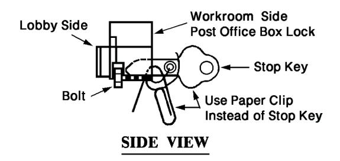

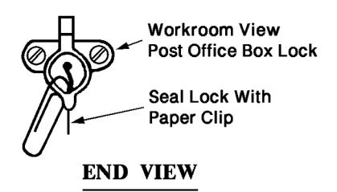

# <span id="page-537-8"></span>841.3 **Refund of Box Fee**

### <span id="page-537-1"></span><span id="page-537-0"></span>841.31 **Calculation of Amount**

When Post Office box service is terminated or surrendered by the customer, the unused portion of the fee may be refunded as follows:

- a. If service is discontinued any time within the first 3 months of the service period, then one-half of the fee is refunded.
- b. If service is discontinued after the beginning of the fourth month of the service period, then none of the fee is refunded.
- c. If service is discontinued and the customer has prepaid for the next semiannual service period, then the entire fee for that next period is refunded.

### <span id="page-537-2"></span>841.32 **Surrendered Boxes**

Consider a box surrendered if any of the following occur:

- <span id="page-537-6"></span>a. The box customer refuses or fails to pay the proper fees.
- <span id="page-537-5"></span>b. The box customer submits a written notice to discontinue service.
- <span id="page-537-7"></span>c. Any person other than the box customer attempts to renew service at the end of the period for which the box is issued.

Special Services 841.43

d. The box customer, or an appointed executor or administrator of a deceased box customer, submits a permanent change-of-address order, except as provided in [841.33](#page-538-0)[d.](#page-538-7)

e. A Group E residential box customer files a permanent change-ofaddress order and no other person listed on the PS Form 1093 files a new PS Form 1093 to become the box customer.

### <span id="page-538-0"></span>841.33 **Boxes Not Surrendered**

Do not consider a box surrendered if any of the following occur:

- a. A box customer dies or disappears before the end of the period for which the box is issued.
- b. A box customer submits a temporary change-of-address order.
- c. Except as provided in [841.33](#page-538-0)([d\)](#page-538-7) below, a change-of-address order is submitted by any person other than the box customer, or an appointed executor or administrator of a deceased box customer for mail going to the box.
- <span id="page-538-7"></span>d. A Group E residential box customer files a permanent change-ofaddress order and another person listed on the PS Form 1093 files a new PS Form 1093 to become the box customer.

### <span id="page-538-1"></span>841.34 **Boxes in Discontinued or Relocated Postal Facilities**

<span id="page-538-8"></span>Former Post Office box customers of discontinued or relocated postal facilities may obtain a refund of unused box fees when additional travel of 1/4 mile (0.4 kilometer) or more (from the address listed on the applicable PS Form 1093, Application for Post Office Box or Caller Service) is required to obtain equivalent service. For refunds processed under this section, refund one-sixth of a semiannual fee for each month remaining in the period. If the effective date of the facility discontinuance falls on or before the 15th of the month, compute the refund from the first day of that month. If the effective date is after the 15th of the month, compute the refund from the first day of the following month.

### <span id="page-538-2"></span>841.35 **Reassignment of Closed or Surrendered Box**

A box may be issued to another customer 15 days after it is closed by a final decision of the Postal Service (see [841.8](#page-542-2)), 11 days after surrender under [841.32](#page-537-2)[b](#page-537-5), and immediately following its surrender under [841.32](#page-537-2)[a](#page-537-6) or [841.32](#page-537-2)[c.](#page-537-7)

### <span id="page-538-9"></span>841.4 **Keys**

### <span id="page-538-4"></span><span id="page-538-3"></span>841.41 **Fee**

Issue keys for key type Post Office boxes to box customers upon receipt of an applicable fee for each key. This fee applies to all keys, including those initially issued to new box customers, if applicable (See Notice 123).

### <span id="page-538-5"></span>841.42 **Number**

Provide box customers of key type Post Office boxes with as many keys as they need if proper payment is made for each key issued (see [841.41\)](#page-538-4).

### <span id="page-538-6"></span>841.43 **Restrictions**

Customers using Post Office boxes may not obtain or use any keys except those issued by the Postal Service.

### <span id="page-539-0"></span>841.44 **New Keys**

<span id="page-539-13"></span>Box customers may obtain additional or replacement keys by filling out PS Form 1094, Request for Post Office Box Key or Lock Service, and paying the key charge at the time of application (see [841.41\)](#page-538-4).

### <span id="page-539-1"></span>841.45 **Worn or Broken Keys**

<span id="page-539-19"></span>Worn or broken keys are replaced at no charge if the keys are returned.

### <span id="page-539-2"></span>841.46 **Refund of Key Fee**

After terminating box service, the Postal Service refunds to box customers the refundable key deposits for the initial two keys plus any additional keys listed on PS Form 1094, if the keys are returned to the Post Office where the box was issued.

### <span id="page-539-3"></span>841.47 **Acceptance of Orders for Additional or New Keys**

<span id="page-539-14"></span>Postmasters must not hold orders for new or additional keys (on PS Form 1094) more than 24 hours. Key orders should not be consolidated unless the keys are for an entire unit of boxes.

### <span id="page-539-4"></span>841.48 **Key Inventory Maintenance**

<span id="page-539-15"></span>At least three keys must be provided for each key locking Post Office box. Keep at least one key on hand at all times for issuance to customer on submission of PS Form 1094. After issuing the spare key, order a replacement. Withdraw keys over reserve requirements, tag them to show the key or lock number, file them numerically, and store them in a safe place.

### <span id="page-539-5"></span>841.49 **Notice to Return Keys**

<span id="page-539-16"></span>When a box customer surrenders a box and fails to return all keys, send PS Form 1099, Notice to Return Keys, to the former box customer's new address.

### <span id="page-539-17"></span>841.5 **Locks**

### <span id="page-539-7"></span><span id="page-539-6"></span>841.51 **Broken Locks**

Do not use or issue boxes with broken locks. When the lock on an assigned box is broken, replace the lock and issue the same number of keys (at no charge) as issued for the broken lock. Do not require box customers to change boxes or box numbers because of failure of Postal Service equipment.

### <span id="page-539-8"></span>841.52 **Changing Locks**

Always change the lock immediately when a key type box is surrendered.

### <span id="page-539-9"></span>841.53 **Changing Combinations**

<span id="page-539-18"></span>When a keyless box is surrendered, change the combination before reassignment.

### 841.6 **Record of Box Customers**

### <span id="page-539-11"></span><span id="page-539-10"></span>841.61 **Files**

<span id="page-539-12"></span>Keep a record of boxes and box customers on PS Form 1091-A, Post Office Box Fee Register, filed as follows:

<span id="page-540-0"></span>Special Services 841.72

- a. A PS Form 1091-A for each vacant box in numeric sequence.
- <span id="page-540-5"></span>b. A PS Form 1091-A for each box issued, by the month the fee is due, and in numeric sequence within the month.

### 841.62 **Inventory**

Prepare and keep a master list of all Post Office boxes installed at each facility. The master list must be compared against all PS Forms 1091-A on file by July 1 of each year. When a PS Form 1091-A is not on file for an issued box, a new form must be prepared and the proper Post Office box fees collected. When a PS Form 1091-A is not on file for a vacant box, a new form must be prepared and placed in the vacant box file. An equivalent, existing Post Office box inventory system or diagram showing all installed boxes may be used instead of a master list.

### <span id="page-540-1"></span>841.63 **Verification**

<span id="page-540-6"></span>Facilities charging Group 1 fees (see Notice 123, Price List) must review their inventory list for box customers charged Group 2 fees to ensure that those customers are still eligible for those fees. Postmasters or their designees must ask all Group 2 box customers holding a box for more than a year to verify that the information on their PS Form 1093 is current or to update their forms. If the box customer is no longer eligible for the Group 2 fees, but has already paid those fees for the current or next period, the customer is not charged the difference. The facility must charge the Group 1 fee, however, beginning with the next period for which the fee is due.

### <span id="page-540-9"></span>841.7 **Operations**

### <span id="page-540-3"></span><span id="page-540-2"></span>841.71 **Standards — PO Box Service**

<span id="page-540-7"></span>If postmasters find that safety and security provisions allow it and there is sufficient public demand, they may keep the PO Box lobby open to the public 24 hours a day.

### <span id="page-540-4"></span>841.72 **PO Box Service Up-Time**

<span id="page-540-8"></span>Each unit must have a scheduled PO Box up-time for committed box mail to be finalized and available to the customers. This up-time varies from unit to unit and is established based upon variables such as mail arrival time, average mail volumes per trip, and staffing availability.

PO Box services should be scheduled during hours most appropriate to the needs of the majority of customers in the local area. PO Box up-times should be timed to match carrier leave times, since this is the time of day when all mail is available for distribution to PO Boxes. The establishment of the local "PO Box Up-time" is the responsibility of the local postmaster, with district approval. This PO Box up-time is required to be posted in the retail lobby to inform the customers and in the box distribution area for the employees working the mail. Postmasters should strive to have all mail in PO Boxes as early as operationally possible to attract and retain customers to this premium mail service.

If a unit consistently fails to meet the scheduled PO Box up-time, then an analysis should be done to determine if actions may be taken to improve performance. This will include examining the Mail Arrival Profile and potential transportation changes, updating PS Forms 1994 for clerical staffing, and performing a Function 4 Staffing Review when necessary. As a last resort, consider changing the scheduled PO Box up-time based on the approval of the district manager. Implement any changes to the scheduled PO Box uptime at the beginning of a fiscal quarter. Exceptions to quarterly implementation for extenuating circumstances may be implemented with approval of the district manager. Customer notification should be provided 30 days in advance of any scheduled up-time change.

### <span id="page-541-0"></span>841.73 **PO Box Mail Distribution**

Place mail addressed to PO Boxes in proper boxes upon availability from distribution operations. Ensure Hot Case is cleared and all committed mailpieces, including First-Class Mail, Periodicals, USPS Marketing Mail, and packages, are distributed to PO Boxes. After all available committed mail is distributed, scan the PO Box barcode to confirm mail distribution is complete, and then cradle the scanner to ensure scan data is uploaded timely.

### <span id="page-541-1"></span>841.74 **Withdrawal of Mail from PO Boxes**

<span id="page-541-6"></span>Mail may be delivered to authorized persons who forget their keys or cannot open their boxes. Mail should not, however, be handed out to persons properly supplied with keys who can open their boxes but who make it a practice of requesting that their mail be given to them. Do not hand out mail if the box fees are not paid by the due date according to [841.22.](#page-536-7)[b](#page-536-8).

### 841.75 **Change-of-Address Orders**

#### <span id="page-541-3"></span><span id="page-541-2"></span>841.751 **Who May File**

<span id="page-541-7"></span>Customers may file change-of-address orders, as follows:

- a. Organizations. Only the PO Box customer or authorized representatives of the organization listed on the PS Form 1093 may file change-of-address orders. The organization is responsible for forwarding mail to other persons receiving mail at the box.
- b. Residential PO Box customers, Fee Groups 1 through 7. Only the box customer listed on the PS Form 1093 may file change-of-address orders. The box customer is responsible for forwarding mail to other persons receiving mail at the box.
- c. Residential PO Box customers, Fee Group E. The box customer or any other person listed on the PS Form 1093 may file an individual changeof-address order. Only the box customer may file a change-of-address order for the entire family.

### <span id="page-541-4"></span>841.752 **Standard Procedure for Handling Change-of-Address Orders**

<span id="page-541-5"></span>The procedures for handling change-of-address orders are as follows:

- a. Affix the 3982 label to PS Form 3982.
- b. If incorrect information is discovered on the 3982 label, complete PS Form 3546, Official Change/Correction to Mail Forwarding Change of Address Order, and select the box for the appropriate action to take. Transcribe the information that appears on a 3982 label onto PS Form 3982 and select check box "3546 submitted". When the corrected 3982 label is received, affix the label over the initially transcribed information on PS Form 3982.

Special Services 841.81

c. When a PS Form 3575Z, Employee Generated Change of Address, is filed, transcribe the information on PS Form 3982 and select check box "3575Z submitted". When the 3982 label is received, affix the label over the initially transcribed information on PS Form 3982.

#### <span id="page-542-0"></span>841.753 **Flagging PO Boxes**

The procedures for flagging boxes in which a valid change-of-address order is on file are as follows:

- a. Use a white label to identify PO Boxes for which there is no valid change-of-address order on file. Apply a colored label or dot to the white label to identify boxes for which there is a valid change-ofaddress order on file and for which mail may be received addressed to other than the current box customer.
- b. If a box has changed hands more than three times in the last year, use any reasonable means, in addition to colored labels or dots, to identify this box as one that probably receives mail addressed to other than the current box customer.
- c. If desired, show on the labels the dates on which colored labels should be replaced with white labels, or the dates the colored dots should be removed from the white labels. Except for these dates, labels should show only information on the name of the current box customer.
- d. Review all mail addressed to color-coded boxes, other than that addressed to or in care of the current box customer, for determination if a valid change-of-address order is on file. If a valid forwarding address is not on record, distribute the mail to the box as addressed, unless the box customer of record advises that mail for the addressee must not be placed in the box.
- e. Treat mail rejected by the box customer as undeliverable.
- f. Replace colored labels with white labels or remove colored dots from the white labels immediately following the termination or expiration of a forwarding order or as soon as it is apparent that color-coding no longer is needed.

### <span id="page-542-1"></span>841.76 **Vacant Boxes**

<span id="page-542-4"></span>To help increase the visibility and occupancy prices of PO Boxes, "Availability Tags" can be affixed to vacant PO Boxes to indicate to customers which boxes are available for rent in an office.

# <span id="page-542-2"></span>841.8 **Refusal to Provide Service, Termination of Service, and Surrender of Service**

### <span id="page-542-3"></span>841.81 **Refusal to Provide Service**

A postmaster may refuse to issue a Post Office box under any of the following circumstances:

- a. The applicant submits a falsified application for box service.
- b. Within the 2 years immediately preceding submission of the application, the applicant physically abused a box or violated a regulation on the care or use of a box.

c. There is substantial reason to believe that the box is to be used for purposes that violate [841.133.](#page-536-0)

### <span id="page-543-0"></span>841.82 **Termination of Service**

A postmaster may close a Post Office box when the box customer has done any of the following:

- a. Falsified the application for the box.
- b. Physically abused the box.
- c. Violated any regulation on the care or use of the box.
- d. Failed to respond to the postmaster's certified letter addressed to the street address provided on PS Form 1093 requiring the customer to select the provided options to rectify the overflow condition.

### 841.83 **Postmaster's Determination**

#### <span id="page-543-2"></span><span id="page-543-1"></span>841.831 **Basis for Issuance**

When postmasters are satisfied that an application to begin service should be denied under [841.81](#page-542-3), or that service to a box customer should be ended under [841.82](#page-543-0), they issue a written Determination.

#### <span id="page-543-3"></span>841.832 **Content**

The Determination must state the reasons for its issuance and contain the following statement:

"You may file a petition opposing this Determination within 20 days (Sundays and holidays included) after the date you receive it. Your petition must be in writing and include a statement of your reasons for opposing the Determination. Your petition, signed by you or your attorney, must be filed in triplicate at the Post Office address given above. This filing may be accomplished by Certified Mail, or by delivering the petition to the above address. Obtain and keep a written receipt to show that your petition was timely filed. Your petition is forwarded to the Vice President, Consumer Advocate, Postal Service Headquarters, for action. If you do not file a timely petition, this Determination becomes the final decision of the Postal Service."

#### <span id="page-543-4"></span>841.833 **Delivery**

The postmaster's Determination must be delivered to the applicant or box customer by Certified Mail or any other method if a signed receipt is obtained from the addressee. If such delivery cannot be made within 15 days after issuance of the Determination, it must be delivered as ordinary mail, and the postmaster must make a written record of the date of such delivery and the prior attempts made to deliver it.

### 841.84 **Petition by Applicant or Box Customer**

#### <span id="page-543-6"></span><span id="page-543-5"></span>841.841 **Procedure**

The procedure for applicant or customer petition is as follows:

- a. The applicant or box customer may file a petition opposing the postmaster's Determination within 20 days (Sundays and holidays included) after delivery, under the instructions in the Determination.
- b. The filing of a petition prevents the postmaster's Determination from taking effect and transfers the case to the Vice President, Consumer Advocate. Thereafter, if a final decision on the merits is rendered by the

<span id="page-544-0"></span>Special Services 842.111

Vice President, Consumer Advocate, it constitutes the final decision of the Postal Service.

#### 841.842 **Effective Date**

The procedure for the postmaster is as follows:

- a. After delivery of the Determination, the postmaster must take no action to implement it for the 20-day period allowed for filing a petition, and an additional 7 days. If no petition is received by the 27th day, the Determination takes effect, becoming the final decision of the Postal Service. The postmaster should keep documentation establishing the date and method of delivery of the Determination for at least 1 year.
- b. After receiving a petition, even if late or nonconforming, the postmaster must immediately forward two copies to the Vice President, Consumer Advocate. He or she also forwards a report to:

VICE PRESIDENT CONSUMER ADVOCATE POSTAL SERVICE 475 L'ENFANT PLAZA SW WASHINGTON DC 20260-2200

The report includes the evidence on which the postmaster's Determination was based and the proof of delivery of the Determination to the customer.

### <span id="page-544-1"></span>841.85 **Mail Addressed to Closed Box**

When a Post Office box is closed by a final Postal Service decision, the postmaster must notify the box customer in writing that mail addressed to the box number is thereafter to be forwarded according to a valid change-of-address order if one is submitted, or transferred to general delivery for holding for the forwarding time limit. After the applicable period, all mail so addressed is handled as undeliverable. However, this procedure does not preclude compliance with a sender's request for a specific retention period under DMM F030.

# <span id="page-544-8"></span><span id="page-544-6"></span><sup>842</sup> **Caller Service**

### <span id="page-544-2"></span>842.1 **Purpose and Definitions**

### <span id="page-544-3"></span>842.11 **General**

#### <span id="page-544-5"></span><span id="page-544-4"></span>842.111 **Assignment of Number**

<span id="page-544-7"></span>Except under [842.118](#page-546-1) for origin caller service, a caller number is assigned to the caller for each separation used, and the caller must use the term Post Office Box (P.O. Box) and the assigned number in the mailing address immediately above the city, state, and ZIP™ Code. Lack of a ZIP Code on the mail or use of a ZIP Code other than that assigned to the box section that provides the caller service can delay delivery. Mail without a box number is delivered to the street address if shown on the mailpiece. If no street address is shown, the mail may be treated as undeliverable as addressed. Mail bearing both a street address and a box number is delivered under DMM 602.

### <span id="page-545-0"></span>842.112 **Group 2 Noncity Delivery**

<span id="page-545-8"></span>Caller service at Group 2 noncity delivery offices is available only under DMM 508.5.

#### <span id="page-545-1"></span>842.113 **Client Mail**

A customer may obtain caller service to receive the mail of a client. A caller number issued to such a customer is considered as held by the customer and not the client. All restrictions or regulations in DMM 508.2 apply to the provision of caller service under this section.

### <span id="page-545-2"></span>842.114 **No Physical Box**

No physical Post Office box may be used to provide a number for a caller. When a customer is converted to caller service, the following apply:

- a. If the customer is using a Post Office box number, the Post Office box number remains with the physical Post Office box and a caller service number is assigned before caller service may begin.
- b. All other customers are assigned a caller number before caller service may begin.
- <span id="page-545-9"></span>c. Assign caller service numbers as required in [141.43.](#page-138-7)

### <span id="page-545-3"></span>842.115 **Local Restrictions**

Caller service may be restricted by postmasters with approval of the district manager, Customer Service and Sales, if local conditions justify such restrictions.

#### <span id="page-545-4"></span>842.116 **Permitted Uses**

<span id="page-545-7"></span>Customers must use caller service under the following conditions:

- <span id="page-545-6"></span><span id="page-545-5"></span>a. When a mail volume check, required by [841.132b](#page-534-4), shows an overflow for 12 out of 20 days and the customer does not change to a box of sufficient capacity, the following provisions apply:
  - (1) Determine the caller service payment period starting date as specified by [842.216](#page-549-7) for a new payment period but, for this section, compute the fee relative to the date on which the 12th overflow day occurred. Determine the caller service payment period independently from the issue period for any boxes held by the customer. When PS Form 1091-B, Register for Caller Service Fees, is prepared, it must be flagged or identified to show that the caller service is required under [841.132](#page-534-4)b.
  - (2) A customer required to use caller service because of [841.132b](#page-534-4) may submit a written request no more frequently than once in each semiannual payment period for a follow-up check to determine whether the overflow condition still exists. The Postal Service conducts a follow-up check under [841.132](#page-534-4)b, with the following modifications:
    - (a) Conduct a follow-up check at any time after the first month (subject to the minimum frequency of once in any semiannual payment period).
    - (b) Conduct follow-up checks for the full 20-day test period. Do not use section 3 of PS Form 1532, Semiannual Check of Overflow Mail, in a follow-up check.

Special Services 842.118

(c) Measure the volume of mail against the capacity of the customer's box if the actual box is kept. If the box is given up, measure the test for overflow against the capacity of other vacant boxes in the facility.

- (d) If the record of a follow-up check on PS Form 1532 shows at least 12 out of 20 days overflow, notify the customer by completing block 3 of section 4 to show that caller service must be continued into the next payment period. If the record shows less than 12 days' overflow, notify the customer by completing block 4 of section 4 to show that caller service may be discontinued after the current payment period and delivery reverted at that time to any available box large enough to hold the customer's mail.
- (3) Any customer released from caller service because of the follow-up check in this section is immediately subject to the checks required by [841.132](#page-534-4)b, on resumption of box delivery.
- b. See DMM 508.5 concerning the required use of caller service.
- c. Consider governmental organizations (e.g., departments, agencies, commissions, bureaus, divisions, etc.) as separate customers for this section. The various departments or schools within educational institutions are also separate customers for this section.

### <span id="page-546-0"></span>842.117 **When Provided to Customers**

<span id="page-546-3"></span>Caller service may be provided to customers under the following conditions:

- a. To a new customer planning to receive (or expected to receive) too much mail to be accommodated in the largest box available in the facility.
- b. To customers who, at their option, want a Post Office box when none is available, and postmasters determine that such service would not adversely affect normal Postal Service operations.
- c. To any customer who wants caller service instead of Post Office box service, even though boxes of adequate size may be available, when the provision of such service would not adversely affect normal Postal Service operations.

### <span id="page-546-1"></span>842.118 **Accelerated Reply Mail**

<span id="page-546-2"></span>Accelerated reply mail (ARM) (origin caller service) may be obtained if all the following conditions are met:

- a. Origin caller service must be obtained at an originating mail processing facility that can process prebarcoded mail.
- b. The caller's mail must meet all the requirements for prebarcoded First-Class Mail® in DMM 233. The mail must also be certified by the mailpiece design analyst at the origin facility where ARM is requested. The barcode on the mailpiece must represent the ZIP+4® code or the mailer's unique 5-digit ZIP Code printed on the mailpiece.
- c. The caller's mail must bear a facing identification mark (FIM A), as set forth in Publication 25, Designing Letter and Reply Mail.

- d. Caller service must also be obtained at the destinating postal facility. The address on all mailpieces to be received through ARM must be the Post Office box address assigned where destination caller service is authorized. Mailpieces that show a dual address must show only the Post Office box on the line immediately above the city, state, and ZIP Code line.
- e. The mailer may either pick up ARM at the origin facility caller service window or have it reshipped, by Priority Mail Express Custom Designed Service, to the destination caller service address or to another address specified by the mailer in the Custom Designed Service Agreement (see DMM 210). To change the destination address on the Custom Designed Service Agreement, the mailer must provide a 30-day advance notice and submit an amended ARM application, completing only the Applicant Information (1 through 8) and Priority Mail Express Reship (12 through 17) sections.
- f. An applicant for ARM must comply with [842.12.](#page-547-0)
- <span id="page-547-3"></span>g. An applicant who is a commercial mail receiving agent must also comply with DMM 508.2.

### 842.12 **Obtaining Service**

#### <span id="page-547-1"></span><span id="page-547-0"></span>842.121 **Application**

<span id="page-547-2"></span>The procedure for ARM application is as follows:

- a. A PS Form 1093, Application for Post Office Box or Caller Service, is used to request caller service. Customers may obtain blank applications at any Post Office. An applicant must complete all spaces on the form that require customer-provided information. Furnishing false information or refusing to furnish required information on the application may be sufficient reason for denial of the application or discontinuation of service.
- b. A completed application for destination caller service may be submitted to any postal facility that provides window service to the public; the facility need not be the same as that at which the destination caller service is desired.
- c. In addition to PS Form 1093, an applicant for ARM (origin caller service) must also complete PS Form 8061, Application for Accelerated Reply Mail, and submit both forms to the facility where accelerated reply mail (origin caller service) is desired. PS Form 8061 may be obtained from the applicant's account representative or from the district manager, Customer Service and Sales.
- d. The employee who accepts an application takes the following actions:
  - (1) Performs the verification in [842.122](#page-548-0)[a](#page-548-2) or [842.122](#page-548-0)[b](#page-548-3).
  - (2) Dates the application on the reverse side with Item 570, All Purpose Dating Stamp.
  - (3) If caller service is desired at a postal facility other than that at which the application is submitted, forwards the application to the postmaster of the facility where the service is desired.

Special Services 842.123

e. The postmaster of the facility where caller service is to be provided takes the following actions:

- (1) Approves or denies the application.
- (2) Notifies the applicant of the decision and the reason for any denial.
- (3) If the application is approved, assigns a caller number on receipt of the proper fee. Normally, if the address shown on the application is a local address, a caller number is assigned at the facility serving that address; if an out-of-town address is shown, a caller number is assigned at the main office station. Other arrangements may be made at the discretion of the postmaster.

#### <span id="page-548-0"></span>842.122 **Verification of Application for Destination Caller Service**

<span id="page-548-4"></span>An application for caller service may not be approved until the application is verified. The criteria for verification are as follows:

- <span id="page-548-2"></span>a. Known Applicant. Consider the application of a known applicant verified on submission of PS Form 1093.
- <span id="page-548-3"></span>b. Unknown Applicant
  - (1) An unknown applicant must present an acceptable primary and secondary form of identification (see [131.3](#page-112-10)).
  - (2) Consider an application verified if there is no discrepancy between information on the application and on the identification presented. If the information on the application does not match that on the identification, verification procedures must be followed to substantiate that the applicant resides or conducts business at the address shown. Complete this verification within 3 workdays.
- <span id="page-548-5"></span>c. Assignment. A caller service number is assigned immediately after approval of the application and receipt of the caller service fee.

#### <span id="page-548-1"></span>842.123 **Verification of Application for ARM (Origin Caller Service)**

ARM (origin caller service) must not be provided until the following steps are completed:

- a. Applicant. The applicant presents valid identification.
- b. Documentation. If the applicant is applying in behalf of an organization or as an agent for another person or organization, satisfactory documentation to confirm that representation is approved.
- c. Confirmation. The applicant's destination caller service number and authorization are confirmed.
- d. Appropriate Facility. The availability of ARM (origin caller service) at the facility where the service is requested is confirmed.
- e. Scheduling. On verification of the above information, the applicant must be informed of the beginning date for the ARM (origin caller service). Depending on the schedule for updating the facility's barcode sortation schemes, the beginning date must be no later than 30 days after the date of approval of the application on PS Form 8061.
- f. Assignment. An ARM (origin caller service) number is assigned after approval of the application and receipt of the caller service fee.

POM Issue 9, July 2002 **467**

### <span id="page-549-10"></span>842.2 **Fees**

### <span id="page-549-0"></span>842.21 **Payment**

#### <span id="page-549-2"></span><span id="page-549-1"></span>842.211 **Payment Period**

The Postal Service has established semiannual payment periods for caller fees. Payment may be made for any period of 6 or 12 consecutive months. The beginning of a payment period is established on the date of the approval of the application for caller service.

#### <span id="page-549-3"></span>842.212 **Fees Paid in Advance**

Caller fees must be paid in advance for no less than one and no more than two semiannual periods. Fees may be paid by check to postmasters. Payments for destination caller service sent by mail must be received by the postmaster by the due date. Payments for ARM (origin caller service) must be received at least 45 days before the applicable semiannual period.

#### <span id="page-549-4"></span>842.213 **Receipt**

<span id="page-549-8"></span>A PS Form 1538, Receipts for Post Office Box/Caller Service Fees, is given for each caller payment, except that callers who hold more than one caller number may be issued one receipt for payment for all their caller numbers. Keep a separate list of multiple-number customers showing numbers used, customer name, fee charged, and normal due date for each. Mark each receipt with the number (count) of caller numbers paid for at one time.

#### <span id="page-549-5"></span>842.214 **Change of Payment Period Date**

Callers of record may change their payment period by submitting a new application, noting the month they want to use as the start of their revised payment period. The date selected must be before the end of the current payment period. The unused fee for the period being discontinued may be refunded under [842.24](#page-551-0), and the fee for the new payment period must be fully paid in advance. A change of payment dates may not be used to circumvent a change in caller-service fees.

### <span id="page-549-6"></span>842.215 **Renewal of Service**

<span id="page-549-9"></span>Fees for renewal of service are as follows:

- a. Destination Caller Service. Fees for renewal of destination caller service are due by the last day of the last month of the current period. During the last 30 days of their service period, callers may pay their fees for their next semiannual or annual payment period, as appropriate. Postmasters may accept fee payments more than 30 days in advance.
- b. Accelerated Reply Mail (Origin Caller Service). Payment of the fee for renewal of ARM (origin caller service) is due at least 45 days before the last day of the last month of the current period. Payment may be made for the next semiannual or annual period, as appropriate.

#### <span id="page-549-7"></span>842.216 **Adjustment for Midmonth Payment**

The payment period for a new caller service started on or before the 15th of any month is from the first day of that month. If service is started after the 15th day of the month, compute the period from the first day of the following month.

<span id="page-550-0"></span>Special Services 842.233

#### 842.217 **Record of Callers**

<span id="page-550-6"></span>The guidelines for keeping records of callers are as follows:

a. A record of destination service callers must be kept by the authorizing Post Office using PS Form 1091-B, Register for Caller Service Fees. PS Form 1091-B are filed for each number or group of numbers assigned to the same caller that falls due in the same month. Forms are filed by the month the payment is due and in numeric sequence.

- b. Separate records of accelerated reply mail (origin caller service) also must be kept on PS Form 1091-B.
- c. Prepare and keep a master list of all assigned caller-service numbers, including multiple Post Office box/caller service users and reserved caller numbers, at each facility. The master list must be compared against all PS Form 1091-B on file by July 1 of each year. When a PS Form 1091-B is not on file for an assigned number, a new form must be prepared and the proper fees collected. When PS Form 1091-B is not on file for a reserved number, a new form must be prepared and placed in file. An equivalent, existing caller-service number inventory system showing all assigned numbers may be used instead of a master list.

### <span id="page-550-1"></span>842.22 **Notice of Payment Due**

<span id="page-550-8"></span>Notice 32-B, PO Box Fee Due (FIM B Marking), or Notice 32-C, PO Box Fee Due (FIM C Marking), is distributed to destination caller service customers 20 calendar days before the fee is due. If callers are temporarily out of town and they have filed a temporary forwarding order, the notice must be sent to them.

### 842.23 **Past-Due Caller Fee Procedures**

### <span id="page-550-3"></span><span id="page-550-2"></span>842.231 **Holding Mail**

<span id="page-550-9"></span>If a destination caller service customer does not pay the fee by the due date, submit a change-of-address order, or attempt to obtain the mail, the mail is held for no more than 10 days; it is then treated as undeliverable mail unless it can be readily delivered by carrier.

#### <span id="page-550-4"></span>842.232 **Delivery to Street Address**

If a destination caller service customer fails to pay the fee by the due date, does not submit a change-of-address order, and attempts to obtain the mail within 10 days, the caller or agent must be informed that after the 10th day following the due date if payment or a change-of-address order is not received, the mail is delivered to the street address. The caller or agent must also be informed that the caller loses the use of the Post Office caller number and may not obtain this mail at the postal facility. The caller should be given the mail until the end of the 10-day period; but, during that period, the caller may not be provided more than one separation (if multiple separations are provided previously).

#### <span id="page-550-5"></span>842.233 **Accelerated Reply Mail**

<span id="page-550-7"></span>If an accelerated reply mail (origin caller service) customer fails to pay the fee at least 45 days in advance, a notice of nonpayment is sent to the caller by Certified Mail, Return Receipt requested. If payment is not received by the 30th day before the end of the current payment period, the caller is notified in writing that the barcode sortation scheme is revised to eliminate the

separation for the caller. Once that change is made, the caller must reapply to obtain further accelerated reply mail (origin caller service).

### 842.24 **Refund of Caller Service Fee**

#### <span id="page-551-1"></span><span id="page-551-0"></span>842.241 **Discontinued Number**

When a destination caller service number is discontinued, the unused part of the fee for that number may be refunded as follows:

- a. Refunds are processed according to DMM 508.5.
- b. Refund the entire fee for a semiannual payment period after the period in which service is discontinued.
- c. Determine refunds for the payment period in which service is discontinued as follows:
  - (1) For service discontinued any time within the first 3 months (i.e., on or before the last day of the third month) of the semiannual payment period, the amount refunded is half the semiannual caller service fee in Notice 123, Price List.
  - (2) No refund is made when service is discontinued any time after the third month (i.e., on or after the first day of the fourth month) of the semiannual payment period.

### <span id="page-551-2"></span>842.242 **Caller Numbers in Discontinued or Relocated Postal Facilities**

<span id="page-551-7"></span>Former destination caller service customers of discontinued or relocated postal facilities may obtain a refund of unused caller-service fees when additional travel of a 1/4 mile (0.4 kilometer) or more (from the address listed on the applicable PS Form 1093) is required to obtain equivalent service. For refunds processed under this section, refund one-sixth of a semiannual fee for each month remaining in the payment period. If the effective date of the facility discontinuance falls on or before the 15th of the month, compute the refund from the first day of that month. If the effective date is after the 15th day of the month, compute the refund from the first day of the following month.

#### <span id="page-551-3"></span>842.243 **Accelerated Reply Mail**

<span id="page-551-8"></span>No refund is made for the remaining part of the current fee period if a caller discontinues accelerated reply mail (origin caller service). A refund of fees paid for a future period is made.

### <span id="page-551-4"></span>842.3 **Mail Pickup Hours**

<span id="page-551-10"></span><span id="page-551-9"></span>Provide caller service during normal hours of business. Caller service may be provided at all other hours during which mail is distributed within the facility if it is consistent with normal operations.

# <span id="page-551-5"></span>842.4 **Refusal to Provide Service, Termination of Service, and Surrender of Service**

### <span id="page-551-6"></span>842.41 **Refusal to Provide Service**

A postmaster may deny an application of caller service under any of the following circumstances:

- a. The applicant submits a falsified application for the service.
- b. Within the 2 years immediately preceding submission of the application, the applicant violated a regulation on use of the service.

<span id="page-552-0"></span>Special Services 842.441

c. There is substantial reason to believe that the service is to be used for purposes that violate DMM 508.5.

### 842.42 **Termination of Service**

A postmaster may end caller service if the caller:

- a. Falsifies the application for the service.
- b. Violates any regulation on the service.

### 842.43 **Postmaster's Determination**

#### <span id="page-552-2"></span><span id="page-552-1"></span>842.431 **Basis for Issuance**

When a postmaster is satisfied that an application for commencement of caller service should be denied under [842.41](#page-551-6), or that service to a caller should be ended under [842.42,](#page-552-0) the postmaster issues a written Determination.

#### <span id="page-552-3"></span>842.432 **Content**

The Determination must state the reasons for its issuance and contain the following statement:

"You may file a petition opposing this Determination within 20 days (Sundays and holidays included) after the date you receive it. Your petition must be in writing and include a statement of your reasons for opposing the Determination. Your petition, signed by you or your attorney, must be filed in triplicate at the Post Office address given above. This filing may be accomplished by Certified Mail, or by delivering the petition to the above address. Obtain and keep a written receipt to show that your petition was timely filed. Your petition is forwarded to the Vice President, Consumer Advocate, Postal Service Headquarters, for action. If you do not file a timely petition, this Determination becomes the final decision of the Postal Service."

### <span id="page-552-4"></span>842.433 **Delivery**

The postmaster's Determination must be delivered to the applicant or caller by Certified Mail or by any other method if a signed receipt is obtained from the addressee. If such delivery cannot be made within 15 days after issuance of the Determination, it must be delivered as ordinary mail and the postmaster must make a written record of the date of such delivery and the prior attempts made to deliver it.

### 842.44 **Petition by Applicant or Caller**

#### <span id="page-552-6"></span><span id="page-552-5"></span>842.441 **Procedure**

The procedure for applicant or caller petition is as follows:

- a. The applicant for caller service may file a petition opposing the postmaster's Determination within 20 days (Sundays and holidays included) after delivery, under the instructions in the Determination.
- b. The filing of the petition prevents the postmaster's Determination from taking effect and transfers the case to the Postal Service Vice President, Consumer Advocate. Thereafter, if a final determination on the merits is rendered by the Consumer Advocate, it constitutes the final decision of the Postal Service.

#### <span id="page-553-0"></span>842.442 **Effective Date**

The procedure for the postmaster is as follows:

- a. After delivery of the Determination, the postmaster takes no action to implement it for the 20-day period allowed for filing a petition, and an additional 7 days. If a petition is not received by the 27th day, the Determination takes effect, becoming the final decision of the Postal Service. The postmaster should keep documentation establishing the date and method of delivery of the Determination for at least 1 year.
- b. After receiving a petition, even if late or nonconforming, the postmaster immediately forwards two copies to the Postal Service Recorder, Judicial Officer Department. The report includes the evidence on which the postmaster's Determination was based and the proof of delivery of the Determination to the customer.

### <span id="page-553-1"></span>842.45 **Surrender of Service**

Caller service is surrendered when the caller does at least one of the following:

- a. Submits a permanent change-of-address order.
- b. Fails or refuses to pay the pertinent fee due.
- <span id="page-553-9"></span>c. Submits a written notice to discontinue the service.

### 842.46 **Disposition of Mail**

#### <span id="page-553-3"></span><span id="page-553-2"></span>842.461 **Destination Caller Service**

When destination caller service is ended by a final Postal Service decision, the postmaster must give written notice to the caller that mail addressed to him or her at the caller number is thereafter to be forwarded according to a valid change-of-address order if one is submitted, or transferred to general delivery for holding the current time limit for forwarding. After the applicable period, all mail so addressed is handled as undeliverable. However, this procedure does not preclude compliance with the sender's request for a specific holding period under DMM 507.

#### <span id="page-553-4"></span>842.462 **Accelerated Reply Mail (Origin Caller Service)**

<span id="page-553-8"></span>When accelerated reply mail (origin caller service) is surrendered by the customer or ended by the Postal Service, mail continues to be separated for the accelerated reply mail (origin caller service) until the barcode sortation schemes can be revised to permit the mail to be processed to the destination address on the mail.

# <span id="page-553-7"></span><span id="page-553-5"></span><sup>843</sup> **General Delivery for Transients and Customers Not Permanently Located**

### <span id="page-553-6"></span>843.1 **Delivery**

<span id="page-553-10"></span>In an effort to assist customers with no fixed address and no identification who qualify for General Delivery service under the Mailing Standards of the United States Postal Service, Domestic Mail Manual (DMM®) 508.6.1a, a customer who is personally known to the Postmaster or retail associate and is known as a person with no fixed address may be provided general delivery.

<span id="page-554-0"></span>Special Services 845

### 843.2 **Retention**

<span id="page-554-3"></span>Based on DMM 508.6.4, Holding Mail, there is a 30-day limit for holding individual mailpieces for General Delivery. This time limit does not reference how long an individual customer may receive General Delivery service. Hold general delivery mail for no more than 30 days, unless otherwise requested. Return accountable mail as instructed under [683.25](#page-450-3).

# <span id="page-554-1"></span><sup>844</sup> **Other Deliveries**

In all other cases, provide the services in [841](#page-532-2), [842](#page-544-2), or [843](#page-553-5) to customers who want to call for their mail at a postal unit.

# <span id="page-554-2"></span><sup>845</sup> **Firm Holdout**

See DMM 508.8.

This page intentionally left blank

# <span id="page-556-0"></span>**Forms Index**

| Form<br>Number | Form Title                                                                                     | POM Reference                                                                                                           |
|----------------|------------------------------------------------------------------------------------------------|-------------------------------------------------------------------------------------------------------------------------|
| 17             | Stamp Requisition/Stamp Return                                                                 | 225.62                                                                                                                  |
| 25             | Trust Fund Account                                                                             | 691.41, 691.422                                                                                                         |
| 152            | Delivery Confirmation Label                                                                    | 816.1                                                                                                                   |
| 153            | Signature Confirmation                                                                         | 817.11                                                                                                                  |
| 542            | Inquiry About a Registered Article or an Insured<br>Parcel or an Ordinary Article (5-part set) | Exhibit 169.3, 169.4                                                                                                    |
| 673            | Report of Rifled Parcel (4-part set)                                                           | 169.3, Exhibit 169.3                                                                                                    |
| 1000           | Domestic Claim or Registered Mail Inquiry                                                      | 146.111. 146.112, 146.113, 146.121,<br>146.122, 146.124, 169.3, Exhibit 169.3,<br>169.4, 812.521, 812.522, 813, 815.216 |
| 1091-A         | Post Office Box Fee Register                                                                   | 841.123, 841.61, 841.62                                                                                                 |
| 1091-B         | Register for Caller Service Fees                                                               | 842.116, 842.217                                                                                                        |
| 1093           | Application for Post Office Box or Caller Service<br>(card)                                    | 841.121, 841.122, 841.123, 841.34, 841.63,<br>842.121, 842.122, 842.242                                                 |
| 1094           | Request for Post Office Box Key or Lock Service                                                | 841.44, 841.47, 841.48                                                                                                  |
| 1096           | Receipt                                                                                        | 132.14                                                                                                                  |
| 1099           | Notice to Return Keys                                                                          | 841.49                                                                                                                  |
| 1357           | Request for Computer Access                                                                    | 472                                                                                                                     |
| 1362           | Status Change Request/Report                                                                   | 123.5, 123.6, 439.323, Exhibit 439.323,<br>439.41, 439.42, 439.43, 439.44, 439.45,<br>439.46, 439.51                    |
| 1412-A         | Daily Financial Report                                                                         | 126.33, 135.3, 145.11, 146.21, 815.326,<br>815.343, 831.33                                                              |
| 1412-B         | Daily Financial Report (pad/100)                                                               | 126.33, 815.326, 815.343                                                                                                |
| 1500           | Application for Listing and/or Prohibitory Order                                               | 138.211, 138.214                                                                                                        |
| 1507           | Request to Provide Mail Receptacle                                                             | 623.1                                                                                                                   |
| 1510           | Mail Loss/Rifling Report                                                                       | Exhibit 165.3, 169.3, Exhibit 169.3, 169.4,<br>17, 691.595, 824.83                                                      |
| 1532           | Semiannual Check of Overflow Mail                                                              | 841.132, 842.116                                                                                                        |
| 1538           | Receipts for Post Office Box/Caller Service Fees<br>(book/200)                                 | 842.213                                                                                                                 |
| 1564           | Address Change Sheet                                                                           | 841.752                                                                                                                 |
| 1583           | Application for Delivery of Mail Through Agent                                                 | 612.13, Exhibit 612.13, 612.14, 612.15,<br>612.16                                                                       |
| 1583-A         | Application to Act as Commercial Mail Receiving<br>Agency                                      | 612.12, Exhibit 612.12, 612.16                                                                                          |
| 1628           | Individual Key Record                                                                          | 633.51, 633.52                                                                                                          |

| 2756<br>Dispatch Record/Certification of Air Taxi Service<br>526<br>Performed<br>2759<br>Report of Irregular Handling of Mail<br>525<br>2855<br>Claim for Indemnity — International Registered,<br>Exhibit 169.3, 169.4<br>Insured, and Priority Mail Express<br>3083<br>Trust Accounts Receipts and Withdrawals<br>815.343<br>3227<br>Stamps by Mail<br>151.24<br>3227-R<br>Stamp Purchase Order<br>151.12<br>3521<br>House Numbers and Mail Receptacles Report<br>632.627<br>3533<br>Application and Voucher for Refund of Postage<br>145.11, 145.121, 145.122, 145.21, 145.22,<br>Fees and Services<br>145.3<br>3546<br>Forwarding Order Change Notice<br>612.15, 682.12, 684<br>3547<br>Notice to Mailer of Correction in Address<br>683.11<br>3575<br>Official Mail Forwarding Change of Address Order<br>138.216, 682.11, 683.23, 684, , 841.123,<br>841.752<br>3576<br>Change of Address Request for Correspondents,<br>681.32<br>Publishers, and Businesses<br>3577<br>Correction of Error in Address Because of Postal<br>656.3<br>Service Adjustments<br>3579<br>Notice of Undeliverable Periodical<br>681.6<br>3602-N<br>Postage Statement — Nonprofit USPS Marketing<br>492.72<br>Mail Letters and Flats — Permit Imprint<br>3602-NZ<br>Postage Statement — Nonprofit USPS Marketing<br>492.72<br>Mail — Easy Nonautomation Letters or Flats —<br>Permit Imprint<br>3615<br>Mailing Permit Application and Customer Profile<br>491.51<br>3702<br>Test Mailing Record (Collection and Special Test<br>314.2<br>Mailings)<br>3760<br>Parcel Search Request<br>169.3, Exhibit 169.3<br>3800<br>Certified Mail Receipt<br>813.1, 813.41<br>3801<br>Standing Delivery Order<br>141.3, 615.3, 618.1, 823.31, 823.32<br>3801-A<br>Agreement by a Hotel, Apartment House, or the<br>615.3<br>Like to Assume Responsibility for Registered Mail<br>3804<br>Return Receipt for Merchandise<br>824.81<br>3806<br>Receipt for Registered Mail<br>812.3, 815.42<br>3811<br>Domestic Return Receipt<br>814.32, 822.111<br>3811-A<br>Request for Delivery Information/Return Receipt<br>619.125, 811.1, 811.4, 812.521, 813,<br>After Mailing<br>824.84<br>3815<br>Plant-Load Authorization Application, Worksheet,<br>462.1, 463.13<br>and Agreement<br>3816<br>COD Mailing and Delivery Receipt<br>691.33, 691.594, 815.11, 815.5<br>3820<br>Sale or Destruction of Perishable Mail<br>691.522<br>3821<br>Clearance Receipt<br>813.32, 815.325, 815.326, 813.33, 815.343, |  |
|--------------------------------------------------------------------------------------------------------------------------------------------------------------------------------------------------------------------------------------------------------------------------------------------------------------------------------------------------------------------------------------------------------------------------------------------------------------------------------------------------------------------------------------------------------------------------------------------------------------------------------------------------------------------------------------------------------------------------------------------------------------------------------------------------------------------------------------------------------------------------------------------------------------------------------------------------------------------------------------------------------------------------------------------------------------------------------------------------------------------------------------------------------------------------------------------------------------------------------------------------------------------------------------------------------------------------------------------------------------------------------------------------------------------------------------------------------------------------------------------------------------------------------------------------------------------------------------------------------------------------------------------------------------------------------------------------------------------------------------------------------------------------------------------------------------------------------------------------------------------------------------------------------------------------------------------------------------------------------------------------------------------------------------------------------------------------------------------------------------------------------------------------------------------------------------------------------------------------------------------------------------------------------------------------------------------------------------------------------------------------------------------------------------------------------------------------------------------------|--|
|                                                                                                                                                                                                                                                                                                                                                                                                                                                                                                                                                                                                                                                                                                                                                                                                                                                                                                                                                                                                                                                                                                                                                                                                                                                                                                                                                                                                                                                                                                                                                                                                                                                                                                                                                                                                                                                                                                                                                                                                                                                                                                                                                                                                                                                                                                                                                                                                                                                                          |  |
|                                                                                                                                                                                                                                                                                                                                                                                                                                                                                                                                                                                                                                                                                                                                                                                                                                                                                                                                                                                                                                                                                                                                                                                                                                                                                                                                                                                                                                                                                                                                                                                                                                                                                                                                                                                                                                                                                                                                                                                                                                                                                                                                                                                                                                                                                                                                                                                                                                                                          |  |
|                                                                                                                                                                                                                                                                                                                                                                                                                                                                                                                                                                                                                                                                                                                                                                                                                                                                                                                                                                                                                                                                                                                                                                                                                                                                                                                                                                                                                                                                                                                                                                                                                                                                                                                                                                                                                                                                                                                                                                                                                                                                                                                                                                                                                                                                                                                                                                                                                                                                          |  |
|                                                                                                                                                                                                                                                                                                                                                                                                                                                                                                                                                                                                                                                                                                                                                                                                                                                                                                                                                                                                                                                                                                                                                                                                                                                                                                                                                                                                                                                                                                                                                                                                                                                                                                                                                                                                                                                                                                                                                                                                                                                                                                                                                                                                                                                                                                                                                                                                                                                                          |  |
|                                                                                                                                                                                                                                                                                                                                                                                                                                                                                                                                                                                                                                                                                                                                                                                                                                                                                                                                                                                                                                                                                                                                                                                                                                                                                                                                                                                                                                                                                                                                                                                                                                                                                                                                                                                                                                                                                                                                                                                                                                                                                                                                                                                                                                                                                                                                                                                                                                                                          |  |
|                                                                                                                                                                                                                                                                                                                                                                                                                                                                                                                                                                                                                                                                                                                                                                                                                                                                                                                                                                                                                                                                                                                                                                                                                                                                                                                                                                                                                                                                                                                                                                                                                                                                                                                                                                                                                                                                                                                                                                                                                                                                                                                                                                                                                                                                                                                                                                                                                                                                          |  |
|                                                                                                                                                                                                                                                                                                                                                                                                                                                                                                                                                                                                                                                                                                                                                                                                                                                                                                                                                                                                                                                                                                                                                                                                                                                                                                                                                                                                                                                                                                                                                                                                                                                                                                                                                                                                                                                                                                                                                                                                                                                                                                                                                                                                                                                                                                                                                                                                                                                                          |  |
|                                                                                                                                                                                                                                                                                                                                                                                                                                                                                                                                                                                                                                                                                                                                                                                                                                                                                                                                                                                                                                                                                                                                                                                                                                                                                                                                                                                                                                                                                                                                                                                                                                                                                                                                                                                                                                                                                                                                                                                                                                                                                                                                                                                                                                                                                                                                                                                                                                                                          |  |
|                                                                                                                                                                                                                                                                                                                                                                                                                                                                                                                                                                                                                                                                                                                                                                                                                                                                                                                                                                                                                                                                                                                                                                                                                                                                                                                                                                                                                                                                                                                                                                                                                                                                                                                                                                                                                                                                                                                                                                                                                                                                                                                                                                                                                                                                                                                                                                                                                                                                          |  |
|                                                                                                                                                                                                                                                                                                                                                                                                                                                                                                                                                                                                                                                                                                                                                                                                                                                                                                                                                                                                                                                                                                                                                                                                                                                                                                                                                                                                                                                                                                                                                                                                                                                                                                                                                                                                                                                                                                                                                                                                                                                                                                                                                                                                                                                                                                                                                                                                                                                                          |  |
|                                                                                                                                                                                                                                                                                                                                                                                                                                                                                                                                                                                                                                                                                                                                                                                                                                                                                                                                                                                                                                                                                                                                                                                                                                                                                                                                                                                                                                                                                                                                                                                                                                                                                                                                                                                                                                                                                                                                                                                                                                                                                                                                                                                                                                                                                                                                                                                                                                                                          |  |
|                                                                                                                                                                                                                                                                                                                                                                                                                                                                                                                                                                                                                                                                                                                                                                                                                                                                                                                                                                                                                                                                                                                                                                                                                                                                                                                                                                                                                                                                                                                                                                                                                                                                                                                                                                                                                                                                                                                                                                                                                                                                                                                                                                                                                                                                                                                                                                                                                                                                          |  |
|                                                                                                                                                                                                                                                                                                                                                                                                                                                                                                                                                                                                                                                                                                                                                                                                                                                                                                                                                                                                                                                                                                                                                                                                                                                                                                                                                                                                                                                                                                                                                                                                                                                                                                                                                                                                                                                                                                                                                                                                                                                                                                                                                                                                                                                                                                                                                                                                                                                                          |  |
|                                                                                                                                                                                                                                                                                                                                                                                                                                                                                                                                                                                                                                                                                                                                                                                                                                                                                                                                                                                                                                                                                                                                                                                                                                                                                                                                                                                                                                                                                                                                                                                                                                                                                                                                                                                                                                                                                                                                                                                                                                                                                                                                                                                                                                                                                                                                                                                                                                                                          |  |
|                                                                                                                                                                                                                                                                                                                                                                                                                                                                                                                                                                                                                                                                                                                                                                                                                                                                                                                                                                                                                                                                                                                                                                                                                                                                                                                                                                                                                                                                                                                                                                                                                                                                                                                                                                                                                                                                                                                                                                                                                                                                                                                                                                                                                                                                                                                                                                                                                                                                          |  |
|                                                                                                                                                                                                                                                                                                                                                                                                                                                                                                                                                                                                                                                                                                                                                                                                                                                                                                                                                                                                                                                                                                                                                                                                                                                                                                                                                                                                                                                                                                                                                                                                                                                                                                                                                                                                                                                                                                                                                                                                                                                                                                                                                                                                                                                                                                                                                                                                                                                                          |  |
|                                                                                                                                                                                                                                                                                                                                                                                                                                                                                                                                                                                                                                                                                                                                                                                                                                                                                                                                                                                                                                                                                                                                                                                                                                                                                                                                                                                                                                                                                                                                                                                                                                                                                                                                                                                                                                                                                                                                                                                                                                                                                                                                                                                                                                                                                                                                                                                                                                                                          |  |
|                                                                                                                                                                                                                                                                                                                                                                                                                                                                                                                                                                                                                                                                                                                                                                                                                                                                                                                                                                                                                                                                                                                                                                                                                                                                                                                                                                                                                                                                                                                                                                                                                                                                                                                                                                                                                                                                                                                                                                                                                                                                                                                                                                                                                                                                                                                                                                                                                                                                          |  |
|                                                                                                                                                                                                                                                                                                                                                                                                                                                                                                                                                                                                                                                                                                                                                                                                                                                                                                                                                                                                                                                                                                                                                                                                                                                                                                                                                                                                                                                                                                                                                                                                                                                                                                                                                                                                                                                                                                                                                                                                                                                                                                                                                                                                                                                                                                                                                                                                                                                                          |  |
|                                                                                                                                                                                                                                                                                                                                                                                                                                                                                                                                                                                                                                                                                                                                                                                                                                                                                                                                                                                                                                                                                                                                                                                                                                                                                                                                                                                                                                                                                                                                                                                                                                                                                                                                                                                                                                                                                                                                                                                                                                                                                                                                                                                                                                                                                                                                                                                                                                                                          |  |
|                                                                                                                                                                                                                                                                                                                                                                                                                                                                                                                                                                                                                                                                                                                                                                                                                                                                                                                                                                                                                                                                                                                                                                                                                                                                                                                                                                                                                                                                                                                                                                                                                                                                                                                                                                                                                                                                                                                                                                                                                                                                                                                                                                                                                                                                                                                                                                                                                                                                          |  |
|                                                                                                                                                                                                                                                                                                                                                                                                                                                                                                                                                                                                                                                                                                                                                                                                                                                                                                                                                                                                                                                                                                                                                                                                                                                                                                                                                                                                                                                                                                                                                                                                                                                                                                                                                                                                                                                                                                                                                                                                                                                                                                                                                                                                                                                                                                                                                                                                                                                                          |  |
|                                                                                                                                                                                                                                                                                                                                                                                                                                                                                                                                                                                                                                                                                                                                                                                                                                                                                                                                                                                                                                                                                                                                                                                                                                                                                                                                                                                                                                                                                                                                                                                                                                                                                                                                                                                                                                                                                                                                                                                                                                                                                                                                                                                                                                                                                                                                                                                                                                                                          |  |
|                                                                                                                                                                                                                                                                                                                                                                                                                                                                                                                                                                                                                                                                                                                                                                                                                                                                                                                                                                                                                                                                                                                                                                                                                                                                                                                                                                                                                                                                                                                                                                                                                                                                                                                                                                                                                                                                                                                                                                                                                                                                                                                                                                                                                                                                                                                                                                                                                                                                          |  |
|                                                                                                                                                                                                                                                                                                                                                                                                                                                                                                                                                                                                                                                                                                                                                                                                                                                                                                                                                                                                                                                                                                                                                                                                                                                                                                                                                                                                                                                                                                                                                                                                                                                                                                                                                                                                                                                                                                                                                                                                                                                                                                                                                                                                                                                                                                                                                                                                                                                                          |  |
|                                                                                                                                                                                                                                                                                                                                                                                                                                                                                                                                                                                                                                                                                                                                                                                                                                                                                                                                                                                                                                                                                                                                                                                                                                                                                                                                                                                                                                                                                                                                                                                                                                                                                                                                                                                                                                                                                                                                                                                                                                                                                                                                                                                                                                                                                                                                                                                                                                                                          |  |
|                                                                                                                                                                                                                                                                                                                                                                                                                                                                                                                                                                                                                                                                                                                                                                                                                                                                                                                                                                                                                                                                                                                                                                                                                                                                                                                                                                                                                                                                                                                                                                                                                                                                                                                                                                                                                                                                                                                                                                                                                                                                                                                                                                                                                                                                                                                                                                                                                                                                          |  |
|                                                                                                                                                                                                                                                                                                                                                                                                                                                                                                                                                                                                                                                                                                                                                                                                                                                                                                                                                                                                                                                                                                                                                                                                                                                                                                                                                                                                                                                                                                                                                                                                                                                                                                                                                                                                                                                                                                                                                                                                                                                                                                                                                                                                                                                                                                                                                                                                                                                                          |  |
|                                                                                                                                                                                                                                                                                                                                                                                                                                                                                                                                                                                                                                                                                                                                                                                                                                                                                                                                                                                                                                                                                                                                                                                                                                                                                                                                                                                                                                                                                                                                                                                                                                                                                                                                                                                                                                                                                                                                                                                                                                                                                                                                                                                                                                                                                                                                                                                                                                                                          |  |
| 824.72                                                                                                                                                                                                                                                                                                                                                                                                                                                                                                                                                                                                                                                                                                                                                                                                                                                                                                                                                                                                                                                                                                                                                                                                                                                                                                                                                                                                                                                                                                                                                                                                                                                                                                                                                                                                                                                                                                                                                                                                                                                                                                                                                                                                                                                                                                                                                                                                                                                                   |  |
| 3822<br>COD Tag Transmittal<br>815.326, 815.341, 815.342, 815.343,<br>815.35                                                                                                                                                                                                                                                                                                                                                                                                                                                                                                                                                                                                                                                                                                                                                                                                                                                                                                                                                                                                                                                                                                                                                                                                                                                                                                                                                                                                                                                                                                                                                                                                                                                                                                                                                                                                                                                                                                                                                                                                                                                                                                                                                                                                                                                                                                                                                                                             |  |
| 3824<br>Temporary Bulk Receipt<br>815.12                                                                                                                                                                                                                                                                                                                                                                                                                                                                                                                                                                                                                                                                                                                                                                                                                                                                                                                                                                                                                                                                                                                                                                                                                                                                                                                                                                                                                                                                                                                                                                                                                                                                                                                                                                                                                                                                                                                                                                                                                                                                                                                                                                                                                                                                                                                                                                                                                                 |  |

| Form   |                                                                      |                                                                                                                                                                                                                                                                                                                                                                                         |
|--------|----------------------------------------------------------------------|-----------------------------------------------------------------------------------------------------------------------------------------------------------------------------------------------------------------------------------------------------------------------------------------------------------------------------------------------------------------------------------------|
| Number | Form Title                                                           | POM Reference                                                                                                                                                                                                                                                                                                                                                                           |
| 3831   | Receipt for Article(s) Damaged in Mails                              | 146.21                                                                                                                                                                                                                                                                                                                                                                                  |
| 3833   | COD Irregularity                                                     | 815.231                                                                                                                                                                                                                                                                                                                                                                                 |
| 3849   | Delivery Notice/Reminder/Receipt                                     | 615.3, 617.31, 617.32, 618.1, 619.121,<br>619.125, 619.211, 619.212, 619.221,<br>619.222, 619.223, 619.224, 619.231,<br>619.232, 619.24, 619.3, 683.25, 691.33,<br>811.1, 811.2, 813.25, 813.26, 813.31,<br>813.32, 814.32, 815.212, 815.213, 815.215,<br>815.219, 815.33, 816.25, 816.26, 816.31,<br>817.21, 817.22, 817.23, 817.25, 817.26,<br>817.31, 822.21, 822.22, 823.32, 824.1, |
|        |                                                                      | 824.5, 824.6, 824.72                                                                                                                                                                                                                                                                                                                                                                    |
| 3849-D | Notice to Sender of Undelivered COD Mail                             | 683.23, 815.214, 815.216                                                                                                                                                                                                                                                                                                                                                                |
| 3867   | Accountable Mail Matter Received for Delivery                        | 813.31, 813.32, 814.32, 815.322, 815.33,<br>815.37, 824.71, 824.72                                                                                                                                                                                                                                                                                                                      |
| 3871   | Receipt Verification — Insured and Returned COD<br>Mail              | 814.5                                                                                                                                                                                                                                                                                                                                                                                   |
| 3877   | Firm Mailing Book for Accountable Mail                               | 812.3, 813.42, 814.41, 815.11, 815.14,<br>816.42, 817.42                                                                                                                                                                                                                                                                                                                                |
| 3800   | Certified Mail Receipt                                               | 813.41                                                                                                                                                                                                                                                                                                                                                                                  |
| 3883   | Firm Delivery Receipt for Accountable Mail and<br>Bulk Delivery Mail | 683.25, 811.2, 813.26, 813.31, 814.32,<br>815.219, 815.323, 817.26, 817.31, 816.26,<br>816.31, 824.6, 824.71                                                                                                                                                                                                                                                                            |
| 3883-A | Firm Delivery Receipt                                                | 816.26, 816.31, 817.31                                                                                                                                                                                                                                                                                                                                                                  |
| 3968   | Daily Mail Collection Record                                         | 477.1                                                                                                                                                                                                                                                                                                                                                                                   |
| 4003   | Official Rural Route Description                                     | 652.41                                                                                                                                                                                                                                                                                                                                                                                  |
| 4027   | Petition for Change in Rural Delivery                                | 652.2, 653.3                                                                                                                                                                                                                                                                                                                                                                            |
| 4056   | Your Mailbox Needs Attention                                         | 623.1, 632.53                                                                                                                                                                                                                                                                                                                                                                           |
| 4460   | Vehicle Record/Trip Ticket                                           | 477.1, 477.2, 478.1                                                                                                                                                                                                                                                                                                                                                                     |
| 4707   | Out of Order (tag)                                                   | 583.11                                                                                                                                                                                                                                                                                                                                                                                  |
| 4983   | Postal Key and Lock Requisition                                      | 633.31, 633.32                                                                                                                                                                                                                                                                                                                                                                          |
| 5049   | Mail Found in Supposedly Empty Equipment                             | 582.1, Exhibit 584.11                                                                                                                                                                                                                                                                                                                                                                   |
| 5179   | Notification/Record of Mail Irregularity                             | 545.3                                                                                                                                                                                                                                                                                                                                                                                   |
| 5186   | Mail Movement Routing Instructions                                   | 546.4                                                                                                                                                                                                                                                                                                                                                                                   |
| 5201   | Mail Van Inspection                                                  | 477.3, 478.1, 478.2, 478.4                                                                                                                                                                                                                                                                                                                                                              |
| 5397   | Contract Route Extra Trip Authorization                              | 473.6, 473.9, 478.32                                                                                                                                                                                                                                                                                                                                                                    |
| 5398   | Transportation Performance Record                                    | 477.1, 477.2, 478.1                                                                                                                                                                                                                                                                                                                                                                     |
| 5398-A | Contract Route Vehicle Record                                        | 473.6, 474.5, 476.1, 476.2, 476.4, 476.521,<br>476.522, 476.6, 476.8, 476.81, 476.82,<br>476.83, 476.84, 476.85, 476.86, 476.87,<br>477.42                                                                                                                                                                                                                                              |
| 5401   | Documentation to Establish a Delivery ZIP Code                       | 439.211, Exhibit 439.211                                                                                                                                                                                                                                                                                                                                                                |
| 5402   | Documentation to Establish a Post Office Box<br>ZIP Code             | 439.22, Exhibit 439.22, 439.42                                                                                                                                                                                                                                                                                                                                                          |
| 5403   | Documentation to Establish a Shared ZIP Code                         | 439.231, Exhibit 439.231, 439.43                                                                                                                                                                                                                                                                                                                                                        |
| 5404   | Documentation to Establish a Unique ZIP Code                         | 439.241, Exhibit 439.241, 439.44                                                                                                                                                                                                                                                                                                                                                        |
|        | Highway Contract Route Survey/Service Change                         | 533.2                                                                                                                                                                                                                                                                                                                                                                                   |

| Form<br>Number  | Form Title                                                         | POM Reference                               |
|-----------------|--------------------------------------------------------------------|---------------------------------------------|
| 5429            | Certification of Exceptional Contract Service<br>Performed         | 478.32                                      |
| 5431            | Contract Route Box Customer Notice                                 | 663.2                                       |
| 5466            | Late Slip                                                          | 477.53                                      |
| 5500            | Contract Route Irregularity Report                                 | 473.6, 477.53, 534.1, 534.21, 555.1, 555.21 |
| 5994            | Payment Adjustment Authorization for Railroad<br>Service Performed | 546.2, 546.512, 546.513                     |
| 6387            | Rural Money Order Transaction Application                          | 831.15, 831.21, 831.22, 831.23, 831.25      |
| 6401            | Money Order Inquiry                                                | 169.4, 831.32, 833                          |
| 7381            | Requisition for Supplies, Services, or Equipment                   | 133.1                                       |
| 7440            | Contract Route Service Order                                       | 535.2, 556.2                                |
| 8015            | Plant-Load Vehicle Log                                             | 477.1                                       |
| 8017            | Expedited Plant-Load Shipment Record                               | 467.41, 467.42                              |
| 8026            | Expedited Shipment Agreement for Plant-Load<br>Mailings            | 467.2                                       |
| 8061            | Application for Accelerated Reply Mail                             | 842.121, 842.123                            |
| 8076            | Authorization to Hold Mail                                         | 611.91                                      |
| 8125            | Plant-Verified Drop Shipment (PVDS) Verification<br>and Clearance  | 477.1, 478.1, 479.62, 479.63                |
| 8133            | Postal-Related Merchandise Inventory Report                        | 135.3                                       |
| 8134            | Postal-Related Merchandise Quarterly Report                        | 135.3                                       |
| DD 285          | Appointment of Unit Mail Clerk or Mail Orderly                     | 618.1, 618.3, 823.2                         |
| SSS 1M<br>(UPO) | Registration Mail-Back Form                                        | 172.3, 172.4                                |
| SSS Form 2      | Change of Information                                              | 172.3                                       |

# <span id="page-560-0"></span>**Index**

| A                                                 | Counting 126.23                                  |
|---------------------------------------------------|--------------------------------------------------|
| Absentee balloting 171.3                          | Destroying 126.25                                |
| Accelerated reply mail (ARM)                      | Philatelic centers 224                           |
| (origin caller service)                           | Protecting 126.24                                |
| Conditions 842.118                                | Requisitioning 126.22                            |
| Disposition of mail 842.462                       | Temporary philatelic stations225                 |
| Fees for renewal of service842.215                | Address correction                               |
| Obtaining service 842.123                         | See also Addresses                               |
| Past due fees 842.233                             | Address Change Service (ACS) 683.12              |
| Records of callers 842.217                        | Address correction service 683.1                 |
| Refund of fees 842.243                            | Change-of-address orders682.1,                   |
| Acceptance                                        | Election boards and registration commissions     |
| See also Nonmailable matter                       | 825.2                                            |
| Addressing 137.3                                  | Endorsements requesting683.13                    |
| COD mail 815.1                                    | Fee 683.14                                       |
| Domestic mail 137.4                               | Mailing lists 825.1                              |
| International mail 137.6                          | Addressee                                        |
| Money order 832                                   | Change-of-address orders682.1,                   |
| Policy 137.1                                      | Deceased persons 612.4                           |
| Registered COD mail 815.41                        | In care of another 611.6, 823.41                 |
| Registered mail 812.2, 812.3                      | Incompetents 612.3                               |
| Return receipt for merchandise mail 824.8         | Individuals at organizations 614                 |
| Size and packaging standards137.2                 | Inmates 615.1                                    |
| Access                                            | Jointly addressed mail 613, 823.41               |
| Central delivery receptacles632.622, 632.623      | Minors 612.2                                     |
| Mail and mailhandling areas137.71                 | Patients 615.1                                   |
| Mail receptacles 623.2                            | Persons at hotels, schools, and similar places   |
| Post office boxes 841.74                          | 615.2, 615.3                                     |
| Accident investigations regarding postal vehicles | Prisoners 615.1, 615.2                           |
| 732.5                                             | Addresses                                        |
| Accountable mail 137.44                           | See also Address correction                      |
| See also specific services                        | Central delivery mail receptacles 632            |
| Accountable paper custodian 213.2                 | Change notice 681.32                             |
| Accountable stock 126.2                           | Directory service 682.4                          |
| See also Postal stationery; Stamps                | Exceptional address format611.1                  |
|                                                   |                                                  |
| Accountable paper custodian213.2                  | Incomplete/illegible/incorrect611.1<br>Rural 656 |

POM Issue 9, July 2002 **479** Updated With Revisions Through April 30, 2022

| Addressing 137.31                          | Appearance                                       |
|--------------------------------------------|--------------------------------------------------|
| ZIP Code placement 433                     | Collection boxes 315.1                           |
| Advance deposits 126.323                   | Lobbies 125.1                                    |
| Advertising                                | Postal vehicles 712.5                            |
| On postal property 124.54                  | Temporary philatelic stations 225                |
| Government agencies and officials 125.351, | Area distribution centers (ADCs 424.3            |
| 125.361                                    | Area mail transport equipment specialists (AMTES |
| Prohibitions 124.54, 124.55, 125.361       | 587.1, 594.2                                     |
| Sexually oriented advertisements 138.2     | Area offices                                     |
| Agents                                     | EIRS responsibilities 594.3                      |
| Authorization 612.11, 823.3                | Mail processing responsibilities 422             |
| Commercial mail receiving agency 612.12    | Postal vehicle service responsibilities 722      |
| Air transportation service 52              | RAP responsibilities 121.22                      |
| Authorization 521                          | ARM. See Accelerated reply mail                  |
| Certification and payment 526              | Army post offices. See Military post offices     |
| Contract administration 523                | Arrow lock keys 633.42                           |
| Irregularities reporting 525               | Articles found in lobbies or public areas 125.5  |
| Performance monitoring 524                 | Auction 692.16                                   |
| Types of service 522                       | Disposal of dead parcels 692.16                  |
| Airmail                                    |                                                  |
| See also Air transportation service        | Audit Change Report 593.4                        |
| International 561.2, 561.31                | Autographs 24                                    |
| Airport mail center/facility               | Automated distribution 455.3                     |
| (AMC/AMF 425                               | Auxiliary rural routes 651.1                     |
|                                            |                                                  |
| Airports, Collection service 313.3         |                                                  |
| Alcoholic beverages and drugs              | B                                                |
| Disposal of dead mail containing 691.521   | Backdating mail 231.22, 443.34                   |
| Nonmailable 139.117                        | Backstamping mail 443.33                         |
| On postal property 124.531                 |                                                  |
| Alternate delivery services 84             | Ballots, absentee 171.3                          |
| AMC/AMF. See Airport mail center/facility  | Bank deposits found in mail 691.43               |
| AMTES. See Area mail transport equipment   | Barcodes                                         |
| specialists                                | Automated distribution 455.3                     |
| Animals                                    | Employee training 434                            |
| Interference with delivery service 623.3   | Blind persons                                    |
| On postal property 124.59                  | Mail for 137.431                                 |
| Apartment houses                           | Vendor facilities 125.37                         |
| Delivery 631.54                            | BMCs. See Bulk mail centers                      |
| Directories 632.626                        | Bonds, Contract postal unit bonds123.244         |
| Key and record controls 632.625            | Branches                                         |
| New or remodeled apartment buildings       | Classification 123.121                           |
| 631.542, 632.62, 632.63                    | Definition 123.121                               |
| APOs. See Military post offices            | Discontinuance 439.313                           |
| Appeals                                    | Establishment 123.23                             |
| Customer complaints 166                    | Hours of operation 126.41                        |
| Discontinuance of post offices 439.313     | Location 123.125                                 |
| Mailability decisions 139.119              | Name changes 123.413<br>Names 123.413            |

| Bulk business mail (BBM)                             | Canada 691.551                                                |
|------------------------------------------------------|---------------------------------------------------------------|
| Collection 322.5                                     | Dead mail originating from 691.551                            |
| Undeliverable, used for training or testing<br>692.3 | Cancellation                                                  |
| Bulk mail centers (BMCs)                             | Backdating 231.22, 443.34                                     |
| Description 426                                      | Cooperation with collectors 231.3                             |
| Mail transport equipment responsibilities            | Definition 231.1                                              |
| 585.1                                                | Equipment and supplies 444<br>First-day of issue 232          |
| Mailbag responsibilities 584.11                      | First-day of issue postmarks 232.3                            |
| Bulk mail containers 574.3                           | Hand-back service 232.7                                       |
| Bulk rate mail                                       | Hand-stamped 232.6, 231.9                                     |
| Collection 322.5                                     | Holding mail for 231.7                                        |
| Congressional mail 491.15                            | Machine postmarks 231.8                                       |
| Bulk sales 132.3                                     | Mail-back service 253                                         |
| First-day covers 232                                 | Military post offices 236.3                                   |
| Postal stationery 132.33                             | Multiple cancellations 231.63                                 |
| Stamps 132.32                                        | Permissible Postmarking devices 231.5                         |
| Bulletin boards 125.361                              | Philatelic cancellation services 23                           |
| Business districts, Delivery modes 631.3             | Pictorial postmarks 233                                       |
| Business houses, mail receptacles not required       | Policy 211                                                    |
| 632.13                                               | Precanceled stamps 224.23                                     |
| Business mail, Bulk. See Bulk business mail          | Procedures 443.2                                              |
|                                                      | Special materials 231.63                                      |
| Business reply mail<br>Payment for 136.3             | Standard cancellations 231.1                                  |
| ZIP+4 Code 432                                       | Temporary philatelic station cancellations 225                |
|                                                      | When and where philatelic cancellations may<br>be done 231.61 |
| C                                                    | Cargo vans 731.11                                             |
| Cachets. See Covers services and dealers             | Carrier responsibilities and conduct                          |
| CAG. See Cost ascertainment grouping process         | City delivery service 644                                     |
| Caller service 842                                   | Highway contract service 663.1, 666                           |
| Accelerated reply mail. See Accelerated reply        | Rural delivery service 655.1                                  |
| mail                                                 | Cash                                                          |
| Assignment of number 141.43, 842.111                 | COD mail payment 842.22                                       |
| Client mail 842.113                                  | Loose in the mail 691.41                                      |
| Definitions 141.43, 842.1                            | Retail services payment 136.1                                 |
| Disposition of mail 842.46                           | Security 126.321                                              |
| Fees 842.2                                           | Categories of mail 137.13                                     |
| Local restrictions 842.115                           | Central delivery                                              |
| Mail pickup hours 141.43, 842.3                      | Addresses 631.23                                              |
| Obtaining service 842.12                             | Business areas 631.3                                          |
| Permitted uses 842.116                               | Residential areas 631.4                                       |
| Purpose 141.43, 842.1                                | Central delivery receptacles 632.6                            |
| Record of callers 842.217                            | Addresses 631.244                                             |
| Refusal to provide service 842.4                     | Installation 632.62                                           |
| Surrender of service 842.4                           | List of approved manufacturers 632.628                        |
| Termination of service 842.4                         | New or remodeled apartment buildings 632.63                   |
| When provided to customers 842.117                   |                                                               |

POM Issue 9, July 2002 **481** Updated With Revisions Through April 30, 2022

| Specifications for manufacturers 632.61                       | Mixed-class mail 137.427                                 |
|---------------------------------------------------------------|----------------------------------------------------------|
| Ceremonies                                                    | Periodicals 137.424                                      |
| Obtaining stock for 261                                       | Priority Mail 137.422                                    |
| Participation 225.6                                           | USPS Marketing Mail (A) 137.425                          |
| Certificate of mailing 137.451, 821                           | USPS Marketing Mail (B) 137.426                          |
| Certified mail 813                                            | Forwarding 682.21, 682.3                                 |
| Carrier controls 813.3                                        | International 137.62                                     |
| Delivery 813.2                                                | Classified units                                         |
| Delivery receipt 137.442                                      | Definition 123.123                                       |
| Description 137.442                                           | Establishment 123.23                                     |
| How to mail 813.1                                             | Closing of facility. See Discontinuance of postal        |
| Large-volume mailings 813.42                                  | facility                                                 |
| Restricted delivery 611.7                                     | Closure devices 575.2                                    |
| Storage of mail awaiting customer pickup<br>619.25            | CMRA. See Commercial mail receiving agency               |
| Undeliverable 813.35                                          | COD mail 815                                             |
| Verified mailing receipts 813.4                               | Acceptance 815.1                                         |
| Change-of-address notice 681.32                               | Assignment and reporting procedures 815.32               |
|                                                               | Carrier clearance 815.33                                 |
| Change-of-address order 682.1<br>Filing 682.11,               | Dead mail 691.3<br>Delivery and payment procedures 815.2 |
| Guarantee to pay for postage 682.12                           | Delivery receipts 619.24                                 |
| Post office boxes 841.75                                      | Description 137.444                                      |
| Time limit 682.13                                             | Examination of COD business 815.37                       |
|                                                               | Priority Mail Express 815.5                              |
| Charitable organizations<br>Correction of mailing lists 825.1 | Indemnity claims 146.11, 146.111, 146.12                 |
| Food donations 691.531                                        | Large-volume mailings 815.14                             |
|                                                               | Mail opening units procedures 815.31                     |
| Checks                                                        | Main office window unit procedures 815.35                |
| COD mail payment 815.217, 815.22, 815.24,<br>815.25           | Notice of arrival 619.24                                 |
| Delivery of government checks 611.4                           | Registered COD mail 815.4                                |
| Retail services payment 136.1                                 | Remitting units procedures 815.34                        |
| Citizens' Stamp Advisory Committee (CSAC)                     | Restricted delivery 611.7                                |
| Address 212.3                                                 | Returned 815.214                                         |
| Description 212.1                                             | Separation of duties 815.36                              |
| City delivery service                                         | Special instructions 815.3                               |
| Carrier duties and responsibilities 644                       | Coil stamps 224.22                                       |
| Conversions 682.22                                            |                                                          |
| Establishment 641                                             | Collect on Delivery mail.                                |
| Extensions 642                                                | See COD mail                                             |
| Labor strikes 643.2                                           | Collection box inserts 574.6                             |
| Management 645                                                | Collection box record 317                                |
| Reporting local ordinances and state laws 646                 | Collection boxes 32                                      |
| Requests for delivery service 643                             | Appearance 322                                           |
| Classes of mail                                               | Locations 322.22                                         |
| Distribution priorities 453                                   | Mail deposit and collection 322.3                        |
| Domestic 137.42                                               | Mailchutes and receiving boxes 322                       |
| First-Class Mail 137.423                                      | Number and types 315.2                                   |
|                                                               | Removal or relocation 315.4                              |

| Types of 32                                  | Registration of 612.12                               |
|----------------------------------------------|------------------------------------------------------|
| Boxes displaying last pickup time decals     | Undeliverable mail 684                               |
| 322                                          | Community post offices (CPOs)                        |
| Local delivery boxes 321                     | Definition 123.127                                   |
| Motorist mailchute/post type boxes 317.5     | Discontinuance 123.127                               |
| Priority Mail Express, 318                   | Names 123.413                                        |
| Residential boxes 313.22                     | Complaints                                           |
| Collection schedules                         | See also Consumer services                           |
| Boxes displaying last pickup time decals 322 | Customer complaint control log 164.4, 165.3,         |
| Last pickup time between 5:00 p.m. and       | 165.6                                                |
| 6:29 p.m. (MonFri.) 322.2                    | Processing                                           |
| Last pickup time between 6:30 p.m. and       | See also Consumer services                           |
| 8:00 p.m. (MonFri.) 322.3                    | FAX complaints 167.23                                |
| Changes in 313.13                            | Government inquiries 165.7                           |
| Establishment of 313.1                       | Headquarters to field referrals 163, 165.6           |
| Local delivery 321                           | Written complaints 165.52                            |
| Residential boxes                            | Receiving                                            |
| Collection service 3                         | Fax 167.23                                           |
| Applicability 311                            | In person 167.21                                     |
| Changes in 314                               | Letter 167.23                                        |
| Collection schedules.                        | Telephone 167.22                                     |
| See Collection schedules                     | Resolution 165.4                                     |
| Collection tests 314                         | Responding to 167.3                                  |
| Establishment of 313.1                       | In person 167.32                                     |
| Highway contract service 313.3               | Letter 167.34                                        |
| Local postmark 312                           | Telephone 167.33                                     |
| Multiple box collections 313.1               | Responsibilities                                     |
| Plant load operations 46                     | Right of appeal                                      |
| Requirements 313                             | Sources of                                           |
| Residential box collections 313.22           | Time frames 165.1                                    |
| Rural routes 321.2                           | Computerized Forwarding System, Dating of mail       |
| Small offices and airports collections 313.3 | 443.33                                               |
| Vertical improved mail mailrooms 321.3       | CON-CON containers 574.6                             |
| Collection tests 314.2                       | Conduct of carrier. See Carrier responsibilities and |
| Collection schedule decals 316               | conduct                                              |
| Colleges and universities, delivery to       | Conduct on postal property 124                       |
| Administration buildings 631.61              | Admission to postal property 124.2                   |
| Dormitories or residence halls 631.62        | Advertising 124.54, 124.55, 125.351, 125.361         |
| Forwarding of mail 631.66                    | Alcoholic beverages and drugs 124.53                 |
| Fraternity and sorority buildings 631.64     | Authorized actions and postings 124.56               |
| Married student housing 631.63               | Conformity with signs and directions 124.4           |
| Noncity delivery offices 631.67              | Debt collection 124.54                               |
| Parcel post 631.65                           | Destruction of property 124.3                        |
| Commemorative stamps                         | Disturbances 124.51                                  |
| See Stamps                                   | Dogs and other animals 124.59                        |
| Commercial mail receiving agency (CMRA)      | Electioneering 124.54                                |
| Compliance with procedures 612.16            | Enforcement and violations 124.7                     |
| Procedures for delivery to 612.13            | Gambling 124.52                                      |
|                                              |                                                      |

| Littering 124.3                                 | Measurement of effectiveness and benefits                    |
|-------------------------------------------------|--------------------------------------------------------------|
| Nondiscrimination 124.6                         | 168                                                          |
| Photographs 124.58                              | Mistreatment of mail inquiries 169.3                         |
| Preservation of postal property 124.3           | Procedures 165                                               |
| Prohibited postings 124.55                      | PS Form 1510, Mail Loss/Rifling Report 17                    |
| Religious symbols or matter 124.57              | Reporting postal offenses 169.2                              |
| Seasonal displays 124.57                        | Responsibilities 162, 164                                    |
| Smoking 124.532                                 | Right of appeal 166                                          |
| Soliciting 124.54                               | Sources of complaints 163                                    |
| Spitting 124.3                                  | Time frames 165.1, 165.2                                     |
| Vending 124.54                                  | Containerization 573, 574                                    |
| Weapons and explosives 124.59                   | Containers. See Mail transport equipment specific            |
| Conflicting orders for delivery of mail 616     | containers                                                   |
| Congress. See Government agencies and officials | Contract postal units (CPUs)                                 |
| Congressional mail 491                          | Definition and classification 123.126, 123.21                |
| Accounting for franked mail entered outside     | Discontinuance 123.6                                         |
| Washington, DC 491.5                            | Establishment 123.24                                         |
| Basic information 491.11                        | Names 123.413                                                |
| Bulk rate mailings 491.15                       | Nonpostal money orders 835.2                                 |
| Congressional District Deliveries Report 491.4  | Controlled substances                                        |
| Correction of mailing lists 825.1               | Definition 124.531                                           |
| Description 137.432                             | Disposal 691.5                                               |
| Fee notices for post office box service         | Nonmailable 139.117                                          |
| 841.212                                         | On postal property 124.531                                   |
| Handling address correction requested/return    | Copyright of designs                                         |
| postage guaranteed mail 491.6                   | Permission for use 282                                       |
| Handling of mass congressional mailings         | Policy 281                                                   |
| 491.2                                           | Reproduction of designs 283                                  |
| Identification 491.12                           | Requests for licenses 284                                    |
| Inquiries from 165.7                            | Corporate executives, Restricted delivery 823.2              |
| Orange bag service — expedited                  | Cosmetics, Disposal of dead mail containing                  |
| congressional mail 491.7                        | 691.52                                                       |
| Postage payment 491.13                          | Cost ascertainment grouping (CAG) process                    |
| Postal Service assistance to 173                | 123.11                                                       |
| Preparation and deposit 491.21                  | Counter transactions                                         |
| Processing and delivery 491.22                  | See also specific transactions                               |
| Recordkeeping 491.3                             | Consolidation of services 126.46                             |
| Restricted delivery 823.2                       | Description 131.1                                            |
| Return of 683.26                                | Philatelic windows 223                                       |
| Stamped return receipts 822.21                  | Specialized service windows 131.2                            |
| Types of mailings 491.14                        | Stamps-only windows 131.2                                    |
| Congressional mailings coordinator 491.32       | Counterfeit stamps 132.42                                    |
| Consolidation 126.46, 439.45                    | Court orders, Delivery of mail according to 616.3            |
| Name of facility established by 123.4           |                                                              |
| Consumer services 16                            | Cover servicers and dealers (cachets 25<br>Authorization 251 |
| Customer contact guidelines 167                 |                                                              |
| Customer Satisfaction Index 161, 163            | Damaged or missing covers 254                                |
| Inquiries and claims 169.4                      | First-day cover service 252                                  |

### Index

| Mail-back service 253                          | Forwarding of mail 612.42                                  |
|------------------------------------------------|------------------------------------------------------------|
| Postmarks 252                                  | Return of government checks 611.43, 612.43                 |
| Special philatelic products 231.63             | Dedicated windows                                          |
| CPOs. See Community post offices               | Philatelic 223                                             |
| CPUs. See Community postal units               | Specialized services 131.2                                 |
| Credit cards                                   | Stamps-only 131.2                                          |
| Ordering stamps by phone 135.3                 | Delivery                                                   |
| Retail services payment 136.1                  | Agent 612.1                                                |
| CSAC. See Citizen's Stamp Advisory Committee   | Apartment houses 631.54                                    |
| CSEC. See Customer services equipment          | Business areas 631.3                                       |
| coordinator                                    | Central delivery 631.23                                    |
| CSI. See Customer Satisfaction Index           | City delivery service 64                                   |
| CTT. See Computerized Tracking and Tracing     | Colleges and universities 631.6                            |
| System                                         | Commercial mail receiving agency 612.12,<br>612.13, 612.16 |
| Curbside delivery                              | Conditions of delivery 61                                  |
| Highway contract service 663.3, 664            | Conversion of delivery mode 631.7                          |
| Residential housing 631.21                     | Correction of delivery mode 631.8                          |
| Curbside mailboxes                             | Delivery modes 63                                          |
| Highway contract routes 664                    | Extension of service 631.51                                |
| Installation and use 632.52                    | Government checks 611.4, 611.5                             |
| Nonconforming mailboxes 632.53                 | Hardship cases 631.52                                      |
| Specifications for manufacturers 632.51        | Highway contract service 66                                |
| Currency. See Cash                             | Hotels 615                                                 |
| Current Status Report 593.52                   | In care of mail 611.6                                      |
| Customer complaint control log 165.4, 165.3,   | Individuals at organizations 614                           |
| 165.6                                          | Institutions 615                                           |
| Customer contact guidelines 167                | Local ordinances 631.53                                    |
| Customer Satisfaction Index (CSI) 161, 163     | Mail with conflicting orders 616                           |
| Customer service. See Consumer services        | Military installations 631.9                               |
| Customer services equipment coordinator (CSEC) | Military organizations 618                                 |
| 588.885                                        | Mobile or trailer homes 631.55                             |
|                                                | Multiple-floor buildings 617.1                             |
| D                                              | Naval vessels 618                                          |
| Daily Financial Report 126.33                  | Parcels 617.2, 617.3                                       |
| Damage claims. See Indemnity claims            | "Personal" mail 611.8                                      |
| Dead mail 69                                   | Residential housing 631.4                                  |
| COD matter 691.3                               | Rural delivery service 65                                  |
| Definition 691.1                               | Schools 615                                                |
| Disposal 691.5                                 | Similar names, people with 611.2                           |
| Insured 691.3                                  | Special delivery service 67                                |
| Mail Recovery Centers 692                      | Wrong person 611.3                                         |
| Opening and examination 691.2                  | Delivery confirmation, 137.453                             |
| Debit cards, Retail services payment 136.1     | Delivery Point Sequence (DPS) code 438                     |
|                                                | Delivery receipts                                          |
| Debt collection 124.54                         | Certified mail. See Return receipts                        |
| Deceased persons                               | COD mail 137.442, 619.224, 619.24                          |
| Delivery of mail addressed to 612.4            |                                                            |

| See also Return receipts                                | Transportation responsibilities 512.122                           |
|---------------------------------------------------------|-------------------------------------------------------------------|
| Filing of 814.42                                        | Distribution of mail 45                                           |
| Insured mail 814.3                                      | Authorized 452                                                    |
| See also Return receipts                                | Centralized and decentralized 454                                 |
| Registered mail 137.443                                 | Managed mail processing 456                                       |
| Delivery schedules 621                                  | Outgoing and incoming 451                                         |
| Priority Mail Express 621.1                             | Priorities 453                                                    |
| First-Class Mail 621.1                                  | Scheme Distribution 457                                           |
| Periodicals 621.2                                       | Sorting equipment 455.2, 455.3                                    |
| Priority Mail 621.1                                     | Types of 455                                                      |
| USPS Marketing Mail (A) 621.3                           | Districts, RAP responsibilities 121.23                            |
| USPS Marketing Mail (B) 621.4                           | Disturbances 124.51                                               |
| Delivery 6                                              | Dogs                                                              |
| Caller service 141.43                                   | Interference with delivery service 623.3                          |
| Certified mail 813.2                                    | On postal property 124.59                                         |
| COD mail 815.2                                          |                                                                   |
| Congressional mail 491.22                               | Door slot specifications 632.3                                    |
| Firm holdout service 141.3                              | DPS (Delivery Point Sequence) code 438                            |
| General delivery 141.2                                  | Drugs                                                             |
| Insured mail 814.2                                      | Disposal of dead mail containing 691.521                          |
| Post office box service 141.42, 841                     | Nonmailable 139.117                                               |
| Registered COD mail 815.44                              | On postal property 124.531                                        |
| Registered mail 812.4                                   |                                                                   |
| Restricted 823                                          | E                                                                 |
| Staging for scheduled delivery 479.7                    | Eastern region mail containers (ERMCs) 574.1                      |
| Destruction of property 124.3                           | Easy stamp services 15                                            |
| Directory service 682.4                                 | Mail 151                                                          |
|                                                         | Phone 152                                                         |
| Discontinuance of postal facilities                     | EDI. See Electronic data interchange                              |
| Caller service 842.242                                  | EIRS. See Equipment Inventory Reporting System                    |
| Emergency suspension of service 137.63                  | Election boards, Furnishing address changes to)                   |
| Forwarding of mail 682.22                               | 825.2                                                             |
| Military post offices 123.132                           | Electioneering) 124.54                                            |
| Post office box service 841.34                          |                                                                   |
| Stations, branches, and community post<br>offices 123.6 | Electronic data interchange (EDI), Rail<br>transportation service |
|                                                         | management) 546.3                                                 |
| Discrimination, On postal property 124.6                | Emergency suspension of service                                   |
| Dispatch and routing 459                                | International mail service 137.63                                 |
| Disputed mail 616                                       |                                                                   |
| Delivery according to court order 616.3                 | Employees<br>Acceptance of mail 137.12, 137.13, 137.15            |
| Delivery to receiver 616.1                              | Advice to mailers 137.12, 138.11, 139.114                         |
| Holding of 616.22                                       | Autographs 24                                                     |
| Receiver in dispute 616.2                               |                                                                   |
| Returned mail 616.23                                    | Ineligible to buy dead parcel post matter<br>692.17               |
| Distribution networks                                   | Postal vehicle driving and safety                                 |
| Dispatch and routing 423                                | responsibilities 732                                              |
| EIRS responsibilities 594.3                             | Unlawful use of stamps 132.41                                     |
| MTE responsibilities 588                                | ZIP Code and barcode training 434                                 |
|                                                         |                                                                   |

| EMRS. See Electronic Marketing Reporting<br>System                  | Expedited congressional mail 491.7<br>Explosives. See Weapons and explosives |
|---------------------------------------------------------------------|------------------------------------------------------------------------------|
| Endorsements                                                        | Extensions of service                                                        |
| Acceptance 137.15                                                   | City delivery service 642                                                    |
| Address Correction Requested 683.13                                 | Hardship extension cases 631.52                                              |
| Authorized 443.1                                                    | Rural delivery service 653                                                   |
| Carrier — Leave if No Response 617.22                               | Within an existing block 631.51                                              |
| Do Not Forward, Abandon 683.22, 691.32                              |                                                                              |
| Endorsing procedures) 443.1                                         | F                                                                            |
| "Transient, To Be Called for General Delivery"<br>141.2             | Failed/Late Report 593.3                                                     |
| Destroy or abandon 691.32                                           | Famous personalities, Restricted delivery 823.2                              |
| Forwarding 683.27                                                   | Financial activities 126.3                                                   |
| In dispute 616.23                                                   | Daily Financial Report 126.33                                                |
| Money orders 836.5                                                  | Security                                                                     |
| Not at this address 611.3                                           | Advance deposits 126.323                                                     |
| Opened by mistake 611.3                                             | Cash 126.321                                                                 |
| "Personal" 611.8                                                    | Money orders 126.322                                                         |
| "Poste Restante" 843.1                                              | Fire hazards 483                                                             |
| Return Postage Guaranteed 683.27                                    | Firearms                                                                     |
| "Transient, To Be Called for General Delivery"<br>843.1             | Disposal of dead mail containing 691.57,<br>692.15                           |
| Undeliverable-as-addressed mail 681.4                               | Mailability 139.115, 139.2                                                   |
| Envelopes                                                           | Nonmailable 139.117, 691.57                                                  |
| Cancellation prohibited without postage                             | Firm mail                                                                    |
| 231.62                                                              | Certified 813.31                                                             |
| Glassine 132.132                                                    | COD mail 815.323                                                             |
| Personalized                                                        | Firm holdout service 141.3                                                   |
| Refunds 132.221, 132.222, 132.223, 145.1                            | Returned COD mail 815.323                                                    |
| Rejection of 132.22                                                 | First-Class Mail                                                             |
| Replacement 132.224                                                 | Dead 691.581                                                                 |
| Returning 132.225                                                   | Delivery schedules 621.1                                                     |
| Equipment Inventory Reporting System (EIRS) 59                      | Description 137.423                                                          |
| Description 592                                                     | Forwarding 682.21                                                            |
| Purpose 587.21, 591                                                 | First-day of issue postmarks 232                                             |
| Report descriptions 593                                             | First-day cover servicers 25                                                 |
| Responsibility 594                                                  | First-day issues 232                                                         |
| Equipment Value Report 593.56                                       | Bulk orders 232.5                                                            |
| ERMCs. See Eastern region mail containers                           | Cancellation deadlines 231.61                                                |
|                                                                     | Damaged or missing 254                                                       |
| Establishment of postal facilities 123.2<br>Classified units 123.23 | Definition 231.1                                                             |
|                                                                     | Hand-back service 231.4                                                      |
| Contract units 123.24                                               | Hand-stamped cancellations 232.6                                             |
| Military post offices 123.132                                       | Ordering procedures 233.4                                                    |
| Post offices 123.132, 123.22                                        | Unacceptable covers 232.8                                                    |
| Excess postage 145                                                  | Unofficial 232.9                                                             |
| Exchanges and refunds 145                                           |                                                                              |
| Exchanges. See Refunds and exchanges                                | Fleet post offices. See Military post offices                                |

| Forecast Summary Report 593.55                | Deceased persons 612.43                      |
|-----------------------------------------------|----------------------------------------------|
| Foreign mail                                  | Delivery alert 611.42                        |
| Dead 691.55                                   | Immediate return of check 611.43, 612.43     |
| Canadian 691.551                              | Recipient 611.41                             |
| Lottery matter 692.132                        | State and local 611.5                        |
| Forwarding 682.21                             | Treasury checks 611.44, 611.45               |
| Foreign Service                               | Government property 691.54                   |
| Forwarding of mail 682.23                     | Disposal of unclaimed 691.54                 |
| Mailing information 137.47                    | GPMCs. See General purpose mail containers   |
| Forwarding mail 682                           | Guns. See Firearms                           |
| Additional postage 682.3                      |                                              |
| Backstamping not required 443.3               | H                                            |
| Change-of-address order 682.1                 |                                              |
| College and university students 631.66        | Hampers 574.5                                |
| Deceased persons 612.42                       | Hand sorting 455.1                           |
| Directory service 682.4                       | Hand-back service                            |
| Forwardable mail 682.2                        | Cancellation 231.4                           |
| Mail from MRCs 692.4                          | First-day covers 232                         |
| MRCs 692.4                                    | Military post offices 236.3                  |
| Persons in U.S. service 682.23                | Temporary philatelic stations 225            |
| Post office box mail 841.134, 841.86          | Hand-stamped postmarks 232.6                 |
| Reforwarding 682.24                           | Black ink 231.34                             |
| Split forwarding policy                       | Disposition of hand stamps 231.34, 232.6     |
| U.S. service, people in 682.23                | First-day covers 232                         |
| FPOs. See Military post offices               | Military post offices 236.3                  |
|                                               | Pictorial postmarks 233                      |
| Fragile articles 137.22                       | Requests to retain hand stamps 233.41        |
| Packaging standards 137.22                    | Temporary philatelic stations 225            |
| Franked mail. See Congressional mail          | Use of hand stamps 231.9                     |
|                                               | Handicapped persons                          |
| G                                             | Mail for 137.431                             |
| Gambling 124.52                               | Selective Service registration 172.2         |
| General delivery 843                          | Handling of mail                             |
| Change-of-address order 682.13                | See also Processing of mail                  |
| Description 141.2                             | Access to mail and mailhandling areas 137.71 |
| Mail Claim Check System 619.124               | Areas 137.71                                 |
| General purpose mail containers (GPMCs) 574.1 | Delivery confirmation 137.453                |
| Glassine envelopes 132.132                    | Mail found in supposedly empty equipment     |
| Government agencies and officials             | 582                                          |
| See also Congress; Congressional mail         | Overview 137.11                              |
| Advertising on postal property                | Recall of mail 137.72                        |
| Correction of mailing lists                   | Requests for surrender of mail 137.73        |
| Fee notices for post office box service       | Special handling 137.452                     |
| Inquiries from                                | Hardship cases 631.52                        |
| Postal Service assistance to                  | Delivery 631.52                              |
| Restricted delivery                           | Hazardous materials                          |
| Stamped return receipts                       | See also Nonmailable matter                  |
|                                               | Acceptance 137.412                           |
| Government checks                             |                                              |

| Disposal of dead mail containing 691.521           | Hours of operation                          |
|----------------------------------------------------|---------------------------------------------|
| Preparation and packaging 137.412                  | Caller service 842.3                        |
| Referral to Inspection Service 139.117             | Post office boxes 126.43, 141.422           |
| Headquarters                                       | Retail services 125.2, 126.4                |
| EIRS responsibilities 594.1                        | Holidays 125.22                             |
| Mail processing responsibilities 421               | Lobby 125.21                                |
| MTE responsibilities 587                           | Local or state holidays 126.44              |
| Postal vehicle service responsibilities 721        | National holidays 125.22                    |
| RAP responsibilities 121.21                        | Nonholiday weekdays 126.41                  |
| Transportation responsibilities 512.11             | Saturdays 126.412                           |
| Highway contract service 53, 66                    | State holidays 126.44                       |
| Authorization 531                                  | Sundays 126.413                             |
| Box delivery and collection 663                    |                                             |
| Carrier duties 666                                 | I                                           |
| Certification and payment 535                      | Identification                              |
| Certified mail delivery 813.23                     | Accelerated reply mail service 842.123      |
| Contract administration 533                        | After-hours admission to postal property    |
| Description 661                                    | 124.22                                      |
| Establishment 662                                  | Applicants 842.122, 842.123                 |
| Insured mail 814.25                                | Caller service 842.122                      |
| Irregularities reporting 534                       | Checks for COD mail payment 815.22          |
| Mailbox location 664                               | COD mail payment 815.22                     |
| Money orders issuance 831.25                       | Delivery to military organizations or naval |
| Postmaster duties 665                              | vessels 618.3                               |
| Registered mail delivery 812.46                    | Money order payees 832.2                    |
| Return receipt for merchandise 824.3               | Naval vessels, delivery to 618.3            |
| Types of service 531.1                             | Post office box service 841.122             |
| Historic sites, Names of postal facilities 123.413 | Restricted delivery 823.42                  |
| Holding of mail                                    | Withholding of mail pending 611.1           |
| Addressee's request 611.9                          | Image. See Appearance                       |
| Caller service mail 842.231                        | Imprinters                                  |
| Cancellation 231.7, 813.26                         | Completing transactions 831.14              |
| Certified 813.26                                   | Inoperable 831.15                           |
| COD mail 815.215                                   | Money orders 831.11, 831.13                 |
| Disputed 616.22                                    | Preparation 831.12                          |
| Firm holdout service 141.3                         | In care of mail                             |
| General delivery 843.2                             | Delivery 611.6, 823.41                      |
| Insured mail 814.221                               | Restricted delivery 823.41                  |
| Post office box mail 841.135                       | In-plant and surface trays 574.7            |
|                                                    |                                             |
| Holidays                                           | Incompetents                                |
| Collection service 125.22, 313.24                  | Delivery of mail addressed to 612.3         |
| Holiday service levels 125.22                      | Restricted delivery 823.2                   |
| Local or state holidays 126.44                     | Indemnity claims                            |
| National holidays 125.22                           | Claims 169.4                                |
| Hotels                                             | COD mail 815.26                             |
| Mail delivered to persons in 615.2                 | Disposition 146.2                           |
| Registered mail delivered to persons in 615.3      | Duplicate claims 146.13                     |

| Filing 146.11, 146.112                       | Indemnity claims 146.11, 146.112, 146.12,            |
|----------------------------------------------|------------------------------------------------------|
| Inquiries 146.13                             | 146.121                                              |
| Mail loss/rifling report 17                  | Inquiries 814.1                                      |
| Merchandise mail 824.83                      | Internal controls 814.4                              |
| Mistreatment of mail 169.3                   | Large-volume mailings 814.41                         |
| Nonreceipt of payment for COD mail 815.26    | Preparation 814.1                                    |
| Postal offenses 169.4                        | Restricted delivery 611.7                            |
| Processing 146.12                            | Intermediate offices 651.2                           |
| Quarterly review 146.3                       | International Electronic Post. See Intelpost service |
| Refunds 169.4                                | International mail                                   |
| Registered mail 812.5                        | Acceptance 137.6                                     |
| Registered mail without prepayment 812.264   | Airmail 561.21, 561.24, 561.31                       |
| Reimbursements 146.2                         | Authorization 561.1                                  |
| Time limits 146.111, 146.131                 | Classes of mail 137.62                               |
| Tracers 169.4                                | Surface mail 561.22, 561.32                          |
| Uninsured 812.5                              | Suspension of service 137.63                         |
| Inmates                                      | Types of service 561.2                               |
| Delivery of mail addressed to 615.1          | Water route service 552.3, 552.4, 553.3, 553.4       |
| Restricted delivery 823.2                    | Inventory Alert Report 593.2                         |
| Inquiries                                    |                                                      |
| See also Consumer services; Indemnity claims | Inventory Standards Report 593.51                    |
| Claims, tracers, refunds, or postal offenses | Items found loose in the mail                        |
| Mail loss/rifling report                     | Articles separated from envelopes 691.44             |
| Mistreatment of mail                         | Money 691.41                                         |
| Nonreceipt of payment for COD mail           | Other items 691.43                                   |
| Return receipt for merchandise mail          | Uncanceled stamps 691.42                             |
| Uninsured registered mail                    |                                                      |
| Inspection                                   | J                                                    |
| Mail 124.21, 138.15                          | Jointly addressed mail                               |
| Personal items on postal property 124.21     | Delivery 613                                         |
|                                              | Restricted delivery 823.41                           |
| Inspection Service<br>Nonmailable matter     |                                                      |
| Articles and substances 139.117              | K                                                    |
| Written, printed, or graphic 138.14,         | Keys                                                 |
| 138.223                                      | See also specific types                              |
| Requests for surrender of mail 137.73        | Customer's private mail receptacle 632.2             |
| Use of items from MRCs 692.2                 | From discontinued offices 633.7                      |
| Institutions 615                             | Lost and found 633.6                                 |
| Delivery of mail to persons at 615           | Missing 633.6                                        |
|                                              | Obtaining 633.3                                      |
| Insured mail 814                             | Personnel receiving 633.2                            |
| Check of records 814.5                       | Post office boxes 841.4                              |
| Contents 814.1                               | Receipt and control 633.9                            |
| Damaged packages 814.26                      | Record of keys 633.5                                 |
| Dead mail 691.3                              | Safekeeping keys 633.4                               |
| Delivery 814.2                               | Stolen 633.6                                         |
| Delivery receipts 814.3                      | Types of 633.1                                       |
| Description 137.445                          | Unserviceable 633.8                                  |
| Dispatch from post office 814.6              |                                                      |

| Knives, Mailability 139.117, 139.2        | Logistics 575.12<br>Transportation responsibilities 512.12 |
|-------------------------------------------|------------------------------------------------------------|
| L                                         | Loss. See Indemnity claims                                 |
| LA keys                                   | Lost articles found in lobbies or public areas 125.5       |
| Obtaining 633.32                          | Lost mail keys 633.6                                       |
| Personnel receiving 633.21                | Lottery matter                                             |
| Safekeeping 633.411                       | Foreign, disposal of dead mail containing                  |
| Labor strikes, mail delivery during 643.2 | 692.131                                                    |
| Late Report 593.3                         | Nonmailable, disposal of dead mail containing              |
| Littering 124.3                           | 692.132                                                    |
| Loan of mail transport equipment 581      |                                                            |
| Policy 581.1                              | M                                                          |
| Private mailer use 581.3                  | Mail acceptance and handling. See Acceptance;              |
| Responsibilities 581.4                    | Handling of mail                                           |
| Uses and abuses 581.2                     | Mail Claim Check System 619                                |
| Lobby director program 125.4              | Overprinting 619.3                                         |
| Description 125.41                        | Purpose 619.11                                             |
| Implementation 125.43                     | Scope 619.12                                               |
| Purpose 125.42                            | Use 619.2                                                  |
| Scope 125.42                              | Claiming mail 619.23                                       |
| Lobby management                          | Delivery 619.22                                            |
| Articles found in public areas 125.5      | Disposition of forms 619.24                                |
| Blind vendor facilities 125.37            | Forms 619.21, 619.24                                       |
| Hours of operation 126.43                 | Storage of mail awaiting customer pickup                   |
| Image 125.1                               | 619.25                                                     |
| Letterdrops 321.1                         | Mail found in supposedly empty equipment 582               |
| Lobby director program 125.4              | Mail keys. See Keys                                        |
| Photocopying machines 143.1               | Mail order                                                 |
| Post office box access 321.1, 841.71      | Philatelic products 225.63                                 |
| Service levels 125.2                      | Stamps by mail service 151                                 |
| Space utilization                         | Mail preparation 44                                        |
| Bulletin boards 125.361                   | See also specific operations                               |
| Furnishings and fixtures 125.32           | Canceling 443                                              |
| Queuing systems 125.33                    | Endorsing 443                                              |
| Scheduled use 125.35                      | Equipment and supplies 444                                 |
| Voting information 125.362                | Mail preparation units 442                                 |
| Local delivery                            | Operations 441                                             |
| Collection boxes 315                      | Postmarking 443                                            |
| Lobby drops for 321.1                     | Requisitioning procedures 445                              |
| Local postmarks                           | Mail preparation units 442                                 |
| Lobby drops for 321.1, 443.32             | Mail processing. See Processing of mail                    |
| Postmarking procedures 443.32             | Mail receptacles                                           |
| Location of postal units 123.3            | See also Collection boxes                                  |
| Displays and promotions 125.34            | Animals 623.3                                              |
| Prohibited locations 123.32               | Blocked mail receptacles 623.2                             |
| Space utilization 125.3                   | Curbside mailboxes 632.5                                   |
| Locks 575.1                               | Customer responsibilities 623.21                           |
|                                           |                                                            |

POM Issue 9, July 2002 **491** Updated With Revisions Through April 30, 2022

| Door slots 632.3                                  | Mailability. See Acceptance; Nonmailable matter                   |
|---------------------------------------------------|-------------------------------------------------------------------|
| Improper use 137.46                               | Mailbags                                                          |
| Inside of a screen or storm door 623.22           | Defective 583.2                                                   |
| Keys to customer's 623.2                          | Processing 584                                                    |
| Newspaper receptacles 632.529                     | Responsibilities of installations 584.11                          |
| Purchased by USPS 632.4                           | Mailboxes. See Collection boxes; Mail receptacles                 |
| Rural route box numbers 656.2                     | Mailchutes 322                                                    |
| Suitable 623.1                                    | Mailhandling. See Handling of mail                                |
| Travel obstructions 623.4                         |                                                                   |
| Withdrawal of delivery service for lack of        | Mailing list services 825                                         |
| suitable 623.1                                    | Address card arrangement 825.3                                    |
| Mail Recovery Centers (MRCs) 692                  | Correction of mailing lists 825.1                                 |
| Addresses 692.11                                  | Furnishing address changes to election<br>boards and registration |
| Disposal of letters with nonmailable matter       | commissions 825.2                                                 |
| 692.13                                            | Reference 825.4                                                   |
| Forwarding 692.4                                  | Mailing receipts                                                  |
| Letter mail 692.1                                 | Certificate of mailing 137.451, 821                               |
| Opening letters 692.12                            | Certified mail 813.1, 813.4                                       |
| Opening parcels 692.14                            | COD mail 815.11, 815.12, 815.13                                   |
| Parcel mail 692.1                                 | Registered mail 137.443, 812.3                                    |
| Postal Inspection use 692.2                       |                                                                   |
| Postal Service systems and training use 692.3     | Managed mail processing 456                                       |
| Treatment of mail forwarded from 692.4            | Manual distribution 455.1                                         |
| Mail transport equipment (MTE)                    | Mechanized mail distribution 455.2                                |
| See also Transportation                           | Memorabilia, Cancellation 231.63                                  |
| Containerization principles 573                   | Merchandise return service                                        |
| Defective/damaged 583                             | Declaration of value 812.25                                       |
| Inventory control 585                             | Payment of return postage 136.3                                   |
| Loans of 581                                      | Registered mail 812.25, 812.262                                   |
| Locks and closures 575                            | Merchandise samples, Disposal of dead mail                        |
| Mail found in supposedly empty equipment          | 691.532                                                           |
| 582                                               | Meter stamps, Philatelic sales 222.24, 224.25                     |
| Organizational goals 572                          | Metered postage services 142                                      |
| Policy 571                                        | See also Postage meters                                           |
| Responsibilities 586                              | Customer operated 142.2                                           |
| Distribution networks offices 588                 | Description 142.11                                                |
| Operational managers 589                          | Exceptions 142.13                                                 |
| U.S. Postal Service headquarters 587              | On-site meter setting service 142.4                               |
| Sack/pouch processing 584                         | Postal Service operated 142.3                                     |
| Types of 574                                      | Refunds 145.2                                                     |
| Mail transportation. See Mail transport equipment | Mileage routes 651.1                                              |
| (MTE);                                            |                                                                   |
| Transportation                                    | Military Installations, delivery to                               |
| Mail-back service, Cover servicers and dealers    | Certified mail 813.33                                             |
| 231.4                                             | COD mail 815.215                                                  |
| Acceptable items 23                               | Delivery modes                                                    |
| Requirements 231.4                                | Family housing 631.91                                             |
| Service charges and authorizations 25             | Postal Agreement with the Department of<br>Defense 631.92         |

| Return receipt for merchandise mail 824.73                    | Spoiled or incorrectly prepared 831.3                           |
|---------------------------------------------------------------|-----------------------------------------------------------------|
| Military mail                                                 | Unidentified 691.45                                             |
| Additional information 562                                    | Wrong payment 834                                               |
| Delivery 618                                                  | Motor vehicle master keys 139.117                               |
| Description 562                                               | Mailability 139.117                                             |
| Postal Agreement with the Department of                       | Motorist mailchute/post type boxes 317.5                        |
| Defense 631.92                                                | Move Orders Report 593.1                                        |
| Military personnel                                            | MPOs. See Military post offices                                 |
| Forwarding of mail 682.23                                     | MRCs. See Mail Recovery Centers                                 |
| Restricted delivery 823.2                                     | MTE. See Mail transport equipment                               |
| Military post offices (MPOs)<br>Additional information 137.47 | Multiple-floor buildings, delivery to 617.1                     |
| Delivery to 618.2                                             | Multipurpose containers 574.1                                   |
| Description 123.131                                           |                                                                 |
| Establishment and discontinuance 123.132                      | N                                                               |
| Mailability decisions 138.16                                  | Names of postal facilities 123.4, 123.1                         |
| Postmarks 236.3                                               |                                                                 |
| Postal Agreement with the Department of                       | National Air and Surface System (NASS) products<br>423.1, 546.4 |
| Defense 631.92                                                | Naval vessels, delivery to 618                                  |
| Minors                                                        | New issues 212.2                                                |
| Delivery of mail addressed to 612.2                           | First-day sale 221.2                                            |
| Post office box service 841.124                               | Publicity 225.5                                                 |
| Restricted delivery 823.2                                     | Nondiscrimination, On postal property 124.6                     |
| Missent mail 443.33                                           | Nonmailable matter                                              |
| Mistreatment of mail                                          | Advice to mailers — mailability decisions                       |
| See also Indemnity claims; Postal offenses                    | 138.1                                                           |
| Reference table 169.3                                         | Articles and substances 139                                     |
| Reporting 169.4                                               | Acceptance 137.42, 139.113                                      |
| Mixed classes of mail, Description 137.427                    | Advice to mailers 139.114                                       |
| MMP. See Managed mail processing                              | Firearms, knives, and sharp instruments                         |
| Mobile or trailer homes, delivery to 631.55                   | 139.2, 691.57                                                   |
| Money. See Currency; See Cash                                 | General provisions 139.1                                        |
|                                                               | Preparation and packaging 137.412,                              |
| Money orders 83<br>Cashing 832                                | 139.113                                                         |
| COD money orders 815.23, 815.25, 815.34                       | Matter in violation of law or treaty 691.56                     |
| Domestic 133.2                                                | Sexually oriented advertisements 138.2                          |
| Federal Reserve system 836                                    | Written, printed, and graphic 138                               |
|                                                               | Advice to mailers — mailability decisions                       |
| Foreign 832.4                                                 | 138.1                                                           |
| International 133.3                                           | Sexually oriented advertisements 138.2                          |
| Issuance 831                                                  | Nonpersonnel rural units                                        |
| Nonpostal money orders 835                                    | Certificates of mailing 821.112                                 |
| Payments to banks through Federal Reserve<br>system 836       | Delivery 651.52                                                 |
| Photocopy or replacement of paid money                        | Description 123.128, 651.51                                     |
| orders 833                                                    | Money orders issuance 831.24                                    |
| Sales 133                                                     | Nonpostal money orders 835                                      |
| Security 126.322                                              | Notice of arrival                                               |
|                                                               | Additional attempts to deliver 617.3                            |

| Certified mail 813.25                                       | Opening of 692.14                       |
|-------------------------------------------------------------|-----------------------------------------|
| Insured parcels 814.222, 814.23                             | Delivery                                |
| Registered mail 812.42                                      | Additional attempts to deliver 617.3    |
| Return receipt for merchandise 824.5                        | Heavy or bulky items 617.21             |
|                                                             | Not called for 617.33                   |
| O                                                           | Perishable 617.34                       |
| Obliterators 231.6                                          | USPS Marketing Mail 621.4               |
| Official mail                                               | To other than addressee or mail         |
| Description 137.432                                         | receptacle 617.22                       |
| Forwarding 682.21                                           | Storage awaiting customer pickup 619.25 |
| Payment of postage 136.4                                    | Parking 124.42                          |
| Registered 812.23, 812.261                                  | Patients 615.1                          |
| Types of 137.432                                            | Delivery of mail addressed to 615.1     |
| Undeliverable as addressed 681.52                           | Payment methods 136                     |
| Opened by mistake 611.3                                     | Advance deposit 136.1                   |
| Opening mail                                                | Business reply mail 136.3               |
| COD mail 815.31                                             | Checks 136.1                            |
| Dead mail 691.2                                             | Credit and debit cards 135.3, 136.1     |
| Mail Recovery Center 692.11                                 | Exceptions 135.3, 136.1                 |
| Mistake 611.3                                               | Merchandise return 136.3                |
| Prohibitions 124.21, 138.15                                 | Money orders 136.1                      |
| Operational managers 589                                    | Official mail 136.4                     |
| MTE responsibilities 589                                    | Prepaid mail 136.2                      |
| Organizations                                               | Payment rates 136.5                     |
| Correction of mailing lists 825.1                           | Pedestrian traffic 124.41               |
| Delivery of mail not at organization address<br>614.2       | Penalty mail 137.432                    |
| Delivery of mail to individuals at 614.1                    |                                         |
| Forwarding instructions 682.11                              |                                         |
| Restricted delivery 823.2                                   |                                         |
| Stamped return receipts 822.22                              |                                         |
| Origin caller service. See Accelerated reply mail           |                                         |
| Out-of-bounds customers 642.3                               |                                         |
|                                                             |                                         |
| P                                                           |                                         |
| P&DC/F. See Processing and Distribution Center/<br>Facility |                                         |
| Packaging products sales 134                                |                                         |
| Packaging standards 137.22                                  |                                         |
| Congressional mail 491.211                                  |                                         |
| Fragile articles 137.22                                     |                                         |
| Nonmailable and hazardous materials<br>137.412, 139.113     |                                         |
| Pallets 574.8                                               |                                         |
| Parcels                                                     |                                         |
| Dead 692.1                                                  |                                         |
| Disposal of 692.16                                          |                                         |

| Periodicals                                             | Taken on postal property 124.58                  |
|---------------------------------------------------------|--------------------------------------------------|
| Delivery schedules 621.2                                | PISCC. See Philatelic Fulfillment Service Center |
| Description 137.424                                     | Plant load operations 46                         |
| Forwarding 682.21                                       | Definitions 461                                  |
| Perishable items                                        | Plate number blocks/marginal markings 222.22     |
| Attempted delivery 617.34                               | Platform operations 47                           |
| Disposal of dead mail containing 691.52,                | Platform trucks/trailers 574.4                   |
| 691.531                                                 | PMC strips. See Postage & Mailing Center strips  |
| Forwardable 683.22                                      | Political campaign mail 492                      |
| Spoiled contents, insured mail 814.27                   |                                                  |
| Personal mail 611.8                                     | Polling 171.2                                    |
| Personalized envelopes                                  | Post office box service 141.42                   |
| Refunds 132.221, 132.222, 132.223, 145.1                | Access to boxes 126.44, 841.72                   |
| Rejection of 132.22                                     | Accumulation of mail 841.132                     |
| Replacement 132.224                                     | Configurations 141.424                           |
| Returning 132.225                                       | Description 141.421                              |
| PFSC. See Philatelic Fulfillment Service Center         | Fees 841.2                                       |
| Philatelic postmarks 23                                 | Keys 841.4                                       |
| Description 233                                         | Locks 841.5                                      |
| Permissible postmarking devices 231.5                   | Mail Claim Check System 619.124                  |
| Philatelic centers                                      | Obtaining service 841.12                         |
| Definition 224.1                                        | Operations 841.7                                 |
| Sales 224.2                                             | Plugging locks 841.22                            |
| Stamp credit (accountability 224.25                     | Purpose 841.1                                    |
| Philatelic cover servicers and dealers. See Covers      | Record of box customers 841.6                    |
| servicers and dealers                                   | Refund of box fee 841.3                          |
| Philatelic Fulfillment Service Center (PFSC)            | Refusal to provide service 841.8                 |
| Address 273                                             | Requirements 141.425                             |
| Description 221.1                                       | Restrictions on use 841.13                       |
| Mail order                                              | Surrender of service 841.8                       |
| First-day covers 221.2                                  | Termination of service 841.8                     |
| Philatelic products 225.65                              | Transfer of service 841.123                      |
| Stock for promotions or presentations 271               | Waiting list 841.121                             |
| Philatelic window sales 223                             | Post office box ZIP Code 431                     |
|                                                         | Post offices                                     |
| Philately 2<br>See also specific philatelic products or | Classification 123.11                            |
| services                                                | Consolidation 439.313                            |
| Cancellation services                                   | Cost ascertainment grouping process 123.11       |
| Copyright of designs                                    | Definition 123.11                                |
| Cover servicers and dealers (cachets)                   | Discontinuance 439.313                           |
| Policy and procedures                                   | Establishment 123.22                             |
| Stock for promotions or presentations                   | Intermediate office 651.2                        |
| Types of cancellation services                          | Lobby management 125                             |
|                                                         | Name changes 123.412, 123.4                      |
| Types of retail sales and centers 224                   | Names 123.41                                     |
| Photocopy service 143                                   | Post-Con containers 574.1                        |
| Photographs                                             | Postage & Mailing Center strips 222.25           |
| Cancellation 231.63                                     |                                                  |

| Postage meters                                            | Purpose and scope 71                         |
|-----------------------------------------------------------|----------------------------------------------|
| See also Metered postage services                         | Responsibilities 72                          |
| Checked out of service 145.21                             | Supplies 736                                 |
| Licenses for customer operated 142.4                      | Types of vehicles 731.1                      |
| Meter stamps for philatelic purposes 222.25               | Vehicle accounting 733.1                     |
| On-site meter-setting service 142.4                       | Vehicle appearance 743.2                     |
| Refunds for metered postage 145.2                         | Vehicle emissions and fuel consumption 712.4 |
| Security 142.12                                           | Warranties 712.3                             |
| Setting 182                                               | Postal-related merchandise sales 135         |
| Postage rates 136.5                                       | Accounting 135.2                             |
| Postage validator imprinter (PVI) strips 222.25           | Licensees 135.12                             |
| Postage-due mail, Storage awaiting customer               | Local markets 135.14                         |
| pickup 619.252                                            | Restrictions 135.11                          |
| Postal Agreement with the Department of Defense           | Revenue reports 135.3                        |
| 631.92                                                    | Unit pricing 135.13                          |
| Postal money orders. See Money orders                     | Postcards                                    |
| Postal offenses                                           | Cancellation 231.63                          |
| Inquiries 169.4                                           | Dead 691.583                                 |
| Mistreatment of mail 169.3                                | Forwarding 682.21                            |
| PS Form 1510, Mail Loss/Rifling Report                    | Posters                                      |
| 146.31                                                    | See also Postings                            |
| Reporting 169.2                                           | Cancellation 231.63                          |
| Postal police officers 124.711                            | Postings                                     |
| Postal rates 136.5                                        | Bulletin boards 125.361                      |
| Postal stationery                                         | Government agencies 125.35, 125.361          |
| Accountability 212                                        | Lobby displays and promotions 125.34,        |
| Distribution 213                                          | 125.342                                      |
| New issues 212.2                                          | Mandatory 124.1, 125.342                     |
| Philatelic policy 212.2                                   | Prohibited 124.55                            |
| Requisitioning 272, 273                                   | Seasonal 124.56, 124.57                      |
| Sales 132.2                                               | Temporary philatelic stations 225            |
|                                                           | Voting information 125.362                   |
| Bulk quantities 132.2<br>Description 132.21               | Postmarking devices 231.33, 234.2            |
| Rejection of personalized envelopes                       | Postmarking devices 231.33                   |
| 132.22                                                    | Postmarks                                    |
| Subjects 212                                              | See also Cancellation                        |
| Selection 212.1                                           | Backdating 231.22, 443.34                    |
| Submission 212.2                                          | COD mailings 815.15                          |
|                                                           | Cooperation with collectors 231.3            |
| Postal vehicle service 7<br>Accident investigations 732.5 | Definition 231.31                            |
| Driving and safety requirements 732                       | Equipment and supplies 444                   |
| Equipment 736.2                                           | First-day of issue 232                       |
| Fleet maintenance 737                                     | Hand-back and mail-back service 231.4,       |
| Fuel 736.3                                                | 233.4                                        |
|                                                           | Hand-stamped 231.5                           |
| Modifications 712.3                                       | Holding mail for certain date 231.7          |
| New product testing 712.6                                 | Local 312, 443.32                            |
| Policies and practices 712                                | Machine postmarks 231.8                      |
|                                                           |                                              |

### Index

| Philatelic services 25                                     | Distribution 45                                                   |
|------------------------------------------------------------|-------------------------------------------------------------------|
| Pictorial 233                                              | Mail found in supposedly empty equipment                          |
| Policy 231.2                                               | 582                                                               |
| Postmarking methods 231.1                                  | Mail preparation 44                                               |
| Publicity 231.21                                           | Platform operations 47                                            |
| Special materials 231.32                                   | Political campaign mail 492                                       |
| Standard 231.1                                             | Responsibilities 42                                               |
| Temporary philatelic stations 225                          | Safety 48                                                         |
| When and where philatelic postmarks may be                 | ZIP Codes and the ZIP+4 system 43                                 |
| done 231.61                                                | Promotions or presentations                                       |
| Pouches                                                    | See also Advertising; Publicity                                   |
| Defective 583.2                                            | Obtaining stock for 225.62                                        |
| Description 574.92                                         | Participation 225.6                                               |
| Processing 584                                             | Property damage 124.3                                             |
| Precanceled stamps 224.23                                  | Public services                                                   |
| Prepaid mail 136.2                                         | Absentee balloting 171.3                                          |
| Press releases. See Publicity                              | Assistance to government agencies 173                             |
|                                                            | Polling 171.2                                                     |
| Priority Mail Express<br>COD 815.5                         | Selective Service registration 172                                |
| Collection Boxes, 318                                      | Voter information 125.362                                         |
| Dead 691.582                                               | Voter registration 171.1                                          |
| Delivery schedules 621.1                                   | Publicity                                                         |
| Forwarding 682.21                                          | New issues 225.21, 231.21                                         |
|                                                            | Pictorial postmarks 23                                            |
| Holding at addressee's request 611.92                      | Postmarking services 231.4                                        |
| Indemnity claims 146.11, 146.12                            | Special philatelic products 261                                   |
| Priority Mail                                              | Temporary philatelic station cancellations 225                    |
| Delivery schedules 621.1                                   | PVI strips. See Postage validator imprinter                       |
| Description 137.422                                        | strips                                                            |
| Forwarding 682.21                                          |                                                                   |
| Prisoners                                                  | Q                                                                 |
| Delivery of mail to 615.1, 615.2                           |                                                                   |
| Restricted delivery 823.2                                  | Quarterly review, Indemnity claims 146.3                          |
| Processing and Distribution Center/Facility<br>(PDC/F) 424 | Queuing systems 125.33                                            |
| Area distribution centers 424.3                            | R                                                                 |
| Associate office distribution responsibilities<br>424.5    | Rail Management Information System (RMIS)<br>545.1, 546.1, 546.62 |
| Definition 424.1                                           |                                                                   |
| Distribution of mail 45                                    | Rail transportation service 54<br>Authorization 541               |
| Mailbag responsibilities 584.11                            |                                                                   |
| MTE inventory control 585                                  | Certification 546                                                 |
| Operating plan review 424.2                                | Contract administration 543                                       |
| Processing of mail 4                                       | Irregularities reporting 545                                      |
| Congressional mail 491                                     | Payment 546                                                       |
| Congressional mass mailings 491.51                         | Performance monitoring 544                                        |
| Description 41                                             | Types of service 542                                              |
| Dispatch and routing concepts 459                          | RAP. See Retail analysis program                                  |
|                                                            | Rates 136.5                                                       |

POM Issue 9, July 2002 **497** Updated With Revisions Through April 30, 2022

| Recall of mail 137.72                        | Religious symbols or matter 124.57                 |
|----------------------------------------------|----------------------------------------------------|
| Refunds and exchanges 145                    | Requests for surrender of mail 137.73              |
| Meter impressions 145.1                      | Requisitioning                                     |
| Metered postage 145.2                        | Accountable stock 126.22, 213.2                    |
| Permit imprints 145.1                        | Money order equipment 133.1                        |
| Post office box fees 841.3                   | Philatelic products 225.63                         |
| Post office box key fee 841.46               | Locally obtained 272                               |
| Processing refunds for retail services 145.3 | Publicity 231.21                                   |
| Rejected personalized envelopes 132.22,      | SFS obtained through 273                           |
| 145.1                                        | Temporary philatelic stations 225                  |
| Self-service postal centers 144.62           | Postmarking and canceling equipment                |
| Stamps 145.1                                 | 445                                                |
| Refused mail                                 | Stamps and accountable stock 126.22, 213.2         |
| COD Mail 815.214, 815.216                    | Residential collection boxes 313.22                |
| Refused after delivery 611.1                 | Residential housing                                |
| Return of 683.26                             | Agent authorization 823.3                          |
| Treated as undeliverable 611.1               | Certified Mail 813.1, 813.21                       |
| Undeliverable insured or COD mail refused by | COD Mail 815.212                                   |
| sender 691.33                                | Curbside delivery 631.21                           |
| Withheld from delivery by request 611.1      | Delivery modes 631.4                               |
| Registered mail                              | Description 611.7, 823.1                           |
| Delivery 812.4                               | Registered Mail 812.43                             |
| Delivery Receipts 619.24                     | Sidewalk delivery 631.22                           |
| Description 137.443                          | Special circumstances 823.2                        |
| Fees 812.1                                   | Types of 631.4                                     |
| Forwarding 692.42                            | Restricted delivery, Addresses 823.4               |
| Found in ordinary mail 812.263               |                                                    |
| Hotels and apartment houses 615.3            | Retail Analysis Program (RAP) 121<br>Purpose 121.1 |
| Indemnity claims 146.11, 146.112             | Responsibilities 121.2                             |
| Inquiries on uninsured articles 812.5        | Scope 121.1                                        |
| Liability 812.1                              | Surveys 121.3                                      |
| Mail Recovery Centers 692.42                 |                                                    |
| Mailing receipts 812.3                       | Retail management 1                                |
| Registered COD Mail 815.41                   | Consumer services 16                               |
| Restricted delivery 611.7, 812.43            | Easy stamp services 15                             |
| Sender's declaration 812.2                   | Philatelic products 221.1, 221.4                   |
| Storage for customer pickup 619.252          | Public services 17                                 |
| Value 812.21, 812.22, 812.23,                | Retail facilities management 12                    |
| 812.24, 812.25                               | Retail services management 126, 13, 14             |
| When not delivered 812.44                    | Return receipt for merchandise 824                 |
| Without prepayment of postage 812.26         | Acceptance procedures 824.8                        |
| Registration commissions, Furnishing address | Carrier controls 824.7                             |
| changes to 825.2                             | Delivery at Post Office 824.6                      |
| Reimbursement of Postal Service              | Delivery records 824.4                             |
| Incorrectly paid claims 146.21               | Highway contract route 824.3                       |
| Money orders incorrectly paid 836.6          | Large-volume mailings 824.82                       |
| Recovered articles after payment of claims   | Notice of arrival 824.5                            |
| 146.22                                       | Procedures 824.1                                   |

```
Rural delivery 824.2
Return receipts 822
   Addressee must complete 618.4
   Certified Mail 137.442, 618.4, 813.1
   COD, 815.219
   Insured Mail 137.445, 618.4
   Mail Claim Check System 619
   Procedures 822.11
   Registered Mail 137.443, 618.4
   Signature stamps 822.2
Returned mail
   COD Mail 815.214, 815.219
   Disputed mail 616.23
   Government checks 611.1, 611.4, 611.43, 
     611.5
   Money orders and checks for COD Mail 
     815.25
   Other returnable types 683.26
   Refused after delivery 611.1
   Remailing of matter returned to sender 611.1
   USPS Marketing Mail 683.27
   Undeliverable merchandise 691.51
   Undeliverable-as-addressed mail 683.21
RMIS. See Rail Management Information System
Rotary lock keys
   Obtaining 633.32
   Personnel receiving 633.22
   Safekeeping 633.412
Routing. See Dispatch and routing
Rural routes
   Carrier duties and responsibilities
       Certificates of mailing 821.112
       Money orders issuance 831.2
       Nonpersonnel unit services 123.128, 
         651.51, 651.52, 821.112
   Collection service 321.2
   Delivery service
       Carrier duties and responsibilities 655
       Certified Mail 813.22
       Conversions 654, 682.22
       Establishment 652
       Extensions 653
       Hardship cases 631.52
       Insured Mail 814.24
       Local ordinances 655.3
       Registered mail 812.45
       Reporting ordinances and laws 655.3
       Return receipt for merchandise 824.2
                                                             Rural addresses 656
                                                             State laws 655.3
                                                             Types of service 651
```

POM Issue 9, July 2002 **499** Updated With Revisions Through April 30, 2022

| S                                        | Pricing 144.13                                       |
|------------------------------------------|------------------------------------------------------|
| Sacks                                    | References 144.14                                    |
| Defective 583.2                          | Responsibilities 144.12                              |
| Description 574.91                       | Self-service postal centers 144.6                    |
| Processing 584                           | Stamp vending machines 144.2                         |
| Safety 48                                | Separation of mail by sender 467.3                   |
| Mail processing operations               | Service levels 125.2                                 |
| Fire hazards 483                         | Goal 125.21                                          |
| Responsibility 481                       | Holidays 125.22                                      |
| Training 484                             | Sexually oriented advertisements 138.2               |
| Work areas 482                           | Application for listing 138.21                       |
| Mail transport equipment 572.2           | Violations 138.22                                    |
| Postal vehicle service 732               | Sidewalk delivery 631.22                             |
| Saturdays                                | Signature stamps, Return receipts                    |
| Collection service 313.22                | Federal officials 822.21                             |
| Retail service 126.412                   | Large companies or organizations 822.22              |
| SBM. See Stamps-by-mail service          | Signature stamps on return receipts, State officials |
| Scheme distribution 457                  | 822.21                                               |
| Schools                                  | Simplified address 137.32                            |
| See also Colleges and universities       | Congressional mailings 491.16                        |
| Delivery of mail to persons at 615.2     | Size standards 137.21                                |
| SDCs. See State distribution centers     | Small offices 313.3                                  |
| Seasonal displays 124.57                 | Collection service 313.3                             |
| Seasonal routes 651.3                    | Smoking 124.532                                      |
| Security                                 | Soliciting 124.54                                    |
| Advance deposits 126.323                 | Special delivery service 67                          |
| Cash 126.321                             | Special handling 137.452                             |
| COD Mail 815.17                          | Special philatelic products 231.63                   |
| Money Orders 126.322                     |                                                      |
| Postage meters 142.12                    | Special purpose containers 574.6                     |
| Stamps 225.65                            | Special services 8                                   |
| Temporary philatelic stations 225.1      | See also Specific services                           |
| Selective Service registration 172       | Special services mail 137.45                         |
| Procedures for registration 172.4        | See also specific services                           |
| Request for materials 172.3              | Spitting 124.3                                       |
| Requirement to register 172.2            | Split forwarding policy                              |
| Self-service postal centers 144.6        | Spotters 731.11                                      |
| Claims for refunds 144.62, 145           | Stamp credit                                         |
| Criteria 144.61                          | See also Accountable stock                           |
| Equipment configuration 144.62           | Philatelic centers 224                               |
| Refunds 145                              | Stamp distribution offices 213.1                     |
| Self-service vending 144                 | Stamps                                               |
| Booklet vending machines 144.3           | See also Commemorative stamps; Philately             |
| Booklet/stamp combination machines 144.4 | Accountability                                       |
| Description 144.11                       | Counting 126.23                                      |
| Nonpersonnel units 123.128               | Destroying 126.25                                    |
| Postal commodity machines 144.5          | Paper custodians 213.2                               |

### Index

```
Protecting 126.24
        Requisitioning 126.22
    Coil stamps 224.22
    Copyright of designs 28
    Counterfeit 132.42
    Description 132.12, 212.2
    Distribution 213
    First-day issues 232
    New issues 212.2
    Plate number blocks/marginal markings 
     222.22
    Precanceled 222.24
    Requisitioning 224.251
    Sales 132
        Bulk quantities 123.32
        By mail 151
        Coil stamps 222.23
        Dedicated philatelic windows 223
        Highway contract route carriers 663.1, 
         663.2
        New issues 212.2
        Philatelic 132.11
        Philatelic centers 224
        Precanceled 224.23
        Receipts 132.14
        Regular stamp windows 222
        Stamps-only counters 131.2
        Telephone 142
    Temporary philatelic stations 225
        Types of stamp sales 132.13
        Types of stamps 132.12
        Vending machines 144.2, 144.3, 144.4
    Subjects
        Selection 212.1
        Submission 212.3
    Uncanceled stamps found loose in the mail 
     691.42
    Unlawful use 132.4
    Withdrawals 221.3
Stamps by mail (SBM) service
    Description 151.1
    Filling orders 151.3
    Philatelic orders 213
    Responsibilities 151.2
Stamps-only windows 131.2
```

| USPS Marketing Mail (A)                           | Safety 484                                   |
|---------------------------------------------------|----------------------------------------------|
| Delivery schedules 621.3                          | ZIP Code and bar code system 434             |
| Description 137.425                               | Transaction History Report 593.54            |
| Forwarding 682.21                                 | Transport equipment. See Mail transport      |
| USPS Marketing Mail (B)                           | equipment                                    |
| Delivery schedule 621.4                           | Transportation. See Mail transport equipment |
| Description 137.426                               | Transportation 5                             |
| Forwarding 682.12, 682.21                         | Air transportation service 52                |
| State and local government checks, Delivery 611.5 | Equipment Inventory Reporting System 59      |
| Stationery. See Postal stationery                 | Highway contract service 53                  |
| Stations                                          | International Mail 561                       |
| Classification 123.121                            | Mail transport equipment 57, 58              |
| Definition 123.121                                | Military Mail 562                            |
| Discontinuance 439.313                            | Objectives 511                               |
| Establishment 123.23                              | Rail transportation service 54               |
| Hours of operation 125.21, 126.4                  | Responsibilities 512                         |
| Location 123.124                                  | Water route service 55                       |
| Names 123.124                                     | Trays                                        |
| Storage of mail, Awaiting customer pickup 619.25  | Defective 583.3                              |
| Sundays                                           | Description 574.21                           |
| Collection service 313.22                         | In-plant and surface trays 574.7             |
| Retail service 126.413                            | Uses 574.22                                  |
| Supplemental mail services 82                     | Trip frequencies                             |
| Surrender of mail 137.63                          | Collection 313.1                             |
| Surveys                                           | Delivery 622                                 |
| On postal property 124.54                         | Triweekly routes 651.4                       |
| Quarterly review of claims and inquiry            |                                              |
| functions 146.32                                  | U                                            |
| Retail analysis program 121.3                     | Undeliverable mail                           |
| Suspension of service                             | See also Dead mail                           |
| International mail 137.63                         | Address correction service, address change   |
| Rural delivery service 655.22                     | service, and return 683                      |
|                                                   | Addressed to deceased persons 612.41         |
| T                                                 | Certified Mail 813.35                        |
| Temporary philatelic stations 225                 | Disposition of 691.58                        |
| Announcement and publicity 225.5                  | Forwarding 682                               |
| Arrangements for 225.2                            | Merchandise 691.51                           |
| Authorization 225.3                               | Return receipt for merchandise 824.75        |
| Ceremonies 225.6                                  | Undeliverable as addressed 681               |
| Military post offices 236.3                       | Use for training or testing 692.3            |
| Purpose of 225.1                                  | Unidentified items 691.45                    |
| Requests for 225.2                                | Universities. See Colleges and universities, |
| Totals by Equipment Type Report 593.53            | delivery to                                  |
| Tractors 731.11                                   | Utility cart                                 |
| Trailers 731.11                                   | Damaged 583.1                                |
|                                                   | Description 574.6                            |
| Training<br>Barcode system 434                    |                                              |
|                                                   |                                              |

# **V** Vandalism [124.3](#page-92-10) Vans, cargo [731.11](#page-470-12) Vehicle post offices (VPOs) [732](#page-470-13) Vehicles, postal. See Postal vehicle service Vehicle Reassignment [734.1](#page-472-7) Vehicular traffic on postal property [124.42](#page-93-9) Vending Blind vendor facilities [125.37](#page-105-2) Prohibited [124.54](#page-94-5) Self-service [144](#page-139-12) Booklet vending machines [144.3](#page-140-6) Booklet/stamp combination machines [144.4](#page-140-7) Claims for refunds [144.62](#page-141-4), [145](#page-142-8) Description [144.11](#page-139-13) In lobbies [126.45](#page-111-7) Postal commodity machines [144.5](#page-141-7) Pricing [144.13](#page-140-8) References [144.14](#page-140-9) Responsibilities [144.12](#page-140-10) Self-service postal centers [144.6](#page-141-5) Stamp vending machines [144.2](#page-140-11) Vertical improved mail (VIM) mailrooms [321.3](#page-231-16) VIM mailrooms. See Vehicle improved mail mailrooms VMAS. See Vehicle Management Accounting System Voter information [125.362](#page-105-3) Voter registration [171.1](#page-174-7) VPOs. See Vehicle post offices **W** Wallets found in mail, [691.43](#page-454-9) Water route service [55](#page-344-8) Authorization [551](#page-344-9) Certification and payment [556](#page-347-11) Contract administration [553](#page-345-10) Irregularities reporting [555](#page-346-12)

Performance monitoring [554](#page-346-13)

Types of service [552](#page-344-10)

```
Weapons and explosives
    Disposal of dead mail containing 691.57, 692.15
    Mailability 139.115, 139.2
    Nonmailable 139.117, 691.57
    Prohibited on postal property 124.59
Weekdays
    Collection services 313.2
    Retail services 126.41
Wheeled containers, Damaged 583.1
Wiretainers 574.6
Wiretapping devices, Penalties for mailing 139.115
Withdrawal of delivery service 623
    Blocked mail receptacles 623.2, 632.14
    Interference by animals 623.3
    Suitable receptacles 623.1
    Travel obstructions 623.4
Withholding of mail
    Pending identification of claimant 611.1
    Withheld from delivery by request 611.1
Work area safety 482
Z
ZIP Code and ZIP+4 system
    Assignments and changes 123.42, 421
        Discontinued post offices 123.6
        Reporting requirements 123.5
    Boundaries 435
    Definitions 431
    Employee training 434
    Placement 433
    Planning 437
    Types of 431
    Unique 431, 436
    ZIP+4 Code 432
ZIP Code Directory
    In lobbies 125.322
    In self-service postal centers 144.62
```