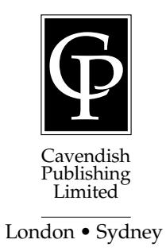
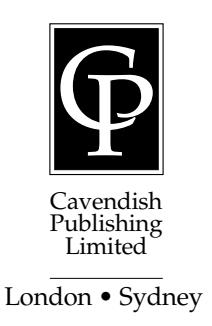

# Understanding Equity & Trusts

Alastair Hudson

# UNDERSTANDING EQUITY & TRUSTS

# UNDERSTANDING EQUITY & TRUSTS

# Alastair Hudson LLB, LLM, PhD

Barrister, Lincoln's Inn, Reader in Equity & Law Queen Mary, University of London

First published in Great Britain 2001 by Cavendish Publishing Limited, The Glass House, Wharton Street, London WC1X 9PX, United Kingdom

Telephone: + 44 (0)20 7278 8000 Facsimile: + 44 (0)20 7278 8080

Email: info@cavendishpublishing.com Website: www.cavendishpublishing.com

© Hudson, Alastair 2001

All rights reserved. No part of this publication may be reproduced, stored in a retrieval system, or transmitted in any form or by any means, electronic, mechanical, photocopying, recording, scanning or otherwise, except under the terms of the Copyright Designs and Patents Act 1988 or under the terms of a licence issued by the Copyright Licensing Agency, 90 Tottenham Court Road, London W1P 9HE, UK, without the permission in writing of the publisher.

British Library Cataloguing in Publication Data

Hudson, Alastair Understanding equity and trust law 1 Equity – England 2 Equity – Wales 3 Trusts and trustees – England 4 Trusts and trustees – Wales I Title 346.4'2'004

ISBN 1 85941 634 9

Printed and bound in Great Britain

# **INTRODUCTION**

I find English law fascinating. In fact, I find all law fascinating, but particularly common law systems and most particularly English law. I am interested in common law systems because the development of their legal principles derives from so many sources. Some of those principles are generated by statute (which in turn are the product of the political system) and others by case law (which in turn is the product of intricate webs of ideology, culture, and conflict formed by social change). What is also interesting about English law is the contradictory nature of its 'Englishness': lawyers wearing wigs and referring to the judge as 'm'lud' while the witnesses wear jeans and t-shirts; dusty courtrooms lined with ancient law reports acting as the arenas for passionate arguments about life and death; cases involving global financial transactions on one side of the corridor and cases about welfare benefits on the other. It is a sharp contrast between centuries of dull tradition and the cutting edge of social conflict.

At the time of writing this book the very idea of being 'English' and of having an 'English identity' is one of the most complex debates in English political life. The 'law' which is generated by this process is often very difficult to isolate. Most of the law is contained in judges' decisions which are monologues delivered by judges and recorded by court reporters. English law is primarily a conversation in which judges and lawyers discuss each others' opinions and talk about the state of our society, about aspects of the human condition, and about the behaviour of the litigants in front of them. The business of a student of law is to analyse this conversation as a text, as a product of a constantly developing culture, and as part of this complex, 21st century society.

Much of the law considered in this book is the product of English history. The 'trust' itself is an accident of English history which has not yet been fully replicated in any jurisdiction outside the sphere of influence of the former British Empire. It is remarkable that accidents of history like the development of the trust in English law have such a wide-ranging effect not only on people who live in England and Wales but also on the contracts formulated between merchants and investment banks from as far afield as Europe, Australasia, Asia and the Americas.

In thinking about it, though, it is not so surprising that accidents of history do have this broad effect. Our world is littered with conflicts and solidarities forged by wars, migration patterns and all the other ephemera of history. I am writing (or rather, typing) this book on a computer which is linked to a global communications system which can reach any part of the globe. Your nearest computer and mine are probably linked by the internet. Your mind and mine are currently linked through this book. Your lifeworld and my lifeworld are linked by the law which is discussed in this book. It is quite breathtaking if you sit back and think about it.

I am extremely excited about this book. Having spent years teaching equity and trusts to students, practising at the English Bar in this area, and latterly writing a long textbook on the subject, I was thrilled when Cavendish suggested that I write a shorter book which would put the subject into context. It is a tremendously indulgent thing to be allowed to write a book which will cover the whole of the main points of equity and trusts but in a way which enables the author to select the issues and themes which he considers most interesting. Free of the need to discuss every crevice of the case law, I can use this book to give you an overview of the relevant law and to focus on the most significant ideas. If you are a student of equity and trusts reading this book, it will hopefully ground you in the main concepts at the beginning of your course, offer you advice as you progress with that course, or serve as a general focus for your revision at its end.

As such, I think of this book as one half of a conversation between you and I about the nature of equity. Or perhaps it is a story in which I will tell you about the history of the world in which this law has been developed, as well as introducing you to the main rules and principles.

This book will cover the ground of an entire course in equity and trusts – although it is best used as a (hopefully) readable introduction to the ideas and concepts bound up in it to prepare you for lectures and for your own, indepth reading. For that, you might try my full textbook *Equity and Trusts* which considers these ideas over the full one thousand pages. Hopefully, this book will place these ideas in the context of a rapidly changing world.

It is my basic contention throughout this book that the beginning of the 21st century is a time of unprecedented social complexity which requires a change in our understanding of equity: a change that requires us to celebrate the possibilities to achieving social justice in different social contexts through the use of equitable remedies and trusts. Those ideas will emerge and reemerge through this book.

Agree or disagree with me, I defy you to read this book without encountering some parallel with your own life, or without being provoked by the problems it considers. Even if I only cause you to leap to your feet and hurl this book across the room with an oath, I will consider myself successful. Equity and trusts is potentially one of the most interesting components of any study of law. My task is to convince you of that.

> *Alastair Hudson Queen Mary, University of London Mile End September 2001*

# **CONTENTS**

|       | Introduction                   | v    |
|-------|--------------------------------|------|
|       | Table of Cases                 | ix   |
|       | Table of Statutes              | xvii |
|       |                                |      |
| 1     | THE CONTEXT OF EQUITY          | 1    |
| 2     | THE NATURE OF THE TRUST        | 13   |
| 3     | THE SETTLOR                    | 25   |
| 4     | THE BENEFICIARY                | 45   |
| 5     | THE TRUSTEE                    | 65   |
| 6     | RESULTING TRUSTS               | 79   |
| 7     | CONSTRUCTIVE TRUSTS            | 89   |
| 8     | EQUITABLE ESTOPPEL             | 105  |
| 9     | TRUSTS OF LAND AND OF THE HOME | 117  |
| 10    | BREACH OF TRUST                | 139  |
| 11    | COMMERCIAL USES OF TRUSTS      | 161  |
| 12    | WELFARE USES OF TRUSTS         | 173  |
| 13    | THE FUTURE FOR EQUITY          | 185  |
|       | Bibliography                   | 193  |
| Index |                                | 195  |

# **TABLE OF CASES**

| A                                                                                      |  |
|----------------------------------------------------------------------------------------|--|
| Agip (Africa) Ltd v Jackson and Others [1989] 3 WLR 1367144, 153, 154                  |  |
| Allen, Re [1953] Ch 81038                                                              |  |
| Ames' Settlement, Re [1964] Ch 21780                                                   |  |
| Armitage v Nurse [1998] Ch 24132, 74, 170                                              |  |
| Ashburn Anstalt v Arnold [1989] Ch 1112                                                |  |
| Attorney General for Hong Kong v Reid [1994] 1 AC 324; [1993] 3 WLR 114392, 99, 190 |  |
| Attorney General v Shrewsbury Corp (1843) 6 Beav 220180                                |  |
|                                                                                        |  |
| B                                                                                      |  |
| Baden's Trusts (No 2), Re [1973] Ch 938                                                |  |
| Baden v Société Generale [1993] 1 WLR 50990                                            |  |
| Baker v Baker [1993] 25 HLR 40840, 109, 131                                            |  |
| Banner Homes Group plc v Luff Development Ltd [2000] Ch 372; [2000] 2 WLR 77295     |  |
| Barclays Bank Ltd v Quistclose Investments Ltd [1970] AC 567162, 163, 164              |  |
| Barclays Bank v O'Brien [1993] 4 All ER 417, CA129                                     |  |
| Barlow's WT, Re [1979] 1 WLR 27838                                                     |  |
| Barlowe Clowes International (In Liquidation) and Others                               |  |
| v Vaughan and Others [1992] 4 All ER 22; [1992] BCLC 910157                            |  |
| Bartlett v Barclays Bank [1980] Ch 51571, 73                                           |  |
| Barton's Trust, Re (1868) LR 5 Eq 23868                                                |  |
| Basham, Re [1987] 1 All ER 405; [1986] 1 WLR 1498106, 107, 108                         |  |
| Beloved Wilkes Charity, Re (1851) 3 Mac & G 44076                                      |  |
| Bernard v Josephs [1982] Ch 391123, 135                                                |  |
| Bishopsgate Investment Management v Homan [1995] 1 All ER 347153                       |  |
| Blackwell v Blackwell [1929] AC 31861                                                  |  |
| Blyth v Fladgate [1891] 1 Ch 337102                                                    |  |
| Boardman v Phipps [1967] 2 AC 4666, 98, 99                                             |  |
| Boscawen v Bajwa [1995] 4 All ER 769152, 158                                           |  |
| Bouch, Re (1885) 29 Ch D 63568                                                         |  |
| Bowes, Re [1896] 1 Ch 50753                                                            |  |
| Bowman v Secular Society Ltd [1917] AC 406181                                          |  |
| Bristol and West Building Society v Mothew [1996] 4 All ER 698142                      |  |
| Brockbank, Re [1948] 1 All ER 28775                                                    |  |
| Brook's ST, Re [1939] 1 Ch 99341, 53, 75                                               |  |
| Bull v Bull [1955] 1 QB 234135                                                         |  |
| Burns v Burns [1984] 1 All ER 244121, 130                                              |  |
| Burrows and Burrows v Sharp (1991) 23 HLR 82113                                        |  |

#### Understanding Equity & Trusts

| C                                                                                                    |  |
|------------------------------------------------------------------------------------------------------|--|
| Carl Zeiss Stiftung v Herbert Smith and Co (No 2)                                                    |  |
| [1969] 2 Ch 27693                                                                                    |  |
| Carreras Rothmans Ltd v Freeman Mathews Treasure Ltd                                                 |  |
| [1985] Ch 207164                                                                                     |  |
| Central London Property Trust Ltd v High Trees House Ltd                                             |  |
| [1949] KB 130 113                                                                                 |  |
| Chapman v Chapman [1954] 2 WLR 72354                                                                 |  |
| Chase Manhattan Bank NA v Israel-British Bank (London) Ltd [1981] Ch 105; [1980] 2 WLR 20294, 158 |  |
| Citro, Re [1991] Ch 142137                                                                           |  |
| Clayton's Case (1816) 1 Mer 572156, 157                                                              |  |
| Clough Mill v Martin [1984] 3 All ER 982; [1985] 1 WLR 111162                                        |  |
| Cochrane's ST, Re [1955] 2 WLR 26780                                                                 |  |
| Cohen and Moore v IRC [1933] All ER 950, KBD56                                                       |  |
| Combe v Combe [1951] 2 KB 215113                                                                     |  |
| Commissioners for Railways (NSW) v Quinn (1946) 72 CLR 345169                                        |  |
| Commissioners for Special Purposes of Income Tax v Pemsel [1891] AC 531173, 179                   |  |
| Compton, Re [1945] Ch 123174, 177                                                                    |  |
| Cook, Re [1965] Ch 70243                                                                             |  |
| Coombes v Smith [1986] 1 WLR 808119, 121                                                             |  |
| Coulthurst's WT, Re [1951] 1 All ER 774175                                                           |  |
| Cowan v Scargill [1984] 3 WLR 50172, 73, 155                                                         |  |
| Cowcher v Cowcher [1972] 1 All ER 948119                                                             |  |
| Crabb v Arun District Council [1976] Ch 179106                                                       |  |
| Crippen, In the Estate of [1911] P 108100                                                            |  |
|                                                                                                      |  |
| D                                                                                                    |  |
| D & C Builders v Rees [1966] 2 QB 617113                                                             |  |
| Denley, Re [1969] 1 Ch 37347, 49, 57, 58                                                             |  |
| Densham, Re [1975] 1 WLR 1519108                                                                     |  |
| Dingle v Turner [1972] 2 WLR 523174                                                                  |  |
| Diplock, Re [1948] Ch 465152, 156                                                                    |  |
| Don King Productions Inc v Warren [1998] 2 All ER 608; [2000] Ch 291, CA44                        |  |
| Dufour v Pereira (1769) 1 Dick 419101                                                                |  |
| Dyer v Dyer (1788) 2 Cox Eq Cas 92125                                                                |  |

#### Table of Cases

| E                                                                        |                    |
|--------------------------------------------------------------------------|--------------------|
| Eagle Trust plc v SBC Securities Ltd [1992] 4 All ER 488145              |                    |
| El Ajou v Dollar Land Holdings [1993] 3 All ER 717143, 145, 158          |                    |
| Endacott, Re [1960] Ch 23246                                             |                    |
| Equiticorp Industries Group Ltd v The Crown [1998] 2 NZLR 48599          |                    |
| Errington v Errington [1952] 1 KB 290112                                 |                    |
|                                                                          |                    |
| F                                                                        |                    |
| Fletcher v Fletcher (1844) 4 Hare 6743, 44                               |                    |
| Fowkes v Pascoe (1875) 10 Ch App 34382                                   |                    |
| Fry, Re [1946] Ch 31230                                                  |                    |
| G                                                                        |                    |
| Gardner, Re [1923] 2 Ch 23061                                            |                    |
| Gardom, Re [1914] 1 Ch 662175                                            |                    |
| Gascoigne v Gasgoigne [1918] 1 KB 22382, 83                              |                    |
| Gillett v Holt [2000] 2 All ER 289107, 111                               |                    |
| Gissing v Gissing [1971] AC 886; [1970] 3 WLR 255119, 121, 122, 129, 130 |                    |
| Goldcorp, Re [1995] 1 AC 7433, 34, 36, 104, 161,                         |                    |
|                                                                          | 162, 171, 172, 189 |
| Grant v Edwards [1986] Ch 638118, 119, 121, 130                          |                    |
| Greasley v Cooke [1980] 1 WLR 1306108                                    |                    |
| Grey v IRC [1960] AC 155, 56, 57, 58                                     |                    |
| Guinness v Saunders [1990] 2 WLR 3249, 98                                |                    |
| Gulbenkian, Re [1968] Ch 12637, 38                                       |                    |
|                                                                          |                    |
| H                                                                        |                    |
| Hallett's Estate, Re (1880) 13 Ch D 695155                               |                    |
| Hammond v Mitchell [1991] 1 WLR 1127128                                  |                    |
| Harari's ST, Re [1949] 1 All ER 43072                                    |                    |
| Hartigan Nominees Pty Ltd v Rydge (1992) 29 NSWLR 40577                  |                    |
| Harvard Securities Ltd, Re [1997] 2 BCLC 36935                           |                    |
| Hassall v Smither (1806) 12 Ves 119163                                   |                    |
| Hay's ST, Re [1981] 3 All ER 78637, 69, 75, 76, 90                       |                    |
| Hayim v Citibank [1987] AC 730169                                        |                    |
| Heseltine v Heseltine [1997] 1 WLR 342108                                |                    |
| Hetherington, Re [1990] Ch 1178                                          |                    |
| Hill v Permanent Trustee Co of New South Wales [1930] AC 72068           |                    |
| Holliday, Re [1981] 2 WLR 996137                                         |                    |
| Holmden's ST, Re [1968] 2 WLR 30055                                      |                    |

#### Understanding Equity & Trusts

| Holt's Settlement, Re [1969] 1 Ch 10056                                                           |  |  |                                                   |
|---------------------------------------------------------------------------------------------------|--|--|---------------------------------------------------|
| Hopgood v Brown [1955] 1 WLR 213109                                                               |  |  |                                                   |
| Houghton v Fayers [2000] 1 BCLC 571148                                                            |  |  |                                                   |
| Hunt v Luck [1902] 1 Ch 42890 Hunter v Moss [1994] 1 WLR 45234, 35, 36                         |  |  |                                                   |
|                                                                                                   |  |  | Huntingford v Hobbs [1993] 1 FLR 936123, 125, 135 |
| I                                                                                                 |  |  |                                                   |
| Incorporated Council of Law Reporting for England and Wales v Attorney General [1972] Ch 73179 |  |  |                                                   |
| Industrial Development v Cooley [1972] 1 WLR 44399                                                |  |  |                                                   |
| Inwards v Baker [1965] 2 QB 29113                                                                 |  |  |                                                   |
| IRC v Broadway Cottages Trust [1955] Ch 2037                                                      |  |  |                                                   |
| IRC v McMullen [1981] AC 1176                                                                     |  |  |                                                   |
| J                                                                                                 |  |  |                                                   |
| Jones v Challenger [1961] 1 QB 176137                                                             |  |  |                                                   |
| Jones, FC (A Firm) & Sons v Jones [1996] 3 WLR 703151, 154                                        |  |  |                                                   |
| K                                                                                                 |  |  |                                                   |
| K (Deceased), Re [1985] 1 All ER 403100                                                           |  |  |                                                   |
| Keech v Sandford (1726) Sel Cas Ch 6167, 98, 103                                                  |  |  |                                                   |
| Keen, Re [1937] Ch 23661                                                                          |  |  |                                                   |
| King v Jackson [1998] 1 EGLR 30 112                                                            |  |  |                                                   |
| Klug v Klug [1918] 2 Ch 6777                                                                      |  |  |                                                   |
| Knight v Knight [1855] Ch 83530                                                                   |  |  |                                                   |
| L                                                                                                 |  |  |                                                   |
| Lacey, ex p (1802) 6 Ves 62567                                                                    |  |  |                                                   |
| Layton v Martin [1986] 1 FLR 171108                                                               |  |  |                                                   |
| Leahy v Attorney General for New South Wales [1959] 2 WLR 72246, 47, 49, 50, 57, 58            |  |  |                                                   |
| Learoyd v Whiteley (1887) 12 App Cas 72773                                                        |  |  |                                                   |
| Lemos v Coutts and Co (1992) Cayman Islands ILR 46077                                             |  |  |                                                   |
| Lewis, Re (1955)179                                                                               |  |  |                                                   |
| Lim Teng Huan v Ang Swee Chin [1992] 1 WLR 113110, 114                                            |  |  |                                                   |
| Lipinski, Re [1976] Ch 23548, 57, 58                                                              |  |  |                                                   |
| Lipkin Gorman v Karpnale [1991] 3 WLR 10158                                                       |  |  |                                                   |
| Lister v Stubbs (1890) 45 Ch D 199, 100                                                           |  |  |                                                   |
| Lloyds Bank v Byrne (1991) 23 HLR 472; [1993] 1 FLR 369137                                        |  |  |                                                   |

#### Table of Cases

| Lloyds Bank v Rosset [1990] 1 All ER 1111119, 120, 121, 122,          |                              |
|-----------------------------------------------------------------------|------------------------------|
|                                                                       | 123, 124, 125, 127, 129, 132 |
| London Hospital Medical College v IRC [1976] 2 All ER 113176          |                              |
| London Wine Co (Shippers) Ltd, Re [1986] PCC 12132, 33, 35            |                              |
| Londonderry's Settlement, Re [1965] 2 WLR 22977, 78                   |                              |
| Lord Cawdor v Lewis (1835) 1 Y & C Ex 427109                          |                              |
| Lyell v Kennedy (1889) 14 App Cas 437102                              |                              |
| Lysaght v Edwards (1876) 2 Ch D 49995                                 |                              |
| Lyus v Prowsa Developments Ltd [1982] 1 WLR 104496                    |                              |
| M                                                                     |                              |
| MacJordan Construction Ltd v Brookmount Erostin Ltd [1992] BCLC 35035 |                              |
| McCormick v Grogan (1869) LR 4 HL 8260                                |                              |
| McGovern v Attorney General [1982] 2 WLR 222176                       |                              |
| McHardy v Warren [1994] 2 FLR 338127                                  |                              |
| McPhail v Doulton [1970] 2 WLR 111037, 39                             |                              |
| Mara v Browne [1896] 1 Ch 199102                                      |                              |
| Mettoy Pension Trustees Ltd v Evans [1990] 1 WLR 158776, 184          |                              |
| Midland Bank v Cooke [1995] 4 All ER 5629, 127, 129                   |                              |
| Midland Bank v Dobson [1986] 1 FLR 171121                             |                              |
| Midland Bank v Wyatt [1995] 1 FLR 69784                               |                              |
| Milroy v Lord (1862) 4 De GF & J 26428, 29, 62                        |                              |
| Montagu, Re (1897) 2 Ch 8103                                          |                              |
| Montagu's ST, Re; Duke of Manchester v National Westminster           |                              |
| Bank [1987] Ch 264; [1987] 2 WLR 1192143, 144, 146                    |                              |
| Morice v Bishop of Durham (1805) 10 Ves 52245, 47, 62, 179            |                              |
|                                                                       |                              |
| N                                                                     |                              |
| National Anti-Vivisection Society v IRC [1947] 2 All ER 217180        |                              |
| National Power v Healey (2001) not yet reported184                    |                              |
| Nestlé v National Westminster Bank plc [1994] 1 All ER 11868, 69, 141 |                              |
| Neville Estates v Madden [1962] Ch 832178                             |                              |
| New, Re [1901] 2 Ch 53454                                             |                              |
| Nixon v Nixon [1969] 1 WLR 1676121, 130                               |                              |
| Nottage, Re [1895] 2 Ch D 517176                                      |                              |
| O                                                                     |                              |
| O'Rourke v Darbishire [1920] AC 58178                                 |                              |
| Oatway, Re [1903] 2 Ch 356155                                         |                              |
| Ontario Securities Commission (1985) 30 DLR (4d) 30157                |                              |

#### Understanding Equity & Trusts

| Oppenheim v Tobacco Securities Trust [1951] 1 All ER 31174, 177                                                                      |
|--------------------------------------------------------------------------------------------------------------------------------------|
| Ottaway v Norman [1972] 2 WLR 5060                                                                                                   |
| Oughtred v IRC [1960] AC 20657                                                                                                       |
| P                                                                                                                                    |
| Paragon Finance plc v DB Thakerar & Co [1999] 1 All ER 40092, 96                                                                  |
| Pascoe v Turner [1979] 2 All ER 945; [1979] 1 WLR 43140, 109, 113, 114, 131, 132 Paul v Constance [1977] 1 WLR 52710, 31, 32, 188 |
| Paul v Paul (1882) 20 Ch D 74226                                                                                                     |
| Pettitt v Pettitt [1970] AC 777; [1969] 2 WLR 96682, 122, 129                                                                        |
| Plimmer v Mayor of Wellington (1884) 9 App Cas 699112                                                                                |
| Polly Peck International v Nadir (No 2) [1992] 3 All ER 76992, 144, 145, 146, 147                                                    |
| Power's WT, Re [1951] 2 All ER 51372                                                                                                 |
| Pryce, Re [1917] 1 Ch 23443                                                                                                          |
| Q                                                                                                                                    |
| Queensland Mines v Hudson [1977] 18 ALR 199                                                                                          |
| Quistclose Investments v Rolls Razor Ltd [1970] AC 567; [1968] 2 WLR 478161                                                       |
| R                                                                                                                                    |
| Ralli's WT, Re [1964] 2 WLR 14441, 42                                                                                                |
| Recher's WT, Re [1972] Ch 526; [1971] 3 WLR 32150, 57                                                                                |
| Regal v Gulliver [1942] 1 All ER 37899                                                                                               |
| Rochefoucauld v Boustead [1897] 1 Ch 19662, 96, 115                                                                                  |
|                                                                                                                                      |
| Roscoe v Winder [1915] 1 Ch 62153                                                                                                    |
| Rose, Re [1952] Ch 49929, 30, 96                                                                                                     |
| Rowntree, Joseph Memorial Trust Housing Association Ltd v Attorney General [1983] 2 WLR 284179                                    |
| Royal Brunei Airlines v Tan [1995] 2 AC 37891, 103, 143, 147, 148                                                                    |
| S                                                                                                                                    |
| Saloman v Saloman [1897] AC 2249, 165, 187                                                                                           |
| Saunders v Vautier (1841) 4 Beav 11518, 52, 53, 56, 75, 171                                                                          |
| Scandinavian Trading Tanker Co AB v Flota Petrolera Ecuatoriana [1983] QB 549113                                                  |
| Scarisbrick, Re [1951] 1 All ER 822175                                                                                               |
| Scottish Burial Reform and Cremation Society                                                                                         |
| v Glasgow City Council [1968] AC 138180                                                                                              |

#### Table of Cases

#### Understanding Equity & Trusts

| Wedgwood, Re (1915) 1 Ch 113180                                      |                             |
|----------------------------------------------------------------------|-----------------------------|
| Westdeutsche Landesbank Girozentrale v Islington LBC                 |                             |
| [1996] 2 All ER 961; [1997–98] 8 KCLJ 14714, 18, 19, 34, 59, 64, 81, |                             |
|                                                                      | 85, 86, 87, 92, 93, 94, 97, |
|                                                                      | 103, 118, 152, 153, 158     |
|                                                                      | 164, 188                    |
| Wilmot v Barber (1880) 15 Ch D114                                    |                             |
| Wilson v Law Debenture Trust [1995] 2 All ER 337182                  |                             |
| Wood, Re [1949] 1 All ER 110048                                      |                             |
| Wragg, Re [1919] 2 Ch 5872                                           |                             |
| Y                                                                    |                             |
| Yaxley v Gotts [2000] 1 All ER 711111                                |                             |
| Young, Re [1951] NZLR 7062                                           |                             |

# **TABLE OF STATUTES**

| Bankruptcy Act 1914151                           | Law of Property (Miscellaneous Provisions) Act 1989111, 112 |
|--------------------------------------------------|----------------------------------------------------------------|
| Children Act 1989136, 137                        | s 2111                                                         |
|                                                  |                                                                |
| Companies Act 1985166 s 453166                | Pensions Act 1995181, 182                                      |
|                                                  | s 33182                                                        |
| Contract (Rights of Third Parties) Act 199942 | s 34(1)182                                                     |
|                                                  | s 35(1)183                                                     |
|                                                  | s 35(3)183                                                     |
| Financial Services Act 1986168                   | s 35(5)183                                                     |
| s 75(8)168                                       | s 37184                                                        |
| s 78(6)170                                       | Perpetuities and                                               |
| Financial Services and                           | Accumulations Act 196449                                       |
| Markets Act 2000167                              |                                                                |
| s 235167 s 237(1)170                          | Sale of Goods (Amendment)                                      |
| s 237(1)–(2)168                                  | Act 1995171                                                    |
| s 243(10)–(11)170                                | Settled Land Act 1925133                                       |
| s 253169                                         | Statute of Charitable                                          |
| Forfeiture Act 1982100                           | Uses 1601176, 179                                              |
|                                                  | Statute of Frauds Act 167757                                   |
|                                                  |                                                                |
| Human Rights Act 19986, 63, 64                   |                                                                |
| s 6(3)(a)63                                      | Trustee Act 200069, 70, 71, 72, 74                             |
|                                                  | s 1(1)69 s 370                                              |
| Income and Corporation                           | s 4(2)71                                                       |
| Taxes Act 1988184                                | s 572                                                          |
| Insolvency Act 198682                            |                                                                |
| s 335A137                                        | Trustee Investment Act 196170, 71                              |
| s 42384                                          | Trusts of Land and                                             |
|                                                  | Appointment of                                                 |
| Judicature Act 18732                             | Trustees Act 1996133, 135                                      |
|                                                  | s 3133 s 11133                                              |
| Land Registration Act 1925119                    | s 12135                                                        |
| s 70(1)(g)119                                    | s 12(a)–(b)134                                                 |
| Law of Property Act 1925133                      | s 12(1)(a)–(b)135                                              |
| s 30136                                          | s 13135                                                        |
| s 53(2)117                                       | s 13(1)134                                                     |
| s 53(1)(b)28, 117                                | s 13(2)(1)(a)–(b)134                                           |
| s 53(1)(c)55, 56, 58                             | s 13(4)(a)–(b)134                                              |

#### Understanding Equity & Trusts

| Trusts of Land and                                                                                            | Variation of Trust Act 195854                        |
|---------------------------------------------------------------------------------------------------------------|------------------------------------------------------|
| Appointment of Trustees Act 1996 (contd)— s 13(4)(c)135 s 14135, 136 s 14(a)–(d)136 s 14(1)136 | Wills Act 18377, 60, 61, 107, 101 s 959 s 1562 |
| s 14(2)(a)–(b)136 s 15136 s 15(4)137                                                                    |                                                      |

# **CHAPTER 1**

# **THE CONTEXT OF EQUITY**

It has been said that certainty is the principal virtue of every legal system (Oakley, 1997) but it is also true that chaos and complexity are the common characteristics of every problem that confronts a legal system. That is the tension at the centre of this book. While the law seeks to impose certainty, litigants bring only confusion. Traditionally equity and the law of trusts have been concerned with providing justice to balance out the rigour of the common law. However, the modern law of trusts has seen a determination to introduce greater formality, as discussed in Chapter 3. This tension between a traditional flexibility and a modern desire for rigidity and certainty underpins the dramatic developments in the law in the last decade. But before jumping into the thrills of recent case law, we should begin at the beginning ...

# TO BEGIN AT THE BEGINNING ... WHAT IS EQUITY?

Equity is probably best defined as the accumulation of principles from past judgments in the Courts of Chancery which sought to balance out the rigour of the common law by achieving justice in individual cases. To achieve this lofty goal a range of specifically equitable claims and remedies have been developed – as considered below.

The Courts of Chancery were established in the wake of the Norman Conquest under the control of the Lord Chancellor to hear petitions which would previously have been petitions directly to the Crown for clemency or justice. These Courts of Chancery were considered necessary to balance out the rigours of the rules being developed in the common law Courts of King's Bench and also to ensure that the authority of the monarchy to administer justice was not completely displaced by the judges. The principles which the Courts of Chancery developed are the principles which we would now describe collectively as being 'equity'. The Lord Chancellor became a very powerful political actor in 16th century England – principally by means of the expanding range of writs served to bring nobles to account – a fact tacitly acknowledged by Henry VIII's determination to have so many of them executed.

One factor of English legal procedure at that time must be understood at this early stage. As the Courts of Chancery developed their own principles, there were clearly two completely separate streams of jurisprudence emerging in English law: the common law on one side and equity on the other. It was necessary for the litigant to decide which of these systems of rules would be necessary to decide his case. The common law courts and the courts of equity were completely separate courts. Consequently, only courts of common law would hear cases to do with the common law (for example, whether or not a contract had been created) and provide common law remedies (for example, damages for breach of contract). Similarly, only the courts of equity would hear cases to do with equitable principles (for example, the enforcement of a trust) or the award of equitable remedies (for example, injunctions or specific performance).

If you were to read Charles Dickens's remarkable novel *Bleak House* you would read about the fictional case of *Jarndyce v Jarndyce*, that 'scarecrow of a suit', which forms the background to the novel by preventing some of the protagonists from accessing their rightful fortunes. At the start of the book, the case has droned on for such a long time that no one can remember what it is about. Dickens himself worked as a clerk in the now extinct court of Doctors' Commons (depicted in *David Copperfield*) and was therefore well-acquainted with the painfully slow pace of English justice. Part of the difficulty in the *Jarndyce* case was that the litigants had to move constantly between the courts of common law and the courts of equity as they sought to untangle which of those courts ought to decide on the case.

Therefore, quite literally, common law and equity were physically as well as intellectually separate systems of rules. In 1873 the Judicature Act provided that the courts of common law and those of equity should be merged so that any court could rule on matters of equity or common law. However, that Act only removed the physical distinction between the courts – the intellectual distinction remains even today. It is no accidental distinction between common law and equity – rather the courts still make rigid distinctions between the award of common law remedies and equitable remedies. That is the basis for understanding the nature of equity.

# **The philosophical role of equity**

Before proceeding to consider some of the core equitable principles I think it would be as well to attempt to convince you, albeit briefly, that equity does have a respectable intellectual pedigree. The final chapter of the book will try to map some of the ways in which equity is likely to become even more sociologically significant in the 21st century than it has been up until now.

Aristotle in his *Ethics* spoke of equity as a more significant principle even than his theory of 'justice' because it enabled the courts in any particular case to come to the best possible result on those facts. Similarly, Hegel speaks in his *Phenomenology of Right* of equity as being that code of rules which permits the courts to use their discretion in individual cases not to apply statute or common law literally but rather to do what is 'right' between the parties irrespective of the law. This notion has a parallel with the writing of Professor Dworkin who speaks of the role of judge in *Law's Empire* as being to attempt to achieve the right result and thus preserve the integrity of the law.

What these various thinkers have in mind is the following dilemma: law is a necessary part of our social fabric at some level but if the law is applied too strictly there will always be circumstances in which that law appears to be unfair. Suppose the following example: a statute provides that any person wearing orange Doc Marten boots is entitled to receive a reward at the Town Hall. Bertha has a splendid pair of orange boots which she wears to stride towards the Town Hall at the appointed time to receive her reward. Unfortunately, she is forced to walk through a muddy puddle in the car park which briefly obscures the orange colour of her boots in a dirty brown film of mud. A literal application of the statute would mean that Bertha would not be entitled to receive the reward because her boots were not orange at the appointed time. Clearly, we would think this unfair because her boots were really orange and only temporarily obscured. In such situations, there is a need for judges to be able to reach a just conclusion even if that is not the conclusion required by the literal application of the law. Equity is exactly such a scheme of ideas which gives judges this scope for dispensing justice.

So, is equity just an enlarged form of the 'mischief principle' in statutory interpretation, which allows judges to apply statutes in ways which achieve their underlying purposes? The answer is 'no'. Equity is much larger in scope than that, having developed important legal devices like trust, injunctions, rescission of contracts and so forth. The equity which will be considered in this book is a combination of the philosophical ideas mentioned above combined with the core equitable principles considered below. Equity provides citizens with the possibility of liberty in the face of the system: the chance to have their individual stories heard by the court. Equity recognises the integrity of the individual as a human being with substantive rights in the broader context of achieving justice in our society. This is a difficult tension for political philosophers: how do we create the perfect system which applies equally to all without overlooking the needs of individuals? I would suggest that a robust system of equity makes that possible.

# **The argument of this book**

A book of this length on a subject as vast as equity and trusts can only be of any use if it presents the main ideas while also developing a thesis about the way in which equity and trusts operate. I come to this subject with a belief that the strength of equity is in its flexibility and that any attempt to over-formalise the principles of equity should be resisted.

The roots of my thesis are these. Equity, as a part of English jurisprudence, emerged as a stream of legal principles in medieval England to allow the legal system to reach 'fair' results in cases in which it appeared that the rigour of the common law would otherwise have led to injustice. Every legal system needs this ability to act fairly and to cut against the grain of rigid rules at times. The trust grew out of this system of equity as a means of recognising that, in some circumstances, it would not be just if the common law owner of property were able to deny that other people ought to be recognised as also having rights in that property. For example, if two people bought property together, it would be wrong if one person sought to deny that the other person also had rights in that property. The trust, as discussed in Chapter 2, was the means by which this particular form of injustice was avoided.

Equity was necessary to provide social justice in these early days. However, as social life became more complicated, the rules of equity needed to become more formalised and slightly less arbitrary. Therefore, the trust became a more rigid institution in the 19th century at the time of many other social and industrial advances in Great Britain. It was at this time in the late 19th century that many of the great textbooks of English law were written for the first time in an attempt to codify and describe the wide range of legal principles making up the common law and equity. Social change required that concretisation of equitable principles to facilitate trade and to protect family wealth. Towards the end of the 20th century another seismic upheaval in the social life of the United Kingdom created a need for greater use of implied trusts to curb unconscionable behaviour in dealings with property and to allocate rights in the family home. Note that the name given to this country has changed over this period of time from 'England' to 'Great Britain' to the 'United Kingdom' – itself a symbol of underlying change.

It is my argument that the beginning of the 21st century is a time of unprecedented social complexity which requires another change in our understanding of equity: a change that requires us to celebrate the possibilities to achieving social justice in different social contexts through the use of equitable remedies and trusts. Those ideas will emerge and re-emerge through this book.

# THE FUNDAMENTAL PRINCIPLES OF EQUITY

As mentioned above, equity has developed a range of very particular claims and remedies as part of its mission to dispense justice through the courts. One of the skills of the English lawyer is to understand which claims and remedies arise under equity and which arise under the common law. Therefore, it is necessary to continue to make a distinction between common law and equity. The division between some of the more significant claims and remedies might be rendered diagramatically in the following way.

**Common law Equity**

*Examples of claims:*

Breach of contract Breach of trust Negligence Tracing property

Fraud Claiming property on insolvency

*Examples of remedies available:*

Damages Compensation Common law tracing Equitable tracing Money had and received Specific performance

> Injunction Rescission Rectification

Imposition of constructive trust Imposition of resulting trust

Subrogation Account

Under the 'common law' column are some *examples* of common law claims which the student is likely to have met – there are plenty of others, of course. As an example, though, the law on contract contains the claim for breach of contract which frequently provides for common law damages. If the claimant wishes to force the defendant to a contract claim to perform her obligations under that contract, then it is the equitable remedy of specific performance which must be sought. Typically, the availability of equitable remedies is more dependent on the discretion of the court than common law remedies, although (as intimated above) even equitable remedies have become more rigid over time.

In general terms, it is only in equity that it is possible to receive discretionary remedies or declarations which are awarded in relation to specific factual circumstances – whether preventing unjust behaviour by means of injunction, forcing obedience of contractual provisions by specific performance, or providing that property be held on trust for the claimant by means of a range of techniques considered later in this book. On the other hand, the common law is organised principally around awards of money in relation to loss by means of damages, or exceptionally by recovery of specific, identifiable property. The common law is concerned with return of particular property or with making good loss, unlike the more complex claims and remedies which are available in equity.

# **Equity acts** *in personam*

The most important equitable principle is that the jurisdiction of the court is to act *in personam*: that is, the court is concerned with the conscience of the individual defendant more than with any strict rule.

The court of equity is therefore making an order, based on the facts of an individual case, to prevent that particular person from continuing to act unconscionably. This may relate to the manner in which a trustee is dealing with a beneficiary's property, or to a claimant's fear that the defendant will move her property out of the jurisdiction before judgment in a trial, or to a defendant's refusal to perform her obligations under a contract. Equity will intercede in all three of these circumstances by using principles of trusts, injunctions and specific performance respectively. In each situation the underlying objective of the court is to make the defendant act in good conscience: by observing the trust, by refraining from taking property out of the jurisdiction, and so on.

One of the themes which we will observe in the modern application of equity is that the great flexibility which is identifiable in a court of equity's inherent jurisdiction to act *in personam* has been superseded in many circumstances by the introduction of more rigid rules to decide when these principles will and will not be deployed. This is true of some equitable doctrines but not others. For example, the trust has become subject to more rigid principles – as considered in Chapters 3–5 – whereas remedies like injunctions remain comparatively flexible.

The study of equity is concerned with the isolation of the principles upon which judges in particular cases seek to exercise their discretion. Therefore, it is an intricate task to find common threads between situations in which judges have necessarily been reaching decisions on the basis of particular facts. Bound up with the study of equity is the need to uncover common links or differences between judges. Clearly, if judges are able to reach decisions entirely according to their own discretion there are likely to be some disparities between the ways in which such principles are put into practice. Similarly, we might be concerned that this gives a great amount of power to individual judges to circumvent the wishes of Parliament when applying equitable principles to circumvent statute. In the era of human rights law in England – after the enactment of the Human Rights Act 1998 – we will also need to bear in mind the tension between traditional principles of equity and emerging principles of human rights, in particular in relation to rights in the family home.

What is important about equity is that it never allows us to forget that people are people: individual human beings who have their own claims to be taken into account, whom we should not dismiss as just another case to be heard. Equity enables each individual citizen to have their claim for fair treatment heard in the private law context.

Equity never stands still. The reader will soon come to realise that as soon as we think we have identified a clear rule, there will some novel set of facts which call that rule into question or some cunning ruse used by a lawyer to avoid or manipulate that rule. The student of equity must therefore always be on guard. Having considered the principal tenet of equity – that it acts *in personam* – it will be useful to consider some of the other major equitable rules.

# THE CORE EQUITABLE PRINCIPLES

One thing to appreciate about the historical equitable principles is that they have a marvellously lyrical quality to them. All that has been said so far about the discretionary nature of these principles in the past is clear when you consider both how vague and how moral they are.

The core equitable propositions set out below are culled primarily from Snell's *Equity*, with a few additions of my own which I consider must now form part of the established canon. It might be useful if you thought of them as being a little like the Ten Commandments: vague prescriptions for the way in which people should behave and for the values which the law should bear in mind when reaching its decisions. But you should not dismiss them because they seem too vague – they are still principles applied by the courts.

The core principles are set out in italics in the text of the following sections.

# **Ensuring the claimant will be provided for**

It is worth considering each of these principles, briefly, in turn to create a narrative of the way in which equity has operated historically. Perhaps the fundamental notion is that *Equity will not suffer a wrong to be without a remedy*: and thus equity establishes its core jurisdiction to ensure that a claimant will be entitled to acquire some redress for a wrong done to her or to protect some right in property.

# **Preventing fraudulent or unconscionable behaviour**

In deciding how equity and the common law interact it is usually said that *Equity follows the law*, which means that equity is generally required to follow statutes in all circumstances. This is clearly constitutional. However, there are doctrines like the 'secret trust' (discussed in Chapter 4) which exist solely to circumvent the Wills Act 1837 by requiring that property left to a legatee by a will can be subject to a trust where that legatee had promised the deceased that she would hold the property on trust for another person. The secret trust enforces that informal arrangement even though it is in flat contravention of the Wills Act. The doctrine of secret trust is perhaps illustrative of a more important equitable principle to the effect that *Equity will not permit statute or common law to be used as an engine of fraud*. So it is that if a legatee has promised a dying person that she will hold property on trust, she will be precluded from claiming to be a legatee entitled to take that property entirely free of any obligation because that would mean that the deceased would have been defrauded when she promised to hold the property on trust for another person.

The common law will be applied only where it is impossible to choose between the parties to the litigation, in accordance with the following principle: that *Where there is equal equity, the law shall prevail*. So, in a situation in which there is no clear distinction to be drawn between parties as to which of them has the better claim in equity, then the common law principle which best fits the case is applied. In circumstances where two people have both purported to purchase goods from a fraudulent vendor of those goods for the same price, neither of them would have a better claim to the goods in equity. Therefore, the ordinary common law rules of commercial law would be applied in that context.

# **A trace of commerce**

There is a sense in which even equity in the English courts is driven by commercial considerations, such as to the need for contracts to be completed on time, for there to be an adequate level of certainty and for the courts to enforce only valid bargains. Those themes emerge from the following principles.

It may be that the common law has nothing to say about the dispute at issue. In that case the following principle would be applied: *Where the equities are equal, the first in time shall prevail*. Suppose that two people have equally valid claims in equity to land which was purportedly transferred to each of them separately by a fraudster. In that situation the merits of the parties' claims would be equivalent – where both had been defrauded in the same way – and therefore the court would simply prefer the claim of the person whose rights were created first. Time is important to equity: reflecting, perhaps, its commercial element. The only reason for defeating the claim of the person whose rights came into existence first would be if that claimant had delayed for such a long time before bringing her claim: *Delay defeats equities*. So, if Anna had acquired rights from the fraudster but had delayed for two years before doing anything to protect them, such that the fraudster was able to claim to sell that same land to Bertha two years later, then Anna's claim may be relegated behind Bertha's claim (unless Anna had a good reason for that delay).

The most significant equitable principle in this context is that *Equity will not assist a volunteer*. What that principle means is that a person will have no enforceable rights unless there is a valid contract, a valid trust, or some statutory provision to help them. Only a person who provides consideration is entitled to rely on the law of contract: providing consideration means that you are not a volunteer. Someone who is merely promised that they will be given a present of a bouquet of flowers, for example, acquires no rights in those flowers unless they have given consideration as part of a valid contract or unless a valid trust has been created over those flowers. This concept is considered in detail in Chapter 3.

# **Requirements of conscionable behaviour in litigation**

Equity is also keen to ensure that a claimant is not seeking to establish a claim in circumstances in which she has not acted conscionably herself. Therefore, it is said that *He who seeks equity must do equity*. Suppose that Charles and Dipali had entered into a contract and that both were refusing to perform their obligations under that contract. Charles would be restricted from seeking specific performance of Dipali's obligations because Charles was also refusing to perform his duties: if Charles seeks equity, he must also do equity by performing his part of the contract.

Similarly, it is possible that a fraudster will seek to come to a court of equity and ask the court for an equitable remedy. Equity provides that *He who comes to equity must come with clean hands*. What this principle requires is that a claimant has acted in good faith. Therefore, in Chapter 7 we will consider the case of a company director who had committed criminal offences in the course of his duties as a director which required him to hold profits from those crimes on trust for the company (*Guinness v Saunders* (1990)). The director asked the court for the equitable remedy of account such that the company would have been required to give him some money in recognition of the work which he had done for the company. The court refused to make an award of equitable accounting in his favour because he had acted illegally and therefore had not acted 'with clean hands'.

# **Equity and common sense**

In many situations it will be difficult to differentiate between the relevant merits of two claimants' arguments. One example considered in detail in Chapter 9 in relation to trusts of homes is the difficulty of deciding which of a married couple should have which equitable interest in the home at the time of divorce, how the rights of the children are to be taken into account, and the comparative rights of mortgagees and so forth. In situations where there is no clear answer as to which party ought to be entitled to a larger share, the courts will often retreat to the principle that *Equality is equity* (see *Midland Bank v Cooke* (1995)). In other words, claimants should be treated equally as a last resort. This is a principle which is resonant of the more common synonym for 'equity' in the other social sciences as meaning 'equality': in the economist's lexicon to act 'equitably' is to 'treat everyone the same'.

Another example of equity employing common sense is when *Equity looks to the intent rather than to the form*. Therefore, if Anna attempts to describe Bertha's rights as being 'not a trust' because she had written those words across the bottom of their agreement in felt-tip pen, a court of equity will nevertheless treat Bertha's rights as being those of a beneficiary under a trust if the true substance of their arrangement was to create a trust in her favour. A court of equity will always try to cut to the heart of the parties' intentions and not be satisfied with the apparent performance of some trifling formality. As we shall see in Chapter 3, even where the parties do not use the expression 'trust' the courts will treat something as a trust which is in substance a trust (see *Paul v Constance* (1977)).

A third example of this common sense attitude used to achieve fairness is demonstrated by the principle that *Equity looks on that as done that which ought to have been done*. One of the oldest examples of this principle is the case of *Walsh v Lonsdale* (1882) in which a binding contract to grant a lease was deemed to create an equitable lease, even though the formal requirements to create a valid common law lease had not been observed. The rationale behind equity finding there was a valid lease was the principle that the landlord was bound by the equitable doctrine of specific performance to carry out his contractual obligations and to grant a formally valid lease to the tenant. Therefore, the landlord ought to have granted such a lease. In the eyes of equity, then, the grant of the lease was something which ought to have been done and which could therefore be deemed (in equity) to have been done such that the tenant acquired a lease in equity.

Furthermore, it is said that *Equity imputes an intention to fulfil an obligation*. This doctrine assumes an intention in a person bound by an obligation to carry out that obligation, such that acts not strictly required by the obligation may be deemed to be performance of the obligation. For example, if a deceased woman had owed a money debt to a man before her death, and left money to that man in her will, equity would presume that the money left in the will was left in satisfaction of the debt owed to that man. This presumption could be rebutted by some cogent evidence to the contrary, for example, that the money legacy had been promised long before the debt arose.

It is also observable that *Equity abhors a vacuum*, which is an idea resonant in Chapter 6 on resulting trusts where a failure to make a gift of property to someone (for example, by failing to comply with some formality required by the law of property) leads to the rights in that property returning automatically to their previous owner on 'resulting trust'. This device exists to prevent there being some property in the world which does not have an owner: that is, to prevent there being some vacuum in the title over that property. For example, if I could simply abandon my property rights in my horse, that would mean that I would no longer to obliged to feed and care for it, that I would not be liable to compensate a farmer whose crops my horse ate and so on. Importantly, if my rights were simply abandoned there would be nobody who could be obliged to do these things. Therefore, rather than say 'this property belongs to no one', the courts say 'this property should be deemed still to be belong to its previous owner' so that there is someone responsible for the obligations attached to that property as well as being entitled to its benefits.

# **The trust**

However, the most significant of the equitable constructs is the *trust*, under which a beneficiary is able to assert equitable rights to particular property held by a trustee and thus control the way in which the trustee of that property is entitled to deal with it. The detailed rules surrounding the trust form the bulk of this book: the introductory concepts are considered in the next chapter.

# **CHAPTER 2**

# **THE NATURE OF THE TRUST**

# THE ROOTS OF THE TRUST

The trust is unique to systems of law which are based on English law – therefore it is found in the USA, Australia, New Zealand, Canada, India and other Commonwealth countries but it is not indigenous to the civil code jurisdictions of Europe and elsewhere based on the Napoleonic Code Civil or the Austro-German code. The trust is unique to Anglo-centric legal systems because it is a product of English history.

There are two important roots of the trust – one historical and the other intellectual. We shall deal with the historical development of the trust before coming to its intellectual roots a little later in this chapter.

The historical root of the trust can be explained most dramatically in the Crusades of the 13th century in which English noblemen fought and which meant that they were away from England for years at a time. These nobles were also the most significant landowners in England under the old feudal land system. The problem therefore arose as to who would be able to direct how the land should be used if the landowner was out of the country. In consequence, equity recognised that land could be left by the landowner 'to the use' of another while the landowner was unable to exercise his legal rights in person. Consequently, equity came to recognise an arrangement by which the landowner would pass the legal rights in the land to a trusted person (or 'trustee') so that the trustee could control the use of the land but on the understanding that the ultimate rights to the property remained with the landowner as the 'beneficiary' of this arrangement.

This forerunner of the trust was known as a 'use' (from the Latin *ad opus*). The trust structure has been modernised from these rudimentary beginnings as considered below. One thing should usefully be borne in mind at the outset, however. The trust arose by accident of history: other jurisdictions found other legal solutions to identical problems but none of them developed a trust. The trust was created to deal with a situation in which a number of people had claims to land arising simultaneously. What is clear about dealings with land is that the land is immovable: there will be no question of the land being mixed up with other land in the way that water in one glass can be mixed with water from another glass so that the two become impossible to separate out. The basic principles of the law of trusts were developed in relation to a conceptually simple form of property.

In the 20th century, with the development of global markets in complex forms of property like money held in electronic bank accounts, copyrights and so on, the rules which were developed in relation to land demonstrated an inflexibility. The old rules did not always sit easily in their new context. The student of trusts would do well to remember that when two trusts cases conflict, or when the principles are difficult to apply to a novel situation, that may well have something to do with the fact that trusts law has been made up on a case-by-case basis since the 11th century and therefore its logic is bound to creak occasionally. Our task will be to question the suitability of those old principles of trusts law in their modern context and to map some of the judicial sleights of hand which have been necessary to make them appear to fit the modern context.

# THE MODERN TRUST

# **Some vocabulary in the creation of an express trust**

A trust exists in relation to identified property (known as the 'trust fund' or the 'subject matter of the trust'). The absolute owner of the trust fund (the 'settlor') creates the trust by appointing a trustee to hold the trust fund on trust for the selected beneficiary or beneficiaries. In Chapter 3 we will consider the formalities which may be necessary to create such a trust: for present purposes it is enough that the settlor merely demonstrate an intention to create such a trust, without needing to do anything more.

When the settlor creates a trust, the settlor is said to 'settle that property on trust' or to make a 'declaration of trust'. Both expressions mean the same thing. This use of the two synonymous expressions demonstrates the tendency of English lawyers to have more than one name for the same concept – arguably because it helps to maintain the mystique of the law and to ensure that clients are sufficiently impressed by their counsel's knowledge of so much complicated terminology.

# **The mechanics of creating express trusts**

To be able to declare a trust over property, the settlor must have had all of the rights in that property, or 'absolute title', before the declaration of the trust. Clearly, one cannot deal with property in which one has no rights: therefore the settlor must hold all of the rights to be settled on trust before that trust can be declared. Before the trust is created there is simply absolute title in that property vested in the settlor. Once the trust is created, the trustee acquires 'legal title' in the trust fund and the beneficiaries acquire 'equitable title' (or, sometimes, 'beneficial title') in the trust fund in accordance with the terms of the trust. One does not talk, however, of there being legal title and equitable title in property before the creation of the trust; rather, the settlor simply has absolute title (*Westdeutsche Landesbank v Islington* (1996)).

*Transfer of legal title* **SETTLOR TRUSTEE** ('absolute owner') (legal title) legal title + *personal rights against trustee & proprietary rights against the trust property* equitable title *transfer of equitable title* **BENEFICIARY**

The rights of the various parties are represented in the following diagram:

What emerges from this diagram is the following. The settlor declares a trust. At that point in time there is a division in the title in the property which is to be held on trust. The legal title is transferred to the trustee. The trustee thus acquires all of the common law rights in the property. If the property were land then the legal title at the Land Registry would be in the name of the trustee; if the property were a bank account, the name on the account and on the cheque book would be in the name of the trustee; if the property were shares in a company then the share register would record the trustees as being the owner of the shares, and so on. Therefore, from the perspective of the outside world, the trustee appears to be the owner of the property. The rights and obligations of the trustee are considered in detail in Chapter 5.

(equitable title)

Meanwhile, on the declaration of the trust the equitable title in the trust fund is vested in the beneficiary. From the perspective of the law of trusts this equitable title is the ultimate title in the trust fund. What this means for the beneficiary is that she acquires equitable proprietary rights against the trust fund and also a set of personal claims against the trustee to ensure that the trustee carries out the terms of the trust. Among the proprietary rights is a recognition that the beneficiary holds the property rights in any property held on trust. Among the personal rights of the beneficiary, the trustee is required to protect the interests of the beneficiary, to observe faithfully the terms of the trust as set out by the settlor, and to protect the trust property. The trustee is subject to a potential personal liability for any loss suffered by the beneficiary as a result of any breach of trust. The rights of the beneficiary are considered in more detail in Chapter 4.

It may be that there is only one beneficiary, or more often the case that there are a number of beneficiaries. The difficult question is therefore how should the trustee conduct herself so as to act fairly between the range of beneficiaries? These issues are considered in detail in Chapter 5. Typically, all such questions would depend on the terms of the trust as set out by the settlor. Trusts can be more or less complicated. Pension funds with thousands of members (as considered in Chapter 12) are organised as trusts and are subject to very detailed provisions as well as detailed statutory and regulatory codes. Similarly, as considered in Chapter 3, it may be that a bank account holding money contributed by only two people will also form a trust but without either of the parties realising they had created a trust or specifying any terms of their trust. As such the law of trusts is required to deal with a very broad range of factual circumstances.

# **Capacities, not people**

The settlor drops out of the picture *in her capacity as settlor* at the moment when the trust is created. It is important to understand that trusts lawyers are not concerned with people as people; rather, trusts lawyers are concerned with the legal capacities in which people are acting on each occasion. To make that point clearer: it is possible for Adam to decide that he wants to create a trust over the family home over which he is absolute owner so that, after his death, his children will have title in it. It might be that Adam wants to avoid tax and so wishes to create a particular kind of trust over his home. It would be possible for Adam, as absolute owner of the property, to be settlor and thus to declare that he will act as trustee himself and hold the home from the date of the declaration on trust for himself for life, and after his death, for his children absolutely. (Strictly, after Adam's death, it would be Adam's personal representatives who would act as trustee on his behalf.) In this situation Adam will be settlor, trustee and also one of the beneficiaries.

The only structure which would be logically impossible would be for Adam to declare that he holds the property on trust for himself as the sole beneficiary because, in that example, he would retain all of the available rights in the property. In that situation we would say that no trust had been created and that Adam remained absolute owner of the property. What would be possible would be for Adam to appoint someone, Bernice, to hold property on trust for Adam absolutely. In that situation, Adam would not be trustee. Because Adam would be the only beneficiary in this example, we would refer to the trust as a 'bare trust' and we would refer to Bernice as being a 'bare trustee' or, more usually, as a 'nominee'.

# THE RIGHTS OF BENEFICIARIES

In ordinary circumstances, the settlor would transfer the common law rights to a 'trustee' so that the trustee would use the land according to the settlor's instructions. However, the courts of equity recognised that the settlor could appoint someone (possibly himself) to be the 'beneficiary' of this trust such that the trustee would be required to hold the land on trust for that beneficiary.

# **Division of title**

It is a neat trick which the trust performs – two or more people are able to hold rights simultaneously in the same item of property. The trustee is recognised by the common law as being the owner of the property – therefore the trustee is said to have the common law, or 'legal', rights in the property, whereas the beneficiary is recognised by equity as having rights in the property – therefore the beneficiary is said to have the 'equitable' rights in the property. The nature of these equitable rights are considered in more detail in Chapters 5 and 10. In short, the beneficiaries have both proprietary rights in the trust property and also the right to ensure that the trustees observe the terms of their trusteeship.

# **Multiple beneficiaries**

Where there is more than one beneficiary, the proportionate rights of the beneficiaries in the trust fund are dependent on the terms of the trust. It may be that the settlor intends one person to be entitled to enjoy the rights of beneficiary during their life and for the equitable interest to pass to another beneficiary on the death of the first. To achieve that structure the settlor would provide that the trustee 'shall hold the property on trust for A for life, remainder to B absolutely'. That provision means that A is entitled to the income from the trust fund and the use of the fund during her life but without any power to dispose of the trust fund before her death. A would be known as the 'life tenant'. B is a 'remainderman' (or 'remainder beneficiary') who has sufficient rights to prevent A and the trustee disposing of all of the value in the trust fund before A's death and is then a beneficiary under a bare trust after A's death.

It might be that the beneficiaries are all entitled during their lifetimes. Alternatively, it may be that the income from the trust fund is to be held on trust for the beneficiaries equally – which would mean that the trustee would make a periodical, outright transfer of the income in equal shares between the beneficiaries.

# **Discretionary trusts and mere powers of appointment**

The trust may be a 'discretionary trust' under which the trustees have the power to make apportionments of the trust property to one or more of the members of the class of beneficiaries in accordance with the terms of the powers given to the trustees by the settlor. An example of such a discretionary trust would be a term in a trust which provided: '*My trustees shall pay £10,000 out of the trust fund to whichever of the beneficiaries achieves the best examination results at university.*' Usually, in such a situation, the trustees are obliged to make an apportionment of property but the decision as to which beneficiaries are to be the recipients will be the trustees' power alone, provided that they apply it in accordance with the terms of the trust.

There is a further structural alternative. The trustees may have a power to transfer (or, 'advance') given amounts of the trust income or capital to an identified class of beneficiaries – this is known as a 'power of appointment'. An example would be: '*The trustees may appoint £1,000 out of the trust fund to any of the beneficiaries whose bank account is overdrawn.*' In such a situation, the trustees are not obliged to transfer money to any of the beneficiaries; rather, they would have an ability to do so in defined circumstances if they considered it to be appropriate. It might be that the settlor wanted to give the trustees the flexibility to advance money to one or other of the beneficiaries if they should encounter financial difficulties.

The way in which you can distinguish between a discretionary trust and a power of appointment is by examining the precise terms of the trust and determining whether or not the trustees are compelled to act or merely enabled to act. Therefore, the word 'shall' in a trust deed indicates that the trustee 'must' exercise her discretion. Further, the word 'may' indicates that the trustee is not obliged to exercise a discretion but rather has the power to do so if she considers it appropriate.

# **The rule in** *Saunders v Vautier*

Exceptionally, the case of *Saunders v Vautier* (1841) gives the beneficiaries the right to instruct the trustees to transfer the property to them absolutely. They can exercise this power if they hold between them the entirety of the equitable interest and if they are all legally competent to act. The rule in *Saunders v Vautier* demonstrates one particular important facet of the rights of a beneficiary: the beneficiaries under a trust have proprietary rights in the trust fund and not merely personal rights against the trustees. This rule is considered in greater detail in Chapter 4.

# THE INTELLECTUAL ROOTS OF THE TRUST

It is the central contention of this book that the trust is best understood as being a creation of equity under which the actions of the legal owner of property are controlled to prevent unconscionable conduct. This is so even though the modern trust is in fact far more formalistic than this root in 'good conscience' would seem to suggest: a dichotomy which is considered further in Chapter 13. Nevertheless, the speech of Lord Browne-Wilkinson in *Westdeutsche Landesbank v Islington* (1996) re-emphasised the importance of the concept of 'conscience' in relation to the trust:

Equity operates on the conscience of the owner of the legal interest. In the case of a trust, the conscience of the legal owner requires him to carry out the purposes for which the property was vested in him (express or implied trust) or which the law imposes on him by reason of his unconscionable conduct (constructive trust).

Thus the trust is imposed in any circumstance in which the owner of property is bound by good conscience to recognise that someone else ought to have rights in that property too. This may be because the a settlor has consciously created an express trust or because the court interprets the parties' behaviour to disclose sufficient intention to create something which the law would recognise as being a trust.

# THE VARIOUS TYPES OF TRUST

There are three forms of trust. The simplest is the 'express trust' which is a trust created as part of the settlor's intention. The rules of formality in the creation of an express trust and the factors necessary to constitute such a trust are considered in Chapters 3–5 below. There are also two forms of trust which are imposed by the courts: the 'resulting trust' and the 'constructive trust'. These trusts are discussed at length in Chapters 6 and 7 respectively. A short outline of each is given below.

# **Resulting trusts**

The resulting trust is a means by which equity supplements the ordinary law of property in two circumstances (*Westdeutsche Landesbank v Islington* (1996)). What is common to both circumstances is that it is the court which imposes the trust: by definition the parties have not declared an express trust.

The first circumstance is the automatic resulting trust. If a settlor has purported to create a trust by transferring legal title to trustees but has not made clear who the beneficiaries will be, that trust will fail for uncertainty (as considered in Chapter 4). The problem is then: what happens to the equitable title in the trust property? The resulting trust provides that the equitable interest passes back to the settlor such that the trustee holds the property on resulting trust for the settlor.

The second circumstance concerns purchase price resulting trusts. In a situation in which two people contribute to the acquisition price of property equity provides that each of them will acquire an equitable interest in the property in proportion to the size of their respective contributions to the purchase price. The legal owner of that property will hold the property on resulting trust for the two purchasers according to those proportionate shares.

# **Constructive trusts**

Constructive trusts arise in a broad range of circumstances by operation of law. That means that it is the court which imposes the trust on the parties instead of it being an express trust declared by the parties. In general terms a constructive trust arises in circumstances in which the defendant deals with property knowing of something which affects her conscience. The term 'constructive trust' refers to the fact that the defendant is 'construed' to be a trustee of that property. In such a circumstance, the defendant would become constructive trustee of that property. An example would arise in a shop if a customer gives the shopkeeper a £10 note and receives change from the shopkeeper who mistakenly believes that she had been given a £20 note. If the customer noticed that she had been given too much change, she would be a constructive trust of that excess change because she knew of the mistake.

There are a range of constructive trusts considered in Chapter 7. Examples are where a trustee makes unauthorised profits from the trust, where a trustee receives a bribe, where a person acquires property through fraud, where a person enters into a contract promising to transfer property to someone else, or where two cohabitees create a common intention as to their respective rights in their home. In each of these situations, considered in Chapter 7, the particular property dealt with will be held on constructive trust.

There is another species of so-called constructive trust in which the defendant either knowingly receives property in breach of trust or dishonestly assists in a breach of trust. In these situations it is a person who is neither a trustee nor a beneficiary who becomes personally liable for any loss suffered by the beneficiaries for their role in the misapplication of trust property.

# **Estoppel**

One further equitable doctrine which is worthy of mention at this juncture is that of proprietary estoppel. Given that the significance of the trust is that it grants the beneficiary rights in property, proprietary estoppel will also grant rights in property. The doctrine of proprietary estoppel operates so that where Eve gives an assurance to Adam that Adam will acquire rights in property, if Adam acts to his detriment in reliance on that assurance then Eve will be estopped from denying Adam any rights in connection with that property. Estoppel gives the court a wide discretion to identify the remedy which best avoids Adam from suffering detriment. The court may grant Adam an absolute right in the property or merely order that he be entitled to receive some financial compensation to alleviate his detriment. This doctrine is considered in detail in Chapter 8. In relation to express trusts it is occasionally the case that estoppel will grant proprietary rights to an applicant even if the formalities necessary to create a trust have not been complied with. The doctrine is also important in relation to trusts of homes, considered in Chapter 9.

# DISTINGUISHING BETWEEN OTHER KINDS OF TRUST

I have a further series of divisions to make in the law of trusts beyond the long-established divisions considered above.

# **The historical roots of the trust**

The roots of the trust, as considered above, are in equity's control of the conscience of the trustee. These principles were developed in relation to trusts over land and, primarily, over family homes. In time, trusts were also used to allocate rights to other property, such as money, family businesses and so forth. As such the judiciary took the view that it ought to protect the beneficiaries above all else because the beneficiaries' entire livelihood was usually what was at issue. However, the trust device is deployed in a broader range of circumstances than in relation to these early family trusts.

In the novels of Jane Austen and Charles Dickens much of the drama turned on the rights of wealthy, landed families under complicated family settlements. So in *Sense and Sensibility* and *Bleak House* the protagonists are in desperate financial straits because their ancestors had created trusts which provided that only identified members of the family would be entitled to inherit property, thus leaving other relatives destitute. This was the most common form of trust before the mid-19th century in which the wills of wealthy people created trusts or marriages contracted between members of wealthy families were accompanied by complex marriage settlements which gave dowries to the happy couple. Therefore, the management and conduct of these trusts were of vital importance to the beneficiaries because their entire livelihood was bound up in them. In consequence, the law of trusts developed strict principles to ensure that the beneficiaries would not be prey to unscrupulous trustees bent on defrauding them – as considered in Chapter 5 below.

# **Commercial and non-commercial trusts**

In the 19th century there was an economic boom in the British empire which created a hunger for investment capital. As a result, the trust device was used to raise capital from the public at a time when companies were still unlawful associations after the cataclysmic collapse of the South Sea Company in 1720. Trusts were used either in the form of joint stock arrangements whereby members (or, to use modern jargon, 'shareholders') became partners in the pursuit of commercial profit, or alternatively in the form of unit trusts (considered briefly in Chapter 11) as a mutual fund in which investors pooled their money in expectation of a financial return.

However, there is at least one more commercial use for the trust: as a receptacle for property used in commercial transactions. Suppose that Ernest wants to have an expensive suit made to measure for him by a tailor whom he has never met before. Ernest will not want to pay for the suit until he is content that it is suitable for his purposes. The tailor will not want to spend a lot of his time and use expensive cloth to make a suit for Ernest in case Ernest does not pay. Therefore, they might use a trust to secure their positions. Ernest could pay the price of the suit to a trustee on the following terms: if the suit were satisfactory then title in the money would be transferred to the tailor, whereas if the suit were unsatisfactory title in the money would remain with Ernest. The trustee would therefore hold the money on trust for both Ernest and the tailor until the suit were completed. In this way, trusts are used very frequently by commercial people to facilitate their transactions and to absorb the risks of the other party to the contract not performing their obligations.

Significantly, where a person has the rights of a beneficiary under a valid trust, that beneficiary is entitled to retain its rights in the property even if the trustee or her fellow beneficiaries go into insolvency. The beneficiary is considered to be a secured beneficiary protected against insolvency. Ordinarily, if a person did not have rights in property held by the insolvent person, that person would be only an unsecured creditor of the insolvent (entitled to a personal claim against the insolvent) and therefore unlikely to receive anything more than a small percentage of the money owed to it under insolvency law. Therefore, the trust provides protection against insolvency.

Even though commercial trusts are very common, there is an uneasy assimilation in the law of trusts between the roots of the law in the allocation of rights in family property and the increasing volume of litigation attempting to apply those same principles to complex commercial contracts. The House of Lords has raised the question in recent cases as to whether the existing principles of equity and trusts are suitable to cope with the broad variety of the modern world. These sentiments are best expressed by Lord Browne-Wilkinson in *Target Holdings v Redferns* (1995), p 475:

In the modern world the trust has become a valuable device in commercial and financial dealings. The fundamental principles of equity apply as much to such trusts as they do to the traditional trusts in relation to which those principles were originally formulated. But in my judgment it is important, if the trust is not to be rendered commercially useless, to distinguish between the basic principles of trust law and those specialist rules developed in relation to traditional trusts which are applicable only to such trusts and the rationale of which has no application to trusts of quite a different kind.

Therefore, one theme which we will observe at various points throughout this book is the difficulty in taking those rules of the law of trusts which were developed in relation to land and to family settlements and applying them to the modern world of global commerce.

It is important to understand that the broad application of trusts in commercial and financial transactions operates across national borders. As the world has become more globalised, so the techniques which commercial people use has similarly become more globalised. The trust has been seized upon by the commercial and financial communities as a particularly useful means of securing their positions. The trust therefore faces the challenge of breaking loose from its moorings in English social history and adapting to this new world. However, we should never lose sight of the very significant role which the trust continues to play in England and Wales in relation to the way in which people acquire rights in their homes. Therefore, as we develop trusts law principles to meet commercial practice we run the risk of ignoring the social impact of trusts law, and vice versa. It seems to me that the only possible way forward will be to divide trusts law down the middle and to develop principles adequate to deal with commercial situations which are distinct from non-commercial situations. These issues are pursued in Chapter 13.

# **The way ahead**

The next three chapters will consider the detailed rules as to the creation and management of trusts from the perspectives of the settlor, the beneficiary and the trustee respectively. The aim is to consider how an express trust comes into existence and the nature of the rights and obligations which are created. After that, Chapters 6 and 7 will consider those trusts which are implied by law as opposed to being expressly declared by a settlor. Chapter 9 will consider how those trusts implied by law apply to the family home. Chapter 10 will consider the various claims and remedies available when any trust, express or implied, is breached. Chapters 11 and 12 will then consider how those trusts principles are applied in commercial and welfare contexts respectively.

First, it is important to know how the principle of conscience identified above is put to work in the creation of express trusts in Chapter 3.

# **CHAPTER 3**

# **THE SETTLOR**

# INTRODUCTION: CREATING A TRUST

There are at least as many reasons for creating a trust as there are people in the world. This chapter will consider how equity treats the creation of trusts and some of the principal reasons why trusts are used at all by settlors. Our principle focus will be on the formalities and the certainties with which the settlor must comply before a valid trust can be created. Once the trust is created we will see that the settlor's role ceases to exist: a little like the chrysalis once the butterfly has been born.

In short, it should be said that it is open to the settlor to do whatever she wishes when creating a trust: the terms of the trust are the rule-book which the settlor creates to govern the way in which the trustee is to behave and to set out the entitlements of various classes of beneficiary. So, the common answer to the question 'what must the trustees do?' is quite simply 'read what the terms of the trust say'. In some situations, however, it is necessary to look at some of the mandatory rules of the law relating to trusts: that is, those rules which prohibit or require certain kinds of activity before a trust will be enforced.

It will be useful to bear in mind that settlor's intentions are only important in relation to express trusts. Therefore, the discussion in Chapters 3–5 will focus on express trusts and the interaction of settlor, beneficiary and trustee. In later chapters it will be seen that implied trusts are imposed by the courts without the need for a settlor to have sought to create a valid trust.

# CONTRACT, OR SIMPLE GIVING

There are two principal kinds of express trust: trusts created out of an intention to make a gift to someone and trusts created as part of a larger contract. Trusts created in a contract, as considered below, might arise in a number of circumstances. Commercial parties may use a trust to provide for protection of their title in property which is being used for the purposes of their contract as considered in the previous chapter. Alternatively, the contract might be for investment purposes (as with pension funds, for example) in which the investor will form a contract with the investment manager to the effect that the investment manager holds funds on trust with an obligation to invest them on behalf of the investor-beneficiary: the contract will provide for the trustee to be paid its fee and for any limitations on the investment manager's liability for losses suffered. In such situations it is the contract which creates the underlying rationale for the existence of the trust; the contract will therefore also contain the terms of the trust in many circumstances.

Trusts are, more traditionally, a means of giving property 'over the plane of time', to borrow Moffat's expression. In other words, rather than simply make an outright gift of property at one time and transfer all of the rights in property absolutely to a donee, a person may prefer to ensure that the gift will continue over a long period of time. So, a grandparent in her will may decide to divide up his estate so that each of her children and grandchildren become beneficiaries under a trust which provides for some to live in the family home and for others to receive a regular cash income during their lifetimes. Thus a trust is a means of creating more complex relationships than a simple gift.

Bearing some of these different objectives in mind, this chapter will consider the requirements placed on the settlor when seeking to create a trust.

# IRREVOCABILITY OF A TRUST

One of the key rules in relation to the settlor's interaction with a trust is that once a trust is created the settlor cannot undo that trust. So in the case of *Paul v Paul* (1882) a husband and wife had entered into a marriage settlement before their marriage. A marriage settlement, as considered in Chapter 2, is a trust created before marriage whereby the parties to the marriage and their families set out which property passes to the married couple and which of their future children and other members of their extended families are entitled to acquire rights in that property in the future. In *Paul v Paul* the marriage settlement created rights for the couple and for others as beneficiaries. The marriage was unsuccessful and the couple therefore sought to undo the trust and recover title in the property for themselves. The court held that the trust could not be undone by the settlors or anyone else after it had been constituted. Therefore, the trust continued in existence.

This is a salutary lesson for the settlor: be sure of your intentions before creating your trust. Or, at least ensure that you have a power built in to undo the trust if your expectations are not borne out.

The only exception to the general rule in *Paul v Paul* would be if the settlor created some express right in the terms of the trust that she could recover title in the property. No such right was contained in the trust in *Paul*. So, how would such a mechanism operate?

Suppose, for example, that two commercial parties form a contract whereby Industrial Ltd agrees to buy a very large consignment of components from Supplier Ltd over a period of five years. That contract will contain provisions that Industrial Ltd is to pay Supplier Ltd amounts for the components at various stages over the five year period. However, Industrial Ltd would be nervous of paying for parts in advance of delivery. A trust could therefore be contained in the contract which provided that Industrial Ltd would make payment to Bank so that Bank held those payments as trustee. The terms of the trust would be that Bank would hold the money on trust until Industrial certified that the components were of sufficient quality – from that point in time Bank would hold the payment on trust solely for Supplier subject to its order. If a term were inserted into the trust to the effect that Industrial was entitled to recover the money from the trust absolutely and terminate that trust, then it would be possible for it to guard against the risk of Supplier going into insolvency or failing to deliver suitable parts.

There are two ways in which Industrial could recover its money. First, the term contained in the trust could be to the effect that Industrial *as settlor* would be entitled to recover property from the trust. Alternatively, Industrial could be expressed to become entitled to the money absolutely *as a beneficiary* under a bare trust: that is, as though Supplier's equitable interest was terminated if it failed to deliver suitable components.

Suppose then that a parent wanted to create a trust for a child but was concerned that the child might use the money in an inappropriate way. The parent acting as settlor might express the child's equitable interest as being subject to a power held by the settlor to terminate the trust in the event that the child performed one of a specified type of action. Alternatively, it might be that the settlor created a trust with the provision 'so that my child shall acquire no rights as a beneficiary unless and until' certain actions were performed: a kind of condition precedent. As we shall see in Chapter 4, it is not always easy for the settlor to prevent the beneficiaries from attempting to re-write the trust after it has been created. In some (non-commercial) situations there are tax disadvantages if the settlor retains an interest under a trust fund because the fund will be taxed at the settlor's rate of tax for income tax purposes or the settlor will be deemed to have made a gift with reservation of benefit suffering adverse inheritance tax consequences.

# THE TRUST AS AN INSTITUTION

As was considered in Chapter 2, the express trust is something which is becoming ever more important in modern commercial life despite its heritage as a means for families to organise the way in which their property will be made available to future generations. This chapter considers some of the detailed rules concerning the creation of express trusts with the intention both of summarising those rules and also providing a map of the legal treatment of express trusts at this stage. This chapter divides then between the rules relating to certainties, the rules relating to perpetuities and the rules relating to formalities.

There is a more general point to be made at the outset. Whereas the trust was born to act as a means by which equity was able to control the conscience of the common law owner of property, the development of the rules considered in this chapter has had the effect of changing fundamentally the nature of the express trust. In short, the trust has become 'institutionalised'. If you recall the discussion in Chapter 1, the claims and remedies identified with equity were remarkable for their flexibility. The principles on which equity operated were considered to be more lyrical than legal. However, introducing the sort of rigid pre-requisites to the creation of trusts which are considered in Chapters 3–5 has meant that the express trust has become similar to the contract: that is, a range of formalities have to be performed, and if they are the courts will recognise that you have created a trust.

# CONSTITUTING THE TRUST

The settlor must constitute the trust, which means that legal title in the trust property must be vested in the trustee(s) by the settlor. Recalling the discussion in Chapter 2 that the settlor must have absolute title in the property rights which are to be settled on trust, for a trust to come into existence legal title in those property rights must be transferred to (or, must *vest* in) the trustee. In most trust situations this is a simple process of the settlor passing title to the trustee. It may be that the settlor is proposing to act as trustee herself, in which case all that it required is a valid declaration of trust that the legal title in that property is now held by the settlor as a trustee. If the trust property is land, the settlor would be required to manifest or prove the declaration of trust by signed writing (Law of Property Act 1925, s 53(1)(b)); otherwise it is required that the settlor evidence sufficient intention to declare such a trust, as considered below.

What is more complex is the situation in which a person will argue that they ought to be considered to be a beneficiary where it is not clear whether or not a trust has been created. For example, suppose that Sam intended to make a gift of shares in a company to Benny but Sam failed to comply with the company law formality of re-registering the title in the shares in favour of Benny as their new absolute owner. In such a situation there would be no valid transfer of any title in the shares to Benny. Benny may seek to argue that he should be considered to be beneficiary under a trust of those shares on the basis that Sam *intended* to transfer them to Benny but failed to complete a formality. This type of argument is used regularly by people who want property to be vested in them and who therefore attempt to suggest that the transferor should be bound by good conscience to transfer title.

The Court of Appeal's decision in *Milroy v Lord* (1862) is very clear on this point: you cannot try to give effect to a failed gift by calling it a trust instead. Therefore, Benny would not be entitled to interpret Sam's clear intention to make a gift as being really an intention to make a trust just so that Benny can take good title in the property. The trust device is not to be used as a means of perfecting imperfect gifts. (The term 'perfect' here coming from the Latin *perfacere* meaning 'to complete'.)

In the case of *Milroy v Lord* itself a deed had been created which purported to transfer 50 shares in a Louisiana railway company to Samuel Lord for him to hold on trust for Milroy's benefit. The transfer was to have been carried out through an agent. It was a requirement of the applicable company law that there could not be a transfer of those shares unless the transfer was registered in the company's register. There had not been a re-registration of any transfer and therefore Milroy had no rights in the shares. Instead Milroy tried to argue that the intention to transfer the shares to Lord ought to mean that the current owner ought to be considered to be a trustee of them. It was held that an ineffective transfer does not constitute a declaration of trust without there being a clear intention to create a trust in that way.

That much would appear to be perfectly clear if it were not for the case of *Re Rose* (1952). The problem which arises after *Milroy v Lord* is the following one: what if the transferor has done everything necessary for the transferor to do to transfer the shares? In that situation, should the transferor be considered to have transferred at least equitable title to the claimant (and thus to have created a trust)? For example, suppose that Derek is shipping shoes to Clive and that Derek has filled in all the forms necessary to transfer title in the shoes to Clive and that the final legal formality which remains is for the shoes to be delivered by ship to Clive in India: should we consider that Derek has given up all of his rights (in equity at least) to Derek as soon as the ship sets sail and there is nothing Derek can do to recover the shoes? The approach which trusts law takes is to accept that once the transferor has done everything necessary to affect the transfer, then the equitable title should be treated as passing to the transferee by way of trust. This is so even if the transferor intended only a gift of the property originally: thus making the trust appear to be a constructive trust (as considered in Chapter 7).

The reader may now be thinking: but surely the decision in *Re Rose* completely contradicts what was said in *Milroy v Lord*? This is a key point in the technique of trusts law: it is important to understand the subtle distinctions on which the cases turn because it is precisely these subtle distinctions in structure which are exploited by trusts lawyers in advising their clients. In *Milroy v Lord* it was said that one cannot intend to make a gift, fail to make that gift properly, and then simply call it a trust so as to give effect to it. However, in *Re Rose* the court found, in effect, that in the situation where the transferor had done everything necessary *for her to do* to effect a valid transfer, it would be unconscionable to allow her to renege on her promise to transfer. Therefore, the *Rose* trust comes into existence to stop that individual transferor acting unconscionably.

To give one more illustration by comparing two cases, in *Re Fry* (1946) an American had filled in a transfer form with the intention of transferring shares in a private company but had not received the required consent of Her Majesty's Treasury to effect a valid transfer of those shares. In consequence, it was held that he had not done everything necessary *for him to do* to transfer the shares because he did not have the Treasury's consent. In *Re Rose* a husband intended to transfer shares to his wife and at the material time all that remained to be done was for the board of directors to agree to the transfer: importantly, Mr Rose had done everything that was required of *him* to effect a valid transfer. As result, the Court of Appeal in *Re Rose* held that equitable title ought to be deemed to transfer to Mrs Rose as soon as Mr Rose had finished the formalities.

Now, the reader may be thinking: what is the difference between Fry needing to get the Treasury's consent and Rose still awaiting the consent of the directors? The answer is probably revealed by the context. In *Rose* the board of directors did eventually give consent to the transfer: the only reason for the case to come to court was because, under tax law at that time, if Mr Rose could be shown to have transferred his equitable interest in the shares to his wife as soon as he completed the forms there would have been no inheritance tax to pay on the shares after his death, whereas there would have been tax to pay if the court had held there was no transfer until the date of the directors' agreement. Therefore, the court was looking at the surrounding factors in the case of *Rose*. This is something the student of trusts law should never forget: courts of equity will always be sensitive to context and therefore it may be difficult, occasionally, to reconcile the logic of one decision with the logic of another decision entirely in the abstract.

# CERTAINTY IN EXPRESS TRUSTS

Whereas the trust began life as a means of achieving justice in relation to the treatment of property held by one person ultimately for the benefit of others, it is an institution which has lost much of its flexibility. Part of that loss of flexibility was due to the development of the principles of certainty and the rules of formality in the creation of trusts.

As long ago as *Knight v Knight* (1855) it was held that there must be three forms of certainty in the creation of an express trust: certainty of intention, certainty of subject matter (or, the trust property) and certainty of objects (or, beneficiaries). Each of these three is considered in turn in the three sections which follow.

# CERTAINTY OF INTENTION

# **No formality, but evidence of sufficient intention**

Certainty of intention requires that the settlor intended to create a trust rather than to achieve some other end. There is no particular formula which has to be used in the creation of an express trust – that is, there is no form of abracadabra which will bring a trust into existence. The clearest means of creating a trust would be for a settlor to visit a solicitor and prepare a deed of trust which began with the words: 'I hereby declare that the following property shall be held on trust by the following trustees on the terms of this trust ...' However, that level of formality is not required by the law of trusts: even though it may be desirable to make your intention as clear as possible. The courts will be prepared to infer an intention to create a trust from the circumstances in which the settlor deals with the property.

In many situations it will be difficult to know quite what A intends. For example, in relation to wills, aside from straightforwardly making ordinary gifts of property to legatees, it is common for people to leave property subject to some obligation as to how the property is to be used: for example, 'this money to be left to my wife in the hope that she will use it to take care of the children'. In such a situation it may not be clear whether the testator intends that the legatee should hold that property as a trustee for someone else or whether the legatee is merely under a moral obligation to use the property in a particular way. In this context, to be under a merely moral obligation means that there is no trusteeship imposed by the court – the obligation is therefore not a legally enforceable one.

In the interesting case of *Paul v Constance* (1977) a claim was brought by Mr Constance's widow arguing that money left in a bank account after Constance's death ought to pass to her as next of kin. Constance had left his wife to live with Mrs Paul. The bank account had been intended by Constance and Paul to be a joint bank account but, after persuasion by their bank manager, legal title in the bank account was placed in Constance's sole name. Constance assured Paul that 'this money is as much yours as mine'. The account contained money Constance had been given as compensation for an accident and some joint bingo winnings acquired by the couple together. The court held that it was Constance's intention to hold that bank account on trust for himself and Paul as beneficiaries. Consequently, Constance's widow could not assert any right in the property because it was found to have been held on trust for Paul. Here, significantly, the court inferred an intention to create a trust despite the fact that Constance and Paul did not know that that was what they were creating.

# **Types of express trust**

What emerges from the foregoing discussion is that there are, in truth, a range of express trusts. This issue was raised in Chapter 2. When the court infers an intention in *Paul v Constance* this raises a number of questions about the more complex rights of the parties. Suppose that Mr Constance had held the property for two years before the matter came to trial and suppose that Mr Constance had attempted to use the money for an investment which Mrs Paul objected to? Ought Constance to be deemed subject to the same principles relating to investment of trust funds as ordinary trustees? There seems no reason to absolve Mr Constance from such liability – but it might seem unfair to subject him to those obligations at a time when he was ignorant not only of his status as a trustee but also of the very existence of such a legal office.

It seems reasonable to suggest that a different treatment ought to apply to trustees who accept their office as trustees in full knowledge of their obligations to invest the trust fund, unlike Constance who would not have known that he was a trustee at all. Indeed, in this circumstance those trustees will frequently be professional investment managers whose liabilities under the law of trusts will typically be limited by their contractual obligations, as considered in Chapter 5. This will often mean that the professional investment manager will have restricted her liabilities for any failure connected to the investment under the terms of a contract with the settlor. Ironically, the professional trustee will usually bear a lesser standard of care than an amateur trustee without investment experience as a result of this contractual provision (*Armitage v Nurse* (1998)). For a more detailed discussion of the various possible forms of express trusts see my *Equity & Trusts*, Chapter 36.

# CERTAINTY OF SUBJECT MATTER

# **The importance of certainty**

One of the key tenets of the law of trusts is that the trust fund itself must be certain: *Re London Wine Co* (1986). There is logic in this classic approach: a trust is a relationship between trustee and beneficiary which requires both to observe the terms created by the settlor in relation to the property which is held on trust. Without the property, there could not be a trust. In truth, the trust is a mixture of property law concepts and concepts of obligations between trustee and beneficiary. Without the property, there could be no other obligations.

In most circumstances it will be clear which property is intended by the settlor to be held on trust. The difficulty arises when the settlor seeks, for example, to create more than one trust and does not explain which property is intended to be held for which trust. Alternatively, it may be that a number of people are claiming entitlement to property held by a company which goes into insolvency: to establish those property rights the claimants would have to demonstrate that they were beneficiaries under a trust. However, to demonstrate rights under trust, the claimants would have to be able to prove that identified property was held on trust for them.

An example will make the point. In *Re London Wine Co* a wine shipper bought and held wine for clients to their order. The wine was stored in a cellar. Importantly, all of the wine shipper's stock of wine was held together without distinguishing which particular bottles were held for which client. The wine shipping company went into liquidation and the customers attempted to demonstrate that they were secured creditors: that is, people entitled to specific property in the insolvency. The claimants argued that the wine they had ordered from the shipper was held on trust for them under the terms of their contracts. It was held that there could not be a valid trust because the claimants could not identify which wine was held for them out of the general store. It would have been necessary for the wine to be segregated: that is, to be separately identifiable from the general stock of wine.

Similarly, the Privy Council decision in *Re Goldcorp* (1995) concerned a bullion exchange which had gone into insolvency. In that case, the customers of the exchange entered into standard contracts which required the exchange to acquire bullion for their customers and to hold the total amount of their customers' orders in their vaults. According to the terms of their contracts the customers should have been very happy with the arrangements: because the exchange was required to buy and hold the total amount of their customers' orders, it would (in theory) have been possible for the customers to know that the whole of their order and the whole of every other customer's orders were held physically by the exchange in its vaults so that there could have been no question of the exchange failing to satisfy an order. Those contracts purported to create proprietary rights in favour of the customers over the bullion which the exchange was required to acquire on their behalf. Unfortunately, the exchange broke its contracts. It only acquired enough bullion to meet the usual requirements of its customers on any working day and did not hold the entirety of the customers' orders. In consequence, when the exchange went into insolvency it could not meet its customers' orders.

It was held that only those customers who could prove that their order of bullion was in fact held separately from the general store of bullion would be entitled to enforce a trust against the exchange and consequently be able to take their bullion away as secured creditors. Those customers who could not demonstrate that their order had been segregated from the general store of bullion could not demonstrate that they were beneficiaries under a trust because the subject matter of that trust was uncertain.

To make this point more explicit, let us dramatise the proceedings slightly. If you have seen films like Steve McQueen's *The Thomas Crown Affair* or even James Stewart in *It's a Wonderful Life* that may help you to visualise what is happening. Imagine the scene: hearing of the exchange's insolvency, the customers race down to the exchange's vaults to recover their bullion. A huge crowd of nervous, shouting customers break through security and rush down to the basement. On opening the doors of the vaults they tear into the steellined room. Imagine that the steel walls of the vaults are made up of metal cages or deposit boxes and that in the middle of the floor is a suspiciously small pile of gold bars: there should by rights be a whole lot more. On the doors to some of the deposit boxes are neatly written labels identifying the owner of the contents of that box. Anyone with their bullion in a box with their name on the door would be able to demonstrate that their bullion had been sufficiently segregated from the rest: therefore, they would be able to show that the subject matter of their trust was sufficiently certain and consequently valid. Happy, the fortunate few begin to drag their bullion out of the vaults.

Those other customers who could not find their names on any of the boxes would then realise that the only bullion they could claim was in the small pile in the middle of the floor. After a while a large crowd of customers is gathered round the remaining bullion waving their order contracts angrily, all of them convinced that they are entitled to the amount of bullion specified in the contract. Undoubtedly, those customers were entitled to the bullion under the law of contract – but the contracts had been breached and the insolvent exchange had no money to pay damages. At length, an awful silence dawns as the customers realise that there are many more people shaking order contracts than there is bullion to go around. Lord Mustill in *Goldcorp* held that those customers were not able to rely on the terms in the contract which purported to create trusts because they could not identify which bullion out of the general store of bullion had been held on trust for them.

In the House of Lords in *Westdeutsche Landesbank v Islington* (1996) the approach taken by the Privy Council in *Goldcorp* was accepted as being the right one. It was said that there could be no valid trust without certainty of subject matter.

# **An exception for intangible property?**

As you are doubtless becoming aware, when considering English law one no sooner identifies a general rule before becoming suspicious that there is bound to be an exception to it lurking round the corner. After all, that is the purpose of equity – to balance rigidity with fairness.

In the Court of Appeal in *Hunter v Moss* (1994) it was apparently accepted that there is no need for certainty of subject matter in circumstances in which the property in question is intangible. It has been accepted in *Re Harvard Securities* (1997) that there should be a distinction between tangible and intangible property, following *Hunter*. In the *Re Harvard* case a securities dealer acquired financial securities (intangible property) for his clients and held them as a general fund. When the dealer's business went into liquidation, the question arose whether or not those securities were held on trust according to the clients' contracts, or whether they were insufficiently identified because they were held as part of a general fund. It was held that there was no need to segregate the property because the securities were identical and therefore it would make no difference which securities were held on trust for which client.

In *Hunter v Moss* an employer had agreed that an employee was entitled to 50 shares out of 950 shares held by the employer, as part of the employee's remuneration package. Relations between employer and employee broke down and the contract of employment was terminated. The employee argued that the employer was required to hold 50 shares on trust for the employee. The employer argued that no 50 shares had ever been segregated from the general fund of 950 shares and therefore that there could be no valid trust in favour of the employee. The Court of Appeal held that cases like *Re London Wine* could be distinguished because they were concerned with title in chattels whereas *Hunter v Moss* itself was concerned with whether or not there had been a declaration of trust over intangible property in the form of identical ordinary shares in a company. On the basis of this distinction, Dillon LJ was prepared to hold that there had been a valid trust created.

# **So, where does that leave us?**

It is suggested that these two decisions are very different from the standard principles of trusts law but possibly reach back into an earlier tradition of equity. It is not possible to say that there has always been such a distinction between tangible and intangible property in this context. Let us consider the traditional approach in the law of trusts as exemplified by the Court of Appeal in *MacJordan Construction v Brookmount* (1992), which held that in relation to money held in a bank account, there could not be a valid trust created over part of the money held in the account because that money was not segregated from the other monies held in the account. However, what was at stake in *Hunter v Moss* was whether or not a party to a contract of employment ought to have been able to renege on his contractual obligations so as to deny an employee part of the salary owed to him. In that sense, perhaps, Dillon LJ was reaching back into the grander traditions of equity which assert that the courts of equity act *in personam* against the good conscience of the defendant: in that case to prevent him from deliberately breaching his contractual obligations to pay an agreed wage.

The reason why the *Goldcorp* approach is preferred by property lawyers is that its certainty avoids many problems. The principal question was that exemplified by *Goldcorp* itself: what should the law do when there are more claims than there is property to satisfy them? Answer: only allow claimants to have proprietary rights if they can demonstrate with sufficient certainty which property was being held separately for them. Otherwise, it is said, this would be to break one of the core principles of insolvency law that no unsecured creditor is to be permitted to gain an advantage over any other unsecured creditor. If such an unsecured creditor were to be granted rights to property, that would be just such an advantage. It is the lot of unsecured creditors to wait nervously for the liquidators to finish winding up the company in the hope that there will be some money left to pay off part of the debts owing to those creditors. In cases like *Hunter v Moss* there was a luxury available to the courts: in that case there was the same amount of property as there were claims to the property and everyone was solvent. The question was not 'is there enough property to go round?' but rather 'should the defendant have to transfer the property he has got?'. Therefore the issue of whether or not the property was segregated was not of the same critical importance as in *Goldcorp*. This indicates the pragmatism at the heart of the law in this area.

# CERTAINTY OF OBJECTS

The third certainty required is that there be certainty as to the identity of the beneficiary. If the beneficiaries are uncertain the trust will be void. In Chapter 2 we considered different forms of express trust: bare trust, fixed trust, discretionary trust, mere fiduciary power, and personal power. That division between forms of trust is important because different principles apply to different forms of trust power.

# **The rules for certainty of objects**

The first category is the bare trust. That is a trust in which the trustee holds on trust for one beneficiary absolutely. In relation to such a trust, the identity of that beneficiary must be capable of being established.

The second category is the fixed trust. This is a form of trust in which the trust fund is to be held on trust for a fixed group of beneficiaries. For example, '£10,000 to be held on trust for my two children now living'. No other beneficiaries acquire a right in that trust, therefore it is a fixed trust. Similarly, '£10,000 to be held on trust for everyone who bought the book *Understanding Equity & Trusts* on 1 December 2001'. That would be a fixed trust because only those people who bought that book on that date are entitled to benefit. For such a trust to be sufficiently certain it must comply with the 'complete list' test which requires that a complete list of all the beneficiaries be capable of being drawn up. If a complete list cannot be drawn up, the trust fails: *IRC v Broadway Cottages* (1955).

The third category is the discretionary trust. That is a trust in which the trustees are obliged to make a distribution of property to any persons drawn from a general class of beneficiaries. For example, 'my trustees shall pay £1,000 annually to any of my good friends'. The trust is 'discretionary' in that the trustees have the ability to use their discretion to decide which of the class of beneficiaries is to benefit. It is a discretionary trust, rather than a mere power considered below, because the trustees 'shall' (or, are obliged to) pay the money out. The problem of certainty in this example is that it is not possible to know what is meant by the concept of 'good friends'. The test set down by the House of Lords is the 'is or is not' (or, 'any given postulant test'): *McPhail v Doulton* (1972). That test requires that, for a discretionary trust to be valid, it must be possible to say of any given claimant from the trust that that person either is or is not within the class of beneficiaries. In the event that any one person cannot be categorised as falling either within or without the class of beneficiaries, the trust fails. This strict test will tend to invalidate many trusts where vague expressions like 'good friends' are used to define the class of beneficiaries.

The fourth category is the mere power. That is, a power given to the trustees which enables them to act if they choose to do so, but which does not oblige them to act. For example, 'my trustees may pay £1,000 annually to any of my good friends'. This power is a mere power because the trustees 'may' (but are not obliged to) pay money to any of the class of beneficiaries. The trustees are able to act on their own decisions but they must be able to justify those decisions and cannot act capriciously in the decisions they make: *Re Hay's ST* (1981). The test is the same 'is or is not' test as was outlined above: *Re Gulbenkian* (1968). On this example, the uncertainty again surrounds the precise meaning to be accorded to the expression 'good friends'.

The fifth category is the personal power. That is, a power given to a person who is not a trustee to decide in their absolute discretion how to deal with trust property. It is important that this power is given to its holder in a private capacity because such a power cannot be void for uncertainty: *Re Hay's ST*. In that case Megarry V-C held that the holder of the power is able to act capriciously and entirely without any of the responsibilities usually associated with trusteeship (see Chapter 5).

# **Other approaches**

What is important for a trusts lawyer considering the structure and analysis of express trusts is the way in which subtly different structures and analyses can alter completely the legal treatment of trusts. In the preceding section we considered the main rules relating to certainty of objects. In this section we consider in outline some alternative analyses advanced in decided cases. A good trusts lawyer will come to master these supple and subtle ways of approaching trusts so as to ensure the validity of a trust wherever possible.

First, the decision in *Re Baden's Trusts (No 2)* (1973) in which the Court of Appeal was required to consider a provision in a discretionary trust for 'relatives'. The court was required to follow the principles set out in the House of Lords in *McPhail v Doulton*. To have done so on the basis of a purely literal application of the test would have led to the invalidity of the trust. Therefore, their lordships sought to add their own gloss to those principles. Sachs LJ upheld the literal application of the 'is or is not' test but held that the burden of proof should be on the claimant and not on the trustees. This meant that if any claimant was not able to prove that he did fall within the class of beneficiaries, it should be held that he did not without further enquiry. In consequence, it would only be trusts whose concept would be so vague as to be impossible of definition (for example, 'on trust for "nice" people') which would be rendered invalid.

Second, the judgment of Megaw LJ in *Baden (No 2)* preferred an approach set out by Lord Denning in a case called *Re Allen* (1953) (which had been overruled by *Re Gulbenkian*) which held that a trust should be valid for certainty if a substantial number of people fell within the test. Therefore, even though a few claimants may not be categorisable within the terms of the trust, if there would be a sufficient number of claimants about whom one could be certain, then that would be enough to render the trust valid.

Third, the judgment of Browne-Wilkinson J in *Re Barlow's WT* (1979) held that it might be possible to validate a testamentary bequest if the testator's intention could be shown to be an intention to make gifts of individual items of property rather than to impose a trust over all of that property. In *Re Barlow* the testator gave the executors power to allow the testator's friends to apply to purchase paintings from a stock of paintings left by the testator. The concept 'friends' caused some initial difficulties (as considered above) but Browne-Wilkinson J held that the testator's intention had been to give the trustees the power to make individual gifts, not trusts, of the paintings. Therefore, a little lateral thinking saved the bequest because a gift is not dependent on the same requirement of certainty as a trust.

There is a definite lack of enthusiasm among the judiciary for holding trusts invalid if it is possible to validate that trust. This idea is pursued in more detail in relation to the beneficiary principle in Chapter 4.

Another important approach is to decide between the various forms of uncertainty which may assail a trust. As considered above, where the *concept* which describes the class of beneficiaries is uncertain, then the trust will be invalid. So, for example, if the trust terms provided that 'the trustees shall distribute £1,000 annually to any nice people I have known', the concept 'nice' would be so uncertain as to make it impossible to validate the trust. Suppose, however, a trust for 'my trustees to distribute £1,000 to each of my first cousins' would be sufficiently certain because the concept 'first cousin' is sufficiently certain. Whereas if it were merely a question of any individual claimant being unable to *prove* as a matter of evidence that she was, for example, one of the settlor's first cousins then that would not invalidate the entire trust, although it would mean that that particular claimant would not be able to demonstrate an entitlement. Similarly, if one of the first cousins could not be found because she had moved home without leaving a forwarding address, that would not invalidate the trust but it would make it impossible for the claimant to establish any entitlement.

One further concept which has arisen on the cases is that of 'administrative unworkability': *per* Lord Wilberforce in *McPhail v Doulton*. This principle demonstrates the pragmatism which underpins the law of trusts. It is said that if it is impossible for the trustees to carry out the task set them by the settlor, then the trust will be declared void for uncertainty. For example, if trustees are required to distribute property to the 'inhabitants of West Yorkshire' that will be held to be an unworkable (or, impracticable) task for the trustees and so the trust would be invalid: *Re West Yorks* (1986). The law relating to express trusts has developed pragmatically in this way – only validating trusts if it is possible to do so in practice. So, if there were a trust for the benefit of 'all past and present mineworkers in County Durham' that would be an administratively unworkable task for ordinary citizens acting as trustees but it might not be unworkable if the trustees were also trustees of the mineworkers' pension fund for County Durham because they would have access to lists of all those people who would fall within the class.

As the law of trusts encounters novel factual situations it develops common sensically. The problem which then follows is how these pragmatic principles are to apply systematically to future situations. As ever, the tension between flexibility and certainty in the law of trusts arises.

# INCOMPLETELY CONSTITUTED TRUSTS

So far we have considered how trusts are formed and how to distinguish a trust from a gift. The other problem which arises then is how to deal with trusts which have not been properly constituted. The core principle in this area is that *Equity will not assist a volunteer*. A volunteer is a person who has not given consideration or who does not have a valid trust declared in their favour. The following two sections consider some of the significant ways in which it may be possible to circumvent this general principle. As ever, for the trusts lawyer the challenge is first to identify the general rule and then to look for a means of circumventing it so that you can create a valid trust.

# PERFECTING IMPERFECT GIFTS IN SOME CIRCUMSTANCES

There are three contexts in which a gift will be perfected: *donatio mortis causa*, the rule in *Strong v Bird* (1874), and the doctrine of proprietary estoppel.

The doctrine of *donatio mortis causa* relates to gifts made during the donor's lifetime, made in expectation of immediate death, and which are intended to take effect on the donor's death. For example, the Court of Appeal in *Sen v Headley* (1991) dealt with a couple who had lived together for ten years but had separated more than 25 years before the man's death. He died of a terminal illness but before death told his former partner (the claimant) that the house (with unregistered title) was hers and that: 'You have the keys ... The deeds are in the steel box.' While it was argued against the claimant that she had always had keys to the house, such that the lifetime gift could have no further effect by way of gift, the claimant was successful in establishing her claim to the house because title deeds were essential in establishing title to unregistered land. There was no retention of dominion in this case because the deceased had not expected that he would return to the house nor that he would have been able to deal with it in any way before his death.

The rule in *Strong v Bird* (1874) provides that if a debtor is named by the testator as an executor of the estate of the one to whom he owed the debt, that chose in action is discharged – in effect a gift is made of the amount of the debt. The assumption is that if a person is made executor of an estate, the deceased must have intended to free the executor from any outstanding debts between them. This rule also has a pragmatic basis: the executor acquires all the deceased's rights to sue others – therefore, the executor would be required to sue herself to recover the debt. In relation to incomplete gifts, the rule in *Strong v Bird* means that, where a deceased person intended to make a gift of property to another person without ever making a complete gift of it, if that intended recipient is named as executor of the deceased's estate then the gift is deemed to have been completed. This might be considered surprising, given what is said in Chapter 5 about the obligations on a trustee to avoid conflicts of interest.

The third way in which an incomplete gift may be indirectly perfected is by virtue of the doctrine of proprietary estoppel. This doctrine is considered in detail in Chapter 8. In short, where a representation is made to the claimant in reliance on which she acts to her detriment, the court will estop the defendant from going back on that representation. The remedy available to the court is potentially very broad. So in *Pascoe v Turner* (1979) a man left a woman with whom he had been in a relationship but told her that the house and all its contents were hers. The woman claimed rights in the house because she had paid for decorations in reliance on the promise that she would be able to consider the house and its contents as being her own. In *Baker v Baker* (1993) an elderly man gave up his secure tenancy over property in London to live with his son and daughter in Torquay in reliance on a promise that he would be able to live in the home which the three of them bought together for the rest of his life. The court held that the son and daughter would be required to pay sufficient compensation to their father to secure him sheltered accommodation for the rest of his life. What proprietary estoppel demonstrates is that the court has a broad remit to reinforce the parties' intentions – primarily, to prevent the claimant suffering detriment – even where no valid trust has been created over property.

# COVENANTS TO SETTLE PROPERTY

A trust, in Moffat's phrase, is a gift made over the plane of time: in other words, the property is given in such a way that the beneficiary may take a benefit from it for a long period of time. This section considers the situation in which a settlor promises that at some point in the future she will settle some property on trust.

The particular way in which many of these cases have arisen is on the making of a covenant: that is, a contract in the form of a deed which promises to pay an amount of money to an identified person. What this indicates is another theme of trusts law: the frequent interaction between trusts and contracts which purport to govern the treatment of property. The way in which this issue might arise is the following: a settlor expects to receive some money from a relative, perhaps, at some point in the future and wishes to create a trust in favour of some other person. To achieve this the settlor enters into a covenant with a trustee to the effect that the settlor will transfer any money that is eventually received from the relative on trust for identified beneficiaries. The question is: how can the beneficiary force the settlor to receive some property acquired later if the settlor then refuses to pass it to the trustee? The answers emerge in the following ways: all are based on careful analyses of the facts of the various cases.

# **You need property rights to create a valid trust**

First, there might be a valid trust in favour of the beneficiary. When the settlor has rights in that property at the time of making the promise there may be a valid trust (*Re Ralli's WT* (1964)): but where the settlor has no rights in that property *at the time of making the promise* then there will not be a valid trust created (*Re Brook's ST* (1939)). That basic distinction runs through this area of the law. So in *Re Brook* a son hoped that he would receive money from a power of appointment which his mother held. At the time of promising to settle any property received from his mother on trust, the son had a mere hope that his mother would pay him something and therefore had no property rights in any money at that time. In consequence, it was held that he could not have created a trust because he had no rights in property which he could have intended to settle on that trust. This is so even though the son did later receive some money from his mother after purporting to create the trust.

That case can be compared with *Re Ralli's WT* in which a daughter was a remainder beneficiary under a trust which meant that she would receive rights in trust property once the life tenant under the trust died. Therefore, it was held that when the daughter purported to create a trust over the money she would receive, she did create a valid trust because she did have some enforceable rights as a remainder beneficiary under the trust. The narrow distinction is as follows: a trust will only be valid if the settlor has rights in the property at the time of purporting to declare the trust.

It is important to think carefully about what this means for the law of property and the enforceability of trusts. Suppose I promise to make you a gift of precious stones for your birthday. Let us further suppose that I have bought the precious stones and that I show them to you, tantalising you with the gift that will soon be yours. On each day we see one another and one day I say to you: 'I will give you those precious stones at the end of your birthday party: won't it be divine!' With each day, your excitement mounts. If I turn up to your birthday party and at its end I refuse to give you the precious stones, there is nothing you can do to force me at law to give you the stones. You are merely a volunteer and equity will not assist a volunteer. However, if you had given me £5 towards the purchase price of those stones, you would no longer be a volunteer: rather you would be someone who had a proprietary right in those precious stones under resulting trust (see Chapter 6) by virtue of your having contributed to their purchase. English law is not moral in this sense: it will not enforce mere promises, it will only enforce contractual bargains and trusts.

# **Using the law of contract**

Second, the law of contract might help the claimant. The parties to the covenant are entitled to enforce the covenant under the ordinary principles of the law of contract. In the trusts context, the importance of a covenant would be an obligation entered into by a person to settle specified property on trust for the benefit of other people. On the basis that there is no trust created, the covenant itself will give the parties to the covenant the right to sue to enforce the promise at common law, without the need for resort to the law of trusts. Significantly, the claimant can only acquire a right to the property here under contract law and not under trusts law.

Similarly, the enactment of the Contract (Rights of Third Parties) Act 1999 has the effect of introducing to English contract law the ability of a person to enforce a contract to which they are not a party if they can demonstrate that that contract was made specifically for their benefit. It is not clear how far this Act will stretch at the time of writing. If the contract is merely a promise to pay money it is unlikely that the claimant would receive specific performance because specific performance is not usually available for pure money claims. As we have seen, the absence of a property right under statute would not be sufficient in relation to a case of insolvency. There may be cases, therefore, when the claimant would rather have a right under trust than a purely contractual right.

What is more complex is knowing who else could enforce the contractual promise. What is clear is that if there is no valid trust created, the trustee cannot enforce the promise. If the settlor had created a contract with the trustee at a time when she had no rights in the property there could not be a valid trust. We might then think that the trustee would be able to rely on the contract, at first blush. As a party, why could not the trustee sue the settlor under the contract and then pass the property on to the intended beneficiary? Unfortunately things are not this straightforward. If the settlor had no property right at the time of making the promise, there would have been no valid trust. Therefore, the beneficiary would acquire no rights in the property and would remain a mere volunteer: and equity will not assist a volunteer, as we know. It has been held in a number of cases that the trustee would therefore be prevented from seeking to enforce the contract because the trustee would not be permitted to take any beneficial interest in the property personally (having been intended only to act as a trustee) and the beneficiary would have no property rights (*Re Pryce* (1917)).

# **Trusts over choses in action, or contracts, equally valid**

Third, there is one further form of analysis which may give the beneficiary some interest in the property under trusts law: that is, in the decision in *Fletcher v Fletcher* (1844) where a father covenanted with a trustee to settle an after-acquired sum of £66,000 (which was an enormous sum of money in 1844) on his sons, Jacob and John. The property was passed to the trustee on the father's death. In reliance on the principles set out in the line of cases culminating in *Re Cook* (1965), the trustee contended that there had been no valid trust because the settlor had had no property rights in the money at the time of making the covenant and consequently that the trustee ought therefore to be absolutely entitled to the money. The court held, however, that the surviving beneficiary, Jacob, was entitled to sue under the terms of the trust on the basis that there had been property which could have been settled on the purported trust.

The property identified by the court in *Fletcher* was *the benefit of the covenant itself*. This single idea requires some short analysis. A covenant creates obligations. A party to the covenant can transfer the benefit of the covenant to another party, or borrow money using it as security. A covenant, in the same way as a debt, is a chose in action. A covenant can therefore be considered to be property in itself. Therefore, to enable the creation of a valid trust in circumstances where a covenant is created obliging the settlor to settle after-acquired property on trust, the settlor would be required to settle the benefit of the covenant on trust for the beneficiary, to be replaced by the tangible property in time. This was the mechanism used by the court in *Fletcher* to justify the finding that there was a valid trust and thus give the beneficiary a right to sue the trustee to force him to gather in the property to be settled on trust: in reality, to prevent the trustee's unconscionable claim to such an enormous sum of money.

In the important case of *Don King v Warren* (1998) two boxing promoters entered into a series of partnership agreements whereby they undertook to treat any promotional agreements entered into by either of them with boxers as being property belonging to a partnership which they had formed between them. It was held that this agreement disclosed an intention to settle the benefit of those promotion agreements on trust for the members of the partnership. In common with *Fletcher v Fletcher*, it was held that a contractual agreement can be held on trust if the settlor has an immediate intention to create a trust over the contract. Therefore, the point made in *Fletcher v Fletcher* that a trust can be declared over a chose in action is one with modern support.

What this discussion shows is that trusts lawyers revel in these subtle distinctions. There is no easier way of doing it than wrapping a cold towel round your head and considering the trust in front of you carefully.

# **What happens if the trust fails?**

As discussed in detail in Chapter 6, if a settlor purports to create a trust but that trust is not validly created, the equitable interest in the property which was to have been settled on trust passes back on resulting trust to the settlor.

# **Moving on ...**

We should think of our settlor as someone who builds a ship and then sends it off across the seas in the hands of its captain: the settlor creates a trust and then leaves matters in the hands of the trustee, having no more control over the trust *qua* settlor. Once the trust is created, it cannot be undone. However, as we have seen in this chapter there are a number of formalities which the settlor must perform before the trust comes into existence. The person who takes benefit from the trust arrangement is the beneficiary and it is to that person we will turn our attention in the next chapter.

# **CHAPTER 4**

# **THE BENEFICIARY**

# THE NEED FOR A BENEFICIARY

The beneficiary is an essential part of the trust. Quite literally the trust property must be held by the trustee for the benefit of some person. As we shall see in this chapter, the beneficiary has both rights against the trustee personally and also proprietary rights in the trust fund. Thus a trust constitutes a web of complex rights and obligations between persons and in property. This chapter will focus most particularly on the nature of the rights which the beneficiary acquires. The ensuing Chapter 5 considers the obligations which are borne by the trustee and Chapter 10 will consider what forms of remedy are available in a case of breach of trust.

The most important point to understand about the rights of beneficiaries in express trusts is that the settlor is able to fashion almost any form of right for the beneficiary, provided that it complies with the *beneficiary principle* considered immediately below. Trusts lawyers are a subtle breed and their role in relation to the creation of express trusts is really twofold. First, to structure the terms of the express so that the settlor's non-legal goals are achieved: whether that be preserving property for future generations, to use property as part of a commercial transaction, or to reduce liability to tax. Secondly, to avoid those rules considered in this chapter which will invalidate trusts in particular circumstances. Our goal in this chapter is to identify those rules of the law of trusts which would invalidate a trust and to work out how to structure our arrangements appropriately.

# THE BENEFICIARY PRINCIPLE

To begin at the beginning: there must be someone in whose favour the court can decree performance of the trust or else the trust will be invalid (*Morice v Bishop of Durham* (1805)). That statement encapsulates a fundamental aspect of the trust: unless there is a beneficiary for whose benefit some property is held on trust, there cannot be a valid trust. This observation follows on from the discussion in Chapter 3 as to the need for there to be certainty of objects: that is, those rules requiring that the identity of the beneficiaries be made sufficiently clear by the settlor. The point we are considering here is slightly different. In relation to certainty of objects we were concerned to ensure that the identity of the beneficiaries would be sufficiently certain so that the trustees could know (and also so that the court could know) for which persons the trustees were holding the property on trust. The issue here is more fundamental than that: without there being a person expressed as being a beneficiary there cannot be a valid trust at all.

So, the simple proposition is this: no beneficiary, no trust. What the trusts lawyer must be astute to avoid is the situation in which property is purportedly held on trust for some abstract purpose which does not benefit any human being. For example, a trust to maintain a much-loved pet cat, or a trust to polish the gravel in the grounds of Buckingham Palace. In either of these cases there is no human beneficiary who would take a direct benefit from the trust purpose.

That much seems simple enough but there are a number of cases on the margins of these rules. Most of the trusts which we have considered so far have been created for the benefit of identified individuals. We have come across some situations in which the settlor had ulterior motives: to prevent the child acquiring rights in the property until she is old enough to be responsible, to pay for the child's medical care, and so forth. So where is the line between having a desire to benefit a person and having a desire to carry out some abstract purpose which is not directly for the benefit of any person?

# **Illustrations of the beneficiary principle**

The approach which the law takes is to provide that where the settlor intended only to carry out some abstract purpose (for example, 'constructing some useful memorial to myself' – *Re Endacott* (1960)) which does not directly benefit any individual beneficiary, then that trust will be void and unenforceable. The most useful leading case on establishing the boundary here is that of *Leahy v Attorney General for New South Wales* (1959) which concerned a bequest to be held by trustees, amongst other things, for 'such order of nuns' as the trustees should select. The property to be left on trust was a sheep station (that is, a very large plot of agricultural land) which consisted of a large amount of grazing land for sheep and a single homestead in New South Wales, Australia. The question arose whether that purpose was an abstract purpose (and so void as a trust) or a purpose which would benefit some people as beneficiaries.

Viscount Simonds gave the leading opinion in the Privy Council and held that the bequest created only a void purpose trust. There were two main planks to his reasoning. First, the terms of the bequest were to 'such *order* of nuns' as the trustees should select. In his lordship's view, giving the bequest to an order of nuns rather than to any individual nuns meant that the property could be held on trust for future members of the order as well as present members. Therefore, there was a risk that the trust would continue indefinitely and offend the rules against perpetuities (considered below). Furthermore, the gift to the order of nuns, as opposed to any individual members of the order personally, meant that it would be the abstract purposes of the order which would benefit and not individual beneficiaries: for example, none of the nuns would have been entitled to take any property away personally.

Secondly, there was a practical point which concerned the fact that the homestead would only sleep seven or eight people whereas the order of Carmelite nuns selected by the trustees was made up of many thousands of nuns around the world. In consequence, Viscount Simonds could not see how it could possibly have been the testator's intention that the individual members of the order take individual, beneficial rights in the property.

The rationale behind this rule is to prevent trusts lasting in perpetuity. The courts in the Victorian era became concerned that the vibrant and explosive British economy, in the white heat of the Industrial Revolution, would be starved of capital while it was possible for money and other property to be bound up in trusts for abstract purposes without ever being spent and thus passed back into the economy. Therefore, it was thought, if money was tied up for the maintenance of a 'useful memorial' it was not being used for the benefit of people as part of the economy. It was thought that an efficient economy required that capital should circulate and be used by whoever would make the best use of it.

As a consequence, the rules on *perpetuities* were developed to require that property could not be dedicated to abstract purposes so that no individual could take a benefit from it (the so-called 'rule against inalienability') and also to require that property held on trust must vest in some beneficiary within an identified period of time (the so-called 'rule against remoteness of vesting'). This economically vibrant view marks a seismically important shift in the attitudes of the English courts away from the protection of private property rights (for example, enabling the property owner to deal with their own property how they wished) and towards the protection of free markets in which capital is *required* to circulate from person to person.

A different generation of judges have taken a different approach to these legal rules – although similarly concerned to maintain the same economic freedoms. In *Re Denley* (1969) Goff J was faced with an ostensibly similar situation to that in *Leahy*. A testator had left property for trustees to create and maintain a sports ground for the benefit of employees of a specific company. At first blush it would appear that the facts are very similar to *Leahy*. The sports ground could not have been intended to be owned and used by all of the employees simultaneously. Further, it would have been available to future employees as well as to the present employees. However, Goff J upheld the trust as a valid trust under the beneficiary principle. He returned to the precise words used in the old authority of *Morice v Bishop of Durham* (1805) and found that the mischief of this rule was to ensure that there would be someone who could act as a claimant to bring matters to court if ever there was a dispute as to the trustees' actions. On the facts of *Denley* Goff J found that there would always be some employees who could bring an action against the trustees and therefore that that satisfied the beneficiary principle.

In *Re Lipinski* (1984) Oliver J went further and held that the dividing line between valid trusts for the benefit of people and void trusts for abstract purposes should not be located where Viscount Simonds had drawn it. Oliver J expressed a view that trusts which provide for a direct or even an *in*direct benefit to some beneficiaries ought to be held valid, and only trusts which were clearly only for abstract purposes, like the maintenance of a monument to a favourite pet, should be declared invalid. In short, the new generation was prepared to uphold the validity of trusts provided that there was some person capable of taking a benefit. This contrasted with the strict, literalist approach of judges like Viscount Simonds, who would find trusts invalid if there were even a possibility that the precise drafting of the trust would mean that the property would not necessarily pass to some identified person (see *Re Wood* (1949)).

In short, there is a new pragmatism in the courts. Their concern is to find a trust valid wherever possible, unless the trust offends some public policy (for example, where it is formed for an illegal purpose) or is clearly intended only for an abstract purpose. In *Re Lipinski*, for example, Oliver J was prepared to hold that a trust which was expressed to be 'held on trust ... for the purpose of constructing buildings' (and which would therefore have been read by Viscount Simonds as clearly effecting a void purpose trust) could be interpreted as a gift of the money because the recipient association had complete control over the manner in which the capital was used – and therefore were said to be effectively the recipients of a gift. This means that settlors now have greater flexibility in the trusts which they create but there is still a need for some beneficiary to be identified. Without a beneficiary, there cannot be a trust.

# **The problem of unincorporated associations**

Associations abound in our ordinary lives. An example of an unincorporated association would be a social club in which the members pay a subscription to join and are then bound by the club's constitution. That the association is said to be 'unincorporated' means that it has not been organised and registered as a company – and thus not made subject to company law. Aside from the many sporting and social clubs which exist there are also co-operatives, credit unions, friendly societies, benevolent societies and so forth which play an important part in the social fabric of the nation.

As late as 1897 ordinary trading companies were still organised as associations of members with rights in partnership law, in trust and under the 'joint stock companies' legislation. It was in 1897 that the House of Lords gave companies separate legal personality which they enjoy today (*Saloman v Saloman* (1897)). Trade unions and other working class groups all began life as what we would now call unincorporated associations: it is a structure with a long legal pedigree. Significantly, though, unincorporated associations do not separate legal personality and therefore cannot be owners of their own property: rather, someone must be owners of such property on their behalf.

The problem for trusts lawyers is this: when property is held by an association (for example, the tennis rackets at the tennis club) how do we explain the ownership of such property? Typically an association will have a management committee or a treasurer who will be responsible for the association's property. Therefore, we might say that the treasurer holds all of the association's property on trust for the membership. The difficulty then is that the trust might be a void trust because that property would be held for the abstract purposes of the association and not directly for the members of the association. In this regard the order of Carmelite nuns was an unincorporated association in *Leahy*.

There is a difficult boundary between making dispositions by way of a void purpose trust (which offends the beneficiary principle) and making a disposition to an unincorporated association in a way that does not offend against the beneficiary principle. It is possible therefore, that dispositions to unincorporated associations might be a means of effecting purpose trusts without the use of a trust structure in some circumstances. The goal for the trusts lawyer is therefore to structure an unincorporated association so that it does not constitute a void purpose trust. The following example may help to make the point clearer.

#### *An example*

The difference between the trust for present members and the endowment capital trust is that an endowment capital trust intends that the property be locked into the trust so that income derived from the property is used to generate income for the beneficiaries. Suppose that the trust provision reads as follows: 'The football used in the 1973 Cup Final is to be held on trust so that the trustee must keep the ball on display and charge an entrance fee to members of the public to view the ball, and so that all such income generated is to be held on trust for benefit of present and future members of the club.' There are three possible shades of interpretation here.

The first would be that the trust is a trust for people (that is the members of the association) which is capable of interpretation as lasting for a maximum perpetuity period so that there is certainty that the trust will be terminated: as in *Re Denley*. The second is that the trust is a trust for people but invalid as offending the rule against remoteness of vesting. The issue is then whether or not the Perpetuities and Accumulations Act 1964 would operate to impose a statutory perpetuity period, thus validating the trust. The third is that the trust is deemed to be a trust for the purposes of the association, by virtue of supporting its present and future members. Such a trust will be a void purpose trust: as in *Leahy v Attorney General for NSW*.

A transfer will be interpreted as a purpose trust where it is made 'for the present and future members' of the association. The assumption is that, where future members are expressed as being entitled to the property, there cannot be an immediate, outright gift in favour of the current membership: there could only be a trust for the purposes of the association. Therefore, a transfer of property 'to be held upon trust by T for the purposes of the New Sunderland AFC Supporters Association' would be void.

For the trusts lawyer, the thought process should be following one: 'If I cannot use a trust structure, maybe I should use a different structure, like a gift, to effect my client's purpose but without falling foul of the law of trusts'. Therefore, we might try to structure a transfer of property to an unincorporated association as an outright gift to members as an accretion to the club's capital.

So, in *Re Recher's WT* (1972) a part of the residue of will trusts were to be held on trust for an association which had ceased to exist. The issue arose as to the validity of the gift in any event. Brightman J held that it is possible for individuals to agree to pursue a common purpose and to create a contract between themselves in the form of an association. Consequently, the use of their subscriptions and property committed under that contract could be controlled under the specific performance jurisdiction of the courts. Further, where there is no wording suggesting the creation of a trust, a transfer of property to that association should be read as an accretion to the capital collected for the association rather than creating immediate proprietary rights in favour of the members of the association.

Therefore, the interpretation which was applied to the bequest in *Recher* was that the property was transferred as an outright gift to members of the association as individuals, but held as an accretion to the capital of the association. The requisite officer of the association took possession of the property, even though it had been transferred to the members as individuals by way of gift. The use of the gift is then as an addition to the capital held by the association.

It was accepted that the treatment of the property, once it has become part of the capital collected for the association's purposes, is governed by the terms of the contract created by the members of the association between themselves. In broad terms, the members are therefore able to rely on provisions in their mutual contract to terminate the association and distribute the property between one another, as considered below.

This principle of treating associations as being creatures of contract rather than creatures of trust has been pursued in the context of the division of an association's property on its termination: it is said that the property should be divided in accordance with the terms of the contract entered into between the members. Again, we see an example of contract law governing the allocation of rights in property in place of the law of trusts – a theme which will be pursued in more detail in relation to commercial trusts in Chapter 11. The French sociologist Durkheim stresses the desirability of contract as a means of bringing people together in social contexts to achieve common aims, in contradistinction to the law of property which he thought was concerned to do precisely the opposite by virtue of preserving the exclusive rights of some people to use certain property. However, the discussion of trusts used for social contexts in Chapter 12 emphasises the possibility of using the trust device to apply property in socially-useful ways in a model similar to social contracts.

Thus far we have established that a trust requires a beneficiary to be valid and we have considered the example of unincorporated associations to demonstrate how lawyers will be required to make subtle distinctions between various legal structures. We should now turn our attention to consider the precise nature of the rights which the beneficiary takes from the trust. Our first consideration is the purpose for which a beneficiary may wish to be involved with a trust structure, which is a discussion which will ground our analysis of the rights of beneficiaries.

# PURPOSES BEHIND THE CREATION OF THE TRUST FROM THE BENEFICIARY'S PERSPECTIVE

There is a tendency to think of the beneficiary as the hapless, helpless passenger in all of this. Frankly that is a mind-set which the law of trusts inculcates in us itself. The beneficiary has always been a species of volunteer who is given rights in equity because there is found to be sufficient intention on the part of the settlor to create a trust in her favour. In effect the beneficiary was always considered to be someone, usually a relative of the settlor, who was receiving a gift by way of a settlement. Historically, beneficiaries under trusts tended to be young members of a family who were being provided for by a patriarch who held both the family purse strings and title in the family home. As such the law has tended to protect the beneficiary against any sort of loss which may be caused by the trustee – as considered in detail in Chapter 10.

However, that is not always the right way to think about the beneficiary. There are many situations in which the beneficiary herself will have created the trust as settlor as part of some clever ploy to avoid tax, or to structure a commercial transaction, or as part of an investment strategy to provide for a pension in her old age. It would not be right to think of the beneficiary as a hapless innocent abroad in a world run by adults. Instead, the beneficiary is often the driving force even when she is not also a settlor. For example, where the beneficiary uses powers in the law of trusts to give instructions to the trustees about how the trust property is to be managed (considered below), then perhaps that beneficiary should not be entitled to the same unthinking protection that the law on breach of trust gives to beneficiaries ordinarily.

The position of a beneficiary under a pension fund (as considered in Chapter 10) is different again. The beneficiary will have voluntarily contributed to that pension fund as a settlor to ensure her own security (and often that of his family) after retirement. In such circumstances the position of the beneficiary is a particularly sensitive one – if the trustee defaults that will leave a pensioner without an income in old age despite a long period of carefully saving money. This writer predicts a pension mis-selling scandal of enormous proportions in about twenty years' time when all those people who have contributed to private pension plans out of economic necessity begin to realise that their pension incomes are not as high as they were led to believe they would be. The law of trusts needs to recognise that the situation of these beneficiaries is very different from the position of beneficiaries under bare trusts which they themselves created to avoid taxation.

Never take a trust simply at face value. There is always a lot more going on under the surface.

# THE RIGHT OF THE BENEFICIARIES IN THE TRUST PROPERTY

It was said at the beginning of this chapter that the beneficiary has proprietary rights *in* the trust fund. That statement requires some elucidation. The requirement of certainty of subject matter (considered in Chapter 3) means that the law of trusts intends (in this context at least) that there be some identified property in relation to which the beneficiaries and trustees have rights and obligations. However, by itself that would not mean that the rights of the beneficiaries were necessarily rights in the fund itself. They could as easily be rights against the trustees to control their use of the property – which would be a form of property right, albeit of a looser kind.

The reason that we can say with confidence that the beneficiaries have rights *in the trust fund itself* is due to the rule in *Saunders v Vautier* (1841). The principle in that case provides that all of the beneficiaries under the trust who collectively constitute one hundred per cent of the equitable interest under the trust can direct the trustees how to deal with the property if they act together to do so.

Let us unpack that idea a little. This is a rule which permits a form of beneficiary democracy but only if all of the beneficiaries agree to the direction. Therefore, any one beneficiary could object and veto the scheme. All the beneficiaries must also be acting *sui juris* (that is, they must of sound mind and of the age of majority). If those requirements are met the beneficiaries have complete control over the trust fund regardless of the wishes of the settlor. *Saunders v Vautier* is the ultimate expression of the power of the beneficiaries because it enables the trustees to terminate the trust, or to direct the trustees to treat the trust property in a different fashion from that set down by the settlor originally.

From the perspective of the settlor this rule is potentially *unsettling* – 'unsettling', that is, in the sense of unpicking the 'settlement', of unpicking the settlor's intentions and unmaking the settlement. In the USA the rule in *Saunders v Vautier* does not apply, which means that settlors in the US can create so-called protective trusts (or, 'spendthrift trusts') which prevent the beneficiaries from taking control of the trust fund and frustrating the settlor's detailed intentions. Settlors often wish to create such trusts so that a profligate relative is not able simply to spend all of the trust money at once on looseliving or generally having fun.

In England and Wales the settlor has to be considerably more cunning than that. For example, a settlor wishing to prevent a beneficiary over the age of 18 from asserting *Saunders v Vautier* rights under a trust intended solely for that person's benefit would have to make it explicit that that person obtained no rights in the fund unless and until certain conditions precedent were satisfied, or to make that person one of the potential objects of a mere power of appointment so that she could have no more than a mere hope of receiving some property on the terms of the trust (*Re Brook's ST* (1939)). Alternatively, the settlor could make herself another beneficiary so that she would not consent to an alteration of the power, or make himself the sole trustee with a power to withhold the property from the beneficiary.

In short, it is more difficult to achieve the same objective under English law precisely because the beneficiary under ordinary English law has ultimate proprietary title in the trust fund. Clearly this rule in *Saunders v Vautier* (unless obstructed by the sort of structures just considered) enables the beneficiary to frustrate the wishes of the settlor. So in *Re Bowes* (1896) a trust fund was created for the maintenance of trees on a private estate as part of a more complex trust which benefited two human beneficiaries. The court upheld an application from those beneficiaries that in exercise of the principle in *Saunders v Vautier* the provision in favour of the trees be ignored and the money held on trust passed instead to the impecunious beneficiaries.

# VARIATION OF TRUSTS

A further example of the law ignoring the wishes of the settlor in recognition of the desires of the beneficiaries is that of variation of trusts. The *Saunders v Vautier* principle enables the beneficiaries to terminate the trust by directing the trustees to transfer the trust property directly to them. There is a narrow dividing line between such a termination and the situation where the same trust is maintained but where its terms are merely varied. These rules therefore give more control the beneficiaries by enabling them to change the settlor's intentions.

In general terms the trustee is required to follow the terms of the trust to the letter. However, there is an inherent power in the court to permit departure from the precise terms of the trust (*Re New* (1910)). The purpose and extent of this inherent jurisdiction is to enable the court and the trustees to manage 'emergencies' (*per* Romer LJ in *Re New*) which arise in the administration of the trust. The expression 'emergencies' may include anything which is not provided for in the terms of the trust.

The decision of the Court of Appeal in *Chapman v Chapman* (1954) set out four exceptions to the general principle that the trustee cannot deviate from the terms of the trust. First, cases in which the court has effected changes in the nature of an infant's property. Secondly, cases in which the court has allowed the trustees of settled property to enter into some business transaction which was not authorised by the settlement. Thirdly, cases in which the court has allowed maintenance out of income which the settlor or testator directed to be accumulated. Fourthly, cases in which the court has approved a compromise on behalf of infants and possible after-born beneficiaries.

Under the Variation of Trusts Act 1958 the court is empowered to permit variations of trusts in relation to specific types of beneficiaries which are identified in the statute itself. The court's jurisdiction is then limited to variations and revocations to the extent that they interact with those categories of persons. The focus of the legislation is on infants and incapacitated persons (for example, those suffering from mental health problems). It also includes those people who might yet become beneficially entitled under the trust fund (either because their interest has not yet been awarded to them under some fiduciary discretion or because they have not yet been born). With reference to these categories of person, the court has a discretion to permit variations of trust.

The question in relation to variations will always be whether what is proposed to the court constitutes merely a tinkering with the trust or whether it constitutes an effective termination of the original settlement and a resettlement on entirely different terms. Megarry J has said on the same subject that 'if an arrangement, while leaving the substratum, effectuates the purpose of the original trust by other means, it may still be possible to regard that arrangement as merely varying the original trusts, even though the means employed are wholly different, and even though the form is completely changed'. Therefore, it will clearly be necessary to examine the true purpose of the trust (or its 'substratum') and identify whether or not that is changed to such an extent as to constitute a resettlement on new terms. The approach to variation is explained by Lord Reid in *Re Holmden's ST* (1968) as being a consent given by the beneficiaries to the variation, rather than something imposed on them by the court – which again emphasises that the ultimate power and control lies with the beneficiaries for whom the court should be considered to be acting.

# DISPOSITION OF AN EQUITABLE INTEREST

What we have not yet considered is what the beneficiary can do if she wants to dispose of her equitable interest: whether by selling it, borrowing against it, or giving it away. This issue concerns the ability of the beneficiary to dispose of her equitable interest without terminating or varying the terms of the trust. An equitable interest under a trust is itself a proprietary right and therefore is capable of being transferred: *Grey v IRC* (1960). The problem which is raised by this facility is that the trustees may not know who the beneficiaries are at any one time if transfers of the equitable interest are permissible. Therefore, s 53(1)(c) of the Law of Property Act (LPA) 1925 was passed which requires that all 'dispositions' of an equitable interest must be set out in writing and signed by the transferor.

This simple rule demonstrates some of the most imaginative uses of trusts on the decided cases. There are a number of situations in which the holder of an equitable interest would not want to transfer that equitable interest by signed writing. The most important is in relation to stamp duty. Stamp duty imposes a tax on any writing which transfers value property from one person to another. Consequently, tax law practitioners have sought to find ways in which title in equitable interest in particular (and in property more generally) can be passed without attracting liability to stamp duty.

The key point for the student here is to understand the subtly different approaches which are taken to attempt to avoid the need to comply with s 53(1)(c). First, we will consider the case of *Grey* which demonstrates what will happen if the beneficiaries' actions are not structured properly and then we will consider some alternative structures which do not fall into the same trap.

In *Grey v IRC* (1960) a man called Hunter was attempting to transfer title in 18,000 valuable shares to his grandchildren. He had created six settlements, one for each of his grandchildren, and sought a means of passing 3,000 shares into each settlement without liability to stamp duty. Therefore, he created a trust over the 18,000 shares and declared himself to be the sole beneficiary. He then directed his trustees *orally* to transfer his equitable interest in those shares under the new trust to the trusts held for his grandchildren before *subsequently writing* these instructions down with his trustees. His intention was to pass title by means of the oral instructions and not by means of the writing. However, Lord Simonds in the House of Lords held that title did not pass until the instructions to make the disposition were put into writing and therefore that it was the writing which transferred the equitable interest: in consequence stamp duty was payable.

It was key to that decision in *Grey* that the trustee remained the same and that only equitable interest passed. In a later decision of the House of Lords in *Vandervell v IRC* (1967) Mr Vandervell sought to transfer his equitable interest in valuable shares to benefit the Royal College of Surgeons. In that case Mr Vandervell instructed his trustees to pass not only his equitable interest but also the legal title in the shares to the Royal College of Surgeons. On that point, the House of Lords held that s 53(1)(c) did not apply because Mr Vandervell had transferred both his equitable interest and the legal title together. In the opinion of the House of Lords there was no need to comply with a specific formality in relation to the transfer of the equitable title if the formality for transferring the legal title had been effected: 'the greater [the legal title] included the less [the equitable title].' Therefore, we have one means of eluding s 53(1)(c) by transferring both legal and equitable title together, rather than just the equitable title alone.

Another means of avoiding s 53(1)(c) is by deploying *Saunders v Vautier* (1841). If the beneficiary terminates the trust by calling for the trustees to transfer legal title to the beneficiary, the beneficiary becomes the absolute owner of the property and can declare new trusts with the need to comply with s 53(1)(c). This structure works because a *declaration* of a new trust is something different from a mere *disposition* of the equitable interest by itself (*Cohen and Moore v IRC* (1933)). Alternatively, the beneficiary could carry out a variation of trust in favour of another person which takes effect automatically on the court's order and does not need signed writing – so transferring the equitable interest to that other person without the need for signed writing (*In Re Holt's Settlement* (1968)).

A further range of older cases provide another mechanism to avoid s 53(1)(c). Under the doctrine in *Walsh v Lonsdale* (1882), when a contract is created for the transfer of property equity deems the equitable interest in that property to pass as soon as the contract is complete. The underlying rationale for that rule is that the transferor can be compelled under the doctrine of specific performance to transfer the property (provided that the transferee has provided valuable consideration and that there is no other applicable equitable bar to specific performance on the facts). Therefore, equity deems that transfer to have taken effect because specific performance would require it to be done – thus the equitable title passes. In consequence, if the holder of an equitable interest under a trust enters into a contract with another person to transfer that equitable interest, the completion of the contract causes the equitable interest to pass automatically to the transferee without the need for signed writing under s 53(1)(c) LPA (*Oughtred v IRC* (1960), *Neville v Wilson* (1996)).

The cases making up the *Vandervell* litigation together with *Oughtred* and *Grey* all demonstrate the ways in which the law of trusts deals with innovative thinking to manipulate trusts law concepts. What is important for the reader at this stage is to understand the flexibility and the dynamic energy which trusts lawyers invest in attempting to produce structures which avoid potential legal problems. As with the beneficiary principle considered above, whenever the case law or statute produces an obstacle to the settlor's intentions, the good lawyer will fight to go round, over or under that obstacle – a little like a worker ant carrying food back to the nest. Of course, the physical resemblance ends there. Worker ants are not quite as ugly as trusts lawyers.

# THINKING ABOUT FORMALITIES IN EXPRESS TRUSTS

The principal way in which the law of trusts seeks to impose order on chaos is by means of legal formalities. Most of the formalities relating to the creation and constitution of trusts are based on the 1677 Statute of Frauds which was concerned to prevent fraudulent claims by people asserting rights to property. The main problem identified by this legislation was the lack of evidence as to which person owned which rights unless claimants were required to produce written evidence of their entitlement before their claim would even be entertained by the courts. This approach was the basis for formalities as to declarations of trust over land, conveyances of rights in land, dispositions of equitable interests and the proper creation of wills.

That thinking has also informed much of the case law in this area. The rules as to certainty of intention, of objects and of subject matter (considered in Chapter 3) are all based on the courts' need to be able to understand the settlor's intentions and thus to control the trustees' actions. Similarly, the beneficiary principle was founded such that the courts would be able to enforce the trust through the claims brought before them by beneficiaries. Indeed, for all the squabbling among the judiciary as to the precise scope of the beneficiary principle (in *Leahy*, *Denley*, and *Lipinski*), the only area on which all of their lordships could agree was the foundation of the principle on the need for there to be some person who could bring the matter before the courts.

While the courts remain wedded to principles of certainty, the use of trusts law principle highlights the inherent flexibility in the core ideas. For each potential for tax liability, or for each argument that a trust might be invalid, there are a range of ways and means of avoiding those pitfalls. So, in relation to the void purpose trust, it is possible to validate a trust intended in truth for abstract purposes by making gifts for the benefit of identified individuals (*Denley*), by passing control of capital (*Lipinski*), by making a transfer to an unincorporated association as an accretion to its funds (*Recher*) and so forth.

What is interesting is the strict adherence to formality and the spirit of the legislation in decisions by Viscount Simonds in *Leahy* and in *Grey v IRC*, when compared with more purposive approaches taken by other judges in later cases. What this illustrates is a movement away from perceiving the law of trusts as being something to do with the strict observance of age-old rules and a shift towards enabling citizens to make use of trusts law techniques to achieve socially-desirable goals. It would be wrong to try to think of the distinctions between these various cases as being capable of reconciliation one with another. The approach taken by Goff J in *Re Denley* and by Oliver J in *Re Lipinski* is simply different from that taken by Viscount Simonds in *Leahy*. Two different generations of judges had different attitudes to the role of the law in exactly the same way that two generations of ordinary people would have different tastes in music. Viscount Simonds is concerned to see observance of the law for the law's sake; the younger judges prefer to permit people to use trusts provided that they do not transgress certain mandatory rules about the possibility of some beneficiary being able to enforce the trust in court.

The law of trusts as it develops should be seen as a growing literature in exactly the same way that one would study developments in fiction, fashion or film. As time passes new ideas come to the fore and replace old ideas. Just as most modern directors would not use black-and-white film, we see a different approach to film-making in the 21st century to that used in the first half of the 20th century. In the same way approaches to law will adapt and change – particularly in a common law system. It is only by accepting that idea that any student of equity and trusts will be able to understand why some judgments are different from other judgments, rather than trying to reconcile one judgment with another judgment in all circumstances.

# **Understanding the role of express trusts**

What the student should take away from the study of trusts is an appreciation of the many pliable techniques which exist for the manipulation of trusts techniques for a number of purposes. Those purposes fall into two general categories. First, as a socially useful means by which ordinary citizens and corporations can organise the terms of their communal use of property. In Chapter 12 we shall consider the ways in which trusts and derivatives of trusts techniques are used to organise charities, pension funds, co-operatives and even (in a very particular manner) NHS trusts. Similar techniques based on the stewardship of property by a trustee for the ultimate entitlement of beneficiaries also form an important part of commercial agreements, as considered in outline in Chapter 2 and in more detail in Chapter 11.

Secondly, as a means of using trusts to elude or avoid problems of law. So, for example, the preceding discussion of the carrying on of dispositions of equitable interests in ways which avoid the provisions of s 53(1)(c) LPA have indicated the manner in which trusts lawyers are able to *structure* their clients' affairs to achieve the desired effect. The same holds true for situations in which the client is not seeking to avoid some legal rule but rather to achieve an identified, desired effect. Therefore, a commercial contract between two multi-national financial institutions dealing in financial derivatives or between two sole traders dealing in used cars can be secured by providing that payment is held on trust until both buyer and seller are satisfied that the contract has been properly performed. The same techniques will apply, with suitable adaptations, to both circumstances.

However, equity ought to be about more than merely creating trusts-bynumbers. While the use of the express trust will become ever more institutionalised with its deployment in commercial contracts, will trusts and so forth, it should not be forgotten that this difficult concept of 'conscience' lies in the background. It is suggested in cases like *Westdeutsche Landesbank v Islington* (1996) that the single idea of 'conscience' will solve all of those various disputes. And yet the question as to what constitutes good and bad conscience in different circumstances remains unanswered in many situations. It is a question which falls to be answered not simply by reference to the *creation* of such trusts but certainly in relation to the *management* and *breach* of such arrangements. The available remedies and equitable responses to contravention of the trust will differ in desirability from context to context. This ideal of good conscience is possibly a useful way of describing the pattern which equity creates in resolving these disputes; but it is not a means by which the legal system ought to attempt to impose order on that chaos by shoe-horning different social problems into the same ill-fitting boots.

# AN EXCEPTIONAL CATEGORY: SECRET TRUSTS

Thus far we have focused in this chapter on very deliberate legal structures: it would be useful to remind ourselves of the flexible and responsive uses of equity. A secret trust is almost as exciting as it sounds. Suppose the following circumstances. A man expects to die and comes to write his will. He has the following problem. He is married with children but also has a mistress and an illegitimate child by his mistress. In such circumstances he would not want to mention his mistress or the child in his will so as to hurt his wife and children but yet will want to provide for his illegitimate child. In this situation he may make what is known as a secret trust. He would leave property in his will to his best friend on the understanding that this friend would hold that property on trust for his mistress and child. As such there would be an arrangement created in secret: a secret trust.

This arrangement would be in contravention of s 9 of the Wills Act 1837 which provides that all the terms of the will must be included in a properly attested document and, more importantly, oral evidence which contradicted the terms of the will (such as holding property on trust for the mistress and child) would not be enforceable. As we have already discussed in Chapter 1, the purpose of equity is to introduce fairness in circumstances in which statute might permit unfairness. Therefore, in our example, if the best friend were entitled to refuse to observe the secret trust that would be to allow him to use the Wills Act as an engine of fraud and to deny the mistress her property unconscionably.

The underlying purpose of the doctrine of secret trusts is to prevent statute or common law being used as an instrument of fraud (*McCormick v Grogan* (1869)), for example, in situations in which the beneficiaries under a will who only received the property on the understanding that they would hold it for someone else. In *McCormick*, Lord Westbury considered that the basis of the secret trust was as a means of preventing fraudulent reliance on common law or statutory rights. Thus, the legal owner of property may be made subject to a 'personal obligation' (perhaps, 'proprietary obligation' imposed *in personam*) which requires that person to hold the specific property on trust for the person whom the testator had intended to receive equitable title in the property.

# **Fully secret trusts**

Fully secret trusts arise in circumstances where neither the existence nor the terms of the trust are disclosed by the trust instrument. Oral evidence of the agreement between the testator and trustee is generally satisfactory. The settlor must have intended to create such a trust. That intention must have been communicated to the intended trustee. The trustee must have accepted the office and the terms of the trust explicitly or impliedly.

In the leading case of *Ottaway v Norman* (1972), Ottaway left his bungalow, half his residuary estate and a sum of money to Miss Hodges on the terms of his will, on the understanding that she was in turn to bequeath this property to P. Hodges failed to do this in her will. Rather, she left the property to Mr and Mrs Norman. After Hodges's death P brought an action against Hodges's executors claiming entitlement to the property which had been left in Ottaway's will. Brightman J held that the elements which must be demonstrated to substantiate a fully secret trust in this way was: an intention to benefit P; communication of this intention to Hodges; and acceptance by Hodges of the obligation.

It was found on the facts of *Ottaway* that Hodges had known of Ottaway's intention and had acquiesced in it. Therefore, it was held that the bungalow and residuary estate should pass to P. However, the money was not subject to the same obligation because the court found it difficult to see how this could have been done if Hodges was entitled to use the money during her lifetime, unless there was an implication that she had to keep Ottaway's money separate from her own.

Perhaps the easiest conceptualisation of what the court is really looking for, beneath the three-stage test set out in *Ottaway*, appears in *Wallgrave v Tebbs* (1855) where it was held by Wood V-C that where the secret trusteelegatee 'expressly promises' or 'by silence implies' that he is accepting the obligation, he will be bound by it. The Wills Act will not interfere with the working of secret trusts in this way.

# **Time of the creation of the fully secret trust**

It is generally assumed that a fully secret trust is created at the point of the testator's death. This assumption is sensible. The trust must come into existence at some point in time. It must be possible to know at what moment the trustee becomes subject to the fiduciary duties of trusteeship. The sensible approach to providing for the date of death means that the most recent version of the will applies, passing legal title in the property to the secret trustee. Before that time, the trustee has no title in the property. (If the trustee had had title in the property, that would raise the question whether the trust was a normal *inter vivos* express trust, rather than a testamentary secret trust.)

However, there is an alternative authority of *Re Gardner* (1923) under which Romer J held, controversially, that the gift is created at the date of the will, rather than at the date of death. It is suggested that the decision in *Re Gardner* cannot be correct in principle because the will could have been altered subsequently, thus revoking the gift.

# **Half-secret trusts**

A half-secret trust is a trust under which the *existence* of the trust is disclosed in a document, such as a will, but the *terms* of the trust remain secret. In short, it is the situation in which the existence of the trust is disclosed by the will, or other instrument, but the terms are not. The requirements for a valid halfsecret trust were set out in *Blackwell v Blackwell* (1929) by Lord Sumner who held that there must be 'intention, communication and acquiescence' between settlor and trustee. Therefore, the test for a half-secret trust is very similar to that for a fully secret trust. It was also held that there is no need for the plaintiff (now of course called 'claimant') to prove actual fraud on the part of the defendant (secret trustee).

Communication of the trust to the secret trustee must be before or at the time of the execution of the will. Lord Sumner held in *Blackwell* that '[a] testator cannot reserve to himself a power of making future unwitnessed dispositions by merely naming a trustee and leaving the purposes of the trust to be supplied afterwards'. The rationale for this rule is that the trustee must know of the terms of the trust and be able to disclaim the obligations of trusteeship. Where communication occurs after the will, the trust will fail and the legatee will hold on resulting trust for residuary estate (*Re Keen* (1937)).

Therefore, there is a distinction between half-secret trusts and fully secret trusts in that the settlor must communicate before the execution of the will in the former, but need not communicate the existence or terms of the trust until the time of death in the latter (*Re Spence* (1949)), although, as with fully-secret trusts, the intended trustee must accept the office of trustee and acquiesce in the terms of the trust. Similar issues arise as to the necessity of all trustees being aware of their obligations under the trust, as considered above.

# **The point of secret trusts**

In the case of *Re Young* (1951) the juxtaposition between the requirements of the Wills Act 1837 and the rules as to secret trusts was made most clear. In the case of *Re Young* a secret trust was referred to in the will. The terms of that secret trust were that the chauffeur would receive a legacy. The formal difficulty was that the chauffeur had witnessed the will and therefore ought to have been precluded from taking beneficially under that will in accordance with s 15 of the 1837 Act. It was held by Dankwerts J that the chauffeur could take validly in accordance with the terms of the secret trust. The underlying rationale is that the 1837 Act necessarily has no part to play in the decision whether or not there is a secret trust, given that the rationale which underpins the doctrine of secret trusts operates in the face of the requirements of that statute. The stated rationale was that, when considering s 15 of the Wills Act with reference to a legatee who has witnessed the will, it might be that the beneficiary is actually taking as trustee under a secret trust so that the policy under the 1837 Act is not necessarily contravened.

# **So, what is a secret trust?**

There is a problem of categorising the secret trust. This book has left secret trusts among the express trust material because that is what the majority of commentators and judges seem to think. But, to be honest with you, my heart is not in it. Some writers do maintain that secret trusts (particularly half-secret trusts) are a form of express trust, whereas the traditional view revolves around the doctrine in *Rochefoucauld v Boustead* (1897) which precludes a person from relying on their common law rights to perpetrate a fraud.

All forms of secret trusts should be considered to be constructive trusts because they are imposed on the recipient of the testamentary gift where that person knows in good conscience that she is required to hold that property on trust for someone else. As outlined above, the secret trust cannot be considered to be an ordinary express trust because it does not obey the formalities for testamentary trusts nor do they necessarily obey the formalities set out in cases like *Milroy v Lord* or *Morice v Bishop of Durham* as considered above and in Chapter 3.

# A HUMAN RIGHT TO TRUST PROPERTY?

The enactment of the Human Rights Act 1998, which came into force in October 2000, constitutes potentially one of the most significant cultural shifts in English law. That Act incorporates the European Convention on Human Rights into English law for the first time – although, in anticipation of the Act, the common law had begun to give grudging, nodding acceptance to the Convention's principles.

# **Human rights and private law**

Most readers will have encountered this legislation in the context of public law and may even be surprised to see a discussion of it in a book relating to a private law subject like the law of trusts. It is suggested that to overlook the potential importance of the Human Rights Act in relation to private law would be a mistake. It would also be to forget that trusts fall into the public law sphere (in relation to charities and so forth) as well as strictly the private law sphere.

It is possible that the Human Rights Act will begin to filter into ordinary private law in one of two ways. First, by s 6(3)(a) of that Act the principles of the European Convention on Human Rights fall to be applied to the decisions of courts and tribunals. This provision opens the way for principles of equity and trusts to be measured up to human rights norms to see whether or not the existing principles are suitable in the new culture of rights protection. Secondly, it has been suggested by some jurists (notably Murray Hunt (1998)) that as the courts give effect to a new jurisprudence which takes account of human rights then those new norms will begin to feed into all areas of private law. So, in deciding whether or not an enrichment is unjust or whether someone has acted contrary to conscience, the courts may consider whether or not the action complained of interferes with the claimant's human rights as well as any long-standing norms of private law.

Of course there is another possibility. It is perfectly possible that the courts will ask themselves the question 'are X's fundamental rights protected adequately by the law of trusts' and answer that question 'yes, necessarily they are because the trust is based on controlling the conscience of the legal owner'. The courts could well develop such a complacent attitude – deciding that questions of trusts law may have little to do with a Convention on Human Rights which was drafted in the wake of the atrocities of the Second World War in an effort to prevent a repeat of such extraordinary violence. In such a light it might be that the protection of rights of beneficiaries to a maximum available investment return from the trust fund appears to be a trifling matter compared to the protection of human rights. However, the development of human rights norms will necessarily be a cultural phenomenon which need not be locked into the mores of the age in which those rights were initially created.

# **Human rights and the law of trusts – a few observations**

One thing which should be said is that the law of trusts will not necessarily account for human rights in all circumstances. It is true to say that the modern explanation of the operation of the law of trusts (see *Westdeutsche Landesbank v Islington* (1996)) asserts that the trust polices the conscience of the legal owner of property. However, simply to say that the law of trusts is concerned with that person's good conscience is not necessarily to ensure that the claimant's human rights are being protected. Suppose that the claimant's entire lifeworld is dependent on that trust because, for example, the income from the fund is necessary to pay for essential medical care for the claimant. In such a situation, the activities of the trustee may be perfectly conscionable, within the meaning ascribed to that term by trusts law, but the claimant's human rights to her possessions (in particular, perhaps, her money) and to integrity of her person will be effectively abrogated. This is so particularly given that the meaning given to that key word 'conscience' by the law of trusts is so opaque.

That still leaves us with the question 'so when will the claimant be able to sustain a claim that some human right has been violated?' and the necessarily posterior question 'in what circumstances will the trustee be made liable for such a violation?'. For the law of property generally it is not clear what effect the Human Rights Act will have. There are two clear provisions which are of interest to the property law: the right to a 'family life' in art 8 of the Convention and the right to one's 'possessions' in the First Protocol to the Convention.

In short, equity and trusts have a potentially far broader application than is at present allowed. To achieve this expansion in the light of the passage of the Human Rights Act 1998 it will be necessary to create more sensitive concepts of good conscience. The law of trusts is a subject which was created by accident – without the wars of the 12th and 13th centuries there would not have been a need to develop legal principles to recognise that more than one person could have rights to land simultaneously. In the 21st century, those same principles will be required to adapt again to meet the challenges of a new age. The development of human rights law is challenging: what remains to be seen is whether human rights norms will achieve different results from the application of older equitable norms. At the time of writing, such a discussion could only be founded on speculation (see Hudson, 2001, Chapter 17).

# **Moving on ...**

Having considered the rights attaching to the beneficiary, it is time to consider the onerous burdens assumed by the trustee.

# **CHAPTER 5**

# **THE TRUSTEE**

We turn now to consider the obligation borne by the trustee. This chapter will focus on those rights and duties which statute and the case law have developed: what should not be forgotten, however, is that the detailed terms of the trust will be decisive of most of these issues on a case-by-case basis. By considering both the case law and the statutes dealing with the obligations of trustees we will be able to form a more complete picture of the nature of a trust.

Cotterrell (1993) identifies one peculiar feature of the trust as developed by equity as opposed to the ordinary meaning of the word 'trust' in everyday speech. Ordinarily if I place trust in someone then I am in a position of weakness because I am dependent on the person in whom I place trust to act in my best interests. What trusts law does is to reverse the power relationship here by putting the beneficiary in a position of strength over the trustee by giving that beneficiary a means of enforcing the trustee's obligations to act in the beneficiary's best interests.

The duties of the trustee are built around concepts of loyalty and good faith. The trustee is one example of a more general concept of English law: the fiduciary. Thus it is often said that trustees bear 'fiduciary duties'. For our purposes the terms 'trustee' and 'fiduciary' can be read as being synonymous. It is useful to understand, though, that there are four classic categories of fiduciary relationship: trustee and beneficiary, partners between themselves, company director and shareholder, and agent and principal. The common link is an obligation of loyalty owed by the fiduciary to the beneficiary in each relationship. The term fiduciary itself is derived from the Latin *fiduciarius* meaning 'faithful'. The categories of fiduciary are not closed; rather it is a flexible category which English law will add to whenever it encounters a situation which it consider appropriate for extension. In short, the label 'fiduciary' will be applied whenever there appears to be a context in which one person is required to act in the interests of another in a way that requires that actions be undertaken in the utmost good faith.

As will emerge in this chapter and in Chapter 10, it is very advantageous to a claimant to be able to demonstrate that the defendant is a fiduciary because that person is consequently prevented from making unauthorised profits from the relationship, from acting otherwise than in the beneficiary's best interests, and from permitting any conflict of interest. The remedies which are available for breach of a fiduciary duty include the whole range of trusts implied by law as well the general, almost-strict liability to account to the beneficiary for any loss suffered by the beneficiary whether or not caused entirely by the fiduciary's actions. Chapter 10 will consider the remedies available in cases of breach of trust, whereas this chapter will focus on the nature of the trustee's general obligations.

# DELINEATING THE DUTIES OF THE TRUSTEE

The fiduciary owes obligations to the beneficiary which can be roughly divided between two categories: obligations of good faith and obligations of good management. The first category includes issues considered below: not to permit conflicts between fiduciary obligations and personal interests, not to profit personally from the office, and to observe the terms of the fiduciary duty. Under this heading we will consider the self-dealing principle and the fair-dealing principle. This question of good faith and transparent accountability is key to the proper performance of fiduciary duties.

The second category of obligations refers to the manner in which the duties are conducted: that the fiduciary achieves the best possible investments for the beneficiary in the circumstances, provides information to the beneficiary as to the conduct of the duty, and that the trustee observes a duty of care to the beneficiary as though acting for someone for whom she feels morally bound to provide. In this chapter we will consider the trustees' statutory and equitable duties of investment and also the obligation to give accounts and information.

What is common to all of these duties is the standard that is expected of the fiduciary to act as though a particularly faithful servant, without any conflicting motive, but above all with a moral understanding of the proper manner in which to carry out those duties.

# **The duties of good faith**

As will emerge in Chapter 10, a trustee will be liable to account to the beneficiaries for any loss suffered by the trust as a result of any breach of trust (*Target Holdings v Redferns* (1995)). Significantly, there is no defence available to the trustee equivalent to the common law tests of contributory negligence, causation, or remoteness of damage. Where there is loss, and there has been a breach of trust which was in some way the cause of the loss, then the trustee bears full liability out of her own funds. Similarly, as considered in Chapter 7, the rules against taking any kind of benefit – even through investing one's own money in a situation in which trust property is also used in some way – will lead the trustee to be liable to hold all profits from such a transaction on trust for the beneficiaries (*Boardman v Phipps* (1967)). What will emerge from what follows is that the courts will not even permit a suggestion that a trustee might have been acting contrary to the interests of the beneficiaries.

# **The self-dealing principle**

The self-dealing principle restricts the ability of a trustee to deal with trust property in a personal capacity. So strict is the restriction on trustees benefiting, or even appearing to benefit, from trust property that the trustee is restricted from dealing with trust property even on a commercial, arm's length basis. For example, if land were held on trust and the trustee sought to buy that property from the trust, the trustee would be acting on behalf of the trust as well as acting on her own behalf in the sale. Such a transaction would bear the risk that the trustee would acquire the property from the trust at an artificially low price and thus exploit the beneficiaries. By the same token it might be that the price which the trustee obtains would have been the same price which the beneficiaries would have obtained on the open market.

The self-dealing principle entitles the beneficiary to set aside any such transaction on the basis, set out in *Keech v Sandford* (1726), that even the possibility of fraud or bad faith being exercised by the trustee is to be resisted: this is often referred to as the principle in *Ex p Lacey* (1802). Megarry V-C in *Tito v Waddell (No 2)* (1977) enunciated the self-dealing principle in the following terms: 'if a trustee purchases trust property from himself, any beneficiary may have the sale set aside *ex debito justitiae*, however fair the transaction.' There is no defence for the trustee against the exercise of such a right of set-aside that the transaction was entered into as though between parties at arm's length. It is only where the beneficiary has expressly authorised the transaction that the trustee can rely on the transaction – which again illustrates that ultimate control of trust affairs rests with the beneficiary.

# **The fair-dealing principle**

The fair-dealing principle is similar to the self-dealing principle considered immediately above. The fair-dealing principle validates acquisitions by trustees of the interests from the trust provided that the trustee does not acquire any advantage attributable to his fiduciary office. This principle also applies to fiduciary relationships such as acquisitions by agents of the interests of their principals.

To demonstrate that the transaction was not procured as a result of any abuse of position the trustee will be required to demonstrate that no details were concealed from the beneficiaries, that the price obtained was fair and that the beneficiary was not required to rely entirely on the trustee's advice. The fair-dealing principle is necessarily less strict than the self-dealing principle because the trustee is able to seek justification of the former by demonstrating that the transaction was not procured in bad faith. It is an unconscious aspect of the principle, nevertheless, that the beneficiaries are required to authorise the transaction rather than permitting the trustee to act entirely alone. However, where the beneficiary is an infant the trustee will not be able to demonstrate that the beneficiary made an informed decision.

# **The duties of good management**

The trustee bears more specific duties of good management than the two principles just considered: that is, to ensure that the trust property is being properly managed and that decisions as to the use of trustee's powers of discretion and so forth are being exercised appropriately.

# **The duty to avoid conflicts of interest**

The trustee is obliged to act impartially as between all of the beneficiaries (*Nestlé v National Westminster Bank plc* (1988)). At one level this requires the trustee to exercise fairness as between each beneficiary, showing no favour to any one beneficiary. At another level, this requires the trustee to act evenly as between different classes of beneficiaries. It is suggested that the duty of impartiality is akin to the duty not to permit conflicts of interest, considered above, in that the trustee is expected to stand apart from and above partisan considerations as to entitlement to the fruits of the trust fund and to the fund itself. As a fiduciary, the trustee is required to act in relation to each of the beneficiaries without any grace or favour, in the same way that the trustee must not take any personal advantage from the trust.

To illustrate this principle one might consider the following example. A trustee is obliged not to focus the investment and distribution of the trust fund on the generation of short-term income for the life tenant when that would be to the detriment of the remainder beneficiaries who would depend on there being capital left in the trust fund (*Re Barton's Trust* (1868)). Therefore, additions to the trust capital are to be treated as additions to capital, rather than as further sources of income to be applied to the life tenant's benefit. However, where the property has only taken the form of mere income (as with a bonus dividend paid on a share) it falls to be treated as income (*Re Bouch* (1885)). In contradistinction to that, the addition of capital amounts to the account of a trustee, such as a reduction of capital by a company paid out to its shareholders, will be taken to form part of the capital of the fund (*Hill v Permanent Trustee Co of New South Wales* (1930)). The more difficult situation will be the in-between one where profits are generated which would appear to be in the grey area between clear capital gains and a generation of a large amount of income. Therefore, the precise application of these principles will vary from situation to situation. The key point is that the trustee must always have acted faithfully and impartially.

The further question, beyond entitlement to various cash and other proprietary benefits from the trust fund, is the exercise of the trustee's powers of discretion. Thus, aside from the decisions as to the payment of items of property from the fund, there are issues such as the exercise of powers as to which beneficiaries are entitled to benefit from the trust at all, as with discretionary trusts. The question then is as to the form of power which the trustee is exercising. In relation to merely personal powers, the holder of the power is entitled to act capriciously, whereas fiduciaries are required to consider formally the exercise of mere powers and to act in a proper manner in relation to full trust powers (*Re Hay's ST* (1981)).

This impartiality will be required of trustees by the courts unless there is some provision to the contrary in the terms of the trust themselves which requires that there be some different treatment. That policy is clearly in line with a broader policy of applying the wishes of the settlor as manifested in the terms of the trust. Therefore, the common law rules are really a default setting in the absence of any express provisions set out by the settlor as to the treatment of the trust fund.

# **The duty to act fairly between beneficiaries**

The duty to act fairly between the beneficiaries is primarily a product of the history of these trusts as family settlements in which the life tenant and the remainderman would both want to ensure that the trustees dealt equally as between income generation and the protection of capital under the trust. This rule is still observed in the modern case law, as in *Nestlé v National Westminster Bank*, where it was held that a trustee must act fairly where there are different classes of beneficiaries. As between life tenant and remainderman, the trustee must be aware of the interests of the remainder beneficiary. However, it was held that 'it would be an inhuman rule which required trustees to adhere to some mechanical rule for preserving the real value of the capital when the tenant for life was the testator's widow who had fallen upon hard times and the remainderman was young and well-off'. Therefore, it does appear that there is some flexibility in the operation of this principle. Again, it will depend on the context of the particular trust in question.

# **The duty to act prudently under statute**

The Trustee Act 2000 introduces a code of provisions which relate primarily to the appointment of agents, nominees and custodians by trustees and particularly introduces provisions in relation to the investment of trust funds. (The Trustee Act 2000 does not apply generally to pension funds and does not apply to authorised unit trusts: both of which have statutory and regulatory regimes of their own – as considered in Chapters 11 and 12.)

The Trustee Act 2000 provides for a statutory duty of care which imposes a duty of 'such skill and care as is reasonable in the circumstances' on trustees (s 1(1)). That 'duty of care' is relative to the context in which the trustee is acting. Where the trustee has, or holds himself out as having, any particular 'special knowledge or experience' then the trustee's duty of care will be inferred in the light of those factors: for example, a trustee who is a stockbroker or lawyer will be expected to maintain a higher standard than someone who has no formal qualifications. So, if the duties of trustee are performed 'in the course of a business or profession' then the duty of care is applied in the context of any special knowledge or experience which such a professional could be expected to have.

The provisions of the 2000 Act can be expressly or impliedly displaced by the trust instrument. In consequence this duty of care may be limited by the express provisions of the trust, or even by a construction of those provisions which suggests that the settlor's intention was to exclude such a liability.

The principal context in which the statutory duty of care applies is in relation to a trustee exercising a 'general power of investment' (s 3) under the Act or any other power of investment 'however conferred'. Alternatively the duty of care applies when trustees are carrying out obligations under the Act in relation to exercising or reviewing powers of investment. The duty of care also applies in relation to the acquisition of land, which would logically appear to cover the use of appropriate advice and appropriate levels of care in selecting the land, contracting for its purchase and insuring it. It applies in general terms in relation to the appointment of agents, custodians and nominees: which would include the selection of reasonable agents with appropriate qualifications for the task for which they were engaged.

# THE INVESTMENT OF TRUST FUNDS

In comparison with the formalism imposed by the previous legislative code under the Trustee Investment Act 1961, the Trustee Act 2000 provides that 'a trustee may make any kind of investment that he could make if he were absolutely entitled to the assets of the trust': this is referred to in the legislation as a 'general power of investment'. Therefore, the trustee is not constrained as to the investments which are made by reason only of his trusteeship. It should be remembered that the trust instrument may impose restrictions on the trustee's powers to make investments and financial regulation may in effect preclude certain types of investment by persons who are considered to be insufficiently expert to make them. There remain restrictions on the power of trustees to make investments in land unless by way of loans secured on land (such as mortgages).

In creating a general power of investment, the Trustee Act 2000 also provides that that power is both in addition to anything set out in the trust instrument but also capable of being excluded by any such trust instrument. Therefore, the settlor could preclude the trustees from making particular forms of investment. In contradistinction to the now-repealed 1961 statutory code, this means that the trustee is presumed to be free to make any suitable investments in the absence of any express provision to the contrary, whereas the trustee was previously presumed to be capable only of making a limited range of investments in the absence of any provision to the contrary. The 1961 code is now replaced by the Trustee Act 2000 in this regard.

# **Standard investment criteria**

The 2000 Act requires that the trustees have regard to something described in the statute as the 'standard investment criteria' when exercising their investment powers: that is, it is suggested, whether making new investments or considering their existing investments. The 'standard investment criteria' to which the trustees are to have regard are two core principles of prevailing investment theory which relate, first, to the need to make 'suitable' investments and, secondly, to the need to maintain a diverse portfolio of investments to spread the fund's investment risk. We shall take each of these in turn. The trustees are required to consider:

... the suitability to the trust of investments of the same kind as any particular investment proposed to be made or retained and of that particular investment as an investment of that kind [s 4(2)].

The expression 'suitability' is one familiar to investment regulation specialists which requires that, in general terms, investment managers are required to consider whether or not the risk associated with a given investment is appropriate for the client proposing to make that investment. In consequence the investment manager could not sell, for example, complex financial products to inexpert members of the general public who could not understand the precise nature of the risks associated with such a transaction. Under the terms of the Trustee Act 2000 the trustee is required to consider whether the trust fund for which he is making an investment would be dealing in a suitable manner in making the proposed investment. It is presumed that the trustee would be liable for breach of trust in the event that an unsuitable investment were made which caused loss to the trust.

Secondly, the trustees must pay heed to 'the need for diversification of investments of the trust, in so far as is appropriate to the circumstances of the trust' (s 4(2)). Two points arise from this provision. First, the question as to the amount of diversification necessary is dependent on the nature of the trust. A trust which requires the trustees to hold a single house on trust for the occupation of a named beneficiary does not require that the trustees make a range of investments: rather, the trustees are impliedly precluded from making a range of investments by the duty to maintain that one house. Similarly, a trust with only a small amount of capital could not afford to buy a large number of investments. Secondly, the need for diversification itself is bound up with the need to dilute the risk of investing in only a small number of investments. This is frequently referred to as 'portfolio theory' (*Bartlett v* *Barclays Bank* (1980)) and is predicated on the theory that if an investor invests in a number of investments in different markets the impact of any individual market or investment suffering from a fall in value is balanced out by the investments made in other investments which will not have suffered from that particular fall in value.

The Trustee Act 2000 imposes a positive obligation on the trustees to seek out professional advice on the investments to be made (s 5). Similarly when considering whether or not to vary the investments which the trust has made, the trustees are required to take qualified investment advice unless it appears reasonable to the trustee in the circumstances to dispense with such advice. The type of advice which the trustee must acquire is 'proper advice': being advice from someone whom the trustee reasonably believes is qualified to give such advice.

# **Investment powers under case law**

What is most significant about the Trustee Act 2000 is that the settlor may choose not to have it apply to her trust. In such circumstances, the settlor would typically create her own code of investment powers. In such situations, disputes about the management of the trust would fall back on the principles set out in the case law. An express power on a trustee to make an investment may be general, giving the trustees power to invest in whatever they wish, or limited to specific types of investment. The trustee will nevertheless be subject to certain limitations. Although in *Re Harari's ST* (1949) it was held that such a power would not be interpreted restrictively, the case of *Re Power's WT* (1951) established that the word 'invest' implied a yield of income and, thus, nonincome-producing property would not be permissible as an investment. Therefore, while there is a permissive approach to interpreting investment clauses, it is important that it is 'investment' which is taking place. In *Re Power* the trustee was relying on the investment provision to justify the acquisition of a house for the beneficiaries to live in. It was held that this acquisition did not include the necessary element of income generation for the trust. Thus in *Re Wragg* (1919) it was permitted to acquire real property on the basis that that property was expected to generate income. It should be remembered that the trustee will have powers of investment both under the express power and under the Trustee Act 2000.

# **The trustee's duty to act prudently and safely**

What will emerge from the following sections is that the case law imposes seemingly contradictory duties on the trustee: first, an obligation to avoid hazardous investments, and secondly there is a counter-balancing duty to generate the best possible return from the trust property in the circumstances (*Cowan v Scargill* (1985)). The trustee's general duties of investment can be summarised in the following three core principles: to act prudently and safely; to act fairly between beneficiaries; and to do the best for the beneficiaries financially. Each will be considered in turn.

Under the old authority of *Learoyd v Whiteley* (1887) when the trustee is investing trust property, she must not only act as a businessperson of ordinary prudence, but must also avoid all investments of a hazardous nature. The difficulty with this approach is that all investment necessarily involves some risk and therefore it is impossible for the trustees to make investments which are completely risk-free. A trustee can invest in less risky securities, or other property, such as deposit bank accounts, but that is still not entirely free of the risk that the bank would go into insolvency. Therefore, the old approach was modified slightly in *Bartlett v Barclays Bank* (1980), in which a distinction was drawn between a prudent degree of risk and something which amounted to 'hazard'. The former prudently taken risk would be acceptable, whereas to put the trust fund in hazard would be unacceptable. Of course, it will typically be the case that it is only possible to decide with hindsight whether an investment constituted a brilliant piece of investment or a hazardous exposure to financial market movements.

In the context of delegating authority to invest to some other person, the classic statement of the trustee's obligation is set out in *Speight v Gaunt* (1883) in the decision of Lord Jessel MR:

It seems to me that on general trust principles a trustee ought to conduct the business of the trust in the same manner that an ordinary prudent man of business would conduct his own, and that beyond that there is no liability or obligation on the trustee.

Clearly, this is a difficult test for a trustee to observe – particularly if that trustee is not a professional investment advisor. What complicates the picture further, however, is the concomitant obligation of the trustee to make the most profit possible for the beneficiaries. That obligation is considered in the following section.

# **The trustee's obligation to do the best for the beneficiaries financially**

This principle is probably more elegantly expressed as an obligation to make the optimum return for trust. This issue arose in the case of *Cowan v Scargill* (1984) in which the defendant was one of the trustees of the miners' pension fund and also President of the National Union of Mineworkers. The board of trustees was divided between executives of the trade union and executives from the Coal Board. The most profitable investment identified by the trustees was in companies working in oil and also in South Africa. The defendant refused to make such investments on the grounds that it was ethically wrong for the fund to invest in apartheid South Africa and also contrary to the interests of the beneficiaries to invest in an industry which competed with the coal industry, in which all the beneficiaries worked or had worked previously.

Megarry V-C held that: 'When the purpose of the trust is to provide financial benefits for the beneficiaries, the best interests of the beneficiaries are their best financial interests.' Therefore, the duty of the trustees to act in the best interests of the beneficiaries is to generate the best available return on the trust fund regardless of other considerations. The scope of the duty of investment was summarised by his lordship as the need to bear in mind the following: '... the prospects for the yield of income and capital appreciation both have to be considered in judging the return from the investment.'

His lordship therefore focused on the objections which the defendant trustee had raised in respect of the particular form of investment which had been suggested. He held that while 'the trustees must put on one side their own personal interests and views ...', and later that '... if investments of this type would be more beneficial to the beneficiaries than other investments, the trustees must not refrain from making the investments by reasons of the views that they hold'. The irony is that, in relation to the moral nature of the obligations on the trustee to deal equitably with the trust fund, the trustee is not permitted to bring decisions of an ethical nature to bear on the scope of the investment powers. As his lordship put it: 'Trustees may even have to act dishonourably (though not illegally) if the interests of their beneficiaries require it.' This may seem surprising to us given that the primary duty of the trustee was said in Chapter 2 to be a duty of conscience. It may seem to us strange that good conscience means generating the most money regardless of ethics or morals. Or perhaps that is just a symptom of our age.

# **Can the trustee exclude her obligations by contract?**

A provision in a trust instrument, or a contractual provision entered into between a trustee and some person employed to act on behalf of the trust, which restricts the liability of either the trustee or that other person will be valid unless it purports to limit that person's core fiduciary liability. The case of *Armitage v Nurse* ((1998) – decided before the enactment of the Trustee Act 2000 discussed above) held that a clause excluding a trustee's personal liability would be valid even where it purported to limit that trustee's liability for gross negligence. In explaining the limit of the trustee's obligations, Millett LJ had the following to say:

[T]here is an irreducible core of obligations owed by the trustees to the beneficiaries and enforceable by them which is fundamental to the concept of a trust. If the beneficiaries have no rights enforceable against the trustees there are no trusts. But I do not accept the further submission that their core obligations include the duties of skill and care, prudence and diligence. The duty of trustees to perform the trusts honestly and in good faith for the benefit of the beneficiaries is the minimum necessary to give substance to the trusts, but in my opinion it is sufficient ... a trustee who relied on the presence of a trustee exemption clause to justify what he proposed to do would thereby lose its protection: he would be acting recklessly in the proper sense of the term.

The approach of the court would have been different if the trustees had acted dishonestly or fraudulently: in such a situation the exclusion clause would have had no effect in the opinion of the court. To demonstrate that there has been fraud would be difficult to prove in a situation in which the trustee did not take any direct, personal benefit. The more likely ground for any claim brought by the beneficiaries would be that the trustee had breached a duty to act fairly between the beneficiaries or to do the best possible for the beneficiaries as measured against market practice.

# PROVISION OF INFORMATION

This section considers the ways in which beneficiaries are able to exert control over the administration of the trust. Typically, control will be exercised by petition to the court seeking a declaration as to the manner in which the trustees are required to act.

# **Control of the trustees by the beneficiaries**

As has been made clear already, the most complete form of control for absolutely entitled, *sui juris* beneficiaries acting together is that they are able to terminate the trust by directing that the trustees deliver the trust property to them (*Saunders v Vautier* (1841)). What is less clear is the basis on which the trustees can be controlled during the life of the trust, that is, without calling for termination of the trust by delivery of the property to the trustees. It is clear that the trustee cannot decide the terms of the trust (*Re Brook's ST* (1939)). Therefore, the trustee is necessarily bound by the terms of the trust, entitling the beneficiary to petition the court to have the trust administered in accordance with the terms of the trust. In *Re Brockbank* (1948) it was held that where the court is unable to interfere in the selection of trustees, the beneficiaries are similarly unable to act. *Tempest v Lord Camoys* (1882) illustrates the principle that the court will not interfere in the appointment of a new trustee, provided that it is done in accordance with the terms of the trust and not in contravention of public policy.

# **Control of the trustees by the court**

The extent of the court's control of the trustees will depend upon the precise nature of the trust and whether the power given to the trustee is a personal power or a fiduciary power. Trustees are required to consider the exercise of trust powers: they cannot exercise them entirely capriciously (*Re Hay's ST* (1981)). A trustee can act however she likes where it is a personal power. In this latter circumstance the court will not interfere with the *bona fide* exercise of the power. Where trustees have a power of appointment, they are required to consider the exercise of their discretion and the range of the objects of their power (*Re Hay's ST; Turner v Turner*). However, the exercise of a discretion was set aside in *Turner v Turner* (1978) where the trustees failed to examine the contents of deeds before signing them.

Where a company has a power to distribute the surplus of an employee pension fund (where that fund is actually held by a trust company) the company has a fiduciary duty to distribute the proceeds of the pension fund (*Mettoy Pensions Fund v Evans* (1990)). This power is incapable of review by the court unless it is exercised capriciously or outside the scope of the trust. However, in *Mettoy*, because the power was held to be a fiduciary power, it was held that it could not be released or ignored by the fiduciary. This meant that the company was always trustee of that power, with no beneficial interest in the fund. Therefore, when the company went insolvent, the liquidator could not take possession of the content of the trust fund and use it to pay off ordinary creditors of the company on the basis that the employee-contributors to the fund were not volunteers but rather beneficiaries under a trust.

Trustees must give informed consideration to the exercise of its discretion. The trustees may need to have reference to actuarial principles to come to such a decision (*Stannard v Fisons* (1992)). The exercise of the decision of the trustees in *Stannard v Fisons* was found by Dillon LJ to be capable of review where such knowledge 'might materially have affected the trustees' decision'. One further argument in this context would be that a beneficiary is entitled to see documents with reference to the trust as part of the trustee's duty to account to the beneficiary of the trust, considered next.

# **The duty to give accounts and information**

An important part of the ability of the beneficiaries to control the trustees is their ability to force the trustees to give accounts to them and also to give information as to the administration of the trust. As will become clear from the decided cases, there is a distinction drawn between cases of necessary confidentiality between trustee and settlor, cases concerning the trustees' exercise of their discretion as to the entitlement of beneficiaries to have interests in specific trust property, and cases concerning information as to the day to day management of the trust.

# **Requirement for trustees to give reasons for their decisions**

Where trustees fail to explain the reasons for their decision to exercise their discretion in a particular way, the court may set aside that decision or require reasons to be given (*Re Beloved Wilkes Charity* (1851)). In that case, the trustees were required to select a boy from among a list of given parishes. They chose a boy not from one of those parishes but rather one who was the brother of a Minister who had sought help for his brother from one of the trustees. Lord Truro set aside the trustees' selection on the basis that it was done solely to benefit a person who had a *nexus* to the trustee and therefore was not a proper exercise of that power.

The court will look at the adequacy of reasons where they are given (*Klug v Klug* (1918)). Written material which gives minutes of management of trust property should be disclosed to beneficiaries but material relating to the exercise of discretions need not be (*Re Londonderry's Settlement* (1965)). It might be wondered why there is a difference in these two contexts. The rationale is that the former rule (concerning management of the trust fund) relates to professional management of the beneficiary's entitlement to the trust property, whereas the latter principle (concerning the exercise of discretion in connection with a discretionary trust) relates to a more fundamental question in that such exercise of the trustees' discretion decides whether or not the beneficiary will have an interest in the trust in any event. One issue deals with the competence of the trustees' management, whereas the latter relates to bias and the very entitlement of the beneficiary. The beneficiaries are only entitled to information about management and not about the fundamental nature of their rights – which, again, may seem strange in an era of expanding human rights law.

# **Confidentiality**

A further question might arise: are beneficiaries entitled to see a memorandum set out by the settlor giving her intentions with reference to the fund? Suppose the following set of facts: the settlor gave the trustees a memorandum set out by the settlor giving her intentions with reference to power of appointment under the fund, and then the trustees told the claimant's sister that they would not make an appointment to her because of the terms of the memorandum. In just such a case in New South Wales, the majority of the court followed the *Londonderry* decision in holding that the memorandum itself need not be shown to the beneficiary because it related to the exercise of the trustees' discretion (*Hartigan v Rydge* (1992)). Rather, there is an implied obligation of confidentiality between trustee and settlor which would prevent the trustees from being obliged to disclose any such information.

In the Cayman Islands case of *Lemos v Coutts & Co* (1992), the *Londonderry* decision was also followed. Although a beneficiary has proprietary rights to trust documents, it was held not to be an absolute right. The court held that there may be categories of document which it is right to exclude from the beneficiaries. The right to see documents will be granted where they are evidentially important to the beneficiaries' case. The question which is not answered by that is whether the beneficiary should be allowed to see documents where there is no litigation pending.

# **The duty to give accounts**

Trustees are required to give accounts and to provide details as to the decisions which have been made in accordance with the management of the trust: *Re Londonderry*. The beneficiaries, or the class of objects of a power, are entitled to be informed of a decision, but are not entitled to be given the reasons as to why that decision was taken, as considered above. In similar vein, the beneficiaries are entitled to accounts which disclose the investment policy of the trust and to minutes of meetings not related to confidential matters. As Lord Wrenbury held in *O'Rourke v Darbishire* (1920):

A beneficiary has a right of access to the documents which he desires to inspect upon what has been called in the judgments in this case a proprietary right. The beneficiary is entitled to see all trust documents, because they are trust documents, and because he is a beneficiary. They are, in this sense, his own.

The question is then as to the nature of documents which can properly be described as 'trust documents'. The contents of that category have been found to be incapable of precise definition (*Re Londonderry* (1965)). This obligation to provide information (albeit of limited types) is an important part of the control of the conscience of the trustee by the court and by the beneficiaries. Without such information it would be impossible in many circumstances to commence the type of litigation dealt with in Chapter 10*.*

# **Moving on ...**

The foregoing gives a flavour of the obligations of the trustee, although the remainder of the book remains concerned with the situations in which the obligations on a trustee will be imposed on a defendant – whether by the voluntary act of a settlor or by the operation of law. Chapters 6 and 7 consider those forms of trust which are implied by law.

# **CHAPTER 6**

# **RESULTING TRUSTS**

# WHAT IS A RESULTING TRUST?

The resulting trust is a means by which equity resolves problems as to title in property by declaring, in effect, that the last person who owned that property should be deemed to continue to be its owner. A resulting trust arises in two circumstances. First, where a settlor has sought to transfer property or to declare a trust but has failed to make clear who is intended to take those rights, with the result that any rights left unallocated pass back to that settlor on resulting trust. Secondly, where the claimant has contributed to the purchase price of property, the claimant acquires an equitable interest in the property on resulting trust in proportion to the size of her contribution.

The details of each of these forms of resulting trust are considered below. It is worth considering the purpose of resulting trusts first, however. The resulting trust is a form of trust implied by law: that is, a resulting trust is imposed by the court in the circumstances considered below without any of the parties having intended that such a trust be created. Rickett and Grantham (2000) have argued that the resulting trust is therefore best thought of as a means of identifying ownership of property and nothing more than that. It connects with the basic notions of 'trust' in that the common law owner would not be entitled to assert beneficial ownership but rather would be bound to hold that property on trust for the previous owner. As considered towards the end of this chapter, arguments advanced by a range of academics for a broader role for the resulting trust were rejected in the leading case of *Westdeutsche Landesbank v Islington* (1996).

# AUTOMATIC RESULTING TRUSTS

The resulting trust operates a little like a ball on a piece of elastic. If the settlor attempts to throw the ball away – either by transferring the property to somebody else or by purporting to declare a trust over it – but fails to make clear who is to take the beneficial interest in that property, then those unallocated beneficial rights will bounce back to the settlor just as a ball on a piece of elastic would. The problem which property law faces is the following one: it is said that property cannot be unallocated. The law of property requires that all rights in property are owned by someone. As such it is impossible to abandon property because someone must agree to assume the rights and the obligations of its owner. Therefore, if the settlor fails to identify the intended owner of property, the law requires that someone be its owner. The answer which equity has developed is to hold that the equitable interest in the property passes back to its previous owner on resulting trust.

This principle can be best explained by means of some examples from the case law. The case of *Vandervell v IRC* (1967) was considered in Chapter 4. In that case, Mr Vandervell sought to transfer shares which were held on trust for him to the Royal College of Surgeons. His intention was to recover the equitable interest in those shares once a dividend had been paid to the Royal College. This convoluted stratagem enabled Mr Vandervell to make a tax efficient donation to the College. To recover the shares, Mr Vandervell created an option to buy the shares back from the College. However, what Mr Vandervell did not do was to explain who was to be the owner of the option to repurchase the shares. The option was found to constitute an equitable interest in the shares. Therefore the court was faced with a situation in which there was an equitable interest in existence without an owner. Equity deals with such a situation by holding that the equitable interest returns on resulting trust to its previous owner: on these facts that meant that the equitable interest in the shares returned to Mr Vandervell on resulting trust.

Similarly, if the trust fails for some reason, the equitable interest will return to the settlor on resulting trust. So, in *Re Cochrane's ST* (1955) the entire estates of two spouses were settled on trust for those spouses as beneficiaries provided that they remained married. The wife left her husband; the husband subsequently died. The wife claimed to be entitled to her husband's estate; whereas the husband's other relatives contended that the termination of the marriage ought to constitute a failure of the settlement. The court agreed that the failure of the marriage constituted a failure of the trust. Therefore, all of the property which the husband had contributed to the settlement returned to the husband on resulting trust and was consequently distributed among his relatives in accordance with his will. Similarly, in *Re Ames' Settlement* (1964) where a marriage was declared to have been null and void it was held that the marriage settlement predicated on that marriage was similarly ineffective. The property settled on trust was held on resulting trust for its settlors.

In these circumstances, the resulting trust operates simply to fill a gap in the title over property. The simplest, common sense approach to the question 'who owns this property?' is to decide 'the property should belong to whoever had it last'. There is one logical problem with this doctrine, however. The problem is with the assertion that the title goes *back* to the settlor. That would require that the property leaves the settlor before going back. In the case, for example, of *Vandervell* it is not at all clear that the property ever left Mr Vandervell. It would seem that if no new owner of the equitable interest was ever identified then the equitable interest should be treated as having *remained* with Vandervell throughout. Again, this is an example of the logic of trusts law finding difficulties in adapting to novel factual situations, as discussed in Chapter 2.

# PURCHASE PRICE RESULTING TRUSTS

The second form of resulting trust identified by Lord Browne-Wilkinson in *Westdeutsche Landesbank v Islington* (1996) arises in the following situation:

Where A makes a voluntary payment to B or pays (wholly or in part) for the purchase of property which is vested either in B alone or in the joint names of A and B, there is a presumption that A did not intend to make a gift to B: the money or property is held on trust for A (if he is the sole provider of the money) or in the case of a joint purchase by A and B in shares proportionate to their contributions.

What these *dicta* indicate are the following ideas. There is a presumption that where two people contribute to the purchase of property, that property is intended to be held on trust for those contributors by whoever is the common law owner of the property. So, if Xena buys a house for £200,000 with £100,000 of her own money and with £100,000 belonging to her friend Yasmin and has the house registered in her name at the Land Registry, it is *presumed* by courts of equity that the house is held on resulting trust by Xena as trustee for Xena and Yasmin in equal shares. That presumption can be displaced if some other intention can be proved. So, for example, if it can be proved that Yasmin was only intended to make a loan of money to Xena which Xena was to repay, then the house would not be held on resulting trust because Yasmin would not be intended to take any equitable interest in the house.

# PRESUMPTIONS AND RESULTING TRUST

There are a number of situations in which presumptions operate in relation to resulting trusts. Those presumptions require some explanation. There will be situations in which it is not possible for the court to have it proved conclusively what two parties' intentions were in relation to property. For example, Xena may purport to transfer a valuable painting to her son Xavier on his birthday but with the sole intention of making it appear to her creditors that she does not have any property rights in that painting. In that situation, when the creditors have been paid off, Xena would seek to recover the painting but Xavier may refuse to return the painting. Both parties will advance contradictory arguments: Xena will argue that she did not intend to make a gift of the painting whereas Xavier will argue that it was a birthday present. In that situation, the court would not know which argument to prefer. Therefore, the court will rely on presumptions in some cases to decide how to allocate title in such cases where the evidence is not conclusive.

So, what are these presumptions? It was assumed by the courts of equity that there were certain situations in which men, and only men, would be assumed to have intended to transfer property to their children and to their wives. The basis for these presumptions was that only men/husbands owned property and that, as a consequence, those men should provide for the maintenance of their wives and children who had no property of their own. Clearly these assumptions are something of an anachronism now. The House of Lords in *Pettitt v Pettitt* (1970) suggested that these presumptions ought not to be applied in cases relating to rights in the family home anymore: the rules developed to replace the presumptions are considered in Chapter 9 below.

So, what do the presumptions entail? To return to the example of Xena transferring that painting to her son Xavier, it would not be presumed that she had intended to make a gift. However, if it had been Xavier's father who had transferred the painting to Xavier there would have been a presumption that a gift had been made to Xavier. Similarly, if Xavier had done something similar to his wife, there would have been a presumption that he intended to make a gift of that painting to his wife. The presumptions will not operate otherwise.

When a presumption does operate, it is nevertheless open to the defendant to seek to rebut that presumption. In short, the defendant must convince the court that he did not intend to make a gift of the property (*Fowkes v Pascoe* (1875)). If the defendant is successful in demonstrating that his purpose was not to make a gift of the property to the other party, then that property will be held on resulting trust for the defendant. The real difficulty in the cases has been where the defendant has had an illegal purpose in placing the property in the other person's hands: that issue is considered next.

# ILLEGALITY AND RESULTING TRUST

# **The problem of illegality in trusts based on good conscience**

We live in a cruel world in which people often seek to do unlawful things. For example, we mentioned in the previous section that Xena was transferring property to her son Xavier to avoid her creditors. What this means is that Xena owes money to people and faces the prospect of being made bankrupt if she does not pay. In that situation it is common for the person fearing bankruptcy to try to hide all of their assets (their home, car and moveable property) by putting them in the name of a friend or relative and claiming not to have any rights in them. This is an illegal act under the Insolvency Act 1986. The difficulty in this situation is that to rebut a presumption of advancement, or simply to prove her entitlement to a resulting trust, Xena must tell the court 'I can prove that I did not intend to make a gift because what I was really doing was trying to commit an illegal act'. It was an old principle of equity that a claimant cannot have committed an illegal act and also be entitled to an equitable remedy (*Gascoigne v Gascoigne* (1918)).

An example of this occurred in *Tinker v Tinker* (1970) in which Mr Tinker was attempting to put his property unlawfully out of the reach of his creditors ostensibly by transferring that property to his wife. Subsequently, his marriage broke down and Mr Tinker sought to convince the court that this particular property did not belong to his wife but rather ought to be considered to be held on resulting trust for him. His wife contended that the presumption of advancement applied (because it was a case of a husband transferring possession of property to his wife) and that her husband was therefore required to rely on evidence of his own illegality. Lord Denning held that Mr Tinker could not claim to his creditors that this property belonged to his wife and simultaneously wish to convince the court that the property remained his on resulting trust. Therefore, the property was declared to belong absolutely beneficially to Mrs Tinker.

# **The preference for logic over ethical behaviour**

So far so good. Unfortunately, as was said at the very beginning of this book, while legal systems may seek to develop certain rules, the factual situations which are thrown up in front of them will always challenge the desirability of such rules. The House of Lords had to consider the following situation in *Tinsley v Milligan* (1993). Milligan and Tinsley were a couple who had acquired a guest-house together. They ran the guest-house as a joint business venture. It was decided between them that the property would be put in Tinsley's sole name so that Milligan could attempt to defraud the social security system by claiming entitlement to housing benefit on the basis that she had no rights in any property. Milligan was convicted of a criminal offence as a result of this illegal act. A dispute arose between the two whereby Tinsley claimed to be absolutely entitled to the house. Milligan contended that her agreement to the house being placed in the sole name of Tinsley was not intended to constitute a gift to Tinsley but was intended only to facilitate her illegal act: therefore, she claimed to be entitled to half of the equitable interest in the property on the basis of a purchase price resulting trust. Tinsley argued that Milligan could not be entitled to a resulting trust because she had committed an illegal act.

Tinsley's argument was accepted by Lord Goff in a strong dissenting judgment on the basis that one should 'come to equity with clean hands'. Being a convicted criminal in relation to this scheme, Milligan could not do that.

Lord Browne-Wilkinson, however, spoke for the majority of the House of Lords in finding that Milligan ought to be entitled to a right under resulting trust principles. His lordship's approach was strictly logical – indicating a great difference of approach from that of Lord Goff. It was held that Milligan's right in the house stemmed from the fact that she had contributed to the purchase price of the property. That she had committed an illegal act did not affect the fact that her contribution to the purchase price had already granted her that right. Therefore, the old rule in *Gascoigne v Gascoigne* was abrogated.

In a further example of this preference amongst the judiciary for logic over ethics, the case of *Tribe v Tribe* (1995) held that it was permissible for a person to intend to commit an illegal act but not actually to carry it out, and still acquire rights under resulting trust. Mr Tribe was convinced that he would be made bankrupt as a result of a large amount of work needing to be done to property over which he held a lease. Therefore, he committed the illegal act of putting his shares in a family company beyond the reach of his creditors by transferring them to his son. Mr Tribe was very fortunate because the lessor agreed not to force him to pay for the work on the property and instead agreed simply to terminate the lease. Therefore, Mr Tribe did not go into bankruptcy. However, the son refused to return the shares to his father claiming that they were the subject of a presumption of a gift to him. Millett LJ held that Mr Tribe was entitled to rely on his illegal purpose to prove that his intention was to reserve the equitable interest in the shares to himself because that illegal purpose had not been carried: by Mr Tribe not going into bankruptcy there were not bankruptcy creditors who could be said to have been defrauded. What is remarkable is that Mr Tribe was entitled to rely on a remedy of good conscience in equity despite having intended to commit an illegal act if he had been made bankrupt.

# **Sham transactions**

Thus far we have said that it is to the benefit of the rogue to argue that property is held on resulting trust. For example, Milligan and Tribe were able to retain rights in property by arguing for a resulting trust in their favour in spite of their illegal purposes. In the case of *Midland Bank v Wyatt* (1995) the finding of a resulting trust was to the detriment of the rogue. Mr Wyatt was entering into a risky business venture and so wanted to put his home beyond the reach of any creditors in the event that the business went into insolvency. Therefore, Wyatt purported to transfer his half-share in the matrimonial home onto an express trust in favour of his wife and daughters. However, Wyatt continued to use the house as security for business loans as though he continued to have an equitable interest in it. Also, when he and his wife divorced subsequently, neither his wife nor his wife's solicitors were aware of the express trust in her favour. In consequence, the court held that the express trust was a sham. Wyatt's business did collapse and Wyatt's personal creditors sought to argue that Wyatt retained rights in the house which should therefore be sold and the proceeds divided amongst the creditors. Wyatt argued that the express trust had transferred title in the house to his wife and daughters. By demonstrating that the express trust was a sham (and by relying on the general powers to unpick transactions under s 423 of the Insolvency Act 1986) the court held that the house was held on resulting trust for Wyatt. In consequence, the house formed part of Wyatt's estate and therefore fell to be divided among his creditors. That was the very thing which Wyatt had wished to avoid. In this situation, good conscience was served by imposing a resulting trust and paying off Wyatt's creditors.

# THE DEATH OF THE RESTITUTIONARY RESULTING TRUST IN *WESTDEUTSCHE LANDESBANK v ISLINGTON*

# **The law of restitution**

So far, this book has presented resulting trusts as though a subject untrammelled by dispute or controversy: unfortunately that is not the case. In 1966 Lord Goff and Professor Jones wrote a book called *The Law of Restitution* which sought to show that there was a general principle of 'unjust enrichment' at work in English law. It was said, broadly speaking, that a number of well-understood claims and remedies could be understood as operating on one common principle: the reversal of unjust enrichment. It was said that rescission of contracts, claims in tort and even the resulting trust operated so as to reverse unjust enrichment or to achieve restitution for some form of wrongdoing.

In 1992 Professor Birks contended that the principal means by which English law should develop was to recognise that the resulting trust should effect such restitution of unjust enrichment in all cases where the claimant sought to recover some particular property as part of her claim for restitution: claims merely for money would continue to be satisfied by personal claims for restitution. It was said that the resulting trust was the perfect vehicle to effect restitution because under a resulting trust rights in property are held on trust by the common law owner of that property for the person who last had such rights in the property at issue. This resulting trust was said to arise in any situation in which the defendant had acquired rights in property belonging to the claimant as a result of some unjust factor. The term 'unjust factor' was in itself left undefined. Examples of unjust factors would include mistakes, misrepresentations and undue influence. Therefore, it was said that if the property rights passed from the claimant to the defendant as a result of a mistake, then the defendant ought to hold such rights on resulting trust for the claimant.

This constituted a huge expansion of the limited categories of resulting trust which had been recognised at English law before this time. In 1996 the House of Lords gave judgment in a case, *Westdeutsche Landesbank v Islington*, which put this new model resulting trust to the test.

# **The** *Westdeutsche Landesbank* **litigation**

In *Westdeutsche Landesbank v Islington* (1996) a local authority had entered into a contract with a bank whereby the bank paid £2.5 million to the local authority subject to an obligation on the local authority to repay that money over time. The terms of the contract are too complex to be worthy of discussion here. They related to a complex financial product known as an interest rate swap. The interested reader might wish to consult either Hudson (1998) or Hudson (1999) for detailed examinations of these areas of international finance. The contract between the local authority and the bank was due to last for ten years but after five years another high profile case informed the parties that their contract had been void *ab initio* (that is, the contract had never been validly made) because it was beyond the powers of the local authority to enter into it. By this time the local authority had spent the money transferred to it by the bank. The bank wished to recover its money and also to recover compound interest on that money. Compound interest is a higher effective rate of interest than simple interest because it would have entitled the bank to recover interest on the interest payments as well as on the capital payments owed to it by the local authority. However, it was held by the House of Lords that such compound interest would only have been available to the bank if the bank could have demonstrated that it had retained some proprietary right in the money which it had transferred to the local authority at the beginning of the contract.

If Professor Birks's analysis had been applied to this case, the House of Lords would have held that either the parties' mistake in thinking that their contract was valid, or alternatively the failure of consideration caused by the invalidity of their contract, constituted an unjust factor which should have meant that the local authority held money for the bank on resulting trust – thus entitling the bank to compound interest, in effect approximately an extra £1 million on their judgment. However, the majority of the House of Lords rejected Professor Birks's argument (referring to it expressly) by favouring an article written by another academic, Mr Swadling (1996), which recommended that the resulting trust be restricted to only two categories: that is as considered below.

Lord Browne-Wilkinson gave the leading speech for the majority in the House of Lords. His lordship held that the bank had transferred the money outright to the local authority and therefore had given up all title in that property. In consequence, it could not be said that any money was held on resulting trust for the bank by the local authority. Further, the local authority would not be bound by any principle of constructive trust (as considered in the following chapter) because at the time it received the money, the local authority honestly believed that the contract was valid and that it was therefore entitled to take that money: therefore its conscience was not affected until after it had spent all of the money. Similarly, the bank was not entitled to trace its rights in the loan moneys into any of the local authority's bank accounts (as considered in Chapter 10) because all of the money had been spent. Furthermore, because the bank account into which the money had been paid had been run overdrawn, the local authority was held to have disposed of any last vestige of the original money loaned to it. In consequence, the bank acquired no proprietary rights at all in relation to the money and therefore was not entitled to compound interest.

Significantly, Professor Birks's theory was disposed of and the mooted massive expansion of the resulting trust was prevented. Lord Browne-Wilkinson held, as set out at the beginning of this chapter, that resulting trusts arise only in circumstances in which the equitable interest has not been fully disposed of or where the claimant has contributed to the purchase price of property. Importantly, the resulting trust will not operate in any other circumstances, it is said. Not even Lord Goff was prepared to go in to bat for the restitution argument: his dissenting speech focused solely on the question whether or not it was 'just' in general terms to allow compound interest in general terms without the need to demonstrate a proprietary interest in any property.

While this may seem in hindsight like a minor point which caused a senior judge to reject one academic's argument, it did cause an extraordinary amount of ink to be spilled at the time – not least by this writer. The local authority swaps cases (as the two hundred writs which were served on this and similar issues have become known) raise a huge spectrum of questions as to the rights of local authorities to contract, the troubled interaction of equity and commerce, and the role of trusts and unjust enrichment. At present, equity has managed to stay the advances of restitution theory on this front but in areas like subrogation it appears that the restitution enthusiasts have had a notable victory advancing the work of Dr Mitchell. That issue is considered again in the final chapter. For Professor Birks's own litany of his dead and wounded after the battle of *Westdeutsche*, the reader is referred to Birks (1996).

# **Moving on ...**

This chapter has given us a taste of one example of a trust implied by law. It has also suggested the ways in which theories about the desirability of expanding those doctrines in various ways have developed. This discussion has been necessarily brief: the reader is referred to my *Equity & Trusts,* Chapter 11, for the full five courses and coffee on this topic. The following chapter considers the broadest form of trust implied by law: the constructive trust.

# **CHAPTER 7**

# **CONSTRUCTIVE TRUSTS**

# WHAT IS A CONSTRUCTIVE TRUST?

Equity is a means by which the courts can reach the fairest results on any set of facts. That requires the court to be able to impose its will regardless of the expressed wishes of the parties. Thus far we have concentrated on express trusts – which by definition are voluntarily created – and resulting trusts – which arise to fill gaps in the ownership of property. The constructive trust operates in a different way: it acts so that unconscionable dealings with property do not go uncompensated. The constructive trust operates against three principal contexts: to hold the unconscionable actions of fiduciaries to account; to restrict the manner in which property is dealt with in cases of unconscionable conduct by non-fiduciaries; to make strangers to a trust liable to account to beneficiaries for any involvement in a breach of trust. The means by which these functions are achieved is one of two devices: either an institutional, proprietary constructive trust or a remedial liability to account which is labelled as a constructive trust.

When considering the ways in which constructive trusts come into existence we can divide them between general constructive trusts, constructive trusts relating to interference with property, constructive trusts relating to voluntary agreements and constructive trusts used to reinforce fiduciary responsibilities. These categories, and the jargon which surrounds them, are considered in the discussion that follows in this chapter. Before coming to specifics, however, it is important to understand some of the key ideas underpinning this area of law and in particular the notion of 'good conscience'.

# **The idea of conscience**

As considered in Chapter 2, the notion of good conscience is at the heart of the trust: it is said that a trust comes into operation to control the conscience of the common law owner of property. However, what is not clear is the precise ambit of this term 'conscience'. We may think it less than completely honest for me to lie to someone with a clipboard in the street wanting to do some market research that I have an urgent appointment and could not possibly stop: but we would not consider that to create any legal liability for me. Similarly, we would use the term 'white lie' if I told a friend who was wearing a grotesque nylon shirt that I thought they looked 'just fabulous': but we would not expect me to be legally liable to them in any way. I would suggest that we have a range of *prima facie* untruthful actions which we do not necessarily consider to be *unconscionable* even though they involve some minor levels of deceit.

In Chapter 2 we discussed the concept of personal powers which we defined as powers given to a person, for example, to appoint property to someone in a context in which that person was not a fiduciary. The case of *Re Hay's ST* (1981) held that such personal powers, because they are not exercised by someone who is a fiduciary, can be exercised capriciously and without any regard for the ordinary principles governing trusteeship. Therefore, there is within trusts law a category of powers which are accepted as not affecting the conscience of the holder of that power. As was said in Chapter 2, the only way of recognising such powers was to consider carefully the words of the settlor of that power and to decide what her true intention was. Unfortunately, that returns us to the core question: what form of behaviour should be considered as affecting a person's conscience?

# **Subjectivity and objectivity**

In the law of property there are a range of approaches to such questions. It will be clear that someone who deliberately commits a fraud will be deemed to have acted unconscionably. The question is then as to the potential for expanding those categories further. We may seek to draw the line establishing liability where a defendant can be proved to have *knowledge* of something affecting her conscience. That would require that the unconscionability was in the defendant's own mind. The question might then be: what if the defendant ensured that she did not find out by using an agent to deal on her behalf? Suppose the defendant was a car dealer who was being offered a car for sale which she had sold the previous day for £3,000 and which a person she suspected to have stolen that car was offering to sell to her for only £1,000. A test of pure knowledge would mean that if the defendant used a new employee to buy the car for £1,000, the defendant could claim a lack of knowledge despite having deliberately shut her eyes to the obvious. Therefore, a test of *notice* is used in land law so that anything which an agent knows is imputed to the principal: so that, here, the car dealer would be deemed to know anything which the junior employee knew (*Hunt v Luck* (1902)).

Indeed, many of the tests of knowledge used in trusts law (particularly in Chapter 10 in relation to 'knowing receipt' of property in breach of trust) expressly incorporate standards not only of actual knowledge but also deem a defendant to have knowledge where that defendant wilfully shut her eyes to the obvious or failed to make the enquiries which an honest person would have made in their position (*Baden v Société Generale* (1993)). These adaptations to the standard of knowledge necessarily imply some objectivity: that is, the court will be using an objective standard of conscionable conduct to decide whether or not a given defendant had done what the court would have expected a person to do in their situation. That is very different from saying: what did you actually know? Instead it requires the court to ask merely: what do I think someone acting in good conscience would have done in this situation? This objective approach has been adopted by the courts in the creation of a test of *dishonesty*, considered later in this chapter and in Chapter 10 in relation to 'dishonest assistance', which focuses on what an honest person would have done in the defendant's situation, rather than on what the defendant can actually be proved to have known (*Royal Brunei Airlines v Tan* (1995)).

To frame this objective approach around a test of 'good conscience' is uncomfortable precisely because a conscience is such a personal thing. For a psychiatrist to unearth and explain the conscience of an individual would involve a necessarily subjective process of examining that person's childhood, their environment and so forth. So if equity purports to ask questions about conscience it must necessarily be acting objectively at some level (because no court will carry on the sort of examination conducted by psychiatrists) on the basis of some ethic which that court chooses to impose.

It is suggested that the constructive trust is the clearest means by which this is done in relation to the use of property. The doctrine of constructive trust is criticised by Professor Birks (1989), among others, because it operates in such a broad number of contexts that to impose a constructive trust does not explain what the defendant has done wrong in the same clear way that the criminal offence of murder, for example, explains that the defendant has committed a murder. Nevertheless, it is suggested that the constructive trust operates generally as an ethical control of the manner in which a person may deal with another's property rights. That is a suitable project for equity to undertake – albeit that the core tenet of this jurisdiction in the form of the constructive trust (that is, conscience) remains too obscure.

# **The discussion to follow**

In this chapter I will identity three key forms of unconscionable action which will merit the imposition of a constructive trust: first, actions seeking to breach a voluntary agreement; secondly, actions abusing the rights of some other person; and thirdly, actions performed by fiduciaries exploiting the trust. Noticeably, these categories will not consider whether to interfere or not with some person's human rights ought to give rise to a constructive trust. At present the categories are limited, it is suggested, to well-established claims involving fraud and the vindication of agreements, as considered below.

# FUNDAMENTALS OF CONSTRUCTIVE TRUSTS

In English law a constructive trust arises by operation of law. That statement implies two things. First, that the constructive trust is imposed by a court in accordance with established principle and not purely at the court's own general discretion. This English constructive trust is dubbed an 'institutional' constructive trust by comparison with the discretionary (or, 'remedial') constructive trust used in the USA: this distinction is considered further below at the end of this chapter. Secondly, the constructive trust is imposed regardless of the intentions of the parties involved. This further statement should be treated with some caution because constructive trusts are often enforced in accordance with the intentions of one or other of the parties but without the intention or formality necessary to create an express trust. The term 'constructive trust' itself is used because the court *construes* that the defendant is to be treated as a trustee of property.

The general approach of this book to the trust is that it is a creature of equity which has developed principles of its own beyond the general principles of equity. The constructive trust is a form of trust most akin to those general principles of equity which prevent a person benefiting from fraud or some other unconscionable action. In what will follow there is a tension between those constructive trusts which are concerned to protect rights in property (*Westdeutsche Landesbank v Islington* (1996)), those so-called constructive trusts which provide the claimant with only a right in money (*Polly Peck International v Nadir* (1992)), and those constructive trusts which appear to be penalties for wrongs committed which have proprietary consequences (*Attorney General for Hong Kong v Reid* (1994)). These subtly different approaches between categories make the area of constructive trusts both interesting and complex. Careful distinction between the categories is, it is suggested, the key.

The constructive trust grew rapidly in the latter part of the 20th century and is likely to continue to generate new forms of itself in the future. In *Paragon Finance plc v DB Thakerar & Co* (1999) Millett LJ did attempt a general definition of the doctrine of constructive trust:

A constructive trust arises by operation of law whenever the circumstances are such that it would be unconscionable for the owner of property (usually but not necessarily the legal estate) to assert his own beneficial interest in the property and deny the beneficial interest of another.

This breadth of principle explains why the constructive trust is likely to continue to grow. As considered below in relation to the decision of the House of Lords in *Westdeutsche Landesbank v Islington* (1996) the constructive trust will arise in *any* situation in which the common law owner of property or some third party unconscionably denies or interferes with the rights of another: as such it is clearly a principle of broad application. However, it is suggested that even this definition will not capture the depth or variety of constructive trusts recognised in equity.

It is worth beginning with the words of Edmund-Davies LJ in *Carl Zeiss Stiftung v Herbert Smith & Co* (1969) that:

English law provides no clear and all-embracing definition of a constructive trust. Its boundaries have been left perhaps deliberately vague so as not to restrict the court by technicalities in deciding what the justice of a particular case might demand.

This statement indicates the essential truth that the constructive trust is not a certain or rigid doctrine. Rather, its edges are blurred and the full scope of its core principles are difficult to define. It is easier to think of constructive trusts as arising in particular situations, as set out in the remainder of this chapter.

# **Constructive trusts are based on the knowledge and the conscience of the trustee**

The most important recent statement of the core principles in the area of trusts implied by law was made by Lord Browne-Wilkinson in *Westdeutsche Landesbank v Islington* where his lordship went back to basics: identifying the root of any form of trust as being in policing the good conscience of the defendant. The first of his lordship's 'Relevant Principles of Trust Law' was identified as being that:

(i) Equity operates on the conscience of the owner of the legal interest. In the case of a trust, the conscience of the legal owner requires him to carry out the purposes for which the property was vested in him (express or implied trust) or which the law imposes on him by reason of his unconscionable conduct (constructive trust).

As considered in Chapter 2, this notion of the conscience of the legal owner is said to underpin all trusts. In relation to the constructive trust it arises as a result of the unconscionable conduct of the legal owner. His lordship continued with his second principle:

(ii) Since the equitable jurisdiction to enforce trusts depends upon the conscience of the holder of the legal interest being affected, he cannot be a trustee of the property if and so long as he is ignorant of the facts alleged to affect his conscience, ie until he is aware that he is intended to hold the property for the benefit of others in the case of an express or implied trust, or, in the case of a constructive trust, of the factors which are alleged to affect his conscience.

As a result of the requirement that the conscience of the holder of the legal interest is affected 'he cannot be a trustee of the property if and so long as he is ignorant of the facts alleged to affect his conscience'. Therefore, the defendant must have knowledge of the factors which are suggested to give rise to the constructive trust.

Let us suppose a simple, everyday example. Suppose that Xavier is queuing to buy two cinema tickets. The price of those tickets is £7.50 each. He pays with a £20 note. Mistakenly, the person working on the till thinks that Xavier has bought only one ticket – despite giving him the two tickets he asked for – and so gives him £12.50 in change as though only one ticket had been bought with the £20 note. The question would be as to Xavier's obligations in relation to the £12.50 which he had received mistakenly from the till operative. There can be little doubt that in good conscience Xavier ought to have informed the till operative of her mistake and returned part of the change to her.

The important question for the law relating to constructive trusts is the time at which Xavier realises that he has been given £7.50 more than he is intended to receive. If he realises at the moment when the till operative hands him the £12.50 that she has made a mistake and he runs to his friend laughing at their good luck, then he would be a constructive trustee of that excess £7.50 for the cinema as beneficiary from the moment of its receipt. If he absentmindedly received and pocketed the £12.50 (thus taking it into his possession) without realising the error and did not *ever* subsequently realise that he had £7.50 more than he should have had, then Xavier would never be a constructive trustee. If Xavier absent-mindedly pocketed the £7.50 note without realising the mistake but was called back by the till operative once she realised the error, then from the moment he was informed by that employee he would be a constructive trustee of the excess change – but not before. That is the importance of the statement in *Westdeutsche Landesbank* that there cannot be liability as a constructive trustee until the defendant has *knowledge* of the facts said to affect his conscience.

The *Westdeutsche Landesbank* case concerns a contract under which a bank paid £2.5 million to a local authority. The local authority spent the money, as it was *prima facie* entitled to do under the contract. Only after the money had been spent did the parties realise that the contract had been void from its very beginnings because it was not lawful for the local authority to have entered into it under the applicable legislation. The bank argued that the local authority ought to have held the money on constructive trust for the bank in good conscience because the money had been paid mistakenly. The House of Lords was unanimous (on this point at least) in holding that none of the amounts paid to the local authority by the bank were to be treated as having been held on constructive trust because at the time when the authority had dissipated the money the authority had had no knowledge that the contract was void. In consequence the authority had no knowledge of any factor which required it to hold the property as constructive trustee for the bank.

A further example cited by Lord Browne-Wilkinson in the *Westdeutsche* appeal was that of *Chase Manhattan v Israel-British Bank* (1980) in which a decision of Goudling J to impose a constructive trust was re-interpreted by his lordship. In the *Chase Manhattan* case a payment was made by C to I and then that same payment was mistakenly made a second time. After receiving the second, mistaken payment I went into bankruptcy. The question arose whether C was entitled to have that second payment held on constructive trust for it (thus making C a secured creditor) or whether C was merely an unsecured creditor owed a mere debt. Lord Browne-Wilkinson explained that this was an axiomatic constructive trust: where it could be shown that I had had knowledge of the mistake before its own insolvency then I would be bound in good conscience to hold that payment on constructive trust for C from the moment it had realised the mistake, not from the moment of receipt of the second payment. In this way we can see that the constructive trust is capable of arising in a range of general situations which are to do with the conscience of an individual defendant and not with any more refined principle. The remainder of this chapter will consider particular situations in which constructive trusts have arisen – although it is suggested that the following micro-categories are necessarily to be read in the light of the foregoing general principles.

# **Unconscionable dealings with land**

Constructive trusts may arise in relation to land in three principal ways: all of which illustrate one function of constructive trusts highlighted earlier as a means of supporting voluntary agreements. First, by means of a common intention constructive trust where the parties either form some agreement by means of express discussions or demonstrate a common intention by their conduct in contributing jointly to the purchase price or mortgage over a property. This is an example of a constructive trust being applied in pursuance of a voluntary agreement: that is, the common intention formed as to the equitable interest in co-owned property.

Secondly, by entering into a contract for the transfer of rights in land there is an automatic transfer of the equitable interest in that land as soon as there is a binding contract in effect (*Lysaght v Edwards* (1876)). Again, the contract constitutes a voluntary agreement enforced by means of constructive trust.

Thirdly, by entering into negotiations for a joint venture to exploit land and subsequently seeking to exploit that land alone when those negotiations had precluded the claimant from exploiting any interest in that land. So in *Banner Homes Group plc v Luff Development Ltd* (2000) two commercial parties entered into what was described as a 'joint venture' to exploit the development prospects of land in Berkshire. It was held that no binding contract had been formed between the parties when the defendant sought to exploit the site alone without the involvement of the claimant. Extensive negotiations were conducted between the claimant and the defendant and their respective lawyers with reference to documentation to create a joint venture partnership or company. The defendant continued the negotiations while privately nursing reservations about going into business with the claimant. The defendant decided, however, that it should 'keep [the claimant] on board' unless or until a better prospect emerged. It was held that the defendant could establish a constructive trust even in the absence of a binding contract to the effect that the claimant and defendant would exploit the land jointly if the defendant had refrained from exploiting any personal interests in that land in reliance on the negotiations being conducted between the claimant and defendant.

# **Unconscionable interference with another's rights in property**

It has been accepted by Millett LJ in *Paragon Finance plc v Thakerar & Co* (1999) that 'well-known examples' of constructive trusts which are 'coloured from the first by the trust and confidence by means of which he obtained it' include the doctrine in *Rochefoucauld v Boustead* (1897) that a person may not rely on a statutory provision to perpetrate a fraud. For example, in *Lyus v Prowsa* (1982) a mortgagor sought to deal with property in contravention of the mortgage on the basis that the mortgagee had failed to register the mortgage. It was held that the mortgagor held the property on constructive trust for the mortgagee nevertheless because the mortgagor had undertaken in the mortgage contract to respect the rights of the mortgagee. Therefore, as an example of a constructive trust which prevents unconscionable use of another's property, if the common law owner of property attempts to deny the rights of some other person in property, that common law owner will be required to hold that property on constructive trust for the person intended to take that benefit.

Another situation in which a trust has been found was in the case of *Re Rose* (1952) which was considered in Chapter 4. In that case Mr Rose had intended to make a gift of shares to his wife. He had performed all of the acts required for him to do to effect that transfer but, at the material time, the board of directors had not approved the transfer. It was held, in effect, that it would have been unconscionable for Mr Rose to have denied the transfer to his wife and therefore it was said that the equitable interest in the property ought to have been deemed to have transferred to Mrs Rose. Thus, it is said that a constructive trust arises in such a situation that a person in Mr Rose's position ought to be considered to be a constructive trustee of the property for the person intended to receive that gift. Therefore, this doctrine illustrates that constructive trustee is prevented from dealing unconscionably with property intended to be transferred to the beneficiary of that trust once the trustee has done everything required of him to transfer title in the property.

# **Unlawful interference with property rights by means of theft**

A clear example of a constructive trust imposed to prevent interference with property rights would include those rules of the law of property imposed to prevent criminal or generally unlawful behaviour benefiting the perpetrator of that act. The simplest example exists in relation to theft. A thief is considered by the law of trusts to be a constructive trustee of the stolen property from the moment that the theft is committed (*Westdeutsche Landesbank v Islington* (1996)). This rule operates as an extension of the jurisdiction of the criminal law to punish the thief: the property rule entitles the beneficiary of the constructive trust (that is, the victim of the theft) to recover her property.

There is a logical weakness with this approach. By declaring a constructive trust in this situation, the law of trusts succeeds in categorising the actions of the thief as being unconscionable but it is suggested that a better approach would be for the court to order that no property rights in the stolen goods ever left the victim of crime. This second approach would vindicate the victim's property rights by means of the court simply ordering that no rights ever left the victim precisely because the victim did not voluntarily surrender those rights to the thief: by definition the thief appropriated the property without the permission of its owner. By suggesting that the thief is a trustee of the property, the court is accepting that the thief acquires common law title in the goods. It is suggested that that is an unfortunate rationale.

One difficult ramification of accepting that the thief acquires common law title is that if the thief purported to sell the stolen property to a *bona fide* purchaser for value without notice of the victim's rights then equity would accept that the purchaser would take good title over those stolen goods (*Westdeutsche Landesbank v Islington* (1996)). In short, the purchaser acquires the goods and the victim of crime is left with a mere claim against the thief for the value of the property stolen rather than for the property itself. This assumes that the thief will have sufficient money to pay such compensation: an unlikely contingency given the thief's occupation. The purchaser is known as 'equity's darling' precisely because equity will always protect a purchaser acting in good faith. The reason for this approach is straightforwardly commercial: English law and equity as practised in the courts wish to encourage trade. To do so the courts have long ago taken the view that purchasers must know with confidence that if they give valuable consideration for property they will acquire good title in that property. The ramification of this principle is that victims of crime lose title in their property quite easily in practice.

For our purposes, it is interesting to note that equity prioritises purchasers over victims of crime, and commerce over ethics.

# **Constructive trusts wherever a fiduciary exploits a trust**

One strictly observed principle is that a fiduciary is not entitled to take an authorised benefit from a trust. To protect the rights of beneficiaries to all their worldly possessions under marriage and family settlements, the courts of equity have always prevented even the semblance of a possibility that a fiduciary could take an unauthorised profit. So, in the old case of *Keech v Sandford* (1726) a trustee held a lease on trust for an infant. The lease expired and the infant, being merely an infant, was not entitled to renew that lease. Therefore, the trustee purported to renew the lease in his own name. The court held that, even though there was no suggestion that the trustee was acting wrongly, the trustee must hold the new lease on constructive trust for the infant so that there was no possibility of that trustee having taken a benefit from his fiduciary office.

Similarly, in the leading case of *Boardman v Phipps* (1967) a solicitor advised a family trust to such an extent that he effectively assumed control of the trust's activities and thus made himself a fiduciary in relation to that trust. While attending a meeting of a private company on trust business (a meeting which he would not have been permitted to attend if he had not been acting for the trust) he learned of some confidential information which indicated to him that if the trust took over the company and changed its business plan, that company would become very profitable. Therefore, the solicitor used his own money to acquire sufficient shares in the company so that acting together with the trust's shareholding he was able to control the company and to make the company very profitable. The House of Lords held that the solicitor had made an unauthorised profit from his fiduciary office and therefore was required to hold all of the profits he had made from this transaction – even those profits generated by the use of his own money – on constructive trust for the trust which he advised.

One interesting feature of this case is that two judges in the House of Lords justified their imposition of the constructive trust by finding that the solicitor had misused trust property to generate these personal profits when he exploited the confidential information acquired on trust business. For those judges it was important that the trust's property had been misused before the solicitor's actions could be considered sufficiently unconscionable to impose a constructive trust. The other judges were silent on the matter: the majority being prepared to uphold the *Keech v Sandford* principle.

Significantly, though, in exercise of its general equitable powers the House of Lords had pity on the solicitor for all of the hard work he had done to benefit the trust and therefore held that he was entitled to some equitable accounting from the trust, effectively, in the form of a payment from them to compensate him for his hard work. That this is a discretionary part of the court's jurisdiction was illustrated in *Guinness v Saunders* (1990) where a director who had been convicted of fraud in the carrying out of his fiduciary duties was held not entitled to any equitable accounting because his criminal acts were found to have made him undeserving of equity's help: illustrating again that *He who comes to equity must come with clean hands*.

Therefore, a trustee or other form of fiduciary will be a constructive trustee of any personal profits made from that office, even where she has acted in good faith. The rule is a strict rule that no profit can be made by a trustee or fiduciary which is not authorised by the terms of the trust. A fiduciary who profits from that office will be required to account for those profits. There is no defence of good faith in favour of the trustee.

One case in which the fiduciary was able to defend making personal profits was in *Queensland Mines v Hudson* (1977). In that case a managing director of a company had tried to encourage a company to exploit opportunities to mine specific land but the board of directors in full meeting had decided not to do so. Therefore, the managing director left the company and exploited those mining opportunities on his own account making large profits. It was held that the managing director did not hold those profits on constructive trust for the company because the company had effectively authorised his independent actions when the board of directors agreed not to become involved. In that situation the beneficiaries of the fiduciary duty (in the person of the company) were taken to have impliedly authorised the transactions. However, the cases of *Industrial Development Consultants Ltd v Cooley* (1972) and *Regal v Gulliver* (1942) both concerned directors purportedly exploiting commercial opportunities on their own account with the agreement of their boards of directors: in both cases the court decided that the fiduciary duties must be strictly observed and that the fiduciaries were not entitled to benefit personally from their office. It was felt that in *Regal* in particular the entire board of four directors had simply sought to give themselves permission to make profits for themselves outside the company and thus defraud the shareholders. *Queensland Mines v Hudson* therefore appears to be an anomalous case in a sea of countervailing authority.

In *Equiticorp Industries Group Ltd v The Crown* (1998) it was held that it was the shareholders of a company who were competent to authorise a fiduciary making such profits on a personal basis: similarly it would appear that only all of the beneficiaries making an informed decision could authorise a trustee to do the same. In *Boardman v Phipps*, the solicitor had not given any information to the beneficiaries and only dealt with one of the trustees. Therefore, there could be no suggestion that he had been adequately authorised by the beneficiaries to make the personal profits which he did make.

# **Profits from other unlawful acts: killing and bribery**

In relation to bribery it has been held that a fiduciary receiving a bribe holds that bribe on constructive trust from the moment of receiving it. So, in *Attorney General for Hong Kong v Reid* (1994) the former Attorney General for Hong Kong had accepted bribes not to prosecute certain individuals accused of having committed crimes within his jurisdiction. The bribes which he had received had been profitably invested. In the old case of *Lister v Stubbs* (1890) it had previously been held that the fiduciary merely owed the claimant a cash sum equal to the amount of the bribe. In that case, however, the fiduciary had invested the bribe very profitably and would therefore have been able to keep the profitable investments while only having to account for the comparatively small value of the bribe actually received. Lord Templeman in *Reid* was concerned to punish those who received bribes in breach of their fiduciary duties and therefore pronounced that because in good conscience the Attorney General ought to have given up the bribe when it was received, and because equity looks upon 'as done that which ought to have been done', the bribe would be deemed to have belonged to the claimant from the moment it was received. The device for effecting this transfer of ownership to the claimant was by means of a constructive trust. Therefore, the investments made with the bribes were similarly held on constructive trust and *Lister v Stubbs* was overruled.

Remarkably, Lord Templeman went one step further and held that, if the bribes had been invested unsuccessfully so that they had lost money, the constructive trustee would be liable not only to hold those investments on constructive trust but also to make good the loss suffered on those investment out of her own pocket. Thus Lord Templeman succeeded in adding that element of punishment to the claim: that is, the defendant would effectively be fined if the investments had fallen in value.

Similarly, where a person makes some personal gain out of an unlawful killing – for example, where the killer is named as the sole beneficiary in the dead person's will, in the best traditions of detective stories – then that person will hold any benefit received on constructive trust for the deceased's estate so that it is passed to some other person. In the case of *In the Estate of Crippen* (1911) the infamous Dr Crippen had murdered his wife Conugunda Crippen. Crippen had intended to flee the country with his mistress but was, equally famously, captured on the boat while in flight. The *Crippen* appeal itself considered the question whether or not property which would ordinarily have passed to Crippen as his wife's next of kin ought to pass to his mistress as Crippen's legatee. It was held that, given the context of the murder, no rights would transfer to the mistress because Crippen was deemed to hold them on constructive trust for his wife's estate and therefore could not pass them to his mistress beneficially.

The murderer becomes constructive trustee of all rights and interests in property which would have vested in him under the deceased's will or even as next of kin in relation to a deceased who did not leave a will. The killer does not acquire any rights under any life assurance policy which has been taken out over the life of the deceased.

Exceptionally in the case of *Re K (Deceased)* (1985) a wife, who had been the victim of domestic violence, had snatched up a shotgun during an attack by her husband with the result that that shotgun went off accidentally, killing her husband. Under the Forfeiture Act 1982 the court exercised its discretion to make an order not to oblige the wife to hold property received as a result of her husband's death on constructive trust given her provocation and the accidental nature of the killing.

# SECRET TRUSTS AND MUTUAL WILLS

There are situations in which people will choose to use trusts to deal with their property after their deaths – as though their hands were still on their cheque books from the grave. The law of trusts will ensure that their wishes are observed even after their deaths by preventing anyone from acting unconscionably so as to take a personal benefit from that property which the deceased person had never intended them to take. Therefore, such trusts imposed on a constructive basis fall into the pattern of being constructive trusts imposed to prevent unconscionable dealings with another's property.

In Chapter 4 the secret trust was discussed in which a testator would seek to create a trust arrangement outwith the scope of his will. This would be achieved by means of leaving a bequest to a named person with the intention that that person would hold that property on the terms of a trust known only to the testator and the named legatee. Such arrangements are invalid on the terms of the Wills Act 1837 but are nevertheless effected by the equitable doctrine of secret trust. It has been suggested that either these trusts operate simply as a one-off exception to the Wills Act or they constitute a form of constructive trust which operates to prevent the named legatee from claiming to be absolutely entitled to the property left to her under the will in the knowledge that the property was intended to be held in accordance with the terms of the secret trust arrangement.

Similarly, the doctrine of mutual wills operate beyond the precise terms of the Wills Act in situations in which two people reach an arrangement that they will create wills to leave property to specific people after the last of them dies. The intention of the doctrine is to prevent the last person living under the arrangement from reneging on it and leaving the property to some other person (*Dufour v Pereira* (1769)). The essence of the doctrine is therefore the prevention of a fraud being committed by the survivor in failing to comply with the terms of the mutual will arrangement.

# INTERMEDDLERS AS CONSTRUCTIVE TRUSTEES

A further means of preventing unconscionable interference with another's property arises when third parties – those who are neither beneficiaries nor trustees – interfere with trust property to the detriment of the beneficiaries. In such situations, those third party intermeddlers fall to be treated as trustees either proprietarily – that is, by holding any profits they generate or any property they take on trust for the beneficiaries – or personally by being held to account to the beneficiaries for the amount of the loss suffered by the trust as a result of their interference.

# **Making oneself a trustee by intermeddling**

Therefore, at the first level someone who interferes with the running of a trust sufficiently when not a trustee will be deemed to have made themselves a constructive trustee and will therefore bear all the obligations and liabilities of a trustee. Smith LJ framed the nature of this form of constructive trust in the case of *Mara v Browne* (1896) in the following way:

... if one, not being a trustee and not having authority from a trustee, takes upon himself to intermeddle with trust matters or to do acts characteristic of the office of trustee, he may therefore make himself what is called in law trustee of his own wrong – ie a trustee *de son tort*, or, as it is also termed, a constructive trustee.

Therefore, a trustee *de son tort* is a trustee who intermeddles with trust business. So, in *Blyth v Fladgate* (1891) Exchequer bills had been held on trust by a sole trustee. That trustee had deposited the bills in the name of a firm of solicitors: thus putting the bills within the control of the solicitors. The trustee died and, before substitute trustees had been appointed, the solicitors sold the bills and invested the proceeds in a mortgage. In the event the security provided under the mortgage was insufficient and accordingly the trust suffered a loss. It was held that the firm of solicitors had become constructive trustees by dint of their having dealt with the trust property then within their control. As such they were liable to account to the beneficiaries for the loss occasioned to the trust.

Similarly where a manager of land continued to collect rents in respect of that land after the death of landlord, without informing the tenants of their landlord's death, that manager was held to be a constructive trustee of those profits which had been held in a bank account (*Lyell v Kennedy* (1889)). The aim of the constructive trust here is to preserve the sanctity of the beneficiaries' proprietary rights.

# **Personal liability to account**

Two alternative forms of liability arise when there has been a breach of trust, as considered in Chapter 10 in some detail. The aim of the court is to make people other than the trustee liable so that the beneficiaries will be able to recover their loss from third parties who were in some way involved with the breach of trust either by receiving trust property or by assisting that breach of trust. By creating such wide-reaching remedies, the courts effectively secure that even if the trust property cannot be recovered, the beneficiaries will be able to obtain the cash equivalent of their loss. So, where a person receives trust property in the knowledge that that property has been passed in breach of trust, the recipient will be personally liable to account to the trust for the value of the property passed away (*Re Montagu* (1987)).

Under a different head of claim, where a person dishonestly assists another in a breach of trust, that dishonest assistant will be personally liable to account to the trust for the value lost to the trust (*Royal Brunei Airlines v Tan* (1995)). 'Dishonesty' in this context does require that there be some element of fraud, lack of probity or reckless risk-taking. It is not necessary that any trustee of the trust is dishonest; simply that the dishonest assistant is dishonest.

Both of these claims are considered in detail in Chapter 10 below. The remedies for both claims are the same: a personal liability to account for the whole of the loss suffered by the beneficiaries. What is important to understand is that no property is in the hands of defendants to these actions. Rather, their involvement with the breach of trust in itself makes them liable for the whole of the loss. In effect, this is a form of equitable wrong imposing liability on the defendants and not a part of the law of property at all. It is in keeping with the policy underlying *Keech v Sandford*, discussed above, which seeks to defend the beneficiary at all costs.

# **Remedial constructive trusts: the future?**

The *Westdeutsche Landesbank* appeal raised one further question for the House of Lords to those questions already considered in Chapter 6 and above: should the constructive trust operate on an institutional basis or on a remedial basis? Perhaps it would be as well to reprise the difference between those two terms. An institutional trust is a trust which arises automatically – that is, without the court exercising any discretion of its own. This is the form of trust which exists under English law. The judge identifies a situation in which the defendant has acted unconscionably and it is from the point in time when the defendant knows of that unconscionable act that the constructive trust is said to come automatically into existence. Therefore, an institutional constructive trust operates retrospectively from the time of the defendant's knowledge. In cases of insolvency this means that if the constructive trust came into existence before the time of the insolvency, then the beneficiary of such a trust takes proprietary rights ahead of the unsecured creditors.

Of course, there is still some scope for judicial discretion in relation to whether or not the defendant is found to have acted unconscionably – but that is not mentioned by their lordships. The courts are keen to downplay their own room for manoeuvre. In effect, by downplaying the possibility for their own discretion they are also masking the power which they possess.

A remedial constructive trust, on the other hand, takes effect prospectively from the date of the court order. Therefore, it would not be advantageous, for example, in the event of an insolvency because the constructive trust does not come into existence until the date of the court order – which will usually only be made once the defendant has gone into insolvency. That is the downside of the remedial constructive trust. However, its advantages are written into its flexibility. The next chapter considers the doctrine of equitable estoppel and will be at pains to point out that that doctrine allows the court to impose any order which it thinks appropriate – whether personal or proprietary. There is no reason why, in theory, one could not have a remedial constructive trust which operated retrospectively.

As Foucault has told us, social phenomena like law are simply made up of things that are said: those laws could as simply be unmade by different things being said. Therefore, why are remedial constructive trusts said not to be retrospective? The principal argument returns us to the question of insolvency: it is said that to allow the courts to award constructive trusts in whatever shape the court wishes would mean that the certainty achieved by cases like *Re Goldcorp* in the allocation of title to property would be lost. What *Goldcorp* achieves in cases of insolvency is a restriction on the ability of claimants to acquire the status of secured creditors without specifically identifiable property having been settled validly on trust for them.

This was the argument similarly deployed to refuse validation to Professor Birks's mooted extension of the resulting trust to reverse unjust enrichment. But perhaps it is time to recognise that cases of insolvency could simply have their own rules while the rest of the law of property is freed up sufficiently to deploy remedial constructive trusts (in the manner used in relation to equitable estoppel) to achieve that core equitable goal of doing justice in individual cases.

# **Moving on ...**

The institutional trusts implied by law fall to be contrasted with the freewheeling scope of equitable estoppel in Chapter 8 and also the more flexible uses of resulting trust and constructive trust which have been deployed in relation to rights in the home in Chapter 9. Bound up in these debates is that central tension between the desire for certainty in rule-making and the need for equity to be flexible and responsive to circumstance. These issues are therefore considered in the next two chapters.

# **CHAPTER 8**

# **EQUITABLE ESTOPPEL**

# INTRODUCTION

To call this chapter 'equitable estoppel' raises the question whether such a category even exists. In truth, there are a range of estoppels available both at common law and in equity. The most significant form of estoppel available in equity is proprietary estoppel: that doctrine will be the principal focus of this chapter. There are a range of other forms which will be considered in outline too. The purposes of proprietary estoppel divides between preventing claimants from suffering detriment, creating rights in property, and circumventing statutory formalities to achieve fairness.

The word 'estoppel' itself comes from the French *estouppail* and *estopper* which are also the source of the English word 'stop' – taken from the Latin *stuppa* which relates to tallow or flax used to plug a hole. The earliest forms of estoppel related to situations in which a defendant had told the claimant that *x* was the case, when it turned out in fact that *y* was true. The doctrine evolved so as to prevent the defendant from reneging on having the claimant believe that *x* was the case. In its modern form, estoppel in equity typically bites on an assurance given to the claimant in circumstances in which the claimant had already acted to her detriment in reliance on the statement made to her.

What is difficult about estoppel, and in particular proprietary estoppel considered next, is in deciding whether the doctrine grants new rights to the claimant, or whether the doctrine is concerned to compensate a claimant for some detriment which she has suffered, or whether it is concerned more generally to stop a defendant from unconscionably reneging on the effect of her assurance.

An example may make this point clearer. Suppose that Dorrit is promised by her wicked stepfather that if she works for no wages on his farm, he will give her a young racehorse called Lightning. Dorrit knows that if she were able to train Lightning properly she would be able to win a large number of valuable horse races. Dorrit works for her stepfather for a period of time during which she would ordinarily have been paid £1,000 if it were not for their arrangement. Her stepfather does not leave her the horse Lightning. Furthermore, Lightning wins £10,000 in prize money over the next year which the stepfather keeps. Now, if Dorrit were able to make out a claim for estoppel (on the basis that in reliance on an assurance her stepfather had made to her that if she acted to her detriment (that is, worked for no wages) she would receive the horse) the problem arises as to the value of the remedy to which she should be entitled.

If the remedy is concerned to compensate her for her detriment, then Dorrit would be entitled (*prima facie*) to the £1,000 she should otherwise have been paid in wages. If the remedy is concerned to enforce the promise, then Dorrit should receive a transfer of the horse Lightning to her and also any prize money which the horse had won. If the remedy were concerned with avoiding unconscionable behaviour in general terms then it would require the stepfather to transfer any prize money won by Lightning with, perhaps, some accounting to the stepfather for the cost of training Lightning in the meantime – that is, a measurement the extent to which he has actually acted in bad conscience. Therefore, the underlying purpose of the doctrine may have different results in different factual situations. It may therefore be surprising to the reader to learn that it is not always obvious on which basis the various doctrines of estoppel do act.

In short, estoppel appears to fulfil a number of these objectives at different times in different contexts depending on the merits of the individual case: which makes it appear to be a particularly *equitable* doctrine, in the sense given to that term in Chapter 1, because the judge is free to select the best remedy on any particular set of facts. First we shall consider that form of estoppel which is of most importance in the context of the law of trusts: proprietary estoppel.

# PROPRIETARY ESTOPPEL – THE OPERATION OF THE DOCTRINE

Exceptionally, the doctrine of proprietary estoppel will grant an equitable interest to a person who has been induced to suffer detriment in reliance on a representation (or some assurance) that they would acquire some rights in the property as a result. Whereas, rights based on constructive trust and resulting trust are 'institutional' trusts, taking retrospective effect, proprietary estoppel may give a different kind of right.

# **The test underlying the doctrine of proprietary estoppel**

The common understanding of the doctrine of proprietary estoppel in modern cases was set out by Edward Nugee QC in *Re Basham* (1986). That case supported the three-stage requirement of representation, reliance and detriment. In short, proprietary estoppel will arise where the claimant has performed some act (arguably, which must be done in relation to the property) to her detriment in reliance upon a representation made to her by the cohabitee from whom the claimant would thereby seek to acquire an equitable interest in the property.

It is clear from the cases that the representation made by the defendant need only amount to an assurance and it can be implied, rather than needing to be made expressly (*Crabb v Arun DC* (1976)). Therefore, it is sufficient that the defendant allowed the claimant to believe that her actions would acquire her property rights; it is not necessary that there be any express, single promise. The reliance is generally assumed (on an evidential basis) where a representation has been made. The question of what will constitute 'detriment' is considered below.

# *Examples of that test in operation*

It is important that the assurances of the representor have been intended by their maker to lead the claimant to believe that he would acquire rights in property. So, for example, it would not be sufficient that the representor was merely teasing the claimant without either of them forming a belief that the claimant would in fact acquire any rights in property. For, as Robert Walker LJ put it, 'it is notorious that some elderly persons of means derive enjoyment from the possession of testamentary power, and from dropping hints as to their intentions, without any question of any estoppel arising'. Therefore, the court will consider the general context and consider whether or not it would be reasonable for the claimant to rely on the things that were said, or whether it would be unconscionable for the defendant to deny them.

It is clear that in general terms it will be sufficient if the defendant makes an express representation to the claimant but it would also be sufficient to establish an estoppel if some implied assurance were made in circumstances in which the defendant knew that the claimant was relying on the impression she had formed.

A typical situation in which proprietary estoppel claims arise is where promises are made by the absolute owner of land to another person that the other person will acquire an interest in the land if they perform acts which would otherwise be detrimental to them (for example, *Gillett v Holt* (2000)). Typically, then, the person making the promise dies without transferring any right in the property to that other person. This aspect of the doctrine is similar to the law on secret trusts considered in Chapter 4 above whereby proprietary rights are transferred despite the formal requirements of the Wills Act. For example, in *Re Basham* the plaintiff was 15 years old when her mother married the deceased. She worked unpaid in the deceased's business, cared for the deceased through his illness, sorted out a boundary dispute for the deceased, and refrained from moving away when her husband was offered employment with tied accommodation elsewhere. All of these acts were performed on the understanding that she would acquire an interest in property on the deceased's death. The deceased died intestate. It was held that the plaintiff had acquired an equitable interest on proprietary estoppel principles. It was found that proprietary estoppel arises where:

A has acted to detriment on the faith of a belief which was known to and encouraged by B, that he either has or will receive a right over B's property, B cannot insist on strict legal rights so as to conflict with A's belief.

This can be contrasted with *Layton v Martin* (1986) in which a man had promised to provide for his mistress in his will. He died without leaving any of the promised bequests in his will and therefore the mistress sued his estate claiming rights on constructive trust. Her claim was rejected on the basis that she had not contributed in any way to the maintenance of his assets. At one level it is a decision based on the absence of detriment. This can be compared with the decision in *Re Basham* in which the claimant was found to have made sufficient contributions to the defendant's assets. Similarly, where a wife contributes to her husband's business activities generally it may be found that she has suffered detriment which will ground a right in property (*Heseltine v Heseltine* (1971)), particularly if this evidences a common intention at some level which may be undocumented (*Re Densham* (1975)). Other relatives will be entitled to rely on their contributions to the acquisition or maintenance of property where there have been assurances made to them that they would be able to occupy that property as their home (*Re Sharpe* (1980)). In such situations it is essential that the expenditure is made in reliance on a representation that it will accrue the contributor some right in the property and cannot simply be general expenditure without any focus on acquiring rights in property.

Another classic example of proprietary estoppel arose in the decision of Lord Denning in *Greasley v Cooke* (1980). There a woman, Doris Cooke, had been led to believe that she could occupy property for the rest of her life. She had been the family's maid but then had formed an emotional relationship with one of the family and become his partner. In reliance on this understanding she looked after the Greasley family, acting as a housekeeper, instead of getting herself a job and providing for her own future. The issue arose whether or not she had acquired any equitable interest in the property. It was held by Lord Denning that she had suffered detriment in looking after the family and not getting a job in reliance on the representation made to her. Therefore, it was held that she had acquired a beneficial interest in the property under proprietary estoppel principles because she had acted to her detriment in continuing to work for the Greasleys in reliance on their assurance to her that she would acquire some proprietary rights as a result. The form of rights which Lord Denning granted was an irrevocable licence to occupy the property for the rest of her life. (What is particularly satisfying about this case is that, had Charles Dickens sought to incorporate these events into a novel like *Nicholas Nickleby*, he could have found no better name for the exploitative family than 'the Greasleys'.) That such a particular remedy was awarded brings us to the more general question: what form of remedy can be awarded under proprietary estoppel principles?

# **Proprietary estoppel – a breadth of remedies**

What is most significant is that the court will have complete freedom to frame its remedy once it has found that an estoppel is both available and appropriate (*Lord Cawdor v Lewis* (1835)). Thus a two-stage process develops: first, find whether or not there is an estoppel and, secondly, decide on the most appropriate remedy in the context both in the light of the assurance made and the most effective method of compensating the claimant's detriment. The remedies available can range from the award of the entire interest in the property at issue to a mere entitlement to equitable compensation. They may be enforceable not only against the person who made the assurance but also against third parties: thus underlining the proprietary nature of such remedies in circumstances where the court considers such a remedy appropriate (*Hopgood v Brown* (1955)). This indicates the nature of estoppel as a pure form of equity: the court is entirely at liberty to grant personal or proprietary awards which operate only against the defendant or also against third parties (as proprietary rights ought to).

It may not even be clear whether the remedy will be proprietary or merely personal. In the case of *Pascoe v Turner* (1979) the court awarded the freehold over land to a woman absolutely in circumstances in which she had paid for small amounts of decorating to a house in which she had been promised she would be able to live for the rest of her life. Despite the smallness of her contribution, the court found that there was no way to secure her occupation of the property throughout her lifetime unless she was granted the entire freehold. That should be compared with *Baker v Baker* (1993) in which an elderly father gave up a secure tenancy and used the money to which he was entitled under statute to acquire a home with his children. When their relationship broke down, the court could have ordered (it appears) that the old man should have had some proprietary right in the home: instead the court ordered that he should be entitled to a sum of money from his children which would acquire him sheltered accommodation for the rest of his life. These two cases demonstrate the breadth of remedy which is open to the court.

Importantly, I think that we must talk of proprietary estoppel as being a remedial institution unlike the constructive trust (which was described in Chapter 7 as being 'institutional') precisely because the court does not simply recognise that some person has rights but rather the court examines the circumstances before it and awards whatever rights it considers appropriate. It is suggested that that is a remedial discretion in the court and not an institutional response like a trust.

# **Avoiding detriment**

Proprietary estoppel is very different, in a number of ways, from the institutional resulting and constructive trusts considered in Chapters 6 and 7. The principal aim of proprietary estoppel is generally said to be to avoid detriment rather than to enforce the promise. Whereas the common intention constructive trust appears to be quasi-contractual (in that it enforces an express or implied agreement), estoppel is directed at preventing detriment being caused by a broken promise. In *Walton Stores v Maher* (1988) Brennan J held that:

The object of the equity is not to compel the party bound to fulfil the assumption or expectation: it is to avoid the detriment which, if the assumption or expectation goes unfulfilled, will be suffered by the party who has been induced to act or to abstain from acting thereon.

Similarly, Lord Browne-Wilkinson has held in *Lim v Ang* (1992) that the purpose of proprietary estoppel is to provide a response where 'it is unconscionable for the representor to go back on the assumption that he permitted the representee to make'. That is, to avoid the detriment caused from retreating from that representation. This approach is important because the court's intention is not merely to recognise that an institutional constructive trust exists between the parties, but rather to provide a remedy which prevents the claimant from suffering detriment.

The determination of the courts to prevent detriment therefore requires the court both to identify the nature of the property rights which were the subject of the representation and to mould a remedy to prevent detriment resulting from the breach of promise. Typically, this requires the demonstration of a link between the detriment and an understanding that property rights were to have been acquired. Thus in *Wayling v Jones* (1995) two gay men, A and B, lived together as a couple. A owned an hotel in which B worked for lower wages than he would otherwise have received in an arm's length arrangement. A promised to leave the hotel to B in his will. The hotel was sold and another acquired without any change in A's will having been made to reflect that assurance. B sought an interest in the proceeds of sale of the hotel. The issue turned on B's evidence as to whether or not he would have continued to work for low wages had A not made the representation as to the interest in the hotel. Initially, B's evidence suggested that it was as a result of his affection for A that B had accepted low wages. Before the Court of Appeal, B's evidence suggested that he accepted low wages from A in reliance on the assurance that B would acquire property rights in the hotel. Consequently, the Court of Appeal held that B was entitled to acquire proprietary rights under proprietary estoppel because his detrimental acts were directed at the acquisition of rights in property and were not merely the sentimental ephemera of their relationship.

The breadth of the doctrine of proprietary estoppel has been further underlined by the Court of Appeal in *Gillett v Holt* (2000). That case concerned a friendship between a farmer, Holt, and a young boy of 12, Gillett, which lasted for 40 years during which time the boy worked for the farmer. Gillett left his real parents and moved in with Holt when aged 15: there was even a suggestion that the farmer would adopt the boy at one stage. On numerous occasions the claimant, Gillett, was assured by Holt that he would inherit the farm. The claimant's wife and family were described as being a form of surrogate family for the farmer. In time a third person, Wood, turned Holt against Gillett which led to Gillett being removed from Holt's will. Robert Walker LJ held that there was sufficient detriment by Gillett in the course of their relationship over 40 years evidenced by the following factors: working for Holt and not accepting other job offers, performing actions beyond what would ordinarily have been expected of an employee, taking no substantial steps to secure for his future by means of pension or otherwise, and spending money on a farmhouse (which he expected to inherit) which had been almost uninhabitable at the outset. The combination of these factors over such a long period of time were considered by the Court of Appeal to constitute ample evidence of representations and detriment sufficient to found a proprietary estoppel.

# **Circumventing unfair applications of statute: a vitiating doctrine**

Proprietary estoppel underlines one of the key tenets of equity: that it can do justice between the parties where the ordinary rules of the common law or of statute would have been unfair or unconscionable. While some commentators seek to restrict proprietary estoppel to cases involving land its remit is in truth much broader. Proprietary estoppel will operate over any form of property in relation to which the defendant has made assurances to the claimant that the claimant will acquire interests in that property and in reliance on which the claimant acts to her detriment. This may even operate so as to displace statutory provisions.

An example of this broader sweep of proprietary estoppel is provided by *Yaxley v Gotts* (2000) in which a joint venture was formed for the acquisition of land. The joint venture did not comply with the requirement in s 2 of the Law of Property (Miscellaneous Provisions) Act 1989 that the terms of any purported contract for the transfer of any interest in land be in writing. The defendant therefore contended that the claimant could have acquired no right in contract to the land because there was no writing in accordance with the formal requirements of the statute. However, the court was prepared to uphold that between the parties there had been a representation that there would be a joint venture between the parties in reliance on which the claimant had acted to its detriment. It was held by the Court of Appeal that a constructive trust had arisen between the parties on the basis of their common intention – and that this constructive trust was indistinguishable in this form from a proprietary estoppel.

The general issue arose as to whether or not the general public policy underpinning the statutory formalities ought to be rigidly adhered to so as to preclude the activation of any estoppel on the basis that it was a principle of fundamentally important social policy. It was held that in deciding whether or not a Parliamentary purpose was being frustrated, one should 'look at the circumstances in each case and decide in what way the equity can be satisfied' (*Plimmer v Mayor of Wellington* (1884)). The court is able to apply the doctrine of proprietary estoppel where it is necessary to do the minimum equity necessary between the parties. In effect this opens the way for the return of the part-performance doctrine in the guise of proprietary estoppel and constructive trust. While the doctrine of the creation of equitable mortgages by deposit of title deeds was deemed to have been removed by the 1989 Act the equitable doctrine of proprietary estoppel remained intact even where it would appear to offend the principle that an ineffective contract ought not to be effected by means of equitable doctrine (*King v Jackson* (1998)).

# OTHER FORMS OF ESTOPPEL

# **Estoppel licences: from contract to property rights**

The doctrine of proprietary estoppel has been used in many situations to attempt to elevate purely personal claims into proprietary claims. One clear example of this tendency relates to estoppel licences. Lord Denning held in a number of cases that a contract which granted a licence to the licensee constituted a representation that the licensee would acquire rights effectively equivalent to a leasehold interest for the duration of the licence (*Errington v Errington* (1952)). The general application of this rule – seeking to enlarge licences to the status of leases – was roundly rejected by the Court of Appeal (*Ashburn Anstalt v Arnold* (1988)) in favour of a more traditional test which asserted that the licensee might be able to acquire rights by virtue of proprietary estoppel or constructive trust.

In short, the contention was that a licensee may acquire estoppel rights against property where a rightholder in that property has made some assurance to that licensee that she would acquire some rights in the property whether by way of a lease or otherwise. The remedy available to a claimant is as broad as that for proprietary estoppel, considered above. This may lead to the acquisition of limits rights of secure occupation. Where a licensee had spent £700 on improvements to the bungalow in reliance on representations made to them that they would be able to remain in occupation, the court held that they could remain in secure occupation until their expenditure had been reimbursed (*Burrows and Burrows v Sharpe* (1991)) or generally 'for as long as they wish to occupy the property' (*Inwards v Baker* (1965)). Thus, whereas Lord Denning sought originally to raise personal rights in contract to the status of rights in property, the possibilities for contractual licences to constitute rights in property now rest on ordinary principles of proprietary estoppel.

# **Promissory estoppel**

The principle of promissory estoppel establishes that a party to a contract will be estopped from reneging on a clear promise where it would be inequitable to renege on that promise and where the other party has altered its position in reliance on the promise. This is illustrated by the leading case of *Central London Property Trust Ltd v High Trees House Ltd* (1947) in which Lord Denning held that an agreement not to renegotiate the level of rental payments under a lease for the duration of the 1939–45 war estopped the landlord from seeking to rely on a term in the lease that he could rely on at a higher level of rent during that period after a rent review.

The promise is required to be clear but it can be implied from the conduct or words used by the parties (*Scandinavian Trading Tanker Co AB v Flora Petrolera Ecuatoriana* (1983)). In terms of the inequity of the action it is within the court's discretion to decide whether it would be conscionable for the defendant to insist on her strict contractual rights (*D & C Builders v Rees* (1966)). The alteration of position is broadly equivalent to the detriment required in proprietary estoppel and would include a party waiving its strict legal rights in reliance on a promise by another person that they would similarly waive their own rights.

What promissory estoppel will not do is to replace the doctrine of consideration and lead to the creation of contracts without such consideration (*Combe v Combe* (1951)). The concern would be that, even though there were no valid consideration, Xena could claim that Yasmin had made a promise to Xena in reliance on which Xena had altered her position thus entitling her to rely on promissory estoppel.

Promissory estoppel will not be used as a sword: that is, it will not create new rights but rather it will only protect the claimant's existing rights. This, in itself, constitutes a significant difference from proprietary estoppel which does appear to grant rights to the claimant which that claimant had not previously owned: for example, the freehold awarded in *Pascoe v Turner* (1979).

# FOUNDATIONS OF THE ESTOPPEL(S)

# **A single doctrine of estoppel?**

There is no single doctrine of estoppel and nor would it be possible to create one out of the existing categories. There is no single explanation for the manner in which all estoppels operate – both those forms considered in this short chapter and the others which are beyond the scope of this book. Estoppel in all its forms is based on a variety of underlying conceptions varying from 'honesty' to 'common sense' to 'common fairness'. What emerges from this list is that common principles underpinning all estoppel can only be identified at the most rarefied levels – those of fairness, justice and so forth. Some academics argue that estoppel arises on the basis of 'unconscionability' but acknowledge elsewhere that there is nevertheless a distinction between those forms of proprietary estoppel which arise variously on the basis of avoidance of detriment (*Lim v Ang* (1992)), enforcement of promise (*Pascoe v Turner* (1979)), or on grounds of mistake (*Wilmot v Barber* (1880)).

What is remarkable, and little discussed, is that even if estoppels arise on the basis of unconscionability there is only a narrow class of acts which we might ordinarily recognise as unconscionable behaviour which is legally actionable. Therefore, if you promise to drive me home in return for me paying for your meal but you know when you make the promise that you have neither a driving licence nor a car, we might consider that action to have been unconscionable in that you lying to me is not the act of a completely honest person but it is unlikely that we would consider it to be legally actionable. Here there is a disjunction between our notion of 'good conscience' and our notion of 'good conscience which is legally actionable'. The fundamental weakness of purporting to base these doctrines on abstract notions of 'justice' or 'fairness' is that none of the jurists actually intend to capture all unconscionable behaviour: only unconscionable behaviour which falls into established legal and equitable categories.

In common among the various forms of estoppel is the notion of detrimental reliance: that is, some reliance by the claimant on some act, representation or similar behaviour of the defendant. The requirement for reliance is weaker in promissory estoppel than in proprietary estoppel. In both of these doctrines there is some requirement that the defendant must have acted unconscionably in some way. The principle difference between the doctrines is that of the form of belief required of the claimant. In promissory estoppel the claimant must have been led to believe by the defendant that its rights will not be enforced. Proprietary estoppel requires that the claimant believe that it will acquire some right in property. Thirdly, there is a distinction between those estoppels which operate only in relation to the past and those which make actionable some representation about the future. Promissory and proprietary estoppel will reflect on future conduct whereas estoppel by deed and others will relate only to past conduct.

# IN CONCLUSION

This discretionary power which we have observed in proprietary estoppel above is in common with the fundamental tenets of equity that it should do justice between the parties in individual cases. In that sense, equitable estoppel is in line with the doctrine in *Rochefoucauld v Boustead* and doctrines like secret trusts. It accords with Greek attitude to 'equity' that it achieves a better result than formalistic 'justice' in cases where it is applied between the parties. As with many equitable doctrines its shortcoming is that it sees the actionable detriment as being focused primarily on expenditure of money and less often on 'detrimental' acts which have no pecuniary effect.

Having considered the doctrines of resulting trust, constructive trust and estoppel, it is time to apply them to one of the most complex and interesting areas of equity and trusts: that is, the manner in which people acquire proprietary rights in their homes.

# **CHAPTER 9**

# **TRUSTS OF LAND AND OF THE HOME**

# INTRODUCTION

Law has a social aspect. It is important that the impact of legal rules and court decisions is never forgotten. The subject matter of this chapter is of particular social significance because it concerns the manner in which individuals acquire rights in the family home. The law in this area is self-contradictory and driven by the variety of political impulses which inform all discussions about policy concerning the family. This area is difficult simply because there is so much to say. The reader is encouraged to follow the layout of principles considered in this chapter and simply to accept that they are not possible to reconcile. What the reader should seek to do instead is to understand why differently constituted courts have come to different conclusions. The reader is referred to Part 5 of Hudson, 2001, for a more detailed analysis of the issues in this chapter.

# EXPRESS TRUSTS OF HOMES

When attempting to decide which of a number of co-owners is to acquire equitable rights in the home, the most straightforward factual situation is where there has been an express declaration of trust allocating the whole of the equitable interest in the land at issue. Such a trust may arise under the terms of the conveyance of the property to the co-owners, or as a result of an express declaration of trust between the parties, or in a situation in which the property is provided for the co-owners under a pre-existing settlement.

In short, there is no need to consider any surrounding circumstances in the context in which the equitable interest in the property has been allocated between the parties on express trust. It should be remembered that in order for there to be a valid declaration of trust over land, the declaration must comply with s 53(1)(b) of the Law of Property Act 1925:

... a declaration of trust respecting any land or any interest therein must be manifested and proved by some writing signed by some person who is able to declare such trust or by his will.

Failure to comply with that formality requirement will lead to a failure to create a valid express trust over land. It should also be remembered that under s 53(2) there is no formality requirement in relation to constructive, resulting or implied trusts. The following sections will consider the creation of constructive and resulting trusts: which is when the issues become more interesting.

# RESULTING TRUSTS – CONTRIBUTION TO PURCHASE PRICE

As considered in Chapter 6, where a person contributes to the purchase price of the home, an amount of the total equitable interest proportionate to the size of the contribution will be held on resulting trust for that person. Alternatively, this might be expressed as a constructive trust based on the mutual conduct of the parties evidenced by their contribution to the purchase price or the mortgage repayments, as discussed in the next section.

Therefore, the simplest rule in situations where there is no express trust over land, is that any person who contributes to the acquisition of property will obtain an equitable interest in that property proportionate to the total interest in the property. The only exceptions to such a finding would occur in situations in which the contribution to the purchase price was made by way of a gift of money to purchasers, or by way of a loan to the purchasers, thus negating an intention to take an equitable interest in the property (*Grant v Edwards* (1986)). If that were not the case, banks lending money under mortgage agreements would acquire equitable interests in property beyond their statutory right to repossession. Similarly, a gift of money involves an outright transfer to the donee but does not entitle the donor to any rights in property acquired with the money (*Westdeutsche Landesbank v Islington* (1996)). Therefore, it is important to ascertain the underlying purpose of applying the money in that way.

The principal weakness identified with this rule by feminist theorists is that in many situations it will be the male breadwinner who will have contributed the most financially to a relationship whereas women who do not work (or who interrupt careers) because they care for the children, for example, will typically be disadvantaged by a rule which is based entirely on contributions in the form of money. Relationships are about more than mere money and yet it is financial contributions which are valued most highly by the law of trusts. The discussion to follow will trace a variety of approaches to this problem: common intention constructive trusts, the balance sheet approach, the family assets approach, and the proprietary estoppel approach. The purpose of these comparative discussions is to identify different trends in the law of trusts when deciding how different claimants might establish rights in the home. In particular, it will identify those approaches which are predicated entirely on the acquisition of rights through money and those predicated on the acquisition of rights through other forms of participation in a relationship.

# COMMON INTENTION CONSTRUCTIVE TRUSTS

# **Foundations of the common intention constructive trust**

The decision of the House of Lords in *Gissing v Gissing* (1971) created the possibility for looking behind the formal arrangements between the parties to uncover their informal, common intention rather than considering other aspects of their relationship: such issues being typically relied upon by family lawyers (such as the need to consider the welfare of children). It was held that this common intention ought to be the element which is decisive of the division of equitable interests between them.

The case law following the decision in *Gissing* offered a scattered reading of the nature of the constructive trust. The decisions in cases such as *Cowcher*, *Grant v Edwards*, and *Coombes v Smith* proffered readings of this concept ranging from divisions in the meaning of consensus, common intention coupled with detriment, and proprietary estoppel respectively. In the light of this welter of contradictory and difficult authority, there was some momentum for rationalisation of the law. Just such a rationalisation was set out in what is now the leading authority on the operation of the constructive trust in this area in the leading speech of Lord Bridge in the House of Lords in *Lloyds Bank v Rosset* (1990). Lord Bridge set out the terms on which a claimant may acquire an equitable interest in the home on grounds of 'constructive trust or proprietary estoppel'.

The facts of *Rosset* were as follows. A semi-derilict farmhouse was put in H's name. The house was to be the family home and renovated as a joint venture. His wife, W, oversaw all of the building work. W had understood that the property was to be acquired without a mortgage; however, H did acquire the property with a mortgage registered in his sole name. The bank sought repossession in lieu of money owed by H under the mortgage. W sought to resist sale (*inter alia*) because of her equitable interest in the property which she claimed grounded an overriding interest in her favour on grounds of actual occupation under s 70(1)(g) Land Registration Act 1925. It was held that W had acquired no equitable interest in the property: Lord Bridge delivered the only speech in the House of Lords in which he sought to redraw the basis on which a common intention constructive trust would be formed.

In short, there are two forms of constructive trusts identified by the leading House of Lords case of *Lloyds Bank v Rosset*. What is remarkable about this test is that it seeks to impose a very rigid framework on arguably the most complex area of our society (the family) and that it has been ignored by most courts subsequently as a consequence of its rigidity. The two forms of 'common intention constructive trust' it creates can be set out in the following way.

First, where there is no such contribution nor an express declaration of trust, the equitable interest in the home will be allocated according to the common intention of the parties by means of constructive trust ('common intention constructive trust by agreement'), based on an express agreement between the parties which need not constitute an express declaration of trust. Two points are worthy of note. First, the discussions are expected to have been carried out in advance of the purchase. Subsequent discussions between the parties are not important, or less important. This approach does not seem to recognise the reality of relationships in which intentions alter over the years with the birth of children, the death of family members, the advent of unemployment and the thousand other shocks that flesh is heir to. Similarly, the agreement is related to each property individually (subject to what is said below about deposits and the use of sale proceeds of previous properties). It is not the case that the parties are deemed to acquire personal rights between one another: rather they are related solely to each individual property.

Furthermore, the assumption is that there are express discussions, rather than an emerging but unspoken intention between the parties. For example, where one party ceases to work to bring up children, thus interrupting the ability to earn money to be applied to the mortgage instalments, the intention of the parties is altered. It is unlikely that there will be an express discussion as to rights in the property each is intended to receive although it is likely that the parties will adjust their lifestyle to accommodate the need to meet their household expenses and so forth. The second limb of the test is the only one which permits for this type of flexibility.

Secondly, where a person contributes to the purchase price of the home this might be expressed as a constructive trust based on the mutual conduct of the parties evidenced by their contribution to the purchase price or the mortgage repayments ('common intention constructive trust by mutual conduct').

The type of conduct envisaged by Lord Bridge is, however, very limited. He has in mind 'direct contributions to the purchase price' only. In recognition of the reality of those families who finance the purchase of the property by mortgage, rather than by cash purchase, it is sufficient for the contributions to be made either 'initially [that is, by cash purchase or cash deposit] or by payment of mortgage instalments'. The limitation of these means of contribution is underlined when Lord Bridge explicitly holds that 'it is at least extremely doubtful whether anything less will do'.

# **The need for detriment in common intention constructive trust**

It was held in *Rosset* that it is also necessary for the claimant to demonstrate that she has suffered detriment before being able to demonstrate a common intention constructive trust. The core principles of the common intention constructive trust were set out in *Grant v Edwards* (1986), in which Browne-Wilkinson V-C sought to re-establish the core principles as found by Lord Diplock in *Gissing v Gissing*. In his lordship's opinion there were three important principles to be analysed: (1) the nature of the substantive right, in that there must be a common intention that the claimant is to have a beneficial interest *and* that the claimant has acted to her detriment; (2) proof of the common intention, requiring direct evidence or inferred common intention; (3) the quantification of the size of that right. The requirement for detriment in the context was mirrored in *Midland Bank v Dobson* (1985), where it was held insufficient that there be a common intention, unless there was also some detriment suffered by the claimant.

In *Grant v Edwards* it was held that there must be an agreement or conduct on the part of the non-property owning party which can only be explained as being directed at acquiring rights in property. While the plaintiff had not made a financial contribution to purchase of the property, the defendant had made excuses to her for not putting her on the legal title, which indicated an intention that she would otherwise have been such an owner. In short, he had sought to keep her off the title through deceit, indicating that otherwise she would probably have had formal rights. Further, it was found that her contributions to family expenses were more than would otherwise have been expected in the circumstances and thereby enabled the defendant to make the mortgage payments. It was found that this behaviour could not have been expected unless she understood that she would acquire an interest in the property. The roots of the modern approach are discernible in this focus on both any agreement made between the parties, and also on an analysis of the parties' conduct in respect of the purchase of the property and on its mortgage repayments.

The somewhat heretical conclusion reached in this case was that it is possible that purely personal acts will be evidence of an intention that a proprietary interest is to be acquired by the claimant. However, *Coombes v Smith* (1984) took the view that for the claimant to leave her partner to have children with the defendant would not lead to the acquisition of a right in property because that was purely personal detriment, not the sort necessary to acquire rights in property. As considered below, it is generally the case that detriment which is suffered merely as a part of a claimant's personal life (for example, where that person leaves her current partner on the promise that the defendant will give her a right in property) will not be sufficient to grant a right in property.

In line with *Gissing*, the Court of Appeal in *Burns v Burns* (1984) held that mere contribution to household expenses would not be sufficient to acquire an interest in property. This approach has been followed in a number of cases including *Rosset*, and *Nixon v Nixon* (1969). Therefore, there is a need for some substantive (typically financial) contribution to the property beyond mere work within the normal context of the family, such as housework.

# **The difficulties with the strict** *Rosset* **test**

The aim of this section is to consider, in broad terms, the commentary specific to the *Rosset* decision. Much of this thinking is then taken up in the final section of this chapter. Any test which is rigid, necessarily creates the possibility for unfairness at the margins. That would appear to be the case in respect of the test for common intention constructive trust in *Rosset*.

Suppose the following situation. A and B are an unmarried couple without children. A buys a trendy flat in Central London entirely by means of a mortgage. It is agreed that A will be the sole mortgagor and entirely responsible for the repayments. Suppose that they like to live the high life from their trendy apartment and that B pays for all of their entertainment expenses, for their car, and for their regular holidays in Aspen, Cannes, St Lucia and the Seychelles. So lavish is their lifestyle that B's expenditure is exactly the same as A's expenditure: both of them spending 100% of their incomes on these items.

A strict application of the *Rosset* test would deny B any interest in the property on the basis that B had not contributed directly to the purchase price nor to the mortgage repayments, even though she had spent exactly the same amount of money as A. All this despite the necessity of B's contribution to their shared expenses to make it possible for A to discharge all of the mortgage expenses. B would clearly wish to argue that her expenditure made the mortgage payments possible and therefore ought to lead to the acquisition of some equitable rights. The 'family assets' approach considered below may offer greater hope to B of acquiring rights in the property by acknowledging that the *Rosset* test will not always be appropriate in cases of family breakdown. These equivocal factual situations must form the background to much of the ensuing discussion in this chapter.

# THE BALANCE SHEET APPROACH

# **Introductory**

The doctrine of precedent appears to have been thrown to the four winds in the area of trusts of homes. There were House of Lords decisions in *Gissing* and in *Pettitt* which redressed the balance of the rights of spouses to acquire rights in the family home. Subsequently, the House of Lords decision in *Rosset* has set out a very strict test based on the common intention constructive trust – as set out above. Whatever one might think of the merits of that test, one thing is evident: it is very clear. And yet, the Court of Appeal has moved in a number of different directions in the 1990s, effectively side-stepping the didactic test in *Rosset* in favour of a range of flexible, case by case judgments. This section considers the first of the Court of Appeal's approaches; the following section, at p 128, considers a second trend in the Court of Appeal which leans towards an equal division of the equitable interest for couples who have terminated a long relationship.

The essence of the 'balance sheet approach' is that the court draws up a list of financial contributions made by each party towards the property, akin to an accountant preparing a balance sheet, and calculates each party's proportionate equitable interest in the home according to that calculation.

# **Calculating the size of the equitable interest**

The trend towards balance sheet calculation began in the decision of the Court of Appeal in *Bernard v Josephs* (1982) with a decision entitling the courts to consider the mathematical equity contributed by each party across the range of transactions contributing to the acquisition of a property.

As considered above, direct contribution will give rise to a resulting trust. The second possibility, where it can be proved that the cohabitee contributed to the price of the property after the acquisition, that will give rise to an equitable interest in the cohabitee's favour on resulting or constructive trust. The size of the interest in such circumstances will be proportionate to the contribution to the total purchase price: *Huntingford v Hobbs* (1993). The Court of Appeal in *Huntingford v Hobbs* was prepared to look behind the documentation signed by the parties which suggested that they held the equitable interest in the property in equal shares. However, it was held that there must be cogent evidence that any documentation signed by the parties was not intended to constitute the extent of their beneficial interests. Therefore, where a house costs £100,000 and X provides £40,000, where Y procures a mortgage for £60,000, Y is taken to have contributed 60% of the purchase price (*Huntingford v Hobbs* (1993)). There is also the possibility of equitable accounting to take into account periods of rent-free occupation, etc, by one or other of the parties (*Bernard v Josephs* (1982)).

# **What can be taken into account?**

What is clear from the preceding discussion is that direct cash contributions to the purchase price, or to the mortgage repayments, will be taken into account in calculating an equitable interest (*Lloyds Bank v Rosset*). What is less clear is the extent to which non-cash provisions of value can be taken into account similarly, particularly given that *Rosset* would not include them in any calculations of an equitable interest. An interesting question arose in *Springette v Defoe* (1992) as to whether or not a person who procures a discount on the purchase price of property is entitled to bring that discount (or, a reduction) on the price of the property into the calculation of his/her equitable interest in the property. The argument runs that getting a discount on the property constitutes an indirect contribution to the purchase price, being reliant on the use of some other right that person has.

On the facts of *Springette v Defoe* (1993), Miss Springette had been a tenant of the London Borough of Ealing for more than 11 years. She began to cohabit with Mr Defoe and they decided to purchase a house in 1982. Neither party was able to raise the necessary mortgage because their incomes, jointly or severally, were not large enough. However, Miss Springette was entitled to a discount of 41%, under the applicable right-to-buy legislation, on the purchase price of her home from the council because she had been an Ealing council tenant for more than 11 years. The purchase price was therefore £14,445 with the discount. The parties took out a mortgage for £12,000. There was an agreement between the parties that they would meet the mortgage repayments half each. Mr Defoe provided £180 in cash. Miss Springette provided the balance of £2,526 in cash. Their relationship broke down in 1985. The issue arose as to the proportionate beneficial interest which each should have in the house.

The Court of Appeal held that there should be a resulting trust imposed unless there was found to be sufficient specific evidence of a common intention to found a constructive trust. Such a common intention must be communicated between the parties and made manifest between at the time of the transaction. On the facts of *Springette* there was no evidence to support the contention that the parties had had any sort of discussion as to their respective interests (within Lord Bridge's test in *Rosset*) nor that they had reached any such agreement. Therefore, the presumption of resulting trust could not be displaced. The court performed a calculation exercise in the following terms, calculating the amount of value which each party had contributed to the purchase price:

| Springette |                              | Defoe  |                                |
|------------|------------------------------|--------|--------------------------------|
| £10,045    | (discount on property price) | £6,000 | (half of mortgage payments) |
| £6,000     | (half of mortgage payments)  | £180   | (cash)                         |
| £2,526     | (cash contribution)          |        |                                |
| £18,571    |                              | £6,180 |                                |

Therefore, Springette was taken to have contributed 75% of the equity and Defoe 25% (after rounding).

# **Effect of merely contributing 'value', not cash**

Importantly, the court looked at the *value* contributed and not at the *amount of cash paid*. It is interesting to see how this compares to Lord Bridge's insistence in *Rosset* that it is at least extremely doubtful whether anything less than a direct contribution to the mortgage or to the purchase price will do. If it is accepted that procuring a reduction in the purchase price is a sufficient contribution, why should it be impossible to argue that if A pays for the household costs, the car and the children's clothes, thus enabling B to defray the mortgage, that A is not making it possible for B to pay off the mortgage and thus making a financial contribution to the purchase? After all, once you accept that the contribution need not be made in cash, at what point is the line to be drawn under the range of non-cash contributions which are possible?

The nature of the contribution acceptable is complicated even on the facts of *Rosset*. It is accepted that the courts should allow the parties to include contingent or future liabilities, such as the mortgage obligations, as part of the calculation of their respective contributions. Rather than a straightforward application of the principle in *Dyer v Dyer* (1788) that such a contribution denotes an interest under resulting trust, the parties are being permitted to include in the calculations amounts which they will have to pay in the future but which they have not paid yet under the mortgage contract. This issue is considered further below.

# **Unpaid mortgage capital and other issues**

Judgment in *Springette* was delivered by the same Court of Appeal and on the same day as *Huntingford v Hobbs* (1993), discussed briefly above. *Huntingford* pursued the issue of the means by which contributions to the acquisition of the property should be calculated and reflected in the equitable interests which were ultimately awarded to the parties. The plaintiff and the defendant lived together but did not marry. The plaintiff was living on social security benefits; the defendant had been recently divorced and was living in her former matrimonial home. The plaintiff moved in but was uncomfortable living in his partner's matrimonial home and therefore they decided to sell up. The plaintiff wanted to move to Woking where he felt he had a better chance to make money as a music teacher. The parties also wanted to be able to provide a home for the defendant's 21 year old daughter.

The plaintiff and the defendant bought a property in which they lived for £63,250 in 1986. The defendant sold her previous property and put £38,860 towards the purchase of the new property. The remaining £25,000 was provided by way of endowment mortgage. The mortgage liability was undertaken in the names of both plaintiff and defendant. It was agreed between the plaintiff and the defendant that the plaintiff would make the mortgage repayments. In 1988 the plaintiff left the defendant. The plaintiff had paid £5,316.30 in mortgage interest and £1,480.25 in premium payments. The plaintiff spent £2,000 on the construction of a conservatory – this did not increase the value of the property although it did make it more saleable. The defendant did not have any real income – the plaintiff paid for most income expenses and household bills. The property was valued at £95,000 at the time of the hearing and there remained £25,000 in capital outstanding on the mortgage.

The plaintiff contended that the property was to be held in equity under a joint tenancy on the basis of the terms of the conveyance into the names of both plaintiff and defendant. Therefore, he sought an order that the property should be sold and the sale proceeds divided in equal shares between the parties. The Court of Appeal held that the property should be sold but that the sale should be postponed to give the defendant a chance to buy out the plaintiff. Further, it was found that the plaintiff must have been intended to have some equitable interest in the property. In terms of establishing the parties' respective balance sheets, the defendant should be deemed to have contributed the cash proceeds of the sale of her previous home, whereas the plaintiff should be deemed to have contributed the whole amount of the mortgage because he was to have made the mortgage repayments, and that the plaintiff should receive some credit for the cost of the conservatory. The issue then arose: what about the remaining, unpaid capital left on the mortgage? The Court of Appeal held that the plaintiff should have deducted from his interest an amount in recognition of the fact that he had not yet paid off the capital of the mortgage and that it was the defendant who would have to meet that cost.

Therefore, the Court of Appeal calculated that:

- the plaintiff should receive £2,000 (conservatory)
- the defendant should receive £25,000 (capital of the mortgage)
- the plaintiff should receive 39% (proportion contributed by

mortgage)

• the defendant should receive 61% (proportion of cash contribution)

# **Deposits and sale proceeds from previous properties**

One of the common shortcomings of English property law is that the rules focus on specific items of property rather than taking into account the range of dealings between individuals which might impact on the property but which were perhaps not related to it. In this way, sales of properties generate capital to acquire further properties, typically after discharge of the mortgage. It is important therefore that focus on the particular land in issue does not ignore interests held previously in other properties. So if A and B acquired 55 Mercer Road with equal cash contributions on the basis of a tenancy in common, that 50–50 division in equitable interest ought to be carried forward when 55 Mercer Road is sold and the proceeds used to buy 1 Acacia Avenue.

Similarly, it will typically be the case that individuals buying a home will generate most of the capital to acquire the property by means of mortgage. Those individuals may be required to pay a deposit from their own funds by the mortgagee, or may choose to do so, thereby reducing the size of their debt. Where these deposits are the only cash contributions made by the parties (otherwise than by way of mortgage), their proportionate size may be decisive of their respective equitable interests, or may contribute to their part of the balance sheet, as seen above in relation to *Springette* and *Huntingford*, and below in relation to *Midland Bank v Cooke* and *McHardy v Warren*.

In *Midland Bank v Cooke* (1995) it was held that a common intention constructive trust can arise where X and Y equally provide a deposit on a house purchased in the name of one or both of them. (The facts of this case are considered in greater detail below, p 129.) W had contributed nothing to the purchase price but contributed the deposit for the purchase of the property equally with H. The question arose whether or not she had any beneficial interest in the property in any event. Waite LJ held that the judge must survey the whole course of dealing of the parties. Further the court is not required to confine its survey to the limited range of acts of direct contribution of the sort that are needed to found a beneficial interest in the first place. If that survey is inconclusive, the court should fall back on the maxim 'equality is equity'. Part of the judgment of Waite LJ was that equal contribution to the original deposit was an indication that the parties intended to split the equitable interest in their home equally between them. However, as considered above, it is difficult to reconcile this focus on equality with the other cases in this area (for example, *Rosset*) or the balance sheet cases (for example, *Huntingford*) which would consider such an equal division to be inequitable.

On the issue of deposits and subsequently-purchased homes, in *McHardy v Warren* (1994) H's parents had paid the whole of the deposit on the matrimonial home acquired by H and his wife, W. The legal title in the property was registered in H's sole name. The remainder of the purchase price of the property was provided entirely by means of a mortgage. The mortgage was taken out in H's name only. Two subsequent homes were bought out of the sale proceeds of the first home. The mortgagee sought to recover their security by ordering a sale of the house. W sought to resist their claim on the basis that she had an equitable interest in the property too, grounded on the argument that the deposit provided by her father-in-law constituted a gift to them both and therefore that she acquired an equitable interest at that stage. Therefore, she claimed that she had 50% of the equitable interest in the original property, which translated into 50% of all subsequent acquisitions.

It was contended on behalf of the mortgagee that W had only a right equal to the cash value of W's half of the deposit in proportion to the total purchase price of the house. That is, a right to half of the original £650 deposit (that is, £325) out of the total value of the property. The central principle was held to be that the parties must have intended that there be equal title in the property to sustain W's argument. On the facts, the court felt that the only plausible conclusion to be drawn was that the intention of the father in putting up the deposit was to benefit H and W equally and that their intention must be that the property be held equally in equity. Therefore, the court held that W was entitled to equal share of house with H because W put up the deposit equally with H.

# THE FAMILY ASSETS APPROACH

Alternative Court of Appeal decisions have developed a family asset approach which suggests that property should be deemed to be held equally between couples.

# **Where equality is equity**

In most cases involving long relationships and children, there will be a complicated list of items of property and communal undertakings. Picking between real and personal property, and including voluntary work in a partner's business, will all confuse the issue whether or not there have been any rights in property acquired. One of this writer's favourite cases explores this point. *Hammond v Mitchell* (1991) was a decision of Waite J in which the question arose as to rights in real property, business ventures and chattels. Hammond was a second-hand car salesman who had recently left his wife, then aged 40. He picked up Mitchell when she had flagged his car down to ask directions in Epping Forest. She was then a Bunny Girl at the Playboy club in Mayfair, aged 21. Very soon after that first meeting they were living together. It was said that '[t]hey both shared a zest for the good life'. The relationship lasted 11 years and spawned two children. The issue arose whether or not Mitchell had acquired any interest in any property which, predominantly, was held in his name.

The history of the equitable interest in property followed a familiar pattern in that '[t]hey were too much in love at this time either to count the pennies or pay attention to who was providing them'. He had told her that they would marry when he was divorced. He also told her not to worry about herself and the children because 'everything is half yours'. In time they bought a house in Essex in which they continued to live until the break-up of the relationship. They lived hand-to-mouth, trading in cash and filling their house with moveable goods. She worked in his business ventures with him. There were no formal accounts and no formal agreements as to rights in any form of property. They both acquired interests in restaurant ventures in Valencia. She decided to leave him and so stuffed the Mercedes he had bought her with lots of movables and left him when he was abroad. They were briefly reconciled before she left him again with a large amount of personal property crammed into a Jaguar XJS.

Waite J was clear that he considered the question of finding a common intention 'detailed, time-consuming and laborious'. The first question for the court to address was: was there any agreement? Here there had been discussions as to the house. Echoing the words of Lord Pearson in *Pettitt v Pettitt* (1970), Waite J held that '[t]his is not an area where the maxim "equality is equity" falls to be applied unthinkingly'. However, in the light of all the facts, it was found that her share of the house should be one half of the total interest, on the basis that it appeared that the couple had intended to muck in together and thereby share everything equally.

The second question was: whether or not there is any imputed intention which should be applied to the parties? It was found that, while she contributed personally to the business which he had set up in Valencia, this did not justify any re-allocation of any proprietary rights without more. Her cash investment had not, it was found, been made with an intention to acquire any further property rights in that Spanish property. With reference to the household chattels it was held that 'the parties must expect the courts to adopt a robust allegiance to the maxim 'equality is equity'. Therefore, everything was divided down the middle.

The confusion which remains at the doctrinal level in these cases is wellillustrated by the decision of the Court of Appeal in *Midland Bank v Cooke*. In 1971 a husband and wife purchased a house for £8,500. The house was registered in the husband's sole name. The purchase was funded as follows:

| £6,450 | (by way of mortgage loan)                     |
|--------|-----------------------------------------------|
| £1,100 | (wedding gift from H's parents to the couple) |
| £ 950  | (H's cash contribution)                       |
| £8,500 | (total purchase price)                        |

In 1978 the mortgage was replaced by a more general mortgage in favour of H which secured the repayment of his company's business overdraft. In 1979 W signed a consent form to subordinate any interest she may have to the bank's mortgage. Subsequently the bank sought forfeiture of the mortgage and possession of the house in default of payment. W claimed undue influence (pre-*Barclays Bank v O'Brien* (1993)) and an equitable interest in the house to override the bank's claim.

The Court of Appeal, in the sole judgment of Waite LJ, went back to *Gissing* without considering the detail of *Rosset* (although accepting that the test in *Rosset* was ordinarily the test to be applied). Waite LJ had trouble with the different approaches adopted in *Springette* and *McHardy*. The former calculated the interests of the parties on a strictly mathematical, resulting trust basis. The latter looked to the intentions of all the parties as to whether or not the deposit should be considered a proportionate part of total purchase price or as establishing a half share in the equity in the property. He claimed to find the difference in approach 'mystifying'.

Waite LJ returned to the speech of Lord Diplock in *Gissing* and to the decision of Browne-Wilkinson V-C in *Grant v Edwards*, before holding the following:

[T]he duty of the judge is to undertake a survey of the whole course of dealing between the parties relevant to their ownership and occupation of the property and their sharing of its burdens and advantages. That scrutiny will not confine itself to the limited range of acts of direct contribution of the sort that are needed to found a beneficial interest in the first place. It will take into consideration all conduct which throws light on the question what shares were intended. Only if that search proves inconclusive does the court fall back on the maxim that 'equality is equity'.

On these facts, the matter could not be decided simply by reference to the cash contributions of the parties. The court accepted that the parties constituted a clear example of a situation in which a couple 'had agreed to share everything equally'. Facts indicating this shared attitude to all aspects of their relationship included evidence of the fact that Mrs Cooke had brought up the children, worked part time and full time to pay household bills, and had become a cosignatory to the second mortgage.

What is not clear is how this decision is to be reconciled with the findings in *Burns v Burns* and *Nixon v Nixon* that activities revolving only around domestic chores could not constitute the acquisition of rights in property. Further, it is not obvious how the decision can be reconciled with the *dicta* of Lord Bridge in *Rosset* that a common intention formed on the basis of conduct must be directed at the mortgage payments and that it 'is difficult to see how anything less will do'. Returning to *Gissing*, as Lord Pearson held: 'I think that the decision of cases of this kind have been made more difficult by excessive application of the maxim "equality is equity".' Therefore, Waite LJ's approach in *Hammond* and *Cooke* is fundamentally different from that.

# PROPRIETARY ESTOPPEL

# **The extent and nature of the interest awarded under proprietary estoppel**

The doctrine of proprietary estoppel was considered in detail in Chapter 8 above: this section will consider the application of those concepts to trusts of homes. The nature of the remedy is at the discretion of the court. The decision of the Court of Appeal in *Pascoe v Turner* (1979) is illustrative of the breadth of the remedy potentially available under a proprietary estoppel claim. The plaintiff and the defendant cohabited in a property which was registered in the name of the plaintiff alone. The plaintiff often told the defendant that the property and its contents were hers – however, the property was never conveyed to her. In reliance on these representations, the defendant spent money on re-decoration and repairs to the property. While the amounts were not large, they constituted a large proportion of the defendant's savings. The defendant sought to assert rights under proprietary estoppel when the plaintiff sought an order to remove the defendant from the property.

The decision of the Court of Appeal in *Pascoe v Turner* was that the size of interest applicable would be that required to do the 'minimum equity necessary' between the parties. Therefore, it was decided to award the transfer of the freehold to the defendant, to fulfil the promise that a home would be available to her for the rest of her life, rather than (apparently) merely to avoid the detriment which has actually been suffered in reliance on the representation. It is impossible to grant a larger interest in land than an outright assignment of the freehold. Therefore, the court apparently has within its power the ability to award any remedy which will prevent the detriment which would otherwise be suffered by the claimant.

However, it is not the case that proprietary estoppel will always lead to an award of property rights. For example, in *Baker v Baker* (1993) the plaintiff was deemed entitled only to compensation in respect of the cost of giving up secure accommodation. The plaintiff was a 75 year old man with a secure tenancy over a house in Finchley. The defendants were his son and daughter who rented accommodation in Bath. It was agreed that the plaintiff should vacate his flat and that the parties should buy a house together in Torquay. The plaintiff contributed £33,950 in return for which he was entitled to occupy the property rent-free. The defendants acquired the remainder of the purchase price by way of mortgage. The parties decided to terminate the relationship and the plaintiff was re-housed as a secure tenant with housing benefit.

It was held that there was no resulting trust in favour of the plaintiff (a matter accepted by the court, and presumably the parties, although the reason is not clear from the judgment). Therefore, the plaintiff sought to establish rights on the basis of proprietary estoppel. It was held that the appropriate equitable response was to provide compensation rather than an interest in the Torquay house. The amount of compensation was valued in accordance with the annual cost of the accommodation he enjoyed, capitalised for the remainder of his life. The amount of the award would then be discounted as an award of a capital sum. Some account was also taken of the costs of moving and so forth. The application of equitable compensation, while a matter of some complexity (considered below in Chapter 10), does not convey proprietary rights in the land at issue but only a right to receive something akin to common law damages, namely equitable compensation, to remedy the detriment suffered as a result of the failure of the representation.

In conclusion it is clear that proprietary estoppel will provide an entitlement to a broad range of remedies which are at the discretion of the court. The court's discretion will be exercised so as to prevent the detriment potentially suffered by the claimant. What is more difficult to isolate is the extent to which this remedial jurisdiction equates to restitution of unjust enrichment. The issue is therefore whether proprietary estoppel could be said to be about the reversal of unjust enrichment. The difficulty with any such analysis is that there is no necessary pre-existing proprietary base in the property at issue. Rather, it is sufficient that there is some representation made in relation to that property. Consequently, it is unclear how proprietary estoppel could be said to operate so as to *restore* property rights to their original owner where there was previously no such right.

What is less clear, then, is the basis on which proprietary estoppel arises. The role of estoppel is to prevent a legal owner from relying on common law rights where that would be detrimental to another. Alternatively, proprietary estoppel might be bundled up with the constructive trust notion of preventing unconscionable conduct more broadly, in particular if *Rosset* is taken to have elided the concepts. Some authorities would describe proprietary estoppel as raising a 'mere equity' which is binding only between the parties until the judgment is performed. More difficult explanations are that it provides a cause of action, thus infringing the notion that estoppel be only a shield and not a sword, or that it operates to perfect imperfect gifts. Both of these readings have some validity on the cases considered. Evidently, in many situations, proprietary estoppel is the only means by which a claimant can sue *and* be awarded rights in land. For example, the award made in *Pascoe* operates in the face of *Rosset* which would not have awarded any proprietary rights to the plaintiff for mere decorative work on the building. Consequently, the doctrine has the hallmarks of a *de facto* claim made to preclude unconscionability rather than to deal with the claimant's pre-existing property rights. As to the rule that equity will not perfect an imperfect gift, in any case where there is a representation to transfer rights in property, and where that promise is not carried out, proprietary estoppel is perfecting that imperfect gift on proof of some detriment suffered by the claimant – that is the distinction between the successful claimant and the mere volunteer.

# THE OPERATION OF THE TRUSTS OF LAND AND APPOINTMENT OF TRUSTEES ACT 1996

# **Context**

The introduction of the Trusts of Land and Appointment of Trustees Act 1996 ('TOLATA 96') sought the conversion of all strict settlements under the Settled Land Act 1925 and all trusts for sale under the Law of Property Act 1925 into a composite trust known as a 'trust of land'. However, within that recomposition of the property law understanding of rights in the home, were some larger objectives concerned with the rights of beneficiaries under trusts of land to occupy the home and an extension of the categories of person whose rights should be taken into account when reaching decisions on questions such as the sale of the home.

As part of this technical aim to reform the manner in which land was treated by the 1925 legislation, s 3 of TOLATA 96 set out the abolition of the doctrine of conversion. Significantly, this change altered the automatic assumption that the rights of any beneficiary under the old trust for sale was vested not in the property itself but rather in the proceeds of sale. This notion of conversion of rights flowed from the understanding of trusts for sale as being trusts whose purpose was the sale of the trust fund and its conversion into cash. Clearly, this ran contrary to the intention of most people acquiring land for their own occupation in which it was not supposed for a moment that their sole intention was to dispose of the property as though a mere investment. Therefore, the common law developed the notion of a 'collateral purpose' under which the court would resist the obligation to sell the property in place of an implied ulterior objective for families (for example) to retain the property as their home.

# **The specific notion of trusteeship**

One of the underlying aims of the changes introduced by TOLATA 96 was to grant beneficiaries under trusts of land the right to occupy land: for the first time by statute rather than by express trust provision. The contexts in which that right of occupation was permitted will, in some circumstances, limit the rights of some beneficiaries to occupy the land at the expense of others. The obligations of trusteeship under TOLATA 96 include duties to consult with the beneficiaries before taking any action under the statute (s 11).

Further, under s 12 the right of occupation is provided in the following way:

A beneficiary who is beneficially entitled to an interest in possession in land subject to a trust of land is entitled by reason of his interest to occupy the land at any time if at that time –

- (a) the purposes of the trust include making the land available for his occupation (or for the occupation of beneficiaries of a class of which he is a member or of beneficiaries in general), or
- (b) the land is held by the trustees so as to be so available.

Therefore, the Act provides for a right of occupation to any beneficiary whose interest is in possession at the material time. It is necessary that the interest must entitle the beneficiary to occupation. That is, within the purposes of the trust there must not be a provision which limits the beneficiary's rights to receipt of income only or which restricts those who can occupy the land to a restricted class of persons. The right of occupation can be exercised at any time and therefore need not be permanent nor continuous.

The further caveats are then in the alternative. The first is that the purposes of the trust include making the land available for a beneficiary such as the applicant. Again, this serves merely to reinforce the purposes of the trust of land – excluding from occupation those beneficiaries who were never intended to occupy and permitting occupation by those beneficiaries who were intended to be entitled to occupy the property. The second means of enforcing a right to occupy is that the trustees 'hold' the land to make it available for the beneficiary's occupation. The problem is what is meant by the term 'held' in these circumstances. There are two possibilities: either the trustees must have made a formal decision that the property is to be held in a particular manner, or more generally that it must be merely practicable that the land is made available for the beneficiary's occupation given the nature and condition of the land.

The more contentious part of the legislation is that in s 13(1) whereby the trustees have the right to exclude beneficiaries:

Where two or more beneficiaries are entitled under s 12 to occupy land, the trustees of land may exclude or restrict the entitlement of any one or more (but not all) of them.

The limits placed on this power by the legislation are set out in s 13(2):

Trustees may not under subsection (1) –

- (a) unreasonably exclude any beneficiary's entitlement to occupy land, or
- (b) restrict any such entitlement to an unreasonable extent.

Expressly the trustees are required, beyond these requirements to act reasonably, to take into account 'the intentions of the person or persons ... who created the trust' (s 13(4)(a)) and 'the purposes for which the land is held' (s 13(4)(b)) and 'the circumstances and wishes of each of the beneficiaries' (s 13(4)(c)). Therefore, all that the s 13 power to exclude achieves is the application of the purposes of the trust. It is submitted that these intentions could be expressed in a document creating the trust or be divined in the same manner as a common intention is located in a constructive trust over a home.

The argument has been made that the 1996 Act does violence to the concept of unity of possession, reawakening the spectre of *Bull v Bull* (1955), whereby a trustee who is also a beneficiary under a trust of land could abuse her powers as trustee to exclude other persons who were also beneficiaries but not trustees under the trust of land. As to the merits of that argument, it seems that s 12 operates only where it is the underlying purpose of the trust that the claimant-beneficiary be entitled to occupy that property (s 12(1)(a)) or that the property is otherwise held so as to make that possible (s 12(1)(b)). Consequently, the exclusion of beneficiaries under s 13 will only apply where it is in accordance with the purpose of the trust.

Furthermore, an unconscionable breach of the trustees' duty to act fairly as between beneficiaries would lead to the court ordering a conscionable exercise of the power. In any event there is a power to make an order in relation to the trustees' functions under s 14 to preclude the trustee from acting in flagrant breach of trust or in a manner which was abusive of her fiduciary powers in permitting a personal interest and fiduciary power to come into conflict.

Of course, the other way to look at TOLATA 96 is as a permissive provision in s 12 granting a qualified right of occupation, in relation to which it is necessary to protect the trustees from an action for breach of the duty of fairness by means of s 13 if some beneficiaries are protected rather than others.

None of this would be of importance in relation to '*de facto* unions' (marriages, etc) because the purpose would clearly be to allow all parties to occupy. Therefore, it is only in relation to the odd cases where land is acquired with a purpose that only some of them might occupy that the *Bull* problem is of any great concern. It seems that TOLATA 96 intends to move away from interests in possession as the decisive factor, rather than replacing the pre-1925 law.

In the wake of *Bernard v Josephs* (1982), *Huntingford v Hobbs* (1993), and the other cases considered earlier in this chapter, the courts are more likely to allocate interests between beneficiaries and decide on the parties' respective merits, rather than step back to the idea of interests in possession (beyond the necessary inclusion in the legislation requiring that the rights must be in possession at the time of the claim). Therefore, the approach of the courts appears to be more likely to support the underlying purpose of the legislation in granting rights of occupation to beneficiaries under trusts of land.

# **Orders for sale of land**

The more difficult area on the cases has been the question of whether or not to order a sale of land where one or more beneficiaries wish it, but where others do not. Formerly personified in s 30 of the Law of Property Act 1925, s 14 of TOLATA 96 provides a power for the court to order sale of the property, in effect, on terms. The terms are set out in s 14(2):

- ... the court may make any such order ...
- (a) relating to the exercise by the trustees of their functions ..., or
- (b) declaring the nature or extent of a person's interest in property subject to the trust ...

Therefore, the court is empowered to make any order as to the performance of any of the trustees' duties under the trust of land – including whether or not to sell and whether or not to permit a beneficiary to occupy the land. As to the *locus standi* of persons to apply (s 14(1)):

Any person who is a trustee of land or has an interest in property subject to a trust of land may make an application to the court for an order ...

Therefore, occupants of property cannot apply unless they can demonstrate that they have an 'interest in property' relating to the land in question. This would include mortgagees and other secured creditors, but not children of a relationship, subject to what is said in relation to s 15 below, whereas children are entitled to have their interests taken into account but not to apply to the court in relation to the trustees' treatment of the land.

Section 15 sets out those matters which are to be taken into account by the court in making an order in relation to s 14. There are four categories of issues to be considered in relation to an exercise of a power under s 14:

- (a) the intentions of the person or persons (if any) who created the trust,
- (b) the purposes for which the property subject to the trust is held,
- (c) the welfare of any minor who occupies or might reasonably be expected to occupy any land subject to the trust as his home, and
- (d) the interests of any secured creditor of any beneficiary.

Therefore, the underlying purpose of the trust is to be applied by the court in reaching any decision. However, that purpose may be flexible in that (b) refers to the purposes for which the property is being held at any time (which might then be different to the underlying purposes set out in (a)). Importantly the rights of children in relation to their homes are to be taken into account. At the time of writing it is impossible to gauge how the courts will apply this provision but, it is submitted, that ought to lead to the importation of elements of child law and the Children Act 1989 to this area, whereby the welfare of the child is made paramount. The final category (d) refers to any creditor of any beneficiary, not requiring that the beneficiary be bankrupt at the time. Therefore, mortgagees will be entitled to have their interests taken expressly into account. The courts have indicated that mortgagees ought to be protected with the same enthusiasm as bankruptcy creditors in these contexts: *Lloyds Bank v Byrne* (1991).

In the case of an application made by a trustee in bankruptcy, different criteria apply, as set out in s 335A of the Insolvency Act 1986 (further to s 15(4) of TOLATA 96). In line with the principle set out in *Re Citro* (1991), the court will order sale automatically in a situation relating to bankruptcy. The only situation in which no sale has been ordered was that in *Re Holliday* (1981), in which the debt was so small in comparison to the sale value of the house that there was thought to be no hardship to the creditors in waiting for the bankrupt's children to reach school-leaving age before ordering a sale. However, that hardship will be caused to the children or to the family in general as a result of a sale in favour of a trustee in bankruptcy is considered to be merely one of the melancholy incidents of life. What this demonstrates is the obsessive concern of the English judiciary to protect the creditors in a bankruptcy at the expense of any other third person who might be affected along the way.

Therefore, what is clear from TOLATA is that the case law growing from *Jones v Challenger* (1961) is likely to continue in operation, looking to the underlying purpose of trusts of land arrangements and making decisions about the treatment of the property on that basis. Similarly, the case law relating to the protection of creditors before the interests of occupants of homes appears likely to continue. The most interesting development is the potential for the introduction of child law concepts to this area.

# **Understanding the law's manifold treatment of the family home**

There is no single attitude to the home in the common law nor in equity, in spite of developments in the legislation since the housing statutes of 1977, the Children Act 1989 and the variety of family law, housing and property legislation passed in 1996. It is submitted that this lack of common principle is true of the various departments of common law and equity, covering the wellestablished divisions between trusts law, family law, child law, public law and housing law. Rather, each area of law appears to advance its own understanding of the manner in which such rights should be allocated, resulting in an inability to understand the changing nature of the family nor to account for it in the current jurisprudence. The result is a hotchpotch of rules and regulations coming at the same problem from different directions. A comprehensive legislative code dealing with title to the home, the rights of occupants, the rights of children and the rights of creditors is necessary to reduce the cost and stress of litigation, and to ensure that this problem is given the political consideration that it deserves.

# **Moving on ...**

This chapter has attempted to outline the complex range of case law and statute dealing with the acquisition of rights in the home. Of further interest are the different approaches taken in the various Commonwealth jurisdictions: as discussed in Chapter 14 of Hudson, 2001. The next chapter turns to a very different issue: namely, the role of trusts and equity in commercial contexts.

# **CHAPTER 10**

# **BREACH OF TRUST**

# INTRODUCTORY

The principal theme exposed in this chapter is that the law of trusts will always come to the aid of the beneficiary: in effect, wrapping the beneficiary in cotton wool. In this chapter what we will see is a relic from the past of the law of trusts as the main means by which many members of the landed classes would have their incomes protected and their homes provided. To have permitted either trustees or third parties to take benefit from those people would have been to strip them of their possessions: therefore, the courts of equity took the approach of enforcing the rights of beneficiaries as strictly as possible.

There are two forms of remedy available here: some *personal* and others *proprietary*. It is important to understand the distinction between the two. A personal remedy requires the defendant to make good any loss suffered by the beneficiary out of the defendant's own funds. This gives the beneficiary no effective remedy if the defendant does not have sufficient wealth to make good that loss or if the defendant is bankrupt. Therefore, as will emerge, the beneficiary will frequently seek to bring a number of claims at once until she finds a person with sufficient wealth to compensate her for her loss. A proprietary response, usually in the form of a trust, is very different from a personal remedy in that the beneficiary will acquire a right against an item of specific property. In circumstances in which the defendant does not have sufficient funds to make good the claimant's loss, a proprietary claim will enable the beneficiary to seize specific property and thus the beneficiary will not be at a disadvantage even if the defendant is bankrupt.

An example may help to introduce the material in this chapter. Suppose that Charlie Croker was the beneficiary of a trust on which Tommy holds all three of the original Mini Cooper cars used in the getaway sequence in the seminal 1960s film *The Italian Job*. These cars are uniquely valuable: let us suppose that together they are worth £1 million. Tommy then transferred these cars away in breach of trust by giving possession of them to a car dealer, Freddy. Tommy was advised to do this by Bridger, a corrupt lawyer who also claimed to be an expert in movie memorabilia – although Bridger did not take possession of the cars at any time. Let us suppose that both Freddy and Bridger knew that Tommy was acting in breach of trust. The question is: what remedies are available to Charlie Croker?

Clearly Charlie Croker would want to recover the cars if they are uniquely valuable and particularly if they are likely to increase in value. Therefore, Charlie Croker will attempt to bring what is known as a 'following' claim to achieve restitution of the three original cars. If the cars have been sold, however, to a purchaser acting in good faith then Charlie Croker will not be able to recover the very cars which were taken from him. Instead he will have to bring a 'tracing' claim to recover the sale proceeds of the cars, or any property which has been acquired with those sale proceeds. These issues are considered at the end of the chapter in the *tracing* section.

Alternatively, Charlie Croker could bring a claim for breach of trust against Tommy as trustee to recover the cash value of the trust property. These issues are considered below. Similarly, Charlie Croker would be able to bring a claim for *knowing receipt* against Freddy for receiving the cars in the knowledge that they were transferred to him in breach of trust. Charlie Croker could also claim against Bridger for *dishonest assistance* in that breach of trust. Either of these third parties could be held liable to account to Charlie Croker for the total loss to the trust. Clearly, there is a complex web of claims at play here: this chapter will attempt to separate out the various principles.

# BREACH OF TRUST

The leading decision in relation to breach of trust is that of the House of Lords in *Target Holdings v Redferns* (1995). Target were seeking a mortgage over land. To achieve this they required a valuation of the property and the legal services of Redferns, a firm of solicitors, to ensure that they acquired a valid legal charge over it. To facilitate this underlying purpose, the valuer provided a fraudulently high valuation of the property's free market value. The valuers were crooks and part of a larger conspiracy to defraud Target: we can forget about the crooks because they were unobtainable in this litigation. Redferns were entirely innocent of the fraud. Redferns were to hold the loan moneys on trust for Target solely for the purpose of the transaction. In fact, Redferns misused the moneys to salve some short term financial problems of their own: thus, there was a technical breach of trust at this time. Later, Redferns replaced the money and the transaction went ahead as planned. Subsequently, the crooks disappeared with Target's money leaving Target with only a mortgage worth much less than they expected.

Therefore, in their desperate search for someone to sue, Target brought a claim against Redferns for breach of trust. The House of Lords held that Redferns would not be liable because there was no causal connection between the loss suffered by Target and the breach committed by Redferns. In short, the loss was caused by the fraudulent over-valuation of the land and not by Redferns's short-term use of the money – even though that was technically a breach of trust. Under older authorities the trustees would have been liable for their beneficiaries' loss even though their breach of trust had not directly caused that loss.

# **Defences to breach of trust**

It was affirmed in *Nestlé v National Westminster Bank plc* (1988) that the claimant is required to prove a causal link between the loss suffered and the breach of trust. However, it was further held that there is a defence for the trustee where the trustee can demonstrate that there was a good reason for the sale or misapplication of the trust property. Therefore, where a trustee breached the precise terms of a trust by investing in property outwith the investment powers contained in the trust deed, in circumstances where the trustee is able to demonstrate that the technical breach of trust protected the beneficiaries from losses which they would otherwise have suffered, it will be open to that trustee to maintain that the breach of trust is therefore not actionable. At one level it would be necessary for the beneficiary to demonstrate loss in any event. It is submitted that, on the authority of *Nestlé,* even if a small loss had been suffered a trustee capable of demonstrating that the investment strategy was adopted for the long-term benefit of the beneficiaries and to guard against future risk, would be able to demonstrate that that should constitute a good defence to an action for compensation for breach of trust arising out of such a loss. Evidently, the trustee would be required to prove that the adopted course of action was indeed well-founded and further that any loss was reasonable to achieve that alternative goal.

# **The nature of the remedies for breach of trust against a trustee**

The liability which a trustee faces, as set out by *Target Holdings v Redferns*, is twofold. First, a liability to replace the specific trust property misapplied in breach of trust. Secondly, a liability to account to the beneficiaries for the cash equivalent of the loss caused to the trust fund: in short, to write a cheque for that amount.

The first option is to require the trustee to restore the trust fund to its original condition. Where it is a particularly valuable or important item of property that is lost to the trust fund, the principles considered in relation to tracing below (p 150) will apply to require the trustee to deliver up that specific property if in her possession or under her control, or to enable the trust property to be identified and recovered (common law tracing), or its traceable substitute to be acquired and added to the trust fund (equitable tracing). In relation to a loss caused by a breach of trust the question is then as to the nature of the remedy necessary to compensate the beneficiary by means of restoration of the trust fund.

However, what is important to note is that, while tracing revolves around the assertion of proprietary rights either in a specific item of property or in its substitute, Lord Browne-Wilkinson expressed the jurisdiction of equity in this context to be in the form of an action *in personam* against the trustee to recover the trust estate. Where property has passed out of the trustee's control or possession, the action converts to an action in money to recover the equivalent cash value of the specific assets misapplied in breach of trust, as considered in the immediately following section. Therefore, it is suggested that the action is not strictly a personal action, but rather an action in relation to specific property which is brought against the trustee personally, supplemented by a personal action to account in money if the specific property cannot be recovered.

# **Compensation to restore the value of the trust fund**

The second cause of action is then for restoration (confusingly rendered as 'restitution' in *Swindle v Harrison* (1997)) of an amount of money equal to the value of the property lost to the trust fund by the breach of trust. The amount of compensation to be paid will be an amount to return the trust to the position it had occupied before the action which constituted the breach of trust. As Lord Browne-Wilkinson rendered the appropriate valuation: it is that required to 'put [the trust fund] back to what it would have been had the breach not been committed'. In other words, the aim of this second remedy is to calculate the amount of money which is necessary to restore the value of the trust fund. It is important to note that there is a difference between personal compensation for loss suffered as a breach of trust, and compensation equivalent to the value of property lost to the trust (*Swindle v Harrison* (1997), *Bristol & West BS v Mothew* (1996)).

It is possible that this could take a number of forms other than straightforwardly paying cash. For example, it might permit the acquisition of an annuity which would generate similar levels of income to any trust capital misapplied in breach of trust. The level of compensation, as a matter of evidence, must equate to the loss which the beneficiary can demonstrate was caused by the breach of trust such that the trust fund is placed back in the position it would have occupied but for the breach. This might include any loss which the trust would have suffered subsequently as a result of the nature of the trust property – for example, accounting for a large fall of the value of such property subsequently.

# PERSONAL LIABILITY TO ACCOUNT AS A CONSTRUCTIVE TRUSTEE

# **Introduction**

The status of the trustee and the fiduciary is easily comprehensible. The rule that a fiduciary cannot profit from that office is well-established in equity. The further question is: in what circumstances will a person who is neither a trustee nor a beneficiary under a trust be held liable in respect of any breach of that trust? Such a person is therefore referred to in the following sections as a 'stranger' to the trust, having no official position connected to it. Equity has always sought to impose fiduciary duties on those who misuse trust property, whether holding an office under that trust or not. This has extended to the imposition of the duties of a trustee on people who meddle with the trust fund. One of the practical reasons for pursuing this remedy is that the intermeddler is frequently an advisor or professional who is solvent and therefore capable of making good the money lost to the trust if the property itself is lost and the trustees have no money.

In short, the applicable principles can be stated in the following terms. First, a person who is neither a trustee nor a beneficiary will be personally liable to account to the trust for any loss suffered in a situation in which she dishonestly assists in a breach of trust, without receiving any proprietary right in that trust property herself (*Royal Brunei Airlines v Tan* (1995)). The test for 'dishonesty' in this context extends beyond straightforward deceit and fraud into reckless risk-taking with trust property and other unconscionable behaviour demonstrating a 'lack of probity'. Secondly, a person who is neither a trustee nor a beneficiary will be personally liable to account to the trust for any loss suffered in a situation in which she receives trust property with knowledge that the property has been passed to her in breach of trust (*Re Montagu's ST* (1987)). 'Knowledge' in this context includes actual knowledge, wilfully closing one's eyes to the breach of trust, or failing to make the inquiries which a reasonable person would have made.

These claims are best understood as part of the web of claims which may be brought by beneficiaries in the event of a breach of trust. To return to the original example of Charlie's cars at the beginning of this chapter, personal liability to account would concern the claims against Bridger and against Freddy as knowing recipients and as dishonest assistants of the trust property respectively. These claims would impose on Bridger and Freddy respectively personal liability to account to the beneficiaries for the value of the property passed. However, it should not be forgotten that in many cases these claims will form part of a much larger web of actions commenced by beneficiaries. The beneficiaries may also seek a proprietary claim to recover the cars, or the proceeds from their sale, by way of tracing, which is discussed later.

# **Knowing receipt**

The first category of personal liability to account concerns strangers who receive some trust property when it has been paid away in breach of trust. This has been described as a receipt-based claim analogous to equitable compensation (*El Ajou v Dollar Land Holdings* (1993)). Where a person knowingly receives trust property which has been transferred away from the trust or otherwise misapplied, that person will incur personal liability to account. The details of this claim will be considered in detail below.

#### *The nature of 'receipt'*

The first question is what actions will constitute 'receipt' under this category? In the decision of Millett J in *Agip v Jackson* (1990), his lordship held that: '... there is receipt of trust property when a company's funds are misapplied by any person whose fiduciary position gave him control of them or enabled him to misapply them.' Therefore, anyone who has control of trust property is taken to have received that property. Seemingly, it is enough that the property passes through the stranger's hands, even if the stranger never had the rights of an equitable or common law owner of the property. For example, a bank through which payments are made appears to be capable of being accountable for knowing receipt of money paid in breach of trust, even though it did not have any rights of ownership over that money (*Polly Peck v Nadir* (1992)).

# *The nature of 'knowledge'*

It is important to note that the test is this area is one of 'knowledge' and not 'notice'. Rather than depend on the imputed notice as used in conveyancing law, the courts have focused instead on whether or not the defendant has knowledge of material factors. If the defendant is to be fixed with personal liability to account, then it is thought that the defendant must be demonstrated to *know* those factors which will attach liability to her. The further question, however, is what a person can be taken to 'know'. The test for knowledge was whittled down to the following three in relation to liability for knowing receipt in *Re Montagu*:

- (1) actual knowledge;
- (2) wilfully shutting one's eyes to the obvious;
- (3) wilfully and recklessly failing to make inquiries which an honest person would have made.

The reason for this restriction was that they included a necessary element of wilful or deliberate behaviour on the part of the defendant who cannot be proved to have actually known of the facts which were alleged. As Scott LJ held in *Polly Peck*, these categories are not to be taken as rigid rules and 'one category may merge imperceptibly into another'.

# *The acid test – 'should you have been suspicious?'*

The third category of knowledge is more difficult to define, dealing with situations in which the defendant could have been expected to have asked more questions or investigated further. This constructive knowledge is best explained by Scott LJ in *Polly Peck International v Nadir* where he held that the acid test was whether or not the defendant 'ought to have been suspicious' that trust property was being misapplied (*Eagle Trust v SBC (No 2)* (1996)). In this sense the definition of 'knowledge' in knowing receipt cases appears to be slightly broader than in dishonest assistance cases. In the latter, as considered below, the court has tended to concentrate on the categories of actual knowledge.

Similarly, in *Macmillan v Bishopsgate* (1996) it was held that account officers were not detectives and therefore were not to be fixed with knowledge which they could only possibly have had if they had carried out extensive investigations in a situation in which they had no reason to believe that there had been any impropriety. It was held that they were 'entitled to believe that they were dealing with honest men' unless they had some suspicion raised in their minds to the contrary. In *El Ajou v Dollar Land Holdings*, Millett J held that liability for knowing receipt would attach 'in a situation in which any honest and reasonable man would have made inquiry'. In short, the issue is whether or not the circumstances would necessitate a person to be suspicious, such that their conscience would encourage them to make inquiries.

#### *Two illustrations*

The case of *Polly Peck International v Nadir* is a useful illustration of the principle in action. The facts related to the actions of Asil Nadir in respect of the insolvency of the Polly Peck group of companies. This particular litigation referred to a claim brought by the administrators of the plaintiff company against a bank controlled by Nadir, IBK, and the Central Bank of Northern Cyprus. It was alleged that Nadir had been responsible for the misapplication of substantial funds in sterling which were the assets of the plaintiff company. It was claimed that the Central Bank had exchanged the sterling amounts for Turkish lire either with actual knowledge of fraud on the plaintiff company or in circumstances in which the Central Bank ought to have put on inquiry as to the source of those funds. The plaintiff claimed that the Central Bank should be personally liable to account as knowing recipient of the sterling amounts which had been exchanged for lire.

The Central Bank contended that it had no such knowledge, actual or constructive, of the source of the funds. It argued that large amounts of money passed through its systems as a Central Bank on a regular basis and that as such it should not be on notice as to title to every large amount.

The Court of Appeal held that it was enough to demonstrate that the recipient had the requisite knowledge both that the funds were trust funds and that they were being misapplied. On the facts of this case it was held that the simple fact that the plaintiff company was exchanging amounts of money between sterling and lire via IBK was not enough to have put it on suspicion that there had been a breach of trust. In deciding whether or not the Central Bank ought to have been suspicious, Scott LJ preferred to approach the matter from the point of view of the 'honest and reasonable banker'. It does appear, therefore, that the reasonableness of the recipient's belief falls to be judged from the perspective of the recipient itself. On the facts it was held that there was no reason for suspicion because large amounts of money passed through the Central Bank's accounts regularly and there was nothing at the time of this transaction to cause the bank to be suspicious of this particular transaction.

The case of *Polly Peck* can be compared with the earlier decision of Megarry J in *Re Montagu* (1987) in which the 10th Duke of Manchester was a beneficiary under a settlement created by the 9th Duke, subject to the trustees appointing chattels to other persons. In breach of trust, the 10th Duke and the trustees lapsed into the habit of treating all of the valuable chattels held on trust as belonging absolutely beneficially to the 10th Duke. The 10th Duke made a number of disposals of these valuable chattels during his lifetime. The issue arose whether or not the 10th Duke's estate should have been held liable for knowing receipt of these chattels in breach of trust. There was no doubt that as a matter of fact the property had been received in breach of trust.

His lordship took the view that there had been 'an honest muddle' in this case. Further, although the 10th Duke had undoubtedly had actual knowledge of the terms of the trust at one stage, it was held that one does not have the requisite knowledge on which to base a claim for knowing receipt where the defendant has genuinely forgotten the relevant factors. Megarry J went further, in support of the idea that one should only be liable for knowing receipt if one had knowledge of the relevant factor, in finding that the knowledge of a trustee-solicitor or other agent should not be imputed to the defendant. That is, you do not 'know' something simply because your agent knows it. Thus, the distinction is drawn with the doctrine of notice under which notice can be imputed from agent to principal. Thus, while the Duke had forgotten the terms of the trust, he was not to be imputed with his lawyers' knowledge that for him to treat the property as his own personal property would have been in breach of trust. Megarry J thus narrowed the scope of the knowledge test to acts which the defendant conducted wilfully or deliberately, or to facts of which he had actual knowledge. Consequently, no liability for knowing receipt attached to the 10th Duke or his estate.

# **Dishonest assistance**

Where a person dishonestly assists another in a breach of trust, that dishonest assistant will be personally liable to account to the trust for the value lost to the trust. 'Dishonesty' in this context does require that there be some element of fraud, lack of probity or reckless risk-taking. It is not necessary that any trustee of the trust is dishonest; simply that the dishonest assistant is dishonest. The distinction from knowing receipt is that there is no requirement for the imposition of liability that the stranger have had possession or control of the property at any time. Therefore, some commentators have doubted whether or not this form of liability should really be described as a 'constructive trust' in any event. However, the courts have continued to use the terminology of constructive trust and the imposition of constructive trusteeship despite this conceptual problem.

#### *The nature of dishonest assistance*

The leading case for the test of dishonest assistance is *Royal Brunei Airlines v Tan* (1995). In that case, the appellant airline contracted an agency agreement with a travel agency, BLT. Under that agreement BLT was to sell tickets for the appellant. BLT held money received for the sale of these tickets on express trust for the appellant in a current bank account. The current account was used to defray some of BLT's expenses, such as salaries, and to reduce its overdraft. BLT was required to account to the appellant for these moneys within thirty days. The respondent, Tan, was the managing director and principal shareholder of BLT. From time to time amounts were paid out of the current account into deposit accounts controlled by Tan.

BLT held the proceeds of the sale of tickets as trustee for the appellant. In time, BLT went into insolvency. Therefore, the appellant sought to proceed against Tan for assisting in a breach of trust. The issue between the parties was whether 'the breach of trust which is a prerequisite to accessory liability must itself be a dishonest and fraudulent breach of trust by the trustee'. It was held that Tan would be liable because he had acted dishonestly in assisting the breach of trust.

In describing the nature of the test Lord Nicholls held the following: '... acting dishonestly, or with a lack of probity, which is synonymous, means simply not acting as an honest person would in the circumstance. This is an objective standard.' This *Tan* test is therefore based on an objective understanding of 'dishonesty' whereas knowing receipt, in the judgment of Scott LJ in *Polly Peck* (1992), sets out a subjective test of whether or not the recipient ought to have been suspicious and thereby have constructive notice of the breach of trust. One can therefore be dishonest if one *fails to act honestly*: significantly you do not have to be actively deceitful. Therefore, if I were to find a £10 note on the floor of a train carriage when there is only one other passenger, an honest person would ask that other passenger if the note were theirs. If I were to pocket the note, Lord Nicholls would find me dishonest for failing to do what an honest person would have done. He would not ask whether I *actually knew* the note belonged to that other person, and so forth.

#### *Risk as dishonesty*

Lord Nicholls expanded his discussion of 'dishonesty' to consider the taking of risk. Risk therefore is expressly encompassed within the new test. Lord Nicholls held:

All investment involves risk. Imprudence is not dishonesty, although imprudence may be carried recklessly to lengths which call into question the honesty of the person making the decision. This is especially so if the transaction serves another purpose in which that person has an interest of his own.

Therefore, an investment advisor who is employed by the trust could be liable for 'dishonesty' if she advises the trust to take a risk which is considered by the court to have been a reckless risk. The thinking is that, if X advises the trustees to take a risk which is objectively too great, then X could be considered to have been dishonest in giving that advice. The basis of liability is that a third party 'takes a risk that a clearly unauthorised transaction will not cause loss ... If the risk materialises and causes loss, those who knowingly took the risk will be accountable accordingly'. For these purposes it is said that 'fraud includes taking a risk to the prejudice of another's rights, which risk is known to be one which there is no right to take'. Therefore, there is enormous potential liability in respect of advisors who advise trustees in any matter to do with investment or the treatment of their property.

# **Recent developments in the treatment of knowing receipt**

The law relating to knowing receipt has undergone some changes. Its future direction is currently unclear. The first line of authority is most clearly personified by the Court of Appeal decision in *Twinsectra Ltd v Yardley* (1999) in which Potter LJ made it clear that in his opinion the applicable test for *both* knowing receipt and dishonest assistance was one of 'dishonesty' as set out in *Royal Brunei Airlines v Tan* considered above.

The slight shift between a test of *knowledge* and test of *dishonesty* could make a significant difference in marginal cases. A test based on knowledge is concerned with the state of mind of the defendant and is concerned to establish precisely what that particular defendant *knew*. In that sense, a test of knowledge is in line with the core equitable principle that the court is concerned with the state of mind of the defendant as part of an *in personam* action. A test based on dishonesty (in the definition given to that term by Lord Nicholls) is a test concerned not with the particular mental state of the defendant but rather with what an honest person would have done in the defendant's place. That is, the court will attempt to establish what an objective, reasonable person would have done in those circumstances. There is therefore a partial shift here in the *Twinsectra* decision: the trigger for liability is 'what an objective, honest person would have done' rather than 'what did the defendant know?'.

The second approach based on 'unconscionability' was set out in the more recent Court of Appeal decision in *Houghton v Fayers* (2000) in which it was held that for a defendant to be liable in knowing receipt, it is enough to establish that he knew or ought to have known of the breach of trust or fiduciary duty. The test is whether or not the defendant acted in good conscience. Clearly, defrauding a client would be in bad conscience. What is not clear is whether or not it would be in bad conscience to advise the use of a strategy which an advisor knew contained a 50:50 risk of failure to success when another strategy carried only a 30:70 risk of failure to success, but where that apparently safer strategy would have raised only 50% of the profit of the riskier strategy. In *Walker v Stones* (2000) the Court of Appeal did not approve the test of dishonesty for claims for knowing receipt.

# **The nature of the remedy of personal liability to account**

As mentioned above, the form of relief awarded in this type of claim is the imposition of a personal liability to account on the stranger who is found to be liable as a constructive trustee. In *Selangor v Craddock (No 3)* (1968) it was held by Ungoed-Thomas J that this form of relief is 'nothing more than a formula for equitable relief. The court of equity says that the defendant shall be liable in equity, as though he were a trustee'.

In short, this is not a trust as ordinarily understood. There is no specific property which is held on trust. The cases on dishonest assistance are excluded by Lord Browne-Wilkinson from many of the rules which concern express trusts. It does appear that this form of equitable relief is as much in the form of a remedy as an institutional trust. That means dishonest assistance is as much a form of equitable wrong (organised around a standard of good conscience) as a trust (under which identified property is held on trust for beneficiaries).

There is one underlying problem with the remedy of personal liability to account in this context. The liability attaches to the defendant either for receipt or for assistance provided that the relevant *mens rea* of knowledge or dishonesty has been satisfied: as considered below. The defendant is then liable for the whole of the loss suffered by the beneficiaries: the remedy appearing to be an all-or-nothing remedy. There is no common law defence available to the defendant in common with the defence of contributory negligence in relation to the law of tort in which the defendant can admit liability but nevertheless demonstrate that the claimant's loss was not due entirely to the defendant's actions. The defendant to a claim for liability to account in equity has not yet been awarded such a defence. It would seem, in general terms, possible for a court of equity to exercise its discretion so as to measure the extent of the defendant's culpability for the loss suffered by the beneficiaries.

Suppose, for example, that the defendant was personal assistant to a fiduciary who intended to defraud the trust and disappear to Brazil. Suppose further that the fiduciary told her personal assistant of her entire plan and then asked her personal assistant to type up the documentation necessary to transfer the trust property to the fiduciary's personal bank account. If the personal assistant was uneasy as to whether or not his boss was joking and agreed to prepare the documentation without filling in the bank account to which the money was to have been paid (so that he could not actually know whether or not his boss was actually to pay anything into her personal bank account) we would have to say that the personal assistant did *assist* the breach of trust by preparing the documentation. We might also say that he was dishonest for not doing what an honest person would have done: perhaps to have asked his boss outright whether or not she was joking. In such a situation, then, the personal assistant may be held to be liable for acting dishonestly but would he be able to claim that he was only partly responsible for the loss suffered by the beneficiaries because, while perhaps not honest, he was not the person who actually stole the money? And yet, if his boss absconded, the claim based on personal liability to account may impose liability on him for the entirety of the loss: as considered above. It is suggested in such a situation that a court of equity ought to measure the extent to which that personal assistant was liable and require him to account to the beneficiaries only to that extent.

# TRACING: UNDERSTANDING THE NATURE OF THE CLAIM

# **Introduction**

This section considers the important topic of the law of tracing – literally an attempt by a claimant to establish a proprietary claim to a specific piece of property by *tracing* a pre-existing property right into it. There is therefore an important point of distinction to be made between seeking to establish title to an item of property which is precisely the property that was previously owned, and seeking to establish title to an item of property which is not the exact property which was previously owned: for example, substitute property acquired with the sale proceeds of the original property. Clearly, the former case requires the claimant to say 'That is mine and I want it back'. In many cases this will be a case of fact and proof. However, the latter case is more complicated. How is it that a claimant can assert title in property which that claimant has never owned before? In most cases the answer will be that the claimant claims that the property sought is a substitute for the property in which the claimant had title originally.

# **Common law tracing**

In situations in which the claimant seeks to identify a specific item of property in the hands of the defendant in which the claimant has retained proprietary rights, the claimant will seek a common law tracing claim to require the return of that specific item of property. To return to Charlie Croker's claim for his three Mini Coopers, it is common law tracing which is the claim which would return title in the three original cars to Charlie. An extension to the doctrine demonstrates that the claimant can also rely on common law tracing to establish claims to any substitute for that original property provided that it has not been mixed with other property. So, if the cars were sold for £1 million, it would be possible to bring a common law tracing claim to recover that £1 million provided that the £1 million has been kept separate from all other money. If that money were mixed with any other money it would be necessary to bring a claim for equitable tracing, as discussed below.

This limitation on the common law tracing process makes it very brittle in that it only recovers rights in original property, or so-called 'clean substitutions'. If the property becomes unidentifiable, then the common law tracing claim will fail. The usual tactic for the money launderer is therefore to take the original money, to divide it up into randomly-sized portions, pay it into accounts which already contain other money, convert the money into different currencies and move it into accounts in another jurisdiction. This type of subterfuge avoids common law tracing. Instead, the claimant would be required to rely on equitable tracing, considered below.

The Court of Appeal decision in *FC Jones & Sons v Jones* (1996) concerned an amount of £11,700 which was paid from a partnership bank account to Mrs Jones, who was the wife of one of the partners. Mrs Jones invested the money in potato futures and made a large profit. Ultimately she held a balance of £49,860: all of the money was held separately in a single bank account. Subsequently, it transpired that the partnership had committed an act of bankruptcy under the Bankruptcy Act 1914 (rendering it technically bankrupt *before* it had made the payment to Mrs Jones) and therefore all of the partnership property was deemed to have passed retrospectively to the Official Receiver. This meant that the Official Receiver was the rightful owner of the £11,700 before it had been paid to Mrs Jones. It was held that the Official Receiver could trace into both the original £11,700 and the profits making up the £49,860 at common law on the basis that all of those moneys had been held separately in a bank account and not mingled with any other property.

# **Equitable tracing**

The more complex situation is that in which the claimant's property has passed into the hands of the defendant but has been substituted for another item of property in which the claimant has never previously had any proprietary rights. The claimant will be required to pursue an equitable tracing claim to assert title to the substitute property as being representative of the claimant's original property. An equitable tracing claim requires that the claimant had some pre-existing equitable proprietary right in that property – although the validity of this rule has been doubted by many commentators.

It is a pre-requisite for an equitable tracing claim that the claimant had some equitable interest in the original property, or that the person who transferred that property away had some fiduciary relationship to the claimant, such as being a trustee (*Re Diplock* (1948)). Similarly, the Court of Appeal in *Boscawen v Bajwa* (1995) held that there must be a fiduciary relationship which calls the equitable jurisdiction into being in a case involving the purchase of land.

# **Tracing through electronic bank accounts**

The particular difficulty arises in relation to money passed through bank accounts. English law treats each payment of money as being distinct tangible property such that, when a bank account containing such money is run overdrawn, that property is said to disappear. Consequently, there can be no tracing claim in respect of property which has ceased to exist.

One of the most vexed problems in tracing claims is that of establishing proprietary rights in amounts of money which are held in electronic bank accounts. Most of the cases in this area involve large banking and commercial institutions for two reasons. First, it is only such wealthy institutions which can afford to pay for the complex and long-winded litigation that is necessary in this field. Second, the nature of electronic bank accounts raises very particular problems for English lawyers, and indeed all legal systems.

Electronic bank accounts are choses in action (debts) between depositor and bank. The bank owes, by way of debt, the amount of money in the account to the depositor (provided that the account is in credit) on the terms of their contract. Therefore, these accounts are not tangible property: despite being treated that way. Rather, they are debts with value attached to them (the amount of the deposit plus interest). It is therefore surprising that English lawyers continue to think of money (whether held in a bank account or not) as being tangible property, as is evidenced by Lord Browne-Wilkinson's leading speech in *Westdeutsche Landesbank*. When considering the way in which tracing applies to money held in accounts, conceiving of that money as being tangible rather than being simply an amount of value, creates problems particularly in relation to the loss of the right to trace, considered next.

# **Loss of the right to trace**

The question of loss of the right to trace is important while considering the particular problem of tracing through electronic bank accounts. In *Bishopsgate* *Investment Management v Homan* (1995) money was taken by newspaper mogul Robert Maxwell from pension funds under his effective control in breach of trust. The beneficiaries under those pension funds sought to recover the sums taken from their trusts on the basis of an equitable tracing claim. The money had been passed into bank accounts which had gone overdrawn between the time of the payment of the money into the account and the bringing of the claim. On the basis that the accounts had gone overdrawn (and therefore were said to have none of the original property left in them) it was held that the beneficiaries had lost their right to trace because the property had disappeared.

The same principle appears in *Roscoe v Winder* (1915), where it was held that beneficiaries cannot claim an amount exceeding the lowest intermediate balance in the bank account after the money was paid in. The claimant will not be entitled to trace into any such property where the account has been run overdrawn at any time since the property claimed was put into it.

Similarly, it was held in *Westdeutsche Landesbank v Islington LBC* (1996) that the specific property provided by the payer was not capable of identification given that it had been paid into bank accounts which had subsequently been run into overdraft on a number of occasions. The analogy used by Lord Browne-Wilkinson on a number of occasions in explaining the nature of equitable proprietary rights was that of 'a stolen bag of coins'. This metaphor is particularly enlightening because it envisages proprietary rights in electronic bank accounts as being concerned with tangible property (the individual coins) and not intangible property (the true nature of bank accounts).

In that eccentric way English lawyers think about money held in electronic bank accounts, it was said that once a bank account goes overdrawn or the money is spent, that money disappears. This is a money launderer's paradise. Rather than say 'if money passes out of a computer-held bank account but its value is still held in some form by the owner of that account, therefore we should treat that person as still having the money', English law actually says 'if that electronic money has gone from that account and cannot be traced in its equivalent proprietary form, we must assume it has disappeared'. No wonder the English have such an affection for mediocre TV magicians if they are so easily convinced by disappearing tricks.

# **The benefits of equitable tracing**

The benefits of equitable tracing over common law tracing appear in money laundering cases like *Agip Africa v Jackson* (1991) which upheld the core principle that there must be a fiduciary relationship which calls the equitable jurisdiction into being. In short, once that pre-existing equitable interest is demonstrated the claimant is able to trace her property into the most complex of mixtures or through many transformations in the nature of the traceable proceeds. An example may be instructive. In *Agip*, on instructions from the plaintiff oil exploration company, the Banque du Sud in Tunis transmitted a payment to Lloyds Bank in London, to be passed on to a specified person. The plaintiff's chief accountant fraudulently altered the payment instruction to be in favour of a company called Baker Oil Ltd. Before the fraud was uncovered, Lloyds Bank paid out to Baker Oil before receiving payment from Banque du Sud via the New York payment system. The account was then closed and the money transferred via the Isle of Man to a number of recipients. The defendants were independent accountants who ran a number of shell companies through which the moneys were paid. The issue arose whether or not the value received by Baker Oil was the traceable proceed of the property transferred from Tunis.

It was held that either principal or agent can sue on the equitable tracing claim; the role of plaintiff was not restricted to the Banque du Sud. The bank had not paid Baker Oil 'with its own money', but rather on instructions from the plaintiff (albeit fraudulent instructions). Further, it was impossible to trace the money at common law where the value had been transferred by 'telegraphic transfer' so that it was impossible to identify the specific money which had been misapplied. On these facts, because the plaintiff's fiduciary had acted fraudulently, it was open to the plaintiff to trace the money in equity. There was also personal liability to account imposed on those persons who had knowingly received misapplied funds or who had dishonestly assisted in the misapplication of the funds.

# **Equitable tracing into mixed funds**

The process of tracing and identifying property over which a remedy is sought, is different from the issue of asserting a remedy in respect of that property. In relation to mixtures of trust and other money held in bank accounts, a variety of approaches have been taken in the courts from the application of the old first-in, first-out principle, to the establishment of proportionate shares in any substitute property.

As considered in the initial hypothetical situations at the start of this chapter, one of the more problematic issues in equitable tracing claims is that of identifying title in property in funds which are made up both of trust property and other property. Where it is impossible to separate one item of property from another, it will be impossible to effect a common law following claim. Suppose that it was one of Charlie Croker's Mini Cooper cars (identifiable by their registration plates and chassis number) that had been taken and parked in a car park with other cars. It would be comparatively easy to identify that car and recover it under a common law following claim, as in *Jones* above. However, where the property is fungible, such as money in a bank account, such segregation cannot be easily performed.

# *Mixture of trust money with trustee's own money*

The first factual situation to be considered in the context of equitable tracing into mixed funds is that where the trustee mixes money taken from the trust with property that is beneficially her own. The attitude of the courts could be best explained as selecting the approach which achieves the most desirable result for the beneficiaries under the trust which has had its funds misapplied.

The problem with commingling trustee's own money with trust property is deciding whether property used, for example, to make investments was taken from the trust or taken from the trustee's own money. On the basis that the trustee is required to invest trust property to achieve the best possible return for the trust (*Cowan v Scargill* (1984)), and on the basis that the trustee is required to behave honestly in respect of the trust property, the court may choose to assume that the trustee intended to use trust property to make successful investments and her own money for any inferior investments.

This approach is most clearly exhibited in *Re Hallett's Estate* (1880). Hallett was a solicitor who was a bailee of Russian bonds for one of his clients, Cotterill. Hallett also held securities of that type on express trust for his own marriage settlement (so that he was among the beneficiaries of that marriage settlement). Hallett sold the bonds and paid all the proceeds of sale into his own bank account. Hallett died subsequently. Therefore, it was left to the trustees of the marriage settlement and Cotterill to claim proprietary rights over the remaining contents of Hallett's bank account.

It was held that it could be assumed that, where a trustee has money in a personal bank account to which trust money is added, the trustee is acting honestly when paying money out of that bank account. Therefore, it is assumed that the trustee is paying out her own money on investments which lose money and not the trust money. It was held that: '... where a man does an act which may be rightfully performed ... he is not allowed to say against the person entitled to the property or the right that he has done it wrongfully.' Therefore, it is said that the trustee has rightfully dissipated her own moneys such that the trust money remains intact.

By contradistinction to the 'honest trustee approach', there is the 'beneficiary election' principle which appears most clearly in *Re Oatway* (1903). It was held that where a trustee has wrongfully mixed her own money and trust money, the trustee is not entitled to say that the investment was made with her own money and that the trust money has been dissipated. Importantly, though, the beneficiaries are entitled to elect either that the property be subject to a charge as security for amounts owed to them by the trustee, or that the unauthorised investment be adopted as part of the trust fund. Hence the term 'beneficiary election approach'. It is therefore clear that the courts are prepared to protect the beneficiaries at all costs from the misfeasance of the trustee – re-emphasising the strictness of the trustee's obligations to the beneficiaries. Therefore, where the trustee confuses trust money with her own money, the court will tend to apply whichever approach is most advantageous to the beneficiaries.

*Mixture of two trust funds or with innocent volunteer's money*

This section considers the situation in which trust property is misapplied such that the trust property is mixed with property belonging to an innocent third party. Therefore, rather than consider the issues which arose in the previous section concerning the obligations of the wrongdoing trustee, it is now necessary to decide how property belonging to innocent parties should be allocated between them. It was held in *Re Diplock* (1948) that the entitlement of the beneficiary to the mixed fund should rank *pari passu* (or, proportionately) with the rights of the innocent volunteer. Therefore, none of the innocent contributors to the fund is considered as taking any greater right than any other contributor to the fund. Rather, each person has an equal charge over that property.

The more difficult situation, however, is that in which the fund containing the mixed property is used in chunks to acquire separate property. Suppose a current bank account from which payments are made to acquire totally unrelated items of the property. The problem will be deciding which of the innocent contributors to the fund ought to take which right in which piece of property. The following facts may illustrate the problem, concerning payments in and out of a current bank account which was at zero at the opening of business on 1 June.

| Date   | Payments in         | Payments out                  |
|--------|---------------------|-------------------------------|
| 21 May | £2,000 from trust A |                               |
| 22 May | £4,000 from trust B |                               |
| 23 May |                     | £1,000 to buy ICI plc shares  |
| 24 May |                     | £3,000 to buy SAFC plc shares |
| 25 May |                     | £2,000 to buy BP plc shares   |

On these facts £6,000 was in the account at the end of 22 May, being a mixture of money from two separate trusts (A and B). By 26 May the traceable proceeds of that property had been used to buy ICI shares, SAFC shares, and BP shares. The problem is then to ascertain the title to those shares. There are two possible approaches: either particular shares are allocated between the two trust funds or both funds take proportionate interests in all of the shares. The two scenarios appear in different cases, as considered immediately below.

The long-standing rule relating to title in property paid out of current bank accounts is that in *Clayton's Case* (1816). In relation to current bank accounts, the decision in *Clayton's Case* held that the appropriate principle is 'first in, first out', such that in deciding which property has been used to acquire which items of property, it is deemed that money first deposited is used first in the first property acquired. The reason for this rule is a rigid application of accounting principles. If money is paid in on 1 June, that money must be deemed to be the first money to exit the account.

Therefore, according to the facts set out above, the deposit made from A on 21 May is deemed to be the first money to be paid out. Therefore, the ICI shares acquired on 23 May for £1,000 would be deemed to have been acquired with money derived from trust A. Therefore, the tracing claim would assign title in the ICI shares to A. By the same token, the SAFC shares would be deemed to have been acquired on 24 May with the remaining £1,000 from A and £2,000 from B. The BP shares are therefore acquired with the remaining £2,000 from trust B.

The drawback with the *Clayton's case* approach is that it will be unfair to trust A if ICI shares were to halve in value while shares in BP were to double in value. That would mean A's £1,000 investment in ICI would be worth only £500 as a result of the halving in value, whereas B's £2,000 investment in BP would then be worth £4,000 as a result of the doubling in value.

The alternative approach would be to decide that each contributor should take proportionate shares in all of the property acquired with the proceeds of the fund. This is the approach taken in most Commonwealth jurisdictions (*Re Ontario Securities Commission* (1985)). On the facts above, each party contributed to the bank account in the ratio 1:2 (in that A provided £2,000, B provided £4,000). Therefore, the ICI shares, the SAFC shares, and the BP shares would be held on trust one-third for A and two-thirds for B. The result is the elimination of any differential movements in value across this property in circumstances in which it is pure chance which beneficiaries would take rights in which property.

A slightly different twist on this approach was adopted in *Barlow Clowes International v Vaughan* (1992)). In that case investors in the collapsed Barlow Clowes organisation had their losses met in part by the Department of Trade and Industry. The Secretary of State for Trade and Industry then sought to recover, in effect, the amounts which had been paid away to those former investors by tracing the compensation paid to the investors into the assets of Barlow Clowes.

At first instance, Peter Gibson J found that the rule in *Clayton's Case* (1817) should be applied. *Clayton's Case* asserts the rule (as considered elsewhere) that tracing claims into mixed funds in current bank accounts are to be treated as the money first paid into the bank account to be first paid out of the account. The majority of the Court of Appeal favoured a distribution between the rights of the various investors on a *pari passu* basis. However, in the Court of Appeal Leggatt and Woolf LJJ approved the proportionate share approach culled from the Canadian cases.

# **Claiming in tracing cases: trusts and remedies**

Having considered the nature of the tracing claim, it is important to consider the forms of remedy which might be imposed as a result of it. The two principle remedies are the charge (*Re Tilley*) and the constructive trust (*Westdeutsche Landesbank*); although resulting trust (*El Ajou*), equitable compensation (*Target Holdings*) and subrogation (*Boscawen*) are also possible on the basis of recent cases.

The principle issue is therefore whether the appropriate remedy is to award a charge over the property or to award direct proprietary rights in property to the claimant. The advantage of the direct proprietary right is that the claimant acquires equitable title in specific property. However, a charge does grant property rights which will be enforceable in the event of an insolvency (*Re Tilley* (1967)).

In considering *Chase Manhattan v Israel-British Bank* (1987) as part of his speech in *Westdeutsche Landesbank v Islington* (1996), Lord Browne-Wilkinson considered the problem which arose was the use of a seemingly remedial constructive trust with reference to a void contract. Lord Browne-Wilkinson held that English law will only impose an institutional constructive trust and not a remedial constructive trust (as considered in Chapter 7). The institutional constructive trust is defined as arising by operation of law without the scope for discretionary application on a case by case basis:

Under an institutional constructive trust, the trust arises by operation of law as from the date of the circumstances which give rise to it: the function of the court is merely to declare that such trust has arisen in the past. The consequences that flow from such trust having arisen ... are also determined by rules of law, not under a discretion.

Therefore, a constructive trust will transfer equitable proprietary rights to the claimant in a situation in which the defendant would be acting unconscionably in denying the claimant's proprietary rights. Alternatively, the court may simply order that the mixture be divided between the innocent volunteers in proportion to the size of their original contributions to that mixed fund.

# **Defences**

While the preceding discussion has considered the contexts in which a claimant will be able to mount a tracing claim, there will be situations in which the recipient of the traceable proceeds of the claimant's property will be able to resist the claim. There are two defences apparently available: change of position, passing on and *bona* purchaser for value without notice.

The defence of change of position will be available to a defendant who has received property and, on the faith of the receipt of that property, suffered some change in their personal circumstances (*Lipkin Gorman v Karpnale* (1991)). The clearest judicial statement of the manner in which the defence of change of position might operate can be extracted from the (partially dissenting) speech of Lord Goff in *Westdeutsche Landesbank*: 'Where an innocent defendant's position is so changed that he will suffer an injustice if called upon to repay or to repay in full, the injustice of requiring him so to repay outweighs the injustice of denying the plaintiff restitution.' As yet there is no clear authority for the application of this defence, although it is clear that the defence exists.

Suppose the following facts: B has received a valuable painting which was transferred in breach of trust. B is unaware of the breach of trust and therefore spends a large amount of money on a lease for suitable premises to show the painting to the public, on security for the painting, and on insurance. Subsequently, the beneficiaries under the trust bring a claim to trace their trust property. Lord Goff's explanation of the defence of change of position would make this circumstance a difficult one. The issue would be whether or not B's expense would be said to outweigh the value of the painting. Clearly, expenditure of a few thousand pounds would not justify B retaining a painting worth several millions. B would then be required to seek a remedy from the person who transferred the property to them initially.

A second applicable defence is that of the *bona fide* purchaser for value without notice (also known as 'equity's darling'). The final problem is the perennial one of deciding between the person who has lost their property to a wrongdoing fiduciary, and the person who buys that property in all innocence. Suppose the example of the painting held on trust for beneficiaries which is transferred away in breach of trust by T. Suppose then that the painting is purchased by E in good faith for its full market price. E will necessarily take the view that she has paid an open market price for property in circumstances in which she could not have known that the property ought properly to have been held on trust. By the same token, the beneficiaries would argue that it is they who ought to be entitled to recover their property from E.

From a strict analytical viewpoint, the property lawyer might take a different approach and find for the beneficiaries on the following basis. At no time do the beneficiaries relinquish their property rights in the painting before E purchases it. Therefore, those rights ought to be considered as subsisting. E cannot acquire good title on the basis that beneficial title still properly remains in the beneficiaries. The approach of equity, though, is to protect free markets by ensuring that the *bona fide* purchaser for value without notice of the rights of a beneficial owner is entitled to assert good title in property in such situations. Such a person is rightly referred to as 'equity's darling'. Consequently, a good defence to a tracing claim would appear to be an assertion that you are a purchaser acting in good faith without notice of the rights of the beneficiary (*per* Lord Browne-Wilkinson in *Westdeutsche Landesbank v Islington* (1996)).

# CHOICE BETWEEN REMEDIES

As considered above, there is a possibility of a number of remedies ranging from those associated with tracing claims, to those associated with restoration of the value of specific property, to those based on compensation (*Target Holdings v Redferns* (1996)). There is then a question as to the remedy which the beneficiary is required to pursue in all the circumstances. The equitable doctrine of election arises in such situations to provide that it is open to the claimant to elect between alternative remedies (*Tang v Capacious Investments Ltd* (1996)). In *Tang* the possibility of parallel remedies arose in relation to a breach of trust for the plaintiff beneficiary to claim an account of profits from the malfeasant trustee or to claim damages representing the lost profits to the trust. It was held that these two remedies existed in the alternative and therefore that the plaintiff could claim both, not being required to elect between them until judgment was awarded in its favour. Clearly, the court would not permit double recovery in respect of the same loss, thus requiring to elect between those remedies ultimately.

# **Moving on ...**

This long chapter has raised a number of issues in outline form only – for a more detailed discussion, the reader is referred to Chapters 12 and 18–20 of my longer textbook *Equity & Trusts* (2001). What we have achieved in the foregoing discussion is the final piece of the jigsaw relating to the treatment of the law of trusts in theory. The next two chapters consider the practicalities of trusts as used in relation to commercial transactions and also as used to provide welfare services.

# **CHAPTER 11**

# **COMMERCIAL USES OF TRUSTS**

# TRUSTS USED AS SECURITY IN COMMERCIAL TRANSACTIONS

The most significant overlap between commercial activity (as commonly understood by commercial lawyers in terms of sale of goods, loan contracts and so forth) and the law of trusts relates to taking title in goods and to the acquisition of security as part of a transaction: whether by holding property on trust or otherwise. Typically the issue is the following one: in creating a commercial contract how do the parties acquire or retain title (as appropriate) in property which is used or transferred for the purposes of that contract? This chapter considers the manner in which contract law and the law of trusts variously deal with these questions.

When considering how to take title in property in such circumstances, there are three principal structures to be considered. When dealing with a counterparty, the owner of property may wish to retain title in that property even though it is being used for the purposes of the contract. Often it will not be practicable to retain title if that property is being mixed with other property or if it is being used as part of a joint venture partnership. It might be possible where the property is an item of machinery which stands on its own because it will always be possible to identify that property separately from all other property.

Matters become more complicated when the property is mixed with other property so that it is impossible to identify that property in its original form. For example, where sugar is used to manufacture chocolate: once the sugar is mixed with glucose and cocoa solids (for example) to make chocolate it will not be possible to identify or to extract the original sugar. Consequently, the former owner of the sugar would want to acquire some rights in the chocolate. That would either require some of the chocolate to be held separately for the owner of the sugar, or would have to provide that the owner of the sugar was entitled to a given proportion of the total stock of chocolate: in the former case that could be by way of trust, whereas the latter could only be by way of floating charge (*Re Goldcorp* (1995)).

Alternatively, it may be possible for the contracting party to give up title in the property subject to an obligation on the other party to use that property only for limited, identified purposes. Such a structure would create an equitable interest in favour of that party under what is termed a *Quistclose* trust, as considered below.

What will emerge from the following discussion are examples the allocation of property rights in commercial contracts, in partnership contracts and through the creation of ordinary companies. The fundamental objectives for a property lawyer in these contexts are the same: how can the parties demonstrate some title in assets in the event that the counterparty to the contract fails to perform?

# **Floating charges – rights over a pool of property**

One example of an equitable doctrine which is used in commercial transactions is the floating charge. For all that commercial people may seek to keep equity out of their contracts on the basis that it introduces too much uncertainty into commercial life (see Goode, 1995), an increased level of commercial security has been made possible by equitable doctrines like the trust and the floating charge. The floating charge enables a claimant to establish a proprietary right without the need to demonstrate that those rights attach to specific property and to no other property, as is required for the establishment of a trust (for example, *Re Goldcorp* (1995)).

So in *Clough Mill v Martin* (1984) a supplier of fabric was concerned to retain rights in the fabric supplied to a clothes manufacturer lest the manufacturer go into insolvency after receipt of the fabric but before paying for it. Therefore, the contract purported to allow the supplier to retain title in the fabric until the time of payment. The issue arose, once the manufacturer had become unable to pay, whether the supplier could assert good title in the fabric once it had been incorporated with other material and added to the manufacturer's stock of garments. Goff LJ held that the contract would create a mere charge on the facts because of the difficulty which would arise if more than one seller sought to assert a like right – that is, that there would be too many claimants and not enough stock to satisfy the claims. The decision is one reached, necessarily, on its facts after consideration of the precise terms of the contract.

A floating charge does not retain equitable rights for the chargee; rather it establishes rights of an identifiable value (in the form of a charge) which attach from time to time to a changing fund of property. As such in insolvency the floating charge offers a weaker form of security than either the '*Romalpa*' clause (which establishes that no rights transfer to the insolvent party) or the *Quistclose* trust (which similarly establishes that no equitable rights transfer to the insolvent party: *Barclays Bank v Quistclose Investments Ltd* (1970)).

# *QUISTCLOSE* TRUSTS

# *Quistclose* **trusts in outline**

A *Quistclose* trust enables a party to a commercial contract to retain their equitable interest in money advanced as part of a loan agreement. The principle in *Quistclose* derives from the earlier decision in *Hassall v Smither* (1806). In short, where a lender transfers loan moneys subject to a contractual provision that the transferee is entitled only to use that money for specified purposes, the transferee will hold those moneys on trust for the transferor if they are used for some purpose other than that set out in the loan contract. Significantly, in the event that the transferee purports to transfer rights to some third party in breach of that contractual provision the transferor will be deemed to have retained its rights under a trust which will preclude the transferee from acquiring rights in that property. At present the *Quistclose* arrangement has been applied only to loan moneys but, as Worthington suggests, there is no reason in principle why it should apply only to money and not to other forms of property (Worthington, 1996, p 63). The following discussion will examine the *Quistclose* decision and the various explanations for the nature of the trust created.

# **The decision in** *Barclays Bank v Quistclose*

In *Barclays Bank v Quistclose* (1970) a loan contract was formed by which Q lent money to Rolls Razor Ltd solely for the payment of dividends to its shareholders. That money was held in a share dividend bank account separate from all other moneys. At the time of making the loan, Rolls Razor was in financial difficulties and teetering on the edge of insolvency. Harman J described the company as being 'in Queer Street'. In the light of these difficulties, the lender Quistclose was determined that if it lent money to the company, it should be able to control how that money was used. Therefore, a purpose for money was specified in the loan contract: it provided that the company was permitted to use the money only to pay a dividend to its shareholders and for no other purpose. In the event Rolls Razor went into insolvency before the dividend was paid. Quistclose contended that the money in the share dividend account was held on trust for Quistclose itself. The House of Lords held that the loan money held separately in a share dividend bank account should be treated as having been held on trust for Quistclose. The House of Lords held unanimously that the money in the share dividend account was held on resulting trust for Quistclose on the basis that the specified purpose of the loan had not been performed.

Lord Wilberforce upheld the resulting trust in favour of Quistclose on the basis that it was an implied term of the loan contract that the money be returned to the bank in the event that it was not used for the purpose for which it was lent. Lord Wilberforce found that there were two trusts: a primary trust (which empowered Rolls Razor to use the money to pay the dividend) and a secondary trust (which required Rolls Razor to return the money to the bank if it was not used to pay the dividend). As his lordship held:

In the present case the intention to create a secondary trust for the benefit of the lender, to arise if the primary trust, to pay the dividend, could not be carried out, is clear and I can find no reason why the law should not give effect to it.

This bicameral trust structure is unique to the case law in this area – although it would be possible to create a complex express trust which mimicked it. What is significant is that the *Quistclose* trust will be imposed in circumstances in which the parties to loan contract have been silent as to the precise construction which is to be placed on their contract.

# **How should a** *Quistclose* **trust be categorised?**

What is not clear is the manner in which such a trust should be categorised. The most tempting suggestion is simply to accept that the *Quistclose* trust is in a category all of its own which has been developed for the particular circumstances of loan contracts. The House of Lords itself described the structure as being a resulting trust in that the rights in the loan moneys are said to result back to the lender if the borrower fails to carry out the contractual purpose.

The *Quistclose* trust has also been described in *Carreras Rothmans Ltd v Freeman Mathews Treasure Ltd* (1985) on the basis that: '... equity fastens of the conscience of the person who receives from another property transferred for a specific purpose only and not therefore for the recipient's own purposes, so that such person will not be permitted to treat the property as his own or to use it for other than the stated purpose.' This statement could be taken to be authority for one of three competing understandings of the *Quistclose* arrangement as an express, resulting or constructive trust. At first blush, the reference to the 'conscience' of the recipient equates most obviously to a constructive trust, although those *dicta* are capable of multiple analyses. As considered in *Westdeutsche Landesbank*, to define the *Quistclose* trust as operating solely on the conscience of the recipient of the money is merely to place the situation within the general understanding of the trust as part of equity, rather than to allocate it necessarily to any particular trust categorisation. This issue is considered in more detail in Chapter 21 of Hudson, 2001. For present purposes it is sufficient to observe the pragmatic way in which commercial people have used trusts structures to achieve commercially desirable ends.

# THE DEVELOPMENT OF THE COMPANY OUT OF TRUSTS AND PARTNERSHIPS

It has become the accepted wisdom to separate out company law from the law of trusts and to treat the two as completely distinct areas of law. The reason for this distinction is that the company has its own legal personality under English law as a result of the House of Lords decision in *Saloman v Saloman* (1897). With that has come an ideology as to the distinct nature of the company and a separation of the personality of this legal fiction from the personality of its shareholders, employees, creditors and directors. It is usual to talk of the company as part of the law of persons and as something distinct from the law of trusts or of equity.

There was legislation to provide for limited liability for investors in a company but it was the common law which gave companies their own legal personality. Before the seismic change effected in *Saloman* the company had been a partnership between the shareholders (or, members) of the company and the company's property was held on trust for the members as beneficiaries. What is important to note is that the company is now the owner of its own property and that the members have merely rights against the company but no title in any of the company's property until the company is wound up. The history deserves a little more attention.

The modern company is a very different animal after the decision in *Saloman* precisely because the company was then accepted as being a distinct legal person from its directors, shareholders and so forth. For the capitalist this offers both the opportunity to raise capital from the public and the protection of limited liability. The entrepreneur can hide behind corporate personality and contend that when the company is in difficulties there is no personal liability owed by the entrepreneur for the debts of that company: rather the company bears its own debts.

Under the joint stock company structure the company was quite literally that: a *company* of people, in the same way that a dinner party guest list may be described as a 'company'. The word 'company' derives from the Latin words *com* (together) and *panio* (bread): literally, someone with whom you break bread. A company was therefore an association of persons who invested in common – they were members (still the technical term for shareholders in company law) of a company. It is only the decision in *Saloman* which accords these companies their own legal personality distinct from the membership.

The development of the company involves a distance between the property held by the company and the rights of the shareholders: shareholders are not in the same position as beneficiaries under a trust because the company takes absolute title in its own property and therefore does not hold that property on trust for its shareholders. Therefore company law has displaced the equitable principles of good conscience and equality required by the law of trusts for beneficiaries in favour of principles built on raw, economic power such that the shareholders with the most shares effectively control the company. Shareholder democracy is a form of democracy in which those with the most capital have the most votes. The derivative action of minority shareholders remains the only means of protection of the minority shareholder as compared to the power of the beneficiary under the trust to compel equality of treatment by the trustee (s 453 of the Companies Act 1985). The majority shareholders can vote down the minority in company law (a principle built on 'let the devil take the hindmost', or possibly on Darwinian ideas of survival of the fittest), unlike the egalitarian demands of the law of trusts and of equity considered in Chapter 5.

Many commentators decry this distance between the company and the people who work in or for the company because it reduces the responsibility which employees and directors owe to those third parties who deal with the company – less stigma attaches to individuals for actions done in the name of the company than for actions done in their own names. What the law has permitted is a form of 'moral gap' between the personal responsibility of the capitalists and the effects they have on the real world outside their office premises. The development of company as a distinct stream of principle is built on its jettisoning of the respect for the rights of the beneficiaries as equitable owners of the trust fund which is observable in trusts law, as discussed in Chapters 4 and 5.

# UNIT TRUSTS – TRUSTS USED FOR INVESTMENT PURPOSES

This book includes a section on unit trusts to demonstrate a form of trust in action in a commercial context. What is demonstrates are three things. First, that trusts structures can be used as straightforwardly, nakedly commercial structures. In a unit trust, an investment manager raises money from members of the public on the promise that that money will be invested in specified investments and the profits shared between the investors (after deduction of the manager's fee). Secondly, it demonstrates that trusts structures can be bound up with contract law principles such that it is contractual intention to generate money for the investors which is more important to all concerned than the niceties of equitable title, and so forth. Thirdly, and possibly most importantly, unit trusts (like pension funds and charities considered in Chapter 12) are governed by a regulatory structure introduced by statute and policed by an official regulatory body – the Financial Services Authority. The creation of such a regulatory body underlines the perception in public policy terms that those forms of claim against fiduciaries which were considered in Chapters 5 and 10 will not be sufficient to control the activities of financial services providers in the modern financial marketplace. Therefore, trusts law has given birth to companies and to unit trusts (as a very important form of investment vehicle in the 19th century) but the norms of trusts law have also been roundly rejected by commercial people as a means of overseeing investment activity.

A unit trust is a form of 'collective investment scheme' as defined by the EU UCITS Directive and s 235 of the Financial Services and Markets Act (FISMA) 2000. The term 'collective investment scheme' is a catch-all designed by European legislation to encompass a range of entities which resemble the US mutual fund in which groups of investors (or, 'participants') contribute to the fund and take rights in that fund in proportion to their contribution. That European legislation stands in the background of much of this area also demonstrates the global context in which unit trusts operate as opposed to the trusts structures considered in relation to trusts of homes in Chapter 9.

In short, a collective investment scheme is a pool of investment capital provided by investors so that each investor receives a share of the profits generated by those mutual investments in proportion to the size of his contribution. The two forms of collective investment schemes permitted under English law are the unit trust (which is, in essence, a trust structure) and the open-ended investment company (which is an incorporated company empowered to buy back its own share capital as part of its commercial activities, not considered here).

The unit trust is the oldest form of collective investment scheme in existence under English law: in short, each investor acquires units (or, proportionate shares of the total value of the investment pool). The structure of the unit trust is different from an ordinary trust. In effect there is one fiduciary responsible for holding the fund property and another fiduciary responsible for making investment decisions in relation to that property. The entire investment fund is held on trust for the investors as beneficiaries by a 'trustee'. A distinct person from the trustee, however, is responsible for the investment decisions. That person is referred to as the fund 'manager' who, while not described in the legislation as a 'trustee', will also occupy a fiduciary position in relation to the investors.

What is most interesting about all forms of commercial trust is that they combine contracts with complex arrangements for holding property. The unit trust is no different, being a complex commercial trust which combines elements of express trust and contract. The modern unit trust still bears many of the hallmarks of deed of settlement companies in combining elements of a partnership between the investors (in the form of straightforward contractual rights and obligations) and of the trust on which the fund is held.

Other discussions of this subject have attempted to suggest that the unit trust ought not to be considered to be a trust at all because it does not conform neatly to what has been described in Chapter 2 of this book as a simple, conscious express trust implementing the intentions of a single settlor (for example, Sin, 1997). Those alternative views consider that the unit trust is really based solely on contract and not trust at all. What these analyses overlook is the manner in which all investment structures involving a trust typically conform to a complex trust model in which principles of property law and contract law are used together to generate structures through which groups of people are able to organise the sharing of their property for joint goals.

# **The legal nature of the unit trust**

The unit trust is a trust in that there is a deed of trust and the scheme property is held on trust by a trustee. The most important commercial element of such arrangements is the 'unit' in which the participant acquires rights. The approach of the case law has been to identify the rights of the participant in those units: that is a form of chose in action against the manager and the trustee of the unit trust. Unlike beneficiaries under an ordinary trust, therefore, the common understanding of the rights of the participant were not considered to be in the scheme property directly. This was in spite of the provision in s 75(8) of the Financial Services Act 1986 to the effect that:

... 'a unit trust scheme' is 'a collective investment scheme under which the property in question is held on trust for the participants'.

That provision appeared to suggest on its face that the participants were fully vested beneficiaries under the terms of trust as ordinarily understood. Under s 237(1) of FISMA 2000 the matter appears to be put similarly beyond doubt:

... 'unit trust scheme' means a collective investment scheme under which the property is held on trust for the participants.

The question which remains outstanding is what was meant by the expression the 'property in question' under the 1986 legislation and the term 'property' under the 2000 Act respectively in forming the trust fund. It is not clear whether this refers to the scheme's investment property or simply to the chose in action between the participant and the managers, whereby the managers acquire securities to be held on the terms of the unit trust.

The manager is required to ensure that a broad portfolio of investments is maintained in the scheme. Rather than allow the investments acquired to be limited to a small range of securities, there is an obligation on the managers to acquire a range of investments which spreads the risk of the scheme. The fund manager then seeks investors (or, participants) – those investors acquire, technically, rights in the main fund in the form of sub-units of that fund. The rights acquired by the participants are referred to as 'units' (FISMA 2000, s 237(2)). The units offered are admitted to listing on the Stock Exchange, which offers further protection for the investors under the listing rules of the Stock Exchange (on which see Part 5, *Palmer's Company Law*). The investors are expressed to be the beneficiaries under the trust deed. However, their rights are strictly to a *pro rata* share of the dividends, interest or other income generated by the portfolio of securities which make up the fund.

That the manager seeks subscriptions for the unit trust from the public puts that fiduciary in a peculiar position compared to the simple institutional trust model of trusts. There is necessarily a conflict between the commercial need for the manager to attract investors to make personal profits by way of commission, and its fiduciary obligations to invest for the benefit of the participants in the unit trust. The existence of a potential for conflict ought not to mean that the manager is not to be seen as a trustee. The presence of the unit trustee holding the fund on bare trust is intended to act as a check on the manager's ability to misapply the fund.

# **Restrictions on exclusion clauses**

The unit trust is a combination of principles of contract and of trust. As a result it is likely that the manager as a seller of financial services will seek to limit its own liability by means of an exclusion clause in the core contract setting out the terms of the investment if that investment product proves to be unsuitable. The manager will exhibit a straightforward conflict between the need to protect its own position and its trusts law obligations to the participants in the scheme: a conflict which the manager will seek to resolve by express contractual provision limiting her own potential liabilities for any loss suffered by the investors (Matthews, 1989, 42). The manager will seek to delimit the extent to which it can be liable and, significantly, to explain the risks which the participants are taking and the losses for which the manager would not be contractually liable, which would be valid under ordinary contract law principles (*Hayim v Citibank* (1987)).

Nevertheless, there is a statutory restriction placed on the ability of the manager of a unit trust to seek to restrict its own liability in the following terms in s 253 of FISMA 2000:

Any provision of the trust deed of an authorised unit trust scheme is void in so far as it would have the effect of exempting the manager or trustee from liability for any failure to exercise due care and diligence in the discharge of his functions in respect of the scheme.

So, any provision of the trust deed of an authorised unit trust scheme will be void if it has the effect of exempting the manager or trustee from liability for any failure in due care and diligence. However, while there will be liability for lapse of due care that does not answer the question: which obligations is the manager required to perform? Therefore, it is open to the manager to define those events in the detail of the contract which will and which will not be the obligations of the manager, provided that nothing in those exclusion clauses purport to exclude liability for any lapse in due care or diligence (*Commissioner for Railways (NSW) v Quinn* (1946)). This is, again, significantly different from the approach in ordinary trusts as considered in Chapter 5 in relation to decisions like *Armitage v Nurse* (1998) which permit trustees to limit their liability for such losses even in cases of gross negligence.

# **The obligations of the unit trustee**

The unit trustee is properly considered to be a custodian or a bare trustee. Strictly it is the unit trustee that makes the investments on behalf of the unit trust under the direction of the manager. It is on that basis that it is said that the unit trustee acts as a mere bare trustee having little role to play other than maintenance and stewardship of the property. The active management of the unit trust is carried on by the manager.

# **The rights of the participants in a unit trust**

The definition of 'a unit trust scheme' given in FISMA 2000 is 'a collective investment scheme under which the property in question is held on trust for the participants' (s 237(1)). The nature of the obligations owed between the fiduciaries and the participants, between the participants themselves, and the rights of the participants in the scheme property are all the subject matter of the following discussion.

It is a requirement of the legislation that the participants are able to redeem their units. Section 78(6) of the 1986 Act provided that:

The participants must be entitled to have their units redeemed in accordance with the scheme at a price related to the net value of the property to which the units relate and determined in accordance with the scheme; but a scheme shall be treated as complying with this subsection if it requires the manager to ensure that a participant is able to sell his units on an investment exchange at a price not significantly different from that mentioned in this subsection.

Section 243(10) of the 2000 Act reproduces the same provision but across two subsections as follows:

The participants must be entitled to have their units redeemed in accordance with the scheme at a price related to the net value of the property to which the units relate and determined in accordance with the scheme.

#### Further:

But a scheme shall be treated as complying with this subsection if it requires the manager to ensure that a participant is able to sell his units on an investment exchange at a price not significantly different from that mentioned in this subsection. [FISMA 2000, s 243(11).]

Therefore, the central right of the participant is that of redemption. Without redemption of the unit, and payment out of the value of the unit, the unit trust would be commercially useless. The commercial purpose of the unit trust is the ability of the participant to redeem her units by ensuring that she is entitled to sell them for their market value at any given time. Compared to the ordinary trust, the central focus is on a cash return (that is, a personal claim) and only a secondary concern about proprietary rights in the trust fund akin to the right in *Saunders v Vautier* (1841) considered in Chapter 4.

The role of the manager is pivotal to the unit trust. The manager therefore bears personal obligations in relation to investment which obligations are owed to the participants. Those obligations are merely personal because the manager has no title in any of the trust property. However, the manager does have control over the trust property and therefore it is suggested that the manager ought to owe the proprietary obligations of a trustee to the participants in the event of breach of trust or receipt of a bribe, as considered above.

# CONCLUSION – HOW COMMERCIAL LAWYERS THINK ABOUT PROPERTY RIGHTS

What has always struck this writer as remarkable is the difference between the manner in which property lawyers consider questions of title in property and the manner in which commercial lawyers consider those same questions. To put the point crudely, commercial lawyers are concerned to give effect to contracts wherever possible without concerning themselves as to the niceties of title, whereas property lawyers typically agonise more over which precise rights attach to which precise property (see, for example, *Re Goldcorp* (1995)). Property lawyers and trusts lawyers can be expected to take a more careful approach to rights in property. The one exception to this difference arises in relation to insolvency when commercial lawyers become greater advocates of certainty as to the identity of property.

The clearest example of the difference between a property lawyer and a commercial lawyer arises in relation to the discussion of certainty of subject matter in Chapter 3. The property lawyers' strict approach is personified by the decision in *Re Goldcorp* that there must be segregation of property before that property can be held on trust. Other concepts, like the floating charge in which property rights of a certain value can attach loosely to a fluctuating pool of property, have grown out of equity and been seized upon by commercial lawyers as providing a different form of security for commercial parties. The commercial lawyer will not want a contract to be invalidated simply because some formality as to the segregation of property has not been complied with. So it is that the Sale of Goods (Amendment) Act 1995 was enacted to provide that even where property has not been segregated, if the claimants have rights to part of a mixed fund of property those claimants can assert rights as tenants in common of the entire fund.

So, it is said that the one context in which commercial lawyers follow as strict a line as the property lawyers is in relation to insolvency. It is a central principle of insolvency law that no unsecured creditor be entitled to take an advantage over any other unsecured creditor: known as the *pari passu* principle (*Stein v Blake* (1996)). That explains the decision in *Goldcorp* – it is the fact that there are more claims than there is property to go round that all creditors who cannot identify property held separately on trust for them are required to receive equal proportionate rights on liquidation of the insolvent's assets.

What emerges from this short discussion is an impression that commercial law is concerned to develop principles which are likely to support the efficacy of commercial contracts. There is a great suspicion among the commercial community of equitable principles because they are considered unpredictable by virtue of their being generally discretionary. This is in spite of the fact that most of the significant commercial structures were developed by equity: among them the ordinary company, floating charges, and express trusts.

# **CHAPTER 12**

# **WELFARE USES OF TRUSTS**

# INTRODUCTION

This chapter is concerned to consider the ways in which trusts are used to provide personal welfare protection. Of course, the core use of the trust from its earliest beginnings has been to protect the income and the homes of the landed classes. Latterly trusts have come to be used by means of charitable trusts and most recently in the forms of pension funds for the benefit of ordinary individuals. Building on what was said in the last chapter about the commercial uses of trusts, what will be observed in this chapter is that the private trust device has been adapted for particular welfare purposes. In relation to charities it was an historical accident that the Courts of Chancery acquired the jurisdiction over charities previously held by the ecclesiastical courts and thus introduced the language of trusts to a context where it did not really belong because charities operate in the public interest and not in the private interest. By distinction pension funds have become a very important feature of modern life with the shrinkage of state pensions within the welfare state in the UK. As such pension funds, built on the private trust model, have acquired their own statutory, regulatory and judicial frameworks distinct from ordinary private trusts. This chapter aims to map some of those distinctions.

# CHARITIES

The law of charities developed from the Middle Ages as attempts were made to make provision for the poor before the creation of a welfare state. The starting point for much of the common law on the definition of a 'charitable purpose' is *Pemsel's Case* (1891). It was in that decision that Lord Macnaghten set out the four categories of charity which are typically followed today: the relief of poverty, the advancement of education, the advancement of religion, and other purposes beneficial to the community. It is no surprise that the advancement of religion, education and poverty formed the early triumvirate for charities given that charities were originally within the jurisdiction of the ecclesiastical courts which had within their remit matters of religion and Christian ministry to the needy. The first three categories, with some oddities, form a comparatively straightforward test for charity, whereas the fourth offers greater scope for discussion.

# **Simplifying the approaches of the cases**

There has been a general distillation in the courts' attitudes to purportedly charitable trusts over the years into one of two conflicting approaches towards the validity of charitable purposes: first, a requirement that the applicant merely show a general charitable purpose (see *Dingle v Turner* below); or secondly a requirement that the applicant demonstrate that there is no personal nexus between the settlor and the class of people to be benefited, but rather that there be sufficiently *public* benefit (see *Re Compton* below).

The former approach considers the intrinsic merits of the trust purpose which is proposed. The latter looks instead to see how the trustees are actually running the trust and whether or not the practical approach achieves suitably public, charitable effects. This latter approach is more concerned with demonstrating that the intention behind the trust is to affect the public rather than to attract the tax benefits of charitable status to something which is a trust really intended for a private class of beneficiaries. This is particularly true in relation to some of the educational charities considered below in which companies sought to acquire tax benefits while paying for the school fees of their employees' children (see *Oppenheim*). In those cases, the issue resolves itself to a question of whether or not the company can prove that a sufficiently large proportion of the public will benefit from the trust.

# **Relief of poverty**

The first category of charitable purpose is that of relief of poverty. This is the clearest category of charitable purposes in many ways. Having considered the birth of the law on charities in terms of a development of the eleemosynary activities of the church, poverty is the most straightforward illustration of a charitable intention.

The leading decision is that of the House of Lords in *Dingle v Turner* (1972), which forms the centrepiece of this section. Characteristic of the approach of the courts is in this area of the 'purposive' decision of Lord Cross. The trust in *Dingle v Turner* concerned a bequest of £10,000 to be applied 'to pay pensions to poor employees of E Dingle & Company'. Those arguing that the bequest be held invalid sought to rely on *Oppenheim v Tobacco Securities Trust* (1951), a case relating to educational purpose trusts, which held that there must be some public benefit beyond a private class of persons. Lord Cross did not agree with that argument. He explained the rule in *Oppenheim* was one of universal application in the rest of the law of charities but not in relation to trusts for the relief of poverty.

The point of distinction from the *Oppenheim* line of cases was said to be the fact that those cases involved trusts whose purpose was to acquire 'an undeserved fiscal immunity' whereas trusts which were genuinely for the relief of poverty would not be. In short, the court would be prepared to support a genuine motive to relieve the poverty of even only one or two individuals as being charitable; although in the absence of such a motive the court would refuse to find the trust charitable. It is suggested that charitable motives are more obviously demonstrated in relation to the relief of poverty (provided those receiving the benefits can be shown to be genuinely impoverished), unlike cases in which companies are seeking to acquire tax benefits for their directors and other employees by setting up educational trusts which benefit only the children of their own employees. Lord Cross described this as the 'practical justification ... if not the historical explanation' for the distinction between trusts for the relief of poverty and other charitable trusts.

#### *What is 'poverty'?*

The difficulty for the courts is then to establish a test for deciding in any particular situation whether or not a particular trust is sufficiently directed at the relief of poverty. The cases have taken the view that poverty does not necessitate proof of outright destitution, rather it can encompass simply 'going short' (*Re Coulthurst* (1954)). There are a number of examples of situations in which the courts have held cases of general financial hardship, rather than absolute grinding poverty, to be within the technical definition of 'poverty'. For example, a trust for 'ladies of limited means' has been held to be charitable (*Re Gardom* (1914)) together with the (gloriously expressed) trust for the benefit of 'decayed actors' (*Spiller v Maude* (1881)). I have no idea what a 'decayed actor' is, but I think it is an extraordinary notion.

#### *Who can benefit?*

Following on from the issue of the breadth of public benefit necessary to create a valid trust for the relief of poverty, is the question of the closeness of the links between settlor and the people who are to be benefited. For charitable purposes other than the relief of poverty, it is important that the class of purposes to be benefited must not be defined by reference to their proximity to the settlor: for example, by all being relatives of the settlor. In terms of trusts for charitable purposes, it stands to reason that a settlor could not create a settlement 'for the benefit of my two poor children' and then claim that it is a charitable trust for the relief of poverty. However, it has been held that to define a charitable purpose for the relief of poverty of the settlor's poor relations would not affect its validity as a charitable bequest (*Re Scarisbrick* (1951)) provided that that would genuinely relieve the poverty of those people. It is from this line of decisions that trusts for the benefit of poor relations have been upheld as being valid charitable trusts, no matter that that does seem a little anomalous at first blush.

# **Educational purpose trusts**

# *What is 'education'?*

The first issue is therefore to decide what exactly is meant by the term 'education' in the context of the law of charities. Clearly trusts purposes involving schools and universities would fall within the analogous cases to the preamble of the 1601 statute. The contexts in which there is greater confusion surround trusts set up for the study of more esoteric subjects, or even simply to advance an ideological position, which are not annexed to any accepted educational institution.

#### *Research, teaching and ideology*

In the case of *McGovern v Attorney General* (1982) Slade J set out the principles on which a court would typically find that research work would be held to be charitable if the subject is a useful subject of research and if it is intended to publish the results of that research, whether or not carried on in an institution of education. Therefore, the term 'education' will encompass research carried out outside schools or universities, provided that there is an intention to publish that research or make its benefits available to the public.

#### *Sport and education*

In the case of *IRC v McMullen* (1981), the House of Lords considered the charitable status of a trust created to promote the playing of Association Football and the playing and coaching of other sports, provided that it is done within schools or other educational establishments. The contention was made that the playing of sport ought properly to be considered a part of education, in the same way that sitting in a classroom is generally supposed to be educational. The leading speech was delivered by Lord Hailsham, who held that this purpose was indeed educational because sport was essential to the development of young persons at schools and colleges.

Sporting purposes outside schools or colleges will not, in themselves, be charitable. So, a trust to provide a cup for a yachting competition was not held to be charitable (*Re Nottage* (1885)), although trusts in relation to the conduct of sports and cultural activities which were carried on at university were held to be charitable purposes (*London Hospital Medical College v IRC* (1976)), the difference being that the former was not at an educational establishment whereas the latter were. In the writer's opinion, all this supposes that drinking while wearing a rugby shirt counts either as a sport or as culture.

#### *Public benefit requirement*

It has become important in the context of educational trusts to look beyond the apparent purpose of the trust to require some evidence that the trust is intended to be run as a *de facto* charity. Therefore, the requirement of sufficient public benefit has emerged. It might be possible to set up a trust which has only one purpose: 'to provide educational opportunities for young people in the UK,' giving the trustees unfettered discretion to receive applications for grants and to apply the money as they see fit. However, if that trust were being operated by a company with the real intention of educating only the children of its directors that would not be a trust for the public benefit even though, on its face, the trust's purpose as drafted looks straightforwardly charitable. The question would be the extent to which money was paid solely to the children of directors as a private class. If the money was paid out to children who had no family connection with the company then the trust would be a charitable trust.

The difficulty would come if money was given out for the benefit of children of the 200,000 ordinary employees (otherwise than on the basis of their poverty). One argument might be that such children formed a sufficiently large section of the public to enable the trust to be considered to be a charitable one. Alternatively, it could be said that the trust remains a private trust *de facto* because money is only applied to those with a nexus to the settlor. The trustees may, for form's sake, pay 10% of the available money to children entirely outside any nexus to the company. In such a situation, the argument would still appear to be that the trust is predominantly a private trust. The question would then be: what if the trustees paid 50% to those outwith any nexus with the company, and 50% to those who were the children of employees?

#### *The 'personal nexus' test*

The leading case is that of *Oppenheim v Tobacco Securities Trust* (1951) in which the House of Lords considered a trust which held money from which the income was to be applied for the education of the children of employees of British-American Tobacco Co Ltd. That company was a very large multinational employing a large number of people. The trust would have been void as a private trust on the basis that it lacked a perpetuities provision. It was argued, however, that the purpose was charitable and therefore that no perpetuities provision was necessary. Lord Simonds followed *Re Compton* (1945) in holding that there was a requirement of public benefit to qualify as an educational charity and that the management of this trust did not satisfy that requirement.

The phrase that was used by the court to encapsulate the test was whether or not those who stood to benefit from the trust constituted a sufficient 'section of the community'. Lord Simonds held that:

A group of persons may be numerous, but, if the nexus between them is their personal relationship to a single *propositus* or to several *propositi*, they are neither the community nor a section of the community for charitable purposes.

Therefore, it was held that the trust at issue could not be a charitable trust because of the nexus between those who stood to benefit from the trust and the *propositus* (the company) which was settlor of that trust.

# **Trusts for religious purposes**

In *Re South Place Ethical Society* (1980), Dillon J gave a taste of the meaning of the concept of a 'religious purpose' in the law of charity: '... religion, as I see it, is concerned with man's relations with God ...' Therefore, on the facts of *South Place*, the study and dissemination of ethical principles does not constitute religion because, in the words of Dillon J, 'ethics are concerned with man's relations with man' and not with God. The focus is therefore on a system of belief in a god. Other forms of spiritual observance are not included. Therefore, New Age religions concerned with belief in the power of crystals, for example, would not constitute a religion.

Religious observance is generally not a public matter: usually people would pray in private. Yet it is necessary for a trust to be a valid charitable purpose for religious purposes that the trust have some public benefit. However, the courts have begun to adopt increasingly relaxed approaches to the interpretation of such public benefit. In *Neville Estates v Madden* (1962) the issue arose whether a trust to benefit members of the Catford Synagogue could be a charitable purpose. The central issue was whether the members of that synagogue could be considered to be a sufficient section of the population to constitute a 'public benefit'. It was held that, because the religious observance practised in the synagogue was (in theory) open to the public, the requirement of public benefit would be satisfied.

Similarly, in *Re Hetherington* (1990) the issue concerned a trust to provide income for the saying of masses in private. On the facts it was found that it was not susceptible of proof in these circumstances that there would be benefit to the public. However, Browne-Wilkinson J was prepared to construe the gift as being a gift to say masses in public on the basis that such an interpretation would render the trust valid: thus demonstrating a very purposive approach because it was found that there was a genuine charitable intention.

This purposive approach indicates the attitude of the courts to validate charitable trusts wherever possible, in contradistinction to the stricter interpretation accorded generally to express private trusts. It also illustrates a generational approach by judges like Lords Wilberforce, Goff and Browne-Wilkinson (when in the High Court) to uphold the validity of trusts wherever possible, in contrast to the approaches of judges like Viscount Simonds and Harman J to invalidate trusts in circumstances in which there was some apparent incongruity in their creation.

# **Other purposes beneficial to the community**

*The nature of the fourth head of charity*

To fall under this head the charity has to show an analogy with the examples cited in the preamble to the statute of 1601 or with the principles deriving from its decided cases (*Pemsel's Case* (1891)). The fourth head includes a requirement that the purpose be 'beneficial to the community'. It is therefore important to unpack this notion of 'community'. In terms of education and religion, the requirement of public benefit has been adapted to cope with the particular types of trust which have generated litigation. With reference to educational purposes, the focus has been on the extent to which the fund has been applied for people outwith any personal nexus to the settlor, and in relation to religion the public benefit has come to include a notion of access to religious service. The concept of 'beneficial to the community' is slightly different. It can be best summarised as requiring that some identifiable section of the community can derive a real benefit from the purpose. The roots of the case law are established in the *dicta* of Sir Samuel Romilly in *Morice v Bishop of Durham* (1805) making reference to a requirement of 'general public utility' to satisfy this fourth head.

#### *The notion of 'benefit'*

The existence of some benefit is important. For example, a trust of money to provide a soup kitchen for the benefit of millionaires would not qualify as a charity on the basis that such millionaires would not derive any further benefit from such a trust, given their existing wealth (*Rowntree Memorial Trust Housing Association v Attorney General* (1983)). However, a charitable purpose for the care of the blind which will provide real benefits to the blind people within a given area would be charitable (*Re Lewis* (1955)).

As a general rule of thumb it was suggested in *ICLR v Attorney General* (1972) by Russell LJ that where a trust purpose removes the need for statutory or governmental action by providing a service voluntarily, the organisation providing that service should be deemed to be charitable. However, that permissive approach is not adopted in all cases. In *Re South Place Ethical Society* (1980) Dillon J suggested that to say that a purpose is of benefit to the community and therefore charitable is to put the cart before the horse – the two ideas are not mutually inclusive. Just because a purpose may be of benefit to the community, does not necessarily mean that it is charitable. The only rational approach for the student of this subject is to consider each case in turn to decide whether or not there appears to be sufficient benefit provided by the particular trust purpose.

#### *Benefiting the civic amenities of a community*

Aside from demonstrating that charitable assistance will be given to people, it is sufficient that the trust fulfils a purpose not directed at specific individuals but rather providing for some civic amenity. Trusts for the maintenance of a town's bridges, towers and walls have been upheld as valid charitable purposes (*Attorney General v Shrewsbury Corp* (1843)) as has a trust for the support of a crematorium (*Scottish Burial Reform and Cremation Society v Glasgow Corp* (1968)). In these cases there are no specified individuals who are intended to benefit directly from the trust, rather the community in general receives some indirect benefit in the quality of their civic life.

As a slight development to one side of those issues of civic amenity, trusts for the moral improvement or instruction of the community have been upheld as being charitable purposes. Thus, a trust, *inter alia*, to 'stimulate humane and generous sentiments in man towards lower animals' has been upheld as a charitable purpose in the establishment of an animal refuge (*Re Wedgwood* (1915)). Even trusts for the defence of the realm have been upheld as charitable (*Re Stratheden* (1895)).

# **Political purposes**

The leading case of *National Anti-Vivisection Society v IRC* (1947) before the House of Lords considered the question whether the society's work promoting the care of animals could be held to be a charitable purpose by treating the society's political campaigning as being merely ancillary to a charitable activity. The type of political campaigning undertaken was to procure a change in the law so that vivisection would be banned outright. Lord Simonds considered the society's aims to be too political to qualify as a charity on the basis that an aim to change legislation is necessarily political. Therefore, advancing a change in the law as a core aim of the trust will disqualify that trust from being a charity.

The rationale for the rule is that there is a problem for the court in having to decide whether a political purpose is beneficial because that would require the court to decide whether one side of a political argument (for example, vivisection) outweighs another. Suppose for example a trust with a purpose to advance the medical utility of experiments on animals by conducting such experiments to search for a cure for cancer. By admitting the medical trust to charitable status the law is impliedly accepting that side of the political argument.

As with all trusts law issues, the question is to use the correct structure for the statement of aims. The RSPCA is registered as a charity, even though it works to stop vivisection in some contexts. The reason why it is upheld as being charitable despite its attempts to stop vivisection are that the antivivisection attitudes it holds are only one part of its total activities. Similarly, in *Bowman v Secular Society* (1917) Lord Normand held that a society whose *predominant* aim was not to change the law could be charitable even though its campaign for a change to legislation was a subsidiary activity. It is a question of degree whether a society seeks to change the law *per se*, or whether it espouses ends which *require* a change in the law. It is unclear where the law of charities draws that particular line.

# PENSIONS

Pension funds are organised on trusts principles. The trustees are responsible for the investment of the trust fund and payment of moneys from the fund to pensioners. However, there is a statutory scheme governing the form of investment and the responsibilities of the trustees contained in the Pensions Act 1995.

# **The nature of pension funds**

The ordinary, private express trust revolves around the triangle of settlor, trustee and beneficiary, as considered in Chapter 2. While that structure is replicated in the context of pension trusts, it takes a different form. In the context of occupational pensions schemes, while there is no obligation on employers to create pensions schemes for their employees, the role of settlor is a complicated one. The initial trust fund, typically a nominal amount, will be provided by the employer. It is the employer that will organise the creation of the trust, take legal advice on the appropriate structure, procure the rules of the fund and also take advice as to the forms of investment. In that sense, the employer performs the role of settlor. Furthermore, the composition of the trust fund will *also* be derived from *another* source: the employees will contribute either voluntarily or from a fixed percentage of their salaries to the fund.

The trustees of the fund are generally directors of the settlor company. It is important to recall that it will be the employer (typically a company with separate legal personality) which acts as settlor. Such a trustee retains an obligation to act in good faith. As with any trustee, subject to what is said below about the provisions of the Pensions Act 1995, there are potential liabilities with reference to losses suffered by the fund on account of breach of trust. Alongside the individuals and legal persons occupying these multiple roles, it is common for there to be financial and other professionals not directly linked to the employer company sitting on the board of trustees of the pensions fund. On a different note there are also trustees nominated by the beneficiaries to prevent the employer or any individual being able to dominate the activities of the trust.

The beneficiaries will then be expressed to be the employee-contributors to the scheme. Benefits will be paid out in accordance with the scheme rules. In these ways the core structure of the pension fund differs from ordinary express trusts. Further differences are introduced by the Pensions Act 1995, as considered in the following sections of this chapter. What must be remembered is that the other rights and duties of trustees under ordinary trusts law, for example as to giving information and acting fairly between beneficiaries, apply in the same manner as considered in Chapter 5: *Wilson v Law Debenture Trust Corp plc* (1995).

# **The investment of pension funds**

The trustees' powers of investment are regulated by the terms of the trust scheme but liability for trustees' breach of such provisions cannot be excluded by agreement. The trustees are entitled to delegate their responsibilities and to be free from liability provided that they have made a reasonable selection of delegate and undertaken reasonable supervision of that delegate. Investment is required to be conducted in accordance with formal investment principles set out by the trustees, in accordance with statute.

An essential part of the administration of pension funds is that the pensioners hope to receive a return of their investment (by way of pension) which is greater than their contributions. Therefore, the manner in which the pension fund is invested is all-important. The Pensions Act makes specific provision for the principles by which investment should be undertaken. Whereas there are stringent controls on the investment powers of trustees under express trusts, there is a different, statutory regime in relation to pension trust funds. The content of the powers of investment is generally without statutory restriction. Thus, s 34(1) of the 1995 Act provides:

The trustees of a trust scheme have, subject to any restriction imposed by the scheme, the same power to make an investment of any kind as if they were absolutely entitled to the assets of the scheme.

Consequently, the trustees are entitled to make any investments which they would have made had they been the absolute owners of the trust fund. The next question is then as to the ability of trustees and third party investment professionals to restrict their own liabilities in respect of losses, or failures to profit suitably, suffered by the pension fund. Section 33 of the Pensions Act 1995 provides that:

... liability for breach of an obligation under any rule of law to take care or exercise skill in the performance of any investment functions ... cannot be excluded or restricted by any instrument or agreement.

This rule operates, except in relation to prescribed forms of pension schemes, as identified by the regulatory authorities.

The problem is that many investment advisors will only participate on the basis that their liability is restricted according to criteria set out in the conduct of business agreement formed between them and the initial trustees of the fund. Liability for breach of obligation would appear to cover negligence, misstatement, knowing receipt and dishonest assistance.

# **Investment principles**

Beyond simply leaving the trustees and the delegated investment professional to cobble together investment policy on an *ad hoc* basis, the 1995 Act requires that there be formal investment principles created and acted upon. Under s 35(1) of the 1995 Act:

The trustees of a trust scheme must secure that there is prepared, maintained and from time to time revised a written statement of the principles governing decisions about investments for the purposes of the scheme.

The statement referred to in s 35(1) must contain statements about the matters set out in s 35(3), which refers to:

... the kinds of investment to be held, the balance between different kinds of investments, risk, the expected return on investments, the realisation of investments, and such other matters as may be prescribed.

This list of issues to be considered, in effect, requires the trustees and their advisors to produce a portfolio investment strategy. That means, an investment plan which does not commit the fund to a narrow range of investments. This portfolio strategy is necessary in the consideration of the balance between different kinds of investment.

Perhaps the biggest distinction from the law relating to ordinary private trusts is the express inclusion of 'risk' among this list, indicating a modern approach to investment, compared to the discussion of these matters in Chapter 5. The trustees are required to consider the written advice of a suitably qualified person in the preparation of the statement (s 35(5) of the 1995 Act). However, it is a matter for the trustees and their advisors to decide on the appropriate levels of risk, without direct statutory control. The only level of control is provided by the statutory regulatory authority, the Occupational Pensions Regulatory Authority (OPRA).

# **Surplus**

The most esoteric feature of the pension trust fund is the surplus which is generated typically to insulate the fund against movements in the value of the underlying investments. Being a surplus it is necessarily an amount which is not essential to meet the obligations of the trustee and contractual liabilities of the employer-settlor. Rather, it is a surplus amount of money beyond those requirements. The size of the surplus is controlled by tax legislation seeking to prevent companies from seeking to set off too much of their income as pension surplus: s 640A Income and Corporation Taxes Act 1988. The Pensions Act 1995 provides that the surplus must be repaid to the employer (s 37).

Consequently, there is a problem with the issue of title to the surplus of the fund. In the case of *Mettoy* it was held that the contributions made by the beneficiaries meant that the employer owed a fiduciary duty to the beneficiaries in respect of that surplus, such that the creditors in the employer company's insolvency were not entitled to recover that surplus (see also *Thrells Ltd v Lomas* (1993)). However, the general approach of the cases is that the employer is entitled to recover the surplus on the basis that the employer is usually empowered to refuse to make contributions when the fund is adequately capitalised (*National Power v Healey* (2001)).

# **Moving on ...**

That concludes our contextual discussion of equity and trusts. In the final chapter we summarise some of the main themes concerned with the state of equity and trusts at the beginning of the 21st century.

# **CHAPTER 13**

# **THE FUTURE FOR EQUITY**

# EQUITY, A PART OF HUMAN HISTORY

It is a common feature of human history that we always consider ourselves to be living in a unique time and on the cusp of great events. The underpinning idea behind this book is that we are at such a nodal point in our history at the beginning of the 21st century. Our age is so fast-moving that any system of law based on notions of conscience, as trusts law claims to be, must ask itself what exactly is meant by such moral prescriptions in a changing world. The growing social importance of pension funds and the schism between commercial and familial trusts concepts mean that the norms of trusts law require some reconsideration. We need to understand how rules created for wealthy families in the 18th century can possibly apply to modern pension funds, will trusts and international financial transactions all at once. The place of equity more generally is under challenge from the emerging concept of restitution of unjust enrichment and the growing corpus of human rights law. Nevertheless, as I said at the outset, such periodic soul-searching is the stuff and matter of human history.

# **Equity and a history of social attitudes**

A number of very famous plays written in the first years of the 17th century marked the great changes which their authors saw in their own societies. I am thinking particularly of Shakespeare's *King Lear* and Ben Jonson's *Volpone*. In *King Lear* we see the old king usurped by the unnatural refusal of his three daughters to respond to his authority in the ways that he expected. The most frequently-used word in the play is the word 'nature'. As such, the play focuses on the way in which the characters break free from the natural roles which would otherwise have been expected of them as the daughters defy their father's wishes. Shakespeare was writing about his own time: that period of English history in which merchants became more powerful, in which trade became more important, and in which terrible religious wars were fought for the succession to the Crown. As opposed to recognising the need to respect one's elders, the younger characters in the play are all more concerned with their thirst for money and power – and their preparedness to kill to get what they want.

Similarly, in Ben Jonson's play *Volpone* the wicked, money-obsessed Volpone (in Italian 'the fox') and his sidekick Mosca ('the fly') attempt to fleece a parade of apparently worthy citizens. Each of these worthies are revealed to us as venal, deceitful and money-grabbing individuals who flock to Volpone's bedside (as he pretends to be very ill) in the hope of a legacy from his estate. Both these plays have a very contemporary feel because they chart a change in social mores from a respect for higher, ethical values to a focus on the transient, the material and the insubstantial. As we trawl through the dross on our televisions and on the internet searching for something genuinely interesting, we might reflect that we are going through similar agonies about our morality today.

So it is that at the beginning of the 21st century much of the politics of our age is concerned with finding a 'third way' between state-orientated traditionalism and rampant individualism. What is common to the plays written at the turn of the 17th century and to the hand-wringing at the beginning of the 21st century is that they look both to the future and to the past.

Similarly, in considering the subject of equity and trusts there is a need to consider both the future and the past. This book has taken an approach which might seem confusing. On the one hand equity has been explained as a code of rules reaching back to the writs served by the Lords Chancellor from the 13th century onwards. It has also been said that the notion of a form of equity which permits justice to be done in circumstances where the rigour of the common law or statute would lead to unfairness has been present in Western thought since at least the time when Aristotle (384–322 BC) wrote his *Ethics*. However, that is not in truth a confusion. Rather, our modern equity has two sources: one strictly historical and the other philosophical.

Therefore, equity is both something ancient and something very modern. Writers like Maitland in the early part of the 20th century tried to present equity as being something quintessentially English. While it is true that equity has grown out of its own history and not directly from Roman law (unlike the European civil codes) it is not true to suggest that these ideas have been completely insulated from other cultures. There are suggestions that the earliest forms of the trust were brought back to England by the crusaders after they had come into contact with the Islamic *waqf*, which is an ancient form of charitable institution which is often used privately within families. (I am grateful to Roger Cotterrell for that insight.) Similarly, the core notion of equity is found in Aristotle and in the German philosopher Hegel. There is nothing necessarily English about those ideas – just as there is nothing necessarily English about human rights law.

Therefore, we might argue that equity is an ancient institution. On the other hand, we must recognise that the law of trusts, while growing out of that equitable jurisdiction, has become a more rigid institution than ever before providing both for big corporations and ordinary citizens to achieve their commercial and welfare needs. So, is the trust simply equitable and therefore purely discretionary or is it a form of institution similar to the contract?

In truth, it is a bit of both. The ethics of the 20th century saw a more educated population around the world come to realise that they were entitled to their own aspirations and goals. Commerce and profit were increasingly viewed as good things by the end of that century – with even leftist politicians voicing a desire for prosperity as well as for social justice. It is not surprising therefore that in the extraordinary technological and social advances of the 20th century (both good and bad) the trust device would be put to use in a number of ways that were convenient in that new, global economy. As early as the 1890s English company law was formed by the decision in *Saloman v Saloman* (1897) which held that some commercial trusts used for investment purposes should be treated as companies with their own distinct personality; similarly unit trusts developed as a means for mutual investment; and cooperatives used similar combinations of partnership and trust for social investment. This added an extra dimension to the use of formal marriage settlements and will trusts to hold private, family property over the generations. These developments have all served to develop the trust beyond its general roots into something more akin to contract. An idea born out of the philosophical tradition of equity has developed a very practical role for itself.

# **The continued role of equity**

So, is there any use for equity now? In my opinion there is. There are two main reasons: one technical and one more philosophical. The technical reason is bound up with restitution's claim to replace equity with a law of unjust enrichment. While the restitution school have suggested that equity could be disposed of, they have not yet developed a set of principles which could take on such a task. Equity comprises not only the implied trusts, tracing and subrogation on which they have focused the bulk of their attention (outside the law of obligations) but also to express trusts, injunctions, specific performance, rectification, equitable accounting ... the list goes on. The weakness of the restitution school's position when it seeks to replace equity is that it is seeking to replace something fluid and responsive with something brittle. Rather than accept that social mores will change, and that the fluidity of equity accommodates such change, their focus is on the identification of some *enrichment* which is considered unjust. The restitution lawyers have no philosophical content for this concept of 'injustice'. Further, their focus on the existence of an enrichment means that claims will only be open to people who have lost money. In other words, this ensures that the legal system will continue to cater exclusively for those with money who are seeking to protect their property and will not cater for other members of our society. Equity is about ensuring justice for all – and therefore is a concept which needs to expand in its practice if it is not to wither away.

The form of equity which has been discussed hitherto has been limited specifically to that particular aspect of English law. There are, however, other uses of the concept of equity in the social sciences. To an economist or a political scientist, the term 'equity' relates to the concept of the provision of social justice through public policy. Equity in this context correlates to the provision of a form of equality between citizens. Its converse in modern economics is typically 'efficiency'. That means economists subscribing to social democracy typically argue for fairness between different classes of citizen, whereas right-wing monetarists generally advocate the merits of efficiency in economics over equality by assuming that efficiency will create the environment in which social justice in the form of freedom will take hold. It is these broader contexts and debates about the meaning of equity which lawyers will be required to seize on in the future.

The philosophical reasons for the maintenance of equity reach back into the broader question as to how well does the English legal system currently serve the population? Aristotle maintains that within a system of formal justice there is still an important place for a system of equity which will achieve fairness on a case by case basis and thus protect the freedom of individuals from the indifferent determination of the law machine. The legal system works well for companies and individuals with large amounts of money and good legal advice. In a world in which legal aid is not broadly available it is very difficult for ordinary citizens to access the legal system. In consequence, equity and trusts have become ever more focused on commercial cases because it is only the large commercial organisations who can afford to get to court. Only a system of equity is capable of performing this essential role.

# A NEW TAXONOMY OF TRUST

Within this book we have touched on the long-established forms of trust. There is the most confusing – and little considered – category, the express trust. It is little considered because everyone assumes that they know what it is. However, express trusts divide between *conscious* express trusts used deliberately by settlors to create wills or as part of commercial contracts, and *unconscious* express trusts like that used in *Paul v Constance* (1977) by a couple who did not even know that the concept 'trust' existed. It seems bizarre to impose the same duties on trustees in the former situation (when they are often professionals) and in the latter situation (when they do not even know what a trust is). Furthermore, express trusts began life as a means of controlling the conscience of the trustee (as Lord Browne-Wilkinson reminded us in *Westdeutsche Landesbank v Islington* (1996)) but have now become a rigid institution like contracts with their rules of formality, certainty and so forth. There is a clear tension between these two positions, as mentioned above.

Resulting trusts were, until 1996, the subject of intense academic debate. Professor Birks sought to explain them as means of effecting restitution but that suggestion was rejected by the House of Lords. Professors Rickett and Grantham have argued, convincingly in this writer's opinion, that resulting trusts are merely rules of property law which explain who is to have title in property when that is otherwise uncertain.

By contrast, the fastest growing category of trust continues to be the constructive trust which moves into new territory in every situation in which there is some unconscionable act performed by a defendant. Professor Birks bemoans the breadth of this category and the impossibility identifying the behaviour which is being sanctioned by the court simply from the general label 'constructive trust' acting on so broad a basis as good conscience. The complex categorisation of constructive trusts – a little like a biologist categorising different forms of beetle – was set out in Chapter 7 and is considered in more detail in my textbook *Equity & Trusts* (2001). In short, their common thread is the continued battle against this uncertain category of unconscionable behaviour whether by means of protecting property, punishing breaches of fiduciary duty, or enabling the court to take action against immoral behaviour.

Similarly, in public trusts the term 'trust' has been adopted by charities law – principally through that accident of history which caused the ecclesiastical jurisdiction over charities to be adopted by the courts of chancery – even though they are in truth public trusts necessarily without any identifiable beneficiary. The word 'trust' has also been handed to forms of corporation like the housing action trust and the NHS trust which cater for public housing and public health services respectively. None of these bodies are trusts in the ordinary sense but legislators have been keen to borrow something from the lexicon of equity and trusts to lend gravitas to them.

The expression 'trust' has therefore come to be used by the law and by legislators to bestow images of solidity and mellow fruitfulness onto legal structures which are not really trusts at all. As Cotterrell reminds us, the ordinary usage of the term 'trust' puts power in the person who is trusted. What the law of trusts has done is to reverse that power relationship and to identify those contexts in which it is important for fiduciaries to be carefully controlled by the courts. This concept as moulded by equity has become a uniquely powerful one.

When the trust aims to control the conscience of the legal owner of property, the trust is clearly preventing that legal owner from wrongdoing. There is no logical objection to observing that the trust here fulfils a dual function: control of conscience and allocation of property rights in the trust fund. The express trust is clearly directed first and foremost at control of property rights in cases like *Re Goldcorp* (considered in Chapter 3). It was critical in that case that the defendants be able to identify the appropriate trust property before they could establish a trust at all. By contrast, constructive trusts like that imposed in *Attorney General for Hong Kong v Reid* are concerned to prevent unconscionable behaviour even though the beneficiaries in that case (who are unidentified but who must presumably be 'the people of Hong Kong') had never had any prior rights in the money used to bribe the Attorney General. The former case is concerned solely with the logic of property rights whereas the latter was concerned with the ethics of right and wrong. These tensions run through trusts law and through equity: our role as students of this subject is to map the patterns in these developments and to suggest ways forward.

# IN CONCLUSION

As you hold this book in your hands you will be conscious that the end is near – you can feel that there are only a few remaining pages. What remains to be done, having considered at lightning speed some of the key components of equity and principally of the law of trusts, is to think why it is that a broadened and deepened equity is so important as part of ensuring justice in any legal system – whether in England and Wales or anywhere else. We shall consider the significant part that equity plays in the conversation about justice which we have in any system of law.

One of the lessons of the 20th century was the possibility of man's inhumanity to man. In the two world wars of that century untold millions of people were killed, tortured and put through extraordinary levels of misery – and that is not to mention the many hundreds of other conflicts around the world. And yet in that century we also developed remarkably humane ideas about the need to recognise each individual as having inalienable human rights. We also saw reductions in the levels of disease and improvements in the living standards of most people in the rich, capitalist countries of the West. It was a time of contradictions: the century of the concentration camp and of clean, piped water. Through that century we tried fascism and communism, capitalism and socialism, and a range of religions beyond them. We created new forms of ecological and social risks through phenomena as disparate as global warming, mass unemployment, and nuclear weapons.

In that context it strikes me as remarkable that anyone could think it possible to create rigid rules of law which could hope to meet all circumstances without the need for some flexible long-stop jurisdiction like equity. If we learned nothing else from the contrasting sights of skeletal people emerging from the gulags and of financial traders betting millions of dollars every day, we must have learned that our world will always throw up new challenges, new technologies and new hazards. The biggest risk we run is that in the face of this chaotically developing world we forget to look after individuals and to cherish and nurture ordinary people. In such a situation it is vital that we retain the possibility of equity – or something akin to equity – so that we never overlook the right of individuals to be heard and to be treated on their own merits aside from the rigid rules that legal systems create.

I admit there is a tension in my argument. By arguing for the strength and flexibility of equity I am also arguing for judges to be given extraordinary power to decide individual cases outside the parameters of established statutory and common law rules. For some people this is to rob the democratic process of the power to create the context within which social justice is possible. They would argue that unelected judges drawn from the privileged class of people who make up the judiciary are the wrong people to be given that sort of power. All I can do is to acknowledge that there is that tension in my argument. It is not my goal to pass political power to judges. Rather, for me, writing about equity and discussing the future development of equity is a political act in which we ensure, in Bevan's phrase, that not even the apparently enlightened principle of ensuring the greatest good for the greatest number can excuse indifference to individual suffering. In other words, equity enables us to recognise situations of individual injustice within our desire to promote the greatest good for the greatest number in our statutory legal models.

Human rights law has a similar project: to protect individuals from the evil that humans can do one to another. However, human rights are built on principles which emerged after the 1939–45 war as part of a determination to ensure that such suffering is prevented in the future. Critics of those principles suggest that the only product of expanding human rights is to export capitalism around the world. Creating democracy and respect for human rights, it is said, acts a blind for opening new markets for the western capitalists. Whatever the rights and wrongs of that situation, equity belongs to a more ancient tradition that it is wrong to treat individuals unfairly in promulgating larger principles. For the future, the development of equity will need to consider the development of ideals of good and bad conscience in the context of a world in which individuals expect that their human rights will be respected. It may be that these two codes begin to blend around the edges given their common goal of protecting the individual from the perfidious might of the many. In building solidarity among the many we can hone those social bonds through the discourse contained in a system of doing equity between individual citizens and other actors.

In our complex world we must not seek simply to shroud ourselves in a process of rule-making which attempts to control that which cannot be controlled. Rather, we must accept the richness of our world and we must cherish our diversity. Within a broader programme of ensuring the greatest good for the greatest number we can also work to ensure justice for individuals.

To be effective that project requires equality of access to the justice system for all of our citizens. To lose our way in a system of rules of unjust enrichment or strict pre-requirements of financial detriment is to forget the vital importance of these rights to ordinary citizens. Too often it is to treat *people* as being only worthy of our attention if they are *consumers* with money to spend. It is only by allowing all of our citizens to participate in the discourse about the nature of our legal and equitable rights that we will be able to build the strong communities and successful societies which befit the 21st century.

# **BIBLIOGRAPHY**

Birks, *Introduction to the Law of Restitution*, 1989, Oxford: Clarendon

Birks, 'Trusts raised to avoid unjust enrichment: the *Westdeutsche* case' [1996] RLR 3

Cotterrell, *Sociology of Law*, 1993, London: Butterworths

Cotterrell, 'Trusting in law: legal and moral concepts of trust' (1993) 46(2) Current Legal Problems 75

Goode, *Commercial Law*, 1995, Harmondsworth: Penguin

Hudson, *Equity & Trusts*, 2001, London: Cavendish Publishing

Hudson, 'Money as property in financial transactions' (1999) 14:06 JIBL 170

Hudson, 'Seller liability in credit derivatives', in Hudson (ed), *Credit Derivatives*, 1999, London: Sweet & Maxwell

Hudson, *Swaps, Restitution and Trusts*, 1999, London: Sweet & Maxwell

Hudson, 'Termination and restitution of credit derivatives', in Hudson (ed), *Credit Derivatives*, 1999, London: Sweet & Maxwell

Hudson, *The Law on Financial Derivatives*, 2nd edn, 1998, London: Sweet & Maxwell

Hudson, *Towards a Just Society: Law, Labour and Legal Aid*, 1999, London: Pinter

Hunt, 'The "horizontal effect" of the Human Rights Act' [1998] Public Law 423

Matthews, 'The efficacy of trustee exemption clauses in English law' [1989] Conv 42

Oakley, *Constructive Trusts*, 3rd edn, 1997, London: Sweet & Maxwell

*Palmer's Company Law*, Morse (ed), 1992, London: Sweet & Maxwell

Rickett and Grantham, 'Resulting trusts – a rather limited doctrine', in Birks and Rose (eds), *Resulting Trusts and Equitable Compensation*, 2000, Mansfield

Sin, *The Legal Nature of the Unit Trust*, 1997, Oxford: Clarendon

*Snell's Equity*, by McGhee, 30th edn, 1999, London: Sweet & Maxwell

Swadling, 'A new role for resulting trusts?' (1996) 16 LS 110

Worthington, *Proprietary Interests in Commercial Transactions*, 1996, Oxford: Clarendon

# **INDEX**

| A                                       | generally 45–46                     |
|-----------------------------------------|-------------------------------------|
| Account, liability to,                  | unincorporated associations 48–51   |
| See Personal liability to account       | Benefits of trusts                  |
| Accounts, trustee's duty to give 76, 78 | charitable uses 175, 177            |
| Automatic resulting trusts 19, 79–80    | public benefit requirement          |
| See also Resulting trusts;              | unincorporated associations 48–51   |
| Purchase price resulting trusts         | Breach of contract 5                |
|                                         | Breach of trust 141–42              |
| B                                       | Bribery, constructive trusts 99–101 |
| Balance sheet approach                  |                                     |
| deposits and sale proceeds 126–28       | C                                   |
|                                         |                                     |
| equitable interest 123                  | Capacity as settlor 16              |
| failure of trust 44                     | Capital, mortgage unpaid 125–26     |
| general 122–23                          | Certainties                         |
| interest calculation 123                | express trusts 30                   |
| mortgage capital, unpaid 125–26         | intention 31                        |
| nature of 19, 79–80                     | objects 36–37                       |
| non-cash contributions 123–24           | settlor 30, 31, 36–37               |
| previous properties 126–28              | subject matter 32–34                |
| value contributions 125                 | Charities                           |
| Bank accounts,                          | civic amenities 180                 |
| electronic tracing 152                  | common law tracing 151              |
| Beneficiaries                           | community benefits 179–81           |
| beneficiary principle 45–51             | compensation 142                    |
| capacity 16                             | constructive trustee 142–43         |
| certainties 36–39                       | defences 141, 158–59                |
| control of trustee 75                   | dishonest assistance 146–47         |
| creation of the trust 51–52, 61         | educational purposes 176–79         |
| disposition of                          | electronic bank accounts 152        |
| equitable interest 55–57                | equitable remedy 5                  |
| express trusts 57–5                     | equitable tracing 151–52, 153–58    |
| failure of trust 44                     | exception for 34–36                 |
| fairness between 69                     | express trusts 30                   |
| formalities 57–59                       | generally 139–40                    |
| human rights 63–64                      | importance of 32–34                 |
| law of trusts 64                        | intention 31                        |
| multiple 17                             | knowing receipt 143–46, 148–49      |
| need for 45                             | knowledge, nature of 144            |
| objects 36–37                           | mixed funds 154–57                  |
| private law 63–64                       | notion of benefit 179               |
| rights 15–16, 52–53, 63–64              | objects 36–39                       |
| secret trusts 59–62                     | personal liability                  |
| trust property 52–53, 63–64             | to account 142–43, 149–50           |
| unincorporated associations 48–51       | personal nexus test 177–78          |
| variation of trusts 53–55               | political purposes 180–81           |
| Beneficiary principle                   | public benefit 177                  |
| See also Beneficiaries                  | receipt, nature of 144              |
| examples 46–48                          | relief of poverty 174–75            |
|                                         |                                     |

#### Understanding Equity & Trusts

| religious purposes 178–79              | Confidentiality, trustees 77         |  |
|----------------------------------------|--------------------------------------|--|
| remedies 141–42, 149–50,               | Conflicts of interest,               |  |
| 158, 160                               | duty of trustee 68–69                |  |
| research, teaching                     | Conscience                           |  |
| and ideology 176                       | See also Unconscionable behaviour    |  |
| right to trace 152–53                  | concept 89–90                        |  |
| risk as dishonesty 147–48              | trustee 93–95                        |  |
| sport 176                              | Conscionable behaviour 9             |  |
| subject matter 32–34                   | Constructive trustees                |  |
| suspicion 144–46                       | See also Constructive trusts         |  |
| tracing 150–58                         | dishonest assistance 146–48          |  |
| uses of trusts 173–81                  | knowing receipt 148–49               |  |
| value of trust fund 142                | knowledge, nature of 144             |  |
| who can benefit 175                    |                                      |  |
| Civic amenities, charitable trusts 180 | personal liability to account 142–50 |  |
| Commercial transactions                | receipt, nature of 144               |  |
| See also Unit trusts                   | remedy 149–50                        |  |
| attitude of                            | risk as dishonesty 147–48            |  |
| commercial lawyers 171–72              | suspicion 144–46                     |  |
| development of company 165–66          | Constructive trusts                  |  |
| distinguishing types 21–23             | See also Constructive trustees;      |  |
| equitable principles 8–9               | Resulting trusts                     |  |
| exclusion clauses 169–70               | bribery, profits from 99–101         |  |
| floating charges 162                   | common intention 119–20              |  |
| investments 166–71                     | constructive trustees 93–95          |  |
| partnerships 165–66                    | definition 89                        |  |
| property rights 162, 171–72            | detriment 120–21                     |  |
| Quistclose trusts 163–64               | equity claims 5                      |  |
| rights over property 162               | fiduciary exploitation 97–99         |  |
| security, trusts used as 161–62        | fundamentals 92–101                  |  |
| unit trusts as 166–71                  | good conscience 89–90                |  |
| Common intention                       | intermeddlers 101–04                 |  |
| constructive trusts 119–20             | killing, profits from 99–101         |  |
|                                        | land 95–96                           |  |
| Common law                             | mutual wills 101                     |  |
| distinction from equity 4–5            | nature of 19–20                      |  |
| tracing 5, 151                         | objectivity 90–91                    |  |
| Community benefits                     | oneself as trustee 102               |  |
| charitable trusts 179                  | personal liability to account 102–03 |  |
| civic amenities 180                    | profits from unlawful acts 99–101    |  |
| fourth head of charity 179             | property rights 96–97                |  |
| notion of charity 179                  | purchase price resulting trusts 80   |  |
| political uses 180                     | remedial 103–04                      |  |
| Companies, development                 | Rosset test 122                      |  |
| out of trusts 165–66                   | secret trusts 101                    |  |
| Compensation                           | subjectivity 90–91                   |  |
| breach of trust 142                    | theft 96–97                          |  |
| equity claims 5                        | trustees 93–95                       |  |
|                                        | unconscionable dealings 95–96        |  |

#### Index

| unlawful acts 96–97, 99–101              | property rights 112–13             |  |
|------------------------------------------|------------------------------------|--|
| wills 101                                | proprietary 106–12                 |  |
| with property 96                         | remedies 109                       |  |
| Contribution to purchase price 80, 118   | statute, unfair application 111–12 |  |
| Core equitable principles 7–11           | Equitable interests                |  |
| Court control of trustees 75             | calculating size 123               |  |
| Courts of Chancery 1–2, 173              | disposition 55–57                  |  |
| Covenants, property rights 41–42, 43     | Equitable principles               |  |
|                                          | commercial aspects 8–9             |  |
| Creation of trusts 14–16, 25, 51–52, 61  | core principles 7–11               |  |
| D                                        | fraudulent behaviour 7–8           |  |
|                                          | fundamental 4–5                    |  |
| Damages, common law 5                    | in personam 5–7                    |  |
| Defences                                 | unconscionable behaviour 7–8       |  |
| breach of trust 141–42                   | Equitable tracing                  |  |
| tracing 158–59                           | See also Tracing                   |  |
| Deposits, proceeds                       | benefits of 153–54                 |  |
| from property 126–28                     | breach of contract 151–52          |  |
| Discretionary trusts 17–18               | defence 158–59                     |  |
| Dishonest assistance                     | electronic bank accounts 152       |  |
| breach of trust 146–48                   | equity claims 5                    |  |
| nature of 147                            | loss of right to trace 152–53      |  |
| risk as dishonesty 147–48                | mixed funds 154–57                 |  |
| Disposition of equitable interests 55–57 | Equity                             |  |
| Donatio mortis causa 40                  | breach of trust 5                  |  |
| Duty of care 69–70                       | clean hands 9                      |  |
| Duty of trustees                         | common law 5 common sense 9–11  |  |
| accounts and information 76, 78          | compensation 5                     |  |
| good faith 66–70                         | conclusions 190–92                 |  |
|                                          | core equitable principles 7–11     |  |
| E                                        | definition 1–2                     |  |
| Education                                | follows the law 7                  |  |
| charitable trusts for 176–178            | fraud 7–8                          |  |
| meaning 176                              | fundamental principles 4–7         |  |
| personal nexus test 177–78               | historical background 185–87       |  |
| public benefit 177                       | in personam, equity acts 5–7       |  |
| research 176                             | injunctions 5                      |  |
| sport 176                                | intention 10                       |  |
| Electronic bank accounts 152             | obligations 10–11                  |  |
| Equality is equity 9–10, 128–30          | philosophical basis 2–3            |  |
| Equitable estoppel                       | rescission 5                       |  |
| detriment 110–11                         | role of 187–88                     |  |
| doctrine of 20–21, 106–12, 114–15        | social attitudes 185–87            |  |
| foundations 114–15                       | suffer a wrong 7                   |  |
| generally 20, 105–06                     | tracing property 5                 |  |
| licences 112–13                          | trust, new taxonomy of 188–90      |  |
| promissory 113                           | volunteers 8, 39                   |  |

#### Understanding Equity & Trusts

| Estoppel,                             | Good management,                                              |  |
|---------------------------------------|---------------------------------------------------------------|--|
| See Equitable estoppel                | duty of trustee 68                                            |  |
| Estoppel licences 112–13              | Half-secret trusts 61–62                                      |  |
| Ethical aspects                       | Historical background                                         |  |
| behaviour 83–84                       | equity 185–87                                                 |  |
| equity principles 2–3                 | trusts 13–14, 21                                              |  |
| European Convention                   | Home, trusts of the                                           |  |
| on Human Rights 63                    | balance sheet approach 122–23                                 |  |
| Exclusion clauses 74–75, 169–70       | cash contribution 123–25                                      |  |
| Express trusts                        | common intention 119–22                                       |  |
| beneficiary 15, 57–59                 | constructive trust 119–22                                     |  |
| certainties 32                        | deposits and sale proceeds 126–28                             |  |
| classification 32                     | detriment 120–21                                              |  |
| contract 25–26                        | equality is equity 9–10, 128–30                               |  |
| creation 14–16                        | equitable interest 123                                        |  |
| formalities 57–58                     | express trusts 117                                            |  |
| giving 25–26                          | family assets approach 128–30                                 |  |
| homes 117                             | family home 137                                               |  |
| role of 58–59                         | generally 117                                                 |  |
|                                       | interest 123, 131–33                                          |  |
| F                                     | land sales 136–37                                             |  |
| Failure to make inquiries 144         | mortgage capital, unpaid 125–26                               |  |
| Fair-dealing principle 67–68          | orders for sale of land 136–37                                |  |
| Family assets approach 128–30         | previous property 126–28                                      |  |
|                                       | price reduction 123–24                                        |  |
| Family home 137                       | property sales 126–28                                         |  |
| Fiduciary                             | proprietary estoppel 131–33                                   |  |
| exploits a trust 97–99                | purchase price 118                                            |  |
| meaning 65                            | resulting trusts 118                                          |  |
| Financial Services Authority 166      | Rosset test 122                                               |  |
| Floating charges, property rights 162 | trusteeship 133–35                                            |  |
| Formalities                           | Trusts of Land and Appointment of Trustees Act 1996 133–38 |  |
| certainty of intention 31             | value contributions 125                                       |  |
| express trusts 57–58                  |                                                               |  |
| Fraud                                 | Human rights                                                  |  |
| claims common law 5                   | Human Rights Act 1998 63                                      |  |
| equitable principle 7–8               | trust property 63–64                                          |  |
| prevention 7                          | I                                                             |  |
| Statute of Frauds 1677 57             |                                                               |  |
| Fully secret trusts 60–61             | Ideology, charitable trusts 176                               |  |
| Fundamental principles of equity 4–7  | Illegality                                                    |  |
|                                       | resulting trusts 82–85                                        |  |
| G                                     | sham transactions 84–85                                       |  |
| Gifts                                 | Imperfect gifts, perfecting 40–41                             |  |
| imperfect 40–41                       | Incompletely constituted trusts 39–41                         |  |
| property rights 41–42                 | Information                                                   |  |
| covenants 41–44                       | confidentiality 77                                            |  |
| Good faith, duty to act in 66         | control of trustees 75–76                                     |  |

#### Index

| reasons for decisions 76–77                   | constructive trusts 119–22                           |
|-----------------------------------------------|------------------------------------------------------|
| trustees' duty to give 76                     | family assets approach 128–30                        |
| Injunctions, common law 5                     | orders for sale of land 136–37                       |
| In personam, equity acts 5–7                  | proprietary estoppel 131–33                          |
| Intangible property, exceptions 34–36         | trusteeship 133–35                                   |
| Intention                                     | Trusts of Land and Appointment                       |
| certainties 31                                | of Trustees Act 1996 133–38                          |
| common sense 10                               | unconscionable dealings 95–96                        |
| Interest                                      | Licences, estoppel 112–13                            |
| balance sheet approach 123                    | Liability,                                           |
| disposition of equitable 55–57                | See Personal liability                               |
| proprietary estoppel 131–33                   |                                                      |
| Intermeddlers, constructive trusts 101–04     | M                                                    |
| Investments                                   | Mixed funds, breach of contract                      |
| duty of care of trustees 70–75                | trust money mixed with trustee's own money 155–56 |
| duty to act 69                                | two trust funds mixed with                           |
| exclusion by contract 74–75                   | innocent volunteer's money 156–57                    |
| investment 72                                 | Money had and received 5                             |
| obligation to do best 73–74                   | Mortgages, capital unpaid 125–26                     |
| pension funds 182–83                          |                                                      |
| powers of 72, 182–84                          | Multiple beneficiaries 17                            |
| principles 183 prudently and safely, 72–73 | Mutual wills 101                                     |
| standard investment criteria 71–72            | N                                                    |
| surplus 183–84                                |                                                      |
| trustee duties 70–75                          | Negligence claims, common law 5                      |
| trustee's duty to act 72–73                   | Non-commercial trusts 21–23                          |
| Irrevocability of a trust 26–27               | O                                                    |
|                                               |                                                      |
| K                                             | Objects, certainty of 36–37                          |
| Killing, profits from 99–101                  | Occupational Pensions Regulatory                     |
| Knowing receipt                               | Authority (OPRA) 183                                 |
| actual knowledge 144                          | Orders for sale of land 136–37                       |
| breach of trust 143–46                        |                                                      |
| developments in treatment 148–49              | P                                                    |
| dishonest assistance 146–48                   | Partnerships, development                            |
| receipt 144                                   | of company 165–66                                    |
| risk as dishonesty 147–48                     | Pensions                                             |
| Knowledge,                                    | nature of 181–82 uses of trusts 181–84            |
| See Knowing receipt                           | investment 182–84                                    |
|                                               | surplus funds 183–84                                 |
| L                                             | Perfecting imperfect gifts,                          |
| Law of contract, property rights 42–43        | See Imperfect gifts                                  |
| Law of restitution 85                         | Personal liability to account                        |
| Land, trusts of                               | See also Constructive trustees                       |
| See also Home, trusts of the                  | breach of trust 102–03,                              |
| balance sheet approach 122–28                 | 142–50                                               |

#### Understanding Equity & Trusts

| constructive trustee 142–50                         | Q                                                 |
|-----------------------------------------------------|---------------------------------------------------|
| knowing receipt 143–46 nature of remedy 149–50   | Quistclose trusts 163–64                          |
| Personal nexus test 177–78                          | R                                                 |
| Philosophical role of equity 2–3                    | Rectification 5                                   |
| Political issues, charitable trusts 180–81          | Relief of poverty,                                |
| Poverty, charitable trusts for                      | See Poverty                                       |
| definition 175 relief 174–75                     | Religious purposes, charitable 178–79 Remedies |
| who can benefit 175                                 | breach of trust 141–42, 149–50                    |
| Power of appointment, discretionary trusts 17–18 | common law and equity 5 remedial constructive  |
| Presumed resulting trusts                           | trusts 103–04                                     |
| illegality 82                                       | suffer a wrong 7                                  |
| meaning 81–82                                       | tracing cases 158, 160                            |
| Private law, human rights                           | Rescission, equity actions 5                      |
| to trust property 63–64                             | Research, charitable trusts 176                   |
| Profits from unlawful acts 99–101                   | Restitution 85                                    |
| Promissory estoppel 113                             | Resulting trusts                                  |
| Property law                                        | See also Constructive trusts                      |
| claiming on insolvency 5                            | automatic 19, 79–80                               |
| intangible 34                                       | common intention 119                              |
| sale of previous property 126–28                    | contribution to purchase price 118                |
| tracing property 5                                  | definition 79                                     |
| Property rights                                     | equity actions 5                                  |
| attitude of commercial lawyer 171–72                | ethical behaviour 83–84                           |
| beneficiaries 52–53                                 | good conscience 82–83                             |
| covenant 41–42                                      | illegality 82–85                                  |
| estoppel licences 112–13                            | law of restitution 85                             |
| floating charges 162                                | logic 83–84 nature of 19                       |
| human rights 63–64                                  | presumptions 81–82                                |
| private law 63–64                                   | purchase price resulting trusts 80                |
| theft 96–97 unconscionable interference 96       | restitutionary 85–87                              |
|                                                     | sham transactions 84–85                           |
| Proprietary estoppel 106–12 contract 112–13      | Rights and freedoms                               |
| estoppel licences 112–13                            | beneficiaries 15–16, 17, 52                       |
| foundations 114–15                                  | human rights 63–64                                |
| interest awarded 131–33                             | law of trusts 64                                  |
| promissory estoppel 113                             | multiple beneficiaries 17                         |
| property rights 112–13                              | property 63–64, 96–97,                            |
| remedies 109                                        | 112, 162, 171–72                                  |
| vitiating doctrine 111–12                           | settlor 15                                        |
| Public benefit requirement 177                      | tracing 152                                       |
| Public interest trusts,                             | trustee 15                                        |
| See Welfare uses of trusts                          | trust properties 52, 63                           |
| Purchase price resulting trusts 80–81, 118          | unit trusts 170–71                                |
|                                                     | Rosset test 122, 124                              |

#### Index

| S                                               | equitable tracing 5, 151–52, 153–57   |
|-------------------------------------------------|---------------------------------------|
| Secret trusts                                   | generally 150                         |
| constructive trusts 101                         | loss of right to trace 152–53         |
| definitions 59–60, 62                           | mixed funds 154–57                    |
| fully secret 60–61                              | nature of claim 150                   |
| half-secret 61–62                               | property 5                            |
| rationale 62                                    | remedies 158, 160                     |
| time of creation 61                             | right to trace 152–53                 |
| Security in commercial                          | Trust funds                           |
| transactions 161–62                             | compensation 142                      |
| Self-dealing principle 67                       | exclusion of obligations 74–75        |
| Settlor                                         | investment criteria 71–72             |
| capacities 15, 16                               | powers under case law 72              |
| certainties 30, 31, 36–37                       | trustee's duty 72–73                  |
| choses in action 43–44                          | trustee's obligation 73–74            |
| constituting the trust 28–30                    | Trusts                                |
| contract 25–26, 42–44                           | as an institution 27–28               |
| covenants 41                                    | beneficiary perspective 51–52         |
| create trust 25                                 | certainty 30, 31–32                   |
| express trusts 15, 25, 30, 32                   | classification 20–21                  |
| gifts 25–26, 40–41                              | commercial transactions 21–23, 161–72 |
| incompletely constituted                        | community purposes 179–80             |
| trusts 39                                       | constitution 28–30                    |
| intangible property 34–35                       | constructive 5, 19–20,                |
| intention 31                                    | 89–104, 119–22                        |
| irrevocability of trust 26–27                   | creation 25, 51–52                    |
| law of contract 42–43                           | development of company 165            |
| property rights 41–42                           | discretionary 17–18                   |
| subject matter certainty of 32–34               | distinguishing between                |
| trust as an institution 27–28                   | types 21–23                           |
| Sham transactions, resulting trusts 84–85       | educational purposes 176–78           |
| Specific performance 5                          | estoppel 20                           |
|                                                 | express 14–16, 25–26, 30              |
| Sport, charitable trusts 176                    | formalities 31                        |
| Subject matter, certainty 32–34                 | history of 13–14, 21                  |
| Subrogation, generally 5                        | homes,                                |
| Suspicion 144–46                                | See Homes, trusts of the              |
|                                                 | incompletely constituted 39           |
| T                                               | intellectual development 18–19        |
| Teaching, charitable trusts 176                 | intention 31–32                       |
| Theft, constructive trusts 96–97                | investment of trust funds 70–75       |
| Title, division of 15–17                        | irrevocability 26–27                  |
|                                                 | land, See Land, trusts of             |
| Tracing                                         | nature of 11, 13–14                   |
| See also Equitable tracing                      | pension funds 181–84                  |
| benefits of 153–54                              | political purposes 180–81             |
| common law 151                                  | Quistclose trusts 163–64              |
| defences 158–60 electronic bank accounts 152 | religious purposes 178–79             |
|                                                 |                                       |

#### Understanding Equity & Trusts

| remedial constructive trusts 103–04 | Trusts of land,                            |
|-------------------------------------|--------------------------------------------|
| resulting 5, 19,                    | See Land, trusts of                        |
| 79–87, 118                          | Trusts of the home,                        |
| secret trusts 59–62, 101            | See Homes, trusts of                       |
| security in commercial              |                                            |
| transactions 161–62                 | U                                          |
| tracing cases 158                   | Unconscionable behaviour                   |
| trust property 52–53, 63–64         | dealings with land 95–96                   |
| unit trusts 166–71                  | equitable principles 7–8                   |
| validity 41–42                      | prevention 7–8                             |
| variation of trusts 53–55           | property rights 96                         |
| welfare trusts 173–184              | requirements in litigation 9               |
| Trustees                            | Unincorporated associations 48–51          |
| accounts, duty to give 76, 78       |                                            |
| beneficiaries, control              | Unit trusts                                |
| of trustee 75                       | investment purposes 166–71                 |
| beneficiaries, to do best for 73–74 | exclusion clauses 169–70                   |
| breach of trust 141–42              | legal nature 168–69                        |
| capacity 16                         | participants' rights 170–71                |
| case law 72                         | trustee obligations 170                    |
| confidentiality 77                  | Unlawful acts, profits from 99–101         |
| conflicts of interest 68–69         | Unlawful interference,                     |
| conscience 93–94                    | property rights 96–97                      |
| constructive 142–50                 |                                            |
| contracts 74–75                     | V                                          |
| control by beneficiaries 75         | Value contributions,                       |
| court influence 75–76               | trusts of land and home 125                |
| delineation of duty 66–70           |                                            |
| duties 66–70, 72, 76, 78            | W                                          |
| express trusts 15                   | Welfare uses of trusts                     |
| fair-dealing principle 67–68        | approach of the cases 174                  |
| fairness to beneficiaries 69        | charities 173–181                          |
| good faith 66                       | civic amenities 180                        |
| good management 68                  | educational purposes 176–78                |
| information 75–78                   | generally 173                              |
| intermeddling 102                   | notion of benefit 179                      |
| investment of trust funds 70–75     | pension funds 181–84                       |
| land, trusts of 133–35              | political purposes 180–81                  |
| obligations 65–66, 73–75            | relief of poverty 174–75                   |
| powers for investment 72            | religious purposes 178–79                  |
| prudence of actions 69–70, 72       | Westdeutsche Landesbank v Islington (1996) |
| reasons for decisions 76–77         | breach of trust 158–59                     |
| safety of actions 72–73             | certainty of subject matter 34             |
| self-dealing principle 67           | concept of conscience 18–19, 59            |
| trusteeship 133–37                  | constructive trusts 92–94, 97, 103         |
| trust fund investments 70–75        | creating an express trust 14               |
| under statute 69–70                 | human rights 64–65                         |
| unit trusts 170                     | litigation 86–87                           |
|                                     |                                            |

#### Index

| purchase price resulting trusts 81           | Wills             |
|----------------------------------------------|-------------------|
| restitution 85                               | mutual 101        |
| resulting trusts 19, 118                     | Wrong, suffer a 7 |
| Willfully shutting one's eyes to obvious 144 |                   |