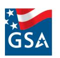
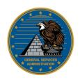

An official website of the United States government

**U.S. General Services [Administration](https://www.gsa.gov/)**

# **Unique Entity Identifier update**

## **About the Unique Entity Identifier**

On April 4, 2022, the federal government stopped using the DUNS number to uniquely identify entities. Now, entities doing business with the federal government use the Unique Entity ID created in SAM.gov. They no longer have to go to a third-party website to obtain their identifier. This transition allows the government to streamline the entity identification and validation process, making it easier and less burdensome for entities to do business with the federal government.

The Integrated Award Environment manages several systems, including SAM.gov, FPDS, eSRS, FSRS, CPARS and FAPIIS. All SAM.gov registrants have been assigned their Unique Entity IDs and can view them in SAM.gov. To learn more about this transition, please see the information below. Join and follow our [community](https://interact.gsa.gov/group/integrated-award-environment-iae-industry-community) on Interact to be notified of the latest news and information about changes happening at IAE.

## **Action you need to take**

If your entity is registered in SAM.gov today, your Unique Entity ID has already been assigned and is viewable in SAM.gov. This includes inactive registrations. The Unique Entity ID is located on your entity registration record. Remember, you must be signed in to your SAM.gov account to view entity records. To learn how to view your Unique Entity ID go to this help [article](https://www.fsd.gov/gsafsd_sp?id=kb_article_view&sysparm_article=KB0041254) [.](https://www.fsd.gov/gsafsd_sp?id=kb_article_view&sysparm_article=KB0041254)

Refer to the Guide to [Getting](https://www.fsd.gov/gsafsd_sp?id=kb_article_view&sysparm_article=KB0050995) a Unique Entity ID if you want to get a Unique Entity ID for your organization without having to complete an entity registration. If you only conduct certain types of transactions, such as reporting as a sub-awardee, you may not need to complete an entity registration. Your entity may only need a Unique Entity ID.

If you operate a system that connects with IAE systems, documentation about using APIs to access SAM.gov is found at is [open.GSA.gov](https://open.gsa.gov/) [.](https://open.gsa.gov/) The latest version of FPDS ATOM feed includes the Unique Entity ID.

Agency system owners are encouraged to join the Technical Interface Community (email [IAE\\_Admin@gsa.gov](mailto:IAE_Admin@gsa.gov) to join).

## **Unique Entity ID now required**

The Unique Entity ID is the official identifier for doing business with the U.S. Government as of April 4, 2022.

- Entities registering in SAM.gov are assigned a Unique Entity ID as a part of the registration process.
- Entity uniqueness continues to be validated by an entity validation service.
- Subcontracting reporting requires the Unique Entity ID obtained in SAM.gov.
- Interfacing systems must use the Unique Entity ID.

The process to get a Unique Entity ID to do business with the government is now easier. You go to a single place, SAM.gov, to:

- Get your Unique Entity ID and register your entity to do business with the U.S. government.
- Make any updates to your legal business name and physical address associated with the Unique Entity ID.
- Find customer support at a single helpdesk for all Unique Entity ID and entity registration issues.

## **Why we changed**

The change we made creates predictability for the cost of entity validation services. By separating the government requirement for a Unique Entity ID from the government requirement to validate that the entities are unique, we introduced competitiveness into entity validation services. We then competed and awarded a new contract for entity validation services that is not connected to the identifier itself. We chose to have the new, non-proprietary identifier both requested in and generated by SAM.gov to reduce the burden of change; the transition in identifiers only needs to happen once, even if in the future a different entity validation service provider is selected.

## **Definition of Unique**

The definition of what makes an entity unique is not changing, however.

- Integrated Award Environment acquires commercial entity validation services to validate entity uniqueness and entity core data.
- Uniqueness is based on an entity being a separate legal entity associated with a separate physical address.
- Based on the uniqueness determination, a Unique Entity ID is assigned to that entity.

## **Unique Entity ID is viewable in IAE systems**

If your entity is registered in SAM.gov today, you already have your Unique Entity ID and it is viewable in SAM.gov. This includes inactive registrations.

All other IAE systems — CPARS, FPDS, FAPIIS — currently display and accept the Unique Entity ID

## **More information**

Visit the UEI technical [specifications](https://www.gsa.gov/node/132988) and API information page to learn more about UEI/EVS technical specifications for interfacing systems and sample data extracts.

## **Further questions**

Press inquiries should be sent to [press@gsa.gov](mailto:press@gsa.gov).