# **Convention Manual**

June 2025

Berne 2025 Universal Postal Union

# **Note concerning the printing**

The text of the Convention is printed in **bold characters**.

The texts of the Regulations and of the Final Protocols are printed in ordinary characters.

The texts of the commentary by the International Bureau are printed in small characters preceded by a square (■). The number of the provision commented on is printed in **bold characters**.

Any amendments to the texts made in the present update of the Manual (compared to the previous version) are marked by a vertical line (**׀** (in the margin opposite the amended text.

# **Remarks**

This updated edition of the Convention Manual includes the provisions of the Universal Postal Convention as adopted by the 2021 Abidjan Congress and those of the Regulations as adopted by the Postal Operations Council at its 2021.2 plenary session and revised at various sessions since 2021, as well as the commentary made by the International Bureau.

The Manual is designed so as to give readers immediate access to all the information about one and the same matter, viz:

- the provisions of the Universal Postal Convention, indicated by **Article 1–41**
- the provisions of the Regulations, indicated by Article 01-001 to 41-001
- the provisions of the Final Protocol, given after the article concerned and indicated by Prot Article ... or Prot Article R ...
- the commentary by the International Bureau following the provisions to which it refers.

The numbering of the Regulations articles begins with the two-digit number of the Convention article to which it refers, followed by a dash, followed by a three-digit number. The first number after the dash indicates whether the article corresponds to the postal services in general (0), to letter post (1), or to parcel post (2). For example, article 01001 refers to article 1 of the Convention; 001 indicates postal services in general.

As a practical matter, Regulations articles may only be presented under one Convention article; nevertheless, they are to be read as applicable to all articles, regardless of where they fall in the contents of the Manual. The text applies to all services within the meaning of the provisions as approved by the Congress and the Postal Operations Council. For example, provisions concerning customs (Convention article 20) apply to basic as well as supplementary services (Convention articles 17 and 18).

# **Contents**

|                                                                                                                                                              | Page  |
|--------------------------------------------------------------------------------------------------------------------------------------------------------------|-------|
| Abbreviations                                                                                                                                                | VII   |
| List<br>of<br>UPU<br>member<br>countries<br>(and<br>their<br>territories)<br>and<br>territories<br>included in the<br>Union by virtue of article<br>4 of the |       |
| Constitution                                                                                                                                                 | XI    |
| Table of UPU letter-post charges                                                                                                                             | XV    |
| List of compendia                                                                                                                                            | XIX   |
| Table of contents                                                                                                                                            | XXIII |
| List of forms                                                                                                                                                | XXXIX |

Provisions of the Universal Postal Convention and its Regulations supplemented by the relevant articles of the Final Protocols, the commentary by the International Bureau, and the forms

# **Abbreviations**

(The abbreviations listed below are mainly used in the commentary)

# **A. Common abbreviations**

Add Prot Additional Protocol to the Constitution of the

UPU

Agr Agreement

AI advice of entry (Giro)

AO other items or items other than LC in the

classification system based on content

AR advice of delivery

arbit arbitration art article c centime

CA Council of Administration CCC Customs Cooperation Council

CCPS Consultative Council for Postal Studies (up to

1994)

cf confer (= compare)

circ circular cm centimetre col column comm commentary Comm Committee

Compendium Compendium of Information (Letter Post,

Parcel Post, etc.) published by the

International Bureau

Conf Conference

Const or Constitution Constitution of the Universal Postal Union

Conv or Convention Universal Postal Convention

dm decimetre

DO designated operator

Doc Document (of Congresses, CA, POC, etc.)

doc document

EC Executive Council (up to 1994) ECOSOC UN Economic and Social Council EDI electronic data interchange

e.g. for example g gramme

Gen Regs General Regulations

h hour

IAEA International Atomic Energy Agency IATA International Air Transport Association

IB International Bureau

IBRS International Business Reply Service ICAO International Civil Aviation Organization

id idem

INCB International Narcotics Control Board

ISO International Organization for Standardization Journal or Periodical "Union Postale" (quarterly publication of the

International Bureau)

kg kilogramme km kilometre

lb (16 oz) pound avoirdupois (453.59 grammes)

LC letters and postcards LDCs least developed countries

LP letter post

LTAT Latest Transport Arrival Time

m metre max maximum min minimum mm millimetre mn minute (of time)

nm nautical mile (1852 metres)

No number

oz ounce (28.3465 grammes) (one sixteenth of

the pound avoirdupois)

p, pp page(s) para paragraph

Periodical See under Journal

POC Postal Operations Council PPCO Parcel Post Compendium Online PPSA Postal Payment Services Agreement

prop proposal

Prot or Protocol Final Protocol (to the respective Act)

QSF Quality of Service Fund

rec recast Regs Regulations

RP Regulations of the Postal Payment Services

Agreement

s second (time)

S.A.L. Surface airlifted mail t tonne (1000 kilogrammes)

t km tonne kilometre or kilometric tonne (unit used

in connection with conveyance)

T.m. sea transit T.t. land transit UN United Nations

UPU or Union Universal Postal Union

vol volume

WCO World Customs Organization WHO World Health Organization

# **B. Abbreviations relating to forms**

(These abbreviations are always followed by the serial number of the form)

CN Convention (from Seoul 1994)

CP Parcels

# **List of UPU member countries (and their territories) and territories included in the Union by virtue of article 4 of the Constitution**

Afghanistan Chile Albania China

Algeria – Special Administrative Region

Angola of Hong Kong

Antigua and Barbuda – Special Administrative Region

Argentina of Macao Armenia Colombia Aruba, Curaçao and Sint Maarten Comoros Australia Congo

– Norfolk Island Costa Rica Austria Côte d'Ivoire Azerbaijan Croatia

Bahamas Cuba Bahrain Cyprus Bangladesh Czechia

Barbados Dem. People's Rep. of Korea Belarus Dem. Rep. of the Congo

Belgium Denmark

Belize – Faroe Islands Benin – Greenland Bhutan Djibouti Bolivia (Plurinational State) Dominica

Bosnia and Herzegovina Dominican Republic

Botswana Ecuador Brazil Egypt Brunei Darussalam El Salvador

Bulgaria Equatorial Guinea Burkina Faso Eritrea Burundi Estonia Cabo Verde Eswatini Cambodia Ethiopia Cameroon Fiji Canada Finland

Central African Rep. – Åland Islands

Chad

# List of UPU member countries (and their territories)

– French Overseas Departments: Iceland

– – French Guiana India

– – Guadeloupe (including

St Barthélémy and St Martin)

– – Martinique Iraq

– – Réunion Ireland – Territorial Community of Mayotte Israel

– Territorial Community of St Pierre and Miquelon

– French Overseas Territories coming within the Union's

jurisdiction by virtue of article 22 of the Constitution:

– – French Polynesia (including Clipperton Island)

– – French Southern and

Antarctic Territories (St Paul

and Amsterdam Islands, Crozet Islands, Kerguelen Islands, Terre Adélie)

– – New Caledonia Liberia

– – Wallis and Futuna Islands Libya

– – Scattered islands (Bassas da India, Europa, Juan de Nova,

Glorieuses, Tromelin)

Gambia Malawi Georgia Malaysia Germany Maldives Ghana Mali Greece Malta Grenada Mauritania Guatemala Mauritius

Guyana Monaco Haiti Mongolia

France Hungary

Indonesia Iran (Islamic Rep.)

Italy Jamaica Japan Jordan Kazakhstan

Kenya Kiribati Kuwait Kyrgyzstan

Lao People's Dem. Rep.

Latvia Lebanon Lesotho

Liechtenstein Lithuania Luxembourg Gabon Madagascar

Guinea – Chagos Archipelago

Guinea-Bissau Mexico Honduras Montenegro Morocco Sao Tome and Principe

Mozambique Saudi Arabia Myanmar Senegal Namibia Serbia Nauru Seychelles Nepal Sierra Leone Netherlands (Kingdom of the) Singapore – Caribbean part of the Netherlands Slovakia Slovenia

New Zealand Solomon Islands

– Ross Dependency Somalia – Cook Islands South Africa – Niue South Sudan – Tokelau Spain Nicaragua Sri Lanka Niger Sudan Nigeria Suriname North Macedonia Sweden Norway Switzerland Oman Syrian Arab Rep. Pakistan Tajikistan Panama Thailand

Papua New Guinea Timor-Leste Paraguay Togo Peru Tonga Philippines – Niuafo'ou

Poland Trinidad and Tobago

Portugal Tunisia Qatar Türkiye Rep. of Korea Turkmenistan Rep. of Moldova Tuvalu

Romania Uganda Russian Federation Ukraine

Rwanda United Arab Emirates

Saint Kitts and Nevis United Kingdom of Great Britain

Saint Lucia and Northern Ireland

Saint Vincent and the Grenadines – Guernsey Samoa – Isle of Man San Marino – Jersey

Overseas Territories (United Kingdom of Great Britain and Northern Ireland):

- Anguilla
- Ascension
- Bermuda
- British Virgin Islands Uruguay
- Cayman Islands Uzbekistan
- Falkland Islands (Malvinas) Vanuatu
- Gibraltar Vatican
- Pitcairn, Henderson, Ducie and Oeno Islands
- South Georgia and the South Sandwich Islands
- St Helena
- St Helena (Dependencies) (islands)
- United States of America
- Territories of the United States of America coming within the Union's jurisdiction by virtue of article 22 of the Constitution:
- – Guam, Puerto Rico, American Samoa, Virgin Islands of the United States of America

- Trust Territory of the Pacific Islands:
- – Mariana Islands including Saipan and Tinian, but not the United States Possession of Guam

– Montserrat Venezuela (Bolivarian Rep.)

Viet Nam Yemen Zambia Zimbabwe

– Tristan da Cunha Non-UPU member countries – Turks and Caicos Islands whose postal services are United Rep. of Tanzania provided by member countries:

> Andorra Marshall Islands Micronesia (Federated States of) Palau

# Table of UPU letter-post charges

| Description of charge                                                        | Amount                                                                                                                                                                                                                                                                                                                                                                                                  | Observations                                                                                                                                                                                                                                                                                                                      | Conv<br>Article | Regs<br>Article       |
|------------------------------------------------------------------------------|---------------------------------------------------------------------------------------------------------------------------------------------------------------------------------------------------------------------------------------------------------------------------------------------------------------------------------------------------------------------------------------------------------|-----------------------------------------------------------------------------------------------------------------------------------------------------------------------------------------------------------------------------------------------------------------------------------------------------------------------------------|-----------------|-----------------------|
| 1                                                                            | 2                                                                                                                                                                                                                                                                                                                                                                                                       | 3                                                                                                                                                                                                                                                                                                                                 | 4               | 5                     |
| Charge for delivery to the<br>addressee of a small packet<br>exceeding 500 g | Same charge as in internal<br>service                                                                                                                                                                                                                                                                                                                                                                   |                                                                                                                                                                                                                                                                                                                                   |                 | 15-101                |
| Charge on items posted after<br>the latest time for posting                  | Same charge as in internal<br>service                                                                                                                                                                                                                                                                                                                                                                   |                                                                                                                                                                                                                                                                                                                                   |                 | 15-101.2.1            |
| Charge on items posted<br>outside normal counter<br>opening hours            | Same charge as in internal<br>service                                                                                                                                                                                                                                                                                                                                                                   |                                                                                                                                                                                                                                                                                                                                   |                 | 15-101.2.2            |
| Charge for collection at the<br>sender's address                             | Same charge as in internal<br>service                                                                                                                                                                                                                                                                                                                                                                   |                                                                                                                                                                                                                                                                                                                                   |                 | 15-101.2.3            |
| Charge for withdrawal<br>outside normal counter<br>opening hours             | Same charge as in internal<br>service                                                                                                                                                                                                                                                                                                                                                                   |                                                                                                                                                                                                                                                                                                                                   |                 | 15-101.2.4            |
| Poste restante charge                                                        | Same charge as in internal<br>service                                                                                                                                                                                                                                                                                                                                                                   |                                                                                                                                                                                                                                                                                                                                   |                 | 15-101.2.5            |
| Storage charge                                                               | Charge collected at the rate<br>laid down by internal legisla<br>tion for any letter post item<br>weighing more than 500 g<br>except items for the blind                                                                                                                                                                                                                                                |                                                                                                                                                                                                                                                                                                                                   |                 | 15-101.2.6            |
| Handling charge                                                              | See "Charge on unpaid or<br>underpaid unregistered<br>items"                                                                                                                                                                                                                                                                                                                                            |                                                                                                                                                                                                                                                                                                                                   |                 |                       |
| Charge on unpaid or<br>underpaid unregistered<br>items                       | Charge adopted for priority<br>items or letters in the first<br>weight step by the country<br>of delivery multiplied by the<br>ratio between the amount of<br>deficient postage and the<br>same charge adopted by<br>the country of origin; to this<br>charge shall be added a<br>handling charge whose<br>guideline amount shall be<br>0.33 SDR or the charge<br>prescribed by internal<br>legislation | The delivering DO may, if it<br>so wishes, collect only the<br>handling charge.                                                                                                                                                                                                                                                   |                 | 06-006.2, 8<br>and 11 |
| Registration charge                                                          | Guideline amount of<br>1.31 SDR at most                                                                                                                                                                                                                                                                                                                                                                 | i<br>For each M bag, DOs<br>shall collect, instead of<br>the charge per item, a<br>bulk charge not exceed<br>ing five times the<br>amount of the charge<br>per item                                                                                                                                                               |                 | 18-101.2              |
|                                                                              |                                                                                                                                                                                                                                                                                                                                                                                                         | ii<br>In addition to the charge<br>per item or bulk charge,<br>DOs may collect, from<br>the sender or from the<br>addressee, special<br>charges in accordance<br>with their internal legis<br>lation, to take account<br>of any exceptional<br>security measures taken<br>with regard to<br>registered items and<br>insured items |                 | 18-101.3              |

# Table of UPU letter-post charges

| Description of charge                                                                             | Amount                                                                                                                                                                                                                                                            | Observations | Conv<br>Article | Regs<br>Article |
|---------------------------------------------------------------------------------------------------|-------------------------------------------------------------------------------------------------------------------------------------------------------------------------------------------------------------------------------------------------------------------|--------------|-----------------|-----------------|
| 1                                                                                                 | 2                                                                                                                                                                                                                                                                 | 3            | 4               | 5               |
| Charge for exceptional<br>security measures                                                       | See "Registration charge"                                                                                                                                                                                                                                         |              |                 |                 |
| Charge for cover against<br>risks due to force majeure                                            | Guideline amount of<br>0.13 SDR for each<br>registered item                                                                                                                                                                                                       |              |                 | 15-101.3        |
| Insurance charge                                                                                  | Guideline amount of<br>0.33 SDR for each<br>65.34 SDR of insured value<br>or fraction thereof or 0.5%<br>of the scale of the insured<br>value, whatever the country<br>of destination, even in<br>countries which undertake<br>to cover risks of force<br>majeure |              |                 | 18-001.3.2.3    |
| Advice of delivery charge                                                                         | Guideline amount of<br>0.98 SDR                                                                                                                                                                                                                                   |              |                 | 18-111.1        |
| Charge for delivery to the<br>addressee in person                                                 | Guideline amount of<br>0.16 SDR                                                                                                                                                                                                                                   |              |                 | 18-104.2        |
| Charge for delivery of an<br>item free of charges and<br>fees                                     | i<br>Charge whose guideline<br>amount shall be<br>0.98 SDR collected by<br>the DO of origin                                                                                                                                                                       |              |                 | 18-003.2.2      |
|                                                                                                   | ii<br>Additional charge<br>whose guideline<br>amount shall be<br>1.31 SDR per request<br>made after posting,<br>collected by the DO of<br>origin                                                                                                                  |              |                 | 18-003.2.4.1    |
|                                                                                                   | iii<br>Commission charge<br>whose guideline<br>amount shall be<br>0.98 SDR collected for<br>the benefit of the DO of<br>destination                                                                                                                               |              |                 | 18-003.2.3      |
| Additional charge (items<br>free of charges and fees)                                             | See "Charge for delivery of<br>an item free of charges and<br>fees"                                                                                                                                                                                               |              |                 |                 |
| Commission charge                                                                                 | See "Charge for delivery of<br>an item free of charges and<br>fees"                                                                                                                                                                                               |              |                 |                 |
| Charge for a request for<br>redirection                                                           | Same charge as internal<br>service                                                                                                                                                                                                                                |              |                 | 19-102.3        |
| Charge for redirection                                                                            | Same charge as internal<br>service                                                                                                                                                                                                                                |              |                 | 19-102.4        |
| Charge for return                                                                                 | Same charge as internal<br>service                                                                                                                                                                                                                                |              |                 | 19-103.3        |
| Charge for a request for<br>withdrawal from the post or<br>alteration or correction of<br>address | Guideline amount of<br>1.31 SDR                                                                                                                                                                                                                                   |              |                 | 19-104.4.1      |

# Table of UPU letter-post charges

| Description of charge             | Amount                                            | Observations                                                                                                                                                                                                                                                                                                                                                                 | Conv<br>Article | Regs<br>Article |
|-----------------------------------|---------------------------------------------------|------------------------------------------------------------------------------------------------------------------------------------------------------------------------------------------------------------------------------------------------------------------------------------------------------------------------------------------------------------------------------|-----------------|-----------------|
| 1                                 | 2                                                 | 3                                                                                                                                                                                                                                                                                                                                                                            | 4               | 5               |
| Presentation-to-Customs<br>charge | Guideline amount of<br>2.61 SDR                   | For each M bag, DOs shall<br>collect, instead of the<br>charge per item, a bulk<br>charge whose guideline<br>maximum amount shall be<br>3.27 SDR. The<br>presentation-to-Customs<br>charge is collected only in<br>respect of the presenter to<br>Customs and customs<br>clearance of items on which<br>customs dues or any other<br>dues of a similar nature are<br>payable | 20.2            | 20-002.1        |
| Customs clearance fee             | Fee based on the actual<br>costs of the operation |                                                                                                                                                                                                                                                                                                                                                                              | 20.3            |                 |

# **List of Compendia**

# **1 Letter Post Compendium**

This Compendium, previously called the "Compendium of Information (Convention)", contains particulars, by country, of the implementation of the Convention and the Letter Post Regulations. It is supplemented by information concerning the conveyance of radioactive materials by post.

# **2 Parcel Post Compendium**

This Compendium contains particulars, by country, of the implementation of the provisions of the Convention relating to postal parcels and the Parcel Post Regulations. It is supplemented by information concerning the conveyance of radioactive materials by post.

# **3 Postal Payment Services Compendium**

This Compendium, previously called the "Postal Financial Services Compendium", contains particulars, by country, of the implementation of the Postal Payment Services Agreement and Regulations.

# **4 Universal Postal List of Localities (UPLL)**

This list, previously called the "International List of Post Offices", contains an alphabetical list of localities. It is supplemented by information about the postal addressing systems used by UPU member countries.

# **5 Compendium of Transit Information**

This Compendium contains a list of kilometric distances relating to land sectors of mails in transit and a list of transit services provided for surface mail (including S.A.L. mail). The information is classified by transit DO in the list of kilometric distances and by DO of destination in the list of transit services provided for surface mail. The latest edition also contains information on surface mails in transit à découvert.

# **6 List of Prohibited Articles**

This list contains information on prohibitions sent in by DOs on the basis of a model referring to the World Customs Organization (WCO) harmonized commodity description and coding system. It is supplemented by information supplied by the UN about narcotics and psychotropic substances under international control and the IATA list of definitions of nine classes of dangerous goods.

# **7 Postal Statistics**

This publication has been produced since 1875 and is now in two parts. The first part gives the statistical data by country, i.e. the data relating to some one hundred headings over the previous five years for each UPU member country or territory. The second part provides a presentation of the statistical data by heading for a selection of headings particularly representative of postal development. All the statistical data available as provided by the UPU International Bureau may be consulted on the UPU website [\(www.upu.int](http://www.upu.int/)).

## **8 List of Airmail Distances**

This list is drawn up in collaboration with IATA. It comprises distances between points served by an international line and distances relating to internal lines which may be used for the conveyance of international mail. It is supplemented by the modalities for transhipment of mail and the IATA threeletter codes (Location Identifiers) and the airline codes.

# **9 UPU teminology database**

TERMPOST is the Universal Postal Union's official terminology database, based on the Multilingual Vocabulary of the International Postal Service, which was issued as a paper publication from 1952 to 2003. It consists of a multilingual term base in French alphabetical order, with equivalent terms in eight languages: Arabic, Chinese, English, French, German, Portuguese, Russian and Spanish. Definitions are provided in English and French only. TERMPOST contains a selection of postal terms and expressions drawn from the UPU Acts and publications. It also includes everyday vocabulary used within the postal sector.

|                              |                                                                                                                                                                                                                                                                       | Page        |
|------------------------------|-----------------------------------------------------------------------------------------------------------------------------------------------------------------------------------------------------------------------------------------------------------------------|-------------|
| Section I<br>postal service  | Rules applicable in common throughout the international                                                                                                                                                                                                               | 1           |
| Art.                         |                                                                                                                                                                                                                                                                       |             |
| 1<br>01-001                  | Definitions<br>Definitions                                                                                                                                                                                                                                            | 1<br>4      |
| 2                            | Designation of the entity or entities responsible for<br>fulfilling the obligations arising from adherence to<br>the Convention                                                                                                                                       | 4           |
| 02-001                       | Mandatory notification of operational information                                                                                                                                                                                                                     | 5           |
| 3                            | Universal postal service                                                                                                                                                                                                                                              | 5           |
| 4<br>04-001<br>04-002        | Freedom of transit<br>Application of freedom of transit<br>Failure to give freedom of transit                                                                                                                                                                         | 6<br>8<br>8 |
| 5                            | Ownership of postal items. Withdrawal from the post.<br>Alteration or correction of address and/or name of the<br>addressee (name of the legal person, or family name,<br>given name or patronymic (if any)). Redirection. Return<br>to sender of undeliverable items | 8           |
| Prot. I                      | Ownership of postal items. Withdrawal from the post.<br>Alteration or correction of address                                                                                                                                                                           | 9           |
| 6                            | Postage stamps                                                                                                                                                                                                                                                        | 10          |
| Prot. II<br>06-001<br>06-002 | Postage stamps<br>Prepayment. Methods of denoting prepayment<br>Postage stamps. Notification of issues and exchange                                                                                                                                                   | 13<br>13    |
| 06-003                       | between designated operators<br>Characteristics of postage stamps and postal prepayment<br>or franking impressions                                                                                                                                                    | 14<br>14    |
| 06-004                       | Suspected fraudulent use of postage stamps or postal<br>prepayment or franking impressions                                                                                                                                                                            | 18          |
| 06-005                       | Application of the date-stamp                                                                                                                                                                                                                                         | 19          |

| Art.                  |                                                                                        | Page     |
|-----------------------|----------------------------------------------------------------------------------------|----------|
| 06-006                | Unpaid or underpaid items                                                              | 20       |
| 06-007                | Prepayment and stamping of items posted on board ship                                  | 23       |
| 7                     | Sustainable development                                                                | 24       |
| 07-001                | Environmental aspects                                                                  | 24       |
| 8<br>08-001<br>08-002 | Postal security<br>Postal security<br>Implementing provisions for providing electronic | 25<br>25 |
| 08-003                | advance data<br>Consignment security declaration                                       | 26<br>28 |
| 9                     | Violations                                                                             | 30       |
| 10                    | Processing of personal data                                                            | 31       |
| 11                    | Exchange of closed mails with military units                                           | 32       |
| 11-101                | Mails exchanged with military units                                                    | 33       |
| 12                    | Posting abroad of letter-post items                                                    | 34       |
| Prot. III             | Posting abroad of letter-post items                                                    | 35       |
| 13                    | Use of the Union's forms                                                               | 37       |
| 13-001                | International mail processing centres (IMPCs)                                          | 38       |
| 13-002                | Forms                                                                                  | 40       |
| Prot. R II            | Forms                                                                                  | 41       |
| 13-003                | Forms for the use of the public                                                        | 42       |
| Section II            | Quality of service standards and targets                                               | 43       |
| 14                    | Quality of service standards and targets                                               | 43       |
| 14-001                | Quality of service targets                                                             | 44       |

| Art.         |                                                        | Page |
|--------------|--------------------------------------------------------|------|
| Section III  | Charges, surcharges and exemption from postal charges  | 45   |
| 15           | Charges                                                | 45   |
| Prot. IV     | Charges                                                | 46   |
| 15-101       | Special charges                                        | 46   |
| Prot. R XIII | Special charges                                        | 47   |
| 15-102       | Conditions of application of postage charges           | 47   |
| Prot. R XIV  | Conditions of application of postage charges           | 50   |
| 15-201       | Calculating air surcharges                             | 50   |
| 15-202       | Special charges                                        | 50   |
| 16           | Exemption from postal charges                          | 51   |
| Prot. V      | Exception to the exemption of items for the blind from |      |
|              | postal charges                                         | 54   |
| 16-001       | Exemption from postal charges on postal service items  | 55   |
| 16-002       | Marking of items sent free of postal charges           | 56   |
| Prot. R I    | Marking of items sent free of postal charges           | 56   |
| 16-003       | Application of exemption from postal charges to bodies |      |
|              | concerned with prisoners of war and civilian internees | 57   |
| Section IV   |                                                        |      |
|              | Basic and supplementary services                       | 57   |
| 17           | Basic services                                         | 57   |
| Prot. VI     | Basic services                                         | 58   |
| Prot. R XXX  | Provision of the postal parcels service                | 59   |
| 17-001       | Monetary unit                                          | 59   |
| 17-002       | Equivalents                                            | 60   |
| 17-003       | Information to be supplied by designated operators     | 61   |
| 17-004       | Union publications                                     | 64   |
| 17-005       | Period of retention of documents                       | 66   |
| 17-006       | Application of standards                               | 67   |
| 17-007       | Direct transhipment of postal consignments             | 67   |

| Art.           |                                                     | Page |
|----------------|-----------------------------------------------------|------|
| 17-008         | Steps to be taken in the event of interrupted       |      |
|                | transport route, or of diversion or missending of   |      |
|                | postal receptacles                                  | 69   |
| 17-009         | Transfer of mails                                   | 70   |
| 17-010         | Preparation and checking of CN 37, CN 38, CN 41     |      |
|                | or CN 47 delivery bills                             | 78   |
| 17-011         | Missing CN 37, CN 38, CN 41 or CN 47 delivery       |      |
|                | bill                                                | 79   |
| 17-012         | Steps to be taken in the event of an accident       | 82   |
| 17-013         | Steps to be taken in the event of temporary         |      |
|                | suspension and resumption of services               | 83   |
| 17-014         | Return of empty receptacles                         | 84   |
| 17-015         | Routeing of dispatches                              | 87   |
| Prot. R XX     | Routeing of mails                                   | 88   |
| Prot. R XXXVII | Routeing of mails                                   | 88   |
| 17-101         | Basic services                                      | 88   |
| 17-102         | Classification of letter-post items based on their  |      |
|                | formats and content                                 | 89   |
| 17-103         | Particulars relating to limits of weight            | 90   |
| Prot. R XV     | Printed papers. Maximum weight                      | 91   |
| 17-104         | Limits of size                                      | 91   |
| 17-105         | Limits of size and weight for small letters (P) and |      |
|                | large letters (G)                                   | 92   |
| 17-106         | Conditions of acceptance of items. Make-up.         |      |
|                | Packing                                             | 93   |
| 17-107         | Special provisions applicable to each category of   |      |
|                | items                                               | 98   |
| Prot. R XVI    | Special provisions applicable to each category of   |      |
|                | items                                               | 106  |
| 17-108         | Marking of priority or mode of transportation       | 107  |
| 17-109         | Special packing                                     | 107  |
| 17-110         | Items in panel envelopes                            | 108  |
| 17-111         | Standardized items                                  | 110  |
| Prot. R XVII   | Standardized items                                  | 113  |
| 17-112         | Exchange of items                                   | 113  |
|                |                                                     |      |

| Art.          |                                                        | Page |
|---------------|--------------------------------------------------------|------|
| 17-113        | Priority treatment of priority items and airmail items | 114  |
| 17-114        | Mails                                                  | 116  |
| 17-115        | Exchange in closed mails                               | 116  |
| 17-116        | Exchange of format-separated mails                     | 117  |
| 17-117        | Transit à découvert                                    | 119  |
| 17-118        | Routes and methods of transmission of insured items    | 124  |
| 17-119        | Make-up of mails                                       | 126  |
| Prot. R XVIII | Bags                                                   | 133  |
| 17-120        | Letter bills                                           | 133  |
| 17-121        | Transmission of registered items                       | 137  |
| 17-122        | Transmission of insured items                          | 140  |
| 17-123        | Transmission of money orders and unregistered COD      |      |
|               | items                                                  | 143  |
| 17-124        | Transmission of tracked items                          | 143  |
| 17-125        | Transmission of IBRS items                             | 144  |
| 17-126        | Transmission of bulk items                             | 144  |
| 17-127        | Transmission of items intended for direct access to    |      |
|               | the domestic service                                   | 146  |
| 17-128        | Labelling of mails                                     | 146  |
| Prot. R XIX   | Labelling of mails                                     | 149  |
| 17-129        | Use of barcodes                                        | 151  |
| 17-130        | Electronic exchanges to support mail processes         | 152  |
| 17-131        | Checking of mails                                      | 154  |
| 17-132        | Verification notes                                     | 159  |
| 17-133        | Misrouted mails and missent items                      | 165  |
| 17-201        | Operation of the service by transport companies        | 165  |
| 17-202        | Weight system. Pound avoirdupois                       | 165  |
| 17-203        | Special conditions relating to limits of weights       | 166  |
| Prot. R XXXI  | Special conditions relating to limits of weights for   |      |
|               | parcels                                                | 166  |
| 17-204        | Limits of size                                         | 166  |
| 17-205        | Delivery procedure                                     | 167  |
| Prot. R V     | Delivery procedure                                     | 167  |
| 17-206        | ECOMPRO parcels                                        | 168  |

| Art.            |                                                     | Page |
|-----------------|-----------------------------------------------------|------|
| 17-207          | Conditions of acceptance of parcels. Make-up and    |      |
|                 | packing. Addressing                                 | 169  |
| 17-208          | Special packing                                     | 171  |
| 17-209          | Indication of method of forwarding                  | 172  |
| 17-210          | Formalities to be complied with by the sender       | 173  |
| Prot. R XLV     | Formalities to be complied with by the sender       | 178  |
| 17-211          | Formalities to be complied with for the             |      |
|                 | merchandise return service                          | 178  |
| Prot. R XXXII   | Formalities to be complied with for the             |      |
|                 | merchandise return service                          | 179  |
| 17-212          | Sender's instructions at the time of posting        | 179  |
| 17-213          | Formalities to be complied with by the office       |      |
|                 | of origin                                           | 180  |
| 17-214          | General principles of the exchange of parcels       | 181  |
| 17-215          | Barcode application and specifications              | 186  |
| 17-216          | Electronic exchanges to support mail processes      | 187  |
| 17-217          | Tracking and tracing –<br>Indicative targets for    |      |
|                 | transmission times                                  | 190  |
| 17-218          | Tracking and tracing –<br>Indicative performance    |      |
|                 | targets for transmitting data                       | 191  |
| 17-219          | Different methods of transmission                   | 191  |
| 17-220          | Transmission in closed mails                        | 192  |
| Prot. R XXXVI   | Transmission in closed mails                        | 196  |
| 17-221          | Parcel bills                                        | 197  |
| 17-222          | Drawing up of CP 87 parcel bills                    | 202  |
| 17-223          | Dispatch of documents accompanying parcels          | 204  |
| 17-224          | Check of mails                                      | 206  |
| 17-225          | Discovery of irregularities and processing of       |      |
|                 | verification notes                                  | 207  |
| 17-226          | Discrepancies of weight or size of parcels          | 209  |
| Prot. R XXXVIII | Discrepancies of weight or size of parcels          | 210  |
| 17-227          | Receipt by the office of exchange of a damaged      |      |
|                 | or insufficiently packed parcel                     | 210  |
| 17-228          | Notification of irregularities for which designated |      |
|                 | operators may be liable                             | 211  |
| 17-229          | Check<br>of mails of parcels forwarded in bulk      | 212  |
| 17-230          | Reforwarding of a parcel arriving out of course     | 212  |
|                 |                                                     |      |

|                                                    | Page                                                                                                                                                                                                                                     |
|----------------------------------------------------|------------------------------------------------------------------------------------------------------------------------------------------------------------------------------------------------------------------------------------------|
|                                                    | 213                                                                                                                                                                                                                                      |
|                                                    | 216                                                                                                                                                                                                                                      |
|                                                    | 216                                                                                                                                                                                                                                      |
|                                                    | 225                                                                                                                                                                                                                                      |
|                                                    | 226                                                                                                                                                                                                                                      |
|                                                    | 227                                                                                                                                                                                                                                      |
|                                                    | 227                                                                                                                                                                                                                                      |
|                                                    | 231                                                                                                                                                                                                                                      |
|                                                    | 239                                                                                                                                                                                                                                      |
| Registered items                                   | 240                                                                                                                                                                                                                                      |
| Registered M bags                                  | 243                                                                                                                                                                                                                                      |
| Transmission of registered M bags                  | 243                                                                                                                                                                                                                                      |
| Tracked items                                      | 243                                                                                                                                                                                                                                      |
| Delivery to the addressee in person                | 245                                                                                                                                                                                                                                      |
| M bags                                             | 246                                                                                                                                                                                                                                      |
| M bags                                             | 247                                                                                                                                                                                                                                      |
| Transmission of M bags                             | 248                                                                                                                                                                                                                                      |
| Checking of M bags                                 | 248                                                                                                                                                                                                                                      |
| International business reply service (IBRS)        | 248                                                                                                                                                                                                                                      |
| IBRS accounting charges                            | 255                                                                                                                                                                                                                                      |
| International business reply service (IBRS) –      |                                                                                                                                                                                                                                          |
| local response                                     | 260                                                                                                                                                                                                                                      |
| International reply coupons                        | 260                                                                                                                                                                                                                                      |
| Advice of delivery for letter-post items           | 265                                                                                                                                                                                                                                      |
| Merchandise return service for the original seller | 267                                                                                                                                                                                                                                      |
| Merchandise return service for the original seller | 269                                                                                                                                                                                                                                      |
| Cumbersome parcels                                 | 269                                                                                                                                                                                                                                      |
|                                                    |                                                                                                                                                                                                                                          |
| Prohibitions and customs matters                   | 271                                                                                                                                                                                                                                      |
| Items not admitted. Prohibitions                   | 271                                                                                                                                                                                                                                      |
| Prohibitions (letter post)                         | 276                                                                                                                                                                                                                                      |
| Prohibitions (postal parcels)                      | 279                                                                                                                                                                                                                                      |
| Articles subject to customs duty                   | 282                                                                                                                                                                                                                                      |
|                                                    | Supplementary services<br>Advice of delivery<br>Insured items<br>Maximum limits for insured items<br>Insured items<br>Delivery procedure<br>Cash-on-delivery items<br>Items for delivery free of charges and fees<br>Consignment service |

| Art.             |                                                                                                                                                    | Page |
|------------------|----------------------------------------------------------------------------------------------------------------------------------------------------|------|
| 19-001           | Dangerous goods admitted exceptionally                                                                                                             | 283  |
| Prot. R VI       | Dangerous goods admitted exceptionally                                                                                                             | 283  |
| 19-002<br>19-003 | Controlling the introduction of dangerous goods<br>Admissible radioactive materials, infectious                                                    | 283  |
| Prot. R VII      | substances, and lithium cells and lithium batteries<br>Admissible radioactive materials, infectious                                                | 284  |
| 19-004           | substances, and lithium cells and lithium batteries<br>Conditions of acceptance and marking of items<br>containing exempt patient specimens (human | 287  |
|                  | or animal)                                                                                                                                         | 287  |
| 19-005           | Conditions of acceptance and marking of items                                                                                                      |      |
|                  | containing infectious substances                                                                                                                   | 288  |
| 19-006           | Conditions of acceptance and marking of items                                                                                                      |      |
|                  | containing radioactive materials                                                                                                                   | 294  |
| 19-007           | Conditions of acceptance of letter-post items and<br>parcels containing lithium cells and batteries                                                |      |
|                  | installed in equipment                                                                                                                             | 295  |
| 19-008           | Dangerous goods prohibited from insertion in                                                                                                       |      |
|                  | letter-post items and parcels                                                                                                                      | 296  |
| 19-009           | Exceptions to prohibitions in parcels                                                                                                              | 296  |
| 19-101           | Treatment of items wrongly admitted                                                                                                                | 297  |
| Prot. R XXV      | Treatment of items wrongly admitted                                                                                                                | 301  |
| 19-102           | Redirection                                                                                                                                        | 301  |
| Prot. R XXVI     | Redirection                                                                                                                                        | 306  |
| 19-103           | Undeliverable items. Return to country of origin or to                                                                                             |      |
|                  | sender and period of retention                                                                                                                     | 307  |
| 19-104           | Treatment of requests for withdrawal of items from                                                                                                 |      |
|                  | the post or for alteration or correction of address                                                                                                | 311  |
| 19-105           | Withdrawal from the post. Alteration or correction of<br>address and/or name of the addressee. Items posted                                        |      |
|                  | in a country other than that which receives the                                                                                                    |      |
|                  | request                                                                                                                                            | 316  |
| 19-201           | Treatment of parcels wrongly admitted                                                                                                              | 317  |
| Prot. R XXXIV    | Treatment of parcels wrongly accepted                                                                                                              | 320  |
| 19-202           | Conditions of redirecting a parcel                                                                                                                 | 320  |

| Art.                                                         |                                                                                                                                                                                                                                         | Page                                   |
|--------------------------------------------------------------|-----------------------------------------------------------------------------------------------------------------------------------------------------------------------------------------------------------------------------------------|----------------------------------------|
| 19-203<br>19-204                                             | Periods of retention<br>Parcels automatically retained                                                                                                                                                                                  | 321<br>322                             |
| Prot. R XXXV<br>19-205<br>19-206                             | Parcels automatically retained<br>Return to sender of undelivered parcels<br>Return to sender of wrongly accepted parcels                                                                                                               | 323<br>326<br>329                      |
| 19-207<br>19-208                                             | Return to sender due to suspension of services<br>Non-compliance by a designated operator with                                                                                                                                          | 329                                    |
| 19-209                                                       | given instructions<br>Parcels containing items whose early deterioration                                                                                                                                                                | 330                                    |
| 19-210                                                       | or decay is to be feared<br>Treatment of requests for withdrawal of parcels<br>from the post or for alteration or correction of                                                                                                         | 330                                    |
|                                                              | address and/or name of the addressee                                                                                                                                                                                                    | 331                                    |
| 20<br>Prot. XI<br>20-001<br>Prot. R VIII<br>20-002<br>20-003 | Customs control. Customs duty and other fees<br>Presentation-to-Customs charge<br>Items subject to customs control<br>Items subject to customs control<br>Presentation-to-Customs charge<br>Cancellation of customs duty and other fees | 334<br>335<br>335<br>340<br>341<br>342 |
| Section VI<br>Liability                                      |                                                                                                                                                                                                                                         | 342                                    |
| 21<br>Prot. XII<br>21-001<br>Prot. R IX<br>21-002<br>21-003  | Inquiries<br>Inquiries<br>Inquiries. General principles<br>Treatment of inquiries<br>Inquiries when using a CN 08 form<br>Inquiries when using IBIS                                                                                     | 342<br>343<br>344<br>344<br>345<br>355 |
| 22<br>22-001<br>Prot. R X                                    | Liability of designated operators. Indemnities<br>Application of the liability of designated operators<br>Application of the liability of designated operators                                                                          | 358<br>362<br>364                      |
|                                                              |                                                                                                                                                                                                                                         |                                        |

| Art.        |                                                                    | Page |
|-------------|--------------------------------------------------------------------|------|
| 23          | Non-liability of member countries and designated                   |      |
| 23-001      | operators<br>Delivery of a rifled or damaged registered or insured | 365  |
|             | item or parcel                                                     | 367  |
| Prot. R XI  | Delivery of a rifled or damaged registered or insured<br>item      | 368  |
| 24          | Sender's liability                                                 | 371  |
| 24-001      | Establishment of sender's liability                                | 371  |
| 25          | Payment of indemnity                                               | 372  |
| 25-001      | Payment of indemnity                                               | 372  |
| 25-002      | Period for payment of indemnity                                    | 374  |
| 25-003      | Automatic payment of indemnity                                     | 374  |
| 25-004      | Determination of liability between designated operators            | 375  |
| 25-005      | Procedures for determining the liability of designated             |      |
|             | operators                                                          | 376  |
| Prot. R XII | Procedures for determining the liability of                        |      |
|             | designatedoperators                                                | 378  |
| 26          | Possible recovery of the indemnity from the                        |      |
|             | sender or the addressee                                            | 379  |
| 26-001      | Recovery from air carriers of indemnities paid                     | 379  |
| 26-002      | Reimbursement of the indemnity to the paying                       |      |
|             | designated operator                                                | 380  |
| 26-003      | Settlement of indemnities between designated                       |      |
|             | operators                                                          | 381  |
| 26-004      | Accounting for amounts due in respect of indemnity                 | 382  |

| Art.                        |                                                   | Page |
|-----------------------------|---------------------------------------------------|------|
| Section VII<br>Remuneration |                                                   | 384  |
| A.                          | Transit charges                                   | 384  |
| 27                          | Transit charges                                   | 384  |
| 27-001                      | Transit charges. Accounting                       | 384  |
| 27-002                      | Application of transit charges                    | 385  |
| 27-003                      | Transit charges                                   | 386  |
| Prot. R XXVII               | Special transit charges                           | 388  |
| 27-004                      | Kilometric distances                              | 390  |
| 27-005                      | Extraordinary services. Multimodal transport      | 390  |
| 27-101                      | Calculation and accounting for charges for items  |      |
|                             | in transit à découvert and missent items          | 391  |
| 27-102                      | Transit charges for diverted or misrouted mails   | 397  |
| 27-103                      | Airmails and surface airlifted (S.A.L.) mails in  |      |
|                             | transit by surface                                | 397  |
| 27-104                      | Payment of transit charges for the transport of   |      |
|                             | empty bags returned by surface or air             | 397  |
| 27-105                      | Amendments to transit charges                     | 398  |
| 27-201                      | Transit land rates for à découvert<br>parcels     | 399  |
| Prot. R XXXIX               | Determination of average rates                    | 399  |
| Prot. R XL                  | Exceptional transit land rates                    | 400  |
| Prot. R XLI                 | Supplementary rates                               | 401  |
| 27-202                      | Application of transit land rates                 | 404  |
| 27-203                      | Sea rate                                          | 405  |
| Prot. R XLII                | Sea rates                                         | 406  |
| 27-204                      | Application of sea rate                           | 406  |
| 27-205                      | Application of new rates following unforeseeable  |      |
|                             | changes in routeing                               | 407  |
| 27-206                      | Weight of mails used for remuneration of          |      |
|                             | designated operators                              | 407  |
| 27-207                      | Allocation of rates                               | 408  |
| 27-208                      | Rates and dues credited to other<br>designated    |      |
|                             | operators by the designated operator of origin of |      |
|                             | the mail                                          | 408  |
|                             |                                                   |      |

| Art.             |                                                                                                                         | Page |
|------------------|-------------------------------------------------------------------------------------------------------------------------|------|
| 27-209           | Allocation and recovery of rates, charges and fees<br>in the case of return to sender or redirection                    | 409  |
| B.               | Terminal dues                                                                                                           | 410  |
| 28               | Terminal dues. General provisions                                                                                       | 410  |
| 29               | Terminal dues. Self-declaration of rates for<br>bulky (E) and small packet (E) letter-post items                        | 414  |
| 30               | Terminal dues. Provisions applicable to mail flows<br>between designated operators of countries in the<br>target system | 421  |
| 31               | Terminal dues. Provisions applicable to mail flows<br>to, from and between designated operators of                      |      |
|                  | countries in the transitional system                                                                                    | 425  |
| 31-101           | Terminal dues. General provisions                                                                                       | 430  |
| 31-102           | Voluntary membership of the target system by                                                                            |      |
|                  | member countries                                                                                                        | 431  |
| 31-103<br>31-104 | Direct access to domestic services<br>Supplementary remuneration for registered, insured                                | 432  |
|                  | and tracked items                                                                                                       | 434  |
| 31-105           | Measurement of performance. Reporting and validation                                                                    | 438  |
| 31-106           | Preparation and transmission of charges for                                                                             |      |
|                  | supplementary remuneration accounts and additional                                                                      |      |
|                  | payments based on central reports                                                                                       | 439  |
| 31-107           | Calculation of the rates of terminal dues for countries                                                                 |      |
|                  | applying articles 30.5 to 13 and 31.5 to 9 of the                                                                       |      |
|                  | Convention                                                                                                              | 442  |
| 31-108           | Conditions applying to the notification of the reference                                                                |      |
|                  | charges for the calculation of terminal dues rates                                                                      | 445  |
| 31-109           | Quality of service–linked terminal dues remuneration                                                                    | 447  |
| 31-110           | Principles for setting or revising quality of service                                                                   |      |
|                  | standards and targets for the quality of service–linked                                                                 |      |
|                  | terminal dues remuneration                                                                                              | 449  |

| Art.       |                                                                                                                | Page |
|------------|----------------------------------------------------------------------------------------------------------------|------|
| 31-111     | Quality of service–linked terminal dues remuneration.                                                          |      |
|            | Reporting and validation                                                                                       | 451  |
| 31-112     | Mechanism for revising the rates of terminal dues                                                              | 452  |
| 31-113     | Request for payment specific to bulk mail                                                                      | 454  |
| 31-114     | Closed mails exchanged with military units                                                                     | 456  |
| 31-115     | General principles for statistical sampling and                                                                |      |
|            | estimation of the number of items per kilogramme                                                               | 456  |
| 31-116     | Statistical counts for exchanges of mail between                                                               |      |
|            | designated operators of countries in the target system                                                         | 458  |
| 31-117     | Statistical counts for exchanges in the transition system                                                      | 460  |
| 31-118     | Alternative approach for statistical counts for exchanges<br>of mail between designated operators of countries |      |
|            | applying target system procedures                                                                              | 461  |
| 31-119     | Special statistical count for the application of the revision<br>mechanism                                     | 462  |
| 31-120     | Self-declaration of bulky (E) and small packet (E) letter-post                                                 |      |
|            | items                                                                                                          | 464  |
| 31-121     | Calculation of cost-to-tariff ratio for designated operators<br>applying article 29.8 of the UPU Convention    | 465  |
| 31-122     | Remuneration for returned undeliverable letter-post items                                                      | 467  |
| 32         | Quality of Service Fund                                                                                        | 475  |
| 32-101     | Invoicing and payment of amounts due into the Quality of<br>Service Fund                                       | 477  |
| C.         | Rates for parcel post                                                                                          | 482  |
| 33         | Parcel post land and sea rates                                                                                 | 482  |
| Prot. XIII | Exceptional inward land rates                                                                                  | 483  |
| Prot. XV   | Special tariffs                                                                                                | 483  |
| 33-201     | Inward land rates                                                                                              | 484  |
| 33-202     | Modifications of the inward land rates                                                                         | 489  |
| 33-203     | ECOMPRO parcels                                                                                                | 491  |

| Art.             |                                                                                          | Page |
|------------------|------------------------------------------------------------------------------------------|------|
| D.               | Air conveyance dues                                                                      | 492  |
| 34               | Basic rates and provisions concerning air                                                |      |
|                  | conveyance dues                                                                          | 492  |
| Prot. XIV        | Basic rates and provisions concerning air                                                |      |
|                  | conveyance dues                                                                          | 493  |
| 34-001<br>34-101 | Payment of air conveyance dues<br>Formula for calculating the basic rate and calculation | 494  |
|                  | of air conveyance dues for closed mails                                                  | 494  |
| 34-102           | Accounting for air conveyance dues                                                       | 497  |
| 34-103           | Preparation of CN 66 and CN 67 statements of                                             |      |
|                  | weights                                                                                  | 498  |
| 34-104           | Preparation of CN 51 detailed accounts and CN 52                                         |      |
|                  | general accounts                                                                         | 501  |
| 34-105           | Submission and acceptance of CN 55, CN 66 and                                            |      |
|                  | CN 67 statements, CN 51 detailed accounts and                                            |      |
|                  | CN 52 general accounts                                                                   | 504  |
| Prot. R XXVIII   | Submission and acceptance of CN 55, CN 66                                                |      |
|                  | and CN 67 statements, CN<br>51 detailed accounts                                         |      |
|                  | and CN 52 general accounts                                                               | 506  |
| 34-106           | Air conveyance dues for diverted or missent mails                                        |      |
|                  | or receptacles                                                                           | 507  |
| 34-107           | Air conveyance dues for mail lost or destroyed                                           | 508  |
| 34-201           | Calculation of air conveyance dues                                                       | 508  |
| 34-202           | Calculation of air conveyance dues for the                                               |      |
|                  | merchandise return service                                                               | 509  |
| Prot. R XLIII    | Calculation of air conveyance dues for the                                               |      |
|                  | merchandise return service                                                               | 510  |
| 34-203           | Air conveyance<br>dues for lost or destroyed air parcels                                 | 510  |
| 34-204           | Air conveyance dues for diverted or missent mails                                        |      |
|                  | or bags                                                                                  | 510  |
| 34-205           | Payment of air conveyance dues for the transport                                         |      |
|                  | of empty bags                                                                            | 512  |

| Art.             |                                                                                    | Page       |
|------------------|------------------------------------------------------------------------------------|------------|
| E.               | Settlement of accounts                                                             | 512        |
| 35               | Provisions specific to the settlement of                                           |            |
|                  | accounts and payments for international postal                                     |            |
|                  | exchanges                                                                          | 512        |
| 35-001           | Transfer and acceptance of statements and<br>accounts                              | 513        |
| 35-002           | Settlement of accounts: general rules                                              | 514        |
| 35-003           | Payment of accounts through the UPU clearing                                       |            |
|                  | system                                                                             | 515        |
| 35-004           | Payment of accounts not settled through the UPU                                    |            |
|                  | clearing system                                                                    | 515        |
| 35-005           | Payment of debts expressed in SDRs. General                                        |            |
|                  | provisions                                                                         | 518        |
| 35-006           | Letter mail: preparation, transmission and                                         |            |
|                  | acceptance of sampling statements                                                  | 519        |
| 35-007           | Letter mail: preparation, transmission and                                         |            |
|                  | acceptance of CN 55, CN 56 and CN 69 statements                                    | 524        |
| 35-008           | Letter mail: accounting for non-sampled flows                                      |            |
|                  | received                                                                           | 528        |
| 35-009           | Letter mail: accounting for bulk mail                                              | 531        |
| Prot. R XXIX     | Accounting for bulk mail                                                           | 533        |
| 35-010           | Letter mail: accounting for direct access mail                                     | 533        |
| 35-011           | Letter mail: preparation, transmission and                                         |            |
|                  | acceptance of transit charges and terminal dues                                    |            |
|                  | detailed accounts                                                                  | 534        |
| 35-012           | Letter mail: provisional payments of terminal dues                                 | 540        |
| 35-013<br>35-014 | Letter mail: preparation of final accounts<br>Parcel mail: preparation of accounts | 541<br>545 |
| Prot. R XXIV     | Adjustment of debts arising from the settlement of                                 |            |
|                  | accounts through the International Bureau clearing                                 |            |
|                  | system in effect before 1 January 2001                                             | 550        |
| Prot. R XLIV     | Preparation of accounts                                                            | 551        |
|                  |                                                                                    |            |

| Art.                           |                                                                                                     | Page       |
|--------------------------------|-----------------------------------------------------------------------------------------------------|------------|
| F.                             | Fixing of charges and rates                                                                         | 552        |
| 36                             | Authority of the Postal Operations Council to fix                                                   |            |
| Prot. XVI                      | charges and rates<br>Authority of the Postal Operations Council to fix                              | 552        |
|                                | charges and rates                                                                                   | 552        |
| Section VIII                   |                                                                                                     |            |
| Optional services              |                                                                                                     | 553        |
| 37                             | EMS and integrated logistics                                                                        | 553        |
| 37-001                         | EMS                                                                                                 | 553        |
| 37-002<br>37-003               | Operation of EMS<br>Integrated logistics service                                                    | 554<br>555 |
|                                |                                                                                                     |            |
| 38                             | Electronic postal services                                                                          | 555        |
| 38-001                         | Hybrid mail                                                                                         | 556        |
| 38-002                         | Facsimile-based services                                                                            | 556        |
| 38-003                         | Text-based services                                                                                 | 556        |
| 38-004<br>38-005               | Electronic postal certification mark<br>Postal registered electronic mail                           | 557<br>559 |
| 38-006                         | Postal electronic mailbox                                                                           | 560        |
| 38-007                         | Telematic links. General provisions                                                                 | 560        |
| 38-008                         | Special provisions concerning telematic links                                                       | 561        |
| 38-009                         | Rules for payment for telematic links                                                               | 561        |
|                                |                                                                                                     |            |
| Section IX<br>Final provisions |                                                                                                     | 562        |
| 39                             | Conditions for approval of proposals<br>concerning the Convention and the Regulations               | 562        |
| 40                             | Reservations at Congress                                                                            | 563        |
| 41<br>41-001                   | Entry into force and duration of the Convention<br>Entry into force and duration of the Regulations | 564<br>564 |

# **List of forms**

# *Letter-post forms*

| No.      | Title or nature of the form                                    | Page       |
|----------|----------------------------------------------------------------|------------|
| CN 01    | International reply coupon                                     |            |
| CN 03    | Detailed statement. Reply coupons exchanged                    |            |
| CN 04    | "R" label for registered items                                 | 264<br>242 |
| CN 05bis | Label for tracked items                                        | 244        |
| CN 06    | "V" label for insured items                                    | 224        |
| CN 07    | Advice of receipt/of delivery/of payment/of entry              | 267        |
| CN 08    | Inquiry                                                        | 350        |
| CN 08    | Receipt                                                        | 352        |
| CN 09    | Statement of IBRS items sent                                   | 256        |
| CN 10    | Recapitulative statement of IBRS items                         | 257        |
| CN 11    | Franking note                                                  | 236        |
| CN 12    | Detailed monthly account. Customs, etc., charges               | 238        |
| CN 13    | Report. Information about a seized postal item                 | 300        |
| CN 14    | Collective envelope. Redirection of letter-post items          | 306        |
| CN 15    | "Return" label                                                 | 310        |
| CN 16    | Special list. Insured items                                    | 142        |
| CN 17    | Request:                                                       | 315        |
|          | –<br>for withdrawal from the post                              |            |
|          | –<br>for alteration or correction of address                   |            |
|          | –<br>for cancellation or alteration of the COD amount          |            |
| CN 18    | Declaration concerning non­receipt (or receipt) of a postal    |            |
|          | item                                                           | 353        |
| CN 19    | Detailed account. IBRS charges                                 | 258        |
| CN 20    | Statement. IBRS charges                                        | 259        |
| CN 21    | Advice. Redirection of a CN 08 form                            | 354        |
| CN 22    | Customs declaration label                                      | 339        |
| CN 23    | Customs declaration                                            | 339        |
| CN 24    | Report (irregularities in respect of insured letter-post items |            |
|          | and postal parcels)                                            | 369        |
| CN 25    | Bundle labels                                                  | 122,131    |
| CN 26    | Bundle labels                                                  | 123,132    |

| No.      | Title or nature of the form                            | Page |
|----------|--------------------------------------------------------|------|
| CN 27    | Table. Routes and methods of transmission of insured   |      |
|          | items                                                  | 125  |
| CN 29    | "COD" label                                            | 229  |
| CN 29bis | Label for COD items                                    | 230  |
| CN 31    | Letter bill                                            | 136  |
| CN 32    | Letter bill. Bulk mail                                 | 145  |
| CN 33    | Special list. Registered items                         | 139  |
| CN 34    | Receptacle label for surface letter mail               | 150  |
| CN 35    | Receptacle label for air letter mail                   | 150  |
| CN 36    | Receptacle label for S.A.L. letter mail                | 151  |
| CN 37    | Delivery bill. Surface mails                           | 74   |
| CN 38    | Delivery bill. Airmails                                | 75   |
| CN 41    | Delivery bill. Surface airlifted (S.A.L.) mails        | 76   |
| CN 42    | Direct transhipment label                              | 69   |
| CN 43    | Verification note. Exchange of mails                   | 163  |
| CN 45    | Transmission envelope for CN 38, CN 41 and CN 47 bills | 78   |
| CN 46    | Substitute delivery bill                               | 81   |
| CN 47    | Delivery bill. Mails of empty receptacles              | 77   |
| CN 48    | Statement. Amounts due in respect of indemnity         | 383  |
| CN 51    | Detailed account. Transit charges                      | 502  |
| CN 52    | General account                                        | 503  |
| CN 53    | Statement of sampling                                  | 522  |
| CN 54    | Recapitulative statement of items                      | 522  |
| CN 54bis | Annual recapitulative statement                        | 523  |
| CN 55    | Statement of mails                                     | 525  |
| CN 56    | Recapitulative statement of mails                      | 526  |
| CN 57    | Account. Bulk mail received                            | 532  |
| CN 57bis | Final account. Bulk mail                               | 532  |
| CN 60    | Detailed account. Supplementary remuneration           |      |
|          | programme. Quarterly statement                         | 441  |
| CN 61    | Detailed account. Terminal dues                        | 536  |
| CN 62    | Detailed account. Transit charges – Surface mail       | 538  |
| CN 62bis | Detailed account. Additional sea transit charges       | 540  |
| CN 64    | Statement. Terminal dues                               | 544  |
| CN 64bis | Detailed statement. Quality of Service Fund            | 480  |
| CN 64ter | Detailed statement. Quality of Service Fund            | 481  |

| No.                                                            | Title or nature of the form                                                                                                                                                                                                                                                                                                                                                        | Page |
|----------------------------------------------------------------|------------------------------------------------------------------------------------------------------------------------------------------------------------------------------------------------------------------------------------------------------------------------------------------------------------------------------------------------------------------------------------|------|
| CN 65                                                          | Bill. Weight of missent and à découvert items                                                                                                                                                                                                                                                                                                                                      | 396  |
|                                                                |                                                                                                                                                                                                                                                                                                                                                                                    | 499  |
|                                                                |                                                                                                                                                                                                                                                                                                                                                                                    |      |
|                                                                |                                                                                                                                                                                                                                                                                                                                                                                    | 500  |
|                                                                |                                                                                                                                                                                                                                                                                                                                                                                    | 527  |
|                                                                |                                                                                                                                                                                                                                                                                                                                                                                    | 29   |
|                                                                |                                                                                                                                                                                                                                                                                                                                                                                    | 530  |
|                                                                |                                                                                                                                                                                                                                                                                                                                                                                    | 530  |
|                                                                |                                                                                                                                                                                                                                                                                                                                                                                    | 472  |
| CN 73                                                          | Account. Return of undeliverable items                                                                                                                                                                                                                                                                                                                                             | 474  |
| CN 66<br>CN 67<br>CN 69<br>CN 70<br>CN 71<br>CN 71bis<br>CN 72 | Statement of weights. Airmails and S.A.L. mails<br>Statement of weights. À découvert priority/airmail items.<br>À découvert non-priority/surface items<br>Statement of closed transit mail<br>Consignment security declaration<br>Quarterly account, non-sampled mail flows received<br>Final account. Non-sampled mail flows received<br>Statement. Return of undeliverable items |      |

# Forms

# *Parcel-post forms*

| No.               | Title or nature of the form                                                | Page       |
|-------------------|----------------------------------------------------------------------------|------------|
| CP 72             | Manifold set. Customs declaration/Dispatch note                            | 175        |
| CP 73             | Parcel label with the number of the parcel                                 | 181        |
| CP 74             | "V" label for insured parcel                                               | 225        |
| CP 75             | Summarized account                                                         | 548        |
| CP 77             | Statement of charges                                                       | 328        |
| CP 78             | Verification note                                                          | 324        |
| CP 81             | Table. Surface parcels                                                     | 184        |
| CP 82             | Table. Air parcels                                                         | 185        |
| CP 83             | Receptacle label for surface parcel mail                                   | 196        |
| CP 84             | Receptacle label for air parcel mail                                       | 197        |
| CP 85             | Receptacle label for S.A.L. parcel mail                                    | 197        |
| CP 87             | Parcel bill                                                                | 201        |
| CP 88             | Special parcel bill. Payment of rates due for the transit<br>of<br>parcels | 202        |
| CP 91             | Envelope for transmission of dispatch note, customs, etc.<br>documents     | 205        |
| CP 92             | Envelope for transmission of dispatch note, customs, etc.<br>documents     | 205        |
| CP 94             | Statement of amounts due                                                   | 549        |
| CP 94bis<br>CP 95 | Statement of amounts due with weight brackets<br>COD label                 | 550<br>230 |

# Universal Postal Convention

The plenipotentiaries of the governments of the member countries of the Universal Postal Union, in view of article 21.3 of the Constitution of the Universal Postal Union concluded at Vienna on 10 July 1964, have, by common consent and subject to article 24.3 and 5 of that Constitution, drawn up in this Universal Postal Convention the rules applicable throughout the international postal service.

# Section I

Rules applicable in common throughout the international postal service

# **Article 1 Definitions**

- **1 For the purposes of the Convention, the following terms shall have the meanings defined below:**
- **1.1 letter-post item: item described in and conveyed under the conditions of the Convention and Regulations;**
- **1.2 parcel-post item: item described in and conveyed under the conditions of the Convention and Regulations;**
- **1.3 EMS item: item described in and conveyed under the conditions of the Convention, Regulations and associated EMS instruments;**
- **1.4 documents: a letter-post, parcel-post or EMS item consisting of any piece of written, drawn, printed or digital information, excluding objects of merchandise, whose physical specifications lie within the limits specified in the Regulations;**
- **1.5 goods: a letter-post, parcel-post or EMS item consisting of any tangible and movable object other than money, including objects of merchandise, which does not fall under the definition of "documents" as provided in paragraph 1.4 above and whose physical specifications lie within the limits specified in the Regulations;**

- **1.6 closed mail: labelled receptacle(s) sealed with or without lead, containing postal items;**
- **1.7 misrouted mails: receptacles received at an office of exchange other than the one mentioned on the (receptacle) label;**
- **1.8 personal data: information needed to identify a postal service user;**
- **1.9 missent items: items received at an office of exchange meant for an office of exchange in another member country;**
- **1.10 transit charges: remuneration for services rendered by a carrier in the country crossed (designated operator, other service or combination of the two) in respect of the land, sea and/or air transit of letter-post items;**
- **1.11 terminal dues: remuneration owed to the designated operator of the country of destination by the designated operator of the dispatching country in compensation for the costs incurred in the country of destination for letter-post items received;**
- **1.12 designated operator: any governmental or non-governmental entity officially designated by the member country to operate postal services and to fulfil the related obligations arising out of the Acts of the Union on its territory;**
- **1.13 small packet: item conveyed under the conditions of the Convention and the Regulations;**
- **1.14 inward land rate: remuneration owed to the designated operator of the country of destination by the designated operator of the dispatching country in compensation for the costs incurred in the country of destination for parcels received;**
- **1.15 transit land rate: remuneration owed for services rendered by a carrier in the country crossed (desig-nated operator, other service or combination of the two) in respect of the land and/or air transit of parcels through its territory;**
- **1.16 sea rate: remuneration owed for services rendered by a carrier (designated operator, other service or a combination of the two) participating in the sea conveyance of parcels;**

- **1.17 inquiry: a complaint or query relating to the use of a postal service submitted in accordance with the conditions of the Convention and its Regulations;**
- **1.18 universal postal service: the permanent provision of quality basic postal services at all points in a member country's territory, for all customers, at affordable prices;**
- **1.19 transit à découvert: open transit through an intermediate country, of items whose number or weight does not justify the make-up of closed mails for the destination country.**

*The need to standardize the interpretation of certain terms and expressions in the Acts was already being recognized in the 1950s. In this context, the 1952 Brussels Congress decided to produce a compilation of postal terminology in a work which would subsequently become known as the Multilingual Vocabulary of the International Postal Service. This terminological publication was designed to facilitate the application of the Acts of the Union: precise, standard postal terminology helps to ensure that all Union member countries interpret the Acts in the same way. However, the Multilingual Vocabulary had no legal standing, and served simply as a reference tool.*

*The 2004 Bucharest Congress therefore adopted, on the proposal of the CA, two new arts relating to the definitions in the Const and the Conv, thereby conferring a legal status on the terms listed in these arts.*

*1.12 Recognizing the existence of diverse structures in the member countries, the Seoul Congress declared in its resolution C 29/1994 that the term "postal administration" in the Acts of the Union was to be defined by each member country within the framework of its national legislation. The Beijing Congress, in its resolution C 110/1999, stressed the need to define more clearly, and distinguish between, the governmental and operational roles and responsibilities of the bodies of the Union with respect to the provision of international postal services. In resolution C 11/2004, the Bucharest Congress instructed the CA, in conjunction with the IB, to study in greater depth the use of the term "postal administration" in the Acts of the Union and to suggest solutions for defining or replacing the term. The 24th Congress (Geneva) decided to replace the term "postal administration" with the terms "member country" and/or "designated operator" in the various articles of the Acts, depending on the context. The definition of "designated operator" was included in Const art 1 as well as here in the Conv. With respect to the Conv, Congress replaced the term "postal administration" with "member country" and/or "designated operator" to identify, and distinguish between, the different roles and responsibilities of each actor in the provision of international postal services. After the Congress, the POC made the final decisions on how to apply the new terminology to the Regs. Because most provisions in the Regs deal with operational and technical questions, the term "postal administration" was generally replaced by "DO". The few exceptions are those provisions that contain the instructions and authorization from governments to DOs. All occurrences of the term "country" in the Regs were kept, given the "territorial" nature of two non-sovereign member countries of the Union, namely: 1 – the Overseas Territories (United Kingdom of Great Britain and Northern Ireland); and 2 – Aruba, Curaçao and Sint Maarten. As regards the forms referred to in the Regs, the term "adm" was systematically replaced by "DO".*

# Article 01-001 Definitions

- 1 For the purposes of these Regulations, the following terms shall have the meanings defined below.
- 1.1 Air parcel any parcel as defined in the UPU Convention which is conveyed by air with priority.
- 1.2 IBIS any UPU-certified common Internet-based inquiry system compliant with the UPU operational and technical procedures defined or referred to herein and used for the preparation, submission, transmission, receipt and processing of inquiries relating to parcels between designated operators.
- 1.3 Name in the context of sender or addressee, comprises the name of the legal person, or the family name, given name and patronymic (if any, as provided).[1](#page-45-0)

# **Article 2**

**Designation of the entity or entities responsible for fulfilling the obligations arising from adherence to the Convention**

**1 Member countries shall notify the International Bureau, within six months of the end of Congress, of the name and address of the governmental body responsible for overseeing postal affairs. Within six months of the end of Congress, member countries shall also provide the International Bureau with the name and address of the operator or operators officially designated to operate postal services and to fulfil the obligations arising from the Acts of the Union on their territory. Between Congresses, member countries shall notify the International Bureau of any changes in the governmental bodies as soon as possible. Any changes with regard to the officially designated operators shall also be notified to the International Bureau as soon as possible, and preferably at least three months prior to the entry into force of the change.**

<span id="page-45-0"></span><sup>1</sup> For the purposes of this definition, any references to family name, given name and patronymic shall apply only to natural persons.

**2 When a member country officially designates a new operator, it shall indicate the scope of the postal services that the latter will provide under the Acts of the Union, as well as the operator's geographical coverage on its territory.**

### *Commentary*

*In many Union member countries, governmental/regulatory and commercial/operational functions have been separated. In its resolution C 29/1994, the Seoul Congress decided that member countries that had separated governmental and regulatory activities from commercial and operational activities should notify the IB, within six months of signing of the Acts of the Union, of the name and address of the governmental body responsible for overseeing postal affairs. The resolution also required member countries to provide information regarding the entity or entities (operators) responsible for fulfilling obligations arising from adherence to the Conv. The 2004 Bucharest Congress created this Conv art, which also provides for the possibility of designating more than one operator with responsibility for the obligations arising out of the Acts of the Union within a single member country.*

# Article 02-001 Mandatory notification of operational information

Pursuant to Convention article 2, a newly designated operator shall provide all the necessary operational information for the services provided under the Acts of the Union. The operational information shall be provided through the Letter Post Compendium Online and Parcel Post Compendium Online (see article 17-003.5) as quickly as possible, but not later than two months prior to the commencement of mail operations. The newly designated operator shall also provide the International Bureau with the information required for the "List of names and addresses of heads and senior officials in member countries" (see article 17-004.2.1). Financial information shall be provided pursuant to article 35-004.

# **Article 3 Universal postal service**

**1 In order to support the concept of the single postal territory of the Union, member countries shall ensure that all users/customers enjoy the right to a universal postal service involving the permanent provision of quality basic postal services at all points in their territory, at affordable prices.**

- **2 With this aim in view, member countries shall set forth, within the framework of their national postal legislation or by other customary means, the scope of the postal services offered and the requirement for quality and affordable prices, taking into account both the needs of the population and their national conditions.**
- **3 Member countries shall ensure that the offers of postal services and quality standards will be achieved by the operators responsible for providing the universal postal service.**
- **4 Member countries shall ensure that the universal postal service is provided on a viable basis, thus guaranteeing its sustainability.**

*The UPU's mission as it emerges from the Const is "to develop social, cultural and commercial communications between all peoples throughout the single postal territory by the efficient operation of the postal services described in the Acts."*

*From the preamble to its Const, the UPU thus takes the form of the guarantor of the right of peoples to communication and information.*

*However, several recent developments could be liable to reduce this right of the peoples unless there is an appropriate reaction from Union member countries.*

*By promoting the development of competition, the general movement towards liberalization and globalization of services has introduced the logic of the market into the postal sector which, accordingly, has reorganized itself on more commercial lines. To remain competitive in this new environment, a growing number of DOs are being converted into commercial companies subject to the demands of profitability and profit. Although the postal services are commercial services, in most countries they play a social and cultural role. As such, they represent a material form of the right to communication. Furthermore, as it is necessary to maintain a postal network sufficiently dense to serve the whole population of the territory, the postal services provide a permanent link between the members of a particular national community. The local post office is often the only access to communication in isolated areas, abandoned by other commercial activities or not yet reached by 21st century communication technologies, particularly because of their cost.*

*It is up to member countries to ensure that the modernization of DOs and the reform process started in most countries contribute to the discharge of the obligations arising from their commitment to provide a universal postal service. This commitment includes, in particular, the obligation to ensure the provision and accessibility of postal services, at affordable prices, in areas which strict commercial logic would not consider as offering sufficient value-added potential (for instance, in areas which are difficult to get to).*

# **Article 4 Freedom of transit**

**1 The principle of the freedom of transit is set forth in article 1 of the Constitution. It shall carry with it the obligation for each member country to ensure that its designated operators forward, always by**  **the quickest routes and the most secure means which they use for their own items, closed mails and à découvert letter-post items which are passed to them by another designated operator. This principle shall also apply to missent items and misrouted mails.**

- **2 Member countries which do not participate in the exchange of postal items containing infectious sub-stances or radioactive substances shall have the option of not admitting these items in transit à découvert through their territory. The same shall also apply to printed papers, periodicals, magazines, small packets and M bags the content of which does not satisfy the legal requirements governing the conditions of their publication or circulation in the country crossed.**
- **3 Freedom of transit for parcels shall be guaranteed throughout the territory of the Union.**
- **4 If a member country fails to observe the provisions regarding freedom of transit, other member countries may discontinue their provision of postal services with that member country.**

### *Commentary*

*1 The principle of freedom of transit does not mean that countries are obliged to open their frontiers to transport organized by another country of the UPU. It does not derogate from the right to a national postal monopoly, but it implies that intermediate DOs are also obliged to have conveyed by their services, allocated to ordinary postal conveyance, correspondence which is passed on to them by another DO of the UPU. The 1964 Vienna Congress adopted the following resolution C 23: "Congress, considering that freedom of transit is one of the essential and fundamental principles of the Universal Postal Union, appeals to the good faith and solidarity of all the member countries of the Union to ensure, in all circumstances, strict respect for the application of this principle, without which the Universal Postal Union cannot completely fulfil its mission and thus contribute as much as could be wished to the strengthening of the bonds of international friendship."*

*In connection with so-called "hijacking" activities, the 1974 Lausanne Congress reaffirmed the principles of freedom of transit by the adoption of resolution C 60 as follows: "Congress, having noted that so-called 'hijacking' activities perpetrated throughout the world may directly or indirectly affect the principles of freedom of transit and the inviolability of postal items, wishing to affirm these principles and to retain complete effectiveness in the face of new facts or acts which may infringe them, declares that mails, regardless of what they may be or to which category they may belong, affected by so-called 'hijacking' activities are inviolable, and that the subsequent forwarding of the said mails must be assured on a priority basis by the country where the aircraft landed or was freed, even if this aircraft is the subject of disputes of a non-postal nature." The principle of freedom of transit implies the inviolability of correspondence in the country of transit.*

*3 Countries have the right to inspect parcels in transit; here internal regulations are applicable. DOs must inform each other through the IB of service prohibitions or restrictions governing the import and transit of parcels.*

Article 04-001 Application of freedom of transit

Member countries not providing the insured items service or not accepting liability for insured items carried by their sea or air services shall nonetheless be bound to forward, by the quickest route and the most secure means, closed mails passed to them by other member countries.

Article 04-002 Failure to give freedom of transit

Discontinuation of the postal service with a member country that fails to observe freedom of transit shall be notified in advance to the member countries and designated operators concerned by e-mail or any other means of telecommunication. The International Bureau shall be informed of the fact.

# **Article 5**

**Ownership of postal items. Withdrawal from the post. Alteration or correction of address and/or name of the addressee (name of the legal person, or family name, given name or patronymic (if any)). Redirection. Return to sender of undeliverable items**

- **1 A postal item shall remain the property of the sender until it is delivered to the rightful owner, except when the item has been seized in pursuance of the national legislation of the country of origin or destination and, in case of application of article 19.2.1.1 or 19.3, in accordance with the national legislation of the country of transit.**
- **2 The sender of a postal item may have it withdrawn from the post or have its address and/or the name of the addressee (name of the legal person, or family name, given name or patronymic (if any)) altered or corrected. The charges and other conditions are laid down in the Regulations.**

**3 Member countries shall ensure that their designated operators redirect postal items if an addressee has changed his address, and return undeliverable items to the sender. The charges and other conditions are laid down in the Regulations.**

Prot. Article I

Ownership of postal items. Withdrawal from the post. Alteration or correction of address

- 1 The provisions in article 5.1 and 2 shall not apply to Antigua and Barbuda, Bahrain, Barbados, Belize, Botswana, Brunei Darussalam, Canada, China (exclusively for the Special Administrative Region of Hong Kong), Dominica, Egypt, Eswatini, Fiji, Gambia, Grenada, Guyana, Ireland, Jamaica, Kenya, Kiribati, Kuwait, Lesotho, Malawi, Malaysia, Mauritius, Nauru, New Zealand, Nigeria, Papua New Guinea, Saint Kitts and Nevis, Saint Lucia, Saint Vincent and the Grenadines, Samoa, Seychelles, Sierra Leone, Singapore, Solomon Islands, Trinidad and Tobago, Tuvalu, Uganda, United Kingdom of Great Britain and Northern Ireland, Overseas Territories (United Kingdom of Great Britain and Northern Ireland), United Rep. of Tanzania, Vanuatu and Zambia
- 2 Nor shall article 5.1 and 2 apply to Austria, Denmark and Iran (Islamic Rep.), whose internal legislation does not allow withdrawal from the post or alteration of the address of correspondence, at the request of the sender, from the time when the addressee has been informed of the arrival of an item addressed to him.
- 3 Article 5.1 shall not apply to Australia, Ghana and Zimbabwe.
- 4 Article 5.2 shall not apply to Bahamas, Belgium, the Dem. People's Rep. of Korea, Iraq and Myanmar, whose legislation does not permit withdrawal from the post or alteration of address of letter-post items at the sender's request.
- 5 Article 5.2 shall not apply to the United States of America.
- 6 Article 5.2 shall apply to Australia only in so far as that article is consistent with its domestic legislation.

7 Notwithstanding article 5.2, Dem. Rep. of the Congo, El Salvador, Panama, Philippines and Venezuela (Bolivarian Rep.) shall be authorized not to return postal parcels after the addressee has requested their clearance by Customs, since this is incompatible with those countries' customs legislation.

### **Commentary**

**1** This information is published in the Letter Post Compendium.

# **Article 6 Postage stamps**

- **1 The term "postage stamp" shall be protected under the present Convention and shall be reserved exclusively for stamps which comply with the conditions of this article and of the Regulations.**
- **2 Postage stamps:**
- **2.1 shall be issued and put into circulation solely under the authority of the member country or territory, in conformity with the Acts of the Union;**
- **2.2 are a manifestation of sovereignty and constitute proof of prepayment of the postage corresponding to their intrinsic value when affixed to postal items, in conformity with the Acts of the Union;**
- **2.3 must be in circulation, for postal prepayment or for philatelic purposes, in the member country or territory of issue, according to its national legislation;**
- **2.4 must be accessible to all citizens within the member country or territory of issue.**
- **3 Postage stamps comprise:**
- **3.1 the name of the member country or territory of issue, in roman letters, or, if the International Bureau of the Union is so requested by the member country or territory of issue, the abbreviation or initials officially representing the member**

**country or territory of issue, in accordance with the conditions laid down in the Regulations;[2](#page-52-0)**

- **3.2 the face value, expressed:**
- **3.2.1 in principle, in the official currency of the country or territory of issue, or as a letter or symbol;**
- **3.2.2 through other identifying characteristics.**
- **4 Emblems of state, official control marks and logos of intergovernmental organizations featuring on postage stamps shall be protected within the meaning of the Paris Convention for the Protection of Industrial Property.**
- **5 The subjects and designs of postage stamps shall:**
- **5.1 be in keeping with the spirit of the Preamble to the Constitution and with decisions taken by the Union's bodies;**
- **5.2 be closely linked to the cultural identity of the member country or territory, or contribute to the dissemination of culture or to maintaining peace;**
- **5.3 have, when commemorating leading figures or events not native to the member country or territory, a close bearing on the country or territory in question;**
- **5.4 be devoid of political character or of any topic of an offensive nature in respect of a person or a country;**
- **5.5 be of major significance to the member country or territory.**
- **6 Postal prepayment impressions, franking machine impressions and impressions made by a printing press or another printing or stamping process in accordance with the Acts of the Union may be used only with the authorization of the member country or territory.**

<span id="page-52-0"></span><sup>2</sup> An exception shall be granted to the United Kingdom of Great Britain and Northern Ireland, the country which invented the postage stamp.

**7 Prior to issuing postage stamps using new materials or technologies, member countries shall provide the International Bureau with the necessary information concerning their compatibility with mail processing machines. The International Bureau shall inform the other member countries and their designated operators accordingly.**

### *Commentary*

*The 24th UPU Congress (Geneva, 2008) decided to include the following optional points concerning postage stamp illustrations in the form of a commentary in the LP Regs:*

*Postage stamps may contain:*

- *– the official emblem of the member country or territory of issue;*
- *– the word "Postes" (Postage) in roman or other letters;*
- *– an expiry date;*
- *– the year of issue;*
- *– in the case of a personalized stamp, an image or portrait of a living person;*
- *– in the case of a personalized stamp, the logo or emblem of a private company;*
- *– any mark allowing digital reading of the stamp for commercial or postal routeing purposes;*
- *– the name of the artist;*
- *– the name of the printer.*

*As the subject of intellectual property rights, postage stamps may also contain:*

- *– copyright, by including the copyright sign ©, indicating ownership of the copyright and mentioning the year of issue;*
- *– a mark registered in the territory of the issuing member country or territory, by including the registered trademark symbol ® after the mark.*

*The sale of or trade in postage stamps is a purely internal matter. Each State shall make provision for it in the light of its own position in this matter (decision C 16/Paris 1947).*

- *2 This provision sanctions the principle that only duly authorized issuing authorities (for the most part DOs) are competent to issue stamps denoting payment of postage.*
- *3 DOs are totally free to choose the colour of their postage stamps.*

*The text of this para allows the production of postage stamps without indication of postage value.*

- *5 With regard to the subjects of postage stamps:*
  - − *the 1979 Rio de Janeiro Congress adopted recommendation C 85 recommending that "any postal administration wishing to reproduce in one of its issues a postage stamp already issued by another administration should obtain the consent of the latter beforehand";*
  - − *the 1984 Hamburg Congress adopted recommendation C 27 recommending that "postal administrations, in choosing themes for their issues of postage stamps, should:*
    - *make every attempt to avoid topics or designs of an offensive nature in respect of a person or a country;*
    - *choose themes calculated to contribute to the dissemination of culture, the strengthening of bonds of friendship among peoples and the establishment and maintenance of peace in the world";*
  - − *the 1989 Washington Congress, by recommendation C 80, recommended that DOs observe the procedures described in the philatelic code of ethics for the use of member countries, annexed to that recommendation, when issuing and providing postage stamps and postal items for philatelic purposes. The philatelic code of ethics has been revised by each Congress, most recently by the Istanbul Congress (recommendation C 13/2016).*

Prot. Article II Postage stamps

Notwithstanding article 6.7, Australia, Malaysia, New Zealand and the United Kingdom of Great Britain and Northern Ireland will process letterpost items and postal parcels bearing postage stamps using new materials or technologies that are not compatible with their respective mail processing machines only upon prior agreement with the designated operator of origin concerned.

# Article 06-001

Prepayment. Methods of denoting prepayment

- 1 Letter-post items
- 1.1 As a general rule, letter-post items shall be fully prepaid by the sender.
- 1.2 Methods of denoting prepayment
- 1.2.1 Prepayment shall be denoted by means of any one of the following methods:
- 1.2.1.1 postage stamps printed on or affixed to the items and valid in the member country of origin;
- 1.2.1.2 postal prepayment impressions valid in the member country of origin and dispensed by automatic vending machines installed by designated operators of origin;
- 1.2.1.3 impressions of officially approved franking machines valid in the country of origin, operating under the direct supervision of the designated operator of origin;
- 1.2.1.4 impressions made by a printing press or other printing or stamping process when such a system is authorized by the regulations of the designated operator of origin.
- 2 Letter-post items may also be provided with an indication that full postage has been prepaid, for example, "Taxe perçue" ("Postage paid"). This indication shall appear in the top right-hand part of the address side

and be authenticated by a date-stamp impression of the office of origin. In the case of unpaid or underpaid items, the impression of the office which prepaid the item or made up the postage on it shall be applied opposite this indication.

3 Parcels shall be prepaid by means of postage stamps or by any other method authorized by the regulations adopted by the country of origin or by its designated operators.

# Article 06-002

Postage stamps. Notification of issues and exchange between designated operators

- 1 Each new issue of postage stamps shall be notified by the designated operator concerned to all other designated operators, with the necessary information, through the intermediary of the International Bureau.
- 2 Designated operators shall exchange, through the intermediary of the International Bureau, one set of each of their new issues of postage stamps and shall send 15 sets to the International Bureau. This represents a total of 235 stamps to be dispatched for each new issue.

### *Commentary*

*1 Notification of postage stamp issues and exchange is made in the "Postage stamps – Information and distribution" bulletin published by the IB. It must be further noted that the additional registration, by the IB, of postage stamps in the UPU's WADP Numbering System (WNS) database does not form part of the formal obligations outlined in article 06-002, and may be subject to further conditions, including without limitation due observance of the various requirements contained in article 6.5 of the Conv.*

# Article 06-003

Characteristics of postage stamps and postal prepayment or franking impressions

- 1 Postage stamps and postal prepayment impressions
- 1.1 Postage stamps and postal prepayment impressions may be of any shape provided that, in principle, their vertical or horizontal dimensions are not less than 15 mm nor more than 50 mm.

- 1.2 They may be distinctively marked with punched perforations or embossed impressions produced by means of an embossing stamp, subject to the conditions laid down by the designated operator or the member country which has issued them, provided that those processes do not interfere with the clarity of the particulars prescribed in article 6 of the Convention.
- 1.3 Commemorative or charity postage stamps may bear an indication of the year of issue in Arabic numerals. Similarly, they may bear an inscription in any language to indicate the occasion for which they are issued. When a supplementary charge is payable in addition to their postage value, they shall be so designed as to leave no doubt about that value.
- 1.4 In accordance with article 6 of the Convention, postage stamps may, in place of the name of the issuing member country or territory, and subject to a formal request duly sent by the issuing member country or territory to the International Bureau, include the abbreviation or initials officially listed in the ISO 3166 standard for the member country or territory concerned.
- 2 Franking machine impressions
- 2.1 Designated operators may use themselves or authorize the use of postal franking machines reproducing on items the name of the member country of origin and the postage value, as well as the name of the place of origin and the date of posting. However, the last two items of information shall not be compulsory. For franking machines used by designated operators themselves, the postage value may be replaced by an indication that postage has been prepaid, for example in the form: "Taxe perçue" (Charge collected).
- 2.2 Impressions produced by postal franking machines shall, in principle, be bright red. However, designated operators may permit that the impressions produced by franking machines may be made in a colour other than bright red. The impressions of any publicity slogans used with the franking machines may also be produced in a colour other than red.

- 2.3 The names of the member country and place of origin shall be given in roman letters, which may be supplemented by the same information in other letters. The postage value shall be shown in Arabic figures.
- 3 Franking impressions
- 3.1 Franking impressions obtained from a printing press or by another printing or stamping process shall bear the name of the member country of origin and, if appropriate, of the office of posting in roman letters, which may be supplemented by the same information in other letters. They shall also bear an indication that postage has been prepaid, for example in the form "Taxe perçue" (Charge collected). In every case, the phrase adopted shall be shown in bold letters in a space the area of which shall not be less than 300 mm2. The date-stamp, if used, shall not appear in this space.
- 3.2 Franking impressions obtained from an electronic printing process may be applied above the address field, separated from it by a vertical distance of between 2.5 and 5 mm, regardless of the location of the address. Such franking impressions may be applied directly on the envelope or inside the envelope window. In the latter case, the printing and positioning of the item inside the envelope shall be constrained such that no part of the franking impression is closer than 5 mm to the edge of the window. The provisions of paragraph 3.1 shall apply to this type of impression. Where the franking impression incorporates or is supported by data encoded in a twodimensional symbol, this shall comply with UPU Technical Standard S28.

- *1.1 The words "in principle" were inserted in order not to impose constraints on DOs with regard to the dimensions of postage stamps. The dimensions indicated, however, are intended as guidelines.*
- *2.2 Bright red is also recommended for postal franking impressions or stamps used by post offices for indicating that postage has been fully paid, e.g. "Taxe perçue".*

### *3.2 Examples of franking impressions obtained from an electronic printing process:*

### *Example 1 – Without S28-compliant 2d symbol*

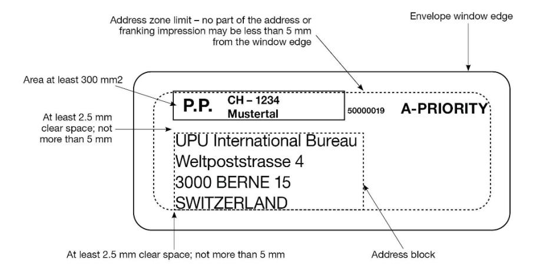

*Example 2 – With S28-compliant 2d symbol printed to the left of the address*

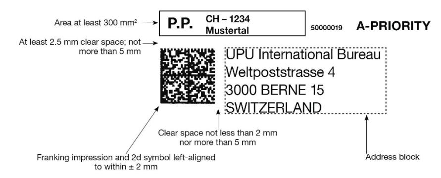

*Example 3 – With S28-compliant 2d symbol printed above the address*

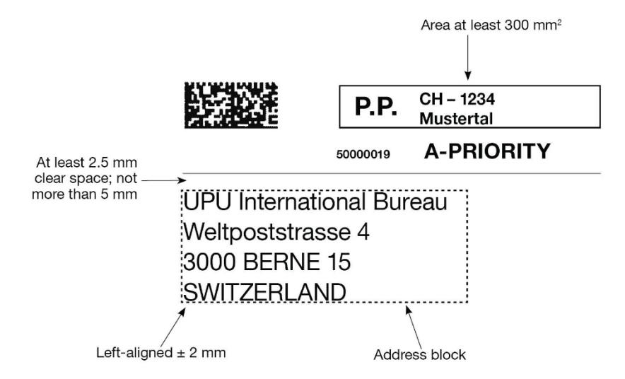

*N.B. – S28 allows 2d symbols to be printed in other positions (e.g. to the right of the address), but this is not recommended.*

# Article 06-004

Suspected fraudulent use of postage stamps or postal prepayment or franking impressions

- 1 Subject to national criminal or criminal action provisions, the following procedure shall be observed in case of suspicion of an intentional violation concerning means of postal prepayment.
- 1.1 When, in outgoing mail, an intentional violation concerning means of postal prepayment is suspected and the sender is not known, the stamp or impression shall not be tampered with in any way. The item, accompanied by an advice, shall be sent to the delivery office in an officially registered envelope. A copy of the advice shall be forwarded, for information, to the designated operators of the member countries of origin and of destination. Any designated operator may ask, through notification of the International Bureau, for these advices concerning its service to be sent to its central administration or to a specially appointed office.

- 1.2 The addressee shall be invited to see the evidence. The item shall be delivered to him only if he pays the charge due, discloses the name and address of the sender and places at the disposal of the postal service, after acquainting himself with the contents, the subject of the suspected violation. This may be the entire item, if it is inseparable from the corpus delicti, or the part of the item (envelope, wrapper, portion of letter, etc.) which contains the address and the impression or stamp reported as suspect. The result of the interview shall be set down in an official report signed by the postal official and by the addressee. If the addressee refuses, this shall be recorded on the document.
- 2 The official report shall be sent with the supporting papers, officially registered, to the designated operator of the member country of origin, which shall take action according to its legislation.
- 3 Designated operators whose legislation does not permit the procedure provided for in 1.1 and 1.2 shall inform the International Bureau to that effect so that the other designated operators may be notified.

**3** *This information is published in the LP Compendium.*

# Article 06-005 Application of the date-stamp

- 1 The imprint of a date-stamp showing, in roman letters, the name of the office responsible for cancelling and the date of that operation shall be applied to the address side of items. Equivalent particulars in the characters of the country of origin may be added.
- 2 The application of the date-stamp shall not be compulsory:
- 2.1 for items franked by means of impressions of postal franking machines if the name of the place of origin and the date of posting appear on these impressions;
- 2.2 for items franked by means of impressions obtained by a printing press or by any other printing or stamping process;

- 2.3 for unregistered reduced-rate items, provided that the place of origin is shown on these items;
- 2.4 for letter-post items relating to the postal service as listed in article 16.1 of the Convention and article 16-001.
- 3 All postage stamps valid for prepayment shall be cancelled.
- 4 Unless designated operators have prescribed cancellation by means of a special stamp impression, postage stamps left uncancelled through error or omission in the service of origin shall be cancelled by the office which detects the irregularity, using one of the following means:
- 4.1 with a thick line in ink or indelible pencil;
- 4.2 using the edge of the date-stamp in such a way that the name of the post office is not identifiable.
- 5 Missent items, except for unregistered reduced rate items, shall be impressed with the date-stamp of the office which they have reached in error. This shall apply to both stationary offices, and, as far as possible, travelling post offices. The impression shall be made on the back of priority items in envelopes and letters and on the front of postcards.

*1 The 1964 Vienna Congress expressed the formal opinion that "correspondence should be stamped on the front by the office of origin with the imprint of a date-stamp showing the place of origin in roman letters and the date of posting in Arabic numerals" (formal opinion C 7).*

# Article 06-006 Unpaid or underpaid items

1 The designated operator of origin may return unpaid or underpaid items to the sender for the latter to make up the postage himself. The senders of unpaid or underpaid items shall be identified by any methods provided for in the member country of origin's national regulations, including those applicable to undeliverable items.

- 2 The designated operator of origin may also itself undertake to prepay unpaid letter-post items or make up the postage on underpaid items and collect the missing amount from the sender. In this case, it shall be authorized to also collect a guideline handling charge of 0.33 SDR.
- 3 If the designated operator of origin does not apply any of the options provided for in 1 and 2 or if the postage cannot be made up by the sender, unpaid or underpaid priority items, letters and postcards shall still be forwarded to the country of destination. Other unpaid or underpaid items may also be forwarded.
- 4 Notwithstanding the provisions of paragraph 3, the designated operator of origin shall not be obliged to forward to the countries of destination the following categories of items when they have been posted in posting boxes or other installations of the designated operator:
- 4.1 unpaid or underpaid items on which the sender is not indicated or whose sender cannot be identified;
- 4.2 unpaid postcards bearing labels or marks purporting to certify that postage has been paid.
- 5 Notwithstanding the provisions of paragraph 9, the designated operator of origin shall not be obliged to forward to the countries of destination unpaid postcards bearing labels or marks purporting to certify that postage has been paid when such postcards have been posted in posting boxes or other installations of the designated operator.
- 6 The designated operator of origin shall lay down the criteria for forwarding unpaid or underpaid items to the country of destination. Nevertheless, designated operators shall, as a general rule, dispatch by the quickest method (air or surface) items marked by the sender to be sent as priority items or airmail items.
- 7 A designated operator of origin which wants missing postage to be collected from the addressee shall follow the procedure described in 8 and 10. Unpaid or underpaid items submitted to this procedure shall be liable to a special charge, payable by the addressee or, in the case of returned items, by the sender, calculation of which is defined in 11.

- 8 Before being forwarded to the country of destination, unpaid or underpaid items shall be marked with the T stamp (postage due) in the middle of the upper part of the front. Beside the impression of this stamp the designated operator of origin shall write very legibly in the currency of its country the amount of the underpayment and, under a fraction line, that of its minimum unreduced charge valid for the first weight step for priority items or letters dispatched abroad.
- 9 The designated operator of origin shall be responsible for checking that international mail items posted in its country are correctly prepaid. On arrival in the country of destination, every item not bearing the T stamp impression in accordance with the provisions under 8 shall be considered to be duly prepaid and treated accordingly.
- 10 When a designated operator of first destination wants missing postage to be collected from the addressee (reforwarded items) or from the sender (returned items), the task of applying the T stamp and giving the amounts in the form of a fraction shall be the responsibility of this designated operator. The same shall apply in the case of items originating in countries which apply reduced charges in the service with the reforwarding designated operator. In such a case, the fraction shall be established according to the charges laid down in these Regulations and valid in the country of origin of the item.
- 11 The delivering designated operator which wants to collect missing postage shall mark the item with the charge to be collected. It shall determine this charge by multiplying the fraction resulting from the data mentioned under 8 by the amount, in its national currency, of the charge applied in the international service to the first weight step for priority items or letters dispatched abroad. To this charge, it shall add the handling charge prescribed under 2. The delivering designated operator may, if it so wishes, collect only the handling charge.
- 12 If the fraction laid down under 8 has not been shown beside the T stamp by the designated operator of origin or the reforwarding designated operator in the case of non-delivery, the designated operator of destination may deliver the underpaid item without collecting a charge.

- 13 Postage stamps and postal franking impressions not valid for prepayment of postage shall not be taken into account. In that case, the figure nought (0) shall be placed beside such postage stamps or impressions, which shall be marked around in pencil.
- 14 Registered items and insured items shall be regarded on arrival as duly prepaid.

- *6 DOs of origin decide on their own policy regarding transmission of items which it is not possible to have regularized by the senders. They may decide to send priority items, surcharged airmail items and surcharged S.A.L. items as priority mail, by air or as S.A.L., respectively, if the charges paid represent at least the difference between the charge for a priority item and the charge for a non-priority item or, as appropriate, the surcharge or the difference between the charge for an airmail or S.A.L. item and the charge for a surface item. They may also decide to send these items by priority means or by air when the charges paid represent at least 75% of the surcharge or 50% of the combined charge. In this case, below these limits, the items are forwarded by means of transport normally used for non-priority items or unsurcharged items.*
- *8 Where a tracked item has been treated as such despite underpayment of postage, the charge of the amount of the deficient postage applies not only to the transport charge properly speaking but also to the special charge for tracked items.*
- *10 In relations between countries which apply reduced charges, it is the UPU system charge which has to be levied and not the reduced charge.*
- *14 The office of origin is responsible for the prepayment of registered items and insured items; therefore no charge is to be collected for unpaid or underpaid postage.*

# Article 06-007

Prepayment and stamping of items posted on board ship

- 1 Items posted on board ship at the two terminal points of the voyage or at any intermediate port of call shall be prepaid by means of postage stamps and according to the rates of the country in whose waters the ship is lying.
- 2 If the items are posted on board on the high seas, they may be prepaid, in the absence of special agreement between the designated operators concerned, by means of the postage stamps and according to the rates of the country to which the ship appertains or is under contract. Items prepaid in this way must be handed over to the post office at the port of call as soon as possible after the arrival of the ship.

3 The stamping of items posted on ships shall be the responsibility of the postal official or the officer on board charged with the duty, or, failing those, of the post office at the port of call at which these items are handed over. In that case, the office shall impress the correspondence with its datestamp and add the word "Navire", "Paquebot" or any other similar note.

### *Commentary*

*2 An application of maritime practice according to which any ship on the high seas is "part of the territory" of the country whose flag it flies. The country issuing the postage stamps is considered as the country of origin, even when the stamps, having been affixed on the high seas, are cancelled at the next port with the date-stamp of another country.*

# **Article 7 Sustainable development**

**Member countries and/or their designated operators shall adopt and implement a proactive sustainable development strategy focusing on environmental, social and economic action at all levels of postal operations and promote sustainable development awareness.**

# Article 07-001 Environmental aspects

- 1 Designated operators should make their products and services as environment friendly as possible within the limits imposed by technologies and resources.
- 2 The consumption of materials and energy should be optimized and be the minimum consistent with the efficient conduct of operations.
- 3 Materials used should comply with non-pollution or non-toxic standards established by the relevant national and international agencies.
- 4 Designated operators should promote the recycling of paper and other materials. They should also promote the use of recycled materials.

# **Article 8 Postal security**

- **1 Member countries and their designated operators shall observe the security requirements defined in the Universal Postal Union's security standards and shall adopt and implement a proactive security strategy at all levels of postal operations to maintain and enhance the confidence of the general public in the postal services provided by designated operators, in the interests of all officials involved. This strategy shall include the objectives defined in the Regulations, as well as the principle of complying with requirements for providing electronic advance data on postal items identified in implementing provisions (including the type of, and criteria for, postal items) adopted by the Council of Administration and Postal Operations Council, in accordance with the Union's technical messaging standards. The strategy shall also include the exchange of information on maintaining the safe and secure transport and transit of mails between member countries and their designated operators.**
- **2 Any security measures applied in the international postal transport chain must be commensurate with the risks or threats that they seek to address, and must be implemented without hampering worldwide mail flows or trade by taking into consideration the specificities of the mail network. Security measures that have a potential global impact on postal operations must be implemented in an internationally coordinated and balanced manner, with the involvement of the relevant stakeholders.**

Article 08-001 Postal security

- 1 Member countries and their designated operators shall adhere to UPU Technical Standards S58, "Postal security – General security measures" and S59, "Postal security – Office of exchange and international airmail security", and aim to:
- 1.1 raise quality of service as a whole;
- 1.2 increase employee awareness of the importance of security;

- 1.3 create or reinforce security units;
- 1.4 share operational, security and investigative information on a timely basis;
- 1.5 propose to legislatures, wherever necessary, specific laws, regulations and measures to improve the quality and security of worldwide postal services;
- 1.6 provide guidelines, training methods and assistance to postal officials to enable them to deal with emergency situations that could endanger life or property or could hamper the mail transport chain, in order to maintain the continuity of operations.

# Article 08-002

Implementing provisions for providing electronic advance data

- 1 Items containing goods may be subject to specific import customsand security-based requirements for providing electronic advance data as referred to in article 8.1 of the Convention and further specified in the respective provisions of the Regulations. All member countries and their designated operators shall have the option of informing other member countries and their designated operators of their specific security requirements (in accordance with the aforementioned provisions) via the relevant compendium. Letters, postcards, printed papers (other than books) or letter-post items containing correspondence or items for the blind, which are not subject to customs duties, shall be exempted from these requirements.
- 2 Each item for which electronic advance data is provided shall be accompanied by the appropriate UPU customs declaration form.
- 3 The electronic advance data required to meet such requirements shall, in all cases, replicate data documented on the appropriate UPU customs declaration form.
- 4 Each item for which electronic advance data is provided shall bear a unique item identifier, in both human-readable and barcode format, conforming to UPU Technical Standard S10. All exchanges of electronic

advance data provided for customs and security reasons shall be compliant with UPU EDI Messaging Standard M33 (ITMATT V1) and shall correspond to the content of the UPU customs declaration form.

- 5 When dispatching items for which electronic advance data is to be provided for customs and security reasons, the designated operator of origin shall ensure that each dispatched item's unique S10 barcoded identifier has been electronically linked (nested) to the S9 barcoded label of the receptacle containing that item, and that this information is included in the PREDES (UPU Technical Standard M41) electronic dispatch messaging sent to the designated operator of destination.
- 6 When dispatching receptacles for which electronic advance data (EAD) is required for certain destination countries, the designated operator of origin shall ensure that all such country-specific EAD requirements have been duly met and that the relevant CARDIT message is transmitted, including any applicable regulations (AR) flag, in compliance with UPU Messaging Standard M48.
- 7 When dispatching international postal items for which electronic advance data is required for certain destination countries, the designated operator of origin shall take reasonable measures to ensure that all such requirements (as referred to in paragraph 1) have been duly met and no "Request for Information", "Request for Screening" or "Do Not Load" referrals have been received via ITMREF, in compliance with UPU EDI Messaging Standard M53.
- 8 When dispatching international postal items for which electronic advance data is required for certain destination countries, the designated operator of origin shall take reasonable measures to ensure that any "Request for Information" or "Request for Screening" referrals received via ITMREF have been processed and responded to via REFRSP, in compliance with UPU EDI Messaging Standards M53 and M54.
- 9 Electronic advance data shall be used in a manner consistent with the relevant provisions of the Acts of the Union regarding the processing of personal data. Without prejudice to the foregoing, the exchange of such data may be additionally governed by bilateral or multilateral agreements or protocols regarding the protection of personal data and other technical aspects relating to data exchanges.

- 10 Certain items may be subject to extra security measures as per the relevant procedures adopted by the UPU in consultation with other relevant stakeholders. Such measures may include, *inter alia*, the tracing and/or prevention of further conveyance of individual items.
- 11 In order to safeguard the smooth flow of the items referred to herein, member countries and designated operators implementing the provisions of this article shall do so in a manner that is consistent with the capacity of the global postal network and the available infrastructure for implementation thereof, and also take into account whether the requirements for providing electronic advanced data can be met by all concerned parties in the international postal transport chain.

# Article 08-003 Consignment security declaration

- 1 The transport of mail by air may be subject to specific security-based requirements and may require the provision of a standardized consignment security declaration to the carrier by the sending designated operator in accordance with applicable aviation security regulations.
- 2 When the provision of a consignment security declaration is required:
- 2.1 The consignment security declaration shall be provided to the carrier electronically as part of the CARDIT standardized message if other applicable regulations so allow.
- 2.2 When electronic provision is not possible, a paper document with the information shall be sent together with the delivery bill. It is strongly recommended to use the CN 70[3](#page-69-0) consignment security declaration for this purpose.
- 2.3 The method of providing the consignment security declaration shall be agreed with the carrier in advance.

28

<span id="page-69-0"></span><sup>3</sup> The CN 70 document is based on the IATA form, which has been endorsed by ICAO.

| Regulated entity category (RA, KC or AO) and identifier (of the regulated party issuing the security status)                                                             |                                         | Unique consignment identifier     |  |                               |  |
|--------------------------------------------------------------------------------------------------------------------------------------------------------------------------|-----------------------------------------|-----------------------------------|--|-------------------------------|--|
| Contents of consignment                                                                                                                                                  |                                         | 1                                 |  |                               |  |
|                                                                                                                                                                          |                                         |                                   |  |                               |  |
| Consolidation                                                                                                                                                            |                                         |                                   |  |                               |  |
| Origin                                                                                                                                                                   | Destination                             | Transfer/Transit points (# known) |  |                               |  |
| Security status                                                                                                                                                          | Reasons for issuing the security status |                                   |  |                               |  |
|                                                                                                                                                                          | Received from (codes)                   | Screening method (codes)          |  | Grounds for exemption (codes) |  |
| Other screening method(s) (If applicable)                                                                                                                                |                                         |                                   |  |                               |  |
| Security status issued by                                                                                                                                                |                                         | Security status issued on         |  |                               |  |
| Name of person or employee ID                                                                                                                                            | Date (dd/mm/yyyy) Time (tttt)           |                                   |  |                               |  |
| Regulated entity category (RA, KC or AO) and identifier (of any regulated party that has accepted the security status given to a consignment by another regulated party) |                                         |                                   |  |                               |  |
| Additional security information                                                                                                                                          | 7                                       |                                   |  |                               |  |
| Additional security information                                                                                                                                          |                                         |                                   |  |                               |  |

# **Article 9 Violations**

- **1 Postal items**
- **1.1 Member countries shall undertake to adopt the necessary measures to prevent, prosecute and punish any person found guilty of the following:**
- **1.1.1 the insertion in postal items of narcotics and psychotropic substances, as well as dangerous goods, where their insertion has not been expressly authorized by the Convention and Regulations;**
- **1.1.2 the insertion in postal items of objects of a paedophilic nature or of a pornographic nature using children.**
- **2 Means of postal prepayment and postal payment itself**
- **2.1 Member countries shall undertake to adopt the necessary measures to prevent, prosecute and punish any violations concerning the means of postal prepayment set out in this Convention, such as:**
- **2.1.1 postage stamps, in circulation or withdrawn from circulation;**
- **2.1.2 prepayment impressions;**
- **2.1.3 impressions of franking machines or printing presses;**
- **2.1.4 international reply coupons.**
- **2.2 In this Convention, violations concerning means of postal prepayment refer to any of the acts outlined below committed by any persons with the intention of obtaining illegitimate gain for oneself or for a third party. The following acts shall be punished:**
- **2.2.1 any act of falsifying, imitating or counterfeiting any means of postal prepayment, or any illegal or unlawful act linked to the unauthorized manufacturing of such items;**

- **2.2.2 manufacture, use, release for circulation, commercialization, distribution, dissemination, transportation, exhibition or display (also in the form of catalogues and for advertising purposes) of any means of postal prepayment which has been falsified, imitated or counterfeited;**
- **2.2.3 any act of using or circulating, for postal purposes, any means of postal prepayment which has already been used;**
- **2.2.4 any attempt to commit any of these violations.**
- **3 Reciprocity**
- **3.1 As regards sanctions, no distinction shall be made between the acts outlined in 2, irrespective of whether national or foreign means of postal prepayment are involved; this provision shall not be subject to any legal or conventional condition of reciprocity.**

# **Article 10 Processing of personal data**

- **1 Personal data on users may be employed only for the purposes for which they were gathered in accordance with applicable national legislation.**
- **2 Personal data on users shall be disclosed only to third parties authorized by applicable national legislation to access them.**
- **3 Member countries and their designated operators shall ensure the confidentiality and security of personal data on users, in accordance with their national legislation.**
- **4 Designated operators shall inform their customers of the use that is made of their personal data, and of the purpose for which they have been gathered.**

**5 Without prejudice to the foregoing, designated operators may transfer electronically personal data to the designated operators of destination or transit countries that need these data in order to fulfil the service.**

# **Article 11**

**Exchange of closed mails with military units**

- **1 Closed letter-post mails may be exchanged through the intermediary of the land, sea or air services of other countries:**
- **1.1 between the post offices of any member country and the commanding officers of military units placed at the disposal of the United Nations;**
- **1.2 between the commanding officers of such military units;**
- **1.3 between the post offices of any member country and the commanding officers of naval, air or army units, warships or military aircraft of the same country stationed abroad;**
- **1.4 between the commanding officers of naval, air or army units, warships or military aircraft of the same country.**
- **2 Letter-post items enclosed in the mails referred to under 1 shall be confined to items addressed to or sent by members of military units or the officers and crews of the ships or aircraft to or from which the mails are forwarded. The rates and conditions of dispatch applicable to them shall be fixed, according to its regulations, by the designated operator of the member country which has made the military unit available or to which the ships or aircraft belong.**
- **3 In the absence of special agreement, the designated operator of the member country which has made the military unit available or to which the warships or military aircraft belong shall be liable to the designated operators concerned for the transit charges for the mails, the terminal dues and the air conveyance dues.**

*Commentary*

*<sup>3</sup> See art 31-114.*

# Article 11-101 Mails exchanged with military units

1 Intermediate designated operators shall be informed, as far as possible in advance, of the establishment of an exchange of closed mails as mentioned in article 11 of the Convention.

| 2        | The address of these mails shall be worded as follows:                                                                                                   |           |
|----------|----------------------------------------------------------------------------------------------------------------------------------------------------------|-----------|
| From     | the<br>office<br>of<br>                                                                                                                                  |           |
| For<br>{ | the (nationality) naval (or air) unit of (designation of<br>}<br>the unit) at<br>the (nationality) ship (name of ship) at                                | (Country) |
| or       |                                                                                                                                                          |           |
|          | From the (nationality) naval (or air) unit of (designation of the<br>}<br>unit) at<br>From the (nationality) ship (name of ship) at<br>For the office of | (Country) |
| or       |                                                                                                                                                          |           |
|          | From the (nationality) naval (or air) unit of (designation of<br>}<br>the unit) at<br>From the (nationality) ship (name of ship) at                      | (Country) |
| For<br>{ | the (nationality) naval (or air) unit of (designation of<br>}<br>the unit) at<br>the (nationality) ship (name of ship) at                                | (Country) |

- 3 The mails concerned shall be forwarded by the fastest route (air or surface), according to the indication written on the address, and under the same conditions as mails exchanged between post offices.
- 4 The captain of a mail-boat conveying mails for a naval unit or a warship shall hold them at the disposal of the commanding officer of the naval unit or ship of destination, should the latter ask him for delivery en route.

- 5 If the ships are not at the place of destination when the mails addressed to them arrive there, the mails shall be kept at the post office until they are collected by the addressee or redirected to another point. Redirection may be requested either by the designated operator of origin, by the commanding officer of the naval unit or ship of destination, or by a consul of the same nationality.
- 6 Those mails which are marked "Aux soins du Consul d'..." (Care of the Consul of ...) shall be delivered to the consulate indicated. At the request of the consul they may afterwards be received back into the postal service and redirected to the place of origin or to another address.
- 7 Mails addressed to a warship shall be regarded as being in transit up to the time of their delivery to the commanding officer of that ship, even when they have been originally addressed to the care of a post office or to a consul charged to act as forwarding agent. They shall not, therefore, be regarded as having reached their address until they have been delivered to the warship concerned.
- 8 By agreement between the designated operators concerned, the above procedure shall also be applicable, if necessary, to mails exchanged with military units placed at the disposal of the United Nations and with military aircraft.

# **Article 12 Posting abroad of letter-post items**

- **1 A designated operator shall not be bound to forward or deliver to the addressee letter-post items which senders residing in the territory of its member country post or cause to be posted in a foreign country with the object of profiting by the more favourable rate conditions there.**
- **2 The provisions set out under 1 shall be applied without distinction both to letter-post items made up in the sender's country of residence and then carried across the frontier and to letter-post items made up in a foreign country.**

- **3 The designated operator of destination may claim from the designated operator of posting, payment of the internal rates. If the designated operator of posting does not agree to pay these rates within a time limit set by the designated operator of destination, the latter may either return the items to the designated operator of posting and shall be entitled to claim reimbursement of the redirection costs, or handle them in accordance with its national legislation.**
- **4 A designated operator shall not be bound to forward or deliver to the addressees letter-post items which senders post or cause to be posted in large quantities in a country other than the country where they reside if the amount of terminal dues to be received is lower than the sum that would have been received if the mail had been posted in the country where the senders reside. The designated operator of destination may claim from the designated operator of posting payment commensurate with the costs incurred and which may not exceed the higher of the following two amounts: either 80% of the domestic tariff for equivalent items, or the rates applicable pursuant to articles 29, 30.5 to 30.11, 30.12 and 30.13, or 31.17, as appropriate. If the designated operator of posting does not agree to pay the amount claimed within a time limit set by the designated operator of destination, the designated operator of destination may either return the items to the designated operator of posting and shall be entitled to claim reimbursement of the redirection costs, or handle them in accordance with its national legislation.**

Prot. Article III Posting abroad of letter-post items

1 Australia, Austria, Greece, New Zealand, United Kingdom of Great Britain and Northern Ireland and United States of America reserve the right to impose a charge, equivalent to the cost of the work it incurs, on any designated operator which, under the provisions of article 12.4, sends to it items for disposal which were not originally dispatched as postal items by their services.

- 2 Notwithstanding article 12.4, Canada reserves the right to collect from the designated operator of origin such amount as will ensure recovery of not less than the costs incurred by it in the handling of such items.
- 3 Article 12.4 allows the designated operator of destination to claim, from the designated operator of posting, appropriate remuneration for delivering letter-post items posted abroad in large quantities. Australia and the United Kingdom of Great Britain and Northern Ireland reserve the right to limit any such payment to the appropriate domestic tariff for equivalent items in the country of destination.
- 4 Article 12.4 allows the designated operator of destination to claim, from the designated operator of posting, appropriate remuneration for delivering letter-post items posted abroad in large quantities. The following member countries reserve the right to limit any such payment to the limits authorized in the Regulations for bulk mail: Aruba, Curaçao and Sint Maarten, Bahamas, Barbados, Brunei Darussalam, China, Grenada, Guyana, India, Malaysia, Nepal, Netherlands (Kingdom of the), New Zealand, Saint Lucia, Saint Vincent and the Grenadines, Singapore, Sri Lanka, Suriname, Thailand, United Kingdom of Great Britain and Northern Ireland, Overseas Territories (United Kingdom of Great Britain and Northern Ireland) and United States of America.
- 5 Notwithstanding the reservations under 4, the following member countries reserve the right to apply in full the provisions of article 12 of the Convention to mail received from Union member countries: Argentina, Australia, Austria, Azerbaijan, Belgium, Benin, Brazil, Burkina Faso, Cameroon, Canada, Côte d'Ivoire, Cyprus, Denmark, Egypt, France, Germany, Greece, Guinea, Iran (Islamic Rep.), Israel, Italy, Japan, Jordan, Lebanon, Luxembourg, Mali, Mauritania, Monaco, Morocco, Norway, Pakistan, Portugal, Russian Federation, Saudi Arabia, Senegal, Switzerland, Syrian Arab Rep., Togo and Türkiye.
- 6 In application of article 12.4, Germany reserves the right to request the mailing country to grant compensation of the amount it would receive from the country of which the sender is resident.

- 7 Notwithstanding the reservations made under article III, China reserves the right to limit any payment for delivering letter-post items posted abroad in large quantities to the limits authorized in the Convention and its Regulations for bulk mail.
- 8 Notwithstanding article 12.3, Austria, Belgium, Germany, Liechtenstein, Switzerland and the United Kingdom of Great Britain and Northern Ireland reserve the right to claim from the sender or, failing that, from the designated operator of posting, the payment of the internal rates.

# **Article 13 Use of the Union's forms**

- **1 Unless otherwise provided by the Acts of the Union, only designated operators shall use the Union's forms and documentation for the operation of postal services and exchange of postal items in accordance with the Acts of the Union.**
- **2 Designated operators may use the Union's forms and documentation for the operation of extraterritorial offices of exchange (ETOEs), as well as international mail processing centres (IMPCs) established by designated operators outside their respective national territory, as further defined in paragraph 6, in order to facilitate the operation of the aforementioned postal services and exchange of postal items.**
- **3 The exercise of the possibility outlined in paragraph 2 shall be subject to the national legislation or policy of the member country or territory in which the ETOE or IMPC is established. In this regard, and without prejudice to the designation obligations contained in article 2, designated operators shall guarantee the continued fulfilment of their obligations under the Convention and be fully responsible for all their relations with other designated operators and with the International Bureau.**
- **4 The requirement set forth in paragraph 3 shall equally apply to the destination member country for the acceptance of postal items from such ETOEs and IMPCs.**

- **5 Member countries shall inform the International Bureau on their policies with regard to postal items transmitted and/or received from ETOEs or IMPCs. Such information shall be made available on the Union's website.**
- **6 Strictly for the purposes of this article, ETOEs shall be defined as offices or facilities established for commercial purposes and operated by designated operators or under the responsibility of designated operators on the territory of a member country or territory other than their own, with the objective of drawing business in markets outside their respective national territory. IMPCs shall be defined as international mail processing facilities for the processing of international mail exchanged either in order to generate or receive mail dispatches, or to act as transit centres for international mail exchanged between other designated operators.**
- **7 Nothing in this article shall be construed to imply that ETOEs or IMPCs (including the designated operators responsible for their establishment and operation outside their respective national territory) are in the same situation under the Acts of the Union as designated operators of the host country, nor impose a legal obligation on other member countries to recognize such ETOEs or IMPCs as designated operators on the territory where they are established and operated.**

Article 13-001 International mail processing centres (IMPCs)

- 1 The exchange of international mail shall be carried out by international mail processing centres. When an IMPC is used for the creation, closure and/or receipt of dispatches, it is called an office of exchange.
- 2 Designated operators shall submit to the International Bureau any requests for the registration, updating or closure of their IMPCs. Such requests shall contain all relevant IMPC characteristics and functions as further defined in UPU Technical Standard S34 (Registration of international mail processing centres), in accordance with the instructions set forth therein.

- 3 The location of an IMPC as requested by a designated operator shall be selected with a view to optimizing quality of service for international mail dispatches, taking into account the availability of international and/or domestic transport networks and estimated mail traffic volumes in the area covered by the requested IMPC.
- 4 The International Bureau shall be responsible for managing and processing any IMPC registration requests submitted in accordance with the parameters defined herein. The advice of the Postal Operations Council (and, as necessary, the Council of Administration for matters within its purview) may be sought prior to registration of the relevant IMPC by the International Bureau for special requests having a potential large impact on international mail exchanges.
- 5 All duly registered IMPCs shall be published by the International Bureau in a UPU IMPC code list containing their codes and characteristics and made available to all Union member countries and their designated operators.
- 6 For all UPU documentation and in all EDI messages, designated operators shall use only their own IMPC codes and the IMPC codes authorized by their partner designated operators as per the UPU IMPC code list in force at the time of use, and comply strictly with the conditions stated in that list.
- 7 Designated operators may also request the establishment of IMPCs with restricted use, subject to the conditions below:
- 7.1 Military units: designated operators may request the registration of IMPCs for military units belonging to their member country but situated outside their national territory;
- 7.2 Extraterritorial offices of exchange: designated operators may request the registration of IMPCs outside their national territory, subject to the relevant provisions of article 13 of the Convention;

- 7.3 Other offices of exchange for bilateral/multilateral use: designated operators may request the registration of IMPCs on their own territory for exchanges with selected partner designated operators on the basis of bilateral or multilateral agreements, strictly for international mail exchanges regulated by the Acts of the Union.
- 8 Wherever an IMPC is displayed on a UPU form, its related IMPC code shall be displayed. If the form so requires, the following associated information shall also be displayed:
- 8.1 IMPC name;
- 8.2 code and name of the designated operator responsible for the IMPC.

# Article 13-002 Forms

- 1 The forms shall conform to the annexed specimens.
- 2 The texts, colours and dimensions of forms as well as other characteristics such as the position reserved for entering the barcode shall be those prescribed in these Regulations.
- 3 Forms for the use of the public shall bear an interlinear translation in French when they are not printed in that language.
- 4 Forms for the use of designated operators in their relations with one another shall be drawn up in French with or without interlinear translation, unless the designated operators concerned arrange otherwise by direct agreement.
- 5 Forms as well as any copies thereof shall be completed in such a way that the entries are fully legible. The original form shall be sent to the appropriate designated operator or to the party most concerned.

# Prot. Article R II Forms

- 1 Notwithstanding article 13-002, the designated operators of Austria, Brazil, Germany, Hungary, Luxembourg, Poland and the United States of America may modify the dimensions and format of the CN 07 form.
- 2 Notwithstanding article 13-002.2, France may make the following changes to the CN 07 form:
- 2.1 add a barcode with bars and/or digits that complies with the technical specifications accepted in the standards approved by the UPU;
- 2.2 include a quiet zone in the lower part;
- 2.3 add in the addressee box standard orange-coloured machinereadable guide lines for writing and enlarge the "Addressee of item" and "Return to" areas;
- 2.4 incorporate the English version of the mandatory information to be completed at destination.
- 3 Notwithstanding article 13-002.2, Austria and Italy may make the following changes to the CN 07 form:
- 3.1 colour the addressee box in white and add internal machinereadable guide lines for writing;
- 3.2 colour the quiet zone in the lower part in white;
- 3.3 in the "Nature of the item" box, delete the products for which the advice of delivery service is not provided;
- 3.4 move from the lower left-hand side to the lower right-hand side the information concerning the signature of the form.
- 4 Notwithstanding article 13-002.2, Austria may also modify the position and layout of the indications on the CN 07 form for internal machinereadability purposes.
- 5 Notwithstanding article 13-002.2, Italy may make the following change to the CN 07 form: add a 2D barcode for internal purposes.

- 6 Notwithstanding article 13-002 and with a view to appropriately providing electronic advance data to designated operators of destination, Japan may change the text of the instructions concerning the languages to be used in completing the CN 22, CN 23 and CP 72 forms as follows: "To accelerate customs clearance, complete this declaration in English, French or in a language accepted in the destination country by using very legible roman letters and Arabic numerals. If available, add the importer's/ addressee's telephone number and electronic mail address, as well as the sender's telephone number. If other character sets and numerals are used in the destination country, this declaration may also be completed in those character sets and numerals, subject to prior provision of the relevant electronic data by the sender."
- 7 Notwithstanding article 21-002, the designated operator of Austria may adjust the wording in the CN 18 form to indicate "Statutory declaration" instead of "Declaration".

Article 13-003 Forms for the use of the public

For the purpose of applying article 13-002.3, the following shall be considered as forms for the use of the public:

| Form  | Title                                                                                                                      |
|-------|----------------------------------------------------------------------------------------------------------------------------|
| CN 01 | International reply coupon                                                                                                 |
| CN 07 | Advice of receipt/of delivery/of payment/of entry                                                                          |
| CN 08 | Inquiry – letter-post items only                                                                                           |
| CN 11 | Franking note                                                                                                              |
| CN 14 | Collective envelope                                                                                                        |
| CN 17 | Request for withdrawal from the post, alteration or correction of<br>address, cancellation or alteration of the COD amount |
| CN 18 | Declaration concerning the non-receipt (or receipt) of a postal<br>item                                                    |
| CN 22 | Customs declaration label                                                                                                  |

- CN 23 Customs declaration
- CN 29 COD label
- CP 72 Manifold set. Customs declaration/Dispatch note
- CP 95 COD label

# Section II

Quality of service standards and targets

# **Article 14**

**Quality of service standards and targets**

- **1 Member countries or their designated operators shall establish, publish and update delivery standards and targets for their inward letter-post items and parcel-post items in the relevant compendia as specified in the Regulations.**
- **2 These standards and targets, increased by the time normally required for customs clearance, shall be no less favourable than those applied to comparable items in their domestic service.**
- **3 Member countries or their designated operators of origin shall also establish and publish end-to-end standards for priority and airmail letter-post items as well as for parcels and economy/surface parcels.**
- **4 Member countries or their designated operators shall measure the application of quality of service standards.**

# Article 14-001 Quality of service targets

- 1 Letter-post items
- 1.1 Member countries or designated operators shall undertake to verify periodically that the established times are achieved either within the framework of the surveys organized by the International Bureau or by the Restricted Unions, or on the basis of bilateral agreements.
- 1.2 It is also desirable that member countries or designated operators should verify periodically that the established times are achieved, using other quality control systems, in particular external quality control.
- 1.3 Wherever possible, member countries or designated operators shall implement quality measurement systems for international mails (both outgoing and incoming); this should, as far as possible, include measurement from posting to delivery (end-to-end).
- 1.4 All designated operators shall provide the International Bureau with up-to-date information about the latest transport arrival times (LTAT) against which they operate for international postal purposes. Any changes shall be advised as soon as they are planned in order to allow the International Bureau to communicate these changes to designated operators before they are applied.
- 1.5 Where possible, separate information shall be provided for priority and non-priority streams of traffic.
- 2 Parcels
- 2.1 Member countries or designated operators shall monitor actual performance against the service targets fixed by them.

Section III

Charges, surcharges and exemption from postal charges

# **Article 15 Charges**

- **1 The charges for the various postal services defined in the Convention shall be set by the member countries or their designated operators, depending on national legislation, in accordance with the principles set out in the Convention and its Regulations. They shall in principle be related to the costs of providing these services.**
- **2 The member country of origin or its designated operator, depending on national legislation, shall fix the postage charges for the conveyance of letter- and parcel-post items. The postage charges shall cover delivery of the items to the place of address provided that this delivery service is operated in the country of destination for the items in question.**
- **3 The charges collected, including those laid down for guideline purposes in the Acts, shall be at least equal to those collected on internal service items presenting the same characteristics (category, quantity, handling time, etc.).**
- **4 Member countries or their designated operators, depending on national legislation, shall be authorized to exceed any guideline charges appearing in the Acts.**
- **5 Above the minimum level of charges laid down in 3, member countries or their designated operators may allow reduced charges based on their national legislation for letter-post items and parcels posted in the territory of the member country. They may, for instance, give preferential rates to major users of the Post.**
- **6 No postal charge of any kind may be collected from customers other than those provided for in the Acts.**
- **7 Except where otherwise provided in the Acts, each designated operator shall retain the charges which it has collected.**

- *5 This provision enables DOs to take commercial measures to tackle more effectively the problems posed by competition. It is, however, stipulated that the international rates may not be lower than the domestic rates for the same types of item. This is because, in addition to the costs of posting and delivery, international items also entail costs for processing at offices of exchange and for conveyance from the country of origin to the country of destination.*
- *6 When a supplementary charge is payable in addition to their postage value, commemorative or charity postage stamps must be so designed as to leave no doubt about that value.*
- *7 As regards the Conv, the exceptions are mentioned below:*
- *– Art 18-003 (commission and other possible postal charges for items to be delivered free of charge).*
- *– Art 18-110 (value of reply coupons exchanged against postage stamps for other DOs).*

# Prot. Article IV Charges

- 1 Notwithstanding article 15, Australia, Belarus, Canada, Finland and New Zealand shall be authorized to collect postal charges other than those provided for in the Regulations, when such charges are consistent with the legislation of their countries.
- 2 Notwithstanding article 15, Brazil shall be authorized to collect an additional fee from the addressees of ordinary items containing merchandise that had to be converted to tracked items as a result of customs and security requirements.

# Article 15-101 Special charges

- 1 No delivery charge may be collected from the addressee in respect of small packets weighing less than 500 grammes. Where domestic small packet items weighing over 500 grammes are subject to a delivery charge, the same charge may be collected in respect of incoming international small packets.
- 2 Designated operators shall be authorized to collect in the cases mentioned below the same charges as in the domestic service.
- 2.1 Charge on letter-post items posted after the latest time for posting, collected from the sender.

- 2.2 Charge on items posted outside normal counter opening hours, collected from the sender.
- 2.3 Charge for collection at the sender's address, collected from the sender.
- 2.4 Charge, for delivery of a letter-post item outside normal counter opening hours, collected from the addressee.
- 2.5 Poste restante charge collected from the addressee.
- 2.6 A storage charge for any letter-post item weighing more than 500 grammes of which the addressee has not taken delivery within the prescribed period. This charge shall not apply to items for the blind.
- 2.7 The charge for withdrawal of letter-post items outside normal counter opening hours.
- 3 Designated operators prepared to cover risks of force majeure shall be authorized to collect a charge for cover against risks of force majeure the guideline amount of which shall be 0.13 SDR for each registered item.

*1 No delivery charge may be collected on small packets weighing exactly 500 g.*

Prot. Article R XIII Special charges

Notwithstanding article 15-101.2.6, France reserves the right not to apply the storage charge to items for the blind, in accordance with its national regulations.

# Article 15-102 Conditions of application of postage charges

1 Designated operators of member countries which by reason of their national system are unable to adopt the metric-decimal system of weight may use suitable equivalents of their national system.

- 2 For any category of letter-post items, the last weight step shall not exceed the maximum weight shown in article 17-103.
- 3 Member countries or designated operators which have abolished postcards, printed papers or small packets as separate categories of item in their domestic service may do the same in respect of mail for abroad.
- 4 The charges applicable to priority letter-post items shall include any additional costs of fast transmission.
- 5 Designated operators that apply the system based on the contents of letter-post items shall be authorized:
- 5.1 to collect air surcharges for letter-post airmail items;
- 5.2 to collect for surface airlifted (S.A.L.) items with reduced priority surcharges lower than those which they collect for airmail items;
- 5.3 to fix combined charges for the payment of airmail items and S.A.L. items, taking into account the cost of the postal services rendered by them and the cost of air conveyance.
- 6 The surcharges shall be related to the air conveyance dues and shall be uniform for at least the whole of the territory of each country of destination whatever the route used; in calculating the air surcharge for a letterpost airmail item, designated operators shall be authorized to take into account the weight of any forms used by the public which may be attached to the item.
- 7 The designated operator of origin may allow, for letter-post items containing:
- 7.1 newspapers and periodicals published in its country, a reduction of not more than 50% in principle of the tariff applicable to the category of items used;
- 7.2 books and pamphlets, music scores and maps, provided they contain no publicity matter or advertisement other than that appearing on the cover or the fly leaves, the same reduction as that provided for under 7.1.

- 8 Designated operators have the right to restrict the reduction provided for in 7 to newspapers and periodicals which fulfil the conditions required by national regulations for transmission at the tariff for newspapers. This reduction shall not extend to commercial printed papers such as catalogues, prospectuses, price lists, etc., no matter how regularly they are issued. The same shall apply to advertisements printed on sheets annexed to newspapers and periodicals. The reduction shall still be possible, however, in the case of detached advertising inserts to be considered as integral parts of the newspaper or periodical.
- 9 The designated operator of origin may apply to non-standardized items charges different from those applicable to standardized items defined in article 17-111.
- 10 The reduction in charges pursuant to 7 shall also apply to items conveyed by air, but no reduction shall be granted on the portion of the charge intended to cover the costs of such conveyance.

- *3 DOs may abolish printed papers and small packets, as well as postcards, as separate categories of LP items. They may also partly abolish these categories (e.g. they may abolish printed papers in general but keep the category for newspapers and periodicals or for books). The option of abolishing certain LP categories may be used by DOs that classify items according to systems other than the traditional one, but it may be used even within the framework of the traditional system. In this case the letter charges are always applicable, except in cases where the conditions for lower charges are satisfied. DOs which have abolished postcards, but not printed papers, as a separate category of LP item must therefore apply the printed-paper rate to such cards for abroad if they satisfy the conditions laid down for printed papers.*
- *4 DOs using the classification system based on the speed of treatment of items may collect higher charges for priority than for non-priority items.*
- *5.2 This option ratifies a practice quite common among DOs providing S.A.L. services.*
- *6 The phrase "for at least the whole of the territory of each country of destination" allows DOs to form groups of countries of destination for a uniform air surcharge and for combined charges.*
- *7 The reduction may be allowed also for newspapers and periodicals sent, not as printed papers but as other categories of item, in particular, priority and non-priority items.*
- *8 Advertising inserts (encartées) are regarded as coming under "sheets annexed to newspapers and periodicals".*

Prot. Article R XIV

Conditions of application of postage charges

Notwithstanding the provisions of article 15-102.2, Ireland reserves the right to adopt 25 grammes as a first weight step in its scale of letter-post charges.

Article 15-201 Calculating air surcharges

- 1 Member countries or their designated operators shall set the air surcharges to be collected for air parcels.
- 2 The surcharges shall be related to the air conveyance dues and shall be uniform for at least the whole of the territory of each country of destination, whatever the route used.
- 3 Member countries or their designated operators shall be authorized to apply, for calculating air surcharges, smaller weight steps than one kilogramme.

### *Commentary*

*1 The List of Airmail Distances is drawn up by the IB in collaboration with the air carriers.*

# Article 15-202 Special charges

- 1 Designated operators shall be authorized to collect in the cases mentioned below the same charges as in the domestic service.
- 1.1 Charge on items posted outside normal counter opening hours, collected from the sender.
- 1.2 Charge for collection at the sender's address, collected from the sender.

- 1.3 Poste restante charge collected from the addressee; in the event of return to sender or redirection of a parcel addressed "poste restante", the guideline maximum amount shall be 0.49 SDR in accordance with article 18.5 of the Convention.
- 1.4 Storage charge for any parcel of which the addressee has not taken delivery within the prescribed period. This charge shall be collected by the designated operator which effects delivery, on behalf of the designated operator in whose service the parcel has been kept beyond the prescribed period. In the event of return to sender or redirection of a parcel on which a storage charge has been collected, the guideline maximum amount shall be 6.53 SDR in accordance with article 18.5 of the Convention.
- 1.5 Designated operators prepared to cover risks of force majeure shall be authorized to collect a charge for cover against risks of force majeure. In respect of uninsured parcels, this guideline maximum charge shall be 0.20 SDR per parcel in accordance with article 18.5 of the Convention. In respect of insured parcels, the guideline maximum amount is laid down in article 18-001.3.
- 1.6 Where a parcel is normally delivered to the addressee's address, no delivery charge may be collected from the addressee. Where delivery to the addressee's address is not normally provided, the advice of arrival should be delivered free of charge. In this case, if delivery to the addressee's address is offered as an option in response to the advice of arrival, a delivery charge may be collected from the addressee. This should be the same charge as in the domestic service.

# **Article 16 Exemption from postal charges**

- **1 Principle**
- **1.1 Cases of exemption from postal charges, as meaning exemption from postal prepayment, shall be expressly laid down by the Convention. Nonetheless, the Regulations may provide for exemption from postal prepayment, transit charges, terminal dues and inward rates for letter-post items and postal parcels**

**sent by member countries, designated operators and Restricted Unions and relating to the postal services. Furthermore, letter-post items and postal parcels sent by the International Bureau of the Union to Restricted Unions, member countries and designated operators shall be exempted from all postal charges. However, the member country of origin or its designated operator shall have the option of collecting air surcharges on the latter items.**

- **2 Prisoners of war and civilian internees**
- **2.1 Letter-post items, postal parcels and postal payment services items addressed to or sent by prisoners of war, either direct or through the offices mentioned in the Regulations of the Convention and of the Postal Payment Services Agreement, shall be exempt from all postal charges, with the exception of air surcharges. Belligerents apprehended and interned in a neutral country shall be classed with prisoners of war proper so far as the application of the foregoing provisions is concerned.**
- **2.2 The provisions set out under 2.1 shall also apply to letter-post items, postal parcels and postal payment services items originating in other countries and addressed to or sent by civilian internees as defined by the Geneva Convention of 12 August 1949 relative to the protection of civilian persons in time of war, either direct or through the offices mentioned in the Regulations of the Convention and of the Postal Payment Services Agreement.**
- **2.3 The offices mentioned in the Regulations of the Convention and of the Postal Payment Services Agreement shall also enjoy exemption from postal charges in respect of letter-post items, postal parcels and postal payment services items which concern the persons referred to under 2.1 and 2.2, which they send or receive, either direct or as intermediaries.**

- **2.4 Parcels shall be admitted free of postage up to a weight of 5 kilogrammes. The weight limit shall be increased to 10 kilogrammes in the case of parcels the contents of which cannot be split up and of parcels addressed to a camp or the prisoners' representatives there ("hommes de confiance") for distribution to the prisoners.**
- **2.5 In the accounting between designated operators, rates shall not be allocated for service parcels and for prisoner-of-war and civilian internee parcels, apart from the air conveyance dues applicable to air parcels.**
- **3 Items for the blind**
- **3.1 Any item for the blind sent to or by an organization for the blind or sent to or by a blind person shall be exempt from all postal charges, with the exception of air surcharges, to the extent that these items are admissible as such in the internal service of the sending designated operator.**
- **3.2 In this article:**
- **3.2.1 a blind person means a person who is registered as blind or partially sighted in his or her country or who meets the World Health Organization's definition of a blind person or a person with low vision;**
- **3.2.2 an organization for the blind means an institution or association serving or officially representing blind persons;**
- **3.2.3 items for the blind shall include correspondence, literature in whatever format including sound recordings, and equipment or materials of any kind made or adapted to assist blind persons in overcoming the problems of blindness, as specified in the Regulations.**

Prot. Article V

Exception to the exemption of items for the blind from postal charges

- 1 Notwithstanding article 16, Indonesia, Saint Vincent and the Grenadines and Türkiye, which do not concede exemption from postal charges to items for the blind in their internal service, may collect the postage and charges for special services which may not, however, exceed those in their internal service.
- 2 France shall apply the provisions of article 16 concerning items for the blind subject to its national regulations.
- 3 Notwithstanding article 16.3, and in accordance with its national legislation, Brazil reserves the right to consider as items for the blind only those items which are sent by or addressed to blind persons or organizations for the blind. Items not satisfying the.
- 4 Notwithstanding article 16, New Zealand will accept as items for the blind for delivery in New Zealand only those items that are exempted from postal charges in its domestic service.
- 5 Notwithstanding article 16, Finland, which does not provide exemption from postal charges for items for the blind in its domestic service according to the definitions in article 16 adopted by Congress, may collect the domestic charges for items for the blind destined for other countries.
- 6 Notwithstanding article 16, Canada, Denmark and Sweden allow exemption from postal charges for the blind only to the extent provided for in their internal legislation.
- 7 Notwithstanding article 16, Iceland accepts exemption from postal charges for the blind only to the extent provided for in its internal legislation.
- 8 Notwithstanding article 16, Australia will accept as items for the blind for delivery in Australia only those items that are exempted from postal charges in its domestic service.

9 Notwithstanding article 16, Australia, Austria, Azerbaijan, Canada, Germany, Japan, Switzerland, United Kingdom of Great Britain and Northern Ireland and United States of America may collect the charges for special services which are applied items for the blind in their internal service.

# Article 16-001

Exemption from postal charges on postal service items

- 1 Letter-post items
- 1.1 Letter-post items relating to the postal service sent by designated operators or their offices, whether by air, surface or surface airlifted (S.A.L.) mail, shall be exempt from all postal charges.
- 1.2 Letter-post items relating to the postal service shall be exempt from all postal charges, with the exception of air surcharges, if they are:
- 1.2.1 exchanged between bodies of the Universal Postal Union and bodies of the Restricted Unions;
- 1.2.2 exchanged between bodies of those Unions;
- 1.2.3 sent by such bodies to member countries and/or designated operators or their offices.
- 2 Parcels
- 2.1 Parcels relating to the postal service shall be exempt from all postal charges if exchanged between the following:
- 2.1.1 designated operators;
- 2.1.2 member countries and designated operators and the International Bureau;
- 2.1.3 post offices of the designated operators of member countries;
- 2.1.4 post offices and designated operators.
- 2.2 Air parcels, with the exception of those originating from the International Bureau, shall be exempt from air surcharges.

*1 The IB and the Restricted Unions are not exempt from payment of surcharges on priority items or airmail items because it would not be right to ask the DO of their host country to bear the air conveyance costs alone. In addition, it would not be wise to ask airlines to carry priority items and airmail items relating to the postal service free of charge, as these companies might, in turn, ask for exemption from postal charges for certain items. Items sent by the IB and the Restricted Unions are exempted from terminal dues.*

# Article 16-002

Marking of items sent free of postal charges

- 1 Items exempt from postal charges shall bear, on the address side in the top right-hand corner, the following indications, which may be followed by a translation:
- 1.1 "Service des postes" (Postal service) or a similar indication for the items mentioned in article 16.1 of the Convention and article 16-001;
- 1.2 "Service des prisonniers de guerre" (Prisoners-of-war service) or "Service des internés civils" (Civilian internees service) for the items mentioned in article 16.2 of the Convention and article 16-003 and the forms relating to them;
- 1.3 "Envois pour les aveugles" (Items for the blind) for the items mentioned in article 16.3 of the Convention.
- 2 For parcels, the dispatch note shall bear the same indication as in 1.

# Prot. Article R I

Marking of items sent free of postal charges

Notwithstanding article 16-002.1.3, France reserves the right to apply the provisions concerning items for the blind in accordance with its national regulations.

Application of exemption from postal charges to bodies concerned with prisoners of war and civilian internees

- 1 The following shall enjoy exemption from postal charges within the meaning of article 16.2 of the Convention:
- 1.1 the Information Bureaux provided for in article 122 of the Geneva Convention of 12 August 1949 relative to the treatment of prisoners of war;
- 1.2 the Central Prisoner-of-War Information Agency provided for in article 123 of the same Convention;
- 1.3 the Information Bureaux provided for in article 136 of the Geneva Convention of 12 August 1949 relative to the protection of civilian persons in time of war;
- 1.4 the Central Information Agency provided for in article 140 of the latter Convention.

# Section IV Basic and supplementary services

# **Article 17 Basic services**

- **1 Member countries shall ensure that their designated operators accept, handle, convey and deliver letter-post items.**
- **2 Letter-post items containing only documents are:**
- **2.1 priority items and non-priority items, up to 2 kilogrammes;**
- **2.2 letters, postcards and printed papers, up to 2 kilogrammes;**
- **2.3 items for the blind, up to 7 kilogrammes;**

- **3 Letter-post items containing goods are:**
- **3.1 priority and non-priority small packets, up to 2 kilogrammes;**
- **3.2 items for the blind, up to 7 kilogrammes, as specified in the Regulations;**
- **4 Letter-post items shall be classified on the basis of both the speed of treatment of the items and the contents of the items in accordance with the Regulations.**
- **5 Within the classification systems referred to in 4, letter-post items may also be classified on the basis of their format as small letters (P), large letters (G), bulky letters (E) or small packets (E). The size and weight limits are specified in the Regulations.**
- **6 Higher weight limits than those indicated in paragraphs 2 and 3 apply optionally for certain letter-post item categories under the conditions specified in the Regulations.**
- **7 Member countries shall also ensure that their designated operators accept, handle, convey and deliver parcel-post items up to 20 kilogrammes.**
- **8 Weight limits higher than 20 kilogrammes apply optionally for certain parcel-post items under the conditions specified in the Regulations.**

Prot. Article VI Basic services

- 1 Notwithstanding the provisions of article 17, Australia does not agree to the extension of basic services to include postal parcels.
- 2 The provisions of article 17.2.4 shall not apply to the United Kingdom of Great Britain and Northern Ireland, whose national legislation requires a lower weight limit. Health and safety legislation in the United Kingdom of Great Britain and Northern Ireland limits the weight of mail bags to 20 kilogrammes.

- 3 Notwithstanding article 17.2.4, Azerbaijan, Kazakhstan, Kyrgyzstan and Uzbekistan shall be authorized to limit to 20 kilogrammes the maximum weight of inward and outward M bags.
- 4 Notwithstanding article 17, Iceland accepts items for the blind only to the extent provided for in its internal legislation.

Prot. Article R XXX Provision of the postal parcels service

Australia, Belgium, Latvia and Norway reserve the right to provide the postal parcels service either as laid down in the Convention or, in the case of outward parcels and after bilateral agreement, by any other means which is more favourable to their customers.

Article 17-001 Monetary unit

- 1 The monetary unit laid down in article 7 of the Constitution and used in the Convention and the other Acts of the Union shall be the Special Drawing Right (SDR).
- 2 The designated operators of Union member countries may choose, by mutual agreement, a mone-tary unit other than the SDR or one of their national currencies for preparing and settling accounts.

### *Commentary*

*1 The value of the SDR is determined each day by the International Monetary Fund (IMF) on the basis of a basket of currencies, a coefficient being assigned to each of them for the purpose of this calculation. The IMF is a UN specialized agency with its headquarters in Washington (United States of America).*

# Article 17-002 Equivalents

- 1 Designated operators shall fix the equivalents of the postal charges prescribed in the Convention and the other Acts of the Union and the selling price of international reply coupons. They shall notify them to the International Bureau for them to be announced to designated operators. To this end each designated operator shall be required to notify the International Bureau of the average value of the SDR in the currency of its country.
- 2 The average value of the SDR which will be operative from 1 January each year, for the purposes only of the fixing of charges, will be determined, to four places of decimals, on the basis of the data published by the IMF over a period of at least 12 months ended on the preceding 30 September.
- 3 For a currency for which daily exchange rates with the SDR are not published by the IMF, the calculation shall be made through the medium of a quoted currency.
- 4 Union member countries whose currency exchange rates in relation to the SDR are not calculated by the IMF or which are not members of that specialized agency shall be requested to declare unilaterally an equivalence between their currencies and the SDR.
- 5 Designated operators shall communicate equivalents or changes of equivalents of postal charges to the International Bureau as soon as possible, giving the date of their entry into force.
- 6 Each designated operator shall notify the International Bureau direct of the equivalent it has adopted for the indemnities prescribed in the event of loss of a registered item or registered M bag.
- *Commentary*
- *6 This equivalent is published by the IB in the LP Compendium.*

Information to be supplied by designated operators

- 1 Designated operators shall communicate to the International Bureau, on the forms sent by the latter, the necessary information concerning the operation of the postal service. This information shall cover the decisions taken on the optional application of certain general provisions of the Convention and of its Regulations.
- 1.1 For letter-post items, this information shall cover, in particular, the following questions:
- 1.1.1 the reduced charges adopted under article 8 of the Constitution and details of the services to which the charges apply;
- 1.1.2 the national postal charges applied;
- 1.1.3 in accordance with article 14 of the Convention:
- 1.1.3.1 the quality of service targets fixed for the delivery in their country of priority and airmail items and of non-priority and surface items;
- 1.1.3.2 the latest acceptance times (LATs) for incoming international mail, at the airport or other appropriate places;
- 1.1.3.3 the latest acceptance times at the inward offices of exchange;
- 1.1.3.4 the level of service that can be achieved (e.g. next-day delivery in the capital or day after for the rest of the country);
- 1.1.4 the different rates of air conveyance dues collected in accordance with article 34-101.6 with the dates of application;
- 1.1.5 the air surcharges or combined charges for the various categories of airmail items and for the various countries, with an indication of the names of the countries for which unsurcharged mail is admitted.
- 2 Concerning parcels, each designated operator shall notify the other designated operators, through the intermediary of the International Bureau, of:
- 2.1 the inward rates and, where appropriate, the transit land rates and sea rates which it collects;

- 2.2 relevant information concerning the optional services, conditions of acceptance, limits of weights, limits of sizes and other special features.
- 3 Any amendment to the information mentioned under 1 shall be communicated to the International Bureau without delay, by the quickest means. Amendments concerning the information mentioned in 1.1.4 must reach the International Bureau within the time limits prescribed in article 27-105.
- 4 Designated operators may agree to exchange direct any information about air services in which they are interested, particularly timetables and the latest times of arrival for items coming from abroad by air to catch various deliveries.
- 5 Designated operators shall, through the Letter Post and Parcel Post Compendia Online, provide all operational information regarding the basic, supplementary and other services as defined by the UPU Acts. Where there are any changes, designated operators shall update the information provided in the Compendium Online within the first 15 days of each quarter.
- 6 The designated operators of countries which participate in the insured items service and which provide direct exchanges shall communicate to one another, by means of CN 27 tables, information concerning the exchange of these items.
- 7 Designated operators shall supply the International Bureau with two copies of the documentation which they publish, whether relating to the national or international service. They shall also furnish, as far as possible, other works published in their country concerning the postal service.

- *1 Details of information to be supplied to the IB by DOs:*
- *– the expression they have adopted, under art 06-003.2.1 and 3.1, to indicate that the postage has been paid;*
- *– the extraordinary conveyance dues collected under art 27-105.1 together with the names of the countries to which the dues apply and, where appropriate, particulars of the services for which the dues are payable;*
- *– the scale of insurance charges applicable in their service to insured items in accordance with art 18-001;*
- *– the max amount up to which they admit insurance by surface and air routes;*
- *– where necessary, a list of their offices which participate in the insured items service;*

- *– where necessary, those of their regular sea or air services used for the conveyance of ordinary items by letter post which may be used, with a guarantee of liability, for the conveyance of insured items;*
- *– a list of their offices of exchange responsible for handling letter post with information concerning the exact name and address of each office, as well as its telephone and fax numbers and e-mail addresses in so far as they are available;*
- *– updated information set out in clear, precise and detailed fashion concerning customs or other regulations, as well as the prohibitions or restrictions governing the entry and transit of postal items in their services;*
- *– the number of customs declarations required for items subject to customs control addressed to their country and the languages in which declarations or customs labels may be completed;*
- *– a list of kilometric distances for land sectors followed in their countries by mails in transit;*
- *– a list of the transport services operating from their countries used for the conveyance of surface mails (including S.A.L. mails), with details of the points of departure, places of destination, types of service, frequency, duration of transport, capacity limits, categories of mail for which transit à découvert is provided, conveyance charges per kg and, if the charges are not payable to the DO of the country of departure, the necessary comments in this connection.*

*With regard to the airmail service, each DO must inform the IB of:*

- *– the districts and principal towns to which mails or airmail items originating abroad are forwarded by internal air services;*
- *– the decisions taken as regards the application of certain optional airmail provisions, including their willingness to receive mails in CN 28 envelopes;*
- *– the rates per kg of the air conveyance dues, which it collects direct in accordance with art 33-107.2 and their date of application;*
- *– the rate per kg of the air conveyance dues for airmails in transit between two airports in the same country, fixed in accordance with art 34-101.5, and its date of application;*
- *– the countries for which it makes up airmails;*
- *– the offices transferring transit airmails from one line to another and the min time necessary for such transhipment;*
- *– a list of its offices of exchange responsible for the airmail service, with details of the exact name of each office as well as its telephone and fax numbers and e-mail addresses;*
- *– details on the surface airlifted (S.A.L.) mail services provided under art 17-112.4;*
- *– the air surcharges or combined charges for priority items and the various categories of airmail items and for the various countries, with an indication of the names of the countries for which unsurcharged mail is admitted;*
- *– where applicable, the special charges for reduction or return to origin fixed in accordance with arts 19- 103.3 and 19-103.5.*

*DOs are requested to give the IB the information required 6 months at least before the entry into force of the Conv.*

*The information in question is, generally speaking, the subject of the IB publications mentioned in art 17- 004. Information of an exceptional or special character is always given in a circ.*

*As a general rule, any matter of interest to the international postal service or affecting postal relations between the territories of member countries should be notified to the DOs of the UPU through the IB. If DOs are not notified, or if notifications are irregular, the IB will be unable to render the services expected of it.*

# Article 17-004 Union publications

- 1 The Union shall publish, on the basis of information supplied in accordance with article 17-003, an official compendium of information of general interest relating to the implementation of the Convention and its Regulations in each member country. It shall also publish similar compendia relating to the implementation of the Postal Payment Services Agreement and its Regulations, on the basis of the information supplied by the member countries and/or designated operators concerned in accordance with the relative provisions in the Regulations of that Agreement.
- 2 The Union shall also publish, from information supplied by member countries and/or their designated operators and, if appropriate, by the Restricted Unions as regards 2.1, or the United Nations as regards 2.4:
- 2.1 a list of addresses, heads and senior officials in charge of postal affairs of member countries, designated operators and Restricted Unions including their e-mail addresses. The list shall, at least as concerns member countries and their designated operators, also contain information about any specific addresses, including e-mail addresses, in the following areas:
- 2.1.1 international relations;
- 2.1.2 security;
- 2.1.3 relations with international customers;
- 2.1.4 inquiries;
- 2.1.5 environment;
- 2.1.6 accounting; and
- 2.1.7 emergency information of an operational nature (EmIS);
- 2.2 an international list of post offices;
- 2.3 a compendium of transit information comprising:
- 2.3.1 a list of kilometric distances relating to land sectors of mails in transit;
- 2.3.2 a list of transit services provided for surface mail (including S.A.L. mail);

- 2.4 a list of prohibited articles which shall also include narcotics prohibited under the multilateral treaties on narcotics and the definitions of dangerous goods prohibited from conveyance by post drawn up by the International Civil Aviation Organization (ICAO);
- 2.5 statistical data relating to the postal services, as well as other national postal activities;
- 2.6 studies, opinions, reports and other statements relating to the postal service;
- 2.7 a List of Airmail Distances.
- 3 The Union shall also publish:
- 3.1 the Manuals of the Convention and of the Postal Payment Services Agreement;
- 3.2 the other Acts of the UPU annotated by the International Bureau;
- 3.3 the Letter Post and Parcel Post Compendia;
- 3.4 the postal sector terminology database (TERMPOST);
- 3.5 the database on direct access to domestic services;
- 3.6 the UPU Technical Standards, UPU EDI Messaging Standards and UPU Code Lists;
- 3.7 a customs compendium containing information on special customs and security requirements for the provision of electronic advance data.
- 4 Amendments to the various publications listed under 1 to 3 shall be notified by circular, bulletin, supplement or other appropriate means.
- 5 The above publications shall be made available to member countries, their designated operators and, where appropriate, other authorized third parties in accordance with the following rules:
- 5.1 All publications shall be published in electronic format on the Union's website either in the official language or, where appropriate, in the other languages used by the Union in accordance with the relevant provisions of the General Regulations.

- 5.2 In accordance with the relevant provision of the General Regulations, member countries, their designated operators and, where appropriate, other authorized third parties, may also purchase, on request, printed versions of Union publications at cost price.
- 5.3 However, specifically with respect to the acquisition of printed versions of the periodical *Union Postale* by member countries, and only at their request, the periodical may be distributed, at no additional cost, in proportion to the number of contribution units assigned to each member country in accordance with the relevant provision of the General Regulations, namely, one copy per contribution unit, with at least one copy per member country.

- *1 The compendia of information of general interest are commonly called Letter Post Compendium, Parcel Post Compendium and Postal Payment Services Compendium.*
- *2.2 Since the 1997 edition, this publication has been distributed under the name "Universal Postal List of Localities".*
- *2.3.2 From 2006 onwards, this publication also contains information on transit à découvert for surface mail (including S.A.L. mail).*

# Article 17-005 Period of retention of documents

- 1 Documents of the international service shall be kept for a minimum period of 18 months from the day following the date to which they refer. However, if the documents are reproduced on microfilm, microfiche or similar medium, they may be destroyed as soon as it is established that the reproduction is satisfactory.
- 2 Documents concerning a dispute or inquiry shall be kept until the matter has been settled. If the initiating designated operator, being duly informed of the result of the inquiry, allows six months to pass from the date of the communication without raising any objections, the matter shall be regarded as closed.

# Article 17-006 Application of standards

- 1 The execution of some Regulations may involve the application of certain standards. Member countries and/or designated operators should refer to the relevant UPU standard publications which contain the standards approved by the UPU.
- 2 Except where the application of a UPU standard is explicitly required by a reference to it in the Regulations, the application of UPU standards shall be voluntary. Nevertheless, member countries and/or designated operators are advised to adhere to the standards that are relevant to their domestic and international operations in order to enhance processing efficiency and the interoperability of their systems and processes.
- 3 A UPU standard should be adopted in its entirety. Member countries and/or designated operators shall ensure that their use of a UPU standard is fully compliant with the requirements specified therein. They may deviate from recommendations only to the extent permitted by the standard concerned.

# Article 17-007 Direct transhipment of postal consignments

- 1 The provisions of this article shall apply regardless of the mode of transport used, including, without limitation, carriers such as airlines, landbased transportation companies, railway undertakings and sea services.
- 2 Direct transhipment of consignments at the transit point shall preferably be performed between transport routes operated by the same carrier (intraline transhipment) but, where this is not possible, it may be performed between transport routes operated by different carriers (interline transhipment). The designated operator of origin shall make prior arrangements with the carrier(s) involved. The designated operator of origin may request one carrier to make arrangements with the other carrier; in this regard, the designated operator of origin shall have confirmation that such arrangements, including ground handling and accounting, are in place. The use of the additional CN 42 label should also be determined.

- 3 In case of direct transhipment, the designated operator of origin shall enter information about the transhipment point on the delivery bill (CN 37, CN 38, CN 41, CN 47) or electronic equivalent, and on the receptacle label (CN 34, CN 35, CN 36 for letter post; CP 83, CP 84, CP 85 for parcels).
- 4 If a consignment documented for direct transhipment fails to connect with the scheduled transportation at the transhipment point, the designated operator of origin shall ensure that the carrier follows the arrangements in its agreement with the other carrier for direct transhipment referred to under 2, or contacts the designated operator of origin for instructions. Such arrangements for direct transhipment shall include provision for later transportation operated by the same carrier.
- 5 Consignments transhipped directly at the transit point, either between transport routes operated by the same carrier (intraline transhipment) or between transport routes operated by different carriers (interline transhipment), shall not be subject to transit charges between the designated operator at the transhipment point and the designated operator of origin.
- 6 In the cases referred to under 2 and where the designated operators of origin and of destination and the carrier concerned agree in advance, the carrier making the transhipment may prepare, if necessary, a special delivery bill to replace the original CN 37, CN 38, CN 41 or CN 47 delivery bill. The parties concerned shall mutually agree on the relevant procedures and form in conformity with articles 17-010 and 17-011.
- 7 Where arrangements for direct transhipment are not possible, the designated operator of origin may plan closed transit, in accordance with article 17-015.
- 8 When surface mails from a designated operator are forwarded as closed transit by air by another designated operator, the conditions of such closed transit shall be covered by a special agreement between the designated operators concerned.

*3 The electronic equivalent of the paper-based delivery bill (CN 37, CN 38, CN 47 or CN 41) exchanged between the origin DO and the carrier is the message conforming to the M48 Messaging Standard (CARDIT message).*

*The electronic equivalent of the paper-based delivery bill (CN 37, CN 38, CN 47 or CN 41) used by the destination DO is the message conforming to the M10 Messaging Standard (PRECON message sent by the origin DO).*

*Messages conforming to the M12 (RESCON) and M13 (RESDES) Messaging Standards and electronic scanning data from the destination DO may be used where they are requested in the place of a signed physical delivery bill.*

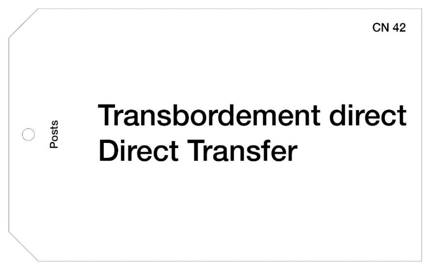

# Article 17-008

Steps to be taken in the event of interrupted transport route, or of diversion or missending of postal receptacles

- 1 The provisions of this article shall apply regardless of the mode of transport used, including, without limitation, carriers such as airlines, landbased transportation companies, railway undertakings and sea services.
- 2 When a carrier interrupts its journey for a length of time likely to delay postal receptacles or when, for any reason whatsoever, postal receptacles are unloaded at a point other than that given on the CN 37, CN 38, CN 41 or CN 47 delivery bills or electronic equivalent, the designated operator of origin shall ensure that the carrier follows the arrangements in its agreement with the other carrier for direct transhipment, or contacts the designated operator of origin for instructions.

- 3 The designated operator which receives missent postal receptacles owing to a labelling error shall attach a new label to each receptacle, with an indication of the office of origin, and reforward them to their correct destinations.
- 4 In every case, the office which did the reforwarding shall inform the office of origin of each receptacle by a CN 43 (for letter post) or CP 78 (for parcels) verification note or electronic equivalent, indicating in particular on the verification note the carrier from which the mail was taken, the services used (air or surface) for onward transmission to its destination, and the cause of missending (such as transportation or labelling error).

- *2 For the meaning of the term "electronic equivalent", see comm to art 17-007.*
- *4 The electronic equivalent of the CN 43 and CP 78 verification notes is the message conforming to the M42 standard (electronic verification note – draft standard).*

# Article 17-009 Transfer of mails

- 1 All mail dispatches shall be handed over by designated operators in good condition. However, a dispatch may not be refused because of damage or theft.
- 2 Delivery bill information shall be prepared by the sending office and provided to the destination office as well as other parties, if any, involved in the transport of dispatches, including dispatches of letter-post items posted in bulk. The delivery bill information shall preferably be provided electronically, following consultation with the destination designated operator and, if applicable, the transit designated operator, using the latest version of the relevant UPU EDI Messaging Standards of PRECON and CARDIT; when this is not possible, the delivery bill information shall instead be shared via UPU forms.

- 3 The following rules apply to the exchange of electronic messages corresponding to delivery bill information:
- 3.1 Among designated operators (PRECON/RESCON):
- 3.1.1 A PRECON message shall be sent by the origin designated operator to the designated operator to which the consignment is addressed.
- 3.1.2 The designated operator taking receipt of the consignment shall send a RESCON message to the origin designated operator, in order to acknowledge receipt of the receptacles.
- 3.2 Between designated operators and carriers (CARDIT/RESDIT):
- 3.2.1 The origin designated operator shall send a CARDIT message to carrier(s) involved in the transport of the mail to the consignment destination, in accordance with UPU EDI Messaging Standard M48. Depending on the exact process and agreement, there may be more than one CARDIT message per consignment and carrier.
- 3.2.2 Carriers receiving CARDIT are expected to respond with RESDIT messages, in accordance with UPU EDI Messaging Standard M49.
- 3.2.3 Several RESDIT events are expected to be provided by each carrier, to cover the transport stages of the mail. The list of possible RESDIT events is published in UPU code list 100. The events provided by each carrier depend on the exact process and agreement with the sending designated operator, but should be based on the event classification provided in UPU code list 100 (critical, supplementary and optional).
- 3.3 In the event of an inquiry, the designated operators shall share the available information, including that received from the carriers.
- 4 When UPU forms are used, the following delivery bill forms apply, depending on the type of mail and conveyance:
- 4.1 CN 37 for surface mail (mail categories C and D) other than dispatches of empty receptacles;
- 4.2 CN 38 for airmail (mail category A) other than dispatches of empty receptacles;

- 4.3 CN 41 for surface airlifted (S.A.L.) mail (mail category B) other than dispatches of empty receptacles;
- 4.4 CN 47 for dispatches of empty receptacles, for all mail categories.
- 5 The following rules apply to the generation of delivery bill forms:
- 5.1 The dispatching office shall retain a copy of the delivery bill; if a carrier is involved, this service or an associated agent shall sign this copy as a receipt for the consignment.
- 5.2 A copy is sent to the destination office of exchange.
- 5.3 If a carrier is involved, an additional copy is given to this carrier and shall be transported to the destination; this copy shall be retained by the carrier after being signed by the receiving office.
- 5.4 In case of air transport, the two copies of the delivery bill that are transported to the destination office shall be inserted in a CN 45 envelope. These shall be conveyed in the aircraft's flight portfolio or other special pouch in which the flight documents are kept. Upon arrival at the airport of offloading of the consignment, the first copy, duly signed as a receipt for the consignment, shall be kept by the carrier which has carried the consignment. The second copy shall accompany the receptacles containing the postal items to the post office to which the delivery bill is addressed.
- 5.5 Designated operators that have developed an electronic receipting system for receptacles that they receive from carriers may use the receipting records of that system instead of the delivery bill process described under 5.4. In lieu of the signed copy of the delivery bill forms, the receiving designated operator can provide the carrier with a printed copy of the electronic receipting record for those receptacles.
- 5.6 When the transfer of receptacles between two corresponding offices involves a sea service, an additional copy shall be sent to destination, preferably electronically, or otherwise via airmail, in order to pre-advise destination.

- 5.7 If delivery bills are produced by electronic means and transmitted online to a carrier or a cooperating agent without the direct participation of the designated operator's staff and printed out there, the designated operators or companies involved in the transport operations may agree that a signature shall not be required on the delivery bills.
- 5.8 The weight of bags or other receptacles containing insured air parcels shall be shown separately on the CN 38 delivery bill. The letter "V" shall also be written in the "Observations" column opposite this entry.

|                         | operator of origin     | ne bill               |                                     |                                                 |                                        | /ERY BI<br>ce mails |                 | Serial No                      | CN 3                            |
|-------------------------|------------------------|-----------------------|-------------------------------------|-------------------------------------------------|----------------------------------------|---------------------|-----------------|--------------------------------|---------------------------------|
| Office of de            | estination of the bill |                       |                                     |                                                 |                                        |                     |                 |                                | nip<br>otor vehicle             |
| Priority                | Non-pric               | prity                 |                                     |                                                 |                                        |                     |                 | Date of d                      | eparture   Time                 |
| Train No./V             | ehicle No.             |                       |                                     |                                                 | Route                                  |                     |                 | Seal No.                       |                                 |
| Name of sh              | nip                    |                       |                                     |                                                 | Port of di                             | sembarkatio         | n               | Company                        | /                               |
|                         |                        |                       |                                     |                                                 | No. of co                              | ntainer             |                 | No. of se                      | al                              |
| If a contai             | ner is used            |                       |                                     |                                                 |                                        |                     |                 |                                |                                 |
| Entry                   |                        |                       |                                     |                                                 |                                        |                     |                 |                                |                                 |
|                         |                        |                       | Number                              | of                                              |                                        | Gross wei           | ght of rece     | otacles, etc.                  |                                 |
| Mail No.                | Office of origin       | Office of destination | letter-<br>post<br>recep-<br>tacles | CP<br>recepta-<br>cles and<br>loose<br>parcels¹ | sacks<br>of empty<br>bags <sup>2</sup> | Letter              | CP              | Empty<br>recep-<br>tacles      | Observations                    |
| 1                       | 2                      | 3                     | 4                                   | 5                                               | 6                                      | 7                   | 8               | 9                              | 10                              |
|                         |                        |                       |                                     |                                                 |                                        | kg³                 | kg <sup>s</sup> | kg <sup>s</sup>                |                                 |
|                         |                        |                       |                                     |                                                 |                                        |                     |                 |                                |                                 |
|                         |                        |                       |                                     |                                                 |                                        |                     |                 |                                |                                 |
|                         |                        |                       |                                     |                                                 |                                        |                     |                 |                                |                                 |
|                         |                        |                       |                                     |                                                 |                                        |                     |                 |                                |                                 |
|                         |                        |                       |                                     |                                                 |                                        |                     |                 |                                |                                 |
|                         |                        |                       |                                     |                                                 |                                        |                     |                 |                                |                                 |
|                         |                        |                       |                                     |                                                 |                                        |                     |                 |                                |                                 |
|                         |                        |                       |                                     |                                                 |                                        |                     |                 |                                |                                 |
|                         |                        |                       |                                     |                                                 |                                        |                     |                 |                                |                                 |
|                         |                        |                       |                                     |                                                 |                                        |                     |                 |                                |                                 |
|                         |                        |                       |                                     |                                                 |                                        |                     |                 |                                |                                 |
|                         |                        |                       |                                     |                                                 |                                        |                     |                 |                                |                                 |
|                         |                        |                       | -                                   |                                                 |                                        |                     |                 |                                |                                 |
|                         |                        |                       | -                                   |                                                 |                                        |                     |                 |                                |                                 |
|                         |                        |                       |                                     |                                                 |                                        |                     |                 |                                |                                 |
|                         |                        | Totals                |                                     |                                                 |                                        |                     |                 |                                |                                 |
| Dispatchir<br>Signature | ng office of exchan    | ye Ine<br>Dat         | e official of<br>e and signs        | ature                                           | 51                                     |                     |                 | Office of exc<br>Date and sign | change of destination<br>nature |

|  |  |  |  |  |  |  | Convention Manual |
|--|--|--|--|--|--|--|-------------------|
|  |  |  |  |  |  |  |                   |
|  |  |  |  |  |  |  |                   |
|  |  |  |  |  |  |  |                   |
|  |  |  |  |  |  |  |                   |
|  |  |  |  |  |  |  |                   |
|  |  |  |  |  |  |  |                   |
|  |  |  |  |  |  |  |                   |
|  |  |  |  |  |  |  |                   |
|  |  |  |  |  |  |  |                   |
|  |  |  |  |  |  |  |                   |
|  |  |  |  |  |  |  |                   |
|  |  |  |  |  |  |  |                   |
|  |  |  |  |  |  |  |                   |
|  |  |  |  |  |  |  |                   |
|  |  |  |  |  |  |  |                   |
|  |  |  |  |  |  |  |                   |

|                              | DELIVERY BILL<br>Surface airlifted (S.A.L. |            | CN 41 |
|------------------------------|--------------------------------------------|------------|-------|
| Office of origin of the bill | Date                                       | Serial No. |       |

| Flight No.                                 |               | Date of departure     | Time        |
|--------------------------------------------|---------------|-----------------------|-------------|
| Airport of direct transhipme               | ent           | Airport of offloading |             |
| If a container is used<br>No. of container | l No. of seal | No. of container      | No. of seal |
| No. of container                           | No. of seal   | No. of container      | No. of seal |

| Linay    |                      |                       |                            |                                              |                        |               |                                                                          |
|----------|----------------------|-----------------------|----------------------------|----------------------------------------------|------------------------|---------------|--------------------------------------------------------------------------|
|          |                      |                       | Number c                   |                                              | Gross we<br>of recepta | ight<br>acles |                                                                          |
| Mail No. | Office of origin     | Office of destination | letter-post<br>receptacles | CP<br>receptacles<br>and<br>loose<br>parcels | Letter<br>post         | CP            | Observations<br>(including the number of M bags<br>and/or loose parcels) |
| 1        | 2                    | 3                     | 4                          | 5                                            | 6                      | 7             | 8                                                                        |
|          |                      |                       |                            |                                              | kg <sup>1</sup>        | kg¹           |                                                                          |
|          |                      |                       |                            |                                              |                        |               |                                                                          |
|          |                      |                       |                            |                                              |                        |               |                                                                          |
|          |                      |                       |                            |                                              |                        |               |                                                                          |
|          |                      |                       |                            |                                              |                        |               |                                                                          |
|          |                      |                       |                            |                                              |                        |               |                                                                          |
|          |                      |                       |                            |                                              |                        |               |                                                                          |
|          |                      |                       |                            |                                              |                        |               |                                                                          |
|          |                      |                       |                            |                                              |                        |               |                                                                          |
|          |                      |                       |                            |                                              |                        |               |                                                                          |
|          |                      |                       |                            |                                              |                        |               |                                                                          |
|          | og office of evolven | Totals                | official of the            |                                              |                        |               | Office of evolvence of declination                                       |

| Olgriature | Olgriature | Date and signature |
|------------|------------|--------------------|
|            |            |                    |
|            |            |                    |
|            |            |                    |
| ,          | ,          | ,                  |

| Designated opera  Office of origin of | -                                     |                |                    |                          | DELIVERY BILL Mails of empty receptacles Date Serial No.                         |                                                          |                   |  |
|---------------------------------------|---------------------------------------|----------------|--------------------|--------------------------|----------------------------------------------------------------------------------|----------------------------------------------------------|-------------------|--|
| Office of destinati                   |                                       |                |                    | July Notes that          |                                                                                  |                                                          |                   |  |
|                                       | ator to which recep                   | otacles belong |                    | Priority<br>Non-priority | 1                                                                                | By airmail By S.A.L. By surface Date of departure   Time |                   |  |
| Type of recepta                       |                                       | Flight No.     |                    | Airport of direct to     | ranshipment                                                                      | Airport of offload                                       | ng                |  |
| Priority/By ai                        |                                       | Train No.      |                    | Route                    |                                                                                  |                                                          |                   |  |
| Non-priority/                         |                                       | Name of ship   |                    | Port of disembar         | kation                                                                           | Company                                                  |                   |  |
| EMS                                   | If a container is<br>No. of container |                | No. of seal        | No. of                   | container                                                                        | No. of seal                                              |                   |  |
|                                       | No. of container                      | 1              | No. of seal        | No. of                   | container                                                                        | No. of seal                                              |                   |  |
| intry                                 | 1                                     |                |                    |                          |                                                                                  |                                                          |                   |  |
| vlail No.                             | Office of origin                      |                | Office of des      | tination                 | Number of<br>sacks of empty<br>bags and other<br>empty recep-<br>tacles returned | Gross weight                                             | Observations      |  |
| 1                                     |                                       | 2              |                    | 3                        | 4                                                                                | 5<br>kg <sup>1</sup>                                     | 6                 |  |
|                                       | EM                                    | PTY            | RE                 | CEP                      | <b>TAC</b>                                                                       | LES                                                      |                   |  |
|                                       |                                       |                |                    |                          |                                                                                  |                                                          |                   |  |
|                                       | ce of exchange                        | The            | official of the ca | Totals                   |                                                                                  | Office of exchang                                        | no of doctination |  |

|                       |                | CN       |
|-----------------------|----------------|----------|
|                       |                | Date sta |
|                       |                |          |
|                       |                |          |
|                       |                |          |
| TRANSMISSION ENV      | ELOPE          |          |
| FOR CN 38, CN 41 A    | ND CN 47 BILLS |          |
|                       |                |          |
|                       |                |          |
|                       |                |          |
| Aircraf of attloading |                |          |
|                       |                |          |
| Areat of efficacing   | Hight No.      |          |
|                       | Flight No.     |          |
| Arine                 |                |          |
| Arine                 |                |          |

Preparation and checking of CN 37, CN 38, CN 41 or CN 47 delivery bills

1 The delivery bills shall be completed, in accordance with their layout, on the basis of the particulars appearing on the receptacle labels or with the address. The total number and total weight of the receptacles (including letter-post receptacles that are exempt from terminal dues) and items in each receptacle shall be entered in bulk by category. Designated operators of origin may elect to enter each receptacle individually should they wish to do so. However, any intermediate or transit country must list each transit receptacle individually, maintaining the designated operator of origin, office of destination, dispatch and receptacle number indicated by the designated operator of origin. The six-character IMPC code identifying the origin and destination of the receptacle shall be recorded in columns 2 and 3 respectively. The number and weight of letter-post receptacles bearing red labels shall be shown separately; they shall be indicated by an "R" in the "Observations" column of the delivery bill.

- 2 The presence of priority surface letter-post items shall be indicated by the entry "PRIOR" in the "Observations" column of the CN 37 bill.
- 3 Mails included in a sac collecteur shall also be entered individually on the CN 37, CN 38 and CN 41 delivery bill, as applicable, with an indication that they are so included.
- 4 Any intermediate office or office of destination which notices errors in the entries on the CN 37, CN 38, CN 41 or CN 47 delivery bill or electronic equivalent shall immediately correct them. It shall report them by a CN 43 (for letter post) or CP 78 (for parcels) verification note to the last dispatching office of exchange and to the office of exchange which made up the consignment. Designated operators may agree to make systematic use of electronic mail or any other appropriate means of telecommunication for reporting irregularities.
- 5 When the receptacles forwarded are inserted in containers sealed by the postal service, the serial number and the number of the seal of each container shall be entered in the column of the CN 37, CN 38 or CN 41 delivery bill reserved for that purpose.

*1 If the receiving DO finds that more than 10% of the mails from a particular origin do not reflect the information recorded on the CN 38 delivery bills, or are not accompanied by CN 38 bills, it may require the dispatching DO to list each bag and corresponding weight individually on all future CN 38 bills. The detailed information to be provided by an intermediate or transit country is to ensure that mail transiting or transferred through an intermediary country would retain sufficient identifying documentation to allow* 

# Article 17-011 Missing CN 37, CN 38, CN 41 or CN 47 delivery bill

*origin designated operators to settle accounts accurately.*

- 1 Designated operators may agree to make systematic use of electronic mail or any other appropriate means of telecommunication for settling cases where the delivery bill is missing.
- 2 An electronically transmitted delivery bill form, duly signed by the sending designated operator, printed by the carrier at destination or at an intermediate location, shall be considered valid by the destination office.

- 3 In the absence of the delivery bill or its electronic equivalent, the receiving office shall prepare one as a substitute in accordance with the consignment received and have the carrier countersign it. This substitute delivery bill may be sent to the dispatching office as an attachment to a CN 43 (for letter post) or CP 78 (for parcels) verification note or be kept in case of later disputes over the consignment concerned.
- 4 If a CN 46 substitute delivery bill prepared by the carrier is received by the destination office in place of the original delivery bill, this substitute bill shall be accepted. This fact may be reported to the office of origin by means of a CN 43 (for letter-post) or a CP 78 (for parcels) verification note, accompanied by this CN 46 substitute delivery bill.
- 5 If a CN 43 or CP 78 verification note is raised and if the point of loading cannot be determined, this verification note shall be sent straight to the office of dispatch of the receptacles for it to forward the note to the office through which the receptacles transited.

- *1 Proof of carriage. Guidelines for the use of the CN 46 substitute delivery bill. A receipted copy of the original from another DO or a substitute document prepared manually or electronically should constitute proof of carriage if there is no dispute otherwise.*
- *3 For the meaning of the term "electronic equivalent", see comms to arts 17-007 and 17-008.*

| CN 46                            | BILL                                                                        | VERY BILL  | TUTE DELIVI                     | JBSTIT         | s                            | Carrier originating substitute bill                                                                              |                       |                          |                         |  |
|----------------------------------|-----------------------------------------------------------------------------|------------|---------------------------------|----------------|------------------------------|------------------------------------------------------------------------------------------------------------------|-----------------------|--------------------------|-------------------------|--|
| CN 37<br>CN 38<br>CN 41<br>CN 47 |                                                                             |            |                                 | te             | Da                           |                                                                                                                  | te bill               | nt of origin of substitu | Transit poin            |  |
| 01447                            |                                                                             | of mails   | operator of origin of r         | signated op    | De                           |                                                                                                                  | as found              | ns concerning mails ε    | Observation             |  |
|                                  | o. of seal                                                                  | No. of se  | iner                            | of contain     | No                           |                                                                                                                  | No. of seal           | iner is used<br>tainer   | If a contain            |  |
|                                  | o. of seal                                                                  | No. of se  | iner                            | of contain     | [ No                         | No. of container No. of seal                                                                                     |                       |                          |                         |  |
|                                  |                                                                             | I          |                                 | N 36, C        |                              | n CN 34, CN                                                                                                      | as found (from        | otions of mails          | Descrip                 |  |
| Gross<br>weight                  | CP EMS/<br>Other<br>items                                                   |            | Date L                          | of E<br>off- o | of<br>tran-<br>ship-<br>ment | No. of<br>transport<br>route                                                                                     | Office of destination | Office of origin         | Mail No.                |  |
| kg                               |                                                                             |            |                                 |                |                              |                                                                                                                  |                       |                          |                         |  |
|                                  |                                                                             | ·          | Totals                          | Т              |                              |                                                                                                                  |                       |                          |                         |  |
|                                  | ate of departure                                                            | Date of de | port route                      | of transpo     | No                           |                                                                                                                  | mails                 |                          | Parameter State Control |  |
|                                  |                                                                             |            |                                 |                |                              | 1                                                                                                                |                       |                          |                         |  |
| king delivery                    | Office of destination of mails  Designated operator taking deliver of mails |            |                                 |                |                              | Point of offloading  Carrier at the transit point of loading  Carrier at the Signature  Carrier at the Signature |                       |                          |                         |  |
| kin                              | gnated operator tak<br>alls                                                 | Designated | cort route<br>tination of mails | of transpo     | Of                           | Carrier at the transit point of loading Carrier at the                                                           |                       |                          |                         |  |

Steps to be taken in the event of an accident

- 1 When, as a result of an accident in course of conveyance, a ship, train, aircraft or any other transport facility is unable to continue its journey and deliver the postal items at the scheduled ports of call or stations, the crew shall hand over the postal items to the post office nearest to the place of the accident or to the office best able to reforward the postal items. If the crew are unable to do this, that office, having been informed of the accident, shall take immediate action, taking over the postal items and reforwarding them to their destination by the quickest route after their condition has been checked and any damaged items put in order.
- 2 The designated operator of the country in which the accident occurred shall inform all designated operators of previous ports of call or stations, by telecommunications, of the fate of the postal items. These designated operators in turn shall advise by the same means all other designated operators concerned.
- 3 If delivery bill information was not sent electronically, designated operators which had receptacles on the transport facility involved in the accident shall send a copy of the CN 37, CN 38, CN 41 or CN 47 delivery bills to the designated operator of the country where the accident occurred.

4 The qualified office shall then notify the offices of destination of the postal items involved in the accident by a CN 43 (for letter post) or CP 78 (for parcels) verification note giving details of the circumstances of the accident and the results of the check of the receptacles. One copy of each verification note shall be sent to the offices of origin of the relative postal items and another to the designated operator of the country to which the transport company belongs. These documents shall be sent by the quickest route possible (air or surface).

# Article 17-013

Steps to be taken in the event of temporary suspension and resumption of services

- 1 If services are temporarily suspended, the designated operator or designated operators concerned must be notified of the fact by telecommunications, indicating, if possible, the probable duration of the suspension of services. The same procedure shall be applied when the suspended services are resumed.
- 2 The International Bureau must be notified of the suspension or resumption of services if a general announcement is considered necessary. If necessary, the International Bureau shall notify designated operators by telecommunications.
- 3 The designated operator of origin shall have the option of refunding the postage charges, special charges and air surcharges to the sender if, owing to the suspension of services, the benefit accruing from conveyance of the item in question was obtained only in part or not at all.

### *Commentary*

*2 The IB has established an "Emergency Information System" (EmIS), which makes it possible to notify DOs of the temporary suspension of services.*

# Article 17-014 Return of empty receptacles

- 1 The owners of empty receptacles shall decide whether they wish their receptacles to be returned or not and, if so, by what means of transport. Nevertheless, the designated operator of destination shall have the right to return such receptacles that cannot be incinerated easily and cheaply in its country. The designated operator of origin shall bear the cost of returning such receptacles.
- 2 In the absence of agreement between the designated operators concerned, receptacles shall be returned empty by the next post in a dispatch for the country to which they belong and if possible by the normal route followed on the outward journey. The number of receptacles returned by each dispatch shall be noted in table 1 of the CN 31 or CN 32 letter bill or on the CP 87 parcel bill. In the letter bill, this entry shall not be made when two designated operators have agreed to indicate only red-label receptacles on the letter bill.
- 3 If the designated operators of transit and destination agree, empty receptacles being returned by surface may be placed in the receptacles containing postal items. In all other cases, empty receptacles shall be returned in separate dispatches. The special dispatches containing only returned empty receptacles shall be described on CN 47 delivery bills or electronic equivalent and CN 31 letter bills or CP 87 parcel bills. Receptacles of empty receptacles may be sealed by agreement between the designated operators concerned. The labels shall be endorsed "Sacs vides" (Empty receptacles).
- 4 The return shall be carried out between offices of exchange appointed for the purpose. The designated operators concerned may agree among themselves as to the procedure for the return. In longdistance services, they shall, as a general rule, appoint only one office responsible for receiving the empty receptacles returned to them.
- 5 The empty receptacles shall be rolled into suitable bundles. Where appropriate, the label blocks, labels of canvas, parchment or other stout material shall be placed inside the receptacles.

- 6 The receptacles used for printed papers for the same addressee at the same address (M bags) shall be recovered after they have been handed over to the addressees and shall be returned, in accordance with the above-mentioned provisions, to the designated operators of the countries to which they belong.
- 7 If the check made by a designated operator establishes that empty receptacles belonging to it have not been returned to its service within a period longer than that required for their transmission (round trip), it shall be entitled to claim reimbursement of the value of the empty receptacles as provided for under 8. The designated operator in question may refuse this reimbursement only if it can prove the missing receptacles were returned.
- 8 Each designated operator shall fix, periodically and uniformly for each kind of empty receptacles used by its offices of exchange, a value in SDR and communicate it to the designated operators concerned through the International Bureau. In case of reimbursement, the cost of replacing the empty receptacles shall be considered.
- 9 By prior agreement, a designated operator may use the empty receptacles belonging to the designated operator of destination for making up its own mails. Empty receptacles belonging to a third party may not be used.
- 10 A dispatching designated operator may indicate whether or not it would like to have the empty receptacles used for a particular dispatch returned. This indication shall be made on the letter bill or parcel bill used for the dispatch.
- 11 Dispatches of empty receptacles are subject to the payment of only 30% of the transit charges applicable to letter-post mails. The detailed accounting rules for the return of empty receptacles shall be based on the Statistics and Accounting Guide issued by the International Bureau of the Universal Postal Union.

*In resolution C 71/1989, the Washington Congress urged all DOs to return empty mailbags, both efficiently and promptly, to the countries to which they belong. It also recommended:*

- *a those DOs which have problems caused by the non-return of mailbags to consider setting up simple but cost-effective recording systems in order to ascertain:*
  - *– the proportion of bags which are not returned;*
  - *– whether that proportion can be considered as an acceptable loss;*
  - *– which DOs may be principally responsible for the failure to return bags;*
- *b those DOs which have such problems to make direct contact with the DOs concerned to seek the return of their bags or, failing that, applying the relevant provisions in order to obtain reimbursement;*
- *c all DOs to consider the use of schemes for bag-sharing, or the reciprocal use of mailbags, as well as the use of one-trip mailbags, in order to increase the availability of mailbags;*
- *d all DOs to consider the more extensive use of containers for conveying loose-loaded parcels, letters in letter trays or boxes and similar types of mail which do not require the use of mailbags.*

### *Empty bags returned by air*

*The IATA–UPU Contact Committee established the practical method of application given below:*

- *i The owning DO shall have the right to choose the route and the carrier for the return of the bags. The owning DO can stipulate details such as the timing, frequency and office of return for its empty bags. In this regard, it should seek bilateral rate and operational agreements with a given carrier or carriers and inform sending DOs and carriers about these details. Financial settlements will, therefore, in principle be limited to bills raised by the participating carrier against the owning DO.*
- *ii Empty bags should in principle be returned to one office of exchange as stipulated in art 17-014.4, and as communicated by each DO via the UPU Compendium of Information.*
- *iii It is desirable that airlines and DOs discuss and coordinate, to the maximum possible extent, arrangements for the return of empty bags.*
- *iv As the return of empty bags by air is now paid for by the owning DO, the airline should accept liability for any loss of the bags. Further details are to be provided in the bilateral arrangements.*
- *v A new heading labelled "DO owning empty receptacles" has been created on the CN 47 Delivery Bill for mails of empty bags. The returning (i.e. non-owning) DO will indicate the DO owning the bags, and participating airlines will bill the owning DO on this basis.*
- *vi Bags returned by air will always be sent in separate dispatches and accompanied by the CN 47 only. The airlines and DOs concerned should mutually agree upon any alternate procedure.*
- *vii Carriers will bill owning DOs for the carriage of empty bags by listing the dates, serial dispatch numbers and the DO of origin of the CN 47s to which each invoice refers so that owning DOs can account for their equipment.*
- *viii In cases where no prior bilateral agreement has been made and empty bags are handled and carried at a point of transit by a non-contracted airline as per instructions on the CN 47 issued by the sending DO, the non-contracted carrier will bill such carriage to the owning DO at the applicable carrier's rate. This rate will, at the most, be 30% of the applicable UPU Basic Airmail Conveyance Rate as stipulated in art 34-101.4.*
- *ix In cases where a transit DO is involved, the transit DO will be entitled to claim, from the owning DO, charges for handling the empty bag dispatch. The DO of transit shall prepare the CN 55 and CN 56 statements from the particulars on the CN 47 delivery bill. Under article 34-101.4, the air conveyance rate payable for empty bags will, at the most, be 30% of the applicable UPU basic airmail conveyance rate. Art 17-009 applies, with appropriate changes, to*

### *Empty bags returned by surface*

*CN 47 bills.*

*For billing for land and sea transit charges for dispatches of empty receptacles, the following procedure applies:*

*– return of empty receptacles by direct route between DO A and DO B (DO to which receptacles belong): transit charges should be billed by DO A to DO B, on the basis of the transit charges indicated in art 27-103 for the distance between A and B;*

- *– return of empty receptacles from DO A to DO C (to which the receptacles belong) through DO of transit B:*
  - *• transit charges for conveyance from A to B should be billed by DO A to DO C, on the basis of the transit charges indicated in art 27-103 for the distance between A and B;*
  - *• transit charges for conveyance from B to C should be billed by DO B to DO C, on the basis of the transit charges indicated in art 27-103 for the distance between B and C.*

# Article 17-015 Routeing of dispatches

- 1 Dispatches, including closed transit dispatches, shall be forwarded by the most direct route possible.
- 2 When a dispatch consists of several receptacles, these shall as far as possible remain together and be forwarded by the same transportation.
- 3 The designated operator of origin may consult with the designated operator providing the closed transit service regarding the route to be followed by the dispatches sent in closed transit. The designated operator of the country of origin shall not enter information about the routeing to be followed by the designated operator providing the closed transit on the delivery bill (CN 37, CN 38, CN 41 or CN 47) or electronic equivalent, nor on the CN 34, CN 35 or CN 36 receptacle labels for letter post and the CP 83, CP 84 or CP 85 receptacle labels for parcels. The route information appearing on the delivery bill or electronic equivalent, and on the receptacle labels shall be limited to the route intended to transport the receptacles from the designated operator of origin to the designated operator providing the closed transit.
- 4 Dispatches in closed transit shall, in principle, be forwarded by the same transportation used by the designated operator of transit for the transport of its own dispatches. If, on a regular basis, there is insufficient time between arrival of the dispatches in closed transit and transport departure, or the volumes regularly exceed the capacity of a transport vehicle, the designated operator of origin shall be so informed.
- 5 In the event of a change in a route for the exchange of dispatches sent in closed transit established between two designated operators via one or more designated operators providing closed transit, the designated operator of origin of the dispatches shall inform those designated operators providing closed transit of the change of route.

# Convention Manual

### *Commentary*

- *1 Closed transit takes place when the transit is performed via a DO and is subject to transit charges. It differs from direct transhipment (see art 17-007), which is when transit is performed by carriers such as airlines, without involving the DO at the transhipment point.*
- *3 For the meaning of the term "electronic equivalent", see comms to art 17-007.*

# Prot. Article R XX Routeing of mails

- 1 Azerbaijan, Bolivia (Plurinational State), Estonia, Latvia, Tajikistan, Turkmenistan and Uzbekistan will recognize only the costs of the conveyance effected in accordance with the provision concerning the line shown on the CN 35 receptacle labels of airmail dispatches and on the CN 38 delivery bills.
- 2 Having regard to the provision in 1, France, Greece, Italy, Senegal, Thailand the United Kingdom of Great Britain and Northern Ireland and the United States of America will forward closed airmails only on the conditions laid down in article 17-015.4.

Prot. Article R XXXVII Routeing of mails

Having regard to article 17-015.1, the designated operators of France, Greece, Italy, Senegal, Thailand and the United States of America will forward closed mails only on the conditions laid down in article 17-015.4.

Article 17-101 Basic services

1 Every designated operator shall be free to choose the system based on the speed of treatment of items or based on the contents of items that it applies to its outward traffic.

- 2 In the classification system based on the speed of treatment of items, letter-post items are divided into:
- 2.1 priority items, i.e. items conveyed by the quickest route (air or surface) with priority;
- 2.2 non-priority items, i.e. items for which the sender has chosen a lower rate, implying a longer delivery time.
- 3 In the classification system based on contents, letter-post items are divided into documents or goods.
- 4 Every designated operator may admit priority items and airmail items consisting of a sheet of paper suitably folded and gummed on all sides. Such items shall be called "aerogrammes". "Aerogrammes" shall be considered as being similar to airmail letters in the classification system based on contents.

Classification of letter-post items based on their formats and content

- 1 Designated operators in the target terminal dues system exchanging mail above a threshold shall apply the classification system based on the formats for their outward traffic, especially as far as making up of mails is concerned. The relevant conditions are specified in article 17-116.
- 2 In the classification system based on formats, the letter-post items provided for in article 17-101 may be further divided into:
- 2.1 small letters (P) containing documents only, as in articles 17-101 and 17-105;
- 2.2 large letters (G) containing documents only, as in articles 17-101 and 17-105;
- 2.3 bulky letters (format E) containing documents only, i.e. items classified neither as small letters nor as large letters, with physical specifications as defined in article 17 of the UPU Convention and in articles 17-103 and 17-104;

2.4 small packets (format E) containing goods, with physical specifications as defined in article 17 of the UPU Convention and in articles 17-103 and 17-104.

# Article 17-103

Particulars relating to limits of weight

- 1 Priority and non-priority items may weigh up to 5 kilogrammes:
- 1.1 In relations between designated operators where both admit such items from their customers.
- 1.2 For items containing books and pamphlets, the designated operator of origin having the option of admitting such items.
- 2 In the system based on contents:
- 2.1 Letters and small packets may weigh up to 5 kilogrammes in relations between designated operators where both admit such items from their customers.
- 2.2 Printed papers may weigh up to 5 kilogrammes, the designated operator of origin having the option of admitting such items.
- 3 The limit of weight of items containing books or pamphlets may be raised to 10 kilogrammes by agreement between the designated operators concerned.
- 4 The items sent on postal service as mentioned in article 16.1 of the Convention and article 16-001 shall not be subject to the limits of weight laid down in article 17 of the Convention and 1 and 2 above. However, they shall not exceed the maximum weight of 30 kilogrammes per bag.
- 5 Designated operators may apply to letter-post items posted in their countries the maximum limit of weight laid down for articles of the same kind in their domestic service provided that such items do not exceed the limit of weight mentioned in article 17 of the Convention and 1 and 2 above.

### *Commentary*

*5 This provision is designed to enable national and international tariff structures to be brought into line with one another as far as possible.* 

Prot. Article R XV Printed papers. Maximum weight

Notwithstanding article 17-103.2.2, Canada and Ireland shall be authorized to limit to 2 kilogrammes the maximum weight of inward and outward printed papers.

Article 17-104 Limits of size

- 1 The limits of size of items other than postcards, aerogrammes and small packets are given below:
- 1.1 maxima: length, width and depth combined: 900 mm, but the greatest dimension may not exceed 600 mm, with a tolerance of 2 mm; in roll form: length plus twice the diameter: 1,040 mm, but the greatest dimension may not exceed 900 mm, with a tolerance of 2 mm;
- 1.2 minima: to have a surface measuring not less than 90 x 140 mm, with a tolerance of 2 mm; in roll form: length plus twice the diameter: 304 mm: but the greatest dimension may not be less than 210 mm.
- 2 The limits of size of postcards shall be as follows:
- 2.1 maxima: 120 x 235 mm, with a tolerance of 2 mm, provided they are sufficiently stiff to withstand processing without difficulties;
- 2.2 minima: 90 x 140 mm, with a tolerance of 2 mm. The length shall be at least equal to the width multiplied by √2 (approximate value 1.4).
- 3 The limits of size of aerogrammes shall be as follows:
- 3.1 maxima: 110 x 220 mm, with a tolerance of 2 mm;
- 3.2 minima: 90 x 140 mm, with a tolerance of 2 mm. The length shall be at least equal to the width multiplied by √2 (approximate value 1.4).

- 4 The limits of size of small packets shall be as follows:
- 4.1 maxima: length, width and depth combined: 900 mm, but the greatest dimension may not exceed 600 mm, with a tolerance of 2 mm; in roll form: length plus twice the diameter: 1,040 mm, but the greatest dimension may not exceed 900 mm, with a tolerance of 2 mm;
- 4.2 minima: to have a surface measuring not less than 105 x 148 mm, with a tolerance of 2 mm; in roll form: length plus twice the diameter: 304 mm: but the greatest dimension may not be less than 210 mm.
- 5 The limits of size in this article shall not apply to postal service items as mentioned in article 16.1 of the Convention and article 16-001.

Limits of size and weight for small letters (P) and large letters (G)

- 1 For the classification of items based on their format, the limits of size and weight of small letters (P) shall be as follows:
- 1.1 minimum dimensions: 90 x 140 mm;
- 1.2 maximum dimensions: 165 x 245 mm;
- 1.3 maximum weight: 100 g;
- 1.4 maximum thickness: 5 mm.
- 2 For the classification of items based on their format, for items that are not small letter (P) format items, the limits of size and weight of large letters (G) shall be as follows:
- 2.1 minimum dimensions: 90 x 140 mm;
- 2.2 maximum dimensions: 305 x 381 mm;
- 2.3 maximum weight: 500 g;
- 2.4 maximum thickness: 20 mm.

- 3 For operations, accounting and sampling purposes, the following rule shall apply:
- 3.1 If an item exceeds the limits of a format in one or more of the four criteria (length, width, thickness and weight), it shall be classified in the next largest format, provided that it fits within the dimensions of that format.

Conditions of acceptance of items. Make-up. Packing

- 1 Items shall be made up securely and in such a way that there is no risk of other items getting trapped in them. The packing shall be adapted to the shape and nature of the item and the conditions of transport. In the case of letters and small packets, it must ensure the integrity of the contents during transport. Every item shall be made up in such a way as not to affect the health of officials. The make-up shall prevent any danger if the item contains articles of a kind likely to injure officials called upon to handle it or soil or damage other items or postal equipment. Metal fasteners used for closing items shall not have sharp edges, nor shall they hamper the execution of the postal service.
- 1.1 Designated operators may agree to exchange bulk items, which have not been wrapped or packed. The dispatching designated operator and the designated operator of destination shall set by mutual agreement the conditions of posting of such items.
- 2 The UPU Id-tag, as defined in UPU Technical Standard S18 may be applied to letter-post items to facilitate mail processing in both origin and destination countries and to support the exchange of processing information between the designated operators involved. The Id-tag shall be applied, under the authority of the designated operator, in accordance with the specifications adopted by the Postal Operations Council and the provisions of UPU Technical Standards S18 and S19. To maximize the readability of the Id-tag, designated operators:
- 2.1 may encode information in area R1, as defined in UPU Technical Standard S19, only in accordance with the technical provisions of UPU Technical Standards S18 and S19;

- 2.2 are encouraged to advise against using area R1 for purposes which might interfere with, or be interfered with by, its intended use for Idtag encoding.
- 3 Designated operators shall strongly recommend that their customers comply with the following rules:
- 3.1 The right-hand half at least of the address side shall be reserved for the address of the addressee and for postage stamps, franking marks and impressions or indications in lieu thereof. The latter shall be applied, as far as possible, in the top right-hand corner. It shall be up to the designated operator of origin to treat items whose payment does not conform to this condition according to its national legislation.
- 3.2 The addressee's address shall be written on the item lengthwise and, if the item is an envelope, on the plain side which is not provided with the closing flap. The address may be situated on the flap side of the envelope if the destination designated operator accepts its use for bulk mailings. For items exceeding the size limits for small letter (P) format standardized items as defined in article 17-111.1, the address may be written parallel to the width of the item.
- 3.3 The addressee's address and name shall be worded in a precise and complete manner. They shall be written very legibly in roman letters and Arabic numerals. If other letters and numerals are used in the country of destination, it shall be recommended that the address be given also in these letters and numerals. The name of the place of destination and the name of the country of destination shall be written in capital letters together with the correct postcode number or delivery zone number or post office box number, if any. The name of the country of destination shall be written preferably in the language of the country of origin. To avoid any difficulty in the countries of transit, it is desirable for the name of the country of destination to be added in an internationally known language. Designated operators may recommend that, on items addressed to countries where the recommended position of the postcode is in front of the name of the location of destination, the postcode should be preceded by the EN ISO 3166–1 Alpha 2 country code followed by a hyphen. This shall in no way detract from the requirement for the name of the destination country to be printed in full.

- 3.4 The envelope paper shall be made of a material that can be processed mechanically.
- 3.5 In order to facilitate automatic reading, the addressee's address shall be written in compact form, without leaving a space between the letters of the words and without a blank line between the line containing the place of destination and the other elements of the address. The place and country of destination and the postcode number, if any, shall not be underlined.

Example: Monsieur

Pierre Noir Rue du Midi 26 1009 PULLY SWITZERLAND

- 3.6 The address and name of the sender shall be shown on the item with the postcode number or delivery zone number, if any. When they appear on the address side of the envelope, these indications shall be placed in the top left-hand corner and should be sufficiently separated from the addressee's address and name to avoid any misunderstanding.
- 3.7 The addresses of the sender and the addressee shall be shown in an appropriate manner inside the item and as far as possible on the contents. This applies particularly to unsealed items.
- 3.8 Customers posting items in bulk of the same shape and weight may be requested to bundle them by postcode or delivery zone number so that they can be processed as speedily as possible in the country of destination. The designated operator of destination may request this degree of sortation subject to agreement by the designated operator of origin.
- 4 Except as otherwise provided in these Regulations, service instructions and labels shall be placed on the address side of the item. They shall be positioned in so far as possible in the top left-hand corner, beneath the sender's name and address where these are given. The service instructions shall be written in French or in some other language generally known in the country of destination. A translation of the instructions in the language of the country of origin may also be given.

# Example:

Sender's address Postage stamps, franking marks or impressions Service instructions Addressee's address

- 5 Non-postal stamps and charity or other labels as well as designs, likely to be mistaken for postage stamps or service labels, may not be affixed to or printed on the address side. This shall also apply to stamp impressions which could be mistaken for franking impressions.
- 6 In all cases in which the item is under wrapper, the addressee's address shall be written on the latter.
- 7 Envelopes whose edges are provided with coloured bars shall be reserved exclusively for airmail items.
- 8 The address of items sent poste restante shall show the name of the addressee, the town, the country of destination and, if possible, the post office at which the item is to be collected. The indication "Poste restante" shall be written in bold letters on the address side. The use of initials, figures, forenames only, fictitious names or code marks of any kind shall not be permitted for these items.

Example: Mademoiselle

Louise Bertholet Poste restante 1211 GENEVA 13 SWITZERLAND

9 On printed papers, the addressee's name may, exceptionally, be followed by the indication "or occupant", in French or a language accepted by the country of destination.

Example: Monsieur

Pierre Sansonnens

Or occupant Rue Pinet 10 1001 LAUSANNE SWITZERLAND

- 10 The envelope or wrapping may bear only one sender's address, and one addressee's address. In the case of bulk postings, the sender's address must be visible on the outside of the item and located in the country of posting of the item.
- 11 No manner of item shall be admitted of which the whole or part of the address side has been marked off into several divisions intended to provide for successive addresses.

### *Commentary*

- *3.1 The application of postage stamps or franking impressions on the address side is obligatory for all categories of items. Postage stamps stuck on in such a way that they overlap on to both sides of an item are considered null and void.*
- *3.3 It is recommended that DOs inform the IB what address presentation they want and what postcode system they have adopted.*
- *8 The name of the town of destination should be mentioned since poste restante is generally provided by only one post office – the main office – even in big cities which have several delivery offices.*
- *9 This provision is designed to permit the address of a printed item to be written so that delivery is made to the occupier of the premises when the addressee given in the address has moved. This practice is aimed specifically at printed advertising items.*

Special provisions applicable to each category of items

- 1 Priority/non-priority items and letters
- 1.1 Subject to the provisions relating to standardized items and the packing of items, no conditions shall be laid down for the form or closing of priority/non-priority items or for letters. However, such items in envelopes must be rectangular to ensure that they do not cause difficulties during their handling. Such items with the consistency, but not the shape, of postcards shall also be placed in rectangular envelopes. The envelopes should be of light colour. It is recommended that the word "Priority" or "Letter" be added to the address side of items which, because of their volume or make-up, might be confused with items prepaid at a reduced rate.

# 2 Aerogrammes

- 2.1 Aerogrammes must be rectangular and be so made that they do not hamper the handling of the mail.
- 2.2 The front of the aerogramme shall be reserved for the address, the prepayment and service notes or labels. It shall bear the printed indication "Aerogramme" and may also bear an equivalent indication in the language of the country of origin. An aerogramme shall not contain any enclosure. It may be registered if the regulations of the country of origin so permit.
- 2.3 Each member country or designated operator shall fix, within the limits defined in article 17-104.3, the conditions of issue, manufacture and sale of aerogrammes.
- 3 Postcards
- 3.1 Postcards shall be rectangular and be made of cardboard or of paper stiff enough not to make mail handling difficult. They shall not have projecting or raised relief parts and shall comply with the conditions laid down by the member country or designated operator of origin.

- 3.2 Postcards shall bear on the front the heading "Carte postale" (Postcard) in French or its equivalent in another language. This heading shall not be compulsory for picture postcards.
- 3.3 Postcards shall be sent unenclosed, that is to say without wrapper or envelope.
- 3.4 The right-hand half at least of the front shall be reserved for the address of the addressee, for prepayment and for service instructions or labels. The sender may make use of the back and of the lefthand half of the front.
- 3.5 Postcards not complying with the regulations for that category shall be treated as letters, except when the irregularity derives only from showing the prepayment on the back. Such cards shall be regarded as unpaid and treated accordingly.
- 4 Printed papers
- 4.1 Reproductions on paper, cardboard or other materials commonly used in printing produced in several identical copies by means of a process authorized by the member country or designated operator of origin may be sent as printed papers. Printed papers which do not comply with this definition may also be admitted in the international service if they are admitted in the domestic service of the country of origin.
- 4.2 Printed papers shall bear in bold letters on the address side, in so far as possible in the top left-hand corner, beneath the sender's name and address where these are given, the expression "Imprimé" or "Imprimé à taxe réduite" as appropriate or their equivalents in a language known in the country of destination. These markings shall constitute indication that the items contain only printed papers.
- 4.3 Printed papers satisfying both the general conditions applicable to printed papers and those applicable to postcards shall be admitted unenclosed at the printed paper rate, even if they bear the title "Carte postale" (Postcard) or the equivalent of this title in any language.

- 4.4 Several printed papers may be sent together in a single item provided that they do not bear the names and addresses of different addressees. Designated operators of origin may limit printed papers sent in this way to those stemming from a single sender.
- 4.5 It shall be permitted to enclose with all printed papers a card, envelope or wrapper bearing the printed address of the sender of the item or his agent in the country of posting or destination of the original item; the enclosure may be prepaid for return by means of postage stamps or postal prepayment impressions of the country of destination of the original item.
- 4.6 The designated operator of origin may authorize annotations or enclosures on the basis of its national legislation.
- 4.7 Printed papers shall be made up in such a way that their contents are sufficiently protected while permitting quick and easy verification. The conditions shall be determined by the member country or designated operator of origin.
- 4.8 Designated operators may authorize the closing of bulk-posted printed papers, issuing for that purpose a permit to users who make a request for one. In such cases, the number of the permit shall be shown below the indication "Imprimé" (Printed papers) or "Imprimé à taxe réduite" (Reduced-rate printed papers).
- 4.9 Alternatively, designated operators of origin shall be allowed to permit the closing of all printed papers without authorization if in their domestic service no special conditions of closing are required.
- 4.10 Printed papers may be inserted in closed plastic wrapping, either transparent or opaque, on the conditions laid down by the member country or designated operator of origin.
- 4.11 Sealed printed papers may be opened for verification of their contents.

- 5 Items for the blind
- 5.1 Items for the blind shall include letters bearing writing used by the blind, posted unsealed, and plates bearing the characters of writing used by the blind, as further detailed below:
- 5.1.1 correspondence, literature in whatever format including sound recordings provided that they are sent to or by an organization for the blind or sent to or by a blind person;
- 5.1.2 equipment or materials of any kind made or adapted to assist blind persons in overcoming the problems of blindness, including items such as specially adapted CDs, Braille writing equipment, Braille watches, white canes and recording equipment, provided that they are sent to or by an organization for the blind or sent to or by a blind person.
- 5.2 Designated operators of origin shall be allowed to admit as items for the blind items admissible as such in their domestic service.
- 5.3 Items for the blind shall be made up in such a way that their contents are sufficiently protected while permitting quick and easy verification.
- 5.4 The designated operators shall require that their customers furnish their items for the blind, on the side which bears the addressee's address, with a clearly visible white label with the following symbol:

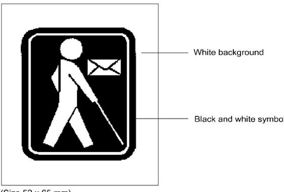

- 6 Small packets
- 6.1 Small packets shall bear in bold letters on the address side, in so far as possible in the top left-hand corner, if applicable beneath the sender's name and address, the expression "petit paquet" (small packet) or its equivalent in a language known in the country of destination. Indication of the sender's address on the outside of the item shall be obligatory.
- 6.2 It shall also be permitted to enclose therein any other document having the character of current and personal correspondence. However, such documents may not be addressed to an addressee nor stem from a sender other than those of the small packet. In addition the national regulations of the member country concerned must authorize such enclosure. The designated operator of origin shall decide whether the document or documents enclosed fulfil these conditions. It shall lay down such other conditions as may be appropriate relating to authorized enclosures.
- 6.3 No special conditions of closing shall be required for small packets; items designated as such may be opened for verification of their contents.
- 6.4 Designated operators shall apply a single barcode identifier conforming to UPU Technical Standard S10 to small packets containing goods to enable the provision of cross-border customs electronic advance data in compliance with UPU EDI Messaging Standard M33 (ITMATT V1). However, the presence of such an identifier shall not imply the provision of a delivery confirmation service. The identifier should appear on the front of the item and should not obscure the other service markings, indicia or address information.
- 6.5 In accordance with article 08-002, designated operators shall capture and exchange electronic advance data. That data shall replicate the information documented on the appropriate UPU customs declaration form and shall be compliant with UPU EDI Messaging Standard M33 (ITMATT V1).

- 7 Bulk mail
- 7.1 Bulk items shall be characterized by:
- 7.1.1 the receipt, in the same mail or in one day when several mails are made up per day, of 1,500 or more items posted by the same sender; or
- 7.1.2 the receipt, in a period of two weeks, of 5,000 or more items posted by the same sender; or
- 7.1.3 the receipt from a country, in a period of four weeks, of mails whose total weight is composed of at least 90% of bulky (E) or small packet (E) letter-post items, provided that the total weight of such mail received has increased by more than 25% compared to the same four weeks the year before.
- 7.1.3.1 The provision in 7.1.3 shall not apply to an increase of mail of less than 3 tonnes if, within the time specified in this paragraph, the competent authority of the country of the sending designated operator verifies and confirms in writing that all of the mail originated in the country of the sending designated operator. Such communication shall be provided to the designated operator of destination within 60 days from the date of the notification by the designated operator of destination invoking the provision in 7.1.3.
- 7.2 Under the terms of 7.1.1 and 7.1.2, the sender of the bulk items shall be considered to be the person or organization that actually posts the items. For 7.1.3, the sender of the bulk items shall be considered to be the designated operator.
- 7.3 If need be, for 7.1.1 and 7.1.2, the sender may be identified by any common characteristic of the items or any indication made on the items (for example, return address, name, mark or stamp of the sender, postal authorization number, etc.).

- *1.1 "Rectangular" includes "square".*
- *3.1 Irregularly shaped picture and other postcards (circular, triangular, various outlines, etc.) must be placed in rectangular envelopes and prepaid at the rate for priority or non-priority items or for letters, as the case may be.*
- *3.4 Because of the nature of postcards, it is not permitted to affix or attach to them samples of merchandise or similar arts, cuttings of every kind or foldback sheets. Nor is it permitted to embellish them with cloth, embroidery, spangles or similar materials. Such cards may be sent only in closed envelopes prepaid at the rate for priority or non-priority items or for letters, as the case may be. Nevertheless, illustrations, stamps of every kind and labels, as well as address slips of paper or other very thin substance, may be affixed to them, provided that these arts are not such as to alter the nature of postcards and that they adhere completely to the card. These arts may be affixed only to the back or to the left-hand half of the front of postcards, with the exception of address slips, tabs or labels which may occupy the whole of the front.*
- *4.1 Photographs are admitted as printed papers.*

*DOs may admit at the printed paper rate:*

- *– letters and postcards exchanged between pupils of schools, provided that these items are sent through the principals of the schools concerned;*
- *– correspondence courses sent by schools to their pupils and pupils' exercises in the original or with corrections but without any note which does not relate directly to the performance of the work;*
- *– manuscripts of work or for newspapers;*
- *– musical scores in manuscript;*
- *– photocopies;*
- *– impressions obtained by means of computer printers or typewriter posted simultaneously in several identical copies.*
- *4.6 The following may be shown on printed papers, by any process:*
- *– the name and address of the sender and the addressee with or without the title, profession and style;*
- *– the place and date of dispatch of the item;*
- *– serial or registration numbers.*

*In addition to these particulars it is permitted:*

- *– to delete, mark or underline certain words or certain parts of the printed text;*
- *– to correct printing errors.*

*The additions and corrections specified above should have a direct bearing on the content of the reproduction; they should not be of such a nature as to constitute a code. It is also permissible to show or to add:*

- *– on order forms, subscription forms or offers in respect of published works, books, pamphlets, newspapers, engravings, musical scores: the works and the number of copies asked for or offered, the price of the works and notes giving essential elements of the price, the method of payment, the edition, the names of the authors and of the publishers, the catalogue number and the words "paperbacked", "stiff-backed" or "bound";*
- *– on the forms used by the lending services of libraries: the titles of the works, the number of copies asked for or sent, the names of the authors and of the publishers, the catalogue numbers, the number of days allowed for reading, the name of the person wishing to consult the work in question;*
- *– on picture postcards, on printed visiting cards and on printed cards expressing congratulations or condolences: conventional formulas of courtesy expressed in five words or five initials at the most;*
- *– on printed literary and artistic productions: a dedication consisting of a simple conventional tribute;*
- *– on cuttings from newspapers and periodicals: the title, date, number and address of the publication from which the art is taken;*

- *– on printing proofs: alterations and additions concerned with the correction, layout and printing, as well as notes such as "Passed for press", "Read – Passed for press" or any similar note concerned with the production of the work. In case of lack of space the additions may be made on special sheets;*
- *– on advices of change of address: the old and the new address and the date of the change.*
- *Finally, it is permitted to enclose:*
- *– with literary or artistic printed works: the relative open invoice, reduced to its essential elements together with copies of the invoice, a delivery bill, inpayment forms or international or internal money order forms of the country of destination of the item on which it is permissible, after agreement between the DOs concerned, to show by any means whatever the amount to be deposited or paid and the particulars of the postal giro account or the address of the payee of the order;*
- *– with fashion papers: cut-out patterns forming, according to the indications appearing on them, an integral part of the copy of the paper with which they are sent.*
- *4.7 Printed papers may be placed in a wrapper, on a roller or between cardboard, in open envelopes or containers, in closed unsealed envelopes or containers which can be easily and safely opened and reclosed, or tied with a string which is easy to unknot. Folded items which are not inserted in envelopes may, however, be accepted if the open sides are firmly held by a sufficient number of clips or self-adhesive seals so that the item does not open during mail processing. The member country or DO of origin determines whether the closing of these items allows for quick and easy verification of the contents. No special conditions of closing shall be required for printed papers containing books or brochures; such items may be opened for verification of their contents. The member countries or DOs concerned may require the sender or addressee to facilitate verification of the contents either by opening some of the items picked out by them or in some other satisfactory manner. The increasingly widespread use of mechanized and electronic mail-processing facilities means that the items must meet the requirements imposed by mechanization.*
- *4.10 The address of the addressee, the address of the sender and the franking-machine marks or impressions may be placed under the plastic film in such a way that they are perfectly legible through the transparent panel or panels provided for that purpose. The wrapping must include, on the address side, a sufficiently wide part on which service instructions, any reasons for non-delivery or, when applicable, the addressee's new address can be written by hand, or shown by means of a label or by any other process, as on paper.*
- *5.4 Items for the blind may be placed in a wrapper, on a roller or between cardboard, in open envelopes or containers, in closed unsealed envelopes or containers which can be easily and safely opened and reclosed, or tied with a string which is easy to unknot. The DOs of origin determines whether the closing of these items allows for quick and easy verification of the contents. No special conditions of closing shall be required for items for the blind containing books or brochures; such items may be opened for verification of their contents. The DOs concerned may require the sender or addressee to facilitate verification of the contents either by opening some of the items picked out by them or in some other satisfactory manner.*
- *6.2 It is permitted to enclose in small packets an open invoice reduced to its essential elements and to show on the outside or on the inside of items and, in the latter case, on the art itself or on a special sheet, the addresses of the sender and the addressee with the indications in use in commercial traffic, a manufacturer's or trade mark, a reference to correspondence exchanged between the sender and the addressee, a short note referring to the manufacturer and to the person supplying the goods or concerning the person for whom they are intended, as well as serial or registration numbers, prices and any other notes giving essential elements of the prices, particulars relating to the weight, volume and size, the quantity available and such particulars as are necessary to determine the source and the character of the goods.*

*6.3 By analogy with the conditions laid down in 17-107.4.8, DOs of origin may restrict the option of closing small packets to items posted in bulk. Arts which would be spoilt if packed according to the general rules and items of merchandise packed in a transparent packing permitting verification of their contents, shall be admitted in a hermetically sealed packing. The same applies to industrial and vegetable products posted in a packing sealed by the manufacturer or by an examining authority in the country of origin. In those cases, the DOs concerned may require the sender or the addressee to assist in checking the contents, either by opening certain of the items indicated by them or in some other satisfactory manner.* 

# Prot. Article R XVI Special provisions applicable to each category of items

- 1 Notwithstanding article 17-107.2.2, Afghanistan and Japan reserve the right to enclose or attach pictures or slips of paper in aerogrammes under the same conditions as in their domestic service.
- 2 Notwithstanding article 17-107.4.5, in the absence of bilateral agreement, Canada and the United States of America will not accept as enclosures in dispatches of printed papers any cards, envelopes or wrappings bearing the address of the sender or of his agent in the country of destination of the original item.
- 3 Notwithstanding article 17-107.5.1, Australia will accept for delivery as items for the blind only those items that are recognized as items for the blind in its domestic service.
- 4 Notwithstanding article 17-107.5, France shall apply the provisions concerning items for the blind in accordance with its national regulations.
- 5 Notwithstanding article 17-107.4.5, in the absence of bilateral agreement, Iraq will not accept as enclosures in printed papers posted in bulk any cards, envelopes or wrappings bearing a sender's address that is not located in the country of origin of the item.
- 6 Notwithstanding article 17-107.5.2, Azerbaijan, India, Indonesia, Lebanon, Nepal, Tajikistan, Turkmenistan, Ukraine, Uzbekistan and Zimbabwe shall admit sound recordings as items for the blind only if these are sent by, or addressed to, an officially recognized institute for the blind.
- 7 Any reservation made in relation to bulk mail shall have no impact on the application of article 17-107.

8 Notwithstanding article 17-107.7.1, Greece reserves the right to regard as "bulk mail" the receipt, in the same mail or in one day when several mails are made up per day, of 150 items posted by the same sender as well as the receipt, in a period of two weeks, of 1,000 or more items posted by the same sender.

Article 17-108 Marking of priority or mode of transportation

- 1 In the absence of special agreement between the member countries of designated operators concerned, items to be treated as priority items or airmail items in the countries of transit and of destination shall bear a special blue label or a stamp impression of the same colour, or in black, if the regulations of the dispatching designated operator so permit, bearing the words "Prioritaire" (Priority) or "Par avion" (By airmail). If need be, these indications in capital letters may be handwritten or typewritten, with an optional translation in the language of the country of origin. This "Prioritaire" or "Par avion" label, impression or indication shall be placed on the address side, in so far as possible in the top left-hand corner, beneath the sender's name and address where these are given.
- 2 The words "Prioritaire" (Priority) or "Par avion" (By airmail) and any note relating to priority or air conveyance shall be struck through with two thick horizontal lines when the item is not forwarded by the quickest means.
- 3 The designated operator of origin may also require the marking of non-priority and surface items.

Article 17-109 Special packing

1 Articles of glass or other fragile objects shall be packed in a strong box filled with an appropriate protective material. Any friction or knocks during transport either between the objects themselves or between the objects and the sides of the box shall be prevented.

- 2 Liquids and substances which easily liquefy shall be enclosed in perfectly leak-proof containers. Each container shall be placed in a special strong box containing an appropriate protective material to absorb the liquid should the container break. The lid of the box shall be fixed so that it cannot easily work loose.
- 3 Fatty substances which do not easily liquefy, such as ointments, soft-soap, resins, etc., and silk-worm eggs, the conveyance of which presents few difficulties, shall be enclosed in a first packing (box, bag of cloth, plastic, etc.) which is itself placed in a box stout enough to prevent the contents from leaking.
- 4 Dry colouring powders, such as aniline blue, etc., shall be admitted only in perfectly leak-proof metal boxes, placed in turn in strong boxes with an appropriate absorbent and protective material between the two containers.
- 5 Dry non-colouring powders shall be placed in strong containers (box, bag). These containers shall themselves be enclosed in a stout box.
- 6 Live bees, flies of the family Drosophilidae, leeches and parasites shall be enclosed in boxes so constructed as to avoid any danger.
- 7 Packing shall not be required for articles in one piece, such as pieces of wood, metal, etc., which it is not the custom of the trade to pack. In this case, the address of the addressee should be given on the article itself.

# Article 17-110 Items in panel envelopes

- 1 Items in envelopes with a transparent address panel shall be admissible on the following conditions:
- 1.1 The panel shall be situated on the plain side of the envelope which is not provided with the closing flap. The transparent address panel may be situated on the flap side of the envelope if the destination designated operator accepts its use for bulk mailings.

- 1.2 The panel shall be made of such a material and in such a way that the address can be easily read through it.
- 1.3 The panel shall be rectangular. Its greatest dimension shall be parallel to the length of the envelope. The address of the addressee shall appear in the same direction. However, concerning C 4 format (229 x 324 mm) items or similar formats, designated operators may allow the transparent panel to be placed transversely in such a way that its greatest dimension is parallel to the width of the envelope.

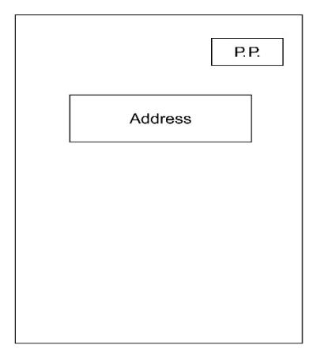

- 1.4 All the edges of the panel shall be precisely stuck down on the inside edges of the opening in the envelope. For this purpose there shall be an adequate space between the side and bottom edges of the envelope and those of the panel.
- 1.5 The addressee's address shall be the only thing visible through the panel or, at the very least, shall stand out clearly from any other indications visible through the panel.
- 1.6 The panel shall be placed so as to leave enough room for the application of the date-stamp.
- 1.7 The contents of the item shall be folded in such a way that the address remains fully visible through the panel even if the contents shift inside the envelope.

- 2 Items in envelopes which are wholly transparent may be admitted if the surface of the envelope is constructed in such a way as to create no difficulties in mail handling. A label having sufficient space for showing the address of the addressee, prepayment and service instructions must be firmly attached to the outer surface of the item. Items in envelopes which have an open panel shall not be admitted.
- 3 Designated operators of origin may admit envelopes which have two or more transparent panels. The panel reserved for the address of the addressee shall conform to the conditions laid down under 1. For the other panels, the conditions laid down under 1.2, 1.4, 1.6 and 1.7 shall apply by analogy.

*2 Manufacturers sell completely transparent envelopes with an address label firmly affixed and big enough for the addresses of sender and addressee, postage stamps, service instructions, etc. These envelopes have been admitted in the domestic service of some countries without causing any special handling problems. If the envelope undergoes prior antistatic treatment, it will not pose any sticking problems to mechanical handling systems such as culler-facer-cancellers or automatic sorters.*

# Article 17-111 Standardized items

- 1 Rectangular items shall be considered to be standardized small letter (P) format items if their length is not less than their width multiplied by √2 (approximate value 1.4). These items shall satisfy the following conditions:
- 1.1 Minimum dimensions: 90 x 140 mm.
- 1.2 Maximum dimensions: 165 x 245 mm.
- 1.3 Maximum weight: 100 g.
- 1.4 Maximum thickness: 5 mm.
- 1.5 Letters shall be closed by completely sticking down the sealing flap of the envelope and the address shall be written on the plain side of the envelope which is not provided with the sealing flap. The address may be situated on the flap side of the envelope if the destination designated operator accepts its use for bulk mailings.

- 1.6 The address shall be written in a rectangular area situated at least:
  - 40 mm from the top edge of the envelope (tolerance 2 mm);
  - 15 mm from the right-hand edge;
  - 15 mm from the bottom edge;

and not more than 140 mm from the right-hand edge.

1.7 On the address side, a rectangular area 40 mm (– 2 mm) in depth from the upper edge and 74 mm in width from the right-hand edge shall be reserved for affixing the postage stamp or stamps and the cancellation impression. Inside this area the postage stamps or franking impression shall be applied in the top right-hand corner.

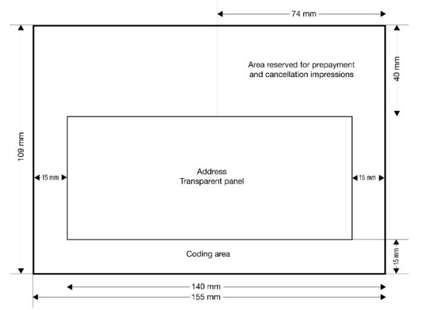

- 2 The provisions under 1 shall also apply to items in envelopes with transparent panels whose general conditions of admission are set out in article 17-110. The transparent panel for the address of the addressee shall in addition be at least:
- 40 mm from the top edge of the envelope (tolerance 2 mm);
- 15 mm from the right-hand edge;
- 15 mm from the left-hand edge;
- 15 mm from the bottom edge.

- 2.1 The panel may not be bordered by a coloured band or frame. Service indications may be placed just above the addressee's address.
- 3 No wording or extraneous matter whatsoever may appear:
- 3.1 below the address;
- 3.2 to the right of the address, from the franking and cancelling area to the bottom edge of the item;
- 3.3 to the left of the address, in an area at least 15 mm wide and running from the first line of the address to the bottom edge of the item;
- 3.4 in an area 15 mm high starting from the bottom edge of the item and 140 mm long starting from the right-hand edge of the item; this area may be partly identical with those defined above.
- 4 Rectangular items shall be considered to be standardized large letter (G) format items if they are not standardized small letter (P) format items and satisfy the following conditions:
- 4.1 Minimum dimensions: 90 x 140 mm.
- 4.2 Maximum dimensions: 305 x 381 mm.
- 4.3 Maximum weight: 500 g.
- 4.4 Maximum thickness: 20 mm.
- 5 Items in card form up to 120 x 235 mm in size may be accepted as standardized items provided they are made of cardboard heavy enough to be sufficiently stiff to withstand processing without difficulty.
- 6 The following items shall not be considered standardized:
- 6.1 folded cards;
- 6.2 items closed by means of staples, metal eyelets or hook fastenings;
- 6.3 punched cards sent unenclosed (without an envelope);
- 6.4 items whose envelopes are made of material which has fundamentally different physical properties from paper (except from the material used for making the panel of window envelopes);

- 6.5 items containing articles causing protrusions;
- 6.6 folded items sent unenclosed (without an envelope) which are not closed on all sides and which are not rigid enough for mechanical processing.

Prot. Article R XVII Standardized items

- 1 Canada, Kenya, Uganda, the United Rep. of Tanzania and the United States of America shall not be obliged to discourage the use of envelopes whose format exceeds the dimensions recommended in article 17-111 when those envelopes are widely used in their countries.
- 2 Afghanistan and India shall not be obliged to discourage the use of envelopes whose format is larger or smaller than the dimensions recommended in article 17-111 when those envelopes are widely used in their countries.
- 3 Article 17-111.1 and 4, shall not apply to Japan.

Article 17-112 Exchange of items

- 1 Designated operators may exchange, via one or more of their number, closed mails as well as à découvert items according to needs and service requirements.
- 2 When exceptional circumstances oblige a designated operator temporarily to suspend its services, either wholly or in part, it shall immediately inform the designated operators concerned.
- 3 When the conveyance of a consignment in transit through a member country takes place without the participation of the designated operator of that member country, regardless of the means of transport, this form of transit ("direct transhipment") shall not involve the liability of the designated operator of the transit member country.

4 Designated operators may send surface consignments by air, with reduced priority. The designated operator of destination shall indicate the office of exchange or the point of destination for such consignments.

### *Commentary*

*2 With regard to maintaining postal relations in cases of disputes, conflict or war, Congress adopted resolution C 37/Lausanne 1974, as given below:*

*"Congress, considering the peaceful and humanitarian role played by the Universal Postal Union in helping to bring peoples and individuals together, convinced of the need to maintain postal exchanges, as far as possible, with or between regions afflicted by disputes, disturbances, conflicts or wars, and in view of the initiatives taken and the experience of certain Governments or humanitarian organizations in this field, appeals urgently to the Governments of member countries, as far as possible and unless the UN General Assembly or Security Council has decided otherwise (in accordance with art 41 of the UN Charter), not to interrupt or hinder postal traffic – especially the exchange or correspondence containing messages of a personal nature in the event of dispute, conflict or war, the efforts made in this direction being applicable even to the countries directly concerned, and authorizes the Director General of the IB of the UPU:*

- *i to take what initiatives he considers advisable to facilitate, while respecting national sovereignties, the maintenance or re-establishment of postal exchanges with or between the parties to a dispute, conflict or war;*
- *ii to offer his "good offices" to find a solution to postal problems which may arise in the event of a dispute, conflict or war."*

*It is understood that each DO is the sole judge of what constitutes exceptional circumstances.*

*3 This form of transit concerns in particular mail exchanged in containers by international road transport.*

# Article 17-113

Priority treatment of priority items and airmail items

- 1 Designated operators shall be bound to forward by the air communications they use for the conveyance of their own priority items and airmail items the items of this type which reach them from other designated operators.
- 2 Designated operators without an air service shall forward priority items and airmail items by the most rapid means used for mails. The same shall apply if for any reason routeing by surface means is more advantageous than the use of airlines.
- 3 Each designated operator shall stipulate a specific hand-over time of preferably one hour, to two hours maximum, to the receiving designated operator within their contracts with airlines. The receiving designated operator shall endeavour to assist in the enforcement of this by providing the sending designated operator with monitoring of the airlines' performance against this time.

- 4 Designated operators shall take all necessary steps to:
- 4.1 ensure the best conditions for the receipt and onward transmission of mails containing priority items and airmail items;
- 4.2 ensure that agreements concluded with the carriers concerning the priority due to such mails are respected;
- 4.3 speed up the operations relating to customs control of priority items and airmail items addressed to their countries;
- 4.4 keep to a strict minimum the time required for forwarding priority items and airmail items posted in their country to the countries of destination and for having priority items and airmail items arriving from abroad delivered to the addressees. Single items arriving in a priority or airmail mail and not provided with a priority or airmail marking according to article 17-108 should nevertheless be regarded as priority or airmail items and be inserted in the domestic priority or airmail handling stream of the designated operator of destination.
- 5 Designated operators of transit and destination shall treat priority items and airmail items equally; designated operators shall also give the same treatment to surface LC items when no better service is available to the sender. Similarly, no distinction as regards speed of handling shall be made between non-priority items, surface AO items and S.A.L. items.

*Capacity planning on flights is important for air transportation. Designated operators are strongly recommended to work closely with airlines to plan the required capacity for mail volumes in advance.*

*<sup>2</sup> The Lausanne Congress passed resolution C 60/1974, which affirms the principles of freedom of transit with regard to air hijacking. The mails affected by such activities are inviolable, and the subsequent forwarding of the said mails must be assured on a priority basis by the country where the aircraft landed or was freed, even if this aircraft is the subject of disputes of a non-postal nature.*

# Article 17-114 Mails

- 1 Mails shall be classified as follows:
- 1.1 "Airmails" which are conveyed by air with priority. Airmails may contain airmail items and priority items.
- 1.2 "Priority mails" which are conveyed by surface but which have the same priority as airmails. Priority mails may contain priority items and airmail items.
- 1.3 "Surface airlifted (S.A.L.) mails" which contain S.A.L. items and nonpriority items.
- 1.4 "Surface mails" which contain surface mail and non-priority items.
- 2 Mails conveyed by air or by surface containing only items posted in bulk shall be called "bulk mails".
- 2.1 The provisions of these Regulations applicable to the mails under 1.1 to 1.4 shall also apply to bulk mails conveyed by the same route or mode, unless specific arrangements are expressly made.
- 3 If a dispatch identifier is used (barcode representation or representation in electronic messaging), it shall be compliant with UPU Technical Standard S8.

### *Commentary*

*1.1 The term "priority" covers not only the priority accorded to mail by airlines but also the priority handling given airmail by DOs under art 17-113.* 

# Article 17-115 Exchange in closed mails

1 Closed mails shall be made up for the country of destination when the number of items per mail or per day (when several dispatches are made in a day) exceeds the limits for à découvert transit stated in article 17-117.

- 2 The exchange of items in closed mails shall be regulated by common consent between the designated operators concerned. Any changes in routeing shall be notified by the dispatching designated operator to the designated operator of destination at the earliest opportunity and, if possible, before the date of implementation.
- 3 In order to participate in good quality mail circulation, every designated operator should make up a minimum of three priority letter mails per week for each destination. If the volume and weight of items do not warrant such frequency, dispatch in transit á découvert should be envisaged.
- 4 Designated operators through which closed mails are to be forwarded shall be given suitable notice.
- 5 In cases where an exceptionally large number of ordinary or registered items has to be sent to a country to which mail is normally sent in transit à découvert, the designated operator of origin shall be authorized to make up closed mails for the offices of exchange of the country of destination. It shall advise the designated operators of the countries of transit and destination accordingly.

# Article 17-116 Exchange of format-separated mails

- 1 The exchange of format-separated mails between designated operators of member countries as provided for in articles 30 and 31 of the Convention shall be made on the basis of the conditions of the present article.
- 2 Exchanges between countries in group I
- 2.1 The size of a flow shall be based on the last four approved consecutive quarters.
- 2.2 Mails shall be prepared and dispatched in separate receptacles for each of the three formats (P, G, E) to destinations where the annual outward volume of mails dispatched is above 50 tonnes. For volumes below this threshold mixed mails may be prepared.

- 3 Exchanges between countries in groups II and III, and between these countries and countries in group I
- 3.1 Mails shall be prepared and dispatched in at least two separate types of receptacles, one for formats P and G combined and one for format E, to destinations where the annual outward volume of mails dispatched is above the threshold of 50 tonnes.
- 3.2 For volumes below this threshold, mixed mails may be prepared.
- 4 Exchanges between countries in group IV and between these countries and countries in groups I to III
- 4.1 Mails shall be prepared and dispatched in at least two separate types of receptacles, one for formats P and G combined and one for format E, to destinations where the annual outward volume of mails dispatched is above 100 tonnes as of 2022.
- 5 For the application of the threshold the most recent annual volumes shall be used as reference.
- 6 Designated operators shall send the designated operators concerned the request for receiving or the notification for sending formatseparated mails by 30 September for application on 1 January of the following year and subsequent years.
- 7 Designated operators allowed to separate mail into two formats (S and E) or three formats (P, G and E), as provided for in § 3, are not allowed to switch from one format-separation option to the other with a partner designated operator in the same calendar year. If they wish to change from two to three formats or from three to two, they shall inform the designated operator concerned by 30 September, for application on 1 January of the following year.
- 8 The practical details shall be the subject of a mutual agreement between the designated operators concerned.

- 9 In case of receipt of mixed dispatches in a relation where the conditions are met or the agreement for format-separated exchanges was made, the designated operator of destination shall be entitled to segregate and sample the received mails by format or receptacle type.
- 10 It may be mutually agreed that, in relations above the threshold, where there are low daily mail volumes from a specific exchange office, these may be made up in mixed dispatches. However, these dispatches shall also be subject to sampling by the designated operator of destination.
- 11 The discontinuation of the making up of format-separated mails shall be notified by 30 September and shall take effect on 1 January of the following year and subsequent years.
- 12 For operational, statistical and accounting purposes, registered, insured and tracked items shall be treated as bulky letters (E) or small packets (E), regardless of their actual shape.

*4 The most recent four quarterly statements of weights should be used as the best indication of mail volumes for the following year.*

# Article 17-117 Transit à découvert

- 1 The transmission of à découvert items to an intermediate designated operator shall be strictly limited to cases where the making up of closed mails for the country of destination is not justified. À découvert transmission shall not be used to countries of destination for which the weight of the mail exceeds three kilogrammes per mail or per day (when several dispatches are made in a day).
- 2 In the absence of a special agreement, items for transit à découvert weighing more than three kilogrammes per mail or per day (when several dispatches are made in a day), dispatched to a particular country of destination, shall be considered as missent items and the intermediate designated operator shall be authorized to claim from the dispatching designated operator the relevant charges calculated in accordance with article 27-101.1.5 for the entire quantity of mail concerned.

- 3 The dispatching designated operator shall consult in advance the intermediate designated operators as to the suitability of using them for à découvert items to the destinations concerned. The dispatching designated operator shall notify the designated operators concerned of the date on which dispatch of mail in transit à découvert commences, providing at the same time the estimated annual volumes for each final destination. Unless otherwise agreed bilaterally by the designated operators concerned, this notification shall be renewed if, in a given statistical period (May or October) there were no à découvert items observed and, consequently, no account had to be issued by the intermediate designated operator. Items in transit à découvert shall, as far as possible, be sent to a designated operator which makes up mails for the designated operators of destination.
- 4 For items sent à découvert without prior consultation to an intermediate designated operator, destined for countries other than those notified by the intermediate country in the Transit Compendium, the charge provided for in article 27-101.1.5 may be applied.
- 5 A découvert items shall be subject to the payment of transit charges calculated in accordance with article 27-101.
- 6 In the absence of a special agreement, all items posted on board a ship and not included in a closed bag mentioned in article 11 of the Convention shall be handed over à découvert by the ship's agent direct to the post office at the port of call, whether these items have been stamped on board or not.
- 7 In the absence of special agreement, items for transit à découvert shall be bundled as follows:
- 7.1 priority items sent by air and airmail items shall be made up in bundles identified by CN 25 labels;
- 7.2 priority items sent by surface, non-priority items and surface items shall be made up in bundles identified by CN 26 labels.

- 8 When their number and make-up permit, items sent à découvert to a designated operator shall be separated by country of destination. They shall be made up in bundles labelled with the name of each country in roman letters.
- 9 Where format-separated mail is exchanged, à découvert items shall be placed in a receptacle of the corresponding format. If a CN 65 bill is issued, the volumes may be indicated as separated by format.

- *2 This provision for the treatment of à découvert items exceeding 3 kg as "missent" mail under the relevant transit charges encourages compliance by the dispatching DO and guarantees the appropriate reimbursement of the intermediate DO.*
- *3 Transit à découvert services are a means to guarantee the freedom of transit as defined in art 1 (Scope and objectives of the Union) of the UPU Const and art 4 (Freedom of transit) of the UPU Conv. The purpose of the consultation with the intermediate DO, provided for in 17-117.3, is to identify the most suitable route for sending items à découvert. It does not affect the mandatory character of transit à découvert.*
- *7.1 The models of CN 25 labels concerning transit à découvert are shown below.*
  - *8 Separation by country of destination is essential in all cases where the average weight of items exceeds 500 g per mail or per day (when several dispatches are made in a day), unless the number of items is ten per mail or less. When the weight of the items in transit à découvert to be reforwarded by air does not warrant the make-up of separate labelled bundles for each country of destination, the dispatching DO gathers them, sorted into categories, in bundles identified by the appropriate CN 25 labels. When the total weight of the separate labelled bundles sent to an intermediate DO exceeds 3 kg, the bundles are placed in one or more bags with labels bearing the word "Transit" in bold letters. When the total weight of such bundles is less than 3 kg, the bundles must, as far as possible, be placed in an extra-light bag (which may be made of transparent plastic); sealed, labelled "Transit" and inserted in the bag which contains the letter bill.*

| Priority – LC Dispatching designated operator  | Items<br>à découvert<br>By airmail | CN 25  |
|------------------------------------------------|------------------------------------|--------|
| Dispatching office                             |                                    |        |
| Dispatching official                           |                                    |        |
| Office of destination                          |                                    |        |
| No. of group of countries of destination       |                                    |        |
| In case of irregularity, this label must be at | tached to the verification         | n note |

Size 105 x 74 mm or 148 x 105 mm, colour white

| AO Dispatching designated operator              | Items<br>à découvert<br>By airmail | CN 25   |
|-------------------------------------------------|------------------------------------|---------|
| Dispatching office                              |                                    |         |
| Dispatching official                            |                                    |         |
| Office of destination                           |                                    |         |
| No. of group of countries of destination        |                                    |         |
| In case of irregularity, this label must be att | ached to the verification          | on note |

Size 105 x 74 mm or 148 x 105 mm, colour light blue

| Priority - Number of registered items  Register\nitems  AO  Dispatching designated operator  Number of registered items  Register\nitems à décou | vert           |
|--------------------------------------------------------------------------------------------------------------------------------------------------|----------------|
| Dispatching office                                                                                                                               |                |
| Dispatching official                                                                                                                             |                |
| Office of destination                                                                                                                            |                |
| No. of group of countries of destination                                                                                                         |                |
| In case of irregularity, this label must be attached to the ver                                                                                  | ification note |

Size 105 x 74 mm or 148 x 105 mm, colour pink

Note. – To take account of the needs of their service, designated operators may alter slightly the text size or colour of these forms without, however, deviating too fer from the instructions contained in the model.

| Priority – LC                                                    | CN 26           |
|------------------------------------------------------------------|-----------------|
| Dispatching designated operator                                  |                 |
| Dispatching office                                               |                 |
| Dispatching official                                             |                 |
| Office of destination                                            |                 |
| In case of irregularity, this label must be attached to the ver- | rification note |

Size 105 x 74 mm or 148 x 105 mm, colour white

| Non-priority – AO               | CN 26 |
|---------------------------------|-------|
| Dispatching designated operator |       |
| Dispatching office              |       |
| Dispatching official            |       |
| Office of destination           |       |
|                                 |       |

Size 105 x 74 mm or 148 x 105 mm, colour light blue

| R Priority - LC Non-priority -    | Number of registered items                   | N 26 |
|-----------------------------------|----------------------------------------------|------|
| Dispatching designated oper       | rator                                        |      |
| Dispatching office                |                                              |      |
| Dispatching official              |                                              |      |
| Office of destination             |                                              | _    |
| In case of irregularity, this lab | pel must be attached to the verification not | В    |

Size 105 x 74 mm or 148 x 105 mm, colour pink

Note. – To take account of the needs of their service, designated operators may alter slightly the text, size or colour of these forms without, however, deviating too far from the instructions contained in the model.

Routes and methods of transmission of insured items

- 1 By means of the CN 27 tables received from the others concerned, each designated operator shall decide on the routes to be used for the transmission of its insured items.
- 2 In the relations between countries separated by one or more intermediate services, insured items shall follow the most direct route. Nevertheless, the designated operators concerned may arrange with one another to provide for transmission à découvert by circuitous routes where the transmission by the most direct route would not carry with it a guarantee of liability over the whole distance.
- 3 Subject to service requirements, insured items may be dispatched in closed mails. They may also be handed over à découvert to the first intermediate designated operator if that designated operator is able to arrange for their transmission under the conditions prescribed in the CN 27 tables.
- 4 Designated operators of origin and destination may agree among themselves to exchange insured items in closed mails by means of the services of one or more intermediate countries, whether these participate in the insured items service or not. The intermediate designated operators shall be advised at least one month prior to commencement of the service.

### *Commentary*

*With regard to the security of valuable items conveyed by DOs, Congress adopted recommendation C 63/ Lausanne 1974 concerning general security and protection measures at offices of exchange and airports.*

| Serial No. | Country of destination | Routes | Intermediate countries<br>and sea services<br>to be used | Limit<br>of insured<br>value | Observations |
|------------|------------------------|--------|----------------------------------------------------------|------------------------------|--------------|
| 1          | 2                      | 3      | 4                                                        | 5                            | 6            |
|            | 2                      | 3      |                                                          |                              | 6            |
|            |                        |        |                                                          |                              |              |

# Article 17-119 Make-up of mails

- 1 Making up of mixed mail bundles
- 1.1 All ordinary items which can be bundled shall be classified by size (small letters – P, large letters – G, bulky letters – E and small packets – E) or based on their contents (letters and postcards, newspapers and periodicals, AO items, small packets). The items shall be arranged with the addresses facing the same way.
- 1.2 The bundles shall be distinguished by labels bearing the indication in roman letters of the office of destination or of the reforwarding office of the items enclosed in the bundles. CN 25 labels shall be used in the case of priority items sent by air or airmail items and CN 26 labels in the case of priority items sent by surface, non-priority items or surface items.
- 1.3 Unpaid or underpaid items shall be made up in separate bundles which shall be placed in the bag containing the letter bill. The bundle label shall be impressed with the T stamp.
- 1.4 The thickness of the bundles of small letters (P) shall be limited to 150 mm after bundling. The weight of bundles of large letters (G) and bulky letters (E) or small packets (E) may not exceed 5 kilogrammes.
- 1.5 If priority items and letters show signs of opening, deterioration or damage, a note of the fact shall be made on them and they shall be marked with the date-stamp of the office which discovered it. In addition, when the security of the contents so requires the items shall be placed if possible in a transparent envelope or in a fresh packing on which the details appearing on the envelope shall be reproduced.
- 2 Making up of mixed mail receptacles
- 2.1 Mails, including those made up solely of empty bags, shall be contained in bags the number of which shall be kept to the strict minimum. The bags shall be in good condition to protect their contents. Each bag shall be labelled.

- 2.2 The bags shall be closed, sealed preferably with lead. The seals may also be made of light metal or plastic. The sealing shall be so done that it cannot be handled or tampered with without showing signs thereof. The impressions of the seals shall reproduce, in very legible roman letters, the name of the office of origin or an indication sufficient to identify that office. However, if the designated operator of origin so wishes, the impressions of the seals need only reproduce an indication of the name of the designated operator of origin. The designated operator of origin may also use numbered seals.
- 2.3 The bags shall be packed and closed in such a way as not to endanger the health of officials.
- 2.4 Except as noted in 2.4.1, for the make-up of airmails, bags either entirely blue or with wide blue bands shall be used. In the absence of special agreement between the designated operators concerned, the airmail bags shall also be used for priority mails. For making up surface mails or surface airlifted mails, surface bags of a colour other than that of the airmail bags (e.g. beige, brown, white, etc.) shall be used. Designated operators of destination must, however, check all the bag labels in order to ensure correct processing.
- 2.4.1 Designated operators that use a common mailbag for multiple purposes may use these bags in the make-up of mails for all the above categories as long as the bag labels correctly identify the category of mail contained within such mailbags.
- 2.5 For receptacles containing exclusively tracked items, designated operators may agree on a bilateral basis to use special airmail bags or receptacles such as trays, etc., with markings that distinguish them as containing tracked items only.
- 2.6 The bags shall show legibly in roman letters the office or country of origin and bear the word "Postes" (Post) or any other similar expression distinguishing them as postal dispatches.
- 2.7 When the number or volume of the items necessitates the use of more than one bag, separate bags shall, as far as possible, be used:
- 2.7.1 for letters and postcards;
- 2.7.2 where applicable, for the newspapers and periodicals mentioned in article 17-128.7 and 9;

- 2.7.3 for other AO items;
- 2.7.4 where applicable, for small packets; the labels on these bags shall bear the words "Petits paquets".
- 2.8 The packet or receptacle of registered or insured items shall be placed in one of the receptacles of letters or in a separate receptacle; the outer receptacle shall invariably bear a red label. When there are several receptacles of registered or insured items, all the receptacles must bear a red label.
- 2.9 Designated operators may agree on a bilateral basis not to insert any ordinary mail in the bag containing the letter bill, but to keep the receptacle purely for registered, insured and tracked items.
- 2.10 The weight of each bag shall in no circumstances exceed 30 kilogrammes.
- 2.11 In order to be exempt from terminal dues payments, the exempt items referred to in article 31-101.3 (other than IBRS items) shall be packed in separate receptacles.
- 3 Making up of format-separated mails
- 3.1 Designated operators exchanging format-separated mails under the conditions specified in article 17-116 may make up mail in bags or other receptacles, such as trays.
- 3.2 In case of the use of bags, the rules in paragraph 1 for making up bundles shall apply.
- 3.3 In case of the use of trays, bundling shall not be required.
- 4 Making up of packets and envelopes
- 4.1 In the absence of special agreement, small mails shall simply be wrapped in strong paper so as to prevent any damage to the contents.
- 4.2 The packets shall be tied with string and sealed with lead, light metal or plastic seals.
- 4.3 When the packets contain only ordinary items they may be closed by means of gummed seals bearing the printed indication of the office of origin.

- 5 Sacs collecteurs. Conveyance in containers
- 5.1 As far as possible, and with the exception of bulk mails, offices of exchange shall include in their own mails for a particular office all the small mails (packets or receptacles) which reach them for that office.
- 5.2 Where warranted by the number of light-weight receptacles, envelopes or packets to be conveyed on the same sector, sacs collecteurs shall be made up, wherever possible. They shall be made up by the post offices responsible for handing over airmails to the airline undertaking the conveyance. The labels of sacs collecteurs shall bear in bold letters the indication "Sac collecteur". The designated operators concerned shall agree as to the address to be put on the labels.
- 5.3 For conveyance purposes, mails may be placed in containers, subject to special agreement between the designated operators concerned on the methods of using the containers.
- 5.4 Designated operators may agree on a bilateral basis to exchange mails in receptacles other than bags (e.g. trays, pallets, etc.) when it is established that this will ease the handling process and safeguard the condition of the mail.
- 6 Making up of mails provided for in paragraphs 2 and 3 to prevent damage to registered/insured items.
- 6.1 In order to prevent damage during conveyance to envelope-shaped and light registered/insured letter-post items, it is recommended that designated operators make up separate bags in accordance with the shape, size and weight of each such item, if the mail volume is sufficient to do so.

- *1.2 The models of CN 25 labels that do not concern transit à découvert are shown below. For the models of CN 25 labels concerning transit à découvert, see art 17-117.*
- *2 Bags must be closed as near as possible to the contents in order to ensure maximum stability of the latter (resolution C 69/Hamburg 1984).*
- *2.1 Advantage is to be gained from making up special dispatches of empty bags since they are usually handled in special sections. The make-up of special dispatches of empty bags is in any case compulsory for bags being returned by air (see art 17-014.3).*

# Convention Manual

- *2.2 Tin or plastic seals should be used only where DOs are sure that the sealing leaves no scope for rifling. When DOs are in agreement on this subject, bags containing unregistered non-priority items and unregistered AO items only and empty bags need not be sealed with lead; the same applies to bags containing unregistered items if they are conveyed in a sealed container by a direct service or if they are forwarded by a country of embarkation that puts them into such a container for the country of destination. When string is used it shall be passed twice round the neck of the bag in such a way that one of the two ends is drawn under the loops and then tied. After being sealed with lead, the ends of the string shall not protrude more than necessary from the lead seal so that the string cannot be released or removed without damaging the lead seal.*
- *2.8 For the use of red labels, see art 17-128.5.1.*
- *4.2 If lead, light metal or plastic seals are used, these mails must be made up so that the string cannot be detached.*
- *4.3 DOs may agree to use the same means of closing for mails containing registered items which, because of their small number, are transported in packets or envelopes. In that case, the addresses of the packets and envelopes shall conform, as regards the printed details and the colours, to the provisions prescribed in art 17-128 for the labels of bags of mails. However, closing by means of gummed seals shall not be permitted for bags containing insured items.*

| Priority – LC  Dispatching designated operator          | CN 25                 |
|---------------------------------------------------------|-----------------------|
| Dispatching office                                      |                       |
| Office of destination                                   |                       |
|                                                         |                       |
| In case of irregularity, this label must be attached to | the verification note |

Size 105 x 74 mm or 148 x 105 mm, colour white

| AO                                                 |                       | CN 25   |
|----------------------------------------------------|-----------------------|---------|
| Dispatching designated operator                    | By airmail            |         |
| Dispatching office                                 |                       |         |
| Dispatching official                               |                       |         |
| Office of destination                              |                       |         |
| In case of irregularity, this label must be attach | ed to the verificatio | on note |

Size 105 x 74 mm or 148 x 105 mm, colour light blue

| R Number of registered items                                             | CN 25  |
|--------------------------------------------------------------------------|--------|
| Dispatching designated operator  By airmail                              |        |
| Dispatching office                                                       |        |
| Dispatching official                                                     |        |
| Office of destination                                                    |        |
| In case of irregularity, this label must be attached to the verification | n note |

Size 105 x 74 mm or 148 x 105 mm, colour pink

Note. – To take account of the needs of their service, designated operators may alter slightly the text, size or colour of these forms without, however, deviating too far from the instructions contained in the model.

| Priority – LC                                                                 | 6 |
|-------------------------------------------------------------------------------|---|
| Dispatching designated operator                                               |   |
| Dispatching office                                                            |   |
| Dispatching official                                                          |   |
| Office of destination                                                         |   |
|                                                                               |   |
| In case of irregularity, this label must be attached to the verification note |   |
| Size 105 x 74 mm or 148 x 105 mm, colour white                                |   |
| Non-priority – AO                                                             | 6 |
| Dispatching designated operator                                               |   |
| Dispatching office                                                            |   |
| Dispatching official                                                          |   |
| Office of destination                                                         |   |
|                                                                               |   |
|                                                                               |   |
| In case of irregularity, this label must be attached to the verification note |   |
| Size 105 x 74 mm or 148 x 105 mm, colour light blue                           |   |
| Number of registered items                                                    | 6 |
| Dispatching office                                                            |   |
| Dispatching official                                                          |   |
| Office of deathership                                                         |   |

# Prot. Article R XVIII Bags

- 1 The provisions of article 17-119.2.10 shall not apply to Switzerland and the United Kingdom of Great Britain and Northern Ireland, whose national legislation requires a lower weight limit. Health and safety legislation in these countries limits the weight of mail bags to 20 kilogrammes.
- 2 Notwithstanding article 17-119.2.10, the Dem. People's Rep. of Korea reserves the right to limit the weight of mailbags to 20 kilogrammes.
- 3 Notwithstanding article 17-119.2.10, Iceland reserves the right to limit the weight of mailbags containing letter-mail items to 20 kilogrammes.
- 4 Notwithstanding article 17-119.2.10, Finland reserves the right to limit the weight of mailbags containing letter-mail items to 20 kilogrammes.

Article 17-120 Letter bills

- 1 Designated operators may agree bilaterally or multilaterally that the letter dispatches they exchange need not be accompanied by a paper letter bill, since PREDES version 2.1 messages provide similar information electronically.
- 2 In the absence of such agreement, a CN 31 letter bill shall accompany each dispatch except for bulk mail dispatches and for dispatches intended for direct access to the domestic systems. The letter bill shall be placed in an envelope marked in bold letters "Feuille d'avis" (Letter bill). This envelope shall be pink if the mail contains insured items and blue if it does not. It shall be fastened to the outside of the packet or receptacle of registered items. If there are no registered items, the envelope shall whenever possible be attached to a bundle of ordinary items. If the final receptacle contains only the CN 31 letter bill, it shall be sent as "Exempt".
- 3 Bulk mail dispatches shall be accompanied by a CN 32 letter bill, as provided for in article 17-126.
- 4 For dispatches intended for direct access to the domestic system, designated operators shall agree among themselves on the documents to

be used. This documentation may be a modified CN 31 letter bill or another mutually acceptable document, such as a domestic mail statement.

- 5 Except for the cases provided for in articles 17-123.1 and 17-124.2, where a dispatch does not contain any registered or insured mail, designated operators may agree bilaterally to attach the letter bill to the outside of one of the receptacles of the dispatch in a strong waterproof pouch which will withstand the rigours of transportation.
- 6 The dispatching office shall complete the letter bill with all the details called for, taking the following into account:
- 6.1 Heading: dispatching offices of exchange shall sequentially number the letter bills within a mail dispatch series, with the numbering reinitialized annually at the beginning of the calendar year. Each mail dispatch shall thus bear a separate mail dispatch number where each successive mail dispatch number is incremented by 1 in a rising sequence and is consistent with the incrementing dispatch date. In the case of the first mail dispatch of each calendar year, the letter bill shall bear, in addition to the serial number of the dispatch, that of the last dispatch of the preceding year. If a dispatch series is cancelled, the dispatching office shall notify the destination office of exchange by means of a verification note.
- 6.2 Table 1, receptacle labels: Designated operators may agree that only red-label receptacles shall be entered here.
- 6.3 Table 1, receptacle types: The number of receptacles used by the dispatching designated operator and the number of receptacles returned to the designated operator of destination shall be entered in this table. Where applicable, the number of empty bags belonging to a designated operator other than that to which the mail is addressed shall be shown separately with a reference to that designated operator. When two designated operators have agreed to enter red-label bags only (6.2), the number of receptacles used for the make-up of the mail or the number of empty bags belonging to the designated operator of destination shall not be given.
- 6.4 Table 2: Where designated operators have agreed according to the conditions described in article 17-116 to separate outbound international mail by format, the number of receptacles and the weight by format shall be reported in table 2. Otherwise, the mail subject to terminal dues shall be reported in table 2 as mixed mail.

- 6.5 Table 3: The total number of registered items, both those individually listed and those advised in bulk, and the total number of insured items included in the mail shall be entered in table 3. Where tracked items are also included in the mail, the total number of such items shall also be entered in table 3.
- 6.6 The number of registered items and insured items relating to the postal service and the number of items returned to origin, exempt from terminal dues, shall be entered in table 3 in the column headed "Number of items exempt from additional terminal dues".
- 6.7 Table 4: When IBRS items are contained in the dispatch, the IBRS information shall be completed, indicating separately the number and gross weight of IBRS receptacles and net weight of bundles and the total number of IBRS items. The presence of ordinary or registered COD items shall be indicated in the corresponding box both in the case of individual entry and that of bulk entry.

- *1 The specifications of message PREDES version 2.1 are provided in UPU Messaging Standard M41. M41-7 (seventh update) was granted status 2 (UPU standard duly adopted) in 2016. All designated operators are required to comply with the latest update of the message; note that in early versions of M41, accounting information was not mandatory.*
- *3 For the model of the CN 32 form, see art 17-126.*
- *6 The name of the ship transporting the mail or the official abbreviation of the flight used are shown when the dispatching office knows it. In table I the dispatching office enters the number of bags making up the mail by category (priority/non-priority or LC/AO, M bags, empty bags) and by type of label (red or white/blue). In table 2, the dispatching office enters the weight of the bags subject to transit charges and terminal dues according to the categories to which they belong (priority/non-priority or LC/AO, on the one hand, and M bags, on the other), as well as by format when format separation is applied. The M bags are entered by weight (weight and number of bags up to 5 kg and weight of bags over 5 kg). The weight of the mail exempted from terminal dues must be the same as the total weight of the bags marked "Exempt". The weight of the mails of empty receptacles, which are exempt from terminal dues but subject to transit charges, must be entered in the new box provided for that purpose.*
- *6.5 The number of registered and insured items is necessary for the terminal dues account. Table 3 of the CN 31 contains boxes for entering the number of registered and insured items returned to origin exempt from terminal dues under art 30-101.3.1. The box for entering the number of registered items returned to origin exempt from terminal dues should also be used to enter the registered items relating to the postal service referred to in art 16-001.2.*
- *6.6 Under articles 30-101.3.1 and 16-001.2, items relating to the postal service exchanged between DOs are not exempt from terminal dues. The exemption therefore mainly applies to items sent by the IB and by the Restricted Unions.*

|                               | Origin     |                                             |               |                          |                             |                                                |                     |                                   |             |                 |         | Previous number |                 |       |         |                  |
|-------------------------------|------------|---------------------------------------------|---------------|--------------------------|-----------------------------|------------------------------------------------|---------------------|-----------------------------------|-------------|-----------------|---------|-----------------|-----------------|-------|---------|------------------|
| Operators                     | Destina    | ation                                       |               |                          |                             |                                                |                     |                                   |             |                 |         |                 |                 |       |         |                  |
| Origin OE an                  | nd IMPC    | code                                        | Destination   | OE ar                    | nd IMPC co                  | de                                             | Category            |                                   | SI          | ub-class        | Yea     | ar              | Dispatch        | ı No. | Date    |                  |
|                               |            |                                             |               |                          |                             |                                                |                     |                                   |             |                 |         |                 |                 |       |         |                  |
| Transportation                | 1          |                                             |               |                          |                             |                                                |                     |                                   |             |                 |         |                 |                 |       |         |                  |
| manoportation                 | '          |                                             |               |                          |                             |                                                |                     |                                   |             |                 |         |                 |                 |       |         |                  |
| 1 Number                      | of rece    | ptacl                                       | es            |                          |                             |                                                |                     |                                   |             |                 |         |                 |                 |       |         |                  |
| Receptacle la                 | abels      |                                             | Red labels    | White/<br>blue labels    |                             | Receptacle ty                                  |                     | types E                           |             | Bags T          |         | Trays           |                 | Othe  | S       | Total            |
| Priority/Non-<br>LC/AO        | priority - | -                                           |               |                          |                             | Receptacles in mail                            |                     |                                   |             |                 |         |                 |                 |       |         |                  |
| M bags                        |            |                                             |               |                          |                             | Receptacles<br>to be returned                  |                     |                                   |             |                 |         |                 |                 |       |         |                  |
| Empty recep                   | tacles     |                                             | Green labels  |                          |                             | En                                             | npty recep          | tacles                            |             |                 |         |                 |                 |       |         |                  |
| 2 Transit ch                  | argoe      | and t                                       | orminal d     | 100                      |                             |                                                |                     |                                   |             |                 |         |                 | l.              |       |         |                  |
| Mail subject                  | to termir  | nal du                                      | es, totals by | form                     | nat                         |                                                |                     | Totals for                        | oth         | er types        | of mai  | 1               |                 |       |         |                  |
| Format                        |            | Num                                         |               |                          | Weight                      |                                                |                     | Type of mail                      |             |                 | Numb    |                 |                 | /     | Veight  |                  |
| P or S                        |            |                                             |               |                          |                             |                                                |                     | M bags<br>up to 5 k               | g           |                 |         |                 |                 |       |         |                  |
| G                             |            |                                             |               | M bags<br>more than 5 kg |                             |                                                |                     | T                                 |             |                 |         |                 |                 |       |         |                  |
| E                             |            | Mails of empty receptacles                  |               |                          |                             |                                                |                     |                                   |             |                 |         |                 |                 |       |         |                  |
| Mixed mail                    |            |                                             |               |                          |                             |                                                |                     | Mail exempt from<br>terminal dues |             |                 |         |                 |                 |       |         |                  |
| Total dispato                 | h weight   |                                             |               |                          |                             |                                                |                     |                                   |             |                 |         |                 |                 | -     |         |                  |
| 3 Identified                  | l iteme    |                                             |               |                          |                             |                                                |                     |                                   |             |                 |         |                 |                 |       |         |                  |
| o .uommiec                    | N          | umbei                                       | r of recep-   |                          | ber of inner<br>ets contain |                                                | Number<br>of specia | ıl lists                          |             | iber of items s |         |                 | nber of items e |       |         | al number<br>ems |
| Registered it                 |            | www C                                       | ~ numing      | puck                     | ow our itali i              | n ry                                           | or abecie           | u 11010                           | (8)         |                 |         | =011            |                 |       | - OI IL | OT 10            |
| Insured items                 |            |                                             |               |                          |                             |                                                |                     |                                   |             |                 |         |                 |                 |       |         |                  |
| Tracked item                  |            |                                             |               |                          |                             |                                                |                     |                                   |             |                 |         |                 |                 |       | +       |                  |
|                               |            |                                             |               |                          |                             |                                                |                     |                                   |             |                 |         |                 |                 |       |         |                  |
| 4 IBRS and<br>Presence of     |            | T                                           |               | natio                    | on                          |                                                |                     |                                   |             | inn -           |         |                 | T               | _     |         |                  |
| unregistered items            |            |                                             |               |                          | RS bags                     | IBRS bu                                        |                     |                                   | undles Tota |                 |         | Iotal           | IBRS            | items |         |                  |
| registered ite                |            |                                             | Number        |                          |                             |                                                |                     |                                   |             |                 |         |                 |                 |       |         |                  |
| Number of CN                  |            |                                             | Weight        |                          |                             |                                                |                     |                                   |             |                 |         |                 |                 |       |         |                  |
| E Classel 4                   | rone!t     |                                             | taalaa !:: -  | li sel e                 |                             |                                                |                     |                                   |             | I               |         |                 |                 |       |         |                  |
| Total number<br>of receptacle | r l        | ecept<br>otal w                             |               |                          | <b>d</b><br>t of pairs '    | 'orig                                          | gin office o        | ode – des                         | stina       | ation office    | e code  | э″              |                 |       |         |                  |
| or recopiacie                 | ~          |                                             |               | +                        |                             |                                                |                     |                                   |             |                 |         |                 |                 |       |         |                  |
|                               | office of  | evcha                                       | nge           |                          |                             |                                                |                     | Office of e                       | exch        | nange of o      | destina | atio            | n               |       |         |                  |
| Dispatching of                |            | Dispatching office of exchange<br>Signature |               |                          |                             | Office of exchange of destination<br>Signature |                     |                                   |             |                 |         |                 |                 |       |         |                  |

# Article 17-121 Transmission of registered items

- 1 Where designated operators have agreed bilaterally or multilaterally not to send a paper letter bill, they shall not be required to send paper CN 33 lists for registered items, as PREDES version 2.1 messages provide similar information electronically.
- 2 In the absence of an agreement to send information only electronically, registered items shall be transmitted entered individually on one or more CN 33 special lists as a supplement to the letter bill. The lists in question shall show the same mail number as that shown on the letter bill of the corresponding mail. When several special lists are used they shall also be numbered in their own series for each mail. The total number of registered items included in the mail shall be entered in table 3 of the letter bill.
- 3 Designated operators dispatching more than 100,000 registered items per year to a destination designated operator must dispatch all of their registered items under a mail dispatch series exclusively for registered items, i.e. by dispatch mail subclass UR.
- 4 Designated operators may agree to the bulk advice of registered items. In this case, the total number of registered items included in the mail shall still be entered in table 3 of the letter bill. In the absence of an agreement to send information only electronically, each receptacle containing registered items, including the one in which the letter bill is inserted shall contain a CN 33 special list showing, in the space provided, the total number of registered items it contains.
- 5 Registered items and, where applicable, the special lists provided under 2 shall be made up in one or more separate packets or receptacles which shall be suitably wrapped or closed and sealed with or without lead so as to protect the contents. Receptacles and packets made up in this way may be replaced by heat-sealed plastic bags. The registered items shall be arranged in each packet according to their order of entry. When one or more special lists are used, each of them shall be tied up with the registered items to which it refers and placed on top of the first item in the bundle. When several receptacles are used each of them shall contain a special list detailing the items which it contains.

- 6 Subject to agreement between the designated operators concerned and when their volume permits, registered items may be enclosed in the special envelope containing the letter bill. This envelope shall be sealed.
- 7 In no case may registered items be included in the same bundle as unregistered items.
- 8 As far as possible a single receptacle shall not contain more than 600 registered items.
- 9 If registered COD items are entered on a CN 33 special list the word "Reimbursement" (COD) or the abbreviation "Remb" or "COD" should be written opposite the appropriate entry in the "Observations" column.
- 10 Designated operators may establish systems that generate electronic transmission confirmation data, and agree to exchange such data with the designated operators of origin of the items.

- *10 The POC recommends that DOs adhere to the technical specifications in the UPU Technical and Messaging Standards publications (recommendation CEP 3/2004).*
- *CN 33 A recommended use of the column "Origin" is for missent or transit à découvert registered items being forwarded or for registered items being returned. Characters 12 and 13 of the S10 item identifier (country code) would additionally be entered in this column, making them easy to identify.*

| Operators                     | Origin      |                              |                 |           |      |              | Special list No. |
|-------------------------------|-------------|------------------------------|-----------------|-----------|------|--------------|------------------|
| Operators                     | Destination |                              |                 |           |      |              |                  |
| Origin OE and IMPC code       |             | Destination OE and IMPC code | Category        | Sub-class | Year | Dispatch No. | Date             |
|                               |             |                              |                 |           |      |              |                  |
|                               |             |                              |                 |           |      |              |                  |
|                               |             |                              |                 |           |      |              |                  |
|                               |             |                              |                 |           |      |              |                  |
| Total number<br>of registered |             |                              | Bulk entry only |           |      |              |                  |
| or regiotered                 | Itorrio     |                              | Duik entry only |           |      |              |                  |

| Serial<br>No. | Item-ID | Origin | Observations | Serial<br>No. | Item-ID | Origin | Observations |
|---------------|---------|--------|--------------|---------------|---------|--------|--------------|
| 1             |         |        |              | 23            |         |        |              |
| 2             |         |        |              | 24            |         |        |              |
| 3             |         |        |              | 25            |         |        |              |
| 4             |         |        |              | 26            |         |        |              |
| 5             |         |        |              | 27            |         |        |              |
| 6             |         |        |              | 28            |         |        |              |
| 7             |         |        |              | 29            |         |        |              |
| 8             |         |        |              | 30            |         |        |              |
| 9             |         |        |              | 31            |         |        |              |
| 10            |         |        |              | 32            |         |        |              |
| 11            |         |        |              | 33            |         |        |              |
| 12            |         |        |              | 34            |         |        |              |
| 13            |         |        |              | 35            |         |        |              |
| 14            |         |        |              | 36            |         |        |              |
| 15            |         |        |              | 37            |         |        |              |
| 16            |         |        |              | 38            |         |        |              |
| 17            |         |        |              | 39            |         |        |              |
| 18            |         |        |              | 40            |         |        |              |
| 19            |         |        |              | 41            |         |        |              |
| 20            |         |        |              | 42            |         |        |              |
| 21            |         |        |              | 43            |         |        |              |
| 22            |         |        |              | 44            |         |        |              |

# Article 17-122 Transmission of insured items

- 1 Where designated operators have agreed bilaterally or multilaterally not to send a paper letter bill, they shall not be required to send paper CN 16 lists for insured items, as PREDES version 2.1 messages provide similar information electronically.
- 2 In the absence of an agreement to send information only electronically, the dispatching office of exchange shall enter the insured items on CN 16 special lists with all the details for which the form provides. In the case of COD items, the word "Remboursement" (COD) or the abbreviation "Remb" or "COD" shall be entered opposite the appropriate entry in the "Observations" column.
- 3 Insured items shall be made up with the special list or lists into one or more special packets tied to one another. The latter shall be wrapped in strong paper, tied on the outside and sealed with fine wax on every fold by means of the seal of the dispatching office of exchange. These packets shall be endorsed "Valeurs déclarées" (Insured items).
- 4 Instead of being made up in a packet, the insured items may be placed in a strong paper envelope, closed by means of wax seals.
- 5 The packets or envelopes of insured items may also be closed by means of gummed seals bearing the printed indication of the designated operator of origin of the mail. An impression of the date-stamp of the dispatching office shall be added to the gummed seal in such a way that it appears partly on the seal and partly on the wrapping. This method of closure cannot be used if the designated operator of destination of the mail requires the packets or envelopes of insured items to be sealed with wax or lead.
- 6 If their number or volume makes it necessary, insured items may be placed in a bag suitably closed and sealed with wax or lead.

- 7 The packet, envelope or receptacle of insured items shall be enclosed in the packet or receptacle containing registered items or, failing those, in the packet or receptacle which would normally contain registered items. When the registered items are enclosed in more than one receptacle, the packet, envelope or receptacle of insured items shall be placed in the bag to the neck of which the special envelope containing the letter bill is attached.
- 8 The outer bag containing insured items must be in perfect condition and the edge of its mouth shall be provided, if possible, with piping which makes it impossible to open the bag illicitly without leaving visible traces.
- 9 The total number of insured items included in the mail shall be entered in table 3 of the letter bill.
- 10 Designated operators may establish systems that generate electronic transmission confirmation data, and agree to exchange such data with the designated operators of origin of the items.

- *3 "Packet" is a general term that also includes "envelope".*
- *10 The POC recommends that DOs adhere to the technical specifications in the UPU Technical and Messaging Standards publications (recommendation CEP 3/2004).*
- *CN 16 A recommended use of column 3 "Origin" is for missent or transit à découvert insured items being forwarded or for insured items being returned. Characters 12 and 13 of the S10 item identifier (country code) would additionally be entered in this column, making them easy to identify.*

| ^ | N I | 4   | c |
|---|-----|-----|---|
| С | IN  | - 1 | o |

| Operators Origin  Destination |         | Origin      |               |                  |             |                    |      |              | Special list No. |
|-------------------------------|---------|-------------|---------------|------------------|-------------|--------------------|------|--------------|------------------|
|                               |         |             |               |                  |             |                    |      |              |                  |
| Origin                        | OE and  | d IMPC code | Destination ( | DE and IMPC code | Category    | Sub-class          | Year | Dispatch No. | Date             |
|                               |         |             |               |                  |             |                    |      |              |                  |
| Total -                       | umber   | -           |               |                  |             |                    |      |              |                  |
| of insu                       | red ite | ms          |               |                  |             |                    |      |              |                  |
| Serial                        |         | D.          |               | Todala.          | Dankankina  | The second section |      | 01           | _                |
| Serial<br>No.                 | Item-I  | U           |               | Origin           | Destination | Insured value      |      | Observation  | IS               |
|                               |         |             |               |                  |             |                    |      |              |                  |
| 3                             |         |             |               |                  |             |                    |      |              |                  |
| 4                             |         |             |               |                  |             |                    |      |              |                  |
| 5                             |         |             |               |                  |             |                    |      |              |                  |
| 6                             |         |             |               |                  |             |                    |      |              |                  |
| 7                             |         |             |               |                  |             |                    |      |              |                  |
| 8                             |         |             |               |                  |             |                    |      |              |                  |
| 9                             |         |             |               |                  |             |                    |      |              |                  |
| 10                            |         |             |               |                  |             |                    |      |              |                  |
| 11                            |         |             |               |                  |             |                    |      |              |                  |
| 12                            |         |             |               |                  |             |                    |      |              |                  |
| 13                            |         |             |               |                  |             |                    |      |              |                  |
| 14                            |         |             |               |                  |             |                    |      |              |                  |
| 15                            |         |             |               |                  |             |                    |      |              |                  |
| 16                            |         |             |               |                  |             |                    |      |              |                  |
| 17                            |         |             |               |                  |             |                    |      |              |                  |
| 18                            |         |             |               |                  |             |                    |      |              |                  |
| 19                            |         |             |               |                  |             |                    |      |              |                  |
| 20                            |         |             |               |                  |             |                    |      |              |                  |
| 21                            |         |             |               |                  |             |                    |      |              |                  |
| 22                            |         |             |               |                  |             |                    |      |              |                  |

Transmission of money orders and unregistered COD items

- 1 Postal money orders sent unenclosed shall be made up in a separate bundle and placed in a packet or receptacle containing registered items or, if there is one, in the packet or receptacle with insured items. The same shall apply to unregistered COD items. If the mail contains neither registered nor insured items, the money orders and any unregistered COD items shall be placed in the envelope containing the letter bill or bundled with the latter.
- 2 The presence of unregistered COD items shall be indicated in the relevant section of the CN 31 or CN 32 letter bill, as appropriate.

## *Commentary*

- *1 Cf. art RP 1514.5 of PPSA Regs.*
- *2 For model of form CN 32, see art 17-126.*

# Article 17-124

Transmission of tracked items

- 1 Designated operators dispatching more than 100,000 tracked items per year to a destination designated operator shall dispatch all of their tracked items under a mail dispatch series exclusively for tracked items, i.e. by dispatch mail subclass UX. If designated operators dispatch less than 100,000 tracked items per year to a destination designated operator, tracked items shall be made up in separate bundles bearing labels with the "Tracked" symbol provided for in article 18-103. These bundles shall, wherever possible, be placed in separate receptacles. Where this is not possible, the bundles of "Tracked" items shall be placed in the receptacle containing the letter bill.
- 2 Registered tracked items shall be arranged in their order among the other registered items. The word "Tracked" shall be written opposite the appropriate entries in the "Observations" column on the CN 33 special lists. A similar indication shall be made in the "Observations" column of the CN 16 special lists opposite the entries of insured items for tracked delivery.

# Article 17-125 Transmission of IBRS items

- 1 IBRS items shall be made up in separate bundles. The CN 25 bundle label shall bear the indication "IBRS" and the number of items. The bundles of IBRS items shall be placed in the receptacle containing the letter bill. However, they must not be placed in the inner packet or receptacle of registered items.
- 1.1 If the mail contains more than 2 kilogrammes of IBRS items, these items shall be placed in a separate receptacle. The receptacle label shall bear an indicator denoting IBRS.
- 2 IBRS items shall not be transmitted in bulk mail dispatches.
- 3 The IBRS items contained in a mail shall be indicated in table 4 of the CN 31 letter bill as follows:
- 3.1 for items in separate receptacles, write, on the "IBRS bags" line, the number and weight of the receptacles and the number of items;
- 3.2 for items sent with the rest of the mail, write, on the "IBRS bundles" line, the number and weight of the bundles and the number of items.

# Article 17-126

Transmission of bulk items

- 1 When the payment specific to bulk mail applies (see article 31-113.1 and 2), the designated operator of origin may send bulk items in specific dispatches, accompanied by the CN 32 letter bill.
- 2 The CN 32 letter bill shall include the number and weight of the items.
- 2.1 For designated operators that have so agreed, the number and weight of the items may be indicated according to their format.
- 3 The provisions of article 17-120 shall apply by analogy to CN 32 letter bills.

| Dispatch-ID                                                       |           |                            |              |                    | LETTE<br>Bulk m                  |              |                                         |                 |                                              |      | CN                    |
|-------------------------------------------------------------------|-----------|----------------------------|--------------|--------------------|----------------------------------|--------------|-----------------------------------------|-----------------|----------------------------------------------|------|-----------------------|
|                                                                   | igin      | 110 1 0 1 11 1 11 111      |              | 1 <b>10</b> 194 1  |                                  |              |                                         |                 |                                              | Prev | rious number          |
| Operators                                                         | stination |                            |              |                    |                                  |              |                                         |                 |                                              |      |                       |
| Origin OE and IM                                                  | 1PC code  | Destination                | OE and IMPC  | code               | Category                         | Su           | ub-class                                | Year            | Dispatch No                                  | Date | Đ                     |
|                                                                   |           |                            |              |                    |                                  |              |                                         |                 |                                              |      |                       |
| Transportation                                                    |           |                            |              |                    |                                  | _            |                                         |                 |                                              |      |                       |
| 1 Receptacle I                                                    | labels ar | nd types                   |              |                    |                                  |              |                                         |                 |                                              |      |                       |
| Receptacle label                                                  | s         |                            | _            | Re                 | ceptacle types                   |              | Bags                                    | Tray            | s Oth                                        | ers  | Total                 |
| Number of labels                                                  | 5         | Red                        | Violet       | Re                 | ceptacles in mail                |              |                                         |                 |                                              |      | L                     |
| Total weight                                                      |           |                            |              | to                 | ceptacles<br>be returned         |              |                                         |                 |                                              |      |                       |
|                                                                   |           |                            |              | En                 | npty receptacles<br>ing returned |              |                                         |                 |                                              |      |                       |
| G<br>E                                                            |           |                            |              |                    |                                  |              |                                         |                 |                                              |      |                       |
| Mixed mail                                                        |           |                            |              |                    |                                  |              |                                         |                 |                                              |      |                       |
| Identified iter                                                   | ms        |                            |              |                    |                                  |              |                                         |                 |                                              |      |                       |
|                                                                   | Numbe     | er of recep-<br>containing | Number of in | ner<br>aining      | Number of special lists          | Num<br>to ad | ber of items subj<br>dditional terminal | ect Nu          | mber of items exemp<br>m additional terminal | t To | otal number<br>fitems |
| Registered items                                                  |           |                            | -            |                    |                                  |              |                                         |                 |                                              |      |                       |
| Insured items                                                     |           |                            |              |                    |                                  |              |                                         |                 |                                              |      |                       |
| Tracked items                                                     |           |                            |              |                    |                                  |              |                                         |                 |                                              |      |                       |
| Minnellan                                                         |           |                            |              |                    |                                  |              |                                         |                 |                                              |      |                       |
| Miscellaneous information  Number of CN 65 bills Presence of COD: |           |                            |              | unregistered items |                                  |              |                                         | registered iter | ns [                                         |      |                       |
|                                                                   |           |                            |              |                    |                                  | _            |                                         |                 | -                                            | ,-   |                       |
| Dispatching office of exchange<br>Signature                       |           |                            |              |                    | Office of e<br>Signature         | exch         | ange of des                             | stinatio        | n                                            |      |                       |
| ize 210 v 297 mm                                                  |           |                            |              |                    |                                  |              |                                         |                 |                                              |      |                       |

Transmission of items intended for direct access to the domestic service

- 1 Items intended for direct access to the domestic service of a designated operator, under the terms of article 28.4 of the Convention, shall be sent in specific mails, accompanied by an appropriately modified CN 31 letter bill, unless other documentation is specifically required by the designated operator of destination or origin owing to national legislation.
- 2 The modified CN 31 letter bill or other documentation required by the designated operator of destination shall include the number, weight and, if applicable, category of the items or other additional information required by the designated operator of destination.
- 3 The provisions of article 17-120 shall apply by analogy to CN 31 letter bills or other documentation required by the designated operator of destination.
- 4 Designated operators have to agree bilaterally to alternative forms and procedures for the transmission of items intended for direct access to the domestic service if this is required by the designated operator of destination.

# Article 17-128 Labelling of mails

- 1 The labels of the receptacles shall be made of sufficiently rigid canvas, or plastic, of strong cardboard, of parchment, or of paper glued to wood. For bags, they shall be provided with an eyelet.
- 2 The layout and text for labels on all receptacle types shall comply with UPU Technical Standard S47 and/or conform to the templates annexed hereto and mentioned below:
- 2.1 CN 34 in the case of surface receptacles;
- 2.2 CN 35 in the case of airmail receptacles;
- 2.3 CN 36 in the case of surface airlifted (S.A.L.) receptacles.

- 3 The following label characteristics shall apply to letter mail:
- 3.1 When format separation is performed, the labels shall display the corresponding code from UPU code list 120 (format of contents). Trays can correspond only to formats "P" or "G".
- 3.2 Where a code exists for the receptacle contents, the labels shall display a code from UPU code list 188 (special content codes).
- 3.3 A special content descriptor taken from UPU code list 176 shall be displayed on the label if one of the following values is applicable (one is displayed at most, based on the order of appearance below):
- 3.3.1 "Accès Direct" (Direct Access) when the receptacle contains only items of this category;
- 3.3.2 "IBRS" when the receptacle contains some items of this category;
- 3.3.3 "Tracked" when the receptacle contains some tracked items;
- 3.3.4 "PRIOR" when the receptacle contains priority mail conveyed by surface;
- 3.3.5 "Journaux" (Newspapers) when the receptacle contains only items of this category;
- 3.3.6 "Ecrits périodiques" (Periodicals) when the receptacle contains only items of this category;
- 3.3.7 "Petits paquets" (Small packets) when the receptacle contains only items of this category.
- 3.4 The label of the receptacle containing the letter bill shall bear a bold letter "F" in the zone defined for this purpose.
- 3.5 The label of receptacles containing only items exempted from terminal dues shall display "Exempt" in bold characters.
- 3.6 The receptacle gross weight is shown on the label, rounded up to the nearest hectogramme when the fraction of the hectogramme is equal to or greater than 50 grammes and rounded down to the nearest hectogramme otherwise.
- 3.7 The label shall include a barcoded receptacle identifier in compliance with UPU Technical Standard S9.

- 4 In the service between neighbouring offices, strong paper labels may be used. These shall, however, be strong enough to withstand the various handling processes the mails undergo during transmission.
- 5 Receptacles containing registered items, insured items, and/or the letter bill shall be provided with a vermilion red label.
- 5.1 However, designated operators may agree, in their bilateral relations, to dispense with the use of red labels in favour, for security reasons, of any mutually agreed alternative method.
- 6 A white label shall be used for receptacles containing only ordinary items of the following categories:
- 6.1 priority items (mixed or format separated);
- 6.2 letters and postcards dispatched by surface and air;
- 6.3 mixed items (letters, postcards, newspapers and periodicals, and other items).
- 7 A white label shall also be used for receptacles containing newspapers posted in bulk by publishers or their agents and dispatched by surface only, except those returned to sender.
- 8 A light blue label shall be used for receptacles containing only ordinary items of the following categories:
- 8.1 non-priority items (mixed or format separated);
- 8.2 printed papers;
- 8.3 items for the blind;
- 8.4 small packets.
- 9 A light blue label shall also be used for receptacles containing periodicals other than those mentioned under 7.
- 10 A violet label shall also be used for receptacles containing only ordinary bulk items.

- 11 A white label with a violet-striped border shall be used for receptacles containing Direct Access items.
- 12 A green label shall be used for receptacles containing only empty bags being returned to origin.
- 13 A white label may also be used in conjunction with a 5 x 3 cm tab in one of the colours mentioned under 5 to 9 and 12. A blue or violet label may also be used in conjunction with a similar tab in red.
- 14 Items containing admissible infectious substances shall be placed in separate receptacles. Each receptacle shall be provided with an identification label, similar in colour and form to the label provided for in article 19-005 but made bigger to make room for affixing an eyelet.
- 15 If a sac collecteur is used, its weight shall not be taken into account in the receptacle gross weight. The indication of the weight shall be replaced by the figure 0 for receptacles weighing less than 50 grammes.
- 16 Intermediate offices shall not enter any serial number on the labels of receptacles or packets of closed mails in transit.
- 17 Origin designated operators that use numbered seals in closing receptacles may display the seal number on the receptacle labels.

- *2 IATA abbreviations (three-letter codes) may be used on CN 35 and CN 36 forms to show airports of destination and, when applicable, of transhipment. The IATA codes are given for information in the List of Airmail Distances (parts III and IV).*
- *13 Use of blue label with red tab to indicate that the bag containing registered items and/or the letter bills contains non-priority or AO items only.*

# Prot. Article R XIX Labelling of mails

France shall apply the provisions of article 17-128.8 to items for the blind without prejudice to its national regulations.

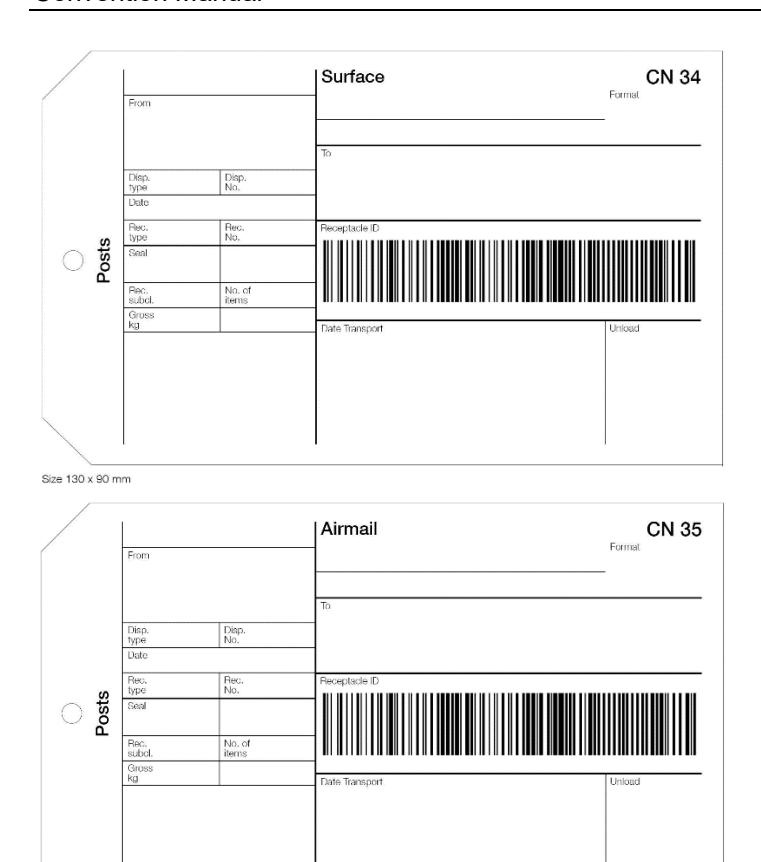

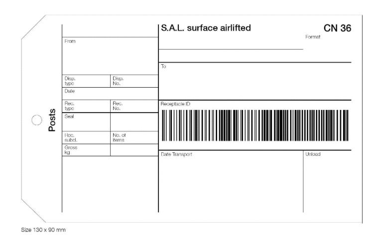

Article 17-129 Use of barcodes

- 1 Where a designated operator of origin applies a 13-character barcoded identifier to letter-post items in the international service, only one such unique identifier shall be applied. This identifier shall conform to UPU Technical Standard S10 and shall be encoded on the item in both humanreadable and barcoded form, as prescribed in the standard.
- 2 Originating, transit or destination designated operators may apply additional barcodes that do not use an S10 format, provided that the additional barcodes do not obscure any part of the sender's address or return address, or any part of the S10 item identifier applied by the originating designated operator.
- 3 A transit or destination designated operator may apply an item identifier that is compliant with UPU Technical Standard S10 and identical in data content to the one applied by the originating designated operator. In this case, it is not necessary to obliterate or remove the subsequent S10 identifier applied if the item is forwarded to another designated operator or returned to the originating designated operator.

4 If a transit or destination designated operator applies an S10-format barcode that differs in data content from the originally applied S10 identifier, this subsequent S10-format barcode shall be obliterated or removed if the item is forwarded to another designated operator or returned to the originating designated operator.

### *Commentary*

- *1 Although a registered item may have only one unique item identifier, two or more copies of this unique item identifier may be applied to the item.*
- *2 The S10 format is defined as a pattern of alphanumeric characters required for S10 identifiers, i.e. 13 characters consisting of two alpha characters followed by nine numeric characters and two alpha characters. The human-readable component may include spaces for readability.*

# Article 17-130

Electronic exchanges to support mail processes

- 1 Designated operators shall exchange pre-dispatch information and dispatch receipt information in accordance with PREDES and RESDES messages for all letter-post dispatches, with the following characteristics:
- 1.1 PREDES messages shall include item-level data where identified items are present. They shall also provide the format-of-contents information where relevant.
- 1.2 RESDES messages shall provide the receptacle type and, if relevant, the format-of-contents information.
- 1.3 In accordance with article 08-002, designated operators shall equally ensure that the S10 item identifiers of all items containing goods are included in the PREDES electronic message (UPU EDI Messaging Standard M41) sent to the designated operator of destination.
- 2 Designated operators shall provide track-and-trace information with respect to the outward and inward letter-post items on their national territory via EMSEVT V3 messages as described in UPU standard M40 in the following cases:
- 2.1 For tracked items, the exchange of EMSEVT shall be mandatory with all partners.

- 2.2 For registered and insured items, the exchange of EMSEVT shall be mandatory only within the supplementary remuneration programme, for those designated operators that participate fully in the programme according to articles 31-104 and 31-105. Data exchange with other participants shall be optional.
- 3 The following characteristics apply to the EMSEVT messages sent:
- 3.1 The provision of the following EMSEVT tracking events is mandatory, when applicable to an item: EMC, EMD, EMH and EMI. Other EMSEVT V3 events are optional.
- 3.2 When the tracking events listed below are provided, certain data elements optional in the M40 standard are mandatory, as shown in the last column:

| Event | Description                                     | Additional mandatory<br>data element(s)         |
|-------|-------------------------------------------------|-------------------------------------------------|
| EMA   | Posting/collection                              | office-of-origin-ID                             |
| EMB   | Arrival at outward office of<br>exchange        | outward-OE                                      |
| EMC   | Departure from outward office<br>of exchange    | outward-OE                                      |
| EMD   | Arrival at inward office of<br>exchange         | receiving-OE                                    |
| EDB   | Item presented to import<br>Customs             | receiving-OE                                    |
| EME   | Held by Customs                                 | receiving-OE import<br>customs-retention-reason |
| EDC   | Items returned from import<br>Customs           | customs-return-point-ID                         |
| EMF   | Departure from inward office<br>of exchange     | inward-OE                                       |
| EDH   | Item arrival at collection point<br>for pick-up | collection-point-ID                             |
| EMG   | Arrival at delivery office                      | delivery-office-ID                              |

| Event | Description                                  | Additional mandatory<br>data element(s)                                                        |
|-------|----------------------------------------------|------------------------------------------------------------------------------------------------|
| EMH   | Attempted/unsuccessful<br>delivery           | delivery-office-ID<br>unsuccessful-delivery<br>action-taken<br>unsuccessful-delivery<br>reason |
| EMI   | Final delivery                               | delivery-office-ID                                                                             |
| EMJ   | Arrival at transit office of<br>exchange     | transit-OE                                                                                     |
| EMK   | Departure from transit office of<br>exchange | transit-OE                                                                                     |

# Article 17-131 Checking of mails

- 1 Every office receiving a mail shall check:
- 1.1 the origin and destination of the receptacles making up the mail and entered on the delivery bill;
- 1.2 the sealing and make-up of the bags bearing red labels;
- 1.3 the accuracy of the information on the delivery bill.
- 2 The weight entered on the CN 34, CN 35 or CN 36 label shall be checked by sampling or systematically. The data given by the office of origin shall be accepted as valid if they differ from the weights or from the number of items established:
- 2.1 by 200 grammes or less in the case of receptacles of surface mails or surface airlifted (S.A.L.) mails;

*<sup>1</sup> The specifications of message PREDES version 2.1 are provided in UPU Messaging Standard M41. M41-7 (seventh update) was granted status 2 (UPU standard duly adopted) in 2016. All designated operators are required to comply with the latest update of the message; note that in early versions of M41, accounting information was not mandatory. The specifications of message RESDES version 1.1 are provided in UPU Messaging Standard M13 and the latest update, at status 2, is M13-5.*

- 2.2 by 100 grammes or less in the case of receptacles of airmails, priority mails or bulk mails;
- 2.3 by 100 grammes or less or 20 items or fewer in the case of IBRS items.
- 3 When an intermediate office establishes that the difference between the actual weight and the recorded weight of a receptacle exceeds the limits provided for under 2.1 or 2.2, as the case may be, it shall immediately notify the dispatching office of exchange of the mistake by CN 43 verification note or by means of an agreed reconciliation process.
- 4 When an office of destination establishes that the difference between the actual weight and the recorded weight of a receptacle or the difference between the actual number or weight and the recorded number or weight of IBRS items exceeds the limits provided for under 2.1, 2.2 or 2.3, as the case may be, it shall immediately notify the dispatching office of exchange and, when appropriate, the last intermediate office of exchange of the mistake by CN 43 verification note or by means of an agreed reconciliation process.
- 5 In format-separated dispatch, when an office of destination establishes a discrepancy between the actual format and the format recorded on a receptacle label, it shall immediately notify the dispatching office of exchange of the mistake by CN 43 verification note or by means of an agreed reconciliation process. If there is no letter in a receptacle complying with the announced format definition, the weight of the receptacle shall either be kept in the announced format or transferred to the most correct format according to weight. Where sampling is carried out, the same procedure shall be followed for both receptacles sampled and those that are not sampled for an entire accounting year.
- 6 When an intermediate office receives a mail in bad condition, it shall check the contents if it thinks that these have not remained intact. It shall put it in new packing just as it is. This office shall copy the particulars from the original label on to the new one and apply to the latter an impression of its date-stamp, preceded by the endorsement "Remballé à ..." (Repacked at ...). It shall make out a CN 43 verification note and insert one copy thereof in the repacked mail.

- 7 Upon receipt of a mail, the office of exchange of destination shall proceed as follows:
- 7.1 It shall check whether the mail is complete and has arrived in the sequence in which it was dispatched.
- 7.2 It shall check whether the entries on the letter bill and, where applicable, on the CN 16 dispatch lists and the CN 33 special lists are correct.
- 7.3 It shall satisfy itself that there is no irregularity in the external condition of the outer receptacle and of the packet, envelope or inner receptacle containing insured items.
- 7.4 It shall check the number of insured items and inspect them individually, *inter alia* in respect of weight, seals and marks, and verify that COD items are properly marked as such and accompanied by the relevant payment forms.
- 7.5 It shall ensure that tracked items sent in special receptacles or in the receptacle containing the letter bill are immediately inserted into the domestic system for distribution and delivery as soon as possible.
- 7.6 If a mail or one or more receptacles thereof are missing or mail is received in excess, the facts shall be immediately established by two officials. These shall make the necessary corrections on the letter bills or special lists. They shall take care to cross out or make additions to any incorrect entries in such a way as to leave the original entries legible. Unless there is an obvious error the corrections shall be accepted in preference to the original statement.
- 7.7 The procedure provided for in 7.6 shall also apply in the case of any other irregularity such as insured items, registered items and barcoded tracked items missing or received in excess, or a missing letter bill or special list.
- 7.8 Designated operators may agree to substitute procedures provided in 7.6 and 7.7 with information sent electronically concerning inward receipt (RESDES message, EMSEVT event EMD) and delivery (EMSEVT events EDH/EMH/EMI). Designated operators may also agree to substitute the paper-based reporting of irregularities (CN 43 verification notes) with an agreed volume (weight and item count) reconciliation process using electronically captured information.

- 7.9 If the letter bill or a special list is missing the inward office shall, in addition, prepare a substitute letter bill or special list or make a precise note of the insured items, registered items or tracked items received. Designated operators may agree to make systematic use of electronic pre-advice (PREDES/RESDES messages) for settling cases where the letter bill or a special list is missing, but where the dispatch weight and the number of insured, registered or tracked items recorded by the inward office correspond to the information received electronically. In such cases the inward designated operator may decide not to prepare a substitute letter bill and will not issue a CN 43 verification note.
- 8 Additional information regarding bulk mail dispatches
- 8.1 A CN 43 verification note shall be sent to the designated operator of origin, accompanied by a replacement CN 32 letter bill that shall include the details of the bulk items received in the following cases:
- 8.1.1 the designated operators of origin and destination have agreed to make up bulk mail dispatches, but the designated operator of origin sends bulk items in other dispatches;
- 8.1.2 the bulk mail dispatches are not accompanied by a CN 32 letter bill;
- 8.1.3 the designated operator of destination receives unreported bulk items for which the specific remuneration is applied with immediate effect; in this case, the designated operator of destination shall transmit the CN 43 and CN 32 forms preferably by telecommunication (fax or other electronic means) to the designated operator of origin of the mails.
- 8.1.4 in a format-separated dispatch, the office of destination establishes a discrepancy between the announced format and the actual format of some bulk items or receptacles.
- 8.2 In the cases provided for under 8.1.1 and 8.1.3, the CN 31 letter bill of the dispatch containing the bulk items shall be corrected accordingly and transmitted attached to the CN 43 verification note.
- 9 When the mails are opened, the constituent parts of the fastening (lead and other seals, string, labels) shall be kept together. To achieve this the string shall be cut in one place only.

- 10 When an office receives letter bills or special lists which are not intended for it, it shall send them or, if its national regulations so require, certified true copies to the office of destination by the quickest route (air or surface).
- 11 Irregularities established upon receipt of a mail containing insured items shall immediately be made the subject of reservations to the transferring service. Notification of a missing item, alteration or any other irregularity for which designated operators may be liable in respect of insured items shall be sent immediately by telecommunications to the dispatching office of exchange or to the intermediate service. In addition, a CN 24 formal report shall be made out. The condition in which the packing of the mail was found shall be indicated therein. The formal report shall be sent under registered cover to the central office of the country to which the dispatching office of exchange belongs independently of the CN 43 verification note, which shall be sent to that office immediately. A duplicate of the report shall be sent at the same time either to the central office of the country to which the receiving office of exchange belongs or to any other controlling authority appointed by that designated operator.
- 12 The office of exchange which receives from a corresponding office a damaged or an insufficiently packed insured item shall send it on after observing the following rules:
- 12.1 If it is a matter of slight damage or of partial destruction of the seals, it is sufficient to re-seal the insured item to safeguard the contents. This shall be authorized on condition that it is obvious that the contents are not damaged nor, according to a check of the weight, short. The existing seals shall be preserved. If necessary, the insured items shall be repacked, retaining the original packing as far as possible. Repacking may also be done by placing the damaged item in a receptacle labelled and sealed with lead. In such cases, it is unnecessary to re-seal the damaged item. The receptacle label shall be marked "Envoi avec valeur déclarée endommagé" (Damaged insured item). It shall show the following information: serial number, office of origin, amount of the insured value, name and address of addressee, the date-stamp impression and the signature of the official who bagged the item.

- 12.2 If the state of the insured item is such that the contents could have been removed, the office shall automatically open it, where this is not contrary to the laws of the country, and check the contents. The result of this check shall be given in a formal CN 24 report. A copy of this report shall be attached to the insured item. This shall be repacked.
- 12.3 In all these cases, the weight of the insured item on arrival and the weight after repacking shall be checked and noted on the cover. This note shall be followed by the words "Scellé d'office à ... " (Sealed at ...) or "Remballé à ... " (Repacked at ...). This note shall be supplemented by an impression of the date-stamp and by the signature of the officials who have affixed the seals or done the repacking.
- 13 The discovery of any irregularity whatsoever during the check may in no case be the cause of the return of an item contained in the mail examined except as provided in article 19 of the Convention.

- *8.1.4 The announced format refers to the format pre-advised by the designated operator of origin in the dispatch document accompanying the dispatch and/or in the PREDES message.*
- *10 Exchange office telephone and fax numbers and e-mail addresses are given in the LP Compendium.*

# Article 17-132 Verification notes

- 1 The irregularities established shall be reported immediately, and at the latest within one month, to the office of origin of the mail, by means of a CN 43 verification note made out in duplicate, after the complete check of the mail. Where transit is involved, the verification note shall be sent to the last intermediate office which transmitted the mail in bad condition.
- 2 The details on the verification note for non-barcoded items shall specify as precisely as possible the label, bag or other receptacle, seal, cover, packet or item concerned. For barcoded items the details on the verification note shall specify the item barcode number. If the mail contains bundles provided with CN 25 and CN 26 labels, such labels shall, in case of irregularity, be attached to the verification note. In the case of service irregularities which gave grounds for presuming loss or theft, the condition

in which the packing of the mail was found shall be indicated in as much detail as possible on the verification note. Only in cases which gave grounds for presuming loss or theft, dated digital photographic images of the label, bag or other receptacle, seal, cover, packet or item concerned may be provided.

- 3 Unless this is impossible for a stated reason, the following elements shall be kept intact for a period of six weeks from the date of verification and shall be sent to the designated operator of origin if the latter so requests:
- 3.1 the bag, or envelope, or other receptacle, with the string, labels and lead or other seals;
- 3.2 all the inner and outer packets or receptacles in which the insured items and registered items were enclosed;
- 3.3 the packing of any damaged items which can be recovered from the addressee.
- 4 When the mails are transmitted through the intermediary of a carrier, the CN 37, CN 38 or CN 41 delivery bill mentioning the irregularities established by the intermediate designated operator or designated operator of destination on taking over the mails shall where possible be countersigned by the carrier or his representative as well as by the designated operator of transit or of destination taking over the mails, which shall confirm that there are no irregularities. Should there be any reservations with respect to the carrier service, the copies of the CN 37, CN 38 or CN 41 bill must indicate such reservations. Where the mails are transported in containers, these reservations shall relate solely to the condition of the container and of its fastening and seals. By analogy, designated operators exchanging information by electronic means may apply the procedures described in article 17-009.3.
- 5 In the cases provided for in article 17-131.6, 7 and 10, the office of origin and, where appropriate, the last intermediate office of exchange may, in addition, be advised by telecommunications at the expense of the designated operator which sends it the advice. Such an advice shall be sent whenever the mail shows obvious traces of having been tampered

with, so that the dispatching or intermediate office may investigate the matter without delay. Where necessary, the intermediate office shall advise the preceding designated operator also by telecommunications for the continuation of the inquiry.

- 6 When the absence of a mail is the result of a missed mail connection or when it is duly explained on the delivery bill, a CN 43 verification note shall be prepared only if the mail does not reach the office of destination by the next post.
- 7 As soon as a mail which has been reported as missing to the office of origin and, where appropriate, to the last intermediate office arrives, a second verification note announcing the receipt of the mail shall be sent to these offices by the quickest route (air or surface).
- 8 Wrongly numbered dispatches, and in particular dispatches using a duplicated serial number, may be reported by the receiving designated operator in a verification note or other bilaterally agreed means to the sending designated operator, in order to notify the sending designated operator that such dispatches will be included in the accounting statement.
- 9 When a receiving office responsible for checking a mail has not sent within one month of the mail's receipt a CN 43 note reporting irregularities of any kind to the office of origin and, where appropriate, to the last intermediate office of exchange by the quickest route (air or surface), it shall be considered, until the contrary is proved (within one month), as having received the mail and its contents. The same assumption shall be made in respect of irregularities to which no reference has been made or which have been incompletely reported in the verification note. The same shall apply when the provisions of the present article and of article 17-131 regarding the formalities to be fulfilled have not been observed.
- 10 Verification notes shall preferably be sent by telefax or by any other electronic means of communication. If not practicable, such notes shall be sent by the quickest mail route (air or surface).

- 11 Designated operators may agree to substitute the paper-based reporting of irregularities (CN 43 verification notes) with an agreed volume (weight and item count) reconciliation process using electronically captured information.
- 12 Verification notes sent by mail shall be forwarded in envelopes marked in bold letters "Bulletin de vérification" (Verification note). These envelopes may either be pre-printed or distinguished by a stamp impression clearly reproducing the indication.
- 13 The offices to which the verification notes are sent shall return them as promptly as possible, and at the latest within one month of the transmission, preferably by electronic means or by priority service, to the office of exchange from which they came, after having examined them and indicated thereon their observations, if any. The verification notes shall be considered duly accepted until proved otherwise:
- 13.1 if they are not answered within a period of two months from the date of their transmission, for verification notes transmitted by non-priority services (S.A.L. or surface mail);
- 13.2 if the designated operator of origin is not advised within that time of any investigations which may still be necessary or of the additional dispatch of relevant documents.
- 14 The acceptance or rejection of a verification note or a requirement for further information shall be indicated by checking the appropriate box located at the end of the verification note.

| VN number                                                                                                        |                                                          |                                                                            |                     | VE                                                               | RIFI     | CATION NO                                | OTE                                                        |                                                  | CN 43        |
|------------------------------------------------------------------------------------------------------------------|----------------------------------------------------------|----------------------------------------------------------------------------|---------------------|------------------------------------------------------------------|----------|------------------------------------------|------------------------------------------------------------|--------------------------------------------------|--------------|
| Date                                                                                                             |                                                          |                                                                            |                     |                                                                  |          |                                          |                                                            |                                                  |              |
|                                                                                                                  | VN originator                                            |                                                                            |                     | VN                                                               | l destin | ation                                    |                                                            |                                                  |              |
| Operators                                                                                                        |                                                          |                                                                            |                     |                                                                  |          |                                          |                                                            |                                                  |              |
| Office code and name                                                                                             |                                                          |                                                                            |                     |                                                                  |          |                                          |                                                            |                                                  |              |
| Anomalies<br>concern                                                                                             | a dispatch<br>a consignment<br>other                     | Dispatch/cons                                                              | signment identifier |                                                                  |          |                                          | De                                                         | locument dat                                     | e            |
| Dispatching of                                                                                                   | ffice of exchange                                        |                                                                            |                     | Office of ex                                                     | change   | of destination                           |                                                            |                                                  |              |
| 11 - Declai or ma 12 - Missir 12 - Wrong 20 - Wrong 21 - Missir 22 - Recep 23 - Misrot 24 - Mislat  1. Irregulai | ng document(s)<br>red wrong mail class<br>ill category   | 30<br>  31<br>  32<br>  32<br>  34<br>  38<br>  36<br>  36<br>  36<br>  36 |                     | ce  oms  stoms  stents – net to ed)  /receptacle \nunreadable re | be flow  | 40 - Mi 41 - Ite 42 - Mi 43 - Mi 99 - Ot | ssing item (I<br>m in excess<br>ssing item -<br>ssent item | r item receive<br>(barcoded ite<br>s (barcoded i | ms)<br>tems) |
| Deliver<br>Letter                                                                                                | bill                                                     | CN _                                                                       | _                   |                                                                  |          | Registered                               | Insured                                                    | Tra                                              | acked        |
| A déco                                                                                                           | al list(s):<br>ouvert/missent items:                     | CN<br>CN 65                                                                |                     | Number of i                                                      |          |                                          |                                                            |                                                  |              |
| Delivery b                                                                                                       | ill: corrections of total w                              | reights                                                                    |                     |                                                                  |          | Letter post                              | Empty<br>receptac                                          | cles To                                          | tal          |
|                                                                                                                  | ing to the weights given or<br>ing from an error in calc |                                                                            | ended as necessa    | any)                                                             |          |                                          |                                                            |                                                  |              |
|                                                                                                                  | : irregularities                                         | and the Re                                                                 | Entered             | Received                                                         |          | Observations                             | 1                                                          |                                                  |              |
| Numbe                                                                                                            | er of receptacles                                        |                                                                            |                     |                                                                  |          |                                          |                                                            |                                                  |              |
| Weigh                                                                                                            | t of receptacles                                         |                                                                            |                     |                                                                  |          |                                          |                                                            |                                                  |              |
| Total re                                                                                                         | egistered items                                          |                                                                            |                     |                                                                  |          |                                          |                                                            |                                                  |              |
| CN 33                                                                                                            | special lists                                            |                                                                            |                     |                                                                  |          |                                          |                                                            |                                                  |              |
| Total in                                                                                                         | nsured items                                             |                                                                            |                     |                                                                  |          |                                          |                                                            |                                                  |              |
| CN 16                                                                                                            | special lists                                            |                                                                            |                     |                                                                  |          |                                          |                                                            |                                                  |              |
| Total T                                                                                                          | racked items                                             |                                                                            |                     |                                                                  |          |                                          |                                                            |                                                  |              |
| Recep                                                                                                            | tacles being returned                                    |                                                                            |                     |                                                                  |          |                                          |                                                            |                                                  |              |

| Receptad         | cle ID o | r seri                      | al numb | er     |        |                 |           | Descripti         | on                               |        |                    |           |                     |  |
|------------------|----------|-----------------------------|---------|--------|--------|-----------------|-----------|-------------------|----------------------------------|--------|--------------------|-----------|---------------------|--|
|                  |          |                             |         |        |        |                 |           |                   |                                  |        |                    |           |                     |  |
|                  |          |                             |         |        |        |                 |           |                   |                                  |        |                    |           |                     |  |
| 3. Irregu        | laritie  | s cor                       | ncernin |        |        |                 | Receive   | al dues ar        |                                  |        | (b. c)             |           |                     |  |
| Type of mail     |          | Entered (a                  |         | 1      |        | Number          | i l       |                   | fference (b – a)\number   Weight |        | Obse               | ervations |                     |  |
|                  | Forma    | t P or                      | P/G     | Number |        | Weight          | Number    | vveignt           | INGITIK                          | )GI    | per Weight         |           |                     |  |
| LC/AO            | Forma    |                             |         |        |        |                 |           |                   |                                  |        |                    |           |                     |  |
| recep-<br>tacles | -        | Format E                    |         |        |        |                 |           |                   |                                  |        |                    |           |                     |  |
|                  | Mixed    |                             |         |        |        |                 |           |                   |                                  |        |                    |           |                     |  |
|                  | Up to    | 5 kg                        |         |        |        |                 |           |                   |                                  |        |                    |           |                     |  |
| M bags           | Over 5   | i kg                        |         |        |        |                 |           |                   |                                  |        |                    |           |                     |  |
|                  | Total re | ecepta                      | acles   |        |        |                 |           |                   |                                  |        |                    |           |                     |  |
| Bulk mail        | Total it | ems                         |         |        |        |                 |           |                   |                                  |        |                    |           |                     |  |
| IBRS             | Total it | ems                         |         |        |        |                 |           |                   |                                  |        |                    |           |                     |  |
| 4. Item i        | rregula  | aritie                      | s       |        |        |                 |           |                   |                                  |        |                    |           |                     |  |
| Item-ID          |          | Weight Type of irregularity |         |        | Obser  | rvations        |           | Item-ID           | Weigh                            |        | Type of irregulari | ity*      | Observations        |  |
|                  |          |                             |         |        |        |                 |           |                   |                                  |        |                    |           |                     |  |
|                  |          |                             |         |        |        |                 |           |                   |                                  |        |                    |           |                     |  |
|                  |          |                             |         |        |        |                 |           |                   |                                  |        |                    |           |                     |  |
| Allowed valu     |          |                             |         | 3 – da | maged; | 4 – retained; 9 | - others. |                   |                                  |        |                    |           |                     |  |
|                  |          |                             |         |        |        |                 |           |                   |                                  |        |                    |           |                     |  |
|                  |          |                             |         |        |        |                 |           |                   |                                  |        |                    |           |                     |  |
|                  |          |                             |         |        |        |                 |           |                   |                                  |        |                    |           |                     |  |
|                  |          |                             |         |        |        |                 |           |                   |                                  |        |                    |           |                     |  |
|                  |          |                             |         |        |        |                 |           |                   |                                  |        |                    |           |                     |  |
| This form r      | must be  | returr                      | ed to   |        |        |                 |           | Accepted Rejected |                                  |        |                    |           |                     |  |
|                  |          |                             |         |        |        |                 |           | Furthe            | er inform                        | ation  | required           | Fo        | or information only |  |
| Origin – Si      | gnature  |                             |         |        |        |                 |           | Destination       | n – Sigr                         | nature | •                  |           |                     |  |
|                  |          |                             |         |        |        |                 |           |                   |                                  |        |                    |           |                     |  |
|                  |          |                             |         |        |        |                 |           |                   |                                  |        |                    |           |                     |  |

Misrouted mails and missent items

In the absence of a special agreement, misrouted mails (receptacles) and missent items of all kinds shall be redirected to their destination without delay by the quickest route.

Article 17-201

Operation of the service by transport companies

The designated operator which has the service operated by transport companies shall make arrangements with them to ensure full implementation by them of all the provisions of the Convention and its Regulations, with special reference to the arrangements for the exchange of parcels. The designated operator shall be responsible for all their relations with designated operators of the other contracting countries and with the International Bureau.

### *Commentary*

*Information on this subject appears in the PPCO.*

Article 17-202 Weight system. Pound avoirdupois

- 1 The weight of the parcels shall be expressed in kilogrammes.
- 2 Designated operators of countries which by reason of their internal regulations are unable to adopt the metric-decimal system of weight may substitute for the weights expressed in kilogrammes the equivalents in pounds avoirdupois.

Special conditions relating to limits of weights

The exchange of parcels whose individual weight exceeds 20 kilogrammes (including parcels relating to the postal service as provided for in article 16-001.2) shall be optional. In this regard, all member countries and their designated operators shall be entitled to accept higher individual weight limits, subject to due inclusion of the appropriate operational information (as well as any associated requirements, such as the conclusion of a special agreement) in the relevant compendium.

Prot. Article R XXXI

Special conditions relating to limits of weights for parcels

Notwithstanding article 17-203, Canada shall be authorized to limit to 30 kilogrammes the maximum weight of inward and outward parcels.

Article 17-204 Limits of size

- 1 Parcels shall not exceed two metres for any one dimension or three metres for the sum of the length and the greatest circumference measured in a direction other than that of the length.
- 2 Member countries and their designated operators shall be entitled to accept parcels varying from the dimension limits specified in § 1, subject to due inclusion of the appropriate operational information (as well as any associated requirements, such as the conclusion of a special agreement) in the relevant compendium. Notwithstanding the foregoing, under no circumstances may member countries and their designated operators set, for the acceptance of parcels, maximum dimension limits of less than 1.05 metres for any one dimension or two metres for the sum of the length and the greatest circumference measured in a direction other than that of length.
- 3 Parcels shall not be smaller than the minimum size prescribed for letters.

# Article 17-205 Delivery procedure

- 1 As a general rule, parcels shall be delivered to the addressees as soon as possible and according to the provisions in force in the country of destination. When parcels are not delivered to the addressee's address the addressee shall, unless this is impossible, be advised of their arrival without delay.
- 2 If the provisions in force in the country of destination so permit, the delivery to the addressee's address may, at the request of the addressee, be replaced by alternative options for the delivery of the items to the addressee (e.g. pick-up point, delivery at another address).
- 3 When delivering or handing over an ordinary parcel, the designated operator of destination shall obtain from the recipient a signature of acceptance, or register captured data from an identity card, or obtain some other form of evidence of receipt that is legally binding under the legislation of the country of destination to confirm acceptance. The requirements of this paragraph shall not apply to parcel-post items handled under the provisions of article 17-206; paragraph 4 of this article shall apply to ECOMPRO parcels.
- 4 When delivering or handing over a parcel-post item under the provisions of article 17-206, the designated operator of destination shall provide electronic evidence of delivery by scanning and transmitting the relevant tracking event and associated data element.

### *Commentary*

*1 The words "unless this is impossible" apply in principle to parcels sent poste restante and to parcels for an addressee living in an area where there is no mail delivery service.*

# Prot. Article R V Delivery procedure

1 Notwithstanding article 18-001.6.2.5.1, the designated operators of Australia, Canada and New Zealand are authorized not to obtain a signature of acceptance or some other form of evidence of receipt from the recipient when delivering or handing over an insured parcel without a barcode that meets all applicable UPU standards.

2 Notwithstanding article 18-001.6, the designated operators of Australia, Canada and New Zealand are authorized not to obtain a signature of acceptance or some other form of evidence of receipt from the recipient when delivering or handing over an ordinary parcel without a barcode that meets all applicable UPU standards.

# Article 17-206 ECOMPRO parcels

- 1 General principles
- 1.1 As an optional parcel-post delivery category, designated operators may agree between themselves to convey parcel-post items generated by e-commerce activities by air with priority and in accordance with the delivery specifications outlined in this article.
- 2 ECOMPRO parcel specifications
- 2.1 Designated operators shall accept and handle ECOMPRO parcels up to 30 kg, unless their national legislation restricts the maximum weight to 20 kg.
- 2.2 Each parcel shall be identified by a unique item identifier specific to the service and conforming to UPU Technical Standard S10.
- 2.3 Designated operators shall provide track and trace information in accordance with the provisions of article 17-216 and shall observe the indicative performance targets detailed in articles 17-217 and 17-218.
- 2.4 Designated operators of destination that agree to deliver items under the delivery category specified herein shall endeavour to achieve the indicative delivery time target set at five days starting from the scanning and transmission of the relevant EMSEVT event approved by the POC for the measurement of delivery performance.
- 2.5 Customer inquiries shall be handled in accordance with the procedures outlined in article 21-003.

- *2.1 Users of packaging sold by DOs tend to neglect interior packing. Users employing the packs sold by postal services should be informed of the need to use appropriate interior packing as well and to make sure that the outside wrapping is properly closed.*
- *2.2 Particularly secure packing was prescribed for any conveyance by maritime services, especially in the case of objects liable to deteriorate or cause deterioration of other items.*
- *2.3 Closures with projecting, sharp or pointed parts are not admissible.*

# Article 17-207

Conditions of acceptance of parcels. Make-up and packing. Addressing

- 1 General packing conditions
- 1.1 Every parcel shall be packed and closed in a manner befitting the weight, the shape and the nature of the contents as well as the mode and duration of conveyance. The packing and closing shall protect the contents against crushing or damage by repeated handling and shall also be such that it is impossible to tamper with the contents without leaving clear traces thereof.
- 1.2 Every parcel shall be made up particularly securely if it has to be:
- 1.2.1 conveyed over long distances;
- 1.2.2 transhipped or handled many times;
- 1.2.3 protected against major changes in climate, temperature or, in the case of conveyance by air, variations in atmospheric pressure.
- 1.3 It shall be packed and closed in such a way as not to endanger the health of officials and so as not to present any danger if it contains articles of a kind likely to injure officials called upon to handle it or to soil or damage other parcels or postal equipment.
- 1.4 It shall have, on the packing or the wrapping, sufficient space for service instructions and for affixing stamps and labels.

- 1.5 The following shall be accepted without packing, and the address of the addressee may be given on the article itself:
- 1.5.1 articles which can be fitted together or put and kept together by a strong cord with lead or other seals, so as to form one single parcel which cannot come apart;
- 1.5.2 parcels in one piece, such as pieces of wood, metal, etc., which it is not the custom of the trade to pack.
- 2 Addresses of the sender and the addressee
- 2.1 To be admitted to the Post, every parcel shall bear, in roman letters and in Arabic figures on the parcel itself or on a label firmly attached to it, the complete addresses and names of the addressee and the sender. If other letters and figures are used in the country of destination, it shall be recommended that the address be given also in these letters and figures. Addresses written in pencil shall not be allowed; nevertheless, parcels of which the address is written in indelible pencil on a surface previously dampened shall be accepted.
- 2.2 Only one person or a corporate body may be designated as addressee. However, addresses such as "Mr. A at ... for Mr. Z at ..." or "Bank A at ... for Mr. Z at ..." may be admitted, it being understood that only the person indicated under A shall be regarded by designated operators as the addressee. In addition, the addresses of A and Z shall be in the same country.
- 2.3 The office of posting shall also advise the sender to put in the parcel a copy of his address and that of the addressee.
- 3 Certificate of posting
- 3.1 A certificate of posting shall be handed over free of charge to the sender of a parcel at the time of posting.

# Article 17-208 Special packing

- 1 Articles of glass or other fragile objects shall be packed in a strong box filled with an appropriate protective material. Any friction or knocks during transport either between the objects themselves or between the objects and the sides of the box shall be prevented.
- 2 Liquids and substances which easily liquefy shall be enclosed in perfectly leak-proof containers. Each container shall be placed in a special strong box containing an appropriate protective material to absorb the liquid should the container break. The lid of the box shall be fixed so that it cannot easily work loose.
- 3 Fatty substances which do not easily liquefy, such as ointments, soft-soap, resins, etc., and silk-worm eggs, the conveyance of which presents few difficulties, shall be enclosed in a first packing (box, bag of cloth, plastic, etc.) which is itself placed in a box stout enough to prevent the contents from leaking.
- 4 Dry colouring powders, such as aniline blue, etc., shall be admitted only in perfectly leak-proof metal boxes, placed in turn in strong boxes with an appropriate absorbent and protective material between the two containers.
- 5 Dry non-colouring powders shall be placed in strong containers (box, bag). These containers shall themselves be enclosed in a stout box.
- 6 Live bees, leeches and parasites shall be enclosed in boxes so constructed as to avoid any danger.
- 7 Packing shall not be required for articles in one piece, such as pieces of wood, metal, etc., which it is not the custom of the trade to pack. In this case, the address of the addressee should be given on the article itself.

- 8 In addition, the following conditions shall be complied with:
- 8.1 Precious metals shall be packed either in a stout metal box or a case made of wood. The latter shall have a minimum thickness of 1 cm for parcels up to 10 kilogrammes and 1.5 cm for parcels over 10 kilogrammes. The packing may also consist of two seamless bags forming a double wrapping. When cases made of plywood are used, their thickness may be limited to 5 mm on condition that the edges of the cases are reinforced by metal angle strips.
- 8.2 The wrapping of the parcel containing live animals as well as the dispatch note shall be provided with a label bearing in bold letters the words "Animaux vivants" (Live animals).
- 8.3 Cremated remains shall be shipped in funeral urns. The urns shall be placed in strong outer packaging containing an appropriate protective material resistant to external influences to prevent breakage. If available, the cremation certificate should be attached to the outer packaging, or made easily accessible. The sender is responsible for obtaining all the necessary permissions required by the national laws in the country of origin and the country of destination prior to dispatching these items.

# Article 17-209 Indication of method of forwarding

- 1 Every air parcel shall bear at the time of dispatch a special blue label inscribed "Par avion" (By airmail), with, if desired, a translation in the language of the country of origin. The method of forwarding shall also be clearly indicated on the dispatch note relating to the parcel, either by means of the special blue airmail label or by a corresponding indication in the appropriate box.
- 2 If the dispatch note is included in a self-adhesive document pack pasted firmly to the parcel and provided with a duly marked blue tick-box, the label mentioned in 1 shall not be mandatory, either on the dispatch note document pack or on the parcel.

# Article 17-210 Formalities to be complied with by the sender

- 1 A CP 72 manifold set, or a CN 23 customs declaration (in duplicate where requested by the destination designated operator), shall accompany each parcel. The contents of the parcel shall be shown in detail on the customs declaration and indications of a general kind shall not be admitted. The CP 72 manifold set, or the CN 23 customs declaration (in duplicate where requested), shall be attached to the outside of the parcel, in such a way as to prevent its loss.
- 2 The standard number of CN 23 customs declarations to accompany a parcel (or letter-post item) shall be limited to two. Where designated operators agree in advance, a single CN 23 customs declaration may accompany the parcel (or letter-post item) and shall be affixed directly to the outside of the item.
- 3 In accordance with article 08-002, customs data provided in accordance with the instructions on the CN 23 customs declaration, including the addresses and names of the sender and addressee, shall be transmitted electronically, in compliance with UPU EDI Messaging Standard M33 (ITMATT V1), to the designated operator of the country of destination. The designated operator of origin may share all or part of these data with the customs administration in the country of origin for export purposes, and the designated operator of destination may share all or part of the data referenced above with the customs administration in the country of destination for customs import purposes.
- 4 The use of the data from the paper CN 23 customs declaration provided for in paragraph 3 above shall be restricted to processes related to the exchange of mail and customs formalities in respect of the export or import of postal items and may not be used for any other purpose.
- 5 All provisions of article 20-001 shall also apply to the data from the paper CN 23 customs declaration provided for in paragraph 3 above. In case of a discrepancy between data on the CN 23 customs declaration and the electronic data provided pursuant to paragraph 3 above, the CN 23 customs declaration shall constitute the customs declaration.

- 6 The sender may also attach to the CN 23 declaration or CP 72 manifold set any document (invoice, export licence, import licence, certificate of origin, certificate of health, etc.) necessary for customs treatment in the dispatching country and in the country of destination.
- 7 The addresses and names of the sender and addressee, and all other particulars to be furnished by the sender, shall be identical on the parcel and the dispatch note. In the event of a discrepancy, the particulars appearing on the parcel shall be regarded as valid.

- *1 Form CN 23 is valid for both LP items and postal parcels. Originally designed by the CCC–UPU Contact Comm (now WCO–UPU Contact Comm), it meets both customs and postal requirements and is suitable for all users. Bulk senders who make out the customs declarations at the same time as the other dispatch docs (goods declaration, dispatch note, invoices, etc) using a multicopying system (details entered only once) may omit reproduction of the "Instructions" on the back of the form if this is dictated by technical factors. Information about the number of copies required is given in the PPCO. DOs are urged to approach their customs authorities with the aim of reducing the number of customs declarations required to a strict min (currently limited to two) and refraining from prescribing such declarations for transit parcels. Form CP 72 was designed to simplify the posting of parcels for abroad. It includes, in the form of a manifold set, a CN 23 customs declaration, a receipt and an address label, so designed that the sender can complete them by filling in the top sheet of the set only.*
- *3 Regarding customs treatment, see arts 20 and 20-001.*

| CP 72 (Spot carbon in front of "Address is |
|--------------------------------------------|
|                                            |
|                                            |
|                                            |
|                                            |
|                                            |
|                                            |
|                                            |
|                                            |
|                                            |
|                                            |
|                                            |
|                                            |
|                                            |
|                                            |
|                                            |
|                                            |
|                                            |
|                                            |
|                                            |
|                                            |
|                                            |
|                                            |
|                                            |
|                                            |
|                                            |
|                                            |
|                                            |
|                                            |
|                                            |
|                                            |
|                                            |
|                                            |
|                                            |
|                                            |

|         | (Designated operator)                     | The item/parcel may | be opened officially                   |                                          | $\boldsymbol{c}$    | CP 007              | 07599            | 92 NO        | ) |
|---------|-------------------------------------------|---------------------|----------------------------------------|------------------------------------------|---------------------|---------------------|------------------|--------------|---|
| From    | Name                                      | ,                   | Sender's customs<br>reference (if any) | No(s), of parcel(s)<br>(barcode, if any) | 100                 |                     |                  |              | 1 |
|         | Business                                  |                     | reference (if any)                     | (barcode, if any)                        |                     |                     |                  |              | 1 |
|         | Street                                    | Tel. No.            |                                        |                                          | 1                   |                     | DENHAMINA IN     |              | I |
|         |                                           | ICI. INO.           |                                        | Insured value - Words                    |                     |                     | fig              | ures         |   |
|         | Postcode City                             |                     |                                        | Cash-on-delivery amoun                   | rt – Words          | )                   | fic              | ures         | - |
| То      | Country                                   |                     |                                        | -                                        |                     |                     | 18               |              |   |
| ıU      | Name                                      |                     |                                        | Giro secount No. and Gir                 | iro centre          |                     |                  |              | 1 |
|         | Business                                  |                     |                                        |                                          |                     |                     |                  |              |   |
|         | Street                                    | Tel. No.            |                                        |                                          |                     |                     |                  |              |   |
|         | Postcode City                             |                     |                                        |                                          |                     |                     |                  |              |   |
|         | Country                                   |                     |                                        |                                          |                     |                     |                  |              |   |
|         |                                           |                     |                                        | -                                        |                     |                     |                  |              |   |
|         |                                           |                     |                                        |                                          |                     |                     |                  |              |   |
|         |                                           |                     |                                        |                                          |                     |                     |                  |              |   |
|         |                                           |                     |                                        |                                          |                     |                     |                  |              |   |
|         |                                           |                     |                                        |                                          |                     |                     |                  |              |   |
|         |                                           |                     |                                        |                                          |                     |                     |                  |              |   |
|         |                                           |                     |                                        |                                          |                     |                     |                  |              |   |
|         |                                           |                     |                                        |                                          |                     |                     |                  |              |   |
|         |                                           |                     |                                        |                                          |                     |                     |                  |              |   |
|         |                                           |                     |                                        |                                          |                     |                     |                  |              |   |
|         |                                           |                     |                                        |                                          |                     |                     |                  |              |   |
|         |                                           |                     |                                        |                                          |                     |                     |                  |              |   |
|         |                                           |                     |                                        |                                          |                     |                     |                  |              | _ |
|         |                                           |                     |                                        | Send                                     | ier's instru        | ctions in case of r | non-delivery     | Priority     |   |
|         |                                           |                     |                                        | Treat                                    | as abando           | oned                | Ratum to sende   | Non priority |   |
|         |                                           |                     |                                        | -                                        |                     | I have received t   |                  | priority     |   |
|         |                                           |                     |                                        | 1                                        |                     |                     |                  |              |   |
|         |                                           |                     |                                        | Decis                                    | eration             | Date and address    |                  |              | = |
|         |                                           |                     |                                        | Decia<br>by ad                           | eration<br>Idressee | Date and addres     | ssee's signature |              |   |
| c 148 m | nm (basic tormat A5) with a tolerance of  | 15 mm               |                                        |                                          |                     |                     |                  |              |   |
| x 148 n | nm (basic format A5) with a tolerance of  | 15 mm               |                                        |                                          |                     | Date and address    |                  |              |   |
| x 148 n | nnn (basic format Ab) with a tolorance of | 1.5 mm              |                                        |                                          |                     |                     |                  |              |   |
| x 148 n | nm (basic format A5) with a tolerance of  | 15 mm               |                                        |                                          |                     |                     |                  |              |   |
| x 148 n | nm (basic format A5) with a tolerance of  | 15 mm               |                                        |                                          |                     |                     |                  |              |   |
| x 148 n | nm (basic formst A3) with a tolgrance of  | 15 mm               |                                        |                                          |                     |                     |                  |              |   |
| x 148 n | nm (basic format A5) with a triorance of  | i 5 mm              |                                        |                                          |                     |                     |                  |              |   |
| x 148 n | nn (basic ternat AS) with a tolerance of  | I S mm              |                                        |                                          |                     |                     |                  |              |   |
| x 148 n | nm (basic format A3) with a toigrance or  | 15 mm               |                                        |                                          |                     |                     |                  |              |   |
| x 148 n | nm (basic format A5) with a triorance of  | 15 mm               |                                        |                                          |                     |                     |                  |              |   |
| x 148 n | nm (basic format A5) with a tolorance of  | 15 mm               |                                        |                                          |                     |                     |                  |              |   |
| x 148 n | nm (basic format A3) with a toigrance or  | f 5 mm              |                                        |                                          |                     |                     |                  |              |   |
| x 148 n | nm (basic format A5) with a tolerance of  | 15 mm               |                                        |                                          |                     |                     |                  |              |   |
| x 148 n | nm (basic format A5) with a tolorance of  | 15 mm               |                                        |                                          |                     |                     |                  |              |   |
| x 148 n | nm (basic format A5) with a toisrance of  | t 5 mm              |                                        |                                          |                     |                     |                  |              |   |
| x 148 n | nm (basic format A5) with a tolerance of  | 15 mm               |                                        |                                          |                     |                     |                  |              |   |
| x 148 n | nm (basic format Ab) with a tolorance of  | 15 mm               |                                        |                                          |                     |                     |                  |              |   |
| x 148 n | nnn (basic format A5) with a toisrance of | 15 mm               |                                        |                                          |                     |                     |                  |              |   |
| x 148 n | nm (basic format A3) with a tolerance of  | 15 mm               |                                        |                                          |                     |                     |                  |              |   |
| x 148 n | nn (basic format Ab) with a tolorance of  | 15 mm               |                                        |                                          |                     |                     |                  |              |   |
| x 148 n | nnn (basic format A5) with a toisrance of | 15 mm               |                                        |                                          |                     |                     |                  |              |   |
| x 148 n | nm (basic format A5) with a tolorance of  | 15 mm               |                                        |                                          |                     |                     |                  |              |   |
| x 148 n | rm (basic format Ab) with a tolorance of  | 15 mm               |                                        |                                          |                     |                     |                  |              |   |
| x 148 n | nm (basic format A5) with a toisrance of  | 15 mm               |                                        |                                          |                     |                     |                  |              |   |
| x 148 n | nm (basic format A5) with a tolorance of  | 15 mm               |                                        |                                          |                     |                     |                  |              |   |
| x 148 n | nm (basic format A3) with a toigrance or  | t 5 mm              |                                        |                                          |                     |                     |                  |              |   |
| × 148 n | nm (basic format A5) with a tolorance of  | 15 mm               |                                        |                                          |                     |                     |                  |              |   |
| × 148 n | rm (basic format Ab) with a tolorance of  | 15 mm               |                                        |                                          |                     |                     |                  |              |   |
| x 148 n | nnn (basic format A5) with a toisrance or | t 5 mm              |                                        |                                          |                     |                     |                  |              |   |

|      | (Designated operator)                                                                                                            |                         |                                                  |                                | _                           | TD 00=            |                                    |                 |  |
|------|----------------------------------------------------------------------------------------------------------------------------------|-------------------------|--------------------------------------------------|--------------------------------|-----------------------------|-------------------|------------------------------------|-----------------|--|
| From | Name                                                                                                                             |                         | Sender's customs<br>reference (if any)           | Noisi, of parcelis:            | 075 992                     |                   |                                    |                 |  |
|      | Business                                                                                                                         |                         |                                                  | (barcode, if any)              | ll ll                       |                   |                                    | 4 1 1 1 1 1 1 1 |  |
|      | Street                                                                                                                           | Tel. No.                |                                                  |                                | 111                         |                   |                                    |                 |  |
|      | Postcode City                                                                                                                    |                         |                                                  |                                |                             |                   |                                    |                 |  |
|      | Gountry                                                                                                                          | Country                 |                                                  |                                |                             |                   |                                    |                 |  |
| То   | Name                                                                                                                             |                         |                                                  |                                |                             |                   |                                    |                 |  |
|      | Business                                                                                                                         |                         |                                                  |                                |                             |                   |                                    |                 |  |
|      | Street                                                                                                                           | Tel. No.                |                                                  | importer/addresse              | ee reference (if a          | ny) (tax code/VAT | T No./importer code)               | (optional)      |  |
|      | Postcode City                                                                                                                    |                         | Importer/address                                 | se fax/e-mail (if k            | (nown)                      |                   |                                    |                 |  |
|      | Country                                                                                                                          | Country                 |                                                  |                                |                             |                   |                                    |                 |  |
|      | Detailed description of contents (1)                                                                                             | Quantity (2)            | Net weight                                       | Value (5)                      | For commercial items only   |                   |                                    |                 |  |
|      | Distalled description of contents (1)                                                                                            | Countity (2)            | (in kg) (3)                                      | Value (5) HS tariff number (7) |                             |                   | Country of origin of goods (8)     |                 |  |
|      |                                                                                                                                  |                         |                                                  |                                |                             |                   |                                    |                 |  |
|      |                                                                                                                                  |                         |                                                  |                                |                             |                   |                                    |                 |  |
|      |                                                                                                                                  |                         |                                                  |                                |                             |                   |                                    |                 |  |
|      | Please indicate service required (tick one box<br>International Priority Interna                                                 | Total gross weight (4)  | Total value (6)                                  | Postal charges                 | /Fees (9)                   |                   |                                    |                 |  |
|      | Category of item (10) Commercial sam                                                                                             | dease specifyl;         | Office of origin/Date of posting Number of parce |                                |                             |                   | cert ficates                       |                 |  |
|      | Gift Returned goods                                                                                                              |                         | and involve                                      |                                |                             |                   |                                    |                 |  |
|      | Documents Sale of goods Comments (11): leg: goods subject to guerant                                                             | r other restrictions)   |                                                  |                                | Insured value SDR           |                   |                                    |                 |  |
|      | secure as this see Ages and act to share a                                                                                       | area, and many projects | Serios especialis                                | . so as roductionej            |                             |                   | Total gross weight of the parce(s) | Charges         |  |
|      | Licence (12) Certific                                                                                                            | 1)                      | Sender's instructions in case of non-delivery    |                                |                             |                   |                                    |                 |  |
|      | Licence number(s) Certificate                                                                                                    | number(s)               | Invoice number                                   |                                | Treat as abando             | Return to sender  | Non prority                        |                 |  |
|      | I certify that the particulars given in this declaration are correct and that this iter contain any dangerous article prohibited | n does not              | e and sender's signat                            | ture (15)                      | Declaration<br>by addresses |                   | I the parcel described             | d on this note  |  |

Size 2C4 x 144 mm (basic format A5) with a tolerance of 2 mm

CP 72 manifold set (back)

### Instructions

To clear your item, the Customs in the country of destination need to know exactly what the contents are. You must therefore complete your declaration fully and legibly; otherwise, delay and inconvenience may result for the addressee. A false or misleading declaration may lead to a line or to secure of the item.

Your goods may be subject to restrictions. It is your responsibility to enquire into import and export regulations (prohibitions, restrictions such as quarantine, pharamsecutical restrictions, etc.) and to find out what documents, it any (commercial invoice, certificate of origin, reatin certificate, licence, authorization for good subject to quarantine (plant, natine), flood products, but per required in the destration country. To accelerate customs clearance, complete this document on English proferably, Frence or in a language accepted by the origin and destination countries. If available, add importer/addressee telephone number and e-mail address, and sensoris telephone number.

Commercial item means any goods exported/imported in the course of a business transaction, whether or not they are sold for money or exchanged.

- (1) Give a detailed description of each article in the item, e.g. "mon's cotton shirts". General descriptions, e.g. "spare parts", "samples" or "food products" are not permitted.
- (2) Give the quantity of each article and the unit of measurement used.

(3) and (4) Give the net weight of each article (in kg). Give the total weight of the item (in kg), including packaging, which corresponds to the weight used to calculate the postage.

(5) and (6) Give the value of each article and the total, indicating the currency used (e.g. CHF for Swiss francs).

(7) and (8) The HS tariff number (6-digit) must be based on the Harmonized Commodity Description and Coding System developed by the World Customs Organization. "Country of origin" means the country where the goods originated, e.g. were produced manufactured or assembled. Senders of commercial items are addised to supply this information as it will assist Customs in processing the litera.

- (9) Give the amount of postage paid to the Post for the item. Specify separately any other charges, e.g. insurance.
- (10) Tick the box or boxes specifying the category of item.
- (11) Provide details if the contents are subject to quarantine (plant, animal, food products, etc.) or other restrictions.
- (12), (13) and (14) If your item is accompanied by a licence or a certificate, tick the appropriate box and state the number. You should attach an invoice for all commercial items.
- (15) Your signature and the date confirm your liability for the item.

Prot. Article R XLV Formalities to be complied with by the sender

Without prejudice to the non-liability of member countries and their designated operators as set forth in article 23.3 of the Universal Postal Convention, and notwithstanding the provisions of paragraph 5 of article 17-210, Austria, Belgium, France, Italy, Malta, Norway, Netherlands (Kingdom of the) and Spain reserve the right to consider the electronic advance data contained in the ITMATT message as prevailing over the content of the CN 23 customs declaration affixed to the item, and the electronic advance data contained in the ITMATT message as constituting the customs declaration for the item in question.

# Article 17-211

Formalities to be complied with for the merchandise return service

- 1 A CN 23 customs declaration shall be attached to the outside of each parcel sent by the customer/addressee via the merchandise return service, in such a way as to prevent its loss.
- 2 The CN 23 form shall be prepared by the original seller in accordance with the formalities described in article 17-210. In addition, the CN 23 shall include the original item identifier and be clearly marked "Merchandise Return Service (MRS)".
- 3 The customer/addressee returning the parcel shall complete the CN 23 form, which shall already contain the customs declaration information provided by the original seller, including the total weight of the parcel, by indicating the date and providing a signature. By signing the customs declaration form, the customer/addressee certifies that the description of the content mentioned on the form corresponds to the merchandise authorized to be returned to the original seller.
- 4 The customer/addressee shall obtain proof of posting.

*The merchandise return service is a supplementary service defined in Conv art 18.2.8, adopted within the framework of parcel post development at the 2012 Doha Congress. It involves a reverse logistical process and is free for the sender. The sender (the customer returning the merchandise) therefore has to comply with certain requirements, and the aim of this art is to reflect these additional requirements. See also arts 17-222 and 34-202 for other provisions relating to this supplementary service.*

# Prot. Article R XXXII

Formalities to be complied with for the merchandise return service

Notwithstanding the provisions of article 17-211, Australia reserves the right to apply formalities for the provision of the merchandise return service for parcels, either as laid down in the Regulations or by any other means, including bilateral agreements.

# Article 17-212

Sender's instructions at the time of posting

- 1 At the time of posting of a parcel, the sender shall be required to indicate the treatment to be given in case of non-delivery. For this purpose the sender shall insert a cross in the appropriate box of the CN 23 customs declaration or the CP 72 manifold set.
- 2 The sender may give only one of the following instructions:
- 2.1 return to the sender, in accordance with the period of retention prescribed by the regulations of the country of destination, by the most economical route or by air;
- 2.2 abandonment of the parcel by the sender.
- 3 The sender may reproduce or have printed only one of the permitted instructions on the CN 23 customs declaration or CP 72 manifold set. The instruction marked on the CN 23 or CP 72 manifold set shall be reproduced on the parcel itself, either by sticking a copy of the CP 72 "Address label" on the parcel, or by reproducing in some other way the instructions given on that form. It shall be in either French or English or in a language known in the country of destination.

- 4 If the sender wishes to request redirection in case of non-delivery, the parcel shall bear the indication "Réexpédition demandée" (Redirection requested) in either French or English or in a language known in the country of destination. If the sender wishes to forbid any redirection, the parcel (or letter-post item) shall bear the indication "Ne pas réexpédier" (Do not redirect) in either French or English or in a language known in the country of destination. The destination designated operator's efforts to comply with such instructions and to prevent the redirection shall be considered as a "good faith" endeavour and not subject to penalty or liability.
- 5 Parcels shall be returned without advice if the sender has given no or contradictory instructions.
- 6 Designated operators may delete from the CN 23 form sender's instructions that are applicable only to parcels whenever such a form is used for postal items other than parcels.

Formalities to be complied with by the office of origin

- 1 The office of origin or the dispatching office of exchange shall be responsible for affixing a CP 73 label on the parcel beside the address and on the dispatch note. This label shall show clearly the serial number of the parcel. If the designated operator of origin so permits, that part of the CP 73 label which is to be affixed to the dispatch note may be replaced by a preprinted indication having the same layout as the corresponding part of the label.
- 2 The weight of the parcel in kilogrammes and hundreds of grammes shall be given on the parcel and on the dispatch note. Each fraction of a hundred grammes shall be rounded up to the next hundred.
- 3 A date-stamp impression shall be applied on the dispatch note, unless a posting/collection scan (EMA) or the information captured by such a scan is provided by the designated operator of origin to the designated operator of destination.

- 4 The postage stamps or any other method of showing prepayment authorized by the regulations adopted by the country of origin or by its designated operator shall be affixed either on the parcel, or on the dispatch note.
- 5 Designated operators may agree to dispense with the formalities mentioned under 1 to 4.

*1 DOs are not required to use the CP 73 label if the parcel number is preprinted on the CP 72 form.*

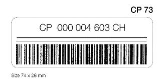

Article 17-214 General principles of the exchange of parcels

- 1 Designated operators may exchange, via one or more of their number, closed mails as well as à découvert parcels according to needs and service requirements.
- 2 When exceptional circumstances oblige a designated operator temporarily to suspend its services, either wholly or in part, it shall immediately inform the designated operators concerned.
- 3 When the conveyance of a consignment in transit through a country takes place without the participation of the designated operator of that country, regardless of the means of transport, this form of transit ("direct transhipment") shall not involve the liability of the member country or the designated operator of the transit country.
- 4 Designated operators may send surface consignments by air, with reduced priority. The designated operator of destination shall indicate, by providing an appropriate entry in the Parcel Post Compendium of Information, the details of the office of exchange or the point of destination that will accept such consignments.

- 5 Each designated operator shall prepare CP 81 and CP 82 tables stating on what conditions it accepts parcels in transit for countries for which it can act as intermediary. These shall show, in particular, the rates to be assigned to it.
- 6 The official Compendium of Information of general interest relating to the implementation of the postal parcels service provides the details on the exchange of parcels.
- 7 On the basis of that information and of the CP 81 and CP 82 tables of intermediate designated operators, each designated operator shall decide on the routes to be used for forwarding its parcels. These data also enable it to set the charges to be collected from senders.
- 8 Designated operators shall send the CP 81 and CP 82 tables direct to each other, using an electronic method, at least one month before their application. They shall send copies of them to the International Bureau. Subsequent amendments to these tables shall be announced in the same way. If this is not possible, notification shall be provided by ordinary mail. The time limit for notification shall not apply to the cases mentioned in article 27-205.1.
- 9 Each designated operator shall forward by the routes and means that it uses for its own parcels those parcels transferred to it by another designated operator for transit across its territory.
- 10 In the event of the interruption of a prescribed route, parcels in transit shall be forwarded by the best route available.
- 11 If the use of the new dispatch route occasions higher costs (additional land or sea rates), the transit designated operator shall act in accordance with article 27-205.1.
- 12 Transit shall be effected under the conditions laid down by these Regulations, even when the designated operator of origin or destination of the parcels does not participate in the postal parcels service.

- 13 In the relations between designated operators of countries separated by one or more intermediate territories parcels shall follow the routes which the designated operators concerned have agreed upon.
- 14 Every designated operator providing the air parcel service shall forward by the air routes that it uses for its own items of that type, air parcels transferred to it by another designated operator. If the forwarding of air parcels by another route offers advantages over the existing air routes, the air parcels shall be forwarded by that route.
- 15 Designated operators which do not participate in the air parcel service shall forward such parcels by the air communications they use for the conveyance of their airmail correspondence. In the absence of an air link, air parcels shall be forwarded by such designated operators by the surface route normally used for other parcels.
- 16 All designated operators shall include a barcoded identifier complying with UPU Technical Standard S9 on their receptacle labels.
- 17 Designated operators that send more than 25 tonnes of parcels per year must, and all other designated operators are encouraged to:
- 17.1 electronically pre-advise all outbound dispatches using UPUstandard compliant messages specifying the S9 identifiers of the receptacles contained in each dispatch;
- 17.2 electronically confirm receipt of inbound receptacles, that have been pre-advised, using UPU-standard compliant response and/or event reporting messages.
- 18 If a dispatch identifier is used (barcode representation or representation in electronic messaging), it shall be compliant with UPU Technical Standard S8.

*2 As regards the maintenance of postal relations in cases of disputes, conflict or war, the Lausanne Congress adopted resolution C 37/1974, given below:*

*"Congress,*

*"Considering the peaceful and humanitarian role played by the Universal Postal Union in helping to bring peoples and individuals together,*

*"Convinced of the need to maintain postal exchanges, as far as possible, with or between regions afflicted by disputes, disturbances, conflicts or wars, and,*

*"In view of the initiatives taken and the experience of certain Governments or humanitarian organizations in this field,*

*"Appeals urgently to the Governments of member countries, as far as possible and unless the UN General Assembly or Security Council has decided otherwise (in accordance with art 41 of the UN Charter), not to interrupt or hinder postal traffic – especially the exchange of correspondence containing messages of a personal nature in the event of dispute, conflict or war, the efforts made in this direction being applicable even to the countries directly concerned, and*

*"Authorizes the Director-General of the International Bureau of the UPU:*

- i *to take what initiatives he considers advisable to facilitate, while respecting national sovereignties, the maintenance or re-establishment of postal exchanges with or between the parties to a dispute, conflict or war;*
- ii *to offer his 'good offices' to find a solution to postal problems which may arise in the event of a dispute, conflict or war."*

*It is understood that each DO is the sole judge of what constitutes exceptional circumstances. The provisions of the Parcel Post Regs on steps to be taken in the event of temporary suspension and resumption of services are given in art 17-013.* 

- *3 This form of transit concerns in particular mail exchanged in containers by international road transport.*
- *4 This Compendium, entitled Parcel Post Compendium Online, is published on the UPU website (art 17-004).*
- *5 Increases in the inward land rates to take account of inflation may come into force only on 1 January (art 33-202.1). Changes in the inward land rates may come into force on 1 January or 1 July (art 33-202.4).*

| Designa | ated operator                      |                                               |                                                     |             | TABLE<br>Surface pa            | rcels             |                            |                  |                   | CP           |
|---------|------------------------------------|-----------------------------------------------|-----------------------------------------------------|-------------|--------------------------------|-------------------|----------------------------|------------------|-------------------|--------------|
| Coun    | tries for which that postal parcel | ne above-mentioned<br>Is in transit on the co | l designated oper<br>onditions given be             | ator<br>low |                                |                   |                            |                  |                   |              |
|         | ry of destination                  | Routes                                        | Rates to be allocated to the designated operator of |             | Breakdown of this columns 3 an | ne amounts<br>d 4 | Countries and sea services | Limit of insured | Number<br>of      | Observations |
| Countr  | y or destination                   | Houtes                                        | Rate per parcel                                     | Rate per kg | Rate per parcel                | Rate per kg       | to which they are due      | value            | declara-<br>tions | Observations |
|         | 1                                  | 2                                             | 3<br>8DR                                            | 4 808       | 5<br>SDH                       | 6<br>80R          | 7                          | SDH S            | 9.                | 10.          |
|         |                                    |                                               |                                                     |             |                                |                   |                            |                  |                   |              |

| Note The above-mentioned designated operator accepts, on the terms shown below, air parcels addressed to its own territory and in transit to countries for which it is in a position to serve as an intermediary  1 Conditions for the internal service    Does the designated operator preparity in the tribin underglate   Does the designated operator of its country, or any or part of the plants and acceptable part in the internal of its country, or any or part of the plants and acceptable part in the internal of its country, or any or part of the surface.   Yes                                                                                                                                                                                                                                                                                                                                                                                                                                                                                                                                                                                                                                                                                                                                                                                                                                                                                                                                                                                                                                                                                                                                                                                                                                                                                                                                                                                                                                                                                                                                               | Designated occusion                                                                                            |                                                                                                |                                    |                   | TABLE<br>Air parce | els                              |                                 | Reforence             |                                                |                                     | CP 82             |
|--------------------------------------------------------------------------------------------------------------------------------------------------------------------------------------------------------------------------------------------------------------------------------------------------------------------------------------------------------------------------------------------------------------------------------------------------------------------------------------------------------------------------------------------------------------------------------------------------------------------------------------------------------------------------------------------------------------------------------------------------------------------------------------------------------------------------------------------------------------------------------------------------------------------------------------------------------------------------------------------------------------------------------------------------------------------------------------------------------------------------------------------------------------------------------------------------------------------------------------------------------------------------------------------------------------------------------------------------------------------------------------------------------------------------------------------------------------------------------------------------------------------------------------------------------------------------------------------------------------------------------------------------------------------------------------------------------------------------------------------------------------------------------------------------------------------------------------------------------------------------------------------------------------------------------------------------------------------------------------------------------------------------------------------------------------------------------------------------------------------------------|----------------------------------------------------------------------------------------------------------------|------------------------------------------------------------------------------------------------|------------------------------------|-------------------|--------------------|----------------------------------|---------------------------------|-----------------------|------------------------------------------------|-------------------------------------|-------------------|
| A. Does the designand operator preparing this table undertake to informed an across by air in the interior of its country.  8. Con air process addressed developes be sent to these places of the pulled the pulled the pulled the pulled the pulled the pulled the pulled the pulled the pulled the pulled the pulled the pulled the pulled the pulled the pulled the pulled the pulled the pulled the pulled the pulled the pulled the pulled the pulled the pulled the pulled the pulled the pulled the pulled the pulled the pulled the pulled the pulled the pulled the pulled the pulled the pulled the pulled the pulled the pulled the pulled the pulled the pulled the pulled the pulled the pulled the pulled the pulled the pulled the pulled the pulled the pulled the pulled the pulled the pulled the pulled the pulled the pulled the pulled the pulled the pulled the pulled the pulled the pulled the pulled the pulled the pulled the pulled the pulled the pulled the pulled the pulled the pulled the pulled the pulled the pulled the pulled the pulled the pulled the pulled the pulled the pulled the pulled the pulled the pulled the pulled the pulled the pulled the pulled the pulled the pulled the pulled the pulled the pulled the pulled the pulled the pulled the pulled the pulled the pulled the pulled the pulled the pulled the pulled the pulled the pulled the pulled the pulled the pulled the pulled the pulled the pulled the pulled the pulled the pulled the pulled the pulled the pulled the pulled the pulled the pulled the pulled the pulled the pulled the pulled the pulled the pulled the pulled the pulled the pulled the pulled the pulled the pulled the pulled the pulled the pulled the pulled the pulled the pulled the pulled the pulled the pulled the pulled the pulled the pulled the pulled the pulled the pulled the pulled the pulled the pulled the pulled the pulled the pulled the pulled the pulled the pulled the pulled the pulled the pulled the pulled the pulled the pulled the pulled the pulled the pulled the pulled the pulled the pulled the pull | The above-mentioned designat                                                                                   |                                                                                                | erms showr                         | n below, air      | parcels a          | ddressed to                      | its own to                      | erritory and          | in transit t                                   | o countries for                     | which it is in    |
| 2. County of distinution  2. County of distinution  2. County of distinution  2. County of distinution  2. County of distinution  2. County of distinution  2. County of distinution  2. County of distinution  2. County of distinution  2. County of distinution  2. County of distinution  2. County of distinution  2. County of distinution  2. County of distinution  2. County of distinution  3. County of distinution  4. County of distinution  2. County of distinution  3. County of distinution  4. County of distinution  4. County of distinution  4. County of distinution  4. County of distinution  4. County of distinution  5. County of distinution  6. County of distinution  6. County of distinution  7. County of distinution  7. County of distinution  7. County of distinution  7. County of distinution  8. County of distinution  8. County of distinution  8. County of distinution  8. County of distinution  8. County of distinution  8. County of distinution  8. County of distinution  8. County of distinution  8. County of distinution  8. County of distinution  8. County of distinution  8. County of distinution  8. County of distinution  8. County of distinution  8. County of distinution  8. County of distinution  8. County of distinution  8. County of distinution  8. County of distinution  8. County of distinution  8. County of distinution  8. County of distinution  8. County of distinution  8. County of distinution  8. County of distinution  8. County of distinution  8. County of distinution  9. County of distinution  9. County of distinution  9. County of distinution  9. County of distinution  9. County of distinution  9. County of distinution  9. County of distinution  9. County of distinution  9. County of distinution  9. County of distinution  9. County of distinution  9. County of distinution  9. County of distinution  9. County of distinution  9. County of distinution  9. County of distinution  9. County of distinution  9. County of distinution  9. County of distinution  9. County of distinution  9. County of disti | 1 Conditions for the internal                                                                                  | service                                                                                        |                                    |                   |                    |                                  |                                 |                       |                                                |                                     |                   |
| B. Corr air process addressed sheed-release to several to these policies of the concept of the second countries  2. Services to other countries  Col 3. The close shown in this column cover the invador lates with which the designated country for air parcelar release to the close and critical is a concept.  Col 3. The close shown in this column cover the invador lates with which the designated country for air parcelar releases to the above mentioned diagrants. Color the above mentioned diagrants countries with the above mentioned diagrants of the above mentioned diagrants. Color the above mentioned diagrants of the above mentioned diagrants of the above mentioned diagrants. Color the above mentioned diagrants are to be discissful, it and or sea transfel to use, which the trained have seven with an account of the above mentioned diagrants. Color the above mentioned diagrants are to be discissful, it and or sea transfel to use, the total must be served with an account of the above mentioned diagrants. Color the above mentioned diagrants are to be allocated, it found or sea transfel to use, the total must be served with an account of the above mentioned diagrants. Color than a transfel to use, the total must be served with an account of the account of the account of the account of the account of the account of the account of the account of the account of the account of the account of the account of the account of the account of the account of the account of the account of the account of the account of the account of the account of the account of the account of the account of the account of the account of the account of the account of the account of the account of the account of the account of the account of the account of the account of the account of the account of the account of the account of the account of the account of the account of the account of the account of the account of the account of the account of the account of the account of the account of the account of the account of the account of the account of | to reforward air parcels by air in the                                                                         | paring this table undertake<br>to interior of its country,                                     |                                    |                   | If so, to wh       | ich places?                      | No                              |                       |                                                | to the designated<br>of destination | operator.         |
| Co 3 This cause shown in this column cover the investor ratios with which the designated of the column cover the investor ratios with which the designated operator for an percent in less shown shown in the destruction of the column cover the investor of the column cover the investor of the column cover the investor of the column cover the investor of the column cover the investor of the column cover the column cover the column cover the column cover the column cover the column cover the column cover the column cover the column cover the column cover the column cover the column cover the column cover the column cover the column cover the column cover the column cover the column cover the column cover the column cover the column cover the column cover the column cover the column cover the column cover the column cover the column cover the column cover the column cover the column cover the column cover the column cover the column cover the column cover the column cover the column cover the column cover the column cover the column cover the column cover the column cover the column cover the column cover the column cover the column cover the column cover the column cover the column cover the column cover the column cover the column cover the column cover the column cover the column cover the column cover the column cover the column cover the column cover the column cover the column cover the column cover the column cover the column cover the column cover the column cover the column cover the column cover the column cover the column cover the column cover the column cover the column cover the column cover the column cover the column cover the column cover the column cover the column cover the column cover the column cover the column cover the column cover the column cover the column cover the column cover the column cover the column cover the column cover the column cover the column cover the column cover the column cover the column cover the column cover the column cover the column cover the column cover the column  | B. Can air parcels addressed elsewher places at the request of the sender                                      | ere be sent to these<br>in?                                                                    |                                    |                   | Yos                |                                  | □ No                            |                       |                                                | реграся, SDH                        | per gross kg, SDH |
| conjustic of cerimination is to be creatiled.  4. This origin for one counted position of the intermediate designated operator for an product of the intermediate designated operator for an product of the intermediate designated operator for an operator for an operator of the intermediate designated operator for an operator of the intermediate designated operator for an operator of the intermediate designated operator for an operator of the intermediate designated operator for an operator of the intermediate designated operator for an operator of the intermediate designated operator for an operator of the intermediate designated operator for an operator of the intermediate designated operator for an operator of the intermediate designated operator for an operator of the intermediate designated operator for an operator of the intermediate designated operator of the intermediate designated operator for an operator operator in the column operator of the intermediate designated operator for an operator operator in the column operator operator operator operator operator operator operator operator operator operator operator operator operator operator operator operator operator operator operator operator operator operator operator operator operator operator operator operator operator operator operator operator operator operator operator operator operator operator operator operator operator operator operator operator operator operator operator operator operator operator operator operator operator operator operator operator operator operator operator operator operator operator operator operator operator operator operator operator operator operator operator operator operator operator operator operator operator operator operator operator operator operator operator operator operator operator operator operator operator operator operator operator operator operator operator operator operator operator operator operator operator operator operator operator operator operator operator operator operator operator operator operator op | 2 Services to other countries                                                                                  |                                                                                                |                                    |                   |                    |                                  |                                 |                       |                                                | 11                                  |                   |
| Poutos   Poutos   Poutos   Poutos   Poutos   Poutos   Poutos   Poutos   Poutos   Poutos   Poutos   Poutos   Poutos   Poutos   Poutos   Poutos   Poutos   Poutos   Poutos   Poutos   Poutos   Poutos   Poutos   Poutos   Poutos   Poutos   Poutos   Poutos   Poutos   Poutos   Poutos   Poutos   Poutos   Poutos   Poutos   Poutos   Poutos   Poutos   Poutos   Poutos   Poutos   Poutos   Poutos   Poutos   Poutos   Poutos   Poutos   Poutos   Poutos   Poutos   Poutos   Poutos   Poutos   Poutos   Poutos   Poutos   Poutos   Poutos   Poutos   Poutos   Poutos   Poutos   Poutos   Poutos   Poutos   Poutos   Poutos   Poutos   Poutos   Poutos   Poutos   Poutos   Poutos   Poutos   Poutos   Poutos   Poutos   Poutos   Poutos   Poutos   Poutos   Poutos   Poutos   Poutos   Poutos   Poutos   Poutos   Poutos   Poutos   Poutos   Poutos   Poutos   Poutos   Poutos   Poutos   Poutos   Poutos   Poutos   Poutos   Poutos   Poutos   Poutos   Poutos   Poutos   Poutos   Poutos   Poutos   Poutos   Poutos   Poutos   Poutos   Poutos   Poutos   Poutos   Poutos   Poutos   Poutos   Poutos   Poutos   Poutos   Poutos   Poutos   Poutos   Poutos   Poutos   Poutos   Poutos   Poutos   Poutos   Poutos   Poutos   Poutos   Poutos   Poutos   Poutos   Poutos   Poutos   Poutos   Poutos   Poutos   Poutos   Poutos   Poutos   Poutos   Poutos   Poutos   Poutos   Poutos   Poutos   Poutos   Poutos   Poutos   Poutos   Poutos   Poutos   Poutos   Poutos   Poutos   Poutos   Poutos   Poutos   Poutos   Poutos   Poutos   Poutos   Poutos   Poutos   Poutos   Poutos   Poutos   Poutos   Poutos   Poutos   Poutos   Poutos   Poutos   Poutos   Poutos   Poutos   Poutos   Poutos   Poutos   Poutos   Poutos   Poutos   Poutos   Poutos   Poutos   Poutos   Poutos   Poutos   Poutos   Poutos   Poutos   Poutos   Poutos   Poutos   Poutos   Poutos   Poutos   Poutos   Poutos   Poutos   Poutos   Poutos   Poutos   Poutos   Poutos   Poutos   Poutos   Poutos   Poutos   Poutos   Poutos   Poutos   Poutos   Poutos   Poutos   Poutos   Poutos   Poutos   Poutos   Poutos   Poutos   Poutos   Poutos   Poutos   P   | operator of destination is to be<br>Col 4. The single rate per parcel paya<br>in transit à découvert must be s | e credited.<br>able to the intermediate designated of<br>entered in column 4a. When Iransil la | perator for air<br>and railes, and | parcels<br>or sea | Col & The          | abovo montion<br>total inward ar | nod single ra<br>nd transit rat | to.<br>es to be siloc | sted to the in                                 |                                     |                   |
| Investor sizes   Investor sizes   Investor sizes   Investor sizes   Investor sizes   Investor sizes   Investor sizes   Investor sizes   Investor sizes   Investor sizes   Investor sizes   Investor sizes   Investor sizes   Investor sizes   Investor sizes   Investor sizes   Investor sizes   Investor sizes   Investor sizes   Investor sizes   Investor sizes   Investor sizes   Investor sizes   Investor sizes   Investor sizes   Investor sizes   Investor sizes   Investor sizes   Investor sizes   Investor sizes   Investor sizes   Investor sizes   Investor sizes   Investor sizes   Investor sizes   Investor sizes   Investor sizes   Investor sizes   Investor sizes   Investor sizes   Investor sizes   Investor sizes   Investor sizes   Investor sizes   Investor sizes   Investor sizes   Investor sizes   Investor sizes   Investor sizes   Investor sizes   Investor sizes   Investor sizes   Investor sizes   Investor sizes   Investor sizes   Investor sizes   Investor sizes   Investor sizes   Investor sizes   Investor sizes   Investor sizes   Investor sizes   Investor sizes   Investor sizes   Investor sizes   Investor sizes   Investor sizes   Investor sizes   Investor sizes   Investor sizes   Investor sizes   Investor sizes   Investor sizes   Investor sizes   Investor sizes   Investor sizes   Investor sizes   Investor sizes   Investor sizes   Investor sizes   Investor sizes   Investor sizes   Investor sizes   Investor sizes   Investor sizes   Investor sizes   Investor sizes   Investor sizes   Investor sizes   Investor sizes   Investor sizes   Investor sizes   Investor sizes   Investor sizes   Investor sizes   Investor sizes   Investor sizes   Investor sizes   Investor sizes   Investor sizes   Investor sizes   Investor sizes   Investor sizes   Investor sizes   Investor sizes   Investor sizes   Investor sizes   Investor sizes   Investor sizes   Investor sizes   Investor sizes   Investor sizes   Investor sizes   Investor sizes   Investor sizes   Investor sizes   Investor sizes   Investor sizes   Investor sizes   Investor sizes   Inve   | Country of destination                                                                                         |                                                                                                | Rates paye                         | able to the des   | signated ope       | erator of                        |                                 |                       | dues by weight<br>payable to the<br>designeted | Chiservations                       | nsured value      |
| 1 2 a b a b a s 6 7                                                                                                                                                                                                                                                                                                                                                                                                                                                                                                                                                                                                                                                                                                                                                                                                                                                                                                                                                                                                                                                                                                                                                                                                                                                                                                                                                                                                                                                                                                                                                                                                                                                                                                                                                                                                                                                                                                                                                                                                                                                                                                            |                                                                                                                | Air sectors used                                                                               |                                    |                   |                    |                                  | 5a - 3a + 4a                    | 5b = 35 + 4b          | the country of destine-                        | lin SDRt "                          |                   |
|                                                                                                                                                                                                                                                                                                                                                                                                                                                                                                                                                                                                                                                                                                                                                                                                                                                                                                                                                                                                                                                                                                                                                                                                                                                                                                                                                                                                                                                                                                                                                                                                                                                                                                                                                                                                                                                                                                                                                                                                                                                                                                                                | 1                                                                                                              | 2                                                                                              |                                    |                   |                    |                                  |                                 |                       | 6                                              |                                     | 7                 |
| SAR SAR SQUE SAR                                                                                                                                                                                                                                                                                                                                                                                                                                                                                                                                                                                                                                                                                                                                                                                                                                                                                                                                                                                                                                                                                                                                                                                                                                                                                                                                                                                                                                                                                                                                                                                                                                                                                                                                                                                                                                                                                                                                                                                                                                                                                                               |                                                                                                                | , , , , , , , , , , , , , , , , , , ,                                                          |                                    |                   |                    |                                  |                                 |                       | -                                              |                                     |                   |
|                                                                                                                                                                                                                                                                                                                                                                                                                                                                                                                                                                                                                                                                                                                                                                                                                                                                                                                                                                                                                                                                                                                                                                                                                                                                                                                                                                                                                                                                                                                                                                                                                                                                                                                                                                                                                                                                                                                                                                                                                                                                                                                                |                                                                                                                |                                                                                                | Land of                            |                   |                    |                                  | 12011                           |                       | Autor I                                        |                                     |                   |

| Country of destination | Roules           | Rates pay    | Arcone, such as the designated operator of such as the designated operator of such as the designated operator of designated operator. |               |              |                                              |              |                                         | CP 82 (bo |
|------------------------|------------------|--------------|---------------------------------------------------------------------------------------------------------------------------------------|---------------|--------------|----------------------------------------------|--------------|-----------------------------------------|-----------|
| our any or cook racor  | Air sectors used | Inward rates |                                                                                                                                       | Transit rates |              | lotal columns<br>5a = 3a + 4a   5b = 35 + 4b |              | es lar es<br>the country<br>of destina- | in SDR    |
|                        |                  | per percei   | per gross kg                                                                                                                          | per percel    | per gross kg | par parcel                                   | per gross kg | lion                                    |           |
| 1                      | 2                |              | 3                                                                                                                                     |               | 4            |                                              | ь            | 6                                       | 7         |
| '                      |                  | a.           | ь                                                                                                                                     | а             | ь            | a                                            | 0            |                                         |           |
|                        |                  | SDR          | SDR                                                                                                                                   | SDR           | SDR          | SOR                                          | SOR          | SOR                                     |           |
|                        |                  |              |                                                                                                                                       |               |              |                                              |              |                                         |           |

# Article 17-215 Barcode application and specifications

- 1 All designated operators shall apply one, and only one, item identifier on all outward international postal parcels (i.e. air, S.A.L., surface). The specifications shall be as follows:
- 1.1 Each item identifier shall conform to UPU Technical Standard S10. The unique item identifier shall be located in close proximity to and on the same side as the address of the addressee, and may be duplicated on the address label itself, as well as on other areas of the item. The item identifier shall be encoded in both humanreadable and barcoded form, as prescribed in the standard.
- 1.2 Originating, transit or destination designated operators may apply additional barcodes that do not use an S10 format, provided that the additional barcodes do not obscure any part of the sender's address or return address, or any part of the S10 item identifier applied by the originating designated operator.
- 1.3 A transit or destination designated operator may apply an item identifier that is compliant with UPU Technical Standard S10 and identical in data content to the one applied by the originating designated operator. In this case, it is not necessary to obliterate or remove the subsequent S10 identifier applied if the item is forwarded to another designated operator or returned to the originating designated operator.
- 1.4 If a transit or destination designated operator applies an S10-format barcode that differs in data content from the original S10 identifier applied, this subsequent S10-format barcode shall be obliterated or removed if the item is to be forwarded to another designated operator or returned to the originating designated operator.
- 1.5 Designated operators may agree bilaterally to the use of unique item identifiers and barcodes which are already in use on international parcels.
- 1.6 Designated operators may agree bilaterally to the use of licence plates which conform to UPU Technical Standard S26 (Licence plates for parcels).

- *1.1 Although a parcel may have only one unique item identifier, two or more copies of this unique item identifier may be applied on the parcel.*
- *1.2 The S10 format is defined as a pattern of alphanumeric characters that is required for S10 identifiers, i.e. 13 characters consisting of two alpha characters followed by nine numeric characters and two alpha characters. The human-readable component may include spaces for readability.*

# Article 17-216

Electronic exchanges to support mail processes

- 1 Designated operators shall provide track and trace information using UPU EDI Messaging Standard M40 (EMSEVT v3.0) about all outward and inward parcels on their national territory and shall ensure that the data are exchanged with all partner designated operators. The following characteristics apply to the EMSEVT messages sent:
- 1.1 The provision of the following EMSEVT tracking events is mandatory, when applicable to a parcel: EMA, EMB, EMC, EMD, EDB, EME, EDC, EMF, EDH or EMH, EMI, EMJ, and EMK. Other EMSEVT V3 events are optional.
- 1.2 When the tracking events listed below are provided, certain data elements optional in the M40 standard are mandatory, as shown in the last column:

| Event | Description                                  | Additional mandatory<br>data element(s) |
|-------|----------------------------------------------|-----------------------------------------|
| EMA   | Posting/collection                           | office-of-origin-ID                     |
| EMB   | Arrival at outward office of<br>exchange     | outward-OE                              |
| EMC   | Departure from outward office of<br>exchange | outward-OE                              |
| EMD   | Arrival at inward office of<br>exchange      | receiving-OE                            |
| EDB   | Item presented to import<br>Customs          | receiving-OE                            |

| Event | Description                                     | Additional mandatory<br>data element(s)                                                        |
|-------|-------------------------------------------------|------------------------------------------------------------------------------------------------|
| EME   | Held by Customs                                 | receiving-OE<br>import-customs<br>retention-reason                                             |
| EDC   | Items returned from import<br>Customs           | customs-return-point<br>ID                                                                     |
| EMF   | Departure from inward office of<br>exchange     | inward-OE                                                                                      |
| EDH   | Item arrival at collection point for<br>pick-up | collection-point-ID                                                                            |
| EMG   | Arrival at delivery office                      | delivery-office-ID                                                                             |
| EMH   | Attempted/unsuccessful delivery                 | delivery-office-ID<br>unsuccessful<br>delivery-action-taken<br>unsuccessful<br>delivery-reason |
| EMI   | Final delivery                                  | delivery-office-ID                                                                             |
| EMJ   | Arrival at transit office of<br>exchange        | transit-OE                                                                                     |
| EMK   | Departure from transit office of<br>exchange    | transit-OE                                                                                     |

2 All designated operators shall capture and exchange pre-dispatch and dispatch receipt information in accordance with UPU EDI Messaging Standards M41 (PREDES v2.1) and M13 (RESDES v1.1) inclusive of the following data elements, in addition to data elements that are mandatory in the corresponding standard:

2.1 PREDES version 2.1 data element requirements

*Description Additional mandatory data* 

*element(s)*

Parcels accounting information parcel-bill-column-6-total

parcel-bill-column-7-total parcel-bill-column-8-total parcel-bill-column-9-total

Receptacle information receptacle-items

2.2 RESDES version 1.1 data element requirements

*Description Additional mandatory data* 

*element(s)*

Transportation information carrier

Receptacle information receptacle-items (count)

2.3 For e-commerce dispatches, the provision of individual parcel weight in PREDES is mandatory.

- 3 Capture and exchange of electronic advance data M33 ITMATT V1 and M41 PREDES v2.1 messages:
- 3.1 In accordance with the provisions of article 08-002, designated operators shall capture and exchange electronic advance data. The data shall replicate the information documented on the appropriate UPU customs declaration form and shall be compliant with UPU EDI Messaging Standard M33 (ITMATT V1).
- 3.2 All designated operators providing ECOMPRO parcels shall capture and exchange M33 ITMATT V1 messages.
- 3.3 In accordance with article 08-002, designated operators shall equally ensure that the S10 item identifiers of all items containing goods are included in the PREDES electronic message (UPU EDI Messaging Standard M41) sent to the designated operator of destination.

### *Commentary*

*Most countries have IT systems in place for supporting their postal operations, including a system for exchanging EDI messages. EMSEVT messages permit detailed tracking of each item identified.*

Article 17-217 Tracking and tracing – Indicative targets for transmission times

1 Designated operators shall endeavour to observe the following targets associated with the transmission of item event information from the time of the actual event in the transmission of such information to partner designated operators:

| 1.1  | EMC | Departure from outward office of<br>exchange                 | Within 24 elapsed<br>hours    |
|------|-----|--------------------------------------------------------------|-------------------------------|
| 1.2  | EMA | Posting/Collection                                           | Within 24 elapsed<br>hours    |
| 1.3  | EMB | Arrival at outward office of<br>exchange                     | Within 24 elapsed<br>hours    |
| 1.4  | EMJ | Arrival at transit office of exchange                        | Within 24 elapsed<br>hours    |
| 1.5  | EMK | Departure from transit office of<br>exchange                 | Within 24 elapsed<br>hours    |
| 1.6  | EMD | Arrival at inward office of<br>exchange                      | Within 24 elapsed<br>hours    |
| 1.7  | EDB | Item presented to import Customs                             | Within 24 elapsed<br>hours    |
| 1.8  | EME | Item held by import Customs                                  | Within 24 elapsed<br>hours    |
| 1.9  | EDC | Item returned from import<br>Customs                         | Within 24 elapsed<br>hours    |
| 1.10 | EMF | Departure from inward office of<br>exchange                  | Within 24 elapsed<br>hours    |
| 1.11 | EDH | Item arrival at collection point for<br>pick-up by recipient | Within 24<br>elapsed<br>hours |
| 1.12 | EMH | Attempted/Unsuccessful (physical)<br>delivery                | Within 24 elapsed<br>hours    |
| 1.13 | EMI | Final delivery                                               | Within 24 elapsed<br>hours    |

2 Designated operators shall endeavour to observe the following targets associated with the transmission of dispatch information in the exchange of such information with partner designated operators:

2.1 PREDES Pre-advice of dispatch information Within 24 elapsed hours

2.2 RESDES Advice of dispatch receipt information Within 24 elapsed hours

### *Commentary*

*2 The pre-advice information provided in PREDES makes it possible to plan workflows, register incoming mail efficiently and securely, and track-and-trace items; it can also be used for accounting operations. Replies in RESDES allow quick acknowledgment of receptacles received and make track and trace possible.*

# Article 17-218

Tracking and tracing – Indicative performance targets for transmitting data

- 1 Designated operators are encouraged to observe the following indicative targets associated with the transmission of item event information in the exchange of such information with partner designated operators:
- 1.1 Ninety percent of parcels that receive an EMC event should have an EMD event transmitted within 24 hours of the event time and date.
- 1.2 Ninety percent of parcels that receive an EMD event should have an EDH or EMH and/or an EMI event transmitted within 24 hours of the event time and date.

### *Commentary*

*1.2 The 2008 POC introduced an incentive to achieve the objective relating to event EMH and/or EMI by including this objective in the system of inward land rate bonuses (art 33-201.4.1.1.3).*

# Article 17-219

Different methods of transmission

1 The exchange of parcel mails shall be effected, as a general rule, by means of receptacles. Adjacent designated operators may agree to the handing over of certain categories of parcels unenclosed.

- 2 In the service between designated operators of non-adjacent countries, the exchange shall, as a general rule, be effected in closed mails.
- 3 Designated operators may agree to effect exchanges in transit à découvert. The transmission of parcels in transit à découvert to an intermediate designated operator shall be strictly limited to cases where the make-up of closed mails for the country of destination is not justified. However, it shall be obligatory to make up closed mails if an intermediate designated operator states that the parcels in transit à découvert are such as to hinder its work.
- 3.1 Transit à découvert shall be possible only under the following conditions:
- 3.1.1 the intermediate designated operator makes up mails for the designated operator of destination;
- 3.1.2 the designated operator of origin and the intermediate designated operator agree to this service and to its date of commencement in advance and in writing or by e-mail.
- 4 Surface airlifted parcels (S.A.L.) shall be exchanged on the conditions agreed upon between the designated operators concerned.

*1 Bags intended for making up airmails should have a reinforced neck-hem at least 8 mm thick, so that the string-knot cannot be slipped off and replaced without traces appearing.*

## Article 17-220

Transmission in closed mails

1 In the normal circumstances of transmission in closed mails, the receptacles (bags, baskets, crates, etc.) shall be marked, closed and labelled in the manner laid down below.

- 2 Making up of bags
- 2.1 Mails, including those made up solely of empty bags, shall be contained in bags the number of which shall be kept to the strict minimum. The bags shall be in good condition to protect their contents. Each bag shall be labelled.
- 2.2 The bags shall be closed, sealed preferably with lead. The seals may also be made of light metal or plastic. The sealing shall be so done that it cannot be handled or tampered with without showing signs thereof. The impressions of the seals shall reproduce, in very legible roman letters, the name of the office of origin or an indication sufficient to identify that office. However, if the designated operator of origin so wishes, the impressions of the seals need only reproduce an indication of the name of the designated operator of origin. The designated operator of origin may also use numbered seals.
- 2.3 The bags shall be packed and closed in such a way as not to endanger the health of officials.
- 2.4 For the make-up of air parcels, bags either entirely blue or with wide blue bands shall be used. For making up surface mails or surface airlifted mails, surface bags of a colour other than that of the airmail bags (e.g. beige, brown, white, etc.) shall be used. Designated operators of destination must, however, check all the bag labels in order to ensure correct processing.
- 2.5 The bags shall show legibly in roman letters the office or country of origin and bear the word "Postes" (Post) or any other similar expression distinguishing them as postal dispatches.
- 3 Labelling of mails
- 3.1 The labels of the bags shall be made of sufficiently rigid canvas, of plastic, of strong cardboard, of parchment, or of paper glued to wood. They shall be provided with an eyelet. Yellow ochre coloured CP 83, CP 84 and CP 85 labels shall be used. Their layout and text shall comply with UPU Technical Standard S47 and/or conform to the templates annexed hereto and mentioned below:
- 3.1.1 CP 83 in the case of surface receptacles;
- 3.1.2 CP 84 in the case of airmail receptacles;

- 3.1.3 CP 85 in the case of surface airlifted (S.A.L.) receptacles.
- 3.2 The labels or addresses of closed receptacles containing air parcels shall bear the indication or label "Par avion" (By airmail).
- 3.3 In addition, a special closing may be adopted for receptacles other than bags, provided that the contents are sufficiently protected.
- 4 The following label characteristics shall apply to parcel mail:
- 4.1 Receptacles containing insured parcels, whether alone or together with uninsured parcels, shall display code V in the zone defined for special content codes;
- 4.2 A special content descriptor taken from UPU code list 176 shall be displayed on the label if one of the following values is applicable (one is displayed at most, based on the order of appearance below):
- 4.2.1 "PRIOR" when the receptacle contains priority mail conveyed by surface;
- 4.2.2 "Remboursement" when the receptacle contains exclusively COD parcels;
- 4.3 The label of the receptacle containing the parcel bill shall bear a bold letter "F" in the zone defined for this purpose;
- 4.4 The receptacle gross weight shall be shown on the label, rounded up to the nearest hectogramme when the fraction of the hectogramme is equal to or greater than 50 grammes and rounded down to the nearest hectogramme otherwise;
- 4.5 The label shall include a barcoded receptacle identifier in compliance with UPU Technical Standard S9;
- 4.6 Origin designated operators that use numbered seals in closing receptacles may display the seal number on the receptacle labels.
- 5 Intermediate offices shall not enter any serial number on the labels of bags or packets of closed mails in transit.

- 6 Insured parcels shall be sent in separate receptacles. In case of dispatch in the same bag as uninsured parcels, insured parcels shall be placed in an inner receptacle sealed with wax or lead. The outer bag containing insured parcels shall be in good condition. It shall be provided, if possible, at the edge of its mouth with piping making it impossible to open the bag illicitly without leaving visible traces.
- 7 COD parcels shall be sent in separate receptacles, if their number so justifies.
- 8 By special agreement between the designated operators concerned, the label of the receptacle containing the parcel bill may be marked with the number of bags making up the mail and, if applicable, the number of parcels sent à découvert.
- 9 Cumbersome parcels, or those whose nature necessitates it may be sent unenclosed: in order to determine the mail of which they are part, such parcels shall be provided with a CP 83 or CP 84 label. Labels of unenclosed insured parcels shall be endorsed with the letter V. However, parcels going by sea, with the exception of cumbersome parcels, shall be sent in receptacles.
- 10 As a general rule, bags and other receptacles containing parcels shall not weigh more than 32 kilogrammes.
- 11 For conveyance purposes, bags of parcels and unenclosed parcels may be placed in containers. The methods of using containers shall be subject to special agreement between the designated operators concerned.

- *2 Bags must be closed as near as possible to the contents in order to ensure maximum stability of the latter (resolution C 69/Hamburg 1984).*
- *2.1 Advantage is to be gained from making up special dispatches of empty bags since they are usually handled in special sections. The make-up of special dispatches of empty bags is, in any case, compulsory for mail sent by air, see art 17-014.3.*

# Convention Manual

- *2.2 Tin or plastic seals should be used only where DOs are sure that the sealing leaves no scope for rifling. Where DOs are in agreement on this subject, bags containing only empty bags need not be sealed with lead. When string is used it shall be passed twice round the neck of the bag in such a way that one of the two ends is drawn under the loops and then tied. After being sealed with lead, the ends of the string shall not protrude more than necessary from the lead seal so that the string cannot be released or removed without damaging the lead seal.*
- *3.1 S47 is a UPU standard for receptacle labels that is intended to be used by DOs that have automated systems to create receptacle labels.*

# Prot. Article R XXXVI Transmission in closed mails

Notwithstanding article 17-220.10, Bahamas, Barbados and Canada shall be authorized to limit to 30 kilogrammes the maximum weight of inward and of outward bags and other receptacles containing parcels.

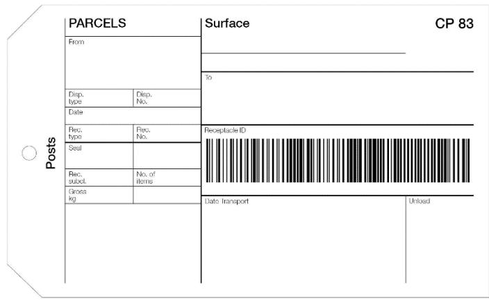

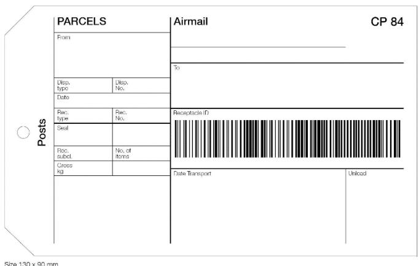

|                 | PARCE                 | LS              | S.A.L. surface airlifted | CP 85  |
|-----------------|-----------------------|-----------------|--------------------------|--------|
|                 | From                  |                 | To                       |        |
|                 | Disp.<br>type<br>Date | Disp.<br>No.    |                          |        |
| Posts           | Rec.<br>type<br>Seal  | Rec.<br>No.     | Receptacle ID            |        |
| <b>~</b> 8      | Rec.<br>subal.        | No. of<br>items |                          |        |
|                 | Gross<br>kg           |                 | Date Transport           | Unload |
|                 |                       |                 |                          |        |
|                 |                       |                 |                          |        |
|                 |                       |                 |                          |        |
| Sizo 130 v 90 n |                       |                 | 1                        |        |

Article 17-221 Parcel bills

1 Designated operators may agree bilaterally or multilaterally that the parcel dispatches that they exchange need not be accompanied by a paper parcel bill, since PREDES version 2.1 messages provide similar information electronically.

- 2 In the absence of such agreement, all the parcels to be forwarded by surface, S.A.L. or air shall be entered by the dispatching office of exchange on a CP 87 parcel bill. The gross weight of the dispatch, rounded to the nearest hundred grammes, shall always be entered on the CP 87.
- 3 The parcel bill shall be inserted in one of the receptacles comprising the mail. Where appropriate, it shall be inserted in one of the bags containing insured parcels.
- 4 The parcel bills relating to mails containing insured parcels shall be inserted in a pink envelope. If the insured parcels are placed in a waxsealed inner receptacle, the pink envelope containing the parcel bill shall be attached to the outside of this receptacle.
- 5 The parcel bill shall be completed with all the details called for.
- 6 As regards service parcels and prisoner-of-war and civilian internee parcels sent by air, the air conveyance dues shall be credited to the designated operators concerned.
- 7 Where parcel bills are completed without an automated system, in the absence of special agreement, dispatching offices shall number the parcel bills according to an annual series for each office of destination separately for surface mail, S.A.L. mail and airmail (or priority and non-priority mail). Each mail dispatch shall thus bear a separate number. In the case of the first dispatch of each year the parcel bill shall bear, in addition to the serial number of the mail dispatch, that of the last mail dispatch of the preceding year. If a dispatch series is cancelled, the dispatching office shall enter on the parcel bill beside the number of the last mail dispatch the indication "Dernière dépêche" (Last mail dispatch). In the case of sea and air services, the name of the ship carrying the mail dispatch or, where appropriate, the air service used shall be shown, whenever possible, on the parcel bills.
- 8 Where parcel bills are completed with an automated system and in conformity with UPU standards, dispatching offices of exchange shall sequentially number the CP 87 parcel bills within a mail dispatch series, with the numbering re-initialized annually at the beginning of the calendar year. Each mail dispatch shall thus bear a separate dispatch number where

each successive mail dispatch number is incremented by 1 in a rising sequence and is consistent with the incrementing dispatch date. In the case of the first mail dispatch of each calendar year, the parcel bill shall bear, in addition to the serial number of the mail dispatch, that of the last mail dispatch of the preceding year. If a mail dispatch series is cancelled, the dispatching office shall notify the destination office of exchange by means of a verification note. In the case of sea and air services, the name of the ship carrying the mail dispatch or, where appropriate, the air service used shall be shown, whenever possible, on the parcel bills.

- 9 If air parcels are sent from one country to another by surface routes along with other parcels, their presence shall be shown by an appropriate note on the CP 87 parcel bill.
- 10 Every insured parcel shall be entered on the parcel bill with the letter "V" in the "Observations" column.
- 11 Every parcel redirected or returned to sender shall be entered on the parcel bill with the note "Réexpédié" (Redirected) or "Retour" (Return) in the "Observations" column.
- 12 The number of receptacles comprising the mail and, unless otherwise agreed between the designated operators concerned, the number of receptacles to be returned, shall be entered on the parcel bill. In the absence of special agreement, designated operators shall number the receptacles of the same mail. The serial number of each receptacle shall be written on the CP 83 and CP 84 label.
- 13 Where closed mails are exchanged between designated operators of countries which are not adjacent, the dispatching office of exchange shall prepare for each of the intermediate designated operators a CP 88 special parcel bill. That office shall insert thereon the total number of parcels and the gross weight of the mail. The CP 88 parcel bill shall be numbered in an annual series for each dispatching office of exchange and for each intermediate designated operator. In addition, it shall bear the serial number of the relative mail. The last number of the year shall be shown on the first parcel bill of the following year. In the case of sea services, the name of the ship carrying the mail shall be entered on the CP 88 parcel bill, whenever this is possible.

- 14 When air parcels are forwarded by surface mail, the dispatching office of exchange shall prepare a CP 88 special parcel bill for the transit designated operators concerned.
- 15 The special CP 88 parcel bill shall be sent unenclosed or in any other way agreed between the designated operators concerned, accompanied, where appropriate, by the documents required by the intermediate countries.

- *1 The specifications of PREDES version 2.1 messages are provided in UPU Messaging Standard M41. M41-7 (the seventh update) was granted status 2 (UPU standard duly adopted) in 2016. All designated operators shall comply with the latest update of the message, noting that in early versions of M41, accounting information was not mandatory. The specifications of RESDES version 1.1 messages are provided in UPU Messaging Standard M13, and the latest update, at status 2, is M13-5.*
- *7 Since the old CP 86 was abolished by the 2005 POC, the CP 87 parcel bill must be used for airmails, S.A.L. mails and surface mails.*
- *8 In an automated system, a dispatch series is 15 characters, defined as:*
- *– the origin office of exchange IMPC code (six characters), from UPU code list 108;*
- *– the destination office of exchange IMPC code (six characters) from UPU code list 108;*
- *– the mail category (one character) from UPU code list 115 (A is airmail or priority mail; B is S.A.L. mail; C is surface mail/non-priority mail; D is an optional code for priority mail sent by surface transportation);*
- *– the mail sub-class (two characters) from UPU code list 117; for parcel post, the two-character mail sub-class always starts with C.*
- *12 The number of receptacles making up the mail is the number of outer receptacles, which may contain inner receptacles. To make checking easier, the number of "receptacles to be returned" must be entered on the parcel bills, that term having been chosen to exclude synthetic material receptacles which can be used only once.*

| Dispato             |               |                 |                    |                                |         | PAR                               | CEL BIL                                                             | .L                                                                                      |                                                                         |                              |            | СР     |
|---------------------|---------------|-----------------|--------------------|--------------------------------|---------|-----------------------------------|---------------------------------------------------------------------|-----------------------------------------------------------------------------------------|-------------------------------------------------------------------------|------------------------------|------------|--------|
|                     |               | Origin          |                    |                                | 859     |                                   |                                                                     |                                                                                         |                                                                         |                              | Previous n | umber  |
| Opera               | tors          | Destination     |                    |                                |         |                                   |                                                                     |                                                                                         |                                                                         |                              |            |        |
| Oriain              | OE an         | d IMPC code     | Destination OE and | IMPC code                      | Categor | V                                 | Sub-cl                                                              | lass Y                                                                                  | ear Di                                                                  | spatch No.                   | Date       |        |
|                     |               |                 |                    |                                |         |                                   |                                                                     |                                                                                         |                                                                         |                              |            |        |
| Transpo             | ortation      |                 |                    |                                |         |                                   |                                                                     |                                                                                         |                                                                         |                              |            |        |
| Dotai               | lad an        | ntm.            |                    |                                |         |                                   |                                                                     |                                                                                         |                                                                         |                              |            |        |
| Jelai               | etailed entry |                 |                    |                                |         |                                   | Land an                                                             |                                                                                         | Air cor                                                                 | veyance                      | T          |        |
| Serial<br>No.       | Parce         | I-ID            | Origin             | Country<br>of desti-<br>nation | Weight  | Insured<br>value                  | by dispatching designated operator to receiving designated operator | by receiving<br>designated<br>operator<br>to dis-<br>patching<br>designated<br>operator | dues p by dispate\ning design\ned operat to receivin designate operator | h-<br>designated<br>operator | Observa    | ations |
|                     |               | 1               | 2                  | 3                              | 4       | 5                                 | 6                                                                   | 7                                                                                       | 8                                                                       | 9                            |            | 10     |
| 1                   |               |                 |                    |                                |         |                                   |                                                                     |                                                                                         | -                                                                       |                              |            |        |
| 2                   |               |                 |                    |                                |         |                                   |                                                                     |                                                                                         |                                                                         |                              |            |        |
| 3                   |               |                 |                    |                                |         |                                   |                                                                     |                                                                                         |                                                                         |                              |            |        |
| 4                   |               |                 |                    |                                |         |                                   |                                                                     |                                                                                         |                                                                         |                              |            |        |
| 5                   |               |                 |                    |                                |         |                                   |                                                                     |                                                                                         |                                                                         |                              |            |        |
| 6                   |               |                 |                    |                                |         |                                   |                                                                     |                                                                                         |                                                                         |                              |            |        |
| 7                   |               |                 |                    |                                |         |                                   |                                                                     |                                                                                         |                                                                         |                              | +          |        |
| 8                   |               |                 |                    |                                |         |                                   |                                                                     |                                                                                         |                                                                         |                              |            |        |
|                     |               |                 |                    |                                |         |                                   |                                                                     |                                                                                         | -                                                                       | _                            | +          |        |
| 9                   |               |                 |                    |                                |         |                                   |                                                                     |                                                                                         |                                                                         |                              |            |        |
| 10                  |               |                 |                    |                                |         |                                   |                                                                     |                                                                                         |                                                                         |                              |            |        |
| 11                  |               |                 |                    |                                |         |                                   |                                                                     |                                                                                         |                                                                         |                              |            |        |
| 12                  |               |                 |                    |                                |         |                                   |                                                                     |                                                                                         |                                                                         |                              |            |        |
| 13                  |               |                 |                    |                                |         |                                   |                                                                     |                                                                                         |                                                                         |                              |            |        |
| Dispa               | itch si       | ummary          |                    | 1                              | 1       | Tota                              | d                                                                   |                                                                                         |                                                                         |                              |            |        |
| Bulk entry          |               | Dispatci        | Dispatch total     |                                |         |                                   |                                                                     | s Of                                                                                    | ther T                                                                  | Total                        |            |        |
| Weight of parcels   |               | Gross w         | Gross weight       |                                |         | No. of rece                       |                                                                     |                                                                                         |                                                                         |                              |            |        |
| No. of parcels      |               | No. of p        | No. of parcels     |                                |         | No. of receptacles to be returned |                                                                     |                                                                                         |                                                                         |                              |            |        |
|                     |               |                 | No. of p           | arcels out                     | of bag  |                                   | No. of emp<br>receptacles                                           | oty<br>s                                                                                |                                                                         |                              |            |        |
|                     | D parc        | els included    | Observat           | ions                           |         |                                   |                                                                     |                                                                                         |                                                                         |                              |            |        |
| Dispato<br>Signatur | ching o       | ffice of exchan | ge                 |                                |         | Office of<br>Signatur             | of exchange<br>re                                                   | e of desti                                                                              | nation                                                                  |                              |            |        |

| Dispatching office of exchange                              |                           | SPECIAL PARCEL BILL<br>Payment of rates due<br>for the transit of parcel | s                         |  |
|-------------------------------------------------------------|---------------------------|--------------------------------------------------------------------------|---------------------------|--|
|                                                             |                           | Date                                                                     | No.                       |  |
| Intermediate office of exchange                             | :                         | Date of departure                                                        | Mail No.                  |  |
|                                                             |                           | Train No./Name of ship                                                   |                           |  |
| Transit designated operator                                 |                           | Route followed by the mail  Office of destination of the mail            |                           |  |
| Land transit                                                | Sea transit               |                                                                          |                           |  |
| Total number of parcels                                     | Gross weight <sup>1</sup> | Observations                                                             |                           |  |
| Total Total Organists                                       | kg                        |                                                                          |                           |  |
| Nature of parcels                                           | Number of receptacles     | Number of parcels in receptacles                                         | Number of unenclosed pare |  |
| Uninsured parcels                                           |                           |                                                                          |                           |  |
| Insured parcels                                             |                           |                                                                          |                           |  |
| Totals                                                      |                           |                                                                          |                           |  |
| Dispatching office of exchange<br>Signature of the official |                           | Intermediate office of exchange<br>Signature of the official             |                           |  |
|                                                             |                           |                                                                          |                           |  |

# Article 17-222 Drawing up of CP 87 parcel bills

- 1 With the exception of those categories of parcels mentioned in 2 to 8 below, all parcels sent to designated operators of destination shall be entered in bulk in the CP 87 parcel bill. The number and total weight of these parcels, including the weight of the bags, and rounded to the nearest hundred grammes, shall be indicated in the "Bulk entry" section of the parcel bill.
- 2 Parcels which are redirected, parcels returned to sender or parcels forwarded in transit à découvert shall always be entered individually, with the amount of dues payable entered in columns 6 to 9. The weight specified in column 4 of the parcel bill shall be rounded up to the nearest hundred grammes. The number and weight of these parcels shall not be included in the number and gross weight of the parcels indicated in the "Bulk entry" section of the parcel bill. The number and gross weight of the parcels indicated in the "Bulk entry" section of the parcel bill shall always include all parcels other than those redirected, returned to sender, or forwarded in transit à découvert.

- 3 Insured parcels shall also be entered individually but without mention of the corresponding rate. Their number and weight shall be included in the number and total weight of the parcels indicated in the "Bulk entry" section of the parcel bill.
- 4 When the designated operators concerned have agreed to detailed entry of parcel bills, all ordinary parcels sent to designated operators of destination shall be entered individually in the parcel bill, but without the corresponding inward land rate. In accordance with paragraph 2, their number and weight, including the weight of the bags, shall be included in the number and total weight of the parcels indicated in the "Bulk entry" section of the parcel bill.
- 5 For e-commerce dispatches, detailed entry shall be performed in accordance with § 4 and the individual parcel weight shall be entered.
- 6 The presence of COD parcels shall be indicated in the bulk entry section of the form.
- 7 Service parcels and prisoner-of-war and civilian internee parcels for which, under article 16.1 and 2 of the Convention, no rates are allocated shall not be included in the number and total weight of the parcels indicated on the parcel bill. Article 17-221.6 shall be applicable for the dispatch of such parcels by air.
- 8 Depending on the settlement method agreed upon, parcels sent via the merchandise return service may need to be entered individually, indicating the amount of dues payable or the corresponding rate. The number and weight of these merchandise returns shall not be included in the number and gross weight of the parcels indicated in the "Bulk entry" section of the parcel bill.

*2 Where a parcel is forwarded à découvert, and subject to a per-item handling charge, it must be entered individually. Where a parcel is forwarded in a closed dispatch to the country of destination, no handling charge is payable; it should therefore not be entered individually, but included in the "Bulk entry" section of the CP 87 form.* 

*8 The merchandise return service is a supplementary service adopted within the framework of parcel post development at the 2012 Doha Congress. To prevent confusion and enable correct invoicing of regular parcels, parcels returned via the merchandise return service need to be specified and not entered in bulk on the parcel bill. They should not be entered in the "Bulk entry" section of the parcel bill. See also art 17-211 and art 18-201 for other provisions relating to this supplementary service.*

# Article 17-223

Dispatch of documents accompanying parcels

- 1 The accompanying documents referred to in article 17-210.1 and 2 shall be affixed to the relevant parcel.
- 2 The CP 72 manifold set shall be pasted on the parcel.
- 3 If the CP 72 manifold set cannot be pasted on the parcel or if the parcel is to be accompanied by other documents not included in the set, the accompanying documents shall be placed in a CP 91 or CP 92 transparent adhesive envelope. This shall be affixed to the parcel.
- 4 Where applicable, the COD money order forms, franking notes and advices of delivery shall be dispatched in the same way.
- 5 The designated operators of origin and destination may agree to attach the accompanying documents to the parcel bill.
- 6 In the case provided for in 5, the designated operators concerned may agree to send the parcel bill and the documents accompanying the parcels by air to the office of exchange of destination.
- 7 In the case of parcels on which the CP 72 manifold set cannot be pasted or to which the transparent adhesive envelope cannot be affixed because of the size or the nature of the wrapping of the parcels, the accompanying documents shall be attached firmly to the parcel.
- 8 Designated operators which are unable to use transparent adhesive envelopes shall have the option of sending the accompanying documents by attaching them firmly to the parcels.

| patched in accordance with any other system which suits them. |  |
|---------------------------------------------------------------|--|
|                                                               |  |
|                                                               |  |
|                                                               |  |
|                                                               |  |
|                                                               |  |
|                                                               |  |
|                                                               |  |
|                                                               |  |
|                                                               |  |
|                                                               |  |
|                                                               |  |
|                                                               |  |
|                                                               |  |
|                                                               |  |
|                                                               |  |
|                                                               |  |
|                                                               |  |
|                                                               |  |
|                                                               |  |
|                                                               |  |
|                                                               |  |
|                                                               |  |
|                                                               |  |

9 The designated operators of origin and destination may agree that

# Article 17-224 Check of mails

- 1 Every office of exchange receiving a mail shall immediately check the receptacles and their fastening. It shall also check the origin and destination of the bags making up the mail and entered on the delivery bill or electronic equivalent, and then the parcels and the various documents which accompany them. These checks shall be made in the presence of the other interested parties whenever this is possible.
- 2 The office of destination shall keep a close check on whether the mails arrive in the sequence in which they were dispatched, particularly in the case of mails containing insured parcels.
- 3 When the receptacles are opened, the constituent parts of the fastening (string, lead seal, label) shall be kept together; to achieve this, the string shall be cut in one place only. Dated digital photographic images of the labels, bag, seal, cover, packet or item concerned may be provided.
- 4 Any irregularities discovered shall be reported without delay by a CP 78 verification note. When the office of exchange of destination has not sent off a CP 78 note by the first available post, it shall be considered, until the contrary is proved, as having received all the bags and parcels in good condition.
- 5 When the findings of an office of exchange are such as may involve the liability of a transport undertaking, they must where possible be countersigned by the representative of that undertaking as well as by the designated operator of transit or of destination taking over the mails, which shall confirm that there are no irregularities. This signature may be made either on the CP 78 verification note, a copy of which shall be handed to the undertaking, or, as the case may be, on the CN 37, CN 41 or CN 38 delivery bill accompanying the mail. Should there be any reservations with respect to the carrier service, the copies of the CN 37, CN 38 or CN 41 delivery bill must indicate such reservations. By analogy, designated operators exchanging information electronically may apply the procedures outlined in article 17-009.4.
- 6 Designated operators may agree to substitute procedures provided in 4 and 5 with information sent electronically concerning inward receipt (RESDES message, EMSEVT event EMD) and delivery (EMSEVT events

EMH/EMI). Designated operators may also agree to substitute the paperbased reporting of irregularities (CP 78 verification notes) with an agreed reconciliation process using electronically captured information.

7 The discovery, at the time of the check, of any irregularities whatsoever may in no case be the cause of the return of a parcel to sender except as provided for in article 19-201.3 and 4.

### *Commentary*

*2 This check makes it possible to ascertain without delay whether any mails are missing. Exchange office telephone and fax numbers and e-mail addresses are given in the PPCO.*

# Article 17-225

Discovery of irregularities and processing of verification notes

- 1 When an intermediate office receives a mail in bad condition, it shall check the contents if it thinks that they have not remained intact and put it in new packing just as it is. It shall copy the particulars from the original label on to a new one and apply to the latter an impression of its datestamp, preceded by the endorsement "Remballé à ..." (Repacked at ...). The fact shall be reported by means of a CP 78 verification note, to be prepared in four or five copies, as appropriate. One copy shall be retained by the office which prepared it, and the others shall be sent to:
- 1.1 the office of exchange from which the mail was received (two copies);
- 1.2 the dispatching office of exchange (if this is not the office referred to above); and
- 1.3 the office of destination (inserted in the repacked mail).
- 2 In the event of the absence of a mail or one or more of the bags comprising it, or of any other irregularity the fact shall be notified as described in 1. However, intermediate offices of exchange shall not be bound to check the documents accompanying the parcel bill.
- 3 If the office of exchange of destination discovers errors or omissions in the parcel bill it shall immediately make the necessary corrections. It shall take care to cross out the incorrect entries in such a way as to leave

the original entries legible. These corrections shall be made in the presence of two officials; unless there is an obvious error, the corrections shall be accepted in preference to the original statement. The office of exchange shall also carry out the routine checks when the receptacle or its fastening gives grounds for presuming that the contents have not remained intact or that some other irregularity has occurred. The irregularities which have been established shall be notified without delay to the dispatching office of exchange by a CP 78 verification note, to be prepared in three or four copies as appropriate. One copy shall be retained by the office of exchange which prepared it and the others shall be sent to:

- 3.1 the dispatching office of exchange (two copies); and
- 3.2 the intermediate office of exchange from which the mail was received (if the mail was not received direct).
- 4 The absence of a mail or of one or more of the bags comprising it, or of the parcel bill, shall be notified as described in 3. If the parcel bill is missing, the office of exchange of destination shall prepare a replacement parcel bill.
- 5 The absence of a surface parcel mail or air parcel mail shall be notified at the latest on receipt of the first mail following the missing mail. Similarly, the absence of one or more bags or parcels sent unenclosed in a surface parcel mail or air parcel mail shall be notified at the latest on receipt of the first mail following the said mail.
- 6 The office of exchange of destination shall have the right not to make corrections and not to make out a CP 78 verification note if the errors or omissions in respect of the rates due do not exceed 10 SDR per parcel bill.
- 7 Verification notes shall be sent preferably by telefax or by any other electronic means of communication or, if sent by mail, by the quickest route in a special envelope marked in bold letters "Bulletin de verification" (Verification note). These envelopes may either be pre-printed or distinguished by a stamp impression clearly reproducing the indication. Irregularities concerning insured parcels which involve the liability of member countries or designated operators shall always be notified immediately by electronic means, if available.

- 8 The offices to which the CP 78 verification notes are sent shall return them as promptly as possible after having examined them and indicated thereon their observations, if any; they shall retain one copy. The returned verification notes shall be attached to the parcel bills to which they relate. Corrections made to a parcel bill which are unsupported by documentary evidence shall not be considered valid. Furthermore, acceptance or rejection of a CP 78 verification note or a requirement for further information shall be indicated by checking the appropriate box located at the end of the CP 78 verification note. However, if these verification notes are not returned to the office of exchange which issued them within a period of one month from the date of their dispatch they shall be considered, until the contrary is proved, as duly accepted.
- 9 Designated operators may agree to substitute procedures provided in 3, 7 and 8 with information sent electronically concerning inward receipt (RESDES message, EMSEVT event EMD) and delivery (EMSEVT events EMH/EMI). Designated operators may also agree to substitute the paperbased reporting of irregularities (CP 78 verification notes) with an agreed reconciliation process using electronically captured information.

- *3 Contrary to what is expressly admitted for other forms, DOs of destination do not have the option of asking for CP 78 verification notes to be sent to an office of their choice. Exchange office telephone and fax numbers and e-mail addresses are given in the PPCO.*
- *3.2 This office must be informed immediately, considering the liability it has to assume.*
- *5 This provision is to expedite dispatch of the CP 78 verification note in the case of air parcel mails.*
- *6 This optional provision does not prevent a DO from rectifying, in special cases, systematic errors arising, e.g. from the incorrect application of the principles underlying the calculation of the amounts to be credited.*

# Article 17-226

Discrepancies of weight or size of parcels

1 Unless there is an obvious error, the view of the office of origin shall prevail as regards the establishment of the weight or size.

- 2 Discrepancies in weight less than 500 grammes relating to ordinary parcels may not be made the subject of verification notes or the cause of the parcels being returned.
- 3 Discrepancies in weight of insured parcels up to ten grammes above or below the weight stated may not be queried by the intermediate designated operator or designated operator of destination unless the external condition of the parcel makes it necessary.

*2 Parcels cannot be stopped in the course of transmission – and still less returned to the service which forwarded them – on the grounds that their weight differs from that stated on the dispatch notes and on the parcels themselves.*

# Prot. Article R XXXVIII

Discrepancies of weight or size of parcels

Notwithstanding article 17-226.2, Australia reserves the right to only respond to verification notes in relation to ordinary parcels with discrepancies in weight greater than one kilogramme.

# Article 17-227

Receipt by the office of exchange of a damaged or insufficiently packed parcel

1 Any office of exchange which receives a damaged or insufficiently packed parcel shall send it on, after having repacked it if necessary. The original packing, the address and the labels shall be preserved as far as possible. The weight of the parcel before and after repacking shall be shown on the actual packing of the parcel. This indication shall be followed by the note "Remballé à ..." (Repacked at ...) stamped with an impression of the date-stamp and signed by the officials who did the repacking.

- 2 If the condition of the parcel is such that the contents could have been removed or damaged, this fact shall be reported to the dispatching office of exchange by means of a sufficiently explicit note on the CP 78 verification note. The parcel shall also be automatically opened and its contents checked. The results of this check shall be given in a CN 24 report. This shall be prepared in duplicate, one copy shall be retained by the office of exchange which prepared it and the other attached to the parcel.
- 3 The procedure described in 2 shall also apply if the parcel shows a discrepancy in weight such as to suggest the removal of the whole or part of the contents.

Notification of irregularities for which designated operators may be liable

- 1 Any office of exchange which, on the arrival of a mail, discovers the absence of, theft from or damage to one or more parcels shall proceed as follows:
- 1.1 It shall indicate in as much detail as possible on the CP 78 verification note or in the CN 24 report the condition in which it found the outer packing of the mail. Dated digital photographic images or video recordings of the labels, bag, seal, cover, packet or item concerned may be provided. Unless this is impossible for a stated reason, the receptacle, the string, the lead or other seal and the label shall be kept intact for a period of six weeks from the date of verification. They shall be sent to the designated operator of origin if it so requests.
- 1.2 It shall send a duplicate of the verification note to the last intermediate office of exchange, if any, at the same time as to the dispatching office of exchange.
- 2 If it considers it necessary, the office of exchange of destination may, at the expense of its designated operator, inform the dispatching office of exchange of its discoveries by telecommunications.

3 Where offices of exchange in direct contact are concerned, the respective designated operators of these offices may agree on the method of procedure in the case of irregularities for which they may be liable.

### *Commentary*

*3 Offices of exchange in direct contact are those operating on the same premises.*

# Article 17-229

Check of mails of parcels forwarded in bulk

- 1 Articles 17-224 to 17-228 shall be applicable only to rifled and damaged parcels as well as to parcels entered individually on the parcel bills. The other parcels shall be simply checked in bulk.
- 2 The designated operator of origin may agree with the designated operator of destination to limit to certain categories of parcels the detailed check and the preparation of the CP 78 verification notes and CN 24 reports. The same may be agreed with the intermediate designated operators.
- 3 If the number of parcels found in the mail differs from the number given on the parcel bill, the verification note shall correct only the total number of parcels.
- 4 If the gross weight of the mail given on the parcel bill does not correspond to the gross weight found, the verification note shall correct only the gross weight of the mail.

# Article 17-230

Reforwarding of a parcel arriving out of course

- 1 Any parcel arriving out of course shall be reforwarded to its proper destination by the quickest route (air or surface).
- 2 Any parcel reforwarded in application of this article shall be subject to the rates for forwarding to its proper destination and the charges and fees mentioned in article 19-202.4.3.

- 3 The reforwarding designated operator shall report the matter in a CP 78 verification note to the designated operator from which the parcel has been received.
- 4 It shall treat the parcel arriving out of course as if it had arrived in transit à découvert. If the rates which have been allocated to it are insufficient to cover the costs of reforwarding, it shall credit the true designated operator of destination and, where appropriate, the intermediate designated operators with the relative conveyance rates. It shall then credit itself, through a claim on the designated operator responsible for the office of exchange which missent the parcel, for the amount of the expense which it has incurred. This designated operator shall collect them from the sender if the error is ascribable to him. The claim and its cause shall be notified by means of a verification note.
- 5 Designated operators may agree to substitute procedures provided in 3 and 4 with information sent electronically concerning inward receipt (RESDES message, EMSEVT event EMD) and transit (EMSEVT events EMJ/EMK). Designated operators may also agree to substitute the paperbased reporting of irregularities (CP 78 verification notes) with an agreed reconciliation process using electronically captured information.
- 6 As an alternative to the rates and expenses described in 4, receiving designated operators may elect to charge the designated operator responsible for missending the parcel only the costs of reforwarding the parcel to the proper country of destination.

*4 The addressee of a parcel forwarded out of course should not bear any charges arising from the reforwarding of the parcel to its proper destination.*

# **Article 18 Supplementary services**

- **1 Member countries shall ensure the provision of the following mandatory supplementary services:**
- **1.1 registration service for outbound priority and airmail letter-post items;**

- **1.2 registration service for all inbound registered letter-post items;**
- **1.3 tracked delivery service for inbound airmail and priority letterpost items containing goods.**
- **2 Member countries may ensure the provision of the following optional supplementary services in relations between those designated operators which agreed to provide the service:**
- **2.1 insurance for letter-post items and parcels;**
- **2.2 cash-on-delivery service for letter-post items and parcels;**
- **2.3 tracked delivery service for inbound airmail and priority letterpost items containing documents and for outbound airmail and priority letter-post items containing documents or goods;**
- **2.4 delivery to the addressee in person of registered or insured letter-post items;**
- **2.5 free of charges and fees delivery service for letter-post items and parcels;**
- **2.6 cumbersome parcels services;**
- **2.7 consignment service for collective items from one consignor sent abroad;**
- **2.8 merchandise return service, which involves the return of merchandise by the addressee to the original seller, with the latter's authorization;**
- **2.9 special bags containing newspapers, periodicals, books and similar printed documentation for the same addressee at the same address called "M bags", up to 30 kilogrammes.**
- **3 The following three supplementary services have both mandatory and optional parts:**
- **3.1 international business reply service (IBRS), which is basically optional. All member countries or their designated operators shall, however, be obliged to operate the IBRS "return" service;**

- **3.2 international reply coupons, which shall be exchangeable in any member country. The sale of international reply coupons is, however, optional;**
- **3.3 advice of delivery for registered and insured letter-post items. All member countries or their designated operators shall admit incoming advices of delivery. The provision of an outward advice of delivery service is, however, optional.**
- **4 The description of these services and their charges are set out in the Regulations.**
- **5 Where the service features below are subject to special charges in the domestic service, designated operators shall be authorized to collect the same charges for international items, under the conditions described in the Regulations:**
- **5.1 delivery for small packets weighing over 500 grammes;**
- **5.2 letter-post items posted after the latest time of posting;**
- **5.3 items posted outside normal counter opening hours;**
- **5.4 collection at sender's address;**
- **5.5 withdrawal of a letter-post item outside normal counter opening hours;**
- **5.6 poste restante;**
- **5.7 storage for letter-post items weighing over 500 grammes (with the exception of items for the blind), and for parcels;**
- **5.8 delivery of parcels, in response to the advice of arrival;**
- **5.9 cover against risks of force majeure;**
- **5.10 delivery of letter-post items outside normal counter opening hours.**

# Prot. Article VII Advice of delivery

- 1 Belgium, Canada and Sweden shall be authorized not to apply article 18.3.3, as regards parcels, given that they do not offer the advice of delivery service for parcels in their internal service.
- 2 Notwithstanding article 18.3.3, Denmark and the United Kingdom of Great Britain and Northern Ireland reserve the right not to admit inward advices of delivery, given that they do not offer advice of delivery in their internal service.
- 3 Notwithstanding article 18.3.3, Brazil shall be authorized to admit inward advices of delivery only when they can be returned electronically.

# Article 18-001 Insured items

- 1 Priority items and letters containing securities, valuable documents or articles, and parcels may be exchanged with insurance of the contents for the value declared by the sender. This exchange shall be restricted to relations between designated operators which have declared their willingness to admit such items, whether reciprocally or in one direction only.
- 2 Insured value
- 2.1 In principle, the amount of the insured value shall be unlimited. Every member country or designated operator may limit the insured value, so far as it is concerned, to an amount which may not be less than 4,000 SDR or to an amount at least equal to that adopted in its domestic service if that amount is less than 4,000 SDR. However, the insured value limit adopted in the domestic service shall be applicable only if it is equal to or higher than the amount of the indemnity set for the loss of a registered item, in the case of a letterpost item, or for a parcel weighing 1 kg in the case of a parcel. The maximum amount shall be notified in SDR to the member countries of the Union.

- 2.2 In the service between member countries or designated operators which have adopted different maxima for the insured value, the lower limit shall be observed by both.
- 2.3 The insured value may not exceed the actual value of the contents of the item, but it shall be permissible to insure only part of that value. Concerning letter-post items, the amount of the insurance for papers whose value resides in the cost of their preparation may not exceed the cost of replacing the documents in case of loss.
- 2.4 Fraudulent insurance for a value greater than the actual value of the contents of an item shall be liable to the legal proceedings prescribed by the legislation of the country of origin.
- 2.5 The insured value shall be expressed in the currency of the country of origin. It shall be written by the sender or his representative above the address in the case of letter-post items, and on the parcel and the dispatch note in the case of parcels, in words with roman lettering and in Arabic figures, without erasure or alteration, even if certified. The amount of the insured value shall not be indicated in pencil or indelible pencil.
- 2.6 The amount of the insured value shall be converted into SDRs by the sender or by the office of origin. The result of the conversion, rounded up where appropriate to the nearest unit, shall be shown in figures at the side of or below those representing the value in the currency of the country of origin. Conversion shall not be carried out in direct services between countries which have a common currency.
- 2.7 When circumstances of any kind or statements made by the interested parties bring to light a fraudulent insurance for a value greater than the actual value of the contents of an item, the designated operator of origin shall be advised promptly. Any documents in support of the investigation shall be attached to the advice. If the item has not yet been delivered to the addressee, the designated operator of origin may ask for its return.

- 3 Charges maximum amount
- 3.1 Letter-post items
- 3.1.1 The charge on insured items shall be paid in advance. It shall be made up of the ordinary postage charge, the fixed registration charge laid down in article 18-101 and an insurance charge.
- 3.1.2 Instead of the fixed registration charge, designated operators may collect the corresponding charge of their domestic service or, exceptionally, a charge the guideline amount of which shall be 3.27 SDR.
- 3.1.3 The guideline amount of the insurance charge shall be 0.33 SDR for each 65.34 SDR of insured value or fraction thereof, or 0.5% of the scale of the insured value. This charge shall apply whatever the country of destination, even in countries which undertake to cover risks of force majeure.
- 3.2 Parcels
- 3.2.1 The charge on insured parcels shall be paid in advance.
- 3.2.2 It shall be made up of the principal charge, an optional dispatch charge and an ordinary insurance charge; any air surcharges and charges for special services shall be added to the principal charge; the guideline maximum dispatch charge shall be the same as the registration charge for letter-post items, viz 1.31 SDR or the corresponding charge of the domestic service if this is higher or exceptionally, a guideline maximum charge of 3.27 SDR.
- 3.2.3 The guideline maximum ordinary insurance charge shall be 0.33 SDR for each 65.34 SDR of insured value or fraction thereof, or 0.5% of the scale of the insured value.
- 3.2.4 For parcels, any charge for cover against risks of force majeure shall be set so that the sum of this charge and the ordinary insurance charge do not exceed the maximum amount of the insurance charge.
- 3.3 In cases where exceptional security measures are required, designated operators may collect from the sender or from the addressee, in addition to the charges mentioned under 3.1 and 3.2, the special charges provided for by their domestic legislation.

- 4 Designated operators shall have the right to provide their customers with an insured items service in accordance with specifications other than those defined in this article.
- 5 Admission
- 5.1 For letter-post items, designated operators shall take the necessary measures to provide, as far as possible, the insured items service at every office in their countries.
- 5.2 Insured letter-post items and parcels shall fulfil the following conditions to be admitted to the post.
- 5.2.1 Insured letter-post items and parcels shall be made up in such a way that the contents cannot be tampered with without obvious damage to the envelope, the packing or the seals and shall be sealed by effective means such as fine adhesive tape with a special uniform design or mark of the sender. Designated operators may, however, agree not to require such design or mark. In this case, for letter-post items, designated operators of origin shall put some postmarks on the adhesive tape or the closing edge of the item to prevent alterations. If its regulations so permit, the designated operator of origin shall recommend that its customers use envelopes specially made for sending insured items. The use of non-tamper-proof self-adhesive envelopes shall be prohibited for insured items.
- 5.2.2 Notwithstanding paragraph 5.2.1, designated operators may require insured letter-post items and parcels to be sealed with identical wax seals, lead seals or other effective means, with a special uniform design or mark of the sender.
- 5.2.3 The seals, the postage stamps representing the prepaid postage, and the postal service and other official service labels shall be spaced out so that they cannot serve to hide damage to the envelope or to the packing. The postage stamps and the labels shall not be folded over the two sides of the envelope or the packing so as to cover an edge.

- 5.2.3.1 For letter-post items, it shall be forbidden to affix to items labels other than those relating either to the postal service or to official services whose intervention may be required under the national legislation of the country of origin.
- 5.2.4 A receipt shall be handed over free of charge to the sender of an insured item at the time of posting.
- 5.3 The following provisions apply to letter-post items:
- 5.3.1 Transparent envelopes or wrappers, and/or envelopes with one or more than one transparent panel, shall not be admitted.
- 5.3.2 Designated operators that do not adhere to the provisions contained in paragraphs 5.2.1 and 5.2.2 and send insured items without seals shall not be entitled to compensation for the insured value in the event of loss, theft or damage. Such items shall be treated as registered items and compensated as such.
- 5.3.3 If the items are tied round crosswise with string and sealed as described under 5.2.1, the string itself need not be sealed.
- 5.3.4 Items which have the exterior appearance of a box must fulfil the following additional conditions:
- 5.3.4.1 They shall be of wood, metal, plastic or some other sturdy material and sufficiently strong.
- 5.3.4.2 The walls of wooden boxes shall have a minimum thickness of 8 mm.
- 5.3.4.3 The top and bottom shall be covered with white paper to take the address of the addressee, the declaration of the insured value and the impression of the official stamps. These boxes shall be sealed on the four sides in the manner described under 5.2.1. If required for ensuring inviolability, the boxes shall be tied round crosswise with strong string without knots. The two ends of the string shall be joined under a wax seal bearing a special uniform design or mark of the sender.
- 5.3.5 The prepaid postage may be denoted by an indication showing that the postage has been paid in full, for example: "Taxe perçue" (Charge collected). This indication shall appear in the top righthand part of the address side and be authenticated by an impression of the date-stamp of the office of origin.

- 5.3.6 Items addressed to initials or the address of which is shown in pencil and those which have erasures or corrections in their address shall not be admitted. Such items which have been wrongly admitted shall be returned to the office of origin.
- 5.4 The following provisions apply to parcels:
- 5.4.1 An address-label may be gummed to the packing itself.
- 5.4.2 Every designated operator shall have the option of setting a maximum amount for the insured value up to which it will forgo application of the provisions of 5.2.1 and 5.2.2. The lower of the amounts concerned shall be applied in relations between member countries or designated operators that have set different maximum values.
- 6 Marking and treatment of items
- 6.1 Letter post
- 6.1.1 All designated operators shall apply a barcode on all outward insured items. The specifications shall be as follows:
- 6.1.1.1 Each insured item must be identified by a single CN 06 label containing the capital letter "V" and including a unique item identifier conforming to the specification of 13-character identifiers in UPU Technical Standard S10. The item identifier shall be encoded in both human-readable and barcoded form, as prescribed in the standard.
- 6.1.1.2 As an alternative, designated operators may agree bilaterally to the use of unique item identifiers and barcodes that are already in use on international insured items.
- 6.1.2 The exact weight in grammes shall be marked on the item.
- 6.1.3 The CN 06 label and the indication of the weight shall be placed on the address side and, in so far as possible, in the top left-hand corner, beneath the sender's name and address where these are given.
- 6.1.4 A stamp impression showing the office and date of posting shall be applied to the address side.

- 6.1.5 No serial number shall be placed on the front of items by the intermediate designated operators.
- 6.1.6 The office of destination shall apply to the back of each item an impression of its stamp showing the date of receipt.
- 6.1.7 The delivering designated operator shall obtain a signature of acceptance or some other form of evidence of receipt from the recipient when delivering or handing over an insured letter-post item. In addition to the signature, the name in capital letters or any clear and legible indication permitting unambiguous identification of the person signing shall also be obtained.
- 6.1.8 Additionally, designated operators may establish systems that generate electronic delivery confirmation data, and agree to exchange such data with the designated operators of origin of the items.
- 6.1.9 Designated operators that have established systems that generate electronic delivery confirmation shall have the right to use signatures captured electronically from these systems, to provide proof of delivery by individual item to the sending designated operator, subject to CN 08 inquiry by the sending designated operator. The electronic delivery confirmation data may be provided electronically (e-mail) or in hard-copy form at the discretion of the delivering designated operator.
- 6.2 Parcels
- 6.2.1 Any insured parcel and its dispatch note shall be provided with a CP 74 pink label. This label shall bear in roman letters the letter V and the serial number of the parcel. It shall be gummed on the parcel, on the same side as, and near to, the address.
- 6.2.2 Designated operators may, however, use at the same time the CP 73 label prescribed in article 17-213 and a small pink label, bearing in bold letters the words "Valeur déclarée" (Insured).
- 6.2.3 The weight in kilogrammes and tens of grammes shall be given both on the parcel beside the address and on the dispatch note in the space provided. Any fraction of 10 grammes shall be rounded up to the next ten.

- 6.2.4 No serial number shall be placed on the front of insured parcels by the intermediate designated operator.
- 6.2.5 Delivery procedure for parcels
- 6.2.5.1 When delivering or handing over an insured parcel, the delivering designated operator shall obtain from the recipient a signature of acceptance, or register captured data from an identity card, or obtain some other form of evidence of receipt that is legally binding under the legislation of the country of destination to confirm acceptance.

*1 In addition to securities (banknotes, cheques, bearer bonds and instruments negotiable at banks), "papers representing a value" such as lottery tickets, postage stamps and travel instruments are also accepted in practice.*

*The DOs providing this service are listed in the LP Compendium.*

- *2.2 It is at the discretion of each country, in order to prevent the flight of capital and particularly the export of securities, to limit the amounts which may be sent by insured items.*
- *2.3 As it is optional, and not compulsory, for the public to insure the value for which indemnity is to be available in case of loss, the sender need not insure it at all; logically, therefore, he is also free to insure only part thereof.*
- *2.4 Insurance of a value lower than the actual value cannot be considered fraudulent, since this is authorized and consequently cannot be made the subject of legal proceedings.*
- *2.5 Here the word "sender" is used merely to prevent postal employees from entering the insured value themselves.*
- *3.1.1 and 3.2.2 The insured items are subject to a pro rata insurance charge which is retained by the DO levying it. Redirection or return to origin does not involve the levying of new insurance charges.*
- *3.1.3 and 3.2.3 The reference to the percentage was introduced for the benefit of countries which use a scale lower than the equivalent of 65.34 SDR, in order to make clear that the insurance charge is a pro rata charge.*
- *3.3 This option to apply special charges should be restricted to cases where special security arrangements are made at the request of certain regular senders or recipients of very high value consignments. It should not be used in respect of the great majority of insured items for which only the normal precautions are taken.*

*With regard to the security of valuable items sent by post, DOs are recommended:*

- *– to review periodically, in close consultation with their countries' airlines, security arrangements for the conveyance by their services of international registered and insured airmail items;*
- *– to apply as far as possible, and as the volume of traffic requires, security measures covering in particular:*
- *– constructional and technical protection measures (air and surface traffic);*
- *– security measures during the performance of postal operations at offices of exchange and airports. (Recommendation C 63/Lausanne 1974)*

- *4 This option refers, in particular, to the provision of a service corresponding to a private insurance which requires no special make-up of items, no special handling and no particular involvement of the DO of destination.*
- *5.2 The provisions of this art do not prevent DOs from requiring that insured items be submitted open to the office of origin, in order that they may ascertain whether the arts contained therein may be exported and, where appropriate, levy export duty and other non-postal charges to which such arts are liable. On the other hand, verification may not extend to whether the insured value corresponds to the actual contents, since a declaration of value lower than the real value is admissible. The right of the DO of origin to demand that an insured item should be brought open and subsequently closed by the sender in no way exempts it from responsibility. In the event of theft, however, the fact that the contents were checked at the time of posting may be advanced as proof that the theft occurred after the item was posted.*
- *5.2.1 Envelopes made of glazed paper are not admitted. The use of airmail envelopes made of lightweight paper is to be proscribed.*
- *5.2.5 and 5.2.3 In certain countries, exports of high-value arts such as diamonds are subject under national legislation to control formalities, the completion of which is certified by affixing official seals to the outer packing.*
- *6.1.7 and 6.2.5.1 To obtain greater reliability in the insured service and more efficiency in the inquiry process, thus meeting customer needs, the delivering DO should clearly identify the name of the recipient of an insured item. This procedure can save time and resources in the inquiry process, where too much time is sometimes spent trying to decipher illegible signatures. The expression "any clear and legible indication permitting unambiguous identification of the person signing" is designed to cover languages in which capital letters do not exist, situations where the addressee is unable to write, and instances where electronic means are used to obtain signatures. Therefore, in addition to the recipient's name in capital letters, identification by means of a stamp, electronic recording of the recipient's name or fingerprinting are regarded as valid procedures.*
- *6.1.8 The POC recommends that DOs adhere to the technical specifications in the UPU Technical and Messaging Standards Publications (recommendation CEP 2/2004).*

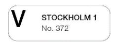

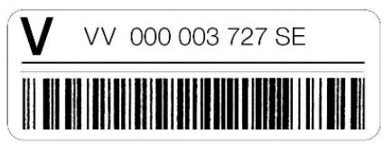

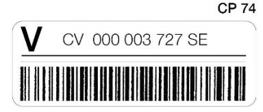

# Prot. Article R III Maximum limits for insured items

1 Notwithstanding article 18-001, Sweden reserves the right to restrict the value of the contents of registered and insured letter-post items for Sweden, according to the following maximum limits:

|                                    | Maximum<br>commercial<br>value<br>of<br>contents | Maximum<br>insured value | Maximum<br>indemnity                      |
|------------------------------------|--------------------------------------------------|--------------------------|-------------------------------------------|
| Registered<br>letter-post<br>items | 500 SDR                                          | –                        | 30 SDR<br>(M bag:<br>150<br>SDR)          |
| Insured letter<br>post items       | 1,000 SDR                                        | 1,000 SDR                | 1,000 SDR                                 |
| Uninsured<br>parcel                | 1,000 SDR                                        | –                        | 40 SDR per<br>parcel + 4.50<br>SDR per kg |
| Insured parcels                    | 1,000 SDR                                        | 1,000 SDR                | 1,000 SDR                                 |

2 The restriction cannot be circumvented by partial insurance of the value exceeding 1,000 SDR. There are no new restrictions on the nature of the contents of registered and insured items. Items with a value exceeding these limits will be returned to origin.

3 Notwithstanding article 18-001, Denmark reserves the right to restrict the value of the contents of inward registered or insured letter-post items or insured postal parcels containing money or securities of any kind payable to the bearer, according to the following maximum limits:

|                     | Maximum<br>commercial<br>value<br>of<br>contents | Maximum<br>insured value | Maximum<br>indemnity |
|---------------------|--------------------------------------------------|--------------------------|----------------------|
| Registered<br>items | 100 SDR                                          | –                        | 30 SDR               |
| Insured items       | 4,000 SDR                                        | 4,000 SDR                | 4,000 SDR            |

3.1 These limits cannot be circumvented by taking out partial insurance on the amount exceeding 4,000 SDR.

Prot. Article R IV Insured items

1 Notwithstanding article 18-001, France reserves the right to limit the value of the contents of insured letter-post items for France, according to the following maximum limits:

|               | Maximum<br>commercial<br>value<br>of<br>contents | Maximum<br>insured value | Maximum<br>indemnity |
|---------------|--------------------------------------------------|--------------------------|----------------------|
| Insured items | 630                                              | 630                      | 630                  |
|               | SDR                                              | SDR                      | SDR                  |

2 These limits may not be circumvented by partial insurance of the value exceeding 630 SDR. Items with a value exceeding this limit will be returned to origin. It is not possible to declare a value lower than the commercial value of the item.

# Prot. Article R V Delivery procedure

- 1 Notwithstanding article 18-001.6.2.5.1, the designated operators of Australia, Canada and New Zealand are authorized not to obtain a signature of acceptance or some other form of evidence of receipt from the recipient when delivering or handing over an insured parcel without a barcode that meets all applicable UPU standards.
- 2 Notwithstanding article 18-001.6, the designated operators of Australia, Canada and New Zealand are authorized not to obtain a signature of acceptance or some other form of evidence of receipt from the recipient when delivering or handing over an ordinary parcel without a barcode that meets all applicable UPU standards.

Article 18-002 Cash-on-delivery items

- 1 General principles
- 1.1 On the basis of bilateral agreements, letter-post items and ordinary and insured parcels which fulfil the conditions laid down in these Regulations may be sent cash-on-delivery.
- 1.2 Designated operators shall be entitled to restrict the cash-ondelivery service to certain categories of items.
- 2 Charge
- 2.1 The designated operator of origin of the item shall freely decide the charge to be paid by the sender, in addition to the postal charges payable on the category to which the letter-post item or parcel belongs.

- 3 Role of office of posting
- 3.1 Letter post
- 3.1.1 Indications to be given on the COD items. Labels
- 3.1.1.1 COD items shall bear very prominently, on their address side, the heading "Remboursement" (COD), followed by the COD amount. They shall also bear on the address side, in so far as possible in the top left-hand corner, beneath the sender's name and address where these are given, an orange label in the form of the specimen CN 29. Alternatively, designated operators may provide these indications by means of a CN 29bis label.
- 3.1.2 The CN 04 label provided for in article 18-101.5 (or impression of the special stamp instead) shall be applied wherever possible in the top corner of the CN 29 label.
- 3.2 Parcels
- 3.2.1 Indications to be given on parcels and dispatch notes. Labels
- 3.2.1.1 Parcels on which a COD charge is payable and the corresponding dispatch notes shall bear very prominently, on the address side in the case of the parcels, the heading "Remboursement" (COD) followed by the COD amount.
- 3.2.1.2 The sender shall write his name and address in roman letters on the address side of the parcel and on the front of the dispatch note.
- 3.2.1.3 The dispatch notes of COD parcels shall bear an orange label in the form of the specimen CN 29. If the dispatch note is included in a self-adhesive document pack with a proper indication of the COD amount, the CN 29 label shall not be mandatory. In addition, COD parcels shall bear, on the address side, two further labels in the form of specimen CN 29bis and specimen CP 95.
- 3.3 Form to be attached to the item
- 3.3.1 Every COD item shall be accompanied by an MP 1bis form, or any other form agreed among designated operators, which shall be used for sending the postal payment order in exchange of the COD item to its sender.

- 4 Role of office of destination
- 4.1 The designated operator which has delivered the letter-post item or parcel to its addressee shall issue the MP 1bis form for sending the postal payment order in exchange of the COD item, or use any other means agreed among designated operators, in favour of the sender of the letter-post item or parcel.
- 5 Redirection
- 5.1 Any letter-post item or parcel on which a COD charge is payable may be redirected if the designated operator of the country of new destination provides this service in its relations with the country of origin.
- 6 Indemnities for parcels
- 6.1 If a COD parcel is delivered without collection of the COD amount, the destination designated operator shall pay the dispatching designated operator an indemnity corresponding to the COD amount.
- 6.2 If the item is partially rifled, the indemnity shall be set at the actual value of the theft, on the basis of the COD amount.
- 6.3 In the event of loss, the indemnity shall be limited to the total COD amount.

*3.3 Form MP 1bis is covered under the Postal Payment Services Regs.*

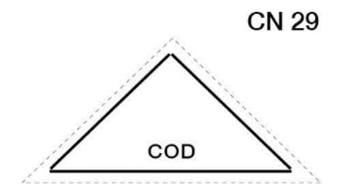

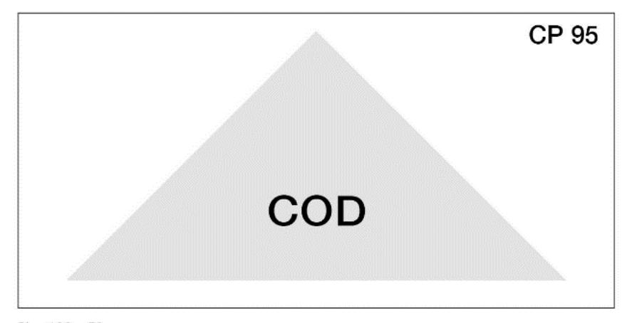

Items for delivery free of charges and fees

1 In the service between designated operators which have notified their agreement to that effect senders may, by means of a previous declaration at the office of origin, undertake to pay the whole of the charges and fees to which the items are subject on delivery.

# 2 Charges

- 2.1 Senders shall undertake to pay the amounts which may be claimed by the office of destination. If necessary, they shall make a provisional payment.
- 2.2 The designated operator of origin shall collect from the sender a charge, the guideline amount of which shall be 0.98 SDR, which it shall retain as payment for services rendered in the country of origin.
- 2.3 The designated operator of destination shall be authorized to collect a commission charge the guideline amount of which shall be 0.98 SDR. This charge shall be independent of the presentation-to-Customs charge. It shall be collected from the sender on behalf of the designated operator of destination.
- 2.4 Rules unique to letter-post items
- 2.4.1 In the case of a request made after posting of a letter-post item, the designated operator of origin shall also collect an additional charge the guideline amount of which shall be 1.31 SDR per request.
- 2.4.2 Every designated operator may restrict to registered and insured letter-post items the service of delivery free of charges and fees.
- 3 Marking and treatment of items
- 3.1 Items for delivery to addressees free of charges and fees shall bear in bold letters the heading "Franc de taxes et de droits" (Free of charges and fees) or a similar indication in the language of the country of origin. These items shall be provided with a yellow label also bearing in bold letters the indication "Franc de taxes et de droits".

- 3.1.1 For letter-post items, the heading and the label shall be placed on the address side, in so far as possible in the top left-hand corner, beneath the sender's name and address where these are given.
- 3.1.2 For parcels, this indication shall also be shown on the dispatch note.
- 3.2 Every item sent free of charges and fees shall be accompanied by a CN 11 franking note. The sender of the item shall complete the text of the right-hand side of the front of parts A and B of the franking note. The dispatching office shall insert the postal service indications. The sender's entries may be made with the use of carbon paper. The text shall include the undertaking prescribed in 2.1. For letter-post items, the franking note, duly completed, shall be securely attached to the item. For parcels, the dispatch note, the customs declarations and the franking note shall be securely fastened together.
- 3.3 Request after posting for letter-post items
- 3.3.1 The sender may ask, after posting, for the item to be delivered free of charges and fees.
- 3.3.2 If the request is to be forwarded by post, the office of origin shall inform the office of destination in an explanatory note. This latter shall bear the prepayment of the charge due. It shall be forwarded as a registered item by the quickest route (air or surface) to the office of destination accompanied by a franking note duly completed. The office of destination shall affix the label prescribed under 3.1 to the item.
- 3.3.3 If the request is to be forwarded by telecommunication, the office of origin shall inform the office of destination by telecommunication and at the same time advise the relative particulars of the posting of the item. The office of destination shall automatically make out a franking note.
- 4 Return of part A of franking notes. Recovery of charges and fees
- 4.1 After delivery to the addressee of an item for delivery free of charges and fees, the office which has advanced the customs or other charges on behalf of the sender shall complete, so far as it is concerned, with the use of carbon paper, the details appearing on the

back of parts A and B of the franking note. It shall send part A, accompanied by the supporting vouchers, to the office of origin of the item; these shall be sent in a closed envelope, without indication of the contents. Part B shall be retained by the designated operator of destination of the item for settlement with the debtor designated operator.

- 4.2 However, any designated operator may arrange for part A of franking notes on which charges have been levied to be returned by specially appointed offices and request that this part be forwarded to a specified office.
- 4.3 The name of the office to which part A of the franking notes are to be returned shall be entered in every case on the front of this part by the office dispatching the item.
- 4.4 When an item bearing the words "Franc de taxes et de droits" (Free of charges and fees) reaches the service of destination without a franking note, the office responsible for customs clearance shall prepare a duplicate note; on parts A and B of this note it shall show the name of the country of origin and, as far as possible, the date of posting of the item.
- 4.5 When the franking note is lost after delivery of an item, a duplicate shall be prepared under the same conditions.
- 4.6 Parts A and B of the franking notes relating to items which for any reason are returned to origin shall be cancelled by the designated operator of destination.
- 4.7 On receipt of part A of a franking note showing the charges paid out by the service of destination, the designated operator of origin shall convert the amount of those charges into its own currency. The rate used shall not be higher than the rate fixed for the issue of postal money orders intended for the country concerned. The result of the conversion shall be shown in the body of the form and on the coupon at the side. After recovering the amount of the charges, the office appointed for that purpose shall hand to the sender the coupon from the note and any supporting vouchers.

- 4.8 Provision unique to parcels concerning the amount of charges
- 4.8.1 When the sender disputes the amount of the charges shown in part A of the franking note, the designated operator of destination shall verify the amount of the sums paid out. If necessary, it shall approach its national customs services. After making any necessary corrections, it shall send part A of the note in question to the designated operator of origin. Likewise, if the designated operator of destination finds an error or omission regarding the charges relating to a parcel free of charges and fees for which part A of the franking note has been returned to the designated operator of origin, it shall issue a corrective duplicate. It shall send part A to the designated operator of origin to put the matter in order.
- 5 Accounting with the designated operator of origin of items
- 5.1 Accounting in respect of charges, customs duty and other fees paid out by each designated operator on behalf of another shall be carried out by means of CN 12 detailed monthly accounts, drawn up by the creditor designated operator on a quarterly basis in the currency of its own country. The data in parts B of the franking notes which have been retained shall be entered in the alphabetical order of the offices which have advanced the charges and in the numerical order given to them. "Nil" accounts shall not be prepared.
- 5.2 If the two designated operators concerned also operate the letterpost and parcel-post service in their relations with each other, they may, in the absence of notice to the contrary, include in the accounts for the customs charges and fees and other charges of that service those of the letter post.
- 5.3 The CN 12 detailed account, accompanied by parts B of the franking notes, shall be forwarded to the debtor designated operator:
- 5.3.1 For letter-post items: at the latest by the end of the month following that to which it relates. "Nil" accounts shall not be prepared.
- 5.3.2 For parcels: at the latest by the end of the second month after the quarter to which it relates.

- 5.4 For letter-post items, the accounts shall be settled separately. Each designated operator may, however, request that these accounts be settled with those for money orders or with CP 75 accounts for postal parcels, without being incorporated in them.
- 5.5 For parcels, accounting shall be effected by means of the CP 75 account mentioned in article 35-014.
- 5.5.1 Unless the designated operators concerned have agreed otherwise, the amount on the last line of the CN 12 account shall be included by the creditor designated operator in the next CP 75 sent by that designated operator, with justification given in the "Observations" column.
- 5.5.2 In cases where the designated operator does not use the CP 75 in its relations with the debtor designated operator, the CN 51 account can, exceptionally, be used in similar fashion.

- *1 DOs permitting items for delivery free of charges and fees are listed in the LP Compendium. It is recommended that DOs include the service for delivery free of charges and fees as widely as possible in their range of LP services and in their relations with other DOs that already offer the service (recommendation C 32/Washington 1989).*
- *2.1 "Provisional payment" is to be understood to mean the payment of an amount covering the probable costs.*

| Coupon to be handed to the sender                                                  |               | Part A                                                                                                                                                                                                                                                                                                                                                                                                                                                                                                                                                                                                                                                                                                                                                                                                                                                                                                                                                                                                                                                                                                                                                                                                                                                                                                                                                                                                                                                                                                                                                                                                                                                                                                                                                                                                                                                                                                                                                                                                                                                                                                                         | tination                                               |                 |
|------------------------------------------------------------------------------------|---------------|--------------------------------------------------------------------------------------------------------------------------------------------------------------------------------------------------------------------------------------------------------------------------------------------------------------------------------------------------------------------------------------------------------------------------------------------------------------------------------------------------------------------------------------------------------------------------------------------------------------------------------------------------------------------------------------------------------------------------------------------------------------------------------------------------------------------------------------------------------------------------------------------------------------------------------------------------------------------------------------------------------------------------------------------------------------------------------------------------------------------------------------------------------------------------------------------------------------------------------------------------------------------------------------------------------------------------------------------------------------------------------------------------------------------------------------------------------------------------------------------------------------------------------------------------------------------------------------------------------------------------------------------------------------------------------------------------------------------------------------------------------------------------------------------------------------------------------------------------------------------------------------------------------------------------------------------------------------------------------------------------------------------------------------------------------------------------------------------------------------------------------|--------------------------------------------------------|-----------------|
| DETAILS OF CHARGES DUE (in the currency of the country of destination of the item) |               | To be filled in by the designated operator of designated operator of designated operator of designated operator of designated operator of designated operator of designated operator of designated operator of designated operator of designated operator of designated operator of designated operator of designated operator of designated operator of designated operator of designated operator of designated operator of designated operator of designated operator of designated operator of designated operator of designated operator of designated operator of designated operator of designated operator of designated operator of designated operator of designated operator of designated operator of designated operator of designated operator of designated operator of designated operator of designated operator operator operator operator operator operator operator operator operator operator operator operator operator operator operator operator operator operator operator operator operator operator operator operator operator operator operator operator operator operator operator operator operator operator operator operator operator operator operator operator operator operator operator operator operator operator operator operator operator operator operator operator operator operator operator operator operator operator operator operator operator operator operator operator operator operator operator operator operator operator operator operator operator operator operator operator operator operator operator operator operator operator operator operator operator operator operator operator operator operator operator operator operator operator operator operator operator operator operator operator operator operator operator operator operator operator operator operator operator operator operator operator operator operator operator operator operator operator operator operator operator operator operator operator operator operator operator operator operator operator operator operator operator operator operator operator operator operator operator op |                                                        |                 |
|                                                                                    |               |                                                                                                                                                                                                                                                                                                                                                                                                                                                                                                                                                                                                                                                                                                                                                                                                                                                                                                                                                                                                                                                                                                                                                                                                                                                                                                                                                                                                                                                                                                                                                                                                                                                                                                                                                                                                                                                                                                                                                                                                                                                                                                                                |                                                        |                 |
| Charge for delivery free of charges <sup>1</sup>                                   |               | Amount (in figures, in the currency of the country of destination of the item)                                                                                                                                                                                                                                                                                                                                                                                                                                                                                                                                                                                                                                                                                                                                                                                                                                                                                                                                                                                                                                                                                                                                                                                                                                                                                                                                                                                                                                                                                                                                                                                                                                                                                                                                                                                                                                                                                                                                                                                                                                                 | Stamp of the office advancing the charges              |                 |
| Customs duty                                                                       |               |                                                                                                                                                                                                                                                                                                                                                                                                                                                                                                                                                                                                                                                                                                                                                                                                                                                                                                                                                                                                                                                                                                                                                                                                                                                                                                                                                                                                                                                                                                                                                                                                                                                                                                                                                                                                                                                                                                                                                                                                                                                                                                                                |                                                        |                 |
| Presentation-to-Customs charge                                                     |               |                                                                                                                                                                                                                                                                                                                                                                                                                                                                                                                                                                                                                                                                                                                                                                                                                                                                                                                                                                                                                                                                                                                                                                                                                                                                                                                                                                                                                                                                                                                                                                                                                                                                                                                                                                                                                                                                                                                                                                                                                                                                                                                                |                                                        | Pa              |
| Other charges                                                                      |               | Office which has made the advance                                                                                                                                                                                                                                                                                                                                                                                                                                                                                                                                                                                                                                                                                                                                                                                                                                                                                                                                                                                                                                                                                                                                                                                                                                                                                                                                                                                                                                                                                                                                                                                                                                                                                                                                                                                                                                                                                                                                                                                                                                                                                              |                                                        | (Ba             |
| Total                                                                              |               | No. of register Date                                                                                                                                                                                                                                                                                                                                                                                                                                                                                                                                                                                                                                                                                                                                                                                                                                                                                                                                                                                                                                                                                                                                                                                                                                                                                                                                                                                                                                                                                                                                                                                                                                                                                                                                                                                                                                                                                                                                                                                                                                                                                                           | Signature                                              |                 |
| Total                                                                              |               | To be filled in by the designated operator of original                                                                                                                                                                                                                                                                                                                                                                                                                                                                                                                                                                                                                                                                                                                                                                                                                                                                                                                                                                                                                                                                                                                                                                                                                                                                                                                                                                                                                                                                                                                                                                                                                                                                                                                                                                                                                                                                                                                                                                                                                                                                         | in (on return)                                         |                 |
| (after conversion) Stamp of the office which has recovered                         | d the charges | Amount (in figures after conversion)                                                                                                                                                                                                                                                                                                                                                                                                                                                                                                                                                                                                                                                                                                                                                                                                                                                                                                                                                                                                                                                                                                                                                                                                                                                                                                                                                                                                                                                                                                                                                                                                                                                                                                                                                                                                                                                                                                                                                                                                                                                                                           | Stamp of the office which<br>has recovered the charges |                 |
|                                                                                    |               |                                                                                                                                                                                                                                                                                                                                                                                                                                                                                                                                                                                                                                                                                                                                                                                                                                                                                                                                                                                                                                                                                                                                                                                                                                                                                                                                                                                                                                                                                                                                                                                                                                                                                                                                                                                                                                                                                                                                                                                                                                                                                                                                |                                                        |                 |
|                                                                                    |               |                                                                                                                                                                                                                                                                                                                                                                                                                                                                                                                                                                                                                                                                                                                                                                                                                                                                                                                                                                                                                                                                                                                                                                                                                                                                                                                                                                                                                                                                                                                                                                                                                                                                                                                                                                                                                                                                                                                                                                                                                                                                                                                                |                                                        |                 |
|                                                                                    |               | In-register No                                                                                                                                                                                                                                                                                                                                                                                                                                                                                                                                                                                                                                                                                                                                                                                                                                                                                                                                                                                                                                                                                                                                                                                                                                                                                                                                                                                                                                                                                                                                                                                                                                                                                                                                                                                                                                                                                                                                                                                                                                                                                                                 | _                                                      |                 |
| <sup>1</sup> Also called "Commission charge                                        | ə"            | In-register No.                                                                                                                                                                                                                                                                                                                                                                                                                                                                                                                                                                                                                                                                                                                                                                                                                                                                                                                                                                                                                                                                                                                                                                                                                                                                                                                                                                                                                                                                                                                                                                                                                                                                                                                                                                                                                                                                                                                                                                                                                                                                                                                | -                                                      |                 |
| <sup>1</sup> Also called "Commission charge                                        | ∍"            | In-register No.  FRANKING NOTE                                                                                                                                                                                                                                                                                                                                                                                                                                                                                                                                                                                                                                                                                                                                                                                                                                                                                                                                                                                                                                                                                                                                                                                                                                                                                                                                                                                                                                                                                                                                                                                                                                                                                                                                                                                                                                                                                                                                                                                                                                                                                                 | CN 11                                                  | 1               |
| <sup>1</sup> Also called "Commission charge                                        | ∋"            | FRANKING NOTE                                                                                                                                                                                                                                                                                                                                                                                                                                                                                                                                                                                                                                                                                                                                                                                                                                                                                                                                                                                                                                                                                                                                                                                                                                                                                                                                                                                                                                                                                                                                                                                                                                                                                                                                                                                                                                                                                                                                                                                                                                                                                                                  | CN 11                                                  | 1               |
| <sup>1</sup> Also called "Commission charge                                        | ∋"<br>        | FRANKING NOTE                                                                                                                                                                                                                                                                                                                                                                                                                                                                                                                                                                                                                                                                                                                                                                                                                                                                                                                                                                                                                                                                                                                                                                                                                                                                                                                                                                                                                                                                                                                                                                                                                                                                                                                                                                                                                                                                                                                                                                                                                                                                                                                  |                                                        | 1               |
| <sup>1</sup> Also called "Commission charge                                        | ə"<br>        | FRANKING NOTE  Part B  To be filled in by the dispatching designated operator                                                                                                                                                                                                                                                                                                                                                                                                                                                                                                                                                                                                                                                                                                                                                                                                                                                                                                                                                                                                                                                                                                                                                                                                                                                                                                                                                                                                                                                                                                                                                                                                                                                                                                                                                                                                                                                                                                                                                                                                                                                  | Designated operator                                    | 1               |
| <sup>1</sup> Also called "Commission charge                                        | 3"            | FRANKING NOTE  Part B  To be filled in by the dispatching designated operator  Nature of the Item                                                                                                                                                                                                                                                                                                                                                                                                                                                                                                                                                                                                                                                                                                                                                                                                                                                                                                                                                                                                                                                                                                                                                                                                                                                                                                                                                                                                                                                                                                                                                                                                                                                                                                                                                                                                                                                                                                                                                                                                                              | Designated operator  Weight                            | 1               |
| <sup>†</sup> Also called "Commission charge                                        | 9"            | FRANKING NOTE  Part B To be filed in by the dispatching designated operator  Nature of the litem  No.                                                                                                                                                                                                                                                                                                                                                                                                                                                                                                                                                                                                                                                                                                                                                                                                                                                                                                                                                                                                                                                                                                                                                                                                                                                                                                                                                                                                                                                                                                                                                                                                                                                                                                                                                                                                                                                                                                                                                                                                                          | Designated operator  Weight                            | 1               |
| <sup>1</sup> Also called "Commission charge                                        | 9"            | FRANKING NOTE  Part B To be filled in by the dispatching designated operator Nature of the Item  No.  Office of posting                                                                                                                                                                                                                                                                                                                                                                                                                                                                                                                                                                                                                                                                                                                                                                                                                                                                                                                                                                                                                                                                                                                                                                                                                                                                                                                                                                                                                                                                                                                                                                                                                                                                                                                                                                                                                                                                                                                                                                                                        | Designated operator  Weight                            | Pa              |
| <sup>†</sup> Also called "Commission charge                                        | 9"            | FRANKING NOTE  Part B To be filled in by the dispatching designated operator Nature of the Item  No.  Office of posting                                                                                                                                                                                                                                                                                                                                                                                                                                                                                                                                                                                                                                                                                                                                                                                                                                                                                                                                                                                                                                                                                                                                                                                                                                                                                                                                                                                                                                                                                                                                                                                                                                                                                                                                                                                                                                                                                                                                                                                                        | Designated operator  Weight                            | 1<br>Pau<br>(Fr |
| <sup>1</sup> Also called *Commission charge                                        | 9"            | FRANKING NOTE  Part B To be filled in by the dispatching designated operator Nature of the Item  No.  Office of posting  Sender (name and full address)                                                                                                                                                                                                                                                                                                                                                                                                                                                                                                                                                                                                                                                                                                                                                                                                                                                                                                                                                                                                                                                                                                                                                                                                                                                                                                                                                                                                                                                                                                                                                                                                                                                                                                                                                                                                                                                                                                                                                                        | Designated operator  Weight                            | Pai             |
| <sup>1</sup> Also called "Commission charge                                        | 9"            | FRANKING NOTE  Part B To be filled in by the dispatching designated operator Nature of the Item  No.  Office of posting  Sender (name and full address)                                                                                                                                                                                                                                                                                                                                                                                                                                                                                                                                                                                                                                                                                                                                                                                                                                                                                                                                                                                                                                                                                                                                                                                                                                                                                                                                                                                                                                                                                                                                                                                                                                                                                                                                                                                                                                                                                                                                                                        | Designated operator  Weight                            | Pai             |

|                                                                                                                                                                                         | Dout D                                                                                                                                                                                                                               | CN                                         | 17  |
|-----------------------------------------------------------------------------------------------------------------------------------------------------------------------------------------|--------------------------------------------------------------------------------------------------------------------------------------------------------------------------------------------------------------------------------------|--------------------------------------------|-----|
|                                                                                                                                                                                         | Part B To be filled in by the designated operator of dest                                                                                                                                                                            |                                            |     |
| DETAILS OF CHARGES DUE                                                                                                                                                                  | TOTAL OF CHARGES ADVAN                                                                                                                                                                                                               | CED                                        |     |
| (in the currency of the country<br>of destination of the item)                                                                                                                          |                                                                                                                                                                                                                                      |                                            |     |
| Charge for delivery free of charges 1                                                                                                                                                   | Amount (in figures, in the currency of the country of destination of the item)                                                                                                                                                       | Stamp of the office advancing the charges  |     |
| Customs duty                                                                                                                                                                            |                                                                                                                                                                                                                                      |                                            |     |
| Presentation-to-Customs charge                                                                                                                                                          |                                                                                                                                                                                                                                      |                                            |     |
| Other charges                                                                                                                                                                           | Office which has made the advance                                                                                                                                                                                                    |                                            |     |
| Total                                                                                                                                                                                   | No. of register Date                                                                                                                                                                                                                 | Signature                                  |     |
| Also called "Commission charge"                                                                                                                                                         |                                                                                                                                                                                                                                      |                                            |     |
| Also called "Commission charge"                                                                                                                                                         | FRANKING NOTE                                                                                                                                                                                                                        | CN Designated operator                     | 11  |
| Receipt                                                                                                                                                                                 | Part A To be filled in by the dispatching designated operator                                                                                                                                                                        | CN Designated operator                     | 11  |
| Also called "Commission charge"  Receipt  Nature of the item   Weight                                                                                                                   | Part A                                                                                                                                                                                                                               |                                            | 11  |
| Receipt                                                                                                                                                                                 | Part A To be filled in by the dispatching designated operator                                                                                                                                                                        | Designated operator                        | 11  |
| Receipt  Nature of the item   Weight                                                                                                                                                    | Part A To be that in by the dispatching designated operator Nature of the item                                                                                                                                                       | Designated operator Weight                 | 11  |
| Receipt  Nature of the item   Weight  No.   Insured value                                                                                                                               | Part A To be filled in by the dispatching designated operator Nature of the item No.                                                                                                                                                 | Designated operator Weight                 | 11  |
| Receipt  Nature of the item   Weight    No.   Insured value    Office of posting                                                                                                        | Part A To be filed in by the dispatching designated operator Nature of the item  No.  Office of postting                                                                                                                             | Designated operator Weight                 | 11  |
| Receipt  Nature of the item   Weight    No.   Insured value    Office of posting                                                                                                        | Part A To be filed in by the dispatching designated operator Nature of the item  No.  Office of postting                                                                                                                             | Designated operator Weight                 | 11  |
| Receipt  Nature of the item   Weight    No.   Insured value    Office of posting                                                                                                        | Part A To be siled in by the dispatching designated operator Nature of the item  No.  Office of posting  Sender (name and full address)                                                                                              | Designated operator Weight                 | 11  |
| Receipt  Nature of the item   Weight  No.   Insured value  Office of posting  Addressee (name and full address)                                                                         | Part A To be siled in by the dispatching designated operator Nature of the item  No.  Office of posting  Sender (name and full address)                                                                                              | Designated operator Weight                 | 111 |
| Receipt  Nature of the item   Weight    No.   Insured value    Office of posting    Addressee (name and full address)    The sender has paid the charges and fees indicated on the back | Part A To be thed in by the dispatching designated operator Nature of the litern  No.  Office of posting  Sender (name and full address)  Addressee (name and full address)  The litern is to be delivered free of charges and fees, | Designated operator  Weight  Insured value | 11  |

Creditor designated operator

# DETAILED MONTHLY ACCOUNT Customs, etc, charges

CN 12

| Debtor designated operator | Month |
|----------------------------|-------|
|                            | Year  |

| Serial No. | Date of the advance | No. of the franking note | or computer printer  Office which made the advance | Amount of each franking note (in national currency) | Observations |
|------------|---------------------|--------------------------|----------------------------------------------------|-----------------------------------------------------|--------------|
| 1          | 2                   | 3                        | 4                                                  | 5                                                   | 6            |
| 1          |                     |                          |                                                    |                                                     |              |
| 2          |                     |                          |                                                    |                                                     |              |
| 3          |                     |                          |                                                    |                                                     |              |
| 4          |                     |                          |                                                    |                                                     |              |
| 5          |                     |                          |                                                    |                                                     |              |
| 6          |                     |                          |                                                    |                                                     |              |
| 7          |                     |                          |                                                    |                                                     |              |
| 8          |                     |                          |                                                    |                                                     |              |
| 9          |                     |                          |                                                    |                                                     |              |
| 10         |                     |                          |                                                    |                                                     |              |
| 11         |                     |                          |                                                    |                                                     |              |
| 12         |                     |                          |                                                    |                                                     |              |
| 13         |                     |                          |                                                    |                                                     |              |
| 14         |                     |                          |                                                    |                                                     |              |
| 15         |                     |                          |                                                    |                                                     |              |
| 16         |                     |                          |                                                    |                                                     |              |
| 17         |                     |                          |                                                    |                                                     |              |
| 18         |                     |                          |                                                    |                                                     |              |
| 19         |                     |                          |                                                    |                                                     |              |
| 20         |                     |                          |                                                    |                                                     |              |

| Creditor  | designated | operato |
|-----------|------------|---------|
| Signature |            |         |

Size 210 x 297 mm

# Article 18-004 Consignment service

- 1 Common rules
- 1.1 Designated operators may agree among themselves to take part in an optional "Consignment" service for collective items from one consignor sent abroad.
- 1.2 Wherever possible, this service shall be identified by the logo defined in 1.4.
- 1.3 The details of this service shall be laid down bilaterally between the designated operator of origin and the designated operator of destination on the basis of provisions defined by the Postal Operations Council.
- 1.4 Identification of the "Consignment" service
- 1.4.1 The logo designed to identify the "Consignment" service shall consist of the following components:
- 1.4.1.1 the word "CONSIGNMENT" in blue;
- 1.4.1.2 three horizontal bands (one red, one blue and one green).

- 2 Rules unique to parcels
- 2.1 The Consignment service:
- 2.1.1 shall at least comprise joint posting and transport of parcels from a single customer to the inward office of exchange or entry point in the country of destination and joint customs clearance by the designated operator of origin;
- 2.1.2 shall include all parcel items, as well as any other types of postal items agreed between the designated operator of origin and the designated operator of destination;
- 2.1.3 may, subject to the agreement of the relevant customs authorities, use bulk customs clearance for cost efficiency;

- 2.1.4 may use specific bags, specific pallets or specific postal containers to transport items;
- 2.1.5 shall include distribution of the parcels by the designated operator of destination to one or more addressees.

# Article 18-101 Registered items

- 1 Letter-post items may be sent as registered items, according to the provisions of article 18.1.1 of the Convention.
- 2 The charge on registered items shall be paid in advance. It shall be made up of the postage charge and of a fixed registration charge, whose guideline maximum amount shall be 1.31 SDR. For each registered M bag, designated operators shall collect, instead of the charge per item, a bulk charge not exceeding five times the charge per item.
- 3 In cases where exceptional security measures are required, designated operators may collect from the sender or from the addressee, in addition to the charge mentioned under 2, the special charges provided for by their national legislation.
- 4 Admission
- 4.1 No special condition as to form, closing or method of address shall be prescribed for registered items.
- 4.2 Items bearing an address in pencil or any other delible format or composed of initials shall not be admitted for registration. However, the address of items other than those which are sent in an envelope with a transparent panel may be written in copying-ink pencil.
- 4.3 A receipt shall be issued free of charge to the sender of a registered item at the time of posting.
- 5 Marking and treatment of items
- 5.1 All designated operators shall apply a barcode on all outward registered items. The specifications shall be as follows:

- 5.1.1 Each registered item must be identified by a single CN 04 label containing the capital letter "R" and including a unique item identifier conforming to the specification of 13-character identifiers in UPU Technical Standard S10. The item identifier shall be encoded in both human-readable and barcoded form, as prescribed in the standard.
- 5.1.2 As an alternative, designated operators may agree bilaterally to the use of unique item identifiers and barcodes which are already in use on inter-national registered items.
- 5.2 Registered items may also bear the heading "Recommandé" (Registered), accompanied, if necessary, by a similar indication in the language of the country of origin.
- 5.3 The label and, if present, the heading "Recommandé" (Registered) shall be placed on the address side, in so far as possible in the top left-hand corner, beneath the sender's name and address where these are given. In the case of items in the form of cards, these indications shall be placed above the address in such a way as not to affect its legibility. In the case of registered M bags, the CN 04 label shall be affixed properly to the address labels supplied by the sender.
- 5.4 The designated operator of origin shall ensure that registered items conform to the above provisions. It shall be required to correct any deficiencies noted before forwarding the items to the countries of destination.
- 5.5 No label or serial number shall be placed on the front of registered items by the intermediate designated operators.
- 5.6 When delivering or handing over a registered item, the designated operator of destination shall obtain from the recipient a signature of acceptance, or register captured data from an identity card, or obtain some other form of evidence of receipt that is legally binding under the legislation of the country of destination to confirm acceptance.
- 5.7 Additionally, designated operators are strongly recommended to establish systems that generate electronic delivery confirmation data, and agree to exchange such data with the designated operators of origin of the items.

5.8 Designated operators that have established systems that generate electronic delivery confirmation shall have the right to use signatures captured electronically from these systems, to provide proof of delivery by individual item to the sending designated operator, subject to CN 08 inquiry by the sending designated operator. The electronic delivery confirmation data may be provided electronically (e-mail) or in hard-copy form at the discretion of the delivering postal designated operator.

## *Commentary*

- *3 Collection of these charges is limited to cases in which special security measures are taken at the request of senders or addressees and does not apply to the mass of registered items sent under normal conditions.*
- *4 It is recommended that DOs which mark registered items in their internal service with a blue cross do not put this marking on items of this type originating abroad, as this procedure gives rise to complaints from senders of philatelic items.*
- *5.1.1 Although a registered item may have only one unique item identifier, two or more copies of this unique item identifier may be applied on the item.*
- *5.6 To obtain greater service reliability and more efficient processing of inquiries, thus meeting customer needs, the delivering DO should clearly identify the name of the recipient of a registered item. This procedure can save time and resources in the inquiry process, where too much time is sometimes spent trying to decipher illegible signatures.*

*The expression "any clear and legible indication permitting unambiguous identification of the person signing" is designed to cover languages in which capital letters do not exist, situations where the addressee is unable to write, and cases where electronic means are used to obtain signatures. Therefore, in addition to the recipient's name in capital letters, identification by means of a stamp, electronic recording of the recipient's name or fingerprinting are regarded as valid procedures.*

*5.7 The POC recommends that DOs adhere to the technical specifications in the UPU Technical and Messaging Standards Publications (recommendation CEP 2/2004).*

Prot. Article R XXI Registered M bags

Canada and the United States of America shall be authorized not to accept registered M bags and not to provide registered handling for such bags received from other countries.

Article 18-102 Transmission of registered M bags

Registered M bags, limited to documents only, shall be entered as a single item on a CN 33 special list. The letter M shall be added in the "Observations" column.

Article 18-103 Tracked items

- 1 Letter-post items sent as tracked items according to the relevant provisions of the Convention shall be delivered through the domestic priority service.
- 2 Marking
- 2.1 Letter-post items
- 2.1.1 Letter-post items for tracked delivery may be provided with a logo which shall if possible be bright red and of the shape reproduced below. A black and white version may, however, be used for systemgenerated labels. The "Tracked" logo shall be placed on the address side, in so far as possible in the top left-hand corner, beneath the sender's name and address where these are given.

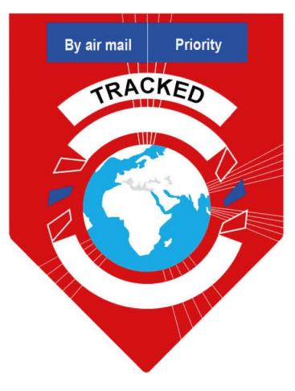

2.1.2 Items for tracked delivery shall bear a CN 05bis label, barcoded with a barcode conforming to UPU Technical Standard S10. The CN 05bis label must adhere properly and shall be placed on the address side, in so far as possible in the top left-hand corner, beneath the sender's name and address where these are given. In the case of items in the form of cards, the label shall be placed above the address in such a way as not to affect its legibility. The CN 05bis label shall have a single, unique item identifier that conforms to the provisions of article 17-129. The "Tracked" logo shall normally be included in the CN 05bis label. It shall, however, be permitted to use a CN 05bis label without this logo, provided that a separate label with the logo is affixed on the item next to the CN 05bis label.

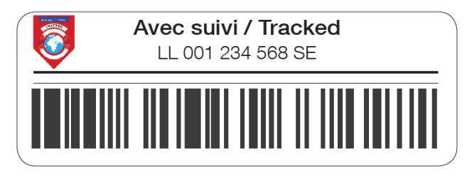

- 3 Treatment of items
- 3.1 Designated operators shall provide track-and-trace information as detailed in article 17-130 for outward and inward tracked items on their national territory.
- 4 Remuneration
- 4.1 Tracked items shall be remunerated in accordance with article 31-104.1.2.

Article 18-104 Delivery to the addressee in person

- 1 At the sender's request, and in the service between those designated operators which have given their consent, registered items and insured items shall be delivered to the addressee in person. Designated operators may agree to allow this option only for such items accompanied by an advice of delivery.
- 2 In all cases, the sender shall pay a charge for delivery to the addressee in person the guideline amount of which shall be 0.16 SDR.
- 3 Marking and treatment of items for delivery to the addressee in person
- 3.1 Items for delivery to the addressee in person shall bear in bold letters the words "À remettre en main propre" (For delivery to the addressee in person) or the equivalent in a language known in the country of destination. This indication shall appear on the address side and, in so far as possible, in the top left-hand corner, beneath the sender's name and address where these are given.
- 3.2 When the sender has requested an advice of delivery and delivery to the addressee in person, the CN 07 form shall be signed by the addressee or, if that is not possible, by his duly authorized representative. In addition to the signature, the name in capital letters or any clear and legible indication permitting unambiguous identification of the person signing shall also be obtained.

3.3 Designated operators shall make a second attempt to deliver such items only if there is a presumption that it will be successful and if the national regulations so permit.

### *Commentary*

*1 DOs permitting delivery to the address in person are listed in the LP Compendium.*

# Article 18-105 M bags

- 1 Certain other articles may also be admitted in M bags, provided the following conditions of entry are met:
- 1.1 the articles (disks, tapes, and cassettes; commercial samples shipped by manufacturers and distributors; or other non-dutiable commercial articles or informational materials that are not subject to resale) are affixed to or otherwise combined with the accompanying printed papers;
- 1.2 the articles relate exclusively to the printed papers with which they are being mailed;
- 1.3 the weight of each item which contains articles in combination with printed papers does not exceed two kilogrammes;
- 1.4 the M bags are accompanied by a CN 22 or CN 23 customs declaration form prepared by the sender in accordance with the provisions laid down in article 20-001.2.9.
- 2 The addressee's address shall be shown on each packet of printed papers included in a special bag and sent to the same addressee at the same address.
- 3 Every M bag shall be furnished with a rectangular address label provided by the sender and giving all the information concerning the addressee. The address label shall be made of sufficiently rigid canvas, strong cardboard, plastic, parchment, or paper glued to wood and shall be provided with an eyelet. It shall not be smaller than 90 x 140 mm with a tolerance of 2 mm.
- 4 The total amount of prepayment for M bags shall be shown on the address label on the bag.

- 5 With the agreement of the designated operator of destination, packets of printed papers may also be admitted as M bags when they are not packed in a bag. Such packets shall be marked very visibly with a letter M near the addressee's address. The nature of the contents shall be indicated directly on the item (CN 22/CN 23).
- 6 Designated operators shall apply a single barcode identifier conforming to UPU Technical Standard S10 to M bags to enable the provision of cross-border customs electronic advance data in compliance with UPU EDI Messaging Standard M33 (ITMATT V1). However, the presence of such an identifier shall not imply the provision of a delivery confirmation service. The identifier should appear on the front of the item and should not obscure the other service markings, indicia or address information.
- 7 In accordance with article 08-002, designated operators shall capture and exchange electronic advance data. The data shall replicate the information documented on the appropriate UPU customs declaration form and shall be compliant with UPU EDI Messaging Standard M33 (ITMATT V1).

- *1 Provisions adopted to facilitate use of M bags by computer software companies, electronics manufacturers, pharmaceutical manufacturers, direct mail marketing firms and other industry segments that have on ongoing need to ship non-dutiable, light-weight merchandise items or product samples, in combination with catalogues or other promotional literature, to their representatives, agents or distributors in foreign countries.*
- *1.3 This weight limit is designed to prevent any abuse of the M bag provisions.*

# Prot. Article R XXII M bags

- 1 Notwithstanding article 18-105, Canada shall be authorized not to accept or handle M bags containing audio-visual articles or informational materials received from other countries.
- 2 Notwithstanding article 18-105, the Dem. People's Rep. of Korea reserves the right not to accept M bags that contain commercial samples or other non-dutiable commercial articles or informational materials that are not subject to resale.

Article 18-106 Transmission of M bags

Every M bag shall be furnished with a CN 34, CN 35 or CN 36 label to which a large letter M has been added in the upper right-hand corner. This label shall be additional to the address label provided by the sender. M packets that are not packed in a bag must be inserted in a "sac collecteur M" for transmission.

Article 18-107 Checking of M bags

Each designated operator shall have the right, in accordance with its national legislation and the procedures agreed with its customs authorities, to open and inspect M bags received, to check for compliance with the product specification detailed in article 18-105.1 to 5 and to ensure customs compliance. Any items that are found not to be in compliance with the product specification shall be charged at the destination designated operator's terminal dues rates for priority and non-priority mail. A CN 43 verification note shall be raised to advise the origin designated operator of the adjustments to the CN 31 letter bill.

Article 18-108 International business reply service (IBRS)

# 1 General

- 1.1 Designated operators may agree with each other to participate in an optional international business reply service (IBRS). All designated operators shall, however, be obliged to operate the IBRS "return" service.
- 1.2 The purpose of the IBRS is to enable authorized senders to prepay in advance reply items posted by their respondents residing abroad.
- 1.3 Designated operators which operate this service shall comply with the provisions laid down below.

- 1.4 Designated operators may, nevertheless, agree bilaterally on another system to be applied between themselves.
- 1.5 Designated operators may establish a compensation system that takes account of the costs borne.
- 2 Operating methods
- 2.1 IBRS works as follows:
- 2.1.1 items from the authorized sender residing in country "A" sent to his respondents residing in one or more countries "B" each contain an IBRS envelope, card or label;
- 2.1.2 the respondents residing in country (or countries) "B" may use the IBRS envelopes, cards or labels to reply to the sender; IBRS items shall be regarded as priority items or ordinary airmail items prepaid in accordance with article 06-001.1.2.1.4;
- 2.1.3 the IBRS items posted shall be transmitted to country "A" and delivered to the authorized sender.
- 2.2 Member countries or designated operators shall be free to set the charges and conditions for authorizing use of the service and for handling the items posted.
- 2.3 Designated operators operating IBRS may do so either on a reciprocal basis or in one direction only (the "return" service). The latter procedure presupposes that the designated operator of country "B" accepts IBRS items for posting but does not issue authorization to use the service to customers residing on its territory.
- 2.4 Designated operators operating the service shall make clear to their customers, on authorizing use of the service, the obligation to conform to the provisions of these Regulations and, in particular, this article.
- 3 Specifications for IBRS items
- 3.1 IBRS items may be in the form of cards or envelopes conforming to the specimen provided for and to these Regulations.

- 3.2 Items consisting of envelopes or packets bearing a label conforming to the specimen provided for and to these Regulations shall also be admitted as IBRS items.
- 3.3 IBRS items shall conform to the size limits applicable to the equivalent letter-post items laid down in article 17-104. In respect of postcards or items in card form, IBRS items may also be accepted in accordance with article 17-111.5. IBRS items shall not weigh more than 50 grammes. However, a designated operator may apply, on a voluntary basis, a weight limit of 2 kg for the return of IBRS items to other designated operators that equally opt to apply a weight limit of 2 kg for the return service.
- 3.4 IBRS items may, in principle, contain any items that are compliant with the UPU Convention and Regulations. However, a designated operator may exclude from the IBRS return service certain contents such as waste items if the national legislation so provides.
- 3.5 Designated operators may agree bilaterally to any further extensions of the service.
- 3.6 For IBRS items containing documents, designated operators may apply a single barcode identifier conforming to UPU Technical Standard S10 to enable the provision of cross-border customs preadvice or other tracking services. For IBRS items containing goods, designated operators shall apply a single barcode identifier conforming to UPU Technical Standard S10 to enable the provision of crossborder customs pre-advice data in compliance with UPU EDI Messaging Standard M33 (ITMATT V1). However, the presence of such an identifier shall not imply the provision of a delivery confirmation service. The identifier shall appear on the front of the item and shall not obscure the other service markings, indicia or address information.

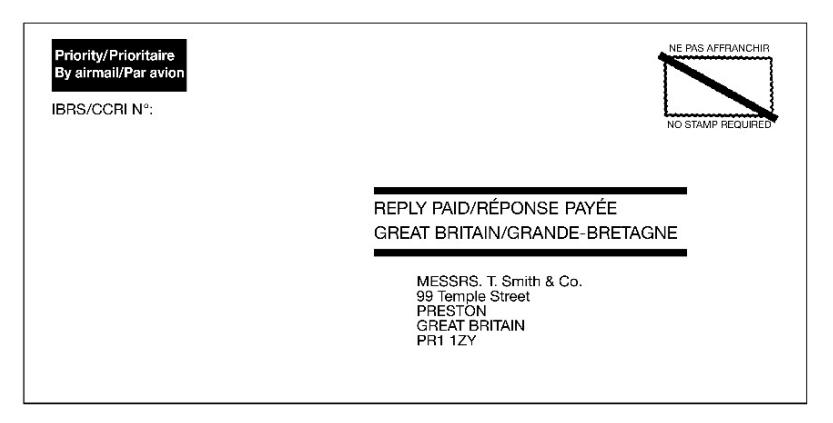

- 3.7 For IBRS items containing goods, in accordance with article 08-002, designated operators shall capture and exchange electronic advance data. The data shall replicate the information documented on the appropriate UPU customs declaration form and shall be compliant with UPU EDI Messaging Standard M33 (ITMATT V1).
- 4 IBRS accounting charges
- 4.1 Each designated operator returning IBRS items to another designated operator shall be entitled to collect from that designated operator a sum corresponding to costs incurred for returning the IBRS items.
- 4.2 This sum shall be fixed on the basis of a charge per item and a charge per kilogramme. These charges shall be calculated as follows:
- 4.2.1 a charge for the domestic collection and handling of IBRS items shall be fixed at 80% of the terminal dues rates for bulk mail (with a rate per kilogramme and a rate per item) of the designated operator that is returning the IBRS items, with a total annual floor charge of 0.15 SDR per item; the rates applied to P/G letter-post format items as calculated in accordance with article 30 of the Convention shall also apply to all IBRS items, regardless of their actual formats or weights;

- 4.2.2 an additional per kilogramme charge for the international conveyance of IBRS items shall be calculated, in principle, as indicated in article 34-101.3, but according to the weight, plus the rate for handling transit dispatches as set in article 27-003.1.1.
- 4.3 Any revision of the charge mentioned under 4.2.1 shall be based on available economic data.
- 4.4 Unless the designated operators concerned decide otherwise, IBRS charges shall not be paid when the aggregated annual number of IBRS items and CN 07 forms (advice of delivery) returned by each designated operator is equal to or lower than 1,000. When the aggregated items and CN 07 forms annual number of IBRS items returned exceeds 1,000 for one designated operator, the amount paid shall take into account the aggregated number of IBRS items and CN 07 forms returned by both designated operators.
- 5 Accounting for IBRS charges
- 5.1 The rules for the transfer and acceptance of accounting forms provided for in article 35-001 shall be applied to IBRS forms CN 09, CN 10 and CN 19.
- 5.2 Preparation of CN 09 and CN 10 statements of IBRS items
- 5.2.1 After transmission of the last mail of every month, the designated operator of origin of the IBRS items shall prepare, by office of exchange of origin and destination, from the data on the CN 31 letter bills, a CN 09 statement of IBRS items sent.
- 5.2.1.1 When the CN 31 letter bill bears no data on the weight of IBRS items returned, a default weight of five grammes per item shall apply.
- 5.2.2 For each designated operator of destination of the IBRS items, the designated operator of origin shall prepare quarterly, from the particulars on the CN 09 statements, by office of origin, by office of destination and, where appropriate, by forwarding route, a CN 10 recapitulative statement of IBRS items.
- 5.2.3 The CN 09 statements shall be supplied to the designated operator of destination in support of the CN 10 recapitulative statement.

- 5.3 Transmission and acceptance of CN 09 and CN 10 statements of IBRS items
- 5.3.1 The CN 10 recapitulative statement shall be sent to the designated operator of destination of the IBRS items no later than four months after the end of the quarter to which it relates.
- 5.3.2 The acceptance period for a CN 10 recapitulative statement shall be two months. If verification reveals any discrepancies, the corrected CN 09 statement shall be attached in support of the duly amended and accepted CN 10 recapitulative statement. If the designated operator of origin of the IBRS items disputes the amendments made to the CN 09 statement, it shall confirm the actual data by sending photocopies of the CN 31 forms drawn up by the office of origin upon dispatch of the disputed IBRS items, or by giving access to the corresponding electronic data through a PREDES message, if the CN 31 was exchanged electronically.
- 5.3.3 Designated operators may agree that the CN 09 and CN 10 statements shall be prepared by the designated operator of destination of the IBRS items. In this case, the acceptance procedure provided for under 5.3.1 and 5.3.2 shall be adapted accordingly.
- 5.4 Preparation, transmission and approval of IBRS accounts
- 5.4.1 The creditor designated operator shall be responsible for preparing the accounts and forwarding them to the debtor designated operator.
- 5.4.2 The detailed accounts shall be prepared on a CN 19 form, on the basis of the difference between the amounts to be brought to account based on the number and weight of IBRS items received and dispatched as appear from the CN 10 recapitulative statements.
- 5.4.3 The CN 19 detailed account shall be sent to the debtor designated operator no later than seven months after the end of the year concerned.
- 5.4.4 The acceptance period for a CN 19 detailed account shall be two months.
- 5.4.5 The CN 19 detailed accounts may be summarized in a CN 52 general account by the creditor designated operator under the conditions provided for in article 34-105.6.

- 5.5 General liquidation account and payment of IBRS charges
- 5.5.1 Article 35-002 shall apply to IBRS charges for which the creditor designated operator prepares a CN 20 statement.

- *1 DOs providing IBRS are listed in the LP Compendium.*
- *3 IBRS items must conform with the following points:*
- *– the two horizontal bars must be at least 3 mm thick and at least 14 mm apart; the words "RÉPONSE PAYÉE" (REPLY PAID) must be printed on the first line and the name of the country of destination on the second line; both lines of text must be printed in capital letters;*
- *– the address of the IBRS licensee must be printed below the two horizontal bars;*
- *– if an indication of the IBRS licence number is printed on the item, it must be shown under the forwarding indication;*
- *– all the text and the symbols must be printed in a dark colour which contrasts clearly with the background of the item; in principle black or dark blue printing should be used, but DOs may permit other colours, provided that they result in dark printing contrasting clearly with a light background; on items printed in black and white, the terms "Prioritaire" (Priority) or "Par avion" (By airmail) may be given in a framework in a colour other than blue;*
- *– translations in the languages of the countries of posting and destination of the item may be given in addition to the French indications.*
- *4.2.1 For countries whose terminal dues rates are based on domestic charges, in accordance with the provisions in art 30.5 to 11 of the UPU Conv, the IBRS rates will be calculated as 80% of the final terminal dues rates notified via IB circ for the year in question.*

*For countries whose terminal dues rates are not based on domestic charges, the IBRS rates will be calculated as 80% of the rates provided for in art 30.9 or 31.3 for the year in question, as applicable.*

*If a DO is entitled to QS link-adjusted terminal dues from the DO of origin, the IBRS rate will also be based on the adjusted QS link TD rates. Example of calculating IBRS rates*

*DO A is returning 1,700 IBRS items weighing 25 kg to DO B in 2014. The distance between the offices of exchange of the two DO is 10,000 km.*

*DO A is not part of the QS Link, but DO B is. In this case, the rates used for the calculation of IBRS charges will be the base TD rates, prior to any adjustment for quality. The base TD rates of DO A for the year concerned are 0.294 SDR per item and 2.294 SDR per kg.*

*The basic air conveyance rate for 2014 is 0.000582 SDR per kg and km. The IBRS rates will be calculated as follows:*

- *i the base handling charge per item/kg will be: 80% x (0.294 x 1,700 items + 2.294 x 25 kg) = 445.72 SDR.*
- *ii the basic air conveyance charge per kg will be: 25 kg x (0.195 + 0.000582 x 10,000 km) = 150.375 SDR.*
- *iii the total amount due will be: 445.72 SDR + 150.375 SDR = 596.095 SDR.*

*The total amount due from DO B to designated operator A for the return of IBRS items will be 596.095 SDR. If both DOs were in the QS Link, or if they were in the target system and were expected to participate in the QS Link, then the TD rates used as the basis for the calculation of IBRS charges per item would have been those adjusted with the QS results.*

*4.2.2 The charges corresponding to the international conveyance of IBRS items are those notified in section V of the Transit Compendium, in column 2 of each group of countries of destination.*

Prot. Article R XXIII IBRS accounting charges

Azerbaijan, Belarus, Cabo Verde, Egypt, Kazakhstan, Kyrgyzstan, Malta, Morocco, Nepal, Oman, Qatar, the Russian Federation, and Uzbekistan reserve the right to claim compensation of the costs of the IBRS service even when the annual number of items returned is less than or equal to the threshold laid down in article 18-108.4.4.

|                                 | Priority                           | By air<br>By surface |
|---------------------------------|------------------------------------|----------------------|
| Dispatching designated operator | Month                              | Year                 |
| Dispatching office of exchange  | Designated operator of destination |                      |
|                                 | Office of exchange of destination  |                      |

| ate<br>f dispatch | Mail No.       | Number<br>of receptacles | Weight | Number<br>of bundles | Weight | Total weight | Total<br>number<br>of items |
|-------------------|----------------|--------------------------|--------|----------------------|--------|--------------|-----------------------------|
| 1                 | 2              | 3                        | 4      | 5                    | 6      | 7            | 8                           |
|                   |                |                          | kg     |                      | kg     | kg           |                             |
|                   |                |                          |        |                      |        |              |                             |
|                   |                |                          |        |                      |        |              |                             |
|                   |                |                          |        |                      |        |              |                             |
|                   |                |                          |        |                      |        |              |                             |
|                   |                |                          |        |                      |        |              |                             |
|                   |                |                          |        |                      |        |              |                             |
|                   |                |                          |        |                      |        |              |                             |
|                   |                |                          |        |                      |        |              |                             |
|                   |                |                          |        |                      |        |              |                             |
|                   |                |                          |        |                      |        |              |                             |
|                   |                |                          |        |                      |        |              |                             |
|                   |                |                          |        |                      |        |              |                             |
|                   |                |                          |        |                      |        |              |                             |
|                   |                |                          |        |                      |        |              |                             |
|                   |                |                          |        |                      |        |              |                             |
|                   |                |                          |        |                      |        |              |                             |
|                   |                |                          |        |                      |        |              |                             |
|                   |                |                          |        |                      |        |              |                             |
|                   | red on CN 10 s |                          | 1      | 1                    | L      |              |                             |

| lotal to be entered on CN                    | rostatement |
|----------------------------------------------|-------------|
| Office of destination<br>Place and signature |             |
|                                              |             |

| Designated operator preparing the form |                       |              | RECAPITULATIVE S<br>OF IBRS ITEMS | CN 10                |  |
|----------------------------------------|-----------------------|--------------|-----------------------------------|----------------------|--|
| Dispatching designation                | ated operator         |              | Priority<br>Année                 | By air<br>By surface |  |
| Designated operato                     | r of destination      |              | First quarter Second quarter      | Third quarter        |  |
| Summary of C                           | N 09 statemen         | ts           |                                   |                      |  |
| Office of origin                       | Office of destination | Total weight | Total number of items             | Observations         |  |
| 1                                      | 2                     | 3            | 4                                 | 5                    |  |
|                                        |                       | kg           |                                   |                      |  |
|                                        |                       |              |                                   |                      |  |
|                                        |                       |              |                                   |                      |  |
|                                        |                       |              |                                   |                      |  |
|                                        |                       |              |                                   |                      |  |
|                                        |                       |              |                                   |                      |  |
|                                        |                       |              |                                   |                      |  |
|                                        |                       |              |                                   |                      |  |
|                                        |                       |              |                                   |                      |  |
|                                        |                       |              |                                   |                      |  |
|                                        |                       |              |                                   |                      |  |
|                                        |                       |              |                                   |                      |  |
|                                        |                       |              |                                   |                      |  |
|                                        |                       |              |                                   |                      |  |
|                                        |                       |              |                                   |                      |  |
|                                        |                       |              |                                   |                      |  |
|                                        |                       |              |                                   |                      |  |
|                                        |                       |              |                                   |                      |  |
|                                        |                       |              |                                   |                      |  |

257

Creditor designated operator

# DETAILED ACCOUNT IBRS charges

CN 19

Year of account

Debtor designated operator

1 IBRS items dispatched/received (Data from CN 10 forms – give weights in kg only)

| (Data fr         | (Data from CN 10 forms – give weights in kg only) |                 |            |       |                 |            |       |
|------------------|---------------------------------------------------|-----------------|------------|-------|-----------------|------------|-------|
|                  | Quarter                                           | Weight priority |            |       | Number of items |            |       |
| Mail             |                                                   | By air          | By surface | Total | By air          | By surface | Total |
|                  | 1st                                               | kg              | kg         | kg    |                 |            |       |
|                  | 2nd                                               |                 |            |       |                 |            |       |
|                  | 3rd                                               |                 |            |       |                 |            |       |
|                  | 4th                                               |                 |            |       |                 |            |       |
| Total for yea    | Total for year <sup>1</sup>                       |                 |            |       |                 |            |       |
|                  | 1st                                               | kg              | kg         | kg    |                 |            |       |
| Mail<br>received | 2nd                                               |                 |            |       |                 |            |       |
|                  | 3rd                                               |                 |            |       |                 |            |       |
|                  | 4th                                               |                 |            |       |                 |            |       |
| Total for yea    | r¹                                                |                 |            |       |                 |            |       |

Weight to be entered on CN 61 account for payment of terminal dues

### 2 IBRS charges

| Name of the state of         | Weight    | Number of items                                 |  |
|------------------------------|-----------|-------------------------------------------------|--|
| Items dispatched             | kg        |                                                 |  |
|                              | SDR       | SDR                                             |  |
| x rate                       |           |                                                 |  |
|                              | A         | В                                               |  |
| Totals (SDR)                 |           |                                                 |  |
| T                            | C = A + B |                                                 |  |
| Total amount (SDR)           |           |                                                 |  |
| Items received               | Weight    | Number of items                                 |  |
| Items received               | kg        |                                                 |  |
|                              | SDR       | SDR                                             |  |
| x rate                       |           |                                                 |  |
|                              | D         | E                                               |  |
| Totals (SDR)                 |           |                                                 |  |
|                              | F = D + E |                                                 |  |
| Total amount (SDR)           |           |                                                 |  |
|                              | G = C - F |                                                 |  |
| To be received (SDR)         |           |                                                 |  |
| Creditor designated operator |           | Seen and accented by debtor designated operator |  |

| Signature         |   | Place, date and signature | ٥, |
|-------------------|---|---------------------------|----|
|                   |   |                           |    |
|                   | _ |                           |    |
| Size 210 x 297 mm |   |                           |    |

Designated operator

STATEMENT IBRS charges

CN 20

Notes
Statement showing the balance of the CN 19 account

|                                    |                                             | Year for which sums are due |
|------------------------------------|---------------------------------------------|-----------------------------|
| nal sums due                       |                                             |                             |
|                                    |                                             |                             |
|                                    | Designated operator preparing the statement |                             |
| arried forward<br>om the CN 19     | SDR                                         |                             |
| etailed account                    |                                             |                             |
| dditional information              |                                             |                             |
|                                    |                                             |                             |
|                                    |                                             |                             |
|                                    |                                             |                             |
|                                    |                                             |                             |
|                                    |                                             |                             |
|                                    |                                             |                             |
|                                    |                                             |                             |
|                                    |                                             |                             |
|                                    |                                             |                             |
|                                    |                                             |                             |
|                                    |                                             |                             |
|                                    |                                             |                             |
|                                    |                                             |                             |
|                                    |                                             |                             |
|                                    |                                             |                             |
| ssignated operator prepr<br>mature | aring the statement                         |                             |
| iesignated operator prepi          | aring the statement                         |                             |

Size 210 x 297 mm

Article 18-109 International business reply service (IBRS) – local response

- 1 Designated operators may agree bilaterally to operate an optional IBRS – local response, either on a reciprocal basis or in one direction only (the return service).
- 2 The IBRS local response is based on IBRS but the prepaid responses use the domestic business reply design of the designated operator in which they are posted. The designated operator of the country of posting delivers these responses to a Post Office Box address in its territory, clears them from the P.O. box and dispatches them to the designated operator of origin in the international mail.
- 3 The details of this service shall be laid down bilaterally between the designated operators concerned on the basis of guideline provisions defined by the Postal Operations Council.

Article 18-110 International reply coupons

- 1 Designated operators shall be permitted to sell international reply coupons issued by the International Bureau and to limit their sale in accordance with their national legislation.
- 2 The value of the reply coupon provided for in article 18.3.2 of the Convention shall be 0.74 SDR. The selling price fixed by the designated operators concerned may not be less than this value.
- 3 Reply coupons shall be exchangeable in any member country for postage stamps and, if not precluded by the national legislation of the country of exchange, for postal stationery or postal prepayment marks or impressions representing the minimum postage prepayable on an unregistered priority letter-post item or an unregistered airmail letter sent abroad, whatever the country of destination.

- 4 The designated operator of a member country may, in addition, reserve the right to require the reply coupons and the items to be prepaid in exchange for those reply coupons to be presented at the same time.
- 5 International reply coupons shall conform to the annexed specimen CN 01. They shall be printed, on paper bearing as a watermark the initials UPU in large letters, under arrangements made by the International Bureau. The name of the country of origin shall be printed on the coupons. They shall also have printed on them, inter alia, a standardized UPU barcode containing the ISO code of the country, the date of printing and the International Bureau selling price expressed in SDR. They shall be delivered once the designated operators have paid the amount of the invoice previously sent to them by the International Bureau, made up of the value of the coupons and associated production, management, transport and insurance costs.

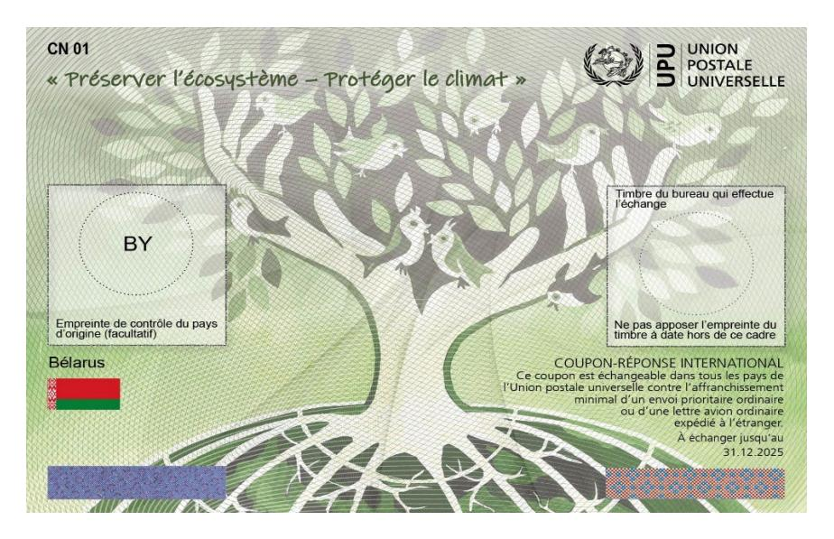

6 Designated operators shall order international reply coupons from the International Bureau. The minimum order quantity shall be 1,000 IRCs. Additional IRCs may be ordered in bundles of 1,000. The International Bureau shall prepare a delivery bill within 10 working days of receipt of the order and send it to the designated operator concerned. The payment period shall be six weeks from the date on which the bill is sent. In the event of non-payment within this period, the bill and the related order shall be cancelled. However a designated operator with a credit at the International Bureau arising from an international reply coupon account may use it for the partial or full settlement of the delivery bill.

- 7 Each designated operator shall have the option of indicating the selling price on the reply coupons by asking the International Bureau for this price to be indicated at the time of printing.
- 8 The validity period of the coupon shall be indicated on it. Post offices shall satisfy themselves as to the genuineness of the documents when they exchange them and check particularly the presence of the watermark and other security features, details of which will be communicated in advance by the International Bureau. Reply coupons on which the printed text does not agree with the official text or whose security features are non-compliant shall be refused as invalid. Exchanged reply coupons shall be marked with an impression of the date-stamp of the office exchanging them.
- 9 Exchanged reply coupons shall be returned to the International Bureau in packets of a thousand. Designated operators that exchange less than a thousand coupons per year may return the coupons they have exchanged to the International Bureau at the end of the year. They shall be sent together with a CN 03 statement prepared in duplicate and showing their total number and value. The value shall be calculated according to the rate provided for under 2. In case of change in this rate, all reply coupons exchanged before the date of the change shall be sent in a single consignment including, by way of exception, broken lots; they shall be accompanied by a special CN 03 statement made out in the old value.
- 10 After verification by the International Bureau, the CN 03 shall be duly dated and signed and returned to the designated operator. The International Bureau will, on the basis of the CN 03s received and a physical inspection thereof, prepare a final statement of coupons exchanged. It shall make payment on the basis of these statements. Payment shall be made within a period of six weeks after the end of each quarter. Designated operators shall have the option of receiving payments direct, or having them entered to their credit with the International Bureau. The minimum amount that can be transferred to a bank or postal account shall be

200 SDR. Amounts lower than this shall automatically be paid to the operator's credit with the International Bureau. No credit shall be given for forged or counterfeit coupons exchanged.

- 11 A separate accounting system for IRCs comprising a separate account for each designated operator participating in this service shall be created at the International Bureau. This system shall be managed in accordance with the relevant provisions of the Regulations for the administrative and financial management of International reply coupons.
- 12 The International Bureau shall also take back damaged reply coupons sent together with a separate CN 03 statement prepared in duplicate, provided that at least part of the barcode enables the value of such coupons to be determined.

### *Commentary*

- *1 DOs availing themselves of the option of selling reply coupons are listed in the LP Compendium. The option of limiting the sale of reply coupons is provided to prevent abuse of international reply coupons as a means of payment for matters not connected with the postal service, in particular when currency values are disrupted in certain countries.*
- *2 Up to the 1989 Washington Congress, the value of the reply coupon was aligned with the amount of the highest charge for a letter of 20 g (100% increase in the basic charge authorized since the 1979 Rio de Janeiro Congress). When the 1989 Washington Congress changed the basic rates to guideline rates, and as a result abolished the upper and lower limits of the charges, it fixed the value of the reply coupon at double the basic charge for a 20 g letter.*
- *3 The exchange of reply coupons is compulsory for all countries even though their sale is optional. If the sender asks – in exchange for a reply coupon – for a commemorative stamp or stamps on which a supplement is payable, he will have to pay the supplement himself (decision C 5/Brussels 1952). Reply coupons intended for exchange against the postage stamps necessary for prepaying items to be sent to countries with which a DO has an agreement on reduced charges must be exchanged against the value of the postage prepayable for countries with which no agreement on reduced charges exists (decision C 6/Paris 1947). In countries applying the provisions relating to standardized items (art 15-102.9 and 17-111) two different rates may be applied to letters up to 20 g. To take account of this situation, the 1974 Lausanne Congress replaced the expression "postage prepayable on an unregistered letter of the first weight step" by "minimum postage prepayable on an unregistered letter" to specify that in such countries the equivalent value of a reply coupon is that of the postage payable on a standardized letter. International reply coupons will be exchangeable for postage stamps representing the value of the highest charge fixed for airmail letters or priority letters for abroad.*

| Reply coupons at 0.74 SDR exchanged and sent to the International Bureau                                                        |                                      | Number                        | Amount in SDR                 |
|---------------------------------------------------------------------------------------------------------------------------------|--------------------------------------|-------------------------------|-------------------------------|
|                                                                                                                                 |                                      |                               |                               |
|                                                                                                                                 |                                      |                               |                               |
| Method of reimbursement                                                                                                         |                                      |                               |                               |
| In order to proceed with reimbursemen<br>of reimbursement from among the foll                                                   | t of the sum of<br>owing three optic | SDR, please in<br>ons:        | ndicate the preferred method  |
| □ OPTION 1: transfer to a bank or po                                                                                            | stal account                         |                               |                               |
| Choice of currency:  ☐ USD (United States dollars)                                                                              | □ EUR (eur                           | os) $\square$ CHF (S          | Swiss francs)                 |
| Transfers of 200 SDR or more can on International Bureau circular con such a circular, or for amounts beloapply option 3 below. | cerning the settle                   | ement of international postal | accounts. In the absence of   |
| ☐ OPTION 2: use UPU*Clearing                                                                                                    |                                      |                               |                               |
| Choice of currency:  USD (United States dollars)                                                                                | ☐ EUR (eur                           | os) $\Box$ CHF (S             | Swiss francs)                 |
| □ OPTION 3: enter the sum of<br>International Bureau.                                                                           | SDR (convert                         | ted to CHF) to our designate  | ed operator's credit with the |
| Designated operator.                                                                                                            |                                      |                               |                               |
| Name and title of signatory                                                                                                     |                                      | Stamp, date and signature     |                               |
|                                                                                                                                 |                                      |                               |                               |
|                                                                                                                                 |                                      |                               |                               |
|                                                                                                                                 |                                      |                               |                               |
|                                                                                                                                 |                                      |                               |                               |
| Seen and accepted by the Internation<br>Place, date and signature                                                               | al Bureau of the I                   | UPU                           |                               |
| Berne,                                                                                                                          |                                      |                               |                               |
| Size 210 x 297 mm                                                                                                               |                                      |                               |                               |
|                                                                                                                                 |                                      |                               |                               |

# Article 18-111 Advice of delivery for letter-post items

- 1 In the case of designated operators which offer the advice of delivery service to customers, the sender of a registered letter-post item or insured item may apply for an advice of delivery at the time of posting by paying a charge, the guideline amount of which shall be 0.98 SDR.
- 2 This advice of delivery shall be returned to the sender by the quickest route (air or surface). Designated operators may agree on the electronic exchange of advices of delivery for registered or insured letter-post items when they offer the electronic advice of delivery service to their customers.
- 3 Marking of items with advices of delivery
- 3.1 Items for which the sender requests an advice of delivery shall bear in bold type on the address side the letters A.R. The sender shall give their name and address in roman letters on the outside of the item. The latter indication, when it appears on the address side, shall be placed in the top left-hand corner. This position shall as far as possible also be assigned to the letters A.R., which may be located beneath the sender's name and address where these are given.
- 3.2 The items mentioned under 3.1 shall be accompanied by a light red CN 07 form of the consistency of a postcard. The CN 07 form shall bear in bold type the letters A.R. The sender shall complete, in roman letters and using means other than ordinary pencil, the various sections as indicated by the form's layout. The front of the form shall be completed by the office of origin or by any other office appointed by the dispatching designated operator and be securely attached to the item. If the form does not reach the office of destination, that office shall automatically make out a new advice of delivery.
- 3.3 In calculating the postage for an advice of delivery item, including, where applicable, calculation of the air surcharge, the weight of the CN 07 form may be taken into account. The advice of delivery charge shall be represented on the item with the other charges.

- 4 Treatment of advices of delivery
- 4.1 As a matter of priority, the advice of delivery shall be signed by the addressee or, if that is not possible, by another person authorized to do so under the regulations of the country of destination. If those regulations so provide, the advice may be signed by the official of the office of destination except in the case of delivery to the addressee in person. In addition to the signature, the name in capital letters or any clear and legible indication permitting unambiguous identification of the person signing shall also be obtained. The identification information referred to herein may also be obtained by electronic means.
- 4.2 The office of destination shall return the duly completed and signed CN 07 form direct to the sender by the first mail. This form shall be sent without an envelope by the quickest route (air or surface). If the advice of delivery is returned without having been duly completed, the irregularity shall be notified by means of the CN 08 form provided for in article 21-001, to which the relevant advice of delivery shall be attached.
- 4.3 When the sender inquires about an advice of delivery which he has not received within a normal period, this advice shall be requested free of charge on form CN 08. A duplicate of the advice of delivery, bearing on the front in bold letters the word "Duplicata" (Duplicate), shall be attached to the CN 08 inquiry form for letter-post items.
- 4.4 Designated operators that have established systems to generate electronic delivery confirmation and have agreed to exchange such data with the designated operator of origin of the items shall have the right to use signatures captured electronically from these systems to provide proof of delivery of individual items to the sending designated operator, subject to CN 08 inquiry for letter-post items. The electronic delivery confirmation data may be provided electronically (e-mail) or in hard-copy form at the discretion of the delivering designated operator.
- 4.5 As provided for in article 10 of the Convention, the processing of any personal data associated with electronic advice of delivery and electronic delivery confirmation referred to in this article shall be in accordance with the national legislation of the member country concerned.

- 5 Accounting charges
- 5.1 Each designated operator returning an advice of delivery (CN 07 form) to another designated operator shall be entitled to collect from that designated operator a sum corresponding to the costs incurred for returning the advice of delivery. This sum shall be fixed in accordance with the IBRS accounting charges set out in article 18-108.4. The advices of delivery shall be transmitted and accounted for together with the IBRS items, following the process and using the forms provided for in articles 18-108.5 and 17-125 for IBRS items.
- 5.2 The provisions under 5.1 shall apply by analogy to the electronic advice of delivery in cases where designated operators offer this service to their customers.

|                                             | Designated operator of origin                                                                              | ADVICE of receipt                      | of d      | elivery/of payment/of ent | try CN 07                                |
|---------------------------------------------|------------------------------------------------------------------------------------------------------------|----------------------------------------|-----------|---------------------------|------------------------------------------|
|                                             | Office of posting                                                                                          | Date                                   |           | ۸ D                       | On postal service                        |
|                                             | Addressee of the item                                                                                      |                                        |           | A.R.                      | Stamp of the office returning the advice |
|                                             | Nature of the item  Priority/ Letter Printed paper                                                         |                                        |           | Priority/<br>By airmail   |                                          |
|                                             |                                                                                                            | _                                      | sender    | Return to                 |                                          |
|                                             | Registered No of item                                                                                      | Insured Amount                         | sel       | Name                      |                                          |
|                                             | Ordinary money Outpayment                                                                                  | Amount                                 | n by the  | Street and No             |                                          |
| 6                                           | order inpayment check                                                                                      |                                        | filled in | Locality and country      |                                          |
| ed<br>stinati                               | The item mentioned above has been du delivered paid                                                        | ly credited to giro account            | pe        |                           |                                          |
| pleto                                       | Date Signature*                                                                                            |                                        | 2         |                           |                                          |
| To be completed<br>by office of destination | Name of recipient in capital letters (or other c                                                           | lear identification)                   |           |                           |                                          |
|                                             | * This advice may be signed by the addressee or, if<br>of destination so provide, by another authorized pe | the regulations of the country<br>reon |           |                           |                                          |

# Article 18-201 Merchandise return service for the original seller

- 1 General
- 1.1 Designated operators may bilaterally agree to offer a supplementary merchandise return service comprising acceptance of prepaid returns with priority transportation.

- 1.2 The purpose of the merchandise return service shall be to enable the original seller to pay for returned parcels posted by its customers/the addressees residing abroad after successful delivery.
- 1.3 Designated operators that operate this service shall comply with the provisions outlined in the user guide as approved by the POC.
- 1.4 Designated operators may otherwise agree bilaterally on another service to be applied among themselves.
- 2 Formalities
- 2.1 Authorized addressees returning parcels via the merchandise return service shall utilize the customs declaration information provided by the original seller in order to comply with the formalities outlined in article 17-211.
- 3 Charges for the merchandise return service (outward land rates and air conveyance dues)
- 3.1 A designated operator sending parcels via the merchandise return service shall be entitled to collect charges corresponding to costs incurred for the service from the designated operator of the country of origin of the returned merchandise.
- 3.2 The charges shall be fixed as follows:
- 3.2.1 A charge for the outward land rates shall be set at 85% of the inward land base rates for an air parcel (with a rate per kilogramme and per item) of the designated operator that is returning parcels, with a floor rate of 2.85 SDR per item and 0.28 SDR per kilogramme.
- 3.2.2 Air conveyance dues shall be calculated in accordance with article 34-202.
- 4 Accounting for the merchandise return service charges
- 4.1 Unless bilaterally agreed otherwise, the accounting of merchandise return service charges shall be based on current settlement procedures, supported by the electronic exchange of information.

- 5 Merchandise return service reporting
- 5.1 A monthly report shall be produced by a bilaterally agreed third party, based on the EMC and EMD events transmitted to the designated operator of the original seller. This report shall provide the number of returned parcels with EMC and EMD events transmitted and the total weight corresponding to these items detailed by designated operator of origin. All additional weight information shall be provided by sending a PREDES message, and shall include a RESDES message for comparison and reconciliation purposes.

*The merchandise return service is a supplementary service adopted within the framework of parcel post development at the 2012 Doha Congress. It involves a reverse logistical process free of any charges and fees for the sender. Detailed operational procedures concerning handling, labels, specifications and reporting will be included in a separate user guide to be approved by the POC and published by the IB. See also arts 17-211, 17-222 and 34-202 for other provisions relating to this supplementary service.*

Prot. Article R XXXIII Merchandise return service for the original seller

Notwithstanding the provisions of article 18-201, Australia reserves the right to apply terms and conditions, including outward land rates and air conveyance rates, for the provision of the merchandise return service for parcels, either as laid down in the Regulations or by any other means, including bilateral agreements.

Article 18-202 Cumbersome parcels

- 1 The following shall be called a "cumbersome parcel"; any parcel:
- 1.1 whose dimensions exceed the limits laid down in these Regulations or those which designated operators shall set between themselves;
- 1.2 which, by reason of its shape or structure, does not readily lend itself to loading with other parcels or which requires special precautions.

- 2 Cumbersome parcels shall be subject to a supplementary charge, the guideline maximum amount of which is laid down in 5.1. However, the air surcharges in respect of these parcels shall not be increased.
- 3 The exchange of cumbersome parcels shall be restricted to those designated operators which admit such items.
- 4 Marking of cumbersome parcels
- 4.1 Every cumbersome parcel and the front of its dispatch note shall bear a label showing in bold letters the word "Encombrant" (Cumbersome).
- 4.2 Designated operators which admit the limits of sizes set out in article 17-204.1 may charge as cumbersome any parcel whose dimensions exceed the limits set out in article 17-204.2 but which weighs less than 10 kilogrammes. In such a case, the word "Encombrant" shall be supplemented on the dispatch note only by the words "en vertu de l'article" (pursuant to article 18-202.4.2).
- 5 Charges
- 5.1 The guideline maximum amount of the supplementary charge referred to in 2 is 50% of the principle charge.

- *1.1 As regards the max dimensions of cumbersome parcels, it is particularly difficult, from a practical standpoint, to introduce sufficiently broad provisions in the Acts. It is advisable therefore for the DOs concerned to reach agreement on the matter if they deem it worthwhile.*
- *1.2 The words "shape" and "structure" should be interpreted to the effect that a parcel is regarded as cumbersome mainly because of its external appearance.*
- *3 DOs accepting "fragile parcels" and "cumbersome parcels" are indicated in the PPCO.*

# Section V Prohibitions and customs matters

# **Article 19 Items not admitted. Prohibitions**

# **1 General**

- **1.1 Items not fulfilling the conditions laid down in the Convention and the Regulations shall not be admitted. Items sent in furtherance of a fraudulent act or with the intention of avoiding full payment of the appropriate charges shall not be admitted.**
- **1.2 Exceptions to the prohibitions contained in this article are set out in the Regulations.**
- **1.3 All member countries or their designated operators shall have the option of extending the prohibitions contained in this article, which may be applied immediately upon their inclusion in the relevant compendium. Any member country or its designated operator wishing to extend or amend the list of articles that it prohibits, or admits conditionally, as imports (or in transit) shall inform the International Bureau, which shall then update the relevant compendium accordingly.**
- **2 Prohibitions in all categories of items**
- **2.1 The insertion of the articles referred to below shall be prohibited in all categories of items:**
- **2.1.1 narcotics and psychotropic substances, as defined by the International Narcotics Control Board, or other illicit drugs which are prohibited in the country of destination;**
- **2.1.2 obscene or immoral articles;**
- **2.1.3 counterfeit and pirated articles;**
- **2.1.4 other articles the importation or circulation of which is prohibited in the country of destination;**

- **2.1.5 articles which, by their nature or their packing, may expose officials or the general public to danger, or soil or damage other items, postal equipment or third-party property;**
- **2.1.6 documents having the character of current and personal correspondence exchanged between persons other than the sender and the addressee or persons living with them;**
- **3 Dangerous goods**
- **3.1 The insertion of dangerous goods as described in the Convention and Regulations shall be prohibited in all categories of items.**
- **3.2 The insertion of replica and inert explosive devices and military ordnance, including replica and inert grenades, inert shells and the like, shall be prohibited in all categories of items.**
- **3.3 Exceptionally, dangerous goods may be admitted in relations between member countries that have declared their willingness to admit them either reciprocally or in one direction, provided that they are in compliance with national and international transport rules and regulations.**
- **4 Live animals**
- **4.1 Live animals shall be prohibited in all categories of items.**
- **4.2 Exceptionally, the following shall be admitted in letter-post items other than insured items:**
- **4.2.1 bees, leeches and silk-worms;**
- **4.2.2 parasites and destroyers of noxious insects intended for the control of those insects and exchanged between officially recognized institutions;**
- **4.2.3 flies of the family Drosophilidae for biomedical research exchanged between officially recognized institutions.**

- **4.3 Exceptionally, the following shall be admitted in parcels:**
- **4.3.1 live animals whose conveyance by post is authorized by the postal regulations and/or national legislation of the countries concerned.**
- **5 Insertion of correspondence in parcels**
- **5.1 The insertion of the articles mentioned below shall be prohibited in postal parcels:**
- **5.1.1 correspondence, with the exception of archived materials, exchanged between persons other than the sender and the addressee or persons living with them.**
- **6 Coins, bank notes and other valuable articles**
- **6.1 It shall be prohibited to insert coins, bank notes, currency notes or securities of any kind payable to bearer, travellers' cheques, platinum, gold or silver, whether manufactured or not, precious stones, jewels or other valuable articles:**
- **6.1.1 in uninsured letter-post items;**
- **6.1.1.1 however, if the national legislation of the countries of origin and destination permits this, such articles may be sent in a closed envelope as registered items;**
- **6.1.2 in uninsured parcels; except where permitted by the national legislation of the countries of origin and destination;**
- **6.1.3 in uninsured parcels exchanged between two countries which admit insured parcels;**
- **6.1.3.1 in addition, any member country or designated operator may prohibit the enclosure of gold bullion in insured or uninsured parcels originating from or addressed to its territory or sent in transit à découvert across its territory; it may limit the actual value of these items.**
- **7 Printed papers and items for the blind:**
- **7.1 shall not bear any inscription or contain any item of correspondence;**

- **7.2 shall not contain any postage stamp or form of prepayment, whether cancelled or not, or any paper representing a monetary value, except in cases where the item contains as an enclosure a card, envelope or wrapper bearing the printed address of the sender of the item or his agent in the country of posting or destination of the original item, which is prepaid for return.**
- **8 Treatment of items wrongly admitted**
- **8.1 The treatment of items wrongly admitted is set out in the Regulations. However, items containing articles mentioned in 2.1.1, 2.1.2, 3.1 and 3.2 shall in no circumstances be forwarded to their destination, delivered to the addressees or returned to origin. In the case of articles mentioned in 2.1.1 discovered while in transit, such items shall be handled in accordance with the national legislation of the country of transit. In the case of articles mentioned in 3.1 and 3.2 discovered during transport, the relevant designated operator shall be entitled to remove the article from the item and dispose of it. The designated operator may then forward the remainder of the item to its destination, together with information about the disposal of the inadmissible article.**

- *1 As indicated in Conv. art 19.1.3, all member countries or their DOs shall have the option of extending the prohibitions contained in this article, provided that such extension is officially notified to the IB and recorded in the relevant compendium. In the absence of any "extended" prohibitions, the rules governing the acceptance of exceptionally admitted articles, as laid down in the Conv and the Regs, shall apply. In this case, items containing such articles shall not be treated as wrongly admitted items.*
- *2.1.1 The International Narcotics Control Board (INCB) defines the types of substances under international control and classifies them according to the categories of narcotics or psychotropic substances. These INCB classifications do not adequately capture all of the illicit drugs or controlled substances which are prohibited in many UPU member countries.*

*The list of narcotics and psychotropic substances placed under international control (abbreviated list) is given in part III of the List of Prohibited Articles.*

*In an inquiry conducted by the IB among DOs on smuggling narcotics and psychotropic substances by post, a number of difficulties emerged, particularly as regards the attitude to be adopted by the intermediate country having regard to the freedom of transit when closed mails are suspected of containing such articles. Congress adopted in this connection formal opinion C 54/Washington 1989, the operative part of which is given below:*

*"Congress invites postal administrations:*

*i to cooperate in combating the traffic in narcotics and psychotropic substances whenever they are legally required to do so by their national authorities responsible for this matter;*

- *ii to ensure respect for the fundamental principles of the international Post, in particular, the freedom of transit (art 1 of the Const and art 4 of the Conv);*
- *iii to make all appropriate arrangements with the relevant authorities of their countries to ensure that bags of mail in transit suspected of enclosing items containing narcotics or psychotropic substances are not opened, but to advise:*
  - *a by the quickest means, at the request of their customs authorities the administration of destination so that the suspected bags can easily be identified on arrival;*
  - *b by verification note, the administration of origin of the mail;*
- *iv to approach the legislative authorities, in consultation with the customs services, to ensure that laws and regulations do not prevent the use of the technique known as 'controlled delivery'; the Customs of the transit country, if necessary with the agreement of the competent authorities, must take appropriate measures to inform the customs authorities of the country of destination and, possibly, of the country of origin of the suspect mails."*
- *2.1.2 It is at the discretion of each DO to decide what is meant by the term "obscene".*
- *2.1.3 Non-admission for conveyance or transit of correspondence items should be notified to the DOs so that the public may be informed of the prohibition in good time.*

*Information about current prohibitions in Union member countries is communicated to the IB, which updates the List of Prohibited Articles on that basis. Each DO must ensure that, wherever possible, the information about current prohibition in its country and sent to the IB is set out in clear, precise and detailed terms and that it is kept up to date.*

- *3 In addition to explosive or flammable substances, compressed gases, corrosive liquids, oxidizing and toxic substances and any other substances which could endanger human life or cause damage are to be considered dangerous. The "List of definitions of dangerous goods prohibited from conveyance by post", drawn up by the International Civil Aviation Organization (ICAO) is given in part IV of the List of Prohibited Articles (pink sheets). With regard to the safety of staff involved in handling items presumed to be dangerous (mail bombs), Congress issued recommendation C 76/Rio de Janeiro 1979, recommending to DOs that they:*
- *a As preventive measures:*
  - *i establish permanent liaison with the competent authorities of their countries (police, customs, national security committees, etc.) in order:*
    - *– to be informed of any threats or of signs indicating the dispatch of dangerous items;*
    - *– to settle questions concerning the examination of items and the destruction of dangerous arts;*
  - *ii issue directives for their services based in particular on the information contained in the CCPS study on the measures to be taken to detect mail bombs and to protect staff against the risk of explosion when such items are discovered in the mail;*
  - *iii ensure that the examination of items presumed to be dangerous is carried out by the most appro-priate methods;*
  - *iv have their national legislation adapted or supplemented, if necessary, with a view to authorizing operations enabling mail bombs to be detected;*
  - *v in conjunction with the competent authorities, alert the public with as much information as possible, subject to any security restrictions, so that they can take all necessary precautions for their personal safety;*
- *b As soon as dangerous items are reported or their presence presumed:*
  - *i give the staff concerned full particulars concerning the external appearance of these items and the need to handle them with particular caution;*

- *ii inform immediately and as fully as possible, by telecommunication, the IB of the UPU and the foreign postal administrations directly threatened." It also instructed the IB to inform immediately the DOs of all member countries of the Union and to send them any information which may be of interest to them. Congress also passed resolution C 39/Seoul 1994 urging DOs, with the assistance of the IB, to:*
  - *a strengthen measures aimed at preventing and detecting the insertion of prohibited and dangerous arts in postal items;*
  - *b develop to this end educational measures suited to the local situation, for the benefit of postal customers and staff;*
  - *c ensure wide dissemination of these measures and appropriate training for the staff, using the most effective modern technical methods.*
- *3.2 Grenades and other military ordnance which have purportedly been rendered inert present a security risk at the point of origin, during transport and at destination. Whether or not such devices have been truly rendered inert can be determined only by experts. In cases where the deactivation of the device has not been performed properly, the item remains an actual dangerous good as specified in paragraph 3. Whether or not devices are inert, the frequent discovery of such items in the offices of exchange desensitizes both postal and customs employees to situations that involve genuine dangerous goods.*

*This prohibition applies to devices that were originally designed for military or combative use, including training. Therefore, smoke grenades, shells, hand grenades or any other ordnance that have been rendered inert are prohibited by this article, as are such devices when designed for military or combative training purposes. The prohibition is also extended to replicas of such items. The prohibition does not extend to items such as children's toys or articles that do not replicate grenades or military ordnance in a realistic manner.*

*Ordnance is defined as ammunition products and components that may pose an explosive safety risk.*

*6 By "currency notes" are meant notes issued by governmental, regional or municipal authorities as legal tender, as opposed to those issued by banking houses under the control and with the authorization of the government.*

*Cheques, securities payable to bearer and generally speaking any negotiable instruments which can easily be cashed at a bank shall be considered as "securities payable to bearer". Papers "representing a monetary value", such as lottery tickets, postage stamps and transport vouchers, may be enclosed in unregistered priority items and in unregistered sealed letters, while still prohibited in reduced-rate items. Information about the admission in registered items under sealed cover are given in the LP Compendium.*

Prot. Article VIII Prohibitions (letter post)

1 Exceptionally, Dem. People's Rep. of Korea and Lebanon shall not accept registered items containing coins, bank notes, securities of any kind payable to bearer, travellers' cheques, platinum, gold or silver whether manufactured or not, precious stones, jewels or other valuable articles. They shall not be strictly bound by the provisions of the Regulations with regard to their liability in cases of theft or damage, or where items containing articles made of glass or fragile articles are concerned.

- 2 Exceptionally, Bolivia (Plurinational State), China, excluding Hong Kong Special Administrative Region, Iraq, Nepal, Pakistan, Saudi Arabia, Sudan and Viet Nam shall not accept registered items containing coins, bank notes, currency notes or securities of any kind payable to bearer, travellers' cheques, platinum, gold or silver whether manufactured or not, precious stones, jewels or other valuable articles.
- 3 Myanmar reserves the right not to accept insured items containing the valuable articles listed in article 19.6, as this is contrary to its internal regulations.
- 4 Nepal does not accept registered items or insured items containing currency notes or coins, except by special agreement to that effect.
- 5 Uzbekistan does not accept registered or insured items containing coins, bank notes, cheques, postage stamps or foreign currency and shall accept no liability in cases of loss of or damage to such items.
- 6 Iran (Islamic Rep.) does not accept items containing articles contrary to the principles of the Islamic religion, and reserves the right not to accept letter-post items (ordinary, registered or insured) containing coins, bank notes, travellers' cheques, platinum, gold or silver, whether manufactured or not, precious stones, jewels or other valuable articles, and shall accept no liability in cases of loss or damage to such items.
- 7 The Philippines reserves the right not to accept any kind of letter post (ordinary, registered or insured) containing coins, currency notes or securities of any kind payable to bearer, travellers' cheques, platinum, gold or silver, whether manufactured or not, precious stones or other valuable articles.
- 8 Australia does not accept postal items of any kind containing bullion or bank notes. In addition, it does not accept registered items for delivery in Australia, or items in transit à découvert, containing valuables such as jewellery, precious metals, precious or semi-precious stones, securities, coins or any form of negotiable financial instrument. It declines all liability for items posted which are not in compliance with this reservation.

- 9 China, excluding Hong Kong Special Administrative Region, shall not accept insured items containing coins, bank notes, currency notes or securities of any kind payable to bearer and travellers' cheques in accordance with its internal regulations.
- 10 Latvia and Mongolia reserve the right not to accept, in accordance with their national legislation, ordinary, registered or insured mail containing coins, bank notes, securities payable to bearer and travellers' cheques.
- 11 Brazil reserves the right not to accept ordinary, registered or insured mail containing coins, bank notes in circulation or securities of any kind payable to bearer.
- 12 Viet Nam reserves the right not to accept letters containing articles or goods.
- 13 Indonesia reserves the right not to accept registered or insured items containing coins, bank notes, cheques, postage stamps, foreign currency, or any kind of securities payable to bearer for delivery in Indonesia, and shall accept no liability in cases of loss of or damage to such items.
- 14 Kyrgyzstan reserves the right not to accept letter-post items (ordinary, registered, insured, small packets) containing coins, currency notes or securities of any kind payable to bearer, travellers' cheques, platinum, gold or silver, whether manufactured or not, precious stones, jewels or other valuable articles, and shall accept no liability in cases of loss of or damage to such items.
- 15 Azerbaijan and Kazakhstan shall not accept registered or insured items containing coins, banknotes, credit notes or any securities payable to bearer, cheques, precious metals, whether manufactured or not, precious stones, jewels and other valuable articles or foreign currency, and shall accept no liability in cases of loss of or damage to such items.

- 16 The Rep. of Moldova and the Russian Federation do not accept registered or insured items containing bank notes in circulation, securities (cheques) of any kind payable to bearer or foreign currency, and shall accept no liability in cases of loss of or damage to such items.
- 17 Notwithstanding article 19.3, France reserves the right not to accept items containing goods in cases where these items do not comply with its national regulations, or international regulations, or technical and packing instructions for air transport.
- 18 Cuba reserves the right not to accept, handle, convey or deliver letter-post items containing coins, banknotes, currency notes or securities of any kind payable to bearer, cheques, precious metals and stones, jewels or other valuable articles, or any kind of document, goods or object in cases where these items do not comply with its national regulations, or international regulations, or technical and packing instructions for air transport, and shall accept no liability in cases of theft, loss or damage to such items. Cuba reserves the right not to accept letter-post items subject to customs duty containing goods that are imported to the country if their value does not comply with its national regulations.

Prot. Article IX Prohibitions (postal parcels)

- 1 Myanmar and Zambia shall be authorized not to accept insured parcels containing the valuable articles covered in article 19.6.1.3.1, since this is contrary to their internal regulations.
- 2 Exceptionally, Lebanon and Sudan shall not accept parcels containing coins, currency notes or securities of any kind payable to bearer, travellers' cheques, platinum, gold or silver, whether manufactured or not, precious stones or other valuable articles, or containing liquids or easily liquefiable elements or articles made of glass or similar or fragile articles. They shall not be bound by the relevant provisions of the Regulations.

- 3 Brazil shall be authorized not to accept insured parcels containing coins and currency notes in circulation, as well as any securities payable to bearer, since this is contrary to its internal regulations.
- 4 Ghana shall be authorized not to accept insured parcels containing coins and currency notes in circulation, since this is contrary to its internal regulations.
- 5 In addition to the articles listed in article 19, Saudi Arabia shall be authorized not to accept parcels containing coins, currency notes or securities of any kind payable to bearer, travellers' cheques, platinum, gold or silver, whether manufactured or not, precious stones or other valuable articles. Nor does it accept parcels containing medicines of any kind unless they are accompanied by a medical prescription issued by a competent official authority, products designed for extinguishing fires, chemical liquids or articles contrary to the principles of the Islamic religion.
- 6 In addition to the articles referred to in article 19, Oman does not accept items containing:
- 6.1 medicines of any sort unless they are accompanied by a medical prescription issued by a competent official authority;
- 6.2 fire-extinguishing products or chemical liquids;
- 6.3 articles contrary to the principles of the Islamic religion.
- 7 In addition to the articles listed in article 19, Iran (Islamic Rep.) shall be authorized not to accept parcels containing articles contrary to the principles of the Islamic religion, and reserves the right not to accept ordinary or insured parcels containing coins, bank notes, travellers' cheques, platinum, gold or silver, whether manufactured or not, precious stones, jewels or other valuable articles; it shall accept no liability in cases of loss or damage to such items.

- 8 The Philippines shall be authorized not to accept any kind of parcel containing coins, currency notes or securities of any kind payable to bearer, travellers' cheques, platinum, gold or silver, whether manufactured or not, precious stones or other valuable articles, or containing liquids or easily liquefiable elements or articles made of glass or similar or fragile articles.
- 9 Australia does not accept postal items of any kind containing bullion or bank notes.
- 10 China shall not accept ordinary parcels containing coins, currency notes or securities of any kind payable to bearer, travellers' cheques, platinum, gold or silver, whether manufactured or not, precious stones or other valuable articles. Furthermore, with the exception of the Hong Kong Special Administrative Region, insured parcels containing coins, currency notes or securities of any kind payable to bearer and travellers' cheques shall not be accepted.
- 11 Mongolia reserves the right not to accept, in accordance with its national legislation, parcels containing coins, bank notes, securities payable to bearer and travellers' cheques.
- 12 Latvia does not accept ordinary and insured parcels containing coins, bank notes, securities (cheques) of any kind payable to bearer or foreign currency, and shall accept no liability in cases of loss of or damage to such items.
- 13 The Rep. of Moldova, the Russian Federation, Ukraine and Uzbekistan do not accept ordinary or insured parcels containing bank notes in circulation, securities (cheques) of any kind payable to bearer or foreign currency, and shall accept no liability in cases of loss of or damage to such items.
- 14 Azerbaijan and Kazakhstan do not accept ordinary or insured parcels containing coins, bank notes, credit notes or any securities payable to bearer, cheques, precious metals, whether manufactured or not, precious stones, jewels and other valuable articles or foreign currency, and shall accept no liability in cases of loss of or damage to such items.

15 Cuba reserves the right not to accept, handle, convey or deliver postal parcels containing coins, banknotes, currency notes or securities of any kind payable to bearer, cheques, precious metals and stones, jewels or other valuable articles, or any kind of document, goods or object in cases where these items do not comply with its national regulations, or international regulations, or technical and packing instructions for air transport, and shall accept no liability in cases of theft, loss or damage to such items. Cuba reserves the right not to accept postal parcels subject to customs duty containing goods that are imported to the country if their value does not comply with its national regulations.

Prot. Article X Articles subject to customs duty

- 1 With reference to article 19, Bangladesh and El Salvador do not accept insured items containing articles subject to customs duty.
- 2 With reference to article 19, Afghanistan, Albania, Azerbaijan, Belarus, Cambodia, Chile, Colombia, Cuba, Dem. People's Rep. of Korea, El Salvador, Estonia, Kazakhstan, Latvia, Nepal, Peru, Rep. of Moldova, Russian Federation, San Marino, Turkmenistan, Ukraine, Uzbekistan and Venezuela (Bolivarian Rep.) do not accept ordinary and registered letters containing articles subject to customs duty.
- 3 With reference to article 19, Benin, Burkina Faso, Côte d'Ivoire, Djibouti, Mali and Mauritania do not accept ordinary letters containing articles subject to customs duty.
- 4 Notwithstanding the provisions set out under 1 to 3, the sending of serums, vaccines and urgently required medicaments which are difficult to procure shall be permitted in all cases.

# Article 19-001 Dangerous goods admitted exceptionally

- 1 Exceptionally, the following dangerous goods shall be admitted:
- 1.1 the radioactive materials sent in letter-post items and postal parcels mentioned in article 19-003.1;
- 1.2 the infectious substances sent in letter-post items and postal parcels mentioned in article 19-003.2;
- 1.3 the lithium cells and lithium batteries sent in letter-post items and postal parcels mentioned in article 19-003.3.
- 2 Other classes of dangerous goods may be admitted in letter-post items and parcels in relations between member countries that have declared their willingness to admit them either reciprocally or in one direction, provided that they are in compliance with national and international transport rules and regulations, and are not carried by air.

Prot. Article R VI Dangerous goods admitted exceptionally

Notwithstanding article 19-001, France reserves the right to refuse items containing the goods specified in that article.

Article 19-002 Controlling the introduction of dangerous goods

- 1 Each designated operator shall establish procedures and training programmes with a view to controlling the introduction of admissible dangerous goods into its postal services, in compliance with national and international rules and regulations.
- 2 Each designated operator wishing to accept equipment containing admissible lithium cells or lithium batteries into international airmail may do so, provided it has received specific prior approval in accordance with the ICAO Technical Instructions. The International Bureau shall be notified when this approval has been granted to a designated operator.

3 Any designated operator can receive and deliver international airmail items whose contents include equipment containing admissible lithium cells and lithium batteries without approval from its national civil aviation authority. However, the designated operator which accepts and sends these items must have met the requirements set out under 2 and must take into consideration any prohibitions or operational requirements of the country of destination and/or countries through which the items may transit.

### *Commentary*

*1 Each DO wishing to accept admissible patient specimens, admissible infectious substances, admissible radioactive substances and equipment containing admissible lithium cells or lithium batteries may do so, provided it is in compliance with the provisions of art 19-001, 19-003 and 19-005 to 19-007.*

# Article 19-003

Admissible radioactive materials, infectious substances, and lithium cells and lithium batteries

- 1 Radioactive materials shall be admitted in letter-post items and parcels in relations between member countries which have declared their willingness to admit them either reciprocally or in one direction only under the following conditions:
- 1.1 Radioactive materials shall be made up and packed in accordance with the respective provisions of the Regulations.
- 1.2 When they are sent in letter-post items, they shall be subject to the tariff for priority items or the tariff for letters and registration.
- 1.3 Radioactive materials contained in letter-post items or postal parcels shall be forwarded by the quickest route, normally by air, subject to payment of the corresponding surcharges.
- 1.4 Radioactive materials may be posted only by duly authorized senders.

- 2 Infectious substances, with the exception of category A infectious substances affecting humans (UN 2814) and affecting animals (UN 2900), shall be admitted in letter-post items and postal parcels, under the following conditions:
- 2.1 Category B infectious substances (UN 3373) may be exchanged by mail only between officially recognized senders, as determined by their competent authority. These dangerous goods may be acceptable in mail, subject to the national and international legislation in force and the current edition of the United Nations Recommendations on the Transport of Dangerous Goods, as promulgated by ICAO.
- 2.2 Category B infectious substances (UN 3373) must be handled, packed and labelled in accordance with the provisions listed in the Regulations. These items shall be subject to the tariff for priority items or the tariff for registered letters. An additional charge for the handling of these items shall be allowed.
- 2.3 Exempt patient specimens (human or animal) may be exchanged by mail only between officially recognized senders determined by their competent authority. These materials may be acceptable in mail, subject to the national and international legislation in force and the current edition of the United Nations Recommendations on the Transport of Dangerous Goods, as promulgated by the ICAO.
- 2.4 Exempt patient specimens (human or animal) must be handled, packed and labelled in accordance with the provisions listed in the Letter Post Regulations. These items shall be subject to the tariff for priority items or to the tariff for registered letters. An additional charge for the handling of these items is allowed.
- 2.5 Admission of infectious substances and exempt patient specimens (human or animal) shall be restricted to member countries that have declared their willingness to admit such items, whether reciprocally or in one direction only.
- 2.6 Permissible infectious substances and exempt patient specimens (human or animal) shall be forwarded by the quickest route, normally by air, subject to the payment of the corresponding air surcharges, and shall be given priority in delivery.

- 3 A maximum of four lithium cells or two lithium batteries, installed in equipment, shall be admitted in letter-post items and parcels under the following conditions:
- 3.1 For a lithium metal or lithium alloy cell, the lithium content shall not be more than 1 g, and for a lithium ion cell, the Watt-hour rating shall not be more than 20 Wh.
- 3.2 For a lithium metal or lithium alloy battery, the aggregate lithium content shall not be more than 2 g, and for a lithium ion battery, the Watt-hour rating shall not be more than 100 Wh; Lithium ion batteries subject to this provision shall be marked with the Watt-hour rating on the outside case.
- 3.3 Cells and batteries when installed in equipment shall be protected from damage and short circuit, and the equipment shall be equipped with an effective means of preventing accidental activation; when lithium batteries are installed in equipment, they shall be packed in strong outer packagings constructed of suitable material of adequate strength and design in relation to the packaging's capacity and its intended use unless the batteries are afforded equivalent protection by the equipment in which they are contained.
- 3.4 Each cell or battery shall be of the type proved to meet the requirements of each test in United Nations Manual of Tests and Criteria, Part III, subsection 38.3.

- *2 DOs participating in the exchange of materials of this type are listed in the LP Compendium.*
- *2.2 In 2005 and 2007, the ECOSOC Committee of Experts on the Transport of Dangerous Goods implemented a new classification scheme for packaging, handling and intermodal transport of infectious substances. The new classification scheme identifies the substances as Category A infectious substances (UN numbers 2814 and 2900) and Category B infectious substances (UN number 3373).*

*New regulations were developed in cooperation with ICAO, WHO, IATA and other international organizations. These organizations recommended that Category A should be prohibited in the mail to avoid the potential risk of misuse of these substances in a terrorist action which may produce serious consequences such as mass casualties or life-threatening diseases. Nor should DOs carry an unnecessary burden, for Category A infectious substances, to establish a separate transit flow outside the normal mail stream. Furthermore, handling Category A in the mail stream would expose postal employees, customers and the general public to a serious and unnecessary risk.*

*The CA approved resolution CA 6/2006 to prohibit the carriage of Category A infectious substances in international mail.*

# Prot. Article R VII

Admissible radioactive materials, infectious substances, and lithium cells and lithium batteries

Notwithstanding article 19-003, France reserves the right to refuse items containing the goods specified in that article.

# Article 19-004

Conditions of acceptance and marking of items containing exempt patient specimens (human or animal)

- 1 Exempt patient specimens (human or animal) as defined in the United Nations Recommendations on the Transport of Dangerous Goods (Model Regulations ST/SG/AC10/1) shall be accepted under the following conditions.
- 2 Exempt patient specimens are those for which there is minimal likelihood that pathogens are present and must be packed in a packaging which will prevent any leakage and which is marked with the words in English or French "Exempt human specimen"/"Echantillon humain exempté" or "Exempt animal specimen"/"Echantillon animal exempté", as appropriate.
- 2.1 The packaging must meet the following conditions:
- 2.1.1 The packaging must consist of three components:
- 2.1.2 a leak-proof primary receptacle(s);
- 2.1.3 a leak-proof secondary packaging; and
- 2.1.4 an outer packaging of adequate strength for its capacity, mass and intended use, and with at least one surface having minimum dimensions of 100 mm × 100 mm;
- 2.2 For liquids, absorbent material in sufficient quantity to absorb the entire contents must be placed between the primary receptacle(s) and the secondary packaging so that, during transport, any release or leak of a liquid substance will not reach the outer packaging and will not compromise the integrity of the cushioning material;

2.3 When multiple fragile primary receptacles are placed in a single secondary packaging, they must be either individually wrapped or separated to prevent contact between them.

### *Commentary*

- *1 The provisions of the UN Model Regs are reflected in international model regulations promulgated by ICAO, IATA and other international organizations. "Recommendations on the Transport of Dangerous Goods – Model Regs": [unece.org/rev-13-2003.](https://unece.org/rev-13-2003)*
- *2 The ECOSOC Committee of Experts on the Transport of Dangerous Goods indicates that in determining whether a patient specimen has a minimum likelihood that pathogens are present, an element of professional judgment is required to determine if a substance is exempt. That judgment should be based on the known medical history, symptoms and individual circumstances of the source, human or animal, and endemic local conditions. Examples of specimens which may be transported under this article include blood or urine tests to monitor cholesterol levels, blood glucose levels, hormone levels, or prostate-specific antigens (PSA); those required to monitor organ function such as heart, liver or kidney function for humans or animals with non-infectious diseases, or therapeutic drug monitoring; those conducted for insurance or employment purposes and intended to determine the presence of drugs or alcohol; pregnancy tests; biopsies to detect cancer; and antibody detection in humans or animals in the absence of any concern for infection (e.g. evaluation of vaccine-induced immunity, diagnosis of autoimmune disease and others).*

# Article 19-005

Conditions of acceptance and marking of items containing infectious substances

- 1 Substances which are infectious or reasonably suspected to be infectious for humans or animals and which meet the criteria of infectious substances in category B (UN 3373) shall be declared "Biological substance, category B". Infectious substances assigned to UN 2814, UN 2900 or UN 3291 shall be prohibited in international mail.
- 2 Senders of infectious substances assigned to UN 3373 shall ensure that shipments are prepared in such a manner that they arrive at their destination in good condition and that the substances are packed according to Packing Instruction 650 as shown in the current edition of the Technical Instructions for the Safe Transport of Dangerous Goods by Air (TI) published by ICAO or the current edition of the Dangerous Goods Regulations (DGR) published by the International Air Transport Association (IATA). Senders should consult the most recent edition of the ICAO TI and/or the IATA DGR to verify the current text of Packing Instruction 650 prior to use.

- 3 The packaging shall be of good quality, strong enough to withstand the shocks and loadings normally encountered during transport, including transhipment between transport units and between transport units and warehouses as well as any removal from a pallet or overpack for subsequent manual or mechanical handling. Packaging shall be constructed and closed to prevent any loss of contents that might be caused under normal conditions of transport by vibration or by changes in temperature, humidity or pressure.
- 4 The packaging shall consist of three components:
- 4.1 a primary receptacle;
- 4.2 a secondary packaging; and
- 4.3 a rigid outer packaging.
- 5 Primary receptacles shall be packed in secondary packaging in such a way that, under normal conditions of transport, they cannot break, be punctured or leak their contents into the secondary packaging. Secondary packaging shall be secured in outer packaging with suitable cushioning material. Any leakage of the contents shall not compromise the integrity of the cushioning material or of the outer packaging.
- 6 For transport, the mark illustrated below shall be displayed on the external surface of the outer packaging on a background of a contrasting colour and shall be clearly visible and legible. The mark shall be in the form of a square set at an angle of 45% (diamond-shaped) with each side having a length of at least 50 mm, the width of the line shall be at least 2 mm, and the letters and numbers shall be at least 6 mm high. The proper shipping name "Biological substance, category B", in letters at least 6 mm high shall be marked on the outer package adjacent to the diamond-shaped mark.

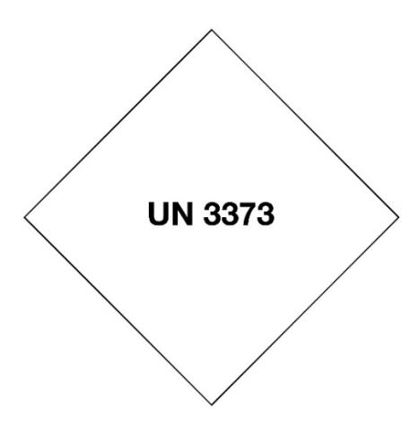

- 7 At least one surface of the outer packaging shall have a minimum dimension of 100 mm x 100 mm.
- 8 The completed package shall be capable of successfully passing the drop test as specified in the TI and DGR, except that the height of the drop shall not be less than 1.2 m. Following the appropriate drop sequence, there must be no leakage from the primary receptacle(s), which must remain protected by absorbent material, when required, in the secondary packaging.
- 9 For liquid substances:
- 9.1 The primary receptacle(s) shall be leak-proof and must not contain more than one litre of the liquid substance.
- 9.2 The secondary packaging shall be leak-proof.
- 9.3 If multiple fragile primary receptacles are placed in a single secondary packaging, they shall be either individually wrapped or separated to prevent contact between them.
- 9.4 Absorbent material shall be placed between the primary receptacle(s) and the secondary packaging. The absorbent material shall be in quantity sufficient to absorb the entire contents of the primary receptacle(s) so that any release of the liquid substances will not compromise the integrity of the cushioning material or of the outer packaging.

- 9.5 The primary receptacle or the secondary packaging shall be capable of withstanding, without leakage, an internal pressure of 95 kPa (0.95 bar).
- 9.6 The outer packaging must not contain more than four litres of the liquid substance. This quantity excludes ice or dry ice when used to keep specimens cold.
- 10 For solid substances:
- 10.1 The primary receptacle(s) shall be sift-proof and not exceed the outer packaging mass limit.
- 10.2 The secondary packaging shall be sift-proof.
- 10.3 If multiple fragile primary receptacles are placed in a single secondary packaging, they shall be either individually wrapped or separated to prevent contact between them.
- 10.4 Except for packages containing body parts, organs or whole bodies, the outer packaging must not contain more than four kilogrammes of the solid substances. This quantity excludes ice or dry ice when used to keep specimens cold.
- 10.5 If there is any doubt as to whether or not residual liquid may be present in the primary receptacle during transport, then a packaging suitable for liquids, including absorbent materials, must be used.
- 11 For refrigerated or frozen specimens (ice and dry ice):
- 11.1 When dry ice is used to keep specimens cold, all applicable requirements of the TI and DGR shall be met. When used, ice or dry ice shall be placed outside the secondary packaging or in the outside packaging or an overpack. Interior supports shall be provided to secure the secondary packaging in the original position after the ice or dry ice has dissipated. If ice is used, the outside packaging or overpack shall be leak-proof. If solid carbon dioxide (dry ice) is used, the packaging shall be designed and constructed to permit the release of carbon dioxide gas to prevent a build-up of pressure that could rupture the packaging.

- 11.2 The primary receptacle and the secondary packaging shall maintain their integrity at the temperature of the refrigerant used as well as the temperatures and pressures that could result if refrigeration were lost.
- 12 Where packages are placed in an overpack, the package markings required by ICAO packing instruction 650 shall either be clearly visible or be reproduced on the outside of the overpack and the overpack shall be marked with the word "Overpack".
- 13 Infectious substances assigned to UN 3373 which are packed and marked in accordance with ICAO packing instruction 650 are not subject to any other requirements under this article except for the following:
- 13.1 the name, address and telephone number of the shipper and of the consignee must be provided on each package;
- 13.2 the name and telephone number of a person responsible shall be provided in a written document (such as the CN 38 delivery bill) or on the package;
- 13.3 classification must be in accordance with the provisions of the TI and DGR;
- 13.4 the incident reporting requirements of the TI and DGR must be met; and
- 13.5 the inspection for damage or leakage requirements of the TI and DGR shall apply.
- 14 No shipper's declaration for dangerous goods shall be required.
- 15 Clear instructions on filling and closing such packages shall be provided by packaging manufacturers and subsequent distributors to the consignor or to the person who prepares the package (e.g. patient) to enable each single package to be correctly prepared for transport.
- 16 Other dangerous goods must not be packed in the same packaging as Division 6.2 infectious substances unless they are necessary for maintaining the viability, stabilizing or preventing degradation or neutralizing the hazards of the infectious substances. A quantity of 30 ml or less of dangerous goods included in Classes 3, 8 or 9 may be packed in each primary

receptacle containing infectious substances provided that these substances meet the requirements of the TI and DGR. When these small quantities of dangerous goods are packed with infectious substances in accordance with the TI no other requirements in this article need be met.

- 17 Solid carbon dioxide (dry ice) used as refrigerant
- 17.1 If dry ice is used as refrigerant, the packaging requirements of Packing Instruction 954 as set out in the current edition of the TI and DGR must be met. For information, the relevant text of Packing Instruction 954 is provided below. Senders should consult the most recent edition of the TI and DGR to verify the current text of Packing Instruction 954 prior to use.
- 17.2 The following information shall be provided in a written document (such as the CN 38 delivery bill) or on the package. The information shall be shown in the following order:
- 17.2.1 UN 1845;
- 17.2.2 proper shipping name (dry ice or carbon dioxide, solid);
- 17.2.3 the number of packages; and
- 17.2.4 the net weight of dry ice in each package.
- 17.3 The net weight of the dry ice must be marked on the outside of each package. When packages are placed in an overpack, the overpack must be marked on the outside with the total net quantity of dry ice in the overpack.
- 17.4 Receptacles containing infectious substances only and identified by special "UN 3373" labels shall be handed over by postal authorities to airlines in unsealed mail receptacles.

### *Commentary*

- *1 The text of art 19-005 reflects the appropriate packaging, acceptance and handling measures detailed in the 2007–2008 ICAO Technical Instructions and the 14th edition of the Model Regs published by the UN Sub-Committee of Experts on the Transport of Dangerous Goods[: unece.org/rev-14-2005.](https://unece.org/rev-14-2005)*
- *14 With regard to the information to be written on the outside wrapping of items containing infectious substances (name, address and telephone number of the competent authority to be notified in case of damage or leakage), the WHO in May 1981 sent the public health authorities of its member countries a circ recommending them to let the DOs of their countries have this information. For its part, the IB asked DOs which admit these items to contact the national public health and veterinary authorities of their countries with a view to coordinating the action to be taken in the event of an accident.*

Conditions of acceptance and marking of items containing radioactive materials

- 1 Items containing radioactive materials shall be admitted for conveyance by post subject to prior consent from the competent authorities of the country of origin, provided the activity for each exempted item does not exceed one tenth of that permitted in table 4 – Activity Limits for Excepted Packages as listed in the current edition of International Atomic Energy Agency SSR-6 and does not contain uranium hexafluoride.
- 2 The outside packaging of items containing radioactive materials shall be marked by the sender with the label shown below indicating the applicable UN-number. It shall also bear, in addition to the name and address of the sender, a request in bold letters for the return of the items in the event of non-delivery.

- 3 The sender shall give his name and address and the contents of the item on the inner wrapping.
- 4 The label shown above shall be clearly crossed out, should the empty package be returned to the place of origin.

*1 As understood here, the conveyance by post of radioactive materials is restricted to consignments exempted from special conveyance prescriptions, within the meaning of the IAEA Regs for the safe transport of radioactive materials, because of the very low activity of their contents.*

# Article 19-007

Conditions of acceptance of letter-post items and parcels containing lithium cells and batteries installed in equipment

- 1 Letter-post items and parcels containing lithium metal or lithium ion cells and batteries installed in equipment shall be packed according to Packing Instruction 967, Section II (lithium ion cells and batteries), or Packing Instruction 970, Section II (lithium metal cells and batteries), as applicable, of the current edition of the Technical Instructions for the Safe Transport of Dangerous Goods by Air (Technical Instructions) published by ICAO. Senders must consult the most recent edition of the ICAO Technical Instructions.
- 2 Cells and batteries installed in equipment that have been identified by the manufacturer as being defective for safety reasons, or that have been damaged, or that have the potential of producing a dangerous evolution of heat, fire or short circuit are forbidden for transport.

### *Commentary*

*1 and 2 As the EMS Standard Agreement contains no provisions on lithium cells and batteries, they will be accepted in EMS items under the same conditions, in accordance with art 37-001.* 

*1 In case of any accidents or incidents during the transport of such items, the IB recommends that DOs report the transport of such items to the IB, and to the appropriate authorities in the operator's country and in the country in which the accident or incident occurred, in accordance with the reporting system of those appropriate authorities.*

*According to Packing Instruction 967, Section II (lithium ion/polymer cells and batteries), or Packing Instruction 970, Section II (lithium metal/alloy cells and batteries), as applicable, of the current edition of the Technical Instructions for the Safe Transport of Dangerous Goods by Air (Technical Instructions), published by ICAO, no special marking requirements for lithium batteries shall apply on the outside packaging of items containing admissible lithium cells and batteries as described in the Regs.*

*2 This para also refers to such items returned to the manufacturer for safety reasons.*

Dangerous goods prohibited from insertion in letter-post items and parcels

- 1 The articles covered by the "Recommendations on the Transport of Dangerous Goods" drawn up by the United Nations, with the exception of certain dangerous goods provided for in the existing Regulations, and by the ICAO Technical Instructions and IATA DGR shall be considered as dangerous goods in accordance with the provisions of article 19.3.1 of the Convention and prohibited from insertion in letter-post items and parcels, when transported by international air conveyance.
- 2 Each designated operator shall establish procedures and training programmes with a view to controlling the introduction of undeclared or inadmissible dangerous goods into its postal services, in compliance with national and international rules and regulations.

Article 19-009 Exceptions to prohibitions in parcels

- 1 The prohibition relating to narcotics and psychotropic substances shall not apply to consignments sent for a medical or scientific purpose to countries which admit them on this condition.
- 2 If the national regulations of the member countries concerned so permit, parcels may also contain any document exchanged between the sender and the addressee of the parcel or persons residing with them.
- 3 Article 19.6.1.3 of the Convention shall not apply when the exchange of parcels between two member countries admitting insured parcels can only be made in transit through the intermediary of a member country which does not admit them.

### *Commentary*

- *2* Docs admitted under Conv art 19.5.1.1 include:
- *–* one of the following docs, unclosed, reduced to its essential elements and relating solely to the goods being conveyed: invoice, dispatch note or advice, delivery bill;
- *–* disks and tapes whether bearing a sound or video recording or not, ADP cards, magnetic tape or other similar media and QSL cards, when the DO of origin considers that they do not have the character of current and personal correspondence and when they are exchanged between the sender and the addressee of the parcel or persons residing with them;

- *–* correspondence and docs of any kind having the character of current and personal correspondence, other than the foregoing, exchanged between the sender and the addressee of the parcel or persons residing with them;
- *–* archived correspondence and documents.

(**N.B. –** QSL cards are preprinted cards used by radio amateurs to communicate the result of their observations by completing them with coded manuscript information.)

# Article 19-101

# Treatment of items wrongly admitted

- 1 Items that have been wrongly admitted and that do not differ fundamentally from the conditions of article 17 of the Convention as regards classification and weight and those of the present Regulations regarding contents, size, make-up and marking shall nevertheless be delivered to the addressees without surcharge. Items wrongly admitted containing infectious substances or radioactive materials and not complying with the provisions of articles 19-003, 19-005 and 19-006 may also be delivered to the addressees if the provisions applicable in the country of destination allow this. If delivery is inappropriate or impossible, items wrongly admitted shall be returned to the designated operator of origin.
- 2 Items containing articles mentioned in articles 19.2, 19.3.1 and 19.3.2 of the Convention and wrongly admitted shall be dealt with according to the legislation of the country of the designated operator of origin, transit or destination establishing their presence.
- 3 The designated operator of destination may deliver to the addressee the part of the contents which is not subject to prohibition; the designated operator of transit may forward it to the designated operator of destination.
- 4 The designated operator of destination shall be authorized to deliver to the addressee, under the conditions prescribed by its regulations, an uninsured item originating in a country which admits insurance and containing articles listed in article 19.6.1 of the Convention. If delivery is not permitted, the item shall be returned to sender.
- 5 When an item or part of its contents wrongly admitted to the post is neither returned to sender nor delivered to the addressee, the designated operator of origin shall be notified without delay how it has been dealt with.

This notification shall clearly indicate the prohibition under which the item falls and the articles which gave rise to seizure. A wrongly admitted item which is returned to origin shall be accompanied by a similar notification.

- 6 In the event of the seizure of a wrongly admitted item, the designated operator of transit or destination shall notify the designated operator of origin through the dispatch of a CN 13 report or, if agreed bilaterally, by using the appropriate standard UPU EDI item-level message (EME tracking event and corresponding retention code).
- 7 Moreover, the right of every member country shall be reserved to deny conveyance in transit à découvert over its territory to letter-post items, other than letters, postcards and items for the blind, which do not satisfy the legal requirements governing the conditions of their publication or circulation in that country. Such items shall be returned to the designated operator of origin.
- 8 Letter-post items containing items whose early deterioration or decay is to be feared
- 8.1 Articles contained in a letter-post item whose early deterioration or decay is to be feared, and those articles only, may be sold immediately, without prior notice. The sale shall be on behalf of the rightful owner even in course of transmission on either the outward or the return journey. If sale is impossible, the spoilt or decayed articles shall be destroyed.
- 8.2 When a letter-post item has been sold or destroyed in accordance with 8.1, a formal report of the sale or destruction shall be drawn up. A copy of the report accompanied by a CN 43 verification note shall be sent to the office of origin.
- 8.3 The proceeds of the sale shall serve in the first instance to defray the charges on the letter-post item. The balance, if any, shall be sent to the office of origin to be handed to the sender. The latter shall bear the costs of forwarding it.
- 9 Designated operators shall implement procedures to provide for situations where postal items face events which prevent the continuation of conveyance, such as when wrongly admitted items are discovered at an intermediate location.

- 9.1 In cases of closed dispatch transit, the designated operator (of transit) shall provide an incident report giving as many details as possible to the designated operator (of origin) when a postal item is retained in transit. The report shall be issued within one working day (24 hours) following the discovery of the incident.
- 9.2 In cases of direct transhipment, the agreement between the designated operator (of origin) and the carrier should dictate how the retained postal item should be handled. However, in cases where the carrier is unable to resolve the issue through contacts with the designated operator (of origin) within seven days from the receipt of the report, the carrier may request assistance to resolve the incident from the designated operator at the intermediate location.
- 9.2.1 Designated operators shall incorporate language in their agreements with carriers to account for events which prevent the continuation of conveyance, such as when wrongly admitted items are discovered at an intermediate location. Such contractual language shall request the carrier to notify incidents and to request instructions for the resolution of the incident within one working day (24 hours) following the discovery of the incident.
- 9.3 Upon notification of a retained item, the designated operator (of origin) shall provide specific instructions for resolving the incident. An initial response shall be made within one working day (24 hours) following receipt of the report. The initial response from the designated operator of origin may not necessarily resolve the reported event, but rather serve as an acknowledgement that it has been reported and that further investigation is under way. Updated reports shall be provided by the designated operator of origin every 72 hours until resolution of the event. These guidelines for the timeframe are based in terms of normal business days and take account of holidays, time zone differences and weekends.

*5 Form CN 13 may be used to inform the DO of origin.*

|                                          |                                             | Dato                     |                   | 1010101100      |            |  |
|------------------------------------------|---------------------------------------------|--------------------------|-------------------|-----------------|------------|--|
|                                          |                                             | To the designated opera  | ator of           |                 |            |  |
| Notes                                    |                                             | to the designated opera  | nor or            |                 |            |  |
| One form is sufficient for several items |                                             |                          |                   |                 |            |  |
| posted at the same time b                |                                             |                          |                   |                 |            |  |
| sender to the same address               |                                             |                          |                   |                 |            |  |
|                                          | Nature of item                              |                          |                   |                 |            |  |
|                                          | Priority Non-priority                       |                          | Parcel            | Ordinary        | Registered |  |
|                                          |                                             |                          | alcel _           | _ Ordinary      | negistered |  |
| Desembles                                | Printed                                     | Small                    | Law and A         |                 |            |  |
| Description of seized item               | Letter paper                                | packet Ir Weight of item | nsured            |                 |            |  |
| or seized item                           | No. of item                                 | Weight of Item           |                   |                 |            |  |
|                                          |                                             |                          |                   |                 |            |  |
|                                          | Information concerning forwarding           |                          | _                 | 7               |            |  |
|                                          | Airmail                                     | S.A.L.                   |                   | Surface         |            |  |
|                                          | Office of origin                            |                          | ID                | Date of posting |            |  |
|                                          |                                             |                          |                   |                 |            |  |
| Posting of item                          | Dispatching office of exchange              |                          | ID                | Date            |            |  |
| r octing of item                         |                                             |                          |                   |                 |            |  |
|                                          | Destination office of exchange              |                          | LM                | √ail No.        |            |  |
|                                          |                                             |                          |                   |                 |            |  |
|                                          | Name and full address                       |                          |                   |                 |            |  |
| 0                                        |                                             |                          |                   |                 |            |  |
| Sender                                   |                                             |                          |                   |                 |            |  |
|                                          |                                             |                          |                   |                 |            |  |
|                                          | Name and full address                       |                          |                   |                 |            |  |
|                                          |                                             |                          |                   |                 |            |  |
| Addressee                                |                                             |                          |                   |                 |            |  |
|                                          |                                             |                          |                   |                 |            |  |
|                                          |                                             |                          |                   |                 |            |  |
|                                          | Reason for seizure                          |                          |                   |                 |            |  |
|                                          |                                             | Ulalataa leesa ast va    | ar dations        |                 |            |  |
|                                          | Dangerous goods Violates import regulations |                          |                   |                 |            |  |
|                                          | h., .,                                      |                          |                   |                 |            |  |
|                                          | Narcotics                                   | Violates public/mo       | oral/religious p  | precepts        |            |  |
|                                          | L,                                          |                          |                   |                 |            |  |
|                                          | Counterfeit or pirated articles             |                          |                   |                 |            |  |
|                                          | Applicable regulation                       |                          | LA                | Article         |            |  |
| Information                              | UPU Convention                              |                          |                   |                 |            |  |
| about the seizure                        |                                             |                          |                   |                 |            |  |
|                                          | National legislation (specify)              |                          |                   |                 |            |  |
|                                          | Consequently, we have seized                |                          |                   |                 |            |  |
|                                          | the entire contents of the item             | 1                        |                   |                 |            |  |
|                                          |                                             |                          |                   |                 |            |  |
|                                          | the part of the item specified to           | below which violates co  | urrent regulati   | ions:           |            |  |
|                                          |                                             |                          |                   |                 |            |  |
|                                          |                                             |                          |                   |                 |            |  |
| L                                        | 1                                           |                          |                   |                 |            |  |
|                                          | Customs official                            | Hear                     | d of office at v  | which seizure t | rook place |  |
| In witness whereof we                    | Place and signature                         | Place                    | e and signature   | WI IICH SCIZOTO | .ook piaco |  |
| have prepared this report                | -                                           |                          | -                 |                 |            |  |
| in duplicate in order that               |                                             |                          |                   |                 |            |  |
| effect may be given to it                |                                             |                          |                   |                 |            |  |
| in accordance with the                   |                                             |                          |                   |                 |            |  |
| Convention                               |                                             |                          |                   |                 |            |  |
| L                                        |                                             |                          |                   |                 |            |  |
|                                          |                                             |                          |                   |                 |            |  |
| Comments, if any                         |                                             |                          |                   |                 |            |  |
|                                          |                                             |                          |                   |                 |            |  |
| Pasaniad for the office                  | Signature of the sender or of his attor     | rney Offic               | ce of origin of t | the item        |            |  |
| Reserved for the office                  | (if applicable)                             | Date                     | and signature     |                 |            |  |
| of origin of the item                    |                                             |                          |                   |                 |            |  |
|                                          |                                             |                          |                   |                 |            |  |

# Prot. Article R XXV Treatment of items wrongly admitted

- 1 Afghanistan, Angola, Djibouti and Pakistan shall not be obliged to comply with the provisions laid down in article 19-101.5, according to which "This notification shall clearly indicate the prohibition under which the item falls and the articles which gave rise to its seizure."
- 2 Afghanistan, Angola, Argentina, Australia, Azerbaijan, Canada, Dem. People's Rep. of Korea, Djibouti, Estonia, Kazakhstan, Kyrgyzstan, Nepal, Sudan, Tajikistan, Turkmenistan, Ukraine, Uzbekistan and Viet Nam reserve the right to provide the information about the reasons for the seizure of a postal item only within the limits of the information provided by the customs authorities and in accordance with internal legislation.
- 3 The United States of America reserves the right to treat as wrongly admitted, and to deal with according to its domestic legislation and customs practice, any item containing controlled substances, as defined in section 1308 of Title 21 of the U.S. Code of Federal Regulations.
- 4 France shall apply the provisions of article 19-101.7 only to items for the blind, without prejudice to its national regulations.

# Article 19-102 Redirection

- 1 If an addressee changes his address, items shall be reforwarded to him forthwith, subject to the conditions laid down below.
- 2 Items shall not however be redirected:
- 2.1 if the sender has forbidden redirection by means of a note in a language known in the country of destination;
- 2.2 if they bear in addition to the addressee's address the expression "or occupant".
- 3 Designated operators which collect a charge for requests for redirection in their domestic services shall be authorized to collect this same charge in the international service.

- 4 Apart from the exceptions provided for below, no additional charge shall be collected for letter-post items redirected from country to country. However, designated operators which collect a charge for redirection of items in their domestic service shall be authorized to collect this same charge on the international letter-post items redirected within their own countries.
- 5 Redirection procedures
- 5.1 Items addressed to addressees who have changed their address shall be considered as addressed direct from the place of origin to the place of new destination.
- 5.2 Any insured item the addressee of which has left for another country may be redirected if that country operates the service in its relations with the country of the first destination. If it does not, the item shall be sent back forthwith to the designated operator of origin for return to the sender.
- 5.3 Redirection from one country to another shall be effected only if the items satisfy the conditions for the onward conveyance. This shall also apply to items originally for an address within a country.
- 5.4 On redirection, the reforwarding office shall apply its date-stamp to the front of items in the form of cards and on the back of all other categories of items.
- 5.5 Unregistered or registered items returned to senders for completion or correction of the address shall not be considered as redirected items on reposting. They shall be treated as new correspondence, liable to a new charge.
- 5.6 Each designated operator may lay down a redirection period in accordance with that in force in its domestic service.
- 6 Forwarding
- 6.1 Priority items and airmail items shall be redirected to their new destination by the quickest route (air or surface).

- 6.2 Other items shall be redirected by the means of transport normally used for non-priority or surface items (including S.A.L.). They may be reforwarded by priority or air at the express request of the addressee if the latter undertakes to pay the difference in postage for the new priority transmission or for the new air route. In this case, the difference in postage shall be collected, in principle, at the time of delivery of the item and retained by the delivering designated operator. All items may also be reforwarded by the quickest route if the difference in postage is paid at the redirecting office by a third person. Redirection of such items by the quickest route within the country of destination shall be governed by the national regulations of that country.
- 6.3 Designated operators which apply combined charges may fix special fees, which must not exceed the combined charges, for the redirection by air or by priority means under the conditions laid down under 6.2.

# 7 Charges

- 7.1 Items unpaid or underpaid for their first transmission shall be subject to the charge which would have been applied to them if they had been addressed direct from the point of origin to the place of the new destination.
- 7.2 Items properly prepaid for their first transmission, but on which the additional charge for the further transmission has not been paid before their redirection, shall be subject to a charge representing the difference between the postage already paid and that which would have been charged if the items had been dispatched originally to their new destination. To this charge shall be added the handling charge for unpaid or underpaid items. If reforwarded by air or by priority means, the items shall in addition be subject, for their further transmission, to the surcharge, combined charge or special fee according to 6.2 and 6.3.
- 7.3 Items having originally circulated free of postal charges within a country shall be subject to the postage charge which would have been payable if these items had been addressed direct from the place of origin to the place of the new destination. To this charge shall be added the handling charge for unpaid or underpaid items.

- 7.4 In the event of redirection to another country, the following charges shall be cancelled:
- 7.4.1 the poste restante charge;
- 7.4.2 the presentation-to-Customs charge;
- 7.4.3 the storage charge;
- 7.4.4 the commission charge;
- 7.4.5 the additional tracked charge;
- 7.4.6 the charge for delivery of small packets to the addressee.
- 7.5 The customs duty and other fees of which it has not been possible to secure cancellation on redirection or on return to origin shall be collected COD from the designated operator of the new destination. In that case, the designated operator of the original destination shall attach to the item an explanatory note and an MP 1bis form or equivalent form agreed among designated operators. If there is no cashon-delivery service between the designated operators concerned, the charges in question shall be recovered by correspondence.
- 7.6 Redirected letter-post items shall be delivered to the addressees on payment of the charges incurred on departure, on arrival, or in course of transmission due to redirection after the first transmission. The customs duty or other special charges which the reforwarding country does not cancel shall also be paid by the addressees.
- 8 Collective redirection
- 8.1 Unregistered items to be redirected to the same person at a new address may be enclosed in CN 14 collective envelopes supplied by designated operators. Only the name and the new address of the addressee shall be written on these envelopes.
- 8.2 When the number of items to be collectively reforwarded justifies it, a receptacle may be used. In this case the details required shall be entered on a special label provided by the designated operator and printed, generally, on the pattern of the CN 14 envelope.
- 8.3 Items to be submitted to customs control shall not be enclosed in these envelopes or receptacles. Items of which the shape, volume and weight may cause tearing shall also be excluded.

- 8.4 The CN 14 collective envelopes and receptacles used for collective redirection of correspondence shall be forwarded to the new destination by the route prescribed for individual items.
- 8.5 The envelope or receptacle shall be presented open at the redirecting office. That office shall collect, if necessary, the additional charges to which the redirected items may be subject. When the additional charge has not been paid the charge to be collected on arrival shall be marked on the items. After checking it, the forwarding office shall close the envelope or receptacle. It shall apply to the envelope or receptacle label, where necessary, the T stamp indicating that charges are to be collected for all or some of the redirected items.
- 8.6 On arrival at its destination, the envelope or receptacle may be opened and its contents checked by the delivering office which shall collect, where necessary, the unpaid additional charges. The handling charge on unpaid or underpaid items shall be collected only once for all items inserted in the envelopes or receptacles.
- 8.7 Unregistered items addressed either to sailors and passengers aboard the same ship, or to persons travelling as a party, may also be treated as provided for under 8.1 to 8.6. In that case, the envelopes or receptacle labels shall bear the address of the ship or of the shipping or travel agency, etc., to which the envelopes or receptacles shall be delivered.

- *5.3 Addressees wishing to receive abroad domestic service items which are not admitted in the international LP service can ensure, by taking the appropriate measures (designation of authorized persons), that these items meet the requirements of the international LP service.*
- *6.2 A third party (e.g. an hotel) may request, on behalf of the sender or the addressee, the redirection of priority items or airmail items by priority or air against payment of air surcharges or combined charges. As a result of the systematic redirection of all priority items and airmail items by air, surcharges and combined charges for the further transmission are collected on non-priority and surface items only.*

# Prot. Article R XXVI Redirection

The provisions in article 19-102.2 shall not apply to the designated operators of Denmark, Finland and Sweden, whose equipment during the sorting process automatically redirects mail to an addressee that has changed address.

| COLLECTIVE ENVELOPE Redirection of letter-post items  Notes This envelope may be opened by the office of oddycry I must not contain any item to be submilled to customs control or which is likely to customs control or which is likely to customs.  If there are red around to return to the submilled to customs control or which is likely to custom to the submilled to customs control or which is likely to custom to the submilled to customs control or which is likely to custom to the submilled to customs control or which is likely to custom to customs.  Control or which is submilled to customs appropriate.                                                                                                                                                                                                                                                                                                                                                                                                                                                                                                                                                                                                                                                                                                                                                                                                                                                                                                                                                                                                                                                                                                                                                                                                                                                                                                                                                                                                                                                                                                 |  |
|--------------------------------------------------------------------------------------------------------------------------------------------------------------------------------------------------------------------------------------------------------------------------------------------------------------------------------------------------------------------------------------------------------------------------------------------------------------------------------------------------------------------------------------------------------------------------------------------------------------------------------------------------------------------------------------------------------------------------------------------------------------------------------------------------------------------------------------------------------------------------------------------------------------------------------------------------------------------------------------------------------------------------------------------------------------------------------------------------------------------------------------------------------------------------------------------------------------------------------------------------------------------------------------------------------------------------------------------------------------------------------------------------------------------------------------------------------------------------------------------------------------------------------------------------------------------------------------------------------------------------------------------------------------------------------------------------------------------------------------------------------------------------------------------------------------------------------------------------------------------------------------------------------------------------------------------------------------------------------------------------------------------------------------------------------------------------------------------------------------------------------|--|
| This envelope may be opened by the office of obligation of sections of sections of obligation of sections of the obligation of the obligation of the obligation of the obligation of the obligation of the obligation of the obligation of the obligation of the obligation of the obligation of the obligation of the obligation of the obligation of the obligation of the obligation of the obligation of the obligation of the obligation of the obligation of the obligation of the obligation of the obligation of the obligation of the obligation of the obligation of the obligation of the obligation of the obligation of the obligation of the obligation of the obligation of the obligation of the obligation of the obligation of the obligation of the obligation of the obligation of the obligation of the obligation of the obligation of the obligation of the obligation of the obligation of the obligation of the obligation of the obligation of the obligation of the obligation of the obligation of the obligation of the obligation of the obligation of the obligation of the obligation of the obligation of the obligation of the obligation of the obligation of the obligation of the obligation of the obligation of the obligation of the obligation of the obligation of the obligation of the obligation of the obligation of the obligation of the obligation of the obligation of the obligation of the obligation of the obligation of the obligation of the obligation of the obligation of the obligation of the obligation of the obligation of the obligation of the obligation of the obligation of the obligation of the obligation of the obligation of the obligation of the obligation of the obligation of the obligation of the obligation of the obligation of the obligation of the obligation of the obligation of the obligation of the obligation of the obligation of the obligation of the obligation of the obligation of the obligation of the obligation of the obligation of the obligation of the obligation of the obligation of the obligation of the obligat |  |
| If there are changes to be collected, mark with Care or where appropriate;                                                                                                                                                                                                                                                                                                                                                                                                                                                                                                                                                                                                                                                                                                                                                                                                                                                                                                                                                                                                                                                                                                                                                                                                                                                                                                                                                                                                                                                                                                                                                                                                                                                                                                                                                                                                                                                                                                                                                                                                                                                     |  |
| There are charges to be callected, mark with a 1" damp in the middle of the upon part of the collective envelope.  If the first are for sallors or passengers aboard the earn of his or propore travelling as a party, the collective envelope.  Stock and No. It is considered to the control of the collective envelope that the collective envelope that the collective envelope that the collective envelope that the collective envelope that the collective envelope that the collective envelope that the collective envelope that the collective envelope that the collective envelope that the collective envelope that the collective envelope that the collective envelope that the collective envelope that the collective envelope that the collective envelope that the collective envelope that the collective envelope that the collective envelope that the collective envelope that the collective envelope that the collective envelope that the collective envelope that the collective envelope that the collective envelope that the collective envelope that the collective envelope that the collective envelope that the collective envelope that the collective envelope that the collective envelope that the collective envelope that the collective envelope that the collective envelope that the collective envelope that the collective envelope that the collective envelope that the collective envelope that the collective envelope that the collective envelope that the collective envelope that the collective envelope that the collective envelope that the collective envelope that the collective envelope that the collective envelope that the collective envelope that the collective envelope that the collective envelope that the collective envelope that the collective envelope that the collective envelope that the collective envelope that the collective envelope that the collective envelope that the collective envelope that the collective envelope that the collective envelope that the collective envelope that the collective envelope that the collective e |  |
| of the ship or the agency to which the fitnins<br>are to be delivered Localty or office of destination                                                                                                                                                                                                                                                                                                                                                                                                                                                                                                                                                                                                                                                                                                                                                                                                                                                                                                                                                                                                                                                                                                                                                                                                                                                                                                                                                                                                                                                                                                                                                                                                                                                                                                                                                                                                                                                                                                                                                                                                                         |  |
| Country of scatnation                                                                                                                                                                                                                                                                                                                                                                                                                                                                                                                                                                                                                                                                                                                                                                                                                                                                                                                                                                                                                                                                                                                                                                                                                                                                                                                                                                                                                                                                                                                                                                                                                                                                                                                                                                                                                                                                                                                                                                                                                                                                                                          |  |

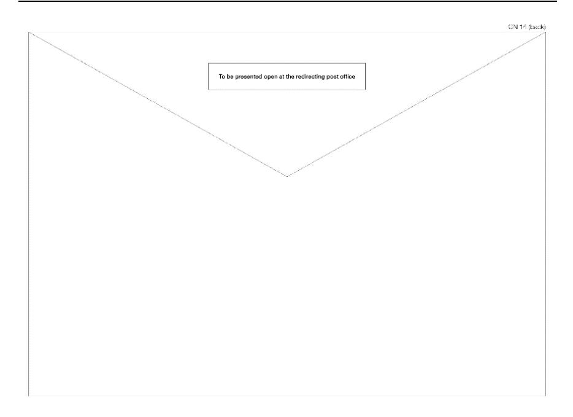

Undeliverable items. Return to country of origin or to sender and period of retention

- 1 Designated operators shall return items which it has not proved possible to deliver to the addressees for whatever reason.
- 2 The period of retention of items is laid down in the paragraphs below.
- 3 Designated operators which collect a charge for return of items in their national service shall be authorized to collect this same charge on the international mail returned to them.
- 4 The designated operator returning undeliverable items shall be authorized to collect remuneration as specified in article 31-122.

- 5 Notwithstanding the provisions under 3, when a designated operator receives, for return to the sender, items posted abroad by customers residing in its territory, it shall be authorized to collect from the sender or senders a handling charge per item not to exceed the postage charge that would have been collected had the item been posted in the designated operator in question.
- 5.1 For the purposes of the provisions under 5, the sender or senders shall be understood as being the persons or entities whose name appears in the return address or addresses.
- 6 General provisions
- 6.1 Subject to the legal provisions of the country of destination, undeliverable items shall be returned to the designated operator of origin whose payment indicia appear on the item.
- 6.2 Items refused by the addressee or whose delivery is obviously impossible shall be returned forthwith.
- 6.3 Other undeliverable items shall be retained by the designated operator of destination for a period laid down by its regulations. However, the retention period may not exceed one month except in special cases where the designated operator of destination considers it necessary to extend it to two months at most. Return to the country of origin shall be effected within a shorter period if the sender has requested this by means of a note on the address side in a language known in the country of destination.

# 7 Special procedures

- 7.1 Undeliverable items of the national service shall be redirected abroad for return to the sender only if they satisfy the conditions for the onward conveyance. The same shall apply to international correspondence when the sender has moved to another country.
- 7.2 Postcards which do not bear the address of the sender shall not be returned. However, registered postcards shall always be returned.

- 7.3 The return to origin of undeliverable printed papers shall not be compulsory, unless the sender has asked for their return by means of a note on the item in a language known in the country of destination. However, designated operators shall endeavour to make such return to sender, or inform him appropriately, when repeated attempts at delivery or bulk items are involved. Registered printed papers and books shall always be returned.
- 7.4 The following shall be treated as undeliverable items, items for third persons:
- 7.4.1 addressed care of diplomatic or consular services and returned by them to the post office as unclaimed;
- 7.4.2 addressed to hotels, lodgings or agencies of airlines or shipping companies and returned to the post office because they cannot be delivered to the addressees.
- 7.5 In no case shall the items mentioned in 7.4 be considered as new items subject to payment of postage.
- 8 Forwarding
- 8.1 When the designated operator of the country returning the item no longer uses surface conveyance, it shall return undeliverable items by the most appropriate means in use.
- 8.2 Priority items, airmail letters and airmail postcards to be returned to origin shall be returned by the quickest route (air or surface).
- 8.3 Undeliverable airmail items other than airmail letters and airmail postcards shall be returned to origin by the means of transport normally used for non-priority or surface items (including S.A.L.), except:
- 8.3.1 in the event of interruption of those means of transport; or
- 8.3.2 if the designated operator of destination has systematically chosen the air route for returning such items.
- 8.4 For the return of items to origin by priority or air means at the request of the sender, article 19-103.6.2 and 3 shall apply by analogy.

- 9 Treatment of items
- 9.1 Before returning to the designated operator of origin items which for any reason have not been delivered, the office of destination shall show, in French, the reason for non-delivery. The reason shall be given, clearly and concisely, if possible on the front of the item, in the following form: "inconnu" (unknown), "refusé" (refused), "déménagé" (moved), "non réclamé" (unclaimed), "adresse insuffisante/ inexistante" (insufficient/non-existent address), "refusé par la douane" (refused by Customs), etc. As regards postcards and printed papers in the form of cards, the reason for non-delivery shall be shown on the right-hand half of the front.
- 9.2 This information shall be shown by the application of a stamp or affixing of a CN 15 label, to be completed as appropriate. Each designated operator may add the translation, in its own language, of the reason for non-delivery and other appropriate particulars. In the service with designated operators which have so agreed the indications may be made in a single agreed language. Manuscript notes regarding the non-delivery made by officials or by post offices may also be regarded as sufficient in that case.

| RETURN                                   | CN 15                        |
|------------------------------------------|------------------------------|
| Unknown                                  | Refused                      |
| Moved Insufficient/ Non-existent address | Unclaimed Refused by Customs |
|                                          |                              |
| Return date:                             |                              |

9.3 The office of destination shall strike out the address particulars with which it is concerned while leaving them legible and write "Retour" (Return) on the front of the item beside the name of the office of origin. It shall also apply its date-stamp on the back of priority items in envelopes and of letters and on the front of postcards.

- 9.4 Undeliverable items shall be returned to the office of exchange of the country of origin, either individually or in a special bundle labelled "Envois non distribuables" (Undeliverable items), as if they were items addressed to that country. Undeliverable ordinary items which bear adequate return details shall be returned direct to the sender.
- 9.5 Insured items which have not been delivered shall be sent back as soon as possible, and at the latest within the period fixed in 6.3. These items shall be entered on the CN 16 special list and included in the packet, envelope or receptacle labelled "Valeurs déclarées" (Insured items).
- 9.6 Undeliverable items returned to the country of origin shall be treated in accordance with article 19-103.7.

*8.2 The quickest route means mail category A if transport is by air and category D if transport is by surface.*

*8.2 and 8.3 The Washington Congress recommended that DOs which do not already systematically use the air route for the return to origin of AO airmail items use that route to the greatest possible extent in accordance with their economic circumstances (recommendation C 35/1989).*

# Article 19-104

Treatment of requests for withdrawal of items from the post or for alteration or correction of address

- 1 The sender of a letter-post item may have it withdrawn from the post, or have its address altered or corrected under the conditions laid down below.
- 2 If its legislation permits, each designated operator shall be bound to accept requests for withdrawal from the post or alteration or correction of the address in respect of any letter-post item posted in the service of another designated operator.

- 3 Preparation of request
- 3.1 Every request for withdrawal of items from the post or for alteration or correction of address shall entail completion by the sender of a CN 17 form. One form may be used for several items posted at the same time at the same office by the same sender to the same addressee.
- 3.2 In handing in the request at the post office the sender shall prove his identity and produce the certificate of posting, if any. The designated operator of the country of origin shall assume responsibility for the proof of identity.
- 3.3 A request for simple correction of address (without alteration of the name or status of the addressee) may be made direct to the office of destination by the sender. The charge prescribed in 4 shall not be collected in such a case.
- 3.4 Through notification of the International Bureau, any designated operator may make provision for CN 17 requests concerning it to be exchanged through its central administration or through a specially appointed office. This notification shall include the name of this office.
- 3.5 Designated operators which exercise the option provided for under 3.4 shall bear any charges which may result from the transmission in their national service by post or by telecommunication of the communications to be exchanged with the office of destination. Recourse to telecommunication or other similar service shall be compulsory when the sender has himself used such means and the office of destination cannot be advised in time by post.
- 3.6 If the item is still in the country of origin, the request shall be dealt with according to the legislation of that country.
- 4 Charges
- 4.1 The sender shall pay, for each request, a special charge the guideline amount of which shall be 1.31 SDR.
- 4.2 The request shall be forwarded by post or by telecommunication at the sender's expense. The forwarding conditions and the provisions relating to the use of telecommunications are set out in 6 below.

- 4.3 The charges prescribed under 4.1 and 4.2 shall be levied only once for each request for withdrawal from the post or alteration or correction of address involving several items posted at the same time, at the same office, by the same sender to the same addressee.
- 5 Transmission of request by post
- 5.1 If the request is to be sent by post, the CN 17 form, accompanied if possible by a perfect facsimile of the envelope or of the address of the item, shall be sent direct to the office of destination under registered cover by the quickest route (air or surface).
- 5.2 If requests are exchanged through the central administrations, a copy of the request may, in an emergency, be sent direct by the office of origin to the office of destination. Requests sent direct shall be acted on. The items concerned shall be withheld from delivery until the arrival of the request from the central administration.
- 5.3 On receipt of the CN 17 form, the office of destination shall search for the item in question and take the necessary action.
- 5.4 The action taken by the office of destination on every request for withdrawal from the post or alteration or correction of address shall be communicated immediately to the office of origin by the quickest route (air or surface), using a copy of the CN 17 form with the "Reply of the office of destination" part duly completed. The office of origin shall inform the applicant. The same shall apply in the following circumstances:
- 5.4.1 fruitless searches;
- 5.4.2 items already delivered to the addressee;
- 5.4.3 item confiscated, destroyed or seized.
- 5.5 A non-priority or surface item shall be returned to origin by priority or by air following a request for withdrawal from the post when the sender undertakes to pay the corresponding difference in postage. When an item is redirected by priority or by air following a request for alteration or correction of address, the difference in postage corresponding to the new route shall be collected from the addressee and retained by the delivering designated operator.

- 6 Transmission of request by telecommunications
- 6.1 If the request is to be made by telecommunications, the CN 17 form shall be handed over to the corresponding service for transmission of the details to the post office of destination. The sender shall pay the corresponding charge for that service.
- 6.2 On receipt of the message received by telecommunications, the office of destination shall search for the item in question and take the necessary action.
- 6.3 Any request for alteration or correction of address concerning an insured item made by telecommunications shall be confirmed by post, by the first mail, as prescribed under 5.1. The CN 17 form shall then bear at the head, in bold letters, the note "Confirmation de la demande transmise par voie des télécommunications du ..." (Confirmation of request made by telecommunications dated ...); pending such confirmation, the office of destination shall merely retain the item. However, the designated operator of destination may, on its own responsibility, act on the request made by telecommunications without waiting for confirmation by post.
- 6.4 If the sender of a request sent by telecommunications has asked to be notified by similar means, the reply shall be sent by this means to the office of origin. It shall inform the applicant as quickly as possible. The same shall apply if a request by telecommunications is not sufficiently explicit to identify the item with certainty.

*3.4 The information supplied on this subject is published in the LP Compendium.*

*5.1 A request by post is sent registered to the office of destination. The registration charge is included in the special charge; it must not be deducted when telecommunication is used.*

| Designate                                                        | ed operato                      | r of origin                                                         | REQUEST                                                                                     | CN 17                |  |  |  |
|------------------------------------------------------------------|---------------------------------|---------------------------------------------------------------------|---------------------------------------------------------------------------------------------|----------------------|--|--|--|
| Notes<br>To be s                                                 |                                 | registered post                                                     | For with- drawal from or correction or alteration or alteration of doddress of the COD amou |                      |  |  |  |
|                                                                  |                                 |                                                                     |                                                                                             |                      |  |  |  |
| Our fax N                                                        | lo.                             |                                                                     | Fax No.                                                                                     |                      |  |  |  |
|                                                                  |                                 | Nature of item                                                      | No. of item                                                                                 | Date of dispatch     |  |  |  |
|                                                                  |                                 | Office of origin  Description (form, colour of the item, etc.)      |                                                                                             | Facsimile attached   |  |  |  |
|                                                                  |                                 | Sender (name and full address)                                      |                                                                                             |                      |  |  |  |
| Descrip                                                          |                                 | Sender (name and run address)                                       |                                                                                             |                      |  |  |  |
|                                                                  |                                 | Addressee (name and full address)                                   |                                                                                             |                      |  |  |  |
|                                                                  |                                 | Original COD amount in figures (where applicab                      | ole)                                                                                        |                      |  |  |  |
| Withdr                                                           | awal<br>ne post                 | Please return the item                                              | □S.A.L.                                                                                     | non-priority/surface |  |  |  |
| Alterati                                                         |                                 | Please redirect the item priority/air                               | S.A.L.                                                                                      | non-priority/surface |  |  |  |
| or corr                                                          | ection                          | New address or requested alteration                                 |                                                                                             |                      |  |  |  |
|                                                                  | llation/<br>ion of th<br>imount | Please cancel the COD amount  New COD amount (in words and figures) | Please aiter the COD amour                                                                  | nt                   |  |  |  |
| Signature                                                        | •                               |                                                                     |                                                                                             |                      |  |  |  |
|                                                                  |                                 |                                                                     |                                                                                             |                      |  |  |  |
| Partic                                                           | ulars to                        | be supplied by the office of exchan                                 | ige                                                                                         |                      |  |  |  |
| stered                                                           |                                 | Priority/air<br>No.                                                 | S.A.L.<br>Date                                                                              | Non-priority/surface |  |  |  |
| nd reg                                                           |                                 | Dispatching office of exchange                                      |                                                                                             |                      |  |  |  |
| rcels a                                                          | Mail in which                   | Office of exchange of destination                                   |                                                                                             |                      |  |  |  |
| for par                                                          | the item<br>was<br>sent         | No. of the bill/list                                                | Letter bill (CN 31 or CN 32)                                                                | Special list (CN 33) |  |  |  |
| pplied<br>red iter                                               | abroad                          | Serial No.                                                          | Special list (CN 16)                                                                        |                      |  |  |  |
| To be supplied for parcels and registered and insured items only |                                 | Bulk advice                                                         | Date and signature                                                                          |                      |  |  |  |
| - "                                                              |                                 |                                                                     |                                                                                             |                      |  |  |  |

# Convention Manual

| Reply of the office of destination                                            |                                                                     | CN 17 (back)        |
|-------------------------------------------------------------------------------|---------------------------------------------------------------------|---------------------|
| The item in question has already been delivered to the addressee              | The request was not explicit enough; please send additional details |                     |
| The item in question has been seized under the country's internal legislation | The search was unsuccessful                                         |                     |
| Additional information                                                        |                                                                     |                     |
|                                                                               |                                                                     |                     |
|                                                                               |                                                                     |                     |
|                                                                               |                                                                     |                     |
|                                                                               |                                                                     |                     |
|                                                                               |                                                                     |                     |
| Place, date and signature                                                     |                                                                     |                     |
|                                                                               |                                                                     |                     |
|                                                                               | To be returned, duly completed, to the                              | ne office of origin |

# Article 19-105

Withdrawal from the post. Alteration or correction of address and/or name of the addressee. Items posted in a country other than that which receives the request

- 1 Any office which receives a request for withdrawal of items from the post or alteration or correction of address and/or name of addressee made in accordance with article 19-104.2 shall verify the identity of the sender of the item. It shall ensure, in particular, that the address of the sender appears clearly in the place provided for that purpose on the CN 17 form. It shall then send the CN 17 form to the office of origin or destination of the item.
- 2 If the request concerns a registered or insured item, the original receipt must be presented by the sender and the CN 17 form shall bear the notation: "Vu l'original du récépissé" (Seen, original receipt). Before the receipt is given back to the sender, the following notation shall be made on it: "Demande de retrait (de modification ou de correction d'adresse) déposée le ... au bureau de ..." (Request for withdrawal from the post (or for alteration or correction of address) made on ... at the office of ...). This note shall be accompanied by an impression of the date-stamp of the office receiving the request. The CN 17 form shall then be sent to the office of destination via the office of origin of the item.

- 3 Any request made by telecommunications under the conditions laid down under 1 shall be sent direct to the office of destination of the item. If, however, it refers to a registered or insured item, a CN 17 form bearing the notations "Vu l'original du récépissé de dépôt" (Seen, original of certificate of posting) and "Demande transmise par voie des télécommunications déposée le ... au bureau de ..." (Request made by telecommunications on ... at the office of ...) shall, in addition, be sent to the office of origin of the item. After verifying the details, the office of origin shall write at the top of the CN 17 form, in very bold characters, the note "Confirmation de la demande transmise par voie des télécommunications du ..." (Confirmation of request made by telecommunications dated ...) and shall send it to the office of destination. The office of destination shall hold the registered or insured item until receipt of this confirmation.
- 4 So that the sender may be informed, the office of destination of the item shall inform the office which receives the request how it has been dealt with. However, when a registered or insured item is concerned, this information shall pass through the office of origin of the item. In the case of withdrawal, the withdrawn item shall be attached to this information.
- 5 Article 19-104 shall apply, by analogy, to the office which receives the request and to its designated operator.

- *1 In the case of a registered or insured item, it is essential that the request be transmitted through the office of origin of the item.*
- *2 Since the certificate of posting is the only document proving that the item really has been posted, it must be kept by the sender.*

## Article 19-201

Treatment of parcels wrongly admitted

1 Parcels containing articles mentioned in article 19.2, 19.3.1, 19.3.2, 19.4.3 and 19.5 of the Convention, and wrongly admitted to the Post shall be dealt with according to the legislation of the country of the designated operator of origin, transit or destination establishing their presence.

- 2 In the case of the insertion of a single item of correspondence prohibited within the meaning of article 19.5 of the Convention, this shall be treated as an unpaid letter-post item. The parcel shall not be returned to sender on this account.
- 3 The designated operator of destination shall be authorized to deliver to the addressee, under the conditions prescribed by its regulations, an uninsured parcel originating in a country which admits insurance and containing articles listed in article 19.6.1.2 and 19.6.1.3 of the Convention. If delivery is not permitted, the parcel shall be returned to sender.
- 4 The provisions in 3 shall be applicable to parcels the weight or the dimensions of which appreciably exceed the permitted limits. However, these parcels may, where appropriate, be delivered to the addressee if he first pays any charges which may be due.
- 5 When a parcel or part of its contents wrongly admitted to the post is neither returned to sender nor delivered to the addressee, the designated operator of origin shall be notified without delay how the parcel has been dealt with. This notification shall clearly indicate the prohibition under which the parcel falls and the articles which gave rise to seizure. A wrongly admitted parcel which is returned to origin shall be accompanied by a similar notification. The designated operator of destination or transit may deliver or forward to the addressee the part of the contents which is not subject to prohibition.
- 6 In the event of the seizure of a wrongly admitted parcel, the designated operator of transit or destination shall notify the designated operator of origin through the dispatch of a CN 13 report or, if agreed bilaterally, by using the appropriate standard UPU EDI item-level message (EME tracking event and corresponding retention code).
- 7 Designated operators shall implement procedures to provide for situations where postal items face events which prevent the continuation of conveyance, such as when wrongly admitted items are discovered at an intermediate location.

- 7.1 In cases of closed dispatch transit, the designated operator (of transit) shall provide an incident report giving as many details as possible to the designated operator (of origin) when a postal item is retained in transit. The report shall be issued within one working day (24 hours) following the discovery of the incident.
- 7.2 In cases of direct transhipment, the agreement between the designated operator (of origin) and the carrier should dictate how the retained postal item should be handled. However, in cases where the carrier is unable to resolve the issue through contacts with the designated operator (of origin) within seven days from the receipt of the report, the carrier may request assistance to resolve the incident from the designated operator at the intermediate location.
- 7.2.1 Designated operators shall incorporate language in their agreements with carriers to account for events which prevent the continuation of conveyance, such as when wrongly admitted items are discovered at an intermediate location. Such contractual language shall request the carrier to notify incidents and to request instructions for the resolution of the incident within one working day (24 hours) following the discovery of the incident.
- 7.3 Upon notification of a retained item, the designated operator (of origin) shall provide specific instructions on how to resolve the incident. An initial response shall be made within one working day (24 hours) following receipt of the report. The initial response from the designated operator of origin may not necessarily resolve the reported event, but rather serve as an acknowledgement that it has been reported and that further investigation is under way. Updated reports shall be provided by the designated operator of origin every 72 hours until resolution of the event. These guidelines for the timeframe are based in terms of normal business days and take account of holidays, time zone differences and weekends.

*<sup>4</sup> There must be serious reasons for the return to origin of a parcel whose weight or dimensions exceed the limits allowed.*

# Prot. Article R XXXIV Treatment of parcels wrongly accepted

- 1 Australia, Azerbaijan, Canada, Dem. People's Rep. of Korea, Georgia, Kazakhstan, Kyrgyzstan, New Zealand, Tajikistan, Ukraine, Uzbekistan and Viet Nam reserve the right to provide information about the seizure of a postal parcel or part of its contents only within the limits of the information provided by the customs authorities and in accordance with their internal legislation.
- 2 The United States of America reserves the right to treat as wrongly accepted, and to deal with according to its domestic legislation and customs practice, any parcel containing controlled substances, as defined in section 1308 of Title 21 of the U.S. Code of Federal Regulations.

# Article 19-202 Conditions of redirecting a parcel

- 1 A parcel may be redirected within the country of destination at the request of the sender, at the request of the addressee, or automatically if the regulations of that country permit.
- 2 A parcel may be redirected out of the country of destination only at the request of the sender or of the addressee. In this case the parcel shall comply with the conditions required for the onward transmission.
- 3 A parcel may also be redirected by air at the request of the sender or the addressee. Payment of the air surcharge in respect of the onward transmission shall be guaranteed.
- 4 For the first and any subsequent redirection of each parcel, the following may be collected:
- 4.1 the charges authorized by the national regulations of the designated operator concerned for such redirection, in the case of redirection within the country of destination;
- 4.2 the rates and air surcharges entailed in the onward transmission, in the case of redirection out of the country of destination;

- 4.3 the charges and fees which the former designated operators of destination do not agree to cancel.
- 5 The charges, rates and fees mentioned in 4 shall be collected from the addressee.
- 6 If the charges, rates and fees mentioned in 4 are paid at the time of redirection the parcel shall be dealt with as if it had originated in the redirecting country and been addressed to the country of the new destination.

*1 This art implies the obligation of official redirection, to the correct country of destination, of parcels obviously wrongly addressed to another country. In this case, the redirecting country is entitled to the transit rate only.*

# Article 19-203 Periods of retention

- 1 When an addressee has been notified of the arrival of a parcel, it shall be held at his disposal for a fortnight or, at most, for a month from the day after that on which the advice is sent. Exceptionally, this period may be increased to two months if the regulations of the country of destination permit.
- 2 When it has not been possible to notify an addressee of the arrival of a parcel, the period of retention prescribed by the regulations of the country of destination shall apply. The same shall also apply to parcels addressed poste restante. This period shall start to run from the day after the day from which the parcel is held at the addressee's disposal. It shall not exceed two months. The parcel shall be returned within a shorter period if the sender has so requested in a language known in the country of destination.
- 3 The periods of retention prescribed in 1 and 2 shall be applicable, in the case of redirection, to parcels to be delivered by the new office of destination.

- 4 If, at the end of the customs inspection of a parcel, a period of more than three months has elapsed, the designated operator of destination shall request instructions concerning this parcel from the designated operator of origin.
- 5 If the designated operator of destination does not comply with provisions 1 to 4 above, it shall pay the rates and charges due for return to origin.

- *1 Particulars concerning periods of retention are given in the PPCO.*
- *2 The time required for customs control on importation is not included in the period of retention.*

# Article 19-204

# Parcels automatically retained

- 1 For every parcel automatically retained or pending because of theft or damage or for some other cause of the same kind, the designated operator of destination shall prepare a CP 78 verification note. However, this procedure shall not be compulsory in cases of force majeure or when the number of parcels automatically retained is such that the sending of an advice is physically impossible.
- 2 The CP 78 verification note shall be prepared by the intermediate designated operator concerned for every parcel automatically retained in course of transmission either by the postal service (accidental interruption of traffic) or by the Customs. The reservation made under 1 shall also apply in such cases.
- 3 The CP 78 verification note shall include all the particulars shown on the CP 74 and CP 73 labels and the date of posting of the parcel. The CP 78 verification note shall be sent by the quickest route to the designated operator of the sender's country of residence.

- 4 The CP 78 verification note shall be accompanied by a copy of the dispatch note. In the cases referred to in 1 and 2, the CP 78 shall be endorsed in bold letters "Colis retenu d'office" (Parcel automatically retained). If the parcel is pending owing to theft or damage, a CN 24 report shall be prepared. A copy of the report giving information on the extent of the damage shall accompany the CP 78.
- 5 Several parcels posted at the same time by the same sender and addressed to the same addressee may be the subject of one CP 78 verification note, even if these parcels were accompanied by several dispatch notes. In such a case, all these notes shall be attached to the CP 78.
- 6 As a general rule, a CP 78 shall be exchanged between the office of destination and the office of exchange of origin. However, any designated operator may request that the CP 78 concerning its service be sent to its central administration or to a specially appointed office. The name of that office shall be notified to designated operators through the International Bureau. The designated operator of the sender's country of residence shall be responsible for advising the sender. The exchange of CP 78 verification notes shall be expedited as much as possible by all the offices concerned.

Prot. Article R XXXV Parcels automatically retained

Notwithstanding article 19-204, the designated operator of Canada is not obligated to prepare a CP 78 verification note regarding parcels automatically retained in its service.

# Convention Manual

| VN number                                                                                                                                                                                                                                                                                                                                                                                                                                                                                                                                                                                                                                                                                                                                                                                                                                              |                                      |                  |                  |              | VERIFICATION NOTE |                |         |          | CP 78       |       |
|--------------------------------------------------------------------------------------------------------------------------------------------------------------------------------------------------------------------------------------------------------------------------------------------------------------------------------------------------------------------------------------------------------------------------------------------------------------------------------------------------------------------------------------------------------------------------------------------------------------------------------------------------------------------------------------------------------------------------------------------------------------------------------------------------------------------------------------------------------|--------------------------------------|------------------|------------------|--------------|-------------------|----------------|---------|----------|-------------|-------|
| Date                                                                                                                                                                                                                                                                                                                                                                                                                                                                                                                                                                                                                                                                                                                                                                                                                                                   |                                      |                  |                  |              |                   |                |         |          |             |       |
| ,                                                                                                                                                                                                                                                                                                                                                                                                                                                                                                                                                                                                                                                                                                                                                                                                                                                      | VN originator                        |                  |                  |              |                   | VN destination |         |          |             |       |
| Operators                                                                                                                                                                                                                                                                                                                                                                                                                                                                                                                                                                                                                                                                                                                                                                                                                                              |                                      |                  |                  |              |                   |                |         |          |             |       |
| Office code<br>and name                                                                                                                                                                                                                                                                                                                                                                                                                                                                                                                                                                                                                                                                                                                                                                                                                                |                                      |                  |                  |              |                   |                |         |          |             |       |
| Anomalies concern                                                                                                                                                                                                                                                                                                                                                                                                                                                                                                                                                                                                                                                                                                                                                                                                                                      | a dispatch<br>a consignment<br>other | Document<br>date |                  |              |                   |                | t       |          |             |       |
| Dispatching office                                                                                                                                                                                                                                                                                                                                                                                                                                                                                                                                                                                                                                                                                                                                                                                                                                     |                                      |                  |                  | Office       | of exchang        | e of destir    | nation  |          |             |       |
| VN summary codes  10 - Missing document(s)  25 - Wirong receptacle type  37 - Receptacle or item received unlabelled  11 - Declared wrong mail class or mail category  30 - Weight difference  40 - Missing item (barcoded items)  12 - Missing dispatch  31 - Received receptacle/item mislabelled  41 - Item in excess (barcoded items)  21 - Missing receptacle  32 - Seized by Oustoms  42 - Missing item - evidence of theft  22 - Receptacle received in excess  33 - Refused by Oustoms  43 - Missent item  23 - Misrouted receptacle  34 - Dangerous contents - not to be flown (will be destroyed)  24 - Mislabelled receptacle by destination  35 - Damaged item/receptacle  36 - Received with unreadable receptacle/ item barcode  1. Irregularities concerning documents  Missing documents (please accept the substitute forms attached) |                                      |                  |                  |              |                   |                |         | d items) |             |       |
| Delivery                                                                                                                                                                                                                                                                                                                                                                                                                                                                                                                                                                                                                                                                                                                                                                                                                                               | bill: CN                             | P                | arcel bill: CP 8 | 37           |                   |                | Special | parcel   | bill: CP    | 88    |
| Delivery bill: corrections of total weights                                                                                                                                                                                                                                                                                                                                                                                                                                                                                                                                                                                                                                                                                                                                                                                                            |                                      |                  |                  |              |                   | CP Em          |         | Empty    | /<br>tacles | Total |
|                                                                                                                                                                                                                                                                                                                                                                                                                                                                                                                                                                                                                                                                                                                                                                                                                                                        | ng to the weights given              |                  | s (amended as r  | necessa      | ry)               |                |         | .ccopi   |             |       |
| Parcel bill: i                                                                                                                                                                                                                                                                                                                                                                                                                                                                                                                                                                                                                                                                                                                                                                                                                                         | Entered                              | Recei            | ved              | Observations |                   |                |         | 1        |             |       |
| Numbe                                                                                                                                                                                                                                                                                                                                                                                                                                                                                                                                                                                                                                                                                                                                                                                                                                                  | er of parcels                        |                  |                  |              |                   |                |         |          |             |       |
| Gross v                                                                                                                                                                                                                                                                                                                                                                                                                                                                                                                                                                                                                                                                                                                                                                                                                                                | weight                               |                  |                  |              |                   |                |         |          |             |       |
| Total in:                                                                                                                                                                                                                                                                                                                                                                                                                                                                                                                                                                                                                                                                                                                                                                                                                                              | sured value                          |                  |                  |              |                   |                |         |          |             |       |
| Total nu                                                                                                                                                                                                                                                                                                                                                                                                                                                                                                                                                                                                                                                                                                                                                                                                                                               | umber of receptacles                 |                  |                  |              |                   |                |         |          |             |       |
| Total ra                                                                                                                                                                                                                                                                                                                                                                                                                                                                                                                                                                                                                                                                                                                                                                                                                                               | ites (SDR) for column                | 6                |                  |              |                   |                |         |          |             |       |
| Total ra                                                                                                                                                                                                                                                                                                                                                                                                                                                                                                                                                                                                                                                                                                                                                                                                                                               | ites (SDR) for column                | 7                |                  |              |                   |                |         |          |             |       |
| Total du                                                                                                                                                                                                                                                                                                                                                                                                                                                                                                                                                                                                                                                                                                                                                                                                                                               | ues (SDR) for column                 | 8                |                  |              |                   |                |         |          |             |       |
| Total du                                                                                                                                                                                                                                                                                                                                                                                                                                                                                                                                                                                                                                                                                                                                                                                                                                               | ues (SDR) for column                 | 9                |                  |              |                   |                |         |          |             |       |

| 2. Irregulariti                | es cor     | ncerning i               | receptacles                   |             |                         |                             |           |                           |                    | CP 78 (back) |  |  |
|--------------------------------|------------|--------------------------|-------------------------------|-------------|-------------------------|-----------------------------|-----------|---------------------------|--------------------|--------------|--|--|
| Receptacle ID or serial number |            |                          |                               |             | Description             |                             |           |                           |                    |              |  |  |
|                                |            |                          |                               |             |                         |                             |           |                           |                    |              |  |  |
|                                |            |                          |                               |             |                         |                             |           |                           |                    |              |  |  |
|                                |            |                          |                               |             |                         |                             |           |                           |                    |              |  |  |
|                                |            |                          |                               |             |                         |                             |           |                           |                    |              |  |  |
|                                |            |                          |                               |             |                         |                             |           |                           |                    |              |  |  |
| 3. Parcel irre                 |            |                          |                               |             | Ť                       |                             | 1         | Time of                   |                    |              |  |  |
| Parcel-ID Weight               |            | Type of<br>irregularity* | Observations                  |             | Parcel-ID               |                             | Weight    | Type of<br>irregularity ! | Observations       |              |  |  |
|                                |            |                          |                               |             |                         |                             |           |                           |                    |              |  |  |
|                                |            |                          |                               |             |                         |                             |           |                           |                    |              |  |  |
|                                |            |                          |                               |             |                         |                             |           |                           |                    |              |  |  |
| *Allowed values: 1 - r         | missing; 2 | - excess; 3 - c          | lamaged; 4 - retained;        | 9 - others. |                         |                             | -         |                           | 1                  |              |  |  |
| 4 D                            |            |                          |                               |             |                         |                             |           |                           |                    |              |  |  |
| 4. Parcel erro                 | ors        |                          |                               | 1           |                         | Credit/de                   | oht       |                           |                    |              |  |  |
| Parcel-ID                      | Origin     |                          | Origin Country of destination | Weight      | Observed                |                             | 1         |                           | Observations       |              |  |  |
|                                |            |                          |                               | Entered     | Observed                | CP 87<br>column<br>(6 to 9) | Entered   | Observed                  |                    |              |  |  |
|                                |            |                          |                               |             |                         |                             |           |                           |                    |              |  |  |
|                                |            |                          |                               |             |                         |                             |           |                           |                    |              |  |  |
|                                |            |                          |                               |             |                         |                             |           |                           |                    |              |  |  |
|                                |            |                          |                               |             |                         |                             |           |                           |                    |              |  |  |
|                                |            |                          |                               |             |                         |                             |           |                           |                    |              |  |  |
|                                |            |                          |                               |             |                         |                             |           |                           |                    |              |  |  |
|                                |            |                          |                               |             |                         |                             |           |                           |                    |              |  |  |
|                                |            |                          |                               |             |                         |                             |           |                           |                    |              |  |  |
| 5. Other irreg                 | julariti   | es                       |                               |             |                         |                             |           |                           |                    | 1            |  |  |
|                                |            |                          |                               |             |                         |                             |           |                           |                    |              |  |  |
|                                |            |                          |                               |             |                         |                             |           |                           |                    |              |  |  |
|                                |            |                          |                               |             |                         |                             |           |                           |                    |              |  |  |
|                                |            |                          |                               |             |                         |                             |           |                           |                    |              |  |  |
|                                |            |                          |                               |             |                         |                             |           |                           |                    |              |  |  |
|                                |            |                          |                               |             |                         |                             |           |                           |                    |              |  |  |
| This form must b               | e return   | ed to                    |                               |             |                         |                             |           |                           | ]p.,               |              |  |  |
|                                |            |                          |                               |             | Accepted                |                             |           |                           |                    |              |  |  |
|                                |            |                          |                               |             | Fur                     | ther infor                  | mation re | equired                   | For information of | only         |  |  |
| Origin – Signature             |            |                          |                               |             | Destination - Signature |                             |           |                           |                    |              |  |  |
|                                |            |                          |                               |             |                         |                             |           |                           |                    |              |  |  |

Return to sender of undelivered parcels

- 1 If a parcel cannot be delivered or if it is held officially, it shall be dealt with in accordance with the instructions given by the sender within the limits set in article 17-212.
- 2 A parcel which it has not been possible to deliver shall be returned immediately if:
- 2.1 the sender has requested its immediate return;
- 2.2 the sender has made an unauthorized request;
- 2.3 the sender's instructions at the time of posting have not achieved the desired result.
- 3 A parcel which it has not been possible to deliver shall be returned immediately after the expiry:
- 3.1 of the periods of retention laid down in article 19-203;
- 3.2 of a period corresponding to the period of retention applied in the domestic service if a COD parcel has not been paid for within that limit.
- 4 Every parcel shall be returned by the route normally used for dispatching the lowest priority mails. It shall not be returned by air unless the sender has guaranteed the payment of the air surcharges. However, when the designated operator returning the item no longer uses surface conveyance, it shall return undeliverable items by the most appropriate means in use.
- 5 An office which returns a parcel shall give the reason for nondelivery on the parcel and on the dispatch note. It shall use for this purpose a stamped impression or a CN 15 label. If there is no dispatch note, the reason for the return shall be entered on the parcel bill. The endorsement shall be made in French. Each designated operator has the option of adding a translation in its own language and any other appropriate particulars.

- 6 The office of destination shall strike out the address particulars with which it is concerned and write "Retour" (Return) on the front of the parcel and on the dispatch note. It shall also apply its date-stamp beside this indication.
- 7 Parcels shall be returned to sender in their original packing. They shall be accompanied by the dispatch note prepared by the sender. If a parcel has to be repacked or the original dispatch note replaced, the name of the office of origin of the parcel, the original serial number and, if possible, the date of posting shall appear on the new packing and on the dispatch note.
- 8 If an air parcel is returned to sender by surface, the "Par avion" (By airmail) label and any notes relating to transmission by air shall be automatically struck through.
- 9 A parcel returned to sender shall be subject to the rates entailed in the further transmission. It shall also be subject to the uncancelled charges and fees which are due to the designated operator of destination at the time of return to sender. That parcel shall be treated by the designated operator according to its own legislation. However, if the sender has abandoned a parcel which it has not been possible to deliver to the addressee, neither the sender nor other designated operators shall be required to cover any postal charges, customs duties or other fees which may be incurred in respect of such a parcel.
- 10 The allocation and recovery of rates, charges and fees paid on the parcel shall be made as mentioned in article 27-209. They shall be indicated in detail on a CP 77 statement of charges. This statement shall be affixed at one edge to the dispatch note.
- 11 The rates, charges and fees provided for under 9 shall be collected from the sender. Designated operators may however refrain from calculating the exact amount of these charges and instead fix standard rates for parcels to be returned to sender.
- 12 Parcels returned to the sender and undeliverable to him shall be dealt with by the designated operator concerned in accordance with its own legislation.

*3.1 In this case, it seems more sensible and more in conformity with users' interests to ask the sender for instructions than to return the parcel to origin.*

| Designated operator of                                 | Date          |
|--------------------------------------------------------|---------------|
| Designated operator of                                 | Date          |
| Office of exchange of                                  |               |
|                                                        |               |
| Parcel No.                                             |               |
| 3 - Jane 100 (1) 11 - 12 - 12 - 12 - 12 - 12 - 12 - 12 |               |
| Reason for return  Unknown Refus                       | sed   Importa |
| Gone away Uncla                                        |               |
| Gorie avvay                                            | SDR           |
| Presentation-to-Customs charg                          | ge            |
| Storage charge                                         |               |
| Return charge                                          |               |
| Redirection charge                                     |               |
| Non-postal fees                                        |               |
| Miscellaneous                                          |               |
|                                                        |               |
|                                                        | Total         |

Return to sender of wrongly accepted parcels

- 1 Any parcel wrongly accepted and returned to sender shall be subject to the rates, charges and fees prescribed in article 19-205.9.
- 2 These rates, charges and fees shall be payable by the sender, if the parcel has been wrongly admitted in consequence of an error of the sender or if it falls within one of the prohibitions laid down in article 19 of the Convention.
- 3 They shall be payable by the designated operator responsible for the error, if the parcel has been wrongly admitted in consequence of an error attributable to the postal service. In this case the sender shall be entitled to a refund of the charges paid.
- 4 If the rates which have been allocated to the designated operator returning the parcel are insufficient to cover the rates, charges and fees mentioned in 1, the outstanding charges shall be recovered from the designated operator of the sender's country of residence.
- 5 If there is a surplus, the designated operator which sends back the parcel shall return the balance of the rates to the designated operator of the sender's country of residence for refund to the sender.

Article 19-207

Return to sender due to suspension of services

The return of a parcel to the sender due to the suspension of services shall be free of charge. The unallocated rates collected for the outward journey shall be credited to the designated operator of the sender's country of residence for refund to the sender.

Non-compliance by a designated operator with given instructions

- 1 When the designated operator of destination or an intermediate designated operator has not complied with the instructions given at the time of posting or subsequently, it shall bear the conveyance charges (outward and return) and any other uncancelled charges or fees. Nevertheless, the charges paid for the outward journey shall remain the responsibility of the sender if he declared, at the time of posting or subsequently, that in the event of non-delivery he would abandon the parcel.
- 2 The designated operator of the sender's country of residence shall be authorized automatically to bill the charges referred to in 1 to the designated operator which has not complied with the instructions given and which, although duly informed, has allowed three months without finally settling the matter. The period shall run from the date on which that designated operator was informed of the case.
- 3 The provision in 2 shall also apply if the designated operator of the sender's country of residence has not been informed that the noncompliance appeared to be due to force majeure or that the parcel had been detained, seized or confiscated in accordance with the national regulations of the country of destination.

# Article 19-209

Parcels containing items whose early deterioration or decay is to be feared

- 1 Articles contained in a parcel whose early deterioration or decay is to be feared shall be separated from other parcels in order to avoid deterioration to other parcels. If separation is impossible, the spoilt or decayed articles shall be destroyed. This provision shall apply in accordance with the national legislation of the member country.
- 2 When a parcel has been destroyed in accordance with 1, a formal report of the destruction shall be drawn up. A copy of the report accompanied by the dispatch note shall be sent to the office of origin.

Treatment of requests for withdrawal of parcels from the post or for alteration or correction of address and/or name of the addressee

- 1 The sender of a parcel may ask for it to be returned or for the address and/or name of the addressee to be altered. He must guarantee payment of the amounts due for any onward transmission.
- 2 However, designated operators shall have the option of not accepting the requests referred to in 1 when they do not accept them in their internal service.
- 3 Preparation of request
- 3.1 Every request for withdrawal of items from the post or for alteration or correction of the address and/or name of the addressee shall entail completion by the sender of a CN 17 form. One form may be used for several items posted at the same time, at the same office, by the same sender to the same addressee.
- 3.2 In handing in the request at the post office the sender shall prove his identity and produce the certificate of posting, if any. The designated operator of the country of origin shall assume responsibility for the proof of identity.
- 3.3 A request for simple correction of address (without alteration of the name or status of the addressee) may be made direct to the office of destination by the sender. The charge prescribed in 4 shall not be collected in such a case.
- 3.4 Through notification of the International Bureau, any designated operator may make provision for CN 17 requests concerning it to be exchanged through its central administration or through a specially appointed office. This notification shall include the name of this office.

- 3.5 Designated operators which exercise the option provided for under 3.4 shall bear any charges which may result from the transmission in their internal service by post or by telecommunication of the communications to be exchanged with the office of destination. Recourse to telecommunication or other similar service shall be compulsory when the sender has himself used such means and the office of destination cannot be advised in time by post.
- 3.6 If the item is still in the country of origin, the request shall be dealt with according to the legislation of that country.
- 4 Charges
- 4.1 The sender shall pay, for each request, a special charge the guideline maximum amount of which shall be 1.31 SDR.
- 4.2 The request shall be forwarded by post or by telecommunication at the sender's expense. The forwarding conditions and the provisions relating to the use of telecommunications are set out in 6 below.
- 4.3 The charges prescribed under 4.1 and 4.2 shall be levied only once for each request for withdrawal from the post or alteration or correction of the address and/or name of the addressee involving several items posted at the same time, at the same office, by the same sender to the same addressee.
- 5 Transmission of request by post
- 5.1 If the request is to be sent by post, the CN 17 form, accompanied if possible by a perfect facsimile of the envelope or of the address of the item, shall be sent direct to the office of destination under registered cover by the quickest route (air or surface).
- 5.2 If requests are exchanged through the central administrations, a copy of the request may, in an emergency, be sent direct by the office of origin to the office of destination. Requests sent direct shall be acted on. The items concerned shall be withheld from delivery until the arrival of the request from the central administration.
- 5.3 On receipt of the CN 17 form, the office of destination shall search for the item in question and take the necessary action.

- 5.4 The action taken by the office of destination on every request for withdrawal from the post or alteration or correction of address shall be communicated immediately to the office of origin by the quickest route (air or surface), using a copy of the CN 17 form with the "Reply of the office of destination" part duly completed. The office of origin shall inform the applicant. The same shall apply in the following circumstances:
- 5.4.1 fruitless searches;
- 5.4.2 items already delivered to the addressee;
- 5.4.3 item confiscated, destroyed or seized.
- 5.5 A non-priority or surface item shall be returned to origin by priority or by air following a request for withdrawal from the post when the sender undertakes to pay the corresponding difference in postage. When an item is redirected by priority or by air following a request for alteration or correction of address, the difference in postage corresponding to the new route shall be collected from the addressee and retained by the delivering designated operator.
- 6 Transmission of request by telecommunications
- 6.1 If the request is to be made by telecommunications, the CN 17 form shall be handed over to the corresponding service for transmission of the details to the post office of destination. The sender shall pay the corresponding charge for that service.
- 6.2 On receipt of the message received by telecommunications, the office of destination shall search for the item in question and take necessary action.
- 6.3 Any request for alteration or correction of address concerning an insured item made by telecommunications shall be confirmed by post, by the first mail, as prescribed under 5.1. The CN 17 form shall then bear at the head, in bold letters, the note "Confirmation de la demande transmise par voie des télécommunications du ..." (Confirmation of request made by telecommunications dated ...); pending such confirmation, the office of destination shall merely retain the item. However, the designated operator of destination may, on its own responsibility, act on the request made by telecommunications without waiting for confirmation by post.

6.4 If the sender of a request sent by telecommunications has asked to be notified by similar means, the reply shall be sent by this means to the office of origin. It shall inform the applicant as quickly as possible. The same shall apply if a request by telecommunications is not sufficiently explicit to identify the item with certainty.

### *Commentary*

*DOs applying this optional provision are indicated in the PPCO.* 

- *1 In the case of an insured item, it is essential that the request be transmitted through the office of origin of the item.*
- *3 The office of origin of an insured item must be advised of a request by telecommunications made in a third country in order to be able to confirm this request in writing to the office of destination.*

# **Article 20**

**Customs control. Customs duty and other fees**

- **1 The designated operators of the countries of origin and destination shall be authorized to submit items to customs control, according to the legislation of those countries.**
- **2 Items submitted to customs control may be subjected to a presentation-to-Customs charge, the guideline amount of which is set in the Regulations. This charge shall only be collected for the submission to Customs and customs clearance of items which have attracted customs charges or any other similar charge.**
- **3 Designated operators which are authorized to clear items through the Customs on behalf of customers, whether in the name of the customer or of the designated operator of the destination country, may charge customers a customs clearance fee based on the actual costs. This fee may be charged for all items declared at Customs according to national legislation, including those exempt from customs duty. Customers shall be clearly informed in advance about the required fee.**
- **4 Designated operators shall be authorized to collect from the senders or addressees of items, as the case may be, the customs duty and all other fees which may be due.**

*1 The conditions of submission of items to Customs depend on any national law which the Customs is required to apply.*

*Each country has the right to submit for customs inspection letters which appear to contain dutiable arts and have not been declared as such.*

*For the list of DOs that place restrictions on the acceptance of arts subject to customs duty, see Prot art X.* 

- *2 DOs may collect the customs clearance charge on items submitted to customs control only if they have attracted customs charges.*
- *4 The expression "customs duty" is to be interpreted in a wide sense so as to cover all import duties and charges that customs DOs are responsible for collecting in application of the national legislations of each country. In all cases the internal legislation is applicable.*

Prot. Article XI Presentation-to-Customs charge

- 1 Gabon reserves the right to collect a presentation-to-Customs charge from customers.
- 2 Notwithstanding article 20.2, Argentina, Australia, Austria, Brazil, Canada, Cyprus, Finland, Romania, the Russian Federation and Spain reserve the right to collect a presentation-to-Customs charge from customers for any item submitted to customs control.
- 3 Notwithstanding article 20.2, Azerbaijan, Greece, Pakistan and Türkiye reserve the right to collect from customers a presentation-to-Customs charge for all items presented to customs authorities.
- 4 Congo and Zambia reserve the right to collect a presentation-to-Customs charge from customers in respect of parcels.

Article 20-001 Items subject to customs control

1 Designated operators shall accept no liability for the customs declarations. Completion of customs declarations shall be the responsibility of the sender alone. However, designated operators shall take all reasonable steps to inform their customers on how to comply with customs formalities, and specifically to ensure that CN 22 and CN 23 customs declarations are completed in full, in order to facilitate rapid clearance of items.

- 2 Provisions applicable to letter-post items
- 2.1 Items to be submitted to customs control shall bear on the outside a CN 22 customs declaration, or be provided with a tie-on label in the same form.
- 2.2 In accordance with article 08-002, customs data provided in accordance with the instructions on the CN 22 or CN 23 customs declarations, including the names and addresses of the sender and addressee, shall be transmitted electronically, in compliance with UPU EDI Messaging Standard M33 (ITMATT V1), to the designated operator of the country of destination. The designated operator of origin may share all or part of these data with the customs administration in the country of origin for export purposes, and the designated operator of destination may share all or part of these data with the customs administration in the country of destination for customs import purposes.
- 2.3 The use of the data from the paper CN 22 or CN 23 customs declarations provided for in 2.2 shall be restricted to processes relating to the exchange of mail and customs formalities in respect of the export or import of postal items and may not be used for any other purpose.
- 2.4 With the authorization of the designated operator of origin, users may use envelopes or wrapping bearing, in the place provided for affixing the CN 22 or CN 23 customs declaration, a pre-printed facsimile of that declaration. Moreover, users may make the CN 22 or CN 23 customs declaration with the authorization of the designated operator of origin. The dimensions, format and data elements shall be the same as those of the CN 22 or CN 23 customs declaration.
- 2.5 If the sender prefers, the items shall also be accompanied by the prescribed number of separate CN 23 customs declarations. One of these declarations shall be affixed to the item. If the declaration is not directly visible on the outside of the item, the detachable part of the CN 22 customs declaration shall be affixed to the outside of the item. It shall also be possible to replace the detachable part of the CN 22 customs declaration with a gummed or self-adhesive white or green label inscribed as follows:

# Inscription in black

- 2.6 CN 23 customs declarations shall be securely attached to the outside of the item, preferably in a transparent adhesive envelope. Exceptionally, if the sender prefers, these declarations may be inserted in a closed envelope inside registered items, if they contain the valuable articles mentioned in article 19.6.1 of the Convention, or inside insured items.
- 2.7 The sender may also attach, along with the CN 22 or CN 23 customs declaration, any document (invoice, export or import licence, certificate of origin, sanitary certificate, etc.) necessary for customs treatment in the dispatching country and in the country of destination.
- 2.8 Small packets shall always be provided with a customs declaration, which shall be either the CN 22 customs declaration or the CN 23 customs declaration as prescribed in paragraphs 2.1 to 2.6.
- 2.9 For M bags, the CN 22 customs declaration shall be stuck on the address label if the country of destination so requests. If the sender prefers, the detachable part of the CN 22 customs declaration or the aforementioned gummed or self-adhesive label shall be affixed to the address label and the CN 23 customs declarations shall be affixed to that same label. If the designated operator of the country of destination so requests, they shall be attached to one of the items contained in the bag.
- 2.10 The absence of a CN 22 or CN 23 customs declaration shall not, in any circumstances, involve the return to the office of origin of consignments of printed papers, serums, vaccines, infectious substances, radioactive materials and urgently required medicines which are difficult to obtain.

- 2.11 The contents of the item shall be shown in detail on the CN 22 and CN 23 customs declarations. Descriptions of a general character shall not be admitted.
- 2.12 All provisions of other paragraphs of this article shall also apply to the data from the paper CN 22 or CN 23 customs declaration provided for in paragraph 2.2 above. In case of a discrepancy between the data on the CN 22 or CN 23 customs declaration and the electronic version provided pursuant to paragraph 2.2 above, the CN 22 or CN 23 customs declaration shall constitute the customs declaration.
- 3 Provisions applicable to parcels
- 3.1 Designated operators shall take all steps to speed up customs clearance of air parcels as much as possible.

*1 Those items whose contents exceed 300 SDR in value must be accompanied by a CN 23 customs declaration. For items of lower value the CN 22 customs declaration may be used, unless the sender prefers to use the CN 23. In all cases it is the sender's responsibility to complete the customs declaration fully and accurately in accordance with the instructions on the reverse.* 

*The difficulties experienced by customs officials and subsequent delays to postal items are due to imprecise or insufficient customs declarations, generally stemming from users' ignorance of customs requirements. It is recommended that DOs issue guidance to their customers and encourage closer cooperation between the customs authorities and DOs. It is essential that the sender complete and sign a customs declaration in accordance with the provisions of the Acts and that the customer's attention be drawn to the necessity of strictly observing the instructions on the back of forms CN 22 and CN 23. For this purpose, it is recommended that DOs:*

- *a check that all LP items subject to customs duty and all postal parcels are accompanied by a customs declaration form CN 22 or CN 23 as the case may be, with a duplicate where required;*
- *b ensure that the customs declarations are completed in full in accordance with the instructions given on the back of these forms;*
- *c when a declaration is obviously incomplete, draw the sender's attention to the customs regulations and accept only items accompanied by complete declarations;*
- *d advise exporters of commercial items to provide, in respect of the goods, the country of origin and the six-digit Harmonized Commodity Description and Coding System tariff number (developed by the WCO), and attach a commercial invoice to the outside of each item;*
- *e advise exporters of commercial items of the need, where appropriate, to attach a certificate of origin to each item, or a licence if required.*
- *2.4 The customs declaration should be attached to the outside of the postal item so it is clearly visible for customs inspection.*
- *2.6 Further information about the use of customs declarations on postal items is published in the LP Compendium.*

| CUSTOMS<br>DECLARATION                                  | N                 |                         | be opened                    | C                            | N 22                                |
|---------------------------------------------------------|-------------------|-------------------------|------------------------------|------------------------------|-------------------------------------|
| Designated operator                                     |                   |                         |                              | See                          | oortant!<br>instructions<br>he back |
| Gift                                                    |                   | Com                     | mercial san                  | nple                         |                                     |
| Documents                                               |                   | Returned goods          |                              |                              |                                     |
| Sale of goods                                           |                   | Other (please specify): |                              |                              |                                     |
| Quantity and detailed<br>description<br>of contents (1) | Net<br>wei<br>(2) |                         | Value and<br>currency<br>(3) | H S tariff<br>number*<br>(4) | Country<br>of origin*<br>(5)        |
| Total weight <i>(in kg)</i> (6)                         |                   |                         | Total value                  |                              |                                     |

Minimum size 74 x 105 mm, white or green Maximum size 105 x 148 mm, white

CN 22 (Back)

### Instructions

Optional. Must meet S10 standard, including barcode height

Instructions
To accelerate customs clearance, you must complete all applicable fields, and fill in this form in English (preferably), French or in a language accepted by the origin and destination countries. If the content of the fields does not fit in the space available, you must use a CN 25 form. You must give the sender's full name and address on the front of the item. For commercial items, it is recommended that you complete the fields marked with an asterisk (1), and attach an invoice to the outside, as it will assist Customs in processing the items.

Select a reason for export. ("Gift" is not an acceptable reason for export for commercial items.)

- (1) Give a detailed description (generic descriptions such as "clothes" are not acceptable), quantity and unit of measure for each article, e.g. two men's cotton shirts.
- (2), (3) Give the weight and value with currency for each article, e.g. CHF for Swiss francs.
- (4°) The HS tariff number (6 digits) is based on the Harmonized Commodity Description and Coding System developed by the World Customs Organization.
- (5\*) Country of origin means the country where the  $_{\rm to}$  , country or origin means the country where the goods originated, e.g. were produced, manufactured or assembled.
- (6), (7) Give the total value and weight of the item.
- (8) Your signature and the date confirm your liability for

|     | (Designated operator)                                                                                                                                                                                |                |              |                                     | CUSTON                                                                                                                     | IS DECLA                                   | RATION |                       | CN 23                          |
|-----|------------------------------------------------------------------------------------------------------------------------------------------------------------------------------------------------------|----------------|--------------|-------------------------------------|----------------------------------------------------------------------------------------------------------------------------|--------------------------------------------|--------|-----------------------|--------------------------------|
| rom | Name                                                                                                                                                                                                 |                |              | Sender's customs reference (if any) | No. of item (baro                                                                                                          | ode, if any) May be o                      |        | opened officially     | Important!<br>See instruction: |
|     | Business                                                                                                                                                                                             |                |              |                                     |                                                                                                                            |                                            |        |                       | on the back                    |
|     | Street Tel. No.                                                                                                                                                                                      |                |              |                                     |                                                                                                                            |                                            |        |                       |                                |
|     | Postcode City                                                                                                                                                                                        |                |              |                                     |                                                                                                                            |                                            |        |                       |                                |
|     | Country                                                                                                                                                                                              |                |              |                                     |                                                                                                                            |                                            |        |                       |                                |
| То  | Name                                                                                                                                                                                                 |                |              |                                     |                                                                                                                            |                                            |        |                       |                                |
|     | Business                                                                                                                                                                                             |                |              |                                     |                                                                                                                            |                                            |        |                       |                                |
|     | Street                                                                                                                                                                                               |                | Tel. No.     |                                     | Importer/addressee reference (f any) (tax code/VAT No./Importer code) (optional)  Importer/addressee fax/e-mail (if known) |                                            |        |                       | ode) (optional)                |
|     | Postcode City                                                                                                                                                                                        |                |              |                                     |                                                                                                                            |                                            |        |                       |                                |
|     | Country                                                                                                                                                                                              |                |              |                                     |                                                                                                                            |                                            |        |                       |                                |
|     | Detailed description of contents                                                                                                                                                                     | en             | Quantity (2) | Net weight                          | Value (5)                                                                                                                  | For commercial items only                  |        |                       |                                |
|     | Downer accompliant of contents                                                                                                                                                                       | (9             | and my (E)   | (in kg) (3)                         | V2230 (0)                                                                                                                  | HS tariff number                           | r (7)  | Country of origin     | of goods (8)                   |
|     |                                                                                                                                                                                                      |                |              |                                     |                                                                                                                            |                                            |        |                       |                                |
|     |                                                                                                                                                                                                      |                |              |                                     |                                                                                                                            |                                            |        |                       |                                |
|     |                                                                                                                                                                                                      |                |              |                                     |                                                                                                                            |                                            |        |                       |                                |
|     |                                                                                                                                                                                                      |                |              | Total gross weight (4)              | Total value (6)                                                                                                            | ue (6) Postal charges/Fees (9)             |        |                       |                                |
|     |                                                                                                                                                                                                      | Commercial san |              | (please specify): _<br>n:           | Office of origin/Date of posting Number of parcels certifical and into                                                     |                                            |        |                       |                                |
|     |                                                                                                                                                                                                      | ale of goods   |              |                                     | Insured value SDR                                                                                                          |                                            |        |                       |                                |
|     |                                                                                                                                                                                                      | -jjoures (m)   | -,           |                                     |                                                                                                                            | Total gross weight charges of the parce(s) |        |                       |                                |
|     | Licence (12)                                                                                                                                                                                         | Certifica      | te (13)      | Invoice (14                         | (14) Sender's instructions in case of non-delivery                                                                         |                                            |        |                       |                                |
|     | No(s), of licence(s)                                                                                                                                                                                 | No(s), of cert | ficate(s)    | No. of invoice                      | Treat as abandoned Return to sender                                                                                        |                                            |        | Priority Non priority |                                |
|     | Toertify that the particulars given in this customs declaration are correct and that this item does not contain any dangerous article prohibited by legislation or by costal or customs regulations. |                |              |                                     | e (15)                                                                                                                     | and the second second                      |        | the parcel descri     | bed on this note               |

Size 210 x 148 mm

CN 23 (back)

### Instructions

You should attach this customs declaration and accompanying documents securely to the outside of the item, preferably in an adhesive transparent envelope. If the declaration is not clearly visible on the outside, or if you prefer to enclose it inside the item, you must fix a label to the outside indicating the presence of a customs declaration.

- To accelerate customs diserrance, complete this declaration in English (preferably), French or in a language accepted by the origin and destination countries. If available, add importer/addressee telephone number and e-mail address, and sender telephone number.
  - To clear your item, the Customs in the country of destination need to know exactly what the contents are. You must therefore complete your declaration fully and legibly; otherwise, delay and inconvenience may result for the addressee. A false or misleading declaration may lead to a fine or to seizure of the item.

Your goods may be subject to restrictions. It is your responsibility to enquire into import and export regulations (prohibitions, restrictions such as quarantine, pharmaceutical restrictions, etc.) and to find out what documents, if any (commercial invoice, certificate of origin, health certificate, feence, authorization for goods subject to quarantine (point, animal, tood products, etc.) are required in the destriction country.

- Commercial item means any goods exported/imported in the course of a business transaction, whether or not they are sold for money or exchanged
- (1) Give a detailed description of each article in the item, e.g. "men's cotton shirts". General descriptions, e.g. "spare parts", "samples" or "food products" are not permitted.
- (2) Give the quantity of each article and the unit of measurement used
- (3) and (4). Give the net weight of each article (in kg). Give the total weight of the item (in kg), including packaging, which corresponds to the weight used to calculate the postages.
- (5) and (6) Give the value of each article and the total, indicating the currency used (e.g. CHF for Swiss francs)
- (7) and (8) The HS tariff number (6-digit) must be based on the Harmonized Commodity Description and Coding System developed by the World Customs Organization. "Country of origin" means the country where the goods originated, e.g. were produced/manufactured or assembled. Senders of commercial items are advised to supply this information as it will assist Customs in processing the items.
- (9) Give the amount of postage paid to the Post for the item. Specify separately any other charges, e.g. insurance
- (10) Tick the box or boxes specifying the category of item
- (11) Provide details if the contents are subject to guarantine (plant, animal, food products, etc.) or other restrictions.
- (12), (13) and (14) If your item is accompanied by a licence or a certificate, tick the appropriate box and state the number. You should attach an invoice for all commercial filams
- (15) Your signature and the date confirm your liability for the item

# Prot. Article R VIII Items subject to customs control

- 1 Notwithstanding article 20-001, the United Kingdom of Great Britain and Northern Ireland will not accept liability for obtaining the signature of the sender on the forms CN 22 and CN 23 to the effect that the item does not contain any dangerous article prohibited by the postal regulations.
- Without prejudice to the non-liability of member countries and their designated operators as set forth in article 23.3 of the Universal Postal Convention, and notwithstanding the provisions of paragraphs 2.2 and 2.12 of article 20-001, Austria, Belgium, France, Italy, Malta, Norway, Netherlands (Kingdom of the) and Spain reserve the right to consider the electronic advance data contained in the ITMATT message as prevailing over the content of the CN 22 or CN 23 customs declaration affixed to the item, and the electronic advance data contained in the ITMATT message as constituting the customs declaration for the item in question.

# Article 20-002 Presentation-to-Customs charge

# 1 Letter-post items

- 1.1 The guideline maximum amount of the special charge prescribed in article 20.2 of the Convention for letter-post items submitted to customs control in the country of origin or of destination shall be 2.61 SDR. For each M bag, the guideline maximum amount is 3.27 SDR.
- 1.2 In the absence of special agreement, the charge shall be collected from the addressee by the designated operator of destination. However, in the case of items for delivery free of charges and fees, the presentation-to-Customs charge shall be collected by the designated operator of origin on behalf of the designated operator of destination.

# 2 Parcels

- 2.1 The guideline maximum amount of the presentation-to-Customs charge referred to in article 20.2 of the Convention which may be levied on parcels submitted to customs control in the country of origin shall be 0.65 SDR per parcel.
- 2.2 Parcels submitted to customs control in the country of destination may be subjected to a guideline maximum charge of 3.27 SDR per parcel in accordance with article 20.2 of the Convention.
- 2.3 In the absence of special agreement, the charge shall be collected from the addressee by the designated operator of destination. However, in the case of items for delivery free of charges and fees, the presentation-to-Customs charge shall be collected by the designated operator of origin on behalf of the designated operator of destination.

# Article 20-003

Cancellation of customs duty and other fees

- 1 Designated operators shall undertake to seek from the appropriate services in their country cancellation of customs duty and other fees on items:
- 1.1 returned to origin;
- 1.2 destroyed because of total damage to the contents;
- 1.3 redirected to a third country;
- 1.4 in the specific case of parcels:
- 1.4.1 abandoned by the sender;
- 1.4.2 lost, rifled or damaged in their service.
- 2 In cases of rifled or damaged parcels, cancellation of fees shall be requested only to the value of the missing contents or the depreciation suffered by the contents.

# Section VI Liability

# **Article 21 Inquiries**

**1 Each designated operator shall be bound to accept inquiries relating to parcels or registered or insured items posted in its own service or that of any other designated operator, provided that the inquiries are presented by customers within a period of six months from the day after that on which the item was posted. The transmission and processing of inquiries between designated operators shall be made under the conditions laid down in the Regulations. The period of six months shall concern relations between claimants and designated operators and shall not include the transmission of inquiries between designated operators.**

**2 Inquiries shall be free of charge. However, additional costs caused by a request for transmission by EMS shall, in principle, be borne by the person making the request.**

### *Commentary*

*2 CN 08 inquiries must be sent, whenever possible, by fax or e-mail, at no additional cost to the customer.*

# Prot. Article XII Inquiries

- 1 Notwithstanding article 21.2, Cabo Verde, Chad, Dem. People's Rep. of Korea, Egypt, Gabon, Greece, Iran (Islamic Rep.), Kyrgyzstan, Mongolia, Myanmar, Philippines, Saudi Arabia, Sudan, Syrian Arab Rep., Turkmenistan, Ukraine, Overseas Territories (United Kingdom of Great Britain and Northern Ireland), Uzbekistan and Zambia reserve the right to collect from customers charges on inquiries lodged in respect of letter-post items.
- 2 Notwithstanding article 21.2, Argentina, Austria, Azerbaijan, Belarus, Canada, Finland, Hungary, Lithuania, Norway, Rep. of Moldova, Romania and Slovakia reserve the right to collect a special charge when, on completion of the investigation conducted in response to the inquiry, it emerges that the latter was unjustified.
- 3 Afghanistan, Cabo Verde, Congo, Egypt, Gabon, Iran (Islamic Rep.), Kyrgyzstan, Mongolia, Myanmar, Saudi Arabia, Sudan, Suriname, Syrian Arab Rep., Turkmenistan, Ukraine, Uzbekistan and Zambia reserve the right to collect an inquiry charge from customers in respect of parcels.
- 4 Notwithstanding article 21.2, Brazil, Panama and the United States of America reserve the right to collect a charge from customers for inquiries lodged in respect of letter-post items and parcels posted in countries which apply that type of charge in accordance with paragraphs 1 to 3 of this article.

Article 21-001 Inquiries. General principles

- 1 Within the period of time prescribed in article 21 of the Convention, inquiries shall be accepted as soon as the problem is reported by the sender or the addressee. However, where a sender's inquiry concerns an undelivered item and the anticipated transmission time has not expired:
- 1.1 for inquiries when using a CN 08 form, the sender should be informed of this transmission time;
- 1.2 for inquiries when using IBIS, the inquiry shall be submitted only after the above-mentioned transmission time has expired, unless an inbound RESDES or EMSEVT message has been transmitted.
- 2 No reservations concerning the periods for the handling and settlement of inquiries may be made to articles 21-001, 21-002 and 21-003, other than within the framework of a bilateral agreement.

Prot. Article R IX Treatment of inquiries

- 1 Notwithstanding article 21-001, the United States of America reserves the right not to accept CN 08 inquiries from the designated operator of origin for registered items or insured or ordinary parcels sent as transit à découvert items and declines to accept liability for these types of prohibited items.
- 2 The United States of America, when acting as an intermediate designated operator, shall be authorized not to indemnify other designated operators which erroneously send transit à découvert insured or ordinary parcels in violation of the requirement that only closed transit items are accepted.

Article 21-002 Inquiries when using a CN 08 form

- 1 Preparation of CN 08
- 1.1 By agreement between the designated operators involved, the inquiry for a letter-post item may be in the form of a computer file or message (electronic CN 08) transmitted electronically, for example using the Internet. In the absence of such an agreement, or if a designated operator does not use IBIS for parcels inquiries, the inquiry shall be in the form of the CN 08 document.
- 1.2 The CN 08 form shall be accompanied, whenever possible, by a facsimile of the address of the item. The inquiry form shall be completed with all the details called for, including the mandatory information on charges paid if the inquiry concerns a registered or insured item, and very legibly, preferably in roman capital letters and Arabic figures, or even better, in printed characters.
- 1.3 If the inquiry concerns a cash-on-delivery item, it shall also be accompanied by a duplicate of the form provided for in article 18-002.3.3.1.
- 1.4 One form may be used for several items posted at the same time at the same office by the same sender and sent by the same route to the same addressee.
- 1.5 All designated operators must send the International Bureau notification of the postal and, whenever possible, electronic addresses to which CN 08 inquiries must be sent.
- 1.6 The first designated operator to receive the CN 08 form and accompanying documents from a customer shall invariably complete its investigations within ten days and forward the CN 08 form and accompanying documents to the corresponding designated operator. The form and documents shall be returned to the designated operator which originated the inquiry as soon as possible and at the latest within two months from the date of the original inquiry or within 30 days from the date of the original inquiry if the case was reported by fax or any other electronic means. Inquiries about insured and registered items shall be accompanied by the addressee's declaration made out on a CN 18 form and certifying the non-receipt of the

item under inquiry, only if the sender so requires. After the corresponding period has elapsed, a reply shall be sent by fax, e-mail or any other means of telecommunication to the designated operator of origin, at the expense of the designated operator of destination. Where there is an agreement about the use of an electronic system for letter-post items, the reply times shall be as set out in the agreement between the relevant designated operators, but shall be no longer than those specified in this paragraph.

- 1.7 Replies to inquiries sent by fax or e-mail or by other electronic means must, wherever possible, be sent by the same means.
- 1.8 For letter-post items, on request, a receipt or any reference number should be issued free of charge to a customer lodging an inquiry in each case where there is a requirement for the customer or the designated operator to be able to track the progress of the inquiry over time or where the designated operator pursues the inquiry using the CN 08 process. Each designated operator may design its own receipt. An example is provided in the Regulations for guidance purposes.
- 1.9 If the sender asserts that, despite the designated operator of destination's attestation of delivery, the addressee claims not to have received the item under inquiry, the following procedure shall be followed. At the express request of the designated operator of origin, the designated operator of destination shall be obliged to provide the sender as soon as possible and, at the latest, within a period of 30 days from the date of sending of such a request, through the designated operator of origin, confirmation of the delivery by letter, CN 07 advice of delivery or some other means, signed in conformity with article 18-111.4.1 or 18-104.3.2, as appropriate or a copy of a signature of acceptance or some other form of evidence of receipt from the recipient in conformity with article 18-101.5.6, 18-001.6.1.7, 17-205.3 or 18-001.6.2.5.1.
- 2 Inquiries about registered items, ordinary parcels and insured items
- 2.1 Where an inquiry concerns registered items or ordinary parcels exchanged under the system of bulk advice, the number and date of dispatch of the mail must be entered on the CN 08 inquiry. By agreement between the designated operators involved, the inquiry and response for a letter-post item may be in the form of a computer file or message which is transmitted electronically, for example, using

the Internet. In the absence of such an agreement, or if a designated operator does not use IBIS for inquiries, the inquiry shall, where possible, be sent by fax or e-mail, without additional cost to the customer; otherwise the inquiry shall be sent by post. In the latter case, the form shall be sent automatically, without a covering letter and always by the quickest route (air or surface).

- 2.2 If the designated operator of origin or the designated operator of destination so requests, the inquiry shall be forwarded direct from the office of origin to the office of destination.
- 2.3 If, upon receipt of the inquiry, the central administration of the country of destination or the specially appointed office concerned is able to say what finally happened to the item, it shall complete the "Particulars to be supplied by the service of destination" part of the CN 08 form. In cases of delayed delivery, retention or return to origin the reason shall be shown briefly on the CN 08 form.
- 2.4 A designated operator which is unable to establish either delivery to the addressee or correct transmission to another designated operator shall immediately order the necessary inquiry. It shall record in the "Final reply" part of the CN 08 form its decision on liability.
- 2.4.1 For letter-post items, where an electronic version of the CN 08 is used by agreement between designated operators, the designated operator accepting liability shall record in the authorization code box on the electronic CN 08 the reference number authorizing acceptance of liability. The extent of the acceptance of liability shall be entered in the Remarks box (e.g. the full amount, half the amount paid (bulk advice) or according to the agreement between us, you have to compensate the inquirer).
- 2.5 The CN 08 form, duly completed as prescribed under 2.3 and 2.4, shall be returned to the address of the office which prepared it using, where possible, the same means as was used for the transmission of the inquiry, electronically, by fax or e-mail, or by the quickest route (air or surface).

- 2.6 The designated operator of origin shall send inquiries about items sent in transit à découvert at the same time to both the intermediate designated operator and the designated operator of destination. Inquiries about items contained in closed mails which have transited through one or more intermediate designated operators shall in principle be handled directly between the country of origin and the country of final destination. Nevertheless, the designated operator of origin may, in order to speed up the process of investigation, ask any intermediate designated operator to provide appropriate dispatch information.
- 2.6.1 Inquiries sent to intermediate designated operators that so indicate in the Letter Post or Parcel Post Compendium Online shall be accompanied by a CN 37, CN 38 or CN 41, as appropriate.
- 2.6.1.1 The copies may be either electronic or physical, according to the principles stated in 2.5.
- 2.6.2 Any intermediate designated operator consulted shall forward the CN 08 form to the next designated operator, and the corresponding CN 21 form to the designated operator of origin, as soon as possible, but within a period not exceeding 10 days.
- 3 Inquiries about the non-return to sender of an advice of delivery
- 3.1 In the case provided for in article 18-111.4.3 and if an item has been delivered, the designated operator of the destination country shall obtain on the CN 07 advice of delivery form bearing the word "Duplicata" the signature of the person who has received the item. Subject to the legislative provisions of the country of the designated operator dispatching an advice of delivery, instead of obtaining a signature on the duplicate of the advice of delivery, it shall also be authorized to attach to the CN 07 form a copy of a document used in the domestic service with the signature of the person who has received the item or a copy of the electronic signature affixed upon delivery of the item. The CN 07 form shall remain attached to the CN 08 inquiry form for subsequent delivery to the claimant.

- 4 Inquiries concerning items posted in another country
- 4.1 If the inquiry concerns an item posted in another country, the CN 08 form shall be forwarded to the designated operator or the specially appointed office of the designated operator of origin of the item. It shall reach it within the period prescribed for the retention of documents. The certificate of posting must be produced but shall not be attached to the CN 08 form. The latter shall be endorsed "Vu récépissé de dépôt No … le … par le bureau de …". (Seen, certificate of posting No. … issued on … by the office of …).

- *1.1 Form CN 08 must be used only for irregularities concerning postal items. It is not to be used for other customer complaints such as the quality of the reception, etc.*
- *1.5 Any information about the address to which inquiries must be sent is published in the LP Compendium.*
- *1.9 The copy of the signature shall be a photocopy or a copy produced by similar means.*
- *2.3 Considering that the lack of information gives rise to further delay, the Washington Congress, in resolution C 64/1989, recommended that DOs should instruct their offices about the need to complete all parts of the CN 08 form and, in particular, to give the reason for the delayed delivery, retention or return to origin, in order to provide the inquirer with precise information.*

# Convention Manual

| Designated opera     | tor of origin                                                                                                                                                                                                                                                                                                                                                                                                                                                                                                                                                                                                                                                                                                                                                                                                                                                                                                                                                                                                                                                                                                                                                                                                                                                                                                                                                                                                                                                                                                                                                                                                                                                                                                                                                                                                                                                                                                                                                                                                                                                                                                                 |                  |                               | (Serial No.)                |                 | CN 08                                               |
|----------------------|-------------------------------------------------------------------------------------------------------------------------------------------------------------------------------------------------------------------------------------------------------------------------------------------------------------------------------------------------------------------------------------------------------------------------------------------------------------------------------------------------------------------------------------------------------------------------------------------------------------------------------------------------------------------------------------------------------------------------------------------------------------------------------------------------------------------------------------------------------------------------------------------------------------------------------------------------------------------------------------------------------------------------------------------------------------------------------------------------------------------------------------------------------------------------------------------------------------------------------------------------------------------------------------------------------------------------------------------------------------------------------------------------------------------------------------------------------------------------------------------------------------------------------------------------------------------------------------------------------------------------------------------------------------------------------------------------------------------------------------------------------------------------------------------------------------------------------------------------------------------------------------------------------------------------------------------------------------------------------------------------------------------------------------------------------------------------------------------------------------------------------|------------------|-------------------------------|-----------------------------|-----------------|-----------------------------------------------------|
|                      |                                                                                                                                                                                                                                                                                                                                                                                                                                                                                                                                                                                                                                                                                                                                                                                                                                                                                                                                                                                                                                                                                                                                                                                                                                                                                                                                                                                                                                                                                                                                                                                                                                                                                                                                                                                                                                                                                                                                                                                                                                                                                                                               |                  | INQUIRY                       |                             |                 | - 4                                                 |
| Office of origin (to | which the form is to be returned). Fa                                                                                                                                                                                                                                                                                                                                                                                                                                                                                                                                                                                                                                                                                                                                                                                                                                                                                                                                                                                                                                                                                                                                                                                                                                                                                                                                                                                                                                                                                                                                                                                                                                                                                                                                                                                                                                                                                                                                                                                                                                                                                         | x No.            | Registered<br>Date of inquiry | Referenc                    | Insure          | ed .                                                |
| Onice of origin (to  | WHICH GIVE TOTAL TO LO DO TOTAL TOTAL                                                                                                                                                                                                                                                                                                                                                                                                                                                                                                                                                                                                                                                                                                                                                                                                                                                                                                                                                                                                                                                                                                                                                                                                                                                                                                                                                                                                                                                                                                                                                                                                                                                                                                                                                                                                                                                                                                                                                                                                                                                                                         | X 110.           | Date of duplicate             |                             | 00              |                                                     |
|                      |                                                                                                                                                                                                                                                                                                                                                                                                                                                                                                                                                                                                                                                                                                                                                                                                                                                                                                                                                                                                                                                                                                                                                                                                                                                                                                                                                                                                                                                                                                                                                                                                                                                                                                                                                                                                                                                                                                                                                                                                                                                                                                                               |                  | Service of destin             | ation. Fax No.              |                 |                                                     |
|                      |                                                                                                                                                                                                                                                                                                                                                                                                                                                                                                                                                                                                                                                                                                                                                                                                                                                                                                                                                                                                                                                                                                                                                                                                                                                                                                                                                                                                                                                                                                                                                                                                                                                                                                                                                                                                                                                                                                                                                                                                                                                                                                                               |                  |                               |                             |                 |                                                     |
| Particulars t        | o he cumplied by the con                                                                                                                                                                                                                                                                                                                                                                                                                                                                                                                                                                                                                                                                                                                                                                                                                                                                                                                                                                                                                                                                                                                                                                                                                                                                                                                                                                                                                                                                                                                                                                                                                                                                                                                                                                                                                                                                                                                                                                                                                                                                                                      | ion of origin    |                               |                             |                 |                                                     |
| raniculars i         | o be supplied by the sen                                                                                                                                                                                                                                                                                                                                                                                                                                                                                                                                                                                                                                                                                                                                                                                                                                                                                                                                                                                                                                                                                                                                                                                                                                                                                                                                                                                                                                                                                                                                                                                                                                                                                                                                                                                                                                                                                                                                                                                                                                                                                                      | nce or origin    |                               |                             |                 | Date of arrival                                     |
| Reason               | Item not arrived                                                                                                                                                                                                                                                                                                                                                                                                                                                                                                                                                                                                                                                                                                                                                                                                                                                                                                                                                                                                                                                                                                                                                                                                                                                                                                                                                                                                                                                                                                                                                                                                                                                                                                                                                                                                                                                                                                                                                                                                                                                                                                              | Contents m       | issing                        | Damage                      | Delay           |                                                     |
| for inquiry          | Advice of receipt not completed                                                                                                                                                                                                                                                                                                                                                                                                                                                                                                                                                                                                                                                                                                                                                                                                                                                                                                                                                                                                                                                                                                                                                                                                                                                                                                                                                                                                                                                                                                                                                                                                                                                                                                                                                                                                                                                                                                                                                                                                                                                                                               | Advice of re     | ceipt                         | Unexplaine<br>return of ite | d<br>m          | COD amount not received                             |
|                      | La constant                                                                                                                                                                                                                                                                                                                                                                                                                                                                                                                                                                                                                                                                                                                                                                                                                                                                                                                                                                                                                                                                                                                                                                                                                                                                                                                                                                                                                                                                                                                                                                                                                                                                                                                                                                                                                                                                                                                                                                                                                                                                                                                   |                  | No. of item                   |                             |                 |                                                     |
| Item under           | Priority Non-priority                                                                                                                                                                                                                                                                                                                                                                                                                                                                                                                                                                                                                                                                                                                                                                                                                                                                                                                                                                                                                                                                                                                                                                                                                                                                                                                                                                                                                                                                                                                                                                                                                                                                                                                                                                                                                                                                                                                                                                                                                                                                                                         |                  |                               |                             |                 | Weight                                              |
| inquiry              | Letter Printed paper                                                                                                                                                                                                                                                                                                                                                                                                                                                                                                                                                                                                                                                                                                                                                                                                                                                                                                                                                                                                                                                                                                                                                                                                                                                                                                                                                                                                                                                                                                                                                                                                                                                                                                                                                                                                                                                                                                                                                                                                                                                                                                          | Small            |                               |                             |                 | VVoigni                                             |
|                      | Amount of insured value                                                                                                                                                                                                                                                                                                                                                                                                                                                                                                                                                                                                                                                                                                                                                                                                                                                                                                                                                                                                                                                                                                                                                                                                                                                                                                                                                                                                                                                                                                                                                                                                                                                                                                                                                                                                                                                                                                                                                                                                                                                                                                       | COD amount an    | d currency                    | Amount of inder             | nnity, includir | ng charges (in SDR)                                 |
| Special              |                                                                                                                                                                                                                                                                                                                                                                                                                                                                                                                                                                                                                                                                                                                                                                                                                                                                                                                                                                                                                                                                                                                                                                                                                                                                                                                                                                                                                                                                                                                                                                                                                                                                                                                                                                                                                                                                                                                                                                                                                                                                                                                               | _                |                               | _                           |                 |                                                     |
| indications          | By airmail                                                                                                                                                                                                                                                                                                                                                                                                                                                                                                                                                                                                                                                                                                                                                                                                                                                                                                                                                                                                                                                                                                                                                                                                                                                                                                                                                                                                                                                                                                                                                                                                                                                                                                                                                                                                                                                                                                                                                                                                                                                                                                                    | S.A.L.           | Tracked                       | Advice of re                | eceipt          | COD                                                 |
|                      | Date                                                                                                                                                                                                                                                                                                                                                                                                                                                                                                                                                                                                                                                                                                                                                                                                                                                                                                                                                                                                                                                                                                                                                                                                                                                                                                                                                                                                                                                                                                                                                                                                                                                                                                                                                                                                                                                                                                                                                                                                                                                                                                                          | Office           |                               |                             |                 | Receipt seen                                        |
| Posted               | Posted Charges paid (national currency)                                                                                                                                                                                                                                                                                                                                                                                                                                                                                                                                                                                                                                                                                                                                                                                                                                                                                                                                                                                                                                                                                                                                                                                                                                                                                                                                                                                                                                                                                                                                                                                                                                                                                                                                                                                                                                                                                                                                                                                                                                                                                       |                  | Other fees (natio             | nal currency)               |                 | necelpt seeri                                       |
|                      | Name and full address. Telephone I                                                                                                                                                                                                                                                                                                                                                                                                                                                                                                                                                                                                                                                                                                                                                                                                                                                                                                                                                                                                                                                                                                                                                                                                                                                                                                                                                                                                                                                                                                                                                                                                                                                                                                                                                                                                                                                                                                                                                                                                                                                                                            | No.              |                               |                             |                 |                                                     |
| Sender               |                                                                                                                                                                                                                                                                                                                                                                                                                                                                                                                                                                                                                                                                                                                                                                                                                                                                                                                                                                                                                                                                                                                                                                                                                                                                                                                                                                                                                                                                                                                                                                                                                                                                                                                                                                                                                                                                                                                                                                                                                                                                                                                               |                  |                               |                             | addres          | nder requests the<br>see's declaration<br>N 18 form |
|                      | Name and full address. Telephone I                                                                                                                                                                                                                                                                                                                                                                                                                                                                                                                                                                                                                                                                                                                                                                                                                                                                                                                                                                                                                                                                                                                                                                                                                                                                                                                                                                                                                                                                                                                                                                                                                                                                                                                                                                                                                                                                                                                                                                                                                                                                                            | Vo               |                               |                             |                 |                                                     |
| Addressee            | That is a sale of the sale of the sale of the sale of the sale of the sale of the sale of the sale of the sale of the sale of the sale of the sale of the sale of the sale of the sale of the sale of the sale of the sale of the sale of the sale of the sale of the sale of the sale of the sale of the sale of the sale of the sale of the sale of the sale of the sale of the sale of the sale of the sale of the sale of the sale of the sale of the sale of the sale of the sale of the sale of the sale of the sale of the sale of the sale of the sale of the sale of the sale of the sale of the sale of the sale of the sale of the sale of the sale of the sale of the sale of the sale of the sale of the sale of the sale of the sale of the sale of the sale of the sale of the sale of the sale of the sale of the sale of the sale of the sale of the sale of the sale of the sale of the sale of the sale of the sale of the sale of the sale of the sale of the sale of the sale of the sale of the sale of the sale of the sale of the sale of the sale of the sale of the sale of the sale of the sale of the sale of the sale of the sale of the sale of the sale of the sale of the sale of the sale of the sale of the sale of the sale of the sale of the sale of the sale of the sale of the sale of the sale of the sale of the sale of the sale of the sale of the sale of the sale of the sale of the sale of the sale of the sale of the sale of the sale of the sale of the sale of the sale of the sale of the sale of the sale of the sale of the sale of the sale of the sale of the sale of the sale of the sale of the sale of the sale of the sale of the sale of the sale of the sale of the sale of the sale of the sale of the sale of the sale of the sale of the sale of the sale of the sale of the sale of the sale of the sale of the sale of the sale of the sale of the sale of the sale of the sale of the sale of the sale of the sale of the sale of the sale of the sale of the sale of the sale of the sale of the sale of the sale of the sale of the sale of the sale of |                  |                               |                             |                 |                                                     |
|                      |                                                                                                                                                                                                                                                                                                                                                                                                                                                                                                                                                                                                                                                                                                                                                                                                                                                                                                                                                                                                                                                                                                                                                                                                                                                                                                                                                                                                                                                                                                                                                                                                                                                                                                                                                                                                                                                                                                                                                                                                                                                                                                                               |                  |                               |                             |                 |                                                     |
| Contents             |                                                                                                                                                                                                                                                                                                                                                                                                                                                                                                                                                                                                                                                                                                                                                                                                                                                                                                                                                                                                                                                                                                                                                                                                                                                                                                                                                                                                                                                                                                                                                                                                                                                                                                                                                                                                                                                                                                                                                                                                                                                                                                                               |                  |                               |                             |                 |                                                     |
| and outer            |                                                                                                                                                                                                                                                                                                                                                                                                                                                                                                                                                                                                                                                                                                                                                                                                                                                                                                                                                                                                                                                                                                                                                                                                                                                                                                                                                                                                                                                                                                                                                                                                                                                                                                                                                                                                                                                                                                                                                                                                                                                                                                                               |                  |                               |                             |                 |                                                     |
| packing<br>(precise  |                                                                                                                                                                                                                                                                                                                                                                                                                                                                                                                                                                                                                                                                                                                                                                                                                                                                                                                                                                                                                                                                                                                                                                                                                                                                                                                                                                                                                                                                                                                                                                                                                                                                                                                                                                                                                                                                                                                                                                                                                                                                                                                               |                  |                               |                             |                 |                                                     |
| description)         |                                                                                                                                                                                                                                                                                                                                                                                                                                                                                                                                                                                                                                                                                                                                                                                                                                                                                                                                                                                                                                                                                                                                                                                                                                                                                                                                                                                                                                                                                                                                                                                                                                                                                                                                                                                                                                                                                                                                                                                                                                                                                                                               |                  |                               |                             |                 |                                                     |
| in foresta           |                                                                                                                                                                                                                                                                                                                                                                                                                                                                                                                                                                                                                                                                                                                                                                                                                                                                                                                                                                                                                                                                                                                                                                                                                                                                                                                                                                                                                                                                                                                                                                                                                                                                                                                                                                                                                                                                                                                                                                                                                                                                                                                               |                  |                               |                             |                 |                                                     |
| W                    | To be sent to                                                                                                                                                                                                                                                                                                                                                                                                                                                                                                                                                                                                                                                                                                                                                                                                                                                                                                                                                                                                                                                                                                                                                                                                                                                                                                                                                                                                                                                                                                                                                                                                                                                                                                                                                                                                                                                                                                                                                                                                                                                                                                                 |                  |                               |                             |                 |                                                     |
| Item found           | the sender                                                                                                                                                                                                                                                                                                                                                                                                                                                                                                                                                                                                                                                                                                                                                                                                                                                                                                                                                                                                                                                                                                                                                                                                                                                                                                                                                                                                                                                                                                                                                                                                                                                                                                                                                                                                                                                                                                                                                                                                                                                                                                                    | the address      | ee                            |                             |                 |                                                     |
| Particulars t        | o be supplied by the office                                                                                                                                                                                                                                                                                                                                                                                                                                                                                                                                                                                                                                                                                                                                                                                                                                                                                                                                                                                                                                                                                                                                                                                                                                                                                                                                                                                                                                                                                                                                                                                                                                                                                                                                                                                                                                                                                                                                                                                                                                                                                                   | ce of exchan     | ge                            |                             |                 |                                                     |
|                      | Priority/Air                                                                                                                                                                                                                                                                                                                                                                                                                                                                                                                                                                                                                                                                                                                                                                                                                                                                                                                                                                                                                                                                                                                                                                                                                                                                                                                                                                                                                                                                                                                                                                                                                                                                                                                                                                                                                                                                                                                                                                                                                                                                                                                  | S.A.L.           |                               | Non-priority                | //Surface       |                                                     |
|                      | No                                                                                                                                                                                                                                                                                                                                                                                                                                                                                                                                                                                                                                                                                                                                                                                                                                                                                                                                                                                                                                                                                                                                                                                                                                                                                                                                                                                                                                                                                                                                                                                                                                                                                                                                                                                                                                                                                                                                                                                                                                                                                                                            | Date             |                               |                             |                 |                                                     |
| Mail in              | Dispatching office of exchange                                                                                                                                                                                                                                                                                                                                                                                                                                                                                                                                                                                                                                                                                                                                                                                                                                                                                                                                                                                                                                                                                                                                                                                                                                                                                                                                                                                                                                                                                                                                                                                                                                                                                                                                                                                                                                                                                                                                                                                                                                                                                                |                  |                               |                             |                 |                                                     |
| which the item was   | Office of exchange of destination                                                                                                                                                                                                                                                                                                                                                                                                                                                                                                                                                                                                                                                                                                                                                                                                                                                                                                                                                                                                                                                                                                                                                                                                                                                                                                                                                                                                                                                                                                                                                                                                                                                                                                                                                                                                                                                                                                                                                                                                                                                                                             |                  |                               |                             |                 |                                                     |
| sent abroad          | No. of the bill/list                                                                                                                                                                                                                                                                                                                                                                                                                                                                                                                                                                                                                                                                                                                                                                                                                                                                                                                                                                                                                                                                                                                                                                                                                                                                                                                                                                                                                                                                                                                                                                                                                                                                                                                                                                                                                                                                                                                                                                                                                                                                                                          |                  |                               |                             |                 |                                                     |
|                      |                                                                                                                                                                                                                                                                                                                                                                                                                                                                                                                                                                                                                                                                                                                                                                                                                                                                                                                                                                                                                                                                                                                                                                                                                                                                                                                                                                                                                                                                                                                                                                                                                                                                                                                                                                                                                                                                                                                                                                                                                                                                                                                               | Letter bill (C   | N 31 or CN 32)                | Special list                | (CN 33)         |                                                     |
|                      | Serial No.                                                                                                                                                                                                                                                                                                                                                                                                                                                                                                                                                                                                                                                                                                                                                                                                                                                                                                                                                                                                                                                                                                                                                                                                                                                                                                                                                                                                                                                                                                                                                                                                                                                                                                                                                                                                                                                                                                                                                                                                                                                                                                                    | Special list     |                               | Parcel bill (0              |                 |                                                     |
|                      | Bulk advice                                                                                                                                                                                                                                                                                                                                                                                                                                                                                                                                                                                                                                                                                                                                                                                                                                                                                                                                                                                                                                                                                                                                                                                                                                                                                                                                                                                                                                                                                                                                                                                                                                                                                                                                                                                                                                                                                                                                                                                                                                                                                                                   | Date and signatu | ire                           |                             |                 |                                                     |

|                                                   |                                                                                                            |                                                                            | (Serial No.)                                                                | CN 08 (back        |  |  |  |  |  |
|---------------------------------------------------|------------------------------------------------------------------------------------------------------------|----------------------------------------------------------------------------|-----------------------------------------------------------------------------|--------------------|--|--|--|--|--|
| Particulars t                                     | o be supplied by the inte                                                                                  | ermediate services                                                         |                                                                             |                    |  |  |  |  |  |
|                                                   | Priority/Air<br>No.                                                                                        | S.A.L.                                                                     | Non-priority/Surface                                                        |                    |  |  |  |  |  |
| Mail in which<br>the item was<br>sent             | Dispatching office of exchange                                                                             |                                                                            |                                                                             |                    |  |  |  |  |  |
|                                                   | Office of exchange of destination                                                                          |                                                                            |                                                                             |                    |  |  |  |  |  |
|                                                   | No. of the bill/list                                                                                       | Letter bill (CN 31 or CN 32)                                               | Special list (CN 33)                                                        |                    |  |  |  |  |  |
|                                                   | Serial No.                                                                                                 | Special list (CN 16)                                                       | Parcel bill (CP 87)                                                         |                    |  |  |  |  |  |
|                                                   | Bulk advice                                                                                                | Date and signature                                                         |                                                                             |                    |  |  |  |  |  |
| Particulars t                                     | o be supplied by the ser                                                                                   | vice of destination                                                        |                                                                             |                    |  |  |  |  |  |
| In case                                           | The item was duly delivered                                                                                | to the rightful owner                                                      | Date                                                                        |                    |  |  |  |  |  |
| of delivery                                       | In case of damage or delay, give the reason in the "Final reply" part under "Any other comments"           |                                                                            |                                                                             |                    |  |  |  |  |  |
|                                                   | The item                                                                                                   | Name of office                                                             | *                                                                           |                    |  |  |  |  |  |
|                                                   | is being held at                                                                                           | Reason                                                                     |                                                                             |                    |  |  |  |  |  |
|                                                   | was returned                                                                                               | Date                                                                       |                                                                             |                    |  |  |  |  |  |
| In case<br>of non-                                | to the office of origin                                                                                    | Reason                                                                     |                                                                             |                    |  |  |  |  |  |
| delivery                                          | was redirected                                                                                             | Date                                                                       |                                                                             |                    |  |  |  |  |  |
|                                                   | was realisested                                                                                            | New address in full                                                        |                                                                             |                    |  |  |  |  |  |
|                                                   | The item has not been received at the office of destination. The addressee's CN 18 declaration is attached |                                                                            |                                                                             |                    |  |  |  |  |  |
|                                                   | Dispatch of COD amount                                                                                     | Date                                                                       | No. of money order                                                          |                    |  |  |  |  |  |
|                                                   | The amount was sent to the sender of the item                                                              |                                                                            |                                                                             |                    |  |  |  |  |  |
|                                                   | to the giro office                                                                                         | Name of giro office                                                        |                                                                             |                    |  |  |  |  |  |
| COD                                               | No.                                                                                                        |                                                                            |                                                                             |                    |  |  |  |  |  |
|                                                   | The amount was credited to the giro account    Reason                                                      |                                                                            |                                                                             |                    |  |  |  |  |  |
|                                                   | COD amount has not been                                                                                    | collected                                                                  |                                                                             |                    |  |  |  |  |  |
| Delivery<br>office                                | Name, date and signature                                                                                   |                                                                            |                                                                             |                    |  |  |  |  |  |
| Final reply                                       |                                                                                                            |                                                                            |                                                                             |                    |  |  |  |  |  |
|                                                   |                                                                                                            |                                                                            |                                                                             |                    |  |  |  |  |  |
| The investigation we authorize you as appropriate | ns made in our service have bee<br>u to compensate the inquirer wil                                        | en unsuccessful. If the item under<br>thin the prescribed limits and to de | inquiry has not been received back k<br>ebit us in a CP 75 or CN 48 account | y the sender,<br>, |  |  |  |  |  |
| The full amou                                     | unt paid Half o                                                                                            | f the amount paid (bulk advice)                                            | Reference                                                                   |                    |  |  |  |  |  |
| According to                                      | the agreement between our two                                                                              | o countries, you have to compens                                           | ate the inquirer                                                            |                    |  |  |  |  |  |
| Any other comme                                   | nts                                                                                                        |                                                                            |                                                                             |                    |  |  |  |  |  |
| Designated opera                                  | tor of destination. Date and signatur                                                                      | е                                                                          |                                                                             |                    |  |  |  |  |  |

# Convention Manual

| RECEIPT FOR CN 08                                       | INQUIRY LODGED                                             |                                         | Inquiry No.                                 |
|---------------------------------------------------------|------------------------------------------------------------|-----------------------------------------|---------------------------------------------|
| Inquiry made in the post of                             | on (date)                                                  |                                         |                                             |
| Item under inquiry                                      |                                                            |                                         |                                             |
| Item posted in the post off                             | ice of (place)                                             |                                         | on (date)                                   |
| Item No.                                                |                                                            |                                         |                                             |
| Priority Printed matter Parcel                          | Non-Priority Small packet                                  | Letter<br>Registered                    | Insured                                     |
| Weight                                                  | Delivere                                                   | ed on (date, if known)                  |                                             |
| Insured for                                             | Amoun                                                      | t and currency of reimbursen            | nent                                        |
| Special indications                                     |                                                            |                                         |                                             |
| Tracked                                                 | Advice of delivery                                         | Cash-on-deliver                         | ry                                          |
| Undelivered item Delay Other (please specify)           | Missing contents Non-completed advice o                    | Damaged item of delivery Amount of reim | bursement                                   |
| Person making the inquiry<br>Full name/Address/Postcode | e/City/Country                                             |                                         |                                             |
| Reply procedure Please let us know how you              | prefer to receive our answer:                              |                                         |                                             |
| Fax No                                                  | Phone No                                                   |                                         |                                             |
|                                                         |                                                            | Other                                   |                                             |
|                                                         | ch reimbursement may be di<br>rson (Full name/Address/Post |                                         | erence of the sender/addressee/other person |
| Giro                                                    | Money order                                                | Cash                                    | Giro account No                             |
| Sender<br>Full name/Address/Postcode                    | a/City/Country                                             |                                         |                                             |
| Addressee<br>Full name/Address/Postcode                 | s/City/Country                                             |                                         |                                             |
| Description of contents                                 |                                                            |                                         |                                             |
|                                                         |                                                            |                                         |                                             |
|                                                         | Opening hours                                              |                                         |                                             |
|                                                         | ne lodging of your request for                             |                                         | ing item                                    |
| Receipt for inquiry No                                  |                                                            |                                         |                                             |
|                                                         | e of                                                       | or                                      | n (date)                                    |
| Item posted at the post office                          |                                                            | or                                      | (date)                                      |
| Kind of item                                            |                                                            | Ite                                     | em No.                                      |
| Destination country                                     |                                                            |                                         |                                             |
| Signature of post office officia                        |                                                            | Da                                      | ate stamp                                   |
| Circ 240 227                                            |                                                            |                                         |                                             |

352

| Nature of item      | Priority Non-priority Parcel Registered Printed Small Letter paper packet Insured                                       |
|---------------------|-------------------------------------------------------------------------------------------------------------------------|
| Special particulars | Insured value  Airmail S.A.L. Tracked Advice of receipt  COD amount and currency  COD  Other information                |
| Posting             | No. of item  Date of posting Office of posting  Weight of item                                                          |
| Sender              | Name and full address                                                                                                   |
| Addressee           | Name and full address                                                                                                   |
| Contents            | Precise description of contents                                                                                         |
|                     | This item use delivered Date                                                                                            |
| Declaration         | This item was delivered to me on I have not received this item by post or by any other means  Flace and date  Signature |
|                     |                                                                                                                         |

| Designated operator of origin                                                                                                                                              |                 |                                                             | ADVICE<br>Redirection | n of a CN 08 form                 | CN 21                                |              |
|----------------------------------------------------------------------------------------------------------------------------------------------------------------------------|-----------------|-------------------------------------------------------------|-----------------------|-----------------------------------|--------------------------------------|--------------|
| Office or service sending the advice, Fax No.                                                                                                                              |                 |                                                             | Date<br>Your date     | Our reference                     |                                      |              |
|                                                                                                                                                                            |                 |                                                             |                       | Designated oper                   | rator of origin of the inquiry       |              |
| Iter                                                                                                                                                                       | n concei        | rned                                                        |                       |                                   |                                      |              |
| Iter<br>inq                                                                                                                                                                | n under<br>uiry | Priority Non-priority Printed paper Amount of insured value | Parcel Small packet   | No. of item                       | d currency                           | Weight       |
| Special indications                                                                                                                                                        |                 | By airmail Date                                             | S.A.L.                | Tracked                           | Advice of receipt                    | COD          |
| Pos                                                                                                                                                                        | sted            | Charges paid (national currency)                            |                       | Other fees (natio                 | nal currency)                        | Receipt seen |
| Sender                                                                                                                                                                     |                 | Name and full address. Telephone I                          | No.                   |                                   |                                      |              |
| Add                                                                                                                                                                        | dressee         | Name and full address. Telephone I                          | No.                   |                                   |                                      |              |
| CN 08 form<br>redirected<br>today to                                                                                                                                       |                 | Name of office. Fax No.                                     |                       |                                   |                                      |              |
| Info                                                                                                                                                                       | ormation        | on the redirection of the                                   | item concer           | ned                               |                                      |              |
| Notes  The office of exchange of destination received the ite If the inquiry is not answered in a reasonable time, a the inquiry, giving the information below. The matter |                 |                                                             | ne, a duplicate sh    | ould be sent to the service to wh | nich we redirected vice is concerned |              |
|                                                                                                                                                                            |                 | Priority/Air                                                | S.A.L.                |                                   | Non-priority/Surface                 |              |
| stered                                                                                                                                                                     |                 | Dispatching office of exchange                              |                       |                                   |                                      |              |
| To be supplied for parcels and registered and insured Items only                                                                                                           | Mail E          | Office of exchange of destination                           |                       |                                   |                                      |              |
| tems only                                                                                                                                                                  |                 | No. of the bill/list  Serial No.                            | Letter bill (         | CN 31 or CN 32)                   | Special list (CN 33)                 |              |
| in be supplie                                                                                                                                                              |                 |                                                             | Special list          | (CN 16)                           | Parcel bill (CP 87)                  |              |
| Oth                                                                                                                                                                        |                 | Bulk advice                                                 |                       |                                   |                                      |              |
|                                                                                                                                                                            | ature           |                                                             |                       |                                   |                                      |              |
| 21911                                                                                                                                                                      |                 |                                                             |                       |                                   |                                      |              |
| Size 2                                                                                                                                                                     | 10 x 297 mm     |                                                             |                       |                                   |                                      |              |

Article 21-003 Inquiries when using IBIS

- 1 Preparation of requests for designated operators using IBIS: mandatory operational and technical procedures applicable to IBIS
- 1.1 Designated operators that agree to use IBIS for letter-post inquiries shall use it according to the procedures described herein. For parcels, use of IBIS for inquiries is mandatory.
- 2 The treatment of the inquiry by IBIS shall be performed in accordance with the type of inquiry and the two-level inquiry workflow as described hereafter and detailed in the IBIS Operational Guide.
- 3 Two-level inquiry workflow:
- 3.1 Level 1 query (L1Q): If, on the basis of the information available in the electronic tracking system, a response cannot be given to the customer, the designated operator shall indicate the type of request in accordance with paragraph 2 and send it to the designated operator of destination. A level 1 response (L1R) is expected within the time frame set for the corresponding type of request. An authorization code shall be sent to the designated operator of origin if the liability of the destination or intermediate designated operator is accepted.
- 3.2 Level 2 query (L2Q): If a response to a level 1 query (L1Q) does not conclude the investigation, the designated operator of origin may submit a level 2 query (L2Q) to the intermediate or destination designated operator, asking for a more in-depth investigation. A level 2 response (L2R) is expected within the time frame set for the corresponding type of request. The answer to a level 2 query must be conclusive. After this period, the designated operator of origin may indemnify the claimant on behalf of the intermediate or destination designated operator. An appropriate authorization code shall be provided electronically by the liable designated operator. If the intermediate or destination designated operator fails to return the authorization code within the prescribed time, or if the information received cannot be considered as a final reply within the meaning of article 25-001.1, the designated operator of origin shall indemnify the rightful claimant automatically on behalf of the intermediate or destination designated operator.

- 4 Messages for updating queries: IBIS also provides for the ability to update or supplement requests that are processed using the following messages:
- 4.1 Quality update message (QUM): allows the operator receiving a non-compliant or inaccurate request to ask for additional information.
- 4.2 Status update message (SUM): updates queries before a definitive answer is available.
- 5 If the sender asserts that, despite the designated operator of destination's attestation of delivery, the addressee claims not to have received the item under inquiry, the designated operator of destination shall be obliged to provide the sender with confirmation of the delivery by letter, CN 07 advice of delivery or some other means, signed in conformity with article 18-111, or a copy of a signature of acceptance or some other form of evidence of receipt from the recipient, in conformity with article 17- 205.3 or 18-001.6.2.5.
- 6 In IBIS, a designated operator may send a notification, which is a type of message used to proactively provide information at item level to solve a case, without opening an official inquiry. Notifications shall not initially be measured for speed or quality of response.
- 7 Time frame for processing requests and performance indicators:
- 7.1 Requests shall be dealt with according to the time frames mentioned in the table under 7.2 for each corresponding type and level of inquiry.
- 7.2 Designated operators shall meet the reply times in the following table, which are expressed in working days (eight hours per day, not including holidays):

| Type of request                     | Workflow<br>level | Reply<br>time L1 | Reply<br>time L2 |
|-------------------------------------|-------------------|------------------|------------------|
| Update/confirmation item<br>status  | 1 and 2           | 3 days           | 15 days          |
| Written proof of delivery<br>(WPOD) | 1                 | 10 days          | –                |

| Type of request                                                               | Workflow<br>level | Reply<br>time L1 | Reply<br>time L2 |
|-------------------------------------------------------------------------------|-------------------|------------------|------------------|
| Disputed delivery                                                             | 2                 | –                | 15 days          |
| Request for change/correct<br>address, redelivery or return/<br>stop delivery | 1                 | 5 days           |                  |
| Damage/missing contents                                                       | 1 and 2           | 7 days           | 15 days          |
| Misdirected/redirected/transit                                                | 1 and 2           | 7 days           | 15 days          |
| Customs investigation                                                         | 1 and 2           | 7 days           | 15 days          |
| Explanation delayed<br>delivery/processing at<br>destination                  | 1                 | 5 days           | –                |
| Unexplained return of item                                                    | 1                 | 5 days           | –                |
| COD amount not received                                                       | 1 and 2           | 7 days           | 15 days          |
| Advice of delivery (AR)                                                       | 1 and 2           | 7 days           | 15 days          |

- 7.3 At the end of the inquiry process, the liable designated operator must provide the sending designated operator with an appropriate authorization code allowing it to indemnify the claimant.
- 7.4 If the liable designated operator fails to return the authorization code within the prescribed time, or if the information received cannot be considered as a final reply within the meaning of article 25-001.1 and 2, the sending designated operator shall automatically indemnify the rightful claimant on behalf of the designated operator of destination.
- 7.5 For letter post, a minimum performance target of 80% of on-time responses, as defined in paragraph 8.1, is required for any designated operator that participates in the supplementary remuneration programme described in article 31-104. For parcel post, a minimum performance target of 90% of on-time responses, as well as an average maximum time of eight working hours to open the requests and replies received, as defined in paragraphs 8.1 to 8.3, are required for any designated operator to be eligible to receive the IBIS inward land rate bonus referred to in article 33-201. Nevertheless,

designated operators are encouraged to observe the 95% target for the two-level inquiry workflow defined in paragraph 3.

- 8 The efficiency of treatment and the quality of transactions shall be analyzed on the basis of the following performance indicators:
- 8.1 On-time response: responses given within the agreed level 1 or level 2 reply time.
- 8.2 For letter post: time to open the request; for parcel post, time limit for opening the request received.
- 8.3 For parcel post: time limit for opening the reply received.
- 8.4 Time to escalate from level 1 to level 2.
- 8.5 Outstanding messages: inquiries not answered within a stipulated response time and still not answered when the report is run.
- 8.6 Resolution rate after the first response.
- 8.7 Total duration up to the final response.

# **Article 22**

# **Liability of designated operators. Indemnities**

- **1 General**
- **1.1 Except for the cases provided for in article 23, designated operators shall be liable for:**
- **1.1.1 the loss of, theft from or damage to registered items, ordinary parcels (with the exception of parcels in the e-commerce delivery category ("ECOMPRO parcels"), whose specifications are further defined in the Regulations) and insured items;**
- **1.1.2 the return of registered items, insured items and ordinary parcels on which the reason for non-delivery is not given.**
- **1.2 Designated operators shall not be liable for items other than those mentioned in 1.1.1 and 1.1.2, nor for ECOMPRO parcels.**
- **1.3 In any other case not provided for in this Convention, designated operators shall not be liable.**

- **1.4 When the loss of or total damage to registered items, ordinary parcels and insured items is due to a case of force majeure for which indemnity is not payable, the sender shall be entitled to repayment of the charges paid for posting the item, with the exception of the insurance charge.**
- **1.5 The amounts of indemnity to be paid shall not exceed the amounts mentioned in the Regulations.**
- **1.6 In cases of liability, consequential losses, loss of profits or moral damage shall not be taken into account in the indemnity to be paid.**
- **1.7 All provisions regarding liability of designated operators shall be strict, binding and complete. Designated operators shall in no case, even in case of severe fault, be liable above the limits provided for in the Convention and the Regulations.**
- **2 Registered items**
- **2.1 If a registered item is lost, totally rifled or totally damaged, the sender shall be entitled to an indemnity set in the Regulations. If the sender has claimed an amount less than the amount set in the Regulations, designated operators may pay that lower amount and shall receive reimbursement on this basis from any other designated operators involved.**
- **2.2 If a registered item is partially rifled or partially damaged, the sender is entitled to an indemnity corresponding, in principle, to the actual value of the theft or damage.**
- **3 Ordinary parcels**
- **3.1 If a parcel is lost, totally rifled or totally damaged, the sender shall be entitled to an indemnity of an amount set in the Regulations. If the sender has claimed an amount less than the amount set in the Regulations, designated operators may pay that lower amount and shall receive reimbursement on this basis from any other designated operators involved.**

- **3.2 If a parcel is partially rifled or partially damaged, the sender shall be entitled to an indemnity corresponding, in principle, to the actual value of the theft or damage.**
- **3.3 Designated operators may agree to apply, in their reciprocal relations, the amount per parcel set in the Regulations, regardless of the weight.**
- **4 Insured items**
- **4.1 If an insured item is lost, totally rifled or totally damaged, the sender shall be entitled to an indemnity corresponding, in principle, to the insured value in SDRs.**
- **4.2 If an insured item is partially rifled or partially damaged, the sender shall be entitled to an indemnity corresponding, in principle, to the actual value of the theft or damage. It may, however, in no case exceed the amount of the insured value in SDRs.**
- **5 If a registered or insured letter-post item is returned and the reason for non-delivery is not given, the sender shall be entitled to a refund of the charges paid for posting the item only.**
- **6 If a parcel is returned and the reason for non-delivery is not given, the sender shall be entitled to a refund of the charges paid by the sender for posting the parcel in the country of origin and the expenses occasioned by the return of the parcel from the country of destination.**
- **7 In the cases mentioned in 2, 3 and 4, the indemnity shall be calculated according to the current price, converted into SDRs, of articles or goods of the same kind at the place and time at which the item was accepted for conveyance. Failing a current price, the indemnity shall be calculated according to the ordinary value of articles or goods whose value is assessed on the same basis.**
- **8 When an indemnity is due for the loss of, total theft from or total damage to a registered item, ordinary parcel or insured item, the sender, or the addressee, as the case may be, shall also be entitled**

**to repayment of the charges and fees paid for posting the item with the exception of the registration or insurance charge. The same shall apply to registered items, ordinary parcels or insured items refused by the addressee because of their bad condition if that is attributable to the designated operator and involves its liability.**

- **9 Notwithstanding the provisions set out under 2, 3 and 4, the addressee shall be entitled to the indemnity for a rifled, damaged or lost registered item, ordinary parcel or insured item if the sender waives his rights in writing in favour of the addressee. This waiver shall not be necessary in cases where the sender and the addressee are the same.**
- **10 The designated operator of origin shall have the option of paying senders in its country the indemnities prescribed by its national legislation for registered items and uninsured parcels, provided that they are not lower than those laid down in 2.1 and 3.1. The same shall apply to the designated operator of destination when the indemnity is paid to the addressee. However, the amounts laid down in 2.1 and 3.1 shall remain applicable:**
- **10.1 in the event of recourse against the designated operator liable; or**
- **10.2 if the sender waives his rights in favour of the addressee.**
- **11 Reservations concerning the exceeding of deadlines for inquiries and payment of indemnity to designated operators, including the periods and conditions fixed in the Regulations, shall not be made, except in the event of bilateral agreement.**

### *Commentary*

*Liability also extends to postage-free items.*

*1.1.1 Where, through the fault of the Post, an item is delivered to a person other than the addressee, this is also "loss". The question of who can, in the circumstances, be considered the entitled person on behalf of the addressee is a matter for internal legislation.*

*The Post is not liable for delay in the dispatch, transmission or delivery of an item.*

*DOs assume no liability for carrying out subsequent instructions given by entitled persons unless these instructions reach the offices concerned in due time. In other words, DOs assume liability for carrying out instructions relating to withdrawal from the post, alteration or correction of address, cancellation or alteration of a COD amount, if these instructions reach the offices concerned in due time.*

- *2 The customer is entitled to the amount of the indemnity in force at the time the item was posted (IB opinion).*
- *2.1 As registration is not intended for items of material value, it corresponds solely to the interest attached by the sender to delivery of the item. Payment of the amount due in case of loss is thus in the nature of a cash indemnity in respect of such prejudice to the sender's interest and is not a refund.*

*The equivalent of the amounts mentioned in 2.1 and 2.2 in the national currency of each country is published in the LP Compendium.*

*If the sender demands an amount lower than the standard indemnity, he shall not receive more than the sum requested.*

*4.1 That is, the equivalent in the currency of the country of origin corresponding as closely as possible to the insured value in SDR.*

# Article 22-001

Application of the liability of designated operators

- 1 Principles
- 1.1 With the exception of ECOMPRO parcels, designated operators' liability shall be binding for items conveyed à découvert and forwarded in closed mails and for parcels returned with no reason for non-delivery given.
- 1.2 Designated operators which undertake to cover risks arising from a case of force majeure shall be liable towards senders of letter-post items and parcels posted in their country for any loss, theft or damage due to a case of force majeure occurring at any time during transmission of the items. This undertaking shall also cover any redirection or return to sender.
- 1.3 The designated operator in whose service the loss, theft, damage or unexplained return occurred shall decide, according to the laws of its country, whether the loss, theft, damage or unexplained return was due to circumstances amounting to force majeure. These circumstances shall be communicated to the designated operator of the country of origin if the latter designated operator so requests.
- 1.4 Designated operators participating in the exchange of COD items shall be liable, up to the COD amount, for the delivery of COD items without collection of funds or against collection of a sum lower than the COD amount. Designated operators shall assume no liability for delays which may occur in the collection and dispatch of funds.

- 2 Indemnity
- 2.1 Letter post
- 2.1.1 The amount of the indemnity referred to in article 22.2.1 of the Convention for the loss of, total theft from or total damage to a registered item shall be 30 SDR. The indemnity for the loss of, total theft from or total damage to a registered M bag shall be 150 SDR. Charges and fees paid by the sender for posting the item, with the exception of the registration charge, shall be added to these values to determine the total compensation payable.
- 2.1.2 The amount of the indemnity referred to in article 22.2.2 of the Convention for registered items that are partially rifled or partially damaged shall not exceed the corresponding amounts mentioned in paragraph 2.1.1 for registered items that are lost, totally rifled, or totally damaged.
- 2.2 Parcels
- 2.2.1 The indemnity referred to in article 22.3.1 of the Convention shall not exceed the amounts calculated by combining the rate of 40 SDR per ordinary parcel and the rate of 4.50 SDR per kilogramme. Charges and fees paid for posting the item shall be added.
- 2.2.2 Designated operators may agree to apply, in their reciprocal relations, the amount of 130 SDR per parcel regardless of the weight.
- 2.2.3 The amount of the indemnity referred to in article 22.3.2 of the Convention for an ordinary parcel that is partially rifled or partially damaged shall not exceed the corresponding amounts mentioned in paragraph 2.2.1 or in paragraph 2.2.2.
- 2.2.4 The indemnity relating to an insured parcel that is lost, totally or partially rifled or damaged shall be limited to the amounts referred to in article 22.4 of the Convention.
- 2.2.5 The indemnity for the unexplained return of a parcel shall, in accordance with article 22.6 of the Convention, be commensurate with the charges paid by the sender for posting the parcel in the country of origin and the charges incurred for returning the parcel from the country of destination.

- 3 Conditions for payment of indemnity for parcels
- 3.1 Payment of indemnities resulting from the liability of the intermediate or destination designated operator shall be subject to the following conditions:
- 3.1.1 Subject to article 17-215.1.5, the parcel must be identified by a barcoded unique item identifier conforming to UPU Technical Standard S10.
- 3.1.2 The inquiry must be entered in IBIS by the designated operator of origin if both designated operators are using the system.
- 3.1.3 If the liable designated operator is not an IBIS user, the claim shall be made in accordance with article 21-002.

- *1.2 The dispatching country which has undertaken to cover risks arising from force majeure is liable in all cases, unless it exercises its right of recourse where the corresponding DO on whose territory or in whose service the loss has occurred also accepts liability for risks arising from force majeure.*
- *1.3 As the decision lies solely within the competence of the legislation of the country in which the loss has occurred, the circumstances constituting a case of force majeure need not automatically and in all cases be notified to the DO of origin. It is sufficient if such information is available on request.*

# Prot. Article R X

Application of the liability of designated operators

- 1 Notwithstanding the provisions of article 22-001, Canada and the United States of America, in all cases of a parcel allegedly returned to the sender without the reason for return being given, reserve the right to process a CN 08 inquiry only if the original wrapping and or mailing container is attached for examination.
- 2 Notwithstanding article 22-001.2, the Russian Federation reserves the right to limit the amount of indemnity paid to its senders to twice the amount of the charges and fees paid by the sender for posting the item, in the event that a registered letter-post item not containing goods and accepted for shipment from the Russian Federation (with the exception of M bags) is lost, totally rifled or totally damaged.

3 Notwithstanding article 22-001.2, Belarus reserves the right to limit the amount of indemnity paid to its senders to the amount equal to the indemnity set for similar domestic items, plus the charges and fees paid by the sender for posting the item, in the event that a registered letter-post item not containing goods and accepted for shipment from Belarus (with the exception of M bags) is lost, totally rifled or totally damaged.

# **Article 23**

**Non-liability of member countries and designated operators**

- **1 Designated operators shall cease to be liable for registered items, parcels and insured items which they have delivered according to the conditions laid down in their regulations for items of the same kind. Liability shall, however, be maintained:**
- **1.1 when theft or damage is discovered either prior to or at the time of delivery of the item;**
- **1.2 when, national regulations permitting, the addressee, or the sender if it is returned to origin, makes reservations on taking delivery of a rifled or damaged item;**
- **1.3 when, national regulations permitting, the registered item was delivered to a private mail-box and the addressee declares that he did not receive the item;**
- **1.4 when the addressee or, in the case of return to origin, the sender of a parcel or of an insured item, although having given a proper discharge, notifies the designated operator that delivered the item without delay that he has found theft or damage. He shall furnish proof that such theft or damage did not occur after delivery. The term "without delay" shall be interpreted according to national law.**
- **2 Member countries and designated operators shall not be liable:**
- **2.1 in cases of force majeure, subject to article 18.5.9;**
- **2.2 when they cannot account for items owing to the destruction of official records by force majeure, provided that proof of their liability has not been otherwise produced;**

- **2.3 when such loss or damage has been caused by the fault or negligence of the sender or arises from the nature of the contents;**
- **2.4 in the case of items that fall within the prohibitions specified in article 19;**
- **2.5 when the items have been seized under the national legislation of the country of destination, as notified by the member country or designated operator of that country;**
- **2.6 in the case of insured items which have been fraudulently insured for a sum greater than the actual value of the contents;**
- **2.7 when the sender has made no inquiry within six months from the day after that on which the item was posted;**
- **2.8 in the case of prisoner-of-war or civilian internee parcels;**
- **2.9 when the sender's actions may be suspected of fraudulent intent, aimed at receiving compensation.**
- **3 Member countries and designated operators shall accept no liability for customs declarations in whatever form these are made or for decisions taken by the Customs on examination of items submitted to customs control.**

- *2.1 By "force majeure" is generally meant in the legal sense any event not resulting from the dangers inherent in actual handling and not attributable to human error; an event, moreover, in which all foresight and all precautions are of no avail and which it is impossible to withstand when it occurs. However, the legal interpretation may be more or less restrictive. Generally speaking, loss or damage to mails due to acts of war, including confiscation of mails resulting from military censorship, are considered cases of force majeure.*
- *2.3 During the Doha Congress, the Drafting Committee noted that the translation of the French word "dommage" into the separate terms "loss, theft or damage" in English was not ideal; as a result, the term "theft" was deleted from the English version. It was suggested that the CA examine the advisability of replacing the French word "dommage" with a more suitable term.*
- *2.7 The six-month period concerns relations between claimants and DOs and does not include the transmission of inquiries from DO to DO.*

*Any country which, under this art, is exempt from all liability for the loss of a registered item may decline to invoke this clause.*

Delivery of a rifled or damaged registered or insured item or parcel

- 1 The designated operator making delivery of a rifled or damaged registered or insured item, or rifled or damaged parcel, shall prepare a CN 24 report on the joint inspection and have it countersigned, whenever possible, by the addressee. The inspection may be completed via electronic means, such as video conferencing or the transmission of photographic evidence by e-mail or secure document transmission. The CN 24 report may be transmitted via e-mail with electronic signature. One copy of the report shall be furnished to the addressee or, if the item is refused or redirected, attached to it. One copy shall be retained by the designated operator which prepared the report. One copy of the report shall be sent under registered cover or by e-mail or by other electronic means to the appropriate office listed in the Letter Post or Parcel Post Compendium Online of the country to which the dispatching office of exchange belongs.
- 2 The designated operator of the country of origin that has received a copy of the CN 24 report in accordance with paragraph 1 of this article, article 17-131.11 or article 17-227.2, shall notify the sender that the item has been rifled or damaged.
- 3 If the item is delivered, the copy of the CN 24 report prepared by the office of exchange in accordance with article 17-131.11 shall be attached to the item and dealt with in accordance with the regulations of the country of destination. If the item is refused, the said copy shall remain attached to the item.
- 4 When national regulations so require, an item subjected to the treatment specified in 1 shall be returned to the sender if the addressee refuses to countersign the CN 24 report.
- 5 If the liability for a parcel assumed according to article 23.1 of the Convention has to be shared with another designated operator the request to this effect shall be recorded using the Internet-Based Inquiry System accompanied by an electronic copy or translation of the CN 24 report. Where appropriate, an electronic copy of the CP 78 verification note mentioned in article 17-227.2 shall be provided using the Internet-Based Inquiry System.

Prot. Article R XI Delivery of a rifled or damaged registered or insured item

- 1 Notwithstanding article 23-001.1 and 2, the United States of America reserves the right to not apply the provisions to registered letter-post items.
- 2 Notwithstanding the new provisions of article 23-001, Argentina reserves the right to withhold application of those provisions until it has carried out a study determining the mechanisms for recovery and management of the costs associated with the operating procedures.
- 3 Notwithstanding articles 23-001.1 and 2, Brazil reserves the right to defer application of the relevant provisions concerning the CN 24 report.
- 4 Notwithstanding the provisions of article 23-001, Canada reserves the right to report on the delivery of a rifled or damaged registered item to the addressee, the designated operator of the country of origin and/or the sender by electronic or any other means.
- 5 Notwithstanding article 23-001.1 and 2, the United States of America reserves the right to apply current procedures.

|                             |                                                               |                 | ILI OIII        |             |               | 011 24           |
|-----------------------------|---------------------------------------------------------------|-----------------|-----------------|-------------|---------------|------------------|
| Office preparing the report |                                                               |                 | Date            |             | Reference     |                  |
| Onice preparing the report  |                                                               |                 | Dalt            |             | HOIGIGING     |                  |
|                             |                                                               |                 |                 |             |               |                  |
|                             |                                                               |                 |                 |             |               |                  |
|                             | 1                                                             |                 | Letter-post     | item        | Postal parce  | el               |
|                             | Loss                                                          | Theft           | Damage          | Decrease in | weight        |                  |
| Reason for report           |                                                               | men             | Darriage        | Decrease in | wagni         |                  |
|                             | Irregularities                                                |                 |                 |             |               |                  |
|                             | Name and full add                                             | ress            |                 |             |               |                  |
| Sender                      | -                                                             |                 |                 |             |               |                  |
|                             |                                                               |                 |                 |             |               |                  |
|                             | Name and full add                                             | ress            |                 |             |               |                  |
|                             |                                                               |                 |                 |             |               |                  |
| Addressee                   |                                                               |                 |                 |             |               |                  |
|                             |                                                               |                 |                 |             |               |                  |
|                             |                                                               |                 |                 |             |               |                  |
| Posting of item             | Office of posting                                             |                 | Date            |             | Serial number |                  |
|                             | Insured value                                                 |                 | COD amount an   | id currency | Weight shown  | Weight observed  |
|                             |                                                               |                 |                 |             |               |                  |
| Special particulars         | Other particulars                                             |                 |                 |             |               |                  |
|                             |                                                               |                 |                 |             |               |                  |
|                             |                                                               |                 |                 |             |               |                  |
|                             |                                                               |                 | From the cu     | ustoms      | According to  | 0                |
|                             | From the invo                                                 |                 | declaration     |             | the address   | ee or the sender |
|                             | Detailed descriptio                                           | n               |                 |             |               |                  |
|                             |                                                               |                 |                 |             |               |                  |
|                             |                                                               |                 |                 |             |               |                  |
|                             | The contents have been examined in the presence of            |                 |                 |             |               |                  |
|                             | the addressee the sender  Contents established on examination |                 |                 |             |               |                  |
| 0 1 1                       | 21.12.13 001401011                                            | o o.armator     | 1               |             |               |                  |
| Contents                    |                                                               |                 |                 |             |               |                  |
|                             | Contonte de la la la la la la la la la la la la la            | 4               |                 |             |               |                  |
|                             | Contents damaged                                              | u               |                 |             |               |                  |
|                             |                                                               |                 |                 |             |               |                  |
|                             |                                                               |                 |                 |             |               |                  |
|                             | Contents missing                                              |                 |                 |             |               |                  |
|                             |                                                               |                 |                 |             |               |                  |
|                             |                                                               |                 |                 |             |               |                  |
|                             | External packing                                              |                 |                 |             |               |                  |
|                             |                                                               |                 |                 |             |               |                  |
|                             |                                                               |                 |                 |             |               |                  |
|                             | Internal packing                                              |                 |                 |             |               |                  |
|                             |                                                               |                 |                 |             |               |                  |
|                             |                                                               |                 |                 |             |               |                  |
| Packing                     | The item is seale                                             | ed by           |                 |             |               |                  |
|                             | wax seals                                                     |                 | security tap    |             |               |                  |
|                             | Number of seals                                               |                 | Private mark on | seals       |               |                  |
|                             |                                                               |                 |                 |             |               |                  |
|                             | The item is ur                                                | rsealed         |                 |             |               |                  |
|                             | The packing sho                                               | uld be regarded | as regulation   |             | -             |                  |
|                             | Yes                                                           | No              |                 |             |               |                  |

|                                                                  |                                                                                     |                                         |                                       | CN 24 (back                                        |  |
|------------------------------------------------------------------|-------------------------------------------------------------------------------------|-----------------------------------------|---------------------------------------|----------------------------------------------------|--|
|                                                                  | Description                                                                         |                                         |                                       |                                                    |  |
|                                                                  |                                                                                     |                                         |                                       |                                                    |  |
|                                                                  |                                                                                     |                                         |                                       |                                                    |  |
| Damage/Theft                                                     |                                                                                     |                                         |                                       |                                                    |  |
|                                                                  |                                                                                     |                                         |                                       |                                                    |  |
|                                                                  | The loss is due to                                                                  |                                         |                                       |                                                    |  |
|                                                                  |                                                                                     |                                         |                                       |                                                    |  |
| Estimate of loss                                                 | Amount and currency                                                                 |                                         | the addressee                         | According to the sender                            |  |
|                                                                  | Date of dispatch                                                                    | Dispatching office                      |                                       | No.                                                |  |
| Mail in which                                                    | Date of arrival                                                                     | Date of arrival Office of destination   |                                       |                                                    |  |
| the item was sent                                                | The item was contained in an                                                        |                                         | The fastening (I                      | ead seal) of the receptacle was                    |  |
|                                                                  | inner recept outer recept                                                           | acle                                    | intact                                | not intact                                         |  |
|                                                                  | By airmail By train                                                                 | By ship                                 |                                       |                                                    |  |
| Method of conveyance                                             | Flight No./Train No./Name of ship                                                   |                                         |                                       |                                                    |  |
|                                                                  | In a receptacle Loose                                                               |                                         |                                       |                                                    |  |
|                                                                  | After repacking and weighing, the item has been forwarded to its destination        |                                         |                                       |                                                    |  |
| 0.1                                                              | The contents have been destroyed by the undersigned office The packing is held here |                                         |                                       |                                                    |  |
| Subsequent treatment of the item                                 | The addressee refuses the item The sender refuses the item                          |                                         |                                       |                                                    |  |
|                                                                  | The addressee has accepted the item                                                 |                                         |                                       |                                                    |  |
|                                                                  | Amount of indemnity claimed                                                         |                                         |                                       |                                                    |  |
| Signature of addressee or sender                                 |                                                                                     |                                         |                                       |                                                    |  |
|                                                                  |                                                                                     |                                         |                                       |                                                    |  |
| Attestation                                                      | In witness whereof, we have di<br>(with a CP 78 verification note                   | rawn up this repo<br>in the case of a p | rt, a duplicate o<br>ostal parcel) to | f which has been sent<br>the authority shown below |  |
|                                                                  | Authority to which the report shoul                                                 | d be sent                               |                                       |                                                    |  |
| Office preparing the report<br>Signature of the postal officials |                                                                                     | Signature of the co                     | ustoms officer (as                    | applicable)                                        |  |
|                                                                  |                                                                                     |                                         |                                       |                                                    |  |

# **Article 24 Sender's liability**

- **1 The sender of an item shall be liable for injuries caused to postal officials and for any damage caused to other postal items and postal equipment, as a result of the dispatch of articles not acceptable for conveyance or the non-observance of the conditions of acceptance.**
- **2 In the case of damage to other postal items, the sender shall be liable for each item damaged within the same limits as designated operators.**
- **3 The sender shall remain liable even if the office of posting accepts such an item.**
- **4 However, where the conditions of acceptance have been observed by the sender, the sender shall not be liable, in so far as there has been fault or negligence in handling the item on the part of designated operators or carriers, after acceptance.**

Article 24-001 Establishment of sender's liability

- 1 A designated operator which finds damage that is due to the fault of the sender shall inform the designated operator of origin, whose responsibility it is to take action against the sender where appropriate.
- 2 For letter-post items and with reference to the provisions of paragraph 1, the designated operators of origin and of destination may agree to draw up the accounting procedure concerning the amount of damage to be covered by the sender.

# **Article 25 Payment of indemnity**

- **1 Subject to the right of recourse against the designated operator which is liable, the obligation to pay the indemnity and to refund the charges and fees shall rest either with the designated operator of origin or with the designated operator of destination.**
- **2 The sender may waive his rights to the indemnity in favour of the addressee. The sender, or the addressee in the case of a waiver, may authorize a third party to receive the indemnity if national legislation allows this.**

Article 25-001 Payment of indemnity

- 1 The designated operator of origin or destination, as the case may be, shall be authorized to indemnify the rightful claimant on behalf of the designated operator which, having participated in the conveyance and having been duly informed, has either: (i) allowed 30 days to pass, from the date of receipt of such a request through IBIS (as per the procedures defined in article 21-003) or (for letter-post items only) of a CN 08 form sent by fax or any other electronic means by which the receipt of inquiry can be confirmed; or (ii) (for letter-post items only) allowed two months to pass from the date of receipt of such a request through a CN 08 form sent by post, without finally settling the matter, or without having reported:
- 1.1 that the damage appeared to be due to a case of force majeure;
- 1.2 that the item had been detained, confiscated or destroyed by the competent authority because of its contents or seized under the legislation of the country of destination.
- 2 In this case, none of the designated operators that participated in the conveyance may refuse the reimbursement of the indemnity, postal charges and other fees paid to the rightful claimant by the designated operator of origin or destination, as the case may be.

- 3 For designated operators using a CN 08 form for letter-post items, the period of two months stipulated under 1 shall begin to run from the date on which the duly completed CN 08 form (including the necessary information concerning the transmission of dispatches) is received by the designated operator of destination.
- 4 The designated operator of origin shall be authorized to indemnify the rightful claimant on behalf of the designated operator of destination which, having been duly informed about the request of the designated operator of origin to provide confirmation of delivery of the item under inquiry, mentioned in article 21-002.1.9, has allowed 30 days to pass, from the date of the sending of such a request by the designated operator of origin, without replying to a second inquiry concerning inappropriate execution of service.
- 5 The designated operator of origin or destination, as the case may be, shall be authorized to postpone payment of the indemnity to the rightful claimant in cases where the inquiry is not properly completed or incorrect and requires additional information or amendment, thereby causing the time limit set in 1 to be exceeded. The indemnity may be paid by the end of an additional period of (i) 30 days in the case of a request received through IBIS (as per the procedures defined in article 21-003), or (for letterpost items only) of a CN 08 form sent by fax or any other electronic means; or (ii) (for letter-post items only) two months in case of requests through a CN 08 form sent by post, from the date on which the CN 08 form is completed or amended. If no additional information is added or no amendment is made to the inquiry, the designated operator concerned shall be authorized not to indemnify the rightful claimant.
- 6 In case of an inquiry concerning a COD parcel, the designated operator of origin shall be authorized to indemnify the rightful claimant up to the COD amount on behalf of the designated operator of destination which, having been duly informed, has allowed the same period as mentioned in paragraph 1 to pass without finally settling the matter.
- 7 No reservations concerning the periods for the treatment and settlement of inquiries and the period and conditions for the payment of indemnity and the reimbursement of paying designated operators may be made to this article, except within the framework of a bilateral agreement.

# Convention Manual

### *Commentary*

*1 A DO which has allowed two months to pass without answering a claim may not invoke art 25-004.2, so as to pay only half of the amount of the indemnity.* 

*3 and 4 The period of two months or 30 days should run only from the date at which all the necessary information has been entered on the CN 08 form by the office of exchange or by the central service of the DO of origin. Incomplete CN 08 forms result in protracted claim times, and it would be unfair to penalize the DO of destination.*

# Article 25-002

Period for payment of indemnity

- 1 The payment of the indemnity shall be made as soon as possible and, at the latest, within a period of three months from the day following the day of inquiry.
- 2 No reservations concerning the period for the payment of indemnity may be made to this article, other than within the framework of a bilateral agreement.

### *Commentary*

*1 The "day of inquiry" is the day on which the formal inquiry is filed, ie the date entered in the appropriate place on the CN 08 form or, in the absence of such indication, the date-stamp impression of the post office at which the form is handed in.*

# Article 25-003

Automatic payment of indemnity

The return of a CN 08 form in which the "Particulars to be supplied by the intermediate services or by the service of destination", "Particulars to be supplied by the service of destination" and "Final reply" sections have not been completed shall not be considered as a final reply within the meaning of article 25-001.

### *Commentary*

*It is important to ensure that a detailed investigation is always made. The fact is that CN 08 forms are frequently returned without certain information (date of delivery, addressee's declaration made out on a form conforming to the specimen CN 18, etc). In some cases, the DO of destination authorizes the DO of origin of the item under inquiry to pay half the indemnity on its behalf, without detailed investigation of the inquiry.*

# Determination of liability between designated operators

- 1 Until the contrary is proved, liability shall rest with the designated operator which, having received the item without reporting a discrepancy at the time of receipt of the mail in which the item was dispatched, and being furnished with all the prescribed means of inquiry, cannot prove either delivery to the addressee or, where appropriate, correct transfer to another designated operator. Such discrepancies shall be reported by means of a CN 43 verification note for letter-post items and/or a CP 78 verification note for parcel-post items, and/or a CN 37, CN 38 or CN 41 delivery bill, or electronic equivalents of the verification notes and delivery bills referred to herein.
- 2 If the loss theft or damage occurs in the course of conveyance without it being possible to establish in which country's territory or service it happened, the designated operators concerned shall bear the loss equally.
- 2.1 In the case of the loss of registered items, this principle shall apply only to items identified by a CN 04 label with a unique item identifier, in accordance with article 18-101, Registered items. Otherwise, the dispatching designated operator alone shall bear the loss.
- 2.2 In the case of an uninsured parcel, when the amount of indemnity does not exceed the amount calculated in article 22-001.2.2 for a parcel of one kilogramme, this sum shall be borne equally by the designated operator of origin and the designated operator of destination, intermediate designated operators being excluded.
- 3 As regards insured items, the liability of a designated operator towards other designated operators shall in no case exceed the maximum insured value that it has adopted.
- 4 Designated operators not providing the insured items service shall assume, in respect of such items conveyed in closed mails, the liability laid down for registered items and/or for uninsured parcels. This provision shall also apply when designated operators do not accept liability for insured items carried on board the ships or aircraft used by them.

- 5 If the loss, theft or damage of an insured item occurs in the territory or service of an intermediate designated operator which does not provide the insured items service, the designated operator of origin shall bear the loss not covered by the intermediate designated operator. The same rule shall apply if the amount of the damage is higher than the maximum insured value adopted by the intermediate designated operator.
- 6 Customs duty and other duties of which it has not been possible to secure cancellation shall be borne by the designated operator liable for the loss, theft or damage.
- 7 A designated operator which has paid the indemnity shall take over the rights, up to the amount of the indemnity, of the person who has received it in any action which may be taken against the addressee, the sender or third parties.

*2 Should an insured item be lost in circumstances such as those described and should the loss, after being apportioned equally, exceed the amount for which one of the transit countries may be deemed liable under 5, the difference must be shared among the DOs of all the other countries concerned.*

*When the exchange of registered items takes place under the bulk advice system, the liability for paying the indemnity which may be due for the loss of an art shall be shared equally between the DOs of origin and destination of the dispatch presumed to have contained the lost item, unless the liability of an intermediate DO can be established, or unless either the DO of origin or the DO of destination admits or discovers that the loss occurred in its own services.*

*DOs which have subscribed to an agreement to deal with registered arts on the bulk advice system cannot be relieved of their liability by citing unilateral proofs based on an entry or an individual acknowledgement, accidental or otherwise, made by their services.*

*The entry in detail of some registered items, in particular, constitutes a unilateral derogation of the bulk advice principle and cannot be invoked by the DO which had practised it in order to be relieved of its share of liability (formal opinion C 50/Tokyo 1969).*

## Article 25-005

Procedures for determining the liability of designated operators

- 1 Until the contrary is proved and subject to article 25-004, an intermediate designated operator or designated operator of destination shall be relieved of all liability:
- 1.1 when it has observed the provisions for inspection of mails and parcels and establishment of irregularities;

- 1.2 when it can prove that it was informed of the inquiry after the destruction of the official records relating to the item in question, the period of retention having expired. This reservation shall not prejudice the rights of the claimant;
- 1.3 when, in the case of individual entry of registered letter-post items, correct delivery of the lost item cannot be proved because the designated operator of origin did not enter the registered items in detail on the CN 33 special lists.
- 2 Until the contrary is proved, a designated operator dispatching a registered or insured letter-post item shall be relieved of all liability if the office of exchange to which the item has been consigned has not sent to the dispatching designated operator, by the first available mail after inspection, a CN 24 report stating either that the whole packet of registered or insured articles or the particular item is missing or has been tampered with.
- 3 If the theft or damage of a registered or insured item has been established in the country of destination or, in the case of return to sender, in the country of origin, it shall be for the designated operator of that country to prove:
- 3.1 For letter-post items:
- 3.1.1 that neither the packet, envelope or receptacle and its fastening, nor the wrapping and fastening of the item bore any apparent trace of theft or damage;
- 3.1.2 in the case of an insured item, that the weight established at the time of posting has not varied;
- 3.1.3 when a registered item or an insured item has been lost, rifled or damaged as the result of force majeure, the designated operator in whose territorial jurisdiction or services the loss, theft or damage occurred shall be liable to the designated operator of origin only if the two designated operators undertake to cover risks of force majeure.
- 3.2 For parcels:
- 3.2.1 that neither the wrapping nor the fastening of the parcel bore any apparent trace of theft or damage;

- 3.2.2 that in the case of an insured parcel, the weight established at the time of posting has not varied;
- 3.2.3 that, in the case of parcels forwarded in closed receptacles, both the receptacles and their fastening were intact.
- 4 Additional provisions applicable only to parcels
- 4.1 In the case of parcels sent in bulk, none of the designated operators concerned may repudiate its share of liability by showing that the number of parcels found in the mail differs from that advised on the parcel bill.
- 4.2 In the case of bulk transmission of parcels, the designated operators concerned may agree that liability be shared in the event of loss of, theft from or damage to certain categories of parcels, determined by mutual agreement.
- 4.3 When a parcel has been lost, rifled or damaged as the result of force majeure, the designated operator in whose territorial jurisdiction or services the damage occurred shall not be liable towards the designated operator of origin unless the two designated operators undertake to cover risks of force majeure.
- 5 When the proof mentioned in 3 has been furnished, none of the other designated operators concerned may repudiate its share of liability on grounds that it handed over the item without the next designated operator having made any objection.

# Prot. Article R XII

Procedures for determining the liability of designated operators

- 1 Notwithstanding article 25-005.2 and 3, the United States of America reserves the right to not apply the provisions to registered letter-post items.
- 2 Notwithstanding article 25-005.2, Argentina reserves the right to not issue the CN 24 form.
- 3 Notwithstanding article 25-005.2 and 3, Canada shall be authorized to not apply the provisions in the case of registered items.

# **Article 26**

**Possible recovery of the indemnity from the sender or the addressee**

- **1 If, after payment of the indemnity, a registered item, a parcel or an insured item or part of the contents previously considered as lost is found, the sender or the addressee, as the case may be, shall be advised that the item is being held at his disposal for a period of three months on repayment of the amount of the indemnity paid. At the same time he shall be asked to whom the item is to be delivered. In the event of refusal or failure to reply within the prescribed period, the same approach shall be made to the addressee or the sender as the case may be, granting that person the same period to reply.**
- **2 If the sender and the addressee refuse to take delivery of the item or do not reply within the period provided for in paragraph 1, it shall become the property of the designated operator or, where appropriate, designated operators which bore the loss.**
- **3 In the case of subsequent discovery of an insured item the contents of which are found to be of less value than the amount of the indemnity paid, the sender or the addressee, as the case may be, shall repay the amount of this indemnity against return of the item, without prejudice to the consequences of fraudulent insurance.**

### *Commentary*

*1 It is understood that the entitled person shall have the right to retain the indemnity he has received if he declines to take delivery of an item which has since been found.*

# Article 26-001

Recovery from air carriers of indemnities paid

- 1 When the loss, theft or damage occurs in the service of an air carrier, reimbursement of the indemnity paid to the sender shall be recovered from the carrier:
- 1.1 by the designated operator of origin if it settles conveyance dues direct with the air carrier;

1.2 by the designated operator that collected the conveyance dues, when the designated operator of origin does not settle them direct with the air carrier. The indemnity paid to the sender shall be reimbursed to the designated operator of origin by the designated operator that collected the conveyance dues.

### *Commentary*

- *1 The practical method of application for recovery from air carriers decided upon by the IATA–UPU Contact Committee is given below.*
- *i Conditions for the recovery of indemnities from air carriers shall be established through contract between DOs and air carriers or by legislation.*
- *ii Where contracts are not instituted, or do not include specific tender/recovery procedures, DOs shall develop a mutually acceptable method of verification at the point of tender and recovery.*
- *iii In order to define liability, failure to comply with the practical methods of application to the relevant Conv arts for mails tendered or recovered will result in the transfer of liability to the offending party.*

# Article 26-002

Reimbursement of the indemnity to the paying designated operator

- 1 The designated operator which is liable or on behalf of which payment is made shall reimburse the paying designated operator the amount of indemnity, charges and fees paid to the rightful claimant according to the mandatory information provided on the CN 08 form, or in IBIS, respectively. The accounting procedures to be followed are described in articles 26-003 and 26-004.
- 2 If the indemnity, charges and fees paid which were reimbursed to the rightful claimant are due to be borne by several designated operators, the whole of the indemnity, charges and fees paid which were reimbursed to the rightful claimant shall be paid to the paying designated operator by the first designated operator which, having duly received the item claimed for, is unable to prove its correct transfer to the next service. It shall rest with this designated operator to recover from the other designated operators which are liable each one's share of the indemnity paid to the rightful claimant.
- 3 The designated operator whose liability is duly established and which has at first declined to pay the indemnity shall assume all additional costs resulting from the unwarranted delay in payment.

*3 By "additional costs" are understood, for example, interest, bank charges and differences in exchange rates, even if under certain conditions the last two categories normally devolve also on the creditor DO. Administrative expenses as well as legal expenses incurred by the creditor DO through any action undertaken in the interest of the DO responsible or in its own interests may also be included in "additional costs".* 

*In short, it is for the creditor DO to decide in each individual case which charges it considers as additional costs. The one condition which it must adhere to strictly in determining them is the following: there must be a direct relation of cause and effect between the unjustified delay in the payment of compensation by the debtor DO on the one hand, and the charges borne by the creditor DO on the other. The extent of the "additional costs" will depend on the actual circumstances in each case.*

# Article 26-003

Settlement of indemnities between designated operators

- 1 If, one year after the date of dispatch of authorization to pay the indemnity, the paying designated operator has not debited the account of the designated operator which is liable, the authorization shall be considered null and void. The designated operator which received it shall then no longer be entitled to claim reimbursement of any indemnity paid, except for letter-post items, in cases where an accepted CN 48 account has been included in the CN 52 general account, pursuant to article 26-004.1.5.
- 2 When liability has been admitted, as well as in the case provided for in article 25-001.1, the amount of the indemnity may also be automatically recovered from the designated operator which is liable through a liquidation account, either direct or through the intermediary of a designated operator which regularly draws up liquidation accounts with the designated operator which is liable.
- 3 If the sender or the addressee takes delivery of an item found afterwards against repayment of the amount of the indemnity, that sum shall be refunded to the designated operator or, where appropriate, designated operators which bore the loss, within one year of the date of such repayment.
- 4 Regarding letter-post items, designated operators may agree to settle periodically for the indemnities which they have paid to the rightful claimants and which they have accepted as justified.

- 5 The designated operators of origin and destination may agree that the whole of the loss shall be borne by the designated operator which has to make the payment to the rightful claimant.
- 6 The creditor designated operator shall be reimbursed in accordance with the rules for payment laid down in article 35-005.

# Article 26-004

Accounting for amounts due in respect of indemnity

- 1 Letter-post items
- 1.1 When payments have to be charged to the designated operators which are liable, the creditor designated operator shall prepare CN 48 monthly or quarterly accounts.
- 1.2 The rules for the transfer and acceptance of accounting forms provided for in article 35-001 shall be applied to CN 48 accounts.
- 1.3 The CN 48 account shall be sent to the debtor designated operator, no later than two months after the end of the period to which it relates.
- 1.4 The acceptance period for the CN 48 account shall be two months.
- 1.5 In principle, these accounts shall be settled separately. However, designated operators may come to an agreement that they are to be settled with the CN 51 detailed account or with the CN 52 general account, or possibly with the CP 75 account.
- 2 Parcels
- 2.1 When it is necessary to recover payments from the designated operators which are liable and several amounts are involved, these shall be summarized on a CN 48 form. The total amount shall be carried forward to the CP 75 account mentioned in article 34-014.
- 2.2 In case of disputed compensation claims unrelated to article 25-001 received via the CN 48 form, the sending designated operator shall provide on request evidence to support its claim.

| • | NI | 40 |
|---|----|----|
| • | v  | 40 |

| Debtor designated operator |                                                          |                  |          | Month Quarter                                                                                                          |                         |  |  |
|----------------------------|----------------------------------------------------------|------------------|----------|------------------------------------------------------------------------------------------------------------------------|-------------------------|--|--|
|                            |                                                          |                  | Year     |                                                                                                                        |                         |  |  |
| 1ethc                      | od of settlement Direct                                  | Via UPU*Clearing |          |                                                                                                                        |                         |  |  |
| o be                       | es <sup>1</sup><br>e filled in by typewriter or computer | printer          |          |                                                                                                                        |                         |  |  |
| Serial No.                 | Date of posting, item No. and office of origin           | Destination      |          | Letters authorizing recoveri<br>(No. of statement, name<br>of office, date, reference No<br>of debtor designated opera | ies Amount<br>o. in SDR |  |  |
| 1                          | 2                                                        | 3                |          | 4                                                                                                                      | 5                       |  |  |
| 1                          |                                                          |                  |          |                                                                                                                        |                         |  |  |
| 2                          |                                                          |                  |          |                                                                                                                        |                         |  |  |
| 3                          |                                                          |                  |          |                                                                                                                        |                         |  |  |
| 4                          |                                                          |                  |          |                                                                                                                        |                         |  |  |
| 5                          |                                                          |                  |          |                                                                                                                        |                         |  |  |
| 6                          |                                                          |                  |          |                                                                                                                        |                         |  |  |
| 7                          |                                                          |                  |          |                                                                                                                        |                         |  |  |
| 8                          |                                                          |                  |          |                                                                                                                        |                         |  |  |
| 9                          |                                                          |                  |          |                                                                                                                        |                         |  |  |
|                            |                                                          |                  |          | Tot                                                                                                                    | tal                     |  |  |
| Credit<br>Signat           | or designated operator                                   |                  | Seen and | accepted by the debtor designand signature                                                                             |                         |  |  |

# Section VII Remuneration

# A. Transit charges

**Article 27 Transit charges**

**Closed mails and à découvert transit items exchanged between two designated operators or between two offices of the same member country by means of the services of one or more other designated operators (third party services) shall be subject to the payment of transit charges. The latter shall constitute remuneration for the services rendered in respect of land transit, sea transit and air transit. This principle shall also apply to missent items and misrouted mails.**

Article 27-001 Transit charges. Accounting

- 1 Accounting for surface-mail transit charges and for charges for handling transit postal receptacles shall be done as detailed in article 35-011 by the designated operator of transit, for each designated operator of origin. It shall be based on the weight of the postal items received in transit, sent during the period concerned. The rates laid down in article 27-003 shall be applied, without prejudice to the land rates applicable to à découvert parcels set out in article 27-201.
- 2 The transit charges and charges for handling transit postal receptacles shall be borne by the designated operator of origin of the mails. They shall be payable, subject to the exception provided for under 4, to the designated operators of the countries which are crossed or whose services take part in the land or sea conveyance of the mails.
- 3 The charges for the sea conveyance of mails in transit may be settled directly between the designated operators of origin of the mails and the shipping companies or their agents. The designated operator of the port of embarkation concerned shall give its prior agreement.

- 4 In the absence of agreement between the designated operators concerned, the transit charge scales laid down in article 27-003 shall apply to airmail correspondence for any transit by land or by sea. Nevertheless, no land transit charges shall be payable for:
- 4.1 the transhipment of postal receptacles between two transit points serving the same town;
- 4.2 the conveyance of such postal receptacles from a transit point serving a town to a depot situated in the same town and the return of the same postal receptacles for reforwarding.

*For the technical aspects of the application of transit charges to mails of empty receptacles, see commentary on art 17-014.3.*

# Article 27-002 Application of transit charges

- 1 In the absence of agreement, direct sea conveyance between two countries by the ships of one of them shall be regarded as a third party service.
- 2 Sea transport shall begin when the mail dispatches are handed over to the shipping company appointed by the sending designated operator and shall end when the mail dispatches are handed over to the designated operator of destination, or when the designated operator of destination has been given the delivery order or any other relevant document, whichever is the earlier. Sea transit charges, payable by the sending designated operator, include all costs incurred by the shipping company at the port of arrival. If the designated operator of destination has to pay additional charges for services incurred prior to notification, such as port charges, canal tolls, terminal or pier charges for related service and any other similar charges for handling containerized or bulk dispatches, the designated operator of destination shall obtain reimbursement of these additional charges from the dispatching designated operator. However, any storage costs incurred after notification by the shipping company that the mail dispatches are available and physically accessible for collection, shall be borne by the designated operator of destination.

- 2.1 Notwithstanding the provision of 2, the designated operator of destination of the mails shall collect from the designated operator of origin the sum corresponding to the port storage charges, when the dispatching office fails to send a copy of the CN 37 bill or electronic equivalent in time as provided for in article 17-009.4.1.
- 2.2 Reimbursement of additional sea transit charges shall be claimed by means of a CN 62bis detailed account as in article 35-011.
- 3 When a foreign carrier crosses the territory of a country without the participation of the latter's services in accordance with article 17-112, letter-post items thus forwarded shall not be subject to the payment of land transit charges.
- 4 A current sea mail contact address, including physical address, telephone, fax and e-mail address must be maintained in the List of addresses of heads and senior officials of postal entities for all countries sending and accepting sea mail. It may be necessary to include two addresses where different sections within a designated operator deal with import and export. Wherever possible, a generic e-mail address (e.g. [seamail@xxpost.com](mailto:seamail@xxpost.com)) should be arranged by each designated operator to avoid pre-advices going astray.

*3 If no services have been rendered, the right to collect transit charges does not exist. Postal exchanges are subject to charges in favour of the transit DO only for transport carried out by the services of that DO.*

# Article 27-003 Transit charges

- 1 The transit charges to be borne by the designated operator of origin of the mails shall be calculated on the basis of the following components:
- 1.1 A rate for handling transit dispatches, which shall be 0.571 SDR per kilogramme for 2022, 0.585 SDR per kilogramme for 2023, 0.599 SDR per kilogramme for 2024 and 0.613 SDR per kilogramme for 2025.

- 1.2 A rate based on distance, which shall be:
- 1.2.1 for air transport: the basic air conveyance rate set by the Postal Operations Council using the formula in article 34-101;
- 1.2.2 for land transport:
- 1.2.2.1 per kilogramme and per kilometre up to 1,000 kilometres: 0.426 thousandths of an SDR for the year 2022; 0.437 thousandths of an SDR for the year 2023; 0.447 thousandths of an SDR for the year 2024 and 0.458 thousandths of an SDR for the year 2025;
- 1.2.2.2 per kilogramme and per supplementary kilometre up to 3,000 kilometres: 0.182 thousandths of an SDR for the year 2022; 0.187 thousandths of an SDR for the year 2023; 0.191 thousandths of an SDR for the year 2024 and 0.196 thousandths of an SDR for the year 2025;
- 1.2.2.3 per kilogramme and per supplementary kilometre up to 5,000 kilometres: 0.159 thousandths of an SDR for the year 2022; 0.163 thousandths of an SDR for the year 2023; 0.167 thousandths of an SDR for the year 2024 and 0.171 thousandths of an SDR for the year 2025;
- 1.2.2.4 per kilogramme and per supplementary kilometre: 0.106 thousandths of an SDR for the year 2022; 0.108 thousandths of an SDR for the year 2023; 0.111 thousandths of an SDR for the year 2024 and 0.113 thousandths of an SDR for the year 2025;
- 1.2.2.5 the rate based on distance being calculated per 100-kilometre distance step, based on the mid-value in each step;
- 1.2.3 for sea transport:
- 1.2.3.1 per kilogramme and per nautical mile (1.852 km) up to 1,000 nautical miles: 0.204 thousandths of an SDR for the year 2022; 0.209 thousandths of an SDR for the year 2023; 0.214 thousandths of an SDR for the year 2024 and 0.219 thousandths of an SDR for the year 2025;

- 1.2.3.2 per kilogramme and per supplementary nautical mile up to 2,000 nautical miles: 0.113 thousandths of an SDR for the year 2022; 0.115 thousandths of an SDR for the year 2023; 0.118 thousandths of an SDR for the year 2024 and 0.121 thousandths of an SDR for the year 2025;
- 1.2.3.3 per kilogramme and per supplementary nautical mile up to 4,000 nautical miles: 0.073 thousandths of an SDR for the year 2022; 0.075 thousandths of an SDR for the year 2023; 0.076 thousandths of an SDR for the year 2024 and 0.078 thousandths of an SDR for the year 2025;
- 1.2.3.4 per kilogramme and per supplementary nautical mile up to 10,000 nautical miles: 0.008 thousandths of an SDR for the year 2022; 0.008 thousandths of an SDR for the year 2023; 0.009 thousandths of an SDR for the year 2024 and 0.009 thousandths of an SDR for the year 2025;
- 1.2.3.5 per kilogramme and per supplementary nautical mile: 0.003 thousandths of an SDR for the years 2022 to 2025;
- 1.2.3.6 the rate based on distance being calculated per 100-nauticalmile distance step, based on the mid-value in each step.

# Prot. Article R XXVII Special transit charges

- 1 Greece reserves the right to raise by 30% the land transit charges and by 50% the sea transit charges given in article 27-003.1.
- 2 Australia, Finland and Singapore reserve the right to raise by 50% the land and sea transit charges given in article 27-003.1.
- 3 The Russian Federation shall be authorized to collect a supplement of 0.65 SDR in addition to the transit charges indicated in article 27-003.1 for each kilogramme of letter-post items conveyed in transit over the Trans-Siberian route.

- 4 Egypt and Sudan shall be authorized to collect a supplement of 0.16 SDR in addition to the transit charges indicated in article 27-003.1 for each bag of letter post in transit via Lake Nasser between Shallal, Egypt, and Wadi Halfa, Sudan.
- 5 Panama shall be authorized to collect a supplement of 0.98 SDR to the transit charges mentioned in article 27-003.1 for each bag of letter post in transit through the Isthmus of Panama between the ports of Balboa on the Pacific Ocean and Cristobal on the Atlantic Ocean.
- 6 Finland shall be authorized to collect a supplement for each kilogramme of letter-post items addressed to the Åland Islands.
- 6.1 For airmail and priority mail the supplement shall be the relevant land transit charge and the relevant air conveyance charge.
- 6.2 For surface mail and non-priority mail the supplement shall be the relevant land transit charge and the relevant sea conveyance charge.
- 7 Exceptionally, Panama shall be authorized to collect a charge of 0.65 SDR per bag for all mails stored or transhipped in the port of Balboa or Cristobal, provided that it does not receive any payment in respect of land or sea transit for those mails.
- 8 Notwithstanding article 27-003.1, the designated operator of Afghanistan shall be authorized provisionally, because of its special difficulties as regards means of conveyance and communication, to effect the transit of closed mails and à découvert correspondence across its territory on terms specially agreed with the designated operators concerned.
- 9 Notwithstanding article 27-003.1, the Syria–Iraq motor services shall be considered as extraordinary services giving rise to the collection of special transit charges.
- 10 Denmark shall be authorized to collect a supplement for each kilogramme of letter-post items addressed to the Faroe Islands or Greenland.
- 10.1 For airmails, priority mails and S.A.L. mails, the supplement shall be the relevant charges for handling transit airmails and the relevant air conveyance charge.

- 10.2 For surface mails and non-priority mails, the supplement shall be the relevant land transit charges and the relevant sea transit charges.
- 10.3 For airmails, priority mails, surface mails, non-priority mails and S.A.L. mails in transit à découvert to the Faroe Islands or Greenland, Denmark shall be authorized to collect transit charges (conveyance and handling costs and terminal dues increments) as calculated in article 27-101.1.
- 11 Ukraine reserves the right to increase by 50% the sea transit charges set out in article 27-003.1.
- 12 Germany shall have the right to raise by 50% the sea transit charges given in article 27-003.1.

Article 27-004 Kilometric distances

The distances used to determine the transit charges for distances traversed by land according to article 27-003 shall be taken from the "List of kilometric distances relating to land sectors of mails in transit" published by the International Bureau.

Article 27-005 Extraordinary services. Multimodal transport

- 1 The transit charges specified in article 27-003 shall not be applicable to conveyance by extraordinary services specially established or maintained by a designated operator at the request of one or more other designated operators. The conditions of this class of conveyance shall be regulated by mutual consent between the designated operators concerned.
- 2 When surface mails from a designated operator are reforwarded by combined land and sea transport facilities, the conditions of such reforwarding shall be covered by a special agreement between the designated operators concerned.

# Article 27-101

Calculation and accounting for charges for items in transit à découvert and missent items

# 1 General

- 1.1 Each designated operator which forwards transit à découvert items shall have the right to collect from the designated operator of origin transit charges for the costs incurred for the handling and transportation of items in transit as well as the terminal dues increments to be paid to the designated operator of destination. Transit charges shall be calculated according to the net weight.
- 1.2 Determination of transit charges for items forwarded in transit à découvert by groups of countries
- 1.2.1 The transit charges shall be fixed by groups of countries of destination. The number of groups shall not be higher than 10. The transit charges for each group shall correspond to the weighted average of the transit charges payable to the different destinations within the group. The weighting shall be based on the most recent annual letter-post volumes sent by the intermediate designated operator to the countries of destination within the respective group.
- 1.3 Calculation of charges
- 1.3.1 Charges corresponding to handling of items forwarded in transit à découvert
- 1.3.1.1 The charge for handling of items forwarded in transit à découvert shall be 1.055 SDR per kilogramme for 2022, 1.081 SDR per kilogramme for 2023, 1.107 SDR per kilogramme for 2024 and 1.134 SDR per kilogramme for 2025.
- 1.3.2 Charges corresponding to the transport of items forwarded in transit à découvert

- 1.3.2.1 Charges corresponding to the transport of items in transit à découvert forwarded by surface shall be calculated on the basis of the distance charges indicated in article 27-003.1.2.2. Charges for the transport of items in transit à découvert forwarded by air shall be calculated on the basis of the charges indicated in article 34-101.3.
- 1.3.3 Terminal dues increments
- 1.3.3.1 Terminal dues increments shall be calculated on the basis of weighted average differences between the terminal dues received by the designated operator of transit and those paid to the designated operator of destination, in accordance with paragraph 1.2.1.
- 1.4 Increase of transit charges for items forwarded in transit à découvert
- 1.4.1 The amounts of transit charges, calculated as under 1.3, shall be increased by 10% for the transit à découvert items forwarded by surface and by 5% for the transit à découvert items forwarded by air. These increases are shown in form CN 51.
- 1.5 Charges applicable to missent items
- 1.5.1 Each designated operator which forwards missent items shall have the right to collect from the designated operator of origin transit charges for the costs incurred for the handling and transportation as well as terminal dues increments to be paid to the designated operator of destination. The intermediate designated operator shall be authorized to claim from the dispatching designated operator the relevant charges calculated in accordance with paragraphs 1.2 to 1.4 plus additionally a charge of 2.202 SDR/kg.
- 1.6 Accounting for items in transit à découvert shall take place, in principle, on the basis of the data of statistical returns, but, if the transit designated operator so requests, it shall be based on actual weight.

- 1.7 Accounting shall take place on the basis of actual weight in the case of missent items and items posted on board ship or sent at irregular intervals or in too varying amounts. However, this accounting shall be done only if the intermediate designated operator asks to be paid for the transit service rendered. For this purpose, the CN 65 form should be used by the intermediate designated operator, accompanied by the relevant CN 43 verification notes. The intermediate designated operators may also agree with the designated operator of origin to base the accounting for missent items on statistics.
- 2 Statistical operations
- 2.1 The statistical operations shall be conducted annually and alternately during May in odd years and October in even years.
- 2.2 During the statistical period, à découvert transit items shall be accompanied by CN 65 bills. The CN 26 or CN 25 bundle label, as appropriate, and the CN 65 bill shall be overprinted with the letter "S". When there are no à découvert items, registered or unregistered, to be inserted in a mail which normally includes such items, one or two CN 65 bills, as necessary, endorsed "Néant" (Nil) shall accompany the letter bill of the mail.
- 2.3 During the statistical period, all items in transit à découvert shall be placed with the CN 65 delivery bill in a closed bag, which may be of transparent plastic, inserted in the bag containing the letter bill.
- 2.4 Each designated operator dispatching items in transit à découvert shall inform intermediate designated operators of any change occurring during an accounting period in the provisions laid down for the exchange of this mail.
- 3 Preparation and checking of CN 65 bills
- 3.1 The weights shall be shown separately for each group of countries of destination on the CN 65 bills. These shall be specially numbered in two consecutive series, one for unregistered items and the other for registered items. The number of CN 65 bills shall be entered in the relevant section of the CN 31 or CN 32 letter bill. Transit designated operators may request the use of special CN 65 bills listing in a set order the most important groups of countries. All CN 65 bills shall be inserted into the bag containing the CN 31 letter bill.

- 3.2 The weight of à découvert items for each group of countries shall be rounded up to the nearest decagramme when the fraction of the decagramme is equal to or greater than 5 grammes; it shall be rounded down to the nearest decagramme otherwise.
- 3.3 If the intermediate office establishes that the actual weight of à découvert items differs by more than 20 grammes from the weight recorded, it shall amend the CN 65 bill and immediately notify the dispatching office of exchange of the mistake by CN 43 verification note. If the discrepancy noted is within the above-mentioned limits the entries made by the dispatching office shall hold good.
- 3.4 In the absence of a CN 65 bill or in the case of missent items contained in a dispatch, the CN 65 bill shall, in appropriate cases, be prepared routinely and the irregularity pointed out to the office of origin by CN 43 note.
- 3.5 If the total weight of missent items in a dispatch originating at an office of exchange does not exceed 50 grammes, routine preparation of a CN 65 bill in accordance with 3.4 shall not take place.
- 4 Items in transit à découvert for which accounts are prepared on the basis of actual weight
- 4.1 If the designated operator of transit requires the transit charges for à découvert items to be accounted for on the basis of actual weight, dispatches containing such items shall be accompanied by CN 65 bills, which are attached to the letter bill. The same procedure is used for items in transit à découvert which are excluded from statistical operations and for which accounts are prepared on the basis of the actual weight.
- 4.2 Items posted on board ship on the high seas, prepaid by means of postage stamps of the country whose flag the ship flies or in which it is registered, shall be accompanied by a CN 65 bill when handed over à découvert to the designated operator at an intermediate port of call. If the ship does not have a post office, the items shall be accompanied by a statement of weights which shall serve as a basis for the intermediate designated operator to claim land or sea transit/S.A.L. conveyance charges. The CN 65 bill or statement of

weights shall include the weight of the items for each country of destination, the date, and the name and flag of the ship, and be numbered in a consecutive annual series for each ship. These particulars shall be checked by the office to which the items are handed over from the ship.

- 5 Preparation of CN 67 statements of weights
- 5.1 For items arriving in transit à découvert and for missent items, the creditor designated operator shall, annually at the end of the statistical period, prepare the CN 67 statement of weights on the basis of the data for this period from CN 65 bills. The total weight given in the CN 67 statement shall be multiplied by 12 and included in the CN 51 account. In cases where accounts have to be prepared on the basis of the actual weight of items, the CN 67 statements shall be prepared each month or quarter, on the basis of data from the relevant CN 65 bills.

### *Commentary*

*1.1 Information on how groups of countries should be created and how the transport rates and terminal dues increments should be calculated may be found in the Statistical and Accounting Guide.*

*Items in transit à découvert destined for target system countries may be subject to terminal dues increments, while items destined for transition system countries may not. The presence within the same group of both transition and target system countries would lead to two different transit charge rates for this same group of countries, and hence to accounting problems.*

*It is therefore suggested that transit countries form their own groups (max 10) so that each group contains only either target or transition system countries.*

*The 2010 POC considered the conditions in which terminal dues increments resulting from agreements outside the UPU would be accepted. The following principles were approved:*

- *– In order to ensure the compatibility of notified rates for terminal dues increments based on bilateral or multilateral agreements outside the UPU, member countries notifying these rates should appropriately group the destination countries concerned and seek the approval of Comm 1. For that approval, evidence should be provided supporting the position that the rates and associated conditions are not less favourable.*
- *– These rates will be published in the Transit Compendium and followed by a note stating that "These rates are the result of a multilateral or bilateral agreement outside the UPU. Countries of origin should check whether they are parties to such bilateral or multilateral agreements and whether the rates proposed are convenient to them."*
- *1.6 The Transit Compendium contains information on the system requested by each DO accepting shipments in open transit. The Statistical and Accounting Guide contains accounting information on each system.*

| Dispatching designated operator Dispatching office of exchange                                                             | BILL<br>Weight of r<br>and à déco  | nissent<br>ouvert items                 | No.                      | CN 6   |
|----------------------------------------------------------------------------------------------------------------------------|------------------------------------|-----------------------------------------|--------------------------|--------|
| Office of exchange of destination                                                                                          | Priority/airma                     | ail items                               | Non-priority/surface     | items  |
| Silve of example of desimation                                                                                             | Registered                         |                                         | A découvert              |        |
| Designated operator of destination                                                                                         | Unregistered                       |                                         | Missent                  |        |
|                                                                                                                            | Statistics (du<br>Date of dispatch | ring the statistic                      | al period)<br>  Mail No. |        |
| <b>Notes</b><br>The weight of items missent or à découvert and, wher<br>next 10 grammes for fractions over 5 grammes and d | re applicable, f<br>own for those  | or a specific :                         | zone, is rounded up      | to the |
| Groups of countries for which the transit charges are the same                                                             | Net weight                         | Observations                            |                          |        |
| 1                                                                                                                          | 2                                  |                                         | 3                        |        |
|                                                                                                                            | g                                  |                                         |                          |        |
|                                                                                                                            |                                    |                                         |                          |        |
|                                                                                                                            |                                    |                                         |                          |        |
|                                                                                                                            |                                    |                                         |                          |        |
|                                                                                                                            |                                    |                                         |                          |        |
|                                                                                                                            |                                    |                                         |                          |        |
|                                                                                                                            |                                    |                                         |                          |        |
|                                                                                                                            |                                    | *************************************** |                          |        |
|                                                                                                                            |                                    |                                         |                          |        |
|                                                                                                                            |                                    |                                         |                          |        |
|                                                                                                                            |                                    |                                         |                          |        |
|                                                                                                                            |                                    |                                         |                          |        |
|                                                                                                                            |                                    |                                         |                          |        |
|                                                                                                                            |                                    |                                         |                          |        |
|                                                                                                                            |                                    |                                         |                          |        |
|                                                                                                                            |                                    |                                         |                          |        |
|                                                                                                                            |                                    |                                         |                          |        |
|                                                                                                                            |                                    |                                         |                          |        |
|                                                                                                                            |                                    |                                         |                          |        |
| Dispatching office of exchange                                                                                             | 1                                  | nge destination                         |                          |        |

# Article 27-102

Transit charges for diverted or misrouted mails

Designated operators of transit shall do their utmost to route the mails as specified by the dispatching designated operator. If the mails are nevertheless diverted or misrouted, transit charges shall be payable to the designated operators participating in the transit conveyance of such mails without article 35-013.9 being applicable. The designated operator of origin may in its turn claim reimbursement from the designated operator whose services made the dispatching error.

# Article 27-103

Airmails and surface airlifted (S.A.L.) mails in transit by surface

- 1 In the absence of special agreement between the designated operators concerned, airmails and S.A.L. mails conveyed frequently by surface for part of their journey in third countries shall be subject to payment of transit charges.
- 2 In the case referred to above, the transit charges shall be calculated in accordance with the actual gross weights shown on the CN 38 delivery bills or electronic equivalent for airmails and on the CN 41 bills or electronic equivalent and, where appropriate, the CN 36 labels for S.A.L. mails.

## Article 27-104

Payment of transit charges for the transport of empty bags returned by surface or air

1 Transit charges for the transport of empty bags returned by surface or air shall be payable by the designated operator owning the receptacles. They shall be calculated on the basis of article 27-003. Mails of empty bags shall be subject to payment of 30% of the transit charges applicable to letter-post mails.

- 2 The designated operator returning the empty bags shall not be entitled to the reimbursement of costs in its country if the weighted average distance for the transport of empty bags to the border of its country does not exceed 300 km. If the weighted average distance exceeds 300 km the transport charge, but not the handling charge, is paid for the number of km exceeding 300.
- 3 The transport charge payable for transport within the country returning the bags shall be fixed in the form of a single price per kilogramme. This single price shall include transport charge within the country, between the different offices of exchange and borders. It shall be calculated on the basis of the rates actually paid for conveyance of the mail within the country of destination, but not exceeding the transport charge defined in article 27-003. The weighted average distance shall be calculated by the International Bureau in terms of the gross weight of all the empty bag dispatches sent from the country concerned.
- 4 Designated operators which claim reimbursement of transport costs shall be obliged to communicate to the International Bureau by 1 July the data needed for calculating the weighted average distance and remuneration. The International Bureau shall communicate the weighted average distance and the remuneration to all designated operators by 1 October and they shall enter into force from 1 January of the following year.

*1 The principles concerning the return of empty bags appear in art 17-014. According to art 34-101.4, mails containing empty bags are subject to payment of 30% of the basic air conveyance rate applicable to LP mails.*

# Article 27-105 Amendments to transit charges

- 1 The amendments made to the transit charges mentioned in article 27-101.1 shall:
- 1.1 come into effect exclusively on 1 January;
- 1.2 be notified by no later than 31 October to the International Bureau, which shall communicate them to all designated operators at least one month before the date laid down under 1.1.

- 2 The designated operator making such changes shall provide the International Bureau with the relevant information concerning the notification in 1.2. For each designated operator, the International Bureau shall check and validate compliance with the provisions of article 27-101.
- 3 Where the relevant information in 2 is not provided, the International Bureau shall determine the average of the transit charges payable to the different destinations within each group in 27-101.1.2.1 without application of the weighting described in that article.
- 4 Concerning the cases under 3, the International Bureau shall, by no later than 30 September, communicate the methodology for determining the distances to be used for the calculation of charges corresponding to the transport of items forwarded in transit à découvert.

# Article 27-201

Transit land rates for à découvert parcels

- 1 For parcels in transit à découvert, intermediate designated operators shall be authorized to claim a single rate of 0.51 SDR per item for handling costs incurred at the intermediate office of exchange.
- 1.1 When intermediate designated operators continuously capture and transmit EMJ and EMK events in accordance with article 17-216.1 and the targets listed in article 17-217 for parcels in transit à découvert, they shall be entitled to an additional single rate of 0.40 SDR per item.

Prot. Article R XXXIX Determination of average rates

The United States of America shall be authorized to establish average land and sea rates per kilogramme based on the weight distribution of parcels received from all designated operators.

# Prot. Article R XL Exceptional transit land rates

1 For the time being, the countries listed in the table below shall be authorized to collect the exceptional transit land rates indicated therein, in addition to the transit rates mentioned in 27-003 (or 27-201.1 for à découvert parcels).

| No.<br>Authorized<br>country |                                                                                                                        | Amount of the exceptional transit land rate |                                                                                                    |  |
|------------------------------|------------------------------------------------------------------------------------------------------------------------|---------------------------------------------|----------------------------------------------------------------------------------------------------|--|
|                              |                                                                                                                        | Rate per parcel                             | Rate per kg of gross<br>weight of the mail                                                         |  |
| 1                            | 2                                                                                                                      | 3                                           | 4                                                                                                  |  |
|                              |                                                                                                                        | SDR                                         | SDR                                                                                                |  |
| 1<br>2<br>3<br>4             | Afghanistan<br>Bahrain<br>Chile<br>China (specifically<br>for the Special<br>Administrative<br>Region of Hong<br>Kong) | 0.48<br>0.85                                | 0.45<br>0.55<br>0.21<br>0.12                                                                       |  |
| 5                            | Egypt                                                                                                                  |                                             | 0.40                                                                                               |  |
| 6                            | France                                                                                                                 | 1.00                                        | 0.20                                                                                               |  |
| 7                            | Greece                                                                                                                 | 1.16                                        | 0.29                                                                                               |  |
| 8                            | India                                                                                                                  | 0.40                                        | 0.51                                                                                               |  |
| 9<br>10                      | Malaysia<br>Russian<br>Federation                                                                                      | 0.39<br>0.77                                | 0.05<br>Twice the amount<br>per kg shown in<br>article 27-003.1.2<br>for the distance<br>concerned |  |
| 11<br>12<br>13<br>14         | Singapore<br>Sudan<br>Syrian Arab Rep.<br>Thailand                                                                     | 0.39<br>1.61                                | 0.05<br>0.65<br>0.65<br>0.27                                                                       |  |

| No. | Authorized<br>country | Amount of the exceptional transit land rate |                                            |  |
|-----|-----------------------|---------------------------------------------|--------------------------------------------|--|
|     |                       | Rate per parcel                             | Rate per kg of gross<br>weight of the mail |  |
| 1   | 2                     | 3                                           | 4                                          |  |
|     |                       | SDR                                         | SDR                                        |  |
| 15  | United States of      |                                             | According to distance                      |  |
|     | America               |                                             | step:                                      |  |
|     |                       |                                             | Up to 600 km<br>0.10                       |  |
|     |                       |                                             | Above 600 up to<br>0.18<br>1,000 km        |  |
|     |                       |                                             | Above 1,000 up to<br>0.25<br>2,000 km      |  |
|     |                       |                                             | Above 2,000 km<br>0.10                     |  |
|     |                       |                                             | for each additional                        |  |
|     |                       |                                             | 1,000 km                                   |  |

2 Denmark and Finland reserve the right to increase by 50% the transit land rates provided for in article 27-003.1 (or 27-201.1 for à découvert parcels).

# Prot. Article R XLI Supplementary rates

- 1 Every parcel sent by surface or air addressed to the French Overseas Departments, the French Overseas Territories and the Communities of Mayotte and Saint Pierre and Miquelon shall be subject to an inward land rate not exceeding the corresponding rate for France. When such a parcel transits metropolitan France it shall, in addition, give rise to the collection of the following supplementary rates and dues:
- 1.1 "surface" parcels
- 1.1.1 the French transit land rate;
- 1.1.2 the French sea rate corresponding to the distance step between metropolitan France and each of the Departments, Territories and Communities in question;

- 1.2 air parcels
- 1.2.1 the French transit land rate for parcels in transit à découvert;
- 1.2.2 the air conveyance dues corresponding to the airmail distance between metropolitan France and each of the Departments, Territories and Communities in question.
- 2 Egypt and Sudan shall be authorized to collect a supplementary rate of 1 SDR over and above the transit land rates laid down in article 27-003.1 (or 27-201.1 for à découvert parcels) for each parcel in transit via Lake Nasser between El Shallal (Egypt) and Wadi Halfa (Sudan).
- 3 Every parcel sent in transit between Denmark and the Faroe Islands or between Denmark and Greenland shall give rise to the collection of the following supplementary rates:
- 3.1 "surface" parcels
- 3.1.1 the single rate per item laid down for parcels in transit à découvert in article 27-201.1;
- 3.1.2 the Danish transit land rate;
- 3.1.3 the Danish sea rate corresponding to the distance step between Denmark and the Faroe Islands or between Denmark and Greenland, respectively;
- 3.2 air parcels and S.A.L. parcels
- 3.2.1 the single rate per item laid down for parcels in transit à découvert in article 27-201.1;
- 3.2.2 the charges for handling transit airmails;
- 3.2.3 the air conveyance dues corresponding to the airmail distance between Denmark and the Faroe Islands or between Denmark and Greenland, respectively.
- 4 For the conveyance of parcels to Greenland, Denmark shall be authorized to collect a supplementary charge of 8.95 SDR per item for air parcels.

- 5 Chile shall be authorized to collect a supplementary rate of 2.61 SDR per kilogramme at most for the conveyance of parcels to Easter Island.
- 6 Every parcel sent by surface or by air, in transit between metropolitan Portugal and the autonomous regions of Madeira and the Azores, shall give rise to the collection of the following supplementary rates:
- 6.1 "surface" parcels
- 6.1.1 the Portuguese transit land rate;
- 6.1.2 the Portuguese sea rate corresponding to the distance step between metropolitan Portugal and each of the autonomous regions in question;
- 6.2 air parcels
- 6.2.1 the Portuguese transit land rate;
- 6.2.2 the air conveyance dues corresponding to the airmail distance between metropolitan Portugal and each of the autonomous regions in question.
- 7 Every parcel addressed to the Åland Islands shall in addition to the inward land rate for Finland be subject to the following supplementary rates:
- 7.1 surface parcels
- 7.1.1 the single rate per parcel laid down for parcels à découvert in article 27-201.1;
- 7.1.2 the Finnish transit land rate;
- 7.1.3 the Finnish sea rate corresponding to the appropriate distance step to the Åland Islands from the office of exchange in Finland;
- 7.2 air parcels
- 7.2.1 the single rate per parcel laid down in article 27-003.1.1 (or 27-201.1 for à découvert parcels);
- 7.2.2 the air conveyance dues corresponding to the appropriate distance step to the Åland Islands from the Office of Exchange in Finland.

8 In addition to the increase allowed for in article 33.3.2 of the Convention, Thailand shall be authorized to collect a supplementary sea rate of 0.28 SDR per kilogramme and per distance step.

# Article 27-202 Application of transit land rates

- 1 No transit land rate shall be payable for:
- 1.1 the transfer of postal receptacles between two transit points serving the same town;
- 1.2 the transport of such postal receptacles between a transit point serving a town and a warehouse situated in the same town and the return of the same postal receptacles for reforwarding.
- 2 Each of the designated operators taking part in conveyance shall be authorized to collect for each parcel the transit land rates applicable to the relevant distance step. If there is no land route, only the single rate mentioned in article 27-003.1 shall apply.
- 3 Reforwarding, where applicable after warehousing, by the designated operators of an intermediate country of mails in transit à découvert entering and leaving by the same port or airport (transit not involving a land route) shall be subject to the single rate per parcel mentioned in article 27-201.1, but not to transit land rates.
- 4 When a foreign transport service crosses the territory of a country without the participation of the latter's services in accordance with article 17-214.3, parcels thus conveyed shall not be subject to the transit land rate.

### *Commentary*

*2 The concept of weighted average distance, used to set transit land rates collected by an intermediary DO, was replaced at the 1994 Seoul Congress by a reference to the route actually taken, a provision already used for LP.*

# Article 27-203 Sea rate

- 1 The rates applied to calculate the sea rate in accordance with article 33.3 of the Convention are given below:
- 1.1 per kilogramme and per nautical mile (1.852 km) up to 1,000 nautical miles: 0.204 thousandths of an SDR for the year 2022, 0.209 thousandths of an SDR for the year 2023, 0.214 thousandths of an SDR for the year 2024 and 0.219 thousandths of an SDR for the year 2025;
- 1.2 per kilogramme and per supplementary nautical mile up to 2,000 nautical miles: 0.113 thousandths of an SDR for the year 2022, 0.115 thousandths of an SDR for the year 2023, 0.118 thousandths of an SDR for the year 2024 and 0.121 thousandths of an SDR for the year 2025;
- 1.3 per kilogramme and per supplementary nautical mile up to 4,000 nautical miles: 0.073 thousandths of an SDR for the year 2022, 0.075 thousandths of an SDR for the year 2023, 0.076 thousandths of an SDR for the year 2024 and 0.078 thousandths of an SDR for the year 2025;
- 1.4 per kilogramme and per supplementary nautical mile up to 10,000 nautical miles: 0.008 thousandths of an SDR for the year 2022, 0.008 thousandths of an SDR for the year 2023, 0.009 thousandths of an SDR for the year 2024 and 0.009 thousandths of an SDR for the year 2025;
- 1.5 per kilogramme and per supplementary nautical mile: 0.003 thousandths of an SDR for the years 2022 to 2025;
- 1.6 the distance rate shall be calculated per 100-nautical-mile distance step, based on the mid-value in each step.

### *Commentary*

*In order to avoid excessive increases that could impair the competitiveness of postal parcels in the market, the POC did not adjust sea rates. In the case of two sea conveyances carried out successively by the same ship and interrupted by a land conveyance, only one sea transit charge is paid. Should sea conveyance have been made by two different ships, the transit charge is payable for each.*

Prot. Article R XLII Sea rates

The following countries reserve the right to increase by 50% at the most the sea rates provided for in article 27-203: Antigua and Barbuda, Argentina, Australia, Bahamas, Bahrain, Bangladesh, Barbados, Belgium, Belize, Brazil, Brunei Darussalam, Canada, Chile, Colombia, Comoros, Congo, Cyprus, Denmark, Djibouti, Dominica, Finland, France, Gabon, Gambia, Germany, Greece, Grenada, Guyana, India, Italy, Jamaica, Japan, Kenya, Kiribati, Madagascar, Malaysia, Malta, Mauritius, Netherlands (Kingdom of the), Nigeria, Norway, Oman, Pakistan, Papua New Guinea, Portugal, Qatar, Saint Kitts and Nevis, Saint Lucia, Saint Vincent and the Grenadines, Seychelles, Sierra Leone, Singapore, Solomon Islands, Spain, Sweden, Thailand, Trinidad and Tobago, Tuvalu, Uganda, Ukraine, United Arab Emirates, United Kingdom of Great Britain and Northern Ireland, Overseas Territories of the United Kingdom of Great Britain and Northern Ireland, United Rep. of Tanzania, United States of America, Vanuatu, Yemen and Zambia.

# Article 27-204 Application of sea rate

- 1 If necessary, the distance steps used to determine the amount of the sea rate applicable between two member countries shall be calculated on the basis of a weighted average distance. This shall be determined in terms of the tonnage of the mails carried between the respective ports of the two member countries.
- 2 Sea conveyance between two ports of the same member country may not give rise to the collection of the sea rate when the designated operator of that member country already receives, for the same parcels, payment in respect of land conveyance.
- 3 The sea rate for intermediate designated operators or services shall be applicable to air parcels only where the parcel is conveyed by an intermediate sea service. For this purpose every sea service provided by the designated operator of origin or destination shall be regarded as an intermediate service.

- 4 In the case of an increase, this shall also be applied to parcels originating in the member country to which the services providing sea conveyance belong. Nevertheless, this obligation shall not apply either in the relations between a member country and the territories for whose international relations it is responsible, or in the relations between these territories.
- 5 Article 33-202 shall apply in case of modification of the sea rate.

# Article 27-205

Application of new rates following unforeseeable changes in routeing

Reasons of force majeure or any other unforeseeable occurrence may oblige a designated operator to use, for the conveyance of its own parcels, a new dispatch route which causes additional sea or land conveyance costs. In such a case, it shall be required to inform immediately by telecommunications all the designated operators whose parcel mails or à découvert parcels are sent in transit through its country. From the fifth day following dispatch of this information, the intermediate designated operator shall be authorized to charge the designated operator of origin the land and sea rates corresponding to the new route.

### *Commentary*

*1 The time limits laid down in art 33-202.1 do not apply in these cases*.

## Article 27-206

Weight of mails used for remuneration of designated operators

For the purposes of remunerating designated operators of destination or transit, the gross weight of the mails shall include the weight of receptacles (trays, mailbags, etc.) but shall not include that of shipping or airline containers. Designated operators of origin and destination may however agree bilaterally to use net weights, whatever the method of entry used for completing CP 87 or CP 88 parcel bills.

# Article 27-207 Allocation of rates

Allocation of rates to the designated operators concerned shall be made, in principle, in respect of each parcel.

# Article 27-208

Rates and dues credited to other designated operators by the designated operator of origin of the mail

- 1 In the case of exchange of closed mails, the designated operator of origin of the mail shall credit the designated operator of destination and each intermediate designated operator with its land and sea rates, including the exceptional rates authorized by the Convention or its Final Protocol.
- 2 In the case of exchange in transit à découvert, the designated operator of origin of the parcels shall credit:
- 2.1 the designated operator of destination of the dispatches with the rates enumerated in 1 as well as rates due to the subsequent intermediate designated operators and to the designated operator of destination of the parcel;
- 2.2 the designated operator of destination of the dispatches with the amounts in respect of air conveyance dues to which it is entitled for reforwarding air parcels;
- 2.3 if relevant (case of closed transit), the intermediate designated operators preceding the designated operator of destination of the dispatches with the rates enumerated in 1.
- 3 Transhipment at the same airport, in the course of conveyance, of air parcels conveyed successively by several separate air services shall be performed without remuneration.

# Article 27-209

Allocation and recovery of rates, charges and fees in the case of return to sender or redirection

- 1 When rates, charges and fees have not been paid at the time of return to sender or redirection, the returning or redirecting designated operator shall proceed as indicated below.
- 2 In the case of exchange of direct mail the returning or redirecting designated operator shall recover from the designated operator to which the mail is addressed:
- 2.1 the rates due to it and to the intermediate designated operators;
- 2.2 the charges and fees due to it and which it has incurred.
- 3 The designated operator returning or redirecting the parcel in a closed mail shall credit the intermediate designated operators with the rates due to them.
- 4 In the case of transmission in transit à découvert, the intermediate designated operator shall be debited by the designated operator which returns or redirects the parcel with the amounts mentioned in 2. It shall credit itself by debiting the designated operator to which it hands over the parcel, with the sum due to it and with that due to the returning or redirecting designated operator. This procedure shall be repeated, if need be, by each intermediate designated operator.
- 5 The air conveyance dues for parcels returned to sender or redirected by air shall be recovered, where appropriate, from the designated operator of the countries where the request for return or redirection originated.
- 6 The allocation and the recovery of the rates, charges and fees in the case of the redirection of missent parcels shall be made in accordance with article 17-230.4.
- 7 Air conveyance dues for air parcel dispatches re-routed in the course of conveyance shall be settled in accordance with articles 34-201 and 34-204.

# B. Terminal dues

# **Article 28**

**Terminal dues. General provisions**

- **1 Subject to exemptions provided in the Regulations, each designated operator which receives letter-post items from another designated operator shall have the right to collect from the dispatching designated operator a payment for the costs incurred for the international mail received.**
- **2 For the application of the provisions concerning the payment of terminal dues by their designated operators, countries and territories shall be classified in accordance with the lists drawn up for this purpose by Congress in its resolution C 7/2016, as follows:**
- **2.1 countries and territories in the target system prior to 2010 (group I);**
- **2.2 countries and territories in the target system as of 2010 and 2012 (group II);**
- **2.3 countries and territories in the target system as from 2016 (group III);**
- **2.4 countries and territories in the transitional system (group IV).**
- **3 The provisions of the present Convention concerning the payment of terminal dues are transitional arrangements, moving towards a country-specific payment system at the end of the transition period.**
- **4 Access to domestic services. Direct access**
- **4.1 In principle, each designated operator of a country that was in the target system prior to 2010 shall make available to the other designated operators all the rates, terms and conditions offered in its domestic service on conditions identical to those proposed to its national customers. It shall be up to the designated operator of destination to decide whether the terms and conditions of direct access have been met by the designated operator of origin.**

- **4.2 Designated operators of countries in the target system prior to 2010 shall make available to other designated operators of countries that were in the target system prior to 2010 the rates, terms and conditions offered in their domestic service, on conditions identical to those proposed to their national customers.**
- **4.3 Designated operators of countries that joined the target system from 2010 may opt to make available to a limited number of designated operators the application of domestic conditions, on a reciprocal basis, for a trial period of two years. After that period, they must choose either to cease making available the application of domestic conditions or to continue to make their own domestic conditions available to all designated operators. However, if designated operators of countries that joined the target system from 2010 ask designated operators of countries that were in the target system prior to 2010 for the application of domestic conditions, they must make available to all designated operators the rates, terms and conditions offered in their domestic service on conditions identical to those proposed to their national customers.**
- **4.4 Designated operators of countries in the transitional system may opt not to make available to other designated operators the application of domestic conditions. They may, however, opt to make available to a limited number of designated operators the application of domestic conditions, on a reciprocal basis, for a trial period of two years. After that period, they must choose either to cease making available the application of domestic conditions or to continue to make their own domestic conditions available to all designated operators.**
- **5 Terminal dues remuneration shall be based on quality of service performance in the country of destination. The Postal Operations Council shall therefore be authorized to supplement the remuneration in articles 29, 30 and 31 to encourage participation in monitoring systems and to reward designated operators for reaching their quality targets. The Postal Operations Council may also fix penalties in case of insufficient quality, but the remuneration shall not be less than the minimum remuneration according to articles 30 and 31.**

- **6 Any designated operator may waive wholly or in part the payment provided for under 1.**
- **7 M bags weighing less than 5 kilogrammes shall be considered as weighing 5 kilogrammes for terminal dues payment purposes. The terminal dues rates to be applied for M bags shall be:**
- **7.1 for the year 2022, 1.016 SDR per kilogramme;**
- **7.2 for the year 2023, 1.044 SDR per kilogramme;**
- **7.3 for the year 2024, 1.073 SDR per kilogramme;**
- **7.4 for the year 2025, 1.103 SDR per kilogramme.**
- **8 For registered items there shall be an additional payment of 1.463 SDR per item for 2022, 1.529 SDR per item for 2023, 1.598 SDR per item for 2024 and 1.670 SDR for 2025. For insured items, there shall be an additional payment of 1.777 SDR per item for 2022, 1.857 SDR per item for 2023, 1.941 SDR per item for 2024 and 2.028 SDR for 2025. The Postal Operations Council shall be authorized to supplement remuneration for these and other supplementary services where the services provided contain additional features to be specified in the Regulations.**
- **9 For tracked delivery service items there shall be an additional payment of 0.400 SDR per item in accordance with the conditions specified in the Regulations. The Postal Operations Council shall be authorized to supplement remuneration for tracked delivery service items on the basis of performance in the electronic transmission of information, as specified in the Regulations.**
- **10 For small packets, registered and insured and tracked delivery service items not carrying a barcoded identifier or carrying a barcoded identifier that is not compliant with the Union's Technical Standard S10, there shall be a further additional payment of 0.5 SDR per item unless otherwise bilaterally agreed.**

- **11 The Postal Operations Council shall be authorized to supplement remuneration and/or fix penalties in relation to designated operators' compliance with the requirements for providing electronic advance data on letter-post items containing goods.**
- **12 The remuneration for returned undeliverable letter-post items shall be specified in the Regulations.**
- **13 For terminal dues payment purposes, letter-post items posted in bulk in accordance with the conditions specified in the Regulations shall be referred to as "bulk mail". The payment for bulk mail shall be established as provided for in articles 29, 30 and 31, as appropriate.**
- **14 Any designated operator may, by bilateral or multilateral agreement, apply other payment systems for the settlement of terminal dues accounts.**
- **15 Designated operators may exchange non-priority mail on an optional basis by applying a 10% discount to the priority terminal dues rate.**
- **16 The provisions applicable between designated operators of countries in the target system shall apply to any designated operator of a country in the transitional system which declares that it wishes to join the target system. The Postal Operations Council may set transitional measures in the Regulations. The full provisions of the target system may apply to any new target designated operator that declares that it wishes to apply such full provisions without transitional measures.**

*<sup>1</sup> Congress adopted recommendation C 78/1989 and resolutions C 32/2004 and C 37/1999, inviting the governments of Union member countries to allocate the entire revenue derived from terminal dues to their postal service so as to enable the latter both to cover the costs of handling foreign-origin mail and to constitute the reserve funds required for replacing and improving its infrastructure.*

# **Article 29**

**Terminal dues. Self-declaration of rates for bulky (E) and small packet (E) letter-post items**

- **1 Beginning with rates in effect for the year 2021 onwards and notwithstanding articles 30 and 31, designated operators may notify the International Bureau by 1 June of the year preceding the year in which the self-declared rates would apply of a self-declared rate per item and a self-declared rate per kilogramme, expressed in local currency or SDR, that shall apply for bulky (E) and small packet (E) letterpost items in the following calendar year. The International Bureau shall annually convert the self-declared rates provided in local currency into values expressed in SDR. To calculate the rates in SDR, the International Bureau shall use the average monthly exchange rate of the five-month period ending 31 March of the year preceding the year for which the self-declared rates would be applicable. The resultant rates shall be notified by means of an International Bureau circular no later than 1 July of the year preceding the year in which the self-declared rates would apply. The self-declared rates for bulky (E) and small packet (E) letter-post items shall be substituted as appropriate in any reference or rate calculation pertaining to bulky (E) and small packet (E) letter-post items elsewhere in the Convention or the Regulations. Additionally, each designated operator shall provide the International Bureau with its domestic rates for equivalent services in order to calculate the relevant ceiling rates.**
- **1.1 Subject to 1.2 and 1.3, the self-declared rates shall:**
- **1.1.1 at the average E format weight of 0.158 kilogrammes, not be higher than the country-specific ceiling rates calculated in accordance with paragraph 1.2;**
- **1.1.2 be based on 70%, or the applicable percentage in paragraph 8, of the domestic single-piece charge for items equivalent to bulky (E) and small packet (E) letter-post items offered by the designated operator in its domestic service and in effect on 1 June of the year preceding the year for which the selfdeclared rates would be applicable;**

- **1.1.3 be based on the domestic single-piece charge in force for items within the designated operator's domestic service having the specified maximum size and shape dimensions of bulky (E) and small packet (E) letter-post items;**
- **1.1.4 be made available to all designated operators;**
- **1.1.5 be applied only to bulky (E) and small packet (E) letter-post items;**
- **1.1.6 be applied to all bulky (E) and small packet (E) letter-post flows other than bulky (E) and small packet (E) letter-post flows from countries in the transitional system to countries in the target system, and between countries in the transitional system, if mail flows do not exceed 100 tonnes per year;**
- **1.1.7 be applied to all bulky (E) and small packet (E) letter-post flows except for bulky (E) and small packet (E) letter-post flows between countries in the target system as from 2010, 2012 and 2016, and from those countries to countries in the target system prior to 2010, if mail flows do not exceed 25 tonnes per year.**
- **1.2 The self-declared rates per item and per kilogramme for bulky (E) and small packet (E) letter-post items shall not be higher than the country-specific ceiling rates determined by a linear regression of 11 points corresponding to 70%, or the applicable percentage in paragraph 8, of the priority single-piece tariffs of equivalent domestic services for 20-gramme, 35-gramme, 75-gramme, 175-gramme, 250-gramme, 375-gramme, 500-gramme, 750-gramme, 1,000-gramme, 1,500-gramme and 2,000-gramme bulky (E) and small packet (E) letter-post items, exclusive of any taxes.**
- **1.2.1 The determination of whether the self-declared rates exceed the ceiling rates shall be tested at the average revenue using the most current worldwide average composition of one kilogramme of mail in which an E format item weighs 0.158 kilogrammes. In instances in which the self-declared rates exceed the ceiling rates at the average E format weight of 0.158 kilogrammes, the ceiling per-item and per-kilogramme rates shall apply; alternatively, the designated operator in**

- **question may choose to reduce its self-declared rates to a level that conforms with paragraph 1.2.**
- **1.2.2 When multiple packet rates are available based on thickness, the lesser domestic tariff shall be used for items up to 250 grammes, and the higher domestic tariff shall be used for items above 250 grammes.**
- **1.2.3 Where zonal rates apply in the equivalent domestic service, the mid-point rate as specified in the Regulations shall be used, and domestic tariffs for non-contiguous zones shall be excluded for determination of the mid-point rate. Alternatively, the determination of the zonal tariff to be used may be based on the actual weighted average distance of inbound bulky (E) and small packet (E) letter-post items (for the most recent calendar year).**
- **1.2.4 Where the equivalent domestic service and tariff include additional features that are not part of the basic service, i.e. tracking, signature and insurance services, and such features are extended across all the weight increments listed in paragraph 1.2, the lesser of the corresponding domestic supplemental rate, the supplemental rate, or the suggested guideline charge in the Acts of the Union shall be deducted from the domestic tariff. The total deduction for all additional features may not exceed 25% of the domestic tariff.**
- **1.3 Where the country-specific ceiling rates calculated in accordance with paragraph 1.2 result in a revenue calculated for an E format item at 0.158 kilogrammes that is lower than the revenue calculated for the same item at the same weight on the basis of the rates specified below, the self-declared rates shall not be higher than the following rates:**
- **1.3.1 for the year 2020, 0.614 SDR per item and 1.381 SDR per kilogramme;**
- **1.3.2 for the year 2021, 0.645 SDR per item and 1.450 SDR per kilogramme;**
- **1.3.3 for the year 2022, 0.677 SDR per item and 1.523 SDR per kilogramme;**

- **1.3.4 for the year 2023, 0.711 SDR per item and 1.599 SDR per kilogramme;**
- **1.3.5 for the year 2024, 0.747 SDR per item and 1.679 SDR per kilogramme;**
- **1.3.6 for the year 2025, 0.784 SDR per item and 1.763 SDR per kilogramme.**
- **1.4 Any additional conditions and procedures for the selfdeclaration of rates applicable to bulky (E) and small packet (E) letter-post items shall be laid down in the Regulations. All other provisions of the Regulations pertaining to bulky (E) and small packet (E) letter-post items shall apply to self-declared rates, unless they are inconsistent with this article.**
- **1.5 Designated operators of countries in the transitional system may apply self-declared rates on the basis of sampling of their inbound flows.**
- **2 In addition to the ceiling rates provided for in 1.2, the notified self-declared rates shall not be higher than the maximum revenues defined for the years 2021 to 2025, as follows:**
- **2.1 2021: the revenue calculated on the basis of the self-declared rates shall be set at the lowest between the country-specific ceiling rates and the revenue in 2020 for an E format item at 0.158 kilogrammes increased by 15%;**
- **2.2 2022: the revenue calculated on the basis of the self-declared rates shall be set at the lowest between the country-specific ceiling rates and the revenue in 2021 for an E format item at 0.158 kilogrammes increased by 15%;**
- **2.3 2023: the revenue calculated on the basis of the self-declared rates shall be set at the lowest between the country-specific ceiling rates and the revenue in 2022 for an E format item at 0.158 kilogrammes increased by 16%;**
- **2.4 2024: the revenue calculated on the basis of the self-declared rates shall be set at the lowest between the country-specific ceiling rates and the revenue in 2023 for an E format item at 0.158 kilogrammes increased by 16%;**

- **2.5 2025: the revenue calculated on the basis of the self-declared rates shall be set at the lowest between the country-specific ceiling rates and the revenue in 2024 for an E format item at 0.158 kilogrammes increased by 17%.**
- **3 For rates in effect in 2021 and subsequent years, the ratio between the self-declared item rate and kilogramme rate shall not change by more than five percentage points upwards or downwards compared with the ratio of the previous year. For designated operators that self-declare rates under paragraph 7 or apply self-declared rates on a reciprocal basis under paragraph 9, the ratio in effect in 2020 shall be based on the self-declared per-item rate and perkilogramme rate established as of 1 July 2020.**
- **4 Designated operators that opt not to self-declare their rates in accordance with this article shall fully apply the provisions contained in articles 30 and 31.**
- **5 For designated operators that have elected to self-declare their rates for bulky (E) and small packet (E) letter-post items in a prior calendar year and that do not communicate different self-declared rates for the subsequent year, the existing self-declared rates shall continue to apply unless they do not satisfy the conditions laid out in this article.**
- **6 The International Bureau shall be informed by the designated operator concerned of any reduction in the domestic charge referred to in this article.**
- **7 With effect from 1 July 2020, and notwithstanding paragraphs 1 and 2, a designated operator of a member country that received total annual inbound letter-post volumes in 2018 in excess of 75,000 tonnes (as per the relevant official information provided to the International Bureau or any other officially available information assessed by the International Bureau) may self-declare rates for bulky (E) and small packet (E) letter-post items, other than for the letter-post flows referred to in paragraphs 1.1.6 and 1.1.7. The said designated operator shall also have the right not to apply the revenue**

**increase limits set out in paragraph 2 for mail flows to, from and between its country and any other country.**

- **8 If a competent authority with oversight for the designated operator which exercises the aforementioned option in paragraph 7 determines that, in order to cover all costs for handling and delivery of bulky (E) and small packet (E) letter-post items, the designated operator's self-declared rate any year after 2020 must be based on a cost-to-tariff ratio that exceeds 70% of the domestic single-piece charge, then the cost-to-tariff ratio for that designated operator may exceed 70%, subject to a limitation that the cost-to-tariff ratio to be used shall not exceed one percentage point above the higher of 70% or the cost-to-tariff ratio used in the calculation of the self-declared rates currently in effect, not to exceed 80%, and provided that the designated operator in question furnishes all such supporting information with its notification to the International Bureau under paragraph 1. If any such designated operator increases its cost-to-tariff ratio based on such a determination of a competent authority, then it shall notify the International Bureau of that ratio for publication by 1 May of the year preceding the year in which the ratio shall apply. Further specifications related to the costs and revenues to be used for the calculation of the specific cost-to-tariff ratio shall be provided in the Regulations.**
- **9 Where a designated operator of a member country invokes paragraph 7, all other corresponding designated operators (including those whose exempted outbound flows are referred to in paragraphs 1.1.6 and 1.1.7) may do likewise and self-declare rates for bulky (E) and small packet (E) letter-post items with respect to the aforementioned designated operator without being subject to the maximum revenue increase limits set out in paragraph 2. Paragraph 8 of this article shall also apply to all such corresponding designated operators. With respect to any such corresponding designated operators that elect to apply self-declared rates under this paragraph 9 (including those whose outbound flows are optionally eligible for exemption under paragraphs 1.1.6 and 1.1.7), the self-declared rates of the designated operator that invoked paragraph 7 shall reciprocally apply.**

- **10 Any designated operator that invokes the possibility outlined in paragraph 7 shall, in the calendar year of the entry into force of the initial rates, be required to pay a charge to the Union, for five consecutive years (beginning with the calendar year of application of the option referred to above under 7), in the amount of 8 million CHF per annum, for a total of 40 million CHF. No further payment shall be expected for self-declaration of rates in accordance with this paragraph after the conclusion of the five-year period.**
- **10.1 The charge referred to above shall be exclusively allocated in accordance with the following methodology: 16 million CHF shall be allocated to a tied fund of the Union for the implementation of projects aimed at electronic advance data and postal security under the terms of a letter of agreement executed between the said designated operator and the Union; and 24 million CHF shall be allocated to a tied fund for the purposes of funding long-term liabilities of the Union, as further defined by the Council of Administration, under the terms of a letter of agreement executed between the said designated operator and the Union.**
- **10.2 The charge set forth in this paragraph shall not apply to those designated operators of member countries that apply selfdeclared rates reciprocally under paragraph 9 as a consequence of another designated operator exercising the option to self-declare rates in accordance with paragraph 7.**
- **10.3 The designated operator paying the charge shall inform the International Bureau each year how the sum of 8 million CHF per annum is to be allocated, provided that the five annual allocations are distributed as set out above, pursuant to the said letter of agreement. A designated operator that exercises the option to self-declare rates in accordance with paragraph 7 shall be provided with due reporting of the expenditures related to the charge remitted, pursuant to this paragraph, under the terms of a letter of agreement executed between the said designated operator and the Union.**

- **11 If a designated operator exercises the option to self-declare rates in accordance with paragraph 7, or if a designated operator reciprocally applies a self-declared rate under paragraph 9, then simultaneously with the introduction of self-declared rates, the said designated operator should consider making available to sending designated operators of Union member countries, on a nondiscriminatory basis, proportionately adjusted charges for volume and distance, to the extent practicable and available in the receiving country's published domestic service for similar services under a mutually agreeable bilateral commercial agreement, within the framework of the rules of the national regulatory authority.**
- **12 No reservations may be made to this article.**

# **Article 30**

**Terminal dues. Provisions applicable to mail flows between designated operators of countries in the target system**

- **1 Payment for letter-post items, including bulk mail but excluding M bags and IBRS items, shall be established on the basis of the application of the rates per item and per kilogramme reflecting the handling costs in the country of destination. Charges corresponding to priority items in the domestic service which are part of the universal service provision will be used as a basis for the calculation of terminal dues rates.**
- **2 The terminal dues rates in the target system shall be calculated taking into account, where applicable in the domestic service, the classification of items based on their format, as provided for in article 17.5 of the Convention.**
- **3 Designated operators in the target system shall exchange format-separated mails in accordance with the conditions specified in the Regulations.**
- **4 Payment for IBRS items shall be as described in the Regulations.**

- **5 The rates per item and per kilogramme are separated for small (P) and large (G) letter-post items and bulky (E) and small packet (E) letter-post items. They shall be calculated on the basis of 70% of the charges for a 20-gramme small (P) letter-post item and for a 175-gramme large (G) letter-post item, exclusive of VAT or other taxes. For bulky (E) and small packet (E) letter-post items, they shall be calculated from the P/G format line at 375 grammes, exclusive of VAT or other taxes.**
- **6 The Postal Operations Council shall define the conditions for the calculation of the rates as well as the necessary operational, statistical and accounting procedures for the exchange of formatseparated mails.**
- **7 The rates applied for flows between countries in the target system in a given year shall not lead to an increase of more than 13% in the terminal dues revenue for a letter-post item in the P/G format of 37.6 grammes and in the E format of 375 grammes, compared to the previous year.**
- **8 The rates applied for flows between countries in the target system prior to 2010 for small (P) and for large (G) letter-post items may not be higher than:**
- **8.1 for the year 2022, 0.380 SDR per item and 2.966 SDR per kilogramme;**
- **8.2 for the year 2023, 0.399 SDR per item and 3.114 SDR per kilogramme;**
- **8.3 for the year 2024, 0.419 SDR per item and 3.270 SDR per kilogramme;**
- **8.4 for the year 2025, 0.440 SDR per item and 3.434 SDR per kilogramme.**
- **9 The rates applied for flows between countries in the target system for bulky (E) and small packet (E) letter-post items may not be higher than:**

- **9.1 for the year 2022, 0.864 SDR per item and 1.942 SDR per kilogramme;**
- **9.2 for the year 2023, 0.950 SDR per item and 2.136 SDR per kilogramme;**
- **9.3 for the year 2024, 1.045 SDR per item and 2.350 SDR per kilogramme;**
- **9.4 for the year 2025, 1.150 SDR per item and 2.585 SDR per kilogramme.**
- **10 The rates applied for flows between countries in the target system for small (P) and for large (G) letter-post items may not be lower than:**
- **10.1 for the year 2022, 0.272 SDR per item and 2.121 SDR per kilogramme;**
- **10.2 for the year 2023, 0.292 SDR per item and 2.280 SDR per kilogramme;**
- **10.3 for the year 2024, 0.314 SDR per item and 2.451 SDR per kilogramme;**
- **10.4 for the year 2025, 0.330 SDR per item and 2.574 SDR per kilogramme.**
- **11 The rates applied for flows between countries in the target system for bulky (E) and small packet (E) letter-post items may not be lower than:**
- **11.1 for the year 2022, 0.677 SDR per item and 1.523 SDR per kilogramme;**
- **11.2 for the year 2023, 0.711 SDR per item and 1.599 SDR per kilogramme;**
- **11.3 for the year 2024, 0.747 SDR per item and 1.679 SDR per kilogramme;**
- **11.4 for the year 2025, 0.784 SDR per item and 1.763 SDR per kilogramme.**

- **12 The rates applied for flows between countries in the target system as from 2010 and 2012 as well as between these countries and countries in the target system prior to 2010 for small (P) and for large (G) letter-post items may not be higher than:**
- **12.1 for the year 2022, 0.342 SDR per item and 2.672 SDR per kilogramme;**
- **12.2 for the year 2023, 0.372 SDR per item and 2.905 SDR per kilogramme;**
- **12.3 for the year 2024, 0.404 SDR per item and 3.158 SDR per kilogramme;**
- **12.4 for the year 2025, 0.440 SDR per item and 3.434 SDR per kilogramme.**
- **13 The rates applied for flows between countries in the target system as from 2016 as well as between these countries and countries in the target system prior to 2010 or as from 2010 and 2012 for small (P) and for large (G) letter-post items may not be higher than:**
- **13.1 for the year 2022, 0.313 SDR per item and 2.443 SDR per kilogramme;**
- **13.2 for the year 2023, 0.351 SDR per item and 2.738 SDR per kilogramme;**
- **13.3 for the year 2024, 0.393 SDR per item and 3.068 SDR per kilogramme;**
- **13.4 for the year 2025, 0.440 SDR per item and 3.434 SDR per kilogramme.**
- **14 For flows below 50 tonnes a year between countries that joined the target system in 2010, 2012 and 2016, as well as between these countries and countries that were in the target system prior to 2010, the per-kilogramme and per-item components shall be converted into a total rate per kilogramme on the basis of a worldwide average composition of one kilogramme of mail in which P and G format items account for 3.97 items weighing 0.14 kilogrammes and E format items account for 5.45 items weighing 0.86 kilogrammes.**

- **15 The terminal dues rates applicable to bulky (E) and small packet (E) letter-post items that have been self-declared pursuant to article 29 shall substitute the rates pertaining to bulky (E) and small packet (E) letter-post items in this article; consequently, the provisions laid down in paragraphs 7, 9 and 11 shall not apply.**
- **16 The payment for bulk mail sent to countries in the target system prior to 2010 shall be established by applying the rates per item and per kilogramme provided for in paragraphs 5 to 11 or article 29, as appropriate.**
- **17 The payment for bulk mail sent to countries in the target system as from 2010, 2012 and 2016 shall be established by applying the rates per item and per kilogramme provided for in paragraphs 5 and 10 to 13 or article 29, as appropriate.**
- **18 No reservations may be made to this article.**

# **Article 31**

**Terminal dues. Provisions applicable to mail flows to, from and between designated operators of countries in the transitional system**

- **1 In preparation for the entry into the target system of the designated operators of countries in the terminal dues transitional system, payment for letter-post items, including bulk mail but excluding M bags and IBRS items, shall be established on the basis of a rate per item and a rate per kilogramme.**
- **2 Other than for the terminal dues rates applicable to bulky (E) and small packet (E) letter-post items that have been self-declared pursuant to article 29, the provisions of article 30, paragraphs 1 to 3, 5 and 6, shall apply for the calculation of rates per item and per kilogramme applicable to small (P), large (G), bulky (E) and small packet (E) letter-post items.**
- **3 The rates applied for flows to, from and between countries in the transitional system in a given year shall not lead to an increase of more than 15.5% in the terminal dues revenue for a letter-post item in**

**the P/G format of 37.6 grammes, and more than 13% in the terminal dues revenue for a letter-post item in the E format of 375 grammes, compared to the previous year.**

- **4 Payment for IBRS items shall be as described in the Regulations.**
- **5 The rates applied for flows to, from and between countries in the transitional system for small (P) and for large (G) letter-post items may not be higher than:**
- **5.1 for the year 2022, 0.285 SDR per item and 2.227 SDR per kilogramme;**
- **5.2 for the year 2023, 0.329 SDR per item and 2.573 SDR per kilogramme;**
- **5.3 for the year 2024, 0.380 SDR per item and 2.973 SDR per kilogramme;**
- **5.4 for the year 2025, 0.440 SDR per item and 3.434 SDR per kilogramme.**
- **6 The rates applied for flows to, from and between countries in the transitional system for small (P) and for large (G) letter-post items may not be lower than:**
- **6.1 for the year 2022, 0.272 SDR per item and 2.121 SDR per kilogramme;**
- **6.2 for the year 2023, 0.292 SDR per item and 2.280 SDR per kilogramme;**
- **6.3 for the year 2024, 0.314 SDR per item and 2.451 SDR per kilogramme;**
- **6.4 for the year 2025, 0.330 SDR per item and 2.574 SDR per kilogramme.**
- **7 Other than for the terminal dues rates applicable to bulky (E) and small packet (E) letter-post items that have been self-declared pursuant to article 29 and in accordance with 2 above, the rates applied for flows to, from and between countries in the transitional**

**system for bulky (E) and small packet (E) letter-post items may not be higher than:**

- **7.1 for the year 2022, 0.864 SDR per item and 1.942 SDR per kilogramme;**
- **7.2 for the year 2023, 0.950 SDR per item and 2.136 SDR per kilogramme;**
- **7.3 for the year 2024, 1.045 SDR per item and 2.350 SDR per kilogramme;**
- **7.4 for the year 2025, 1.150 SDR per item and 2.585 SDR per kilogramme.**
- **8 Other than for the terminal dues rates applicable to bulky (E) and small packet (E) letter-post items that have been self-declared pursuant to article 29 and in accordance with 2 above, the rates applied for flows to, from and between countries in the transitional system for bulky (E) and small packet (E) letter-post items may not be lower than:**
- **8.1 for the year 2022, 0.677 SDR per item and 1.523 SDR per kilogramme;**
- **8.2 for the year 2023, 0.711 SDR per item and 1.599 SDR per kilogramme;**
- **8.3 for the year 2024, 0.747 SDR per item and 1.679 SDR per kilogramme;**
- **8.4 for the year 2025, 0.784 SDR per item and 1.763 SDR per kilogramme.**
- **9 Other than for the terminal dues rates applicable to bulky (E) and small packet (E) letter-post items that have been self-declared pursuant to article 29, the per-kilogramme and per-item components shall be converted into a total rate per kilogramme on the basis of a worldwide average composition of one kilogramme of mail as follows:**
- **9.1 for the year 2022, not lower than 6.376 SDR per kilogramme and not higher than 7.822 SDR per kilogramme;**

- **9.2 for the year 2023, not lower than 6.729 SDR per kilogramme and not higher than 8.681 SDR per kilogramme;**
- **9.3 for the year 2024, not lower than 7.105 SDR per kilogramme and not higher than 9.641 SDR per kilogramme;**
- **9.4 for the year 2025, not lower than 7.459 SDR per kilogramme and not higher than 10.718 SDR per kilogramme.**
- **10 Other than for the terminal dues rates applicable to bulky (E) and small packet (E) letter-post items that have been self-declared pursuant to article 29, the flat rate per kilogramme shall be applied if neither the designated operator of origin nor the designated operator of destination requests the revision mechanism in order to revise the rate on the basis of the actual number of items per kilogramme, rather than the worldwide average. The sampling for the revision mechanism shall be applied in accordance with the conditions specified in the Regulations.**
- **11 For mail flows from and between countries in the transitional system below 100 tonnes a year, the total rate per kilogramme shall be as follows:**
- **11.1 for the year 2022, 6.376 SDR per kilogramme;**
- **11.2 for the year 2023, 6.729 SDR per kilogramme;**
- **11.3 for the year 2024, 7.105 SDR per kilogramme;**
- **11.4 for the year 2025, 7.459 SDR per kilogramme.**
- **12 For mail flows from countries in the target system to countries in the transitional system below 100 tonnes a year where terminal dues rates applicable to bulky (E) and small packet (E) letter-post items have been self-declared pursuant to article 29, the perkilogramme and per-item components shall be converted into a total rate per kilogramme on the basis of a worldwide average composition of one kilogramme of mail, as referred to in article 30.14, except for the flows in 29.1.5 of 50 tonnes and above where the country in the transitional system samples its inbound flow.**

- **13 For mail flows to, from and between countries in the transitional system above 100 tonnes a year where terminal dues rates applicable to bulky (E) and small packet (E) letter-post items have been selfdeclared pursuant to article 29 and where the country of destination decides not to sample the inbound mail, the per-kilogramme and peritem components shall be converted into a total rate per kilogramme on the basis of a worldwide average composition of one kilogramme of mail, as referred to in article 30.14.**
- **14 Except for the mail flows described in paragraph 11, the terminal dues rates applicable to bulky (E) and small packet (E) letter-post items that have been self-declared pursuant to article 29 shall substitute the rates pertaining to bulky (E) and small packet (E) letter-post items in this article; consequently, the provisions laid down in paragraphs 7, 8 and 9 shall not apply.**
- **15 The downward revision of the total rate in paragraph 10 may not be invoked by a country in the target system against a country in the transitional system unless the latter asks for a revision in the opposite direction.**
- **16 For mail flows to, from and between countries in the transitional system that are below 100 tonnes per year, designated operators may send and receive format-separated mail on an optional basis, in accordance with the conditions specified in the Regulations. In the case of format-separated exchanges the rates in paragraphs 5, 6, 7 and 8 above shall apply if the designated operator of destination opts not to self-declare rates pursuant to article 29.**
- **17 The payment for bulk mail to designated operators of countries in the target system shall be established by applying the rates per item and per kilogramme provided for in article 29 or 30. For bulk mail received, designated operators in the transitional system may request payment according to paragraphs 5, 6, 7 and 8 above and article 29, as appropriate.**
- **18 No reservations may be made to this article.**

Terminal dues. General provisions

# 1 Accounting

- 1.1 For letter-post items, with the exception of M bags, accounting for terminal dues shall be done annually by the creditor designated operator, according to the actual weight of the mails and the actual number of registered items and of insured items received and, where applicable, the number of items received during the year concerned. The rates laid down in articles 30 and 31 of the Convention shall be applied.
- 1.2 For M bags, accounting for terminal dues shall be done annually by the creditor designated operator, on the basis of the weight subject to terminal dues in accordance with the conditions laid down in articles 30 and 31 of the Convention.
- 1.3 To enable the annual weight and number of items to be determined, the designated operators of origin of the mails shall permanently indicate, for each mail:
- 1.3.1 the weight of the mail (excluding M bags);
- 1.3.2 the weight of the M bags weighing more than 5 kilogrammes;
- 1.3.3 the number of M bags weighing less than 5 kilogrammes;
- 1.3.4 the number of registered items included in the mail;
- 1.3.5 the number of insured items included in the mail.
- 1.4 In the absence of a special agreement between the designated operators concerned, in relations between countries in the target system, the number of items shall be determined in accordance with articles 31-116 and 31-118.
- 1.5 When it is necessary to determine the number and weight of bulk items, the modalities indicated in article 17-126 for this category of mail shall be applied.

- 1.6 The designated operators concerned may agree to account for terminal dues in their reciprocal relations by different statistical methods. They may also agree on a different periodicity from those laid down in article 31-119 for the statistical period.
- 2 If a dispute between designated operators concerning the annual results has to be settled, the designated operators concerned shall ask their member countries to act in accordance with the procedure provided for in article 153 of the General Regulations. The arbitrators shall be empowered to fix in a fair and reasonable manner the transit charges or terminal dues to be paid.
- 3 Exemption from terminal dues
- 3.1 The letter-post items relating to the postal service referred to in article 16-001.1 and undelivered postal items returned to origin in closed dispatches shall be exempted from terminal dues.
- 3.1.1 This exemption shall not apply to undelivered postal items which have been erroneously inserted in the network for which the designated operator has not collected the postage charges.
- 3.2 IBRS items and advices of delivery shall be exempted from terminal dues.
- 3.3 Receptacles containing only the CN 31 letter bill and dispatches of empty receptacles shall be exempted from terminal dues.

Voluntary membership of the target system by member countries

1 For the purposes of article 28.16 of the Convention, any member country may declare its voluntary accession to the target system. The designated operator of the country wishing to join shall send the International Bureau an official declaration to this effect, no later than 1 June of the year prior to that in which it wishes to join the target system. The International Bureau shall notify the countries of the target system within 30 days of receiving this declaration.

- 2 In its declaration, the designated operator of the acceding member country shall undertake to effect all statistical, accounting and other operations involved in participation in the target system with effect from 1 January of the following year.
- 3 The designated operator of the acceding member country shall notify its choice of one of the following sets of provisions:
- 3.1 the provisions applicable to countries and territories in the target system prior to 2010;
- 3.2 the provisions applicable to countries and territories in the target system as of 2010;
- 3.3 the provisions applicable to countries and territories in the target system as of 2012;
- 3.4 the provisions applicable to countries and territories in the target system as of 2014.
- 4 Before sending its declaration, or along with it, the designated operator of the member country wishing to accede and opting for the application of target system provisions as in 3.1, 3.2 or 3.3 shall notify the International Bureau of the charges provided for in articles 31-107 and 31-108. Before 1 July of the year of accession, the International Bureau shall inform target system countries and the designated operator of the acceding country of the per-item and per-kilogramme rates payable to the acceding member country with effect from 1 January of the following year.
- 5 All provisions linked to the target system shall apply to the acceding member country from 1 January of the year in which its membership of the target system comes into effect, in accordance with its choice notified under paragraph 3.

Article 31-103 Direct access to domestic services

1 All designated operators of Union countries shall communicate to the International Bureau the applicable conditions for direct access to their domestic services, including information on contact persons (Key Account Managers), services, products and charges, operational and financial requirements, as well as Internet links to websites providing further information. The designated operators shall see to it that any changes in their charges and other conditions which have an impact on direct access are communicated to the International Bureau before they enter into force.

- 2 On the basis of the information furnished, the International Bureau shall publish a direct access database on the UPU website. The International Bureau shall update the database periodically. An operational guide shall also be made available to participants by the International Bureau.
- 3 Designated operators of countries and territories having joined the target system from 2010, 2012 or 2016 shall notify the International Bureau as to whether or not they opt to make direct access available to other designated operators, as provided for in article 28.4.3 of the Convention. A designated operator opting for the two-year trial period shall, at the end of this period, notify the International Bureau of its decision either to cease making direct access available or to make it available to all designated operators on a non-discriminatory basis. The International Bureau should also be informed of any future request for direct access by the designated operator of a new target country to a target country designated operator. Pursuant to article 28.4.3, this implies the obligation to make direct access available to all designated operators. The International Bureau will update the direct access database accordingly.
- 4 Designated operators of countries and territories in the transition system shall notify the International Bureau as to whether they opt to make direct access available to other designated operators, as provided for in article 28.4.4 of the Convention. A designated operator opting for the twoyear trial period shall, at the end of this period, notify the International Bureau of its decision either to cease making direct access available or to make it available to all designated operators on a non-discriminatory basis. The International Bureau shall update the direct access database accordingly.
- 5 Designated operators willing to use the direct access offer of another designated operator should contact the latter to obtain the latest valid

information and to agree bilaterally on any outstanding issues before starting service.

# Article 31-104

Supplementary remuneration for registered, insured and tracked items

- 1 General principles
- 1.1 For registered and insured items: The remuneration provided for in article 28.8 of the UPU Convention in respect of registered or insured items may be supplemented for designated operators opting to link the remuneration of these items with the offer of additional service features in their relations with other designated operators that also opt to link the remuneration of these items with the offer of additional service features. In order to qualify for the supplementary remuneration, participating designated operators must fulfil the conditions for each category of items defined in paragraphs 2 and 3.
- 1.2 For tracked items: the additional payment specified in article 28.9 of the Convention shall be paid for each item for which an EDH (arrival at collection point for pick up by recipient), EMH (unsuccessful delivery attempt) and/or EMI (final delivery) event has been transmitted. In the years 2022, 2023, 2024 and 2025, countries in the transitional system shall receive the additional payment in article 28.9 of the Convention for each item for which an EMD (arrival at the inward office of exchange) event has been transmitted. In order to qualify for the supplementary remuneration, designated operators must fulfil the conditions for this category of items defined in paragraphs 2 and 3.

# 2 Additional service features

2.1 In order for designated operators offering tracked items and/ or opting to link the remuneration of registered and/or insured items with the offer of additional service features to qualify for supplementary remuneration, they shall transmit electronic information for these items, as defined in article 17-130.

- 3 Deadlines for transmission and quality targets
- 3.1 In order for the inward registered or insured items to qualify for supplementary remuneration in a relation between a designated operator of origin and destination which meet the conditions set in paragraph 2, the designated operator of destination shall observe (in this specific relation) the following targets associated with the transmission of item scanning event information:
- 3.1.1 Fifty-six percent of the items that receive an EMC (departure from office of exchange) event shall have an EMD (arrival at inward office of exchange) event transmitted within 24 hours of the event time and date;
- 3.1.1.1 The target in 3.1.1 shall be considered as achieved in cases where the number of items that receive an EMD event within the respective transmission time set out in paragraph 3.1.1 exceeds the number of items that receive an EMC event;
- 3.1.1.2 Fifty-six percent of the items that receive an EMD shall have an EDH (arrival at collection point for pick up by recipient) or EMH (attempted/unsuccessful delivery) and/or an EMI (final delivery) event, each transmitted within 24 hours of the event time and date.
- 3.2 In order for the inward tracked delivery items to qualify for supplementary remuneration in a relation between a designated operator of origin and destination that meet the conditions set in paragraph 2, the designated operator of destination shall observe (in this specific relation) a performance result above 75%. For each flow, the performance result shall be determined on the basis of the lowest between:
- 3.2.1 The ratio of EMD events transmitted within 24 hours of the event time and date over the number of EMC (departure from office of exchange) events that were transmitted by the origin designated operator;
- 3.2.2 The ratio of EDH (arrival at collection point for pick up by recipient), EMH (attempted or unsuccessful delivery attempt) and/or EMI (final delivery) events over EMD events, all transmitted within 24 hours of the event time and date.

- 3.3 For the purpose of determining the performance result in 3.2, the ratio in 3.2.1 shall not apply in cases where the number of items that receive an EMD event within the respective transmission time set out in paragraph 3.2.1 exceeds the number of items that receive an EMC event.
- 4 Amount of the supplementary remuneration
- 4.1 On a monthly basis, for the total number of inward registered or insured items in each category exchanged on a given relation between designated operators for which the conditions defined in paragraph 2.1 and the quality targets defined in paragraph 3 are met, a supplementary remuneration of 0.5 SDR per item will be paid by the designated operator of origin to the designated operator of destination.
- 4.2 On a monthly basis, for the total number of inward tracked items exchanged on a given relation between designated operators for which the conditions defined in paragraph 2.1 and the quality targets in paragraph 3 are met, a supplementary remuneration per item shall be paid by the designated operator of origin to the designated operator of destination. The amount of the supplementary remuneration per qualifying item shall be 0.03 SDR for each percentage point above 75 and up to 100% as determined in paragraph 3.2 above, with a maximum rate of 0.75 SDR per item.
- 4.3 Qualifying items are all inward tracked delivery items that have both an EMD event and an EDH, EMH or EMI event transmitted within the time limits indicated in 3.2, irrespective of whether these items have an associated EMC event. The total amount of supplementary remuneration for tracked delivery items shall be determined by multiplying the number of qualified items with the remuneration determined in 4.2 above.
- 5 Communication of the offer of optional tracked or additional service features for registered and insured items
- 5.1 The offer of additional service features associated with supplementary remuneration for registered and insured items shall be notified to the International Bureau. The offer of the optional tracked delivery service for inbound priority and airmail letter-post items containing

documents, and outbound priority and airmail letter-post items containing documents and goods shall also be notified to the International Bureau, so that the designated operator concerned can be eligible to be paid the associated additional payments in paragraph 1.2 and supplementary remuneration in paragraph 4.2, provided it meets the conditions and requirements stipulated in those paragraphs. Relevant information will be presented in the Letter Post Compendium. The reporting and payment of the additional remuneration shall be effective the first quarter after the date of notification but not within less than two months after the date of notification.

### *Commentary*

*Example of the application of the provisions in art 31-104:*

- *i Country A's DO and country B's DO have elected to participate in the reciprocal exchange of scanning data for registered items.*
- *ii During the course of the year, each country provides outward (EMC) scan event data to the IB for its outward registered items based on the use of S10 barcode identifiers, and each DO provides inward (EMD, EMH and EMI) scan event data to the IB for its inward registered items.*
- *iii Country B receives 100 registered items from country A in the calendar year 2011. Out of the 100 items, 80 receive an EMC (departure from outward office of exchange) event in country A. In country B, the scanning and transmission of destination events are performed as follows:*
  - *Of the 80 items with an EMC event, 70 items have an EMD (arrival at inward office of exchange) event transmitted within 72 hours of the event time and date. Of the 80 items with an EMC event, 65 items have either or both an EMH (attempted/unsuccessful delivery attempt) and EMI (final delivery) event, each transmitted within 120 hours of the event time and date. Sixty-eight items also have an EMD (arrival at inward office of exchange) event transmitted within 72 hours of the event time and date and either or both an EMH (attempted/unsuccessful delivery attempt) and EMI (final delivery) event, each transmitted within 120 hours of the event time and date.*

*In order for country B to qualify for supplementary remuneration, the following two quality targets must be met: An EMD (arrival at inward office of exchange) event transmitted within 72 hours of the event time and date for 80% of 70% of the items that received an EMC (departure from outward office of exchange) event in country A, i.e. 80 items x 0.70 x 0.80 = min of 44.8 items. Either or both an EMH (attempted/unsuccessful delivery attempt) and EMI (final delivery) event, each transmitted within 120 hours of the event time and date for 80% of 70% of the items that received an EMC (departure from outward office of exchange) event in country A, i.e. 80 items x 0.70 x 0.80 = min of 44.8 items. In this case, it can be seen that:*

- *– Country B has actual on-time transmission of EMD events for 70 items. This is higher than the min of 44.8 items. Therefore it has met the first condition.*
- *– Country B also has on-time transmission of EMH or EMI events for 65 items. This is higher than the minimum of 44.8 items. Therefore it has met the second condition.*
- *iv Based on the above information, it can also be seen that the number of items which received both ontime arrival scans and on-time delivery scans is 68 items. Therefore, the number of items qualifying for remuneration is 68 items.*
- *v Therefore, as country B has qualified for supplementary remuneration, and 68 items have D and H or I scans transmitted on time, country B is then eligible for supplementary remuneration which is calculated as follows: 0.5 SDR x 68 registered items = 34 SDR.*

Measurement of performance. Reporting and validation

# 1 Measurement

- 1.1 The performance against quality targets as well as the list of accountable tracked items for additional payment referred to in article 31-104 shall be measured by a suitable recognized system, which shall make use of the scanning information transmitted.
- 1.2 Monthly performance reports shall be produced and shall be communicated to the designated operators participating in the supplementary remuneration programme and/or offering tracked items as described in article 31-104.2.1.

# 2 Reporting

- 2.1 The monthly reports shall present the performance and corresponding remuneration for the transmission of scanning information for the inward items received by each designated operator in its relation with each of the other designated operators participating in the supplementary remuneration programme or those designated operators offering tracked items as described in article 31-104.2.1.
- 2.2 The International Bureau shall complement these monthly performance reports with quarterly reports aggregating the results of the monthly performance reports for the three months in each quarter. These quarterly reports shall sum up the supplementary remuneration due with a list of relations by category of items on which the inward items qualify for the supplementary remuneration. These reports shall be communicated to the designated operators participating in the supplementary remuneration programme or those designated operators offering tracked items as described in article 31-104.2.1 according to the following schedule:
- 2.2.1 Monthly performance reports within one month following the end of the reporting period;
- 2.2.2 Quarterly aggregate reports in conjunction with the monthly report in the month following the end of each quarter.
- 2.3 The monthly reports shall be considered as final if no query has been received by the International Bureau within one month of the issue of the most recent monthly report.

- 3 Treatment of queries
- 3.1 Designated operators may query the results by bringing evidence to the International Bureau and shall also notify the affected designated operator in question. The POC shall make a binding decision on the query based on an evaluation carried out by the International Bureau, which must include any supporting information provided by the designated operator that submitted the query.

# 4 Costs

4.1 The costs of administering these additional service features shall be borne by the participating designated operators.

# Article 31-106

Preparation and transmission of charges for supplementary remuneration accounts and additional payments based on central reports

- 1 Accounts based on the quarterly aggregate reports from monthly reports provided by the International Bureau as described in article 31-105.2.2 shall be prepared using the CN 60 form.
- 2 Except as otherwise notified as per paragraph 3 below, a CN 60 account shall be centrally generated by the International Bureau on a quarterly or yearly basis, and shall list the monthly total number of qualifying items and the corresponding supplementary remuneration or additional payment, as reported in the quarterly aggregate reports.
- 3 Designated operators shall notify the International Bureau of the partner designated operators to be excluded from centrally generated CN 60 accounts before the end of the first quarter of the year, for accounting of the same year.
- 4 For CN 60 accounts generated and distributed by the International Bureau, the following methodology shall apply:
- 4.1 If the total amount of the quarterly aggregate report for the first quarter of the year with a partner designated operator is above 150 SDR, the corresponding CN 60 accounts shall be generated on a quarterly basis during the year; otherwise, a single CN 60 account shall be generated for the full year.

- 4.2 The International Bureau shall generate the quarterly CN 60 accounts within one month after the distribution of the quarterly aggregated reports, and the yearly CN 60 accounts within one month after the distribution of the quarterly aggregated reports for the last quarter of the year.
- 5 For CN 60 accounts generated and distributed by designated operators, the following methodology shall apply:
- 5.1 The creditor designated operator shall decide, for each partner designated operator, whether accounting shall be done on a quarterly or yearly basis, and generate CN 60 accounts accordingly.
- 5.2 The CN 60 accounts shall be sent to the debtor designated operator no later than one month following receipt from the International Bureau of the quarterly or annual supplementary remuneration reports to which they refer.
- 6 The rules for the transfer and acceptance of accounting forms provided for in article 35-001 shall be applied to CN 60 accounts.
- 7 Where the balance of a CN 60 account does not exceed 163.35 SDR, it shall be automatically carried over to the next CN 60 account, unless the designated operators concerned participate in the UPU clearing system.
- 8 Statements shall, as a general principle, be regarded as fully accepted as rendered with no changes or amendments, since the account information used is from a suitable recognized system and the reports are provided by the International Bureau. Nevertheless, statements which are not accepted shall be accompanied with evidence that the debtor designated operator has queried the results of the report published by the International Bureau for the month in question.
- 9 The debtor designated operator shall make the payment for the amount billed within the six-week period provided for in article 35-004.10.

|                                 |         | quartory statemen |                                     |                |
|---------------------------------|---------|-------------------|-------------------------------------|----------------|
| Form prepared by:               |         |                   |                                     |                |
| Date:                           |         |                   |                                     |                |
| Origin<br>designated operator   |         |                   |                                     | Year – quarter |
| Destination designated operator |         |                   |                                     |                |
|                                 |         |                   |                                     |                |
| Month                           | Product | No. of items      | Rate per item                       | Amount (SDR)   |
|                                 |         |                   |                                     |                |
|                                 |         |                   |                                     |                |
|                                 |         |                   |                                     |                |
|                                 |         |                   |                                     |                |
|                                 |         |                   |                                     |                |
|                                 |         |                   |                                     |                |
|                                 |         |                   |                                     |                |
|                                 |         |                   |                                     |                |
|                                 |         |                   |                                     |                |
|                                 |         |                   |                                     |                |
|                                 |         |                   |                                     |                |
|                                 |         |                   |                                     |                |
|                                 |         |                   |                                     |                |
|                                 |         |                   |                                     |                |
|                                 |         |                   |                                     |                |
|                                 |         |                   |                                     |                |
|                                 |         |                   | Total amount due (SDR)              |                |
|                                 |         |                   |                                     |                |
| Observations                    |         |                   |                                     |                |
|                                 |         |                   |                                     |                |
|                                 |         |                   |                                     |                |
|                                 |         |                   |                                     |                |
| Creditor                        |         |                   | Debtor<br>Place, date and signature |                |
|                                 |         |                   |                                     |                |
|                                 |         |                   |                                     |                |
|                                 |         | •                 |                                     |                |

Calculation of the rates of terminal dues for countries applying articles 30.5 to 13 and 31.5 to 9 of the Convention

- 1 The charges referred to in article 30.5 of the Convention shall be in force on 1 June of the year preceding the calendar year to which the terminal dues rates apply. They shall be notified to the International Bureau by the same date and in compliance with the conditions provided for in article 31-108.
- 2 On the basis of these charges, expressed in local currency, the International Bureau shall annually convert the values notified, expressed in SDR, into a rate per item and a rate per kilogramme, in accordance with paragraphs 4 and 5. To calculate the rates in SDR the International Bureau shall use the average monthly exchange rate of the five-month period ending 31 March of the year preceding the terminal dues reference year. The resultant rates shall be notified by circular no later than 1 July.
- 3 Where available, the average monthly exchange rates shall be determined on the basis of the data published by the International Monetary Fund (IMF). For a currency for which daily exchange rates with SDR are not published by the IMF, the calculation shall be made through the medium of the United States dollar using the prevailing United Nations Operational Rates of Exchange.
- 4 A rate per item and a rate per kilogramme shall be determined by linear interpolation between the reference charges for the 20-gramme letter-post item and the 175-gramme letter-post item specified in article 30.5 of the Convention, at the weights of 10 grammes and 175 grammes, respectively. These rates per item and per kilogramme shall be changed to a rate per item and rate per kilogramme with an item-tokilogramme ratio of 12.8% at 91.9 grammes. On the basis of these rates, the terminal dues revenue for an item of 37.6 grammes and an item of 375 grammes shall be calculated.

- 5 The terminal dues rate per item and rate per kilogramme for small (P) and for large (G) letter-post items shall be determined following the steps below:
- 5.1 Calculate the floor terminal dues revenue for an item of 37.6 grammes, using the minimum rates provided for in articles 30 and 31 of the UPU Convention;
- 5.2 Calculate the cap terminal dues revenue for an item of 37.6 grammes, using the maximum rates provided for in articles 30 and 31 of the UPU Convention for the group of countries to which the country concerned belongs;
- 5.3 Compare the terminal dues revenue obtained in 4 with the values in 5.1 and 5.2, and:
- 5.3.1 if this value is below the value in 5.1, the applicable rates per item and per kilogramme shall be the minimum rates provided for in articles 30 and 31 of the UPU Convention;
- 5.3.2 if this value is between the value in 5.1 and 5.2, multiply the minimum rates per item and per kilogramme by the ratio: revenue in 4 divided by revenue in 5.1. The resulting rates shall be rounded to three decimal places;
- 5.3.3 if this value is above the value in 5.2, use the maximum rates per item and per kilogramme provided for in articles 30 and 31 of the UPU Convention for the group of countries to which the country concerned belongs.
- 6 The terminal dues rate per item and rate per kilogramme for bulky (E) and small packet (E) letter-post items shall be determined following the steps below:
- 6.1 Calculate the floor terminal dues revenue for an item of 375 grammes, using the minimum rates provided for in articles 30 and 31 of the UPU Convention;
- 6.2 Calculate the cap terminal dues revenue for an item of 375 grammes, using the maximum rates provided for in articles 30 and 31 of the UPU Convention for the group of countries to which the country concerned belongs;

- 6.3 Compare the terminal dues revenue obtained in 4 with the values in 6.1 and 6.2, and:
- 6.3.1 if this value is below the value in 6.1, the applicable rates per item and per kilogramme shall be the minimum rates provided for in articles 30 and 31 of the UPU Convention;
- 6.3.2 if this value is between the value in 6.1 and 6.2, multiply the minimum rates per item and per kilogramme by the ratio: revenue in 4 divided by revenue in 6.1. The resulting rates shall be rounded to three decimal places;
- 6.3.3 if this value is above the value in 6.2, use the maximum rates per item and per kilogramme provided for in articles 30 and 31 of the UPU Convention for the group of countries to which the country concerned belongs.
- 7 The terminal dues rates calculated in accordance with paragraphs 5 and 6 shall be proportionally adjusted so that they do not exceed the maximum revenue increases specified in articles 30.7 and 31.3 of the Convention concerning the terminal dues revenue for an item of 37.6 grammes for small (P) and for large (G) letter-post items and for an item of 375 grammes for bulky (E) and small packet (E) letter-post items, compared with the previous year.
- 8 If no charge has been communicated to the International Bureau by 1 June, the charges used for the calculation for the previous year for the designated operator concerned shall apply. If the calculation is made for the first time for the designated operator concerned, the rates provided for in article 30.10 and 11 of the Convention shall apply.
- 9 Notwithstanding the provisions set out under 2 and 7, the International Bureau must be informed of any reduction in the charge in the domestic service referred to in article 30.5 of the Convention by the designated operator concerned.

10 The new rates calculated on the basis of this article shall come into effect on 1 January and remain in force for the entire calendar year. In cases of charges queried by other countries or reported by the International Bureau in accordance with article 31-108.6 and 7, the calculated rates shall be regarded as provisional, until the Postal Operations Council decides as provided for in article 31-108.8.

# Article 31-108

Conditions applying to the notification of the reference charges for the calculation of terminal dues rates

- 1 The domestic charges provided in article 30.5 of the Convention for the calculation of terminal dues rates (reference charges) shall correspond to domestic items equivalent to the basic services defined in article 17 of the Convention.
- 2 Article 17-105 defines the specifications with respect to formats, dimensions and weight of items with which the reference charges shall conform.
- 3 In terms of speed of treatment, the reference charges shall correspond to items equivalent to those defined in article 17-101.2.1 as priority items.
- 4 The designated operators of countries in the target system shall notify to the International Bureau by 1 June the charges in force on 1 June of the year preceding the calendar year to which the terminal dues rates apply.

- 5 In cases where the items to which the notified charges correspond are not compliant with the requirements set out in article 30.5 of the UPU Convention and in paragraphs 1 to 3 above, the Postal Operations Council shall decide, on the basis of a report by the International Bureau, on the appropriate reference charge to be used for the calculation of terminal dues. The following rules shall apply:
- 5.1 In cases where, in the domestic service, the classification of items by format does not apply, the charges of items not classified by format, corresponding to the weights and dimensions provided for in article 17-105, shall be applied.
- 5.2 In cases where the specifications of the items, as defined in 17-105, do not apply in the domestic service of a specific country, the charge corresponding to the item with specifications nearest to the reference item shall apply, the format followed by the weight being the determinant criteria.
- 5.3 In cases where the conditions in paragraphs 1 to 3 are met by more than one item, the lowest charge shall apply.
- 6 Any member country or designated operator applying article 30 of the Convention may query the use of a charge by another member country or its designated operator for the calculation of terminal dues rates within the UPU. The query should be submitted to the International Bureau at least six weeks before the next Postal Operations Council starting date, and be made available with the result of the technical evaluation to Postal Operations Council members and the member country or designated operator whose charge is the subject of the query, at least two weeks before the starting date.
- 7 The International Bureau shall report to the Postal Operations Council any cases where the notified reference charges have been contested or do not appear to be compatible with article 30 of the Convention and with this article.
- 8 The Postal Operations Council shall decide on the cases in paragraphs 6 and 7 at its next meeting following notification, on the basis of a

technical evaluation by the International Bureau, whether the notified reference charges are compatible with article 30 of the Convention and with this article.

9 In accordance with article 29.7 of the Convention, any initial selfdeclared rates beginning with effect from 1 July 2020 shall be furnished to the International Bureau no later than 1 March 2020, and the resultant initial rates shall thereafter be published by the International Bureau by 1 April 2020. For the initial rates set on 1 July 2020, the International Bureau shall use the average monthly exchange rate of the period from 1 August 2019 to 31 December 2019.

Article 31-109 Quality of service–linked terminal dues remuneration

- 1 Terminal dues remuneration shall be based on quality of service performance of the designated operators of the country of destination.
- 2 Participation in a UPU-agreed system, compliant with the UPU GMS Technical Design, for quality of service measurement of the inward flow in the country or territory of destination, for the link between terminal dues and quality of service, is voluntary. If the designated operator of a country or territory of origin does not participate in the measurement of the inward flow, it shall pay to the designated operator of the country or territory of destination participating in the measurement quality of service adjusted terminal dues, but not less than 100% of the base terminal dues rates (terminal dues rates without any incentive or adjustment for quality of service performance). If a designated operator of a country or territory of destination does not put in place a UPU-agreed system for quality-of-service measurement of the inward flow compliant with the UPU GMS Technical Design, it shall receive 100% of the base terminal dues rates.
- 3 Notwithstanding the provisions set out under 1 and 2, designated operators which have a total annual inward mail volume below 100 tonnes and which do not participate in a UPU-agreed system for quality of service measurement of inward flows shall receive from, and pay to, all the other designated operators 100% of the base terminal dues rate. This provision shall not apply to designated operators in the target system prior to 2010.

- 4 For the application of paragraph 3, designated operators concerned shall notify to the International Bureau by 1 June of each year the total inward mail volumes of the previous calendar year. On the basis of their notifications, the International Bureau shall publish by 1 July the list of designated operators applying the provisions in paragraph 3 for the following year. In the absence of notification, the provisions in paragraph 2 shall apply.
- 5 Designated operators participating in a UPU-agreed quality of service measurement system, compliant with the UPU GMS Technical Design, for the link between terminal dues and quality of service shall, as an incentive, receive a terminal dues increase of 5% for their whole inward letter mail flow.
- 6 Designated operators shall be subject to a penalty if the quality targets fixed have not been met. This penalty shall be 1/3% of the terminal dues remuneration for each percent under the performance target. The penalty shall in no case exceed 10%. Owing to the 5% incentive for participation, the maximum penalty shall not lead to remuneration lower than 95% of the base terminal dues rates.
- 7 Notwithstanding the provisions set out under 6, where terminal dues rates are determined in accordance with articles 30 and 31 of the Convention (i.e. they are not self-declared pursuant to article 29 of the Convention), the application of penalties in cases where the quality targets have not been met shall not result in remuneration that is lower than the minimum rates provided in articles 30.10, 30.11, 31.5, 31.8 and 31.9 of the Convention.
- 8 Provisional quality of service–linked terminal dues rates shall be calculated by the International Bureau and notified by circular no later than 1 July of each year. The provisional rates shall come into effect on 1 January of the following year and shall remain in force for the entire calendar year. The provisional terminal dues rates shall be calculated in accordance with article 31-107 but shall, in addition, include an incentive and an adjustment based on the quality of service results of the previous calendar year.

- 9 Final quality of service–linked terminal dues rates shall be calculated by the International Bureau following the publication of the final quality of service results relating to the calendar year in question. The final quality of service–linked terminal dues rates shall be notified by International Bureau circular no later than 1 May of the year following the calendar year in question and shall replace the provisional terminal dues rates previously issued for that calendar year.
- 10 The Postal Operations Council shall fix the annual quality of service standards and targets in accordance with the provisions in article 31-110.

- *1 to 5 The quality of service link to terminal dues went into effect on 1 January 2005 and applies to the terminal dues rates of all participants in the quality of service link system from that date. The basic information on how the quality-of-service link remuneration rules should apply to the calculations of terminal dues adjusted for quality of service is provided in the GMS QLUG User Manual.*
- *6 Provisional terminal dues rates. The IB will publish, by 1 July of the year Y – 1, an IB circular with the provisional rates to be applied to the calendar year Y. The provisional terminal dues rates applicable at year Y are calculated based on the 20-gramme domestic letter tariffs valid at 1 June of the year Y – 1. The quality of service performance results relating to the year Y – 2 (or the latest agreed available data) shall be applied to adjust the terminal dues rates for quality performance.*
- *9 Final rates. The IB will publish an IB circular with the final terminal dues rates for the year Y on 1 May of the year Y + 1. The basis for these calculations are the tariffs of year Y – 1 and the quality of service results for the year Y.*

## Article 31-110

Principles for setting or revising quality of service standards and targets for the quality of service–linked terminal dues remuneration

- 1 For the purpose of the quality of service–linked terminal dues remuneration, the annual quality of service standards and targets shall be set by the Postal Operations Council based on standards and targets applicable in the domestic service with respect to comparable items and conditions.
- 2 The Postal Operations Council shall also decide on requests from designated operators to change their standards and targets due to changes to their domestic standards or targets. The revised standards or targets approved by the Postal Operations Council shall enter into force from the latter of the date of the implementation of such changes in the

domestic services and the date of the receipt by the International Bureau of the change request from the designated operators concerned.

- 3 These standards and targets shall not be less favourable than those established for the inward letter-post items pursuant to article 14 of the UPU Convention.
- 4 Subject to the provisions in paragraph 3, the standards shall be set in compliance with the following principles:
- 4.1 The applicable standard shall correspond to the standard of the domestic service whose charges are used for calculating terminal dues. In cases where the terminal dues rates are not based on domestic charges the standard shall correspond to the domestic standard for the priority letter service. The domestic standards shall be verifiable by being published on the website of the designated operator concerned, printed in its general conditions or confirmed in writing by its regulator.
- 4.2 In the absence of domestic standards, the applicable standard shall be established taking into account the ability of the designated operator concerned to achieve a minimum level of performance, defined by the Postal Operations Council.
- 4.3 The standards shall in principle have a critical tag time (CTT) no earlier than 15.00.
- 5 Subject to the provisions in paragraph 3, the targets shall be fixed in compliance with the following principles:
- 5.1 The target shall be set at the highest of the domestic target set by the regulator and the most recent annual performance of the designated operator concerned within a UPU-agreed measurement system, rounded down to the nearest full percentage, subject to a minimum target of 75% and a maximum target of 88%.
- 5.2 In the absence of annual performance results as in paragraph 5.1, the applicable target shall be the domestic target set by the regulator, subject to the minimum and the maximum targets above.

- 5.3 In the absence of a domestic target set by the regulator and of annual performance results as in paragraph 5.1, the initial target shall be set at the minimum target.
- 5.4 In principle, the target for a year shall not be set at a lower level than the target of the previous year.
- 5.5 At the request of the designated operator, the target may exceed the maximum target in 5.1.

Quality of service–linked terminal dues remuneration. Reporting and validation

# 1 Reporting

- 1.1 For the purpose of the quality of service performance results referred to in articles 31-109 and 31-110, reports shall be produced and communicated on a monthly basis to the designated operators participating in a UPU-agreed quality of service measurement system, compliant with the UPU GMS Technical Design, no later than 30 days after the end of the month being reported upon.
- 1.2 The full calendar year quality of service results shall be produced and communicated to the designated operators participating in a UPU-agreed quality of service measurement system, compliant with the UPU GMS Technical Design, no later than 15 February of the year following the calendar year in question.
- 1.3 All queries submitted to the International Bureau concerning the measurement and calculation of quality of service results shall be submitted no later than 30 days after the date of notification of monthly or annual results. If no request for review is made within that period, the results shall be regarded as having been accepted.
- 1.4 The final annual quality of service results shall be notified by International Bureau circular no later than 1 April of the year following the calendar year in question.

- 2 Queries concerning quality measurement
- 2.1 Designated operators participating in a UPU-agreed quality of service measurement system may ask the measurement system provider to review inconsistencies with regard to specific test items. If the query cannot be mutually resolved between the designated operator and its measurement system provider, then the designated operator may submit a request to the International Bureau in accordance with the review request procedures in 2.2.
- 2.2 The Postal Operations Council shall establish relevant request review procedures and, as necessary, decide on such reviews in accordance with these procedures.

# Article 31-112 Mechanism for revising the rates of terminal dues

- 1 A designated operator sending or receiving flows of more than the flow threshold specified in article 31-117 (excluding M bags) may ask the corresponding designated operator for the application of the revision mechanism described below for determining the new rate of terminal dues suited to their traffic. This request may be made subject to the following conditions:
- 1.1 when a designated operator in the target system establishes that the average number of items per kilogramme (IPK) received from a designated operator in the transition system is higher than 12;
- 1.2 when a designated operator in the transition system establishes that the average number of items per kilogramme sent to another designated operator is lower than 7;
- 1.2.1 if the designated operator in the transition system requests the application of the revision mechanism under 1.2 for a flow to a designated operator in the target system, the latter can request the application of the mechanism also in the opposite direction when the other conditions for downward revision are fulfilled;
- 1.3 when a designated operator in the transition system establishes that the average number of items per kilogramme received from another designated operator is higher than 12;

- 1.4 when a designated operator requests the application of the revision mechanism for a flow, the corresponding designated operator may do likewise, independently of the flow size when the other conditions for upward or downward revision are fulfilled.
- 2 The revision mechanism shall consist in carrying out a special statistical count to calculate the average number of items per kilogramme, in accordance with the procedures set out in articles 31-119 and 35-006.
- 3 The designated operator intending to apply the revision mechanism shall so notify the corresponding designated operator at least five months in advance.
- 4 The request shall be supported by statistical data showing that the average number of items per kilogramme of the flow concerned deviates from the world average. These statistical data shall be obtained from a sampling of the flow concerned over the second quarter of a calendar year. The flow may be sampled using continuous sampling or 12 observation days spread as uniformly as possible over the period.
- 5 While respecting the time limit provided for under 3, the statistical period shall commence at the beginning of a calendar year.
- 6 The new terminal dues rate for the traffic in question shall be calculated in SDR as follows: rate per kilogramme = (Average number of items per kilogramme x rate per item provided for in article 31.5 to 31.8) + rate per kilogramme provided for in article 31.5 to 31.8. The average number of items per kilogramme is taken from the sampling under 4.
- 7 In cases where the average number of items per kilogramme falls between 7 and 12, the rate provided for in article 31.9 of the Convention shall apply to the traffic in question for the following calendar year. For the calendar year for which the average number of items falls between 7 and 12, the average number of items per kilogramme from the sampling shall be used for calculating the terminal dues rate. In addition, sampling for items per kilogramme shall cease if the average number of items per kilogramme from the sampling performed under 4 falls between 7 and 12 for the whole calendar year, until such time as the conditions for sampling have been satisfied and sampling has been reactivated.

*1 The 2012 Doha Congress lowered the threshold from 100 tonnes to 75 tonnes. The 2013.1 POC fixed a range of between 10 and 15 items per kg (IPK) on the basis of the worldwide average of 12.23 IPK.*

# Article 31-113

Request for payment specific to bulk mail

- 1 The designated operator of destination shall be authorized to request the application of the payment specific to bulk mail when it establishes:
- 1.1 the receipt, in the same mail, or in one day when several mails are made up per day, of 1,500 or more items posted by the same sender; or
- 1.2 the receipt, in a period of two weeks, of 5,000 or more items posted by the same sender; or
- 1.3 in the case of items received from countries (designated operators) with terminal dues accounting and billing on the basis of a rate per kilogramme only, the receipt, in a period of four weeks, of mails whose total weight is composed of at least 90% of bulky (E) or small packet (E) letter-post items.
- 2 The designated operator of destination that wishes to apply the payment specific to bulk mail shall notify the designated operator of origin within two weeks of its receipt of the first instance of bulk mail. This notification shall be sent by fax or electronic means to the special address provided for in article 35-001.2 and it shall contain the dispatch number, date of dispatch, origin office of exchange, destination office of exchange and a photocopy of a sample of the mail pieces in question.
- 2.1 Except for the cases provided for under 3 and 4, specific payment shall not come into force until three months from the receipt of such notification from the designated operator of destination. Such specific payment shall only apply to bulk mails dispatched after the expiry of the three month notification period.
- 2.2 Receipt of bulk mails under 2.1 shall be established by the designated operator of destination in accordance with the provisions of article 17-131.7.

- 3 Notwithstanding the provisions under 2.1, the designated operator of destination shall be authorized to apply with immediate effect the payment specific to bulk mail when it establishes:
- 3.1 the receipt, in the same mail, or in one day when several mails are made up per day, of 3,000 or more items posted by the same sender; or
- 3.2 the receipt, in a period of two weeks, of 10,000 or more items posted by the same sender; or
- 3.3 in the case of items received from countries with terminal dues accounting and billing on the basis of a rate per kilogramme only, the receipt, in a period of four weeks, of mails whose total weight is composed of at least 90% of bulky (E) or small packet (E) letter-post items and which represents a 25% increase in the total weight of such mail received in the same four weeks the year before.
- 3.3.1 The provision in 3.3 shall not apply to an increase of mail of less than 3 tonnes if the competent authority of the country of the sending designated operator verifies and confirms in writing that all of the mail originated in the country of the sending designated operator, as stipulated and within the time specified in 17-107.7.1.3.1.
- 4 The designated operator of destination that wishes to apply the payment specific to bulk mail with immediate effect shall:
- 4.1 if based on provision 3.1 or 3.2, notify the designated operator of origin within three working days of the receipt of the bulk mail. This notification shall be in the form of a verification note specifying the dispatch number, date of dispatch, origin office of exchange, destination office of exchange and a photocopy of a sample of the mail pieces in question, sent by fax or electronic means to the special address provided for in article 35-001.2;
- 4.2 if based on provision 3.3, notify the sending designated operator that it will check, for a period of four weeks, the composition of the mail, to determine the percentage of total weight of bulky (E) or small packet (E) letter-post items. After this period, if the conditions in 3.3 are met, the bulk mail rates can be charged, provided that the total weight of such mail received has increased by more than 25% compared to the same four weeks the year before.

- 5 Once the designated operator of destination has requested the application of the specific payment for bulk mail, within three months the designated operator of origin may request the application of the specific payment to all bulk mail it dispatches to that designated operator, unless the original request by the designated operator of destination is withdrawn.
- 6 Termination of specific payment for bulk mail invoked under 5 must be notified by the designated operator of origin three months in advance of termination or be decided by mutual consent.
- 7 Notwithstanding the rules provided under 1 to 6, bulk mail provisions shall not be used in the target system between designated operators within the same terminal dues remuneration group when statistical counts for exchanges of mail are used for accounting.

Closed mails exchanged with military units

- 1 It shall be the responsibility of the designated operators of countries to which military units, warships or military aircraft belong to settle direct with the designated operators concerned the transit charges and terminal dues arising from the mails sent by those military units, ships or aircraft.
- 2 If these mails are redirected, the redirecting designated operator shall report the fact to the designated operator of the country to which the military unit, ship or aircraft belongs.

## Article 31-115

General principles for statistical sampling and estimation of the number of items per kilogramme

1 The following principles shall apply to all types of mail flow sampling that are required for the purposes of payment of terminal dues based on per item and per kilogramme charges (e.g. sampling related to the revision mechanism, exchanges between designated operators in the target system).

- 1.1 Both sampling and estimation of the average number of items per kilogramme shall reflect the composition of the mail. As the composition of the mail varies with transportation mode, format, container type, time of year (month), and day of week, the sample of the mail shall reflect these variations and resemble, as closely as is practical, the entire mail flow. Likewise, the method of estimation shall also reflect these variations.
- 1.2 The statistical sampling program shall be designed to achieve a target statistical precision of ± 5% with 95% confidence and on estimate of IPK of the average number of items per kilogramme and of the number of items exchanged between designated operators.
- 1.2.1 This target statistical precision defines a goal that all designated operators which conduct sampling should attempt to achieve through their designs. It does not define a minimum precision requirement.
- 1.3 The design of the sampling programme, the selection of the samples, the method of collecting data and the estimation process shall conform to generally accepted principles of mathematical statistics, probability sampling theory, and design of statistical surveys.
- 1.4 Within the constraints of these principles, each designated operator has sufficient flexibility to adapt the design of its sampling programme to the attributes of its mail flow and its resource constraints. However, each designated operator must notify the corresponding designated operator of its design decisions, including estimation approach, in advance of the observation period.

*After each Congress, the IB prepares a guide for operators' use designed to facilitate the work of staff responsible for transit charges and terminal dues operations. This guide is called the "Statistical and Accounting Guide".*

Statistical counts for exchanges of mail between designated operators of countries in the target system

- 1 For exchanges of mail between designated operators of countries in the target system prior to 2010, a statistical count shall be carried out. However, to avoid sampling costs for small exchanges between designated operators of countries in the target system prior to 2010, the average number of items per kilogramme between designated operators of countries in the target system shall be applied for mail flows below a certain threshold, if both designated operators concerned so agree. The POC shall fix the threshold and the average number of items per kilogramme to be applied.
- 2 For flows above 50 tonnes a year between countries that joined the target system in 2010, 2012 and 2016, as well as between these countries and countries that were in the target system prior to 2010, a statistical count shall be carried out. Below this threshold, statistical counts shall be carried out only if both designated operators concerned so agree. These designated operators may also agree to apply the average number of items per kilogramme between designated operators of countries in the target system for mail flows below a certain threshold. The POC shall fix the threshold and the average number of items per kilogramme to be applied. The size of a flow shall be based on the last four approved consecutive quarters.
- 3 The POC shall also fix the thresholds and the average number of items per kilogramme to be applied in case of mails separated into two formats (S and E), and in case of mails separated into three formats (P, G and E).
- 4 The statistical count shall conform to the principles set forth in article 31-115. If designated operators exchange letter trays and flat trays, the estimates of items per kilogramme (IPK) by modes of transportation and quarter shall reflect the composition of the mail by container type and format. Except as otherwise provided below in paragraph 4.1, the statistical count shall be carried out by means of continuous sampling, in which a systematic or randomized sample of receptacles is computer-selected for

testing throughout the observation period. The designated operators concerned shall agree on the statistical forms to be used.

- 4.1 For the years up to and including 2019, the statistical count may be carried out employing 48 days of observation per year of sampling with four days per month. Within an observation day, designated operators may employ subsampling, if it is not feasible to conduct a complete count of all the mail received during the day concerned. The receiving designated operator shall not be required to notify the dispatching designated operator in advance as to the observation days or mail receptacles that are chosen to be sampled.
- 5 Estimation of the annual number of items
- 5.1 The annual number of items shall be the weighted average of the numbers of items computed separately for each transportation mode and quarter. It shall be computed as follows:
- 5.1.1 The average number of items per kilogramme obtained by sampling a given transportation mode over a given quarter shall be multiplied by the total weight of mail for that transportation mode and quarter, the aim being to estimate the total number of items for that transportation mode and quarter.
- 5.1.2 The estimates of the total number of items per transportation mode and quarter shall be added together to calculate the estimated annual number of items.
- 6 Each designated operator must notify the corresponding designated operator of its sampling programme design decisions, including estimation approach, at least three months in advance of the observation period.
- 7 Where the sampling of items per kilogramme has not been performed or the results have not been made known within five months after the end of the fourth quarter, the other designated operator shall have the right to submit its own sampling results for the missing data. The statistical sampling and estimation shall conform to the principles set forth in article 31-115, except that a target precision of ± 7.5%, instead of ± 5%, shall apply. If no data are available, the lower of the last agreed average number of items per kilogramme or the average number of items per kilogramme agreed for target member country flows shall be used.

- 8 Registered letter-post items designated by dispatch mail subclass code UR and tracked letter-post items designated by dispatch mail subclass code UX shall be excluded from statistical sampling. The statistical values shall instead be based on the actual counts of registered and tracked items recorded on forms CN 31, CN 33, CN 55 and CN 56.
- 9 When sampling has been carried out in accordance with the thresholds in paragraph 2, the results from the sampling shall be used for settling the accounts.

*2 The four most recent quarterly statements of weights should be used as the best indication of annual mail volumes.*

# Article 31-117

Statistical counts for exchanges in the transition system

- 1 The sampling shall reflect the composition of the mail, and shall conform to the principles set forth in article 31-115.
- 2 As provided for in article 31.10 of the Convention, for mail flows above 100 tonnes a statistical count may be carried out to revise the terminal dues rates, other than those applicable to bulky (E) and small packet (E) letter-post items that have been self-declared pursuant to article 29, on the basis of the actual number of items per kilogramme as determined in accordance with the provisions of articles 31-112 and 31-119. The revision mechanism shall not apply in case of mail flows below 100 tonnes, in which case the relevant per-item and per-kilogramme components shall be converted into a total rate per kilogramme on the basis of the worldwide average composition of one kilogramme of mail, as referred to in article 30.14.
- 3 Sampling of mail flows referred to in articles 29.1.5, 31.12 and 13 of the Convention shall apply the same provisions in relation to sampling of mail flows in the target system, which are provided in paragraphs 2 to 9 of article 31-116 and in article 31-118.

Alternative approach for statistical counts for exchanges of mail between designated operators of countries applying target system procedures

- 1 For those exchanges between designated operators of countries in the target system or for those exchanges referred to in paragraph 3 of article 31-117.3 where letter trays and/or flat tubs are exchanged, designated operators may take steps to develop estimates of items based upon receptacle type. The statistical count shall conform to the principles set forth in article 31-115.
- 1.1 It is recommended that designated operators may instead employ continuous sampling, in which a systematic or randomized sample of receptacles is computer selected for testing throughout the observation period. The designated operators concerned shall agree on the statistical forms to be used.
- 1.2 Where continuous sampling is not performed, observation days shall be spread as uniformly as possible over the working days of the week (with only the working days for the office of exchange concerned taken into consideration), and shall reflect modes of transportation used for the entire mail flow. The statistical count shall consist of at least 48 days of observation per year of sampling with four days per month. Within an observation day, designated operators may employ subsampling, if it is not feasible to conduct a complete count of all the mail received during the day concerned.
- 2 Estimation of the annual number of items
- 2.1 The annual number of items shall be the weighted average of the numbers of items computed separately for each receptacle type and transportation mode. It shall be computed as follows:
- 2.1.1 The average number of items per kilogramme obtained by sampling a given receptacle type and transportation mode, shall be multiplied by the total weight of mail for that receptacle type and transportation mode, the aim being to estimate the total number of items for that receptacle type and transportation mode.

- 2.1.2 The estimates of the total number of items per receptacle type and transportation mode shall be added together to calculate the estimated annual number of items.
- 3 Designated operators shall indicate the weight of mail sent by receptacle type (e.g. weight in letter trays, weight in flat tubs, weight in bags, etc.) on duly modified forms, and provide receptacle information by electronic data interchange (EDI), if possible.
- 4 Each designated operator must notify the corresponding designated operator of its sampling programme design decisions, including estimation approach, at least two months in advance of the observation period. Nevertheless, the receiving designated operator shall not be required to notify the dispatching designated operator in advance as to the observation days or mail receptacles that are chosen to be sampled.
- 5 Where the sampling of items per kilogramme has not been performed or the results have not been made known within five months after the end of the fourth quarter, the other designated operator shall have the right to submit its own sampling results for the missing data. The statistical sampling and estimation shall conform to the principles set forth in article 31-115, except that a target precision of ± 7.5%, instead of ± 5%, shall apply. If no data are available, the lower of the last agreed average number of items per kilogramme or the average number of items per kilogramme agreed for target member country flows shall be used.

# Article 31-119 Special statistical count for the application of the revision mechanism

1 To apply the revision mechanism, in the absence of a special arrangement, such as a mutual agreement to use the UPU average number of items per kilogramme in mail flows from transitional to target member countries from the latest UPU flow study, a statistical count shall be carried out on the basis of a sampling of the flow in question.

- 1.1 The sampling shall reflect the composition of the mail, and shall conform to the principles set forth in article 31-115. The statistical count shall include at least 48 days of observation within the twelve-month period to which it refers. On an observation day, designated operators may employ subsampling, if it is not feasible to conduct a complete count of all the mail received during the day concerned.
- 1.1.1 As an alternative to sampling on a specified set of days, designated operators may instead employ continuous sampling, in which a systematic sample of receptacles is selected for testing throughout the observation period. The designated operators concerned shall agree on the statistical forms to be used.
- 1.2 The observation days shall be spread as uniformly as possible over the working days of the week (only working days for the office of exchange concerned shall be taken into consideration) and the modes of transportation over the entire mail flow. They shall be chosen on a yearly basis as shown below:
- 1.2.1 at least 48 observation days in a twelve-month period; each working day of the week shall be observed at least twice per quarter.
- 2 Estimation of the average number of items per kilogramme
- 2.1 The average annual number of items per kilogramme shall be the weighted average of the average numbers of items per kilogramme computed separately for each transportation mode and quarter. It shall be computed as follows:
- 2.1.1 The average number of items per kilogramme, obtained by sampling a given transportation mode over a given quarter, shall be multiplied by the total weight of mail for that transportation mode and quarter, the aim being to estimate the total number of items for that transportation mode and quarter.
- 2.1.2 The sum of the estimations of the total number of items for each transportation mode and quarter shall be divided by the total annual weight of mail.

- 3 The designated operator requesting application of the revision mechanism shall choose the statistical system to be applied and shall notify the corresponding designated operator thereof so that the latter can take any necessary control measures. Alternatively, the designated operator requesting application of the revision mechanism may agree with the corresponding designated operator to apply the UPU average number of items per kilogramme in mail flows from transitional to target countries from the latest UPU flow study.
- 4 The designated operator requesting application of the revision mechanism shall not be required to provide notification in advance of the observation days that it has chosen.

Article 31-120 Self-declaration of bulky (E) and small packet (E) letter-post items

- 1 For the purposes of article 29.1.2.3 of the Convention, the midpoint shall be calculated as follows:
- 1.1 When the total number of zones is even, the midpoint shall be the mean of the middle two zones. When the total number of zones is odd, the midpoint shall be the median of the total number of zones.
- 1.2 When the domestic tariffs for any given zone are equivalent to those of at least one other zone in all weight increments, then all such zones with equivalent rates shall be treated as a single zone for the purpose of determining the midpoint rate.
- 1.3 Non-contiguous zones shall be excluded when they exclusively relate to origin and destination pairs between contiguous and noncontiguous zones. Zones used for origin and destination pairs in a contiguous portion of the territory shall not be excluded for purposes of determination of the midpoint rate.
- 2 For the purposes of article 29.1.2.3 of the Convention, the actual weighted average distance of a designated operator's inbound bulky (E) and small packet (E) letter-post items shall be calculated using sample estimates and/or electronic scanning census data. Supporting data shall be for the latest calendar year and from the receiving office(s) of exchange to the destination delivery points.

- 3 Other special situations with zonal tariffs shall be handled on a caseby-case basis.
- 4 Where zonal tariffs are used, the designated operator shall make an official declaration to the International Bureau of the method to be applied (the median approach or the weighted distance calculation) by 1 June of the year preceding the calendar year to which the terminal dues rates apply. If the designated operator chooses to apply the average distance methodology to zonal tariffs, the average distance with supporting data must be provided before or with the official declaration. In selecting the appropriate tariffs, the rules shall be applied in the following order: firstly, article 29.1.2.2 related to multiple packet tariffs; then, article 29.1.2.3 related to zonal tariffs; and, lastly, article 29.1.2.4 related to tariffs with additional service features.
- 5 For the purposes of article 29.1 of the Convention, the average monthly exchange rate of the five-month period ending 31 March of the year preceding the year to which the self-declared rates would be applicable shall be determined in accordance with article 31-107.

Calculation of cost-to-tariff ratio for designated operators applying article 29.8 of the UPU Convention

- 1 For the purposes of article 29.8 of the Convention, the competent authority's determination as to whether a designated operator's costs for the handling and delivery of bulky (E) and small packet (E) letter-post items are being covered, thereby enabling the designated operator to selfdeclare a cost-to-tariff ratio that exceeds 70%, shall be informed by the approach described below.
- 2 The approach considers the cost-to-tariff ratio in paragraph 1 as the relationship between the costs and the revenue at the average weight of an E format item specific to the inbound flow of the designated operator of the destination country. All inbound bulky (E) and small packet (E) letterpost items shall be included in order to determine the average weight.

- 2.1 The estimated average revenue shall be determined for the year following that in which the notification takes place in accordance with article 29.8. The average revenue shall be calculated at the average weight determined in paragraph 2 and shall be based on the rates per item and per kilogramme for E format items that are calculated on the basis of a linear regression of 11 points corresponding to 100% of the priority single-piece tariffs of equivalent domestic services for 20-, 35-, 75-, 175-, 250-, 375-, 500-, 750-, 1,000-, 1,500 and 2,000-gramme bulky (E) and small packet (E) letter-post items, exclusive of any tax, in effect on 1 June of the year preceding that in which the self-declared rates would apply. The business rules set out in paragraphs 1.2.2, 1.2.3 and 1.2.4 of article 29 shall be applied. The item-to-kilo ratio from the E format terminal dues rates that are self-declared, in accordance with article 29.7 to 29.9 and notified on 1 June of the year preceding that in which they would apply, shall be used to calculate the estimated average revenue. The revenue shall be calculated without quality of service adjustment.
- 2.2 The estimated average cost shall be determined at the average weight determined in paragraph 2, considering the average composition of the items by dimension. The estimated average cost shall be determined using the latest available cost information adjusted for inflation, based on the country's official overall consumer price index, in order to reflect the average cost for the year following that in which the notification is carried out in accordance with article 29.8. The inflation-linked increase shall be applied to each year following that for which the latest available cost information is provided. Additional costs linked to supplementary services shall not be included. The cost shall be based on reliably identified causal relationships, and shall be calculated consistently with the costing system and methodologies used by the competent authority for other products evaluated by the competent authority.
- 2.3 The cost-to-tariff ratio shall be calculated by dividing the estimated average cost according to paragraph 2.2 by the estimated average revenue according to paragraph 2.1. The cost-to-tariff ratio shall be displayed as a percentage rounded to one decimal place.

- 3 The cost-to-tariff ratio may be increased as high as required to cover projected costs, but shall in no event be higher than one percentage point above the highest percentage ever set for the operator in question, subject to the overall cap in Convention article 29.
- 4 In the event that the cost-to-tariff ratio in 2.3 is lower than the ratio currently in effect, the cost-to-tariff ratio used for the self-declared rates shall be reduced to the highest between the ratio in 2.3 and 70%.
- 5 If no ratio is submitted, or if no supporting information is furnished by the respective notification deadlines referred to in Convention article 29.8, the cost-to-tariff ratio shall be 70%.

Remuneration for returned undeliverable letter-post items

- 1 The designated operator returning the undeliverable items as referred to in article 19-103 is authorized to request from the designated operator in the country of origin the remuneration in paragraphs 2 and 3 below.
- 2 The rate for the return handling of undeliverable items shall be 0.907 SDR per kilogramme for 2022, 0.930 SDR per kilogramme for 2023, 0.952 SDR per kilogramme for 2024, and 0.975 SDR per kilogramme for 2025.
- 3 The remuneration shall be complemented with a rate based on distance, as follows:
- 3.1 For air transport: the basic air conveyance rate set by the Postal Operations Council using the formula in article 34-101 multiplied by 86%;
- 3.2 For land transport:
- 3.2.1 per kilogramme and per kilometre up to 1,000 kilometres: 0.366 thousandths of an SDR for the year 2022, 0.375 thousandths of an SDR for the year 2023, 0.385 thousandths of an SDR for the year 2024, and 0.394 thousandths of an SDR for the year 2025;

- 3.2.2 per kilogramme and per supplementary kilometre up to 3,000 kilometres: 0.157 thousandths of an SDR for the year 2022, 0.161 thousandths of an SDR for the year 2023, 0.165 thousandths of an SDR for the year 2024, and 0.169 thousandths of an SDR for the year 2025;
- 3.2.3 per kilogramme and per supplementary kilometre up to 5,000 kilometres: 0.137 thousandths of an SDR for the year 2022, 0.140 thousandths of an SDR for the year 2023, 0.143 thousandths of an SDR for the year 2024, and 0.147 thousandths of an SDR for the year 2025;
- 3.2.4 per kilogramme and per supplementary kilometre: 0.091 thousandths of an SDR for the year 2022, 0.093 thousandths of an SDR for the year 2023, 0.095 thousandths of an SDR for the year 2024, and 0.098 thousandths of an SDR for the year 2025;
- 3.2.5 the rate based on distance being calculated per 100-kilometre distance step, based on the mid-value in each step;
- 3.3 For sea transport:
- 3.3.1 per kilogramme and per nautical mile (1.852 km) up to 1,000 nautical miles: 0.175 thousandths of an SDR for the year 2022, 0.180 thousandths of an SDR for the year 2023, 0.184 thousandths of an SDR for the year 2024, and 0.188 thousandths of an SDR for the year 2025;
- 3.3.2 per kilogramme and per supplementary nautical mile up to 2,000 nautical miles: 0.097 thousandths of an SDR for the year 2022, 0.099 thousandths of an SDR for the year 2023, 0.102 thousandths of an SDR for the year 2024, and 0.104 thousandths of an SDR for the year 2025;
- 3.3.3 per kilogramme and per supplementary nautical mile up to 4,000 nautical miles: 0.063 thousandths of an SDR for the year 2022, 0.064 thousandths of an SDR for the year 2023, 0.066 thousandths of an SDR for the year 2024, and 0.067 thousandths of an SDR for the year 2025;

- 3.3.4 per kilogramme and per supplementary nautical mile up to 10,000 nautical miles: 0.007 thousandths of an SDR for the year 2022, 0.007 thousandths of an SDR for the year 2023, 0.007 thousandths of an SDR for the year 2024, and 0.008 thousandths of an SDR for the year 2025;
- 3.3.5 per kilogramme and per supplementary nautical mile: 0.003 thousandths of an SDR for the year 2022, 0.003 thousandths of an SDR for the year 2023, 0.003 thousandths of an SDR for the year 2024, and 0.003 thousandths of an SDR for the year 2025;
- 3.3.6 the rate based on distance being calculated per 100-nautical-mile distance step, based on the mid-value in each step.
- 4 A designated operator shall be remunerated for the return of undeliverable letter-post items only if these items are returned in separate dispatches, of mail subclass UV. Format separation is not necessary for these dispatches. Dispatches of mail subclass UV shall contain only undeliverable letter-post items being returned to the designated operator of origin. They shall not contain items returned in open transit.
- 5 For interested designated operators returning dispatches of undeliverable items, all associated statements and accounts are issued centrally by the International Bureau and are made available to creditors and debtors. The mechanism is as follows:
- 5.1 These designated operators must ensure, with their EDI network provider, that PREDES messages for dispatches of mail subclass UV that they send are forwarded to the International Bureau on a monthly basis.
- 5.2 When the weight subject to terminal dues is not zero in PREDES for a UV dispatch, the message shall not be considered for UV mail accounting.
- 5.3 Where a verification note is raised on a dispatch of mail subclass UV sent by these designated operators, the designated operator raising the verification note must forward it to the International Bureau when it is raised and when it is resolved, if it impacts the associated centralized accounting.

- 5.4 The International Bureau performs cost calculations based on a predefined published algorithm.
- 5.5 The International Bureau generates quarterly CN 72 accounting statements and yearly CN 73 accounts for UV dispatches sent by interested designated operators. The statements for a quarter are generated in the last two weeks of the following quarter. The CN 73 is generated no later than two weeks after the end of the acceptance period for the CN 72 of the last quarter of the year.
- 5.6 The International Bureau publishes the statements and accounts on a secured platform so that only the creditor and debtor of a statement or account have access to it.
- 5.7 Where the CN 72 total amount is disputed by a designated operator within two months of the date of the CN 72 statement and the parties agree on a value different from the one in the published form, the creditor shall inform the International Bureau of the agreed value so that it can be reflected in the yearly CN 73 account.
- 6 Notwithstanding the provisions of paragraph 5, designated operators may issue statements and accounts themselves for accounting returned undeliverable letter-post items. The mechanism is as follows:
- 6.1 These designated operators shall indicate in the Letter Post Compendium Online that they choose to generate all accounts for returned undeliverable letter-post items themselves. This choice may only be changed yearly and shall be announced by no later than 31 October to enter into force on 1 January of the following year.
- 6.2 Where a verification note is raised on a dispatch of mail subclass UV sent by these designated operators, the designated operator raising the verification note does not need to forward it to the International Bureau.
- 6.3 These designated operators shall send their receiving partners CN 72 accounting statements on a quarterly (recommended frequency), half-yearly or yearly basis, between two and three months after the end of a period, and yearly CN 73 accounts no later than two weeks after the end of the acceptance period for the last CN 72 of the year.

- 7 The acceptance period for the CN 72 statement and CN 73 account shall be two months.
- 8 When the balance in a CN 73 account does not exceed 163.35 SDR, it shall be carried over to the next CN 73 account, unless the designated operators concerned participate in the clearing system of the International Bureau.
- 9 Settlements associated with the return of undeliverable letter-post items may be made in accordance with the provisions of article 35-002.

*The 2021 Abidjan Congress adopted a decision allowing for DOs to be remunerated for returning undeliverable E format letter-post items. The remuneration procedures set out in art 31-122 are based on a system similar to that for open transit handling, with a rate per kilogramme to cover handling and sorting costs, plus a distance-based conveyance rate to cover transportation costs. To facilitate operations, the adopted procedures consist of returning all undeliverable mail together, without any format separation, and applying a ratio to all rates in accounting based on the average proportion of E format mail. The average proportion of E format mail in international LP mail is periodically calculated in an items-per-kilo (IPK) study. According to the most recent IPK study, conducted in 2018, E format mail represented 86% of the total weight of international LP mail.*

*The remuneration provided for in art 31-122 is calculated as follows: total weight in kilogrammes of dispatches under the mail subclass for undeliverable mail (UV) x (open transit handling rate + distancebased conveyance rate) x 0.86 (coefficient to exclude P/G document items from remuneration).*

*5 To date, all DOs have opted for the centralized approach. The IB generates CN 72 statements and CN 73 accounts and sends them to creditors and debtors. Details on the technical solution put in place are published in the annex to the form completion instruction document for the CN 72 form, available on the UPU website (in English only).*

| _ | <br> |
|---|------|
|   |      |
|   |      |

| Origin<br>designated operator      | Quarter |
|------------------------------------|---------|
| Destination<br>designated operator | Date    |

| Con-<br>veyance | Route | Weight (kg) | Handling |         | Transport    |     | Total |
|-----------------|-------|-------------|----------|---------|--------------|-----|-------|
|                 |       | (19)        |          | Air     | Land         | Sea |       |
|                 |       |             |          |         |              |     |       |
|                 |       |             |          |         |              |     |       |
|                 |       |             |          |         |              |     |       |
|                 |       |             |          |         |              |     |       |
|                 |       |             |          |         |              |     |       |
|                 |       |             |          |         |              |     |       |
|                 |       |             |          |         |              |     |       |
|                 |       |             |          |         |              |     |       |
|                 |       |             |          |         |              |     |       |
|                 |       |             |          |         |              |     |       |
|                 |       |             |          |         |              |     |       |
|                 |       |             |          |         |              |     |       |
|                 |       |             |          |         |              |     |       |
|                 |       |             |          |         |              |     |       |
|                 |       |             |          |         |              |     |       |
|                 |       |             |          |         |              |     |       |
|                 |       |             |          |         |              |     |       |
|                 |       |             |          |         |              |     |       |
|                 |       |             |          |         |              |     |       |
|                 |       |             |          | Total a | amount (SDR) |     |       |

| Designated operator preparing the form<br>Signature | Seen and accepted by the destination operator<br>Place, date and signature |   |      |   |  |
|-----------------------------------------------------|----------------------------------------------------------------------------|---|------|---|--|
|                                                     |                                                                            |   |      |   |  |
| Size 297 x 210 mm                                   |                                                                            | ı | Page | / |  |

### DETAILS PER ROUTE

CN 72 (back)

|       | Conveyance      |  |
|-------|-----------------|--|
| Route | Transport links |  |
|       | Remarks         |  |

### Cost calculation

# Total weight

|      |          | Distance     | Weight       | Rate         | Amount        |       |       |
|------|----------|--------------|--------------|--------------|---------------|-------|-------|
| Air  |          |              |              |              |               |       |       |
|      |          | < 1,000 km   | < 3,000 km   | < 5,000 km   | Above         | Total |       |
|      | Distance |              |              |              |               |       |       |
|      | Rate     |              |              |              |               |       |       |
| Land | Amount   |              |              |              |               |       |       |
|      |          | < 1,000 n.m. | < 2,000 n.m. | < 4,000 n.m. | < 10,000 n.m. | Above | Total |
|      | Distance |              |              |              |               |       |       |
|      | Rate     |              |              |              |               |       |       |
| Sea  | Amount   |              |              |              |               |       |       |

# Transport details

| Origin | Destination | Туре | Distance (km) | Remarks |
|--------|-------------|------|---------------|---------|
|        |             |      |               |         |
|        |             |      |               |         |
|        |             |      |               |         |
|        |             |      |               |         |
|        |             |      |               |         |

# Dispatches

| Dispatch ID        | Date | Weight | No. rec | VN | Remarks |
|--------------------|------|--------|---------|----|---------|
|                    |      |        |         |    |         |
|                    |      |        |         |    |         |
|                    |      |        |         |    |         |
|                    |      |        |         |    |         |
|                    |      |        |         |    |         |
|                    |      |        |         |    |         |
|                    |      |        |         |    |         |
|                    |      |        |         |    |         |
|                    |      |        |         |    |         |
|                    |      |        |         |    |         |
|                    |      |        |         |    |         |
|                    |      |        |         |    |         |
|                    |      |        |         |    |         |
| Totals: dispatches |      |        |         |    | -       |

Page /

| _ |   | 70  |
|---|---|-----|
|   | N | 1.5 |

| designated operator                              |                    |         | real                                                                       |          |
|--------------------------------------------------|--------------------|---------|----------------------------------------------------------------------------|----------|
| Debtor                                           |                    |         | Date                                                                       |          |
| designated operator                              | 1                  |         |                                                                            |          |
|                                                  | 1                  |         |                                                                            |          |
| Quarter                                          | Amounts from CN 72 | Remarks |                                                                            |          |
| 21                                               |                    |         |                                                                            |          |
| Q2                                               |                    |         |                                                                            |          |
| 23                                               |                    |         |                                                                            |          |
| Q4                                               |                    |         |                                                                            |          |
| Totals                                           |                    |         |                                                                            |          |
| Carried over<br>from previous year               |                    |         |                                                                            |          |
| Amount to be received (SDR)                      |                    |         |                                                                            |          |
|                                                  |                    | ·       |                                                                            |          |
| Additional information                           |                    |         |                                                                            |          |
|                                                  |                    |         |                                                                            |          |
|                                                  |                    |         |                                                                            | $\neg$   |
|                                                  | -                  |         |                                                                            | -        |
|                                                  |                    |         |                                                                            |          |
|                                                  |                    |         |                                                                            |          |
|                                                  |                    |         |                                                                            |          |
|                                                  |                    |         |                                                                            |          |
|                                                  |                    |         |                                                                            |          |
|                                                  |                    |         |                                                                            |          |
|                                                  |                    |         |                                                                            |          |
|                                                  |                    |         |                                                                            |          |
|                                                  |                    |         |                                                                            |          |
|                                                  |                    |         |                                                                            | $\dashv$ |
|                                                  |                    |         |                                                                            |          |
|                                                  |                    |         |                                                                            |          |
|                                                  |                    |         |                                                                            |          |
| Designated operator preparing the form signature |                    |         | Seen and accepted by the destination operator<br>Place, date and signature |          |
| -g                                               |                    |         | and orginatio                                                              |          |
|                                                  |                    |         |                                                                            |          |
| ize 297 x 210 mm                                 |                    |         |                                                                            |          |
|                                                  |                    |         |                                                                            |          |

# **Article 32 Quality of Service Fund**

- **1 Terminal dues payable by all countries and territories to the countries classified as least developed countries and included in group IV for terminal dues and Quality of Service Fund (QSF) purposes, except for M bags, IBRS items and bulk mail items, shall be increased by 20% of the rates provided for in article 29 or 31 for payment into the QSF for improving the quality of service in those countries. There shall be no such payment from one group IV country to another group IV country.**
- **2 Terminal dues, except for M bags, IBRS items and bulk mail items, payable by countries and territories classified as group I countries to the countries classified as group IV countries, other than the least developed countries referred to in paragraph 1 of this article, shall be increased by 10% of the rates provided for in article 29 or 31, for payment into the QSF for improving the quality of service in those countries.**
- **3 Terminal dues, except for M bags, IBRS items and bulk mail items, payable by countries and territories classified as group II countries to the countries classified as group IV countries, other than the least developed countries referred to in paragraph 1 of this article, shall be increased by 10% of the rates provided for in article 29 or 31, for payment into the QSF for improving the quality of service in those countries.**
- **4 Terminal dues, except in respect of M bags, IBRS items and bulk mail items, payable by countries and territories classified as group III countries to the countries classified as group IV countries, other than the least developed countries referred to in paragraph 1 of this article, shall be increased by 5% of the rates provided for in article 29 or 31, for payment into the QSF for improving the quality of service in those countries.**

- **5 An increase of 1%, calculated on the basis of terminal dues payable by countries and territories classified as group I, II and III countries to the countries classified as group III countries, except in respect of M bags, IBRS items and bulk mail items, shall be paid into a common fund to be established for improving the quality of service in countries classified in groups II, III and IV and managed in accordance with the relevant procedures set by the Postal Operations Council.**
- **6 An increase of 0.5%, calculated on the basis of terminal dues payable by countries and territories classified as group I, II and III countries to the countries classified as group III countries, except in respect of M bags, IBRS items and bulk mail items, shall be paid into a special account to be established as part of the common fund referred to in paragraph 5, specifically for improving the quality of service in group IV countries classified by the United Nations as least developed countries and managed in accordance with the relevant procedures set by the Postal Operations Council.**
- **7 Subject to the relevant procedures set by the Postal Operations Council, any unused amounts contributed under paragraphs 1, 2, 3 and 4 of this article and accumulated over the four preceding QSF reference years (with 2018 as the earliest reference year) shall also be transferred to the common fund referred to in paragraph 5 of this article. For the purposes of this paragraph, only funds that have not been used in QSF-approved quality of service projects within two years following receipt of the last payment of contributed amounts for any given four-year period as defined above shall be transferred to the aforementioned common fund.**
- **8 The combined terminal dues payable into the QSF for improving the quality of service of countries in group IV shall be subject to a minimum of 20,000 SDR per annum for each beneficiary country. The additional funds needed for reaching this minimum amount shall be invoiced, in proportion to the volumes exchanged, to the countries in groups I, II and III.**
- **9 The Postal Operations Council shall adopt or update, by December 2021 at the latest, procedures for financing QSF projects.**

*The QSF is governed by statutes approved by the POC. The QSF is managed by an 11-member Board elected by the POC. The lists of countries in each group appeared in Annex 2 to resolution C 7/2016.*

# Article 32-101

Invoicing and payment of amounts due into the Quality of Service Fund

- 1 Invoicing and payment of amounts due to countries classified in group IV as per article 32, paragraphs 1 to 4 of the Convention
- 2 On the basis of the CN 61 detailed accounts accepted or regarded as fully accepted which have been sent to it, the International Bureau, the organization responsible for billing, shall prepare CN 64bis statements for the designated operators of countries classified in groups I, II and III. These statements shall contain the following information:
- 2.1 the names of the designated operators of countries classified in group IV to which the data relates;
- 2.2 the SDR amount subject to the increases specified in article 32 of the Convention;
- 2.3 the total amount to be paid by the designated operator concerned.
- 3 The CN 64bis statement shall be sent by electronic mail or through the relevant Quality of Service Fund billing platform[4](#page-518-0) for approval to each designated operator concerned. If, within one month of the date of dispatch of the statement, no comment has been received by the International Bureau, the amount of that statement shall be regarded as fully accepted.
- 4 On the basis of the information provided in the CN 61 statements, the International Bureau shall calculate the additional amount owed by each country in the target system to the countries in the transition system not reaching the minimum of 20,000 SDR, as set out in article 32.8 of the Convention, in proportion to the volumes sent to the beneficiary designated operator.

<span id="page-518-0"></span><sup>4</sup> For the purposes of this article, the relevant Quality of Service Fund billing platform referred to in this paragraph is the UPU-provided platform known as "QSF Finance".

- 5 The invoice for the additional amount indicated in 4 shall be accompanied by a CN 64ter statement, containing the following information:
- 5.1 the names of the designated operators of countries classified in group IV to which the data relate;
- 5.2 the reference year;
- 5.3 the additional amount (in SDR) needed to reach the minimum of 20,000 SDR specified in article 32.8 of the Convention;
- 5.4 the share of this additional amount (expressed as a percentage) owed by the designated operator concerned, in proportion to the mail volumes exchanged;
- 5.5 the amount to be paid by the designated operator concerned.
- 6 Invoicing and payment of amounts due to the Common Fund (CF) as per article 32.5 and 32.6 of the Convention:
- 6.1 Billing shall be based on the terminal dues payable by the countries of groups I to III to the countries of group III.
- 6.2 Countries classified as group III countries shall provide the International Bureau with a copy of the CN 61 forms detailing the mail flows described in article 32.5 and 32.6 of the Convention.
- 6.3 On the basis of the CN 61 special accounts transmitted to it that are accepted or considered as fully accepted, the International Bureau shall prepare CF statements for the designated operators of countries classified in groups I, II and III. These statements shall contain the following information:
- 6.3.1 The names of the designated operators of the countries classified in group III to which the data relates;
- 6.3.2 The amount in SDR subject to the increases provided for in article 32.5 and 32.6 of the Convention;
- 6.3.3 The total amount to be paid by the designated operator concerned.

- 6.4 The CF statement shall be sent for approval to each designated operator concerned. If, within one month of the date of dispatch of the statement, no comment has been received by the International Bureau, the amount of that statement shall be regarded as fully accepted.
- 7 The amounts of the CN 64bis, CN 64ter and CF statements may be settled through the clearing system of the International Bureau.

| Corresponding<br>Jesignated operator           | Reference year<br>of CN 64 statement     | Date of acceptance of CN 64 statement | Amount subject to increase                   | %          | Amount due     |
|------------------------------------------------|------------------------------------------|---------------------------------------|----------------------------------------------|------------|----------------|
|                                                |                                          |                                       | SDR                                          |            | SDR            |
|                                                |                                          |                                       |                                              |            |                |
|                                                |                                          |                                       |                                              |            |                |
|                                                |                                          |                                       |                                              |            |                |
|                                                |                                          |                                       |                                              |            |                |
|                                                |                                          |                                       |                                              |            |                |
|                                                |                                          |                                       |                                              |            |                |
|                                                |                                          |                                       |                                              |            |                |
|                                                |                                          |                                       |                                              |            |                |
|                                                |                                          |                                       |                                              |            |                |
|                                                |                                          |                                       |                                              |            |                |
|                                                |                                          |                                       |                                              |            |                |
|                                                |                                          |                                       |                                              |            |                |
|                                                |                                          |                                       |                                              |            |                |
|                                                |                                          |                                       |                                              |            |                |
|                                                |                                          |                                       |                                              |            |                |
|                                                |                                          |                                       |                                              |            |                |
|                                                |                                          |                                       |                                              |            |                |
|                                                |                                          |                                       |                                              |            |                |
|                                                |                                          |                                       |                                              |            |                |
|                                                |                                          |                                       |                                              |            |                |
|                                                |                                          |                                       |                                              |            |                |
|                                                |                                          |                                       |                                              |            |                |
|                                                |                                          |                                       |                                              |            |                |
|                                                |                                          |                                       |                                              |            |                |
| No date of acceptance regulation period (art : | means the debtor designated<br>31-101.2) | d operator has not made a re          | mark within                                  | Total      |                |
| esignated operator p<br>gnature                | reparing the statement                   | Seen Place,                           | and accepted by the de<br>date and signature | btor desig | nated operator |
|                                                |                                          |                                       |                                              |            |                |
| e 210 x 297 mm                                 |                                          |                                       |                                              |            |                |

Registered office of issuing organization

# DETAILED STATEMENT Quality of Service Fund

CN 64ter

Debtor designated operator

### Notes

Statement showing the calculation of the additional amount provided in Convention article 32.6

| Corresponding designated operator | Reference year | QSF amount due<br>according<br>to CN64bis | Additional amount<br>needed according<br>to article 32.6 | Share<br>of the additional<br>amount (%) | Additional<br>amount due |
|-----------------------------------|----------------|-------------------------------------------|----------------------------------------------------------|------------------------------------------|--------------------------|
|                                   |                | SDR                                       | SDR                                                      |                                          | SDR                      |
|                                   |                |                                           |                                                          |                                          |                          |
|                                   |                |                                           |                                                          |                                          |                          |
|                                   |                |                                           |                                                          |                                          |                          |
|                                   |                |                                           |                                                          |                                          |                          |
|                                   |                |                                           |                                                          |                                          |                          |
|                                   |                |                                           |                                                          |                                          |                          |
|                                   |                |                                           |                                                          |                                          |                          |
|                                   |                |                                           |                                                          |                                          |                          |
|                                   |                |                                           |                                                          |                                          |                          |
|                                   |                |                                           |                                                          |                                          |                          |
|                                   |                |                                           |                                                          |                                          |                          |
|                                   |                |                                           |                                                          |                                          |                          |
|                                   |                |                                           |                                                          |                                          |                          |
|                                   |                |                                           |                                                          |                                          |                          |
|                                   |                |                                           |                                                          |                                          |                          |
|                                   |                |                                           |                                                          |                                          |                          |
|                                   |                |                                           |                                                          |                                          |                          |
|                                   |                |                                           |                                                          |                                          |                          |
|                                   |                |                                           |                                                          |                                          |                          |
|                                   |                |                                           |                                                          |                                          |                          |
|                                   |                |                                           |                                                          |                                          |                          |
|                                   |                |                                           |                                                          |                                          |                          |
|                                   |                |                                           |                                                          |                                          |                          |
|                                   |                |                                           |                                                          |                                          |                          |
|                                   |                |                                           |                                                          |                                          |                          |
|                                   |                |                                           |                                                          |                                          |                          |
|                                   |                |                                           |                                                          |                                          |                          |
|                                   |                |                                           |                                                          |                                          |                          |
|                                   |                |                                           |                                                          |                                          |                          |
|                                   |                |                                           |                                                          |                                          |                          |
|                                   |                |                                           |                                                          |                                          |                          |
|                                   |                |                                           |                                                          |                                          |                          |
|                                   |                |                                           |                                                          |                                          |                          |
|                                   |                |                                           |                                                          |                                          |                          |
|                                   |                |                                           |                                                          |                                          |                          |
|                                   |                |                                           |                                                          |                                          |                          |

Size 210 x 297 mm

# C. Rates for parcel post

# **Article 33 Parcel post land and sea rates**

- **1 With the exception of ECOMPRO parcels, parcels exchanged between two designated operators shall be subject to inward land rates calculated by combining the base rate per parcel and base rate per kilogramme laid down in the Regulations.**
- **1.1 Bearing in mind the above base rates, designated operators may, in addition, be authorized to claim supplementary rates per parcel and per kilogramme in accordance with provisions laid down in the Regulations.**
- **1.2 The rates mentioned in 1 and 1.1 shall be payable by the designated operator of the country of origin, unless the Regulations provide for exceptions to this principle.**
- **1.3 The inward land rates shall be uniform for the whole of the territory of each country.**
- **2 Parcels exchanged between two designated operators or between two offices of the same country by means of the land services of one or more other designated operators shall be subject to the transit land rates, payable to the designated operators which take part in the routeing on land, laid down in the Regulations, according to the distance step applicable.**
- **2.1 For parcels in transit à découvert, intermediate designated operators shall be authorized to claim the single rate per item laid down in the Regulations.**
- **2.2 Transit land rates shall be payable by the designated operator of the country of origin unless the Regulations provide for exceptions to this principle.**

- **3 Any designated operator which participates in the sea conveyance of parcels shall be authorized to claim sea rates. These rates shall be payable by the designated operator of the country of origin, unless the Regulations provide for exceptions to this principle.**
- **3.1 For each sea conveyance used, the sea rate shall be laid down in the Regulations according to the distance step applicable.**
- **3.2 Designated operators may increase by 50% at most the sea rate calculated in accordance with 3.1. On the other hand, they may reduce it as they wish.**

Prot. Article XIII Exceptional inward land rates

Notwithstanding article 33, Afghanistan reserves the right to collect an additional exceptional inward land rate of 7.50 SDR per parcel.

Prot. Article XV Special tariffs

- 1 Belgium, Norway and United States of America may collect higher land rates for air parcels than for surface parcels.
- 2 Lebanon shall be authorized to collect for parcels up to 1 kilogramme the charge applicable to parcels over 1 and up to 3 kilogrammes.
- 3 Panama shall be authorized to collect 0.20 SDR per kilogramme for surface airlifted (S.A.L.) parcels in transit.

# Article 33-201 Inward land rates

# 1 Principle

- 1.1 The inward land rates referred to in article 33.1 of the Convention shall comprise the basic rates and bonus payments (supplementary rates) based on the service features provided by each designated operator and approved by the International Bureau in accordance with these Regulations and the relevant POC resolutions.
- 1.2 For the purposes of determining inward land rates:
- 1.2.1 the term "designated operator" shall refer to each designated operator operating an independent parcel-post service in a member country for which inward land rates shall be calculated on a uniform basis;
- 1.2.2 regarding the specific scenario referred to in article 4.1.3 of the Constitution, the territory in which the parcel-post service is operated by the designated operator of another member country shall be considered to be part of the country or territory of the designated operator operating the service;
- 1.2.3 the terms "notify", "notified" and "notification" shall refer to the receipt by the International Bureau of a request or required information in the forms prescribed in the Regulations.
- 1.2.4 in due application of paragraph 1.2.1, the term "country-specific rate" or "country-specific ceiling base rate" shall refer to rates that are specific to a designated operator which may result in differences in the applicable rates between designated operators that independently operate within the same member country.

## 2 Base rate

2.1 The base rate shall be a country-specific rate per parcel and per kilogramme. These rates shall be self-declared.

- 2.2 Beginning with inward land rates in effect for the year 2022 onwards, designated operators may notify the International Bureau by 31 August of the year preceding the year in which the self-declared base rates would apply for a self-declared base rate per parcel and self-declared base rate per kilogramme, expressed in SDR.
- 2.3 Designated operators that do not self-declare their base rates in accordance with this article shall continue to apply the existing base rates.
- 2.4 For designated operators that have elected to self-declare their base rates in a prior calendar year and that do not communicate different base rates for the subsequent year by the date mentioned in 2.2, the existing self-declared base rates shall continue to apply.
- 2.5 The self-declared base rate per parcel and per kilogramme shall not be higher than the country-specific ceiling base rates in 2.5.1.
- 2.5.1 The country-specific ceiling base rates are determined on the basis of the per parcel and per kilogramme base rates in effect in the year 2021 adjusted by inflation-linked increases claimed for in accordance with article 33-202.1.
- 2.5.2 The self-declared base rate per parcel and per kilogramme shall not exceed the ceiling base rate per parcel and per kilogramme, respectively.
- 3 System of bonus payments (supplementary rates)
- 3.1 The participation of a designated operator in the system of bonus payments shall be subject to:
- 3.1.1 the mandatory acceptance of liability for lost, rifled and damaged parcels according to article 22 of the Convention;
- 3.1.2 the mandatory application of the barcoded S10 item identifier as defined in article 17-215.1;
- 3.1.3 the provision to the International Bureau of a sample of the barcoded S10 item identifier applied to parcels by the designated operator and of any information regarding the modification of that identifier;

- 3.1.4 the entry of service feature information in the Parcel Post Compendium Online or, where this is not possible, the notification of this information in writing (by registered mail, fax or e-mail) to the International Bureau;
- 3.1.5 the validation of these features by the International Bureau, which is carried out on the basis of the information notified in accordance with 3.1.4 to the International Bureau at 31 August and 31 December.
- 3.2 Any designated operator that meets the conditions for participating in the bonus payment system (supplementary rates) may increase its base rate by up to 40%, on the basis of the service features provided, as defined below.
- 3.3 The bonus payment system shall be applied to the base rate or to the global minimum inward land rate.
- 4 Definition of service features and corresponding bonus payments
- 4.1 Service feature 1: track and trace
- 4.1.1 The following bonuses shall be applied to the base rate if the designated operator provides track and trace information on parcels and continuously transmits the mandatory tracking events to all partner operators, in accordance with article 17-216.1.1, the objectives set in article 17-217 and the following minimum performance requirements for bonus eligibility set by the Postal Operations Council:
- 4.1.1.1 2% for EMC events;
- 4.1.1.2 2% for EMD events; and
- 4.1.1.3 between 1% and 16% for EDH/EMH/EMI events.
- 4.1.2 A bonus of 5% shall be applied to the base rate if the designated operator provides track and trace information on parcels and continuously transmits the mandatory tracking data elements for events EDB/EME and EDC, in accordance with article 17-216.1.1, and the objectives set in article 17-217.

- 4.1.3 A bonus of 5% shall be applied to the base rate if the designated operator provides track and trace information on parcels and continuously transmits the necessary data elements concerning dispatches, in accordance with article 17-216.3 and the objectives set in article 17-217.2.
- 4.2 Service feature 2: home delivery
- 4.2.1 A bonus of 5% shall be applied to the base rate if the designated operator provides home delivery, which shall include (except for voluntary P.O. box customers) an initial attempt at physical delivery to the addressee's address; an advice left at the addressee's address if the addressee or any other person at the address is absent; alternative options for delivery of the parcel to the addressee at their request (e.g. pick-up point, delivery at another address) if the provisions in force in the country of destination so permit as referred to in article 17-205.2; and, for taxable or dutiable items, the option offered to the addressee of paying the tax or duty and taking physical delivery of the item.
- 4.2.2 If governmental or legally binding restrictions mean that a designated operator faces certain limitations in implementing service feature 2, it may still claim the 5% bonus.
- 4.3 Service feature 3: use of IBIS
- 4.3.1 The following bonuses shall be applied to the base rate if a designated operator uses IBIS to handle all inquiries with designated operators using this common system, in accordance with article 21-003.3, and achieves the target fixed in article 21-003.7.5.
- 4.3.1.1 3% for on-time responses.
- 4.3.1.2 1% for opening requests received (within a maximum average time of 16 working hours).
- 4.3.1.3 1% for opening replies received (within a maximum average time of 16 working hours).

- 5 Verification and validation of service features provided
- 5.1 For each designated operator, the International Bureau shall check and, where appropriate, validate the service features provided, in accordance with the procedure approved by the POC.
- 5.2 Service feature 1: track and trace
- 5.2.1 The International Bureau shall check and, where appropriate, validate service feature 1 on the basis of UPU track and trace reports or, in the absence of such reports, on the basis of internationally recognized reports provided by the designated operator.
- 5.3 Service feature 2: home delivery
- 5.3.1 The International Bureau shall check and, where appropriate, validate service feature 2 on the basis of information entered by the designated operator in the Parcel Post Compendium Online or, where this is not possible, notified in writing (by registered mail, fax or e-mail) to the International Bureau and on the basis of obligatory evidence provided by the designated operator or any other officially available information.
- 5.3.1.1 The information on the nature of the limitation of governmental or legally binding restrictions shall be published in an appropriate entry in the Parcel Post Compendium Online. The accuracy of entries provided by designated operators for the Parcel Post Compendium Online may be subject to review by the International Bureau in cases where doubts are raised by partner designated operators. In such cases, entitlement to the 5% bonus may also be reviewed.
- 5.4 Service feature 3: use of IBIS
- 5.4.1 The International Bureau shall check and, where appropriate, validate service feature 4 on the basis of reports transmitted by the supplier of IBIS.

*1.1 The corresponding resolutions approved by the POC are CEP 8/2011.1, CEP 9/2011.1, CEP 5/2012.1 and CEP 1/2013.1.* 

- *5.2 In resolution CEP 4/2007, "Parcel post performance reports measuring EDI messaging exchange between postal DOs", the POC also decided that:*
- *– the IB would publish monthly report cards that precisely reflect the performance of UPU parcels from all members of the Union to all members of the Union;*
- *– changes to the Parcel Post Regs based on measurement of performance would use these report cards as their basis;*
- *– certain bonus features for inward land rates and their associated payments would be based on an individual DO's performance as provided in the report cards; and*
- *– the POC would decide if a DO met the criteria established to receive the bonus payment where any dispute arose between members.*

*The POC also invited all DOs of all Union member countries to have their parcel performance information included in UPU reports by giving their consent to the IB as soon as possible.*

# Article 33-202

# Modifications of the inward land rates

- 1 In accordance with paragraph 2.5.1 of article 33-201, designated operators wishing to claim an inflation-linked increase to their countryspecific ceiling base rates shall notify to the International Bureau their claim in writing (by registered mail, fax or e-mail). Such notification must be received by the International Bureau at the latest by 31 August of any given year for rates entering into force on 1 January of the following year. The claim shall indicate the official source and name of the organization responsible for the country's official overall consumer price index, and be accompanied by documentary evidence, subject to the following additional rules:
- 1.1 In no case shall the inflation-linked increase exceed 5%; moreover, the aforementioned inflation-linked increase may relate only to the inflation experienced in a 12-month period starting no earlier than 1 January of the year preceding that for which the adjustment is claimed and ending no later than 31 July of the year in which such a claim is made. Furthermore, inflation-linked increases shall not comprise any periods already claimed for by the designated operator concerned in a prior claim.
- 1.2 Subject to fulfilment of the conditions described above, increases in the base inward land rates due to inflation-linked adjustment shall only come into force on 1 January of the year subsequent to that in which the relevant notification was received by the International Bureau.

- 2 Any designated operator wishing to obtain a new bonus relating to the service features it provides shall notify its request to the International Bureau:
- 2.1 No later than 31 August for verification of services features applicable to rates entering into force on 1 January of the following year.
- 2.2 No later than 31 December for verification of services features applicable to rates entering into force on 1 July of the following year.
- 2.3 Designated operators shall enter by the same deadlines any updates to their data concerning service features already provided in the Parcel Post Compendium Online.
- 3 Before making any changes to bonuses, the International Bureau shall check twice a year whether the service elements have been put in place and are continuously operational, in accordance with the procedure approved by the POC for validating service features. The bonuses may be adjusted upwards or downwards, depending on the outcome of the checks.
- 4 Modifications to the bonus payment of the inward land rates based on the service features provided shall come into force on 1 January or on 1 July.
- 4.1 The International Bureau shall notify applicable inward land rates to all designated operators no later than 30 September for rates coming into force on 1 January of the following year, and 31 March for rates coming into force on 1 July.
- 5 Designated operators may submit an inward land rate review request concerning the calculation or content of inward land rates (including base rates and bonus payments) as referred to in article 33-201. Such requests shall be submitted to the International Bureau no later than 31 October for rates coming into force on 1 January of the following year, and no later than 30 April for rates coming into force on 1 July. The Postal Operations Council shall establish the relevant inward land rate review procedures and, as necessary, decide on such reviews in accordance with these procedures.

- *1 The deadline for notifying the IB of revised rates by 1 September preceding their entry into force and the 1 October deadline for their distribution were set in view of the time needed for the DOs concerned to prepare and distribute their CP 81 and CP 82 tables. "Notify the IB" means that the information has been received by the IB by 23.59 local time in Berne, Switzerland, by transmission of the required information by registered mail, fax or e-mail, or entered in the Parcel Post Compendium Online by the date required.*
- *2 To claim bonuses linked to provision of service features, DOs must first satisfy the prior conditions for receivability of the claim for bonuses provided for in art 32-201.3, failing which the DO will not be admitted to the bonus payment system and will receive its base inward land rate only. A DO may join the system at any time by informing the IB that it wishes to do so, but its service features compliance can only be reviewed during one of the six-monthly review periods, commencing on 1 January or 1 July. Note that, for the purposes of service feature validation, additional steps may be taken by the IB if it is informed that a DO is not providing service features in line with the corresponding regulation. If it proves not to be meeting its obligations, its inward land rate may be modified accordingly during the six-monthly revision of inward land rates carried out by the IB.*

# Article 33-203 ECOMPRO parcels

- 1 Rates applicable to ECOMPRO parcels referred to in article 17-206 are self-declared. The rates for ECOMPRO parcels shall be notified to the International Bureau no later than 31 August for rates entering into force on 1 January of the following year.
- 2 The International Bureau shall notify applicable ECOMPRO rates to all designated operators no later than 30 September for rates entering into force on 1 January of the following year.

# D. Air conveyance dues

# **Article 34**

**Basic rates and provisions concerning air conveyance dues**

- **1 The basic rate applicable to the settlement of accounts between designated operators in respect of air conveyance shall be approved by the Postal Operations Council and shall be calculated by the International Bureau according to the formula specified in the Regulations. The rates applying to the air conveyance of parcels sent via the merchandise return service shall be calculated according to the provisions defined in the Regulations.**
- **2 The calculation of air conveyance dues on closed dispatches, priority items, airmail items and air parcels sent in transit à découvert, missent items and misrouted mails, as well as the relevant methods of accounting, are described in the Regulations.**
- **3 The air conveyance dues for the whole distance flown shall be borne:**
- **3.1 in the case of closed mails, by the designated operator of the country of origin of the mails, including when these mails transit via one or more intermediate designated operators;**
- **3.2 in the case of priority items and airmail items in transit à découvert, including missent items, by the designated operator which forwards the items to another designated operator.**
- **4 These same regulations shall be applicable to items exempted from land and sea transit charges if they are conveyed by air.**
- **5 Each designated operator of destination which provides air conveyance of international mail within its country shall be entitled to reimbursement of the additional costs incurred for such conveyance provided that the weighted average distance of the sectors flown exceeds 300 kilometres. The Postal Operations Council may replace the weighted average distance by other relevant criteria. Unless agreement has been reached that no charge should be made,**

**the dues shall be uniform for all priority mails and airmails originating abroad whether or not this mail is reforwarded by air.**

- **6 However, where the terminal dues levied by the designated operator of destination are based specifically on costs, domestic rates or self-declared rates set under article 29, no additional reimbursement for internal air conveyance shall be made.**
- **7 The designated operator of destination shall exclude, for the purpose of calculating the weighted average distance, the weight of all mails for which the terminal dues calculation has been based specifically on costs, domestic rates or self-declared rates set under article 29 of the designated operator of destination.**

### *Commentary*

- *3.1 This art determines that the origin DO shall be the debtor of air conveyance dues. Art 34.2 provides that the process for the origin DO paying the air conveyance due is described in the Regs. The process is covered in art 34-001, 34-103 and 34-105 and is summarized as follows:*
- *– The transit DO pays the airline.*
- *– The transit DO prepares the CN 66 statement of weight and a CN 51 detailed account – airmail and submits it to the origin DO.*
- *– The origin DO pays the transit DO for air conveyance and for transit (handling) charges based on the CN 51 detailed account airmail.*

*Thus, based on detailed rules, the transit DO pays the airline and then invoices the origin DO for transportation and handling. This is, in principle, identical to the process for surface closed transit. It is strongly recommended that the origin DO consult with the transit DO before sending any mail in transit through the latter. This operational and accounting process is facilitated by the following:*

- *– Application of the 29-character barcoded receptacle identifier in accordance with UPU Technical Standard S9 on each receptacle label.*
- *– Transmission of the PRECON message (UPU Messaging Standard M10) from the origin DO to the transit DO. Alternative processes, such as the airline billing the origin DO directly, can be applied, provided all parties (origin DO, transit DO, and the airline) have so agreed via a trilateral agreement.*

## Prot. Article XIV

Basic rates and provisions concerning air conveyance dues

Notwithstanding the provisions of article 34, Australia reserves the right to apply air conveyance rates for outward parcels sent via the merchandise return service, either as laid down in the Regulations or by any other means, including bilateral agreements.

Payment of air conveyance dues

- 1 Air conveyance dues shall be payable by a designated operator to the airline conveying the airmails for all or part of the distance flown. In this regard, the designated operator shall, unless otherwise bilaterally agreed with the airline concerned, pay any undisputed air conveyance dues amounts no later than two months following receipt of the relevant invoice from the airline.
- 2 Notwithstanding the foregoing, the airline conveying the airmails may request that the air conveyance dues be paid to any designated operator with which the airline has concluded an agreement to this effect.
- 3 Air conveyance dues for priority items, airmail items and S.A.L. items when transported by air in transit à découvert shall be paid to the designated operator which reforwards these items.
- 4 Unless other arrangements have been made, air conveyance dues for airmails directly transhipped between two different airlines shall be settled by the designated operator of origin:
- 4.1 either with the first airline, which shall then be responsible for paying the subsequent airline;
- 4.2 or with each airline involved in the transhipment.

# Article 34-101

Formula for calculating the basic rate and calculation of air conveyance dues for closed mails

1 The calculation of air conveyance dues on closed mails, priority items, airmail items and S.A.L. items only when reforwarded as airmail/ priority in transit à découvert, as well as the relevant methods of accounting, are set out in this and the following articles in this chapter.

2 The maximum basic rate applicable in respect of air conveyance shall be calculated according to the formula below, the elements of which shall be taken from the International Airline Financial Statistics prepared by ICAO. This rate shall be rounded to the nearest thousandth of an SDR per kilogramme of gross weight and per kilometre; it shall apply proportionally to fractions of a kilogramme.

```
T = (A – B – C + D + E + F), where
```

T = Basic rate per t-km (priority for airmail is guaranteed within this rate).

A = Weighted average operating expense per t-km performed.

B = Cost of passenger services per t-km.

C = Percentage of the cost of ticketing, sales and promotion (based on the number of passengers in relation to traffic volume).

D = Expenses of non-operating items per t-km performed.

E = 10% of (A – B – C + D) as profit.

F = Income taxes per t-km performed.

- 3 Air conveyance dues shall be calculated according to the actual basic rate (less than and at most equal to the basic rate defined according to the formula under 2) and the kilometric distances given in the List of Airmail Distances and to the gross weight of the mails. No account shall be taken of the weight of sacs collecteurs.
- 4 The maximum rate applicable in respect of the air conveyance of dispatches of empty bags shall correspond to 30% of the basic rate set in accordance with the provisions under 2.
- 5 Pursuant to article 34.6 of the Convention, for flows to, from and between countries in the transitional system and where the terminal dues rates are determined on the basis of articles 31.9 or 31.13 of the Convention, the maximum rate applicable in respect of the air conveyance shall correspond to a proportion of 31% (as specified in article 30.14 for the worldwide P and G format weight proportion) of the basic rate set in accordance with the provisions under paragraph 2 of this article unless the mail is sampled, in which case the proportion shall correspond to the weight of P and G format items in the average composition of one kilogramme of mail on the sampled flow. The maximum rate in respect of the air conveyance shall not be reduced in instances where the terminal dues remuneration is paid on the basis of article 31.11 of the Convention.

- 6 When dues are payable for air conveyance within the country of destination, they shall be fixed in the form of a single price. This single price shall include all the dues for air conveyance within the country, regardless of the airport of arrival of the mails, less the corresponding surface conveyance costs. It shall be calculated on the basis of the rates actually paid for conveyance of the mail within the country of destination, but not exceeding the maximum rate defined according to the formula under 2, and according to the weighted average distances of the sectors flown by international mail on the internal network. Subject to article 34.7 of the Convention, the weighted average distance shall be calculated by the International Bureau in terms of the gross weight of all the airmails arriving at the country of destination, including the mail which is not reforwarded by air within that country.
- 6.1 Designated operators which apply a remuneration for terminal dues based on costs or on domestic rates shall communicate to the International Bureau, by 30 September of each year, the data for calculating the new weighted average distance.
- 6.2 Designated operators seeking payment for internal air conveyance shall submit to the International Bureau, by 30 September of each year, data enabling the calculation of weighted average distances and the associated internal air conveyance dues. Weighted average distances and the associated internal air conveyance dues shall come into force on 1 January of the following year. Designated operators failing to submit this data to the International Bureau by 30 September of each year shall not be entitled to claim internal air conveyance dues in the following year. In this regard, any such data submitted by designated operators shall be valid only for the specific year to which they refer and may not be carried over to subsequent years.
- 6.3 The International Bureau shall communicate internal air conveyance dues to all designated operators at least one month before 1 January.
- 7 Dues payable for air conveyance, between two airports in the same country, of airmails in transit may also be fixed in the form of a single price. This price shall be calculated on the basis of the rate actually paid for air conveyance of mail within the country of transit, but not exceeding the maximum rate defined according to the formula under 2, and according to the

weighted average distances of the sectors flown by international mail on the internal air network of the country of transit. The weighted average distances shall be determined in terms of the gross weight of all the airmails transiting through the intermediate country.

- 8 The sum of the dues referred to under 6 and 7 may not exceed in total the amounts which actually have to be paid for conveyance.
- 9 The prices for international and internal air conveyance, obtained by multiplying the effective basic rate by the distance, which are used in calculating the dues mentioned under 3, 6 and 7, shall be rounded up to the nearest tenth of an SDR when the number made up by the figure of hundredths and that of thousandths is equal to or greater than 50; they shall be rounded down to the nearest tenth of an SDR in other cases.

### *Commentary*

- *2 Provisions adopted by the 1994 Seoul Congress. The Regs do not provide for any particular restriction on the annual variation in the basic airmail conveyance rate (BACR). However, in alluding to a "maximum" BACR, art 34-101 leaves open the possibility for the POC to adopt a lower rate than that calculated using the formula T = (A – B – C + D + E + F) in said art.*
- *3 The procedure used for establishing the airmail distance between a given city pair is as follows:*
- *– the true (ie actual) Great Circle Distance is first calculated;*
- *– this figure is increased by a coefficient to cover possible intermediate stops;*
- *– the resulting figure is then rounded off to the nearest 100 km.*

*Until 2000, a coefficient of increase of 4% was used. From 1 January 2001, this coefficient was reduced to 2.5%.*

# Article 34-102

Accounting for air conveyance dues

- 1 Accounting for air conveyance dues shall be effected in accordance with articles 27-101 and 34-101.
- 2 Notwithstanding the rule mentioned under 1, designated operators may, by common consent, decide that accounts for airmail dispatches shall be settled on the basis of statistical returns. In that case, they shall arrange between themselves the method of compiling the statistics and preparing the accounts.

# Article 34-103 Preparation of CN 66 and CN 67 statements of weights

- 1 Each creditor designated operator shall prepare a CN 66 statement, monthly or quarterly as preferred, on the basis of the airmail particulars entered on the CN 38 delivery bills or electronic equivalent. Mails carried over the same air sector shall be entered on the CN 66 statement by office of origin, then by country and office of destination, and in chronological order of the mails for each office of destination. When the copies of the CN 55 statement are used for the settlement of air conveyance dues inside the country of destination in accordance with article 34.5 of the Convention, CN 55 statements of weights prepared on the basis of CN 31 and CN 32 letter bills shall be used.
- 2 For à découvert priority items, airmail items and S.A.L. items reforwarded by air, the creditor designated operator shall prepare a yearly CN 67 statement. This shall be done at the end of each statistical period as laid down in article 27-101.2.1 and based on the particulars appearing on the CN 65 bills prepared during that period. The total weights shall be multiplied by 12 on the CN 67 statement. If the accounts have to be prepared on the basis of the actual weight of à découvert priority items, airmail items and S.A.L. items, CN 67 statements shall be drawn up as often as is provided for under 1 for CN 66 statements and on the basis of the corresponding CN 65 bills.
- 3 If, during an accounting period, a change occurring in the arrangements made for the exchange of priority items, airmail items and S.A.L. items reforwarded by air in transit à découvert results in a variation of at least 20% and exceeding 163.35 SDR in the total amounts to be paid by the dispatching designated operator to the intermediate designated operator, these designated operators, at the request of one or the other, shall agree to replace the multiplier referred to under 2 by another valid only for the year in question.
- 4 When the debtor designated operator so requests, separate CN 55, CN 66 and CN 67 statements shall be drawn up for each office of exchange which dispatches airmails or priority items, airmail items and S.A.L. items reforwarded by air in transit à découvert.

Designated operator reforwarding the mails

### STATEMENT OF WEIGHTS Airmails and S.A.L. mails Date

CN 66

Office of exchange reforwarding the mails

|                                           |                 | Priority/By airmail<br>Non-priority/S.A.L. |
|-------------------------------------------|-----------------|--------------------------------------------|
| Designated operator dispatching the mails | Month           | Quarter Year                               |
|                                           | Mails forwarded |                                            |
|                                           | from            |                                            |
|                                           | to              |                                            |

### Notes

Any observations may be made on the back of the form

| Date<br>of           | Office No. Weight of each category of item |                    |                       |                              |             |   |    |   |  |  |
|----------------------|--------------------------------------------|--------------------|-----------------------|------------------------------|-------------|---|----|---|--|--|
| of<br>con-<br>eyance | Mail No.                                   | Dispatching office | Office of destination | No.<br>of the flight<br>used | Letter post |   | CP |   |  |  |
| 1                    | 2                                          | 3                  | 4                     | 5                            |             | 6 |    | 7 |  |  |
|                      |                                            |                    |                       |                              | kg          | 9 | kg | g |  |  |
|                      |                                            |                    |                       |                              |             |   |    |   |  |  |
|                      |                                            |                    |                       |                              |             |   |    |   |  |  |
|                      |                                            |                    |                       |                              |             |   |    |   |  |  |
|                      |                                            |                    |                       |                              |             |   |    |   |  |  |
|                      |                                            |                    |                       |                              |             |   |    |   |  |  |
|                      |                                            |                    |                       |                              |             |   |    |   |  |  |
|                      |                                            |                    |                       |                              |             |   |    |   |  |  |
|                      |                                            |                    |                       |                              |             |   |    |   |  |  |
|                      |                                            |                    |                       |                              |             |   | -  |   |  |  |
|                      |                                            |                    |                       |                              |             |   |    |   |  |  |
|                      |                                            |                    |                       |                              |             |   |    |   |  |  |
|                      |                                            |                    |                       |                              |             |   |    |   |  |  |
|                      |                                            |                    |                       |                              |             |   |    |   |  |  |

Size 210 x 297 mm

| Designated operator of destination         | Month                                    | Quarter |
|--------------------------------------------|------------------------------------------|---------|
|                                            | Statistical period                       | Year    |
| Office of exchange of destination of mails | Office of exchange dispatching the mails |         |
| Designated operator dispatching the mails  | _                                        |         |
|                                            |                                          |         |

|                                    |                      | Groups of co | ountries of destin |              |       |              |
|------------------------------------|----------------------|--------------|--------------------|--------------|-------|--------------|
| Date<br>of dispatch<br>of the mail | No. of<br>CN 65 bill |              |                    |              |       | Observations |
|                                    |                      | LC/AO        | LC/AO              | LC/AO        | LC/AO |              |
| 1                                  | 2                    | 3            | 4                  | 5            | 6     | 7            |
|                                    |                      | 9            | 9                  | 9            | 9     |              |
|                                    |                      |              |                    |              |       |              |
|                                    |                      |              |                    |              |       |              |
|                                    |                      |              |                    |              |       |              |
|                                    |                      |              |                    |              | ~~~   |              |
|                                    |                      |              |                    | , A, A, A, A |       |              |
|                                    |                      |              |                    |              |       |              |
|                                    |                      |              |                    |              |       |              |
|                                    |                      |              |                    |              |       |              |
|                                    |                      |              |                    |              |       |              |
|                                    |                      |              |                    |              |       |              |
|                                    |                      |              |                    |              |       |              |
|                                    |                      |              |                    |              |       |              |
|                                    |                      |              |                    |              |       |              |
|                                    |                      |              |                    |              |       |              |
|                                    |                      |              |                    |              |       |              |
|                                    |                      |              |                    |              |       |              |
| Totals                             |                      |              |                    |              |       |              |
| To be multiplie                    | d by 121             |              |                    |              |       |              |
| To be carried f<br>to CN 51 form   | orward               |              |                    |              |       |              |

Preparation of CN 51 detailed accounts and CN 52 general accounts

- 1 The creditor designated operator shall prepare, on a CN 51 form, detailed accounts showing the amounts due to it according to the CN 55, CN 66 and CN 67 statements of weights. Separate detailed accounts shall be prepared for closed airmails and for à découvert and missent items reforwarded by air or by surface. In the CN 51 detailed accounts prepared for closed airmails, the weights and sums due according to the CN 66 statements of weights shall be entered separately for LC/AO, CP and EMS.
- 2 The amounts to be included in the CN 51 detailed accounts shall be calculated:
- 2.1 for closed mails, on the basis of the gross weights appearing on the CN 55 and CN 66 statements;
- 2.2 for à découvert items reforwarded by air, according to the net weights shown on the CN 67 statements, increased by 5%;
- 2.3 for à découvert items reforwarded by surface, according to the net weights shown on the CN 67 statements, increased by 10%.
- 3 When the air conveyance dues within the country of destination are to be settled, the designated operator of that country shall send the CN 51 accounts relating thereto for acceptance together with the CN 55 and CN 56 statements.
- 4 CN 51 accounts, other than closed transit accounts, shall be prepared by the creditor designated operator on a monthly, quarterly, halfyearly or annual basis, as agreed between the designated operators concerned.
- 5 CN 51 closed transit accounts shall be prepared by the creditor designated operator on a quarterly, half-yearly or annual basis, as chosen by the creditor designated operator.
- 6 CN 51 detailed accounts may be summarized in a CN 52 general account, prepared quarterly by the creditor designated operators which have adopted the offset system of settling accounts. This account may, however, be prepared half-yearly after agreement between the designated operators concerned.

|                                                              |                   |   |                                          |     | Airmail |  | Surface              |
|--------------------------------------------------------------|-------------------|---|------------------------------------------|-----|---------|--|----------------------|
| Debtor designated operator                                   |                   |   | Month                                    |     | Quarter |  | ear                  |
|                                                              |                   | _ | Closed transit<br>Transit à découvert it | tem | ıs      |  | Missent items<br>IAC |
| N. d. all. and and d. a. a. a. a. a. a. a. a. a. a. a. a. a. | Direct Discussion | Π |                                          |     |         |  |                      |

| Route<br>Country of destina-<br>tion or groups<br>of countries | Categories<br>of items | s Weight carried during the |        |             | e month  |           |            | Total v | weight   | Transit/<br>conveyance<br>charge<br>per kg | Total transit/<br>conveyance<br>dues payable |  |
|----------------------------------------------------------------|------------------------|-----------------------------|--------|-------------|----------|-----------|------------|---------|----------|--------------------------------------------|----------------------------------------------|--|
| 1                                                              | 2                      | 3                           |        |             | 4        |           | 5          |         | 6        | 7                                          | 8 = 6*7                                      |  |
|                                                                | Priority <sup>1</sup>  | kg                          | 9      | kg          | g        | kg        | g          | kg      | g        | SDR                                        | SDR                                          |  |
|                                                                | CP                     |                             |        |             |          |           |            |         |          |                                            |                                              |  |
|                                                                |                        |                             |        |             |          |           |            |         |          |                                            |                                              |  |
|                                                                | Priority <sup>1</sup>  |                             |        |             |          |           |            |         |          |                                            |                                              |  |
|                                                                | CP                     |                             |        |             |          |           |            |         |          |                                            |                                              |  |
|                                                                | Priority <sup>1</sup>  |                             |        |             |          |           |            |         |          |                                            |                                              |  |
|                                                                | CP                     |                             |        |             |          |           |            |         |          |                                            |                                              |  |
|                                                                | Priority <sup>1</sup>  |                             |        |             |          |           |            |         |          |                                            |                                              |  |
|                                                                | CP                     |                             |        |             |          |           |            |         |          |                                            |                                              |  |
|                                                                |                        |                             |        |             |          |           |            |         |          |                                            |                                              |  |
|                                                                | Priority <sup>1</sup>  |                             |        |             |          |           |            |         |          |                                            |                                              |  |
|                                                                | CP                     |                             |        |             |          |           |            |         |          |                                            |                                              |  |
|                                                                | Priority <sup>1</sup>  |                             |        |             |          |           |            |         |          |                                            |                                              |  |
|                                                                | CP                     |                             |        |             |          |           |            |         |          |                                            |                                              |  |
|                                                                |                        |                             |        |             |          |           |            |         |          |                                            |                                              |  |
| Increase of 5% on the                                          | ne total amo           | unt for air                 | transi | t à décour  | vert and | l missen  | t items    |         |          |                                            |                                              |  |
| Increase of 10% on                                             |                        |                             | urface | transit à ( | découve  | ert and r | nissent it | ems     |          |                                            |                                              |  |
| Additional charges f                                           | or missent it          | ems                         |        |             |          |           |            |         |          |                                            |                                              |  |
| Final total  Creditor designated                               | oporator               |                             |        |             |          | Soon r    | and acco   | ntod by | the debt | or designated                              | operator                                     |  |

| Designated operator preparing the    | account                 | GENERAL ACC                                  | OUNT                                 | CN 52          |
|--------------------------------------|-------------------------|----------------------------------------------|--------------------------------------|----------------|
|                                      |                         | Airmail                                      |                                      | Postal parcels |
| Corresponding designated operator    | DF.                     | Month                                        |                                      | Year           |
|                                      |                         | Quarter                                      | Half-year                            | Year           |
| Method of settlement                 | Direct Via UPU*Clearing |                                              |                                      |                |
| Notes To be filled in by typewrite   | er or computer printer  |                                              |                                      |                |
| Exchange                             | Period                  | Balance of CN 19/CN in favour of the         | 1 51/CP 75 accounts                  | Observations   |
| LAGI (aligo                          | ronod                   | designated operator<br>preparing the account | corresponding<br>designated operator | OBSCI VALIGITO |
| 1                                    | 2                       | 3                                            | 4                                    | 5              |
|                                      |                         | SDR                                          | SDR                                  |                |
|                                      |                         |                                              |                                      |                |
|                                      |                         |                                              |                                      |                |
| Received                             |                         |                                              |                                      |                |
| by the designated operator preparing |                         |                                              |                                      |                |
| the account                          |                         |                                              |                                      |                |
|                                      |                         |                                              |                                      |                |
|                                      |                         |                                              |                                      |                |
|                                      |                         |                                              |                                      |                |
|                                      | ,                       |                                              |                                      |                |
|                                      |                         |                                              |                                      |                |
|                                      |                         |                                              |                                      |                |
| Sent<br>by the designated            |                         |                                              |                                      |                |
| operator preparing the account       |                         |                                              |                                      |                |
|                                      |                         |                                              |                                      |                |
|                                      |                         |                                              |                                      |                |
|                                      |                         |                                              |                                      |                |

| Designated operator preparing the account<br>Signature | Seen and accepted by the designated operator<br>receiving the account<br>Place, date and signature |
|--------------------------------------------------------|----------------------------------------------------------------------------------------------------|
|                                                        |                                                                                                    |

Submission and acceptance of CN 55, CN 66 and CN 67 statements, CN 51 detailed accounts and CN 52 general accounts

- 1 The rules for the transfer and acceptance of accounting forms provided for in article 35-001 shall be applied to forms CN 55, CN 66, CN 67, CN 51 and CN 52.
- 2 No later than five months after the end of the period to which the statements refer, the creditor designated operator shall send the debtor designated operator CN 66 statements, the copies of CN 55 statements and CN 67 statements when payment for à découvert priority items, airmail items and S.A.L. items reforwarded by air is made on the basis of the actual weight, and the relevant CN 51 detailed accounts.
- 3 After verifying the CN 55, CN 66 and CN 67 statements and accepting the relative CN 51 detailed account, a copy of the CN 51 accounts shall be returned to the creditor designated operator. In case of amendment it shall be accompanied by the CN 55, CN 66 and CN 67 statements. If the creditor designated operator disputes the amendments made to these statements, the debtor designated operator shall confirm the actual data by sending photocopies of the CN 38 or CN 65 forms drawn up by the office of origin upon dispatch of the disputed mails, or by giving access to the corresponding electronic data, if these forms were exchanged electronically. Any dispute regarding amendments must be raised within two months of receipt of the amended statements and accounts. A creditor designated operator which has received no notice of amendment within two months of the date of dispatch of the accounts shall regard the accounts as fully accepted.
- 4 Designated operators that were net creditors for air conveyance dues in the preceding year have the option of receiving payment on a monthly, quarterly, half-yearly or annual basis. The option chosen shall remain in force for one calendar year with effect from 1 January.
- 5 Designated operators may use the direct system or the bilateral clearing system.

- 6 The provisions under 2 and 3 shall also apply to priority items and airmail items for which payment is made on the basis of statistics.
- 7 Under the direct billing system, the CN 51 accounts shall serve as a bill for direct settlement and shall be sent to the debtor designated operator no later than five months after the end of the period to which they refer. The acceptance period for the CN 51 account shall be two months. Any difference exceeding 9.80 SDR which may be noted by the debtor designated operator shall be indicated on the CN 51, which shall be returned to the creditor designated operator with the CN 55, CN 66 and CN 67 statements attached. The difference noted shall be incorporated in the next CN 51 account submitted to the debtor designated operator or shall be disputed within two months of receipt of the account in which the difference appears. Failing this, the designated operator which drew attention to the difference shall regard it as fully accepted and shall have it appear as such in its next CN 51 account amended accordingly.
- 8 Under the bilateral offsetting system, the creditor designated operator shall prepare both the CN 51 and the CN 52 accounts and transmit both simultaneously to the debtor designated operator on a monthly, quarterly, half-yearly or annual basis no later than five months after the end of the period to which they relate. The acceptance period for the CN 51 and CN 52 accounts shall be two months. If the CN 51 or CN 52 accounts have been amended, payment will be made on the basis of the amended amount.
- 9 Any amendments to CN 52 general accounts made by the debtor designated operator must be accompanied by the supporting CN 19 and CN 51 detailed accounts and CP 75 summarized accounts.
- 10 Whenever the statistics fall in October, annual payments for priority items and airmail items in transit à découvert may be made provisionally on the basis of statistics compiled during May of the previous year. The provisional payments shall then be adjusted in the following year when the accounts based on the October statistics are approved or regarded as fully accepted.

- 11 If a designated operator is unable to carry out the annual statistical operations it shall reach agreement with the designated operators concerned to make the annual payment on the basis of the statistics of the preceding year and, if necessary, to use the special multiplier laid down in article 34-103.3.
- 12 If the balance of a CN 51 or CN 52 account does not exceed 163.35 SDR, it shall be carried over to the next CN 51 or CN 52 account, when the designated operators concerned do not participate in the clearing system of the International Bureau.
- 13 Settlements may be made in accordance with the provisions of articles 35-002 and 35-005.

*The Hamburg Congress adopted recommendation C 71/1984 recommending that DOs take certain measures listed below:*

- *– the inclusion of an airmail account in a general account containing different debts must not result in delaying payment of the air conveyance dues owed to the airline concerned;*
- *– DOs wishing to settle airmail accounts by offsetting should include them in a CN 52 airmail general account;*
- *– speeding up settlement of the recapitulative CN 51 accounts and of the CN 52 general accounts.*

# Prot. Article R XXVIII

Submission and acceptance of CN 55, CN 66 and CN 67 statements, CN 51 detailed accounts and CN 52 general accounts

- 1 Notwithstanding article 34-105.7, accounts submitted to the designated operators of the United States of America and the Lao People's Dem. Rep. shall not be considered accepted, nor shall payment be due, until six weeks after those accounts are received, unless the accounts are received within seven days of the date they are dispatched by the creditor designated operator.
- 2 Notwithstanding article 34-105.7 and 8, accounts submitted to the designated operators of Australia, China, Iraq and Saudi Arabia shall not be considered accepted until two months after those accounts are received, nor shall payments be due until six weeks after those accounts are received, if the direct billing system is applied, unless the accounts are received within seven days of the date they are dispatched by the creditor designated operator.

Air conveyance dues for diverted or missent mails or receptacles

- 1 The designated operator of origin of a mail which has gone off its route in course of conveyance shall pay the conveyance dues for the mail relating to the sectors actually covered.
- 2 It shall settle the conveyance dues as far as the airport of offloading initially provided for on the CN 38 delivery bill or electronic equivalent when:
- 2.1 the actual forwarding route is not known;
- 2.2 the dues for the sectors actually covered have not yet been claimed; or
- 2.3 the diversion is attributable to the airline which effected the conveyance.
- 3 The supplementary dues relating to the sectors actually covered by the diverted mail shall be reimbursed as follows:
- 3.1 by the designated operator whose services have committed the error in the case of misrouting;
- 3.2 by the designated operator which has collected the conveyance dues paid to the airline when the latter has offloaded in a place other than that shown on the CN 38 delivery bill or electronic equivalent.
- 4 The provisions set out under 1 to 3 shall be applicable by analogy when part only of a mail is offloaded at an airport other than that indicated on the CN 38 delivery bill or electronic equivalent.
- 5 The designated operator of origin of a mail or receptacle missent owing to a labelling error shall pay the conveyance dues relating to the whole distance flown in accordance with article 34.3.1 of the Convention.

*1 Under the agreement arrived at in the IATA–UPU Contact Comm and ratified by the 1964 Vienna Congress, the air companies bear the supplementary air transport costs occasioned by reforwarding to destination of mail offloaded at a place other than that shown on delivery bill CN 38 as a result of an error committed by the air service, or for any reason other than an error of the postal service. The DO of origin of the diverted mails is in the normal way liable for the conveyance dues for the mail as far as the airport of offloading initially provided for on the CN 38 delivery bill (as well as those relating to the sectors actually covered by the diverted mail) and then recovers the supplementary dues from the DO whose services committed the misrouteing. The 1984 Hamburg Congress confined the application of this procedure to the special cases listed in paragraph 2.*

# Article 34-107

Air conveyance dues for mail lost or destroyed

In case of loss or destruction of mail as a result of an accident occurring to the aircraft or through any other cause involving the liability of the air carrier, the designated operator of origin shall be exempt from any payment in respect of the air conveyance of the mail lost or destroyed, for any part of the flight of the route used.

### *Commentary*

*The term "aircraft" refers to any means of air transport. Provision agreed with IATA. The payment is due for the air conveyance of lost or destroyed items as far as the airport where they were loaded on the aircraft having the accident. The words "or through any other cause involving the liability of the air carrier" are designed to cover cases of loss or destruction of mail resulting from negligence or error on the part of the air service.*

# Article 34-201

Calculation of air conveyance dues

1 Air conveyance dues relating to air parcel mails shall be calculated according to, on the one hand, the actual basic rate and the kilometric distances given in the "List of Airmail Distances" and, on the other, the gross weight of the mails. The actual basic rate may be less than and at most equal to the rate mentioned in article 34.1 of the Convention.

2 The air conveyance dues payable to the intermediate designated operator for à découvert air parcels shall be fixed in principle as indicated in 1, but per half kilogramme for each country of destination. Nevertheless, when the territory of the country of destination of these parcels is served by one or more lines with several stops in that territory, dues shall be calculated on the basis of a weighted average rate. This shall be determined on the basis of the weight of the parcels offloaded at each stop. The dues to be paid shall be calculated for each individual parcel, the weight of each being rounded upwards to the next half-kilogramme.

### *Commentary*

*1 The List of Airmail Distances is drawn up by the IB in collaboration with the air carriers. The formula for calculating the basic rate and calculation of air conveyance dues for closed mails is contained in art 34-101.*

# Article 34-202

Calculation of air conveyance dues for the merchandise return service

- 1 Air conveyance dues relating to the merchandise return service shall be based on a rate per kilogramme, according to the table CP 81 or CP 82 of the designated operator returning the merchandise or according to the air conveyance dues provided for in article 34-201 if tables CP 81 or CP 82 have not been established.
- 2 Parcels sent via the merchandise return service shall not be transmitted in transit à découvert.

### *Commentary*

*1 The merchandise return service is a supplementary service defined in Conv art 18.2.8, adopted within the framework of parcel post development at the 2012 Doha Congress. It involves a reverse logistical process. Given the crucial need to keep costs low and maintain transparency, it was found necessary to introduce this article to describe the calculation of air conveyance dues for the merchandise return service.*

# Prot. Article R XLIII

Calculation of air conveyance dues for the merchandise return service

- 1 Notwithstanding the provisions of article 34-202, Canada reserves the right to apply air conveyance dues for outbound parcels sent via the merchandise return service either as laid out in the Regulations or by any other means.
- 2 Notwithstanding the provisions of article 34-202, Australia reserves the right to apply terms and conditions, including air conveyance rates, for the provision of the merchandise return service for parcels, either as laid down in the Regulations or by any other means, including bilateral agreements.

# Article 34-203

Air conveyance dues for lost or destroyed air parcels

The designated operator of origin shall be exempt from any payment in respect of the air conveyance of air parcels lost or destroyed as a result of an accident occurring to the aircraft or through any other cause involving the liability of the air carrier. This exemption shall apply for any part of the flight of the line used.

### *Commentary*

*The term "aircraft" designates any means of air conveyance. Provision agreed with IATA. The payment is due for the air conveyance of lost or destroyed items as far as the airport where they were loaded on the aircraft having the accident. The words "or through any other cause involving the liability of the air carrier" are designed to cover cases of loss or destruction of mail resulting from negligence or error on the part of the air service.*

# Article 34-204

Air conveyance dues for diverted or missent mails or bags

1 The designated operator of origin of a mail which has gone off its route in course of conveyance shall pay the conveyance dues for the mail relating to the sectors actually covered.

- 2 It shall settle the conveyance dues as far as the airport of offloading initially provided for on the CN 38 delivery bill or the electronic equivalent when:
- 2.1 the actual forwarding route is not known;
- 2.2 the dues for the sectors actually covered have not yet been claimed; or
- 2.3 the diversion is attributable to the airline which effected the conveyance.
- 3 The supplementary dues relating to the sectors actually covered by the diverted mail shall be reimbursed as follows:
- 3.1 by the designated operator that committed the error in the case of misrouteing;
- 3.2 by the designated operator which has collected the conveyance dues paid to the airline when the latter has offloaded in a place other than that shown on the CN 38 delivery bill or the electronic equivalent.
- 4 The provisions set out under 1 to 3 shall be applicable by analogy when part only of a mail is offloaded at an airport other than that indicated on the CN 38 delivery bill or the electronic equivalent.
- 5 The designated operator of origin of a mail or bag missent owing to a labelling error shall pay the conveyance dues relating to the whole distance flown in accordance with article 34.3.1 of the Convention.

- *1 Under the agreement arrived at in the IATA–UPU Contact Committee and ratified by the 1964 Vienna Congress, the air companies bear the supplementary air transport costs occasioned by reforwarding to destination of mail offloaded at a place other than that shown on delivery bill CN 38 as a result of an error committed by the air service, or for any reason other than an error of the postal service. The DO of origin of the diverted mails is in the normal way liable for the conveyance dues for the mail as far as the airport of offloading initially provided for on the CN 38 delivery bill (as well as those relating to the sectors actually covered by the diverted mail) and then recovers the supplementary dues from the DO whose services committed the misrouteing. The 1984 Hamburg Congress confined the application of this procedure to the special cases listed under 2.*
- *2, 3 and 4 For the meaning of the term "electronic equivalent", see comm to art 17-007.*

Payment of air conveyance dues for the transport of empty bags

- 1 Air conveyance dues for the transport of empty bags shall be payable by the designated operator owning the bags.
- 2 The maximum rate applicable in respect of the air conveyance of dispatches of empty bags shall correspond to 30% of the basic rate set in accordance with the provisions of article 34.1 of the Convention.

### *Commentary See comm to art 17-014.*

# E. Settlement of accounts

# **Article 35**

**Provisions specific to the settlement of accounts and payments for international postal exchanges**

- **1 Settlements and payments in respect of operations carried out in accordance with the present Convention (including settlements and payments for the transport (forwarding) of postal items, settlements and payments for the treatment of postal items in the country of destination and settlements and payments in compensation for any loss, theft or damage relating to postal items) shall be based on and made in accordance with the provisions of the Convention and other Acts of the Union, and shall not require the preparation of any documents by a designated operator except in cases provided for in the Acts of the Union.**
- **2 In order to ensure the provision of the universal postal service, as set forth in article 3, and the integrity of the international postal network, designated operators shall make payments for operations carried out in accordance with the Convention.**

Transfer and acceptance of statements and accounts

- 1 All statement and account forms shall be transmitted electronically or, if this means is not available, sent in duplicate as registered items.
- 2 Each designated operator shall notify other designated operators, through the International Bureau, of the electronic and postal addresses to which all the accounting forms must be sent.
- 3 Debtor designated operators may refuse to check and to accept statements and accounts that have not been submitted by the creditor designated operators within the applicable transmission period.
- 4 The deadline for accepting a statement or account shall apply to both transmission methods (electronically or as a registered item). By default, the acceptance period shall commence on the date on which the form was generated. In the event of transmission via a registered item, if a period of two weeks or more separates the date on the statement or account (corresponding to the date when the form was generated) from the date of receipt, the receiving designated operator shall have the right to inform the partner designated operator that the acceptance period commences only on the date of receipt.
- 5 The acceptance of a statement or account shall consist of sending a signed copy of the form, with no changes or amendments, to the designated operator that prepared it. This shall be transmitted electronically, or, if this means is not available, as a registered item.
- 6 In the total amount of each account made out in SDRs, decimals shall be ignored in the total or the balance.
- 7 Discrepancies in the accounts shall not be taken into consideration unless they exceed a total of 9.80 SDR per account.

- 8 If the designated operator that prepared a statement or account has not received any notice of amendment or any acceptance from the partner designated operator that received the form within the acceptance period applying to the form, it shall regard it as fully accepted, meaning accepted as rendered, with no changes or amendments.
- 9 If a notice of amendment is sent by the designated operator that received the form or if a discussion about the content of the form is started, the acceptance deadlines shall no longer apply, but both parties shall make constant efforts to settle the case rapidly. If the designated operator that sent the original statement or account sends an amended one, the rules in paragraph 5 shall apply to this amended version.

Settlement of accounts: general rules

- 1 Settlements between designated operators of international accounts arising from postal traffic may be regarded as current transactions and effected in accordance with the current international obligations of the member countries concerned, when there are agreements to this effect. In the absence of such agreements, accounts shall be settled in accordance with the following provisions.
- 2 The accepted account shall serve as a basis for the preparation, as necessary, of the final liquidation account between the two designated operators.
- 3 Designated operators may settle their accounts either bilaterally, or through the multilateral clearing system of the International Bureau, or by any other system of settling accounts. Participation in the multilateral clearing system of the International Bureau shall be open only to designated operators that have signed the membership agreement pertaining to the system.

- 4 For 2020, where two sets of terminal dues rates apply, the designated operator invoking article 29.7 shall create one modified CN 61 form for the settlement of accounts, regardless of the creditor designated operator, reflecting the separate rates for the periods from January to June 2020, and from July to December 2020. Only for the purpose of the deadlines for the settlement of accounts on the basis of the modified CN 61 forms in the year 2020 shall the designated operator invoking article 29.7 be considered as the creditor designated operator.
- 5 The creditor designated operator shall choose the method of settling the accounts after consulting the debtor designated operator. If there is disagreement, the choice of the creditor designated operator shall prevail in all cases. In the case of settlement through the multilateral clearing system of the International Bureau both the creditor and debtor should be signatories to the relevant membership agreement and mutually agree to include the relevant account in the system.

Payment of accounts through the UPU clearing system

The settlement of accounts through the clearing system of the International Bureau shall be effected through the provisions laid down by the UPU\*Clearing User Group.

Article 35-004

Payment of accounts not settled through the UPU clearing system

- 1 Debts shall be paid in the currency selected by the creditor designated operator after consultation with the debtor designated operator. If there is disagreement, the choice of the creditor designated operator shall prevail in all cases. If the creditor designated operator does not specify a currency, the choice shall rest with the debtor designated operator.
- 2 The amount of the payment, as determined in the selected currency, shall be equivalent in value to the balance of the account expressed in SDR.

- 3 Subject to the provisions set out under 4, the amount to be paid in the selected currency shall be determined by converting the SDR into currencies of payment in accordance with the following provisions:
- 3.1 In the case of currencies for which the SDR exchange rate is published by the International Monetary Fund (IMF), the exchange rate in force on the day prior to payment or the most recent rate published shall be used.
- 3.2 In the case of other currencies of payment, as a first stage, the amount in SDRs shall be converted into an intermediate currency for which the value is published daily by the IMF in terms of the SDR, using the most recent exchange rate published. As a second stage, the result thus obtained shall be converted into the currency of payment, applying the latest rate of exchange quoted on the exchange market of the debtor member country.
- 3.3 In the case of provisional payments provided for in article 35-012, the procedures described in 3.1 and 3.2 above differ. Thus, in the case of currencies for which the SDR exchange rate is published by the IMF, the rate in force on 30 June of that year or on the next working day, if 30 June is a holiday, shall be used; in the case provided for in 3.2, the conversion into an intermediate currency shall be made at the last rate published in June of that year.
- 4 If, by mutual agreement, the creditor designated operator and the debtor designated operator have chosen the currency of a country which is not a member of the IMF and whose laws do not permit the application of the provisions set out under 3, the designated operators concerned shall agree on the relationship between the SDR and the value of the selected currency.
- 5 For the purpose of determining the official or generally accepted foreign exchange market equivalent of a currency, the rate used shall be the closing rate for currency which can be used in the majority of merchandise trade transactions, or the most recent rate quoted.

- 6 The debtor designated operator shall transmit, on the date of payment, the amount of the selected currency by postal giro or any other means, acceptable to both designated operators. If the creditor designated operator expresses no preference, the choice shall fall to the debtor designated operator.
- 7 Creditor designated operators shall publish, by means of a circular issued by the International Bureau, any changes to addresses to which cheques or wire transfers are to be sent.
- 8 The payment charges (fees, clearing charges, deposits, commission, etc.) collected in the debtor country shall be borne by the debtor designated operator. The charges collected in the creditor country, including payment charges collected by banks in intermediate countries, shall be borne by the creditor designated operator. When the postal giro transfer system, with exemption from charges, is used, exemption shall also be granted by the office of exchange in the third country or countries acting as intermediary between the debtor designated operator and the creditor designated operator when there are no direct exchanges between these.
- 9 If, between the dispatch of the transfer order or the remittance by other means and its receipt by the creditor designated operator, a variation occurs in the equivalent value of the selected currency calculated as described under 3, 4 or 5, and if the difference resulting from such variation exceeds 5% of the amount due (as calculated following such variation), the total difference shall be shared equally between the two designated operators.
- 10 Payment shall be made as quickly as possible and at the latest within six weeks from the date of acceptance or of notification of official acceptance for liquidation accounts and accounts indicating the amounts or balances to be settled. After that period the amounts due shall be chargeable with interest at the rate of 6% per annum reckoned from the day following the day of expiry of the said period. By payment is meant the dispatch of funds or of the instrument of payment (cheque, draft, etc.) or the signing of the order for transfer or deposit by the organization responsible for the transfer in the debtor member country. If a situation arises where bank transfers are not possible, preventing the debtor country from making payment for accepted accounts, the debtor and creditor designated

operators may request the assistance of the International Bureau to facilitate the transfer of payment. The debtor designated operator requesting the International Bureau's assistance in transferring the payment must confirm the request in writing, provide proof that payment cannot be made directly between the two designated operators, and provide proof that the accounts have been accepted.

- 11 Creditor designated operators may request, in their bilateral relations, that the payment due be made through a debtor designated operator, in such a way as to recover the debt of the initial debtor designated operator through another debtor designated operator that has exchanges with the creditor designated operator. In order for this mechanism to be activated, all three parties must be in agreement with the procedure established for this purpose.
- 12 When payment is made, the document of transfer (cheque, draft, etc.) shall be accompanied by particulars of the title, period, amount in SDRs, conversion rate used and applicable date of such rate for each amount included in the total sum remitted. If it is not possible for details to accompany the transfer or remittance, an explanatory letter shall be provided by electronic means or else by mail and by the fastest route (air or surface) on the day that the payment is made. The detailed explanation shall be in French or in a language understood by the designated operator to which payment is made.

Article 35-005 Payment of debts expressed in SDRs. General provisions

- 1 The rules for payment set out below shall apply to all debts arising out of a postal transaction and expressed in SDR. These debts may result from general accounts or statements drawn up by the International Bureau or from liquidation accounts or statements not drawn up by the Bureau. The said rules shall also relate to the settlement of discrepancies, of interest or, where applicable, of payments on account.
- 2 Any designated operator may discharge its liabilities by payments on account, from which its debts shall be deducted when these have been established.

- 3 Provided the periods for payment are observed, any designated operator may settle postal debts expressed in SDRs by offsetting credits and debits in its relations with another designated operator. The offsetting may be extended by mutual agreement to debts arising from telecommunications services when both designated operators operate postal and telecommunications services. Offsetting may not be effected with debts in respect of transactions contracted out to an organization or company under the control of a designated operator if that designated operator objects.
- 4 The inclusion of an airmail account in a general account containing different debts shall not result in delaying the payment of the air conveyance dues owed to the airline concerned.

Letter mail: preparation, transmission and acceptance of sampling statements

- 1 Sampling may be performed in two cases: for statistical counts for exchanges of mail between designated operators of countries in the target system in accordance with articles 31-116 and 31-118, and for the revision mechanism.
- 2 Preparation, transmission and acceptance of CN 53 and CN 54 bills:
- 2.1 The CN 53 bill provides sampling details for a receiving office. For each sampled receptacle, it provides the receptacle identifier, the receptacle type, the number of items and the gross and net weight. Separate CN 53 bills are prepared for each transportation mode (air, S.A.L., surface), possibly per receptacle type and, where appropriate, by format.
- 2.2 For sampling in the target system, the CN 53 bill is prepared by the receiving designated operator.
- 2.3 For the revision mechanism, the CN 53 bill is prepared by the operator requesting the application of the revision mechanism, reporting information gathered during the observation days.

- 2.4 The designated operator that prepared the CN 53 bills shall prepare a CN 54 recapitulative statement that summarizes the CN 53 bills by transportation mode (air, S.A.L., surface) and format (where appropriate) for a calendar quarter.
- 2.5 The CN 54 recapitulative statement, accompanied by the CN 53 forms, shall be sent to the other designated operator concerned each quarter not later than three months after receipt of the last mail included in the statistics.
- 2.6 Operators may agree to substitute the CN 53 and CN 54 forms with the e53 message (electronic statement of sampling) defined in UPU standard M50.
- 2.7 The e53 electronic statement of sampling shall be used when sampling mail that has not been format-separated.
- 2.8 The acceptance period for a CN 54 recapitulative statement or equivalent e53 message shall be three months.
- 3 Preparation, transmission and acceptance of CN 54bis recapitulative statements
- 3.1 From the accepted CN 54 (or equivalent e53 message) and CN 56 recapitulative statements, the designated operator that had prepared the CN 54 shall prepare a CN 54bis annual statement consolidating the data concerning the mails sampled by transportation mode, format (where appropriate) and quarter and on which is calculated the annual number of items per kilogramme for the year and, where appropriate, the format in question.
- 3.2 For the revision mechanism, from the CN 54bis annual statement, the designated operator that requested the statistical count shall calculate the average number of items per kilogramme and, in case of application of the revision mechanism, the new rate of terminal dues by application of the formula set forth in article 31-112.6.
- 3.3 The CN 54bis annual statements shall be sent to the other designated operator concerned not later than one month after the acceptance of the CN 54 and CN 56 recapitulative statements concerning the fourth quarter.
- 3.4 The acceptance period for a CN 54bis annual statement shall be one month.

- 4 In cases where the other designated operator concerned has carried out control statistics:
- 4.1 For sampling in the target system: the annual number of items per kilogramme reported in the CN 54bis shall be regarded as valid if this number differs by 10% or less from that of the other designated operator and does not result in an annual payment difference of more than 5%. These limits shall be valid only if, in the sampling of the designated operator carrying out the statistical counts for terminal dues, the sampling respects the general principles for statistical counts and estimation of the number of items per kilogramme as described in article 31-115.1.1.
- 4.2 For the revision mechanism: the data established by the designated operator that requested application of the revision mechanism shall be regarded as valid if it does not differ by more than 10% from that established by the other designated operator.
- 5 If there is a difference of more than 10% between the designated operators' annual number of items per kilogramme or an annual payment difference of more than 5%, the designated operators concerned shall agree on the values to be used for settling terminal dues by taking into account the precision of the statistical systems used by each designated operator.
- 6 If the two parties cannot agree about application of this article, the designated operator may resort to the arbitration procedure in article 153 of the General Regulations.

# Convention Manual

| Torm prop<br>Date:                                                                                                                                                                                                                                                                                                                                                                                                                                                                                                                                                                                                                                                                                                                                                                                                                                                                                                                                                                                                                                                                                                                                                                                                                                                                                                                                                                                                                                                                                                                                                                                                                                                                                                                                                                                                                                                                                                                                                                                                                                                                                                             | ured by:                 |                      |            | Period of          | sampling:                  | Day<br>Mor<br>Qua     | ıth            | II CIVIC         |                                       | SAMP  Mail dires | 17                    | Inbound<br>Outboun    | d                |                                                                                                                                                                                                                                                                                                                                                                                                                                                                                                                                                                                                                                                                                                                                                                                                                                                                                                                                                                                                                                                                                                                                                                                                                                                                                                                                                                                                                                                                                                                                                                                                                                                                                                                                                                                                                                                                                                                                                                                                                                                                                                                                | Samplin               | ig metho                                                                                                                                                                                                                                                                                                                                                                                                                                                                                                                                                                                                                                                                                                                                                                                                                                                                                                                                                                                                                                                                                                                                                                                                                                                                                                                                                                                                                                                                                                                                                                                                                                                                                                                                                                                                                                                                                                                                                                                                                                                                                                                       | d: -4                                                   | 4 days<br>6 days<br>ontinu | s<br>Jous      |                  | CN 5           |
|--------------------------------------------------------------------------------------------------------------------------------------------------------------------------------------------------------------------------------------------------------------------------------------------------------------------------------------------------------------------------------------------------------------------------------------------------------------------------------------------------------------------------------------------------------------------------------------------------------------------------------------------------------------------------------------------------------------------------------------------------------------------------------------------------------------------------------------------------------------------------------------------------------------------------------------------------------------------------------------------------------------------------------------------------------------------------------------------------------------------------------------------------------------------------------------------------------------------------------------------------------------------------------------------------------------------------------------------------------------------------------------------------------------------------------------------------------------------------------------------------------------------------------------------------------------------------------------------------------------------------------------------------------------------------------------------------------------------------------------------------------------------------------------------------------------------------------------------------------------------------------------------------------------------------------------------------------------------------------------------------------------------------------------------------------------------------------------------------------------------------------|--------------------------|----------------------|------------|--------------------|----------------------------|-----------------------|----------------|------------------|---------------------------------------|------------------|-----------------------|-----------------------|------------------|--------------------------------------------------------------------------------------------------------------------------------------------------------------------------------------------------------------------------------------------------------------------------------------------------------------------------------------------------------------------------------------------------------------------------------------------------------------------------------------------------------------------------------------------------------------------------------------------------------------------------------------------------------------------------------------------------------------------------------------------------------------------------------------------------------------------------------------------------------------------------------------------------------------------------------------------------------------------------------------------------------------------------------------------------------------------------------------------------------------------------------------------------------------------------------------------------------------------------------------------------------------------------------------------------------------------------------------------------------------------------------------------------------------------------------------------------------------------------------------------------------------------------------------------------------------------------------------------------------------------------------------------------------------------------------------------------------------------------------------------------------------------------------------------------------------------------------------------------------------------------------------------------------------------------------------------------------------------------------------------------------------------------------------------------------------------------------------------------------------------------------|-----------------------|--------------------------------------------------------------------------------------------------------------------------------------------------------------------------------------------------------------------------------------------------------------------------------------------------------------------------------------------------------------------------------------------------------------------------------------------------------------------------------------------------------------------------------------------------------------------------------------------------------------------------------------------------------------------------------------------------------------------------------------------------------------------------------------------------------------------------------------------------------------------------------------------------------------------------------------------------------------------------------------------------------------------------------------------------------------------------------------------------------------------------------------------------------------------------------------------------------------------------------------------------------------------------------------------------------------------------------------------------------------------------------------------------------------------------------------------------------------------------------------------------------------------------------------------------------------------------------------------------------------------------------------------------------------------------------------------------------------------------------------------------------------------------------------------------------------------------------------------------------------------------------------------------------------------------------------------------------------------------------------------------------------------------------------------------------------------------------------------------------------------------------|---------------------------------------------------------|----------------------------|----------------|------------------|----------------|
| Origin                                                                                                                                                                                                                                                                                                                                                                                                                                                                                                                                                                                                                                                                                                                                                                                                                                                                                                                                                                                                                                                                                                                                                                                                                                                                                                                                                                                                                                                                                                                                                                                                                                                                                                                                                                                                                                                                                                                                                                                                                                                                                                                         | Operato                  | •                    |            |                    |                            |                       |                |                  | Destination                           | Operat           |                       |                       |                  |                                                                                                                                                                                                                                                                                                                                                                                                                                                                                                                                                                                                                                                                                                                                                                                                                                                                                                                                                                                                                                                                                                                                                                                                                                                                                                                                                                                                                                                                                                                                                                                                                                                                                                                                                                                                                                                                                                                                                                                                                                                                                                                                |                       |                                                                                                                                                                                                                                                                                                                                                                                                                                                                                                                                                                                                                                                                                                                                                                                                                                                                                                                                                                                                                                                                                                                                                                                                                                                                                                                                                                                                                                                                                                                                                                                                                                                                                                                                                                                                                                                                                                                                                                                                                                                                                                                                | Mail<br>categ                                           |                            | Recep<br>forma | stacie Re<br>typ | nceptade<br>pe |
| s gir                                                                                                                                                                                                                                                                                                                                                                                                                                                                                                                                                                                                                                                                                                                                                                                                                                                                                                                                                                                                                                                                                                                                                                                                                                                                                                                                                                                                                                                                                                                                                                                                                                                                                                                                                                                                                                                                                                                                                                                                                                                                                                                          | Office                   |                      |            |                    |                            |                       |                |                  | Destination                           | O'line           |                       |                       |                  |                                                                                                                                                                                                                                                                                                                                                                                                                                                                                                                                                                                                                                                                                                                                                                                                                                                                                                                                                                                                                                                                                                                                                                                                                                                                                                                                                                                                                                                                                                                                                                                                                                                                                                                                                                                                                                                                                                                                                                                                                                                                                                                                |                       |                                                                                                                                                                                                                                                                                                                                                                                                                                                                                                                                                                                                                                                                                                                                                                                                                                                                                                                                                                                                                                                                                                                                                                                                                                                                                                                                                                                                                                                                                                                                                                                                                                                                                                                                                                                                                                                                                                                                                                                                                                                                                                                                |                                                         |                            |                |                  |                |
|                                                                                                                                                                                                                                                                                                                                                                                                                                                                                                                                                                                                                                                                                                                                                                                                                                                                                                                                                                                                                                                                                                                                                                                                                                                                                                                                                                                                                                                                                                                                                                                                                                                                                                                                                                                                                                                                                                                                                                                                                                                                                                                                |                          |                      |            |                    |                            |                       |                |                  |                                       |                  |                       |                       |                  |                                                                                                                                                                                                                                                                                                                                                                                                                                                                                                                                                                                                                                                                                                                                                                                                                                                                                                                                                                                                                                                                                                                                                                                                                                                                                                                                                                                                                                                                                                                                                                                                                                                                                                                                                                                                                                                                                                                                                                                                                                                                                                                                |                       |                                                                                                                                                                                                                                                                                                                                                                                                                                                                                                                                                                                                                                                                                                                                                                                                                                                                                                                                                                                                                                                                                                                                                                                                                                                                                                                                                                                                                                                                                                                                                                                                                                                                                                                                                                                                                                                                                                                                                                                                                                                                                                                                |                                                         |                            |                |                  |                |
| ample 3                                                                                                                                                                                                                                                                                                                                                                                                                                                                                                                                                                                                                                                                                                                                                                                                                                                                                                                                                                                                                                                                                                                                                                                                                                                                                                                                                                                                                                                                                                                                                                                                                                                                                                                                                                                                                                                                                                                                                                                                                                                                                                                        | 99 resceptad             | de identifie         |            |                    | Becop-<br>tacle typ        | Gross<br>e weight     | Tarc<br>weight | Total r<br>items | th of Gross                           | s IPK<br>N       | Carrient fo<br>bitems | rmal: P/S<br>Net weig | ght No           | Content fo                                                                                                                                                                                                                                                                                                                                                                                                                                                                                                                                                                                                                                                                                                                                                                                                                                                                                                                                                                                                                                                                                                                                                                                                                                                                                                                                                                                                                                                                                                                                                                                                                                                                                                                                                                                                                                                                                                                                                                                                                                                                                                                     | rmat: G<br>Net vreigt | nt No                                                                                                                                                                                                                                                                                                                                                                                                                                                                                                                                                                                                                                                                                                                                                                                                                                                                                                                                                                                                                                                                                                                                                                                                                                                                                                                                                                                                                                                                                                                                                                                                                                                                                                                                                                                                                                                                                                                                                                                                                                                                                                                          | Content (c                                              | emal: F<br>Net             | weight         | Obscryo          | liores         |
| $\neg$                                                                                                                                                                                                                                                                                                                                                                                                                                                                                                                                                                                                                                                                                                                                                                                                                                                                                                                                                                                                                                                                                                                                                                                                                                                                                                                                                                                                                                                                                                                                                                                                                                                                                                                                                                                                                                                                                                                                                                                                                                                                                                                         |                          |                      |            |                    |                            |                       |                |                  |                                       |                  |                       |                       |                  |                                                                                                                                                                                                                                                                                                                                                                                                                                                                                                                                                                                                                                                                                                                                                                                                                                                                                                                                                                                                                                                                                                                                                                                                                                                                                                                                                                                                                                                                                                                                                                                                                                                                                                                                                                                                                                                                                                                                                                                                                                                                                                                                |                       |                                                                                                                                                                                                                                                                                                                                                                                                                                                                                                                                                                                                                                                                                                                                                                                                                                                                                                                                                                                                                                                                                                                                                                                                                                                                                                                                                                                                                                                                                                                                                                                                                                                                                                                                                                                                                                                                                                                                                                                                                                                                                                                                |                                                         |                            |                |                  |                |
| $\overline{}$                                                                                                                                                                                                                                                                                                                                                                                                                                                                                                                                                                                                                                                                                                                                                                                                                                                                                                                                                                                                                                                                                                                                                                                                                                                                                                                                                                                                                                                                                                                                                                                                                                                                                                                                                                                                                                                                                                                                                                                                                                                                                                                  |                          |                      |            |                    | _                          |                       |                |                  |                                       | +                |                       |                       | _                |                                                                                                                                                                                                                                                                                                                                                                                                                                                                                                                                                                                                                                                                                                                                                                                                                                                                                                                                                                                                                                                                                                                                                                                                                                                                                                                                                                                                                                                                                                                                                                                                                                                                                                                                                                                                                                                                                                                                                                                                                                                                                                                                |                       |                                                                                                                                                                                                                                                                                                                                                                                                                                                                                                                                                                                                                                                                                                                                                                                                                                                                                                                                                                                                                                                                                                                                                                                                                                                                                                                                                                                                                                                                                                                                                                                                                                                                                                                                                                                                                                                                                                                                                                                                                                                                                                                                | $\overline{}$                                           |                            |                |                  |                |
| $\rightarrow$                                                                                                                                                                                                                                                                                                                                                                                                                                                                                                                                                                                                                                                                                                                                                                                                                                                                                                                                                                                                                                                                                                                                                                                                                                                                                                                                                                                                                                                                                                                                                                                                                                                                                                                                                                                                                                                                                                                                                                                                                                                                                                                  |                          |                      |            |                    | _                          |                       |                |                  | _                                     | +                |                       |                       | +                |                                                                                                                                                                                                                                                                                                                                                                                                                                                                                                                                                                                                                                                                                                                                                                                                                                                                                                                                                                                                                                                                                                                                                                                                                                                                                                                                                                                                                                                                                                                                                                                                                                                                                                                                                                                                                                                                                                                                                                                                                                                                                                                                |                       |                                                                                                                                                                                                                                                                                                                                                                                                                                                                                                                                                                                                                                                                                                                                                                                                                                                                                                                                                                                                                                                                                                                                                                                                                                                                                                                                                                                                                                                                                                                                                                                                                                                                                                                                                                                                                                                                                                                                                                                                                                                                                                                                | _                                                       |                            |                |                  |                |
| -                                                                                                                                                                                                                                                                                                                                                                                                                                                                                                                                                                                                                                                                                                                                                                                                                                                                                                                                                                                                                                                                                                                                                                                                                                                                                                                                                                                                                                                                                                                                                                                                                                                                                                                                                                                                                                                                                                                                                                                                                                                                                                                              |                          |                      |            |                    |                            | -                     |                | -                |                                       |                  |                       |                       |                  |                                                                                                                                                                                                                                                                                                                                                                                                                                                                                                                                                                                                                                                                                                                                                                                                                                                                                                                                                                                                                                                                                                                                                                                                                                                                                                                                                                                                                                                                                                                                                                                                                                                                                                                                                                                                                                                                                                                                                                                                                                                                                                                                |                       |                                                                                                                                                                                                                                                                                                                                                                                                                                                                                                                                                                                                                                                                                                                                                                                                                                                                                                                                                                                                                                                                                                                                                                                                                                                                                                                                                                                                                                                                                                                                                                                                                                                                                                                                                                                                                                                                                                                                                                                                                                                                                                                                | -                                                       |                            |                | -                |                |
|                                                                                                                                                                                                                                                                                                                                                                                                                                                                                                                                                                                                                                                                                                                                                                                                                                                                                                                                                                                                                                                                                                                                                                                                                                                                                                                                                                                                                                                                                                                                                                                                                                                                                                                                                                                                                                                                                                                                                                                                                                                                                                                                |                          |                      |            |                    |                            | -                     | -              | -                |                                       | $\perp$          |                       |                       |                  |                                                                                                                                                                                                                                                                                                                                                                                                                                                                                                                                                                                                                                                                                                                                                                                                                                                                                                                                                                                                                                                                                                                                                                                                                                                                                                                                                                                                                                                                                                                                                                                                                                                                                                                                                                                                                                                                                                                                                                                                                                                                                                                                |                       | -                                                                                                                                                                                                                                                                                                                                                                                                                                                                                                                                                                                                                                                                                                                                                                                                                                                                                                                                                                                                                                                                                                                                                                                                                                                                                                                                                                                                                                                                                                                                                                                                                                                                                                                                                                                                                                                                                                                                                                                                                                                                                                                              | $\rightarrow$                                           |                            |                | -                |                |
|                                                                                                                                                                                                                                                                                                                                                                                                                                                                                                                                                                                                                                                                                                                                                                                                                                                                                                                                                                                                                                                                                                                                                                                                                                                                                                                                                                                                                                                                                                                                                                                                                                                                                                                                                                                                                                                                                                                                                                                                                                                                                                                                |                          |                      |            |                    |                            |                       |                |                  |                                       |                  |                       |                       |                  |                                                                                                                                                                                                                                                                                                                                                                                                                                                                                                                                                                                                                                                                                                                                                                                                                                                                                                                                                                                                                                                                                                                                                                                                                                                                                                                                                                                                                                                                                                                                                                                                                                                                                                                                                                                                                                                                                                                                                                                                                                                                                                                                |                       |                                                                                                                                                                                                                                                                                                                                                                                                                                                                                                                                                                                                                                                                                                                                                                                                                                                                                                                                                                                                                                                                                                                                                                                                                                                                                                                                                                                                                                                                                                                                                                                                                                                                                                                                                                                                                                                                                                                                                                                                                                                                                                                                |                                                         |                            |                |                  |                |
|                                                                                                                                                                                                                                                                                                                                                                                                                                                                                                                                                                                                                                                                                                                                                                                                                                                                                                                                                                                                                                                                                                                                                                                                                                                                                                                                                                                                                                                                                                                                                                                                                                                                                                                                                                                                                                                                                                                                                                                                                                                                                                                                |                          |                      |            |                    |                            |                       |                |                  |                                       |                  |                       |                       |                  |                                                                                                                                                                                                                                                                                                                                                                                                                                                                                                                                                                                                                                                                                                                                                                                                                                                                                                                                                                                                                                                                                                                                                                                                                                                                                                                                                                                                                                                                                                                                                                                                                                                                                                                                                                                                                                                                                                                                                                                                                                                                                                                                |                       |                                                                                                                                                                                                                                                                                                                                                                                                                                                                                                                                                                                                                                                                                                                                                                                                                                                                                                                                                                                                                                                                                                                                                                                                                                                                                                                                                                                                                                                                                                                                                                                                                                                                                                                                                                                                                                                                                                                                                                                                                                                                                                                                |                                                         |                            |                |                  |                |
|                                                                                                                                                                                                                                                                                                                                                                                                                                                                                                                                                                                                                                                                                                                                                                                                                                                                                                                                                                                                                                                                                                                                                                                                                                                                                                                                                                                                                                                                                                                                                                                                                                                                                                                                                                                                                                                                                                                                                                                                                                                                                                                                |                          |                      |            |                    |                            |                       |                |                  |                                       |                  |                       |                       |                  |                                                                                                                                                                                                                                                                                                                                                                                                                                                                                                                                                                                                                                                                                                                                                                                                                                                                                                                                                                                                                                                                                                                                                                                                                                                                                                                                                                                                                                                                                                                                                                                                                                                                                                                                                                                                                                                                                                                                                                                                                                                                                                                                |                       |                                                                                                                                                                                                                                                                                                                                                                                                                                                                                                                                                                                                                                                                                                                                                                                                                                                                                                                                                                                                                                                                                                                                                                                                                                                                                                                                                                                                                                                                                                                                                                                                                                                                                                                                                                                                                                                                                                                                                                                                                                                                                                                                |                                                         |                            |                |                  |                |
|                                                                                                                                                                                                                                                                                                                                                                                                                                                                                                                                                                                                                                                                                                                                                                                                                                                                                                                                                                                                                                                                                                                                                                                                                                                                                                                                                                                                                                                                                                                                                                                                                                                                                                                                                                                                                                                                                                                                                                                                                                                                                                                                |                          |                      |            |                    |                            |                       |                | +                |                                       |                  |                       |                       |                  |                                                                                                                                                                                                                                                                                                                                                                                                                                                                                                                                                                                                                                                                                                                                                                                                                                                                                                                                                                                                                                                                                                                                                                                                                                                                                                                                                                                                                                                                                                                                                                                                                                                                                                                                                                                                                                                                                                                                                                                                                                                                                                                                |                       |                                                                                                                                                                                                                                                                                                                                                                                                                                                                                                                                                                                                                                                                                                                                                                                                                                                                                                                                                                                                                                                                                                                                                                                                                                                                                                                                                                                                                                                                                                                                                                                                                                                                                                                                                                                                                                                                                                                                                                                                                                                                                                                                |                                                         |                            |                |                  |                |
| $\dashv$                                                                                                                                                                                                                                                                                                                                                                                                                                                                                                                                                                                                                                                                                                                                                                                                                                                                                                                                                                                                                                                                                                                                                                                                                                                                                                                                                                                                                                                                                                                                                                                                                                                                                                                                                                                                                                                                                                                                                                                                                                                                                                                       |                          |                      |            |                    |                            |                       | +              |                  |                                       | +                |                       |                       |                  |                                                                                                                                                                                                                                                                                                                                                                                                                                                                                                                                                                                                                                                                                                                                                                                                                                                                                                                                                                                                                                                                                                                                                                                                                                                                                                                                                                                                                                                                                                                                                                                                                                                                                                                                                                                                                                                                                                                                                                                                                                                                                                                                |                       | +-                                                                                                                                                                                                                                                                                                                                                                                                                                                                                                                                                                                                                                                                                                                                                                                                                                                                                                                                                                                                                                                                                                                                                                                                                                                                                                                                                                                                                                                                                                                                                                                                                                                                                                                                                                                                                                                                                                                                                                                                                                                                                                                             |                                                         |                            |                |                  |                |
| -                                                                                                                                                                                                                                                                                                                                                                                                                                                                                                                                                                                                                                                                                                                                                                                                                                                                                                                                                                                                                                                                                                                                                                                                                                                                                                                                                                                                                                                                                                                                                                                                                                                                                                                                                                                                                                                                                                                                                                                                                                                                                                                              |                          |                      |            |                    | _                          | -                     | -              | +                | -                                     | _                |                       |                       | -                |                                                                                                                                                                                                                                                                                                                                                                                                                                                                                                                                                                                                                                                                                                                                                                                                                                                                                                                                                                                                                                                                                                                                                                                                                                                                                                                                                                                                                                                                                                                                                                                                                                                                                                                                                                                                                                                                                                                                                                                                                                                                                                                                |                       | -                                                                                                                                                                                                                                                                                                                                                                                                                                                                                                                                                                                                                                                                                                                                                                                                                                                                                                                                                                                                                                                                                                                                                                                                                                                                                                                                                                                                                                                                                                                                                                                                                                                                                                                                                                                                                                                                                                                                                                                                                                                                                                                              | -                                                       |                            |                |                  |                |
|                                                                                                                                                                                                                                                                                                                                                                                                                                                                                                                                                                                                                                                                                                                                                                                                                                                                                                                                                                                                                                                                                                                                                                                                                                                                                                                                                                                                                                                                                                                                                                                                                                                                                                                                                                                                                                                                                                                                                                                                                                                                                                                                |                          |                      |            |                    |                            | -                     |                |                  |                                       | -                |                       |                       | -                |                                                                                                                                                                                                                                                                                                                                                                                                                                                                                                                                                                                                                                                                                                                                                                                                                                                                                                                                                                                                                                                                                                                                                                                                                                                                                                                                                                                                                                                                                                                                                                                                                                                                                                                                                                                                                                                                                                                                                                                                                                                                                                                                |                       |                                                                                                                                                                                                                                                                                                                                                                                                                                                                                                                                                                                                                                                                                                                                                                                                                                                                                                                                                                                                                                                                                                                                                                                                                                                                                                                                                                                                                                                                                                                                                                                                                                                                                                                                                                                                                                                                                                                                                                                                                                                                                                                                |                                                         |                            |                |                  |                |
|                                                                                                                                                                                                                                                                                                                                                                                                                                                                                                                                                                                                                                                                                                                                                                                                                                                                                                                                                                                                                                                                                                                                                                                                                                                                                                                                                                                                                                                                                                                                                                                                                                                                                                                                                                                                                                                                                                                                                                                                                                                                                                                                |                          |                      |            |                    |                            | _                     |                |                  |                                       |                  |                       |                       |                  |                                                                                                                                                                                                                                                                                                                                                                                                                                                                                                                                                                                                                                                                                                                                                                                                                                                                                                                                                                                                                                                                                                                                                                                                                                                                                                                                                                                                                                                                                                                                                                                                                                                                                                                                                                                                                                                                                                                                                                                                                                                                                                                                |                       |                                                                                                                                                                                                                                                                                                                                                                                                                                                                                                                                                                                                                                                                                                                                                                                                                                                                                                                                                                                                                                                                                                                                                                                                                                                                                                                                                                                                                                                                                                                                                                                                                                                                                                                                                                                                                                                                                                                                                                                                                                                                                                                                |                                                         |                            |                |                  |                |
|                                                                                                                                                                                                                                                                                                                                                                                                                                                                                                                                                                                                                                                                                                                                                                                                                                                                                                                                                                                                                                                                                                                                                                                                                                                                                                                                                                                                                                                                                                                                                                                                                                                                                                                                                                                                                                                                                                                                                                                                                                                                                                                                |                          |                      |            |                    |                            |                       |                |                  |                                       | $\perp$          |                       |                       |                  |                                                                                                                                                                                                                                                                                                                                                                                                                                                                                                                                                                                                                                                                                                                                                                                                                                                                                                                                                                                                                                                                                                                                                                                                                                                                                                                                                                                                                                                                                                                                                                                                                                                                                                                                                                                                                                                                                                                                                                                                                                                                                                                                |                       |                                                                                                                                                                                                                                                                                                                                                                                                                                                                                                                                                                                                                                                                                                                                                                                                                                                                                                                                                                                                                                                                                                                                                                                                                                                                                                                                                                                                                                                                                                                                                                                                                                                                                                                                                                                                                                                                                                                                                                                                                                                                                                                                |                                                         |                            |                |                  |                |
| T                                                                                                                                                                                                                                                                                                                                                                                                                                                                                                                                                                                                                                                                                                                                                                                                                                                                                                                                                                                                                                                                                                                                                                                                                                                                                                                                                                                                                                                                                                                                                                                                                                                                                                                                                                                                                                                                                                                                                                                                                                                                                                                              |                          |                      |            |                    |                            |                       |                |                  |                                       |                  |                       |                       |                  | T                                                                                                                                                                                                                                                                                                                                                                                                                                                                                                                                                                                                                                                                                                                                                                                                                                                                                                                                                                                                                                                                                                                                                                                                                                                                                                                                                                                                                                                                                                                                                                                                                                                                                                                                                                                                                                                                                                                                                                                                                                                                                                                              |                       |                                                                                                                                                                                                                                                                                                                                                                                                                                                                                                                                                                                                                                                                                                                                                                                                                                                                                                                                                                                                                                                                                                                                                                                                                                                                                                                                                                                                                                                                                                                                                                                                                                                                                                                                                                                                                                                                                                                                                                                                                                                                                                                                | T                                                       |                            |                |                  |                |
|                                                                                                                                                                                                                                                                                                                                                                                                                                                                                                                                                                                                                                                                                                                                                                                                                                                                                                                                                                                                                                                                                                                                                                                                                                                                                                                                                                                                                                                                                                                                                                                                                                                                                                                                                                                                                                                                                                                                                                                                                                                                                                                                |                          |                      |            |                    |                            |                       |                |                  |                                       |                  |                       |                       |                  |                                                                                                                                                                                                                                                                                                                                                                                                                                                                                                                                                                                                                                                                                                                                                                                                                                                                                                                                                                                                                                                                                                                                                                                                                                                                                                                                                                                                                                                                                                                                                                                                                                                                                                                                                                                                                                                                                                                                                                                                                                                                                                                                |                       |                                                                                                                                                                                                                                                                                                                                                                                                                                                                                                                                                                                                                                                                                                                                                                                                                                                                                                                                                                                                                                                                                                                                                                                                                                                                                                                                                                                                                                                                                                                                                                                                                                                                                                                                                                                                                                                                                                                                                                                                                                                                                                                                |                                                         |                            |                |                  |                |
| otal                                                                                                                                                                                                                                                                                                                                                                                                                                                                                                                                                                                                                                                                                                                                                                                                                                                                                                                                                                                                                                                                                                                                                                                                                                                                                                                                                                                                                                                                                                                                                                                                                                                                                                                                                                                                                                                                                                                                                                                                                                                                                                                           |                          |                      |            |                    |                            |                       |                |                  |                                       | +                |                       |                       |                  |                                                                                                                                                                                                                                                                                                                                                                                                                                                                                                                                                                                                                                                                                                                                                                                                                                                                                                                                                                                                                                                                                                                                                                                                                                                                                                                                                                                                                                                                                                                                                                                                                                                                                                                                                                                                                                                                                                                                                                                                                                                                                                                                |                       |                                                                                                                                                                                                                                                                                                                                                                                                                                                                                                                                                                                                                                                                                                                                                                                                                                                                                                                                                                                                                                                                                                                                                                                                                                                                                                                                                                                                                                                                                                                                                                                                                                                                                                                                                                                                                                                                                                                                                                                                                                                                                                                                | $\rightarrow$                                           |                            |                |                  |                |
|                                                                                                                                                                                                                                                                                                                                                                                                                                                                                                                                                                                                                                                                                                                                                                                                                                                                                                                                                                                                                                                                                                                                                                                                                                                                                                                                                                                                                                                                                                                                                                                                                                                                                                                                                                                                                                                                                                                                                                                                                                                                                                                                | es receivos              | i or dispata         | hed during | the period         |                            | Total nu<br>the perio | riber of rec   | eptacles :       | sampled dur                           | ing              | Signa                 | ture                  |                  |                                                                                                                                                                                                                                                                                                                                                                                                                                                                                                                                                                                                                                                                                                                                                                                                                                                                                                                                                                                                                                                                                                                                                                                                                                                                                                                                                                                                                                                                                                                                                                                                                                                                                                                                                                                                                                                                                                                                                                                                                                                                                                                                |                       |                                                                                                                                                                                                                                                                                                                                                                                                                                                                                                                                                                                                                                                                                                                                                                                                                                                                                                                                                                                                                                                                                                                                                                                                                                                                                                                                                                                                                                                                                                                                                                                                                                                                                                                                                                                                                                                                                                                                                                                                                                                                                                                                |                                                         |                            |                | 1                |                |
| ital num                                                                                                                                                                                                                                                                                                                                                                                                                                                                                                                                                                                                                                                                                                                                                                                                                                                                                                                                                                                                                                                                                                                                                                                                                                                                                                                                                                                                                                                                                                                                                                                                                                                                                                                                                                                                                                                                                                                                                                                                                                                                                                                       | 97 x 210 nv              | n                    | Total we   | ight               |                            |                       |                |                  |                                       |                  |                       |                       |                  |                                                                                                                                                                                                                                                                                                                                                                                                                                                                                                                                                                                                                                                                                                                                                                                                                                                                                                                                                                                                                                                                                                                                                                                                                                                                                                                                                                                                                                                                                                                                                                                                                                                                                                                                                                                                                                                                                                                                                                                                                                                                                                                                |                       |                                                                                                                                                                                                                                                                                                                                                                                                                                                                                                                                                                                                                                                                                                                                                                                                                                                                                                                                                                                                                                                                                                                                                                                                                                                                                                                                                                                                                                                                                                                                                                                                                                                                                                                                                                                                                                                                                                                                                                                                                                                                                                                                |                                                         | ſ                          | "age           | /                |                |
| otal num<br>neralon S                                                                                                                                                                                                                                                                                                                                                                                                                                                                                                                                                                                                                                                                                                                                                                                                                                                                                                                                                                                                                                                                                                                                                                                                                                                                                                                                                                                                                                                                                                                                                                                                                                                                                                                                                                                                                                                                                                                                                                                                                                                                                                          | 97 x 210 mm              | n:                   | Total we   | ight               |                            |                       |                |                  |                                       |                  |                       | TULATI                |                  | TEMEN                                                                                                                                                                                                                                                                                                                                                                                                                                                                                                                                                                                                                                                                                                                                                                                                                                                                                                                                                                                                                                                                                                                                                                                                                                                                                                                                                                                                                                                                                                                                                                                                                                                                                                                                                                                                                                                                                                                                                                                                                                                                                                                          | NT OF S               |                                                                                                                                                                                                                                                                                                                                                                                                                                                                                                                                                                                                                                                                                                                                                                                                                                                                                                                                                                                                                                                                                                                                                                                                                                                                                                                                                                                                                                                                                                                                                                                                                                                                                                                                                                                                                                                                                                                                                                                                                                                                                                                                |                                                         | 1                          |                |                  |                |
| etal num<br>nersion S<br>em prop                                                                                                                                                                                                                                                                                                                                                                                                                                                                                                                                                                                                                                                                                                                                                                                                                                                                                                                                                                                                                                                                                                                                                                                                                                                                                                                                                                                                                                                                                                                                                                                                                                                                                                                                                                                                                                                                                                                                                                                                                                                                                               | 97 x 210 mm              | n                    | Total we   | ight               |                            |                       |                |                  |                                       |                  |                       |                       |                  | TEMEN                                                                                                                                                                                                                                                                                                                                                                                                                                                                                                                                                                                                                                                                                                                                                                                                                                                                                                                                                                                                                                                                                                                                                                                                                                                                                                                                                                                                                                                                                                                                                                                                                                                                                                                                                                                                                                                                                                                                                                                                                                                                                                                          | F                     | Mail w                                                                                                                                                                                                                                                                                                                                                                                                                                                                                                                                                                                                                                                                                                                                                                                                                                                                                                                                                                                                                                                                                                                                                                                                                                                                                                                                                                                                                                                                                                                                                                                                                                                                                                                                                                                                                                                                                                                                                                                                                                                                                                                         | aceheo<br>Bapatcheo                                     | 1                          | Year a         | ind quarte       |                |
| otal num mension 3 xm prop                                                                                                                                                                                                                                                                                                                                                                                                                                                                                                                                                                                                                                                                                                                                                                                                                                                                                                                                                                                                                                                                                                                                                                                                                                                                                                                                                                                                                                                                                                                                                                                                                                                                                                                                                                                                                                                                                                                                                                                                                                                                                                     | 97 x 210 mm              | n)                   | Total we   | ight               |                            |                       |                | nation op        | erator                                |                  |                       |                       |                  | TEMEN                                                                                                                                                                                                                                                                                                                                                                                                                                                                                                                                                                                                                                                                                                                                                                                                                                                                                                                                                                                                                                                                                                                                                                                                                                                                                                                                                                                                                                                                                                                                                                                                                                                                                                                                                                                                                                                                                                                                                                                                                                                                                                                          | F                     | Mail v                                                                                                                                                                                                                                                                                                                                                                                                                                                                                                                                                                                                                                                                                                                                                                                                                                                                                                                                                                                                                                                                                                                                                                                                                                                                                                                                                                                                                                                                                                                                                                                                                                                                                                                                                                                                                                                                                                                                                                                                                                                                                                                         | aceheo<br>Bapatcheo                                     | 1                          |                | ind quarte       |                |
| nension 3<br>xm prep<br>sile:                                                                                                                                                                                                                                                                                                                                                                                                                                                                                                                                                                                                                                                                                                                                                                                                                                                                                                                                                                                                                                                                                                                                                                                                                                                                                                                                                                                                                                                                                                                                                                                                                                                                                                                                                                                                                                                                                                                                                                                                                                                                                                  | 97 x 210 mi<br>aread by: |                      | Sampled    |                    | Total                      |                       | Dest           | ormat P/8        | 3                                     | [                | Revisi                | on mecha              | nism<br>Format G |                                                                                                                                                                                                                                                                                                                                                                                                                                                                                                                                                                                                                                                                                                                                                                                                                                                                                                                                                                                                                                                                                                                                                                                                                                                                                                                                                                                                                                                                                                                                                                                                                                                                                                                                                                                                                                                                                                                                                                                                                                                                                                                                |                       | Mail n<br>Mail d<br>Mail categ                                                                                                                                                                                                                                                                                                                                                                                                                                                                                                                                                                                                                                                                                                                                                                                                                                                                                                                                                                                                                                                                                                                                                                                                                                                                                                                                                                                                                                                                                                                                                                                                                                                                                                                                                                                                                                                                                                                                                                                                                                                                                                 | eceived<br>Repatched<br>pary                            | For                        | Year a         | ind quarte       |                |
| nension 3<br>xm prep<br>sile:                                                                                                                                                                                                                                                                                                                                                                                                                                                                                                                                                                                                                                                                                                                                                                                                                                                                                                                                                                                                                                                                                                                                                                                                                                                                                                                                                                                                                                                                                                                                                                                                                                                                                                                                                                                                                                                                                                                                                                                                                                                                                                  | 97 x 210 mm              | Recepta-<br>cle type |            |                    | Total<br>goss<br>weight    |                       | Dest           | ormat P/8        | 3                                     | [                | Revisi                |                       | nism<br>Format G |                                                                                                                                                                                                                                                                                                                                                                                                                                                                                                                                                                                                                                                                                                                                                                                                                                                                                                                                                                                                                                                                                                                                                                                                                                                                                                                                                                                                                                                                                                                                                                                                                                                                                                                                                                                                                                                                                                                                                                                                                                                                                                                                |                       | Mail n<br>Mail d<br>Mail categ                                                                                                                                                                                                                                                                                                                                                                                                                                                                                                                                                                                                                                                                                                                                                                                                                                                                                                                                                                                                                                                                                                                                                                                                                                                                                                                                                                                                                                                                                                                                                                                                                                                                                                                                                                                                                                                                                                                                                                                                                                                                                                 | aceheo<br>Bapatcheo                                     | For                        | Year a         | ind quarte       | Hr.            |
| nension 3<br>xm prep<br>sile:                                                                                                                                                                                                                                                                                                                                                                                                                                                                                                                                                                                                                                                                                                                                                                                                                                                                                                                                                                                                                                                                                                                                                                                                                                                                                                                                                                                                                                                                                                                                                                                                                                                                                                                                                                                                                                                                                                                                                                                                                                                                                                  | 97 x 210 mi<br>aread by: |                      | Sampled    |                    | Total<br>gross<br>weight   |                       | Dest           |                  |                                       | [                |                       | on mecha              | nism<br>Format G | Estinabd<br>gross<br>wogh                                                                                                                                                                                                                                                                                                                                                                                                                                                                                                                                                                                                                                                                                                                                                                                                                                                                                                                                                                                                                                                                                                                                                                                                                                                                                                                                                                                                                                                                                                                                                                                                                                                                                                                                                                                                                                                                                                                                                                                                                                                                                                      |                       | Mail w                                                                                                                                                                                                                                                                                                                                                                                                                                                                                                                                                                                                                                                                                                                                                                                                                                                                                                                                                                                                                                                                                                                                                                                                                                                                                                                                                                                                                                                                                                                                                                                                                                                                                                                                                                                                                                                                                                                                                                                                                                                                                                                         | eceived<br>Repatched<br>pary                            | For                        | Year a         | ind quarte       | ır             |
| nension 3<br>xm prep<br>sile:                                                                                                                                                                                                                                                                                                                                                                                                                                                                                                                                                                                                                                                                                                                                                                                                                                                                                                                                                                                                                                                                                                                                                                                                                                                                                                                                                                                                                                                                                                                                                                                                                                                                                                                                                                                                                                                                                                                                                                                                                                                                                                  | 97 x 210 mi<br>aread by: |                      | Sampled    |                    | Total<br>grass<br>weight   |                       | Dest           | ormat P/8        | 3                                     | [                | Revisi                | on mecha              | nism<br>Format G |                                                                                                                                                                                                                                                                                                                                                                                                                                                                                                                                                                                                                                                                                                                                                                                                                                                                                                                                                                                                                                                                                                                                                                                                                                                                                                                                                                                                                                                                                                                                                                                                                                                                                                                                                                                                                                                                                                                                                                                                                                                                                                                                |                       | Mail n<br>Mail d<br>Mail categ                                                                                                                                                                                                                                                                                                                                                                                                                                                                                                                                                                                                                                                                                                                                                                                                                                                                                                                                                                                                                                                                                                                                                                                                                                                                                                                                                                                                                                                                                                                                                                                                                                                                                                                                                                                                                                                                                                                                                                                                                                                                                                 | eceived<br>Repatched<br>pary                            | For                        | Year a         | ind quarte       | Hr.            |
| nension 3<br>xm prep<br>sile:                                                                                                                                                                                                                                                                                                                                                                                                                                                                                                                                                                                                                                                                                                                                                                                                                                                                                                                                                                                                                                                                                                                                                                                                                                                                                                                                                                                                                                                                                                                                                                                                                                                                                                                                                                                                                                                                                                                                                                                                                                                                                                  | 97 x 210 mi<br>aread by: |                      | Sampled    |                    | Total<br>general<br>weight |                       | Dest           | ormat P/8        | 3                                     | [                | Revisi                | on mecha              | nism<br>Format G |                                                                                                                                                                                                                                                                                                                                                                                                                                                                                                                                                                                                                                                                                                                                                                                                                                                                                                                                                                                                                                                                                                                                                                                                                                                                                                                                                                                                                                                                                                                                                                                                                                                                                                                                                                                                                                                                                                                                                                                                                                                                                                                                |                       | Mail n<br>Mail d<br>Mail categ                                                                                                                                                                                                                                                                                                                                                                                                                                                                                                                                                                                                                                                                                                                                                                                                                                                                                                                                                                                                                                                                                                                                                                                                                                                                                                                                                                                                                                                                                                                                                                                                                                                                                                                                                                                                                                                                                                                                                                                                                                                                                                 | eceived<br>Repatched<br>pary                            | For                        | Year a         | ind quarte       | Hr.            |
| otal num<br>nersion 3<br>em prep<br>de:                                                                                                                                                                                                                                                                                                                                                                                                                                                                                                                                                                                                                                                                                                                                                                                                                                                                                                                                                                                                                                                                                                                                                                                                                                                                                                                                                                                                                                                                                                                                                                                                                                                                                                                                                                                                                                                                                                                                                                                                                                                                                        | 97 x 210 mi<br>aread by: |                      | Sampled    |                    | Total<br>gense<br>weight   |                       | Dest           | ormat P/8        | 3                                     | [                | Revisi                | on mecha              | nism<br>Format G |                                                                                                                                                                                                                                                                                                                                                                                                                                                                                                                                                                                                                                                                                                                                                                                                                                                                                                                                                                                                                                                                                                                                                                                                                                                                                                                                                                                                                                                                                                                                                                                                                                                                                                                                                                                                                                                                                                                                                                                                                                                                                                                                |                       | Mail n<br>Mail d<br>Mail categ                                                                                                                                                                                                                                                                                                                                                                                                                                                                                                                                                                                                                                                                                                                                                                                                                                                                                                                                                                                                                                                                                                                                                                                                                                                                                                                                                                                                                                                                                                                                                                                                                                                                                                                                                                                                                                                                                                                                                                                                                                                                                                 | eceived<br>Repatched<br>pary                            | For                        | Year a         | ind quarte       | Hr.            |
| nension 3<br>xm prep<br>sile:                                                                                                                                                                                                                                                                                                                                                                                                                                                                                                                                                                                                                                                                                                                                                                                                                                                                                                                                                                                                                                                                                                                                                                                                                                                                                                                                                                                                                                                                                                                                                                                                                                                                                                                                                                                                                                                                                                                                                                                                                                                                                                  | 97 x 210 mi<br>aread by: |                      | Sampled    |                    | Total<br>gross<br>weight   |                       | Dest           | ormat P/8        | 3                                     | [                | Revisi                | on mecha              | nism<br>Format G |                                                                                                                                                                                                                                                                                                                                                                                                                                                                                                                                                                                                                                                                                                                                                                                                                                                                                                                                                                                                                                                                                                                                                                                                                                                                                                                                                                                                                                                                                                                                                                                                                                                                                                                                                                                                                                                                                                                                                                                                                                                                                                                                |                       | Mail n<br>Mail d<br>Mail categ                                                                                                                                                                                                                                                                                                                                                                                                                                                                                                                                                                                                                                                                                                                                                                                                                                                                                                                                                                                                                                                                                                                                                                                                                                                                                                                                                                                                                                                                                                                                                                                                                                                                                                                                                                                                                                                                                                                                                                                                                                                                                                 | eceived<br>Repatched<br>pary                            | For                        | Year a         | ind quarte       | Hr.            |
| otal num<br>nersion 3<br>em prep<br>de:                                                                                                                                                                                                                                                                                                                                                                                                                                                                                                                                                                                                                                                                                                                                                                                                                                                                                                                                                                                                                                                                                                                                                                                                                                                                                                                                                                                                                                                                                                                                                                                                                                                                                                                                                                                                                                                                                                                                                                                                                                                                                        | 97 x 210 mi<br>aread by: |                      | Sampled    |                    | Total<br>gross<br>weight   |                       | Dest           | ormat P/8        | 3                                     | [                | Revisi                | on mecha              | nism<br>Format G |                                                                                                                                                                                                                                                                                                                                                                                                                                                                                                                                                                                                                                                                                                                                                                                                                                                                                                                                                                                                                                                                                                                                                                                                                                                                                                                                                                                                                                                                                                                                                                                                                                                                                                                                                                                                                                                                                                                                                                                                                                                                                                                                |                       | Mail n<br>Mail d<br>Mail categ                                                                                                                                                                                                                                                                                                                                                                                                                                                                                                                                                                                                                                                                                                                                                                                                                                                                                                                                                                                                                                                                                                                                                                                                                                                                                                                                                                                                                                                                                                                                                                                                                                                                                                                                                                                                                                                                                                                                                                                                                                                                                                 | eceived<br>Repatched<br>pary                            | For                        | Year a         | ind quarte       | Hr.            |
| nension 3<br>xm prep<br>sile:                                                                                                                                                                                                                                                                                                                                                                                                                                                                                                                                                                                                                                                                                                                                                                                                                                                                                                                                                                                                                                                                                                                                                                                                                                                                                                                                                                                                                                                                                                                                                                                                                                                                                                                                                                                                                                                                                                                                                                                                                                                                                                  | 97 x 210 mi<br>aread by: |                      | Sampled    |                    | Total<br>gross<br>weight   |                       | Dest           | ormat P/8        | 3                                     | [                | Revisi                | on mecha              | nism<br>Format G |                                                                                                                                                                                                                                                                                                                                                                                                                                                                                                                                                                                                                                                                                                                                                                                                                                                                                                                                                                                                                                                                                                                                                                                                                                                                                                                                                                                                                                                                                                                                                                                                                                                                                                                                                                                                                                                                                                                                                                                                                                                                                                                                |                       | Mail n<br>Mail d<br>Mail categ                                                                                                                                                                                                                                                                                                                                                                                                                                                                                                                                                                                                                                                                                                                                                                                                                                                                                                                                                                                                                                                                                                                                                                                                                                                                                                                                                                                                                                                                                                                                                                                                                                                                                                                                                                                                                                                                                                                                                                                                                                                                                                 | eceived<br>Repatched<br>pary                            | For                        | Year a         | ind quarte       | Hr.            |
| otal num<br>nersion 3<br>em prep<br>de:                                                                                                                                                                                                                                                                                                                                                                                                                                                                                                                                                                                                                                                                                                                                                                                                                                                                                                                                                                                                                                                                                                                                                                                                                                                                                                                                                                                                                                                                                                                                                                                                                                                                                                                                                                                                                                                                                                                                                                                                                                                                                        | 97 x 210 mi<br>aread by: |                      | Sampled    |                    | Total grows weight         |                       | Dest           | ormat P/8        | 3                                     | [                | Revisi                | on mecha              | nism<br>Format G |                                                                                                                                                                                                                                                                                                                                                                                                                                                                                                                                                                                                                                                                                                                                                                                                                                                                                                                                                                                                                                                                                                                                                                                                                                                                                                                                                                                                                                                                                                                                                                                                                                                                                                                                                                                                                                                                                                                                                                                                                                                                                                                                |                       | Mail n<br>Mail d<br>Mail categ                                                                                                                                                                                                                                                                                                                                                                                                                                                                                                                                                                                                                                                                                                                                                                                                                                                                                                                                                                                                                                                                                                                                                                                                                                                                                                                                                                                                                                                                                                                                                                                                                                                                                                                                                                                                                                                                                                                                                                                                                                                                                                 | eceived<br>Repatched<br>pary                            | For                        | Year a         | ind quarte       | ır             |
| nension 3<br>xm prep<br>sile:                                                                                                                                                                                                                                                                                                                                                                                                                                                                                                                                                                                                                                                                                                                                                                                                                                                                                                                                                                                                                                                                                                                                                                                                                                                                                                                                                                                                                                                                                                                                                                                                                                                                                                                                                                                                                                                                                                                                                                                                                                                                                                  | 97 x 210 mi<br>aread by: |                      | Sampled    |                    | Total green weight         |                       | Dest           | ormat P/8        | 3                                     | [                | Revisi                | on mecha              | nism<br>Format G |                                                                                                                                                                                                                                                                                                                                                                                                                                                                                                                                                                                                                                                                                                                                                                                                                                                                                                                                                                                                                                                                                                                                                                                                                                                                                                                                                                                                                                                                                                                                                                                                                                                                                                                                                                                                                                                                                                                                                                                                                                                                                                                                |                       | Mail n<br>Mail d<br>Mail categ                                                                                                                                                                                                                                                                                                                                                                                                                                                                                                                                                                                                                                                                                                                                                                                                                                                                                                                                                                                                                                                                                                                                                                                                                                                                                                                                                                                                                                                                                                                                                                                                                                                                                                                                                                                                                                                                                                                                                                                                                                                                                                 | eceived<br>Repatched<br>pary                            | For                        | Year a         | ind quarte       | ır             |
| nension 3<br>xm prep<br>sile:                                                                                                                                                                                                                                                                                                                                                                                                                                                                                                                                                                                                                                                                                                                                                                                                                                                                                                                                                                                                                                                                                                                                                                                                                                                                                                                                                                                                                                                                                                                                                                                                                                                                                                                                                                                                                                                                                                                                                                                                                                                                                                  | 97 x 210 mi<br>aread by: |                      | Sampled    |                    | Total gross - weget -      |                       | Dest           | ormat P/8        | 3                                     | [                | Revisi                | on mecha              | nism<br>Format G |                                                                                                                                                                                                                                                                                                                                                                                                                                                                                                                                                                                                                                                                                                                                                                                                                                                                                                                                                                                                                                                                                                                                                                                                                                                                                                                                                                                                                                                                                                                                                                                                                                                                                                                                                                                                                                                                                                                                                                                                                                                                                                                                |                       | Mail n<br>Mail d<br>Mail categ                                                                                                                                                                                                                                                                                                                                                                                                                                                                                                                                                                                                                                                                                                                                                                                                                                                                                                                                                                                                                                                                                                                                                                                                                                                                                                                                                                                                                                                                                                                                                                                                                                                                                                                                                                                                                                                                                                                                                                                                                                                                                                 | eceived<br>Repatched<br>pary                            | For                        | Year a         | ind quarte       | ır             |
| nension 3<br>xm prep<br>sile:                                                                                                                                                                                                                                                                                                                                                                                                                                                                                                                                                                                                                                                                                                                                                                                                                                                                                                                                                                                                                                                                                                                                                                                                                                                                                                                                                                                                                                                                                                                                                                                                                                                                                                                                                                                                                                                                                                                                                                                                                                                                                                  | 97 x 210 mi<br>aread by: |                      | Sampled    |                    | weeth weeth                |                       | Dest           | ormat P/8        | 3                                     | [                | Revisi                | on mecha              | nism<br>Format G |                                                                                                                                                                                                                                                                                                                                                                                                                                                                                                                                                                                                                                                                                                                                                                                                                                                                                                                                                                                                                                                                                                                                                                                                                                                                                                                                                                                                                                                                                                                                                                                                                                                                                                                                                                                                                                                                                                                                                                                                                                                                                                                                |                       | Mail n<br>Mail d<br>Mail categ                                                                                                                                                                                                                                                                                                                                                                                                                                                                                                                                                                                                                                                                                                                                                                                                                                                                                                                                                                                                                                                                                                                                                                                                                                                                                                                                                                                                                                                                                                                                                                                                                                                                                                                                                                                                                                                                                                                                                                                                                                                                                                 | eceived<br>Repatched<br>pary                            | For                        | Year a         | ind quarte       | ır             |
| nension 3<br>xm prep<br>sile:                                                                                                                                                                                                                                                                                                                                                                                                                                                                                                                                                                                                                                                                                                                                                                                                                                                                                                                                                                                                                                                                                                                                                                                                                                                                                                                                                                                                                                                                                                                                                                                                                                                                                                                                                                                                                                                                                                                                                                                                                                                                                                  | 97 x 210 mi<br>aread by: |                      | Sampled    |                    | lestor<br>asing<br>theyeva |                       | Dest           | ormat P/8        | 3                                     | [                | Revisi                | on mecha              | nism<br>Format G |                                                                                                                                                                                                                                                                                                                                                                                                                                                                                                                                                                                                                                                                                                                                                                                                                                                                                                                                                                                                                                                                                                                                                                                                                                                                                                                                                                                                                                                                                                                                                                                                                                                                                                                                                                                                                                                                                                                                                                                                                                                                                                                                |                       | Mail n<br>Mail d<br>Mail categ                                                                                                                                                                                                                                                                                                                                                                                                                                                                                                                                                                                                                                                                                                                                                                                                                                                                                                                                                                                                                                                                                                                                                                                                                                                                                                                                                                                                                                                                                                                                                                                                                                                                                                                                                                                                                                                                                                                                                                                                                                                                                                 | eceived<br>Repatched<br>pary                            | For                        | Year a         | ind quarte       | ır             |
| nension 3<br>xm prep<br>sile:                                                                                                                                                                                                                                                                                                                                                                                                                                                                                                                                                                                                                                                                                                                                                                                                                                                                                                                                                                                                                                                                                                                                                                                                                                                                                                                                                                                                                                                                                                                                                                                                                                                                                                                                                                                                                                                                                                                                                                                                                                                                                                  | 97 x 210 mi<br>aread by: |                      | Sampled    |                    | wed.<br>Prosw              |                       | Dest           | ormat P/8        | 3                                     | [                | Revisi                | on mecha              | nism<br>Format G |                                                                                                                                                                                                                                                                                                                                                                                                                                                                                                                                                                                                                                                                                                                                                                                                                                                                                                                                                                                                                                                                                                                                                                                                                                                                                                                                                                                                                                                                                                                                                                                                                                                                                                                                                                                                                                                                                                                                                                                                                                                                                                                                |                       | Mail n<br>Mail d<br>Mail categ                                                                                                                                                                                                                                                                                                                                                                                                                                                                                                                                                                                                                                                                                                                                                                                                                                                                                                                                                                                                                                                                                                                                                                                                                                                                                                                                                                                                                                                                                                                                                                                                                                                                                                                                                                                                                                                                                                                                                                                                                                                                                                 | eceived<br>Repatched<br>pary                            | For                        | Year a         | ind quarte       | ır             |
| nersion S rm prep                                                                                                                                                                                                                                                                                                                                                                                                                                                                                                                                                                                                                                                                                                                                                                                                                                                                                                                                                                                                                                                                                                                                                                                                                                                                                                                                                                                                                                                                                                                                                                                                                                                                                                                                                                                                                                                                                                                                                                                                                                                                                                              | 97 x 210 mi<br>aread by: |                      | Sampled    |                    | Total grown Wy 2nd         |                       | Dest           | ormat P/8        | 3                                     | [                | Revisi                | on mecha              | nism<br>Format G |                                                                                                                                                                                                                                                                                                                                                                                                                                                                                                                                                                                                                                                                                                                                                                                                                                                                                                                                                                                                                                                                                                                                                                                                                                                                                                                                                                                                                                                                                                                                                                                                                                                                                                                                                                                                                                                                                                                                                                                                                                                                                                                                |                       | Mail n<br>Mail d<br>Mail categ                                                                                                                                                                                                                                                                                                                                                                                                                                                                                                                                                                                                                                                                                                                                                                                                                                                                                                                                                                                                                                                                                                                                                                                                                                                                                                                                                                                                                                                                                                                                                                                                                                                                                                                                                                                                                                                                                                                                                                                                                                                                                                 | eceived<br>Repatched<br>pary                            | For                        | Year a         | ind quarte       | Hr.            |
| tal num mension 2 mension 2 mension 2 mension 2 mension 3 mension 3 mension 4 mension 4 mension 4 mension 4 mension 4 mension 4 mension 4 mension 4 mension 4 mension 4 mension 4 mension 4 mension 4 mension 4 mension 4 mension 4 mension 4 mension 4 mension 4 mension 4 mension 4 mension 4 mension 4 mension 4 mension 4 mension 4 mension 4 mension 4 mension 4 mension 4 mension 4 mension 4 mension 4 mension 4 mension 4 mension 4 mension 4 mension 4 mension 4 mension 4 mension 4 mension 4 mension 4 mension 4 mension 4 mension 4 mension 4 mension 4 mension 4 mension 4 mension 4 mension 4 mension 4 mension 4 mension 4 mension 4 mension 4 mension 4 mension 4 mension 4 mension 4 mension 4 mension 4 mension 4 mension 4 mension 4 mension 4 mension 4 mension 4 mension 4 mension 4 mension 4 mension 4 mension 4 mension 4 mension 4 mension 4 mension 4 mension 4 mension 4 mension 4 mension 4 mension 4 mension 4 mension 4 mension 4 mension 4 mension 4 mension 4 mension 4 mension 4 mension 4 mension 4 mension 4 mension 4 mension 4 mension 4 mension 4 mension 4 mension 4 mension 4 mension 4 mension 4 mension 4 mension 4 mension 4 mension 4 mension 4 mension 4 mension 4 mension 4 mension 4 mension 4 mension 4 mension 4 mension 4 mension 4 mension 4 mension 4 mension 4 mension 4 mension 4 mension 4 mension 4 mension 4 mension 4 mension 4 mension 4 mension 4 mension 4 mension 4 mension 4 mension 4 mension 4 mension 4 mension 4 mension 4 mension 4 mension 4 mension 4 mension 4 mension 4 mension 4 mension 4 mension 4 mension 4 mension 4 mension 4 mension 4 mension 4 mension 4 mension 4 mension 4 mension 4 mension 4 mension 4 mension 4 mension 4 mension 4 mension 4 mension 4 mension 4 mension 4 mension 4 mension 4 mension 4 mension 4 mension 4 mension 4 mension 4 mension 4 mension 4 mension 4 mension 4 mension 4 mension 4 mension 4 mension 4 mension 4 mension 4 mension 4 mension 4 mension 4 mension 4 mension 4 mension 4 mension 4 mension 4 mension 4 mension 4 mension 4 mension 4 mension 4 mension 4 mension 4 mension 4 mension 4 mension  | 97 x 210 mi<br>aread by: |                      | Sampled    | Sumped fine weight |                            | Sampled Me. of Lorins | Dentify F      | ormat P/8        | S<br>S<br>Simulati<br>grad<br>exp(f). | [                | Samples Samples Bott  | Strond ret seight     | Format G         | Estimated grade or court of the court of the court of the court of the court of the court of the court of the court of the court of the court of the court of the court of the court of the court of the court of the court of the court of the court of the court of the court of the court of the court of the court of the court of the court of the court of the court of the court of the court of the court of the court of the court of the court of the court of the court of the court of the court of the court of the court of the court of the court of the court of the court of the court of the court of the court of the court of the court of the court of the court of the court of the court of the court of the court of the court of the court of the court of the court of the court of the court of the court of the court of the court of the court of the court of the court of the court of the court of the court of the court of the court of the court of the court of the court of the court of the court of the court of the court of the court of the court of the court of the court of the court of the court of the court of the court of the court of the court of the court of the court of the court of the court of the court of the court of the court of the court of the court of the court of the court of the court of the court of the court of the court of the court of the court of the court of the court of the court of the court of the court of the court of the court of the court of the court of the court of the court of the court of the court of the court of the court of the court of the court of the court of the court of the court of the court of the court of the court of the court of the court of the court of the court of the court of the court of the court of the court of the court of the court of the court of the court of the court of the court of the court of the court of the court of the court of the court of the court of the court of the court of the court of the court of the court of the court of the court of the court of the |                       | Mail wai de Mail de Mail de Mail de Mail de Mail de Mail de Mail de Mail de Mail de Mail de Mail de Mail de Mail de Mail de Mail de Mail de Mail de Mail de Mail de Mail de Mail de Mail de Mail de Mail de Mail de Mail de Mail de Mail de Mail de Mail de Mail de Mail de Mail de Mail de Mail de Mail de Mail de Mail de Mail de Mail de Mail de Mail de Mail de Mail de Mail de Mail de Mail de Mail de Mail de Mail de Mail de Mail de Mail de Mail de Mail de Mail de Mail de Mail de Mail de Mail de Mail de Mail de Mail de Mail de Mail de Mail de Mail de Mail de Mail de Mail de Mail de Mail de Mail de Mail de Mail de Mail de Mail de Mail de Mail de Mail de Mail de Mail de Mail de Mail de Mail de Mail de Mail de Mail de Mail de Mail de Mail de Mail de Mail de Mail de Mail de Mail de Mail de Mail de Mail de Mail de Mail de Mail de Mail de Mail de Mail de Mail de Mail de Mail de Mail de Mail de Mail de Mail de Mail de Mail de Mail de Mail de Mail de Mail de Mail de Mail de Mail de Mail de Mail de Mail de Mail de Mail de Mail de Mail de Mail de Mail de Mail de Mail de Mail de Mail de Mail de Mail de Mail de Mail de Mail de Mail de Mail de Mail de Mail de Mail de Mail de Mail de Mail de Mail de Mail de Mail de Mail de Mail de Mail de Mail de Mail de Mail de Mail de Mail de Mail de Mail de Mail de Mail de Mail de Mail de Mail de Mail de Mail de Mail de Mail de Mail de Mail de Mail de Mail de Mail de Mail de Mail de Mail de Mail de Mail de Mail de Mail de Mail de Mail de Mail de Mail de Mail de Mail de Mail de Mail de Mail de Mail de Mail de Mail de Mail de Mail de Mail de Mail de Mail de Mail de Mail de Mail de Mail de Mail de Mail de Mail de Mail de Mail de Mail de Mail de Mail de Mail de Mail de Mail de Mail de Mail de Mail de Mail de Mail de Mail de Mail de Mail de Mail de Mail de Mail de Mail de Mail de Mail de Mail de Mail de Mail de Mail de Mail de Mail de Mail de Mail de Mail de Mail de Mail de Mail de Mail de Mail de Mail de Mail de Mail de Mail de Mail de Mail de Mail de Mail de Mail de Mail de Mail de Mail de Mail de Ma | scehec<br>Bispanchec<br>Surgocy<br>Surgocy<br>Fet weigh | For                        | Year a         | and quarter      | Hr.            |
| otal num meralon d meralon d meralon d meralon d meralon d meralon d meralon d meralon d meralon d meralon d meralon d meralon d meralon d meralon d meralon d meralon d meralon d meralon d meralon d meralon d meralon d meralon d meralon d meralon d meralon d meralon d meralon d meralon d meralon d meralon d meralon d meralon d meralon d meralon d meralon d meralon d meralon d meralon d meralon d meralon d meralon d meralon d meralon d meralon d meralon d meralon d meralon d meralon d meralon d meralon d meralon d meralon d meralon d meralon d meralon d meralon d meralon d meralon d meralon d meralon d meralon d meralon d meralon d meralon d meralon d meralon d meralon d meralon d meralon d meralon d meralon d meralon d meralon d meralon d meralon d meralon d meralon d meralon d meralon d meralon d meralon d meralon d meralon d meralon d meralon d meralon d meralon d meralon d meralon d meralon d meralon d meralon d meralon d meralon d meralon d meralon d meralon d meralon d meralon d meralon d meralon d meralon d meralon d meralon d meralon d meralon d meralon d meralon d meralon d meralon d meralon d meralon d meralon d meralon d meralon d meralon d meralon d meralon d meralon d meralon d meralon d meralon d meralon d meralon d meralon d meralon d meralon d meralon d meralon d meralon d meralon d meralon d meralon d meralon d meralon d meralon d meralon d meralon d meralon d meralon d meralon d meralon d meralon d meralon d meralon d meralon d meralon d meralon d meralon d meralon d meralon d meralon d meralon d meralon d meralon d meralon d meralon d meralon d meralon d meralon d meralon d meralon d meralon d meralon d meralon d meralon d meralon d meralon d meralon d meralon d meralon d meralon d meralon d meralon d meralon d meralon d meralon d meralon d meralon d meralon d meralon d meralon d meralon d meralon d meralon d meralon d meralon d meralon d meralon d meralon d meralon d meralon d meralon d meralon d meralon d meralon d meralon d meralon d meralon d meralon d meralon d meralon d meralon d meralon | 97 x 210 mi<br>aread by: | Recepta-<br>ide type | Sampled    |                    |                            |                       | Dentify F      | ormat P/8        | 3                                     | [                | Revisi                | Strond ret seight     | Format G         |                                                                                                                                                                                                                                                                                                                                                                                                                                                                                                                                                                                                                                                                                                                                                                                                                                                                                                                                                                                                                                                                                                                                                                                                                                                                                                                                                                                                                                                                                                                                                                                                                                                                                                                                                                                                                                                                                                                                                                                                                                                                                                                                |                       | Mail n<br>Mail d<br>Mail categ                                                                                                                                                                                                                                                                                                                                                                                                                                                                                                                                                                                                                                                                                                                                                                                                                                                                                                                                                                                                                                                                                                                                                                                                                                                                                                                                                                                                                                                                                                                                                                                                                                                                                                                                                                                                                                                                                                                                                                                                                                                                                                 | scehec<br>Bispanchec<br>Surgocy<br>Surgocy<br>Fet weigh | For                        | Year a         | ind quarte       | Hr.            |

|                                                                                                                                                                                                                                                                                                                                                                                                                                                                                                                                                                                                                                                                                                                                                                                                                                                                                                                                                                                                                                                                                                                                                                                                                                                                                                                                                                                                                                                                                                                                                                                                                                                                                                                                                                                                                                                                                                                                                                                                                                                                                                                                |                                                                                                                                                                                                                                                                                                                                                                                                                                                                                                                                                                                                                                                                                                                                                                                                                                                                                                                                                                                                                                                                                                                                                                                                                                                                                                                                                                                                                                                                                                                                                                                                                                                                                                                                                                                                                                                                                                                                                                                                                                                                                                                                |                         |                                                                                                                                                                                                                                                                                                                                                                                                                                                                                                                                                                                                                                                                                                                                                                                                                                                                                                                                                                                                                                                                                                                                                                                                                                                                                                                                                                                                                                                                                                                                                                                                                                                                                                                                                                                                                                                                                                                                                                                                                                                                                                                                |                                |                                 |                   |                                 |                               |                           |         | sion mecha                      |                                |                           |                   |                                 |                                |                           | Format se<br>Mixed         | parated                                                                                                        |
|--------------------------------------------------------------------------------------------------------------------------------------------------------------------------------------------------------------------------------------------------------------------------------------------------------------------------------------------------------------------------------------------------------------------------------------------------------------------------------------------------------------------------------------------------------------------------------------------------------------------------------------------------------------------------------------------------------------------------------------------------------------------------------------------------------------------------------------------------------------------------------------------------------------------------------------------------------------------------------------------------------------------------------------------------------------------------------------------------------------------------------------------------------------------------------------------------------------------------------------------------------------------------------------------------------------------------------------------------------------------------------------------------------------------------------------------------------------------------------------------------------------------------------------------------------------------------------------------------------------------------------------------------------------------------------------------------------------------------------------------------------------------------------------------------------------------------------------------------------------------------------------------------------------------------------------------------------------------------------------------------------------------------------------------------------------------------------------------------------------------------------|--------------------------------------------------------------------------------------------------------------------------------------------------------------------------------------------------------------------------------------------------------------------------------------------------------------------------------------------------------------------------------------------------------------------------------------------------------------------------------------------------------------------------------------------------------------------------------------------------------------------------------------------------------------------------------------------------------------------------------------------------------------------------------------------------------------------------------------------------------------------------------------------------------------------------------------------------------------------------------------------------------------------------------------------------------------------------------------------------------------------------------------------------------------------------------------------------------------------------------------------------------------------------------------------------------------------------------------------------------------------------------------------------------------------------------------------------------------------------------------------------------------------------------------------------------------------------------------------------------------------------------------------------------------------------------------------------------------------------------------------------------------------------------------------------------------------------------------------------------------------------------------------------------------------------------------------------------------------------------------------------------------------------------------------------------------------------------------------------------------------------------|-------------------------|--------------------------------------------------------------------------------------------------------------------------------------------------------------------------------------------------------------------------------------------------------------------------------------------------------------------------------------------------------------------------------------------------------------------------------------------------------------------------------------------------------------------------------------------------------------------------------------------------------------------------------------------------------------------------------------------------------------------------------------------------------------------------------------------------------------------------------------------------------------------------------------------------------------------------------------------------------------------------------------------------------------------------------------------------------------------------------------------------------------------------------------------------------------------------------------------------------------------------------------------------------------------------------------------------------------------------------------------------------------------------------------------------------------------------------------------------------------------------------------------------------------------------------------------------------------------------------------------------------------------------------------------------------------------------------------------------------------------------------------------------------------------------------------------------------------------------------------------------------------------------------------------------------------------------------------------------------------------------------------------------------------------------------------------------------------------------------------------------------------------------------|--------------------------------|---------------------------------|-------------------|---------------------------------|-------------------------------|---------------------------|---------|---------------------------------|--------------------------------|---------------------------|-------------------|---------------------------------|--------------------------------|---------------------------|----------------------------|----------------------------------------------------------------------------------------------------------------|
| Orgin oper                                                                                                                                                                                                                                                                                                                                                                                                                                                                                                                                                                                                                                                                                                                                                                                                                                                                                                                                                                                                                                                                                                                                                                                                                                                                                                                                                                                                                                                                                                                                                                                                                                                                                                                                                                                                                                                                                                                                                                                                                                                                                                                     | ator                                                                                                                                                                                                                                                                                                                                                                                                                                                                                                                                                                                                                                                                                                                                                                                                                                                                                                                                                                                                                                                                                                                                                                                                                                                                                                                                                                                                                                                                                                                                                                                                                                                                                                                                                                                                                                                                                                                                                                                                                                                                                                                           |                         |                                                                                                                                                                                                                                                                                                                                                                                                                                                                                                                                                                                                                                                                                                                                                                                                                                                                                                                                                                                                                                                                                                                                                                                                                                                                                                                                                                                                                                                                                                                                                                                                                                                                                                                                                                                                                                                                                                                                                                                                                                                                                                                                |                                |                                 |                   | Destinati                       | on operato                    | ۲                         |         |                                 |                                |                           |                   |                                 | sil received<br>sil dispolatn  | co Ye                     | er                         |                                                                                                                |
| . Estim                                                                                                                                                                                                                                                                                                                                                                                                                                                                                                                                                                                                                                                                                                                                                                                                                                                                                                                                                                                                                                                                                                                                                                                                                                                                                                                                                                                                                                                                                                                                                                                                                                                                                                                                                                                                                                                                                                                                                                                                                                                                                                                        | ated nu                                                                                                                                                                                                                                                                                                                                                                                                                                                                                                                                                                                                                                                                                                                                                                                                                                                                                                                                                                                                                                                                                                                                                                                                                                                                                                                                                                                                                                                                                                                                                                                                                                                                                                                                                                                                                                                                                                                                                                                                                                                                                                                        | mber of                 | fitems (e                                                                                                                                                                                                                                                                                                                                                                                                                                                                                                                                                                                                                                                                                                                                                                                                                                                                                                                                                                                                                                                                                                                                                                                                                                                                                                                                                                                                                                                                                                                                                                                                                                                                                                                                                                                                                                                                                                                                                                                                                                                                                                                      | data from                      | n CN 54                         | and CN            | V 56)                           |                               |                           |         |                                 |                                |                           |                   |                                 |                                |                           |                            |                                                                                                                |
| Format                                                                                                                                                                                                                                                                                                                                                                                                                                                                                                                                                                                                                                                                                                                                                                                                                                                                                                                                                                                                                                                                                                                                                                                                                                                                                                                                                                                                                                                                                                                                                                                                                                                                                                                                                                                                                                                                                                                                                                                                                                                                                                                         | Quarter                                                                                                                                                                                                                                                                                                                                                                                                                                                                                                                                                                                                                                                                                                                                                                                                                                                                                                                                                                                                                                                                                                                                                                                                                                                                                                                                                                                                                                                                                                                                                                                                                                                                                                                                                                                                                                                                                                                                                                                                                                                                                                                        | Actual                  | Wail ca.                                                                                                                                                                                                                                                                                                                                                                                                                                                                                                                                                                                                                                                                                                                                                                                                                                                                                                                                                                                                                                                                                                                                                                                                                                                                                                                                                                                                                                                                                                                                                                                                                                                                                                                                                                                                                                                                                                                                                                                                                                                                                                                       | tegory A<br>IFK from           | Estimated                       | Actual            | Mail oa:<br>Weight              | egory D<br>PKfron             | Estimated                 | Actual  | Mail car<br>Wagnt               | tegory B<br>IfK from           | Estimated                 | Actual            | Mail oa:<br>Weight              | tegory C<br>PKfrom             | Estivated                 | Actual                     | ctal<br>Estimat                                                                                                |
|                                                                                                                                                                                                                                                                                                                                                                                                                                                                                                                                                                                                                                                                                                                                                                                                                                                                                                                                                                                                                                                                                                                                                                                                                                                                                                                                                                                                                                                                                                                                                                                                                                                                                                                                                                                                                                                                                                                                                                                                                                                                                                                                |                                                                                                                                                                                                                                                                                                                                                                                                                                                                                                                                                                                                                                                                                                                                                                                                                                                                                                                                                                                                                                                                                                                                                                                                                                                                                                                                                                                                                                                                                                                                                                                                                                                                                                                                                                                                                                                                                                                                                                                                                                                                                                                                | (CK 56)                 | Waight<br>proportion<br>(CN 54)                                                                                                                                                                                                                                                                                                                                                                                                                                                                                                                                                                                                                                                                                                                                                                                                                                                                                                                                                                                                                                                                                                                                                                                                                                                                                                                                                                                                                                                                                                                                                                                                                                                                                                                                                                                                                                                                                                                                                                                                                                                                                                | PK from<br>sumpling<br>(DV 54) | Estimated<br>number of<br>items | (CV 56)           | Weight<br>proportion<br>(CN 54) | PCfrom<br>sampling<br>(CN 64) | Estimated number of items | (CK 56) | Weight<br>proportion<br>(CN 64) | PK from<br>sampling<br>(DV 54) | Estimated number of items | oxight<br>(CV 56) | Weight<br>proportion<br>(CN 54) | PK from<br>sampling<br>(CN 64) | Estimated number of items | Actual<br>World<br>(CR 56) | Estimat<br>number<br>temp                                                                                      |
|                                                                                                                                                                                                                                                                                                                                                                                                                                                                                                                                                                                                                                                                                                                                                                                                                                                                                                                                                                                                                                                                                                                                                                                                                                                                                                                                                                                                                                                                                                                                                                                                                                                                                                                                                                                                                                                                                                                                                                                                                                                                                                                                | Q1<br>Q2                                                                                                                                                                                                                                                                                                                                                                                                                                                                                                                                                                                                                                                                                                                                                                                                                                                                                                                                                                                                                                                                                                                                                                                                                                                                                                                                                                                                                                                                                                                                                                                                                                                                                                                                                                                                                                                                                                                                                                                                                                                                                                                       |                         |                                                                                                                                                                                                                                                                                                                                                                                                                                                                                                                                                                                                                                                                                                                                                                                                                                                                                                                                                                                                                                                                                                                                                                                                                                                                                                                                                                                                                                                                                                                                                                                                                                                                                                                                                                                                                                                                                                                                                                                                                                                                                                                                |                                |                                 |                   |                                 |                               |                           |         |                                 |                                |                           |                   |                                 |                                |                           |                            | -                                                                                                              |
| PorS                                                                                                                                                                                                                                                                                                                                                                                                                                                                                                                                                                                                                                                                                                                                                                                                                                                                                                                                                                                                                                                                                                                                                                                                                                                                                                                                                                                                                                                                                                                                                                                                                                                                                                                                                                                                                                                                                                                                                                                                                                                                                                                           | G3                                                                                                                                                                                                                                                                                                                                                                                                                                                                                                                                                                                                                                                                                                                                                                                                                                                                                                                                                                                                                                                                                                                                                                                                                                                                                                                                                                                                                                                                                                                                                                                                                                                                                                                                                                                                                                                                                                                                                                                                                                                                                                                             |                         |                                                                                                                                                                                                                                                                                                                                                                                                                                                                                                                                                                                                                                                                                                                                                                                                                                                                                                                                                                                                                                                                                                                                                                                                                                                                                                                                                                                                                                                                                                                                                                                                                                                                                                                                                                                                                                                                                                                                                                                                                                                                                                                                |                                |                                 |                   |                                 |                               |                           |         |                                 |                                |                           |                   |                                 |                                |                           |                            | -                                                                                                              |
| 1,01.9                                                                                                                                                                                                                                                                                                                                                                                                                                                                                                                                                                                                                                                                                                                                                                                                                                                                                                                                                                                                                                                                                                                                                                                                                                                                                                                                                                                                                                                                                                                                                                                                                                                                                                                                                                                                                                                                                                                                                                                                                                                                                                                         | 04                                                                                                                                                                                                                                                                                                                                                                                                                                                                                                                                                                                                                                                                                                                                                                                                                                                                                                                                                                                                                                                                                                                                                                                                                                                                                                                                                                                                                                                                                                                                                                                                                                                                                                                                                                                                                                                                                                                                                                                                                                                                                                                             |                         |                                                                                                                                                                                                                                                                                                                                                                                                                                                                                                                                                                                                                                                                                                                                                                                                                                                                                                                                                                                                                                                                                                                                                                                                                                                                                                                                                                                                                                                                                                                                                                                                                                                                                                                                                                                                                                                                                                                                                                                                                                                                                                                                |                                |                                 |                   |                                 |                               |                           |         |                                 |                                |                           |                   |                                 |                                |                           |                            | -                                                                                                              |
|                                                                                                                                                                                                                                                                                                                                                                                                                                                                                                                                                                                                                                                                                                                                                                                                                                                                                                                                                                                                                                                                                                                                                                                                                                                                                                                                                                                                                                                                                                                                                                                                                                                                                                                                                                                                                                                                                                                                                                                                                                                                                                                                | Total                                                                                                                                                                                                                                                                                                                                                                                                                                                                                                                                                                                                                                                                                                                                                                                                                                                                                                                                                                                                                                                                                                                                                                                                                                                                                                                                                                                                                                                                                                                                                                                                                                                                                                                                                                                                                                                                                                                                                                                                                                                                                                                          |                         |                                                                                                                                                                                                                                                                                                                                                                                                                                                                                                                                                                                                                                                                                                                                                                                                                                                                                                                                                                                                                                                                                                                                                                                                                                                                                                                                                                                                                                                                                                                                                                                                                                                                                                                                                                                                                                                                                                                                                                                                                                                                                                                                |                                |                                 |                   |                                 |                               |                           |         |                                 |                                |                           |                   |                                 |                                |                           |                            | -                                                                                                              |
|                                                                                                                                                                                                                                                                                                                                                                                                                                                                                                                                                                                                                                                                                                                                                                                                                                                                                                                                                                                                                                                                                                                                                                                                                                                                                                                                                                                                                                                                                                                                                                                                                                                                                                                                                                                                                                                                                                                                                                                                                                                                                                                                | C21                                                                                                                                                                                                                                                                                                                                                                                                                                                                                                                                                                                                                                                                                                                                                                                                                                                                                                                                                                                                                                                                                                                                                                                                                                                                                                                                                                                                                                                                                                                                                                                                                                                                                                                                                                                                                                                                                                                                                                                                                                                                                                                            | _                       |                                                                                                                                                                                                                                                                                                                                                                                                                                                                                                                                                                                                                                                                                                                                                                                                                                                                                                                                                                                                                                                                                                                                                                                                                                                                                                                                                                                                                                                                                                                                                                                                                                                                                                                                                                                                                                                                                                                                                                                                                                                                                                                                |                                |                                 |                   |                                 |                               |                           |         | -                               |                                |                           |                   |                                 |                                |                           |                            | -                                                                                                              |
|                                                                                                                                                                                                                                                                                                                                                                                                                                                                                                                                                                                                                                                                                                                                                                                                                                                                                                                                                                                                                                                                                                                                                                                                                                                                                                                                                                                                                                                                                                                                                                                                                                                                                                                                                                                                                                                                                                                                                                                                                                                                                                                                | 02                                                                                                                                                                                                                                                                                                                                                                                                                                                                                                                                                                                                                                                                                                                                                                                                                                                                                                                                                                                                                                                                                                                                                                                                                                                                                                                                                                                                                                                                                                                                                                                                                                                                                                                                                                                                                                                                                                                                                                                                                                                                                                                             |                         |                                                                                                                                                                                                                                                                                                                                                                                                                                                                                                                                                                                                                                                                                                                                                                                                                                                                                                                                                                                                                                                                                                                                                                                                                                                                                                                                                                                                                                                                                                                                                                                                                                                                                                                                                                                                                                                                                                                                                                                                                                                                                                                                | _                              |                                 |                   |                                 |                               |                           |         | -                               | -                              | -                         | -                 |                                 |                                |                           | -                          | -                                                                                                              |
| G                                                                                                                                                                                                                                                                                                                                                                                                                                                                                                                                                                                                                                                                                                                                                                                                                                                                                                                                                                                                                                                                                                                                                                                                                                                                                                                                                                                                                                                                                                                                                                                                                                                                                                                                                                                                                                                                                                                                                                                                                                                                                                                              | GS GS                                                                                                                                                                                                                                                                                                                                                                                                                                                                                                                                                                                                                                                                                                                                                                                                                                                                                                                                                                                                                                                                                                                                                                                                                                                                                                                                                                                                                                                                                                                                                                                                                                                                                                                                                                                                                                                                                                                                                                                                                                                                                                                          |                         | -                                                                                                                                                                                                                                                                                                                                                                                                                                                                                                                                                                                                                                                                                                                                                                                                                                                                                                                                                                                                                                                                                                                                                                                                                                                                                                                                                                                                                                                                                                                                                                                                                                                                                                                                                                                                                                                                                                                                                                                                                                                                                                                              |                                |                                 |                   |                                 |                               |                           |         | -                               | -                              |                           |                   | -                               |                                |                           |                            | -                                                                                                              |
| 0                                                                                                                                                                                                                                                                                                                                                                                                                                                                                                                                                                                                                                                                                                                                                                                                                                                                                                                                                                                                                                                                                                                                                                                                                                                                                                                                                                                                                                                                                                                                                                                                                                                                                                                                                                                                                                                                                                                                                                                                                                                                                                                              | G3<br>G4                                                                                                                                                                                                                                                                                                                                                                                                                                                                                                                                                                                                                                                                                                                                                                                                                                                                                                                                                                                                                                                                                                                                                                                                                                                                                                                                                                                                                                                                                                                                                                                                                                                                                                                                                                                                                                                                                                                                                                                                                                                                                                                       | -                       |                                                                                                                                                                                                                                                                                                                                                                                                                                                                                                                                                                                                                                                                                                                                                                                                                                                                                                                                                                                                                                                                                                                                                                                                                                                                                                                                                                                                                                                                                                                                                                                                                                                                                                                                                                                                                                                                                                                                                                                                                                                                                                                                |                                |                                 |                   |                                 |                               |                           |         | -                               | -                              | -                         |                   |                                 | -                              |                           | -                          | -                                                                                                              |
|                                                                                                                                                                                                                                                                                                                                                                                                                                                                                                                                                                                                                                                                                                                                                                                                                                                                                                                                                                                                                                                                                                                                                                                                                                                                                                                                                                                                                                                                                                                                                                                                                                                                                                                                                                                                                                                                                                                                                                                                                                                                                                                                |                                                                                                                                                                                                                                                                                                                                                                                                                                                                                                                                                                                                                                                                                                                                                                                                                                                                                                                                                                                                                                                                                                                                                                                                                                                                                                                                                                                                                                                                                                                                                                                                                                                                                                                                                                                                                                                                                                                                                                                                                                                                                                                                | -                       |                                                                                                                                                                                                                                                                                                                                                                                                                                                                                                                                                                                                                                                                                                                                                                                                                                                                                                                                                                                                                                                                                                                                                                                                                                                                                                                                                                                                                                                                                                                                                                                                                                                                                                                                                                                                                                                                                                                                                                                                                                                                                                                                |                                |                                 |                   | -                               |                               |                           |         | -                               | -                              |                           |                   | -                               |                                |                           |                            | -                                                                                                              |
|                                                                                                                                                                                                                                                                                                                                                                                                                                                                                                                                                                                                                                                                                                                                                                                                                                                                                                                                                                                                                                                                                                                                                                                                                                                                                                                                                                                                                                                                                                                                                                                                                                                                                                                                                                                                                                                                                                                                                                                                                                                                                                                                | Total                                                                                                                                                                                                                                                                                                                                                                                                                                                                                                                                                                                                                                                                                                                                                                                                                                                                                                                                                                                                                                                                                                                                                                                                                                                                                                                                                                                                                                                                                                                                                                                                                                                                                                                                                                                                                                                                                                                                                                                                                                                                                                                          |                         |                                                                                                                                                                                                                                                                                                                                                                                                                                                                                                                                                                                                                                                                                                                                                                                                                                                                                                                                                                                                                                                                                                                                                                                                                                                                                                                                                                                                                                                                                                                                                                                                                                                                                                                                                                                                                                                                                                                                                                                                                                                                                                                                |                                |                                 |                   |                                 |                               |                           |         |                                 |                                |                           | _                 |                                 |                                |                           |                            |                                                                                                                |
|                                                                                                                                                                                                                                                                                                                                                                                                                                                                                                                                                                                                                                                                                                                                                                                                                                                                                                                                                                                                                                                                                                                                                                                                                                                                                                                                                                                                                                                                                                                                                                                                                                                                                                                                                                                                                                                                                                                                                                                                                                                                                                                                | Q1                                                                                                                                                                                                                                                                                                                                                                                                                                                                                                                                                                                                                                                                                                                                                                                                                                                                                                                                                                                                                                                                                                                                                                                                                                                                                                                                                                                                                                                                                                                                                                                                                                                                                                                                                                                                                                                                                                                                                                                                                                                                                                                             | -                       |                                                                                                                                                                                                                                                                                                                                                                                                                                                                                                                                                                                                                                                                                                                                                                                                                                                                                                                                                                                                                                                                                                                                                                                                                                                                                                                                                                                                                                                                                                                                                                                                                                                                                                                                                                                                                                                                                                                                                                                                                                                                                                                                |                                |                                 |                   | -                               |                               |                           |         | -                               |                                | -                         | -                 | <u> </u>                        |                                | _                         |                            | -                                                                                                              |
| _                                                                                                                                                                                                                                                                                                                                                                                                                                                                                                                                                                                                                                                                                                                                                                                                                                                                                                                                                                                                                                                                                                                                                                                                                                                                                                                                                                                                                                                                                                                                                                                                                                                                                                                                                                                                                                                                                                                                                                                                                                                                                                                              | C2                                                                                                                                                                                                                                                                                                                                                                                                                                                                                                                                                                                                                                                                                                                                                                                                                                                                                                                                                                                                                                                                                                                                                                                                                                                                                                                                                                                                                                                                                                                                                                                                                                                                                                                                                                                                                                                                                                                                                                                                                                                                                                                             | -                       |                                                                                                                                                                                                                                                                                                                                                                                                                                                                                                                                                                                                                                                                                                                                                                                                                                                                                                                                                                                                                                                                                                                                                                                                                                                                                                                                                                                                                                                                                                                                                                                                                                                                                                                                                                                                                                                                                                                                                                                                                                                                                                                                | -                              |                                 |                   | -                               |                               |                           |         | -                               | -                              | -                         |                   | -                               | -                              |                           | -                          | -                                                                                                              |
| E                                                                                                                                                                                                                                                                                                                                                                                                                                                                                                                                                                                                                                                                                                                                                                                                                                                                                                                                                                                                                                                                                                                                                                                                                                                                                                                                                                                                                                                                                                                                                                                                                                                                                                                                                                                                                                                                                                                                                                                                                                                                                                                              | G3                                                                                                                                                                                                                                                                                                                                                                                                                                                                                                                                                                                                                                                                                                                                                                                                                                                                                                                                                                                                                                                                                                                                                                                                                                                                                                                                                                                                                                                                                                                                                                                                                                                                                                                                                                                                                                                                                                                                                                                                                                                                                                                             |                         |                                                                                                                                                                                                                                                                                                                                                                                                                                                                                                                                                                                                                                                                                                                                                                                                                                                                                                                                                                                                                                                                                                                                                                                                                                                                                                                                                                                                                                                                                                                                                                                                                                                                                                                                                                                                                                                                                                                                                                                                                                                                                                                                |                                |                                 |                   |                                 |                               |                           |         |                                 | -                              |                           |                   |                                 |                                |                           |                            | -                                                                                                              |
|                                                                                                                                                                                                                                                                                                                                                                                                                                                                                                                                                                                                                                                                                                                                                                                                                                                                                                                                                                                                                                                                                                                                                                                                                                                                                                                                                                                                                                                                                                                                                                                                                                                                                                                                                                                                                                                                                                                                                                                                                                                                                                                                | Q4                                                                                                                                                                                                                                                                                                                                                                                                                                                                                                                                                                                                                                                                                                                                                                                                                                                                                                                                                                                                                                                                                                                                                                                                                                                                                                                                                                                                                                                                                                                                                                                                                                                                                                                                                                                                                                                                                                                                                                                                                                                                                                                             |                         | -                                                                                                                                                                                                                                                                                                                                                                                                                                                                                                                                                                                                                                                                                                                                                                                                                                                                                                                                                                                                                                                                                                                                                                                                                                                                                                                                                                                                                                                                                                                                                                                                                                                                                                                                                                                                                                                                                                                                                                                                                                                                                                                              |                                | -                               |                   |                                 |                               | -                         |         | -                               | _                              | -                         |                   |                                 |                                |                           | -                          | -                                                                                                              |
|                                                                                                                                                                                                                                                                                                                                                                                                                                                                                                                                                                                                                                                                                                                                                                                                                                                                                                                                                                                                                                                                                                                                                                                                                                                                                                                                                                                                                                                                                                                                                                                                                                                                                                                                                                                                                                                                                                                                                                                                                                                                                                                                | Total                                                                                                                                                                                                                                                                                                                                                                                                                                                                                                                                                                                                                                                                                                                                                                                                                                                                                                                                                                                                                                                                                                                                                                                                                                                                                                                                                                                                                                                                                                                                                                                                                                                                                                                                                                                                                                                                                                                                                                                                                                                                                                                          | -                       |                                                                                                                                                                                                                                                                                                                                                                                                                                                                                                                                                                                                                                                                                                                                                                                                                                                                                                                                                                                                                                                                                                                                                                                                                                                                                                                                                                                                                                                                                                                                                                                                                                                                                                                                                                                                                                                                                                                                                                                                                                                                                                                                |                                |                                 |                   | -                               |                               | -                         |         | -                               |                                |                           |                   | -                               |                                | _                         | -                          | -                                                                                                              |
|                                                                                                                                                                                                                                                                                                                                                                                                                                                                                                                                                                                                                                                                                                                                                                                                                                                                                                                                                                                                                                                                                                                                                                                                                                                                                                                                                                                                                                                                                                                                                                                                                                                                                                                                                                                                                                                                                                                                                                                                                                                                                                                                | G1                                                                                                                                                                                                                                                                                                                                                                                                                                                                                                                                                                                                                                                                                                                                                                                                                                                                                                                                                                                                                                                                                                                                                                                                                                                                                                                                                                                                                                                                                                                                                                                                                                                                                                                                                                                                                                                                                                                                                                                                                                                                                                                             |                         |                                                                                                                                                                                                                                                                                                                                                                                                                                                                                                                                                                                                                                                                                                                                                                                                                                                                                                                                                                                                                                                                                                                                                                                                                                                                                                                                                                                                                                                                                                                                                                                                                                                                                                                                                                                                                                                                                                                                                                                                                                                                                                                                |                                |                                 |                   |                                 |                               |                           |         |                                 |                                |                           |                   |                                 |                                |                           |                            |                                                                                                                |
| Moseri                                                                                                                                                                                                                                                                                                                                                                                                                                                                                                                                                                                                                                                                                                                                                                                                                                                                                                                                                                                                                                                                                                                                                                                                                                                                                                                                                                                                                                                                                                                                                                                                                                                                                                                                                                                                                                                                                                                                                                                                                                                                                                                         | 02                                                                                                                                                                                                                                                                                                                                                                                                                                                                                                                                                                                                                                                                                                                                                                                                                                                                                                                                                                                                                                                                                                                                                                                                                                                                                                                                                                                                                                                                                                                                                                                                                                                                                                                                                                                                                                                                                                                                                                                                                                                                                                                             |                         | -                                                                                                                                                                                                                                                                                                                                                                                                                                                                                                                                                                                                                                                                                                                                                                                                                                                                                                                                                                                                                                                                                                                                                                                                                                                                                                                                                                                                                                                                                                                                                                                                                                                                                                                                                                                                                                                                                                                                                                                                                                                                                                                              | _                              |                                 |                   | -                               |                               | -                         | _       | -                               |                                | -                         |                   | -                               |                                |                           | -                          | -                                                                                                              |
| Mixed<br>mail                                                                                                                                                                                                                                                                                                                                                                                                                                                                                                                                                                                                                                                                                                                                                                                                                                                                                                                                                                                                                                                                                                                                                                                                                                                                                                                                                                                                                                                                                                                                                                                                                                                                                                                                                                                                                                                                                                                                                                                                                                                                                                                  | G3                                                                                                                                                                                                                                                                                                                                                                                                                                                                                                                                                                                                                                                                                                                                                                                                                                                                                                                                                                                                                                                                                                                                                                                                                                                                                                                                                                                                                                                                                                                                                                                                                                                                                                                                                                                                                                                                                                                                                                                                                                                                                                                             |                         |                                                                                                                                                                                                                                                                                                                                                                                                                                                                                                                                                                                                                                                                                                                                                                                                                                                                                                                                                                                                                                                                                                                                                                                                                                                                                                                                                                                                                                                                                                                                                                                                                                                                                                                                                                                                                                                                                                                                                                                                                                                                                                                                |                                |                                 |                   |                                 |                               |                           |         |                                 |                                |                           |                   |                                 |                                |                           |                            | _                                                                                                              |
|                                                                                                                                                                                                                                                                                                                                                                                                                                                                                                                                                                                                                                                                                                                                                                                                                                                                                                                                                                                                                                                                                                                                                                                                                                                                                                                                                                                                                                                                                                                                                                                                                                                                                                                                                                                                                                                                                                                                                                                                                                                                                                                                | C)4<br>Total                                                                                                                                                                                                                                                                                                                                                                                                                                                                                                                                                                                                                                                                                                                                                                                                                                                                                                                                                                                                                                                                                                                                                                                                                                                                                                                                                                                                                                                                                                                                                                                                                                                                                                                                                                                                                                                                                                                                                                                                                                                                                                                   |                         |                                                                                                                                                                                                                                                                                                                                                                                                                                                                                                                                                                                                                                                                                                                                                                                                                                                                                                                                                                                                                                                                                                                                                                                                                                                                                                                                                                                                                                                                                                                                                                                                                                                                                                                                                                                                                                                                                                                                                                                                                                                                                                                                |                                |                                 |                   |                                 |                               |                           |         |                                 |                                |                           |                   |                                 |                                |                           |                            |                                                                                                                |
|                                                                                                                                                                                                                                                                                                                                                                                                                                                                                                                                                                                                                                                                                                                                                                                                                                                                                                                                                                                                                                                                                                                                                                                                                                                                                                                                                                                                                                                                                                                                                                                                                                                                                                                                                                                                                                                                                                                                                                                                                                                                                                                                |                                                                                                                                                                                                                                                                                                                                                                                                                                                                                                                                                                                                                                                                                                                                                                                                                                                                                                                                                                                                                                                                                                                                                                                                                                                                                                                                                                                                                                                                                                                                                                                                                                                                                                                                                                                                                                                                                                                                                                                                                                                                                                                                |                         |                                                                                                                                                                                                                                                                                                                                                                                                                                                                                                                                                                                                                                                                                                                                                                                                                                                                                                                                                                                                                                                                                                                                                                                                                                                                                                                                                                                                                                                                                                                                                                                                                                                                                                                                                                                                                                                                                                                                                                                                                                                                                                                                |                                |                                 |                   |                                 |                               |                           |         |                                 |                                |                           |                   |                                 |                                |                           |                            |                                                                                                                |
| . Grand                                                                                                                                                                                                                                                                                                                                                                                                                                                                                                                                                                                                                                                                                                                                                                                                                                                                                                                                                                                                                                                                                                                                                                                                                                                                                                                                                                                                                                                                                                                                                                                                                                                                                                                                                                                                                                                                                                                                                                                                                                                                                                                        | d totals                                                                                                                                                                                                                                                                                                                                                                                                                                                                                                                                                                                                                                                                                                                                                                                                                                                                                                                                                                                                                                                                                                                                                                                                                                                                                                                                                                                                                                                                                                                                                                                                                                                                                                                                                                                                                                                                                                                                                                                                                                                                                                                       | and ove                 | rall IPK                                                                                                                                                                                                                                                                                                                                                                                                                                                                                                                                                                                                                                                                                                                                                                                                                                                                                                                                                                                                                                                                                                                                                                                                                                                                                                                                                                                                                                                                                                                                                                                                                                                                                                                                                                                                                                                                                                                                                                                                                                                                                                                       | calculat                       | ion, to b                       |                   | ted in Cl                       |                               |                           |         | Total cak                       | culated nu                     | mber of its               | ms                | Ave                             | rage IPK**                     |                           | ON!                        | 54bis (ts                                                                                                      |
|                                                                                                                                                                                                                                                                                                                                                                                                                                                                                                                                                                                                                                                                                                                                                                                                                                                                                                                                                                                                                                                                                                                                                                                                                                                                                                                                                                                                                                                                                                                                                                                                                                                                                                                                                                                                                                                                                                                                                                                                                                                                                                                                | d totals                                                                                                                                                                                                                                                                                                                                                                                                                                                                                                                                                                                                                                                                                                                                                                                                                                                                                                                                                                                                                                                                                                                                                                                                                                                                                                                                                                                                                                                                                                                                                                                                                                                                                                                                                                                                                                                                                                                                                                                                                                                                                                                       |                         |                                                                                                                                                                                                                                                                                                                                                                                                                                                                                                                                                                                                                                                                                                                                                                                                                                                                                                                                                                                                                                                                                                                                                                                                                                                                                                                                                                                                                                                                                                                                                                                                                                                                                                                                                                                                                                                                                                                                                                                                                                                                                                                                | calculat                       | ion, to b                       |                   |                                 |                               |                           |         | Total cal                       | culated nu                     | mber of its               | rms               | Ave                             | rage IPK**                     |                           | ON                         | 54bis (ts                                                                                                      |
| Format<br>PorS                                                                                                                                                                                                                                                                                                                                                                                                                                                                                                                                                                                                                                                                                                                                                                                                                                                                                                                                                                                                                                                                                                                                                                                                                                                                                                                                                                                                                                                                                                                                                                                                                                                                                                                                                                                                                                                                                                                                                                                                                                                                                                                 | d totals                                                                                                                                                                                                                                                                                                                                                                                                                                                                                                                                                                                                                                                                                                                                                                                                                                                                                                                                                                                                                                                                                                                                                                                                                                                                                                                                                                                                                                                                                                                                                                                                                                                                                                                                                                                                                                                                                                                                                                                                                                                                                                                       |                         |                                                                                                                                                                                                                                                                                                                                                                                                                                                                                                                                                                                                                                                                                                                                                                                                                                                                                                                                                                                                                                                                                                                                                                                                                                                                                                                                                                                                                                                                                                                                                                                                                                                                                                                                                                                                                                                                                                                                                                                                                                                                                                                                | calculat                       | ion, to b                       |                   |                                 |                               |                           |         | Total cal                       | culated nu                     | mber of its               | rme               | Ave                             | rage IPK**                     |                           | CNI                        | 54bis (cu                                                                                                      |
| Format<br>PorS                                                                                                                                                                                                                                                                                                                                                                                                                                                                                                                                                                                                                                                                                                                                                                                                                                                                                                                                                                                                                                                                                                                                                                                                                                                                                                                                                                                                                                                                                                                                                                                                                                                                                                                                                                                                                                                                                                                                                                                                                                                                                                                 | d totals                                                                                                                                                                                                                                                                                                                                                                                                                                                                                                                                                                                                                                                                                                                                                                                                                                                                                                                                                                                                                                                                                                                                                                                                                                                                                                                                                                                                                                                                                                                                                                                                                                                                                                                                                                                                                                                                                                                                                                                                                                                                                                                       |                         |                                                                                                                                                                                                                                                                                                                                                                                                                                                                                                                                                                                                                                                                                                                                                                                                                                                                                                                                                                                                                                                                                                                                                                                                                                                                                                                                                                                                                                                                                                                                                                                                                                                                                                                                                                                                                                                                                                                                                                                                                                                                                                                                | calculat                       | ion, to b                       |                   |                                 |                               |                           |         | Total cal                       | culated nu                     | mber of its               | sme               | Ave                             | rage IPK**                     |                           | CN!                        | 54be (c                                                                                                        |
| Format<br>Por S                                                                                                                                                                                                                                                                                                                                                                                                                                                                                                                                                                                                                                                                                                                                                                                                                                                                                                                                                                                                                                                                                                                                                                                                                                                                                                                                                                                                                                                                                                                                                                                                                                                                                                                                                                                                                                                                                                                                                                                                                                                                                                                |                                                                                                                                                                                                                                                                                                                                                                                                                                                                                                                                                                                                                                                                                                                                                                                                                                                                                                                                                                                                                                                                                                                                                                                                                                                                                                                                                                                                                                                                                                                                                                                                                                                                                                                                                                                                                                                                                                                                                                                                                                                                                                                                | Total w                 |                                                                                                                                                                                                                                                                                                                                                                                                                                                                                                                                                                                                                                                                                                                                                                                                                                                                                                                                                                                                                                                                                                                                                                                                                                                                                                                                                                                                                                                                                                                                                                                                                                                                                                                                                                                                                                                                                                                                                                                                                                                                                                                                |                                |                                 |                   |                                 |                               |                           |         | Total cal                       | culated nu                     | mber of its               | ims               | Avei                            | rago IPK**                     |                           | ONE                        | h4be (c                                                                                                        |
| Format P or 8 C to be for to be for                                                                                                                                                                                                                                                                                                                                                                                                                                                                                                                                                                                                                                                                                                                                                                                                                                                                                                                                                                                                                                                                                                                                                                                                                                                                                                                                                                                                                                                                                                                                                                                                                                                                                                                                                                                                                                                                                                                                                                                                                                                                                            | warded to                                                                                                                                                                                                                                                                                                                                                                                                                                                                                                                                                                                                                                                                                                                                                                                                                                                                                                                                                                                                                                                                                                                                                                                                                                                                                                                                                                                                                                                                                                                                                                                                                                                                                                                                                                                                                                                                                                                                                                                                                                                                                                                      | Total w                 | cight*                                                                                                                                                                                                                                                                                                                                                                                                                                                                                                                                                                                                                                                                                                                                                                                                                                                                                                                                                                                                                                                                                                                                                                                                                                                                                                                                                                                                                                                                                                                                                                                                                                                                                                                                                                                                                                                                                                                                                                                                                                                                                                                         | of mixed m                     | ail                             | We                | elight propo                    | rtion                         |                           |         | Total cal                       | culated nu                     | mber of its               | me                | Avei                            | rago IPK**                     |                           | ON:                        | h4be (n                                                                                                        |
| Format P or S  to be for to be for                                                                                                                                                                                                                                                                                                                                                                                                                                                                                                                                                                                                                                                                                                                                                                                                                                                                                                                                                                                                                                                                                                                                                                                                                                                                                                                                                                                                                                                                                                                                                                                                                                                                                                                                                                                                                                                                                                                                                                                                                                                                                             | warded to                                                                                                                                                                                                                                                                                                                                                                                                                                                                                                                                                                                                                                                                                                                                                                                                                                                                                                                                                                                                                                                                                                                                                                                                                                                                                                                                                                                                                                                                                                                                                                                                                                                                                                                                                                                                                                                                                                                                                                                                                                                                                                                      | Total w                 | the case o                                                                                                                                                                                                                                                                                                                                                                                                                                                                                                                                                                                                                                                                                                                                                                                                                                                                                                                                                                                                                                                                                                                                                                                                                                                                                                                                                                                                                                                                                                                                                                                                                                                                                                                                                                                                                                                                                                                                                                                                                                                                                                                     | of mixed m                     | ail                             | reporter          | elight propo                    | rtion                         |                           |         | Total cak                       | culated nu                     | mber of its               | ims.              | Avei                            | rage IPK**                     |                           | ON:                        | 54bis (c                                                                                                       |
| Format P or 8 C to be for to be for                                                                                                                                                                                                                                                                                                                                                                                                                                                                                                                                                                                                                                                                                                                                                                                                                                                                                                                                                                                                                                                                                                                                                                                                                                                                                                                                                                                                                                                                                                                                                                                                                                                                                                                                                                                                                                                                                                                                                                                                                                                                                            | warded to<br>warded to<br>sample:<br>Catego                                                                                                                                                                                                                                                                                                                                                                                                                                                                                                                                                                                                                                                                                                                                                                                                                                                                                                                                                                                                                                                                                                                                                                                                                                                                                                                                                                                                                                                                                                                                                                                                                                                                                                                                                                                                                                                                                                                                                                                                                                                                                    | Total w                 | eight" the case of data from the data from the data from the data from the data from the data from the data from the data from the data from the data from the data from the data from the data from the data from the data from the data from the data from the data from the data from the data from the data from the data from the data from the data from the data from the data from the data from the data from the data from the data from the data from the data from the data from the data from the data from the data from the data from the data from the data from the data from the data from the data from the data from the data from the data from the data from the data from the data from the data from the data from the data from the data from the data from the data from the data from the data from the data from the data from the data from the data from the data from the data from the data from the data from the data from the data from the data from the data from the data from the data from the data from the data from the data from the data from the data from the data from the data from the data from the data from the data from the data from the data from the data from the data from the data from the data from the data from the data from the data from the data from the data from the data from the data from the data from the data from the data from the data from the data from the data from the data from the data from the data from the data from the data from the data from the data from the data from the data from the data from the data from the data from the data from the data from the data from the data from the data from the data from the data from the data from the data from the data from the data from the data from the data from the data from the data from the data from the data from the data from the data from the data from the data from the data from the data from the data from the data from the data from the data from the data from the data from the data from the data from the data from the data from the data from t | of mixed m                     | all<br>s), to be                | reporter          | d in CN v                       | stion 31                      | niber of iten             | ns      | Total cal                       | culated nu                     | mber of its               | ima               | Aver                            | rago IPK**                     |                           | ONE                        | h4ba(a                                                                                                         |
| Format P or S  to be for to be for                                                                                                                                                                                                                                                                                                                                                                                                                                                                                                                                                                                                                                                                                                                                                                                                                                                                                                                                                                                                                                                                                                                                                                                                                                                                                                                                                                                                                                                                                                                                                                                                                                                                                                                                                                                                                                                                                                                                                                                                                                                                                             | warded to<br>warded to<br>sample:<br>Catego                                                                                                                                                                                                                                                                                                                                                                                                                                                                                                                                                                                                                                                                                                                                                                                                                                                                                                                                                                                                                                                                                                                                                                                                                                                                                                                                                                                                                                                                                                                                                                                                                                                                                                                                                                                                                                                                                                                                                                                                                                                                                    | Total w  CN 61 in CN 61 | eight" the case of data from the data from the data from the data from the data from the data from the data from the data from the data from the data from the data from the data from the data from the data from the data from the data from the data from the data from the data from the data from the data from the data from the data from the data from the data from the data from the data from the data from the data from the data from the data from the data from the data from the data from the data from the data from the data from the data from the data from the data from the data from the data from the data from the data from the data from the data from the data from the data from the data from the data from the data from the data from the data from the data from the data from the data from the data from the data from the data from the data from the data from the data from the data from the data from the data from the data from the data from the data from the data from the data from the data from the data from the data from the data from the data from the data from the data from the data from the data from the data from the data from the data from the data from the data from the data from the data from the data from the data from the data from the data from the data from the data from the data from the data from the data from the data from the data from the data from the data from the data from the data from the data from the data from the data from the data from the data from the data from the data from the data from the data from the data from the data from the data from the data from the data from the data from the data from the data from the data from the data from the data from the data from the data from the data from the data from the data from the data from the data from the data from the data from the data from the data from the data from the data from the data from the data from the data from the data from the data from the data from the data from the data from the data from the data from the data from t | of mixed m<br>π CN 56          | all<br>s), to be                | reported Category | d in CN v                       | stion 31                      | nibor of iten             | าร      | Total cali                      | culated nu                     | mber of its               | ma.               | Avei                            | rago IPK**                     |                           | ONE                        | h-libe (na                                                                                                     |
| Format P or S C to be for to be for Non-s Quarter                                                                                                                                                                                                                                                                                                                                                                                                                                                                                                                                                                                                                                                                                                                                                                                                                                                                                                                                                                                                                                                                                                                                                                                                                                                                                                                                                                                                                                                                                                                                                                                                                                                                                                                                                                                                                                                                                                                                                                                                                                                                              | warded to<br>warded to<br>sample:<br>Catego                                                                                                                                                                                                                                                                                                                                                                                                                                                                                                                                                                                                                                                                                                                                                                                                                                                                                                                                                                                                                                                                                                                                                                                                                                                                                                                                                                                                                                                                                                                                                                                                                                                                                                                                                                                                                                                                                                                                                                                                                                                                                    | Total w  CN 61 in CN 61 | eight" the case of data from the data from the data from the data from the data from the data from the data from the data from the data from the data from the data from the data from the data from the data from the data from the data from the data from the data from the data from the data from the data from the data from the data from the data from the data from the data from the data from the data from the data from the data from the data from the data from the data from the data from the data from the data from the data from the data from the data from the data from the data from the data from the data from the data from the data from the data from the data from the data from the data from the data from the data from the data from the data from the data from the data from the data from the data from the data from the data from the data from the data from the data from the data from the data from the data from the data from the data from the data from the data from the data from the data from the data from the data from the data from the data from the data from the data from the data from the data from the data from the data from the data from the data from the data from the data from the data from the data from the data from the data from the data from the data from the data from the data from the data from the data from the data from the data from the data from the data from the data from the data from the data from the data from the data from the data from the data from the data from the data from the data from the data from the data from the data from the data from the data from the data from the data from the data from the data from the data from the data from the data from the data from the data from the data from the data from the data from the data from the data from the data from the data from the data from the data from the data from the data from the data from the data from the data from the data from the data from the data from the data from the data from the data from the data from the data from t | of mixed m<br>π CN 56          | all<br>s), to be                | reported Category | d in CN v                       | stion 31                      | nbor of iten              | ns      | Total cal                       | culated nu                     | mber of its               | ims               | Avei                            | rage IPK**                     |                           | ON:                        | chidos (na                                                                                                     |
| Format  Plor S  C  to be for to be for to be for to be for the point to be for the point to be for the point to be for the point to be for the point to be for the point to be for the point to be for the point to be for the point to be for the point to be for the point to be for the point to be for the point to be for the point to be for the point to be for the point to be for the point to be for the point to be for the point to be for the point to be for the point to be for the point to be for the point to be for the point to be for the point to be for the point to be for the point to be for the point to be for the point to be for the point to be for the point to be for the point to be for the point to be for the point to be for the point to be for the point to be for the point to be for the point to be for the point to be for the point to be for the point to be for the point to be for the point to be for the point to be for the point to be for the point to be for the point to be for the point to be for the point to be for the point to be for the point to be for the point to be for the point to be for the point to be for the point to be for the point to be for the point to be for the point to be for the point to be for the point to be for the point to be for the point to be for the point to be for the point to be for the point to be for the point to be for the point to be for the point to be for the point to be for the point to be for the point to be for the point to be for the point to be for the point to be for the point to be for the point to be for the point to be for the point to be for the point to be for the point to be for the point to be for the point to be for the point to be for the point to be for the point to be for the point to be for the point to be for the point to be for the point to be for the point to be for the point to be for the point to be for the point to be for the point to be for the point to be for the point to be for the point to be for the point to be for the point to be for the poi | warded to<br>warded to<br>sample:<br>Catego                                                                                                                                                                                                                                                                                                                                                                                                                                                                                                                                                                                                                                                                                                                                                                                                                                                                                                                                                                                                                                                                                                                                                                                                                                                                                                                                                                                                                                                                                                                                                                                                                                                                                                                                                                                                                                                                                                                                                                                                                                                                                    | Total w  CN 61 in CN 61 | eight" the case of                                                                                                                                                                                                                                                                                                                                                                                                                                                                                                                                                                                                                                                                                                                                                                                                                                                                                                                                                                                                                                                                                                                                                                                                                                                                                                                                                                                                                                                                                                                                                                                                                                                                                                                                                                                                                                                                                                                                                                                                                                                                                                             | of mixed m<br>π CN 56          | all<br>s), to be                | reported Category | d in CN v                       | stion 31                      | nibor of iten             | 16      |                                 |                                | mber of its               | ims               | Aver                            | rage IPK**                     |                           | ON:                        | h4ba(n                                                                                                         |
| Format Por S C to be for to be for to be for to be for to be for to be for to be for to be for to be for to be for to be for to be for the beautiful to be for the beautiful to be for the beautiful to be for the beautiful to be for the beautiful to be for the beautiful to be for the beautiful to be for the beautiful to be for the beautiful to be for the beautiful to be for the beautiful to be for the beautiful to be for the beautiful to be for the beautiful to be for the beautiful to be for the beautiful to be for the beautiful to be for the beautiful to be for the beautiful to be for the beautiful to be for the beautiful to be for the beautiful to be for the beautiful to be for the beautiful to be for the beautiful to be for the beautiful to be for the beautiful to be for the beautiful to be for the beautiful to be for the beautiful to be for the beautiful to be for the beautiful to be for the beautiful to be for the beautiful to be for the beautiful to be for the beautiful to be for the beautiful to be for the beautiful to be for the beautiful to be for the beautiful to be for the beautiful to be for the beautiful to be for the beautiful to be for the beautiful to be for the beautiful to be for the beautiful to be for the beautiful to be for the beautiful to be for the beautiful to be for the beautiful to be for the beautiful to be for the beautiful to be for the beautiful to be for the beautiful to be for the beautiful to be for the beautiful to be for the beautiful to be for the beautiful to be for the beautiful to be for the beautiful to be for the beautiful to be for the beautiful to be for the beautiful to be for the beautiful to be for the beautiful to be for the beautiful to be for the beautiful to be for the beautiful to be for the beautiful to be for the beautiful to be for the beautiful to be for the beautiful to be for the beautiful to be for the beautiful to be for the beautiful to be for the beautiful to be for the beautiful to be for the beautiful to be for the beautiful to be for the beautiful t | warded to<br>warded to<br>sample:<br>Catego                                                                                                                                                                                                                                                                                                                                                                                                                                                                                                                                                                                                                                                                                                                                                                                                                                                                                                                                                                                                                                                                                                                                                                                                                                                                                                                                                                                                                                                                                                                                                                                                                                                                                                                                                                                                                                                                                                                                                                                                                                                                                    | Total w  CN 61 in CN 61 | eight" the case of                                                                                                                                                                                                                                                                                                                                                                                                                                                                                                                                                                                                                                                                                                                                                                                                                                                                                                                                                                                                                                                                                                                                                                                                                                                                                                                                                                                                                                                                                                                                                                                                                                                                                                                                                                                                                                                                                                                                                                                                                                                                                                             | of mixed m<br>π CN 56          | all<br>s), to be                | reported Category | d in CN v                       | stion 31                      | nibor of iten             | 16      | Grand total                     | la la                          | mber of its               | me                |                                 |                                |                           | CN                         | h-4be (na                                                                                                      |
| P or S  Cuarter  Other Countries  Other Countries  Other Countries  Other Countries  Other Countries  Other Countries  Other Countries  Other Countries  Other Countries  Other Countries  Other Countries  Other Countries  Other Countries  Other Countries  Other Countries  Other Countries  Other Countries  Other Countries  Other Countries  Other Countries  Other Countries  Other Countries  Other Countries  Other Countries  Other Countries  Other Countries  Other Countries  Other Countries  Other Countries  Other Countries  Other Countries  Other Countries  Other Countries  Other Countries  Other Countries  Other Countries  Other Countries  Other Countries  Other Countries  Other Countries  Other Countries  Other Countries  Other Countries  Other Countries  Other Countries  Other Countries  Other Countries  Other Countries  Other Countries  Other Countries  Other Countries  Other Countries  Other Countries  Other Countries  Other Countries  Other Countries  Other Countries  Other Countries  Other Countries  Other Countries  Other Countries  Other Countries  Other Countries  Other Countries  Other Countries  Other Countries  Other Countries  Other Countries  Other Countries  Other Countries  Other Countries  Other Countries  Other Countries  Other Countries  Other Countries  Other Countries  Other Countries  Other Countries  Other Countries  Other Countries  Other Countries  Other Countries  Other Countries  Other Countries  Other Countries  Other Countries  Other Countries  Other Countries  Other Countries  Other Countries  Other Countries  Other Countries  Other Countries  Other Countries  Other Countries  Other Countries  Other Countries  Other Countries  Other Countries  Other Countries  Other Countries  Other Countries  Other Countries  Other Countries  Other Countries  Other Countries  Other Countries  Other Countries  Other Countries  Other Countries  Other Countries  Other Countries  Other Countries  Other Countries  Other Countries  Other Countries  Other Countries  Other Countries  Other Countries  Other  | warded to<br>warded to<br>sample:<br>Catego                                                                                                                                                                                                                                                                                                                                                                                                                                                                                                                                                                                                                                                                                                                                                                                                                                                                                                                                                                                                                                                                                                                                                                                                                                                                                                                                                                                                                                                                                                                                                                                                                                                                                                                                                                                                                                                                                                                                                                                                                                                                                    | Total w  CN 61 in CN 61 | eight" the case of                                                                                                                                                                                                                                                                                                                                                                                                                                                                                                                                                                                                                                                                                                                                                                                                                                                                                                                                                                                                                                                                                                                                                                                                                                                                                                                                                                                                                                                                                                                                                                                                                                                                                                                                                                                                                                                                                                                                                                                                                                                                                                             | of mixed m<br>π CN 56          | all<br>s), to be                | reported Category | d in CN v                       | stion 31                      | nibor of iten             | 13      |                                 | la la                          | mber of its               | rms               |                                 | rago (PK**                     |                           | CN:                        | 54b8 (ns                                                                                                       |
| Format Por S C to be for to be for Non-s Quarter Q1 Q2 Q3                                                                                                                                                                                                                                                                                                                                                                                                                                                                                                                                                                                                                                                                                                                                                                                                                                                                                                                                                                                                                                                                                                                                                                                                                                                                                                                                                                                                                                                                                                                                                                                                                                                                                                                                                                                                                                                                                                                                                                                                                                                                      | warded to<br>warded to<br>sample:<br>Catego                                                                                                                                                                                                                                                                                                                                                                                                                                                                                                                                                                                                                                                                                                                                                                                                                                                                                                                                                                                                                                                                                                                                                                                                                                                                                                                                                                                                                                                                                                                                                                                                                                                                                                                                                                                                                                                                                                                                                                                                                                                                                    | Total w  CN 61 in CN 61 | eight" the case of                                                                                                                                                                                                                                                                                                                                                                                                                                                                                                                                                                                                                                                                                                                                                                                                                                                                                                                                                                                                                                                                                                                                                                                                                                                                                                                                                                                                                                                                                                                                                                                                                                                                                                                                                                                                                                                                                                                                                                                                                                                                                                             | of mixed m<br>π CN 56          | all<br>s), to be                | reported Category | d in CN v                       | stion 31                      | niber of item             | 16      | Grand total                     | la la                          | mber of its               | rme               |                                 |                                |                           | CN:                        | h-4be (c                                                                                                       |
| P or S  Cuarter  Other Countries  Other Countries  Other Countries  Other Countries  Other Countries  Other Countries  Other Countries  Other Countries  Other Countries  Other Countries  Other Countries  Other Countries  Other Countries  Other Countries  Other Countries  Other Countries  Other Countries  Other Countries  Other Countries  Other Countries  Other Countries  Other Countries  Other Countries  Other Countries  Other Countries  Other Countries  Other Countries  Other Countries  Other Countries  Other Countries  Other Countries  Other Countries  Other Countries  Other Countries  Other Countries  Other Countries  Other Countries  Other Countries  Other Countries  Other Countries  Other Countries  Other Countries  Other Countries  Other Countries  Other Countries  Other Countries  Other Countries  Other Countries  Other Countries  Other Countries  Other Countries  Other Countries  Other Countries  Other Countries  Other Countries  Other Countries  Other Countries  Other Countries  Other Countries  Other Countries  Other Countries  Other Countries  Other Countries  Other Countries  Other Countries  Other Countries  Other Countries  Other Countries  Other Countries  Other Countries  Other Countries  Other Countries  Other Countries  Other Countries  Other Countries  Other Countries  Other Countries  Other Countries  Other Countries  Other Countries  Other Countries  Other Countries  Other Countries  Other Countries  Other Countries  Other Countries  Other Countries  Other Countries  Other Countries  Other Countries  Other Countries  Other Countries  Other Countries  Other Countries  Other Countries  Other Countries  Other Countries  Other Countries  Other Countries  Other Countries  Other Countries  Other Countries  Other Countries  Other Countries  Other Countries  Other Countries  Other Countries  Other Countries  Other Countries  Other Countries  Other Countries  Other Countries  Other Countries  Other Countries  Other Countries  Other Countries  Other Countries  Other Countries  Other Countries  Other  | warded to<br>warded to<br>sample:<br>Catego                                                                                                                                                                                                                                                                                                                                                                                                                                                                                                                                                                                                                                                                                                                                                                                                                                                                                                                                                                                                                                                                                                                                                                                                                                                                                                                                                                                                                                                                                                                                                                                                                                                                                                                                                                                                                                                                                                                                                                                                                                                                                    | Total w  CN 61 in CN 61 | eight" the case of                                                                                                                                                                                                                                                                                                                                                                                                                                                                                                                                                                                                                                                                                                                                                                                                                                                                                                                                                                                                                                                                                                                                                                                                                                                                                                                                                                                                                                                                                                                                                                                                                                                                                                                                                                                                                                                                                                                                                                                                                                                                                                             | of mixed m<br>π CN 56          | all<br>s), to be                | reported Category | d in CN v                       | stion 31                      | niber of iten             | 16      | Grand total                     | la la                          | mber of its               | ims               |                                 |                                |                           | ONE                        |                                                                                                                |
| P or S  Cuarter  Other Countries  Other Countries  Other Countries  Other Countries  Other Countries  Other Countries  Other Countries  Other Countries  Other Countries  Other Countries  Other Countries  Other Countries  Other Countries  Other Countries  Other Countries  Other Countries  Other Countries  Other Countries  Other Countries  Other Countries  Other Countries  Other Countries  Other Countries  Other Countries  Other Countries  Other Countries  Other Countries  Other Countries  Other Countries  Other Countries  Other Countries  Other Countries  Other Countries  Other Countries  Other Countries  Other Countries  Other Countries  Other Countries  Other Countries  Other Countries  Other Countries  Other Countries  Other Countries  Other Countries  Other Countries  Other Countries  Other Countries  Other Countries  Other Countries  Other Countries  Other Countries  Other Countries  Other Countries  Other Countries  Other Countries  Other Countries  Other Countries  Other Countries  Other Countries  Other Countries  Other Countries  Other Countries  Other Countries  Other Countries  Other Countries  Other Countries  Other Countries  Other Countries  Other Countries  Other Countries  Other Countries  Other Countries  Other Countries  Other Countries  Other Countries  Other Countries  Other Countries  Other Countries  Other Countries  Other Countries  Other Countries  Other Countries  Other Countries  Other Countries  Other Countries  Other Countries  Other Countries  Other Countries  Other Countries  Other Countries  Other Countries  Other Countries  Other Countries  Other Countries  Other Countries  Other Countries  Other Countries  Other Countries  Other Countries  Other Countries  Other Countries  Other Countries  Other Countries  Other Countries  Other Countries  Other Countries  Other Countries  Other Countries  Other Countries  Other Countries  Other Countries  Other Countries  Other Countries  Other Countries  Other Countries  Other Countries  Other Countries  Other Countries  Other Countries  Other  | warded to warded to warded to a construction to the construction to the construction of the construction of the construction of the construction of the construction of the construction of the construction of the construction of the construction of the construction of the construction of the construction of the construction of the construction of the construction of the construction of the construction of the construction of the construction of the construction of the construction of the construction of the construction of the construction of the construction of the construction of the construction of the construction of the construction of the construction of the construction of the construction of the construction of the construction of the construction of the construction of the construction of the construction of the construction of the construction of the construction of the construction of the construction of the construction of the construction of the construction of the construction of the construction of the construction of the construction of the construction of the construction of the construction of the construction of the construction of the construction of the construction of the construction of the construction of the construction of the construction of the construction of the construction of the construction of the construction of the construction of the construction of the construction of the construction of the construction of the construction of the construction of the construction of the construction of the construction of the construction of the construction of the construction of the construction of the construction of the construction of the construction of the construction of the construction of the construction of the construction of the construction of the construction of the construction of the construction of the construction of the construction of the construction of the construction of the construction of the construction of the construction of the construction of the construction o | Total w  CN 61 in CN 61 | eight" the case of                                                                                                                                                                                                                                                                                                                                                                                                                                                                                                                                                                                                                                                                                                                                                                                                                                                                                                                                                                                                                                                                                                                                                                                                                                                                                                                                                                                                                                                                                                                                                                                                                                                                                                                                                                                                                                                                                                                                                                                                                                                                                                             | of mixed m<br>π CN 56          | all<br>s), to be                | reported Category | d in CN v                       | stion 31                      | niber of ton              | 113     | Grand total                     | la la                          | miber of its              | rms               |                                 |                                |                           | ONE                        | de de de la composição de la composição de la composição de la composição de la composição de la composição de |
| Plans  to be foliate to be foliate to be foliate to be foliate to be foliate to be foliate to be foliate to be foliate to be foliate to be foliate to be foliate to be foliate to be foliate to be foliate to be foliate to be foliate to be foliate to be foliate to be foliate to be foliate to be foliate to be foliate to be foliate to be foliate to be foliate to be foliate to be foliated to be foliated to be foliated to be foliated to be foliated to be foliated to be foliated to be foliated to be foliated to be foliated to be foliated to be foliated to be foliated to be foliated to be foliated to be foliated to be foliated to be foliated to be foliated to be foliated to be foliated to be foliated to be foliated to be foliated to be foliated to be foliated to be foliated to be foliated to be foliated to be foliated to be foliated to be foliated to be foliated to be foliated to be foliated to be foliated to be foliated to be foliated to be foliated to be foliated to be foliated to be foliated to be foliated to be foliated to be foliated to be foliated to be foliated to be foliated to be foliated to be foliated to be foliated to be foliated to be foliated to be foliated to be foliated to be foliated to be foliated to be foliated to be foliated to be foliated to be foliated to be foliated to be foliated to be foliated to be foliated to be foliated to be foliated to be foliated to be foliated to be foliated to be foliated to be foliated to be foliated to be foliated to be foliated to be foliated to be foliated to be foliated to be foliated to be foliated to be foliated to be foliated to be foliated to be foliated to be foliated to be foliated to be foliated to be foliated to be foliated to be foliated to be foliated to be foliated to be foliated to be foliated to be foliated to be foliated to be foliated to be foliated to be foliated to be foliated to be foliated to be foliated to be foliated to be foliated to be foliated to be foliated to be foliated to be foliated to be foliated to be foliated to be foliated to be foli | warded to warded to warded to a construction to the construction to the construction of the construction of the construction of the construction of the construction of the construction of the construction of the construction of the construction of the construction of the construction of the construction of the construction of the construction of the construction of the construction of the construction of the construction of the construction of the construction of the construction of the construction of the construction of the construction of the construction of the construction of the construction of the construction of the construction of the construction of the construction of the construction of the construction of the construction of the construction of the construction of the construction of the construction of the construction of the construction of the construction of the construction of the construction of the construction of the construction of the construction of the construction of the construction of the construction of the construction of the construction of the construction of the construction of the construction of the construction of the construction of the construction of the construction of the construction of the construction of the construction of the construction of the construction of the construction of the construction of the construction of the construction of the construction of the construction of the construction of the construction of the construction of the construction of the construction of the construction of the construction of the construction of the construction of the construction of the construction of the construction of the construction of the construction of the construction of the construction of the construction of the construction of the construction of the construction of the construction of the construction of the construction of the construction of the construction of the construction of the construction of the construction of the construction of the construction o | Total w  CN 61 in CN 61 | eight" the case of                                                                                                                                                                                                                                                                                                                                                                                                                                                                                                                                                                                                                                                                                                                                                                                                                                                                                                                                                                                                                                                                                                                                                                                                                                                                                                                                                                                                                                                                                                                                                                                                                                                                                                                                                                                                                                                                                                                                                                                                                                                                                                             | of mixed m<br>π CN 56          | all<br>s), to be                | reported Category | d in CN v                       | stion 31                      | niber of ton              | 113     | Grand total                     | la la                          | miber of its              | ima               |                                 |                                |                           | CN                         | 0) 8 (45-6                                                                                                     |
| Plans  to be foliate to be foliate to be foliate to be foliate to be foliate to be foliate to be foliate to be foliate to be foliate to be foliate to be foliate to be foliate to be foliate to be foliate to be foliate to be foliate to be foliate to be foliate to be foliate to be foliate to be foliate to be foliate to be foliate to be foliate to be foliate to be foliate to be foliated to be foliated to be foliated to be foliated to be foliated to be foliated to be foliated to be foliated to be foliated to be foliated to be foliated to be foliated to be foliated to be foliated to be foliated to be foliated to be foliated to be foliated to be foliated to be foliated to be foliated to be foliated to be foliated to be foliated to be foliated to be foliated to be foliated to be foliated to be foliated to be foliated to be foliated to be foliated to be foliated to be foliated to be foliated to be foliated to be foliated to be foliated to be foliated to be foliated to be foliated to be foliated to be foliated to be foliated to be foliated to be foliated to be foliated to be foliated to be foliated to be foliated to be foliated to be foliated to be foliated to be foliated to be foliated to be foliated to be foliated to be foliated to be foliated to be foliated to be foliated to be foliated to be foliated to be foliated to be foliated to be foliated to be foliated to be foliated to be foliated to be foliated to be foliated to be foliated to be foliated to be foliated to be foliated to be foliated to be foliated to be foliated to be foliated to be foliated to be foliated to be foliated to be foliated to be foliated to be foliated to be foliated to be foliated to be foliated to be foliated to be foliated to be foliated to be foliated to be foliated to be foliated to be foliated to be foliated to be foliated to be foliated to be foliated to be foliated to be foliated to be foliated to be foliated to be foliated to be foliated to be foliated to be foliated to be foliated to be foliated to be foliated to be foliated to be foli | warded to warded to warded to a construction to the construction to the construction of the construction of the construction of the construction of the construction of the construction of the construction of the construction of the construction of the construction of the construction of the construction of the construction of the construction of the construction of the construction of the construction of the construction of the construction of the construction of the construction of the construction of the construction of the construction of the construction of the construction of the construction of the construction of the construction of the construction of the construction of the construction of the construction of the construction of the construction of the construction of the construction of the construction of the construction of the construction of the construction of the construction of the construction of the construction of the construction of the construction of the construction of the construction of the construction of the construction of the construction of the construction of the construction of the construction of the construction of the construction of the construction of the construction of the construction of the construction of the construction of the construction of the construction of the construction of the construction of the construction of the construction of the construction of the construction of the construction of the construction of the construction of the construction of the construction of the construction of the construction of the construction of the construction of the construction of the construction of the construction of the construction of the construction of the construction of the construction of the construction of the construction of the construction of the construction of the construction of the construction of the construction of the construction of the construction of the construction of the construction of the construction of the construction of the construction o | Total w  CN 61 in CN 61 | eight" the case of data from the case of the case of the case of the case of the case of the case of the case of the case of the case of the case of the case of the case of the case of the case of the case of the case of the case of the case of the case of the case of the case of the case of the case of the case of the case of the case of the case of the case of the case of the case of the case of the case of the case of the case of the case of the case of the case of the case of the case of the case of the case of the case of the case of the case of the case of the case of the case of the case of the case of the case of the case of the case of the case of the case of the case of the case of the case of the case of the case of the case of the case of the case of the case of the case of the case of the case of the case of the case of the case of the case of the case of the case of the case of the case of the case of the case of the case of the case of the case of the case of the case of the case of the case of the case of the case of the case of the case of the case of the case of the case of the case of the case of the case of the case of the case of the case of the case of the case of the case of the case of the case of the case of the case of the case of the case of the case of the case of the case of the case of the case of the case of the case of the case of the case of the case of the case of the case of the case of the case of the case of the case of the case of the case of the case of the case of the case of the case of the case of the case of the case of the case of the case of the case of the case of the case of the case of the case of the case of the case of the case of the case of the case of the case of the case of the case of the case of the case of the case of the case of the case of the case of the case of the case of the case of the case of the case of the case of the case of the case of the case of the case of the case of the case of the case of the case of the case of the case of the case of t | of mixed m<br>π CN 56          | all<br>s), to be                | reported Category | d in CN v                       | stion 31                      | nition of item            | 16      | Grand total                     | la la                          | mber of its               | ima               |                                 |                                |                           | ONI                        | 0) scd2-cd                                                                                                     |
| Format  or S  to be for to be for to be for to be for to be for to be for to be for to be for to be for to be for to be for to be for to be for to be for to be for to be for to be for to be for to be for to be for to be for to be for to be for to be for to be for to be for to be for to be for to be for to be for the format.                                                                                                                                                                                                                                                                                                                                                                                                                                                                                                                                                                                                                                                                                                                                                                                                                                                                                                                                                                                                                                                                                                                                                                                                                                                                                                                                                                                                                                                                                                                                                                                                                                                                                                                                                                                          | warded to warded to warded to a construction to the construction to the construction of the construction of the construction of the construction of the construction of the construction of the construction of the construction of the construction of the construction of the construction of the construction of the construction of the construction of the construction of the construction of the construction of the construction of the construction of the construction of the construction of the construction of the construction of the construction of the construction of the construction of the construction of the construction of the construction of the construction of the construction of the construction of the construction of the construction of the construction of the construction of the construction of the construction of the construction of the construction of the construction of the construction of the construction of the construction of the construction of the construction of the construction of the construction of the construction of the construction of the construction of the construction of the construction of the construction of the construction of the construction of the construction of the construction of the construction of the construction of the construction of the construction of the construction of the construction of the construction of the construction of the construction of the construction of the construction of the construction of the construction of the construction of the construction of the construction of the construction of the construction of the construction of the construction of the construction of the construction of the construction of the construction of the construction of the construction of the construction of the construction of the construction of the construction of the construction of the construction of the construction of the construction of the construction of the construction of the construction of the construction of the construction of the construction of the construction o | Total w  CN 61 in CN 61 | eight" the case of data from the case of the case of the case of the case of the case of the case of the case of the case of the case of the case of the case of the case of the case of the case of the case of the case of the case of the case of the case of the case of the case of the case of the case of the case of the case of the case of the case of the case of the case of the case of the case of the case of the case of the case of the case of the case of the case of the case of the case of the case of the case of the case of the case of the case of the case of the case of the case of the case of the case of the case of the case of the case of the case of the case of the case of the case of the case of the case of the case of the case of the case of the case of the case of the case of the case of the case of the case of the case of the case of the case of the case of the case of the case of the case of the case of the case of the case of the case of the case of the case of the case of the case of the case of the case of the case of the case of the case of the case of the case of the case of the case of the case of the case of the case of the case of the case of the case of the case of the case of the case of the case of the case of the case of the case of the case of the case of the case of the case of the case of the case of the case of the case of the case of the case of the case of the case of the case of the case of the case of the case of the case of the case of the case of the case of the case of the case of the case of the case of the case of the case of the case of the case of the case of the case of the case of the case of the case of the case of the case of the case of the case of the case of the case of the case of the case of the case of the case of the case of the case of the case of the case of the case of the case of the case of the case of the case of the case of the case of the case of the case of the case of the case of the case of the case of the case of the case of the case of the case of t | of mixed m<br>π CN 56          | all<br>s), to be                | reported Category | d in CN v                       | stion 31                      | niber of item             | 16      | Grand total                     | la la                          | mbor of its               | rma               |                                 |                                |                           | CN:                        | b4bs (                                                                                                         |

Letter mail: preparation, transmission and acceptance of CN 55, CN 56 and CN 69 statements

- 1 After receipt of each quarter's last mail dispatched by the office of exchange of origin, the destination designated operator shall prepare, by type of mail, by format (where appropriate), by dispatching office of exchange and by destination office of exchange, from the particulars on the CN 31 letter bills, a CN 55 statement of mails.
- 2 For each designated operator of the country of origin of the mails, the designated operator of the country of destination shall prepare quarterly, from the particulars on the CN 55 statements, by type of mail, by office of origin, by office of destination and, where appropriate, by format, a CN 56 recapitulative statement of mails.
- 3 The CN 55 statements shall be sent to the designated operator of the country of origin in support of the CN 56 recapitulative statements.
- 4 For surface transit mail, the designated operator of transit shall prepare a CN 69, by origin and destination office of exchange and type of mail, based on its own record of the receptacles that it forwards as closed transit and in accordance with the particulars contained in the CN 37 delivery bills or electronic equivalent that it prepares, during the quarter.
- 5 The CN 56 recapitulative statement shall be sent to the designated operators of origin of the mails no later than four months after the end of the quarter to which it relates. Operators may agree to substitute this form and the supporting CN 55 statements with the e55 message (electronic terminal dues statement) defined in UPU standard M51.
- 6 The acceptance period for a CN 56 statement or equivalent e55 message shall be two months. If verification reveals any discrepancies, the corrected CN 55 statement shall be attached in support of the duly amended and accepted CN 56 recapitulative statement. If the designated operator of destination of the mails disputes the amendments made to the CN 55 statement, the designated operator of origin shall confirm the actual data by sending photocopies of the CN 31 forms drawn up by the office of

origin upon dispatch of the disputed mails, or by giving access to the corresponding electronic data through a PREDES message, if the CN 31 was exchanged electronically. The forms shall be transmitted within two months of the date of dispatch of the corrected CN 56 recapitulative statement and CN 55 statement.

- 7 Designated operators may agree that the CN 55 or CN 56 statements shall be prepared by the designated operator of origin of the mails. In this case, the acceptance procedure provided for under 5 and 6 shall be adapted accordingly.
- 8 The CN 69 statements of closed transit mail shall be generated by the designated operator of transit and sent to the designated operator of origin no later than four months after the end of the quarter to which they relate. Where the CN 69 statement reports empty receptacles, it shall be sent to the designated operator of destination instead of that of origin, with the same deadline.
- 9 The acceptance period for CN 69 statements shall be two months.

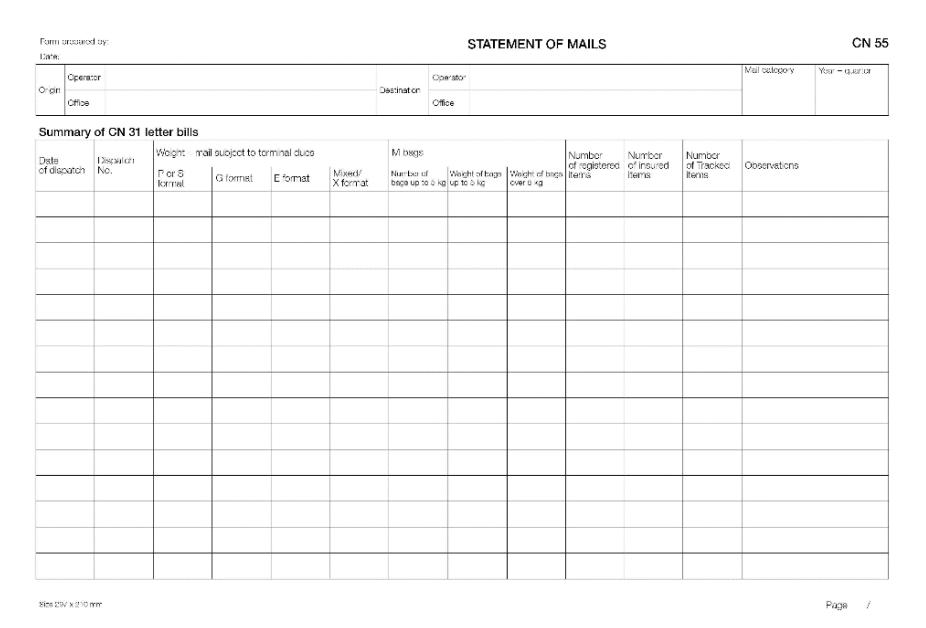

| Form prepared             | by:                |                 |                            |          | RECAPITULATIVE STATEMENT OF MAILS CI |                    |                              |                              |                             |                         |                     |                      |  |  |  |  |
|---------------------------|--------------------|-----------------|----------------------------|----------|--------------------------------------|--------------------|------------------------------|------------------------------|-----------------------------|-------------------------|---------------------|----------------------|--|--|--|--|
| Orgin opwato              |                    |                 |                            |          | Destination operate                  | Y                  | Mail cutogory                | Yes                          | Year and quarter            |                         |                     |                      |  |  |  |  |
| Summary                   | of CN 55 sta       | tements         |                            |          |                                      |                    |                              |                              |                             |                         |                     |                      |  |  |  |  |
| Origin<br>office          | Destination office | Subclass        | Weight - mail subject to b |          | rminal dues                          |                    | M bags                       |                              |                             | Number<br>of registered | Number<br>of insumd | Number<br>of Trackod |  |  |  |  |
| office                    | office             | SUDCIAGS        | Pior S<br>format           | G format | E format                             | Mixed/<br>X format | Number of bags<br>up to 6 kg | Weight of longs<br>over 6 kg | Weight for<br>lorninal dues | ileims                  | items               | ilens                |  |  |  |  |
|                           |                    |                 |                            |          |                                      |                    |                              |                              |                             |                         |                     |                      |  |  |  |  |
|                           |                    |                 |                            |          |                                      |                    |                              |                              |                             |                         |                     |                      |  |  |  |  |
|                           |                    |                 |                            |          |                                      |                    |                              |                              |                             |                         |                     |                      |  |  |  |  |
|                           |                    |                 |                            |          |                                      |                    |                              |                              |                             |                         |                     |                      |  |  |  |  |
|                           |                    |                 |                            |          |                                      |                    |                              |                              |                             |                         |                     |                      |  |  |  |  |
|                           |                    |                 |                            |          |                                      |                    |                              |                              |                             |                         |                     |                      |  |  |  |  |
|                           |                    |                 |                            |          |                                      |                    |                              |                              |                             |                         |                     |                      |  |  |  |  |
|                           |                    |                 |                            |          |                                      |                    |                              |                              |                             |                         |                     |                      |  |  |  |  |
|                           |                    |                 |                            |          |                                      |                    |                              |                              |                             |                         |                     |                      |  |  |  |  |
|                           |                    |                 |                            |          |                                      |                    |                              |                              |                             |                         |                     |                      |  |  |  |  |
|                           |                    |                 |                            |          |                                      |                    |                              |                              |                             |                         |                     |                      |  |  |  |  |
|                           |                    |                 |                            |          |                                      |                    |                              |                              |                             |                         |                     |                      |  |  |  |  |
|                           |                    | Sampled flows   |                            |          |                                      |                    |                              |                              |                             |                         |                     |                      |  |  |  |  |
| Totals                    |                    |                 |                            |          |                                      | -                  | -                            |                              |                             |                         |                     |                      |  |  |  |  |
|                           | Nor                | n-sampled liows |                            |          |                                      |                    |                              |                              |                             |                         |                     |                      |  |  |  |  |
| Designated o<br>Signature | perator preparing  | g the lorm      |                            |          | Seen and a<br>Flace, date a          | coepled by desi    | gnaled operator re           | ceiving the form             | Grand total                 |                         |                     |                      |  |  |  |  |
| Signatula                 |                    |                 |                            |          | 1909, 0809 8                         | i u agratue        |                              |                              |                             |                         |                     | Page /               |  |  |  |  |

| Form prepared by: |      |               |              |                            |                                        | TRANSIT MAIL        | . CN 69       |
|-------------------|------|---------------|--------------|----------------------------|----------------------------------------|---------------------|---------------|
| Date:             |      |               | Retu         | ırn of empty recep         | tacles                                 |                     |               |
| Mail owner        |      |               |              |                            |                                        |                     | Mail category |
| Transit operator  |      |               |              |                            |                                        |                     | Date from     |
| Destination opera | tor  |               |              |                            |                                        |                     | Date to       |
| List of dispatch  | es h | andled in cl  | osed transit |                            |                                        |                     |               |
| Origin office     |      | nation office | Transit date | Dispatch series and number | Number of<br>receptacles<br>in transit | Weight in transit C | Observations  |
|                   |      |               |              |                            | III d du iak                           |                     |               |
|                   |      |               |              |                            |                                        |                     |               |
|                   |      |               |              |                            |                                        |                     |               |
|                   |      |               |              |                            |                                        |                     |               |
|                   |      |               |              |                            |                                        |                     |               |
|                   |      |               |              |                            |                                        |                     |               |
|                   |      |               |              |                            |                                        |                     |               |
|                   |      |               |              |                            |                                        |                     |               |
|                   |      |               |              |                            |                                        |                     |               |
|                   |      |               |              |                            |                                        |                     |               |
|                   |      |               |              |                            |                                        |                     |               |
|                   |      |               |              |                            |                                        |                     |               |
|                   |      |               |              |                            |                                        |                     |               |
|                   |      |               |              |                            |                                        |                     |               |
|                   |      |               |              |                            |                                        |                     |               |
|                   |      |               |              |                            |                                        |                     |               |
|                   |      |               |              |                            |                                        |                     |               |
|                   |      |               |              |                            |                                        |                     |               |
|                   |      |               |              |                            |                                        |                     |               |
|                   |      |               |              |                            |                                        |                     |               |
|                   |      |               |              |                            |                                        |                     |               |
|                   |      |               |              |                            |                                        |                     |               |
|                   |      |               |              |                            |                                        |                     |               |
|                   |      |               |              |                            |                                        |                     |               |
|                   |      |               |              |                            |                                        |                     |               |
|                   |      |               |              | Totale                     | 1                                      |                     |               |

Letter mail: accounting for non-sampled flows received

- 1 Non-sampled flows received consist of dispatches received that exclusively comprise mail that does not require any sampling and provision of an item count at dispatch level. These flows include dispatches of registered/insured items (UR dispatches) and dispatches of tracked items (UX dispatches).
- 2 To avoid delays in payment for mail received, a designated operator may choose to request payment for non-sampled flows from a partner designated operator on a quarterly basis instead of yearly if all the following conditions are met:
- 2.1 The receiving designated operator that wishes to activate quarterly payment has so informed the partner designated operator in advance, by 30 September for application on 1 January of the following year and subsequent years.
- 2.2 Either the partner designated operator has agreed to the request in paragraph 2.1 by 30 November of the same year, or the annual volume of non-sampled mail for either registered or tracked items is above the threshold of 100,000 items. For the latter calculation, the annual volume shall be counted from the last two quarters of the previous year and the first two quarters of the current year.
- 3 The separate accounting for non-sampled flows received may be discontinued:
- 3.1 Upon request of the receiving designated operator to the sending operator, notified by 30 November, in which case it shall take effect on 1 January of the following year and subsequent years;
- 3.2 Upon request of the sending designated operator to the receiving operator, notified by 30 November, and provided that the annual volume (calculated as per paragraph 2.2) of non-sampled mail to the receiving operator is below 100,000 items for both registered and tracked items, in which case it shall take effect on 1 January of the following year.

- 4 When payment for non-sampled flows is requested on a quarterly basis and the conditions in paragraph 2 are met, the following rules shall apply:
- 4.1 The quarterly account covers terminal dues and additional payments for the non-sampled mail received, but excludes the supplementary remuneration covered in form CN 60;
- 4.2 The designated operator of destination of the non-sampled mail shall prepare a quarterly CN 71 account based on the particulars of the CN 56 recapitulative statements.
- 4.3 The CN 71 account shall be based on accepted CN 56 statements. It shall be sent rapidly after the CN 56 statement has been accepted, and at the latest within six months after the end of the quarter to which it relates.
- 4.4 A CN 71bis annual account shall be generated to adjust the amounts due, once final rates are agreed, and request payment of the difference. The form shall also be generated even where there is no difference, as confirmation and potentially as a supporting document for Quality of Service Fund payments.
- 4.5 The CN 71bis form shall be sent by the creditor and accepted by the debtor within the same time limits as those applicable for the CN 61.
- 4.6 Where a designated operator has activated the payment of nonsampled mail received through the CN 71 and CN 71bis for a year with a partner designated operator, then such non-sampled mail shall be excluded from the CN 61 between them.
- 4.7 Where the payment of non-sampled mail received through the CN 71 and CN 71bis is activated one way and/or the other between two partners, if either of these partners requests a provisional payment to the other, the corresponding provisional payment request shall not include terminal dues for non-sampled mail.

| m prepared by:                                                              |                             | QUA               | RTERLY A          | CCOUNT, NO                                                                                                                                                                                                                                                                                                                                                                                                                                                                                                                                                                                                                                                                                                                                                                                                                                                                                                                                                                                                                                                                                                                                                                                                                                                                                                                                                                                                                                                                                                                                                                                                                                                                                                                                                                                                                                                                                                                                                                                                                                                                                                                     | N-SAMPLED MAI                | IL FLOWS HE               | GEIVED                                 |                                                              |                          |
|-----------------------------------------------------------------------------|-----------------------------|-------------------|-------------------|--------------------------------------------------------------------------------------------------------------------------------------------------------------------------------------------------------------------------------------------------------------------------------------------------------------------------------------------------------------------------------------------------------------------------------------------------------------------------------------------------------------------------------------------------------------------------------------------------------------------------------------------------------------------------------------------------------------------------------------------------------------------------------------------------------------------------------------------------------------------------------------------------------------------------------------------------------------------------------------------------------------------------------------------------------------------------------------------------------------------------------------------------------------------------------------------------------------------------------------------------------------------------------------------------------------------------------------------------------------------------------------------------------------------------------------------------------------------------------------------------------------------------------------------------------------------------------------------------------------------------------------------------------------------------------------------------------------------------------------------------------------------------------------------------------------------------------------------------------------------------------------------------------------------------------------------------------------------------------------------------------------------------------------------------------------------------------------------------------------------------------|------------------------------|---------------------------|----------------------------------------|--------------------------------------------------------------|--------------------------|
| rigin operator                                                              |                             |                   | 1                 | Destination operato                                                                                                                                                                                                                                                                                                                                                                                                                                                                                                                                                                                                                                                                                                                                                                                                                                                                                                                                                                                                                                                                                                                                                                                                                                                                                                                                                                                                                                                                                                                                                                                                                                                                                                                                                                                                                                                                                                                                                                                                                                                                                                            | e                            |                           |                                        | Year ar                                                      | nd quarter               |
|                                                                             |                             |                   |                   |                                                                                                                                                                                                                                                                                                                                                                                                                                                                                                                                                                                                                                                                                                                                                                                                                                                                                                                                                                                                                                                                                                                                                                                                                                                                                                                                                                                                                                                                                                                                                                                                                                                                                                                                                                                                                                                                                                                                                                                                                                                                                                                                |                              |                           |                                        |                                                              |                          |
| on-sampled flo                                                              | w information from          | n CN 56 rec       | apitulative s     | statements                                                                                                                                                                                                                                                                                                                                                                                                                                                                                                                                                                                                                                                                                                                                                                                                                                                                                                                                                                                                                                                                                                                                                                                                                                                                                                                                                                                                                                                                                                                                                                                                                                                                                                                                                                                                                                                                                                                                                                                                                                                                                                                     |                              |                           |                                        |                                                              |                          |
| Mail category                                                               | Weight                      |                   | _                 | 1                                                                                                                                                                                                                                                                                                                                                                                                                                                                                                                                                                                                                                                                                                                                                                                                                                                                                                                                                                                                                                                                                                                                                                                                                                                                                                                                                                                                                                                                                                                                                                                                                                                                                                                                                                                                                                                                                                                                                                                                                                                                                                                              | of Items                     |                           | Observatio                             | ns                                                           |                          |
|                                                                             |                             | Total             | UR - Reg          | Istered UR -                                                                                                                                                                                                                                                                                                                                                                                                                                                                                                                                                                                                                                                                                                                                                                                                                                                                                                                                                                                                                                                                                                                                                                                                                                                                                                                                                                                                                                                                                                                                                                                                                                                                                                                                                                                                                                                                                                                                                                                                                                                                                                                   | Insured UX - Trac            | ked Oth                   |                                        |                                                              |                          |
| A - airmail                                                                 |                             |                   |                   |                                                                                                                                                                                                                                                                                                                                                                                                                                                                                                                                                                                                                                                                                                                                                                                                                                                                                                                                                                                                                                                                                                                                                                                                                                                                                                                                                                                                                                                                                                                                                                                                                                                                                                                                                                                                                                                                                                                                                                                                                                                                                                                                |                              |                           |                                        |                                                              |                          |
| B - S.A.L.                                                                  |                             |                   |                   |                                                                                                                                                                                                                                                                                                                                                                                                                                                                                                                                                                                                                                                                                                                                                                                                                                                                                                                                                                                                                                                                                                                                                                                                                                                                                                                                                                                                                                                                                                                                                                                                                                                                                                                                                                                                                                                                                                                                                                                                                                                                                                                                |                              |                           |                                        |                                                              |                          |
| C - surface                                                                 |                             |                   |                   |                                                                                                                                                                                                                                                                                                                                                                                                                                                                                                                                                                                                                                                                                                                                                                                                                                                                                                                                                                                                                                                                                                                                                                                                                                                                                                                                                                                                                                                                                                                                                                                                                                                                                                                                                                                                                                                                                                                                                                                                                                                                                                                                |                              |                           |                                        |                                                              |                          |
| D - prio surface<br>tal                                                     |                             |                   |                   |                                                                                                                                                                                                                                                                                                                                                                                                                                                                                                                                                                                                                                                                                                                                                                                                                                                                                                                                                                                                                                                                                                                                                                                                                                                                                                                                                                                                                                                                                                                                                                                                                                                                                                                                                                                                                                                                                                                                                                                                                                                                                                                                |                              |                           |                                        |                                                              |                          |
| tai<br>ito                                                                  |                             |                   |                   |                                                                                                                                                                                                                                                                                                                                                                                                                                                                                                                                                                                                                                                                                                                                                                                                                                                                                                                                                                                                                                                                                                                                                                                                                                                                                                                                                                                                                                                                                                                                                                                                                                                                                                                                                                                                                                                                                                                                                                                                                                                                                                                                |                              |                           |                                        |                                                              |                          |
|                                                                             | A B                         |                   | С                 | D                                                                                                                                                                                                                                                                                                                                                                                                                                                                                                                                                                                                                                                                                                                                                                                                                                                                                                                                                                                                                                                                                                                                                                                                                                                                                                                                                                                                                                                                                                                                                                                                                                                                                                                                                                                                                                                                                                                                                                                                                                                                                                                              |                              | E                         |                                        |                                                              |                          |
| nount (SDR)                                                                 |                             |                   |                   |                                                                                                                                                                                                                                                                                                                                                                                                                                                                                                                                                                                                                                                                                                                                                                                                                                                                                                                                                                                                                                                                                                                                                                                                                                                                                                                                                                                                                                                                                                                                                                                                                                                                                                                                                                                                                                                                                                                                                                                                                                                                                                                                |                              |                           |                                        |                                                              |                          |
| -                                                                           | Terminal dues (A+B)         |                   | Additional p      | ayment (C+D+E)                                                                                                                                                                                                                                                                                                                                                                                                                                                                                                                                                                                                                                                                                                                                                                                                                                                                                                                                                                                                                                                                                                                                                                                                                                                                                                                                                                                                                                                                                                                                                                                                                                                                                                                                                                                                                                                                                                                                                                                                                                                                                                                 |                              |                           | Total to be p                          | paid                                                         |                          |
| tal amount (SDR)                                                            |                             |                   |                   |                                                                                                                                                                                                                                                                                                                                                                                                                                                                                                                                                                                                                                                                                                                                                                                                                                                                                                                                                                                                                                                                                                                                                                                                                                                                                                                                                                                                                                                                                                                                                                                                                                                                                                                                                                                                                                                                                                                                                                                                                                                                                                                                |                              |                           |                                        |                                                              |                          |
| L<br>Rates for the weight (                                                 | cell A) and total number of | tems (cell B) are | terminal dues rat | es. Other rates (for o                                                                                                                                                                                                                                                                                                                                                                                                                                                                                                                                                                                                                                                                                                                                                                                                                                                                                                                                                                                                                                                                                                                                                                                                                                                                                                                                                                                                                                                                                                                                                                                                                                                                                                                                                                                                                                                                                                                                                                                                                                                                                                         | els C, D and E) concern ad:  | ditional payments.        | I                                      |                                                              |                          |
|                                                                             |                             |                   |                   |                                                                                                                                                                                                                                                                                                                                                                                                                                                                                                                                                                                                                                                                                                                                                                                                                                                                                                                                                                                                                                                                                                                                                                                                                                                                                                                                                                                                                                                                                                                                                                                                                                                                                                                                                                                                                                                                                                                                                                                                                                                                                                                                |                              |                           |                                        |                                                              |                          |
| signated operator p<br>mature                                               | reparing the form           |                   |                   |                                                                                                                                                                                                                                                                                                                                                                                                                                                                                                                                                                                                                                                                                                                                                                                                                                                                                                                                                                                                                                                                                                                                                                                                                                                                                                                                                                                                                                                                                                                                                                                                                                                                                                                                                                                                                                                                                                                                                                                                                                                                                                                                |                              | Seen and a<br>Place, date | accepted by designate<br>and signature | d operator receiving t                                       | he lorm                  |
|                                                                             |                             |                   |                   |                                                                                                                                                                                                                                                                                                                                                                                                                                                                                                                                                                                                                                                                                                                                                                                                                                                                                                                                                                                                                                                                                                                                                                                                                                                                                                                                                                                                                                                                                                                                                                                                                                                                                                                                                                                                                                                                                                                                                                                                                                                                                                                                |                              |                           |                                        |                                                              |                          |
|                                                                             |                             | _                 |                   |                                                                                                                                                                                                                                                                                                                                                                                                                                                                                                                                                                                                                                                                                                                                                                                                                                                                                                                                                                                                                                                                                                                                                                                                                                                                                                                                                                                                                                                                                                                                                                                                                                                                                                                                                                                                                                                                                                                                                                                                                                                                                                                                |                              |                           |                                        |                                                              |                          |
| e 297 x 210 mm                                                              |                             | _                 |                   |                                                                                                                                                                                                                                                                                                                                                                                                                                                                                                                                                                                                                                                                                                                                                                                                                                                                                                                                                                                                                                                                                                                                                                                                                                                                                                                                                                                                                                                                                                                                                                                                                                                                                                                                                                                                                                                                                                                                                                                                                                                                                                                                |                              |                           |                                        |                                                              |                          |
|                                                                             |                             | _                 |                   |                                                                                                                                                                                                                                                                                                                                                                                                                                                                                                                                                                                                                                                                                                                                                                                                                                                                                                                                                                                                                                                                                                                                                                                                                                                                                                                                                                                                                                                                                                                                                                                                                                                                                                                                                                                                                                                                                                                                                                                                                                                                                                                                | 4000UN-T                     |                           |                                        |                                                              |                          |
| m prepared by:                                                              |                             | -                 |                   | FINAL<br>Non-sa                                                                                                                                                                                                                                                                                                                                                                                                                                                                                                                                                                                                                                                                                                                                                                                                                                                                                                                                                                                                                                                                                                                                                                                                                                                                                                                                                                                                                                                                                                                                                                                                                                                                                                                                                                                                                                                                                                                                                                                                                                                                                                                | ACCOUNT<br>ampled mail flows | received                  |                                        |                                                              | CN 7°                    |
| m prepared by:                                                              |                             | _                 |                   | Non-sa                                                                                                                                                                                                                                                                                                                                                                                                                                                                                                                                                                                                                                                                                                                                                                                                                                                                                                                                                                                                                                                                                                                                                                                                                                                                                                                                                                                                                                                                                                                                                                                                                                                                                                                                                                                                                                                                                                                                                                                                                                                                                                                         | ampled mail flows            | s received                |                                        |                                                              | CN 7*                    |
| m prepared by:                                                              |                             | _                 | Ti di             | FINAL<br>Non-sa<br>Destination operatio                                                                                                                                                                                                                                                                                                                                                                                                                                                                                                                                                                                                                                                                                                                                                                                                                                                                                                                                                                                                                                                                                                                                                                                                                                                                                                                                                                                                                                                                                                                                                                                                                                                                                                                                                                                                                                                                                                                                                                                                                                                                                        | ampled mail flows            | received                  |                                        | Year                                                         | CN 7:                    |
| n prepared by:                                                              |                             | -                 | II                | Non-sa                                                                                                                                                                                                                                                                                                                                                                                                                                                                                                                                                                                                                                                                                                                                                                                                                                                                                                                                                                                                                                                                                                                                                                                                                                                                                                                                                                                                                                                                                                                                                                                                                                                                                                                                                                                                                                                                                                                                                                                                                                                                                                                         | ampled mail flows            | received                  |                                        | Уши                                                          | CN 7 <sup>-</sup>        |
| n prepared by: to                                                           | al dues rates and           | d amounts         |                   | Non-sa                                                                                                                                                                                                                                                                                                                                                                                                                                                                                                                                                                                                                                                                                                                                                                                                                                                                                                                                                                                                                                                                                                                                                                                                                                                                                                                                                                                                                                                                                                                                                                                                                                                                                                                                                                                                                                                                                                                                                                                                                                                                                                                         | ampled mail flows            | : received                |                                        | Yttaw                                                        | CN 7 <sup>-</sup>        |
| m precared by:  a: \nigin operator \nijusted termin                         |                             | Pr                |                   | Non-sa                                                                                                                                                                                                                                                                                                                                                                                                                                                                                                                                                                                                                                                                                                                                                                                                                                                                                                                                                                                                                                                                                                                                                                                                                                                                                                                                                                                                                                                                                                                                                                                                                                                                                                                                                                                                                                                                                                                                                                                                                                                                                                                         | ampled mail flows            |                           | al rates                               |                                                              | I                        |
| m prepared by:<br>e:<br>igin operator                                       |                             | Pr<br>tems        |                   | Non-sa                                                                                                                                                                                                                                                                                                                                                                                                                                                                                                                                                                                                                                                                                                                                                                                                                                                                                                                                                                                                                                                                                                                                                                                                                                                                                                                                                                                                                                                                                                                                                                                                                                                                                                                                                                                                                                                                                                                                                                                                                                                                                                                         | ampled mail flows            |                           | al ratos                               | Your Final amount                                            | CN 7                     |
| m precared by:  a: \nigin operator \nijusted termin                         |                             | Pr<br>tems        | ovisional rates   | Non-sa<br>Jestination operato<br>Lused in CN 71                                                                                                                                                                                                                                                                                                                                                                                                                                                                                                                                                                                                                                                                                                                                                                                                                                                                                                                                                                                                                                                                                                                                                                                                                                                                                                                                                                                                                                                                                                                                                                                                                                                                                                                                                                                                                                                                                                                                                                                                                                                                                | ampled mail flows            | Fin                       |                                        |                                                              |                          |
| m prepared by:  n:  light operator  lijusted termin \nuarter Weig           |                             | Pr<br>tems        | ovisional rates   | Non-sa<br>Jestination operato<br>Lused in CN 71                                                                                                                                                                                                                                                                                                                                                                                                                                                                                                                                                                                                                                                                                                                                                                                                                                                                                                                                                                                                                                                                                                                                                                                                                                                                                                                                                                                                                                                                                                                                                                                                                                                                                                                                                                                                                                                                                                                                                                                                                                                                                | ampled mail flows            | Fin                       |                                        |                                                              |                          |
| m prepared by:  n:  light operator  lijusted termin \nuarter Weig           |                             | Pr<br>tems        | ovisional rates   | Non-sa<br>Jestination operato<br>Lused in CN 71                                                                                                                                                                                                                                                                                                                                                                                                                                                                                                                                                                                                                                                                                                                                                                                                                                                                                                                                                                                                                                                                                                                                                                                                                                                                                                                                                                                                                                                                                                                                                                                                                                                                                                                                                                                                                                                                                                                                                                                                                                                                                | ampled mail flows            | Fin                       |                                        |                                                              |                          |
| m precared by:  a: \nigin operator \nifjusted termin \nusarter Weig         |                             | Pr<br>tems        | ovisional rates   | Non-sa<br>Jestination operato<br>Lused in CN 71                                                                                                                                                                                                                                                                                                                                                                                                                                                                                                                                                                                                                                                                                                                                                                                                                                                                                                                                                                                                                                                                                                                                                                                                                                                                                                                                                                                                                                                                                                                                                                                                                                                                                                                                                                                                                                                                                                                                                                                                                                                                                | ampled mail flows            | Fin                       |                                        |                                                              |                          |
| m precared by:  a: \nigin operator \nifjusted termin \nusarter Weig         |                             | Pr<br>tems        | ovisional rates   | Non-sa<br>Jestination operato<br>Lused in CN 71                                                                                                                                                                                                                                                                                                                                                                                                                                                                                                                                                                                                                                                                                                                                                                                                                                                                                                                                                                                                                                                                                                                                                                                                                                                                                                                                                                                                                                                                                                                                                                                                                                                                                                                                                                                                                                                                                                                                                                                                                                                                                | ampled mail flows            | Fin                       |                                        |                                                              |                          |
| m prepared by:  N  Tight portelor  Highlight portelor  Weight Q2  Q2        |                             | Pr<br>tems        | ovisional rates   | Non-sa<br>Jestination operato<br>Lused in CN 71                                                                                                                                                                                                                                                                                                                                                                                                                                                                                                                                                                                                                                                                                                                                                                                                                                                                                                                                                                                                                                                                                                                                                                                                                                                                                                                                                                                                                                                                                                                                                                                                                                                                                                                                                                                                                                                                                                                                                                                                                                                                                | ampled mail flows            | Fin                       |                                        |                                                              |                          |
| m prepared by:  N  Tight portelor  Highlight portelor  Weight Q2  Q2        |                             | Pr<br>tems        | ovisional rates   | Non-sa<br>Jestination operato<br>Lused in CN 71                                                                                                                                                                                                                                                                                                                                                                                                                                                                                                                                                                                                                                                                                                                                                                                                                                                                                                                                                                                                                                                                                                                                                                                                                                                                                                                                                                                                                                                                                                                                                                                                                                                                                                                                                                                                                                                                                                                                                                                                                                                                                | ampled mail flows            | Fin                       |                                        |                                                              |                          |
| n prepared by:  N  Igin oporator  Tijusted termin  Weig  O1  O2  O3         | ht Number of I              | Pr Pr             | ovisional rates   | Non-se Non-se Non-se Non-se Non-se Non-se Non-se Non-se Non-se Non-se Non-se Non-se Non-se Non-se Non-se Non-se Non-se Non-se Non-se Non-se Non-se Non-se Non-se Non-se Non-se Non-se Non-se Non-se Non-se Non-se Non-se Non-se Non-se Non-se Non-se Non-se Non-se Non-se Non-se Non-se Non-se Non-se Non-se Non-se Non-se Non-se Non-se Non-se Non-se Non-se Non-se Non-se Non-se Non-se Non-se Non-se Non-se Non-se Non-se Non-se Non-se Non-se Non-se Non-se Non-se Non-se Non-se Non-se Non-se Non-se Non-se Non-se Non-se Non-se Non-se Non-se Non-se Non-se Non-se Non-se Non-se Non-se Non-se Non-se Non-se Non-se Non-se Non-se Non-se Non-se Non-se Non-se Non-se Non-se Non-se Non-se Non-se Non-se Non-se Non-se Non-se Non-se Non-se Non-se Non-se Non-se Non-se Non-se Non-se Non-se Non-se Non-se Non-se Non-se Non-se Non-se Non-se Non-se Non-se Non-se Non-se Non-se Non-se Non-se Non-se Non-se Non-se Non-se Non-se Non-se Non-se Non-se Non-se Non-se Non-se Non-se Non-se Non-se Non-se Non-se Non-se Non-se Non-se Non-se Non-se Non-se Non-se Non-se Non-se Non-se Non-se Non-se Non-se Non-se Non-se Non-se Non-se Non-se Non-se Non-se Non-se Non-se Non-se Non-se Non-se Non-se Non-se Non-se Non-se Non-se Non-se Non-se Non-se Non-se Non-se Non-se Non-se Non-se Non-se Non-se Non-se Non-se Non-se Non-se Non-se Non-se Non-se Non-se Non-se Non-se Non-se Non-se Non-se Non-se Non-se Non-se Non-se Non-se Non-se Non-se Non-se Non-se Non-se Non-se Non-se Non-se Non-se Non-se Non-se Non-se Non-se Non-se Non-se Non-se Non-se Non-se Non-se Non-se Non-se Non-se Non-se Non-se Non-se Non-se Non-se Non-se Non-se Non-se Non-se Non-se Non-se Non-se Non-se Non-se Non-se Non-se Non-se Non-se Non-se Non-se Non-se Non-se Non-se Non-se Non-se Non-se Non-se Non-se Non-se Non-se Non-se Non-se Non-se Non-se Non-se Non-se Non-se Non-se Non-se Non-se Non-se Non-se Non-se Non-se Non-se Non-se Non-se Non-se Non-se Non-se Non-se Non-se Non-se Non-se Non-se Non-se Non-se Non-se Non-se Non-se Non-se Non-se Non-se Non-se Non-se Non-se Non-se Non-se Non-se Non-se Non-se Non-se No | Amount invoiced in CN 71     | Fin                       | per hem                                | Final amount                                                 |                          |
| m prepared by:  N  Tight operator  Tight appreciator  Weigh  Q1  Q2  Q3  Q4 |                             | Pr Pr             | ovisional rates   | Non-se Non-se Non-se Non-se Non-se Non-se Non-se Non-se Non-se Non-se Non-se Non-se Non-se Non-se Non-se Non-se Non-se Non-se Non-se Non-se Non-se Non-se Non-se Non-se Non-se Non-se Non-se Non-se Non-se Non-se Non-se Non-se Non-se Non-se Non-se Non-se Non-se Non-se Non-se Non-se Non-se Non-se Non-se Non-se Non-se Non-se Non-se Non-se Non-se Non-se Non-se Non-se Non-se Non-se Non-se Non-se Non-se Non-se Non-se Non-se Non-se Non-se Non-se Non-se Non-se Non-se Non-se Non-se Non-se Non-se Non-se Non-se Non-se Non-se Non-se Non-se Non-se Non-se Non-se Non-se Non-se Non-se Non-se Non-se Non-se Non-se Non-se Non-se Non-se Non-se Non-se Non-se Non-se Non-se Non-se Non-se Non-se Non-se Non-se Non-se Non-se Non-se Non-se Non-se Non-se Non-se Non-se Non-se Non-se Non-se Non-se Non-se Non-se Non-se Non-se Non-se Non-se Non-se Non-se Non-se Non-se Non-se Non-se Non-se Non-se Non-se Non-se Non-se Non-se Non-se Non-se Non-se Non-se Non-se Non-se Non-se Non-se Non-se Non-se Non-se Non-se Non-se Non-se Non-se Non-se Non-se Non-se Non-se Non-se Non-se Non-se Non-se Non-se Non-se Non-se Non-se Non-se Non-se Non-se Non-se Non-se Non-se Non-se Non-se Non-se Non-se Non-se Non-se Non-se Non-se Non-se Non-se Non-se Non-se Non-se Non-se Non-se Non-se Non-se Non-se Non-se Non-se Non-se Non-se Non-se Non-se Non-se Non-se Non-se Non-se Non-se Non-se Non-se Non-se Non-se Non-se Non-se Non-se Non-se Non-se Non-se Non-se Non-se Non-se Non-se Non-se Non-se Non-se Non-se Non-se Non-se Non-se Non-se Non-se Non-se Non-se Non-se Non-se Non-se Non-se Non-se Non-se Non-se Non-se Non-se Non-se Non-se Non-se Non-se Non-se Non-se Non-se Non-se Non-se Non-se Non-se Non-se Non-se Non-se Non-se Non-se Non-se Non-se Non-se Non-se Non-se Non-se Non-se Non-se Non-se Non-se Non-se Non-se Non-se Non-se Non-se Non-se Non-se Non-se Non-se Non-se Non-se Non-se Non-se Non-se Non-se Non-se Non-se Non-se Non-se Non-se Non-se Non-se Non-se Non-se Non-se Non-se Non-se Non-se Non-se Non-se Non-se Non-se Non-se Non-se Non-se Non-se Non-se Non-se Non-se Non-se Non-se No | ampled mail flows            | Fin                       | per hem                                |                                                              |                          |
| m prepared by:  N  Tight operator  Tight appreciator  Weigh  Q1  Q2  Q3  Q4 | ht Number of I              | Pr Pr             | ovisional rates   | Non-se Non-se Non-se Non-se Non-se Non-se Non-se Non-se Non-se Non-se Non-se Non-se Non-se Non-se Non-se Non-se Non-se Non-se Non-se Non-se Non-se Non-se Non-se Non-se Non-se Non-se Non-se Non-se Non-se Non-se Non-se Non-se Non-se Non-se Non-se Non-se Non-se Non-se Non-se Non-se Non-se Non-se Non-se Non-se Non-se Non-se Non-se Non-se Non-se Non-se Non-se Non-se Non-se Non-se Non-se Non-se Non-se Non-se Non-se Non-se Non-se Non-se Non-se Non-se Non-se Non-se Non-se Non-se Non-se Non-se Non-se Non-se Non-se Non-se Non-se Non-se Non-se Non-se Non-se Non-se Non-se Non-se Non-se Non-se Non-se Non-se Non-se Non-se Non-se Non-se Non-se Non-se Non-se Non-se Non-se Non-se Non-se Non-se Non-se Non-se Non-se Non-se Non-se Non-se Non-se Non-se Non-se Non-se Non-se Non-se Non-se Non-se Non-se Non-se Non-se Non-se Non-se Non-se Non-se Non-se Non-se Non-se Non-se Non-se Non-se Non-se Non-se Non-se Non-se Non-se Non-se Non-se Non-se Non-se Non-se Non-se Non-se Non-se Non-se Non-se Non-se Non-se Non-se Non-se Non-se Non-se Non-se Non-se Non-se Non-se Non-se Non-se Non-se Non-se Non-se Non-se Non-se Non-se Non-se Non-se Non-se Non-se Non-se Non-se Non-se Non-se Non-se Non-se Non-se Non-se Non-se Non-se Non-se Non-se Non-se Non-se Non-se Non-se Non-se Non-se Non-se Non-se Non-se Non-se Non-se Non-se Non-se Non-se Non-se Non-se Non-se Non-se Non-se Non-se Non-se Non-se Non-se Non-se Non-se Non-se Non-se Non-se Non-se Non-se Non-se Non-se Non-se Non-se Non-se Non-se Non-se Non-se Non-se Non-se Non-se Non-se Non-se Non-se Non-se Non-se Non-se Non-se Non-se Non-se Non-se Non-se Non-se Non-se Non-se Non-se Non-se Non-se Non-se Non-se Non-se Non-se Non-se Non-se Non-se Non-se Non-se Non-se Non-se Non-se Non-se Non-se Non-se Non-se Non-se Non-se Non-se Non-se Non-se Non-se Non-se Non-se Non-se Non-se Non-se Non-se Non-se Non-se Non-se Non-se Non-se Non-se Non-se Non-se Non-se Non-se Non-se Non-se Non-se Non-se Non-se Non-se Non-se Non-se Non-se Non-se Non-se Non-se Non-se Non-se Non-se Non-se Non-se Non-se Non-se Non-se Non-se Non-se No | Amount invoiced in CN 71     | Fin                       | per høm                                | Final amount                                                 | Correction               |
| m prepared by:  N  Tight operator  Tight appreciator  Weigh  Q1  Q2  Q3  Q4 | ht Number of I              | Pr Pr             | ovisional rates   | Non-se Non-se Non-se Non-se Non-se Non-se Non-se Non-se Non-se Non-se Non-se Non-se Non-se Non-se Non-se Non-se Non-se Non-se Non-se Non-se Non-se Non-se Non-se Non-se Non-se Non-se Non-se Non-se Non-se Non-se Non-se Non-se Non-se Non-se Non-se Non-se Non-se Non-se Non-se Non-se Non-se Non-se Non-se Non-se Non-se Non-se Non-se Non-se Non-se Non-se Non-se Non-se Non-se Non-se Non-se Non-se Non-se Non-se Non-se Non-se Non-se Non-se Non-se Non-se Non-se Non-se Non-se Non-se Non-se Non-se Non-se Non-se Non-se Non-se Non-se Non-se Non-se Non-se Non-se Non-se Non-se Non-se Non-se Non-se Non-se Non-se Non-se Non-se Non-se Non-se Non-se Non-se Non-se Non-se Non-se Non-se Non-se Non-se Non-se Non-se Non-se Non-se Non-se Non-se Non-se Non-se Non-se Non-se Non-se Non-se Non-se Non-se Non-se Non-se Non-se Non-se Non-se Non-se Non-se Non-se Non-se Non-se Non-se Non-se Non-se Non-se Non-se Non-se Non-se Non-se Non-se Non-se Non-se Non-se Non-se Non-se Non-se Non-se Non-se Non-se Non-se Non-se Non-se Non-se Non-se Non-se Non-se Non-se Non-se Non-se Non-se Non-se Non-se Non-se Non-se Non-se Non-se Non-se Non-se Non-se Non-se Non-se Non-se Non-se Non-se Non-se Non-se Non-se Non-se Non-se Non-se Non-se Non-se Non-se Non-se Non-se Non-se Non-se Non-se Non-se Non-se Non-se Non-se Non-se Non-se Non-se Non-se Non-se Non-se Non-se Non-se Non-se Non-se Non-se Non-se Non-se Non-se Non-se Non-se Non-se Non-se Non-se Non-se Non-se Non-se Non-se Non-se Non-se Non-se Non-se Non-se Non-se Non-se Non-se Non-se Non-se Non-se Non-se Non-se Non-se Non-se Non-se Non-se Non-se Non-se Non-se Non-se Non-se Non-se Non-se Non-se Non-se Non-se Non-se Non-se Non-se Non-se Non-se Non-se Non-se Non-se Non-se Non-se Non-se Non-se Non-se Non-se Non-se Non-se Non-se Non-se Non-se Non-se Non-se Non-se Non-se Non-se Non-se Non-se Non-se Non-se Non-se Non-se Non-se Non-se Non-se Non-se Non-se Non-se Non-se Non-se Non-se Non-se Non-se Non-se Non-se Non-se Non-se Non-se Non-se Non-se Non-se Non-se Non-se Non-se Non-se Non-se Non-se Non-se Non-se Non-se Non-se No | Amount invoiced in CN 71     | Fin                       | per hem                                | Final amount                                                 |                          |
| m prepared by:  N  Tight operator  Tight appreciator  Weigh  Q1  Q2  Q3  Q4 | ht Number of I              | Pr Pr             | ovisional rates   | Non-se Non-se Non-se Non-se Non-se Non-se Non-se Non-se Non-se Non-se Non-se Non-se Non-se Non-se Non-se Non-se Non-se Non-se Non-se Non-se Non-se Non-se Non-se Non-se Non-se Non-se Non-se Non-se Non-se Non-se Non-se Non-se Non-se Non-se Non-se Non-se Non-se Non-se Non-se Non-se Non-se Non-se Non-se Non-se Non-se Non-se Non-se Non-se Non-se Non-se Non-se Non-se Non-se Non-se Non-se Non-se Non-se Non-se Non-se Non-se Non-se Non-se Non-se Non-se Non-se Non-se Non-se Non-se Non-se Non-se Non-se Non-se Non-se Non-se Non-se Non-se Non-se Non-se Non-se Non-se Non-se Non-se Non-se Non-se Non-se Non-se Non-se Non-se Non-se Non-se Non-se Non-se Non-se Non-se Non-se Non-se Non-se Non-se Non-se Non-se Non-se Non-se Non-se Non-se Non-se Non-se Non-se Non-se Non-se Non-se Non-se Non-se Non-se Non-se Non-se Non-se Non-se Non-se Non-se Non-se Non-se Non-se Non-se Non-se Non-se Non-se Non-se Non-se Non-se Non-se Non-se Non-se Non-se Non-se Non-se Non-se Non-se Non-se Non-se Non-se Non-se Non-se Non-se Non-se Non-se Non-se Non-se Non-se Non-se Non-se Non-se Non-se Non-se Non-se Non-se Non-se Non-se Non-se Non-se Non-se Non-se Non-se Non-se Non-se Non-se Non-se Non-se Non-se Non-se Non-se Non-se Non-se Non-se Non-se Non-se Non-se Non-se Non-se Non-se Non-se Non-se Non-se Non-se Non-se Non-se Non-se Non-se Non-se Non-se Non-se Non-se Non-se Non-se Non-se Non-se Non-se Non-se Non-se Non-se Non-se Non-se Non-se Non-se Non-se Non-se Non-se Non-se Non-se Non-se Non-se Non-se Non-se Non-se Non-se Non-se Non-se Non-se Non-se Non-se Non-se Non-se Non-se Non-se Non-se Non-se Non-se Non-se Non-se Non-se Non-se Non-se Non-se Non-se Non-se Non-se Non-se Non-se Non-se Non-se Non-se Non-se Non-se Non-se Non-se Non-se Non-se Non-se Non-se Non-se Non-se Non-se Non-se Non-se Non-se Non-se Non-se Non-se Non-se Non-se Non-se Non-se Non-se Non-se Non-se Non-se Non-se Non-se Non-se Non-se Non-se Non-se Non-se Non-se Non-se Non-se Non-se Non-se Non-se Non-se Non-se Non-se Non-se Non-se Non-se Non-se Non-se Non-se Non-se Non-se Non-se Non-se Non-se No | Amount invoiced in CN 71     | Fin<br>per kg             | per høm                                | Final amount  (B)  Ignated operator e amount attack operator | Correction  (C)  (C=B-A) |

Letter mail: accounting for bulk mail

- 1 The designated operator of destination shall report all bulk mail received in a CN 57 quarterly account on the basis of the data on the CN 32 letter bill data.
- 2 In case of dispute, the designated operator of origin or the designated operator of destination shall transmit copies of the CN 32 letter bills regarding the disputed mails to the partner designated operator, or give access to the corresponding electronic data, if the CN 32 was exchanged electronically.
- 3 The designated operator of origin may refuse to check and accept any CN 57 account which has not been presented within four months after the quarter concerned.
- 4 The CN 57 account shall be accepted and settled by the designated operator of origin within two months after it is prepared.
- 5 When provisional rates are used in the CN 57, once the final rates are agreed, a CN 57bis annual account may be generated to adjust amounts and request payment of the difference.
- 6 The CN 57bis shall be sent by the creditor and accepted by the debtor within the same time limits as those applicable for the CN 61.

# Convention Manual

| orm prepared by:                                                                                                                                                                                                                                                                                                                                                                                                                                                                                                                                                                                                                                                                                                                                                                                                                                                                                                                                                                                                                                                                                                                                                                                                                                                                                                                                                                                                                                                                                                                                                                                                                                                                                                                                                                                                                                                                                                                                                                                                                                                                                                                                                                                                                                                                                                                                                                                                                                                                                                                                                                                                      |                                                                                                       |                                  |         | ACCOUN<br>Bulk mai       |                        | 1                                     |                    |        |                                                                                                                                                                                                                                                                                                                                                                                                                                                                                                                                                                                                                                                                                                                                                                                                                                                                                                                                                                                                                                                                                                                                                                                                                                                                                                                                                                                                                                                                                                                                                                                                                                                                                                                                                                                                                                                                                                                                                                                                                                                                                                                                |              |                    |            | CN             |
|-----------------------------------------------------------------------------------------------------------------------------------------------------------------------------------------------------------------------------------------------------------------------------------------------------------------------------------------------------------------------------------------------------------------------------------------------------------------------------------------------------------------------------------------------------------------------------------------------------------------------------------------------------------------------------------------------------------------------------------------------------------------------------------------------------------------------------------------------------------------------------------------------------------------------------------------------------------------------------------------------------------------------------------------------------------------------------------------------------------------------------------------------------------------------------------------------------------------------------------------------------------------------------------------------------------------------------------------------------------------------------------------------------------------------------------------------------------------------------------------------------------------------------------------------------------------------------------------------------------------------------------------------------------------------------------------------------------------------------------------------------------------------------------------------------------------------------------------------------------------------------------------------------------------------------------------------------------------------------------------------------------------------------------------------------------------------------------------------------------------------------------------------------------------------------------------------------------------------------------------------------------------------------------------------------------------------------------------------------------------------------------------------------------------------------------------------------------------------------------------------------------------------------------------------------------------------------------------------------------------------|-------------------------------------------------------------------------------------------------------|----------------------------------|---------|--------------------------|------------------------|---------------------------------------|--------------------|--------|--------------------------------------------------------------------------------------------------------------------------------------------------------------------------------------------------------------------------------------------------------------------------------------------------------------------------------------------------------------------------------------------------------------------------------------------------------------------------------------------------------------------------------------------------------------------------------------------------------------------------------------------------------------------------------------------------------------------------------------------------------------------------------------------------------------------------------------------------------------------------------------------------------------------------------------------------------------------------------------------------------------------------------------------------------------------------------------------------------------------------------------------------------------------------------------------------------------------------------------------------------------------------------------------------------------------------------------------------------------------------------------------------------------------------------------------------------------------------------------------------------------------------------------------------------------------------------------------------------------------------------------------------------------------------------------------------------------------------------------------------------------------------------------------------------------------------------------------------------------------------------------------------------------------------------------------------------------------------------------------------------------------------------------------------------------------------------------------------------------------------------|--------------|--------------------|------------|----------------|
| Origin operator                                                                                                                                                                                                                                                                                                                                                                                                                                                                                                                                                                                                                                                                                                                                                                                                                                                                                                                                                                                                                                                                                                                                                                                                                                                                                                                                                                                                                                                                                                                                                                                                                                                                                                                                                                                                                                                                                                                                                                                                                                                                                                                                                                                                                                                                                                                                                                                                                                                                                                                                                                                                       |                                                                                                       |                                  |         | Destination              |                        |                                       |                    |        |                                                                                                                                                                                                                                                                                                                                                                                                                                                                                                                                                                                                                                                                                                                                                                                                                                                                                                                                                                                                                                                                                                                                                                                                                                                                                                                                                                                                                                                                                                                                                                                                                                                                                                                                                                                                                                                                                                                                                                                                                                                                                                                                | Mail co      | stegory            | Year and o | µader          |
| ummary of C                                                                                                                                                                                                                                                                                                                                                                                                                                                                                                                                                                                                                                                                                                                                                                                                                                                                                                                                                                                                                                                                                                                                                                                                                                                                                                                                                                                                                                                                                                                                                                                                                                                                                                                                                                                                                                                                                                                                                                                                                                                                                                                                                                                                                                                                                                                                                                                                                                                                                                                                                                                                           | N 32 bulk mail                                                                                        | letter bills                     |         |                          |                        |                                       |                    |        |                                                                                                                                                                                                                                                                                                                                                                                                                                                                                                                                                                                                                                                                                                                                                                                                                                                                                                                                                                                                                                                                                                                                                                                                                                                                                                                                                                                                                                                                                                                                                                                                                                                                                                                                                                                                                                                                                                                                                                                                                                                                                                                                |              |                    |            |                |
| Origin office                                                                                                                                                                                                                                                                                                                                                                                                                                                                                                                                                                                                                                                                                                                                                                                                                                                                                                                                                                                                                                                                                                                                                                                                                                                                                                                                                                                                                                                                                                                                                                                                                                                                                                                                                                                                                                                                                                                                                                                                                                                                                                                                                                                                                                                                                                                                                                                                                                                                                                                                                                                                         | Dostination office                                                                                    | lostination Date Dispatch number |         | Pors                     | P or S format G format |                                       |                    | E fo   | rmat                                                                                                                                                                                                                                                                                                                                                                                                                                                                                                                                                                                                                                                                                                                                                                                                                                                                                                                                                                                                                                                                                                                                                                                                                                                                                                                                                                                                                                                                                                                                                                                                                                                                                                                                                                                                                                                                                                                                                                                                                                                                                                                           |              | X format           | Observat   | ons            |
|                                                                                                                                                                                                                                                                                                                                                                                                                                                                                                                                                                                                                                                                                                                                                                                                                                                                                                                                                                                                                                                                                                                                                                                                                                                                                                                                                                                                                                                                                                                                                                                                                                                                                                                                                                                                                                                                                                                                                                                                                                                                                                                                                                                                                                                                                                                                                                                                                                                                                                                                                                                                                       |                                                                                                       |                                  |         | Welght                   | Number of items        | Weight                                | Number of items    | Weight | Number of<br>items                                                                                                                                                                                                                                                                                                                                                                                                                                                                                                                                                                                                                                                                                                                                                                                                                                                                                                                                                                                                                                                                                                                                                                                                                                                                                                                                                                                                                                                                                                                                                                                                                                                                                                                                                                                                                                                                                                                                                                                                                                                                                                             | Weight       | Number of<br>items |            |                |
|                                                                                                                                                                                                                                                                                                                                                                                                                                                                                                                                                                                                                                                                                                                                                                                                                                                                                                                                                                                                                                                                                                                                                                                                                                                                                                                                                                                                                                                                                                                                                                                                                                                                                                                                                                                                                                                                                                                                                                                                                                                                                                                                                                                                                                                                                                                                                                                                                                                                                                                                                                                                                       |                                                                                                       |                                  |         |                          |                        |                                       |                    |        |                                                                                                                                                                                                                                                                                                                                                                                                                                                                                                                                                                                                                                                                                                                                                                                                                                                                                                                                                                                                                                                                                                                                                                                                                                                                                                                                                                                                                                                                                                                                                                                                                                                                                                                                                                                                                                                                                                                                                                                                                                                                                                                                |              |                    |            |                |
|                                                                                                                                                                                                                                                                                                                                                                                                                                                                                                                                                                                                                                                                                                                                                                                                                                                                                                                                                                                                                                                                                                                                                                                                                                                                                                                                                                                                                                                                                                                                                                                                                                                                                                                                                                                                                                                                                                                                                                                                                                                                                                                                                                                                                                                                                                                                                                                                                                                                                                                                                                                                                       |                                                                                                       |                                  |         |                          |                        |                                       |                    |        |                                                                                                                                                                                                                                                                                                                                                                                                                                                                                                                                                                                                                                                                                                                                                                                                                                                                                                                                                                                                                                                                                                                                                                                                                                                                                                                                                                                                                                                                                                                                                                                                                                                                                                                                                                                                                                                                                                                                                                                                                                                                                                                                |              |                    |            |                |
|                                                                                                                                                                                                                                                                                                                                                                                                                                                                                                                                                                                                                                                                                                                                                                                                                                                                                                                                                                                                                                                                                                                                                                                                                                                                                                                                                                                                                                                                                                                                                                                                                                                                                                                                                                                                                                                                                                                                                                                                                                                                                                                                                                                                                                                                                                                                                                                                                                                                                                                                                                                                                       |                                                                                                       |                                  |         |                          |                        |                                       |                    |        |                                                                                                                                                                                                                                                                                                                                                                                                                                                                                                                                                                                                                                                                                                                                                                                                                                                                                                                                                                                                                                                                                                                                                                                                                                                                                                                                                                                                                                                                                                                                                                                                                                                                                                                                                                                                                                                                                                                                                                                                                                                                                                                                |              |                    |            |                |
|                                                                                                                                                                                                                                                                                                                                                                                                                                                                                                                                                                                                                                                                                                                                                                                                                                                                                                                                                                                                                                                                                                                                                                                                                                                                                                                                                                                                                                                                                                                                                                                                                                                                                                                                                                                                                                                                                                                                                                                                                                                                                                                                                                                                                                                                                                                                                                                                                                                                                                                                                                                                                       |                                                                                                       |                                  |         |                          |                        |                                       |                    |        |                                                                                                                                                                                                                                                                                                                                                                                                                                                                                                                                                                                                                                                                                                                                                                                                                                                                                                                                                                                                                                                                                                                                                                                                                                                                                                                                                                                                                                                                                                                                                                                                                                                                                                                                                                                                                                                                                                                                                                                                                                                                                                                                |              |                    |            |                |
|                                                                                                                                                                                                                                                                                                                                                                                                                                                                                                                                                                                                                                                                                                                                                                                                                                                                                                                                                                                                                                                                                                                                                                                                                                                                                                                                                                                                                                                                                                                                                                                                                                                                                                                                                                                                                                                                                                                                                                                                                                                                                                                                                                                                                                                                                                                                                                                                                                                                                                                                                                                                                       |                                                                                                       |                                  |         |                          |                        |                                       |                    |        |                                                                                                                                                                                                                                                                                                                                                                                                                                                                                                                                                                                                                                                                                                                                                                                                                                                                                                                                                                                                                                                                                                                                                                                                                                                                                                                                                                                                                                                                                                                                                                                                                                                                                                                                                                                                                                                                                                                                                                                                                                                                                                                                |              |                    |            |                |
|                                                                                                                                                                                                                                                                                                                                                                                                                                                                                                                                                                                                                                                                                                                                                                                                                                                                                                                                                                                                                                                                                                                                                                                                                                                                                                                                                                                                                                                                                                                                                                                                                                                                                                                                                                                                                                                                                                                                                                                                                                                                                                                                                                                                                                                                                                                                                                                                                                                                                                                                                                                                                       |                                                                                                       |                                  |         |                          |                        |                                       |                    |        |                                                                                                                                                                                                                                                                                                                                                                                                                                                                                                                                                                                                                                                                                                                                                                                                                                                                                                                                                                                                                                                                                                                                                                                                                                                                                                                                                                                                                                                                                                                                                                                                                                                                                                                                                                                                                                                                                                                                                                                                                                                                                                                                |              |                    |            |                |
|                                                                                                                                                                                                                                                                                                                                                                                                                                                                                                                                                                                                                                                                                                                                                                                                                                                                                                                                                                                                                                                                                                                                                                                                                                                                                                                                                                                                                                                                                                                                                                                                                                                                                                                                                                                                                                                                                                                                                                                                                                                                                                                                                                                                                                                                                                                                                                                                                                                                                                                                                                                                                       |                                                                                                       |                                  |         |                          |                        |                                       |                    |        |                                                                                                                                                                                                                                                                                                                                                                                                                                                                                                                                                                                                                                                                                                                                                                                                                                                                                                                                                                                                                                                                                                                                                                                                                                                                                                                                                                                                                                                                                                                                                                                                                                                                                                                                                                                                                                                                                                                                                                                                                                                                                                                                |              |                    |            |                |
|                                                                                                                                                                                                                                                                                                                                                                                                                                                                                                                                                                                                                                                                                                                                                                                                                                                                                                                                                                                                                                                                                                                                                                                                                                                                                                                                                                                                                                                                                                                                                                                                                                                                                                                                                                                                                                                                                                                                                                                                                                                                                                                                                                                                                                                                                                                                                                                                                                                                                                                                                                                                                       |                                                                                                       |                                  |         |                          |                        |                                       |                    |        |                                                                                                                                                                                                                                                                                                                                                                                                                                                                                                                                                                                                                                                                                                                                                                                                                                                                                                                                                                                                                                                                                                                                                                                                                                                                                                                                                                                                                                                                                                                                                                                                                                                                                                                                                                                                                                                                                                                                                                                                                                                                                                                                |              |                    |            |                |
|                                                                                                                                                                                                                                                                                                                                                                                                                                                                                                                                                                                                                                                                                                                                                                                                                                                                                                                                                                                                                                                                                                                                                                                                                                                                                                                                                                                                                                                                                                                                                                                                                                                                                                                                                                                                                                                                                                                                                                                                                                                                                                                                                                                                                                                                                                                                                                                                                                                                                                                                                                                                                       |                                                                                                       |                                  |         |                          |                        |                                       |                    |        |                                                                                                                                                                                                                                                                                                                                                                                                                                                                                                                                                                                                                                                                                                                                                                                                                                                                                                                                                                                                                                                                                                                                                                                                                                                                                                                                                                                                                                                                                                                                                                                                                                                                                                                                                                                                                                                                                                                                                                                                                                                                                                                                |              |                    |            |                |
|                                                                                                                                                                                                                                                                                                                                                                                                                                                                                                                                                                                                                                                                                                                                                                                                                                                                                                                                                                                                                                                                                                                                                                                                                                                                                                                                                                                                                                                                                                                                                                                                                                                                                                                                                                                                                                                                                                                                                                                                                                                                                                                                                                                                                                                                                                                                                                                                                                                                                                                                                                                                                       |                                                                                                       |                                  |         |                          |                        |                                       |                    |        |                                                                                                                                                                                                                                                                                                                                                                                                                                                                                                                                                                                                                                                                                                                                                                                                                                                                                                                                                                                                                                                                                                                                                                                                                                                                                                                                                                                                                                                                                                                                                                                                                                                                                                                                                                                                                                                                                                                                                                                                                                                                                                                                |              |                    |            |                |
|                                                                                                                                                                                                                                                                                                                                                                                                                                                                                                                                                                                                                                                                                                                                                                                                                                                                                                                                                                                                                                                                                                                                                                                                                                                                                                                                                                                                                                                                                                                                                                                                                                                                                                                                                                                                                                                                                                                                                                                                                                                                                                                                                                                                                                                                                                                                                                                                                                                                                                                                                                                                                       |                                                                                                       |                                  |         |                          |                        |                                       |                    |        |                                                                                                                                                                                                                                                                                                                                                                                                                                                                                                                                                                                                                                                                                                                                                                                                                                                                                                                                                                                                                                                                                                                                                                                                                                                                                                                                                                                                                                                                                                                                                                                                                                                                                                                                                                                                                                                                                                                                                                                                                                                                                                                                |              |                    |            |                |
|                                                                                                                                                                                                                                                                                                                                                                                                                                                                                                                                                                                                                                                                                                                                                                                                                                                                                                                                                                                                                                                                                                                                                                                                                                                                                                                                                                                                                                                                                                                                                                                                                                                                                                                                                                                                                                                                                                                                                                                                                                                                                                                                                                                                                                                                                                                                                                                                                                                                                                                                                                                                                       |                                                                                                       |                                  |         |                          |                        |                                       |                    |        |                                                                                                                                                                                                                                                                                                                                                                                                                                                                                                                                                                                                                                                                                                                                                                                                                                                                                                                                                                                                                                                                                                                                                                                                                                                                                                                                                                                                                                                                                                                                                                                                                                                                                                                                                                                                                                                                                                                                                                                                                                                                                                                                |              |                    |            |                |
|                                                                                                                                                                                                                                                                                                                                                                                                                                                                                                                                                                                                                                                                                                                                                                                                                                                                                                                                                                                                                                                                                                                                                                                                                                                                                                                                                                                                                                                                                                                                                                                                                                                                                                                                                                                                                                                                                                                                                                                                                                                                                                                                                                                                                                                                                                                                                                                                                                                                                                                                                                                                                       |                                                                                                       |                                  | Total   |                          |                        |                                       |                    |        |                                                                                                                                                                                                                                                                                                                                                                                                                                                                                                                                                                                                                                                                                                                                                                                                                                                                                                                                                                                                                                                                                                                                                                                                                                                                                                                                                                                                                                                                                                                                                                                                                                                                                                                                                                                                                                                                                                                                                                                                                                                                                                                                |              |                    | Total amo  | unt to be paid |
|                                                                                                                                                                                                                                                                                                                                                                                                                                                                                                                                                                                                                                                                                                                                                                                                                                                                                                                                                                                                                                                                                                                                                                                                                                                                                                                                                                                                                                                                                                                                                                                                                                                                                                                                                                                                                                                                                                                                                                                                                                                                                                                                                                                                                                                                                                                                                                                                                                                                                                                                                                                                                       |                                                                                                       |                                  | Rates   |                          |                        |                                       |                    |        |                                                                                                                                                                                                                                                                                                                                                                                                                                                                                                                                                                                                                                                                                                                                                                                                                                                                                                                                                                                                                                                                                                                                                                                                                                                                                                                                                                                                                                                                                                                                                                                                                                                                                                                                                                                                                                                                                                                                                                                                                                                                                                                                |              |                    |            |                |
|                                                                                                                                                                                                                                                                                                                                                                                                                                                                                                                                                                                                                                                                                                                                                                                                                                                                                                                                                                                                                                                                                                                                                                                                                                                                                                                                                                                                                                                                                                                                                                                                                                                                                                                                                                                                                                                                                                                                                                                                                                                                                                                                                                                                                                                                                                                                                                                                                                                                                                                                                                                                                       |                                                                                                       |                                  | Amounts |                          |                        |                                       |                    |        |                                                                                                                                                                                                                                                                                                                                                                                                                                                                                                                                                                                                                                                                                                                                                                                                                                                                                                                                                                                                                                                                                                                                                                                                                                                                                                                                                                                                                                                                                                                                                                                                                                                                                                                                                                                                                                                                                                                                                                                                                                                                                                                                |              |                    |            |                |
| n prepared by:                                                                                                                                                                                                                                                                                                                                                                                                                                                                                                                                                                                                                                                                                                                                                                                                                                                                                                                                                                                                                                                                                                                                                                                                                                                                                                                                                                                                                                                                                                                                                                                                                                                                                                                                                                                                                                                                                                                                                                                                                                                                                                                                                                                                                                                                                                                                                                                                                                                                                                                                                                                                        |                                                                                                       |                                  |         | FINAL AO<br>Bulk mail    |                        |                                       |                    |        |                                                                                                                                                                                                                                                                                                                                                                                                                                                                                                                                                                                                                                                                                                                                                                                                                                                                                                                                                                                                                                                                                                                                                                                                                                                                                                                                                                                                                                                                                                                                                                                                                                                                                                                                                                                                                                                                                                                                                                                                                                                                                                                                |              |                    |            | CN 57t         |
| m propared by:                                                                                                                                                                                                                                                                                                                                                                                                                                                                                                                                                                                                                                                                                                                                                                                                                                                                                                                                                                                                                                                                                                                                                                                                                                                                                                                                                                                                                                                                                                                                                                                                                                                                                                                                                                                                                                                                                                                                                                                                                                                                                                                                                                                                                                                                                                                                                                                                                                                                                                                                                                                                        |                                                                                                       |                                  |         |                          |                        |                                       |                    |        |                                                                                                                                                                                                                                                                                                                                                                                                                                                                                                                                                                                                                                                                                                                                                                                                                                                                                                                                                                                                                                                                                                                                                                                                                                                                                                                                                                                                                                                                                                                                                                                                                                                                                                                                                                                                                                                                                                                                                                                                                                                                                                                                | Mail c       | atogory            | Your       | CN 57t         |
| m propared by:<br>le:<br>frigin operator                                                                                                                                                                                                                                                                                                                                                                                                                                                                                                                                                                                                                                                                                                                                                                                                                                                                                                                                                                                                                                                                                                                                                                                                                                                                                                                                                                                                                                                                                                                                                                                                                                                                                                                                                                                                                                                                                                                                                                                                                                                                                                                                                                                                                                                                                                                                                                                                                                                                                                                                                                              | Format                                                                                                | Weight                           | Items   | Bulk mail<br>Destructor  | r operator             | ar item                               | Invoiced amount    |        | Final ra                                                                                                                                                                                                                                                                                                                                                                                                                                                                                                                                                                                                                                                                                                                                                                                                                                                                                                                                                                                                                                                                                                                                                                                                                                                                                                                                                                                                                                                                                                                                                                                                                                                                                                                                                                                                                                                                                                                                                                                                                                                                                                                       | toe          | Final is           |            | CN 57t         |
| m propared by:<br>le:<br>Origin opension<br>warter                                                                                                                                                                                                                                                                                                                                                                                                                                                                                                                                                                                                                                                                                                                                                                                                                                                                                                                                                                                                                                                                                                                                                                                                                                                                                                                                                                                                                                                                                                                                                                                                                                                                                                                                                                                                                                                                                                                                                                                                                                                                                                                                                                                                                                                                                                                                                                                                                                                                                                                                                                    |                                                                                                       | Weight                           | Items   | Bulk mail<br>Destination | r operator             | s<br>er item                          | Invoiced amount    | t      | Final ra                                                                                                                                                                                                                                                                                                                                                                                                                                                                                                                                                                                                                                                                                                                                                                                                                                                                                                                                                                                                                                                                                                                                                                                                                                                                                                                                                                                                                                                                                                                                                                                                                                                                                                                                                                                                                                                                                                                                                                                                                                                                                                                       |              | Final is           |            |                |
| m propared by:<br>le:<br>Origin opension<br>warter                                                                                                                                                                                                                                                                                                                                                                                                                                                                                                                                                                                                                                                                                                                                                                                                                                                                                                                                                                                                                                                                                                                                                                                                                                                                                                                                                                                                                                                                                                                                                                                                                                                                                                                                                                                                                                                                                                                                                                                                                                                                                                                                                                                                                                                                                                                                                                                                                                                                                                                                                                    | Format                                                                                                | Weight                           | Items   | Bulk mail<br>Destructor  | r operator             | s<br>er item                          | Invoiced amount    | ţ      | Final radio                                                                                                                                                                                                                                                                                                                                                                                                                                                                                                                                                                                                                                                                                                                                                                                                                                                                                                                                                                                                                                                                                                                                                                                                                                                                                                                                                                                                                                                                                                                                                                                                                                                                                                                                                                                                                                                                                                                                                                                                                                                                                                                    | toe          | Final is           |            |                |
| m propared by:<br>le:<br>Origin opension<br>warter                                                                                                                                                                                                                                                                                                                                                                                                                                                                                                                                                                                                                                                                                                                                                                                                                                                                                                                                                                                                                                                                                                                                                                                                                                                                                                                                                                                                                                                                                                                                                                                                                                                                                                                                                                                                                                                                                                                                                                                                                                                                                                                                                                                                                                                                                                                                                                                                                                                                                                                                                                    | Format<br>P or S                                                                                      | Waight                           | Herns . | Bulk mail<br>Destructor  | r operator             | s<br>er item                          | Involced amount    | , s    | Final ra<br>per kg                                                                                                                                                                                                                                                                                                                                                                                                                                                                                                                                                                                                                                                                                                                                                                                                                                                                                                                                                                                                                                                                                                                                                                                                                                                                                                                                                                                                                                                                                                                                                                                                                                                                                                                                                                                                                                                                                                                                                                                                                                                                                                             | toe          | Final is           |            |                |
| m propared by:<br>le:<br>propared by:<br>le:<br>le:<br>le:<br>le:<br>le:<br>le:<br>le:<br>le:<br>le:<br>le                                                                                                                                                                                                                                                                                                                                                                                                                                                                                                                                                                                                                                                                                                                                                                                                                                                                                                                                                                                                                                                                                                                                                                                                                                                                                                                                                                                                                                                                                                                                                                                                                                                                                                                                                                                                                                                                                                                                                                                                                                                                                                                                                                                                                                                                                                                                                                                                                                                                                                            | Format<br>P or S<br>G                                                                                 | Weight                           | Items   | Bulk mail<br>Destructor  | r operator             | s<br>er item                          | Invoiced amount    | 1      | Finel ra                                                                                                                                                                                                                                                                                                                                                                                                                                                                                                                                                                                                                                                                                                                                                                                                                                                                                                                                                                                                                                                                                                                                                                                                                                                                                                                                                                                                                                                                                                                                                                                                                                                                                                                                                                                                                                                                                                                                                                                                                                                                                                                       | toe          | Final is           |            |                |
| m propored by:<br>ke:<br>propored by:<br>propored by:<br>propored by:<br>propored by:<br>propored by:<br>propored by:<br>propored by:<br>propored by:<br>propored by:<br>propored by:<br>propored by:<br>propored by:<br>propored by:<br>propored by:<br>propored by:<br>propored by:<br>propored by:<br>propored by:<br>propored by:<br>propored by:<br>propored by:<br>propored by:<br>propored by:<br>propored by:<br>propored by:<br>propored by:<br>propored by:<br>propored by:<br>propored by:<br>propored by:<br>propored by:<br>propored by:<br>propored by:<br>propored by:<br>propored by:<br>propored by:<br>propored by:<br>propored by:<br>propored by:<br>propored by:<br>propored by:<br>propored by:<br>propored by:<br>propored by:<br>propored by:<br>propored by:<br>propored by:<br>propored by:<br>propored by:<br>propored by:<br>propored by:<br>propored by:<br>propored by:<br>propored by:<br>propored by:<br>propored by:<br>propored by:<br>propored by:<br>propored by:<br>propored by:<br>propored by:<br>propored by:<br>propored by:<br>propored by:<br>propored by:<br>propored by:<br>propored by:<br>propored by:<br>propored by:<br>propored by:<br>propored by:<br>propored by:<br>propored by:<br>propored by:<br>propored by:<br>propored by:<br>propored by:<br>propored by:<br>propored by:<br>propored by:<br>propored by:<br>propored by:<br>propored by:<br>propored by:<br>propored by:<br>propored by:<br>propored by:<br>propored by:<br>propored by:<br>propored by:<br>propored by:<br>propored by:<br>propored by:<br>propored by:<br>propored by:<br>propored by:<br>propored by:<br>propored by:<br>propored by:<br>propored by:<br>propored by:<br>propored by:<br>propored by:<br>propored by:<br>propored by:<br>propored by:<br>propored by:<br>propored by:<br>propored by:<br>propored by:<br>propored by:<br>propored by:<br>propored by:<br>propored by:<br>propored by:<br>propored by:<br>propored by:<br>propored by:<br>propored by:<br>propored by:<br>propored by:<br>propored by:<br>propored by:<br>propored by:<br>propored by:<br>propored by:<br>propored by:<br>propored by:<br>propored by:<br>propored by:<br>propored by:<br>propored by:<br>propored by:<br>propored by:<br>propored by:<br>propored by:<br>propored by:<br>propored by:<br>propored by:<br>propored by:<br>propored by:<br>propored by:<br>propored by:<br>propored by:<br>propored by:<br>propored by:<br>propored by:<br>propored by:<br>propored by:<br>propored by:<br>propored by:<br>propored by:<br>propored by:<br>propored by:<br>propored by:<br>propored by: | Format P or S G                                                                                       | Weight                           | Items   | Bulk mail<br>Destructor  | r operator             | i<br>er item                          | Invoiced amount    | Į.     | Final ra                                                                                                                                                                                                                                                                                                                                                                                                                                                                                                                                                                                                                                                                                                                                                                                                                                                                                                                                                                                                                                                                                                                                                                                                                                                                                                                                                                                                                                                                                                                                                                                                                                                                                                                                                                                                                                                                                                                                                                                                                                                                                                                       | toe          | Final is           |            |                |
| m propored by:<br>ke:<br>propored by:<br>propored by:<br>propored by:<br>propored by:<br>propored by:<br>propored by:<br>propored by:<br>propored by:<br>propored by:<br>propored by:<br>propored by:<br>propored by:<br>propored by:<br>propored by:<br>propored by:<br>propored by:<br>propored by:<br>propored by:<br>propored by:<br>propored by:<br>propored by:<br>propored by:<br>propored by:<br>propored by:<br>propored by:<br>propored by:<br>propored by:<br>propored by:<br>propored by:<br>propored by:<br>propored by:<br>propored by:<br>propored by:<br>propored by:<br>propored by:<br>propored by:<br>propored by:<br>propored by:<br>propored by:<br>propored by:<br>propored by:<br>propored by:<br>propored by:<br>propored by:<br>propored by:<br>propored by:<br>propored by:<br>propored by:<br>propored by:<br>propored by:<br>propored by:<br>propored by:<br>propored by:<br>propored by:<br>propored by:<br>propored by:<br>propored by:<br>propored by:<br>propored by:<br>propored by:<br>propored by:<br>propored by:<br>propored by:<br>propored by:<br>propored by:<br>propored by:<br>propored by:<br>propored by:<br>propored by:<br>propored by:<br>propored by:<br>propored by:<br>propored by:<br>propored by:<br>propored by:<br>propored by:<br>propored by:<br>propored by:<br>propored by:<br>propored by:<br>propored by:<br>propored by:<br>propored by:<br>propored by:<br>propored by:<br>propored by:<br>propored by:<br>propored by:<br>propored by:<br>propored by:<br>propored by:<br>propored by:<br>propored by:<br>propored by:<br>propored by:<br>propored by:<br>propored by:<br>propored by:<br>propored by:<br>propored by:<br>propored by:<br>propored by:<br>propored by:<br>propored by:<br>propored by:<br>propored by:<br>propored by:<br>propored by:<br>propored by:<br>propored by:<br>propored by:<br>propored by:<br>propored by:<br>propored by:<br>propored by:<br>propored by:<br>propored by:<br>propored by:<br>propored by:<br>propored by:<br>propored by:<br>propored by:<br>propored by:<br>propored by:<br>propored by:<br>propored by:<br>propored by:<br>propored by:<br>propored by:<br>propored by:<br>propored by:<br>propored by:<br>propored by:<br>propored by:<br>propored by:<br>propored by:<br>propored by:<br>propored by:<br>propored by:<br>propored by:<br>propored by:<br>propored by:<br>propored by:<br>propored by:<br>propored by:<br>propored by:<br>propored by:<br>propored by:<br>propored by:<br>propored by:<br>propored by:<br>propored by:<br>propored by:<br>propored by:<br>propored by:<br>propored by: | Format P or S G E Mixed / X                                                                           | Weight                           | Items   | Bulk mail<br>Destructor  | r operator             | s<br>er item                          | Involced<br>amount | F      | Final ra                                                                                                                                                                                                                                                                                                                                                                                                                                                                                                                                                                                                                                                                                                                                                                                                                                                                                                                                                                                                                                                                                                                                                                                                                                                                                                                                                                                                                                                                                                                                                                                                                                                                                                                                                                                                                                                                                                                                                                                                                                                                                                                       | toe          | Final is           |            |                |
| m propored by:<br>ke:<br>propored by:<br>propored by:<br>propored by:<br>propored by:<br>propored by:<br>propored by:<br>propored by:<br>propored by:<br>propored by:<br>propored by:<br>propored by:<br>propored by:<br>propored by:<br>propored by:<br>propored by:<br>propored by:<br>propored by:<br>propored by:<br>propored by:<br>propored by:<br>propored by:<br>propored by:<br>propored by:<br>propored by:<br>propored by:<br>propored by:<br>propored by:<br>propored by:<br>propored by:<br>propored by:<br>propored by:<br>propored by:<br>propored by:<br>propored by:<br>propored by:<br>propored by:<br>propored by:<br>propored by:<br>propored by:<br>propored by:<br>propored by:<br>propored by:<br>propored by:<br>propored by:<br>propored by:<br>propored by:<br>propored by:<br>propored by:<br>propored by:<br>propored by:<br>propored by:<br>propored by:<br>propored by:<br>propored by:<br>propored by:<br>propored by:<br>propored by:<br>propored by:<br>propored by:<br>propored by:<br>propored by:<br>propored by:<br>propored by:<br>propored by:<br>propored by:<br>propored by:<br>propored by:<br>propored by:<br>propored by:<br>propored by:<br>propored by:<br>propored by:<br>propored by:<br>propored by:<br>propored by:<br>propored by:<br>propored by:<br>propored by:<br>propored by:<br>propored by:<br>propored by:<br>propored by:<br>propored by:<br>propored by:<br>propored by:<br>propored by:<br>propored by:<br>propored by:<br>propored by:<br>propored by:<br>propored by:<br>propored by:<br>propored by:<br>propored by:<br>propored by:<br>propored by:<br>propored by:<br>propored by:<br>propored by:<br>propored by:<br>propored by:<br>propored by:<br>propored by:<br>propored by:<br>propored by:<br>propored by:<br>propored by:<br>propored by:<br>propored by:<br>propored by:<br>propored by:<br>propored by:<br>propored by:<br>propored by:<br>propored by:<br>propored by:<br>propored by:<br>propored by:<br>propored by:<br>propored by:<br>propored by:<br>propored by:<br>propored by:<br>propored by:<br>propored by:<br>propored by:<br>propored by:<br>propored by:<br>propored by:<br>propored by:<br>propored by:<br>propored by:<br>propored by:<br>propored by:<br>propored by:<br>propored by:<br>propored by:<br>propored by:<br>propored by:<br>propored by:<br>propored by:<br>propored by:<br>propored by:<br>propored by:<br>propored by:<br>propored by:<br>propored by:<br>propored by:<br>propored by:<br>propored by:<br>propored by:<br>propored by:<br>propored by:<br>propored by:<br>propored by:<br>propored by: | Format P or S G E Mixed / X P or S                                                                    | Weight                           | Items   | Bulk mail<br>Destructor  | r operator             | s<br>er item                          | Involced amount    | F      | Final ra                                                                                                                                                                                                                                                                                                                                                                                                                                                                                                                                                                                                                                                                                                                                                                                                                                                                                                                                                                                                                                                                                                                                                                                                                                                                                                                                                                                                                                                                                                                                                                                                                                                                                                                                                                                                                                                                                                                                                                                                                                                                                                                       | toe          | Final is           |            |                |
| m propered by:<br>le:<br>bright operator<br>uniter                                                                                                                                                                                                                                                                                                                                                                                                                                                                                                                                                                                                                                                                                                                                                                                                                                                                                                                                                                                                                                                                                                                                                                                                                                                                                                                                                                                                                                                                                                                                                                                                                                                                                                                                                                                                                                                                                                                                                                                                                                                                                                                                                                                                                                                                                                                                                                                                                                                                                                                                                                    | Format PorS G E Mixed / X PorS G                                                                      | Weight                           | Items   | Bulk mail<br>Destructor  | r operator             | i<br>eritem                           | Invoiced amount    | 1      | Finel ra                                                                                                                                                                                                                                                                                                                                                                                                                                                                                                                                                                                                                                                                                                                                                                                                                                                                                                                                                                                                                                                                                                                                                                                                                                                                                                                                                                                                                                                                                                                                                                                                                                                                                                                                                                                                                                                                                                                                                                                                                                                                                                                       | toe          | Final is           |            |                |
| m proposed by: le: critical proposed by: le: le: le: le: le: le: le: le: le: le                                                                                                                                                                                                                                                                                                                                                                                                                                                                                                                                                                                                                                                                                                                                                                                                                                                                                                                                                                                                                                                                                                                                                                                                                                                                                                                                                                                                                                                                                                                                                                                                                                                                                                                                                                                                                                                                                                                                                                                                                                                                                                                                                                                                                                                                                                                                                                                                                                                                                                                                       | Format P or S G E Mixed / X P or S G                                                                  | Weight                           | Items   | Bulk mail<br>Destructor  | r operator             | s<br>er item                          | Invoiced amount    | F      | Final ra                                                                                                                                                                                                                                                                                                                                                                                                                                                                                                                                                                                                                                                                                                                                                                                                                                                                                                                                                                                                                                                                                                                                                                                                                                                                                                                                                                                                                                                                                                                                                                                                                                                                                                                                                                                                                                                                                                                                                                                                                                                                                                                       | toe          | Final is           |            |                |
| m proposed by: le: critical proposed by: le: le: le: le: le: le: le: le: le: le                                                                                                                                                                                                                                                                                                                                                                                                                                                                                                                                                                                                                                                                                                                                                                                                                                                                                                                                                                                                                                                                                                                                                                                                                                                                                                                                                                                                                                                                                                                                                                                                                                                                                                                                                                                                                                                                                                                                                                                                                                                                                                                                                                                                                                                                                                                                                                                                                                                                                                                                       | Format P or S G E Mixed / X P or S G G E Mixed / X                                                    | Weight                           | Items   | Bulk mail<br>Destructor  | r operator             | s<br>er item                          | Involved amount    | 1      | Final ra                                                                                                                                                                                                                                                                                                                                                                                                                                                                                                                                                                                                                                                                                                                                                                                                                                                                                                                                                                                                                                                                                                                                                                                                                                                                                                                                                                                                                                                                                                                                                                                                                                                                                                                                                                                                                                                                                                                                                                                                                                                                                                                       | toe          | Final is           |            |                |
| m proposed by:\nic:\nic:\nic:\nic:\nic:\nic:\nic:\nic:\nic:\nic                                                                                                                                                                                                                                                                                                                                                                                                                                                                                                                                                                                                                                                                                                                                                                                                                                                                                                                                                                                                                                                                                                                                                                                                                                                                                                                                                                                                                                                                                                                                                                                                                                                                                                                                                                                                                                                                                                                                                                                                                                                                                                                                                                                                                                                                                                                                                                                                                                                                                                                                                       | Format  Por S  G  E  Mixed / X  Por S  G  E  Mixed / X                                                | Weight                           | Rema    | Bulk mail<br>Destructor  | r operator             | s s                                   | Involced amount    | ŗ      | per kg                                                                                                                                                                                                                                                                                                                                                                                                                                                                                                                                                                                                                                                                                                                                                                                                                                                                                                                                                                                                                                                                                                                                                                                                                                                                                                                                                                                                                                                                                                                                                                                                                                                                                                                                                                                                                                                                                                                                                                                                                                                                                                                         | toe          | Final is           |            |                |
| m proposed by:\nic:\nic:\nic:\nic:\nic:\nic:\nic:\nic:\nic:\nic                                                                                                                                                                                                                                                                                                                                                                                                                                                                                                                                                                                                                                                                                                                                                                                                                                                                                                                                                                                                                                                                                                                                                                                                                                                                                                                                                                                                                                                                                                                                                                                                                                                                                                                                                                                                                                                                                                                                                                                                                                                                                                                                                                                                                                                                                                                                                                                                                                                                                                                                                       | Format P or S G E Mixed / X P or S G E Mixed / X G G G G G G G G G G G G G G G G G G G                | Weight                           | Items   | Bulk mail<br>Destructor  | r operator             | s<br>ser dem                          | Involced amount    | F      | per kg                                                                                                                                                                                                                                                                                                                                                                                                                                                                                                                                                                                                                                                                                                                                                                                                                                                                                                                                                                                                                                                                                                                                                                                                                                                                                                                                                                                                                                                                                                                                                                                                                                                                                                                                                                                                                                                                                                                                                                                                                                                                                                                         | toe          | Final is           |            |                |
| m proposed by:  or,  fright operator \nuserter  1                                                                                                                                                                                                                                                                                                                                                                                                                                                                                                                                                                                                                                                                                                                                                                                                                                                                                                                                                                                                                                                                                                                                                                                                                                                                                                                                                                                                                                                                                                                                                                                                                                                                                                                                                                                                                                                                                                                                                                                                                                                                                                                                                                                                                                                                                                                                                                                                                                                                                                                                                                     | Formet Por S G E Mixed / X Por S G E Mixed / X G E G E G E G E G E G E E E E E E E E                  | Weight                           | Items   | Bulk mail<br>Destructor  | r operator             | s services                            | Invalced amount    | F      | Finel rate kg                                                                                                                                                                                                                                                                                                                                                                                                                                                                                                                                                                                                                                                                                                                                                                                                                                                                                                                                                                                                                                                                                                                                                                                                                                                                                                                                                                                                                                                                                                                                                                                                                                                                                                                                                                                                                                                                                                                                                                                                                                                                                                                  | toe          | Final is           |            |                |
| m proposed by:  or,  fright operator \nuserter  1                                                                                                                                                                                                                                                                                                                                                                                                                                                                                                                                                                                                                                                                                                                                                                                                                                                                                                                                                                                                                                                                                                                                                                                                                                                                                                                                                                                                                                                                                                                                                                                                                                                                                                                                                                                                                                                                                                                                                                                                                                                                                                                                                                                                                                                                                                                                                                                                                                                                                                                                                                     | Formet P or S G E Mixed / X P or S G E Mixed / X G E Mixed / X P or S G E Mixed / X                   | Weight                           | Items   | Bulk mail<br>Destructor  | r operator             | s for item                            | Involved amount    | I I    | Final na Final na Final na Final na Final na Final na Final na Final na Final na Final na Final na Final na Final na Final na Final na Final na Final na Final na Final na Final na Final na Final na Final na Final na Final na Final na Final na Final na Final na Final na Final na Final na Final na Final na Final na Final na Final na Final na Final na Final na Final na Final na Final na Final na Final na Final na Final na Final na Final na Final na Final na Final na Final na Final na Final na Final na Final na Final na Final na Final na Final na Final na Final na Final na Final na Final na Final na Final na Final na Final na Final na Final na Final na Final na Final na Final na Final na Final na Final na Final na Final na Final na Final na Final na Final na Final na Final na Final na Final na Final na Final na Final na Final na Final na Final na Final na Final na Final na Final na Final na Final na Final na Final na Final na Final na Final na Final na Final na Final na Final na Final na Final na Final na Final na Final na Final na Final na Final na Final na Final na Final na Final na Final na Final na Final na Final na Final na Final na Final na Final na Final na Final na Final na Final na Final na Final na Final na Final na Final na Final na Final na Final na Final na Final na Final na Final na Final na Final na Final na Final na Final na Final na Final na Final na Final na Final na Final na Final na Final na Final na Final na Final na Final na Final na Final na Final na Final na Final na Final na Final na Final na Final na Final na Final na Final na Final na Final na Final na Final na Final na Final na Final na Final na Final na Final na Final na Final na Final na Final na Final na Final na Final na Final na Final na Final na Final na Final na Final na Final na Final na Final na Final na Final na Final na Final na Final na Final na Final na Final na Final na Final na Final na Final na Final na Final na Final na Final na Final na Final na Final na Final na Final na Final na Final na Final na Final na Final na Fin | toe          | Final is           |            |                |
| m proposed by:  or,  fright operator.  1  2                                                                                                                                                                                                                                                                                                                                                                                                                                                                                                                                                                                                                                                                                                                                                                                                                                                                                                                                                                                                                                                                                                                                                                                                                                                                                                                                                                                                                                                                                                                                                                                                                                                                                                                                                                                                                                                                                                                                                                                                                                                                                                                                                                                                                                                                                                                                                                                                                                                                                                                                                                           | Format P or S G E Mixed / X P or S G E Mixed / X P or S G E Mixed / X P or S G E Mixed / X P or S     | Weight                           | Items   | Bulk mail<br>Destructor  | r operator             | s s fr ftem                           | Invoiced enrount   | I S    | Final na Final na Final na Final na Final na Final na Final na Final na Final na Final na Final na Final na Final na Final na Final na Final na Final na Final na Final na Final na Final na Final na Final na Final na Final na Final na Final na Final na Final na Final na Final na Final na Final na Final na Final na Final na Final na Final na Final na Final na Final na Final na Final na Final na Final na Final na Final na Final na Final na Final na Final na Final na Final na Final na Final na Final na Final na Final na Final na Final na Final na Final na Final na Final na Final na Final na Final na Final na Final na Final na Final na Final na Final na Final na Final na Final na Final na Final na Final na Final na Final na Final na Final na Final na Final na Final na Final na Final na Final na Final na Final na Final na Final na Final na Final na Final na Final na Final na Final na Final na Final na Final na Final na Final na Final na Final na Final na Final na Final na Final na Final na Final na Final na Final na Final na Final na Final na Final na Final na Final na Final na Final na Final na Final na Final na Final na Final na Final na Final na Final na Final na Final na Final na Final na Final na Final na Final na Final na Final na Final na Final na Final na Final na Final na Final na Final na Final na Final na Final na Final na Final na Final na Final na Final na Final na Final na Final na Final na Final na Final na Final na Final na Final na Final na Final na Final na Final na Final na Final na Final na Final na Final na Final na Final na Final na Final na Final na Final na Final na Final na Final na Final na Final na Final na Final na Final na Final na Final na Final na Final na Final na Final na Final na Final na Final na Final na Final na Final na Final na Final na Final na Final na Final na Final na Final na Final na Final na Final na Final na Final na Final na Final na Final na Final na Final na Final na Final na Final na Final na Final na Final na Final na Final na Final na Final na Final na Final na Fin | toe          | Final is           |            |                |
| im proposed by:  tio:  Cright operator \nusurter  1  2                                                                                                                                                                                                                                                                                                                                                                                                                                                                                                                                                                                                                                                                                                                                                                                                                                                                                                                                                                                                                                                                                                                                                                                                                                                                                                                                                                                                                                                                                                                                                                                                                                                                                                                                                                                                                                                                                                                                                                                                                                                                                                                                                                                                                                                                                                                                                                                                                                                                                                                                                                | Format P or S G E Mixed / X P or S G E Mixed / X P or S G E Mixed / X P or S G E Mixed / X P or S G   | Weight                           | Rems    | Bulk mail<br>Destructor  | r operator             | s s s s s s s s s s s s s s s s s s s | Invoiced           | F      | Final reserving                                                                                                                                                                                                                                                                                                                                                                                                                                                                                                                                                                                                                                                                                                                                                                                                                                                                                                                                                                                                                                                                                                                                                                                                                                                                                                                                                                                                                                                                                                                                                                                                                                                                                                                                                                                                                                                                                                                                                                                                                                                                                                                | toe          | Final is           |            |                |
| we text a pital men were proposed by: ale: Crigin opension 21 22 23                                                                                                                                                                                                                                                                                                                                                                                                                                                                                                                                                                                                                                                                                                                                                                                                                                                                                                                                                                                                                                                                                                                                                                                                                                                                                                                                                                                                                                                                                                                                                                                                                                                                                                                                                                                                                                                                                                                                                                                                                                                                                                                                                                                                                                                                                                                                                                                                                                                                                                                                                   | Format P or S G E Mixed / X P or S G E Mixed / X P or S G E Mixed / X P or S G E Mixed / X P or S G E | Weight                           | Rema    | Bulk mail<br>Destructor  | r operator             | s s r tem                             |                    | I I    | Finel of kg                                                                                                                                                                                                                                                                                                                                                                                                                                                                                                                                                                                                                                                                                                                                                                                                                                                                                                                                                                                                                                                                                                                                                                                                                                                                                                                                                                                                                                                                                                                                                                                                                                                                                                                                                                                                                                                                                                                                                                                                                                                                                                                    | tes per item | Final is           |            |                |

# Prot. Article R XXIX Accounting for bulk mail

Notwithstanding article 35-009, accounts submitted to the designated operators of Australia, Canada and the United States of America shall not be considered accepted, nor shall payment be due, until six weeks after those accounts are received, unless the accounts are received within seven days of the date they are prepared by the creditor designated operator.

Article 35-010

Letter mail: accounting for direct access mail

- 1 The costs concerning mail intended for direct access to the domestic system shall be billed by the designated operator of destination by means of mutually agreed accounting forms.
- 2 The accounts shall be settled by the designated operator of origin within the period set by the designated operator of destination of the mail. This period shall not be less favourable than that set by the designated operator in question for its domestic customers. The designated operator of destination shall also choose the currency of payment in accordance with the provisions of article 35-004.1.
- 3 In cases where the data concerning mail intended for direct access to the domestic system entered on the accounting statements differs, the designated operator of origin shall transmit photocopies of the accounting forms that had accompanied the disputed mails.

Letter mail: preparation, transmission and acceptance of transit charges and terminal dues detailed accounts

- 1 The creditor designated operator shall be responsible for preparing the accounts and forwarding them to the debtor designated operator. However, the forwarding of accounts shall be required even when the balance is less than the minimum provided for this purpose in article 35-013.9 and 10.
- 2 The detailed accounts shall be prepared as follows:
- 2.1 Transit charges. On a CN 62 form, on the basis of the total weight of the categories of mail as appears from the CN 69 recapitulative statements.
- 2.2 Additional sea transit charges, as provided for in article 27-002.2. On a CN 62bis form sent in duplicate together with supporting documentation such as the invoices sent by the port service provider.
- 2.3 Terminal dues. On a CN 61 form, on the basis of the difference between the amounts to be brought to account based on the weights of mail received and dispatched for each category of mail as appear from the CN 56 recapitulative statements, or if necessary from the CN 54bis recapitulative statements, and from the CN 19 accounts.
- 3 The CN 61 detailed accounts shall be sent to the debtor designated operator as soon as possible after the end of the year to which they refer.
- 4 The CN 61 detailed accounts shall exclude all figures for mail flows settled quarterly, as defined in article 35-008.
- 5 The CN 62 and CN 62bis detailed accounts shall be prepared by the creditor designated operator on a quarterly, half-yearly or annual basis, as chosen by the creditor designated operator.
- 6 The debtor designated operator shall not be obliged to accept detailed statements or accounts or supplementary accounts that are not sent to it within 10 months of the end of the year concerned.

- 7 The acceptance period for detailed accounts shall be two months.
- 8 As an exceptional measure, supplementary detailed statements or accounts may be sent to the debtor designated operator only if they refer to statements or accounts already submitted for the period in question. The reason for issuing supplementary statements or accounts is to amend original statements or accounts so as to correct erroneous records or document additional claims and/or information. The conditions in 6 and 7 shall apply to the issuance of supplementary statements or accounts; if these conditions are not met, the debtor designated operator shall not be obliged to accept the supplementary statements or accounts.
- 9 Designated operators may agree to settle terminal dues accounts for surface mails and for airmails separately. In this case, the designated operators concerned shall determine the procedures for preparing, accepting and settling such accounts.

| Creditor designated operator: | DETAILED ACCOUNT<br>Terminal dues | CN 6             |  |
|-------------------------------|-----------------------------------|------------------|--|
| Date:                         |                                   |                  |  |
|                               | Method of settlement Direct       | Via UPU*Clearing |  |
| Debtor designated operator    | Year                              |                  |  |

|                   | Annual v<br>Quarter | Mail category | P or S<br>format | G format | E format | Mixed mail | Non-<br>sampled | M bags | Registered items | Insured items | Tracked items |
|-------------------|---------------------|---------------|------------------|----------|----------|------------|-----------------|--------|------------------|---------------|---------------|
|                   | Q 1                 | A             |                  |          |          |            |                 |        |                  |               |               |
|                   |                     | В             |                  |          |          |            |                 |        |                  |               |               |
|                   |                     | С             |                  |          |          |            |                 |        |                  |               |               |
|                   |                     | D             |                  |          |          |            |                 |        |                  |               |               |
|                   | Q 2                 | А             |                  |          |          |            |                 |        |                  |               |               |
|                   |                     | В             |                  |          |          |            |                 |        |                  |               |               |
|                   |                     | С             |                  |          |          |            |                 |        |                  |               |               |
| -                 |                     | D             |                  |          |          |            |                 |        |                  |               |               |
| į e               | QЗ                  | А             |                  |          |          |            |                 |        |                  |               |               |
| 909               |                     | В             |                  |          |          |            |                 |        |                  |               |               |
| air               |                     | С             |                  |          |          |            |                 |        |                  |               |               |
| 1.1 Mail received |                     | D             |                  |          |          |            |                 |        |                  |               |               |
| ÷                 | Q 4                 | А             |                  |          |          |            |                 |        |                  |               |               |
|                   |                     | В             |                  |          |          |            |                 |        |                  |               |               |
|                   |                     | С             |                  |          |          |            |                 |        |                  |               |               |
|                   |                     | D             |                  |          |          |            |                 |        |                  |               |               |
|                   | Sub-tota            |               |                  |          |          | +          |                 |        |                  |               |               |
|                   | IBRS we             |               |                  |          |          |            |                 |        |                  |               |               |
|                   | UPU mai             |               |                  |          |          |            |                 |        |                  |               |               |
|                   | Total               |               |                  |          |          | +          |                 |        |                  |               |               |
| _                 | Q 1                 | А             |                  |          |          | +          |                 |        |                  |               |               |
|                   |                     | В             |                  |          |          |            |                 |        |                  |               |               |
|                   |                     | С             |                  |          |          |            |                 |        |                  |               |               |
|                   |                     | D             |                  |          |          |            |                 |        |                  |               |               |
|                   | Q 2                 | A             |                  |          |          |            |                 |        |                  |               |               |
|                   |                     | В             |                  |          |          |            |                 |        |                  |               |               |
|                   |                     | C             |                  |          |          | +          |                 |        |                  |               |               |
|                   |                     | D             |                  |          |          |            |                 |        |                  |               |               |
| Ħ                 | Q3                  | A             |                  |          | -        |            |                 |        |                  |               |               |
| Sel               | 20                  | В             |                  |          |          |            |                 |        |                  |               |               |
| Mail              |                     | С             |                  |          | -        | +          |                 |        |                  |               |               |
| 1.2 Mail sent     |                     | D             |                  |          |          | +          |                 |        |                  |               |               |
| _                 | Q 4                 | A             |                  |          |          |            |                 |        |                  |               |               |
|                   | W.4                 | В             |                  |          | -        | +          |                 |        |                  |               |               |
|                   |                     | С             |                  |          |          | +          |                 |        |                  |               |               |
|                   |                     | D             |                  |          |          | +          |                 |        |                  |               |               |
|                   | 0.6.60              |               |                  |          |          |            |                 |        |                  |               |               |
|                   | Sub-tota            |               |                  |          |          | -          |                 |        |                  |               |               |
|                   | IBRS we             |               |                  |          |          |            |                 |        |                  |               |               |
|                   | UPU mai<br>Total    | I             |                  |          |          | 1          |                 |        |                  |               |               |

### 2. Terminal dues calculations

2.1 Mail received

CN 61 (back)

| Flow             | Total weight | Rate | Amount<br>for weight | IPK | Total number<br>of items | Rate | Amount for items |
|------------------|--------------|------|----------------------|-----|--------------------------|------|------------------|
| P or S format    |              |      |                      |     |                          |      |                  |
| G format         |              |      |                      |     |                          |      |                  |
| E format         |              |      |                      |     |                          |      |                  |
| Mixed mail       |              |      |                      |     |                          |      |                  |
| Non-sampled mail |              |      |                      |     |                          |      |                  |
| M bags           |              |      |                      |     |                          |      |                  |
| Registered items |              |      |                      |     |                          |      |                  |
| Insured items    |              |      |                      |     |                          |      |                  |
| Tracked items    |              |      |                      |     |                          |      |                  |
| Total            |              |      |                      |     |                          |      |                  |

### 2 2 Mail sent

| Flow                | Total weight | Rate | Amount<br>for weight | IPK | Total number<br>of items | Rate | Amount for items |
|---------------------|--------------|------|----------------------|-----|--------------------------|------|------------------|
| P or S format       |              |      |                      |     |                          |      |                  |
| G format            |              |      |                      |     |                          |      |                  |
| E format            |              |      |                      |     |                          |      |                  |
| Mixed mail          |              |      |                      |     |                          |      |                  |
| Non-sampled<br>mail |              |      |                      |     |                          |      |                  |
| M bags              |              |      |                      |     |                          |      |                  |
| Registered<br>items |              |      |                      |     |                          |      |                  |
| Insured items       |              |      |                      |     |                          |      |                  |
| Tracked items       |              |      |                      |     |                          |      |                  |
| Total               |              |      |                      |     |                          |      |                  |

3. Summary

|                           | Amount for weight | Amount for items      | Total |
|---------------------------|-------------------|-----------------------|-------|
| Mail received (table 2.1) |                   |                       |       |
| Mail sent (table 2.2)     |                   |                       |       |
|                           |                   | Amount to be received |       |

| Creditor  | designated | operato |
|-----------|------------|---------|
| Signature |            |         |

Seen and accepted by debtor designated operator Place, date and signature

|                                             |                                              |                                      | Transit c     | harges – Surface i                                   | mail Period of account    |
|---------------------------------------------|----------------------------------------------|--------------------------------------|---------------|------------------------------------------------------|---------------------------|
|                                             |                                              |                                      | Closed r      |                                                      | / bags                    |
| Method of settlement                        | Direct Via                                   | UPU*Clearing                         | Debtor desig  | nated operator                                       |                           |
| Summary of CN 69                            | statements                                   |                                      |               |                                                      |                           |
| Designated operator of destination of mails | Quarterly weight of mails or empty bag mails | Forwarding r                         | oute          | Transit charges per kg1                              | Amount in SDR             |
| 1                                           | 2                                            | 3                                    | 3             | 4                                                    | 5 = 2*4                   |
|                                             | kg<br>1st<br>2nd<br>3rd<br>4th               |                                      |               | SDR                                                  | SDR                       |
| Annual total                                |                                              | 1                                    |               |                                                      |                           |
| Annual total                                | 1st 2nd 3rd 4th 1st 2nd 3rd 3rd 4th          |                                      |               |                                                      |                           |
| Annual total                                |                                              |                                      |               |                                                      |                           |
| Art. 27-103 – Closed mails                  | ; art. 27-109 – Empty bags                   | Total<br>+ amount fro<br>+ amount ca |               | m previous CN 62                                     |                           |
|                                             |                                              | Total amour                          | nt receivable |                                                      |                           |
| Creditor designated open<br>Signature       | ator                                         |                                      |               | Seen and accepted by de<br>Place, date and signature | ebtor designated operator |

| Creditor       | dealgnated :                           | operator                             |                              |                        |                                               |                         |                             |                           |                  |                          | C        | N 62bis |
|----------------|----------------------------------------|--------------------------------------|------------------------------|------------------------|-----------------------------------------------|-------------------------|-----------------------------|---------------------------|------------------|--------------------------|----------|---------|
|                |                                        |                                      |                              |                        |                                               |                         | DETAILED A<br>Additional se | CCOUNT<br>ea transit char | ges              |                          |          |         |
| Debtor d       | esignateo o                            | perator                              |                              |                        |                                               |                         | Period                      |                           |                  | Year                     |          |         |
|                |                                        |                                      |                              |                        |                                               |                         |                             |                           |                  |                          |          |         |
| Storied<br>No. | Date of<br>departure<br>of the<br>ship | Date<br>of anti-at<br>of the<br>ship | Office of origin<br>of CN 37 | Port of disembarkation | Date of not floation<br>by advice of delivery | container<br>load (LCL) | Name of shifo               | Name of snipping company  | Container<br>No. | Type of service provided | Currency |         |
|                | 1                                      | 2                                    | 3                            | .4                     | - 5                                           | - 6                     | 7                           | 8                         | 8                | 10                       | 11       | 12      |
|                |                                        |                                      |                              |                        |                                               |                         |                             |                           |                  |                          | -        |         |
|                |                                        |                                      | 1                            |                        |                                               |                         |                             |                           |                  |                          | -        |         |
|                |                                        |                                      |                              |                        |                                               |                         |                             |                           |                  |                          |          |         |
|                |                                        |                                      |                              |                        |                                               |                         |                             |                           |                  |                          |          |         |
|                |                                        |                                      |                              |                        |                                               |                         |                             |                           |                  |                          |          |         |
|                |                                        |                                      |                              |                        |                                               |                         |                             |                           |                  |                          |          |         |
|                |                                        |                                      |                              |                        |                                               |                         |                             |                           |                  |                          |          |         |
|                |                                        |                                      |                              |                        |                                               |                         |                             |                           |                  |                          | _        |         |
|                | I                                      | I                                    |                              |                        | I                                             |                         | I                           | I                         | I                | 1                        | -        |         |
| Total an       |                                        |                                      |                              |                        |                                               |                         |                             |                           |                  |                          | 1        |         |
|                | change rat                             |                                      | ble at                       | )                      |                                               |                         |                             |                           |                  |                          | SDF.     |         |
| Total arr      | ount in SE                             | PR                                   |                              |                        |                                               |                         |                             |                           |                  |                          |          |         |
|                |                                        |                                      |                              |                        |                                               |                         |                             |                           |                  |                          |          |         |
| Creditor       | designate                              | d operato                            | Y                            | Seen and soc           | roved by the debto                            | r designat              | ed operator                 |                           |                  |                          |          |         |
| Signature      | :                                      |                                      |                              | Place, date and        | I signature                                   |                         |                             |                           |                  |                          |          |         |
|                |                                        |                                      |                              |                        |                                               |                         |                             |                           |                  |                          |          |         |

Letter mail: provisional payments of terminal dues

- 1 Creditor designated operators shall be entitled to provisional payments in respect of terminal dues as follows:
- 1.1 The provisional payments for one year shall be calculated on the basis of the weights and statistical results (where applicable) of mail used for the final settlements of the previous year.
- 1.2 If the quarterly settlement for non-sampled mail (article 35-008) to or from a partner is activated for the current year, then the provisional payment request to that partner must exclude all amounts for nonsampled flows.
- 1.3 The debtor designated operator shall not be obligated to accept provisional payment accounts received after 30 June.

- 1.4 Should the previous year's account not yet be settled, the provisional payments shall be calculated on the basis of the duly accepted CN 56 recapitulative statements for the last four quarters and the corresponding, duly accepted CN 54 recapitulative statements of items (where applicable).
- 1.5 The provisional payments in respect of a year shall be made no later than the end of July of that year. The provisional payments shall then be adjusted as soon as the final accounts of the year are accepted or regarded as fully accepted.
- 2 For 2020, provisional payments shall be calculated on the basis of the provisional terminal dues rates applicable from January 2020 to June 2020.
- 3 The CN 64 statements concerning the provisional payments laid down in 1 shall be sent by the creditor designated operator to the debtor designated operator in the second calendar quarter of the year to which they relate.
- 4 If a creditor designated operator is in a "net debtor" position in relation to other accounts accepted between two designated operators, the debtor designated operator may offset outstanding accepted debts against the provisional payment. If the outstanding debt is greater than the requested provisional payment, the debtor designated operator shall not be required to make the terminal dues provisional payment for that year. The creditor designated operator may also request that the debtor designated operator apply the provisional payment to outstanding debts between the two designated operators.

Letter mail: preparation of final accounts

1 Except in the cases detailed in paragraphs 2 and 3, payments of terminal dues and transit charges may only be made on the basis of the CN 61 and CN 62 detailed accounts, on which the method of settlement shall be indicated.

- 2 If provisional payment has been made for terminal dues, as soon as the CN 61 detailed account is accepted or regarded as fully accepted, the creditor designated operator shall prepare separate CN 64 statements.
- 3 A CN 64 statement shall also be prepared for terminal dues when amounts are carried over from a previous period (see paragraph 10).
- 4 The acceptance period for CN 64 statements shall be one month.
- 5 Any amendments to CN 64 statements made by the debtor designated operator must be accompanied by the supporting CN 61 detailed accounts.
- 6 For contributions to individual QSF accounts:
- 6.1 For flows between a designated operator contributing to the Quality of Service Fund and designated operator benefiting from the Fund, the latter designated operator shall send the International Bureau, as the body responsible for billing the amounts due in respect of the Quality of Service Fund a copy of the CN 61 detailed accounts or, as appropriate, a copy of the CN 64 statements accepted or regarded as fully accepted.
- 6.2 The International Bureau shall not be obliged to accept CN 64 statements and CN 61 detailed accounts received more than six months after their acceptance.
- 6.3 In the event of failure to comply with the deadline for transmitting CN 61 and CN 64 documents. A designated operator shall forfeit the right to the QSF funds with the contributing country concerned, for the year in question.
- 7 For contributions to the QSF Common Fund:
- 7.1 It shall be the duty of the creditor designated operator in group III to send a copy of the CN 61 detailed accounts, and, where applicable, CN 64 statements accepted or considered as fully accepted, to the International Bureau.
- 7.2 These documents shall be sent as soon as possible but at the latest within 12 months following the end of the year concerned.

- 8 In the case provided for under 4, the statements shall be endorsed "Aucune observation de l'opérateur désigné débiteur n'est parvenue dans le délai réglementaire" (No comment received from debtor designated operator within the prescribed period).
- 9 If the balance of a CN 62 account does not exceed 163.35 SDR, it shall be carried over to the next CN 62 account, unless the designated operators concerned participate in the clearing system of the International Bureau.
- 10 If the balance of a CN 61 or CN 64 account does not exceed 326.70 SDR, it shall be carried over to the next CN 64 account, unless the designated operators concerned participate in the clearing system of the International Bureau.
- 11 Settlements may be made in accordance with the provisions of articles 35-002 and 35-003.

Designated operator

# STATEMENT Terminal dues Date

CN 64

|  |  | - |  |  |
|--|--|---|--|--|
|  |  |   |  |  |

Notes
Statement showing the balance of the CN 61 detailed accounts

| Method of settlement                                           | Direct Via UPU*Clearing                                                                                                                                                                                                                                                                                                                                                                                                                                                                                                                                                                                                                                                                                                                                                                                                                                                                                                                                                                                                                                                                                                                                                                                                                                                                                                                                                                                                                                                                                                                                                                                                                                                                                                                                                                                                                                                                                                                                                                                                                                                                                                        |                         |                                                           |
|----------------------------------------------------------------|--------------------------------------------------------------------------------------------------------------------------------------------------------------------------------------------------------------------------------------------------------------------------------------------------------------------------------------------------------------------------------------------------------------------------------------------------------------------------------------------------------------------------------------------------------------------------------------------------------------------------------------------------------------------------------------------------------------------------------------------------------------------------------------------------------------------------------------------------------------------------------------------------------------------------------------------------------------------------------------------------------------------------------------------------------------------------------------------------------------------------------------------------------------------------------------------------------------------------------------------------------------------------------------------------------------------------------------------------------------------------------------------------------------------------------------------------------------------------------------------------------------------------------------------------------------------------------------------------------------------------------------------------------------------------------------------------------------------------------------------------------------------------------------------------------------------------------------------------------------------------------------------------------------------------------------------------------------------------------------------------------------------------------------------------------------------------------------------------------------------------------|-------------------------|-----------------------------------------------------------|
|                                                                |                                                                                                                                                                                                                                                                                                                                                                                                                                                                                                                                                                                                                                                                                                                                                                                                                                                                                                                                                                                                                                                                                                                                                                                                                                                                                                                                                                                                                                                                                                                                                                                                                                                                                                                                                                                                                                                                                                                                                                                                                                                                                                                                |                         | Year for which sums are due                               |
| Sums due                                                       |                                                                                                                                                                                                                                                                                                                                                                                                                                                                                                                                                                                                                                                                                                                                                                                                                                                                                                                                                                                                                                                                                                                                                                                                                                                                                                                                                                                                                                                                                                                                                                                                                                                                                                                                                                                                                                                                                                                                                                                                                                                                                                                                |                         |                                                           |
|                                                                | provisional                                                                                                                                                                                                                                                                                                                                                                                                                                                                                                                                                                                                                                                                                                                                                                                                                                                                                                                                                                                                                                                                                                                                                                                                                                                                                                                                                                                                                                                                                                                                                                                                                                                                                                                                                                                                                                                                                                                                                                                                                                                                                                                    | final                   |                                                           |
|                                                                |                                                                                                                                                                                                                                                                                                                                                                                                                                                                                                                                                                                                                                                                                                                                                                                                                                                                                                                                                                                                                                                                                                                                                                                                                                                                                                                                                                                                                                                                                                                                                                                                                                                                                                                                                                                                                                                                                                                                                                                                                                                                                                                                |                         |                                                           |
|                                                                |                                                                                                                                                                                                                                                                                                                                                                                                                                                                                                                                                                                                                                                                                                                                                                                                                                                                                                                                                                                                                                                                                                                                                                                                                                                                                                                                                                                                                                                                                                                                                                                                                                                                                                                                                                                                                                                                                                                                                                                                                                                                                                                                |                         |                                                           |
| Jarried forward from the C                                     | CN 64 of the previous year                                                                                                                                                                                                                                                                                                                                                                                                                                                                                                                                                                                                                                                                                                                                                                                                                                                                                                                                                                                                                                                                                                                                                                                                                                                                                                                                                                                                                                                                                                                                                                                                                                                                                                                                                                                                                                                                                                                                                                                                                                                                                                     |                         |                                                           |
|                                                                | Designated operator preparing the st                                                                                                                                                                                                                                                                                                                                                                                                                                                                                                                                                                                                                                                                                                                                                                                                                                                                                                                                                                                                                                                                                                                                                                                                                                                                                                                                                                                                                                                                                                                                                                                                                                                                                                                                                                                                                                                                                                                                                                                                                                                                                           | atement                 | Corresponding designated operator                         |
| Carried forward                                                |                                                                                                                                                                                                                                                                                                                                                                                                                                                                                                                                                                                                                                                                                                                                                                                                                                                                                                                                                                                                                                                                                                                                                                                                                                                                                                                                                                                                                                                                                                                                                                                                                                                                                                                                                                                                                                                                                                                                                                                                                                                                                                                                |                         |                                                           |
| rom the CN 61<br>detailed account                              | SDR                                                                                                                                                                                                                                                                                                                                                                                                                                                                                                                                                                                                                                                                                                                                                                                                                                                                                                                                                                                                                                                                                                                                                                                                                                                                                                                                                                                                                                                                                                                                                                                                                                                                                                                                                                                                                                                                                                                                                                                                                                                                                                                            |                         | SDR                                                       |
|                                                                |                                                                                                                                                                                                                                                                                                                                                                                                                                                                                                                                                                                                                                                                                                                                                                                                                                                                                                                                                                                                                                                                                                                                                                                                                                                                                                                                                                                                                                                                                                                                                                                                                                                                                                                                                                                                                                                                                                                                                                                                                                                                                                                                |                         |                                                           |
|                                                                |                                                                                                                                                                                                                                                                                                                                                                                                                                                                                                                                                                                                                                                                                                                                                                                                                                                                                                                                                                                                                                                                                                                                                                                                                                                                                                                                                                                                                                                                                                                                                                                                                                                                                                                                                                                                                                                                                                                                                                                                                                                                                                                                |                         |                                                           |
| Provisional payment                                            |                                                                                                                                                                                                                                                                                                                                                                                                                                                                                                                                                                                                                                                                                                                                                                                                                                                                                                                                                                                                                                                                                                                                                                                                                                                                                                                                                                                                                                                                                                                                                                                                                                                                                                                                                                                                                                                                                                                                                                                                                                                                                                                                |                         |                                                           |
| made                                                           |                                                                                                                                                                                                                                                                                                                                                                                                                                                                                                                                                                                                                                                                                                                                                                                                                                                                                                                                                                                                                                                                                                                                                                                                                                                                                                                                                                                                                                                                                                                                                                                                                                                                                                                                                                                                                                                                                                                                                                                                                                                                                                                                |                         |                                                           |
| Paying designated operator                                     |                                                                                                                                                                                                                                                                                                                                                                                                                                                                                                                                                                                                                                                                                                                                                                                                                                                                                                                                                                                                                                                                                                                                                                                                                                                                                                                                                                                                                                                                                                                                                                                                                                                                                                                                                                                                                                                                                                                                                                                                                                                                                                                                |                         |                                                           |
|                                                                |                                                                                                                                                                                                                                                                                                                                                                                                                                                                                                                                                                                                                                                                                                                                                                                                                                                                                                                                                                                                                                                                                                                                                                                                                                                                                                                                                                                                                                                                                                                                                                                                                                                                                                                                                                                                                                                                                                                                                                                                                                                                                                                                |                         |                                                           |
|                                                                |                                                                                                                                                                                                                                                                                                                                                                                                                                                                                                                                                                                                                                                                                                                                                                                                                                                                                                                                                                                                                                                                                                                                                                                                                                                                                                                                                                                                                                                                                                                                                                                                                                                                                                                                                                                                                                                                                                                                                                                                                                                                                                                                |                         |                                                           |
| Totals                                                         |                                                                                                                                                                                                                                                                                                                                                                                                                                                                                                                                                                                                                                                                                                                                                                                                                                                                                                                                                                                                                                                                                                                                                                                                                                                                                                                                                                                                                                                                                                                                                                                                                                                                                                                                                                                                                                                                                                                                                                                                                                                                                                                                |                         |                                                           |
| Iotais                                                         |                                                                                                                                                                                                                                                                                                                                                                                                                                                                                                                                                                                                                                                                                                                                                                                                                                                                                                                                                                                                                                                                                                                                                                                                                                                                                                                                                                                                                                                                                                                                                                                                                                                                                                                                                                                                                                                                                                                                                                                                                                                                                                                                |                         |                                                           |
| Deduction                                                      |                                                                                                                                                                                                                                                                                                                                                                                                                                                                                                                                                                                                                                                                                                                                                                                                                                                                                                                                                                                                                                                                                                                                                                                                                                                                                                                                                                                                                                                                                                                                                                                                                                                                                                                                                                                                                                                                                                                                                                                                                                                                                                                                |                         |                                                           |
| Oreditor designated operator                                   |                                                                                                                                                                                                                                                                                                                                                                                                                                                                                                                                                                                                                                                                                                                                                                                                                                                                                                                                                                                                                                                                                                                                                                                                                                                                                                                                                                                                                                                                                                                                                                                                                                                                                                                                                                                                                                                                                                                                                                                                                                                                                                                                |                         |                                                           |
|                                                                |                                                                                                                                                                                                                                                                                                                                                                                                                                                                                                                                                                                                                                                                                                                                                                                                                                                                                                                                                                                                                                                                                                                                                                                                                                                                                                                                                                                                                                                                                                                                                                                                                                                                                                                                                                                                                                                                                                                                                                                                                                                                                                                                |                         | <u> </u>                                                  |
|                                                                |                                                                                                                                                                                                                                                                                                                                                                                                                                                                                                                                                                                                                                                                                                                                                                                                                                                                                                                                                                                                                                                                                                                                                                                                                                                                                                                                                                                                                                                                                                                                                                                                                                                                                                                                                                                                                                                                                                                                                                                                                                                                                                                                |                         |                                                           |
| Balance                                                        |                                                                                                                                                                                                                                                                                                                                                                                                                                                                                                                                                                                                                                                                                                                                                                                                                                                                                                                                                                                                                                                                                                                                                                                                                                                                                                                                                                                                                                                                                                                                                                                                                                                                                                                                                                                                                                                                                                                                                                                                                                                                                                                                |                         |                                                           |
| Amount subject to QSF                                          | SDR                                                                                                                                                                                                                                                                                                                                                                                                                                                                                                                                                                                                                                                                                                                                                                                                                                                                                                                                                                                                                                                                                                                                                                                                                                                                                                                                                                                                                                                                                                                                                                                                                                                                                                                                                                                                                                                                                                                                                                                                                                                                                                                            |                         |                                                           |
| payments carried forward                                       |                                                                                                                                                                                                                                                                                                                                                                                                                                                                                                                                                                                                                                                                                                                                                                                                                                                                                                                                                                                                                                                                                                                                                                                                                                                                                                                                                                                                                                                                                                                                                                                                                                                                                                                                                                                                                                                                                                                                                                                                                                                                                                                                |                         |                                                           |
| rom CN 61 (art. 31 of<br>Convention and 31-101 of              |                                                                                                                                                                                                                                                                                                                                                                                                                                                                                                                                                                                                                                                                                                                                                                                                                                                                                                                                                                                                                                                                                                                                                                                                                                                                                                                                                                                                                                                                                                                                                                                                                                                                                                                                                                                                                                                                                                                                                                                                                                                                                                                                |                         |                                                           |
| Convention Regulations)1                                       |                                                                                                                                                                                                                                                                                                                                                                                                                                                                                                                                                                                                                                                                                                                                                                                                                                                                                                                                                                                                                                                                                                                                                                                                                                                                                                                                                                                                                                                                                                                                                                                                                                                                                                                                                                                                                                                                                                                                                                                                                                                                                                                                |                         |                                                           |
| Additional information                                         |                                                                                                                                                                                                                                                                                                                                                                                                                                                                                                                                                                                                                                                                                                                                                                                                                                                                                                                                                                                                                                                                                                                                                                                                                                                                                                                                                                                                                                                                                                                                                                                                                                                                                                                                                                                                                                                                                                                                                                                                                                                                                                                                |                         |                                                           |
| vodiaoriai iliiorii iadoli                                     |                                                                                                                                                                                                                                                                                                                                                                                                                                                                                                                                                                                                                                                                                                                                                                                                                                                                                                                                                                                                                                                                                                                                                                                                                                                                                                                                                                                                                                                                                                                                                                                                                                                                                                                                                                                                                                                                                                                                                                                                                                                                                                                                |                         |                                                           |
| The share was                                                  | Access that all the same and a state of the same of the same of the same of the same of the same of the same of the same of the same of the same of the same of the same of the same of the same of the same of the same of the same of the same of the same of the same of the same of the same of the same of the same of the same of the same of the same of the same of the same of the same of the same of the same of the same of the same of the same of the same of the same of the same of the same of the same of the same of the same of the same of the same of the same of the same of the same of the same of the same of the same of the same of the same of the same of the same of the same of the same of the same of the same of the same of the same of the same of the same of the same of the same of the same of the same of the same of the same of the same of the same of the same of the same of the same of the same of the same of the same of the same of the same of the same of the same of the same of the same of the same of the same of the same of the same of the same of the same of the same of the same of the same of the same of the same of the same of the same of the same of the same of the same of the same of the same of the same of the same of the same of the same of the same of the same of the same of the same of the same of the same of the same of the same of the same of the same of the same of the same of the same of the same of the same of the same of the same of the same of the same of the same of the same of the same of the same of the same of the same of the same of the same of the same of the same of the same of the same of the same of the same of the same of the same of the same of the same of the same of the same of the same of the same of the same of the same of the same of the same of the same of the same of the same of the same of the same of the same of the same of the same of the same of the same of the same of the same of the same of the same of the same of the same of the same of the same of the same of th | a constitution also see |                                                           |
| No observation was received<br>Designated operator preparing t | from the debtor designated opera                                                                                                                                                                                                                                                                                                                                                                                                                                                                                                                                                                                                                                                                                                                                                                                                                                                                                                                                                                                                                                                                                                                                                                                                                                                                                                                                                                                                                                                                                                                                                                                                                                                                                                                                                                                                                                                                                                                                                                                                                                                                                               |                         | gulation period<br>oted by the debtor designated operator |
| Signature                                                      | no state Hell                                                                                                                                                                                                                                                                                                                                                                                                                                                                                                                                                                                                                                                                                                                                                                                                                                                                                                                                                                                                                                                                                                                                                                                                                                                                                                                                                                                                                                                                                                                                                                                                                                                                                                                                                                                                                                                                                                                                                                                                                                                                                                                  | Place, date and si      |                                                           |
|                                                                |                                                                                                                                                                                                                                                                                                                                                                                                                                                                                                                                                                                                                                                                                                                                                                                                                                                                                                                                                                                                                                                                                                                                                                                                                                                                                                                                                                                                                                                                                                                                                                                                                                                                                                                                                                                                                                                                                                                                                                                                                                                                                                                                |                         |                                                           |
|                                                                |                                                                                                                                                                                                                                                                                                                                                                                                                                                                                                                                                                                                                                                                                                                                                                                                                                                                                                                                                                                                                                                                                                                                                                                                                                                                                                                                                                                                                                                                                                                                                                                                                                                                                                                                                                                                                                                                                                                                                                                                                                                                                                                                |                         |                                                           |
|                                                                |                                                                                                                                                                                                                                                                                                                                                                                                                                                                                                                                                                                                                                                                                                                                                                                                                                                                                                                                                                                                                                                                                                                                                                                                                                                                                                                                                                                                                                                                                                                                                                                                                                                                                                                                                                                                                                                                                                                                                                                                                                                                                                                                |                         |                                                           |
|                                                                |                                                                                                                                                                                                                                                                                                                                                                                                                                                                                                                                                                                                                                                                                                                                                                                                                                                                                                                                                                                                                                                                                                                                                                                                                                                                                                                                                                                                                                                                                                                                                                                                                                                                                                                                                                                                                                                                                                                                                                                                                                                                                                                                |                         |                                                           |

Size 210 x 297 mm

<sup>&</sup>lt;sup>1</sup> Beneficiary designated operators in the transition system shall give the total amount relating to flows from contributing designated operators mentioned in boxes 2A + 2B or 21 + 2J, section A, of the CN 61 statements.

Beneficiary designated operators in the target system shall give the total amount relating to flows from contributing designated operators mentioned in boxes 2A + 2B or 2G + 2H, section B, of the CN 61 statements.

Parcel mail: preparation of accounts

- 1 Each designated operator shall have its offices of exchange prepare immediately a CP 94 statement at the end of each month or quarter for all the items received from one and the same designated operator by dispatching office and per mail. For those designated operators producing these on a quarterly basis, separate statements may be produced for each calendar month.
- 2 E-commerce accounts when different rates are defined in accordance with article 33-201.
- 2.1 In the CP 94 statement, the rates used shall be those for the weight step 5–30 kg, or else rates agreed between the two parties.
- 2.2 The CP 94bis statement shall be prepared together with the CP 94 statement, based on additional information received through the PREDES message.
- 3 In the event of alteration of CP 88 or CP 87 parcel bills, the number and date of the CP 78 verification note prepared by the transferring office of exchange or the office of exchange to which the transfer is made shall be shown in the "Observations" column of the CP 94 statement.
- 4 The CP 94 statement and, if relevant, the CP 94bis statement shall be summarized in a CP 75 account.
- 5 Designated operators that were net creditors in the preceding year have the option of receiving payment on a monthly, quarterly, half-yearly or annual basis. The option exercised shall remain in force for a period of one calendar year starting from 1 January.
- 6 Designated operators may use the direct billing system or the bilateral offsetting system.

- 7 Under the direct billing system:
- 7.1 The CP 75 accounts shall serve as bills for direct settlement. The CP 75 account, accompanied by the CP 94 statements, as well as CP 94bis supplementary statements if relevant, shall be sent to the designated operator concerned for acceptance and payment on a monthly, quarterly, half-yearly or annual basis, no later than two months after the arrival of the last parcel bill of the period to which it related and at most five months after the period to which it related.
- 7.2 The acceptance period for CP 75 accounts shall be two months. When any difference exceeding 9.80 SDR occurs, the CP 94 or CP 94bis statement shall be corrected and be attached with the amended CP 75 account as proof.
- 8 Under the bilateral offsetting system:
- 8.1 The CP 94 statements, as well as CP 94bis supplementary statements if relevant, shall be sent to the designated operator concerned for acceptance on a monthly, quarterly, half-yearly or annual basis, no later than two months after the arrival of the last parcel bill of the period to which it related.
- 8.2 The preparation and dispatch of a CN 52 general account may be carried out, without waiting for a possible amendment of the CP 75 accounts, as soon as a designated operator that has all the CP 94 and possibly CP 94bis statements relating to the period concerned finds that it is the creditor.
- 8.3 The creditor designated operator shall prepare both the CP 75 and the CN 52 general accounts and transmit both simultaneously to the debtor designated operator on a monthly, quarterly, half-yearly or annual basis no later than five months after the period to which they refer. Nevertheless, as soon as the CP 75 accounts between two designated operators are accepted or regarded as fully accepted, they may be summarized in a CN 52 general account prepared at one of the abovementioned frequencies.
- 8.4 The acceptance period for the CP 75 and CN 52 accounts shall be two months. When any difference exceeding 9.80 SDR is noted by the debtor designated operator, the CP 94 or CP 94bis statements shall be corrected and be attached with the amended CP 75 account as proof.

- 9 If, within the acceptance period, verification reveals any discrepancies in a CP 75 account received, the corrected CP 94 or CP 94bis shall be attached in support of the duly amended and accepted CP 75 account. If the designated operator of destination of the mails disputes the amendments made to the CP 75 account, the designated operator of origin shall confirm the actual data by giving access to the corresponding PREDES electronic message, or, in cases where dispatch information was sent with a paper form, by sending photocopies of the CP 87 form. All information shall be transmitted within two months of the date of dispatch of the corrected CP 75.
- 10 Supplementary accounts may be sent to the debtor designated operator only if they refer to accounts already submitted for the period in question. The reason for issuing supplementary accounts is to amend original accounts so as to correct erroneous records or document additional claims/information. The conditions in 7 and 8 shall apply to the issuing of supplementary accounts; otherwise the debtor designated operator shall not be obliged to accept the supplementary accounts.
- 11 When the balance of a CP 75 or CN 52 account does not exceed 163.35 SDR, it shall be carried into the next CP 75 or CN 52 account unless the designated operators concerned participate in the clearing system of the International Bureau.
- 12 Settlements may be made in accordance with the provisions of article 35-002.

*7 and 8 Two time frames are provided for the transmission of accounts and statements:*

- *– The time frame of two months from receipt of the mail gives practical instructions to the designated operator receiving the mail; however, since it refers to the date of receipt, the designated operator sending the mail cannot ensure that this time frame is respected.*
- *– The time frame of five months after the period to which the statement relates can be checked by the designated operator sending the mail and can therefore be used to refuse statements sent too late (see 35-001.3).*
- *– In case of surface mail arriving more than three months after the period to which the statement relates, the designated operator of destination has less than two months to transmit the CP 94. In case of delayed surface mail, arriving possibly after five months, the designated operator of destination shall inform the designated operator of origin via a verification note and treat the mail as an exception, possibly reporting it in the CP 94 of the next period.*

| Dispatching designated op            | perator of parcels |                  | Month                                                      | Year                               |                |  |
|--------------------------------------|--------------------|------------------|------------------------------------------------------------|------------------------------------|----------------|--|
|                                      |                    |                  | Quarter                                                    | Half-year                          | Year           |  |
| Method of settlement                 | Direct             | Via UPU*Clearing | 1                                                          |                                    |                |  |
| Statements                           |                    |                  |                                                            |                                    |                |  |
|                                      |                    | Mail             | Amounts due accor<br>to CP 94 statement                    |                                    |                |  |
| Origin office                        | Destination office | category         | to designated<br>operator preparing<br>account             | to dispatching designated operator | Observations   |  |
|                                      |                    |                  | SDR                                                        | SDR                                |                |  |
|                                      |                    |                  |                                                            |                                    |                |  |
|                                      |                    |                  |                                                            |                                    |                |  |
|                                      |                    |                  |                                                            |                                    |                |  |
|                                      |                    |                  |                                                            |                                    |                |  |
|                                      |                    |                  |                                                            |                                    |                |  |
|                                      |                    |                  |                                                            |                                    |                |  |
|                                      |                    |                  |                                                            |                                    |                |  |
|                                      |                    |                  |                                                            |                                    |                |  |
|                                      |                    |                  |                                                            |                                    |                |  |
|                                      |                    |                  |                                                            |                                    |                |  |
|                                      |                    |                  |                                                            |                                    |                |  |
|                                      |                    |                  |                                                            |                                    |                |  |
|                                      |                    |                  |                                                            |                                    |                |  |
|                                      |                    |                  |                                                            |                                    |                |  |
|                                      |                    |                  |                                                            |                                    |                |  |
|                                      |                    | Totals           |                                                            |                                    |                |  |
|                                      |                    | Less             |                                                            | -                                  |                |  |
| Name of creditor designate           | ed operator        | Credit balance   |                                                            |                                    |                |  |
| Designated operator pro<br>Signature |                    |                  | Seen and accepted<br>the account<br>Place, date and signat | by the designated oper<br>ure      | ator receiving |  |

| Designated ope                     | erator of                            |                         |              |                            |        |                            | OF AMOUI                   | NTS DUE                    | CP 94        |
|------------------------------------|--------------------------------------|-------------------------|--------------|----------------------------|--------|----------------------------|----------------------------|----------------------------|--------------|
| Office preparing                   | the statement                        |                         |              |                            |        | rface<br>A.L.              |                            |                            |              |
| Office of excha                    | nge of destinatio                    | n of the mail           |              |                            | Month  |                            |                            | D                          | /ear         |
| Dispatching dea                    | signated operato                     | r                       |              |                            | Quarte | r                          |                            | Ŋ                          | ear ear      |
| Dispatching off                    | ce of exchange o                     | of the mail             |              |                            |        |                            |                            |                            |              |
| Notes<br>To be filled              | in by typewr                         | iter or comp            | uter printer |                            |        |                            |                            |                            |              |
|                                    | the designate                        | d operator of d         |              | 87                         |        |                            |                            |                            |              |
| Date<br>of dispatch                | Mail No.                             | Total number of parcels | Gross weight | Col. 6<br>of form<br>CP 87 | 1      | Col. 8<br>of form<br>CP 87 | Col. 7<br>of form<br>CP 87 | Col. 9<br>of form<br>CP 87 | Observations |
|                                    |                                      |                         | kg           | SDR                        |        | SDR                        | SDR                        | SDR                        |              |
|                                    |                                      |                         |              |                            |        |                            |                            |                            |              |
|                                    |                                      |                         |              |                            |        |                            |                            |                            |              |
|                                    |                                      |                         |              |                            |        |                            |                            |                            |              |
|                                    |                                      |                         |              |                            |        |                            |                            |                            |              |
|                                    |                                      |                         |              |                            |        |                            | 1                          | 1                          |              |
|                                    |                                      |                         |              |                            |        |                            |                            |                            |              |
|                                    |                                      |                         |              |                            |        |                            |                            |                            |              |
|                                    |                                      |                         |              |                            |        |                            |                            |                            |              |
|                                    |                                      |                         |              |                            |        |                            |                            |                            |              |
|                                    |                                      |                         |              |                            |        |                            |                            |                            |              |
|                                    |                                      |                         |              |                            |        |                            |                            |                            |              |
|                                    |                                      |                         |              |                            |        |                            |                            |                            |              |
|                                    |                                      |                         |              |                            |        |                            |                            |                            |              |
|                                    |                                      |                         |              |                            |        |                            |                            |                            |              |
|                                    |                                      |                         |              |                            |        |                            |                            |                            |              |
|                                    |                                      |                         |              |                            |        |                            |                            |                            |              |
| Total per colu                     | mn                                   |                         |              |                            |        |                            |                            |                            |              |
| Rates                              |                                      |                         |              |                            |        |                            |                            |                            |              |
| Amount per o                       | olumn                                | SDR                     | SDR          |                            |        |                            |                            |                            |              |
| Grand total of                     |                                      |                         |              |                            |        |                            |                            |                            |              |
| Office prepari<br>Signature of the | ng the stateme<br>official in charge | nt<br>e                 |              |                            |        |                            |                            |                            |              |

|         | Operatio          | r                    |                                            |                   |        |              |                | Operato          | r                 |        |              |                          | MaTcalepory   | Period |
|---------|-------------------|----------------------|--------------------------------------------|-------------------|--------|--------------|----------------|------------------|-------------------|--------|--------------|--------------------------|---------------|--------|
| Origin  | Office            |                      |                                            |                   |        |              | - Destination  | nation<br>Office |                   |        |              |                          |               |        |
| Date    |                   |                      | Parcels with weight in PREDES 0–2 kg range |                   |        | 2-5 kg range |                |                  | 5–30 kg range     |        |              |                          |               |        |
| of disp | atch Dispatch No. | Number<br>of parcels | Nel weight                                 | Number of parcels | Weighl | Nun<br>of p  | nber<br>arcels | Weight           | Number of parcels | Weight | Observations |                          |               |        |
|         |                   |                      |                                            |                   |        |              | -              |                  |                   |        |              |                          |               |        |
|         |                   |                      |                                            |                   |        |              |                |                  |                   |        |              |                          |               |        |
| _       |                   |                      |                                            |                   |        |              |                |                  |                   |        |              |                          |               |        |
|         |                   |                      |                                            |                   |        |              |                |                  |                   |        |              |                          |               |        |
|         |                   |                      |                                            |                   |        |              |                |                  |                   |        |              |                          |               |        |
| _       |                   |                      |                                            |                   |        |              |                |                  |                   |        |              |                          |               |        |
|         |                   |                      |                                            |                   |        |              |                |                  |                   |        |              |                          |               |        |
| otal    |                   |                      |                                            |                   |        |              |                |                  |                   |        |              |                          |               |        |
| Rote    |                   |                      |                                            |                   |        |              |                |                  |                   |        |              |                          |               |        |
| imou    | nt                |                      |                                            |                   |        |              |                |                  |                   |        |              | Difference to be parried | over to CP 75 |        |
| iotal : | fue               |                      |                                            |                   |        |              |                |                  |                   |        |              |                          |               |        |

# Prot. Article R XXIV

Adjustment of debts arising from the settlement of accounts through the International Bureau clearing system in effect before 1 January 2001

1 Debts payable as a result of the settlement of accounts through the International Bureau clearing system in effect before 1 January 2001 by any designated operator which are overdue after the deadline for settlement of the final clearing system statements from the last quarter of 2000 may be adjusted against credits due to the debtor from any other designated operator. Before undertaking such a step, the International Bureau shall consult the creditor concerned and send a reminder to the defaulting debtor. If no payment is made within a period of one month from the date of this reminder, the International Bureau is competent to unilaterally make the necessary accounting adjustments after informing all the parties concerned.

- 2 When making these accounting adjustments, the International Bureau will only offset accounts that have been accepted by both the defaulting debtor and the designated operator owing money to the defaulting debtor.
- 3 The defaulting debtor will have no claim against the designated operator owing money to it for any credits attributed by the International Bureau to the creditor in accordance with the procedure described in paragraph 1.

# Prot. Article R XLIV Preparation of accounts

- 1 Notwithstanding article 35-014, accounts submitted to the designated operators of Canada, China and the United States of America shall not be considered accepted, nor shall payment be due, until two months after those accounts are received, unless the accounts are received within seven days of the date they are dispatched by the creditor designated operator.
- 2 Notwithstanding article 35-014, accounts submitted to the designated operator of Saudi Arabia shall be regarded as accepted if the creditor designated operator does not receive any notice of amendment within three months. Similarly, the designated operator of Saudi Arabia shall not be obliged to send its payments to the creditor designated operator in accordance with paragraph 7 within a period of two months but within a period of three months.

# F. Fixing of charges and rates

## **Article 36**

**Authority of the Postal Operations Council to fix charges and rates**

- **1 The Postal Operations Council shall have the authority to fix the following rates and charges, which are payable by designated operators in accordance with the conditions shown in the Regulations:**
- **1.1 transit charges for the handling and conveyance of letter mails through one or more intermediary countries;**
- **1.2 basic rates and air conveyance dues for the carriage of mail by air;**
- **1.3 inward land rates for the handling of all inward parcels except ECOMPRO parcels;**
- **1.4 transit land rates for the handling and conveyance of parcels through an intermediary country;**
- **1.5 sea rates for the conveyance of parcels by sea.**
- **1.6 outward land rates for the provision of the merchandise return service for parcels.**
- **2 Any revision made, in accordance with a methodology that ensures equitable remuneration for designated operators performing the services, must be based on reliable and representative economic and financial data. Any change decided upon shall enter into force at a date set by the Postal Operations Council.**

Prot. Article XVI Authority of the Postal Operations Council to fix charges and rates

Notwithstanding article 36.1.6, Australia reserves the right to apply outward land rates for the provision of the merchandise return service for parcels, either as laid down in the Regulations or by any other means, including bilateral agreements.

# Section VIII Optional services

# **Article 37 EMS and integrated logistics**

- **1 Member countries or designated operators may agree with each other to participate in the following services, which are described in the Regulations:**
- **1.1 EMS, which is a postal express service for documents and merchandise, and shall whenever possible be the quickest postal service by physical means. This service may be provided on the basis of the EMS Standard Multilateral Agreement or by bilateral agreement;**
- **1.2 integrated logistics, which is a service that responds fully to customers' logistical requirements and includes the phases before and after the physical transmission of goods and documents.**

Article 37-001 EMS

- 1 In relations between designated operators which have agreed to provide this service, EMS takes priority over other postal items. It shall consist of the collection, dispatch and delivery in a very short space of time of correspondence, documents or goods.
- 2 EMS shall be regulated on the basis of multilateral or bilateral agreements. Aspects that are not expressly governed by such agreements shall be subject to the appropriate provisions of the Acts of the Union.
- 3 This service shall wherever possible be identified by a logo as shown in the specimen below and comprising the following elements:
- 3.1 an orange wing;

- 3.2 the letters EMS in blue;
- 3.3 three horizontal orange stripes.

The logo may be supplemented by adding the name of the domestic service.


4 Charges for the service shall be set by the designated operator of origin in consideration of costs and market requirements.

### *Commentary*

*1 Supplementary provisions concerning EMS adopted by Congress or the POC are reproduced in the EMS Operational Guide published by the IB.*

# Article 37-002 Operation of EMS

With a view to preserving the EMS network and if circumstances so require, a member country and/or a designated operator shall have the option of providing the EMS service with private sector companies operating in another country, subject to the national legislation in that country.

### *Commentary*

*The word "circumstances" refers in particular to the situation where EMS is not provided in the country of destination.*

# Article 37-003 Integrated logistics service

- 1 In relations between designated operators which have agreed to provide this service, the integrated logistics service may include the collection, receipt, processing, storage, handling, dispatch, transfer transport and physical delivery of separate or combined documents or goods.
- 2 The details for an integrated logistics service involving two or more designated operators shall be based on bilateral agreements. Aspects that are not expressly governed by the latter shall be subject to the appropriate provisions of the Acts of the Union.
- 3 Charges for the service shall be set by the designated operator of origin in consideration of costs and market requirements.

# **Article 38 Electronic postal services**

- **1 Member countries or designated operators may agree with each other to participate in the following electronic postal services, which are described in the Regulations:**
- **1.1 electronic postal mail, which is an electronic postal service involving the transmission of electronic messages and information by designated operators;**
- **1.2 electronic postal registered mail, which is a secure electronic postal service that provides proof of sending and proof of delivery of an electronic message and a secure communication channel to the authenticated users;**
- **1.3 electronic postal certification mark, which provides evidentiary proof of an electronic event, in a given form, at a given time, and involving one or more parties;**
- **1.4 electronic postal mailbox, which enables the sending of electronic messages by an authenticated mailer and the delivery and storage of electronic messages and information for the authenticated addressee.**

Article 38-001 Hybrid mail

- 1 Hybrid mail is an electronic-based postal service whereby the sender posts the original message in either a physical or an electronic form, which is then electronically processed and converted into a letterpost item for physical delivery to the addressee. Where national legislation so permits, and when the sender or the addressee so requests, the designated operator effecting delivery may convert the original transmission received to non-physical means (such as fax, e-mail, or SMS) or to multiple means.
- 1.1 Where physical delivery to the addressee is used, the information is generally transmitted by electronic means for the longest possible part of the process and physically reproduced at a premises as close to the recipient's address as possible.
- 2 The tariffs applicable to hybrid mail are fixed by member countries or designated operators, taking costs and market requirements into account.

Article 38-002 Facsimile-based services

The bureaufax range of services permits the transmission of texts and illustrations true to the original by facsimile.

Article 38-003 Text-based services

The range of text-based services permits the transmission of texts and illustrations produced by means of data-processing equipment (PC, mainframe computer).

# Article 38-004 Electronic postal certification mark

- 1 In relations between designated operators which have agreed to provide this service, the electronic postal certification mark, as defined by UPU Technical Standard S43, provides a chain of evidence, stored by a designated operator as a trusted third party, to prove the existence of an electronic event, for a certain content, at a certain date and time, and involving one or more identified parties. The designated operators concerned shall ensure that they continue to adhere to UPU Technical Standard S43, in accordance with the applicable procedures adopted by the Postal Operations Council upon the recommendation of the UPU Standards Board.
- 2 The provision of the electronic postal certification mark service across borders shall be governed by an accepted Trust Model, as defined in a multilateral agreement between designated operators participating in this service. This Trust Model is based on the fact that the different digital provider designated operators shall mutually authenticate themselves when dealing with cross-border electronic postal certification mark transactions. This shall be done by the designated operators through the exchange of the relevant information from their electronic postal certification mark Digital Identities (the keys of their electronic postal certification mark service i.e. X509 Digital Certificates).
- 2.1 Each designated operator's digital identity constitutes a unique digital identifier (a string or a token) given by a trusted third party that shall unequivocally identify that designated operator when interacting, for electronic postal certification mark cross-border transactions purposes, with other designated operators and their users.
- 3 In order to allow participating designated operators to be in a position to operate a cross-border electronic postal certification mark service they shall:
- 3.1 obtain their electronic postal certification mark digital identity from a trusted third-party digital identity provider; and

- 3.2 inform all other designated operators offering an electronic postal certification mark service of this identity and distribute their digital identity accordingly.
- 4 Charges for the electronic postal certification mark service shall be set by the designated operator of origin in consideration of costs and market requirements. Each designated operator shall:
- 4.1 retain the revenue generated by its offer of the electronic postal certification mark service unless participating designated operators agree to share the revenue from the electronic postal certification mark service; and
- 4.2 provide verification of the electronic postal certification mark free of additional charges, regardless of where the electronic postal certification mark was applied.
- 5 The electronic postal certification mark service between participating designated operators shall be regulated on the basis of a multilateral agreement which shall reflect and complement the applicable provisions contained in these Regulations.
- 5.1 The multilateral agreement shall specify the provisions required to provide the electronic postal certification mark service between member countries. Participating designated operators shall, by common consent, be obligated to comply with the provisions contained in the multilateral agreement.
- 5.2 Aspects that are not expressly governed by the electronic postal certification mark multilateral agreement shall be subject to the appropriate provisions of the Acts of the Union.
- 6 The electronic postal certification mark service shall, wherever possible, be identified by a logo defined in the multilateral agreement referred to in paragraph 5 above.

# Article 38-005 Postal registered electronic mail

- 1 Postal registered electronic mail provides a secure and trusted exchange of electronic messages, enabling the sending of electronic messages by an authenticated mailer for delivery to an authenticated addressee or addressees with proof of sending and proof of delivery.
- 2 Postal registered electronic mail:
- 2.1 ensures the confidentiality and integrity of the message;
- 2.2 ensures the authenticity and non-repudiation of the users and designated operators;
- 2.3 generates evidence of operations and all significant events within a complete operational cycle;
- 2.4 generates notifications that a particular event or operation has occurred and sends them to the corresponding parties; and
- 2.5 stores the generated evidence for future attestation.
- 3 Designated operators providing postal registered electronic mail shall be registered in a designated operator trust list which is managed and published by the UPU, acting as the designated operator trust list distribution point.
- 4 Customer charges for the provision of the postal registered electronic mail service shall be set by the designated operator of origin, taking into consideration the costs and market needs.
- 5 For the provision of postal registered electronic mail between participating designated operators, bilateral or multilateral agreements shall be established. The postal registered electronic mail operational arrangements, defined in the bilateral or multilateral agreements, shall specify the provisions required to provide the postal registered electronic mail service across borders, including any remuneration conditions between participating designated operators.

- 6 The interoperability aspects related to the provision of the postal registered electronic mail service shall be based on the relevant UPU standards.
- 7 Designated operators may decide to identify the postal registered electronic mail by means of a collective brand, and to provide it via the secure .POST platform.

Article 38-006 Postal electronic mailbox

- 1 The postal electronic mailbox enables the sending of electronic messages by an authenticated mailer, delivery to the authenticated addressee, and access, management and storage of electronic messages and information by the authenticated addressee.
- 2 The postal electronic mailbox:
- 2.1 ensures the authenticity of the mailers and addressees; and
- 2.2 allows for the storage of electronic messages and information.

Article 38-007 Telematic links. General provisions

- 1 Designated operators may agree to establish telematic links among themselves and with other partners.
- 2 The designated operators concerned shall be free to choose the suppliers and the technical facilities (hardware and software) to support the exchange of data.
- 3 In consultation with the supplier of network services, designated operators shall agree bilaterally on the method of payment for these services.

4 Designated operators shall not be financially or legally liable if another designated operator fails to make the payments owed in respect of services relating to the provision of telematic links.

Article 38-008 Special provisions concerning telematic links

- 1 Designated operators shall observe internationally agreed standards to ensure system compatibility.
- 2 The International Bureau shall publish, maintain and update the UPU Technical Standards, UPU EDI Messaging Standards and UPU Code Lists for the benefit of designated operators.
- 3 For exchanges of data with other designated operators and external partners, designated operators shall use messages developed within the framework of the UPU and published by the International Bureau in the UPU EDI Messaging Standards when such messages are defined and suitable for the intended exchange. Usage of such messages shall be in accordance with the provisions of article 17-006. Messages developed by other organizations may also be used once they have been approved by the UPU and published in the UPU EDI Messaging Standards.
- 4 The International Bureau shall regularly publish a list of available documents and guides on telematic links and shall make them available on request to designated operators providing telematic services.

Article 38-009 Rules for payment for telematic links

- 1 Designated operators shall decide on the method of payment for network services following one of the three procedures outlined below:
- 1.1 the sending designated operator pays only for the messages it sends;

- 1.2 the receiving designated operator pays only for the messages it receives;
- 1.3 the sending and receiving designated operators agree to share equally the cost of messages sent and received.
- 2 If two designated operators cannot agree on a method of payment for network services, the method described in 1.1 will automatically apply, unless these two designated operators can agree bilaterally on an alternative method of payment.

Section IX Final provisions

# **Article 39**

**Conditions for approval of proposals concerning the Convention and the Regulations**

- **1 To become effective, proposals submitted to Congress relating to this Convention must be approved by a majority of the member countries present and voting which have the right to vote. At least half of the member countries represented at Congress and having the right to vote shall be present at the time of voting.**
- **2 To become effective, proposals relating to the Regulations must be approved by a majority of the members of the Postal Operations Council having the right to vote.**
- **3 To become effective, proposals introduced between Congresses relating to this Convention and to its Final Protocol must obtain:**
- **3.1 two thirds of the votes, at least one half of the member countries of the Union which have the right to vote having taken part in the vote, if they involve amendments;**
- **3.2 a majority of the votes if they involve interpretation of the provisions.**

**4 Any member country may, no later than ninety days from the date of notification of an amendment adopted under 3.1, propose a reservation to that same amendment, subject by analogy to the same approval conditions as set out under 3.1 and the relevant provisions of article 40.**

# **Article 40 Reservations at Congress**

- **1 Any reservation which is incompatible with the object and purpose of the Union shall not be permitted.**
- **2 As a general rule, any member country whose views are not shared by other member countries shall endeavour, as far as possible, to conform to the opinion of the majority. Reservations should be made only in cases of absolute necessity, and proper reasons given.**
- **3 Reservations to any article of the present Convention shall be submitted to Congress as a Congress proposal written in one of the working languages of the International Bureau and in accordance with the relevant provisions of the Rules of Procedure of Congresses.**
- **4 To become effective, proposals concerning reservations must be approved by whatever majority is required for amendment of the article to which the reservation relates.**
- **5 In principle, reservations shall be applied on a reciprocal basis between the reserving member country and the other member countries.**
- **6 Reservations to the present Convention shall be inserted in the Final Protocol to the present Convention, on the basis of proposals approved by Congress.**

# **Article 41**

# **Entry into force and duration of the Convention**

**This Convention shall come into force on 1 July 2022 (with the exception of all the provisions contained in section VII, "Remuneration", which shall come into force on 1 January 2022) and remain in force for an indefinite period.**

Article 41-001

Entry into force and duration of the Regulations

These Regulations shall come into force on 1 July 2022 (with the exception of all the provisions contained in section VII, "Remuneration", which shall come into force on 1 January 2022) and shall remain in force for an indefinite period.