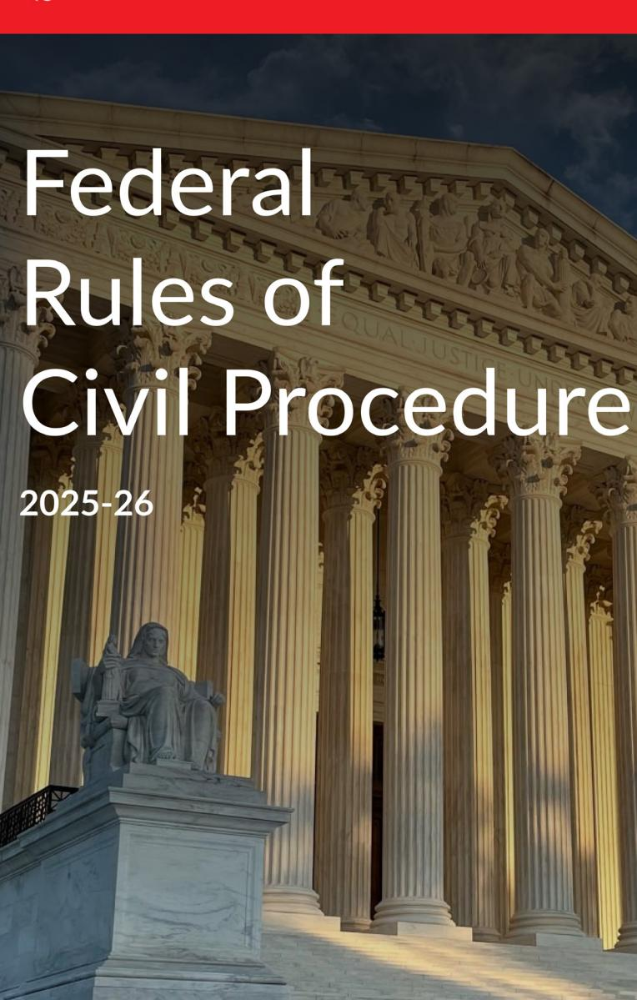

# Federal Rules of Civil Procedure

2025 LexisNexis Federal Documents

**LexisNexis, the Knowledge Burst logo, and Shepard's are registered trademarks, and lexisnexis.com is a service mark of Reed Elsevier Properties Inc., used under license. Matthew Bender is a registered trademark of Matthew Bender Properties Inc.**

**Copyright© 2025 by Matthew Bender & Company, Inc., a member of the LexisNexis Group. All rights reserved.**

**Copyright is not claimed in any works of the United States Government. Permission to copy material exceeding fair use, 17 USCS § 107, may be licensed for a fee of \$1 per page per copy from the Copyright Clearance Center, 222 Rosewood Drive, Danvers, MA, 01923, telephone (978) 750-8400.**

### www.lexisnexis.com

**Suggestions, comments, or questions about United States Code Service are always welcome. You may contact Customer Support at their selfservice portal available 24/7 at** support.lexisnexis.com/app/print or call (800) 833-9844, or write: Derrick Wilborn, J.D., Derrick.Wilborn@lexisnexis.com

Library of Congress Catalog Card Number 72-76254

ISBN: 979-8-341-71501-1

# **FEDERAL RULES OF CIVIL PROCEDURE**

### Title

- I. Scope of Rules; Form of Action
- II. Commencing an Action; Service of Process, Pleadings, Motions, and Orders
- III. Pleadings and Motions
- IV. Parties
- V. Disclosures and Discovery
- VI. Trials
- VII. Judgment
- VIII. Provisional and Final Remedies
- IX. Special Proceedings
- X. District Courts and Clerks: Conducting Business; Issuing Orders
- XI. General Provisions

# **TITLE I.**

# **SCOPE OF RULES; FORM OF ACTION**

#### Rule

- 1. Scope and Purpose
- 2. One Form of Action

### **Rule 1. Scope and Purpose**

These rules govern the procedure in all civil actions and proceedings in the United States district courts, except as stated in Rule 81. They should be construed, administered, and employed by the court and the parties to secure the just, speedy, and inexpensive determination of every action and proceeding.

### **Rule 2. One Form of Action**

There is one form of action—the civil action.

1

### **TITLE II.**

# **COMMENCING AN ACTION; SERVICE OF PROCESS, PLEADINGS, MOTIONS, AND ORDERS**

#### Rule

- 3. Commencing an Action
- 4. Summons
- 4.1. Serving Other Process
- 5. Serving and Filing Pleadings and Other Papers
- 5.1. Constitutional Challenge to a Statute Notice, Certification, and Intervention
- 5.2. Privacy Protection for Filings Made with the Court
- 6. Computing and Extending Time; Time for Motion Papers

### **Rule 3. Commencing an Action**

A civil action is commenced by filing a complaint with the court.

### **Rule 4. Summons**

- **(a) Contents; Amendments.**
  - (1) Contents. A summons must:
    - (A) name the court and the parties;
    - (B) be directed to the defendant;
  - (C) state the name and address of the plaintiff's attorney or—if unrepresented—of the plaintiff;
  - (D) state the time within which the defendant must appear and defend;
  - (E) notify the defendant that a failure to appear and defend will result in a default judgment against the defendant for the relief demanded in the complaint;
    - (F) be signed by the clerk; and
    - (G) bear the court's seal.
- (2) Amendments. The court may permit a summons to be amended.

**(b) Issuance.** On or after filing the complaint, the plaintiff may present a summons to the clerk for signature and seal. If the summons is properly completed, the clerk must sign, seal, and issue it to the plaintiff for service on the defendant. A summons—or a copy of a summons that is addressed to multiple defendants—must be issued for each defendant to be served.

### **(c) Service.**

- (1) In General. A summons must be served with a copy of the complaint. The plaintiff is responsible for having the summons and complaint served within the time allowed by Rule 4(m) and must furnish the necessary copies to the person who makes service.
- (2) By Whom. Any person who is at least 18 years old and not a party may serve a summons and complaint.
- (3) By a Marshal or Someone Specially Appointed. At the plaintiff's request, the court may order that service be made by a United States marshal or deputy marshal or by a person specially appointed by the court. The court must so order if the plaintiff is authorized to proceed in forma pauperis under 28 U.S.C. § 1915 or as a seaman under 28 U.S.C. § 1916.

### **(d) Waiving Service.**

- (1) Requesting a Waiver. An individual, corporation, or association that is subject to service under Rule 4(e), (f), or (h) has a duty to avoid unnecessary expenses of serving the summons. The plaintiff may notify such a defendant that an action has been commenced and request that the defendant waive service of a summons. The notice and request must:
  - (A) be in writing and be addressed:

- (i) to the individual defendant; or
- (ii) for a defendant subject to service under Rule 4(h), to an officer, a managing or general agent, or any other agent authorized by appointment or by law to receive service of process;
- (B) name the court where the complaint was filed;
- (C) be accompanied by a copy of the complaint, two copies of the waiver form appended to this Rule 4, and a prepaid means for returning the form;
- (D) inform the defendant, using the form appended to the Rule 4, of the consequences of waiving and not waiving service;
  - (E) state the date when the request is sent;
- (F) give the defendant a reasonable time of at least 30 days after the request was sent—or at least 60 days if sent to the defendant outside any judicial district of the United States—to return the waiver; and
- (G) be sent by first-class mail or other reliable means.
- (2) Failure to Waive. If a defendant located within the United States fails, without good cause, to sign and return a waiver requested by a plaintiff located within the United States, the court must impose on the defendant:
  - (A) the expenses later incurred in making service; and
  - (B) the reasonable expenses, including attorney's fees, of any motion required to collect those service expenses.
- (3) Time to Answer After a Waiver. A defendant who, before being served with process, timely re-

turns a waiver need not serve an answer to the complaint until 60 days after the request was sent—or until 90 days after it was sent to the defendant outside any judicial district of the United States.

- (4) Results of Filing a Waiver. When the plaintiff files a waiver, proof of service is not required and these rules apply as if a summons and complaint had been served at the time of filing the waiver.
- (5) Jurisdiction and Venue Not Waived. Waiving service of a summons does not waive any objection to personal jurisdiction or to venue.
- **(e) Serving an Individual Within a Judicial District of the United States.** Unless federal law provides otherwise, an individual—other than a minor, an incompetent person, or a person whose waiver has been filed—may be served in a judicial district of the United States by:
  - (1) following state law for serving a summons in an action brought in courts of general jurisdiction in the state where the district court is located or where service is made; or
    - (2) doing any of the following:
    - (A) delivering a copy of the summons and of the complaint to the individual personally;
    - (B) leaving a copy of each at the individual's dwelling or usual place of abode with someone of suitable age and discretion who resides there; or
    - (C) delivering a copy of each to an agent authorized by appointment or by law to receive service of process.
- **(f) Serving an Individual in a Foreign Country.** Unless federal law provides otherwise, an individual other than a minor, an incompetent person, or a person

whose waiver has been filed—may be served at a place not within any judicial district of the United States:

- (1) by any internationally agreed means of service that is reasonably calculated to give notice, such as those authorized by the Hague Convention on the Service Abroad of Judicial and Extrajudicial Documents;
- (2) if there is no internationally agreed means, or if an international agreement allows but does not specify other means, by a method that is reasonably calculated to give notice:
  - (A) as prescribed by the foreign country's law for service in that country in an action in its courts of general jurisdiction;
  - (B) as the foreign authority directs in response to a letter rogatory or letter of request; or
  - (C) unless prohibited by the foreign country's law, by:
    - (i) delivering a copy of the summons and of the complaint to the individual personally; or
    - (ii) using any form of mail that the clerk addresses and sends to the individual and that requires a signed receipt; or
- (3) by other means not prohibited by international agreement, as the court orders.
- **(g) Serving a Minor or an Incompetent Person.** A minor or an incompetent person in a judicial district of the United States must be served by following state law for serving a summons or like process on such a defendant in an action brought in the courts of general jurisdiction of the state where service is made. A minor or an incompetent person who is not within any judicial district of the United States must be served in the

manner prescribed by Rule 4(f)(2)(A), (f)(2)(B), or (f)(3).

- **(h) Serving a Corporation, Partnership, or Association.** Unless federal law provides otherwise or the defendant's waiver has been filed, a domestic or foreign corporation, or a partnership or other unincorporated association that is subject to suit under a common name, must be served:
  - (1) in a judicial district of the United States:
  - (A) in the manner prescribed by Rule 4(e)(1) for serving an individual; or
  - (B) by delivering a copy of the summons and of the complaint to an officer, a managing or general agent, or any other agent authorized by appointment or by law to receive service of process and—if the agent is one authorized by statute and the statute so requires—by also mailing a copy of each to the defendant; or
  - (2) at a place not within any judicial district of the United States, in any manner prescribed by Rule 4(f) for serving an individual, except personal delivery under (f)(2)(C)(i).
- **(i) Serving the United States and Its Agencies, Corporations, Officers, or Employees.**
  - (1) United States. To serve the United States, a party must:
    - (A)(i) deliver a copy of the summons and of the complaint to the United States attorney for the district where the action is brought—or to an assistant United States attorney or clerical employee whom the United States attorney designates in a writing filed with the court clerk—or
      - (ii) send a copy of each by registered or

- certified mail to the civil-process clerk at the United States attorney's office;
- (B) send a copy of each by registered or certified mail to the Attorney General of the United States at Washington, D.C.; and
- (C) if the action challenges an order of a nonparty agency or officer of the United States, send a copy of each by registered or certified mail to the agency or officer.
- (2) Agency; Corporation; Officer or Employee Sued in an Official Capacity. To serve a United States agency or corporation, or a United States officer or employee sued only in an official capacity, a party must serve the United States and also send a copy of the summons and of the complaint by registered or certified mail to the agency, corporation, officer, or employee.
- (3) Officer or Employee Sued Individually. To serve a United States officer or employee sued in an individual capacity for an act or omission occurring in connection with duties performed on the United States' behalf (whether or not the officer or employee is also sued in an official capacity), a party must serve the United States and also serve the officer or employee under Rule 4(e), (f), or (g).
- (4) Extending Time. The court must allow a party a reasonable time to cure its failure to:
  - (A) serve a person required to be served under Rule 4(i)(2), if the party has served either the United States attorney or the Attorney General of the United States; or
  - (B) serve the United States under Rule 4(i)(3), if the party has served the United States officer or employee.

### **(j) Serving a Foreign, State, or Local Government.**

- (1) Foreign State. A foreign state or its political subdivision, agency, or instrumentality must be served in accordance with 28 U.S.C. § 1608.
- (2) State or Local Government. A state, a municipal corporation, or any other state-created governmental organization that is subject to suit must be served by:
  - (A) delivering a copy of the summons and of the complaint to its chief executive officer; or
  - (B) serving a copy of each in the manner prescribed by that state's law for serving a summons or like process on such a defendant.

### **(k) Territorial Limits of Effective Service.**

- (1) In General. Serving a summons or filing a waiver of service establishes personal jurisdiction over a defendant:
  - (A) who is subject to the jurisdiction of a court of general jurisdiction in the state where the district court is located;
  - (B) who is a party joined under Rule 14 or 19 and is served within a judicial district of the United States and not more than 100 miles from where the summons was issued; or
    - (C) when authorized by a federal statute.
- (2) Federal Claim Outside State-Court Jurisdiction. For a claim that arises under federal law, serving a summons or filing a waiver of service establishes personal jurisdiction over a defendant if:
  - (A) the defendant is not subject to jurisdiction in any state's courts of general jurisdiction; and
  - (B) exercising jurisdiction is consistent with the United States Constitution and laws.

### **(l) Proving Service.**

- (1) Affidavit Required. Unless service is waived, proof of service must be made to the court. Except for service by a United States marshal or deputy marshal, proof must be by the server's affidavit.
- (2) Service Outside the United States. Service not within any judicial district of the United States must be proved as follows:
  - (A) if made under Rule 4(f)(1), as provided in the applicable treaty or convention; or
  - (B) if made under Rule 4(f)(2) or (f)(3), by a receipt signed by the addressee, or by other evidence satisfying the court that the summons and complaint were delivered to the addressee.
- (3) Validity of Service; Amending Proof. Failure to prove service does not affect the validity of service. The court may permit proof of service to be amended.
- **(m) Time Limit for Service.** If a defendant is not served within 90 days after the complaint is filed, the court—on motion or on its own after notice to the plaintiff—must dismiss the action without prejudice against that defendant or order that service be made within a specified time. But if the plaintiff shows good cause for the failure, the court must extend the time for service for an appropriate period. This subdivision (m) does not apply to service in a foreign country under Rule 4(f), 4(h)(2), or 4(j)(1), or to service of a notice under Rule 71.1(d)(3)(A).
- **(n) Asserting Jurisdiction over Property or Assets.**
  - (1) Federal Law. The court may assert jurisdiction over property if authorized by a federal statute. Notice to claimants of the property must be given as

provided in the statute or by serving a summons under this rule.

(2) State Law. On a showing that personal jurisdiction over a defendant cannot be obtained in the district where the action is brought by reasonable efforts to serve a summons under this rule, the court may assert jurisdiction over the defendant's assets found in the district. Jurisdiction is acquired by seizing the assets under the circumstances and in the manner provided by state law in that district.

### **Rule 4 Notice of a Lawsuit and Request to Waive Service of Summons.**

# (Caption)

To (name the defendant or — if the defendant is a corporation, partnership, or association — name an officer or agent authorized to receive service):

### **Why are you getting this?**

A lawsuit has been filed against you, or the entity you represent, in this court under the number shown above. A copy of the complaint is attached.

This is not a summons, or an official notice from the court. It is a request that, to avoid expenses, you waive formal service of a summons by signing and returning the enclosed waiver. To avoid these expenses, you must return the signed waiver within (give at least 30 days or at least 60 days if the defendant is outside any judicial district of the United States) from the date shown below, which is the date this notice was sent. Two copies of the waiver form are enclosed, along with a stamped, self-addressed envelope or other prepaid means for returning one copy. You may keep the other copy.

### **What happens next?**

If you return the signed waiver, I will file it with the court. The action will then proceed as if you had been served on the date the waiver is filed, but no summons will be served on you and you will have 60 days from the date this notice is sent (see the date below) to answer the complaint (or 90 days if this notice is sent to you outside any judicial district of the United States).

If you do not return the signed waiver within the time indicated, I will arrange to have the summons and complaint served on you. And I will ask the court to require you, or the entity you represent, to pay the expenses of making service.

Please read the enclosed statement about the duty to avoid unnecessary expenses.

I certify that this request is being sent to you on the date below.

| Date |                                                                      |
|------|----------------------------------------------------------------------|
|      | (Signature of the attorney or unrepresented party) |
|      | (Printed name)                                                    |
|      | (Address)                                                            |
|      | (E-mail address)                                                  |
|      | (Telephone number)                                                |

### **Rule 4 Waiver of the Service of Summons.**

(Caption)

To (name the plaintiff's attorney or the unrepresented plaintiff):

I have received your request to waive service of a summons in this action along with a copy of the complaint, two copies of this waiver form, and a prepaid means of returning one signed copy of the form to you.

I, or the entity I represent, agree to save the expense of serving a summons and complaint in this case.

I understand that I, or the entity I represent, will keep all defenses or objections to the lawsuit, the court's jurisdiction, and the venue of the action, but that I waive any objections to the absence of a summons or of service.

I also understand that I, or the entity I represent, must file and serve an answer or a motion under Rule 12 within 60 days from \_\_\_\_, the date when this request was sent (or 90 days if it was sent outside the United States). If I fail to do so, a default judgment will be entered against me or the entity I represent.

| Date |                                                                      |
|------|----------------------------------------------------------------------|
|      | (Signature of the attorney or unrepresented party) |
|      | (Printed name)                                                    |
|      | (Address)                                                            |
|      | (E-mail address)                                                  |
|      | (Telephone number) (Attach the following)                |

### **Duty to Avoid Unnecessary Expenses of Serving a Summons**

Rule 4 of the Federal Rules of Civil Procedure

requires certain defendants to cooperate in saving unnecessary expenses of serving a summons and complaint. A defendant who is located in the United States and who fails to return a signed waiver of service requested by a plaintiff located in the United States will be required to pay the expenses of service, unless the defendant shows good cause for the failure.

"Good cause" does not include a belief that the lawsuit is groundless, or that it has been brought in an improper venue, or that the court has no jurisdiction over this matter or over the defendant or the defendant's property.

If the waiver is signed and returned, you can still make these and all other defenses and objections, but you cannot object to the absence of a summons or of service.

If you waive service, then you must, within the time specified on the waiver form, serve an answer or a motion under Rule 12 on the plaintiff and file a copy with the court. By signing and returning the waiver form, you are allowed more time to respond than if a summons had been served.

# **Rule 4.1. Serving Other Process**

- **(a) In General.** Process—other than a summons under Rule 4 or a subpoena under Rule 45—must be served by a United States marshal or deputy marshal or by a person specially appointed for that purpose. It may be served anywhere within the territorial limits of the state where the district court is located and, if authorized by a federal statute, beyond those limits. Proof of service must be made under Rule 4(l).
- **(b) Enforcing Orders: Committing for Civil Contempt.** An order committing a person for civil contempt

of a decree or injunction issued to enforce federal law may be served and enforced in any district. Any other order in a civil-contempt proceeding may be served only in the state where the issuing court is located or elsewhere in the United States within 100 miles from where the order was issued.

### **Rule 5. Serving and Filing Pleadings and Other Papers**

- **(a) Service: When Required.**
- (1) In General. Unless these rules provide otherwise, each of the following papers must be served on every party:
  - (A) an order stating that service is required;
  - (B) a pleading filed after the original complaint, unless the court orders otherwise under Rule 5(c) because there are numerous defendants;
  - (C) a discovery paper required to be served on a party, unless the court orders otherwise;
  - (D) a written motion, except one that may be heard ex parte; and
  - (E) a written notice, appearance, demand, or offer of judgment, or any similar paper.
- (2) If a Party Fails to Appear. No service is required on a party who is in default for failing to appear. But a pleading that asserts a new claim for relief against such a party must be served on that party under Rule 4.
- (3) Seizing Property. If an action is begun by seizing property and no person is or need be named as a defendant, any service required before the filing of an appearance, answer, or claim must be made on the person who had custody or possession of the property when it was seized.

### **(b) Service: How Made.**

- (1) Serving an Attorney. If a party is represented by an attorney, service under this rule must be made on the attorney unless the court orders service on the party.
- (2) Service in General. A paper is served under this rule by:
  - (A) handing it to the person;
  - (B) leaving it:
  - (i) at the person's office with a clerk or other person in charge or, if no one is in charge, in a conspicuous place in the office; or
  - (ii) if the person has no office or the office is closed, at the person's dwelling or usual place of abode with someone of suitable age and discretion who resides there;
  - (C) mailing it to the person's last known address—in which event service is complete upon mailing;
  - (D) leaving it with the court clerk if the person has no known address;
  - (E) sending it to a registered user by filing it with the court's electronic-filing system or sending it by other electronic means that the person consented to in writing—in either of which events service is complete upon filing or sending, but is not effective if the filer or sender learns that it did not reach the person to be served; or
  - (F) delivering it by any other means that the person consented to in writing—in which event service is complete when the person making service delivers it to the agency designated to make delivery.

(3) Using Court Facilities. [Abrogated (April 26, 2018, eff. Dec. 1, 2018.)]

### **(c) Serving Numerous Defendants.**

- (1) In General. If an action involves an unusually large number of defendants, the court may, on motion or on its own, order that:
  - (A) defendants' pleadings and replies to them need not be served on other defendants;
  - (B) any crossclaim, counterclaim, avoidance, or affirmative defense in those pleadings and replies to them will be treated as denied or avoided by all other parties; and
  - (C) filing any such pleading and serving it on the plaintiff constitutes notice of the pleading to all parties.
- (2) Notifying Parties. A copy of every such order must be served on the parties as the court directs. **(d) Filing.**
  - (1) Required Filings; Certificate of Service.
  - (A) Papers after the Complaint. Any paper after the complaint that is required to be served must be filed no later than a reasonable time after service. But disclosures under Rule 26(a)(1) or (2) and the following discovery requests and responses must not be filed until they are used in the proceeding or the court orders filing: depositions, interrogatories, requests for documents or tangible things or to permit entry onto land, and requests for admission.
  - (B) Certificate of Service. No certificate of service is required when a paper is served by filing it with the court's electronic-filing system. When a paper that is required to be served is served by other means:

- (i) if the paper is filed, a certificate of service must be filed with it or within a reasonable time after service; and
- (ii) if the paper is not filed, a certificate of service need not be filed unless filing is required by court order or by local rule.
- (2) Nonelectronic Filing. A paper not filed electronically is filed by delivering it:
  - (A) to the clerk; or
  - (B) to a judge who agrees to accept it for filing, and who must then note the filing date on the paper and promptly send it to the clerk.
  - (3) Electronic Filing and Signing.
  - (A) By a Represented Person—Generally Required; Exceptions. A person represented by an attorney must file electronically, unless nonelectronic filing is allowed by the court for good cause or is allowed or required by local rule.
  - (B) By an Unrepresented Person—When Allowed or Required. A person not represented by an attorney:
    - (i) may file electronically only if allowed by court order or by local rule; and
    - (ii) may be required to file electronically only by court order, or by a local rule that includes reasonable exceptions.
  - (C) Signing. A filing made through a person's electronic-filing account and authorized by that person, together with that person's name on a signature block, constitutes the person's signature.
  - (D) Same as a Written Paper. A paper filed electronically is a written paper for purposes of these rules.

(4) Acceptance by the Clerk. The clerk must not refuse to file a paper solely because it is not in the form prescribed by these rules or by a local rule or practice.

# **Rule 5.1. Constitutional Challenge to a Statute — Notice, Certification, and Intervention**

- **(a) Notice by a Party.** A party that files a pleading, written motion, or other paper drawing into question the constitutionality of a federal or state statute must promptly:
  - (1) file a notice of constitutional question stating the question and identifying the paper that raises it, if:
    - (A) a federal statute is questioned and the parties do not include the United States, one of its agencies, or one of its officers or employees in an official capacity; or
    - (B) a state statute is questioned and the parties do not include the state, one of its agencies, or one of its officers or employees in an official capacity; and
  - (2) serve the notice and paper on the Attorney General of the United States if a federal statute is questioned—or on the state attorney general if a state statute is questioned—either by certified or registered mail or by sending it to an electronic address designated by the attorney general for this purpose.
- **(b) Certification by the Court.** The court must, under 28 U.S.C. § 2403, certify to the appropriate attorney general that a statute has been questioned.
- **(c) Intervention; Final Decision on the Merits.** Unless the court sets a later time, the attorney general

may intervene within 60 days after the notice is filed or after the court certifies the challenge, whichever is earlier. Before the time to intervene expires, the court may reject the constitutional challenge, but may not enter a final judgment holding the statute unconstitutional.

**(d) No Forfeiture.** A party's failure to file and serve the notice, or the court's failure to certify, does not forfeit a constitutional claim or defense that is otherwise timely asserted.

# **Rule 5.2. Privacy Protection for Filings Made with the Court**

- **(a) Redacted Filings.** Unless the court orders otherwise, in an electronic or paper filing with the court that contains an individual's social-security number, taxpayer-identification number, or birth date, the name of an individual known to be a minor, or a financialaccount number, a party or nonparty making the filing may include only:
  - (1) the last four digits of the social-security number and taxpayer-identification number;
    - (2) the year of the individual's birth;
    - (3) the minor's initials; and
  - (4) the last four digits of the financial-account number.
- **(b) Exemptions from the Redaction Requirement.** The redaction requirement does not apply to the following:
  - (1) a financial-account number that identifies the property allegedly subject to forfeiture in a forfeiture proceeding;
  - (2) the record of an administrative or agency proceeding;

- (3) the official record of a state-court proceeding;
- (4) the record of a court or tribunal, if that record was not subject to the redaction requirement when originally filed;
  - (5) a filing covered by Rule 5.2(c) or (d); and
- (6) a pro se filing in an action brought under 28 U.S.C. §§ 2241, 2254, or 2255.
- **(c) Limitations on Remote Access to Electronic Files; Social-Security Appeals and Immigration Cases.** Unless the court orders otherwise, in an action for benefits under the Social Security Act, and in an action or proceeding relating to an order of removal, to relief from removal, or to immigration benefits or detention, access to an electronic file is authorized as follows:
  - (1) the parties and their attorneys may have remote electronic access to any part of the case file, including the administrative record;
  - (2) any other person may have electronic access to the full record at the courthouse, but may have remote electronic access only to:
    - (A) the docket maintained by the court; and
    - (B) an opinion, order, judgment, or other disposition of the court, but not any other part of the case file or the administrative record.
- **(d) Filings Made Under Seal.** The court may order that a filing be made under seal without redaction. The court may later unseal the filing or order the person who made the filing to file a redacted version for the public record.
- **(e) Protective Orders.** For good cause, the court may by order in a case:
  - (1) require redaction of additional information; or

- (2) limit or prohibit a nonparty's remote electronic access to a document filed with the court.
- **(f) Option for Additional Unredacted Filing Under Seal.** A person making a redacted filing may also file an unredacted copy under seal. The court must retain the unredacted copy as part of the record.
- **(g) Option for Filing a Reference List.** A filing that contains redacted information may be filed together with a reference list that identifies each item of redacted information and specifies an appropriate identifier that uniquely corresponds to each item listed. The list must be filed under seal and may be amended as of right. Any reference in the case to a listed identifier will be construed to refer to the corresponding item of information.
- **(h) Waiver of Protection of Identifiers.** A person waives the protection of Rule 5.2(a) as to the person's own information by filing it without redaction and not under seal.

### **Rule 6. Computing and Extending Time; Time for Motion Papers**

- **(a) Computing Time.** The following rules apply in computing any time period specified in these rules, in any local rule or court order, or in any statute that does not specify a method of computing time.
  - (1) Period Stated in Days or a Longer Unit. When the period is stated in days or a longer unit of time:
    - (A) exclude the day of the event that triggers the period;
    - (B) count every day, including intermediate Saturdays, Sundays, and legal holidays; and
    - (C) include the last day of the period, but if the last day is a Saturday, Sunday, or legal holiday, the

period continues to run until the end of the next day that is not a Saturday, Sunday, or legal holiday.

- (2) Period Stated in Hours. When the period is stated in hours:
  - (A) begin counting immediately on the occurrence of the event that triggers the period;
  - (B) count every hour, including hours during intermediate Saturdays, Sundays, and legal holidays; and
  - (C) if the period would end on a Saturday, Sunday, or legal holiday, the period continues to run until the same time on the next day that is not a Saturday, Sunday, or legal holiday.
- (3) Inaccessibility of the Clerk's Office. Unless the court orders otherwise, if the clerk's office is inaccessible:
  - (A) on the last day for filing under Rule 6(a)(1), then the time for filing is extended to the first accessible day that is not a Saturday, Sunday, or legal holiday; or
  - (B) during the last hour for filing under Rule 6(a)(2), then the time for filing is extended to the same time on the first accessible day that is not a Saturday, Sunday, or legal holiday.
- (4) "Last Day" Defined. Unless a different time is set by a statute, local rule, or court order, the last day ends:
  - (A) for electronic filing, at midnight in the court's time zone; and
  - (B) for filing by other means, when the clerk's office is scheduled to close.
- (5) "Next Day" Defined. The "next day" is determined by continuing to count forward when the

period is measured after an event and backward when measured before an event.

- (6) "Legal Holiday" Defined. "Legal holiday" means:
  - (A) the day set aside by statute for observing New Year's Day, Martin Luther King Jr.'s Birthday, Washington's Birthday, Memorial Day, Juneteenth National Independence Day, Independence Day, Labor Day, Columbus Day, Veterans' Day, Thanksgiving Day, or Christmas Day;
  - (B) any day declared a holiday by the President or Congress; and
  - (C) for periods that are measured after an event, any other day declared a holiday by the state where the district court is located.

### **(b) Extending Time.**

- (1) In General. When an act may or must be done within a specified time, the court may, for good cause, extend the time:
  - (A) with or without motion or notice if the court acts, or if a request is made, before the original time or its extension expires; or
  - (B) on motion made after the time has expired if the party failed to act because of excusable neglect.
- (2) Exceptions. A court must not extend the time to act under Rules 50(b) and (d), 52(b), 59(b), (d), and (e), and 60(b).

### **(c) Motions, Notices of Hearing, and Affidavits.**

- (1) In General. A written motion and notice of the hearing must be served at least 14 days before the time specified for the hearing, with the following exceptions:
  - (A) when the motion may be heard ex parte;

- (B) when these rules set a different time; or
- (C) when a court order—which a party may, for good cause, apply for ex parte—sets a different time.
- (2) Supporting Affidavit. Any affidavit supporting a motion must be served with the motion. Except as Rule 59(c) provides otherwise, any opposing affidavit must be served at least 7 days before the hearing, unless the court permits service at another time.
- **(d) Additional Time After Certain Kinds of Service.** When a party may or must act within a specified time after being served and service is made under Rule 5(b)(2)(C) (mail), (D) (leaving with the clerk), or (F) (other means consented to), 3 days are added after the period would otherwise expire under Rule 6(a).

### **TITLE III.**

### **PLEADINGS AND MOTIONS**

#### Rule

- 7. Pleadings Allowed; Form of Motions and Other Papers
- 7.1. Disclosure Statement
- 8. General Rules of Pleading
- 9. Pleading Special Matters
- 10. Form of Pleadings
- 11. Signing Pleadings, Motions, and Other Papers; Representations to the Court; Sanctions
- 12. Defenses and Objections: When and How Presented; Motion for Judgment on the Pleadings; Consolidating Motions; Waiving Defenses; Pretrial Hearing
- 13. Counterclaim and Crossclaim
- 14. Third-Party Practice
- 15. Amended and Supplemental Pleadings
- 16. Pretrial Conferences; Scheduling; Management [Effective until December 1, 2025]
- 16.1. Multidistrict Litigation [Effective December 1, 2025]

# **Rule 7. Pleadings Allowed; Form of Motions and Other Papers**

- **(a) Pleadings.** Only these pleadings are allowed:
  - (1) a complaint;
  - (2) an answer to a complaint;
- (3) an answer to a counterclaim designated as a counterclaim;
  - (4) an answer to a crossclaim;
  - (5) a third-party complaint;
  - (6) an answer to a third-party complaint; and
  - (7) if the court orders one, a reply to an answer.

# **(b) Motions and Other Papers.**

- (1) In General. A request for a court order must be made by motion. The motion must:
  - (A) be in writing unless made during a hearing or trial;
  - (B) state with particularity the grounds for seeking the order; and
    - (C) state the relief sought.
- (2) Form. The rules governing captions and other matters of form in pleadings apply to motions and other papers.

# **Rule 7.1. Disclosure Statement**

# **(a) Who Must File; Contents.**

- (1) Nongovernmental Corporations. A nongovernmental corporate party or a nongovernmental corporation that seeks to intervene must file a statement that:
  - (A) identifies any parent corporation and any publicly held corporation owning 10% or more of its stock; or
    - (B) states that there is no such corporation.

- (2) Parties or Intervenors in a Diversity Case. In an action in which jurisdiction is based on diversity under 28 U.S.C. § 1332(a), a party or intervenor must, unless the court orders otherwise, file a disclosure statement. The statement must name—and identify the citizenship of—every individual or entity whose citizenship is attributed to that party or intervenor:
  - (A) when the action is filed in or removed to federal court, and
  - (B) when any later event occurs that could affect the court's jurisdiction under § 1332(a).
- **(b) Time to File; Supplemental Filing.** A party, intervenor, or proposed intervenor must:
  - (1) file the disclosure statement with its first appearance, pleading, petition, motion, response, or other request addressed to the court; and
  - (2) promptly file a supplemental statement if any required information changes.

### **Rule 8. General Rules of Pleading**

- **(a) Claim for Relief.** A pleading that states a claim for relief must contain:
  - (1) a short and plain statement of the grounds for the court's jurisdiction, unless the court already has jurisdiction and the claim needs no new jurisdictional support;
  - (2) a short and plain statement of the claim showing that the pleader is entitled to relief; and
  - (3) a demand for the relief sought, which may include relief in the alternative or different types of relief.
  - **(b) Defenses; Admissions and Denials.**
  - (1) In General. In responding to a pleading, a party must:

- (A) state in short and plain terms its defenses to each claim asserted against it; and
- (B) admit or deny the allegations asserted against it by an opposing party.
- (2) Denials—Responding to the Substance. A denial must fairly respond to the substance of the allegation.
- (3) General and Specific Denials. A party that intends in good faith to deny all the allegations of a pleading—including the jurisdictional grounds—may do so by a general denial. A party that does not intend to deny all the allegations must either specifically deny designated allegations or generally deny all except those specifically admitted.
- (4) Denying Part of an Allegation. A party that intends in good faith to deny only part of an allegation must admit the part that is true and deny the rest.
- (5) Lacking Knowledge or Information. A party that lacks knowledge or information sufficient to form a belief about the truth of an allegation must so state, and the statement has the effect of a denial.
- (6) Effect of Failing to Deny. An allegation—other than one relating to the amount of damages—is admitted if a responsive pleading is required and the allegation is not denied. If a responsive pleading is not required, an allegation is considered denied or avoided.

### **(c) Affirmative Defenses.**

- (1) In General. In responding to a pleading, a party must affirmatively state any avoidance or affirmative defense, including:
  - accord and satisfaction;
  - arbitration and award;

- assumption of risk;
- contributory negligence;
- duress;
- estoppel;
- failure of consideration;
- fraud;
- illegality;
- injury by fellow servant;
- laches;
- license;
  - payment;
- release;
- res judicata;
- statute of frauds;
- statute of limitations; and
- waiver.
- (2) Mistaken Designation. If a party mistakenly designates a defense as a counterclaim, or a counterclaim as a defense, the court must, if justice requires, treat the pleading as though it were correctly designated, and may impose terms for doing so.
- **(d) Pleading to Be Concise and Direct; Alternative Statements; Inconsistency.**
  - (1) In General. Each allegation must be simple, concise, and direct. No technical form is required.
  - (2) Alternative Statements of a Claim or Defense. A party may set out two or more statements of a claim or defense alternatively or hypothetically, either in a single count or defense or in separate ones. If a party makes alternative statements, the pleading is sufficient if any one of them is sufficient.
    - (3) Inconsistent Claims or Defenses. A party may

state as many separate claims or defenses as it has, regardless of consistency.

**(e) Construing Pleadings.** Pleadings must be construed so as to do justice.

## **Rule 9. Pleading Special Matters**

- **(a) Capacity or Authority to Sue; Legal Existence.**
  - (1) In General. Except when required to show that the court has jurisdiction, a pleading need not allege:
    - (A) a party's capacity to sue or be sued;
    - (B) a party's authority to sue or be sued in a representative capacity; or
    - (C) the legal existence of an organized association of persons that is made a party.
  - (2) Raising Those Issues. To raise any of those issues, a party must do so by a specific denial, which must state any supporting facts that are peculiarly within the party's knowledge.
- **(b) Fraud or Mistake; Conditions of Mind.** In alleging fraud or mistake, a party must state with particularity the circumstances constituting fraud or mistake. Malice, intent, knowledge, and other conditions of a person's mind may be alleged generally.
- **(c) Conditions Precedent.** In pleading conditions precedent, it suffices to allege generally that all conditions precedent have occurred or been performed. But when denying that a condition precedent has occurred or been performed, a party must do so with particularity.
- **(d) Official Document or Act.** In pleading an official document or official act, it suffices to allege that the document was legally issued or the act legally done.
  - **(e) Judgment.** In pleading a judgment or decision of

a domestic or foreign court, a judicial or quasi-judicial tribunal, or a board or officer, it suffices to plead the judgment or decision without showing jurisdiction to render it.

- **(f) Time and Place.** An allegation of time or place is material when testing the sufficiency of a pleading.
- **(g) Special Damages.** If an item of special damage is claimed, it must be specifically stated.
  - **(h) Admiralty or Maritime Claim.**
  - (1) How Designated. If a claim for relief is within the admiralty or maritime jurisdiction and also within the court's subject-matter jurisdiction on some other ground, the pleading may designate the claim as an admiralty or maritime claim for purposes of Rules 14(c), 38(e), and 82 and the Supplemental Rules for Admiralty or Maritime Claims and Asset Forfeiture Actions. A claim cognizable only in the admiralty or maritime jurisdiction is an admiralty or maritime claim for those purposes, whether or not so designated.
  - (2) Designation for Appeal. A case that includes an admiralty or maritime claim within this subdivision (h) is an admiralty case within 28 U.S.C. § 1292(a)(3).

# **Rule 10. Form of Pleadings**

- **(a) Caption; Names of Parties.** Every pleading must have a caption with the court's name, a title, a file number, and a Rule 7(a) designation. The title of the complaint must name all the parties; the title of other pleadings, after naming the first party on each side, may refer generally to other parties.
- **(b) Paragraphs; Separate Statements.** A party must state its claims or defenses in numbered para-

graphs, each limited as far as practicable to a single set of circumstances. A later pleading may refer by number to a paragraph in an earlier pleading. If doing so would promote clarity, each claim founded on a separate transaction or occurrence—and each defense other than a denial—must be stated in a separate count or defense.

**(c) Adoption by Reference; Exhibits.** A statement in a pleading may be adopted by reference elsewhere in the same pleading or in any other pleading or motion. A copy of a written instrument that is an exhibit to a pleading is a part of the pleading for all purposes.

# **Rule 11. Signing Pleadings, Motions, and Other Papers; Representations to the Court; Sanctions**

- **(a) Signature.** Every pleading, written motion, and other paper must be signed by at least one attorney of record in the attorney's name—or by a party personally if the party is unrepresented. The paper must state the signer's address, e-mail address, and telephone number. Unless a rule or statute specifically states otherwise, a pleading need not be verified or accompanied by an affidavit. The court must strike an unsigned paper unless the omission is promptly corrected after being called to the attorney's or party's attention.
- **(b) Representations to the Court.** By presenting to the court a pleading, written motion, or other paper whether by signing, filing, submitting, or later advocating it—an attorney or unrepresented party certifies that to the best of the person's knowledge, information, and belief, formed after an inquiry reasonable under the circumstances:
  - (1) it is not being presented for any improper

purpose, such as to harass, cause unnecessary delay, or needlessly increase the cost of litigation;

- (2) the claims, defenses, and other legal contentions are warranted by existing law or by a nonfrivolous argument for extending, modifying, or reversing existing law or for establishing new law;
- (3) the factual contentions have evidentiary support or, if specifically so identified, will likely have evidentiary support after a reasonable opportunity for further investigation or discovery; and
- (4) the denials of factual contentions are warranted on the evidence or, if specifically so identified, are reasonably based on belief or a lack of information.

# **(c) Sanctions.**

- (1) In General. If, after notice and a reasonable opportunity to respond, the court determines that Rule 11(b) has been violated, the court may impose an appropriate sanction on any attorney, law firm, or party that violated the rule or is responsible for the violation. Absent exceptional circumstances, a law firm must be held jointly responsible for a violation committed by its partner, associate, or employee.
- (2) Motion for Sanctions. A motion for sanctions must be made separately from any other motion and must describe the specific conduct that allegedly violates Rule 11(b). The motion must be served under Rule 5, but it must not be filed or be presented to the court if the challenged paper, claim, defense, contention, or denial is withdrawn or appropriately corrected within 21 days after service or within another time the court sets. If warranted, the court may award to the prevailing party the reasonable

expenses, including attorney's fees, incurred for the motion.

- (3) On the Court's Initiative. On its own, the court may order an attorney, law firm, or party to show cause why conduct specifically described in the order has not violated Rule 11(b).
- (4) Nature of a Sanction. A sanction imposed under this rule must be limited to what suffices to deter repetition of the conduct or comparable conduct by others similarly situated. The sanction may include nonmonetary directives; an order to pay a penalty into court; or, if imposed on motion and warranted for effective deterrence, an order directing payment to the movant of part or all of the reasonable attorney's fees and other expenses directly resulting from the violation.
- (5) Limitations on Monetary Sanctions. The court must not impose a monetary sanction:
  - (A) against a represented party for violating Rule 11(b)(2); or
  - (B) on its own, unless it issued the show-cause order under Rule 11(c)(3) before voluntary dismissal or settlement of the claims made by or against the party that is, or whose attorneys are, to be sanctioned.
- (6) Requirements for an Order. An order imposing a sanction must describe the sanctioned conduct and explain the basis for the sanction.
- **(d) Inapplicability to Discovery.** This rule does not apply to disclosures and discovery requests, responses, objections, and motions under Rules 26 through 37.

- **Rule 12. Defenses and Objections: When and How Presented; Motion for Judgment on the Pleadings; Consolidating Motions; Waiving Defenses; Pretrial Hearing**
- **(a) Time to Serve a Responsive Pleading.** Unless another time is specified by a federal statute, the time for serving a responsive pleading is as follows:
  - (1) In General.
    - (A) A defendant must serve an answer:
    - (i) within 21 days after being served with the summons and complaint; or
    - (ii) if it has timely waived service under Rule 4(d), within 60 days after the request for a waiver was sent, or within 90 days after it was sent to the defendant outside any judicial district of the United States.
  - (B) A party must serve an answer to a counterclaim or crossclaim within 21 days after being served with the pleading that states the counterclaim or crossclaim.
  - (C) A party must serve a reply to an answer within 21 days after being served with an order to reply, unless the order specifies a different time.
  - (2) United States and Its Agencies, Officers, or Employees Sued in an Official Capacity. The United States, a United States agency, or a United States officer or employee sued only in an official capacity must serve an answer to a complaint, counterclaim, or crossclaim within 60 days after service on the United States attorney.
  - (3) United States Officers or Employees Sued in an Individual Capacity. A United States officer or

employee sued in an individual capacity for an act or omission occurring in connection with duties performed on the United States' behalf must serve an answer to a complaint, counterclaim, or crossclaim within 60 days after service on the officer or employee or service on the United States attorney, whichever is later.

- (4) Effect of a Motion. Unless the court sets a different time, serving a motion under this rule alters these periods as follows:
  - (A) if the court denies the motion or postpones its disposition until trial, the responsive pleading must be served within 14 days after notice of the court's action; or
  - (B) if the court grants a motion for a more definite statement, the responsive pleading must be served within 14 days after the more definite statement is served.
- **(b) How to Present Defenses.** Every defense to a claim for relief in any pleading must be asserted in the responsive pleading if one is required. But a party may assert the following defenses by motion:
  - (1) lack of subject-matter jurisdiction;
  - (2) lack of personal jurisdiction;
  - (3) improper venue;
  - (4) insufficient process;
  - (5) insufficient service of process;
  - (6) failure to state a claim upon which relief can be granted; and
    - (7) failure to join a party under Rule 19.

A motion asserting any of these defenses must be made before pleading if a responsive pleading is allowed. If a pleading sets out a claim for relief that does not require a responsive pleading, an opposing party may assert at trial any defense to that claim. No defense or objection is waived by joining it with one or more other defenses or objections in a responsive pleading or in a motion.

- **(c) Motion for Judgment on the Pleadings.** After the pleadings are closed—but early enough not to delay trial—a party may move for judgment on the pleadings.
- **(d) Result of Presenting Matters Outside the Pleadings.** If, on a motion under Rule 12(b)(6) or 12(c), matters outside the pleadings are presented to and not excluded by the court, the motion must be treated as one for summary judgment under Rule 56. All parties must be given a reasonable opportunity to present all the material that is pertinent to the motion.
- **(e) Motion for a More Definite Statement.** A party may move for a more definite statement of a pleading to which a responsive pleading is allowed but which is so vague or ambiguous that the party cannot reasonably prepare a response. The motion must be made before filing a responsive pleading and must point out the defects complained of and the details desired. If the court orders a more definite statement and the order is not obeyed within 14 days after notice of the order or within the time the court sets, the court may strike the pleading or issue any other appropriate order.
- **(f) Motion to Strike.** The court may strike from a pleading an insufficient defense or any redundant, immaterial, impertinent, or scandalous matter. The court may act:
  - (1) on its own; or
  - (2) on motion made by a party either before responding to the pleading or, if a response is not

allowed, within 21 days after being served with the pleading.

# **(g) Joining Motions.**

- (1) Right to Join. A motion under this rule may be joined with any other motion allowed by this rule.
- (2) Limitation on Further Motions. Except as provided in Rule 12(h)(2) or (3), a party that makes a motion under this rule must not make another motion under this rule raising a defense or objection that was available to the party but omitted from its earlier motion.

### **(h) Waiving and Preserving Certain Defenses.**

- (1) When Some Are Waived. A party waives any defense listed in Rule 12(b)(2)–(5) by:
  - (A) omitting it from a motion in the circumstances described in Rule 12(g)(2); or
    - (B) failing to either:
      - (i) make it by motion under this rule; or
    - (ii) include it in a responsive pleading or in an amendment allowed by Rule 15(a)(1) as a matter of course.
- (2) When to Raise Others. Failure to state a claim upon which relief can be granted, to join a person required by Rule 19(b), or to state a legal defense to a claim may be raised:
  - (A) in any pleading allowed or ordered under Rule 7(a);
    - (B) by a motion under Rule 12(c); or
    - (C) at trial.
- (3) Lack of Subject-Matter Jurisdiction. If the court determines at any time that it lacks subject-matter jurisdiction, the court must dismiss the action.
- **(i) Hearing Before Trial.** If a party so moves, any defense listed in Rule 12(b)(1)–(7)—whether made in a

pleading or by motion—and a motion under Rule 12(c) must be heard and decided before trial unless the court orders a deferral until trial.

### **Rule 13. Counterclaim and Crossclaim**

### **(a) Compulsory Counterclaim.**

- (1) In General. A pleading must state as a counterclaim any claim that—at the time of its service the pleader has against an opposing party if the claim:
  - (A) arises out of the transaction or occurrence that is the subject matter of the opposing party's claim; and
  - (B) does not require adding another party over whom the court cannot acquire jurisdiction.
- (2) Exceptions. The pleader need not state the claim if:
  - (A) when the action was commenced, the claim was the subject of another pending action; or
  - (B) the opposing party sued on its claim by attachment or other process that did not establish personal jurisdiction over the pleader on that claim, and the pleader does not assert any counterclaim under this rule.
- **(b) Permissive Counterclaim.** A pleading may state as a counterclaim against an opposing party any claim that is not compulsory.
- **(c) Relief Sought in a Counterclaim.** A counterclaim need not diminish or defeat the recovery sought by the opposing party. It may request relief that exceeds in amount or differs in kind from the relief sought by the opposing party.
- **(d) Counterclaim Against the United States.** These rules do not expand the right to assert a

counterclaim—or to claim a credit—against the United States or a United States officer or agency.

- **(e) Counterclaim Maturing or Acquired After Pleading.** The court may permit a party to file a supplemental pleading asserting a counterclaim that matured or was acquired by the party after serving an earlier pleading.
  - (f) [Abrogated]
- **(g) Crossclaim Against a Coparty.** A pleading may state as a crossclaim any claim by one party against a coparty if the claim arises out of the transaction or occurrence that is the subject matter of the original action or of a counterclaim, or if the claim relates to any property that is the subject matter of the original action. The crossclaim may include a claim that the coparty is or may be liable to the crossclaimant for all or part of a claim asserted in the action against the crossclaimant.
- **(h) Joining Additional Parties.** Rules 19 and 20 govern the addition of a person as a party to a counterclaim or crossclaim.
- **(i) Separate Trials; Separate Judgments.** If the court orders separate trials under Rule 42(b), it may enter judgment on a counterclaim or crossclaim under Rule 54(b) when it has jurisdiction to do so, even if the opposing party's claims have been dismissed or otherwise resolved.

### **Rule 14. Third-Party Practice**

- **(a) When a Defending Party May Bring in a Third Party.**
  - (1) Timing of the Summons and Complaint. A defending party may, as third-party plaintiff, serve a summons and complaint on a nonparty who is or may be liable to it for all or part of the claim against

- it. But the third-party plaintiff must, by motion, obtain the court's leave if it files the third-party complaint more than 14 days after serving its original answer.
- (2) Third-Party Defendant's Claims and Defenses. The person served with the summons and third-party complaint—the "third-party defendant":
  - (A) must assert any defense against the thirdparty plaintiff's claim under Rule 12;
  - (B) must assert any counterclaim against the third-party plaintiff under Rule 13(a), and may assert any counterclaim against the third-party plaintiff under Rule 13(b) or any crossclaim against another third-party defendant under Rule 13(g);
  - (C) may assert against the plaintiff any defense that the third-party plaintiff has to the plaintiff's claim; and
  - (D) may also assert against the plaintiff any claim arising out of the transaction or occurrence that is the subject matter of the plaintiff's claim against the third-party plaintiff.
- (3) Plaintiff's Claims Against a Third-Party Defendant. The plaintiff may assert against the third-party defendant any claim arising out of the transaction or occurrence that is the subject matter of the plaintiff's claim against the third-party plaintiff. The third-party defendant must then assert any defense under Rule 12 and any counterclaim under Rule 13(a), and may assert any counterclaim under Rule 13(b) or any crossclaim under Rule 13(g).
- (4) Motion to Strike, Sever, or Try Separately. Any party may move to strike the third-party claim, to sever it, or to try it separately.
  - (5) Third-Party Defendant's Claim Against a Non-

- party. A third-party defendant may proceed under this rule against a nonparty who is or may be liable to the third-party defendant for all or part of any claim against it.
- (6) Third-Party Complaint In Rem. If it is within the admiralty or maritime jurisdiction, a third-party complaint may be in rem. In that event, a reference in this rule to the "summons" includes the warrant of arrest, and a reference to the defendant or third-party plaintiff includes, when appropriate, a person who asserts a right under Supplemental Rule C(6)(a)(i) in the property arrested.
- **(b) When a Plaintiff May Bring in a Third Party.** When a claim is asserted against a plaintiff, the plaintiff may bring in a third party if this rule would allow a defendant to do so.

# **(c) Admiralty or Maritime Claim.**

- (1) Scope of Impleader. If a plaintiff asserts an admiralty or maritime claim under Rule 9(h), the defendant or a person who asserts a right under Supplemental Rule C(6)(a)(i) may, as a third-party plaintiff, bring in a third-party defendant who may be wholly or partly liable—either to the plaintiff or to the third-party plaintiff—for remedy over, contribution, or otherwise on account of the same transaction, occurrence, or series of transactions or occurrences.
- (2) Defending Against a Demand for Judgment for the Plaintiff. The third-party plaintiff may demand judgment in the plaintiff's favor against the third-party defendant. In that event, the third-party defendant must defend under Rule 12 against the plaintiff's claim as well as the third-party plaintiff's claim; and the action proceeds as if the plaintiff had sued both the third-party defendant and the third-party plaintiff.

# **Rule 15. Amended and Supplemental Pleadings**

# **(a) Amendments Before Trial.**

- (1) Amending as a Matter of Course. A party may amend its pleading once as a matter of course no later than:
  - (A) 21 days after serving it, or
  - (B) if the pleading is one to which a responsive pleading is required, 21 days after service of a responsive pleading or 21 days after service of a motion under Rule 12(b), (e), or (f), whichever is earlier.
- (2) Other Amendments. In all other cases, a party may amend its pleading only with the opposing party's written consent or the court's leave. The court should freely give leave when justice so requires.
- (3) Time to Respond. Unless the court orders otherwise, any required response to an amended pleading must be made within the time remaining to respond to the original pleading or within 14 days after service of the amended pleading, whichever is later.

### **(b) Amendments During and After Trial.**

- (1) Based on an Objection at Trial. If, at trial, a party objects that evidence is not within the issues raised in the pleadings, the court may permit the pleadings to be amended. The court should freely permit an amendment when doing so will aid in presenting the merits and the objecting party fails to satisfy the court that the evidence would prejudice that party's action or defense on the merits. The court may grant a continuance to enable the objecting party to meet the evidence.
- (2) For Issues Tried by Consent. When an issue not raised by the pleadings is tried by the parties'

express or implied consent, it must be treated in all respects as if raised in the pleadings. A party may move—at any time, even after judgment—to amend the pleadings to conform them to the evidence and to raise an unpleaded issue. But failure to amend does not affect the result of the trial of that issue.

# **(c) Relation Back of Amendments.**

- (1) When an Amendment Relates Back. An amendment to a pleading relates back to the date of the original pleading when:
  - (A) the law that provides the applicable statute of limitations allows relation back;
  - (B) the amendment asserts a claim or defense that arose out of the conduct, transaction, or occurrence set out—or attempted to be set out—in the original pleading; or
  - (C) the amendment changes the party or the naming of the party against whom a claim is asserted, if Rule 15(c)(1)(B) is satisfied and if, within the period provided by Rule 4(m) for serving the summons and complaint, the party to be brought in by amendment:
    - (i) received such notice of the action that it will not be prejudiced in defending on the merits; and
    - (ii) knew or should have known that the action would have been brought against it, but for a mistake concerning the proper party's identity.
- (2) Notice to the United States. When the United States or a United States officer or agency is added as a defendant by amendment, the notice requirements of Rule 15(c)(1)(C)(i) and (ii) are satisfied if, during the stated period, process was delivered or mailed to the United States attorney or the United

States attorney's designee, to the Attorney General of the United States, or to the officer or agency.

**(d) Supplemental Pleadings.** On motion and reasonable notice, the court may, on just terms, permit a party to serve a supplemental pleading setting out any transaction, occurrence, or event that happened after the date of the pleading to be supplemented. The court may permit supplementation even though the original pleading is defective in stating a claim or defense. The court may order that the opposing party plead to the supplemental pleading within a specified time.

# **Rule 16. Pretrial Conferences; Scheduling; Management [Effective until December 1, 2025]**

- **(a) Purposes of a Pretrial Conference.** In any action, the court may order the attorneys and any unrepresented parties to appear for one or more pretrial conferences for such purposes as:
  - (1) expediting disposition of the action;
  - (2) establishing early and continuing control so that the case will not be protracted because of lack of management;
    - (3) discouraging wasteful pretrial activities;
  - (4) improving the quality of the trial through more thorough preparation; and
    - (5) facilitating settlement.

## **(b) Scheduling.**

- (1) Scheduling Order. Except in categories of actions exempted by local rule, the district judge or a magistrate judge when authorized by local rule — must issue a scheduling order:
  - (A) after receiving the parties' report under Rule 26(f); or

- (B) after consulting with the parties' attorneys and any unrepresented parties at a scheduling conference.
- (2) Time to Issue. The judge must issue the scheduling order as soon as practicable, but unless the judge finds good cause for delay, the judge must issue it within the earlier of 90 days after any defendant has been served with the complaint or 60 days after any defendant has appeared.
  - (3) Contents of the Order.
  - (A) Required Contents. The scheduling order must limit the time to join other parties, amend the pleadings, complete discovery, and file motions.
  - (B) Permitted Contents. The scheduling order may:
    - (i) modify the timing of disclosures under Rules 26(a) and 26(e)(1);
      - (ii) modify the extent of discovery;
    - (iii) provide for disclosure, discovery, or preservation of electronically stored information;
    - (iv) include any agreements the parties reach for asserting claims of privilege or of protection as trial-preparation material after information is produced, including agreements reached under Federal Rule of Evidence 502;
    - (v) direct that before moving for an order relating to discovery, the movant must request a conference with the court;
    - (vi) set dates for pretrial conferences and for trial; and
      - (vii) include other appropriate matters.
- (4) Modifying a Schedule. A schedule may be modified only for good cause and with the judge's consent.

# **(c) Attendance and Matters for Consideration at a Pretrial Conference.**

- (1) Attendance. A represented party must authorize at least one of its attorneys to make stipulations and admissions about all matters that can reasonably be anticipated for discussion at a pretrial conference. If appropriate, the court may require that a party or its representative be present or reasonably available by other means to consider possible settlement.
- (2) Matters for Consideration. At any pretrial conference, the court may consider and take appropriate action on the following matters:
  - (A) formulating and simplifying the issues, and eliminating frivolous claims or defenses;
  - (B) amending the pleadings if necessary or desirable;
  - (C) obtaining admissions and stipulations about facts and documents to avoid unnecessary proof, and ruling in advance on the admissibility of evidence;
  - (D) avoiding unnecessary proof and cumulative evidence, and limiting the use of testimony under Federal Rule of Evidence 702;
  - (E) determining the appropriateness and timing of summary adjudication under Rule 56;
  - (F) controlling and scheduling discovery, including orders affecting disclosures and discovery under Rule 26 and Rules 29 through 37;
  - (G) identifying witnesses and documents, scheduling the filing and exchange of any pretrial briefs, and setting dates for further conferences and for trial;

- (H) referring matters to a magistrate judge or a master;
- (I) settling the case and using special procedures to assist in resolving the dispute when authorized by statute or local rule;
- (J) determining the form and content of the pretrial order;
  - (K) disposing of pending motions;
- (L) adopting special procedures for managing potentially difficult or protracted actions that may involve complex issues, multiple parties, difficult legal questions, or unusual proof problems;
- (M) ordering a separate trial under Rule 42(b) of a claim, counterclaim, crossclaim, third-party claim, or particular issue;
- (N) ordering the presentation of evidence early in the trial on a manageable issue that might, on the evidence, be the basis for a judgment as a matter of law under Rule 50(a) or a judgment on partial findings under Rule 52(c);
- (O) establishing a reasonable limit on the time allowed to present evidence; and
- (P) facilitating in other ways the just, speedy, and inexpensive disposition of the action.
- **(d) Pretrial Orders.** After any conference under this rule, the court should issue an order reciting the action taken. This order controls the course of the action unless the court modifies it.
- **(e) Final Pretrial Conference and Orders.** The court may hold a final pretrial conference to formulate a trial plan, including a plan to facilitate the admission of evidence. The conference must be held as close to the start of trial as is reasonable, and must be attended by at least one attorney who will conduct the trial for

each party and by any unrepresented party. The court may modify the order issued after a final pretrial conference only to prevent manifest injustice.

# **(f) Sanctions.**

- (1) In General. On motion or on its own, the court may issue any just orders, including those authorized by Rule 37(b)(2)(A)(ii)–(vii), if a party or its attorney:
  - (A) fails to appear at a scheduling or other pretrial conference;
  - (B) is substantially unprepared to participate—or does not participate in good faith—in the conference; or
  - (C) fails to obey a scheduling or other pretrial order.
- (2) Imposing Fees and Costs. Instead of or in addition to any other sanction, the court must order the party, its attorney, or both to pay the reasonable expenses—including attorney's fees—incurred because of any noncompliance with this rule, unless the noncompliance was substantially justified or other circumstances make an award of expenses unjust.

#### **HISTORY; ANCILLARY LAWS AND DIRECTIVES**

#### **Prospective amendments:**

By order dated April 23, 2025, the Supreme Court of the United States approved the following amendments to Rule 16, effective Dec. 1, 2025, and authorized their transmission to Congress in accordance with 28 USCS § 2074:

**Rule 16. Pretrial Conferences; Scheduling; Management** \*\*\*\*\*

- **(b) Scheduling and Management.**
- \*\*\*\*\* (3) Contents of the Order.

\*\*\*\*\*

\*\*\*\*\*

#### (B) Permitted Contents. \*\*\*\*\*

(iv) include the timing and method for complying with Rule 26(b)(5)(A) and any agreements the parties reach for asserting claims of privilege or of protection as trial-preparation material after information is produced, including agreements reached under Federal Rule of Evidence 502;

# **Rule 16.1. Multidistrict Litigation [Effective December 1, 2025]**

**(a) Initial Management Conference.** After the Judicial Panel on Multidistrict Litigation transfers actions, the transferee court should schedule an initial management conference to develop an initial plan for orderly pretrial activity in the MDL proceedings.

### **(b) Report for the Conference.**

- (1) Submitting a Report. The transferee court should order the parties to meet and to submit a report to the court before the conference.
- (2) Required Content: the Parties' Views on Leadership Counsel and Other Matters. The report must address any matter the court designates—which may include any matter in Rule 16—and, unless the court orders otherwise, the parties' views on:
  - (A) whether leadership counsel should be appointed and, if so:
    - (i) the timing of the appointments;
    - (ii) the structure of leadership counsel;
    - (iii) the procedure for selecting leadership and whether the appointments should be reviewed periodically;
    - (iv) their responsibilities and authority in conducting pretrial activities and any role in facilitating resolution of the MDL proceedings;

- (v) the proposed methods for regularly communicating with and reporting to the court and nonleadership counsel;
- (vi) any limits on activity by nonleadership counsel; and
- (vii) whether and when to establish a means for compensating leadership counsel;
- (B) any previously entered scheduling or other orders that should be vacated or modified;
- (C) a schedule for additional management conferences with the court;
- (D) how to manage the direct filing of new actions in the MDL proceedings; and
- (E) whether related actions have been—or are expected to be—filed in other courts, and whether to adopt methods for coordinating with them.
- (3) Additional Required Content: the Parties' Initial Views on Various Matters. Unless the court orders otherwise, the report also must address the parties' initial views on:
  - (A) whether consolidated pleadings should be prepared;
  - (B) how and when the parties will exchange information about the factual bases for their claims and defenses;
  - (C) discovery, including any difficult issues that may arise;
    - (D) any likely pretrial motions;
  - (E) whether the court should consider any measures to facilitate resolving some or all actions before the court;
  - (F) whether any matters should be referred to a magistrate judge or a master; and

- (G) the principal factual and legal issues likely to be presented.
- (4) Permitted Content. The report may include any other matter that the parties wish to bring to the court's attention.
- **(c) Initial Management Order.** After the conference, the court should enter an initial management order addressing the matters in Rule 16.1(b) and, in the court's discretion, any other matters. This order controls the course of the proceedings unless the court modifies it.

# **TITLE IV. PARTIES**

### Rule

- 17. Plaintiff and Defendant; Capacity; Public Officers
- 18. Joinder of Claims
- 19. Required Joinder of Parties
- 20. Permissive Joinder of Parties
- 21. Misjoinder and Nonjoinder of Parties
- 22. Interpleader
- 23. Class Actions
- 23.1. Derivative Actions
- 23.2. Actions Relating to Unincorporated Associations
- 24. Intervention
- 25. Substitution of Parties

### **Rule 17. Plaintiff and Defendant; Capacity; Public Officers**

### **(a) Real Party in Interest.**

(1) Designation in General. An action must be prosecuted in the name of the real party in interest. The following may sue in their own names without joining the person for whose benefit the action is brought:

- (A) an executor;
- (B) an administrator;
- (C) a guardian;
- (D) a bailee;
- (E) a trustee of an express trust;
- (F) a party with whom or in whose name a contract has been made for another's benefit; and
  - (G) a party authorized by statute.
- (2) Action in the Name of the United States for Another's Use or Benefit. When a federal statute so provides, an action for another's use or benefit must be brought in the name of the United States.
- (3) Joinder of the Real Party in Interest. The court may not dismiss an action for failure to prosecute in the name of the real party in interest until, after an objection, a reasonable time has been allowed for the real party in interest to ratify, join, or be substituted into the action. After ratification, joinder, or substitution, the action proceeds as if it had been originally commenced by the real party in interest.
- **(b) Capacity to Sue or Be Sued.** Capacity to sue or be sued is determined as follows:
  - (1) for an individual who is not acting in a representative capacity, by the law of the individual's domicile;
  - (2) for a corporation, by the law under which it was organized; and
  - (3) for all other parties, by the law of the state where the court is located, except that:
    - (A) a partnership or other unincorporated association with no such capacity under that state's law may sue or be sued in its common name to enforce a substantive right existing under the United States Constitution or laws; and

- (B) 28 U.S.C. §§ 754 and 959(a) govern the capacity of a receiver appointed by a United States court to sue or be sued in a United States court.
- **(c) Minor or Incompetent Person.**
- (1) With a Representative. The following representatives may sue or defend on behalf of a minor or an incompetent person:
  - (A) a general guardian;
  - (B) a committee;
  - (C) a conservator; or
  - (D) a like fiduciary.
- (2) Without a Representative. A minor or an incompetent person who does not have a duly appointed representative may sue by a next friend or by a guardian ad litem. The court must appoint a guardian ad litem—or issue another appropriate order—to protect a minor or incompetent person who is unrepresented in an action.
- **(d) Public Officer's Title and Name.** A public officer who sues or is sued in an official capacity may be designated by official title rather than by name, but the court may order that the officer's name be added.

### **Rule 18. Joinder of Claims**

- **(a) In General.** A party asserting a claim, counterclaim, crossclaim, or third-party claim may join, as independent or alternative claims, as many claims as it has against an opposing party.
- **(b) Joinder of Contingent Claims.** A party may join two claims even though one of them is contingent on the disposition of the other; but the court may grant relief only in accordance with the parties' relative substantive rights. In particular, a plaintiff may state a

claim for money and a claim to set aside a conveyance that is fraudulent as to that plaintiff, without first obtaining a judgment for the money.

# **Rule 19. Required Joinder of Parties**

- **(a) Persons Required to Be Joined if Feasible.**
- (1) Required Party. A person who is subject to service of process and whose joinder will not deprive the court of subject-matter jurisdiction must be joined as a party if:
  - (A) in that person's absence, the court cannot accord complete relief among existing parties; or
  - (B) that person claims an interest relating to the subject of the action and is so situated that disposing of the action in the person's absence may:
    - (i) as a practical matter impair or impede the person's ability to protect the interest; or
    - (ii) leave an existing party subject to a substantial risk of incurring double, multiple, or otherwise inconsistent obligations because of the interest.
- (2) Joinder by Court Order. If a person has not been joined as required, the court must order that the person be made a party. A person who refuses to join as a plaintiff may be made either a defendant or, in a proper case, an involuntary plaintiff.
- (3) Venue. If a joined party objects to venue and the joinder would make venue improper, the court must dismiss that party.
- **(b) When Joinder Is Not Feasible.** If a person who is required to be joined if feasible cannot be joined, the court must determine whether, in equity and good conscience, the action should proceed among the existing parties or should be dismissed. The factors for the court to consider include:

- (1) the extent to which a judgment rendered in the person's absence might prejudice that person or the existing parties;
- (2) the extent to which any prejudice could be lessened or avoided by:
  - (A) protective provisions in the judgment;
  - (B) shaping the relief; or
  - (C) other measures;
- (3) whether a judgment rendered in the person's absence would be adequate; and
- (4) whether the plaintiff would have an adequate remedy if the action were dismissed for nonjoinder.
- **(c) Pleading the Reasons for Nonjoinder.** When asserting a claim for relief, a party must state:
  - (1) the name, if known, of any person who is required to be joined if feasible but is not joined; and
    - (2) the reasons for not joining that person.
- **(d) Exception for Class Actions.** This rule is subject to Rule 23.

# **Rule 20. Permissive Joinder of Parties**

- **(a) Persons Who May Join or Be Joined.**
- (1) Plaintiffs. Persons may join in one action as plaintiffs if:
  - (A) they assert any right to relief jointly, severally, or in the alternative with respect to or arising out of the same transaction, occurrence, or series of transactions or occurrences; and
  - (B) any question of law or fact common to all plaintiffs will arise in the action.
- (2) Defendants. Persons—as well as a vessel, cargo, or other property subject to admiralty process in rem—may be joined in one action as defendants if:

- (A) any right to relief is asserted against them jointly, severally, or in the alternative with respect to or arising out of the same transaction, occurrence, or series of transactions or occurrences; and
- (B) any question of law or fact common to all defendants will arise in the action.
- (3) Extent of Relief. Neither a plaintiff nor a defendant need be interested in obtaining or defending against all the relief demanded. The court may grant judgment to one or more plaintiffs according to their rights, and against one or more defendants according to their liabilities.
- **(b) Protective Measures.** The court may issue orders—including an order for separate trials—to protect a party against embarrassment, delay, expense, or other prejudice that arises from including a person against whom the party asserts no claim and who asserts no claim against the party.

# **Rule 21. Misjoinder and Nonjoinder of Parties**

Misjoinder of parties is not a ground for dismissing an action. On motion or on its own, the court may at any time, on just terms, add or drop a party. The court may also sever any claim against a party.

### **Rule 22. Interpleader**

# **(a) Grounds.**

- (1) By a Plaintiff. Persons with claims that may expose a plaintiff to double or multiple liability may be joined as defendants and required to interplead. Joinder for interpleader is proper even though:
  - (A) the claims of the several claimants, or the titles on which their claims depend, lack a com-

mon origin or are adverse and independent rather than identical; or

- (B) the plaintiff denies liability in whole or in part to any or all of the claimants.
- (2) By a Defendant. A defendant exposed to similar liability may seek interpleader through a crossclaim or counterclaim.
- **(b) Relation to Other Rules and Statutes.** This rule supplements—and does not limit—the joinder of parties allowed by Rule 20. The remedy this rule provides is in addition to—and does not supersede or limit—the remedy provided by 28 U.S.C. §§ 1335, 1397, and 2361. An action under those statutes must be conducted under these rules.

# **Rule 23. Class Actions**

- **(a) Prerequisites.** One or more members of a class may sue or be sued as representative parties on behalf of all members only if:
  - (1) the class is so numerous that joinder of all members is impracticable;
  - (2) there are questions of law or fact common to the class;
  - (3) the claims or defenses of the representative parties are typical of the claims or defenses of the class; and
  - (4) the representative parties will fairly and adequately protect the interests of the class.
- **(b) Types of Class Actions.** A class action may be maintained if Rule 23(a) is satisfied and if:
  - (1) prosecuting separate actions by or against individual class members would create a risk of:
    - (A) inconsistent or varying adjudications with respect to individual class members that would

establish incompatible standards of conduct for the party opposing the class; or

- (B) adjudications with respect to individual class members that, as a practical matter, would be dispositive of the interests of the other members not parties to the individual adjudications or would substantially impair or impede their ability to protect their interests;
- (2) the party opposing the class has acted or refused to act on grounds that apply generally to the class, so that final injunctive relief or corresponding declaratory relief is appropriate respecting the class as a whole; or
- (3) the court finds that the questions of law or fact common to class members predominate over any questions affecting only individual members, and that a class action is superior to other available methods for fairly and efficiently adjudicating the controversy. The matters pertinent to these findings include:
  - (A) the class members' interests in individually controlling the prosecution or defense of separate actions;
  - (B) the extent and nature of any litigation concerning the controversy already begun by or against class members;
  - (C) the desirability or undesirability of concentrating the litigation of the claims in the particular forum; and
  - (D) the likely difficulties in managing a class action.
- **(c) Certification Order; Notice to Class Members; Judgment; Issues Classes; Subclasses.**
  - (1) Certification Order.

- (A) Time to Issue. At an early practicable time after a person sues or is sued as a class representative, the court must determine by order whether to certify the action as a class action.
- (B) Defining the Class; Appointing Class Counsel. An order that certifies a class action must define the class and the class claims, issues, or defenses, and must appoint class counsel under Rule 23(g).
- (C) Altering or Amending the Order. An order that grants or denies class certification may be altered or amended before final judgment.
- (2) Notice.
- (A) For (b)(1) or (b)(2) Classes. For any class certified under Rule 23(b)(1) or (b)(2), the court may direct appropriate notice to the class.
- (B) For (b)(3) Classes. For any class certified under Rule 23(b)(3)—or upon ordering notice under Rule 23(e)(1) to a class proposed to be certified for purposes of settlement under Rule 23(b)(3)—the court must direct to class members the best notice that is practicable under the circumstances, including individual notice to all members who can be identified through reasonable effort. The notice may be by one or more of the following: United States mail, electronic means, or other appropriate means. The notice must clearly and concisely state in plain, easily understood language:
  - (i) the nature of the action;
  - (ii) the definition of the class certified;
  - (iii) the class claims, issues, or defenses;
  - (iv) that a class member may enter an ap-

pearance through an attorney if the member so desires;

- (v) that the court will exclude from the class any member who requests exclusion;
- (vi) the time and manner for requesting exclusion; and
- (vii) the binding effect of a class judgment on members under Rule 23(c)(3).
- (3) Judgment. Whether or not favorable to the class, the judgment in a class action must:
  - (A) for any class certified under Rule 23(b)(1) or (b)(2), include and describe those whom the court finds to be class members; and
  - (B) for any class certified under Rule 23(b)(3), include and specify or describe those to whom the Rule 23(c)(2) notice was directed, who have not requested exclusion, and whom the court finds to be class members.
- (4) Particular Issues. When appropriate, an action may be maintained as a class action with respect to particular issues.
- (5) Subclasses. When appropriate, a class may be divided into subclasses that are each treated as a class under this rule.

### **(d) Conducting the Action.**

- (1) In General. In conducting an action under this rule, the court may issue orders that:
  - (A) determine the course of proceedings or prescribe measures to prevent undue repetition or complication in presenting evidence or argument;
  - (B) require—to protect class members and fairly conduct the action—giving appropriate notice to some or all class members of:
    - (i) any step in the action;

- (ii) the proposed extent of the judgment; or
- (iii) the members' opportunity to signify whether they consider the representation fair and adequate, to intervene and present claims or defenses, or to otherwise come into the action;
- (C) impose conditions on the representative parties or on intervenors;
- (D) require that the pleadings be amended to eliminate allegations about representation of absent persons and that the action proceed accordingly; or
  - (E) deal with similar procedural matters.
- (2) Combining and Amending Orders. An order under Rule 23(d)(1) may be altered or amended from time to time and may be combined with an order under Rule 16.
- **(e) Settlement, Voluntary Dismissal, or Compromise.** The claims, issues, or defenses of a certified class—or a class proposed to be certified for purposes of settlement—may be settled, voluntarily dismissed, or compromised only with the court's approval. The following procedures apply to a proposed settlement, voluntary dismissal, or compromise:
  - (1) Notice to the Class.
  - (A) Information That Parties Must Provide to the Court. The parties must provide the court with information sufficient to enable it to determine whether to give notice of the proposal to the class.
  - (B) Grounds for a Decision to Give Notice. The court must direct notice in a reasonable manner to all class members who would be bound by the proposal if giving notice is justified by the parties' showing that the court will likely be able to:

- (i) approve the proposal under Rule 23(e)(2); and
- (ii) certify the class for purposes of judgment on the proposal.
- (2) Approval of the Proposal. If the proposal would bind class members, the court may approve it only after a hearing and only on finding that it is fair, reasonable, and adequate after considering whether:
  - (A) the class representatives and class counsel have adequately represented the class;
  - (B) the proposal was negotiated at arm's length;
  - (C) the relief provided for the class is adequate, taking into account:
    - (i) the costs, risks, and delay of trial and appeal;
    - (ii) the effectiveness of any proposed method of distributing relief to the class, including the method of processing class-member claims;
    - (iii) the terms of any proposed award of attorney's fees, including timing of payment; and
    - (iv) any agreement required to be identified under Rule 23(e)(3); and
  - (D) the proposal treats class members equitably relative to each other.
- (3) Identifying Agreements. The parties seeking approval must file a statement identifying any agreement made in connection with the proposal.
- (4) New Opportunity to Be Excluded. If the class action was previously certified under Rule 23(b)(3), the court may refuse to approve a settlement unless it affords a new opportunity to request exclusion to

individual class members who had an earlier opportunity to request exclusion but did not do so.

- (5) Class-Member Objections.
- (A) In General. Any class member may object to the proposal if it requires court approval under this subdivision (e). The objection must state whether it applies only to the objector, to a specific subset of the class, or to the entire class, and also state with specificity the grounds for the objection.
- (B) Court Approval Required for Payment in Connection with an Objection. Unless approved by the court after a hearing, no payment or other consideration may be provided in connection with:
  - (i) forgoing or withdrawing an objection, or
  - (ii) forgoing, dismissing, or abandoning an appeal from a judgment approving the proposal.
- (C) Procedure for Approval After an Appeal. If approval under Rule 23(e)(5)(B) has not been obtained before an appeal is docketed in the court of appeals, the procedure of Rule 62.1 applies while the appeal remains pending.
- **(f) Appeals.** A court of appeals may permit an appeal from an order granting or denying class-action certification under this rule, but not from an order under Rule 23(e)(1). A party must file a petition for permission to appeal with the circuit clerk within 14 days after the order is entered, or within 45 days after the order is entered if any party is the United States, a United States agency, or a United States officer or employee sued for an act or omission occurring in connection with duties performed on the United States' behalf. An appeal does not stay proceedings in the district court unless the district judge or the court of appeals so orders.

# **(g) Class Counsel.**

- (1) Appointing Class Counsel. Unless a statute provides otherwise, a court that certifies a class must appoint class counsel. In appointing class counsel, the court:
  - (A) must consider:
    - (i) the work counsel has done in identifying or investigating potential claims in the action;
  - (ii) counsel's experience in handling class actions, other complex litigation, and the types of claims asserted in the action;
  - (iii) counsel's knowledge of the applicable law; and
  - (iv) the resources that counsel will commit to representing the class;
  - (B) may consider any other matter pertinent to counsel's ability to fairly and adequately represent the interests of the class;
  - (C) may order potential class counsel to provide information on any subject pertinent to the appointment and to propose terms for attorney's fees and nontaxable costs;
  - (D) may include in the appointing order provisions about the award of attorney's fees or nontaxable costs under Rule 23(h); and
  - (E) may make further orders in connection with the appointment.
- (2) Standard for Appointing Class Counsel. When one applicant seeks appointment as class counsel, the court may appoint that applicant only if the applicant is adequate under Rule 23(g)(1) and (4). If more than one adequate applicant seeks appointment, the court must appoint the applicant best able to represent the interests of the class.

- (3) Interim Counsel. The court may designate interim counsel to act on behalf of a putative class before determining whether to certify the action as a class action.
- (4) Duty of Class Counsel. Class counsel must fairly and adequately represent the interests of the class.
- **(h) Attorney's Fees and Nontaxable Costs.** In a certified class action, the court may award reasonable attorney's fees and nontaxable costs that are authorized by law or by the parties' agreement. The following procedures apply:
  - (1) A claim for an award must be made by motion under Rule 54(d)(2), subject to the provisions of this subdivision (h), at a time the court sets. Notice of the motion must be served on all parties and, for motions by class counsel, directed to class members in a reasonable manner.
  - (2) A class member, or a party from whom payment is sought, may object to the motion.
  - (3) The court may hold a hearing and must find the facts and state its legal conclusions under Rule 52(a).
  - (4) The court may refer issues related to the amount of the award to a special master or a magistrate judge, as provided in Rule 54(d)(2)(D).

# **Rule 23.1. Derivative Actions**

**(a) Prerequisites.** This rule applies when one or more shareholders or members of a corporation or an unincorporated association bring a derivative action to enforce a right that the corporation or association may properly assert but has failed to enforce. The derivative action may not be maintained if it appears that the plaintiff does not fairly and adequately represent the interests of shareholders or members who are similarly situated in enforcing the right of the corporation or association.

- **(b) Pleading Requirements.** The complaint must be verified and must:
  - (1) allege that the plaintiff was a shareholder or member at the time of the transaction complained of, or that the plaintiff's share or membership later devolved on it by operation of law;
  - (2) allege that the action is not a collusive one to confer jurisdiction that the court would otherwise lack; and
    - (3) state with particularity:
    - (A) any effort by the plaintiff to obtain the desired action from the directors or comparable authority and, if necessary, from the shareholders or members; and
    - (B) the reasons for not obtaining the action or not making the effort.
- **(c) Settlement, Dismissal, and Compromise.** A derivative action may be settled, voluntarily dismissed, or compromised only with the court's approval. Notice of a proposed settlement, voluntary dismissal, or compromise must be given to shareholders or members in the manner that the court orders.

### **Rule 23.2. Actions Relating to Unincorporated Associations**

This rule applies to an action brought by or against the members of an unincorporated association as a class by naming certain members as representative parties. The action may be maintained only if it appears that those parties will fairly and adequately protect the interests of the association and its members. In conducting the action, the court may issue any appropriate orders corresponding with those in Rule 23(d), and the procedure for settlement, voluntary dismissal, or compromise must correspond with the procedure in Rule 23(e).

# **Rule 24. Intervention**

- **(a) Intervention of Right.** On timely motion, the court must permit anyone to intervene who:
  - (1) is given an unconditional right to intervene by a federal statute; or
  - (2) claims an interest relating to the property or transaction that is the subject of the action, and is so situated that disposing of the action may as a practical matter impair or impede the movant's ability to protect its interest, unless existing parties adequately represent that interest.

## **(b) Permissive Intervention.**

- (1) In General. On timely motion, the court may permit anyone to intervene who:
  - (A) is given a conditional right to intervene by a federal statute; or
  - (B) has a claim or defense that shares with the main action a common question of law or fact.
- (2) By a Government Officer or Agency. On timely motion, the court may permit a federal or state governmental officer or agency to intervene if a party's claim or defense is based on:
  - (A) a statute or executive order administered by the officer or agency; or
  - (B) any regulation, order, requirement, or agreement issued or made under the statute or executive order.

- (3) Delay or Prejudice. In exercising its discretion, the court must consider whether the intervention will unduly delay or prejudice the adjudication of the original parties' rights.
- **(c) Notice and Pleading Required.** A motion to intervene must be served on the parties as provided in Rule 5. The motion must state the grounds for intervention and be accompanied by a pleading that sets out the claim or defense for which intervention is sought.

# **Rule 25. Substitution of Parties**

### **(a) Death.**

- (1) Substitution if the Claim Is Not Extinguished. If a party dies and the claim is not extinguished, the court may order substitution of the proper party. A motion for substitution may be made by any party or by the decedent's successor or representative. If the motion is not made within 90 days after service of a statement noting the death, the action by or against the decedent must be dismissed.
- (2) Continuation Among the Remaining Parties. After a party's death, if the right sought to be enforced survives only to or against the remaining parties, the action does not abate, but proceeds in favor of or against the remaining parties. The death should be noted on the record.
- (3) Service. A motion to substitute, together with a notice of hearing, must be served on the parties as provided in Rule 5 and on nonparties as provided in Rule 4. A statement noting death must be served in the same manner. Service may be made in any judicial district.
- **(b) Incompetency.** If a party becomes incompetent,

the court may, on motion, permit the action to be continued by or against the party's representative. The motion must be served as provided in Rule 25(a)(3).

- **(c) Transfer of Interest.** If an interest is transferred, the action may be continued by or against the original party unless the court, on motion, orders the transferee to be substituted in the action or joined with the original party. The motion must be served as provided in Rule 25(a)(3).
- **(d) Public Officers; Death or Separation from Office.** An action does not abate when a public officer who is a party in an official capacity dies, resigns, or otherwise ceases to hold office while the action is pending. The officer's successor is automatically substituted as a party. Later proceedings should be in the substituted party's name, but any misnomer not affecting the parties' substantial rights must be disregarded. The court may order substitution at any time, but the absence of such an order does not affect the substitution.

### **TITLE V.**

# **DISCLOSURES AND DISCOVERY**

Rule

- 26. Duty to Disclose; General Provisions Governing Discovery [Effective until December 1, 2025]
- 27. Depositions to Perpetuate Testimony
- 28. Persons Before Whom Depositions May Be Taken
- 29. Stipulations About Discovery Procedure
- 30. Depositions by Oral Examination
- 31. Depositions by Written Questions
- 32. Using Depositions in Court Proceedings
- 33. Interrogatories to Parties
- 34. Producing Documents, Electronically Stored Information, and Tangible Things, or Entering onto Land, for Inspection and Other Purposes

#### Rule

- 35. Physical and Mental Examinations
- 36. Requests for Admission
- 37. Failure to Make Disclosures or to Cooperate in Discovery; Sanctions

# **Rule 26. Duty to Disclose; General Provisions Governing Discovery [Effective until December 1, 2025]**

# **(a) Required Disclosures.**

- (1) Initial Disclosure.
- (A) In General. Except as exempted by Rule 26(a)(1)(B) or as otherwise stipulated or ordered by the court, a party must, without awaiting a discovery request, provide to the other parties:
  - (i) the name and, if known, the address and telephone number of each individual likely to have discoverable information—along with the subjects of that information—that the disclosing party may use to support its claims or defenses, unless the use would be solely for impeachment;
  - (ii) a copy—or a description by category and location—of all documents, electronically stored information, and tangible things that the disclosing party has in its possession, custody, or control and may use to support its claims or defenses, unless the use would be solely for impeachment;
  - (iii) a computation of each category of damages claimed by the disclosing party—who must also make available for inspection and copying as under Rule 34 the documents or other evidentiary material, unless privileged or protected from disclosure, on which each computation is

based, including materials bearing on the nature and extent of injuries suffered; and

- (iv) for inspection and copying as under Rule 34, any insurance agreement under which an insurance business may be liable to satisfy all or part of a possible judgment in the action or to indemnify or reimburse for payments made to satisfy the judgment.
- (B) Proceedings Exempt from Initial Disclosure. The following proceedings are exempt from initial disclosure:
  - (i) an action for review on an administrative record;
  - (ii) a forfeiture action in rem arising from a federal statute;
  - (iii) a petition for habeas corpus or any other proceeding to challenge a criminal conviction or sentence;
  - (iv) an action brought without an attorney by a person in the custody of the United States, a state, or a state subdivision;
  - (v) an action to enforce or quash an administrative summons or subpoena;
  - (vi) an action by the United States to recover benefit payments;
  - (vii) an action by the United States to collect on a student loan guaranteed by the United States;
  - (viii) a proceeding ancillary to a proceeding in another court; and
    - (ix) an action to enforce an arbitration award.
- (C) Time for Initial Disclosures—In General. A party must make the initial disclosures at or within 14 days after the parties' Rule 26(f) conference

unless a different time is set by stipulation or court order, or unless a party objects during the conference that initial disclosures are not appropriate in this action and states the objection in the proposed discovery plan. In ruling on the objection, the court must determine what disclosures, if any, are to be made and must set the time for disclosure.

- (D) Time for Initial Disclosures—For Parties Served or Joined Later. A party that is first served or otherwise joined after the Rule 26(f) conference must make the initial disclosures within 30 days after being served or joined, unless a different time is set by stipulation or court order.
- (E) Basis for Initial Disclosure; Unacceptable Excuses. A party must make its initial disclosures based on the information then reasonably available to it. A party is not excused from making its disclosures because it has not fully investigated the case or because it challenges the sufficiency of another party's disclosures or because another party has not made its disclosures.
- (2) Disclosure of Expert Testimony.
- (A) In General. In addition to the disclosures required by Rule 26(a)(1), a party must disclose to the other parties the identity of any witness it may use at trial to present evidence under Federal Rule of Evidence 702, 703, or 705.
- (B) Witnesses Who Must Provide a Written Report. Unless otherwise stipulated or ordered by the court, this disclosure must be accompanied by a written report—prepared and signed by the witness—if the witness is one retained or specially employed to provide expert testimony in the case

or one whose duties as the party's employee regularly involve giving expert testimony. The report must contain:

- (i) a complete statement of all opinions the witness will express and the basis and reasons for them;
- (ii) the facts or data considered by the witness in forming them;
- (iii) any exhibits that will be used to summarize or support them;
- (iv) the witness's qualifications, including a list of all publications authored in the previous 10 years;
- (v) a list of all other cases in which, during the previous 4 years, the witness testified as an expert at trial or by deposition; and
- (vi) a statement of the compensation to be paid for the study and testimony in the case.
- (C) Witnesses Who Do Not Provide a Written Report. Unless otherwise stipulated or ordered by the court, if the witness is not required to provide a written report, this disclosure must state:
  - (i) the subject matter on which the witness is expected to present evidence under Federal Rule of Evidence 702, 703, or 705; and
  - (ii) a summary of the facts and opinions to which the witness is expected to testify.
- (D) Time to Disclose Expert Testimony. A party must make these disclosures at the times and in the sequence that the court orders. Absent a stipulation or a court order, the disclosures must be made:
  - (i) at least 90 days before the date set for trial or for the case to be ready for trial; or

- (ii) if the evidence is intended solely to contradict or rebut evidence on the same subject matter identified by another party under Rule 26(a)(2)(B) or (C), within 30 days after the other party's disclosure.
- (E) Supplementing the Disclosure. The parties must supplement these disclosures when required under Rule 26(e).
- (3) Pretrial Disclosures.
- (A) In General. In addition to the disclosures required by Rule 26(a)(1) and (2), a party must provide to the other parties and promptly file the following information about the evidence that it may present at trial other than solely for impeachment:
  - (i) the name and, if not previously provided, the address and telephone number of each witness—separately identifying those the party expects to present and those it may call if the need arises;
  - (ii) the designation of those witnesses whose testimony the party expects to present by deposition and, if not taken stenographically, a transcript of the pertinent parts of the deposition; and
  - (iii) an identification of each document or other exhibit, including summaries of other evidence—separately identifying those items the party expects to offer and those it may offer if the need arises.
- (B) Time for Pretrial Disclosures; Objections. Unless the court orders otherwise, these disclosures must be made at least 30 days before trial. Within 14 days after they are made, unless the

court sets a different time, a party may serve and promptly file a list of the following objections: any objections to the use under Rule 32(a) of a deposition designated by another party under Rule 26(a)(3)(A)(ii); and any objection, together with the grounds for it, that may be made to the admissibility of materials identified under Rule 26(a)(3)(A)(iii). An objection not so made—except for one under Federal Rule of Evidence 402 or 403—is waived unless excused by the court for good cause.

(4) Form of Disclosures. Unless the court orders otherwise, all disclosures under Rule 26(a) must be in writing, signed, and served.

# **(b) Discovery Scope and Limits.**

- (1) Scope in General. Unless otherwise limited by court order, the scope of discovery is as follows: Parties may obtain discovery regarding any nonprivileged matter that is relevant to any party's claim or defense and proportional to the needs of the case, considering the importance of the issues at stake in the action, the amount in controversy, the parties' relative access to relevant information, the parties' resources, the importance of the discovery in resolving the issues, and whether the burden or expense of the proposed discovery outweighs its likely benefit. Information within this scope of discovery need not be admissible in evidence to be discoverable.
  - (2) Limitations on Frequency and Extent.
  - (A) When Permitted. By order, the court may alter the limits in these rules on the number of depositions and interrogatories or on the length of depositions under Rule 30. By order or local rule,

the court may also limit the number of requests under Rule 36.

- (B) Specific Limitations on Electronically Stored Information. A party need not provide discovery of electronically stored information from sources that the party identifies as not reasonably accessible because of undue burden or cost. On motion to compel discovery or for a protective order, the party from whom discovery is sought must show that the information is not reasonably accessible because of undue burden or cost. If that showing is made, the court may nonetheless order discovery from such sources if the requesting party shows good cause, considering the limitations of Rule 26(b)(2)(C). The court may specify conditions for the discovery.
- (C) When Required. On motion or on its own, the court must limit the frequency or extent of discovery otherwise allowed by these rules or by local rule if it determines that:
  - (i) the discovery sought is unreasonably cumulative or duplicative, or can be obtained from some other source that is more convenient, less burdensome, or less expensive;
  - (ii) the party seeking discovery has had ample opportunity to obtain the information by discovery in the action; or
  - (iii) the proposed discovery is outside the scope permitted by Rule 26(b)(1).
- (3) Trial Preparation: Materials.
- (A) Documents and Tangible Things. Ordinarily, a party may not discover documents and tangible things that are prepared in anticipation of litigation or for trial by or for another party or its represen-

tative (including the other party's attorney, consultant, surety, indemnitor, insurer, or agent). But, subject to Rule 26(b)(4), those materials may be discovered if:

- (i) they are otherwise discoverable under Rule 26(b)(1); and
- (ii) the party shows that it has substantial need for the materials to prepare its case and cannot, without undue hardship, obtain their substantial equivalent by other means.
- (B) Protection Against Disclosure. If the court orders discovery of those materials, it must protect against disclosure of the mental impressions, conclusions, opinions, or legal theories of a party's attorney or other representative concerning the litigation.
- (C) Previous Statement. Any party or other person may, on request and without the required showing, obtain the person's own previous statement about the action or its subject matter. If the request is refused, the person may move for a court order, and Rule 37(a)(5) applies to the award of expenses. A previous statement is either:
  - (i) a written statement that the person has signed or otherwise adopted or approved; or
  - (ii) a contemporaneous stenographic, mechanical, electrical, or other recording—or a transcription of it—that recites substantially verbatim the person's oral statement.
- (4) Trial Preparation: Experts.
- (A) Deposition of an Expert Who May Testify. A party may depose any person who has been identified as an expert whose opinions may be presented at trial. If Rule 26(a)(2)(B) requires a

report from the expert, the deposition may be conducted only after the report is provided.

- (B) Trial-Preparation Protection for Draft Reports or Disclosures. Rules 26(b)(3)(A) and (B) protect drafts of any report or disclosure required under Rule 26(a)(2), regardless of the form in which the draft is recorded.
- (C) Trial-Preparation Protection for Communications Between a Party's Attorney and Expert Witnesses. Rules 26(b)(3)(A) and (B) protect communications between the party's attorney and any witness required to provide a report under Rule 26(a)(2)(B), regardless of the form of the communications, except to the extent that the communications:
  - (i) relate to compensation for the expert's study or testimony;
  - (ii) identify facts or data that the party's attorney provided and that the expert considered in forming the opinions to be expressed; or
  - (iii) identify assumptions that the party's attorney provided and that the expert relied on in forming the opinions to be expressed.
- (D) Expert Employed Only for Trial Preparation. Ordinarily, a party may not, by interrogatories or deposition, discover facts known or opinions held by an expert who has been retained or specially employed by another party in anticipation of litigation or to prepare for trial and who is not expected to be called as a witness at trial. But a party may do so only:
  - (i) as provided in Rule 35(b); or
  - (ii) on showing exceptional circumstances under which it is impracticable for the party to

- obtain facts or opinions on the same subject by other means.
- (E) Payment. Unless manifest injustice would result, the court must require that the party seeking discovery:
  - (i) pay the expert a reasonable fee for time spent in responding to discovery under Rule 26(b)(4)(A) or (D); and
  - (ii) for discovery under (D), also pay the other party a fair portion of the fees and expenses it reasonably incurred in obtaining the expert's facts and opinions.
- (5) Claiming Privilege or Protecting Trial-Preparation Materials.
  - (A) Information Withheld. When a party withholds information otherwise discoverable by claiming that the information is privileged or subject to protection as trial-preparation material, the party must:
    - (i) expressly make the claim; and
    - (ii) describe the nature of the documents, communications, or tangible things not produced or disclosed—and do so in a manner that, without revealing information itself privileged or protected, will enable other parties to assess the claim.
  - (B) Information Produced. If information produced in discovery is subject to a claim of privilege or of protection as trial-preparation material, the party making the claim may notify any party that received the information of the claim and the basis for it. After being notified, a party must promptly return, sequester, or destroy the specified information and any copies it has; must not use or

disclose the information until the claim is resolved; must take reasonable steps to retrieve the information if the party disclosed it before being notified; and may promptly present the information to the court under seal for a determination of the claim. The producing party must preserve the information until the claim is resolved.

### **(c) Protective Orders.**

- (1) In General. A party or any person from whom discovery is sought may move for a protective order in the court where the action is pending — or as an alternative on matters relating to a deposition, in the court for the district where the deposition will be taken. The motion must include a certification that the movant has in good faith conferred or attempted to confer with other affected parties in an effort to resolve the dispute without court action. The court may, for good cause, issue an order to protect a party or person from annoyance, embarrassment, oppression, or undue burden or expense, including one or more of the following:
  - (A) forbidding the disclosure or discovery;
  - (B) specifying terms, including time and place or the allocation of expenses, for the disclosure or discovery;
  - (C) prescribing a discovery method other than the one selected by the party seeking discovery;
  - (D) forbidding inquiry into certain matters, or limiting the scope of disclosure or discovery to certain matters;
  - (E) designating the persons who may be present while the discovery is conducted;
  - (F) requiring that a deposition be sealed and opened only on court order;

- (G) requiring that a trade secret or other confidential research, development, or commercial information not be revealed or be revealed only in a specified way; and
- (H) requiring that the parties simultaneously file specified documents or information in sealed envelopes, to be opened as the court directs.
- (2) Ordering Discovery. If a motion for a protective order is wholly or partly denied, the court may, on just terms, order that any party or person provide or permit discovery.
- (3) Awarding Expenses. Rule 37(a)(5) applies to the award of expenses.

# **(d) Timing and Sequence of Discovery.**

- (1) Timing. A party may not seek discovery from any source before the parties have conferred as required by Rule 26(f), except in a proceeding exempted from initial disclosure under Rule 26(a)(1)(B), or when authorized by these rules, by stipulation, or by court order.
  - (2) Early Rule 34 Requests.
  - (A) Time to Deliver. More than 21 days after the summons and complaint are served on a party, a request under Rule 34 may be delivered:
    - (i) to that party by any other party, and
    - (ii) by that party to any plaintiff or to any other party that has been served.
  - (B) When Considered Served. The request is considered to have been served at the first Rule 26(f) conference.
- (3) Sequence. Unless the parties stipulate or the court orders otherwise for the parties' and witnesses' convenience and in the interests of justice:

- (A) methods of discovery may be used in any sequence; and
- (B) discovery by one party does not require any other party to delay its discovery.

### **(e) Supplementing Disclosures and Responses.**

- (1) In General. A party who has made a disclosure under Rule 26(a)—or who has responded to an interrogatory, request for production, or request for admission—must supplement or correct its disclosure or response:
  - (A) in a timely manner if the party learns that in some material respect the disclosure or response is incomplete or incorrect, and if the additional or corrective information has not otherwise been made known to the other parties during the discovery process or in writing; or
    - (B) as ordered by the court.
- (2) Expert Witness. For an expert whose report must be disclosed under Rule 26(a)(2)(B), the party's duty to supplement extends both to information included in the report and to information given during the expert's deposition. Any additions or changes to this information must be disclosed by the time the party's pretrial disclosures under Rule 26(a)(3) are due.

# **(f) Conference of the Parties; Planning for Discovery.**

(1) Conference Timing. Except in a proceeding exempted from initial disclosure under Rule 26(a)(1)(B) or when the court orders otherwise, the parties must confer as soon as practicable—and in any event at least 21 days before a scheduling conference is held or a scheduling order is due under Rule 16(b).

- (2) Conference Content; Parties' Responsibilities. In conferring, the parties must consider the nature and basis of their claims and defenses and the possibilities for promptly settling or resolving the case; make or arrange for the disclosures required by Rule 26(a)(1); discuss any issues about preserving discoverable information; and develop a proposed discovery plan. The attorneys of record and all unrepresented parties that have appeared in the case are jointly responsible for arranging the conference, for attempting in good faith to agree on the proposed discovery plan, and for submitting to the court within 14 days after the conference a written report outlining the plan. The court may order the parties or attorneys to attend the conference in person.
- (3) Discovery Plan. A discovery plan must state the parties' views and proposals on:
  - (A) what changes should be made in the timing, form, or requirement for disclosures under Rule 26(a), including a statement of when initial disclosures were made or will be made;
  - (B) the subjects on which discovery may be needed, when discovery should be completed, and whether discovery should be conducted in phases or be limited to or focused on particular issues;
  - (C) any issues about disclosure, discovery, or preservation of electronically stored information, including the form or forms in which it should be produced;
  - (D) any issues about claims of privilege or of protection as trial-preparation materials, including — if the parties agree on a procedure to assert

these claims after production — whether to ask the court to include their agreement in an order under Federal Rule of Evidence 502;

- (E) what changes should be made in the limitations on discovery imposed under these rules or by local rule, and what other limitations should be imposed; and
- (F) any other orders that the court should issue under Rule 26(c) or under Rule 16(b) and (c).
- (4) Expedited Schedule. If necessary to comply with its expedited schedule for Rule 16(b) conferences, a court may by local rule:
  - (A) require the parties' conference to occur less than 21 days before the scheduling conference is held or a scheduling order is due under Rule 16(b); and
  - (B) require the written report outlining the discovery plan to be filed less than 14 days after the parties' conference, or excuse the parties from submitting a written report and permit them to report orally on their discovery plan at the Rule 16(b) conference.
- **(g) Signing Disclosures and Discovery Requests, Responses, and Objections.**
  - (1) Signature Required; Effect of Signature. Every disclosure under Rule 26(a)(1) or (a)(3) and every discovery request, response, or objection must be signed by at least one attorney of record in the attorney's own name—or by the party personally, if unrepresented—and must state the signer's address, e-mail address, and telephone number. By signing, an attorney or party certifies that to the best of the person's knowledge, information, and belief formed after a reasonable inquiry:

- (A) with respect to a disclosure, it is complete and correct as of the time it is made; and
- (B) with respect to a discovery request, response, or objection, it is:
  - (i) consistent with these rules and warranted by existing law or by a nonfrivolous argument for extending, modifying, or reversing existing law, or for establishing new law;
  - (ii) not interposed for any improper purpose, such as to harass, cause unnecessary delay, or needlessly increase the cost of litigation; and
  - (iii) neither unreasonable nor unduly burdensome or expensive, considering the needs of the case, prior discovery in the case, the amount in controversy, and the importance of the issues at stake in the action.
- (2) Failure to Sign. Other parties have no duty to act on an unsigned disclosure, request, response, or objection until it is signed, and the court must strike it unless a signature is promptly supplied after the omission is called to the attorney's or party's attention.
- (3) Sanction for Improper Certification. If a certification violates this rule without substantial justification, the court, on motion or on its own, must impose an appropriate sanction on the signer, the party on whose behalf the signer was acting, or both. The sanction may include an order to pay the reasonable expenses, including attorney's fees, caused by the violation.

#### **HISTORY; ANCILLARY LAWS AND DIRECTIVES**

#### **Prospective amendments:**

By order dated April 23, 2025, the Supreme Court of the United States approved the following amendments to Rule 26, effective Dec. 1, 2025, and authorized their transmission to Congress in accordance with 28 USCS § 2074:

**Rule 26. Duty to Disclose; General Provisions Governing Discovery**

- **(f) Conference of the Parties; Planning for Discovery.**
- (3) Discovery Plan. A discovery plan must state the parties' views and proposals on:
  - \*\*\*\*\* (D) any issues about claims of privilege or of protection as trial-preparation materials, including the timing and method for complying with Rule 26(b)(5)(A) and—if the parties agree on a procedure to assert these claims after production—whether to ask the court to include their agreement in an order under Federal Rule of Evidence 502;

# **Rule 27. Depositions to Perpetuate Testimony**

**(a) Before an Action is Filed.**

\*\*\*\*\*

\*\*\*\*\*

\*\*\*\*\*

- (1) Petition. A person who wants to perpetuate testimony about any matter cognizable in a United States court may file a verified petition in the district court for the district where any expected adverse party resides. The petition must ask for an order authorizing the petitioner to depose the named persons in order to perpetuate their testimony. The petition must be titled in the petitioner's name and must show:
  - (A) that the petitioner expects to be a party to an action cognizable in a United States court but cannot presently bring it or cause it to be brought;
  - (B) the subject matter of the expected action and the petitioner's interest;
  - (C) the facts that the petitioner wants to establish by the proposed testimony and the reasons to perpetuate it;

- (D) the names or a description of the persons whom the petitioner expects to be adverse parties and their addresses, so far as known; and
- (E) the name, address, and expected substance of the testimony of each deponent.
- (2) Notice and Service. At least 21 days before the hearing date, the petitioner must serve each expected adverse party with a copy of the petition and a notice stating the time and place of the hearing. The notice may be served either inside or outside the district or state in the manner provided in Rule 4. If that service cannot be made with reasonable diligence on an expected adverse party, the court may order service by publication or otherwise. The court must appoint an attorney to represent persons not served in the manner provided in Rule 4 and to cross-examine the deponent if an unserved person is not otherwise represented. If any expected adverse party is a minor or is incompetent, Rule 17(c) applies.
- (3) Order and Examination. If satisfied that perpetuating the testimony may prevent a failure or delay of justice, the court must issue an order that designates or describes the persons whose depositions may be taken, specifies the subject matter of the examinations, and states whether the depositions will be taken orally or by written interrogatories. The depositions may then be taken under these rules, and the court may issue orders like those authorized by Rules 34 and 35. A reference in these rules to the court where an action is pending means, for purposes of this rule, the court where the petition for the deposition was filed.
  - (4) Using the Deposition. A deposition to perpetu-

ate testimony may be used under Rule 32(a) in any later-filed district-court action involving the same subject matter if the deposition either was taken under these rules or, although not so taken, would be admissible in evidence in the courts of the state where it was taken.

### **(b) Pending Appeal.**

- (1) In General. The court where a judgment has been rendered may, if an appeal has been taken or may still be taken, permit a party to depose witnesses to perpetuate their testimony for use in the event of further proceedings in that court.
- (2) Motion. The party who wants to perpetuate testimony may move for leave to take the depositions, on the same notice and service as if the action were pending in the district court. The motion must show:
  - (A) the name, address, and expected substance of the testimony of each deponent; and
    - (B) the reasons for perpetuating the testimony.
- (3) Court Order. If the court finds that perpetuating the testimony may prevent a failure or delay of justice, the court may permit the depositions to be taken and may issue orders like those authorized by Rules 34 and 35. The depositions may be taken and used as any other deposition taken in a pending district-court action.
- **(c) Perpetuation by an Action.** This rule does not limit a court's power to entertain an action to perpetuate testimony.

# **Rule 28. Persons Before Whom Depositions May Be Taken**

### **(a) Within the United States.**

(1) In General. Within the United States or a

territory or insular possession subject to United States jurisdiction, a deposition must be taken before:

- (A) an officer authorized to administer oaths either by federal law or by the law in the place of examination; or
- (B) a person appointed by the court where the action is pending to administer oaths and take testimony.
- (2) Definition of "Officer." The term "officer" in Rules 30, 31, and 32 includes a person appointed by the court under this rule or designated by the parties under Rule 29(a).

### **(b) In a Foreign Country.**

- (1) In General. A deposition may be taken in a foreign country:
  - (A) under an applicable treaty or convention;
  - (B) under a letter of request, whether or not captioned a "letter rogatory";
  - (C) on notice, before a person authorized to administer oaths either by federal law or by the law in the place of examination; or
  - (D) before a person commissioned by the court to administer any necessary oath and take testimony.
- (2) Issuing a Letter of Request or a Commission. A letter of request, a commission, or both may be issued:
  - (A) on appropriate terms after an application and notice of it; and
  - (B) without a showing that taking the deposition in another manner is impracticable or inconvenient.
  - (3) Form of a Request, Notice, or Commission.

When a letter of request or any other device is used according to a treaty or convention, it must be captioned in the form prescribed by that treaty or convention. A letter of request may be addressed "To the Appropriate Authority in [name of country]." A deposition notice or a commission must designate by name or descriptive title the person before whom the deposition is to be taken.

- (4) Letter of Request—Admitting Evidence. Evidence obtained in response to a letter of request need not be excluded merely because it is not a verbatim transcript, because the testimony was not taken under oath, or because of any similar departure from the requirements for depositions taken within the United States.
- **(c) Disqualification.** A deposition must not be taken before a person who is any party's relative, employee, or attorney; who is related to or employed by any party's attorney; or who is financially interested in the action.

# **Rule 29. Stipulations About Discovery Procedure**

Unless the court orders otherwise, the parties may stipulate that:

- (a) a deposition may be taken before any person, at any time or place, on any notice, and in the manner specified—in which event it may be used in the same way as any other deposition; and
- (b) other procedures governing or limiting discovery be modified—but a stipulation extending the time for any form of discovery must have court approval if it would interfere with the time set for completing discovery, for hearing a motion, or for trial.

### **Rule 30. Depositions by Oral Examination**

## **(a) When a Deposition May Be Taken.**

- (1) Without Leave. A party may, by oral questions, depose any person, including a party, without leave of court except as provided in Rule 30(a)(2). The deponent's attendance may be compelled by subpoena under Rule 45.
- (2) With Leave. A party must obtain leave of court, and the court must grant leave to the extent consistent with Rule 26(b)(1) and (2):
  - (A) if the parties have not stipulated to the deposition and:
    - (i) the deposition would result in more than 10 depositions being taken under this rule or Rule 31 by the plaintiffs, or by the defendants, or by the third-party defendants;
    - (ii) the deponent has already been deposed in the case; or
    - (iii) the party seeks to take the deposition before the time specified in Rule 26(d), unless the party certifies in the notice, with supporting facts, that the deponent is expected to leave the United States and be unavailable for examination in this country after that time; or
    - (B) if the deponent is confined in prison.

# **(b) Notice of the Deposition; Other Formal Requirements.**

(1) Notice in General. A party who wants to depose a person by oral questions must give reasonable written notice to every other party. The notice must state the time and place of the deposition and, if known, the deponent's name and address. If the name is unknown, the notice must provide a general description sufficient to identify the person or the particular class or group to which the person belongs.

(2) Producing Documents. If a subpoena duces tecum is to be served on the deponent, the materials designated for production, as set out in the subpoena, must be listed in the notice or in an attachment. The notice to a party deponent may be accompanied by a request complying with Rule 34 to produce documents and tangible things at the deposition.

### (3) Method of Recording.

- (A) Method Stated in the Notice. The party who notices the deposition must state in the notice the method for recording the testimony. Unless the court orders otherwise, testimony may be recorded by audio, audiovisual, or stenographic means. The noticing party bears the recording costs. Any party may arrange to transcribe a deposition.
- (B) Additional Method. With prior notice to the deponent and other parties, any party may designate another method for recording the testimony in addition to that specified in the original notice. That party bears the expense of the additional record or transcript unless the court orders otherwise.
- (4) By Remote Means. The parties may stipulate—or the court may on motion order—that a deposition be taken by telephone or other remote means. For the purpose of this rule and Rules 28(a), 37(a)(2), and 37(b)(1), the deposition takes place where the deponent answers the questions.
  - (5) Officer's Duties.

- (A) Before the Deposition. Unless the parties stipulate otherwise, a deposition must be conducted before an officer appointed or designated under Rule 28. The officer must begin the deposition with an on-the-record statement that includes:
  - (i) the officer's name and business address;
  - (ii) the date, time, and place of the deposition;
    - (iii) the deponent's name;
  - (iv) the officer's administration of the oath or affirmation to the deponent; and
    - (v) the identity of all persons present.
- (B) Conducting the Deposition; Avoiding Distortion. If the deposition is recorded nonstenographically, the officer must repeat the items in Rule 30(b)(5)(A)(i)–(iii) at the beginning of each unit of the recording medium. The deponent's and attorneys' appearance or demeanor must not be distorted through recording techniques.
- (C) After the Deposition. At the end of a deposition, the officer must state on the record that the deposition is complete and must set out any stipulations made by the attorneys about custody of the transcript or recording and of the exhibits, or about any other pertinent matters.
- (6) Notice or Subpoena Directed to an Organization. In its notice or subpoena, a party may name as the deponent a public or private corporation, a partnership, an association, a governmental agency, or other entity and must describe with reasonable particularity the matters for examination. The named organization must designate one or more officers, directors, or managing agents, or designate other persons who consent to testify on its behalf; and it

may set out the matters on which each person designated will testify. Before or promptly after the notice or subpoena is served, the serving party and the organization must confer in good faith about the matters for examination. A subpoena must advise a nonparty organization of its duty to confer with the serving party and to designate each person who will testify. The persons designated must testify about information known or reasonably available to the organization. This paragraph (6) does not preclude a deposition by any other procedure allowed by these rules.

# **(c) Examination and Cross-Examination; Record of the Examination; Objections; Written Questions.**

- (1) Examination and Cross-Examination. The examination and cross-examination of a deponent proceed as they would at trial under the Federal Rules of Evidence, except Rules 103 and 615. After putting the deponent under oath or affirmation, the officer must record the testimony by the method designated under Rule 30(b)(3)(A). The testimony must be recorded by the officer personally or by a person acting in the presence and under the direction of the officer.
- (2) Objections. An objection at the time of the examination—whether to evidence, to a party's conduct, to the officer's qualifications, to the manner of taking the deposition, or to any other aspect of the deposition—must be noted on the record, but the examination still proceeds; the testimony is taken subject to any objection. An objection must be stated concisely in a nonargumentative and nonsuggestive manner. A person may instruct a deponent not to answer only when necessary to preserve a privilege,

to enforce a limitation ordered by the court, or to present a motion under Rule 30(d)(3).

- (3) Participating Through Written Questions. Instead of participating in the oral examination, a party may serve written questions in a sealed envelope on the party noticing the deposition, who must deliver them to the officer. The officer must ask the deponent those questions and record the answers verbatim.
- **(d) Duration; Sanction; Motion to Terminate or Limit.**
  - (1) Duration. Unless otherwise stipulated or ordered by the court, a deposition is limited to one day of 7 hours. The court must allow additional time consistent with Rule 26(b)(1) and (2) if needed to fairly examine the deponent or if the deponent, another person, or any other circumstance impedes or delays the examination.
  - (2) Sanction. The court may impose an appropriate sanction—including the reasonable expenses and attorney's fees incurred by any party—on a person who impedes, delays, or frustrates the fair examination of the deponent.
    - (3) Motion to Terminate or Limit.
    - (A) Grounds. At any time during a deposition, the deponent or a party may move to terminate or limit it on the ground that it is being conducted in bad faith or in a manner that unreasonably annoys, embarrasses, or oppresses the deponent or party. The motion may be filed in the court where the action is pending or the deposition is being taken. If the objecting deponent or party so demands, the deposition must be suspended for the time necessary to obtain an order.
      - (B) Order. The court may order that the depo-

sition be terminated or may limit its scope and manner as provided in Rule 26(c). If terminated, the deposition may be resumed only by order of the court where the action is pending.

(C) Award of Expenses. Rule 37(a)(5) applies to the award of expenses.

# **(e) Review by the Witness; Changes.**

- (1) Review; Statement of Changes. On request by the deponent or a party before the deposition is completed, the deponent must be allowed 30 days after being notified by the officer that the transcript or recording is available in which:
  - (A) to review the transcript or recording; and
  - (B) if there are changes in form or substance, to sign a statement listing the changes and the reasons for making them.
- (2) Changes Indicated in the Officer's Certificate. The officer must note in the certificate prescribed by Rule 30(f)(1) whether a review was requested and, if so, must attach any changes the deponent makes during the 30-day period.

# **(f) Certification and Delivery; Exhibits; Copies of the Transcript or Recording; Filing.**

(1) Certification and Delivery. The officer must certify in writing that the witness was duly sworn and that the deposition accurately records the witness's testimony. The certificate must accompany the record of the deposition. Unless the court orders otherwise, the officer must seal the deposition in an envelope or package bearing the title of the action and marked "Deposition of [witness's name]" and must promptly send it to the attorney who arranged for the transcript or recording. The attorney must store it under conditions that will protect it against loss, destruction, tampering, or deterioration.

- (2) Documents and Tangible Things.
- (A) Originals and Copies. Documents and tangible things produced for inspection during a deposition must, on a party's request, be marked for identification and attached to the deposition. Any party may inspect and copy them. But if the person who produced them wants to keep the originals, the person may:
  - (i) offer copies to be marked, attached to the deposition, and then used as originals—after giving all parties a fair opportunity to verify the copies by comparing them with the originals; or
  - (ii) give all parties a fair opportunity to inspect and copy the originals after they are marked—in which event the originals may be used as if attached to the deposition.
- (B) Order Regarding the Originals. Any party may move for an order that the originals be attached to the deposition pending final disposition of the case.
- (3) Copies of the Transcript or Recording. Unless otherwise stipulated or ordered by the court, the officer must retain the stenographic notes of a deposition taken stenographically or a copy of the recording of a deposition taken by another method. When paid reasonable charges, the officer must furnish a copy of the transcript or recording to any party or the deponent.
- (4) Notice of Filing. A party who files the deposition must promptly notify all other parties of the filing.
- **(g) Failure to Attend a Deposition or Serve a Subpoena; Expenses.** A party who, expecting a de-

position to be taken, attends in person or by an attorney may recover reasonable expenses for attending, including attorney's fees, if the noticing party failed to:

- (1) attend and proceed with the deposition; or
- (2) serve a subpoena on a nonparty deponent, who consequently did not attend.

# **Rule 31. Depositions by Written Questions**

- **(a) When a Deposition May Be Taken.**
- (1) Without Leave. A party may, by written questions, depose any person, including a party, without leave of court except as provided in Rule 31(a)(2). The deponent's attendance may be compelled by subpoena under Rule 45.
- (2) With Leave. A party must obtain leave of court, and the court must grant leave to the extent consistent with Rule 26(b)(1) and (2):
  - (A) if the parties have not stipulated to the deposition and:
    - (i) the deposition would result in more than 10 depositions being taken under this rule or Rule 30 by the plaintiffs, or by the defendants, or by the third-party defendants;
    - (ii) the deponent has already been deposed in the case; or
    - (iii) the party seeks to take a deposition before the time specified in Rule 26(d); or
    - (B) if the deponent is confined in prison.
- (3) Service; Required Notice. A party who wants to depose a person by written questions must serve them on every other party, with a notice stating, if known, the deponent's name and address. If the name is unknown, the notice must provide a general

description sufficient to identify the person or the particular class or group to which the person belongs. The notice must also state the name or descriptive title and the address of the officer before whom the deposition will be taken.

- (4) Questions Directed to an Organization. A public or private corporation, a partnership, an association, or a governmental agency may be deposed by written questions in accordance with Rule 30(b)(6).
- (5) Questions from Other Parties. Any questions to the deponent from other parties must be served on all parties as follows: cross-questions, within 14 days after being served with the notice and direct questions; redirect questions, within 7 days after being served with cross-questions; and recrossquestions, within 7 days after being served with redirect questions. The court may, for good cause, extend or shorten these times.
- **(b) Delivery to the Officer; Officer's Duties.** The party who noticed the deposition must deliver to the officer a copy of all the questions served and of the notice. The officer must promptly proceed in the manner provided in Rule 30(c), (e), and (f) to:
  - (1) take the deponent's testimony in response to the questions;
    - (2) prepare and certify the deposition; and
  - (3) send it to the party, attaching a copy of the questions and of the notice.

### **(c) Notice of Completion or Filing.**

- (1) Completion. The party who noticed the deposition must notify all other parties when it is completed.
- (2) Filing. A party who files the deposition must promptly notify all other parties of the filing.

# **Rule 32. Using Depositions in Court Proceedings**

# **(a) Using Depositions.**

- (1) In General. At a hearing or trial, all or part of a deposition may be used against a party on these conditions:
  - (A) the party was present or represented at the taking of the deposition or had reasonable notice of it;
  - (B) it is used to the extent it would be admissible under the Federal Rules of Evidence if the deponent were present and testifying; and
  - (C) the use is allowed by Rule 32(a)(2) through (8).
- (2) Impeachment and Other Uses. Any party may use a deposition to contradict or impeach the testimony given by the deponent as a witness, or for any other purpose allowed by the Federal Rules of Evidence.
- (3) Deposition of Party, Agent, or Designee. An adverse party may use for any purpose the deposition of a party or anyone who, when deposed, was the party's officer, director, managing agent, or designee under Rule 30(b)(6) or 31(a)(4).
- (4) Unavailable Witness. A party may use for any purpose the deposition of a witness, whether or not a party, if the court finds:
  - (A) that the witness is dead;
  - (B) that the witness is more than 100 miles from the place of hearing or trial or is outside the United States, unless it appears that the witness's absence was procured by the party offering the deposition;
  - (C) that the witness cannot attend or testify because of age, illness, infirmity, or imprisonment;

- (D) that the party offering the deposition could not procure the witness's attendance by subpoena; or
- (E) on motion and notice, that exceptional circumstances make it desirable—in the interest of justice and with due regard to the importance of live testimony in open court—to permit the deposition to be used.
- (5) Limitations on Use.
- (A) Deposition Taken on Short Notice. A deposition must not be used against a party who, having received less than 14 days' notice of the deposition, promptly moved for a protective order under Rule 26(c)(1)(B) requesting that it not be taken or be taken at a different time or place—and this motion was still pending when the deposition was taken.
- (B) Unavailable Deponent; Party Could Not Obtain an Attorney. A deposition taken without leave of court under the unavailability provision of Rule 30(a)(2)(A)(iii) must not be used against a party who shows that, when served with the notice, it could not, despite diligent efforts, obtain an attorney to represent it at the deposition.
- (6) Using Part of a Deposition. If a party offers in evidence only part of a deposition, an adverse party may require the offeror to introduce other parts that in fairness should be considered with the part introduced, and any party may itself introduce any other parts.
- (7) Substituting a Party. Substituting a party under Rule 25 does not affect the right to use a deposition previously taken.
  - (8) Deposition Taken in an Earlier Action. A depo-

sition lawfully taken and, if required, filed in any federal- or state-court action may be used in a later action involving the same subject matter between the same parties, or their representatives or successors in interest, to the same extent as if taken in the later action. A deposition previously taken may also be used as allowed by the Federal Rules of Evidence.

- **(b) Objections to Admissibility.** Subject to Rules 28(b) and 32(d)(3), an objection may be made at a hearing or trial to the admission of any deposition testimony that would be inadmissible if the witness were present and testifying.
- **(c) Form of Presentation.** Unless the court orders otherwise, a party must provide a transcript of any deposition testimony the party offers, but may provide the court with the testimony in nontranscript form as well. On any party's request, deposition testimony offered in a jury trial for any purpose other than impeachment must be presented in nontranscript form, if available, unless the court for good cause orders otherwise.

# **(d) Waiver of Objections.**

- (1) To the Notice. An objection to an error or irregularity in a deposition notice is waived unless promptly served in writing on the party giving the notice.
- (2) To the Officer's Qualification. An objection based on disqualification of the officer before whom a deposition is to be taken is waived if not made:
  - (A) before the deposition begins; or
  - (B) promptly after the basis for disqualification becomes known or, with reasonable diligence, could have been known.

- (3) To the Taking of the Deposition.
- (A) Objection to Competence, Relevance, or Materiality. An objection to a deponent's competence—or to the competence, relevance, or materiality of testimony—is not waived by a failure to make the objection before or during the deposition, unless the ground for it might have been corrected at that time.
- (B) Objection to an Error or Irregularity. An objection to an error or irregularity at an oral examination is waived if:
  - (i) it relates to the manner of taking the deposition, the form of a question or answer, the oath or affirmation, a party's conduct, or other matters that might have been corrected at that time; and
    - (ii) it is not timely made during the deposition.
- (C) Objection to a Written Question. An objection to the form of a written question under Rule 31 is waived if not served in writing on the party submitting the question within the time for serving responsive questions or, if the question is a recross-question, within 7 days after being served with it.
- (4) To Completing and Returning the Deposition. An objection to how the officer transcribed the testimony—or prepared, signed, certified, sealed, endorsed, sent, or otherwise dealt with the deposition—is waived unless a motion to suppress is made promptly after the error or irregularity becomes known or, with reasonable diligence, could have been known.

### **Rule 33. Interrogatories to Parties**

### **(a) In General.**

- (1) Number. Unless otherwise stipulated or ordered by the court, a party may serve on any other party no more than 25 written interrogatories, including all discrete subparts. Leave to serve additional interrogatories may be granted to the extent consistent with Rule 26(b)(1) and (2).
- (2) Scope. An interrogatory may relate to any matter that may be inquired into under Rule 26(b). An interrogatory is not objectionable merely because it asks for an opinion or contention that relates to fact or the application of law to fact, but the court may order that the interrogatory need not be answered until designated discovery is complete, or until a pretrial conference or some other time.

# **(b) Answers and Objections.**

- (1) Responding Party. The interrogatories must be answered:
  - (A) by the party to whom they are directed; or
  - (B) if that party is a public or private corporation, a partnership, an association, or a governmental agency, by any officer or agent, who must furnish the information available to the party.
- (2) Time to Respond. The responding party must serve its answers and any objections within 30 days after being served with the interrogatories. A shorter or longer time may be stipulated to under Rule 29 or be ordered by the court.
- (3) Answering Each Interrogatory. Each interrogatory must, to the extent it is not objected to, be answered separately and fully in writing under oath.
- (4) Objections. The grounds for objecting to an interrogatory must be stated with specificity. Any

ground not stated in a timely objection is waived unless the court, for good cause, excuses the failure.

- (5) Signature. The person who makes the answers must sign them, and the attorney who objects must sign any objections.
- **(c) Use.** An answer to an interrogatory may be used to the extent allowed by the Federal Rules of Evidence.
- **(d) Option to Produce Business Records.** If the answer to an interrogatory may be determined by examining, auditing, compiling, abstracting, or summarizing a party's business records (including electronically stored information), and if the burden of deriving or ascertaining the answer will be substantially the same for either party, the responding party may answer by:
  - (1) specifying the records that must be reviewed, in sufficient detail to enable the interrogating party to locate and identify them as readily as the responding party could; and
  - (2) giving the interrogating party a reasonable opportunity to examine and audit the records and to make copies, compilations, abstracts, or summaries.

# **Rule 34. Producing Documents, Electronically Stored Information, and Tangible Things, or Entering onto Land, for Inspection and Other Purposes**

- **(a) In General.** A party may serve on any other party a request within the scope of Rule 26(b):
  - (1) to produce and permit the requesting party or its representative to inspect, copy, test, or sample the following items in the responding party's possession, custody, or control:
    - (A) any designated documents or electronically

stored information—including writings, drawings, graphs, charts, photographs, sound recordings, images, and other data or data compilations stored in any medium from which information can be obtained either directly or, if necessary, after translation by the responding party into a reasonably usable form; or

- (B) any designated tangible things; or
- (2) to permit entry onto designated land or other property possessed or controlled by the responding party, so that the requesting party may inspect, measure, survey, photograph, test, or sample the property or any designated object or operation on it. **(b) Procedure.**
  - (1) Contents of the Request. The request:
  - (A) must describe with reasonable particularity each item or category of items to be inspected;
  - (B) must specify a reasonable time, place, and manner for the inspection and for performing the related acts; and
  - (C) may specify the form or forms in which electronically stored information is to be produced. (2) Responses and Objections.
  - (A) Time to Respond. The party to whom the request is directed must respond in writing within 30 days after being served or — if the request was delivered under Rule 26(d)(2) — within 30 days after the parties' first Rule 26(f) conference. A shorter or longer time may be stipulated to under Rule 29 or be ordered by the court.
  - (B) Responding to Each Item. For each item or category, the response must either state that inspection and related activities will be permitted as requested or state with specificity the grounds

for objecting to the request, including the reasons. The responding party may state that it will produce copies of documents or of electronically stored information instead of permitting inspection. The production must then be completed no later than the time for inspection specified in the request or another reasonable time specified in the response.

- (C) Objections. An objection must state whether any responsive materials are being withheld on the basis of that objection. An objection to part of a request must specify the part and permit inspection of the rest.
- (D) Responding to a Request for Production of Electronically Stored Information. The response may state an objection to a requested form for producing electronically stored information. If the responding party objects to a requested form—or if no form was specified in the request—the party must state the form or forms it intends to use.
- (E) Producing the Documents or Electronically Stored Information. Unless otherwise stipulated or ordered by the court, these procedures apply to producing documents or electronically stored information:
  - (i) A party must produce documents as they are kept in the usual course of business or must organize and label them to correspond to the categories in the request;
  - (ii) If a request does not specify a form for producing electronically stored information, a party must produce it in a form or forms in which it is ordinarily maintained or in a reasonably usable form or forms; and

- (iii) A party need not produce the same electronically stored information in more than one form.
- **(c) Nonparties.** As provided in Rule 45, a nonparty may be compelled to produce documents and tangible things or to permit an inspection.

## **Rule 35. Physical and Mental Examinations**

# **(a) Order for an Examination.**

- (1) In General. The court where the action is pending may order a party whose mental or physical condition—including blood group—is in controversy to submit to a physical or mental examination by a suitably licensed or certified examiner. The court has the same authority to order a party to produce for examination a person who is in its custody or under its legal control.
- (2) Motion and Notice; Contents of the Order. The order:
  - (A) may be made only on motion for good cause and on notice to all parties and the person to be examined; and
  - (B) must specify the time, place, manner, conditions, and scope of the examination, as well as the person or persons who will perform it.

### **(b) Examiner's Report.**

(1) Request by the Party or Person Examined. The party who moved for the examination must, on request, deliver to the requester a copy of the examiner's report, together with like reports of all earlier examinations of the same condition. The request may be made by the party against whom the examination order was issued or by the person examined.

- (2) Contents. The examiner's report must be in writing and must set out in detail the examiner's findings, including diagnoses, conclusions, and the results of any tests.
- (3) Request by the Moving Party. After delivering the reports, the party who moved for the examination may request—and is entitled to receive—from the party against whom the examination order was issued like reports of all earlier or later examinations of the same condition. But those reports need not be delivered by the party with custody or control of the person examined if the party shows that it could not obtain them.
- (4) Waiver of Privilege. By requesting and obtaining the examiner's report, or by deposing the examiner, the party examined waives any privilege it may have—in that action or any other action involving the same controversy—concerning testimony about all examinations of the same condition.
- (5) Failure to Deliver a Report. The court on motion may order—on just terms—that a party deliver the report of an examination. If the report is not provided, the court may exclude the examiner's testimony at trial.
- (6) Scope. This subdivision (b) applies also to an examination made by the parties' agreement, unless the agreement states otherwise. This subdivision does not preclude obtaining an examiner's report or deposing an examiner under other rules.

### **Rule 36. Requests for Admission**

# **(a) Scope and Procedure.**

(1) Scope. A party may serve on any other party a written request to admit, for purposes of the pending action only, the truth of any matters within the scope of Rule 26(b)(1) relating to:

- (A) facts, the application of law to fact, or opinions about either; and
- (B) the genuineness of any described documents.
- (2) Form; Copy of a Document. Each matter must be separately stated. A request to admit the genuineness of a document must be accompanied by a copy of the document unless it is, or has been, otherwise furnished or made available for inspection and copying.
- (3) Time to Respond; Effect of Not Responding. A matter is admitted unless, within 30 days after being served, the party to whom the request is directed serves on the requesting party a written answer or objection addressed to the matter and signed by the party or its attorney. A shorter or longer time for responding may be stipulated to under Rule 29 or be ordered by the court.
- (4) Answer. If a matter is not admitted, the answer must specifically deny it or state in detail why the answering party cannot truthfully admit or deny it. A denial must fairly respond to the substance of the matter; and when good faith requires that a party qualify an answer or deny only a part of a matter, the answer must specify the part admitted and qualify or deny the rest. The answering party may assert lack of knowledge or information as a reason for failing to admit or deny only if the party states that it has made reasonable inquiry and that the information it knows or can readily obtain is insufficient to enable it to admit or deny.
  - (5) Objections. The grounds for objecting to a

- request must be stated. A party must not object solely on the ground that the request presents a genuine issue for trial.
- (6) Motion Regarding the Sufficiency of an Answer or Objection. The requesting party may move to determine the sufficiency of an answer or objection. Unless the court finds an objection justified, it must order that an answer be served. On finding that an answer does not comply with this rule, the court may order either that the matter is admitted or that an amended answer be served. The court may defer its final decision until a pretrial conference or a specified time before trial. Rule 37(a)(5) applies to an award of expenses.
- **(b) Effect of an Admission; Withdrawing or Amending It.** A matter admitted under this rule is conclusively established unless the court, on motion, permits the admission to be withdrawn or amended. Subject to Rule 16(e), the court may permit withdrawal or amendment if it would promote the presentation of the merits of the action and if the court is not persuaded that it would prejudice the requesting party in maintaining or defending the action on the merits. An admission under this rule is not an admission for any other purpose and cannot be used against the party in any other proceeding.

# **Rule 37. Failure to Make Disclosures or to Cooperate in Discovery; Sanctions**

- **(a) Motion for an Order Compelling Disclosure or Discovery.**
  - (1) In General. On notice to other parties and all affected persons, a party may move for an order compelling disclosure or discovery. The motion must

include a certification that the movant has in good faith conferred or attempted to confer with the person or party failing to make disclosure or discovery in an effort to obtain it without court action.

- (2) Appropriate Court. A motion for an order to a party must be made in the court where the action is pending. A motion for an order to a nonparty must be made in the court where the discovery is or will be taken.
  - (3) Specific Motions.
  - (A) To Compel Disclosure. If a party fails to make a disclosure required by Rule 26(a), any other party may move to compel disclosure and for appropriate sanctions.
  - (B) To Compel a Discovery Response. A party seeking discovery may move for an order compelling an answer, designation, production, or inspection. This motion may be made if:
    - (i) a deponent fails to answer a question asked under Rule 30 or 31;
    - (ii) a corporation or other entity fails to make a designation under Rule 30(b)(6) or 31(a)(4);
    - (iii) a party fails to answer an interrogatory submitted under Rule 33; or
    - (iv) a party fails to produce documents or fails to respond that inspection will be permitted—or fails to permit inspection—as requested under Rule 34.
  - (C) Related to a Deposition. When taking an oral deposition, the party asking a question may complete or adjourn the examination before moving for an order.
- (4) Evasive or Incomplete Disclosure, Answer, or Response. For purposes of this subdivision (a), an

evasive or incomplete disclosure, answer, or response must be treated as a failure to disclose, answer, or respond.

- (5) Payment of Expenses; Protective Orders.
- (A) If the Motion Is Granted (or Disclosure or Discovery Is Provided After Filing). If the motion is granted—or if the disclosure or requested discovery is provided after the motion was filed—the court must, after giving an opportunity to be heard, require the party or deponent whose conduct necessitated the motion, the party or attorney advising that conduct, or both to pay the movant's reasonable expenses incurred in making the motion, including attorney's fees. But the court must not order this payment if:
  - (i) the movant filed the motion before attempting in good faith to obtain the disclosure or discovery without court action;
  - (ii) the opposing party's nondisclosure, response, or objection was substantially justified; or
  - (iii) other circumstances make an award of expenses unjust.
- (B) If the Motion Is Denied. If the motion is denied, the court may issue any protective order authorized under Rule 26(c) and must, after giving an opportunity to be heard, require the movant, the attorney filing the motion, or both to pay the party or deponent who opposed the motion its reasonable expenses incurred in opposing the motion, including attorney's fees. But the court must not order this payment if the motion was substantially justified or other circumstances make an award of expenses unjust.

(C) If the Motion Is Granted in Part and Denied in Part. If the motion is granted in part and denied in part, the court may issue any protective order authorized under Rule 26(c) and may, after giving an opportunity to be heard, apportion the reasonable expenses for the motion.

# **(b) Failure to Comply with a Court Order.**

- (1) Sanctions Sought in the District Where the Deposition Is Taken. If the court where the discovery is taken orders a deponent to be sworn or to answer a question and the deponent fails to obey, the failure may be treated as contempt of court. If a depositionrelated motion is transferred to the court where the action is pending, and that court orders a deponent to be sworn or to answer a question and the deponent fails to obey, the failure may be treated as contempt of either the court where the discovery is taken or the court where the action is pending.
- (2) Sanctions Sought in the District Where the Action Is Pending.
  - (A) For Not Obeying a Discovery Order. If a party or a party's officer, director, or managing agent—or a witness designated under Rule 30(b)(6) or 31(a)(4)—fails to obey an order to provide or permit discovery, including an order under Rule 26(f), 35, or 37(a), the court where the action is pending may issue further just orders. They may include the following:
    - (i) directing that the matters embraced in the order or other designated facts be taken as established for purposes of the action, as the prevailing party claims;
    - (ii) prohibiting the disobedient party from supporting or opposing designated claims or de-

fenses, or from introducing designated matters in evidence;

- (iii) striking pleadings in whole or in part;
- (iv) staying further proceedings until the order is obeyed;
- (v) dismissing the action or proceeding in whole or in part;
- (vi) rendering a default judgment against the disobedient party; or
- (vii) treating as contempt of court the failure to obey any order except an order to submit to a physical or mental examination.
- (B) For Not Producing a Person for Examination. If a party fails to comply with an order under Rule 35(a) requiring it to produce another person for examination, the court may issue any of the orders listed in Rule 37(b)(2)(A)(i)–(vi), unless the disobedient party shows that it cannot produce the other person.
- (C) Payment of Expenses. Instead of or in addition to the orders above, the court must order the disobedient party, the attorney advising that party, or both to pay the reasonable expenses, including attorney's fees, caused by the failure, unless the failure was substantially justified or other circumstances make an award of expenses unjust.

# **(c) Failure to Disclose, to Supplement an Earlier Response, or to Admit.**

(1) Failure to Disclose or Supplement. If a party fails to provide information or identify a witness as required by Rule 26(a) or (e), the party is not allowed to use that information or witness to supply evidence on a motion, at a hearing, or at a trial, unless the failure was substantially justified or is harmless. In addition to or instead of this sanction, the court, on motion and after giving an opportunity to be heard:

- (A) may order payment of the reasonable expenses, including attorney's fees, caused by the failure;
- (B) may inform the jury of the party's failure; and
- (C) may impose other appropriate sanctions, including any of the orders listed in Rule 37(b)(2)(A)(i)–(vi).
- (2) Failure to Admit. If a party fails to admit what is requested under Rule 36 and if the requesting party later proves a document to be genuine or the matter true, the requesting party may move that the party who failed to admit pay the reasonable expenses, including attorney's fees, incurred in making that proof. The court must so order unless:
  - (A) the request was held objectionable under Rule 36(a);
  - (B) the admission sought was of no substantial importance;
  - (C) the party failing to admit had a reasonable ground to believe that it might prevail on the matter; or
  - (D) there was other good reason for the failure to admit.
- **(d) Party's Failure to Attend Its Own Deposition, Serve Answers to Interrogatories, or Respond to a Request for Inspection.**
  - (1) In General.
  - (A) Motion; Grounds for Sanctions. The court where the action is pending may, on motion, order sanctions if:

- (i) a party or a party's officer, director, or managing agent—or a person designated under Rule 30(b)(6) or 31(a)(4)—fails, after being served with proper notice, to appear for that person's deposition; or
- (ii) a party, after being properly served with interrogatories under Rule 33 or a request for inspection under Rule 34, fails to serve its answers, objections, or written response.
- (B) Certification. A motion for sanctions for failing to answer or respond must include a certification that the movant has in good faith conferred or attempted to confer with the party failing to act in an effort to obtain the answer or response without court action.
- (2) Unacceptable Excuse for Failing to Act. A failure described in Rule 37(d)(1)(A) is not excused on the ground that the discovery sought was objectionable, unless the party failing to act has a pending motion for a protective order under Rule 26(c).
- (3) Types of Sanctions. Sanctions may include any of the orders listed in Rule 37(b)(2)(A)(i)–(vi). Instead of or in addition to these sanctions, the court must require the party failing to act, the attorney advising that party, or both to pay the reasonable expenses, including attorney's fees, caused by the failure, unless the failure was substantially justified or other circumstances make an award of expenses unjust.
- **(e) Failure to Preserve Electronically Stored Information.** If electronically stored information that should have been preserved in the anticipation or conduct of litigation is lost because a party failed to take reasonable steps to preserve it, and it cannot be

restored or replaced through additional discovery, the court:

- (1) upon finding prejudice to another party from loss of the information, may order measures no greater than necessary to cure the prejudice; or
- (2) only upon finding that the party acted with the intent to deprive another party of the information's use in the litigation may:
  - (A) presume that the lost information was unfavorable to the party;
  - (B) instruct the jury that it may or must presume the information was unfavorable to the party; or
  - (C) dismiss the action or enter a default judgment.
- **(f) Failure to Participate in Framing a Discovery Plan.** If a party or its attorney fails to participate in good faith in developing and submitting a proposed discovery plan as required by Rule 26(f), the court may, after giving an opportunity to be heard, require that party or attorney to pay to any other party the reasonable expenses, including attorney's fees, caused by the failure.

# **TITLE VI.**

# **TRIALS**

#### Rule

- 38. Right to a Jury Trial; Demand
- 39. Trial by Jury or by the Court
- 40. Scheduling Cases for Trial
- 41. Dismissal of Actions
- 42. Consolidation; Separate Trials
- 43. Taking Testimony
- 44. Proving an Official Record
- 44.1. Determining Foreign Law
- 45. Subpoena

#### Rule

- 46. Objecting to a Ruling or Order
- 47. Selecting Jurors
- 48. Number of Jurors; Verdict; Polling
- 49. Special Verdict; General Verdict and Questions
- 50. Judgment as a Matter of Law in a Jury Trial; Related Motion for a New Trial; Conditional Ruling
- 51. Instructions to the Jury; Objections; Preserving a Claim of Error
- 52. Findings and Conclusions by the Court; Judgment on Partial Findings
- 53. Masters

## **Rule 38. Right to a Jury Trial; Demand**

- **(a) Right Preserved.** The right of trial by jury as declared by the Seventh Amendment to the Constitution—or as provided by a federal statute—is preserved to the parties inviolate.
- **(b) Demand.** On any issue triable of right by a jury, a party may demand a jury trial by:
  - (1) serving the other parties with a written demand—which may be included in a pleading—no later than 14 days after the last pleading directed to the issue is served; and
  - (2) filing the demand in accordance with Rule 5(d).
- **(c) Specifying Issues.** In its demand, a party may specify the issues that it wishes to have tried by a jury; otherwise, it is considered to have demanded a jury trial on all the issues so triable. If the party has demanded a jury trial on only some issues, any other party may—within 14 days after being served with the demand or within a shorter time ordered by the court —serve a demand for a jury trial on any other or all factual issues triable by jury.
- **(d) Waiver; Withdrawal.** A party waives a jury trial unless its demand is properly served and filed. A

proper demand may be withdrawn only if the parties consent.

**(e) Admiralty and Maritime Claims.** These rules do not create a right to a jury trial on issues in a claim that is an admiralty or maritime claim under Rule 9(h).

# **Rule 39. Trial by Jury or by the Court**

- **(a) When a Demand Is Made.** When a jury trial has been demanded under Rule 38, the action must be designated on the docket as a jury action. The trial on all issues so demanded must be by jury unless:
  - (1) the parties or their attorneys file a stipulation to a nonjury trial or so stipulate on the record; or
  - (2) the court, on motion or on its own, finds that on some or all of those issues there is no federal right to a jury trial.
- **(b) When No Demand Is Made.** Issues on which a jury trial is not properly demanded are to be tried by the court. But the court may, on motion, order a jury trial on any issue for which a jury might have been demanded.
- **(c) Advisory Jury; Jury Trial by Consent.** In an action not triable of right by a jury, the court, on motion or on its own:
  - (1) may try any issue with an advisory jury; or
  - (2) may, with the parties' consent, try any issue by a jury whose verdict has the same effect as if a jury trial had been a matter of right, unless the action is against the United States and a federal statute provides for a nonjury trial.

# **Rule 40. Scheduling Cases for Trial**

Each court must provide by rule for scheduling trials. The court must give priority to actions entitled to priority by a federal statute.

### **Rule 41. Dismissal of Actions**

# **(a) Voluntary Dismissal.**

- (1) By the Plaintiff.
- (A) Without a Court Order. Subject to Rules 23(e), 23.1(c), 23.2, and 66 and any applicable federal statute, the plaintiff may dismiss an action without a court order by filing:
  - (i) a notice of dismissal before the opposing party serves either an answer or a motion for summary judgment; or
  - (ii) a stipulation of dismissal signed by all parties who have appeared.
- (B) Effect. Unless the notice or stipulation states otherwise, the dismissal is without prejudice. But if the plaintiff previously dismissed any federal- or state-court action based on or including the same claim, a notice of dismissal operates as an adjudication on the merits.
- (2) By Court Order; Effect. Except as provided in Rule 41(a)(1), an action may be dismissed at the plaintiff's request only by court order, on terms that the court considers proper. If a defendant has pleaded a counterclaim before being served with the plaintiff's motion to dismiss, the action may be dismissed over the defendant's objection only if the counterclaim can remain pending for independent adjudication. Unless the order states otherwise, a dismissal under this paragraph (2) is without prejudice.
- **(b) Involuntary Dismissal; Effect.** If the plaintiff fails to prosecute or to comply with these rules or a court order, a defendant may move to dismiss the action or any claim against it. Unless the dismissal

order states otherwise, a dismissal under this subdivision (b) and any dismissal not under this rule—except one for lack of jurisdiction, improper venue, or failure to join a party under Rule 19—operates as an adjudication on the merits.

- **(c) Dismissing a Counterclaim, Crossclaim, or Third-Party Claim.** This rule applies to a dismissal of any counterclaim, crossclaim, or third-party claim. A claimant's voluntary dismissal under Rule 41(a)(1)(A)(i) must be made:
  - (1) before a responsive pleading is served; or
  - (2) if there is no responsive pleading, before evidence is introduced at a hearing or trial.
- **(d) Costs of a Previously Dismissed Action.** If a plaintiff who previously dismissed an action in any court files an action based on or including the same claim against the same defendant, the court:
  - (1) may order the plaintiff to pay all or part of the costs of that previous action; and
  - (2) may stay the proceedings until the plaintiff has complied.

### **Rule 42. Consolidation; Separate Trials**

- **(a) Consolidation.** If actions before the court involve a common question of law or fact, the court may:
  - (1) join for hearing or trial any or all matters at issue in the actions;
    - (2) consolidate the actions; or
  - (3) issue any other orders to avoid unnecessary cost or delay.
- **(b) Separate Trials.** For convenience, to avoid prejudice, or to expedite and economize, the court may order a separate trial of one or more separate issues, claims, crossclaims, counterclaims, or third-party

claims. When ordering a separate trial, the court must preserve any federal right to a jury trial.

### **Rule 43. Taking Testimony**

- **(a) In Open Court.** At trial, the witnesses' testimony must be taken in open court unless a federal statute, the Federal Rules of Evidence, these rules, or other rules adopted by the Supreme Court provide otherwise. For good cause in compelling circumstances and with appropriate safeguards, the court may permit testimony in open court by contemporaneous transmission from a different location.
- **(b) Affirmation Instead of an Oath.** When these rules require an oath, a solemn affirmation suffices.
- **(c) Evidence on a Motion.** When a motion relies on facts outside the record, the court may hear the matter on affidavits or may hear it wholly or partly on oral testimony or on depositions.
- **(d) Interpreter.** The court may appoint an interpreter of its choosing; fix reasonable compensation to be paid from funds provided by law or by one or more parties; and tax the compensation as costs.

# **Rule 44. Proving an Official Record**

### **(a) Means of Proving.**

- (1) Domestic Record. Each of the following evidences an official record—or an entry in it—that is otherwise admissible and is kept within the United States, any state, district, or commonwealth, or any territory subject to the administrative or judicial jurisdiction of the United States:
  - (A) an official publication of the record; or
  - (B) a copy attested by the officer with legal custody of the record—or by the officer's deputy

- —and accompanied by a certificate that the officer has custody. The certificate must be made under seal:
  - (i) by a judge of a court of record in the district or political subdivision where the record is kept; or
  - (ii) by any public officer with a seal of office and with official duties in the district or political subdivision where the record is kept.
- (2) Foreign Record.
- (A) In General. Each of the following evidences a foreign official record—or an entry in it—that is otherwise admissible:
  - (i) an official publication of the record; or
  - (ii) the record—or a copy—that is attested by an authorized person and is accompanied either by a final certification of genuineness or by a certification under a treaty or convention to which the United States and the country where the record is located are parties.
- (B) Final Certification of Genuineness. A final certification must certify the genuineness of the signature and official position of the attester or of any foreign official whose certificate of genuineness relates to the attestation or is in a chain of certificates of genuineness relating to the attestation. A final certification may be made by a secretary of a United States embassy or legation; by a consul general, vice consul, or consular agent of the United States; or by a diplomatic or consular official of the foreign country assigned or accredited to the United States.
- (C) Other Means of Proof. If all parties have had a reasonable opportunity to investigate a

foreign record's authenticity and accuracy, the court may, for good cause, either:

- (i) admit an attested copy without final certification; or
- (ii) permit the record to be evidenced by an attested summary with or without a final certification.
- **(b) Lack of a Record.** A written statement that a diligent search of designated records revealed no record or entry of a specified tenor is admissible as evidence that the records contain no such record or entry. For domestic records, the statement must be authenticated under Rule 44(a)(1). For foreign records, the statement must comply with (a)(2)(C)(ii).
- **(c) Other Proof.** A party may prove an official record—or an entry or lack of an entry in it—by any other method authorized by law.

### **Rule 44.1. Determining Foreign Law**

A party who intends to raise an issue about a foreign country's law must give notice by a pleading or other writing. In determining foreign law, the court may consider any relevant material or source, including testimony, whether or not submitted by a party or admissible under the Federal Rules of Evidence. The court's determination must be treated as a ruling on a question of law.

# **Rule 45. Subpoena**

- **(a) In General.**
  - (1) Form and Contents.
  - (A) Requirements—In General. Every subpoena must:
    - (i) state the court from which it issued;

- (ii) state the title of the action and its civilaction number;
- (iii) command each person to whom it is directed to do the following at a specified time and place: attend and testify; produce designated documents, electronically stored information, or tangible things in that person's possession, custody, or control; or permit the inspection of premises; and
  - (iv) set out the text of Rule 45(d) and (e).
- (B) Command to Attend a Deposition—Notice of the Recording Method. A subpoena commanding attendance at a deposition must state the method for recording the testimony.
- (C) Combining or Separating a Command to Produce or to Permit Inspection; Specifying the Form for Electronically Stored Information. A command to produce documents, electronically stored information, or tangible things or to permit the inspection of premises may be included in a subpoena commanding attendance at a deposition, hearing, or trial, or may be set out in a separate subpoena. A subpoena may specify the form or forms in which electronically stored information is to be produced.
- (D) Command to Produce; Included Obligations. A command in a subpoena to produce documents, electronically stored information, or tangible things requires the responding party to permit inspection, copying, testing, or sampling of the materials.
- (2) Issuing Court. A subpoena must issue from the court where the action is pending.
  - (3) Issued by Whom. The clerk must issue a

subpoena, signed but otherwise in blank, to a party who requests it. That party must complete it before service. An attorney also may issue and sign a subpoena if the attorney is authorized to practice in the issuing court.

(4) Notice to Other Parties Before Service. If the subpoena commands the production of documents, electronically stored information, or tangible things or the inspection of premises before trial, then before it is served on the person to whom it is directed, a notice and a copy of the subpoena must be served on each party.

# **(b) Service.**

- (1) By Whom and How; Tendering Fees. Any person who is at least 18 years old and not a party may serve a subpoena. Serving a subpoena requires delivering a copy to the named person and, if the subpoena requires that person's attendance, tendering the fees for 1 day's attendance and the mileage allowed by law. Fees and mileage need not be tendered when the subpoena issues on behalf of the United States or any of its officers or agencies.
- (2) Service in the United States. A subpoena may be served at any place within the United States.
- (3) Service in a Foreign Country. 28 U.S.C. § 1783 governs issuing and serving a subpoena directed to a United States national or resident who is in a foreign country.
- (4) Proof of Service. Proving service, when necessary, requires filing with the issuing court a statement showing the date and manner of service and the names of the persons served. The statement must be certified by the server.

# **(c) Place of Compliance.**

- (1) For a Trial, Hearing, or Deposition. A subpoena may command a person to attend a trial, hearing, or deposition only as follows:
  - (A) within 100 miles of where the person resides, is employed, or regularly transacts business in person; or
  - (B) within the state where the person resides, is employed, or regularly transacts business in person, if the person
    - (i) is a party or a party's officer; or
    - (ii) is commanded to attend a trial and would not incur substantial expense.
- (2) For Other Discovery. A subpoena may command:
  - (A) production of documents, electronically stored information, or tangible things at a place within 100 miles of where the person resides, is employed, or regularly transacts business in person; and
  - (B) inspection of premises at the premises to be inspected.

# **(d) Protecting a Person Subject to a Subpoena; Enforcement.**

(1) Avoiding Undue Burden or Expense; Sanctions. A party or attorney responsible for issuing and serving a subpoena must take reasonable steps to avoid imposing undue burden or expense on a person subject to the subpoena. The court for the district where compliance is required must enforce this duty and impose an appropriate sanction which may include lost earnings and reasonable attorney's fees—on a party or attorney who fails to comply.

- (2) Command to Produce Materials or Permit Inspection.
  - (A) Appearance Not Required. A person commanded to produce documents, electronically stored information, or tangible things, or to permit the inspection of premises, need not appear in person at the place of production or inspection unless also commanded to appear for a deposition, hearing, or trial.
  - (B) Objections. A person commanded to produce documents or tangible things or to permit inspection may serve on the party or attorney designated in the subpoena a written objection to inspecting, copying, testing, or sampling any or all of the materials or to inspecting the premises—or to producing electronically stored information in the form or forms requested. The objection must be served before the earlier of the time specified for compliance or 14 days after the subpoena is served. If an objection is made, the following rules apply:
    - (i) At any time, on notice to the commanded person, the serving party may move the court for the district where compliance is required for an order compelling production or inspection.
    - (ii) These acts may be required only as directed in the order, and the order must protect a person who is neither a party nor a party's officer from significant expense resulting from compliance.
  - (3) Quashing or Modifying a Subpoena.
  - (A) When Required. On timely motion, the court for the district where compliance is required must quash or modify a subpoena that:

- (i) fails to allow a reasonable time to comply;
- (ii) requires a person to comply beyond the geographical limits specified in Rule 45(c);
- (iii) requires disclosure of privileged or other protected matter, if no exception or waiver applies; or
  - (iv) subjects a person to undue burden.
- (B) When Permitted. To protect a person subject to or affected by a subpoena, the court for the district where compliance is required may, on motion, quash or modify the subpoena if it requires:
  - (i) disclosing a trade secret or other confidential research, development, or commercial information; or
  - (ii) disclosing an unretained expert's opinion or information that does not describe specific occurrences in dispute and results from the expert's study that was not requested by a party.
- (C) Specifying Conditions as an Alternative. In the circumstances described in Rule 45(d)(3)(B), the court may, instead of quashing or modifying a subpoena, order appearance or production under specified conditions if the serving party:
  - (i) shows a substantial need for the testimony or material that cannot be otherwise met without undue hardship; and
  - (ii) ensures that the subpoenaed person will be reasonably compensated.

### **(e) Duties in Responding to a Subpoena.**

- (1) Producing Documents or Electronically Stored Information. These procedures apply to producing documents or electronically stored information:
  - (A) Documents. A person responding to a sub-

poena to produce documents must produce them as they are kept in the ordinary course of business or must organize and label them to correspond to the categories in the demand.

- (B) Form for Producing Electronically Stored Information Not Specified. If a subpoena does not specify a form for producing electronically stored information, the person responding must produce it in a form or forms in which it is ordinarily maintained or in a reasonably usable form or forms.
- (C) Electronically Stored Information Produced in Only One Form. The person responding need not produce the same electronically stored information in more than one form.
- (D) Inaccessible Electronically Stored Information. The person responding need not provide discovery of electronically stored information from sources that the person identifies as not reasonably accessible because of undue burden or cost. On motion to compel discovery or for a protective order, the person responding must show that the information is not reasonably accessible because of undue burden or cost. If that showing is made, the court may nonetheless order discovery from such sources if the requesting party shows good cause, considering the limitations of Rule 26(b)(2)(C). The court may specify conditions for the discovery.
- (2) Claiming Privilege or Protection.
- (A) Information Withheld. A person withholding subpoenaed information under a claim that it is privileged or subject to protection as trial-preparation material must:

- (i) expressly make the claim; and
- (ii) describe the nature of the withheld documents, communications, or tangible things in a manner that, without revealing information itself privileged or protected, will enable the parties to assess the claim.
- (B) Information Produced. If information produced in response to a subpoena is subject to a claim of privilege or of protection as trial-preparation material, the person making the claim may notify any party that received the information of the claim and the basis for it. After being notified, a party must promptly return, sequester, or destroy the specified information and any copies it has; must not use or disclose the information until the claim is resolved; must take reasonable steps to retrieve the information if the party disclosed it before being notified; and may promptly present the information under seal to the court for the district where compliance is required for a determination of the claim. The person who produced the information must preserve the information until the claim is resolved.
- **(f) Transferring a Subpoena-Related Motion.** When the court where compliance is required did not issue the subpoena, it may transfer a motion under this rule to the issuing court if the person subject to the subpoena consents or if the court finds exceptional circumstances. Then, if the attorney for a person subject to a subpoena is authorized to practice in the court where the motion was made, the attorney may file papers and appear on the motion as an officer of the issuing court. To enforce its order, the issuing court

may transfer the order to the court where the motion was made.

**(g) Contempt.** The court for the district where compliance is required—and also, after a motion is transferred, the issuing court—may hold in contempt a person who, having been served, fails without adequate excuse to obey the subpoena or an order related to it.

# **Rule 46. Objecting to a Ruling or Order**

A formal exception to a ruling or order is unnecessary. When the ruling or order is requested or made, a party need only state the action that it wants the court to take or objects to, along with the grounds for the request or objection. Failing to object does not prejudice a party who had no opportunity to do so when the ruling or order was made.

### **Rule 47. Selecting Jurors**

- **(a) Examining Jurors.** The court may permit the parties or their attorneys to examine prospective jurors or may itself do so. If the court examines the jurors, it must permit the parties or their attorneys to make any further inquiry it considers proper, or must itself ask any of their additional questions it considers proper.
- **(b) Peremptory Challenges.** The court must allow the number of peremptory challenges provided by 28 U.S.C. § 1870.
- **(c) Excusing a Juror.** During trial or deliberation, the court may excuse a juror for good cause.

### **Rule 48. Number of Jurors; Verdict; Polling**

**(a) Number of Jurors.** A jury must begin with at least 6 and no more than 12 members, and each juror must participate in the verdict unless excused under Rule 47(c).

- **(b) Verdict.** Unless the parties stipulate otherwise, the verdict must be unanimous and must be returned by a jury of at least 6 members.
- **(c) Polling.** After a verdict is returned but before the jury is discharged, the court must on a party's request, or may on its own, poll the jurors individually. If the poll reveals a lack of unanimity or lack of assent by the number of jurors that the parties stipulated to, the court may direct the jury to deliberate further or may order a new trial.

# **Rule 49. Special Verdict; General Verdict and Questions**

### **(a) Special Verdict.**

- (1) In General. The court may require a jury to return only a special verdict in the form of a special written finding on each issue of fact. The court may do so by:
  - (A) submitting written questions susceptible of a categorical or other brief answer;
  - (B) submitting written forms of the special findings that might properly be made under the pleadings and evidence; or
  - (C) using any other method that the court considers appropriate.
- (2) Instructions. The court must give the instructions and explanations necessary to enable the jury to make its findings on each submitted issue.
- (3) Issues Not Submitted. A party waives the right to a jury trial on any issue of fact raised by the pleadings or evidence but not submitted to the jury unless, before the jury retires, the party demands its

submission to the jury. If the party does not demand submission, the court may make a finding on the issue. If the court makes no finding, it is considered to have made a finding consistent with its judgment on the special verdict.

# **(b) General Verdict with Answers to Written Questions.**

- (1) In General. The court may submit to the jury forms for a general verdict, together with written questions on one or more issues of fact that the jury must decide. The court must give the instructions and explanations necessary to enable the jury to render a general verdict and answer the questions in writing, and must direct the jury to do both.
- (2) Verdict and Answers Consistent. When the general verdict and the answers are consistent, the court must approve, for entry under Rule 58, an appropriate judgment on the verdict and answers.
- (3) Answers Inconsistent with the Verdict. When the answers are consistent with each other but one or more is inconsistent with the general verdict, the court may:
  - (A) approve, for entry under Rule 58, an appropriate judgment according to the answers, notwithstanding the general verdict;
  - (B) direct the jury to further consider its answers and verdict; or
    - (C) order a new trial.
- (4) Answers Inconsistent with Each Other and the Verdict. When the answers are inconsistent with each other and one or more is also inconsistent with the general verdict, judgment must not be entered; instead, the court must direct the jury to further

consider its answers and verdict, or must order a new trial.

# **Rule 50. Judgment as a Matter of Law in a Jury Trial; Related Motion for a New Trial; Conditional Ruling**

# **(a) Judgment as a Matter of Law.**

- (1) In General. If a party has been fully heard on an issue during a jury trial and the court finds that a reasonable jury would not have a legally sufficient evidentiary basis to find for the party on that issue, the court may:
  - (A) resolve the issue against the party; and
  - (B) grant a motion for judgment as a matter of law against the party on a claim or defense that, under the controlling law, can be maintained or defeated only with a favorable finding on that issue.
- (2) Motion. A motion for judgment as a matter of law may be made at any time before the case is submitted to the jury. The motion must specify the judgment sought and the law and facts that entitle the movant to the judgment.
- **(b) Renewing the Motion After Trial; Alternative Motion for a New Trial.** If the court does not grant a motion for judgment as a matter of law made under Rule 50(a), the court is considered to have submitted the action to the jury subject to the court's later deciding the legal questions raised by the motion. No later than 28 days after the entry of judgment—or if the motion addresses a jury issue not decided by a verdict, no later than 28 days after the jury was discharged the movant may file a renewed motion for judgment as a matter of law and may include an alternative or joint

request for a new trial under Rule 59. In ruling on the renewed motion, the court may:

- (1) allow judgment on the verdict, if the jury returned a verdict;
  - (2) order a new trial; or
  - (3) direct the entry of judgment as a matter of law.
- **(c) Granting the Renewed Motion; Conditional Ruling on a Motion for a New Trial.**
  - (1) In General. If the court grants a renewed motion for judgment as a matter of law, it must also conditionally rule on any motion for a new trial by determining whether a new trial should be granted if the judgment is later vacated or reversed. The court must state the grounds for conditionally granting or denying the motion for a new trial.
  - (2) Effect of a Conditional Ruling. Conditionally granting the motion for a new trial does not affect the judgment's finality; if the judgment is reversed, the new trial must proceed unless the appellate court orders otherwise. If the motion for a new trial is conditionally denied, the appellee may assert error in that denial; if the judgment is reversed, the case must proceed as the appellate court orders.
- **(d) Time for a Losing Party's New-Trial Motion.** Any motion for a new trial under Rule 59 by a party against whom judgment as a matter of law is rendered must be filed no later than 28 days after the entry of the judgment.
- **(e) Denying the Motion for Judgment as a Matter of Law; Reversal on Appeal.** If the court denies the motion for judgment as a matter of law, the prevailing party may, as appellee, assert grounds entitling it to a new trial should the appellate court conclude that the trial court erred in denying the motion. If the appellate

court reverses the judgment, it may order a new trial, direct the trial court to determine whether a new trial should be granted, or direct the entry of judgment.

# **Rule 51. Instructions to the Jury; Objections; Preserving a Claim of Error**

# **(a) Requests.**

- (1) Before or at the Close of the Evidence. At the close of the evidence or at any earlier reasonable time that the court orders, a party may file and furnish to every other party written requests for the jury instructions it wants the court to give.
- (2) After the Close of the Evidence. After the close of the evidence, a party may:
  - (A) file requests for instructions on issues that could not reasonably have been anticipated by an earlier time that the court set for requests; and
  - (B) with the court's permission, file untimely requests for instructions on any issue.

# **(b) Instructions.** The court:

- (1) must inform the parties of its proposed instructions and proposed action on the requests before instructing the jury and before final jury arguments;
- (2) must give the parties an opportunity to object on the record and out of the jury's hearing before the instructions and arguments are delivered; and
- (3) may instruct the jury at any time before the jury is discharged.

### **(c) Objections.**

- (1) How to Make. A party who objects to an instruction or the failure to give an instruction must do so on the record, stating distinctly the matter objected to and the grounds for the objection.
  - (2) When to Make. An objection is timely if:

- (A) a party objects at the opportunity provided under Rule 51(b)(2); or
- (B) a party was not informed of an instruction or action on a request before that opportunity to object, and the party objects promptly after learning that the instruction or request will be, or has been, given or refused.

# **(d) Assigning Error; Plain Error.**

- (1) Assigning Error. A party may assign as error:
- (A) an error in an instruction actually given, if that party properly objected; or
- (B) a failure to give an instruction, if that party properly requested it and—unless the court rejected the request in a definitive ruling on the record—also properly objected.
- (2) Plain Error. A court may consider a plain error in the instructions that has not been preserved as required by Rule 51(d)(1) if the error affects substantial rights.

# **Rule 52. Findings and Conclusions by the Court; Judgment on Partial Findings**

# **(a) Findings and Conclusions.**

- (1) In General. In an action tried on the facts without a jury or with an advisory jury, the court must find the facts specially and state its conclusions of law separately. The findings and conclusions may be stated on the record after the close of the evidence or may appear in an opinion or a memorandum of decision filed by the court. Judgment must be entered under Rule 58.
- (2) For an Interlocutory Injunction. In granting or refusing an interlocutory injunction, the court must similarly state the findings and conclusions that support its action.

- (3) For a Motion. The court is not required to state findings or conclusions when ruling on a motion under Rule 12 or 56 or, unless these rules provide otherwise, on any other motion.
- (4) Effect of a Master's Findings. A master's findings, to the extent adopted by the court, must be considered the court's findings.
- (5) Questioning the Evidentiary Support. A party may later question the sufficiency of the evidence supporting the findings, whether or not the party requested findings, objected to them, moved to amend them, or moved for partial findings.
- (6) Setting Aside the Findings. Findings of fact, whether based on oral or other evidence, must not be set aside unless clearly erroneous, and the reviewing court must give due regard to the trial court's opportunity to judge the witnesses' credibility.
- **(b) Amended or Additional Findings.** On a party's motion filed no later than 28 days after the entry of judgment, the court may amend its findings—or make additional findings—and may amend the judgment accordingly. The motion may accompany a motion for a new trial under Rule 59.
- **(c) Judgment on Partial Findings.** If a party has been fully heard on an issue during a nonjury trial and the court finds against the party on that issue, the court may enter judgment against the party on a claim or defense that, under the controlling law, can be maintained or defeated only with a favorable finding on that issue. The court may, however, decline to render any judgment until the close of the evidence. A judgment on partial findings must be supported by findings of fact and conclusions of law as required by Rule 52(a).

### **Rule 53. Masters**

# **(a) Appointment.**

- (1) Scope. Unless a statute provides otherwise, a court may appoint a master only to:
  - (A) perform duties consented to by the parties;
  - (B) hold trial proceedings and make or recommend findings of fact on issues to be decided without a jury if appointment is warranted by:
    - (i) some exceptional condition; or
    - (ii) the need to perform an accounting or resolve a difficult computation of damages; or
  - (C) address pretrial and posttrial matters that cannot be effectively and timely addressed by an available district judge or magistrate judge of the district.
- (2) Disqualification. A master must not have a relationship to the parties, attorneys, action, or court that would require disqualification of a judge under 28 U.S.C. § 455, unless the parties, with the court's approval, consent to the appointment after the master discloses any potential grounds for disqualification.
- (3) Possible Expense or Delay. In appointing a master, the court must consider the fairness of imposing the likely expenses on the parties and must protect against unreasonable expense or delay.

# **(b) Order Appointing a Master.**

- (1) Notice. Before appointing a master, the court must give the parties notice and an opportunity to be heard. Any party may suggest candidates for appointment.
- (2) Contents. The appointing order must direct the master to proceed with all reasonable diligence and must state:

- (A) the master's duties, including any investigation or enforcement duties, and any limits on the master's authority under Rule 53(c);
- (B) the circumstances, if any, in which the master may communicate ex parte with the court or a party;
- (C) the nature of the materials to be preserved and filed as the record of the master's activities;
- (D) the time limits, method of filing the record, other procedures, and standards for reviewing the master's orders, findings, and recommendations; and
- (E) the basis, terms, and procedure for fixing the master's compensation under Rule 53(g).
- (3) Issuing. The court may issue the order only after:
  - (A) the master files an affidavit disclosing whether there is any ground for disqualification under 28 U.S.C. § 455; and
  - (B) if a ground is disclosed, the parties, with the court's approval, waive the disqualification.
- (4) Amending. The order may be amended at any time after notice to the parties and an opportunity to be heard.

### **(c) Master's Authority.**

- (1) In General. Unless the appointing order directs otherwise, a master may:
  - (A) regulate all proceedings;
  - (B) take all appropriate measures to perform the assigned duties fairly and efficiently; and
  - (C) if conducting an evidentiary hearing, exercise the appointing court's power to compel, take, and record evidence.
  - (2) Sanctions. The master may by order impose

on a party any noncontempt sanction provided by Rule 37 or 45, and may recommend a contempt sanction against a party and sanctions against a nonparty.

- **(d) Master's Orders.** A master who issues an order must file it and promptly serve a copy on each party. The clerk must enter the order on the docket.
- **(e) Master's Reports.** A master must report to the court as required by the appointing order. The master must file the report and promptly serve a copy on each party, unless the court orders otherwise.
- **(f) Action on the Master's Order, Report, or Recommendations.**
  - (1) Opportunity for a Hearing; Action in General. In acting on a master's order, report, or recommendations, the court must give the parties notice and an opportunity to be heard; may receive evidence; and may adopt or affirm, modify, wholly or partly reject or reverse, or resubmit to the master with instructions.
  - (2) Time to Object or Move to Adopt or Modify. A party may file objections to—or a motion to adopt or modify—the master's order, report, or recommendations no later than 21 days after a copy is served, unless the court sets a different time.
  - (3) Reviewing Factual Findings. The court must decide de novo all objections to findings of fact made or recommended by a master, unless the parties, with the court's approval, stipulate that:
    - (A) the findings will be reviewed for clear error; or
    - (B) the findings of a master appointed under Rule 53(a)(1)(A) or (C) will be final.
    - (4) Reviewing Legal Conclusions. The court must

decide de novo all objections to conclusions of law made or recommended by a master.

- (5) Reviewing Procedural Matters. Unless the appointing order establishes a different standard of review, the court may set aside a master's ruling on a procedural matter only for an abuse of discretion.
- **(g) Compensation.**
- (1) Fixing Compensation. Before or after judgment, the court must fix the master's compensation on the basis and terms stated in the appointing order, but the court may set a new basis and terms after giving notice and an opportunity to be heard.
- (2) Payment. The compensation must be paid either:
  - (A) by a party or parties; or
  - (B) from a fund or subject matter of the action within the court's control.
- (3) Allocating Payment. The court must allocate payment among the parties after considering the nature and amount of the controversy, the parties' means, and the extent to which any party is more responsible than other parties for the reference to a master. An interim allocation may be amended to reflect a decision on the merits.
- **(h) Appointing a Magistrate Judge.** A magistrate judge is subject to this rule only when the order referring a matter to the magistrate judge states that the reference is made under this rule.

# **TITLE VII. JUDGMENT**

Rule 54. Judgments; Costs

#### Rule

- 55. Default; Default Judgment
- 56. Summary Judgment
- 57. Declaratory Judgment
- 58. Entering Judgment
- 59. New Trial; Altering or Amending a Judgment
- 60. Relief from a Judgment or Order
- 61. Harmless Error
- 62. Stay of Proceedings to Enforce a Judgment
- 62.1. Indicative Ruling on a Motion for Relief that is Barred by a Pending Appeal
- 63. Judge's Inability to Proceed

### **Rule 54. Judgments; Costs**

- **(a) Definition; Form.** "Judgment" as used in these rules includes a decree and any order from which an appeal lies. A judgment should not include recitals of pleadings, a master's report, or a record of prior proceedings.
- **(b) Judgment on Multiple Claims or Involving Multiple Parties.** When an action presents more than one claim for relief—whether as a claim, counterclaim, crossclaim, or third-party claim—or when multiple parties are involved, the court may direct entry of a final judgment as to one or more, but fewer than all, claims or parties only if the court expressly determines that there is no just reason for delay. Otherwise, any order or other decision, however designated, that adjudicates fewer than all the claims or the rights and liabilities of fewer than all the parties does not end the action as to any of the claims or parties and may be revised at any time before the entry of a judgment adjudicating all the claims and all the parties' rights and liabilities.
- **(c) Demand for Judgment; Relief to Be Granted.** A default judgment must not differ in kind from, or exceed in amount, what is demanded in the pleadings.

Every other final judgment should grant the relief to which each party is entitled, even if the party has not demanded that relief in its pleadings.

# **(d) Costs; Attorney's Fees.**

- (1) Costs Other Than Attorney's Fees. Unless a federal statute, these rules, or a court order provides otherwise, costs—other than attorney's fees should be allowed to the prevailing party. But costs against the United States, its officers, and its agencies may be imposed only to the extent allowed by law. The clerk may tax costs on 14 days' notice. On motion served within the next 7 days, the court may review the clerk's action.
  - (2) Attorney's Fees.
  - (A) Claim to Be by Motion. A claim for attorney's fees and related nontaxable expenses must be made by motion unless the substantive law requires those fees to be proved at trial as an element of damages.
  - (B) Timing and Contents of the Motion. Unless a statute or a court order provides otherwise, the motion must:
    - (i) be filed no later than 14 days after the entry of judgment;
    - (ii) specify the judgment and the statute, rule, or other grounds entitling the movant to the award;
    - (iii) state the amount sought or provide a fair estimate of it; and
    - (iv) disclose, if the court so orders, the terms of any agreement about fees for the services for which the claim is made.
  - (C) Proceedings. Subject to Rule 23(h), the court must, on a party's request, give an opportu-

nity for adversary submissions on the motion in accordance with Rule 43(c) or 78. The court may decide issues of liability for fees before receiving submissions on the value of services. The court must find the facts and state its conclusions of law as provided in Rule 52(a).

- (D) Special Procedures by Local Rule; Reference to a Master or a Magistrate Judge. By local rule, the court may establish special procedures to resolve fee-related issues without extensive evidentiary hearings. Also, the court may refer issues concerning the value of services to a special master under Rule 53 without regard to the limitations of Rule 53(a)(1), and may refer a motion for attorney's fees to a magistrate judge under Rule 72(b) as if it were a dispositive pretrial matter.
- (E) Exceptions. Subparagraphs (A)–(D) do not apply to claims for fees and expenses as sanctions for violating these rules or as sanctions under 28 U.S.C. § 1927.

# **Rule 55. Default; Default Judgment**

**(a) Entering a Default.** When a party against whom a judgment for affirmative relief is sought has failed to plead or otherwise defend, and that failure is shown by affidavit or otherwise, the clerk must enter the party's default.

### **(b) Entering a Default Judgment.**

(1) By the Clerk. If the plaintiff's claim is for a sum certain or a sum that can be made certain by computation, the clerk—on the plaintiff's request, with an affidavit showing the amount due—must enter judgment for that amount and costs against a defendant who has been defaulted for not appearing and who is neither a minor nor an incompetent person.

- (2) By the Court. In all other cases, the party must apply to the court for a default judgment. A default judgment may be entered against a minor or incompetent person only if represented by a general guardian, conservator, or other like fiduciary who has appeared. If the party against whom a default judgment is sought has appeared personally or by a representative, that party or its representative must be served with written notice of the application at least 7 days before the hearing. The court may conduct hearings or make referrals—preserving any federal statutory right to a jury trial—when, to enter or effectuate judgment, it needs to:
  - (A) conduct an accounting;
  - (B) determine the amount of damages;
  - (C) establish the truth of any allegation by evidence; or
    - (D) investigate any other matter.
- **(c) Setting Aside a Default or a Default Judgment.** The court may set aside an entry of default for good cause, and it may set aside a final default judgment under Rule 60(b).
- **(d) Judgment Against the United States.** A default judgment may be entered against the United States, its officers, or its agencies only if the claimant establishes a claim or right to relief by evidence that satisfies the court.

### **Rule 56. Summary Judgment**

**(a) Motion for Summary Judgment or Partial Summary Judgment.** A party may move for summary judgment, identifying each claim or defense—or the part of each claim or defense—on which summary judgment is sought. The court shall grant summary judgment if the movant shows that there is no genuine dispute as to any material fact and the movant is entitled to judgment as a matter of law. The court should state on the record the reasons for granting or denying the motion.

**(b) Time to File a Motion.** Unless a different time is set by local rule or the court orders otherwise, a party may file a motion for summary judgment at any time until 30 days after the close of all discovery.

### **(c) Procedures.**

- (1) Supporting Factual Positions. A party asserting that a fact cannot be or is genuinely disputed must support the assertion by:
  - (A) citing to particular parts of materials in the record, including depositions, documents, electronically stored information, affidavits or declarations, stipulations (including those made for purposes of the motion only), admissions, interrogatory answers, or other materials; or
  - (B) showing that the materials cited do not establish the absence or presence of a genuine dispute, or that an adverse party cannot produce admissible evidence to support the fact.
- (2) Objection That a Fact Is Not Supported by Admissible Evidence. A party may object that the material cited to support or dispute a fact cannot be presented in a form that would be admissible in evidence.
- (3) Materials Not Cited. The court need consider only the cited materials, but it may consider other materials in the record.
  - (4) Affidavits or Declarations. An affidavit or dec-

laration used to support or oppose a motion must be made on personal knowledge, set out facts that would be admissible in evidence, and show that the affiant or declarant is competent to testify on the matters stated.

- **(d) When Facts Are Unavailable to the Nonmovant.** If a nonmovant shows by affidavit or declaration that, for specified reasons, it cannot present facts essential to justify its opposition, the court may:
  - (1) defer considering the motion or deny it;
  - (2) allow time to obtain affidavits or declarations or to take discovery; or
    - (3) issue any other appropriate order.
- **(e) Failing to Properly Support or Address a Fact.** If a party fails to properly support an assertion of fact or fails to properly address another party's assertion of fact as required by Rule 56(c), the court may:
  - (1) give an opportunity to properly support or address the fact;
  - (2) consider the fact undisputed for purposes of the motion;
  - (3) grant summary judgment if the motion and supporting materials—including the facts considered undisputed—show that the movant is entitled to it; or
    - (4) issue any other appropriate order.
- **(f) Judgment Independent of the Motion.** After giving notice and a reasonable time to respond, the court may:
  - (1) grant summary judgment for a nonmovant;
  - (2) grant the motion on grounds not raised by a party; or
  - (3) consider summary judgment on its own after identifying for the parties material facts that may not be genuinely in dispute.

- **(g) Failing to Grant All the Requested Relief.** If the court does not grant all the relief requested by the motion, it may enter an order stating any material fact—including an item of damages or other relief that is not genuinely in dispute and treating the fact as established in the case.
- **(h) Affidavit or Declaration Submitted in Bad Faith.** If satisfied that an affidavit or declaration under this rule is submitted in bad faith or solely for delay, the court—after notice and a reasonable time to respond —may order the submitting party to pay the other party the reasonable expenses, including attorney's fees, it incurred as a result. An offending party or attorney may also be held in contempt or subjected to other appropriate sanctions.

# **Rule 57. Declaratory Judgment**

These rules govern the procedure for obtaining a declaratory judgment under 28 U.S.C. § 2201. Rules 38 and 39 govern a demand for a jury trial. The existence of another adequate remedy does not preclude a declaratory judgment that is otherwise appropriate. The court may order a speedy hearing of a declaratory-judgment action.

### **Rule 58. Entering Judgment**

- **(a) Separate Document.** Every judgment and amended judgment must be set out in a separate document, but a separate document is not required for an order disposing of a motion:
  - (1) for judgment under Rule 50(b);
  - (2) to amend or make additional findings under Rule 52(b);
    - (3) for attorney's fees under Rule 54;

- (4) for a new trial, or to alter or amend the judgment, under Rule 59; or
  - (5) for relief under Rule 60.

### **(b) Entering Judgment.**

- (1) Without the Court's Direction. Subject to Rule 54(b) and unless the court orders otherwise, the clerk must, without awaiting the court's direction, promptly prepare, sign, and enter the judgment when:
  - (A) the jury returns a general verdict;
  - (B) the court awards only costs or a sum certain; or
    - (C) the court denies all relief.
- (2) Court's Approval Required. Subject to Rule 54(b), the court must promptly approve the form of the judgment, which the clerk must promptly enter, when:
  - (A) the jury returns a special verdict or a general verdict with answers to written questions; or
  - (B) the court grants other relief not described in this subdivision (b).
- **(c) Time of Entry.** For purposes of these rules, judgment is entered at the following times:
  - (1) if a separate document is not required, when the judgment is entered in the civil docket under Rule 79(a); or
  - (2) if a separate document is required, when the judgment is entered in the civil docket under Rule 79(a) and the earlier of these events occurs:
    - (A) it is set out in a separate document; or
    - (B) 150 days have run from the entry in the civil docket.
  - **(d) Request for Entry.** A party may request that

judgment be set out in a separate document as required by Rule 58(a).

**(e) Cost or Fee Awards.** Ordinarily, the entry of judgment may not be delayed, nor the time for appeal extended, in order to tax costs or award fees. But if a timely motion for attorney's fees is made under Rule 54(d)(2), the court may act before a notice of appeal has been filed and become effective to order that the motion have the same effect under Federal Rule of Appellate Procedure 4(a)(4) as a timely motion under Rule 59.

# **Rule 59. New Trial; Altering or Amending a Judgment**

### **(a) In General.**

- (1) Grounds for New Trial. The court may, on motion, grant a new trial on all or some of the issues—and to any party—as follows:
  - (A) after a jury trial, for any reason for which a new trial has heretofore been granted in an action at law in federal court; or
  - (B) after a nonjury trial, for any reason for which a rehearing has heretofore been granted in a suit in equity in federal court.
- (2) Further Action After a Nonjury Trial. After a nonjury trial, the court may, on motion for a new trial, open the judgment if one has been entered, take additional testimony, amend findings of fact and conclusions of law or make new ones, and direct the entry of a new judgment.
- **(b) Time to File a Motion for a New Trial.** A motion for a new trial must be filed no later than 28 days after the entry of judgment.
  - **(c) Time to Serve Affidavits.** When a motion for a

new trial is based on affidavits, they must be filed with the motion. The opposing party has 14 days after being served to file opposing affidavits. The court may permit reply affidavits.

- **(d) New Trial on the Court's Initiative or for Reasons Not in the Motion.** No later than 28 days after the entry of judgment, the court, on its own, may order a new trial for any reason that would justify granting one on a party's motion. After giving the parties notice and an opportunity to be heard, the court may grant a timely motion for a new trial for a reason not stated in the motion. In either event, the court must specify the reasons in its order.
- **(e) Motion to Alter or Amend a Judgment.** A motion to alter or amend a judgment must be filed no later than 28 days after the entry of the judgment.

### **Rule 60. Relief from a Judgment or Order**

- **(a) Corrections Based on Clerical Mistakes; Oversights and Omissions.** The court may correct a clerical mistake or a mistake arising from oversight or omission whenever one is found in a judgment, order, or other part of the record. The court may do so on motion or on its own, with or without notice. But after an appeal has been docketed in the appellate court and while it is pending, such a mistake may be corrected only with the appellate court's leave.
- **(b) Grounds for Relief from a Final Judgment, Order, or Proceeding.** On motion and just terms, the court may relieve a party or its legal representative from a final judgment, order, or proceeding for the following reasons:
  - (1) mistake, inadvertence, surprise, or excusable neglect;

- (2) newly discovered evidence that, with reasonable diligence, could not have been discovered in time to move for a new trial under Rule 59(b);
- (3) fraud (whether previously called intrinsic or extrinsic), misrepresentation, or misconduct by an opposing party;
  - (4) the judgment is void;
- (5) the judgment has been satisfied, released, or discharged; it is based on an earlier judgment that has been reversed or vacated; or applying it prospectively is no longer equitable; or
  - (6) any other reason that justifies relief.

# **(c) Timing and Effect of the Motion.**

- (1) Timing. A motion under Rule 60(b) must be made within a reasonable time—and for reasons (1), (2), and (3) no more than a year after the entry of the judgment or order or the date of the proceeding.
- (2) Effect on Finality. The motion does not affect the judgment's finality or suspend its operation.
- **(d) Other Powers to Grant Relief.** This rule does not limit a court's power to:
  - (1) entertain an independent action to relieve a party from a judgment, order, or proceeding;
  - (2) grant relief under 28 U.S.C. § 1655 to a defendant who was not personally notified of the action; or
    - (3) set aside a judgment for fraud on the court.
- **(e) Bills and Writs Abolished.** The following are abolished: bills of review, bills in the nature of bills of review, and writs of coram nobis, coram vobis, and audita querela.

### **Rule 61. Harmless Error**

Unless justice requires otherwise, no error in admit-

ting or excluding evidence—or any other error by the court or a party—is ground for granting a new trial, for setting aside a verdict, or for vacating, modifying, or otherwise disturbing a judgment or order. At every stage of the proceeding, the court must disregard all errors and defects that do not affect any party's substantial rights.

# **Rule 62. Stay of Proceedings to Enforce a Judgment**

- **(a) Automatic Stay.** Except as provided in Rule 62(c) and (d), execution on a judgment and proceedings to enforce it are stayed for 30 days after its entry, unless the court orders otherwise.
- **(b) Stay by Bond or Other Security.** At any time after judgment is entered, a party may obtain a stay by providing a bond or other security. The stay takes effect when the court approves the bond or other security and remains in effect for the time specified in the bond or other security.
- **(c) Stay of an Injunction, Receivership, or Patent Accounting Order.** Unless the court orders otherwise, the following are not stayed after being entered, even if an appeal is taken:
  - (1) an interlocutory or final judgment in an action for an injunction or receivership; or
  - (2) a judgment or order that directs an accounting in an action for patent infringement.
- **(d) Injunction Pending an Appeal.** While an appeal is pending from an interlocutory order or final judgment that grants, continues, modifies, refuses, dissolves, or refuses to dissolve or modify an injunction, the court may suspend, modify, restore, or grant an injunction on terms for bond or other terms that

secure the opposing party's rights. If the judgment appealed from is rendered by a statutory three-judge district court, the order must be made either:

- (1) by that court sitting in open session; or
- (2) by the assent of all its judges, as evidenced by their signatures.
- **(e) Stay Without Bond on an Appeal by the United States, Its Officers, or Its Agencies.** The court must not require a bond, obligation, or other security from the appellant when granting a stay on an appeal by the United States, its officers, or its agencies or on an appeal directed by a department of the federal government.
- **(f) Stay in Favor of a Judgment Debtor Under State Law.** If a judgment is a lien on the judgment debtor's property under the law of the state where the court is located, the judgment debtor is entitled to the same stay of execution the state court would give.
- **(g) Appellate Court's Power Not Limited.** This rule does not limit the power of the appellate court or one of its judges or justices:
  - (1) to stay proceedings—or suspend, modify, restore, or grant an injunction—while an appeal is pending; or
  - (2) to issue an order to preserve the status quo or the effectiveness of the judgment to be entered.
- **(h) Stay with Multiple Claims or Parties.** A court may stay the enforcement of a final judgment entered under Rule 54(b) until it enters a later judgment or judgments, and may prescribe terms necessary to secure the benefit of the stayed judgment for the party in whose favor it was entered.

# **Rule 62.1. Indicative Ruling on a Motion for Relief that is Barred by a Pending Appeal**

- **(a) Relief Pending Appeal.** If a timely motion is made for relief that the court lacks authority to grant because of an appeal that has been docketed and is pending, the court may:
  - (1) defer considering the motion;
  - (2) deny the motion; or
  - (3) state either that it would grant the motion if the court of appeals remands for that purpose or that the motion raises a substantial issue.
- **(b) Notice to the Court of Appeals.** The movant must promptly notify the circuit clerk under Federal Rule of Appellate Procedure 12.1 if the district court states that it would grant the motion or that the motion raises a substantial issue.
- **(c) Remand.** The district court may decide the motion if the court of appeals remands for that purpose.

# **Rule 63. Judge's Inability to Proceed**

If a judge conducting a hearing or trial is unable to proceed, any other judge may proceed upon certifying familiarity with the record and determining that the case may be completed without prejudice to the parties. In a hearing or a nonjury trial, the successor judge must, at a party's request, recall any witness whose testimony is material and disputed and who is available to testify again without undue burden. The successor judge may also recall any other witness.

### **TITLE VIII.**

### **PROVISIONAL AND FINAL REMEDIES**

Rule 64. Seizing a Person or Property

#### Rule

- 65. Injunctions and Restraining Orders
- 65.1. Proceedings Against a Security Provider
- 66. Receivers
- 67. Deposit into Court
- 68. Offer of Judgment
- 69. Execution
- 70. Enforcing a Judgment for a Specific Act
- 71. Enforcing Relief for or Against a Nonparty

# **Rule 64. Seizing a Person or Property**

- **(a) Remedies Under State Law In General.** At the commencement of and throughout an action, every remedy is available that, under the law of the state where the court is located, provides for seizing a person or property to secure satisfaction of the potential judgment. But a federal statute governs to the extent it applies.
- **(b) Specific Kinds of Remedies.** The remedies available under this rule include the following—however designated and regardless of whether state procedure requires an independent action:
  - arrest;
  - attachment;
  - garnishment;
  - replevin;
  - sequestration; and
  - other corresponding or equivalent remedies.

### **Rule 65. Injunctions and Restraining Orders**

- **(a) Preliminary Injunction.**
- (1) Notice. The court may issue a preliminary injunction only on notice to the adverse party.
- (2) Consolidating the Hearing with the Trial on the Merits. Before or after beginning the hearing on a motion for a preliminary injunction, the court may

advance the trial on the merits and consolidate it with the hearing. Even when consolidation is not ordered, evidence that is received on the motion and that would be admissible at trial becomes part of the trial record and need not be repeated at trial. But the court must preserve any party's right to a jury trial. **(b) Temporary Restraining Order.**

- (1) Issuing Without Notice. The court may issue a temporary restraining order without written or oral notice to the adverse party or its attorney only if:
  - (A) specific facts in an affidavit or a verified complaint clearly show that immediate and irreparable injury, loss, or damage will result to the movant before the adverse party can be heard in opposition; and
  - (B) the movant's attorney certifies in writing any efforts made to give notice and the reasons why it should not be required.
- (2) Contents; Expiration. Every temporary restraining order issued without notice must state the date and hour it was issued; describe the injury and state why it is irreparable; state why the order was issued without notice; and be promptly filed in the clerk's office and entered in the record. The order expires at the time after entry—not to exceed 14 days—that the court sets, unless before that time the court, for good cause, extends it for a like period or the adverse party consents to a longer extension. The reasons for an extension must be entered in the record.
- (3) Expediting the Preliminary-Injunction Hearing. If the order is issued without notice, the motion for a preliminary injunction must be set for hearing at the earliest possible time, taking precedence over all

other matters except hearings on older matters of the same character. At the hearing, the party who obtained the order must proceed with the motion; if the party does not, the court must dissolve the order.

- (4) Motion to Dissolve. On 2 days' notice to the party who obtained the order without notice—or on shorter notice set by the court—the adverse party may appear and move to dissolve or modify the order. The court must then hear and decide the motion as promptly as justice requires.
- **(c) Security.** The court may issue a preliminary injunction or a temporary restraining order only if the movant gives security in an amount that the court considers proper to pay the costs and damages sustained by any party found to have been wrongfully enjoined or restrained. The United States, its officers, and its agencies are not required to give security.
- **(d) Contents and Scope of Every Injunction and Restraining Order.**
  - (1) Contents. Every order granting an injunction and every restraining order must:
    - (A) state the reasons why it issued;
    - (B) state its terms specifically; and
    - (C) describe in reasonable detail—and not by referring to the complaint or other document—the act or acts restrained or required.
  - (2) Persons Bound. The order binds only the following who receive actual notice of it by personal service or otherwise:
    - (A) the parties;
    - (B) the parties' officers, agents, servants, employees, and attorneys; and
      - (C) other persons who are in active concert or

participation with anyone described in Rule 65(d)(2)(A) or (B).

- **(e) Other Laws Not Modified.** These rules do not modify the following:
  - (1) any federal statute relating to temporary restraining orders or preliminary injunctions in actions affecting employer and employee;
  - (2) 28 U.S.C. § 2361, which relates to preliminary injunctions in actions of interpleader or in the nature of interpleader; or
  - (3) 28 U.S.C. § 2284, which relates to actions that must be heard and decided by a three-judge district court.
- **(f) Copyright Impoundment.** This rule applies to copyright-impoundment proceedings.

### **Rule 65.1. Proceedings Against a Security Provider**

Whenever these rules (including the Supplemental Rules for Admiralty or Maritime Claims and Asset Forfeiture Actions) require or allow a party to give security, and security is given with one or more security providers, each provider submits to the court's jurisdiction and irrevocably appoints the court clerk as its agent for receiving service of any papers that affect its liability on the security. The security provider's liability may be enforced on motion without an independent action. The motion and any notice that the court orders may be served on the court clerk, who must promptly send a copy of each to every security provider whose address is known.

### **Rule 66. Receivers**

These rules govern an action in which the appointment of a receiver is sought or a receiver sues or is sued. But the practice in administering an estate by a receiver or a similar court-appointed officer must accord with the historical practice in federal courts or with a local rule. An action in which a receiver has been appointed may be dismissed only by court order.

### **Rule 67. Deposit into Court**

- **(a) Depositing Property.** If any part of the relief sought is a money judgment or the disposition of a sum of money or some other deliverable thing, a party—on notice to every other party and by leave of court—may deposit with the court all or part of the money or thing, whether or not that party claims any of it. The depositing party must deliver to the clerk a copy of the order permitting deposit.
- **(b) Investing and Withdrawing Funds.** Money paid into court under this rule must be deposited and withdrawn in accordance with 28 U.S.C. §§ 2041 and 2042 and any like statute. The money must be deposited in an interest-bearing account or invested in a court-approved, interest-bearing instrument.

### **Rule 68. Offer of Judgment**

- **(a) Making an Offer; Judgment on an Accepted Offer.** At least 14 days before the date set for trial, a party defending against a claim may serve on an opposing party an offer to allow judgment on specified terms, with the costs then accrued. If, within 14 days after being served, the opposing party serves written notice accepting the offer, either party may then file the offer and notice of acceptance, plus proof of service. The clerk must then enter judgment.
- **(b) Unaccepted Offer.** An unaccepted offer is considered withdrawn, but it does not preclude a later offer.

Evidence of an unaccepted offer is not admissible except in a proceeding to determine costs.

- **(c) Offer After Liability is Determined.** When one party's liability to another has been determined but the extent of liability remains to be determined by further proceedings, the party held liable may make an offer of judgment. It must be served within a reasonable time —but at least 14 days—before the date set for a hearing to determine the extent of liability.
- **(d) Paying Costs After an Unaccepted Offer.** If the judgment that the offeree finally obtains is not more favorable than the unaccepted offer, the offeree must pay the costs incurred after the offer was made.

# **Rule 69. Execution**

### **(a) In General.**

- (1) Money Judgment; Applicable Procedure. A money judgment is enforced by a writ of execution, unless the court directs otherwise. The procedure on execution—and in proceedings supplementary to and in aid of judgment or execution—must accord with the procedure of the state where the court is located, but a federal statute governs to the extent it applies.
- (2) Obtaining Discovery. In aid of the judgment or execution, the judgment creditor or a successor in interest whose interest appears of record may obtain discovery from any person—including the judgment debtor—as provided in these rules or by the procedure of the state where the court is located.
- **(b) Against Certain Public Officers.** When a judgment has been entered against a revenue officer in the circumstances stated in 28 U.S.C. § 2006, or against an officer of Congress in the circumstances stated in 2

U.S.C. § 118 [now 2 USCS § 5503], the judgment must be satisfied as those statutes provide.

### **Rule 70. Enforcing a Judgment for a Specific Act**

- **(a) Party's Failure to Act; Ordering Another to Act.** If a judgment requires a party to convey land, to deliver a deed or other document, or to perform any other specific act and the party fails to comply within the time specified, the court may order the act to be done—at the disobedient party's expense—by another person appointed by the court. When done, the act has the same effect as if done by the party.
- **(b) Vesting Title.** If the real or personal property is within the district, the court—instead of ordering a conveyance—may enter a judgment divesting any party's title and vesting it in others. That judgment has the effect of a legally executed conveyance.
- **(c) Obtaining a Writ of Attachment or Sequestration.** On application by a party entitled to performance of an act, the clerk must issue a writ of attachment or sequestration against the disobedient party's property to compel obedience.
- **(d) Obtaining a Writ of Execution or Assistance.** On application by a party who obtains a judgment or order for possession, the clerk must issue a writ of execution or assistance.
- **(e) Holding in Contempt.** The court may also hold the disobedient party in contempt.

# **Rule 71. Enforcing Relief for or Against a Nonparty**

When an order grants relief for a nonparty or may be enforced against a nonparty, the procedure for enforcing the order is the same as for a party.

### **TITLE IX.**

# **SPECIAL PROCEEDINGS**

#### Rule

- 71.1. Condemning Real or Personal Property
- 71A. [Transferred]
- 72. Magistrate Judges: Pretrial Order
- 73. Magistrate Judges: Trial by Consent; Appeal
- 74. Method of Appeal from Magistrate Judge to District Judge Under Title 28, U.S.C. § 636(c)(4) and Rule 73(d). [Abrogated]
- 75. Proceedings on Appeal from Magistrate Judge to District Judge Under Rule 73(d). [Abrogated]
- 76. Judgment of the District Judge on the Appeal Under Rule 73(d) and Costs. [Abrogated]

# **Rule 71.1. Condemning Real or Personal Property**

- **(a) Applicability of Other Rules.** These rules govern proceedings to condemn real and personal property by eminent domain, except as this rule provides otherwise.
- **(b) Joinder of Properties.** The plaintiff may join separate pieces of property in a single action, no matter whether they are owned by the same persons or sought for the same use.

# **(c) Complaint.**

- (1) Caption. The complaint must contain a caption as provided in Rule 10(a). The plaintiff must, however, name as defendants both the property—designated generally by kind, quantity, and location and at least one owner of some part of or interest in the property.
- (2) Contents. The complaint must contain a short and plain statement of the following:
  - (A) the authority for the taking;
  - (B) the uses for which the property is to be taken;

- (C) a description sufficient to identify the property;
  - (D) the interests to be acquired; and
- (E) for each piece of property, a designation of each defendant who has been joined as an owner or owner of an interest in it.
- (3) Parties. When the action commences, the plaintiff need join as defendants only those persons who have or claim an interest in the property and whose names are then known. But before any hearing on compensation, the plaintiff must add as defendants all those persons who have or claim an interest and whose names have become known or can be found by a reasonably diligent search of the records, considering both the property's character and value and the interests to be acquired. All others may be made defendants under the designation "Unknown Owners."
- (4) Procedure. Notice must be served on all defendants as provided in Rule 71.1(d), whether they were named as defendants when the action commenced or were added later. A defendant may answer as provided in Rule 71.1(e). The court, meanwhile, may order any distribution of a deposit that the facts warrant.
- (5) Filing; Additional Copies. In addition to filing the complaint, the plaintiff must give the clerk at least one copy for the defendants' use and additional copies at the request of the clerk or a defendant.

### **(d) Process.**

(1) Delivering Notice to the Clerk. On filing a complaint, the plaintiff must promptly deliver to the clerk joint or several notices directed to the named defendants. When adding defendants, the plaintiff must deliver to the clerk additional notices directed to the new defendants.

- (2) Contents of the Notice.
- (A) Main Contents. Each notice must name the court, the title of the action, and the defendant to whom it is directed. It must describe the property sufficiently to identify it, but need not describe any property other than that to be taken from the named defendant. The notice must also state:
  - (i) that the action is to condemn property;
  - (ii) the interest to be taken;
  - (iii) the authority for the taking;
  - (iv) the uses for which the property is to be taken;
  - (v) that the defendant may serve an answer on the plaintiff's attorney within 21 days after being served with the notice;
  - (vi) that the failure to so serve an answer constitutes consent to the taking and to the court's authority to proceed with the action and fix the compensation; and
  - (vii) that a defendant who does not serve an answer may file a notice of appearance.
- (B) Conclusion. The notice must conclude with the name, telephone number, and e-mail address of the plaintiff's attorney and an address within the district in which the action is brought where the attorney may be served.
- (3) Serving the Notice.
- (A) Personal Service. When a defendant whose address is known resides within the United States or a territory subject to the administrative or judicial jurisdiction of the United States, personal

service of the notice (without a copy of the complaint) must be made in accordance with Rule 4.

- (B) Service by Publication.
- (i) A defendant may be served by publication only when the plaintiff's attorney files a certificate stating that the attorney believes the defendant cannot be personally served, because after diligent inquiry within the state where the complaint is filed, the defendant's place of residence is still unknown or, if known, that it is beyond the territorial limits of personal service. Service is then made by publishing the notice once a week for at least three successive weeks—in a newspaper published in the county where the property is located or, if there is no such newspaper, in a newspaper with general circulation where the property is located. Before the last publication, a copy of the notice must also be mailed to every defendant who cannot be personally served but whose place of residence is then known. Unknown owners may be served by publication in the same manner by a notice addressed to "Unknown Owners."
- (ii) Service by publication is complete on the date of the last publication. The plaintiff's attorney must prove publication and mailing by a certificate, attach a printed copy of the published notice, and mark on the copy the newspaper's name and the dates of publication.
- (4) Effect of Delivery and Service. Delivering the notice to the clerk and serving it have the same effect as serving a summons under Rule 4.
- (5) Amending the Notice; Proof of Service and Amending the Proof. Rule 4(a)(2) governs amending

the notice. Rule 4(l) governs proof of service and amending it.

### **(e) Appearance or Answer.**

- (1) Notice of Appearance. A defendant that has no objection or defense to the taking of its property may serve a notice of appearance designating the property in which it claims an interest. The defendant must then be given notice of all later proceedings affecting the defendant.
- (2) Answer. A defendant that has an objection or defense to the taking must serve an answer within 21 days after being served with the notice. The answer must:
  - (A) identify the property in which the defendant claims an interest;
  - (B) state the nature and extent of the interest; and
  - (C) state all the defendant's objections and defenses to the taking.
- (3) Waiver of Other Objections and Defenses; Evidence on Compensation. A defendant waives all objections and defenses not stated in its answer. No other pleading or motion asserting an additional objection or defense is allowed. But at the trial on compensation, a defendant—whether or not it has previously appeared or answered—may present evidence on the amount of compensation to be paid and may share in the award.
- **(f) Amending Pleadings.** Without leave of court, the plaintiff may—as often as it wants—amend the complaint at any time before the trial on compensation. But no amendment may be made if it would result in a dismissal inconsistent with Rule 71.1(i)(1) or (2). The plaintiff need not serve a copy of an amendment, but

must serve notice of the filing, as provided in Rule 5(b), on every affected party who has appeared and, as provided in Rule 71.1(d), on every affected party who has not appeared. In addition, the plaintiff must give the clerk at least one copy of each amendment for the defendants' use, and additional copies at the request of the clerk or a defendant. A defendant may appear or answer in the time and manner and with the same effect as provided in Rule 71.1(e).

**(g) Substituting Parties.** If a defendant dies, becomes incompetent, or transfers an interest after being joined, the court may, on motion and notice of hearing, order that the proper party be substituted. Service of the motion and notice on a nonparty must be made as provided in Rule 71.1(d)(3).

# **(h) Trial of the Issues.**

- (1) Issues Other Than Compensation; Compensation. In an action involving eminent domain under federal law, the court tries all issues, including compensation, except when compensation must be determined:
  - (A) by any tribunal specially constituted by a federal statute to determine compensation; or
  - (B) if there is no such tribunal, by a jury when a party demands one within the time to answer or within any additional time the court sets, unless the court appoints a commission.
- (2) Appointing a Commission; Commission's Powers and Report.
  - (A) Reasons for Appointing. If a party has demanded a jury, the court may instead appoint a three-person commission to determine compensation because of the character, location, or quan-

tity of the property to be condemned or for other just reasons.

- (B) Alternate Commissioners. The court may appoint up to two additional persons to serve as alternate commissioners to hear the case and replace commissioners who, before a decision is filed, the court finds unable or disqualified to perform their duties. Once the commission renders its final decision, the court must discharge any alternate who has not replaced a commissioner.
- (C) Examining the Prospective Commissioners. Before making its appointments, the court must advise the parties of the identity and qualifications of each prospective commissioner and alternate, and may permit the parties to examine them. The parties may not suggest appointees, but for good cause may object to a prospective commissioner or alternate.
- (D) Commission's Powers and Report. A commission has the powers of a master under Rule 53(c). Its action and report are determined by a majority. Rule 53(d), (e), and (f) apply to its action and report.

### **(i) Dismissal of the Action or a Defendant.**

- (1) Dismissing the Action.
- (A) By the Plaintiff. If no compensation hearing on a piece of property has begun, and if the plaintiff has not acquired title or a lesser interest or taken possession, the plaintiff may, without a court order, dismiss the action as to that property by filing a notice of dismissal briefly describing the property.
  - (B) By Stipulation. Before a judgment is entered

vesting the plaintiff with title or a lesser interest in or possession of property, the plaintiff and affected defendants may, without a court order, dismiss the action in whole or in part by filing a stipulation of dismissal. And if the parties so stipulate, the court may vacate a judgment already entered.

- (C) By Court Order. At any time before compensation has been determined and paid, the court may, after a motion and hearing, dismiss the action as to a piece of property. But if the plaintiff has already taken title, a lesser interest, or possession as to any part of it, the court must award compensation for the title, lesser interest, or possession taken.
- (2) Dismissing a Defendant. The court may at any time dismiss a defendant who was unnecessarily or improperly joined.
- (3) Effect. A dismissal is without prejudice unless otherwise stated in the notice, stipulation, or court order.

### **(j) Deposit and Its Distribution.**

- (1) Deposit. The plaintiff must deposit with the court any money required by law as a condition to the exercise of eminent domain and may make a deposit when allowed by statute.
- (2) Distribution; Adjusting Distribution. After a deposit, the court and attorneys must expedite the proceedings so as to distribute the deposit and to determine and pay compensation. If the compensation finally awarded to a defendant exceeds the amount distributed to that defendant, the court must enter judgment against the plaintiff for the deficiency. If the compensation awarded to a defendant is less than the amount distributed to that defendant, the

court must enter judgment against that defendant for the overpayment.

- **(k) Condemnation Under a State's Power of Eminent Domain.** This rule governs an action involving eminent domain under state law. But if state law provides for trying an issue by jury—or for trying the issue of compensation by jury or commission or both —that law governs.
  - **(l) Costs.** Costs are not subject to Rule 54(d).

### **Rule 71A. [Transferred]**

### **Rule 72. Magistrate Judges: Pretrial Order**

**(a) Nondispositive Matters.** When a pretrial matter not dispositive of a party's claim or defense is referred to a magistrate judge to hear and decide, the magistrate judge must promptly conduct the required proceedings and, when appropriate, issue a written order stating the decision. A party may serve and file objections to the order within 14 days after being served with a copy. A party may not assign as error a defect in the order not timely objected to. The district judge in the case must consider timely objections and modify or set aside any part of the order that is clearly erroneous or is contrary to law.

### **(b) Dispositive Motions and Prisoner Petitions.**

(1) Findings and Recommendations. A magistrate judge must promptly conduct the required proceedings when assigned, without the parties' consent, to hear a pretrial matter dispositive of a claim or defense or a prisoner petition challenging the conditions of confinement. A record must be made of all evidentiary proceedings and may, at the magistrate judge's discretion, be made of any other proceed-

- ings. The magistrate judge must enter a recommended disposition, including, if appropriate, proposed findings of fact. The clerk must immediately serve a copy on each party as provided in Rule 5(b).
- (2) Objections. Within 14 days after being served with a copy of the recommended disposition, a party may serve and file specific written objections to the proposed findings and recommendations. A party may respond to another party's objections within 14 days after being served with a copy. Unless the district judge orders otherwise, the objecting party must promptly arrange for transcribing the record, or whatever portions of it the parties agree to or the magistrate judge considers sufficient.
- (3) Resolving Objections. The district judge must determine de novo any part of the magistrate judge's disposition that has been properly objected to. The district judge may accept, reject, or modify the recommended disposition; receive further evidence; or return the matter to the magistrate judge with instructions.

# **Rule 73. Magistrate Judges: Trial by Consent; Appeal**

**(a) Trial by Consent.** When authorized under 28 U.S.C. § 636(c), a magistrate judge may, if all parties consent, conduct a civil action or proceeding, including a jury or nonjury trial. A record must be made in accordance with 28 U.S.C. § 636(c)(5).

### **(b) Consent Procedure.**

(1) In General. When a magistrate judge has been designated to conduct civil actions or proceedings, the clerk must give the parties written notice of their opportunity to consent under 28 U.S.C. §

- 636(c). To signify their consent, the parties must jointly or separately file a statement consenting to the referral. A district judge or magistrate judge may be informed of a party's response to the clerk's notice only if all parties have consented to the referral.
- (2) Reminding the Parties About Consenting. A district judge, magistrate judge, or other court official may remind the parties of the magistrate judge's availability, but must also advise them that they are free to withhold consent without adverse substantive consequences.
- (3) Vacating a Referral. On its own for good cause—or when a party shows extraordinary circumstances—the district judge may vacate a referral to a magistrate judge under this rule.
- **(c) Appealing a Judgment.** In accordance with 28 U.S.C. § 636(c)(3), an appeal from a judgment entered at a magistrate judge's direction may be taken to the court of appeals as would any other appeal from a district-court judgment.

- **Rule 74. Method of Appeal from Magistrate Judge to District Judge Under Title 28, U.S.C. § 636(c)(4) and Rule 73(d). [Abrogated]**
- **Rule 75. Proceedings on Appeal from Magistrate Judge to District Judge Under Rule 73(d). [Abrogated]**
- **Rule 76. Judgment of the District Judge on the Appeal Under Rule 73(d) and Costs. [Abrogated]**

# **TITLE X.**

# **DISTRICT COURTS AND CLERKS: CONDUCTING BUSINESS; ISSUING ORDERS**

Rule

- 77. Conducting Business; Clerk's Authority; Notice of an Order or Judgment
- 78. Hearing Motions; Submission on Briefs
- 79. Records Kept by the Clerk
- 80. Stenographic Transcript as Evidence

# **Rule 77. Conducting Business; Clerk's Authority; Notice of an Order or Judgment**

- **(a) When Court Is Open.** Every district court is considered always open for filing any paper, issuing and returning process, making a motion, or entering an order.
- **(b) Place for Trial and Other Proceedings.** Every trial on the merits must be conducted in open court and, so far as convenient, in a regular courtroom. Any other act or proceeding may be done or conducted by a judge in chambers, without the attendance of the clerk or other court official, and anywhere inside or

outside the district. But no hearing—other than one ex parte—may be conducted outside the district unless all the affected parties consent.

# **(c) Clerk's Office Hours; Clerk's Orders.**

- (1) Hours. The clerk's office—with a clerk or deputy on duty—must be open during business hours every day except Saturdays, Sundays, and legal holidays. But a court may, by local rule or order, require that the office be open for specified hours on Saturday or a particular legal holiday other than one listed in Rule 6(a)(6)(A).
- (2) Orders. Subject to the court's power to suspend, alter, or rescind the clerk's action for good cause, the clerk may:
  - (A) issue process;
  - (B) enter a default;
  - (C) enter a default judgment under Rule 55(b)(1); and
  - (D) act on any other matter that does not require the court's action.

# **(d) Serving Notice of an Order or Judgment.**

- (1) Service. Immediately after entering an order or judgment, the clerk must serve notice of the entry, as provided in Rule 5(b), on each party who is not in default for failing to appear. The clerk must record the service on the docket. A party also may serve notice of the entry as provided in Rule 5(b).
- (2) Time to Appeal Not Affected by Lack of Notice. Lack of notice of the entry does not affect the time for appeal or relieve—or authorize the court to relieve—a party for failing to appeal within the time allowed, except as allowed by Federal Rule of Appellate Procedure (4)(a).

# **Rule 78. Hearing Motions; Submission on Briefs**

- **(a) Providing a Regular Schedule for Oral Hearings.** A court may establish regular times and places for oral hearings on motions.
- **(b) Providing for Submission on Briefs.** By rule or order, the court may provide for submitting and determining motions on briefs, without oral hearings.

# **Rule 79. Records Kept by the Clerk**

# **(a) Civil Docket.**

- (1) In General. The clerk must keep a record known as the "civil docket" in the form and manner prescribed by the Director of the Administrative Office of the United States Courts with the approval of the Judicial Conference of the United States. The clerk must enter each civil action in the docket. Actions must be assigned consecutive file numbers, which must be noted in the docket where the first entry of the action is made.
- (2) Items to be Entered. The following items must be marked with the file number and entered chronologically in the docket:
  - (A) papers filed with the clerk;
  - (B) process issued, and proofs of service or other returns showing execution; and
  - (C) appearances, orders, verdicts, and judgments.
- (3) Contents of Entries; Jury Trial Demanded. Each entry must briefly show the nature of the paper filed or writ issued, the substance of each proof of service or other return, and the substance and date of entry of each order and judgment. When a jury trial has been properly demanded or ordered, the clerk must enter the word "jury" in the docket.

- **(b) Civil Judgments and Orders.** The clerk must keep a copy of every final judgment and appealable order; of every order affecting title to or a lien on real or personal property; and of any other order that the court directs to be kept. The clerk must keep these in the form and manner prescribed by the Director of the Administrative Office of the United States Courts with the approval of the Judicial Conference of the United States.
- **(c) Indexes; Calendars.** Under the court's direction, the clerk must:
  - (1) keep indexes of the docket and of the judgments and orders described in Rule 79(b); and
  - (2) prepare calendars of all actions ready for trial, distinguishing jury trials from nonjury trials.
- **(d) Other Records.** The clerk must keep any other records required by the Director of the Administrative Office of the United States Courts with the approval of the Judicial Conference of the United States.

### **Rule 80. Stenographic Transcript as Evidence**

If stenographically reported testimony at a hearing or trial is admissible in evidence at a later trial, the testimony may be proved by a transcript certified by the person who recorded it.

# **TITLE XI.**

# **GENERAL PROVISIONS**

#### Rule

- 81. Applicability of the Rules in General; Removed Actions
- 82. Jurisdiction and Venue Unaffected
- 83. Rules by District Courts; Judge's Directives
- 85. Title
- 86. Effective Dates

Rule 87. Civil Rules Emergency

# **Rule 81. Applicability of the Rules in General; Removed Actions**

### **(a) Applicability to Particular Proceedings.**

- (1) Prize Proceedings. These rules do not apply to prize proceedings in admiralty governed by 10 U.S.C. §§ 7651–7681.
- (2) Bankruptcy. These rules apply to bankruptcy proceedings to the extent provided by the Federal Rules of Bankruptcy Procedure.
- (3) Citizenship. These rules apply to proceedings for admission to citizenship to the extent that the practice in those proceedings is not specified in federal statutes and has previously conformed to the practice in civil actions. The provisions of 8 U.S.C. § 1451 for service by publication and for answer apply in proceedings to cancel citizenship certificates.
- (4) Special Writs. These rules apply to proceedings for habeas corpus and for quo warranto to the extent that the practice in those proceedings:
  - (A) is not specified in a federal statute, the Rules Governing Section 2254 Cases, or the Rules Governing Section 2255 Cases; and
  - (B) has previously conformed to the practice in civil actions.
- (5) Proceedings Involving a Subpoena. These rules apply to proceedings to compel testimony or the production of documents through a subpoena issued by a United States officer or agency under a federal statute, except as otherwise provided by statute, by local rule, or by court order in the proceedings.

- (6) Other Proceedings. These rules, to the extent applicable, govern proceedings under the following laws, except as these laws provide other procedures:
  - (A) 7 U.S.C. §§ 292, 499g(c), for reviewing an order of the Secretary of Agriculture;
    - (B) 9 U.S.C., relating to arbitration;
  - (C) 15 U.S.C. § 522, for reviewing an order of the Secretary of the Interior;
  - (D) 15 U.S.C. § 715d(c), for reviewing an order denying a certificate of clearance;
  - (E) 29 U.S.C. §§ 159, 160, for enforcing an order of the National Labor Relations Board;
  - (F) 33 U.S.C. §§ 918, 921, for enforcing or reviewing a compensation order under the Longshore and Harbor Workers' Compensation Act; and
  - (G) 45 U.S.C. § 159, for reviewing an arbitration award in a railway-labor dispute.
- **(b) Scire Facias and Mandamus.** The writs of scire facias and mandamus are abolished. Relief previously available through them may be obtained by appropriate action or motion under these rules.

# **(c) Removed Actions.**

- (1) Applicability. These rules apply to a civil action after it is removed from a state court.
- (2) Further Pleading. After removal, repleading is unnecessary unless the court orders it. A defendant who did not answer before removal must answer or present other defenses or objections under these rules within the longest of these periods:
  - (A) 21 days after receiving—through service or otherwise—a copy of the initial pleading stating the claim for relief;

- (B) 21 days after being served with the summons for an initial pleading on file at the time of service; or
  - (C) 7 days after the notice of removal is filed.
- (3) Demand for a Jury Trial.
- (A) As Affected by State Law. A party who, before removal, expressly demanded a jury trial in accordance with state law need not renew the demand after removal. If the state law did not require an express demand for a jury trial, a party need not make one after removal unless the court orders the parties to do so within a specified time. The court must so order at a party's request and may so order on its own. A party who fails to make a demand when so ordered waives a jury trial.
- (B) Under Rule 38. If all necessary pleadings have been served at the time of removal, a party entitled to a jury trial under Rule 38 must be given one if the party serves a demand within 14 days after:
  - (i) it files a notice of removal; or
  - (ii) it is served with a notice of removal filed by another party.

# **(d) Law Applicable.**

- (1) "State Law" Defined. When these rules refer to state law, the term "law" includes the state's statutes and the state's judicial decisions.
- (2) "State" Defined. The term "state" includes, where appropriate, the District of Columbia and any United States commonwealth or territory.
- (3) "Federal Statute" Defined in the District of Columbia. In the United States District Court for the District of Columbia, the term "federal statute" in-

cludes any Act of Congress that applies locally to the District.

### **Rule 82. Jurisdiction and Venue Unaffected**

These rules do not extend or limit the jurisdiction of the district courts or the venue of actions in those courts. An admiralty or maritime claim under Rule 9(h) is governed by 28 U.S.C. § 1390.

### **Rule 83. Rules by District Courts; Judge's Directives**

### **(a) Local Rules.**

- (1) In General. After giving public notice and an opportunity for comment, a district court, acting by a majority of its district judges, may adopt and amend rules governing its practice. A local rule must be consistent with—but not duplicate—federal statutes and rules adopted under 28 U.S.C. §§ 2072 and 2075, and must conform to any uniform numbering system prescribed by the Judicial Conference of the United States. A local rule takes effect on the date specified by the district court and remains in effect unless amended by the court or abrogated by the judicial council of the circuit. Copies of rules and amendments must, on their adoption, be furnished to the judicial council and the Administrative Office of the United States Courts and be made available to the public.
- (2) Requirement of Form. A local rule imposing a requirement of form must not be enforced in a way that causes a party to lose any right because of a nonwillful failure to comply.
- **(b) Procedures When There is No Controlling Law.** A judge may regulate practice in any manner consistent with federal law, rules adopted under 28

U.S.C. §§ 2072 and 2075, and the district's local rules. No sanction or other disadvantage may be imposed for noncompliance with any requirement not in federal law, federal rules, or the local rules unless the alleged violator has been furnished in the particular case with actual notice of the requirement.

### **Rule 85. Title**

These rules may be cited as the Federal Rules of Civil Procedure.

# **Rule 86. Effective Dates**

- **(a) In General.** These rules and any amendments take effect at the time specified by the Supreme Court, subject to 28 U.S.C. § 2074. They govern:
  - (1) proceedings in an action commenced after their effective date; and
  - (2) proceedings after that date in an action then pending unless:
    - (A) the Supreme Court specifies otherwise; or
    - (B) the court determines that applying them in a particular action would be infeasible or work an injustice.
- **(b) December 1, 2007 Amendments.** If any provision in Rules 1–5.1, 6–73, or 77–86 conflicts with another law, priority in time for the purpose of 28 U.S.C. § 2072(b) is not affected by the amendments taking effect on December 1, 2007.

# **Rule 87. Civil Rules Emergency**

**(a) Conditions for an Emergency.** The Judicial Conference of the United States may declare a Civil Rules emergency if it determines that extraordinary circumstances relating to public health or safety, or affecting physical or electronic access to a court, substantially impair the court's ability to perform its functions in compliance with these rules.

### **(b) Declaring an Emergency.**

- (1) Content. The declaration:
  - (A) must designate the court or courts affected;
- (B) adopts all the emergency rules in Rule 87(c) unless it excepts one or more of them; and
- (C) must be limited to a stated period of no more than 90 days.
- (2) Early Termination. The Judicial Conference may terminate a declaration for one or more courts before the termination date.
- (3) Additional Declarations. The Judicial Conference may issue additional declarations under this rule.

# **(c) Emergency Rules.**

- (1) Emergency Rules 4(e), (h)(1), (i), and (j)(2), and for serving a minor or incompetent person. The court may by order authorize service on a defendant described in Rule 4(e), (h)(1), (i), or (j)(2)—or on a minor or incompetent person in a judicial district of the United States—by a method that is reasonably calculated to give notice. A method of service may be completed under the order after the declaration ends unless the court, after notice and an opportunity to be heard, modifies or rescinds the order.
  - (2) Emergency Rule 6(b)(2).
  - (A) Extension of Time to File Certain Motions. A court may, by order, apply Rule 6(b)(1)(A) to extend for a period of no more than 30 days after entry of the order the time to act under Rules 50(b) and (d), 52(b), 59(b), (d), and (e), and 60(b).

- (B) Effect on Time to Appeal. Unless the time to appeal would otherwise be longer:
  - (i) if the court denies an extension, the time to file an appeal runs for all parties from the date the order denying the motion to extend is entered;
  - (ii) if the court grants an extension, a motion authorized by the court and filed within the extended period is, for purposes of Appellate Rule 4(a)(4)(A), filed "within the time allowed by" the Federal Rules of Civil Procedure; and
  - (iii) if the court grants an extension and no motion authorized by the court is made within the extended period, the time to file an appeal runs for all parties from the expiration of the extended period.
- (C) Declaration Ends. An act authorized by an order under this emergency rule may be completed under the order after the emergency declaration ends.